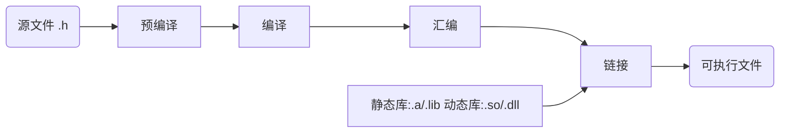
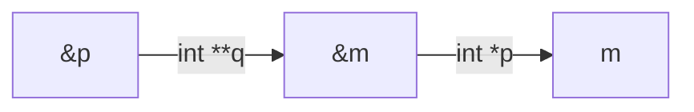
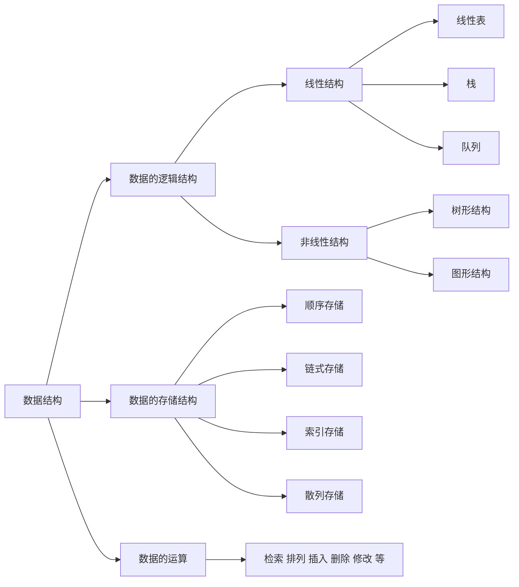

# GCC编译器

## GCC

1. 全称为GNU CC ，GNU项目中符合ANSI C标准的编译系统；
2. 编译如C、C++、Object C、Java、Fortran、Pascal、Modula-3和Ada等多种语言；
3. GCC是可以在多种硬体平台上编译出可执行程序的超级编译器，其执行效率与一般的编译器相比平均效率要高20%~30%；
4. 一个交叉平台编译器 ，适合在嵌入式领域的开发编译

gcc所支持后缀名解释 

1. ​    .c		           C原始程序
2. ​    .C/.cc/.cxx	C++原始程序
3. ​    .m		         Objective-C原始程序
4. ​    .i		            已经过预处理的C原始程序
5. ​    .ii		           已经过预处理的C++原始程序
6. ​    .s/.S	           汇编语言原始程序
7. ​    .h		           预处理文件(头文件)
8. ​    .o		           目标文件
9. ​    .a/.so	        编译后的库文件

## 编译器的主要组件

1. 分析器：分析器将源语言程序代码转换为汇编语言。因为要从一种格式转换为另一种格式（C到汇编），所以分析器需要知道目标机器的汇编语言。
2. 汇编器：汇编器将汇编语言代码转换为CPU可以执行字节码。
3. 链接器：链接器将汇编器生成的单独的目标文件组合成可执行的应用程序。链接器需要知道这种目标格式以便工作。
4. 标准C库：核心的C函数都有一个主要的C库来提供。如果在应用程序中用到了C库中的函数，这个库就会通过链接器和源代码连接来生成最终的可执行程序。

## GCC的基本用法和选项

Gcc最基本的用法是∶gcc [options] [filenames] 

1. -c，只编译，不连接成为可执行文件，编译器只是由输入的.c等源代码文件生成.o为后缀的目标文件，通常用于编译不包含主程序的子程序文件。 
2. -o output_filename，确定输出文件的名称为output_filename，同时这个名称不能和源文件同名。如果不给出这个选项，gcc就给出预设的可执行文件a.out。
3. -g，产生符号调试工具(GNU的gdb)所必要的符号资讯，要想对源代码进行调试，我们就必须加入这个选项。 
4. -O，对程序进行优化编译、连接，采用这个选项，整个源代码会在编译、连接过程中进行优化处理，这样产生的可执行文件的执行效率可以提高， 但是，编译、连接的速度就相应地要慢一些。
5. -O2，比-O更好的优化编译、连接，当然整个编译、连接过程会更慢。
6. -I  dirname，将dirname所指出的目录加入到程序头文件目录列表中，是在预编译过程中使用的参数。
7. -L  dirname，将dirname所指出的目录加入到程序函数档案库文件的目录列表中，是在链接过程中使用的参数。

## GCC编译过程

```c
#include<stdio.h>
int main(void)
{
    int i,j; 
    j=0;
    i=j+1;
    printf("hello,world\n");
    printf("the result is %d\n",i);
}
```

### 预处理(Pre-Processing) 

生成预处理代码；test.i比test.c增加了很多内容，主要是会展开头文件。

```sh
gcc -E ./test.c -o test.i
```

### 编译(Compiling)

生成汇编代码；检查语法错误,并生成汇编文件

```sh
gcc -S test.c -o test.s
```

### 汇编(Assembling)

生成目标代码

```sh
#方法一，用gcc直接从C源代码中生成目标代码
gcc -c test.c -o test.o
#方法二，用汇编器从汇编代码生成目标代码：
as test.s -o test.o
```

### 链接(Linking)

生成可执行程序；将目标程序链接库资源，生成可执行程序

```sh
gcc  test.s -o test
```

## GDB调试工具

首先使用gcc对test.c进行编译，注意一定要加上选项'-g'

```sh
gcc -g test.c -o test 
gdb test 
```

调试流程

| 功能         | 快捷键  |
| ------------ | ------- |
| 查看文件     | l       |
| 设置断点     | b 6     |
| 查看断点情况 | info b  |
| 运行代码     | r       |
| 查看变量值   | p n     |
| 单步运行     | n  /  s |
| 恢复程序运行 | c       |
| 退出         | q       |
| 帮助         | help    |

## 条件编译

常见的条件编译有两种方法：

1. 根据宏是否定义，其语法如下：

   ```c
   		#ifdef  <macro>
    		……
   		#else
     		……
   		#endif
   ```

   ```c
   #include<stdio.h>
   
   //#define  _DEBUG_
   int main () {
   
   #ifdef  _DEBUG_  // 当宏定了时
   //#ifndef  _DEBUG_ // 当宏没有定义时
           printf("The macro _DEBUG_ is defined\n");
   #else
           printf("The macro _DEBUG_ is not defined\n");
   #endif
   
   }
   ```

2. 根据宏的值，其语法如下：

   ```c
   		#if  <macro>
     		……
   		#else
   		……
   		#endif
   ```

   ```c
   #include<stdio.h>
   
   #define  _DEBUG_ 1
   int main () {
   
   #if _DEBUG_
           printf("The macro _DEBUG_ is defined\n");
   #else
           printf("The macro _DEBUG_ is not defined\n");
   #endif
   }
   ```

## 静态与动态链接库

### 库文件

1. 首先说明要对库有一个比较直观的理解。库是写好的现有的，成熟的，可以复用的代码。现实中每个程序都依赖很多基础的底层库，不可能每个人的代码都从零开始，公共代码需要反复使用，就把这些代码编译成为“库”文件，因此库的存在意义非同寻常。本质上说来库是一种可执行代码的二进制形式（注，其本身不可执行），可以被操作系统载入内存执行。
2. 静态库、动态库区别来自C语言在【链接阶段】如何处理库，链接成可执行程序：分别为静态链接方式、动态链接方式。



### 静态连接库

在链接阶段，会将汇编生成的目标文件.o与引用到的库一起链接打包到可执行文件中，因此对应的链接方式为静态链接。其实一个静态链接库可以简单看成一组目标文件(.o/.obj文件)的集合，连接器将从库文件取得所需的代码，复制到生成的可执行文件中即很多目标文件经过压缩打包后形成的一个文件。

1. 特点：可执行文件中包含了库代码的一份完整拷贝
2. 优点：程序在运行时就不需要函数库了。
3. 缺点：被多次使用就会多份冗余拷贝，因为所有相关的目标文件和牵涉到的函数库被链接合成一个可执行文件。生成的可执行文件较大。静态库升级后，程序需要重新编译链接。

### 动态链接库

动态：在程序编译是并不会被连接到目标代码中，而是在程序运行时才被载入。动态库独立于现有的程序，其本身不可执行，但包含着程序需要调用的一些函数，这种库称为动态（链接）库（Dynamic Link Library）。不同的应用程序如果调用相同的库，那么在内存里只需要有一份该共享库的实例，规避了空间浪费问题。特点：

1. 动态库把对一些库函数的链接载入推迟到程序运行时期
2. 可以实现进程之间的资源共享，（动态库也成为共享库）
3. 设置可以真正做到链接载入完全由程序员在程序代码中控制（显式调用）
4. 缺点：要使用的动态库自己必须添加到路径。而静态库直接打包到了可执行程序，运行时不需要额外东西。

### 库的生成与使用

实例：三个文件

hello.h

```c
#ifndef HELLO_H
#define HELLO_H

void hello(const char *name);

#endif //HELLO_H
```

hello.c

```c
#include <stdio.h>

void hello(const char *name)
{
  printf("Hello %s!/n", name);
}
```

main.c

```c
#include <stdio.h>
#include "hello.h"

int main()
{
  hello("everyone");
  return 0;
}
```

在main函数中要调用hello函数。如果我们直接编译，是通不过的。gcc main.c或者gcc -o main main.c会报错，因为无法找到调用导函数。

#### 静态库

linux下静态库的后缀名为.a文件，这时使用静态库来链接使用该hello函数。

##### 生成

1. 先将hello.c生成二进制文件gcc -c hello.c -o hello.o

2. 由.o文件创建静态库:静态库文件名的命名规范是以lib为前缀，紧接着跟静态库名，扩展名为.a。例如：将创建的静态库名为myhello，则静态库文件名就是libmyhello.a。在创建和使用静态库时，需要注意这点。创建静态库用ar命令。ar -cr libmyhello.a hello.o这里如果有多个.o文件可以在命令后面加入多个.o文件将他们一起打包成一个静态库文件。

   ar 参数：

   - c  禁止在创建库时产生的正常消息
   - r  如果指定的文件已经存在于库中，则替换它
   - s  无论 ar 命令是否修改了库内容都强制重新生成库符号表
   - v  将建立新库的详细的逐个文件的描述写至标准输出
   - q  将指定的文件添加到库的末尾
   - t  将库的目录写至标准输出 

3. 查看库中符号信息：nm

   ```bash
   [root@server01 linking]# nm libmyhello.a
   
   hello.o:
   0000000000000000 T hello
                    U printf
   ```

##### 使用

1. 编译：需要gcc命令编译，gcc main.c -o main生成可执行文件时会报错 ，所以需要指定静态库然后生成可执行文件
2. gcc main.c -o main -L . -l myhello。为何这么使用呢： -L ：表示要链接的库所在的目录。-L. 表示要链接的库在当前目录，当然可以指定其他目录。
3. -l (L的小写)：表示需要链接库的名称，注意不是库文件名称，比如库文件为 libmyhello.a，那么库名称为myhello。gcc会在静态库名前加上前缀lib，然后追加扩展名.a得到的静态库文件名来查找静态库文件。
4. 运行：静态库在编译生成可执行文件后，就包含在可执行文件中了，可以把静态库删掉 ，再执行./main程序，也不会出错（但是动态链接库就不行）。

#### 动态库

与创建静态库不同的是，不需要打包工具，直接使用编译器即可创建动态库。动态库名字linux下为.so后缀文件

##### 生成

1. 使用命令 gcc -shared -fPIC -o libmyhello.so hello.c 生成动态链接库libmyhello.so，后面源文件可以跟多个.c文件
2. 说明： -shared ：指定生成动态链接库 -fPIC： 表示编译为位置独立的代码，不用此选项的话编译后的代码是位置相关的所以动态载入时是通过代码拷贝的方式来满足不同进程的需要，而不能达到真正代码共享的目的。输出文件libmyhello.so 动态库文件名命名规范和静态库文件名命名规范类似，也是在动态库名增加前缀lib，但其文件扩展名为.so。例如：我们将创建的动态库名为myhello，则动态库文件名就是libmyhello.so

##### 使用

1. 编译： gcc main.c -o main -L . -l myhello 与链接静态库使用方法相同
2. 运行：动态链接实在运行时才进行的。执行./main程序时，可能报错，因为程序在运行时，会在/usr/lib和/lib等目录中查找需要的动态库文件。若找到，则载入动态库，否则将提示类似上述错误而终止程序运行。
3. 程序运行时有三种方式加载动态库路径（按优先级来）：
   1. 把库拷贝到/usr/lib和/lib目录下。
   2. 在LD_LIBRARY_PATH环境变量中加上库所在路径。（常用）例如动态库libmyhello.so在/home/ting/lib目录下，以bash为例，使用命令：export LD_LIBRARY_PATH=$LD_LIBRARY_PATH:/home/ting/lib
   3. 修改/etc/ld.so.conf文件，把库所在的路径加到文件末尾，并执行ldconfig刷新。这样，加入的目录下的所有库文件都可见。
4. Linux动态链接库的搜索路径按优先级排序为：
   1. 编译目标代码时指定的动态库搜索路径；在编译时通过gcc 的参数”-Wl,-rpath,”指定。当指定多个动态库搜索路径时，路径之间用冒号”：”分隔。
   2. 环境变量LD_LIBRARY_PATH指定的动态库搜索路径；
   3. 配置文件/etc/ld.so.conf中指定的动态库搜索路径；
   4. 默认的动态库搜索路径/lib；
   5. 默认的动态库搜索路径/usr/lib；
5. 当运行成功后，如果把ibmyhello.so文件删除。再执行main程序会发现程序报错。说明动态库是在运行时加载的，也就是在运行的时候，动态库必须存在，不然程序就找不到要调用的函数。

##### 使用ldd

dd查看某个可运行程序在运行时所要用的动态库.so：ldd ./example

#### 注意

当动态库和静态库同名存在时，默认使用的是动态库。也就是不会将静态库编译到可执行文件中去。

# Makefile

## Make

1. 工程管理器，顾名思义，是指管理较多的文件 
2. Make工程管理器也就是个“自动编译管理器”，这里的“自动”是指它能够根据文件时间戳。自动发现更新过的文件而减少编译的工作量，同时，它通过读入Makefile文件的内容来执行大量的编译工作 
3. Make将只编译改动的代码文件，而不用完全编译。

## Makefile

 Makefile是Make读入的唯一配置文件 

1. 由make工具创建的目标体（target），通常是目标文件或可执行文件
2. 要创建的目标体所依赖的文件（dependency_file）
3. 创建每个目标体时需要运行的命令（command）
4. 注意:命令行前面必须是一个”TAB键”,否则编译错误为:*** missing separator.  Stop.

Makefile格式

target  :   dependency_files

<TAB>  command

例子

hello.o :  hello.c hello.h

​	gcc  –c  hello.c  –o  hello.o

实验1:

f1.c

```c
#include<stdio.h>

int print1() {
    printf("i'm f1.c\n");
}
```

f2.c

```c
#include<stdio.h>

int print2() {
    printf("i'm f2.c\n");
}
```

head.h

```c
void print1();
void print2();
```

main.c

```c
#include<stdio.h>
#include "head.h"

int main() {
        print1();
        print2();
}
```

```makefile
test: f1.o f2.o main.o
        gcc f1.o f2.o main.o -o test
f1.o: f1.c
        gcc -c f1.c -o f1.o
f2.o: f2.c
        gcc -c f2.c -o f2.o
main.o: main.c
        gcc -c main.c -o main.o
.PHONY: clean
clean:
        rm *.o test
```

```bash
[root@server01 make]# make
gcc -c f1.c -o f1.o
gcc -c f2.c -o f2.o
gcc -c main.c -o main.o
gcc f1.o f2.o main.o -o test
[root@server01 make]#
```

比如我们修改f2.c文件后再使用make进行编译，发现它只会重新编译修改过的f2.c文件：

```bash
[root@server01 make]# make
gcc -c f2.c -o f2.o
gcc f1.o f2.o main.o -o test
[root@server01 make]#
```

在make过程成会生成很多编译结果文件.o，如果想在构建完成后删除这些中间的编译结果文件可以在Makefile文件的后面添加规则：clean: rm*.o，然后在make完之后再执行make clean；但是如果目录中出现了"clean"文件，则规则失效了：没有依赖文件，文件"clean"始终是最新的，命令永远不会执行（相当于make会认为这里的clean:跟前面f1.o: f1.c一样，需要生成clean文件，而此时目录中又有clean文件并且是最新的，所以后面的命令不会执行）；此时可以使用PHONY，告诉make后面跟着的名称不是指文件名，那么make xxxx 就表示执行xxxx :指定的命令，而不是要（make）生成xxxx

### 变量

使用变量的目的：用来代替一个文本字符串，创建变量VAR=var；变量使用$(VAR)。例如：

```makefile
OBJS = kang.o yul.o
CC = gcc
CFLAGS = -Wall -O -g
sunq : $(OBJS)
$(CC) $(OBJS) -o sunq
kang.o : kang.c kang.h
$(CC) $(CFLAGS) -c kang.c -o kang.o
yul.o : yul.c yul.h
$(CC) $(CFLAGS) -c yul.c -o yul.o
```

### 预定义变量

| 名称 | 含义                                                         |
| ---- | ------------------------------------------------------------ |
| AR   | 库文件维护程序的名称，默认值为ar。AS汇编程序的名称，默认值为as。 |
| CC   | C编译器的名称，默认值为cc。CPP  C预编译器的名称，默认值为$(CC) –E。 |
| CXX  | C++编译器的名称，默认值为g++。                               |
| FC   | FORTRAN编译器的名称，默认值为f77                             |
| RM   | 文件删除程序的名称，默认值为rm -f                            |

```makefile
Hello: main.c main.h 
<tab> $(CC) –o hello main.c
clean:
<tab> $(RM) hello
```

| 名称     | 含义                             |
| -------- | -------------------------------- |
| ARFLAGS  | 库文件维护程序的选项，无默认值。 |
| ASFLAGS  | 汇编程序的选项，无默认值。       |
| CFLAGS   | C编译器的选项，无默认值。        |
| CPPFLAGS | C预编译的选项，无默认值。        |
| CXXFLAGS | C++编译器的选项，无默认值。      |
| FFLAGS   | FORTRAN编译器的选项，无默认值。  |

```makefile
OBJS = kang.o yul.o
CC = gcc	
CFLAGS = -Wall -O -g
sunq : $(OBJS)
$(CC) $(OBJS) -o sunq
kang.o : kang.c kang.h
$(CC) $(CFLAGS) -c kang.c -o kang.o
yul.o : yul.c yul.h
$(CC) $(CFLAGS) -c yul.c -o yul.o
```

### 自动变量

| 名称 | 含义                                                         |
| ---- | ------------------------------------------------------------ |
| $*   | 不包含扩展名的目标文件名称                                   |
| $+   | 所有的依赖文件，以空格分开，并以出现的先后为序，可能 包含重复的依赖文件 |
| $<   | 第一个依赖文件的名称                                         |
| $?   | 所有时间戳比目标文件晚的的依赖文件，并以空格分开             |
| $@   | 目标文件的完整名称                                           |
| $^   | 所有不重复的目标依赖文件，以空格分开                         |
| $%   | 如果目标是归档成员，则该变量表示目标的归档成员名称           |

```makefile
OBJS = kang.o yul.o
CC = gcc
CFLAGS = -Wall -O -g
sunq : $(OBJS)
$(CC) $^ -o $@
kang.o : kang.c kang.h 
$(CC) $(CFLAGS) -c $< -o $@
yul.o : yul.c yul.h
$(CC) $(CFLAGS) -c $< -o $@
```

### 选项

| 选项 | 说明                                             |
| ---- | ------------------------------------------------ |
| -C   | dir读入指定目录下的Makefile                      |
| -f   | file读入当前目录下的名称为xxxx的文件作为Makefile |
| -i   | 忽略所有的命令执行错误                           |
| -I   | dir指定被包含的Makefile所在目录                  |
| -n   | 只打印要执行的命令，但不执行这些命令             |
| -p   | 显示make变量数据库和隐含规则                     |
| -s   | 在执行命令时不显示命令                           |
| -w   | 如果make在执行过程中改变目录，打印当前目录名     |

### 隐含规则

#### 隐含规则1

编译C程序的隐含规则

“<n>.o”的目标的依赖目标会自动推导为“<n>.c”，并且其生成命令是“$(CC) –c $(CPPFLAGS) $(CFLAGS)”

```makefile
test: f1.o f2.o main.o
        gcc f1.o f2.o main.o -o test
f1.o: f1.c
f2.o: f2.c
main.o: main.c
.PHONY: clean
clean:
        rm *.o
```

#### 隐含规则2

链接Object文件的隐含规则

“<n>” 目标依赖于“<n>.o”，通过运行C的编译器来运行链接程序生成（一般是“ld”），其生成命令是：“$(CC) $(LDFLAGS) <n>.o $(LOADLIBES) $(LDLIBS)”。这个规则对于只有一个源文件的工程有效，同时也对多个Object文件（由不同的源文件生成）的也有效。例如如下规则：

x : x.o y.o z.o

并且“x.c”、“y.c”和“z.c”都存在时，隐含规则将执行如下命令：

cc -c x.c -o x.o

cc -c y.c -o y.o

cc -c z.c -o z.o

cc x.o y.o z.o -o x

如果没有一个源文件（如上例中的x.c）和你的目标名字（如上例中的x）相关联，那么，你最好写出自己的生成规则，不然，隐含规则会报错的。

```makefile
test: f1.o f2.o main.o
        gcc f1.o f2.o main.o -o test
.PHONY: clean
clean:
        rm *.o
```

### VPATH

1. 在一些大的工程中，有大量的源文件，我们通常的做法是把这许多的源文件分类，并存放在不同的目录中。所以，当make需要去找寻文件的依赖关系时，你可以在文件前加上路径，但最好的方法是把一个路径告诉make，让make在自动去找。
2. Makefile文件中的特殊变量“VPATH”就是完成这个功能的，如果没有指明这个变量，make只会在当前的目录中去找寻依赖文件和目标文件。如果定义了这个变量，那么，make就会在当当前目录找不到的情况下，到所指定的目录中去找寻文件了。
3. VPATH = src:../headers
4. 上面的的定义指定两个目录，“src”和“../headers”，make会按照这个顺序进行搜索。目录由“冒号”分隔。（当然，当前目录永远是最高优先搜索的地方）

```makefile
CFLAGS=-c -Wall -I include
VPATH=src1 src2 main
f1:f1.o f2.o main.o
.PHONY:clean
clean:
	find ./ -name "*.o" -exec rm {} \;;rm f1
```

### 嵌套

./Makefile

```makefile
CC=gcc
SUBDIRS=f1 \
                f2 \
                main \
                obj
OBJS=f1.o f2.o main.o
BIN=myapp
OBJS_DIR=obj
BIN_DIR=bin
export CC OBJS BIN OBJS_DIR BIN_DIR

all:CHECK_DIR $(SUBDIRS)
CHECK_DIR:
        mkdir -p $(BIN_DIR)
$(SUBDIRS):ECHO
        make -C $@
ECHO:
        @echo $(SUBDIRS)
        @echo begin compile
CLEAN:
        @$(RM) $(OBJS_DIR)/*.o
        @rm -rf $(BIN_DIR)
```

./bin目录：

./f1目录：

------/f1/f1.c

```c
#include <stdio.h>

void printf1()
{
        printf("this is f1!\n");
        return;
}
```

------/f1/Makefile

```makefile
../$(OBJS_DIR)/f1.o:f1.c
        $(CC) -c $^ -o $@
```

f2目录

------/f2/f2.c

```c
#include <stdio.h>

void printf2()
{
        printf("this is f2!\n");
        return;
}
```

------/f2/Makefile

```makefile
../$(OBJS_DIR)/f2.o:f2.c
        $(CC) -c $^ -o $@
```

include目录：

------/include/myinclude.h

```c
#include <stdio.h>
```

main目录：

------/main/main.c

```c
#include "../include/myinclude.h"
void printf1();
void printf2();

int main(int argc, const char *argv[])
{
        printf1();
        printf2();

        printf("end main\n");
        return 0;
}
```

------/main/Makefile

```makefile
../$(OBJS_DIR)/main.o:main.c
        $(CC) -c $^ -o $@
```

obj目录：

------/obj/Makefile

```makefile
../$(BIN_DIR)/$(BIN):$(OBJS)
        $(CC) -o $@ $^
```

# 数据类型

## 基本类型

### 整型

C语言中的整型包括signed和unsigned两大类；

#### short

| 类型名称            | 长度(字节) | 值域         |
| ------------------- | ---------- | ------------ |
| short(signed short) | 2          | -32768~32767 |
| unsigned short      | 2          | 0~65536      |

#### int

| 类型名称        | 长度(字节) | 值域                   |
| --------------- | ---------- | ---------------------- |
| int(signed int) | 4          | -2147483648~2147483647 |
| unsigned int    | 4          | 0~4294967295           |

#### long

### 字符型

#### char

| 类型名称          | 长度(字节) | 值域     |
| ----------------- | ---------- | -------- |
| char、signed char | 1          | -128~127 |
| unsigned char     | 1          | 0~255    |

```c
#include <stdio.h>

int main() {
    char ch;
    ch = 65;
    //ch = 128; // 出错，数据越界(-128)
    //ch = 129; // 出错，数据越界(-127)
    //unsigned char ch  = -1; // 出错，数据越界(255)
    printf("ch=%d,%c\n",ch,ch);
}
```

### 实型

#### float

#### double

### 枚举型

#### enum

## 构造类型

### 数组

### 结构体

#### struct

### 共用体

#### union

## 指针类型

## 空类型

### void

## 布尔型

不是基本类型，对bool型的使用必须引入头文件：#include<stdbool.h>

bool：非零(true)，零(false)

```c
#include<stdio.h>
#include<stdbool.h>

int main() {
    bool a;
    //a = false;
    a = -1;
    if (a) {
        printf("true %d\n",a);
    }
    else {
        printf("false %d\n",a);
    }
   return 0;
}
```

可以通过如下命令输出c语言的预处理过程（将一些宏进行展开），可以找到stdbool.h在系统中的存放位置，从而观察stdbool.h的具体实现，从stdbool.h的实现可以看到，c语言后来引入了一种新的基本数据类型：_Bool，所以我们可以在代码中直接定义_Bool类型的变量来代替引入#include<stdbool.h>的方式。

gcc -E helloworld.c -o hello.i

```c
# 943 "/usr/include/stdio.h" 3 4

# 2 "helloworld.c" 2
# 1 "/usr/lib/gcc/x86_64-redhat-linux/4.8.5/include/stdbool.h" 1 3 4
# 3 "helloworld.c" 2

int main() {
    _Bool a;

    a = -1;
    if (a) {
        printf("true %d\n",a);
    }
    else {
        printf("false %d\n",a);
    }
   return 0;
}
```

# 常量

常量是指在程序运行期间其数值不发生变化的数据。

## 整型常量

整型常量通常简称为整数。整数可以是十进制数、八进制数和十六进制数。例如，十进制的数值3356可以有下列两种不同的表示形式：

- 八进制：06434
- 十六进制：0xd1c 

```c
#include <stdio.h>

int main() {

    int a = 0xd;
    printf("%d %x %o\n",a,a,a); // 分别打印出十进制、十六进制和八进制。
}
```

## 浮点常量

浮点常量又称为实数，一般含有小数部分，在C语言中，实数只有十进制的实数，分为单精度和双精度。实数有两种表示方法，即一般形式和指数形式。

一般形式的实数基本形式如下：

例如，3.5、-12.5、3.1415926

指数形式的

例如：1.176e+10表示1.176x10的十次方、-3.5789e-8表示-3.5789x10的负八次方

```c
#include <stdio.h>

int main() {

    float b = 3.5e+10;
    printf("%e %f\n",b,b);; // 分别打印出一般形式和指数形式。
}
```

## 字符常量

字符常量是指一个单一字符，其表示形式是由两个单引号包括的一个字符。(只有ASCII码表中的字符才能被单引号引起来)在C语言中，字符常量具有数值。字符常量的值就是ASCII码值。可以把字符常量看做一个字节的正整数。

```c
#include <stdio.h>

int main() {
    char a,b,u,v;
    a = 'F';        // 将70赋值给a;即：a = 70;
    b = 'A' + 2;    // b存放的是'C'字符j；即：b = 65 + 2;
    u = ' ' + 'B';  // u存放的是'b'字符；相当于SPACE的ASCII码值加上'B'的ASCII码值；即：u = 32 + 66；
    v = 'b' - 32;   // v存放的是'B'字符；v = 97 - 32;

    printf("%d %d %d %d\n",a,b,u,v);
    printf("%c %c %c %c\n",a,b,u,v);
}
```

## 字符串常量

所谓字符串常量是指用双引号括起来的一串字符来表示的数据。字符串以\0结尾

```c
# include<stdio.h>

int main () {

    char arr1[] = {"abc"};               // 会自动添加一个'\0'作为结尾，通过sizeof可以看到它占用的空间为4，因此可知该字符串包含一个隐藏的结束符\0
    char arr2[] = {'a', 'b', 'c', '\0'};
    printf("%d %d\n",sizeof(arr1),sizeof(arr2));
    printf("%s %s\n",arr1,arr2);
}
```

## 标识常量

所谓标识常量是指用标识符代替常量使用的一种常量，其名称通常是一个标识符。标识常量也叫符号常量，一般用大写英文字母的标识符。在使用之前必须预先定义。说明形式为:# define <标识常量名称> <常量>。定义一个宏名字之后，可以在其他宏定义中使用，例如：

```c
#include <stdio.h>

#define ONE 1
#define TWO ONE + ONE

int main() {
    int a = 10,b = 20,c;
    // 注意在使用宏的时候，不会进行计算，而是直接替换，比如 TWO = ONE + ONE 展开后不是把1+1的结果赋值给TWO，而是将TWO里面的ONE用1替换，同样如果把#define ONE 1+1，那么在运算的时候也是把使用到ONE的地方替换成1+1
    c = ONE + TWO * b + a; // 等价于 1 + 1 + 1 * 20 + 10 =32
    printf("%d\n",c);
    return 0;
} 
```

# 变量

1. 变量名由字母、数字、下划线组成，不能以数字开头，不能和C的关键字重名；
2. 在程序运行时，变量占据存储空间的大小由其数据类型决定；
3. 变量在内存空间中的首地址，称为变量的地址。

变量在程序中使用时，必须预先说明它们的存储类型和数据类型。

变量说明的一般形式：

<存储类型> <数据类型> <变量名>；

## 存储类型

存储类型有四种：auto、register、static和extern，默认是auto

### auto

auto说明的变量只能在某个程序范围内使用，通常在函数体内或函数中的复合语句里。（默认是随机值）在函数体的某程序段内说明auto存储类型的变量时可以省略关键字auto。

```c
#include <stdio.h>

int main() {

    if (1) {
        int a;
        printf("%d\n",a);
    }
    //printf("%d\n",a); // 编译报错 int.c:9:19: 错误：‘a’未声明(在此函数内第一次使用)
}
```

### register

1. register称为寄存器型，register变量是想将变量放入CPU的寄存器中，这样可以加快程序的运行速度。如申请不到就使用一般内存，同auto ;
2. register变量必须是能被CPU所接受的类型。这通常意味着register变量必须是一个单个的值，并且长度应该小于或者等于整型的长度。不能用“&”来获取register变量的地址。
3. 由于寄存器的数量有限，真正起作用的register修饰符的数目和类型都依赖于运行程序的机器。在某些情况下，把变量保存在寄存器中反而会降低程序的运行速度。因为被占用的寄存器不能再用于其它目的；或者变量被使用的次数不够多，不足以装入和存储变量所带来的额外开销。

### static

static变量称为静态存储类型的变量，既可以在函数体内(局部变量)，也可在函数体外说明(全局变量)。(默认是0）局部变量使用static修饰,有以下特点:

1. 在内存中以固定地址存放的，而不是以堆栈方式存放
2. 只要程序没结束，就不会随着说明它的程序段的结束而消失，它下次再调用该函数，该存储类型的变量不再重新说明，而且还保留上次调用存入的数值

###  extern

1. 当变量在一个文件中的函数体外说明，所有其他文件中的函数或程序段都可引用这个变量。
2. extern称为外部参照引用型，使用extern说明的变量是想引用在其它文件中函数体外部说明的变量。
3. static修饰的全部变量，其它文件无法使用。

```c
int global_a = 100;
```

```c
#include <stdio.h>

extern int global_a;

int main() {

    printf("global_a=%d\n",global_a);
    return 0;
}
```

```sh
[root@server01 C]# gcc extern_static1.c extern_static2.c
[root@server01 C]# ./a.out
global_a=100
```

# 结构体

## 简述

1. 在实际的处理对象中，有许多信息是由多个不同类型的数据组合在一起进行描述，而且这些不同类型的数据是互相联系组成了一个有机的整体。此时，就要用到一种新的构造类型数据——结构体（structure），简称结构。
2. 结构体的使用为处理复杂的数据结构（如动态数据结构等）提供了有效的手段，而且，它们为函数间传递不同类型的数据提供了方便。

## 概念

1. 结构体是用户自定义的新数据类型，在结构体中可以包含若干个不同数据类型和不同意义的数据项（当然也可以相同），从而使这些数据项组合起来反映某一个信息。
2. 例如，可以定义一个职工worker结构体，在这个结构体中包括职工编号、姓名、性别、年龄、工资、家庭住址、联系电话。这样就可以用一个结构体数据类型的变量来存放某个职工的所有相关信息。并且，用户自定义的数据类型worker也可以与int、double等基本数据类型一样，用来作为定义其他变量的数据类型

## 定义

定义一个结构体类型的一般形式为：

```c
struct  结构体名
{
 数据类型　　　成员名1;
 数据类型　　　成员名2;
 ：
 数据类型　　　成员名n;
 };
```

在大括号中的内容也称为“成员列表”或“域表”。其中，每个成员名的命名规则与变量名相同；数据类型可以是基本变量类型和数组类型，或者是一个结构体类型；用分号";"作为结束符。整个结构的定义也用分号作为结束符。

```c
#include <stdio.h>
#include <string.h>

#define N 32

struct student{
        int no;
        char name[N];
        float score;
}s3 = {3,"s3",90},s4 = {4,"s4",89};

int main(int argc, const char *argv[])
{
        struct student s1,s2;
        strcpy(s1.name,"s1");
        s1.score = 90;
        s1.score = 99;
        s1.name[0] = 'S';
        printf("%d %s %.2f\n",s1.no,s1.name,s1.score);
        s2 = s1;
        s2.no =2;
        printf("%d %s %.2f\n",s2.no,s2.name,s2.score);
        printf("%d %s %.2f\n",s3.no,s3.name,s3.score);
        printf("%d %s %.2f\n",s4.no,s4.name,s4.score);
        return 0;
}
```

```c
#include <stdio.h>
#include <string.h>

#define N 32

struct student{
        int no;
        char name[N];
        struct birthday{
                int year;
                int month;
                int day;
        }date;
        float score;
}s1 = {1,"s1",{1992,9,9},89};

int main(int argc, const char *argv[])
{
        struct student s2;
        s2.no = 2;
        strcpy(s2.name,"s2");
        s2.date.year = 1993;
        s2.date.month = 10;
        s2.date.day = 10;
        s2.score = 99;
        printf("%d %s %d-%d-%d %.2f\n",s1.no,s1.name,s1.date.year,s1.date.month,s1.date.day,s1.score);
        printf("%d %s %d-%d-%d %.2f\n",s2.no,s2.name,s2.date.year,s2.date.month,s2.date.day,s2.score);
        return 0;
}
```

## 结构体数组

具有相同结构体类型的结构体变量也可以组成数组，称它们为结构体数组。结构体数组的每一个数组元素都是结构体类型的数据，它们都分别包括各个成员（分量）项。定义结构体数组的方法和定义结构体变量的方法相仿，只需说明其为数组即可。

可以采用三种方法：

1. 先定义结构体类型，再用它定义结构体数组。

   ```c
   struct student
   {
       char name[20];
       char sex;
       int age;
       char addr[20];
   };
   struct student stu[3]; 
   ```

2. 在定义结构体类型同时定义结构体数组。

   ```c
   struct student
   {
       char name[20];
       char sex;
       int age;
       char addr[20];
   }stu[3]; 
   ```

3. 直接定义结构体数组

   ```c
   struct 
   {
       char name[20];
       char sex;
       int age;
       char addr[20];
   }stu[3]; 
   ```

## 结构体数组的初始化

结构体数组在定义的同时也可以进行初始化，并且与结构体变量的初始化规定相同，只能对全局的或静态存储类别的结构体数组初始化。

## 结构体数组的使用

一个结构体数组的元素相当于一个结构体变量，因此前面介绍的有关结构体变量的规则也适应于结构体数组元素。

```c
#include <stdio.h>

#define N 20

struct student{
        int no;
        char name[N];
        float score;
}s5[5];

int main(int argc, const char *argv[])
{
        // 可以将一个结构体数组元素值赋给同一结构体类型的数组中的另一个元素，或赋给同一类型的变量。
        struct student stu[3] = {{1,"s1",90},{2,"s2",91},{3,"s3",99}};
        struct student student1;
        student1=stu[0];
        printf("no=%d;name=%s;score=%f\n",student1.no,student1.name,student1.score);
        return 0;
}
```

## 结构体指针

可以设定一个指针变量用来指向一个结构体变量。此时该指针变量的值是结构体变量的起始地址，该指针称为结构体指针。结构体指针与前面介绍的各种指针变量在特性和方法上是相同的。与前述相同，在程序中结构体指针也是通过访问目标运算“*”访问它的对象。 结构体指针在程序中的一般定义形式为：struct 结构体名  *结构指针名；其中的结构体名必须是已经定义过的结构体类型。当表示指针变量p所指向的结构体变量中的成员时，"（*结构体指针名）.成员名"这种表示形式总是需要使用圆括号，显得很不简炼。因此，对于结构体指针指向的结构体成员项，给出了另外一种简洁的表示方法，如下表示：结构体指针名->成员名。它与前一种表示方法在意义上是完全等价的。例如，结构体指针p指向的结构体变量中的成员name可以表示如下：（*p）.name 或 p->name

```c
#include <stdio.h>

#define N 20

struct student{
        int no;
        char name[N];
        float score;
};

int main(int argc, const char *argv[])
{
        int i;
        struct student s1[] = {{1,"s1",90},{2,"s2",91},{3,"s3",99}};
        struct student *p;
        //p = s1;
        p = &s1[0];
        printf("s1=%p;s1[0]=%p;&s1[0]=%p\n",s1,s1[0],&s1[0]);
        for(i = 0;i < sizeof(s1)/sizeof(struct student);i++)
        {
                printf("--%d-%s-%f--\n",p->no,p->name,(*p).score);
                p++;
        }
        return 0;
}
```

# 共用体

在C语言中，不同数据类型的数据可以使用共同的存储区域，这种数据构造类型称为共用体，简称共用，又称联合体。共用体在定义、说明和使用形式上与结构体相似。两者本质上的不同仅在于使用内存的方式上。例如定义一个共用体类型union gy，它由三个成员组成，这三个成员在内存中使用共同的存储空间。由于共用体中各成员的数据长度往往不同，所以共用体变量在存储时总是按其成员中数据长度最大的成员占用内存空间。在这一点上共用体与结构体不同，结构体类型变量在存储时总是按各成员的数据长度之和占用内存空间。

```c
#include <stdio.h>

union gy{
        char a;
        short b;
        int c;
}v2;

int main(int argc, const char *argv[])
{
        union gy v1;
        printf("%d %d %d\n",sizeof(char),sizeof(short),sizeof(int));
        printf("%d\n",sizeof(union gy));
        // 在使用共用体类型变量的数据时要注意：在共用体类型变量中起作用的成员是最后一次存放的成员，在存入一个新的成员后原有的成员就失去作用。
        // 如有以下赋值语句：完成以上三个赋值运算以后，v1.c是有效的，v1.a和v1.b已经无意义了。
        v1.a = 'A';
        v1.b = 20;
        //
        v1.c = 0x12345678;
        printf("%#x %#x\n",v1.a,v1.b);
        printf("%p %p %p \n",&v1.a,&v1.b,&v1.c);

        int i;
        char *p;
        p = (char *)&v1;
        for(i = 0;i < sizeof(union gy);i++)
        {
                printf("%#x\n",*p);
                p++;
        }

        return 0;
}
```

# typedef

在C语言中，允许使用关键字typedef定义新的数据类型。typedef   <已有数据类型>   <新数据类型>；

如：typedef  int INTEGER; 这里新定义了数据类型INTEGER, 其等价于int；INTEGER i;  <==> int  i；typedef  int为数据类型，INTEGER为别名。

# 内存管理

C/C++定义了4个内存区间：代码区/全局变量与静态变量区/局部变量区即栈区/动态存储区，即堆区。

## 静态存储分配

1. 通常定义变量，编译器在编译时都可以根据该变量的类型知道所需内存空间的大小，从而系统在适当的时候为他们分配确定的存储空间。
2. 函数执行结束时这些存储单元自动被释放。栈内存分配运算内置于处理器的指令集中，效率很高，但是分配的内存容量有限。

## 动态存储分配

1. 有些操作对象只有在程序运行时才能确定，这样编译器在编译时就无法为他们预定存储空间，只能在程序运行时，系统根据运行时的要求进行内存分配。
2. 只能在程序运行时，系统根据运行时的要求进行内存分配。
3. 从堆上分配，亦称动态内存分配。程序在运行的时候用malloc申请任意多少的内存，程序员自己负责在何时用free释放内存。动态内存的生存期由我们决定，使用非常灵活，但问题也最多。
4. 当程序运行到需要一个动态分配的变量或对象时，必须向系统申请取得堆中的一块所需大小的存贮空间，用于存贮该变量或对象。当不再使用该变量或对象时，也就是它的生命结束时，要显式释放它所占用的存贮空间，这样系统就能对该堆空间进行再次分配，做到重复使用有限的资源。
5. 当程序运行到需要一个动态分配的变量或对象时，必须向系统申请取得堆中的一块所需大小的存贮空间，用于存贮该变量或对象。当不再使用该变量或对象时，也就是它的生命结束时，要显式释放它所占用的存贮空间，这样系统就能对该堆空间进行再次分配，做到重复使用有限的资源。

### malloc

void * malloc(size_t num)

1. malloc函数本身并不识别要申请的内存是什么类型，它只关心内存的总字节数。 
2. malloc申请到的是一块连续的内存，有时可能会比所申请的空间大。其有时会申请不到内存，返回NULL。
3. malloc返回值的类型是void *，所以在调用malloc时要显式地进行类型转换，将void * 转换成所需要的指针类型。 

### free

void  free(void *p)

1. 如果free的参数是NULL的话，没有任何效果。
2. 释放一块内存中的一部分是不被允许的。

### 注意事项

1. 删除一个指针p（free(p);）,实际意思是删除了p所指的目标（变量或对象等），释放了它所占的堆空间，而不是删除ｐ本身，释放堆空间后，ｐ成了空悬指针；动态分配失败。返回一个空指针（NULL），表示发生了异常，堆资源不足，分配失败。malloc与free是配对使用的， free只能释放堆空间。如果malloc返回的指针值丢失，则所分配的堆空间无法回收，称内存泄漏，同一空间重复释放也是危险的，因为该空间可能已另分配，所以必须妥善保存malloc返回的指针，以保证不发生内存泄漏，也必须保证不会重复释放堆内存空间。
2. 动态分配的变量或对象的生命期。无名对象的生命期并不依赖于建立它的作用域，比如在函数中建立的动态对象在函数返回后仍可使用。我们也称堆空间为自由空间（free store）就是这个原因。但必须记住释放该对象所占堆空间，并只能释放一次，在函数内建立，而在函数外释放是一件很容易失控的事，往往会出错。

### 野指针

不是NULL指针，是指向“垃圾”内存(指向预期之外的内存)的指针。“野指针”是很危险的。“野指针”的成因：

1. 指针变量没有被初始化。
2. 指针p被free之后，没有置为NULL，让人误以为p是个合法的指针。

野指针的操作超越了变量的作用范围。这种情况让人防不胜防。

```c
#include <stdio.h>
#include <stdlib.h>

char * get_string()
{

        //char s[] = "welcome"; //(有警告)局部变量，放在栈上，函数结束自动销毁
        //static char s[] = "welcome";  //静态存储区，从分配开始，到程序结束才被回收。
        //char *s = "welcome";  //指针，字符串常量，不允许修改。
        char * s;
        s = (char *)malloc(10*sizeof(char));
        if(s == NULL)
        {
                printf("malloc failed\n");
                return 0;
        }
        printf("input:");
        scanf("%s",s);
        printf("%s\n",s);
        // 这里的s是通过动态内存分配得到的所以是堆上的(跟创建在栈上的局部变量不一样)，函数执行完后地址不会被回收，所以返回的地址主函数能正常接收到；
        return s;          //要保证返回的地址能被主函数正常接收到
}

int main(int argc, const char *argv[])
{
        char *p;
        p = get_string();
        printf("%s\n",p);
        free(p);
        p = NULL;
        return 0;
}
```

# 运算符

## 算术运算符

| 运算符 | 功能说明 |
| ------ | -------- |
| +      | 加       |
| -      | 减       |
| *      | 乘法     |
| /      | 除法     |
| %      | 取模     |
| ++     | 自增     |
| --     | 自减     |

## 关系运算符

| 运算符 | 功能说明 |
| ------ | -------- |
| >      | 大于     |
| >=     | 大于等于 |
| <      | 小于     |
| <=     | 小于等于 |
| ==     | 等于     |
| !=     | 不等于   |

## 逻辑运算符

| 运算符 | 功能说明 |
| ------ | -------- |
| !      | 逻辑反   |
| &&     | 逻辑与   |
| \|\|   | 逻辑或   |

## 位运算符

| 运算符 | 功能说明                     |
| ------ | ---------------------------- |
| ~      | 位逻辑反                     |
| &      | 位逻辑与                     |
| \|     | 位逻辑或                     |
| ^      | 位逻辑异或(相同为0，相反为1) |
| >>     | 右移位                       |
| <<     | 左移位                       |

## 特殊运算符

### 逗号运算符

注意事项：逗号运算符( , )是C语言运算符中优先级最低的一种运算符。

```c
#include <stdio.h>

int main() {

  int a,s,d;
  s = 2;
  d = 3;
  // 先算括号内的值：s+2=4，d+4=7；括号内应为（4,7），括号内取值只取最后一个，如
果没有括号则取第一个；a=12+7=19。
  a = 12 + ( s + 2, d + 4 );
  int x,y,z;
  // 是首先把y赋值为3,把y递增为4,然后把4加上2,把结果6赋值给z,接下来把z加5最后把x赋为结果值11。
  x=(y=3,(z = ++y+2) +5);
  printf("a=%d\n",a);
  printf("x=%d\n",x);
}
```

# 输入输出

## 数据输出

C语言无I/O语句，I/O操作由函数实现：#include <stdio.h>

### 字符输出函数

格式: putchar( c )

参数: c为字符常量、变量或表达式

功能：把字符c输出到显示器上

返值：正常，为显示的代码值；

```c
#include <stdio.h>
main()
{   
    int c;
    char a;
    c=65;  a='B';
    putchar(c); putchar('\n'); putchar(a);
}
```

### 格式输出函数

格式：printf(“格式控制串”，输出表)

功能：按指定格式向显示器输出数据

输出表：要输出的数据

格式控制串：包含两种信息

- 格式说明：%[修饰符]格式字符，用于指定输出格式
- 普通字符：原样输出

#### 格式符

| 格式符 | 作用               |
| ------ | ------------------ |
| i,d    | 十进制整数         |
| x,X    | 十六进制无符号整数 |
| o      | 八进制无符号整数   |
| u      | 无符号十进制整数   |
| c      | 单一字符           |
| s      | 字符串             |
| e,E    | 指数形式浮点小数   |
| f      | 小数形式浮点小数   |
| g      | e和f较短一种       |
| p      | 地址、指针         |
| %%     | 百分号本身         |

#### 修饰符

| 修饰符 | 功能                                               |
| ------ | -------------------------------------------------- |
| m      | 输出数据域宽，数据长度<m，左补空格；否则按实际输出 |
| .n     | 对实数，指定小数点后位数(四舍五入)                 |
| .n     | 对字符串，指定实际输出位数                         |
| -      | 输出数据在域内左对齐(缺省右对齐)                   |
| +      | 指定在有符号数的正数前显示正号(+)                  |
| 0      | 输出数值时指定左边不使用的空位置自动填0            |
| #      | 在八进制和十六机制数前显示前导0，0x                |
| l      | 在d,o,x,u前，指定输出精度为long型                  |
| l      | 在e,f,g前，指定输出精度为double型                  |

```c
#include <stdio.h>

int main() {
    int a=1234;
    float f=123.456;
    char ch='a';
    printf("%8d,%2d\n",a,a);
    printf("%f,%8f,%8.1f,%.2f\n",f,f,f,f);
    printf("%3c\n",ch);
    char b[]="Hello,world!";
    printf("%s\n%15s\n%10.5s\n%2.5s\n%.3s\n",b,b,b,b,b);
    int c=1234;
    float g=123.456;
    printf("%08d\n",c);
    printf("%010.2f\n",g);
    printf("%0+8d\n",c);
    printf("%0+10.2f\n",g);
}
```

## 数据输入

### 字符输入函数

字符输入函数getchar

格式:  getchar( )

功能：从键盘读一字符

返值：正常，返回读取的代码值；出错或结束键盘输入,返回-1 （ctrl   d）

```c
#include <stdio.h>
int main()
{  int c;
   printf("Enter a character:");
   c=getchar();
   printf("%c--%d->hex%x\n", c, c, c);
}
```

### 格式输入函数

格式: scanf(“格式控制串”，地址表）

功能：按指定格式从键盘读入数据，存入地址表指定

存储单元中,并按回车键结束

返值：正常，返回输入数据个数

地址表：变量的地址，常用取地址运算符&

输入数据时，遇以下情况认为该数据结束：

1. 遇空格、TAB、或回车
2. 遇非法输入
3. 遇宽度结束

#### 格式符

| 格式符 | 作用               |
| ------ | ------------------ |
| i,d    | 十进制整数         |
| x,X    | 十六进制无符号整数 |
| o      | 八进制无符号整数   |
| u      | 无符号十进制整数   |
| c      | 单一字符           |
| s      | 字符串             |
| e      | 指数形式浮点小数   |
| f      | 小数形式浮点小数   |

#### 修饰符

| 修饰符 | 功能                                       |
| ------ | ------------------------------------------ |
| h      | 在d,o,x前，指定输入为short型整数           |
| l      | 在d,o,x前，指定输入为long型整数            |
| l      | 在e,f前，指定输入为double型实数            |
| m      | 指定输入数据宽度，遇空格或不可转换字符结束 |
| *      | 抑制符，指定输入项读入后不赋给变量         |

 ```c
 #include <stdio.h>
 int main()
 {
     int n,yy,mm,dd;
     //// 当用户输入2012 12 01和20121201时都能得到正确结果，
     //// 即：即使没有手动输入空格或者换行进行分隔，C语言也会自动根据设置好的格式对输入内容进行分隔
     //n = scanf("%4d%2d%2d",&yy,&mm,&dd);
 
     // 但是如果不指定变量的位数的话，只有当遇到空格或者换行的时候才会认为一个数据的输入结束
     n = scanf("%d%d%d",&yy,&mm,&dd);
     printf("n=%d,yy=%d,mm=%d,dd=%d\n", n,yy,mm,dd);
 
     int a, b;
     // 若输入13467，则a为12，b为67
     n = scanf("%2d%*3d%2d",&a,&b);
     printf("n=%d,a=%d,b=%d\n", n,a,b);
 
     char c1,c2,c3;
     // 用“%c”格式符时，空格、回车和转义字符作为有效字符输入
     // 若输入a b c，则c1为a，c2为空格, c3为b
     n = scanf("%c%c%c",&c1,&c2,&c3);
     printf("n=%d,c1=%c,c2=%c,c3=%c\n", n,c1,c2,c3);
 
     char ch;
     int x;
     scanf("%d",&x);
     // 使用scanf(" %c",&ch);或 scanf("%*c%c",&ch);来接收标识输入结束的换行符
     scanf(" %c",&ch);
     printf("x=%d,ch=%c\n", x,ch);
 }
 ```

### 字符串输入函数

字符串输入函数gets

格式： char * gets(char  *s)

功能：从键盘输入一以回车结束的字符串放入字符数组中，并自动加‘\0’

说明1：输入串长度应小于字符数组维数

说明2：与scanf函数不同，gets函数并不以空格作为字符串输入结束的标志。

```c
#include <stdio.h>
int main()
{
    char string[15];
    printf("Input a string:");
    gets(string);
    printf("%s\n", string);
    return 0;
}
```

### 字符串输出函数

字符串输出函数puts

格式：int puts(const char *s)

功能：向显示器输出字符串（输出完，换行）

说明：字符数组必须以‘\0’结束

```c
#include <stdio.h>
int main()
{
    char string[80] = "How are you";
    puts(string);
    return 0;
}
```

# 控制语句

## 分支

### if

if (表达式) 

​	语句块1                           		
else

​	语句块2

1. 简化形式

   if(表达式) 语句块     例如:  if(x>y) printf(“%d”, x);

2. 阶梯形式

3. 嵌套形式

语句块：当有若干条语句时，必须用{…}括起来

```c
#include <stdio.h>

int main() 
{
        float score;

        printf("please input your score:");
        scanf("%f", &score);

        if (!(score >= 0 && score <= 100)) 
                printf("not in [0, 100]\n");
        else if (score >= 90) 
                printf("A-excellent\n");
        else if (score >= 70) 
                printf("B-good\n");
        else if (score >= 60) 
                printf("C-OK\n");
        else 
                printf("D-not pass\n");

        return 0;
}
```

### switch

switch语句的使用：

1. 每个常量表达式的值必须各不相同,否则将会出现矛盾。
2. 当表达式的值与case后面的常量表达式值相等时，就执行此case后面的语句。
3. switch中的表达式可以是整型、字符型表达式或枚举。
4. case 常量：只起语句标号的作用。

```c
#include <stdio.h>

int main() 
{
        float score = 0;
        printf("please input score:");
        scanf("%f", &score);

        if ( !(score >= 0 && score <= 100) ) 
                printf("not in [0,100]\n");
        else {
                switch ((int)score / 10) {
                case 10:
                case 9:
                        printf("A-excellent\n");
                        break;
                case 8:
                case 7:
                        printf("B-good\n");
                        break;
                case 6:
                        printf("C-OK\n");
                        break;
                default:
                        printf("D-not pass\n");
                }
        }
        return 0;
}
```

## 循环

### goto

当函数有很多个出口，使用goto把这些出口集中到一处是很方便的，特别是函数中有许多重复的清理工作的时候。

1. 无条件跳转易于理解
2. 可以减少嵌套
3. 可以避免那种忘记更新某一个出口点的问题

```c
#include <stdio.h>

int main(int argc, const char * argv[])
{
        int i = 1;
        int sum = 0;

_loop:
        if (i <= 100) {
                sum += i;
                i++;
                goto _loop;
        }

        printf("1+2+...+%d=%d\n", i, sum);

        return 0;
}
```

### while

while语句构成循环

基本形式

while (表达式） {

​	statatments;

}

```c
#include <stdio.h>

int main(int argc, const char * argv[]) 
{
        int i = 1;
        int sum = 0;

        while (i <= 100) {
                sum += i;
                i++;
        }

        printf("1+2+...+%d=%d\n", i, sum);

        return 0;
}
```

### do while

do whiledo-while语句构成循环

基本形式

do {

​	statatments;

}while(表达式）；

```c
#include <stdio.h>

int main(int argc, const char * argv[]) 
{
        int i = 1;
        int sum = 0;

        do {
                sum += i;
                i++;
        }while (i <= 100);

        printf("1+2+...+%d=%d\n", i, sum);

        return 0;
}
```

### for

一般形式

for(expression1; expression2; expression3)

{ statements;}

执行过程

先求解表达式1，表达式1在整个循环中只执行一次;

求解表达式2,若为真,则执行循环体,然后执行步骤3;若为假,则退出循环执行for下面的语句;

for语句构成循环

- 表达式1可省略,但循环之前应给循环变量赋值
- 表达式2可省略,将陷入死循环
- 表达式3可省略,但在循环体中增加使循环变量值改变的语句

```c
#include <stdio.h>

int main() {

        int i = 0 , sum = 0;
        for (i = 1 ; i <= 100 ; i++) sum+=i;
        printf("sum=%d\n" , sum);
}
```

## 辅助控制

### break

1. 用于从循环体内跳出循环体，即提前结束循环。
2. break只能用在循环语句和switch语句中。

### continue

1. 结束本次循环,接着判定下一次是否执行循环。
2. continue直结束本次循环,而break终止本层循环。

### return

1. 主要用于终止包含它的函数的执行。
2. 若终止的为主函数，则主程序结束。

引用数学库时，要在编译后加上-lm，即：gcc continue_s.c -o continue_s -lm

```c
#include <stdio.h>
#include <math.h>

int main(int argc, char *argv[])
{
        int n, m;
        int i;
        int ch;

        while (1) {
                printf("input num(# exit):");
                if (scanf("%d", &n) == 0) {
                        if ((ch = getchar()) == '#')
                                return 0;//break;
                        else {
                                printf("error:again!\n");
                                continue;
                        }
                }

                i = 2;
                m = sqrt(n);
                while (i <= m) {
                        if (n % i == 0) 
                                break;
                        i++;
                }
                if (i > m)
                        printf("yes:%d\n", n);
                else
                        printf("not:%d\n", n);
        }

        //printf("end main\n");

        return 0;
}
```


# 数组和字符串

## 数组

1. 构造数据类型之一
2. 数组是具有一定顺序关系的若干个变量的集合，组成数组的各个变量称为数组的元素
3. 数组中各元素的数据类型要求相同,用数组名和下标确定。数组可以是一维的，也可以是多维的
4. 数组名表示内存首地址，是地址常量sizof(数组名）是数组占用的总内存空间
5. 编译时分配连续内存 内存字节数=数组维数*sizeof(元素数据类型)
6. C语言对数组不作越界检查，使用时要注意
7. 数组不初始化，其元素值为随机数
8. 对static数组元素不赋初值，系统会自动赋以0值

```c
#include <stdio.h>

int main() {

        //static int a[5],i; // 对static数组元素不赋初值，系统会自动赋以0值
        //int a[5]={1,2,3},i; // 等价于：a[0]=6; a[1]=2;a[2]=3; a[3]=0; a[4]=0;
        //int a[5]={1,2,3,4,5,6,7,8},i; // 编译阶段会有越界的警告，但是能编译通过也能运行，
        int a[]={1,2,3,4,5},i;//编译系统根据初值个数确定数组维数
        for (i = 0 ; i< 5; i++) {
                printf("%p %d\n",&a[i],a[i]);
        }
        printf("%d\n",sizeof(a));
}
```

```c
#include <stdio.h>

int main(int argc, char *argv[])
{
        int a[] = {3, 4, 17, 8, 31, 2, 9, 15}, n, i, j;
        int t;

        n = sizeof(a) / sizeof(int);

        for (i = 0; i < n-1; i++) {
                for (j = 0; j < n-1-i; j++) {
                        if (a[j] > a[j+1]){//0---
                                t = a[j];
                                a[j] = a[j+1];
                                a[j+1] = t;
                        }
                }
        }


        for (i = 0; i < n; i++) 
                printf("%d ", a[i]);
        puts("");

        return 0;
}
```

```c
#include <stdio.h>

int main(int argc, char *argv[])
{
        int a[2][3];
        int i, j;

        for (i = 0; i < 2; i++)  {
                for (j = 0; j < 3; j++)
                        printf("%p ", &a[i][j]);
                putchar('\n');
        }

        printf("%p %d\n", a, sizeof(a));
        printf("%p %d\n", a[0], sizeof(a[0]));
        printf("%p %d\n", a[1], sizeof(a[1]));

        return 0;
}
```

## 二维数组

声明时列数不能省略，行数可以

二维数组元素的初始化：分行初始化，按元素排列顺序初始化

```c
#include <stdio.h>

int main(int argc, char *argv[])
{
        //int a[2][3] = {{1, 6, 9}, {2, 8, 5}};  // 全部初始化
        //int a[2][3]={{1,2},{4}}; // 部分初始化
        int a[][3]={{1},{4,5}}; // 第一维长度省略初始化
        //int a[2][]={{1},{4,5}}; // 编译报错
        int i, j;

        for (i = 0; i < 2; i++)  {
                for (j = 0; j < 3; j++)
                        printf("%d ", a[i][j]);
                putchar('\n');
        }

        return 0;
}
```

## 字符数组

字符数组是元素的数据类型为字符类型的数组

字符数组的初始化

1. 逐个字符赋值
2. 用字符串常量

```c
#include <stdio.h>

int main(int argc, char *argv[])
{

//#if是宏，后面跟0表示false，那么被宏包裹的代码不参与编译，后面跟1表示true，则参与编译
#if 0
        char ch[6]={"Hello"};
        char ch[6]="Hello";
        char ch[]="Hello";
#endif

#if -1
        int i , n;
        char arr1[] = {'a','b','c'};
        char arr2[6] = {'d','e','f'};
        n = sizeof(arr1)/sizeof(char);
        for (i=0;i<n;i++) {
                putchar(arr1[i]);
        }
        putchar('\n');
        n = sizeof(arr2)/sizeof(char);
        for (i=0;i<n;i++) {
                putchar(arr2[i]);
        }
        putchar('\n');
#endif
        //printf("arr1=%s %p\n",arr1,&arr1[2]);
        //printf("arr2=%s %p\n",arr2,arr2);
}
```

## 字符串

C语言中无字符串常量，用字符数组处理字符串，字符串结束标志：'\0'；

'\0’转义字符在ASCII表中并不表示阿拉伯数字0，阿拉伯数字0的ASCII码为48，‘\0’转义字符的ASCII码值为0(‘0’和NULL的含义以及ASCII码值都一样)，它表示的是ASCII控制字符中空字符的含义。

```c
#include <stdio.h>

int main() {

        // “hello”共5个字符，但是在内存占6个字节(系统会自动增加一个字符串结束标识：'\0')，
        char chars[] = "hello";
        int i,n = sizeof(chars)/sizeof(char);
        printf("length=%d\n",n);
        for (i=0;i<n;i++) {
                putchar(chars[i]);
                putchar('\n');
        }
        printf("null=%d\n",'\0');
        printf("null=%d\n",NULL);
}
```

## 字符串函数

C库中实现了很多字符串处理函数(#include <string.h>)，几个常见的字符串处理函数：

1. 求字符串长度的函数strlen
2. 字符串拷贝函数strcpy
3. 字符串连接函数strcat
4. 字符串比较函数strcmp

### strlen

格式：strlen(字符数组)

功能：计算字符串长度

返值：返回字符串实际长度，不包括‘\0’在内

\xhh表示十六进制数代表的符号

\ddd表示八进制数代表的符号

```c
#include <stdio.h>
#include <string.h>

int main() {

        //char s1[10] = {'A', '0', 'B', '\0', 'C'}; //strlen求第一个'\0'前的字符的个数
        //char s1[] = "makeru";
        //char s1[] = "\tab\nc\vd\\e";
        char s1[]="\t\v\\0will\n"; // \是转义字符，因此\\0中第二个\被第一个\转义了，所以\\0表示两个字符：\和0
        char s2[]= "\x69\141"; // \x69表示十六进制数代表的符号，\141表示八进制数代表的符号
        printf("%d\n", strlen(s1));
        printf("%d\n", sizeof(s1)/sizeof(char));
        printf("%d\n", strlen(s2));
        printf("%d\n", sizeof(s2)/sizeof(char));
        puts(s2);

        return 0;

}
```

### strcpy

字符串拷贝函数strcpy

格式：strcpy(字符数组1,字符串2)

功能：将字符串2，拷贝到字符数组1中去

返值：返回字符数组1的首地址

字符数组1必须足够大

```c
#include <stdio.h>
#include <string.h>

int main() {

        char dest[20] = "hello";
        // strcpy在将源字符串复制到目标字符串的时候，是以'\0'来判断原串的结束的
        // 如果原字符数组中没有'\0'，那strcpy会一直在后续的内存地址中找，
        // 直到知道'\0'为止，那么就会出现一些意想不到的情况
        //char src[] = {'w','o','r','l','d'};
        char src[] = {'w','o','r','l','d','\0'};
        strcpy(dest,src);
        puts(src);
        puts(dest);
}
```

### strcat

字符串连接函数strcat

格式：strcat(字符数组1,字符数组2)

功能：把字符数组2连到字符数组1后面

返值：返回字符数组1的首地址

字符数组1必须足够大

```c
#include <stdio.h>
#include <string.h>

int main() {

        char dest[20] = "hello";
        // strcpy在将源字符串复制到目标字符串的时候，是以'\0'来判断原串的结束的
        // 如果原字符数组中没有'\0'，那strcpy会一直在后续的内存地址中找，
        // 直到知道'\0'为止，那么就会出现一些意想不到的情况
        //char src[] = {'w','o','r','l','d'};
        char src[] = {'w','o','r','l','d','\0'};
        strcat(dest,src);
        puts(src);
        puts(dest);
}
```

### strcmp

字符串比较函数strcmp

格式：strcmp(字符串1,字符串2)

功能：比较两个字符串

比较规则：对两串从左向右逐个字符比较（ASCII码），直到遇到不同字符或‘\0’为止

返值：返回int型整数

a. 若字符串1< 字符串2， 返回负整数

b. 若字符串1> 字符串2， 返回正整数

c. 若字符串1== 字符串2， 返回零

```c
#include<stdio.h>
#include<string.h>

int main() {

        char s1[] = "ab";
        char s2[] = "abc";
        printf("%d\n", strcmp(s1, s2));
        return 0;
}
```

# 指针

在计算机内存中，每一个字节单元，都有一个编号，称为地址；

在C语言中，内存单元的地址称为指针，专门用来存放地址的变量，称为指针变量；在不影响理解的情况中，有时对地址、指针和指针变量不区分，通称指针

指针变量的说明

一般形式如下：

<存储类型>   <数据类型>   * <指针变量名> ; 

例如，char  *pName ;

指针的存储类型是指针变量本身的存储类型。

指针说明时指定的数据类型不是指针变量本身的数据类型，而是指针目标的数据类型。简称为指针的数据类型。 

指针在说明的同时， 也可以被赋予初值，称为指针的初始化

   一般形式是：

<存储类型>  <数据类型>  *<指针变量名> = <地址量> ; 

 例如：int  a,  *pa=&a;

在上面语句中，把变量a的地址作为初值赋予了刚说明的int型指针pa。

int a = 3;   //int a; a = 3;

int *pa = &a; //int *  pa; pa = &a;

指针指向的内存区域中的数据称为指针的目标，如果它指向的区域是程序中的一个变量的内存空间， 则这个变量称为指针的目标变量。 简称为指针的目标。

引入指针要注意程序中的px、*px 和 &px 三种表示方法的不同意义。设px为一个指针，则:

- px  — 指针变量， 它的内容是地址量
- *px — 指针所指向的对象， 它的内容是数据
- &px — 指针变量占用的存储区域的地址，是个常量

## 指针赋值运算

- 把一个普通变量的地址赋给一个具有相同数据类型的指针 
- 把一个已有地址值的指针变量赋给具有相同数据类型的另一个指针变量
- 把一个数组的地址赋给具有相同数据类型的指针

```c
#include <stdio.h>

int main () {

        int a = 10; // a为是一个变量
        int * p ;   // 定义一个专门存放地址的变量，即：指针变量
        p = &a;     // 将a变量的地址赋值给指针变量p
        // p变量中存放的地址，和a变量的地址
        printf("p=%p,a=%p\n",p,&a);
        // p变量本身的地址和p变量的长度
        printf("&p=%p,length=%d\n",&p,sizeof(p));
        // *p表示p指向的地址中存储的数据，
        printf("a=%d,a=%d,a=%d\n",*p,*(&a),a);

        // 把一个普通变量的地址赋给一个具有相同数据类型的指针
        double b=15.12, *pb;
        pb=&b;
        printf("*pb=%.2f\n",*pb);

        //把一个已有地址值的指针变量赋给具有相同数据类型的另一个指针变量.例如:
        float c=23.67, *pc, *pd;
        pc = &c;
        pd = pc;
        printf("*pc=%.2f;*pd=%.2f\n",*pc,*pd);

        //把一个数组的地址赋给具有相同数据类型的指针。例如:
        int e[20]={7,8,9}, *pe;
        pe = e;   //等价 pa = &a[0]
        printf("*pe[1]=%d\n",pe[1]);
}
```

## 指针运算

1. 指针运算是以指针变量所存放的地址量作为运算量而进行的运算
2. 指针运算的实质就是地址的计算
3. 指针运算的种类是有限的，它只能进行赋值运算、算术运算和关系运算
4. 不同数据类型的两个指针实行加减整数运算是无意义的
5. px+n表示的实际位置的地址量是：(px) + sizeof(px的类型) * n
6. px-n表示的实际位置的地址量是：(px) - sizeof(px的类型) * n
7. px-py 运算的结果是两指针指向的地址位置之间相隔数据的个数因.此，两指针相减不是两指针持有的地址值相减的结果。两指针相减的结果值不是地址量，而是一个整数值，表示两指针之间相隔数据的个数。
8. 两指针之间的关系运算表示它们指向的地址位置之间的关系。指向地址大的指针大于指向地址小的指针。
9. 指针与一般整数变量之间的关系运算没有意义。但可以和零进行等于或不等于的关系运算，判断指针是否为空。

```c
#include<stdio.h>

int main() {

        int a ,*pa;
        double b,*pb;
        pa = &a;
        pb=&b;
        printf("pa=%p;pa+2=%p\n",pa,pa+2);
        printf("pb=%p;pb+2=%p\n",pb,pb+2);

        int c[5]={4,1,6,7,2};
        int *pc1,*pc2;
        pc1=c;
        pc2=&c[3];
        printf("pc1=%p,pc2=%p\n",pc1,pc2);
        printf("pc1[0]=%d,pc2[0]=%d\n",*pc1,*pc2);
        printf("pc2-pc1=%d\n",pc2-pc1);
}
```

```c
#include<stdio.h>

int main() {

        int a[] = {5,8,7,6,2,7,3};
        int y,*p=&a[1];
        y=(*--p)++;
        printf("y=%d\n",y);
        printf("a[0]=%d\n",a[0]);

        int cnt = 5,*pc;
        pc=&cnt;
        printf("%p,%p\n",&cnt,pc);
        //*pc=*pc+5;
        // 前缀++，前缀--，*优先级相同且结合规律是从右向左，所以相当于取出pc指针的值后并且加1
        ++*pc;
        // 因为运算符的优先级是++高于*(这里指取指针内容)，所以上面表达式相当于*(pc++)，而后置的++又是先使用值再对其自自加1，所以这个表达式的结果是，先取出pc指针的值*pc，然后再让pc指针所指的内存地址+1（而不是pc指针所值内容的值+1）
        //*pc++;
        printf("cnt=%d\n",cnt);
        printf("*pc=%d\n",*pc);
        printf("cnt=%d\n",cnt);
        printf("%p,%p\n",&cnt,pc);
}
```

```c
#include <stdio.h>

int  main()
{
        int a[]={5,8,7,6,2,7,3};
        int y,*p=&a[1]; // 指针变量赋初始值：a[1]的地址

        y=(*--p)++; // 指针地址先自减1,即:p指向a[0]的地址，然后先将p指向的地址中的值即:a[0]的值赋给y，然后将p指向的地址中的值自增1；

        printf("%d  ",y);
        printf("%d\n",a[0]);
}
```

## 指针与数组

在C语言中，数组的指针是指数组在内存中的起始地址，数组元素的地址是指数组元素在内存中的起始地址，一维数组的数组名为一维数组的指针（起始地址）。例如：double   x[8];因此，x为x数组的起始地址。

指针变量和数组在访问数组中元素时，一定条件下其使用方法具有相同的形式，因为指针变量和数组名都是地址量；但指针变量和数组的指针（或叫数组名）在本质上不同，指针变量是地址变量，而数组的指针是地址常量

```c
#include<stdio.h>

int main() {

        int x[5] = {1,2,3,4,5},*px;
        px = x;
        //设指针变量px的地址值等于数组指针x（即指针变量px指向数组的首元数），则：x[i] 、*(px+i)、*(x+i) 和px[i]具有完全相同的功能：访问数组第i+1个数组元素。
        printf("x[i]=%d;*(px+i)=%d;*(x+i)=%d;px[i]=%d\n",x[1],*(px+1),*(x+1),px[1]);
        return 0;
}
```

## 指针与二维数组

使用一级指针遍历二维数组

```c
#include<stdio.h>

int main() {

        int a[3][2] = {{1, 6}, {9, 12}, {61, 12}};
        int * p, i, n;

        n = sizeof(a) / sizeof(int);

        p = a[0]; //&a[0][0];
        // p是一级指针，指针加一表示向前移动一个数据
        printf("%p %p\n", p, p+1);
        // 二维数组名代表数组的起始地址，数组名加1，是移动一行元素。因此，二维数组名常被称为行地址
        printf("%p %p\n", a, a+1);

        for (i = 0; i < n; i++)
                printf("%d ", *(p+i));
        puts("");

        return 0;
}
```

行指针（数组指针）

存储行地址的指针变量，叫做行指针变量。形式如下：

<存储类型>   <数据类型>   (*<指针变量名>)[表达式] ; 
例如，int a[2][3];  int (*p)[3];
方括号中的常量表达式表示指针加1，移动几个数据。

当用行指针操作二维数组时，表达式一般写成1行的元素个数，即列数。

```c
#include<stdio.h>

int main() {

        int a[3][2] = {{1, 6}, {9, 12}, {61, 12}};
        int (*p)[2], i, j;

        p = a;

        printf("%p %p\n", a, a+1);
        printf("%p %p\n", p, p+1);

        for (i = 0; i < 3; i++) {
                for (j = 0; j < 2; j++)
                        printf("%d, %d, %d, %d ", a[i][j], p[i][j], *(*(a + i)+j), *(*(p + i) + j));
                puts("");
        }
}
```

## 字符指针与字符串

通常，我们把char数据类型的指针变量称为字符指针变量。字符指针变量与字符数组有着密切关系，它也被用来处理字符串。

```c
#include <stdio.h>

int main(int argc, char *argv[])
{

        char ch = 'A';
        char * p;
        p = &ch;
        printf("%c %c\n", ch, *p);
        return 0;
}
```

```c
#include<stdio.h>
#include<ctype.h>

int main() {

        // 初始化字符指针是把内存中字符串的首地址赋予指针，并不是把该字符串复制到指针中
        // 定义两个字符数组变量，并赋相同的字符串值，但是在内存中其实还是两份，修改其中一个不影响另一个
        char  str1[] = "hello World";
        char  str2[] = "hello World";
        char  *p1 = str1;
        if(isalpha(*p1)){
                if (isupper(*p1))
                        *p1=tolower(*p1);
                else
                        *p1=toupper(*p1);
        }
        //      puts(str);
        printf("%s\n",p1);
        p1 = str2;
        printf("%s\n",p1);
        // 在C编程中，当两个个字符指针指向同一个字符串常量时，那么两个指针指向同一内存空间
        // 在C语言中，全局变量、static、字符串常量放在静态区，程序结束时才释放空间。
        char *p3 = "Hello World";
        char *p4 = "Hello World";
        printf("&p3=%p p3=%p *p3=%s\n",&p3,p3,p3);
        printf("&p4=%p p4=%p *p4=%s\n",&p4,p4,p4);
        // 在C编程中，当一个字符指针指向一个字符串常量时，不能修改指针指向的对象的值
        //*p2='*'; // 错误， 字符串常量不能修改
        return 0;
}
```

```c
#include<stdio.h>

int main() {

        char ch[100] = "welcome";
        char * p = "hello World!";
        int i = 0;
        while (*(ch+i) != '\0')
                i++;

        while (*p != '\0') {
                *(ch+i) = *p;
                i++;
                p++;
        }
        *(ch+i) = *p;
        puts(ch);
        puts(p);
        return 0;
}
```

## 指针数组

所谓指针数组是指由若干个具有相同存储类型

和数据类型的指针变量构成的集合

指针数组的一般说明形式： 

<存储类型>  <数据类型>  *<指针数组名>[<大小>]； 

指针数组名表示该指针数组的起始地址

```c
#include<stdio.h>

int main() {

        int *p[3];
        int a[]= {3,6,1,9,18};
        p[0]=a;
        p[1]=a+1;
        p[2]=a+3;
        printf("%d %d %d\n",a[0],a[1],a[3]);
        printf("%d %d %d\n",*p[0],*p[1],*p[2]);

        int b[2][3]={{1,2,3},{4,5,6}};
        int *p1[2] = {b[0],b[1]};
        int i , j;
        printf("b[0][2]=%d\n",b[0][2]);
        printf("b[0][2]=%d\n",*(p1[0]+2));
        printf("b[0][2]=%d\n",*(p1[1]-1));
        for (i=0;i<2;i++) {
                for (j=0;j<3;j++)
                        printf("%d %d ",*(*(b+i)+j),*(*(p1+i)+j));
                puts("");
        }
        return 0;
}
```

## 多级指针

- 把一个指向指针变量的指针变量，称为多级指针变量

- 对于指向处理数据的指针变量称为一级指针变量，简称一级指针

- 而把指向一级指针变量的指针变量称为二级指针变量，简称二级指针

- 二级指针变量的说明形式： <存储类型>  <数据类型>  ** <指针名> ； 

指针定义的格式：指针指向的数据类型 * 变量名

比如下面的图中：

1. p指针指向的数据类型是int，所以p的定义为：int *p
2. q指针指向的数据类型是int *(也是一个指针)，所以q的定义为：int **q



```c
#include <stdio.h>

int main(int argc, char *argv[])
{
        int m = 10;
        int * p;
        int* * q;
        p = &m;
        q = &p;
        printf("%p %p\n", p,&m);
        printf("%p %p\n", q,&p);
        printf("%d %d %d\n", m, *p, **q);
        // 指针变量加1，是向地址大的方向移动一个目标数据。类似的道理，多级指针运算也是以其目标变量为单位进行偏移。比如，int **p；p+1移动一个int *变量所占的内存空间。
        printf("%p %p\n", q, q + 1);
        return 0;
}
```

```c
#include<stdio.h>

int main(int argc, char *argv[])
{
        //char * s1 = "apple";
        //char * s2 = "pear";
        char * s[] = {"apple", "pear", "potato"};
        char ** p;
        int i, n;

        i = 0;
        n = sizeof(s) / sizeof(char *);
        p = &s[0];//p = s;

        while (i < n){
                printf("%s %s\n", s[i], *(p + i));
                i++;
        }
        return 0;
}
```

## void指针

void指针是一种不确定数据类型的指针变量，它可以通过强制类型转换让该变量指向任何数据类型的变量

一般形式为： void   * <指针变量名称> ;

对于void指针，在没有强制类型转换之前，不能进行任何指针的算术运算

```c
#include<stdio.h>

int main(int argc, char *argv[])
{
        int m = 10;
        double n = 3.14;
        void * p, * q;

        // 赋值的时候可以不做类型转化
        p = &m;//(void *)&m;
        // 取值的时候一定要做类型转化
        printf("%d %d\n", m, *(int *)p);
        // 由于此时没有对void指针进行强制类型转换，所以算术运算并不是按照之间指针运算的规则来的
        printf("%p\n", p);
        p++;
        printf("%p\n", p);

        q = &n;//(void *)&n;
        printf("%.2lf %.2lf\n", n, *(double *)q);
        printf("%p\n", q);
        q++;
        printf("%p\n", q);
        return 0;
}
```

## const

### 常量化变量的值

一般说明形式如下： 

const <数据类型> 变量名 = [<表达式>] ;

常量化变量是为了使得变量的值不能修改

变量有const修饰时，若想用指针间接访问变量，指针也要有const修饰。

### 常量化指针目标表达式  

一般说明形式如下： 

const <数据类型> * <指针变量名称>[= <指针运算表达式>] ;

常量化指针目标是限制通过指针改变其目标的数值 ，但<指针变量>存储的地址值可以修改

### 常量化指针变量

一般说明形式如下： 

<数据类型> * const  <指针变量名称>[= <指针运算表达式>] ;

使得<指针变量>存储的地址值不能修改。但可以通过 *<指针变量名称> 可以修改指针所指向变量的数值

```c
#include <stdio.h>

int main(int argc, const char * argv[]) {

        //const char * argv[] = {"./a.out", "192.168.1.5", "9999"};
        int i;
        printf("argc=%d\n", argc);
        for (i = 0; i < argc; i++) {
                printf("%s\n", argv[i]);
        }
        return 0;
}
```

# 函数

## 函数说明

函数是一个完成特定功能的代码模块，其程序代码独立，通常要求有返回值，也可以是空值。

一般形式如下:

<数据类型>  <函数名称>( <形式参数说明> ) {

​            语句序列；

​            return[(<表达式>)];

} 

<数据类型>是整个函数的返回值类型。return[(<表达式>)]语句中表达式的值，要和函数的<数据类型>保持一致。如无返回值应该写为void型

<形式参数说明>是逗号”，”分隔的多个变量的说明形式

大括弧对 {<语句序列> }，称为函数体；<语句序列>是大于等于零个语句构成的

函数的说明就是指函数原型 

其中，<形式参数说明>可以缺省说明的变量名称，但类型不能缺省

例如，

double  Power(double x, int n) ;

double  Power(double, int);

```c
#include <stdio.h>

// 这里定义的就是函数的说明，C语言遵循先定义后使用的原则，这里如果不定义原型那就必须把下面power函数的定义和实现放到main函数的上面来
double power(double, int);

int main()
{
        double x = 2, ret;
        int n = 3;
        ret = power(x, n);
        printf("%lf %d = %lf\n", x, n, ret);
        return 0;
}

double power(double x, int n)
{
        double r = 1;
        int i;
        for (i = 1; i <= n; i++)
                r *= x;
        return r;
}

```

## 参数传递

函数之间的参数传递方式：

- 全局变量
  1. 全局变量就是在函数体外说明的变量，它们在程序中的每个函数里都是可见的
  2. 全局变量一经定义后就会在程序的任何地方可见。函数调用的位置不同，程序的执行结果可能会受到影响。不建议使用

- 复制传递方式

  1. 调用函数将实参传递给被调用函数，被调用函数将创建同类型的形参并用实参初始化

  2. 形参是新开辟的存储空间，因此，在函数中改变形参的值，不会影响到实参

     ```c
     #include <stdio.h>
     
     void  swap(int x, int y);
     
     int main()
     {
             int a = 10;
             int b = 20;
             printf("before:%d %d\n", a, b);
             swap(a, b);
             printf("after:%d %d\n", a, b);
             return 0;
     }
     // 函数在栈中实现，栈中创建的变量在函数执行结束后销毁，所以这里改变的是栈中的变量x,y的值
     void  swap(int x, int y)
     {
             int t;
             t = x;
             x = y;
             y = t;
     }
     ```

     

- 地址传递方式

  1. 按地址传递,实参为变量的地址，而形参为同类型的指针

  2. 被调用函数中对形参的操作，将直接改变实参的值（被调用函数对指针的目标操作，相当于对实参本身的操作）

     ```c
     #include <stdio.h>
     
     void  swap(int * x, int * y);
     
     int main()
     {
             int a = 10;
             int b = 20;
     
             printf("before:%d %d\n", a, b);
             swap(&a, &b);
             printf("after:%d %d\n", a, b);
             return 0;
     }
     // 这里传递给函数的是变量的地址，所以函数操作的是main中传递给swap函数的实参本身的值
     void  swap(int * x, int * y)
     {
             int t;
             t = *x;//a
             *x = *y;
             *y = t;
     }
     ```

     ```c
     #include <stdio.h>
     int str_fun(char * p);
     
     int main(int argc, char *argv[])
     {
             char s[] = "welcome2017Beijing";
             int n;
             n = str_fun(s);
             printf("n=%d %s\n", n, s);
             return 0;
     }
     
     int str_fun(char * p) //char * p = s;
     {
             int num = 0;
             while (*p != '\0') {//while (*p)
                     if (*p <= 'z' && *p >= 'a') {
                             num++;
                             *p -= ' ';
                     }
                     p++;
             }
             return num;
     }
     ```

     ```c
     #include <stdio.h>
     
     int array_sum(int data[], int n);
     
     int main(int argc, char *argv[])
     {
             int a[] = {5, 9, 10, 3, 10};
             int sum = 0;
             sum = array_sum(a, sizeof(a)/sizeof(int));
             printf("sum=%d\n", sum);
             return 0;
     }
     
     int array_sum(int data[], int n) // int data[] = a;error  int * data = a;
     {//int n = sizeof(a)/sizeof(int);
             int ret = 0;
             int i;
             for (i = 0; i < n;i++) {
                     printf("%d\n", data[i]);
                     ret += data[i];
             }
             return ret;
     }
     ```

## 指针函数

指针函数是指一个函数的返回值为地址量的函数

指针函数的定义的一般形式如下

<数据类型>  *  <函数名称>(<参数说明>) {

​      语句序列；

}

返回值：全局变量的地址/static变量的地址/字符串常量的地址/堆的地址

```c
#include <stdio.h>

char *  mystring( )  {
        // 这里定义的数组是局部变量，所以在函数运行完后地址会被回收
        char str[20];
        strcpy(str, "Hello");
        // 这里返回给主函数的是一个已经被回收了的地址
        return str;
}

int  main(void)
{
        // 这里打印的结果不是逾期的结果："Hello"
        printf("%s\n", mystring());
        return 0;
}
```

```c
#include <stdio.h>
#include <string.h>

//char str[20]; // 全局变量
char * getstring();

int main(int argc, char *argv[])
{
        char * r;
        r = getstring();
        printf("---%s---\n", getstring());
        //(*r)++;
        puts(r);

        return 0;
}

char * getstring()
{
        //char str[20];//error
        //static char str[20]; // 静态变量
        char * str = "hello"; // 字符串常量
        // strcpy(str, "hello");
        return str;
}
```

## 函数指针

函数指针用来存放函数的地址，这个地址是一个函数的入口地址

函数名代表了函数的入口地址

函数指针变量说明的一般形式如下

<数据类型> （*<函数指针名称>)（<参数说明列表>)；

<数据类型>是函数指针所指向的函数的返回值类型

<参数说明列表>应该与函数指针所指向的函数的形参说明保持一致

（*<函数指针名称>）中，*说明为指针（）不可缺省，表明为函数的指针

```c
#include <stdio.h>

int add(int a, int b) {
        return a+b;
}
int sub(int a, int b) {
        return a-b;
}
int mul(int a, int b) {
        return a*b;
}

int main(int argc, char *argv[])
{

        int m = 10, n = 20;
        int  (* p)(int, int); // 定义了一个函数指针变量
        p = add;
        printf("%d\n", add(m, n));
        printf("%d\n", (*p)(m, n));
        p = sub;
        printf("%d\n", (*p)(m, n));
        return 0;
}
```

```c
#include <stdio.h>

int add(int a, int b) {
        return a+b;
}
int sub(int a, int b) {
        return a-b;
}
int mul(int a, int b) {
        return a*b;
}

int main(int argc, char *argv[])
{
        int m = 10, n = 20;
        int  (* p[2])(int, int); // 定义了一个函数指针数组
        p[0] = add;
        printf("%d\n", add(m, n));
        printf("%d\n", (*p[0])(m, n));
        p[1] = sub;
        printf("%d\n", (*p[1])(m, n));
        return 0;
}
```

```c
#include <stdio.h>
#include <stdlib.h>

int compare(const void *, const void *);

int main(int argc, char *argv[])
{
        int s[] = {89, 23, 10, 8, 7, 61}, n, i;
        n = sizeof(s)/sizeof(int);
        qsort(s, n, sizeof(int), compare);
        for (i = 0; i < n; i++)
                printf("%d ", s[i]);
        puts("");
        return 0;
}

int compare(const void * p, const void * q)
{
        return (*(int *)p - *(int *)q);
}
```

# 数据结构

## 定义

1. 数据结构研究计算机数据间关系；

2. 包括数据的逻辑结构和存储结构及其操作;

   - 逻辑结构：表示数据运算之间的抽象关系，按每个元素可能具有的直接前趋数和直接后继数将逻辑结构分为“线性结构”和“非线性结构”两大类。

     - 集合：数据元素间除“同属于一个集合”外，无其它关系

     - 线性结构：一个对一个，如线性表、栈、队列

     - 树形结构：一个对多个，如树

     - 图状结构：多个对多个，如图

   - 存储结构：逻辑结构在计算机中的具体实现方法。存储结构是通过计算机语言所编制的程序来实现的，因而是依赖于具体的计算机语言的。

     - 顺序存储（Sequential Storage）：将数据结构中各元素按照其逻辑顺序存放于存储器一片连续的存储空间中，如c语言的一维数组，如表 L=(a1,a2，……,an)的顺序结构
     - 链式存储：将数据结构中各元素分布到存储器的不同点，用地址（或链指针）方式建立它们之间的联系，数据结构中元素之间的关系在计算机内部很大程度上是通过地址或指针来建立的。 
     - 索引存储：在存储数据的同时，建立一个附加的索引表，即索引存储结构=数据文件+索引表。
     - 散列存储：根据数据元素的特殊字段(称为关键字key)，计算数据元素的存放地址，然后数据元素按地址存放。



## 线性表

### 特征

线性表是包含若干数据元素的一个线性序列、记为： L=(a0, ...... ai-1, ai, ai+1 ...... an-1)；L为表名，ai (0≤i≤n-1)为数据元素；n为表长,n>0 时，线性表L为非空表，否则为空表。

线性表L可用二元组形式描述：L= (D,R)即线性表L包含数据元素集合D和关系集合R

D={ai | ai∈datatype ,i=0,1,2, ∙∙∙∙∙∙∙∙∙n-1 ,n≥0}

R={<ai , ai+1> | ai , ai+1∈D, 0≤i≤n-2}

关系符<ai, ai+1>在这里称为有序对，表示任意相邻的两个元素之间的一种先后次序关系，ai是ai+1的直接前驱, ai+1是ai的直接后继

线性表的特征：

1. 对非空表,a0是表头,无前驱；
2. an-1是表尾,无后继；
3. 其它的每个元素ai有且仅有一个直接前驱ai-1和一个直接后继ai+1。

### 存储结构

#### 顺序存储

若将线性表L=(a0,a1, ……,an-1)中的各元素依次存储于计算机一片连续的存储空间。设Loc(ai)为ai的地址，Loc(a0)=b，每个元素占d个单元 则：Loc(ai)=b+i*d

##### 优点

1. 逻辑上相邻的元素 ai, ai+1，其存储位置也是相邻的
2. 对数据元素ai的存取为随机存取或按地址存取
3. 存储密度高：存储密度D=(数据结构中元素所占存储空间)/（整个数据结构所占空间）

##### 缺点

对表的插入和删除等运算的时间复杂度较差。

##### 实现

设线性表 L=(a0,a1, ……,an-1)，对L的基本运算有：

1. 建立一个空表：list_create(L)
2. 置空表：list_clear(L)
3. 判断表是否为空：list_empty (L)。若表为空，返回值为1 , 否则返回 0
4. 求表长：length (L)
5. 取表中某个元素：GetList(L , i ), 即ai。要求0≤i≤length(L)-1
6. 定位运算：Locate(L,x)。确定元素x在表L中的位置（或序号）
7. 插入：Insert(L,x,i)。将元素x插入到表L中第i个元素ai之前,且表长+1。

sqlist.h

```c
/*
 * typedef int data_t;
 * #define N 128
 *
 * struct sqlist_t {
 *      data_t data[N];
 *              int last;
 *              };
 *
 *              typedef struct sqlist_t sqlist;//sqlist L; struct sqlist_t L;
 *              typedef struct sqlist_t * sqlink;// struct sqlist_t * p; sqlink p;
 *              */
typedef int data_t;
#define N 128 

typedef struct {
	data_t data[N];
	int last;
}sqlist, *sqlink;

sqlink list_create();
int list_clear(sqlink L);
int list_free(sqlink L);
int list_empty(sqlink L);
int list_length(sqlink L);
int list_locate(sqlink L, data_t value);
int list_insert(sqlink L, data_t value, int pos);
int list_delete(sqlink L, int pos);
int list_merge(sqlink L1, sqlink L2);
int list_purge(sqlink L);
int list_show(sqlink L);
```

sqlist.c

```c
#include <stdio.h>
#include <stdlib.h>
#include <string.h>
#include "sqlist.h"

sqlink list_create() {
	//malloc
	sqlink L;

	L =(sqlink)malloc(sizeof(sqlist));
	if (L == NULL) {
		printf("list malloc failed\n");
		return L;
	}

	//initialize
	memset(L, 0, sizeof(sqlist));
	L->last = -1;

	//return
	return L;
}

/*
 * @ret   0-success   -1-failed
 * */
int list_clear(sqlink L) {
	if (L == NULL)
		return -1;

	memset(L, 0, sizeof(sqlist));
	L->last = -1;

	return 0;
}

int list_free(sqlink L){
	if (L == NULL) 
		return -1;
	free(L);
	L = NULL;
	return 0;
}

/*
 * list_empty: Is list empty?
 * para L: list
 * @ret  1--empty   0--not empty
 * */
int list_empty(sqlink L) {
	if (L->last == -1) 
		return 1;
	else 
		return 0;
}

int list_length(sqlink L) {
	if (L == NULL) 
		return -1;
	return (L->last+1);
}

/*
 * @ret  -1--not exist   pos
 * */
int list_locate(sqlink L, data_t value) {
	int i ;
	for (i = 0; i <= L->last; i++) {
		if (L->data[i] == value) 
			return i;
	}

	return -1;
}

int list_insert(sqlink L, data_t value, int pos) {
	int i;

	//full
	if (L->last == N-1) {
		printf("list is full\n");
		return -1;
	}

	//check para    0<=pos<=Last+1   [0, last+1]
	if (pos < 0 || pos > L->last+1) {
		printf("Pos is invalid\n");
		return -1;
	}

	//move
	for (i = L->last; i >= pos; i--) {
		L->data[i+1] = L->data[i];
	}

	//update value last
	L->data[pos] = value;
	L->last++;

	return 0;
}

int list_show(sqlink L) {
	int i;

	if (L == NULL) 
		return -1;
	if (L->last == -1)
		printf("list is empty\n");

	for (i = 0; i <= L->last; i++) {
		printf("%d ", L->data[i]);
	}
	puts("");

	return 0;
}

int list_delete(sqlink L, int pos) {
	int i;

	if (L->last == -1) {
		printf("list is empty\n");
		return -1;
	}

	//pos [0, last]
	if (pos < 0 || pos > L->last) {
		printf("delete pos is invalid\n");
		return -1;
	}

	//move  [pos+1, last]
	for (i = pos+1; i <= L->last; i++) {
		L->data[i-1] = L->data[i];
	}

	//update
	L->last--;

	return 0;
}

int list_merge(sqlink L1, sqlink L2) {
	int i = 0;
	int ret;

	while (i <= L2->last){
		ret = list_locate(L1, L2->data[i]);
		if (ret == -1) {
			if (list_insert(L1, L2->data[i], L1->last+1) == -1) 
				return -1;
		}

		i++;
	}
	return 0;
}

int list_purge(sqlink L) {
	int i;
	int j;

	if (L->last == 0)
		return 0;

	i = 1;
	while (i <= L->last) {
		j = i-1;
		while (j >= 0) {
			if (L->data[i] == L->data[j]) {
				list_delete(L, i);
				break;
			} else {
				j--;
			}
		}

		if ( j < 0) {
			i++;
		}
	}

	return 0;
}
```

test.c

```c
#include <stdio.h>
#include "sqlist.h"

void test_insert();
void test_delete();
void test_merge();
void test_purge();

int main(int argc, const char *argv[])
{
	//test_insert();
	//test_delete();
	//test_merge();
	test_purge();

	return 0;
}

void test_insert() {
	sqlink L;
	
	L = list_create();
	if (L == NULL) 
		return;

	list_insert(L, 10, 0);
	list_insert(L, 20, 0);
	list_insert(L, 30, 0);
	list_insert(L, 40, 0);
	list_insert(L, 50, 0);
	list_insert(L, 60, 0);

	list_show(L);
	//list_insert(L, 100, list_length(L));
	list_insert(L, 100, -1000);
	list_show(L);
	list_free(L);
}

void test_delete() {
	sqlink L;
	
	L = list_create();
	if (L == NULL) 
		return;

	list_insert(L, 10, 0);
	list_insert(L, 20, 0);
	list_insert(L, 30, 0);
	list_insert(L, 40, 0);
	list_insert(L, 50, 0);
	list_insert(L, 60, 0);

	list_show(L);
	list_delete(L, 9);
	list_show(L);

	list_free(L);
}

void test_merge() {
	sqlink L1, L2;

	L1 = list_create();
	if (L1 == NULL) 
		return;

	L2 = list_create();
	if (L2 == NULL) 
		return;

	list_insert(L1, 10, 0);
	list_insert(L1, 20, 0);
	list_insert(L1, 30, 0);
	list_insert(L1, 40, 0);

	list_insert(L2, 50, 0);
	list_insert(L2, 20, 0);
	list_insert(L2, 90, 0);
	list_insert(L2, 40, 0);

	list_show(L1);
	list_show(L2);
	printf("********************\n");
	list_merge(L1, L2);
	list_show(L1);
	list_show(L2);
}

void test_purge() {
	sqlink L;
	
	L = list_create();
	if (L == NULL) 
		return;

	list_insert(L, 10, 0);
	list_insert(L, 10, 0);
	list_insert(L, 10, 0);
	list_insert(L, 10, 0);
	list_insert(L, 10, 0);
	list_insert(L, 10, 0);

	list_show(L);
	list_purge(L);
	list_show(L);

	list_free(L);
}
```

#### 链式存储

##### 特点

将线性表L=(a0,a1,……,an-1)中各元素分布在存储器的不同存储块，称为结点，通过地址或指针建立元素之间的联系；结点的data域存放数据元素ai，而next域是一个指针，指向ai的直接后继ai+1所在的结点。

结点类型描述： 

typedef   struct  node

{   

​    data_t   data;   //结点的数据域//

​    struct node *next;  //结点的后继指针域//

} listnode, *linklist; 

##### 实现

linklist.h

```c
typedef int data_t;

typedef struct node {
	data_t data;
	struct node * next;
}listnode, * linklist;

linklist list_create();
int list_tail_insert(linklist H, data_t value);//head
linklist list_get(linklist H, int pos);
int list_insert(linklist H, data_t value, int pos);
int list_delete(linklist H, int pos);
int list_show(linklist H);
linklist list_free(linklist H);
int list_reverse(linklist H);
linklist list_adjmax(linklist H, data_t *value);
int list_merge(linklist H1, linklist H2);
```

linklist.c

```c
#include <stdio.h>
#include <stdlib.h>
#include "linklist.h"

linklist list_create() {
	linklist H;

	H = (linklist)malloc(sizeof(listnode));
	if (H == NULL) {
		printf("malloc failed\n");
		return H;
	}

	H->data = 0;
	H->next = NULL;

	return H;
}

int list_tail_insert(linklist H, data_t value) {
	linklist p;
	linklist q;

	if (H == NULL) {
		printf("H is NULL\n");
		return -1;
	}

	//1 new node p
	if ((p = (linklist)malloc(sizeof(listnode))) == NULL) {
		printf("malloc failed\n");
		return -1;
	}
	p->data = value;
	p->next = NULL;

	//2 locate locate locate locate locate locate locate locate locate tail node 
	q = H;
	while (q->next != NULL) {
		q = q->next;
	}

	//3 insert
	q->next = p;

	return 0;
}

linklist list_get(linklist H, int pos) {
	linklist p;
	int i;

	if (H == NULL) {
		printf("H is NULL\n");
		return NULL;
	}

	if (pos == -1) {
		return H;
	}

	if (pos < -1) {
		printf("pos is invalid\n");
		return NULL;
	}

	p = H;
	i = -1;
	while (i < pos) {
		p = p->next;
		if (p == NULL) {
			printf("pos is invalid\n");
			return NULL;
		}
		i++;
	}

	return p;
}

int list_insert(linklist H, data_t value, int pos) {
	linklist p;
	linklist q;

	if (H == NULL) {
		printf("H is NULL\n");
		return -1;
	}

	//1 locate node p (pos-1)
	p = list_get(H, pos-1);
	if (p == NULL) {
		return -1;
	}

	//2 new node q
	if ((q = (linklist)malloc(sizeof(listnode))) == NULL) {
		printf("malloc failed\n");
		return -1;
	}
	q->data = value;
	q->next = NULL;

	//3 insert
	q->next = p->next;
	p->next = q;

	return 0;
}

int list_delete(linklist H, int pos) {
	linklist p;
	linklist q;

	//1
	if (H == NULL) {
		printf("H is NULL\n");
		return -1;
	}

	//2 locate prior
	p = list_get(H, pos-1);
	if (p == NULL) 
		return -1;
	if (p->next == NULL) {
		printf("delete pos is invalid\n");
		return -1;
	}

	//3 update list
	q = p->next;
	p->next = q->next;//p->next = p->next->next;

	//4 free
	printf("free:%d\n", q->data);
	free(q);
	q = NULL;

	return 0;
}

int list_show(linklist H) {
	linklist p;

	if (H == NULL) {
		printf("H is NULL\n");
		return -1;
	}

	p = H;

	while (p->next != NULL) {
		printf("%d ", p->next->data);
		p = p->next;
	}
	puts("");

	return 0;
}

linklist list_free(linklist H) {
	linklist p;

	if (H == NULL) 
		return NULL;

	p = H;

	printf("free:");
	while (H != NULL) {
		p = H;
		printf("%d ", p->data);
		free(p);
		H = H->next;
	}
	puts("");

	return NULL;
}

int list_reverse(linklist H) {
	linklist p;
	linklist q;

	if (H == NULL) {
		printf("H is NULL\n");
		return -1;
	}

	if (H->next == NULL || H->next->next == NULL) {
		return 0;
	}

	p = H->next->next;
	H->next->next = NULL;

	while (p != NULL) {
		q = p;
		p = p->next;

		q->next = H->next;
		H->next = q;
	}

	return 0;
}

linklist list_adjmax(linklist H, data_t *value) {
	linklist p, q, r;
	data_t sum;

	if (H == NULL){
		printf("H is NULL\n");
		return NULL;
	}

	if (H->next == NULL || H->next->next == NULL || H->next->next->next == NULL) {
		return H;
	}

	q = H->next;
	p = H->next->next;//p = q->next;
	r = q;
	sum = q->data + p->data;

	while (p->next != NULL) {
		p = p->next;
		q = q->next;
		if (sum < q->data + p->data) {
			sum = q->data + p->data;
			r = q;
		}
	}

	*value = sum;

	return r;
}

int list_merge(linklist H1, linklist H2) {
	linklist p, q, r;

	if (H1 == NULL || H2 == NULL) {
		printf("H1 || H2 is NULL\n");
		return -1;
	}

	p = H1->next;
	q = H2->next;
	r = H1;
	H1->next = NULL;
	H2->next = NULL;

	while (p && q) {
		if (p->data <= q->data) {
			r->next = p;
			p = p->next;
			r = r->next;
			r->next = NULL;
		} else {
			r ->next = q;
			q = q->next;
			r = r->next;
			r->next = NULL;
		}
	}

	if (p == NULL) {
		r->next = q;
	}else {
		r->next = p;
	}

	return 0;
}
```

test.c

```c
#include <stdio.h>
#include "linklist.h"

void test_get();
void test_insert();
void test_delete();
void test_reverse();
void test_adjmax();

int main(int argc, const char *argv[])
{
	linklist H1, H2;
	int a[] = {1, 4, 6, 8, 10};
	int b[] = {2, 4, 16, 18, 30};
	int i;

	H1 = list_create();
	if (H1 == NULL)
		return;

	H2 = list_create();
	if (H2 == NULL)
		return;

	for (i = 0; i < sizeof(a)/sizeof(int); i++) {
		list_tail_insert(H1, a[i]);
	}

	for (i = 0; i < sizeof(b)/sizeof(int); i++) {
		list_tail_insert(H2, b[i]);
	}

	list_show(H1);
	list_show(H2);

	list_merge(H1, H2);
	printf("merge:\n");

	list_show(H1);
	list_show(H2);

	list_free(H1);
	list_free(H2);

	return 0;
}

void test_adjmax() {
	linklist H;
	linklist r;
	int value;
	int sum;
	
	H = list_create();
	if (H == NULL)
		return;

	printf("input:");
	while (1) {
		scanf("%d", &value);
		if (value == -1)
			break;
		list_tail_insert(H, value);
		printf("input:");
	}
	list_show(H);

	r = list_adjmax(H, &sum);
	if (r != NULL && r != H) {
		printf("data=%d, sum=%d\n", r->data, sum);
	}

	list_show(H);

	list_free(H);

}
void test_reverse() {
	linklist H;
	int value;
	
	H = list_create();
	if (H == NULL)
		return ;

	printf("input:");
	while (1) {
		scanf("%d", &value);
		if (value == -1)
			break;
		list_tail_insert(H, value);
		printf("input:");
	}
	
	list_show(H);
	list_reverse(H);
	list_show(H);

	list_free(H);

}

void test_delete() {
	linklist H;
	int value;
	
	H = list_create();
	if (H == NULL)
		return;

	printf("input:");
	while (1) {
		scanf("%d", &value);
		if (value == -1)
			break;
		list_tail_insert(H, value);
		printf("input:");
	}
	
	list_show(H);
	printf("H=%p\n", H);
	H = list_free(H);
	printf("H=%p\n", H);
	list_delete(H, -4);//1 3 5 7
	list_show(H);

	list_free(H);

}

void test_get() {
	linklist H;
	int value;
	linklist p;
	
	H = list_create();
	if (H == NULL)
		return;

	printf("input:");
	while (1) {
		scanf("%d", &value);
		if (value == -1)
			break;
		list_tail_insert(H, value);
		printf("input:");
	}
	
	list_show(H);

	p = list_get(H, 4);//1 3 5 7
	if (p != NULL)
		printf("value=%d\n", p->data);
}

void test_insert() {
	linklist H;
	int value;
	
	H = list_create();
	if (H == NULL)
		return;

	printf("input:");
	while (1) {
		scanf("%d", &value);
		if (value == -1)
			break;
		list_tail_insert(H, value);
		printf("input:");
	}
	
	list_show(H);
	list_insert(H, 100, 0);//1 3 5 7
	list_show(H);
}
```

## 栈

### 原理

栈是限制在一端进行插入操作和删除操作的线性表（俗称堆栈），允许进行操作的一端称为“栈顶”，另一固定端称为“栈底”，当栈中没有元素时称为“空栈”。特点 ：后进先出（LIFO）。 

### 顺序栈

sqstack.h

```c
typedef int data_t;

typedef struct {
	data_t *data;
	int maxlen;
	int top;
}sqstack;

sqstack * stack_create(int len);
int stack_push(sqstack * s, data_t value);
int stack_empty(sqstack *s);
int stack_full(sqstack *s);
data_t stack_pop(sqstack *s);
data_t stack_top(sqstack *s);
int stack_clear(sqstack *s);
int stack_free(sqstack *s);
```

sqstack.c

```c
#include <stdio.h>
#include <stdlib.h>
#include <string.h>
#include "sqstack.h"

sqstack * stack_create(int len) {
	sqstack * s;

	if ((s =(sqstack *)malloc(sizeof(sqstack))) == NULL) {
		printf("malloc sqstack failed\n");
		return NULL;
	}

	if ((s->data = (data_t *)malloc(len * sizeof(data_t)))==NULL) {
		printf("malloc data failed\n");
		free(s);
		return NULL;
	}

	memset(s->data, 0, len*sizeof(data_t));
	s->maxlen = len;
	s->top = -1;

	return s;
}

int stack_push(sqstack * s, data_t value) {
	if (s == NULL) {
		printf("s is NULL\n");
		return -1;
	}

	if (s->top == s->maxlen-1) {
		printf("stack is full\n");
		return -1;
	}

	s->top++;
	s->data[s->top] = value;

	return 0;
}

/*
 *@ret 1-empty
 * */
int stack_empty(sqstack *s) {
	if (s == NULL) {
		printf("s is NULL\n");
		return -1;
	}
	return (s->top == -1 ? 1 : 0);
}

/*
 * @ret 1-full
 * */
int stack_full(sqstack *s) {
	if (s == NULL) {
		printf("s is NULL\n");
		return -1;
	}
	return  (s->top == s->maxlen-1 ? 1 : 0);
}

data_t stack_pop(sqstack *s) {
	s->top--;
	return (s->data[s->top+1]);
}

data_t stack_top(sqstack *s) {
	return (s->data[s->top]);
}

int stack_clear(sqstack *s) {
	if (s == NULL) {
		printf("s is NULL\n");
		return -1;
	}
	
	s->top = -1;
	return 0;
}

int stack_free(sqstack *s) {
	if (s == NULL) {
		printf("s is NULL\n");
		return -1;
	}
	
	if (s->data != NULL) 
		free(s->data);
	free(s);

	return 0;
}
```

test.c

```c
#include <stdio.h>
#include "sqstack.h"

int main(int argc, const char *argv[])
{
	sqstack *s;

	s = stack_create(100);
	if (s == NULL) 
		return -1;

	stack_push(s, 10);
	stack_push(s, 20);
	stack_push(s, 30);
	stack_push(s, 40);

	while (!stack_empty(s)) {
		printf("pop: %d \n", stack_pop(s) );
	}
	
	stack_free(s);

	return 0;
}
```

### 链式栈

linkstack.h

```c
typedef int data_t;

typedef struct node {
	data_t data;
	struct node *next;
}listnode, *linkstack;

linkstack stack_create();
int stack_push(linkstack s, data_t value);
data_t stack_pop(linkstack s);
int stack_empty(linkstack s);
data_t stack_top(linkstack s);
linkstack stack_free(linkstack s);
```

linkstack.c

```c
#include <stdio.h>
#include <stdlib.h>
#include "linkstack.h"

linkstack stack_create() {
	linkstack s;

	s = (linkstack)malloc(sizeof(listnode));
	if (s == NULL) {
		printf("malloc failed\n");
		return NULL;
	}
	s->data = 0;
	s->next = NULL;

	return s;
}

int stack_push(linkstack s, data_t value) {
	linkstack p;

	if (s == NULL) {
		printf("s is NULL\n");
		return -1;
	}

	p = (linkstack)malloc(sizeof(listnode));
	if (p == NULL) {
		printf("malloc failed\n");
		return -1;
	}
	p->data = value;
	//p->next = NULL;
	p->next = s->next;
	s->next = p;

	return 0;
}

data_t stack_pop(linkstack s) {
	linkstack p;
	data_t t;

	p = s->next;
	s->next = p->next;

	t = p->data;

	free(p);
	p =NULL;

	return t;
}

int stack_empty(linkstack s) {
	if (s == NULL) {
		printf("s is NULL\n");
		return -1;
	}

	return (s->next == NULL ? 1 : 0);
}

data_t stack_top(linkstack s) {
	return (s->next->data);
}

linkstack stack_free(linkstack s) {
	linkstack p;

	if (s == NULL) {
		printf("s is NULL\n");
		return NULL;
	}

	while (s != NULL) {
		p = s;
		s = s->next;
		printf("free:%d\n", p->data);
		free(p);
	}

	return NULL;
}
```

test.c

```c
#include <stdio.h>
#include <stdlib.h>
#include "linkstack.h"

int main(int argc, const char *argv[])
{
	linkstack s;

	s = stack_create();
	if (s == NULL) 
		return -1;

	stack_push(s, 10);
	stack_push(s, 20);
	stack_push(s, 30);
	stack_push(s, 40);

#if 0
	while (!stack_empty(s)) {
		printf("pop:%d\n", stack_pop(s));
	}
#endif

	s = stack_free(s);
	
	return 0;
}
```

## 队列

### 特点

队列是限制在两端进行插入操作和删除操作的线性表，允许进行存入操作的一端称为“队尾”，允许进行删除操作的一端称为“队头”，当线性表中没有元素时，称为“空队”；特点 ：先进先出（FIFO）

### 顺序队列

sequeue.h

```c
typedef int datatype;
#define N 128

typedef struct {
	datatype data[N];
	int front;
	int rear;
}sequeue;

sequeue * queue_create();
int enqueue(sequeue *sq, datatype x);
datatype dequeue(sequeue *sq);
int queue_empty(sequeue *sq);
int queue_full(sequeue *sq); 
int queue_clear(sequeue *sq);
sequeue * queue_free(sequeue *sq);
```

sequeue.c

```c
#include <stdio.h>
#include <stdlib.h>
#include <string.h>
#include "sequeue.h"

sequeue * queue_create() {
	sequeue *sq;

	if ((sq = (sequeue *)malloc(sizeof(sequeue))) == NULL) {
		printf("malloc failed\n");
		return NULL;
	}

	memset(sq->data, 0, sizeof(sq->data));
	sq->front = sq->rear = 0;
	return sq;
}

int enqueue(sequeue *sq, datatype x) {
	if (sq == NULL) {
		printf("sq is NULL\n");
		return -1;
	}

	if ((sq->rear + 1) % N == sq->front) {
		printf("sequeue is full\n");
		return -1;
	}

	sq->data[sq->rear] = x;
	sq->rear = (sq->rear + 1) % N;

	return  0;
}

datatype dequeue(sequeue *sq) {
	datatype ret;

	ret = sq->data[sq->front];

	sq->front = (sq->front + 1) % N;

	return ret;
}

int queue_empty(sequeue *sq) {
	if (sq == NULL) {
		printf("sq is NULL\n");
		return -1;
	}

	return (sq->front == sq->rear ? 1 : 0);
}

int queue_full(sequeue *sq) {
	if (sq == NULL) {
		printf("sq is NULL\n");
		return -1;
	}

	if ((sq->rear + 1) % N == sq->front) {
		return 1;
	}
	else {
		return 0;
	}
}

int queue_clear(sequeue *sq) {
	if (sq == NULL) {
		printf("sq is NULL\n");
		return -1;
	}

	sq->front = sq->rear = 0;

	return 0;
}

sequeue * queue_free(sequeue *sq) {
	if (sq == NULL) {
		printf("sq is NULL\n");
		return NULL;
	}

	free(sq);
	sq = NULL;

	return NULL;
}
```

test.c

```c
#include <stdio.h>
#include "sequeue.h"

int main(int argc, const char *argv[])
{
	sequeue *sq;

	if ((sq = queue_create()) == NULL) {
		return -1;
	}
	
	enqueue(sq, 10);
	enqueue(sq, 100);
	enqueue(sq, 1000);

	while (!queue_empty(sq)) {
		printf("dequeue:%d\n", dequeue(sq));
	}

	queue_free(sq);

	return 0;
}
```

### 链式队列

linkqueue.h

```c
typedef int datatype;

typedef struct node {
	datatype data;
	struct node *next;
}listnode , *linklist;

typedef struct {
	linklist front;
	linklist rear;
}linkqueue;

linkqueue * queue_create();
int enqueue(linkqueue *lq, datatype x);
datatype dequeue(linkqueue *lq);
int queue_empty(linkqueue *lq);
int queue_clear(linkqueue *lq);
linkqueue * queue_free(linkqueue *lq);
```

linkqueue.c

```c
#include <stdio.h>
#include <stdlib.h>
#include "linkqueue.h"

linkqueue * queue_create() {
	linkqueue *lq;

	if ((lq = (linkqueue *)malloc(sizeof(linkqueue))) == NULL) {
		printf("malloc linkqueue failed\n");
		return NULL;
	}

	lq->front = lq->rear = (linklist)malloc(sizeof(listnode));
	if (lq->front == NULL) {
		printf("malloc node failed\n");
		return NULL;
	}
	lq->front->data = 0;
	lq->front->next = NULL;

	return lq;
}

int enqueue(linkqueue *lq, datatype x) {
	linklist p;

	if (lq == NULL) {
		printf("lq is NULL\n");
		return -1;
	}

	if ((p = (linklist)malloc(sizeof(listnode))) == NULL) {
		printf("malloc node failed\n");
		return -1;
	}
	p->data = x;
	p->next = NULL;

	lq->rear->next = p;
	lq->rear = p;

	return 0;
}

datatype dequeue(linkqueue *lq) {
	linklist p;

	if (lq == NULL) {
		printf("lq is NULL\n");
		return -1;
	}

	p = lq->front;
	lq->front = p->next;
	free(p);
	p = NULL;

	return (lq->front->data);
}

int queue_empty(linkqueue *lq) {
	if (lq == NULL) {
		printf("lq is NULL\n");
		return -1;
	}

	return (lq->front == lq->rear ? 1 : 0);
}

int queue_clear(linkqueue *lq) {
	linklist p;

	if (lq == NULL) {
		printf("lq is NULL\n");
		return -1;
	}

	while (lq->front->next) {
		p = lq->front;
		lq->front = p->next;
		printf("clear free:%d\n", p->data);
		free(p);
		p = NULL;
	}
	return 0;
}

linkqueue * queue_free(linkqueue *lq) {
	linklist p;

	if (lq == NULL) {
		printf("lq is NULL\n");
		return NULL;
	}

	while (lq->front) {
		p = lq->front;
		lq->front = p->next;
		printf("free:%d\n", p->data);
		free(p);
	}

	free(lq);
	lq = NULL;

	return NULL;
}
```

test.c

```c
#include <stdio.h>
#include "linkqueue.h"

int main(int argc, const char *argv[])
{
	linkqueue *lq;

	lq = queue_create();
	if (lq == NULL) 
		return -1;

	enqueue(lq, 10);
	enqueue(lq, 20);
	enqueue(lq, 30);
	enqueue(lq, 40);

	//while (!queue_empty(lq)) {
		//printf("dequeue:%d\n", dequeue(lq));
	//}
	queue_clear(lq);

	lq = queue_free(lq);
	enqueue(lq, 50);

	return 0;
}
```

## 树

### 定义

树（Tree）是n（n≥0）个节点的有限集合T，它满足两个条件 ：

1. 有且仅有一个特定的称为根（Root）的节点
2. 其余的节点可以分为m（m≥0）个互不相交的有限集合T1、T2、……、Tm，其中每一个集合又是一棵树，并称为其根的子树

### 特点

1. 一个节点的子树的个数称为该节点的度数
2. 一棵树的度数是指该树中节点的最大度数。
3. 度数为零的节点称为树叶或终端节点
4. 度数不为零的节点称为分支节点
5. 除根节点外的分支节点称为内部节点。
6. 一个节点系列k1,k2, ……,ki,ki+1, ……,kj,并满足ki是ki+1的父节点，就称为一条从k1到kj的路径
7. 路径的长度为j-1,即路径中的边数。
8. 路径中前面的节点是后面节点的祖先，后面节点是前面节点的子孙。 
9. 节点的层数等于父节点的层数加一，根节点的层数定义为一。树中节点层数的最大值称为该树的高度或深度。
10. 若树中每个节点的各个子树的排列为从左到右，不能交换，即兄弟之间是有序的，则该树称为有序树。
11. m（m≥0）棵互不相交的树的集合称为森林。
12. 树去掉根节点就成为森林，森林加上一个新的根节点就成为树。

### 逻辑结构

树中任何节点都可以有零个或多个直接后继节点（子节点），但至多只有一个直接前趋节点（父节点），根节点没有前趋节点，叶节点没有后继节点。 （非线性结构）

### 二叉树

#### 定义

二叉树是n（n≥0）个节点的有限集合，或者是空集（n＝0），或者是由一个根节点以及两棵互不相交的、分别称为左子树和右子树的二叉树组成，严格区分左孩子和右孩子，即使只有一个子节点也要区分左右。

#### 性质

1. 二叉树第i（i≥1）层上的节点最多为2的i-1次方个。
2. 深度为k（k≥1）的二叉树最多有2的k次方－1个节点。
3. 满二叉树 ：深度为k（k≥1）时有2的k次方－1个节点的二叉树。
4. 完全二叉树 ：只有最下面两层有度数小于2的节点，且最下面一层的叶节点集中在最左边的若干位置上。
5. 具有n个节点的完全二叉树的深度为（log2n）＋1或log2(n+1)。

#### 顺序存储

1. 完全二叉树节点的编号方法是从上到下，从左到右，根节点为1号节点。设完全二叉树的节点数为n，某节点编号为i
2. 当i＞1（不是根节点）时，有父节点，其编号为i/2;
3. 当2*i≤n时，有左孩子，其编号为2*i ,否则没有左孩子，本身是叶节点;
4. 当2*i＋1≤n时，有右孩子，其编号为2*i+1 ,否则没有右孩子；
5. 当i为奇数且不为1时，有左兄弟，其编号为i-1,否则没有左兄弟；
6. 当i为偶数且小于n时，有右兄弟，其编号为i＋1,否则没有右兄弟；

有n个节点的完全二叉树可以用有n+1个元素的数组进行顺序存储，节点号和数组下标一一对应，下标为零的元素不用。利用以上特性，可以从下标获得节点的逻辑关系。不完全二叉树通过添加虚节点构成完全二叉树，然后用数组存储，这要浪费一些存储空间。

#### 链式存储

```c
typedef  int  data_t ;		
typedef  struct  node_t;		
{
	data_t data ; 		
	struct node_t *lchild ,*rchild ; 	
} bitree_t ; 			
bitree_t *root ; 	
```

#### 遍历

遍历 ：沿某条搜索路径周游二叉树，对树中的每一个节点访问一次且仅访问一次。

##### 先序遍历

1. 访问根结点
2. 先序遍历左子树
3. 先序遍历右子树

##### 中序遍历

1. 中序遍历左子树
2. 访问根结点
3. 中序遍历右子树

##### 后序遍历

1. 后序遍历左子树
2. 后序遍历右子树
3. 访问根结点

##### 实现

linkqueue.h

```c
#include "tree.h"
typedef bitree * datatype;

typedef struct node {
	datatype data;
	struct node *next;
}listnode , *linklist;

typedef struct {
	linklist front;
	linklist rear;
}linkqueue;

linkqueue * queue_create();
int enqueue(linkqueue *lq, datatype x);
datatype dequeue(linkqueue *lq);
int queue_empty(linkqueue *lq);
int queue_clear(linkqueue *lq);
linkqueue * queue_free(linkqueue *lq);
```

linkqueue.c

```c
#include <stdio.h>
#include <stdlib.h>
#include "tree.h"
#include "linkqueue.h"

linkqueue * queue_create() {
	linkqueue *lq;

	if ((lq = (linkqueue *)malloc(sizeof(linkqueue))) == NULL) {
		printf("malloc linkqueue failed\n");
		return NULL;
	}

	lq->front = lq->rear = (linklist)malloc(sizeof(listnode));
	if (lq->front == NULL) {
		printf("malloc node failed\n");
		return NULL;
	}
	lq->front->data = 0;
	lq->front->next = NULL;

	return lq;
}

int enqueue(linkqueue *lq, datatype x) {
	linklist p;

	if (lq == NULL) {
		printf("lq is NULL\n");
		return -1;
	}

	if ((p = (linklist)malloc(sizeof(listnode))) == NULL) {
		printf("malloc node failed\n");
		return -1;
	}
	p->data = x;
	p->next = NULL;

	lq->rear->next = p;
	lq->rear = p;

	return 0;
}

datatype dequeue(linkqueue *lq) {
	linklist p;

	if (lq == NULL) {
		printf("lq is NULL\n");
		return NULL;
	}

	p = lq->front;
	lq->front = p->next;
	free(p);
	p = NULL;

	return (lq->front->data);
}

int queue_empty(linkqueue *lq) {
	if (lq == NULL) {
		printf("lq is NULL\n");
		return -1;
	}

	return (lq->front == lq->rear ? 1 : 0);
}

int queue_clear(linkqueue *lq) {
	linklist p;

	if (lq == NULL) {
		printf("lq is NULL\n");
		return -1;
	}

	while (lq->front->next) {
		p = lq->front;
		lq->front = p->next;
		//printf("clear free:%d\n", p->data);
		free(p);
		p = NULL;
	}
	return 0;
}

linkqueue * queue_free(linkqueue *lq) {
	linklist p;

	if (lq == NULL) {
		printf("lq is NULL\n");
		return NULL;
	}

	while (lq->front) {
		p = lq->front;
		lq->front = p->next;
		//printf("free:%d\n", p->data);
		free(p);
	}

	free(lq);
	lq = NULL;

	return NULL;
}
```

tree.h

```c
#ifndef _TREE_H_
#define _TREE_H_

typedef char data_t;

typedef struct node_t {
	data_t data;
	struct node_t * left;
	struct node_t * right;
}bitree;

bitree * tree_create();
void preorder(bitree * r);
void inorder(bitree * r);
void postorder(bitree * r);
void layerorder(bitree * r);

#endif
```

tree.c

```c
#include <stdio.h>
#include <stdlib.h>
//#include "tree.h"
#include "linkqueue.h"

bitree * tree_create() {
	data_t ch;
	bitree *r;

	scanf("%c", &ch);
	if (ch == '#')
		return NULL;

	if ((r = (bitree *)malloc(sizeof(bitree))) == NULL) {
		printf("malloc failed\n");
		return NULL;
	}
	r->data = ch;
	r->left  = tree_create(); 
	r->right = tree_create(); 
	return r;
}

void preorder(bitree * r) {
	if (r == NULL) {
		return;
	}
	printf("%c", r->data);
	preorder(r->left);
	preorder(r->right);
}

void inorder(bitree * r) {
	if (r == NULL) {
		return;
	}
	inorder(r->left);
	printf("%c", r->data);
	inorder(r->right);
}

void postorder(bitree * r) {
	if (r == NULL) {
		return;
	}
	postorder(r->left);
	postorder(r->right);
	printf("%c", r->data);
}

void layerorder(bitree * r) {
	linkqueue * lq;

	if ((lq = queue_create()) == NULL) 
		return;

	if (r == NULL) 
		return;

	printf("%c", r->data);
	enqueue(lq, r);

	while (!queue_empty(lq)) {
		r = dequeue(lq);
		if (r->left) {
			printf("%c", r->left->data);
			enqueue(lq, r->left);
		}
		if (r->right) {
			printf("%c", r->right->data);
			enqueue(lq, r->right);
		}
	}		
	puts("");
}
```

test.c

```c
#include <stdio.h>
#include "tree.h"

int main(int argc, const char *argv[])
{
	bitree * r;

	if ((r = tree_create()) == NULL)
		return -1;

	preorder(r);
	puts("");

	inorder(r);
	puts("");

	postorder(r);
	puts("");

	layerorder(r);

	return 0;
}
```

## 哈希查找

### 哈希表构造方法

1. 直接地址法

2. 平方取中法

3. 叠加法

4. 保留除数法

   又称质数除余法，设Hash表空间长度为m，选取一个不大于m的最大质数p，令：H(key)=key%p

5. 随机函数法

### 处理冲突的方法

1. 冲突现象的发生有时并不完全是由于Hash函数的随机性不好引起的，聚积的发生也会加重冲突。
2. 还有一个因素是表的装填因子α，α=n/m，其中m为表长，n为表中记录个数。一般α在0.7～0.8之间，使表保持一定的空闲余量，以减少冲突和聚积现象。

#### 开放地址法

当发生冲突时，在H(key)的前后找一个空闲单元来存放冲突的记录，即在H(key)的基础上获取下一地址：

​                            Hi=(H(key)+di)%m

 其中m为表长，%运算是保证Hi落在[0，m-l]区间；

di为地址增量。di的取法有多种：

​    （1）di=1，2，3，……(m-1)——称为线性探查法；

​    （2）di=12，-12，22，-22，……——称为二次探查法。

设记录的key集合k={23，34，14，38，46，16，68，15，07，31，26}，记录数n=11。

令装填因子α=0.75，取表长m= én/αù =15。

用“保留余数法”选取Hash函数（p=13）：

​                    H(key)=key%13

### 实现

hash.h

```c
#ifndef _HASH_
#define _HASH_

#define N 15
typedef int datatype;

typedef struct node {
	datatype key;
	datatype value;
	struct node * next;
}listnode, *linklist;

typedef struct {
	listnode data[N];
}hash;

hash * hash_create();
int hash_insert(hash *HT, datatype key);
linklist  hash_search(hash *HT, datatype key);

#endif
```

hash.c

```c
#include <stdio.h>
#include <stdlib.h>
#include <string.h>
#include "hash.h"

hash * hash_create() {
	hash * HT;

	if ((HT = (hash *)malloc(sizeof(hash))) == NULL) {
		printf("malloc failed\n");
		return NULL;
	}

	memset(HT, 0, sizeof(hash));

	return HT;
}

int hash_insert(hash *HT, datatype key) {
	linklist p, q;

	if (HT == NULL) {
		printf("HT is NULL\n");
		return -1;
	}

	if ((p = (linklist)malloc(sizeof(listnode))) == NULL) {
		printf("malloc failed\n");
		return -1;
	}
	p->key = key;
	p->value = key % N;
	p->next = NULL;

	q = &(HT->data[key % N]);

	while (q->next && q->next->key < p->key ) {
		q = q->next;
	}

	p->next = q->next;
	q->next = p;

	return 0;

}

linklist  hash_search(hash *HT, datatype key) {
	linklist p;

	if (HT == NULL) {
		printf("HT is NULL\n");
		return NULL;
	}

	p = &(HT->data[key % N]);

	while (p->next && p->next->key != key) {
		p = p->next;
	}

	if (p->next == NULL) {
		return NULL;
	} else {
		printf("found\n");
		return p->next;
	}
}
```

test.c

```c
#include <stdio.h>
#include "hash.h"

int main(int argc, const char *argv[])
{
	hash * HT;
	int data[] = {23, 34, 14, 38, 46, 16, 68, 15, 7, 31, 26};
	int i;
	int key;
	linklist r;

	if ((HT = hash_create()) == NULL) {
		return -1;
	}

	for (i = 0; i < sizeof(data)/sizeof(int); i++) {
		hash_insert(HT, data[i]);
	}

	printf("input:");
	scanf("%d", &key);
	r = hash_search(HT, key);
	if (r == NULL) 
		printf("not found\n");
	else 
		printf("found:%d %d\n", key, r->key);

	return 0;
}
```

## 排序

### 快速排序

#### 实现

sort.c

```c
#include <stdio.h>
#include <stdlib.h>

#define N 15

int partion(int *data, int low, int high);
int quick_sort(int *data, int low, int high);
int compare(const void *p1, const void *p2);

int main(int argc, const char *argv[])
{
	int data[N] = {0};
	int i;

	srandom(10);

	for (i = 0; i < N; i++) {
		data[i] = random() % 100;
	}

	for (i = 0; i < N; i++) {
		printf("%d ", data[i]);
	}
	puts("");

	//quick_sort(data, 0, N-1);
	qsort(data, N, sizeof(int), compare);

	for (i = 0; i < N; i++) {
		printf("%d ", data[i]);
	}
	puts("");

	return 0;
}

int partion(int *data, int low, int high) {
	int temp = data[low];

	while (low < high) {
		while (low < high && temp <= data[high]) {
			high--;
		}
		data[low] = data[high];

		while (low < high && temp >= data[low]){
			low++;
		}
		data[high] = data[low];
	}

	data[low] = temp;

	return low;
}

int quick_sort(int *data, int low, int high) {
	int t;

	if (data == NULL) {
		return -1;
	}

	if (low >= high)
		return 0;

	t = partion(data, low, high);
	quick_sort(data, low, t-1);
	quick_sort(data, t+1, high);

	return 0;
}

int compare(const void *p1, const void *p2) {
	return (*(const int *)p1 - *(const int *)p2);
}
```

# 标准I/O

## 文件类型

1. 常规文件    r  需要考虑文件的格式
2. 目录文件    d
3. 字符设备文件    c  比如：鼠标、键盘都是一个一个字符输入的
4. 块设备文件    b  比如：U盘 不关心文件的格式，二进制读完之后需要根据linux系统的文件格式进行转换，转换成常规文件
5. 管道文件    p 
6. 套接字文件    s
7. 符号链接文件    l

## 流

### FILE

标准IO用一个结构体类型来存放打开的文件的相关信息，标准I/O的所有操作都是围绕FILE来进行

### 流（stream）

FILE又被称为流(stream)；文本流/二进制流

#### 缓冲类型

##### 全缓冲

当流的缓冲区无数据或无空间时才执行实际I/O操作

##### 行缓冲

当在输入和输出中遇到换行符(‘\n’)时，进行I/O操作；当流和一个终端关联时，典型的行缓冲

##### 无缓冲

数据直接写入文件，流不进行缓冲

##### 实验

```c
#include <stdio.h>
#include <unistd.h>
int main(int argc,char*argv[]){

    // C语言中定义的输出缓冲区大小为1K，所以当输出1025个字节的时候会触发I/O操作
    int i=0;
    for(i=0;i<1025;i++){
       printf("a");

    }
    // 不加换行，数据保存在缓冲区，不会进行I/O操作，
    //    printf("hello world"); 
    // 加换行后触发I\O操作，
    //    printf("hello world\n"); 

    // 这里相当于用死循环的方式保证程序不退出，因为一旦程序执行完毕在退出之前会触发将缓冲区的数据写入磁盘
    while(1){
	    sleep(1);
    }

}
```


#### 预定义流

标准I/O预定义3个流，程序运行时自动打开

| 类型       | 文件描述符       | 标准I/O | 缓冲类型     |
| ---------- | ---------------- | ------- | ------------ |
| 标准输入流 | 0：STDIN_FILENO  | stdin   | 默认是行缓冲 |
| 标准输出流 | 1：STDOUT_FILENO | stdout  | 默认是行缓冲 |
| 标准错误流 | 2：STDERR_FILENO | stderr  | 没有缓冲     |

## 文件的打开与关闭

下列函数可用于打开一个标准I/O流：

FILE *fopen (const char *path, const char *mode);

成功时返回流指针；出错时返回NULL

关闭文件

int fclose(FILE *stream)；

fclose()调用成功返回0，失败返回EOF，并设置errno

流关闭时自动刷新缓冲中的数据并释放缓冲区

当一个程序正常终止时，所有打开的流都会被关闭。

流一旦关闭后就不能执行任何操作

mode参数：

| 参数          | 含义                                                         |
| ------------- | ------------------------------------------------------------ |
| "r" 或 "rb"   | 以只读方式打开文件，文件必须存在。                           |
| "r+" 或 "r+b" | 以读写方式打开文件，文件必须存在。                           |
| "w" 或 "wb"   | 以只写方式打开文件，若文件存在则文件长度清为0。若文件不存在则创建。 |
| "w+" 或 "w+b" | 以读写方式打开文件，其他同"w"。                              |
| "a" 或 "ab"   | 以只写方式打开文件，若文件不存在则创建；向文件写入的数<br/>据被追加到文件末尾。 |
| "a+" 或 "a+b" | 以读写方式打开文件。其他同"a"                                |

```c
#include <stdio.h>
#include <errno.h>
#include <string.h>

int main(int argc,char *argv[]){

        FILE *fp;
        int fpret;
        fp = fopen("1.txt","r");
        if(fp==NULL){
                //printf("Open file Failed\n");
                // 先输出字符串s，再输出错误号对应的错误信息
                perror("fopen");
                // errno 存放错误号，由系统生成，导入errno.h头文件即可；strerror根据错误号返回对应的错误信息
                printf("fopen:%s\n",strerror(errno));
        }else{
                printf("Open file success\n");
                // perror("open");
                fpret = fclose(fp);
                if(fpret==0){
                        printf("file close sucess\n");
                }else{
                        perror("fclose");
                }
        }
}
```

## 读写流

流支持不同的读写方式:

读写一个字符：fgetc()/fputc()一次读/写一个字符

读写一行：fgets()和fputs()一次读/写一行

读写若干个对象：fread()/fwrite() 每次读/写若干个对象，而每个对象具有相同的长度

### 按字符输入

列函数用来输入一个字符:

#include  <stdio.h>

int  fgetc(FILE *stream); 

int  getc(FILE *stream);   //宏

int  getchar(void); //只能从标准输入设备中读取

成功时返回读取的字符；若到文件末尾或出错时返回EOF（-1），

getchar()等同于fgetc(stdin)，注意：stdin也是FILE *的指针，是系统定义好的，指向的是标准输入（键盘输入）

getc和fgetc区别是一个是宏一个是函数

打开文件后读取，是从文件开头开始读。读完一个后读写指针会后移。读写注意文件位置！

调用getchar会阻塞，等待你的键盘输入

### 按字符输出

下列函数用来输出一个字符:

#include  <stdio.h>

int  fputc(int c, FILE *stream);

int  putc(int c, FILE *stream);

int  putchar(int c);   // 只能输出到标准输出设备上

成功时返回写入的字符；出错时返回EOF

putchar(c)等同于fputc(c, stdout)，注意：stdout也是FILE *的指针，是系统定义好的，指向的是标准输出（显示器）

```c
#include<stdio.h>

int main(int argc,char * argv[]) {

        FILE * fp;
        int input;
        int val;

        input = fgetc(stdin); // stdin是C语言中的标注输入流，一般用于获取键盘输入到缓冲区里的东西。等同于getchar()
        fp = fopen("out.txt", "a+");
        if(fp==NULL){
                perror("fopen");
                return 0;
        }
        // 打印出目前文件中的所有内容
        while((val = fgetc(fp)) != EOF) {
                printf("%c",val);
        }
        printf("\n");
        // 将输入的内容写入到文件中
        val = fputc(input,fp);
        if(val==-1){
                perror("fputc");
                fclose(fp);
                return 0;
        }
        fclose(fp);
}
```

### 行输入

char  *gets(char *s);  读取标准输入到缓冲区

char *fgets(char *s, int size, FILE *stream);

成功时返回s，到文件末尾或出错时返回NULL

遇到’\n’或已输入size-1个字符时返回，总是包含’\0’

注意事项：
1 gets函数已经被淘汰，因为会导致缓冲区溢出

2 fgets 函数第二个参数，输入的数据超出size，size-1个字符会保存到缓冲区，最后添加’\0’，如果输入数据少于size-1 后面会添加换行符。

### 行输出

int  puts(const char *s);

int fputs(const char *s,  FILE *stream);

成功时返回非负整数；出错时返回EOF

puts将缓冲区s中的字符串输出到stdout，并追加’\n’

fputs将缓冲区s中的字符串输出到stream,不追加‘\n’

```c
#include<stdio.h>

int main(int argc,char * argv[]) {

        FILE *fp;
        char *ret;
        int retn;
        char buff[100];
        fp = fopen("out.txt","a+");
        if(fp==NULL){
                perror("fopen");
                return 0;

        }
        // 当out.txt的内容少于4个字符的时候会添加换行符后再加'\0'，如果out.txt的内容大于等于4个字符的话就只会在最后追加'\0';
        ret = fgets(buff,5,fp);
        if(ret==NULL){
                perror("fgets");
                fclose(fp);
                return 0;
        }
        printf("buff=%s",buff);
        // puts将缓冲区s中的字符串输出到stdout，并追加’\n’
        // fputs将缓冲区s中的字符串输出到stream,不追加  ‘\n’
        retn = fputs("hello world",fp);
        if(retn==-1){
                perror("fputs");

        }

        fclose(fp);

}
```

### 二进制读写

二进制读写函数格式：

size_t fread(void *ptr, size_t size, size_t n, FILE *fp);

1. void *ptr  读取内容放的位置指针

2. size_t size 读取的块大小

3. size_t n 读取的个数

4. FILE *fp  读取的文件指针


size_t fwrite(const void *ptr, size_t size, size_t n, FILE *fp);

1. void *ptr  写文件的内容的位置指针

2. size_t size 写的块大小

3. size_t n 写的个数

4. FILE *fp  要写的文件指针


注意事项：

1. 文件写完后，文件指针指向文件末尾，如果这时候读，读不出来内容。

2. 解决办法：移动指针到文件头；关闭文件，重新打开

fwrite_t.c

```c
#include <stdio.h>
#include <stdlib.h>
#include <string.h>

struct student{
        char name[16];
        int age;
        char sex[8];
};

int main(int argc,char *argv[]){

        FILE *fp;
        size_t ret;

        struct student stu;
        struct student stu2;

        fp=fopen("out.bin","w");
        if(fp==NULL){
                perror("fopen");
                return 0;
        }
        strcpy(stu.name,"zhangsan");
        stu.age = 49;
        strcpy(stu.sex,"male");

        ret = fwrite(&stu,sizeof(stu),1,fp);
        if(ret ==-1){
                perror("fwrite");
                goto end;

        }else{
                printf("write struct student success!\n");
        }
        fclose(fp);
        /*
         * 文件写完后，文件指针指向文件末尾，如果这时候读，读不出来内容。
         * 解决办法：移动指针到文件头；关闭文件，重新打开
         */
        fp=fopen("out.bin","r");
        if(fp==NULL){
                perror("fopen");
                return 0;
        }
        ret = fread(&stu2,sizeof(stu),1,fp);
        if(ret ==-1){
                perror("fread");
                goto end;
        }
        printf("name=%s,age=%d,sex=%s\n",stu2.name,stu2.age,stu2.sex);

end:
        fclose(fp);
}
```

## 流的刷新和定位

### 刷新

 int fflush(FILE *fp);

成功时返回0；出错时返回EOF

将流缓冲区中的数据写入实际的文件

Linux下只能刷新输出缓冲区,输入缓冲区丢弃

如果输出到屏幕使用fflush(stdout)

fflush.c

```c
#include <stdio.h>
#include <unistd.h>

int main(int argc,char *argv[]){

        printf("abcdefg");
        // 将流缓冲区中的数据输出到屏幕，(这里如果不加由于程序在最后有死循环不会退出，所以数据不会输出到显示器)
        fflush(stdout);
        FILE *fp;
        fp=fopen("out.txt","w");
        if(fp==NULL){
                perror("fopen");
                return 0;
        }
        fwrite("abcdef",7,1,fp);
        // 将流缓冲区中的数据写入实际的文件，(这里如果不加由于程序在最后有死循环不会退出，所以数据不会写入文件)
        fflush(fp);
        while(1){
                sleep(1);
        }
}
```

### 定位

long ftell(FILE *stream);

long fseek(FILE *stream, long offset,  int whence);

void rewind(FILE *stream);

ftell用于得到文件位置指针当前位置相对于文件首的偏移字节数

fseek 参数whence参数：SEEK_SET/SEEK_CUR/SEEK_END

1. SEEK_SET 从距文件开头 offset 位移量为新的读写位置

2. SEEK_CUR：以目前的读写位置往后增加 offset 个位移量

3. SEEK_END：将读写位置指向文件尾后再增加 offset 个位移量

4. offset参数：偏移量，可正可负

rewind将文件内部的位置指针重新指向一个流(数据流/文件)的开头

注意事项：

1. 文件的打开使用a模式 fseek无效

2. rewind(fp) 相当于 fseek(fp,0,SEEK_SET);

3. 这三个函数只适用2G以下的文件

```c
#include <stdio.h>

int main(int argc,char *argv[]){
    
   FILE *fp;
   fp=fopen("out.txt","w");
   if(fp==NULL){
      perror("fopen");
      return 0;
   }

   fwrite("abcdef",6,1,fp);
   printf("current fp=%d\n",(int)ftell(fp));
//   fseek(fp,3,SEEK_SET);
   rewind(fp);
   printf("After rewind fp=%d\n",(int)ftell(fp));
   fwrite("vvv",3,1,fp);
}
```

## 格式化输出

输出到屏幕

int printf(const char *fmt, …);

输出到文件

int fprintf(FILE *stream, const char *fmt, …);

```c
#include "stdio.h"

int main(int argc,char *argv[]){

    FILE *fp;
    int year=2021;
    int month=10;
    int day=1;

    fp=fopen("ftest.txt","w");
    if(fp==NULL){
       perror("fopen");
       return 0;
    }
    fprintf(fp,"%d-%d-%d\n",year,month,day);
    fclose(fp);

}
```

输出到字符数组

int sprintf(char *s, const char *fmt, …);

成功时返回输出的字符个数；出错时返回EOF

```c
#include "stdio.h"

int main(int argc,char *argv[]){

    char buf[100]={0};
    int year=2021;
    int month= 10;
    int day=1;

    int syear;
    int smonth;
    int sday;

    sprintf(buf,"%d-%d-%d",year,month,day);
    printf("%s\n",buf);
```

## 格式化输入

int fscanf(FILE *stream, const char *format, ...);

```c
#include "stdio.h"

int main(int argc,char *argv[]){
    
    FILE *fp;
    int year;
    int month;
    int day;

    fp=fopen("ftest.txt","r");
    if(fp==NULL){
       perror("fopen");
       return 0;
    }

    // 从文件中按照格式取出并且放到指定的变量中
    fscanf(fp,"%d-%d-%d",&year,&month,&day);
    printf("%d,%d,%d\n",year,month,day);
    
    fclose(fp);
}
```

int sscanf(const char *str, const char *format, ...);

```c
#include "stdio.h"

int main(int argc,char *argv[]){

    char buf[100]={0};
    int year=2021;
    int month= 10;
    int day=1;

    int syear;
    int smonth;
    int sday;

    sprintf(buf,"%d-%d-%d",year,month,day);
    printf("%s\n",buf);
    
    // 从字符数组中按照格式取出并且放到指定的变量中
    sscanf(buf,"%d-%d-%d",&syear,&smonth,&sday);
    printf("%d,%d,%d\n",syear,smonth,sday);
```

每隔一秒向文件中写入当前系统时间，系统时间追加到文件末尾，序号递增。

```c
#include <time.h>
#include <stdio.h>
#include <unistd.h>
#include <string.h>


int main(int argc,char *argv[]){
	
     FILE *fp;
     time_t ctime;
     struct tm *ctimestr;
     int linecount = 0; 
     char buf[32];
     fp=fopen("test.txt","a+");
     if(fp==NULL){
         perror("fopen");
         return 0;

     }
	 
     //calculate test.txt  line    
     while(fgets(buf,32,fp)!=NULL){
         
          if(buf[strlen(buf)-1] =='\n'){
               linecount++;
          }


    } 

     while(1){
         ctime = time(NULL);
         //printf("ctime=%d\n",(int)ctime);
         ctimestr = localtime(&ctime);
         printf("%04d-%02d-%02d %02d:%02d:%02d\n",ctimestr->tm_year+1900,ctimestr->tm_mon+1,ctimestr->tm_mday,
                                     ctimestr->tm_hour,ctimestr->tm_min,ctimestr->tm_sec);
         fprintf(fp,"%d, %04d-%02d-%02d %02d:%02d:%02d\n",linecount,ctimestr->tm_year+1900,ctimestr->tm_mon+1,ctimestr->tm_mday,
                                     ctimestr->tm_hour,ctimestr->tm_min,ctimestr->tm_sec);
         fflush(fp);
         linecount++;
         sleep(1);
     }

     fclose(fp);

}
```

# 文件I/O

## 定义

标准I/O：通过库提供的一组标准函数供应用程序使用，在使用标准I/O函数时不需要关系操作系统 ；而库函数则需要通过调用各操作系统提供的文件I/O(另一个名字：系统I/O或者系统调用，各个操作系统提供的系统调用是不一样的，linux和window差别非常大)接口实现对文件的操作。

1. 文件I/O是操作系统提供的API接口函数。
2. 文件I/O不提供缓冲机制。
3. 核心概念是文件描述符。
4. Linux下, 标准IO基于文件IO实现。

|      | 标准I/O                              | 文件I/O |
| ---- | ------------------------------------ | ------- |
| 打开 | fopen,freopen,fdopen                 | open    |
| 关闭 | fclose                               | close   |
| 读   | getc,fgetc,getchar,fgets,gets,fread  | read    |
| 写   | putc,fputc,putchar,fputs,puts,fwrite | write   |

## 文件描述符

1. 每个打开的文件都对应一个文件描述符。

2. 文件描述符是一个非负整数。Linux为程序中每个打开的文件分配一个文件描述符。

3. 文件描述符从0开始分配，依次递增。

4. 文件IO操作通过文件描述符来完成。
5. 文件描述符：0、1、2有特殊的含义；0：标准输入；1：标准输出；2：标准错误。每个应用程序都会默认产生这三个文件描述符，所以在应用程序里再打开的文件的话文件描述符是从3开始递增的。

## open

int open(const char *pathname, int flags);  // 不创建文件

int open(const char *pathname, int flags, mode_t mode); // 创建文件，不能创建设备文件

成功时返回文件描述符；出错时返回EOF

只打开文件，使用两个参数

创建文件时第三个参数指定新文件的权限，（只有在建立新文件时有效）此外真正建文件时的权限会受到umask 值影响，实际权限是mode - umask

1. umask ：用来设定文件或目录的初始权限
2. 文件或目录的初始权限 = 文件或目录的最大默认权限 - umask权限
3. 例如root用户的最大默认权限是777，root用户的umask为0022，所以创建的文件或目录的初始权限为：文件或目录的最大默认权限 - umask权限=755，即用root用户创建的文件为：rwxr-xr-x

可以打开设备文件，但是不能创建设备文件

文件IO和标准的模式对应关系：

r                  O_RDONLY

r+                 O_RDWR

w                 O_WRONLY | O_CREAT | O_TRUNC, 0664

w+                O_RDWR | O_CREAT | O_TRUNC, 0664

a                  O_WRONLY | O_CREAT | O_APPEND, 0664

a+                 O_RDWR | O_CREAT | O_APPEND, 0664

```c
#include <stdio.h>
#include <sys/types.h>
#include <sys/stat.h>
#include <fcntl.h>
#include <unistd.h>

int main(int argc,char *argv[]){

    int fd;
    int ret;

    fd = open("test.txt",O_WRONLY|O_CREAT|O_TRUNC, 0666);
    if(fd<0){
       printf("open file err\n");
       return 0;

    }
    printf("sucess,fd=%d\n",fd);
    ret=  close(fd);
    if(ret<0){
        printf("close failed\n");
    }
    ret=close(fd);
    printf("ret=%d\n",ret);
}
```

## read 

read函数用来从文件中读取数据:

#include  <unistd.h>

ssize_t  read(int fd, void *buf, size_t count);

1. 成功时返回实际读取的字节数；出错时返回EOF

2. 读到文件末尾时返回0

3. buf是接收数据的缓冲区

4. count不应超过buf大小

## write

write函数用来向文件写入数据:

#include  <unistd.h>

ssize_t  write(int fd, void *buf, size_t count);

1. 成功时返回实际写入的字节数；出错时返回EOF

2. buf是发送数据的缓冲区

3. count不应超过buf大小

## lseek

lseek函数用来定位文件:

#include  <unistd.h>

off_t  lseek(int fd, off_t offset, intt whence);

1. 成功时返回当前的文件读写位置；出错时返回EOF

2. 参数offset和参数whence同fseek完全一样
   1. SEEK_SET 从距文件开头 offset 位移量为新的读写位置
   2. SEEK_CUR：以目前的读写位置往后增加 offset 个位移量
   3. SEEK_END：将读写位置指向文件尾后再增加 offset 个位移量

```c
#include <stdio.h>
#include <unistd.h>
#include <sys/types.h>
#include <sys/stat.h>
#include <fcntl.h>
#include <string.h>

int main(int argc,char *argv[]){

    int fd;
    int ret;
    char buf[32] = "hello world";
    char buf2[32];
    fd = open("test.txt",O_RDWR | O_CREAT|O_APPEND, 0666);
    if(fd<0){
       printf("open file err\n");
       return 0;

    }
    printf("sucess,fd=%d\n",fd);

    ret=write(fd,buf,strlen(buf));
    if(ret<0){
       perror("write");
       goto END;
    }
    printf("write count=%d\n",ret);

    lseek(fd,0,SEEK_SET);

    ret = read(fd,buf2,32);
    if(ret<0){
        perror("read");
        goto END;
    }
    
    // C语言中字符串的结束以'\0'(即ASCII码的0)为标志，而从文件中读数据是不会自动补'\0'的，所以这里需要在数组结束的后面加上结束符，否则printf的时候会出现预期外的数据被打印出来（printf打印的时候，如果是字符串它会一直从字符串在内存中开始的位置开始，直到碰到第一个'\0'才打印结束）
    buf2[strlen(buf)]=0;
    printf("read buf2=%s\n",buf2);

END:
   close(fd);
}

```

## opendir

#include  <dirent.h>

DIR  *opendir(const char *name);

DIR *fdopendir(int fd);  使用文件描述符，要配合open函数使用

1. DIR是用来描述一个打开的目录文件的结构体类型

2. 成功时返回目录流指针；出错时返回NULL

## readdir

#include  <dirent.h>

struct  dirent *readdir(DIR *dirp);

1. struct dirent是用来描述目录流中一个目录项的结构体类型

2. 包含成员char  d_name[256]   参考帮助文档

3. 成功时返回目录流dirp中下一个目录项；

4. 出错或到末尾时时返回NULL

## closedir

closedir函数用来关闭一个目录文件:

#include  <dirent.h>

int closedir(DIR *dirp);

1. 成功时返回0；出错时返回EOF

```c
#include <dirent.h>
#include <stdio.h>

int main(int argc,char **argv){

    DIR* dp;
    struct dirent *dt;
    dp=opendir("/opt/C/");
    if(dp<0){
        perror("opendir");
        return 0;
    }

    while((dt=readdir(dp))!=NULL){
       printf("%s\n",dt->d_name);
    }

    closedir(dp);
}
```

## chmod

用来修改文件的访问权限:

 \#include <sys/stat.h>

 int chmod(const char *path, mode_t mode);

## fchmod

用来修改文件的访问权限:

 \#include <sys/stat.h>

 int fchmod(int fd, mode_t mode);

```c
#include <stdio.h>
#include <sys/stat.h>

int main(int argc,char **argv){
   int ret;
   ret = chmod("temp",0444);
   if(ret<0){
        perror("chmod");
        return 0;
    }
}
```

## stat

获取文件属性

\#include <sys/stat.h>

int stat(const char *path, struct stat *buf);

int lstat(const char *path, struct stat *buf);

int fstat(int fd, struct stat *buf);

1. 成功时返回0；出错时返回EOF
2. 如果path是符号链接stat获取的是目标文件的属性；而lstat获取的是链接文件的属性

```c
#include <stdio.h>
#include <sys/types.h>
#include <sys/stat.h>
#include <unistd.h>
#include <time.h>

int main (int argc,char **argv){

   struct stat buf;
   int ret;
   ret = stat("chmod_t.c",&buf);
   if(ret<0){
      perror("stat");
      return 0;

   }
   if(S_ISREG(buf.st_mode)){
       printf("-");
   }
   if(S_ISDIR(buf.st_mode)){
       printf("d");
   }
   if(S_ISCHR(buf.st_mode)){
       printf("c");
   }
   if(S_ISBLK(buf.st_mode)){
       printf("b");
   }
   if(S_ISFIFO(buf.st_mode)){
       printf("p");
   }
   if(S_ISSOCK(buf.st_mode)){
       printf("s");
   }
   
//   printf(" ");
   int i;
   for(i=8;i>=0;i--){
       if(buf.st_mode & (1<<i)){
          switch(i%3){
          case 2:
              printf("r");
              break;
          case 1:
              printf("w");
              break;
          case 0:
              printf("x");
              break;
          }
       }else{
           printf("-");
       }


   }
   
   printf(" %d",(int)buf.st_size);

   struct tm *t;
   t = localtime(&buf.st_ctime);
   printf(" %d-%d-%d %d:%d",t->tm_year+1900,t->tm_mon+1,t->tm_mday,t->tm_hour,t->tm_min);

   printf(" chmod_t.c\n");

}
```

# 进程、线程和进程间通信

## 概念

### 程序

存放在磁盘上的指令和数据的有序集合（文件），静态的。

### 进程

执行一个程序所分配的资源的总称，进程是程序的一次执行过程，动态的，包括创建、调度、执行和消亡

## 进程内容

### BSS段

BSS段通常是指用来存放程序中未初始化的全局变量的一块内存区域。BSS是英文Block Started by Symbol的简称。

### 数据段

数据段通常是指用来存放程序中已初始化的全局变量的一块内存区域。

### 代码段

代码段通常是指用来存放程序执行代码的一块内存区域。这部分区域的大小在程序运行前就已经确定，在代码段中，也有可能包含一些只读的常数变量，例如字符串常量等。

### 堆(heap)

堆是用于存放进程运行中被动态分配的内存段，当进程调用malloc等函数分配内存时，新分配的内存就被动态添加到堆上（堆被扩张）；当利用free等函数释放内存时，被释放的内存从堆中被剔除（堆被缩减）

### 栈(stack)

栈又称堆栈， 是用户存放程序临时创建的局部变量，（但不包括static声明的变量，static意味着在数据段中存放变量）。除此以外，在函数被调用时，其参数也会被压入发起调用的进程栈中，并且待到调用结束后，函数的返回值也会被存放回栈中。由于栈的先进后出特点，所以栈特别方便用来保存/恢复调用现场。从这个意义上讲，我们可以把堆栈看成一个寄存、交换临时数据的内存区。

### 进程控制块(pcb)

包含进程的一些基本信息：进程标识PID、进程用户、进程状态及优先级、文件描述符表等

## 进程类型

### 交互进程

在shell下启动。以在前台运行，也可以在后台运行

### 批处理进程

和在终端无关，被提交到一个作业队列中以便顺序执行

### 守护进程

和终端无关，一直在后台运行

## 查看进程信息

### ps

查看系统进程快照

ps 命令详细参数：

- -e：显示所有进程
- -l：长格式显示更加详细的信息
- -f 全部列出，通常和其他选项联用

| 表头  | 含义                                                         |
| ----- | ------------------------------------------------------------ |
| F     | 进程标志，说明进程的权限，常见的标志有两个:<br/>1：进程可以被复制，但是不能被执行；<br/>4：进程使用超级用户权限； |
| S     | 进程状态。进程状态。常见的状态有以下几种：<br/>1.	-D：不可被唤醒的睡眠状态，通常用于 I/O 情况。<br/>2.	-R：该进程正在运行。<br/>3.	-S：该进程处于睡眠状态，可被唤醒。<br/>4.	-T：停止状态，可能是在后台暂停或进程处于除错状态。<br/>5.	-W：内存交互状态（从 2.6 内核开始无效）。<br/>6.	-X：死掉的进程（应该不会出现）。<br/>7.	-Z：僵尸进程。进程已经中止，但是部分程序还在内存当中。<br/>8.	-<：高优先级（以下状态在 BSD 格式中出现）。<br/>9.	-N：低优先级。<br/>10.	-L：被锁入内存。<br/>11.	-s：包含子进程。<br/>12.	-l：多线程（小写 L）。<br/>13.	-+：位于后台。 |
| UID   | 运行此进程的用户的 ID；                                      |
| PID   | 进程的 ID；                                                  |
| PPID  | 父进程的 ID；                                                |
| C     | 该进程的 CPU 使用率，单位是百分比；                          |
| PRI   | 进程的优先级，数值越小，该进程的优先级越高，越早被 CPU 执行； |
| NI    | 进程的优先级，数值越小，该进程越早被执行；                   |
| ADDR  | 该进程在内存的哪个位置；                                     |
| SZ    | 该进程占用多大内存；                                         |
| WCHAN | 该进程是否运行。"-"代表正在运行；                            |
| TTY   | 该进程由哪个终端产生；                                       |
| TIME  | 该进程占用 CPU 的运算时间，注意不是系统时间；                |
| CMD   | 产生此进程的命令名；                                         |

### top

查看进程动态信息

1. shift +> 后翻页
2. shift +< 前翻页
3. top -p PID 查看某个进程

### /proc

查看进程详细信息

## 改变进程优先级

### nice

按用户指定的优先级运行进程：nice [-n NI值] 命令

1. NI 范围是 -20~19。数值越大优先级越低
2. 普通用户调整 NI 值的范围是 0~19，而且只能调整自己的进程。
3. 普通用户只能调高 NI 值，而不能降低。如原本 NI 值为 0，则只能调整为大于 0。
4. 只有 root 用户才能设定进程 NI 值为负值，而且可以调整任何用户的进程。

### renice

改变正在运行进程的优先级：renice [优先级] PID

## 前后台进程切换

### jobs

查看后台进程

### bg

将挂起的进程在后台运行

### fg

把后台运行的进程放到前台运行

### ctrl + c 

结束进程 

### ctrl + z

把运行的前台进程转为后台并停止。

./test & 把test程序后台运行。

```c
#include<stdio.h>

int main() {

        while(1){
                sleep(1);
        }
}
```

```bash
[root@server01 C]# gcc loop.c -o loop
[root@server01 C]# ./loop
^Z
[1]+  已停止               ./loop
[root@server01 C]# jobs
[1]+  已停止               ./loop
[root@server01 C]# bg 1
[1]+ ./loop &
[root@server01 C]# jobs
[1]+  运行中               ./loop &
[root@server01 C]# fg 1
./loop
^C
[root@server01 C]#
```

## 创建子进程

\#include <unistd.h>

pid_t fork(void);

1. 创建新的进程，失败时返回-1
2. 子进程继承了父进程的内容(即子进程复制了一份父进程的代码到自己的内存空间中运行)
3. 父子进程有独立的地址空间，互不影响
4. 子进程只执行fork之后的代码
5. 父子进程执行顺序是操作系统决定的
6. 成功时父进程返回子进程的进程号，子进程返回0（因为子进程只执行fork之后的代码所以子进程其实没有执行fork语句，打印的是系统默认的初始化值：0）
7. 通过fork的返回值区分父进程和子进程
8. 若父进程先结束，子进程成为孤儿进程，被init进程(进程ID为1)收养，子进程变成后台进程
9. 若子进程先结束，父进程如果没有及时回收，子进程变成僵尸进程，如果kill或者ctrl c的方式结束父进程则子进程也会跟着被回收

```c
#include <stdio.h>
#include <unistd.h>

int main(int argc,char **argv){
    
    pid_t pid;
    printf("before fork\n");
    pid = fork();
    if(pid>0){
       printf("This is father process\n");
       printf("pid=%d\n",(int)pid);
       printf("father after fork\n");
       while(1){
         sleep(1);
         printf("father sleep\n");
       }
   }else if(pid==0){
       printf("This is child process\n");
       printf("pid=%d\n",(int)pid);
       printf("child after fork\n");
       while(1){
          sleep(1);
          printf("child sleep\n");
       }
    }else if(pid<0){
       perror("fork");
       return 0;
    }
}
```

先结束父进程：

```bash
[root@server01 ~]# ps -elf | grep fork_t
0 S root      1694  1063  0  80   0 -  1043 hrtime 16:52 pts/0    00:00:00 ./fork_t
1 S root      1695  1694  0  80   0 -  1043 hrtime 16:52 pts/0    00:00:00 ./fork_t
0 R root      1699  1677  0  80   0 - 28171 -      16:52 pts/1    00:00:00 grep --color=auto fork_t
[root@server01 ~]# kill -9 1694
[root@server01 ~]# ps -elf | grep fork_t
1 S root      1695     1  0  80   0 -  1043 hrtime 16:52 pts/0    00:00:00 ./fork_t
0 R root      1701  1677  0  80   0 - 28171 -      16:52 pts/1    00:00:00 grep --color=auto fork_t
```

先结束子进程：

```c
[root@server01 ~]# ps -elf | grep fork_t
0 S root      1708  1063  0  80   0 -  1043 hrtime 16:54 pts/0    00:00:00 ./fork_t
1 S root      1709  1708  0  80   0 -  1043 hrtime 16:54 pts/0    00:00:00 ./fork_t
0 R root      1712  1677  0  80   0 - 28171 -      16:54 pts/1    00:00:00 grep --color=auto fork_t
[root@server01 ~]# kill -9 1709
[root@server01 ~]# ps -elf | grep fork_t
0 S root      1708  1063  0  80   0 -  1043 hrtime 16:54 pts/0    00:00:00 ./fork_t
1 Z root      1709  1708  0  80   0 -     0 exit   16:54 pts/0    00:00:00 [fork_t] <defunct>
0 R root      1714  1677  0  80   0 - 28171 -      16:54 pts/1    00:00:00 grep --color=auto fork_t
```

main进程fork出5个子进程及嵌套fork

```c
#include <stdio.h>
#include <unistd.h>

int main(){

        pid_t pid;
        int i;
        for(i=0;i<5;i++){
                pid = fork();
                if(pid<0){
                        perror("fork");
                        return 0;
                }else if(pid==0){
                        printf("child process\n");
                        sleep(1);
                        // 如需实现main进程fork出5个子进程的效果的话，这里要加break；
                        // 否则由main进程fork出的子进程又会继续for循环fork出孙子进程出来
                        // 这里需要注意的是如果子进程继续for循环的话是会先完整的赋值一份父进程此时在内存中的数据到自己的内存空间中
                        // 比如父进程此时i=2了，那么子进程接下来就是完成i++后，即从i=3开始循环
                        //                      break;
                }else{
                        printf("Father process\n");
                        sleep(1);
                        // 如需实现main进程fork出A进程，然后再由A进程fork出B进程的话，此处要加break
                        break;
                }
        }
        while(1){
                sleep(100);
        }
}
```

## 进程的退出

\#include <stdlib.h> 

#include <unistd.h>

void exit(int status);

void _exit(int status);

结束当前的进程并将status返回

exit结束进程时会刷新(流)缓冲区

main函数结束后的return会隐式地调用exit函数(即时代码中没有return)，普通函数return是返回上一级。

```c
#include <stdio.h>
#include <stdlib.h>
#include <unistd.h>

int main(int argc,char**argv){

        printf("hello world");
        // _exit结束进程时不会刷新(流)缓冲区
        //_exit(0);
        //exit结束进程时会刷新(流)缓冲区
        //exit(0);
        printf("after exit");
        // main函数结束后的return会隐式地调用exit函数
        //return 0;
}
```

## 进程的回收

### wait

#include  <unistd.h>

pid_t wait(int *status); 

成功时返回回收的子进程的进程号；失败时返回EOF

若子进程没有结束，父进程一直阻塞

若有多个子进程，哪个先结束就先回收

status 指定保存子进程返回值和结束方式的地址

status为NULL表示直接释放子进程PCB,不接收返回值

### waitpid

#include  <unistd.h>

pid_t waitpid(pid_t pid, int *status, int option);

参数：

pid

1. pid>0时，只等待进程ID等于pid的子进程，不管其它已经有多少子进程运行结束退出了，只要指定的子进程还没有结束，waitpid就会一直等下去。

2. pid=-1时，等待任何一个子进程退出，没有任何限制，此时waitpid和wait的作用一模一样。

3. pid=0时，等待同一个进程组中的任何子进程，如果子进程已经加入了别的进程组，waitpid不会对它做任何理睬。

4. pid<-1时，等待一个指定进程组中的任何子进程，这个进程组的ID等于pid的绝对值。

options

1. options提供了一些额外的选项来控制waitpid，目前在Linux中只支持0或WNOHANG和WUNTRACED两个选项，这是两个常数，可以用"|"运算符把它们连接起来使用
2. 0：阻塞等待子进程结束
3. WNOHANG	：若由pid指定的子进程未发生状态改变(没有结束)，则waitpid()不阻塞，立即返回0

4. WUNTRACED：	返回终止子进程信息和因信号停止的子进程信息
5. wait(wait_stat) 等价于waitpid(-1,wait_stat,0)

```c
#include <stdio.h>
#include <sys/wait.h>
#include <unistd.h>
#include <stdlib.h>

int main(int argc, char** argv){

        pid_t pid;
        pid_t rpid;
        pid = fork();
        int status;
        if(pid<0){
                perror("fork");
                return 0;
        }
        else if(pid == 0){
                sleep(2);
                printf("child will exit\n");
                exit(2);
        }else if(pid >0){
                //rpid = wait(&status);
                //sleep(5);
                // 阻塞等待子进程结束再回收，不会产生僵尸进程，相当于wait(&status)
                waitpid(-1,&status,0);
                // 由于此时子进程中sleep了2秒，而waitpid不会阻塞等待子进程的结束，所以也就没有回收子进程的资源，产生僵尸进程
                //waitpid(-1,&status,WNOHANG);
                printf("Get child status=%x\n",WEXITSTATUS(status));
        }
        while(1){
                sleep(1);
        }
}
```

## exec函数族

### fork和exec的区别

#### fork

一个程序一调用fork函数，系统就为一个新的进程准备了前述三个段，首先，系统让新的进程与旧的进程使用同一个代码段，因为它们的程序还是相同的，对于数据段和堆栈段，系统则复制一份给新的进程，这样，父进程的所有数据都可以留给子进程，但是，子进程一旦开始运行，虽然它继承了父进程的一切数据，但实际上数据却已经分开，相互之间不再有影响了，也就是说，它们之间不再共享任何数据了。而如果两个进程要共享什么数据的话，就要使用另一套函数（shmget，shmat，shmdt等）来操作。现在，已经是两个进程了，对于父进程，fork函数返回了子程序的进程号，而对于子程序，fork函数则返回零，这样，对于程序，只要判断fork函数的返回值，就知道自己是处于父进程还是子进程中。
事实上，目前大多数的unix系统在实现上并没有作真正的copy。一般的，CPU都是以“页”为单位分配空间的，象INTEL的CPU，其一页在通常情况下是4K字节大小，而无论是数据段还是堆栈段都是由许多“页”构成的，fork函数复制这两个段，只是“逻辑”上的，并非“物理”上的，也就是说，实际执行fork时，物理空间上两个进程的数据段和堆栈段都还是共享着的，当有一个进程写了某个数据时，这时两个进程之间的数据才有了区  别，系统就将有区别的“页”从物理上也分开。系统在空间上的开销就可以达到最小。 

#### exec

一个进程一旦调用exec类函数，它本身就“死亡”了，系统把代码段替换成新的程序的代码，废弃原有的数据段和堆栈段，并为新程序分配新的数据段与堆栈段，唯一留下的，就是进程号，也就是说，对系统而言，还是同一个进程，不过已经是另一个程序了。不过exec类函数中有的还允许继承环境变量之类的信息，这个通过exec系列函数中的一部分函数的参数可以得到。

### execl / execlp

#include  <unistd.h>

int execl(const char *path, const char *arg, …);

int execlp(const char *file, const char *arg, …);

成功时执行指定的程序；失败时返回EOF

path   执行的程序名称，包含路径

arg…  传递给执行的程序的参数列表

file   执行的程序的名称，在PATH中查找

注意：

1. 两个函数区别execlp不需要写文件名全路径，在PATH查找
2. 最后一个参数必须用空指针(NULL)作结束
3. 第0个参数必须要写，虽然它没有使用

```c
#include <stdio.h>
#include <unistd.h>

int main(){

   printf("before exec\n");
   // 第0个参数必须要写，虽然它没有使用，如果不写的话那么就会把'-a'当作第0个参数，并且执行ls时会把它去掉，相当于执行的是：ls -l ./
   if(execlp("ls","asdfadf","-a","-l","./",NULL)<0){
        perror("execl");
   }
   // 由于调用exec函数后，系统把代码段替换成新的程序的代码了即：ls -a -l ./；并废弃了原有的数据段和堆栈段，所以下面的语句将不会被执行
   printf("after exec\n");
}
```

```c
#include <stdio.h>
#include <unistd.h>
#include <sys/types.h>
#include <sys/wait.h>
#include <stdlib.h>

int main(){

        pid_t pid;
        int status;
        printf("before exec\n");
        pid = fork();
        printf("pid = %d\n",(int)pid);
        if(pid==0){
                if(execl("/bin/ls","adfadf","-a","-l","./",NULL)<0){
                        perror("execl");
                }
        }
        // 这里如果不加wait的话感觉子进程因为没有被父进程回收而成为孤儿进程，但是使用ps命令通过pid又找不到fork出的子进程？
        wait(&status);
        printf("after execl\n");
}
```

## 守护进程

### 概念

守护进程又叫精灵进程（Daemon Process），它是一个生存期较长的进程，通常独立于控制终端并且周期性地执行某种任务或等待处理某些发生的事件。

### 特点

始终在后台运行，独立于任何终端，周期性的执行某种任务或等待处理特定事件。

它是个特殊的孤儿进程，这种进程脱离终端，为什么要脱离终端呢？之所以脱离于终端是为了避免进程被任何终端所产生的信息所打断，其在执行过程中的信息也不在任何终端上显示。由于在 Linux 中，每一个系统与用户进行交流的界面称为终端，每一个从此终端开始运行的进程都会依附于这个终端，这个终端就称为这些进程的控制终端，当控制终端被关闭时，相应的进程都会自动关闭。

### 举例

后台进程与守护进程的区别

deamon_t.c

```c
#include <unistd.h>

int main() {

        while(1){
                sleep(10);
                printf("on running......\n");
        }
        return 0;
}
```

在linux终端下通过./deamon_t &运行，发现后台进程具有以下特点：

1. printf的内容会输出在终端
2. 同一终端下通过jobs命令可以看到有哪些后台进程在运行
3. 通过fg命令可以将后台进程修改至前台运行
4. 终端退出，对应的任务也跟着退出

```bash
[root@server01 process]# gcc deamon_t.c -o deamon_t
[root@server01 process]# ./deamon_t &
[1] 1229
[root@server01 process]# on running......
on running......
^C
[root@server01 process]# jobs
[1]+  运行中               ./deamon_t &
[root@server01 process]# fg 1
./deamon_t
on running......
on running......
^C
```

在linux终端下通过nohup ./deamon_t 运行，发现nohup运行有如下特点：

1. nohup表示：不挂断的运行，注意并没有后台运行的功能，就是指，用nohup运行命令可以使命令永久的执行下去，和用户终端没有关系，例如我们断开SSH连接都不会影响他的运行，注意了nohup没有后台运行的意思；&才是后台运行
2. 关闭标准输入，终端不再能够接收任何输入（标准输入），重定向标准输出和标准错误到当前目录下的nohup.out文件
3. 使用ctrl + c可以结束nohup运行的进程
4. 退出帐户/关闭终端后可以发现进程没有结束，只是变成孤儿进程在后台运行

```bash
[root@server01 process]# nohup ./deamon_t
nohup: 忽略输入并把输出追加到"nohup.out"
[root@server01 process]# ps -elf | grep deamon_t
0 S root      1508  1326  0  80   0 -  1043 hrtime 12:56 pts/0    00:00:00 ./deamon_t
0 R root      1510  1491  0  80   0 - 28171 -      12:56 pts/1    00:00:00 grep --color=auto deamon_t
[root@server01 process]# nohup ./deamon_t
nohup: 忽略输入并把输出追加到"nohup.out"
^C
[root@server01 process]# ps -elf | grep deamon_t
0 R root      1512  1491  0  80   0 - 28171 -      12:57 pts/1    00:00:00 grep --color=auto deamon_t
```

nohup ./deamon_t &

由于&是指在后台运行，但当用户退出(关闭终端)的时候，命令自动也跟着退出，所以可以使用nohup结合&的方式使命令永久的在后台执行

### 创建守护进程

#### fork

创建子进程，父进程退出

1. 子进程变成孤儿进程，被init进程收养
2. 子进程在后台运行

#### setsid

子进程创建新会话

1. 子进程成为新的会话组长
2. 子进程脱离原先的终端

#### chdir

更改当前工作目录（非必须）

1. 守护进程一直在后台运行，其工作目录不能被卸载

2. 重新设定当前工作目录cwd

#### umask

重设文件权限掩码

1. 文件权限掩码设置为0

2. 只影响当前进程

#### close

关闭打开的文件描述符

1. 关闭所有从父进程继承的打开文件

2. 已脱离终端，stdin / stdout / stderr无法再使用

```c
#include <stdio.h>
#include <unistd.h>
#include <stdlib.h>
#include <sys/stat.h>

int main(){

        pid_t pid;
        pid = fork();
        if(pid<0){
                perror("fork");
                return 0;

        }else if(pid>0){
                exit(0);
                //    sleep(100);
        }
        printf("I am a deamon\n");
        // pid_t getsid(pid_t pid)：成功：返回调用进程的会话ID；失败：-1，pid为0表示察看当前进程session ID
        // pid_t getpid(void)：      获取进程id
        // pid_t getpgid(pid_t pid)：   获取进程组id
        printf("sid=%d,pid=%d,pgid=%d\n",getsid(getpid()),getpid(),getpgid(getpid()));

        if(setsid()<0){
                perror("setsid");
                exit(0);
        }

        printf("after sid=%d,pid=%d,pgid=%d\n",getsid(getpid()),getpid(),getpgid(getpid()));

        chdir("/");

        if(umask(0)<0){
                perror("unmask");
                exit(0);
        }

        close(0);
        close(1);
        close(2);
        // 由于标准输出流的文件描述符被关了，所以下面的printf是无法输出到终端的
        printf("after close \n");
        sleep(10);
}
```

