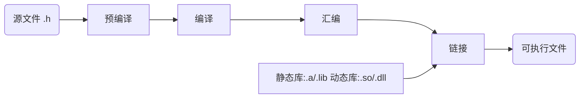
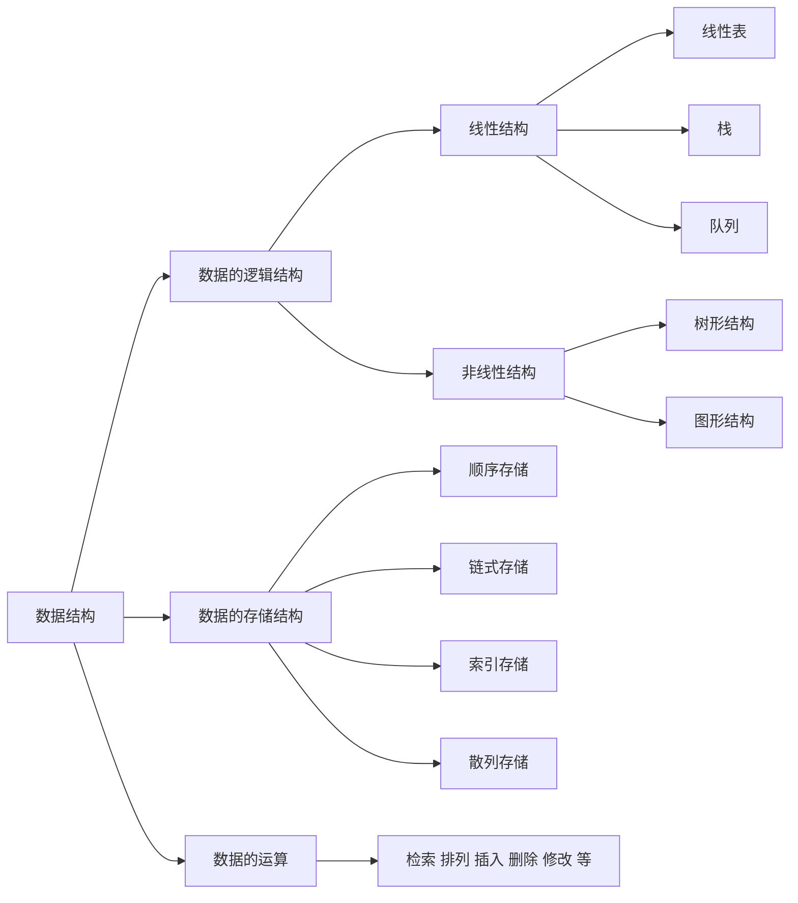

#  GCC编译器

## GCC

1. GNU Compiler Collection，GNU编译器套件 ，是由GNU开发的编程语言编译器；
2. GNU是一个操作系统，GCC的初衷是为GNU操作系统专门编写的一款编译器，GNU系统是彻底的自由软件。此处，“自由”的含义是它尊重用户的自由；
3. GCC是以GPL许可证所发行的自由软件，也是GNU计划的关键部分。GCC的初衷是为GNU操作系统专门编写一款编译器，现已被大多数类Unix操作系统（如Linux、BSD、MacOS X等）采纳为标准的编译器，甚至在微软的Windows上也可以使用GCC。GCC支持多种计算机体系结构芯片，如x86、ARM、MIPS等，并已被移植到其他多种硬件平台；
4. GCC原名为GNU C语言编译器（GNU C Compiler），只能处理C语言。但其很快扩展，变得可处理C++，后来又扩展为能够支持更多编程语言，如Fortran、Pascal、Objective -C、Java、Ada、Go以及各类处理器架构上的汇编语言等，所以改名GNU编译器套件（GNU Compiler Collection）
5. 官网：https://gcc.gnu.org/

gcc所支持后缀名解释 

1. ​    .c		           C原始程序
2. ​    .C/.cc/.cxx	C++原始程序
3. ​    .m		         Objective-C原始程序
4. ​    .i		            已经过预处理的C原始程序
5. ​    .ii		           已经过预处理的C++原始程序
6. ​    .s/.S	           汇编语言原始程序
7. ​    .h		           预处理文件(头文件)
8. ​    .o		           目标文件
9. ​    .a/.so	        编译后的库文件

## 编译器的主要组件

1. 分析器：分析器将源语言程序代码转换为汇编语言。因为要从一种格式转换为另一种格式（C到汇编），所以分析器需要知道目标机器的汇编语言。
2. 汇编器：汇编器将汇编语言代码转换为CPU可以执行字节码。
3. 链接器：链接器将汇编器生成的单独的目标文件组合成可执行的应用程序。链接器需要知道这种目标格式以便工作。
4. 标准C库：核心的C函数都有一个主要的C库来提供。如果在应用程序中用到了C库中的函数，这个库就会通过链接器和源代码连接来生成最终的可执行程序。

## GCC的基本用法和选项

Gcc最基本的用法是∶gcc [options] [filenames] 

1. -c，只编译，不链接成为可执行文件，编译器只是由输入的.c等源代码文件生成.o为后缀的目标文件，通常用于编译不包含主程序的子程序文件。 
2. -o output_filename，指定要生成的结果文件的名字，同时这个名称不能和源文件同名；结果文件可能是预处理文件、汇编文件、目标文件或者最终可执行文件；如果不给出这个选项，gcc就给出预设的可执行文件a.out。
3. -g，产生符号调试工具(GNU的gdb)所必要的符号资讯，要想对源代码进行调试，我们就必须加入这个选项。 
4. -O，对程序进行优化编译、连接，采用这个选项，整个源代码会在编译、连接过程中进行优化处理，这样产生的可执行文件的执行效率可以提高， 但是，编译、连接的速度就相应地要慢一些。
5. -O2，比-O更好的优化编译、连接，当然整个编译、连接过程会更慢。
6. -I  dirname，将dirname所指出的目录加入到程序头文件目录列表中，是在预编译过程中使用的参数。
7. -L  dirname，将dirname所指出的目录加入到程序函数档案库文件的目录列表中，是在链接过程中使用的参数。

## GCC编译过程

```c
#include<stdio.h>
int main(void)
{
    int i,j; 
    j=0;
    i=j+1;
    printf("hello,world\n");
    printf("the result is %d\n",i);
}
```

### 预处理(Pre-Processing) 

生成预处理代码；test.i比test.c增加了很多内容，主要是会展开头文件。

```sh
# Linux系统中通常用“.i”作为C语言程序预处理后所得文件的后缀名。由此，就完成了test.c文件的预处理操作，并将其结果导入到了test.i文件中。
gcc -E ./test.c -o test.i
```

### 编译(Compiling)

生成汇编代码；检查语法错误,并生成汇编文件。编译是整个程序构建的核心部分，也是最复杂的部分之一。所谓编译，简单理解就是将预处理得到的程序代码，经过一系列的词法分析、语法分析、语义分析以及优化，加工为当前机器支持的汇编代码。

```sh
#-S 说明只进行到编译阶段
gcc -S test.c -o test.s
```

test.s

```assembly
        .file   "test.c"
        .section        .rodata
.LC0:
        .string "hello,world"
.LC1:
        .string "the result is %d\n"
        .text
        .globl  main
        .type   main, @function
main:
.LFB0:
        .cfi_startproc
        pushq   %rbp
        .cfi_def_cfa_offset 16
        .cfi_offset 6, -16
        movq    %rsp, %rbp
        .cfi_def_cfa_register 6
        subq    $16, %rsp
        movl    $0, -4(%rbp)
        movl    -4(%rbp), %eax
        addl    $1, %eax
        movl    %eax, -8(%rbp)
        movl    $.LC0, %edi
        call    puts
        movl    -8(%rbp), %eax
        movl    %eax, %esi
        movl    $.LC1, %edi
        movl    $0, %eax
        call    printf
        leave
        .cfi_def_cfa 7, 8
        ret
        .cfi_endproc
.LFE0:
        .size   main, .-main
        .ident  "GCC: (GNU) 4.8.5 20150623 (Red Hat 4.8.5-44)"
        .section        .note.GNU-stack,"",@progbits
```

> 不同CPU和平台环境，编译输出的汇编代码也不同
>
> 汇编语言（英语：assembly language）是一种用于电子计算机、微处理器、微控制器，或其他可编程器件的低级语言。在不同的设备中，汇编语言对应着不同的机器语言指令集。一种汇编语言专用于某种计算机系统结构，而不像许多高级语言，可以在不同系统平台之间移植。
>
> 计算机只认识0和1(就是二进制)，所以在计算机刚开始发明时，那些科学家们就是直接向计算机输入0和1，来运行计算任务的。(当然，他们是通过穿孔纸带的方式来向计算机输入,比如有孔代表1，没孔代表0)。通过这样的方式，计算机终于能运行了，但是这样的效率实在太慢了。
>
> 输入的0和1中，有些代表指令，这些是有固定含义和编码的，也是芯片能识别的；而另一些是数据。这些不同的程序的数据自然是不同的。不管多么复杂的计算机操作，到了cpu级别都是0和1，数据虽然多变，但是指令的数量是有限的。因为指令是要被芯片固定识别的。芯片中要用晶体管(最初是电子管)组成的与或非门组合来识别这些指令和数据。因为直接输入0和1，实在太繁琐了，所以汇编语言就出现了，来简化程序的编写。
>
> 比如计算1+1，两个数据1都使用0x0001来表示，而加操作，放在cpu中，可以是0xa90df(这个是胡乱写的),这个二进制代表的加操作能被计算机识别。而因为这个加操作对于cpu来说，编码的0xa90df格式是固定的。所以可以直接一个助记符add来表示，这样写程序就方便多了，而这就是汇编程序的由来。因为汇编程序完成之后，可以再有一个专门的程序（就是汇编器）来把编写的汇编程序编译成0和1.这样计算机也可以识别了，而汇编语言本身也方便了程序的编写和阅读。
>
> 编写汇编比直接编写二进制方便高效了太多。但是随着计算任务的复杂，程序的规模越来越庞大，使用汇编程序也很累啊，那么是否有更简单的方式呢？所以科学家们发明了高级语言(比如C,lisp等)，在编写程序的时候，使用C语言等编写，然后再使用编译器将C语言程序翻译成汇编程序，汇编程序再使用汇编器编译成0和1，这样，cpu能识别的东西没有变化，但是对于编写程序的人，确实方便了很多。通过以上的描述，就知道了高级语言的大概由来。也明白了所编写的各种高级语言，到了最后其实都是转化为二进制执行。
>
> 而直接二进制格式的程序，称之为本地机器码(native code)。而类似那些add之类的助记符，以及汇编的编写格式或标准，被称之为指令集。但是问题的关键来了，不同公司所生产的cpu芯片所使用的指令集不同，芯片设计又不像TCP/IP协议那样，有国际统一的标准，甚至像intel所代表的复杂指令集，和arm为代表的精简指令集，它们指令集的设计思路就是不一样的。所以我们C语言最后编译出来的的二进制文件，假设是这段93034030930900090222ab2d11cd22dfad(随便写的)，不同的cpu上识别的意义是不同的。所以大部分高级语言不能实现跨平台运行，就是因为它编译出来的输出文件的格式，只适用于某种cpu，其他cpu不认识。

### 汇编(Assembling)

生成目标代码：把汇编代码翻译成二进制指令，但由于尚未经过链接操作，所以无法直接运行。简单地理解，汇编其实就是将汇编代码转换成可以执行的机器指令。大部分汇编语句对应一条机器指令，有的汇编语句对应多条机器指令。相对于编译操作，汇编过程会简单很多，它并没有复杂的语法，也没有语义，也不需要做指令优化，只需要根据汇编语句和机器指令的对照表一一翻译即可。

```sh
#方法一，用gcc直接从C源代码中生成目标代码
#这个test.o不是可执行文件，因为这里用到了-c，告诉gcc到汇编为止，不要进行链接。
gcc -c test.c -o test.o
#方法二，用汇编器从汇编代码生成目标代码：
as test.s -o test.o
```

### 链接(Linking)

生成可执行程序：把若干个文件目标文件、库文件合并成可执行文件；即：GCC不带-c参数的话，那么会自动将编译和链接一步完成，并生成可执行文件，可执行文件可以通过-o参数指定结果文件的名字。

```sh
# 比如test程序调用printf程序，它是每个C编译器都会提供的标准库C的函数。这个函数存在于一个名叫printf.o的单独编译好的目标文件中，这个文件将以某种方式合并到test.o中。链接器就负责这种合并。得到的是可执行目标文件。
# 默认会生成a.out可执行文件，也可以使用-o指定可执行文件的名
gcc test.o
# 也可以使用-o指定可执行文件的名
gcc test.o -o test
```

## GDB调试工具

首先使用gcc对test.c进行编译，注意一定要加上选项'-g'

```sh
gcc -g test.c -o test 
gdb test 
```

调试流程

| 功能                                                         | 快捷键  |
| ------------------------------------------------------------ | ------- |
| 查看文件                                                     | l       |
| 设置断点                                                     | b 6     |
| 查看断点情况                                                 | info b  |
| 运行代码                                                     | r       |
| 查看变量值                                                   | p n     |
| 单步运行                                                     | n  /  s |
| 恢复程序运行                                                 | c       |
| 退出                                                         | q       |
| 出现Thread 1 "pcancel" received signal SIGSEGV, Segmentation fault.<br>输入命令bt（打印调用栈） | bt      |
| 帮助                                                         | help    |

调试多进程程序

set follow-fork-mode child     设置GDB调试子进程

set follow-fork-mode parent   设置GDB调试父进程

set detach-on-fork  on/off    设置GDB跟踪调试单个进程或多个

1. on: 只调试父进程或子进程的其中一个，(根据follow-fork-mode来决定)，这是默认的模式
2. off：父子进程都在gdb的控制之下，其中一个进程正常调试(根据follow-fork-mode来决定),另一个进程会被设置为暂停状态。

info inferiors    显示GDB调试的进程

inferiors  进程序号（1,2,3....）  切换GDB调试的进程

调试多线程

显示线程 info thread 

切换线程 thread id

GDB为特定线程设置断点 break location thread id (b 6 thread 3：在线程3的第6行加断点)

GDB设置线程锁 set scheduler-locking on/off  (on：其他线程会暂停。可以单独调试一个线程)

## 条件编译

常见的条件编译有两种方法：

1. 根据宏是否定义，其语法如下：

   ```c
   		#ifdef  <macro>
    		……
   		#else
     		……
   		#endif
   ```

   ```c
   #include<stdio.h>
   
   //#define  _DEBUG_
   int main () {
   
   #ifdef  _DEBUG_  // 当宏定了时
   //#ifndef  _DEBUG_ // 当宏没有定义时
           printf("The macro _DEBUG_ is defined\n");
   #else
           printf("The macro _DEBUG_ is not defined\n");
   #endif
   
   }
   ```

2. 根据宏的值，其语法如下：

   ```c
   		#if  <macro>
     		……
   		#else
   		……
   		#endif
   ```

   ```c
   #include<stdio.h>
   
   #define  _DEBUG_ 1
   int main () {
   
   #if _DEBUG_
           printf("The macro _DEBUG_ is defined\n");
   #else
           printf("The macro _DEBUG_ is not defined\n");
   #endif
   }
   ```

## 库与系统调用

### libc

libc是Stantard C Library的简称，它是符合ANSI C标准的一个标准函数库。libc库提供C语言中所使用的宏，类型的定义，字符串操作符，数学计算函数以及输入输出函数等。正如ANSI C是C语言的标准一样，libc只是一个函数库标准，每个操作系统都会按照该标准对标准库进行具体实现。通常所说的libc是特指某个操作系统的标准库，比如：在Linux操作系统下所说的libc即glibc。glibc是类Unix操作系统中使用最广泛的libc库，它的全称是GNU C Library.

### glibc

类Unix操作系统通常将libc库作为操作系统的一部分，它被视为操作系统与用户程序的接口。libc库不仅实现标准C语言中的函数，而且也包含自己所属的函数接口。比如：在glibc库中，既包含标准C中的fopen(),又包含类Unix系统中的open()。在类Unix操作系统中，如果缺失了标准库，那么整个操作系统将不能正常运转。

### 系统调用

#### 系统调用的意义

用户进程不能直接访问硬件设备（e.g. CPU、磁盘）与内核资源（e.g. 内核函数），而是需要通过操作系统提供的一组接口来获得内核提供的服务，这组接口就是系统调用。在应用程序和操作系统之间设置这样一组接口的优点如下：

1. 提供硬件的抽象接口：应用程序无需了解硬件操作的细节

2. 提高系统的安全性：内核可以在响应某个请求之前在接口级检查请求的正确性

3. 提高应用程序的可移植性：只要不同操作系统提供的这组接口相同，那么在这些操作系统之上就可以正确地编译和执行相同的程序（即可实现源代码级可移植）

tips：第3点就体现了POSIX标准的意义

#### 系统调用服务例程

系统调用是由操作系统内核提供的，在实现上就是一组内核函数，可以称之为系统调用的服务例程；以read系统调用为例，在fs/read_write.c中定义如下：


在SYSCALL_DEFINE3宏的帮助下，会在内核中定义如下形式的read系统调用服务例程，

```c
long sys_read(unsigned int fd, char __user *buf, size_t count);
```

#### 系统调用封装例程

有了内核提供的系统调用服务例程，操作系统就具备了提供某种服务的能力，但是应用程序是无法直接调用内核函数的。所以还需要系统调用封装例程，封装例程特点如下：

1. 本身是用户态函数

2. 是用户进程进入内核的接口层，而进入内核的方式就是通过软中断（X86架构为int 0x80中断 / ARM架构为SWI中断）


系统调用封装例程与系统调用服务例程的调用关系如下图所示：


**说明1：封装例程与服务例程一一对应**

UNIX为每个系统调用在标准C库中均设置了一个具有相同名字的函数，man 2手册中说明的就是这类函数；这就是通常所谓的系统调用，其实严格意义上说是系统调用的封装例程，但是在不产生混淆的情况下，仍可称其为系统调用。

**说明2：内核提供哪些系统调用**

系统调用中，服务例程是根本，所以应用程序可使用的系统调用依赖于他所运行的操作系统内核版本；在内核中有2处维护系统调用的数据结构，

系统调用号

X86平台的arch/x86/include/asm/unistd_32.h中标识了当前版本支持的系统调用编号，在封装例程中，在触发软中断之前也需要将对应的系统调用编号设定到指定寄存器中


系统调用表

X86平台的arch/x86/kernel/syscall_table_32.S中定义了系统调用表，系统调用表将系统调用号和对应的服务例程关联起来。系统调用表本质上是一个函数指针数组，每个函数指针指向对应的系统调用服务例程


**说明3：如何调用没有封装例程的系统调用**

如果向内核中新增了系统调用，在应用程序中使用时就需要提供相应的封装例程，如果不想提供相应的封装例程，可以使用syscall函数直接指定要调用的系统调用编号

| 操作       | 说明                                                         |
| ---------- | ------------------------------------------------------------ |
| 所需头文件 | #include <unistd.h>                                          |
| 函数原型   | long syscall(long number, ...);                              |
| 函数参数   | number：系统调用编号之后的可变参数列表为该系统调用所需参数   |
| 函数返回值 | 由调用的系统调用决定，一般情况下，若成功，返回0；否则，返回-1并设置errno |

以下示例分别通过封装例程和syscall调用getpid系统调用

```c
#include <stdio.h>
#include <stdlib.h>
#include <syscall.h>
#include <unistd.h>
#include <sys/types.h>
 
int main(void)
{
	long pid1 = 0;
	long pid2 = 0;
 
	pid1 = syscall(SYS_getpid);
	printf("syscall(SYS_getpid) = %ld\n", pid1);
 
	pid2 = getpid();
	printf("getpid() = %ld\n", pid2);
 
	return 0;
}
```

其中SYS_getpid指定的系统调用编号在syscall.h头文件中定义

**说明4：系统调用封装例程ABI**

系统调用封装例程ABI用于指定在触发操作系统软中断之前，如何向内核传递系统调用编号以及该系统调用所需参数，在man 2 syscall中有相关说明：


#### 整体流程

以open()为例，系统调用的执行过程如下：


在内核中，系统调用表由系统调用号和系统调用方法的入口地址组成

1. 应用程序去执行open的时候，就会产生中断，当前的这个应用程序无法继续往下执行
2. 内核要开始处理这个中断，open执行以后，会将这个open对应的系统调用号5写到寄存器Eax中
3. 接下来应用程序产生中断，应用程序就被换下去了，并进行现场保护，把当前的应用程序在CPU中运行的各个寄存器上的信息存在内核栈上
4. 内核上来执行，操作系统从Eax寄存器中把系统调用号5读出来，在系统调用表查，查出来是sys_open，然后找到它对应的实现方法，然后就去打开一个文件，在内核中会创建一些数据结构，来表征这个打开的文件，再把open的返回值，也就是文件描述符写入到Eax寄存器中，相当于把刚才引发的中断处理完成
5. 恢复应用程序的执行，恢复以后，首先第一时间从Eax寄存器把结果3读出来，赋给fd，然后应用程序继续向下执行。

### 系统调用 / API / POSIX标准的关系

#### API接口

应用程序编程时既可以调用系统调用（man 2手册说明）也可以调用库函数（man 3手册说明），在应用程序开发者的角度，二者使用方法相似，但是从实现者的角度看，二者有根本的区别，主要在于：

1. 库函数不是系统调用入口点

2. 库函数可以不调用 / 调用一个 / 调用多个系统调用

库函数与系统调用的关系如下图所示：


可以认为：API = 系统调用封装例程 + C库函数

#### POSIX标准针对API

POSIX标准的目的是提升应用程序在各种UNIX系统环境之间的可移植性，而且POSIX标准说明了一种接口（interface）而不是一种实现（implementation），所以并不区分系统调用和库函数

所以POSIX标准针对的是API而不是针对系统调用，或者说POSIX标准只是规定了操作系统应该通过怎样一组接口提供怎样一组服务，而不关心这些服务的实现形式

tips：Linux操作系统的API就遵循POSIX标准，所以在设计系统调用时就考虑了POSIX标准的要求

#### LIBC库与API

##### LIBC

1. libc是Standard C Library的简称，即符合ANSI C标准的标准函数库，每个操作系统都会按照标准实现该函数库

2. 通常所说的libc库是特指某个操作系统的标准库，Linux操作系统下的libc即glibc，glibc是类Unix操作系统中使用最广泛的libc库，全称为GNU C Library

##### GLIBC

1. 类Unix操作系统通常将glibc库作为操作系统的一部分，他被视为操作系统与应用程序的接口
2. glibc库不仅实现了符合ANSI C标准的标准C库（是C语言标准的一部分），也实现了POSIX标准的API接口
3. glibc库中既包含标准C中的fopen函数，也包含POSIX标准的open函数

## 静态与动态链接库

### 库文件

1. 首先说明要对库有一个比较直观的理解。库是写好的现有的，成熟的，可以复用的代码。现实中每个程序都依赖很多基础的底层库，不可能每个人的代码都从零开始，公共代码需要反复使用，就把这些代码编译成为“库”文件，因此库的存在意义非同寻常。本质上说来库是一种可执行代码的二进制形式（注，其本身不可执行），可以被操作系统载入内存执行。
2. 静态库、动态库区别来自C语言在【链接阶段】如何处理库，链接成可执行程序：分别为静态链接方式、动态链接方式。Linux下的静态库以.a结尾(Winodws下为.lib)；Linux下的动态库以.so 或 .so.y结尾，其中y代表版本号(Windows下为.dll)。



### 静态连接库

在链接阶段，会将汇编生成的目标文件.o与引用到的库一起链接打包到可执行文件中，因此对应的链接方式为静态链接。其实一个静态链接库可以简单看成一组目标文件(.o/.obj文件)的集合，连接器将从库文件取得所需的代码，复制到生成的可执行文件中即很多目标文件经过压缩打包后形成的一个文件。

1. 特点：可执行文件中包含了库代码的一份完整拷贝
2. 优点：程序在运行时就不需要函数库了。
3. 缺点：被多次使用就会多份冗余拷贝，因为所有相关的目标文件和牵涉到的函数库被链接合成一个可执行文件。生成的可执行文件较大。静态库升级后，程序需要重新编译链接。

### 动态链接库

动态：在程序编译是并不会被连接到目标代码中，而是在程序运行时才被载入。动态库独立于现有的程序，其本身不可执行，但包含着程序需要调用的一些函数，这种库称为动态（链接）库（Dynamic Link Library）。不同的应用程序如果调用相同的库，那么在内存里只需要有一份该共享库的实例，规避了空间浪费问题。特点：

1. 动态库把对一些库函数的链接载入推迟到程序运行时期
2. 可以实现进程之间的资源共享，（动态库也成为共享库）
3. 设置可以真正做到链接载入完全由程序员在程序代码中控制（显式调用）
4. 缺点：要使用的动态库自己必须添加到路径。而静态库直接打包到了可执行程序，运行时不需要额外东西。

### 库的生成与使用

实例：三个文件

hello.h

```c
#ifndef HELLO_H
#define HELLO_H

void hello(const char *name);

#endif //HELLO_H
```

hello.c

```c
#include <stdio.h>

void hello(const char *name)
{
  printf("Hello %s!\n", name);
}
```

main.c

```c
#include <stdio.h>
#include "hello.h"

int main()
{
  hello("everyone");
  return 0;
}
```

在main函数中要调用hello函数。如果我们直接编译，是通不过的。gcc main.c或者gcc -o main main.c会报错，因为无法找到调用导函数。

#### 静态库

linux下静态库的后缀名为.a文件，这时使用静态库来链接使用该hello函数。

##### 生成

1. 先将hello.c生成二进制文件gcc -c hello.c -o hello.o

2. 由.o文件创建静态库:静态库文件名的命名规范是以lib为前缀，紧接着跟静态库名，扩展名为.a。例如：将创建的静态库名为myhello，则静态库文件名就是libmyhello.a。在创建和使用静态库时，需要注意这点。创建静态库用ar命令。ar -cr libmyhello.a hello.o这里如果有多个.o文件可以在命令后面加入多个.o文件将他们一起打包成一个静态库文件。

   ar 参数：

   - c  禁止在创建库时产生的正常消息
   - r  如果指定的文件已经存在于库中，则替换它
   - s  无论 ar 命令是否修改了库内容都强制重新生成库符号表
   - v  将建立新库的详细的逐个文件的描述写至标准输出
   - q  将指定的文件添加到库的末尾
   - t  将库的目录写至标准输出 

3. 查看库中符号信息：nm

   ```bash
   [root@server01 linking]# nm libmyhello.a
   
   hello.o:
   0000000000000000 T hello
                    U printf
   ```

##### 使用

1. 编译：需要gcc命令编译，gcc main.c -o main生成可执行文件时会报错 ，所以需要指定静态库然后生成可执行文件
2. gcc main.c -o main -L . -l myhello。为何这么使用呢： -L ：表示要链接的库所在的目录。-L. 表示要链接的库在当前目录，当然可以指定其他目录。
3. -l (L的小写)：表示需要链接库的名称，注意不是库文件名称，比如库文件为 libmyhello.a，那么库名称为myhello。gcc会在静态库名前加上前缀lib，然后追加扩展名.a得到的静态库文件名来查找静态库文件。
4. 运行：静态库在编译生成可执行文件后，就包含在可执行文件中了，可以把静态库删掉 ，再执行./main程序，也不会出错（但是动态链接库就不行）。

#### 动态库

与创建静态库不同的是，不需要打包工具，直接使用编译器即可创建动态库。动态库名字linux下为.so后缀文件

##### 生成

1. 使用命令 gcc -shared -fPIC -o libmyhello.so hello.c 生成动态链接库libmyhello.so，后面源文件可以跟多个.c文件
2. 说明： -shared ：指定生成动态链接库 -fPIC： 表示编译为位置独立的代码，不用此选项的话编译后的代码是位置相关的所以动态载入时是通过代码拷贝的方式来满足不同进程的需要，而不能达到真正代码共享的目的。输出文件libmyhello.so 动态库文件名命名规范和静态库文件名命名规范类似，也是在动态库名增加前缀lib，但其文件扩展名为.so。例如：我们将创建的动态库名为myhello，则动态库文件名就是libmyhello.so

##### 使用

1. 编译： gcc main.c -o main -L . -l myhello 与链接静态库使用方法相同
2. 运行：动态链接是在运行时才进行的。执行./main程序时，可能报错，因为程序在运行时，会在/usr/lib和/lib等目录中查找需要的动态库文件。若找到，则载入动态库，否则将提示类似这样的错误：`error while loading shared libraries: libmyhello.so: cannot open shared object file: No such file or directory`而终止程序运行。
3. 程序运行时有三种方式加载动态库路径（按优先级来）：
   1. 把库拷贝到/usr/lib(64位的操作系统为:/usr/lib64)和/lib(64位的操作系统为:/lib64)目录下。(如果还是报错的话执行： export LD_LIBRARY_PATH=$LD_LIBRARY_PATH:/usr/lib)
   2. 在LD_LIBRARY_PATH环境变量中加上库所在路径。（常用）例如动态库libmyhello.so在/home/ting/lib目录下，以bash为例，使用命令：export LD_LIBRARY_PATH=$LD_LIBRARY_PATH:/home/ting/lib
   3. 修改/etc/ld.so.conf文件，把库所在的路径加到文件末尾，并执行ldconfig刷新。这样，加入的目录下的所有库文件都可见。
4. Linux动态链接库的搜索路径按优先级排序为：
   1. 编译目标代码时指定的动态库搜索路径；在编译时通过gcc 的参数”-Wl,-rpath,”指定。当指定多个动态库搜索路径时，路径之间用冒号”：”分隔。
   2. 环境变量LD_LIBRARY_PATH指定的动态库搜索路径；
   3. 配置文件/etc/ld.so.conf中指定的动态库搜索路径；
   4. 默认的动态库搜索路径/lib；
   5. 默认的动态库搜索路径/usr/lib；
5. 当运行成功后，如果把libmyhello.so文件删除。再执行main程序会发现程序报错。说明动态库是在运行时加载的，也就是在运行的时候，动态库必须存在，不然程序就找不到要调用的函数。

##### 使用ldd

ldd查看某个可运行程序在运行时所要用的动态库.so：ldd ./example

#### 注意

当动态库和静态库同名存在时，默认使用的是动态库。也就是不会将静态库编译到可执行文件中去。

## 强/弱符号和强/弱引⽤

### 符号定义

在编程中经常碰到符号重复定义的情况，当在一个作用域内重复定义同一个变量时，编译器会报错；注意，这里针对于同一作用域才会有冲突，如果是不同作用域，比如全局和局部，即使是相同变量名，也是不会报错的，编译器会默认根据一定的优先级处理，总是更小作用域的变量覆盖更大作用域的变量，前提是这两个变量的作用域是包含与被包含的关系。在C语言中，作用域的分类方式是代码作用域和文件作用域，文件作用域即定义在函数之外的变量可以跨文件访问，代码作用域指的是花括号限定的作用域，它不仅仅限于函数体，在C99中将其扩展到了for，while，if语句所控制的代码，甚至可以在函数内以单独的花括号存在。比如：

```c
int main() {

    {
        int x = 1;
    }
    x = 2 ;

}
```

上面的代码编译时会报错：define.c:6:5: error: ‘x’ undeclared (first use in this function)

在C语言中，可以简单的认为花括号是文件内作用域的分隔符。

### 强符号和弱符号

对于C/C++而言，编译器默认函数和已初始化的全局变量为强符号，而未初始化的全局变量为弱符号，在编程者没有显式指定时，编译器对强弱符号的定义会有一些默认行为，同时开发者也可以对符号进行指定，使用`"__attribute__((weak))"`来声明一个符号为弱符号。定义一个相同的变量，当两者不全是强符号时，gcc在编译时并不会报错，而是遵循一定的规则进行取舍：

1. 当两者都为强符号时，报错：redefinition of 'xxx'
2. 当两者为⼀强⼀弱时，选取强符号的值
3. 当两者同时为弱时，选择其中占⽤空间较⼤的符号，这个其实很好理解，编译器不知道编程者的⽤意，选择占⽤空间⼤的符号⾄少不会造成诸如溢出、越界等严重后果。

在默认的符号类型情况下，强符号和弱符号是可以共存的，类似于这样：

```c
int x;
int x = 1;
```

编译不会报错，在编译时x的取值将会是1。但是使⽤`__attribute__((weak))`将强符号转换为弱符号，却不能与⼀个强符号共存，类似于这样：

```c
int __attribute__((weak)) x = 0;
int x = 1;
```

编译器将报重复定义错误。

### 强引⽤和弱引⽤

编译器在编译阶段只负责将源⽂件编译成⽬标⽂件(即⼆进制⽂件)，然后由链接器对所有⼆进制⽂件进⾏链接操作。在分离式编译中，当编译器检查到当前使⽤的函数或者变量在本模块中仅有声明⽽没有定义时，编译器直接使⽤这个符号，将⼯作转交给链接器，链接器则负责根据这些信息找到这些函数或者变量的实体地址，因为在程序执⾏时，程序必须确切地知道每个函数和全局变量的地址。如果没有找到该符号的实体，就会报undefined reference错误，这种符号之间的引⽤被称为强引⽤。编译器默认所有的变量和函数为强引⽤，同时编程者可以使⽤`__attribute__((weakref))`来声明⼀个函数，注意这⾥是声明⽽不是定义，既然是引⽤，那么就是使⽤其他模块中定义的实体，对于函数⽽⾔，我们可以使⽤这样的写法：`__attribute__((weakref)) void func(void);`,然后在函数中调⽤func()，如果func()没有被定义，则func的值为0，如果func被定义，则调⽤相应func。但是如下写法在现在的编译系统中，虽然编译通过但是写法却是错误的：

```c
__attribute__((weakref)) void func(void);
void main(void)
{
    if(func) {func();}
}
```

warning: ‘weakref’ attribute should be accompanied with an ‘alias’ attribute [-Wattributes]。警告显⽰：weakref需要伴随着⼀个别名才能正常使⽤。在官⽅⽂档中是这样指出的：

The weakref attribute marks a declaration as a weak reference. Without arguments, it should be accompanied by an alias attribute naming the target symbol. Optionally, the target may be given as an argument to weakref itself. In either case, we At present, a declaration to which weakref is attached can only be static.

贴出稍为重要的部分，通俗地解释就是：weakref需要伴随着⼀个别名，别名不需要带函数参数，如果对象函数没有定义，我们可以使⽤别名来实现函数的定义⼯作，如果不指定别名,weakref作⽤等于weak。weakref的声明必须为静态。

### 强/弱符号和强/弱引⽤的作⽤

#### 弱符号

test.c

```c
#include<stdio.h>

void __attribute__ ((weak)) weak_func(void)
{
    printf("defualt weak func is running\n");
}

void test_func(void)
{
    weak_func();
}
```

test.h

```c
void test_func(void);
```

main.c

```c
#include<stdio.h>
#include "test.h"
void weak_func(void)
{
    printf("custom strong func override!\n");
}
int main()
{
    test_func();
    return 0;
}
```

编译执行

```bash
# 将test.c编译成静态库;
[root@server01 3]# gcc -c test.c -o test.o
[root@server01 3]# ar -rsc libtest.a test.o
# 编译main.c:
# -L表⽰指定静态库的⽬录，如果不指定⽬录，编译器会去系统⽬录查找，如果系统⽬录没有将报错。
# -l表⽰链接对应的静态库，在linux下静态库的名称统⼀为libxxx.a，在链接时只需要使⽤-lxxx即可。
[root@server01 3]# gcc main.c -L. -ltest -o test
# 在test库中定义了weak_func函数，且weak_func是⼀个弱符号，且在test_func中被调⽤，然后在main.c中重新定义了test_func函数，且是个强符号，所以在链接时，链接器选择链接main.c中的test_func函数。如果将main.c中weak_func函数定义去掉，它的执⾏结果将是：defualt weak func is running!
[root@server01 3]# ./test
custom strong func override!
```

#### 弱引用

test.c

```c
#include <stdio.h>
static __attribute__((weakref("test"))) void weak_ref(void);
void test_func(void)
{
        if(weak_ref){
                weak_ref();
        }
        else{
                printf("weak ref function is null\n");
        }
}
```

test.h

```c
void test_func(void);
```

main.c

```c
#include <stdio.h>
#include <stdarg.h>
#include "test.h"
void test(void)
{
        printf("running custom weak ref function!\n");
}
int main()
{
        test_func();
        return 0;
}
```

编译执行

```bash
# 将test.c编译成静态库;
[root@server01 3-2]# gcc -c test.c -o test.o
[root@server01 3-2]# ar -rsc libtest.a test.o
# 编译main.c:
[root@server01 3-2]# gcc main.c -L. -ltest -o test
# 在test静态库中仅仅声明了静态的weak_ref函数，且声明时使⽤了函数别名test，因为是静态声明，这个函数名的作⽤域被限定在本模块内，所以即使是在其他模块中定义了weak_ref函数，也⽆法影响到当前模块中的weak_ref函数。官⽅提供的⽅法是可以定义它的别名函数来代替，如上所⽰weak_ref的别名为test，所以在main.c中定义了test函数就相当于定义了weak_ref函数，所以在test_func的判断分⽀中，test_func中不为null，执⾏if(test_func)分⽀，如果在main.c中去除weak_ref的定义，函数的执⾏结果是这样的:weak ref function is null
[root@server01 3-2]# ./test
```

#### 总结

这种弱符号和弱引用对于库来说十分有用，比如库中定义的弱符号可以被用户定义的强符号所覆盖，从而使得程序可以使用自定义版本的库函数；或者程序可以对某些扩展功能模块的引用定义为弱引用，当将扩展模块与程序模块在一起时，功能模块就可以正常使用，如果去掉某些功能模块，那么程序也可以正常链接，只是缺少了相应的功能，这使得程序的功能更加容易裁剪和组合。比如：在Linux程序的设计中，如果一个程序被设计成可以支持单线程或多线程的模式，就可以通过弱引用的方法来判断当前的程序是链接到了单线程的Glibc库还是多线程的Glibc库（在编译时有-lpthread选项），从而执行单线程版本的程序或多线程版本的程序。可以在程序中定义一个pthread_create函数的弱符号，然后判断是否链接到pthread库从而决定执行多线程版本还是单线程版本：

thread.c

```c
#include<stdio.h>
#include<pthread.h>

int pthread_create(pthread_t*,const pthread_attr_t*,void *(*)(void *), void *) __attribute__ ((weak));

int main () {

    if (pthread_create) {
        printf("This is multi-thread version!\n");
    } else {
        printf("This is single-thread version!\n");
    }

}
```

```bash
[root@server01 3-2]# gcc thread.c -o pt
[root@server01 3-2]# ./pt
This is single-thread version!
[root@server01 3-2]# gcc thread.c -lpthread -o pt
[root@server01 3-2]# ./pt 
This is multi-thread version!
```

## C语言内联汇编

内联汇编称为inline assembly，GCC支持在C代码中直接嵌入汇编代码，所以称为GCC inline assembly。C语言不支持寄存器操作，汇编语言可以，所以自然就想到了在C语言中嵌入内联汇编提升“战斗力”的方式，通过内联汇编，C程序员可以实现C语言无法表达的功能，这样使开发能力大为提升。内联汇编按格式分为两大类，一类是最简单的基本内联汇编，另一类是复杂一些的扩展内联汇编，在介绍它们之前，其实还有一点点头疼的事，内联汇编中所用的汇编语言，其语法是AT&T，并不是咱们熟悉的Intel汇编语法，GCC只支持它，所以还得了解下AT&T。其实不论是Intel语法或者是AT&T语法，其在某一个平台上编译出来的机器码是一样的，其本质没有区别，只是表达方式有点区别。

AT&T首先在UNIX中使用，可当初UNIX并不是在x86处理器上开发的，最初是在PDP-11机器上开发的，后来又移植到VA X和68000的处理器上，所以AT&T的语法自然更接近于这些处理器的特性。虽然UNIX后来又移植到x86上了，但还是要尊重UNIX圈内的习惯，其汇编语法接近于那些前辈处理器上的语法，这就是AT&T语法。无论语法怎么改变，汇编语言中指令关键字不能有太大的出入，名字非常接近，只是在指令名字的最后加上了操作数大小后缀，b表示一字节，w表示二字节，l表示四字节，比如压栈指令，在Intel语法中是 push ，在AT&T语法中是 pushl ，最后这个l表示要压栈的数据长度是4字节，在了解Intel语法的情况下，基本能看懂AT&T语法，他们的主要差别是语法风格。


上表未列出两种语法在内存寻址之间的区别：
在Intel语法中，立即数就是普通的数字，如果让立即数成为内存地址，需要将他用中括号括起来，才能表示以立即数为地址的内存
而AT&T认为，内存地址既然是数字，那数字理所应当的也应该被当做内存地址，所以数字优先被认为是内存地址，也就是说，操作数如果是数字，则统统按照以该数字为地址的内存来访问。这样的话我们想要单纯的表示立即数就要在前面加一个 $ 。
Intel语法有很多的寻址方式，包括直接寻址，基址寻址，变址寻址，基址变址寻址，而且不知道是不是开始学的时候就是Intel语法，所以觉得Intel语法是很直接的一种寻址方式。

在AT&T中内存寻址有着固定的格式：segreg(段基址):base_address(offset_address,index,size)

此格式对应的表达式为：segreg(段基址):base_address+offset_address+index*size)

看上去格式有些怪异，但其实这是一种“通用”格式，格式中短短的几个成员囊括了它所有内存寻址的方式，任意一种内存寻址方式，其格式都是这个通用格式的子集，都是格式中各种成员的组合。下面介绍下这些成员项。

1. base_address是基地址，可以为整数、变量名，可正可负。
2. offset_address是偏移地址，index是索引值，这两个必须是那8个通用寄存器之一。
3. size是个长度，只能是1、2、4、8。

下面看看内存寻址中有哪些方式，注意，这些方式都是上面通用格式的一部分。

1. 直接寻址：此寻址中只有base_address项，后面括号中的内容全不要，base_address便为内存啦，比如 movl $225,0xc00008F0 ，或者用变量名 mov $6,var

2. 寄存器间接寻址： 此寻址中只有offset_address项，即格式为（offset_address），要记得，offset_address只能是通用寄存器。寄存器中是地址，不要忘记格式中的圆括号，如mov (%eax),%ebx。

3. 寄存器相对寻址：此寻址中有offset_address项和base_address项，即格式为base_address（offset_address）。这样得出的内存地址是基址+偏移地址之和。如movb -4(%ebx),%al。

4. 变址寻址：此类寻址称为变址的原因是含有通用格式中的变量Index。因为index是size的倍数，所以有index的地方就有size。既然是变址，只要有index和size就成了，base_address和offset_address可有可无，注意，格式中没有的部分也要保留逗号来占位。一共有4种变址寻址组合，下面各举个例子:

   - 无base_address，无offset_address：movl %eax,(,%esi,2)


   - 无base_address，有offset_address：movl %eax,(%ebx,%esi,2)


   - 有base_address，无offset_address：movl %eax,base_value(,%esi,2)


   - 有base_address，有offset_address：movl %eax,base_value(%ebx,%esi,2)

基本内联汇编

基本内联汇编是最简单的内联形式，其格式为：asm [volatile] ("assembly code")  

关键字asm用于声明内联汇编表达式，这是内联汇编固定的部分，不可少。asm和`__asm__`是一样的，是由gcc定义的宏：#define `__asm__` asm。gcc有一个优化选项 -O ，可以指定优化级别，当用 -O 来编译的时候，gcc按照自己的意图优化代码，说不定就会把自己写的代码改了(他认为你写的太烂了)，关键字volatile是可选项，它告诉gcc：“不要修改我写的汇编代码，请原样保留”，volatile和`__volatile__`是一样的，是由gcc定义的宏：#define `__volatile__` volatile。“assembly code”是咱们所写的汇编代码，它必须位于圆括号中，而且必须用双引号引起来。这是格式要求，只要满足了这个格式asm [volatile] (“”)，assembly code甚至可以为空。

assembly code的规则：

1. 指令必须用双引号引起来，无论双引号中是一条指令或多条指令。
2. 一对双引号不能跨行，如果跨行需要在结尾用反斜杠’\'转义。
3. 提醒一下，即使是指令分布在多个双引号中，gcc最终也要把它们合并到一起来处理，合并之后，指令间必须要有分隔符。所以，当指令在多个双引号中时，除最后一个双引号外，其余双引号中的代码最后一定要有分隔符，这和其他编程语言中表示代码结束的分隔符是一样的，

示例：

TinyHelloWorld.c

```c
char* str = "Hello World!\n";

void print()
{
asm (
        "movq $13, %%rdx \n\t"  /* rdx表示字符串长度，这里是13 */
        "movq %0, %%rsi  \n\t"  /* rsi表示字符串地址 */
        "movq $1, %%rdi  \n\t"  /* rdi表示标准输出，这里是控制台 */
        "movq $1, %%rax  \n\t"  /* rax表示系统调用write */
        "syscall  \n\t"
        ::"r"(str));
}

void exit()
{
  //exit的系统调用号是60，只需将60写入eax寄存器，以及第一个参数(退出状态)写入rdi寄存器。
  unsigned long syscall_nr = 60;
  long exit_status = 0;
  asm ("movq %0, %%rax \n\t"
       "movq %1, %%rdi \n\t"
       "syscall  \n\t"
    : /* output parameters, we aren't outputting anything, no none */
      /* (none) */
    : /* input parameters mapped to %0 and %1, repsectively */
      "m" (syscall_nr), "m" (exit_status)
    : /* registers that we are "clobbering", unneeded since we are calling exit */
      "rax", "rdi");
}

void nomain()
{
    print();
    exit();
}
```

```bash
# -fno-builtin GCC编译器提供了很多内置函数（Built-in Function），它会把一些常用的C库函数替换成编译器的内置函数，以达到优化的功能。比如GCC会将只有字符串参数的printf函数替换成puts，以节省格式解析的时间。exit()函数也是GCC的内置函数之一，所以要使用-fno-builtin参数来关闭GCC内置函数功能。
[root@server01 4-2]# gcc -c -fno-builtin TinyHelloWorld.c
# -static 这个参数表示ld将使用静态链接的方式链接程序，而不是使用默认的动态链接的方式。
# -e nomain 表示该程序的入口函数为：nomain
# -o TinyHelloWorld 表示指定输出可执行文件名为：TinyHelloWorld
[root@server01 4-2]# ld -static -e nomain -o TinyHelloWorld TinyHelloWorld.o
[root@server01 4-2]# ./TinyHelloWorld 
Hello World!
[root@server01 4-2]# echo $?
0
```

>在使用gcc -static进行静态链接的时候可能会出现错误：
>
>/usr/bin/ld: cannot find -lc
>collect2: error: ld returned 1 exit status
>
>原因：在新版本的**linux 系统** 下安装 **glibc-devel、glibc和gcc-c++** 时，都不会安装**libc.a. \** 只安装**libc.so.** 所以当使用**-static** 时，**libc.a** C库不能使用。只能报错：**找不到libc了** 。
>
>解决方案： yum install -y glibc-static

# Makefile

## Make

1. 工程管理器，顾名思义，是指管理较多的文件 
2. Make工程管理器也就是个“自动编译管理器”，这里的“自动”是指它能够根据文件时间戳。自动发现更新过的文件而减少编译的工作量，同时，它通过读入Makefile文件的内容来执行大量的编译工作 
3. Make将只编译改动的代码文件，而不用完全编译。

## Makefile

 Makefile是Make读入的唯一配置文件 

1. 由make工具创建的目标体（target），通常是目标文件或可执行文件
2. 要创建的目标体所依赖的文件（dependency_file）
3. 创建每个目标体时需要运行的命令（command）
4. 注意:命令行前面必须是一个”TAB键”,否则编译错误为:*** missing separator.  Stop.

Makefile格式

target  :   dependency_files

<TAB>  command

例子

hello.o :  hello.c hello.h

​	gcc  –c  hello.c  –o  hello.o

实验1:

f1.c

```c
#include<stdio.h>

int print1() {
    printf("i'm f1.c\n");
}
```

f2.c

```c
#include<stdio.h>

int print2() {
    printf("i'm f2.c\n");
}
```

head.h

```c
void print1();
void print2();
```

main.c

```c
#include<stdio.h>
#include "head.h"

int main() {
        print1();
        print2();
}
```

```makefile
test: f1.o f2.o main.o
        gcc f1.o f2.o main.o -o test
f1.o: f1.c
        gcc -c f1.c -o f1.o
f2.o: f2.c
        gcc -c f2.c -o f2.o
main.o: main.c
        gcc -c main.c -o main.o
.PHONY: clean
clean:
        rm *.o test
```

```bash
[root@server01 make]# make
gcc -c f1.c -o f1.o
gcc -c f2.c -o f2.o
gcc -c main.c -o main.o
gcc f1.o f2.o main.o -o test
[root@server01 make]#
```

比如我们修改f2.c文件后再使用make进行编译，发现它只会重新编译修改过的f2.c文件：

```bash
[root@server01 make]# make
gcc -c f2.c -o f2.o
gcc f1.o f2.o main.o -o test
[root@server01 make]#
```

在make过程成会生成很多编译结果文件.o，如果想在构建完成后删除这些中间的编译结果文件可以在Makefile文件的后面添加规则：clean: rm*.o，然后在make完之后再执行make clean；但是如果目录中出现了"clean"文件，则规则失效了：没有依赖文件，文件"clean"始终是最新的，命令永远不会执行（相当于make会认为这里的clean:跟前面f1.o: f1.c一样，需要生成clean文件，而此时目录中又有clean文件并且是最新的，所以后面的命令不会执行）；此时可以使用PHONY，告诉make后面跟着的名称不是指文件名，那么make xxxx 就表示执行xxxx :指定的命令，而不是要（make）生成xxxx

### 变量

使用变量的目的：用来代替一个文本字符串，创建变量VAR=var；变量使用$(VAR)。例如：

```makefile
OBJS = kang.o yul.o
CC = gcc
CFLAGS = -Wall -O -g
sunq : $(OBJS)
$(CC) $(OBJS) -o sunq
kang.o : kang.c kang.h
$(CC) $(CFLAGS) -c kang.c -o kang.o
yul.o : yul.c yul.h
$(CC) $(CFLAGS) -c yul.c -o yul.o
```

### 预定义变量

| 名称 | 含义                                                         |
| ---- | ------------------------------------------------------------ |
| AR   | 库文件维护程序的名称，默认值为ar。AS汇编程序的名称，默认值为as。 |
| CC   | C编译器的名称，默认值为cc。CPP  C预编译器的名称，默认值为$(CC) –E。 |
| CXX  | C++编译器的名称，默认值为g++。                               |
| FC   | FORTRAN编译器的名称，默认值为f77                             |
| RM   | 文件删除程序的名称，默认值为rm -f                            |

```makefile
Hello: main.c main.h 
<tab> $(CC) –o hello main.c
clean:
<tab> $(RM) hello
```

| 名称     | 含义                             |
| -------- | -------------------------------- |
| ARFLAGS  | 库文件维护程序的选项，无默认值。 |
| ASFLAGS  | 汇编程序的选项，无默认值。       |
| CFLAGS   | C编译器的选项，无默认值。        |
| CPPFLAGS | C预编译的选项，无默认值。        |
| CXXFLAGS | C++编译器的选项，无默认值。      |
| FFLAGS   | FORTRAN编译器的选项，无默认值。  |

```makefile
OBJS = kang.o yul.o
CC = gcc	
CFLAGS = -Wall -O -g
sunq : $(OBJS)
$(CC) $(OBJS) -o sunq
kang.o : kang.c kang.h
$(CC) $(CFLAGS) -c kang.c -o kang.o
yul.o : yul.c yul.h
$(CC) $(CFLAGS) -c yul.c -o yul.o
```

### 自动变量

| 名称 | 含义                                                         |
| ---- | ------------------------------------------------------------ |
| $*   | 不包含扩展名的目标文件名称                                   |
| $+   | 所有的依赖文件，以空格分开，并以出现的先后为序，可能 包含重复的依赖文件 |
| $<   | 第一个依赖文件的名称                                         |
| $?   | 所有时间戳比目标文件晚的的依赖文件，并以空格分开             |
| $@   | 目标文件的完整名称                                           |
| $^   | 所有不重复的目标依赖文件，以空格分开                         |
| $%   | 如果目标是归档成员，则该变量表示目标的归档成员名称           |

```makefile
OBJS = kang.o yul.o
CC = gcc
CFLAGS = -Wall -O -g
sunq : $(OBJS)
$(CC) $^ -o $@
kang.o : kang.c kang.h 
$(CC) $(CFLAGS) -c $< -o $@
yul.o : yul.c yul.h
$(CC) $(CFLAGS) -c $< -o $@
```

### 选项

| 选项 | 说明                                             |
| ---- | ------------------------------------------------ |
| -C   | dir读入指定目录下的Makefile                      |
| -f   | file读入当前目录下的名称为xxxx的文件作为Makefile |
| -i   | 忽略所有的命令执行错误                           |
| -I   | dir指定被包含的Makefile所在目录                  |
| -n   | 只打印要执行的命令，但不执行这些命令             |
| -p   | 显示make变量数据库和隐含规则                     |
| -s   | 在执行命令时不显示命令                           |
| -w   | 如果make在执行过程中改变目录，打印当前目录名     |

### 隐含规则

#### 隐含规则1

编译C程序的隐含规则

“<n>.o”的目标的依赖目标会自动推导为“<n>.c”，并且其生成命令是“$(CC) –c $(CPPFLAGS) $(CFLAGS)”

```makefile
test: f1.o f2.o main.o
        gcc f1.o f2.o main.o -o test
f1.o: f1.c
f2.o: f2.c
main.o: main.c
.PHONY: clean
clean:
        rm *.o
```

#### 隐含规则2

链接Object文件的隐含规则

“<n>” 目标依赖于“<n>.o”，通过运行C的编译器来运行链接程序生成（一般是“ld”），其生成命令是：“$(CC) $(LDFLAGS) <n>.o $(LOADLIBES) $(LDLIBS)”。这个规则对于只有一个源文件的工程有效，同时也对多个Object文件（由不同的源文件生成）的也有效。例如如下规则：

x : x.o y.o z.o

并且“x.c”、“y.c”和“z.c”都存在时，隐含规则将执行如下命令：

cc -c x.c -o x.o

cc -c y.c -o y.o

cc -c z.c -o z.o

cc x.o y.o z.o -o x

如果没有一个源文件（如上例中的x.c）和你的目标名字（如上例中的x）相关联，那么，你最好写出自己的生成规则，不然，隐含规则会报错的。

```makefile
test: f1.o f2.o main.o
        gcc f1.o f2.o main.o -o test
.PHONY: clean
clean:
        rm *.o
```

### VPATH

1. 在一些大的工程中，有大量的源文件，我们通常的做法是把这许多的源文件分类，并存放在不同的目录中。所以，当make需要去找寻文件的依赖关系时，你可以在文件前加上路径，但最好的方法是把一个路径告诉make，让make在自动去找。
2. Makefile文件中的特殊变量“VPATH”就是完成这个功能的，如果没有指明这个变量，make只会在当前的目录中去找寻依赖文件和目标文件。如果定义了这个变量，那么，make就会在当当前目录找不到的情况下，到所指定的目录中去找寻文件了。
3. VPATH = src:../headers
4. 上面的的定义指定两个目录，“src”和“../headers”，make会按照这个顺序进行搜索。目录由“冒号”分隔。（当然，当前目录永远是最高优先搜索的地方）

```makefile
CFLAGS=-c -Wall -I include
VPATH=src1 src2 main
f1:f1.o f2.o main.o
.PHONY:clean
clean:
	find ./ -name "*.o" -exec rm {} \;;rm f1
```

### 嵌套

./Makefile

```makefile
CC=gcc
SUBDIRS=f1 \
                f2 \
                main \
                obj
OBJS=f1.o f2.o main.o
BIN=myapp
OBJS_DIR=obj
BIN_DIR=bin
export CC OBJS BIN OBJS_DIR BIN_DIR

all:CHECK_DIR $(SUBDIRS)
CHECK_DIR:
        mkdir -p $(BIN_DIR)
$(SUBDIRS):ECHO
        make -C $@
ECHO:
        @echo $(SUBDIRS)
        @echo begin compile
CLEAN:
        @$(RM) $(OBJS_DIR)/*.o
        @rm -rf $(BIN_DIR)
```

./bin目录：

./f1目录：

------/f1/f1.c

```c
#include <stdio.h>

void printf1()
{
        printf("this is f1!\n");
        return;
}
```

------/f1/Makefile

```makefile
../$(OBJS_DIR)/f1.o:f1.c
        $(CC) -c $^ -o $@
```

f2目录

------/f2/f2.c

```c
#include <stdio.h>

void printf2()
{
        printf("this is f2!\n");
        return;
}
```

------/f2/Makefile

```makefile
../$(OBJS_DIR)/f2.o:f2.c
        $(CC) -c $^ -o $@
```

include目录：

------/include/myinclude.h

```c
#include <stdio.h>
```

main目录：

------/main/main.c

```c
#include "../include/myinclude.h"
void printf1();
void printf2();

int main(int argc, const char *argv[])
{
        printf1();
        printf2();

        printf("end main\n");
        return 0;
}
```

------/main/Makefile

```makefile
../$(OBJS_DIR)/main.o:main.c
        $(CC) -c $^ -o $@
```

obj目录：

------/obj/Makefile

```makefile
../$(BIN_DIR)/$(BIN):$(OBJS)
        $(CC) -o $@ $^
```

# 数据类型

## 基本类型

### 整型

C语言中的整型包括signed和unsigned两大类；

#### short

| 类型名称            | 长度(字节) | 值域         |
| ------------------- | ---------- | ------------ |
| short(signed short) | 2          | -32768~32767 |
| unsigned short      | 2          | 0~65536      |

#### int

| 类型名称        | 长度(字节) | 值域                   |
| --------------- | ---------- | ---------------------- |
| int(signed int) | 4          | -2147483648~2147483647 |
| unsigned int    | 4          | 0~4294967295           |

#### long

### 字符型

#### char

| 类型名称          | 长度(字节) | 值域     |
| ----------------- | ---------- | -------- |
| char、signed char | 1          | -128~127 |
| unsigned char     | 1          | 0~255    |

```c
#include <stdio.h>

int main() {
    char ch;
    ch = 65;
    //ch = 128; // 出错，数据越界(-128)
    //ch = 129; // 出错，数据越界(-127)
    //unsigned char ch  = -1; // 出错，数据越界(255)
    printf("ch=%d,%c\n",ch,ch);
}
```

### 实型

#### float

#### double

### 枚举型

#### enum

## 构造类型

### 数组

### 结构体

#### struct

### 共用体

#### union

## 指针类型

## 空类型

### void

## 布尔型

不是基本类型，对bool型的使用必须引入头文件：#include<stdbool.h>

bool：非零(true)，零(false)

```c
#include<stdio.h>
#include<stdbool.h>

int main() {
    bool a;
    //a = false;
    a = -1;
    if (a) {
        printf("true %d\n",a);
    }
    else {
        printf("false %d\n",a);
    }
   return 0;
}
```

可以通过如下命令输出c语言的预处理过程（将一些宏进行展开），可以找到stdbool.h在系统中的存放位置，从而观察stdbool.h的具体实现，从stdbool.h的实现可以看到，c语言后来引入了一种新的基本数据类型：_Bool，所以我们可以在代码中直接定义_Bool类型的变量来代替引入#include<stdbool.h>的方式。

gcc -E helloworld.c -o hello.i

```c
# 943 "/usr/include/stdio.h" 3 4

# 2 "helloworld.c" 2
# 1 "/usr/lib/gcc/x86_64-redhat-linux/4.8.5/include/stdbool.h" 1 3 4
# 3 "helloworld.c" 2

int main() {
    _Bool a;

    a = -1;
    if (a) {
        printf("true %d\n",a);
    }
    else {
        printf("false %d\n",a);
    }
   return 0;
}
```

# 常量

常量是指在程序运行期间其数值不发生变化的数据。

## 整型常量

整型常量通常简称为整数。整数可以是十进制数、八进制数和十六进制数。例如，十进制的数值3356可以有下列两种不同的表示形式：

- 八进制：06434（以0开头）
- 十六进制：0xd1c （以0x开头）

```c
#include <stdio.h>

int main() {

    int a = 0xd;
    printf("%d %x %o\n",a,a,a); // 分别打印出十进制、十六进制和八进制。
}
```

## 浮点常量

浮点常量又称为实数，一般含有小数部分，在C语言中，实数只有十进制的实数，分为单精度和双精度。实数有两种表示方法，即一般形式和指数形式。

一般形式的实数基本形式如下：

例如，3.5、-12.5、3.1415926

指数形式的

例如：1.176e+10表示1.176x10的十次方、-3.5789e-8表示-3.5789x10的负八次方

```c
#include <stdio.h>

int main() {

    float b = 3.5e+10;
    printf("%e %f\n",b,b);; // 分别打印出指数形式和一般形式。
}
```

## 字符常量

字符常量是指一个单一字符，其表示形式是由两个单引号包括的一个字符。(只有ASCII码表中的字符才能被单引号引起来)在C语言中，字符常量具有数值。字符常量的值就是ASCII码值。可以把字符常量看做一个字节的正整数。

```c
#include <stdio.h>

int main() {
    char a,b,u,v;
    a = 'F';        // 将70赋值给a;即：a = 70;
    b = 'A' + 2;    // b存放的是'C'字符j；即：b = 65 + 2;
    u = ' ' + 'B';  // u存放的是'b'字符；相当于SPACE的ASCII码值加上'B'的ASCII码值；即：u = 32 + 66；
    v = 'b' - 32;   // v存放的是'B'字符；v = 97 - 32;

    printf("%d %d %d %d\n",a,b,u,v);
    printf("%c %c %c %c\n",a,b,u,v);
}
```

## 字符串常量

所谓字符串常量是指用双引号括起来的一串字符来表示的数据。字符串以\0结尾

```c
# include<stdio.h>

int main () {

    char arr1[] = {"abc"};               // 会自动添加一个'\0'作为结尾，通过sizeof可以看到它占用的空间为4，因此可知该字符串包含一个隐藏的结束符\0
    char arr2[] = {'a', 'b', 'c', '\0'};
    printf("%d %d\n",sizeof(arr1),sizeof(arr2));
    printf("%s %s\n",arr1,arr2);
}
```

## 标识常量

所谓标识常量是指用标识符代替常量使用的一种常量，其名称通常是一个标识符。标识常量也叫符号常量，一般用大写英文字母的标识符。在使用之前必须预先定义。说明形式为:# define <标识常量名称> <常量>。定义一个宏名字之后，可以在其他宏定义中使用，例如：

```c
#include <stdio.h>

#define ONE 1
#define TWO ONE + ONE

int main() {
    int a = 10,b = 20,c;
    // 注意在使用宏的时候，不会进行计算，而是直接替换，比如 TWO = ONE + ONE 展开后不是把1+1的结果赋值给TWO，而是将TWO里面的ONE用1替换，同样如果把#define ONE 1+1，那么在运算的时候也是把使用到ONE的地方替换成1+1
    c = ONE + TWO * b + a; // 等价于 1 + 1 + 1 * 20 + 10 =32
    printf("%d\n",c);
    return 0;
} 
```

# 变量

1. 变量名由字母、数字、下划线组成，不能以数字开头，不能和C的关键字重名；
2. 在程序运行时，变量占据存储空间的大小由其数据类型决定；
3. 变量在内存空间中的首地址，称为变量的地址。

变量在程序中使用时，必须预先说明它们的存储类型和数据类型。

变量说明的一般形式：

<存储类型> <数据类型> <变量名>；

## 存储类型

存储类型有四种：auto、register、static和extern，默认是auto

### auto

auto说明的变量只能在某个程序范围内使用，通常在函数体内或函数中的复合语句里。（默认是随机值）在函数体的某程序段内说明auto存储类型的变量时可以省略关键字auto。

```c
#include <stdio.h>

int main() {

    if (1) {
        int a;
        printf("%d\n",a);
    }
    //printf("%d\n",a); // 编译报错 int.c:9:19: 错误：‘a’未声明(在此函数内第一次使用)
}
```

### register

1. register称为寄存器型，register变量是想将变量放入CPU的寄存器中，这样可以加快程序的运行速度。如申请不到就使用一般内存，同auto ;
2. register变量必须是能被CPU所接受的类型。这通常意味着register变量必须是一个单个的值，并且长度应该小于或者等于整型的长度。不能用“&”来获取register变量的地址。
3. 由于寄存器的数量有限，真正起作用的register修饰符的数目和类型都依赖于运行程序的机器。在某些情况下，把变量保存在寄存器中反而会降低程序的运行速度。因为被占用的寄存器不能再用于其它目的；或者变量被使用的次数不够多，不足以装入和存储变量所带来的额外开销。

```c
#include <stdio.h>

int main(int argc, char *argv[])
{
        register int a = 10;
        // 不能用“&”来获取register变量的地址，编译报错
        //printf("out if:a=%d %p\n", a, &a);
        printf("out if:a=%d\n", a);

        return 0;
}
```

### static

static变量称为静态存储类型的变量，既可以在函数体内(局部变量)，也可在函数体外说明(全局变量)。(默认是0）局部变量使用static修饰,有以下特点:

1. 在内存中以固定地址存放的，而不是以堆栈方式存放
2. 只要程序没结束，就不会随着说明它的程序段的结束而消失，它下次再调用该函数，该存储类型的变量不再重新初始化，而且还保留上次调用存入的数值

```c
#include<stdio.h>

static int b = 0; // 定义一个static类型的全局变量b，初始值为0，它只能在本文件中使用，不能被其他文件访问

void func()
{
        static int c = 0; // 定义一个static类型的局部变量c，初始值为0
        printf("b = %d, c = %d\n", b, c); // 打印b和c的值
        b++; // b的值加1
        c++; // c的值加1

}

int main()
{
        printf("b = %d\n", b); // 打印b的值，由于c是静态局部变量，所以在main中无法访问
        func(); // 调用func函数，输出b = 0, c = 0
        func(); // 再次调用func函数，输出b = 1, c = 1
        return 0;
}
```

###  extern

1. 当变量在一个文件中的函数体外说明，所有其他文件中的函数或程序段都可引用这个变量。
2. extern称为外部参照引用型，extern存储类别用于声明在其他文件中定义的全局变量，表示该变量可以在多个文件中共享，初始值由定义时指定。
3. static修饰的全部变量，其它文件无法使用。

exern_static1.c

```c
//static int global_a = 100
int global_a = 100;
```

exern_static2.c

```c
#include <stdio.h>

extern int global_a;

int main() {

    printf("global_a=%d\n",global_a);
    return 0;
}
```

```sh
[root@server01 C]# gcc extern_static1.c extern_static2.c
[root@server01 C]# ./a.out
global_a=100
```

extern与函数

先来理解2个概念：

- 外部函数：如果在当前文件中定义的函数允许其他文件访问、调用，就称为外部函数。C语言规定，不允许有同名的外部函数。
- 内部函数：如果在当前文件中定义的函数不允许其他文件访问、调用，只能在内部使用，就称为内部函数。C语言规定不同的源文件可以有同名的内部函数，并且互不干扰。

接下来就演示在一个源文件中调用另外一个源文件定义的函数，比如在main.c中调用one.c中定义的one函数。

1. 首先在one.c中定义了一个one函数

   如果你想让这个one函数可以被main.c访问，那么one函数就必须是外部函数。完整的定义是要加上extern关键字。不过这个extern跟auto关键字一样废，完全可以省略，因为默认情况下，所有的函数就是外部函数。

   one.c

   ```c
   #include<stdio.h>
   
   extern void one() {
       printf("调用了one函数\n");
   }
   ```

2. 接下来，在main.c的main函数中，调用one.c中的one函数

   如何才能调用one.c中的one函数呢？想法 1：直接在main函数中写上one()；这个做法肯定不行，因为main函数根本不知道one函数的存在。想法2：在main.c中包含one.c文件；因为\#include的作用纯粹就是内容拷贝，所以又相当于：

   main.c

   ```c
   #include<stdio.h>
   
   extern void one() {
       printf("调用了one函数\n");
   }
   
   int main() {
       return 0;
   }
   ```

   从语法上看是对的，所以编译是没问题的。但是这个程序不可能运行成功，在链接的时候会报错。因为已经在one.c中定义了one函数，现在又在main.c中定义one函数，C语言规定不允许有同名的外部函数，链接的时候链接器会发现在one.obj和main.obj中定义了同一个函数，会直接报错。正确的做法应该是在main函数前面对one函数进行提前声明（注意：定义和声明是两码事，include "one.c"的方式相当于在main函数中又定义了一次one函数）。

   >C语言中声明和定义
   >
   >C语言中的声明(declaration)和定义(definition)是两个容易混淆的概念。
   >
   >声明只是给变量、函数、结构体、联合体命名，表明程序有该变量、函数、结构体、联合体。
   >
   >定义是具体给变量分配存储空间、给出函数的具体实现、指明结构体和联合体成员。
   >
   >简单理解：如果程序中仅仅有声明，缺少定义实现，最终无法生成可执行的程序，因为信息不完整，无法完成编译全过程。
   >
   >C语言中声明和定义的原则是：
   >
   >声明可以出现多次，定义有且只能出现一次。
   >
   >定义必须有，且只能出现一次。
   >
   >声明和定义可以同时出现。
   >
   >声明和定义可以分为以下几类：
   >
   >变量的声明和定义（涵盖所有数据类型）
   >
   >结构体或联合体类型的声明或定义
   >
   >函数类型的声明和定义
   >
   >数组类型的声明或定义
   >
   >1、基本数据类型
   >
   >```c
   >int i;            // 同时声明和定义变量i，未初始化
   >int i = 1;        // 同时声明和定义变量i，并且初始化
   >extern int i;     // 仅仅声明变量i，表明变量i的定义在其它位置
   >extern int i = 1; // 同时声明和定义变量i，并且初始化，忽略extern
   >```
   >
   >2、结构体
   >
   >```c
   >// 第一种：声明同时定义结构类型
   >struct student
   >{
   >    char name[10];
   >    int age;
   >    char sex[4];
   >
   >};
   >// 声明和定义结构变量stu1,stu2
   >struct student stu1,stu2;
   >
   >// 第二种：仅仅声明结构体student
   >struct student;
   >..... // 这里可以是其它代码
   >// 定义结构体student
   >struct student
   >{
   >    char name[10];
   >    int age;
   >    char sex[4];
   >};
   >// 声明和定义结构体变量
   >struct student stu1,stu2;
   >
   >// 第三种：同时声明和定义结构类型和结构体变量    
   >// 省略结构类型名称，此时该匿名结构类型只能使用一次了
   >struct
   >{
   >    char name[10];
   >    int age;
   >    char sex[4];
   >} stu1,stu2;
   >
   >```
   >
   >3、函数
   >
   >函数声明：函数声明给出了函数名、返回值类型、参数列表（重点是参数类型）等与该函数有关的信息，称为函数原型。函数原型的作用是告诉编译器与该函数有关的信息，让编译器知道函数的存在，以及存在的形式，即使函数暂时没有定义，编译器也知道如何使用它，编译不会报错。
   >
   >函数的定义：表示函数具体干了什么。在C语言中，函数的定义顺序是有讲究的，默认情况下，只有后面定义的函数才可以调用前面定义过的函数。
   >
   >举例：
   >
   >// 函数声明的格式非常简单，相当于去掉函数定义中的函数体，并在最后加上分号，也可以不写形参，只写数据类型
   >
   >int add (int a , int b);
   >
   >int add (int , int);
   >
   >// 有了函数声明，函数定义就可以出现在任何地方，甚至是其他文件、静态链接库、动态链接库等
   >
   >int add (int a , int b) {
   >
   >​    return a + b ;
   >
   >}
   >
   >4、数组的声明和定义
   >
   >```c
   >int a[100]; // 声明和定义数组
   >extern int a[100];   // 仅仅声明数组
   >extern int a[];      // 仅仅声明数组
   >```

3. 在main函数前面对one函数进行提前声明

   main.c

   ```c
   extern void one();
   
   int main() {
       one();
       return 0;
   }
   ```

   运行程序，从控制台输出可以发现 "one.c中定义的one函数" 已经被 "main.c的main函数" 成功调用了。上述就是extern关键字对函数的作用：用来定义和声明一个外部函数。其实extern又跟auto一样废，完全可以省略。

   ```bash
   [root@server01 data-type]# gcc one.c main.c -o main
   [root@server01 data-type]# ./main 
   调用了one函数
   ```

   为了模块化地开发，在正规的项目里面，我们会把one函数的声明写到另一个头文件中，当然，这个头文件的命名最好有意义、规范一点，比如叫one.h。以后，谁想调用这个one函数，包含one.h这个头文件就行了。于是最后的代码结构是这样的：

   one.h

   ```c
   #ifndef __C__one_h
   #define __C__one_h
   
   void one();
   
   #endif
   ```

   one.c

   ```c
   #include<stdio.h>
   
   extern void one() {
       printf("调用了one函数\n");
   }
   ```

   main.c

   ```c
   #include "one.h"
   
   int main() {
       one();
       return 0;
   }
   ```

   ```bash
   [root@server01 data-type]# gcc one.c main.c -o main
   [root@server01 data-type]# ./main  
   调用了one函数
   ```

   

# 结构体

## 简述

1. 在实际的处理对象中，有许多信息是由多个不同类型的数据组合在一起进行描述，而且这些不同类型的数据是互相联系组成了一个有机的整体。此时，就要用到一种新的构造类型数据——结构体（structure），简称结构。
2. 结构体的使用为处理复杂的数据结构（如动态数据结构等）提供了有效的手段，而且，它们为函数间传递不同类型的数据提供了方便。

## 概念

1. 结构体是用户自定义的新数据类型，在结构体中可以包含若干个不同数据类型和不同意义的数据项（当然也可以相同），从而使这些数据项组合起来反映某一个信息。
2. 例如，可以定义一个职工worker结构体，在这个结构体中包括职工编号、姓名、性别、年龄、工资、家庭住址、联系电话。这样就可以用一个结构体数据类型的变量来存放某个职工的所有相关信息。并且，用户自定义的数据类型worker也可以与int、double等基本数据类型一样，用来作为定义其他变量的数据类型

## 定义

定义一个结构体类型的一般形式为：

```c
struct  结构体名
{
 数据类型　　　成员名1;
 数据类型　　　成员名2;
 ：
 数据类型　　　成员名n;
 };
```

在大括号中的内容也称为“成员列表”或“域表”。其中，每个成员名的命名规则与变量名相同；数据类型可以是基本变量类型和数组类型，或者是一个结构体类型；用分号";"作为结束符。整个结构的定义也用分号作为结束符。

```c
#include <stdio.h>
#include <string.h>

#define N 32

struct student{
        int no;
        char name[N];
        float score;
}s3 = {3,"s3",90},s4 = {4,"s4",89};

int main(int argc, const char *argv[])
{
        struct student s1,s2;
        strcpy(s1.name,"s1");
        s1.score = 90;
        s1.score = 99;
        s1.name[0] = 'S';
        printf("%d %s %.2f\n",s1.no,s1.name,s1.score);
        s2 = s1;
        s2.no =2;
        printf("%d %s %.2f\n",s2.no,s2.name,s2.score);
        printf("%d %s %.2f\n",s3.no,s3.name,s3.score);
        printf("%d %s %.2f\n",s4.no,s4.name,s4.score);
        return 0;
}
```

```c
#include <stdio.h>
#include <string.h>

#define N 32

struct student{
        int no;
        char name[N];
        struct birthday{
                int year;
                int month;
                int day;
        }date;
        float score;
}s1 = {1,"s1",{1992,9,9},89};

int main(int argc, const char *argv[])
{
        struct student s2;
        s2.no = 2;
        strcpy(s2.name,"s2");
        s2.date.year = 1993;
        s2.date.month = 10;
        s2.date.day = 10;
        s2.score = 99;
        printf("%d %s %d-%d-%d %.2f\n",s1.no,s1.name,s1.date.year,s1.date.month,s1.date.day,s1.score);
        printf("%d %s %d-%d-%d %.2f\n",s2.no,s2.name,s2.date.year,s2.date.month,s2.date.day,s2.score);
        return 0;
}
```

## 结构体数组

具有相同结构体类型的结构体变量也可以组成数组，称它们为结构体数组。结构体数组的每一个数组元素都是结构体类型的数据，它们都分别包括各个成员（分量）项。定义结构体数组的方法和定义结构体变量的方法相仿，只需说明其为数组即可。

可以采用三种方法：

1. 先定义结构体类型，再用它定义结构体数组。

   ```c
   struct student
   {
       char name[20];
       char sex;
       int age;
       char addr[20];
   };
   struct student stu[3]; 
   ```

2. 在定义结构体类型同时定义结构体数组。

   ```c
   struct student
   {
       char name[20];
       char sex;
       int age;
       char addr[20];
   }stu[3]; 
   ```

3. 直接定义结构体数组

   ```c
   struct 
   {
       char name[20];
       char sex;
       int age;
       char addr[20];
   }stu[3]; 
   ```

## 结构体数组的初始化

结构体数组在定义的同时也可以进行初始化，并且与结构体变量的初始化规定相同，只能对全局的或静态存储类别的结构体数组初始化。

## 结构体数组的使用

一个结构体数组的元素相当于一个结构体变量，因此前面介绍的有关结构体变量的规则也适应于结构体数组元素。

```c
#include <stdio.h>

#define N 20

struct student{
        int no;
        char name[N];
        float score;
}s5[5];

int main(int argc, const char *argv[])
{
        // 可以将一个结构体数组元素值赋给同一结构体类型的数组中的另一个元素，或赋给同一类型的变量。
        struct student stu[3] = {{1,"s1",90},{2,"s2",91},{3,"s3",99}};
        struct student student1;
        student1=stu[0];
        printf("no=%d;name=%s;score=%f\n",student1.no,student1.name,student1.score);
        return 0;
}
```

## 结构体指针

可以设定一个指针变量用来指向一个结构体变量。此时该指针变量的值是结构体变量的起始地址，该指针称为结构体指针。结构体指针与前面介绍的各种指针变量在特性和方法上是相同的。与前述相同，在程序中结构体指针也是通过访问目标运算`*`访问它的对象。 结构体指针在程序中的一般定义形式为：`struct 结构体名  * 结构指针名`；其中的结构体名必须是已经定义过的结构体类型。当表示指针变量p所指向的结构体变量中的成员时，`（*结构体指针名）.成员名`这种表示形式总是需要使用圆括号，显得很不简炼。因此，对于结构体指针指向的结构体成员项，给出了另外一种简洁的表示方法，如下表示：结构体指针名->成员名。它与前一种表示方法在意义上是完全等价的。例如，结构体指针p指向的结构体变量中的成员name可以表示如下：（*p）.name 或 p->name

```c
#include <stdio.h>

#define N 20

struct student{
        int no;
        char name[N];
        float score;
};

int main(int argc, const char *argv[])
{
        int i;
        struct student s1[] = {{1,"s1",90},{2,"s2",91},{3,"s3",99}};
        struct student *p;
        //p = s1;
        p = &s1[0];
        printf("s1=%p;s1[0]=%p;&s1[0]=%p\n",s1,s1[0],&s1[0]);
        for(i = 0;i < sizeof(s1)/sizeof(struct student);i++)
        {
                printf("--%d-%s-%f--\n",p->no,p->name,(*p).score);
                p++;
        }
        return 0;
}
```

# 共用体

在C语言中，不同数据类型的数据可以使用共同的存储区域，这种数据构造类型称为共用体，简称共用，又称联合体。共用体在定义、说明和使用形式上与结构体相似。两者本质上的不同仅在于使用内存的方式上。例如定义一个共用体类型union gy，它由三个成员组成，这三个成员在内存中使用共同的存储空间。由于共用体中各成员的数据长度往往不同，所以共用体变量在存储时总是按其成员中数据长度最大的成员占用内存空间。在这一点上共用体与结构体不同，结构体类型变量在存储时总是按各成员的数据长度之和占用内存空间。

```c
#include <stdio.h>

union gy{
        char a;
        short b;
        int c;
}v2;

int main(int argc, const char *argv[])
{
        union gy v1;
        printf("%d %d %d\n",sizeof(char),sizeof(short),sizeof(int));
        printf("%d\n",sizeof(union gy));
        // 在使用共用体类型变量的数据时要注意：在共用体类型变量中起作用的成员是最后一次存放的成员，在存入一个新的成员后原有的成员就失去作用。
        // 如有以下赋值语句：完成以上三个赋值运算以后，v1.c是有效的，v1.a和v1.b已经无意义了。
        v1.a = 'A';
        v1.b = 20;
        //
        v1.c = 0x12345678;
        printf("%#x %#x\n",v1.a,v1.b);
        printf("%p %p %p \n",&v1.a,&v1.b,&v1.c);

        int i;
        char *p;
        p = (char *)&v1;
        for(i = 0;i < sizeof(union gy);i++)
        {
                printf("%#x\n",*p);
                p++;
        }

        return 0;
}
```

# typedef

在C语言中，允许使用关键字typedef定义新的数据类型。typedef   <已有数据类型>   <新数据类型>；

```c
typedef int INTEGER;
INTEGER a, b;
a = 1;
b = 2;
// INTEGER a, b;等效于int a, b;
```

typedef 还可以给数组、指针、结构体等类型定义别名。

为数组定义别名：

```c
typedef char ARRAY20[20]; // 表示ARRAY20是类型char [20]的别名。它是一个长度为20的数组类型。
ARRAY20 a1, a2, s1, s2;
//它等价于：
char a1[20], a2[20], s1[20], s2[20];
```

为结构体类型定义别名：

```c
typedef struct stu{
    char name[20];
    int age;
    char sex;
} STU;
// STU是struct stu的别名，可以用STU定义结构体变量： 
STU body1,body2;
// 它等价于： 
struct stu body1, body2;
```

为指针类型定义别名：

```c
typedef int (*PTR_TO_ARR)[4];
// 表示PTR_TO_ARR是类型int * [4]的别名，它是一个二维数组指针类型。接着可以使用 PTR_TO_ARR 定义二维数组指针： 
PTR_TO_ARR p1, p2;
// 按照类似的写法，还可以为函数指针类型定义别名： 
typedef int (*PTR_TO_FUNC)(int, int);
PTR_TO_FUNC pfunc;
```

# 内存管理

C/C++定义了4个内存区间：代码区/全局变量与静态变量区/局部变量区即栈区/动态存储区即堆区。

## 静态存储分配

1. 通常定义变量，编译器在编译时都可以根据该变量的类型知道所需内存空间的大小，从而系统在适当的时候为他们分配确定的存储空间。
2. 全局变量：在程序开始执行时给全局变量分配存储区，程序运行完毕之后释放。在程序运行过程中它们占据固定的存储单元而不动态进行分配和释放。静态局部变量：有时希望局部变量的值在函数调用结束后不消失而保留原值，这时就应该指定局部变量为“静态局部变量”了，用关键字static进行修饰。

## 动态存储分配

1. 有些操作对象只有在程序运行时才能确定，这样编译器在编译时就无法为他们预定存储空间，只能在程序运行时，系统根据运行时的要求进行内存分配。
2. 只能在程序运行时，系统根据运行时的要求进行内存分配。
3. 从堆上分配，亦称动态内存分配。程序在运行的时候用malloc申请任意多少的内存，程序员自己负责在何时用free释放内存。动态内存的生存期由我们决定，使用非常灵活，但问题也最多。
4. 当程序运行到需要一个动态分配的变量或对象时，必须向系统申请取得堆中的一块所需大小的存贮空间，用于存贮该变量或对象。当不再使用该变量或对象时，也就是它的生命结束时，要显式释放它所占用的存贮空间，这样系统就能对该堆空间进行再次分配，做到重复使用有限的资源。

### malloc

void * malloc(size_t num)

1. malloc函数本身并不识别要申请的内存是什么类型，它只关心内存的总字节数。 
2. malloc申请到的是一块连续的内存，有时可能会比所申请的空间大。其有时会申请不到内存，返回NULL。
3. malloc返回值的类型是void *，所以在调用malloc时要显式地进行类型转换，将void * 转换成所需要的指针类型。 

### free

void  free(void *p)

1. 如果free的参数是NULL的话，没有任何效果。
2. 释放一块内存中的一部分是不被允许的。

### 注意事项

1. 删除一个指针p（free(p);）,实际意思是删除了p所指的目标（变量或对象等），释放了它所占的堆空间，而不是删除ｐ本身，释放堆空间后，ｐ成了空悬指针；动态分配失败，返回一个空指针（NULL），表示发生了异常，堆资源不足，分配失败。malloc与free是配对使用的， free只能释放堆空间。如果malloc返回的指针值丢失，则所分配的堆空间无法回收，称内存泄漏，同一空间重复释放也是危险的，因为该空间可能已另分配，所以必须妥善保存malloc返回的指针，以保证不发生内存泄漏，也必须保证不会重复释放堆内存空间。
2. 动态分配的变量或对象的生命期。无名对象的生命期并不依赖于建立它的作用域，比如在函数中建立的动态对象在函数返回后仍可使用。我们也称堆空间为自由空间（free store）就是这个原因。但必须记住释放该对象所占堆空间，并只能释放一次，在函数内建立，而在函数外释放是一件很容易失控的事，往往会出错。

### 野指针

不是NULL指针，是指向“垃圾”内存(指向预期之外的内存)的指针。“野指针”是很危险的。“野指针”的成因：

1. 指针变量没有被初始化。
2. 指针p被free之后，没有置为NULL，让人误以为p是个合法的指针。

野指针的操作超越了变量的作用范围。这种情况让人防不胜防。

```c
#include <stdio.h>
#include <stdlib.h>

char * get_string()
{

        //char s[] = "welcome"; //(有警告)局部变量，放在栈上，函数结束自动销毁
        //static char s[] = "welcome";  //静态存储区，从分配开始，到程序结束才被回收。
        //char *s = "welcome";  //指针，字符串常量，不允许修改。
        char * s;
        s = (char *)malloc(10*sizeof(char));
        if(s == NULL)
        {
                printf("malloc failed\n");
                return 0;
        }
        printf("input:");
        scanf("%s",s);
        printf("%s\n",s);
        // 这里的s是通过动态内存分配得到的所以是堆上的(跟创建在栈上的局部变量不一样)，函数执行完后地址不会被回收，所以返回的地址主函数能正常接收到；
        return s;          //要保证返回的地址能被主函数正常接收到
}

int main(int argc, const char *argv[])
{
        char *p;
        p = get_string();
        printf("%s\n",p);
        free(p);
        p = NULL;
        return 0;
}
```

# 运算符

## 算术运算符

| 运算符 | 功能说明 |
| ------ | -------- |
| +      | 加       |
| -      | 减       |
| *      | 乘法     |
| /      | 除法     |
| %      | 取模     |
| ++     | 自增     |
| --     | 自减     |

## 关系运算符

| 运算符 | 功能说明 |
| ------ | -------- |
| >      | 大于     |
| >=     | 大于等于 |
| <      | 小于     |
| <=     | 小于等于 |
| ==     | 等于     |
| !=     | 不等于   |

## 逻辑运算符

| 运算符 | 功能说明 |
| ------ | -------- |
| !      | 逻辑反   |
| &&     | 逻辑与   |
| \|\|   | 逻辑或   |

## 位运算符

| 运算符 | 功能说明                     |
| ------ | ---------------------------- |
| ~      | 位逻辑反                     |
| &      | 位逻辑与                     |
| \|     | 位逻辑或                     |
| ^      | 位逻辑异或(相同为0，相反为1) |
| >>     | 右移位                       |
| <<     | 左移位                       |

把一个十进制数转化成一个十六进制数

```c
#include <stdio.h>

int main(int argc, char *argv[])
{
        int a = 89165, b = 0;

        printf("%#x %d\n", a, a);
        //        b = a / 16;
        b = a >> 4;
        printf("%#x %d\n", b, b);
        //b = a % 16;
        b = a & 0xf;
        printf("%#x %d\n", b, b);
        return 0;
}
```


## 特殊运算符

### 逗号运算符

注意事项：逗号运算符( , )是C语言运算符中优先级最低的一种运算符。

```c
#include <stdio.h>

int main() {

  int a,s,d;
  s = 2;
  d = 3;
  // 先算括号内的值：s+2=4，d+4=7；括号内应为（4,7），括号内取值只取最后一个，如果没有括号则取第一个；a=12+7=19。
  a = 12 + ( s + 2, d + 4 );
  int x,y,z;
  // 是首先把y赋值为3,把y递增为4,然后把4加上2,把结果6赋值给z,接下来把z加5最后把x赋为结果值11。
  x=(y=3,(z = ++y+2) +5);
  printf("a=%d\n",a);
  printf("x=%d\n",x);
}
```

# 输入输出

## 数据输出

C语言无I/O语句，I/O操作由函数实现：#include <stdio.h>

### 字符输出函数

格式: putchar( c )

参数: c为字符常量、变量或表达式

功能：把字符c输出到显示器上

返值：正常，为显示的代码值；

```c
#include <stdio.h>
main()
{   
    int c;
    char a;
    c=65;  a='B';
    putchar(c); putchar('\n'); putchar(a);
}
```

### 格式输出函数

格式：printf(“格式控制串”，输出表)

功能：按指定格式向显示器输出数据

输出表：要输出的数据

格式控制串：包含两种信息

- 格式说明：%[修饰符]格式字符，用于指定输出格式
- 普通字符：原样输出

#### 格式符

| 格式符 | 作用               |
| ------ | ------------------ |
| i,d    | 十进制整数         |
| x,X    | 十六进制无符号整数 |
| o      | 八进制无符号整数   |
| u      | 无符号十进制整数   |
| c      | 单一字符           |
| s      | 字符串             |
| e,E    | 指数形式浮点小数   |
| f      | 小数形式浮点小数   |
| g      | e和f较短一种       |
| p      | 地址、指针         |
| %%     | 百分号本身         |

#### 修饰符

| 修饰符 | 功能                                               |
| ------ | -------------------------------------------------- |
| m      | 输出数据域宽，数据长度<m，左补空格；否则按实际输出 |
| .n     | 对实数，指定小数点后位数(四舍五入)                 |
| .n     | 对字符串，指定实际输出位数                         |
| -      | 输出数据在域内左对齐(缺省右对齐)                   |
| +      | 指定在有符号数的正数前显示正号(+)                  |
| 0      | 输出数值时指定左边不使用的空位置自动填0            |
| #      | 在八进制和十六机制数前显示前导0，0x                |
| l      | 在d,o,x,u前，指定输出精度为long型                  |
| l      | 在e,f,g前，指定输出精度为double型                  |

```c
#include <stdio.h>

int main() {
    int a=1234;
    float f=123.456;
    char ch='a';
    printf("%8d,%2d\n",a,a);
    printf("%f,%8f,%8.1f,%.2f\n",f,f,f,f);
    printf("%3c\n",ch);
    char b[]="Hello,world!";
    printf("%s\n%15s\n%10.5s\n%2.5s\n%.3s\n",b,b,b,b,b);
    int c=1234;
    float g=123.456;
    printf("%08d\n",c);
    printf("%010.2f\n",g);
    printf("%0+8d\n",c);
    printf("%0+10.2f\n",g);
}
```

## 数据输入

### 字符输入函数

字符输入函数getchar

格式:  getchar( )

功能：从键盘读一字符

返值：正常，返回读取的代码值；出错或结束键盘输入,返回-1 （ctrl   d）

```c
#include <stdio.h>
int main()
{  int c;
   printf("Enter a character:");
   c=getchar();
   printf("%c--%d->hex%x\n", c, c, c);
}
```

### 格式输入函数

格式: scanf(“格式控制串”，地址表）

功能：按指定格式从键盘读入数据，存入地址表指定

存储单元中,并按回车键结束

返值：正常，返回输入数据个数

地址表：变量的地址，常用取地址运算符&

输入数据时，遇以下情况认为该数据结束：

1. 遇空格、TAB、或回车
2. 遇非法输入
3. 遇宽度结束

用“%c”格式符时，空格和转义字符作为有效字符输入

例子

scanf(“%c%c%c”,&c1,&c2,&c3);

若输入abc 

则c1为a, c2为空格, c3为b

#### 格式符

| 格式符 | 作用               |
| ------ | ------------------ |
| i,d    | 十进制整数         |
| x,X    | 十六进制无符号整数 |
| o      | 八进制无符号整数   |
| u      | 无符号十进制整数   |
| c      | 单一字符           |
| s      | 字符串             |
| e      | 指数形式浮点小数   |
| f      | 小数形式浮点小数   |

#### 修饰符

| 修饰符 | 功能                                       |
| ------ | ------------------------------------------ |
| h      | 在d,o,x前，指定输入为short型整数           |
| l      | 在d,o,x前，指定输入为long型整数            |
| l      | 在e,f前，指定输入为double型实数            |
| m      | 指定输入数据宽度，遇空格或不可转换字符结束 |
| *      | 抑制符，指定输入项读入后不赋给变量         |

 ```c
 #include <stdio.h>
 int main()
 {
     int n,yy,mm,dd;
     //// 当用户输入2012 12 01和20121201时都能得到正确结果，
     //// 即：即使没有手动输入空格或者换行进行分隔，C语言也会自动根据设置好的格式对输入内容进行分隔
     //n = scanf("%4d%2d%2d",&yy,&mm,&dd);
 
     // 但是如果不指定变量的位数的话，只有当遇到空格或者换行的时候才会认为一个数据的输入结束
     n = scanf("%d%d%d",&yy,&mm,&dd);
     printf("n=%d,yy=%d,mm=%d,dd=%d\n", n,yy,mm,dd);
 
     int a, b;
     // 若输入13467，则a为13，b为67
     n = scanf("%2d%*3d%2d",&a,&b);
     printf("n=%d,a=%d,b=%d\n", n,a,b);
 
     char c1,c2,c3;
     // 用“%c”格式符时，空格、回车和转义字符作为有效字符输入
     // 若输入a b c，则c1为a，c2为空格, c3为b
     n = scanf("%c%c%c",&c1,&c2,&c3);
     printf("n=%d,c1=%c,c2=%c,c3=%c\n", n,c1,c2,c3);
 
     char ch;
     int x;
     scanf("%d",&x);
     // 使用scanf(" %c",&ch);或 scanf("%*c%c",&ch);来接收标识输入结束的换行符
     scanf(" %c",&ch);
     printf("x=%d,ch=%c\n", x,ch);
 }
 ```

### 处理输入函数留下的垃圾

当程序要接收两个输入：第一个为int、第二个为char，那么在输完第一个之后按回车进行第二个字符输入的时候，回车会被当作一个char称为一个垃圾输入，解决方法如下：

方法1：用getchar()清除

```c
#include <stdio.h>

int main(int argc, char *argv[])
{
        int a;
        char x;

        printf(">");
        scanf("%d", &a);
        getchar();
        scanf("%c", &x);

        printf("%d:%c:%d\n", a, x, x);

        //printf("%d\n", '\n');
        return 0;
}
```

方法2：用格式串中空格或“%*c”来“吃掉”

```c
#include <stdio.h>

int main(int argc, char *argv[])
{
        int a;
        char x;

        printf(">");
        scanf("%d", &a);
        //        getchar();
        //scanf(" %c", &x);
        scanf("%*c%c", &x);

        printf("%d:%c:%d\n", a, x, x);

        //printf("%d\n", '\n');
        return 0;
}
```

### 字符串输入函数

字符串输入函数gets

格式： char * gets(char  *s)

功能：从键盘输入一以回车结束的字符串放入字符数组中，并自动加‘\0’

说明1：输入串长度应小于字符数组维数

说明2：与scanf函数不同，gets函数并不以空格作为字符串输入结束的标志。

```c
#include <stdio.h>
int main()
{
    char string[15];
    printf("Input a string:");
    gets(string);
    printf("%s\n", string);
    return 0;
}
```

### 字符串输出函数

字符串输出函数puts

格式：int puts(const char *s)

功能：向显示器输出字符串（输出完，换行）

说明：字符数组必须以‘\0’结束

```c
#include <stdio.h>
int main()
{
    char string[80] = "How are you";
    puts(string);
    return 0;
}
```

# 控制语句

## 分支

### if

if (表达式) 

​	语句块1                           		
else

​	语句块2

1. 简化形式

   if(表达式) 语句块     例如:  if(x>y) printf(“%d”, x);

2. 阶梯形式

3. 嵌套形式

语句块：当有若干条语句时，必须用{…}括起来

```c
#include <stdio.h>

int main() 
{
        float score;

        printf("please input your score:");
        scanf("%f", &score);

        if (!(score >= 0 && score <= 100)) 
                printf("not in [0, 100]\n");
        else if (score >= 90) 
                printf("A-excellent\n");
        else if (score >= 70) 
                printf("B-good\n");
        else if (score >= 60) 
                printf("C-OK\n");
        else 
                printf("D-not pass\n");

        return 0;
}
```

### switch

switch语句的使用：

1. 每个常量表达式的值必须各不相同,否则将会出现矛盾。
2. 当表达式的值与case后面的常量表达式值相等时，就执行此case后面的语句。
3. switch中的表达式可以是整型、字符型表达式或枚举。
4. case 常量：只起语句标号的作用。

```c
#include <stdio.h>

int main() 
{
        float score = 0;
        printf("please input score:");
        scanf("%f", &score);

        if ( !(score >= 0 && score <= 100) ) 
                printf("not in [0,100]\n");
        else {
                switch ((int)score / 10) {
                case 10:
                case 9:
                        printf("A-excellent\n");
                        break;
                case 8:
                case 7:
                        printf("B-good\n");
                        break;
                case 6:
                        printf("C-OK\n");
                        break;
                default:
                        printf("D-not pass\n");
                }
        }
        return 0;
}
```

## 循环

### goto

当函数有很多个出口，使用goto把这些出口集中到一处是很方便的，特别是函数中有许多重复的清理工作的时候。

1. 无条件跳转易于理解
2. 可以减少嵌套
3. 可以避免那种忘记更新某一个出口点的问题

```c
#include <stdio.h>

int main(int argc, const char * argv[])
{
        int i = 1;
        int sum = 0;

_loop:
        if (i <= 100) {
                sum += i;
                i++;
                goto _loop;
        }

        printf("1+2+...+%d=%d\n", i, sum);

        return 0;
}
```

### while

while语句构成循环

基本形式

while (表达式） {

​	statatments;

}

```c
#include <stdio.h>

int main(int argc, const char * argv[]) 
{
        int i = 1;
        int sum = 0;

        while (i <= 100) {
                sum += i;
                i++;
        }

        printf("1+2+...+%d=%d\n", i, sum);

        return 0;
}
```

### do while

do whiledo-while语句构成循环

基本形式

do {

​	statatments;

}while(表达式）；

```c
#include <stdio.h>

int main(int argc, const char * argv[]) 
{
        int i = 1;
        int sum = 0;

        do {
                sum += i;
                i++;
        }while (i <= 100);

        printf("1+2+...+%d=%d\n", i, sum);

        return 0;
}
```

### for

一般形式

for(expression1; expression2; expression3)

{ statements;}

执行过程

先求解表达式1，表达式1在整个循环中只执行一次;

求解表达式2,若为真,则执行循环体,然后执行步骤3;若为假,则退出循环执行for下面的语句;

for语句构成循环

- 表达式1可省略,但循环之前应给循环变量赋值
- 表达式2可省略,将陷入死循环
- 表达式3可省略,但在循环体中增加使循环变量值改变的语句

```c
#include <stdio.h>

int main() {

        int i = 0 , sum = 0;
        for (i = 1 ; i <= 100 ; i++) sum+=i;
        printf("sum=%d\n" , sum);
}
```

## 辅助控制

### break

1. 用于从循环体内跳出循环体，即提前结束循环。
2. break只能用在循环语句和switch语句中。

### continue

1. 结束本次循环,接着判定下一次是否执行循环。
2. continue直结束本次循环,而break终止本层循环。

### return

1. 主要用于终止包含它的函数的执行。
2. 若终止的为主函数，则主程序结束。

引用数学库时，要在编译后加上-lm，即：gcc continue_s.c -o continue_s -lm

```c
#include <stdio.h>
#include <math.h>

int main(int argc, char *argv[])
{
        int n, m;
        int i;
        int ch;

        while (1) {
                printf("input num(# exit):");
                if (scanf("%d", &n) == 0) {
                        if ((ch = getchar()) == '#')
                                return 0;//break;
                        else {
                                printf("error:again!\n");
                                continue;
                        }
                }

                i = 2;
                m = sqrt(n);
                while (i <= m) {
                        if (n % i == 0) 
                                break;
                        i++;
                }
                if (i > m)
                        printf("yes:%d\n", n);
                else
                        printf("not:%d\n", n);
        }

        //printf("end main\n");

        return 0;
}
```

# 数组和字符串

## 数组

1. 构造数据类型之一
2. 数组是具有一定顺序关系的若干个变量的集合，组成数组的各个变量称为数组的元素
3. 数组中各元素的数据类型要求相同,用数组名和下标确定。数组可以是一维的，也可以是多维的
4. 数组名表示内存首地址，是地址常量sizof(数组名）是数组占用的总内存空间
5. 编译时分配连续内存 内存字节数=数组维数*sizeof(元素数据类型)
6. C语言对数组不作越界检查，使用时要注意
7. 数组不初始化，其元素值为随机数
8. 对static数组元素不赋初值，系统会自动赋以0值

```c
#include <stdio.h>

int main() {

        //static int a[5],i; // 对static数组元素不赋初值，系统会自动赋以0值
        //int a[5]={1,2,3},i; // 等价于：a[0]=6; a[1]=2;a[2]=3; a[3]=0; a[4]=0;
        //int a[5]={1,2,3,4,5,6,7,8},i; // 编译阶段会有越界的警告，但是能编译通过也能运行，
        int a[]={1,2,3,4,5},i;//编译系统根据初值个数确定数组维数
        for (i = 0 ; i< 5; i++) {
                printf("%p %d\n",&a[i],a[i]);
        }
        printf("%d\n",sizeof(a));
}
```

```c
#include <stdio.h>

int main(int argc, char *argv[])
{
        int a[] = {3, 4, 17, 8, 31, 2, 9, 15}, n, i, j;
        int t;

        n = sizeof(a) / sizeof(int);

        for (i = 0; i < n-1; i++) {
                for (j = 0; j < n-1-i; j++) {
                        if (a[j] > a[j+1]){//0---
                                t = a[j];
                                a[j] = a[j+1];
                                a[j+1] = t;
                        }
                }
        }


        for (i = 0; i < n; i++) 
                printf("%d ", a[i]);
        puts("");

        return 0;
}
```

```c
#include <stdio.h>

int main(int argc, char *argv[])
{
        int a[2][3];
        int i, j;

        for (i = 0; i < 2; i++)  {
                for (j = 0; j < 3; j++)
                        printf("%p ", &a[i][j]);
                putchar('\n');
        }

        printf("%p %d\n", a, sizeof(a));
        printf("%p %d\n", a[0], sizeof(a[0]));
        printf("%p %d\n", a[1], sizeof(a[1]));

        return 0;
}
```

## 二维数组

声明时列数不能省略，行数可以

二维数组元素的初始化：分行初始化，按元素排列顺序初始化

```c
#include <stdio.h>

int main(int argc, char *argv[])
{
        //int a[2][3] = {{1, 6, 9}, {2, 8, 5}};  // 全部初始化
        //int a[2][3]={{1,2},{4}}; // 部分初始化
        int a[][3]={{1},{4,5}}; // 第一维长度省略初始化
        //int a[2][]={{1},{4,5}}; // 编译报错
        int i, j;

        for (i = 0; i < 2; i++)  {
                for (j = 0; j < 3; j++)
                        printf("%d ", a[i][j]);
                putchar('\n');
        }

        return 0;
}
```

## 字符数组

字符数组是元素的数据类型为字符类型的数组

字符数组的初始化

1. 逐个字符赋值
2. 用字符串常量

```c
#include <stdio.h>

int main(int argc, char *argv[])
{

//#if是宏，后面跟0表示false，那么被宏包裹的代码不参与编译，后面跟1表示true，则参与编译
#if 0
        char ch[6]={"Hello"};
        char ch[6]="Hello";
        char ch[]="Hello";
#endif

#if -1
        int i , n;
        char arr1[] = {'a','b','c'};
        char arr2[6] = {'d','e','f'};
        n = sizeof(arr1)/sizeof(char);
        for (i=0;i<n;i++) {
                putchar(arr1[i]);
        }
        putchar('\n');
        n = sizeof(arr2)/sizeof(char);
        for (i=0;i<n;i++) {
                putchar(arr2[i]);
        }
        putchar('\n');
#endif
        //printf("arr1=%s %p\n",arr1,&arr1[2]);
        //printf("arr2=%s %p\n",arr2,arr2);
}
```

## 字符串

C语言中无字符串常量，用字符数组处理字符串，字符串结束标志：'\0'；

'\0’转义字符在ASCII表中并不表示阿拉伯数字0，阿拉伯数字0的ASCII码为48，‘\0’转义字符的ASCII码值为0(‘0’和NULL的含义以及ASCII码值都一样)，它表示的是ASCII控制字符中空字符的含义。

```c
#include <stdio.h>

int main() {

        // “hello”共5个字符，但是在内存占6个字节(系统会自动增加一个字符串结束标识：'\0')，
        char chars[] = "hello";
        int i,n = sizeof(chars)/sizeof(char);
        printf("length=%d\n",n);
        for (i=0;i<n;i++) {
                putchar(chars[i]);
                putchar('\n');
        }
        printf("null=%d\n",'\0');
        printf("null=%d\n",NULL);
}
```

## 字符串函数

C库中实现了很多字符串处理函数(#include <string.h>)，几个常见的字符串处理函数：

1. 求字符串长度的函数strlen
2. 字符串拷贝函数strcpy
3. 字符串连接函数strcat
4. 字符串比较函数strcmp

### strlen

格式：strlen(字符数组)

功能：计算字符串长度

返值：返回字符串实际长度，不包括‘\0’在内

\xhh表示十六进制数代表的符号

\ddd表示八进制数代表的符号

```c
#include <stdio.h>
#include <string.h>

int main() {

        //char s1[10] = {'A', '0', 'B', '\0', 'C'}; //strlen求第一个'\0'前的字符的个数
        //char s1[] = "makeru";
        //char s1[] = "\tab\nc\vd\\e";
        char s1[]="\t\v\\0will\n"; // \是转义字符，因此\\0中第二个\被第一个\转义了，所以\\0表示两个字符：\和0
        char s2[]= "\x69\141"; // \x69表示十六进制数代表的符号，\141表示八进制数代表的符号
        printf("%d\n", strlen(s1));
        printf("%d\n", sizeof(s1)/sizeof(char));
        printf("%d\n", strlen(s2));
        printf("%d\n", sizeof(s2)/sizeof(char));
        puts(s2);

        return 0;

}
```

### strcpy

字符串拷贝函数strcpy

格式：strcpy(字符数组1,字符串2)

功能：将字符串2，拷贝到字符数组1中去

返值：返回字符数组1的首地址

字符数组1必须足够大

```c
#include <stdio.h>
#include <string.h>

int main() {

        char dest[20] = "hello";
        // strcpy在将源字符串复制到目标字符串的时候，是以'\0'来判断原串的结束的
        // 如果原字符数组中没有'\0'，那strcpy会一直在后续的内存地址中找，
        // 直到知道'\0'为止，那么就会出现一些意想不到的情况
        //char src[] = {'w','o','r','l','d'};
        char src[] = {'w','o','r','l','d','\0'};
        strcpy(dest,src);
        puts(src);
        puts(dest);
}
```

### strcat

字符串连接函数strcat

格式：strcat(字符数组1,字符数组2)

功能：把字符数组2连到字符数组1后面

返值：返回字符数组1的首地址

字符数组1必须足够大

```c
#include <stdio.h>
#include <string.h>

int main() {

        char dest[20] = "hello";
        // strcpy在将源字符串复制到目标字符串的时候，是以'\0'来判断原串的结束的
        // 如果原字符数组中没有'\0'，那strcpy会一直在后续的内存地址中找，
        // 直到知道'\0'为止，那么就会出现一些意想不到的情况
        //char src[] = {'w','o','r','l','d'};
        char src[] = {'w','o','r','l','d','\0'};
        strcat(dest,src);
        puts(src);
        puts(dest);
}
```

### strcmp

字符串比较函数strcmp

格式：strcmp(字符串1,字符串2)

功能：比较两个字符串

比较规则：对两串从左向右逐个字符比较（ASCII码），直到遇到不同字符或‘\0’为止

返值：返回int型整数

a. 若字符串1< 字符串2， 返回负整数

b. 若字符串1> 字符串2， 返回正整数

c. 若字符串1== 字符串2， 返回零

```c
#include<stdio.h>
#include<string.h>

int main() {

        char s1[] = "ab";
        char s2[] = "abc";
        printf("%d\n", strcmp(s1, s2));
        return 0;
}
```

# 指针

在计算机内存中，每一个字节单元，都有一个编号，称为地址；

在C语言中，内存单元的地址称为指针，专门用来存放地址的变量，称为指针变量；在不影响理解的情况中，有时对地址、指针和指针变量不区分，通称指针

指针变量的说明

一般形式如下：

<存储类型>   <数据类型>   * <指针变量名> ; 

例如，char  *pName ;

指针的存储类型是指针变量本身的存储类型。

指针说明时指定的数据类型不是指针变量本身的数据类型，而是指针目标的数据类型。简称为指针的数据类型。 

指针在说明的同时， 也可以被赋予初值，称为指针的初始化

   一般形式是：

<存储类型>  <数据类型>  *<指针变量名> = <地址量> ; 

 例如：int  a,  *pa=&a;

在上面语句中，把变量a的地址作为初值赋予了刚说明的int型指针pa。

int a = 3;   //int a; a = 3;

int *pa = &a; //int *  pa; pa = &a;

指针指向的内存区域中的数据称为指针的目标，如果它指向的区域是程序中的一个变量的内存空间， 则这个变量称为指针的目标变量。 简称为指针的目标。

引入指针要注意程序中的px、*px 和 &px 三种表示方法的不同意义。设px为一个指针，则:

- px  — 指针变量， 它的内容是地址量
- *px — 指针所指向的对象， 它的内容是数据
- &px — 指针变量占用的存储区域的地址，是个常量

## 指针赋值运算

- 把一个普通变量的地址赋给一个具有相同数据类型的指针 
- 把一个已有地址值的指针变量赋给具有相同数据类型的另一个指针变量
- 把一个数组的地址赋给具有相同数据类型的指针

```c
#include <stdio.h>

int main () {

        int a = 10; // a为是一个变量
        int * p ;   // 定义一个专门存放地址的变量，即：指针变量
        p = &a;     // 将a变量的地址赋值给指针变量p
        // p变量中存放的地址，和a变量的地址
        printf("p=%p,a=%p\n",p,&a);
        // p变量本身的地址和p变量的长度
        printf("&p=%p,length=%d\n",&p,sizeof(p));
        // *p表示p指向的地址中存储的数据，
        printf("a=%d,a=%d,a=%d\n",*p,*(&a),a);

        // 把一个普通变量的地址赋给一个具有相同数据类型的指针
        double b=15.12, *pb;
        pb=&b;
        printf("*pb=%.2f\n",*pb);

        //把一个已有地址值的指针变量赋给具有相同数据类型的另一个指针变量.例如:
        float c=23.67, *pc, *pd;
        pc = &c;
        pd = pc;
        printf("*pc=%.2f;*pd=%.2f\n",*pc,*pd);

        //把一个数组的地址赋给具有相同数据类型的指针。例如:
        int e[20]={7,8,9}, *pe;
        pe = e;   //等价 pa = &a[0]
        printf("*pe[1]=%d\n",pe[1]);
}
```

## 指针运算

1. 指针运算是以指针变量所存放的地址量作为运算量而进行的运算
2. 指针运算的实质就是地址的计算
3. 指针运算的种类是有限的，它只能进行赋值运算、算术运算和关系运算
4. 不同数据类型的两个指针实行加减整数运算是无意义的
5. px+n表示的实际位置的地址量是：(px) + sizeof(px指向的数据类型) * n
6. px-n表示的实际位置的地址量是：(px) - sizeof(px指向的数据类型) * n
7. px-py 运算的结果是两指针指向的地址位置之间相隔数据的个数，因此，两指针相减不是两指针持有的地址值相减的结果。两指针相减的结果值不是地址量，而是一个整数值，表示两指针之间相隔数据的个数。
8. 两指针之间的关系运算表示它们指向的地址位置之间的关系。指向地址大的指针大于指向地址小的指针。
9. 指针与一般整数变量之间的关系运算没有意义。但可以和零进行等于或不等于的关系运算，判断指针是否为空。

```c
#include<stdio.h>

int main() {

        int a ,*pa;
        double b,*pb;
        pa = &a;
        pb = &b;
        printf("pa=%p;pa+2=%p\n",pa,pa+2);
        printf("pb=%p;pb+2=%p\n",pb,pb+2);

        int c[5]={4,1,6,7,2};
        int *pc1,*pc2;
        pc1=c;
        pc2=&c[3];
        printf("pc1=%p,pc2=%p\n",pc1,pc2);
        printf("*pc1=%d,*pc2=%d\n",*pc1,*pc2);
        printf("pc2-pc1=%d\n",pc2-pc1);
}
```

```c
#include<stdio.h>

int main() {

        int a[] = {5,8,7,6,2,7,3};
        int y,*p=&a[1];
        y=(*--p)++;
        printf("y=%d\n",y);
        printf("a[0]=%d\n",a[0]);

        int cnt = 5,*pc;
        pc=&cnt;
        printf("%p,%p\n",&cnt,pc);
        //*pc=*pc+5;
        // 前缀++，前缀--，*优先级相同且结合规律是从右向左，所以相当于取出pc指针的值后并且加1
        ++*pc;
        // 因为运算符的优先级是++高于*(这里指取指针内容)，所以上面表达式相当于*(pc++)，而后置的++又是先使用值再对其自自加1，所以这个表达式的结果是，先取出pc指针的值*pc，然后再让pc指针所指的内存地址+1（而不是pc指针所值内容的值+1）
        //*pc++;
        printf("cnt=%d\n",cnt);
        printf("*pc=%d\n",*pc);
        printf("cnt=%d\n",cnt);
        printf("%p,%p\n",&cnt,pc);
}
```

```c
#include <stdio.h>

int  main()
{
        int a[]={5,8,7,6,2,7,3};
        int y,*p=&a[1]; // 指针变量赋初始值：a[1]的地址

        y=(*--p)++; // 指针地址先自减1,即:p指向a[0]的地址，然后先将p指向的地址中的值即:a[0]的值赋给y，然后将p指向的地址中的值自增1；

        printf("%d  ",y);
        printf("%d\n",a[0]);
}
```

## 指针与数组

在C语言中，数组的指针是指数组在内存中的起始地址，数组元素的地址是指数组元素在内存中的起始地址，一维数组的数组名为一维数组的指针（起始地址）。例如：double   x[8];因此，x为x数组的起始地址。

指针变量和数组在访问数组中元素时，一定条件下其使用方法具有相同的形式，因为指针变量和数组名都是地址量；但指针变量和数组的指针（或叫数组名）在本质上不同，指针变量是地址变量（即：变量本身有地址，而变量的内容也是地址量），而数组的指针是地址常量（即：数组的指针就是数组在内存中的起始地址这一地址常量）

```c
#include<stdio.h>

int main() {

        int x[5] = {1,2,3,4,5},*px;
        px = x;
        //设指针变量px的地址值等于数组指针x（即指针变量px指向数组的首元数），则：x[i] 、*(px+i)、*(x+i) 和px[i]具有完全相同的功能：访问数组第i+1个数组元素。
        printf("x[i]=%d;*(px+i)=%d;*(x+i)=%d;px[i]=%d\n",x[1],*(px+1),*(x+1),px[1]);
        // px是指针变量因此px的值和&px的值是两个不同的地址量
        // x是数组的指针是地址常量，因此x的值和&x的值都是同一个地址常量，即：数组在内存中的起始地址
        printf("px=%p;&px=%p;x=%p;&x=%p\n",px,&px,x,&x);
    	return 0;
}
```

## 指针与二维数组

使用一级指针遍历二维数组

```c
#include<stdio.h>

int main() {

        int a[3][2] = {{1, 6}, {9, 12}, {61, 12}};
        int * p, i, n;

        n = sizeof(a) / sizeof(int);

        p = a[0]; //&a[0][0];
        // p是一级指针，指针加一表示向前移动一个数据
        printf("%p %p\n", p, p+1);
        // 二维数组名代表数组的起始地址，数组名加1，是移动一行元素。因此，二维数组名常被称为行地址
        printf("%p %p\n", a, a+1);

        for (i = 0; i < n; i++)
                printf("%d ", *(p+i));
        puts("");

        return 0;
}
```

行指针（数组指针）

存储行地址的指针变量，叫做行指针变量，行指针是一种特殊的指针变量，专门指向一维数组。形式如下：

<存储类型>   <数据类型>   (`*`<指针变量名>)[表达式] ; 
例如，`int a[2][3]`;  `int (*p)[3]`;
方括号中的常量表达式表示指针加1，移动几个数据。

当用行指针操作二维数组时，表达式一般写成1行的元素个数，即列数。

```c
#include<stdio.h>

int main() {

        int a[3][2] = {{1, 6}, {9, 12}, {61, 12}};
        int (*p)[2], i, j; // p是指针，指向一个整型的一维数组，这个一维数组的长度是n，也可以说是p的步长。也就是说执行p+1时，p要跨过n个整型数据的长度。所以数组指针也称指向一维数组的指针，亦称行指针。
        // *(a+i)：即a[i]，第i行第0列的地址
        // *(a+i)+j：即&a[i][j]
        // 表示a[i][j]的四种方法：a[i][j]、*(a[i]+j)、*(*(a+i)+j)、(*(a+i))[j]
        p = a;

        printf("%p %p\n", a, a+1);
        printf("%p %p\n", p, p+1);

        for (i = 0; i < 3; i++) {
                for (j = 0; j < 2; j++)
                        printf("%d, %d, %d, %d ", a[i][j], p[i][j], *(*(a + i)+j), *(*(p + i) + j));
                puts("");
        }
}
```

## 字符指针与字符串

通常，我们把char数据类型的指针变量称为字符指针变量。字符指针变量与字符数组有着密切关系，它也被用来处理字符串。

```c
#include <stdio.h>

int main(int argc, char *argv[])
{

        char ch = 'A';
        char * p;
        p = &ch;
        printf("%c %c\n", ch, *p);
        return 0;
}
```

```c
#include<stdio.h>
#include<ctype.h>

int main() {

        // 初始化字符指针是把内存中字符串的首地址赋予指针，并不是把该字符串复制到指针中
        // 定义两个字符数组变量，并赋相同的字符串值，但是在内存中其实还是两份，修改其中一个不影响另一个
        char  str1[] = "hello World";
        char  str2[] = "hello World";
        char  *p1 = str1;
        if(isalpha(*p1)){
                if (isupper(*p1))
                        *p1=tolower(*p1);
                else
                        *p1=toupper(*p1);
        }
        //      puts(str);
        printf("%s\n",p1);
        p1 = str2;
        printf("%s\n",p1);
        // 在C编程中，当两个个字符指针指向同一个字符串常量时，那么两个指针指向同一内存空间
        // 在C语言中，全局变量、static、字符串常量放在静态区，程序结束时才释放空间。
        char *p3 = "Hello World";
        char *p4 = "Hello World";
        printf("&p3=%p p3=%p *p3=%s\n",&p3,p3,p3);
        printf("&p4=%p p4=%p *p4=%s\n",&p4,p4,p4);
        // 在C编程中，当一个字符指针指向一个字符串常量时，不能修改指针指向的对象的值
        //*p2='*'; // 错误， 字符串常量不能修改
        return 0;
}
```

```c
#include<stdio.h>

int main() {

        char ch[100] = "welcome";
        char * p = "hello World!";
        int i = 0;
        while (*(ch+i) != '\0')
                i++;

        while (*p != '\0') {
                *(ch+i) = *p;
                i++;
                p++;
        }
        *(ch+i) = *p;
        puts(ch);
        puts(p);
        return 0;
}
```

## 指针数组

所谓指针数组是指由若干个具有相同存储类型

和数据类型的指针变量构成的集合

指针数组的一般说明形式： 

<存储类型>  <数据类型>  *<指针数组名>[<大小>]； 

指针数组名表示该指针数组的起始地址

```c
#include<stdio.h>

int main() {

        // []优先级高，先与p结合成为一个数组，那么p是一个数组名，再由int*说明这是一个整型指针数组，它有n个指针类型的数组元素。
        int *p[3];
        int a[]= {3,6,1,9,18};
        p[0]=a;
        p[1]=a+1;
        p[2]=a+3;
        printf("%d %d %d %d %d %d\n",a[0],a[1],a[3],*a,*(a+1),*(a+3));
        printf("%d %d %d %d %d %d\n",*p[0],*p[1],*p[2],*(*p),*(*p+1),*(*p+3));

        int b[2][3]={{1,2,3},{4,5,6}};
        int *p1[2] = {b[0],b[1]};
        int i , j;
        printf("b[0][2]=%d\n",b[0][2]);
        printf("b[0][2]=%d\n",*(p1[0]+2));
        printf("b[0][2]=%d\n",*(p1[1]-1));
        for (i=0;i<2;i++) {
                for (j=0;j<3;j++)
                        printf("%d %d ",*(*(b+i)+j),*(*(p1+i)+j));
                puts("");
        }
        return 0;
}
```

## 多级指针

- 把一个指向指针变量的指针变量，称为多级指针变量

- 对于指向处理数据的指针变量称为一级指针变量，简称一级指针

- 而把指向一级指针变量的指针变量称为二级指针变量，简称二级指针

- 二级指针变量的说明形式： <存储类型>  <数据类型>  ** <指针名> ； 

指针定义的格式：指针指向的数据类型 * 变量名

比如下面的图中：

1. p指针指向的数据类型是int，所以p的定义为：int *p
2. q指针指向的数据类型是int *(也是一个指针)，所以q的定义为：int **q


```c
#include <stdio.h>

int main(int argc, char *argv[])
{
        int m = 10;
        int * p;
        int* * q;
        p = &m;
        q = &p;
        printf("%p %p\n", p,&m);
        printf("%p %p\n", q,&p);
        printf("%d %d %d\n", m, *p, **q);
        // 指针变量加1，是向地址大的方向移动一个目标数据。类似的道理，多级指针运算也是以其目标变量为单位进行偏移。比如，int **p；p+1移动一个int *变量所占的内存空间。
        printf("%p %p\n", q, q + 1);
        return 0;
}
```

```c
#include<stdio.h>

int main(int argc, char *argv[])
{
        //char * s1 = "apple";
        //char * s2 = "pear";
        // s是一个char型指针数组，分别存放三个字符串的首地址，
        char * s[] = {"apple", "pear", "potato"}; 
        char ** p;
        int i, n;

        i = 0;
        n = sizeof(s) / sizeof(char *);
        p = &s[0];//p = s;

        while (i < n){
                printf("%s %s\n", s[i], *(p + i));
                i++;
        }
        return 0;
}
```

## void指针

void指针是一种不确定数据类型的指针变量，它可以通过强制类型转换让该变量指向任何数据类型的变量

一般形式为： void   * <指针变量名称> ;

对于void指针，在没有强制类型转换之前，不能进行任何指针的算术运算

```c
#include<stdio.h>

int main(int argc, char *argv[])
{
        int m = 10;
        double n = 3.14;
        void * p, * q;

        // 赋值的时候可以不做类型转化
        p = &m;//(void *)&m;
        // 取值的时候一定要做类型转化
        printf("%d %d\n", m, *(int *)p);
        // 由于此时没有对void指针进行强制类型转换，所以算术运算并不是按照之间指针运算的规则来的
        printf("%p\n", p);
        p++;
        printf("%p\n", p);

        q = &n;//(void *)&n;
        printf("%.2lf %.2lf\n", n, *(double *)q);
        printf("%p\n", q);
        q++;
        printf("%p\n", q);
        return 0;
}
```

## const

### 常量化变量的值

一般说明形式如下： 

const <数据类型> 变量名 = [<表达式>] ;

常量化变量是为了使得变量的值不能修改

变量有const修饰时，若想用指针间接访问变量，指针也要有const修饰。

### 常量化指针目标表达式  

一般说明形式如下： 

const <数据类型> * <指针变量名称>[= <指针运算表达式>] ;

常量化指针目标是限制通过指针改变其目标的数值 ，但<指针变量>存储的地址值可以修改

### 常量化指针变量

一般说明形式如下： 

<数据类型> * const  <指针变量名称>[= <指针运算表达式>] ;

使得<指针变量>存储的地址值不能修改。但可以通过 *<指针变量名称> 可以修改指针所指向变量的数值

```c
#include <stdio.h>

int main(int argc, const char * argv[]) {

        //const char * argv[] = {"./a.out", "192.168.1.5", "9999"};
        int i;
        printf("argc=%d\n", argc);
        for (i = 0; i < argc; i++) {
                printf("%s\n", argv[i]);
        }
        return 0;
}
```

# 函数

## 函数说明

函数是一个完成特定功能的代码模块，其程序代码独立，通常要求有返回值，也可以是空值。

一般形式如下:

<数据类型>  <函数名称>( <形式参数说明> ) {

​            语句序列；

​            return[(<表达式>)];

} 

<数据类型>是整个函数的返回值类型。return[(<表达式>)]语句中表达式的值，要和函数的<数据类型>保持一致。如无返回值应该写为void型

<形式参数说明>是逗号”，”分隔的多个变量的说明形式

大括弧对 {<语句序列> }，称为函数体；<语句序列>是大于等于零个语句构成的

函数的说明就是指函数原型 

其中，<形式参数说明>可以缺省说明的变量名称，但类型不能缺省

例如，

double  Power(double x, int n) ;

double  Power(double, int);

```c
#include <stdio.h>

// 这里定义的就是函数的说明，C语言遵循先定义后使用的原则，这里如果不定义原型那就必须把下面power函数的定义和实现放到main函数的上面来
double power(double, int);

int main()
{
        double x = 2, ret;
        int n = 3;
        ret = power(x, n);
        printf("%lf %d = %lf\n", x, n, ret);
        return 0;
}

double power(double x, int n)
{
        double r = 1;
        int i;
        for (i = 1; i <= n; i++)
                r *= x;
        return r;
}

```

## 参数传递

函数之间的参数传递方式：

- 全局变量
  1. 全局变量就是在函数体外说明的变量，它们在程序中的每个函数里都是可见的
  2. 全局变量一经定义后就会在程序的任何地方可见。函数调用的位置不同，程序的执行结果可能会受到影响。不建议使用

- 复制传递方式

  1. 调用函数将实参传递给被调用函数，被调用函数将创建同类型的形参并用实参初始化

  2. 形参是新开辟的存储空间，因此，在函数中改变形参的值，不会影响到实参

     ```c
     #include <stdio.h>
     
     void  swap(int x, int y);
     
     int main()
     {
             int a = 10;
             int b = 20;
             printf("before:%d %d\n", a, b);
             swap(a, b);
             printf("after:%d %d\n", a, b);
             return 0;
     }
     // 函数在栈中实现，栈中创建的变量在函数执行结束后销毁，所以这里改变的是栈中的变量x,y的值
     void  swap(int x, int y)
     {
             int t;
             t = x;
             x = y;
             y = t;
     }
     ```

     

- 地址传递方式

  1. 按地址传递,实参为变量的地址，而形参为同类型的指针

  2. 被调用函数中对形参的操作，将直接改变实参的值（被调用函数对指针的目标操作，相当于对实参本身的操作）

     ```c
     #include <stdio.h>
     
     void  swap(int * x, int * y);
     
     int main()
     {
             int a = 10;
             int b = 20;
     
             printf("before:%d %d\n", a, b);
             swap(&a, &b);
             printf("after:%d %d\n", a, b);
             return 0;
     }
     // 这里传递给函数的是变量的地址，所以函数操作的是main中传递给swap函数的实参本身的值
     void  swap(int * x, int * y)
     {
             int t;
             t = *x;//a
             *x = *y;
             *y = t;
     }
     ```

     ```c
     #include <stdio.h>
     int str_fun(char * p);
     
     int main(int argc, char *argv[])
     {
             char s[] = "welcome2017Beijing";
             int n;
             n = str_fun(s);
             printf("n=%d %s\n", n, s);
             return 0;
     }
     
     int str_fun(char * p) //char * p = s;
     {
             int num = 0;
             while (*p != '\0') {//while (*p)
                     if (*p <= 'z' && *p >= 'a') {
                             num++;
                             *p -= ' ';
                     }
                     p++;
             }
             return num;
     }
     ```

     ```c
     #include <stdio.h>
     
     int array_sum(int data[], int n);
     
     int main(int argc, char *argv[])
     {
             int a[] = {5, 9, 10, 3, 10};
             int sum = 0;
             sum = array_sum(a, sizeof(a)/sizeof(int));
             printf("sum=%d\n", sum);
             return 0;
     }
     
     int array_sum(int data[], int n) // int data[] = a;error  int * data = a;
     {//int n = sizeof(a)/sizeof(int);
             int ret = 0;
             int i;
             for (i = 0; i < n;i++) {
                     printf("%d\n", data[i]);
                     ret += data[i];
             }
             return ret;
     }
     ```

## 指针函数

指针函数是指一个函数的返回值为地址量的函数

指针函数的定义的一般形式如下

<数据类型>  *  <函数名称>(<参数说明>) {

​      语句序列；

}

返回值：全局变量的地址/static变量的地址/字符串常量的地址/堆的地址

```c
#include <stdio.h>

char *  mystring( )  {
        // 这里定义的数组是局部变量，所以在函数运行完后地址会被回收
        char str[20];
        strcpy(str, "Hello");
        // 这里返回给主函数的是一个已经被回收了的地址
        return str;
}

int  main(void)
{
        // 这里打印的结果不是逾期的结果："Hello"
        printf("%s\n", mystring());
        return 0;
}
```

```c
#include <stdio.h>
#include <string.h>

//char str[20]; // 全局变量
char * getstring();

int main(int argc, char *argv[])
{
        char * r;
        r = getstring();
        printf("---%s---\n", getstring());
        //(*r)++;
        puts(r);

        return 0;
}

char * getstring()
{
        //char str[20];//error
        //static char str[20]; // 静态变量
        char * str = "hello"; // 字符串常量
        // strcpy(str, "hello");
        return str;
}
```

## 函数指针

函数指针用来存放函数的地址，这个地址是一个函数的入口地址

函数名代表了函数的入口地址

函数指针变量说明的一般形式如下

<数据类型> （*<函数指针名称>)（<参数说明列表>)；

<数据类型>是函数指针所指向的函数的返回值类型

<参数说明列表>应该与函数指针所指向的函数的形参说明保持一致

（*<函数指针名称>）中，*说明为指针（）不可缺省，表明为函数的指针

```c
#include <stdio.h>

int add(int a, int b) {
        return a+b;
}
int sub(int a, int b) {
        return a-b;
}
int mul(int a, int b) {
        return a*b;
}

int main(int argc, char *argv[])
{

        int m = 10, n = 20;
        int  (* p)(int, int); // 定义了一个函数指针变量
        p = add;
        printf("%d\n", add(m, n));
        printf("%d\n", (*p)(m, n));
        p = sub;
        printf("%d\n", (*p)(m, n));
        return 0;
}
```

```c
#include <stdio.h>

int add(int a, int b) {
        return a+b;
}
int sub(int a, int b) {
        return a-b;
}
int mul(int a, int b) {
        return a*b;
}

int main(int argc, char *argv[])
{
        int m = 10, n = 20;
        int  (* p[2])(int, int); // 定义了一个函数指针数组
        p[0] = add;
        printf("%d\n", add(m, n));
        printf("%d\n", (*p[0])(m, n));
        p[1] = sub;
        printf("%d\n", (*p[1])(m, n));
        return 0;
}
```

```c
#include <stdio.h>
#include <stdlib.h>

int compare(const void *, const void *);

int main(int argc, char *argv[])
{
        int s[] = {89, 23, 10, 8, 7, 61}, n, i;
        n = sizeof(s)/sizeof(int);
        qsort(s, n, sizeof(int), compare);
        for (i = 0; i < n; i++)
                printf("%d ", s[i]);
        puts("");
        return 0;
}

int compare(const void * p, const void * q)
{
        return (*(int *)p - *(int *)q);
}
```

# 数据结构

## 定义

1. 数据结构研究计算机数据间关系；

2. 包括数据的逻辑结构和存储结构及其操作;

   - 逻辑结构：表示数据运算之间的抽象关系，按每个元素可能具有的直接前趋数和直接后继数将逻辑结构分为“线性结构”和“非线性结构”两大类。

     - 集合：数据元素间除“同属于一个集合”外，无其它关系

     - 线性结构：一个对一个，如线性表、栈、队列

     - 树形结构：一个对多个，如树

     - 图状结构：多个对多个，如图

   - 存储结构：逻辑结构在计算机中的具体实现方法。存储结构是通过计算机语言所编制的程序来实现的，因而是依赖于具体的计算机语言的。

     - 顺序存储（Sequential Storage）：将数据结构中各元素按照其逻辑顺序存放于存储器一片连续的存储空间中，如c语言的一维数组，如表 L=(a1,a2，……,an)的顺序结构
     - 链式存储：将数据结构中各元素分布到存储器的不同点，用地址（或链指针）方式建立它们之间的联系，数据结构中元素之间的关系在计算机内部很大程度上是通过地址或指针来建立的。 
     - 索引存储：在存储数据的同时，建立一个附加的索引表，即索引存储结构=数据文件+索引表。
     - 散列存储：根据数据元素的特殊字段(称为关键字key)，计算数据元素的存放地址，然后数据元素按地址存放。



## 线性表

### 特征

线性表是包含若干数据元素的一个线性序列、记为： L=(a0, ...... ai-1, ai, ai+1 ...... an-1)；L为表名，ai (0≤i≤n-1)为数据元素；n为表长,n>0 时，线性表L为非空表，否则为空表。

线性表L可用二元组形式描述：L= (D,R)即线性表L包含数据元素集合D和关系集合R

D={ai | ai∈datatype ,i=0,1,2, ∙∙∙∙∙∙∙∙∙n-1 ,n≥0}

R={<ai , ai+1> | ai , ai+1∈D, 0≤i≤n-2}

关系符<ai, ai+1>在这里称为有序对，表示任意相邻的两个元素之间的一种先后次序关系，ai是ai+1的直接前驱, ai+1是ai的直接后继

线性表的特征：

1. 对非空表,a0是表头,无前驱；
2. an-1是表尾,无后继；
3. 其它的每个元素ai有且仅有一个直接前驱ai-1和一个直接后继ai+1。

### 存储结构

#### 顺序存储

若将线性表L=(a0,a1, ……,an-1)中的各元素依次存储于计算机一片连续的存储空间。设Loc(ai)为ai的地址，Loc(a0)=b，每个元素占d个单元 则：Loc(ai)=b+i*d

##### 优点

1. 逻辑上相邻的元素 ai, ai+1，其存储位置也是相邻的
2. 对数据元素ai的存取为随机存取或按地址存取
3. 存储密度高：存储密度D=(数据结构中元素所占存储空间)/（整个数据结构所占空间）

##### 缺点

对表的插入和删除等运算的时间复杂度较差。

##### 实现

设线性表 L=(a0,a1, ……,an-1)，对L的基本运算有：

1. 建立一个空表：list_create(L)
2. 置空表：list_clear(L)
3. 判断表是否为空：list_empty (L)。若表为空，返回值为1 , 否则返回 0
4. 求表长：length (L)
5. 取表中某个元素：GetList(L , i ), 即ai。要求0≤i≤length(L)-1
6. 定位运算：Locate(L,x)。确定元素x在表L中的位置（或序号）
7. 插入：Insert(L,x,i)。将元素x插入到表L中第i个元素ai之前,且表长+1。

sqlist.h

```c
/*
 * typedef int data_t;
 * #define N 128
 *
 * struct sqlist_t {
 *      data_t data[N];
 *              int last;
 *              };
 *
 *              typedef struct sqlist_t sqlist;//sqlist L; struct sqlist_t L;
 *              typedef struct sqlist_t * sqlink;// struct sqlist_t * p; sqlink p;
 *              */
typedef int data_t;
#define N 128 

typedef struct {
	data_t data[N];
	int last;
}sqlist, *sqlink;

sqlink list_create();
int list_clear(sqlink L);
int list_free(sqlink L);
int list_empty(sqlink L);
int list_length(sqlink L);
int list_locate(sqlink L, data_t value);
int list_insert(sqlink L, data_t value, int pos);
int list_delete(sqlink L, int pos);
int list_merge(sqlink L1, sqlink L2);
int list_purge(sqlink L);
int list_show(sqlink L);
```

sqlist.c

```c
#include <stdio.h>
#include <stdlib.h>
#include <string.h>
#include "sqlist.h"

sqlink list_create() {
	//malloc
	sqlink L;

	L =(sqlink)malloc(sizeof(sqlist));
	if (L == NULL) {
		printf("list malloc failed\n");
		return L;
	}

	//initialize
	memset(L, 0, sizeof(sqlist));
	L->last = -1;

	//return
	return L;
}

/*
 * @ret   0-success   -1-failed
 * */
int list_clear(sqlink L) {
	if (L == NULL)
		return -1;

	memset(L, 0, sizeof(sqlist));
	L->last = -1;

	return 0;
}

int list_free(sqlink L){
	if (L == NULL) 
		return -1;
	free(L);
	L = NULL;
	return 0;
}

/*
 * list_empty: Is list empty?
 * para L: list
 * @ret  1--empty   0--not empty
 * */
int list_empty(sqlink L) {
	if (L->last == -1) 
		return 1;
	else 
		return 0;
}

int list_length(sqlink L) {
	if (L == NULL) 
		return -1;
	return (L->last+1);
}

/*
 * @ret  -1--not exist   pos
 * */
int list_locate(sqlink L, data_t value) {
	int i ;
	for (i = 0; i <= L->last; i++) {
		if (L->data[i] == value) 
			return i;
	}

	return -1;
}

int list_insert(sqlink L, data_t value, int pos) {
	int i;

	//full
	if (L->last == N-1) {
		printf("list is full\n");
		return -1;
	}

	//check para    0<=pos<=Last+1   [0, last+1]
	if (pos < 0 || pos > L->last+1) {
		printf("Pos is invalid\n");
		return -1;
	}

	//move
	for (i = L->last; i >= pos; i--) {
		L->data[i+1] = L->data[i];
	}

	//update value last
	L->data[pos] = value;
	L->last++;

	return 0;
}

int list_show(sqlink L) {
	int i;

	if (L == NULL) 
		return -1;
	if (L->last == -1)
		printf("list is empty\n");

	for (i = 0; i <= L->last; i++) {
		printf("%d ", L->data[i]);
	}
	puts("");

	return 0;
}

int list_delete(sqlink L, int pos) {
	int i;

	if (L->last == -1) {
		printf("list is empty\n");
		return -1;
	}

	//pos [0, last]
	if (pos < 0 || pos > L->last) {
		printf("delete pos is invalid\n");
		return -1;
	}

	//move  [pos+1, last]
	for (i = pos+1; i <= L->last; i++) {
		L->data[i-1] = L->data[i];
	}

	//update
	L->last--;

	return 0;
}

int list_merge(sqlink L1, sqlink L2) {
	int i = 0;
	int ret;

	while (i <= L2->last){
		ret = list_locate(L1, L2->data[i]);
		if (ret == -1) {
			if (list_insert(L1, L2->data[i], L1->last+1) == -1) 
				return -1;
		}

		i++;
	}
	return 0;
}

int list_purge(sqlink L) {
	int i;
	int j;

	if (L->last == 0)
		return 0;

	i = 1;
	while (i <= L->last) {
		j = i-1;
		while (j >= 0) {
			if (L->data[i] == L->data[j]) {
				list_delete(L, i);
				break;
			} else {
				j--;
			}
		}

		if ( j < 0) {
			i++;
		}
	}

	return 0;
}
```

test.c

```c
#include <stdio.h>
#include "sqlist.h"

void test_insert();
void test_delete();
void test_merge();
void test_purge();

int main(int argc, const char *argv[])
{
	//test_insert();
	//test_delete();
	//test_merge();
	test_purge();

	return 0;
}

void test_insert() {
	sqlink L;
	
	L = list_create();
	if (L == NULL) 
		return;

	list_insert(L, 10, 0);
	list_insert(L, 20, 0);
	list_insert(L, 30, 0);
	list_insert(L, 40, 0);
	list_insert(L, 50, 0);
	list_insert(L, 60, 0);

	list_show(L);
	//list_insert(L, 100, list_length(L));
	list_insert(L, 100, -1000);
	list_show(L);
	list_free(L);
}

void test_delete() {
	sqlink L;
	
	L = list_create();
	if (L == NULL) 
		return;

	list_insert(L, 10, 0);
	list_insert(L, 20, 0);
	list_insert(L, 30, 0);
	list_insert(L, 40, 0);
	list_insert(L, 50, 0);
	list_insert(L, 60, 0);

	list_show(L);
	list_delete(L, 9);
	list_show(L);

	list_free(L);
}

void test_merge() {
	sqlink L1, L2;

	L1 = list_create();
	if (L1 == NULL) 
		return;

	L2 = list_create();
	if (L2 == NULL) 
		return;

	list_insert(L1, 10, 0);
	list_insert(L1, 20, 0);
	list_insert(L1, 30, 0);
	list_insert(L1, 40, 0);

	list_insert(L2, 50, 0);
	list_insert(L2, 20, 0);
	list_insert(L2, 90, 0);
	list_insert(L2, 40, 0);

	list_show(L1);
	list_show(L2);
	printf("********************\n");
	list_merge(L1, L2);
	list_show(L1);
	list_show(L2);
}

void test_purge() {
	sqlink L;
	
	L = list_create();
	if (L == NULL) 
		return;

	list_insert(L, 10, 0);
	list_insert(L, 10, 0);
	list_insert(L, 10, 0);
	list_insert(L, 10, 0);
	list_insert(L, 10, 0);
	list_insert(L, 10, 0);

	list_show(L);
	list_purge(L);
	list_show(L);

	list_free(L);
}
```

#### 链式存储

##### 特点

将线性表L=(a0,a1,……,an-1)中各元素分布在存储器的不同存储块，称为结点，通过地址或指针建立元素之间的联系；结点的data域存放数据元素ai，而next域是一个指针，指向ai的直接后继ai+1所在的结点。

结点类型描述： 

typedef   struct  node

{   

​    data_t   data;   //结点的数据域//

​    struct node *next;  //结点的后继指针域//

} listnode, *linklist; 

##### 实现

linklist.h

```c
typedef int data_t;

typedef struct node {
	data_t data;
	struct node * next;
}listnode, * linklist;

linklist list_create();
int list_tail_insert(linklist H, data_t value);//head
linklist list_get(linklist H, int pos);
int list_insert(linklist H, data_t value, int pos);
int list_delete(linklist H, int pos);
int list_show(linklist H);
linklist list_free(linklist H);
int list_reverse(linklist H);
linklist list_adjmax(linklist H, data_t *value);
int list_merge(linklist H1, linklist H2);
```

linklist.c

```c
#include <stdio.h>
#include <stdlib.h>
#include "linklist.h"

linklist list_create() {
	linklist H;

	H = (linklist)malloc(sizeof(listnode));
	if (H == NULL) {
		printf("malloc failed\n");
		return H;
	}

	H->data = 0;
	H->next = NULL;

	return H;
}

int list_tail_insert(linklist H, data_t value) {
	linklist p;
	linklist q;

	if (H == NULL) {
		printf("H is NULL\n");
		return -1;
	}

	//1 new node p
	if ((p = (linklist)malloc(sizeof(listnode))) == NULL) {
		printf("malloc failed\n");
		return -1;
	}
	p->data = value;
	p->next = NULL;

	//2 locate locate locate locate locate locate locate locate locate tail node 
	q = H;
	while (q->next != NULL) {
		q = q->next;
	}

	//3 insert
	q->next = p;

	return 0;
}

linklist list_get(linklist H, int pos) {
	linklist p;
	int i;

	if (H == NULL) {
		printf("H is NULL\n");
		return NULL;
	}

	if (pos == -1) {
		return H;
	}

	if (pos < -1) {
		printf("pos is invalid\n");
		return NULL;
	}

	p = H;
	i = -1;
	while (i < pos) {
		p = p->next;
		if (p == NULL) {
			printf("pos is invalid\n");
			return NULL;
		}
		i++;
	}

	return p;
}

int list_insert(linklist H, data_t value, int pos) {
	linklist p;
	linklist q;

	if (H == NULL) {
		printf("H is NULL\n");
		return -1;
	}

	//1 locate node p (pos-1)
	p = list_get(H, pos-1);
	if (p == NULL) {
		return -1;
	}

	//2 new node q
	if ((q = (linklist)malloc(sizeof(listnode))) == NULL) {
		printf("malloc failed\n");
		return -1;
	}
	q->data = value;
	q->next = NULL;

	//3 insert
	q->next = p->next;
	p->next = q;

	return 0;
}

int list_delete(linklist H, int pos) {
	linklist p;
	linklist q;

	//1
	if (H == NULL) {
		printf("H is NULL\n");
		return -1;
	}

	//2 locate prior
	p = list_get(H, pos-1);
	if (p == NULL) 
		return -1;
	if (p->next == NULL) {
		printf("delete pos is invalid\n");
		return -1;
	}

	//3 update list
	q = p->next;
	p->next = q->next;//p->next = p->next->next;

	//4 free
	printf("free:%d\n", q->data);
	free(q);
	q = NULL;

	return 0;
}

int list_show(linklist H) {
	linklist p;

	if (H == NULL) {
		printf("H is NULL\n");
		return -1;
	}

	p = H;

	while (p->next != NULL) {
		printf("%d ", p->next->data);
		p = p->next;
	}
	puts("");

	return 0;
}

linklist list_free(linklist H) {
	linklist p;

	if (H == NULL) 
		return NULL;

	p = H;

	printf("free:");
	while (H != NULL) {
		p = H;
		printf("%d ", p->data);
		free(p);
		H = H->next;
	}
	puts("");

	return NULL;
}

int list_reverse(linklist H) {
	linklist p;
	linklist q;

	if (H == NULL) {
		printf("H is NULL\n");
		return -1;
	}

	if (H->next == NULL || H->next->next == NULL) {
		return 0;
	}

	p = H->next->next;
	H->next->next = NULL;

	while (p != NULL) {
		q = p;
		p = p->next;

		q->next = H->next;
		H->next = q;
	}

	return 0;
}

linklist list_adjmax(linklist H, data_t *value) {
	linklist p, q, r;
	data_t sum;

	if (H == NULL){
		printf("H is NULL\n");
		return NULL;
	}

	if (H->next == NULL || H->next->next == NULL || H->next->next->next == NULL) {
		return H;
	}

	q = H->next;
	p = H->next->next;//p = q->next;
	r = q;
	sum = q->data + p->data;

	while (p->next != NULL) {
		p = p->next;
		q = q->next;
		if (sum < q->data + p->data) {
			sum = q->data + p->data;
			r = q;
		}
	}

	*value = sum;

	return r;
}

int list_merge(linklist H1, linklist H2) {
	linklist p, q, r;

	if (H1 == NULL || H2 == NULL) {
		printf("H1 || H2 is NULL\n");
		return -1;
	}

	p = H1->next;
	q = H2->next;
	r = H1;
	H1->next = NULL;
	H2->next = NULL;

	while (p && q) {
		if (p->data <= q->data) {
			r->next = p;
			p = p->next;
			r = r->next;
			r->next = NULL;
		} else {
			r ->next = q;
			q = q->next;
			r = r->next;
			r->next = NULL;
		}
	}

	if (p == NULL) {
		r->next = q;
	}else {
		r->next = p;
	}

	return 0;
}
```

test.c

```c
#include <stdio.h>
#include "linklist.h"

void test_get();
void test_insert();
void test_delete();
void test_reverse();
void test_adjmax();

int main(int argc, const char *argv[])
{
	linklist H1, H2;
	int a[] = {1, 4, 6, 8, 10};
	int b[] = {2, 4, 16, 18, 30};
	int i;

	H1 = list_create();
	if (H1 == NULL)
		return;

	H2 = list_create();
	if (H2 == NULL)
		return;

	for (i = 0; i < sizeof(a)/sizeof(int); i++) {
		list_tail_insert(H1, a[i]);
	}

	for (i = 0; i < sizeof(b)/sizeof(int); i++) {
		list_tail_insert(H2, b[i]);
	}

	list_show(H1);
	list_show(H2);

	list_merge(H1, H2);
	printf("merge:\n");

	list_show(H1);
	list_show(H2);

	list_free(H1);
	list_free(H2);

	return 0;
}

void test_adjmax() {
	linklist H;
	linklist r;
	int value;
	int sum;
	
	H = list_create();
	if (H == NULL)
		return;

	printf("input:");
	while (1) {
		scanf("%d", &value);
		if (value == -1)
			break;
		list_tail_insert(H, value);
		printf("input:");
	}
	list_show(H);

	r = list_adjmax(H, &sum);
	if (r != NULL && r != H) {
		printf("data=%d, sum=%d\n", r->data, sum);
	}

	list_show(H);

	list_free(H);

}
void test_reverse() {
	linklist H;
	int value;
	
	H = list_create();
	if (H == NULL)
		return ;

	printf("input:");
	while (1) {
		scanf("%d", &value);
		if (value == -1)
			break;
		list_tail_insert(H, value);
		printf("input:");
	}
	
	list_show(H);
	list_reverse(H);
	list_show(H);

	list_free(H);

}

void test_delete() {
	linklist H;
	int value;
	
	H = list_create();
	if (H == NULL)
		return;

	printf("input:");
	while (1) {
		scanf("%d", &value);
		if (value == -1)
			break;
		list_tail_insert(H, value);
		printf("input:");
	}
	
	list_show(H);
	printf("H=%p\n", H);
	H = list_free(H);
	printf("H=%p\n", H);
	list_delete(H, -4);//1 3 5 7
	list_show(H);

	list_free(H);

}

void test_get() {
	linklist H;
	int value;
	linklist p;
	
	H = list_create();
	if (H == NULL)
		return;

	printf("input:");
	while (1) {
		scanf("%d", &value);
		if (value == -1)
			break;
		list_tail_insert(H, value);
		printf("input:");
	}
	
	list_show(H);

	p = list_get(H, 4);//1 3 5 7
	if (p != NULL)
		printf("value=%d\n", p->data);
}

void test_insert() {
	linklist H;
	int value;
	
	H = list_create();
	if (H == NULL)
		return;

	printf("input:");
	while (1) {
		scanf("%d", &value);
		if (value == -1)
			break;
		list_tail_insert(H, value);
		printf("input:");
	}
	
	list_show(H);
	list_insert(H, 100, 0);//1 3 5 7
	list_show(H);
}
```

## 栈

### 原理

栈是限制在一端进行插入操作和删除操作的线性表（俗称堆栈），允许进行操作的一端称为“栈顶”，另一固定端称为“栈底”，当栈中没有元素时称为“空栈”。特点 ：后进先出（LIFO）。 

### 顺序栈

sqstack.h

```c
typedef int data_t;

typedef struct {
	data_t *data;
	int maxlen;
	int top;
}sqstack;

sqstack * stack_create(int len);
int stack_push(sqstack * s, data_t value);
int stack_empty(sqstack *s);
int stack_full(sqstack *s);
data_t stack_pop(sqstack *s);
data_t stack_top(sqstack *s);
int stack_clear(sqstack *s);
int stack_free(sqstack *s);
```

sqstack.c

```c
#include <stdio.h>
#include <stdlib.h>
#include <string.h>
#include "sqstack.h"

sqstack * stack_create(int len) {
	sqstack * s;

	if ((s =(sqstack *)malloc(sizeof(sqstack))) == NULL) {
		printf("malloc sqstack failed\n");
		return NULL;
	}

	if ((s->data = (data_t *)malloc(len * sizeof(data_t)))==NULL) {
		printf("malloc data failed\n");
		free(s);
		return NULL;
	}

	memset(s->data, 0, len*sizeof(data_t));
	s->maxlen = len;
	s->top = -1;

	return s;
}

int stack_push(sqstack * s, data_t value) {
	if (s == NULL) {
		printf("s is NULL\n");
		return -1;
	}

	if (s->top == s->maxlen-1) {
		printf("stack is full\n");
		return -1;
	}

	s->top++;
	s->data[s->top] = value;

	return 0;
}

/*
 *@ret 1-empty
 * */
int stack_empty(sqstack *s) {
	if (s == NULL) {
		printf("s is NULL\n");
		return -1;
	}
	return (s->top == -1 ? 1 : 0);
}

/*
 * @ret 1-full
 * */
int stack_full(sqstack *s) {
	if (s == NULL) {
		printf("s is NULL\n");
		return -1;
	}
	return  (s->top == s->maxlen-1 ? 1 : 0);
}

data_t stack_pop(sqstack *s) {
	s->top--;
	return (s->data[s->top+1]);
}

data_t stack_top(sqstack *s) {
	return (s->data[s->top]);
}

int stack_clear(sqstack *s) {
	if (s == NULL) {
		printf("s is NULL\n");
		return -1;
	}
	
	s->top = -1;
	return 0;
}

int stack_free(sqstack *s) {
	if (s == NULL) {
		printf("s is NULL\n");
		return -1;
	}
	
	if (s->data != NULL) 
		free(s->data);
	free(s);

	return 0;
}
```

test.c

```c
#include <stdio.h>
#include "sqstack.h"

int main(int argc, const char *argv[])
{
	sqstack *s;

	s = stack_create(100);
	if (s == NULL) 
		return -1;

	stack_push(s, 10);
	stack_push(s, 20);
	stack_push(s, 30);
	stack_push(s, 40);

	while (!stack_empty(s)) {
		printf("pop: %d \n", stack_pop(s) );
	}
	
	stack_free(s);

	return 0;
}
```

### 链式栈

linkstack.h

```c
typedef int data_t;

typedef struct node {
	data_t data;
	struct node *next;
}listnode, *linkstack;

linkstack stack_create();
int stack_push(linkstack s, data_t value);
data_t stack_pop(linkstack s);
int stack_empty(linkstack s);
data_t stack_top(linkstack s);
linkstack stack_free(linkstack s);
```

linkstack.c

```c
#include <stdio.h>
#include <stdlib.h>
#include "linkstack.h"

linkstack stack_create() {
	linkstack s;

	s = (linkstack)malloc(sizeof(listnode));
	if (s == NULL) {
		printf("malloc failed\n");
		return NULL;
	}
	s->data = 0;
	s->next = NULL;

	return s;
}

int stack_push(linkstack s, data_t value) {
	linkstack p;

	if (s == NULL) {
		printf("s is NULL\n");
		return -1;
	}

	p = (linkstack)malloc(sizeof(listnode));
	if (p == NULL) {
		printf("malloc failed\n");
		return -1;
	}
	p->data = value;
	//p->next = NULL;
	p->next = s->next;
	s->next = p;

	return 0;
}

data_t stack_pop(linkstack s) {
	linkstack p;
	data_t t;

	p = s->next;
	s->next = p->next;

	t = p->data;

	free(p);
	p =NULL;

	return t;
}

int stack_empty(linkstack s) {
	if (s == NULL) {
		printf("s is NULL\n");
		return -1;
	}

	return (s->next == NULL ? 1 : 0);
}

data_t stack_top(linkstack s) {
	return (s->next->data);
}

linkstack stack_free(linkstack s) {
	linkstack p;

	if (s == NULL) {
		printf("s is NULL\n");
		return NULL;
	}

	while (s != NULL) {
		p = s;
		s = s->next;
		printf("free:%d\n", p->data);
		free(p);
	}

	return NULL;
}
```

test.c

```c
#include <stdio.h>
#include <stdlib.h>
#include "linkstack.h"

int main(int argc, const char *argv[])
{
	linkstack s;

	s = stack_create();
	if (s == NULL) 
		return -1;

	stack_push(s, 10);
	stack_push(s, 20);
	stack_push(s, 30);
	stack_push(s, 40);

#if 0
	while (!stack_empty(s)) {
		printf("pop:%d\n", stack_pop(s));
	}
#endif

	s = stack_free(s);
	
	return 0;
}
```

## 队列

### 特点

队列是限制在两端进行插入操作和删除操作的线性表，允许进行存入操作的一端称为“队尾”，允许进行删除操作的一端称为“队头”，当线性表中没有元素时，称为“空队”；特点 ：先进先出（FIFO）

### 顺序队列

sequeue.h

```c
typedef int datatype;
#define N 128

typedef struct {
	datatype data[N];
	int front;
	int rear;
}sequeue;

sequeue * queue_create();
int enqueue(sequeue *sq, datatype x);
datatype dequeue(sequeue *sq);
int queue_empty(sequeue *sq);
int queue_full(sequeue *sq); 
int queue_clear(sequeue *sq);
sequeue * queue_free(sequeue *sq);
```

sequeue.c

```c
#include <stdio.h>
#include <stdlib.h>
#include <string.h>
#include "sequeue.h"

sequeue * queue_create() {
	sequeue *sq;

	if ((sq = (sequeue *)malloc(sizeof(sequeue))) == NULL) {
		printf("malloc failed\n");
		return NULL;
	}

	memset(sq->data, 0, sizeof(sq->data));
	sq->front = sq->rear = 0;
	return sq;
}

int enqueue(sequeue *sq, datatype x) {
	if (sq == NULL) {
		printf("sq is NULL\n");
		return -1;
	}

	if ((sq->rear + 1) % N == sq->front) {
		printf("sequeue is full\n");
		return -1;
	}

	sq->data[sq->rear] = x;
	sq->rear = (sq->rear + 1) % N;

	return  0;
}

datatype dequeue(sequeue *sq) {
	datatype ret;

	ret = sq->data[sq->front];

	sq->front = (sq->front + 1) % N;

	return ret;
}

int queue_empty(sequeue *sq) {
	if (sq == NULL) {
		printf("sq is NULL\n");
		return -1;
	}

	return (sq->front == sq->rear ? 1 : 0);
}

int queue_full(sequeue *sq) {
	if (sq == NULL) {
		printf("sq is NULL\n");
		return -1;
	}

	if ((sq->rear + 1) % N == sq->front) {
		return 1;
	}
	else {
		return 0;
	}
}

int queue_clear(sequeue *sq) {
	if (sq == NULL) {
		printf("sq is NULL\n");
		return -1;
	}

	sq->front = sq->rear = 0;

	return 0;
}

sequeue * queue_free(sequeue *sq) {
	if (sq == NULL) {
		printf("sq is NULL\n");
		return NULL;
	}

	free(sq);
	sq = NULL;

	return NULL;
}
```

test.c

```c
#include <stdio.h>
#include "sequeue.h"

int main(int argc, const char *argv[])
{
	sequeue *sq;

	if ((sq = queue_create()) == NULL) {
		return -1;
	}
	
	enqueue(sq, 10);
	enqueue(sq, 100);
	enqueue(sq, 1000);

	while (!queue_empty(sq)) {
		printf("dequeue:%d\n", dequeue(sq));
	}

	queue_free(sq);

	return 0;
}
```

### 链式队列

linkqueue.h

```c
typedef int datatype;

typedef struct node {
	datatype data;
	struct node *next;
}listnode , *linklist;

typedef struct {
	linklist front;
	linklist rear;
}linkqueue;

linkqueue * queue_create();
int enqueue(linkqueue *lq, datatype x);
datatype dequeue(linkqueue *lq);
int queue_empty(linkqueue *lq);
int queue_clear(linkqueue *lq);
linkqueue * queue_free(linkqueue *lq);
```

linkqueue.c

```c
#include <stdio.h>
#include <stdlib.h>
#include "linkqueue.h"

linkqueue * queue_create() {
	linkqueue *lq;

	if ((lq = (linkqueue *)malloc(sizeof(linkqueue))) == NULL) {
		printf("malloc linkqueue failed\n");
		return NULL;
	}

	lq->front = lq->rear = (linklist)malloc(sizeof(listnode));
	if (lq->front == NULL) {
		printf("malloc node failed\n");
		return NULL;
	}
	lq->front->data = 0;
	lq->front->next = NULL;

	return lq;
}

int enqueue(linkqueue *lq, datatype x) {
	linklist p;

	if (lq == NULL) {
		printf("lq is NULL\n");
		return -1;
	}

	if ((p = (linklist)malloc(sizeof(listnode))) == NULL) {
		printf("malloc node failed\n");
		return -1;
	}
	p->data = x;
	p->next = NULL;

	lq->rear->next = p;
	lq->rear = p;

	return 0;
}

datatype dequeue(linkqueue *lq) {
	linklist p;

	if (lq == NULL) {
		printf("lq is NULL\n");
		return -1;
	}

	p = lq->front;
	lq->front = p->next;
	free(p);
	p = NULL;

	return (lq->front->data);
}

int queue_empty(linkqueue *lq) {
	if (lq == NULL) {
		printf("lq is NULL\n");
		return -1;
	}

	return (lq->front == lq->rear ? 1 : 0);
}

int queue_clear(linkqueue *lq) {
	linklist p;

	if (lq == NULL) {
		printf("lq is NULL\n");
		return -1;
	}

	while (lq->front->next) {
		p = lq->front;
		lq->front = p->next;
		printf("clear free:%d\n", p->data);
		free(p);
		p = NULL;
	}
	return 0;
}

linkqueue * queue_free(linkqueue *lq) {
	linklist p;

	if (lq == NULL) {
		printf("lq is NULL\n");
		return NULL;
	}

	while (lq->front) {
		p = lq->front;
		lq->front = p->next;
		printf("free:%d\n", p->data);
		free(p);
	}

	free(lq);
	lq = NULL;

	return NULL;
}
```

test.c

```c
#include <stdio.h>
#include "linkqueue.h"

int main(int argc, const char *argv[])
{
	linkqueue *lq;

	lq = queue_create();
	if (lq == NULL) 
		return -1;

	enqueue(lq, 10);
	enqueue(lq, 20);
	enqueue(lq, 30);
	enqueue(lq, 40);

	//while (!queue_empty(lq)) {
		//printf("dequeue:%d\n", dequeue(lq));
	//}
	queue_clear(lq);

	lq = queue_free(lq);
	enqueue(lq, 50);

	return 0;
}
```

## 树

### 定义

树（Tree）是n（n≥0）个节点的有限集合T，它满足两个条件 ：

1. 有且仅有一个特定的称为根（Root）的节点
2. 其余的节点可以分为m（m≥0）个互不相交的有限集合T1、T2、……、Tm，其中每一个集合又是一棵树，并称为其根的子树

### 特点

1. 一个节点的子树的个数称为该节点的度数
2. 一棵树的度数是指该树中节点的最大度数。
3. 度数为零的节点称为树叶或终端节点
4. 度数不为零的节点称为分支节点
5. 除根节点外的分支节点称为内部节点。
6. 一个节点系列k1,k2, ……,ki,ki+1, ……,kj,并满足ki是ki+1的父节点，就称为一条从k1到kj的路径
7. 路径的长度为j-1,即路径中的边数。
8. 路径中前面的节点是后面节点的祖先，后面节点是前面节点的子孙。 
9. 节点的层数等于父节点的层数加一，根节点的层数定义为一。树中节点层数的最大值称为该树的高度或深度。
10. 若树中每个节点的各个子树的排列为从左到右，不能交换，即兄弟之间是有序的，则该树称为有序树。
11. m（m≥0）棵互不相交的树的集合称为森林。
12. 树去掉根节点就成为森林，森林加上一个新的根节点就成为树。

### 逻辑结构

树中任何节点都可以有零个或多个直接后继节点（子节点），但至多只有一个直接前趋节点（父节点），根节点没有前趋节点，叶节点没有后继节点。 （非线性结构）

### 二叉树

#### 定义

二叉树是n（n≥0）个节点的有限集合，或者是空集（n＝0），或者是由一个根节点以及两棵互不相交的、分别称为左子树和右子树的二叉树组成，严格区分左孩子和右孩子，即使只有一个子节点也要区分左右。

#### 性质

1. 二叉树第i（i≥1）层上的节点最多为2的i-1次方个。
2. 深度为k（k≥1）的二叉树最多有2的k次方－1个节点。
3. 满二叉树 ：深度为k（k≥1）时有2的k次方－1个节点的二叉树。
4. 完全二叉树 ：只有最下面两层有度数小于2的节点，且最下面一层的叶节点集中在最左边的若干位置上。
5. 具有n个节点的完全二叉树的深度为（log2n）＋1或log2(n+1)。

#### 顺序存储

1. 完全二叉树节点的编号方法是从上到下，从左到右，根节点为1号节点。设完全二叉树的节点数为n，某节点编号为i
2. 当i＞1（不是根节点）时，有父节点，其编号为i/2;
3. 当2*i≤n时，有左孩子，其编号为2*i ,否则没有左孩子，本身是叶节点;
4. 当2*i＋1≤n时，有右孩子，其编号为2*i+1 ,否则没有右孩子；
5. 当i为奇数且不为1时，有左兄弟，其编号为i-1,否则没有左兄弟；
6. 当i为偶数且小于n时，有右兄弟，其编号为i＋1,否则没有右兄弟；

有n个节点的完全二叉树可以用有n+1个元素的数组进行顺序存储，节点号和数组下标一一对应，下标为零的元素不用。利用以上特性，可以从下标获得节点的逻辑关系。不完全二叉树通过添加虚节点构成完全二叉树，然后用数组存储，这要浪费一些存储空间。

#### 链式存储

```c
typedef  int  data_t ;		
typedef  struct  node_t;		
{
	data_t data ; 		
	struct node_t *lchild ,*rchild ; 	
} bitree_t ; 			
bitree_t *root ; 	
```

#### 遍历

遍历 ：沿某条搜索路径周游二叉树，对树中的每一个节点访问一次且仅访问一次。

##### 先序遍历

1. 访问根结点
2. 先序遍历左子树
3. 先序遍历右子树

##### 中序遍历

1. 中序遍历左子树
2. 访问根结点
3. 中序遍历右子树

##### 后序遍历

1. 后序遍历左子树
2. 后序遍历右子树
3. 访问根结点

##### 实现

linkqueue.h

```c
#include "tree.h"
typedef bitree * datatype;

typedef struct node {
	datatype data;
	struct node *next;
}listnode , *linklist;

typedef struct {
	linklist front;
	linklist rear;
}linkqueue;

linkqueue * queue_create();
int enqueue(linkqueue *lq, datatype x);
datatype dequeue(linkqueue *lq);
int queue_empty(linkqueue *lq);
int queue_clear(linkqueue *lq);
linkqueue * queue_free(linkqueue *lq);
```

linkqueue.c

```c
#include <stdio.h>
#include <stdlib.h>
#include "tree.h"
#include "linkqueue.h"

linkqueue * queue_create() {
	linkqueue *lq;

	if ((lq = (linkqueue *)malloc(sizeof(linkqueue))) == NULL) {
		printf("malloc linkqueue failed\n");
		return NULL;
	}

	lq->front = lq->rear = (linklist)malloc(sizeof(listnode));
	if (lq->front == NULL) {
		printf("malloc node failed\n");
		return NULL;
	}
	lq->front->data = 0;
	lq->front->next = NULL;

	return lq;
}

int enqueue(linkqueue *lq, datatype x) {
	linklist p;

	if (lq == NULL) {
		printf("lq is NULL\n");
		return -1;
	}

	if ((p = (linklist)malloc(sizeof(listnode))) == NULL) {
		printf("malloc node failed\n");
		return -1;
	}
	p->data = x;
	p->next = NULL;

	lq->rear->next = p;
	lq->rear = p;

	return 0;
}

datatype dequeue(linkqueue *lq) {
	linklist p;

	if (lq == NULL) {
		printf("lq is NULL\n");
		return NULL;
	}

	p = lq->front;
	lq->front = p->next;
	free(p);
	p = NULL;

	return (lq->front->data);
}

int queue_empty(linkqueue *lq) {
	if (lq == NULL) {
		printf("lq is NULL\n");
		return -1;
	}

	return (lq->front == lq->rear ? 1 : 0);
}

int queue_clear(linkqueue *lq) {
	linklist p;

	if (lq == NULL) {
		printf("lq is NULL\n");
		return -1;
	}

	while (lq->front->next) {
		p = lq->front;
		lq->front = p->next;
		//printf("clear free:%d\n", p->data);
		free(p);
		p = NULL;
	}
	return 0;
}

linkqueue * queue_free(linkqueue *lq) {
	linklist p;

	if (lq == NULL) {
		printf("lq is NULL\n");
		return NULL;
	}

	while (lq->front) {
		p = lq->front;
		lq->front = p->next;
		//printf("free:%d\n", p->data);
		free(p);
	}

	free(lq);
	lq = NULL;

	return NULL;
}
```

tree.h

```c
#ifndef _TREE_H_
#define _TREE_H_

typedef char data_t;

typedef struct node_t {
	data_t data;
	struct node_t * left;
	struct node_t * right;
}bitree;

bitree * tree_create();
void preorder(bitree * r);
void inorder(bitree * r);
void postorder(bitree * r);
void layerorder(bitree * r);

#endif
```

tree.c

```c
#include <stdio.h>
#include <stdlib.h>
//#include "tree.h"
#include "linkqueue.h"

bitree * tree_create() {
	data_t ch;
	bitree *r;

	scanf("%c", &ch);
	if (ch == '#')
		return NULL;

	if ((r = (bitree *)malloc(sizeof(bitree))) == NULL) {
		printf("malloc failed\n");
		return NULL;
	}
	r->data = ch;
	r->left  = tree_create(); 
	r->right = tree_create(); 
	return r;
}

void preorder(bitree * r) {
	if (r == NULL) {
		return;
	}
	printf("%c", r->data);
	preorder(r->left);
	preorder(r->right);
}

void inorder(bitree * r) {
	if (r == NULL) {
		return;
	}
	inorder(r->left);
	printf("%c", r->data);
	inorder(r->right);
}

void postorder(bitree * r) {
	if (r == NULL) {
		return;
	}
	postorder(r->left);
	postorder(r->right);
	printf("%c", r->data);
}

void layerorder(bitree * r) {
	linkqueue * lq;

	if ((lq = queue_create()) == NULL) 
		return;

	if (r == NULL) 
		return;

	printf("%c", r->data);
	enqueue(lq, r);

	while (!queue_empty(lq)) {
		r = dequeue(lq);
		if (r->left) {
			printf("%c", r->left->data);
			enqueue(lq, r->left);
		}
		if (r->right) {
			printf("%c", r->right->data);
			enqueue(lq, r->right);
		}
	}		
	puts("");
}
```

test.c

```c
#include <stdio.h>
#include "tree.h"

int main(int argc, const char *argv[])
{
	bitree * r;

	if ((r = tree_create()) == NULL)
		return -1;

	preorder(r);
	puts("");

	inorder(r);
	puts("");

	postorder(r);
	puts("");

	layerorder(r);

	return 0;
}
```

## 哈希查找

### 哈希表构造方法

1. 直接地址法

2. 平方取中法

3. 叠加法

4. 保留除数法

   又称质数除余法，设Hash表空间长度为m，选取一个不大于m的最大质数p，令：H(key)=key%p

5. 随机函数法

### 处理冲突的方法

1. 冲突现象的发生有时并不完全是由于Hash函数的随机性不好引起的，聚积的发生也会加重冲突。
2. 还有一个因素是表的装填因子α，α=n/m，其中m为表长，n为表中记录个数。一般α在0.7～0.8之间，使表保持一定的空闲余量，以减少冲突和聚积现象。

#### 开放地址法

当发生冲突时，在H(key)的前后找一个空闲单元来存放冲突的记录，即在H(key)的基础上获取下一地址：

​                            Hi=(H(key)+di)%m

 其中m为表长，%运算是保证Hi落在[0，m-l]区间；

di为地址增量。di的取法有多种：

​    （1）di=1，2，3，……(m-1)——称为线性探查法；

​    （2）di=12，-12，22，-22，……——称为二次探查法。

设记录的key集合k={23，34，14，38，46，16，68，15，07，31，26}，记录数n=11。

令装填因子α=0.75，取表长m= én/αù =15。

用“保留余数法”选取Hash函数（p=13）：

​                    H(key)=key%13

### 实现

hash.h

```c
#ifndef _HASH_
#define _HASH_

#define N 15
typedef int datatype;

typedef struct node {
	datatype key;
	datatype value;
	struct node * next;
}listnode, *linklist;

typedef struct {
	listnode data[N];
}hash;

hash * hash_create();
int hash_insert(hash *HT, datatype key);
linklist  hash_search(hash *HT, datatype key);

#endif
```

hash.c

```c
#include <stdio.h>
#include <stdlib.h>
#include <string.h>
#include "hash.h"

hash * hash_create() {
	hash * HT;

	if ((HT = (hash *)malloc(sizeof(hash))) == NULL) {
		printf("malloc failed\n");
		return NULL;
	}

	memset(HT, 0, sizeof(hash));

	return HT;
}

int hash_insert(hash *HT, datatype key) {
	linklist p, q;

	if (HT == NULL) {
		printf("HT is NULL\n");
		return -1;
	}

	if ((p = (linklist)malloc(sizeof(listnode))) == NULL) {
		printf("malloc failed\n");
		return -1;
	}
	p->key = key;
	p->value = key % N;
	p->next = NULL;

	q = &(HT->data[key % N]);

	while (q->next && q->next->key < p->key ) {
		q = q->next;
	}

	p->next = q->next;
	q->next = p;

	return 0;

}

linklist  hash_search(hash *HT, datatype key) {
	linklist p;

	if (HT == NULL) {
		printf("HT is NULL\n");
		return NULL;
	}

	p = &(HT->data[key % N]);

	while (p->next && p->next->key != key) {
		p = p->next;
	}

	if (p->next == NULL) {
		return NULL;
	} else {
		printf("found\n");
		return p->next;
	}
}
```

test.c

```c
#include <stdio.h>
#include "hash.h"

int main(int argc, const char *argv[])
{
	hash * HT;
	int data[] = {23, 34, 14, 38, 46, 16, 68, 15, 7, 31, 26};
	int i;
	int key;
	linklist r;

	if ((HT = hash_create()) == NULL) {
		return -1;
	}

	for (i = 0; i < sizeof(data)/sizeof(int); i++) {
		hash_insert(HT, data[i]);
	}

	printf("input:");
	scanf("%d", &key);
	r = hash_search(HT, key);
	if (r == NULL) 
		printf("not found\n");
	else 
		printf("found:%d %d\n", key, r->key);

	return 0;
}
```

## 排序

### 快速排序

#### 实现

sort.c

```c
#include <stdio.h>
#include <stdlib.h>

#define N 15

int partion(int *data, int low, int high);
int quick_sort(int *data, int low, int high);
int compare(const void *p1, const void *p2);

int main(int argc, const char *argv[])
{
	int data[N] = {0};
	int i;

	srandom(10);

	for (i = 0; i < N; i++) {
		data[i] = random() % 100;
	}

	for (i = 0; i < N; i++) {
		printf("%d ", data[i]);
	}
	puts("");

	//quick_sort(data, 0, N-1);
	qsort(data, N, sizeof(int), compare);

	for (i = 0; i < N; i++) {
		printf("%d ", data[i]);
	}
	puts("");

	return 0;
}

int partion(int *data, int low, int high) {
	int temp = data[low];

	while (low < high) {
		while (low < high && temp <= data[high]) {
			high--;
		}
		data[low] = data[high];

		while (low < high && temp >= data[low]){
			low++;
		}
		data[high] = data[low];
	}

	data[low] = temp;

	return low;
}

int quick_sort(int *data, int low, int high) {
	int t;

	if (data == NULL) {
		return -1;
	}

	if (low >= high)
		return 0;

	t = partion(data, low, high);
	quick_sort(data, low, t-1);
	quick_sort(data, t+1, high);

	return 0;
}

int compare(const void *p1, const void *p2) {
	return (*(const int *)p1 - *(const int *)p2);
}
```

# 标准I/O

## 文件类型

1. 常规文件    r  需要考虑文件的格式
2. 目录文件    d
3. 字符设备文件    c  比如：鼠标、键盘都是一个一个字符输入的
4. 块设备文件    b  比如：U盘 不关心文件的格式，二进制读完之后需要根据linux系统的文件格式进行转换，转换成常规文件
5. 管道文件    p 
6. 套接字文件    s
7. 符号链接文件    l

## 流

### FILE

标准IO用一个结构体类型来存放打开的文件的相关信息，标准I/O的所有操作都是围绕FILE来进行

### 流（stream）

FILE又被称为流(stream)；文本流/二进制流

#### 缓冲类型

##### 全缓冲

当流的缓冲区无数据或无空间时才执行实际I/O操作

##### 行缓冲

当在输入和输出中遇到换行符(‘\n’)时，进行I/O操作；当流和一个终端关联时，典型的行缓冲

##### 无缓冲

数据直接写入文件，流不进行缓冲

##### 实验

```c
#include <stdio.h>
#include <unistd.h>
int main(int argc,char*argv[]){

    // C语言中定义的输出缓冲区大小为1K，所以当输出1025个字节的时候会触发I/O操作
    int i=0;
    for(i=0;i<1025;i++){
       printf("a");

    }
    // 不加换行，数据保存在缓冲区，不会进行I/O操作，
    //    printf("hello world"); 
    // 加换行后触发I\O操作，
    //    printf("hello world\n"); 

    // 这里相当于用死循环的方式保证程序不退出，因为一旦程序执行完毕在退出之前会触发将缓冲区的数据写入磁盘
    while(1){
	    sleep(1);
    }

}
```


#### 预定义流

标准I/O预定义3个流，程序运行时自动打开

| 类型       | 文件描述符       | 标准I/O | 缓冲类型     |
| ---------- | ---------------- | ------- | ------------ |
| 标准输入流 | 0：STDIN_FILENO  | stdin   | 默认是行缓冲 |
| 标准输出流 | 1：STDOUT_FILENO | stdout  | 默认是行缓冲 |
| 标准错误流 | 2：STDERR_FILENO | stderr  | 没有缓冲     |

## 文件的打开与关闭

下列函数可用于打开一个标准I/O流：

FILE *fopen (const char *path, const char *mode);

成功时返回流指针；出错时返回NULL

关闭文件

int fclose(FILE *stream)；

fclose()调用成功返回0，失败返回EOF，并设置errno

流关闭时自动刷新缓冲中的数据并释放缓冲区

当一个程序正常终止时，所有打开的流都会被关闭。

流一旦关闭后就不能执行任何操作

mode参数：

| 参数          | 含义                                                         |
| ------------- | ------------------------------------------------------------ |
| "r" 或 "rb"   | 以只读方式打开文件，文件必须存在。                           |
| "r+" 或 "r+b" | 以读写方式打开文件，文件必须存在。                           |
| "w" 或 "wb"   | 以只写方式打开文件，若文件存在则文件长度清为0。若文件不存在则创建。 |
| "w+" 或 "w+b" | 以读写方式打开文件，其他同"w"。                              |
| "a" 或 "ab"   | 以只写方式打开文件，若文件不存在则创建；向文件写入的数<br/>据被追加到文件末尾。 |
| "a+" 或 "a+b" | 以读写方式打开文件。其他同"a"                                |

```c
#include <stdio.h>
#include <errno.h>
#include <string.h>

int main(int argc,char *argv[]){

        FILE *fp;
        int fpret;
        fp = fopen("1.txt","r");
        if(fp==NULL){
                //printf("Open file Failed\n");
                // 先输出字符串s，再输出错误号对应的错误信息
                perror("fopen");
                // errno 存放错误号，由系统生成，导入errno.h头文件即可；strerror根据错误号返回对应的错误信息
                printf("fopen:%s\n",strerror(errno));
        }else{
                printf("Open file success\n");
                // perror("open");
                fpret = fclose(fp);
                if(fpret==0){
                        printf("file close sucess\n");
                }else{
                        perror("fclose");
                }
        }
}
```

## 读写流

流支持不同的读写方式:

读写一个字符：fgetc()/fputc()一次读/写一个字符

读写一行：fgets()和fputs()一次读/写一行

读写若干个对象：fread()/fwrite() 每次读/写若干个对象，而每个对象具有相同的长度

### 按字符输入

列函数用来输入一个字符:

#include  <stdio.h>

int  fgetc(FILE *stream); 

int  getc(FILE *stream);   //宏

int  getchar(void); //只能从标准输入设备中读取

成功时返回读取的字符；若到文件末尾或出错时返回EOF（-1），

getchar()等同于fgetc(stdin)，注意：stdin也是FILE *的指针，是系统定义好的，指向的是标准输入（键盘输入）

getc和fgetc区别是一个是宏一个是函数

打开文件后读取，是从文件开头开始读。读完一个后读写指针会后移。读写注意文件位置！

调用getchar会阻塞，等待你的键盘输入

### 按字符输出

下列函数用来输出一个字符:

#include  <stdio.h>

int  fputc(int c, FILE *stream);

int  putc(int c, FILE *stream);

int  putchar(int c);   // 只能输出到标准输出设备上

成功时返回写入的字符；出错时返回EOF

putchar(c)等同于fputc(c, stdout)，注意：stdout也是FILE *的指针，是系统定义好的，指向的是标准输出（显示器）

```c
#include<stdio.h>

int main(int argc,char * argv[]) {

        FILE * fp;
        int input;
        int val;

        input = fgetc(stdin); // stdin是C语言中的标注输入流，一般用于获取键盘输入到缓冲区里的东西。等同于getchar()
        fp = fopen("out.txt", "a+");
        if(fp==NULL){
                perror("fopen");
                return 0;
        }
        // 打印出目前文件中的所有内容
        while((val = fgetc(fp)) != EOF) {
                printf("%c",val);
        }
        printf("\n");
        // 将输入的内容写入到文件中
        val = fputc(input,fp);
        if(val==-1){
                perror("fputc");
                fclose(fp);
                return 0;
        }
        fclose(fp);
}
```

### 行输入

char  *gets(char *s);  读取标准输入到缓冲区

char *fgets(char *s, int size, FILE *stream);

成功时返回s，到文件末尾或出错时返回NULL

遇到’\n’或已输入size-1个字符时返回，总是包含’\0’

注意事项：
1 gets函数已经被淘汰，因为会导致缓冲区溢出

2 fgets 函数第二个参数，输入的数据超出size，size-1个字符会保存到缓冲区，最后添加’\0’，如果输入数据少于size-1 后面会添加换行符。

### 行输出

int  puts(const char *s);

int fputs(const char *s,  FILE *stream);

成功时返回非负整数；出错时返回EOF

puts将缓冲区s中的字符串输出到stdout，并追加’\n’

fputs将缓冲区s中的字符串输出到stream,不追加‘\n’

```c
#include<stdio.h>

int main(int argc,char * argv[]) {

        FILE *fp;
        char *ret;
        int retn;
        char buff[100];
        fp = fopen("out.txt","a+");
        if(fp==NULL){
                perror("fopen");
                return 0;

        }
        // 当out.txt的内容少于4个字符的时候会添加换行符后再加'\0'，如果out.txt的内容大于等于4个字符的话就只会在最后追加'\0';
        ret = fgets(buff,5,fp);
        if(ret==NULL){
                perror("fgets");
                fclose(fp);
                return 0;
        }
        printf("buff=%s",buff);
        // puts将缓冲区s中的字符串输出到stdout，并追加’\n’
        // fputs将缓冲区s中的字符串输出到stream,不追加  ‘\n’
        retn = fputs("hello world",fp);
        if(retn==-1){
                perror("fputs");

        }

        fclose(fp);

}
```

### 二进制读写

二进制读写函数格式：

size_t fread(void *ptr, size_t size, size_t n, FILE *fp);

1. void *ptr  读取内容放的位置指针

2. size_t size 读取的块大小

3. size_t n 读取的个数

4. FILE *fp  读取的文件指针


size_t fwrite(const void *ptr, size_t size, size_t n, FILE *fp);

1. void *ptr  写文件的内容的位置指针

2. size_t size 写的块大小

3. size_t n 写的个数

4. FILE *fp  要写的文件指针


注意事项：

1. 文件写完后，文件指针指向文件末尾，如果这时候读，读不出来内容。

2. 解决办法：移动指针到文件头；关闭文件，重新打开

fwrite_t.c

```c
#include <stdio.h>
#include <stdlib.h>
#include <string.h>

struct student{
        char name[16];
        int age;
        char sex[8];
};

int main(int argc,char *argv[]){

        FILE *fp;
        size_t ret;

        struct student stu;
        struct student stu2;

        fp=fopen("out.bin","w");
        if(fp==NULL){
                perror("fopen");
                return 0;
        }
        strcpy(stu.name,"zhangsan");
        stu.age = 49;
        strcpy(stu.sex,"male");

        ret = fwrite(&stu,sizeof(stu),1,fp);
        if(ret ==-1){
                perror("fwrite");
                goto end;

        }else{
                printf("write struct student success!\n");
        }
        fclose(fp);
        /*
         * 文件写完后，文件指针指向文件末尾，如果这时候读，读不出来内容。
         * 解决办法：移动指针到文件头；关闭文件，重新打开
         */
        fp=fopen("out.bin","r");
        if(fp==NULL){
                perror("fopen");
                return 0;
        }
        ret = fread(&stu2,sizeof(stu),1,fp);
        if(ret ==-1){
                perror("fread");
                goto end;
        }
        printf("name=%s,age=%d,sex=%s\n",stu2.name,stu2.age,stu2.sex);

end:
        fclose(fp);
}
```

## 流的刷新和定位

### 刷新

 int fflush(FILE *fp);

成功时返回0；出错时返回EOF

将流缓冲区中的数据写入实际的文件

Linux下只能刷新输出缓冲区,输入缓冲区丢弃

如果输出到屏幕使用fflush(stdout)

fflush.c

```c
#include <stdio.h>
#include <unistd.h>

int main(int argc,char *argv[]){

        printf("abcdefg");
        // 将流缓冲区中的数据输出到屏幕，(这里如果不加由于程序在最后有死循环不会退出，所以数据不会输出到显示器)
        fflush(stdout);
        FILE *fp;
        fp=fopen("out.txt","w");
        if(fp==NULL){
                perror("fopen");
                return 0;
        }
        fwrite("abcdef",7,1,fp);
        // 将流缓冲区中的数据写入实际的文件，(这里如果不加由于程序在最后有死循环不会退出，所以数据不会写入文件)
        fflush(fp);
        while(1){
                sleep(1);
        }
}
```

### 定位

long ftell(FILE *stream);

long fseek(FILE *stream, long offset,  int whence);

void rewind(FILE *stream);

ftell用于得到文件位置指针当前位置相对于文件首的偏移字节数

fseek 参数whence参数：SEEK_SET/SEEK_CUR/SEEK_END

1. SEEK_SET 从距文件开头 offset 位移量为新的读写位置

2. SEEK_CUR：以目前的读写位置往后增加 offset 个位移量

3. SEEK_END：将读写位置指向文件尾后再增加 offset 个位移量

4. offset参数：偏移量，可正可负

rewind将文件内部的位置指针重新指向一个流(数据流/文件)的开头

注意事项：

1. 文件的打开使用a模式 fseek无效

2. rewind(fp) 相当于 fseek(fp,0,SEEK_SET);

3. 这三个函数只适用2G以下的文件

```c
#include <stdio.h>

int main(int argc,char *argv[]){
    
   FILE *fp;
   fp=fopen("out.txt","w");
   if(fp==NULL){
      perror("fopen");
      return 0;
   }

   fwrite("abcdef",6,1,fp);
   printf("current fp=%d\n",(int)ftell(fp));
//   fseek(fp,3,SEEK_SET);
   rewind(fp);
   printf("After rewind fp=%d\n",(int)ftell(fp));
   fwrite("vvv",3,1,fp);
}
```

## 格式化输出

输出到屏幕

int printf(const char *fmt, …);

输出到文件

int fprintf(FILE *stream, const char *fmt, …);

```c
#include "stdio.h"

int main(int argc,char *argv[]){

    FILE *fp;
    int year=2021;
    int month=10;
    int day=1;

    fp=fopen("ftest.txt","w");
    if(fp==NULL){
       perror("fopen");
       return 0;
    }
    fprintf(fp,"%d-%d-%d\n",year,month,day);
    fclose(fp);

}
```

输出到字符数组

int sprintf(char *s, const char *fmt, …);

成功时返回输出的字符个数；出错时返回EOF

```c
#include "stdio.h"

int main(int argc,char *argv[]){

    char buf[100]={0};
    int year=2021;
    int month= 10;
    int day=1;

    int syear;
    int smonth;
    int sday;

    sprintf(buf,"%d-%d-%d",year,month,day);
    printf("%s\n",buf);
```

## 格式化输入

int fscanf(FILE *stream, const char *format, ...);

```c
#include "stdio.h"

int main(int argc,char *argv[]){
    
    FILE *fp;
    int year;
    int month;
    int day;

    fp=fopen("ftest.txt","r");
    if(fp==NULL){
       perror("fopen");
       return 0;
    }

    // 从文件中按照格式取出并且放到指定的变量中
    fscanf(fp,"%d-%d-%d",&year,&month,&day);
    printf("%d,%d,%d\n",year,month,day);
    
    fclose(fp);
}
```

int sscanf(const char *str, const char *format, ...);

```c
#include "stdio.h"

int main(int argc,char *argv[]){

    char buf[100]={0};
    int year=2021;
    int month= 10;
    int day=1;

    int syear;
    int smonth;
    int sday;

    sprintf(buf,"%d-%d-%d",year,month,day);
    printf("%s\n",buf);
    
    // 从字符数组中按照格式取出并且放到指定的变量中
    sscanf(buf,"%d-%d-%d",&syear,&smonth,&sday);
    printf("%d,%d,%d\n",syear,smonth,sday);
```

每隔一秒向文件中写入当前系统时间，系统时间追加到文件末尾，序号递增。

```c
#include <time.h>
#include <stdio.h>
#include <unistd.h>
#include <string.h>


int main(int argc,char *argv[]){
	
     FILE *fp;
     time_t ctime;
     struct tm *ctimestr;
     int linecount = 0; 
     char buf[32];
     fp=fopen("test.txt","a+");
     if(fp==NULL){
         perror("fopen");
         return 0;

     }
	 
     //calculate test.txt  line    
     while(fgets(buf,32,fp)!=NULL){
         
          if(buf[strlen(buf)-1] =='\n'){
               linecount++;
          }


    } 

     while(1){
         ctime = time(NULL);
         //printf("ctime=%d\n",(int)ctime);
         ctimestr = localtime(&ctime);
         printf("%04d-%02d-%02d %02d:%02d:%02d\n",ctimestr->tm_year+1900,ctimestr->tm_mon+1,ctimestr->tm_mday,
                                     ctimestr->tm_hour,ctimestr->tm_min,ctimestr->tm_sec);
         fprintf(fp,"%d, %04d-%02d-%02d %02d:%02d:%02d\n",linecount,ctimestr->tm_year+1900,ctimestr->tm_mon+1,ctimestr->tm_mday,
                                     ctimestr->tm_hour,ctimestr->tm_min,ctimestr->tm_sec);
         fflush(fp);
         linecount++;
         sleep(1);
     }

     fclose(fp);

}
```

# 文件I/O

## 定义

标准I/O：通过库提供的一组标准函数供应用程序使用，在使用标准I/O函数时不需要关心操作系统 ；而库函数则需要通过调用各操作系统提供的文件I/O(另一个名字：系统I/O或者系统调用，各个操作系统提供的系统调用是不一样的，linux和window差别非常大)接口实现对文件的操作。

1. 文件I/O是操作系统提供的API接口函数。
2. 文件I/O不提供缓冲机制。（文件I/O会将数据写入pagecache中，当数据达到内核设置的脏页刷盘阈值时会触发flush将pagecache中的脏页刷入磁盘；所谓的缓冲机制都是各种语言自己规定的，比如C语言中如果使用标准I/O的话，则会先申请一块内存空间将要写入的数据缓存起来，当数据达到一定大小或碰到换行符的时候，就会调用一次标准I/O将数据写入pagecache）
3. 核心概念是文件描述符。
4. Linux下, 标准IO基于文件IO实现。

|      | 标准I/O                              | 文件I/O |
| ---- | ------------------------------------ | ------- |
| 打开 | fopen,freopen,fdopen                 | open    |
| 关闭 | fclose                               | close   |
| 读   | getc,fgetc,getchar,fgets,gets,fread  | read    |
| 写   | putc,fputc,putchar,fputs,puts,fwrite | write   |

## 文件描述符

1. 每个打开的文件都对应一个文件描述符。

2. 文件描述符是一个非负整数。Linux为程序中每个打开的文件分配一个文件描述符。

3. 文件描述符从0开始分配，依次递增。

4. 文件IO操作通过文件描述符来完成。
5. 文件描述符：0、1、2有特殊的含义；0：标准输入；1：标准输出；2：标准错误。每个应用程序都会默认产生这三个文件描述符，所以在应用程序里再打开的文件的话文件描述符是从3开始递增的。

## open

int open(const char *pathname, int flags);  // 不创建文件

int open(const char *pathname, int flags, mode_t mode); // 创建文件，不能创建设备文件

成功时返回文件描述符；出错时返回EOF

只打开文件，使用两个参数

创建文件时第三个参数指定新文件的权限，（只有在建立新文件时有效）此外真正建文件时的权限会受到umask 值影响，实际权限是mode - umask

1. umask ：用来设定文件或目录的初始权限
2. 文件或目录的初始权限 = 文件或目录的最大默认权限 - umask权限
3. 例如root用户的最大默认权限是777，root用户的umask为0022，所以创建的文件或目录的初始权限为：文件或目录的最大默认权限 - umask权限=755，即用root用户创建的文件为：rwxr-xr-x

可以打开设备文件，但是不能创建设备文件

文件IO和标准的模式对应关系：

r                  O_RDONLY

r+                 O_RDWR

w                 O_WRONLY | O_CREAT | O_TRUNC, 0664

w+                O_RDWR | O_CREAT | O_TRUNC, 0664

a                  O_WRONLY | O_CREAT | O_APPEND, 0664

a+                 O_RDWR | O_CREAT | O_APPEND, 0664

```c
#include <stdio.h>
#include <sys/types.h>
#include <sys/stat.h>
#include <fcntl.h>
#include <unistd.h>

int main(int argc,char *argv[]){

    int fd;
    int ret;

    fd = open("test.txt",O_WRONLY|O_CREAT|O_TRUNC, 0666);
    if(fd<0){
       printf("open file err\n");
       return 0;

    }
    printf("sucess,fd=%d\n",fd);
    ret=  close(fd);
    if(ret<0){
        printf("close failed\n");
    }
    ret=close(fd);
    printf("ret=%d\n",ret);
}
```

## read 

read函数用来从文件中读取数据:

#include  <unistd.h>

ssize_t  read(int fd, void *buf, size_t count);

1. 成功时返回实际读取的字节数；出错时返回EOF

2. 读到文件末尾时返回0

3. buf是接收数据的缓冲区

4. count不应超过buf大小

## write

write函数用来向文件写入数据:

#include  <unistd.h>

ssize_t  write(int fd, void *buf, size_t count);

1. 成功时返回实际写入的字节数；出错时返回EOF

2. buf是发送数据的缓冲区

3. count不应超过buf大小

## lseek

lseek函数用来定位文件:

#include  <unistd.h>

off_t  lseek(int fd, off_t offset, intt whence);

1. 成功时返回当前的文件读写位置；出错时返回EOF

2. 参数offset和参数whence同fseek完全一样
   1. SEEK_SET 从距文件开头 offset 位移量为新的读写位置
   2. SEEK_CUR：以目前的读写位置往后增加 offset 个位移量
   3. SEEK_END：将读写位置指向文件尾后再增加 offset 个位移量

```c
#include <stdio.h>
#include <unistd.h>
#include <sys/types.h>
#include <sys/stat.h>
#include <fcntl.h>
#include <string.h>

int main(int argc,char *argv[]){

    int fd;
    int ret;
    char buf[32] = "hello world";
    char buf2[32];
    fd = open("test.txt",O_RDWR | O_CREAT|O_APPEND, 0666);
    if(fd<0){
       printf("open file err\n");
       return 0;

    }
    printf("sucess,fd=%d\n",fd);

    ret=write(fd,buf,strlen(buf));
    if(ret<0){
       perror("write");
       goto END;
    }
    printf("write count=%d\n",ret);

    lseek(fd,0,SEEK_SET);

    ret = read(fd,buf2,32);
    if(ret<0){
        perror("read");
        goto END;
    }
    
    // C语言中字符串的结束以'\0'(即ASCII码的0)为标志，而从文件中读数据是不会自动补'\0'的，所以这里需要在数组结束的后面加上结束符，否则printf的时候会出现预期外的数据被打印出来（printf打印的时候，如果是字符串它会一直从字符串在内存中开始的位置开始，直到碰到第一个'\0'才打印结束）
    buf2[strlen(buf)]=0;
    printf("read buf2=%s\n",buf2);

END:
   close(fd);
}

```

## opendir

#include  <dirent.h>

DIR  *opendir(const char *name);

DIR *fdopendir(int fd);  使用文件描述符，要配合open函数使用

1. DIR是用来描述一个打开的目录文件的结构体类型

2. 成功时返回目录流指针；出错时返回NULL

## readdir

#include  <dirent.h>

struct  dirent *readdir(DIR *dirp);

1. struct dirent是用来描述目录流中一个目录项的结构体类型

2. 包含成员char  d_name[256]   参考帮助文档

3. 成功时返回目录流dirp中下一个目录项；

4. 出错或到末尾时时返回NULL

## closedir

closedir函数用来关闭一个目录文件:

#include  <dirent.h>

int closedir(DIR *dirp);

1. 成功时返回0；出错时返回EOF

```c
#include <dirent.h>
#include <stdio.h>

int main(int argc,char **argv){

    DIR* dp;
    struct dirent *dt;
    dp=opendir("/opt/C/");
    if(dp<0){
        perror("opendir");
        return 0;
    }

    while((dt=readdir(dp))!=NULL){
       printf("%s\n",dt->d_name);
    }

    closedir(dp);
}
```

## chmod

用来修改文件的访问权限:

 \#include <sys/stat.h>

 int chmod(const char *path, mode_t mode);

## fchmod

用来修改文件的访问权限:

 \#include <sys/stat.h>

 int fchmod(int fd, mode_t mode);

```c
#include <stdio.h>
#include <sys/stat.h>

int main(int argc,char **argv){
   int ret;
   ret = chmod("temp",0444);
   if(ret<0){
        perror("chmod");
        return 0;
    }
}
```

## stat

获取文件属性

\#include <sys/stat.h>

int stat(const char *path, struct stat *buf);

int lstat(const char *path, struct stat *buf);

int fstat(int fd, struct stat *buf);

1. 成功时返回0；出错时返回EOF
2. 如果path是符号链接stat获取的是目标文件的属性；而lstat获取的是链接文件的属性

```c
#include <stdio.h>
#include <sys/types.h>
#include <sys/stat.h>
#include <unistd.h>
#include <time.h>

int main (int argc,char **argv){

   struct stat buf;
   int ret;
   ret = stat("chmod_t.c",&buf);
   if(ret<0){
      perror("stat");
      return 0;

   }
   if(S_ISREG(buf.st_mode)){
       printf("-");
   }
   if(S_ISDIR(buf.st_mode)){
       printf("d");
   }
   if(S_ISCHR(buf.st_mode)){
       printf("c");
   }
   if(S_ISBLK(buf.st_mode)){
       printf("b");
   }
   if(S_ISFIFO(buf.st_mode)){
       printf("p");
   }
   if(S_ISSOCK(buf.st_mode)){
       printf("s");
   }
   
//   printf(" ");
   int i;
   for(i=8;i>=0;i--){
       if(buf.st_mode & (1<<i)){
          switch(i%3){
          case 2:
              printf("r");
              break;
          case 1:
              printf("w");
              break;
          case 0:
              printf("x");
              break;
          }
       }else{
           printf("-");
       }


   }
   
   printf(" %d",(int)buf.st_size);

   struct tm *t;
   t = localtime(&buf.st_ctime);
   printf(" %d-%d-%d %d:%d",t->tm_year+1900,t->tm_mon+1,t->tm_mday,t->tm_hour,t->tm_min);

   printf(" chmod_t.c\n");

}
```

## 写数据安全

写数据做到什么程度才叫安全了？就是：用户发过来一个写 IO 请求，只要你给他回复了 “写成功了”，那么无论机器发生掉电，还是重启等等之类的，数据都还能读出来。所以，在不考虑数据静默错误的前提下，数据安全的最本质要求是什么？那就是数据一定要在非易失性的存储介质里，才能给用户回复“写成功”。易失性介质：寄存器，内存 等； 非易失性介质：磁盘，固态硬盘等。

### Linux IO

前面提到一个文件的读写方式，无论是标准库的方式还是文件的I/O方式，本质上都是基于文件的一种形式，下面承接了一层文件系统，主要层次：系统调用 -> vfs -> 文件系统 -> 块设备 -> 硬件驱动 。

open了这个文件，然后write数据进去。好，现在思考一个问题，当write返回成功之后，数据到磁盘了吗？答案是：不确定。因为有文件系统的cache，默认是write back的模式，数据写到内存就返回成功了，然后内核根据实际情况（比如定期或者脏数据达到某个阈值），异步刷盘。这样的好处是保证了写的性能，貌似写的性能非常好（可不好嘛，数据写内存的速度），坏处是存在数据风险。因为用户收到成功的时候，数据可能还在内存，这个时候整机掉电，由于内存是易失性介质，数据就丢了。丢数据是存储最不能接受的事情，相当于丢失了存储的生命线。

如果要确保数据落盘之后才向用户返回成功，则有以下三种方式：

#### O_DIRECT模式

open文件的时候，用O_DIRECT模式打开，这样write/read的时候，文件系统的IO会绕过cache，直接跟磁盘IO；DIRECT IO模式能够保证每次IO都直接访问磁盘数据，而不是数据写到内存就向用户返回成功的结果，这样才能确保数据安全。读的时候也是直接读磁盘，而不会缓存到内存中，从而也能节省整机内存的使用。缺点也同样明显，由于每次IO都要落盘，那么性能肯定看起来差(但是其实这才是真实的磁盘性能)

使用了O_DIRECT模式之后，必须要用户自己保证对齐规则，否则IO会报错，有3个需要对齐的规则：

1. 磁盘IO的大小必须扇区大小（512字节）对齐
2. 磁盘IO偏移按照扇区大小对齐；
3. 内存buffer的地址也必须是扇区对齐；

c语言示例：

```c
#include <stdio.h>
#include <stdlib.h>
#include <assert.h>
#include <fcntl.h>
#include <errno.h>
#include <string.h>
#include <stdint.h>

extern int errno;
#define align_ptr(p, a) \
    (u_char *)(((uintptr_t)(p) + ((uintptr_t)a - 1)) & ~((uintptr_t)a - 1))
int main(int argc, char **argv)
{
    char timestamp[8192] = {0,};
    char *timestamp_buf = NULL;
    int timestamp_len = 0;
    ssize_t n = 0;
    int fd = -1;

    fd = open("./test_directio.txt", O_CREAT | O_RDWR | O_DIRECT, 0644);
    assert(fd >= 0);

    // 对齐内存地址
    timestamp_buf = (char *)(align_ptr(timestamp, 512));
    timestamp_len = 512;

    n = pwrite(fd, timestamp_buf, timestamp_len, 0);
    printf("ret (%ld) errno (%s)\n", n, strerror(errno));

    return 0;
}
```

编译后执行二进制文件，

```bash
[root@server01 opt]# gcc -ggdb3 -O0 direct_w.c -D_GNU_SOURCE
[root@server01 opt]# ./a.out
ret (512) errno (Success)
```

如果为了验证对齐导致的错误，可以故意让io的偏移或者大小，或者内存buffer地址不按照512对齐（比如故意让timestamp_buf对齐之后的地址减1，再试下运行）。

保证malloc的地址是512对齐的方法：

1. 分配大一点的内存，然后在这个大块内存里找到对齐的地址，只需要确保IO大小不会超过最后的边界即可；上面的demo例子就是如此，分配了8192的内存块，然后从里面找到512对齐的地址。从这个地址开始往后512个字节是绝对到不了这个大内存块的边界的。对齐的目的安全达成。这种方式实现简单且通用，但是比较浪费内存

2. 使用posix标准封装的接口posix_memalign来分配内存，这个接口分配的内存能保证对齐；

   如下，分配1KiB的内存buffer，内存地址按照512字节对齐。

   ```c
   ret = posix_memalign (&buf, 512, 1024);
   if (ret) {
       return -1;
   }
   ```

O_DIRECT模式的IO一般的应用场景：

1. 最常见的是数据库系统，数据库有自己的缓存体系和 IO 优化，无需内核消耗内存再去完成相同的事情，并且可能好心办坏事；
2. 不格式化文件系统，而是直接管理块设备的场景；

#### 标准IO + sync

sync 功能：强制刷新内核缓冲区到输出磁盘。

在 Linux 的缓存 I/O 机制中，用户和磁盘之间有一层易失性的介质——内核空间的 buffer cache；读的时候会 cache 一份到内存中以便提高后续的读性能；写的时候用户数据写到内存 cache 就向用户返回成功，然后异步刷盘，从而提高用户的写性能。

读操作：

1. 操作系统先看内核的 buffer cache 有缓存不？有，那么就直接从缓存中返回；

2. 否则从磁盘中读取，然后缓存在操作系统的缓存中；

写操作：

1. 将数据从用户空间复制到内核的内存 cache 中，这时就向用户返回成功，对用户来说写操作就已经完成；
2. 至于内存的数据什么时候才真正写到磁盘由操作系统策略决定（如果此时机器掉电，那么就会丢失用户数据）；
3. 所以，如果你要保证落盘，必须显式调用了 sync 命令，显式把数据刷到磁盘（只有刷到磁盘，机器掉电才不会导致丢数据）；

sync 机制能保证当前时间点之前的数据全部刷到磁盘。。而关于 sync 的方式大概有两种：

1. open 的使用使用 O_SYNC 标识；
2. 显式调用 fsync 之类的系统调用；

方法一：open使用O_SYNC标识

```c
#include <stdio.h>
#include <stdlib.h>
#include <assert.h>
#include <fcntl.h>
#include <errno.h>
#include <string.h>
#include <stdint.h>

extern int errno;

int main(int argc, char **argv)
{
    char buffer[512] = {0,};
    ssize_t n = 0;
    int fd = -1;

    fd = open("./test_sync.txt", O_CREAT | O_RDWR | O_SYNC, 0644);
    assert(fd >= 0);

    n = pwrite(fd, buffer, 512, 0);
    printf("ret (%ld) errno (%s)\n", n, strerror(errno));

    return 0;
}
```

这种方式能保证每一笔 IO 都是同步 IO，一定是刷到磁盘才返回，但是这种使用姿势一般少见，因为这个性能会很差，并且不利于批量优化。

方法二：单独调用函数 fsync

这个则是在write之后fsync一把数据到磁盘，这种方式用的多些，因为方便业务优化。这种方式对程序员提出了更高的要求，要求必须自己掌握好fsync的时机，达到既保证安全又保证性能的目的，这里通常是个权衡点。比如，可以write10次之后，最后才调用一般fsync，这样既能保证刷盘，又达成了批量IO的优化目的。关于这种使用姿势，有几个类似函数，其中有些差异，各自体会下：

```markdown
// 文件数据和元数据部分都刷盘
int fsync(int fildes);
// 文件数据部分都刷盘
int fdatasync(int fildes);
// 整个内存 cache 都刷磁盘
void sync(void);
```

#### mmap +  msync

这是一个非常有趣的IO模式，通过mmap函数将硬盘上文件与进程地址空间大小相同的区域映射起来，之后当要访问这段内存中一段数据时，内核会转换为访问该文件的对应位置的数据。从使用姿势上，就跟操作内存一样，但从结果上来看，本质上是文件IO。mmap这种方式可以减少数据在用户空间和内核空间之间的拷贝操作，当数据大的时候，采用内存映射方式去访问文件会获得比较好的效率（因为可以减少内存拷贝量，并且聚合IO，数据批量下盘，有效的减少IO次数）。当然，write数据也还是异步落盘的，并没有实时落盘，如果要保证落盘，那么必须要调用msync，调用成功，才算持久化落盘。

mmap 的优点：

1. 减少系统调用的次数。只需要 mmap 一次的系统调用，后续的操作都是内存拷贝操作姿势，而不是 write/read 的系统调用；
2. 减少数据拷贝次数；

c 语言示例：

```c
#include <stdio.h>
#include <stdlib.h>
#include <sys/mman.h>
#include <sys/types.h>
#include <unistd.h>
#include <sys/stat.h>
#include <assert.h>
#include <fcntl.h>
#include <string.h>

int main()
{
    int ret = -1;
    int fd = -1;

    fd = open("test_mmap.txt", O_CREAT | O_RDWR, 0644);
    assert(fd >= 0);

    ret = ftruncate(fd, 512);
    assert(ret >= 0);

    char *const address = (char *)mmap(NULL, 512, PROT_READ | PROT_WRITE, MAP_SHARED, fd, 0);
    assert(address != MAP_FAILED);

    // 神奇在这里（看起来是内存拷贝，其实是文件 IO）
    strcpy(address, "hallo, world");
    ret = close(fd);
    assert(ret >= 0);

    // 落盘确保
    ret = msync(address, 512, MS_SYNC);
    assert(ret >= 0);

    ret = munmap(address, 512);
    assert(ret >= 0);

    return 0;
}
```

```bash
[root@server01 opt]# gcc -ggdb3 test_mmap.c -D_GNU_SOURCE -o test_mmap
[root@server01 opt]# ./test_mmap
# 生成了一个test_mmap.txt 文件，里面有一句 “hello，world”。
[root@server01 opt]# vim test_mmap.txt
```

#### 硬件缓存

以上方式保证了文件系统那一层的落盘，但是磁盘硬件其实本身也有缓存，这个属于硬件缓存，这层缓存也是易失的。所以最后一点是，为了保证数据的落盘，硬盘缓存也要关掉。

```bash
[root@server01 opt]# yum install hdparm
# 查看写缓存状态；
[root@server01 opt]# hdparm -W /dev/sda

/dev/sda:
 write-caching =  1 (on)
 # 关闭 HDD Cache,保证数据强一致性；避免断电时数据未落盘；
[root@server01 opt]# hdparm -W  0 /dev/sda
# 打开 HDD Cache（断电时可能导致丢数据）
[root@server01 opt]# hdparm -W  1 /dev/sda
```

# 进程、线程和进程间通信

## 进程

### 概念

#### 程序

存放在磁盘上的指令和数据的有序集合（文件），静态的。

#### 进程

执行一个程序所分配的资源的总称，进程是程序的一次执行过程，动态的，包括创建、调度、执行和消亡

### 进程内容

#### BSS段

BSS段通常是指用来存放程序中未初始化的全局变量的一块内存区域。BSS是英文Block Started by Symbol的简称。

#### 数据段

数据段通常是指用来存放程序中已初始化的全局变量的一块内存区域。包括：全局静态变量、局部静态变量、常量数据。

#### 代码段

代码段通常是指用来存放程序执行代码的一块内存区域。这部分区域的大小在程序运行前就已经确定，在代码段中，也有可能包含一些只读的常数变量，例如字符串常量等。

#### 堆(heap)

堆是用于存放进程运行中被动态分配的内存段，当进程调用malloc等函数分配内存时，新分配的内存就被动态添加到堆上（堆被扩张）；当利用free等函数释放内存时，被释放的内存从堆中被剔除（堆被缩减）

#### 栈(stack)

栈又称堆栈， 是用户存放程序临时创建的局部变量，（但不包括static声明的变量，static意味着在数据段中存放变量）。除此以外，在函数被调用时，其参数也会被压入发起调用的进程栈中，并且待到调用结束后，函数的返回值也会被存放回栈中。由于栈的先进后出特点，所以栈特别方便用来保存/恢复调用现场。从这个意义上讲，我们可以把堆栈看成一个寄存、交换临时数据的内存区。

#### 进程控制块(pcb)

PCB通常记载进程之相关信息，包括：

- 程序计数器：接着要运行的指令地址。
- 进程状态：可以是new、ready、running、waiting或 blocked等。
- CPU暂存器：如累加器、索引暂存器（Index register）、堆栈指针以及一般用途暂存器、状况代码等，主要用途在于中断时暂时存储数据，以便稍后继续利用；其数量及类因电脑架构有所差异。
- CPU排班法：优先级、排班队列等指针以及其他参数。
- 存储器管理：如标签页表等。
- 会计信息：如CPU与实际时间之使用数量、时限、账号、工作或进程号码。
- 输入输出状态：配置进程使用I/O设备，如磁带机。  

### 进程类型

#### 交互进程

在shell下启动。以在前台运行，也可以在后台运行

#### 批处理进程

和在终端无关，被提交到一个作业队列中以便顺序执行

#### 守护进程

和终端无关，一直在后台运行

### 查看进程信息

#### ps

查看系统进程快照

ps 命令详细参数：

- -e：显示所有进程
- -l：长格式显示更加详细的信息
- -f 全部列出，通常和其他选项联用

| 表头  | 含义                                                         |
| ----- | ------------------------------------------------------------ |
| F     | 进程标志，说明进程的权限，常见的标志有两个:<br/>1：进程可以被复制，但是不能被执行；<br/>4：进程使用超级用户权限； |
| S     | 进程状态。进程状态。常见的状态有以下几种：<br/>1.	-D：不可被唤醒的睡眠状态，通常用于 I/O 情况。<br/>2.	-R：该进程正在运行。<br/>3.	-S：该进程处于睡眠状态，可被唤醒。<br/>4.	-T：停止状态，可能是在后台暂停或进程处于除错状态。<br/>5.	-W：内存交互状态（从 2.6 内核开始无效）。<br/>6.	-X：死掉的进程（应该不会出现）。<br/>7.	-Z：僵尸进程。进程已经中止，但是部分程序还在内存当中。<br/>8.	-<：高优先级（以下状态在 BSD 格式中出现）。<br/>9.	-N：低优先级。<br/>10.	-L：被锁入内存。<br/>11.	-s：包含子进程。<br/>12.	-l：多线程（小写 L）。<br/>13.	-+：位于后台。 |
| UID   | 运行此进程的用户的 ID；                                      |
| PID   | 进程的 ID；                                                  |
| PPID  | 父进程的 ID；                                                |
| LWP   | 表示这是个线程；要么是主线程(进程)，要么是线程               |
| C     | 该进程的 CPU 使用率，单位是百分比；                          |
| NLWP  | num of light weight process 轻量级进程数量，即线程数量       |
| PRI   | 进程的优先级，数值越小，该进程的优先级越高，越早被 CPU 执行； |
| NI    | 进程的优先级，数值越小，该进程越早被执行；                   |
| ADDR  | 该进程在内存的哪个位置；                                     |
| SZ    | 该进程占用多大内存；                                         |
| WCHAN | 该进程是否运行。"-"代表正在运行；                            |
| TTY   | 该进程由哪个终端产生；                                       |
| TIME  | 该进程占用 CPU 的运算时间，注意不是系统时间；                |
| CMD   | 产生此进程的命令名；                                         |

#### top

查看进程动态信息

1. shift +> 后翻页
2. shift +< 前翻页
3. top -p PID 查看某个进程

#### /proc

查看进程详细信息

### 改变进程优先级

#### nice

按用户指定的优先级运行进程：nice [-n NI值] 命令

1. NI 范围是 -20~19。数值越大优先级越低
2. 普通用户调整 NI 值的范围是 0~19，而且只能调整自己的进程。
3. 普通用户只能调高 NI 值，而不能降低。如原本 NI 值为 0，则只能调整为大于 0。
4. 只有 root 用户才能设定进程 NI 值为负值，而且可以调整任何用户的进程。

#### renice

改变正在运行进程的优先级：renice [优先级] PID

### 前后台进程切换

#### jobs

查看后台进程

#### bg

将挂起的进程在后台运行

#### fg

把后台运行的进程放到前台运行

#### ctrl + c 

结束进程 

#### ctrl + z

把运行的前台进程转为后台并停止。

./test & 把test程序后台运行。

```c
#include<stdio.h>

int main() {

        while(1){
                sleep(1);
        }
}
```

```bash
[root@server01 C]# gcc loop.c -o loop
[root@server01 C]# ./loop
^Z
[1]+  已停止               ./loop
[root@server01 C]# jobs
[1]+  已停止               ./loop
[root@server01 C]# bg 1
[1]+ ./loop &
[root@server01 C]# jobs
[1]+  运行中               ./loop &
[root@server01 C]# fg 1
./loop
^C
[root@server01 C]#
```

### 创建子进程

\#include <unistd.h>

pid_t fork(void);

1. 创建新的进程，失败时返回-1
2. 子进程继承了父进程的内容(即子进程复制了一份父进程的代码到自己的内存空间中运行)
3. 父子进程有独立的地址空间，互不影响
4. 子进程只执行fork之后的代码
5. 父子进程执行顺序是操作系统决定的
6. 成功时父进程返回子进程的进程号，子进程返回0（因为子进程只执行fork之后的代码所以子进程其实没有执行fork语句，打印的是系统默认的初始化值：0）
7. 通过fork的返回值区分父进程和子进程
8. 若父进程先结束，子进程成为孤儿进程，被init进程(进程ID为1)收养，子进程变成后台进程
9. 若子进程先结束，父进程如果没有及时回收，子进程变成僵尸进程。defunct进程是不能直接kill -9杀掉的，必须通过kill僵尸进程的父进程来杀死僵尸进程。

```c
#include <stdio.h>
#include <unistd.h>

int main(int argc,char **argv){
    
    pid_t pid;
    printf("before fork\n");
    pid = fork();
    if(pid>0){
       printf("This is father process\n");
       printf("pid=%d\n",(int)pid);
       printf("father after fork\n");
       while(1){
         sleep(1);
         printf("father sleep\n");
       }
   }else if(pid==0){
       printf("This is child process\n");
       printf("pid=%d\n",(int)pid);
       printf("child after fork\n");
       while(1){
          sleep(1);
          printf("child sleep\n");
       }
    }else if(pid<0){
       perror("fork");
       return 0;
    }
}
```

先结束父进程：

```bash
[root@server01 ~]# ps -elf | grep fork_t
0 S root      1694  1063  0  80   0 -  1043 hrtime 16:52 pts/0    00:00:00 ./fork_t
1 S root      1695  1694  0  80   0 -  1043 hrtime 16:52 pts/0    00:00:00 ./fork_t
0 R root      1699  1677  0  80   0 - 28171 -      16:52 pts/1    00:00:00 grep --color=auto fork_t
[root@server01 ~]# kill -9 1694
[root@server01 ~]# ps -elf | grep fork_t
1 S root      1695     1  0  80   0 -  1043 hrtime 16:52 pts/0    00:00:00 ./fork_t
0 R root      1701  1677  0  80   0 - 28171 -      16:52 pts/1    00:00:00 grep --color=auto fork_t
```

先结束子进程：

```c
[root@server01 ~]# ps -elf | grep fork_t
0 S root      1708  1063  0  80   0 -  1043 hrtime 16:54 pts/0    00:00:00 ./fork_t
1 S root      1709  1708  0  80   0 -  1043 hrtime 16:54 pts/0    00:00:00 ./fork_t
0 R root      1712  1677  0  80   0 - 28171 -      16:54 pts/1    00:00:00 grep --color=auto fork_t
[root@server01 ~]# kill -9 1709
[root@server01 ~]# ps -elf | grep fork_t
0 S root      1708  1063  0  80   0 -  1043 hrtime 16:54 pts/0    00:00:00 ./fork_t
1 Z root      1709  1708  0  80   0 -     0 exit   16:54 pts/0    00:00:00 [fork_t] <defunct>
0 R root      1714  1677  0  80   0 - 28171 -      16:54 pts/1    00:00:00 grep --color=auto fork_t
```

main进程fork出5个子进程及嵌套fork

```c
#include <stdio.h>
#include <unistd.h>

int main(){

        pid_t pid;
        int i;
        for(i=0;i<5;i++){
                pid = fork();
                if(pid<0){
                        perror("fork");
                        return 0;
                }else if(pid==0){
                        printf("child process\n");
                        sleep(1);
                        // 如需实现main进程fork出5个子进程的效果的话，这里要加break；
                        // 否则由main进程fork出的子进程又会继续for循环fork出孙子进程出来
                        // 这里需要注意的是如果子进程继续for循环的话是会先完整的赋值一份父进程此时在内存中的数据到自己的内存空间中
                        // 比如父进程此时i=2了，那么子进程接下来就是完成i++后，即从i=3开始循环
                        //                      break;
                }else{
                        printf("Father process\n");
                        sleep(1);
                        // 如需实现main进程fork出A进程，然后再由A进程fork出B进程的话，此处要加break
                        break;
                }
        }
        while(1){
                sleep(100);
        }
}
```

### 进程的退出

\#include <stdlib.h> 

#include <unistd.h>

void exit(int status);

void _exit(int status);

结束当前的进程并将status返回

exit结束进程时会刷新(流)缓冲区

main函数结束后的return会隐式地调用exit函数(即时代码中没有return)，普通函数return是返回上一级。

```c
#include <stdio.h>
#include <stdlib.h>
#include <unistd.h>

int main(int argc,char**argv){

        printf("hello world");
        // _exit结束进程时不会刷新(流)缓冲区
        //_exit(0);
        //exit结束进程时会刷新(流)缓冲区
        //exit(0);
        printf("after exit");
        // main函数结束后的return会隐式地调用exit函数
        //return 0;
}
```

### 进程的回收

#### wait

#include  <unistd.h>

pid_t wait(int *status); 

成功时返回回收的子进程的进程号；失败时返回EOF

若子进程没有结束，父进程一直阻塞

若有多个子进程，哪个先结束就先回收，即：有多个子进程的时候只要有一个结束，wait方法便结束阻塞并返回。

status 指定保存子进程返回值和结束方式的地址

status为NULL表示直接释放子进程PCB,不接收返回值

#### waitpid

#include  <unistd.h>

pid_t waitpid(pid_t pid, int *status, int option);

参数：

pid

1. pid>0时，只等待进程ID等于pid的子进程，不管其它已经有多少子进程运行结束退出了，只要指定的子进程还没有结束，waitpid就会一直等下去。

2. pid=-1时，等待任何一个子进程退出，没有任何限制，此时waitpid和wait的作用一模一样。

3. pid=0时，等待同一个进程组中的任何子进程，如果子进程已经加入了别的进程组，waitpid不会对它做任何理睬。

4. pid<-1时，等待一个指定进程组中的任何子进程，这个进程组的ID等于pid的绝对值。

options

1. options提供了一些额外的选项来控制waitpid，目前在Linux中只支持0或WNOHANG和WUNTRACED两个选项，这是两个常数，可以用"|"运算符把它们连接起来使用
2. 0：阻塞等待子进程结束
3. WNOHANG	：若由pid指定的子进程未发生状态改变(没有结束)，则waitpid()不阻塞，立即返回0

4. WUNTRACED：	返回终止子进程信息和因信号停止的子进程信息
5. wait(wait_stat) 等价于waitpid(-1,wait_stat,0)

```c
#include <stdio.h>
#include <sys/wait.h>
#include <unistd.h>
#include <stdlib.h>

int main(int argc, char** argv){

        pid_t pid;
        pid_t rpid;
        pid = fork();
        int status;
        if(pid<0){
                perror("fork");
                return 0;
        }
        else if(pid == 0){
                sleep(2);
                printf("child will exit\n");
                exit(2);
        }else if(pid >0){
                //rpid = wait(&status);
                //sleep(5);
                // 阻塞等待子进程结束再回收，不会产生僵尸进程，相当于wait(&status)
                waitpid(-1,&status,0);
                // 由于此时子进程中sleep了2秒，而waitpid不会阻塞等待子进程的结束，所以也就没有回收子进程的资源，产生僵尸进程
                //waitpid(-1,&status,WNOHANG);
                printf("Get child status=%x\n",WEXITSTATUS(status));
        }
        while(1){
                sleep(1);
        }
}
```

```c
#include <stdio.h>
#include <unistd.h>
#include <sys/wait.h>
#include <stdlib.h>

int main(){

        pid_t pid;
        int i;
        // 父进程通过fork方法启动5个进程，并且每个子进程sleep：i*10秒；即：0,10,20,30,40
        for(i=0;i<5;i++){
                pid = fork();
                if(pid<0){
                        perror("fork");
                        return 0;
                }else if(pid==0){
                        sleep(i*10);
                        printf("child process\n");
                        break;
                }else{
                        printf("Father process\n");
                }
        }
        // 父进程完成5个子进程的创建后调用wait方法等待线程结束后进行资源回收
        if (pid) {
                int status;
                // 通过测试验证只要5个子进程中的任意一个子进程运行结束，wait方法便会在回收该子进程的资源后结束阻塞并返回，也就是说有多个子进程的话wait方式只能回收其中一个子进程的资源 
                wait(&status);
                printf("parent process finished.......\n");
                return 0;
        } else {
                sleep(2);
                printf("process finished.......\n");
                return 0;
        }
}
```

### exec函数族

#### fork和exec的区别

##### fork

一个程序一调用fork函数，系统就为一个新的进程准备了前述三个段，首先，系统让新的进程与旧的进程使用同一个代码段，因为它们的程序还是相同的，对于数据段和堆栈段，系统则复制一份给新的进程，这样，父进程的所有数据都可以留给子进程，但是，子进程一旦开始运行，虽然它继承了父进程的一切数据，但实际上数据却已经分开，相互之间不再有影响了，也就是说，它们之间不再共享任何数据了。而如果两个进程要共享什么数据的话，就要使用另一套函数（shmget，shmat，shmdt等）来操作。现在，已经是两个进程了，对于父进程，fork函数返回了子程序的进程号，而对于子程序，fork函数则返回零，这样，对于程序，只要判断fork函数的返回值，就知道自己是处于父进程还是子进程中。
事实上，目前大多数的unix系统在实现上并没有作真正的copy。一般的，CPU都是以“页”为单位分配空间的，象INTEL的CPU，其一页在通常情况下是4K字节大小，而无论是数据段还是堆栈段都是由许多“页”构成的，fork函数复制这两个段，只是“逻辑”上的，并非“物理”上的，也就是说，实际执行fork时，物理空间上两个进程的数据段和堆栈段都还是共享着的，当有一个进程写了某个数据时，这时两个进程之间的数据才有了区 别，系统就将有区别的“页”从物理上也分开。系统在空间上的开销就可以达到最小。 

##### exec

一个进程一旦调用exec类函数，它本身就“死亡”了，系统把代码段替换成新的程序的代码，废弃原有的数据段和堆栈段，并为新程序分配新的数据段与堆栈段，唯一留下的，就是进程号，也就是说，对系统而言，还是同一个进程，不过已经是另一个程序了。不过exec类函数中有的还允许继承环境变量之类的信息，这个通过exec系列函数中的一部分函数的参数可以得到。

#### execl / execlp

#include  <unistd.h>

int execl(const char *path, const char *arg, …);

int execlp(const char *file, const char *arg, …);

成功时执行指定的程序；失败时返回EOF

path   执行的程序名称，包含路径

arg…  传递给执行的程序的参数列表

file   执行的程序的名称，在PATH中查找

注意：

1. 两个函数区别execlp不需要写文件名全路径，在PATH查找
2. 最后一个参数必须用空指针(NULL)作结束
3. 第0个参数必须要写，虽然它没有使用

```c
#include <stdio.h>
#include <unistd.h>

int main(){

   printf("before exec\n");
   // 第0个参数必须要写，虽然它没有使用，如果不写的话那么就会把'-a'当作第0个参数，并且执行ls时会把它去掉，相当于执行的是：ls -l ./
   if(execlp("ls","asdfadf","-a","-l","./",NULL)<0){
        perror("execl");
   }
   // 由于调用exec函数后，系统把代码段替换成新的程序的代码了即：ls -a -l ./；并废弃了原有的数据段和堆栈段，所以下面的语句将不会被执行
   printf("after exec\n");
}
```

```c
#include <stdio.h>
#include <unistd.h>
#include <sys/types.h>
#include <sys/wait.h>
#include <stdlib.h>

int main(){

        pid_t pid;
        int status;
        printf("before exec\n");
        pid = fork();
        printf("pid = %d\n",(int)pid);
        if(pid==0){
                if(execl("/bin/ls","adfadf","-a","-l","./",NULL)<0){
                        perror("execl");
                }
        }
        // 这里如果不加wait的话感觉子进程因为没有被父进程回收而成为僵尸进程，但是使用ps命令通过pid又找不到fork出的子进程？
        wait(&status);
        printf("after execl\n");
}
```

### 守护进程

#### 概念

守护进程又叫精灵进程（Daemon Process），它是一个生存期较长的进程，通常独立于控制终端并且周期性地执行某种任务或等待处理某些发生的事件。

#### 特点

始终在后台运行，独立于任何终端，周期性的执行某种任务或等待处理特定事件。

它是个特殊的孤儿进程，这种进程脱离终端，为什么要脱离终端呢？之所以脱离于终端是为了避免进程被任何终端所产生的信息所打断，其在执行过程中的信息也不在任何终端上显示。由于在 Linux 中，每一个系统与用户进行交流的界面称为终端，每一个从此终端开始运行的进程都会依附于这个终端，这个终端就称为这些进程的控制终端，当控制终端被关闭时，相应的进程都会自动关闭。

#### 举例

后台进程与守护进程的区别

deamon_t.c

```c
#include <stdio.h>

int main() {

        while(1){
                sleep(10);
                printf("on running......\n");
        }
        return 0;
}
```

在linux终端下通过./deamon_t &运行，发现后台进程具有以下特点：

1. printf的内容会输出在终端
2. 同一终端下通过jobs命令可以看到有哪些后台进程在运行
3. 通过fg命令可以将后台进程修改至前台运行
4. 终端退出，对应的任务也跟着退出

```bash
[root@server01 process]# gcc deamon_t.c -o deamon_t
[root@server01 process]# ./deamon_t &
[1] 1229
[root@server01 process]# on running......
on running......
^C
[root@server01 process]# jobs
[1]+  运行中               ./deamon_t &
[root@server01 process]# fg 1
./deamon_t
on running......
on running......
^C
```

在linux终端下通过nohup ./deamon_t 运行，发现nohup运行有如下特点：

1. nohup表示：不挂断的运行，注意并没有后台运行的功能，就是指，用nohup运行命令可以使命令永久的执行下去，和用户终端没有关系，例如我们断开SSH连接都不会影响他的运行，注意了nohup没有后台运行的意思；&才是后台运行
2. 关闭标准输入，终端不再能够接收任何输入（标准输入），重定向标准输出和标准错误到当前目录下的nohup.out文件
3. 使用ctrl + c可以结束nohup运行的进程
4. 退出帐户/关闭终端后可以发现进程没有结束，只是变成孤儿进程在后台运行

```bash
[root@server01 process]# nohup ./deamon_t
nohup: 忽略输入并把输出追加到"nohup.out"
[root@server01 process]# ps -elf | grep deamon_t
0 S root      1508  1326  0  80   0 -  1043 hrtime 12:56 pts/0    00:00:00 ./deamon_t
0 R root      1510  1491  0  80   0 - 28171 -      12:56 pts/1    00:00:00 grep --color=auto deamon_t
[root@server01 process]# nohup ./deamon_t
nohup: 忽略输入并把输出追加到"nohup.out"
^C
[root@server01 process]# ps -elf | grep deamon_t
0 R root      1512  1491  0  80   0 - 28171 -      12:57 pts/1    00:00:00 grep --color=auto deamon_t
```

nohup ./deamon_t &

由于&是指在后台运行，但当用户退出(关闭终端)的时候，命令自动也跟着退出，所以可以使用nohup结合&的方式使命令永久的在后台执行

#### 创建守护进程

##### fork

创建子进程，父进程退出

1. 子进程变成孤儿进程，被init进程收养
2. 子进程在后台运行

##### setsid

子进程创建新会话

1. 子进程成为新的会话组长
2. 子进程脱离原先的终端

##### chdir

更改当前工作目录（非必须）

1. 守护进程一直在后台运行，其工作目录不能被卸载

2. 重新设定当前工作目录cwd

##### umask

重设文件权限掩码

1. 文件权限掩码设置为0

2. 只影响当前进程

##### close

关闭打开的文件描述符

1. 关闭所有从父进程继承的打开文件

2. 已脱离终端，stdin / stdout / stderr无法再使用

```c
#include <stdio.h>
#include <unistd.h>
#include <stdlib.h>
#include <sys/stat.h>

int main(){

        pid_t pid;
        pid = fork();
        if(pid<0){
                perror("fork");
                return 0;

        }else if(pid>0){
                exit(0);
                //    sleep(100);
        }
        printf("I am a deamon\n");
        // pid_t getsid(pid_t pid)：成功：返回调用进程的会话ID；失败：-1，pid为0表示察看当前进程session ID
        // pid_t getpid(void)：      获取进程id
        // pid_t getpgid(pid_t pid)：   获取进程组id
        printf("sid=%d,pid=%d,pgid=%d\n",getsid(getpid()),getpid(),getpgid(getpid()));

        if(setsid()<0){
                perror("setsid");
                exit(0);
        }

        printf("after sid=%d,pid=%d,pgid=%d\n",getsid(getpid()),getpid(),getpgid(getpid()));

        chdir("/");

        if(umask(0)<0){
                perror("unmask");
                exit(0);
        }

        close(0);
        close(1);
        close(2);
        // 由于标准输出流的文件描述符被关了，所以下面的printf是无法输出到终端的
        printf("after close \n");
        sleep(10);
}
```

## 线程

### 历史

不管 Linux 还是什么 OS，都可以多线程编程的，怎么多线程编程呢？要创建一个线程，需要使用 xxx 函数，这个函数如果是操作系统本身就提供的系统函数，当然没问题，操作系统创建的线程，自然是内核级的了。如果操作系统没有提供“创建线程”的函数（比如Linux 2.4及以前的版本，因为 Linux 刚诞生那时候，还没有“线程”的概念，能处理多“进程”就不错了），当然也没办法在操作系统上创建线程。所以，Linux 2.4 内核中不知道什么是“线程”，只有一个“task_struct”的数据结构，就是进程。

那么，后来随着科学技术的发展，大家提出线程的概念，而且，线程有时候的确是个好东西，于是希望 Linux 能加入“多线程”编程。要修改一个操作系统，那是很复杂的事情，特别是当操作系统越来越庞大的时候。怎么才能让Linux支持“多线程”呢？首先，最简单的，就是不去动操作系统的“内核”，而是写一个函数库来“模拟”线程。也就是说，用 C 写一个函数，比如 create_thread，这个函数最终在 Linux 的内核里还是去调用了创建“进程”的函数去创建了一个进程（因为 OS 没变嘛，没有线程这个东西）。 如果有人要多线程编程，那么你就调用 这个 create_thread 去创建线程吧，好了，这个线程，就是用库函数创建的线程，就是所谓的“用户级线程”了。

虽然，通过这种方式创建的线程（虽然本质上还是进程）具有了“线程”的一些“特征”，比如可以共享变量啊什么的，但是仍然是不“完美”的，有线程的“一些”特征，但不能完全符合理论上的“线程”的概念(POSIX的要求），比如，这种多线程不能被分配到多核上，用户创建的N个线程，对于着内核里面其实就一个“进程”，导致调度啊，管理啊麻烦…..为什么要采用这种“模拟”的方式呢？因为改内核不是一天两天的事情。

Linux 是开源、免费的，谁愿意来干这个活？有两家公司参与了对 LinuxThreads 的改进（向他们致敬）：IBM 启动的NGTP(Next Generation POSIX Threads)项目，以及红帽 Redhat 公司的NPTL（Native POSIX Thread Library），IBM在 2003 年因为种种原因放弃了，大家都转到NPTL这个项目来了。最终，当然是成功了。

在Linux 2.6的内核版本中，这个 NPTL 项目怎么做的呢？并不是在 Linux 内核中加了一个“线程”，仍然和原来一样，进程（其实，进程线程就是个概念，对于计算机，只要能高效的实现这个概念就行，程序员能用就 OK，管它究竟怎么实现的），不过，用的 clone 实现的轻量级进程，内核又增加了若干机制来保证线程的表现和 POSIX 相同，最关键的一点，用户调用 pthread 库创建的一个线程，会在内核创建一个“线程”，这就是所谓的 1：1 模型。所以，Linux 下，是有“内核级”线程的，网上很多说 Linux 是用户级线程，都是不完整的，说的Linux很早以前的版本（现在 Linux 已经是 4.X 的版本了）。

还有个 pthread 的问题，pthread是个线程函数库，他提供了一些函数，让程序员可以用它来创建，使用线程。那么问题是，这个函数库里面的函数，比如 pthread_create 创建线程的函数，他是怎么实现的呢？他如果是用以前的方法，那程序员用它来创建的线程，还是“用户级”线程；如果它使用了NPTL方式创建线程，那么，它创建的线程，就是“内核级”线程。因此：如果你 (1) 使用2.6的内核的系统平台，(2) 你的gcc支持 NPTL （现在一般都支持），那么你编译出来的多线程程序，就是“内核级”线程了。

多线程并不是一开始就有的。经过搜索，操作系统的多线程基本上可以确定起源于1995年

1. Windows 95
2. Linux kernel 2.4
3. Unix(support POSIX.1c)

从POSIX.1c之后，pthread API就成为了通用多线程编程的唯一指定的操作系统多线程API，加上Win32 Thread，覆盖了几乎所有平台。而多线程也成为了操作系统提供API的一部分。然后不管是C语言还是C++语言，都可以调用多线程API来进行多线程编程。

语言内置多线程：近年来，多核处理器成为主流，应用也越做越深，多线程编程越来越普遍，应用范围越来越广。通过语言内置多线程编程，便可以大大降低多线程编程的与应用成本，让更多人能够更容易的掌握多线程编程。Java、Golang、Rust等都支持多线程。

C语言是没有内置多线程的，需要通过调用操作系统多线程API创建多线程；所以如果代码中使用到了多线程在编译的时候需要指定动态链接库：pthread。

### 线程的创建

#include  <pthread.h>
int  pthread_create(pthread_t *thread, const pthread_attr_t *attr, void *(*routine)(void *), void *arg);

1. 成功返回0，失败时返回错误码
2. thread 线程对象
3. attr 线程属性，NULL代表默认属性
4. routine 线程执行的函数
5. arg 传递给routine的参数 ，参数是void * ，注意传递参数格式，
6. 编译时候加 -lpthread（pthread不是linux下的默认的库， gcc编译时候找不到，因此编译时需要加上-lpthread 选项以链接pthread库）
7. 主进程的退出，它创建的线程也会退出。

### 线程间的参数传递

```c
#include <pthread.h>
#include <stdio.h>
#include <unistd.h>

// 线程执行的函数返回值必须定义为void *的原因：
// 通过man pthread_create可知，pthread_create函数的入参为如下四个
// pthread_t *thread
// const pthread_attr_t *attr
// void *(*start_routine) (void *)
// void *arg
// 第三个参数为线程的执行函数，因此可以清楚的看到pthread_create库函数对线程的执行函数的参数和返回值做了严格的规范
void *testThread(void *arg){
    
        // 获取线程的id:pthread_self
        printf("This is a thread test,pid=%d,tid=%lu\n",getpid(),pthread_self());
        // return NULL;
        // 这里直接转换成整型即可，这种传递相当于值传递，编译器会告警；并且需要注意保证数据长度正确，比如当是long long型的数据的话它的长度就超过了指针数据的长度
        //printf("input arg=%d\n",(int)arg);
        printf("input arg=%d\n",*(int *)arg);
        pthread_exit(NULL);
        printf("after pthread exit\n");
}
int main(){
        pthread_t tid;
        int ret;
        int arg = 5;
        //将整型变量的值作为地址传递，因为其实地址也是数值，所以这里的含义是把5当作一个地址数据传递给函数   
        //ret = pthread_create(&tid,NULL,testThread,(void *)arg);
        // 通过地址传递参数，注意类型的转换
        ret = pthread_create(&tid,NULL,testThread,(void *)&arg);

        printf("This is main thread,tid=%lu\n",tid);
        sleep(1);
}
```

### 通过命令查看线程

mpthread.c

```c
#include <pthread.h>
#include <stdio.h>
#include <unistd.h>

void *testThread(void *arg){

        printf("This is a thread test,pid=%d,tid=%lu\n",getpid(),pthread_self());
        // return NULL;
        printf("This is %d thread.\n", (int)arg);
        // pthread_exit(NULL);
        while(1){
                sleep(1);
        }
        printf("after pthread exit\n");
}

int main(){
        pthread_t tid[5];
        int ret;
        int arg = 5;
        int i;
        for(i=0;i<5;i++){
                ret = pthread_create(&tid[i],NULL,testThread,(void *)i);

                //        sleep(1);
                printf("This is main thread,tid=%lu\n",tid[i]);
        }
        while(1){
                sleep(1);
        }
}
```

ps -eLf | grep mpthread

```bash
[root@server01 ~]# ps -eLf | grep mpthread
root      1151  1062  1151  0    6 12:48 pts/0    00:00:00 ./mpthread
root      1151  1062  1152  0    6 12:48 pts/0    00:00:00 ./mpthread
root      1151  1062  1153  0    6 12:48 pts/0    00:00:00 ./mpthread
root      1151  1062  1154  0    6 12:48 pts/0    00:00:00 ./mpthread
root      1151  1062  1155  0    6 12:48 pts/0    00:00:00 ./mpthread
root      1151  1062  1156  0    6 12:48 pts/0    00:00:00 ./mpthread
root      1160  1127  1160  0    1 12:49 pts/1    00:00:00 grep --color=auto mpthread
```

### 线程的回收

线程的资源回收有两种方式：pthread_join和线程分离；pthread_join主进程会产生阻塞

#### pthread_join

#include  <pthread.h>
int  pthread_join(pthread_t thread, void **retval);

1. 对于一个默认属性的线程 A 来说，线程占用的资源并不会因为执行结束而得到释放 
2. 成功返回0，失败时返回错误码
3. thread 要回收的线程对象
4. 调用线程阻塞直到thread结束
5. *retval 接收线程thread的返回值

```c
#include <pthread.h>
#include <stdio.h>
#include <unistd.h>

void *func(void *arg){
        printf("This is child thread\n");
        pthread_exit("thread return");

}

int main(){

        pthread_t tid;
        void *retv;
        pthread_create(&tid,NULL,func,NULL);
        pthread_join(tid,&retv);
        printf("thread ret=%s\n",(char*)retv);
}
```

#### 线程分离

使线程主动与主控线程断开关系。线程结束后自动回收资源（不会产生僵尸线程）

##### pthread_detach

```c
#include <pthread.h>
#include <stdio.h>
#include <unistd.h>

void *func(void *arg){
    
    pthread_detach(pthread_self());
    printf("This is child thread\n");
    sleep(5);
    pthread_exit("thread return");
}


int main(){
    
    pthread_t tid[5];
    void *retv;
    int i;
    for(i=0;i<5;i++){
        pthread_create(&tid[i],NULL,func,NULL);
       // pthread_detach(tid);
    }
    
    while(1){    
        sleep(1);
    } 
}
```

##### 分离属性

```c
#include <pthread.h>
#include <stdio.h>
#include <unistd.h>

void *func(void *arg){
    
    printf("This is child thread\n");
    sleep(5);
    pthread_exit("thread return");

}


int main(){
    
    pthread_t tid[5];
    void *retv;
    int i;
    pthread_attr_t attr;
    pthread_attr_init(&attr);
    pthread_attr_setdetachstate(&attr,PTHREAD_CREATE_DETACHED);

    for(i=0;i<5;i++){
        pthread_create(&tid[i],&attr,func,NULL);
       // pthread_detach(tid);
    }
    
    while(1){    
        sleep(1);
    } 
}
```

### 线程的取消

int pthread_cancel(pthread_t thread);

注意：线程的取消要有取消点才可以，不是说取消就取消，线程的取消点主要是阻塞的系统调用，比如：sleep

```c
#include <pthread.h>
#include <stdio.h>
#include <unistd.h>

void *func(void *arg){

        printf("This is child thread\n");
        while(1){
                // 如果将sleep注释掉，那么相当于该线程内没有取消点，那么再调用pthread_cancel将不起作用过了，
                sleep(5);
                // 如果没有取消点，可以通过pthread_testcancel手动设置一个
                // pthread_testcancel();
        }
        pthread_exit("thread return");
}

int main(){

        pthread_t tid;
        void *retv;
        int i;
        pthread_create(&tid,NULL,func,NULL);
        sleep(5);
        pthread_cancel(tid);
        pthread_join(tid,&retv);
        //    printf("thread ret=%s\n",(char*)retv);
        while(1){
                sleep(1);
        }
}
```

设置取消使能或禁止

int pthread_setcancelstate(int state, int *oldstate);

PTHREAD_CANCEL_ENABLE

PTHREAD_CANCEL_DISABLE

设置取消类型

int pthread_setcanceltype(int type, int *oldtype);

PTHREAD_CANCEL_DEFERRED        等到取消点才取消

PTHREAD_CANCEL_ASYNCHRONOUS      目标线程会立即取消

```c
#include <pthread.h>
#include <stdio.h>
#include <unistd.h>

void *func(void *arg){

        printf("This is child thread\n");
        // 设置线程不能取消
        pthread_setcancelstate(PTHREAD_CANCEL_DISABLE,NULL);
        sleep(5);
        // 设置线程能取消，所以此时等价于线程在sleep5秒之后才能被取消
        pthread_setcancelstate(PTHREAD_CANCEL_ENABLE,NULL);
        while(1){
                sleep(1);
        }


        pthread_exit("thread return");
}

int main(){

        pthread_t tid;
        void *retv;
        int i;
        pthread_create(&tid,NULL,func,NULL);
        sleep(1);
        pthread_cancel(tid);
        pthread_join(tid,&retv);
        //    printf("thread ret=%s\n",(char*)retv);
        while(1){
                sleep(1);
        }
}
```

### 线程的清理

必要性： 当线程非正常终止，需要清理一些资源。

void pthread_cleanup_push(void (*routine) (void *), void *arg)

void pthread_cleanup_pop(int execute)

routine 函数被执行的条件：

1. 被pthread_cancel取消掉。
2. 执行pthread_exit 
3. 非0参数执行pthread_cleanup_pop()

注意：

1. 必须成对使用，即使pthread_cleanup_pop不会被执行到也必须写上，否则编译错误。
2. pthread_cleanup_pop()被执行且参数为0，pthread_cleanup_push回调函数routine不会被执行.
3. pthread_cleanup_push 和pthread_cleanup_pop可以写多对，routine执行顺序正好相反
4. 线程内的return 可以结束线程，也可以给pthread_join返回值，但不能触发pthread_cleanup_push里面的回调函数，所以我们结束线程尽量使用pthread_exit退出线程。

```c
#include <pthread.h>
#include <stdio.h>
#include <unistd.h>

void cleanup1(void *arg){

        printf("cleanup1,arg=%s\n",(char*)arg);
}

void cleanup2(void* arg){

        printf("cleanup2,arg=%s\n",(char*)arg);
}

void *func(void *arg){

        printf("This is child thread\n");
        // 目标线程会立即取消
        //pthread_setcanceltype(PTHREAD_CANCEL_ASYNCHRONOUS,NULL);
        pthread_cleanup_push(cleanup1,"cleaup1");
        pthread_cleanup_push(cleanup2,"cleaup2");
        sleep(1);

        pthread_exit("thread return");
        pthread_cleanup_pop(0);
        pthread_cleanup_pop(0);
}

int main(){

        pthread_t tid;
        void *retv;
        int i;
        pthread_create(&tid,NULL,func,NULL);
        sleep(1);
        //pthread_cancel(tid);
        pthread_join(tid,&retv);
        //printf("thread ret=%s\n",(char*)retv);
        while(1){
                sleep(1);
        }
}
```

### 线程的互斥和同步

1. 临界资源： 一次只允许一个任务(进程、线程)访问的共享资源

2. 临界区：访问临界资源的代码

3. 互斥机制：mutex互斥锁，任务访问临界资源前申请锁，访问完后释放锁

#### 互斥锁

##### 互斥锁创建

两种方法创建互斥锁，静态方式和动态方式

###### 动态方式：

#include  <pthread.h>
int  pthread_mutex_init(pthread_mutex_t *mutex, const pthread_mutexattr_t *  attr);

1. 成功时返回0，失败时返回错误码
2. mutex  指向要初始化的互斥锁对象
3. attr  互斥锁属性，NULL表示缺省属性
4. man 函数出现 No manual entry for pthread_mutex_xxx解决办法  apt-get install manpages-posix-dev 

###### 静态方式：

pthread_mutex_t mutex = PTHREAD_MUTEX_INITIALIZER;

##### 互斥锁销毁

int pthread_mutex_destroy(pthread_mutex_t *mutex)

##### 申请锁

 \#include <pthread.h>

 int pthread_mutex_lock(pthread_mutex_t *mutex);

 int pthread_mutex_trylock(pthread_mutex_t *mutex)

1. 成功时返回0，失败时返回错误码
2. mutex  指向要初始化的互斥锁对象
3. pthread_mutex_lock 如果无法获得锁，任务阻塞
4. pthread_mutex_trylock 如果无法获得锁，返回EBUSY而不是挂起等待

##### 释放锁

#include  <pthread.h>

int  pthread_mutex_unlock(pthread_mutex_t *mutex);

1. 成功时返回0，失败时返回错误码
2. mutex  指向要初始化的互斥锁对象
3. 执行完临界区要及时释放锁

```c
#include <pthread.h>
#include <stdio.h>
#include <unistd.h>
#include <string.h>

pthread_mutex_t mutex = PTHREAD_MUTEX_INITIALIZER;
FILE *fp;

void *func2(void *arg){

        pthread_detach(pthread_self());
        printf("This func2 thread\n");

        char str[]="I write func2 line\n";
        char c;
        int i=0;
        while(1){
                pthread_mutex_lock(&mutex);
                while(i<strlen(str))
                {
                        c = str[i];
                        fputc(c,fp);
                        usleep(1);
                        i++;
                }
                pthread_mutex_unlock(&mutex);
                i=0;
                usleep(1);

        }

        pthread_exit("func2 exit");

}

void *func(void *arg){
        pthread_detach(pthread_self());
        printf("This is func1 thread\n");
        char str[]="You read func1 thread\n";
        char c;
        int i=0;
        while(1){
                pthread_mutex_lock(&mutex);
                while(i<strlen(str))
                {
                        c = str[i];
                        fputc(c,fp);
                        i++;
                        usleep(1);
                }
                pthread_mutex_unlock(&mutex);
                i=0;
                usleep(1);

        }
        pthread_exit("func1 exit");
}


int main(){

        pthread_t tid,tid2;
        void *retv;
        int i;
        fp = fopen("1.txt","a+");
        if(fp==NULL){
                perror("fopen");
                return 0;
        }
        pthread_create(&tid,NULL,func,NULL);
        pthread_create(&tid2,NULL,func2,NULL);
        while(1){
                sleep(1);
        }
}
```

#### 读写锁

##### 特点

写者：写者使用写锁，如果当前没有读者，也没有其他写者，写者立即获得写锁；否则写者将等待，直到没有读者和写者。

读者：读者使用读锁，如果当前没有写者，读者立即获得读锁；否则读者等待，直到没有写者。

##### 注意

同一时刻只有一个线程可以获得写锁，同一时刻可以有多个线程获得读锁。

读写锁出于写锁状态时，所有试图对读写锁加锁的线程，不管是读者试图加读锁，还是写者试图加写锁，都会被阻塞。

读写锁处于读锁状态时，有写者试图加写锁时，之后的其他线程的读锁请求会被阻塞，以避免写者长时间的不写锁

1. 初始化一个读写锁   pthread_rwlock_init
2. 读锁定读写锁           pthread_rwlock_rdlock
3. 非阻塞读锁定　　   pthread_rwlock_tryrdlock
4. 写锁定读写锁           pthread_rwlock_wrlock
5. 非阻塞写锁定           pthread_rwlock_trywrlock
6. 解锁读写锁               pthread_rwlock_unlock
7. 释放读写锁               pthread_rwlock_destroy

```c
#include <pthread.h>
#include <stdio.h>
#include <unistd.h>
#include <string.h>

pthread_rwlock_t rwlock;
FILE *fp;

void * read_func(void *arg){

	pthread_detach(pthread_self());
	printf("read thread\n");
	char buf[32]={0};
	while(1){
		//rewind(fp);
		pthread_rwlock_rdlock(&rwlock);
		while(fgets(buf,32,fp)!=NULL){
			printf("%d,rd=%s\n",(int)arg,buf);
			usleep(1000);
		}
		pthread_rwlock_unlock(&rwlock);
		sleep(1);
	}

}

void *func2(void *arg){

	pthread_detach(pthread_self());
	printf("This func2 thread\n");
	char str[]="I write func2 line\n";
	char c;
	int i=0;
	while(1){
		pthread_rwlock_wrlock(&rwlock);
		while(i<strlen(str))
		{
			c = str[i];
			fputc(c,fp);
			usleep(1);
			i++;
		}
		pthread_rwlock_unlock(&rwlock);
		i=0;
		usleep(1);

	}
	pthread_exit("func2 exit");

}

void *func(void *arg){

	pthread_detach(pthread_self());
	printf("This is func1 thread\n");
	char str[]="You read func1 thread\n";
	char c;
	int i=0;
	while(1){
		pthread_rwlock_wrlock(&rwlock);
		while(i<strlen(str))
		{
			c = str[i];
			fputc(c,fp);
			i++;
			usleep(1);
		}
		pthread_rwlock_unlock(&rwlock);
		i=0;
		usleep(1);

	}
	pthread_exit("func1 exit");
}

int main(){

	pthread_t tid1,tid2,tid3,tid4;
	void *retv;
	int i;
	fp = fopen("1.txt","a+");
	if(fp==NULL){
		perror("fopen");
		return 0;
	}
	pthread_rwlock_init(&rwlock,NULL);
	pthread_create(&tid1,NULL,read_func,1);
	pthread_create(&tid2,NULL,read_func,2);
	pthread_create(&tid3,NULL,func,NULL);
	pthread_create(&tid4,NULL,func2,NULL);
	while(1){    
		sleep(1);
	} 
}
```

#### 死锁

```c
#include <pthread.h>
#include <stdio.h>
#include <unistd.h>
#include <string.h>

pthread_mutex_t mutex = PTHREAD_MUTEX_INITIALIZER;
pthread_mutex_t mutex2 = PTHREAD_MUTEX_INITIALIZER;
FILE *fp;

void *func2(void *arg){

	pthread_detach(pthread_self());
	printf("This func2 thread\n");
	char str[]="I write func2 line\n";
	char c;
	int i=0;
	while(1){
		pthread_mutex_lock(&mutex);
		printf("%d,I got lock2\n",(int)arg);
		sleep(1);
		pthread_mutex_lock(&mutex2);
		printf("%d,I got 2 locks\n",(int)arg);

		pthread_mutex_unlock(&mutex2);
		pthread_mutex_unlock(&mutex);
		sleep(10);

	}
	pthread_exit("func2 exit");

}

void *func(void *arg){

	pthread_detach(pthread_self());
	printf("This is func1 thread\n");
	char str[]="You read func1 thread\n";
	char c;
	int i=0;
	while(1){
		pthread_mutex_lock(&mutex2);
		printf("%d,I got lock1\n",(int)arg);
		sleep(1);
		pthread_mutex_lock(&mutex);
		printf("%d,I got 2 locks\n",(int)arg);
		pthread_mutex_unlock(&mutex);
		pthread_mutex_unlock(&mutex2);
		sleep(10);

	}
	pthread_exit("func1 exit");
}

int main(){

	pthread_t tid,tid2;
	void *retv;
	int i;
	fp = fopen("1.txt","a+");
	if(fp==NULL){
		perror("fopen");
		return 0;
	}
	pthread_create(&tid,NULL,func,1);
	pthread_create(&tid2,NULL,func2,2);
	while(1){    
		sleep(1);
	} 
}
```

### 条件变量

应用场景：生产者消费者问题，是线程同步的一种手段。

必要性：为了实现等待某个资源，让线程休眠。提高运行效率

初始化：

静态初始化

pthread_cond_t  cond = PTHREAD_COND_INITIALIZER;   //初始化条件变量

pthread_mutex_t mutex = PTHREAD_MUTEX_INITIALIZER; //初始化互斥量

或使用动态初始化

pthread_cond_init(&cond);

注意：

1. pthread_cond_wait(&cond, &mutex)，在没有资源等待是是先unlock 休眠，等资源到了，再lock，等消费完了之后必须再进行一个unlock，所以pthread_cond_wait和pthread_mutex_lock、pthread_mutex_unlock必须配合使用
2. 如果pthread_cond_signal或者pthread_cond_broadcast 早于 pthread_cond_wait ，则有可能会丢失信号。
3. pthead_cond_broadcast 信号会被多个线程收到，这叫线程的惊群效应。所以需要加上判断条件while循环。 

```c
#include <pthread.h>
#include <unistd.h>
#include <stdio.h>
#include <stdlib.h>

pthread_cond_t  hasTaxi=PTHREAD_COND_INITIALIZER;
pthread_mutex_t lock  = PTHREAD_MUTEX_INITIALIZER;

struct taxi{
        struct taxi *next;
        int num;

};

struct taxi *Head=NULL;

void *taxiarv(void *arg){
        printf("taxi arrived thread\n");
        pthread_detach(pthread_self());
        struct taxi *tx;
        int i=1;
        while(1){
                tx = malloc(sizeof(struct taxi));
                tx->num = i++;
                printf("taxi %d comming\n",tx->num);
                pthread_mutex_lock(&lock);
                tx->next = Head;
                Head = tx;
                pthread_cond_signal(&hasTaxi);
                //pthread_cond_broadcast(&hasTaxi);
                pthread_mutex_unlock(&lock);
                sleep(1);
        }
        pthread_exit(0);
}

void *takeTaxi(void *arg){
        printf("take taxi thread\n");
        pthread_detach(pthread_self());
        struct taxi *tx;
        while(1){
                pthread_mutex_lock(&lock);
                // 防止惊群效应(pthead_cond_broadcast 信号会被多个线程收到，这叫线程的惊群效应)
                while(Head==NULL)
                {
                        pthread_cond_wait(&hasTaxi,&lock);
                }
                tx = Head;
                Head=tx->next;
                printf("%d,Take taxi %d\n",(int)arg,tx->num);
                free(tx);
                pthread_mutex_unlock(&lock);
        }
        pthread_exit(0);
}

int main(){

        pthread_t tid1,tid2,tid3;
        pthread_create(&tid1,NULL,taxiarv,NULL);
        // 先生产出5辆taxi
        sleep(5);
        // 如果在takeTaxi函数里，pthread_cond_wait前面使用while的话那么由于生产者已经生产出来5台汽车了，Head肯定不会为空，所以会调过pthread_cond_wait，会将生产者之前生产的所以taxi先取出来，在Head为空后再进入pthread_cond_wait进行等待，
        // 但是如果没有while的话，那么在pthread_cond_wait之前的pthread_cond_signal会丢失，所以前面的5辆taxi是消费不到的。
        pthread_create(&tid2,NULL,takeTaxi,(void*)1);
        //pthread_create(&tid2,NULL,takeTaxi,(void*)2);
        //pthread_create(&tid2,NULL,takeTaxi,(void*)3);
        while(1) {
                sleep(1);

        }
}
```

### 线程池

```c
#include <pthread.h>
#include <stdio.h>
#include <unistd.h>
#include <stdlib.h>

#define POOL_NUM 10

typedef struct Task{
    
    void *(*func)(void *arg);
    void *arg;
    struct Task *next;
}Task;

typedef struct ThreadPool{
    
    pthread_mutex_t taskLock;
    pthread_cond_t newTask;
    pthread_t tid[POOL_NUM];
    Task *queue_head;
    int busywork;
}ThreadPool;

ThreadPool *pool;

void *workThread(void *arg){
    
    while(1){
        
        pthread_mutex_lock(&pool->taskLock);
        pthread_cond_wait(&pool->newTask,&pool->taskLock);
        Task *ptask = pool->queue_head;
        pool->queue_head = pool->queue_head->next;
        pthread_mutex_unlock(&pool->taskLock);
        ptask->func(ptask->arg);
        pool->busywork--;
    }
}

void *realwork(void *arg){
    
    printf("Finish work %d\n",(int)arg);
}

void pool_add_task(int arg){
    
    Task *newTask;
    pthread_mutex_lock(&pool->taskLock);
    while(pool->busywork>=POOL_NUM){
        pthread_mutex_unlock(&pool->taskLock);
        usleep(10000);
        pthread_mutex_lock(&pool->taskLock);
    }
    pthread_mutex_unlock(&pool->taskLock);
    newTask = malloc(sizeof(Task));
    newTask->func =  realwork;
    newTask->arg = arg;
    pthread_mutex_lock(&pool->taskLock);
    Task *member = pool->queue_head;
    if(member==NULL){
        pool->queue_head = newTask;
    }else{
       while(member->next!=NULL){
            member=member->next;
       }
       member->next = newTask;

    }
    pool->busywork++;
    pthread_cond_signal(&pool->newTask);
    pthread_mutex_unlock(&pool->taskLock);
}

void pool_init(){
    
    pool = malloc(sizeof(ThreadPool));
    pthread_mutex_init(&pool->taskLock,NULL);
    pthread_cond_init(&pool->newTask,NULL);
    pool->queue_head = NULL;
    pool->busywork=0;

    for(int i=0;i<POOL_NUM;i++){
        pthread_create(&pool->tid[i],NULL,workThread,NULL);
    }
}

void pool_destory(){
    
    Task *head;
    while(pool->queue_head!=NULL){
        head = pool->queue_head;
        pool->queue_head = pool->queue_head->next;
        free(head);
    }
    pthread_mutex_destroy(&pool->taskLock);
    pthread_cond_destroy(&pool->newTask);
    free(pool);
}

int main(){
    
   pool_init();
   sleep(20);
   for(int i=1;i<=20;i++){
       pool_add_task(i);

   }
   sleep(5);
   pool_destory();

}
```

## 进程线程的区别

运行下面两段代码并通过strace命令会追踪内核调用：

process.c

```c
#include <stdio.h>
#include <unistd.h>

int main(int argc,char **argv){

        pid_t pid,pid2;
        pid = fork();
        int status;
        if(pid>0){
                printf("sub process pid=%d\n",(int)pid);
                waitpid(-1,&status,0);;
        }else if(pid==0){
                sleep(2);
        }else if(pid<0){
                perror("fork");
                return 0;
        }
}
```

```bash
[root@server01 process_thread]# strace -ff -o out ./process
sub process pid=1290
[root@server01 process_thread]# ll
总用量 52
-rw-r--r-- 1 root root 14510 8月  15 14:46 out.1289
-rw-r--r-- 1 root root   290 8月  15 14:46 out.1290
-rwxr-xr-x 1 root root  8728 8月  15 14:46 process
-rw-r--r-- 1 root root   283 8月  15 14:43 process.c
-rwxr-xr-x 1 root root  8832 8月  15 14:46 pthread
-rw-r--r-- 1 root root   307 8月  15 14:43 pthread.c
[root@server01 process_thread]# cat out.1289
execve("./process", ["./process"], 0x7ffda62b27a8 /* 37 vars */) = 0
brk(NULL)                               = 0x181c000
mmap(NULL, 4096, PROT_READ|PROT_WRITE, MAP_PRIVATE|MAP_ANONYMOUS, -1, 0) = 0x7f7b3549b000
access("/etc/ld.so.preload", R_OK)      = -1 ENOENT (没有那个文件或目录)
open("/usr/local/sbin/tls/x86_64/libc.so.6", O_RDONLY|O_CLOEXEC) = -1 ENOENT (没有那个文件或目录)
stat("/usr/local/sbin/tls/x86_64", 0x7ffd7cb2e160) = -1 ENOENT (没有那个文件或目录)
open("/usr/local/sbin/tls/libc.so.6", O_RDONLY|O_CLOEXEC) = -1 ENOENT (没有那个文件或目录)
stat("/usr/local/sbin/tls", 0x7ffd7cb2e160) = -1 ENOENT (没有那个文件或目录)
open("/usr/local/sbin/x86_64/libc.so.6", O_RDONLY|O_CLOEXEC) = -1 ENOENT (没有那个文件或目录)
stat("/usr/local/sbin/x86_64", 0x7ffd7cb2e160) = -1 ENOENT (没有那个文件或目录)
open("/usr/local/sbin/libc.so.6", O_RDONLY|O_CLOEXEC) = -1 ENOENT (没有那个文件或目录)
stat("/usr/local/sbin", {st_mode=S_IFDIR|0755, st_size=6, ...}) = 0
open("/usr/local/bin/tls/x86_64/libc.so.6", O_RDONLY|O_CLOEXEC) = -1 ENOENT (没有那个文件或目录)
stat("/usr/local/bin/tls/x86_64", 0x7ffd7cb2e160) = -1 ENOENT (没有那个文件或目录)
......
mmap(NULL, 35300, PROT_READ, MAP_PRIVATE, 3, 0) = 0x7f7b35492000
close(3)                                = 0
open("/lib64/libc.so.6", O_RDONLY|O_CLOEXEC) = 3
read(3, "\177ELF\2\1\1\3\0\0\0\0\0\0\0\0\3\0>\0\1\0\0\0\20\35\2\0\0\0\0\0"..., 832) = 832
fstat(3, {st_mode=S_IFREG|0755, st_size=2127336, ...}) = 0
mmap(NULL, 4096, PROT_READ|PROT_WRITE, MAP_PRIVATE|MAP_ANONYMOUS, -1, 0) = 0x7f7b35491000
mmap(NULL, 3940800, PROT_READ|PROT_EXEC, MAP_PRIVATE|MAP_DENYWRITE, 3, 0) = 0x7f7b34eb8000
mprotect(0x7f7b35070000, 2097152, PROT_NONE) = 0
mmap(0x7f7b35270000, 24576, PROT_READ|PROT_WRITE, MAP_PRIVATE|MAP_FIXED|MAP_DENYWRITE, 3, 0x1b8000) = 0x7f7b35270000
mmap(0x7f7b35276000, 16832, PROT_READ|PROT_WRITE, MAP_PRIVATE|MAP_FIXED|MAP_ANONYMOUS, -1, 0) = 0x7f7b35276000
close(3)                                = 0
mmap(NULL, 8192, PROT_READ|PROT_WRITE, MAP_PRIVATE|MAP_ANONYMOUS, -1, 0) = 0x7f7b3548f000
arch_prctl(ARCH_SET_FS, 0x7f7b3548f740) = 0
mprotect(0x7f7b35270000, 16384, PROT_READ) = 0
mprotect(0x600000, 4096, PROT_READ)     = 0
mprotect(0x7f7b3549c000, 4096, PROT_READ) = 0
munmap(0x7f7b35492000, 35300)           = 0
clone(child_stack=NULL, flags=CLONE_CHILD_CLEARTID|CLONE_CHILD_SETTID|SIGCHLD, child_tidptr=0x7f7b3548fa10) = 1290
fstat(1, {st_mode=S_IFCHR|0620, st_rdev=makedev(136, 1), ...}) = 0
mmap(NULL, 4096, PROT_READ|PROT_WRITE, MAP_PRIVATE|MAP_ANONYMOUS, -1, 0) = 0x7f7b3549a000
write(1, "sub process pid=1290\n", 21)  = 21
wait4(-1, [{WIFEXITED(s) && WEXITSTATUS(s) == 0}], 0, NULL) = 1290
--- SIGCHLD {si_signo=SIGCHLD, si_code=CLD_EXITED, si_pid=1290, si_uid=0, si_status=0, si_utime=0, si_stime=0} ---
exit_group(1290)                        = ?
+++ exited with 10 +++
```

可以看到父进程(pid:1289)在使用fork创建子进程的时候，通过strace跟踪出来的日志：out.1289可以看到，其实最终调用的是系统函数：clone。

pthread.c

```c
#include <pthread.h>
#include <stdio.h>
#include <unistd.h>

void *testThread(){

        // 获取线程的id:pthread_self
        printf("sub thread pid=%d,tid=%lu\n",getpid(),pthread_self()); // return NULL;
        pthread_exit(NULL);
}

int main(){

        pthread_t tid;
        pthread_create(&tid,NULL,testThread,NULL);
        sleep(1);
}
```

```bash
[root@server01 process_thread]# strace -ff -o out ./pthread
sub thread pid=1305,tid=139765026117376
[root@server01 process_thread]# ll
总用量 56
-rw-r--r-- 1 root root 17902 8月  15 14:53 out.1305
-rw-r--r-- 1 root root  3035 8月  15 14:53 out.1306
-rwxr-xr-x 1 root root  8728 8月  15 14:46 process
-rw-r--r-- 1 root root   283 8月  15 14:43 process.c
-rwxr-xr-x 1 root root  8832 8月  15 14:46 pthread
-rw-r--r-- 1 root root   307 8月  15 14:43 pthread.c
[root@server01 process_thread]# cat out.1305
execve("./pthread", ["./pthread"], 0x7ffca72fb218 /* 37 vars */) = 0
brk(NULL)                               = 0x19fc000
mmap(NULL, 4096, PROT_READ|PROT_WRITE, MAP_PRIVATE|MAP_ANONYMOUS, -1, 0) = 0x7f1d953bd000
access("/etc/ld.so.preload", R_OK)      = -1 ENOENT (没有那个文件或目录)
open("/usr/local/sbin/tls/x86_64/libpthread.so.0", O_RDONLY|O_CLOEXEC) = -1 ENOENT (没有那个文件或目录)
stat("/usr/local/sbin/tls/x86_64", 0x7ffedecc9910) = -1 ENOENT (没有那个文件或目录)
open("/usr/local/sbin/tls/libpthread.so.0", O_RDONLY|O_CLOEXEC) = -1 ENOENT (没有那个文件或目录)
stat("/usr/local/sbin/tls", 0x7ffedecc9910) = -1 ENOENT (没有那个文件或目录)
open("/usr/local/sbin/x86_64/libpthread.so.0", O_RDONLY|O_CLOEXEC) = -1 ENOENT (没有那个文件或目录)
stat("/usr/local/sbin/x86_64", 0x7ffedecc9910) = -1 ENOENT (没有那个文件或目录)
open("/usr/local/sbin/libpthread.so.0", O_RDONLY|O_CLOEXEC) = -1 ENOENT (没有那个文件或目录)
stat("/usr/local/sbin", {st_mode=S_IFDIR|0755, st_size=6, ...}) = 0
open("/usr/local/bin/tls/x86_64/libpthread.so.0", O_RDONLY|O_CLOEXEC) = -1 ENOENT (没有那个文件或目录)
stat("/usr/local/bin/tls/x86_64", 0x7ffedecc9910) = -1 ENOENT (没有那个文件或目录)
......
mmap(NULL, 35300, PROT_READ, MAP_PRIVATE, 3, 0) = 0x7f1d953b4000
close(3)                                = 0
open("/lib64/libpthread.so.0", O_RDONLY|O_CLOEXEC) = 3
read(3, "\177ELF\2\1\1\0\0\0\0\0\0\0\0\0\3\0>\0\1\0\0\0\0m\0\0\0\0\0\0"..., 832) = 832
fstat(3, {st_mode=S_IFREG|0755, st_size=144792, ...}) = 0
mmap(NULL, 4096, PROT_READ|PROT_WRITE, MAP_PRIVATE|MAP_ANONYMOUS, -1, 0) = 0x7f1d953b3000
mmap(NULL, 2208904, PROT_READ|PROT_EXEC, MAP_PRIVATE|MAP_DENYWRITE, 3, 0) = 0x7f1d94f81000
mprotect(0x7f1d94f98000, 2093056, PROT_NONE) = 0
mmap(0x7f1d95197000, 8192, PROT_READ|PROT_WRITE, MAP_PRIVATE|MAP_FIXED|MAP_DENYWRITE, 3, 0x16000) = 0x7f1d95197000
mmap(0x7f1d95199000, 13448, PROT_READ|PROT_WRITE, MAP_PRIVATE|MAP_FIXED|MAP_ANONYMOUS, -1, 0) = 0x7f1d95199000
close(3)                                = 0
open("/usr/local/sbin/libc.so.6", O_RDONLY|O_CLOEXEC) = -1 ENOENT (没有那个文件或目录)
open("/usr/local/bin/libc.so.6", O_RDONLY|O_CLOEXEC) = -1 ENOENT (没有那个文件或目录)
open("/usr/sbin/libc.so.6", O_RDONLY|O_CLOEXEC) = -1 ENOENT (没有那个文件或目录)
open("/usr/bin/libc.so.6", O_RDONLY|O_CLOEXEC) = -1 ENOENT (没有那个文件或目录)
open("/usr/local/java/jdk1.8.0_144/bin/libc.so.6", O_RDONLY|O_CLOEXEC) = -1 ENOENT (没有那个文件或目录)
open("/usr/local/hadoop/hadoop-2.7.3/bin/libc.so.6", O_RDONLY|O_CLOEXEC) = -1 ENOENT (没有那个文件或目录)
open("/usr/local/hadoop/hadoop-2.7.3/sbin/libc.so.6", O_RDONLY|O_CLOEXEC) = -1 ENOENT (没有那个文件或目录)
open("/usr/local/scala/scala-2.11.8/bin/libc.so.6", O_RDONLY|O_CLOEXEC) = -1 ENOENT (没有那个文件或目录)
open("/usr/local/spark/spark-2.1.0-bin-hadoop2.7/bin/libc.so.6", O_RDONLY|O_CLOEXEC) = -1 ENOENT (没有那个文件或目录)
open("/usr/local/spark/spark-2.1.0-bin-hadoop2.7/sbin/libc.so.6", O_RDONLY|O_CLOEXEC) = -1 ENOENT (没有那个文件或目录)
open("/usr/local/apache-maven/bin/libc.so.6", O_RDONLY|O_CLOEXEC) = -1 ENOENT (没有那个文件或目录)
open("/usr/local/zookeeper/bin/libc.so.6", O_RDONLY|O_CLOEXEC) = -1 ENOENT (没有那个文件或目录)
open("/usr/local/kafka/bin/libc.so.6", O_RDONLY|O_CLOEXEC) = -1 ENOENT (没有那个文件或目录)
open("/usr/local/node/bin/libc.so.6", O_RDONLY|O_CLOEXEC) = -1 ENOENT (没有那个文件或目录)
open("/lib64/libc.so.6", O_RDONLY|O_CLOEXEC) = 3
read(3, "\177ELF\2\1\1\3\0\0\0\0\0\0\0\0\3\0>\0\1\0\0\0\20\35\2\0\0\0\0\0"..., 832) = 832
fstat(3, {st_mode=S_IFREG|0755, st_size=2127336, ...}) = 0
mmap(NULL, 3940800, PROT_READ|PROT_EXEC, MAP_PRIVATE|MAP_DENYWRITE, 3, 0) = 0x7f1d94bbe000
mprotect(0x7f1d94d76000, 2097152, PROT_NONE) = 0
mmap(0x7f1d94f76000, 24576, PROT_READ|PROT_WRITE, MAP_PRIVATE|MAP_FIXED|MAP_DENYWRITE, 3, 0x1b8000) = 0x7f1d94f76000
mmap(0x7f1d94f7c000, 16832, PROT_READ|PROT_WRITE, MAP_PRIVATE|MAP_FIXED|MAP_ANONYMOUS, -1, 0) = 0x7f1d94f7c000
close(3)                                = 0
mmap(NULL, 4096, PROT_READ|PROT_WRITE, MAP_PRIVATE|MAP_ANONYMOUS, -1, 0) = 0x7f1d953b2000
mmap(NULL, 8192, PROT_READ|PROT_WRITE, MAP_PRIVATE|MAP_ANONYMOUS, -1, 0) = 0x7f1d953b0000
arch_prctl(ARCH_SET_FS, 0x7f1d953b0740) = 0
mprotect(0x7f1d94f76000, 16384, PROT_READ) = 0
mprotect(0x7f1d95197000, 4096, PROT_READ) = 0
mprotect(0x600000, 4096, PROT_READ)     = 0
mprotect(0x7f1d953be000, 4096, PROT_READ) = 0
munmap(0x7f1d953b4000, 35300)           = 0
set_tid_address(0x7f1d953b0a10)         = 1305
set_robust_list(0x7f1d953b0a20, 24)     = 0
rt_sigaction(SIGRTMIN, {sa_handler=0x7f1d94f877e0, sa_mask=[], sa_flags=SA_RESTORER|SA_SIGINFO, sa_restorer=0x7f1d94f905e0}, NULL, 8) = 0
rt_sigaction(SIGRT_1, {sa_handler=0x7f1d94f87870, sa_mask=[], sa_flags=SA_RESTORER|SA_RESTART|SA_SIGINFO, sa_restorer=0x7f1d94f905e0}, NULL, 8) = 0
rt_sigprocmask(SIG_UNBLOCK, [RTMIN RT_1], NULL, 8) = 0
getrlimit(RLIMIT_STACK, {rlim_cur=8192*1024, rlim_max=RLIM64_INFINITY}) = 0
mmap(NULL, 8392704, PROT_READ|PROT_WRITE, MAP_PRIVATE|MAP_ANONYMOUS|MAP_STACK, -1, 0) = 0x7f1d943bd000
brk(NULL)                               = 0x19fc000
brk(0x1a1d000)                          = 0x1a1d000
brk(NULL)                               = 0x1a1d000
mprotect(0x7f1d943bd000, 4096, PROT_NONE) = 0
clone(child_stack=0x7f1d94bbcfb0, flags=CLONE_VM|CLONE_FS|CLONE_FILES|CLONE_SIGHAND|CLONE_THREAD|CLONE_SYSVSEM|CLONE_SETTLS|CLONE_PARENT_SETTID|CLONE_CHILD_CLEARTID, parent_tidptr=0x7f1d94bbd9d0, tls=0x7f1d94bbd700, child_tidptr=0x7f1d94bbd9d0) = 1306
rt_sigprocmask(SIG_BLOCK, [CHLD], [], 8) = 0
rt_sigaction(SIGCHLD, NULL, {sa_handler=SIG_DFL, sa_mask=[], sa_flags=0}, 8) = 0
rt_sigprocmask(SIG_SETMASK, [], NULL, 8) = 0
nanosleep({tv_sec=1, tv_nsec=0}, 0x7ffedeccaf90) = 0
exit_group(0)                           = ?
+++ exited with 0 +++
```

可以看到父进程(pid:1305)在使用pthread_create创建线程的时候，通过strace跟踪出来的日志：out.1305可以看到，跟创建子进程一样其实最终调用的也是系统函数：clone、并且也会返回新创建的进程的id(pid:1306)，不过这个被创建的进程在linux中被称为轻量级的进程；

### 线程与进程概念

进程是一个指令执行流及其执行环境，其执行环境是一个系统资源的集合，这些资源在Linux中被抽象成各种数据对象：进程控制块、虚存空间、文件系统，文件I/O、信号处理函数。所以创建一个进程的过程就是这些数据对象的创建过程。线程是程序执行的最小单元。即线程作为调度和分配的基本单位，进程作为资源分配的基本单位。

### 单线程进程的缺点

1. 现实中有很多需要并发处理的任务，如数据库的服务器端、网络服务器、大容量计算等。
2. 传统的UNIX进程是单线程的，单线程意味着程序必须是顺序执行，不能并发；既在一个时刻只能运行在一个处理器上，因此不能充分利用多处理器框架的计算机。
3. 如果采用多进程的方法，则有如下问题：
   - fork一个子进程的消耗是很大的，fork是一个昂贵的系统调用，即使使用现代的写时复制(copy-on-write)技术
   - 各个进程拥有自己独立的地址空间，进程间的协作需要复杂的IPC技术，如消息传递和共享内存等。

### 线程的设计过程

一个进程至少需要一个线程作为它的指令执行体，进程管理着资源（比如cpu、内存、文件等等），而将线程分配到某个cpu上执行。一个进程当然可以拥有多个线程，此时，如果进程运行在SMP(Symmetrical Multi-Processing 平时所说的双CPU系统，实际上是对称多处理机系统中最常见的一种，通常称为2路对称多处理)机器上，它就可以同时使用多个cpu来执行各个线程，达到最大程度的并行，以提高效率。

针对线程模型的两大意义，分别开发出了核心级线程和用户级线程两种线程模型，分类的标准主要是线程的调度者在核内还是在核外。前者更利于并发使用多处理器的资源，而后者则更多考虑的是上下文切换开销

在目前的商用系统中，通常都将两者结合起来使用，既提供核心线程以满足smp系统的需要，也支持用线程库的方式在用户态实现另一套线程机制，此时一个核心线程同时成为多个用户态线程的调度者。正如很多技术一样，”混合”通常都能带来更高的效率，但同时也带来更大的实现难度，出于”简单”的设计思路，Linux从一开始就没有实现混合模型的计划，但它在实现上采用了另一种思路的”混合”。

### 三种线程概念

#### 内核线程

内核线程就是内核的分身，一个分身可以处理一件特定事情。这在处理异步事件如异步IO时特别有用。内核线程的使用是廉价的，唯一使用的资源就是内核栈和上下文切换时保存寄存器的空间。支持多线程的内核叫做多线程内核(Multi-Threads kernel )。内核线程只运行在内核态，不受用户态上下文的拖累。

1. 处理器竞争：可以在全系统范围内竞争处理器资源；
2. 使用资源：唯一使用的资源是内核栈和上下文切换时保持寄存器的空间
3. 调度：调度的开销可能和进程自身差不多昂贵
4. 同步效率：资源的同步和数据共享比整个进程的数据同步和共享要低一些。

#### 轻量级进程

轻量级进程(LWP)是建立在内核之上并由内核支持的用户线程，它是内核线程的高度抽象，每一个轻量级进程都与一个特定的内核线程关联。内核线程只能由内核管理并像普通进程一样被调度。轻量级进程由clone()系统调用创建，参数是CLONE_VM，即与父进程是共享进程地址空间和系统资源。与普通进程区别：LWP只有一个最小的执行上下文和调度程序所需的统计信息。

1. 处理器竞争：因与特定内核线程关联，因此可以在全系统范围内竞争处理器资源
2. 使用资源：与父进程共享进程地址空间
3. 调度：像普通进程一样调度

轻量级线程(LWP)是一种由内核支持的用户线程。它是基于内核线程的高级抽象，因此只有先支持内核线程，才能有LWP。每一个进程有一个或多个LWPs，每个LWP由一个内核线程支持。在这种实现的操作系统中，LWP就是用户线程。由于每个LWP都与一个特定的内核线程关联，因此每个LWP都是一个独立的线程调度单元。即使有一个LWP在系统调用中阻塞，也不会影响整个进程的执行。

轻量级进程具有局限性。

1. 首先，大多数LWP的操作，如建立、析构以及同步，都需要进行系统调用。系统调用的代价相对较高：需要在user mode和kernel mode中切换。
2. 其次，每个LWP都需要有一个内核线程支持，因此LWP要消耗内核资源（内核线程的栈空间）。因此一个系统不能支持大量的LWP。


#### 用户线程

用户线程是完全建立在用户空间的线程库，用户线程的创建、调度、同步和销毁全又库函数在用户空间完成，不需要内核的帮助。因此这种线程是极其低消耗和高效的。

1. 处理器竞争：单纯的用户线程是建立在用户空间，其对内核是透明的，因此其所属进程单独参与处理器的竞争，而进程的所有线程参与竞争该进程的资源。
2. 使用资源：与所属进程共享进程地址空间和系统资源。
3. 调度：由在用户空间实现的线程库，在所属进程内进行调度

LWP虽然本质上属于用户线程，但LWP线程库是建立在内核之上的，LWP的许多操作都要进行系统调用，因此效率不高。而这里的用户线程指的是完全建立在用户空间的线程库，用户线程的建立，同步，销毁，调度完全在用户空间完成，不需要内核的帮助。因此这种线程的操作是极其快速的且低消耗的。


上图是最初的一个用户线程模型，从中可以看出，进程中包含线程，用户线程在用户空间中实现，内核并没有直接对用户线程进程调度，内核的调度对象和传统进程一样，还是进程本身，内核并不知道用户线程的存在。用户线程之间的调度由在用户空间实现的线程库实现。这种模型的缺点是一个用户线程如果阻塞在系统调用中，则整个进程都将会阻塞。

#### 组合方式

用户线程库还是完全建立在用户空间中，因此用户线程的操作还是很廉价，因此可以建立任意多需要的用户线程。操作系统提供了LWP作为用户线程和内核线程之间的桥梁。LWP还是和前面提到的一样，具有内核线程支持，是内核的调度单元，并且用户线程的系统调用要通过LWP，因此进程中某个用户线程的阻塞不会影响整个进程的执行。用户线程库将建立的用户线程关联到LWP上，LWP与用户线程的数量不一定一致。当内核调度到某个LWP上时，此时与该LWP关联的用户线程就被执行。


### Linux使用的线程库

LinuxThreads是用户空间的线程库，所采用的是线程-进程1对1模型(即一个用户线程对应一个轻量级进程，而一个轻量级进程对应一个特定的内核线程)，将线程的调度等同于进程的调度，调度交由内核完成，而线程的创建、同步、销毁由核外线程库完成（LinuxThtreads已绑定到 GLIBC中发行）。

```c
/* Prototype for the glibc wrapper function */

#include <sched.h>

int clone(int (*fn)(void *), void *child_stack,
          int flags, void *arg, ...
          /* pid_t *ptid, struct user_desc *tls, pid_t *ctid */ );

/* Prototype for the raw system call */

long clone(unsigned long flags, void *child_stack,
           void *ptid, void *ctid,
           struct pt_regs *regs);
```

clone函数功能强大，带了众多参数，clone可以让你有选择性的继承父进程的资源，可以选择像pthread_create一样和父进程共享一个虚存空间，从而使创造的是线程，也可以不和父进程共享，甚至可以选择创造出来的进程和父进程不再是父子关系。另外flags包含LONE_VM, CLONE_FS, CLONE_FILES, CLONE_SIGHAND, CLONE_PID，CLONE_VFORK等等标志位，任何一位被置1了则表明创建的子进程和父进程共享该位对应的资源。所以线程可以看做是轻量级的进程，统一使用task_struct来管理；只是线程与线程之间的资源是共享的，这些资源可是是前面提到过的：虚存、文件系统、文件I/O以及信号处理函数甚至PID中的几种。也就是说Linux中，每个线程都有一个task_struct，所以线程和进程可以使用同一调度器调度。其实Linux核心中，轻量级进程和进程没有质上的差别，因为Linux中进程的概念已经被抽象成了计算状态加资源的集合，这些资源在进程间可以共享。如果一个task独占所有的资源，则是一个HWP，如果一个task和其它task共享部分资源，则是LWP。

## 进程间的通信

### 无名管道

无名管道：pipe

1. 只能用于具有亲缘关系的进程之间的通信
2. 单工的通信模式，具有固定的读端和写端
3. 无名管道创建时会返回两个文件描述符，分别用于读写管道
4. 同一个进程同时读写也是不允许的
5. 管道可以用于大于2个进程共享

\#include <unistd.h>

int pipe(int pfd[2]);

1. 成功时返回0，失败时返回EOF
2. pfd 包含两个元素的整形数组，用来保存文件描述符
3. pfd[0]用于读管道；pfd[1]用于写管道

```c
#include <stdio.h>
#include <unistd.h>
#include <string.h>

int main(){

        int pfd[2];
        int re;
        char buf[20]={0};
        pid_t pid;
        re = pipe(pfd);
        if(re<0){
                perror("pipe");
                return 0;
        }
        printf("%d,%d\n",pfd[0],pfd[1]);
        pid = fork();
        if(pid<0){
                perror("fork");
                return 0;
        }else if(pid>0){
                // 新进程关闭读文件描述符
                close(pfd[0]);
                while(1){
                        strcpy(buf,"hhahahahah");
                        write(pfd[1],buf,strlen(buf));

                        sleep(1);
                }

        }else{
                // 读进程关闭写文件描述符
                close(pfd[1]);
                while(1){
                        re=read(pfd[0],buf,20);
                        if(re>0){
                                printf("read pipe=%s\n",buf);
                        }
                }
        }
}
```

#### 无名管道的读写特性

##### 读管道

管道中有数据，read返回实际读到的字节数。

管道中无数据：

1. 管道写端被全部关闭，read返回0 (好像读到文件结尾)
2. 写端没有全部被关闭，read阻塞等待(不久的将来可能有数据递达，此时会让出cpu)

##### 写管道

管道读端全部被关闭， 进程异常终止(也可使用捕捉SIGPIPE信号，使进程不终止)

管道读端没有全部关闭：

1. 管道已满，write阻塞。（管道大小64K）

2. 管道未满，write将数据写入，并返回实际写入的字节数。

### 有名管道

有名管道：fifo

1. 有名管道可以使非亲缘的两个进程互相通信
2. 通过路径名来操作，在文件系统中可见，但内容存放在内存中
3. 文件IO来操作有名管道
4. 遵循先进先出规则
5. 不支持leek操作
6. 单工读写

```c
#include <sys/types.h>
#include <sys/stat.h>
#include <stdio.h>
#include <unistd.h>
#include <stdlib.h>
#include <fcntl.h>
#include <string.h>

int main(){

        int re;
        int fd;
        char buf[32];
        re = mkfifo("/opt/C/myfifo",0666);
        if(re<0){
                perror("mkfifo");
                //return 0;
        }
        fd = open("/opt/C/myfifo",O_WRONLY);
        if(fd<0){
                perror("open");
                return 0;
        }
        printf("after open\n");
        while(1){
                fgets(buf,32,stdin);
                write(fd,buf,strlen(buf));

        }
}
```

```c
#include <sys/types.h>
#include <sys/stat.h>
#include <stdio.h>
#include <unistd.h>
#include <stdlib.h>
#include <fcntl.h>
#include <string.h>

int main() {

    int re;
    int fd;
    char buf[32];

    fd = open("/opt/C/myfifo",O_RDONLY);
    if(fd<0){
        perror("open");
        return 0;
    }
    printf("after open\n");
    while(1){

        re=read(fd,buf,32);
        if(re>0){
            printf("read fifo=%s\n",buf);
        }else if(re==0){
            exit(0);
        }

    }
}
```

#### 注意事项

1. 就是程序不能以O_RDWR(读写)模式打开FIFO文件进行读写操作，而其行为也未明确定义，因为如一个管道以读/写方式打开，进程可以读回自己的输出，同时我们通常使用FIFO只是为了单向的数据传递

2. 第二个参数中的选项O_NONBLOCK，选项O_NONBLOCK表示非阻塞，加上这个选项后，表示open调用是非阻塞的，如果没有这个选项，则表示open调用是阻塞的

3. 对于以只读方式（O_RDONLY）打开的FIFO文件，如果open调用是阻塞的（即第二个参数为O_RDONLY），除非有一个进程以写方式打开同一个FIFO，否则它不会返回；如果open调用是非阻塞的的（即第二个参数为O_RDONLY | O_NONBLOCK），则即使没有其他进程以写方式打开同一个FIFO文件，open调用将成功并立即返回。对于以只写方式（O_WRONLY）打开的FIFO文件，如果open调用是阻塞的（即第二个参数为O_WRONLY），open调用将被阻塞，直到有一个进程以只读方式打开同一个FIFO文件为止；如果open调用是非阻塞的（即第二个参数为O_WRONLY | O_NONBLOCK），open总会立即返回，但如果没有其他进程以只读方式打开同一个FIFO文件，open调用将返回-1，并且FIFO也不会被打开。

4. 数据完整性,如果有多个进程写同一个管道，使用O_WRONLY方式打开管道，如果写入的数据长度小于等于PIPE_BUF（4K），那么或者写入全部字节，或者一个字节都不写入，系统就可以确保数据决不会交错在一起。

### 共享内存

共享内存：mmap，使一个磁盘文件与内存中的一个缓冲区相映射，进程可以像访问普通内存一样对文件进行访问，不必再调用read,write。实现了用户空间和内核空间的高效交互方式

#### 特性

1. 共享内存是一种最为高效的进程间通信方式，进程可以直接读写内存，而不需要任何数据的拷贝

2. 共享内存在内核空间创建，可被进程映射到用户空间访问，使用灵活

3. 由于多个进程可同时访问共享内存，因此需要同步和互斥机制配合使用

#### 函数定义

void *mmap(void *addr, size_t length, int prot, int flags, int fd, off_t offset);		
功能：创建共享内存映射
函数返回值：成功返回创建的映射区首地址，失败返回MAP_FAILED（ ((void *) -1) ），设置errno值

#### 参数说明

1. addr：指定要映射的内存地址，一般设置为 NULL 让操作系统自动选择合适的内存地址。
2. length：必须>0。映射地址空间的字节数，它从被映射文件开头 offset 个字节开始算起。
3. prot：指定共享内存的访问权限。可取如下几个值的可选：PROT_READ（可读）, PROT_WRITE（可写）, PROT_EXEC（可执行）, PROT_NONE（不可访问）。
4. flags：由以下几个常值指定：MAP_SHARED（共享的） MAP_PRIVATE（私有的）, MAP_FIXED（表示必须使用 start 参数作为开始地址，如果失败不进行修正），其中，MAP_SHARED , MAP_PRIVATE必选其一，而 MAP_FIXED 则不推荐使用。MAP_ANONYMOUS（匿名映射，用于血缘关系进程间通信）
5. fd：表示要映射的文件句柄。如果匿名映射写-1。
6. offset：表示映射文件的偏移量，一般设置为 0 表示从文件头部开始映射。

#### 注意事项

1. 创建映射区的过程中，隐含着一次对映射文件的读操作，将文件内容读取到映射区。
2. 当MAP_SHARED时，要求：映射区的权限应 <=文件打开的权限(出于对映射区的保护)，如果不满足报非法参数（Invalid argument）错误。当MAP_PRIVATE时候，mmap中的权限是对内存的限制，只需要文件有读权限即可，操作只在内存有效，不会写到物理磁盘，且不能在进程间共享。
3. 映射区的释放与文件关闭无关，只要映射建立成功，文件可以立即关闭。
4. 用于映射的文件大小必须>0，当映射文件大小为0时，指定非0大小创建映射区，访问映射地址会报总线错误，指定0大小创建映射区，报非法参数错误（Invalid argument）
5. 文件偏移量必须为0或者4K的整数倍（不是会报非法参数Invalid argument错误）.
6. 映射大小可以大于文件大小，但只能访问文件page的内存地址，否则报总线错误 ，超出映射的内存大小报段错误
7. mmap创建映射区出错概率非常高，一定要检查返回值，确保映射区建立成功再进行后续操作。

```c
#include <sys/mman.h>
#include <stdio.h>
#include <unistd.h>
#include <stdlib.h>
#include <string.h>

#include <sys/types.h>
#include <sys/stat.h>
#include <fcntl.h>


int main(){

        void *addr;
        int fd;
        fd =open("test",O_RDWR);
        if(fd<0){
                perror("open");
                return 0;
        }
        // 利用lseek函数求文件的长度
        int len = lseek(fd,0,SEEK_END);
        addr = mmap(NULL,len, PROT_READ|PROT_WRITE, MAP_SHARED, fd, 0);
        if(addr == MAP_FAILED){
                perror("mmap");
                return 0;
        }
        close(fd);
        printf("read=%s\n",(char*)(addr));
        memcpy((addr),"0987654321",10);
}
```

#### 映射的种类

1. 映射的种类：基于文件的映射

   ```c
   #include <sys/mman.h>
   #include <stdio.h>
   #include <unistd.h>
   #include <stdlib.h>
   #include <string.h>
   
   #include <sys/types.h>
   #include <sys/stat.h>
   #include <fcntl.h>
   
   
   int main(){
   
           void *addr;
           int fd;
           fd =open("test",O_RDWR);
           if(fd<0){
                   perror("open");
                   return 0;
           }
           int len = lseek(fd,0,SEEK_END);
           addr = mmap(NULL,2048, PROT_READ|PROT_WRITE, MAP_SHARED, fd, 0);
           if(addr == MAP_FAILED){
                   perror("mmap");
                   return 0;
           }
           close(fd);
           int i=0;
           // 每隔一秒往共享内存中写入一个字节的字符
           while(i<2048){
                   memcpy((addr+i),"a",1);
                   i++;
                   sleep(1);
           }
   }
   ```

   ```c
   #include <sys/mman.h>
   #include <stdio.h>
   #include <unistd.h>
   #include <stdlib.h>
   #include <string.h>
   
   #include <sys/types.h>
   #include <sys/stat.h>
   #include <fcntl.h>
   
   
   int main(){
   
           void *addr;
           int fd;
           fd =open("test",O_RDWR);
           if(fd<0){
                   perror("open");
                   return 0;
           }
           int len = lseek(fd,0,SEEK_END);
           addr = mmap(NULL,2048, PROT_READ|PROT_WRITE, MAP_SHARED, fd, 0);
           if(addr == MAP_FAILED){
                   perror("mmap");
                   return 0;
           }
           close(fd);
           while(1){
                   printf("read=%s\n",(char*)(addr));
                   sleep(1);
           }
   }
   ```

2. 匿名映射：适用于具有亲缘关系的进程之间

   ```c
   #include <sys/mman.h>
   #include <stdio.h>
   #include <unistd.h>
   #include <stdlib.h>
   #include <string.h>
   
   #include <sys/types.h>
   #include <sys/stat.h>
   #include <fcntl.h>
   #include <sys/wait.h>
   
   int main(){
   
       void *addr;
       
       addr = mmap(NULL,2048, PROT_READ|PROT_WRITE, MAP_SHARED|MAP_ANONYMOUS, -1, 0);
       if(addr == MAP_FAILED){
           perror("mmap");
           return 0;
       }
       pid_t pid;
       pid = fork();
   
       if(pid<0){
           perror("fork");
           return 0;
       }
       else if(pid>0){
           memcpy(addr,"1234567890",10);
            
           wait(NULL);
       }else {
           sleep(1);
           printf("read father val=%s\n",(char *)addr);
       }
       munmap(addr,2048);
   }
   ```

#### 释放内存映射

munmap函数

int munmap(void *addr, size_t length);

返回值：成功返回0，失败返回-1，并设置errno值。

函数参数：

addr：调用mmap函数成功返回的映射区首地址

length：映射区大小（即：mmap函数的第二个参数）

### 信号

信号：signal

#### 概念

1. 信号是在软件层次上对中断机制的一种模拟，是一种异步通信方式 所有信号的产生及处理全部都是由内核完成的
2. linux内核通过信号通知用户进程，不同的信号类型代表不同的事件 
3. Linux对早期的unix信号机制进行了扩展
4. 进程对信号有不同的响应方式：缺省方式、忽略信号、捕捉信号

#### 常用信号

| 信号名    | 含义                                                         | 默认操作 |
| --------- | ------------------------------------------------------------ | -------- |
| SIGHUP    | 该信号在用户终端关闭时产生，通常是发给和该终端关联的会话内的所有进程 | 终止     |
| SIGINT    | 该信号在用户键入INTR字符(Ctrl-C)时产生，内核发送此信号送到当前终端的所有前台进程 | 终止     |
| SIGQUIT   | 该信号和SIGINT类似，但由QUIT字符(通常是Ctrl-\)来产生         | 终止     |
| SIGILL    | 该信号在一个进程企图执行一条非法指令时产生                   | 终止     |
| SIGSEV    | 该信号在非法访问内存时产生，如野指针、缓冲区溢出             | 终止     |
| SIGPIPE   | 当进程往一个没有读端的管道中写入时产生，代表“管道断裂”       | 终止     |
| SIGKILL   | 该信号用来结束进程，并且不能被捕捉和忽略                     | 终止     |
| SIGSTOP   | 该信号用于暂停进程，并且不能被捕捉和忽略                     | 暂停进程 |
| SIGTSTP   | 该信号用于暂停进程，用户可键入SUSP字符(通常是Ctrl-Z)发出这个信号 | 暂停进程 |
| SIGCONT   | 该信号让进程进入运行态                                       | 继续运行 |
| SIGALRM   | 该信号用于通知进程定时器时间已到                             | 终止     |
| SIGUSR1/2 | 该信号保留给用户程序使用                                     | 终止     |
| SIGCHLD   | 是子进程状态改变发给父进程的。                               | 忽略     |

#### 信号命令

kill [-signal] pid

killall [-u user | prog]

kill -l 查看当前linux系统支持的所有信号

注意：kill是指向进程发送信号，并不一定是终止线程的信号，可以是所以系统支持的信号

#### 信号函数

int kill（pid_t pid, int signum）

功能：发送信号

参数：

pid: 	> 0:发送信号给指定进程
			= 0：发送信号给跟调用kill函数的那个进程处于同一进程组的进程。
			< -1: 取绝对值，发送信号给该绝对值所对应的进程组的所有组员。
			= -1：发送信号给，有权限发送的所有进程。
signum：待发送的信号

int  raise(int sig)：给自己发信号，等价于kill(getpid(), signo);

#### 信号捕捉

![image][1]

信号捕捉过程：

1. 定义新的信号的执行函数handle。
2. 使用signal/sigaction 函数，把自定义的handle和指定的信号相关联。

##### signal

typedef void (*sighandler_t)(int);

sighandler_t  signal(int signum, sighandler_t handler);

功能：捕捉信号执行自定义函数(改变信号的默认处理方式)

返回值：成功时返回原先的信号处理函数，失败时返回SIG_ERR

参数：

signo 要设置的信号类型

handler 指定的信号处理函数: SIG_DFL代表缺省方式; SIG_IGN 代表忽略信号;  

```c
#include <signal.h>
#include <stdio.h>
#include <unistd.h>
#include <stdlib.h>
#include <string.h>
#include <linux/posix_types.h>

typedef void (*sighandler_t)(int);
sighandler_t oldact;

void handle(int sig){

        printf("I cath the SIGINT \n");
        // 将捕获的处理函数恢复成默认的函数，那么再按一次ctrl+c就能结束进程
        signal(SIGINT,oldact);
}

int main(){

        // 此时使用ctrl+c将无法结束进程，可以使用ctrl+\来结束进程
        // 在执行完自定义的handle函数后，可以保存内核默认的信号处理函数(signal的返回值便是原先的信号处理函数)，之后可以将该信号的处理行为恢复成默认的
        oldact = signal(SIGINT,handle);
        while(1){
                sleep(1);
        }
}
```

##### sigaction 

int sigaction(int signum, const struct sigaction *act,struct sigaction *oldact);
struct sigaction {
    void (*sa_handler)(int);
    void (*sa_sigaction)(int, siginfo_t *, void *);
    sigset_t sa_mask;
    int sa_flags;
    void (*sa_restorer)(void);
}

参数：

signum：处理的信号

act,oldact: 处理信号的新行为和旧的行为，是一个sigaction结构体。

sigaction结构体成员定义如下：

sa_handler： 是一个函数指针，其含义与 signal 函数中的信号处理函数类似

sa_sigaction： 另一个信号处理函数，它有三个参数，可以获得关于信号的更详细的信息。

sa_flags参考值如下：

SA_SIGINFO：使用 sa_sigaction 成员而不是 sa_handler 作为信号处理函数

SA_RESTART：使被信号打断的系统调用自动重新发起。

SA_RESETHAND：信号处理之后重新设置为默认的处理方式。

SA_NODEFER：使对信号的屏蔽无效，即在信号处理函数执行期间仍能发出这个信号。

re_restorer：是一个已经废弃的数据域

系统建议使用sigaction函数，因为signal在不同类unix系统的行为不完全一样。

```c
#include <signal.h>
#include <stdio.h>
#include <unistd.h>
#include <stdlib.h>
#include <string.h>
#include <linux/posix_types.h>

typedef void (*sighandler_t)(int);
sighandler_t oldact;

void handle(int sig){

        printf("I cath the SIGINT \n");
}

int main(){

       struct sigaction act;
       act.sa_handler = handle;
       act.sa_flags = 0;
       sigemptyset(&act.sa_mask);
       sigaction(SIGINT,&act,NULL);

        while(1){
                sleep(1);
        }
}
```

定时器

```c
#include <signal.h>
#include <stdio.h>
#include <unistd.h>
#include <stdlib.h>
#include <string.h>
#include <linux/posix_types.h>

typedef void (*sighandler_t)(int);

sighandler_t oldact;

void handle(int sig){
    
   if(sig == SIGINT){
        printf("I cath the SIGINT \n");
   }else if (sig==SIGALRM){
       printf("second timer \n");
       alarm(1);
   }
}

int main(){
    
    struct sigaction act;
    act.sa_handler = handle;
    act.sa_flags = 0;
    sigemptyset(&act.sa_mask);
    sigaction(SIGINT,&act,NULL);
    alarm(1);
    sigaction(SIGALRM,&act,NULL);

    while(1){
        sleep(1);
    }

} 
```

```c
#include <signal.h>
#include <stdio.h>
#include <unistd.h>
#include <stdlib.h>
#include <string.h>
#include <linux/posix_types.h>
#include <sys/time.h>

typedef void (*sighandler_t)(int);

sighandler_t oldact;

void handle(int sig){
   if(sig == SIGINT){
        printf("I cath the SIGINT \n");
   }else if (sig==SIGALRM){
       printf("second timer \n");
   }
}


int main(){
    struct sigaction act;
    act.sa_handler = handle;
    act.sa_flags = 0;
    sigemptyset(&act.sa_mask);
    struct itimerval timevalue;
    // 每隔1秒发送一次alarm信号
    timevalue.it_interval.tv_sec = 1;
    timevalue.it_interval.tv_usec = 0;
    // 表示5秒后启动定时器
    timevalue.it_value.tv_sec = 5;
    timevalue.it_value.tv_usec = 0;

    setitimer(ITIMER_REAL,&timevalue, NULL);
    sigaction(SIGALRM,&act,NULL);
    while(1){
  //      sleep(1);
    }

} 
```

#### 信号SIGCHLD的使用

SIGCHLD，在一个进程终止或者停止时，将SIGCHLD信号发送给其父进程，按系统默认将忽略此信号，如果父进程希望被告知其子系统的这种状态，则应捕捉此信号。

```c
#include <stdio.h>
#include <signal.h>
#include <sys/wait.h>
#include <unistd.h>
#include <stdlib.h>

void handle(int sig){

        //wait(NULL);
        printf("Get sig =%d\n",sig);
}

int main(){

        pid_t pid;
        struct sigaction act;
        act.sa_handler = handle;
        act.sa_flags = 0;
        sigemptyset(&act.sa_mask);
        pid = fork();
        if(pid>0){
                //wait(NULL);
                sigaction(SIGCHLD,&act,NULL);
                while(1){
                        printf("this is father process\n");
                        sleep(1);
                }
        }else if(pid==0){
                sleep(5);
                exit(0);
        }

}
```

#### 信号集及信号的阻塞

有时候不希望在接到信号时就立即停止当前执行，去处理信号，同时也不希望忽略该信号，而是延时一段时间去调用信号处理函数。这种情况可以通过阻塞信号实现。

在task PCB中有两个重要的数据结构（bit数组）：未决信号集（Pending）、信号屏蔽字（mask），每一个bit位表示一个信号量（kill -l）

未决信号集中的某一比特位为1的时候表示产生了一个该类型的信号，而相应的信号屏蔽字中的比特位为1的话表示要屏蔽该信号，这两个数据结构被称为信号集

信号的状态：

1. 信号递达（Delivery ）：实际信号执行的处理过程(3种状态：忽略，执行默认动作，捕获)
2. 信号未决（Pending）：从产生到递达之间的状态

信号集操作函数

1. sigset_t set;  自定义信号集。  是一个32bit  64bit  128bit的数组。

2. sigemptyset(sigset_t *set);	清空信号集，表示：一个都不屏蔽接受所有信号

3. sigfillset(sigset_t *set);	全部置1，表示：屏蔽所有信号一个都不接受

4. sigaddset(sigset_t *set, int signum);	将一个信号添加到集合中

5. sigdelset(sigset_t *set, int signum);	将一个信号从集合中移除

6. sigismember（const sigset_t *set，int signum); 判断一个信号是否在集合中

设定对信号集内的信号的处理方式(阻塞或不阻塞)

#include <signal.h>

int sigprocmask( int how, const sigset_t *restrict set, sigset_t *restrict oset );

返回值：若成功则返回0，若出错则返回-1

首先，若oset是非空指针，那么进程的当前信号屏蔽字通过oset返回。

其次，若set是一个非空指针，则参数how指示如何修改当前信号屏蔽字。

how可选用的值：（注意，不能阻塞SIGKILL和SIGSTOP信号）

1. SIG_BLOCK ：   把参数set中的信号添加到信号屏蔽字中
2. SIG_UNBLOCK： 从信号屏蔽字中删除参数set中的信号
3. SIG_SETMASK： 把信号屏蔽字设置为参数set中的信号

```c
#include <signal.h>
#include <stdio.h>
#include <stdlib.h>
#include <unistd.h>


void handle(int sig){

        printf("I get sig=%d\n",sig);

}

int main(){

        struct sigaction act;
        act.sa_handler = handle;
        sigemptyset(&act.sa_mask);
        act.sa_flags = 0;
        sigaction(SIGINT,&act,NULL);
        // 初始化信号集
        sigset_t set;
        sigemptyset(&set);
        // 将SIGINT信号添加到信号集中
        sigaddset(&set,SIGINT);
        // 设定信号集内的信号的处理方式为阻塞
        sigprocmask(SIG_BLOCK,&set,NULL);
        // 5秒后再设置信号集内的信号的处理方式为不阻塞，那么5秒之后又能处理由ctrl+c产生的终止信号了;
        // 在恢复非阻塞状态之前产生的ctrl+c信号被缓存了起来，在恢复非阻塞之后会被重新处理。
        sleep(5);
        sigprocmask(SIG_UNBLOCK,&set,NULL);

        while(1){
                sleep(1);
        }
}
```

#### 信号驱动任务

int pause(void);

进程一直阻塞，直到被信号中断，返回值：-1 并设置errno为EINTR 

函数行为：

1. 如果信号的默认处理动作是终止进程，则进程终止，pause函数么有机会返回。
2. 如果信号的默认处理动作是忽略，进程继续处于挂起状态，pause函数不返回
3. 如果信号的处理动作是捕捉，则调用完信号处理函数之后，pause返回-1。
4. pause收到的信号如果被屏蔽，那么pause就不能被唤醒 

```c
#include <signal.h>
#include <stdio.h>
#include <stdlib.h>
#include <unistd.h>

void handle(int sig){

    printf("I get sig=%d\n",sig);
}

void mytask(){
    
    printf("My task start\n");
    sleep(3);
    printf("My task end\n");
}

int main(){
    
    struct sigaction act;
    act.sa_handler = handle;
    act.sa_flags = 0;
    sigemptyset(&act.sa_mask);
    // 捕获SIGINT和SIGHUP信号
    sigaction(SIGINT,&act,NULL);
    sigaction(SIGHUP,&act,NULL);
    // 设置在mytask处理期间不允许阻塞SIGINT、SIGHUP信号
    sigset_t set,set2;
    sigemptyset(&set2);
    sigaddset(&set,SIGHUP);
    sigaddset(&set,SIGINT);
    pause();
    // 每次给进程发送SIGINT、SIGHUP信号便执行一次mytask任务
    while(1){
        sigprocmask(SIG_BLOCK,&set,NULL);
        mytask();
        sigprocmask(SIG_UNBLOCK,&set,NULL);
        // 在执行mytask的期间如果再发送SIGINT或者SIGHUP信号，由于在sigprocmask结束后还没执行pause函数便立马会执行完了handle对应的信号执行函数，所以在屏蔽期间的信号不会触发mytask的执行；如果要实现在屏蔽期间还能响应信号的话，可以注释掉sigprocmask和pause，使用sigsuspend。
        pause();
        //sigsuspend(&set2);
    }
    printf("After pause\n");
    while(1){
        sleep(1);
    } 
}
```

### 消息队列

1. 消息队列是System V IPC对象的一种
2. 消息队列是消息的链表，存放在内存中，由内核维护
3. 消息队列由消息队列ID来唯一标识
4. 消息队列就是一个消息的列表。用户可以在消息队列中添加消息、读取消息等
5. 消息队列可以按照类型类发送/接受消息

#### 消息队列的创建

System V提供的IPC通信机制需要一个key值，通过key值就可以在系统内获得一个唯一的消息队列标识符。key值可以人工指定，也可以通过ftok函数获得

##### 获取系统唯一的key值

#include <sys/types.h>

#include <sys/ipc.h>

key_t ftok(const char *pathname, int proj_id);

功能

获得项目相关的唯一的IPC键值

参数

pathname：路径名

proj_id：项目ID，非0整数（只有低8位有效）

返回值

成功：返回key值；

失败：返回-1

##### 创建消息队列

#include <sys/msg.h>

int msgget(key_t key, int msgflg);

功能

创建一个新的或者打开一个已经存在的消息队列。不同进程调用此函数，只有用相同的key值就能得到同一个消息队列的标识符

参数

key：IPC的key值

msgflg：标识函数的行为以及消息队列的权限

msgflg的取值：

1. IPC_CREAT：创建消息队列
2. IPC_EXCL：检测消息队列是否存在位或权限位：消息队列位或权限位后可以设置消息队列的访问权限，格式和open函数的mode_t一样，但可执行权限未使用

返回值

成功：返回消息队列的标识符；

失败：返回-1

##### 查看消息队列和删除消息队列的shell命令

###### 查看消息队列

```bash
[root@server01 mmap]# ipcs -q

--------- 消息队列 -----------
键        msqid      拥有者  权限     已用字节数 消息
```

###### 删除消息队列

```c
[root@server01 mmap]# ipcrm -q 0
ipcrm: 无效 id (0)
```

#### 消息队列的信息格式的定义

消息队列的信息格式是需要人工定义的，格式放在一个结构体中；信息结构体中的第一个long型的成员的作用是，只有对这类信息感兴趣的进程才能拿到这类信息

```c
typedef struct _msg 
{
    long mtype;      /*消息类型 必须是第一个成员 必须是long类型*/
    char mtext[100]; /*消息正文 不止一个成员*/
    /*......消息的正文可以有多个成员*/
}
```

#### 发送消息函数msgsnd

#include <sys/msg.h>

int msgsnd(int msqid, const void *msgp, size_t msgsz, int msgflg);

功能

向消息队列添加新消息

参数

msqid：消息队列标识符

msgp：要是的消息的结构体变量的地址

msgsz：消息正文的字节数（等于消息结构体的大小减去long类型的大小）

msgflg：函数的控制属性

1. 0：msgsnd调用阻塞直到条件满足为止

2. IPC_NOWAIT：若消息没有立刻发送则调用该函数的进程会立刻返回


返回值

成功：0

失败：-1

```c
#include<stdio.h>
#include<stdlib.h>
#include<string.h>
#include<unistd.h>
#include<sys/ipc.h>
#include<sys/msg.h>

int main(int arg,char * argv[])
{

        // 获取IPC唯一key值key
        key_t key = ftok("/",1);
        printf("%#x\n",key);
        // 创建一个消息队列，队列标识符为msg_id
        int msg_id = msgget(key,IPC_CREAT|0666);
        printf("%d\n",msg_id);
        // 定义消息队列的消息格式MSG
        typedef struct msg
        {
                long type;
                char text1;
                int a;
        }MSG;
        // 创建一个消息
        MSG msg;
        memset(&msg,0,sizeof(msg));
        msg.type=20;
        msg.text1='c';
        msg.a = 100;
        // 发送上面创建的消息（msg消息正文字节数等于消息结构体大小减去long类型的大小）
        msgsnd(msg_id,&msg,sizeof(MSG)-sizeof(long),0);
        return 0;
}
```

#### 接收消息函数msgrcv

#include <sys/msg.h>

ssize_t msgrcv(int msqid, void *msgp, size_t msgsz, long msgtyp, int msgflg);

功能

从标识符为msqid的信息队列中接收一个消息。一旦接收消息成功，则消息在消息队列中被删除

参数

msqid：消息队列的标识符，代表要从哪个消息队列中获取消息

msgp：存放消息的结构体地址

msgsz：消息正文的字节数

msgtyp：感兴趣的消息类型，可以有以下几种类型

msgtyp=0：返回队列中第一个消息

msgtyp>0：返回队列中消息类型为msgtyp的消息

msgtyp<0：返回队列中消息类型小于等于msgtyp的绝对值的消息，如果这种消息有若干个，则取类型值最小的消息

msgflg：函数的控制属性

0：msgrcv调用阻塞直到接收消息成功为止

MSG_NOERROR：若返回的消息字节数比nbytes字节数多，则消息就会截断到nbytes字节，且不通知消息发送进程；

IPC_NOWAIT：调用进程会立即返回，若没有收到消息则立即返回-1

返回值

成功：返回读取消息的长度；

失败：返回-1

```c
#include <stdio.h>
#include <stdlib.h>
#include <string.h>
#include <unistd.h>
#include <sys/ipc.h>
#include <sys/msg.h>

int main(int arg, char *argv[])
{

        //获取IPC唯一key值key
        key_t key = ftok("/",1);
        printf("%#x\n",key);
        //创建一个消息队列，队列标识符为msg_id
        int msg_id = msgget(key,IPC_CREAT|0666);
        printf("%d\n",msg_id);
        //定义消息队列的信息格式MSG
        typedef struct msg
        {
                long type;
                char text[100];
                int a;
                char name[32];
        }MSG;

        //接收消息
        MSG msg;
        memset(&msg,0,sizeof(msg));
        msgrcv(msg_id, &msg, sizeof(MSG)-sizeof(long), 10,0);
        printf("发送者：%s\n", msg.name);
        printf("消息：%s\n", msg.text);
        return 0;
}
```

#### 发送&接收消息总结

不管是发送者还是接收者

ftok得到唯一key

msgget创建消息队列

发送者

MSG msg；

msg.mtype=接收感兴趣的类型值;

msgsnd(msg_id, &msg, sizeof(MSG)-sizeof(long), 0);//发送消息到消息队列

接收者

MSG msg;

msgrcv(msg_id, &msg, sizeof(MSG)-sizeof(long), 接收感兴趣的类型值, 0);

#### 消息队列的控制

#include <sys/msg.h>

int msgctl(int msqid, int cmd, struct msqid_ds *buf);

功能

对消息队列进行各种控制，如删除消息队列，修改消息队列的属性

参数

msqid：消息队列的标识符

cmd：函数功能的控制

buf：msqid_ds数据类型的地址，用来存放或更改消息队列的属性

cmd函数功能的控制：

1. IPC_RMID：删除由msqid标识的消息队列，将他从系统中删除并破坏相关的数据结构

2. IPC_STAT：将msqid相关的数据结构中各个元素的当前值存入到由buf指向的结构中

3. IPC_SET：将msqid相关的数据结构中的元素设置为由buf指向的结构中的对应值


返回值

成功：返回0；

失败：返回-1

实例

删除消息队列：int w = msgctl(msg_id,IPC_RMID,NULL);

#### ipcs

ipcs命令往标准输出写入一些关于活动进程间通信设施的信息。如果没有指定任何标志，ipcs命令用简短格式写入一些关于当前活动消息队列、共享内存段、信号量、远程队列和本地队列标题。

### 套接字

套接字：socket

# 网络编程

## 基本概念

### Socket

1. 是一个编程接口

2. 是一种特殊的文件描述符 (everything in Unix is a file)

3. 并不仅限于TCP/IP协议

4. 面向连接 (Transmission Control Protocol - TCP/IP)

5. 无连接 (User Datagram Protocol -UDP 和 Inter-network Packet Exchange - IPX)

#### Socket类型

##### 流式套接字(SOCK_STREAM)

提供了一个面向连接、可靠的数据传输服务，数据无差错、无重复的发送且按发送顺序接收。内设置流量控制，避免数据流淹没慢的接收方。数据被看作是字节流，无长度限制。

##### 数据报套接字(SOCK_DGRAM)

提供无连接服务。数据包以独立数据包的形式被发送，不提供无差错保证，数据可能丢失或重复，顺序发送，可能乱序接收。

##### 原始套接字(SOCK_RAW)

可以对较低层次协议如IP、ICMP直接访问。

### 字节序

1. 不同类型CPU的主机中，内存存储多字节整数序列有两种方法，称为主机字节序(HBO)：
   - 小端序（little-endian） - 低序字节存储在低地址，将低字节存储在起始地址，称为“Little-Endian”字节序，Intel、AMD等采用的是这种方式；
   - 大端序（big-endian）- 高序字节存储在低地址，将高字节存储在起始地址，称为“Big-Endian”字节序，由ARM、Motorola等所采用
2. 网络中传输的数据必须按网络字节序(NBO - Network Byte Order)，即大端字节序；使用统一的字节顺序，避免兼容性问题

3. 在大部分PC机上，当应用进程将整数送入socket前，需要转化成网络字节序；当应用进程从socket取出整数后，要转化成小端字节序

#### 字节序转换函数

把给定系统所采用的字节序称为主机字节序。为了避免不同类别主机之间在数据交换时由于对于字节序的不同而导致的差错，引入了网络字节序。

主机字节序到网络字节序
u_long htonl (u_long hostlong);

u_short htons (u_short short);

网络字节序到主机字节序
u_long ntohl (u_long hostlong);

u_short ntohs (u_short short);

#### IP地址的转换

1. inet_aton( )

   将strptr所指的字符串转换成32位的网络字节序二进制值

   #include <arpa/inet.h>

   int inet_aton(const char *strptr, struct in_addr *addrptr);

2. inet_addr( )

   功能同上，返回转换后的地址。

   int_addr_t inet_addr(const char *strptr);

3. inet_ntop( )

   将32位网络字节序二进制地址转换成点分十进制的字符串，如：202.38.64.10。

   const char *inet_ntop(int af, const void *src, char *dst, socklen_t size);

4. inet_pton()

   将IPV4/IPV6的地址转换成binary格式

   int inet_pton(int af, const char *src, void *dst);

## TCP编程API

### socket

#include <sys/types.h>          /* See NOTES */

#include <sys/socket.h>

int socket(int domain, int type, int protocol);

#### 参数

##### domain

用于指定采用的协议族及其对应的ip地址格式，协议族与ip地址格式对应且每个协议族的ip地址格式都不相同，所以一个参数即可确定要采用的协议族以及ip地址格式。例如：将domain参数设置为 AF_UNIX, AF_LOCAL，即：unix套接字，就是指本机进程间通信（前面已经学习了三种进程间的数据共享：管道、消息队列、共享内存，unix套接字是第四种），将domain参数设置为 PF_INET，就是指定使用IPV4版本的TCP/IP协议族，常见设置：

###### AF_UNIX, AF_LOCAL

Local communication unix(7)

###### AF_INET

IPv4 Internet protocols ip(7)

###### AF_INET6

IPv6 Internet protocols ipv6(7)

##### type

套接字类型，用于在协议族确定的前提下进一步指定所采用的子协议，常见设置：

###### SOCK_STREAM

表示使用有序的、面向连接的、可靠的双向通信的字节流通信（如当domain参数设置为AF_INET时就表示使用TCP/IP协议族中的TCP协议）

###### SOCK_DGRAM

表示使用不连接、不可靠、固定长度的数据报通信（如当domain参数设置为AF_INET6时就表示使用TCP/IP协议族中的UDP协议）

###### SOCK_RAW

提供原始网络协议访问

从Linux 2.6.27开始，type 参数有第二个用途：除了指定套接字类型之外，它还可以包含以下任何值的按位或，以修改socket() 的行为:

###### SOCK_NONBLOCK

创建一个非阻塞的socket：

```c
// 1. 创建socket时指定为非阻塞
int s = socket(AF_INET, SOCK_STREAM | SOCK_NONBLOCK, 0)
// 2. 通过以下API函数将socket设置成非阻塞模式
fcntl(sockfd, F_SETFL, fcntl(sockfd, F_GETFL, 0) | O_NONBLOCK); 
```

###### SOCK_CLOEXEC

linux内核版本查看

```bash
[root@server01 ~]# uname -srm
Linux 3.10.0-514.el7.x86_64 x86_64
#3 - 内核版本.
#10 - 主修订版本.
#0-514- 次要修订版本.
```

##### protocol

用于指定协议号，当设置为0时，则指定使用由前面两个参数指定的具体协议；

### bind

#include <sys/types.h>          /* See NOTES */

#include <sys/socket.h>

int bind(int sockfd, const struct sockaddr *addr, socklen_t addrlen);

#### 参数

##### sockfd

通过socket()函数拿到的fd

##### addr

struct sockaddr的结构体变量的地址，包括服务器IP及端口（不过在使用时一般使用size和它一样的结构体：sockaddr_in，然后再进行强转，详细说明可参考：man 7 ip，IPV6的则是：man 7 ipv6）

##### addrlen

sockaddr结构体的长度

### listen

把主动套接字变成被动套接字（所以服务端和客户端都是通过socket创建的，只是服务端的socket通过一系列设置后变成了一个被动套接字）

#include <sys/types.h>          /* See NOTES */

#include <sys/socket.h>

int listen(int sockfd, int backlog);

#### 参数

##### sockfd

通过socket()函数拿到的fd

##### backlog

同时允许几路客户端和服务器进行正在连接的过程（正在三次握手）一般填5，内核中服务器的套接字fd会维护2个链表： 1. 正在三次握手的的客户端链表(数量=2*backlog+1)，；２.已经建立好连接的客户端链表（已经完成３次握手分配好了newfd）

比如：listen(fd, 5); //表示系统允许11(=2*5+1)个客户端同时进行三次握手

### accept

阻塞等待客户端连接请求

#include <sys/types.h>          /* See NOTES */

#include <sys/socket.h>

int accept(int sockfd, struct sockaddr *addr, socklen_t *addrlen);

#### 参数

##### sockfd

经过前面socket()创建并通过bind(),listen()设置过的fd

##### addr

获取连接过来的客户的信息（包括客户端IP及端口）

##### addrlen

结构体sockaddr的长度

### connect

客户端的连接函数

#include <sys/types.h>          /* See NOTES */

#include <sys/socket.h>

int connect(int sockfd, const struct sockaddr *addr, socklen_t addrlen);

#### 参数

##### sockfd

通过socket()函数拿到的fd

##### addr

struct sockaddr的结构体变量的地址，（包括服务器IP及端口）

##### addrlen

sockaddr结构体的长度

### 示例

TCP-API编程

net.h

```c
#ifndef __MAKEU_NET_H__
#define __MAKEU_NET_H__

#include <stdio.h>
#include <string.h>
#include <unistd.h>
#include <errno.h>
#include <stdlib.h>
#include <strings.h>
#include <sys/types.h>			/* See NOTES */
#include <sys/socket.h>
#include <netinet/in.h>
#include <netinet/ip.h>			/* superset of previous */

#define SERV_PORT 5001
#define SERV_IP_ADDR "192.168.56.110"
#define BACKLOG 5

#define QUIT_STR "quit"

#endif
```

server.c

```c
#include "net.h"

int main (void)
{

	int fd = -1;
	struct sockaddr_in sin;

	/* 1. 创建socket fd */
	if ((fd = socket (AF_INET, SOCK_STREAM, 0)) < 0) {
		perror ("socket");
		exit (1);
	}

	/*2. 绑定 */
	/*2.1 填充struct sockaddr_in结构体变量 */
	bzero (&sin, sizeof (sin));
	sin.sin_family = AF_INET;
	sin.sin_port = htons (SERV_PORT);	//网络字节序的端口号

	/*优化1: 让服务器程序能绑定在任意的IP上 */
#if 1
	sin.sin_addr.s_addr = htonl (INADDR_ANY);
#else
	if (inet_pton (AF_INET, SERV_IP_ADDR, (void *) &sin.sin_addr) != 1) {
		perror ("inet_pton");
		exit (1);
	}
#endif
	/*2.2 绑定 */
	if (bind (fd, (struct sockaddr *) &sin, sizeof (sin)) < 0) {
		perror ("bind");
		exit (1);
	}

	/*3. 调用listen()把主动套接字变成被动套接字 */
	if (listen (fd, BACKLOG) < 0) {
		perror ("listen");
		exit (1);
	}
	printf ("Server starting....OK!\n");
	int newfd = -1;
	/*4. 阻塞等待客户端连接请求 */
#if 0
	newfd = accept (fd, NULL, NULL);
	if (newfd < 0) {
		perror ("accept");
		exit (1);
	}
#else
	/*优化2：通过程序获取刚建立连接的socket的客户端的IP地址和端口号 */
	struct sockaddr_in cin;
	socklen_t addrlen = sizeof (cin);
	if ((newfd = accept (fd, (struct sockaddr *) &cin, &addrlen)) < 0) {
		perror ("accept");
		exit (1);
	}

	// 打印之前需要将网络字节序转化为主机字节序
	char ipv4_addr[16];
	if (!inet_ntop (AF_INET, (void *) &cin.sin_addr, ipv4_addr, sizeof (cin))) {
		perror ("inet_ntop");
		exit (1);
	}
	printf ("Clinet(%s:%d) is connected!\n", ipv4_addr, ntohs (cin.sin_port));

#endif
	/*5. 读写 */
	//..和newfd进行数据读写
	int ret = -1;
	char buf[BUFSIZ];
	while (1) {
		bzero (buf, BUFSIZ);
		do {
			ret = read (newfd, buf, BUFSIZ - 1);
		} while (ret < 0 && EINTR == errno);
		if (ret < 0) {

			perror ("read");
			exit (1);
		}
		if (!ret) {				//对方已经关闭
			break;
		}
		printf ("Receive data: %s\n", buf);

		if (!strncasecmp (buf, QUIT_STR, strlen (QUIT_STR))) {	//用户输入了quit字符
			printf ("Client is exiting!\n");
			break;
		}
	}
	close (newfd);

	close (fd);
	return 0;
}
```

client.c

```c
#include "net.h"

int main (void)
{
	int fd = -1;
	struct sockaddr_in sin;
	/* 1. 创建socket fd */
	if ((fd = socket (AF_INET, SOCK_STREAM, 0)) < 0) {
		perror ("socket");
		exit (1);
	}
	/*2.连接服务器 */

	/*2.1 填充struct sockaddr_in结构体变量 */
	bzero (&sin, sizeof (sin));

	sin.sin_family = AF_INET;
	sin.sin_port = htons (SERV_PORT);	//网络字节序的端口号
#if 0
	sin.sin_addr.s_addr = inet_addr (SERV_IP_ADDR);
#else
	if (inet_pton (AF_INET, SERV_IP_ADDR, (void *) &sin.sin_addr) != 1) {
		perror ("inet_pton");
		exit (1);
	}
#endif

	if (connect (fd, (struct sockaddr *) &sin, sizeof (sin)) < 0) {
		perror ("connect");
		exit (1);
	}

	printf ("Client staring...OK!\n");
	/*3. 读写数据 */
	char buf[BUFSIZ];
	int ret = -1;
	while (1) {
		bzero (buf, BUFSIZ);
		if (fgets (buf, BUFSIZ - 1, stdin) == NULL) {
			continue;
		}
		do {
			ret = write (fd, buf, strlen (buf));
		} while (ret < 0 && EINTR == errno);

		if (!strncasecmp (buf, QUIT_STR, strlen (QUIT_STR))) {	//用户输入了quit字符
			printf ("Client is exiting!\n");
			break;
		}
	}

	/*4.关闭套接字 */
	close (fd);
}
```

TCP并发服务器多进程编程

net.h

```c
#ifndef __MAKEU_NET_H__
#define __MAKEU_NET_H__

#include <stdio.h>
#include <string.h>
#include <unistd.h>
#include <errno.h>
#include <stdlib.h>
#include <strings.h>
#include <sys/types.h>			/* See NOTES */
#include <sys/socket.h>
#include <netinet/in.h>
#include <netinet/ip.h>			/* superset of previous */

#define SERV_PORT 5001
#define SERV_IP_ADDR "192.168.7.246"
#define BACKLOG 5

#define QUIT_STR "quit"

#endif
```

server.c

```c
#include <pthread.h>
#include <signal.h>
#include "net.h"

void cli_data_handle (void *arg);

void sig_child_handle(int signo)
{
	if(SIGCHLD == signo) {
		waitpid(-1, NULL,  WNOHANG);
	}
}
int main (void)
{

	int fd = -1;
	struct sockaddr_in sin;

	// 当子进程结束后，利用信号量机制回收资源防止僵尸进程	
	signal(SIGCHLD, sig_child_handle);	

	/* 1. 创建socket fd */
	if ((fd = socket (AF_INET, SOCK_STREAM, 0)) < 0) {
		perror ("socket");
		exit (1);
	}

	/*优化4： 允许绑定地址快速重用 */
	int b_reuse = 1;
	setsockopt (fd, SOL_SOCKET, SO_REUSEADDR, &b_reuse, sizeof (int));


	/*2. 绑定 */
	/*2.1 填充struct sockaddr_in结构体变量 */
	bzero (&sin, sizeof (sin));
	sin.sin_family = AF_INET;
	sin.sin_port = htons (SERV_PORT);	//网络字节序的端口号

	/*优化1: 让服务器程序能绑定在任意的IP上 */
#if 1
	sin.sin_addr.s_addr = htonl (INADDR_ANY);
#else
	if (inet_pton (AF_INET, SERV_IP_ADDR, (void *) &sin.sin_addr) != 1) {
		perror ("inet_pton");
		exit (1);
	}
#endif
	/*2.2 绑定 */
	if (bind (fd, (struct sockaddr *) &sin, sizeof (sin)) < 0) {
		perror ("bind");
		exit (1);
	}

	/*3. 调用listen()把主动套接字变成被动套接字 */
	if (listen (fd, BACKLOG) < 0) {
		perror ("listen");
		exit (1);
	}
	printf ("Server starting....OK!\n");
	int newfd = -1;
	/*4. 阻塞等待客户端连接请求 */

	struct sockaddr_in cin;
	socklen_t addrlen = sizeof (cin);
	while(1) {
		pid_t pid = -1;
		if ((newfd = accept (fd, (struct sockaddr *) &cin, &addrlen)) < 0) {
			perror ("accept");
			break;
		}
		/*创建一个子进程用于处理已建立连接的客户的交互数据*/
		if((pid = fork()) < 0) {
			perror("fork");
			break;
		}

		if(0 == pid) {  //子进程中
			// 子进程会继承父进程的所有内容包括文件描述符；虽然父子进程都包括指向同样资源的文件描述符但是互不影响，即；关闭子进程的文件描述符不会影响父进程
			close(fd);
			char ipv4_addr[16];

			if (!inet_ntop (AF_INET, (void *) &cin.sin_addr, ipv4_addr, sizeof (cin))) {
				perror ("inet_ntop");
				exit (1);
			}

			printf ("Clinet(%s:%d) is connected!\n", ipv4_addr, ntohs(cin.sin_port));	
			cli_data_handle(&newfd);		
			return 0;	

		} else { //实际上此处 pid >0, 父进程中 
			close(newfd);
		}


	}		


	close (fd);
	return 0;
}

void cli_data_handle (void *arg)
{
	int newfd = *(int *) arg;

	printf ("Child handling process: newfd =%d\n", newfd);

	//..和newfd进行数据读写
	int ret = -1;
	char buf[BUFSIZ];
	while (1) {
		bzero (buf, BUFSIZ);
		do {
			ret = read (newfd, buf, BUFSIZ - 1);
		} while (ret < 0 && EINTR == errno);
		if (ret < 0) {

			perror ("read");
			exit (1);
		}
		if (!ret) {				//对方已经关闭
			break;
		}
		printf ("Receive data: %s\n", buf);

		if (!strncasecmp (buf, QUIT_STR, strlen (QUIT_STR))) {	//用户输入了quit字符
			printf ("Client(fd=%d) is exiting!\n", newfd);
			break;
		}
	}
	close (newfd);
}
```

client.c

```c
/*./client serv_ip serv_port */
#include "net.h"

void usage (char *s)
{
	printf ("\n%s serv_ip serv_port", s);
	printf ("\n\t serv_ip: server ip address");
	printf ("\n\t serv_port: server port(>5000)\n\n");
}

int main (int argc, char **argv)
{
	int fd = -1;
	int port = -1;
	struct sockaddr_in sin;

	if (argc != 3) {
		usage (argv[0]);
		exit (1);
	}
	/* 1. 创建socket fd */
	if ((fd = socket (AF_INET, SOCK_STREAM, 0)) < 0) {
		perror ("socket");
		exit (1);
	}

	port = atoi (argv[2]);
	if (port < 5000) {
		usage (argv[0]);
		exit (1);
	}
	/*2.连接服务器 */

	/*2.1 填充struct sockaddr_in结构体变量 */
	bzero (&sin, sizeof (sin));

	sin.sin_family = AF_INET;
	sin.sin_port = htons (port);	//网络字节序的端口号
#if 0
	sin.sin_addr.s_addr = inet_addr (SERV_IP_ADDR);
#else
	if (inet_pton (AF_INET, argv[1], (void *) &sin.sin_addr) != 1) {
		perror ("inet_pton");
		exit (1);
	}
#endif

	if (connect (fd, (struct sockaddr *) &sin, sizeof (sin)) < 0) {
		perror ("connect");
		exit (1);
	}

	printf ("Client staring...OK!\n");
	/*3. 读写数据 */
	char buf[BUFSIZ];
	int ret = -1;
	while (1) {
		bzero (buf, BUFSIZ);
		if (fgets (buf, BUFSIZ - 1, stdin) == NULL) {
			continue;
		}
		do {
			ret = write (fd, buf, strlen (buf));
		} while (ret < 0 && EINTR == errno);

		if (!strncasecmp (buf, QUIT_STR, strlen (QUIT_STR))) {	//用户输入了quit字符
			printf ("Client is exiting!\n");
			break;
		}
	}

	/*4.关闭套接字 */
	close (fd);
}
```

## UDP编程API

UDP跟TCP协议一样，底层都是基于socket

### socket

跟tcp协议基本相同，除了套接字类型改为：SOCK_DGRAM

### bind

跟tcp协议一直

### recvfrom

udp协议不需要利用listen函数将主动套接字变为被动套接字，也不需要用accept函数为每个连接分配一个fd，而是利用recvfrom函数阻塞到任意一个客户端发来数据，在接收完一个客户端发来的数据之后再利用while循环再次回到recvfrom函数中进行阻塞等待

### sendto

### 示例

net.h

```c
#ifndef __MAKEU_NET_H__
#define __MAKEU_NET_H__

#include <stdio.h>
#include <string.h>
#include <unistd.h>
#include <errno.h>
#include <stdlib.h>
#include <strings.h>
#include <sys/types.h>                  /* See NOTES */
#include <sys/socket.h>
#include <netinet/in.h>
#include <netinet/ip.h>                 /* superset of previous */

#define SERV_PORT 5001
#define SERV_IP_ADDR "192.168.7.246"

#define QUIT_STR "quit"

#endif
```

server.c

```c
#include "net.h"

int main(void)
{

	int fd = -1;
	struct sockaddr_in sin;

	/* 1. 创建socket fd */
	if ((fd = socket (AF_INET, SOCK_DGRAM, 0)) < 0) { //udp程序
		perror ("socket");
		exit (1);
	}

	/* 2. 允许绑定地址快速重用 */
	int b_reuse = 1;
	setsockopt (fd, SOL_SOCKET, SO_REUSEADDR, &b_reuse, sizeof (int));

	/*2. 绑定 */
	/*2.1 填充struct sockaddr_in结构体变量 */
	bzero (&sin, sizeof (sin));
	sin.sin_family = AF_INET;
	sin.sin_port = htons (SERV_PORT);       //网络字节序的端口号

	/* 让服务器程序能绑定在任意的IP上 */
#if 1
	sin.sin_addr.s_addr = htonl (INADDR_ANY);
#else
	if (inet_pton (AF_INET, SERV_IP_ADDR, (void *) &sin.sin_addr) != 1) {
		perror ("inet_pton");
		exit (1);
	}
#endif
	/*2.2 绑定 */
	if (bind (fd, (struct sockaddr *) &sin, sizeof (sin)) < 0) {
		perror ("bind");
		exit (1);
	}

	char buf[BUFSIZ];
	struct sockaddr_in cin;
	socklen_t addrlen = sizeof(cin);
	printf("\nUDP server started!\n");
	while(1) {
		bzero(buf, BUFSIZ);
		if( recvfrom(fd, buf, BUFSIZ-1, 0,(struct sockaddr *)&cin, &addrlen ) < 0) {
			perror("recvfrom");
			continue;
		}

		char ipv4_addr[16];
		if (!inet_ntop (AF_INET, (void *) &cin.sin_addr, ipv4_addr, sizeof (cin))) {
			perror ("inet_ntop");
			exit (1);
		}

		printf("Recived from(%s:%d), data:%s",ipv4_addr, ntohs(cin.sin_port), buf);

		if (!strncasecmp (buf, QUIT_STR, strlen (QUIT_STR))) {  //用户输入了quit字符
			printf ("Client(%s:%d) is exiting!\n", ipv4_addr, ntohs(cin.sin_port));
		}

	}

	close(fd);

	return 0;
}
```

client.c

```c
/*udp demo */
/* usage:
 * ./client serv_ip serv_port 
 */
#include "net.h"
void usage(char *s)
{
	printf("\nThis is udp demo!\n");
	printf("\nUsage:\n\t %s serv_ip serv_port",s);
	printf("\n\t serv_ip: udp server ip address");
	printf("\n\t serv_port: udp server port(serv_port > 5000)\n\n");
}

int main(int argc, char *argv[])
{
	int fd = -1;
	int port = SERV_PORT;

	port = atoi(argv[2]);
	if(port < 0 || (port >0 && port <= 5000)) {
		usage(argv[0]);
		exit(1);
	}
	struct sockaddr_in sin;
	if(argc !=3) {
		usage(argv[0]);
		exit(1);
	}        

	/* 1. 创建socket fd*/
	if( (fd = socket(AF_INET,SOCK_DGRAM, 0)) < 0) { //UDP编程
		perror("socket");
		exit(1);
	}

	/*2.1 填充struct sockaddr_in结构体变量 */
	bzero(&sin,sizeof(sin));

	sin.sin_family = AF_INET;
	sin.sin_port = htons(SERV_PORT); //网络字节序的端口号
#if 0
	sin.sin_addr.s_addr = inet_addr(argv[1]);
#else
	if( inet_pton(AF_INET, argv[1], (void *)&sin.sin_addr) != 1) {
		perror("inet_pton");
		exit(1);
	}
#endif	
	printf("UDP client started!\n");
	char buf[BUFSIZ];
	while(1) {
		fprintf(stderr,"pls input string:");
		bzero(buf, BUFSIZ);
		if( fgets(buf, BUFSIZ-1, stdin) ==NULL) {
			perror("fgets");
			continue;
		}

		sendto(fd, buf, strlen(buf), 0, (struct sockaddr *)&sin, sizeof(sin)); 

		if( !strncasecmp(buf, QUIT_STR, strlen(QUIT_STR))) {  //用户输入了quit字符
			printf("Client is exited!\n");
			break;
		}

	}
	close(fd);
	return 0;
}
```

## IO多路复用

### IO模型

在UNIX/Linux下主要有4种I/O模型：

#### 阻塞I/O

#### 非阻塞I/O

可防止进程阻塞在I/O操作上，需要轮询。当用户线程发起一个read操作后，并不需要等待，而是马上就得到了一个结果。如果结果是一个error时，它就知道数据还没有准备好，于是它可以再次发送read操作。一旦内核中的数据准备好了，并且又再次收到了用户线程的请求，那么它马上就将数据拷贝到了用户线程，然后返回。所以事实上，在非阻塞IO模型中，用户线程需要不断地询问内核数据是否就绪，也就说非阻塞IO不会交出CPU，而会一直占用CPU。并且每一次询问都相当于要进行一次系统调用，所以这种模式在实际使用中并不普遍。

#### I/O多路复用

允许同时对对个I/O进行控制。此模型用到select、poll、epoll函数，这两个函数也会使进程阻塞，select先阻塞，有活动套接字才返回，但是和阻塞I/O不同的是，这两个函数可以同时阻塞多个I/O操作，而且可以同时对多个读操作，多个写操作的I/O函数进行检测，直到有数据可读或可写（就是监听多个socket）。select被调用后，进程会被阻塞，内核监视所有select负责的socket，当有任何一个socket的数据准备好了，select就会返回套接字可读，然后就可以调用recvfrom处理数据。正因为阻塞I/O只能阻塞一个I/O操作，而I/O复用模型能够阻塞多个I/O操作，所以才叫做多路复用。

非阻塞I/O、SELECT、POLL都是要遍历所有的IO询问状态，不同的地方在于，非阻塞I/O的时候要轮询所有的文件描述符确认是否有数据达到，所以会发生n次系统调用；而SELECT、POLL会先通过一次系统调用(其实每次调用select也会遍历所有需要监听的fd，只是这个遍历是发生在内核中)拿到传入select中的所有Channel中有数据到达的m个fd，然后再对这m个fd进行读操作。

##### select

1. 将文件描述符集合 fd_set 从用户空间拷贝到内核空间，进入内核态
2. 遍历所有的文件描述符，对每个文件描述符调用 poll(), 该函数返回一组标准掩码，其中各个位指示相对应的文件描述符的就绪状态（全为0表示没有任何事件就绪），根据掩码对 fd_set 进行赋值，如果没有文件就绪且时间未到则会进入短暂的睡眠，然后再恢复并再次对 fd_set 轮询调用 poll(), 如此反复，直到有文件就绪或者时间到达。
3. 只要有文件就绪，函数就返回， 将fd_set 再次从内核空间拷贝到用户空间，系统返回用户态，用户就可以对相应的文件进行读和写了

##### epoll

epoll一共有三个函数，分别是 epoll_create() , epoll_ctl(), epoll_wait()。

###### epoll_create

该函数建立一个epoll句柄；内核在epoll文件系统中建立了一个file节点，在内核缓冲区Cache中建立一棵红黑树和一条双向链表，红黑树用来存储以后epoll_ctl()注册的文件描述符，双向链表用来存放就绪的文件描述符。

###### epoll_ctl

该函数是功能是将被监听的文件描述符添加到epoll句柄，或者从epoll句柄中删除，或者更改文件描述符的监听状态。将对应的文件描述符添加到红黑树中，或者从红黑树中删除，当将文件描述添加到红黑树时，并给内核中断函数注册一条回调函数，告诉内核，如果该文件描述符就绪，将其添加到就绪链表中。

###### epoll_wait

该函数返回就绪的文件描述和就绪数目的大小。该函数观察就绪链表中的数据，有数据就返回，没数据就sleep，直到有事件发生或者事件到达。

##### select和epoll的优缺点

###### select缺点

1. 最大并发数有限制，默认数量是1024个
2. 每次都会线性地扫描整个 文件描述符集合 fd_set, 集合越大，速度越慢，效率延展性差
3. 每次调用都需要在用户空间和内核空间来回的拷贝，而且每次调用select需要重新初始化 fd_set

###### epoll效率提升

1. 最大并发数量没有限制，依赖于系统所能打开的最大文件数目限制
2. 只有已经就绪的文件才会主动触发回调函数，效率和文件数目大小无关，性能延展性好
3. 省去了不必要的拷贝

#### 信号驱动I/O

一种异步通信模型

### 非阻塞模式的实现

#### fcntl

一开始建立一个套接字描述符的时候，系统内核将其设置为阻塞IO模式。可以使用函数fcntl()设置一个套接字的标志为O_NONBLOCK来实现非阻塞。

```c
int flag;
flag = fcntl(socketfd, F_GETFL,0);
flag |= O_NONBLOCK;
fcntl(socketfd, F_SETFL, flag);
```

#### ioctl

```c
int b_on = 1;
ioctl(socketfd, FIONBIO, &b_on)
```

### 实现

#### fd_set

fd_set相关的函数：

void FD_ZERO(fd_set *set);               //对集合清0

void FD_CLR(int fd, fd_set *set);       //把fd加入集合

int  FD_ISSET(int fd, fd_set *set);      //从集合中删除fd

void FD_SET(int fd, fd_set *set);       //判断fd是否在集合中

#### select

int select(int nfds, fd_set *readfds, fd_set *writefds, fd_set *exceptfds, struct timeval *timeout);

##### nfds 

maxfd+1

##### readfds

读集合

##### writefds

写集合（一般填NULL，基本上关系的都是read事件）

##### exceptfds

异常集合

##### timeout

超时时间：表示有多长时间没有数据到达就结束阻塞返回。

时间单位：1S=10的3次方毫秒(ms)=10的6次方微秒(us)=10的9次方纳秒(ns)

select函数里面的各个文件描述符fd_set集合参数在select前后发生了变化，这个变化是由内核完成的，所以每次select前都要再把关心的文件描述符集合设置一遍：

前：表示关系的文件描述符集合

后：有数据的集合（如不是在超时返回的情况下）

下面的例子中只有客户端使用多路复用的方式实现，服务器用的是之前多进程的代码

net.c

```c
#ifndef __MAKEU_NET_H__
#define __MAKEU_NET_H__

#include <stdio.h>
#include <string.h>
#include <unistd.h>
#include <errno.h>
#include <stdlib.h>
#include <strings.h>
#include <sys/types.h>			/* See NOTES */
#include <sys/socket.h>
#include <netinet/in.h>
#include <netinet/ip.h>			/* superset of previous */

/* According to POSIX.1-2001 */
#include <sys/select.h>
/* According to earlier standards */
#include <sys/time.h>
//#include <sys/types.h>
#include <unistd.h>


#define SERV_PORT 5002
#define SERV_IP_ADDR "192.168.56.101"
#define BACKLOG 5
#define SERV_RESP_STR "Server:"

#define QUIT_STR "quit"

#endif
```

server.c

```c
#include <pthread.h>
#include <signal.h>
#include "net.h"

void cli_data_handle (void *arg);

void sig_child_handle(int signo)
{
	if(SIGCHLD == signo) {
		waitpid(-1, NULL,  WNOHANG);
	}
}
int main (void)
{

	int fd = -1;
	struct sockaddr_in sin;

	// 当子进程结束后，利用信号量机制回收资源防止僵尸进程	
	signal(SIGCHLD, sig_child_handle);	

	/* 1. 创建socket fd */
	if ((fd = socket (AF_INET, SOCK_STREAM, 0)) < 0) {
		perror ("socket");
		exit (1);
	}

	/*优化4： 允许绑定地址快速重用 */
	int b_reuse = 1;
	setsockopt (fd, SOL_SOCKET, SO_REUSEADDR, &b_reuse, sizeof (int));


	/*2. 绑定 */
	/*2.1 填充struct sockaddr_in结构体变量 */
	bzero (&sin, sizeof (sin));
	sin.sin_family = AF_INET;
	sin.sin_port = htons (SERV_PORT);	//网络字节序的端口号

	/*优化1: 让服务器程序能绑定在任意的IP上 */
#if 1
	sin.sin_addr.s_addr = htonl (INADDR_ANY);
#else
	if (inet_pton (AF_INET, SERV_IP_ADDR, (void *) &sin.sin_addr) != 1) {
		perror ("inet_pton");
		exit (1);
	}
#endif
	/*2.2 绑定 */
	if (bind (fd, (struct sockaddr *) &sin, sizeof (sin)) < 0) {
		perror ("bind");
		exit (1);
	}

	/*3. 调用listen()把主动套接字变成被动套接字 */
	if (listen (fd, BACKLOG) < 0) {
		perror ("listen");
		exit (1);
	}
	printf ("Server starting....OK!\n");
	int newfd = -1;
	/*4. 阻塞等待客户端连接请求 */

	struct sockaddr_in cin;
	socklen_t addrlen = sizeof (cin);
	while(1) {
		pid_t pid = -1;
		if ((newfd = accept (fd, (struct sockaddr *) &cin, &addrlen)) < 0) {
			perror ("accept");
			break;
		}
		/*创建一个子进程用于处理已建立连接的客户的交互数据*/
		if((pid = fork()) < 0) {
			perror("fork");
			break;
		}

		if(0 == pid) {  //子进程中
			// 子进程会继承父进程的所有内容包括文件描述符；虽然父子进程都包括指向同样资源的文件描述符但是互不影响，即；关闭子进程的文件描述符不会影响父进程
			close(fd);
			char ipv4_addr[16];

			if (!inet_ntop (AF_INET, (void *) &cin.sin_addr, ipv4_addr, sizeof (cin))) {
				perror ("inet_ntop");
				exit (1);
			}

			printf ("Clinet(%s:%d) is connected!\n", ipv4_addr, ntohs(cin.sin_port));	
			cli_data_handle(&newfd);		
			return 0;	

		} else { //实际上此处 pid >0, 父进程中 
			close(newfd);
		}


	}		


	close (fd);
	return 0;
}

void cli_data_handle (void *arg)
{
	int newfd = *(int *) arg;

	printf ("Child handling process: newfd =%d\n", newfd);

	//..和newfd进行数据读写
	int ret = -1;
	char buf[BUFSIZ];
	char resp_buf[BUFSIZ + 10];
	while (1) {
		bzero (buf, BUFSIZ);
		do {
			ret = read (newfd, buf, BUFSIZ - 1);
		} while (ret < 0 && EINTR == errno);
		if (ret < 0) {

			perror ("read");
			exit (1);
		}
		if (!ret) {				//对方已经关闭
			break;
		}
		printf ("Receive data: %s\n", buf);

		bzero(resp_buf,BUFSIZ+10);
		strncpy(resp_buf,SERV_RESP_STR,strlen(SERV_RESP_STR));          
		strcat(resp_buf,buf);
		do{
			ret=write(newfd,resp_buf,strlen(resp_buf));
		}while(ret<0&&EINTR==errno);
		if (!strncasecmp (buf, QUIT_STR, strlen (QUIT_STR))) {	//用户输入了quit字符
			printf ("Client(fd=%d) is exiting!\n", newfd);
			break;
		}
	}
	close (newfd);
}
```

client.c

```c
#include "net.h"


void usage (char *s)
{
	printf ("\n%s serv_ip serv_port", s);
	printf ("\n\t serv_ip: server ip address");
	printf ("\n\t serv_port: server port(>5000)\n\n");
}


int main (int argc, char **argv)
{
	int fd = -1;
	int port = -1;
	struct sockaddr_in sin;
	if (argc != 3) {
		usage (argv[0]);
		exit (1);
	}
	/* 1. 创建socket fd */
	if ((fd = socket (AF_INET, SOCK_STREAM, 0)) < 0) {
		perror ("socket");
		exit (1);
	}
	port = atoi (argv[2]);
	if (port < 5000) {
		usage (argv[0]);
		exit (1);
	}
	/*2.连接服务器 */

	/*2.1 填充struct sockaddr_in结构体变量 */
	bzero (&sin, sizeof (sin));

	sin.sin_family = AF_INET;
	sin.sin_port = htons (port);	//网络字节序的端口号
#if 0
	sin.sin_addr.s_addr = inet_addr (SERV_IP_ADDR);
#else
	if (inet_pton (AF_INET, argv[1], (void *) &sin.sin_addr) != 1) {
		perror ("inet_pton");
		exit (1);
	}
#endif

	if (connect (fd, (struct sockaddr *) &sin, sizeof (sin)) < 0) {
		perror ("connect");
		exit (1);
	}

	int ret=-1;
	fd_set rset;
	int maxfd = -1;
	struct timeval tout;
	char buf[BUFSIZ];	

	while(1) {
		FD_ZERO(&rset);
		FD_SET(0,&rset);
		FD_SET(fd,&rset);
		maxfd = fd;
		tout.tv_sec = 5;
		tout.tv_usec = 0;

		select(maxfd+1,&rset,NULL,NULL,&tout);
		if (FD_ISSET(0,&rset)){ // 表示标准键盘上有输入
			// 读取键盘输入发送到网络套接字fd
			bzero(buf,BUFSIZ);
			do{
				ret = read(0,buf,BUFSIZ-1);
			}while(ret<0&&EINTR==errno);

			if(ret<0){
				perror("read");
				continue;
			}
			if (!ret) continue;
			if(write(fd,buf,strlen(buf))<0){
				perror("write() to socket");
				continue;
			}
			if (!strncasecmp (buf, QUIT_STR, strlen (QUIT_STR))) {  //用户输入了quit字符
				printf ("Client is exiting!\n");
				break;
			}
		}
		if (FD_ISSET(fd,&rset)){//服务器有数据发送过来
			//读取套接字上的数据并处理
			bzero(buf,BUFSIZ);
			do{
				ret = read(fd,buf,BUFSIZ-1);
			}while(ret<0&&EINTR==errno);
			if(ret<0){
				perror("read from socket");
				continue;
			}
			if (!ret) break;// 服务端关闭
			printf("server said: %s\n",buf);
			if ((strlen(buf)>strlen(SERV_RESP_STR))&& !strncasecmp (buf+strlen(SERV_RESP_STR), QUIT_STR, strlen (QUIT_STR))) {  //用户输入了quit字符
				printf ("Sender Client is exiting!\n");
				break;
			}

		}
	}

	/*4.关闭套接字 */
	close (fd);
}
```


[1]:data:image/png;base64,iVBORw0KGgoAAAANSUhEUgAAA+EAAAIgCAIAAABlGP8UAAAAAXNSR0IArs4c6QAAAARnQU1BAACxjwv8YQUAAAAJcEhZcwAAEnQAABJ0Ad5mH3gAAP+lSURBVHhe7N0FWFPt+8BxFbu7A7u7uzFQ7C5s7O5uxe7ubhRsBVFEKaW7u3M06P/ZnnHY7hsOcHw29/+93Nf3eq+Xc87GBgM+m2fnFAiNSqSFZVe0QkvChTMpJg9FqEyRsUxK/vuisitOUUUrNFEeislbKX9fbHbFK7u4PJXAIFG2pSqqxKyLV+0SsitJcaUprsQsS1b1kpiUovzSsyxZcaUqsBTll6aoUrPtt7JLZ1Caivc769LZ9EdA/CM1OnQ5FyQ126DOSZDawkIK5wko+R+GqC0sqG0BQZdzIVizCpKabUjhPCGC8we1ndcgyrmQnhUd9Dd/iNoCQiinIVIzDLmcBjSsakGUc0FSMwySmmHQ5TSkYVULOltYkM5KCLqcBD3NNkRqVkE3KyekalYhlHMhPSs6RG0BQQ2rWsjlNORsYUF55z7+KQBRzgU9zTZIcxJ0trAQwXkCRP6HIWcLC1JbQBDlNERqhkFPsw0RnCfkb/6gtgUEXc6FAK3oIMH5Q9oWEKI5DamaYYjmNABiVQu6nAuqmmFQ1QyDNKchEKtU0NnCgnRWQpDmJOhptiFVswq6WQkhUjMMoZwL6VnRIWoLCGpY1UIupyFnCwuaO6/xT1ZGh55mGHQ5DTpbWIjgPAEi/8OQs4UFqS0g6HIaIjXDoKcZhvzNH/I3f5DaAoIopyE6KyHob/4QtQWEXE5DpGYYcjkJUFgFgyjngqRmGCQ1w6DLaQjEqhaktoAgnZUT1DkJkpptCNbCSkpJEcXFRcYlJWZcJ9RzalpycnJcTFxsQmpWa7MsLSFeFBOXEJ+U80WSk5JEooS4hOQkZGsmyaM8NTEhQSRKTEgm//87JSUlXiQifyCSgaTzXkpqKrneuMS0lLS0xPj4WFFSQjL5f/nNkLazj1yJKCaB3LB0sAqCWKVCLqchZwsIUltw/IOMDlXNMEhzGqS2gBDBeQJE/ochZwsLUltA0OU0RGqGQVIzDPmbP+Rv/iC1BQRdTkN0VnQQ3zmGqC0g5HIaIjXDEM1JgMIqGEQ5DXqabZDUrIIo50IaVqmgs4UF3ayc5FxOg55mm4yw/7r4YI/3+/tXLdX/tGmYSIQALSnM1+7ywqp1BpxyD49LQWuzzPvRsl6d++vsf2EXAlfJl5Ye8EF3iebkSRue/kS8/svkdU6zebRu0qQRKw5/DE1NE/nZPNnev151rcsO5EEIPJ23EkI83h0eWmfAaY9wkcftWa1a9V991sgtgttA3tk5lZKc7HxhRLW6C26YekRyyyGIVS1EcxrStoCgs/8m/pExupyn2QZdToPUFhZSOE9Ayf8wRG1hQW0LCNKchlTNMKhqhiGC84T8nWNQ2wKCNKchQCs66O8cQ9rOUwjlXIjUDEM0JwEKq2DQ5TToabZBVbMKopxLXsOqFnS2sKCblRB0OQ16mm3ywk6Mj3O7OrFT6zG737h7xcqvjfGy1ds5ukOvaTe9E5LlV8kVH+z+Zlf3UgW7HzMJzdboPjbntUtX6nHUNSw2l0b3ur+gY+vuc3Y9s8nW6BmS9n+3b97A0aNXPbSU4fVfhmhOI1z+dX/F6NGDdPa/C0lNi/P99XBj9yplNc7Zk4ci52kBhbvbX1tUq/rAPb+SY5M8rk9u2LD70hMfXcMz2Z3HUhMiH8+t30Bzo56jpwhpWNVCLichZwsLCvvv4x+J0SGpGQZdToPOFhYiOE+AyP8w5GxhQWrnNYhyLkRqhkFSMwwRnCeE7xyD1BYQdDkN6VnRQXznGAJ3XkMu50KqZhjSOQloWAWDNKdBUrMNwppV0OVc8iBWtSC1hQX1rIQgzWmQ1KyCsM4oKSHWbOeAqtUHbX9r5hMvuyra49vTjYNq19XcY5HA7cSSVakJ8VE+dhamdoFR2e6XIsDoiSHudr/sPHzCyK8HsAp6mq3RkctpnKcVYvQIV5ObK1pVnnnHP/53cmpisKvNT3vvgOiEJCDvLHN7dWbTmnk77n0Jk12elhr1SKd+/RFbXn7zjocmVp0QzUnI2cKCtmYV/xRAqmYVdDkNOltYiOA8ASL/w5CzBQSpLSCIci5EalZBT7MNEZwnhO8cg9TOaxDlXEjPig7imz9EbQEhlHMhUrMKuZwGKKyCQZfToKfZBlXNKohyLnkNq1rQ2cKCdFZC0OU0qGqGQVXLlJKSHPNtd58qDYfvu28VEJ25Ks7j282tQ5vV0dA1iUlPylwOg3rOOgFGzz6kaoZGRzSnyXpaEUaPcDO5sKxNwx5H7KVLMqmdi2xvb5o0qvesYwaBssvT09JDH82u3270zls//GKBjFUkpHMSorawIKwZxj8KMjqkOQ1SW1hI4TwBJf/DkLbzGqS2gCDKuZCqWQU9zTZEcJ4QvvmD1BYQRDkX0rOig/7mD1FbQAjlXEjVrEIupwEKq1oQ5VzQ02yDqmYVRDmXvIZVLehsYUE6KyHochokNcMQqVFpyanRxtt6NGrSQeeKqV1YxvJYd9Pb6zRbtOq/53sEt3HItxu71i+aOWuGpA1Hrr/3IGhOigq2eb57wczdb51jEjNf8/YxfXJu+8yZs2bOXLJ25/EHhjxGF/nZvL2+kWxJmj9r9nXTmMS41FDTazs2777yzMI3SrJZqOu350foNpltum3mEJSQYfSzj77ePyxZPmfRiv3vg0Xi91xK8e1pfPnkVumldDYduGwazq0K/Hxy09Gnhi5mby4c3CzZYOmuM/csI6U6T05Ktb61YskCyWU3nX99++D8nIzu+fnW8S30c81cs3evgZt0edrvoE/H1i2/9PLry8tHti2bOWvl4dsG9jGpEQ6ml5d2UNfY/CVWwutQ43Pr1u6+/dYhiNg62tXo8c1LR54a29rrn5w1a+asWbO0Z+946RkSl5qaHmH58PCuGb1b169TrWHngRNnzVy5faueC4dgm5MDWrceue6ehbuq7e6CaE5CzhYWJDXz+Ie50aHLadDZAkL+5g8Q+R+GtC0gqG0BQZdzIVizCpKabUjhPCGC8we1LSDoci4EaEUHCc4f0raAkMu5EKxZhWhOAyBWqSDKuaCn2QZVzSqIci55Data0NnCgnRWQtDlNEhqhnGwzkVhP3WnNKnebu7lF7ZRdEmMh9HdjSNattDa8lm6JNlZX3fD+CFjdZau3XPw4KGD62bPnTZ64tYbHz3iQ9zf7Ab7o/uYPj44Z/yU6ZNXHzq4e/u2lXMmjR3cNmujx/n8fHF6y9xxs5aJr3bv/gNzFk6489MnykV2f/QQZ+O722dOHDJS59Ch/bu3r9KsV6xIvQHzNx9/4+QVkSQxesfGnSbpbDl05NChvdvWLh7RtJ7GoltWCVGJEqB/uXLu6Lpte3YdPHTo4ObFOpMHddPeq+8iXkUg7nZ5TKsO/TSmrtux69DhQ4d2LJs0dmiPwctOffD4nZoYJ7K6u35Ch97aOzft0j24ZdXyRVMHtWrckcfoXsa3dkwdPW3uzHW6B3etWjBzVM+xG2+ZE/GL17pe0GxcvV3v4eO1V2zdvEv37MOP373i4z2+Ptswqlaz5Q8j6UvgntL90T+J90cP+XZpy4zeDbpPXb5J99gh3f17d64dqa4+YNZpo6BgUazL50e3tk7u37Zl/Y4j52zTPXTuxrVvfhyFI/UWd2rUZNyhtz+CZHz8b0M0JyFnCwtiWkHxD1ujQ5rToLaFhRTOE1DyPwxpW1gQ3HmNWDwsMt7E1NLQ2NTDKzA8KkHRQCdBVTMMKZwnRPAcg+DOa9DlXAjQig4SPMcQuPMacjkXgjXDkM5JwMQqFXQ5FyQ12yCsWQVdziUPYlULUltYUM9KCNKcBlXNsAx85zrXqxOaN+606PArxzDxh/Geny9v0erUbNjed6Hkw7Tk1AjLg8Ma9dJacvGLY2CC2NbBDq9OzB82ZMCcSz/doNFjXO6tHa81ZPyuBxb+6SmiEC/Tm9vGdqmTtdF9Ta6umdJ70ISL9uIPE+OT7B5veWIXKGv0tHCLe1vn9+g6cu0r17T0pPhI348ru5dqNOuqtUt4MnG2xOjN67Satv7SD8+09IRoH5tH89oWLT7qkq9/dCo1+qO3n8y9ReT/UyJsDc/Nble3zeir3plGr6PeZsiuayZeIWnpsd4fb6zX6NZ+6PrXkaJQB8MN3Yu0G3v+S1iY6HdqpO2bUytGtarTPFujxzhe1dEYNkz7qIFN8O9UUaD9y8OLBvXqpaPvkWn0kpXazTmo5+BLrlCyMNTW4Oz09nVb7Hwn3U0FGX1sq6oNRiw8YuyW/js5MSbAaGXPssU1D5vbBZOvmdy+LhDEPw+PaFWr36q771yT4Kp/EtI5CVFbWFDSiot/WBkdupxGee0XFOUTEBEcLsoEd1aRDciWJLglIjhPgMiKLigsxi8o0jeQ3Ls4sAo5W67wqHi/oAhaREwiWJsRpLaAqMUjohOdXLynTps5dvzEV28+BYZEAU8zDHqabYjgPCF85xjUdl6DKOdCelZ0EN/8IWoLCKGcC5GaVcjlNABiFQzSnAZJzTYIa1ZBl3PJg1jVgtQWFtSzEoI0p0FVM0wO37nN4eKobg27zTrxzioqPTney/jq6jGdugzebhhI1qYkJ0cabelaqfH8G4ZOkRyvfU2u75raofWEQ/o2wOgu95cO7j921cE33tKN4wPcDfcMzdroXsYXV05u1XbYxttGLrGyy2WM7vz22IIJHUYuf+IvRnZafELCi2XlSvXd/OGXf3yG0QdoLLz0KZLuvhIT6vNkVY1iTTd/9QxPlCyRLcjure60Jk3UNxrS3c0lRtdYccfcWUR3Pff9fnvjtM59xl2yCvV8sbFZqeqrDX0jkqinUyM+X5g/uH92Ro8xPz21Y9/ZB6//CKXbizxMnq4fWbPxysdRv1OkRq81YIe+iXei9ArTf/tZPNo/po56ryOm2Rq9X+dRBw0i6Nqk5BTjbU3KtlvxzMxbsm+MxOh9Zh17hY3udX1ee/Xuc8/r2UbDVUoO0ZyEnC0saGhFxz9/b3Tochon7ICQ6Jt3Hp0+d/mHpV1IBB/TrWycb997cu7itS+mluIlyN/8ASIroeDw2AeP9c5euHLm/OXrt+59/W5FyI6cnUUBIVEm3y3JpWjWds6hkXHy20BqC0j6Srmk0AiR4efvBSRz/uJVH/9QAGsmQU+zDRGcJ4Rv/iC1BQRRzoX0rOigv/lD1BYQQjkXUjWrkMtpgMKqFkQ5F/Q026CqWQVRziWvYVULOltYkM5KCLqcBknNMHl25y3bs1O6Nug27+xjG5HI6+P1teO6dZ2+0yhUvCo5Idn55IgqZQdu+2Dhk8gxOtpO/8LCAQ06aR81lDd6nNGxMd01xu64aBKWsTHPe0ajXYxv75nQvn27Zv1XX3/x4vVLfRufhJREYvSFnNH9vlxePbNr/+nHLELS0pOTYsKcjo0pU3300e8OwWKCo/eMJkQEfD7Ys2ixuU9dQySvnaclBLpYmLzXf/GS9OiS7rJRnYHRp+80sPWhaE6LtH6xf65Gl6579QOsT08sXrqHrkNgdIqU1PzvGfW6vax7kwHj1u29YvDipaSbJ/drD6raYPJZN87o3RfdtHSMlgJdavSpjRpNveWardFH9Jl0KUPwqSmpzmeHlKsy8+JnlwiyJE31jY50TkLUFhYEtMKTUjzb+UujQ5rTZOVt5+TZuHETQsNDR056+4fLrgJduX6nZavWZMsNm7YBf+cY0LNycvHwozeYzqTJ06ysHeWpnUXh0QlfTS0mTZkmvRj5yuge8/QNltkGaltAskBXjtEhqRmGCM4T8jd/kNoCgijnQnpWdNDf/CFqCwihnAupmlXI5TSgYVULopwLepphkNQMgyjnktewqgWdLSxIZyUEXU6DpGaYrLYF9uvC+C7Neyzeq2frYnh247jhvWfesJKsSklOSJEYfcIRc+tAAkQprxPdPt5ZOyYLowe+2KnZsXdujS4u0PbtlRWdOnVs165Zw7JqY/d9sPcQud3ONHqy02vd5T1rN+266sIPs6+G7+6t6NG4/ayTpkFBCWKU52T0xFCvL1fWjh/RpUW7TmQ6tG6mXq0eMPqMnQZ20Og7n/ka7+5fvHT3PBq9fvUGTdt07tSJq9/gUZsf+cobPYaCW5zY6JMaNBx92U66JFdGrzrzorFLhFjAKmt05HIacrawkJ4V3R9p/CPY6NDlJGBumqKNDtyszOydPVu0aEVucMlSpYoVK96uXYdLV24QgstoO4u8/UMPHz2ppla4dOkyYjKL7+8WN09/yVpIbQEBndPERjdWlNEhqdmGFM4TIjh/UNsCgi7nQoBWdJDg/CFtCwi5nAvBmlWI5jQAYlULupwLqpphUNWsgijnktewqgWdLSxIZyUEXU6DpGaYnLP/KoszWgOa9p6578rZ00vHDR8x+bKt1NDE6O6XJtQu13nVc1OPOA7WoZaPjs3s1qinzlljsK+LxaUpfYaN3XrOOES6cUqot9XpadkbXVpCeKjZ8dFVyxYpOPWM3Y+z3L4uKYGmNzdObVG+Sm31evVIjRs0mnjaJi4iiYo8J6Mnud5b2rtL71mb7/8KFaM82u3rpRUDOKP/ztbo+18Hud1YULZ0x33WAVEZRk+2vLNMa2R2Rve9v7Jn03Grb791S5NuL5/U6LfljB5g+UR3dD3e/dGh0c/l0uhul2a1q9dzwaWX9rFwlUJDLqchZwsL6VnRZehcQUaHNCcBbcumIKMDLv+TOKNPmDi5V68+5H/GT5jk6RskK3KcxU+7BQsX165dZ/6CReQiZDaIjR4AqC0g4PLM4pJDIxVidOhptiGC84T8zR+ktoAgyrmQnhUd9Dd/iNoCQijnQqpmFXI5DWhY1YIo54KkZhhUNcOgy2nyGlbBILWFBfWshCDNaVDVDEPO/qvMTk7r37jbiJGaGsOGDVt4zpLTM0Gh+6VR1WtOOW5gHUzuEVmYnJzs8u7kugntui69awnfM+pvsE2z15gFm584JCQToKcmRbrbPl7dNUujJ6fEJyTGJqSQGyDmtSg85rF2+bJ9t7z/emxWhtFDTR9sXTJ5xKbbzrFRMZnF0VMm5Wh0n/tr+rXoNmn/jR/hBOUpKeFOhmcW96NGF7s5e6MbhvsaHexburD2Q9fg+JTU36mpqQmeL3Sn9eqW7XtGv50Y0nHoNN3bP8KSUiTXlpqWlJREfu2nSK7c9aJm4xrQ6NEun24tHVy3xfa3ZJucjE6eVqQCo9vd2TxZq/eMIy/90+WgTLY33NytWfUh2/W++MgtV2DI5TTkbGEhPSs6eZ3T+CdPRoc0JwFn43JldAm7c2l0AOV/mEOG0Tdv3TFh0hTyP3369nvz3hCgHHTqzIUiRYq0bt321p0H5CJkNmza+pdGhyjnysA0c6NDT7MNEZwn5G/+ILUFBFHOhfSs6KC/+UPUFhBCORdSNauQy2lAw6oWRDkXJDXDIKkZBl1Ok6ewCgadLSxIZyUEXU6CnmabrK1ZlWx6bnLfVmpkOgyZe92U8JqTdGqa05nhTWqXH3Xwk5mfeEnIj5t7Jjdt1HP0vs8xQdDoad56myb3qtV5xu57dukpUa4Wd1Z2LV6kWJZGd9Y/s3fbmF1vfcS2TowOMT3ep2jJrrsNPH5ezTz2Yqrzm6OrBxQpVrKU7My45kYMy290txBRaurX48M6N+236uAbD2J0H9Nbe0YWK1ItN0b/lhDu82NPp6LFS8y67ecV9TvV78Wecd3qFlarna3RUz3uL9HsWKPP4rMvnCXXFvDL+NL6lrPuuEmEnaXRUwIsPhyYWr3x9AuedEm2Rpc4GBk96P1ZncHd+87e+TY408qSPG9MbKfebfa5z9ZRcssVFaI5DVFbWAjQig7pnJTTW0bzYHSocxKkdlblbPQMfOfG6K6eAR4+wfggKlkWFBbr5hVItgfL+QuPTnR09Q6NjAfLQUTbnNH37te9fffhgIGD1es32L33oKzIQfbOHitWrqlcucpCnSXffliJyZw7ozu7+Xr7h4VFJYDlJOhyWlyyb2C4T0AYJXWejO4XFOHs5hMaEQeWc0FSsw0pnCdEcP6gtgUEXc6FAK3QoL/5Q9QWEEI5DZGaYcjlNKBhVQuinAuSmmGQ1AyDLqfJU1gFg84WFqSzEoI0J0FPsw3Aml0pqQnfTk0aTv74txirfdFSou3MEqKCvB+vHtCjTQ3JDid1arQaMGnrtZ/B4aIsjo+eGBth/3jbvGHNK9dUr1e3e/8RO68YXV/fAxmdeDoxzuvr7b2zu9YW78RSr26DxpV77dBzDo5I8ribuT+6+6fTSyZ3GqR9/rubuwfJ1dXl0+5ejRuP3KLn5BGbk9HTEiJ/3dgwqnezarXILW87ZPrsLQe2TsuV0cltjQt2N9zRVb1Bg9p11evVnrTuwq2j2yZMn5md0X8nxYYHvNOdP7pb1VqSPXNaDxi8/Pa34NjE7I2eGu1kdmNR55otx930FWL0lASvt0dXj2pWvlqdel2HDztpzqHZeEeL5n10jn9wDk2VLlFUyOU05GxhIT0rOkRzEtE5jX9yNDp0OQ06O/v4jC7v7+yMHhIZ/8ve9eSZC337DWjdum3rNm3Hjpt45PipHxY2wM00/+CoT59N58xd0K5dB7IxafgIrQuXr/+0cQZbkpzcfHbtOTBTe67Rl++BoTEEsjqLlrZp265d+453HzwlxgXbkzhwc0bff/Dwd3PreQsWFS1adNjwEXaO7tw2oJev3g/SGNKqVZtbdx6aW9mJyZyN0cmTBEcX71t3Hy1YuLh9h06tWrcht6p9+47bd+z9ZvYrMDSabANdLsnF3e/OvceTJk9r27YducjESVOePNd39w7gN3p4dIKLh9+N2/fbd+hIPg/5dO3ad1i1Zr3Bmw9evsHcZtDTDEP+5g/5mz9IbQFBlNOQnpUQJDh/SNsCQjSnIVUzDNGcBkCsakGXc0FVMwyqmmGQ5jR5DatgkNp5DbpZOUGak6Cn2YZUzSoOzdFBbo7WZqY2bm7BIm5hZlF+9jY/Tb+bSfpp6xIQlkCWpybER/nYWZjaBUbRnU8kJUQGuDv+kmxpbW3vHyqK9LW3tPVPIN9u8QZSTItLjA33c7M2/WEmzszyu31QdHIqeVyEeNj9svfwCRcF/7q7f8bYQWMO64eRL7zkUqkpcZb7htWuPfPk91/B6fGR/m6OLk5e4TGStalpaUmJ0X725j/cw0VJqeKdzhMjfF3sLX+Yff9hZmHn6uoX4u9h89MnhhpdFOxq/dPDNyI+QWr0VMJsN0cHW/9Y8YepaaJAR0sLC3LZ7z9cvEIigwM83N29/CJTyCdKiAv3tv9p7hgSlyp+Syi9wtTYEA9nW/H2ZmbfLe1sPSPiMzguCnb59dPBI1REtpcCnZQa4WZyYVGHWnWn3vdK/52cnhjsZvPT3jsgOiEp/XdSTIiPq4uDW0iMFMTpaekJQU5Wlu4h0Qnk7ooXirdxsf5hZvbjp72tH931nGz2/WCX2r0XXHvjGJksvawCQi6nIWcLCNFZCSGakzid/6XRoctpcsjORVkbXYbgXFkaPSAk+tVbwx69+jRq1LhIkSJ9+vbv3adv/QZkGi5bsdrG3hUA2tbR/dDh44MGD6lYsVKtWrV79uxNQFyiZMkmTZtpDB3+6u0n8AL5TxsnovkOHTtfvX5H7+XbTp27Vq5SpWDBguRmHDt+xt07UHZjAG5Zo7t7BZw4dY48zW3ZstXN2/fBljRv/5Ct23dVqFCRPNmwtnflMbpPQPgLg3dz5+uQ669UuTLdjE7tOnW7dut+8NBRD69AoHNiaJPvltOmz2rRslXZsmXp9mXKliXPUsZPmHT52i26BBvdPzjizXujhYuWNm/ektx3ovMBAzXKlStfvXoN8v9btu38ZesMSc0w5G/+5PGdY5DaAoIupyE6KzqI7xxD1BYQcjkNkZphyOUkQGEVDKKcBj3NNkhqVkGUc8lTWAWD2hYQpLNygjonQVKzDcGaVVJ/K7MMneeyeOv7B2b1bTVk2TVHuiQlKdn7xcrOTcsN3Krv4BGfuSVJ8jbQLMsAtNLiCJ5zqXG+Zq+3DC/bcPZt/98iGb5DEOe+tNQ0q329a3eac8HUNox8AdAGTEI0pyFt5zVEZyWEaE4COqfxT3ZGhzSncfLOfVkYXcblsmGjh0YlfLew6dW7L4Hj1Gkzjxw/TZBt8ObT+UvX1qzftO/AYTNLW1lD+wSEzdSe27hJ0x49ey1ZtvLS1Zv6rz88fqa//+ARrVFjihUrRohv8sMqRGZXGctfjtqz5zdo2GjylOnkUmXKlF2xcu3uvQfXbdjy5JmBp28I3QxomyZrdN+AsA+GX0ePGUdMTEDsFxQONiYZm5iNHTexTp26m7fuDA6Py87oweGx5G6S21NPvX73Hr22bNt19vwV2tbtuwdrDK1UqRL5kh44dNQvMILTOfmvl2/wpCnTiK3r1lOfOWuO7tETp85cIPdlzLjxpUqV6tylK/10wOghEXFPnuv37t2XPAsaNXos+ao+e/Hq7cfPV2/cWbVmfZMmTeupq2/bsdvN0w/a+u9D/uYJ4TvHILUFBF1OQ3pWdBDfOYaoLSDkchoiNcMQzUmAwioYdDkNepptUNWsgijnQhpWqaCzhQXdrISgy2nQ02xDqmYVpLMSksF0Hor0snmuu1p7eGfNWTNnkmbMmDm2a88pm4+/sgiKjs3YTF7kXIjOSigT37kuIdT7y9nJbZtOeRwcmZgGKZzn0lKS/T+s7FBz8KY7Zn5RyWAti5DLSYjawkJ6VkJI5yRAcy7+wUaHLqfJsjtPyRk9IJwTOQ4Yncg4MDTm2Ys3ZEnBQoVevnpPPqRiDgqLdXDxsrJxkt3XPDw68dmL19Vr1Kxbr96hw8d/2bmQzegqYlmyqm+//oULF96994CXXyh3KWr00qXLVK9eo0rVqoTmtg5u3v6hTq7ezu6+9BoAtbmA0d28/Ddu2U4+bN6ipdHX72DjkAjR/kNHCbv79hvw9v1nYvHsjG5l7bh67YaqVauRJxs37zx08wrkVnl4Bz568qJ3n37kUhpDhn3+8kMK9DiyNunugyc1atQkqxboLP7yzTwoLCY8OsEnIPTNe8OJk6dKPpV4gNFtHFyXr1xDED9w0OCPRl/9AsXPLugqcgc3b93RoEFD8txG7+UbKOy/DCmcP0Rw/qC2BQRpTkOAVnTQ3zmGtC0gRHMaUjWrEM1JgMIqGHQ5DXqabVDVrIIo50IgVqmgs4UF6ayEoMtp0NNsQ6pmFaSzEuLALawILxvD+wcPHcro8MGb392jEhIka5HLaYjOSgjIOw+lxEV6fLt/+rZFZHwyPDxL3ktLTQ23enji1CsbX0J+uPbvQjQnIWcLC9FZ0SGX0wDKQfwDjA5pTgPszlOZRj+aB6NTQPsFRdy+95gsKVSokMUvB573cRKg+wVFjhk7vmTJUtNnzsa7qnv6BB89frpgwYIdOnSy/OUQFpVAl1Ojk09BTKyzeClxOXcRGodsHDB6aKTozv3HBOg1a9U6cPCI/MbJ9k6eEydPK1++/KIly8mNIUuyNDq5jxcv32jRslW16tWXr1jjHxxFl5PoS+YBQZE7d+2rW7ceaduOPeSTEkyTT0FEPmLkqJIlS3bp2u2FwVu6nBYSEWv05ftIrdH008kanSD+5p0Hbdq2q1+/wfGTZ7mL0IikP3/5PmKkFnkCs37jlpDwWDlk/02I4PwhgvMHtS0gSHMaArQSggTnD2lbQPIu50KwZhXSOQloWAWDNKdBUrMNwppV0OVcyMQqFaS2sKCelRPUOQmSmm0I1qyCelZCstpmHaI5DelZCUF2CwmCWNVCOqchbQsIAVoJIZ2TgMhx/MMZHbqcBsAtoL8xekBw1IPHemQJsfXdB0/cvAKyYzpZbm3nWqaMeCfsU2cuEASDDQJDovX035G1ZN5+NOaODMMZvWu37gTN3PYkeWRnETA6WWJl47hk2QoCZY0hwzJOHSoVNrkj3Xv06tSpy/Vb9+mSLI3u5Re6dPkqspBs/OmzKV1Idc71/uOX4ZojyTbDho8gn4VgOiIm0cnNp3z5CmThrr0HXDx8ZalNIoLX038r/mTyRvcNDCNfbbKwU+cu381/cdtzmHZx85mlPYdsMGr0WC/fIG658JC/+UP+5g9SW0DQ5TREZ0UH8Z1jiNoCQi6nIVUzDOmcBDSsgkGa0yCp2SanaoZBl3MhE6taUNsCgnRWTlDnJEhqtiFYMwnSWQkhUjMMuZyG6KyEELXzGqSwCoZcTkLOFhaisxJCNCcBi2cX/xCjQ5fTALUFFpNk55xbo19FRifyNvlu1ap1G2J0zZGjDh058fmrmaunPz72Ilny9oNx6dKlycWPHD9tavbrp42TbGaWtjczjkf+5LlBQEgUvSBn9EGDh3DXximcP2x0Qt5zF66Ur1ChevUaz1++CY9OpMgmTzZWrl5XtVq1yVOnW1k70YVZGt3WwU179jyycOAgDQdnL6Bzmo29y4xZs8k2AwYO+mnrREgdFhX/5Zt5uXLlyMLzl675BoZz2qZld+xFBxfPxUuXk4UdOnb6aGRibecM+mJiNnGSeD8Z8qzAwckDgjtPIX/zhPCdY5DaAoIupyE9KzqI7xxD1BYQcjkNkZphiOYkQGEVDLqcBj3NNqhqVkGUcyENq1TQ2cKCblZC0OU06Gm2IVizSo7OygmpmmGI5jSkZyWEwJ3XoIZVMKRzEqK2sJCelRDSOQlAnCf+ydrokNrCksg7l0YnMsZGJ/kFRT54/LxZsxZVq1ZVU1MbNXrsocPH33/64uYVEBIh4jYLCot5+tygVKlS5OJDhg6fO19n4aKlss1fsGjM2PFkLZlrN+76BITTC2KjyyqcP2x00uevPwZrDC1Tpsy8+YsCQ2OovI2+/Ojdp1+5cuW3bNsVFBZLF2ZpdPOf9lOmzSALyb3w9AkGOqew9vINXrREDOuevfoYm5iRJSERcXr6b+g/I9y4dT8wNJpuyZWd0X/ZOs2dv5AsrFGz5iztOYsWLwPNnjOfflMGDdYws7CG7M5liOA8IXznGKS2gKDLaUjPig7iO8cQtfMaQjkXIjXDEM1JgMIqGHQ5DXqabVDVrIIo50IgVqmgs4UF6ayEoMtp0NNsQ6pmFaSzEkKkZhhyOQ3RWdEhagsIUlgFQzQnIWcLC9FZ0SGX0wDBc4x/oNGhs4Ulg2/O6AcPH/fyD5NdRaMyJlGjFy9RYseuvdxCUmiEyNTs16bN25s0bVaxYqUiRYp07Nh5737d7+bW3AvqskavXKVKnTp16R7bWfbByCQ4XPp2Ulmjc/jOZVka3cnNZ8eufWRh6dJlLK0dw6ISSNt27iGfV2vU2PeGX6nFszO6RYbRtUaNiYhOxEAnKcLoxYoVr1WrtuxXCTRn7gJPH0H7uiCF84T8nWNQ2wKCNKchQCs66O8cQ+DOa8jlXEjVDEM6JwENq2CQ5iToabZBVbMKopwLgVilgs4WFqSzEoIup0FPMwyRmmGQznkrJUEUFeDu4e7hFRQr/iKgDbIKkZphyOU0pGdFh6gtIEhhFQzRnIScLSykZ0WHXE4D+M5l/JNpdOhsASF/kzijb9+1z8XTX3YVVTLXxcs3mrdoSaz8wuAdWEUzs7I7e/5K+w4dixQtWrBQoeGaI798s6CrgsJinz5/VaqUeF+XW3cf+gdLd2XJMXZGD6fIJk8bHj17Wbhw4RIlSpw9fzkgJNrBxatb956FChVauWqds7sv3YyEjU4gTow+NeN1dPHJg+R1TiNWXrR4GdmmV+8+X76ZkyXyRr8XGBIluz2Jx+jzJEbv0bOXi7sv5PVfhgjOE8I3f9DZAoIo50J6VnQQ3/whagsIoZwLkZpVyOU0QGFVC7qcC5KabRDWrIIu50ImVqkgtYUF9ayE5FzOBVXNMKRqhkE957XkAAfDg+MKFSlbtdYi/eRwEdoAh1TNJIRyLqRnRYeoLSBIYRUM0ZyEnC0spGdFh1xOA+zOU/xTADpbWDLyBnFGX75yzS87F7oQQJnWt/8AAtkRI0e9/fAZrKKFRSWERIhsHd03b91Rv0HD+vUb7N2vS1fRY4rT/dFzb3TibCtrR+05f2/0I5zRSTb2brO05xUuXIQ8i/DwCXqq96ply9atW7e9fe+R5JNmYXR3zwDKcc7ogzWGunr4cciWzcbeZeYs8fs4NYYMI7AmSwjByReNnrfo0pWbfkERstvTDYDRKaPtndx1Fi0lCxkbHRGcJ+Rv/iC1BQRRzoX0rOigv/lD1BYQQjkXUjWrkMtpQMOqFkQ5F/Q026CqWQVRzoVArFJBZwsL0lkJQZfTIKkZhkjNMEhnQUW5Gt9fqVGn0frnMXGxSTldLYI1q5DLuRCgFR3StoCghlUtRHMaorawEKAVHaI5DZg7r/EPC6PLoxwUEhk/febs8uUrDB4y7NVbQ7JEVslcVtZOHTp0IljUWbzM2s4FrJWNSP2Hpe3ESVMLFy48esx4N68AsjA0Mt78p32ZMmXINew7oIsPoYijzlaE0X0Dw6/dvFewYMESJUrcffC0Q8fORYoUWbxkuZWN9N2itCyN7u4VSF8j796j56fP3wC1aR8Mv2qO0CLbjBo9Njw6gSwh//1p41SufHmycHc2x3V5aSA9rI2s0b19g9et30QWtm3X/v1H40xk/01I4dmF/M0fpLaAIMq5kJ4VHfQ3f4jaAkIo50KqZhVyOQ1oWNWCKOeCnmYYJDXDIMq5EIhVKuhsYUE6KyHochokNcMQqRkG6fwXRTkb3d04ot7oy/b814xUzSqEci6kZ0WHqC0gqGFVC7mchpwtLKRnRYdcTgPaFhb//J3Rkciz7NK1Ww0bNS5TpuzS5assrR2AlWmHDh+vU7duk6bNrly/ze0snl12jh4zJC8kE6p6+ASRJeHRif7BUZMmTy1VqvSQocM/f/0huz1I1tl/YfRkB2evLI1Obsy3Hz/JcjL16zcoVqwY+Z/DR0/5B0Vy25CyNHp4VMLpMxcbNGhYt5748Od4z3Jv/9Aly1aWK1e+U+cut+4+pAvJ7SFfNI0hw8izgsFDhhp9+c5tTwqLEn23sJ48ZTr9dMTovhlGj4hOuHv/cYeOnWrUqLlp87ZMZwsLKZwnRHD+oLYFBF3OhQCt6CDB+UPaFhByOReCNasQzWkAxKoWdDkXVDXDoKoZBl1OQyBWqaCzhQXprISgy0nQ02yT9zTbIJ3/OrHRN49Un3jdObvrR6pmFUI5F9KzokPUFhDUsKqFXE5DzhYW0rOiQy6nAWf/Tfwj1OjyCufPxsFt6vSZFSpWrFmr1gKdJa/fGbl7BxIrh0Ul+ASE/7Rx2rFrX6tWbYhl5y9cTOTKYdrFw//mnYf3Hj4j/xMeLT3rkOTko68HDtKoIzmJD/e2UXJtd+4/rlatevkKFZavXGP05Yd/cCRdRQqNjHf19P9g+JUUFBbDUVuQ0aXIzs7oJHIHdRYtVVNTk6i4wHBNrQ9GJtyhGEmE41kanZDa2MRs4uSp5KvRqXPX67fueXgHctp2dvM5cepc27bta9SstWbdRmfJji40csMuXrkuvvvlKyxfsdrU7Geo5DRGvoFhL1+9nzN3QfXqNTp27KSmVviCjNFJVtYO5KYWLVq0bdt2N8in8yK3JIlbGxQa9dPG8ZORibWtE7cwixDBeUL+5g9SW0AQ5VxIz4oO+ps/RG0BIZRzIVWzCrmcBjSsakGUc0FSMwySmmHQ5TQEYlULUltYUM9KCOqcBEnNNnlSsw3qmUU5GB3BmlXI5VwI0IoOaVtAEMQqFXI5DTlbWEjPig65nAR4zST+ybvREcF5oj4OiRAZvPk4YeKUSpUqEyn26t139JjxU6bOmDx1+rjxk4YOG1GvnnqRIkW0Ro0hm3FHLifZO3ls3razY6cuo0aPO3Hq/P1Hz2/fe7R0+aqevfpUqVJVY8iwj0bfuI1Jbp4B9Cz6devW6zdg4JJlK89duPro6csz5y5NmjJt1OixZOGRYyd9Mo7BQsqj0aXCpvEYPSgsVv/Vh8JFikgQXmDvfl1XD3+6Smrx2GQLWaMTGWdo2z8o4v6jZwMGDipVqlT7Dh1Hjxk3ddoM2kit0S1atmrSpOnc+TrkyQbd0YXLxcN31uy5FStWJM9eyN0hd5lcZNz4iT169m7dus2mLduXLltZrFhxYPSg0OgX+m+GDB1evHiJdu3ajxk7ft/+Q+QGPHmuv2bdhgkTJw8dpjlvvo7Bmw/cReRCBOcJ+Zs/SG0BQZRzIT0rOuhv/hC1BYRQTkOkZhhyOQ1oWNWCKOeCpGYYJDXDoMtpSMOqFnS2sCCdlRCkOQl6mm3ynmYYdDPTgqwNTi9on4XRkapZhVDOhfSs6BC1BQRBrGohmtMQtYWFAK3okM5JwNas4p88Gh0pnCdZPQeGxrz98Hndhs19+vavVq06tSk3Q4ZpLlm+6vU7Q9/ACNlLefuHPnjygp7Evnnzlt179OrStXuFChUbN2lKiH/91n2wPcnKxnH7zr2DNYYSxJMtW7duS0AvPqRj8eKtWreZNHnaUz2DwNAojt3U6GXLldOePY9bmE2ZBKfxGD08OtHJ1Yfc4KJFi5LPrqf/Njg8jizngE6ysXNpRI94s2OPh0/mi+UkL7+QR09fzJg5u1XrtuIvkMx079Fz+849nz5/I09mZC9C+/z1B3kOU6t2HenWBQrUqFFz/IRJhw4fs3N02733QIkSJa5cvekXGCbrbL+AML2Xr8lXoG279gULFlRXV+/evSd5KlWxUiXynKpfvwE7du01t7SRvYg0pHCeEMH5g9oWEHQ5FwK0QoP+5g9RW0DI5TREaoYhl9OAhlUtiHIuSGqGQVIzDLqchjSsakFnCwvSWQlBmpOgp9kmT2qGZYpZUUU4vj+1smeL3tu+hHELkapZhVDOhfSs6BC1BQQ1rGohl9OQs4WF9KzoEM1JQNVs45+8GB0pnCdAZ5qdk8ejpy937N43Z+4CIkLS7DnziSkN3nx0dveVPScRLSwqwcsv9N1HY7INkTS9yLwFi46fOvfN7Gd2B29x8wx4YfBu2449c+ctpBchn27FqrUXL1//8s3cJyA0PDqBk7e7d8DNOw+2bNv5TO8VtzCrMv3N5eMftme/7rIVq1+9NeTOTMQVGiG6fe/x6rUbL1y67urhR5bIAp1ELn7qzIXlK1e/evORPG0A2g4KizG3srtw+foCnSXi+y5p8dLl9x4+dXb3CYuKB9tzkWcdROQLFi4mX9t58xcSl3/5ZhYUGhUaEWfw5sPqtRtMTC1CwmOBtsmSn9aOV67dWqizhFyQNn/hor37Dj57bmDr4BoSHgMuAgjOHyI4f1DbAoIu5xK7OdLmw/2r158ZWPiGyHuaeZDg/ImFHettb/L8+uWLL+0C5eWdfclxCaHfH5y6Y+jsHpIgSohyNnl59+Hzlz8DlWR0RHMaALGqBV3OBVXNMKhqhkGa0xCIVS1IbWFBPSshqHMSJDXbEKxZJSNpxRQX4PT18Zmtm7dtPH7zR4R0IYI1q5DLuRCgFR3StoAgiFUtRHMaorawEKAVHdI5CZCaefyTO6MjgvMExIwLDo/19A1x8wok0Xd85iayJb2IT0A41jwuODzO2z/U3TuQ5OUbLLsPeh6Tk7ewgM4zQ8IGkRsQGBrt6RNE7j4pTLKLeW4KCI4kl/INCCM0h7bOvqjYpKDQaC+fIHJZUkBQRER0AthGHCI4T8jf/EFqCwiinCuTzl6P1g3u2m384ovfPDMXsg8SnD8puEPMn+6Z1a1lmzl3HTMVzpsoPs79yYIujSccNTT3EYkSwn7e3jBt7PhxewxcIvKBnnXQ5VxQ1QyDqmYYpDkNgVjVgtQWFtSzooM0J0FPsw2pmlWZjFZo0e7mzy/sXLJJ98KLj86xgNQMQyjnQnpWdIjaAoIaVrWQy2nI2cJCelZ0iOYkgGkFxT85GR0RnCeg5H+YPLIFJ+dsYUGU0+Q9zTboabYhgvOE/M0fpLaAIMq5oJ6DjC5vXr5i7ykDe3+4KqvCg1x+mr82tCHkhauyCfqbPzlzRzp+uXd4pY7OUUNPueXZFhsd6XV5eLXmUw+99/COkojc9cXh+eP6jtx02ToOkpphyOU0oGFVC6KcC5KaYZDUDIMupyENq1rQ2cKCelZCUOckSGq2IVizCkpasYXYvtLV6dBa45BlNLI1k5DLuRCgFR3StoAgiFUtRHMaorawEKAVGqI5CTBaofEPr9GRwnkCSv5XIWcLC1JbQNDlNERqhkFPMwz5mz/kb/4gtQUEUU5DdBaY49srqyY07r78igtahYL+5g+BO+8lRYa53RhduObC+2bukRmvmrsaHJw7ofeYxbecowCsmYRcTgMaVrUgyrkgqRkGSc0w6HIa0rCqBZ0tLEhnJQRpToKeZhtSNasQoBVfWnrgrxfHZ7cQv2c0LT0ZCftvQijnQnpWdIjaAoIaVrWQy2nI2cJCgFZ0SOckYGhFxz/ZGB0RnCeg5H8YorawoLYFBGlOQ6pmGFQ1wxDB+UME5w9qW0CQ5jSkZ5kSQwL83DwCfELiouJToqNjgwICnH0jwmOjvB3dHBzd7B3dXPyjwmKSyZZhIcEen28enDu8fgftQ4Zu9s4e9n4x5G6C64yMCPf18XH3Cw8LC3GTXAnJKyQhKi4lItjfw038obNnkH9EItV5bFxCiJ+bg7Obg5M4F//I0Jgkqbkjwnw8vV39oqIyIB4VGuDqHRocFR3o6+cq2d7JM8CPXBXheHxkiMe1yYVLDtz7zc5fxO3ZYq+3d/GY7v1XPLKLQ8L+y/6/0ZwEUU6DnmYbJDWrIMq5kIZVLehsAUE3KydIcxL0NNuQqlkF6ayEMiQd5ZJx7EV2Rkco50J6VnSI2gKCGla1kMtpyNkCQnRWQojmJKBn5cQ/yOiI4DwBIv/DkLOFBaktIOhyGiI1wyCpGYb8zR/yN3+Q2gKCLqfJ6zmr5PZHD7R+e3HtyEYTj31yuD63VKnypUqVKFa4xcKrL3+FR4sCPp1fNr5p8WJFChcqVKRYiVIlq9Qpv/SNf0SC7BUSc9vr664Y277brINPbq/uXKpUyZIlixcpOPaUtYV71KcjWkNalypZolidftqbnnoStcfGJwV52t7ULlGhbKmSZOPiRZvNPvPQPCRa/Mp6FvujO5zTaqax8eT7OwenDe4g3r5YzW5jl993ixKliML8fG9rF1bruc0oyCdarHOa/5er28d1bzVo/S1XGV7/ZUjnJKBhFQzSnAZJzTYIa1ZBl3MhEKtUkNrCgnRWTlDnJEhqtiFYMwnSWQnJe5qt0RHKaYjOSghRO69BCqtgyOUk5GxhITorOuRyGnCzMuMfGaMjgvMEiPwPQ84WFqR2XoMo50KkZhgkNcOQv3lC+M4xSG0BQZfTZNzMGzL6wlaFClevob7uUWiUX2iUxemx7RpWHrL12QfX5OgYUdgvvbNLxzTquujcr6jgsOjgqMSYjKuS7rJCjd63kFrh+s277NILjQoMDHo0r1SNSiVKlCw1fOuT13ZRIaa3dszs1mzI3BPfUwKcf9xa2mjg0Z++wZEhYVEhr7cN6tRgwJpbBs7ZG712+WLFR666bPQzLMr1/fktYxs36DX+4JeUqEDPb7t7qxWac9k9LEjG03F2eid0eqr3GHfgS+ZC4SGakwCFVTDochr0NNugqlkFUc6FQKxSQWcLC7pZCUGX06Cn2YZgzSqoZyWEVM3Q6IjmNKRnRYe0LSCoYRUM6ZyEqC0sBGhFh2hOA2hWcvyTYXSkcJ6Akv9hiNrCguDOa9DlXEjVTIKeZhsiOE8I3zkGqZ3XIMq5Mv2dm5DRF3StUn/sbsOQkPgU4u/IUL1NXZoMnH32oWWEePus9kfndJ5p9D7qLXvtfOgeFkaWxIrCHs6qW6VU41lnnpoHh8emxMX8fLxrWo9mGqPPWMXExgX7e7qHiF+MFys86t3uQe2aDlp/+K1ntkav2XHS/tdfvOOixW8StdY/Oler9aAF931DfRzva5dRKzT3ike4rNFFfl/vbBnTsc0QnQd+mQvzGnI5DVBYBYMup0FPsw2qmlUQ5VwIxCoVdLawIJ2VEHQ5DXqaYYjUDAN03rx5S6vWrevVU88uTU3NiRMnZdmUKVNPnjodGRUDrhOGSE1jYnTkchrSs6JD1BYQpLAKhmhOQs4WFtKzokMupwEu/5P4pwDwN3+AyP8w5GwBQWoLCKKcC8GaVZDUbEMK5wn5O8cguPMadDlXhptzHTb6gLotNz6J5DZwuDytXbtJO84Zeos/REYHQCdJjN6o/eBjH+kSUUKcle7gmhVG7TUy9aI7mvsZXVo5uv/AIUe/U3nL5HRzQc+2Wqv2G7hmb/QJm57+co6ju5sHfL+3bXq/Hv11zUK9HW/NLKHWevdr36hwWV4HfLu/bXyX1hrz7nhnLsxTiOY0oGFVC7qcC5KaYVDVrIIo50IgVqmgs4UF6ayEoMtpkNQMQ6RmGKSzpPPnLzRv3kJ6fruspmTJkmXQlC1bVl1dfcvWrZ5ePolJKeA6M0Okli3J1/zDAe3abfcY5t3oCOVcSM+KDlFbQJDCKhiiOQk5W1hIz4oOuZwGoPwP45/cGh0Q+V+FnC0sSG0BQZRzIVWzCnqabYjgPCF88wepLSCIci4pqfMaNvqgeq126Gdu4HZzXoeWEzafeu8h/lDG6LIuly0Lo9uf0qpVcfLhbz98KLWDvl5fO3EoNXp8SIDVneXDNIcPGzKU1L+9esVyg7I2OkG5xOjTt+vbuEnfEhpi/nj3zMHduu39Kjb6rBJq3Q9/8ouOlBX23xgduZwGNKxqQZRzQVKzDcKaVdDlXMjEKhWktrCgnpUQpDkNqpphSNUMg3rOyMzcUkNDQ+rx3E3x4sU7d+58+coVF1f35JQ0cIWZIVjD4oOcPpyZ0bpRj7ETj5umRCeiDbIJuZwLAVqhIWoLCFJY1UIupyFnCwvpWdEhl9MAkf95/JOz0YGS/1XI2cKC1BYQRDkXUjWroKfZhgjOE/I3f5DaAoIo58r0tIAEGv0qG6N/DvAwubl+TNfe03aeu3T20pULl3QXDW5STzMLo9PjtDhma3QTsdFnFFeruvqBV0SorLOFGR25nAY0rGpBlHNBTzMMkpphEOVcCMQqFXS2sCCdlRB0OQ2SmmGI1AyDdJYvMip6wYKFJUqUkAI8p6laterUqdMMXr0OC884PygOqTqbkmPCPMz0rl2/dcfYOy0+GazNIoRyLgRoRYe0LSAIYlUL0ZyGqC0sBGhFh2hOAz5WhfgnB6MDKP+rELWFBbUtIOhyLgRrVkFSsw0pnCdEcP6gtvMaRDlXpqQFlzejx+XJ6HQHlfiEOIdsjH7whd073fENqzVd8tY9OjFGvMrj/vLeHcZBoztlYXSK6VDO6BF+rq9WNspif3T395dXa7ToOGK9QVTmQp6Qy2lAw6oWRDkXJDXDIKkZBlHOhUCsUkFnCwvSWQlBl9MgqRmGSM0wSOdsOnr0eIMGDaQGz36KFCnSpk2bLVu2fv9ulu3+LUjVrJIXuWxIz4oOUVtAUMOqFnI5DTlbWEjPig65nAZkrDrxD5/RAZT/YUjbAoLaFhB0OReCNasgqdmGFM4TIjh/ENx5DbqcK5PRf1MejC4muIfx3S2TW7ebuMMwQtblsuXF6E9+6W8bVK5G0+0/wiTHRHf9fHzVsPq1huVodFts9JgQH7uTIwsXGn30V6i/zKHQwy0eHJzZo0mfuaetMhdmG6I5DYBY1YIu54KqZhuENaugy7mQiVUqSG1hQT0rIUhzGlQ1w5CqGQb1nE1h4ZF79+2vXz8Ho5cvX37osGGXLl/x8PQG15AZgjWrkMu5EKAVHdK2gCCIVS1EcxqitrAQoBUdojkNsFil4p+sjQ6I/K9CzhYWpLaAIMq5kKpZBT3NNkRwnpC/+YPaFhB0OVemof+yPBo9zN3k1rZpvTt1m6t74eqdS0be5HElC3RSHox+9L233dMDI3vVHLDq9LlLFy5d2b9Je1yPatVHiI0uSgixyIvRRZFBAS+WV1drPPuui1tYMsduj/en1o3t3nnS0bcB0iXZhmhOAyBWtaDLuSCp2QZhzSroci5kYtUJOltYkM5KCLqcBknNMERqhkE6Z5+Ts+vFS5d79+lTvDjfvi7169efM2fu+w+fYsnvNXQl4pCqWYVQzoX0rOgQtQUENaxqIZfTkLOFhfSs6JDLaQDEKhj/QKMDJf+r5JEtOEhtAUGUcyFVswp6mm2I4Dwhf/MHqS0giHKuTD0zKcjo8ublK/aeMrD3j08JcbPQP7FpxsLb3zI38H93fNmCvdefWwZSgoe6mukfXyh+f+eoSZrHf4RESU8XKi0hxeP743Nr5y7e9MxSavTEOM8XO6ZN3PfIwSGIGj3c5t3lvVs2bn7iGBcT6mt+Y+nQYcPEbxgdtuDcl0dn1647evHedz9RQqTTl3uHV+roHDX0kho91evlrnnTdG+aevpKYR3laHxPd9OqFXftRbGRIdYXxlRWa6HzzNQzOiZjg+831s8ePmDsfqOMi2QVcjkNaFjVgijngp5mGCQ1wyDKuZCJVSpIbWFBPSshSHMaVDXDkKoZBvWcTQmJyT9/Wa9bt169fv1ChQoVlIyU5DJTtGjRtm3b7tmz18XVDVxDZgjWrEIu50KAVnRI2wKCIFapkMtpyNnCQnpWdMjlNEBhlY1/pEYHRP6HIWcLC1JbQBDlXEjVrIKeZhsiOE/I3/xBagsIopwr081KSg7fOUZF/nfRF8uzCqk6ixIjw2xujKtevt2q6xb+QSLJwkiz2+unaPaZveNNsPzGGSGX04CGVS2Ici5IaoZBUjMMopwLgVilgs4WFqSzEoIup0FSMwyRmmGQztmUnJIWGxdv+t1s9JgxZcuWJRAvVqxYjRo1KleuQl1Oh5C9XPnyvXv3fvFSPyIyGlyJNKRqViGUcyE9KzpEbQFBEKtaiOY0RG1hIUArOkRzGnCwKsc/YqMDJf/DELWFBbUtIOhyLgRrVkFSsw0pnCdEcP6gtgUEXc6FAK3oIMH5Q9rOawjlXEjVPMXGit6va1aj25J7tg6h5LJJ4aZX1k8e3XvWyVc+aGPkchrQsKoFUc4FSc0wSGqGQZTTkIZVLehsYUE6KyHochL0NNvkPc02SOfsI0CPio4xNPrcoUOHokWLEouXKl26a9du27bvmD59BvdSupqaWtWq1bRnz3Z188j67aFI1axCKOdCelZ0iNoCghpWtZDLacjZwkJ6VnTI5TQgYNWPfwoAJf+rkLOFBaktIIhyLqRqVkFPsw0RnCfkb/4gtQUEUc6F9KzooL/5Q9oWEHI5F4J1DiWLElwujFMfuVPfxC1WlBDw/thcrfEzF92yhVsimtMAiFUt6HIuqGqGQVUzDNKchkCsakFqCwvqWQn9j+gcujmnCNAjIqP1XrysWrUq5Thh+pw5c3/+sklITD58+EixYsXI8iJFijRo0OD2nbtkIbgGcUjVrEIo50J6VnSI2gKCGla1kMtpyNnCQnpWdMjlJADf/0fxz783OnK2sCC1BQRRTkOkZhj0NMOQv/lD/uYPUltAEOU0RGclBP3NH6K2gBDKafKezlvJ0VEx4TFJsfHk/1NiYkQRUSLykM7cALmcBjSsakGUc0FSMwySmmHQ5TSkYVULOltYkM5KCOqcBEnNNnlVMwzSORcFBYdeuHiJAzoR+e7de909vJKSU8na53ovOnXuXKZMmZEjtaxtbLMAOlI1w5DLuRCgFR3StoAgiFUtRHMaorawEKAVGqI5CZD3/1388y+NjpwtLEhtAUGX0xCpGQZJzTDkb/6Qv/mD1BYQdDkN0VnRQXznGKK2gORRzpUhaUWEXE4CFFbBIMpp0NNsg6RmFUQ5F9KwqgWdLSDoZuUEaU6CnmYbUjWrIJ1zl39A0MmTp6tXr16oUCECdGLxK1ev+fkHcLuyWFr93LVr9549e728fSHQEakZhlDOhfSs6BC1BQQ1rGohl9OQswWE9KyEkM5JwLv/H+MfNkYPi0q09Yo0sg36ZJ2rDG1UKKPsslVgnxWXneIK/svsvaPIMyKocxICtKKD/s4xpG0BIZrTkKoZhnROAhpWtaDLadDTbIOqZhVEORfSsEoFnS0s6GYlBF1Og55mG1I1q+TcnJd8fP2PHD2mrq5esGBBNTW1hg0bPXz0ODgklL6CTouJFfn5BwYEBsud3h+RmmEI5TREZyWEqJ3XIIVVMORyEnK2sBCdFR1yOQ1I9/9v/MPG6M6+0XrffR988Xpj5Z/L3uanoH6qaI9NvF/88HX0icrXeUaI1AxDNCcBDatgkOY0SGq2QVizCrqcC5lYpYLUFhbUsxKCNKdBUrMNwZpVmW7OY0TeBOhNmjQtVKhQ0aJF27fvoK//KiIyWs7iOERqhiGX0xCdFR2itoAghVUwRHMScrawkJ4VHXI5DRj3/3v8w8bo1h6RT7/5GNsHB0TE55dflpk6h+r98LV0Df/v6ByhnAuRmmGI5iRAYRUMupwGPc02qGpWQZRzIRCrVNDZwoJ0VkLQ5TToaYYhUjMM6jkvBYeEnT5ztk2btgTokpP5t33w8LEoPhFsBkOqZhiiOQ0BWtEhbQsIalgFQzonIWoLCwFa0SGa0wBw/wfiH2ZGf2nmZ+sdJb3W/MkfNC4BMW+s/MVGR3pWdBDf/CFqCwihnAuRmmGI5iRAYRUMupwGPc02qGpWQZRzIRCrVNDZwoJ0VkLQ5TRIaoYhUjMM0jmPhYVHXrhwsVOnzoULF5a8gt7+4qXL0TFxYDO5EKkZhlxOQ3pWdIjaAoIUVsEQzUnI2cJCelZ0yOU0QNv/mfgn3+j5o6SRGt1N2UaHBM8xBO68hlzOhVTNMKRzEtCwCgZpToOkZhuENaugy7mQiVUqSG1hQT0rIUhzGlQ12xCsWQX1nMdE8Yl37t7r1q07Abqamlrr1q1PnT4THhEFNpMLqZphiOY0BGhcUmyEu/GNQ7oHSfqOQdFJkuXBdu+eXCdLztx9aOweJV6SmigK+HFb9+hhsuULU++IaO4aZEPaFhDUsAqGdE5C1BYWArSiQzSnAdf+L8U/+UbPHyXNPzE69HeOIXALCNGchlTNMKRzEtCwCgZpToOkZhuENZMgyrkQiFUq6GxhQTorIehyGvQ0wxCpGQbpnPcSk1I+fjQcMHBg8eLFCxUq1KxZs4MHDwWHhIHNMkOkZhhyOQ3pObvi/NxfbewsPrdSgQLT71r7xkiW/7y9aEQHsqR6r6FbDLzFS5Jiw34c6V6gVGGydOJBIxd/7hpoiNoCghRWwRDNScjZwkJ6VnTI5TQg2v+9+Cff6PmjpFGy0SG+cwxRO68hlHMhUjMM0ZwEKKyCQZfToKfZBmHNKuhyLmRilQpSW1hQz0oI0pwGVc0wpGqGQT0LytrGbkzGqf7r1Km7Y8fOgMAgsE1mSNUMQzSnyeuZv783OqK2gCCFVTBEcxJytrCQnhUdcjkNWPZ/Nf7JN3r+KGmUZnSIb/4QtQWEUM6FSM0q5HIaoLAKBl1Og55mG1Q1qyDKuRCIVSrobGFBOish6HIaJDXDEKkZBukstIDA4IULdSpVqkSsWqFChZUrVzk5u4JtpCFSMwy5nJbh5twXH+JrcmZmp86dSNveugSJJMudXx1cNZ0sGTJv2VmTQPGS5Lgou9uzO/fuRrbcdMPSJ5heHGlbQFDDKhjSOQlRW1gI0IoO0ZwGIPs/HP/kGz1/lDRKMDr0N39iXseHhQR7OLk5e/j5R2WaO/chlHMhVbMKuZwGKKxqQZRzQU+zDaqaVRDlXAjEKhV0trAgnZUQdDkNkpphiNQMg3QWWnJKWkysaM+evRUrViRAL1as2IwZM83MLcBm4hCpWYVQzpVhbqWFqC0gSGEVDNGchJwtLKRnRYdcTgOE/Z+Pf/KNnj9KGkUbHRKcP4mwY0W2Lw/P71u4WP2uw3YaZco7lyGXcyFYswrRnAZArGpBl3NBUrMNwppV0OVcyMQqFaS2gCCdlRB0OQ2SmmHynmYbpPPfJYpPfPf+Q5kyZQjQCxUq1LNXL/Ih2AaQmmEI5VxIz4oOUVtAkMKqFnI5DTlbWEjPig65nAbw+h+JfxgYPTI2ydoz3+j5k8MozujQ3/zJINvX+NKWsSN6jTn5LiI2UiS3ij+Eci6kalYhl9OAhlUtiHIu6GmGQVIzDKKcC4FYpYLUFhbUsxKCNKdBVTMMqZphUM9/V3JKmpe3b+vWbdTU1IjRGzZsqKf3Eh4KHcGaVcjlXAjQig5pW0AQxCoVcjkNOVtYSM+KDrmcBtj6n4p//sroROe0fKPnT46jCKNDf/OHqO1rdH7jvGka6547oVXZhVDOhVTNKuRyGtCwqgVRzgVJzTBIaoZBlNOQhlUt6GxhQTorIehyEvQ02+Q9zTY5NzPK1y9g6dJlRYoUIUAvXbr05StXQ0LDMzdAqmYVQjkX0rOiQ9QWEASxqoVoTkPUFhYCtKJDNKcBs/7X4h/hRueAnm/0/MnNMDc6JDh/SNsksdEXzhi66aUrWpVlyOUkRGqGIZfTgIZVLYhyLkhqhkFSMwy6nIY0rGpBZwsL0lkJQZqToKfZhkjNqkwxsy4sPPLW7Tv0faJkli5b7uLqlpScKl6LVM0qhHIupGdFh6gtIKhhVQu5nIacLSykZ0WHXE4CVP3Pxj9CjC6rc1q+0fMnx2FodOhv/hC1uXJvdERzGlI1wxDNaQDEqhZ0ORdUNcOgqhkGaU5DIFa1ILWFBfWshKDOSZDUDEOqZpWsp5knik80NPzcvXt3ovOCBQuS/zH9bibeywWpmlUI5VxIz4oOUVtAUMOqFnI5DTlbWEjPig7RnASQ+h+Pf/JmdEBzrnyj50+Ow8To0N/8IWqDHF/uWzJlKL/RkctpiNQMQy4nAQqrYBDlXJDUDIOkZhh0OQ1pWNWCzhYQdLNygjQnQVKzDcGaVYDUzLOzd9RZtKhYsWKFChWqWrXag4ePomJigaoZhlzOhQCt6JC2BQRBrGohmtMQtYWFAK3okM5JQKj58U8ejA5cLlu+0fMnx/lLo0N/84eonVV+748vnDx45OzzlsFwlTjkchoiNcMQzUmAwioYRDkNepptkNQMgy6nIQ2rWpDaAoJuVk6Q5iToabYhVbMKYFoRBQaFnDp9pk6dOgUKFChVqvT6DRtDwyOSU9MArJmEUM6F9KzoELUFBDWsaiGX05CzhYX0rOgQzUnApvnR+Ce3RgcoB+UbPX9ynL8xOiQ4f0jbWRTm/PnppQNr1m8/cEfPOgKuhS7nQqpmGNI5DYBY1YI054KqZhhUNcMgzWkIxKoW1LawoJ6VENQ5CZKabQjWrAKYVkSi+ER9g1f9+w8gQC9ZsqSGhoazq1tSSiqwNZOQy7kQoBUd0raAIIhVLURzGqK2sBCgFR3SOQnAND8u/snZ6IDjWZZv9PzJcQQbHRKcP6TtrAuyfHrqwJZVu4/fNjRxiwFrEc1pSNUMQzSnARCrVBDlXJDUDIOkZhh0OQ1pWNWCzhYQdLNygjQnQU+zDamaVUDSisvewWnJkqVE52pqas2aNXv67DmANZMQyrmQnhUdoraAoIZVLeRyGnK2sJCeFR2iOQmQND8Q//AZHUCcp3yj50+OI8Do0N/8yTs7F7kbHJg9of/YRdftwzMWIpfTEKkZhlxOAhpWwaDLuaCqGQZVzTBIcxoCsaoFtS0gSGflBHVOgqRmG4I1qwCjFVdkVMypU2eaNGlSoECBypUrL16yJD6RfC2hsP8mhHIupGdFh6gtIKhhVQu5nIacLSBEZyWEaE4CGM0vy/gna6MDgudYvtHzJ8fJvdEhvnMsk915y+75Tp0JA+l7RpHLaYjUDEM0JwEKq2AQ5TToabZBUrMKopwLaVjVgtQWEHSzcoI0J0FPsw2pmlXA0AotOSXtk+HnocOGE6AXK1ZswICBlj9/AWH/ZcjlNKRnJYS0LSAIYlUL0ZyGtC0gpGclhHROAhLNL7v4JwujA3/npnyj50+OkxujQ3znGGJ3nuKOvegGaU5CpGYYojkJUFgFgy6nQU+zDaqaVRDlXEjDKhV0trCgm5UQdDkNeppt8qRmGAC0EgoJC1+6bFmZsmULFizYrHnzM2fPAmH/TcjlNERnJYSondcghVUw5HIScrawEJ0VHXI5DRg0P/74R87oQN65L9/o+ZPj5Gh06O8cQ+bOa8Tom7I2OlI1w5DOSUDDKhikOQ2Smm0Q1qyCLqchEKtU0NnCgnRWQtDlNOhphiFSMwzQWRmlkS9X6oWLF1u2bFmgQIEyZcrMnTuPkF0W2YJDLqchOis6RG0BQQqrYIjmJORsYSE9KzrkchrQZ365iX+kRgfmzmv5Rs+fHIfH6BDf/CFqC4ha3C8LoyNSswq5nAYorIJBl9Ogp9kGVc0q6HIuZGKVClJbWFDPSkjO5VxQ1QxDqmYY1LMSkkja2dVVc8QIetr/QYMGGxp9ZnKwRURzGgK0okPazmuQwioYojkJOVtYSM+KDrmcBtyZX+7jnwJA24JKzjd6/uQ4WRod+ps/RG0BZVhcnLzRkapZhVxOAxRWtSDKuaCn2QZVzSqIci4EYpUKOltYkM5KCLqcBknNMERqhkE6KyEZTO/Zt69evXoE6Orq6rqHD8fFJ8iuzWsI5VxIz4oOaVtAUMMqGNI5CVFbWAjQig7RnAbQmV+e4p+/N3pyvtHzJzcDjA79zR+itoBkdU6L/vnw4Py5faZfNQWqZhVyOQ1oWNWCKOeCnmYYJDXDIMq5EIhVKuhsYUE6KyHochokNcMQqRkG6ayE5EltbWvXu3cf+iL61GnTrG1swQa5D6GcC+mZcb4WTw4v7tS5j9aMjS8DxUsQtQUEKaxqIZfTkLOFhfSs6JDLaYCb+QmIf/7G6GKd/yOjezs5udjaRks/EjpRUVFxcXHSD7KfGD+/QD+/f/X8IzU52fLFC7+kpFTpAuHzOz3916Vtr1xCI5KlS/I4SSkpYSEh0g/yOrJGhwTnD2lbQEDn0sKcXp1aN6Zj6+GLNl63QsL+yxDNaQDEqhZ0ORdUNcOgqhkGXc6FTKxSQWoLC+pZ0UGX0yCpGYZIzTBIZyWEVE1atXpNlSpVCdDbtG17/cbNWFE82CA3IZRzAUwrKFGIl92nSwc3TerTatgli/TfKQjceQpqWNVCLqchZwsL6VnRIZfTADTzExz/CDN6ps5pyjZ67LdHRzbMmHvovLGPdAn/xPp7f7i+bPUjO8ljixu3j2eObdhy+oGFr3RBVhNj/+r45gVjlu++YuIlXSRsop3fXzm2etWec6+sc3pykeBn+fHKRm3JzJg+fVCXLqufuQTHObw5sHUdXSo/8xcvv2H7JylNevEsJz0pLvDN7lHt6ix/4u4VI12I53d6Wuinu599Y6NTpEsyJtLf9umJeQvnHfhClJ7jAwsPZ3RIcJ4QtQUEXZ4ZkbTIz9ni/YOrtx6//u4tL+y/CbmcBjSsakGUc0FSMwySmmEQ5TSkYVULOltYUM9KCNKcBlXNMKRqhkE9KyEEa5LJN9PWrVsXLlxYTU1t+YqVLm7uYIPchFzOBSSt2BJ9zN7snFKryba3f2d0CGJVC9GchqgtIKRnRScjctlkfZnf38c/eTU61DlNyUaPs7m5c2Lf9kNWHfmWuxd1wxysTi2oUmfD2z9/ZF+Ntr05Z0K/gdP3vfWULsAT4/Jy18KRwwaP2XHtjX0wWZAaG+P+9tS6devX4Tl++bGlP71cFiPytbyxb2K/Xs3GrzpryvPcIszxw4Odowe2qligQIEiZSo1G7dRV1f35Cv7iLiPR/q1HjJgus5msiBjdq5bM7ZjqYqdtlv8ied9pT09JTbcbMugssXbrX/zyz9BulQySTExYb6+km9ealqK3c0R3bRmLVl05YtDoOw/MsSF2T47Pb5HpfZTrrv8SSE/qXmcvBkdUVtACOVcSNWsQi6nAQ2rWhDlXJDUDIOkZhh0OQ1pWNWCzhYWpLMSgi6nQVIzDJGaYZDOSgipmiZKSNSePbtMmTLkD0GXLl2f6b3I60mLEMq5IKAVHuF14E/jwwv+xuhQw6oWcjkNUVtYCNCKTt7lXMCX+f19/JMno0OacynQ6GkJiYEWdw+/d0lIyXhhV+Rwd82Ufv1Hrr1rFStdJDcBZs9NbG38ZNbxGF1r5NzTX8T4zmri3F7oanftPXLxfn0vKVeFG51MiNOrE6t79Wnfc+kBswDpMjTE6M/PkmtboTNTs3/rhsMuepLvYkRERFqaETH6gs2PPssCP9zZ7vzMMpVHnHT7k5jxOrrI44v+3bNSxGfOgUMHZ/cuUax42/FLNuySLpPM3v1nTt38JPnHhNT0VAe9rZuXD2tatce4NdfffjJ4/PC8dDPdHWuWj2pVrHSFHvPIdUmXieeBoblXzvsd5cHoSNsCQi7nQrBmFaI5DYBY1YIu54KqZhhUNcMgzbmQiVUqSG1hQT0rIUhzGlQ1w5CqGQb1rIQQrGmE41++mtSqVatQoUKlSpXas3eft68f2IY/5HIuBGhFR5H9d0aHIFa1EM1piNrCQoBWdIjmNFlZ5scq/sm90aHLZRNk9LSkOH8b/etkvngmxsM9KzImOSzi+6EeBfstP3PhgnhbMifWT+zaqlGbnlM2npQukZ+tEzosPnnpq8wOLMDocW7fXjy+d/36nnm9O7dv12f6Jsn13HukZ+Iq+8JxiM3j3eP6D+yvratnEShd9rcj8vz58tzGtXv3vXaXLsl24vx/3d09VGp0yXzJpdGDDDZP6dGodoteQydLd4bJYZbt3HfPKkJ6afGEfz27fY3OpmvP7148ortKvMlEzd7ta5UqW6nDUMkl5ObA/dd2odJLZj+5NTrStoCQy7kQrJmEXE4DGla1IMq5IKkZBknNMIhyGtKwqgWdLSxIZyUEXU6DpGYYIjXDIJ2VEFI1V3JqWkhYuLb27GLFihUoUKBfv/7GX74mpaSCzbILoZwL6VnRyTpbqNGhhlUt5HIacrawkJ4VHXI5TdaU+bGNf3JjdChyXJ6NnhQd4f7t/tVdM5qQX0EFZt4PDcjurZupMbHO99doamppSmdQ54Y1K9So1bRzX+mCrGbr7bf2YX+SIwOdLY0MDAzunTupM7Rc5fG7X716YeIe7nx5brt6FcSfWXYq1Gk152rmLucJAQ+W9uvbc+jm20YOvv5Odr+s3IKTpOtynt8paTHu31+/ek0+e27H3CkgWmYflKyNPnbixgPXpRcQz/2LZ5doZGX0HsNXXv8cGBPmaW0s3TTLMbF0CMx+7/SMSYl2enV01cAW/Wc+tCV3Lj09zP6Hd3RSEvnZzfXkbHREbQEhlHMhWLMK0ZwGQKyEIqNFcfHJYGF2QZdzQVUzTI7UbIM0pyEQq1qQ2sKCelZCkOY0qGqGIVWzCtJZCSFVg+LiE76afKtQoULBggVLly59/sLF4NAwsE2WIZRzIT0rOkTt1FDbb2d0GjeYeyskt0aHGla1kMtpyNnCQnpWdMjlNFlN5qeI+Iff6NDi2ZU3o6clxDq+vrN2aKV6zds1rER0zGd0MMkR1lcXj+03c8kpY8lO5CmJMYGe1nauoVnxOdrm/bl1Yzt37ty+VYu6VQoXrdGkS7dO2jctbO7vmKY1sHPnlvUrVyxfvkrdZu06tGqu3qSpnNED3+2ZMnHrZX2bgDiX56fmjRs6fMMVB5F0ZY6TGpfgfGNB9649yGeXnTZN1KtVKFG2RsO20gUys+r0O4dA8vwlKsDbydzc3PjVnT0Lu9fusUmPfGDuGZGQ8pkYvQF9QiE3xUtX6n/Q/k9ChtHD3+2c3qeP2OieLmb3dkySXr/stG1co2zpIgUKlOozaau+q/Ryf9LTkqO8LCwtPMOSUmXegJoY4/rm9qYpo7UWXbMhj6m0tFifm1O6brz1wyEyD0eb4TM6oraAEMq5kKpZhVxOAxpWdOQ++geG/LS2e/32g19ACFiLgyjngqRmGCQ1w6DLaUjDqhZ0trAgnZUQdDkJepptSNWsgnRWTgjWoOTUNG9fv8WLl9Bf7r379P2Vu+MtIpdzIUArOqRtcSJf53dH5g3W3PzA0tQjMiElHW4gHwSxqoVoTkPUFhYCtKKTdzkX0GR+ioh/eIwup3D+8mb0WCfTm+vG9R214pZl6P2Z5NdQro2eKrK/srJf+34zD9+XHhsl0PHD/pk1m2ld5j3mSo77o8c6fr+6QVPO6BmT7PXuyIwhjcpU6D5lzjXLpJgQL97xCwyJ5nm53f3VxWXj2wze+MhPugCP96eT2yeoq9etVbNK2WJqhUtUqq1OZtUL1xCjy5OH9hF/AKdZm06bP//J3F/o5wWd4SPERuf2QCG/VZKiAr28A6OTU+MjA/3Nrywa3Ldp9dqj1uw2cJNu8+d3UpT3a51yJYtOOGRs5RRBOEceP8nxkT8e7ZozaYD23veS/fZT45JdLk5rXr9myTG7Xlq5JyTLaJ5vsja6hNex8ckxoiTyXw7ceUpe5FzynmabPMq5ZCmshGJFSUEhEQ5OrkePn+zQsVPDRo0+GX0B28gGUc4FSc0wSGqGQZfTkIZVLehsYUE6KyFIcxL0NNuQqlkF3ayckKqzLFYU/+79h0qVxK9eFSlS9NLlKzme+R+hnAvpWdEhasuUnpQY52trfHlJk/obPwZGJ6ENpEENq1rI5TTkbGEhPSs65HKSrCDzU3T8k6XRIcFzTOB7RuMC82L0tOQE5zvzOrStNnzlFRMP6cI8Gj09JS4xRfyTQOZ3uvX12eNHac078zUkO6P/TkuxvLxqTLu6GosOfQr9E2pvcWZyKfkpUVRNTa1wkWIlSko+bN5/4lEz6aWzmFwYnc7vWBer24u7VZPd1yW389vq3MJhmnJGTwoLN93Xp6hat10mzg9X92pTr0RJrbXXv8kf0CYpNc7a6eTiqhXLFStcsPXS+5/dYtNSrR6tHdulldbU8z9EmRMnEtmdH12rTumRW5799Ca/t6TXwDfY6ATlUbEJEVFxfoGhvgHBEdEigO/chGhOQ6pmGKI5DYBYocXFJ4dHxtrYOe7avbd27driF9wKFChatOirN+/BllzQ5VxQ1ayCpGYYdDkNaVjVgs4WEHSzcoI0J0FPsw2pmlXQzUoIkZo/B0enSZMn05/odu3bu3l4gg1kQyjnQnpWdIjaqFifn/e3DyJ/0bwIz9FacXIUVsGQy2nyyBYc0rOiQzQncXDMT2nxDzA6xHcuU7zRyR0x3NO+cb0ihQZteGjomUYeTJLJi9FrLNF3PjtM8+z3gGiPHz88Qm2fHRg/aMzsNY8cf2dn9CD9Q5N71m0wcs5JI/+03+IdsVMSpUzNmC+HB/cdMnntjW++kg/jE8iTAOmls5hcG13k/vn+iralBBk9+NWWqT17yhs9SfTrq652gdKlS5QsXkTr4CdTz8Rk8rtcujpjJHcwXmR/YUwd9Qrjd+nbvru7cErHwoUKFS5crITkOQg3JYjjCxZUK9p28dG3Trn5xssZXfLaeVBo5J17D+fOm6+urn74yDFPH39ZfOcYcjkNkZphyOUkQGElFBktMv76baHOopo1axGXk28D/YtO5s7dB+Q5D9geopwGSc02qGpWQZdzIRCrWlDbAoJ0Vk5Q5yRIarYhWLMK6lkJIVXzFyuKf/rsecmSJcnPMvm5vnT5SkRUNNiGJi9yLkRnJYSonXWx7r8ebhvaYPxJl/Rk+UtBCqtgyOUkhGxhITorIURzEkfG/JQc/3BGh+zOUwo3+u/fvncntalRSm3Qphsmr+6v19akO3mo16lVrUJptSIl6Q4hdOZffucQJr2gZBJ8zQ02dlFTK1O1dpXi3Q4Zml1ZNrBTyzo1q1Yo2UhrzXGjkD9ZG93yxoxBHUoWU6unNf/s1+yOxG5xcuiA4dM33f8ZLl2QMenJf7xvzN/70Uv2KONZG933+eojr23dZT5FgO2LPZPLFilRrUbfA2c2qY+7/Cs66tuJyUO7SO8jmGZtGmz+HJmxs4vkPaNjpu18acfthvL79+/kpOhQ96/7+tSuVLz96idfPeOlq7KY1LhQPz+fkKj45IS4sNAA6W48WczTdfPXnL9iQo+tnsNQo5u7hDi7el6+emOm9uyGjRpVrlKldOnSampq+/Yf9PDOrdGRy2mI1AxDNCcBCiuh4NCIh4+eTpg4SV29Pvm6FSpUSCLzzDlz7kJgcDi3PXQ5DXqabVDVrIIo50IaVqmgs4UF3ayEoMtp0NNsQ6pmFaSzEkKqzk3WtrYzZs4kOi9cuHDLlq18/PyzPJwLojkN6VkJyVA7h4Ktvx5fpN54o36y3HtGoYZVMKRzEqK2sJCeFZ28y7mAGvNTZvxDjQ7NnddsPCP1FWb0tMQYn3tzejarWKxIoYYLb350MbqzcFh7SpIsZ9TR578ke077GN3bN6dz584d2zRvVL1G+WqzTllYfHcMjIkL9rC3ubuud9d6BYr2nL9Zzy0rowe+2zOyb51WPTq2aTxoriCjJ/1xPz2qRfsubTvQ92mKJ+v3jLZpUGn6MSMn7gCPcW7vrq8cUqtUw3bdqvVevH9BmzKNJl0ydnK0tv8lfv+oufnTY/PHj+k1aPMd+qG55U8L72jy+45eXGL08TN2n7/54MBi6aeQTKdObeqVK1a4UIlqDZu1ybxVg2esOWoEDp4Y+P69pb+/5HiM3kZ39q6fte6K3o9vD3aMGL7+pW9aiu/jxZpLrxna2rn6h4XF5bxLempq6vuvFiu3Hx4+Zkq79h3q1K1brlx5WWLuzYXREcq5EKkZhmhO4hCstDw8fc+euzB8uGb9+vXLlCmDdU5n1Kgx+w8cOnP2PO3kydM7d+6eN28BbD5s0eIle/ftP3PuvGzPnr/4YmL67buZvaNzTFwC4jgIqppVEOVcCMQqFXS2sCCdlRB0OQ16mmGI1AyDdFZCiNS5LFYUf/vu3apVxWf+Jz/jp8+cxWf+Ry6nITorOhlk5zZ07EVIYRUM0ZyEnC0spGdFJ49yLlks5vdP4h9idAjuPBUlSXFGTwj3Mjqk0a9FhSIag3qXKtV7+f3PbgH+tuZfpYcOvHVh78wBlWp3XX5VuoCMhWdwjORtmyLXD2cXju7bbfSyvSd1tMB7RqM/7pjSu3aB8nUaDF6299LdV8DoIS829G6gqX3k2J7l46cvEmL03+l/4r0sPrx7I71Zkrm8c+nIXurtJ2y8KV2QMVbuYXHS95rGOn+5uGJ8n569pi1fpqGuccDQ9smCbnXbbnzi5pNxXibXlzsXLxgx8eIv6cfy43BjptaQCUvOv7XxsvshvX7J6Osb7B1Vq9LQuYcv35EsuH94ycTuzVtorLrikCi9MJ2Ql5vGaS0+qGfmE//H+dmReWM7j959+f3rkzPq1Bp71S01ye3swNqD9z11COY/0k18fLypqenp06dnzpzZqUv32vUalC5TLktf5mh05HIupGqGIZ2TgJ4VWlx8srWtw4GDusOGazZq1Jj+IzjPVKxYSV29PtmS1rBhw9q161TMxVSuXLlu3brcBWmt27Tp3LlLly5de/bqrTFkqNao0YuXLF27bv2p02evXr9h8OoN4bubh1dkdBxQNcOgy7mQiVUn6GxhQTorIehyGiQ1wxCpGQbprITkPZ3X7B2dlixdSn49Fi1atGPHTn4BgbIvoiOX05CeFZ0su/OUjNHJh1DDqhaiOQk5W1hIz4oOuZwGpJjfv4p/hBud6lyxRk+OCDC9OKdl6cbTDp0zPL+iXvVBYqPLbsq/P3pShKeVufEncysLfFwXr4cLRw/TGKY1QnPoiL4zN5y+enC2rNHj3Ez0Hhtb+9k93ztvtiCjZzk5748eYP1o38J2PXpqLNd9fll8fPQLbr9jHD7cu/PV2ezhrq3rJGcNGjuwXbMmddR7jJR8tEBn6fH3Idz5+SMN92n2GzNv6xN7eXeTh0P6nw8rm9RacMTEXfIPDX6m51aM6TF0xI6XhOKy43xzTN9eY9dd/+oalSIx+qw+U848Mc+V0dPT06OiooyNjQnNyY0bMGBAkyZNSpUqRRGZ3UybPvPCpav3Hz7JrgeK6dHjZ4afTQKDI3KkOQkAWqGFhkd/NPy8Y+duovMGDRqQP9vSr9S/GzU1NaL5atWqN23WjPC9e/ceAwYO0ho1avKUqQt1Fm3Zuv3EqTN6L1/Z2jtHRMaSuwC0ndcgyrmQiVUqSG1hQT0rIUhzGlQ1w5CqGQb1rIRktC2gxOSUR4+ftGzZkvygVa1a9eAhXdm1iOY0BGhFJ2vuvPb/xeiI5iTkbGEhPSs6eZRzASPm92/jHyFGl9U5TVFGT42N8jC+e+L0PavIpNT325vVzqPRMwYfe9Hb8MDsTgNmbb/44ovxW73bzx8/f6y7uNmwQz/p6swJfq9co4t8jE4v1B42Yvk5Ewt0DqOrmw/sX79XV1d3w+zBPbo2bztupeRc/MdPnH5qFfVHfKREMtHfzszs0WPCxlNGAZKPZQYaPcz1y8s7158b2MrcObJNhOn+obUGLb3xxik6+c+feKubuxfOHb76qYkdn9FTU1MDAwMNDQ3Pnj27aNGiIUOGEJoXLlxYorucp269eh06durarTuumyLr3qPn8OEjDukejYgSqYjOff2C9F4YbNy8RWPI0Jq1asm+JTTHqVChQseOnQYOHEQaNWr07DlzwT4tOosWb9+xa/+Bg6R16zfIriKbTp8+Y/BgDXpxGvkKNW/eonbt2qVLl5Z+jqymePHi1apVa9K0ae8+fSdOmrJ4ybK9+w5cvnL91et3Vj9tQ8KigL/5gyjnQiBWqaCzhQXprISgy2mQ1AxDpGYYpLMSksG04FzdPVatXlOsWDHyO5P8CLu6uZOFCOVcSM+KTlbbgor3NtXfM7luvxMWkg+hjFUkpHMSorawEKAVHaI5jaNhfioS/+TZ6EDnNLHRzdkYPd7H/OPjC9eefbSRQzG5Ix/YGd33x77p3dr11T7+xkZ6BvxoT5NLmwe2Hn3d8/dvLy+v36kZr7cr3egiH8sX7wyffvfH5xn1tLUNDAsjbObd18Xpis6AZj21jzy0Qe8KhUbHQ35Lhf46P6lr5Y5rHti4i7/S8a7Pdy2YMXXicRN3XqPHxcWZmJhs3LixfXu+Nwuo4KipqfUfMCAgKAy4XBTu8vnprZP7D+679OSpRaAE0PGRYTYv9h88SBZe+WztHx0tXhjjZvb6wZmD+/ZfvHLPzE1G2wKKi092cHQ9cvT4wEGD1dXr57hzCxjyvOjAgUP6Bm9IRp+/2to52ju6yObs6h4VE0f3IA8ICpVf62z50/rVm3f6r95wPXz05OKlK+T2bNu+Y/mKlQT94ydMHDJ0WI+evdq0aVu/fv2qVauWKFFC+ukzp2DlypVbtmxFxD99xizyfOP0mXMPHj75aGhs7+jKv28MdDkXMrFKBaktLKhnJQRpToOqZhhSNcOgnpUQ0raAklJS7z942LFjR/KTU6VKFfKDRpcjmtMQoBWdvLbzXqT3r4+31uvMnzho+H6LUFkTq1RI5yREbWHJ61kJybuci3NhfqoT/+TN6IDmXDZeeTF6cmSQk4ne9evXL5w4pdOT/FbqqXPq+IXr1/V+OAbG+BseWTakTsuRSy/J+ZPcEWr0K0/NAkUi7mw9WRs9ITw8RiQSY5ZOptF/p/4JsHqya0bDrgOnH31k7c8xNtbd+P76HjXHHrKxubh+vYGZbwI9bacgoycnxrp+u33ntT0hnPy3gNfoCf7+oRERGWfmx0bPnOyNLvK6s2Rwq7ZaW+9ncYt/p8U+m92oxrxsjZ6WkOL5aG7bkvU6bX9gFyS+JZE/728fO3DUzPUvfEOzNHq8r42hgaGJnUNAnI2NDfmurly5csSIEW3atClfXu5dofxTo0bN5i1atm7TlshPyXXt1n312vXBYVHQ6F56e8Z3q0VuXEutSResJIaOCHC/rl2ggHi/k3abblv6hYoXBnw8NX9EPbKoUfvBxz7JgFtAxOh+ASFfTX7cun3vwMHDixYvJSbuP2Bge8kbbQnZ+V9Wb9y48Uv9VzLv42RZXHySj1/gLxv7T0ZfnjzVu3zl2iHdI5u3bNNZtGTKlGkjR2r17NmrRYuWBBnkaY/0BmVMxYoV27Ztp6k5cumyFadOn32up29hZU3uqSghJV/n4iCdlZAcyrkgqRmGSM0wSGclJO/svykwOGTN2nXkuS75wenUqbPRZ2PkchrSs6KD2hZSWnqwo+Ht7ROnDdPesP9jtKPf/4+cmBWj1Pyzzjk/peQRHJeYkkbxncv4J7dGByjPLE5c3owe72Wjf3yxJppF51/aBATaPL2wbdaiXeffZpymSDLkjlCjHz5w8o7evUeSdzySyeo9owYGt688+2LvGSm+YEKUv6P5vXMnl4yu0mzra4+vBm/2Tqqh3r7D+sumnnIHaIz2sL+3rn2t1nPmDitcf8Ylq7AoyRMBsdEnz9E+8slXslXGkNsT6vTpw3sDg+MLO7btC4weFeJ2ZU7REi3mnr/35KX0NtHJ9j2j4rmz68wjQ/OMM/PLGz3M0fjTO+l2BgaXtk/VHNql99JT0o8NDF69emUdmJwU9/PC1HYdWkzf+fAXd5QYMqmJMf6/DAz0X15d0qFauRnZGD09Nc7X+diQ0sXVx1wwd49MTgp2srq7acKIPgOWnvjg+QcavYv25vN3nt7aNqNH90nLL7zLeNaRnJzs5uZ269atRYsWDRo0qEWLFpUqVcpxp5cJEycfP3n66vVbpGvK7emzF/ZOrhDoRMz/wuggQtiAoNCv377fufdgx87d06bPGDRIo0vXrs2bt6hVq3bZsmXFXzuZIc+LHjx8DGzNtMwXvGWLiol3dvV48/bD+QuXV65cPVJrVK9evQnK69dvULFSpSJFikhvn2SKFivWtFmzGTO1Dx859kL/9XczS1c3r8ioOEhzGjKxSgWpLSyoZ0UHXU6DpGYYIjXDIJ2VEEL2X/bm7btBgwaTH43KlSsvXrwkITHpf0Xn0si3iWj18nu3x9+8Vb8n+eUntCvv3YKiEim+cxn/5Gx0iHIuic6FGF3IkDtCjX5i76rZc4fQYwZmP+P3XDN2l7wg7WvxYPPo0sVL1Oned8l14zuze3dqUL/plEPvPAISJFecOYkRnh/OjK5TpkjtxjsN/TNO6C82+oCx49c/taUfSyftz5/vZ/q2qFWc0LNEpR4rDr92jpauIhMb6fdiV+fOXaW3Jvez+OBDi4wnA/JGNz8xaeQA6VZZTpcuO99Hh3u+OjRr9Nzdj+T3CPojCrR/uaRSgQIFC1Ru2LrdhjvWftJ9fOQmJT7y1505XXt23fXCj3znI35dXji0e/PaYzaf+Cj+Z4pId/ljLw7qKf3UnRfuuf3Dm16H/Pj5+d2/f19HR6dnz5711OuXKVu+cGE5rnGzd/9BT29/maO1yCbzbk62yaOcS0pkf6PL62cP7dip44TVGx87ShZGB/u+3NGxU1eycMoZA4fgCPHCkB/3964Y0aljxzFTF9814y6umPwDQ02/m9+6fXfbtp1Tpkxt375D06bN6tarV7lylVKlxEeav3LtRlx8ErL13wddzhO5nfYOLsTfR44en79gYf8BA1u1bk28Xq1atVLy+7VXqVKVPOvYsGHTs2cvrH7auLl7h4RGiuKT8nWusCDNaVDVDEOqZhjUsxJCwv7LomJiN2zYWKlSpYIFC3bt2pV4/X8M6KT4pDRz1/CLb139wuPzy+9/uH2PbL1C4jh/5yb+4TM6RDmXjM5pSjG6ybGB3afvfPnDm+fkO3hi3I0vbxk3cPDaF+LXeX+n/fG5/dgkNjRjhxK5SQ4L/XFxUvPt7+OTuSOihH05vWGKzqIDb5ykC2Tm+6ER/Tqoqw9aeemzfZZX+FcTH+Sgd2pWX+27vjl+F3OeuMAQvZXq9Ruor3nlGQafnWQ9gfoHpmp0nLT73Gcf6ZK/mJCQkCu3H2lN0m7asm3VatXKlCkDXlnfl7XRkapZhVxOk9WwCgbPRpSYGhUtMvn24/qNW+vWbRg1enTz5i0uXLoSGh6FhC046G9hubh5PX7yfOeuPaNGj6lduw55RlG6dBk1tczHAHk8NGvWbM7cedeu37T6ZRMQFBIZHStrYtUJOltYkM5KCLqcBknNMERqhkE6KyHEayYZGn0eMGAg+REoUaLEjJkzY2Lj/pd0TiNGt3ALv2Uo94/j+ZM//3tz6KmdkowOXc6FgE5SvNHz5//90POMGlp5vH77cdnylc1btCR/k4oUKUL3Wc/K6AjWrEI0JwENq1qA5pnJkzo6Nj4yOo7R6+jQ2Uwi31kfv6B79x4uWrSkUaMmpUuXLlq0qJqamux+9tWrV589Z+7dew8io2Jj4hLiE1OAkv9V0NnCgnRWQtDlNEhqhiFSMwzSWQkhWLMqOSV1585dtWvXJg/7du3b37x1639M57R8o+fPf2SUYXSIci5Ec658o+dPjkONbukWFh2XGBEtCggO+2z8bcPGza3btClWrJi80ZGqWYVoTgMgVrWgy7mgqhkGbc2yxNQ4UVIMeToRFWtqan7kyLFBgwdXqFCBAp0MPRd6yZIlGzVusn7Dpp/WtkTqgMvKD1JbWFDPSgjSnARJzTakaoZBPSs6pGpWUYu7uLppDBlCH/Cz58wJDgmFdFZCiNoCAigH5Rs9f/4jo1ijQ5TTkMhx+UbPnxxHanT3cHrS0Lj45KgYUUBQmJuHz8dPn39a24WGR0NSMwy5nAY0rGrJiVw2SGqGIVKzS+7NoJJi4xJDw6N8/AIJxG/fubdk6bL2HTpw7zFVUytctmzZGjVrDhuuefzESXtHF1FCMqCzEoLOFhaksxKCNCdBT7MNkZpVkM7KCcGaVRkvlqdfuny5WfPm5KHesGHDEydPJaekQUArOqRtAQGR4/KNnj//kVGg0SHNaYjjWZZv9PzJcYjR31r5W7mHZ7xYnllklCgyOj5WlAxhzSTkchKgsAoGUU6DnmYbJDXDAM2lyTiY4Jtg3cPL18Ly1917D+bMnVerlngHADolS5asWatWh46d5s1f8PjJM//AYNnLKi7obAFBNysnSHMS9DTbkKpZBd2shBCpGcbpnBQdEztm7Fh6DoRx48abmVtAQCs0RG0BAYtnV77R8+c/MgoxOnQ5DUGcp3yj50+Ok73RkaoZhnROAhpWwSDNaZDUDIOkZhVEORfSMFd8YkpYRLSdg5PBq7f79h8cPFijTJkydG91NTW1ihUrtWrdeuy48ceOn3RwcgGXZRV0trCgm5UQdDkNepptSNWsgnRWQojUDJPVOe31m7etWrUij+1KlSrv23cgOiYOMlpBIWrnNUDwHMs3ev78R4a90SHNSYjgOSbM6EkikZ2RUbDk9Ff/fyYlIdb3451PQWnpknMc/Yvx//7L5td3f+lHfz9RHqYvj61at/2lo3SBQiYroyNSMwzRnAQorIJBl9MgqdkGYc0q6HIuZOIsEyUk+/gFGn3+evHSlYULF7Vs1Yo7oSn5n8aNm4wbP4FI3dbeidwLcNm/CVJbWFDPygnqnARJzTYEa1ZBPSshpGqGAZ3TFi9ZSnROHs99+vR9qW8AJa2IkLbzGsB3Lss3ev78R0bBRkf4zmW5N3q8j/mH2wfWSWbF0qWTRoze+zUsPsXl/ZF9u+lS+dm+/6i+m/Sy3MS5GT27dObcgy/OsdIlZH6np7m+2LZn2/EXNkHhmacYlZ/f6X8iTG/v23H/i0+g3AHExWc/DbHTP79r33OXP6k8TxpSo0Jtb8/uNHTeCUP32KRU6dKcJsbu/bU7z95Y0+NGxgbYfb534MAdy6wOUp7jBPy8tHbZuLFzdZ/9CJAu+ssJt9E7Pa1jw/Z7DKULyHgYntbdJ/0m5Gb2X3z8zRV8SeVH3uiI1AxDNCcBCqtg0OU06Gm2QVWzCqKcC4E4N8XEJdjYOty7/3Dzlm2aI0bWqVOXnse0aNGijRo1njxl6slTp39a20bHxoML5jXobGFBNysh6HIa9DTbkKpZBemshBCpGQZcntFvewfHDh06Fi5ShDyY161b7+3tK4dpRYTAndeAvHNfvtHz5z8yijQ6knfuy6XRw50+Pt47UaNNJfL3tVj5Gs2HL1y/edvel27xye92tqzXq8+kGYuk4hPPohkT+zSv0nDgPkvpxbnxerFpzvjh43c+lzF6enpa6KMZ5ap3mnPe2Ct7o6f98Tg3oW7l6ce+24BT5cd7OT1f07dqvaXv/iRl+wp5iijI8tX2QXULFS5YV3PR9j0HdOFcvPPMDNM54NmOkZMXb3n4TXIy0uBfzw5Pb1B/8k1PyUo6gRYP7z95beISwh2aPcsJsT6/dWTz2gUKVOs0Yd1DDx4VR7p9fX9XeqvoHD585PaP4NhE+BQk1vnd9UUa8kb/fKBbsw5tNMbOXi79dvCM9rDOTToPmH/2PfiSyo+M0ZGqGYZ0TgIaVsEgzWmQ1GyDsGYVdDkXMnFeCwgM+fjp8yHdIxMmTCQ6p1IvVKhQ/fr1Z8ycde78RQurXxFRwo+qDrUtIKhn5QR1ToKkZhuCNaugnpUQUjXDEM25fh85eqxq1arkAdyoceP7Dx4q/N2iCNwCAvLOfflGz5//yCjM6PLmzmu5NHrAj9sXd2pra08dO6Rr105dpt7ySU9PDw4OTk9/T4y+4KCRZZB0S/EEWnw6MK1GkxmXZCUrngSLS7OnL5i/+YXMD/zvpLSID5val26/Xv+nHzrJUWpcjI+F/nUyV6/rzuxcqXSPKdv2nBJ/nDkXj+xfNrRZ2UoD116/fJV8/NLcOzpO/nXy1Dhfm+fbtBoUK1yz26gZM2eSu8LN6H4dGlUuXkW934IDr9yl22dO1ka/7pYS7vD6xp2b4s+/fUqLpm16zj/1zjH70yHFe/+4sqpX2/bN2vXq3b/v4F4TxOf3FElXwvF5d3DlQLlzOhYspNZlv6VvVIp0i4zJzuhD5l3Qlz05U2pctI/5q3sP3zrFkl+70oVkbK6vG6f1742OaE4CFFbBoMtp0NNsg6pmFUQ5F9Lw3xQdG2/1y+bwkWNao0Y3bNSISp1MvXrqM2dpX756zcLKOiwiGlyKJ+hsYUE3KyHochr0NNuQqlkF6ayEEKkZhlBOE3OZfOqo6NgBAwYUL16cPG5nz5nzy9o2E9PMQ9TOa7LaFla+0fPnPzIKMDoCt4DyuD96tJvh6S2jxEaXLvjzMVdGT/C3MzF8b3B73+w+GkNHzz94z8DA4J3RN2v/hN/JMdHGa7uULjZo+aUrD8li6RhbOvgSZCaF+H+/ukJTU3P4cM3+rWqUKFqrRY/eg8jHMjO0f9+ODSoVLaHeRXPYcPLxisvffIOTpJ9ZPImRPl9ubJvSvFKLDo06LDtnGRCXwr3eHhP47sSKsX1bT9p83SyrHViw0SdXr95n+fknpxf0bDVo2NBh9DZoaq49+zLbPVgiXA0OjOvYpX2rOUfvfjT8dmPjuG59Oo3Y9cDYVXKtcCJML20b26ZSzdY9xVc8RGNgu7qF1Lr9jdEl/9TQq1LtkdcDE1JkHlpio08YuviKMe/3X7FGRzonAQ2rYJDmNEhqtkFYswq6nAuZmEmxokQHJxfdw0cHa2jUr9+gaNGiVOq1a9eZPmPmzdt37RycomJE4FIgOWQLDtJZCUGX06Cn2YZUzSo5NysnRGqGIZfTMtGckJj82fgLPSFA6dKlz5+/EBEZLbsBs5C28xqgtuDyjZ4//5H5Xzb6xKUXbr0xz5w3N88t0ZQzus/NRZ0aiHeUkZlyTXrMvOOVHONutKpNtYat27bv1Fk6rRrVqNh99Kqr1tJLiydjX5cRq67deyf9PNL58uKR7rTO2e3rkiaKtn5+fumgKp36Lzx/dkfbRuVHHzH47hmVmJKeEhngpndk9ph+Gst2oJfQY/ysbX6am7/Snd9bY/yc/Vc+WDu6BzqbPTs8plixivXbdOvdec492+hETs2pkpF+IDNJoa621xd2bN2y7oxjd0w8kxITU+NcLe5tGtmgZcOGC85b/XQKTiK/CqVbS0Zi9JF9p1w2E38UGx14Z34htd77v/20tLSxkt5pOp8fn94+rlvtpjrnzc0tLCw9I9NS07M1et+q9ZaAL5HY6AvGr39qK/0461GU0RHNSYDCKhh0OQ16mm1Q1ayCKOdCJmZefGKyt6//kaPH+/TtW7tOnWLFitMjwNSsWWvuvPlv3n3w9Qsk9x1cigapLSyoZyUEaU6T8zTzEKxZBfWshJCqGYZoTpOjc3RM3OIlS+kboLt372H85SvYgE0I3HlNFtl/Wb7R8+c/Mv+/jZ4iiggL9PLysjW6v2vJ4Lajjn3z8vbxCk9IS/9AjF5DYm75KVO9yaSzrtKLU6PXKle1em11ydSuUaVcjSY9ZtyyCXU5N0WtlMYJW/9ojrt2zzdPWpCN0atVrFGzDr2SjKlXu1bVspWyMXpq6Pfn+6a2bz54xDmrP6mxCY7npzStVaX96iufLB1/XFyl1atZpzmb71ji17NND3Tt015dvU7V8iVLlSlXpUbdbmOXnr/3Lov90SWTFuDl4uzoHBqdmHETfv9OT4oJ9DI5MEBdvVb1/ltvfLa1+mr0+esP55jENJGn3fOtQ2pWKl+qQqcdn22dPUJjU1Iy9jbPxujPjk/v2ruV9E7TqVurWuUyJQoXLV9dXb1BoyZrX8dFJEiNrmfpGx7sR75n4nH8+vHivK6Vas286eXiLl3mFRwVZ37l3xgd0ZwEKKyCQZfToKfZBlXNKohyLgRiRRcQFHLy1NlevXtXqVKVvqaupqbWuHHjHTt3O7u4g53UobOFBemshKDLadDTDEOkZhiksxJCpGYYcjkN0pncDF+/APJ8slChQuT55PbtO7zYvlsUUVtAQNh/X77R80fJ8zstRRTm7eUVLkpLV+aRA/9/G93p0eq5vUuVKlmieNHC5DdU4WIlS1WqUWrZu7C4d/s6NWtYKoup3aLLZiPpxanRJ299auxLP/Y2v7dhapPuk46//7y1m1qJgYd/xWUSndfoeX3PqNfPB0fWz1m52SDjgIepackv1tapLH1Rv88K3TduaTwPBLivy/Oj0xuoj79kLwLj8ebglKE9h8049jmYbPc7PT01NjzAWLdbwbIlS5ScduWLa+Qf66srRrcpUk9j8oF33slpv/9EBDpcnke+pkULFSxQYOzpnzZ+osRk8ruaGl2z94SzxuJrDgp0vzpbbPS87ety7fS2ZSMaS78ZJUuUKFq4YMHCRUtIF4hn9P7bl/Yp1ejI5TRAYVULopwLepptUNWsgijnkqGw8gsKCbt0+WrXbt0J08lvGPKjWaRIkebNW9y4eZswPT4xBTpbWJDOSgi6nAZJzTBEaobJuVk5IVKzCqGcC+lZUnRM3KPHj+m/9pQsWfLd+49JyalgG4EhagsI2JpVyjQ6wVlyYnwC+Ssoy5/fqckJ8eSHl/xl5J3facmJCfGSv8bZTQJ5CP/O4mp+/05PSSDrk1J/y63+nZ6WkpSYkMi9fMZ00lIS4vlvb8YkkN8ksv/WTnyRlkxuLPnf9NTE+Pgk8rD9Te5/SmqaGDO/01IlX8fMXXrlR7JefLey/5KmpyYnib8iIpH4epQp5T9/REHOj7RLFiw4/15wjMzx/xQ+Kmp029wZXfodC/zx+uiMbg06TbzsRL53oqQ08rjI7nEWH5+QzD1EsjZ604EbNmmXq1xk/sswkexe0iyN/js9NSU5KVlsYvGkJsV+XF2hZhnJL1oyakV6LTr5knu9H4+80ePcPt9b1qqg+DkKmJLk2UvHyVtu2Ug+UaSb89UZYn6rFei4/bN9YLz4Jyw91f/dgUUa9QrXGTB699sA8S+G1PhQP+tDXcuXLFy4WIkSJUuN3KVn4keN3lCNLJJcc8mSxYrk/T2jL23CkxIzvjPe5l8OT6lQQ+uYnSgqVrpMlJiS+uua8oyOaE4DIFa1oMu5IKnZBmHNKuhyLoRmJUfudVx8kqu75959Bxo1akx/OgnWyQ/A4MEaJt++x8SK/07/VVDPSgjSnAZVzSpEaoZBOishpGpWyYtcNqRnmXz9AqZOm04fmZojRtrZO4ANhISoLSCKaQWlTKP7GJ/fplm37YC1D/ykS8Tje3dFr5azdr/8Jrswi/F/tVWzn7r4T2a203Xj9R/emH2pMUF2x/pVKl9m9h0fH9kDP0RZvT48a1S/CUd/SBcwHaP9nZs3kt4y/umsc8HYTuaGRbj81N8177p32u901yuja6ovuG7qERX0evvFxwbvyDfK5/PDrcMb9xh50FS6PZiI71d2TBrQe9IB/UDpEjT2elum9ZN87qa9xx5WyN3PdpIjvM329ixUcMF/3ejRknJpdDqxDvoXF7ap3FB2f/TcTZZGr912whYDC5Nvn0PjjHbOuG0TGELf6BludHnJkNGM9nWRTrjTr6sLxNvWa1itzKTjpr9sJbt7vNYdo9WpYtVa9Iqk07h56w0fUmLojeGM/tM70MXFNjVRFOFo8enAuAIFpMqn03PRznsmAaFRIqLoeC+HZ5sHV6pUsly/7UaeHhFJ5Neo5Lr+pCXGWN1ds3r68CXnLKSv65Mn8DGBPt5fjmrVHbz0pN6v0MRUavQhXbUO6olvo52t2YkphdR6SYz+88K4sbPWn/ngEi25dC7fM5rg8+PlBo0qddcapP6R22VeOfujI5fTgIZVLYhyLuhphsl5mm0Q5VyIy/8wUUJySFikkfFXHZ3F5cuXpz9bxYsXr169xtKly61+2sSJEqG8cxOksxKCLqdBVTMMqZphUM9KCMGaVcjlXAjQMiWnpFnb2FaoUJE+Jk+fPhMcEga2yXNI2wICpGaeEo3u+eXC8mFNu/fdYyiS/SuVGvdhR/feWkuPvHGmf/WyGb+X6wd2Ex8SM/tps/ryN09ZhNNJCPd6uahMsc6bDDyj4mVfM4600N8/mfwlPoCxGxwcJhLJXVVSUoqXo6PduQkNGzSWUgJOZ42JxyQ7sErm085W9WpKbxn/tJp92tAm886HuH4+Pqtc7QbtdxulO58eWq7qrEtf3T7dmNG/i+b6w++9Y2yenNQe1mbA/o+yR86QmfQgo1trR3bvNnHTa/G/+v9Jikp6v75ls0bSWymemlXLlSwm+dyFizXsMOTsd/F2hDE+jxZ27d5CulHO02/VYX17isswh3eX50sXczN469OvHvD4dsmR3hb7ev+njU51nnej+5nf3jShcvGyDZtq7Dp3cODK+75/kn6cmDRygPStnmAGag05aS69qMTo9Ws2ataWrmvTokGNeo26zbjimhQfJfK8M7NB1SYrHln6Sr4jIR8v6MyYPkP3pdzz5t9/kkLcrX9K3zP57syGMZ379J++7R792Nzql41P9B/5f8dy+3Rygzb9hO1aNm/brtbsC+bmFubmXmGmJ6aOHbziqqmZo4ebPbn0pwdHF49SlzwkS1UuM/W8a7jk34zIiI3eo0XNhs1bjNfZ+vSDi9HtNe3btVYXn2JOdsrWqDtx1wX6FCQ9MT7cx97c0uqnS3DiH/m3g/5JjAoI8HL1CY2XPxB8UriHjZt/RGyS+LNmsz+62Ohx7zdp9mrTdfHZFw7i3w+5M3qoq9GJ+dXLFinasGUvXcOE5MyfXEUbHbmcBjScx+z19iyf0rGTxpxtp42C0VoGQZRzQVIzDJKaYRDlNORj1Sk6Nt7F1eP+g0ejRo2R/nwVKFCxYqWuXbsdOXrc1c0TEpwnSGclJIdyLkhqhiFSMwzSWQkhVbMKoZwL6RlFRE5cTvfCql2njoXlz7/a0QVRW0AA0wpKeUb3eXd51eTOAxfufPTo1DT6Z1s6zeuULl2ucq3GrdpLF5DRHD3tqoX0knQkRh86ZcnJ55QEYF5sH9BYY0tWRk+ODfp2WqNkh60mXlHJcrt18Bjd+ubG+aM6SG+MZDpqDBuy65Xl/l5qhUbtfm3wWXzAiXm9NCbMPXD1o7m50b0L66YP6jj7UuY/2scE2NlYS2+d3Hz7oHddpwX9vTdo06MnH+08Q2ITMl9/TEmM8bJ8dmpNrxYbTOIfzatQa/6lpxeWTOw8dtb+F+bRSX6fz22ZN6D/TsNsz8GS6m96bdWE7j2Gbn8vRnpCRKLe/DIlxm57/t5QehNkx9rWIVAiM/K1cb86ttaAhbrXXnyRrsx+bqzp1mnKSt03bvQJV4yr4e1Fjeid4qbl4psfZM9nKZn/utFlgZ4no8c6653RGdqgTO3WPRv2X7Bldpu6LRa9cPT69enTO3q0xHPrNPsN7T9i/Tn6ocF7ww+OGW/FlBg9q+O6+P4hvwdi3V6s6FSj2aRDb90CE6nR52rPPvlW8hwv6wl5f27BQK2xa6/ZSBdkNbFBjlYm0ltjYPDhs6Fzxu1xPDW+ec0Je95knJY/JTbYzeazZLO3H985hKX//m1zbebcyZqaAzs2rta8/6QNR+5/Nbf1d/n17LCW9PbD6blo+wuZnWZSY0UuD9dqampJjsyY0xx94xfJPRx5jP4nyuPBlgG9u4xbc8mUPCHIjdETfE2ebh/Vql6/BUePzGtRr9uwYQc+BAfT564KNTqiOQ2AOO9FuFl+f35wyfTho7VWPrOGa/8qiHIuSGqGQVIzDLqchkysahFbk69MeES0mZnlsWMnOnbsVKRIEfITRv5bv36DufPmv//wKeddXyCdlRB0OQl6mm2I1KyCblZOSNWsQijnQnrOJnt7xxEjRtLf9NqzZ/v5BYANchuitoAAoxXaXxs90ubZ4e2zNDUX7TzwhudKop2e7pg/dNCgFbcsg/2dvkj+FvPNR8OvbvJHepAYfcLK7D6L97VxbUZsz8LoKeEh5idHV1Sr3LzPoCHcsZTn77nx2cEne6NHef76bmRgcO/46jFa/XtP2H6bCOPj+x+elvt7qxWacyfAj/w5D3i6fcTkJdsemUaQ+2drdGbtqM6Lb/LtghDq9vXmLk3NYYOHDuw0eMFlg2cvDax84sT/OC8zCf6/Pp1bMLhf5+aVi9XtPLyTepHidVu3b1qzcpma6q3Hrrt889LxNdoDhs29y/PVTg74cunChjmrrjqIX1YUG31BmRILrnmE8UJQanTNHc+/e6FT2aAxPzGk/4J1xz540Q9F7sYPV/SuVHPyXgMDffF3cP/0+tX75BtdNqBzWm6NHuv08eSiCYMH9R41ba5m2zH7nr09PalR1S6HvkRFZJxd0/7u4qkLpi+97yD9WHYkRu8zcummo+KT/ly/fmS7zvA+1OhkfqfHOh+fUq9Jt1X3P3vEyBo91t/uw2npuYbkZpJGtyY16tRr2VNLukButt43dgujtyvey/TVhfXS5dyM79mofKkG7QdrTpQuoKOzdvvZr+F/fqf+CfmwsWflyj2nr12nPbrd4Nmyx0efVKVK1/m69H5I5/jqUW2bDJc3enpScpjNqxs3JKc5ymouHdNdpVlf/Du/YIGeRz/7RHEvb/MZ/c+f8Ldbp85duOTCV/JbIEejx3v/eHFo2sghA2ceMXYIDbZ9cWn94GLtBo1bedPSLSxJUUZHLqcBEP9NkZZ3982Y1mvCBWO0SnDQ5VxQ1QyTIzXbIM1pCMSqlqyzExJTAoNCX795t3r12nr11AsXLkx+WipXrqyhMeTcuQs+vgGyG8sF9ayEoM5JkNRsQ7BmFaSzEkKqZhVCORfSc/bFxycavHpNHnji39YFCjzXexETKwLb5ByitoAAoJXQXxo92ubOrqlDWtepWKXfiIkXf0mX4vE3vLBqSL3GvTW3v844ukNeR2L0Ni06Dh4n/XMuP+N71qvQfT02ekqku9W5STWLDVp+8colyV/m48uHdKg/cPo+fZsgqdG3vfD/+fDsp1D4r+J//oSZ31yzfPrEjXTP7pSoWInRm/WeOGGatvbE/m3r1G/Wtt/wKdraU0cN7dq1IzZ6pMXTe+8NLX0lL5r5WD7aPL12s9Gbbt+598Eh5k+QvUNwUhI493qcy7d3xxYtOHr98rkTK/sWKE5+KXbR3nzorPim791z/sTmObM11SvVadFfHjfnjN1DM2GdHO7p62Bh6xMv/rxio88rU6J5z3GTp0q3zpzVu47pu9EL/b3RB9VsvPWDVLefdretr7H4xNGDuw+skH4uOjOnjB/RoVrBAk36TJpKvorHDRy9crOfx1/PvzQ6cLlsuTN6wK+7u+Z17D1w/No9Vw6Kj49+wyUp8PtdXd03TjbP9u/bLTmv/OwR7Zq3bdF+xGzJR9t2H7r/gzspUNbvGc0wuvjOet8crz5i2RV9x8hEGaMnhHtZ6UnPhy+dJcNb1G3arnevzm0atWjdpd9wzW5NatceukS6ls51I9uAaPrITgx2MNO/LF3OzaYJnauXbz9k3tKt0gV0Tly8+dIuRrzve5TVs7Mnj+v99La9C89hNL5cuWbD569bt1ZyPyWjM657g9oa8kbnn6Qwf7NbO8b1qleq+agNh/cbOEXIPFmWGL1zneZDpouvfPnyRZptC6l1594zGvzr7fdvRg5BCQn8Rnexe3X7yMwR47UGTd//hP6Lwe/0VK+PJ9YMrdii36hdT2y9v7I2OnI5DWiYQXbPjs6fx8roEOVckNQMg6RmGHQ5DWlY1YLOlsnZxf3c+YvDhmtWrCjeIbhYsWKtWrVet27Dly/fwJaIzkoI0pwEPc02pGpWQTorJwRrViGXcyFA8+bj67979x7ywFNTU2vSpKmXt09yShrYJoeQtgUE9Kyc/s7oPp92TZ09QXu01rDeI3iMHuv2ZMusbtUK1JAaPSk68Od9yZ/WrOfgiUtfpfTLnFzsj15F++hH51Dp9nTiQp30Dg9s1WziI8ck6flNnK5PH9ZvyorL3/zovi7tey46eG1plzbDl+nZpabLnwMla6MXlX4+MJUaIqNHO1xeP3782FE7r75zCJYYfUHrfju//ElPSQj7cmbF9Mnzrn1xCZMDcXJkUKCDxU+/QIsbK8a17dq9a+Hisw6dPXT+q7VHkJ+39cPNM8b2ajF4roQ2e3Zvndy1kFrXGbt3PLUNyHwZUH7ERp9bpoT43yrRlG7UQ/uC9HVXYPRAW/2bp6TfkYxZv2nd6c+ecUnkq5Q7o5+5eO3m/XMSfmXMgV2blw+tX7Bg16nb9+zR1X36wycou1OyM51/ZnSAclCujC5yfblz/Pj+E9ZeMvqMzmF0Ys7q9ToryXfnL4wuHo+3h14b2jiHJyd66elqz5uic+Ur/neOGLt3uyYPGrFs95nDm6cP1Bq75ODtp6eXa3aduEPPFu1mJj/kx97x44VHv6LI750/Xldnt6ozVbyvS7yf1Zuvn7/Yh0k3g4PPMyrI6IGBgSJRxgMtKdTH9NaeWZotW4xetuPa1/A/coeaytHoMsNj9Iev3t/bNG3ikIGLjt03kX9HvPubjVvXrDr/2pGx0RHNaQDEbGJndOhyLqhqhkFVMwzSnIZArGpBaqNiYuPfvvuwdOnyJk2aZLygXmXipMmPHj8NCgmTbgb1rISgzkmQ1GxDsGYY1LMSQrBmFXI5FwJ0Tpl+Nxs0aDB5yJUoUWL58hVR0bFggxxC2haQrJuV2d8YPdBCd8XokasPXj53aNn47I0u8nh1fIFmn6a1anUc+RdGj3Z4dfH0LukW2cyN945Bsm88TYl2+XFzbqcy1Zuv/BiYTN+DFmu4Z1CvUQt26znEZxh95YVH++ePal+8z+wDr61jE2Ve2M7a6O00F+ksJy4Y1aNhs/bdtaYtJX/GtScN6ttVanTy9z7K5unpc69/2Vm/e3Fu67x+w8cu0r3taCUxeq8N+p7fru3aoKXeadzyRdd+mLy+eu/Jm2+uoRm7LCTHBtm/O7leu1ezgfMe7VtQusqCzVvHay1avOeS0fdnxxePbd1lyPLHzmTDtMgIh3Pjiqhv+BAbnnHhMPu3L29ILHzm1n1DNzGypK+jtx86f8ky6RdKPMtmaPbt2LnTpONfpDwERnd/vXvqyNZte09YTLdfuWT+qLbF1Xoc/hISS54NZGX07mUrD5wv+eS6uguH1KjYPX9fFyByXK6MHh3tZHjx6dtn3/3xeUYdvn0LiIwUP2iF7+sCxu6W5NCLj2QP6/Lnd/qfALMnZxf17TVs4dE31j9fSvdHNwt0f39i5bAeHReeuf0jgPwuk24vNylxIS6fr2xbPLTWwAPWYanp6ZzR3R31dk6YMkxz/t5nBp+c5J9hSwYbPYtzGPm/3q7Ze1z2Rg/+dfbYgRMnTjwx+uXq7k6+mOt1xnXsM2fDRdMsnxrw7+siOzxGv/vo+5cnVx9//iB7zKaMCYuISEkiP0as9nVBLqcBDbOMhdEhyrkgqRkGSc0w6HIa0rCqxSk8Nzm7uB85cqx3nz70qC/Fixdv36HDkSNHHRyd4xOTEaAVGqQ5CXqabYjUrIJuVk5I1axCKOdCes5F8QlJ9+8/rFhJ/HaqihUrfvpkKD6AN9os6xC1BQTQrOSEG13kcW+Zxph5e66ZWn28kr3R470MD8/s13Ok5qgx46fPokZPiY/0+EKpkOU8ffneQXIE5t+/06Od3925f0u6Irfz+OM3p+DElCi/bzd3j2pctUm7um3Wvw1JThQj3enO3B69J289Z+wv857R+Nigjxe0utYs1Ffn5jeXGPL3w+fXJ/2H109vnz90cPcumitPXH/w/JmZEzV6Tvujp/3543ZpROWWS26ZuJOnDNFOby4ePXXh1ndTidF7rH3868XacWO1tS/+iItO+mN7YVQ/LZ1dz2wkr3nGhXmaPNyxYmLbrqOWHnsXFPVQu0LNuftvnNJdNWmGzro5s0Z0bVSgcc8JJ42IopNCQ00O9CrS9/DPOM4Oft+und2uPU6jc8vWnfqsei4WmMz+6K62Bgamv9xCxBf2NTyzYc7YgTveZ7zWCowe/OX0XJ05C/a9lx4MOz7U/cm84kV78hi9S8mybTW0tWeJd2kZ0r5iGfL1IEaP8jL7avj+s11ggmTL/4rRgcWzK/fvGZUMNnrm5Gj0rN8ziib224kVIybLGD01JdHfRv/F6z1aTbv077P1qZlnlNx7RqO9XZ9vH9S/c7URe57qvTT46RedIPPvUfGhfg6frh5eP61dsz7jp2+68NM3NT2NM7q91csTG7U1+3dv07tXt0UnDL9a+dHHScZ43F07bPxcWaNPrl69z+qrkvetZMzNXVM6txyRvdHt725cMqFzoyrNB05bsWbVokn9agzW2fhM/EQ3ywn6fHKD5sAMoyeIIoxOjRi5/pFbaJz8v7Nlb/ReQ5ZuP/dIeut45syqsT3HjFp1zyKbfwSjk4PREc1pAMSMczY4s2RmX619L4LRqtwFXc4FVc0wqGpWQZfTkIZVLeDvXBYVHauv/2rK1GncGR/LlCmzbNlyw8/GYRFRhE8I08yDNCdBT7MNqZpV0M3KCamaVQjlXEjPuc7Hx2/b9h3kD1aRIkXatWsXT353oG2yCFFbQIDL/yShRo/3f7990gDtPbfMPEWh33mMHm5yc/mMUcuO6Z7ctX2J1Oix/jZ3pEeiz3IaddA4YSK+cFp6mu+rreOnjJa+01NzUNdWdStXq96gTW/pgqxn9u6T+tZ+3kYPt4/v2qrPgt1bx9foMP+lb3hC2p/Il1sHdh+16PxLJ5HccV3SRIluD5a1rVK624YHNkGxoaZ3d6+YoTm4Z9sG6rVqNOw0UHOazvxrX6nRh6y9deOxgcGtLVO69BkxeeOR+wYGj84cWDS2b4cZ553EN5safdiuV5w3UlJSkpPd6L4uW9/FB5ubu0m2I+P/ePHQiWszjB7ianx9p+bMOUvu/UpLjHN/tLJLs957XlgHxrmb3Ts2q0OPFrVr12s3fPxa8VtGE4KD329rVUTzjLMoRt4Onh+Orp0oNfrv+PCIe1NL11h138vP+OSI7hPmrjysb+Nk8er8kgnDRsy6zanm742O93URG9339Y5FE/oPXn3dVHL47f99owOF8yfc6L/T/kR7/bKylB5ox9z8wZ7xQ8cMm7D3ofRjc3PLn7+8oyVvs5AYHR57Uc7oSWHuNjaSAyve3zVas8uAmbveuP5JSYgOcDM3+qi/e3TBqs06dJx63sIjXPIPTeC4LskR4VYXtTt1bFa1UJFh22+8+OEVGic+VlFiZJDJtd3zB1ZvPHS89g0r8rs60tPS0sL8xbaRDdWnH/xgESS5+B9/a72jOi0bN2vRcth+C+nrzjF+9jY/zW+sHtJx6IQdT80k/0ImNvqYYsUq1m9D74d02japWb5MP/790UNNzi+fN7RV45qVSjfoNWjzY3vnoOwefz7GFw7Mnbxwi569dAGelLhQbzcb88+PT2+f2K9RT91v0uVkxEZvWkW9cSu5A0NlPS3rV6/QfMD8sxk/ZVlPtkZHLqfJUlhRhfx8dWbtgikLDzy3sfCMgmt5gyjngqRmGFQ1wyDNaQjEqhaQd15zcHTZvmNns2bNixcvTv9ud+vW/eGjJ/4BQQp+QR3qnARJzTYEa1ZBOisnBGtWIZdzIUDnJaPPX4YMHUoeYBUqVFi/fgO5C2ADGKK2gACU/2ECjR7zQ3dUx+4rLrwWH9uN1+hknJ09goKsTS9xRo8PcXuzXfo3KqsZO33pfbl/Zs+YFC+9I7M0Rk3Z/oDnTzGdtDDnN0dWa/Xrt9HANfj7hRGVio45b+kXF/l67aBuI+ef+WRP/jzLH3sxPSXB7+HCoYt3PzQPjpLuOiK/r0tqbLzT9fndunanN7Nto5rlK1at2bB5xjEjh05ecPEn2Q4YPSU2yMPiy3ezX5++EKO36rHijv21zVufmXuJ/80fGv1Piigi0FUspR9fPj5Z1aZ0ca3Nj99+Ei+4vWvG6KmzN23eunLHgvE7DUVEO05nxxeuuFo/JlH+pUc5o6fEBFnta1+qz2HDACef95d0xvSuVaHPuJlz584cOmz4smuO0osgo/sbHtWeO52B0f94vj+3cnDznlpLrzvG/W8bHfg7Nwk3eoroj9GmDq2bSg9Gn9U0a9Np8+c/8Snku/l0q1afZUfemgXQ6/G3fnFwRf9xq/Xox+TO+jyZ17JRBbUCJcpXql67x5y9183IAzLY1fi0jviaWjRqsu11XFLm4yzwzSnxPlxyx14kP0JfdjTv1JJsP3TTAys38t12f31h/eiOo3X2f5A8jBIj4l6vqFm2cKGCRctWHbThwS93mfcihDm+vzK/U5e+R75KHox/THf0aNO0Vq066upTN101oTu3CNzXJXNcPx5fMbZm1YqlG7bovfu13Kka8jThlrfWTmtVplTJ8lVbDBi8Vk9mh3Ppvi6y5zDKdsT7umgJMTpyOQlQWMElR0WE/Xp9cfvSwYOPfkdrs05O5FzQ02yDpGYYdDkNaVjVAtoWkoTLEVExBq9e9+nbt2zZspTptWvXOXX6jLuntyghSUbVrII0J0FPsw2pmlVyaFZOiNQMQyjnQoDOY0nJqZevXKU7upC/K8ZfvoINYEjbAgJK/rfl3ejkr3lC5P2FbVusPPHVXbL7aE5Gl0yEjNF/p6cmRQVKTjOY1fgGBkXEZ/W3M83PYOecweMmbtbLhGV2E+Mb9P3u4wc3zloRWgc7nhtapWinlc9trq1s21lz+YkPruI/n/JGz2rkjQ5Gdl8Xuck0urmzX3CA1f0d00a2Hjxr66lbxOiNm87ddWBkndplCk4989PNPyHV+5Gc0QPN7+uOKV6+Wu06VUoXKFC8Qo26deupq9euUq5E0VID1xx+7+1nfG6rzuAB+41DfCyvzyxfetgVO1Ey+HLJGD09Ptzl/pQi5TVOfQ2UnLkx5MOZuYOalCxaoEDzftPPm2TufQ+MbvN47VitnlPW3bak3xZHK+Pzk4sXEWD0P3+83+uuHtqx15TLFmn/u0YH+M5leTR6jLvxhV2T+s6+l8U+Kn87X3cP6FC/lNae6zmd81c89ne3Tu/WdermW3bSBbmblJR424vDKtaq0GuTvosPeZjxjfHBg++cuUOqSybE5uWJuS1bzrorfdxJJ/DdnnEa01bseeUuXcA7MXZ65xa0q9Gm39z7f/FljPj+ZOdK7Qn7XsJfDl+P9ms/asnV1465eHjb3d48beLwpRc/ZbEnfubIGR3RnAQorIwSgkzvbCG/+Jc+8oWrsgq6nAY9zTZIalZBlHMhDatU0NnCkndzQlKKp7fv6jVrS5QoUbBgQQKpUqVKrVq9xsbOnt2r6dDlNOhptiFVswrSWQkhUjMMoZyG6Cw0Ty+f1avXkMdVkSJFunXrJiK/StA20hC18xrAsYqUd6Mn/0nTX1G1XN/Vz0xcwkTi8TY6t2j0sGFjT5vGJySm0B040MgaPTnM3XR3Z/E5LkuWKik5Iz03JYsXLVK9U69Vsi9LZcxv/3d7xw3QmrH89k/J58VDfjGnZ/WetYSkuBerK5Qq06F9q1Llei++/o6+kVHhRjfQOzpbs1PN4i2mrblhFpZ5XJe42NBHS0sVL1Ow01oD9+835YweZPX47q7h+9/6+N2cWajYAF2r2KiUP7997q/XaD9x5ZW35BvlY3h/48KOA3Y+tHu6u3+NAec8RPKnZiKTafTfUWEeV7SLlOh3xCYgRrLT+u+0FMvLq8e2LVSoUNOB049+S0yRXhoY3e755ql9pd+WjClbsVT/E99C47Ix+sAaDTfoi0Rx4u/Fq22t1QdnGP2Px9url7ZpnXgTEPC/aHTA7jyVR6P/Tk9LSU4kD/Qcb17eJ41ccbxI8nYc6RKeSU9NTkpISCJ/dKQLcj3pKYmieFFCMvn1I12S3aSlkD8C8luJ739SfDy8/7/JbU9MSpa+Lzyn+Z2empKUEE9u/t98Gcm1JCcnkd948DrSUhISEpPIn6pcXLn4y0huOb4Suck0OtI5SZbCyivQ5N7WxROGbb7tlgJXoSDNaZDUbJNTNcOgy7mQiVUqSG0BQTpLI78wIqNi9PVf1a1bV01NjUidcEpLa9RHQyOwZd6DLqdBTzMMkZphkM5KCJGaYfIo50J0/rs+fDQcOnQYMXr16jW2bN0G1opD1BYQB2IVLM9GT4n7825xzfIl1IoULyH1dckSxYoUVlMrXKxEo67D9snslyk7yOh91ArPu+0fGirBNTcOBodWzu03+JhZFn+yggwOTupeR61wkWIl6CdG03Xp9R9OWbovNT75hU7damULFdTaoW/jS/96KtzoF7aNa7f64O03zmLK/M40+u/f5Asf92xZpfJVpl65f2CKrNHJX/7U5Mgg19cHBlZRm/syJDaZ3NaAJ0uGTFi9+5l1GDHIb88ft9dNrlilc5e+lWuMOO6SLjl9udxwRncLdfm6p0+JYn32WcVF0/eVBhnoTu5Zr0HX1t06921SuEHPsYd/SJZDo0sQJv22yEwC4YT4q5eV0dsULFSkuPR7UbxooYKtOKOnp6USWkou+j9ldABuAeXR6PnzX5zsjA4orNQc9E7ozO877oyhCK2SCbqcBj3NNqhqVkGUcyEQq1SQ2sKCepaLMD06VmRi+r1Pn74lSpQgoiL/7d69x+UrV6Ni4sDGuQ7SnAZVzTCkaoZBPSshpGqGIZrTEKD/upOnTlepUoU8olq1avXJ0AislXW24ICJVa345DwanSArIdzXx5vu/yAZq+eHtIcNHKi5/5VvQFDGntxwsjK6zqNIyUl2ZMbr4/F1C/prnDCXfiw7afHRoYF+0k8Kx+TwsGa1Jm17Qfwt3Vx2fqck+FwcUqti8QIFSo4+9N6cnuM810ZffkZPf9e0bt02vXq1pkGD+uL9c8nUqVq+ZKky5avUqCtd0KqP1vKn5P5xRn/51dojMob8LY349XDn4j61a1ZRb9VlwTXxF5sIMCHC18cnNNb9vo6s0cUT6WZ/Tbt88UIFylSrW0/r8P1Ts3u2nLjx/nt3+oJ5aoTti/Mzmxat1rjGYr2Y1Cw0mWH0q9+tLy2sWrVY90Pfo5MJ9q3OjR7VtWqFFhOWnHlnH2j26sS8gcVKNOyhpfudXAgYPYfJyuj9q6kvu+3l5Sn+htxb3bzOAM7oMpO10V1fnlg5knwN+0xYfJlvnynhw97oQNvCyjd6/uQ42OiAwv8g3mMvQpRzQU+zDaqaVRDlXAjEKhV0trAgnbMtVpRgZm45S3s2RVXx4sVbtGi5bfsOHz9/sGVOQZfTIKkZhkjNMEhnJYRIzTDkcpo8nRnl6eWzaNFiNTU18lgaqaUVHROXuRZRW0BAw6rYb4nR3fP+nlG5kdsfPSU6wP7qrM6du+x4HxUu805GBkbnHdNdLZv1Wnb2i3ukdEHmpIrCXG/O6tSwXBudS1snN+zWoUnzOSfu/AjI0ehRP+/sm9GuWqWKVeu2791Xe98br4gITwsLC/EbOMm80p3XS2PC3ANXP0oXWNk4SA56kbk/esZxXVIDjM5smDG8x5zTHx296XExuAHvGRVPamJCiLv4Gs3M9DYO6tS+QfkSxSrWbDRl/zO6p3Cw5aPDY0oUKFy1Spt95LaTzwdGavTZl02eXV44Y9D6j0Exqd/Pjh7ao3apVpM2H9ez9QsXpf5JivM2/nz3yKE7DuJDSTIwerb7o8tO1kZ3uP9/7N0FWFP7G8BxQVDEbuzuwG4JW7GxEzuw89rdhd1i41UxsRtRERUTkZCS7oYR2/+3nXHY3hcGHH877u897/N97nPZDrDAnc+2s3PWjmlJHthrdhq6U/66PuURjC7M/+soGh1o+I+VjdEhytmgp+kGVU0riHI2BGKNCjqbW5DOORefmPzlqwtxeZ06dcmjua6ubvXq1adNn+70/gNYMpugy5kgqSmGSE0xSGceQqSmFUI5WyapqXfv/sOu3bqRP6Sq1apt3LRZfjqiNocghTUtcWbUjS4K93Lc2Dqflta4S2GBccwC0kFGb6ulVa1Fj1695LtLlI9p24Y12+XV6ERTQZfGV60xdIutc6Dypyejg91ubO3Z1bRphV6rrt39GuHn8uLmpkHt2zVv0NbUrEfHgSMtVp95l4XrI6T7XhzevmHrnuYWmy7Y2T18+vIr2G9zjtu61GvSulMX+fXr3rFp3eqVytZu3ZX5WmG6tqhWtvVUJaMzk56c/uv6oraVSzQYufTA2eNrhg6csGLzraf2Nw8s6GjcxcTUYvWcHnoN2w84+DJeJP0waMb4vz69bXyDmhWKl6rUpEv3fiP33vVOEKeLw348ffTIzu75F98Qdi/PqXGJMcEB8qsvN3qjJi07mIK7JYvp2LBs6b6ZRg//eufgiNoKRg93t3/69uuvMLTnDMHoSv2m0UNDQ1PlB9AV5q8dxujOnuGKGv7DZWV06HI2SGq6QVjTCrqcDZlYo4LU5hbUcx5y8/i578DBDh07FihQQFtbu0zZsuZDhjx49BgshoI0Z4KqphUiNcUgnXkIqZpWCOVsSp5WR7v3WFWrVo2woG3bto+ePAXO5hbUsKaloHMmGkZPCnV3fPb48TM3KTLTk+NCP98+ffr0S69kxQOZSI0+xrzr1Atf5UbvqK1tOvPg0aPyww7JZ8eSUb375cbokf5fbu6XHiuHzHgLC/OO1QrXn3n2mTt7mNFQj5c2uyxGDDHr2qxs3yXnztv7pibLXnBO8HV6ettms2WvTjXzFa9Yp10/+U/JmLWXnIPCo3xfXDtvffDg5QdvvgTKNt+JDwl6fki+CDPDTA2r1KhvaNJnpPwEMjPnL7vokiaWGb2CPvnjyt3Um6Bo9LhAlycHLCzGjbEY3HbYvCMHrnzwikyI+fX+wtYZE0Z3Nu7Rv/fA5Sfv2n/xcrqzfGgd7fpdRo0Zc+iFZ2iCRBLlYndwpXmTNp07D1q41/rozh3/jDDqOER+4bKdaZbz9z8JSU8TS43ewXz2yp3gbsliVo9q3KDnlPXXvzFPxBIjfL89ufSvrXNAtrpNDPnx5PwKi3Ejh/RtXVWr9ppHYfGZz3qivD7Zn/hn7OCh3WafznH/eZzmLzG6SCSKjs48mK7Xg92b1yw99cxT9lZIHic+JPDV2eVrNlz7Icn44HDO4/N0/76rD528FQ/oqzyRkVGpqcpvFnEfP/tjh7cyR7pVMTsvvXQPyGIzO/Iv/sfttceeuUbIP40R7+l048SpU9ccZfucTEuI8H18aPES208Jotxd4MjPtla7zt93/PLuje2xzbtOX8zYmWVuJj05Nuj5/uX/LJFfatlstr7zyhu8nQhHA40e5nh2/VSLrjNsPsq+hChng56mGCQ1xSDK2RCINSrobG5BOnPpV0CQzaXL/fsPKFy4CFnB6esX7tW7j+2167HxiWBJWdDlTFDVFEOqphjUMw8hWNMKuZwNepp6QcGhU6dNL1iwoK6urrn5kODQMKBtDkEQa1oI6CQaRs/V+D3avqBHR+MR0iP3qdjWJdrn/fMHly6/lx/ZJPuJC/xwaZNxBSlwtfLnq2o2fdWG40/dAuRrYgLCoO83ts/r377N6E0Hj9p7I3JF/Hh275z8sPXbN69aOa1rVfKT8uWr3GP9lU+hMSmS+Pj4ZOnBujMm0tPt+HDpr1M5JSrXn/9ILBZHfbbdf2iP/MernpVjO9QztWSNHuP38c6OYf3bVTCetn3Hjp13fyTFM9fJ//WRBd279+k1eq3NtVdeUhmnJST4vzy3dbF53Y4W5157RpFLG/jtxqbpI0aOXn7mtXeCJCUmwuPZWfnv2b58WNOKJQvKL6jiFK5Ysf9u5yhxujjqy43Dtg7u8j3AqJyg91cuXb1j7xoC3l3IfpKjPB+dm9u1Xulm5sv3bL/wPlB5J0AJvg9Orpk7ZvJxJ4W3XyjO32B08sfx+NzG9TsP2LnI973tdbRPHYPm08++Q9sU5WLCv386aK5fquKMe7J9qGc1KTGBHs/+PXDggYfHgz17HnyJSni2pV3bqWtOOrj5f3xw7cKlc1ftHlyV/4XJZ9kyq0ffvdl/ir83Tnu6m7Ru1K7fuFly06IZ2bFaubbjrB59ws8axKmSqDebjJsOtbR++DNS+lgT+vTE7F59+1rK3vRLivZ9ctisvnaz5fd9EqRHXMp5fC5Pa9FkxKpj956+ubBm3MCBXabsxo9WAY7nzx+V3xiKs3XD6oVm1QvoNO01ddYc+aVfvGrXuTsf/FRvXKZhRg/4YHd57/TBQ0dPsjz1LQigXDGoarpBWNMKupwNmVijgtTmFtQz9yKiYu4/eDR6zNiy5cqRtQyRVsdOnWz+vRwSFqF8LFJIcyaoaoohVVMM6pmHlFVNMeRyNuhpdWT/0qFHjx7kL8egQoXlK1YqUptbEMQaGAI6KVGU9p4Xo4d9u297YOfh845+0g3Ew30eHVqy1PZzYi5fvcpiRJG+327vlq7klixdvP+ZZ0yS0jv+iYnRnu8cXl678jH71/vYSY2N9ri/T7bG3PvQKwwd8Fs6ieGhb8/LFlE1qzZuv+WeM+8UJ/rLtRPnbj/6GsispgnDnpxcvHrzLjsP2dfs+L++emLH3kuPPykd7YTcr6Gvj934Fh0ns3JMXNDXJ8+dHT5ncUiUyHdnd29aIb+girN22+a7udqv9O+OKDzw4/3jWy68gZv1EKH7vbXe/Y/l6s33XXNxh3EZzTN6vLQ8GT38x9Nz/5h0almz05xjj9ykz2VkRh+/9Zlbjs9qs5hcGD3Bx/HGoq5ly02/9WxxtcLDD3wKvr1JZnS7WzarxvbpbTFm3uL5Q0qXbtFH/p6MbBacePEjKOfPNORmvh0f2n3AlBX/OivtJl1xXq7r2qxH1kZPT5eEhDy/ONi4ifmWGy5+5J+IgtHT4n2/3lxqUqxlj9MPPX+l5G6LIanRO03acu5tsCTO4+3pzbOnLFn6UPl4ShKJh9369QvlN4V0Rg8061ivpHRfs9Xamk8cN/7Ey9A49taJCwwMDgxUfbgjDTP6z6fHdy4fO27JjjMP3JHLmaCnKQZJTTGIcjYEYo0KOptbmWimVnxistP7DzNmWlapUlX2clC+1m3anjxl7R8YLGM6dDkTJDXFEKkpBunMQ0jVtEIoZ4OSVl/7DxysV78++Ztp266d7bXritrOa5DCmhZyOVO6LN6MLowwqibW1f6C7fmzb3zlX9MfDTO6DOh5NTqZSA+Hi0vatWxYud2C217xks+7OtaqPXWv/HBiKiYx8KuD/UM7pbE5sn9Gx4JFS/VZb3ftpvw0+Th8cpF9nERu9Iqzbnsf6VfUcIWd35VVUqNbbVswe9SQgf/Y3L53Zv3UVq2U97kaFham9CbUb0zAtbn9+g0bvnSfjfySodk+xrCmETB6WlJM6I+X8gXsNo0yaTfOcu+xc3Z2FzbP7deyTRuzWfvsrp3eu3ZI0yIlBq+zs7shW+7Ft4Dw+LRY/6/O7LfCsf6nd+1O5jNXHbws/erUqbP79++RfVzFNdvnEAlR7g/OLhratEr7/mM33Q6USPfJnvjrs/07V7/ILF8OwKOB27pAlLNBUlMMkppiEOVsCMQaFXQ2t5CtKZaYnPLD3XPZ8hWVKlVmmN6gYcNDR475+PqT+1TQOceQqmmFUM4GDa3W4uITJk+ZWqRIEW1t7WHDh3v89FI0d+6DGta0kMuZGJ0LRhfmPzUaY/QMnXMzOpkY3w+2/3Qy6jrPxk9yZ17Zaqb/nHf+ldMGQkE35rVpLt0lWu6m9fj5l6VH85Ubvcr8O6IXW006b77568oKYvTlixdPWrR+vdUT7yCni1tndQJGpzhSo3eoX7FWo+atVczwtTZv3RVugkT/j/eXtcqvY1C3deuW8mVUT9MapQq2nHfxmUfcz3tbVoyRn4qnQeUiRcpWrF7fUP61bLoNHL3/nfxXK01SZJD341NbZ/RuZDZiwwPpURbE4uSQH5/urBlQp9O4FVde+EiPB5bjaJrRocvZoKoppkRqukGXsyETa1SQ2txCqlZHAUEhK1auqlixIiEXeXSpXLnKrt1WP739EpJSBKDnOQRrKiGUs0FAq7108Zev35g9upQoUWLpP8uSROR6K+E7x6CGNS3kciZFnTMJRhfmPzIaYHRlnTPl3uipiVERQbKDASjM+cmlKrWfYWX3xkV+Qub4/gqIVPgY5ZvtnTvULVKiXMWM3flXr16lUsXS+lra+YuWr16tmvy06tUrlilaqAAweuXF9xLCf/pID4tgu7R5s5Ejlhx5+OmTd0BIZOCneyc3jlWv0UcsULWtCzOi2IiQkOCI2CTZZuUyo5sWK7PgjjglPNjXT/F4DmB8fL2DYpLTf54ZWXPACqnRZT8u23mzrWP7icuPPPfJ4UO2zNEcnhxZMaJ5vhodTNbcZH6bl6fbiw0da9euWVl6N4zfcOWDn/wbVI3mGB2inA2SmmKQ1BSDKGdCGta0oLO5hSSt1qJi4nbs2l2livRYpMRe5csbrF23wd3TizAdkppiiNQUU3IzPyFY0wq5nA0BWt3JhH3y1KmGjRqRv5OWrVqdv2jDyjuXQRBrWojmTEDnTILRhfmPzB81OqI5W+6N/vPelgXd5UdxzRg9XS0thUP+Zox+Ib0COqWqGy5+Kv9eMlKj95q44caXzD2NZr09+oezU3o1B0YvO/XmzUn6+gXIg6biNB28aO+leyc3jG6x5jFzGNqMISvl3BwKP+eRGn34nKUX3oWo/HnpH45Y9u3ba/aJp2HSLzOMPveO2GO/WWkDFbtY0i2q3Wnvu2jX0xaNh627bP9T+slS6WH+kxPkVyVjElPIA6bEcUfn9r0mb7r5VXYzyo4KrPzZZ/mAoyJLD8asnU9LK5+uHrmvLM75+OTlYxeaYHSIcjZIaopBUlMMupwJaVjTgs7mFgK0+pO/WH7R5nL16jWYV9NLliw1f8HCH26e5CJBW/9+iNS0gm7mJ6RqWiGUsyE9q7sMYZNLNX3GzFKlSpE/kmHDhzt/+syelWNKFNbAkMuZFFEO4s3oYtnIv1A5ZLH0dDrr9//0kLs3PS01Vzur+E/MHzI6Qjko90ZPT0sRJcm9KJvI+Phrc8oUM1547ZVbmPw0Zjzt76wbXqHu6CMK/67VaPTpjbUL6MmeHLAzYst9lzzslTD7kRq9lUGdoWtOOOJPGmfO55OjBzTpOHLVja+y+y3vRk9ISE5MEpF1k/T7I95arx/VSH5VZFOkaDHjnR9/RaX4XZrSbciiDKP7vLt0an3/g9LD9IIR+z/YaN6l/9g555zJHRL6/anNnMb5ipQtNO1mSERMcmouHwzl88eNDl3OBlVNMahqikGak5CGNS0lZHMLupmf5Dpnik8U3bhl17SpYf78+bW0tIoWLTp58hQPT28o7N8JqZpW0M08hEhNMWWRK4b0rO6Unf3LP6BTp07kz0NHR2f5ihXx5IFGeYEsU6KwBoZczgREjuPN6BEREWFhspe4cpq4wMCf79/LjqcpzG9M7A/fr7cvZ6GH/+jwbnTE8SzjsD26fFLiJM/m1ShRaPD+T67hSpc23uPpxTlGFeqOPaawx5HfMnrGti6XZlWrVSZfPqO524/cdv706Ruzrcva4U0WXfX2dnX/fnS8fsGRO16+/BISRR5amJ/3e5PmdXFZH8OK+sVLV8jcSAdPxdKFO0/YctFZfj3EaaLEyCBfv7BEicdRs9JdFlrbvXFltjZRHHfnF9f+6SgzepLiHqYiXh9bNX1417mnHaVLff3y1mpkfh2LC6FBceJfl6d1azFm/slX5KaN+Xb94NRWVRr1mHVDuqm58qQlRocGh4RFBDo/Pzqva+UWbTott/H184lIlOr8zfYBpi2rV+8298jTr6p36SKbP2h0JZGzQU/TDZKaYpDmTAjEmhbUNocgnflJCehMMbEJ9+49NDY2KVCgAHFYqVKlJkyY6O7hBanNLQRrWkE98xBSNcWQy9kQoNUd0vb1GzcaNGyYL1++xo2bnD13Xnpp0TJskMIaGHI5E7B4dtE3enxI+M1l1Wssvx2ZoLjzNc/7O5YN6jp8ts0n+QnZTIzL8yNzTCq06Gi2P5sj9KuakIebps9dt0XRIdJJEiXcX92g7rKr/v4c9iId5/b2/ObJfZdf9ZefgCf2x4Mzi82N+q+0VV7m4/GRQ426zNhzzzmPBBNF+jjv6y/3R8YYzdp/FexgLjkm5dGyJg2W/esTrryq/+V8de2Y+u07zrmZzbOdyK83bl7ef+UL81VSZML9xQ3q1pL/JjwtuxrtUDz+5/tT4/qayM/LYQYvP4X2TvcHhkejI4iriLPRU+LDXy0tW0K/73ZHvxDl3YPEuT0+Z9m1WuNldxQ+kPhbRq+y9L4kPVXiuK11pYq6+fL1NDfv2nvunN0XPkYpfGY0UZRwfXZhvanW3ioOcJTnSYkMcHf56JTzfPcJiYKHMSJPEzyOmZWuWatuI8MsPjvaqnnTBtUNsja65fi+q+/J3gqIjQ48PzW/ztTLkcHxEtGL9f3amI3Zdsc5JtrlxsZp/Tt2XG7rFZ7VPmQ97hz4Z3Tr5g27DR678synLy6BmQ8+sb9cvtzfOaZj56Z1hq0999RHfnJ280eMDl3OBD1NN0hqWkGUsyENa1TQ2dyCbuYh6HImVtJR0XGPHj81M+vLML1s2bLjx1v8LtORqmkF6cxDiNQUQyhnQnTmIQRupsWLl5QvX54YffDgwQ6vXoNzFYMa1sAQzZkAxFVE3+hxASEXp2ppTbsUFqf46Sv3m6tm9O/Qe8kN+bHjs57oH/d2zjPr1G6k1cNvAdI1mjhd4n91Wb/uxvKVquL0HTz21Hvm+zIm8OYi89Fzl5x/r/yKfWJynO0s/YJTT+OtQEPcXxxdJP+BijNs9YWzB9YtWmy59fQj+xeHF/dvMe109mtSf4cTa6d0bLfMTnldHXRrYfuWfadvufU9u32sOR8dOqK3/FcqTsvmTRpUKqWtPXjzY/sXcoM4PX/w8uMPJcyJYgKfLypbpGDZqf96+So9/UiOc717xnJA9bbzruCX+MhEv7dda2HUpO8Yq+fB5MuU6ESndW30dOHGDOyUq19rxXPmW2XjeWl6x/6j5m4691R+4V5ct9k8omXZKiMOODm+lZ/mdGf75E71+0+zuuEm/7Y/OHwZHSlcRTHcjZ4UH/FoVdV8+t332b+z3Tt/8oipey688mb+BkI/Xtsz3rDOgKPfZF8yIzV64yp1Wxr1MMuY7sadGxvk19Wr1sasV2/5aWZmnZpVKVsMGf1emsjpqEmbtuOHmZarNnbu+iUzLAePGrnGVmHfi+oxunz83l3avWTa6o132D35k39S70+OGT5is92nX9m9Fk3uxHhfp4eP7sl2nEhGYd+L8rl7/85r7+jUdMXPgKowuiTqzrrenScuPvP49Yszy8YZ95tt9R7dd2H2p5bPHG1kWKtCMfJvp3CZSo06ym9chenSqmbpEgXylajSYMjyU49VPi7ybHTociboabpBVdMKopwNgVijgs7mFqQzD0GXM0FPp6RHx8Tfu/+w/4ABBQsW1NbWLleunIXFBA9PTkxHqqYVpDMPIVJTDLmcCdFZ3SFqK5aYLOrSpSv5qyCPnEv/+cc/MAgswAQprIEhl5OAv3MTr0Y372y2+m72L0ZLYr/fPGDZsbXxgKU3gjKOXikmSvjw5OF9+QpVcZ48e+kh3dlDeqrE+cjE0UM23nB7fUbB6Al+3+/vt5SuDXv17tmyen7tqoZdusiBMmXD6eeyQzUmxQS7vbezs71wYnmvgjq9Vp25dF32w198/HB5+4TR48Ztt3X+kJPR477bbV0yuuvYs8qHHQq9s6Znw75zj992zfZYnBFuz188lv1CZv7dv3Fq16r5Cpeq3GX2yXt37nwNTEljNxkQxcbGJyRkPgtIiY78dGpcdZ3eKy4/84hPSJEeO2XVNOYKmpl17dCmbkW9opWbmspPkM6GG28ZP4kiAt7Z7Jg2oFnbkdP//S5JiUn6srNLoSYTtp47L70B9szr2qxXj0nLj0ov1IUDq6cMAEb3uz6/88j5Oy+xbxDEe375d65JxTrzHknSWN4G2K7u28L8v2J0RHAVEZ0zfeVk9NT4QLfLk+rmqz3szLdfgT8c903p1Kp9M9P+y47ecAxI9LI/urhHnbpjzyu+fSE1evvOg+dsOGCdMfs3rx/bqkCREl0WWh89KT/N2nrtFOMmVYHRDWbd/nC8T7NCJsvv751t2II9htEwyynrN+6c3WHQMddsjB7n/frhw8u38/hGErnxQ17snTNvqvwoQBYWA7u1qFW+eKWq7frJT7AYZ2HRvXGhAgWrtes5aIT8tPk7j9z9ruoJgtJxRrMdqdFHt6ti2G2Y9IeOHjXMqJ62Tq8Dbv4x5B+j26UZJn3GzVu4ZNb04YP6rrnliw/WFO/1/v6NS/LbUz6Hdq6Z3KmwboMx64+dOCE/jcze5WONu3QbNu/sNxW3EJ9GhzRngqSmG4Q1raDL2ZCJNSpIbW5BPas76HIm6GmFoqJj79y9P2jQYIbpZcqUmThpsudP76TkVLBk1iFSUwzSmYcQqSmGXM6E9KzuELVx752d69arp6WlVb58+WPHTxCygwUghTUwRHMSkHfuU7vRI52u7lw1x8JicBfDetXKV5av9aZOn231KESSougg/1cX1o0w6tFr3I7bLrnacD1j0lIkD2bXKN/9HzvXN5cUjJ4SFeL2+qZ0PXj0+JFZXQvomEzeufOQbMVobfvkg1dI5oYAKbGBb4/0K1x/jWNQxmHwo50OLuzbqk699j0GD+jdrnGV0vU6DZFedNkcfewXIb120V8eHNu8wGLkgC7NG1evVN9kKDlv4tSZGx8ExYvSwx8uNWtcvkYTk16Z32gxb+WW69mCNfj7nT3zunRp1W3B4Wv2ssNIiiWhzw4v2mnr6KdwaeWTGOb2dHOHCg3GXfyREB/88q2r15uHd29elF2/g2s3r104Z43s/xXnicsvdn98onCPBzb7lq3f85ncE4zRO29+HhQs/UXvrMd3mzp5h+0P6YIhn2/tnioYHY6C0RHBVcTqnLvRU6LDPtksM62Vr+2qxz7x0oPYB767eXHNqPYNWjYcvuTE82eP91qaNGw4746iVgOdLl64cu+1R1jm9iBZb+sS7HL/yplzd5/+kD4BZoxeooTFlq3N9DpZnH4Tem+t7DijDm7+Hx9cu2azf9/ajROMJtr4ZW30eJe7O2YN7TJq0SUXVXSGky6ReJ4YUL5SYdmbOLmfKj1H7XgqP+SqKDb+0yX5oXTZsRzeq0WNWrWa9xgnP4GdPffcAqLlt0JSwGeHG8fkR/CXzY4dO885BscmkQsW+/GIRe8erWrW7jTQYt2xL1kc0Vc+cUGhYeEh0v3ESCfa593pCSX1TA98TkyR/hofn19xcdGShF/O969d+PfGG2/FlzTA8GN06HIm6Gm6QVXTCqKcDYFYo4LO5hbUMw9BmjNBVaMio6RMHzhoELPRS4kSJaZOm+76wz0hUQSWhCFVUwzqmYeQqimGaM6EAK3ulKmdXXv37TcwMCCP5Z2NjO4/eAjOhRrWwJDOSYDdeYqa0ZMCPRwu7SSrurkzLPsa5stn2M9y7tw9dz86nVjU01B6iyuNfrGy/fZ5SpIz31+O9biyfNyQPr2WnX7l6u337u7JHf++Vd6oPLsRpya7WbWrXMqwy5ip4we1rtugZRuzsbN2n730jt3IQ8W2LszERfhcXVqzqPmZ4PAE+WXy+HfWjAn9B1uu3b5h4YzBJg0rtRu+XL6+XjZk9WXvIKlggu/tGWckP8pxxugULtFhj1tEwg/biR2NzcZPW7JR/m3bl88d06VrE5O19sxvUJ5g5wcX1gwfPar/2C0XnrjHEKaIEkLt96+y7FW/ePX2/bZfcg5QYlx8iPf9febtWww+8CFAlObx75hJkxZb3XTzlb3rn/jzwTWr6SMXHvr3oyr7icLDQz08pO/nZxrd4eK2bRsXj+3dqJphE5MBkzbsO/vk2UvB6FlMhtGRwlUEgE7Ku9HjI70enp7et07d/pOvusYms2+zBDhfO2m12OrU9QcPbm+a1LZl172f5edkN1kbXWnkRi89ffvVpUuufgmPT3m9hTE68zmHoI+2a+d277rAjlz+LI3u5Xxh9RiTjo3MV//rmvsPg5AbP/yt9boNyxk/L148sV/nRnUq1jcaPEN+wuLFCxcvntyzVqGaHQePnTZPftrG4xeee8h/TVxg2CULLa1KnUbPnrVAfn5WRl+waJF5q0IFem998y0461shPSUx4t2FvXt23vocGZUkiX22aaxJtWI1B805+Cb7fdcEf7u6b8fSf7ZfePZVdgxYJaPHfL2/dtmSNWuOPv2am+2CeDA6pDkTJDXdIKxpBV3OhkysUUFqcwvqmYcgzZmgqrOJMP3uvQf9+vVnmK6vrz97ztyv377HJySDJZVCsKYV1DMPIVVTDNGcCQGah5S1nV3DR4woUrQogdTMmZYu310Vz4Ia1sCQzknA3HlNZvQINRr9+8sbx3evW7x40qD2zepWrtnefPq8aZMHm9TFRn92/tjpSzc/+Ub8uHtypmn96t0mXs/NgeHT00SB/44qXBa84mZobmHNEiUnoycH+T9b3VZXr63FlnWbCaZPP3xjf3RB70kLN551TpDEfAXbukS8fesRHy99fUxm9FYN2ptNYFb3s2ZO7GEoM7rXm83DazUavumuUwD7Arjv+8vLp2Kjx7m9vHL64MKR3ZpXymfQsNmQeYzot21au6R/9Vbmc2fOJT/Z+v5XBaPHBfo8OTRvYEu9oo0GLt2+Zdv26V1LNzKeuueeW5D0VdII1xvbFvZp13nqdqnRU1PF3t7e6enyTeLjPN7cOHeY+R0Hztk8k5GGk9F79ew7et565idt3/jPgjGdahUr03nK9m3yk7ZvXzmue4NKPf9aoyOCqwjQnC2PRo8P93l64Z/RRqWbd1//LFj2gjMan3eX/hldp93Y8zn9+8m10WWfGZVuAE7Gw279euvr9u6yZ9Bxnx5YzTHvNPmkdCuvbLZHD/1we/vo5g0N+6y4ndMBgrKbCO8bW6b1M++z6LzCZ6ZlnwftW7b3Ort3flltTCY1+iQtrQ4bHSMzPyaSxbYuyeL0O/NLF5t6zNU9c++OMYHfX9+Xv/lkffLo/i0jaxcqUHfeLe8f314/2DvZuEmF0oZjlp37Qr4jNT4q3OOz4lFOya9xfXJgkVHXLi27z95vYy87TJGS0cNenlo5vV8jg04DJi+ydniX087S1Wp06HIm6Gm6QVXTCqKcDYFYo4LO5hakMw9BlzNBT+dUVHTcg4ePe/XqraurS9bdhQoVWrBg4afPX+Pik8CS0pCqaQXpzEOI1BRDLmdCdFZ3CshWHbnMoWHh9erXz6+jQ/4GDh46HBkdw5wFKayBIZqTgLa5Rc3o7OS4PXqin6fdui7Q6BkT5+lwen7PBuVq95k53+ZTut+rC+fOyteUWc15mwsvf77e0ES/hYn5kFEWw7o0qlazYWOjviNW7dp56e7r68xSeFsX6dx89t5TBg1RsMurrSa6DXqMHTfeYkjH2iXaD584yLhZ+1GLrZ8FkdU1NHrmyIw+YOSq8/IP50UEuR6bVLhYhz1PLoxvUdVw7PZ7bsGZmxZkY/TIF1aj29WpVr9518EWFhajB/XoXL9EvoJFCjXuaTFhwvG38dFoKxdJlNtba8vGpfLpFNSv121sl/oF9A2ajjn4wiWULJoU8uPa/iVjR4xZa/MhSpKWlPjL6fbCRYtPvvgWK9t3ReDNTeZtKzHPZMq1MV54QyoITtu6dGnb2rjfKGYbHovR5gNMGhroF2vYw2L8ePlpFsNMDauU7ioYHbhcsTwYPT7E59vNvcvGmJZoYDJ6xz3pZ32zmsTvL47N6FW/4zRb2eu3Kia3Ru9cvMyQ9XZ2N6UfTlCYJw721w5smjamw7iz0k3Xs/3MaNzPpwcXdzAoV3/wcvscjhaaxSQFub87u2ZAb+Oe8zcr7QBFbvROS65kvZ1I7owuTkuI+7l3aMnCEzKMHuv/1fnlsc3Tehvqly7TkP2wZ18zs90Xn14/s6Z3p87tWxl1aFnbuPfw7ZfdQ8N+fni8ddKii67k5pb+0ST++mJ/cE7X7l1bzdx+OXMnsnBbF0mY48l/ZvaoV6VDf/P1Vz94hOF/5uyoyejQ5UzQ03SDqqYVRDkbArFGBZ3NLUhnHoIuZ4KeznXRMfFPn70wMTVlmK6vr7948ZKv375nbvSCSE0xSGceQqSmGHI5E9KzulMmeI4lJovu3rtfsmRJ8gdQt169e/cfkBMhhTUwRHMScDbXJKREUbp6jD71kq/Lyw9eITFJ8TEx8YnRHy8vnTioy4DNT8JVGD0lMtD+5JqRnat0Hrv5eahEFJfquHfo4AHylaRsjFvWqmJQunzdNl1lX5qPHLnv8ePVzZuvuufvH6+4X5c4v3dX9k+XLaQwHeoVL161rmEH6XfP3mL9xJus6hOCPl5bP6Byw03OolSxxGXv4PrmA7s3qFmzfa8pm6Sfmbx8cNtM87a1e8+3Zmgimw8+YXGirI2uX6TDhmPrevTqt+n2M/s3fiHhMcwLkKmejucWjMliW5dwpzOrF20+fNHBJdDtw72je9aO79V+xMQxJz9J1/lhLs8fP7Cze/HZJyI2c+cwiaFuj0/OMhs8bOS+287kwreZcuyxV2SSJNr/88OjliMHjrBcw+zvMCUq6suZ+UaNyuXvueDuN39CsQjHS5vmjzMz69GpWf1mpsjo3149fvZE4TOjjxw+vHh4RdjWBU+ujA5Ejsul0RMjfH7e3710aGv94vVNRm27I9/mOnMSQj3dv8p2pnPr8Kbxnau1HLRH5ccipZMLoycFfXuxd5R8b0PK09y0T2ejdkZmA8edkxE9W6NL4r2eXljWrWLdLr0PfZCflItJDvX4+um9053tU7p3bFprxJJDz9ldusiGGP3b/i5lDMYcfOyaFf1zMnq6KCH61zdH+8dX5zctWrnu/Ms//WQbiv28t2XFGNk1HDTN8qL0X7Y4PTUp+PuH9++OTqrfrk2jfuuuvvD8/GzvnIFNu3afuvfiv/uX9jSo3mbnG9lliv1qNbFNy+a9Vp14+VO21U1yXLifm5PT01tn1gwopdfn+I/EFPYfcoTjybUTujTpMmHBKUcVH8JRh9EhzZkgqekGYU0r6HI2ZGKNClKbW1DPPARpzsSCm1uxcYmvXju2adO2YMGCWlpaxYoVW7t2vbvHT+lHSJGqaQXpzEOI1BRDLmdCelZ3yN+5KSYuft78Bfr60k0iho8Y6fzxE9SwpoVoTkLO5pZU52oyujjG3896jJbWoE2n5xn123HT6avDLdvbt8/uWT60Z59BFqe/SbI1emKUy/V9E02qlm3Zad412dvDWcyPa/9MHmw6cP19+YagaWnpPj6Oly+/io+PY/e9eOLR1+Agr7As3gB/talVq6nrz7xh9y6Tlhz68dkBi/Z1Om9ylKSmS5LvzTVsZLl96/SuprWlrzRnN+YHH30PZ4zevcek9ZdkOnJ6fO/K8gF6xTrMefz1h7dffNC1FWPXnrzuECgjQvTnp/sm9zTsveWt7DcrTkKoDwHW41N7F40wajRo9MwL8r3Ii8WSt7uHmHWsVa7p8BVH7VxClV9TT0uL83bfPcigzui9b4LDyC9JeHFwnGndfI1MRm25wFwiMm+ev7o0t02hAgV6rLrk6BuXcaNHvb+wbd4oZHS7rcMH95UJhZkeE5au3H9KMDqeHIwOLJ5dMqP752h091urZ/WoUMGgSY/xO+4ioJP5dm6CebOCOvny6eoXLV3RqPfIE07yc7IdcajLh70DVBs9+0kLcTi0YniPLmP3PJS/oi83+oTjHl5R4NYLcn1/Z88/t1Xs1AnPr0tTOtWvWL5SpSqmC3bauaAbiFzie4sMSpYako3RE0Ijby+pUd18/8foKPbaKRg9KfDrs619pHvwr1Gj+sLbnqF4/yzMpKfG+TtvaF+sbIVKVfqsu+0q35FL1Pvb2yzalSqim79AiQadp1ySv2LueGXmzEm77jj5Zry27/f+0krzooV0C5Q0aNSy/uoXCcoHd4r09PT++VP1p+QpGh2inA16mm5Q1bSCKGdDINaooLO5BenMQ9DlTEDbnEtIFDl//NyyZSs9PT2yki1VqvSmTVv8fgWQXw1sTSWoZx5CqqYYojkTArS6U5Z37gsNj2jRsqWuri55hrZz567AoGBoYo0K6ZyEqM2tTKDTNHpqUnxksPTIfR/try80zJevaNkqVav22X7zyam143obli1auEC+ch1HLyNr6ayNnpYU7XB27sB2BQrqVWmXB6MrTmq861lLswETps2eabll88ST72LD/aXHCVSYq4uaNBm5YNc1R2/vX8HhsYkpEe5PD8xqV6fRuOOOPj5e4TFfrXo1HbT5/Kn1k0dID9FTuXzJYoXza+tKdxyulV+nUOnK1aQr9erVZ5x18IhU+ZnRNEnA9RU9mlQ0nb/znrv0mkqNvnBAW8tzipsJp8aFB/r72m0aY1qHfG/dbuO33JFfVIVxODi6Sf0S+dpYbL7wPjo+wxvpqREB36xGFi4/4ODXwJhUSXJ0rNOhaYM7VahQqWLZ4sUK6xcrV7FyxVJF8+sULV+9WrXKZcqU777W7n3GtrvKRo9O/LClo17nTfJtXZQmq21dvK5Ydhw8acV+u8/yy+jy4v6BCe3KV594zvunl/w0b8cjc7s2HvhfMzpQuOq+ekflxuhkfr575/hctjf7LCf4/t6J3eoWLtxqyIJTOX1YlJnEXx/urmhXtkrtuQ8liZnv0eRyQt1fnzl00PrsY3bHJkmihFsLy5bqtdH+B94LEad5vXXrgx8/stzBv8zoD5fXrFR59LFnbpkbkucwYS/OLBo4ZMj8XN5EsolNiLi2v2u3MjNveoQoOz760+N9k1vW7dhhm6rj+cb+eHhmdv+mnbdn+WHx3AwVo0OUs0FPUwySmmIQ5WwIxBoVdDa3IJ15CLqcCSD79yPX7uOnLy1btixQQHqwjkqVKm3fsSs8Mhrw+jeDdOYhRGpaIZSzIT2rO8Tu3JckSvn05Wv+/PnJnV6oUKF79x+IUsiVQDL+4yGXMyFnc0tJ50zUjO734srKnrr5tXUKFNIvWBRsj/794sxRLbXzNewz5KBjUpSXOza62P/h5mE9qtVq3sK4+4iReTE6uRopSfGycTs9t3P9sto6ugUL1epjufLgOetZLQorj14BbXIRCxbSL1y4Yd/Zx5/+/P765MohzYdsP7POuFhRnfGbV3Qq2Xf9bScGsuI099sbZw+pWK5xo6Za2kUq1Ox+wD2F3GrsyIxeXfoLmR+vr1+ooB5rdIkk4Ma8fi06DF512SE0PWuj+12cb9ykCvPdGaNfSK+AjpZW/oyfKh99cmqbsesvfJW+Ti1OT4vwfH1ibHHdTjtfhURGkav/dPOBu9Ybz3388MHT2WbZ/JED51//7Pt+39SyVS3vi5NSvc6dexocnLkRQqbRyc+KC4u/Nlm/oNFa+8CAmMTEBOYGJZOQmJwS+Akb3cGqZ4u68luSuXSFChXUza+lrasnP0E6+uQk7Y7/KaMDgudUSu6Nnk4mLfM9CjjitJTkJHLHJSaRdZD8tByG3PGiROku95Ve2M3lkG9OTUlJJQ/N8hOkkyZKiCcQUfw38juTlkLWQSp+GPl1CQlEELn/feK0VFFSUu5vIumIJeLUlKSk+GT0e8htkJKcmJCYmKLqFpTeUslJOSykcn7f6NDlbFDVtIKkplgmxxVDGta0lJDNOUhnHoIuZwK2phj513nvwUNDQ0NtbW0tLa0GDRocOHQ4Xraj7N8P0pmHkKpppSxyxZCe1R0yd16LiIo+eOgQuceJ0Y2MjJ2dP8pNrDkhlzMhZ3ML0pyNmtHFkT8e7l7ct/Vwq2fe1hOB0dO/nF0xvFk+7fw6Fdt1mXngGTZ60J0dIzsOHLP24Onz2+flxeipcckuVmZlS5bKEKFWzWHzT770S0omT8NSkxPl1MyYx2tatJi46thTd6LPpGTy50xWn6KkxKSUxLDw1xs66+sXyd9i4fUfPsxOjcMdzi+ZPrbXyPnLFnQt1858TPeSZsfcyD8B2ZnSkRm939ClJ98xP/7XT+f94xWMLk59dWhI58ZGs9fbeWZtdHGqSJHEsvFzttszqkKZ3ge+xMfHyk8j42m3YUi3Tv0m7nsZQi7ajydHRhYqqKOVLz95ViQDcaHBa246e6USyYUho0uSUsVSTokzkZFh9IvfYn7aP3COvzZVv+Bka2/n49PbtKgk+4HSqWMyeof1g6yN3mvE5jOvAuSXLuTr27OWRhVqWd6Oj4mTnxbvcXFZ72aD/yNGR/5WXQpT7o0uzH92fsfoEOVsUNUUg6qmGKQ5EwKxpgWpzS2oZx6CNGcCqqaZTNKxcQk2ly43bWpIxKarq9uyZcsTJ0+xzuYc1DMPIVjTShnlbEjP6g5pm0NEwAGBQRYWFuQpGbnHZ8+Z89PLW8nHfzZllLMhZ3MLohxEb3v09JSkmMiQwLAgP7xfF7fLc8cO6jl4wpzVloPrG0/YY3diCjB6WmJ0aGBIWLT/2393zc+L0cXp6Ymhbzd26rHa9tG7H2+PTek9ZLb8GEaySU5O9vfP3AwWbY+eMWJRcvTrbe0KFB964KVnZKoUaGFvT8weZj5y8o5T9/cv7lffbPWBRa1LVu9/wpPxt3Sy/MyogtHJ73fca75yyaoTDmERWRqdmdBvbt4BLNPCXR8fHFexbN9jHuSGIV+/fescHR0m3RwoNDgwOCwmiZyYHvLF7fKCaRflG5XIJiQqQSR7/uDxZO/0ad1H73oTpGB06RmKIzN635qmQyb0aFq/7pzDu00LFJh82ufDkYmN+1lus3701dv58p5p44YN2XT8PjJ64L+LjRoMXXD6wc+Mu/C/vD068rfq5DoXjC5MLoeb0SHK2SCpKQZJTTHociakYU0LOptbkM48BF1Ogp6mm7KnwyKijh4/YdisGUGbnp5ehw4dz1+4CJbJZdDN/IRUTSvkcjYEaHWHtM0hxsEenj9r15Z/BNDm0r9R0TGZRP6zIZozIWpzC4ocR/0zo1nse/GH7eqxbTqNWnrkuX/wL88v350/vzs8rXTt+c8kCRiOznk0OhmxODnkh0dwXGJKusJ+XaSTFPD58a4JnbvPu+Ivh2N2Rk+NC/lhPbJWCcMZ1z3846Qwjnh9aPHALj0mbb/83km678XmEw+9en9tdvPi1UYfdo6UfwgtZ6NL97cR6B8QFpea6v/y2poZrY02PWZ3MiGfr7YLRvVrYjhs+fEHsn2xKBhdnOZvu6JL+1bNm087/Oyj4rbIqYmi6IBfsh1RwPG5d3j2MON+y//1Cc3B6OMbFyhSuX4T8+UXX9nMKlmw+fqHgZ9PTWxsvvTk3e+xkjD7c4unj87S6E47BrQ2Gb3Fzon9sF4ujR7j5319GfNp1NX3I7L9mJ4aRl1GRwRXkZLOmQSjC5Pj5NXoEOVskNQUg6SmGHQ5E9KwpgWdzS1IZx6CNCdBT9MNqZopICh41+49DRs1Im4rXLiwqWmXm7ftwDKqg27mIURqiiGUsyE9qztEbQ6xDo5PSHz06HHBggXJHV22bNl37z+kpKax5/6xkMuZkLO5BS2eXeo3+o+7S4d1atp7/E47V7nZRZFez/f1K1NjzbvoxHdfvyZlvt7OzegKA4yeluD96cbSPmUbj74clCyTY9ZGjw8KuLPOuEmFhpMvvQsgNwkB+rEVo1q1NJu25vLXsFD5/tGtPePCvpyd3rh0M6Pua295SXfUJjN644q1mxkxu3bs0c24SXVlo2eO73PZ7tF3Kn9y7Jvt0lHdKnQZMXPr5Y/uAbKbQul19ARf56cXVvap3bp5y/ZzjigcPFU+4rRU56NDxw6V/vppe+++9Qn8fnnlxJ7dey285JKkbPQvX77Hx2dskB7z/cbG6a0qVmkybI3tmy/ut5bX1Gu88Iln1I/zExu3Nmza2rinWff2zWq26JKV0V0O92lnMm71FecAdocZuTR6pIfrsWGyJ8v5xl4M9s/9kSd/e+gbHRFcdVDnTILRhclx8mR06HI2qGqKQVVTDNKcCYFYo4LO5hB0Mz9BmpOgp+mGVA366e27dt36GjVqkhVG0aJFe/cxc3jtCJbJMkhnHkKkphhCORvSs7pD1OYQ0HBwSMjOnbsYFpiamnp6/gQL8B1yORNyNregwlWnZqO73ds8tX81U/NZR297hLEH80kJ//lhV7f8DWbY3lg/bNjGU/Z+7G4g6BpdIkmKDPxka7X/nP1P8tdFvsZGTw51e3d6rnm35vq9lt34HJmUIna/tXqxecPW/SwWW7+U7qAi8xhG6WkpYd/v7pjWslgzo1n7nngF+UiNnu1+XZQn/P2FnSM6Khk99NmRJcM7txw6Y+nZpz+CWK/CbV0k8d6vb59Zata2Y9sWw9cdf/AjWhIV8O32ftlhgsaPG9ujYYEG5ks2Wh279urHN4eL2ye169Br/Nrb/gkSJaOHXVk5ffbqw8/dA6QfiE0Odzx9cs0sy8NOboE+n85aNNBrMvteSGRSjJfDjesX5Yd5srb+1+7Z21fPzq0cpGD0sBeb+9ZuO3r7pffBmW8JRHxzOjy6hrLRI+03j+/UdvCi00/Ze+s/aXTocsV4MnrU+8+eMeE83tz/9YmJiUtKyurwp1wml0aHKGeDpKYYJDXFoMuZEIg1LahtDkE68xPUOQmSmm4I1ln27fuPxUuWVqhQgawzihYtNnTY8G8urkkiVTtNh3rmIaRqiiGXsyFAqzukbQ5BEKeLf7i5DxkyhGHB4sVL/uReF5HLmZCzOQTxncuoGj021PPpubkzLAe01qq+6tLdfWvWjTOp3LjbwC3nHH8pEUQUFfnuSP/qlbqaNNFvv+CEgy+7/2Kp0acObDPy1Bf5Cez4vLLev33x4kkD2jZtlXujS9LS0qKiwsNDvzscWbb6n8WjOhsYDFMwerT3p8tr+5s0LN170d4n0k8pSCLfnpll3Ln/+CXWDq7MUwel44wSuUV9vnbw8J7Tj74FRfhJjd6+WbeRC5lj369btdi8nZLRo13vnzi4fjGZaSO6dWnfdsDyxxlHHhS7359j3nbQ9I22b3wjZb8pzNPB9ujixbMmDuvWumq5ibbkRmOlGO/5wmbXqqWbjl157xcviQv6eHnv4FYm05jfu/3MS5+w+FT/19Z7LY1MeplN3m33RXqQSanRLfSLNR+yeP7CxVN71y3XYbrVfTf5EV2ivQO8vn7wDPK+v3uEab1CxhscglJESru7iP/1we7C1jlTRvbo0Kyx0R757uo8bYYbV20/8cDjTxEKW+0Ef3y1a0DxTKN7PNq9ZemAFrUa9Z9x8KkH+/wsKTLi89WNa8e106q+9H5YMC3E5GL+lNEhykE0jR723cHuwbXHruzeEDPGx2HnlOkrrz1yicp+n4jR3269cA+Lkm99FOn+/sF5+R9XlmPz9K0Xc5njwrxe35CfmsPsPXjsibf0cYed0C93rl+7/vATeULJDnkqHPLBZtfeey4hseQvLOjL7UvXrr/8JHtqmfXEuTvYnrn58IOH7LjB3CfQ6caFYxcff/qZm3sj0d/V/tHta6/cFd4HlE+A47VDO/Zcef4+KPMow78zuTE6dDkbVDXFoKopBmnOhECsaUFtcwvqmYegzkmQ1HRDsFbRh4+fZ1rOKlu2LDFc4cKFLWfN9vb9lZicAhZjgnrmJwRrWiGXsyFAqzukbQ4pgVgWuS5vHN9Wr16DMfqlfy9Hx8SCZXgK0ZwJaZtbSvLOfVSNHv7z1YEplQoXqtNvyoGXzs+ObFw4oP/wtUcfeqI1VaoozuP5+i51CzUz2/fUNTxz5Ss1+tg+LXpYOchPYMfn1daJXaqXypevWNWOU9fccMtyS2z3cxP6mU9RNLps0lKT/e5Mq1WuSP58ZVv1Wm/72idji49ob5cHxxev277lXsYtEPn28YWTx+9+c5MeV182SkZXntgf9pcOnb5w31l+VJmE2BDHy8tXHbAPS0hhtBvtenbOoGal85Vv0KzvhDV7Tlz/krn3Q/c3J6xPPPoeEJ1B3TCXa1umNqpRrprpyNWb19t5yE/OmLigoLDwcGaXMylRfj5vLt1RPPJiwNv9lu3bGnUevfmKgxezVHykz8PjIzpUzJdP+nHp8u0H7Lr3OVCZFPFBHnb7zI26jb7ulpymJHRynsfd7XM6ldArU7X1uPXn3hEAEV1FfbBZv2nlmcduwUp3QVyAzwvrVRu23XSX/l0xRt9Anppsu3T/c4DiZudpSWG+z1a0rzzRxo38U5SfyMPwb3TI8SyjaPSol3vmm5mYWFg9grsLd7k2wbRu43Hrb3zO3DhJacSS2Jcbuwyef+C2U3CsdBGfe0dmdynGPGpmOcbztt5n/s2E/Hi8c2LlktU6DpG9sSObocaNDEpUb9Spu7n8BIsx5gNNGlY3qDnnoURhH4QJbpfmDe/d1XzNJedMXqckxznvN9YtPuHcR+kGZU4nRpn0G7Ti6KusDlQkm7BPBxd1qdvZdMzyc45fA3+DxV8OTzBpPWDR6cfZvY2nOOGvLi2fObL/2mv45QIPu1Wjmjc3X7z3sW/2T4ryMKqNriRyxSCpKQZJTTHociakYU0LOptbkM48BGlOgp6mG1J1jiWJUt+9d7aYMLFIkSJaWlpFixbdsnVbQGAwufyKi0E38xAiNcWURa6YMp15SNnZ3IIgzig2Lv7ylSs6Ojrkni1ZqtQ3l+/JInLt4WJqD9GcCVGbW0rszlNUjZ4U4fP6ysa5lrufh0gkUu6Fv3JyjQxRPi64fNKT0wMf7Jxx5nVQDMNJZhJ8394/tnvNjofu8hMUxvvJyZ3/WFgs3Hry0dcshU4WebR7x+4j/772Bi9tidNEIY+3zbOcbLHK5oVn5lY3uZpEf7en/1qtOe2QrRFUju+zs3uWW6w5chbvTAZNgu+7B8d3rdp2P4urn+N43tm7YeGSQ7dfyYEum9SYmB/XN1hYTCBMWnPtXYDygUplkxgW9vnKla/MXaY8Cd6v7Q4vsVyxzfotwz4C15CwsLRU9AnU3E5aQrT78yNjzbtvfOAez+yFhqfh2ejQ4tlFzejJIc/2jBluXHfA4sMEz6K4cJ8PdpmzbWSjas26z9h68LL8BLtnbxzlL4STSZcE3dk6wqhe0xHzTj53jUiSAXREq/J1W3Y1MzPr2aOLYVUt7aotenbvJf3cQ6dG5cr0YY0e6/3m5BqzxoNPesu+lI2fzULjhkMXWDMfgpZOvJfL1fkm0OgRUR8urx7Rud2QOVYO7IY4cqNXnXX1i/QDGjkb3e3VkX1zRg5sXt3QtO+Mw8+5H0HJ/8rynsNmr78u/2tXPYpGTxeJItxf2dndkd+4dlYz2rZobTR44Z6LzNcPnr/4rOKNgBwmO6MriZwNeppukNQUgy5nQhrWtKCzOQTdzE+Q5iToabopeDqvJSSJXjs6mfXtSzCXT/bJwtNnzgaHhpMrQs6FdOYhRGqKKYtcMaRndYeozSGoYeW8fXxXrFhJ7lNdXV3TLl3CwsPBAmoPuZwJOZtb0Nx5jf726MIIo2JE4SEfri4fcfydWJz1K7pqG96MDhWuOlpGT3A9s3qE6bAZe+64JyQlRPz8+urifGb/Oa1bN61eo15zw+byr+QzaJrlRfnuiOQTZLe2T+c2U/b++zFYDtAB665LXySOifQ7M1W34NSrMcyOeN4f6NdjKhWjk4lwOjFr1Igx089+iosN9f3m5OT0+tWLc4ta6LS2PG778JWT0+mVPVt2Npm47MQjcp7zNzcfxU2sFMbrwZaFfcrXbtPX8tSnyKwXYUcUH/HLnfw4MHe2TGjXbdi0HdaP5SdkzPt373wiUtOVnsUqGj05NOTl2nb58kmPkpfllGzQeKKNwg2Ut8nS6JDmTJDUdIOqphikORMCsaYFtc0hSGd1B13OBD1NN2RuDsXGJz5/Yd+kSRPmn1TDRo2u37wVGR0D9azuEKkphlDOhOjMQ4jaeQ1SOJvevf9gZtaX3KGFChVavmIFrxu6IJczIWdzCFKbc4LRhfmPDA9Gh/7OTXSMnhzzbJd5X3OL5TYfQ0Lffnhy+MB1F3f5fvjFqS6799p8/uAVnyTb77+KCbKze+vrK911kNzoq//1jA7x/vrp9a6ROgVGHv764XtAREKK436KRpdEvrU+uWvzdtv375zOr+9ZvXr1atWqViylp6VX0qBSlWrVq1coXVhPX7946QpVyXnNeo1dcUe+ZRmaiI+Xlls0rda068JTbqpfSvd5/++yvvkL6JYwID8zcyqU1C9YtFhpg0ryr6VTrUqlCiVK5teZfjkygXmDShQbEuzv7f3x6n7Lsf26zTvq6O3386uHvdWg6tVrkW8wKF5QN3++QiXKGFRmfoJ0mnbrueRWxidR8jzA6NDlTNDTdIOkphVEORvSsEYFnc0tqGcegjRngqSmG9I25yKjYi5fsS1ZsiRzsJvu3Xs8e/5CeixswGj1hVRNMURzJqRnHkLgzmtQw9mUkpp279598ihP7s2iRYvetrNLSEwCy6grRHMSoja3oLN/J8HowvxHRq1Gh/LOfRSMnpaSZL9lUIfug1ZcfPYr3vXurkVdy9XvvMCGIaE4xW1/j9qVSrZcePnlz3hJumxk58iGPDKlZB6NN1FEHqCl11xu9Ombz2wbVVhfX7+gTr58OgX19Qt3XHr9+9Xt0Oir+zTqf/i7/IeQcTs9p3P9wbOP3vwmPyE+1OX9hVlGWRkdjXxbl65bHNylHwrJeVsXdsThb66uMa9TvYPRVgeVz0dkRq/YtPHal/ITZCN+vX1whymzDr9Q/CRIcpjH6/VGikb/eGz4wOaF9fWkhzXWzl+goH7hqo07rHohO488I3q0tG3DSnr9Npx57Z+eJkpOTExKTsWbkeVpWKNDlzNBT9MNqppWEOVsCMQaFXQ2tyCdeQi6nAl6mmJI2FSKjI7dvceKeI5h+tix4969/yBKSYOYph4iNcWQy5kQndUdojaHIIVVFhkVffDgIXI/kildunRoWDi54mAZ+im7nAk5m1tKvKaSYHRh/iOjPqNDducpCkZ/talXq6o6+fPrFChYSJ/YsYBBi14zL3nLkCoSp99fUqGEyeKbb73jpJ8JdnHx+PnTlflGMqKw8DdbTAsXLlZYNm2WHHfwkn7YQ270tbZ+Kcnxgb9+HJuoW3DihSCfUKL49HdoW5eFhtpE8MzPkI6+1K86ugX12NP09QsV1C2hZqNHOp3eMLy2tlbZOh3mXFT1uc+sjR5w1bKX4YgcjZ6ekpSUGO/3eO/ifu2am62w8YhPSEwUSa8UucW9zo2qWWPUtstO/mSd535zlaVpW7MpZz/IvpHzMEb/iI0OPU03qGpaKYlcMQRijQo6m1uQzjwEXc4ESU0xBGu6xcYlWFrOKlZM+pl2HR2d+QsWunv8hKSmGCI1xZRRzob0rO4QtTkEKZyLXH+4zZ4zh9yPBQsW7NipsyiFXHu4DM0QzUnI2dyCtqaVYHRh/iOjDqNDcOe1WJnR7X7T6Ekupya3bFgyX6uxG1atnDumd+tuCy+5SPf9KUqM/nDS3MBg5EEHt3BRmlgS+uTI9H6tKvUev/a2C/O9yWFhr9a1J6s62SsZ+ZrMPfzCU8Houd0efVWver22v/Rm5/W+KW1rm03ecdZefoL3d/uHhyZ1UDJ64IMNw/q3kG0K0sdyqe0P5lSJJCEx+sbcojoTrX18o8m9kHujuz/aPmWUUTvjocN7VWnVbsdb+clZTJZG97+1oFOL9hZrrn5S3C0UNjozHrdWTe9UtWXmfl3S0lLcz42pW6fz/GOvPMnNLQl/aT2vj7FJv7lnnfwUDxGc98na6JDUdIOwphV0ORsysUYFqc0tqGcegjRngqqmGCI1xRg0i1LS/H4F9OljRp77kwetcuXKbdi4MSg4NFPVtEKkppWyyBVDelZ3iNocghTOdS9e2Pfo0ZPciSVKlCDPtdR1eFHkcibkbG5BVdNNMLow/5HRLKMTnTN9+32jS0SRPt+/OTu5Pj27fsrIHqNXnv4cLZJEh3pcXtm8ebVig7d+8o9kdgWaEhX07uyaIV0atp8wnzn2qzg1NS7gu5PTOyenW2u61+u5XNnos3bZnlzSukVzwxpltbTK1m7RrGXrkbsfn1zejcb26KJIP1eXj/ePLurXqdewyYdvfLTdOFL6adaWLVvUKkd+XU1Dwxbky4bVSxctUbJi9QayD712HTl2y+MsN0iPen9y1VBTE/PlO86dWNWlSvWOO53k5+DJyuhB15aa1KtQpEyl2j1n7b79IeMOydrokU4Xlg40LFKxUvV2g+dNXnffLyHy4zmLxnVKausUqVirMbmdWrduVq9aU7NR6698ikxI+b0PSEOjQ09TDJKaYhDlbAjEGhV0NrcgnXkIupwJkppiyp6mG9Bzsij1jaOTkZGxnp6etrZ23bp1raz2xcYlgMV+KwRrWiGXsyFAqzukbQ5BEOely5evVKtWjRjdoEIFG5tL5EYAC1AI0ZwJUZtbkNTUE4wuzH9kNMXorM7pGZ2Zn8+3TR3Xf8qSsx+lW4jEerlemlYpX/58WlWbd+/ZU7rLRNl0a9ukWhn9ouXrD1oIXpn2OT2sRb9VykZfdvaTx3tm74EZY+8S+Gh7H3qfGQ1+sW9i3wHDJh+wsT88Wb7LBhVTqmnL6ZfxkQokke/+XT60dfuBo/c88/P98HDHkBaVjSzvBWdzL2KjBz1Z17NdBdMxy/euW2Q+pJthn3m7zr+X7rM9S6P73Fs9c1jDyuWrGpataNimY7P+G2+7+dn/Y2Z59Nrlm9JbSbrvxcoV2ozedvG106vHNw8cf6N8yIa8TabRIakpBklNMYhyNgRijQo6m1uQzjwEXc4ESU0xRGqKQTpnFJ+QZHvtesuWrYjRdXV1O3Xu/O/lK2AZjiFV00pZ5IohPas7RG0OQQ3nsZjYuN279xQoUIA8rteoUcPzpxdY4HdDLmdCzuYWxLSaEowujEZMdHRsbGyWe9KnNRphdAB0Ei2j+z5bP3v4oEmrL74JSpJEeQc6ndx/8aCFxTbrU1vHN9FvMnjh+j1Lx7WsbdJt/PxtB9avX7N806m3PorHllI2uvQYRqO7yLd1gaO8rcvvHMOITIbRT9gH/3h1w9ra+ui+Q5ZGOvnrDFq+b99x8vXqCe3qN2vZb/yKA+QL64s3br/2VtzmhBnfeyumGjVuO2z9qU9RktRQz2dWE+qVr93j2GexJKud8CsanTzeBj3bNdasXtHOow9d+xzu//P1nT0Ww83aGQ5asvHC+0BsdJ8nu2cad+nXobNR/37tek1aON2ofOte6x55fH/zPTpNlC7xsFs/16zN4EmrTjz/9PbhkVXmbZp3m7HPMTc7Xc965Eb/qSajQ1JTDKKcCWlY04LO5hakMw9BlzNBUlMMkZpikM6o8IioAwcONWrUmCCvaNGig83NX71+A5bJW0jVtEIoZ0N6VneI2hyCGuaUu4fH7NmzyX1XsGBBI2PjRPLQgJbhGHI5kzKyOadkaHUnGJ3LhL04tmzeDDk+cjOLd55/8Z09RkvW4+987cjGuZv3XPus4oDmQR+unt6/xer6FwXSEUyGvjy4cNHR+86+hFe/Plw5uH/ryZvZHeeJmTj3N5etdm8//kjhxc88j5/9xX0rVx+6+io3O5VL/PXjyaW9a89kcSgo3+fnti603HTyek630e/MHzY6oDnbN58ou3e/a3TfF4fXjKhXs1a9Fr1GWy5evHjGvJVLN53w8P38OUKc7nakd4meGx58Cnh2eHCHqbOP3PFMCgkJ8vIKkX9zxmQY/aNbUFj464u7p47tOGybrYvT7d3kJ7Jjdetz8MPdikb3/3p3/YgSBo2HLpMf8Z/MitFGNcs3NRo++R/5Cds3LVs4tnMDFUY/+5X5WhTl925jC92a0y64RcmOQ5uL7dH97HfP6NjadMjik298pc87UuK8X1yd0aZA0U7mV1yjk5V+n2xYoz9LSfC23z/JrHbBOj0mH3jkFSxjeFLA50eHZvXv1KhWz7kHHrxTMnr05zsbxnbo0n/CiuXrps0c2X/R8VdvblgdPij9NykWSyLends0q3sFE/OF+x94/nR9Yr20l1HrlsPX2dxz5f7HLTW6s5qMDlVNMSWXsyEQa1qQ2tyCeuYhSHMmqGqKIVVTDOo5m3z9/P/5Z1nlypUJ9cqVKzdt+gwvb1+wTG5DsKYVcjkbArRaQ9TmENTwb/T02fM+fczIHVe2bNmFCxeBczmGXM6EnM0tCGi1R+CUIhg97+N9fFz9isXJ31Zup2bP2SeehjLfnBAT/P7ampMvwyXMNsLyCX54cGa3Fq2HL7nsBQ6SqjBx/o92Lxjcqe3YjXcz91pBMPnz9LBq1cfsuvEpWCL5em3ZsMEmE9ffV/UxtdDvl/dMaN2mWuO+Cw9f/sjVhz+vrh/Zu6/F9hu5gX7Ml+cHF/VvNeOMfLfdChPy+cLq/sZ9R8w/90V9SP+TRgcuzyyBktEvTZo2deyIaXJHL168ZfeRF7LNTFLE6W83Nys+dNcbl5CXGUaXfQ8amdHnLNi4bNWq/cc2LV8wZrTpGKsrjqeWdSpTp9fUxYsWLp7SvV6xjkuufLuyTcHoIi/nK0sG1Wg22VbhuSWHbV3kRk+O/vV0ewf9KhbXXCKTZC+B52T0GJcnW8a1b2nUd8W55+w7Awlhvx5b9TPUy9d24uFnv6ITAdPlRq+76MrnK7P6V9eqajx23fXvAdGZm40Tpttf2rZq24Ez0Oj3NvUZPGj6QdtXt6SbA7GfGU1NSvO4t3fPimFN63UfOmGnnYu3x7d7e6eZmrQ1nr3PgfOu0WWjNqNDVVMM0pwNmVijgtTmFtQzD0GaM0FVUwypmmJQzyp76/R+3LjxzG5eqlWrvm37juiYOLBMziFY0wq5nA0ZWq0hbXMIgvj3OnfufP369cm9Vrt2ncuXr4BzuYRozoSozS0EaHUnPQA4n0ZPCnFzuHvhzIUn7ipf4P1/mIi3l7ZvWCXnUMbMnTy+b4uqRUu1GrZ40SL5aRmz5fiNt57MG+VJ/j/vr26v32TA0gdf4jM/Shb2dNvsoZ27WO57mtXGBRkTl+Bjf3b5CKNu/WdfZz83RzApNXpry+P3vxMm5c7o3q8eWG9eOap3t3Y1O063uqH6RffsJvj+3gkWk6YfeQxfks1qFI0uTpVEfbDdb7VH/iLr9kWjOrRoXK9532mrmK/3HNx/9RNha45Qzv38GaNDlLMlyKNidMnPe88+e7tixKYniv0O9y9ZbfYFD6+YNzkbvbNR49q1OpjMmD1z/IhBvXrMPHbH8dQas0YDT3pLxGmSn4eGVu2xChg94tOL/RNb1++++Z3spzDD0eipiVEuz09M61K4xfQ7/lHJzHNY1UYP/HRqYf/a9Zv1X3fila98WxTZJEf7Ouw3rqeVr/bgVSdf+ERId3TDjtzotefZvDlmYWExYd1tr/D4rDaKyWJ7dM8ne68/fe4WwmyyLzN6SnyE5+ODx+caF6rUtuewZefe+YcGuDqcWmTWuqp+6xGWl9xlP4n7qMHokNQUgyhnQyDWqKCzuQXpzEPQ5UxKnqYbIjXFIJ1zUVJyys1bt7t266Yjm8aNm1y/fhMsoyqkalohlLMhQKs7pG0OQRD/XgmJSZu3bClSpIiWllbLVq1+uLmDBfIcojkToja3EKDVnQzo/Bo94tOV1eM6NG8/xxa/kPo3TJzHx4uzTSvXn/9I+pZ3thMf5P9490iztuW0TCzvugYnMjCIsN891qxF0w4j/9kr3egWzPNvIbGJsuWkv+b+rqXj+g/a8zo8xu/TbWaB7ZPblG7Wf+ay7UesrTfONmvTqn7nQQulP+n85RtP3bN9XT7S4+n5fzq0qF2jw+wrrrHSP4xsJik21OU586sUZ+/C0Z06GZmOX7xPfoLC2LtGxCsd61HR6GlJEo+9fcsU1Ze9y5DF6BuU6nPUgywo/2YKw7fRIcrZMnRO0+gZEx/s9vW19DOLD569+ugfn5YQ8HNvr5KVBu908A8VKRg9MTE5Jkb5VyZ82N6jSaVyVRoPXXn+kc3+uRb9eo/d+8DZ8dTKrlXbzz1lZ3fL7sTMTmVNlikbPcnzsc0Ss5qdltxUfKKWe6Mnu9/eOMK4XffhOx4HRAa43N08qkHpym33vElJy3j+mo3RxemSBO93D7eNr16nheGo9bYfvRSFLp2kpOhn+00bVS6gU2four22zt6ZDMefGc12stv3ovxjtTKjJ4R6PtlhZta3n9n8K5/C40M8X706NqNHt841a9ds033AmN33nbx/67MWVI0OSU0xiHImpGFNCzqbW5DOPARdzgRJTTFEaopBOuelyKiYEydPNWzUiKw7ChUqZGJi4urqlixKBYvBkKpphVDOhvSs7hC1OQQ1TCMfX98ZM2aS+0tPT69v335J5J8QWia3IZczIWdzS5nOPJShc96NHuvlcH73ojkLj7ySb/RBfSI9nYeN1LQAAP/0SURBVBzeOnuGKLxjrcaJ8nJ880zKIflcPb5/cb+mZSoP3GR3W36SdJ5/8g6KUX6FLjU21uXcjIYl9Xr8c/G1X0xSWnLI3T2j+xnXbW0k3/kGM7379GldQ1dHt8LME06+LKjif758enH/vhtfPAPeXpxLFutjZmZqWKFQ+Tot2pv2NDMzalmrgkHpKnXbdCPnmY+fufGhile5E4K/Xd9j3rByedNZj8Oke9DOekK83uweoVNQp3qbXr3Jr8uYzk1rGFStULul4sXu07unSaNSBXXGHvz0i0FVXKDLJwc7u8sHt84Y3LZOnwXWdvfu2n35dHPl8CGDyTd0bFChlH6+ktXqtDJhfoJ0Bo0evuZeoOxPlNbwanTocjZloJNoGD02yPXbZyfp2O6aPLJj6Yp1m5kOnrjqlke467/zm2pVHnTc3j8mWZJp9DRPl2/3b1z67hsuYn4CubL+drNatmk2aJmN84/Al6fnDhrQw3KnvV/Qt1t7R0n3eZgxY3Y/dr26qU/XSTKjpyV4PNy/cECTdvNuk3srczxPz+xcb5CC0dOj3d6fntq2QuMlLzK38UqJ9PN4eXhRv5YG+co16Wa56fixnROaVW/Xb9ZVf7JikC8kcbmxcvqCxYeufc5kbnpKUoSnw7trCzuXKFyx2qB1N7/LNkNHk54s+WUzr3PDSnq6+WsOW3ToEXmymyQ9Iw9GTwpxe7a8pWqjZ4xYEuP7+eOHk5aNWzWpXmfc9r2H9+6e0sagUesOy6+6BGa/DVtOQ8/oUNUUgzRnQiDWqJSQzTlIZx6CLidBT9MNkZpW0M1c8w8I2rZ9R+nSpQn7ChcuPG3adHJKtkxHqqYVQjkb0rO6Q9TmENQwvZ49f0FW9OTOMjAwWLxkKTg3tyGXMykjm3NIz+pOJh5Q0t+0PfqrzWate47caifbZZra5+PBfl3qlipbtV4TBi8tmjSqWb5oAb3y9ZivydSvUlS/qcVeWwVdMJOeFON3cXQTg0rdtj76GhTmenrOcJOxM62es686SkeclJ5wdXrJItUn2zh6q9gWhWBGuq1Lv1WX7X8SRORqWxd20qPdnc9Mrq9fRn/EGe8Y8i9bfrryyIxerEKxOQ/JH4z8NEKsd4dn95s4fPl1+af9ZJOeHOe5z6hc8Yms0b0e7lwzrnWLxrWrlSlSsHC5GoatO5p02+SQHi99KiWKvLtyQNdW1YatP2rvJ4oN+fXj8zfXIHVslc6T0SHK2ZDOmWgY3elwv9aGZQ0MKksPB9R66Pxdz0KJYsPdXlxf1FyvdJX5tyJlxx6SGn3c+E2nnnt/uXNw1fCODbsvv6G4ZZXjzsPPfF0CYt1sV47uatxj5rEXcH+BqXGhv375vjk+rUPrYQt3PvRODX51bd2Q9k16z7mlRHTyT7FP6yomcqOnJsdFeNtfPTS5bZnaY619JfKj9KfGu56Z3q997bIVq8qOY1S9SsVydZu0mHVJftSjbOaXf2BEqN/74+Za2loFS1SoOu2sq6fqf/B+F+eZNKmqV7x02aHLzjnKPjuRC6OnixJjwvy9vb++uWs1SD9/4TnXohKUnghkGl2clpIQFejt/dPD+9yEauXKl6pQ2WTphcduUpT7vTy6dkDJotUMmy+/H5f11jQ5Dw2jQ1JTDLqcCYFY04LU5pYSnfkJ6pwESU03BGtaQTr/Xl+/ukyfPoPZl5+uru7hw0fDwiJEKWlgMaBqiiGXsyFAqzukbQ5BEFPt9JmzTZsaknuqYcNGZ8+eA+fmHHI5E3I2t5Ce1R1Z4aAYhajN6Cmxwb5+PsxaNTgiNimVrPMSosICAwIjEhTXVElR/v5+zGLy8QsMCY9JSIgM8vMLT0yJCfL1IT8mICI+iVm1pyTEhJPVIbOo/69I2ctiDB6uLTY1NOq/9NStz+QbQsPiRGlkNRvi5/crMmNDETLJMcGBwWHR8SJyG0jSUxJiw4P9pT9duo4lExiVlJImTkuICAmNiIyPj48OC5Kd7vsrIFR5FRtgO6dvi+HT9z6Rb2yaxbYuL3eZNu2dldGlG3GIvS9YrDv19qNPyPVd/ToPHLvt4scochvFhAUShEjflE+NT/640bR42Wln3X9Kf0BaUnRo8C/ZpfEPCo5hNyQhv8zt+ICqA9dcc/AiiMiT0dOi3Z+cn95Yr0S5UoU6LneIjBLJL7ryZGn0NL+bK8YaDx656tZ3+SnSwUZnJuqT7b5xrWsqfWY0NT7M6cRU486TN1q/8Sff6X5/14IudVr1PfCaK2ZUjNqNDlHOhFAOorKtS8D1Bftsn9uznyMWp4d+u281WFuvdOVuh37GJDEblzgdH2HSREdbizwuauXPX6+b2f73stOV5+OxGX2b6HWctDjzwJ/MkBvE6+yI6tWLamnrFGw4bqeNc6T3Y6t/ehl2HnTojXyZjHHcMbhzvV7/nHssFbG347mlAwsXLly+Qb0x5wja5bfsr8tLe7ToMsnqyif5P4+QL3b7hpPllKZQgfz5tcklzhitGo3aLrJ5sta4cPEihbtsfRuR8VaA6nm1t9fa09ecM24hP2fbNUNqt229+ZX8BDzRn5/sn9S8YAGdgvqFSxgU637oY2yy0ht0YQ42y6YP67fa1j8xzMNuU8eCOvl09fTJRR6/38lb4b3C6B8PrWa3rFSvzYyzXLfy+z2jQ1JTDLqcCWlY04LO5hB0Mz9BmpOgp+mGVE0r6GZKOb51at++vZaW9EGuePHiDx89jo2Ll5+LSE0xhHI2pGd1h6jNIQhiNbRl67byBgbkburUufMH54/g3BxCNGdC1OYWArS6U3A5G6sQtRhdnJKS+Hl/H4NqpaVrrMKFes06/OxHWhjeHj1NlPDwn/qG1QqR5fT1Cujm186vU6Byx6Gz9t+4uahL6fJTr37Y1q1s6VKFC7dZcu21d4IkPVX09dLWSR0LFiI/V79QpfrVFt0jppbiYXTd+mUKyH6AnvTHtRs99dzX0C92VgPLla+x/IEUxcy82te7VZ/RO2xkxxGM+Xb7yOQedZtaWt9d0bFQ4SKFC3fa/NojLDng2rz+w2cvPnPm9KZJ3aS/Sa9MnRZDjv8QKWxJ+3tGZyfNcXc30/p95x17Se6D6E9XrMZ1rNth7oVfEvI8wW2faflS0065BcsAF/Rs97h+dfULFdTVqWPSfY9jOnkKQp5FxMfGx99aUtNg4panb7zIl29tFg4e0HnsyhvSL+ITEhKSU8k9nuWI0/0+3Vo9qmqNruvWT9HT0xl3lShAftmVJiuji3/dXdPfqF2/yXuf+pH1R8a3ZW10cbr3s0P/dCldo+XUk+6JSdJLlJ6a9P3UyDq1203dbvcpkFzUX88urjTv2LLLdJt3fpl7raE26jU6pDkTEjmOitHFqSLpUZTZixz04dmOQSUq1+l94Du5wzJOTk/1ubZpSNtK5HHRoGPvFTe9FN4TyZz0FOdTJ6/dvPUliz8b8c8T5obVitSz2G/7MSI1PTwyPOiXb2Ki7J+g0qSnJCUmJInIKoN8ISb/bJMy/hYzb1ZyoZMSk5LJ2lN+mjg9LUW6nNK82Nalc00pzuVTrV3HzS9T5X/60iuX+QNVDfnJolT2NzEXKSExEV3wzCGXxu+Vw4U1o07+IBdd9qvk58jH/YbVtI71TMfsfUeWjQz1vDi54NTLQeGh8QROipdKerWSExMSiJdzd1nxcDU6JDWtIMrZkIY1KuhsbkE38xB0ORP0NN2QqmklF7N6iomNv3PnXpkyZchDBZF6mzZt3793lm7xglRNK4RyJkRnHkLUzmuQwmqLPHGaMWMm81SqTx+zyKhosEC2IZczKQibc4jOPERWlSiyllBMDUYXJUY5HeiqX3LCGeefIdIV6asD07cc3nzPCRidrCafLqlUs8zQLY+/EE56222Y0qVdpzHbb/gkRf10vLmomZZW4cLFumx6HRIQFZ/IrO6/XVg1unUL83mHHePjQ787/zuvfdkavY96kVVtanJCwpN1PVt2G7be9qV/fHxiMqFp7ozeUFu7ZMU6w/d9jY+Jiyc/itx0UqO3rqBb0GjU8ivv4+NDvj44a9mkVI2mS55Kb1hmKBndwfHVzZs3fDy90si9IzN6L8Muu+zFkrTUVHfXbzdv3omOk8qS3GBkVZ+U4Pf67NKRvUy6b7b1vLOis/Q5EBk9XW0tnQKFpE9OCksNryN9qiJ7glSubu2RZ7xkdz2eWNd7p2Z2rtHEYu9bjyvjdAvqTTnnG5HVVjVZGT3w5oZBrSuRJ0UFa5mM23U3YzczWRs98v2tzSMb5S9dvLihUf/GA0/+FIt/njKvXK2Y9BhxzLMq8kyoYOXOvf654UUeLDJuZIqjLqNDlzMhi2cX3c+MyictOSk6xMfPPyRW+Q2JtMTo0EDpWzF+QSFRcH+E7Iji4hIJX+VfKU1qXGjAL1//8NhE6d9BOpm07JVLZZJjgoP8ZW8eMfMrMCha6bPIapy05OSE6LBs9vfCvKPnHxQqe0eL3BAJ4T7hCWr50+VmdAhrWkGXsyETa1SQ2tyCeuYhSHMmSGqKIVXTCnhaHYlS0oKCQw8cPCR7Qp+vQIECU6ZOdXF1VVQ1rZDLmRCd1R2iNoeUHKz+vnz9NtjcnNxBJUqWtJw1S/oCE1oGhlxOUhD276TsZh6SgQyniA82NRg9Pjb0iqWeVtu1r73CZStTUWx4dGxUYrCy0UXpqY+XVSnaafY1R984sp5PS3KyWTRkYNepW56EJfi+vbnIsECxcm3XOQbGkftH+g1Eii+txvUZPHrmaac4Ebn0qfF+727M71Cs4rJ78SLpJi9oe/TcGb1+4cqN++35qMgZqdFbtu5heeyeV4LsV/1yebh2aLkafU/4SSnNLCM1euWipQwqMVvTVq1UsWwxPR3dYuWZr8kYlNIr0Chbo4v9Lmy85OLnE01AREAuPUlm9N7Nuu5mNpNNSUkh54mVVvvhHy+vHNubGP2q+63FrZhHIhVTpErFQSc9ZX8AcGK+Ptk3pV291i1WPIhNiIpwWNZBr2TPHa/dw/DGA9jogQ/WmHWubDJm1Xlr63+mm5as223Mcjup07M0us/jnYtHVStbs06rYqVatGpbqsbok16iD7um77rj+NpVKq+H+8YNbFKh1eD1Nh9dPj8+NXPuNeqvpNM3OnQ5E1K46tRidGH+rsmj0aGqaQVRzoZArFFBZ3ML0pmHoMuZIKkppkxqugFMq6+k5JSfXj4WFhN0dXXJGrBUqVLbd+z08w8Awv7NEM2ZEKDVHdI2h5QozEu3bt3u1KkzuXfq1au3f/8BcG4WIZ2TELW5hQCt7hRQzgbkoZgajJ6cEPFiS9N85ao1HLr3lVso+5oX2Pdicnrq7Xkli5iuePg5gNmm/OuNFcPNjS3W3guWGb1dsXLd1n1Ilm9LSybsyd7xRgPGrbF2ZpaXiKO8PY6N0tXrs/dHolTYHI3epnKTUVZflWAqM/rACdvvucjhHvPr47nF7SpX/see/EkzJ8mM3nvwwkO2sj1qOL24dn7j8Jblq4866PSWOcXp2LyWdbpkbfQUsdhhq2GtJoOsbrmGsJvL/7I/srJ3tfodF13OdmPyDKPvepkU5edCfsnbN04HRlQu03LkFpvrL8jXNtstupm27Ddt333pRfjw6ZNHWJavOwY4HFk7oHbDdlP3fIyTiEWiqJcb2uhVrD739OcA9BE8YPTA++sGdatd1HjCnsvOMdHRgd/tdq0Y0bRsk979l9n5Jcd5AKN7PTw0r3tb45Z9hk3p07jX0pOb+xU0qDr6opOHe2CCSJQucbu+fEb35n0nrDv33uOLw5m1vapWqGM0Q2F3GVRG/UZH/s5NgtGFyXFybXQlUlMMopwNgVijgs7mFqQzD0GXM0FSUwyRmmLA0DyUmCz69OWrsYlJwYIFCQQbNWp8/sLF6JhY4GxuIZczIT2rO0RtDkEK89Wu3Xtq165N7pr27Tvcun0bnKsUojkJOZtbSM/qDtGcCbADpAajp6elRHm9sts6uFgtwzadu/YyM1tx+O7XQGj09PS0wAtDStQ1XHT6wy8ClOhPp1YP7dp92Hob92SZ0TuUMBi435NYXvZTyQTe2jy0XaPK9VsYM/vnMzPr0aWLYQ1dPdNtnxNjUjgbvUO1ZlOsfZhz5SMz+rCpux+5yU+ID/jy7wrTSiXnPSJ/2MxJv7OtS3pyTMCNcU2KkScHLz6HsU9DAhytFw8uU6Bw7S4DT7nIT4OTYfQ9TszX4rQU502NqrSeefSNb4T0B+XuM6O/Xp1bObB5e5OxexxkT5HE4pQIn0MDKpWq1XDxpVc+4AKzRn+QlOL/YIM5AXqD/vMOPvQIkz29SI0N/vHgwD/mDYrX7z7vmofb3s6ZRo98f2P92E5G/Ycu33Jm86L+rSYfc/H9dPfenVdeUeTxThL66sjC8R0rmAxfsP+hn++PFzYre7Ro0mSs1TOnrPemx33UbHSE71wmGF2YHCcXRoeqphVEORsCsUYFnc0tSGcegi5ngqSmGCI1xQCd+ShD0skpqbfv3K3foAFzYKNu3bvfuXsvSZTCLpDXEMrZkJ7VHaI2hyCF+W3O3LnFi0uP1N5/wIDvrj/AufIQzUnI2dxCelZ3GRwHAXBkmRqMLp9AJ5vLF6ytd1v2bdy2bfs5O28+vQuNHnBhWPHyhWu06j14uIXFiJ69h01YbnXPxT9RosLonTsNtdwsP0yObM6eOXv/a2Sa9OVdHow+2y710+l5llMtLCyGmTaoUrpGvbY9B5MvyIwe3N+ogUHh4o16WIwfz5zUu7VByUq125r2H0W+WL7n7DNmS3xJUmLki71tyjUZfuCBWzR7/MN4z9uHLIeb1DMZMq5Pjd4bn8Md3zEDjJ6SlvJ+R8siLaacd/BmdsOeC6PHfHtiNbNXG6OO0/Y/ZCksTifPETYMMSjfqM04K/bNDWbkRi884+a7U0N71SlUv9+cXbe/+SvsiJ4w3fvtjXM2V+59DnTfq/A6euJr6xmzJ1nsueJsn3kMI2ZcLq1cZGHaoFn/iUuOPHH18/h0b+/Utu1bNZ9x8GOu9huZt1Gb0RG785RgdGFynJyMDmFNK+hyNmRijQpSm1tQzzyk5HI2qGqKIVVTDOpZ3SFVxyUkbt2+vUrVqlrSj7YVJitlp3fvwTK5CaGcDelZ3SFqcwhSmPdCQsOGDB2aP3/+AgUKTJ02LTYuHiwAXM6EnM0tpGd1p4xyNkANFanP6PKJc7O3mt61fnfzfw4dO61g9PTk9OAbs+o3GDRjxcrNzPHfj9k+/eYne102a6PHPz84xmTgsFWn3sEDCsoHGT3K7an1xKZKRo+yW9e1qSlno8+5m+r54NB+6THsV47r1KCSYbsB05YwFz+Lmdm3VoX6rQaMm7+efHHK9tEn2dGEkmP83p4cZKjVbuljn1D2NfQ4j+cHZ4/sOWzCmov3r67r27j1wIV2PzKfWrCjaPRUUbzHs73mbQu1X3DDxU/+2bYcjf7rnfXycU0NW3SZs/2RNziuip/9kpF1y9Qy7DVt/4OP5NmSfORGL2Jp53p35wGr7aefeQRK37nIYtD26CGuT96+e+kRpnCc0TRRwg/bJatGty7ToPeIuXuuf/AJ9f348NCcbs0r6TfoOvykq+wnUR71GB2ZO68JRhcmx1FpdAhrWkGXsyETa1SQ2tyCeuYhSHMmqGqKIVVTDAJa3SFYM/n4/ZoydWrZsmXz5ctXqXLl5StWePv6gWVyDNGcCQFa3SFtcwhq+E/k8Oq1kZERuUcMDAzWr98AzgU0Z0LU5hYCtLpTQLliwBmqo290UVyC26MdF94HJafKfBn302ahedeBozedPq9kdFF6yPOVHRsOmcUaXTrW1598CcnG6JJf9jsmj+rVd/Ieuy/M7oeTY2JcH+2+5Byami5d6uvBsR06mC08/dBb/hqwKOTzs10j6lUcsOFjlHTXaTFf7u2Z3qNmuWbq2NYli8liW5fU2GDX29vGdShuOOSqU6xIvhV8/E+nS+sn9OrVZ+L2a65hUb8cLi3r36pol8k7L74KFmVukU8m0f3pwRnd6jduO+P01+BQr4fr+1XXqWqy74l/TAaoVRo91vU5+UWt2nRuM2bV2Veyg6yA8Xyy0aJbldJVm5uNWn2ROF32Mjv+zGi2k93+0cmND42+fPHi3Xc+/Iry+3zr2pZRPXp3b9C2U78e7TvM2Hvq1S/5d9EbNRgdgZtDgtGFyXGyMTpUNa0gytkQiDUq6GxuQTrzEHQ5EyQ1xRCpKQb1zENI1Yo5vH5j1rdv4cKFCQqbNm16+MiRPG2YjmjOhACt7pC2OQQ1/Ic6ZX26cePG5O5o3rzF2XPKRy9COichanMLAVrdKaBcMYCMHKNv9KSo6DfHB4+et+nYiRPSbVF2zxs9aOjUjdYv371U2tYlLT3Nx7pv8QZte/QfNobZNGRkn/Z9Bo5ebP3R1TVLo0tJfXrF4EEjx05cL9vO5fjhQ1tWD9/62Fck2wNchOOpmT269h07bc1B65vPXnpESpLD/F4entWxTsOx24+fPGW9c+Oi6aO7NSrfftIfMnpqTND7fzcOqFe0bs99XySJzAvfod+e2awa3r17p/7L9t13lS0aF+lzZ1+fVuW16w5dc9jGKSBStkFMUuDXN9c2z+zf0iBfUYM63Set3bp6RKP6PSetvu3DLCCbXx+uHNy/9eTNr3AnikEfrl47NKN3g0p1Gg5ecvJ1VkCXTYSjzaoxxlXL6JdpbjJ251UHz/C8GD0tKcZ5Q4OyRcerMHrmBH+6f/PfdRZtOncw7DBz75HLN29tG9GySeWKwzbaOCkfufK3RzC6MP+vg4wOVU0riHI2BGKNCjqbW5DOPARdzgRJTTFEaopBOvMQInWWnT13vnWbNjo6Ovnz5zc2MXn46HFySg57TEcoZ0N6VneI2hxScvCfbuXKVZUqSY/SYWZmZv/ypfx0RHMScja3kJ7VHXI5E+BFLlPHti7pyXEBNxYNN+/PfLDTbKqVzWvvOEmsl8P53YvmLDzyKpT86rT4WA+rIcXrjj7k6BYhfzU59vPFbWNNO/RZfMrRzfHkomFjNtwKlKSQS6k4/q+v7Vsg/8nm48dufEgoxy4S4Xhy0/xR0rNmbd79SHqMw5RIvy/n5siWJrP9prvL/eNLtx+zfe4p3WAmwfft3b2LJsze90i2FQo7Ea+PrZ+7df/1j/7yE5IivO3P/DNu+DHp8bCYk7I3Ork3Qr8/evDAbvvkpjWMFY2eFOD57IDlQPP+S+6Ri52e4Pvx2aP7uyZ1NOrYeNDqow9/ZL7enhIT63phYZ/WtXV16g3bcODso89urs+PzR/ds3XDdt2ZK9OzS+e29Uubrbe7dtMu+3n46IlrqEQsTvA5Pb5qteJFqzbpYHn40YeM3ZlnPRFvbDZO6l6zQYNaQ+ZaPfbIjdHTEmIDXV7a2d289u/6PjpFy087+VV5/zCZRk9PT432fn3n/l07u+2jm9ZoUKt5x5Gbzz9wjSVLRXo8P7egWa2KBqWGHfeKl2Qelue3RzC6MP+vo2x0CGsqQZSzIRBrVNDZ3IJ05iHociZIaoohUlMM0pmHkKpVFBMXv3HT5urVq0s3TC9SxHzIEI+fXmAZNoRyNqRndYeozSG5gDUmUUrqsGHDChUqRO6LCRMn/vTyAi5nQs7mFtKzusvgOAjAIk+pw+i5mbSECO+DXYvrD9z1PiBUvn/D1DiPW4en9+7VY/qJ7HZqoknjbTO1t6F5VkYn1+f19hZVyulq58tXot3ck/fcFV+yTk5JCQqQ7Vcw2fWoReMa9eo0ajLj0NUs1JwiTn+5u6txxxqlKtXuv2z/3tVzJk6at4d5B4BMfLDb3VWtwTSuUbaUPnmKmjE6BuWbb3kjTkvzv/JP327GrUduuv6Z2DcX4/HE6uy5/U89pP8f6f/14gqT3iY7HckDsuxcNIm/PO9vHlanQvFqTVu1at163PGXflGKHzuVRHx8bGXZtYXFMffU5LhvlybXq1mofK3Ghs1bzz/w8LvClU8M+XHvwOhORl3n2fgpvYvymyMYXZj/15EZPeDjzwgAa1pBl7MhE2tUkNrcgnrmIUhzJqhqiiFVUwzqmYcQrHPM99evufPmFZPtS8TAwGDhokUxsXFgGRJyORsCtFpD1OYQwLGGFBIa2lm2Mbqent6q1auJhgSdq+5PGV0iik17vNSwZplBO54//yQ7gKD3e9ttU8wNjYfN/fezfCGNnk8nRw83HrXC+pWX/ASl8bOZaNqmQfXqE7fbfcl4MR6On8OF7ZPHH3zi4q1yN4P+trP33nN1yXo3L3B+2C617MMcQUk2LUw6bHsjP0/dE+Mb+HDr2PO+5F+i/BTFCXh7f+fY1j2G7n5LvkiRSJ5varXm9o8g3mwqGF2Y/9dRn9EhypmQhjUt6GxuQTrzEHQ5EyQ1xRCpKQbpzENI1bnP6d37kaNGaWtrEyDWqFHj38tXRKlp7LkI5WwI0OoOaZtDiizWqB4+etS0aVNyF1SvUePwkSMC0HPsjxmdjDhd8nSJYZ0Khdmpbz7t4EvlrU6EEYbOCEYX5v911GF06HImpGFNCzqbW5DOPARdToKephsiNa2gm/lJQdvcSk5JvWp7rVUr6cG5dXV1mzVr5h8YRJiOUM6G9KzuELU5BEysaRGX16pVi9wFnY2Mbt6+/VfqHDDiN/uTRieTJkpMSIhnJyGJPJqRSyWMMNRHMLow/69D3eiQ5kwIxJoWpDaHIJ15SMnlTNDTdEOqphV0Mw8hav9OoeERe6z2MkfPKVq06ISJE+MTEhHNSUjP6g5Rm0NAwxqXzOJz581jdoU5ctSodx8+CDrPsT9sdGGE4WsEowvz/zoUjQ5dzoQ0rGlBanMI0pmfoM5JkNR0Q7CmFdQzDyFk/2bJKanfvrvOnjOXGFFbW5tg8dz5CzGxcQLQ1V7G6+U9evQoWLAguf0XLFz4y98fUTuvITrzEKI5CdCBYoLRhfmPjCYaPU4wujC5mN83OkQ5G9KwpgWpzSHoZn5ScjkT9DTdkKppBenMQ4jXtIpLSHz46HH7Dh0YphsaGn78+CkxKVnQubrK0DkpODSU3OBaWlqE6bt27UpKTkbmzlNIzzyEdE4CbqCbYHRh/iOjcUYnQCe5CEYXJqf5HaNDlLMhDWtU0Nncgm7mIehyJuhpuiFV0wrSmYeQqinGvFIeEhp24uTJsuXKEabnz59/2rTp3j5+UM/qDlE7r0EKa2AKOmd69eZN7dq1yc1eo0aN8xcuIHPnPkRnHkI0JwExqCPB6ML8R0aDjM7oXDC6MLkczkaHLmdDJtaoILW5BfXMT1DnJEhqiiFV0wrSmYcQqSmWsR2LtJTUNC9vn9lz5ujo6BAvlitX7tDhI0HBoZDRagppO69BCmtgSOckYuvDR45UrFiR3ObGJiYPHj5UZncuQ3RWd8jlTMAK6kswujD/kRGMLsz/61A2OjKxpgW1zSFIZ36COidBVVMMwZpWUM88pExquikCnSkhMemt07uOHTvlz5+fkLF9+w73HzyMi0+EnqYeAjeHIIg1LaRzJiLsmZaWJUuWJDf42HHjPjg7K+M7NyFA8xDSOQlAQa0JRhfmPzJ/3uiKNGcTjC5MjpNXo0OUsyENa1qQ2hyCbuYnSHMSJDXdEKxpBfXMQ0jVFAM6Z4uJjT93/kKlSpUI03V0dKZOm/75y1dyYaCqKYa0zSEIYk0L0ZyJQXbXbt0KFSpEjL569eq8f2AU6ZmHkM5JQAnqTjC6MP+R+ZNGBy5XTDC6MDlO7o0OUc6GNKxRQWdzC7qZh6DLmaCn6YZUTSslN/MTIjXFAMozkouZ/Pao6FhLy9nMrhjLlCmzc9dudW3xgqid1yCFNTDkchIr7LR0cmtH16pVS1tbW1dX98SJE4lJSey5OYXozEOI5iTgA34SjC7Mf2T+mNEBykGC0YXJcXJjdIhyNgRijQo6m1uQzjwEXc4EPU03pGpaKbmZnxCpKYZczgTpTC7GTy+fTp066+npEaZ37NjJ1vZ6fEISWIx7iNocghTWwJRdzgScnZKa+urVK2bP6BUrVrxx8yZYIJsQndUdcjkTkAGfCUYX5j8yf8DogONZJhhdmBwnR6NDl7MhE2tUkNrcgnrmIUhzJkhqiiFVU0yJzvyEVE0r5HImpGeFbG2vNWjQgNkwfczYsc4fP5NLCJbJc4jaHIIU1sAQzUnI2dKSkpOPHT9eokQJciMbGxvbv3wJFkAhPas75HImYAL+E4wuzH9keDU6gLiKBKMLk+OoMDpEORsCsUYFnc0tSGcegi5ngqSmGCI1xZTczE9I1RRDNGdCgEYtWLCwfPnyhI8lSpZcvWZtbFwCWCBvIW1zCGpYA0M6JyFqy0tITJw3f37hIkXIjTxp0qRvLi5gAeUQoNUdojkTAMEfSTC6MP+R4cnogOA5lJji4isYXZgcJkujQ5SzIRBrVNDZ3IJ05iHociZIaoohUlMM0pmHEKlphVDOhvScTb/8A83MzAoUKKClpWXYrNkp69NggdyGqM0hSGFNC7mcCTlbqdi4OGNjY3ILE6Nv2LAh+w+MIj2rO+RyJkCBP5hgdGH+I8OH0SHBVZcoGF2YXA02OnQ5GzKx5gSdzS1IZx6CLmeCpKYYIjXFIJ15CKmaVgjlbEjPKhOlpF2/cbNNm7ZEkLoFCvTr19/p3QewTA4hanMIaljTQi5nQs7Ooqjo6IoVK2pra5Nb+Nz584TsYAFIZx5CLmcCCPjjCUYX5j8y6jU69LfqZDpnjf7vS2/b176ObqFCQll2663f5ZfejNEhypkQiDUtSG1uQT3zEKQ5E1Q1xZCqKQb1zEMI1rRCLmdDgM5FkVExmzZvqVmzJkFk2bJlLWfNCo+IAstkG9J2XoMa1rSQy5mQs7NOlJLy3dWV2euivr7+gwcPUtPIT2UXQHpWd8jlTGD1ryERozt5hFvd+g5WCkJCf1nrbD6pxejQ36pT0DlTYETCi2/B1x197773F6LYvez68P8XMbr9t2D/sARIcxLSsKYFnc0tSGcegi4nQU/TDZGaYpDOPIRUTSuEcjak57zk+sN9woSJhJL58+dv0KDhoUNHwAJZhLTNISUNa2CI5kwKyM6h+ISEmzdvMkd1bdKkiePbtwrnIkCrO0RzJrDu15zITe0bFn/jrd/DjwFCQn9xt5x+RcSJwN+/6lRPPuhv1SGdM8UkiPzDEzwCY3LMM9tiee6nxueVZUFqLU59eQfFBUUkxiWkCjrnJUhzEvQ03RCpaQXdzE9I1bRCKGdDes57SckpdnfuduvWjVCSSN3U1NTxrRNYJjNEbQ5BDWtayOVMCsLOVZFRUTt37mT2nNN/wICv377JTkd6VnfI5SSwytfMklLSgqIS/SMShIT+4kJjyF86+ZcK//5VpHryYnREcw7FZ1uqukrKugTNLjG7ktVX5kc5qafkcjYEYk0LUptbUM/qDtKcBD1NN6RqWkE38xNSNa0QytmQnn+jsPDI/fsP1qlTl2iyZMmSU6ZMJaeQ66W0GKI2h5QorIEhlzMpyjv3BYeETJw0idkYfe7ceV5e3kp05iFEcxJY2QsJCf3fpXpybXSkbQ4hl7MhWNMK0ZwJgFjTgi5ng6qmmBKp6QZpzoRArGlBanMLAlrdQZ2TIKnphmBNKyU38xaCNa2Qy9kU6Eyp764/5s1fULRoUWLKSpUqHT12PFmUmrkA0jaHIIg1LURzJiDv3Of361eHDh20tLSI0fft2x8SGgYNrdaQzklgTS8kJPT/mOrJhdERtTmEUM6GVE0r5HImoGFNC6KcDZKaYpDUFIMuZ0Ia1rSgs7kF9cxDUOckSGq6IVhTDOqZhxCsaYVczpYJa4qJUtKePnvRq3dv5qj1zZo1d3J6n5gkkp6LtM0hCGJNC9GcCbA796Wlp7t7eBgYGBCj58+f/7bdnfiERMhoNYVoTgLreKH/bMEhIQmJieTvE5wu9H+U6lFpdERtDiGUMyFSUwy5nAloWNOCKGeDpKYYJDXFoMuZkIY1LehsbkE68xCkOQl6mm6I1LSCbuYnpGpaIZSzQVjTLTIq5uJFmxo1pPt4IUwfO3act68fQTrQdl6DGta0lFHOBsyd15JFotdvHMktSaZUqVIfPjiTe1BJ0moK6ZwEVvBC/81S09I+ff68a/fuy1euhIWHg3OF/o9SPdkbHWmbQ4jmTEjVtEIuZwIa1rQgytkgqSkGSU0x6HImpGFNCzqbW5DOPARpToKephtSNa2gm3kIkZpiyiJXDHpaTf308lm2fIW+vj6RZYECBU5Znw6LiATmzn1Qw5oWcjkT0Da3IqOiz5w9yxi9RYsWP9zcIaaph2hOAqt2of9yMbGxQ4YMKViwYNmyZZ89fy68lP7/m+rJyuiI2hxCLmdCqqYYojkJaFgDgy5ng6qmGFQ1xSDNmRCINS1IbQ5BOvMT1DkJkppuCNZUgnTmIURqiiGUs0FGqzsX1x9dunZltqKuXafO8xf2CUnJAN85BjWsaSGXMwFnc0ou5oDAoFWrVjNGHzJ0qLePL3sW/RDNSWClLiQUGRlZs2ZNZkdDFy9ejIuPBwsI/b+kepSNjqjNIeRyJkRqiiGakwCFNTCIciboabpBUtMKopwNaVijgs7mFnQzP0Gak6Cn6YZgTSuoZx5CqqYYcjkT1DMfpYsTEpPsXzoULVqU8aXFhIlE7dILiSCeZVDDGhiiORPSNocy3fzTy3vsuHHMbbhu3bqQkFDFc2mGdE4Ca3QhIZJg9L8m1ZNhdETtvIZQzoZITTFEcxKgsAYGXc4EPU03qGpaQZSzIRBrVNDZ3IJu5iHociboabohVdMK0pmHEKkphlzOhOis7pSdHRYRuXXbNubgO+S/e/ftCw4NA8vgIIU1MORyEnI2tyCdv3z52qJFCxnR8505czYqOgYs8LshlzOBdbmQEJtg9L8m1SMzOgJ3XkMuZ0OqphjSOQloWAODNGeCpKYYVDWtIMrZEIg1KuhsbkE68xB0ORP0NMUQqSkG6cxDiNQUQy5nQnpWd4jaJFFqWkBQcLdu3QsWLEhW54bNmt2+czc5JRUsxgYprIEhmpOQs7mF9CzrrdO7UqVKyYiez9HxbVKyCCzAPeRyJrAWFxICCUb/a1I9+YC28xpCORsiNa2Qy5kAhTUtiHI2SGq6QVjTCrqcDZlYo4LU5hbUMw9BmjNBVVMMqZpiUM88hFRNMURzEtKzukPUVoyI3OH1mxo1ampraxOpT5o82fnjJ7AMCVJYA0M0JyFncwvpOaO4+ATba9cIhrS0tEqXLu3j60cuCViGS8jlTGD9LSSUZYLR/5pUD3ejI5SzIVXTCrmcCWhY04IoZ4OephtUNa0gytkQiDUq6GxuQTrzEHQ5EyQ1xRCpKQbpzEOI1LRCLmdDgFZ3SNu4+MSk9Rs2lC9fnqzRK1WqtMfKKjwySnEBJQprZkjnJERtbiFAKxQcEmpltZfcbsRD7dq3J1+CBbiEaM4EVt5CQtklGP2vSfVwMTpCORtSNa2Qy5mAhv944RExDq/eWu09cOXqdfIlRDkb9DTFIKkpBlHOhkCsUUFncwvSmYegy5kgqSmGSE0xSGceQqqmFUI5G9KzulNAdo55/vTq08escOHC2trapqamt+3uMKdDCmtayOVMyNncQnpGeXj+nDdvPpFQgQIFxo0fHx4RCRbIW8jlTGC1LSSkOsHof02qJ89GRy5nQ7CmFaI5kyKONaT3zp9nzZpbt269Pn36+v0KIqdAnZOgqukGYU0r6HI2ZGLNCTqbW5DOPARdzgRJTTFEaopBOvMQUjWtEMrZkJ7VnbK/c9mFizaNGjUiRi9WrNhMS0s3D08IYo0KuZwJOZtbSM/Z5PzxU/8BA4iE9PT0tm/fERMbBxbIbcjlTGCFLSSUmwSj/zWpnrwZHbmcDcGaVojmTIoy1pxu2d1r2ao1+TdTuXLlN47vExJTBKD/qSC1uQX1zEOQ5kxQ1RRDqqYY1DMPIVjTCrmcDQFa3SF857LQ8Ii58+YZGBiQx6j69evv27c/PiERylhDQjRnQtTmFgJ09tm/fNmsWTNyixUuXNjO7k5iUjJYIFchmjOBtbWQUC4TjP7XpHpya3SEcjakalohlzMBFmtUttdvNWzUmPybqVix4uMnz5WMDj1NN6hqWkGUsyETa1SQ2tyCeuYhSHMmqGqKIVVTDOqZhxCsaYVczoYAre6QvPOUw6vXZmZmenp62tra3bv3ePnSAeL4j4dczoSczS2kZ5WRu/jWbbvSpUuTR/USJUq4e3imkJPQYqpCLmcC62khoTwlGP2vSfXkbHSEcjakalohlzMBEGtaBOLXrt9qhI0OPU0xSGqKQZSzIRBrVNDZ3IJ05iHociZIaoohUlMM0pmHkKpppcBxENKzukPg5lCyKOXgoUMNGzYkD1NlypSZMWNmcEioEpH/bIjmTIja3EKAzqnYuPgTJ06S24pgqEaNmsmiPO51EdGcCaykhYTymmD0vybVo8roCOVsSNW0Qi5nAhrWtNgXy6HRk1KQqmkFSU0xiHI2BGKNCjqbW5DOPARdzgRJTTFEaopBOvMQUjWtEMrZkJ7VHaI2h1gH+wcEzp49hzn4KMH6mbNnCdzZc/9YyOVMyNncQnrOXb/8A9at30BuKD09ve7du5MbCiyQbcjlTGD1LCTELcHof02qJ1ujI5ezIVjTCtGcCYBY02KBDo3+VH1Gh6qmGHQ5EwKxpgWpzS2oZ3UHXU5SwjT1EKkpBunMQ0jVtEIoZ0N6VneI2hyCGk4XP3r0uHfv3tra2gUKFDAxMXVz9wAL8BpyORNyNreQnvPSl6/fJk+eTB7SixUrNmfuXBH5s0PLwJDLmcCKWUjodxKM/tekerIwOkI5G1I1rZDLmYCGNS1FnTOp3+iQ1BSDLmdCGta0oLO5BfXMQ1DnJEhquiFV00rJzbyFYE0r5HI2BGh1h7TNIQhiWcmilP0HDjC7Sy9btuyCBQuJPsEyPIVozoSozS0E6Dxm//Jljx49yK1UpkyZQ4cO57AxOnI5CayPhYSoJBj9r0n1KBkdoZwJkZpiyOVMQMOaFqA5mzqNDklNMehyJqRhTQs6m1uQzjwEaU6CnqYbUjWtoJt5CJGaYgocByE9qztEbQ4pURjl+sNtpqUlebDS0tKqVq3aS4dX5JqCZdQbcjkTcja3EKA5dfPmrfr165NbqUKFCg8ePCQ3EVggM6RzElgZCwnRSjD6X5PqyTQ6ojkTUjXFEM1JQMOaFkC5vAxJq8fokNS0gihnQxrWtKCzOQTdzE+Q5iToabohVdMK0pmHEKkppsBxxRCdeQhRm0NQw1mVLEq5c+du+/YdyONVwYIFTUxMYmLjyLUGi6kl5HIm5GwOITr/XqdPn9HX1yc3UfXqNYKCQ8iFBwtIQzQngdWwkBDdBKP/NakeqdGRy5kQqSmGaE4CGtbAIM2ZFDytBqNDWNMKupwNgVijgtTmFqQzP0GdkyCp6YZgTSuoZ3WHSE0xZZSzITrzEKJ2XlNycC6SHuV+777ixYtraWmR/+7evYcwHSxDOeRyEnI2txCdf7v4hMQ9VlbkxtHR0WnZqhXc0AW5nAmsgIWE1JFg9L8m1ZMP0ZyESE0xRHMSoLAGBl3OBD1N1+hQ1bSCKGdDINaooLO5Bd3MQ9DlTNDTdEOqphXUMw8hVVNM2eVsynTmJwTuvKZE4dwlSkn99OmzhYUFecjS1tYmq/w3jm8TyWMBWpJOSOckRG1uKdCZXgEBgStWrCQ3jr6+ft++fZXORTRnAmtfISE1JRj9r0n1AKMjUlMM0ZwEKKyBQZczQU/Lo2R0qGpaKYlcMQRijQo6m1uQzjwEXc4EPU0xRGqKQTrzECI1xZDLmRCd1R2iNocghfNSbFy8nd2dunXrkkctMuMtLH56eZGbAiz2uyGak5CzuaXgZtp9/eYyZcoUcrOUKlVqxowZ8tORy5nAeldISK0JRv9rUj2KRkeqphjSOQloWAODNGeCpM6MhtEhrKkEUc6GQKxRQWdzC9KZh6DLmSCpKYZITTFIZx5CpKaYMsrZkJ7VHaI2hyCFORUYFLx5y1YdHR3ywFW6TJmjx46HhoWBZbiHaE5CzuaWkqfVkf1LhwEDBjCP51u2bgMoZwNrXCEhHhKM/tekelijI1VTDOmcBDSsgUGaM0FSK/XbRoe2phJ0ORsysUYFqc0tqGcegjRngqqmG4I1raCeeQipmmKI5kwI0OoOaZtDUMNcE6Wkfnf9YWJqqqWlRR67jIyMnj1/QWeLF6RzEqI2t6Cn1dFtO7uOHTuS24Rg6KLNJUBzJrC6FRLiJ8Hof02qhxgdkZpiiOYkQGENDLqcCXo6i37D6BDWtFJCuWLIxBoVpDa3oJ55CNKcCZKabgjWtIJ65iGkaoohmjMhQKs1RG0OQQr/drFx8VdtrxkYGGhra+vo6CxctNjdwxMsk7cQzUnI2dyCklZf5y9cqCfb8WKDhg1fvnol6FxIcxKM/teketRmdERzEqCwBgZdzgQ9nW2cjA5VTSuIcjYEYo0KOptbkM48BF3OBD1NMURqikE68xAiNcWQy5kQoNUd0jaHoIYpRZg+ddq0okWLkoevGjVqWJ8+ExUdA5bJbUjnJERtbkFGq7X9+w+ULFmS3CDNmjf38vERgC6kOQlG/2tSPbSNjlzOBCisgUGXM0FP51AejQ5VTSuIcjYEYo0KOptbkM48BF3OBElNMURqikE68xAiNcWQy5mQntUdojaHIIWplpKa5vrDrVWrVgUKFCCPYAMGDHjxwj7PBx9FNCchZ3MLAlrdJaekrFu/ntwU2tranTp3Jl8KOhfSnASj/zWpHqpGRzRnAhrWtKDL2SCpcy4vRoewphV0ORsyseYEnc0tSGcegi5ngqSmGCI1xSCdeQiRmlbKIlcM6VndIWpzCFJYbR05eqxq1WpaWlqFChVatWp1YFAwWCDbEM1JyNncgnpWezKLBwQFzZk7lzyYFy5ceOiwYYLOhTQqweh/TaqHktGRy5mAhjUtiHI26OncljujQ1XTCqKcDZlYo4LU5hbUMw9BmjNBVVMMqZpiUM88hGBNK+RyNgRodYe0zSGoYXWWkJg0ZMgQZouXRo0aWZ8+k5KaBpZRCrmcCTmbW0jP6k5haxaX79/Hy/YcX758+QULFoDVqpDQn00w+l+T6vltoyOXMwENa1oQ5WzQ03lLpdEhqSkGUc6GQKxRQWdzC9KZh6DLmSCpKYZITTFIZx5CqqYVQjkb0rO6Q9TmEAQxLzk5vWvZshV5ENPW1jYfMsTp3XuwQGaI5kyI2txCgFZ3CkAnPbe379u3L7kdiIR279kDVqtCQn82weh/TarnN4yOXM4ENKxpQZSzZWKae9kYHZKaYhDlTEjDmhZ0NrcgnXkIupwEPU03RGpaQTfzE1I1rRDK2ZCe1R2iNoeghnksMSl548ZN1atXJ49jZcqUWbZseWxcPFgGoJwNOZtbSM/qTlnnTLbXrrVv357cCI0aNTp/4QJYrQoJ/dkEo/81qR6uRkc0ZwIg1rSgy9mUqc25rIwOVU0xSHMmBGJNC1KbW1DPPAR1ToKkphhSNa2gm/kJqZpWCOVsSM/qDlGbQ1DDfyLPn17Dhg3T09PT1tZu3br1hYs2mecilzMhZ3ML6VndIZqTmBXnyZMnGzRoQB7M27Rp8/zFC3aFKiSkCQlG/2tSPXk3OnI5E9CwpgVRzoac/TspGL2SWo0OXc6ENKxpQWdzC9KZhyDNSZDUdEOwphWkMz8hWNMKuZwNAVrdIW1zKJPCfzRRSuqVq1fbtWtHHsqYT0zKd5eOaM6EqM0tBGh1l43OmTZv2VKmTBlyC5iamnr+/Kl4lpDQH08w+l+T6smL0ZHLSYDCGhhEORsS9u+nbPQX0t+OeP2bQZczIQ1rWtDZHIJu5idIcxL0NN2QqmkF3cxDiNQUQyhnQ3pWd4jaHFIksiYUEhq2Zu3aypUrk0ez6tWrb9m6NVmUAmhOQs7mFtKzukM6JymuNVPT0hYtWqSrq6utrd2/f/+ExETFc4WE/niC0f+aVE+ujY50zqSoYU0LopwJwZpiajU6dDkT0rCmBanNIehmfoI0J0FP0w2pmlaQzjyESE0xhHI2pGd1h6jNIYBjzcnp3fthw4cTBBQsWLBT5872Dg60dY7ozEOI5iSwyiSFhYdPnjyZPJLr6+tbWFiAc4WE/niC0f+aVE/ujI5ozqQIYk0L0pwNwZpeaeozOqQ5EwKxpgW1zS2oZx6COidBUtMNwZpWUM88hFRNMeRyNgRodYe0zSHAYo0qITHp5KlTzDbZpUqVmjJ1amx8PD2gkxCg1R3SOQmsL5m+u7oOHTaMXPHy5csvXboUnCsk9McTjP7XpHpyMjpyOZOihjUw6HI2qGqKSSWtJqNDmjMhEGtakNrcgnrmIahzEiQ13RCsaQX1rO4QqSmGUM6G9KzuELU5BECsccks7u7puWjx4iJFimhpaVWtVu3W7dtp6emI2hxCelZ3iOYksKZUzP7ly549e5JH8jp16lhZWYFzhYT+eILR/5pUT/ZGRy4nKTpYM4MoZ4OkplgmpqkbHbqcCWlY04LO5hB0Mz9BmpOgp+mGVE0rqGceQqqmGHI5GwK0ukPa5hAEsaalsE3LoydPjIyMyGNaoUKFunXv7h8QIDuoETB3nkKAVndI5ySwmgRduXKlbdu25Fq3aNHC5tIlcK6Q0B9PMPpfk+rJyuiI5iRFB2tmEOVM0NN0g6SmZXSIcjakYY0KOptb0M38BGlOgp6mG1I1rSCdeQiRmmII5UyIzjyEqM0hJQprYAo6ZwoLDz948GCJEiXIw5q+vv6ePXtiYmMRu3MTojMPIZqTwAoyyw4cOFCvXj1ylY2MjZ88fQrOFRL64wlG/2tSPcjoSOckRQprZpDmTJDUdIOwJv2+0SHK2RCINSrobG5BN/MQdDkT9DTdkKppBenMQ4jUFEMuZ0J05iFE7bwGKayBIZ2TGF5/+fp19JgxRAPa2tqVK1cmX4pSUhTwnWOIzuoOuZwJrBpVtGrVqvLly5NH8gEDBrh7eIBzhYT+eILR/5pUj4LREc1Jig7WzKDLmaCn6QZhzfabRocuZ0Mm1qggtbkF9cxDkOZMkNR0Q7CmFdQzDyFVUwzRnAnpWd0hbec1SGENDNGcpIjsxKSku/fuVahQgTyykZk+ffovf3/FBbIP6VndIZczgZVijk2dOrVgwYLkyo4ePToyKgqcKyT0xxOM/tekevIBlLMpOlgzgy5ngp6mG1Q1iLPRIcrZEIg1KuhsbkE68xB0ORP0NMUQqSkG6cxDiNQUQy5nQnpWd0jbHIIa1sCQzkmI2mL/gIB169ZJhZ4vX5EiRW7b2RETgGVQCNDqDtGcCawRc4xcteEjRpBrSpg+a/Zscl3AAkJCfzzB6H9NqicLoys6WAODKGeDnqYbVHWWcTA6RDkbArFGBZ3NLUhnHoIuZ4KkphgiNcUgnXkIkZpWCOVsSM/qDlGbQ5DCGhiiOUkZ2ZmlpKZ+c3Fp2rSplmy6dev2+csXsIxCSM/qDrmcCawLc5mbu3ufPn3Iw7iBgcH6DRvAuUJCmpBg9L8m1QONrqhhDQy6nA2Smm4Q1tmVV6NDl7MhE2tUkNocgnTmIehyJkhqiiFSUwzSmYeQqmmFUM6G9KzuELU5BCmsaSGXMyFnw2JiY8+eO6enp0eMXrhw4Z07dwYGBoJlIJ15CLmcCawF85TDq1fGxsbkYbxu3boHDx4E5woJaUKC0f+aVE+m0RUprIFBlLNBT1MMkjrHcm90iHI2BGKNClKbW1DPPARpzgRVTTGkaopBPfMQgjWtkMvZEKDVHdI2hyCINS1EcyZE7SxKTUvzDwgwNzcnTCcPcc2bN797716ySJSxANKzukMuZwLrPw7ZXLrUrHlzch3bt29va2sLzhUS0oQEo/81qR6p0RUprIFBlLNBUlMMkjqX5cboEOVMSMOaFnQ2tyCdeQi6nAmSmmKI1BSDdOYhpGpaIZSzKdOZhxC1OQQ1rGkhlzOxBM9NopSUlw4O1atXJzKQbqs9a5bL9++ysxCg1R2iORNY+XFrj5VV7dq1ycN47969X9jbg3OFhDQhweh/Taonn6KGNS2IcjZIaopBUucp1UaHLmdCGta0oLO5BenMQ9DlTJDUFEOkphikMw8hVdMKoZwN6VndIWpzCGpY00IuZ1LEd+4jTF+6dGnp0qXJo1yNmjWPHj0WHRMLAa3WkMuZwGrvd1q+fHnFihXJFRw+fPjXb9/AuUJCmpBg9L8m1aO5RocuZ4Oqplimp7mlwuiQ5mzIxBoVpDa3oJ55CNKcCaqaYkjVFIN65iEEa1ohl7MhQKs7pG0OQRBrWojmTEDeeeq7q6uJiQmzxUu/fv2fv7CHjFZfiOZMYJ33m02ZMqV48eLk2k2eMiUgMBCcKySkCQlG/2tSPRpqdOhyNqhqimVSm3PZGR26nA2ZOLOgn8n3T6acvZTy6hc8i68gtbkF9cxDkOZMUNUUQ6qmFaQzDyFV0wqhnA3pWd0hanMIaljTQi5Pc3uc/u85sbV1Zg8c0sMgwXPTwUOHa9WqpaWlVbJkyWXLlgcGBUNMUw+5nAms7X6/tPT0QYMH6+rqamtrL1y4MCExESygqnSROPyL+PTpzFv4pYs4QgQXExL67QSj/zWpHo0zOkQ5GyQ1xZSc/Ttho0OUMyENo+KSnx5Pba8jqVBPPPR8cq6+hWbQ2dyCdOYh6HImSGqKIVVTDOqZhxCsaYVczoYAre6QtjkEQaxpAZ0znRggrlxB0rSDpGcfcZ8+4o6G4r4DxaffpUdAgueUJDQsfPToMcVkLza3bdv2oo1NMvnHAFRNMURzJrCqo1JsXFzXrl3J9dLX11+3fj04V1VJMeJv98QHJkvamkl6m0nMSF0l01dKbjmLI1PgwkJCv5dg9L8m1aNBRocoZ4OkphhE9m+maPQnT1+QC593ncuKcxWdXJRerma6mZm41LiUENnPAcuoJ+hsbkE68xB0OUkJ09RDpKYVdDM/IVXTCqGcDelZ3SFqcwhqWNMCLs9IausTAySV24tPvUmPkX35+V/xhKaS1n3Fz5IV/K26TDffvHWrffv2hAgFChQYNWq0u4en4rnUQi5nAis5inn7+HTu3Fn2GF5x79694NxsS08W/3gsnmYoad5V8jJdnMKcHio5Mk+y/aj4S4zSwkJCoORosa+r2MlJuZ/ihGzfhBGM/tekejTF6EooZ4OkphjkNZVUGR1pOPtSklzupsy3SDdeJnqwJr1M6TSb2KTYVLQY5aCzuQXpzEOQ5iToabohVdMKupmfkKpphVDOhvSs7hC1OQQ1rGkhlzNlChsYPcJJvGm4pHE3yaVfmctkG9Rzsihl+fLlBgYG5OGOWGHrtm1JySKwzG+FXE4C6zZ15Pj2bavWrcmVatiw4enTp8G52Rb1XXxikqRKC4mDRCxG5woJqc7zrniOkaSgvqRCdUn1jIqbi++/EYfHiaXvUcFvEYz+16R6/rzRlVCuGFQ1xaCtaZWt0RGIVZUcIrq0Oq1Hp/Qdz5I97qUalZBY2CaHJsDFqAapzS2oZx6COidBUtMNwZpWkM48hFRNK4RyNqRndYeozSGoYU0LuZwJOhsYPeyNeP1QSdOekqv+Sospheis0KfPXwYOHKStrU0e8Tp16vz2rRNYgGOI5iSwVlNfN27ebNxY+hjepk2bK1evgnOzSSz+cFXct4Kk0Vp0lpBQLmKM3n6g5I3CiStqSyroSKYdF3+Lwk/8BKP/NameP2l0JZGzQU/TDaqaVozFr2OjIw3nXMgb0dph6R0Hpz4XJQV5iFa3legapb4KT45DS9IIOptD0M38BGlOgp6mG1I1rSCdeQipmmLI5WwI0OoOaZtDEMSaFqI5E9I2MvqDbWLThpJ+e8Up6UqLZYb0rBy5T48dP96wUSPyiFeqVKkpU6ZSeCkd6ZwEVmlq7eixY8zO0Xv06PHw0SNwbjb9Et9YI6nYULL8KTpLSCgXZWl0UYL41ChJg3KSFZfFvgqnyxKM/tekev6M0ZVQzgY9TTeoalrJXynHRn/G1eiOZ1JH9E0fsFsUm5YUG5L8ZHm6ll76Vqfk4CS45G8Enc0t6GYegi5ngp6mG1I1rSCdeQiRmmLKImdDdOYhRO28BimsgSGXk5CzFZIavaSkTAVJVdk76eVLShp1Fe98BReThuicTQGBQXPnztPR0dHW1m7QoMGFCxfBArkNuZwJrMx4aMOGDZUrVyaP4UOHDXvr5ATOzSY/8bWVkhotJCd+orOEhHJRlkYnxX+WTGkt6TJNfNNF6XTB6H9RqucPGF3J5WyQ1HSDsKaVItCzMHoyB6OHi84tTTMySp93lSA4KTkqyftUmpaWuKuVyCMcLcwlJWRzDtKZh6DLmaCnKYZITTFIZx5CpKYYcjkTorO6Q9TmEKSwBoZoTkLORkmN3ky86pT42dv0t2/TH58WLxgiaTdMfOazwmJIzypLSU27e+9+167dyIOenp5e165dwyMiwTI5hFzOBFZjvDVv3rxy5cqRqzN16lQ3d3dwbjbJjF6zpeSMDzpLSCgXZWd0iUi8tYukfi/x4RfKpwtG/3tSPbwaHbqcCXqablDVtAI6Z6Jg9LC3KcvN09sPTLN2kZ0iSgpzSempJSlrlvrE+/c3d4HU5hbUMw9BmjNBVVMMqZpiUM88hFRNMURzJgRodYe0zSGoYU0L0ZykIGyVgW1dRFHpjw+LB7SXmK0Xh5BTkJ5zV0RklJXV3vLly2tpaRHdbt6yBSyQbcjlTGAFxnOjRo0qVqwYeQxfsmRJcEgIODebZEav1ESyNZevuwsJKZet0SXi8xMlTTtLNtwQxyqdLhj9r0n18GF0iHI26Gm6QVXTCrg8M1Ha9Ru/bXSnU6lDm4jL1RB3GZo2dpy0kcPT6+aT5C+TvvNlckAiXD7XQWdzC9KZh6DLmSCpKYZITTFIZx5CpKYYcjkT0rO6Q9TmENSwBoZ0TlJSuOqA0Umej8ULTSWN+4jfI0DnpY+fPo8fb0Ee93R1dRs3bvz+/QcR+ctDiymFaM4E1l7817Vr1wIFCpDrQp5sJItyefihMPHDnZImdSRTbdFZQkK5SIXRbedIWnSQrLosiVA6XTD6X5PqUa/RIcrZoKfpBlVNK4hytgwH/7bRo0SnF6QZt0zvPTV1y7aMtqRuWZxeT188ZJ/oSwj6lpyDzuYWpDMPQZczQVJTDJGaYkpu5idEalohlLMhPas7RG0OQQprYIjmpEx85zJsdLcH4rkmkqaDxZ+RofNSXFzClau2zIdH9fT0JkyYEB4RSS42WEwecjkTWG/9kWLj4lq2bKmlpUWuxf79+8G52Zcs/n5HMrWDpO14iTs4S0goF6kw+snhkobGkq13xElKpwtG/2tSPX/C6JDUdIOwphV0OZuChn/X6L/sU2b3SO8xPvWSm8LpKUmiENGsxuIG3VMvf0qOZE/PVZDa3IJ65iFIcyaoaoohVVMM6pmHEKwphmjOhACt7pC2OaREYc0M6ZyUKe/cB4yeGJh+fau4W3vJyH3pkUjSeczbx2flqlWFChUiwC1ZsqTtteuxcfFgGWmI5kxgpfWnIteC2fFihQoVTllbg3NVFRsgvrFR0rasxHK/2JPcQxmnf74tdnAQByRlLikkhMvW6LHitcaSjqPEFz4ony4Y/e9J9ajR6JDmTJDUdIOwphV0OZsyiH/X6PfWphk3T5+8R+QFz0q+Pi29cvH0uZdErnHgLBVBanML6lndQZczQVJTDJGaYpDOPIRITTHkciakZ3WHqM0hSGENTNnlTErszlNSo9eXTFolPmwtJgA9sEY8fbhk2DLxHQqHCE0Wpbx+/cbIyIg8+pHp2avX128uSlu8IJczgdXVn+2tk1O9evXI5W/UqFGud46eUYi7eO9wSU9DyfxT4uOyW5i0cbbk5CWxp+AnIZVlZ/SfNyTmDSWTtomdwpROF4z+F6V66BsdopwNeppuUNW0gihnQyAm/abRk+22pE5bmHr6NZExOCvJ707qxNFpq/8VfQ+DZ2WVErI5B/XMQ5DmTFDVFEOqppgSnfkJqZpiiOZMCNDqDmmbQ1DDGhjSOQmyO0/dXy8eZy7uY5bZgi1ix4hMRv9e4RGRp05ZFy9enDwA6urqWlntDQkNk56FXM4EVlSa0PUbN2rUqEEuP3mycf/BA3BuziVFie13S/r2lZiZydt9Q+wl4Ekop7I0ut878coekg4dJPufiEMUTpclGP2vSfXQNDpEORv0NN2gqmkFUc6GQMxG4TOjvx10NrcgnXkIupwJkppiiNQUg3TmIURqWiGUsyE9qztEbQ5BCmtgiOYkCG6OQVjTze/Xr4EDB5IHQDKGzZo9f/EiWSQCNGcCaykN6dChQ5UqVSIXfsCAAQ6vXoFzhYTUFWP0JsaSU05ip4w2j5R0aS/ZZif2SYDLC0b/i1I9dIwOUc4GPU0xSGqKQZSzIRCD/qzRobO5BenMQ9DlTJDUFEOkphikMw8hVdMKoZwN6VndIWpzCFJY00IuZ0LO5hb0tDpKTEp+6fCqWLFiWlpa5GFw0eLFnj9//l/onGnVqlXMztHHjhvn/PEjOFdISF35PhOvHSY9sphi/faKvSPgkhkJRv9rUj0UjA5dzgZVTTGoaopBl7MhE+P+oNEhtbkF9cxDkOZMUNUUQ6qmFaQzDyFV0wqhnA3pWd0hanMIaljTQi5nQs7mFpS0WouNiyc01y9cmDwMlixZ8tK//yZlvJQO1kwa2KTJk0uUKEEu+bx58zw8PcG5QkKak2D0vybV81tGhyhng6SmGCQ1xSDKmZCGVfRHjA6dzS1IZx6CLidBT9MNqZpWkM78hGBNK+RyNgRodYe0zSEIYk0L0ZwJUZtb0NDqLjU9PTg0tH79+jo6OlpaWuZDhji+fft/AXTSwIEDC8ueXazfsCHXBzASEvoDCUb/a1I9HI0OUc4GSU0xSGqKQZczIQ3nGM9Gh87mFqQzD0Gak6Cn6YZUTSvoZn5CqqYVQjkb0rO6Q9TmENSwpoVczoSczS2oZ7WXsTULYfqhw4cNDAzII2Hx4sW3bd8eERkJVkuaWZu2bZkDGB08dCghMRGcKySkOQlG/2tSPfn2Hzycpw6o6JCaOqLWDtJrxsxZROfk30yJEiXmL1xEbhOwAMUO/X6Hhbh3mP+O8N/R/8eOaH5H//I2b9nSoEED4l0tLa1GjRrNX7DgqMbPoUOHypUrRy6wrq7uxIkTj5D7SRhhNHX2WFmVKVNGW1ubeGPy5Mn79++XnyHM/9vIMZ7N5Fu+YlXuW5FlK9Xa6v+jho8YWbas9CNHRYsWHTfeQnqLoWV+v5W/3yqh32oV/63+I635/2q15rfm74+ZkSNHEkOQB0Mi9bZt286dO1d+hkbO6tWr582bRx63yQUuUqTI8OHD5WcII4xGztKlS0uWLMl8ONvc3Hz58uXyM4T5fxs5xrOZfG8c3+cyR9xbHvrAU04U2r1nb61atcm/GSL1o8dPvCGXHy3DubdUeqcROam192rs3Z/qg1p6n3XO/6d90OSc1dpHvvuYdc4ZvXF0nDp1avny5cnjoYGBwbz589+9f8+eq2mRP/szZ86ULl2aXNq6deseOnwYLCAkpFG9sLevVKkS8zr6li1bXr9+DRYQ+n9JjvFsJuft0eEW50xwY3G6we3FaQW3OGdDm3pzS03bo8MtyLkFNwrnIbjRORPcWJxuaJNxWsGNwnkIbS9OMbTFORPaLpyH0HbkeQ1u562BoY3OSWgLcm6h7cJ5KGPTc8XARpakN2/edO/eXVdXt0CBAoMGDXr//j1YQHNKSU29fuMG88K/iYmJ/cuXYAEhIY1K2B79r0n15GB0SHMmSGq6QVjTCrqcDZmYc5prdKhnfoI6J0FS0w3BmlZQzzyEVE0xRHM2BGh1h8DNIQhiTQvpnAlpm0NIzzyEdE4Cax2mpOTk7Tt21KpVizwkVqlSZfXq1dExMWAZDSlZJDpw4EDJkiXJRR06dOj7Dx/AAkJCGpVg9L8m1aPK6JDmTJDUdIOwphikORMC8e9E1+jQ2dyCbuYh6HIm6Gm6IVXTCtKZhxCpKYZQzoTozEOI2nkNUlgDQy5nQtTmEKIzDyGak8D6BvTd1XXs2LH6+vra2todOnR48PAhWEBDIk8n/vnnn2LFipFH7xkzZ7r++AEWEBLSqASj/zWpnqyNDl3OBD1NN0hqWkGUsyET/34UjQ6pzS2oZ36COidBUtMNwZpWUM88hFRNMURzJqRnHkLg5hAEsUaFXE5CzuYWorO6Qy5nAmua7Dp//nyLFi3Io2LJkiUnTJgQFh4OFtCEEhITmecS5HKuXLXK188PLCAkpFEJRv9rUj3Q6NDlTNDTdIOqphVEORsCMa2oGB06m1vQzTwEXc4EPU03pGpaQTrzECI1xZDLmRCdeQhRO69BDWtgSOckRG1uIUCrO0RzJrCaUVFwSMjSpUuZXabUqVPn7LlzaenkB8PF/mzxCQkmJiYFCxYkF3LX7t0hoaFgASEhjUow+l+T6sk0OnQ5E/Q03aCqaQVRzoZATLffNDp0NrcgnXkIupwJeppiiNQUg3TmIURqiiGXMyE6qztEbQ5BCmtgiOYk5GxuIT2rO+RyJrCCyU1Pnz0zMzPT1tbW1dXt0KGDBh7CkxCnbt26Ojo65NGbPIsgZAcLCAlpVILR/5pUj9zokOZMkNR0g7CmFXQ5GzIx9X7H6JDa3IJ65iFIcxIkNcUQqSkG6cxDiNS0QihnQ3pWd4jaHIIU1sAQzUnI2dxCelZ3yOVMYNWS+xKTkg4fPszsNYX8d+3atZr2UnpsbKyBgQF5FqGlpXXv3j1wrpCQpiUY/a9J9eSDLmeCnqYbVDWtIMrZEIjVFDejQ2dzC9KZhyDNmaCqKYZUTTGoZx5CsKYVcjkbArS6Q9rmENSwBoZ0TkLU5hYCtFpDLmcCKxUOff32bcqUKeSxkTi4WrVqP9zcUtPSwDJ/KnI7h4aFFSpUiFy8IkWKPHr8GCwgJKRpCUb/a1I9yOjQ0xSDpKYYRDkbArFay6vRobO5BenMQ9DlTJDUFEOkphikMw8hVdMKoZwN6VndIWpzCFJY00IuZ1JGNueU9cxDyi5nA2sUbolSUm7cvFm7tvQQb0TDo0ePjo2LA8v8qVJSU7+7uurp6ZHLVrVq1Rf29mABISFNSzD6X5PqUTA6JDXFIKkpBlHOhDTMT7k3OnQ2tyCdeQi6nAmSmmKI1BSDdOYhpGpaIZSzIT2rO0RtDkENa1rI5UzI2dxCelZ3yOVMYF3ym/3y91+/fj15eNTS0ipRosStW7c0ZLPvpORk4nLmA6OGhoZvHB3BAkJCmpZg9L8m1ZNhdKhqikFVUwzSnAmBmLdyaXRIbW5BPfMQpDkTVDXFkKopBvWs7pCqaYVQzob0rO4QtTkENaxpIZczIWdzC+lZ3SGXk8AqhFailJTXb96YmpoyTDc2Nvb8+ZNca7AY/5GnCldtbQsUKEAuGLl4H5ydwQJCQpqWYPS/JtWTT9nTdIOkphh0ORPSMM/laHTobG5BOvMQdDkJeppuiNS0gnTmJwRrWiGXsyFAqzukbQ5BEGtaiOZMys7mHAK0ukM6J4H1B90io6JOnz7NHCpIT09vz549mrCXw9i4uBMnTzJGHzx48Ldv38ACQkKalmD0vybVoyajQ1JTDLqcSZnCfyoVRofO5hakMw9BmpOgp+mGVE0r6GZ+QqqmFUI5G9KzulN2NreghjUt5HIm5GxuIT2rO0RzElhzqKO09HTPnz9HjBxJHiTJtGjR4tnz50nJyWAxnouKjt68ebOuri65SBYWFj/c3MACQkKalmD0vybVow6jQ1VTDNKcSUHJf7bsjA6pzS2oZx6COidBUtMNwZpiUM88hGBNK+RyNgRodYe0zSEIYk0L0ZwJUZtbCNDqDumcCaw51FRCYuLDR48qVKigra2to6OzcOFConawDM+FR0TMnTuX2Tn6/Pnzvby9wQJCQpqWYPS/JtVD3ehQ1bSCLmdSJvIfDxsdOptbkM48BGlOgp6mGyI1raCb+QmpmlYI5WxIz+oOUZtDUMOaFnI5E3I2t5Ce1R1yOQmsMHgoJjZ27rx5zH5UiDNsbGz+7D5eQkJDx44dy3Bn85YtgUFBYAEhoT9ecEjI6zdv7mXMlStXmD36kz/apf/8c/3GDeb0x48ff3d1Bd8rpMmpHopGh6qmGKQ5EyLyHw8YPYmK0aGeeQjqnARJTTcEa1pBOvMTgjWtkMvZEKDVGqI2h6CGNS3kcibkbG4hPas7RHMSWFXwVmpamoenp6GhIbN5yYiRI9+9f09uFrAYbwUFB/fr148x+sFDh8LCw8ECQkJ/PMe3b6dPn94kYxo2bFigQAEtLS3yR1u1atVGjRoxp3fv3v3o0aPge4U0OdVDxeiQ1BSDLmdCONaQFI3+9PeNDunMQ5DmJOhpuiFV0wq6mZ+QqmmFUM6GAK3ukLY5BEGsaSGaMyk7m3MI0OoO6fx/7J0FWNTuA8eVDlvBBuxElJA0AAEBARsLxcJOLOwOFLsDbMVGQSUVEJAuAenujjsut/92G8fddhxwAr/T/77P5/Hx3r3bBdt7n+3evS8E5nuig4E+h2vXrg0YMACSjK5du56/cKG8ogJTp8PIy8+fPHkycknyyZMnVdXVmAoEfwdlWUBCApBdji3/J4BOa7ds3YpIOZ9oaWm9//ABsy6BMMM/f+joWKVuQ7BejoDT4v+WOjK1qoZUWV2H4Prq7ZgxY6HjpH//AV89vSuraquq6xBIZCpWwZsC680dA1bNIbA+3bbgrLqtwHpzB4BT6jYEJ+VscPbc3uBUWwCwNixs4LwcgVuyBYPbmzsGbi9HwHxD/FdU19TMnDlTRkYGajCnTZvm7u7+X808mpWdPWjQIMR+PD5/JtfXYyoII3QqUJoFZBUCVGjnaihk1ANlRUBxOUDlqMkDJlBXAeRlAplNk1sM1DRxL29dKZCXDVTUAnSOQugoqa8EsrIBEvyDSGN5R/JiM6iuBW55gS2HoNcCBblAJYnrNf9VQEfH3Xv3unTpApt4E4HOM60XLUrPyMCsSyDM8M+fODrWqtsKrJezwSnyf056ZraP7ze3Tx4Ihw8fVVBQhA6V3r17nz133u2j+8dPHhCf3D+npmU2r+lYb+4AsF6OgPXptgVn1W0FVp07AJxStyE4KUfAqXMHgFPt1oJVYSGEW8oRuCVbYLi9uWPAqTkE5rvhP+eDm9voMWMgORYXF9+2bVteXh6mQseQkZnZvXt36GVAiYiIwCwVSgAgJwpYLAFKGYBRNQCtobzkG7DJBJy9FYzkf7ZTBrxwAEd0Ajs1jaIleCMQtyKLZyvAsX3APU+BLI7C+gLA5yAo2x38SAXqOcohkHCWIIVMOlBPBurqmoQOrwbQ6gEydzmZDC/CbBDC1xE0nsPb0bMegmpDwYPvgJyGEvjZuTdbB20WOnQ41hIyfHx9p06diug4z/Tq1evwkSOYtQiEHP4RzNGxVt1WYKWcDU6OhYTvAT+0tLWlGsLuHwb9C/0fLZWSUlBQePfOjUvH8WDtuQPAqjkCVqnbFpxYtxVYe+4AcFbdhuDUHAFnzx0ATrhbC9aGhQ2cmkPgPFswcOrc3uC8HAHzrSAk0BmMNWvX9uzZE2ozh48YcePmTUyFDoDBZCYmJSHtdrdu3aKiozEVhJIyIPYW2LUnuOYjUEtrLIf23Dd7gbkG4AnvxkIe/Jmjn9YAjdYA7r+4rpfzcfSKCgA/Cn5WFpD+GDRQAWVlm+RVCVALAldNwfHc5ROmgy9ysBuEaJWjh78E5nJvVlYXfJcAkDjWEjKSU1K2btsGy3gT0dHRefvuHWYtAiGHf1rr6FirbiuwUs4Gp8VCRWlZpfmsWcidT3xiaWkVHBKKlXI2WHXuALBejoD16TYEp9RtCFadOwCcUrchOC9HwKlze4NTbQHA2rAQwq3mCDjVFgycQLc3ODVHwHwlCBXhERH6+vqioqJiYmJz5syJiIzEVGhvKFRq4I8fSEM9ZMiQ+L9iAqOKZOD+WrCPIRj2C1w6HhylBCo1IN8dlJECe/RtLFEaCirtArI4e2mzHN1IBzzihu3igvDYHly8tglHzwXtlMGdt4A47vsH+Dh6hi9waB7H62ExaDPgeR7UHgluuAr8yARiPgA7V4BTN4EhmUBKDOC2D+ysBv4oBygg8HIdqNKT6/xhhBb4JJvrKRBa5eihT4FFQ8H5V+D3m54KnJwC9tIGX8UDdRxrCRn1FMrjx4/5+IbN8uVJv39j1iIQcvin5Y6Oteq2AivlbHBCLFQgel1PoR86fGTQoMHoIdJEjh8/mZmV2yjlbLDq3AFgvRwBq9RtCE6p2xCsOncAOKVuQ3BejoCz5/YGp9oCgFVhIQSn5hA4zxYMnD23NzgvR8B8GQgh5Pr6CxcuDB8+HGon+/btu3fvXhKZjKnTrtTW1X1wc0MaanV19b9BcUhA7BvQYjRo4AjU1wO/I4GIMCCMD+FAWAZAoXNsgeXoZobg1XCOQg68ToIrN/B29ILXoKYS2H8IOF4V1NBgYQJuvApmN+3olCogOwkI8weenwa1BoD7PgCh0KtKB347w46+9wXcZ6Y8FDi+BTTZD+aBALUcCDsHdtYBf1bAHevfbAYnmoJ7brHey0fgtG2bOfqSUaDtM/j/DBpwyxjsswj4ngowOdYSMqC2JSAgYPLkycjuikn37t1PnT79n88IRtBa+KeFjo4V67YC6+VsuIVY2OD0bHePL1pa2uhRwiu9evX68OFjTS2Zcy0YrD13AFg1R8BadVuBU+o2BKvOHQBOqdsKnJSzwdlze4NTbQHAqrCwgfNyBG7JFhhude4AuKWcDeZrQJjJyMy0Wb5cSkpKVFRUS0vLzc0NU6FdqaisfODsjLTVJiYmaWlpmApCR3kicHcN2H8AaHEPu6ilsBx9Yh9wnC5obs6DyaNAtYW8Hf3DOnCIGXD8JuDuDnPJHpyqB5pdACo5HP3WCTAxD74EzrVuHRDnCpoMAW+lw4cKVJL9FHb0YZNAA3PQWBccqQTKDQcNzUFTI1B3HNiJ09GtgevfWBvJAlwdwBGTwPNvwe24l605GpTrBypNgv+/eT+YQAOqE0F7c9DCHO5U010GHK4GP5f5duBuAC9HtwWC/+PptJolJTV185YtyO6KiaamJtHR5W+Ef5p1dKxVtxVYKWeDE2KhAuvZVEZObv6CBQuROep4xsjIOCIymmstrDp3AFgvR8BadRuCs+o2BGvPHQBOrNsKnJezwQl0e4OzbQHACrGwgVNzBG7PFhicQLc3ODVHwHwHCDkMJvP1mzfa2vCVju7duy9ZurQjZxEqLSu7eOkS0lYvXbo0K5vXBVohggSEPwMtBoGyHI7+bi+w1Ra05ck6cM1jgMzRZx2mBf3Ru0wHj3lwrwXtcfGg5Xhw3hUgthgt/HYVWDgNXPcC7esiLQve8wDVRoNmp4CYfI51IZpwdMzzoojzdXR18GYQ8MkFcOFmz0L46v6M9fD/3b4CxUyAUgx4uACPXIA1mqCcFGi5BXSCan4CQjNhR185AdzzFd7s3+PoNbW1z54/5+kbq1av/jt6ahFwwz9NOTqXT7ctWClngxNioYJLsjkgkamHDx8dMGAAeqDgcuzYiazsPLQ+Vp07AKyXI2CVug3BKXUbglXnDgBn1W0FTsrZ4Oy5vcGptgBgbVjYwHk5ArdkCwy3OncAOC9HwLT+fwtFxcWHDh+Wl5eHGkwlJaUrV65gKrQf0PnA/gMHkLZ648aNuf/R2DItJT8MOLsSHKoIaqk3OnrgfeCGI+DIk8vARW+AytnRBYIMJAUA9zA1MTwFvidzrcWgAEH7wL5dQctLQDzi6HXAm0Pg7Ongme+oo8t0AR+FgE5bwYHa4AJHIIrzhKcJR9dfCjo4Ase2gCa64CgD8KAjcOYYsNWC29Eh87YGd+8Gd68DLTRb39elHHDQAftKYPu62KmCJ37A//97HB365MLCw8eNG4fssex06dLlgpNTdU0Npj6B8MM/He3oWC9ng3NioYJt5Dx5995NV1cPPVa407VrV3ePL1XVdXBNrD13AFg1R8BadRuCs+o2BGvPHQBOrNsKnJezwQl0e4OzbQHACrEQgrNzCA7J/hO47bkD4PZyNpim/+8i8MePuXPnioiISEpK6urqdtgVwazs7LVr1yLN9aFDh4qKijAVhIj6fODVcdBQDzRYA241a72j1wDfXZuu2QRXnYGvSQCTAhT+AOaPBFWVwWE2oHsCawj2HODmJtDAAnz8m/ue0TTg+HJwoA648RbwuxioLwRCPgKOJ8Gdy8CRvcC5++DNeiQCCS3vj87L0akkwPM88CIEqG4Yz563owNAlS84dSAo2QlcfQR8EAT8KoTL/05Hh8jIzFy/YQOyx7IDWTsxddFfCv9gHB2r1G0IVsrZ4IRYqOB08aZISc2wsVmOTCWNiba2TkJiMk6dOwCslyNglboNwSl1G4JV5w4AZ9VtBU7K2eDsub3BqbYAYFVY2MB5OQLOswUDZ8/tDc7LETCN/t9IHYl0/8GDoUOHQs1mr1697O3tSWQy9CFjqrU5aenpCxYsQJrra9ev/4fTnTZPbSrw+Ay4ZjdwzxU4yuHoh0aC/TB9RdjIgpIbGyy2HHA9B7J7xSydDeqOArv1BmeyO8bwYuN+wDkIqM0Abi8CB2qCl86Ak3TAk++AHBJQFQw4LAUN14FBldyODjl3CLDOENReAjz6CZRnAB9vgrZLQatp4MAuoPY8cMUK8E4wEHMfdnTzDeAFF+D6YXDODHD8LPCiC3D/OnB4Idh5OOhdBpB59nVhOXpdGXByJDh+IeCZDJBY48HzdHToMA10AAexRobR0QG1FoFHXYGi+r/X0auqq5+/eIHxjSVLl0ZGRWFqEvwV8E8HOTrWy9ngnFiowLh4U9SRKMeOn+jTRw49XDhy6NCRvPxCnEC3N1g1R8BadRuCs+o2BGvPHQBOrNsEnJSzwdlze4NTbQHA2rCwgfNyBG7JFhicPbc3OC9HwDT3fzWJSUlbt26VlpYWERFRUFD47u9Po2M6abQ9ySkpxsbGSHP97PlzYe8tUFwMpKcDOeFcjv5kLbiU++7JRuaBs28CJGrjFtiURAJONuCYWWAcbhEGJgnI8gTnjwCXvwbKMsHduqD5FtAjCQi6CyyzAFffBMp5jb0YfBc4dxZwjwFqkO3g+rqUfAPt16Kvk/OeUfaL/17Fz9HpZCD8KjhOFlxyD0hhnVnxcHQmwCwEtk8GxyiBkpLgdCtwmhZouhJ8GgH4OgM2f6WjQx8edKQMHtw4mpy4uLjTxYulZWWYmgR/BfyDODpWqdsQrJSzwQmxUIGx8GZ5++6Drh62u4uEhMRXT++qmjqcQ7cfWC9HwCp1G4JT6jYEq84dAE6s2wqcl7PBCXR7g7NtAcAKsbCBU3MEDsn+EzjUuWPg9nI2mLb+b4fOYHh5eampqUGNp5SUlJWVVUFhIYMJfQDYmm3Ir4QEVVVVpMX+5O5eRyJhKggjGEcvTQNiI7nHW2wgIhJIKob3Wva6KAwg5h1gawgaXcUtwkGtBVJ9gZfnwR90eLQWzz2gija4+zZ41Ba0MgevsDQX7+hYcI7OCWdfF8yiphwdegjl2ChwhC3gnwaPmYh3dEYdkHYR7D4Y3LQSVBgA90d/+wjYvBo8dh18fBacrg46hrGq/U2ODlFYWGi7ciUy8RYU6IT285cvmDoEfwv8Azk61qrbCqyUI+BsWNjAyHcLSUlNX79+g4iICHLMQBERER0zZmxOXgFOo9sJrJcjYJW6DcEpdRuCVecOAGfVbQW3kXOCs+f2BqfaAoC1YWED5+UIHIb9J+Dsub3BeTkCppX/ZygqLr50+TIk6FATKioq+ujx4/a+sB0VHc2+4//nz58UKq9LzsIGxtEfWoND+oLyA3DzBA0Ae/UAjW7zuI7OLAXcToFTlcFdb7hmL2okFyirARjca6FEgIumgaNHgH0VQLPtYCDr8m37OroVcPwF61X9AK5v5LhnFAB+nARP3gZCCuH5QTGOzmQAhQnAIhGw7xbA9wLX+OjMdODRTnDMFNC1AH74tzl6TW3tk6dP2b6xcOHC6JgYTB2CvwX+aS9Hx6o5BM6GhQ2MdreWS5ev9ugBT2qNRFJScveevaVlFTiZbnOwXg6B9em2BafUbQXWmzsGnFW3FTgpZ4Oz5/YGp9oCgLVhYQPn5Qjcki0wOHtub3BeDoFp3P9JYuPiTExMoCa0c+fO48aNS0hMpDNYvY3bh7Dw8K5duyJPJ/QDLzbAw9GXAe+jGysg5EQBdn3AjV+BelyXoapo4PIq7pnwOZCSAEWHgnY3wRLutdiEXgYNRoCdJoN7XqOT/rTK0alkgEQBaBSATALq6mByvwMH14MzdoMprIcINOjIQxxdHpSQYr02GVBSnMPRucE4ek0+8HI1KCUDno8CYu9xOXplFHDBBlSdCQaxHv5tjg59LvkFBdB+C+20UC5fuVJcUoKpQ/C3wD9t7+hYNUfACbGwgRFuAXD76K6nN4Xl53BkZWW9vH1r6sg4pW5bsHYOgVXqtgUn1m0FVp07BpxYtxU4L2eDE+j2BmfbrQVrw8IGzssROAz7T+BW5w6A28sRMM36Pwy5vv6rp6ekpCTUioqIiBw+fLj9hktnMJkBAQGI6HTv3j0nNxdTQUj5c0eH9mtIkdk2jOHjYXDabHD3a1iRMSsifLAHNeTBTiKg9X7wF6uk5Y5+ORa4YQT2Ww/c3QJqj0DPCmSkQQlxUFQclOE4VTgXDpRTWY4+H7j4hfXakoDHu1rq6FCqK4ALF4BaMnae0SxfYI81qLsVzGY9/NscHaK6pmbhwoVSUlK9e/f2DwiAWipMBYK/Bf5pS0fHejkCzoaFDYxqCwJLlxOTkjdtQicAExMTGz16TFlFVT2VzuHTbQtWzSGwPt224Ky6rcB6cweAU+o2BCflbHD23N7gbFsAsEIsbODUHIHbswUDZ88dAM7OITBt+r8N9Mnn5efv2LEDaUvl5OS8vL3baYZzEpns5uYGPQt0MjB8+PD8fMy0O8LKnzs6f56sAS2swCvfseUIbrtB7UHgwoPgxoWgTndwig34OL55R88KAQ7ogdJiYK/BYC8d8H0qUFYG5OegXWtiPgA7V4BTN4Eh7M42mUAVBT4O+fRHx4Dvjw5rejX8L5ejVwIfToD6WuCGFwCdVY3T0Yu9wS/BQGxV40aEEuiIeODs3K1bN0tLy4TERMxSgr8I/mkDR8dKORucDQsVWM8WDA5prqkj37x9B/nZFDpyNm/ZSiJTOCu0EVgvR8D6dNuCs+q2AqvOHQBOqdsQnJQj4NS5A8CpdmvBqrAQgvNyCA7D/hO4vblj4PZyBExr/n8ClUaLiooaMWIEpM6dO3deuHBhbFwcpk6bUFlV5fLwIdRii4qKamtrFwrz4Oic8HB0BXD4OFBDgwuVcaCCAI5eCjguAOesAF/Gc5czADAEnGUMDu0Dbr8B/CwEcjOBN8dAy3Gg4lhQbSKoOxm8GQlUQMcP51ogUJ0APHAAJ4wGJ00Cj3wEwsKBsESgls51kZ5Pf/RrZuCImQ2OTgXKc4G4RKCM120DeEdnw+nosa+A1WrgtLngl4ZxNlFHNwA/JACh98Blq8HTH4FK7i0IGQwms6CwcMCAAZcvXyY6uvzV8M+fOjrWy9ngnFiowKq2YGDtmfH5i+dkTU2oxe/Xr98Ht09kCg1T4c/AejkC1qfbFpxVtxVYde4AcErdhuC8HAGnzu0NTrUFAKvCQghOzSFwni0YOHVub3BejoBpx//fqKmtvXX7toyMDNSc9urV69r16yWlpZg6f05RcfHFS5egpxATE7O0tGyPp2gXIEd3mAGOPoo+hB3dCDx4FXB35+LhVcC8JY5OBagh4Lw5DYMeGoKj+oFWO0Bf1v2UMHVAkTdobgaaTwaljYHLLkBqCXqxvCoPiPoGXDsEaHUCJWVBTXPQjGPwRPO14OMAoLwSiP0BPHkC+AUCuWR0mzEPwFWLGmvyHHsRwiMLiAkB/H4CWXwGFiwBb2wHF5mDmqPBsbPAk6zp/TGwHf3Ta2DTdFDTADz+rtHCmXTgw2qw30BQdSqoPR6cMB+88Y01SZNQA2n6ypUrodNX6JwWs4jgL4J/BHd0rJSzwQmxUIH1bMHA2jNKfELSpk2boeZ+0iTV/MJizNI/A6vmCFilbltwYt1WYO25A8BZdRuCU3MEnEC3NzjbFgCsDQshODuHwKm2AODsub3BeTkCpgX//wS5TGhiYiItLQ059JQpU7y8vNp8HMbcvLxjx49D2xcXF1+xYkVZeTmmgpCS6g/YDgf770YfNtXXpa4cCH4BhOTBhw1mERcMgJoOrFIGu4jDE/0MmA7uOAX4RgDFDf2LaHVA4hdgyRhwySng1jegrI5jXRYVOYCvC+DSwPlV4ABkziA78H0CPFwjJJHkBjtH8N0NDunVMNFS09yKB8o41uJNHfD5CKg2GZyzBXzoDSQU4io0OPpmF+BbGPD4KnDzKZDC8beGkh8KuD5DX//b70Da33G29iMoqLYO9+cg+KvgH0EcHSvlbHBCLFRgPVswsOrMRXll9f0HzgMHDbKzW49Z9AdgvRwB69NtCE6p2xCsOncAOKVuQ3BejoCz5/YGp9oCwOXBwglOzSFwqi0YOIFub3BqjoBpvv+fgYz83fv3w4cPFxUVlZGR2bVrV2paGqbOH5KZlbV7zx7I0SUkJLZv315RWYmpIKSUZQFu14CbDf3Ff30E7roDqcWNFVoLkwFEuwLXLsKz9D/wBNK5L1ozGEBJPhDxEogoA6jQzsuxiCdVcYDzLdaE/+GNoo8h+ztw5xpchz/RpU3cgcpNbTLw+iMQnNJk5epfwOO7wJdooJQCVFTAXeExFf5O6ikUqPnCFBL8XfBPqx0d6+VscE4sVGBVWzCw9swDv2/+VrPnPH/xElMuKFg1R8BadduCE+u2AmvPHQDOqtsQnJoj4AS6A8AJd2vB2rAQgrNzCG7PFhicQLc3ODVHwLTdBDW1tRs2bOjVuzek0ePHj3d2cWnbOYYg6d+4aRO0cUlJycOHD1dWCfudggQEBP8Y/NMKR8dKOYvCcnJSblV8VoUw86sDcfePOnz2xpfAWEx5K6n8D8huLxJyqkqr6qFTDqxAtys4pW5DcF6OgFPn9gan2gKAVWEhBKfmEDjPFgycPbc3OC9HwLTaBGyCQ0J0dXUhhxYVFbW2tg4LD8dU+BOSkpJWrFiBOLrj+fPtPV8SAQEBAQb+aamjY9ScTVBiyXP/jBcBGa9/ZBFAPPf77eweiSn8P+euZ0pkWjmJQsdqdDuBU+o2BOflCDh7bm9wqi0AWBUWQnBqDoHzbMHA2XN7g/NyBEx7TYDnzJkzioqKkEkPHDjw2PHj5RUNw3H8MXHx8fPnz4e2LCUlde/+faJrLwEBQQfDP807OkbKG2H1IfEIz4NIyKnMLSMREPDE2Sf1R2JxLZmGlen2AGfVbQhOzRFwAt3e4GxbALA2LITg7BwCp9qCgRPo9gan5giYxpqAJ9k5OfPmz0duHtWbMuXjp0/QHxFTRzCioqNNTU2hzUIbf/b8edt2pCEgICBoFv7h5+hYKWfD0c8bEnT/X0XlNRR0e0SI4PIyMDMoqaTdHR2n1G0FTsrZ4Oy5vcGptgBgVbh1MBlMUklWVl45iUyD/o9Z2iYwKPU1pfk5WUU1lPa1c2Z9XWVJfn5eaR21sZBeU5JXWF5LojKh10KuKS8qKi6qhm+UExCclyNgmmkC/rx4+VJdXb1z586QTNva2rbVACxhYWFTpsCTQ8vIyHz19GynmZJaB50OVFXBc2piygkICP5F+Ie3o2OlnA2HnSMQjk6k2bS7o+Osuq3ASTkbnD23N9yeLRg4GxaAehrt0/ZeXac7eEXlknFL/wxUx6vTgu7v0FYYOPdBCgDQsZItMDh7Bipi359YqT1Bff2rTHYhPeXB4tGzDzz1Sa5lAqWhLjusLWbNvRFOZbLXajE4L0fANNAELaG2rm77jh3dunWDfHrUqFHXr19vk3EYg4KDVVVVEUf/7u9PofKaGacjgd5UcjJ45Ajw6BEs65ilBAQE/xz8w8PRsV7OBifoEISjE2k27evoOLFuE3BSzgZnz+0NTrUFAGvDgtM+js5xvZzT0VNZJTjbbi04e0bh5eh++1SH6m94FJZYDa9LT/pwZcO8SbOOvMtnr9UCcF6OgGmaCVoF5NOzLCwgnxYTEzM0NExOScFUEAD/gICRI0dC25SVlU1ITKT951qcmAiuWQNKSIBycsDTp4AwXNcnICBoT/iHy9GxUo6A83JOCEcn0mzay9FxYt1W4LycDU6g2xucbQsAVoj/iHZwdC5Bh0D7umQX1VCxti0AOIFuhIej/zg0bIjN+Y8xRRTkwjk10fPS+rlqVjs/Fjas1Rw4NUfAtMsEraWeQrly9Spy86icnNzWrVsxFQTA19d34MCB0Aa7dOmSnpFBZzAwFTqUmBhY0Lt0gefukZQE588HiHFmCAj+dfgHdXSslyPgjBwP4ehEmk3bOzrOqtsKnJSzwdlze4NTbQHA2nAb0KaOjrVzFJxnCwbOnrFgHB36wIKPj+2lY/8uJLOuoU79789OO6009Pd9KUBLmgbn5RCY5pjgT0hOSdmwYYOYmJioqOj48eO9vL0xFVrL5y9fZGRkIEfv2rVrVXU1tNtgKnQcERGwoPdkTc8pIwOamADx8fDkQZhqBAQE/xb8Azs6Vs0RcDrOE8LRiTSbNnN0nFK3ITgpZ4Oz5/aG27MFA2vDf0JhzDfn/WZw5s5b7PA259PGHtyOXpXw/dHJNawaUOYssrkeDpBp3BvB0Gjkxd+ubF6/EFl1x8n7P9IBUmHi17v2K2xOeuZzKHuy2+H9a5FqaOat3Hz8Q2Lamz1Wu9/FV4Q83rJ6Oat85YlH7gk1bHUmV+QHXDS3mGVuZgaz/oZPZC6ZtYjb0WkkZvhh1V6T7B7HplRCrxFdvST8uaON5hjjw5+K0RIe4NQcAtMQE/w5FCr13bt3WlpaSO8US0vL8oqKPxHrT+7uIqz069ePhJmsviMJCwPXrgXl5WFB79oVnDULCA2F+6ZjqhEQEPxz8E8nrJpD4EScD4SjE2k2bePoOKtuQ3BezgYn0O0NzrYFgMuG/5CCKM/rm+fPm73okMuDuzdvndi0aI7hGAnxyWxHzwl6dXG95YIly3ZeeeDs8uCm05XNhmNMVt/6Saqsx20NotHOmZCgf79mN2fFxiPnrji7uDifPrr79K1zgb/Scf3Rkz8e2WxqarvzgKOLy/UjdvM1hw8cY7rljptn+O+os9qS/SfPtD5w7urd+y4ul3fOnmk0deGRZ4E5sD3XFqX637XbdNwRem3wU+yfo2Nkse1e4K8SaCmXo9PrawqdZ8l1W3AuJLuQ3ujflBTPh9umD540+3xkY2EjODWHwDTBBG1IQUHBmTNnunXr1rlzZzk5uctXrgh8oye04ktXV0j3RUVFR44cSa6vx1ToICBBX7MG7NcPFvTu3cHZs4GAAOIKOgHB/wn8w+3oOAVvFsLRiTSbP3V0nFK3ITgpZ4Oz5/YGp9oCgBXiP6U24/P5rYuNpm2/HZoPMGikupxvj3ZbjJYS10Advfq36/5l80xN9roEpNXBq9RXl4U/s9USn7T1c1QxmcK1NU5Bh4A0JPSc1gDVdc7eSfDVUGZZ8s+IUI/4NJyjpz5aPH6K0Z6bvukVAEAuCHhxyNpQY/GJgEpKZW7UGS1JMSWjDS+/51XXQVKe/ubMEk39WduvBdVCDk2uyP/lfcc1qoqO9C/Pfb5Jd9SkJReeREDPyOXo1LqK4P2DesmuuBGbV8Jp4UWhn87MGztad+OHysZCBJydQ2DaX4K2hcFkhkdELFi4EHJrcXFxZWXlyKgoKo2GqdYSauvqXFxckO2oq6v/N44eHt4o6D16gHPnAj4+hKATEPz/wD8cjo7z75ZAODqRZiO0jo7zcjY4gW5vcLbdLOmZmS6PHnl8/pL4+3c9FfqcuG24bcj0vrB6rtH89c+T0RI6iVbovLiHrB7i6DVRj3eYTrNYd/BjBnstcmXBtz2DZIevfhBTXEZFC2G4BB0CdnRHyNENbQ4+D08thXwe6dZSjXN0v5PqI4ztHrgnwD2GmUBa4IPti8YZrHmRy3J0XUkxi4sxpaU0RJ1TPx1ZZGlqu/d9JpdPo8Tes9YYO2vvJR9oKZejU2rLPq8T6TFk65PEwkrOVapifa7aag/XXPwou7EQAmfnEJjGl6A9qKmtff369bBhw5BL4OvXry8sKoJ2DEy1ZqmorLx+4wa0EUlJSX19/f9gcPSoKLiLS9++qKDPmwd4ehKCTkDwfwX/sBwdZ94th3B0Is1GQEfHKXUbgpNyNjh7bm9w8t1Cvnp6jR4zZurUqRs3bbp37763t09i0u/qmlroXTRq8R9CCn+xZ67pFJuDHoUNhdz3jOZ/PGOtbTDX4VZIDXstWm1p1l3TrtI6+71z8kisQi41Z8NkAsX+13bY6PRRNrPdfvKms8sn37DMMh6Onnh/7thp5ofu+WdXA0B9afCbE0tN1Bcc8iunVOZFndGTFFv7MLuiQayLvl9eaW5pveZxPOsho762IOaTCxS4r4uL0+YZwxWtmnb0KSfcU0vr0E2xwDs6Ts0hMM0uQbuSlZ29d98+KSkpyLC7dev2+s2b6tYPgVJUXHzO0RHagrS0tJWVFaWDHT0+Hhb0Pn0ar6ATgk5A8P8H/3TCOHdrIRydSLNptaPjlLoN4TZyTnD23N7gtLtVfP7q2a9/f8gwoEhISGhpaW3atMnl4aOAgMDklJSKyiroTbG9WUAqAh9unzW9OUc3XXTEJYrCXoteV172fFE3Gd39Pjl5ZE4pb6ThkjlMwqsd223NzGZMHqegM2PumRfRCVFYRyd571ed2F999o4L993dX1w6sM3aau7OB99LweYcnUGuzgr/cH61znh9MzNT+J5RA1Wlnt1nNu3oE/a9/l1cjW6KBdvRH2djvBwB0+ASdABUGi0iIkJHRwfZ/2fMmBEeEdHaHi+5eXnHjh2DVpeVlbWxsem4CYwgEU9JgQW9e3dY0Lt1A+fMAby8CEH/d4EaxexfQX4+kbl12EV/I5SStMiY+MSMcuiQoZMqcxJ+fvNJKsNVI2gR/EM4OpF2T+scHWfVbQi3lHOCE+j2hlu4BeDLV8/+DY7Ojri4uIrKxPUbNjx+8iQiMiozC1LXP5H13+4nbOZOX7LrfQ5awiDTal+v69llKuLoJb5XVk7TNd96xquAvVZ9dVH4yQldepue+ZFfSOFScwROQW+kPMT14CKNPpP1bS48/c7t6JTYWwvVtJXHjFfVUNeAMLPd6wwJOiTQzTg6ozIr9MGWSX37L3yWTmNCBscEct5s0VFdyNPRy323d+spsxzbH70s8qvTEtWR2itdCwk7Fx6qqqufPX+O3DwK7fnHT5yAnBvakTDV+JCWnr5r1y5o3a5du0Lnt4J1am81dDqQmgoLurQ0LOiysqCFBfDtGyHo/zTVaYG3t+soKixwSf8Hmg5Swsv982w2HroXBjW6pPxo11PzJg5c87KIQrSKgsA/hKMTafc06+gUKr2OVF9TR2o/anlD7mhIbUAdi48fP/Xr149l5jwiKio6bNiwVatXP3r8ODkltai4pLqmlkZnsE26ZZSFuuy0tpg5++K3CjJkEQxabX6O78GpXaW10HtGi79dtDG1XLj2/s8q1igudDq1IjPyzmIxOdPr3/KqSPzUnMkkleUUVtZSoXMW6CGdHPXkuI2V9qKDN99zO3qu6xatmVud3nrFZ6RnZCJk5xdX1Dfn6HUZcW/tp/RRnHYlmcqAngIkV4Q/WK02bj4PR6eTqzNv6PfpuvxKVG4xx8z/9Azf53sMB6oYHQ9utHPiq0gYKCsrW7RokYSEBLTDDxky5P2HD6267/N3cvKWrVuhdbt37+7g4NARjo4Iup0dbOcQkpKgqSkQFEQI+r9ObVbYs2PzdHU2vs5up9aDWlNWXFxYXktm4Ba1NZTgC7bms+cddP1ZwSopT4q6s2Zgf7Oz8XQKk6smQUvgH8LRibR7+Ds6lUbPLyz65h/wyeNze+AuPHz+Uzw4OHnyZK9evVhCzi8iIiK9e/dZvHjJA2fn3Lx86MykHjolgnQbq+O8Kf3pfMx61KjpC05/q60uy87yOzZVVlpGtPOk/YijA4V+TlvNh06cvflaUC10GlCaGeN1QF2qW0+7d1VFdU3ZOQsGlemza6zFmecR6UW1tTW1GZ6X1lhNMVl09l0Qtq8L3f+YmrqSpJS0jCwrMtJSw7VmHf9Gqavg39elOC3kyjJ5hZ6bPpVXQU9R53NMXV1RRHQGD0dnUuuYXzb076Fn/zE1q461Kda3aUXMmyu2OiO0tz7NIexcuIB245TU1P79+0M7ObSrL1m6NDIqCtq1MNWaIiY2dvmKFdCKPXv2PH36NA0SaFydtoTJhLu4sAVdVBQ0NAQiIwlBJ2gDou9snDXLZMt93xLcojaGGXrV0mTt9jNf0xtKSrMir6/u03/K5eQaKtRwsmsStAj+IRydSLuHn6MzmMkpqZqaWpB4SRFpTSQkJJBf+ZsNVE1MTExSUhJykTlz5t68dSs1LR06NeJ08aag02lFoU/PLRstIQ39iQYNUNz5tir6/IzuRsdRR6fTqORYV8e1epJwBUif+/QdZOEYX1tJYdI5jZwndErS3YXqI+VZ6i0jNdxy9SWfbGpFGtbR/c9ojjRaffNtRCHk2RD5YW+urdIdPnnzgzj+jg4w6nJS3feqi0t1Yb06jd1vL2/R0lvDy9Hp9cyUSzP7dNdz+ByeS0Z0HCLr+839iyZO3uAKfSNh2laC/xwqjXbp8uXevXtD+7m0tLTj+fNl5eWYOk0RFR29ZMkSaEVo9WvXr7e7oyclwV1cxMVRR582DZ5JtL2flOD/hI5z9NBbc7XNFp18GMY+0IDKrLAHNj2lZ9yKJdFojTUJWgT/EI5OpN3TpKOz+oj7ffcfPnw4SyaJtG8gWYc8RldX75yjY3JKCqeL84FWX1dRnJuWnpGWnp2ZVVbLpFYWZOVXkMi0hm7u1LqK0vy0jAwWWRnZRZU0oHlBZ0GtKc7NyUrPyIDJKSqphucnpdbXlOXnZBfVUOE6YI7rCk2lhfvfRKZT4akXIejlMb5XV0wdM+WwP6O+sjAjs6yaBp0SII7OIFWVFhaVlLAu6TCZDCq5Mi8jM4PVQya3nFRVVpBfWlFJpjMBZn1dZUl+fl5pHZW1IpMWd2lG78H6h19E59eijp4ZcG/7Ug3jNU/Tie8e4aS6psbIyAjasaHdW01d/d3795gKTREcEmJubg4dF3Jyco8eP6a36/Xs2FhY0Lt0ge0c0nRE0DvsLlUCmEKfczZz1ZVYMVm0zdUvJeDh+kmTtM5+B8HGozv+8R6bVatOvwuFO3LU5Ua/OmmKrDJMSWn3q5yKanbNJsl122NiOAFZa87Gs1+TmujrEuNss2g6Ug3NuCmz1jmHx99cMGyow7uIu3aGmspKStN3wsPOwqvkh34+vwytOnK80j6/klpoF8r/fHiO2bjeXWVkpLv17jdYSWnqAut70bXFKW47RisN2f+xgtRwo+qvDwdWrrU9di8E1mtyQZzvmSUqqod80+8vVh4zSknJ+OinkCxSWdCtg3v32z944+12ZiXrqUYoqy98mFWHXCOPvGyta7zw6JsfJayHLMhFib4HNMS7mV9JIFfT0UKCFsI/hKMTaffwcHSO+zjLK6uOnzipr6+v2r5R+8cYPnyEuLg4It/NRkxMDPoItu/Y8er168ioqJzcvDoSa5bQP4R1nRsPRsQFBXFusP7LDtVhw+df8AlHZ+OvSft2a+80ZWX1vW7VaJ22AGCClKJntqNHWOx5HZtOYjl6jvcD+8VaM3Y8+E3olPDy1dNz3LhxIiIiUlJSa+3sfiUkYCrwJDAwEJJ76Ojo27fv+w8f2tHRIyNhQe/VCxZ0aWnQyAiIiwM65hZVApRC7zOLTFfsOOXyKTQsLNTN+ZLTWZuLz/xPG3WVV9kfDLK7cSc+XDbLbOHmO4E59JqM4EdHV5pOt78Pr/IzJPTaJt0znjH5tRybxQAAYJ7bHkPt5Qdvv/aC13p17dD5aw4eUfh7RqMfLJ2jbrrR0eVDWJjPw6MbjCYMm7zirHdCYmpqxGktURH5oWOMt9z85BEYFptRVEZiALk/3pxcNHXm7K3OYaHBPn6Pt0yQH2lzNza3qq48OzH+5f75elO0Fh646RkWGpuUVFhXk//rmQ104rruRWltDfryop5uMLcy3eb0rQR6SMoJd9+jJiY2YKSKxd5n/n7BYXHZ5dUUZrHP2Q3m4/oozLDecP19WNgPr7cPNkzoPlT1sHdteT1Y9H6LscqCjbe+/+ZwcWZlZsrdeaISfTa415aSG8sJWgL/EI5OpN3D5egcds4mIys7NCw8MCjoT/jBm+C/lKDmuHQJ/YmfT7p1666rq7fT3v7ps2fQNtPS0wW6c5QXOC9HaNBrJhOIfLRm2RIz3rFaaLP3YwGZBlVjr8IJtz2X/g64sWammZmOgbkZPH6i8dQZVrOWn379I60UU1NgWF+cMGXfjppPsD79PjCbzASrkt4fX7fA0uzY54J6bMNKIDzU1NY6ODgMGDAA2ucVFRXPX7hQW1eHqYPHx8dHS0sLWqV///6+fn4M+EcabJ02IDwc7oMuLw8LeteuoJkZ8PMn0Qe9wwm7Zqo8fcVF1yjWEIHk0rzs1J/JadlBN2xU5YcdjayuR/4iSU9XTTWd73D9Wx4FzA13PWAzSXfe/WR4EdQslf7yTSisIPM5uYI2EnhiQl/Nzc/901gD9tcWpGamx+Tl4Rw99qbpqGlzTz8NLSCBILUy/MOZFebq8/Z7lVIrcyJOTxYV6Tx86V2flCoSevJQ9dvt5PoFxjMOvkqrBAEmjVIS+2bdWMWJR1+llMKX9nF9XVrm6BPFZHqMXfc2toRKbbjdE3Z0o0njDXde88upAEEGtSQn5PhMMXHjq7/zqulRV411h83aei8wFd0mC3JB/tddY8Qlja6lFNQQ+3br4B/C0Ym0exodHWfnbUXDEIp4cIMetivMNgBrw03Ac+xFJPLyfQ0MDHbs3Hnv/n1fv28pqWltc9UcAeflCNySDflOXsSbly/QmYOwPHr28nNiNRXWIsyKOHtGKIr1/PiqcQsv3L+E5dRi6ggG285RalMD3vlEpuVXQ9/E9cUpoX4+Pn7JLe3iTPBfEf/rF3TuJyUlJSoqamho+OXLF0wFPF++flVRUYGOl4EDB0bHxPyRo9NoQGIieP06QCZzlYeFwYKOTPXfvTtoZQX4+xOC/l+Q8GDRRM2JWtan3gZmsM/f6DV5Ya/Wjxcbt/ldOrkOsuE0l/XT9eftfuydTQXA4pgPJ1aN6Ttu9vYrAaUcm+IDtAtFX5rWf5yq/prrfrEF7FGG8GMv+p2YNMxog8vX38jcW2kBd7cuUp5h9yqX5ejaoiIj1rxOz6tt2CdrYt4dX2RlvuyQJzoMOZNaU/3SWr67+XH/rHyqwI4+WaaX5vbvNXW0xjutWY4+c+YGlyD0iji5uujLoZHig3Z8TS+rDzqrraW9+NCryMKG+jCU4kL/I9piktrnYvKqiB+IWgf/EI5OpN2DOnp9uzg6TsrZ4AS6vcHZtgBghbhp8I4+aNCgGUZGW7ZsvX79hqeXV1p6Oolcj1nrT8GpOQJOtQWDQ507hkY15wLThhIIP3QGw9nZWVlZGToQevXqtW7dusysLEwdDO8/fBgyZAhUf/DgwdDBAu2BmAqtIDcXPHUKHDsWvHQJIJGgLcGFERGwoPfvDwt6jx7wREU+PoSg/0dUJ3k9PrFkvOZUPdNlW3btdrr1PDQb2m1qcpKe2SqJKS57mVlUx8h8aqM/3XqHc1A6/LsZpSwj7N3pNfO1+4yYabdr955du13DyuvI2C1zAv3dK2M/3NpnOUhl2sx5q7bt2n3tsUd8AQ9Hz36+fKzutB3XfNLKYV32ebRn7nQdW8fQGpaj64iK6BwNKi2hNGy55LvzdjONoSpGy3fv2s1i57Zd81RkJLX3eKTnQDItoKPrdJWbdTm1sasPBMvR51huexmNllBqSn5c0BWTWv06pZgEO/rMNac+/oJeNnsVwtH/BP4hHJ1Iu6f9HB3n5WxwAt3e4GxbALBCzBfE0cXExBQVlQxnzFi7dq3TxYtfPT2zsnPI9Y2zfrYlODVH4PZsgcEJdHvD7eVsMA0owd9CQWHhtm3b+vTpA2n3qFGjrl27xr+L+avXr+Xl5aHKioqKJaWl0E6IqdBS6HTA2xucNAkUEwOHDQNu3gQqKoCoqMYr6MhU/1+/EoL+35Ib/PDe+d27Ni+x0JqiPmntyVcRufSq8gSXFYPEhq15F1vy+/maSVMXHLwbkE1qWKW26Hfgo9277LftWKmvIK612OFlYEFVs3OFZvheuXxy966N8w2U9fT0d139GhyEdfQqD/sJyvKjpy3ess/R8djWNausl2+46BFTBbbU0VGuuCeVV9I61tE1Fh54GZHfUB+GcPQ/gH8IRyfS7mkPR8dJORucPbc3ONUWAKwNt4CQnz/nzZtnY7P8nON5bx+fouKSFg6nKAg4L0fglmyBwdlze8Mt5WwwTSfBX4evn5+ZmZm4uLiEhISBgUFkVBSmAifINKWQow8ZMuSPJjDKywOPHYMFHdJxERFQQQG4ehVcvhyUk2u8gk4IuvBQm/rzkcP88ZoTDE5+qaOTymNfLO4nM2rjU5+ryyaqzdn30i+Tu8MSBKOelut+bpZyT2mrk99S81o4dEl1vNfF9cbD9abbnHvoxe3otcGOsyYbGZvPXmq7whZix4mb7lFV8Fq8Hb3m5/O9cyxnrLrwA/faEHCOXlf0++PmwVyOTv5xd7WRyZ85esx1M73hFtj+6KSCPI8dI8QlZ95MJ/qjtxb++f92dAoFapqp6ANhDcAE60pK65h06Mj+O9O2js5t5Jzg7Lm9wam2AGBtuMUUl5SGhoVVVFZhytsYnJcj4DxbMHD23N5wSzkbTKNJ8JdST6Fcv3EDGctVTk5u06ZNVdWsQet44ezsDFUTEREZPXo0ZlErgMz782dQSwvWcTbdu8NTFEH/6dYNnD0b8PQkBP0/pjw5KCots5zEGmORVhXtemnNLGXz459LQDq5PPuNzViZ8UutZ/QdPsf+WXgaibUKqTQ3LSk4sYjVuQVg0isyb80ePHTucc/UPLY6Y4CatJJfvmHphbUUOlxCKQu8uWeBxfTVZ53duB29yPPgDMPVDhdvv3ZnxzcoIq2yCUcHc4JubV9pYLriijd8zyhUwmQAJfFeoenFJCr8XImPd82Zabjq4rt0dAQqWlVO/O25PTubnoksLKMxgfqCpK9O66ePnfRnjl7qtt1k4rz1N/wSaY2rMCoykm7NEZPot/lLbSlxe30r4Z+/0NFJxZnJ8QkZ+eXQodNsGKSqwpzUpJxyvInXFWeE+PtHJiTXQHs479Aqc1ITohMzCyvq0RI4kLqQCn9HhGeUUqkMtKy9AqlgTXbiuys3PbMKaltk6XWFSYmxYc0lPrO4BjoscYHEqTI78ndhNZWGPBmtujjzd0pqTimJtZhWX5OXFBGRVcGETh1amjZ0dJyXs+G25w4AZ9sCgBVioQLn5Qjcki0w3OrcATToOCeYtpLgHyA5JWXT5s3S0tKQfw8dOtTt40eeN4PSGYy7d+9CdSQkJLS0tDBLW0FREXjkCHoRHYOICGhsTPRBFwqibi9ff/TU449+YWGhYd5Pzm9bPNNqhdO3IngplU77fnhYl56inXroH38anleLrJL/8+OdE3O2Xf8ErxISHOS6R3/E5OU3fDLKmuySzqACIY4mS45cd/P2h9f6eufA8jkWy+1dvEOxfV1qPu+cMHn8kJHKqhqsqI4foWVgbv8yK7+Ip6ODVb8+3d9piI69CG08JDD0wTbd9Y8D86ogPQHKgly2W8yYuWzrLU9k7EWAVlUVd3eJQtdJmx998AkO9bi9f5m52uDe463+yNGBiEvWugZzDrr6FzZOv0UqTPBymCTee86t38T46K2Gf/5CR4+9t8lcRdf2zOvfaAG/VEZ9vbBj7pQdz3PQgsbEPdo+Z8JIi+1OPgVNmXbOm62ztRWmbbrmDh1Y7NCqSDHn9KXEVz7Kzq5Cy9BAXwYMBlb56XQGra68OD8ns8mU1DQ4MSa0ypqYa/P6dZWcuOtZbEE13NQ3k5/np+qO7NJDfoACa/YBHunXQ1J84upb/vHV6CocodDrvtgP0DnwIj6tmg5/LMXeN9cZWs61d46FHjBI+VHu23Uk5bZ/rKTAP7m1LG3i6DgpZ4Oz5/YGp9oCgBViYQOn5gg41RYMnEC3NxxezobdRBL8Y7h7eOjo6iIzdunr6xcVF0N7HaZOZVWV4/nzkKNLSUlNnz4ds7SlQA3+x4+gnh7WzhGkpQEnJ6CkBL2FlOA/pdDjwLKZE9EvwcnWay5/Zwk6DINO9dzWvX83WesbofFljavUpn133T8DXWXocKXZt0OKYddhV+BJ7qt1Jtpj0bX01u5/El6Km8OIVvth34SxFvbPfdPQQWZqkj7f3zBtxKRVt6Ly42/OGzZ03uWI8jIq15a55jAaPkZp7oOoKjK1YWlZ8L2jK7ThRaw5jKASen1V5oO5KmOHs1ZY7fjZ7/WdrXsdOOcwmjdOdbVzFljfMPAivJ2gWweXrVtz7FMCWkKtKw+/O3/4qL2fM8vIQOGHQ2Yq2vOP3gsqgQyBVYFRnhF027pXN/MHv8jEPKOthn/+QkcvdD+3yMZux8PvJWgBv3A5OvRdTasn1bETetdmjrnZCievDOQxiUSiwKeGDQHCrpgazVrm8CKqDC1hhY+jV1VW52QmI1tj53da9u8nOy3UBolJSEnLyspIS0mIi4qISbImQJeVlhDtLLrwVlxSGcikU+rJ6EqNqSyue7dKrrvUBPt3QcmlaGFDSGQy10sGwdAL0/VMVx1/H1eOFuDif0h37Azejg6dTiQn3bPv3a+n9cWg9CJow5yODhRnhFy07irffced+CQavcmfH7D5Q0fHSTkbnD23NzjVFgCsDQsbOC9H4JZsgcHZc3vD7eUISMtI8K8CteS3bt+WkZGBFLx79+5Hjhypp1AwdSBHP+foCFXo0qXLvHnzMEtbSmUl6ODQOL0/HgUF4PZtoAYZX49ASGHQyZ83de/fc+mlkIxi3NL2IMt5zthBS459+ZULICUAoyLG56qtwbipR340VhNK8jz2m+joWu98GFqMvHigODPskk3PQYa3MupoUKPLWZmgefjn/8nR6bW0pCsW8r16s9wYirSkmJioKGTOiC3Lyo8avvhxRuOnlue2a/rirWeehMMnnY3h4+i5QZ+OW6BbY0dm8bknp+0s1GavOvcypq6uIOzrpe3mk9bcTaqrqymviztv2mfakY+p2SQw1mXFAg10JY7IyEqJde7cSURcShq7adn+E6avfsH1G0Huq/XGC+wFdHQoTDqN+mnP3FlnHvzKgD5hDkcnZf9022vcX2GXG5XG+6p/ExHY0XFSjoBT5w4Ap9qtBavCQgjOyxFwni0AOHXuALi9HIHdLBL828TFx69ctQpScBERETk5ueiYGMxdoUXFxUePHYMqdOvWbfHixZyLWg7o5gZOmYL1ck46dwaHDAGuXcOOm04gRNTTqR47e8t2X3AnMK2iY1oJpu/uicP6WpzxCi1ASip/uZ+1Ux42Tue0L0e3E6EEoIdeXWkyy2L30wDkN4fShIjrK/r0t7qUzKRwXI8naCH805GOXhJyb4etDutXFyiTTWZcCkOX8E5xWtDNDWhtjgyW7ynbpWu3Pv0GowUNGaqktOtlZhmXeXI5eg0t4YJRFykpqGHmmS6DB859kMb6LodT8O6A8XiFbj3lGruNqOia7nud2bSj0ymkyqLMzN+xIc/2a8pqHPSOTEjLzCyuSnM9aKE2z+7Sh2QQrI73v7nbUm39oyzo/L0eTL0yS87gmHtaDhmMvrfIYpya5dZ7nmgXGL6J+/LsyPypytMPfuO6oJ33eqOJumJr+7qQ82K8T5uiFZT6dpeV7tl7wCDoEx7ct3dXKRmZbn0GKCkO6i/fTUpUrHtfJSVFVr2ZJ75E5DZ/W4Bgjo5TcwScPXcAOOFuLVgbFkJwag6BU23BwNlzu8Jh5JxgmkWCfxvIyL28vEaNGgW162JiYlZWVsXFxZwVsnNy9u7bBy0V3NGrq8GdO0FZWayXYxAVBUeOBC9fJib/F07odaUpd037S6tv+ZCSXQc1IdgK3ITcsNJnWwwmQ0eOmX3nd3FtY0ftJqmvyPuw21hvYn9UYxQGjDWYufVhREEV3/HXhQNq2vsj81dscLgVUgGAdbkRTw9bjBu02a2aTrS0gsA/f+ron1vs6Mnvd6/Zus7+2lv4lsUvj2/vNJYePd3oMh9NL/jte2Z+t/69lt1k3ebYkCf75ujMMVt/yRV9DCfE3+vVdhVZyVX3U4orWCunfT61f6mGhuq4kYP79uzad6iKxtQZpmf9CuPCIiKgFR5smjKuXyfVxZuvvke2ACcyJia1lP1Oij7tMJtgteLwgw+shd9cL+2frTdC46hnXaOjf7x0/P3P+EzW/ZQcqa/M9Tk/ravexcSSWpZA5787YqE2Qk5huDJ8b8hoxX49ZOWHTNDQUFfTUFboIaa5r9HRdZccdvvF2kozqYr1vWKrN0p79atCtIQV2NEtbdedf+7DetlNBHvPKCk71G3X1B7yy69CHyZah09Cw8LeHzaQNz7wNiijDt1E02mto+O8HAGnzu0NTrUFAKvCQghOzSFq6mm/cipDkkv+DX4StANhqaUFlWRob8F85QgJhUVFTk5OEhISnTt37tq16+07d8orIKVAl2ZlZ+/Zuxdy9B49eqxZs4Zd3nLAjx/hi+idO2OlHMPw4eCePUB0NNErXThhMujkwsSIiMTc6sb58JumJj8hLob1FYgHkouEQjIVOiSwa/GiNv93Qkzj6tGJv3MrIf3AVhNGaFUFaRlZOYU10NkIg1JXmv07LiaX6NAlIPwjuKNTWLTc0auzo8Lj4pOLWEpHqcoKcN6sL9dz4tlw6ESWVQEXlqP3Uuq7yxctYKXC+/iyqYuXn/BIQAvgQKfCSU663aRXsx29Ji8uKtDd9ere1fpjBo2bvfuh+1cv3/gS+EobCBYHHDPTsFq97YF/WgmpKOrt/X1rtx3+mMhasSFxjxZqGS04+yg4HzHwwrBnZ23UlK2dE9l9Xc7dt9WcpK259YrX7yJWnYbwdnTe87bD0djDcvTqnKhw/6Do5LS44OeX7Mz5ZNv5Z9/Tq8syY4K+BUXncV3Jhh194S5+fV2QpHlcPXT06H1f5Go6y9EN+gza9Zme7XZg3uLZ6BPxyGzr2Q4fMyjJ9+YNmnW4jR0d5+UIOHtub3CqLQBYFRZCcGoOgVz8TsipfBeS/eFnjld0PgEBTx5/Sw9MLK4mC+nlYRqdHhsXZ2FhgTSyEydNCvn5k93jJSMzc6e9PVTep0+fHTt2sNdqKbW14JYtYM+eWCPnZOxY0N4e+PQJyMgA6tnTwhMQEBA0wj8COjoi6K1ydExqs0Jfb1LpLmf/GQSbGKGcp6NXhFxabKSzYOONgFy0BA7e0ZHkB9w+ZD5sdOO4LtAHUhJ4Y908s0Xb73vFFZPA2hTvy3ZW2lrzT3gkcVhtacABy5HyA6fvv+OfxXJ0ElRvm6Wq+n6vWrajX/d59uj0SmVdwyn2177+4riazdvRp0xfsvWsi8vNk/uWm05S0l97wcXF+a7LuaUTu045xHL0hlAqsmN+vHPhk4/+0RmVaG1MYEefomm896FPOj97znq1cZ664aLD76JYw0o2OLq9By3hqlGXPk32B+rUSbKnlP61WHJ54rdXPtFZxcgb5JtmHR0n5Wxw9tze4FRbALAqLITg1ByCo3cKEJZa6haaE5Venl9OIiDgybvgbJ/YwrJa7O2YwkNtXd3Hjx/79evXuXNncXHxHTt3pkO6zFqUmJS0fv16qD2Tk5PbvXs3e5WW8uULqK3d5EV0ZWUAsvN374D0dMLOCQgI+MA/rXZ0tp3/oaNXZ4Q8Xzuq1Y5eFXTdRnvUwFHqppudXgb8rkGLeTs6KdP/9hZTBbmBw802Xb7wMKyUySgKvrtp3rhu3QaqGS9euxVqmzcvnmVkYrzixJvEwhpkawATLAu6Zj1RXWeS4rAFBx78SIPtOT/i5cEVWnqz7yRw3zOaF/lgr/U4Hb25x+6FZNbWF2aEvHbavWPL+oXTB0sM1F+1aZv97sdBKVFPIEdvtj96m6Q2zGm13tDBo3RNl22B3l9TWT5juIHl9oseGciQNbTqgtTvrtdv+abREq4bdVExX2d/6LQjLqcP794wS1lK/3osa4ilFkZQR8cJdHuDs20BwNqwEIKzcwhOQUcc3Ss6P7e0+R9JiPzfxju64Fu8UDs6tCeXlpVBzR0k6JCOKykpObu4lJXDYwDExcevWr0aKpSXl3dwcOBcq3nq6sCNG8E+fbBqLikJTpwIbN8OuLoCmZkAFZ1NhoCAgKAp+Kd1jo4RdAgBHZ1Wkel/d4v2gLFzniZBpoqWYoJ39Orfb3ZZq2hPNV40b7bpHEuLzTfe+qbUQgt4OnpFzGPH9ZoKPQcN66GgMVVVzfZ+RGmB+wbtOWs2bdgBe6qtqfIo+W4KeuuOvg5OSolw/5JUDTKZ9KKomws0xhhuu3huk5Hhgh033yVWgVURnxzXzNBYfCKwCjuuS/WvD0cW6U6ZY3vJK7Ocn6Nra1mu2OPoeGLnhjnTxg7Stt7v6HjutONeq7Gywzc/T0qvLoj99MIZleEW58q9++4JXHeuVsV+uXfxGPz+msnNDz+TuAaVhEJn0BJudqyj49QcASfQ7Q3OtgUAa8NCCM7OITjtHIFwdCLNRvgdHYJGp/9KSFBTU0M0febMmX7fvlFpNLaj9+/f/9SpU5i1muHbN1BNDZ6iiG3nXbqAqqrghg3gs2dAXh4xaREBAUEL4Z+WOjpGzdkI5OjU6szvr/ZZqCgY7/7GZwBFjKPXpPnf2WsyRFNns5N7cmzU23s7pxsYTjXa+eBdYHol3tEr0jwuLp9tPlpZx8BwiPLsFUvH99Ja7vLr19fHfjk1VTSwLMnngb3ZXLM5O29+/hHp9eTgkikzHV4ll9PLQh6vVNZY9+J7Vqaf4zx9M5tdD3+m/XzhtM5Mbf55v3IeYy9Wx7s9uH/txqfIXHSkFFxfl8qI95ePbLNlZYnVTK3xg3uP0puPPIZz3TenoDb03qJp46AvjVal+4iRy55ksJ6VO5U5Uf4eH3z9U9g9eCAZyw19/vTZ9+TimiZ+uoBOURj5vufXbV6LvjBba2Otkf0HK47TtUQLbNdsWnPWJ4fKaGriJ3yacnSclyPg7Lm9wam2AGBVWAjBqTkERs3ZEI5OpNn8FY4OAWn63bt3Bw4cKCIiIisru9PePjklJSIycunSpVALCpVfvnwZswo/6uthF2dfRO/WDZw0CVy9Gnj6FCgowFYmICAg4Av/NO/oGCnHIICjk8sT/e5ttVaZZLTiWQxaxjNsR/cBwbrssEcO+v1GjJ204XZAPEvs69ID3xyfozJ2tJLZUbekHC5HpxSnvTux3GKq/hIb+4075k5ZdeXbx/NWC632fUqvpzPgCbYCHmydPGOKyebrftE5yd/vb5mjLKdiufHUlxxmbmjUpxt3f1YX14HlIU4bDKYY2Rzef3jjylnTZp/+XgptHOfouOAcnTOcfV24kvz13N4N6I2ZUGZM1xrdX1xaYoimGeuxwcSBPWQHDlfVM2A9RLNg7doLfkXwHxr6iDy9v7g35OahRdPGKGpO23oNLXB//8ntiFUXadkpW8/fe4mW+YbFZpbz++NxzTMqYDCOjpNyNjh7bm9wqi0AWBUWQnBqDoGRcgyEoxNpNn+Lo0PU1tUtX768e/fukJQPGzbs+o0b7h4eVlZWgjh6WBg4Zgx8Eb17d3D8eHDFCuDFC6AInvCNgICAoLXwTzOOjjFyPK11dHpdaeSrw+sNlbTnn/PgGjMQH9TR5Xd4VGa8OajbdZDSSMvTXyI5BuQmZYW6n7OeYrZg27NYLkcv/eq02FTdeMfp1+845hmFAoDV2bHR7qdmq2hOGLP8/MeQtIqUL5e2zh430mQNLw1N/LTXesrYYXL9h+lNW33GH1b0dnN07jDzkrxPzO6loLg/EB7JCQSznyzVHL50/6uIbNZy7jAAZvJt0x7y0vC19VZEwXzlFX90UBoGlVqWzhpakSOe1/fOmTxVf+mh52gBOwl5NeSWTWXE6eg4L2eDE+h2BafaAoBVYWGDW8rZYHScJ4SjE2k2f5GjQ8TFx+tNmSIpKQk1e8bGxoePHEGGfBk8ePCNmzcxlZuERgM3bQIVFOARFZcsAd6+BUpLsXUICAgIWgz/NOnoGBdvilY5OqO+OuPrxV1zxyib292NRgubDuroPde7+u1TGj9SydwxILGINQoJLrj+6PHv9t1wvvEtlWMOI4BJJ5WkZj1ZqThokNyAGXufh6eU11b8fLDfepLoKCPLG1GsLWHDiLq/c874Tp3G6NvcDkJ6iLTG0QsK8/NySquqygoL89C5h+K/up6wm6G81OkHWgAlv4JM5Z7SH6hKCnVeo9FvuOWDHGRBM44OZDxbMUF9NDIhgpLSALkesjJSXXr1bZzpSVFJcWBvaRHpHn0HDEbmIFJS0lm1yyWUdeYBnTzk5D5e1qmzVM8BigoNyznnMGqIoqKifLfOnbWPByYVt+jvznZ0nJcjcNtzB4CzbQHACrGwgVNzBIyLNwXh6ESazd/l6BD37t0bM2aMiIiIlJTU5MmTp06dCjn60KFDX795g6nJGyYTyMkBNTTAxYuBL1+AqipsBQICAoJWwj88HB1j4fxphaMz6fle5zabDhmsb3v0K/d44qwAdGo9mVRPpTHQi7P4e0abTFNjL3LOM1pfkeu+UbZPD1lZ3ePvE4tqaPX14Xd3zFMVExcfoGm1xTWDTMN2sQYY1Bz3IysNFMTFxccaLXP6QYavHDfr6ACpPPPzKb0u2mcj/R3Nxg9Zfc5xy8yZyqzJ+2VlZaSlJMRFRcQkOSb21zr4JYpzwk6AWf3b6+GGcT2VJuz9hv4VcY4OnXTQqFi3R8KkRz90sJ49feVVr2K0CPqQmIzft0y6m5zwisvndaoDO/pKMYlpZ6Prqtg3hPLo60KmkT9s6SJt55KRyfsUBRvI0YOTSup4ODrOntsbnGoLANaGhQ2clyNgLJw/hKMTaTZ/naNTqNT1Gzb06tULUnOo1UW6vrTC0el0wMcHno2ImNifgICgjeAfrKNjFLxZWuHosc475qoomaw//TWPCt/1jk3++51ztAfP2HH3cxpS0MaODkKmQqmDA3ktE4i6M99ygqS41ooVu/adXjxKfJjeFMcQdK2GFH5yWKw3YKil/da9O7ZOF5MYOW3ahZ/NOnp9YYLfUS0J0c6iEtLSEho7XyekV1Hq68ms566rKwj7emm7+aQ1d5PQAihkKiRX6Opw4P4wayf1Gj7U+kFyw4kDztFzot5e2Tt95wu0Gw9nYl5uttSYbLP5WRzHJy1Ujo6z5/YGp9oCwKXCQgi3lLPB+HdLIBydSLP56xwdIjYubpaFhaioaGdWWufoEAwGfDUdU0hAQEAgKPzT6OgY+W4hLXb0om9n5hsqiotJd+3Zr7H7hdIoZSWHb+V1sBLmvdlkOrG33qYbn1KRVVrh6JSqgi8bpLtI2vJzdHZ+np9jqNa/t8zoeXsueaaXVVQme17daSghMUxb9xxb00NuWOpPlu9msPHi84iKisqK7ADnM8vGSvbsr6SoMGzooOX3fqeV0emY/ti1yWFP9xoPHqA4ZMiUk/6p6RmZmQUVJBrXpe5m+6Nn+T45aNWv1xhl7SPvOPqzYx29Jv7b9bXqfZQ1trznsvRCj/PLDcd0nbrIwfUn64NtCOrog9a4BKfzmgCpZY5Ory3+fdukr6ToEsEdHSfQ7Q3OtgUAK8TCBk7NITDm3XIIRyfSbP5GR6fSaE+ePFFTU4PsHMnIUaN8/fww1QgICAg6Bv6BHR2j3a2ixY5OrcpLSYpG7jbkSERkWGYVZFFwjYqs5F9RSVnFlehF3hY4Oikrwf3cEg0NNVWVEfKiIuOPeGRXIFP3o2l0dCqpPPrpKg1dTQ2N0f27SM1Y6/TcO72grA6+TE2tzY54e3DpmJ59Jqx8nvbtjJ7uNI3Rg2Rnbrn8IiCntJr15hjkqpLMeL8PLoeMO3UWEe0zXG2SmgZHLDedeRtaSi7JTvR1d4+Iik0upiD3eoIx9zctM0drQVEdP1qxXw9Z+SET0AIkO1zCAt1uH1k7U0N5hKL8BBWDoy+TChvmaILDcnSF/sPGqiArqI4bpTBspIrNueAy+AUCQP67rbNN9DRUhvWfYL35/KeY/CruaZGoTLr3vkFdeyy+9yON60QGTXOOXl8Q9+3yYnXVieOVeopYOgamVlNaNv5ig6PTuby5Y8CptgBgbVjYwKk5Aka7WwXh6ESazd/o6BAlJSWHDh/u168f4uijRo/2DwjA1CEgICDoGPinE8a5W0ur7hltZSi1ZWmRXn7eidiJdhpDr6tK/OJ60Fpz6wN3Dw/3H2ml9dxDjeT5ux60Gq8x72Ikk04pTPl+ZLasucP9Z67uESnFNRwdPujkypzEgK+eniFpiWGPNk3UsnO69TSEuw4cGqkyNwodtxDOw92zxw/u3qlTX60VR1zjS6kgg8Gor+de6ccJo0kDke8DPjG3P75+zkzlXpLDpi3eddM/ODIbc62bnBf945sn+rxovL4F/cprMHFSdtg122XH7t59+j02paiG8xI6KxQm/dP2nl26Wzfh6HRyfV6sx+eQtGpG44V/DkdnkCsLEwPgp/X47B5bSKK2dIT0/8bRcaotAFgbFjZwXo6AEW4BIBydSLP5Sx0d2r2joqOXLl2K9HUZMGDA+fPnMXUICAgIOgb++TNHpzE+R7Sfo7cslKrq7Chf1myjPFJbkB7+9dVHr1j41kkGk5Eb+iwkq6a+qSl8QCYTqKrMT/rqnVBSRW6Bg9ZlhH1+/8LF5bVv5O+mBjkpjvH8+MqlufiEhHh//Ojq4vLRP4pnV5SWpCg6Oq+6mvvyOTuQvDU7hxEu9fm/gz19/cJSeVl9C9PRjo5T7daCVWEhBOflEJyS/QdAEgMSjk6k2fyljg5Brq+/4OSE3DMqJSWlp6eXnpEB7fyYagQEBATtDf8I6ug0lP/e0YkIfTrU0XHC3VqwNiyE4OwcgVu1BQMWdMLRibQkf6+jQ7i4uCgoKLB+wuwEyfrefftIZDJ0CGCqERAQELQr/COQozcIOuHoRFqSjnN0nHALAFaIhQ2cmiNwq7ZgoIJOODqRluSvdnRnZ+dBgwYhji4qKgr5+vsPHyBNx1QjICAgaFf4p5WOzmHnCISjE2k2HeHoONUWAKwNCxs4L0fAqbYANNo5AuHoRJrNX+3ot2/f7tOnD+LoUCBNnzZtWvyvX1QaDVOTgICAoP3gnxY7Os7OEQhHJ9Js2tfRcardWrAqLITgvBwC59mCgbVzBMLRiTSbf8PRJSQk5OXlEVM/dOhQXn4+dFxgKhMQEBC0E/zTMkfHqTmb/8DRSZXVdeQ69rDhf1foFCqFTMINudLi1JWkJWU2Dk/ZikDfOxSKAH8mGmTW9D/7tNvF0XGqLQBYFRZCcGoOwS3ZAoP1ck46xNEBkFJcWs3ATe9L5O/IX+3oN27c6NGjB+Tl/fv3t1u3TlxcHPp/z549X79+XV1Tg6lMQEBA0E7wT3OOjpNyDII6OsCg1lXkZ2fnlJNBkFyek5udWVxV34LR/BjkwOdvPvt4ZtTWd8RXO7W2tCg/s0XJL6mo5T9cCqO+NiMsLCjAL635YVUAWn1deVFuHsbGf95ZoGe36cbHFJBJJVVXlBSUk1rozww6LTMpMjMzI7+CTGXQSBVFpeVVtRTMJEyYQG8/4VdU0u+0uhYPBMMjbe/oONsWAKwNCyE4O4fAqbZgYKUcQ0c4OsAA02/eeJEQl0WicM3y1XyYNHJNWR564PFJdn5+GY/TeWptSXF+blFZTWMbAjCZlKrCzMzSOgaD/zEB0mqKsnOy0GfgkazszMJqKvQpo/UbA73s2rKCnLzSxpnJWKHWFBfl5RVX1NbzfWoGuaqsMCcfqsd1NAIgvaY4N7u0Gmqw0aKOyV/t6OfOnWNdOu+kpqYWExs7duxYERER6KGhoWFwSAiNDu+RBP8MUINfS6FXk2kEBE1RQ6ZR6UyoDcbsPO0N/zTt6Dgd50lLHJ1BI5PrqTRIOtAC6HXV5EY+2aPSq+fAvZ4g6OmgOFJexPyk589czko8AtAz3u+ZoSk/xGTznS9Z6ET6HIHsk/OrEWDSqZSGOfibD4mEk4WIhyuNJomJS0jJyKKRkZESF+3UWUxKll0kKyMlISaqutDhcTy6Gu+UBT7dYzlq3Eyra6HNOkltqt+zLUaDxxzxgR8x6fUkEvwSv1+do7PK7tLr2LqCn8/Ob52nse7Zb9ZLr6NwzPrPM5Qq+qc1PbtIqh30ictPcds7Y8nGI/eDi7FTpXIl6tl6c3UxzdnbnofTmtt+02lLR8eptgA0SrDQglNzCG7JFhisjvOkQxydDqRcnTtYfurud8GZXDOPNZvqBPc7ayGpkpBCj0DoGJQUE+ksJiEl3XBYykhJisspq65zxc3ny4y8vchCefjMLfe/l6BFIK2iOtJRX6Lzikd5OdV89nTIglPvmPXqJ4MIHq+IdxXVuxJRXY//tawmydNlg84g5dUPuV4TEH7d0njsKMs9T380PRUElCLPk2sNB09csJernWHSwPQb8wb2srkcFs9+O+ywum1wBSph0mmUelZ7wjv1XI11k/kHHF1UVHTq1KkkMvmDmxu0zyAjptvv2pWaloapT/BXU1BJfvUj665nyj0CgiZJ/ZVTRYEUAbf/tCv8w8vRcSLOh5Y4etDpyVoWO258S22cOb4uLfrFtin9h828lgx96TGoJO8DY1QUVNfe/B5fjVbhmfx3W80nyYl07iwqLtmozWi6yMpOO+aXV9h45bk85s3R1Sro4uYjP2r44scZXJ9a3tfjc1es2XnROxv9+ipPT/28T0e6i+3L0twytKwu48N5mykWzTo6wCgJfnB0ga6K6cF3+WhZU+FwdOgTSneeN3hoH+glSkuKicKnDNKyMtKSEuJiIuKS8MfQZ2DXrV7lXDP/49Lg6Avu/k6N/3lri/bYgRI6axzf/kaX8wqTnvv56irDoQpGC8/6FKCFrU7bODpOtQWAy4OFEJyXI+A8WzCwIs6HDnB0gEHNuDNTsY/N+R9pRc02VNxhObrxSI3jX9EjsK4u4eayMQMXHv7wLRUt+O11fd8Cno4e8WDZ9AnaaxzeJnGcdwLUmiK31SJ9DM58SS9rYoYBKH/k6AVhz0/bTVI58o37FD3v074Z2vM2n3RP4X8eHP949QJL85WXv+VznlfzcXQSiZKXl40+aEhBQXH6+zPrZ45mtXk8M9fRN6IFR/s/4OjS0tJWVlbQw9q6ug0bNnTp0gUqlJeXd3ZxqSOROOsT/NUEJxW/Dc4OSylNzq8mIODJY7/0wMTiKlJH3zXOPzhHx1k4f1rg6DkZ3pdsVCcM097q9DkRmZynJM7t6qLhQ0bveleD/uhbXxkWGZ6eXVhP5XNZN/TiXN2h0hLwL5I8IiLaaf79qNwaju+5sqiX+7fONVp95yf6M3TTifR0ObJ0uMIub+5fofO9Ts5duWHvjcCGC1z1hfl+h/Sku675QIa76SAp+np11XSrZh0d+j4t/pUY9t0zrqKuuV+lua+j0xt+Xn9/2kxjsc2J+98y477cOrJ21qQVt4Kg4qzszDJ4cF/Wqk2kwdEnH/GLz62uKY913T/LcNq8jXdDS9EavMIg14Q9PLJUe5z5hvuxaFlr0waOzq3aAoC1YWED5+UI3JItMFgFb5YOcHQmrd7Pvk9/HYeX8QVNzEDWZFiObjJa68x3tAAEMx/Yjhu05OTXnw1nvzmBdw+t0dQ+GYjt6xJzc6XBTItdl5yuHN40VYkdRQWFvl07iUj16DtosCJaBmXWqoNuv9A1oTQ4+vxTL/2iWS0HV1Ki/N/t023C0atTfK7sn6+z+FEGWoCk8MNhM5U5m2+6/cb3yuFMse+5hbZrtzv5FHA1HnwcvTQx6s6qQegbachgm+M3Ttuvmm5qvuHi18zMBP+v17dMHTTrZEBmOvQGAs/OG65v/+BnIt9rJUj+XkeHjPzw4cPQlwbk6LNnz4ZKoMMkv6BATV1dQkJCRERET0/v8+fPnKsQ/NX8SCz+GpWfX06iM5gEBDx5H5ITlFQixI6O8++W0AJHp1BrSzNd95lqqwyYe+SGfw6knyEu26f1EJeQHjBKgx0VFRU1VVX0wcy1h28Hcf7uC4D57w4Yju8nLd6pk+ZChzvvwtgJ9Hp3cd2ELqKTdj/5VVRL43R82NF3LLba8b65q9bQaUP85yt2IxQdvqGP0fyBozMoYPA5sxlT0LeEZNIEFeXxYyeijziy9JxHYjbHD/7cjs5OY3/0qti3V+yttTa/4b5OFvXEbpEVuk3uqKmqj5ATE+0s03/UOBU1DY2Jowb16talRx+F0RbrD71IQNfnkfqKwszEuN8ZRYIK2x85Os62BQArxMIGTs0RuD1bYLjku4W00tGrkr1vHZmH7mgaGlO0dM751lJ43dhMKoj/eHkJXEldXW1kX1HxrgOGj58I7Y4aGnN2Xv0SnZP049HBBfBDrux+mZjGMdMty9FVpLoMGo0u19CYoNRHWqL3wJFjVNACldFKAyZo65wLQddBU+R3bJaO7hL7h4HJhTlpsUgbwicJKVllHMdlg6OvuP09uRwt4wi1NC34rAHW0SvC3p3bbKWhqjxycP+eXfoMhV/iZE0t24e/i2roxR67LCf17dVXaeQE5IXDMZqz7FoEujaaUp/Ly6eMle+nMHoSWkljqqHZntc5NHpqE45OJ9cVpYaFBQcHPNutJj554903nkFhYck5CW/Ps9uruvQ410PGSgtvpcN/dzDz/ooxZg4Pw37XoNvgk7/X0SsqKx0cHDgdHYLBZL57/37IkCFI+YaNGxOTktirEPzVQI4ONWjFVa0fbIHI/03cQoXW0XHm3XJaes9oZYbvtVX6ekvWOPmGR728uGxQV5n+/afbP3BHcmqJgvykWbtO332DPPYOjk4uadgmjQSEXV1kpjrAxN7p3ssrmyznm2nbOb2EbB8EySUpXrdXGagNsz4RnFnO6u/Pkf/U0elk8OvGgb1V5h2+6/IWeVu882DL5EG9NDc+Dk+GLydW/fa6c2a1ucl0rYmQdXQZoWk+29z82veqDI/za9cs0FXu30tBcbz6dHPjKWrjhvbvoaRqMHfZ4qNfC0CQ9d79z08dD3/JtCbD9ZdeDoPWJdWW+l4xN7cybzazzM13Pokrr+DbuYYdAR0dp9oCgLVhYQPn5Qg4zxYMLu1uFa1y9LyQ+7fOrNt94Slrd37t+mjPTJEhk40vfC6owq1fk/Xzgf0EdMfjznDLPU8DUyM8zi2ZOkJ9xXnWxj65ud/foNN74o7nv9I4rJHl6GPQ9fhECefoCc6rDYd3H7/84Ktovn2/m0qDow9V1ppuhB4NHDE10tcZPxjr6MW+dzYaY47KzqJik89E5lZGPVmiazxv++Gbr1hvGMrjm8dtLIer7vVD10ZS7n9m1fRZFrbHb7MqvXW+cGCOmpzi1ne1NHoa6ujvHtz3CglPxf4qQaOSYq5Nl5xxOiC5mNWostor5f7DVKaam5voT1UdLifdf7y+uRn0BvQnDOqiufVfd/Tyiop9+/ZBf4UePXqsXLWKXV5VXW1vb9+vXz9o0eDBg8+dOweVsJcS/L0Qjk6k2Qiro+O0u1W01NEhm86LCvj8zT/wu9udLcYDOnXqNmz4ErjzNys+R8cpGm1+6pfC40dvOoUc+/n2xQuO930SiqopZb/93p5auNDKcJrtts177bfNstBXWXTINTwPlVTOcDo6ua78h7Ot7Wpb7thfdvZJrubr6JZaylqmi9D6NtYLTVT6ioqPNFi2eBlaZmttpDminx5vR5+2+2MK5wVyfDLuzho1QKfB0etLU0O/vXG5fHTTwok9eg2w2u3y2MUlKKM+2XnpiGlz1+05e9uFM9fPnFxv2WfW3VSWPkBfv7++fHiDLsPknvOD7cayUtKTVx44dwMtY+XtV/8EuL8L9F2eFuTi8ggtxufqhSNLtWC9kBi28Na3jFoy14/uTabVjo5TbQHA2rCwgfNyBJxnCwbWuVtLqxy9OjsyOiIwOg85Z6XVV0S/XjRCRnzm2Z8FxdizOFptSUq4m8uDW1dOWY+QFJ+62vHaTWjPOrJMb5zFkuNuMYWwo5tomJ0OYlVn0sC063MHzjjyPimT4yBiObpe/2EL9iE7JpTzq/QG9tKaa3/oElrgtN/WchbG0UuDT5pNGiTTaSTq6OXJ396eRw9iXjl5+3001LBwpMHR+fRHF5EV6bf3cyWpsVM7y9H1JhmtPI68tFs3L9lNFxXTORMZ7e4wd6z64pMfQwrYn1R+wteTdlhHT/2009Jy1q7zH1OQu3oqknzurR0/YPrlaCaNifR1OXRtvamRqcHm826/Cll1GsLb0RXRl4uPyoZ/3dELi4p22ttDb7V3794bNmzgXBQXF2dhaSkrK4v0eHn3/j3nUoK/FMLRiTSb/3dHZ6Uo8dPF7bpTh/caMVarKUcvSvD093sfzb70zWAwMjIyysvLof8gJaSEZycXq/WSlZXu2XPogEkLjwRj74tCw+nopKqCT/uHiI6Ytf3g8bOOrOy01pigbbH6WkARX0efZ6Q/Z+NRZBXH04cPrpsxRFxSc8XpY6fRMsfDa6w0hun/kaNb7v8Ql9U4pFplsveV9cP6c/R1yXiydITWdHPrNdt2c2bz6pVW0zgcnU9oTEbIqQlde5uc80gsbvVYipTirLAnR2wsNXrqr3W6+Di0pLlxGxvTOkfH2bYAYIVY2MCpOQJOtQUAa9uC8Sf90em1JYlOOl2ldA765BY08Z1Iqczz36sgo3v+e14V1HZU+55YPGfTltuBOZUtd/QW9Edfoaqx5wu7j0x56OWV2qo6ExV7a29AHL0mNybwFXoQ88oz9x9p3HdrQC1qZcybazcuoTV45dL5C16/62mY6+gWVtvuxyCPqyvzn64VFZ1y5oWTxcRhOuucPieVNh6QPBy9KubKOt2hQ/W2On5OZf1JKHkRL45aDVVY/6GSSQMQRz/x+NrVY7ZqBibT7a94xHNoOm9H11bRX7TT0fHkvp3LZozsqTJ3n+M56LU7LFCXn7rzX3f0zKysjZs28XR0OoPx6tUrDQ0NyNG7deu2bNmy2Lg4zgoEfyOEoxNpNoSjQ56cGfXq1F6bLUsW71q/oHefSYsckC81Rzujvj1H6C5et+eko6P9SqM1Wza/iEbXaUzujwfON1nVj9jNmztnhsWqDctmzdIbYbKRVYjmke/v0kr065HT0Sk1xQEX9SSmnY/Oq0IXxz1atcCyeUf/s74uLXT05ad9khqHUqiO872xamynbj3kjTZeue6ZDlIZsKMP78a6zoWJTH9uRy+I+fDsAfppNObSteueqUVPFvXoN3Lj/fBsjs69LQilKCPQ+YiNubKy9c5Tn5N5/GTBL61wdJxtCwBWiIUNnJoj4GxbALCqLTCCOzq1pjradbflUCXDw69/VTTcE44Jpabox0VtiSF7fLPL4aYj5ckqC9vtR97+qmuFo2vLK5itR/dullz27T7JZM2Wg2jBgY3zZ2g1jOsCMMDKyAfLJw1UX71zrenk2Ttb6ei0mqJE/0doaSvi4huVU0nh6egiolN233Jav2XHfd+vHh7xKWnogFTUzOg3exdyOnp1vOsOo6laYweOmLvtomcy3OyUJvtdXq86RtMxivue0dxwZ4dlynp6Foduh2TV0qrKkv0eOZ49c2rH7GFiI0w37DlyxvFNSEL0m8b26v+yP3pqWprdunVQ2ykvL79j507M0orKysNHjgwePBiqoKCgcPjwYaLHy98O4ehEmg3R1yWvOCuroCg2ITPx67vX5+Z27Tp0yjz0N2XjiT1kB4yeajJ3Kevh0ctPfsKXxhl1NbkRn5Dfh11cHKz6Dxyvrm9hzapy9+nP/MqMn58ustawWbLccKSEmEinTorGG0843nb5EpqcVyMMjj7OdNtZpzvoW+CZ8ysn9u9hcfBjfDb6uigVUa6Xlo7r1ElaVnbkjJlq03cGJdbCfV3UNdkfUUMWz7Ey0OJ29J+35+ni++rK9Oq/3oMRdkZDsY/lMa/fefzHkOBMVfYv7xs7V1hM0li248FPfoPANJEWOTpOtQUAa8PCBs7LEXCqLRhckv2HtNLRKeWZUQFvWXvzLacrmwz6aS889DGrgtTETzu0kuLQc/rigxY/ySiGRziqCzg702Lj/mvf88CWOTo5L+abiwN6CCCZrzu8h+zQSUbmC9ECOJsOHnkYCh+6AB0s9r68YPbsS18+XV81axHq6Dn+tw8aoQcIr+guOfKRNagLpSIr+PVhdKtw5k8Z3afrkAnTZ85HC3jnwFPf38Vknn1dRMR0tn6N/p1bVJnybO/SzSfvuCWzvLgm6afzVuORhqfC4UfQ49TXW83Upi7fs2etmeWS9eefxVeBpOSfj3caDdff9rmU29FhoXc/YztNy8TqqFtaZUl++PMjtsuXL7PU7CfaX9V0jrWN7cWPQUEvofZqymTztSddXG47nthoOb7P5OWOLs7QSzu/UnfAhHU3f8TxuCEWm3/A0QcOHAgpOGYpRFR0tI2NTdeuXUVERCapqr5584bOgAcMI/hLIRydSLP5P3f0+uRnN52fvvHKqaCCYGHk63NLW9AfnVJaGOayHbkby1xzRBcpSc1VB64it6Zx572r22ETWak+wzUNDGfCtffc+RpewNUfvbrQ8/h4iamOrXL0jI8OlnPN5m9wfNHwRE8en140TlLa5OC7l+/QMvenx9cZKRvzdvQBQ9WnG7BeUlPRV5bvIqXW0B8dHjz++z2HuWMGKCmNHDxk02vfE+N6zbyRFHXVeoTh0sbbatG8uHNj93xuR//9+dSu9fCGp2uOU+jfXV5JzRB6MNd62Y1wJiXgoPpg9RW3g3+VN+FP3KGWpsW9PbF6/vSBU1bvvRcigKBDacbRcaotAFgbFjZwXo6A82zBwBr2n9NKR69JD3zstBbe58zNTcwsp5uuv//uQ2ByaT3P/lD0stSoi6bi/RY7p5Jrod2wPtZlrc7i7ZdexdY26+i1BYmxP9B9nyvO22Yo9Jlmc9zpMVrQGE8fz4RSeGDS2NgEMjnp7Va2o0NH/eODyMvmmV3nn7IuFuBCjnZaOlF91TmPMPy0Qfjwu2eUBpYG3FpjMEZvxe4n4eVQ4wg7+j7zcbYPMqE1AZAU/3LDZO1lV1yjE/1urLKwWLj2ZmBugvfzPeZDp+x1K2Z9RNxjL1b/+uR8/fhBF59U1LNxfV0qIz9e3meLvEXMPaOsHHGN4jVoDTb/gKMPGjTo+PHjmKUI796/19XV7dy5s7S0tKGhIdHj5a+GcHQizeb/29Gpya92GunPWLn/ZVwF4uiLBg2aeewDOsDZjbVD+2kuPH7zrT/rYUJKVjl39xDojXgfHj1o9ODR45CBCyeNGTZAvlePAcORodbggQXlRUW0DnhzdoHldPTqipxHa0TFJ21+6uEXzHqWsOdHLAyN+Dt6uIvtDI0e/RXZ452pTVQZNaCLiKjccLVJrBHj4EwcqdCnqybG0WkkyoeVA3oZH/ialsu3ZeC6Z5ReUxrkfGLlaj3D9fvgsRf3e9QmvFitcc731yP7uXOms55u/NABveV6yA8dx3qkMWXmjB3vc3n0P0nxvbLeWnXW1rcNXXShjzHvud34fhprHngmVTYr6bTK3LCH2+boj+03c8uRjyloaevTpKPjVFsAsDYsbOC8HAHn2YKBdeu24g/6o9fVlLifUB85SHTC2hcJWTX4vYxZlR36aEU/cbXdzwKCY/NqquJub9RTX7r/+fc8SB+bcfRM38vHbZH9nhV1VbVxg7p27tyld+8uYmK9Bw6U69ZNTm7wcGV0OZzpZvpOodCuwtoimM/h6AxyZXFGHNIa8EhsanYJZtp+JJRf16xUVdae/BjHfXdmE2E5+tgefZXQI1ZVVWWovKiYFuLoIGTp59bqTzFed90to57L0QEmmPcz8v3Fa9/yUyvA8tAbuy2nT5u///i1M/ZWE7R2fIJ7x+EcHReco3MG09elNfm3Hb2quvr8hQvIGC89e/ZctWpVaVkZpg7B3wLh6ESazf+1o1OSXXYbqS3ceuczfHGI5ehWYmKyfQah82r07SEuJt1Vrt9ABdZDi9WHP3IP2A29EdjR7c4HREFCDaUs+NWhTYtmHUb9k1JJ+7i2h6zBkW+5hY2vhdPRa6sK3u5VUhrBeoLG6K7e+yistClHZ/y8v9zAao7D7eCG/tst7uvCpNQmOWn1lVt7OzaX/zWpnBerDTTnHXoblwEZUXnIy/2LZ5nbOdxx5TWHESteV7bPXmxoc8UDfcyaw6iwmgJZG2uDDcE7OpScl7ajhmmuv+yTXM63UzmlqiDGZZ2V3vA+pjtPeqShpQKFt6PjbFsAsEIsbODUHIHbswWGy6rblj+5ZxTadxjUz7vkZbvPvx2YVoFrg8g1eYFvtlkoKSoO6i01cfuLR4fnaE9YvvdJKDyYasv6ujSEySDn53zep91Vznz9yql95ZacdNxmYbp25cnH4TX1TZyDcjp6ddyHG6vGi0v17Ic2B40Z0FtWZuzCbc6hPA5eesKd+UOHzN5381MYegByBTpQC6uoTOhjRMP7nlGxKQ2ODoLxLzeZ601btfdtMoPrOjomv7+csDUYptBbaYT2BLNtH1k3sBCO3npa4ugQiUlJW7ZulZGBB/Hp06fP1WvXyPX10KGHqUYg/BCOTqTZ/B87OkAPctSfOsJk801/xPVa2telMdAbgR199SmvoAzWTN85vk/22c03dXiOTP1dnl/5elV3Wbv7KcUcd0NyOnoz4e3oee+Pz9Wcu+bC22S0oOWOTieXu6+V6D39+KeUEnbFlqQiPDzq+/cfjXMYQa6Rete8r2JvGXjaf1kZKQkx0c7Qt4aIqJikNFwiK9tdXmrKlfDqeu7RWnCOzqDRmWD202WTh2rbXvOLrYR3D+gbh8mhE3AAGoVE8juuoTlUcuzy8y8ikclhBQ/W0XGq3VqwKiyE4LwcgVuyBYNLptuJP3N0OoP264Zh1z66h17/KmxqEwCDmnF31vB+0iLQzmy0/7Zvaj2VzqiAHd1I1eSoL+u4rq2si79o2X/GYR6ODjDpJTnxt2zEushOv/wj7MoS1rguHx+dWmuoZ7T2ikcOhcprbn2co88cN8XRH13YmOi71hZ2G3j/fJT5YKXy0P7IoYeJjLS0hJSI6NQzkdWNswc07+jgr+cbrxx3cP5RVlyd+PPBXtNxq5zhe12xAZLenF+t2anTcHXTSwHIOXZrHD0pv7qeTKFSKRQKmfX51tUVx4c+3muoMO/yr7qaWrSMDP0hoJ2gufzdjm5n16yjQ4SGhs6dO1dERKRz5869e/cOCw+n0jr6K5zgzyEcnUiz+T929NwXO/RG6ixzco2qQL5WBHb0QRJS0ixRhUxVUlxcTFRcEnkoKyMrJdG5k20bO3rE9ZVGZpZ7ngawO2K31NFJ5Kp3W2TEZJc8isppwbTaHIGVmcGoxjr6ZteE1Fz4CzT982lro0HQ98sY3bnXvsMlFSWFEY5rryTU8nV0ConpdfN+CqWC7HNaZ9wws6MPgnKh4qqsrPS4uMYhZQAGmHFv2WgFOQmRMSuvvo0ug5wYXSRoGh0dZ9uthcuDhROcl0PgPFswuDS6XfkzR6+nUz/t6CnbfeG9oHSOwxEXgFbvuWfICLlOnaADWWr8goMvg9JgRx8rIiohhRzXsrLSEmKd1e3xjk7KTHy/R0e6T7euG10rSXUZ95GxF0Nycn2dVpgPlVSYvvzQZx5dUdrA0QE6hUwiwYceNhXZ8VDzICJq97KsrvGza4GjM+kUGhVSYwDID/U8tW6E6nFfXodd+Y9bDrOHQOfnCpMtzv5kFbXG0X2v2xpNWrl//5bFiyejHy90UiEpLtpZTAJtSOGob3/q22RT3Ji/19GjY2KWLF3aEkeHjPzLly9jx46FKouKik6YMCE7Jwc6GDHVCIQcwtGJNJv/X0cPc9LTVBi7xPFLRBnau0JgR1/m8Mo9nPV7cvTbG1uWWxhuu/2T9TA5LvX+4m4ya9vW0ePuzJtptminS0ghu1tIyxydXp0ff8Ool5jInLtpWZV8+5Q0kdpGR4dCrykqJ9EZ0IZK/M6tM546c7XD4VO7l06Zanb4Sz4I6Rutuqyaxvrm4Ajs6EYSMt3kB8M/3isOGzpg5rmo2kpa/e/7ttMnKpo6PPmWDWZ/v318/vhp849/KAAZdWUpd+eMHSYvKyYi0qmTeNfeGuuvv4tFZk0RPKijU/7I0bEqLITg1ByCW7IFBuvQ7U1rHD3Z8/xmh7XHXiYiD6mk8rC7c/rKiU/a+iElp45Z7HN20xx1q103uTtM0Rm0lCdLx46Rn7j+jldA4scLC/TVuk+cu2bbvt1LcKMSqXE7enbEq+PLFQcNUBqrZOYUmF1eB+35jeOjM+qrS8Oe7F49RbY7tOerz5h+AZFZNG3g6E2nNj/e1a6PqMaFEM4ftViOPlKmW+8BrG40SgoKg/t0ExXT5HD0xuT/ZA2PfpJ7mlE4ZYE39s4bO9Jw6dLtDruNpXuO09dzDGnW0aG2I+GmWb8uIlI9+/Xtpb76kndYTllxcT6r3czMTPD/en3L1EGzTgZkpqNFmXlltWRa863W3+voYeHhCxcuhHasZh0doryi4uHDh126dIHqi4uLL126FNJ0TB0CIYdwdCLN5p90dObniPzmHD380tRhivq77nxLZw/FBjv6bEnJ3kMnIPdQaYwaIC3RTX7oKGVVtEDD2m7/e9aoZ0igN9Jsf3S7Hrz6uqyc2KMvemMpv0wcP1JhJLejF3memj1Rz/rIvR+FjfeNVWdlPrXtKd11NYejlwc4bTbRNV5z5TM6J2FNeebrvYq9RCdsf5daBQ8u1/pwOzqaX0/X2U4fYLDy+P0fhUUlER5XN86U1zJZdA+eyL8h8U/s1lgh70l5lIJct0Gqk3c8ZN0BFx4enlRAgocQo5aH3V+vozNGabbD5YsXDq8aN2TijHOfcn577J84XrGHiOW5914B8BqP9yw00x06Frlf1niB3SVP5MNvTJH/lbMvPv1I4jua8p87OtaGhRBuNUfAqbZgYAW63YEkphWOTq4MenB2lVHDDZFq0DE8ZMruZwExWdVUyPQKPu5dqNV3su3pV0noCmBtYaH7AXV1ZcVuE9bd/h5dRKYw60ozQoK8f/z89vnFySX6Y3U23mfts6HBYe/36MvpH+S6Z3TCmCF9R42bsulhbExaKdr0cM9hRKkqyI54cWev1XBxaSklrelb3mQymMiBiHP0CdJdB49GXjtHxin16jGjtY5OKc/wdjTuIbrifUEdtbHxZTl6k+O6cKck6vXFheNxjh73aqet1ahB05fudPqamZVfmP79geOK8ZL9R2uoq2tMUFx00uNHWh0Zc39rfX6678VlqirKQ/tM2O7q+T0kLOxXVmkdV0/9/8v+6FBbuKDFjs5gMrOysx3270f+cN27dz/n6FhQWIipRiDMEI5OpNn8Y47ORGiBo5el+Pv5hKUVwPMJooEd3bp//+n2D9DR0fDxD47K5ugHDb0R2NFVxmjrzWAND2akozpCcYD8CNa4gubmpsam6oriojNO/cgrarx+BTv6JjOt2Qfx47Fh8/zGsXUzlQbZvChs+NQSHy00GTVt5Xn3yIaxGuFUZqQ7LxKX7roKdfREt0Pblk8eOXisqc25L2nwU9dXZPndXz1BSbqrycXknFr44rcAaXR0JhUscDu6aN5cc3PdMabrj1/+8CurGHYnclVB8Psz6426jtQ0nzNr1vWAmnqoBaoMO79Ob0jPcbOWHbkHv7FvIT8z8B3K64uTnp2wVFMdNHTYiOEDR2hN3+9ZQq7OCH5zbMOGOxE51VTW13hVVmzod/c7B1abjO7USaJLryGTDFifdmMM1Bfsv+eVyPkJ4fMnjo5VYSEEp+YQOM8WDG517gBAlNb1dakryowLYh1GrHz2/BySWQ19NKyFlOKkSMi+Y9IKaqEj8nfEiyPmxgYG6iPFlTdce/s9oYw9PiOFSqVRi3neM6q07m50Euvmzdrk1y5XD+88+cz3R3gaZz8a3DyjIL2mPCvWH3o9X7y+hmbXNvzKBDv6lBVbbgdkoo4+TXHcqnPIK+fI1S1TJi9uiaNn/3x6fhd6OMw00tcYO6jP+FOxVWQOEWY5+nQty63XkG2/dn28a6aomG6jo5dHvzpzYDm8CUPdiaqqalYng6FTCNafIurR6mVLzHXGyRss3Xb+TSzrY4RHpKkoTAx498L5gFEnCdFOA1T09Y1ZLwHN8p2nXX+WkMqzY946O3t8/hqUXkOhsz6AFLcLDugwmXB4jb0IxcH5e0wxXJ1P/k8cHYJKo8XGxUEfiwj8+2KnkaNGub56RUxs9BdBODqRZvPPODpq5y12dHzImT/u7zXm7OvSbKA3Aju6qbXDsSvIPCDcuXfz/vbpMpI63GMvUsozIsP8fcP4z/PJSn1lXmLAK1e/lBr0UytN+v7+7VPvsNRirmvE1NqaVP9HT57+yGZQ4G/h4kSvT/DkLa99g38Xw89MKS+Lf3PjkM0E0/0BWQzEdQUI29G9aOSiH5dXqU5YvO/8xbs+kZllHN5EriqM877meHSJysild/wz6uvpcD/dSC+3l59/xuTynyqwLC3I6/mBFbMM9CYtP++aAPe4Z9BoeUlJ1Uwmak1IqrJ/BbkjHzOPeMWkFjfz8Qrm6FweLITgvBwB59mCgbPn9qbBzhH+rD960yGV5MV43LvndOHi88dfksrp3HsaFGpZbry/1yfvWEQQASZYk+Tn+jwgsawSOa4pRXl5OWn5uO9avKM3kV93588YY7busm8y374u5cnffYJDopu/maQy6c2Jtepy8CVW6b79dOycnr74nFhD47xdtb4gOcTLxzc0pXHA8vSgh48+x5XVUZEPgFzw+dTa6QqdBqlprzr+7N3nH+msTx56+yUxz7foTlliv//8p9AU7rYIOmAptdk/XB4/Qo9Fl0tb56oN6dGpU8+xZuuv/8ghgwwGo7aWuwNh2GUbgxHwq+Ubgz3PfHkMLMOV/x9HhyDX13t7e48fP15MTAwydWNj42/fv9Po8HkPgfBDODqRZvNvODqXoEMI5OiUiuwon2f37rkntKanc9aPB7c8w3JZl5BxYVCYaZ5XLz8PzKqpa/kMmvxSXVMDKSv6oBWhkSilKYm/o1/5ZmGGS2lVaBXZiT6vbj/4kcmgV2RE+L16GZpTxXNmdQa5qiji1fPIjOIyJqOVpwTkvJgA78/vgjKav0HsDyKAo2OFWKjAeTkCzrMFg1udOwBuO0doL0eHQ2Mwaqr+9B4HXKrivjjf+hSSiVxm5pOCCNcX91y9IrIroJaoNDXqy2vn52Hw3dOCpj4/7ofbXXjm/yv37nu0qk3jSOmvgI8PHV3eu8dxdCoHALCyMif2vVtEJnvmNX6pTQ3+8OSmo+MtV8+QrCbOnAsjPFzvwa+Wb1y/J2Y3d3ryDzi6kpLShQsXMEt5Ah2bJDL5/oMHkNZDji4rK7t27dqYmBhMNQLhhHB0Is3mH3B0rKBDCOToRP6/0lpHxzqxUIFTcwRuzxYYbnvuALjVnE14Ozo6kX8k/4Cjjxgx4tbt25ilTQEdodU1Nfb29r1794bW7d+//5GjR7OyszHVCIQQwtGJNJu/2tGxao5AJRydSAvSckfHCrEQgrNzCG7PFhhue+4AuL2cDdRqEI5OpNn8A44+cuTIu3fvYpbyJyU11crKqmvXrtDqysrKt2/fJjqmCz+EoxNpNn+po2O9HAGycwTC0Yk0m5Y4OlaFhQ2clyPgPFswcPbc3uC8HIHdahCOTqTZ/H86OoSHh4eOjo6kpCS0hRkzZnz5+pWY2EjIIRydSLP56xwd6+UIbDsX1NHpZHJdVRWuryS1rKKGWi9A/+9/PACTWV9UVIXt2k6vI9XV4D/Ftk1dZSWJzDk+hYDh7+hYGxY2cF6OgPNswcDZc3uD83IEziYDgnB0Is3m/9bRIS44OY0aNUpUVFRaWnrxkiWJSUmYCgRCBeHoRJrN3+XoWDVHwAg6RGsdnU7OCvr28eFT3zL2YOms0JPvPngT+iOxmoQOdMAj9Pp6GttVaaTqsoK8wpLqFjwzQKeQKvKzc3LLyPBdWI1hkGvKCouLK2q55+dsrzDqa8uLCgpKKlrsvQCDVJ7re/iwS3phLaSzaCkkVUUBwb6vH3kXlXN/jEioNcVFxSXltayBZ9BAPkipLsjMKqtjjThBqSkuKC6pqm0Y9w4Nk0GrLsjOykKmMvl0//7XoLB8CoVcXVaIFOFSVEnmfBqe4ePoWCEWNnBqjoBTbcHACXS7wmHknEB7A56OdXQ6gwGdi6IPoBdFp1Pr6jrupzkAAOj0P7jTnEmhUuvJHdOGCFP+Xkf/GRo6f/78P3H0yqqqXbt39+vXr3PnzvLy8jt27CB6vAgzhKMTaTZ/i6NjvRwC4+WctNbR07+c3q4vIa9ivP5FFofaMdIfLNIcJae89qZbfFOjCQAZvt7xefnlNMid4FF+r27QHTFt8aVQdDGfkLJ+vref0KXv0G3eIDw6ITvFXjftDC3n7nKORQsag52zEy6BFJZBp5LRab95hFwPfVpodejMABKNeuTVIin1f7jTXEfbet+nxqn3QSatnkSqgz76xnqNqSv6/XqNtKRoJ7XDP1JL4e9CVpglP+4enje83+TZOz/gh5oDou8sMDefv+V+cFGj91DqyoIv6orKrH6VXASJV8jN2drm1qcehTUOMQ1JY31ZZsTpybJSotC3l4i4pJSMzPgV559HhHhdWGMgKiYhjcwU3hApcRERUdPjHsHozE1NhqejoxIstOC8HAHn2YKBE+j2hqXjGKDdqSnaytGZNDJ8UEAfKFrAK8zMzIzSwhIqOl4hUJWRFvH4oR+JxH/kUuhzpFHQI6+pkMjQEYjWbzJkMikzLbmORILONvm9Tt5hMooCwgK/fgilIuOPty4MyO5J9VR4ZrEWBmDSaZR6cj326eCPmkTm/1kzeNSBtketJ5EFGCX273V0Xz+/maamf+LoEKlpaStsbZEeL0OHDnVycoLPNXHVCIQBwtFbEYAJB/rUBAmDCjWkjRdTWxe8dnVkhN/RsWoOgTFyPK11dCajONL1oM2oYSqGl5BZSlj5dnLikBkbnL8kVEL2hpZhk/nUZszYvurr7wT+gjS+LMj14JyZLXP00gTP68sH97O8lcSA1aQxfBw9OzuPQuHqS1JTQ0oP8f6wVxdVVB6ZZLXxbjRSm0Sufr+9Z3eT08FppQ1X2PCOzqSA6TfnK/aTW3r3WzI6eDJnAIBSW+zvqNW5m8yquwkFDUKd6HFi+YIpi/d9yOLlBfkFn84t0h2naXv6NXtmxxY4ek1uzPOVMtISIp2h75xOncZtfur9qyQrN7+0HHb0NdOXnA9AxQfNl11qI6avvRuU0NwYbRhHRyVYaMF5OQLOswUDZ8/tDbSX4WC3Dk3RVo4e6qSvb7XxvEcCfhqtxvw8P3fqKBmTvZd8WCNy1ySFuGxSkxw8hDXJbtPqWJIZdm0FeuQ1lTGqBhcD0fpNhpwf53VYq1e/wZu/MmtafTkcOhhX6Esrac4+weN8udkEHjdQHWJ5wr3ZE112KqNfXVploDbT4TX3Kj/PT5kySnXVJc/opj/rkHO6uiPVVl/2jmGPEFmX8evtHtPhE/b4gi0/T0Dy9zq6p5eXkZHRHzo6g8n09vExMTGBtiMiIqI8YQKk/pg6BEIC4eitSElCanp6EjxjSmsDfbf4Hh03dMv18F8cQ8i2MCQSKS+vxe1gO0TIHR1r5xAYHedJ844edNpEb6JSYxQGyPfoIi4mIdWzH1oCpW8PcTHprnL9BiqgBUpKUxduvh+DbgN+IzmPVo3pp7nqlnt8Odwdpiz41aG5pi1y9LqcsMfHLcaYXkvC/p7Nx9EDT5tNn6SIvhZWFKZbzj/k8mbHVDkF28eZKemZmYHnFow02OD43udXZmaU68W1SxbMP/EeGWmZTiInvN6oKdZTrt8al1+piAljHZ1GqY11md1HTnLiBifP4OI6WIhSPl7ZYYE+IxxFRYX+vSQ7iXTu0nvg4IZPZ6B8D1kZKdkefQejBUpKQ4YMtf9UUQKfVTAY5FS3o/NmzF21+20q64mgwI5+SVdU+9TP7ApIQ3g4OpNOrS3JzMzMyMz0P282wPTg68D0OgYD+iZKhBzdznD51XC0Jppv+yePNLS71wpHx9qwsIHzcgScZwsATp07AA4pZ4NpHZqirRw9+Ky21sw1pz7+atzPcIm8pK89xHD1Ve941lz2heHPHeeNGjVh36vcCngm3yZTnBFycUXPAXon/FPSoJ0Wm3jPeyetDcfonMPPT4RJZdqPB6sGdNc/G14HwM1z60IjZXo6b5s1erSx1e3GBqulqf91b8WEiQZbnL4mo9pclxYd+GLXtQjkET5ZPpd2rzUwPvudeyKI3NfrJoybu+f2t4ymewsGX9AboThj393vmY11AHppotdl674DFjxNpTNbdTH9L3Z0T88ZM2b8oaNDkOvrnV1cxo4dC21KSkpKX18/Lz8fU4dAGGhXRyfnRnw5MW+i9obH2WATP6YVJHpfsmN9U48YM36vN5Vj1vU/TNBlY11N1pabzbLzn5ud4g0s9r210ULdbOsBN7Y88E5FxFNHuzVLdrzisCeoWfHaP7Sf3aWfccVgaeD1fbsP7H0U1kLbB0oSwu+sGjVJZ9mTTBoj09Vu8spLXtF5TXwJMKlg1sM1asrzzvjEckxplx/67IKNnvGCOy24eIuN0Do6Vs0hMCLOh+Yd3XeXslIvqAlrbYZNtXZif8wAkP9i8YT+Xbr0HTZaWVUDyqQxwwb07N61l8JY+FFj9n+IzeOejI+UHvnCflp36Z5KE9A6cBafeheTntG0o9fkJsRFh4V9vrZB32Le8j33vMPC4hKif4a+2TG939CtXiD8C3rmg5Xjzfc9+JkEPWGp/2P7dcsWnvmI6DfAZJJLspKu2fbtrqQ4++iHBHhGEW5HJ5dneh4aq9S186yTAZGZNbXIF2TCi2PL1NGPoDXp3Flk+cuyQtSpaFmfjh7Yuevgy9Co0OfnrKH3q6Y2aYxCl85dB49VmaSuoTFGsUeXHr0GDhk7CVpmZGPv9I192gvtM+kuCxQsDsGOzir5/X/h6Dg1R8DZtgDg7LkD4PByNpztAn9a5OjFPtc3LzZhHU6NmWJmYv8BOlGFng4K7Oi2+259z2yyu3fBp336w/tP23XDNx1uRGqSvt1Yrztyourur/ynyUUc3baPgtHNdCqvK8DV8W63Vs9swtHLIl8c3W6BvuRJyqOV+oiLdldSVteAjg3u2Ow49/U3uhaNUvPrxWqNqdroMjSTxgwf0FNKsmu3wZjGCMrOW36/i9DV4dQXJgRcXT3d2N41F2SJMjXp3rJpKoYrL3nGsd4wKf3bCwf9warmu9w4esQ1pirm1cEdyyw3vspCC5AUvN6hNcTK4bVfRtM/BEScNhypt8jp2fXTW9eboq8PyqQJY5T6iIl2Vxyvrs7x9jeceRGWja7JO4SjQxQWFp4+fbpnz56dO3eG/l1rZweJO3TUY6oR/Le0q6Mzq5IjH9mpyo2e/zSPgkh6rPPW5bPQIwmOyrgRA3og39QiknIjjn8srGloW8ujXh7b0dAWNZ8ZS1ac8ylE14WSdH/ucKOVx2++9Q9D4vf85q5ZmsPV1t5FC+B8PDp/3KD5+19/539IQ6FVJrzYt9jAYOZW5+AytIxnyn7ccphtaWDjHA7Wl2d9v2sDvTio/RjZX1JcTmHMuIkaE0cNlOsjL6c4eiK0ZNaKFS54zeJOcWzIxdld+w21c6ujZX87YiGnOGz4mltB8TwvyTMpYNpVS/nuCy+G/SpBvm3g5PjfPjh/nKrt0xS0oBX5Oxwdo+DN0ryjlyX6+3m5tz5+wVEZ6I+2NIAZdkVHUU4S7ifdTKzvB6VxXbMjZ/q/3jd71DCbM+iG3Z136A2Vt9r7OjIzH3X0864RP17d+87jdC/f6+TclRv23ghk7a11GQlvdkyWlFGabG5qZm6uP2FQV/lhE3SmmZibG2mrDFU1ZDs6HOjDL0m6uHhUv4GKa+64J5RzOXptQZbbQdUh0p1nHvFLqW3sJV+bnxIdiL7Q1sTDwyOmgMq+fZNalp72+3dKfkV5aUa8P7T8w9sXF9aOFVFedeWhq5u7u9NGrdEaU5fvvPQSWuYVGJ5QyG68oJfNw9Fn9Rk4TtecK1rDe8iq/wuOjvNyCG7JFhicOrc3DTqOgd0ctJAWOXp9we/QAG/W7teYLz7e4TnQCSm0ESiwo9sdvheYw3rEI3G3jbUHj7E4/iEoD94DC0OdTy0Y0EW6e/dROuhuxpV9V95GNcwJCjv6EgnpPuP1Tc2goxEbk6nq4wePb8LRi75fWmGmgLYZfKNmvvFZFLoWlVwZelmnUxdxdFkLYnnwbRTnm2dUpkQ9XKPcc5T1y4I6lqTXF7w6ZKQ9ed6JuyHQN29dpv+dfSZjhs467pHDfQGp/Kfr6Z3LzY30Jg0bMqDfUHVD6D3Otl6+370QOkUpdtswZWjPASM1dOBiNLY7jr5KRFaG/hoFnjvUh6qtvegTl5AYEeKD/rmazs+4zDK+f37C0WEYTOavhITNmzeLiYmJiIj0HzDg8uXLdSQSphrBf0v79nVhVOSE3ds4QW7g0lfpFNZk30GnTNXnzNnp9AA9mjjz2d09Nq+e1vCdX+R/ZeUKKzPbU8/Q5U3H5ewma0tN3WPfOJqGjCfLRs7e/8Q3pWGC5apYv6u2RsrTjwagBXCyH2+cPGxRSxwdaubSfL++f+MakFHC92I/h6MzqLVFKbC2fHJ3P7GwX8+Zay9ef+b+9ORyEyMzkw2OT6Elvj9+oN0Jmg7L0WXkFOc8LKDWFCeFPz0wU0F19lHnoFweDVGDoy+/EZPIcS4BO/qiCeobXrXgjWIj7I6Oke8W0sL+6BURTy8e3mzLnY07979IQCs0JDvk8aWrTs++wpem0TCp1YVf12t0GzPX/sKluy5orh/caKk2YbTm4sNoAZrvKcVcXUpLf3+5aD99utn+b+xTz4hzk8dN3nDJN7kM6esyc/66nYeWqE1ZuPtTY/9tNDwcXRX58uWRgVpcjs5KYYTbmxcu3rHppSQuR6fWVCV/d3n81CUol4y7q42cG+Fzfx/6MXHkkkdSJtdU41WFSe73tu29xOv0gjtoX5fpjhE5lTSefV3I5VlBt6EnWWFrO09PSXawynTTectszzxzjwuEHF0ffY+Y9Jzn6B1RjG6hqQivo+PUHALn2YKBs+f2hsPIOcE0By3kD/q60Ck1KV9P2K5dBe+xZmpyciNVdEwXwA+gbDl6+kUkeuMFwARLfA9O7y8vNQG9q6Eg/NUJay0dNf0lm7eYjO3WZ9YuFxdn9MBG8iXoV37DEQA7uk2X3uOWO95/gC7mzM2T25ZP1ebn6FM0p9udRGvzytW9i4yUjXg4+rT1py7fRis1nQtrNYfILcQ4OkivK455e9Cg5wCbd6kk5Mgv+Xpg57ErT33yakBSyo8HW81VNGZdCG/4ym1Igdup+ZoD0eMOjWSvgQY3UutpcQ+tlHXn7Th4/g763C6OB1YZm0+edSaYtS6TCsbfsBjXU1Ztl/PPrOZ+oGhp/gFHHzt27PPnzzFLW0s9hRIQEGBpaQltUFRUdNSoUZCq1NbVYaoR/Ie0ztFzf7y6cRhtstCsW7P2SQSF3sSvVPTq7OB327VM9gQkUBmwfMOObmf/KCQDWc4vsKOvW73+rE9z36OQHvnfOmCnO/X8T/QxnD9z9PqKqpA76FtkZ5HVnLlzZy9CH3Hk+NuEiqqGAbI5HJ0d6Aunsa9LsdeptavWr7keyPFDIpVOiXhit2YdukHuWFuaayiISsoO0JpnsxzykPlTh/foLj9Kw2jOIRfPSI7fDuD8vzk6xrxbTgsdPe/tFrNJWtqz1+1xRHJoz3rzaQpj7X2gP2rpzweHj78MSYM7U0c922i+bN6+e+Hs2zUZtPqs4KcbDKYd9IgrrWVfb25Zf3Rynv/LQ6ZjBk4yPOrPslHoAyl/Z6c0bM6xF+F5VMTRzW0O3Xt+evX8Kf1mrj71OZm1ozWEh6PrdO2lt9bx7DlHR4cFGv3G6C/YvPuEo+PRDYumGZmjjk6vr0r1u7p7z27ubFpkqj504IDRmnM3oCXsPA5OLWa/Zegoe3dtpXa/obM2oB8XFDujvj2XnP0WUViT9v35/YfP30VDe37Bb7+zqweNWfmWbe6Vse+uXDzC2uaVFx9i2EcHqab4k8NgsQX3MvNroPfHw9GhM9cEd+iJzjnumzOhh6ziFJuN+046vvD9mZGRFf71JfIqcHkdlJ7f3He+MDo6Ts0hcJ4tGDh7bm9YeywezlagtfyBozNopLzwp44XL8C7x2YzRQXNGfM3HoD+77DWYpqW+tQd71nOymTSC4IdzSb1lJbohDh6QdzjgzZ6UzRtHV94e73badhXycET2hxro7zyJ31dWI5utWjd03i0gFdKvjltNZ3N4egMOqUg4pnj5S9JZXXNT+VQ/evT47vugSnFmOODWpISckpLVMH4akRtNes7vyg6OiMvrxJqm+JfX1szdbL2xluJuIOK5ejaGmY2u+EP1tHxiMNWSy3I0a8m5fnvNe431ubqj1+l7FeV/uPBdjvU0RkMSk7QXg35ruKdVFBHL4796HqV1UrwzgOPqJzmrnr9C44+YcKED25umKUCUFVd/fbdu/Hjx8NnTp06GRkbR0RGUqhUTDWC/4rWOXrco30L9IdpzF5zGDnWoFx2uuSTQmP5N68w6sqKIt75RFeWMQGo7WU5+lQNs6V26AHVmH37D75KoLNuvUHynzp6TV7hsxWdOw8x3Xbi2Bn0reJz9uSRXbOUJMW1DvrkFtRXJXjcuXZs9+YlRlojhimMnWmz++TZy54JNRnfr+1y2LNAq7usiv4y2027Ny6YMkF54oQZizcevXrr0y9Wrwgype7dZhnJLshx0uJo2118D5kZZ1BHH7fjWWIaxy/5/6ajY7S7VbTG0a03XPNr6CRUmPz9nF2Do7va9B646hZrYBPY0e2WHW24vk6uLY1wO2O/apWlru7KQ4dOorsMlKObls1QHj10osUWtIA7r31jcyvJedEvj64zHDFw7DTtmaf9YY+FPpDIS1MHTbS755VUwXHPaFVh/NuLs6cP62O6/mVUMZ3JrI7/6nL7quOhtTOVNbT152w86nj/1dvAEMjRW9Afvb4y1+esZidRZISUlmT+DZ+kxpNBlqPPVJ52geMo8zk6TtGO5eg/b62cs2TppufQZwQ7up3i+F2+aKUGR9+wcNoYJX2brY++Z0V4OMMfyInjhxZriohoLjt2+BT0cPOccYpjVGZabz0GL7z++LlfCioFTHql7w69/t3Ut7P7uvxphM7RcXYOgVNtwcAJdHvTYOQYOJsAAWje0at/eT2+ew3ee7C5dO2WdwZIh14Ed1+XDG+nXTa6Bkd9oMaaSa0pCXFaOFpSTXm0jIwW5Ojfg51PLtDT01t37GNyYWZwCx19mWyPEXP2nYFOmHE5YW87d/Jkfo6uPVFrsT1am1eOrLfQG2XA4ejsVCW437t3Ba3WVD7GllfwVAJKWdmPCwaDxLT2fvtVRmn8sibnBT3YMVtdVW/9a9YAN9xhOfrclWcbBmsqyQy7bNur7zSnj4/mjJRTW3/3Rw58NziaRkdnUqoKAs/PG6GgqjxQWsuBcHQItqOrqKh8cnfHLBWM4pKSi5cu9ezZE9qsmJjYtu3b09LToTYBU43gP6H1jm6lv+rqV44rwK0L7OiDWV/tmIhJyo7a40+tajxUOR2dVJkX9hFtPzhy3+PH72LopTfl6Hqmi9ftabCj4zvXWamP6D/MiOMKn+P+RTqDe1vxdvRVIqJ6pyOqK5q+7ECvLUl00ukqpcPp6Ktna04YINfg6B7RRf4XdESV9Fds2LoTbUWQrF1gajZvmv0H1qUZGp0a/37/vgPoMkw2rV2qP1pCVkJ1wY6du9AyVq69CcAOFIM6uuHRT6lw38qGwI5uNXrigvtxaEErIqSOjnHu1tIaR59qsGzvWfSn2Mtn9y00hh0dXupjL6dox9PRy/LibtqgO3erYrz1rldw5OMzq8wMTKy3OdgvUTfb8rUQBBhgvvMSxdHzT3tFFlC4xnWhlub+uL1+8jAp/VM/SmjUkoAHB3dutF1oPElx+ChlLdNFtvvOX3Lzgxxdt7uc0S6X+84uLhdWTRmoYr7q0OlbLi7XHNbO1J85e/+LdOhl00gVCe7HbVm/9vPPcltbo/HSEpI8HF1v0ChrB/TjgrJn9sDey2BHB38927jUrilHR1Lo67jYeI7N1tvPvS8tH4d+Jk1HTk1v+zvWIcRg0jI+rVbp10VcefuNe/e+RsfllJZk/wpyR18FPl4xnL8A8IxwOTrOziG4PVtgcALd3nBIOSeYJkAAmnf0sh+Pju7eBO/DVgYThij2HT7RyJq1S9vabd7+OA5kjbdd631gsuHmM09D4e862NHtDGZeCQcZ9XVZ/ncXjZAaY+i4b9XQQYaQo3t+vn/9kP05Z59f1SAJdnRdXF8X77C0Eo4eINUlaV9vIU/ZZHY5nPRouOOTMyxHnzhk5BQrtCKvLJqpMWbgVF6OXhJ0e8+eDWg1W9u5JpqjhvQaNEZ/IVrAys3vhfAwpzxCp1QlfF43qssY65s/C8sbvq2rE15eXKk3Tn3x1g+8fiHn6eg9+kw9fO/i/AVLbvoH+Xkn55egv0RTE/1urF8COXoguSbd75b1aPHRdse2TBtkfARx9KrMsMCmj2noo45IL8V2tsGFcHROoBYgNy9v1apVkKDDbaqc3LVr14qKizHVCP4T2s/RScWpMV6sg+bx8yeeSRUM1mxssKNrjZtiPg9tDODYWFuZqCpKD1n9IpdGhish4XT08szQW+sGdhmoPW/5ihXIWrM0+vdTW37oVTSkR005uobmFJO5S5H6tkssTTSHD+jZb6IpWgBn/pTRfbrO+lNHNzv7s6AYrVYRenfz/GHKDX1dKDVF/k66YmMXHb908z7r42jI+V1rbJY3ODr/lGdH3LFT6Nt1xdsSGqPxE+IZ3o5OSfO+vFNnyLgpjrwuzTQTwtFHKY7Tmo7ezjRjutbosc07ek1ZpscFdBU0euP7ycn3H6KiawQ9MJmmq6LYW6bbUE1kITsH77h9/fjQfs2iFXa3f/yKfn16ztj+y5wza2jFT+YqDZ97/EsyfIsa99iLtMrceNe9s/fdCs6mNczowd3Xpb4o+8e9rehTcN8zysq6Q1fcmxmwCBNof/+yq1/PXjwcfVLXXmO00Q1D0RzRVXp+ax39gXv0B6cN0NomBoYTB3fu3GuUnomxKfRYZ3zfnvIDRqnoGsPbXrxt991g6DQVoNdW/b44t0u//t1FJm3avlh9pt322x99P7+8uhOuZm5ubKCnoiAhqjjZBL5nlpXDz705u4PxirA4Ok7NIbglW2C41bkD4DByTjAHv8C0oq9LTdDD7QssZm65HIS/8Jrlajdpwe5bH+EZDagpHme3LGc5Oq2yLMrFZugwTafAPDd7zVGwo3PeecxydHVJ6WGTzc057gY9fN8nCfrSJJWkJYSwbqFqeTy+uAdlVFDZ7b5gfV2aSorftQ3Wk8y2vG3x4L60WvrP05qDpWfscA/KIcGtJ7U06O6GORpjp9ndDkY77HOH5egGRrYOt5G39Mz5kp1xt376ewMysvMKajOfbLbaeftjMDIMWUW4+5kV5tqLroRWlEU93KEzRfNyyM/LZuPMUUdPerXTdjLr/Jx3zPc8C+VxLZ87hKNjoNHpiUlJWtra4uLwbcWqqqovXV2J+UeFgfZz9LJE7+eHzY31dScM7S1jeCOunjVlcUN/9LiCxNi4SNZYc4ya7J+vtmt3nfMok8a6rxQNp6PX5ce5njAZYnIrHfrCQhaHXpoxzbQZR/+zvi4tdHTdrlKr76cWowN51Pxw2Wo+upOSiv6224GhqRWwo5/X6sR7XA/5yRyODr2vkt++3viBRHx/BAYHfzpt2EtWwzGMQm/65bDCqAdjT0+TU7V/9Tuj8XJCUaTrwSWD+o7U2vWOZyvKN4Sj8+zrAj9o2tHxof68YmVssXT300h4X6n5Hf5oo8EQlT1YSYW+pdKyA5+6unu7pYD1hdFep2cpyenbf4m5a91FaZaj++8S+M5obkfnFW5Hx4SzrwsmTDqjIiM8PBwd+ajJBIeFXVnWu1v3VvR1aY2jv0Q/R0Zl5u+bs0W6W934VVsNNyE8+qNDhl5f/Mtju4r80LmGk2Wnrj60baWR7vS5W274ZjS0bFVZ4Q/t5KU3edayR5BpQf57R8epOQTOswUDZ8/tDbeUs8Ec9n9Iyx2dHHrTfslceKCuwrrqgszYX/kcsp382EZl0d4Hn5Og7ZRFvXBYZsZydBCkVFcHnTsXRKXWf9/fhKM32dclL+TRxXXwKGTYqAzt21WqV7+hozgHWUWipaex6llsJbmh3f9TR6eWpSfEJWYU15Dh19d6RwcZTEbGm+VD+3WZuf1tRDqJVJ3w/PQi/bF6q3dBDRbPNHnPaHo9jQkWfDxkMn6Agf1VrxQS9JJgR982X3/Xy1wQrK9n/PwZwmQmP5jNdvRMn0vHVqCfDa9sv/r1F+bud3z+Xkf//Pmzvj58G3zbOjoElUbz9PIaOXIkcjXdzMwMekiur8dUI+hgWu/oM9Usd139inxNR0bFpBZT4O00larMUBfbRkenfjtsorNx3/Mgvw8H1q60sjz6PvF3clK4y3atgUMP/6QiHQHR/OeOvrKzyMSNj775QjLSREL8vV5tV5GRXHIzoagcfu206sCrW81Gduok3a2bnOoMyx3PM/KL/C9od+6tOE5FlXsA2wkjhygbcjg61Dx5OijKy7FaMM4oaloceBnxyk5RppudaxWNzOfjhkIjUT7Y9u8lbbDnmWdiNXp/EP233/X106CTgjG6e7ybuL+36RCObrXs2Itv6AQjYX4v9y0VwNEZaW/sDXUWbD/zhfVzMB9H50p5ftz9TQN6dp6kOlG0u/HZwCRkVKH2c3RSafXbTYOGDeWaBYlHoOV9u4uKiPBw9BmjNPe7oh8XlGfbRwxcLaCjM6uyQ+9bd5edeS+2lsLamfGOzqTXZv5+vVNNrNfMG26nZw6Ax14M+XBj45x1u66+jSwrZL2IuB8fLyzuLbX8UUJyGqsgv6yGAhkC//yXjo5TcwicZwsGzp7bGw4j5wRzwLcJLXV0Bjnsjq312tV73qWCxZF+FzaOVd77gX1nN93npJby+mOfgmB3hR19+awZFje4jbf1jt4YJp1eW5aVXU5CppDOeb5jyuiFu594N3sFGHF0U4sllzxZuzHvRL44sHLaLF6OTk++M1997IyNdwNZxz7s6AvG6a+49RNdE01JVT1uzCZ2AAYYeExrVC/xmQfufv78dI+5wfDpyw57oIMl4sNy9KFdesoNRJqOwYP69+rFdnRo+cdtZhO05x97G1RE53L0hmRyODqzvrqiOBd9mfjklVWTmz2s/2JHf+nqqq4OT0PR5o6OcMHJSUFBQUREBHqKZTY24RERNDo8bjbBf0XrHP3327ObzJDDDIrCoOHDhpocD8gqrIWbfZ7BOHrm42VT5uw+/yUgPfTF6ZWm8j0nTNZZc/bmWt0BE/YFovfqNITT0WvyYp4d0W+Vo6e4LBxhuunSM78E9OCN+/L86Hy90VrbX6EFcIIu2qgoLuDt6DadOkn17K+g0LSsKCoMHthLSqSzJqs/OnQKkvbhyCKjITIyMpMMjDadPb9lkqa9a5a/k56E5oHPP+NS0SdFEvD4vMNWbkcPOKerpgpvuH+fLlIy/2PvPOCpev84LmS1h0pDWlKKiCh7izKikEQppSIUaSeKVBRRKWRlr4xs2Xvvvffmmtf4n3vvwR3GpfSn3/38Pq9eP+c898xnvM853+d5yNZs2AKbjZFNQtkyoqLM7srqFZx6KZAuGCpPp9Hh/vYcIxZyiq0bVhEK6zoGF0L6oWMjTbFuj8/SEK3YeuiYpFkudjd7UjhG37yciIQUMUX3CjJSEqKNc2f0kcrvOgL07HIv7VPhcIktowNlqKrqmxweHgFQZ1oVNbUjLgzWjP4hqnFooL+vb2BoqB+cCR9QvqXCQeE7HyPTGsEFvX0D4BATvb3Q8PDQkZFZrstMsS40+AREJODlAkSyHH+Z2HwYHcDJxvIk04trKHgty7oHENUDJqO3VKd/UFi+knSNhndXniXq+OihptcFSciAgyAjIyUmXIa3HP4HTCy3bKd6REHV/4fRMdAcYQzUnp8xAHqhPU7kaJ4o53/WWDL6SI33Sxm2M5cM4UHS9QVhRpd2HjxlWYwA09Gyr1cYxe99jsmD5ZCWtO/3NWQlNL1RZ7rDmtFHhvr7BwaHkIZwGW0vK7K6TLb6hidkCPZZDM7oUhpf/fLA8ghXb2/feOTapOCMTkVISDxeIU0lMhKi5QRMUzD6cJG17J59Cm880xHfwmGMzo9PsJx4vFiAuvgurhRoeGdQzPPD9Nvw8Zfh4RMSnbj62muq2HlQU/cZnWT0sbFEi9PHDvLdeRtSMTobo7dEmd05tYtgqvMnIcLHP3zDNGR83tPphWP06dw/MHDt2rWNGzcCuyAkJFRRUSkrLwfqDbRkOP81z43RUdVVne6oRExCRKrg1tkyTd8rVEYfjn5+lFlY9U1QAawQdaQFGivQLQfYg3zL7ns/h2H1NpKQGb2xNPaN4sad/O9zu7p7EPVX1CseDuEZGD382aGd25cTk5COVz4wtiIkAKojJHpYQUa8HB9fYApGr6l3UMIn4DRMw7rPaB90MOH9ZeFr4uKSZ2BjL773TLZ/e55Z0z32Hc+K9avhuyMhIsAnBA4KPCYqLuH7flN9ZEyxVeQXE9c3tvLEAADWR0lEQVS1jB2Hn/6GusinHGQrWY2yGrrH3/VMocGBrmRTNsK1yk6fbh04thOfV8suqGSoOcFG79ypI4zyWhqClPsfBA3Dbj32+hcZHToSmIY9o0tffRuYhch3kLLMIP3Lc2f0ZBMejt38Ny0jiwBsAYQ1ow80F8XqMQM1JlBnyn8rK0e0P1gz+gszi7eXznBxqX34IIvIdTCRERPCGmbSidKxi0fhceD4MJ7DyDFn02kGRheiZX8ZDF4uQP4PDuy4Oh9G76lJc3xwbAv5Fs0fQyPjxRCD0ft6m+J8Xt3YpuIz0ANFn8MoNTna37ccOIj6/OjPl8lJr/k2tXXBj6pvADqCuBUz6G8zOgaXI4wK2fM2Bj0vtJGIHNkTJXwhjCWjZ1idFT11VsMmoRE4oLFRSEWClybPJqqHoUC1Dvu+Knf01EPLX6WdwBbHisJMVWSOzZ/R0ywlT6npvguffEneWZ74TZ6QiGy9il8/bAQVOKNvmWwZENq1l+45UD5ghzApOKOflr5snQzPxlOr8qfhDQHxKRg98h491XpRw4iUesRWYYx+jl7oulMx+EtQA0NAdoSnmE7Dg4WOyvS06/B2Sz+zjm9GfcGGqtkZfSTJ9OSzJ6+cUtvbsGL00/yKX2LBQ51U6GM6emUDxyTYnPYzC8foM7iltVVKSgrIf8BeAFjX0dHp6ISVA5z/L/4dRh8d7WgusboIPNBe8alonXpqelRGjzZioRZUsQrIg3VFGBsdGa6IdL/Pj4e3bDXFfq3wGd6jwxhdZtkyAqSnfVIiAoL9szA637WvAZnjbwrrEwPeXOA9xPEgBFwAU8EXFabdMhiMPthSmmjAjU+g4tIKmaGuR2H0Uo/HJxnYZQzevDXQhTG6ddIIdGigbxA6PNQH7g0SrifMdPnWp/BcxJ+9ff1Tjo+LyehjfR3VIS9YSYg5TWObeqbFyqGOngxjHmIC1mcxhXU5LjdZj26hPffM6sO7O7KnTkoYfk91vMW145B2BHDvwF9go3+L0aGg58Lo08aj97dV17R2w1uaGRk9yUSMZcfB86+dU1rAJ6wpGD3x4xl+RR3H0KLJfgR9tRnB+vyUlNuPPQ75LE+2i2r79itfYUw8G6M3hegpcu9YuWrNuvUHeKQf22e2dnU1gV9wAMW8OkvNq2rsHZYLLqiub26HRYNirxkYfdp49CFIazPwHywCaxpGbw55p8i5m4ya/9rHgKRoV53jW3ZQC77OAmqX8QyBwegAxQ70drXVtPaNjo6iMfrQ4OBAHzzwdrHHo6NC+YQxOHt+xqDnhTYqlE8YuXgvkLFh9IaAh+fYtpKSrli9kQL2qZKKaud2ik1rSEjW7RH7VgEZjDI6uovnllN4URdwzACjh769eo4Je0ZnICBcsxm+WYQo1pOSCGi9DpkY86S1Mtni0vp1KzhexHdCYSNRwxldTMXUMQYsjxUpAZ4PL2zd9wh4ZgDWI+m34tFjH+3auR6fbJ38C78c+MnMIx4dEHBEVR63WBm3EBHh4xGuWLeRSUnbNmna2chmZ/Sxwa7Gzo5OyODISEXItzvXToi8i0Z6FYXB6OJCV+zTwJWTitU/wqDywikJ9TZNJRyjz+DhkZGMzExRUVEi4Pbi4+/cuVNPT29w6G83/zgj/DuMDhBKV0P4y6PLiblMYuq7pmQdZEavcFNkpWJRtozObocXzM6sMDOV4zv3bjwqKE5PuIHqkE7oYOfkVpAZfRg60NUMVl5Iqm3pgE9KPAWjV9soUW+VNQhNrgMrAWB32Mej99Rmu6psJGB+k9DVP1P49ujwUFd9VWV9R//w8BCk0NHeLzY5OsJifA6jvtayYNPTiHoaLop1pMSrgHZhO/g3FRU9v7DOD6Q3BghhMvroYHtF/BMm4hX8RgnNLdMcU19Lmb/aphX4spZFzR3DQ735ttoqNx+o3boixU4vomwSB2nODTIR37CVRj9iZBT7sPR/iNHHAf1PMTqSpmH00dE6L3WJE7tWCd0xC8rvgPMiTJiM3uCsfnT3DiZ1k6AieKNflxP4Xo3uABMTg5JVRkFjX3tl2k89PuoD+/fRHmE+sl/k8oNPYdVTfMCq/6Evd4pj7xY6KU19+/Dk5My8knrYBJ3ImjYevbu9xlePmZkF7DQxg5iYmam3LCcknAujI2kKRm8Ke6V2lmnH+pVEeESrNlDuodnPws6l+i2nGGVi356mkvzi0vpWCObnJCDPoDH6pBY1o2OgOcIYqD0/YwD0Qvv/geYTxobR094LsO+BdYwDtIdL9pETrHdRpJ/jc4l1a8VsQuxl6TZLPvHPrgLDq+bK6FzrKZTMk5MT4Z2WQBVUN4w3kX11KYHPedbjE+Kv3n2I6dLnjLb2Uox49KHenoaKzOxapG0jNF9GH+odi3vJunfFYeX7l7iOch09eNHYI6Z6zow+3NdR4XSZm51h13o6xVfO3lHJzs/E+Q+v3UhJw3Pxjkkk2lDAcMEZnXrj9j2HEVXHEbqDlFtRGX1SZUHw4dHNEdOMIoRj9Al//PRpz549QL6lPXTI1c0Nbe2f8sDgYEhIiICgIAEBASEh4aFDhywsLNDS4Px3/HuMDjTozjfXEC2X+17Y3ItR2GAaZ3Sz7P6YV8d3b6W99j6iuHV4rCLsnd6Fg/voODkumQfnp6cGPxbDJ9i87+h9/6bxgVmRGX0WTcHosY+O7Tp+3SYZHlUD1xwYvbM+z/7m9rUEit71ENhbDiw11NHR09dXNznPaG9TYeQ7UUWz5OQEWDXt+0Ji3+7VQPFiFFMzc4ctifR1dzJ64ozRUQiV0dvrWlNDftR0t5d8OEe8bq+GT0497Bq1FRdX101MLw17+V8fZyq5bSW9RmRpFzyOcai9tjrTz0hJjINX7JF7fu8YtDk/+Y0w0cq9Ut+rOvuxZZV/gtGR6BzheTB6c06A3UOUsRfhao79qKkmy35k5yZeZEbva+349UZURITnMDkZ3+1XvlkTjTRM0Ooc/8diyGMv8tJTrjkgqvM9rDwnys7ojigP2xH244wq7yNjJhi4ryYtOiLoneoxhu14a3fQMHKBP4VLQlzyvkfFYG9PTbin6w9Pz8iM0jrEmMMt+UlOj8FUCGGMvQjoktZz94KhQUh1pr9/ADim0Azy9ffXO7Nu5arpGR3a35VqLnpOcnLsRbi6y+OcTFT4uYDLiMzozeFvZVk5z6g/+uCG2IG9qY4K30ZqpEEcp9IV9Uc+45ccyDNIjF4RbmuoBqaacuxFUVHdL6HpaPP0omrBGR2DyxHG4Oz5GYOeF9oYdA4YuUj/BWPD6B1l8XERiFzmH5WSVw0HYSC71qZ4+ppqcBzZTKtgF1nWARbX7mTPp+fEOOWMYlCbyfn1GW3Jj/9yi5HhAIWMgY+n+fXD5Ayc/PzcAPKuFMK+z+ihrZRHOMFMPJUEWA9QkbNNMjq0G1LgeJeZkvSg0ruo3OyUKFtNNkGOQ0zc3Ky0O/djx+gDzUVJ1rdEhAS4Dm4gPHDJ4NvPjPru3uGx7tqstIDXOudYqdZs3nWUT1RUTk7RFgDoydOHM/q047qgqiHG8snp47Mx+mHyHfTs4LlO6jj16tVS/zijv3v/fvv27cAF/FPzjE7n7p4eewcHFhYWYF8kJCTHjx/38vZGS4PzX/BcGL0tw83Qzt4tBnzrO9BRE22rwrqLWOxRYnXH4HBL1HtdVZl7X0KRZ6cHGZ3HLDs+4K7sCZVPIakNWT/fPlBk3H2E+6Ti64DEgsb+saHBrsLUzzdU9X7El/ePTzX6W4ye+YpxD+t186jS1om3bVgz+kBzXvT707vXbBL51jzeUW0Oap1k9OHBnvbK1ALY8M1jY02hj88cZZHWuq8iffqUpNpLv9yOMWgf8JhTUocRJwRjdNbNew4dh42kLcp/+vz5+7aVw9D+itCb9OTUTDquhVVdYwUeT+5fktX5EJgBj+6vz3V+xnF0G9Nt15Lu/vEImvZU64fnBIQu6NmmtcJanCFIS6avruDy9Qe5DcPbpwlQQtcSZ3QMOkd4HowOyfP9rEJLumk3l+bX5MnxvSCVTreEDpOTM0vo2MaWg4NwArc+39dc+/y+Zby3PrwLLmpE/9DU21mf+uOVhuQueJMFE4vswy+BhY0drVVJNtpXz0tK3LH9EZKPmf1bC8KCvcBR9m0/vnx0mXsHHh7hig20SvbpLVCg1YNAIFD4UKegauL8ngmDO5leO1nFjZAbxlk0e6zLSH9n7SfujauWU4pqWUdVjee2gfY0Z5PzB0k37+HWsk6ZuIyQ0gQ/j4DYgqrxDiC9LeVZoeBZTujRuX17Yd2ZxrX5GOdd//FLBOQZJEZvL02N9AV/No1+JpfUoX9JQNECMjoGlyOMwdnzMwY9L7RRuRxh5ML814xlPPoU6mtrjzZX4Kch4lb7+quyo2+4Ivz9m/tKSnIiXHQnBKReBKAFc8yD0Ztzor9o8rEdoxTW/ZxWPwJtK/hp72R/78zOTevx8CgOcQhKgxN3IOmykpK+T0n3eDckOKNzsHCrGICZeCqZ3ZMVOCwAMvpge0um40NRlk143De+J5XBPyS1FUaGehvcFmfdB8Nl9DmMQOla+6bVQMZ6qpI9re4pXZA+xXeIcuXak3e+fbP2z66HIPVnHWgqTwt3enlHmWcrsD2SFYcFLitf/Jra3A3/WgtndA6Oszdfgkf35sl5LhRGb0t3NtRTg+1TSuAo6wk+hdcJyC/kYYxOd8MkoghYCGd0jkOcV58hNoakB2cod174xxnd2tqa5sABoOZjZmaOiY1FW/tn3djU9O7duwPw3a1YsYKfnz86JgYtDc4L7bkwel9doIHuFUluSXj5VbogIyvNLXjtjUNiBXQYqD9qnK9wH1zHpWkTBJuvEKbumkz/l6Jse4kJt7CI8/KL3v8QXNzSA20piQ4C2k634PhsxKwFgEYGR7oKC2pHkcZ7gjH6Odb9RwXBOeBm0Fnh43Rs44w+MjTWFKLDuu6Isk14CdI3/ob4H/riB1EZvTVYW+Qgo4Lxz5TJ6rejOvmb7tHda4+p+tSOwSJp5igkRgc1OjyU63hdmZ+K/6q5a2plXqr9C8Uzwqwqz7/ETLw2GYEO5DioqF1DnNAp9j0U6/ZwitwyhNc9391940p6xkZHhroL7G+yrj/CefqJW4ztQ2nBXUck7nxP7u9rKgr4pMJBt5lT2amwA2ikERstCza5JcgqovzAIQ027Axc0L6mgp+qPPjLDnDKGAfX1M86JdvSZnQMNJ8wlozeUxTmYfcjNL0KFv7cVV0U7fb+i4M/crMMqD7F97uVlW9c9sRlBq5zX1NqUnyq0+uQoj5wCEx0QfvaS+PtwSlvjY1/pNR1wEJXenvbyxLjUuPiyrHgjMHWuuzgb8bGJmYfXdI7oAAuYaq7rjTOHdzJ9Prs6IVF6zYhoGSU/7IwM/fNqGybfNYbaC5O/+lh65wMe5IfHhorD/5gZmIXVd6I3NO5q7ow2vX9F0f0y4iF6pKcHD+DBwzTFxc3lBiajhzfT16xRbXgpIW/qwVhdAwuRxgVsudnDHT+C4ZnBTQjF+O/7Pky+hCkKf3HU7Hde85o+eS19sLyT2PUixs8O3ce4BJX/eAakI32xaXdS+XoHuqzb0JTkXByZkZvKwuy0pDmZ7yiF1yAlPWrEuy+fAQzNKbeGBs7xtcielUAmnusS19bW4q7yb0byveCcyGDSAWjpTTW3wncy1T6+jO+pKV/rL8pw/WdqhgL+8WHxubmlr/K4bcYU4NtFTkhNsaGT5+ontpNxKHok9eMeOHWU5rg6+jzMwnWtR6m3q6G1J/mH10n66vuEodbp+jJ8SiPcV/UtnD0/QU0d0hKM2Lav0XGICivFmT0qWNdauO/2QUn5GPRpi1dRv/27RstLWz+Zdbjx1PT0tDW/nGXV1ToPX++YwdscviVK1dKnz1bUloKHYa9A8T573husS4tuVG+AA6M690nS5/sDvh2AHUXBLnYmDlH5FTAXuv2NRZE2uucEWamOHzuvrGxkbGuJL/wJdUbmuAs9tPqvX9eC5ysYYx+nv+4iMpTcHfT64HqGT4upuP3g4CDGR7oKvzKR7ua9ZZrRjkyGFT9cnvATwEy+vDYaMGPp480RA5Q0Jx95J5eDZJaf3Pxz69qHEc27zv5Kmvi1OakSUYfbG/O9XunrX1X685ZxhOXnjx1Tq1vhkFYc9GvL09ERXkPnVTQfvHqfXgpsCNof4XrWZaNpESHxJXvwE/ZMSiqGKzUxgUcTke29x1pqg0M7MJs9Ht30Ere+Bjf0t9UGmr+6Bzn6Xs/MjrBY+5Id/mgKXKAR1LhzY+siWchmIaGenNCdMUPryA+JGDikdM844tEmJYso2NwObKxZHSc/sv684yOgeYIY9D2/IwB0AttVDRHGK0Y/2XPn9E7SiJcP1t+jK0fhII83JUX4WD+wcYvdqqn5fYUe5MXD7+E5FdOxhuODbZX5vh91nsZWAS/FGhqaytM+OERbBNXCS6Yh7rLol2svzl6IH+uxhCkNMrn6zdrr3TYQ/fQ0HBLY3NLSUHL2GyzVE+j/rqitBgP3xzwG+HMgvb0lP+yvO+dO+t8e8iqiXX5/Erb3D0gZ4qI9tIAA6OndmFFjcCDDaQ81s/G9ot76px6uaJp6TL6Zyurffv2/TVGB5xfUKChobFu3bply5atWrVK/fbtqupqHKb/Nf9ePPoM6qhOtn+pKMQkdsc+uR026UFrnJ3+k4dwDL8hzX6YciWQzabQQRXrhFo4o3eXxbh6uHlGoD5RT6mOsoSfjibvvQCqHoYO1CV81X6k6xzf0IXSn66jLOun1fO3H+G960FGfwwczRvv2NIW8PwHGitivzy5JMh8WmuOM6NPaoLR4zsrM5zvn96zj++qjtZd1+Q2CFJoCYDpbu8vS4nzsnGqOKQDVc/EJbKLKWyYuX0pDXtnpCtxdO8BJtZbFl65zWP9Ha2F0RGBHhNfMABV/3pygU9E8r5DWMnEQNLjGoWOtcbYPH30QNs+ouSfZHQMIsc0jtFxmlV/mNEx0BxhDNSenzEAeqGNiuYIo5Xhv+/5x7rg9J/REu4z+vHj7t27AVJiY2PLyc1FW7sQHh4ZAR4GZGVlSUhIAEwnIyN7aWjY0NgILEdLifNCeMEYvbe/vSAlJspmKtTtyvG1NtJARHWg61Mc8pfzuQs6MtLc1DQ2ArQW81Bva0dVUnjsL6vpZjXGQj3FER5m715ZRRd2txRHe9u/MwtrGoPN1IWh/rqslBCrzzElLdOOWjWtOtK+v//43SOpcronmLa2eD/bkIzchmlGrp+DlhSjY7D4dMYxOk6z6o8xOgaXI4zB2fMzBj0vtDHQHDBa6f1/GcfoOM2qf4DRuXl4Kquq0NYukPsHBqKio7m4uRHzj5KTk1vb2LS0tgKVD1pKnP+4F4zRcfp3tEQYHYPCZzaO0XGaVX+A0TG4HGFUyJ6fMdD5LxgDzQGjldv/r3GMjtOsWrqM/sHCgoqKCgBlXl7eunrYTFR/xz0QyM+goP379wO7BrRv3z5XV9f2DljnN7SUOP9Z4xgdp1m1FBgdA8Fn9T/P6MN9na0NTc3tvdiPhD+LRgDkxGYK0n9Hv8XoGFwOGBWy520MdF5oo0L5hNFK7GIwjtGXtEYGIZ3N9bUN7VPMf/DntHQZ/ZWxMTk5+d9ndMAAprt7eKzfsAHxNp2ent7T0xNYiJYM5z9rHKPjNKsWN6NjwDeWnj+jj46MQAcgvb0Dw7Mf5R8SQElDsDlp0fcHHApAzVMfRWOIwRXeM9I6ntngAlQND/X39SKmu+0HGHRiGwACDvVD+ocwdzbW1dldW13e2zcwZegWskZHhgf7e3vRhz8egQ4O9AG7AzYOLplSwI+BX/f1D6LsZxQ6AFzzWeYohydCnNZ06pvq1KbR/Bkdg84BY6D2/IwB0AvtcSJHM3ARF6HnwuijsAw5S24ZAOoKYLN/XsCthM9ADZQmlPwIlJ2hgf6+Kab3+RMaHuybpXyMqw+trMHqmkFE0R+BAoV7ALguQLYeHAL7Dw5D4YUWaWi2+ag9xcFQ7gQtz10XjJn9/qCWLqO/ePly3bp1/xdGB9zX32/+4cP69euXLVsGHAMHB8fPoCBc/9EFNY7RcZpVi5XRMbB7Tp4/o7eXFFgrbKDYqRY81vPH3lHPKGjPUJHl6Ts/69CnFa0oLIz385scqh1ZszB6grEEO/UKmA6eUv8aMT6awlBnbeY7obX85vEtEPSTG63J9NW7TMuu6FQNLplG/XVZoU95N22T/FA6OjGzKqB8V43L7PsFlN8HNYJLplSJ/3N1vj1s0ga+E2c2OjJW8fXiwZ3K7xOypp0wAcgz5Q4XaA5shp/WlFq1dgW3STTKbFIzaT6MjsrlCKNC9ryNQc8LbVQonzByKV1sngujNydaa8gdBLPG1DqseP972uT4/39OQ511WW+51q9ZddmpBjGJEqiO1ADjixI8MiZJ4II/qsgXR2n2gOc2s5hVP8fkIh1Ya2Hqj+cq3yqhI9DCL2Jbdqp8SyzvaAh8/Mk9ADYOQ2WE88OT1GzirxLA9PMTjtFn9gSjCwoJdXV3o639Cx4cGnrx4sXGjbBZKggICERFRSMiItDS4PwHjWN0nGYVjtFR1VaU9+ksyRpylcAxxBwdU6mjodBBk2oeUnjmnIwy6+3Y2EBHbYjW+nXrNwkbxxahTIxfnuTy+NxeHiGdH5gtGiqjt1ZnWKuBu4CLYh0pESHe8auPHAOS0nMy8xAcMtDbnOhzlZWQbMMWNc9c9JGGqzO8Hl3YfVTWbpax49pLoq2v79qg4tk5hHwjm6NMFUROSV21TkEGdwwVBeorcNMJS7+P60VOBu3219x75PR9m/iqaTpKA7uCzWG0cxXQfEwj/OV4LK8i67uwrPDmxugYaA4Yg7PnZwx6XmhjcDnCE4Vz0XoujN4U91n1zOQkYlNpj+wde6TZM/6c+lrKfK6vJmJ+EFDZiTJJd3uy7wsZ4eMSU8BuY2MzBILM82P9/UMVeXlZFtK7du0FCza6jgnLmiaDycfGwp4epKQAz21mHbps8St7cmdNhREmF9fs2MuoHwEtMBdcTa70Na403Faem1n03pvQqq5MN1PFk0f4DcMwK9SmUAtVCRbwcJC0ex+VxKfEph7kX4yUBHxRU2IWeRcNxroAl6bSVeUY60HwR7OLR+uNf97Mw0T+A4wOwPH/a2SVjs5OdXV1RMgNKSnpmTNnoqKj0dLg/Kf8X2V0oO2vrK4eGcJuANf0gIC8Stg8xP9N4RgdVVgxOnSwr6kseXYlRIW4adCvIBZ/6BkcDltQVNUMa7S6C0McnyhLXzUJaoSFiLSVxFnKraDct/+mXRbSYJrlCXZ3Tm5lZHwSiXkaqIzeXZf9/RnbNhnz5PhE2G6+qtIckLyu55HW0AUZGBjo60MUhZERaE9rUaq3NuP6nfsl3kTmNSBXDVgyel99lruh2G7O9wUod7E10vIqr5icrlXKjCM3lXkZKklySGu/sPv6SoYZWTRbSUhXb95JQ8cILgB05sIt50zwl8De4Ix+SvOtUzDsJFGV8OuniwYDCcfrP8/oGGiOMAZqz8MY9LzQHsdxNE8Uy0XuOTM6P5fQIycwi6Aq8O1FfokbC8Pog111MWaCKxgexVV1DgKHPakZGD3jm84VMaTMz8x8VFBEWM8/5QUb/jJx/aCAX8nJAa+U2QTOXjGyCUtOjvhuefcCP/PlL5Ojq3XV5WRmgOeHorhQb+trB+F0jifwwN0zLKe8qRvpWXqor6s8xfP9HY5DujE97sprKK5+9f50Q5rpjJLRj5TOgepI8wdX+Pj0IqZ4fobPM8rEoaBtFQruLDk5JtTXWIKIiM34V33XwFiW621FqevvHBLrxsqCrDVUjp0yH5/yGMh6pdYSFDzX3tj+iAZ/PL2+abEcldN8E1w6czT70mX0p0+fkpGRAfdI9NQptFV/0zW1tZcvX96wYQNwJKtXrz4vL5+SmoqWBuc/4nkxendFvIPhOd5TMs8nv0XPJCh0oNhNlZ1Pzx9jCrCm4qjPd7nETuv61cKPZzp112T6PODh5DWJGR6ZGov6qouCXl8XlTZNmtxOc7hjaHp+MXqt0dvbHvSCmY5J1jqubuqP3kMdNdlfL4LVIDPzgT17RB45RpRm/bJ8oAwuQ9ddp2z0GYfQlGapJC2obhUz/bf66dRem/P9IfdJ7jeJAFuCy+ag8ljrp1eFlG9ZxMx5z3D9lxm9Oe7THTU5URQJcHMepsAnJKJkFhU6CS4DdfvNx19oL8FnERTSUvCWbTWp8tfiJuSB7DvSXd5cEKDnNwyFl00A+Vryvulyk9MdPW/gm1eFiHnpyQ59f5mTmk3aGmms0KaQ9zeVZERF+Y/t37FhC8Xuoxyi51Xvm7lFeRiL7FYPGUMEjMYZHD2qom+fMMVMIKMjQ70VXtrsUnddIovhM5+OC8boyjTHtYKmgezuwvjvhiqiQnwcR6jJyTYd5hGBXxU129TSlsH22DeqArs3b9vHwAlfCpfkOfkPqWP9ky1qe+a32+f4RM8+80yvLc+J8p9NkTFJ5ePXDcgzcEa/YOKbOUVWh3Y35LzlION88ycZHRXKJ4yB2vMzBkAvtFG5fMLIxXKRe86Mflr8/NfxpzxU1f+4d+6C+oIw+mBrY6KpxHrCDQc4+YUQpQTQVQO76Pyq6Rm9ozw9IdLf/7uJpsRpHs5zTx38/UPDQxLL4Ix++XtjbffYWK3nYxGZW089EoDWqDMrwuyOOMtN+5nqpKbi6G/PREVPCgjzMwtc++Lv7eefXgVBmxq5ryY9zEJFgJvpADkJJfNJpp3LSSjpGPdTbFy1lYrujM5Xe6u3moq8ole+I03RMSE4o584rW0ePXkh+1orvK4QkbAjGL3Y+Rq76GV9m4Tm6Rhd9KlPYuXs4wgnmwpwq+i8C5+YwHtqLV1Gv3fvHgEBARERkYysLNqqv+zsnBxFRUUEpm/atOnatWuFRUVoaXD+fc+L0Yd6mpP9TS7xrqLlkLFNg5eiGTUK7W/yUiIjv/ItBXlKNpj6mzO930kxbqa76d4AayNQVZ3iaqIjf+ehbVJJaewXhY2rWd6kDY9M/e67pyTjuxrPdhrNUIBnEItyvyuJiBxn59CwdASezycFhUJKs54Jr916WMurrBrj9XhXTeaPZ9wnqNfA3ijg4e05p//B3sv7V0Z5Y5zPQxk5VjF1c5APYPL74W8gRrH+sIp9RhHKV0gM/XrAsn+T8DO/uDkH2jWVJ5jIrqZYrR4yY0eino66SAvpRz41w/3IMQLVgWaqPPRs558GNM3pNk/ov8zokAg9zuOwiZCx09ELt5zzwJ9ipxkZXYRR6F0suABQd4nHbdE9+xikjBxTamHtVUfaz9fyvEcEdIORiKTCRvkwJexr6KQ20fLceBeELaPDL353cXhyXn1TdqChkQ44d4GS0tnTPPTUazfRC4N/I/TAPg583d6W6KV3FhydC0lHdAPTa3ID70ufEZW7/PiDLagPpgYX+dZuvvZzbBIIKgOMLrNtpRG5aPprxpD1KQUcNpzRaZl5xWTAg0PSRXkZ8WNbCU8Y/xlGx+ByhDE4e35GRee/YCQiR/ZEaVwqnjOjM1DuPiEGZhFUneM7TMWqtBCMPtRWkmohs41U4LbVVyt4YTBVE2Sg4r9o6J/VADL6E9+adDfLiGbYSaGqJembppqC7H1/+FSjg+2dKS/Y8ZfRcMqckwcOmod++y4aem5ROSWl82JCLCxMmIzenuLhFBKZWgO/RpUpLroXdhyQfODg6ByW3zXakJvXODCA1sp2F8YEmahee2v7xdJUgwuPmBAPj+XSQ2ML2KEbPP/4/sElxZNUGygP8p4Drx1CH6PLmnuRGL2gNNb5rZaenl8JKqNX+9zhOq9h/D2tA8foM7iru/vmzZtAjbpq1SrlK1fQ1v5lD4+MJCQkyMnJrVmzZtmyZdu2bUNMQYqWDOff9HxjXXo7ysOd1CVoNpwQdcjpm+3l7vBAT/Atsk0qCEbvyPE1m5jC6ILUSe6Dm4hXULFKKV1UBBcqPbALyqnvrQ/5pC5whFn6nmd1LcDoiuRrhD4WDo8gf8WqS3S0MnvzMTC/cwpGb8wN8rXWFDvOzsJz29jKwf6rLrh5JQV5RX5q4uUEVMclzgBV2YQevrP8VTXQWV8QCVQ91rY2hoqHybiehWTV9ff19Q0NpQOMriJ+G+WtC3A4Ibf3buXWcMspm7lZ+D1GV1i//Yhh5sAMl7q3ptLv7v7llMckraPbeifuaF2wwa1zXIKaX5Pm2/PpPx3rkvSWl5OFSUBBU894XHo6d6XolpOsYFE2NjAElxkba5w/fmDbFIw+2pbw1VDvPnyGXSQZffwcDet5ORdGh03/5ar34Ol7z6iyVtgNro92f3L6CNPJF3GI1XB15QTZfjIzNn5yVfjY3kN03Be1jD/YuAREJmIw+tm7lpFlM88Y1pDq5vIFPENjfS1VSeZ9m6n4VcEFCNmE5la2w79uwRn9ONXhU2qINcDVUeZaSXJCNzAy8K0aD5vkrc/+pRM5s7Uu56MKCqN35n+7JU6/AY8SZHRIU3GcPXjBptLbT9+TkLqvAnlmtnj0ZYR4FHc9q9uniWhH19SMjsHlCGNw9vyMQc8LbSQiRzZyUVxC/sPx6GtFVM1//cbU/VOqpynf6zU/3UFZt8LBYUR7lm9zXohbTvNrfA0i1oWRQ9XQ+taxI6Lqvrmobd50jL4cPGI0bdiLweideVZ3paSlJJ7ZhOQ3whldhZ5XL2ZsZLC3OcpcXV72ik1McQtKxTDYVl+Xn5peXZdsqy5Ff+w4CwGJovFH448xmeUNNZUZrvflJTloBa88gpV6fb2HsiwEhCwX9Z965dR3DiAxenL8N60ze0+IfcqbL6PXZ/2wMwOL/7ju3dc2j6qADAJX6d9m9OqaGoBSgJu6ceNGTU1NtLV/34NDQyEhIRISEmRkZACmb9++/cHDh80tLWjJcP4dzz8efairrSTS/t0H07CKoWGgHM0kVEavC34ucUaA58yNZ/B2HF0PzzPt4tZ8G1xYFPFa8+SW9bvo+C9qq105L3SIjJhKQPnO3TuIgmkdnlHdleeiriApKGcc3jAFo8MEKYvx/275yd0/ICw08Cts+waP75w/uhxvGav8MwMD+B4nZePlNxmJMjw6UvhJeI2QPozR4UtysGP03tqMwO+vEEeJJFlWivVku06cOX8dXADq2auXgaWIX04jGKMrbaQUsCwbnGHQuv6O9gw3g9unduPTi1nFVwB1I0x14a8UhPZR0XCdUwX3hyz7iJLmWePs/0FGH4KO/MSe0U8qPvXInAxkmjoePd3phuhRTEYfHSn/dHL3YZ5Titdvgxf9lqLYcVpmLn5T2MANc2N0oH2trGzpAXtZDeT7frzOuef4hQ9TDd2CGo8OacjzMOBaz37V2OgVLKvfFN6+nZr11BXt5/Ccb2zt7pVRA2kpjLFD/A3IP72pG6Whbk4JMr7ITC9hkgEuQBec0YXZpd8kIv4Grk7gnU1reXStXisKshyX0bKOA6N0YEJn9J4ij+eyPGw02zYzycyX0dtSHF68fAiunko62tquKW0QLCu8KRgdA80RxkDt+RkDoBfaSFCObORyuLQ8F0bvqUzwsnsJ5oxpZOkaUTi/GMHpNNRZGP/tMtNqClrN8MYhxJTY3RHPednErxn45veOM7rGR9cXV8QZSbkuG/3M6hlACvGcmtGPnLoBq2Kuix/fTcNwQlz+lra2upIMHxcryOjAtenI9DC3CMzMzQzytXh0hUtE6uYbp4I0OKNz6PqVxVo/0xGjYpK6fcMmMS7Q2sn9Z3xJy3hJGexqyA16p63IfoDviutLlRUbVR4+lj59/YbBl18JniaqkodZT2p4FAEJh9taci2kiHbfC+9pQ9RTqIwud5BL2bl6voxeEvBM7tRhes5zNxG3R+PGFTF6UvwTb2Ph3Xj+bUbPLyiQkZUFGB2g4WfPnqGt/b8Y0tv748cPYWHh5cuX4+PjU1JSvn37tqOzE6jN0FLiPD9jxehdOcF2n83BhhsbOfr8KoKP5dbbWZ/qZ2z8ytDgCtvylSwy6g+ee8TH2upIXFK9bxlb21JanP0rHR6GMgQdKgt1TmvqHaxwUmLnvPncyvGd3hlu9iOIwjhvRkcXtLsp0+3eiTX00h7J3YNAvVefHJpdVoUyWAaoqRn9DC37WU3wPOF6ZXyVfcPqE8iMnuejf40R/hIDG5FTU92PRPxyGmHH6ICG+/qrgl4KUK5ilTf0zWvohkLK3QzlJAVYJS4hLhooLW1tKWYyYhJqrW9JVf85RgcA/W8zupC+c2bd+Lvb1gy3xxdPzpPRkdUY//W5JONh3ic/puoJATL67c+B2RkxYanZeR7P2VYdEAQ/V53l3Lt552EmAcnzsL+UlO6/eR9e1Fmb7PlUSVFB/gzLZlKiix8yqpG/8kPy/b5e59t3TNtzui8y0zH6TYNHF69ee+nsHBhVWloMdkMdbqpOfC0zweiQ0sCn4kdZzsicPS0ko4Jg9PFPWtPJJyiquGUM2t9VneEHLpqDvONzajqQ0GcKoTM6BpojjMrZ8zYGQC+0Ubl8wmjlcGkZC0aHVMT7+XwHcwG2cvYLTK7CBvxn0VBHdew3PfF9m6iP7KTXDWmBDgBXfKzA4dJxdtnHn6LrkPqM9nbVh348zbIFn/u6Q3xxVz+0tzIj7IerrfmTK0L8J1hOabyzdfHxSipAMPps8ejDAOB+Fll/8JZjfFkn7JtV4Kc3Zp8dEuPhjM6u7Z7uc1dK6tIlqyRI58BYtuVprtOq+j7Z8Eqpp6Us1vWJ+jl6Vgl10+D6NlfFNVuuGNqbGWvIXFDVuXxR9NgePGp2GbNfAEUPNDVFv+Qg5n6T2duJ+D72Jxm9Mcrs8jXl64ah4HMT8BjvrkxKyPafYPSU1FRxCQmAGfbu3fvWxARt7f/LAKZ7enqys7MTEhISEBBQUVFZffnS1d0N1GloKXGeh7Fi9NYY2yd3byKa8gnJip9m2UNERsmCHKMC6vkHlxT4663ulrLgj0pKFxXkBWgISajZT0mff+sb5fPN7Kudu29kmJeh2qWzWu+zm0cGOxpTXwgckNfzz8sPs3yh+8nV1dbM7JHmazv/PFiUd/s0sS4zMHpjho+va1haRStSvdrXVRXl9VCOj+/St+yxAWBDkFKnmxKqmu/dMxomUBUt1uXQmbv6pla2IelFjYkAo59AgDW6dl6xTS8cD7YvD3179+TGzbS8Z8ELApcwHfkakm1H+EQml54V52egxI7RFVZuoL1o/NUa0WAg6cevuNJJuBuF9jWF3hemppN+H5LTVJVifk1W8LLmR9Sw49HBsW6Xq5vW0Kt5JlTM/tX/32F0BJ3/K4w+WOT/8hbXQZazVmngEmR15thqStOfYBM6p3jzttylz5F5KLEuLd63eE7eeeGbPT4w+qRGBnpKzbk2r7mEyui9RYFvb7HRHBY1iSxMCArJawKwElw1Ljijcx1kU36L6Kzh4++vJ7lmBbvit9Ck0vqOKn/Tu4+evfqeD78SfTVlAQ+41lHfiRrrBdry5nALJSkR7S+f3mvfvAIyemt+qIUUWMKm0mEe+a/JQIGtTXS6DXa7g4mXYc/GVRS76I7xgAum1nVz95TqmbP/JKNjcDnCqJA9b2PQ80IbiciRjVYCl6KxYPSmmA+3b8qCuUBUkOPYwW0bV2+kPg4umFrnNXS+JPx2YPpQT0WEy2NplsNcKnoPpbcyXfWrbe8fGWv3fcjDKn7js18hBGVcFyikr9j5Ft3GFay6btmNPc1xjnrqF0QF2Oh3UW3buoeZX/SC6jWbaASjC2k72rn7+9s9kGXmPHX+wVtnf3+3Dy+vneFmUvxUCOwaZHTh5z8zasHPY0NDQ4ODxYhYl8fBvY3JySXwdIBq3VQFz90dZ/Smol82T0UvKqs5Zw73d5e43mbaz27wI6u+pyTJyeQiw/GD27fvPCJyTgfWZbSvoSH48WHi0xbFfd2IbeEY/Q85IjJSQEAAqPgOHjz42coKbe3/0Z1dXS6urgwMDPj4+ACm79ixw93DA/c2/Y94/rEuzbmpZgrrtkp+KB2bdUI01FgXmAbbKiI+qZ7loNgjclPLrWAY0lrmdlv8OBWJoI5ZUH5Lz+BYV3Ve6uSoDi5fXqvzrSFjvPnph98PcFlUZnlLgsN0jN6baszHsIPjrO4717Ti6g4AAvo66xN8TNXFWaSe/Rzvj9Ycbql5gXevoIKmVWBxE6K97qrJ9H8pKioiLMJ1kHw5wbq9xzj4hEUfOfzMTUmwe3UXrLLRpe9dUD4+JiuM0c8xcWp6o0z1MkU8em1OgJ4kdowO+8I1pRhkrtrngAlhAm5GfdDzL75Z+cUFX56d5D57xdSjoBva3ViZFRcRmwNUz6PQ3t44Xbb11LddCspnfYv+DzA6MppPeA6MziN6xcgpDBzdKzk5zMP1Pj/xynWS75J/xYHLkpMd9aXZaRaK0YG6rqMqLbWgtqtvorT1V0R+unn6ONvJp6Hj2RmugZaK3Mz0ZLsnp47tw1uxbsteWqmbmm6pDaiMPpbyWoL58h2b2BLEn0iaktGhkMyAN8o8NEIiBs6hegLkay6Y5ta3o03BOFOf0b6x1ljb26foWKQvfYyHvWCDMboe78ZT70vGwD7OOTmFra3Z4cYTjN5ZkeR+DzFu0pSSvf7YFy38H9BggdVNTubz950ip+wQOxfBGL2wGTI4BaMjEfbvGBWd/4LhNQSmkQvekvZcYl1gGm5K8DWQ42WWfjf14C5/VMMthYGvNcV4eO/7F9XHfTy1cbnkp/Q6SHvAHT6W0yoWkXlAdYw69uLIYG+Nq4rgjefuKRPNNGqsC7SrJ9/2yrFjxxFlgn7v1jXrN23de4AB8TfzSblrVrDgNKCMITP6UFdDWXJ0fHJmeBTA6IfZNRxzbB488kqpbIHCwm9QGX1sCNJaXwyr5jDGirV/dkH8/OUHDx6qPVE5pxcBGW4vy/sgTbTxjn/PAPgoMMHokQkxX9XPHuK54dk4X0avCX99UfnCf5TRfXx92djZgRr16NGjrm5uaGv/v25pbbW2sdm9ezeizt+zZ4+Xl1d7RwdQy6GlxHlO/uuMXguBQHtb6jKcH1wWpaOTumM2MRzT8MBYwiv+IxSkQvfsY6sgub4md2XBWoaZmeHwAaqNhARrdh5mYmICl8k8/Z7k82U6Rq9rCLS8dIafeuua/UKaJkFVnd1ZoRZKHBv37r5qBataJhVgeuk4/YYjJ9Vswhq7ER/nAI0O9fQmPWZfTcr6YCLWBVstBKOfJyRavZNu4uQnJf/gxdTh7D1JX+Rlea88s4NNidOV7WNxmWPvMQ2XBtjtKPmmcIzhrmtRw/ir/5m0tBkdDc0nPAdG379yLflWSsQEGYAot23bsGIZPsGqzVSUO8FlVFRbyVeREk3H6Dx3zAIT8yoQygiwUDsjgD2jj44Md7ZVfrm8ipRTNzizvg9xaYZyvr+8yETBKvMgEAXRx2rcbnMfPbRjx47Na1eRsCHHo6Mwer2bNpfYbaOAFIw4mSkYfQhSFWZ+R5KdUVzfs7Ay2Un1NAX5MsbHXvn1nciYDmd0WmKydRSIawJcnc2rCfAZEYwOrI+30BHnZD9r4Fo2OAWjw9WMxOiwmf3b68DLhqnqhqYOzNmQoKXfLnIzKGjbJaKNZjEPTcnoqJA9b2PQ80J7HMeRPVHY/hnPkdFHWpIdjeSFmcQ+poBLFlKdVQ3xjm4udpZpY9Du+lwL4Q3Lj2r6ZNvePnxU5LZZWDH8mzEKo08lVEZHE3KsC4omGT2lqLaxLvX7E7lThwWVnpjbAYxOfUD52ctTO3asJpC3yCit64NWuqIwel2Sk5Ek6drN23dsXIm3jGTdVkpY1bedfA0J0Qr+u29Cq2oizR9cF+Q3jG6sTLZRWLda1Dqvbwj85D3B6D4//QxleJlFXsaNj73I/CKsDqAP7Bk9y01LUoxdXscxFVEH5KdGWsiQEvw3GN3R0ZGRERZFy8HBERYejrb2/+7mlhbLjx/Xr18/gemenp6dXV1AdYeWEmfsjS2jQyHtnZBeWHTIuKZm9OG+zi4IBJwPZUIgo8u/+RFrGxpdm+z45pY43RFpbYsY9MDWGpdLPEwHFM2iM1C5Yx6xLnA1RL5VOsssfds0LDLRwVgeQQ5TaSv5Btozl95Hj9d6I0M9tcmPGVeTEjI8+BGdVt3R3T840NPePD0wNHX1DoK8sBCMjlU8+rigPe09gwmpGZGRkU018N3BGV2YlsM4Cji3kZHKysro6GgIBKuGbKkyOhqUoxlLRk8xExGUVDHwzp4t1iXTVUOKjV1Zy60AXIAQgtEpVhOTkpGBk2yTkRIvJ9yHLaPHjEBaK0JeHiNYtZLshKJdaEUn0FKNjUBzXe8oMlMwSeh5YbwtTkxMbGlpwewzCjI6dAi4OKOj8WYiTFfufAsuQ7/U6Iw+OjyU5fjswjHCw6dlvsC7i0Ka2j2vriQhXHb0sUd+Qw8AgAhN22cUZPSxsXz/5wpcdKdlv2SOYsHovdUpfjpHli1bTgJeukmRkiwn3MEtpheMPkXDaJmTMj3t2fuWoUVA/p5KfUApmjV7IYTJ6EiQ/TvGAOiFNhx20IwoZv+Y58booy1pLg/kBTl4X0WBuQNdff2wuw8m/6Pq7e/y1lxLtpKR8fCK1Ry37EKK4F/aFpzRA33fKooc3Upy8II2bFjJiXFderoaXW+uIFm5jEk7oDzR7joyo9enujrqnTIMqqyyvUhAyvc6owc2hXDVd23+IzJaNsHlY2OVYU73rjHx67lmuevxbuP/WN47wQUNAa/luXnPPrS0d7LR4KI8dtoocayvrfLH9TXr11x3qGzrGqvy1uSSVX/llNo+G6PneOnKcYJ1wLhWb1zBYxbfAgGqm3+b0a2+fKGlpQXwl5ePLz4hAW3tYnB7R8cHCwtiYuJly5YhMN3N3R3S24uWDGfsjS2j17jqGDp5ILd6lSkxr+XWUoiZ5EA6usFlEEjpj6em9g5BIKaMjowM9QNLu9qafK+Rka+FcYqkYbBfeoa3l09YWAbiN6jKKyzu7uqBP3cNDw329yKW1maHfZDfuJr/fXpXN/AQAFPf4NDwCBZ9RkeHhwEohVcXoyPDQwO9fQNDI6PDA5De/iFYmwsd7B8YHMp2tjEzN3AvAB8NRrs6ar5dwsMnxcdjvP/gwp5TT8zCM2KdniqeQNQKZKQkRISo7CBj5p8Nfn+DMfpZRjY1l0LEoSL0U5tpH7nAA4/wYnABBFKc7Pno9J9n9OFiS81P8eUVkMkr0Znt/eGSIC37q1/YbABVS4/R0XB8SmPJ6EAO7gcyCMrb4ikZHZaR+vpgKcEFCCEYXeDxt4SSJvCuV8c76J4XxpLRH7tkfLxEtoaMhEM/vrmxBwaLsNW5Tg9lGQnxl1HzKZqnwn+AJCC7j46OTs3oQUNDJZ+fWOdWNxd7aXAck9ExDUMfWQ6d0ZtCLK7y79nJL23wsxI8u9FhSEv26xMb16wgOf85smgcB2Zn9JEinyfv78q/9q+vw5bRedZt0fCGQDrAqwcqw/nuJWWJ818y0DNKlf11RqoNhMuJScafiVC0asUKbv3ohqZZbjsoZEZHhez5GQOd/4KBi45hRAH7Jz03Rm9LcH8iRQObFYYUzCDoOix9/3vsfIetnUXQnkFfle2bVuHjiT8LyK4B7hagBWf0z4/P0Gu9cgoqQlRrE4wO1BnAY4PHrXVrNspbuxjKIjM60E5CB9vri/xf8m1afvVHCwTWGNR6qApKa+l7Z7XCLn1ZvN1d2fXkTMe4yLeJvSsaGQTyGUJASz7Q198/WBL89i7vfqaTptGwLAhrgyGQASjsJWv8B1FmGt47b0MqZmN0oJod6ENUAcjqg7XlQOp/m9GNjIwoKSkB9hUWFs7KzkZbuxgM1HJd3d2WHz8CJQc4Tnx8/P379zs5OfUPLLFLvXg8B0YXZNiB3OqRkZLCKBWtbiMjIeK7+nqc0VtyUz/IgsuX4y079zk6vx4A4+Gsb9rnmEhIpqwVychYHjjAu3K1xlrel6IBl5KSEMP2Rjz5GyaND+HFCbMzemNUVGJSEjwapDE92uTybrrLn3Kag26toBA0Dq1qL/PWlFB4YOiT2TwEf70I/81ga1miIdfyZSxMTIQnlB5c4Nu7j1PF0Derabx6qEr7YXJ511bNQMSfMAEnBv4azui8+ATLUSmBZDk+/jJgIdJSGOoT/GFGh46NhTzYuZni2APHtJqJHnHV0Z8fC5HvYb7hgPJuHystJUZHA/EZjCWjT6GpGX0a/VY8+kEi0rXkW7dv3SSkF9XQ0g+DPJiy7bRljq2hPkZzlIGDZuUhIaUPGJgOaCpGp7jmFai7awvFBtWvmZWpzjdPHT9/wzwSbW5AFEbPtFY/e2z9yhMSt+1jO5FYGmi0uxpcrm3asXUDh657bDkciWZn9LGh3o7u9pauvuHh9qLcL6qbN9/+AYWlmxAGo/Oup9D+CfwQXA+qyPuBioqEPOYMkdCe1rqaKvDjFopKcpKDHzCREl20Km7pmDV/wYVg9F4gY6HT9lyNys1/wXC6wfRE6fpXPTdGHxmAdDTVghkEXUlfr4syiCsY+OcCFw5ZI9Cx6GeczIeoqKgU34WnToXK2GhksLfykwDFOmI8PDJJ47BUxAsirBn99gfvH88uHD9+38/vzq5duxAfhKl2bFpLumLVWnKK8eC8w1wSt73qkBjdLzarrL2rtx/amu78RJVjOwU51WGWa7blwJaB69fXVlVV1dxd+v0aMqPD1F6cY624lgR/2aotlDvF37iYKx0/cO6+a1gp4oU5tC3Lx1JhP9Fm6m23fLuhsG2hqizivargAW6hZy65QZZK7MbR8GOCK85MhJmaW+t1SPlsjD6L/m1Gf/L06ebNmwH2lZKSqquvR1u7SAxUdwCmm5mbb9q0CThUQkLCw4cP29jYAE9paClxxsZziHVpqKsGqy640oL9np1ZA4OHipJycBlcDS2d47Euww2l0UZy5DsUvuZZXyDdMDHP6GBPW9N40EhqoNcjuU07bzlUVJQhltS198Cn6mmJen9H9CSXrIlfRUXmLw8j6Q2rOA3CS8tLKyrctQ4c5L1hGloYPyujN4eZXz99SuaBVXzbWENqpJH8ln3y5llNASrLVnO8CKpoK3G/IXzurp5X1uRrh/76ilD9U9s3MT12esq1UuDJj+hgMzV+pvM6duHjrxxb8kM+qOzephMB/o0qGKNL0R1T/hyPOCOEXG4e2b2BS8PaIwFcUFGREGSrKfRHGX1kEFL57fTutcyq9ulFnRPvdCvjbLROkeITbj/KYgwjwzlpyTA6GoXP7L/E6GNjA81FWUV1bZOffqG9bbXlRQWFjTCMmJHR9+Hhbdq+/6ZVRknTAHhFmkJeqJ4+tJFWXMHIMzY/6ecnddlDaw4JXsTEdFRGb61MsVBes5yc+iA53e2vQTk1kMHeYvt7Imzn1D7+jIv3efvy0h13WEpoT2+BjeLutWQEG3dKvLEK+G761OCDhU9abQdI2Ujqqv7y6qVLWFJtF4Le4YxOt3LdjgOIvhJMzMzUW5YTMCEx+qRaC+HDo99F4+/fZfTp1d9e/fPWWlKG50G1nZjnMqUARk/4XUZHRee/YDjXYBq5aP3Dnmuf0RmU/UVGREjm9td4dAgfGRoLUd+9ZTXsjeZ8JqWDCdrTXGR78ejuNXSqXx7L7GZhpD6g/P57EvLYi2BKNHWk2etfoN+8Yf1mSgZO7ksvgUasrRzsWwUo4JUym8DZK0Y2453c07Lzy1qBemqC0SfGdYHWRbzXuSDKpvwhPL8KlgRJaH1GYYL29TaVwLaYmOCty3eUYfdaUuL1W/edN/SJh4fbNaa4vJIgxSPcvOnIS+DYx/kbobZM98dXjx1gFdYxD/4V+JR7DfFOWnZVu5IBCCx2taexKC+7oLqhawDH6DNY9cYNYmLgiQ5P/sKF3j5Yx6RF69a2NhNTU8qdO4GjJSIiYmRk/GxlhcP0eXiB+4xCByCNFRlZZU09QTdRxnWZVFNmgokKxZ6HIfDSiCw4o4sLX7VPAx7hUePRY57THxHEitGLXFXlJMQvG/vnA0/2MEa/suOgrnfLDIzeUpH4WWPf/q2bFL7WZ70XhI+PXlFXU5RbWpXga/pAGQ4fDIf27yQnJtqyH/4XoAsmYaXjI1qNDXQ1VJfmFVQjJl8c1xTx6IN9nXUlGdlZNTOProI9o/f3d4Xo7V577IZLfEX3xMfGrlyPd1ekOOgk1e+c2cqs7lUHu/XYawkwOhp/Y+O/xugzaxpGr02xuy+zbd9eRnWLmBL4l3bggqTbK184w0C5gUvxtkVoQW3n4NhQT3Nu2OfbMgCmC136mIZSFFEYvbMo49vlrctXkxy5buFsevuc1OsfJVVNjcGGkpKcB44yH6Ojojsi9My3sqE+yECIh3698FMHV70LR06cOMpIJ/f8a1gxGiKPq7W2tqdvot8mnNGnHdcFVd3l8S7XD2LB6MzLiXcfExU9CQ6gBIr76F5Kzjkx+lBPU7KlMBGxrENeM2TaKgtVv83oGAC90B4ncjQjl6t/23+O0VtCnglxnLmu51uAXsp/l9E7Ggq9jQT5eOi3Cj/x/pnbVpMX5WsgwcrKcJCFR1SQTeL8pad2qUgj6o6rFTb2ogzrQWYh6UsvnPz9QxADdaFotlgX6sPwccrgEjhxeB/V9k37mPkQfyOJj3EnOfM1FEZHaLh/uNrzzrFtaw6c17Vw+PJEWvzSI0O/yChvM002Lj4eHqXHaoIktCckLGP7hsbr1rYM16eqXJSs/HLPPErq2tsb8n8629wRIthAyyH8MqSxCele9WS5mihJYTL6wcNMbLzgYc8gtoMbN5z+Nxm9u6fnvLz8smXLyMjI1NTVh0eA4o6eZlG5vqHh9Zs3e/fuBYoJ8GjBzs7u9P37EBSKlgznmb3AjA4Kc+zFSS0oo7fGfrjEJnlJzyYRNldJf3m0x9Nze05/Su+entH7OirCrO6foZZ5m9M0UmiJOodRpLfLZ6Pv/v7+3z8aqApv2SD9EjEMpL9/TF59dy/qmwN0TcHoWApbRh/oqI4yPraLQPhlYk3LJKHnBL5WFueVvvYuODns/YXD+46JfUkeHZ0GuqbQomZ0NPLG3v9nRu8oz/MzUVJSuigvK8m8eTnBJVRG76rPiwuy9fwRkt/U19oW+0lJSVFJSZBuFekJucf6HhnFTROvlABMT/v5Tp6DZMPhUw7J/VDYEZX4mehpyQgyULNdUP2UANtsf3vVL1ctcWndoLy2jrwPZylO8N14F1Kam+30SvYobLgsCmbeezZJKe6vuOlI6C6/jK7sGazN9PX4rCZwhPX4MSFpxID+0+jBl+A82ASicEZn38ck8xgxdv9XW1st4dVkbJOM3l0a5fhBG/YbOUkhLnpKZtXAWtSSD2N0STnpB76FIKOzrVh7Ugu+LWQZqp3ilpyV0Rtyf9oYwQ9RSUlBXkaYmYJ438PY2WYumtRvMDoGPS+04ZcR02iF6p/3bzB6X297nI2SkjKYYc7yHaaglXn8KQYjlmV0ZKwuycPlsfRuZrV3ERlziFZvLo7+/kZJRkqUj2HTaR0Hp5iq4QF4s9FblRzu5/zyhiD7Lrw126hZT4MHMa5nrhmNbR2VvzwdbC0t3UIScurhbRKksf6XBZgEoXM89Nt30dBzi8qBCwDd0HrgnAcy+hYy2GMzVtp/GZnRe+pyw8xhFZaiFOs5jc8W7ukV7X1d1amOhtcvyXNyCYiJSDy0CYzOLkvyuy+9j4CGT17hwsfosqJI11ea0ow72YTOPnJKKQE3NzjQUxj1xVCR/8K70IJm2PwIY2PVMS7mj+VOcRzdxYTJ6Mel1R+/+QwW/un15DwtjdA1A9+8iSjPKbUUGb2wqAh4CAFuy9atWw0MDNDWLk7X1Na+MjamoaEBDnvlypU8PDzOzs44TJ+TlxqjfygcznTSuHmWYf36kw9tYquayxOjI0Kicur7pmD01pTPyqdp2C8beKfAxrTqq0l00JM7cUArsHUGRh8agtSX5qT4ptRjzjPa0dTU0gCfJXHmWJeptcCMPtRRk+WoyU+7klsjOqdrEETwzuxg89vi7EKnb30Mr+nqbcuJ+KzCTXyYX1HfuxTSgzxEzvRapIyOxtxz9bwZfagxJ86Q53cZvaco2eHmYVhLSIRPcELhuW9qe++UpRDa21z8U+8UFQHhMQXdpy+8U+qb0T/59nY1pPkZvzMxDSseGobd0zoXTW5JKZmbuo5Bv8Y7dA50dpZHR1fAr2x1lOHDu4/sgkvqupsLI7wdjI2Nrd29Mso76lL8TD68c8toHQHnJ+opDvey/wCfUNdYX0tJkhkWYoiuAwovfbJhvTD764vjfD2++yaDg60AWFAe+cHMJaq8sRuR13rrI8zvnaTC27Brzyk1U8uvnlnoNUK5z71LbDxi6i4ZIKNPHevSXhwdHOw90U17GrUV+BipMmyEHSTR2tWHzt5/a+KQ1NwDn9oRG82L0THoeaGNROTIRi5L/x3/BqMP9rUm25/aSbYcH5ZhtnCcUdU190vIBefFRVd7ygsZvpvvfLNrsa8E+urzvF/dFjvBIv/C0ioGURiR1VoYEQgrjXC9fPxQhY8SD28ZHt52QX3PrBagDEEgkIEBpCqrvaTA6hzsaGfUOsqDd8KAXXVkephbmIKbn1mPFI5Tc9+aYPSu6nR/47NirFu5rxm/fvM2sHAAwdVjtfGWmnwCIicvPHPxiiuHkfFwb29NjL2httQ+NiWnxLKazF+uNhbGxg4/kyb6lsM1MjLclh6WXtLYPDAMf0xpDjG7wguc70pKLln9X/DpxwHBDjvb29IzrqS+a/b3Sg2pbi4eATGFTTMTzVJk9IjISE5OTuBu0tLSWn35grZ20bqyqurJ06eIcdNXrFjBzcPj5uaGw3TsPRujA0mKg4yef/bNKm9DrYlmZPS+mpraoqIJFv1zjG5ROFz6+dTmbWR4B246gGNVIYTJ6OWeWiL7aTnUTQKKYfVMR/6vz9e5WFnkHGsGp2T03sqsYLuvHx2jwV6VmIw+qQVj9NLw968MwBn7J3TzqjzPIdLVOwWuat25Cy5DkbG5lV9snLUmx24yWjn74mEw+KA62unNNV6Ok0JKr52TEPNY90OaE7zURXYt28Ylf+vlj4Ia2OxOswjH6Cga6qwrDDS9//iZR8EY4h3YvNTVVBxuD7t5D3TueWX1DU3X0EOh/Q3VqVEW9+67Z7fCJs3HRpWx1kEJKZXon7sn1V5RUVJfD7T34N/YqL8hN97NGJ7hUGUdnlENewrGSi15cV4W2oaWn6KmHr68Id3T6d17W59MoJEGnjvz/T89ee5fCOf9eaivNuPXdyPYQT400LdLbsUiYyFr7oyOAdALbSQoRzZyQfpP+XdiXUYGIU1R5o/u68AyzFvfhPLWqRtG4AG2I+ObsuKlF24RFW1zKEN9fZ2lyTExXu6ZGA0hpqBdncU/zWCHov0+tKIFHriNrr6WpkQHeJKZ9OTFa78S8BdYqjPL64uDf1huA+L7F8Do4dbaTw1N/dG2Uxvv/sXYzDUiC+VhGeDvpvjP3nldEPQQt5lUn+1nB5yvnpk9YnbxhdNSZHQXFxfE4OgnTpzw8vZGW7uYnZefr6uru2vXLuDgycjIOLm4vL29cZiOpWdjdKCyD3m0dys9x4UbugbgEzZCT+/cFj9KuvqQhK6xEbhoUs9vG5i+84JNCjHQ2Znj98rQ4Arb8j2a3lm1EACm470dLMGExsZPNG+dZlm9ge+qsfErcBEgm4CUivL8GD9r26/uabUIRr+wYRXdi4ThkXx/fcOnABcUg1zQX18c/+OrwT3N82y0k4zemfdBhomK4ZSeR2x9f399dpyd7gVJHlq5JyHlY+iMzi8sqKilp3dLgZ+HX0THdUpGb8wI9rAGj87Y+NndqxIsG9ZwXwP/hss9tqR2hsByrBg98gXTvh1AVp6baI6L6Htleb69p6X2Or5pZHSkMyvA+uN7tdNHeER4r5t5JVZOPs0M9/XXhFhoS7OSEe/mvnz74efAtMrmGZsZHKPj9B/VHBkdA6AX1OM4jma0UvRf8x/sMzqtAEZvDv+g5RBV1rywLInTwmgpMrqJqSkitlv45MnomBi0tYvcCEzfCe9CSkJCcvz4cU8vrx4IBKg20VLijGYs3qPneupoqINxbdjrsfEX2Ke8sd66msA7+wgINzGJ33PLh32t6kjzNdPTAJNNpwdWQTnIvbhhjC6zZuU6DT/oCDpUQcqirdTFaLfRcJ+9oXn/ex7soMfGWuI/39NRNXVPqmjtb8j4/kRBgIFK7I7hT9g4c9D+rixbJdWXfjktkMYU+7ePb4G7VXpoaPlrfCQ6VEavjLB9ex9MNY3eeKUXT//mssfvFtPe9bMxeoHfs3ta4Paw13399+GlY0PDw63NzbCt9GR/UWU5xMZ7SvKFW0j+xHzuExoeG8t2Ub+hxLGHkeeakW9e9YxvO3CMjtN/VFgzOgZAL7Qx0BxhtCL0H/TfYHSclriWIqPr6OggBl6UlZMrKCxEW7v4DRwzgOnbtm0DToGAgAB43vDw9GxpbV38nV//v55/PDq2gnQ1hr4XP6PtWdE+S5/KmdRTnxdkdFZKxippeATzc39zTqD318cW08000ZkV8vmJsuozBKBjrZHRkdrAJ+ceO6ejx/nMS02hL29dkn7slDQFM/9pNWYF2Rs8dU0oRu/0j6rmiDcusSUzPFcghGN0nP6jwoLRUdH5LxgVyieMVnj+s8YxOk6zaikyupKS0sqVKwHAVbl2rbmlBW3tknBJaen9+/cRmL5s2TIA0+3s7RubmnCYPoMXntFxWvLCMTpO/1HNyOgY9LzQxuByhNGKzX/cS5XRhwcGh4bRJinGWsB597VXV7V2D846gAOaRkZGhhFdNv9LWnKMPgSFCgsLI95A6+rqoq1dQgaI3MTUdP369QCjA6ezZcsWG1tbHKbPYByj4zSrcIyO039U0zM6BkAvtFG5fMJoZQbnP8/oo8PQwf7+/gFU/B0e7O3thU0wPbuQpqCeRqPQwfKYxNzKkraZ08E0OjwEPxxknh8aG/t5d/NaFcvswlYgweDAwCAsz4JrZ1JnR3tddWVvXx9se6MjQ/3A0QIZHFyLqtGR4aH+XmA9+DeQug+4LLOdHLpGR0aGBiC9wIbm8Lvhob6+3j7UnY2OADemt29w7o8YS47Ry8rLOeCDumzevPnNmzdoa5eW29rbP1hYrFmzBoHpAK+bvntX39AAZDu0lDgDxjE6TrMKx+g4/Uc1FaNj0PNCGxXKJ4xWWnBG+M8zeluC+1OZMyJXLNPABfDLH/6MdjfVCqwkaRicND6U4NSqcbvHT79D+L5ZxPhM1tOrJebDvTMykmrOSFMDoDB6Y7C+8lWtO9+SsAmqHK2Kcn8sQkHHc8W5rLct6QPfKmHT9OopR/vqqy4NeCFKde5j2Rhi8NIkE14e8RuvA/I64OuxVUteqoXs+u37RD+XY4/pCa/Y2KiPKr8LnRwRB1Ke66lzci+dTvjYbNNvo2vJMfqvqKijR48CREtLS2v77Rva2qVloBbtgUA8PD03bNgAYDqgdevW6evr19bVoaXEGTCO0XGaVThGx+k/KlRGR0Xnv2AkIp8wWiHBGc3YMHr6J+kz7FRTa9ceKgnLONis9ONqjXW+LyHCq/AeNlAZQsB+Cq3EtguqW3pE51cglOVnoyvOScet7QEugCnG+Nz+rTLPAxGz5U8rKCTf7roQM4/sc+/U2YC35Zeppoj4yWuOaWO9jfk/jEWBg95JRbV5NQH+qg1bt1FS7di8duXKVas3UOwA1nCelf2SAf5ySlVGuOjyAYz+KLijK9P1xgm81eQU151KKzAHh+ytKv7xjG+TmFkpyOgJr06wCl958SN3Yp6jtuKob1qsx1RcgUcNeJIp1FeZ6KsjQE6p5tYNH34PK8W/Yd+3k1/X6lfFxNx8Y6PQlvyQdzKbt551LIGOzOll+pJj9M+fP+/btw9gdF5e3sCfP9HWLjkD1Smkt9fP35+ampqAgADA9I0bN965e7ektBQtJc5zYvTW1tbOTizGdf3n1ZQZ8+E2C/8dlznNRpTo7lfUPPMIKotTOEbH6T8qOKO39A7CvrD/VSNB+YTRigfOUxobRu9pKMjPSobJ4/WdM7w0HFeNA+B/wpSSnF/fNZhse/msmNpnn8zGaRi9zFZ6x6knHnHl4zvqSA14dV6IWeRlHLgApgrry4d2yM3K6GNjQ8VBAUFRUQVts04sh8ToI0O9bTW5wDHHJye/v7B+leQ9Z/fQ5J/vlE+Knj330CYYWJNVUNAw4ycFOKOv23/iimvdMKS5PNfjwYmVe8RMfuQ3ozdV0zJ69C9Pw7tizIAYDlFTbiBavYvlecJ0c0dAalIcn54+RHnNtwt+HbFS6ks+anbZt04fXqpfPwnbEUIMdAeoNhISrNl5iImJCVwGSNXQOXnqyRfGteQYXVNTc9Mm2PxxcufPp2dkoK1dou6BQH74+R05coSQkBDA9C1btly7fj0tPR0t2X/c2DN6gbvWdYnLT6zhIyqiCNhM7Y97opqfIzDn+plWFWHf9JSk1fTdC8AFs6qvrSrsJSfLy5jmnmlGWRkYgDY0YH5TbE91fKOufOWxA+q4L6PJpgKneOVfBxVNyc1DkNaYF8e4rtomNmBgXF1SyIvz2w4ofsW4FlNrdHis1l2X68jhm3ZhRRPvHGZQS6K1tsVnh+k/fGY6qyncfuIYUog+Hju0vzve6DgfB/M992L0VyF9NcXBb66LSpsmwe4Z9sIxOk7/Uf1/GB2DzgGjlQ2cp/NcYl068z2eXGE+SMOv8ym7tbezMz04uB6+EaC9s5WjE7j+zj2j7c8zekd5obe+KJr42Di4+XgEwb/GJSkp/ci7ZrgfiXeRGH1CKLEuDYGPL1y8pfY1AT4OL6DutqrAt+AGMcTLyrBnI+GKdduO8IqKioiIcB0iX060bi8DB5+ufVzO+CZgmpLRaXfsZ2Jl5pW+oPHK0R9UUEh4bjMsJ4+rLcP15YOLiP0J8Zyg27VxBekeVsTfU0pJ85lbPuK3wFbqgzWZdh+9ahKWnZefmhAG7mV6JWZXtM58+5cco586fZqUlBRg9Lva2o1NTWhrl667e3qAG8bLywucHYDpwHOI0qVLOExHNvaM3lnpbCjJL33RyDkXbdoGYDNlNlLbTz3xnKyvZlWBu+GlY/sFlS1SwQWY6srx/fpM//FjcwcH8+t3PRIbi9xUVhKo+NV1VEW+vaZy1+KtkbrODbBQwyQsLH7m/N3ABrQeLyWedy8pSF4wjYTNVg5qZGy0zuHsegrhBy7JtZCpHvgHuhr8r+Kv4ngZUtUOvzrtme5G782/+OR0zZnRgUvUW/nzPs++w0evfYrBYuzFHGdVYf59ErfN45D3MDzYn2ap61/a0TkU+06I8aKadWBxa3H4VydLs4BSRJKB/q7IZ7sJV/Hf9UhthD/LlEV/fq6BuD5C3BwMVBtIVu5iERVBLAH0zC16tsEX/zlGH4YZx+g4zaq/zeioXI4wWqnAeWZjz+hdeZ5vrpwSFFZ+5pqcUZibbKctyCN4zj4buN1jY5WuKgxntT/+AFq7P87oTVkJJrIrNzBfNLa1tp1WVu/0tU/vJ10t+LYACp9jtC3VyeDpLSVZ4WMHt1Nuo+Y4rXT34Uvf9NYcP72LSkr8tKRE1KziknJKMvz0e/bQHDghKnv7xVvPrPaxtvq8TxcBvpujBB55RsHn82vJD3F9paR0QfoM3xEKkh0sZ5QUFJ975rX9NDjBepxT6raBhXtYbH7jxKuu4eHhJoAjJ9vh+pAX0nwcHMI3X4LnNoMsnmpIs7IeO2UYD//pyOBYjsVp2nUrjt61SaycYYrAOWlpMToA5UxMTPj4+CtXrjQxNR0c+tst8YK6t6/Pz99fTExs9erVQK4jJyeXl5ePiIhAS/af9VxiXVp/WZmavrMNL0VjTGAzC8LoLVHv74iKC0tqGL29zX3srn3eOKPHW8qzsko8+P72gYiwBI+YuhFYugE5un6PLUdl9M4Ey0uXr6o8DQCnD4VpZGC00f0a9Sp+/cjM+qkhDYPR68OMZJSvaZn+apk7o8PUU/JRReTKky8Rha2zxLt0pJmrC4hLyLxyTq1sB46kuTjlu/FtLYfUct9bh7ZdsM6q6PgFMLqKtkNodpaPwXnpUxf0w2DvzId7m0q9rhwkpD5rnVnViej2k+FyW5wZUedOqVOGLin18JTT6h9idDid4xgdJyz19xgdCconjFYecMbGWDJ6d36glbboaanLurapQLMF7WrI9Xkpe4yU8KiMfVpvzyBWjM7ELX7+qgZivn1tNQUprgNUW3ZznAcXwKQifHjjKokpGP3CRsqzlmUzdXbsr88OfXgCidG7i8Od7D4Y35VnP7pjGw2rnIbxZ5vvUVmVwUZspFRiOnovkCbqBnTvkuSZCycfBtSO9UNaMwPApZh6oC7Pc2A1xRbBG+CCcbnFFNfAobirKvWXq7Hxiwc6lwT2rjwofu+14SuHmMru0Bfo8ehwQfu6Sn0MrumaR5R29cMjd+CMfubSXWy+mren+BvKCYGMPjw8UB13j3nTquV49CCjN2X9cDUDr+5Usg5Ir571W/XSYvRfUVHU1NRAY713715HJye0tf+AIb29IaGh586dW7NmDXCaa9euBZDd08trCN5h4T9uLBi9LcXhxctHsNyvdPaslLT05ZsGn5yTy9qrcv1M4IXirrb2VWHqVXtOiJ9XGa+vTOzHyQ/a31Uaaa6tqwOuAXVZjPMQxXqqw/wK4IJJ2cUWNcIqWJDRLz796Hhfnk78eTDI6FGG7DRCty0jyiIs5MRUrj/2LYbvCCbgAX4yYr4jzdvc6Kn2DRnug3R0jNwyN4FtPzIy+57WMTLQ1fLjEu1qElrBy8q3EHuF6Y2td+J4rMycGL0sKKigrQ0x335zTqC7ObhBVMly0gkKi52/rq4OLpiQ7pMHn+MaoCNAuwwcd6LJuXNntQy98xHvtyHlse4a/BS77vrXx5hL7aNRtI+pDHgNZ3Rff2cjhdM8ks++lwJXDAppTHNW3EXA+jCotDsvyMTUyiu6ODcj3NserHSf3FMVZVmziVMF/Bsmz8RZ4hX/HUZHAnQco+OEjf4So2PQOWC0woAzlsaG0euSvn/U4KHfuWrHUWH5u2BNqP9QQ5YRbxk+IZOCV3xTvt2iYHQOsjVyNg3DvUCGANUUZaIkuoNhPNalr312Rp9ZDdm++ucPHDyoETBLXzOMWJfcT2IcbJzCl+7ogbtEyNDgierp3URH1IOzW3+L0UcGOutjXkvto2Q8vI2U9f5/ltE/ffq0fft2AF55eHkBlkVb+294cGgoPCLiwoUL5OTkwJmSkpKys7Pb2du3d3T8x4dOn43RgSRl387tpFoFXDZQKykFFQ1/FVYmej/mWs0ig87oN87y01Hu5br8OBBk9J7GNCsRPCIC8Oez64x5cB7sVT3I6FfN/XKDPF5/8EwAGH0FgYq9n+V9A9e44iZIscuNs+p3kBkdRVUOt1j3bQA3Cmr1XhZ5h5L+zjQnMap9fIoqt7TAkq19SfL4AcHTahN94Gdl9I3bTt56D9ZK1/luOuSUNcJ/WOR1/+pxcHfYing9Ka9Fdj8UqNC6C1weSYpefekUWdvWkPfL74uF+csXepf5KfY8DB7qbXaU3kan65Dj/hzG6J8/vH6odk7+6psYoB6GQuoL/J6d3k/N+zm3tbfs+4UDJ4TvffoZHhbo/Ak8zCkY3SY0r7J9lllU/wlGRwV0wDhGx2lWLTijY6A5YLRigPOcjA2jl9rJ8R5ciYe3eQ8jByc3/Z5NGzYd5DmrpKSkcF6Bn4aIRtMlL+2r8oLGumDJ6Nwr1mr8GBqerKTawsyVeXfh7aTjVnkbEJHTDGP0F8fwloEtCaq2sI8zOnSovzze1tYB/N48KZ+wiCCfz9o8u/aKfsyG72FaTTB6yehATV0jFNqQ9M34oSzHvm3rwf3BRbxqxWGhy8pXv6b2d4MtCzKj97bXZEaAO0eWd1RObSuQfoLRY/q6yyI+ytAsp1HRU+PaLvgUweidFckx/uBvplJoalkL4m3ZDFpajH779u0NG2Ako6iklJGZibb2nzF0eDgxMVHl2jXEAwkhISE1NbWFpWVVdfV/+YU6FozeHGNx5+51oP5SEmffR7VjB7PiS5ecrl6A0Y2kKHUj4WmQYl2aUgM+6b/64BIzHlrS11LueZmAmIJJWEZeAbYZuCS5j+7duGbrPtbT4AIlpYtKSgKHyYiJ0Rj9/Bvv9BCg7H1+b3SDmwifW+6h3qcvX2xDs+pzPZ9c1NWbmdEPH+YWlkZsX/o0Nx3tXha5r2nVMU+4l22WtS2s64Y/5sOU6/vkvAqM0fs667MjbW2/WL7T4FpGQi19962FlW14elWuL5zRDZyjUl2e3JViJSbesYeadPMxSfFjFCtJ5N/Gg4zekOZuq4/YI6DzctLs1PgEm4+KnTsPnOA0unJT5VV4zdDwcEOanY7A/q2swlcevbY1f6pyUvAIo5CUutYFGKOHjAyN5NhrqdmGVv4wgDG6hYXV12/Wdv55XWPQ7qYMTyMpupWMWoF1wwO19soH2S5qO4ZlRHt/MdQCd4MqqRN7Vm87+exHQs0MX1FgWuKMjkHnCOMYHadZtbCMjkHngNHKAM5zNVaxLgUeBncui4rqmLgE/XB7pHDiKNttL1iDNQSBJn84a+mdWZznoLSgjC63mpz9xlf/H36Ibo5TyNvBwkDmyIo1yi6dw33ADmHqbw4yUOLaiYe3mpycku207G3b3NLKYMPjy9cf5BYUnuxlBBM30yGW0+OM3tPd7KyCh0cCp2hk0Z6+ZeTw46PCYUpaHb9e+E6mE4zRH3OuZblm5e/9/FtgW1d5aVxcxHstQcbd4MbgWk2xUfbtz9xmpDmUkBm9MT/k1cVNq7bQ8YDHKSrKy7Bjw0o6eePAtA4kRv/V3pr+TfMEB8u7hMR3IrSiIKMXuGkpHQN3NZVEdZySZo1BXUKMPjwyws/Pj+gw+ujx47r6erQE/5KhIyN5eXn37t3bvRuWp5YtW0ZOTq6vr5+bl9c/sDQeqP645xCP3ln5w1DylPRFXevkhq6uuukYvaOjq6cHuVcpjNGvEBOzG/9CHiBlinh0AJeD7m3fuBGN0YVVHj8WhJc+FIm+DP1h/eTitcuyj63ASg2m4KCQvCZ484dgdJn7rpHg6ChVqW4P5PcyiL9yd1WiW7ZT0SG/exLRJxm9rSbT7aWo6EkhfmZKPML1+4/xCgqLPv/i42isyS94UkJcTlaOmWjlynUkK7cznpLX8anOM+PfuVFpgtFR1dlWZXeVkJj9VWYdGCA+o7LfnjpAASuNCK2mYFXSdw1BxLro/OwqjQsMDISd5msVxr3CZ+6+sIGfdGhcYmp8suttRrINK8QNfIF6/6UU/YlHVvEV8GiZnqaSzLS49MKmgSFIW1U6eImaI++K0p176Z1TNdtwkEuW0TG4HNk4RsdpVi0Io2NwOcJouR/n+Rn7PqNwtWYgM/qkZo1Hz/8osp3nitFXn2j4iI3JyeH279SEWA+euPEVXACT72OxPZvPTcHoZwiJ1u+kY0YaMRBdR48c2r91A1I8+tgYJMdBU5J339o1a1hPimu8MNbg5NWyzwl+xbmKXssjLDoR3ClCniY6ajfHGb23tz34JTMzG2zDNDtWka7ZSLmXlhH4Q0bL2Dsm/dfbi1R7JY0zp64MB7oaawqTk2N+eL5VPLR8LeXhY0eZ9Hyq24JfnWAFnhcwtZKc5GZQNyLOBSZkRu+uiP/65NRhKZtJkK52VuY6eAKd0eOBR5L+4cTEhJGRImuJCUavCDPVU4SdxjTSMAvKnaWD1dJh9JHR0faOjj179gC0SkREZPXly8DgIFqaf8/1DQ1vTUwATCcggIVfLF++XE1dPSk5GdLbi5byv2BsGX2wrcbnqZTAMaE7770842I8/ZySwr31RbcofkxOBi6e9xPeTexXXiHqq6zimiakQV5/l9HFtEw+3WI4fIBqPfBcRYBHvo+e9jD90aPqtknh9k8uitBt3XeYmZmedi8FOemqrTQ83PymsSOjMByektF3UwvovrzHfILuZVxVYV4TZACcEgGa4fng3KVpYl1aGgpiLBQFDq8nWrOFkoZBgPuEMAcPIh59dHio7KPgH2P0sVSbi2dOMTMfod5Gvnrdes5r9/1LwHj0nbd9i+yunmA9AZzt7o2rSAhWb9m9nw5eLQldvvnaOT707QVmZqajjIcpVy1fvV30dURuI/y2QoujzG5d5D+jZBIR9cPtjey61ZT3w0ZGY98LiamaBxY0zvzyBNASZHQMIsc0jtFxmlV/mNFRoXzCaPke598xVow+0NlUXwOfZCgj4IPamaOHmC59iof/XVFZ2dI7Mjw6M6MDNy3kwe4t21eTU2zfCZ/6iIqKcuvmdStIiUnXUYALYNq+cSURoSgqo482ZsQay23cef5L1Vz6jEIhbT+fn+W7eV5OShw29uJHr0R7i1tiT72iLcSpdiF2t2UtCdGqNcBBIf5kllZ6E9EAbm9C0W+4DgtfMvfKGo8/h5RmuGjx7tgn8D5/st2e0MhAUcCrW5wkpOvIt22iIEcbe3HvynWbtlIidgfTzh3bNq1d/4cYfVwVSIw+0t/V3oS4d1OptrWrbwh+dDNpqTD68MhIQkICBQUFgKq7du3y8fVFS/Cvurunx9vbm4aGBngyAZ5PgNM/c+ZMWHg4gOnAcwta4n/bWDE6tKc17ZPqCeqNLJfvfbP9rn/lJIvM2WdW3jqM+CvXridZRrJu6w5KeE21Y9M6shU0Uo+sEid7bfwuo1+1Txsbbi0KNzuFh0e8Au+Ka+7PiPTGzk7oaK3fgws6T+CxLlVpHg9VDnE+iUJsCi44o4vf+OAciyi9cX4WNyS30Z97GlVRXVUx1OmuwmsQUlDRAy/QzRFfbomKi2vajMfkITN6PGxauh1b1q3YL4beZ3QWRh/tbC37qkhIxKwbmJhdgjgOFNXU13diUOJAV4HbvYuCckr6Pwsn+ozueRgCbxuAyjv/o9zxPat5tB2CS4FCjFwhjQ73N6fpsVCJmweXt8Fv6iCkpKQi3M740VkqKvajDBcuKm1eJ2ZdPjKK/bxsS43RMXB8SuMYHadZ9ccYHV50MY2W43H+fWPF6MmmsrwH4fP0k5ESLyfExydYTkwG/3vVmnXXvLuaeyucrxyRnoHRR4Pu794ioOUZVzH+jgPrWBdIWYybBi/Fvkeh8DwwnfobciP0eDduETMrhDN6jcsdrkPcymYfzZ5NjI8+OgId7INMKuQh1+HLd+yiC8C/IZDevr5BtNk8MRh9rKcmzfE+x7aNIh8LR8bQG4a2RM/ncvSHhU8be00xPrqg4jO3lFpwZ4CaKzJcH3DMwOhd5XFfHp2kFf+YD/4CAin6pshBcxxLRm+JMrtzahcBITEp/H4hi4QIH//wDdOQolk6vy4dRh8cGnr+/PnatWsBSBUUFIyNjUVL8A97CArNyc1lPHqUhIQEgelMTEzfv3//r2H67Iw+PNhX+PkSw55NywkJYJUZ/jauS08D63sqErxenlx3Se8dDxm7cQbiJfFojZe+lLyq7nfk2YLgjE5EfNwgqKyhDSyUEEi6w3MFJmq+iyYx4AIIpBMC8dHatmEDBqOnjtQX/jKUJlhOtIIY78r1y+vW8Gh5JVRA0r9MjOsyLaNP1We0amy4b7T0g8Tm1WRSFuEFrUAbCmf0K4oKJoHjbx2wHNdlFkYfaGr89eQYHgEp6QpEE4AkMhKgdaBkZkGujACNQgfj3ioIHOS4/g4RaY/G6KPQkGcMe7bh4fFo2drH1tTWN0DHK/rR0e6uBserxKQ3nOtrgeoM0EiGi4b6vevmgTUDQLL2kmgrle0bNEOBTA5fjZWWDqNjgPgMxjE6TrPqzzA6vNxiGi274/xHjBWjjwwN9PfCW53qePt7cqxHWG98L4T/DWgACtSO0a/YDghfmYbRR4fHyj+e27FB3iQhqwlchj2jN2f7mSrsopSyKYEf8LQaHRke7If09oOvhUehFa4u4Tl5SRETcxhB6rPdn54A2xOYSIgI8AmXE5NONjY7jnNpeaOG8WAy+mhvVfKPu8dXb5b4UDbWj9jdhGDPAQN9ff39nRVTMPouQiISpN3BHnpIlq+egdFrcwL1pYCjBJ+JYCIjJiTAPzgXRj/Nr/glFrxdkwp9TEevbOCYVDfTVYVrqTB6/8CAqKgoAKkAu6jfvl1UXIyW4N/28MhIfUODtLT0qlWwUUsA+qSiojI0NOzo7ERL+Q97FkYfGR4L1z68m5zwsNoDTUk+TUkmOjqW7bxnDEKyc4PMr1FT3Pie+Zp95Y0f5fAxvxv8dM6ev61tn9wMbHpcMEa/hEdMRERChlSUSYmJYG8vCIlQnoZJlgMPTBiM/jPrh6kS9RZObb3LK/FVfCqcbxzZJ6TumOZmOl9GBzQyWGAutHsrp4ZzJmzcwgVi9K6qKvvLxMQc+gnN9R1gTTKu3PDPamcPcF36jjptca2bLj8d+/kXdonNCPhGY/RKu7P0O1YCj5U8/IKMTMzHFZ58z4P/cKy/szbiDe9aYlbDqMaefsQtyMpwMZJgZSGml1D7kvkPMzoqf2NjHKPjNKt+l9HhJRbTaBkd5z/oPxSP/svo+PSMPjI0FnGHhuKEuktO6cQYItgyekNu4EuZnft364RNMCyWGu4FgH2oYXKe0Z66zDAzaXVH8KNstKnkbvgQbGwX9JwjYUuyIwN8LIw8UFsYVEavzS9PjgysbSxPeC21Ygu5zq/2XthxNaSnV7S0IF70gJpynlE+Ge2vwZnw3cOVnxpupXF8BkYfHuzraAITI6u2ubMPFniKFaOLC12xR5pmFVSs/hEGlRdOSZhzjaNrSTA6QKgNjY0UFBQAmwI31d7B4T8YkA1chJraWl1dXcRgLwQEBFu3blVTV6+sqkJL+a969vfofW1JCfGF5fVFblpSOs8eW374rHZaVOS64fefX9VoRUyTut0vrdx4+3tlW/dYmrUMx6nzL2wSmuElGBT4Hp35vktyThFYHisqwizunaXfw3nuuR+4oKKitKLC7vqWdevQGF1U3cBQivoIq4p1mhNiDqOGZEsZWnplk8c3eW8+fGAZ2zwDo6PHukww+tgYtNvzzv5de2XNfLOb58PoOwQN3mpQUe3cvoGUUNwisrgNM3pksLkoTp+PiOSqS3s/rHQhqyv95xsFzoNcys7IjUPNDy12xk3LiVesI4dF+Z1U0PZInGD0kaGRSrvLB7bIGDyXO3TokvrHl0+uy504IaXllQN7HEj5rrp5HfEyPOL1FPDYo0sWsZk1g5DOpgQnG6Onzz+m5f6LjI4B31gax+g4zar5MzoqlE8YLYvj/Mc9f0Yfau/I/HKZmYWFWc+3pqooH2iumjv6hjEZfQQ6kPh411ZWjW+pNZ3ATUUIO0aHlIU7abPt3suk+gMFgLFXyySjjwz1djeV1SKGaKjzvsG9/9gFg7dacicFT6vq++S0jw33Q7pbG9AG14Ux+sHxPqPMdFzSyq88a6GQ+nRf1cP4m2keBXe29Y2lfZS7ICKuY/0LeEgBNSWjo89h1NtU5POMawZGn004Rh93X3+/f0AAGRkZwKaUlJThERH/tVBshIGzrquvNzM3P3ToEHApgCcWcnJyWVnZ+IQEtJT/pLGJRx8cHBwZGan/oXNW56WhX1ZbTUlxYWL0DxNNJgaNwK6hpvD7LDtkPybGOmtJMpxRfReUjTq3PlChtVekphY0dANgBC6bMh4dOJzOmsz09JKmrj5Y6UYwOj294Jmb7Ed13IpKxucZ7ehqLc/JLstyvX/y8u3HVvFtMzA6xrguk4wOYK2/GrXKA1u/wq6emRm9KaegOtfpMSqjU4u9Cvwgjk+w/JSRV0p1zwAmove3lgS9Fd5KzPw6CTKIPgg5vErnZxR+Eom8ZiD/k8yJvat2CKvp24cnJ+cWlbc0g4x+L6Cv0FlpL+VRVdtk12d8sDmM/NKiHLXPcTPL3/AoGG4pLLK/LPshOTEJ0a8/ubi+C5Lr8+aO7OF9+3Zu376TlpbhMA0VORHh5v2TwwnIGDsnV808nuwiZnQM8sbeOEbHaVbNk9HHiRzNaPkb54UwFoye46Gtehkx7J+oAAfj3m3r1qzbdZT3pIDAcep1ywiW7X/kV9U+2ZUejdGH+4Yq3FVoSI/cdE+q7pms9Wsiv98XOojK6E2+19l3MypbRGeBGNuQ7WWgeJCWRsowGjFD3dyFxOigoP3dqR9OnWbaJKT5PaigsTzPxUhBnJ/u4gOLX2XwBP1tVVFvwRMWFT1+YP0qsiPnbhjZIkYFi0kuaugfGxnsbEj7evXAsj1MAnoB6Z9VWBg3c6iYheVPDHXQXpRtfZ0SjdFpd+xn4hQEtwxImJ+Lad+2hWb0w+Q76NnBPU7qOPXq1VL/DqO3d3To6uouX74cAFMREZHMf3dkdGzc0Njo6OTEy8eH6EW6du1aAQGBb9++DQ79bS75y8aqzyhcIKP/hBf61sxfZiqMB6TN8kdHoe2VHyVoWXmOHdx2RNrILq521nFCYJqC0dGFYHQuoNBlx8WXdUAaJxgdgVVZDlf4rqi+dssFKpH5MfpYW9GvwpK6JsgwtNjjpaKK1PVviePIBmd0vFWb4WMv8p1/7ub/4QFarIv8x4LarIDAwMx6yCAmoANPHOV539XoqLaKWVS0DgJNN6pgVboMI/s1a9Th3fvrshJ+BUdmlE2MA4OIdVm38dL9N1yHyQ8qWiUXdUSYwOcZDa3oKc+I/ekbklrZOTbUO9hclNcCu62T6qrOS4mCV8X+/h5fzHXE6DZul3jhPzkqb1RuRQs4std0WqyMjoHdczKO0XGaVXNmdAwuB4yWrXFeUGPB6I0+asxHNgLkg4e3i01A9SVi8htQ3+xs/bPrgVs+NtaR4Wahr64kJ8JFR8cuetexBPbjoe6G1LfHdhJz6QYX1/Uh1fvlwbZa3DtARh+EDqQ6qFyRZ9u5jkbB6Gd+A6wy76mI/6oneZDuAPc1+/JZ59mZTpOMPtBUnej4REnporwC/35u9Q8ffxa2w0cgaCtPtNeXOMVLw3laSfuR4c/c7tpcO6m9eHgEbNdfvPsEO83gtEL0+aVHoAP1uX4aIqtIDp4QZNy1cR3jNaMf+bC3/S35Ca6vlGQlxFjo11Fcc+0egzUFCEY/zil128ACfuXg+mxmqC5xaD6MXh3zxfyxkpLcKb6j9MwcV78UgssBwRid7oZJRFEzyOgchzivPgP3OKkHZyh3Xvh3GL2+oeH48eOI8QefPntWU1uLluC/5rb29oCAgHPnziHC00lISBgYGJ48eVJZVQUdho2Q9E96fozenu1jqcpGffpNPFDRjELH6qxld2xchceo9DE8u2PisXtGYc3o8HFdYIL2dVXEO36Lr4FXn2NjZU5aJ2WuPfdMhn2Lm5bRMecwQmb0SeU6wYdHd87ob6iIsweqCoXzMnzUeMsJdp+6+9bUyie2MMNDf5zRe1vqsqJcvWOKx+vZ1hiLJ3evv/FKL558OdJem2z3jJOBnE3tR+0YWs96mGBV+tmDXHdQQl3Q1JxTnBXrGwFjdPJt6p9i7Wzt/DMa+/uHY98JMUpftfDO7R0cHOzvn7h9w9D+ytCXl1WV4Wds4pdY3gGuGWurTPz2VIiLjlfNqyLL9ltWH/xjBTbCMTpO/1HNgdFRuRxhtAyN818wNrEudUnfnT7D51l2CAwvQBrgAFWQ9I8awgfW4K3bwyz/yD6+BFbdQwd7KxOd3pi8+ZnT2YdSd3RW5ES4fLL3SIQhInR4qDjM1OQdsItvkdl1XbBvpZDKvCBTLeVzYqpm8DTz1ASjJ7SVJNhqSx4+IqVrYmwcnA+0BWASQK2lcf42WhfPiwmI6HjmtPYP1Cc4GRu/DShohczQQg+PjpZFmL/TkzmynZZP0sgnsQYekNOVEeygJyambmxsbm75qxyetwFhHevSU5ng6+rzM7Jopm8HzTnW+lrKFy9qGxtb2Lj8KkAKBUozYtq/RcYgKK8WZPSpY11q47/ZBSfk18/++LP4GX0ICs3OyVm9evWyZcsICQl9fHz+m6ODoxm4CNExMWpqaohJjoAHGAoKimvXrkVERvZAIGiJ/w1jz+iF9kqn1R7AGL2tOMpKTVTg+IWP+Z0jA9CGyM8PZNkPigszMp9RVrpu5BSQXjNT/YgQtozOvItO5CI4XT+STOytH0mwn7r9xDUTXj/Mvc8oqhpDDG7wi8IYfbC9LPLjLTbyg9L3jY1fA5V4dEUXfLR3WDy6lJiC9vdcpMoDobbwe6w0mxiufo4aX9dWleb8SlqAeQfvJZtsAJOBS42mtuRvhjLsRwQMfiJvrj3Z7a3BE/AktbWvSt++/+SVO0qfUbhqU93tPQJSCpomWome1sooR20tzdsX+bbjExNs575074FzYn4DvL5qLUjwMbooLsK2X/6+Z3RlyssjR6TV1bW0gXanefbPHjhGx+k/KmwZHYnLkY2WoXH+C55jPPqM6sqLcDDX137x0TW2CAQ/6MhIe2vr2Fz684wL0tRWnR6RkOIfVwMumZcgZdE/rL999Ugr724tTQjytndKmAZ9++tz0mPc3NKqOibe1GCn9lTH97ZBcWWt41zQXl1dEB2N/japMvKD+Rf38LwGpFnwhnqac0M+PrvvXQQbSGxuqs/OLsjJaQb/QlJpgIHRU7uwosYu4PTLY/1sbL+4pyKNlDNnLX5G7+zqcnB0RFDLjh070tLT/5vB6JgGnl4KCgtfvXrFwsqK+MhAQkJy6tQpe3v7+oaGf+8qYc/oqRZigioahj9TKoPNdSR4jlx84J2Y5m+kb3hXbB+j1A1D/x/OL17fl+Q4fvKU3O1nxt/cAnMwJk9AEhaMDimL8bN+AdIqqq5dleVjOMCpYekFPsJPy+iMLKdlroE/UhBjZUBh9M5cP6sv72GvU+7IHefkEL9pFl8HexNQkuJjbJOIVvF1Z31TP8fFzCR2/QnsF8jSlaFfd0z4pUNyHbynfFtlirOx7MkT2znkn7omI71jGBurS/d0+Ir4zRVRTiYmzpseYCQOQu1hegLHRcXlL6sjjlnb2MotJBpg9OOrN/BdNTZ+Bf8tpj472gfGA4w+off++S01eeGedh9gq+9dVjh3kuXMwzeWv8oHu3szXXS0tVUE96w/fu6atkNUQQPyvLCY+jcZPSi9ziexOqWktbC2C2ecp7RVcHF8QUvfDIyOweWA0fIxzn/Tf5LRcfpHtfgZvbqmRkVFBcHo4uLipWVlaAn+425pbXV2cREREUF8agCuEj09PQDuefn5/QOLOoRprp4zo7sGJtq/0lJ/pu+XXBVhqURLyXL2ysWvqc098M9sHel+5s81ZCWlzqjfN4+ZnEgMQwMZ9s/kDs/M6NOrJ99RVUrs5ku3jCrwLTCM0S8fOKERgFQzt8Y7PNexdE8a/5bZWpHs8Unn+ee4iW+bzXF6AnRbSfG20rEKS2u9dQpC/r6Goa68ALvXmvAgkin0Pqi0Co66XVUBX9RPslNyyj9yxnjBUfJD6zTLRhK8lTuoWU/K6BqbhKJdpJZE608hqaV1SDdkoLk45fsjcDfT6K7++4BSMP2E2lOdXl5hP87JzXtGSd3go3smytQOLb9MdW+Li4oa2f2qmPZrL1z/JqMDdO4WW+ESXeEeW/n/dNx/2h6L2zahJdmVHYPQEXQ0RxiDzgGjZWKc/7JxjI7TrFrkjD4yOpqVnQ1AJ4LRjV+/bm5pQUuDM8DiaenpikpKO3bsQLxQ37hx482bN6Oio/+lAdSxZ/QS/+ePzK3cfFMaCwryOjraOjubfoVYWhv41WMEW3fVNNTXVMz4ea0r94e1ntK1R+/84f1w5qjGvEh7e9/MotqJb2zNpXH2r5U1XoVP8aFsJuU63rtxQfShXcBUX9jmp9r4b2Z3FDT0v0/5BbIt0fqF5nnRS8/f++XO8QPkfNSe6vjzV0zCtJ8Fc4uKuttmChKE6d9k9N4BaF1bb2Vzz7gh/ze3/AFXLU1X/xn3LpAb2vumDnRB5XKE0bIvzv8X4xgdp1m1yBkd0tvr4+tLREQEcOeKFSti4+L+sXfDf8rDIyNt7e3Pnj2jpaVFzPRESEgoJCTk5ubW1Nz8b8S9YM/oOP1n9a8xOnRaj/5tj/wBAwi5qD06tYEK9LeNgc5/wRhoDhgt4+L8fzSO0XGaVYuc0cvKy29raADESUBAwM3N3dDQgJYAZzR7+/iwc3CsWrUKMd/T/v37jYyM6urrh6CwN8hL2jhGx2lW/VOMjsHlCGPQ818wBm3Pw+hAvKiMweWAMTh7fsZA579gDDQHjJZlcf6/G8foOM2qRc7o8QkJDAwMAGsSERG9efOms6sLLQHOmC4uKVFUUiInJ0dg+po1a2RkZPILCpY6puMYHadZ9Y8wOgaXI4yBzn/BGKg9V6PT8CI0Bp0DxkDt+RmDnhfaGGiOMFp+xXkxGMfoOM2qxczovX19352dEaBJSkpaWFT0Dw/+/Qc9PDLS2tb2+vVrampq4NItW7YMeMKhpaW1+vIFLeXSMo7RcZpVS57RMbgcYQx0XmhjoPY8jI7Ci9AYaA4Yg7PnZwx6XmhjcDnCaDkV58VjHKPjNKsWM6MXFRerqasDlElMTMzNzf2vDvu9EAbaiM6urh9+fiIiIoSEhMA1BP6loKBY0i/UcYyO06xaqoyOAeUTxqDnhTYGas/D6Ci8CI2B5oBRIXveRkXnv2BUKJ8wWh7FebEZO0Zvivlw67IQ80ySM/HMqJ1yK6PDQ7XuN0/xs939nluCPLYupDzb5+UNKcV5jVY2qzK/35SXBA9uZknd+xyeMz6gbldV4S+LR151QOat9tLgE37mmVbV1Rpr6REcGVMzNtaQGvLhhsh51S8ZYPqFU3dBkP3jM+AxYqnj7Mz6UY1dE7NYFIeZaiuC66aTqqFz8lQTFU5qMTN6aFgYcA4AX65bt8703bt/fq77P+7unp7UtLSHjx7t3LkT8UJ91apVDAwMZubmLa2taIkXv3GMPg/19vY2N2M1DsxgT091aipQEQKXeulqSTI6BpdPGAOgF9oYtD0Po9PwIjQGnQPGQO35GQOgF9oYaI4wWgbFeREaO0av8dMVOL4ZaMGn12GNj9FlU84cMQIdiL2/Y+tR+fe/ypuR5vYc68qL/6rCR818PxJcAKqtraOvD2X2y8HB4fryijL3exJi4qJTS/76XfscMDlcMab8R/aABzezqKWeeowPK9ZekWCtsZeaReJzyliJhcj6LYqffhXFe2uIicg/fRdZD8nz/aQidID9ns9sw3sBp9dS5vcaPLq56JqZW3IVcPodad+N5feCx4illpPiKftUt08ASpabluTJIycVDZz8p5L9Q/FjeyWvvQsvAtNPrUXL6JDe3k+fPq1cuRIgSwAxC4uKhmHjvqInw3lmAw82VdXV352dT50+vXz5ciAf4ePj79mzR1lZOTomZmnN2LrEGH14YCzVQkH2zC2bpOLmhZ8gcnR0LMNK5aK5Z1498jiJTXlhdrrnlNWcs8AF02igqSr60xVWbgEJy9i+oaU7n+USY3QMKJ8wBj0vtDFQex5GR+HFZgwuRxiDs+dnDHpeaKNC+YTRsibOi9ZzYHQOfinNV7ZT6c2VY5Q8utMw+vDwYJWD9Eqmm9/jKrsm5ruHaTpGz/M1e6F1HpzLAi6Fm2pXzcIyjDiJCbmuvn1raWtrqibBwMp7SvXhB1tbS4P7F08epztnngtuAK6mvGBfT/AAUWRjZflKft9KEtgQ0fTSOk/feUVmVI63j31dDWn+r+8rMLIYZHU5KW3crvzJ2+mRCsdpKe1vwTXd9XHWesq8bJp+jYjkU6inKtnT+eM7p9QGSFtBNLhPVBmqyXIxUTFIqJmCC1DkHZdd0wE8ywy2ludETXkGD+Xpdm2hEZa5+xpcMCE7B9vYKsjAMHgscEaX5L9uGNoELkBVndft00dlli6jFxQWqt64AdxHANMlJSUHBgfREuCMvbu6uwEif/To0a5duxDzHK1bt46Pj+/9+/dLaE6opcXoo4M9Td9Ob1nLc9srqwKCUjtOpdYUh+dPboGVIrbSMXwVVAZuYHRkLFRz/3aV1zElyDVYXZLTC+k91Kc/ZYMLplR/S1HgZxWOPUevvbFPqBgahh1uW5KL0QM1cE/Iun5VxSFtEIr8TmbxaMkwOgaUTxiDnhfaGKg9D6PT8GIzBpcjjMHZ8zMGPS+0MbgcYbRMifMi9xwYXVrNAHPmN7gqv51jOP14akYf6Ruq81TdR7qXQ+bSDU1wXmftl5/c44rqpmH0hrRA16/Gxs/U5bjZGei4lR4bG1tYWvjlZRhxERNesquGzX5X560nLnfjgQtsir2unKiP2qcZr31DmYQaU90t5b8ctLXvaGpc4T0hoaX/zNDYM7GqAenUB1tK0r2NbqlIc+8ko5fSlmAkW00vKMpBs2sTDYPAjTe+ge5fH6ucFJCzKQR/gKmWVM8XKuJnrr9PRfkSgKzedHv98xJs595FTJtkJlWG31NkpOO9/tE7H2WavakEY3TenfSc526CFx5VquJH92wWXaKMPjwy4ubujpi6aNu2bRaWlmgJcJ6rh6DQ6poa22/fTp06hfg6QUBAQENDc0tNLTQ0FIB4tPSL0EuK0YeHesv9rlCuZ38RUNwyMX3R9KryeKL19J7Oc/hs+eN6+UxXWWg3yTJW5WcGhuCyST1Qf/L0lkkSuIEZGP38/gOKTjNNpNqUHWauyE134PTb7A74pYapu+CXiw18dn40vTMxDStGcPzi09JgdAwunzAGQC+0MWh7HkYH4kVoDDoHjIHa8zMGQC+0Ubl8wmg5EufF7zkwOiubsPI9sAZG1QMZ+q2c96Zk9JH+tka/awdJGU9dvakG58IbZznoKI+J3LKNHWd07UBIWahrWit0EMhDk2pJcdC+LS+t7VsP+2uoE5JhxE1MyCr78IG+sfEjRUHaIyd45W8+MzbWv6N6Rvj4lIwOKU+NS03KqoNPsN1YEv1aYdV6pnP37t79EFbV21BZ09HXh/ymp6c4NuCFrMg1ba3bN6Xo8YgJ8fD2C8oq34Id9yXV54YPbt6Upt9Gw3bxEXjmCP3IqhkPL2lP+PTkmiS/puNEgDumakJeaZwXP/3AvxpcMBdVR+ufp96xR0DDJrZ09lb9X2b0xqamBw8fkpCQABzJxMRUWFSElgDn+Rk6PBz565eGpuaBAweIiYkRL9SFT578+PHj4r/Ii57R+1tKEoKsERWH0Uv92+K78EmY5TQfApXa1DJ5bx5cNjoI+zbWkR2VVl7Tgnpufa3lgQaca5ddC2zpwXxt3V5dXRAdPV7ToDF6b2VmqNtnY+PHaueFGcg3Mcndh+3wtbGxQ0xlN8pr/c7KdDc9BdGjLEr6gVO/qFlKWuyMjgHlE8ag54U2BmrPw+govNiMweUIY3D2/IxBzwttVCifMFpexHmp+I/Fo2+/YhJa2Aqmn9BQX2uamxwNJeuboNouOCiPVfrcUxSSOP/MvxgR67Ln0I0vkS/5aC+8jMzpGkBqZKZmdBgyTKH1u6Zi9L5yD2O1m0pKJp7xZa1wRlfZTqMZCgvL7CkK+6L/5JVPfAHSC6yBxoqyuJ9RNR3FoRZa3NSHaAiILryxs/+RV97QXpGf7vJIXop9Oz3/OdjHXPnzMpzUy5ZRc8nJvP9V1Ii4gB3JX9WVZM5e/w5C7/Bgb3WcraM9GIqCkKGaKBf30eOXn4N/I8knubKpe7p3T8DtqkvTlz6wZRXeARXjwPyOgcba2urSuhlw5F+OdQkNCxMSEgLu/YYNG65fv462FuffNPAIZGlpefLkyY0bNy5btgwWob53r6aW1q+oqI7OTrTEi8eLntHbc3xfKDORbzoqCo8JmVEXzkkL0G1fveFqwMhkP3B0zczocEEh3TWpfrAKxsZWW3DLOm6ZB6/ee8VmpXqYqQrsQtSgk1qGh8fyKKymfvISDrQm2xtd4dknofU1rq6vMTvQ/mduG9orlaWkRc3oGFw+YQyAXmhj0PY8jA7Ei80YaI4wBmrPzxgAvdDGQHOE0TIizkvI2DF6a9K3R3fkwT6N00jfMaG8BUwPamSwqTJWT4iQiFYztKitH8gqQHWf8klBXFxa9UtSB4LRqfZdf2+nIXRsF4GQtk1UbufEi+2pGX0XPS+vkKgo31HqzVt37mU4ISAqKsR5/BA9HQqj99Vm/orMKMlN93V6fkWCnv+04ivXqiI4o1Pf/tlZHhdgp36MiVOA66Gbf3hYSkpabjUsBBxozfq7ajN8Pz8Q2n6Q2/ye8kpyFV1tcfF7Tz95ZpZEWN+5wMYqpOUFe5E00tlR/lUOf6OmX3vzBOR3x9lpnjstrPYuDhy/ZrCrIVxj3crNB1h4BYWBi8R+aAf5pk276Y/DDpuLjY5yI9maPazAChFR0WN7yYg5H/gnVk2JF0CB76hMfClPcXD/FiJSRhij1xS525o90f0Qnt84XQP+z/YZ7e3re/HixaZNmwB8PHLkSEBgIFoCnP+Io6KjVW/coKGhISUlBfBt5cqVXFxcX758yc3L6+vvB5ohtPT/dy8NRhc+zvYqAVwwg/pqK4Pvc6zeoPKbjD7QXJ9sowGrZkREWXatIKE8cJyb/9o7lyBfN4tHl4HalO3I/q0rVm4/wiMidJKLdiPh8ScojN5dGmX35un9x74Fg+2FSZ8UaYnolb0rW/om+r0sMS1SRseA8glj0PNCGwO152F0Gl5sxuByhFEhe97GoOeFNhKRIxstC+K85Dw9owMr+5uL0jJSk+emrOLyxu4hYAMjg11lMU7XaFdu2rLy8P0fZe0QIMeMVQY8lhCQVHnoW4rUZ3RgqC/C+NjebctFtd2Titsba0ryMpND7Z4ryArzKrwNTM7IzqqoQTA6dvHoFY4XaegvvXZPaxwb68j1M7mveVvH8xec0ffc9M77foGelZVJx6OksnMs95uihISs2teE5rFBSFtxrIORCv3uI3y3nasHvK5v3HH1qcUTjfPcYooPNG/JC9Hj7WeT/hADNIWDLW3xRmwE7MapXe2ws4UJmmGjKy3Be9kibPyDAhTSUmDCvprrdWhNB6zJS7O4IiR66o59FPA0012QaHOdby/jvQhgBXBpQh7s3qJimpg1xSvvkeGh9poM53vMG2gO61w5v323EIzRM8LfPT27m45T5IJ5VH79lLHt/+zYi9k5OWfPnQOoEWDHs2fPLuY3u0vdzS0tn62seHh41q9fj+hLCpC6nJzcz6CgyqqqxTbY5X+d0btrGzr7e8drJHTNGo8O7RnKNxFcxWWAwujjgrbXJH1VObR81S7Go8/Ca6tL87MzwGp/GpW1DMKjdBaXlhCjY9DzQhsDtedhdBpebMbgcoQxOHt+xqDnhfY4jqMZLfPhvEQ9PaMPj46UOSkePkpDBWrHlg2rSMnIVm/YCi6YWmyXtW2TWsZGoB0FKXbXj5FTiuncEVh1TOdHaQ0A6YNxnxQExaQeWSW2o4zrMgodq7K/QkuxllHjs+cng6viLFQ7KDauWb2CbM2mHVRH+TgNgxGMfu5tfFxORUXiZ00BMYWb5h4ZFRU5wa4GKkIMl75OBkrCGF3yvl1oYTfi75GRkeHhOjDWJWi4Nyu7DAqOOdAQ+PjCxVtwRq/LCTBWpjp2gt80dnRoqCvBiHc7jbp9fHlHboTta0W6Y7tXrly1h01M1xVA2oGW1mgDJgJek8zujvEWsSHkxXW+0+K3XTLBBX+E0YehAy3lya73Gck2bxd/k9Dk+5SZGc7oHWNjndne5ipH1+6hP3L/x0RMPKCBzrq6moq5qbq+sX3qN2OLjdGHR0YsLCxoaGgAXqSmpn5vZoaWAOc/7rT0dNUbN7Zv3454oQ7A+urVq2/cvJmekdHZ1bV45nZdUowOtOiQ1sqKSrAETqimvrkTVhTnzOhdHd5aj20jwop6+6eMmJtg9F9ZBW1d3b3AExaggaoEez1ZmoPKrjUzMPoIkC4+SE+UlOKgtF1l39DIWOJrCd6jYLUP13aKjWtXLCdaSb4dXECl7lFbC9bBi0hLhdExAHqhjUHbczU6DS82Y3A5whicPT9j0PNCexzHkY2W53Be6sYu1gWm0YaQj9cFT0to2sw4QBeo0a7KRGttzl2U56yLB/M/Cq/eqGAVW9oOTXqnKCAqrvs9Fvb+G4nR4aqylzsmdcXQN68OVq2jx7r0Zr0VXr9m3Qq4yEiICAiXLycmIUP8vWIXI+/zGFhCuJAZfXQEOtjc2FhRmVoIY/T9t3y7fYxfZzS3Q4ByhcLosKRD/RBAXS112cas61ZcNEsFHi0AxdlcO3VG7PKV2zf1rpwzjh8Z7a6ptb+Mv/yGextk4trlOF6TPXpMQsN1Ypjh32X00ZERaC1w2OeWka1cL2qa098NHYt7OcnogGoT7A3ESIi27KPSCeodf2eV8IqNjRq8MkgiIyNZToC3jJBkxfhlQ9IuXrGnP+sQv0fVYmP05pYW+QsXCAkJAVI8deoUrrfo33FvX19ERARwwYmJifHx8QFSB7Rz585XxsZl5eVDUKCJ/v+HviwpRof0trvfICJYRURCOl4ggYptOQHlCTlj/4Z5MHqwAeNeSgJ8Pm3H4JIh4H6ASSYEcETI7f3bLr/49kzhhomVT2ZBbk5OakTQD6OrAgyMBnFj0zL66EhHdvRH5UMrd2yVtC6FV1iYqo231ZM7eFjZeYbxYRaDFj+jY9DzQhuDtudhFBpehMZAc4SRIPt3jAHQC20kLp8wWobD+R8w9ozeHPH6ppCEuNr3NCArzKruuuZ4W8cPz+6GQIeh/cVmvDs2cWp75Xu9ERcUkbtrn9wM7BuD0UehA339A7C2BViLxujAwY4g+BmuEueHomevatuFVYMLevv6kT6qIjN6S6rjPYVDjLyy+k4Ao2/erGxozE1MvHqFslVuXRsqozeme5lIg20lKRH+smWExKRk8NaTlJjzxlPv/JJQs/sqXALvUnrqclyuriM48S65q38iCBTG6GInL5pEAs0rQr/L6N2Fid9uHSNdT75VHAD03mHYLUNj9NFhaF2qxysx/GXrd26+G94/BLs9w0N9fb3glZlUa2mRn86JFWsuuXfUAY8WaOrtB64g7MJjaLExuqeXFzN8blFycvIHDx/i5i36a4YODzc2NTk4OtLS0iLiXoB/iYiIjh079tXaGnh2Qkv/972kGH1woDvlHRsBt15YVlU7ohRW/nx1U+j4fBm9b7Av1JCdds9y4gPyhvYpyLM6wzU6UvFZZPemVUTERIS0V158NX+tfuoAKSkJCdEGGjYFh8rpGb0y+buuODEhPo7Rf8MzC8HoGPS80MZA7XkYnYYXmzG4HGFUyJ6fMdD5LxgJyieMltVw/meMNaM3RZsqiIgr3LTLnKZfEqpGhocHeiDdnfD4i2Fot/ttqu27OHiPU1GwyT63SWgGMtW0cxiBQmN0VCHHo08hkNG/f35+R+YoxWFR2UduWU0lufA+oxoBLXUV31Q2bt29VfChV068+ySjN6S62d5lvW2blGZ2Dg/v6F2frIziiooEy5tcB05efe+ZD4WWBtvrXGIQfRtUFvRGcCOzYXZr3yTXwhhdXETR9NdErOdvMDrQlr+6zbmNYsP+/XQ6rjWw4V4QO0JjdEDDg62lsZZqdAREm/Zohwx0IjfnpQGWd+9fvOcJm4O1v74m9CHHirVXfwzBjwZbLSpGHxwaunr16urVqwFA5OTiCggIQEuA84IaeCLqgUAqKipevny5bds2AgLYXGAApm/evFlKSurHjx//33lJlxSjDw10p5pxEPAZxpW0gIW2+ZephsiJ+TI6UDf3dzWk2d/kYt25lk7u6VfE/MntpQUOqojgk+0bSAkJTj9w/5VS29LZ3dXZ2pjo9OTaCTz8HYzHDBOmYfT23B8vVZl37aY4KiQlgGP0eXtmAYyOAdALagzUnqvRUXgRGoPLAWNw9vyMgc5/weNEjmy0TIbzP2ZsGb0lwvwS9951GzfvOYToaYghOQPPjLJpN9NVa6tyhGYbCSG7yrugbAj8jfeCM/rrR1dE7tzRffOjqLSha2hy7MXR0dHO6ozPN/buob1o8cVYdYLRhyBtrTWZ+flRn6Wo8CS/5jX3Q0fHmn7qnpFS0f0WVwU0k4NFsTZ3z1DsF5GW2k/J8yx1oA9IMS4Yo7MeP6PtmQcu+B1Gh/ZWhjqYP5a/65ydV48c0onJ6MDPh/qqStM+fbBIK2sbgQIbG1eF3+PrXOR0pzXsCkBGZ8Un2LSPieEoeNvgUn748ddkMD+GFhWj/wwKAo4YHx+fjIxMU1Ozta0NLQHOf8FAI9XU3BwbF6emprZlyxbEC/VVq1YdPHgQeIKK/PULLf1f83+e0QENdtbGO9wR4qTezCD74BNQRUI76tO+3WJae+SOZ6SJzM5Nysh9RgcK/b7eZMIjIiPbyyl026ki34QfjdE707z1ZcXYxTRN3L7qiuIYfd6eWX+X0TGAe65Gp+FFaAw6B4zK2fMzKjf/BcPLG6bRshfO/6SxZfSBptL0uDBwyD502Why7N4spuOaWj79tHJNLooMu9bg4ZGLPXGLQcSCYMfo6lZhsVYPL1wwj401FRc/DRvmERDy2ItwSV9WNwqbCBNBMPpnJ7+IwuKKRkhPRYLzu2v83McZ6XaJvM2FnfjYWGtxVERYcmn6d50JRoepu6rUU2v/ekI8SmYBodvfAp0fnmGV0vjilQ0frGasryHF5a3EntXbaMhlv1b0wkrQhGoCnl7lFv5jfUaHOpsba/Ir0CcTnYrRAQ0ND7e2tMCGfkdS+c/n8rx7jgjftU8HNgNndDaSFcJPfF29wXvnb64uxion+8gH9qJ9Gi0eRh8cGrpy9er69esBKDx+4oSnlxdQZ6KlwfmveQgKLSktdXF1lZKS2rhxI3BTCAgINmzYwMbG9vDRo9y8vL9/d5YUo/f1dfhrkxNsoznBLXASUY8JsB7ctWnf7zE6oIHWMh+zS1cuSBt+LwI2NDzY21SaGBJf3gMN1kAb16UpwdpAieUgz8Unt0TWU19wzHe5uIrHCJnRB9vrClOTEzPyMhO9n+IYff6eWX+F0TFQex5GR+FFaAw0B4wE2b9jVHr+C0aCcmSj5S2c/1VjH48+g1JfsRw6pjrVHEYwjY5Am8ONVYT20p3RkBc+wMfHJqBt7ZJSPzOj9xT5W6pxHdy9k+aYqLSwnJpFfGVlrL29HXyqH1tbUzUJBlbeU6oPP4ALHD1+/CqZGH8QOR4d0EBdnO1zWeZdvBoWHlHjY72AQo5Hh2mgq6MwErHN10q8/MIslOtW7aLjVv8YkQmn55ZMn/cya/GIN29ke5cNtH7wHyHUn2KlLSkhcPXzr3Gu/t149Kk0DaNPoa4c28dS9BvJtlIdldYydkuqmyrWpa04KTz+V3rVDFtbPIweGhZGR0cHgCApKamOjk5tXR1aApz/vnsgkJSUlLcmJry8vCtXrgRInZCQcOvWraKnTr00NEzPyOgf+Hs5Z0kxOhQ6WJFg980BUd1Myi0gKqem73cYHVBHdXpuanRhbR/SdMSYYy82pHkZnucTFtX4llVdEOPkEpDT+kNt9c67LuWVqPUkoN5KHKP/lmfWAjM6BmrPw+govAiNgeaAMTh7fsag54U2EpEjGy1X4fxv+08wepv3tV17JZ85JddghKr393akut3Rus6/k+Pio7eBRWmRLjb3hFk42JjFL2urX755RebaI4eJmapBdeWG2Zk9kOPjFxYQvvrE2Njs87dg9Kn1sYh1OcEtclb5NmLSe3UlCX7m/VuOiF1D/I2kG1LHD3JcnGR0hEaGxlpiTCRoNu0TPK/x6N5lvlNXnpmGpGXFeZkoyJ7hYRC5fP7EihNndTzTewcnz7rC981lEfbT2p/TwPYNW0YfHR5r/a6yk/zSH2T06pivuuKH2fl4FG/duSQlwnzs9BXV6+dYdy7ZePTunp7z588jItGPsbB4+/jgeosuHjc1NwcFBwMFioGBARGkjo+Pv2PHDskzZ16/eZOUnAzcPrSfLISXFKPPpt9i9KmEzugNud+fXeJgP3H5TQTi2+YYdHio8BPfKo6nwVl1BbW1PZ1In/FwjP6bnlmLndHRaXgRGoPOAWOg9vyMAdALbSQoRzZalsL5n/e8GL2ntTLBx3hCujL066ivfgnKRx5GoKelPN7HWF/vgQIrIcOZ25rfktva4C90eorD3T/rXz3LxbQDb+0OmpM3wa2M61twbIjtO8OHamr6nz3Ci+Gvxgc6O7L9wPUIPVIUpD1yglf+5jNwAaD3ll/CKxHBHjBGp14DcAJ22i01wej97dWZvsbGr14a3xOTOqep/iowva6zpeCn2ZObV9XkLsifFTp+8ZG5U2RuuI08zzZ81ot6Lwx+ZIFjk/dkeT07J8Aucd0mC/FKf6i7Mf7h7lWcr0BGr413/2Jt45daDlzvgaaqZM/PRm98smuSHV+Z3JekW0sm86cYvTbB/YU8IzMn600Lz5yqhrxwd+MbV89z0+DhERCRHrtk9PwleNGQZPHNPRrtIwNCi4HRARz3DwjYvn37smXLyMjIHj58WFlVhZYG5/+vgXsE3BQ7e3slJaVDhw4hSB0QQOpnz517b2aWmJS00LNN4Rh9JqEwemNe8AcdPmE+7tuvQgon3oGMDg8Vv2ej5NOydX+rr2/rEFTaMH4tcYz+m55ZC8PoGKg9D6Oj8CI0BpoDxuDs+RmDnhfaqFA+YbTMhPN/xPNi9I7qJNt7h2AxwXjLluFtPCp09vz978lFzUjNyFBzabi5+rHdlGzyylftU/uH0FqP5pxAZ0OgKYfr4vkL4kwUBPhAk76O9uLrwMKCxq7e3l4wKaCO8lJrWXhzP5PWbN2nEToGH2alJd7qvq4quPmZJcNPv4f1AoLR+1orEhx1r3KvpRWErbJK7O5AnFNboYe+pCgvA6fiSxOvLNizCLSnp9RHX/EM27YDvMY/sxsRF7C7xNdAVVSQ75Z9Jvzwh3o7MmwvXXvpn9c23dx/0P72bH+V/aQH+aRkL5gFl1WjfTFAV0/IfcYjvLMwelOsgTwj63FpA9vEyvEAoK6mkiBL+ClPI/VHr92TMYZrA/R/Z3Sgquzs6jpz5gxA58CNZmdnDwkNxb1EX5weHBoqr6iw+vJFVlaWlpaWmJgYMUrj1q1bz549a/nxY3JKSntHB9qv/pT/DUaHNBamBdvaWpm+uSN+cM1+7eiRnummDkUwOvvqZedcKroHgKZ8Gg0N9ZXF2drYawtu2av+2uW7s4+hCvcJNlqF+9ZJKNMMjw6P5X46c4TpjOiJ7ccuaFrHwl4owAVj9IfCWzhNM1Bj/ICTqkyJ9Le1NXl0RZITx+jTemYtAKNj0PY8jE7Di9AYdA4YlbPnbVR6/gtG5fIJo+UknP87nl+sy0BzUZL1LVgXp1OnRTXdM1sg6C9w+vo6C+JDfI0NQmZ7LQxouHewwuO+pLiEqOjNr/EFTRivjCAN9SGv4F2qZtJZhatWGbB8Pie1pzi8efvxU3BBJ/D/JTHueqIySte/TvT6RKg00OLp9dtvvv9Cac1GRkfqAp98TmjumJyIvzba4aGigITm1zysKWGwZzDZQtoyqWH6d2VIaop6f/P6XXOPlOrJnWIoL8/FQd38Z3jhRM+w39H/ndH7BwbCwsPXrl0L0N6KFStMTE0bm5rQ0vyvvfMAa1rr47Cyce+99x4ogrhAQVBcCDIFNzj5xCsqKKLgQL0q4MDrQsWFshQVFVBEZImADNl7j7JLW4Z8/za1lgQKlGHB83veR+HkZJ2kyZtykiB4isqqqqzs7Fu3bikpKU2aNAkurjBTHzBggNL69bdu3w4JDW0NU+d5Ry9N9n9qZfLPQYcoZkFdyQ13vLJPfPJkKUVFpfWqx13Sf9Zv37SS7KCnB5UVD76IKaPVf9N+WUmOs0HvTiK9J87bcfv5A7N/tstISKnut/LAdyOkt2KWx3E58YGjp+hed4nMYxZjjv7Psv4jjryF7cssw5L0xVp/3fBenToJdRuxRMniUyMO+n8yf4GjE1SbC/AqzIMQ1BwgeDZ3sHlz21Bbylng9iHE30aL3DOKwpaiGHeby0cPXPxYq397u86fdXSsB8W6desEBQVB8qSkpPwDAnB1EDwLqaDgrq3t6tWrx4wZA9dXmKnD5RZcVN9/8CAmNra4pATOibixuIbnHb2RyYqO/mJnx+FhS01NBaUo7PG2eYu22fpnldC/DMj7HPg9PjING0pIpusZrYtPPsWyX+RTMsO9LHcvX3XVD/89ek1N8gc78y3i4stV9SzftcgXA62ZDu3oBNXmArwK8yAENQdqSzbXEOy5tSF4OQZu70H8nSBHR2kwf9bRC4uKbO/dA7GDiIiIWFtb5+TSX1OLaEcUFBY+evx41apVgwcPFhUVxUwdfpCRkXn85EliUhJs5YpK+rsGmklHcXSUVkwHdXSCanMBXoV5DYKXYxA8mzsI9tzaELwcA7ffIP5mkKOjNJg/6OjgbV+DgiZPnow5uqysbHR0NK4Oor1QXFLi4uKyevXq7t27CwgIYNsUMnbsWJPjxyN//Cgjk2GLw+kSN2LjQY6O0mA6oqMTbJsL8ELMaxDUHKO2Z3MNQaBbG4KaY+B2GsRfDnJ0lAbzBx09MSlpv4EBHx8fmJywsLC7h0c5hYKrg2gvwKkQFJxUUPD27VtlZWUhISHM0WH7ws/9+/dfv369g4NDXn4+bsTGgxwdpcF0LEcnqDYX4G2Y1yB4OUZtyeaa2urcBtSWcha43QWBAJCjozSYP+XoZWTys+fP+/btCxrHz88Psp6dkwMHVVw1RPsCtiBcaKVnZLx//15LS6tHjx5Y1xf4V1RUFEx90aJFJ83MvgYF4UZsDMjRURpMR3F0gmpzAd6GeQ2Cl2OwGXZzqK3ObUBtKcfA7SUIBDvI0VEazJ9ydH9/f0VFRVA3AQGBqVOnRv740SJdlhG8AJwiyeXliUlJXp8+mRw/PnPmTBEREca36vQ/mAwcOBBKdHR0HBwdSQUFuHE5gBwdpcF0CEcn2DYX4IWYpyB4OUZtyeaa2urcBtT2cgzc/oFAEEGOjtJg/oijp6Wnm5mb9+xJfxNV7z597ty5g3q5dEhoFRWpaWlffH2trKw2bNgwZMgQzNT5+Phg60+bNm3lypWXL1/+HhZGpdFw4xJBjo7SYNq5oxNUmwvwQsxrENQcg6Da3EEQ6NaGYOcAbudAIOoEOTpvBDZFbl5eVUW9byrBJzU8PDGZ9X6i1k3bO3oZmWxnZzdj5kxwte7du6uoqEDrwNEVVw3RkYBNHBQUdP/Bgz179syaNUtYWBiTdX5+/nHjxskrKBgYGDg4OiYlJ3OQdeToKA2m3To6QbW5AG/DvAbByzFqSzbXEOy5tSGoOYDbLRAIDrQPR68sKYp7e8342POIyvI63tJByU/0fXHx2Ikzdr4k+ko1FKiS73/X1Oypb1wu29tM6SnJjf9oZ3zy+B3/PManqb5Qi7KCnxgfOuQYSqbV/QLuisK8yFfXTc2domsqfk2oONI3PD4prZz5669UVlVGuBzbrW/2Jji9pL7Xef+sqsj/8p/58SOGjGzesEHfwtYzKTUp8OUtrIiQG67fYknM0ZuTNnb0yqoqD0/P1atXCzIye/bs9+/f4+ogOirk8vLomJjnDg7GR4/Ky8sPGDAAM3VIz549JefP19bROXf+/Os3b+ITEoiyjhwdpcG0T0cn2DYX4IWY1yCoOQZBtbmDINCtTW01x8DtEwgEZ5rh6FUV5PSvD89f+vd8Y2P74Xt6EeagRUmBH54yi+vIrVeffmT/VllKVrrnsYVdeuxwoRTUcfIFR/e4f0B+Tu95aqaecVU/8e/XwAfWO/+ZTv9hW697Ruczy5gpyQx9arZwYs9Zhu8Ka+jn/1opSAl2t79y/6FHTEZ62KNNXfmGH31XWI5XbizklNiXhov7DNnlVkNmfjue8en0nv16u/VvvvlQa76VVRVhLhslBk5YafY6Jh131cBIZXlRzKszR5XH9exCf2Jd35nyylv1Ta47ev4I9LmzX3Xw2MWaTC9nRnPhqIGjVps6fM5kTqE5aWNHj4iM3LlzZ+/evTt37jx69OizZ8+iXi5/G1XV1bl5ee4eHqfPnFFVU5s2bRo/Pz9m6pAhQ4bIyMjs3LXL+soVqAOyDtd12IjI0VEaTHtzdIJqcwHehnkNgpdjEDybOwj23NoQ1BzA7Q0IRGNohqNTS3N9LkrxDZ+3eoOmzuaGojCje89lx+wCUjGjzQ1/8+QsY4CmisrCcXwCg+eu1dZiTebQjWd+36PDfdyc3nlE5Tfk6JDinGinC8slhnZbud87uZjWkKXX1HgeHDhKF3P08qwIb/dntlhuXjp5QHGccNcZmudsb95lFto6+YSmFFCLvzqdUpcYt0T9clAyOPrW7vwLrYKKKez9U4pTgn0/uHmEpJPrcPR4Tyvz/cvnTFywXMns4afAr77OzMnb3r1te1Cuf08RMQ0Tc2tmGT1O79x/0G2eVpoXdGfzjq3QNCpLxveev+/2mx8lpfR8B0fXnbfqrC82i1/xOSUvtnzjBbfgQmpe/Fcvj/ee0Izcpi0dPSc319zcHNQcVKx///56enqpaWm4Ooi/ByqN9uPHj1u3bm3cuHHBggVDhw5lPbER0rdvX1lZWYMDB+7dv+/16RP9DtSwdOToKJzTrhydYNtcgBdiXoOg5hgE1eYOgkC3KgQ1B3D7AQLReJrp6JcWCi65EJxW2HA3ai/jMRN1L7uG5TB/Z6aKmv39s+lyIdGlpv6kItrPgoyM4nKsP0vCB0u91fNWatyJaISjg8aS8kIeGKxVXmUVQCpreHnYHD3r48WNSmKjJkvKKdaVZWIj+4vrnnT6nhr84OzGKYOnLdp+6dXz+9cM5brwTdWzfObs8oqRgJgUUnmMyzE95cWrTd0y6nB0egpDnl09qqN95NT5W3eu7qRPX2H50rnDO/PzDZshI7ecMcff2WFs+jKWOSYzSU+2TVc+THd0xq8JDTl6cazr2b2qinImrpncekubOTqFSn346JHYnDmgX126dFmzZs0XX19cHcTfSUFh4bv374+ZmKxdu1ZMTGzw4MGsDuudO3fu2rXrkiVLDh85ctr63tVHb0Ij4ygUpOkodaedODpBtbkAb8O8BsHLMQiezQUEe24DCHYO4HYCBKJJ/FlHr6bmxX+6vnPGwDFzd5p9TMhNj350/uwjr6CUUlpNTd5XO8P/aakYvsjEOzqNlBoVFhLY+ETEJOUzupBUVlByExlF1zf2Gax0+Ppz9+i0yBdnN+7Yse/fD1mU4sLc5CyG/ELbFKXG5pRRK1Of71ZYo29yz/2Frb7Ggr5DJswSFxcXmzltTD/+zt1GTBGbMxd+h+y1cQrObtDR8flZWZYRfGOdwLBJpk6phaU1NWU5qXkFhWX1/iWgDkffPHXhnjuMtWLl9i7JSdIMR6+pSf/48IjmvCV7b0XV19e9gbSNo8NxNSAwcNmyZYKCgvz8/OLz5tk9fIirg0CQCgrcPTyMjIxgV5kwYcKAAQNYsg4RERWdLiZheNjozZs30dHRGRkZJSUl1dVwqkRBYYbnHZ2g2k0Fr8I8CMHLgdqSzTW1vbltYJNyFrjNj0BwQcs5OrUkJzM9qXZS0lJzSrGbPImOXl1RnhP68tau+SNn7XyQUlP5sybtmZ70lN5Cyw5c9Ygrr6zf0TNfmG1YJjaqdkYMG9q3W2c+0T5DR44YySz7FcXNxs4R9HkW5cY//mfUqNGjRg3qwS/Qve+goSO0zt29dMLA6Ijp9Q9hwU53z2w54VxIqflJrSh+rLv0pPO31OgXRzet2Hv8uJG+/irxDQYXP+bChErq6evCwdGpRZmZadmkUirbXa9VlaWJ0Q7/LBw45tCbUhKsWmXZp/N7L9549CG1nH2yP6sryXlJycnQpj7WqpNW7LSwdQ9PyswvIEeDoysw/QSX8eoWr7/S7xlN8bt3UFtMZvP9+DpuuG1E2sDR4dCanpGhrKzcvXv3zp07Dxs27KyFBbm8HFcNgWBRWFT0ydv76NGjCxcuHDJkSK9evYSEhGDnwfZ+2JHmz5//zz//2NvbR0VFZWdnFxYWUqlU5j6N8heHVx2doNpcgFdhHoSg5kBtyeaa2t7cBrAZOTu4DY9AcE3LObrf9XXzpwgKCYt26cpIF1ERoZ7DhyjdiWfstDhHpz+lJMTx2taJ/cbNOehWxoqHqZjYsE6L9G+/ic0OrM/R60xBfOztzaI9ll+MqixrhIqy9XWhByQ4wd3ScBm/4CjxOae/VJUXJVxbOqyvKJ+y9dvwHDj01VRX0qjlzKUsK8uODbir051P6sLnLFIhs6ycWlEV5Vyfo//0P79o/ii53dfcIyi0CsYdbtVVmXFfLun0H6VwI5GMPfwl3eHoyjnDhaQ3n3r5nVbJKKKnnJT8cmfXPj2hWYUF+DrzCQiLQDtL7z724p3fg0PrsBYnZIXx4w/J9NHTfG6bakyfvf1xAsy26WltR4ejK/iWto4OaBbYlYiIyP/2709OScFVQyDqhEKlhoaGmpubS0hIdO/eQ0BQkI+PjyXrkJ49e8rIyIDNe3l5FRcXUyiUioqKqipQAxgb5a9Lh3V0vA3zIAQ7B2p7NtfUtuc2gE3K2cFtdQSiObSco6e+MFymsfvELe90zFiTvzpf0KzX0ZM8Lh9eLsLwTT5BEaZTQkSE4OzaiV9QVu+y/eM2dPSCwPunNCYOmr1c71F8Of2W05/VFRTyK/1JowaKKF90Dsmu+WFvvmUBcylBlbuICgvAggr9uiSBzNa2cH1sW5+jp6Y+NVk2bbSgsMhEFaPrPjDfzB/uFurDJo36x43Cejrjz0oaJdH1hLLsqIXqxs7hzFIo/1lFZTTrD5tNU4dLbr3m9C0LLgpolVVVMAZjCDEUGAzbuKamKPzF9W3zR8/dZZfKmFoT06qODkfX0rIyTU1N1jvh1ysrf/H1hXJcTQSiPqqqq6k0Grm83NbRQ2fnwRmz5nbr1g0TdAjsV/z8/EJCQqKion369FmzZs2///7r6+tbVFTE3MVR/qZ0QEfHqzAPUtvLMdgMuznUVuc2gM3I2cFtbwSi+bSco6e9PCy7Uf/0g68F2ODcCDdr7XodvTLG9eYeyU6dhoyeoX8r8KnRHEHBOUZPA8NjkpKSXpgq/3PE0M7tzZU2cHTPyMicMIdbx9Wnj1+iov8wnERm6wlOIQVaK82cPELptKt/UllhbgajBw89Ef5vLVW78YmbvgyPjmWWpecWksOd6nP0yqqywuyMbw8PKS4ZvVjj2MuPIQ6X1Ht14RMQ6DmI2SWHmeEDe3cR4RfuMn7tlivetfrvQys/3jh3VI+puqz+6I1Kdconx6Nyg6YsOfmFWdKktKqjFxUXGxgY9OrVCxP0VatWeX74QKG2bt93REfFKyzd+XNUWHSSn5/f1atXtbS0xo0bh5k6FtjNwNR79+49aNCgmTNnamtrQ7WAgAAyua6HnqJ0xHQoR8erMK9B8HIMgmdzB8GeWxs2I2cHt6URiJbiTzl6DbU4LzUqMDA0LDIxPdPrvJSQkNR5r6wSenfRsuzEjIw0Uoqfbf2Onvvx1pP37wMyGL8wUrej53974vTGyQuWARe6o48dOXH6hM3nX7/w9n1ie/22nXt6Ed2m2UPL/+Ll4RsSW4B7txAX/dEZqSjOjI8OjYxLJRWV5WfEMO/wrCPPz5kbHdX/L4htDaEV/S9JjR0ixDdZ12C3mtGNq29DI/1eXtLD7lmtIzutHmFNVBD6wVpnzpg5Ok+yGJNqWlrP0bOysw8dOtS3b19M0NesWePh6VlGJuOqIRCNhPV8dBqNRiKRkpOTQ0NDX716deLECbj8Gzx4MLanYRGAC+SePYcOHTpp0qQlS5bs2bPnxo0b7u7uCQkJlZXc3buB0g7SQRwdb8O8BsHLMQiezR0Ee25t2IycHdw2RiBalpZz9JC7mgvX6TTa0X+HWoxzdGbqv2cUkuF8cqvqMgkZ5jMKIctlpGcM4xfoP3nJSvmVzDJFRVnJKar6p1yYnUZKM9LcLLABEmOERWV2n7nxxD8qMzPsleUhTUnJxdig2lm6bOs15+AMMnh51NuHZ7ZipfLLFs8aLtC5z9SF8gorsCI9yyd+Sd8afq5L4Y8f0eHhjE4nxSnxLy+qbjR/kUYLtFHZeMTOJ6Ug0//umQv/3XX9HJWUEJVWwvqzwc8qatarHRIDZk0cLSKurasqKy23aufJR17hkX7Ysx8dH982VhAWUDC599QJK3nl9yMxj/HtYHGEt812qdFiqvcY/dObmFZy9OSUFCNjY9AmTJikpKTc3r4tKS3FVUMgGg/xHUY/f/6kUCjp6ekg656enjdv3jQwMJCVle3fvz8fHx+270EEBQX79es3fvz42bNnL168WFlZGarZ2Ni8f/8+Pj6+vJ43laG0x3QER8cLMa9BUHMMgmpzB0GgW5vaXs4Ct4ERiBan5Rzd99paSfHRYotWaWCvIVJfKycxpX5Hzw3/zHyJkbamqsLcAXx8A+YqqGlpM4osnvhE5HJ0dHJKqKerPfNNP4xcO2+xZaGQ6DT1M3du3GGWMfLaKzilkDFSDTUzxeuEtEg3aYO7+2R79Nv0qz96YWKotyuz+tWzpzdJi3ZXOGBrexsrcfGPyiqm1dSQ/G6ZKi+cOG/zcVtbm8vmeotE+CZomdrchGomahPGLdxq7hLm36CjFwc9PW+4z+CiS3hxTV7kN2vtXoPXWUVRXu3tPkjaxCEyK+6FoYrW/wztvuYxR2CkqpyW4nps8fCZG4w2ywxbudfC+orpPpXlavuueKQxq5DzEhx1RYV0XVKJ/YF4zNGrqqsjf/w4aGg4fPhw0KPOnTtLSko6u7gUFxfjaiIQTaLB94zCPhYXF/f58+fnz5+fPn1aW1tbQkKib9++mKmzgin75MmTFyxYsHr16q1btxobG4Oyu7m5weioY0y7Tvt2dLwN8xoEL8cgeDZ3EOy5takt5SxwmxaBaCVaztEzQpwe3mG+yv9XLG9cdwkDP4YZ4R29KCn8w1NGpTPmJjsVR/Lzj1Tcddz8DKPo6ceIpKLkT9d2b5Fv2f7olDLS93dWV94l/HxjUOue0d8hxUTe0O3Z/583NTW4x4kzHH31YrWbAYS+Ln7nF0kpNMrRs7z/PaipsHbv9XeJZQxH39p3qO6jXMrrfRwcnULO//J4s8xoAUkD17f/qk+hPx/9a1jw26dOL5xevX55i/H6//17dqydKcA/U0lvnwGj4MJjr+h07Os/XnJ0CpX6xddXT09v6NChmAyBJDk5OZWVleFqIhBNpUFHZ09eXl5ISIirq+vVq1cPHjyoqqq6ePHiMWPGsD/DEQvspeDxkyZNkpaW1tTU1NfXB7+/f//+69evYQoJCQmg/syJovB82rGj44WY1yCoOQZBtbmDINCtDUHNMXDbFYFoPVrO0RtI0/u6RL212LJBomUd/Xdwz3X5nVZ19LJ4F9N1Kmp65i8SS2pqKjJDvM5rDpxr4VtBcdOv39GrSguinA7NEhZb/8g7N9K29juMgtxsjijtasDRc4Pe/6s6Zbz4TmdmT6QmpQUdvbik5I2bm4aGRu/evUF9unTpsnTp0mfPntEq2vp8ieiQNMnRWamoqMjOzg4MDHz58uX169eNjY137NihpKS0YMGCCRMmdO/eHTN1VsDgYQeeNm2ajIyMlpbWrl27TExMLl26dPPmTQcHh3fv3vn5+cXFxaWmptJoNPSER15Lu3R0vA3zGgQvxyB4NncQ7Lm1IXg5Bm6LIhCtDc85ellioJvzE1u3LxFBPq9vXzO7ah9cyNuOnhjg9OyM2oRx8nsvvIlOCHa8d+WspXNYYR2OTk71OLdrsZSa/n/umfBrBSnq3c2dC4dsss+qoLzj4OgVFeVJUW8f6N4LoZbScO8ZzU1Pjw2mv02UU1+XigTPJweXDp2meD6IWdKktJSj5+bl2T97pqCgICoqCpbTp0+fdevWubq64qohEFzDnaMTk5OTExwc7OLicuXKlQMHDqipqcnLy8+bNw+UHfZbpqrXjqCg4IABA2bMmCEtLa2srKyvr3/48GEbG5v79++D+nt6egYEBERGRiYnJ2dlZZFI9LeLofyRtD9HxwsxT0HwcgyCZ3MHwZ5/UVFZRSoojE9ITE5JgZ9xQ7mH4OUYuG3ZBsDqp6alJSQmFhUXV1YxXqmC+PtorqMvEJi5zfq+/QvmTYr1x0J10LDNLEcvzUv4zrzV8ZXzM7uzWyYLCEzeamH33PneIaVpw3t2Vdh15WMioyo9tRw9P+7zx4DwtFzmC0x/haOjV5aUFOfkMHulM9Jyju73r/TIEcKd+m04//Ar/RWkzBAdvSDg2vb5YlOU/7npR79jlJIZ+eq0+vxJEv9+r66gvCc6ekVRbkJIgE9gXK3vvnGO/jscHJ0U8txy87wJMsauxEukRqT5jk6l0WJiY6/b2IiLi/Pz8/Px8Q0aNEhn0yY/f39cTQSiObSUo+NSWFgYGhr64sULa2vrffv2rVy5csGCBaDjEydOhD25d+/ewsLCTFUnBNx9zJgxkpKSa9as2bFjh5GR0dmzZ62srJjHv1evPn365Ovr6+fnFxISEhUVFRMTEx8fn56enp+fDyqPHuLe4mlPjl7LhuunnEIFQFVx5SywCqCyuPLmQlBzjNqezTW17bk2JaVlHz56/W//fiNj44LCQtzQ+oAmolBpQN1aX9vLWcDGg+WB0xgG/My+XVsDmEUZmXzy5EkDA4NP3t6lqCfo30ozHf3i/M79Rk6dKTYXe9Yfh0waLCyy+pxTSBbj8ePJn67uWYn9AVlARHjwJGYlVtabXH0bBaemqvLC3KTwQB+319e3i3UZvO8tpZD64ZTYuMXKJtbPvbCnFDLj6ex4dJVwV8n9z/w++THLWPn4xNnF1skP5lxdUUlK/BoYeH1jn7G7bnvFFtRUFGUlRIUyKwYGejjYGyl1661lGRj4hVkECYvPKMgIcfnv8AFdY+cIzNG3dOebdc6niOJ3Q0VNQXyvzYfgbPq61VSRi7MTwz+/dLyoPfe3o9NIrocVZk2ao2vtFFlSRSZl+T+21pcbIrHuShAsVG1HV9HWNrvv7vnAct+6ZfM1rnxnTJYZNkenFGQm/mAuYGDg5/fO55SEBZX+dfXwYRYFBv5IyiqgUOPdrQ+tnb3o4GtunrzYbEcH0YCDjK6uLtgMbHBw9GHDhu3duxesHVcTgWgmreTouFRXV0dERICy37lz59ChQ9u3b1+xYoWYmNj06dMnTJgwcuTIwYMH9+rVq3v37rC3Mw5znAIGP2vWrDlz5sjLy2tra4PHw6fDzMzMxsbmxo0b9+/fZ36YfyUoKCgsLAxsvpEB4wfXh2VmLv1fn/bh6LVUmCMgnP4Bgd6ffbKyc4iaDiX5pILPPl+gAqmgkIPHNw2Cl2P80utmwubN9VBYVPzA7iH2EUpKTsENrRPQ8qjoGLgehtYI/f49Oyf3t6kzXBwHa8tBm+Xm5fl8+YKRl5/f2l9sw/Rj4+KwN7FduXoV5o6rgPhLaIaj08ikr7dVxqn9F5FV3HDnEv8Li5dqmT8JSi1l/Jrq/Z+5OuONPWIyC8/T5bnOlEa/vbtnllAnPj6BPkMmbPwvpqKs0veK4pL5jFGbElllvYfBMEVyDunFzp6dO4v0Gix32jM8k0J/1LrBhoYmuHS31dsQtu/h6Y6+sQsf/057Uhm+7YojP17Tlewh3K3/sMmzJI551VDozZP+ylhRfpbOyadfU6qpmZ9vm26YLDpVThEMHY4GlVTvE1PF1S++ic1Ncj+za90c5mxHyazZfK92/xQ2R49/Y2O4jlmxnigduf02JvrD9b3KM1f+z4U7RefS0eFIS6FSs7KyrKytR48Zg8mKsLDwuHHjTE+cyMrOxtVHIJqPT2T266C0xOzSkvIKIsVkKq6kBcnOLwoNj375+v2N2/dMTpxW37hZca3KyLET+w0a1rPPgO69+nbt3lOkSzchYVFBIWEBQaHObE9+bFJERETGjh0r2eisWrXq+nWbrFwSboF5k1bdRhgOX5J9onKa6ugNBlefCOf8dvRaKtwQYJlgqAMZ339ctrQE72QfCgqak5t31uIcHx+fkJCQg6NjUXEJewVuIHg5Rm3J5prfSs0ZLhw9L5+0ePESbBSIisqG5NRUnJdj4LZcWnr6sWPHmKN16nTu/PnsnBxcnZYFOToCoxmO3iYp+eF7Z8+8rgNHTNp4K7EGe7N981JWRnLQ795tuUVgYj6uM0sTUpoRYb+tX/ce+o4FZGLbZQbZ/3d4ma79r8ci4kLye26qNnPGyrXXvjFLmpCU57vmaZrcexfdyPeM/qyOfXVjn8oMeWPHdGZRU8OFo8MRpqi4+JO3t6ysrKCgIBxnOnfuDOcIGRkZR0dHcnk5rj4C0SJ8DgqzcYu69jr61rtYIk/f+d9+V/eg1sPmVaSpjau++X8b951YoaY7f9maGfMWT5ol0X/QUNEuXeiIdhEWEREWpgOfEfi8QAQEBBi9wugdw3APmeEicJ1w8LwdbsF4kzbYRhYO4XBAKypvlKM3PrgRiXAO09HxQtwQ7I5+7tz5jMws9qGkgsIHD+xgr4Khp06fAYMHa2ev0GQIao5BUG0uwCs1Z7hwdGichQsXYaNA5syZ8+TpU852DsDp6rmDA9aGWAwNDVPT0nDVWhbk6AgMXnf0n9VVldTyMjKZTKUfUFskPyupZWWUCjgqMAu4CBxR6FMpo1XWNREYWEGjUOscBvlZVUmjlJdTYBmYJU0ILH05lcb4C12jkv/t4SGt1QqrrQPqW5wG01RHh83l8+WLrq7uwIEDWX/r79279/Hjx+GwU1FJXxAET9Eawc2iDaBQKSlpyUm5pdEZxUQik3O/RcZgP0elFYTFp7MG1QnUCYlOCP4Riyvngqi0wh+pBZGppIiU/IjkvPCkXCAsMTssgY5XYISdw6s7jx3/u29/zPz8Tv2DgOambVKLlohLSomJS/brPwBMHfscNTJg9UOHDu7bl3l768jRY10/+OGWigdh30atR1R6cRGZfvDF7T/scBHcFIhwTqdaKtxoajv6OXZHLy4pdXB06tevn4iIyK7du9PSM5rV0YXg5UBtyeYavEw3huY4uqyc3BJpadBulQ0bCoqKOAg6kJaRYW5uDiewbdu3Y7M7ePBgSmoqrlrLghwdgcHrjo7S3FRTSwtyc7JzSrj/o0HjHT0nN/e5g4OqquqgQYPg8MISCw0Njffu7nCcQYLOU7RqcPNqVepLRVU1C2YRIex1MJgDCMFVaykoFZVl5ZRScnlJGbmgqDifVADk5uVnZmWBVGRkZoIPJCYl1UlEZORLV9fHT56w8+TpE0enZ69eOT57bg+/Ojk5fQ36RqZQcfPlKZhNTAiuWovAnHRLB7dPEuGcFnZ0cjnlk/fndeuUREVF5eUVwiMiqTRY91rjNhaCmgMEz+YOvEY3nuY4+t59+7bv2AE/zJ8//4uvb312jvHGzW3IkCEjRo50dnHB/qSFHB3RZiBHR2kwDTo6HK/gOHby5MkVK1aMHj2a9TxpAQGB6dOnX7t2LSo6mlxeDsdk3IiItuGPBLcMLUsLBjdloL7gqvECVdXVZWRycUkJC+ayEoIbsZGgND64piPCOS3s6BGRP/bvNxgxYsTKlYqeHz5SqDTWKHVSWVVdXFKanZNbS+UJag6wS3ZRcXFpWRl7SX3AblpYVMRWghdodrCFycnNg2XADWLRZEevYTj6IrqjHz127NGTJzIyMnC6On/hAm47sZOXn3/h33/hlKaiopKQmNh4R88nkeDTCKqNK+cAnCOhPbGfm+ToMCIsJ5VGw5UjOgDI0VEaDNHR4QCSk5v73t3d2tp6+/btsrKys2bNGjZsmKioKP2I2alTr169Vq1aZWVtTb8JPi+vSUcqRIvzR4JbhpalAwe3pk2lvuCqNQYULoJrQ3Y4pyUdPTEp+dSp0yNHjhw/fsKz5w5l5HL2UdihVVRm5+S8fvNGR2eThoYmmKi2tvaN//77FhJSVFLCrublVGpwaOimzZs/fvxIJpOzsrOf2tvv2btXQ1Pz6tWrmVlZmHzTKiqiY2L09PTevn0LkgpqHvTtm8W5c5qamurq6gcNDd++fZdPKsALNANYmLT0DHv7Zzo6OhoaGioqG3Q2bXpgZxf5I4pcTsFVbpqjM7qyZGQxHd3E1DQ0LOyfgwfhjKWoqJiRmYnbVCy+BQdraWmBykObgChzcHS4XCYVFHh//nz58uVt27apqqqqa2ho6+jAiNAg5RQKrj6LgsLCzz4+p06f1tTSgiY6fOSIt7c3FHJ2dJgdXPPAiNt37IARN6iqbty48bKlZUBgIIyLq4xovyBHR+EcKpV6+7m70dlrpywunLWwMDU13bNnDxxC4WC+YOHCCRMm9OjRg9WnhZ+ff9SoUdhxyc/fH67tcfsb4o+AgsI5uB0GA4W74JqRBee0mKNn5+RaWV+ZMmUKmCWYX25ePm4UFiWlZQGBX81PnV6yZAkcuydPniIhIQHaCuMqrV9ve+8eyCvL0UtKS52cnUFS/714EaTzuKnpvHnz4OgP812vrBz54wfm6BQq1cPTE+TypJlZWHi4paXlOiWlESNGME4Q9C9vZGRkDA0PEb8jB+f2+uR99OixefMkREREpk6bBtOHU8vs2WKqamqOTs55+SRc/UY5+q++5uyODgsPFxWwgsOHD4dzmLOLC25TYcAFxp27d+GUJiYmBuvCwdHJ5eXfw8LOX7igsGLF2LFjWbdhQaAx4XrD1tYWDJ59FIzEpKQzZ8+uWLFi6NChWP3evXsrKCjA9YO7h0fXrl2hhOjo0MjQ4JcuXVqxcqWAgMC4cePExcVhRJj16jVrrK9cSU5JYa+PaL8gR0fhHF9fX9WNW8ZNnjFq9Bg4oA0cOBCOn9jBhBU4IsFBGI7zu3bvvnPnTnBICHrlAk+BgsI5aIdp2eDaE4NzWsbRY+PiQT3nzhUfMXKkkZFRSmoarj4LCpXm4flBXUNj+vTpS6Sld+/ec/vO3WfPn5uYHN+gqjp48OC54uIwKVJhIQg6yHdxSQkMBUnV1dPbv38/OKWUlNSmzfSctbAAa8ccvZxCcXv7FhxdZ9Om/+3fv2DBApmlS7du3bpvn/72HTsWL14My9m3b9/HT55SaRUsk4aFcXRyWrdOaebMmXJyyw0OHIBZ2z97fujwYSUlJTB7aWlplxcviktKWaM0ytHZBB3n6AWFhYGBgSoqKjBxHR0dkGzc1gJi4+L27NnTp29fWGXw9focvaKyMiIiAlp7MiObNm068M8/Bw0NgW3btkErgT3Pmj0bdB8mwhoLgMseMzMzOHf2799fVk5u9549Bw4c0NPTk1u+vEuXLurq6tgz0XCODrODUyw06bRp02Di0Ko2Njb2z56dPn1aS0sLNB2uCi5fvpxPIrFGQbRfkKOjcM6jR49mzJhBPw6yBY5UQkJCoOxw9a60fj0csa9cueL66lVcfDytoq3fDIJoEBQUlDYO7jMIcE4LOLqp6Qlw3+Xy8gMGDNizZ29UdAyuMjvJKangmqKioqC/r9+8ycsnsb4yD4+MBPODicDB3T8gAJNvzNFhLtOmTxcWEQH5tre3B1VNTUuLT0gAicQ5Otjq6NGjd+jqwsTTMzLLyOXZObnPnjuIiYkJCwuDhmIPgsRkGi4ttDZu7N69u5LS+g8fPhYUFrE8+1twyHpl5Z49e8KkwiMiWeUNOHptO8fAOXpObu658+fh11GjRoVHRMDCs2+tyqoqEN+5c+fOmTMHzm1QUp+jZ2ZlgUaPGzdu4MCBly0tYRBjtZiDnjx9KiMjA2MtW7bse1gYayzA58uXqVOnwqD169e/e/8e678Obu3u4SEnJwflWHCODot98dIlOAHDidnJ2Tk7J4c1O9gQh48cGTZsGFwLeX74wBoF0X5Bjo7COV+/ft24dde8hUuXyi5XWLECDtrYVydwtX/WwgKOPyGhobhvBxC8BgoKShsH9xkEOKcFHH3Tps3rlNYPHDhIVk7uvbs7riY7tIpK0DspKSkwS0srK5ads/jw8ePSpUvHjx9vfeUKrYL+pGKWo0OmTZv26vXrktJSzMvZYTk6VNPZtCkg8CuFSmOpc05u3pUrV2EQKGbQt2/YV+mwCrfv3AHjnC0m9sDOjlWZxUvXVzAU8uSpPVTGCut1dIKaY8AGAGNmd/SKykqQ75EjR/bv3//qtWuw8OxbKy8/f7+BAVzDqKurYx3W63R08GN3d3doK1hlODuybvpkAe129uxZ0PcxY8ZcuHCB9Wgz+OF/+/f369dv9JgxDx8+pFB/3+9FpdG+BgVJzp+P9Zlhd3SYnffnz/KMyzBTU1PWKCzghK2qqgqabmJigr4w6wAgR0dpMA6eoXedvbz9g8IjItLS03G7EIL3QUFBaePgPoMA57SAo8vLK4jNmdO1a1cFBQUPD08OD1sEwTU0PASjSEtLh4aF4QQdSE5JUVNTgwpbtmwhFRSAv7I7up2dXe2HtPyG3dHfuL1l79AClFOob9+9h0GCgoLwA3YnaEFhkYaGBhSqa2hEx8Sy18eIi09YhN3raXK8qLgEK6zb0QlqjoFtAJyjQ0liUtKhQ4dAxFeuXIldcmA1AV8/v3Xr1k2aNOnatWtYSZ2OXlpWdtbCAgqnT58OFzZYIY6AgADwZqizePFi1g2d+STS2LFjofCIkVFScjKrMgZoOiwAsT96GZkMv0IhLBh4PKs+C1hHgwMHoMIyWVl0Q1gHADk6SoPh4j2jCJ4CBQWljYP7DAKc0wKObmZmft3mhrSMDBjw+vXKoLaV9bxVFBRcT28njCInJxcdG1tQVMQC5BuIT0hQU1eHChu1tUH7QF7ZHZ11hygRdkf38fnCVGc2goK+wSBYwhcvXcvI5VASGxe/Zs1aKNy0eXNCYhLINw4Qd8zRDx8+kpuXj00Hyms5OsHLMdg3ANHRYaUePX4sIiLSo0cP78+fWV88V1RWWlpZjRkzZtWqVaGhoVhhnY6ekZl5+MgRKJSQkCCqNgaU6+vrQx3J+fOhYaEEGioqOnrUqFFQaGlpCb7OXh+o79mL2Tk5J83MoHDq1KkwhaLiYhywZQ8wHB12A/SNWgcAOTpKg0GO3t5BQUFp4+A+gwDntMw9o1HRMdZXrk6ZMmX48BHHjpmQCgpx9en8/PkjOnrTpk0wyoSJE42MjU+fOYPj6NGjs2fPhgrr1q0LCw8Hp2y0o1Pd3r5rkqOHhH5XUFCAQnHxeUePHcMtCWBkZAy6DBV09fRA6LHp1HL0lDocHdf6ANHRAVgXuFABTT9oaAiOixWCSauqqfHz8+vq6rK6ctbp6AmJifsY/j1//nyYPlaIA655Tpw4AXXExMT8AwKgBBrK69OnYcOGQeHNW7dKSkvZ6wP1OTooOHZJMGjQoCNGRmcIMTl+fIm0NFSQlJSs84t2RPsCOTpKg0GO3t5BQUFp4+A+gwDntIyjZ2RkxsTGbd22DWxy6tSpd+7exdXHurKwHJ2Pjw90WaiuYI/U1dbRyc7JAadshKPT1bk5jg5zZM67dqAytjBgpaxnq9Md/WEdjo5rdHbqdHRYO+zOUZhLRGQk1l/8rq3tjBkzli5d6ubmhlUDODu6tLQ0NAKrMjut4eiwJPVtOKwXu4yMDIfnviPaC8jRURoMcvSOBwoKSqsG94kDOKeFHD0zi0qr+Oj1ae06JXA4SUlJny++zMps3c1Zjg5mGRgYCKJZHzm5ueCL4JQNOTpTwZvj6OoaGt+CQxISk+qDRCpgPQqmsLgOR8e1OI46HZ1CpX74+BGbDqh5UXFxXn6+mpoayO7WrVuhBVijc3b0hQsXsqaJozUcfdKkSX7+/olJSfUBKwsTYU0Q0U5Bjo7SYJCjdxhQUFDaJriPHsA5LeboUFhSWvbcwREEXVRUVEZGJpn+NMBajh4XH79t2zYYZcWKFSBztW27bup39N/+DXDh6BGRPxQVFaFwxw5dVndzTjB0HOfouLaukzodHVYhNS1NS0sL/FtVTQ3k29fPb9HixWPHjrW5cYP9BfucHX2+lFRWdjarMjvpGRkHDQ2hjpSUFNZnHWYKsj58+HAovH79OquPDYv6HB0mdczEBAqnz5gBP7PqIzoqyNFRGgxy9A4DCgoxaMdojbB/7jA4pyUdHUjPyDQ/dQoK+/TpY2JqWlRSUlldzXJ0sEnMLBcvWRIcEsIm3PVCcHQ2aWaDC0dPS89Yr6wMhaDIkT+i2CvjYdg50dGTm+HoQGlZ2bNnz/j4+Pr16+fk7KyppdW7d28NTc2gb99YdYA6HR0KMWmePXt24NevrMrsfA8Lw/5qAddL2DMWoT3hMgm7Z9TMzIxo27SKCtguREcnFRRgPXMmTpzo5+fHqo/oqCBHR2kwyNE7DB0+2GpWVlVRqBTWWrcGbR/cArQsKC0YXNuy4JwWdnRaReW34BBtHR0BAYEJEyc+fPSorLwcE3QQxHIK5eatWxMmTBg/YQL2aPAGqe3o9Zo0F45OLqecOn16xIgRc+fOffT4MXvlWrAJess6Ohwv4hMSsG7cUlJSffr2xerg3t5fp6NTabT7Dx6AbQ8fPhzan/i+UrgAsLSyGj16NP1R9JaW7OWrV6/u2rXr2rVr/fz9WeUALA9Yu/HRo8LCwjA7dkcHd3/x8uWMGTMGDhx46tQp1iiIjgpydJQGgxy9w9CRglu1Nqb1gptR2/Cn8scXoDlhLXwj4ZwWdXSGi4OUf/DykpaWBk2XkJT84utLplBYzh307ZuWllbXbt3kFRQ+enmBs7IGAeCaIL4RkZEZmZlYSes5OuD1yVtBQaFXr14aGpq+fv6sh6BjQLX4xERYmNz8fHZHt2shRwdKSks3amuLiIpiE5SQkHj58iWuP3edjg58Cw7W2rhRVFR0wcKFb9zcsJbEBoHlv3R1XS4v36dPn23btsXGxbHGAm7dugVyP2jQIBMTk+iYGOzJj3D59D0szMLCYuzYsZMnTxYSEmJ3dCA2NvZ///sf6Lu4uPi79+/z8vNZ7xkF4JohIyMjMjIypXFtguBxkKOjNBjk6B2G9hXcwvMULRjclP8IzQluUtzR9sEtQBvAOS3n6L86tACkwsInT5+OGj0ahqqpq4dHRIAIYs4NKvnAzm7OnDlgxqtWrTI5ftzB0dHP3z8gMPC/mzdPmpnt3bfvxMmTUPLL0UufPXegC2wrOHpuXr6lldXkyVMGDx68fr2y+anTLi9ewJIAVtbWsBi7du2yOHcuLCICE3RozaIWdfSKyspP3t5g0tgEjxw5QnzYeX2OXlhUBFcv8+fPhwseuNIwNjaGDXGeESMjIxD0CRMmrFNSevHyJXvvdgBmoaOjAzOdNHny9u3bT585A6OYmZlt2rRp1qxZ8C+sdY8ePXCOXlpW9vrNG1gREREROTm5w0eOPH7yxMfHJzAw8MGDB+anTu03MID5enh4sEZBtF+Qo6M0GOToHQZeC27x2hHNCW5SvADn4CojuINzWsDRL12+nJ2Tw+7oAOid8dGj2LMLb966lU8iYc4NZGVl2draysrKgsQLCAjMnDVLRUVFTU1twIABffv2BU08dPhwSGgoo3INy9GHDB3Kekg5EZajDxo8OPBrEG4oUKejA8kpqZaWVkuWSA8bNqxLly5zxcVhSSBdu3YdOHAg/Hrq9OmY2FhWa2KODtIM9dMb97IeDo4O65iXnw+eLSwsPHz48EePHrEei84Cmm7EiBHQkmDAuNcDwaCn9vby8vLYq0PZM378+B07doCgg8qzj4Lx0ctry5YtcGXCrN2pE0j5ggULdHV1E5OSrKysYENct7HBvTEUFt7J2XnFihVg/7A8U6ZMWbt2LbTV6NGj4Ypr2rRpIPe+vr7soyDaKd8S8u19kkDTv8blIxB1ct8z3j00s6Cs1lcAiPZIM4Ob2t8MF8FNAfG3wTlcOnplVXVWdo6mltbKlStfvX5dVFLCsnNMxCsqKxMSE1etWgUVbt2+jT3snEVJaWng169nzp6VW75cZulSDDk5uX379j16/DgqKoql0eRyivdnH0VFxWMmJjm5eSy3xkGlVQR9C16vrHzEyCglNRU3FAC/X7lScc2aNX7+ARQqjX1QQWHRJ29vk+PHYQF+L8zy5QcNDR2dnGAtsBsuMcChP3z8uHr1alNT0zr1lwipoMDw0KGVioog96VlZbihwN27d9XV1U+ePBnLdjHAAuZ40swMbBgMHqQcN7ScQgn9/v3ixYvLly9f+isKCgqWVlaxcXG4b9DZCY+IoH/dzhhr2bJlW7dte//+PVyBVFVXv3z5Epbn7bt3xIczQlNEREaCxMNmxeYFkZWTA7mHtfgeFlbnCiLaHQk5pc7+KXfc4xAIDoCpk2n0dzsg2jWNDG4sBJFGBjcW4m+Gc7h0dDps35qzYBfxBqmsqgIpzMjMxCgoLPzVJea3QLcZFVVVhbAwWVkY2BNpcE3Js0CjgU9nZWdnZmUBIO64CvUBY0H93Lw84l2nnAEXh+subHbYhsNVQCAQCAQCgUBwgHO4cnSCmgMs824etby5Lfh1MygOXCMiEAgEAoFAIBAtCOc00dEJag4QPJs7CPbc2hC8HAPXfAgEAoFAIBAIRIvDOY1zdIKXYxA8mzsI9tzaELwcA9dwCAQCgUAgEAhEK8E5jXB0gppjEFSbOwgC3doQ1BwD12oIBAKBQCAQCETrwTkcHZ3g5RgEz+YOgj23NgQvx8C1FwKBQCAQCAQC0dpwTj2OTvByDIJncwfBnlsbgpdj4FoKgUAgEAgEAoFoGzinE/N/FBQUFBQUFBQUFBTeCHJ0FBQUFBQUFBQUFN4KcnQUFBQUFBQUFBQU3gpydBQUFBQUFBQUFBTeCnJ0FBQUFBQUFBQUFN4KcnQUFBQUFBQUFBQU3gpydBQUFBQUFBQUFBTeCnJ0FBQUFBQUFBQUFF5KTc3/ATsNl4mDDY+/AAAAAElFTkSuQmCC
[2]:data:image/jpeg;base64,/9j/4AAQSkZJRgABAQEAYABgAAD/2wBDAAgGBgcGBQgHBwcJCQgKDBQNDAsLDBkSEw8UHRofHh0aHBwgJC4nICIsIxwcKDcpLDAxNDQ0Hyc5PTgyPC4zNDL/2wBDAQkJCQwLDBgNDRgyIRwhMjIyMjIyMjIyMjIyMjIyMjIyMjIyMjIyMjIyMjIyMjIyMjIyMjIyMjIyMjIyMjIyMjL/wAARCAE4AcoDASIAAhEBAxEB/8QAHwAAAQUBAQEBAQEAAAAAAAAAAAECAwQFBgcICQoL/8QAtRAAAgEDAwIEAwUFBAQAAAF9AQIDAAQRBRIhMUEGE1FhByJxFDKBkaEII0KxwRVS0fAkM2JyggkKFhcYGRolJicoKSo0NTY3ODk6Q0RFRkdISUpTVFVWV1hZWmNkZWZnaGlqc3R1dnd4eXqDhIWGh4iJipKTlJWWl5iZmqKjpKWmp6ipqrKztLW2t7i5usLDxMXGx8jJytLT1NXW19jZ2uHi4+Tl5ufo6erx8vP09fb3+Pn6/8QAHwEAAwEBAQEBAQEBAQAAAAAAAAECAwQFBgcICQoL/8QAtREAAgECBAQDBAcFBAQAAQJ3AAECAxEEBSExBhJBUQdhcRMiMoEIFEKRobHBCSMzUvAVYnLRChYkNOEl8RcYGRomJygpKjU2Nzg5OkNERUZHSElKU1RVVldYWVpjZGVmZ2hpanN0dXZ3eHl6goOEhYaHiImKkpOUlZaXmJmaoqOkpaanqKmqsrO0tba3uLm6wsPExcbHyMnK0tPU1dbX2Nna4uPk5ebn6Onq8vP09fb3+Pn6/9oADAMBAAIRAxEAPwD03QtF0yXw9psj2cLs9qHZi4lLGSMByX/j3Dq3frWiuiaYrq62MIZWRwdvRkG1D+A4FJoQZfD2mBw4YWkQIeMIwOwdVXhT7DgVoV3Vq1T2kvee76vuZJaGb/wj+keV5X9nW+zyxFt2cbQ2/H03c/WnNoeluzM1jASxkZiV6mQYc/8AAh1rQorP21T+Z/eOyKC6JpiurrYwhlZHB29GQbUP4DgUz/hH9I8ryv7Ot9nliLbs42ht+Ppu5+taVFHtqn8z+8LIz20PS3ZmaxgJYyMxK9TIMOf+BDrSrommK6utjCGVkcHb0ZBtQ/gOBV+il7ap/M/vCxm/8I/pHleV/Z1vs8sRbdnG0Nvx9N3P1pzaHpbszNYwEsZGYlepkGHP/Ah1q+zBVLMQABkk9qw28W6Y7FbNbzUMHG+ytJJo8+nmAbP1p+2qfzP7wsXl0TTFdXWxhDKyODt6Mg2ofwHApn/CP6R5Xlf2db7PLEW3ZxtDb8fTdz9aqf8ACT/9QPWv/AT/AOvTovFelNKkVy1zYu5Cr9utZIFYnoAzqFJ9gaXt6n8z+8LFttD0t2ZmsYCWMjMSvUyDDn/gQ60q6JpiurrYwhlZHB29GQbUP4DgVfoo9tU/mf3hYzf+Ef0jyvK/s632eWItuzjaG34+m7n605tD0t2ZmsYCWMjMSvUyDDn/AIEOtaFFP21T+Z/eFkUF0TTFdXWxhDKyODt6Mg2ofwHApn/CP6R5Xlf2db7PLEW3ZxtDb8fTdz9a0qKPbVP5n94WRntoeluzM1jASxkZiV6mQYc/8CHWlXRNMV1dbGEMrI4O3oyDah/AcCr9FL21T+Z/eFjN/wCEf0jyvK/s632eWItuzjaG34+m7n61b0CJYZdXjRCkf27co8rYPmijZiD/AB5Ysd3qSO1T1BoRT7Xre0x5+3Lu2sxOfs8P3s8A4xwOMYPUmqdSc4S5m3p+qGtzZooorkLCiiigDI8VO0fhDWnRirrYTlWU4IPltyKwbPwb4beygZtFsyxjUkmMcnFbviz/AJE3XP8AsH3H/otqSx/48Lb/AK5L/IVUSZGT/wAIX4a/6All/wB+hR/whfhr/oCWX/foVu0VdhGF/wAIX4a/6All/wB+hR/whfhr/oCWX/foVu0UWAwv+EL8Nf8AQEsv+/Qo/wCEL8Nf9ASy/wC/QrdoosBhf8IX4a/6All/36FH/CF+Gv8AoCWX/foVu1BcXlraAG5uYYQehkcLn86LAZP/AAhfhr/oCWX/AH6FH/CF+Gv+gJZf9+hV7+29J/6Cll/4EJ/jVuGeG4jEkEqSof4kYMPzFGgGN/whfhr/AKAll/36FH/CF+Gv+gJZf9+hW7RRYDC/4Qvw1/0BLL/v0KP+EL8Nf9ASy/79Ct2iiwGF/wAIX4a/6All/wB+hR/whfhr/oCWX/foVu0UWAwv+EL8Nf8AQEsv+/QrL1/w1oumaYl5Y6Zb29zHd2pSWJNrLmeMHB+hNdjWH4t/5AB/6+7X/wBKI6TWgI66iiisywooooAKKKKACiiigAooooAKKKKAOb8OhB4Z0kRiMJ9jh2iNWVcbB0Dcgex59a0qztAYt4c0tixYm0iO4zebn5Bzv/i/3u/WtGuqt/El6szWwUUUVkAUUUUAFFFFAHPiNfEt/crON+k2cphEJ+7cyr94t6qp+Xb0LBs5wK31UKoVQAoGAB0FYXgz/kU7In/WNvaX/roXYv8A+PZreoGMSWOQkI6sV67TnFEsUc8TxSxrJG4KsjjIYHsR3rlPD+hyPqb6nOXgNvfXpjj8gxtIJJDgsx+8uMEAADODniuuoAwbfOgarb6cCTpl4WW1DHP2eUKW8of7BVWKj+HaR0Kgb1YPivjT7Fl/1o1Sy8v8Z0Df+OF63qACiiigQUUUUAFFFFABUWiFjc6uGLkC8AXdIGAHkRdAPujOeDznJ6EVLUWhqRdawdpGb1Tnydmf3EXOf4/9722/w1a+CXp+qGtzXooornLCiiigDH8Wf8ibrn/YPuP/AEW1JY/8eFt/1yX+QpfFn/Im65/2D7j/ANFtSWP/AB4W3/XJf5CriTInoooqiQooooAKKKKAMS4nudXv59Psbhra1tiEu7qMfOXIB8uMngHBBZucZAHOSslv4W0K2JdNKtXlP3ppoxLK/wDvO2Wb8TUPgz5/B+mXJ/1l5CLyU+ry/vG/VjW7QMof2JpP/QLsv/AdP8KqTeFNGeQzW1mljddrmxAhkB9yv3vo2R6is/QZtZutS80ySNp6T3sUxmKENsuGSLy8fMCFUg5wD7nmuqoAydOvriO+fSdRZWu0j82GZV2i4iBALY7MpIDDpyCOuBrVg+I/3N3od4nEsWoJHx3WRWRh9OQfqo9K3qACiiigQUUUUAFYfi3/AJAB/wCvu1/9KI63Kw/Fv/IAP/X3a/8ApRHQ9ho66iiisiwooooAKKKKACiiigAooooAKKKKAOd0IMvh7TA4cMLSIEPGEYHYOqrwp9hwK0KzfDoQeGdJEYjCfY4dojVlXGwdA3IHsefWtKuqt/El6szWwUUUVkAUUUUAFFFFAGBbuvh7Up7e4ITTr2dpreU/dilc5eNj23MSyk9SzDj5c79Q3S2zWsq3YiNuykSCbGwr3znjFcx/ZBPy+Hr7V7WLsUnBgX/dEyvx7INv0pqLewNo62gkAZPArk/7L8QtI1gPFl2JkiWXz/slvk5ZgVx5eOw5xSDRlBx4hk1TUIx18yYSW7f70cSoCPZkIFU4PoJSReRh4g1i2uovm0ywdpI5O1xOQVyvqihm56FiMfdrfqG1mtp4Fa1kieIDaPLIIGO3FTVFrDCiiigAooooAKKKKACoNCKfa9b2mPP25d21mJz9nh+9ngHGOBxjB6k1PUWiFjc6uGLkC8AXdIGAHkRdAPujOeDznJ6EVcfgl6fqhrc16KKK5ywooooAx/Fn/Im65/2D7j/0W1JY/wDHhbf9cl/kKXxZ/wAibrn/AGD7j/0W1JY/8eFt/wBcl/kKuJMieiiiqJCiiigAooooAwfDn/EuWbQZflezZjb5/wCWluxyhH+7nYfdc9xW9VLUdLg1JI/MaSKeIlobiE7ZIiepU+/cHIPcGsm4l8SaZFl7rSbyIHCvMskDn0BC7wzfQDPoKF2A3re2gtIzHbQRwoWLlY0CgsTknA7k81LXMPqfimO2jnfStPUMTuzcSHYOxOEJx+HHfFTxweINUjUz6lY2dq4yf7PUySMPaR+AP+AE+hFNpoE0x15/xNvElnax/Nb6Y5ublh080oVjj+uHLn0wn96t6q9lZW+n2q21rHsiXJxkkknkkk8kk8knkmrFIYUUUUCCiiigArD8W/8AIAP/AF92v/pRHW5WH4t/5AB/6+7X/wBKI6HsNHXUUUVkWFFFFABRRRQAUUUUAFFFFABRRRQBzmgMW8OaWxYsTaRHcZvNz8g53/xf73frWjWfoQZfD2mBw4YWkQIeMIwOwdVXhT7DgVoV1Vv4kvVma2CiikJCgkkADkk1kAtFUDqscpK2Ucl43TMX3B9XPH5ZPtR9mvrn/j5uRAh/5ZW3X8XPP5AVXL30FfsT3N9bWhVZpQHb7sags7fRRyfwqDztQuv9RCtrGf8AlpP8zn6IDx+J/CrFtZW1oG8iJULfebqzfUnk/jU9F0tgs3uUo9MgEiy3DPdTKch5znafZfur+Aq7RRSbb3GkkUB/yMD/APXqv/oZq/VBf+Rgk9rVf/Q2q/Tl0EipPptrcSeaY/Lm/wCe0TFH/Mcn6HiovL1K1/1csd5GP4Zfkk/76AwfyH1rQoo5n1CyKKarbhxHch7SUnAWcbQT6Bvun8DV6muiyIUdQykYKsMg1S/stYObGeS1P9xfmj/74PAH+7ij3X5Bqi/RVD7XeW3/AB92vmIP+W1tlh9Sn3h+G6rNvd292ha3mSQDg7Typ9COx+tDi1qCaJqKKKkYVFoakXWsHaRm9U58nZn9xFzn+P8A3vbb/DUtQaEU+163tMefty7trMTn7PD97PAOMcDjGD1Jq4/BL0/VDW5s0UUVzlhRRRQBj+LP+RN1z/sH3H/otqSx/wCPC2/65L/IUviz/kTdc/7B9x/6Laksf+PC2/65L/IVcSZE9FFFUSFFFUNR1zSdIKjUdStLRn+6s8yoW+gJyfwoGX6K56Xxx4aiiZxq9rJj+FHBJ/p+dQ2viDRtbuFgl1uwJf7ljFcruf8A3uct9Bx65ppdWJs2WvnuGMenospBw0zf6pPx/iPsPxIp9vYpFL58rtPc4x5r9h6KOij6fjmrSqqKFVQqgYAAwAKWnzdEK3cKpSWBjkaeykEErHLLjMch919fcc/XpV2ikm0Nq5Thvw0oguYzb3B6Kxyr/wC63f6dfarlRXEUM0DJcIjRYyQ3Qe/t9a5l/F2i6bKY016xvIVOGj+0q0sXtnPzfQ8+5p6PYWqOrorBXxt4ZZQf7asxkZw0mD+RrUsNTsNUg8/T762u4s48y3lWRfzBNSMtUUUUAFYfi3/kAH/r7tf/AEojrcrD8W/8gA/9fdr/AOlEdD2GjrqKKKyLCiiigAooooAKKKKACiiigAooooA5vw6EHhnSRGIwn2OHaI1ZVxsHQNyB7Hn1pt/qU4uv7P0yKOa+2h3aQkRW6noz45JODhRycdQOQuiShPC+nTO5KiyiZmM3m5GwHO/+L/e79areE42bw9b38o/0rUR9tnJ67pACB/wFdqD2UV1V/wCLL1Zmthv9gX0/zXviPUnc9VtvLgjH0AUt+bGo5vCEFyoWfVtXlUHIV7kMM/itTW+s3l14Sk1aC0SS6EUkiWyscOVJ+UH1OPTvUNr4mF9e3dtarE5VLaW2bJ/epLznH+yOTjPGD3rJO2wWuSDSdX08B9O1qW6C/wDLtqKoyMPQOihl+p3fQ1o6bqSahFJ+7eC4hbZPbyY3RNjODjgggggjgg1k6X4mkv8AWFsGto23PdIzQvuMPkymMGQY4D4yOfbnrUuqf6B4m0i+j4F4zWFwB/ENjyRk/wC6ysB/10NAzeooooEUNS1RLDy4kikubybPkW0WNz46nJ4VRkZY8DI7kA0Psvia7+eXU7GwB6Q29sZiv1kdgG/74FHhv/Tlu9bl+aW8mdIif4IEYrGo9M4Ln3c+1XrbVPtemXF7FbSMYZJ4xEpBZ2idkIH1KHH4dKBmaND1sXDXA8R/vWQIT9hToCSO/uak8jxNZfOl7Y6mg6wywG3kP0dWK/gV/EdaW38UW91vEULlvsMN9Eu4ZmSTIUL75GPqy+tOg8Swzaoli1tMhkuZbVJMqVLxruORnIBAODjtzjjJe4F/TtSh1KF2RZIpY22TQSjDxNjO1h+IORkEEEEirlYOs/8AEu1fTNWj+USTLY3QH8aSHCE+pWQrj0Dv61vUAFIzKilmIVQMkk4AFLWF4m/0ldN0n/lnqV2IZveJUaVwfZhHsP8Av0AILjVNdAk06cafpzfcujGHmnH95Fb5VX0LBifQDBMbeEY5JxcS6zq0lwBgTecitj/gKgD8K0dV1B9OFkI41f7RdJbnccbQ2ef06VX1jWZtLu4ohAjRTW07xyMSB5sahgh443LvOf8AYPFCdhWuRf8ACMsOU1/Wlbs32lWx+DKR+lBn1XQgZL+f+0tOX79wIgk8I/vMq/K6+pUKR6HtA/ieQ6NbanDFD5EqWm4yMQEaaRUIJ7bd2SDWnoeqNrGntcPB5W2aSIENuSQKxUOhwMqcZB/n1oGaCOsiK6MGRhlWU5BHqKZohY3Orhi5AvAF3SBgB5EXQD7ozng85yehFY/hr/RX1TSB/q7C72QD0idFkUfRd7KPZRWxoakXWsHaRm9U58nZn9xFzn+P/e9tv8NXH4Jen6oFua9FFFc5YUUUUAY/iz/kTdc/7B9x/wCi2pLH/jwtv+uS/wAhS+LP+RN1z/sH3H/otqSx/wCPC2/65L/IVcSZE9FFFUSZGpXdxPfx6PYSmKd4/OuLgAE28WcAgHjexBC54+VjzjBs6do2n6WGNpbKsr/6yZiXlkPq7nLMfqaz9C/ea34kmf8A1gvkhHqqLbxMo/N2b/gVQWmp2lr4q1yO5vYoyPs+yOSUZ5T+Fc9z6daBnS1DdWdtfW7W95bxXELfejlQOp+oPFcNcXN/o2rkLHcXEOmXjMy5OZoLo4jUf3tsjMPYIPWrM2nXk3iCbTbG+8qW3s7GRpzMwZCJZjIQg4YsFAIJAwR16UXA19reGbiBVkkfR55Fh2yMWNo7HCYJ58tiQuDnaSMfL93frJ8URJP4T1eOQ7VNnKd390hCQfwPP4VesZXn0+2mlGJJIlZh6EgE0AWKbJIkMTyyuqRopZmY4AA6k06sLxlz4Wuoj9yd4oJP+uckqI//AI6xoAjtrEeJY01DVY2eyk+e1sJBhNn8Lyr/ABMeu1uFyBjIJO/HGkUaxxoqIowqqMAD2FZHiyQweDdalSQxuljMyOrbSrBDtIPY5xiquvX1tNo0l3pt2k76W8d46W0oO6NTllOOuUDgD1A9KAOjrLv9Bs72f7XGptb9R8l5b4WQexP8S/7LZHtXM2sl3/Z+rWtyJols45ryJ2YqwSZC0ak552lpV9vLU+lbHhS0vI7U3txcBobq3gMUKzNIFIT5ny3QtkZA4+XPJJoA0NI1GW7We2u1VL+0fy7hU+62RlXXP8LA59jkdQa0qwT+68fJs/5eNMbzcf8ATOVdmf8Av7J+tb1ABWH4t/5AB/6+7X/0ojrcrD8W/wDIAP8A192v/pRHQ9gR11FFFZFhRRRQAUUUUAFFFFABRRRQAUUUUAc3o8XmeGLCGZXG6zjV1eMRtygBBVeFPsOBVbwnI3/CN2lnKf8ASbBfsU47h4xtz+IAYezCrPh0IPDOkiMRhPscO0RqyrjYOgbkD2PPrUd9p11HeNqWlPEl2yhZoZSRFcAdNxAJVh2YA8cEHjHTW/iS9WZrYdpeijSYYYIr+7lgi3bY5fLxySeSqAnqe9Q2PhfTdOnspoEcNZCZYct0ErAkH1Axgeg4qP8A4SSSD5b7QtWgkHXy7f7Qp+jRluPrg+wpB4tsyxUafrBZfvKNOmJH1G3isxmppunx6ZbPBHLJIrTSzkyYzukdnboBxljWZq3+m+I9FsY+fs0jX8+P4UCNGgP1Z8j12N6Uf23qN9+70zRLpSf+Xi/AgiT3K58w/QKAfUVoabposFlkklNxeTsGnuGGC5AwAB/CoHAHb3JJIBeooooEYPhD9zoK2DcS2E0lrIvcbWO0/ihVh7MKsaXpl9poMRvreS3a5nnZRbFWPmO8mN28jgv1x0FJfWN1bXzappao87qEuLZ22rcKOhB/hcc4PQjg9isH/CX6TD8t+1xpso+9HewNHg+zY2N9VYj3oGQ2fhC3sru1nS5kbyLiaQIRwY3IZYh6KrJGR/ue9X9L0SHTrq8uWEMtxc3DzCUQhXVWx8mcknp7fSq//CZ+GsZ/tqzx0z5gpP8AhLNPuPk0yO51OY/dW1hYr+MhARR9W+maADxN/pA0rTk5ludRgkA9FhcTMT7fuwPqw9a3qy9O0+4+1vqepGNr508tEjJKW8eQSik9SSAWbAzgcAACtSgArB8S/wCjNpWqn/VafeCSc+kTo8TMfZfMDH2U1vU2SNJY2jkRXRwVZWGQQeoIoAp6npiapHbq9xNAYJ1nRodudy5xncCMc1Fc6JDe28MV5PPcGG5S5SRyoYMp4HygDGMqRjkE+tU1TVNAUQ21s+qaavEaJIq3EI7L85CyKOxJDAf3jzSnxXboCZNM1lMfezp0pA/EAj9aAJh4bsksHs4Xmhje+F8xQjPmCUSgcgjbuUDHoK2KwR4rtnAMemay+fu406UA/iRj9aRl1XXlMM1tJpWnNxIHkU3Mw/ujYSsYPrktj+6eaAF8Of6VPq2qr/qb27zAf70caLGG+hZWI9iK19CKfa9b2mPP25d21mJz9nh+9ngHGOBxjB6k1JFFHDEkUSKkaKFRFGAoHAAHYU3RCxudXDFyBeALukDADyIugH3RnPB5zk9CKuPwS9P1QLc16KKK5ywooooAx/Fn/Im65/2D7j/0W1JY/wDHhbf9cl/kKXxZ/wAibrn/AGD7j/0W1JY/8eFt/wBcl/kKuJMieiiiqJMGUjRfEcl3IQthqYRJJDwIrhflUn2dcLnsUUfxCt6mSwx3ELwzRpJFIpV0dQVYHqCD1FYn9hahZfLpGtSQQ/w293F9pjT/AHTlXA9i5A7YoGb1Fc3KPFUNzBAdX0ZjOWAYaVKNuBnp9o5/Spv7M8Q3Hy3fiGCOM9fsGniJiPrI8mPy/Km0IXxCf7Tj/wCEfgO6S8GLoj/ljbn75PuwBRR6knkKa3QABgcCqmn6Za6XA0VshBdt8kjsXeRv7zMclj9fpVukMKp6tpyatpF3p8jlFuImj3r1QkcMPcHBH0q5RQIzdG1J7+1aO5VYtQtyI7uEH7j46j1VuoPcH1BFaVZ+o6Pb6i6T+ZNbXkQxFdW7bZEHpyCGH+ywI9qo/YPE8Xyw6/p8idjdaWzv+JSZB+lAzepskiRRtJI6pGgLMzHAUDqSa521Hiq8haRdX0eNRJJER/ZUpOUcoTn7R325xjjOOetWY/D8lzIsms6jLqOwhlt9ixW4I6HYOW/4GzAdQAabTTsJa6iaKjX+pXeuupWK4RILNWGD5Kknf7b2Yn/dVK3KKKQwrD8W/wDIAP8A192v/pRHW5WH4t/5AB/6+7X/ANKI6HsCOuooorIsKKKKACiiigAooooAKKKKACiiigDnNAYt4c0tixYm0iO4zebn5Bzv/i/3u/WtGs/Qgy+HtMDhwwtIgQ8YRgdg6qvCn2HArQrqrfxJerM1sFU7aGRNSvZWXCSeXtPrgc1cqpbzySaheQscpFs2jHTIyahXsxPoW6KKKkYUUUUAFFFFAFGNGGu3D7TsNtEA2OCd0nH6ir1VkuWbU5bXaNqQpID3yzMP/ZRVmqluJBRRRUjCiiigAqG7RpLKdEGWaNgB6nFTVDdSNFZzyIcMkbMD7gU1uD2C0Ro7KBHGGWNQR6HFTVDayNLZwSOcs8asT7kVNQ9wWwVFoakXWsHaRm9U58nZn9xFzn+P/e9tv8NS1BoRT7Xre0x5+3Lu2sxOfs8P3s8A4xwOMYPUmqj8EvT9UNbmzRRRXOWFFFFAGP4s/wCRN1z/ALB9x/6Laksf+PC2/wCuS/yFL4s/5E3XP+wfcf8AotqSx/48Lb/rkv8AIVcSZE9FFFUSFFFFAFeaBJLq2lZ9rRFiq/3sjFWKoXik6npxAJAaTJx0+Q1fqnshLqFFFFSMKKKKACiiigCvZwJbwMiPvBlkfPuzsxH4EkfhViqGkKVspAwIP2q4PI7GZ6v1Ut2JbBRRRUjCsPxb/wAgA/8AX3a/+lEdblYfi3/kAH/r7tf/AEojoew0ddRRRWRYUUUUAFFFFABRRRQAUUUUAFFFFAGLb+GbS0git7a6vooIgVjiWc7UXbtCjPYAce9SLoEalT9v1A4KHmfrt/Dv39a1qK2deo9WxcqMc+HozGU/tHUfuFM/aOeWznp17fSoo9Ds2vrkx399527dKomIxuXAHToByPSt2qNrBJHqt/KykRyeXsPrhcGmq07PUTS0K66BGpU/b9QOCh5n67fw79/Wmnw9GYyn9o6j9wpn7Rzy2c9Ovb6VsUVPt6ncfKjKOgxly326/GWZsCfgbhjHToOo96RdAjUqft+oHBQ8z9dv4d+/rWtRR7ep3CyMc+HozGU/tHUfuFM/aOeWznp17fSnnQYy5b7dfjLM2BPwNwxjp0HUe9atFHt6ncOVGGnh62W8LjUL0yhItw8/kqhOM8Zwec+vNSHw9GYyn9o6j9wpn7Rzy2c9Ovb6VYjRx4iupCrbDaQgNjgkPJkfqPzrQqnWqJ7iSRlHQYy5b7dfjLM2BPwNwxjp0HUe9IugRqVP2/UDgoeZ+u38O/f1rWoqfb1O47Ixz4ejMZT+0dR+4Uz9o55bOenXt9KedBjLlvt1+MszYE/A3DGOnQdR71q0Ue3qdw5UZK6BGpU/b9QOCh5n67fw79/WopvD9uLWQS6jqHl+UyuTP2J3E9Ovb6Vt1Beo0thcRoMs0TKB6kimq9S+4mlYzYdBtzEjQ39/5RyyAT8YZcAdOg6j3p66BGpU/b9QOCh5n67fw79/Wr9kjRWFvG4wyxKpHoQKnodap3BJWMc+HozGU/tHUfuFM/aOeWznp17fSr1lYpYiYJLNJ50plJlfdg4AwPQcDirVFTKrOSs2OyCiiisxhRRRQBBe2cOoWFzZXAJhuImikAOCVYEHn6GsFPBsKIqLrethVGAPtnQflXS0UAc5/wAIfH/0HNb/APAz/wCtR/wh8f8A0HNb/wDAz/61dHRTuBzn/CHx/wDQc1v/AMDP/rUf8IfH/wBBzW//AAM/+tXR0UXA5K48NLDe2cA1nWiJ2YE/bOmFJ9Ktf8IfH/0HNb/8DP8A61bU9ukt5azNJtaEsVX+9lcVZpt6KwkjnP8AhD4/+g5rf/gZ/wDWo/4Q+P8A6Dmt/wDgZ/8AWro6KVxnOf8ACHx/9BzW/wDwM/8ArUf8IfH/ANBzW/8AwM/+tXR0UXA5z/hD4/8AoOa3/wCBn/1qP+EPj/6Dmt/+Bn/1q6Oii4HJaf4aW8tnlbWdaUrPNFgXnZJGQHp/s5q1/wAIfH/0HNb/APAz/wCtW1Y26Wtu0ccm9TNLIT7tIzEfgSR+FWacnq7CS01Oc/4Q+P8A6Dmt/wDgZ/8AWo/4Q+P/AKDmt/8AgZ/9aujopXGc5/wh8f8A0HNb/wDAz/61NfwVaymMXGqavPGkiSeVLdZVirBhkY6ZArpaKVwCiiigAooooAKKKKACiiigAooooAKKKKACiiuf1HU7y9vptM0mVYDBgXV6VD+UxGQiKeC+CCSchQRwc4AB0FUra4kk1O+hY5ji8vYMdMrk1zx8JaTN819HPqEh+897cPLn8Cdo+gAHtR/whnhsgA6LZ4HQeWOKtR3JbOuorkl8NxWR8zRry706YdAkzSQt7NE5Kke4w3oRWxo+rPevNZ3kaQ6jbBTLGhyrqc7ZEJ52nB68ggjnGTLVhpmrRRRSGFFZurawmm+XDFC91fTg+RbIcFsYyzE8KoyMsfUAZJAOQ0Pia7O+fW4LHPSGxtVfb7F5M7vrtX6U0mxXN5Lpm1aa0KjZHBHKD3yzOD/6CKt1yI0bWBcNcDxReCZkCM/2W35UEkDGzHVj+dSqviaxO+HVLbU1HWG8gETN9JI+F/FD/WqlHsJPudTRVDStVh1WFyqSQ3ELbJ7eUYeJsZwccEdwRkEdDV+oKCiiigAqG8kaGyuJUOGSNmB9wKwJdb1HVXZdBW3jtQSDqF0jOrkdfLjBUsP9osB6bhVeTS9cmjZJfFN1tcFWVLSADB+qE/rVJCbOns5GmsreVzlnjVifcipq5OPS9chjVIvFN1tQAKr2kBGB2+4D+tTxa1qWksBrq281oTj+0LVDGI/+usZJ2j/bDEeoUc0NAmdLRRRUjCiiuYk1PUddJ/si4Wx07OBfeWJJZ/eINlQvozBt3ZcYYiVwOnorkj4cD8za1rkj92/tB0/RNo/Sj/hGoxyur64rdj/aUpx+BJFVysVzraK5ZJNa0T959ql1ixXl4pUUXKD1RlAD4/ukZP8AeJ4PR2t1Be2kV1bSrLBKodHXowPQ0mrDuTUUUUgCis/VtWj0uGPET3F1O2y3t4yA0jYz1PQAcknoPfAOI2navqB8zUtbuIc/8u2nERRp7byDIx98gH+6KaVxNm1eqx1bTCASA8mTjp8hrRrkv+EZh/6C2uf+DSb/AOKpRoNzb/NY+INXgkHTzZxcKfqJA3H0I9iKpptISZ1lFYmmavc/a103V0ijvGBMM0IIiuQOu0Ekqw6lSTxyCQDjbqCgooooAKKwtQ1u5e7ksNGt4p7mI4nnnYiGAkZAOOXbBB2jHHUrkZpGx8Qy/NL4nkjY9VtrGJU/AOHP/jxppNiubOiqy2MoYEH7XcnBHYzuRWjXKf2brv8A0Nd7/wCAlv8A/G6kS+1/SjvvfJ1azH32t4TFcRj12ZIk+g2n0DHinJNtsSslY6eiobW6gvbWK6tpVlglUOjqchge9TVJQUUVS1TU4NJszcTB3JYJHFGAXlc9FUHHJ/IckkAE0AXaK5V7TWtUPmX2qy2EZ5W00/aNo/2pWUsx/wB3aPY9aZ/wjMP/AEFtc/8ABpN/8VVcrFc62iuTHh+SH5rTXtagk7M135w/75lDD9Ku2GrXtpdxWGteUxmOy3vYV2JK39x1JOx8DjkhsHGDhaTTQXN+iiikMKKiurqCytZbq5lWKCJS8jscBQOprnXv9f1Y77LydKsz9x7iEy3Eg9dmQI/odx9QpppXA6eiuU/s3Xf+hrvf/AS3/wDjdKLHxDH80XiiSRh0W5somT8QgQ/+PCnysV0dVRWFp+t3SXcdhrUEUFxKdsFxASYZzjOBnlHwCdpzx0JwcbtSMjnmFvbyzMMrGhc49AM1zHhONl8L6fNIcz3UIup2/vSyfO5/Nj+FdUyq6FWGVYYIPcVynhjdaaUNGmJ+06Vi0YHqyKMRv9GTac+uR2NVEUjVumZbSZkYqwQkMMcHHvXPeENam1+xiupboiSOCNZrcoFbeyhi5GAQpz8uOCOc84HRyxrNE8T52OpU4JBwfccis+30DTbS6trmCBo5ra3FtEwmfiIHIQjPzAe+ask06xtSP2TxHoF6nDSXD2cuP4o3jZsfg8aH862ayJEOqeLdPt4+YtMLXlww6CRkaONPqQ7t7bV9RSlsC3OpooorMs5Pw8/9oC71uT5pb6dxGT/DAjMsaj2wC/1dq2TnBxye2axPCi/Z9HOmvxNp88lq69wFY7D+KFGHs1bZzg44PbNarYhmJoXiCTXY4pIbWNUG4XDCYt5TA4VR8vzMRyRxgEeorcrnNK8KnR7m2uLS9EbqrJdBYcLdAnKlhu4ZckBhzjg8cV0dAGNqj/2brOlatHxvnSxuQP445TtTPuJCmD2DN611dcnr6m7n0jTE5kuNQgmIH8KQOJmY+2UVfqw9a6yoluUgrnvF0zvZ2WlRuyHVLoWrspwREEaSTB7ZRGXPYsK6Gub8WL5Eui6mf9VZ3484+iSRvFn6BnQk+gNShmgiJHGscaqqKAFVRgADsBWZq+tppF1p0cyKYryVoi5cgqQjMMKASxO3AA5JIArVrJ1rQbfXXsxd7Ht4HdnhdMiTcjJjORjAYkH1ANakF+0kuJbZHuoEgmYZaNJN4X2zgc/55qZlV0KOoZWGCCMgiqelWdzYWCW11fPetHws0i4cr23HPJ7Z6nvk81doAoeEpWitr7SHYt/ZdyYImJyTCVWSMfgrhP8AgFdDXN+FV+0XWuamP9TdXuyE/wB5IkWMn/vtX/ACukrNlnP+MZX/ALESxjYo2o3MVmzKcEI7fvMeh2BwD2PNXERY41jRQqKAFVRgADsKqeMIZG0RLyJGd9PuYrwqoySiN+8wO52F8DucCrcciTRJLE6vG6hlZTkEHoRVRJkZHiPWv7Bs7a7d4o4GuFjmeRSQiHJLcHtitCxknmthNP5YMhLIqfwofugkEgnGMkcZ6Z61HqWmRamtss0kiCCdZ1CbfmI6A5B45qPSNHh0WCS3tp52ti5eOGQqVhBOdqYAIX0BzjtVCNGszw432TXNb0lf9SjRX0S/3BNvDAfWSKRvqxrTrM8Nr9r1rWtXX/UyNHZQt/fWHfuI9vMkkX/gNTLYaOloooqCjlbVjf8Ai3WbuTkWLJYQA/wjy0lkI/3i6g/9cx6VsVj2ynT/ABbq9pJwt+Uv4Cf4sIkUij/dKIT/ANdBWxWkdiHuc9Br0914gv8ARomtvtNrOowVPEPlxuXI3cnMgUY9MnrXQ1h3Hha1uLqW7+1XUd092t2k0ZQPE4RYyFO37pVFBBznFbaghQCSxA6nqaYGR4pic+Hrq5g4u7JTd2zekkY3D8DgqfZiO9dNbzpc20VxH9yVA6/QjIrmPFMj/wDCP3NpBzd3y/Y7dfWSQFQfoASx9lJ7V09vCltbRQR/cjQIv0AwKiRUSSsrxJqUuk+HL68twpuUj2wBuhlYhUz7biK1aw/GFtNdeFL4W8bSTQhLmONRku0TrIFHudmB9akYabYRaZp8NpEWYRj5nblpGJyzMe5JJJPqag1zVf7F0tr4xJIqyRoweTYAHdUyTg9N2au29xFd20VxBIskMqB0dTkMpGQR+FU9Z0wavpxszKI1MschJTdnY4cDGR1Kj8K1IJbC7kvY3m8kJbsf3D7iTIv94ggYB7dcjnirdZej6OdGM8MFyTYM26C2KcW+eqqc/dzk47Z4wOK1KAMvRn/s/wAUX+lrxbXMIv4U7I+4rMB6Akxt9WY101cxYL9s8dXE6cx2FiLdm7eZK4cr9QsaE/76109ZvcpbBXL3DG+8cyI/MWmWaGMdvNmL7j9Qsagf77etdRXL3Kmw8cPI/EOqWiJG3bzoS5K/Uo4I/wBxqI7g9jWrnZ9fnXxPPocTWwuDFFLbhweQS28n5hnaF6Dk7h2BNdFWJqPhez1O4up5p7lZbgQ7XjZQ0LRElGjO3Kt8zc88EitCTaGcDPJ74qpq2nrqmlXNkzFDKnySDrG45Vx7qwBHuKsxI0cSo0jSMBgu+Mt7nAA/IVV1bUBpel3F4VLui4jjHWSQnCIPdmIA+tAF3w9qT6x4b0zUpFCyXVrHK6j+FmUEj8DkVpVm+H9NbR/Dmmaa7b3tbWOF2/vMqgE/icmtKsizmdbf+0PE+naU3NtbxNfzr/fYMFiB9Rne31Ra1KytRX7J44tLh+I7+ya2Vu3mRsXVfqVeQ/8AADWrWkdiXuYl54ga212TSUtkkn+zpNAPNIMpZmGMbTgDYSW5wK2lLFFLgBscgHIB+tYGreF49V1Ga+e5MU5gjjt5ET57d0ZmV1bPX52BHQjg8ZzuW6ypAiTyiWUDDOE27j64ycUxEOpWEWp6dPZzFlWVcB1OGRuqsp7MDgg9iBXKW/xb0u1torfU1f8AtCJAlz5Y+XzQMPj2zmuxuJ4rW2luJ5FjhiQvI7dFUDJJ/CvIj8G7vXSdYlmW3kv/APSnhfIaMv8AMVPuM4qZDie51laroov5Eu7a4az1CJdsdwq7gV67XXo6+3BHYg81q0VBRyxk8UWx2S6NZ3ZHSW2vdgb3Kuo2/QFvrUM+p+IbdC7+F3Kj/nneK5/IAmuvoqlK25LicVa6hrGsyi3R9P0jP3vMmMtz+ERVQp9CS3+72rqdN0220q0+z2wbBYvJI7bnkc9WYnqT/gBgACp7i1t7uPy7mCKZP7siBh+Rql/Y0MX/AB53F1aHsIpcqP8AgDZUfgKb5WGqNKis3brFv917S8X0cGFvzG4H8hR/a/k8Xljd2/8AteX5ifmmcD64pcj6ahzLqVtV0q5F7/auleX9s2BJ4JSVS5UdMkZ2uOcNg8EgjoVzT4otLf5NRtdQ0+UfeWe0cqPpIgZD+DGultb60vVLWtzDMB18tw2Pr6VYou1oPRnIf8JloAOPt/P/AFxk/wDiacviSK7Pl6VY3+oSnpstnjj+pkcKoH0JPoDXUzQQ3MRiniSWNuqOoYH8DVH+y3t+dPvJbcf88pP3sX5E5H/ASKpSTJs0Q6RpM0FxJqOovHLqMqbP3edkEec+WmeSM4JbgsQOAAANis37feWvF7YsyD/lta5kX8V+8PwB+tW7W9tr1C1tPHKBw208qfQjsfrUuL3KTWxPUVzbQ3lrLbXMSywTIUkjcZDKRgg1LRUjOVY6l4fUQ3Ftc6lp68R3VupknRewkQfM5H95ck9wOpj/AOEw0McPdSxt3WS1lRh9QVBFddRVKTFY5AeMNDb7l3JIT0WO2ldj9AFyalR9S18GG1trrTbFuJLu4QxzMvcRxn5lP+04GOwPbblgkspWuLRC8THdNbjue7J/teo7/XrbgniuYVmhcPG3Qj/PB9qbfVCS7jbW1gsrSK1tolighQJGijhVHAFTUUVBQVzMulajorM2jRR3dgSW+wO4jeEk5PlMeNv+w2AOzAYFdNRQnYDk/wC37heJfDuto46r9nV8firkH8DTIvErTxrJDoWtSK4ypW2GG/HdiuvrN0DjQ7Vf7qlfyJH9Ku/u3JtrYyEg1vW/3ctu+jWLcOWkVrqQei7CVj/3txbrgKcGuktraGztYra2iWKCJAkcaDAVQMACpaKlu5VgooopAUNV0qPVYEUyPBcQv5kFxHjfE+MZGeCCCQQeCCaxGvdb04+Xf6JLdgf8vWmsrK3uY2YOp9hu+tdVWc11NfOYrBtsQOHusZA9Qg/iPv0HvyKqNxOxgjxNulaIaJrJkUAsgteQD0yM1INa1C4Oyz8N6o8h73AjgRfqWbOPoCfaultrWG0i8uFcAnLEnJY9ySeSfepqbl2El3MXS9HuEuxqWqyxzXwUrFHFnyrdT1CZ5YnAyxxnHAUZFbVFFQUFFFUZ9WtIZTCrtPcDrDApdh9cfd/HFNJvYTaW5jTWN9oEkj6date6Y7FzaxECW3J5PlgkBkzk7cgjnGRhRAfF2jx8TyXVs46pcWU0bD8GQfpW5u1W7+6kVhGe7/vZfyHyr+bU+PR7VZFln33cy8iS5beQfUD7q/gBVrTdk77HPjxjoJ6XrN6AQSEn/wAdqRNUvdWPlaNYXCq3Bvb6B4Yox6hGw8h9AAAf7wrq6KlyKsUtK0yHSbEW0TPIxYvLNJ9+WQ8s7e5/IDAGAAKu013SNC8jKqjqzHAFUDrlixK2zvdt0xaxmQf99D5R+JpKLewNpbmjVPU9Ng1Wya2uNwGQ6SRnDxuDlWU9iD/9fI4qH7Tqk/8AqbCO3X+9dSjcP+ApnP8A30KP7PvZ/wDj61SXHdLZBEv58t/49Vctt2Lm7IxLi91jQ0P9o2H2+2XpeWbohx/txuy4P+6W+g6CK38WR3aB7bR9XmQ/xR2wYfmGrpIdG0+GQSi1SSUdJZiZH/76bJ/Wr1PmSFZnJjXLyX5bbw3rEkh6CSOOJR9Wdxx9Mn2q9p+kXlxdxahrTQ+bEd1vaQktHAcY3FiAXfBIzgAZ4Hc7csscKF5ZEjQfxM2BVE69ppJEVyLhh2tkaY/+OA0rSlsh6Lc0aKzf7TuZf+PfSrph2aUpEv6nd+lH/E6m7WNqP+Bzn/2SlyPqHMS6rpkOrWLW0rNGwIeKVPvxOOVdfcH8D0OQSKwZNUvtIzFrVhcMq9L2xgeaJx6lFy8Z9QQQP7xrZ/s26l/4+NWumHdIVSNf0G7/AMepRoWmk5mt/tB9bl2m/wDQyaasuoO76GB/wmegZx9uIPoYJAfy204eLtHfiCS6uH7Jb2U0jH8FQ11cUMUCBIY0jQfwooA/Sn0OXYFHucxFY3viB0Oo2jWWlqwb7LKQZbkjkeYASFTPO3JLdDgZU9PRRUN3KCiiigAooooAKKKKACiiigCrdabZXrBri1ikcdHK/MPo3UVX/suWH/jz1G6iHZJT5y/+PfN+TCtKiqUmtBcqM3ztXt/9Za292o/igcxsf+Atkf8Aj1H9t2kfF2s1me5uYyqj/gf3f1rSoo5k90Kz6MZFLHPGJIpEkQ9GRsg/jVe6020vHEksI80cLKhKOv0YYI/Oo5dF0+SQyC3EMp6yQMYmP1KkE0z7FqEH/HtqbOv9y7iDj6ArtP55pq3R2B36oPs+pWn/AB73SXUY/wCWd0Nrfg6j+an60o1iGIhb6KWybpmYfuz/AMDGV/Mg+1J9t1GD/j500yD+/aSh/wA1bafyzTk1nTpWEUk4hkbjyrhTEx/BgM/hVWb3V/QV0tmX1ZXUMpDKRkEHINLWc2j26MZLJ5LJzzm3OFP1Q5U/XGfek87VLT/XQR3kY/jtzsf8UY4P4N+FRyp7Md2tzSqjPaSRTNdWJVZW5kiY4SX6+jf7X554w621S0upPKSXbP3hlBSQf8BOD+PSrlGsWPRkFrdx3aMU3K6HbJG4wyH0I/yD2qeqt1YrO6zROYbpBhJlGePRh/Evt+WDzTbe9YzC1u0ENzjgA5SQeqHv9Oo+nJGr6oL23LlFFFSMKzdC/wCQUo/uzTL+UrD+laVZuicWUy/3by5/WZz/AFql8L/ruS/iRpUUUVJQVHNNFbwtLM6pGoyWY4AqO6vI7QKCGeV+I4k5Zz7D+p4HeoYbOSaZbm/KvKpzHEpykX09W/2j+GOc0l1Ym+iI/Lm1TmdXgsj0iPDyj/b/ALq/7PU98citFVVECIoVVGAAMAClpGYKpZiAAMkntSbuCVhaKzjrEMpK2MUt63TMI+QfVzhfyJPtSeRqd3/x8XKWkZ/5Z2w3N+LsP5KPrT5H10Fzdi3dXltZIHuZ44geBvbGT6AdzVT7fd3XFjYsFP8Ay2usxr+C/eP4gfWp7bTbSzcyRQjziOZnJeQ/Vjk/rUcus6fFIYvtKyyjrFADK4/4CuTTSX2VcHfq7DP7LkuOdQvJZx/zyj/dR/kDk/iSKvQW8NtEIoIkijHREUKB+Aqj9vvp/wDj10uQDs91IIl/Ibm/MCj7Lqk/+v1BIF/u2sIz/wB9PnP5Cm03u/6+QlbojRJCgkkADqTVB9b08OUin+0SDgpbKZSD77QcfjVGaLw/byAX11FcTdQt1P5rZ9kJOPwFW01aHYEs7C9mUcAJbmNfwL7RT5F2f5BzC/bNRn/499N8pf791KF/8dXcfzxR9i1Cf/j51Mxj+5axBP1bcfyxR9o1aX/V6fBCPWe4yR/wFQR/49R9k1SX/XamkQ9La3AI/Fy38qNuy/H/ADDfuOTRNPVxJJb/AGiQch7ljKwPsWJx+FWLi9s7JR9puYIFxx5kgUfrVX+xYH/4+Li8uP8ArpcMB/3ypC/pVi20ywszm2sreJv7yRgE/jSbT3bY0mtkV/7cs3/491uLk/8ATC3dh/31jb+tH27UZf8AUaSye91OqD/x3ea0qKm8eiCz7mb5WsS/furS3HpFCzt/30SB/wCO0f2QZP8Aj51G+m9hL5Q/8hha0qKOd9A5UUItE0yJw4sYWkH/AC0kXe3/AH02TV8AAAAYA6Ciik23uNJLYKKKKQwooooAKKKKACiiigAooooAKKKKACiiigAooooAKKKKACiiigAooooAKbJFHMhSVFdD1VhkGnUUAZv9iWac2vm2Z/6dpCi/98fd/SjydWt/9VdwXS/3biPYx/4EvH/jtaVFVzvrqTyroY9zcLNH5Wq6NKUHO5EE6A+o2/N+O0VHbNG7FdJ1hWYdbW4bzMfgSHX8/wAK3KgubK1vVC3VtDMB0EiBsfTNUprYTiyp/aU1txf2UkQH/LWDMsf6DcPxXHvVg/YtWtPleO4hJyGR84I7gjoR6jkVX/sgRc2d7d23+yJPMT/vl84H0xVK40u980zGG1nl/wCe9u7Ws35jIb6EgU0ovZ2/r+uoryW/9f16F3z7jTeLotPaDpcAfPH/AL4HUf7Q/Ed60UdZEV0YMrDIYHIIrnP7V1DT/wDj4imeMf8APzFtYf8AbSPch/EL9abbarZ7vN0+dLcu3zWs7ARSE/3HGVDf7pIPcd6bpt6gppHTVm6Pwl6vpeS/qc/1qzaX0V2WQBo5k+/DIMOv+I9xkH1qtpRCzaoDxtvD+qIf61CTSaZV9UzSqlcXrGY2tmqy3I++T9yL3Y+v+yOT7Dmq1xqAuIy8dylrYjh7x2A3+0ef/QunpnqKUviHT9NhEFoiIo5D3EnlKfU85dieuQpz61UabfQTmu5s2tklsWkZjLcP/rJn6n2HoPYfz5pLnU7S0k8qSXdMeRDGC8h/4CMn8a5c66dQxsOoX6N0SxgaKL/gTcv+PA9qs239u+WY7HSbfToicn7uT77s5z9UNW6T3m/0/r7ifaL7Jsedqd3/AKm3js4z/HcHe/4IpwPxb8KpzLpMMwXUr77bcg58qVt5B9olGP8Ax3PvUP8AYWp3XN7extnqrs8o/wC+QUT81q7b6CkMfl/bbgR/884NkC/h5ag/rS91dfu/zD3n0HnVJjHm202YRgcSXBECAfj8w/75qi+qvMxR9YtYyOsVhEbiQfjz/wCgVpJoemKwdrOOZx0efMrfm2TV9EWNQqKFUdABgCp5oLZf1+JXLJ7s5zyIbjltM1PUc97xgqfijkAfgtX4k1URiOC10+yjHQbmkx/wEBR+tatFJ1L9AULGb/Z99L/x8atMB3W3iSMH8wzfrR/YVg/+vjkuvX7TK8oP4MSP0rSoqeeXQfKiKC1t7VNlvBFCvpGgUfpUtFFTuUFFFFABRRRQAUUUUAFFFFABRRRQAUUUUAFFFFABRRRQAUUUUAFFFFABRRRQAUUUUAFFFFABRRRQAUUUUAFFFFABRRRQAUUUUAFFFVNS1K20u1+0XLNgsEjjQbnkc9FUdyf6E9ATQBbqnqGradpMIm1G/trSM8Bp5VQH2GTzWE6a5rHzXV22lWrdLWzIMxH+3KcgfRAMdnNS2Ph/SdOmM9tYxC5P3rlx5kzf70jZY/iapRYrjj4002TixtdTvz629jIFP/A3Cp/49Wdd3c+pEsfBMwkYY8y6uoIm/wC+o3c4roa5zxVNdWn9my215NF5+oW1s6KRjYz4bt1IP6VSXLqmS9dzIm0bxShR9Ms7GzMfMSvrMkix/QfZsj3w3PvU93YeN5YXVH0ZvPkEs6+fIgYhFXr5TAj5QcEYyTx2qy+sXmk6rcWzK15FJcLBG8s20o32cyAYC9CUOT/tZwakh8T3kjIDpKbRFFPM63igRRybtpO8Lk/Lz+PJxzqqsiPZopJpWrh/N1LRIr9+zLrjlgPQDyYxj2zitK0v7fTSC3ge9tsdZoEt5v8A0GTef++apSeLJLyzvbaK18i7WKYqTMQAFgikLAlQc5mUAY6AnPaui0mR5tGsZZGLO9vGzMepJUZNQ5ylo2UopdBIvGugM6xz3rWMjHAXUIJLXJ9B5iqCfp1rdR1kRXRgyMMhlOQRWa6JIjI6qyMMFWGQRWOfC+nwOZdKMukTk536ewjUn1aPBjb/AIEprPlK5jrKK5uHWdQ0l1j1wRTWhOBqMC7An/XVCTtH+2CR6hRXSVNrFBRRRQAUUUUAFFFFABRRRQAUUUUAFFFFABRRRQAUUUUAFFFFABRRRQAUUUUAFFFFABRRRQAUUUUAFFFFABRRRQAUUUUAFFFFABRRRQAUUUUAFFFFABRRRQAVy9wTN4+kSflLfTY3tAem55JBKw9wEiHsG9zXUVm6tpK6ksUsUv2e+tyTb3AXdsJ6qwyNyHAyvsCCCAQ1owYUVivrr6WfL1+0awxx9rXL2re/mAfJ9HC+xPWteKWOaJZYnWSNhlWU5BHsa0vcgZdXcNnD5s7FVJCgBSxYnoABkk+wqIfYdVto5mijuIkk3p5kWSroSMgEZDAg+4NV9csl1CxWB7aWdfMDZgl8uSIjJDo2Rgg47+vXpWLptnrsNzANShnuo8Dy5UnSNoissjZkCkAlkZAdoIJUg4BzQBvRW2lanBHfJa206XISdZWhGXyuFbkZztOOecHFR3Nno0V5Yi4srXz3BtrUm3BIARmKA4+UbVbjgda5WDR9etbG2ihhvkgjtbNZoEuoy7uqyrKE3llH3ojzgEJjIqWbRdZlnt4XhupPJnJjvJbhWKxGzeIBvmzvEjZJA5ySDzgIDoZtK0CD7PaS6ZYqLiTbEgtlwzhCewwDsVvwGK1Ioo4YkiiRY40UKiIMBQOAAOwrjLfT/EElxDLJb3ETBoirSzI/lsLWWNnIDH+NlPGc9am07SdSaWwkvF1YZk3XKTXyFVIjwCPLYZUsFPqeSQMnLA7CiiqWoatYaUiNe3UcJc4jQnLyH0VRyx9gCaBFx0WRGR1DKwwVIyCPSqXgt3fw1GpYtFFcXENuxOSYUmdY/qNoUA9wAe9Vo01PX/kFvPpmmN9+Sb5LiZfRF6xg/wB5sN1woOGHS29vDaW0VvbxrFDEgSONBgKoGAAPSok7lpElFFFSMKKKKACiiigAooooAKKKKACiiigAooooAKKKKACiiigAooooAKKKKACiiigAooooAKKKKACiiigAooooAKKKKACiiigAooooAKKKKACiiigAooooAKKZLNFAheaRI0HVnYAfrVE67p7HEErXR/6dY2lH5qCB+JpqLeyE2luaPUYNYE3g3RHlaa1tn06djky6fK1uSfVghCt/wIGrv2+/m/499KkUdmuZljB/753H8xR5Orzf6y8trdf7sMJdh/wJjj/x2q5e7FzGYfD+uW//AB5+JWlA6LqNkkv4Zj8s/j/Oql1P4j00ZuW8OyDsZbyS1z+aPW9/Y0cn/H1eXtz7POUB+qptB/KrFtpljZtutrOCJj1ZIwCfqepoul1DV9DkYvEGuSviPw8s4PRoLp2X/voxBf1qUazrxM4Hhl2MDiOQLeIxDbQ2MAc8MOnrXZ1m6Z/x/wCs/wDX4v8A6Iiq1JWehLT01OXHiHWWbY2maXaOf+f7UZIf0MHJ/wA5rRjtPFV2gYX2iWqN/FHDJc/kdyD9PwrqCAwIYAg9QaoPoemu5dbRIpD1eAmJv++lwanmi/6/4YqzMseFbm4/5CPiLVLhT1igKWyfnGokH/fdaWmeH9I0d2ksNPghmcYeYLmVx/tOcs34mj+zLiL/AI9tUukH9yXbKv6jd/49RnWYeqWV0PUFoT+XzD9RS5b7ML26GlRWb/askX/H1pl7F/tIgmH4bCT+lSRazpsziNb2ESH/AJZu2x/++Tg0uSXYOZF6iiipKCiiigAooooAKKKKACiiigAooooAKKKKACiiigAooooAKKKKACiiigAooooAKKKKACiiigAooooAKKKKACiisbXNcm0q4sba209r24vGcKglWMAKuSSTQBs0VzX9v69/0LB/8D4/8KP7f17/AKFg/wDgfH/hTsxXOlormv7f17/oWD/4Hx/4VDPr3idlxb+HI429ZLxHH5Aj+dNRbBySOrpCQASSAB1Jrift/iuX/j406f3W3u4Y1/UM360BrwkNN4QNyw5zc6ks3P8AwPOKfKurFzM6eTW9NRygvI5ZB1jhzK3/AHyuTTf7Tnl/49dLu5B/flCxL/48d3/jtZNt4ivLfUNPsbvw+bKG8mMEciXKOFYRu/KjthDXUUXiugavqZuNZm/isbUegDTH/wBkH86P7Kll/wCPrU72Ud1RxEPw2AN+taVFLnfQOVdShFoumwuJFs4mkH/LSQb3/wC+myavgYGBRRSbb3GklsFFFZevaudF05blLVrqR54oI4lcLuZ3Cjk9BzSGalFc1/b+vf8AQsH/AMD4/wDCj+39e/6Fg/8AgfH/AIU7MVzpazdM/wCP/Wf+vxf/AERFWZ/b+vf9Cwf/AAPj/wAKq2uq69b3F7L/AMI2W+0zCXH26MbcRomPf7mfxqorRie6Ovormv7f17/oWD/4Hx/4Uf2/r3/QsH/wPj/wqbMdzpaK5S58V6pYRLPe+HHitxIiO63iMVDMFzjv1rq6QwpksMU6FJokkQ9VdQR+tPooAzf7CsF5t43tT/06ytEPyUgH8RR9h1CH/j31V2H926hWQfmu0/mTWlRVc8upPKjN8/V4f9ZZW1wv96CYqx/4Cwx/49R/bMcf/H1aXtt6l4C4H1ZNwH51pVS1nUo9G0PUNVljaSOytpLh0TqwRSxA9+KOZdUFn3H22pWN4cW15BKw6qkgJH1FWq5K51HUrwYuvB0M47eZdxNj8xVXzdWj/wCPbw9d2p9ItWXaP+Atlf0p8sWF2dvRXEpq3jCJht0pJU7+fNEW/NSo/Sr66/4gx83hjn1F/H/hQ4PoCkdPRXNf2/r3/QsH/wAD4/8ACj+39e/6Fg/+B8f+FTZjudLRXLTeJdbt4JJn8MNsjUu2L6PoBn0rodPvF1DTbW9RSqXEKSqrdQGAOD+dKwyxRRRQAUUUUAFFFFABRRRQAUUUUAFFFFABRRRQAUUUUAFFFFABRRRQAVzWv/8AI1eHfrc/+ixXS1zWv/8AI1eHfrc/+ixTW4madFFRzzRW0Ek80ixxRKXd2OAqgZJP4VoQSUVlTeILS2tHu7iK5igWFrgO0J+aMbct6j7w4OG68cUkPiPTp9TTTleQXbO6eU8ZUqUVWbOf9l1IPQ54zQM1qKit7hLmNnjDbVdo+RjlWKn9QaloEY2tf8hrwx/2FD/6TT11dcprX/Ia8Mf9hQ/+k09dXUS3LQUUUVIwooooAK53xn/yDLD/ALCln/6OWuirnfGf/IMsP+wpZ/8Ao5aEBoUUUVqZhRWfDrNtchXgSaWB3Mcc6JlHYZzg+nB+Y4U8YJyKox+MNHk+zATSBrkQmFWiYF1mOI2GexIxnt3xQM3qKijuEkuJoQG3RbdxI4ORnipaBGH4v/5Fub/rtB/6OSuurkfF/wDyLc3/AF2g/wDRyV11RLcuIUUUVIwooooAK5/x3/yTzxL/ANgq6/8ARTV0Fc/47/5J54l/7BV1/wCimoAvUUUVqZhRWe+s2qvchFmlS1O2eSJCyxtgHb6k4I6A474qpL4s0mBZmmlkjEXn5LRNhvJz5oU9CVwTjqQDjNAzboqut5E08EI3b5omlTjjaNuf/Ql/OrFAipqv/IIvf+uEn/oJqz4a/wCRV0f/AK8of/QBVbVf+QRe/wDXCT/0E1Z8Nf8AIq6P/wBeUP8A6AKmRUTUoooqCgooooAKKKKACiiigAooooAKKKKACiiigAooooAKKKKACiiigArmtf8A+Rq8O/W5/wDRYrpa5rX/APkavDv1uf8A0WKa3EzTqjrWmrrOh32mtKYhdQPF5gGdu4YzjvV6itCDC1Wy1XWPDd7p8kVnDcXFu0W4TMybjxn7uQO/r296bP4fW31Sw1KwhQzQSStMskrFpPMQKTvOSSNiAA9h1GK36KBlXT4JLa02TbPMaSSRghJALOWwCQM4zjOBVqiigRja1/yGvDH/AGFD/wCk09dXXKa1/wAhrwx/2FD/AOk09dXUS3LQUUUVIwooooAK53xn/wAgyw/7Cln/AOjlroq53xn/AMgyw/7Cln/6OWhAaFFFFamZi6DYX+j6TbaWyW8kVonlRzCQgug+7ldvBxjPJHcZ6VlQ+DjB4e0uJY4G1azFmWleZ2V/IYHaGIJVT82ABgFuldfRRYZUs4pxLcT3CojSsNqI27CgYGTgc9at0UUCMPxf/wAi3N/12g/9HJXXVyPi/wD5Fub/AK7Qf+jkrrqiW5cQoooqRhRRRQAVz/jv/knniX/sFXX/AKKaugrn/Hf/ACTzxL/2Crr/ANFNQBeooorUzMTS9MvNInv4ohDLb3V3JdLIzkMhcgspXHODkg556HHU0U8IpNpmqQ3Yj+1XbXiwyh2cRJOWOQpwA2GwcDnHWupoosMzLK2vDc2093FDE1vbNDtjlLhixQk8qOBsGPXPbHOnRRQIqar/AMgi9/64Sf8AoJqz4a/5FXR/+vKH/wBAFVtV/wCQRe/9cJP/AEE1Z8Nf8iro/wD15Q/+gCpkVE1KKKKgoKKKKACiiigAooooAKKKKACiiigAooooAKKKKACiiigAooooAK5HxdqFlpev+HrrULy3tLcNcKZriVY0BMYwMkgZooprcGN/4Tfwn/0NGi/+DCL/AOKo/wCE38J/9DRov/gwi/8AiqKKu5Ng/wCE38J/9DRov/gwi/8AiqP+E38J/wDQ0aL/AODCL/4qiii4WD/hN/Cf/Q0aL/4MIv8A4qj/AITfwn/0NGi/+DCL/wCKooouFijc+ItE1fxD4at9M1nT72ddRZ2jtrpJGCi2nBJCknGSOfeu+ooqHuNBRRRSGFFFFABXMeOriG00O1ubmaOGCLUrR5JZGCqiiZckk8AUUUAVv+E38J/9DRov/gwi/wDiqP8AhN/Cf/Q0aL/4MIv/AIqiitLk2D/hN/Cf/Q0aL/4MIv8A4qj/AITfwn/0NGi/+DCL/wCKooouFg/4Tfwn/wBDRov/AIMIv/iqP+E38J/9DRov/gwi/wDiqKKLhYyvEfirw7qGjNaWWv6Xc3Ms8Cxww3kbu585OAoOTXotFFRIaCiiikMKKKKACsDx0C3w+8SqoJJ0q6AA7/umoooAzv8AhN/Cf/Q0aL/4MIv/AIqj/hN/Cf8A0NGi/wDgwi/+KoorS5Ng/wCE38J/9DRov/gwi/8AiqP+E38J/wDQ0aL/AODCL/4qiii4WD/hN/Cf/Q0aL/4MIv8A4qj/AITfwn/0NGi/+DCL/wCKooouFitqXjTwrJpd2ieJtGZmhcBRfxEk7Tx96um8NgjwtpAIwRZQ5B/3BRRUyY0adFFFSMKKKKACiiigAooooAKKKKACiiigAooooA//2Q==
[3]:data:image/jpeg;base64,/9j/4AAQSkZJRgABAQEAYABgAAD/2wBDAAgGBgcGBQgHBwcJCQgKDBQNDAsLDBkSEw8UHRofHh0aHBwgJC4nICIsIxwcKDcpLDAxNDQ0Hyc5PTgyPC4zNDL/2wBDAQkJCQwLDBgNDRgyIRwhMjIyMjIyMjIyMjIyMjIyMjIyMjIyMjIyMjIyMjIyMjIyMjIyMjIyMjIyMjIyMjIyMjL/wAARCADKASgDASIAAhEBAxEB/8QAHwAAAQUBAQEBAQEAAAAAAAAAAAECAwQFBgcICQoL/8QAtRAAAgEDAwIEAwUFBAQAAAF9AQIDAAQRBRIhMUEGE1FhByJxFDKBkaEII0KxwRVS0fAkM2JyggkKFhcYGRolJicoKSo0NTY3ODk6Q0RFRkdISUpTVFVWV1hZWmNkZWZnaGlqc3R1dnd4eXqDhIWGh4iJipKTlJWWl5iZmqKjpKWmp6ipqrKztLW2t7i5usLDxMXGx8jJytLT1NXW19jZ2uHi4+Tl5ufo6erx8vP09fb3+Pn6/8QAHwEAAwEBAQEBAQEBAQAAAAAAAAECAwQFBgcICQoL/8QAtREAAgECBAQDBAcFBAQAAQJ3AAECAxEEBSExBhJBUQdhcRMiMoEIFEKRobHBCSMzUvAVYnLRChYkNOEl8RcYGRomJygpKjU2Nzg5OkNERUZHSElKU1RVVldYWVpjZGVmZ2hpanN0dXZ3eHl6goOEhYaHiImKkpOUlZaXmJmaoqOkpaanqKmqsrO0tba3uLm6wsPExcbHyMnK0tPU1dbX2Nna4uPk5ebn6Onq8vP09fb3+Pn6/9oADAMBAAIRAxEAPwD3HVNUg0q2WWVZJJJG8uGCIZeZyCQqj1wCcnAABJIAJrDey1fVvn1TUprOI9LLTpDGAP8AamwHY+6lB7HrSae/9r61favJzFDI9lZjsqo22Rh7tIpH0RfetmrSJbMP/hENFbmS3nlb+9NdzSN+bOTR/wAIdoP/AD4n/v8ASf8AxVblFVZCMP8A4Q7Qf+fE/wDf6T/4qj/hDtB/58T/AN/pP/iq3KKLAYf/AAh2g/8APif+/wBJ/wDFUf8ACHaD/wA+J/7/AEn/AMVW5RRYDD/4Q7Qf+fE/9/pP/iqP+EO0H/nxP/f6T/4qtyiiwGH/AMIdoP8Az4n/AL/Sf/FUf8IdoP8Az4n/AL/Sf/FVuUUWAw/+EO0H/nxP/f6T/wCKo/4Q7Qf+fE/9/pP/AIqtyiiwGH/wh2g/8+J/7/Sf/FUf8IdoP/Pif+/0n/xVblFFgMP/AIQ/RBylrLGf70d1Kh/MNmnppmp6Wd+katcSKP8Al01KVp42/wC2jZkU++5gP7prZoosguO0rVo9UjkUxPb3UBCz20mN0ZPTpwVPZhwfqCBoVyeuP/ZU1tr8fym1dY7r0e2ZgHz/ALmd4/3SP4jXWVm1YpO4UUUUhhRRRQAUUVU1TUYNJ0ye+uNxjhXO1BlnYnCqo7sSQAO5IoANR1Sy0m2+0X9ykEZO1d3Jduyqo5Zj2ABJrFPiXUrjmw8N3jx/wyXcsduG99uS4H1UH2o0/T5Wn/tPU9smpyA99y26n/lnH6Dpk9WIyewFZ9enu5Gj0TTmvwpKm5kl8m3BHUB8Et9UVh1Gc1aj3JuWP7b8S/8AQu2X/g0P/wAao/tvxL/0Ltl/4ND/APGqq/2l4it/nvPD9tJF3/s/UPOkHvtkjjB/Ak+1athqFtqVt59rIWTJVgylWRh1VlPKkehGaOVBdlT+2/Ev/Qu2X/g0P/xqj+2/Ev8A0Ltl/wCDQ/8AxqtSinyoLsy/7b8S/wDQu2X/AIND/wDGqP7b8S/9C7Zf+DQ//Gq1Kx7rXSLqSz0yxm1G5jO2Xy2CRRH0eRuM/wCyu5hkZHNLlQXZJ/bniJeX8N27D0i1IE/+PIo/WrFr4rtGuEttRtrrSriQhUW8VQkjeiyKShJ7DIJ9OtZv2/xPF88+gafJGOq2mqM8h+geFFP4sKu2l9Y65bTwNESVGy5tLqPDpns6Hsex5B7EijlQXOjorm9LuJNH1SLR55Hks7kMbGWRizIyjLQknk8ZZSecBgfujJUPQoqeDOfB+mOfvSQ+Y31Ylj+pNXtS1WHTvLj8uW4ups+TbQAGSTHU8kAAZGWJAGRzyKo+C/8AkS9I/wCvVP5UeF/9OsTrsvzTaniZCf4IP+WSD0G0hiP7zMe9akCed4qm+dLPSbZe0clxJI34kKAD9M/U1JBrVzbzx2+tWAsnkYJHcRS+bbux6LvwCpPYMoBJABJqU65GBrP7lydLOJBkfP8Au1k+X8GHXv8AnWhPbxXdtJb3MSSRSoUkjYZDAjBBoAlorG8OXExtrvT7mRpZ9OuWtjI5yzptV4yT3PlumT3INbNABRRRQIp6jqdvpsSNKHkkkbbDBEu6SVvRR39SegHJIHNZv2jxRc/PFYabZofupcXDySf8C2DaD7At9aNA/wCJjc3utS/MZJpLa1z/AMs4Y22cf7zKWPqCoP3RWhFqSzaveaakTeZawxSsxPDCQuAB/wB8HP4UDKC63eWDBdd09LWInH2y3m82Af75IVk+pG0f3q3ar2syX+nwzmP93cRB9jc8MM4P51l+H2a0uNQ0RmLLYurW5JyfIkBKD/gJDoPZBQBuUUUUCCse61qZrqSz0mxN/cRnbK5kEcETejvgnPsqsR3AyKd4jvJ7TSCto+y7upY7WB8Z2NIwXf8A8BBLf8BqwsdvomjMIIiILWJn2g5LYBJJJ6k8kk9ScmgZn+b4rj+c2ujzDvEtxIh/BihBP4DPtV3TtXjvpXtpYJbO+jXc9rPjdt6blIJDLnuCfQ4PFLZaqt9a6bcRwsI76ETLkjKAqGAPvzVfxJbSPpT31qB9usAbm3PTcVGShP8AdcAqfrnqBQA/xPGs3hPWYnGVexnUj2MbVvadK0+mWkrnLPCjE+5UGue1i5jvPBt/dQkmKbT5JEJ7qYyR/Ot7Sf8AkDWP/XvH/wCgiokOJcoooqSgooooAK5rxKftGt+H7A/6triS6df7wiT5c+wd0b6qK6WuZ1v/AJHTQf8Ar1vP5w01uJlfXne7u7DQ42ZRfF5LgqcH7PHjeAf9ovGn0c45xV3Ub+30PTUnaBzAskUCxwqvy73VFwCQMZYfhVDUf9G8Y6NdvxFLb3Nnn0kYxyL+Yif8cVf1nTf7W0t7QSCNy8ciOV3AMjq65HcZUZrQknS7V7+WzEbh4o0kLnG0hiwAHOc/Ie1ZOrf8SrVrLVovljnmjs70Do4c7Y2P+0HKrn0c+grRtLadbue7uTGJZUSPZGSVUKWPU4ySXPYdvqc7xV++srGwTma71C2VB7JIsrn8EjY/XFAG9RRRQIyPEV5Pb2EVvaSeXeX0y2sEgGfLLZLOPdUV2A9VqeQ2nh3QZZI4WFpZQNIUTliqgsep5J5OSeSeao+Jf3Muiag3+ps9RV5T6LJHJDk+wMqk+gBNa95ax31jcWkv+rnjaJ/owwf50DIYNSjuGswkUoF1AZ1Jx8qjb97nr846ZrP8TKbK0/t6AYuNOHmSEdZLcHMqH1+UFh/tKKsaZp13bfZPtUkLfZLY26GIH587fmOfu/cHHP1qPxbL5XhPU1UbpZ4Gt4U/vySfIi/izAUAR+LXEfhqbUEI32LR3sbD/pmwc/gQCD7E0VF4ui8j4e6xDkny9NlXJ74QiiokUiTwcofwRpKnobVQfyp3g9ivhWws5OJ7CIWU49JIhsP4HbkexFJ4L/5EvR/+vVP5VNeWF3a3smpaSImmlA+02srFUnwMBgwB2uBgZwQQAD0BFkjJdDla51QxXEa2+p7fPVoyWUhBGdpyByqjqODzz0rarB/4ScR/LdaLrMEo6oLNpgP+BR7lP51DdXmq6pAVXT7zTrBjiWQlTcunOdiKTs7c/e64UHBAtdhMm8Of6Rca1qS/6m7vz5J9UjjSLP4tGxB9CK3qr2H2QWUSWPli2jUJGsfAUDjGO2OmKsUWsAUUUUAYPhP9xpk+nPxNY3c0Lr7Fy6H8UdD+NWpdNuE1efULO4hje4t44JFliLY2M5Vhhh/z0YEH25GOU1DTrgXY1LS2jS9CBJI5SRHcIOQrEAkEZOGAOMngg1VbxR9mwmoaPqltNnG1bfzlY/7LR5Bz2BwfYUDNq2gS1tYbePOyJFRc9cAYFY2kf6V4k1zUE5hzDZI3ZjFvLEfRpSv1U0fbtW1j91ZWU2m2zcNd3YAkx/0zi5Ofd8Y/utWvZWcGn2cVpbJshiGFGcn3JJ5JJ5JPJJzQBPRRRQIwvFYMWm21+RlLC8huZfaMNh2/4CrM34VtSxpPA8bgMkilT7ginOiyIyOoZWGCpGQR6VgAaj4dj8uC1fUdKT7ixyKJ7df7uGIDoO3IYAYw1Ay1pOk3Gn21hbzXUc0VjbiCPZEULYAAY/Mewxj8fYSeILwWGgX1xtLuIisaDrJI3yog92YgD61Sj8WQXESPaaXq1yXGUEdoVDf8DbCD8WFTW9le6jdw3urxxwpA2+3so33hG/vyNwGYA8AcLzyxwQNW0AivLM6d4AuLEsGNtpbQlh32xY/pXSaT/wAgax/694//AEEVj+Iv+RZ1b/rzm/8AQDWxpP8AyBrH/r3j/wDQRUSHEuUUUVJQUUUUAFczrf8AyOmg/wDXrefzhrpq5nW/+R00H/r1vP5w01uJ7FrUbCHU7J7afcASGV0OGjdTlWU9iCAR9Ky/7YvtK/daxY3EyLwL2xgaVHHq0a5dD+BHv2reorQkwB4tsrhjHp1nqV9OOPLjs5IwD7vIFRfxOatWFhcyXn9p6n5f2vYUhhjO5LZDyQD/ABMcDLYHQADjJuXNmJXE0TmG5UYWQDOR6MO49vyxTbe8LS/Z7lBFc4yFzlXHqp7/AE6iqtfVCv3LdFFFSBFc20N5ay2tzGssEyGORG6MpGCDWKt3qOhKILy1udRsl4ju7dfMlVewkjHzMR/eXOe4HfclljhiaSV1RFGWZjgAVTxPqPXfBaenKyS/Xuq/qfbu0r6g2Z6+L9MlGLWHUrqXoI4tOnBz6EsoC/8AAiKmtrO81K8hvtVhW3jgO62sg4co2Mb5COCwBIAGQuScscEa8caRRrHGioijCqowAKdSAwvG3/Ija7/14Tf+gGijxt/yI2u/9eE3/oBoqJFxDwX/AMiXo/8A16p/Kt2sLwX/AMiXo/8A16p/Kt2rRIUUUUCKk9gkkpngdre4PWRP4vZh0YfXn0IqMX72xCagixdhOv8Aqm+p/hPsePQmr9IQGBBAIPBBquboxW7C0VQ+xS2nzae4VO9tIT5Z/wB09U/DI9qlt7+OaTyXVobgDJhk4JHqOzD3FHL1QX7lqs/U+ZtPT+9dD9EZv6VoVQvfm1PTF9JXf8o2H/s1ENwlsX6KKZLLHBG0ksixxryWc4A/GkMfTXdI0LuyqijJZjgAVS+23F1xYW+U/wCe84Kp+A6t+g96VNMRnEt5I11KDkeYPkU/7K9B9eT70+W24r32E/tCS540+Ayqf+W8nyx/h3b8Bj3FC6aJmD38pumHIRhiNT7J/jk+9X6KOa2wW7h0oooqRmb4i/5FnVv+vOb/ANANbGk/8gax/wCveP8A9BFY/iL/AJFnVv8Arzm/9ANbGk/8gax/694//QRUSKiXKKKKkoKKKKACuZ1v/kdNB/69bz+cNdNXM63/AMjpoP8A163n84aa3E9jUooorQgKiuLeK6i8uZdy5yOcEHsQeoPuKlrO1PUntXhtLSJZtQuc+TGxwqqMbnc9lGR9SQO9O9gHC4lsDtvG32/RbnGNvs47f73T1x3sXN3HbKucvI/Ecacs59v8egrIPhya6G/Udc1KeQ9Rby/Zo19lVMHH+8zH3pieDrCIqYr3VYyqBAUv5Fwo6Dg8/jTunqxWfQ1IrSSaVZ70qzqcxwqcpH7/AO03v+QHe7XPyNf+HI2uLi+l1DS0GZmnVfOt17vuUAOg6kEbgMnJ6VvghgCCCDyCO9Ju40rC0UUUgMLxt/yI2u/9eE3/AKAaKPG3/Ija7/14Tf8AoBoqJFxDwX/yJej/APXqn8q3awvBf/Il6P8A9eqfyrdq0SFFFFAgooooAKiuLaG6j8ueMOucj1B9QeoPuKlqnqmox6XYPcujSNlUjiT70rscKo9ySB7dTxTvYCP/AEyx6bry3H081f6MPyP1qtLqNnJqtnN9oRYo4ZixY7dpzGMEHkH5uhqIeHTqI87Xbma6lbn7PFM8dvF7BVI3Y/vPk55G3oBfCnhk7oU0uyOPvRhR+oqlJbtEuL6F77XdXfFlB5cZ/wCW9wpA/BOCfx2/jT4tNiEizXDvdTryHl5Cn/ZXov4DPvWd/wAIxDZfvdFuZ9PmHIQSNJA3s0THGPddre9X9J1L+0rVzJF5N1BIYbmHOfLkGMjPcEEMD3DA8Zpc3bQdu5foooqRhRRRQAUUUUAZviL/AJFnVv8Arzm/9ANbGk/8gax/694//QRWP4i/5FnVv+vOb/0A1saT/wAgax/694//AEEVEiolyiiipKCiiigArmdb/wCR00H/AK9bz+cNdNXM63/yOmg/9et5/OGmtxPY1KKKK0ICsGx/eeNdYeT78VrbRxg9kJkYkfU5/wC+R6VvVjalbT2mpx61ZwtMyxeRdQJ96WIHcrL6shLYHcO3fFAzRvig0+5MhUIIm3bumMd657wTYzxaTa3zTKIbmwtgIEYkb1U75Dn+NsgHH93kk1s2eu6VqEZe21C3facOpcK6H0ZTgqfYgGrP260/5+oP+/goAmZVdSrKGVhggjIIrE8HMzeEtOUsWEcZiRickojFVP8A3yBTbvWl1QS6doNws1y2Uku4sPHaDuxboXHZOucZwMmteys4NOsLeytk2W9vGsUa5zhVGAPyFAE9FFFAjC8bf8iNrv8A14Tf+gGijxt/yI2u/wDXhN/6AaKiRcQ8GceD9MQ/ejh8tvqpKn9Qa3axtOT+ydZvtIk+WKaR72yPZkdsyKPdZGJx6OtbNWtiWFFFFAgooooAKwde51nw2H/1P298+m77PLtz+P64reqlqunLqlibcyGKRWWWGZRkxyKcqw9cEcjuMjvQMu1ydtoj33ie/vJS8Edtqi3MREBV5f8ARY4+HPVM7gQByV61eHiaCwAh15f7NnXhpXB+zv7rLjGPZsMPTvT18Y+F3jeRfEmjsiY3ML6Ihc+p3cUbgbdYOm8eMdeCf6rybUt/11xJn8doj/Sj/hK7C8/d6KTq07fd+y8xD3aXGxR+JPoDV7SdOOn28pmkE13cyGe5lAwHcgDgdlACqB6KOtAGhRRRQIKKKKACiiigDK8TyLD4T1mVzhUsZ2J9hG1b2nRNBplpE4wyQopHuFArnNcT+1JbbQI/mN24e69EtlIL5/38CMf7xP8ACa6yokWgoooqRhRRRQAVzWvjyvFPh24PCP8AabbPbcyBwPriJq6WsvxBpcmq6U0du6x3kLrPayN0WVDlc/7J+6fZjQgHUVU03UE1G181UaKVGMc0D/fhkHVG9x+RGCMgg1brUgKKjmnit4jLM4RB3P8AL3PtVTyZtR5uVaK17QH70n+/6D/Z/P0qkuomyle6fYa/KM6fZzovym7nt0kP0j3A5+vT69pE8KeHkjRP7E05gowC9sjHH1IzWuAFAAAAHAApaG+iBIZFFHBEsUUaxxqMKiDAA9hT6KKkAooooAwvGY3+D9UgH37iH7Mg9WkIRR+bCiphH/b2vQxJ82n6ZMJZ37SXAHyRj12E7z6EIP7wBUSepaNvVNLg1W2WORniljfzIZ4jh4XwQGU/QkEHIIJBBBrDe/1TSTs1bTZriIdL3TojKrD1aIZkU+wDj3rqqKSdgaOR/wCEw0McNdyIe6vbSqR9QVzR/wAJjoP/AD/H/vzJ/wDE111FPmYcpyP/AAmOg/8AP8f+/Mn/AMTR/wAJjoP/AD/H/vzJ/wDE111FHMHKcj/wmOg/8/x/78yf/E0f8JjoP/P8f+/Mn/xNddRRzBynI/8ACY6D/wA/x/78yf8AxNRT+KPDdzGY57hJUP8AC9u5H6rXZ0Uc7Fyo4H+39Fg5stamhH/POSGSWP8AIjI/AinxeONPSQR3DBwf+WsCOV/EMAR+Ga7uiq9o+ouRdDkB4y0A9L//AMgyf/E0v/CY6D/z/H/vzJ/8TXS3VhaXoX7TbpIV+6xHzL9D1H4VW+w3ttzZ37Oo/wCWV2PMH4Nww+pLU7p7BZow/wDhMdB/5/j/AN+ZP/iaP+Ex0H/n+P8A35k/+Jrc/tOa34v7GWEd5Yf30f6DcPxUCrlvdW95F5ltPHMn96Ngw/Sk+ZArM5f/AITDQjwLx2PYLbyEn6ALzT01XUNTOzRtKuNp/wCXu/ja3hUeoVsSP7AKAf7w611dFTzMqxnaTpEemRyu0r3F3OQ1xcyD5pCOgA/hUdlHAyepJJ0aKKkYUUUUAFFFFABRRRQBkanoKXtx9ts7l7HUQoX7REoYSAdFkQ8OPyIycEZNY8154jsJ47abTLC+kf7jWl00bMPUxsp2j33EcjmugmvJJ5WtrAK0inEkzDKRe3+03sPxI7z2tnHaBipZ5X5klc5Zz7n+g4HarXu7kvXY5OP/AISM3H2i48OiaQE+WPt0YWMew9ffr9BxVr7Z4j/6Fof+B8f+FdVRSc2wUUjlftniP/oWh/4Hx/4UfbPEf/QtD/wPj/wrqqKOZjsjlftniP8A6Fof+B8f+FH2zxH/ANC0P/A+P/Cuqoo5mFkcr9s8SHgeGlB9Wv0x+OAakTSNc1M41S7h0+1P3rfT3ZpHHoZmAwP91QfRq6ailzMLIhtbW3sbWO1tYUhgiXakca4VR7CipqKQwooooAKKKKACiiigAooooAKKKKACiiigAooooAKp3Gl2dzL5zw7J/wDntExjk/76XB/CrlFNNrYTSe5m/Z9Utf8AUXUd2g/5Z3Q2t/32o/mp+tH9sRw8X8E1kf78gzH/AN9rkD8cVpUU+ZPdCt2Y2ORJY1kjdXRhkMpyD+NOrPk0a0MjSwB7SYnJktm2ZPqR91vxBpuNWtehhvox6/upP6qx/wC+aOVPZhdrdGlRWems2u8R3PmWcpOAlyuzJ9A33W/AmtDrScWtxpp7BRRUF1dxWkYaQksx2oijLOfQDvSSvsMlkkSKNpJHVEUZZmOAB6ms/dPqn3DJb2R/j5WSYe3dV9+p7Y6l0dpLdyLPfgYU7o7YHKoexb+836Dt61oVWkfUncZDDHBEsUKKkajCqowBT6KKkoKKKKACiiigAooooAKKKKACiiigAooooAKKKKACiiigAooooAKKKKACiiigAooooAKKKKACiiigAooooAa6JIhR1DKwwVYZBrP/ALGhh5sJprI/3YT+7/74OV/IA1pUU1JrYTSZjz3mqWLQxSQ21yZ5BFHIjGPDEE5ZTngAE8Ht0q7a2QhkM8zme6YYaVhjA/uqP4V9vzyaguv3uu6fF2iSWc+xwEH6O35VpVcnordRJahRRRWZQUUUUAFFFFABRRRQAUUUUAFFFFABRRRQAUUUUAFFFFABRRRQAUUUUAFFFFABRRRQAUUUUAFFFFABRRRQAUUUUAFFFFAGbbfvdev5e0UcUA9jy5/Rl/KtKs3Rv3kF1c/897qVs+oU7AfyQVpVU97Ex2CiiipKCiiigAooooAKKKKACiiigAooooAKKKKACiiigAooooAKKKKACiiigAooooAKKKKACiiigAooooAKKKKACiiuf1PxFd2uuPpdjpDXskdslxI/2hYwodnUDnqf3ZoA6Cobu4W0s57lvuxRtIfoBmsD+39e/wChYP8A4Hx/4VV1DVdevrCa1/4RsoJRtY/boz8ueR+IyKqK1VxN6aHR6Tbta6RZwP8AfSFQ3u2OT+eauVzX9v69/wBCwf8AwPj/AMKP7f17/oWD/wCB8f8AhQ7t3BWSsdLRWboOrf23pEd99na3YySxNEzBirRyNG3I4PKmtKpGFFFFABRRRQAUUUUAFFFFABRRRQAUUUUAFFFFABRRRQAUUUUAFFFFABRRRQAUUUUAFFFFABRRRQAUUUUAFcs3/JQtQ/7BVp/6NuK6muWb/koWof8AYKtP/RtxTjuJ7F+6vbeyVDO5BkbaiKpZnOCcKoBJOATwOgNU5fEWlQY8262DDsS0bAKEIDljj5QpIBJxjIzUWqWl1/bmmapBAbhLWOaKSFGUP+82YYbiBxsxjI4Y/Q1dS0ubWNZtPPtp4rF7G6t7krIgJEjRYQ8k8rG2SvTjmtCTVi1iwniuJYpi6W0nlSlY2O1+OOnuPzq9XMWGkz6a+qWENk/2a7vRPFMrpsRCkYIILbsgo3GPTnrjp6AM/wAEf8i0f+v++/8ASqWuirnfBH/ItH/r/vv/AEqlroqyLCiiigAooooAKKKKACiiigAooooAKKKKACiiigAooooAKKKKACiiigAooooAKKKKACiiigAooooAKKKKACuWb/koWof9gq0/9G3FdTXifxluriy8T2MlrPLA72YDtE5UsA7YBI64yfzNNbiZ61RXy/8A23qv/QTvf/Ahv8aP7b1X/oJ3v/gQ3+NXzE2PqCivl/8AtvVf+gne/wDgQ3+NH9t6r/0E73/wIb/GjmCx9IeCP+RaP/X/AH3/AKVS10Vct8OOfAGlMerI7MfUmRiSfckk11NZlhRRRQAUUUUAFFFFABRRRQAUUUUAFFFFAH//2Q==
[4]:data:image/jpeg;base64,/9j/4AAQSkZJRgABAQEAYABgAAD/2wBDAAgGBgcGBQgHBwcJCQgKDBQNDAsLDBkSEw8UHRofHh0aHBwgJC4nICIsIxwcKDcpLDAxNDQ0Hyc5PTgyPC4zNDL/2wBDAQkJCQwLDBgNDRgyIRwhMjIyMjIyMjIyMjIyMjIyMjIyMjIyMjIyMjIyMjIyMjIyMjIyMjIyMjIyMjIyMjIyMjL/wAARCAEEAZYDASIAAhEBAxEB/8QAHwAAAQUBAQEBAQEAAAAAAAAAAAECAwQFBgcICQoL/8QAtRAAAgEDAwIEAwUFBAQAAAF9AQIDAAQRBRIhMUEGE1FhByJxFDKBkaEII0KxwRVS0fAkM2JyggkKFhcYGRolJicoKSo0NTY3ODk6Q0RFRkdISUpTVFVWV1hZWmNkZWZnaGlqc3R1dnd4eXqDhIWGh4iJipKTlJWWl5iZmqKjpKWmp6ipqrKztLW2t7i5usLDxMXGx8jJytLT1NXW19jZ2uHi4+Tl5ufo6erx8vP09fb3+Pn6/8QAHwEAAwEBAQEBAQEBAQAAAAAAAAECAwQFBgcICQoL/8QAtREAAgECBAQDBAcFBAQAAQJ3AAECAxEEBSExBhJBUQdhcRMiMoEIFEKRobHBCSMzUvAVYnLRChYkNOEl8RcYGRomJygpKjU2Nzg5OkNERUZHSElKU1RVVldYWVpjZGVmZ2hpanN0dXZ3eHl6goOEhYaHiImKkpOUlZaXmJmaoqOkpaanqKmqsrO0tba3uLm6wsPExcbHyMnK0tPU1dbX2Nna4uPk5ebn6Onq8vP09fb3+Pn6/9oADAMBAAIRAxEAPwD3DVtVi0qCMmN57iZvLgt48b5WxnAzwAACSTwAKw30q+1U+ZrWozFT0s7GVoIUHoWUh5PckgH+6OlGlP8A2rquoa1JyoleytB2WKNirEe7SBjnuFT0qOWW4128uLS1uJLbT7Z/KnnhOJJpB1RG/hA4BYc5yAQQTVpEtkcnhHwijAXOiaTI56G5gSRj+Lgmn/8ACEeE/wDoV9F/8F8X/wATUkfhHw5GpB0SwkZvvSTQLK7+7MwJY+5NRNoJ0lTP4eP2crybAufs8o/uhekZ9CuB6g1Qhf8AhCPCf/Qr6L/4L4v/AImj/hCPCf8A0K+i/wDgvi/+JrU06/h1OwivLfd5cgPysMMpBwykdiCCCPUGrVAGD/whHhP/AKFfRf8AwXxf/E0f8IR4T/6FfRf/AAXxf/E1vVHPPFa28txO4SKJC7ueiqBkn8qAOevPCvgnT7V7m90DQLeBPvSS2UKqPxK1k/Z/h+fmXwjE8f8Az1TwzKyfgRDyPcce9b2kWZ1Lydb1OHN1IPMtoZBkWiHoAOzkfebrkkdAK1F1CyeEzLeW7RCTyi4lUqHzt25z1zxjrmgDAsPDXgbVLf7RY6DoFxFnaWjsoTgjqD8vB9jVr/hCPCf/AEK+i/8Agvi/+JqfVdLYs+p6YiR6tGvyt90XAH/LOT1B6AnlScjuDd06/h1TTba+t8+VcRiRQwwRkdCOxHQ0AZf/AAhHhP8A6FfRf/BfF/8AE0f8IR4T/wChX0X/AMF8X/xNb1FAGD/whHhP/oV9F/8ABfF/8TVTUPDngXSoVmvtB0CBGO1N9jFlz6KNuWPsOa3dV1FNK0ue9dGk8tfkjXrI5OFQe7MQB7mqum6WtnnUdQaObU3TM1y3SMdSiZ+6g9O+MnJyaAOa8jwEnzf8IuLVP+e//CPzQKPq/lDaPckCtuy01Y7eO98M6xIkTDKRvO11ayD02sxKj/cK/jyDsx3tpNHA8d1C6XAzCyyAiXjPy+vHPFY+rwLoYm12xjCBD5l/Cgws8Y+8+B/y0UZIPUgbT2wrAb2k6wNRMtvcQG1v4Medblt2AejK38SHBweOhBAIIrTrkvEEgsraDxBAcvpx82Qr/wAtLY481fcbfnH+0i11oIIBByD0IqGrFJ3CiiikMKKKKACiiqmqajDpOmXF/cbjHCu7aoyznoFUd2JIAHckUAN1PVrHSIFmvZ/LDtsjRVLvI391EUFmPsATWMdf125+ax8OIkfY6jfCBj77Y1l/XB9hTtOsZRK2pajtfU5l+cg5WBDz5SeijjJ/iIyewFRtbvb9iuhWCXUQOPtlzN5UB/3CAzP9QAv+1VqPcm5Y/tDxb/0D9E/8DJf/AI1R/aHi3/oH6J/4GS//ABqq32jxRbfPLYabeJ3S2uGjk/4DvG1j7Er9a0tO1KDUoWaIPHJG2yWGVdskTejDt656Ecgkc0cqC7K39oeLf+gfon/gZL/8ao/tDxb/ANA/RP8AwMl/+NVq0U+VCuzK/tDxb/0D9E/8DJf/AI1R/aHi3/oH6J/4GS//ABqtWse51qaS5ktNHsft08bbZZGk8uCJv7rPgkt7KrEd8UcqHdj/AO0PFv8A0D9E/wDAyX/41R/aHi3/AKB+if8AgZL/APGqreb4rj+drTR5x3iS4kjP4MVIJ/AZ9qu6dq8d/I9vJDLaXsY3SWs4AcD+8CCQy+4JHbg8UuVBdkf9oeLf+gfon/gZL/8AGqP7Q8W/9A/RP/AyX/41WrRT5UK7Mr+0PFv/AED9E/8AAyX/AONUf2h4t/6B+if+Bkv/AMarRuLiG0t5Li4lSKGNSzyOcBQO5NYv9p63qHzaZpcUFufuz6jI0bOPURKCQP8AeKn2o5UO7LP9oeLf+gfon/gZL/8AGqP7Q8W/9A/RP/AyX/41Vb7f4gsfnvtKt7uD+J9PmJkX/tm4GR9GJ9Aa17O8t7+1S5tZVlhfow9uCCOoIOQQeQRg0cqC7KQ1rxJBzc+HrSdB1+w6juc/RZI0X/x78a1NL12y1ZpIojJDdRAGW1uEMcsY9Sp6j/aGQexNFUtR01L9EdXMF3CS1vcoPnib1HqD3U8EcGk4hc36KzNC1VtUsXM8axXlvI0F1Ep4SRe4/wBlgQw9mFadQUFFFFABRRRQAUUUUAcf4OYjwXpkmNzNb+YR6sck/qad4MA/4QrRZM7nns47iRv77yKHdvxZifxpPBf/ACJej/8AXqn8qTRGGjzHQJzsVGZrBjwJYc52D/aTO3H90Ke5xqQUZLiaNvGEb3UyuhU2ymZgUDW6bdnPGZN2MdTnvXVgYAHp6mmPBDJKkrxRtIn3HKglfoe1Q6hqFvplo1xcMcZ2oijLyMeiqO7HsKAMvQP3Wr+IrZP9VHfq6j+6Xhjdh+LEt/wKt6svQbCezspZbwKL28ma5uApyFZsAKD32qFXPfbmtSgArD8ZqzeCtaCgn/Q5CwHUrtO4flmtykZVdGR1DKwwQRkEUACsroGQgqRkEdCK5iysrqC2uNOa2l8xtWa7D4+QxG487O7p04x1z2xzU1peJ4YiTTdTkMdhH8lpeufk2fwxyN/Cy9ATwwA5zkV0CyI8YkV1MZGQwPBHrmgB1YPhDnQWcf6t768eL/rm1zIVI9iCCPbFJd6sNYWTTtCn82R8xzX0JzHbDuQ3RpPRRnBwWwOuzaWsNjZwWltGI4II1jjQdFUDAH5UATUUUUCMHxVxZ6c7f6pNTtTJ9PNUD/x4rW5IglieNs4YFTj3qDULGDUtPuLK5BMM6FG2nBGe4PYjqD2NZlprQsGj0/XZUt7sfJHcP8sV16MrdAxHJQ8g5xkYJBkGg21zHpGg2E1vLFNpsKJcFxhdyxGPCn+LJOQRxgc4PFbd9JDFp9zJckCBImaQnptAOf0qWWWOCJpZZEjjUZZ3YAAepNc/c3EfipPsNiTJpLMPtV2B8kyg58qM/wAYbozDjbkA5PAAy0hlX4XwQXanzRoqpKG67vJwc/jmuq0R2k0HTnY5ZrWIk+p2iszW/wDkAaj/ANesv/oJrR0H/kXtM/69Iv8A0AVEho0KKKKkoKKKKACub8UHz9T8P2J/1cl6Z5F/vCKNmX8n8s/hXSVzWv8A/I1eHfrc/wDosU1uJlbxA7Xdxp+ioxVb52a4IOD5EYy4H+8SiH2c1b1fU4dB0hrx4S0MRjTy48DG5ggx9Cw/CqWr/wCi+JtDv34hPnWTN2VpQrKT9WiC/VhWhrGmpq+k3Fi7+X5oG19udrAgqcd8ED/61aEk6XO6+ktdhBjiSQtnj5iwA/8AHT+lZGvf8S26stbi+UxzR21yB/y0hkcLz/uswYeg3D+I1pWltPHczXNzLG8siJHiNCqgLuPcnklj+g9zm+LP3+mQacnM19dwwovsHDufwRHP4UAb1FFFAjI8R3c9tpiwWkhju72ZLSGQdYy5wXHuq7mHqVAq1st9F0dhBFtt7SEsEB5IUZPJ6k+p6ms/xT+5tbDUD/qrC+inlP8AdjOY2b6KHLH2U1tSxpPC8TjKOpVh6g0DKVlqq31rptxHCwjvoRMuSMoCoYA+/NVfE0Mi6W+pWq/6bpwNzDjguF5eP6OoK/XB6gVJpOk3Gn21hbzXUc0VjbiCPZEULYAAY/Mewxj8fYO8SXX2Pw5fyhd8hhaOJB1eRhtRR7liB+NAGhBNHc28c8Tbo5EDofUEZFSVW061+w6ZaWe7d5EKRZ9dqgf0qzQIwbn/AImniqOwfm10+FLuVOzyuzCLPqF2O2PXYe1aN7qSWd9p9q0bM19K0SEHhSqM5J/BD+OKzof9E8cXaycLf2UTwn1aJnDj8pIz+fpV7U9Oe9lsZ4ZUjnspzPGXTcrZjdCp5B6OeexA69KBlm3ufPluY9hUwS+WTnOflVs/kwrIk/4lXiu3MfFtqwdHQdBcIu5WHu0auD/1zWtWztntxK8sivNNJ5khVdq5wFGBk9lHf/CsrVf9L8U6Fapy1q8t9If7qiJ4QD9TMceu1vSgDeooooEZWnn7N47u4l4S909JmH+3G5Un6kSKD/uiunrl4v8AkoVr/wBgqf8A9Gw11FZy3LWwUUUUhhRRRQAUUUUAch4L/wCRL0f/AK9U/lWpfafaalam2vIEmiJB2sOhHQg9QR2I5FZfgv8A5EvR/wDr1T+VbtaogwW8P38SMll4n1SFMYVJVhnCe4Z0Lk/7zGobDSJtKuRd3VvJql2AV+2NPukAPXajYVAe4Tr6V0lFNO3QTRSi1WzkkETS+TKekc6mNj9A2M/hV2mSxRzRmOWNZEPVXGQfwqn/AGTFFzZzT2h7LE+U/wC+Gyo/ACn7rFqX6KobtUt/vJBdp6oTE/5HIP5igavbIQLoSWjf9PC7R/3190/gaOV9NQ5l1LzKrqVYBlIwQRkEVzEvhPw4dehQ6Dpmx4JJHT7Km1nDJhiMYJ5PNdOrK6hlYMp5BByDVGT/AJGC2/69Zv8A0OOiO4PYuxxxwxrHEipGowqqMAD2FOprukSF5HVEHJZjgCqX9qxy8WUMt2f70S4T/vs4U/gTSUW9htpF+mTTRW8ZkmlSNB1Z2AA/E1S8rUrn/Wzx2if3YBvf/vphj/x38akh0u0ikEpjMsw6SzMZGH0J6fhinZLdiu+gz+0/O4srWa5/28bE/wC+mxkfQGo57C71GF4b+WFLdxhoIYw+4ehZxz/3yK06KOa2yC3cwbTwV4ZshH5OhWGYzmMvCr7D6jOcfhW8AAAAMAdqKKW4yhrf/IA1H/r1l/8AQTWjoP8AyL2mf9ekX/oArO1v/kAaj/16y/8AoJrR0H/kXtM/69Iv/QBUSKiaFFFFQUFFFFABXNa//wAjV4d+tz/6LFdLXNa//wAjV4d+tz/6LFNbiZbvbKDULOW0uU3wyjDDOD7EEcgg4II5BGayRf6ro48q/sp9Rt14W8tFDSEf9NIuDn3TcD1wvSt6itCTAPimOaU29jpWp3N1tDGJrcwbQe7NLtAH5n0Bq1Yafctd/wBpaoYmvdhSOKIkx26HkqpIBYnAy2BnA4AFXrmziugpfKyJykiHDIfY/wBOh71XF3LZHbf4MXa6UYX/AIGP4fr0+nSq5b7E3tuX6KAQQCDkGipGNkjSWNo5EV0cFWVhkEHqCKwk/tLw+ggjtJdT01OIvKcfaIF7KQxAkUdiDuxgYY8nfqg0j6gxjgdktQcPMpwX9kPp6t+XqGlcG7FBfFdvMv8AoumavcyZI8tbF05Bxgs+1AfqwqW2sr3UbyG+1aOOFYDutrKN94RsY3u2BufBIAHC5PLHBGvHGkMaxxoERRhVUYAFOpMAooooApanpqajAgEjQ3ELiSCdB80TjuPUEEgjuCRWd/bl9p/7vVtIuiR/y82EZnif32j51PsVIHZjW9RQMwE8Rz6jGv8AY2kXk+8ArPdxm1hAPQkuN5GP7qn8Kv6ZppsvOnnm+0X1yQ08+3aDjoqj+FBk4HuSSSSSuicaNap/zzXy/wDvklf6VfpyVm0JO6uFFFFIDJi/5KFa/wDYKn/9Gw11FcvF/wAlCtf+wVP/AOjYa6is5blrYKKKKQwooooAKKKKAOQ8F/8AIl6P/wBeqfyrdrC8F/8AIl6P/wBeqfyrdrVEBRRRQIKKzNQ1y3sbgWscFxe3pXd9mtUDOF7FiSFQHnBYjOOKqf2trrcr4ZkA9JL2IH9CR+tAzepDjad2MY5zXOXGp+J3TFvoEcTd2e7R/wAhkVWF3JEfM1/RNTaMfemZo7iFfcxxnIHvs47mqsurJu+hoSDS2kb+z45mnzydPJUZ/wBojCZ/3qiNjr7zrci4gDIjRqrkeZtYqTlgu0H5R/CRW9bywzW0cts8bwOoaNoyCpU9CMdqkq/aW2/EnkMJBZwuH1K0uvNXkS3I85QfUEZVfyWtmGeG4jEkEqSxnoyMGH5ipKw9Xl0q0nQPbyyahKCY47FT57gd8rjC+7EL781LkpbjSa2NyiuUjvfFKODBo87Q90vZ4N4+hjbH55q6NV8Qd/DX/k9H/hUtFJm9RWD/AG9qFv8ANfeHL+KIfelt3jnC++1W3n8FNbFpd299ax3NrKssMgyrqeD/APX7Y7Uhk1FFFAihrf8AyANR/wCvWX/0E1o6D/yL2mf9ekX/AKAKztb/AOQBqP8A16y/+gmtHQf+Re0z/r0i/wDQBUyKiaFFFFQUFFFFABXNa/8A8jV4d+tz/wCixXS1zWv/API1eHfrc/8AosU1uJmnRRRWhAUEZGD0orN1TUZLV4LOzjWXULrd5KOcKqrjdI2P4VyPqSBxnIBjzaS2ZL2BHl9TbOcJ/wABP8J9unsOtTW97DcBxkxyRjMkcnDJ9R6e/T3rK/4RhLn59U1PU7yU9dl3JbRj2CRMox/vbj7mkPgvQ2OWgumOCPmvpzgfi9Ve+5NrbGh82p9MpY/kZ/8ABf5/TreVQqhVAAAwAO1YX/CH6QPunUUP96PVLlD+YkzTZReeGomumvJ77SkGZ1uDult17ur9WUdSGycZIPG0psaR0FFIrBlDKQQRkEd6WkAUUUUAFFc/G154kBmgvJbLSckRNb4EtyBxu3EfImemOSMHIBxTv+EP0k8u2oyN/ek1S5Y/mZKBl/SPlt7iP+5dTD83LD9Gq/WAvgzRE3bYrwbjk41C45Pr9+l/4ReG3+fTdS1SzlHQm9knT6GOUsuPoAfenJ3dxJWVjeorM0zUZpp59Pv0RNQtwrP5edkqHIWRc9AcEEdQQRyME6dIZkxf8lCtf+wVP/6NhrqK5eL/AJKFa/8AYKn/APRsNdRWctylsFFFFIYUUUUAFFFFAHIeC/8AkS9H/wCvVP5Vu1heC/8AkS9H/wCvVP5Vu1qiAqhreo/2Rod9qAj8xreFpFT++wHC/icCr9ZniHT5dU8PX9lAQJ5YWERboHAyufbIFAFdY/8AhGfDF3dFRdXMED3VzITtNxIFyxJwcZxgccDAHAFT6lqz6dpdvftbq6PLCkw8zAiR2Cl84527gT04B6UgeDxN4alQM8Ud7A8Mgx88RIKupHZlOQfcU99J+06dcWF7cvPbT25tym0LhSCCeO5B/SgCrp+vy6jJNDHaRieC9ltZU84/IEGQ/wB3ocpxj+Mc1F4c8UHXnVDaJEWsobvdFN5qoJM/Ix2ja4x09KuWGgWmm3j3VuX81raO3y5zwmRuPqxG3J77BVrS7BNL0mz0+N2eO1hSFGbqVUADPvgUAZlt/wASrxU2nx8WmoQSXUaDpHKjKJMegYSK2PUMe9b1YI/4mHjRZY+YdMtXhdh0M0pQ7fqqxgn/AK6Ct6gCG6uY7OznupSRHDG0j49AMn+VZnhy2lTSEv7hVbUb9FuLhif4iMqgP91Qdo+mepOdG/tEv9OurOQ4S4ieJj6BgR/WqPh27ku9Bt1lwl7boLe5Q8+XMoAYfTPIPcEHvQBCfEEv/CFx+IUsQxa0S7a3Ev3UKhj823khST05xinW+vm41C8skgiM1vcxRIPO4ljdQ/mA7ewEnHOTGRmp9L0htMsLawN289pb24t1ikjX5lAABY45OBj05PtVfSvC9hpEtpLbGUvbWn2UF2zvXduDH3BL4P8Att60AV9B8UtrN6ls1nHEXt2nDRT+bs2vs2v8o2k9R1zhvSpZv+JT4ptDF8tvqxeKWMdPPVC6uPcojg+u1fStHSdOTSdNiskkaRY84ZgMnJJ7fWs6+/4mHivS7ePldN33k7DorNG0SL9SJJD9F9xQBvUUUUCKGt/8gDUf+vWX/wBBNaOg/wDIvaZ/16Rf+gCs7W/+QBqP/XrL/wCgmtHQf+Re0z/r0i/9AFTIqJoUUUVBQUUUUAFc1r//ACNXh363P/osV0tc1r//ACNXh363P/osU1uJmnRRRWhAVg2vz+O9TMn3otOtREPRWkm3EfUquf8AdFb1ZGqWdxHfQavYR+bcwIYpYMgefCSCVBPAYEArnjqON2QDKFzcWVp468+5kgixpuN7kDnzOmfXHasXXrG5g1K7uLKzLx5j1uNvKwS8QCyxeoZlEfHqzHrXU2/ifRbklP7RghmX79vcP5Uqf7yNhh+VWP7b0n/oKWX/AIEJ/jQByupaHHqGp2dqI4Le5vNOvXeSSIFoZJJISCMYJdcvtOQflPPWu1jhCWyQuzSgIEZn5L8YyfrVQ65pABJ1WxAHUm4T/Gs251ddfhksNBn81ZQUm1GHmKBTwdj9Hk9AM4PLY4BAJPBrFvB2lZJKrbqqE90HCn/vkCt2ora2hs7WG1t4xHBCixxovRVAwAPwFS0AFY3i6WWDwZrksBIlSwnZCvUERnke9bNNkjSaJ4pFDo6lWUjgg9RQBm6pDbw+FruCNUFulm6IvUbQmAP5VivHb6p4Khs9PMMt9a20NzCiAMEmjwyqewJZcEdcE+9W7XUE8MW6adrEpitIRsttQk/1bRj7qyN0RwMDLYDYyDkkDTXXdIZQy6rYlSMgi4TB/WgDmdAtmk1G4jubIR2ErjWIjJGAsfmKVETA9GGCx9DU3gXSGt9NsNSEqxLJp6QyW8abQzg5Mj+r9unrye3Q/wBt6T/0FLL/AMCE/wAagufE+iWuA+p2zyN9yGGQSyOfRUXLMfoKAK+o/J4x0N0/1jw3Mb+8eEb/ANCVPz963qx9Ntbi61J9ZvojDI0Xk21uxBaGIkFt2ONzEKSBwAqjsa2KAMmL/koVr/2Cp/8A0bDXUVy8X/JQrX/sFT/+jYa6is5blLYKKKKQwooooAKKKKAOQ8G/L4Q0yM/eii8pv95SVP6g1u1j2Kf2Prl7pUnyw3Mr3tm3Y7zulT/eDlm+jj0NbFarYhhRRRQIyLzRZTdPe6VetYXUnMo8sSQzHGAXQkc47qVPABJAFQeT4sH/AC/aKff7HKM/h5tb1FAzm7aTxVciUrd6MvlyNGc2kvJBxn/WVN/Z/iK7+S81m1ghP3hYWhSQj/fd2A/Bc+h9L+lfcu/+vqX/ANCq/VSVmKL0ILOyt9PtUtrWMRxJnAySSSckknkkkkknkk5NT0UVIBWXf6MZ7n7bY3cljfYCtLGoZZQOgkQ8MB2PBHYjmtSigZg+T4sHH9oaK3+19hlXP4eacfnUMMniqee5iF3owMDhCTaS8kqG/wCen+1XSVQsP+Qhqn/Xwv8A6KSqS0Ym9ih9i8TXHyT6xYW8R+81pZN5n4M7so/FTWpp+n2+m2xht1b5mLu7sWeRj1ZmPJJwOfYelWqKkYUUUUCM7xBIsXhvVJHOFS0lY/QIa1tGjaHQ9PicYZLaNSPcKKwNdT+1Xg8PxfMbwhrrH/LO2By+f9/Hlj/eJ/hNdZUSLQUUUVIwooooAK5rxKPK1zw5cn7n2qWBj6b4XI/VAPxFdLWdrml/2xpE1osnlTZWSCXGfLlQhkbHfDAEjuMjvQgEoqjpmo/b4XWVPJvIG8u6tycmJ/6qeoPcEGr1akBRRRQIgubK1vABdW0M4XoJYw2PzrK1PR9MRLXZp1oubmNTiBRkE8jpW5VDVfuWn/X1F/6FVQ+JClsKNF0oEEaZZAjoRAv+FXQAAAAAB0ApaKkYUUUUAFFFFAB1qi2i6UzFm0yzLE5JMC5P6VeooAw7LR9MN9qMbadaMFmUoDAp2gxrwOPUE/jWpb2NpZkm1tYIN3XyowufyqCD5ddvV/vQwv8Aq4/9lFX6qW4o7BRRVe+voNOtHubhiEXgADLOx4CqOpYngAckmpGUbQed4/kZeRa6WA/sZZeP/RJrqKxvDunT2lvcXl8oW/vpfOmUHPljGEjz/sqADjgtuPetms3uWgooopDCiiigAooooAp6nplvqtr5E+9SrB4pY22vE46Mp7Hk+xBIIIJFYL3OtaSdl/p0moQDpd6eoLY/24SdwP8Aubs+g6V1VFNOwrHI/wDCWaWOHTU4z/dk0q6Q/kYwaP8AhLdJ9b7/AMF1x/8AEV11FPmYcpyP/CW6T633/guuP/iKP+Et0n1vv/Bdcf8AxFddRRzMOU4XTvFGmQpcBze/NcSONthOeCeOicfSrn/CW6T633/guuP/AIitzRv9Xef9fkv/AKFWlVTk+ZkxWhyP/CW6T633/guuP/iKP+Et0n1vv/Bdcf8AxFddRU8zK5Tkf+Et0n1vv/Bdcf8AxFH/AAluk+t9/wCC64/+IrrqKOZhynI/8JbpPrff+C64/wDiKp2fijTI7zUHY3u2SZWXFhOTjy0HICccg9a7qs3Tv+Qlq/8A18p/6Jjqoydn/XVEtaow/wDhLdJ9b7/wXXH/AMRR/wAJbpPrff8AguuP/iK66ip5mVynI/8ACW6UeFXUXPZU0u5Yn6AR5NSJqGraodmlaTNbof8Al81JDCij1EWRIx9iEH+1XVUUczCxn6VpMWlxSESPPczENPcyfflb8OAB2UcD860KKKkYUUUUAFFFFABRRRQBl6rocGpSJcJNLaX0Y2x3duQHA/ukEEMv+ywI78Hmssw+LLQ7fs+kakg/5aieS1f/AL4KyA/99D6V1FFNNoLHLed4p/6AFj/4Mz/8ao87xT/0ALH/AMGZ/wDjVdTRRzMVkct53in/AKAFj/4Mz/8AGqpajN4kKW3m6JZIPtEe3bqJbLZ4H+rGPrXbVm6z/q7P/r8i/wDQquEnzImSVjI87xT/ANACx/8ABmf/AI1R53in/oAWP/gzP/xqupoqOZlWRy3neKf+gBY/+DM//GqPO8U/9ACx/wDBmf8A41XU0UczCyOW87xT/wBACx/8GZ/+NUed4p/6AFj/AODM/wDxqupoo5mFkct53in/AKAFj/4Mz/8AGqPO8U/9ACx/8GZ/+NV1NFHMwsjifO8SLrQP9iWXnSW/Cf2icFVbrny/VxxjvV3zvFP/AEALH/wZn/41WvdfJr+nP/einj/PY3/slaVXKTsiUlqcsB4snO1dN0mzB6yyXskxX/gAjXd/32Kv6d4fFvdLfajdvqF+udkjoEjhzwfLjGdv1JLdt2OK2qKhtsqwUUUUhhRRRQAUUUUAFFFFABRRRQAUUUEgDJOBQAUVypu7/wASKJrO+k0/SW/1UkCr51yv9/cwIRD2wNxGDkdKZ/wi1m3L3+uO3r/bV2v6LIB+lUosVzb0b/V3n/X5L/6FWlXIjwlpq52XOspk5OzWrxcnuTiXk+9OXQrizPmaZrmpwSDot1cNdxt7MJSWx/usp96cld3FF2VjrKKy9H1ZtQE9vcxCDULUhbiJWyvP3XU91bBwfUEHkGtSoKCiiuZnv77XZpY9MvDY6dE7RtdxorSzspwwj3AqqggjcQSSDjAAYiVwOmrN07/kJav/ANfKf+iY6xP+EXtH5l1HXJG/vf2xdJ+iSAfpSDwlpqklbnWVLHLFdavAWPqSJeTjA57ADtWiVkyW9jrqK5MeHntjv0/W9YtpB93zbx7lfoVmLZH5H0IrU0fVpri4l07UEjj1GBA5Medk0ZOBImeRyMFSSVPcggmGmhpmxRRRSGFFFFABRXMTX19r0si6beNY6bG7Rm6iRWluGBw2zcCqoCCN2CW5xgAEw/8ACL2jcy6hrkjf3v7Zuk/RJAP0pqLYrnW0VyX/AAith/z+a5/4Pb3/AOO0o8PyWx36frer28g+75t490n0KzFsj6EH0Ip8rC51lFZGj6tLdTTaffokeo26h38vOyZDkCRM8gZBBU8qRjkEE69SMKKKKACiisvWNWOniG3toln1C6JFvCW2jjG52PZVyMn3AHJFAGpWbrP+rs/+vyL/ANCrFbQrm8PmaprmpzyHqlrcNaRr7KIiGx/vMx96afCWmtjfc6y+Dkb9avGwfUZl4PvVxVnclu6sddRXJf8ACLWa8pf64jev9tXbfo0hH6U8Xd/4bUz3d9LqGkr/AK551XzrZf7+5QA6DvkbgMnJxik4sdzqqKAQRkHIoqRhRRRQAUVl6xqzWHkWtrEs+oXW7yImOFAXG52PZVyM+pIA5NY7aFcXh36nrmpzyHqttcNaRr7KIiGx/vMx96aTYm7G1qXy3+kyel0yn6GKT+uK0q5E+EtNYgtc6y205XdrV4cH1GZeD70v/CLWa8x3+uI3r/bV236NIR+lU1dISep1tFcqLy/8Njzr2+kv9JH+tlnVRNaj+8WUAOg75G4DnLduqqWrFBRRRSAKK5ia+vtelkXTbxrHTY3aM3USK0twwOG2bgVVAQRuwS3OMAAmH/hF7RuZdQ1yRv739s3SfokgH6U1FsVzraK5L/hFbD/n81z/AMHt7/8AHaUeH5LY79P1vV7eQfd828e6T6FZi2R9CD6EU+Vhc6yisjR9WlupptPv0SPUbdQ7+XnZMhyBImeQMggqeVIxyCCSpGa9FFFABWD42keLwTrBRipNq6FgcFVIwx/AEmt6obu1hvrKezuUEkE8bRSIf4lYYI/I0AUY40ijWONQqKAqqBwAO1YnjNgngzVm3BSLZ9pzj5scY980sOpDQVj07XZxCyYjgvpvliuV6KS3RZMYypxk5K5HTUF/ZsARdwEHkESCtdyDE8N38Et1eWtykUOtRkG4RWBV0x8jRkYzHtxjuO/PJ6OoPt1p/wA/UH/fwVVvNf0qxCie/gEj8RxI2+SQ+iIuWY+wBoAhJ8vx9phj6zaddLKPVVeEqT9CxH/AjXU1g6JYXEl/PrV/EYZ5oxDBbsQWghBJ+bHG5jycdMKOxJ3qze5SKOtzzWug6jcW+fPitZXjx/eCkj9ay9BgitvD2mwwY8mO1iVD6jaOa6IgEEEZB6g1x0M0fhGFdN1F/J02L5LK9f8A1Yj/AIY5G/gZfugtgMAOc5AcWDL+ulR4f1EuQFFtJyen3TXP+D9RhZo7S+SOLVDaxtCVIKy2+PlMZ+udwPO7Pbbjp11CydQyXluynkESqQf1p3260/5+oP8Av4KsknrG1ImPxT4Zlj/1j3M8D/8AXI28jn8N8cf6VZu9c0qwjEl1qNrECcKGlGWPoB1J9hzRpNpPqGrLrd3BJBFFE0VlBKu1wGILSOP4SdoAU8gA5wWICk9Bo6KiiisygrN8Q3E9p4Z1W5ts+fDZzSR467ghI/WtKkZVdSrAFSMEHuKAMHR4IbXRLC3t8eTFbxpHj+6FAFVfFRC+EdYbOCLKYqfRthxj3zjFV4LiPwnCmmapJ5OnxfJZ30n+rMf8KSN0V1GFy2A2AQckgay6hZOoZbu3ZTyCJAQf1rRO5Bz/AIYv4HvJrW8WOLVvLVlCsCklv/AYj3XHUdQc54xXU1B9utP+fqD/AL+Cq13rulWEYe61G1iBOFBlG5j6KOrH2HNMCvfkx+LfDkkf+seS4gf/AK5GFnP/AI9HHXVVz2kWc99qv9t3kEkCJEYbK3lGHVWILyOOzNtUBTyAOcFiB0NZvcpBRRRSGFcsT5vj/UfM6wabbCIHsHkm3EfUoo/4CK6msLW7C4S+g1qwiM1xBGYZ7dSAZ4Sc4XPG9SMjPByw7ghrcTLdcLr16lp4tvnnRZNMSztTf+WQZI13zfNt7r/q9+PmxtxnpXU2ev6VfbhBfw+YnEkLtskjPo6NhlPsQKtfbrT/AJ+oP+/grQkfBJDLBHJbvG8JX5GjIKkexHGKc6LIjI6hlYYIPQioTf2agk3cAA5JMgrLn1Ma6smnaDcCZ3zHNfQndFag8E7ujSeijJzgnAovYC/4Jd38FaRvYttt1RWPVlX5VP4gCt+obO0gsLK3s7aMR29vGsUSDoqqMAfkKmrIsKKKKAOWU+b491UyfehsLVIgeys8xJH1Kgf8AFa9U9bsLiLUIdasIWnmijMFxbqRumhzkbc8blOSPUMw6kYis9e0q+DfZ7+AunEkTtskjPo6NhlPsQDVxehLOT1i9js/F+oy3UayaSkNr9u2EF48tJhiuOUzt3Y5+71GRXdQyRSwpJC6PEwBVkIKke2Kj+3Wn/P1B/38FIb+zUEm7gAHJJkHFUImkjSaJ4pFDI6lWU9CD1FVfBUrzeCNFeRi5+xxgOerADAP4gA/jWdPqI8QpLpuhXAl8wGOe/hO6K2U8Nh+jSY6KM4OC2B16q1tobO0htbeMRwQoscaDoqgYA/IVEmUiWs3xDcT2nhnVbm2z58NnNJHjruCEj9a0qRlV1KsAVIwQe4qRmDo8ENrolhb2+PJit40jx/dCgCqviohfCOsNnBFlMVPo2w4x75xiq8FxH4ThTTNUk8nT4vks76T/VmP+FJG6K6jC5bAbAIOSQNZdQsnUMt3bsp5BEgIP61oncg5/wAMX8D3k1reLHFq3lqyhWBSS3/gMR7rjqOoOc8Yrqag+3Wn/P1B/wB/BVa713SrCMPdajaxAnCgyjcx9FHVj7DmmBx/xS1C+0ay07UdKLC/EjwAr18pgGb9USiuu03Tn1XUTq+o2rRwrEYbO1nX5grEFpHU9GbauFPKgc4LEArN7lI6SiiikMKKKKAGyRpLG0ciK6MMMrDII9xWUfCnhxiSdA0ok8kmzj/wrXooAx/+ET8N/wDQv6V/4BR/4UR+FtFtpDLZafFYSnq9kPIJ+uzGfxzWxRTTa2E0mZv2TU7f/j31BZ1/uXcQJ/Bk24/EGj+0L2D/AI+9Mkx3e1cSr+Rw35A1pUU+buhcvZlKDV9PuJBElyizH/llLmN/++Wwf0q4QGBBAIPBBpk9vBcxmO4hjljPVZFDD8jVH+xYIubOa5sz2EMp2j/gDZX9KPdfkHvEb+FfDsjl30HS2YnJJs4yT+lV7vwV4bu4lRtGsowhypigVMH6AYP4g1c2axb/AHZbW8X0kUwt/wB9DIP/AHyKP7WaHi8sLu3/ANtU81PzTJA+oFNRkvhYNrqULPQRocpl07TtMk7Fkt0t5sf7yrtb8lrRTWLUOI7oSWcpOAlyu0E+gb7p/AmrFrf2d6CbW5hmx1COCR9R2qZ0SRCjqrIwwVYZBob6SQJdmO60Vm/2PHDzYTy2R/uRHMf/AHwcgfhg+9H2nUrX/j5tEukH/LS1OG/FGP8AJj9KXKnswv3NKiqlrqVneOY4ph5w5aJwUkH1U4I/KrdJprcaaewhAZSrAEEYIPeslvCvh12LPoGlsxOSTZxkn9K16KQznbvwbojsk1to2lrLGMCN7RDG49CMcH/aHP1HFW9IsNGt5Hax0m0sbpBiVI7dI3X8VHIPYjg1r1Wu7NLna4YxTx/6uZPvL7e4PcHiqvfRitbYs0VSt7xxMLW8VY7g/dI+5KPVff1XqPcc1dpNWBO4UUUUhhRRRQBSvtI0zUypv9OtLsr90zwLJj6ZFYs3hjw/JrNtbRaHpiJEjTzbbSMZB+VVPHIJLH/gFdPWbpP783V+f+XmUiP/AK5p8q/gcFv+BVUdLsl9iIeFPDikEaBpQI5BFnH/AIVqxxpFGscaKiKMKqjAA9hTqKkoKKKKACiis99UEkjQ2ERu5QcMynESH/afp+Ayfamk3sJtIvswVSzEAAZJPasG+hsNeYeXpFnqG3gXN3CrRL/ukglv+A8e4q8umG4YSalL9pIORCBtiX/gP8X1bPtitHpT91eYtWc9aeCdAgZ5JtKsJpXGG/0SNUx6BAMD8cn3q0PCnhxWDLoGlAg5BFnHx+la9FJtvcaSQ1ESJFSNFRFGAqjAAp1VbrUrOzYJPcIsjfdjHLt9FHJ/AVX+3X1z/wAeensi/wDPW7byx+CjLfgQtNRb1DmRpVVutSs7Ngk9wiyN92Mcu30Ucn8BVf8As25uOb7UJXHeK3/cp+YJb/x6rVrY2tkpFtbxxbvvFFwW+p7/AI0Wit3cV2yqb29u1K2unEIRjzLtvLBH+6MsfoQKyW8CaNdOX1CxsJCTkpBZxwqfxAL/APj1dRRRzW2Dl7mLH4P8MxIETw9pQA9bOMn8yKt2WiaTpshksdLsrWQjBaC3RCfxAq/RUlBRRRQAUUUUAFFFFABRRRQAUUUUAFFFFABRRRQAUUUUAVrrTrK9INzaxSsOjMo3L9D1H4VW/sqSH/jz1G6hH9yRvOX/AMfyfyIrSoqlJrQTijN83V7f/WW9tdr/AHoXMTf98tkf+PUf23ax8XaT2Z7m4jKqP+BjK/rWlRRzJ7oVn0ZVkgsdUgUukFzF1VuGAPqD2P0qv/Z93bc2N++3/nldZlX8GzuH4k/Sny6Np8shl+zLFKessBMTn/gS4NM+w38H/HrqbMP7l1GJB+Y2t+ZNUmtk/vE13Qf2nNbcX9jLEP8AnrD++j/Qbh+Kge9Xbe6t7uIS200c0Z/ijYMP0ql9s1GD/j503zV/v2kob8SrbT+WaqyTaJd3AaR/sl43Ad91tKfxOC36iny36fdqHNY3KKzRFqlqMwzxXsf92f8Adv8A99qMH/vkfWlXWbeNgl6ktk54/wBIGFJ9nGVP0zn2qOR9NR8y6ly4torqExTIGQ8+hB7EHsfcVTW4l09hHeuZICcJdEYx7Seh/wBrofbvoAhgCCCDyCKGUOpVgCpGCCOCKE+jG11QtFZvlzaXzCrzWXeIcvD/ALvqv+z1HbsKvwzR3ESywurxuMqynIIpNW1BMfRRRSGUdXnkh06QQnE8pEMR9HY7Qfwzn8KtW8EdtbxQRDEcSBFHoAMCqM3+la7BF1S0jM7f77ZVf03/AJitKqeiSJWruFFFVLrUYLVxEd0twwysEQ3OR647D3OB70km9ht2LdUp9TijmNvAj3NyOsUXO3/ePRfx59Aai+zXt9zdym2gP/LCB/mP+8/X8Fx9TV2C3htYRFBEkUY6KgwKdkt9RaspfYLi951KYGM/8usBIT/gTdX/AEHtWhHGkUaxxoqIowFUYAH0qvdalZ2bBJ7hFkb7sY5dvoo5P4Cq/wBuvrn/AI89PZF/563beWPwUZb8CFp2lJeQXSNKqt1qVnZsEnuEWRvuxjl2+ijk/gKr/wBm3NxzfahK47xW/wC5T8wS3/j1WrWxtbJSLa3ji3feKLgt9T3/ABpWit3cLtlX7dfXP/Hnp7Iv/PW7byx+CjLfgQtH9m3NxzfahK47xW/7lPzBLf8Aj1aVFHNbYOXuV7WxtbJSLa3ji3feKLgt9T3/ABqxRRSbb3KtYKKKKQBRRRQAUUUUAFFFFABRRRQAUUUUAFFFFABRRRQAUUUUAFFFFABRRRQAUUUUAFFFFABRRRQAU2SNJUKSIroeqsMg06igDN/sOzQ5tRLZt/07SFF/75+6fxFI1vqsKlUure7Q8FLmPYx+rLx/47WnRVc766k8q6HOGH7ISy2N9pzdS9iRNEf+2Yz+ewH3qa21mYuUDW1/jqLdxHMPrEx/r+FbtQXNla3qBbq2imUdBIgbH51fOn8S/r+vMXK1syK21SzuZfJWXZP/AM8ZVKP/AN8tg/iOKZNaS28rXNhtDscywMcJL7/7Le/fv6ivc+HbaaLy0mnjTqI2YSoD7LIGA/DFU/7O1/T+bG8huIx/yym3Yx7AknP/AAJR7U0o/Zf3ibl1RuWt3FdoWj3Kyna8bjDIfQj/ADntU/SuWn1aWN1m1HTbvTbpBgXUaedFj0fb1B9O3Yg80XviiwuNGlj+1wxzykQ5jk3jDHBZCOuBk4xkHAI5FHsZN6IPaLqa+jfvreW+PW8kMq/7nRP/AB0A/iatXV9b2Sr50mGc4RFBZ3Poqjk/hWTNqhVUgR10+HaAnmLuncf7EXJH4gn/AGafarMjM9hpr+Y4w13fPtZx9OW/AhR9KHC7uwUuiLO3UL/7xNhbn+EENM31PIX8Mn3FL5ul6Mvlb44nc7tuS8sh9ccsx9+aT+zbm45vtQlcd4rf9yn5glv/AB6rVrY2tkpFtbxxbvvFFwW+p7/jUtrb8hpMq/br65/489PZF/563beWPwUZb8CFo/s25uOb7UJXHeK3/cp+YJb/AMerSoqea2w+XuV7WxtbJSLa3ji3feKLgt9T3/GrFFFJtvcq1gooopAFFFFABRRRQAUUUUAFFFFABRRRQAUUUUAFFFFABRRRQAUUUUAFFFFABRRRQAUUUUAFFFFABRRRQAUUUUAFFFFABRRRQAUUUUAFFNd1jQu7BVUZLMcACs/+1vtHGm273f8A01zsi/77PX/gIamot7CbSNKqVxqttDKYELz3A/5YwLvYfXsv1JAqL+z7m651C8Yqf+WFvmNPxOdzfmAfSrtvbQWsQit4Y4ox0VFCj9KdorzFqyls1S8++6WER/hjxJKfxPyr+Ab61G/hnSZAS9sWmLbvtBkbzs+u/O78M4rWop88ltoHKnvqY1tAdCBX7MstseTPDGBKPd1H3vqOfbvWtDNFcRLLDIskbDKspyDT6ozadtla4sZfs07HLcZjkP8AtL6+4wfftQ2pb7ha2xeoqjDqI85ba8j+zXDcKCcpJ/uN3+nB9qvVLTW407hRRRSGFFFFABRRRQAUUUUAFFFFABRRRQAUUUUAFFFFABRRRQAUUUUAFFFFABRRRQAUUUUAFFFFABRRRQAUUUUAFFFFABRRRQAUUUUAFFUZtWto5Wgi33VwODFbjcR/vHov/AiKj8rU7z/WypYxH+CHDyH6sRgfgD9arlfXQnm7Fq6vrayVTcTLHu4VTyzH0AHJP0qr9p1C84tbYW0Z/wCW10OT9Iwc/wDfRX6VYtdOtbNmeGL9633pXJZ2+rHk1aovFbBZvcz00iBnEl473soOQZ8FVPsg+UfXGfetCiik23uNJIKKKKQwooooAKKKKAI5oIrmFoZ41kjbgqwyDVHyrzTuYC93bD/lk7fvUH+yx+99G59+1aVFNStoJq5Ba3cF5GXgfdtOGUjDIfRgeQfY1PVS60+K4kEys0Nyows8fDY9D2YexyKhF/LZkJqSKi9BdIP3Z/3u6H68e/any3+EV7bmjRQCCMjkUVJQUUUUAFFFFABRRRQAUUUUAFFFFABRRRQAUUUUAFFFFABRRRQAUUUUAFFFFABRRRQAUUUUAFFFFABVPUtW0/R7dbjUryG1hdxGrzOFDNgnA9TgE/gauVzfin/kK+Ff+wq//pHc0ASf8Jz4W/6D1j/39FH/AAnPhb/oPWP/AH9FXqKvlJ5jFufiH4fWUw22oWkkg4LyzCNF+pPJ/AGof+En8OXXOo+KbORT/wAsIZfLj/HB3N+JwfSugoqttid9xui6rouowvFot3aTRwYDpbMMJnOMgdM4P5GtSuZ0f/kedc/68LL/ANDua6as3uaIKKKKQBRRRQAUUUUAFFFFABRRRQAUUUUAFc8fHHhVgQde09geD++BBroa5DwT/wAiNoX/AF4Q/wDoAppXE3YYfFfhyyO/TfEGniPqbWSb92f909U/Ue3ertv4+8MTQh21i1hboVkkGQfqOD+BrToq2r7krTYo/wDCc+Fv+g9Y/wDf0VJb+MvDd1cxW8Gt2LzSuEjQSjLMTgAe5NWqxPFH/HjYf9hWw/8ASmOpcR3OtoooqSgooooAKKKKACiiigAooooAKKKKACiiigAooooAKKKKACiiigAooooAKKKKACiiigArm/FP/IV8K/8AYVf/ANI7mukrm/FP/IV8K/8AYVf/ANI7mmtwZB4puLm18O3Mtq7xuGjDyRj5o4jIokYemELHPbGe1Z/iBIoLO0exvbgPLd2ke1LyQBkaUDqDkbgW57++K6moktbeOPy0giVN27aEAGfXHrWhBymmRajpnim0t9S1B3iksbp1ja4d0BE6soy2NxWNwNxGcA10mkndpcDb2cMu4OzliwJyDk9eKsSwRXCBJokkUEMA6gjI6HmpKAMvR/8Akedc/wCvCy/9Dua6auZ0f/kedc/68LL/ANDua6as3uUgooopDCiiigAooooAKKKKACiiigAooooAK5DwT/yI2hf9eEP/AKAK6+uQ8E/8iNoX/XhD/wCgCqiTIr6SRfHU21C6nS7j1CSMIJmjMaB/3QVQejKFP+1nv0rm9Qg1t/Duq6nZ6ncRR251BWIu5Xd9ly2zAPCbVQjIPI46V6MYYmmWYxIZVG0OVG4D0zSoiRjCKqjrgDFXYRSilSXVz5UxdVtlJVZCVGTkHGcZIB5qn4o/48bD/sK2H/pTHWvFBFboUhiSNSSxCKAMnqeKyPFH/HjYf9hWw/8ASmOk9gR1tFFFZlhRRRQAUUUUAFFFFABRRRQAUUUUAFFFFABRRRQAUUUUAFFFFABRRRQAUUUUAFFFFABXAfFfV7jQNK0PVLVInnt9UyqyglTutp1OcEHox70UUIDz7/hcXiH/AJ89L/79Sf8AxdH/AAuLxD/z56X/AN+pP/i6KKskP+FxeIf+fPS/+/Un/wAXR/wuLxD/AM+el/8AfqT/AOLoooA7P4WeIrvxRrHiDUL2OCOVYbSICFSFwDMe5PPzGvTaKKllIKKKKQBRRRQAUUUUAFFFFABRRRQAUUUUAFfOWj/FTXNL0WysILXTmitoViQvG5YhRgZw454oopxEy7/wuLxD/wA+el/9+pP/AIuj/hcXiH/nz0v/AL9Sf/F0UVQg/wCFxeIf+fPS/wDv1J/8XT7X4kax4h1nRtMu7axSGXVLQs0SOGG2ZGGMsR1HpRRQwR77RRRUFBRRRQAUUUUAFFFFABRRRQAUUUUAf//Z
