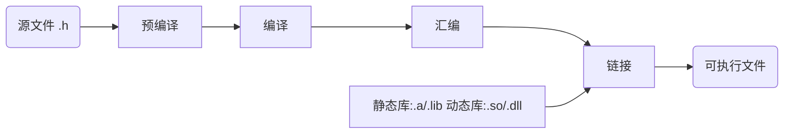
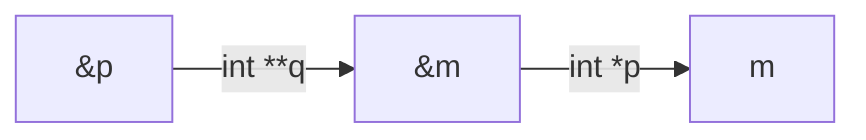

# GCC编译器

## GCC

1. 全称为GNU CC ，GNU项目中符合ANSI C标准的编译系统；
2. 编译如C、C++、Object C、Java、Fortran、Pascal、Modula-3和Ada等多种语言；
3. GCC是可以在多种硬体平台上编译出可执行程序的超级编译器，其执行效率与一般的编译器相比平均效率要高20%~30%；
4. 一个交叉平台编译器 ，适合在嵌入式领域的开发编译

gcc所支持后缀名解释 

1. ​    .c		           C原始程序
2. ​    .C/.cc/.cxx	C++原始程序
3. ​    .m		         Objective-C原始程序
4. ​    .i		            已经过预处理的C原始程序
5. ​    .ii		           已经过预处理的C++原始程序
6. ​    .s/.S	           汇编语言原始程序
7. ​    .h		           预处理文件(头文件)
8. ​    .o		           目标文件
9. ​    .a/.so	        编译后的库文件

## 编译器的主要组件

1. 分析器：分析器将源语言程序代码转换为汇编语言。因为要从一种格式转换为另一种格式（C到汇编），所以分析器需要知道目标机器的汇编语言。
2. 汇编器：汇编器将汇编语言代码转换为CPU可以执行字节码。
3. 链接器：链接器将汇编器生成的单独的目标文件组合成可执行的应用程序。链接器需要知道这种目标格式以便工作。
4. 标准C库：核心的C函数都有一个主要的C库来提供。如果在应用程序中用到了C库中的函数，这个库就会通过链接器和源代码连接来生成最终的可执行程序。

## GCC的基本用法和选项

Gcc最基本的用法是∶gcc [options] [filenames] 

1. -c，只编译，不连接成为可执行文件，编译器只是由输入的.c等源代码文件生成.o为后缀的目标文件，通常用于编译不包含主程序的子程序文件。 
2. -o output_filename，确定输出文件的名称为output_filename，同时这个名称不能和源文件同名。如果不给出这个选项，gcc就给出预设的可执行文件a.out。
3. -g，产生符号调试工具(GNU的gdb)所必要的符号资讯，要想对源代码进行调试，我们就必须加入这个选项。 
4. -O，对程序进行优化编译、连接，采用这个选项，整个源代码会在编译、连接过程中进行优化处理，这样产生的可执行文件的执行效率可以提高， 但是，编译、连接的速度就相应地要慢一些。
5. -O2，比-O更好的优化编译、连接，当然整个编译、连接过程会更慢。
6. -I  dirname，将dirname所指出的目录加入到程序头文件目录列表中，是在预编译过程中使用的参数。
7. -L  dirname，将dirname所指出的目录加入到程序函数档案库文件的目录列表中，是在链接过程中使用的参数。

## GCC编译过程

```c
#include<stdio.h>
int main(void)
{
    int i,j; 
    j=0;
    i=j+1;
    printf("hello,world\n");
    printf("the result is %d\n",i);
}
```

### 预处理(Pre-Processing) 

生成预处理代码；test.i比test.c增加了很多内容，主要是会展开头文件。

```sh
gcc -E ./test.c -o test.i
```

### 编译(Compiling)

生成汇编代码；检查语法错误,并生成汇编文件

```sh
gcc -S test.c -o test.s
```

### 汇编(Assembling)

生成目标代码

```sh
#方法一，用gcc直接从C源代码中生成目标代码
gcc -c test.c -o test.o
#方法二，用汇编器从汇编代码生成目标代码：
as test.s -o test.o
```

### 链接(Linking)

生成可执行程序；将目标程序链接库资源，生成可执行程序

```sh
gcc  test.s -o test
```

## GDB调试工具

首先使用gcc对test.c进行编译，注意一定要加上选项'-g'

```sh
gcc -g test.c -o test 
gdb test 
```

调试流程

| 功能         | 快捷键  |
| ------------ | ------- |
| 查看文件     | l       |
| 设置断点     | b 6     |
| 查看断点情况 | info b  |
| 运行代码     | r       |
| 查看变量值   | p n     |
| 单步运行     | n  /  s |
| 恢复程序运行 | c       |
| 退出         | q       |
| 帮助         | help    |

## 条件编译

常见的条件编译有两种方法：

1. 根据宏是否定义，其语法如下：

   ```c
   		#ifdef  <macro>
    		……
   		#else
     		……
   		#endif
   ```

   ```c
   #include<stdio.h>
   
   //#define  _DEBUG_
   int main () {
   
   #ifdef  _DEBUG_  // 当宏定了时
   //#ifndef  _DEBUG_ // 当宏没有定义时
           printf("The macro _DEBUG_ is defined\n");
   #else
           printf("The macro _DEBUG_ is not defined\n");
   #endif
   
   }
   ```

2. 根据宏的值，其语法如下：

   ```c
   		#if  <macro>
     		……
   		#else
   		……
   		#endif
   ```

   ```c
   #include<stdio.h>
   
   #define  _DEBUG_ 1
   int main () {
   
   #if _DEBUG_
           printf("The macro _DEBUG_ is defined\n");
   #else
           printf("The macro _DEBUG_ is not defined\n");
   #endif
   }
   ```

## 静态与动态链接库

### 库文件

1. 首先说明要对库有一个比较直观的理解。库是写好的现有的，成熟的，可以复用的代码。现实中每个程序都依赖很多基础的底层库，不可能每个人的代码都从零开始，公共代码需要反复使用，就把这些代码编译成为“库”文件，因此库的存在意义非同寻常。本质上说来库是一种可执行代码的二进制形式（注，其本身不可执行），可以被操作系统载入内存执行。
2. 静态库、动态库区别来自C语言在【链接阶段】如何处理库，链接成可执行程序：分别为静态链接方式、动态链接方式。



### 静态连接库

在链接阶段，会将汇编生成的目标文件.o与引用到的库一起链接打包到可执行文件中，因此对应的链接方式为静态链接。其实一个静态链接库可以简单看成一组目标文件(.o/.obj文件)的集合，连接器将从库文件取得所需的代码，复制到生成的可执行文件中即很多目标文件经过压缩打包后形成的一个文件。

1. 特点：可执行文件中包含了库代码的一份完整拷贝
2. 优点：程序在运行时就不需要函数库了。
3. 缺点：被多次使用就会多份冗余拷贝，因为所有相关的目标文件和牵涉到的函数库被链接合成一个可执行文件。生成的可执行文件较大。

### 动态链接库

动态：在程序编译是并不会被连接到目标代码中，而是在程序运行时才被载入。动太库独立于现有的程序，其本身不可执行，但包含着程序需要调用的一些函数，这种库称为动态（链接）库（Dynamic Link Library）。不同的应用程序如果调用相同的库，那么在内存里只需要有一份该共享库的实例，规避了空间浪费问题。特点：

1. 动态库把对一些库函数的链接载入推迟到程序运行时期
2. 可以实现进程之间的资源共享，（动态库也成为共享库）
3. 设置可以真正做到链接载入完全由程序员在程序代码中控制（显式调用）
4. 缺点：要使用的动态库自己必须添加到路径。而静态库直接打包到了可执行程序，运行时不需要额外东西。

### 库的生成与使用

实例：三个文件

hello.h

```c
#ifndef HELLO_H
#define HELLO_H

void hello(const char *name);

#endif //HELLO_H
```

hello.c

```c
#include <stdio.h>

void hello(const char *name)
{
  printf("Hello %s!/n", name);
}
```

main.c

```c
#include <stdio.h>
#include "hello.h"

int main()
{
  hello("everyone");
  return 0;
}
```

在main函数中要调用hello函数。如果我们直接编译，是通不过的。gcc main.c或者gcc -o main main.c会报错，因为无法找到调用导函数。

#### 静态库

linux下静态库的后缀名为.a文件，这时使用静态库来链接使用该hello函数。

##### 生成

1. 先将hello.c生成二进制文件gcc -c hello.c -o hello.o
2. 由.o文件创建静态库:静态库文件名的命名规范是以lib为前缀，紧接着跟静态库名，扩展名为.a。例如：将创建的静态库名为myhello，则静态库文件名就是libmyhello.a。在创建和使用静态库时，需要注意这点。创建静态库用ar命令。ar cr libmyhello.a hello.o这里如果有多个.o文件可以在命令后面加入多个.o文件将他们一起打包成一个静态库文件。

##### 使用

1. 编译：需要gcc命令编译，gcc main.c -o main生成可执行文件时会报错 ，所以需要指定静态库然后生成可执行文件
2. gcc main.c -o main -L . -l myhello。为何这么使用呢： -L ：表示要链接的库所在的目录。-L. 表示要链接的库在当前目录，当然可以指定其他目录。
3. -l (L的小写)：表示需要链接库的名称，注意不是库文件名称，比如库文件为 libmyhello.a，那么库名称为myhello。gcc会在静态库名前加上前缀lib，然后追加扩展名.a得到的静态库文件名来查找静态库文件。
4. 运行：静态库在编译生成可执行文件后，就包含在可执行文件中了，可以把静态库删掉 ，再执行./main程序，也不会出错（但是动态链接库就不行）。

#### 动态库

与创建静态库不同的是，不需要打包工具，直接使用编译器即可创建动态库。动态库名字linux下为.so后缀文件

##### 生成

1. 使用命令 gcc -shared -fPIC -o libmyhello.so hello.c 生成动态链接库libmyhello.so，后面源文件可以跟多个.c文件
2. 说明： -shared ：指定生成动态链接库 -fPIC： 表示编译为位置独立的代码，不用此选项的话编译后的代码是位置相关的所以动态载入时是通过代码拷贝的方式来满足不同进程的需要，而不能达到真正代码共享的目的。输出文件libmyhello.so 动态库文件名命名规范和静态库文件名命名规范类似，也是在动态库名增加前缀lib，但其文件扩展名为.so。例如：我们将创建的动态库名为myhello，则动态库文件名就是libmyhello.so

##### 使用

1. 编译： gcc main.c -o main -L . -l myhello 与链接静态库使用方法相同
2. 运行：动态链接实在运行时才进行的。执行./main程序时，可能报错，因为程序在运行时，会在/usr/lib和/lib等目录中查找需要的动态库文件。若找到，则载入动态库，否则将提示类似上述错误而终止程序运行。
3. 程序运行时有三种方式加载动态库路径（按优先级来）：
   1. 把库拷贝到/usr/lib和/lib目录下。
   2. 在LD_LIBRARY_PATH环境变量中加上库所在路径。（常用）例如动态库libmyhello.so在/home/ting/lib目录下，以bash为例，使用命令：export LD_LIBRARY_PATH=$LD_LIBRARY_PATH:/home/ting/lib
   3. 修改/etc/ld.so.conf文件，把库所在的路径加到文件末尾，并执行ldconfig刷新。这样，加入的目录下的所有库文件都可见。
4. Linux动态链接库的搜索路径按优先级排序为：
   1. 编译目标代码时指定的动态库搜索路径；在编译时通过gcc 的参数”-Wl,-rpath,”指定。当指定多个动态库搜索路径时，路径之间用冒号”：”分隔。
   2. 环境变量LD_LIBRARY_PATH指定的动态库搜索路径；
   3. 配置文件/etc/ld.so.conf中指定的动态库搜索路径；
   4. 默认的动态库搜索路径/lib；
   5. 默认的动态库搜索路径/usr/lib；
5. 当运行成功后，如果把ibmyhello.so文件删除。再执行main程序会发现程序报错。说明动态库是在运行时加载的，也就是在运行的时候，动态库必须存在，不然程序就找不到要调用的函数。

##### 使用ldd

dd查看某个可运行程序在运行时所要用的动态库.so：ldd ./example

#### 注意

当动态库和静态库同名存在时，默认使用的是动态库。也就是不会将静态库编译到可执行文件中去。

# Makefile

## Make

1. 工程管理器，顾名思义，是指管理较多的文件 
2. Make工程管理器也就是个“自动编译管理器”，这里的“自动”是指它能够根据文件时间戳。自动发现更新过的文件而减少编译的工作量，同时，它通过读入Makefile文件的内容来执行大量的编译工作 
3. Make将只编译改动的代码文件，而不用完全编译。

## Makefile

 Makefile是Make读入的唯一配置文件 

1. 由make工具创建的目标体（target），通常是目标文件或可执行文件
2. 要创建的目标体所依赖的文件（dependency_file）
3. 创建每个目标体时需要运行的命令（command）
4. 注意:命令行前面必须是一个”TAB键”,否则编译错误为:*** missing separator.  Stop.

Makefile格式

target  :   dependency_files

<TAB>  command

例子

hello.o :  hello.c hello.h

​	gcc  –c  hello.c  –o  hello.o

实验1:

f1.c

```c
#include<stdio.h>

int print1() {
    printf("i'm f1.c\n");
}
```

f2.c

```c
#include<stdio.h>

int print2() {
    printf("i'm f2.c\n");
}
```

head.h

```c
void print1();
void print2();
```

main.c

```c
#include<stdio.h>
#include "head.h"

int main() {
        print1();
        print2();
}
```

```makefile
test: f1.o f2.o main.o
        gcc f1.o f2.o main.o -o test
f1.o: f1.c
        gcc -c f1.c -o f1.o
f2.o: f2.c
        gcc -c f2.c -o f2.o
main.o: main.c
        gcc -c main.c -o main.o
.PHONY: clean
clean:
        rm *.o test
```

```bash
[root@server01 make]# make
gcc -c f1.c -o f1.o
gcc -c f2.c -o f2.o
gcc -c main.c -o main.o
gcc f1.o f2.o main.o -o test
[root@server01 make]#
```

比如我们修改f2.c文件后再使用make进行编译，发现它只会重新编译修改过的f2.c文件：

```bash
[root@server01 make]# make
gcc -c f2.c -o f2.o
gcc f1.o f2.o main.o -o test
[root@server01 make]#
```

在make过程成会生成很多编译结果文件.o，如果想在构建完成后删除这些中间的编译结果文件可以在Makefile文件的后面添加规则：clean: rm*.o，然后在make完之后再执行make clean；但是如果目录中出现了"clean"文件，则规则失效了：没有依赖文件，文件"clean"始终是最新的，命令永远不会执行（相当于make会认为这里的clean:跟前面f1.o: f1.c一样，需要生成clean文件，而此时目录中又有clean文件并且是最新的，所以后面的命令不会执行）；此时可以使用PHONY，告诉make后面跟着的名称不是指文件名，那么make xxxx 就表示执行xxxx :指定的命令，而不是要（make）生成xxxx

# 数据类型

## 基本类型

### 整型

C语言中的整型包括signed和unsigned两大类；

#### short

| 类型名称            | 长度(字节) | 值域         |
| ------------------- | ---------- | ------------ |
| short(signed short) | 2          | -32768~32767 |
| unsigned short      | 2          | 0~65536      |

#### int

| 类型名称        | 长度(字节) | 值域                   |
| --------------- | ---------- | ---------------------- |
| int(signed int) | 4          | -2147483648~2147483647 |
| unsigned int    | 4          | 0~4294967295           |

#### long

### 字符型

#### char

| 类型名称          | 长度(字节) | 值域     |
| ----------------- | ---------- | -------- |
| char、signed char | 1          | -128~127 |
| unsigned char     | 1          | 0~255    |

```c
#include <stdio.h>

int main() {
    char ch;
    ch = 65;
    //ch = 128; // 出错，数据越界(-128)
    //ch = 129; // 出错，数据越界(-127)
    //unsigned char ch  = -1; // 出错，数据越界(255)
    printf("ch=%d,%c\n",ch,ch);
}
```

### 实型

#### float

#### double

### 枚举型

#### enum

## 构造类型

### 数组

### 结构体

#### struct

### 共用体

#### union

## 指针类型

## 空类型

### void

## 布尔型

不是基本类型，对bool型的使用必须引入头文件：#include<stdbool.h>

bool：非零(true)，零(false)

```c
#include<stdio.h>
#include<stdbool.h>

int main() {
    bool a;
    //a = false;
    a = -1;
    if (a) {
        printf("true %d\n",a);
    }
    else {
        printf("false %d\n",a);
    }
   return 0;
}
```

可以通过如下命令输出c语言的预处理过程（将一些宏进行展开），可以找到stdbool.h在系统中的存放位置，从而观察stdbool.h的具体实现，从stdbool.h的实现可以看到，c语言后来引入了一种新的基本数据类型：_Bool，所以我们可以在代码中直接定义_Bool类型的变量来代替引入#include<stdbool.h>的方式。

gcc -E helloworld.c -o hello.i

```c
# 943 "/usr/include/stdio.h" 3 4

# 2 "helloworld.c" 2
# 1 "/usr/lib/gcc/x86_64-redhat-linux/4.8.5/include/stdbool.h" 1 3 4
# 3 "helloworld.c" 2

int main() {
    _Bool a;

    a = -1;
    if (a) {
        printf("true %d\n",a);
    }
    else {
        printf("false %d\n",a);
    }
   return 0;
}
```

# 常量

常量是指在程序运行期间其数值不发生变化的数据。

## 整型常量

整型常量通常简称为整数。整数可以是十进制数、八进制数和十六进制数。例如，十进制的数值3356可以有下列两种不同的表示形式：

- 八进制：06434
- 十六进制：0xd1c 

```c
#include <stdio.h>

int main() {

    int a = 0xd;
    printf("%d %x %o\n",a,a,a); // 分别打印出十进制、十六进制和八进制。
}
```

## 浮点常量

浮点常量又称为实数，一般含有小数部分，在C语言中，实数只有十进制的实数，分为单精度和双精度。实数有两种表示方法，即一般形式和指数形式。

一般形式的实数基本形式如下：

例如，3.5、-12.5、3.1415926

指数形式的

例如：1.176e+10表示1.176x10的十次方、-3.5789e-8表示-3.5789x10的负八次方

```c
#include <stdio.h>

int main() {

    float b = 3.5e+10;
    printf("%e %f\n",b,b);; // 分别打印出一般形式和指数形式。
}
```

## 字符常量

字符常量是指一个单一字符，其表示形式是由两个单引号包括的一个字符。(只有ASCII码表中的字符才能被单引号引起来)在C语言中，字符常量具有数值。字符常量的值就是ASCII码值。可以把字符常量看做一个字节的正整数。

```c
#include <stdio.h>

int main() {
    char a,b,u,v;
    a = 'F';        // 将70赋值给a;即：a = 70;
    b = 'A' + 2;    // b存放的是'C'字符j；即：b = 65 + 2;
    u = ' ' + 'B';  // u存放的是'b'字符；相当于SPACE的ASCII码值加上'B'的ASCII码值；即：u = 32 + 66；
    v = 'b' - 32;   // v存放的是'B'字符；v = 97 - 32;

    printf("%d %d %d %d\n",a,b,u,v);
    printf("%c %c %c %c\n",a,b,u,v);
}
```

## 字符串常量

所谓字符串常量是指用双引号括起来的一串字符来表示的数据。字符串以\0结尾

```c
# include<stdio.h>

int main () {

    char arr1[] = {"abc"};               // 会自动添加一个'\0'作为结尾，通过sizeof可以看到它占用的空间为4，因此可知该字符串包含一个隐藏的结束符\0
    char arr2[] = {'a', 'b', 'c', '\0'};
    printf("%d %d\n",sizeof(arr1),sizeof(arr2));
    printf("%s %s\n",arr1,arr2);
}
```

## 标识常量

所谓标识常量是指用标识符代替常量使用的一种常量，其名称通常是一个标识符。标识常量也叫符号常量，一般用大写英文字母的标识符。在使用之前必须预先定义。说明形式为:# define <标识常量名称> <常量>。定义一个宏名字之后，可以在其他宏定义中使用，例如：

```c
#include <stdio.h>

#define ONE 1
#define TWO ONE + ONE

int main() {
    int a = 10,b = 20,c;
    // 注意在使用宏的时候，不会进行计算，而是直接替换，比如 TWO = ONE + ONE 展开后不是把1+1的结果赋值给TWO，而是将TWO里面的ONE用1替换，同样如果把#define ONE 1+1，那么在运算的时候也是把使用到ONE的地方替换成1+1
    c = ONE + TWO * b + a; // 等价于 1 + 1 + 1 * 20 + 10 =32
    printf("%d\n",c);
    return 0;
} 
```

# 变量

1. 变量名由字母、数字、下划线组成，不能以数字开头，不能和C的关键字重名；
2. 在程序运行时，变量占据存储空间的大小由其数据类型决定；
3. 变量在内存空间中的首地址，称为变量的地址。

变量在程序中使用时，必须预先说明它们的存储类型和数据类型。

变量说明的一般形式：

<存储类型> <数据类型> <变量名>；

## 存储类型

存储类型有四种：auto、register、static和extern，默认是auto

### auto

auto说明的变量只能在某个程序范围内使用，通常在函数体内或函数中的复合语句里。（默认是随机值）在函数体的某程序段内说明auto存储类型的变量时可以省略关键字auto。

```c
#include <stdio.h>

int main() {

    if (1) {
        int a;
        printf("%d\n",a);
    }
    //printf("%d\n",a); // 编译报错 int.c:9:19: 错误：‘a’未声明(在此函数内第一次使用)
}
```

### register

1. register称为寄存器型，register变量是想将变量放入CPU的寄存器中，这样可以加快程序的运行速度。如申请不到就使用一般内存，同auto ;
2. register变量必须是能被CPU所接受的类型。这通常意味着register变量必须是一个单个的值，并且长度应该小于或者等于整型的长度。不能用“&”来获取register变量的地址。
3. 由于寄存器的数量有限，真正起作用的register修饰符的数目和类型都依赖于运行程序的机器。在某些情况下，把变量保存在寄存器中反而会降低程序的运行速度。因为被占用的寄存器不能再用于其它目的；或者变量被使用的次数不够多，不足以装入和存储变量所带来的额外开销。

### static

static变量称为静态存储类型的变量，既可以在函数体内(局部变量)，也可在函数体外说明(全局变量)。(默认是0）局部变量使用static修饰,有以下特点:

1. 在内存中以固定地址存放的，而不是以堆栈方式存放
2. 只要程序没结束，就不会随着说明它的程序段的结束而消失，它下次再调用该函数，该存储类型的变量不再重新说明，而且还保留上次调用存入的数值

###  extern

1. 当变量在一个文件中的函数体外说明，所有其他文件中的函数或程序段都可引用这个变量。
2. extern称为外部参照引用型，使用extern说明的变量是想引用在其它文件中函数体外部说明的变量。
3. static修饰的全部变量，其它文件无法使用。

```c
int global_a = 100;
```

```c
#include <stdio.h>

extern int global_a;

int main() {

    printf("global_a=%d\n",global_a);
    return 0;
}
```

```sh
[root@server01 C]# gcc extern_static1.c extern_static2.c
[root@server01 C]# ./a.out
global_a=100
```

# 结构体

## 简述

1. 在实际的处理对象中，有许多信息是由多个不同类型的数据组合在一起进行描述，而且这些不同类型的数据是互相联系组成了一个有机的整体。此时，就要用到一种新的构造类型数据——结构体（structure），简称结构。
2. 结构体的使用为处理复杂的数据结构（如动态数据结构等）提供了有效的手段，而且，它们为函数间传递不同类型的数据提供了方便。

## 概念

1. 结构体是用户自定义的新数据类型，在结构体中可以包含若干个不同数据类型和不同意义的数据项（当然也可以相同），从而使这些数据项组合起来反映某一个信息。
2. 例如，可以定义一个职工worker结构体，在这个结构体中包括职工编号、姓名、性别、年龄、工资、家庭住址、联系电话。这样就可以用一个结构体数据类型的变量来存放某个职工的所有相关信息。并且，用户自定义的数据类型worker也可以与int、double等基本数据类型一样，用来作为定义其他变量的数据类型

## 定义

定义一个结构体类型的一般形式为：

```c
struct  结构体名
{
 数据类型　　　成员名1;
 数据类型　　　成员名2;
 ：
 数据类型　　　成员名n;
 };
```

在大括号中的内容也称为“成员列表”或“域表”。其中，每个成员名的命名规则与变量名相同；数据类型可以是基本变量类型和数组类型，或者是一个结构体类型；用分号";"作为结束符。整个结构的定义也用分号作为结束符。

```c
#include <stdio.h>
#include <string.h>

#define N 32

struct student{
        int no;
        char name[N];
        float score;
}s3 = {3,"s3",90},s4 = {4,"s4",89};

int main(int argc, const char *argv[])
{
        struct student s1,s2;
        strcpy(s1.name,"s1");
        s1.score = 90;
        s1.score = 99;
        s1.name[0] = 'S';
        printf("%d %s %.2f\n",s1.no,s1.name,s1.score);
        s2 = s1;
        s2.no =2;
        printf("%d %s %.2f\n",s2.no,s2.name,s2.score);
        printf("%d %s %.2f\n",s3.no,s3.name,s3.score);
        printf("%d %s %.2f\n",s4.no,s4.name,s4.score);
        return 0;
}
```

```c
#include <stdio.h>
#include <string.h>

#define N 32

struct student{
        int no;
        char name[N];
        struct birthday{
                int year;
                int month;
                int day;
        }date;
        float score;
}s1 = {1,"s1",{1992,9,9},89};

int main(int argc, const char *argv[])
{
        struct student s2;
        s2.no = 2;
        strcpy(s2.name,"s2");
        s2.date.year = 1993;
        s2.date.month = 10;
        s2.date.day = 10;
        s2.score = 99;
        printf("%d %s %d-%d-%d %.2f\n",s1.no,s1.name,s1.date.year,s1.date.month,s1.date.day,s1.score);
        printf("%d %s %d-%d-%d %.2f\n",s2.no,s2.name,s2.date.year,s2.date.month,s2.date.day,s2.score);
        return 0;
}
```

## 结构体数组

具有相同结构体类型的结构体变量也可以组成数组，称它们为结构体数组。结构体数组的每一个数组元素都是结构体类型的数据，它们都分别包括各个成员（分量）项。定义结构体数组的方法和定义结构体变量的方法相仿，只需说明其为数组即可。

可以采用三种方法：

1. 先定义结构体类型，再用它定义结构体数组。

   ```c
   struct student
   {
       char name[20];
       char sex;
       int age;
       char addr[20];
   };
   struct student stu[3]; 
   ```

2. 在定义结构体类型同时定义结构体数组。

   ```c
   struct student
   {
       char name[20];
       char sex;
       int age;
       char addr[20];
   }stu[3]; 
   ```

3. 直接定义结构体数组

   ```c
   struct 
   {
       char name[20];
       char sex;
       int age;
       char addr[20];
   }stu[3]; 
   ```

## 结构体数组的初始化

结构体数组在定义的同时也可以进行初始化，并且与结构体变量的初始化规定相同，只能对全局的或静态存储类别的结构体数组初始化。

## 结构体数组的使用

一个结构体数组的元素相当于一个结构体变量，因此前面介绍的有关结构体变量的规则也适应于结构体数组元素。

```c
#include <stdio.h>

#define N 20

struct student{
        int no;
        char name[N];
        float score;
}s5[5];

int main(int argc, const char *argv[])
{
        // 可以将一个结构体数组元素值赋给同一结构体类型的数组中的另一个元素，或赋给同一类型的变量。
        struct student stu[3] = {{1,"s1",90},{2,"s2",91},{3,"s3",99}};
        struct student student1;
        student1=stu[0];
        printf("no=%d;name=%s;score=%f\n",student1.no,student1.name,student1.score);
        return 0;
}
```

## 结构体指针

可以设定一个指针变量用来指向一个结构体变量。此时该指针变量的值是结构体变量的起始地址，该指针称为结构体指针。结构体指针与前面介绍的各种指针变量在特性和方法上是相同的。与前述相同，在程序中结构体指针也是通过访问目标运算“*”访问它的对象。 结构体指针在程序中的一般定义形式为：struct 结构体名  *结构指针名；其中的结构体名必须是已经定义过的结构体类型。当表示指针变量p所指向的结构体变量中的成员时，"（*结构体指针名）.成员名"这种表示形式总是需要使用圆括号，显得很不简炼。因此，对于结构体指针指向的结构体成员项，给出了另外一种简洁的表示方法，如下表示：结构体指针名->成员名。它与前一种表示方法在意义上是完全等价的。例如，结构体指针p指向的结构体变量中的成员name可以表示如下：（*p）.name 或 p->name

```c
#include <stdio.h>

#define N 20

struct student{
        int no;
        char name[N];
        float score;
};

int main(int argc, const char *argv[])
{
        int i;
        struct student s1[] = {{1,"s1",90},{2,"s2",91},{3,"s3",99}};
        struct student *p;
        //p = s1;
        p = &s1[0];
        printf("s1=%p;s1[0]=%p;&s1[0]=%p\n",s1,s1[0],&s1[0]);
        for(i = 0;i < sizeof(s1)/sizeof(struct student);i++)
        {
                printf("--%d-%s-%f--\n",p->no,p->name,(*p).score);
                p++;
        }
        return 0;
}
```

# 共用体

在C语言中，不同数据类型的数据可以使用共同的存储区域，这种数据构造类型称为共用体，简称共用，又称联合体。共用体在定义、说明和使用形式上与结构体相似。两者本质上的不同仅在于使用内存的方式上。例如定义一个共用体类型union gy，它由三个成员组成，这三个成员在内存中使用共同的存储空间。由于共用体中各成员的数据长度往往不同，所以共用体变量在存储时总是按其成员中数据长度最大的成员占用内存空间。在这一点上共用体与结构体不同，结构体类型变量在存储时总是按各成员的数据长度之和占用内存空间。

```c
#include <stdio.h>

union gy{
        char a;
        short b;
        int c;
}v2;

int main(int argc, const char *argv[])
{
        union gy v1;
        printf("%d %d %d\n",sizeof(char),sizeof(short),sizeof(int));
        printf("%d\n",sizeof(union gy));
        // 在使用共用体类型变量的数据时要注意：在共用体类型变量中起作用的成员是最后一次存放的成员，在存入一个新的成员后原有的成员就失去作用。
        // 如有以下赋值语句：完成以上三个赋值运算以后，v1.c是有效的，v1.a和v1.b已经无意义了。
        v1.a = 'A';
        v1.b = 20;
        //
        v1.c = 0x12345678;
        printf("%#x %#x\n",v1.a,v1.b);
        printf("%p %p %p \n",&v1.a,&v1.b,&v1.c);

        int i;
        char *p;
        p = (char *)&v1;
        for(i = 0;i < sizeof(union gy);i++)
        {
                printf("%#x\n",*p);
                p++;
        }

        return 0;
}
```

# typedef

在C语言中，允许使用关键字typedef定义新的数据类型。typedef   <已有数据类型>   <新数据类型>；

如：typedef  int INTEGER; 这里新定义了数据类型INTEGER, 其等价于int；INTEGER i;  <==> int  i;

# 运算符

## 算术运算符

| 运算符 | 功能说明 |
| ------ | -------- |
| +      | 加       |
| -      | 减       |
| *      | 乘法     |
| /      | 除法     |
| %      | 取模     |
| ++     | 自增     |
| --     | 自减     |

## 关系运算符

| 运算符 | 功能说明 |
| ------ | -------- |
| >      | 大于     |
| >=     | 大于等于 |
| <      | 小于     |
| <=     | 小于等于 |
| ==     | 等于     |
| !=     | 不等于   |

## 逻辑运算符

| 运算符 | 功能说明 |
| ------ | -------- |
| !      | 逻辑反   |
| &&     | 逻辑与   |
| \|\|   | 逻辑或   |

## 位运算符

| 运算符 | 功能说明                     |
| ------ | ---------------------------- |
| ~      | 位逻辑反                     |
| &      | 位逻辑与                     |
| \|     | 位逻辑或                     |
| ^      | 位逻辑异或(相同为0，相反为1) |
| >>     | 右移位                       |
| <<     | 左移位                       |

## 特殊运算符

### 逗号运算符

注意事项：逗号运算符( , )是C语言运算符中优先级最低的一种运算符。

```c
#include <stdio.h>

int main() {

  int a,s,d;
  s = 2;
  d = 3;
  // 先算括号内的值：s+2=4，d+4=7；括号内应为（4,7），括号内取值只取最后一个，如
果没有括号则取第一个；a=12+7=19。
  a = 12 + ( s + 2, d + 4 );
  int x,y,z;
  // 是首先把y赋值为3,把y递增为4,然后把4加上2,把结果6赋值给z,接下来把z加5最后把x赋为结果值11。
  x=(y=3,(z = ++y+2) +5);
  printf("a=%d\n",a);
  printf("x=%d\n",x);
}
```

# 输入输出

## 数据输出

C语言无I/O语句，I/O操作由函数实现：#include <stdio.h>

### 字符输出函数

格式: putchar( c )

参数: c为字符常量、变量或表达式

功能：把字符c输出到显示器上

返值：正常，为显示的代码值；

```c
#include <stdio.h>
main()
{   
    int c;
    char a;
    c=65;  a='B';
    putchar(c); putchar('\n'); putchar(a);
}
```

### 格式输出函数

格式：printf(“格式控制串”，输出表)

功能：按指定格式向显示器输出数据

输出表：要输出的数据

格式控制串：包含两种信息

- 格式说明：%[修饰符]格式字符，用于指定输出格式
- 普通字符：原样输出

#### 格式符

| 格式符 | 作用               |
| ------ | ------------------ |
| i,d    | 十进制整数         |
| x,X    | 十六进制无符号整数 |
| o      | 八进制无符号整数   |
| u      | 无符号十进制整数   |
| c      | 单一字符           |
| s      | 字符串             |
| e,E    | 指数形式浮点小数   |
| f      | 小数形式浮点小数   |
| g      | e和f较短一种       |
| p      | 地址、指针         |
| %%     | 百分号本身         |

#### 修饰符

| 修饰符 | 功能                                               |
| ------ | -------------------------------------------------- |
| m      | 输出数据域宽，数据长度<m，左补空格；否则按实际输出 |
| .n     | 对实数，指定小数点后位数(四舍五入)                 |
| .n     | 对字符串，指定实际输出位数                         |
| -      | 输出数据在域内左对齐(缺省右对齐)                   |
| +      | 指定在有符号数的正数前显示正号(+)                  |
| 0      | 输出数值时指定左边不使用的空位置自动填0            |
| #      | 在八进制和十六机制数前显示前导0，0x                |
| l      | 在d,o,x,u前，指定输出精度为long型                  |
| l      | 在e,f,g前，指定输出精度为double型                  |

```c
#include <stdio.h>

int main() {
    int a=1234;
    float f=123.456;
    char ch='a';
    printf("%8d,%2d\n",a,a);
    printf("%f,%8f,%8.1f,%.2f\n",f,f,f,f);
    printf("%3c\n",ch);
    char b[]="Hello,world!";
    printf("%s\n%15s\n%10.5s\n%2.5s\n%.3s\n",b,b,b,b,b);
    int c=1234;
    float g=123.456;
    printf("%08d\n",c);
    printf("%010.2f\n",g);
    printf("%0+8d\n",c);
    printf("%0+10.2f\n",g);
}
```

## 数据输入

### 字符输入函数

字符输入函数getchar

格式:  getchar( )

功能：从键盘读一字符

返值：正常，返回读取的代码值；出错或结束键盘输入,返回-1 （ctrl   d）

```c
#include <stdio.h>
int main()
{  int c;
   printf("Enter a character:");
   c=getchar();
   printf("%c--%d->hex%x\n", c, c, c);
}
```

### 格式输入函数

格式: scanf(“格式控制串”，地址表）

功能：按指定格式从键盘读入数据，存入地址表指定

存储单元中,并按回车键结束

返值：正常，返回输入数据个数

地址表：变量的地址，常用取地址运算符&

输入数据时，遇以下情况认为该数据结束：

1. 遇空格、TAB、或回车
2. 遇非法输入
3. 遇宽度结束

#### 格式符

| 格式符 | 作用               |
| ------ | ------------------ |
| i,d    | 十进制整数         |
| x,X    | 十六进制无符号整数 |
| o      | 八进制无符号整数   |
| u      | 无符号十进制整数   |
| c      | 单一字符           |
| s      | 字符串             |
| e      | 指数形式浮点小数   |
| f      | 小数形式浮点小数   |

#### 修饰符

| 修饰符 | 功能                                       |
| ------ | ------------------------------------------ |
| h      | 在d,o,x前，指定输入为short型整数           |
| l      | 在d,o,x前，指定输入为long型整数            |
| l      | 在e,f前，指定输入为double型实数            |
| m      | 指定输入数据宽度，遇空格或不可转换字符结束 |
| *      | 抑制符，指定输入项读入后不赋给变量         |

 ```c
 #include <stdio.h>
 int main()
 {
     int n,yy,mm,dd;
     //// 当用户输入2012 12 01和20121201时都能得到正确结果，
     //// 即：即使没有手动输入空格或者换行进行分隔，C语言也会自动根据设置好的格式对输入内容进行分隔
     //n = scanf("%4d%2d%2d",&yy,&mm,&dd);
 
     // 但是如果不指定变量的位数的话，只有当遇到空格或者换行的时候才会认为一个数据的输入结束
     n = scanf("%d%d%d",&yy,&mm,&dd);
     printf("n=%d,yy=%d,mm=%d,dd=%d\n", n,yy,mm,dd);
 
     int a, b;
     // 若输入13467，则a为12，b为67
     n = scanf("%2d%*3d%2d",&a,&b);
     printf("n=%d,a=%d,b=%d\n", n,a,b);
 
     char c1,c2,c3;
     // 用“%c”格式符时，空格、回车和转义字符作为有效字符输入
     // 若输入a b c，则c1为a，c2为空格, c3为b
     n = scanf("%c%c%c",&c1,&c2,&c3);
     printf("n=%d,c1=%c,c2=%c,c3=%c\n", n,c1,c2,c3);
 
     char ch;
     int x;
     scanf("%d",&x);
     // 使用scanf(" %c",&ch);或 scanf("%*c%c",&ch);来接收标识输入结束的换行符
     scanf(" %c",&ch);
     printf("x=%d,ch=%c\n", x,ch);
 }
 ```

### 字符串输入函数

字符串输入函数gets

格式： char * gets(char  *s)

功能：从键盘输入一以回车结束的字符串放入字符数组中，并自动加‘\0’

说明1：输入串长度应小于字符数组维数

说明2：与scanf函数不同，gets函数并不以空格作为字符串输入结束的标志。

```c
#include <stdio.h>
int main()
{
    char string[15];
    printf("Input a string:");
    gets(string);
    printf("%s\n", string);
    return 0;
}
```

### 字符串输出函数

字符串输出函数puts

格式：int puts(const char *s)

功能：向显示器输出字符串（输出完，换行）

说明：字符数组必须以‘\0’结束

```c
#include <stdio.h>
int main()
{
    char string[80] = "How are you";
    puts(string);
    return 0;
}
```

# 控制语句

## 分支

### if

if (表达式) 

​	语句块1                           		
else

​	语句块2

1. 简化形式

   if(表达式) 语句块     例如:  if(x>y) printf(“%d”, x);

2. 阶梯形式

3. 嵌套形式

语句块：当有若干条语句时，必须用{…}括起来

```c
#include <stdio.h>

int main() 
{
        float score;

        printf("please input your score:");
        scanf("%f", &score);

        if (!(score >= 0 && score <= 100)) 
                printf("not in [0, 100]\n");
        else if (score >= 90) 
                printf("A-excellent\n");
        else if (score >= 70) 
                printf("B-good\n");
        else if (score >= 60) 
                printf("C-OK\n");
        else 
                printf("D-not pass\n");

        return 0;
}
```

### switch

switch语句的使用：

1. 每个常量表达式的值必须各不相同,否则将会出现矛盾。
2. 当表达式的值与case后面的常量表达式值相等时，就执行此case后面的语句。
3. switch中的表达式可以是整型、字符型表达式或枚举。
4. case 常量：只起语句标号的作用。

```c
#include <stdio.h>

int main() 
{
        float score = 0;
        printf("please input score:");
        scanf("%f", &score);

        if ( !(score >= 0 && score <= 100) ) 
                printf("not in [0,100]\n");
        else {
                switch ((int)score / 10) {
                case 10:
                case 9:
                        printf("A-excellent\n");
                        break;
                case 8:
                case 7:
                        printf("B-good\n");
                        break;
                case 6:
                        printf("C-OK\n");
                        break;
                default:
                        printf("D-not pass\n");
                }
        }
        return 0;
}
```

## 循环

### goto

当函数有很多个出口，使用goto把这些出口集中到一处是很方便的，特别是函数中有许多重复的清理工作的时候。

1. 无条件跳转易于理解
2. 可以减少嵌套
3. 可以避免那种忘记更新某一个出口点的问题

```c
#include <stdio.h>

int main(int argc, const char * argv[])
{
        int i = 1;
        int sum = 0;

_loop:
        if (i <= 100) {
                sum += i;
                i++;
                goto _loop;
        }

        printf("1+2+...+%d=%d\n", i, sum);

        return 0;
}
```

### while

while语句构成循环

基本形式

while (表达式） {

​	statatments;

}

```c
#include <stdio.h>

int main(int argc, const char * argv[]) 
{
        int i = 1;
        int sum = 0;

        while (i <= 100) {
                sum += i;
                i++;
        }

        printf("1+2+...+%d=%d\n", i, sum);

        return 0;
}
```

### do while

do whiledo-while语句构成循环

基本形式

do {

​	statatments;

}while(表达式）；

```c
#include <stdio.h>

int main(int argc, const char * argv[]) 
{
        int i = 1;
        int sum = 0;

        do {
                sum += i;
                i++;
        }while (i <= 100);

        printf("1+2+...+%d=%d\n", i, sum);

        return 0;
}
```

### for

一般形式

for(expression1; expression2; expression3)

{ statements;}

执行过程

先求解表达式1，表达式1在整个循环中只执行一次;

求解表达式2,若为真,则执行循环体,然后执行步骤3;若为假,则退出循环执行for下面的语句;

for语句构成循环

- 表达式1可省略,但循环之前应给循环变量赋值
- 表达式2可省略,将陷入死循环
- 表达式3可省略,但在循环体中增加使循环变量值改变的语句

```c
#include <stdio.h>

int main() {

        int i = 0 , sum = 0;
        for (i = 1 ; i <= 100 ; i++) sum+=i;
        printf("sum=%d\n" , sum);
}
```

## 辅助控制

### break

1. 用于从循环体内跳出循环体，即提前结束循环。
2. break只能用在循环语句和switch语句中。

### continue

1. 结束本次循环,接着判定下一次是否执行循环。
2. continue直结束本次循环,而break终止本层循环。

### return

1. 主要用于终止包含它的函数的执行。
2. 若终止的为主函数，则主程序结束。

引用数学库时，要在编译后加上-lm，即：gcc continue_s.c -o continue_s -lm

```c
#include <stdio.h>
#include <math.h>

int main(int argc, char *argv[])
{
        int n, m;
        int i;
        int ch;

        while (1) {
                printf("input num(# exit):");
                if (scanf("%d", &n) == 0) {
                        if ((ch = getchar()) == '#')
                                return 0;//break;
                        else {
                                printf("error:again!\n");
                                continue;
                        }
                }

                i = 2;
                m = sqrt(n);
                while (i <= m) {
                        if (n % i == 0) 
                                break;
                        i++;
                }
                if (i > m)
                        printf("yes:%d\n", n);
                else
                        printf("not:%d\n", n);
        }

        //printf("end main\n");

        return 0;
}
```


# 数组和字符串

## 数组

1. 构造数据类型之一
2. 数组是具有一定顺序关系的若干个变量的集合，组成数组的各个变量称为数组的元素
3. 数组中各元素的数据类型要求相同,用数组名和下标确定。数组可以是一维的，也可以是多维的
4. 数组名表示内存首地址，是地址常量sizof(数组名）是数组占用的总内存空间
5. 编译时分配连续内存 内存字节数=数组维数*sizeof(元素数据类型)
6. C语言对数组不作越界检查，使用时要注意
7. 数组不初始化，其元素值为随机数
8. 对static数组元素不赋初值，系统会自动赋以0值

```c
#include <stdio.h>

int main() {

        //static int a[5],i; // 对static数组元素不赋初值，系统会自动赋以0值
        //int a[5]={1,2,3},i; // 等价于：a[0]=6; a[1]=2;a[2]=3; a[3]=0; a[4]=0;
        //int a[5]={1,2,3,4,5,6,7,8},i; // 编译阶段会有越界的警告，但是能编译通过也能运行，
        int a[]={1,2,3,4,5},i;//编译系统根据初值个数确定数组维数
        for (i = 0 ; i< 5; i++) {
                printf("%p %d\n",&a[i],a[i]);
        }
        printf("%d\n",sizeof(a));
}
```

```c
#include <stdio.h>

int main(int argc, char *argv[])
{
        int a[] = {3, 4, 17, 8, 31, 2, 9, 15}, n, i, j;
        int t;

        n = sizeof(a) / sizeof(int);

        for (i = 0; i < n-1; i++) {
                for (j = 0; j < n-1-i; j++) {
                        if (a[j] > a[j+1]){//0---
                                t = a[j];
                                a[j] = a[j+1];
                                a[j+1] = t;
                        }
                }
        }


        for (i = 0; i < n; i++) 
                printf("%d ", a[i]);
        puts("");

        return 0;
}
```

```c
#include <stdio.h>

int main(int argc, char *argv[])
{
        int a[2][3];
        int i, j;

        for (i = 0; i < 2; i++)  {
                for (j = 0; j < 3; j++)
                        printf("%p ", &a[i][j]);
                putchar('\n');
        }

        printf("%p %d\n", a, sizeof(a));
        printf("%p %d\n", a[0], sizeof(a[0]));
        printf("%p %d\n", a[1], sizeof(a[1]));

        return 0;
}
```

## 二维数组

声明时列数不能省略，行数可以

二维数组元素的初始化：分行初始化，按元素排列顺序初始化

```c
#include <stdio.h>

int main(int argc, char *argv[])
{
        //int a[2][3] = {{1, 6, 9}, {2, 8, 5}};  // 全部初始化
        //int a[2][3]={{1,2},{4}}; // 部分初始化
        int a[][3]={{1},{4,5}}; // 第一维长度省略初始化
        //int a[2][]={{1},{4,5}}; // 编译报错
        int i, j;

        for (i = 0; i < 2; i++)  {
                for (j = 0; j < 3; j++)
                        printf("%d ", a[i][j]);
                putchar('\n');
        }

        return 0;
}
```

## 字符数组

字符数组是元素的数据类型为字符类型的数组

字符数组的初始化

1. 逐个字符赋值
2. 用字符串常量

```c
#include <stdio.h>

int main(int argc, char *argv[])
{

//#if是宏，后面跟0表示false，那么被宏包裹的代码不参与编译，后面跟1表示true，则参与编译
#if 0
        char ch[6]={"Hello"};
        char ch[6]="Hello";
        char ch[]="Hello";
#endif

#if -1
        int i , n;
        char arr1[] = {'a','b','c'};
        char arr2[6] = {'d','e','f'};
        n = sizeof(arr1)/sizeof(char);
        for (i=0;i<n;i++) {
                putchar(arr1[i]);
        }
        putchar('\n');
        n = sizeof(arr2)/sizeof(char);
        for (i=0;i<n;i++) {
                putchar(arr2[i]);
        }
        putchar('\n');
#endif
        //printf("arr1=%s %p\n",arr1,&arr1[2]);
        //printf("arr2=%s %p\n",arr2,arr2);
}
```

## 字符串

C语言中无字符串常量，用字符数组处理字符串，字符串结束标志：'\0'；

'\0’转义字符在ASCII表中并不表示阿拉伯数字0，阿拉伯数字0的ASCII码为48，‘\0’转义字符的ASCII码值为0(‘0’和NULL的含义以及ASCII码值都一样)，它表示的是ASCII控制字符中空字符的含义。

```c
#include <stdio.h>

int main() {

        // “hello”共5个字符，但是在内存占6个字节(系统会自动增加一个字符串结束标识：'\0')，
        char chars[] = "hello";
        int i,n = sizeof(chars)/sizeof(char);
        printf("length=%d\n",n);
        for (i=0;i<n;i++) {
                putchar(chars[i]);
                putchar('\n');
        }
        printf("null=%d\n",'\0');
        printf("null=%d\n",NULL);
}
```

## 字符串函数

C库中实现了很多字符串处理函数(#include <string.h>)，几个常见的字符串处理函数：

1. 求字符串长度的函数strlen
2. 字符串拷贝函数strcpy
3. 字符串连接函数strcat
4. 字符串比较函数strcmp

### strlen

格式：strlen(字符数组)

功能：计算字符串长度

返值：返回字符串实际长度，不包括‘\0’在内

\xhh表示十六进制数代表的符号

\ddd表示八进制数代表的符号

```c
#include <stdio.h>
#include <string.h>

int main() {

        //char s1[10] = {'A', '0', 'B', '\0', 'C'}; //strlen求第一个'\0'前的字符的个数
        //char s1[] = "makeru";
        //char s1[] = "\tab\nc\vd\\e";
        char s1[]="\t\v\\0will\n"; // \是转义字符，因此\\0中第二个\被第一个\转义了，所以\\0表示两个字符：\和0
        char s2[]= "\x69\141"; // \x69表示十六进制数代表的符号，\141表示八进制数代表的符号
        printf("%d\n", strlen(s1));
        printf("%d\n", sizeof(s1)/sizeof(char));
        printf("%d\n", strlen(s2));
        printf("%d\n", sizeof(s2)/sizeof(char));
        puts(s2);

        return 0;

}
```

### strcpy

字符串拷贝函数strcpy

格式：strcpy(字符数组1,字符串2)

功能：将字符串2，拷贝到字符数组1中去

返值：返回字符数组1的首地址

字符数组1必须足够大

```c
#include <stdio.h>
#include <string.h>

int main() {

        char dest[20] = "hello";
        // strcpy在将源字符串复制到目标字符串的时候，是以'\0'来判断原串的结束的
        // 如果原字符数组中没有'\0'，那strcpy会一直在后续的内存地址中找，
        // 直到知道'\0'为止，那么就会出现一些意想不到的情况
        //char src[] = {'w','o','r','l','d'};
        char src[] = {'w','o','r','l','d','\0'};
        strcpy(dest,src);
        puts(src);
        puts(dest);
}
```

### strcat

字符串连接函数strcat

格式：strcat(字符数组1,字符数组2)

功能：把字符数组2连到字符数组1后面

返值：返回字符数组1的首地址

字符数组1必须足够大

```c
#include <stdio.h>
#include <string.h>

int main() {

        char dest[20] = "hello";
        // strcpy在将源字符串复制到目标字符串的时候，是以'\0'来判断原串的结束的
        // 如果原字符数组中没有'\0'，那strcpy会一直在后续的内存地址中找，
        // 直到知道'\0'为止，那么就会出现一些意想不到的情况
        //char src[] = {'w','o','r','l','d'};
        char src[] = {'w','o','r','l','d','\0'};
        strcat(dest,src);
        puts(src);
        puts(dest);
}
```

### strcmp

字符串比较函数strcmp

格式：strcmp(字符串1,字符串2)

功能：比较两个字符串

比较规则：对两串从左向右逐个字符比较（ASCII码），直到遇到不同字符或‘\0’为止

返值：返回int型整数

a. 若字符串1< 字符串2， 返回负整数

b. 若字符串1> 字符串2， 返回正整数

c. 若字符串1== 字符串2， 返回零

```c
#include<stdio.h>
#include<string.h>

int main() {

        char s1[] = "ab";
        char s2[] = "abc";
        printf("%d\n", strcmp(s1, s2));
        return 0;
}
```

# 指针

在计算机内存中，每一个字节单元，都有一个编号，称为地址；

在C语言中，内存单元的地址称为指针，专门用来存放地址的变量，称为指针变量；在不影响理解的情况中，有时对地址、指针和指针变量不区分，通称指针

指针变量的说明

一般形式如下：

<存储类型>   <数据类型>   * <指针变量名> ; 

例如，char  *pName ;

指针的存储类型是指针变量本身的存储类型。

指针说明时指定的数据类型不是指针变量本身的数据类型，而是指针目标的数据类型。简称为指针的数据类型。 

指针在说明的同时， 也可以被赋予初值，称为指针的初始化

   一般形式是：

<存储类型>  <数据类型>  *<指针变量名> = <地址量> ; 

 例如：int  a,  *pa=&a;

在上面语句中，把变量a的地址作为初值赋予了刚说明的int型指针pa。

int a = 3;   //int a; a = 3;

int *pa = &a; //int *  pa; pa = &a;

指针指向的内存区域中的数据称为指针的目标，如果它指向的区域是程序中的一个变量的内存空间， 则这个变量称为指针的目标变量。 简称为指针的目标。

引入指针要注意程序中的px、*px 和 &px 三种表示方法的不同意义。设px为一个指针，则:

- px  — 指针变量， 它的内容是地址量
- *px — 指针所指向的对象， 它的内容是数据
- &px — 指针变量占用的存储区域的地址，是个常量

## 指针赋值运算

- 把一个普通变量的地址赋给一个具有相同数据类型的指针 
- 把一个已有地址值的指针变量赋给具有相同数据类型的另一个指针变量
- 把一个数组的地址赋给具有相同数据类型的指针

```c
#include <stdio.h>

int main () {

        int a = 10; // a为是一个变量
        int * p ;   // 定义一个专门存放地址的变量，即：指针变量
        p = &a;     // 将a变量的地址赋值给指针变量p
        // p变量中存放的地址，和a变量的地址
        printf("p=%p,a=%p\n",p,&a);
        // p变量本身的地址和p变量的长度
        printf("&p=%p,length=%d\n",&p,sizeof(p));
        // *p表示p指向的地址中存储的数据，
        printf("a=%d,a=%d,a=%d\n",*p,*(&a),a);

        // 把一个普通变量的地址赋给一个具有相同数据类型的指针
        double b=15.12, *pb;
        pb=&b;
        printf("*pb=%.2f\n",*pb);

        //把一个已有地址值的指针变量赋给具有相同数据类型的另一个指针变量.例如:
        float c=23.67, *pc, *pd;
        pc = &c;
        pd = pc;
        printf("*pc=%.2f;*pd=%.2f\n",*pc,*pd);

        //把一个数组的地址赋给具有相同数据类型的指针。例如:
        int e[20]={7,8,9}, *pe;
        pe = e;   //等价 pa = &a[0]
        printf("*pe[1]=%d\n",pe[1]);
}
```

## 指针运算

1. 指针运算是以指针变量所存放的地址量作为运算量而进行的运算
2. 指针运算的实质就是地址的计算
3. 指针运算的种类是有限的，它只能进行赋值运算、算术运算和关系运算
4. 不同数据类型的两个指针实行加减整数运算是无意义的
5. px+n表示的实际位置的地址量是：(px) + sizeof(px的类型) * n
6. px-n表示的实际位置的地址量是：(px) - sizeof(px的类型) * n
7. px-py 运算的结果是两指针指向的地址位置之间相隔数据的个数因.此，两指针相减不是两指针持有的地址值相减的结果。两指针相减的结果值不是地址量，而是一个整数值，表示两指针之间相隔数据的个数。
8. 两指针之间的关系运算表示它们指向的地址位置之间的关系。指向地址大的指针大于指向地址小的指针。
9. 指针与一般整数变量之间的关系运算没有意义。但可以和零进行等于或不等于的关系运算，判断指针是否为空。

```c
#include<stdio.h>

int main() {

        int a ,*pa;
        double b,*pb;
        pa = &a;
        pb=&b;
        printf("pa=%p;pa+2=%p\n",pa,pa+2);
        printf("pb=%p;pb+2=%p\n",pb,pb+2);

        int c[5]={4,1,6,7,2};
        int *pc1,*pc2;
        pc1=c;
        pc2=&c[3];
        printf("pc1=%p,pc2=%p\n",pc1,pc2);
        printf("pc1[0]=%d,pc2[0]=%d\n",*pc1,*pc2);
        printf("pc2-pc1=%d\n",pc2-pc1);
}
```

```c
#include<stdio.h>

int main() {

        int a[] = {5,8,7,6,2,7,3};
        int y,*p=&a[1];
        y=(*--p)++;
        printf("y=%d\n",y);
        printf("a[0]=%d\n",a[0]);

        int cnt = 5,*pc;
        pc=&cnt;
        printf("%p,%p\n",&cnt,pc);
        //*pc=*pc+5;
        // 前缀++，前缀--，*优先级相同且结合规律是从右向左，所以相当于取出pc指针的值后并且加1
        ++*pc;
        // 因为运算符的优先级是++高于*(这里指取指针内容)，所以上面表达式相当于*(pc++)，而后置的++又是先使用值再对其自自加1，所以这个表达式的结果是，先取出pc指针的值*pc，然后再让pc指针所指的内存地址+1（而不是pc指针所值内容的值+1）
        //*pc++;
        printf("cnt=%d\n",cnt);
        printf("*pc=%d\n",*pc);
        printf("cnt=%d\n",cnt);
        printf("%p,%p\n",&cnt,pc);
}
```

```c
#include <stdio.h>

int  main()
{
        int a[]={5,8,7,6,2,7,3};
        int y,*p=&a[1]; // 指针变量赋初始值：a[1]的地址

        y=(*--p)++; // 指针地址先自减1,即:p指向a[0]的地址，然后先将p指向的地址中的值即:a[0]的值赋给y，然后将p指向的地址中的值自增1；

        printf("%d  ",y);
        printf("%d\n",a[0]);
}
```

## 指针与数组

在C语言中，数组的指针是指数组在内存中的起始地址，数组元素的地址是指数组元素在内存中的起始地址，一维数组的数组名为一维数组的指针（起始地址）。例如：double   x[8];因此，x为x数组的起始地址。

指针变量和数组在访问数组中元素时，一定条件下其使用方法具有相同的形式，因为指针变量和数组名都是地址量；但指针变量和数组的指针（或叫数组名）在本质上不同，指针变量是地址变量，而数组的指针是地址常量

```c
#include<stdio.h>

int main() {

        int x[5] = {1,2,3,4,5},*px;
        px = x;
        //设指针变量px的地址值等于数组指针x（即指针变量px指向数组的首元数），则：x[i] 、*(px+i)、*(x+i) 和px[i]具有完全相同的功能：访问数组第i+1个数组元素。
        printf("x[i]=%d;*(px+i)=%d;*(x+i)=%d;px[i]=%d\n",x[1],*(px+1),*(x+1),px[1]);
        return 0;
}
```

## 指针与二维数组

使用一级指针遍历二维数组

```c
#include<stdio.h>

int main() {

        int a[3][2] = {{1, 6}, {9, 12}, {61, 12}};
        int * p, i, n;

        n = sizeof(a) / sizeof(int);

        p = a[0]; //&a[0][0];
        // p是一级指针，指针加一表示向前移动一个数据
        printf("%p %p\n", p, p+1);
        // 二维数组名代表数组的起始地址，数组名加1，是移动一行元素。因此，二维数组名常被称为行地址
        printf("%p %p\n", a, a+1);

        for (i = 0; i < n; i++)
                printf("%d ", *(p+i));
        puts("");

        return 0;
}
```

行指针（数组指针）

存储行地址的指针变量，叫做行指针变量。形式如下：

<存储类型>   <数据类型>   (*<指针变量名>)[表达式] ; 
例如，int a[2][3];  int (*p)[3];
方括号中的常量表达式表示指针加1，移动几个数据。

当用行指针操作二维数组时，表达式一般写成1行的元素个数，即列数。

```c
#include<stdio.h>

int main() {

        int a[3][2] = {{1, 6}, {9, 12}, {61, 12}};
        int (*p)[2], i, j;

        p = a;

        printf("%p %p\n", a, a+1);
        printf("%p %p\n", p, p+1);

        for (i = 0; i < 3; i++) {
                for (j = 0; j < 2; j++)
                        printf("%d, %d, %d, %d ", a[i][j], p[i][j], *(*(a + i)+j), *(*(p + i) + j));
                puts("");
        }
}
```

## 字符指针与字符串

通常，我们把char数据类型的指针变量称为字符指针变量。字符指针变量与字符数组有着密切关系，它也被用来处理字符串。

```c
#include <stdio.h>

int main(int argc, char *argv[])
{

        char ch = 'A';
        char * p;
        p = &ch;
        printf("%c %c\n", ch, *p);
        return 0;
}
```

```c
#include<stdio.h>
#include<ctype.h>

int main() {

        // 初始化字符指针是把内存中字符串的首地址赋予指针，并不是把该字符串复制到指针中
        // 定义两个字符数组变量，并赋相同的字符串值，但是在内存中其实还是两份，修改其中一个不影响另一个
        char  str1[] = "hello World";
        char  str2[] = "hello World";
        char  *p1 = str1;
        if(isalpha(*p1)){
                if (isupper(*p1))
                        *p1=tolower(*p1);
                else
                        *p1=toupper(*p1);
        }
        //      puts(str);
        printf("%s\n",p1);
        p1 = str2;
        printf("%s\n",p1);
        // 在C编程中，当两个个字符指针指向同一个字符串常量时，那么两个指针指向同一内存空间
        // 在C语言中，全局变量、static、字符串常量放在静态区，程序结束时才释放空间。
        char *p3 = "Hello World";
        char *p4 = "Hello World";
        printf("&p3=%p p3=%p *p3=%s\n",&p3,p3,p3);
        printf("&p4=%p p4=%p *p4=%s\n",&p4,p4,p4);
        // 在C编程中，当一个字符指针指向一个字符串常量时，不能修改指针指向的对象的值
        //*p2='*'; // 错误， 字符串常量不能修改
        return 0;
}
```

```c
#include<stdio.h>

int main() {

        char ch[100] = "welcome";
        char * p = "hello World!";
        int i = 0;
        while (*(ch+i) != '\0')
                i++;

        while (*p != '\0') {
                *(ch+i) = *p;
                i++;
                p++;
        }
        *(ch+i) = *p;
        puts(ch);
        puts(p);
        return 0;
}
```

## 指针数组

所谓指针数组是指由若干个具有相同存储类型

和数据类型的指针变量构成的集合

指针数组的一般说明形式： 

<存储类型>  <数据类型>  *<指针数组名>[<大小>]； 

指针数组名表示该指针数组的起始地址

```c
#include<stdio.h>

int main() {

        int *p[3];
        int a[]= {3,6,1,9,18};
        p[0]=a;
        p[1]=a+1;
        p[2]=a+3;
        printf("%d %d %d\n",a[0],a[1],a[3]);
        printf("%d %d %d\n",*p[0],*p[1],*p[2]);

        int b[2][3]={{1,2,3},{4,5,6}};
        int *p1[2] = {b[0],b[1]};
        int i , j;
        printf("b[0][2]=%d\n",b[0][2]);
        printf("b[0][2]=%d\n",*(p1[0]+2));
        printf("b[0][2]=%d\n",*(p1[1]-1));
        for (i=0;i<2;i++) {
                for (j=0;j<3;j++)
                        printf("%d %d ",*(*(b+i)+j),*(*(p1+i)+j));
                puts("");
        }
        return 0;
}
```

## 多级指针

- 把一个指向指针变量的指针变量，称为多级指针变量

- 对于指向处理数据的指针变量称为一级指针变量，简称一级指针

- 而把指向一级指针变量的指针变量称为二级指针变量，简称二级指针

- 二级指针变量的说明形式： <存储类型>  <数据类型>  ** <指针名> ； 

指针定义的格式：指针指向的数据类型 * 变量名

比如下面的图中：

1. p指针指向的数据类型是int，所以p的定义为：int *p
2. q指针指向的数据类型是int *(也是一个指针)，所以q的定义为：int **q



```c
#include <stdio.h>

int main(int argc, char *argv[])
{
        int m = 10;
        int * p;
        int* * q;
        p = &m;
        q = &p;
        printf("%p %p\n", p,&m);
        printf("%p %p\n", q,&p);
        printf("%d %d %d\n", m, *p, **q);
        // 指针变量加1，是向地址大的方向移动一个目标数据。类似的道理，多级指针运算也是以其目标变量为单位进行偏移。比如，int **p；p+1移动一个int *变量所占的内存空间。
        printf("%p %p\n", q, q + 1);
        return 0;
}
```

```c
#include<stdio.h>

int main(int argc, char *argv[])
{
        //char * s1 = "apple";
        //char * s2 = "pear";
        char * s[] = {"apple", "pear", "potato"};
        char ** p;
        int i, n;

        i = 0;
        n = sizeof(s) / sizeof(char *);
        p = &s[0];//p = s;

        while (i < n){
                printf("%s %s\n", s[i], *(p + i));
                i++;
        }
        return 0;
}
```

## void指针

void指针是一种不确定数据类型的指针变量，它可以通过强制类型转换让该变量指向任何数据类型的变量

一般形式为： void   * <指针变量名称> ;

对于void指针，在没有强制类型转换之前，不能进行任何指针的算术运算

```c
#include<stdio.h>

int main(int argc, char *argv[])
{
        int m = 10;
        double n = 3.14;
        void * p, * q;

        // 赋值的时候可以不做类型转化
        p = &m;//(void *)&m;
        // 取值的时候一定要做类型转化
        printf("%d %d\n", m, *(int *)p);
        // 由于此时没有对void指针进行强制类型转换，所以算术运算并不是按照之间指针运算的规则来的
        printf("%p\n", p);
        p++;
        printf("%p\n", p);

        q = &n;//(void *)&n;
        printf("%.2lf %.2lf\n", n, *(double *)q);
        printf("%p\n", q);
        q++;
        printf("%p\n", q);
        return 0;
}
```

## const

### 常量化变量的值

一般说明形式如下： 

const <数据类型> 变量名 = [<表达式>] ;

常量化变量是为了使得变量的值不能修改

变量有const修饰时，若想用指针间接访问变量，指针也要有const修饰。

### 常量化指针目标表达式  

一般说明形式如下： 

const <数据类型> * <指针变量名称>[= <指针运算表达式>] ;

常量化指针目标是限制通过指针改变其目标的数值 ，但<指针变量>存储的地址值可以修改

### 常量化指针变量

一般说明形式如下： 

<数据类型> * const  <指针变量名称>[= <指针运算表达式>] ;

使得<指针变量>存储的地址值不能修改。但可以通过 *<指针变量名称> 可以修改指针所指向变量的数值

```c
#include <stdio.h>

int main(int argc, const char * argv[]) {

        //const char * argv[] = {"./a.out", "192.168.1.5", "9999"};
        int i;
        printf("argc=%d\n", argc);
        for (i = 0; i < argc; i++) {
                printf("%s\n", argv[i]);
        }
        return 0;
}
```

# 函数

## 函数说明

函数是一个完成特定功能的代码模块，其程序代码独立，通常要求有返回值，也可以是空值。

一般形式如下:

<数据类型>  <函数名称>( <形式参数说明> ) {

​            语句序列；

​            return[(<表达式>)];

} 

<数据类型>是整个函数的返回值类型。return[(<表达式>)]语句中表达式的值，要和函数的<数据类型>保持一致。如无返回值应该写为void型

<形式参数说明>是逗号”，”分隔的多个变量的说明形式

大括弧对 {<语句序列> }，称为函数体；<语句序列>是大于等于零个语句构成的

函数的说明就是指函数原型 

其中，<形式参数说明>可以缺省说明的变量名称，但类型不能缺省

例如，

double  Power(double x, int n) ;

double  Power(double, int);

```c
#include <stdio.h>

// 这里定义的就是函数的说明，C语言遵循先定义后使用的原则，这里如果不定义原型那就必须把下面power函数的定义和实现放到main函数的上面来
double power(double, int);

int main()
{
        double x = 2, ret;
        int n = 3;
        ret = power(x, n);
        printf("%lf %d = %lf\n", x, n, ret);
        return 0;
}

double power(double x, int n)
{
        double r = 1;
        int i;
        for (i = 1; i <= n; i++)
                r *= x;
        return r;
}

```

## 参数传递

函数之间的参数传递方式：

- 全局变量
  1. 全局变量就是在函数体外说明的变量，它们在程序中的每个函数里都是可见的
  2. 全局变量一经定义后就会在程序的任何地方可见。函数调用的位置不同，程序的执行结果可能会受到影响。不建议使用

- 复制传递方式

  1. 调用函数将实参传递给被调用函数，被调用函数将创建同类型的形参并用实参初始化

  2. 形参是新开辟的存储空间，因此，在函数中改变形参的值，不会影响到实参

     ```c
     #include <stdio.h>
     
     void  swap(int x, int y);
     
     int main()
     {
             int a = 10;
             int b = 20;
             printf("before:%d %d\n", a, b);
             swap(a, b);
             printf("after:%d %d\n", a, b);
             return 0;
     }
     // 函数在栈中实现，栈中创建的变量在函数执行结束后销毁，所以这里改变的是栈中的变量x,y的值
     void  swap(int x, int y)
     {
             int t;
             t = x;
             x = y;
             y = t;
     }
     ```

     

- 地址传递方式

  1. 按地址传递,实参为变量的地址，而形参为同类型的指针

  2. 被调用函数中对形参的操作，将直接改变实参的值（被调用函数对指针的目标操作，相当于对实参本身的操作）

     ```c
     #include <stdio.h>
     
     void  swap(int * x, int * y);
     
     int main()
     {
             int a = 10;
             int b = 20;
     
             printf("before:%d %d\n", a, b);
             swap(&a, &b);
             printf("after:%d %d\n", a, b);
             return 0;
     }
     // 这里传递给函数的是变量的地址，所以函数操作的是main中传递给swap函数的实参本身的值
     void  swap(int * x, int * y)
     {
             int t;
             t = *x;//a
             *x = *y;
             *y = t;
     }
     ```

     ```c
     #include <stdio.h>
     int str_fun(char * p);
     
     int main(int argc, char *argv[])
     {
             char s[] = "welcome2017Beijing";
             int n;
             n = str_fun(s);
             printf("n=%d %s\n", n, s);
             return 0;
     }
     
     int str_fun(char * p) //char * p = s;
     {
             int num = 0;
             while (*p != '\0') {//while (*p)
                     if (*p <= 'z' && *p >= 'a') {
                             num++;
                             *p -= ' ';
                     }
                     p++;
             }
             return num;
     }
     ```

     ```c
     #include <stdio.h>
     
     int array_sum(int data[], int n);
     
     int main(int argc, char *argv[])
     {
             int a[] = {5, 9, 10, 3, 10};
             int sum = 0;
             sum = array_sum(a, sizeof(a)/sizeof(int));
             printf("sum=%d\n", sum);
             return 0;
     }
     
     int array_sum(int data[], int n) // int data[] = a;error  int * data = a;
     {//int n = sizeof(a)/sizeof(int);
             int ret = 0;
             int i;
             for (i = 0; i < n;i++) {
                     printf("%d\n", data[i]);
                     ret += data[i];
             }
             return ret;
     }
     ```

## 指针函数

指针函数是指一个函数的返回值为地址量的函数

指针函数的定义的一般形式如下

<数据类型>  *  <函数名称>(<参数说明>) {

​      语句序列；

}

返回值：全局变量的地址/static变量的地址/字符串常量的地址/堆的地址

```c
#include <stdio.h>

char *  mystring( )  {
        // 这里定义的数组是局部变量，所以在函数运行完后地址会被回收
        char str[20];
        strcpy(str, "Hello");
        // 这里返回给主函数的是一个已经被回收了的地址
        return str;
}

int  main(void)
{
        // 这里打印的结果不是逾期的结果："Hello"
        printf("%s\n", mystring());
        return 0;
}
```

```c
#include <stdio.h>
#include <string.h>

//char str[20]; // 全局变量
char * getstring();

int main(int argc, char *argv[])
{
        char * r;
        r = getstring();
        printf("---%s---\n", getstring());
        //(*r)++;
        puts(r);

        return 0;
}

char * getstring()
{
        //char str[20];//error
        //static char str[20]; // 静态变量
        char * str = "hello"; // 字符串常量
        // strcpy(str, "hello");
        return str;
}
```

## 函数指针

函数指针用来存放函数的地址，这个地址是一个函数的入口地址

函数名代表了函数的入口地址

函数指针变量说明的一般形式如下

<数据类型> （*<函数指针名称>)（<参数说明列表>)；

<数据类型>是函数指针所指向的函数的返回值类型

<参数说明列表>应该与函数指针所指向的函数的形参说明保持一致

（*<函数指针名称>）中，*说明为指针（）不可缺省，表明为函数的指针

```c
#include <stdio.h>

int add(int a, int b) {
        return a+b;
}
int sub(int a, int b) {
        return a-b;
}
int mul(int a, int b) {
        return a*b;
}

int main(int argc, char *argv[])
{

        int m = 10, n = 20;
        int  (* p)(int, int); // 定义了一个函数指针变量
        p = add;
        printf("%d\n", add(m, n));
        printf("%d\n", (*p)(m, n));
        p = sub;
        printf("%d\n", (*p)(m, n));
        return 0;
}
```

```c
#include <stdio.h>

int add(int a, int b) {
        return a+b;
}
int sub(int a, int b) {
        return a-b;
}
int mul(int a, int b) {
        return a*b;
}

int main(int argc, char *argv[])
{
        int m = 10, n = 20;
        int  (* p[2])(int, int); // 定义了一个函数指针数组
        p[0] = add;
        printf("%d\n", add(m, n));
        printf("%d\n", (*p[0])(m, n));
        p[1] = sub;
        printf("%d\n", (*p[1])(m, n));
        return 0;
}
```

```c
#include <stdio.h>
#include <stdlib.h>

int compare(const void *, const void *);

int main(int argc, char *argv[])
{
        int s[] = {89, 23, 10, 8, 7, 61}, n, i;
        n = sizeof(s)/sizeof(int);
        qsort(s, n, sizeof(int), compare);
        for (i = 0; i < n; i++)
                printf("%d ", s[i]);
        puts("");
        return 0;
}

int compare(const void * p, const void * q)
{
        return (*(int *)p - *(int *)q);
}
```

