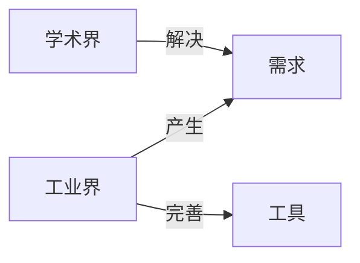
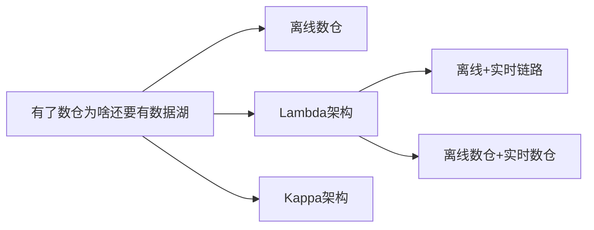
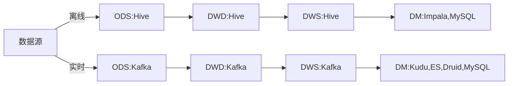

# Apache

apache系列软件下载地址：

https://archive.apache.org/dist/

比如：

https://archive.apache.org/dist/hbase/

https://archive.apache.org/dist/hadoop/

# Hadoop

## 环境安装

### 修改主机名

/etc/sysconfig/network

### 设置ip和域名映射

/etc/hosts

### 关闭防火墙和SELinux

#### 防火墙

```bash
#关闭防火墙
[root@server01 ~]# systemctl stop firewalld.service
#启动防火墙
[root@server01 ~]# systemctl start firewalld.service
#重启防火墙
[root@server01 ~]# systemctl restart firewalld.service
#在开机时启用防火墙
[root@server01 ~]# systemctl enable firewalld.service
#禁止在开机时启动防火墙
[root@server01 ~]# systemctl disable firewalld.service
#查看状态
[root@server01 ~]# systemctl status firewalld.service
```

#### SELinux

SELinux是Linux的一种安全子系统

Linux中的权限管理是针对于文件的，而不是针对进程的，也就是说，如果root启动了某个进程，则这个进程可以操作任何一个文件，

SELinux在Linux的文件权限之外，增加了对进程的限制，进程只能在进程允许的范围内操作资源

关闭SELinux的原因：如果开启了SELinux，需要非常复杂的配置，才能正常使用系统，在非生产环境一般不使用SELinux

SELinux的工作模式

enforcing      #强制模式

permissive   #宽容模式

disable          #关闭

修改SELinux的配置文件：/etc/selinux/config

### 免密登录

为了让两个linux机器之间使用ssh不需要用户名和密码。采用了数字签名RSA或者DSA来完成这个操作。

例如：假设A为客户机器，B为目标机；要达到的目的：A机器ssh登录B机器无需输入密码；也就是说B机器授权A机器可以免密访问自己。所以最后需要B机器来确认是否是A机器发过来的登录请求（A将公钥发送给B，B随机生成一段文本并用A的公钥加密后给A，A用私钥解密后将文本返回给B，B验证文本是否正确，从而确认是不是A机器的登录请求）。

具体配置步骤如下：

1. 通过root用户登录A机器，然后执行ssh-keygen -t rsa命令，将会生成密钥文件和私钥文件id_rsa,id_rsa.pub或id_dsa,id_dsa.pub（一路回车，既可完成生成私钥和公钥）
2. 将.pub文件复制到B机器的.ssh目录，并cat id_dsa.pub >> /root/.ssh/authorized_keys（或者也可以直接使用ssh-copy-id server02，那么会直接在B机器上生成authorized_keys文件，并且将公钥复制到authorized_keys文件中，如果A机器需要免密登录多台机器的话，只需要修改目标主机地址然后重复执行ssh-copy-id server03即可）
3. 大功告成，从A机器登录B机器的目标账户，不再需要密码了；（直接运行 #ssh B机器的IP ）

具体通信流程如下：

1. 先在B节点配置A节点的公钥
2. A节点请求免密登录B节点
3. B节点使用A节点提供的公钥加密一段随机文本
4. A节点使用私钥解密，并发回给B节点
5. B节点验证文本是否正确

注意：上面只将公钥拷贝并且追加到了/root/.ssh/authorized_keys中所以只是在A机器中用root用户登陆B机器时免密，而其他B机器的用户（如：admin）从A机器登陆B机器的时候还是需要密码，要想在A机器用B机器的用户admin登陆的时候也实现免密登陆则需要将A机器生成的公钥也拷贝追加到/home/admin/.ssh/authorized_keys中

### 配置时钟同步

#### 方式1

所有主机和同一台主机的时间保持同步

```bash
# 重启ntpd服务
[root@server03 /]# systemctl enable ntpd
[root@server03 /]# systemctl restart ntpd
# 修改时间同步服务器ip
[root@server03 /]# vim /etc/ntp.conf
# 注释掉原来的server,添加server ip
server 182.180.48.222
# 同步时间
[root@server03 /]# ntpq -p
```

#### 方式2

通过网络，所有主机和时间同步服务器保持同步（前提是服务器必须连网）

```bash
# 安装
[root@server02 .ssh]# yum install ntp
# 启动定时服务
[root@server03 .ssh]# crontab -e
# 在输入界面输入以下定时任务：它表示每一分钟都会执行/usr/sbin/ntpdate命令，跟ntp4.aliyun.com服务器做一次时间同步
*/1 * * * * /usr/sbin/ntpdate ntp4.aliyun.com;
```

#### crontab

linux中crontab命令用于设置周期性被执行的指令，该命令从标准输入设备读取指令，并将其存放于“crontab”文件中，以供之后读取和执行。cron  系统调度进程。可以使用它在每天的非高峰负荷时间段运行作业，或在一周或一月中的不同时段运行。cron是系统主要的调度进程，可以在无需人工干预的情况下运行作业。

##### 参数

crontab [-u username] [-l|-e|-r]

-u: 只有root才能进行这个任务，也即帮其他用户新建/删除crontab工作调度;

-e: 编辑crontab 的工作内容;

-l: 查阅crontab的工作内容;

-r: 删除所有的crontab的工作内容，若仅要删除一项，请用-e去编辑。 

##### 定时任务设置 

直接输入命令crontab -e 或者编辑文件/etc/crontab 就可以直接设置定时任务。

##### 定时任务格式

格式：*   *   *   *   *  command

​           分  时 日 月 周 命令 

1. 第1列表示分钟1～59 每分钟用*或者 */1表示

2. 第2列表示小时1～23（0表示0点）

3. 第3列表示日期1～31

4. 第4列表示月份1～12

5. 第5列标识号星期0～6（0表示星期天）

6. 第6列要运行的命令 

星号（*）：代表所有可能的值，例如month字段如果是星号，则表示在满足其它字段的制约条件后每月都执行该命令操作。

逗号（,）：可以用逗号隔开的值指定一个列表范围，例如，“1,2,5,7,8,9”。

中杠（-）：可以用整数之间的中杠表示一个整数范围，例如“2-6”表示“2,3,4,5,6”。

正斜线（/）：可以用正斜线指定时间的间隔频率，例如“0-23/2”表示每两小时执行一次。同时正斜线可以和星号一起使用，例如*/10，如果用在minute字段，表示每十分钟执行一次。

##### 实例

```shell
30 21 * * * /usr/local/etc/rc.d/lighttpd restart //每晚的21:30重启apache。

45 4 1,10,22 * * /usr/local/etc/rc.d/lighttpd restart //每月1、10、22日的4:45重启apache。

10 1 * * 6,0 /usr/local/etc/rc.d/lighttpd restart //每周六、周日的1:10重启apache。

0,30 18-23 * * * /usr/local/etc/rc.d/lighttpd restart //每天18:00至23:00之间每隔30分钟重启apache

0 23 * * 6 /usr/local/etc/rc.d/lighttpd restart //每星期六的11:00 pm重启apache。

* */1 * * * /usr/local/etc/rc.d/lighttpd restart //每一小时重启apache

* 23-7/1 * * * /usr/local/etc/rc.d/lighttpd restart //晚上11点到早上7点之间，每隔一小时重启apache

0 11 4 * mon-wed /usr/local/etc/rc.d/lighttpd restart //每月的4号与每周一到周三的11点重启apache

0 4 1 jan * /usr/local/etc/rc.d/lighttpd restart //一月一号的4点重启apache

*/30 * * * * /usr/sbin/ntpdate 210.72.145.44 //每半小时同步一下时间
```

### lrzsz

```bash
# 在linux里可代替ftp上传和下载。centos服务器，可直接yum -y install lrzsz 程序会自动安装好，然后如你要下载者sz [找到你要下载的文件] 如果你要上传，者rz 浏览找到你本机要上传的文件。
[root@server03 /]# yum -y install lrzsz
# 该命令无法在putty界面使用，可以在SecureCRT终端中使用
[root@server03 /]# rz -E
```

### mysql安装

第一 在线安装mysql相关的软件包

```bash
[root@server01 ~]# yum install mysql mysql-server mysql-devel
```

第二 启动mysql服务

```bash
[root@server01 ~]# /etc/init.d/mysqld start
```

第三 通过mysql安装自带脚本进行设置

```bash
[root@server01 ~]# /usr/bin/mysql_secure_installation
```

第四 进入mysql的客户端然后进行授权

```bash
# 'root'@'%'表示：允许root用户从任何ip访问数据库
mysql> grant all privileges on *.* to 'root'@'%' identified by '123456' with grant option;
mysql> flush privileges;
```

## Hadoop 2.X架构

### NameNode与ResourceManager单节点架构

#### 文件系统

##### NameNode

集群当中的主节点，主要用于管理集群当中的各种数据

##### secondaryNameNode

主要用于hadoop当中元数据信息的辅助管理

##### DataNode

集群当中的从节点，主要用于存储集群当中的各种数据

#### 数据计算

##### ResourceManager

接受用户的计算请求任务，并负责集群的资源分配

##### NodeManager

负责执行主节点Appmaster分配的任务

### NameNode单节点与ResourceManager高可用架构

#### 数据计算

##### ResourceManager

接受用户的计算请求任务，并负责集群的资源分配，以及计算任务的划分，通过zookeeper实现ResourceManager的高可用。

##### NodeManager

负责执行主节点Appmaster分配的任务

### NameNode高可用与ResourceManager单节点

#### 文件系统

##### NameNode

集群当中的主节点，主要用于管理集群当中的各种数据，其中nameNode可以有两个，形成高可用状态

##### DataNode

集群当中的从节点，主要用于存储集群当中的各种数据

##### JournalNode

文件系统元数据信息管理

### NameNode与ResourceManager高可用架构

#### 文件系统

##### NameNode

集群当中的主节点，主要用于管理集群当中的各种数据，其中nameNode可以有两个，形成高可用状态

##### DataNode

集群当中的从节点，主要用于存储集群当中的各种数据

##### JournalNode

文件系统元数据信息管理

#### 数据计算

##### ResourceManager

接受用户的计算请求任务，并负责集群的资源分配，以及计算任务的划分，通过zookeeper实现ResourceManager的高可用。

##### NodeManager

负责执行主节点Appmaster分配的任务

## 配置文件

### core-site.xml

```xml
<configuration>

    <!--  指定集群的文件系统类型:分布式文件系统 -->
	<property>
		<name>fs.default.name</name>
		<value>hdfs://server01:8020</value>
	</property>
    <!--  指定临时文件存储目录 -->
	<property>
		<name>hadoop.tmp.dir</name>
		<value>/usr/local/hadoop-2.7.5/hadoopDatas/tempDatas</value>
	</property>
	<!--  缓冲区大小，实际工作中根据服务器性能动态调整 -->
	<property>
		<name>io.file.buffer.size</name>
		<value>4096</value>
	</property>
	<!--  开启hdfs的垃圾桶机制，删除掉的数据可以从垃圾桶中回收，单位分钟 -->
	<property>
		<name>fs.trash.interval</name>
		<value>10080</value>
	</property>
</configuration>
```

### hdfs-site.xml

```xml
<configuration>

	 <property>
			<name>dfs.namenode.secondary.http-address</name>
			<value>server01:50090</value>
	</property>
	<!-- 指定namenode的访问地址和端口 -->
	<property>
		<name>dfs.namenode.http-address</name>
		<value>server01:50070</value>
	</property>
	<!-- 指定namenode元数据的存放位置 -->
	<property>
		<name>dfs.namenode.name.dir</name>
		<value>file:///usr/local/hadoop-2.7.5/hadoopDatas/namenodeDatas,file:///usr/local/hadoop-2.7.5/hadoopDatas/namenodeDatas2</value>
	</property>
	<!--  定义dataNode数据存储的节点位置，实际工作中，一般先确定磁盘的挂载目录，然后多个目录用，进行分割  -->
	<property>
		<name>dfs.datanode.data.dir</name>
		<value>file:///usr/local/hadoop-2.7.5/hadoopDatas/datanodeDatas,file:///usr/local/hadoop-2.7.5/hadoopDatas/datanodeDatas2</value>
	</property>
	<!-- 指定namenode日志文件的存放目录 -->
	<property>
		<name>dfs.namenode.edits.dir</name>
		<value>file:///usr/local/hadoop-2.7.5/hadoopDatas/nn/edits</value>
	</property>
	<property>
		<name>dfs.namenode.checkpoint.dir</name>
		<value>file:///usr/local/hadoop-2.7.5/hadoopDatas/snn/name</value>
	</property>
	<property>
		<name>dfs.namenode.checkpoint.edits.dir</name>
		<value>file:///usr/local/hadoop-2.7.5/hadoopDatas/dfs/snn/edits</value>
	</property>
	<!-- 文件切片的副本个数-->
	<property>
		<name>dfs.replication</name>
		<value>3</value>
	</property>
	<!-- 设置HDFS的文件权限-->
	<property>
		<name>dfs.permissions</name>
		<value>true</value>
	</property>
	<!-- 设置一个文件切片的大小：128M-->
	<property>
		<name>dfs.blocksize</name>
		<value>134217728</value>
	</property>
</configuration>
```

### hadoop-env.sh

```shell
export JAVA_HOME=/usr/local/java/jdk1.8.0_144
```

### mapred-site.xml

```xml
<configuration>

    <!-- mapreduce.framework.name默认值为local,设置为yarn,让MapReduce程序运行在YARN框架上 -->
    <property>
		<name>mapreduce.framework.name</name>
		<value>yarn</value>
	</property>
	<!-- 开启MapReduce小任务模式 -->
	<property>
		<name>mapreduce.job.ubertask.enable</name>
		<value>true</value>
	</property>
	<!-- 设置历史任务的主机和端口 -->
	<property>
		<name>mapreduce.jobhistory.address</name>
		<value>server01:10020</value>
	</property>
	<!-- 设置网页访问历史任务的主机和端口 -->
	<property>
		<name>mapreduce.jobhistory.webapp.address</name>
		<value>server01:19888</value>
	</property>
</configuration>
```

### yarn-site.xml

```xml
<configuration>
        <!-- 配置yarn主节点的位置 -->
        <property>
                <name>yarn.resourcemanager.hostname</name>
                <value>server01</value>
        </property>
        <property>
                <name>yarn.nodemanager.aux-services</name>
                <value>mapreduce_shuffle</value>
        </property>
        <!-- 开启日志聚合功能 -->
        <property>
                <name>yarn.log-aggregation-enable</name>
                <value>true</value>
        </property>
        <!-- 设置聚合日志在hdfs上的保存时间 -->
        <property>
                <name>yarn.log-aggregation.retain-seconds</name>
                <value>604800</value>
        </property>
        <!-- 设置yarn集群的内存分配方案 -->
    <!--可以为容器分配的物理内存量（以 MB 为单位）-->
        <property>
                <name>yarn.nodemanager.resource.memory-mb</name>
                <value>4096</value>
        </property>
    	<!--RM上每个容器请求的最小分配，以MB为单位。低于此值的内存请求将引发InvalidResourceRequestException。-->
        <property>
                <name>yarn.scheduler.minimum-allocation-mb</name>
                <value>1024</value>
        </property>
    	<!--RM上每个容器请求的最大分配，以MB为单位。高于此的内存请求将引发InvalidResourceRequestException。-->
        <property>
                <name>yarn.scheduler.maximum-allocation-mb</name>
                <value>2048</value>
        </property>
        <property>
                <name>yarn.nodemanager.vmem-pmem-ratio</name>
                <value>2.1</value>
        </property>
        <property>
                <name>yarn.nodemanager.vmem-check-enabled</name>
                <value>false</value>
        </property>
    	<!--可以分配给容器的vcore数量，这是RM调度程序在为容器分配资源时使用的，这不是用来限制 YARN 容器使用的物理内核的数量。-->
        <property>
                <name>yarn.nodemanager.resource.cpu-vcores</name>
                <value>2</value>
        </property>
    	<!--RM中每个容器请求的最小分配，以虚拟CPU内核计。低于此值的请求将引发InvalidResourceRequestException。-->
        <property>
                <name>yarn.scheduler.minimum-allocation-vcores</name>
                <value>1</value>
        </property>
    	<!--RM上每个容器请求的最大分配，以虚拟CPU内核计。高于此值的请求将引发InvalidResourceRequestException。-->
        <property>
                <name>yarn.scheduler.maximum-allocation-vcores</name>
                <value>2</value>
        </property>
</configuration>
```

### mapred-env.sh

```shell
export JAVA_HOME=/usr/local/java/jdk1.8.0_144
```

### slaves

```tex
server01
server02
server03
```

### 创建存储目录

```shell
mkdir -p /usr/local/hadoop-2.7.5/hadoopDatas/tempDatas
mkdir -p /usr/local/hadoop-2.7.5/hadoopDatas/namenodeDatas
mkdir -p /usr/local/hadoop-2.7.5/hadoopDatas/namenodeDatas2
mkdir -p /usr/local/hadoop-2.7.5/hadoopDatas/datanodeDatas
mkdir -p /usr/local/hadoop-2.7.5/hadoopDatas/datanodeDatas2
mkdir -p /usr/local/hadoop-2.7.5/hadoopDatas/nn/edits
mkdir -p /usr/local/hadoop-2.7.5/hadoopDatas/snn/name
mkdir -p /usr/local/hadoop-2.7.5/hadoopDatas/dfs/snn/edits
```

## 启动集群

```bash
# 集群第一次启动时格式化namenode(注意：只有当第一次启动时才格式化)
[root@server01 hadoop-2.7.5]# cd /usr/local/hadoop-2.7.5
[root@server01 hadoop-2.7.5]# bin/hdfs namenode -format
# 启动HDFS
[root@server01 hadoop-2.7.5]# sbin/start-dfs.sh
# 启动YARN
[root@server01 hadoop-2.7.5]# sbin/start-yarn.sh
# 启动历史任务服务，可以在historyserver的日志中查看运行情况
[root@server01 hadoop-2.7.5]# sbin/mr-jobhistory-daemon.sh start historyserver

# 停止历史任务服务
[root@server01 hadoop-2.7.5]# sbin/mr-jobhistory-daemon.sh stop historyserver
# 停止YARN
[root@server01 hadoop-2.7.5]# sbin/stop-yarn.sh
# 停止HDFS
[root@server01 hadoop-2.7.5]# sbin/stop-dfs.sh
```

## HistoryServer服务

YARN中提供了一个叫做JobHistoryServer的守护进程，它属于YARN集群的一项系统服务，仅存储已经运行完成的MapReduce应用程序的作业历史信息，并不会存储其他类型（如Spark、Flink等）应用程序的作业历史信息。

1. 当启用JobHistoryServer服务时，仍需要开启日志聚合功能，否则每个Container的运行日志是存储在NodeManager节点本地，查看日志时需要访问各个NodeManager节点，不利于统一管理和分析。开启日志聚合的方法：在yarn-site.xml中增加yarn.log-aggregation-enable项，并且设置其value为true
2. 当开启日志聚合功能后AM会自动收集每个Container的日志，并在应用程序完成后将这些日志移动到文件系统，例如HDFS。然后通过JHS的WebUI服务来提供用户使用和应用恢复。

**JobHistoryServer管理MR应用**

### 提交MR应用程序

```bash
[root@server01 mapreduce]# hadoop jar hadoop-mapreduce-examples-2.7.5.jar wordcount /data/wordcount.txt /ooxx
```

### MR运行历史信息

MR应用程序在运行时，是通过AM（MRAppMaster类）将日志写到HDFS中，会生成.jhist、.summary和`_conf.xml`文件。其中.jhist文件是MR程序的计数信息，.summary文件是作业的摘要信息，_conf.xml文件是MR程序的配置信息。MR应用程序启动时，会把作业信息存储到${yarn.app.mapreduce.am.staging-dir}/${user}/.staging/${job_id}目录下。yarn.app.mapreduce.am.staging-dir的默认路径为：/tmp/hadoop-yarn/staging


### MR应用程序运行完成时生成的信息

MR应用程序运行完成后，作业信息会被临时移动到`${mapreduce.jobhistory.intermediate-done-dir}/${user}`目录下。


### MR应用程序最终的作业信息

等待${mapreduce.jobhistory.move.interval-ms}配置项的值（默认180000毫秒=3分钟）后，会把${mapreduce.jobhistory.intermediate-done-dir}/${user}下的作业数据移动到${mapreduce.jobhistory.done-dir}/${year}/${month}/${day}/${serialPart}目录下。此时.summary文件会被删除，因为.jhist文件提供了更详细的作业历史信息。JHS服务中的作业历史信息不是永久存储的，在默认情况下，作业历史清理程序默认按照86400000毫秒（一天）的频率去检查要删除的文件，只有在文件早于mapreduce.jobhistory.max-age-ms（一天）时才进行删除。JHS的历史文件的移动和删除操作由HistoryFileManager类完成。

```properties
mapreduce.jobhistory.move.interval-ms：180000（默认）
mapreduce.jobhistory.intermediate-done-dir：/tmp/hadoop-yarn/staging/history/done_intermediate（默认）
mapreduce.jobhistory.done-dir：/tmp/hadoop-yarn/staging/history/done（默认）
mapreduce.jobhistory.cleaner.enable: true（默认）
mapreduce.jobhistory.cleaner.interval-ms: 86400000（1天）
mapreduce.jobhistory.max-age-ms: 86400000（1天）
```


三个端口查看界面

查看hdfs：http://server01:50070/explorer.html

查看yarn集群：http://server01:8088/cluster 

查看历史完成的任务：http://server01:19888/jobhistory

## HDFS

### 定义

HDFS（Hadoop  Distributed  File  System）是 Apache Hadoop 项目的一个子项目. Hadoop 非常适于存储大型数据 (比如 TB 和 PB), 其就是使用 HDFS 作为存储系统. HDFS 使用多台计算机存储文件, 并且提供统一的访问接口, 像是访问一个普通文件系统一样使用分布式文件系统. 

### 应用场景

#### 适合的应用场景

1. 存储非常大的文件：这里非常大指的是几百M、G、或者TB级别，需要高吞吐量，对延时没有要求。
2. 采用流式的数据访问方式: 即一次写入、多次读取，数据集经常从数据源生成或者拷贝一次，然后在其上做很多分析工作 。
3. 运行于商业硬件上: Hadoop不需要特别贵的机器，可运行于普通廉价机器，可以处节约成本
4. 需要高容错性
5. 为数据存储提供所需的扩展能力

#### 不适合的应用场景

1. 低延时的数据访问

   对延时要求在毫秒级别的应用，不适合采用HDFS。HDFS是为高吞吐数据传输设计的,因此可能牺牲延时

2. 大量小文件 

   文件的元数据保存在NameNode的内存中， 整个文件系统的文件数量会受限于NameNode的内存大小。 
   经验而言，一个文件/目录/文件块一般占有150字节的元数据内存空间。如果有100万个文件，每个文件占用1个文件块，则需要大约300M的内存。因此十亿级别的文件数量在现有商用机器上难以支持。

3. 多方读写，需要任意的文件修改 

   HDFS采用追加（append-only）的方式写入数据。不支持文件任意offset的修改。不支持多个写入器（writer）

### 架构

HDFS是一个 主/从（Mater/Slave）体系结构 ， HDFS由四部分组成，HDFS Client、NameNod e、DataNode和Secondary NameNode。

#### Client

就是客户端

1. 文件切分。文件上传 HDFS 的时候，Client 将文件切分成 一个一个的Block，然后进行存 储。 
2. 与 NameNode 交互，获取文件的位置信息。
3. 与 DataNode 交互，读取或者写入数据。
4. Client 提供一些命令来管理 和访问HDFS，比如启动或者关闭HDFS。

#### NameNode

就是 master，它是一个主管、管理者

1. 管理 HDFS 的名称空间 
2. 管理数据块（Block）映射信息 
3. 配置副本策略 
4. 处理客户端读写请求

#### DataNode

就是Slave。NameNode 下达命令，DataNode 执行实际的操作

1. 存储实际的数据块
2. 执行数据块的读/写操作

#### Secondary NameNode

并非 NameNode 的热备。当NameNode 挂掉的时候，它并不 能马上替换 NameNode 并提供服务。

1. 辅助 NameNode，分担其工作量
2.  定期合并 fsimage和fsedits，并推送给NameNode
3.  在紧急情况下，可辅助恢复 NameNode

### 命令行

```bash
#格式：hdfs dfs -ls URI
#作用：类似于Linux的ls命令，显示文件列表
[root@server01 hadoop-2.7.5]# hdfs dfs -ls /
Found 1 items
drwxrwx---   - root supergroup          0 2022-08-25 12:24 /tmp
#格式:dfs dfs -ls -R URI
#作用:在整个目录下递归执行ls, 与UNIX中的ls-R类似
[root@server01 hadoop-2.7.5]# hdfs dfs -ls -R /
drwxrwx---   - root supergroup          0 2022-08-25 12:24 /tmp
drwxrwx---   - root supergroup          0 2022-08-25 12:24 /tmp/hadoop-yarn
drwxrwx---   - root supergroup          0 2022-08-25 12:24 /tmp/hadoop-yarn/staging
drwxrwx---   - root supergroup          0 2022-08-25 12:24 /tmp/hadoop-yarn/staging/history
drwxrwx---   - root supergroup          0 2022-08-25 12:24 /tmp/hadoop-yarn/staging/history/done
drwxrwxrwt   - root supergroup          0 2022-08-25 12:24 /tmp/hadoop-yarn/staging/history/done_intermediate
# 格式：hdfs dfs [-p] -mkdir <paths>
# 作用：以<paths>中的URI作为参数，创建目录。使用-p参数可以递归创建目录
[root@server01 hadoop-2.7.5]# hdfs dfs -mkdir -p /dir1
# 格式：hdfs dfs -put <localsrc > ... <dst>
# 作用：将单个的源文件src或者多个源文件srcs从本地文件系统拷贝到目标文件系统中（<dst>对应的路径）。也可以从标准输入中读取输入，写入目标文件系统中
[root@server01 opt]# hdfs dfs -put ./a.txt /dir1
# 格式：hdfs dfs -moveFromLocal <localsrc>   <dst>
# 作用：和put命令类似，但是源文件localsrc拷贝之后自身被删除
[root@server01 opt]# hdfs dfs -moveFromLocal ./a.txt /dir2
# 格式：hdfs dfs  -get [-ignorecrc ] [-crc] <src> <localdst>
# 作用：将文件拷贝到本地文件系统。 CRC 校验失败的文件通过-ignorecrc选项拷贝。 文件和CRC校验和可以通过-CRC选项拷贝
[root@server01 opt]# hdfs dfs -get /dir1/a.txt /opt
# 格式：hdfs dfs -mv URI   <dest>
# 作用：将hdfs上的文件从原路径移动到目标路径（移动之后文件删除），该命令不能夸文件系统,即：不能把本地的文件移动到hdfs上面去
[root@server01 opt]# hdfs dfs -mv /dir1/a.txt /dir2
# 格式：hdfs dfs -rm [-r] 【-skipTrash】 URI 【URI 。。。】
# 作用：删除参数指定的文件，参数可以有多个。此命令只删除文件和非空目录。如果指定-skipTrash选项，那么在回收站可用的情况下，该选项将跳过回收站而直接删除文件；否则，在回收站可用时，在HDFS Shell中执行此命令，会将文件暂时放到回收站中。
[root@server01 opt]# hdfs dfs -rm -r /dir2
# 格式：hdfs  dfs  -cp URI [URI ...] <dest>
# 作用：将文件拷贝到目标路径中。如果<dest>  为目录的话，可以将多个文件拷贝到该目录下。
# -f 选项将覆盖目标，如果它已经存在。
# -p 选项将保留文件属性（时间戳、所有权、许可、ACL、XAttr）。
[root@server01 opt]# hdfs dfs -cp /dir1/a.txt /dir2/b.txt
# 格式：hdfs dfs  -cat URI [uri ...]
# 作用：将参数所指示的文件内容输出到stdout
[root@server01 opt]# hdfs dfs -cat /dir1/a.txt
# 格式：hdfs dfs -chmod [-R] URI[URI  ...]
# 作用：改变文件权限。如果使用  -R 选项，则对整个目录有效递归执行。使用这一命令的用户必须是文件的所属用户，或者超级用户。
[root@server01 opt]# hdfs dfs -chmod -R 777 /dir1/a.txt
# 格式：hdfs   dfs  -chmod  [-R]  URI[URI  ...]
# 作用：改变文件的所属用户和用户组。如果使用  -R 选项，则对整个目录有效递归执行。使用这一命令的用户必须是文件的所属用户，或者超级用户。
[root@server01 opt]# hdfs dfs -chown -R hadoop:hadoop /dir1/a.txt
# 格式: hdfs dfs -appendToFile <localsrc> ... <dst>
# 作用: 追加一个或者多个文件到hdfs指定文件中.也可以从命令行读取输入.
[root@server01 opt]# hdfs dfs -appendToFile a.xml b.xml /big.xml
# 格式: hdfs dfs -getmerge <dst> ... <localsrc>
# 作用: 小文件合并
[root@server01 opt]# hdfs dfs -getmerge /*.txt /total.txt
```

#### 限额配置

在多人共用HDFS的环境下，配置设置非常重要。特别是在Hadoop处理大量资料的环境，如 果没有配额管理，很容易把所有的空间用完造成别人无法存取。Hdfs的配额设定是针对目录 而不是针对账号，可以 让每个账号仅操作某一个目录，然后对目录设置配置。 hdfs文件的限额配置允许我们以文件个数，或者文件大小来限制我们在某个目录下上传的文 件数量或者文件内容总量，以便达到我们类似百度网盘网盘等限制每个用户允许上传的最大 的文件的量。

##### 数量限额

```bash
# 查看配额信息
[root@server01 opt]#  hdfs dfs -count -q -h /dir1
        none             inf            none             inf            1            1             11.0 K /dir1
# 给该文件夹下面设置最多上传两个文件，发现只能上传一个文件，也就是说给一个目录设置限额为N的时候最多只能放N-1个，文件夹也被当作一个文件了。
[root@server01 opt]# hdfs dfsadmin -setQuota 2 /dir1
# 清除文件数量限制
[root@server01 opt]# hdfs dfsadmin -clrQuota /dir1
```

##### 大小限额

```bash
# 在设置空间配额时，设置的空间至少是block_size * 3大小
[root@server01 opt]# hdfs dfsadmin -setSpaceQuota 384M /dir1
# 清除空间配额限制
[root@server01 opt]# hdfs dfsadmin -clrSpaceQuota /dir1
```

### 安全模式

安全模式是hadoop的一种保护机制，用于保证集群中的数据块的安全性。当集群启动的时 候，会首先进入安全模式。当系统处于安全模式时会检查数据块的完整性。假设我们设置的副本数（即参数dfs.replication）是3，那么在datanode上就应该有3个副本存 在，假设只存在2个副本，那么比例就是2/3=0.666。hdfs默认的副本率0.999。我们的副本率 0.666明显小于0.999，因此系统会自动的复制副本到其他dataNode，使得副本率不小于0.999。 如果系统中有5个副本，超过我们设定的3个副本，那么系统也会删除多于的2个副本。在安全模式状态下，文件系统只接受读数据请求，而不接受删除、修改等变更请求。在，当 整个系统达到安全标准时，HDFS自动离开安全模式。

```bash
# 查看安全模式状态
[root@server01 opt]# hdfs dfsadmin -safemode get
# 进入安全模式
[root@server01 opt]# hdfs dfsadmin -safemode enter
# 离开安全模式
[root@server01 opt]# hdfs dfsadmin -safemode leave
```

## 元数据辅助管理

当Hadoop的集群当中,NameNode的所有元数据信息都保存在了FsImage与Eidts文件当中,这两个文件就记录了所有的数据的元数据信息, 元数据信息的保存目录配置在了 hdfssite.xml 当中

```xml
<property>
    <name>dfs.namenode.name.dir</name>    
    <value>file:///usr/local/hadoop2.7.5/hadoopDatas/namenodeDatas,    
          file:///usr/local/hadoop2.7.5/hadoopDatas/namenodeDatas2
    </value>
</property>
<property>
     <name>dfs.namenode.edits.dir</name>
     <value>file:///usr/local/hadoop2.7.5/hadoopDatas/nn/edits</value
</property>>
```

### FsImage和Edits详解

#### edits

1. edits 存放了客户端最近一段时间的操作日志
2. 客户端对HDFS进行写文件时会首先被记录在edits文件中
3. edits修改时元数据也会更新

文件信息查看：使用命令 hdfs oev

```bash
[root@server01 current]# cd /usr/local/hadoop-2.7.5/hadoopDatas/nn/edits/current
[root@server01 current]# ll
总用量 2064
-rw-r--r-- 1 root root 1048576 8月  25 12:14 edits_0000000000000000001-0000000000000000001
-rw-r--r-- 1 root root     743 8月  25 13:09 edits_0000000000000000002-0000000000000000011
-rw-r--r-- 1 root root    1308 8月  25 14:09 edits_0000000000000000012-0000000000000000031
-rw-r--r-- 1 root root 1048576 8月  25 14:09 edits_inprogress_0000000000000000032
-rw-r--r-- 1 root root       3 8月  25 14:09 seen_txid
-rw-r--r-- 1 root root     206 8月  25 12:11 VERSION
[root@server01 current]# hdfs oev -i edits_0000000000000000001-0000000000000000001 -p XML -o myedit.xml
```

#### fsimage

1. NameNode中关于元数据的镜像,一般称为检查点,fsimage存放了一份比较完整的元数据信息
2. 因为fsimage是NameNode的完整的镜像,如果每次都加载到内存生成树状拓扑结构，这是非常耗内存和CPU,所以一般开始时对NameNode的操作都放在edits中
3. fsimage内容包含了NameNode管理下的所有DataNode文件及文件block及block所在的DataNode的元数据信息.
4. 随着edits内容增大,就需要在一定时间点和fsimage合并

文件信息查看：使用命令 hdfs oiv

```bash
[root@server01 current]# cd /usr/local/hadoop-2.7.5/hadoopDatas/namenodeDatas/current
[root@server01 current]# ll
总用量 24
-rw-r--r-- 1 root root 858 8月  25 14:09 fsimage_0000000000000000031
-rw-r--r-- 1 root root  62 8月  25 14:09 fsimage_0000000000000000031.md5
-rw-r--r-- 1 root root 858 8月  25 15:09 fsimage_0000000000000000033
-rw-r--r-- 1 root root  62 8月  25 15:09 fsimage_0000000000000000033.md5
-rw-r--r-- 1 root root   3 8月  25 15:09 seen_txid
-rw-r--r-- 1 root root 206 8月  25 12:11 VERSION
[root@server01 current]# hdfs oiv -i fsimage_0000000000000000031 -p XML -o fsimage.xml
```

### SecondaryNameNode

SecondaryNameNode定期合并fsimage和edits,把edits控制在一个范围内

1. SecondaryNameNode 通知 NameNode 切换 editlog
2. SecondaryNameNode 从 NameNode 中获得 fsimage 和 editlog(通过http方式)
3. SecondaryNameNode 将 fsimage 载入内存, 然后开始合并 editlog, 合并之后成为新的fsimage
4. SecondaryNameNode 将新的 fsimage 发回给 NameNode
5. NameNode 用新的 fsimage 替换旧的 fsimage

#### 配置SecondaryNameNode

hdfs-site.xml

```xml
<property>
    <name>dfs.namenode.secondary.http-address</name>
    <value>server01:50090</value>
</property>
```

core-site.xml（不配置保持默认也可以）

```xml
<!-- 多久记录一次 HDFS 镜像, 默认 1小时 -->
<property>
    <name>fs.checkpoint.period</name>
    <value>3600</value>
</property>
<!-- 一次记录多大, 默认 64M -->
<property>
    <name>fs.checkpoint.size</name>
    <value>67108864</value>
</property>
```

#### 特点

1. 完成合并的是SecondaryNameNode,会请求NameNode停止使用edits,暂时将新写操作放入一个新的文件中edits.new
2. SecondaryNameNode从NameNode中通过HttpGET获得edits,因为要和fsimage合并,所以也是通过HttpGet的方式把fsimage加载到内存,然后逐一执行具体对文件系统的操作,与fsimage合并,生成新的fsimage,然后通过HttpPOST的方式把fsimage发送给NameNode.NameNode从SecondaryNameNode获得了fsimage后会把原有的fsimage替换为新的fsimage,把edits.new变成edits.同时会更新fstime
3. Hadoop进入安全模式时需要管理员使用dfsadmin的savenamespace来创建新的检查点
4. SecondaryNameNode在合并edits和fsimage时需要消耗的内存和NameNode差不多,所以一般把NameNode和SecondaryNameNode放在不同的机器上

## HDFS的API操作

### 配置Windows下Hadoop环境

在windows系统需要配置hadoop运行环境，否则直接运行代码会出现以下问题:

缺少winutils.exe

Could not locate executable null \bin\winutils.exe in the hadoop binaries 

缺少hadoop.dll

Unable to load native-hadoop library for your platform… using builtin-Java classes where applicable 

#### 步骤

1. 将hadoop2.7.5文件夹拷贝到一个没有中文没有空格的路径下面
2. 在windows上面配置hadoop的环境变量：HADOOP_HOME，并将%HADOOP_HOME%\bin添加到path中
3. 把hadoop2.7.5文件夹中bin目录下的hadoop.dll文件放到系统盘:C:\Windows\System32 目录
4. 关闭windows重启

## MapReduce

### 介绍

MapReduce思想在生活中处处可见。或多或少都曾接触过这种思想。MapReduce的思想核心 是“分而治之”，适用于大量复杂的任务处理场景（大规模数据处理场景）。Map负责“分”，即把复杂的任务分解为若干个“简单的任务”来并行处理。可以进行拆分的 前提是这些小任务可以并行计算，彼此间几乎没有依赖关系。Reduce负责“合”，即对map阶段的结果进行全局汇总。

### 设计思想

MapReduce是一个分布式运算程序的编程框架，核心功能是将用户编写的业务逻辑代码和自 带默认组件整合成一个完整的分布式运算程序，并发运行在Hadoop集群上。MapReduce设计并提供了统一的计算框架，为程序员隐藏了绝大多数系统层面的处理细节。 为程序员提供一个抽象和高层的编程接口和框架。程序员仅需要关心其应用层的具体计算问 题，仅需编写少量的处理应用本身计算问题的程序代码。如何具体完成这个并行计算任务所 相关的诸多系统层细节被隐藏起来,交给计算框架去处理：Map和Reduce为程序员提供了一个清晰的操作接口抽象描述。一个完整的mapreduce程序在分布式运行时有三类实例进程：

1. MRAppMaster 负责整个程序的过程调度及状态协调
2. MapTask 负责map阶段的整个数据处理流程
3. ReduceTask 负责reduce阶段的整个数据处理流程

### 编程规范

MapReduce的开发一共有八个步骤,其中Map阶段分为2个步骤，Shuffled阶段4个步骤，Reduce阶段分为2个步骤

Map阶段2个步骤

1. 设置InputFormat类,将数据切分为Key-Value(K1和V1，K1表示这一行相对于文件的偏移量，V1表示这一行数据的内容)对,输入到第二步
2. 自定义Map逻辑,将第一步的结果转换成另外的Key-Value（K2和V2，K2一般为单词，V2一般为数量1）对,输出结果

因此在我们编写代码实现MapReduce的时候，在继承Mapper类的时候，有四个泛型分分别是：K1、V1、K2、V2；分别代表的就是上面的两组Key-Value，所以整个Map、Shuffled、Reduce就是将一个输入的Key-Value形式转成输出Key-Value形式的过程

Shuffle阶段4个步骤

1. 分区：对输出的Key-Value对进行分区，默认的分区编号为：key的hashcode%ReduceTask个数(map阶段)
2. 排序：对分区中的数据按照Key排序，mapreduce会自动根据key进行排序，是默认行为，如果要自定义排序的话只需要将key实现WritableComparable接口并且重写compareTo方法即可(map阶段)
3. 规约：(可选)对分组过的数据初步规约,降低数据的网络拷贝(map阶段)
4. 分组：对数据进行分组,相同Key的Value放入一个集合中(reduce阶段)

Reduce阶段2个步骤

1. 对多个Map任务的结果进行排序以及合并,编写Reduce函数实现自己的逻辑,对输入的Key-Value进行处理,转为新的Key-Value（K3和V3）输出
2. 设置OutputFormat处理并保存Reduce输出的Key-Value数据

### WordCount

WordCountMapper.java

```java
package org.duo.mapreduce;

import org.apache.hadoop.io.LongWritable;
import org.apache.hadoop.io.Text;
import org.apache.hadoop.mapreduce.Counter;
import org.apache.hadoop.mapreduce.Mapper;

import java.io.IOException;

/*
  四个泛型解释:
    KEYIN :K1的类型
    VALUEIN: V1的类型

    KEYOUT: K2的类型
    VALUEOUT: V2的类型
 */
public class WordCountMapper extends Mapper<LongWritable,Text, Text , LongWritable> {

    //map方法就是将K1和V1 转为 K2和V2
    /*
      参数:
         key    : K1   行偏移量
         value  : V1   每一行的文本数据
         context ：表示上下文对象
     */
    /*
      如何将K1和V1 转为 K2和V2
        K1         V1
        0   hello,world,hadoop
        15  hdfs,hive,hello
       ---------------------------

        K2            V2
        hello         1
        world         1
        hdfs          1
        hadoop        1
        hello         1
     */
    @Override
    protected void map(LongWritable key, Text value, Context context) throws IOException, InterruptedException {
        Text text = new Text();
        LongWritable longWritable = new LongWritable();
        //1:将一行的文本数据进行拆分
        String[] split = value.toString().split(",");
        //2:遍历数组，组装 K2 和 V2
        for (String word : split) {
            //3:将K2和V2写入上下文
            text.set(word);
            longWritable.set(1);
            context.write(text, longWritable);
        }

    }
}
```

WordCountReducer.java

```java
package org.duo.mapreduce;

import org.apache.hadoop.io.LongWritable;
import org.apache.hadoop.io.Text;
import org.apache.hadoop.mapreduce.Reducer;

import java.io.IOException;
/*
  四个泛型解释:
    KEYIN:  K2类型
    VALULEIN: V2类型

    KEYOUT: K3类型
    VALUEOUT:V3类型
 */

public class WordCountReducer extends Reducer<Text,LongWritable,Text,LongWritable> {
    //reduce方法作用: 将新的K2和V2转为 K3和V3 ，将K3和V3写入上下文中
    /*
      参数:
        key ： 新K2
        values： 集合 新 V2
        context ：表示上下文对象

        ----------------------
        如何将新的K2和V2转为 K3和V3
        新  K2         V2
            hello      <1,1,1>
            world      <1,1>
            hadoop     <1>
        ------------------------
           K3        V3
           hello     3
           world     2
           hadoop    1

     */

    @Override
    protected void reduce(Text key, Iterable<LongWritable> values, Context context) throws IOException, InterruptedException {
        long count = 0;
       //1:遍历集合，将集合中的数字相加，得到 V3
        for (LongWritable value : values) {
             count += value.get();
        }
        //2:将K3和V3写入上下文中
        context.write(key, new LongWritable(count));
    }
}
```

JobMain.java

```java
package org.duo.mapreduce;

import org.apache.hadoop.conf.Configuration;
import org.apache.hadoop.conf.Configured;
import org.apache.hadoop.fs.FileSystem;
import org.apache.hadoop.fs.Path;
import org.apache.hadoop.io.LongWritable;
import org.apache.hadoop.io.Text;
import org.apache.hadoop.mapreduce.Job;
import org.apache.hadoop.mapreduce.lib.input.TextInputFormat;
import org.apache.hadoop.mapreduce.lib.output.TextOutputFormat;
import org.apache.hadoop.util.Tool;
import org.apache.hadoop.util.ToolRunner;

import java.net.URI;

public class JobMain extends Configured implements Tool {

    //该方法用于指定一个job任务
    @Override
    public int run(String[] args) throws Exception {

        //1:创建一个job任务对象
        Job job = Job.getInstance(super.getConf(), "wordcount");
        //如果打包运行出错，则需要加该配置
        job.setJarByClass(JobMain.class);
        //2:配置job任务对象(八个步骤)

        //第一步:指定文件的读取方式和读取路径
        job.setInputFormatClass(TextInputFormat.class);
        TextInputFormat.addInputPath(job, new Path("hdfs://server01:8020/wordcount"));
        //TextInputFormat.addInputPath(job, new Path("file:///D:\\mapreduce\\input"));

        //第二步:指定Map阶段的处理方式和数据类型
        job.setMapperClass(WordCountMapper.class);
        //设置Map阶段K2的类型
        job.setMapOutputKeyClass(Text.class);
        //设置Map阶段V2的类型
        job.setMapOutputValueClass(LongWritable.class);

        //第三，四，五，六 采用默认的方式

        //第七步：指定Reduce阶段的处理方式和数据类型
        job.setReducerClass(WordCountReducer.class);
        //设置K3的类型
        job.setOutputKeyClass(Text.class);
        //设置V3的类型
        job.setOutputValueClass(LongWritable.class);

        //第八步: 设置输出类型
        job.setOutputFormatClass(TextOutputFormat.class);
        //设置输出的路径
        Path path = new Path("hdfs://server01:8020/wordcount_out");
        TextOutputFormat.setOutputPath(job, path);
        //TextOutputFormat.setOutputPath(job, new Path("file:///D:\\mapreduce\\output"));

        //获取FileSystem
        FileSystem fileSystem = FileSystem.get(new URI("hdfs://server01:8020"), new Configuration());
        //判断目录是否存在
        boolean bl2 = fileSystem.exists(path);
        if (bl2) {
            //删除目标目录
            fileSystem.delete(path, true);
        }

        //等待任务结束
        boolean bl = job.waitForCompletion(true);

        return bl ? 0 : 1;
    }

    public static void main(String[] args) throws Exception {

        Configuration configuration = new Configuration();

        //启动job任务
        int run = ToolRunner.run(configuration, new JobMain(), args);
        System.exit(run);

    }
}
```

### 运行模式

#### 集群运行模式

1. 将MapReduce程序提交给Yarn集群, 分发到很多的节点上并发执行
2. 处理的数据和输出结果应该位于HDFS文件系统
3. 提交集群的实现步骤: 将程序打成JAR包，并上传，然后在集群上用hadoop命令启动

```bash
[root@server01 opt]# hadoop jar original-hadoop-1.0-SNAPSHOT.jar org.duo.mapreduce.JobMain
```

#### 本地运行模式

1. MapReduce 程序是被提交给 LocalJobRunner 在本地以单进程的形式运行

2. 处理的数据及输出结果可以在本地文件系统, 也可以在hdfs上

3. 怎样实现本地运行? 写一个程序, 不要带集群的配置文件, 本质是程序的conf中是否有

   mapreduce.framework.name=local 以及yarn.resourcemanager.hostname=local 参数

4. 本地模式非常便于进行业务逻辑的 Debug , 只要在 Eclipse 中打断点即可

```java
configuration.set("mapreduce.framework.name","local");
configuration.set(" yarn.resourcemanager.hostname","local");
TextInputFormat.addInputPath(job,new Path("file:///F:\\wordcount\\input"));
TextOutputFormat.setOutputPath(job,new Path("file:///F:\\wordcount\\output"));
```

### 分区

在MapReduce中,通过我们指定分区,会将同一个分区的数据发送到同一个Reduce当中进行处理例如:为了数据的统计,可以把一批类似的数据发送到同一个Reduce当中,在同一个Reduce当中统计相同类型的数据,就可以实现类似的数据分区和统计等其实就是相同类型的数据,有共性的数据,送到一起去处理Reduce当中默认的分区只有一个

### 计数器

计数器是收集作业统计信息的有效手段之一，用于质量控制或应用级统计。计数器还可辅助诊断系统故障。如果需要将日志信息传输到map或reduce任务，更好的方法通常是看能否用一个计数器值来记录某一特定事件的发生。对于大型分布式作业而言，使用计数器更为方便。除了因为获取计数器值比输出日志更方便，还有根据计数器值统计特定事件的发生次数要比分析一堆日志文件容易得多。

hadoop内置计数器列表

| 名称                   | 类                                                           |
| ---------------------- | ------------------------------------------------------------ |
| MapReduce任务计数器    | org.apache.hadoop.mapreduce.TaskCounter                      |
| 文件系统计数器         | org.apache.hadoop.mapreduce.FileSystemCounter                |
| FileInputFormat计数器  | org.apache.hadoop.mapreduce.lib.input.FileInputFormatCounter |
| FileOutputFormat计数器 | org.apache.hadoop.mapreduce.lib.output.FileOutputFormatCounter |
| 作业计数器             | org.apache.hadoop.mapreduce.JobCounter                       |

每次mapreduce执行完成之后，会看到一些日志记录出来，其中最重要的一些日志记录，所有的这些都是MapReduce的计数器的功能。

自定义计数器：统计map接收到的数据记录条数

第一种方式：通过context上下文对象获取计数器，在map端使用计数器进行统计

第二种方式：通过enum枚举类型来定义计数器 统计reduce端数据的输入的key有多少个

PartitionMapper.java

```java
package org.duo.partition;

import org.apache.hadoop.io.LongWritable;
import org.apache.hadoop.io.NullWritable;
import org.apache.hadoop.io.Text;
import org.apache.hadoop.mapreduce.Counter;
import org.apache.hadoop.mapreduce.Mapper;

import java.io.IOException;
/*
  K1: 行偏移量 LongWritable
  V1: 行文本数据  Text

  K2: 行文本数据 Text
  V2:  NullWritable
 */

public class PartitionMapper extends Mapper<LongWritable, Text, Text, NullWritable> {

    //map方法将K1和V1转为K2和V2
    @Override
    protected void map(LongWritable key, Text value, Context context) throws IOException, InterruptedException {

        //方式1：定义计数器
        Counter counter = context.getCounter("MR_COUNTER", "partition_counter");
        //每次执行该方法，则计数器变量的值加1
        counter.increment(1L);
        context.write(value, NullWritable.get());
    }
}
```

MyPartitioner.java

```java
package org.duo.partition;

import org.apache.hadoop.io.NullWritable;
import org.apache.hadoop.io.Text;
import org.apache.hadoop.mapreduce.Partitioner;

public class MyPartitioner extends Partitioner<Text, NullWritable> {

    /*
      1：定义分区规则
      2:返回对应的分区编号
     */
    @Override
    public int getPartition(Text text, NullWritable nullWritable, int i) {

        //1:拆分行文本数据(K2),获取中奖字段的值
        String[] split = text.toString().split("\t");
        String numStr = split[5];

        //2:判断中奖字段的值和15的关系，然后返回对应的分区编号
        if (Integer.parseInt(numStr) > 15) {
            return 1;
        } else {
            return 0;
        }

    }
}
```

PartitionerReducer.java

```java
package org.duo.partition;

import org.apache.hadoop.io.NullWritable;
import org.apache.hadoop.io.Text;
import org.apache.hadoop.mapreduce.Reducer;

import java.io.IOException;

/*
  K2:  Text
  V2:  NullWritable

  K3:  Text
  V3: NullWritable
 */
public class PartitionerReducer extends Reducer<Text, NullWritable, Text, NullWritable> {

    public static enum Counter {
        MY_INPUT_RECOREDS, MY_INPUT_BYTES
    }

    @Override
    protected void reduce(Text key, Iterable<NullWritable> values, Context context) throws IOException, InterruptedException {
        //方式2：使用枚枚举来定义计数器
        context.getCounter(Counter.MY_INPUT_RECOREDS).increment(1L);
        context.write(key, NullWritable.get());
    }
}
```

JobMain.java

```java
package org.duo.partition;

import org.apache.hadoop.conf.Configuration;
import org.apache.hadoop.conf.Configured;
import org.apache.hadoop.fs.FileSystem;
import org.apache.hadoop.fs.Path;
import org.apache.hadoop.io.NullWritable;
import org.apache.hadoop.io.Text;
import org.apache.hadoop.mapreduce.Job;
import org.apache.hadoop.mapreduce.lib.input.TextInputFormat;
import org.apache.hadoop.mapreduce.lib.output.TextOutputFormat;
import org.apache.hadoop.util.Tool;
import org.apache.hadoop.util.ToolRunner;

import java.net.URI;

public class JobMain extends Configured implements Tool {

    @Override
    public int run(String[] args) throws Exception {

        //1:创建job任务对象
        Job job = Job.getInstance(super.getConf(), "partition_maperduce");

        //2:对job任务进行配置(八个步骤)
        //第一步:设置输入类和输入的路径
        job.setInputFormatClass(TextInputFormat.class);
        TextInputFormat.addInputPath(job, new Path("hdfs://server01:8020/input"));
        //TextInputFormat.addInputPath(job, new Path("file:///D:\\input"));
        //第二步:设置Mapper类和数据类型（K2和V2）
        job.setMapperClass(PartitionMapper.class);
        job.setMapOutputKeyClass(Text.class);
        job.setMapOutputValueClass(NullWritable.class);

        //第三步，指定分区类
        job.setPartitionerClass(MyPartitioner.class);
        //第四, 五，六步
        //第七步:指定Reducer类和数据类型(K3和V3)
        job.setReducerClass(PartitionerReducer.class);
        job.setOutputValueClass(Text.class);
        job.setOutputValueClass(NullWritable.class);
        //设置ReduceTask的个数
        job.setNumReduceTasks(2);

        //第八步:指定输出类和输出路径
        job.setOutputFormatClass(TextOutputFormat.class);
        Path path = new Path("hdfs://server01:8020/out");
        TextOutputFormat.setOutputPath(job, new Path("hdfs://server01:8020/out"));
        //TextOutputFormat.setOutputPath(job, new Path("file:///D:\\out\\partition_out3"));

        //获取FileSystem
        FileSystem fileSystem = FileSystem.get(new URI("hdfs://server01:8020"), new Configuration());
        //判断目录是否存在
        boolean bl2 = fileSystem.exists(path);
        if (bl2) {
            //删除目标目录
            fileSystem.delete(path, true);
        }

        //3:等待任务结束
        boolean bl = job.waitForCompletion(true);

        return bl ? 0 : 1;
    }

    public static void main(String[] args) throws Exception {
        Configuration configuration = new Configuration();
        //启动job任务
        int run = ToolRunner.run(configuration, new JobMain(), args);
        System.exit(run);
    }
}
```

### 排序和序列化

1. 序列化(Serialization)是指把结构化对象转化为字节流
2. 反序列化(Deserialization)是序列化的逆过程.把字节流转为结构化对象.当要在进程间传递对象或持久化对象的时候,就需要序列化对象成字节流,反之当要将接收到或从磁盘读取的字节流转换为对象,就要进行反序列化
3. Java的序列化(Serializable)是一个重量级序列化框架,一个对象被序列化后,会附带很多额外的信息(各种校验信息,header,继承体系等）,不便于在网络中高效传输.所以,Hadoop自己开发了一套序列化机制(Writable),精简高效.不用像Java对象类一样传输多层的父子关系,需要哪个属性就传输哪个属性值,大大的减少网络传输的开销
4. Writable是Hadoop的序列化格式,Hadoop定义了这样一个Writable接口.一个类要支持可序列化只需实现这个接口即可
5. 另外Writable有一个子接口是WritableComparable,WritableComparable是既可实现序列化,也可以对key进行比较,我们这里可以通过自定义Key实现WritableComparable来实现我们的排序功能

数据格式：

```markdown
a 1
a 9
b 3
a 7
b 8
b 10
a 5
```

要求:

- 第一列按照字典顺序进行排列 
- 第一列相同的时候, 第二列按照升序进行排列

解决思路:

- 将 Map 端输出的 <key,value> 中的 key 和 value 组合成一个新的 key (newKey), value值不变
- 这里就变成 <(key,value),value> , 在针对 newKey 排序的时候, 如果 key 相同, 就再对value进行排序

SortBean.java

```java
package org.duo.sort;

import org.apache.hadoop.io.WritableComparable;

import java.io.DataInput;
import java.io.DataOutput;
import java.io.IOException;

public class SortBean implements WritableComparable<SortBean> {

    private String word;
    private int num;

    public String getWord() {
        return word;
    }

    public void setWord(String word) {
        this.word = word;
    }

    public int getNum() {
        return num;
    }

    public void setNum(int num) {
        this.num = num;
    }

    @Override
    public String toString() {
        return word + "\t" + num;
    }

    //实现比较器，指定排序的规则
    /*
      规则:
        第一列(word)按照字典顺序进行排列    //  aac   aad
        第一列相同的时候, 第二列(num)按照升序进行排列
     */
    @Override
    public int compareTo(SortBean sortBean) {
        //先对第一列排序: Word排序
        int result = this.word.compareTo(sortBean.word);
        //如果第一列相同，则按照第二列进行排序
        if (result == 0) {
            return this.num - sortBean.num;
        }
        return result;
    }

    //实现序列化
    @Override
    public void write(DataOutput out) throws IOException {
        out.writeUTF(word);
        out.writeInt(num);
    }

    //实现反序列
    @Override
    public void readFields(DataInput in) throws IOException {
        this.word = in.readUTF();
        this.num = in.readInt();
    }
}
```

SortMapper.java

```java
package org.duo.sort;

import org.apache.hadoop.io.LongWritable;
import org.apache.hadoop.io.NullWritable;
import org.apache.hadoop.io.Text;
import org.apache.hadoop.mapreduce.Mapper;

import java.io.IOException;

public class SortMapper extends Mapper<LongWritable,Text,SortBean,NullWritable> {
    /*
      map方法将K1和V1转为K2和V2:

      K1            V1
      0            a  3
      5            b  7
      ----------------------
      K2                         V2
      SortBean(a  3)         NullWritable
      SortBean(b  7)         NullWritable
     */
    @Override
    protected void map(LongWritable key, Text value, Context context) throws IOException, InterruptedException {
        //1:将行文本数据(V1)拆分，并将数据封装到SortBean对象,就可以得到K2
        String[] split = value.toString().split("\t");

        SortBean sortBean = new SortBean();
        sortBean.setWord(split[0]);
        sortBean.setNum(Integer.parseInt(split[1]));

        //2:将K2和V2写入上下文中
        context.write(sortBean, NullWritable.get());
    }
}
```

SortReducer.java

```java
package org.duo.sort;

import org.apache.hadoop.io.NullWritable;
import org.apache.hadoop.mapreduce.Reducer;

import java.io.IOException;

public class SortReducer extends Reducer<SortBean,NullWritable,SortBean,NullWritable> {

    //reduce方法将新的K2和V2转为K3和V3
    @Override
    protected void reduce(SortBean key, Iterable<NullWritable> values, Context context) throws IOException, InterruptedException {
       context.write(key, NullWritable.get());
    }
}
```

JobMain.java

```java
package org.duo.sort;

import org.apache.hadoop.conf.Configuration;
import org.apache.hadoop.conf.Configured;
import org.apache.hadoop.fs.Path;
import org.apache.hadoop.io.NullWritable;
import org.apache.hadoop.mapreduce.Job;
import org.apache.hadoop.mapreduce.lib.input.TextInputFormat;
import org.apache.hadoop.mapreduce.lib.output.TextOutputFormat;
import org.apache.hadoop.util.Tool;
import org.apache.hadoop.util.ToolRunner;

public class JobMain extends Configured implements Tool {

    @Override
    public int run(String[] args) throws Exception {

        //1:创建job对象
        Job job = Job.getInstance(super.getConf(), "mapreduce_sort");

        //2:配置job任务(八个步骤)
        //第一步:设置输入类和输入的路径
        job.setInputFormatClass(TextInputFormat.class);
        ///TextInputFormat.addInputPath(job, new Path("hdfs://node01:8020/input/sort_input"));
        TextInputFormat.addInputPath(job, new Path("file:///D:\\input\\sort_input"));

        //第二步: 设置Mapper类和数据类型
        job.setMapperClass(SortMapper.class);
        job.setMapOutputKeyClass(SortBean.class);
        job.setMapOutputValueClass(NullWritable.class);

        //第三，四，五，六

        //第七步：设置Reducer类和类型
        job.setReducerClass(SortReducer.class);
        job.setOutputKeyClass(SortBean.class);
        job.setOutputValueClass(NullWritable.class);

        //第八步: 设置输出类和输出的路径
        job.setOutputFormatClass(TextOutputFormat.class);
        //TextOutputFormat.setOutputPath(job, new Path("hdfs://node01:8020/out/sort_out"));
        TextOutputFormat.setOutputPath(job, new Path("file:///D:\\out\\sort_out"));

        //3:等待任务结束
        boolean bl = job.waitForCompletion(true);

        return bl ? 0 : 1;
    }

    public static void main(String[] args) throws Exception {

        Configuration configuration = new Configuration();
        //启动job任务
        int run = ToolRunner.run(configuration, new JobMain(), args);
        System.exit(run);
    }
}
```

### 规约

每一个map都可能会产生大量的本地输出，Combiner的作用就是对map端的输出先做一次合并，以减少在map和reduce节点之间的数据传输量，以提高网络IO性能，是MapReduce的一种优化手段之一

1. combiner是MR程序中Mapper和Reducer之外的一种组件
2. combiner组件的父类就是Reducer
3. combiner和reducer的区别在于运行的位置
   - Combiner是在每一个maptask所在的节点运行
   - Reducer是接收全局所有Mapper的输出结果
4. combiner的意义就是对每一个maptask的输出进行局部汇总，以减小网络传输量

实现步骤

1. 自定义一个combiner继承Reducer，重写reduce方法
2. 在job中设置job.setCombinerClass(CustomCombiner.class)

combiner能够应用的前提是不能影响最终的业务逻辑，而且，combiner的输出kv应该跟reducer的输入kv类型要对应起来

MyCombiner.java

```java
package org.duo.combiner;

import org.apache.hadoop.io.LongWritable;
import org.apache.hadoop.io.Text;
import org.apache.hadoop.mapreduce.Reducer;

import java.io.IOException;

public class MyCombiner extends Reducer<Text, LongWritable, Text, LongWritable> {

    /*
       key : hello
       values: <1,1,1,1>
     */
    @Override
    protected void reduce(Text key, Iterable<LongWritable> values, Context context) throws IOException, InterruptedException {

        long count = 0;
        //1:遍历集合，将集合中的数字相加，得到 V3
        for (LongWritable value : values) {
            count += value.get();
        }
        //2:将K3和V3写入上下文中
        context.write(key, new LongWritable(count));
    }
}
```

WordCountMapper.java

```java
package org.duo.combiner;

import org.apache.hadoop.io.LongWritable;
import org.apache.hadoop.io.Text;
import org.apache.hadoop.mapreduce.Mapper;

import java.io.IOException;

/*
  四个泛型解释:
    KEYIN :K1的类型
    VALUEIN: V1的类型

    KEYOUT: K2的类型
    VALUEOUT: V2的类型
 */
public class WordCountMapper extends Mapper<LongWritable, Text, Text, LongWritable> {

    //map方法就是将K1和V1 转为 K2和V2
    /*
      参数:
         key    : K1   行偏移量
         value  : V1   每一行的文本数据
         context ：表示上下文对象
     */
    /*
      如何将K1和V1 转为 K2和V2
        K1         V1
        0   hello,world,hadoop
        15  hdfs,hive,hello
       ---------------------------

        K2            V2
        hello         1
        world         1
        hdfs          1
        hadoop        1
        hello         1
     */
    @Override
    protected void map(LongWritable key, Text value, Context context) throws IOException, InterruptedException {

        Text text = new Text();
        LongWritable longWritable = new LongWritable();
        //1:将一行的文本数据进行拆分
        String[] split = value.toString().split(",");

        //2:遍历数组，组装 K2 和 V2
        for (String word : split) {
            //3:将K2和V2写入上下文
            text.set(word);
            longWritable.set(1);
            context.write(text, longWritable);
        }

    }
}
```

WordCountReducer.java

```java
package org.duo.combiner;

import org.apache.hadoop.io.LongWritable;
import org.apache.hadoop.io.Text;
import org.apache.hadoop.mapreduce.Reducer;

import java.io.IOException;
/*
  四个泛型解释:
    KEYIN:  K2类型
    VALULEIN: V2类型

    KEYOUT: K3类型
    VALUEOUT:V3类型
 */

public class WordCountReducer extends Reducer<Text, LongWritable, Text, LongWritable> {

    //reduce方法作用: 将新的K2和V2转为 K3和V3 ，将K3和V3写入上下文中
    /*
      参数:
        key ： 新K2
        values： 集合 新 V2
        context ：表示上下文对象

        ----------------------
        如何将新的K2和V2转为 K3和V3
        新  K2         V2
            hello      <1,1,1>
            world      <1,1>
            hadoop     <1>
        ------------------------
           K3        V3
           hello     3
           world     2
           hadoop    1

     */

    @Override
    protected void reduce(Text key, Iterable<LongWritable> values, Context context) throws IOException, InterruptedException {
        long count = 0;
        //1:遍历集合，将集合中的数字相加，得到 V3
        for (LongWritable value : values) {
            count += value.get();
        }
        //2:将K3和V3写入上下文中
        context.write(key, new LongWritable(count));
    }
}
```

JobMain.java

```java
package org.duo.combiner;

import org.apache.hadoop.conf.Configuration;
import org.apache.hadoop.conf.Configured;
import org.apache.hadoop.fs.FileSystem;
import org.apache.hadoop.fs.Path;
import org.apache.hadoop.io.LongWritable;
import org.apache.hadoop.io.Text;
import org.apache.hadoop.mapreduce.Job;
import org.apache.hadoop.mapreduce.lib.input.TextInputFormat;
import org.apache.hadoop.mapreduce.lib.output.TextOutputFormat;
import org.apache.hadoop.util.Tool;
import org.apache.hadoop.util.ToolRunner;

import java.net.URI;

public class JobMain extends Configured implements Tool {

    //该方法用于指定一个job任务
    @Override
    public int run(String[] args) throws Exception {

        //1:创建一个job任务对象
        Job job = Job.getInstance(super.getConf(), "wordcount");
        //如果打包运行出错，则需要加该配置
        job.setJarByClass(JobMain.class);
        //2:配置job任务对象(八个步骤)

        //第一步:指定文件的读取方式和读取路径
        job.setInputFormatClass(TextInputFormat.class);
        //TextInputFormat.addInputPath(job, new Path("hdfs://node01:8020/wordcount"));
        TextInputFormat.addInputPath(job, new Path("file:///D:\\input\\combiner_input"));

        //第二步:指定Map阶段的处理方式和数据类型
        job.setMapperClass(WordCountMapper.class);
        //设置Map阶段K2的类型
        job.setMapOutputKeyClass(Text.class);
        //设置Map阶段V2的类型
        job.setMapOutputValueClass(LongWritable.class);

        //第三（分区），四 （排序）
        //第五步: 规约(Combiner)
        job.setCombinerClass(MyCombiner.class);
        //第六步 分布

        //第七步：指定Reduce阶段的处理方式和数据类型
        job.setReducerClass(WordCountReducer.class);
        //设置K3的类型
        job.setOutputKeyClass(Text.class);
        //设置V3的类型
        job.setOutputValueClass(LongWritable.class);

        //第八步: 设置输出类型
        job.setOutputFormatClass(TextOutputFormat.class);
        //设置输出的路径
        TextOutputFormat.setOutputPath(job, new Path("file:///D:\\out\\combiner_out"));

        //等待任务结束
        boolean bl = job.waitForCompletion(true);

        return bl ? 0 : 1;
    }

    public static void main(String[] args) throws Exception {
        Configuration configuration = new Configuration();

        //启动job任务
        int run = ToolRunner.run(configuration, new JobMain(), args);
        System.exit(run);

    }
}
```

### 综合案例

#### 统计求和

统计每个手机号的上行数据包总和，下行数据包总和，上行总流量之和，下行总流量之和分析：以手机号码作为key值，上行流量，下行流量，上行总流量，下行总流量四个字段作为value值，然后以这个key，和value作为map阶段的输出，reduce阶段的输入

| 序号 | 字段        | 类型   | 描述                   |
| ---- | ----------- | ------ | ---------------------- |
| 0    | reportTime  | long   | 记录报告时间戳         |
| 1    | msisdn      | String | 手机号码               |
| 2    | apmac       | String | AP mac                 |
| 3    | acmac       | String | AC mac                 |
| 4    | host        | String | 访问的网址             |
| 5    | siteType    | String | 网址种类               |
| 6    | upPackNum   | long   | 上行数据包数，单位：个 |
| 7    | downPackNum | long   | 下行数据报数，单位：个 |
| 8    | upPayLoad   | long   | 上行总流量。单位：byte |
| 9    | downPayLoad | long   | 下行总流量。单位：byte |
| 10   | httpStatus  | String | HTTP Response状态      |

FlowBean.java

```java
package org.duo.flowcount.count;

import org.apache.hadoop.io.Writable;

import java.io.DataInput;
import java.io.DataOutput;
import java.io.IOException;

public class FlowBean implements Writable {

    private Integer upFlow;  //上行数据包数
    private Integer downFlow;  //下行数据包数
    private Integer upCountFlow; //上行流量总和
    private Integer downCountFlow;//下行流量总和

    public Integer getUpFlow() {
        return upFlow;
    }

    public void setUpFlow(Integer upFlow) {
        this.upFlow = upFlow;
    }

    public Integer getDownFlow() {
        return downFlow;
    }

    public void setDownFlow(Integer downFlow) {
        this.downFlow = downFlow;
    }

    public Integer getUpCountFlow() {
        return upCountFlow;
    }

    public void setUpCountFlow(Integer upCountFlow) {
        this.upCountFlow = upCountFlow;
    }

    public Integer getDownCountFlow() {
        return downCountFlow;
    }

    public void setDownCountFlow(Integer downCountFlow) {
        this.downCountFlow = downCountFlow;
    }

    @Override
    public String toString() {
        return upFlow +
                "\t" + downFlow +
                "\t" + upCountFlow +
                "\t" + downCountFlow;
    }

    //序列化方法
    @Override
    public void write(DataOutput out) throws IOException {
        out.writeInt(upFlow);
        out.writeInt(downFlow);
        out.writeInt(upCountFlow);
        out.writeInt(downCountFlow);
    }

    //反序列化
    @Override
    public void readFields(DataInput in) throws IOException {
        this.upFlow = in.readInt();
        this.downFlow = in.readInt();
        this.upCountFlow = in.readInt();
        this.downCountFlow = in.readInt();
    }
}
```

FlowCountMapper.java

```java
package org.duo.flowcount.count;

import org.apache.hadoop.io.LongWritable;
import org.apache.hadoop.io.Text;
import org.apache.hadoop.mapreduce.Mapper;

import java.io.IOException;

public class FlowCountMapper extends Mapper<LongWritable, Text, Text, FlowBean> {

    /*
      将K1和V1转为K2和V2:
      K1              V1
      0               1363157985059 	13600217502	00-1F-64-E2-E8-B1:CMCC	120.196.100.55	www.baidu.com	综合门户	19	128	1177	16852	200
     ------------------------------
      K2              V2
      13600217502     FlowBean(19	128	1177	16852)
     */
    @Override
    protected void map(LongWritable key, Text value, Context context) throws IOException, InterruptedException {
        //1:拆分行文本数据,得到手机号--->K2
        String[] split = value.toString().split("\t");
        String phoneNum = split[1];

        //2:创建FlowBean对象,并从行文本数据拆分出流量的四个四段,并将四个流量字段的值赋给FlowBean对象
        FlowBean flowBean = new FlowBean();

        flowBean.setUpFlow(Integer.parseInt(split[6]));
        flowBean.setDownFlow(Integer.parseInt(split[7]));
        flowBean.setUpCountFlow(Integer.parseInt(split[8]));
        flowBean.setDownCountFlow(Integer.parseInt(split[9]));

        //3:将K2和V2写入上下文中
        context.write(new Text(phoneNum), flowBean);

    }
}
```

FlowCountReducer.java

```java
package org.duo.flowcount.count;

import org.apache.hadoop.io.Text;
import org.apache.hadoop.mapreduce.Reducer;

import java.io.IOException;

public class FlowCountReducer extends Reducer<Text, FlowBean, Text, FlowBean> {

    @Override
    protected void reduce(Text key, Iterable<FlowBean> values, Context context) throws IOException, InterruptedException {

        //1:遍历集合,并将集合中的对应的四个字段累计
        Integer upFlow = 0;  //上行数据包数
        Integer downFlow = 0;  //下行数据包数
        Integer upCountFlow = 0; //上行流量总和
        Integer downCountFlow = 0;//下行流量总和

        for (FlowBean value : values) {
            upFlow += value.getUpFlow();
            downFlow += value.getDownFlow();
            upCountFlow += value.getUpCountFlow();
            downCountFlow += value.getDownCountFlow();
        }

        //2:创建FlowBean对象,并给对象赋值  V3
        FlowBean flowBean = new FlowBean();
        flowBean.setUpFlow(upFlow);
        flowBean.setDownFlow(downFlow);
        flowBean.setUpCountFlow(upCountFlow);
        flowBean.setDownCountFlow(downCountFlow);

        //3:将K3和V3下入上下文中
        context.write(key, flowBean);
    }
}

```

JobMain.java

```java
package org.duo.flowcount.count;

import org.apache.hadoop.conf.Configuration;
import org.apache.hadoop.conf.Configured;
import org.apache.hadoop.fs.Path;
import org.apache.hadoop.io.LongWritable;
import org.apache.hadoop.io.Text;
import org.apache.hadoop.mapreduce.Job;
import org.apache.hadoop.mapreduce.lib.input.TextInputFormat;
import org.apache.hadoop.mapreduce.lib.output.TextOutputFormat;
import org.apache.hadoop.util.Tool;
import org.apache.hadoop.util.ToolRunner;

public class JobMain extends Configured implements Tool {

    //该方法用于指定一个job任务
    @Override
    public int run(String[] args) throws Exception {
        //1:创建一个job任务对象
        Job job = Job.getInstance(super.getConf(), "mapreduce_flowcount");
        //如果打包运行出错，则需要加该配置
        job.setJarByClass(JobMain.class);
        //2:配置job任务对象(八个步骤)

        //第一步:指定文件的读取方式和读取路径
        job.setInputFormatClass(TextInputFormat.class);
        //TextInputFormat.addInputPath(job, new Path("hdfs://node01:8020/wordcount"));
        TextInputFormat.addInputPath(job, new Path("file:///D:\\input\\flowcount_input"));

        //第二步:指定Map阶段的处理方式和数据类型
        job.setMapperClass(FlowCountMapper.class);
        //设置Map阶段K2的类型
        job.setMapOutputKeyClass(Text.class);
        //设置Map阶段V2的类型
        job.setMapOutputValueClass(FlowBean.class);


        //第三（分区），四 （排序）
        //第五步: 规约(Combiner)
        //第六步 分组


        //第七步：指定Reduce阶段的处理方式和数据类型
        job.setReducerClass(FlowCountReducer.class);
        //设置K3的类型
        job.setOutputKeyClass(Text.class);
        //设置V3的类型
        job.setOutputValueClass(FlowBean.class);

        //第八步: 设置输出类型
        job.setOutputFormatClass(TextOutputFormat.class);
        //设置输出的路径
        TextOutputFormat.setOutputPath(job, new Path("file:///D:\\out\\flowcount_out"));


        //等待任务结束
        boolean bl = job.waitForCompletion(true);

        return bl ? 0 : 1;
    }

    public static void main(String[] args) throws Exception {
        Configuration configuration = new Configuration();

        //启动job任务
        int run = ToolRunner.run(configuration, new JobMain(), args);
        System.exit(run);

    }
}
```

#### 上行流量倒序排序

以需求一的输出数据作为排序的输入数据，自定义FlowBean,以FlowBean为map输出的key，以手机号作为Map输出的value，因为MapReduce程序会对Map阶段输出的key进行排序

#### 手机号码分区

将不同的手机号分到不同的数据文件的当中去，需要自定义分区来实现，

FlowBean.java

```java
package org.duo.flowcount.partition;

import org.apache.hadoop.io.Writable;

import java.io.DataInput;
import java.io.DataOutput;
import java.io.IOException;

public class FlowBean implements Writable {

    private Integer upFlow;  //上行数据包数
    private Integer downFlow;  //下行数据包数
    private Integer upCountFlow; //上行流量总和
    private Integer downCountFlow;//下行流量总和

    public Integer getUpFlow() {
        return upFlow;
    }

    public void setUpFlow(Integer upFlow) {
        this.upFlow = upFlow;
    }

    public Integer getDownFlow() {
        return downFlow;
    }

    public void setDownFlow(Integer downFlow) {
        this.downFlow = downFlow;
    }

    public Integer getUpCountFlow() {
        return upCountFlow;
    }

    public void setUpCountFlow(Integer upCountFlow) {
        this.upCountFlow = upCountFlow;
    }

    public Integer getDownCountFlow() {
        return downCountFlow;
    }

    public void setDownCountFlow(Integer downCountFlow) {
        this.downCountFlow = downCountFlow;
    }

    @Override
    public String toString() {
        return upFlow +
                "\t" + downFlow +
                "\t" + upCountFlow +
                "\t" + downCountFlow;
    }

    //序列化方法
    @Override
    public void write(DataOutput out) throws IOException {
        out.writeInt(upFlow);
        out.writeInt(downFlow);
        out.writeInt(upCountFlow);
        out.writeInt(downCountFlow);
    }

    //反序列化
    @Override
    public void readFields(DataInput in) throws IOException {
        this.upFlow = in.readInt();
        this.downFlow = in.readInt();
        this.upCountFlow = in.readInt();
        this.downCountFlow = in.readInt();
    }
}
```

FlowCountMapper.java

```java
package org.duo.flowcount.partition;

import org.apache.hadoop.io.LongWritable;
import org.apache.hadoop.io.Text;
import org.apache.hadoop.mapreduce.Mapper;

import java.io.IOException;

public class FlowCountMapper extends Mapper<LongWritable, Text, Text, FlowBean> {

    /*
      将K1和V1转为K2和V2:
      K1              V1
      0               1363157985059 	13600217502	00-1F-64-E2-E8-B1:CMCC	120.196.100.55	www.baidu.com	综合门户	19	128	1177	16852	200
     ------------------------------
      K2              V2
      13600217502     FlowBean(19	128	1177	16852)
     */
    @Override
    protected void map(LongWritable key, Text value, Context context) throws IOException, InterruptedException {

        //1:拆分行文本数据,得到手机号--->K2
        String[] split = value.toString().split("\t");
        String phoneNum = split[1];

        //2:创建FlowBean对象,并从行文本数据拆分出流量的四个四段,并将四个流量字段的值赋给FlowBean对象
        FlowBean flowBean = new FlowBean();

        flowBean.setUpFlow(Integer.parseInt(split[6]));
        flowBean.setDownFlow(Integer.parseInt(split[7]));
        flowBean.setUpCountFlow(Integer.parseInt(split[8]));
        flowBean.setDownCountFlow(Integer.parseInt(split[9]));

        //3:将K2和V2写入上下文中
        context.write(new Text(phoneNum), flowBean);
    }
}
```

FlowCountPartition.java

```java
package org.duo.flowcount.partition;

import org.apache.hadoop.io.Text;
import org.apache.hadoop.mapreduce.Partitioner;

public class FlowCountPartition extends Partitioner<Text, FlowBean> {

    /*
      该方法用来指定分区的规则:
        135 开头数据到一个分区文件
        136 开头数据到一个分区文件
        137 开头数据到一个分区文件
        其他分区

       参数:
         text : K2   手机号
         flowBean: V2
         i   : ReduceTask的个数
     */
    @Override
    public int getPartition(Text text, FlowBean flowBean, int i) {

        //1:获取手机号
        String phoneNum = text.toString();

        //2:判断手机号以什么开头,返回对应的分区编号(0-3)
        if (phoneNum.startsWith("135")) {
            return 0;
        } else if (phoneNum.startsWith("136")) {
            return 1;
        } else if (phoneNum.startsWith("137")) {
            return 2;
        } else {
            return 3;
        }
    }
}
```

FlowCountReducer.java

```java
package org.duo.flowcount.partition;

import org.apache.hadoop.io.Text;
import org.apache.hadoop.mapreduce.Reducer;

import java.io.IOException;

public class FlowCountReducer extends Reducer<Text, FlowBean, Text, FlowBean> {

    @Override
    protected void reduce(Text key, Iterable<FlowBean> values, Context context) throws IOException, InterruptedException {

        //1:遍历集合,并将集合中的对应的四个字段累计
        Integer upFlow = 0;  //上行数据包数
        Integer downFlow = 0;  //下行数据包数
        Integer upCountFlow = 0; //上行流量总和
        Integer downCountFlow = 0;//下行流量总和

        for (FlowBean value : values) {
            upFlow += value.getUpFlow();
            downFlow += value.getDownFlow();
            upCountFlow += value.getUpCountFlow();
            downCountFlow += value.getDownCountFlow();
        }

        //2:创建FlowBean对象,并给对象赋值  V3
        FlowBean flowBean = new FlowBean();
        flowBean.setUpFlow(upFlow);
        flowBean.setDownFlow(downFlow);
        flowBean.setUpCountFlow(upCountFlow);
        flowBean.setDownCountFlow(downCountFlow);

        //3:将K3和V3下入上下文中
        context.write(key, flowBean);
    }
}
```

JobMain.java

```java
package org.duo.flowcount.partition;

import org.apache.hadoop.conf.Configuration;
import org.apache.hadoop.conf.Configured;
import org.apache.hadoop.fs.Path;
import org.apache.hadoop.io.Text;
import org.apache.hadoop.mapreduce.Job;
import org.apache.hadoop.mapreduce.lib.input.TextInputFormat;
import org.apache.hadoop.mapreduce.lib.output.TextOutputFormat;
import org.apache.hadoop.util.Tool;
import org.apache.hadoop.util.ToolRunner;

public class JobMain extends Configured implements Tool {

    //该方法用于指定一个job任务
    @Override
    public int run(String[] args) throws Exception {

        //1:创建一个job任务对象
        Job job = Job.getInstance(super.getConf(), "mapreduce_flow_partiton");
        //如果打包运行出错，则需要加该配置
        job.setJarByClass(JobMain.class);
        //2:配置job任务对象(八个步骤)

        //第一步:指定文件的读取方式和读取路径
        job.setInputFormatClass(TextInputFormat.class);
        //TextInputFormat.addInputPath(job, new Path("hdfs://node01:8020/wordcount"));
        TextInputFormat.addInputPath(job, new Path("file:///D:\\input\\flowpartition_input"));

        //第二步:指定Map阶段的处理方式和数据类型
        job.setMapperClass(FlowCountMapper.class);
        //设置Map阶段K2的类型
        job.setMapOutputKeyClass(Text.class);
        //设置Map阶段V2的类型
        job.setMapOutputValueClass(FlowBean.class);

        //第三（分区），四 （排序）
        job.setPartitionerClass(FlowCountPartition.class);
        //第五步: 规约(Combiner)
        //第六步 分组

        //第七步：指定Reduce阶段的处理方式和数据类型
        job.setReducerClass(FlowCountReducer.class);
        //设置K3的类型
        job.setOutputKeyClass(Text.class);
        //设置V3的类型
        job.setOutputValueClass(FlowBean.class);

        //设置reduce个数
        job.setNumReduceTasks(4);

        //第八步: 设置输出类型
        job.setOutputFormatClass(TextOutputFormat.class);
        //设置输出的路径
        TextOutputFormat.setOutputPath(job, new Path("file:///D:\\out\\flowpartiton_out"));

        //等待任务结束
        boolean bl = job.waitForCompletion(true);

        return bl ? 0 : 1;
    }

    public static void main(String[] args) throws Exception {
        Configuration configuration = new Configuration();

        //启动job任务
        int run = ToolRunner.run(configuration, new JobMain(), args);
        System.exit(run);

    }
}
```

### Reduce端实现JOIN

#### 需求

假如数据量巨大，两表的数据是以文件的形式存储在 HDFS 中, 需要用 MapReduce 程序来 实现以下 SQL 查询运算

```sql
select a.id,a.date,b.name,b.category_id,b.price from t_order a left join t_product b on a.pid = b.id
```

#### 商品表

| id    | pname  | category_id | price |
| ----- | ------ | ----------- | ----- |
| P0001 | 小米5  | 1000        | 2000  |
| P0002 | 锤子T1 | 1000        | 3000  |

#### 订单数据表

| id   | date     | pid   | amount |
| ---- | -------- | ----- | ------ |
| 1001 | 20150710 | P0001 | 2      |
| 1002 | 20150710 | P0002 | 3      |

#### 实现步骤

通过将关联的条件作为map输出的key，将两表满足join条件的数据并携带数据所来源的文件信息，发往同一个reduce task，在reduce中进行数据的串联

ReduceJoinMapper.java

```java
package org.duo.reduce_join;

import org.apache.hadoop.io.LongWritable;
import org.apache.hadoop.io.Text;
import org.apache.hadoop.mapreduce.InputSplit;
import org.apache.hadoop.mapreduce.Mapper;
import org.apache.hadoop.mapreduce.lib.input.FileSplit;

import java.io.IOException;

/*
  K1:  LongWritable
  V1:  Text

  K2: Text  商品的id
  V2: Text  行文本信息(商品的信息)
 */
public class ReduceJoinMapper extends Mapper<LongWritable, Text, Text, Text> {

    /*
   product.txt     K1                V1
                    0                 p0001,小米5,1000,2000
   orders.txt      K1                V1
                   0                1001,20150710,p0001,2
           -------------------------------------------
                  K2                 V2
                 p0001              p0001,小米5,1000,2000
                 p0001              1001,20150710,p0001,2

     */
    @Override
    protected void map(LongWritable key, Text value, Context context) throws IOException, InterruptedException {

        //1:判断数据来自哪个文件
        FileSplit fileSplit = (FileSplit) context.getInputSplit();
        String fileName = fileSplit.getPath().getName();
        if (fileName.equals("product.txt")) {
            //数据来自商品表
            //2:将K1和V1转为K2和V2,写入上下文中
            String[] split = value.toString().split(",");
            String productId = split[0];

            context.write(new Text(productId), value);

        } else {
            //数据来自订单表
            //2:将K1和V1转为K2和V2,写入上下文中
            String[] split = value.toString().split(",");
            String productId = split[2];

            context.write(new Text(productId), value);
        }
    }
}
```

ReduceJoinReducer.java

```java
package org.duo.reduce_join;

import org.apache.hadoop.io.Text;
import org.apache.hadoop.mapreduce.Reducer;

import java.io.IOException;

public class ReduceJoinReducer extends Reducer<Text, Text, Text, Text> {

    @Override
    protected void reduce(Text key, Iterable<Text> values, Context context) throws IOException, InterruptedException {

        //1:遍历集合,获取V3 (first +second)
        String first = "";
        String second = "";
        for (Text value : values) {
            if (value.toString().startsWith("p")) {
                first = value.toString();
            } else {
                if ("".equals(second)) {
                    second = value.toString();
                } else {
                    second = second + "," + value.toString();
                }
            }
        }
        //2:将K3和V3写入上下文中
        context.write(key, new Text(first + "\t" + second));
    }
}
```

JobMain.java

```java
package org.duo.reduce_join;

import org.apache.hadoop.conf.Configuration;
import org.apache.hadoop.conf.Configured;
import org.apache.hadoop.fs.Path;
import org.apache.hadoop.io.Text;
import org.apache.hadoop.mapreduce.Job;
import org.apache.hadoop.mapreduce.lib.input.TextInputFormat;
import org.apache.hadoop.mapreduce.lib.output.TextOutputFormat;
import org.apache.hadoop.util.Tool;
import org.apache.hadoop.util.ToolRunner;

public class JobMain extends Configured implements Tool {

    @Override
    public int run(String[] args) throws Exception {

        //1:获取Job对象
        Job job = Job.getInstance(super.getConf(), "reduce_join");

        //2:设置job任务
        //第一步:设置输入类和输入路径
        job.setInputFormatClass(TextInputFormat.class);
        TextInputFormat.addInputPath(job, new Path("file:///D:\\input\\reduce_join_input"));

        //第二步:设置Mapper类和数据类型
        job.setMapperClass(ReduceJoinMapper.class);
        job.setMapOutputKeyClass(Text.class);
        job.setMapOutputValueClass(Text.class);

        //第三,四,五,六

        //第七步:设置Reducer类和数据类型
        job.setReducerClass(ReduceJoinReducer.class);
        job.setOutputKeyClass(Text.class);
        job.setOutputValueClass(Text.class);

        //第八步:设置输出类和输出的路径
        job.setOutputFormatClass(TextOutputFormat.class);
        TextOutputFormat.setOutputPath(job, new Path("file:///D:\\out\\reduce_join_out"));

        //3:等待job任务结束
        boolean bl = job.waitForCompletion(true);

        return bl ? 0 : 1;
    }

    public static void main(String[] args) throws Exception {
        Configuration configuration = new Configuration();

        //启动job任务
        int run = ToolRunner.run(configuration, new JobMain(), args);

        System.exit(run);
    }
}
```

### Map端实现JOIN

#### 概述

适用于关联表中有小表的情形.使用分布式缓存,可以将小表分发到所有的map节点，这样，map节点就可以在本地对自己所读到的大表数据进行join并输出最终结果，可以大大提高join操作的并发度，加快处理速度

#### 实现步骤

先在mapper类中预先定义好小表，进行join

MapJoinMapper.java

```java
package org.duo.map_join;

import org.apache.hadoop.fs.FSDataInputStream;
import org.apache.hadoop.fs.FileSystem;
import org.apache.hadoop.fs.Path;
import org.apache.hadoop.io.LongWritable;
import org.apache.hadoop.io.Text;
import org.apache.hadoop.mapreduce.Mapper;

import java.io.BufferedReader;
import java.io.IOException;
import java.io.InputStreamReader;
import java.net.URI;
import java.util.HashMap;

public class MapJoinMapper extends Mapper<LongWritable, Text, Text, Text> {

    private HashMap<String, String> map = new HashMap<>();

    //第一件事情:将分布式缓存的小表数据读取到本地Map集合(setup方法只会执行一次)
    @Override
    protected void setup(Context context) throws IOException, InterruptedException {

        //1:获取分布式缓存文件列表
        URI[] cacheFiles = context.getCacheFiles();
        //2:获取指定的分布式缓存文件的文件系统(FileSystem)
        FileSystem fileSystem = FileSystem.get(cacheFiles[0], context.getConfiguration());
        //3:获取文件的输入流
        FSDataInputStream inputStream = fileSystem.open(new Path(cacheFiles[0]));
        //4:读取文件内容, 并将数据存入Map集合
        //4.1 将字节输入流转为字符缓冲流FSDataInputStream --->BufferedReader
        BufferedReader bufferedReader = new BufferedReader(new InputStreamReader(inputStream));
        //4.2 读取小表文件内容,以行位单位,并将读取的数据存入map集合
        String line = null;
        while ((line = bufferedReader.readLine()) != null) {
            String[] split = line.split(",");
            map.put(split[0], line);
        }
        //5:关闭流
        bufferedReader.close();
        fileSystem.close();
    }

    //第二件事情:对大表的处理业务逻辑,而且要实现大表和小表的join操作
    @Override
    protected void map(LongWritable key, Text value, Context context) throws IOException, InterruptedException {

        //1:从行文本数据中获取商品的id: p0001 , p0002  得到了K2
        String[] split = value.toString().split(",");
        String productId = split[2];  //K2

        //2:在Map集合中,将商品的id作为键,获取值(商品的行文本数据) ,将value和值拼接,得到V2
        String productLine = map.get(productId);
        String valueLine = productLine + "\t" + value.toString(); //V2
        //3:将K2和V2写入上下文中
        context.write(new Text(productId), new Text(valueLine));
    }
}
```

JobMain.java

```java
package org.duo.map_join;

import org.apache.hadoop.conf.Configuration;
import org.apache.hadoop.conf.Configured;
import org.apache.hadoop.filecache.DistributedCache;
import org.apache.hadoop.fs.Path;
import org.apache.hadoop.io.Text;
import org.apache.hadoop.mapreduce.Job;
import org.apache.hadoop.mapreduce.lib.input.TextInputFormat;
import org.apache.hadoop.mapreduce.lib.output.TextOutputFormat;
import org.apache.hadoop.util.Tool;
import org.apache.hadoop.util.ToolRunner;

import java.net.URI;

public class JobMain extends Configured implements Tool {

    @Override
    public int run(String[] args) throws Exception {

        //1:获取job对象
        Job job = Job.getInstance(super.getConf(), "map_join_job");

        //2:设置job对象(将小表放在分布式缓存中)
        //将小表放在分布式缓存中
        // DistributedCache.addCacheFile(new URI("hdfs://node01:8020/cache_file/product.txt"), super.getConf());
        job.addCacheFile(new URI("hdfs://node01:8020/cache_file/product.txt"));

        //第一步:设置输入类和输入的路径
        job.setInputFormatClass(TextInputFormat.class);
        TextInputFormat.addInputPath(job, new Path("file:///D:\\input\\map_join_input"));
        //第二步:设置Mapper类和数据类型
        job.setMapperClass(MapJoinMapper.class);
        job.setMapOutputKeyClass(Text.class);
        job.setMapOutputValueClass(Text.class);

        //第八步:设置输出类和输出路径
        job.setOutputFormatClass(TextOutputFormat.class);
        TextOutputFormat.setOutputPath(job, new Path("file:///D:\\out\\map_join_out"));

        //3:等待任务结束
        boolean bl = job.waitForCompletion(true);
        return bl ? 0 : 1;
    }

    public static void main(String[] args) throws Exception {
        Configuration configuration = new Configuration();
        //启动job任务
        int run = ToolRunner.run(configuration, new JobMain(), args);
        System.exit(run);
    }
}
```

### 自定义InputFormat

#### 需求

无论hdfs还是mapreduce，对于小文件都有损效率，实践中，又难免面临处理大量小文件的场景，此时，就需要有相应解决方案

#### 分析

小文件的优化无非以下几种方式：

1. 在数据采集的时候，就将小文件或小批数据合成大文件再上传HDFS
2. 在业务处理之前，在HDFS上使用mapreduce程序对小文件进行合并
3. 在mapreduce处理时，可采用combineInputFormat提高效率

#### 实现

本例实现的是上述第二种方式程序的核心机制：自定义一个InputFormat，改写RecordReader，实现一次读取一个完整文件封装为KV，在输出时使用SequenceFileOutPutFormat输出合并文件

MyRecordReader.java

```java
package org.duo.inputformat;

import org.apache.commons.io.IOUtils;
import org.apache.hadoop.conf.Configuration;
import org.apache.hadoop.fs.FSDataInputStream;
import org.apache.hadoop.fs.FileSystem;
import org.apache.hadoop.io.BytesWritable;
import org.apache.hadoop.io.NullWritable;
import org.apache.hadoop.mapreduce.InputSplit;
import org.apache.hadoop.mapreduce.RecordReader;
import org.apache.hadoop.mapreduce.TaskAttemptContext;
import org.apache.hadoop.mapreduce.lib.input.FileSplit;

import java.io.IOException;

public class MyRecordReader extends RecordReader<NullWritable, BytesWritable> {

    private Configuration configuration = null;
    private FileSplit fileSplit = null;
    private boolean processed = false;
    private BytesWritable bytesWritable = new BytesWritable();
    private FileSystem fileSystem = null;
    private FSDataInputStream inputStream = null;

    //进行初始化工作
    @Override
    public void initialize(InputSplit inputSplit, TaskAttemptContext taskAttemptContext) throws IOException, InterruptedException {

        //获取文件的切片
        fileSplit = (FileSplit) inputSplit;
        //获取Configuration对象
        configuration = taskAttemptContext.getConfiguration();
    }

    //该方法用于获取K1和V1
    /*
     K1: NullWritable
     V1: BytesWritable
     */
    @Override
    public boolean nextKeyValue() throws IOException, InterruptedException {

        if (!processed) {
            //1:获取源文件的字节输入流
            //1.1 获取源文件的文件系统 (FileSystem)
            fileSystem = FileSystem.get(configuration);
            //1.2 通过FileSystem获取文件字节输入流
            inputStream = fileSystem.open(fileSplit.getPath());
            //2:读取源文件数据到普通的字节数组(byte[])
            byte[] bytes = new byte[(int) fileSplit.getLength()];
            IOUtils.readFully(inputStream, bytes, 0, (int) fileSplit.getLength());
            //3:将字节数组中数据封装到BytesWritable ,得到v1
            bytesWritable.set(bytes, 0, (int) fileSplit.getLength());
            processed = true;
            return true;
        }
        return false;
    }

    //返回K1
    @Override
    public NullWritable getCurrentKey() throws IOException, InterruptedException {
        return NullWritable.get();
    }

    //返回V1
    @Override
    public BytesWritable getCurrentValue() throws IOException, InterruptedException {
        return bytesWritable;
    }

    //获取文件读取的进度
    @Override
    public float getProgress() throws IOException, InterruptedException {
        return 0;
    }

    //进行资源释放
    @Override
    public void close() throws IOException {
        inputStream.close();
        fileSystem.close();
    }
}
```

MyInputFormat.java

```java
package org.duo.inputformat;

import org.apache.hadoop.fs.Path;
import org.apache.hadoop.io.BytesWritable;
import org.apache.hadoop.io.NullWritable;
import org.apache.hadoop.mapreduce.InputSplit;
import org.apache.hadoop.mapreduce.JobContext;
import org.apache.hadoop.mapreduce.RecordReader;
import org.apache.hadoop.mapreduce.TaskAttemptContext;
import org.apache.hadoop.mapreduce.lib.input.FileInputFormat;

import java.io.IOException;

public class MyInputFormat extends FileInputFormat<NullWritable, BytesWritable> {

    @Override
    public RecordReader<NullWritable, BytesWritable> createRecordReader(InputSplit inputSplit, TaskAttemptContext taskAttemptContext) throws IOException, InterruptedException {

        //1:创建自定义RecordReader对象
        MyRecordReader myRecordReader = new MyRecordReader();
        //2:将inputSplit和context对象传给MyRecordReader
        myRecordReader.initialize(inputSplit, taskAttemptContext);
        return myRecordReader;
    }

    /*
     设置文件是否可以被切割
     */
    @Override
    protected boolean isSplitable(JobContext context, Path filename) {
        return false;
    }
}
```

SequenceFileMapper.java

```java
package org.duo.inputformat;

import org.apache.hadoop.io.BytesWritable;
import org.apache.hadoop.io.NullWritable;
import org.apache.hadoop.io.Text;
import org.apache.hadoop.mapreduce.InputSplit;
import org.apache.hadoop.mapreduce.Mapper;
import org.apache.hadoop.mapreduce.lib.input.FileSplit;

import java.io.IOException;

public class SequenceFileMapper extends Mapper<NullWritable, BytesWritable, Text, BytesWritable> {

    @Override
    protected void map(NullWritable key, BytesWritable value, Context context) throws IOException, InterruptedException {

        //1:获取文件的名字,作为K2
        FileSplit fileSplit = (FileSplit) context.getInputSplit();
        String fileName = fileSplit.getPath().getName();
        //2:将K2和V2写入上下文中
        context.write(new Text(fileName), value);
    }
}
```

JobMain.java

```java
package org.duo.inputformat;

import org.apache.hadoop.conf.Configuration;
import org.apache.hadoop.conf.Configured;
import org.apache.hadoop.fs.Path;
import org.apache.hadoop.io.BytesWritable;
import org.apache.hadoop.io.Text;
import org.apache.hadoop.mapreduce.Job;
import org.apache.hadoop.mapreduce.lib.input.TextInputFormat;
import org.apache.hadoop.mapreduce.lib.output.SequenceFileOutputFormat;
import org.apache.hadoop.mapreduce.lib.output.TextOutputFormat;
import org.apache.hadoop.util.Tool;
import org.apache.hadoop.util.ToolRunner;

public class JobMain extends Configured implements Tool {

    @Override
    public int run(String[] args) throws Exception {

        //1:获取job对象
        Job job = Job.getInstance(super.getConf(), "sequence_file_job");

        //2:设置job任务
        //第一步:设置输入类和输入的路径
        job.setInputFormatClass(MyInputFormat.class);
        MyInputFormat.addInputPath(job, new Path("file:///D:\\input\\myInputformat_input"));

        //第二步:设置Mapper类和数据类型
        job.setMapperClass(SequenceFileMapper.class);
        job.setMapOutputKeyClass(Text.class);
        job.setMapOutputValueClass(BytesWritable.class);

        //第七步: 不需要设置Reducer类,但是必须设置数据类型
        job.setOutputKeyClass(Text.class);
        job.setOutputValueClass(BytesWritable.class);

        //第八步:设置输出类和输出的路径
        job.setOutputFormatClass(SequenceFileOutputFormat.class);
        SequenceFileOutputFormat.setOutputPath(job, new Path("file:///D:\\out\\myinputformat_out"));

        //3:等待job任务执行结束
        boolean bl = job.waitForCompletion(true);
        return bl ? 0 : 1;
    }

    public static void main(String[] args) throws Exception {

        Configuration configuration = new Configuration();
        int run = ToolRunner.run(configuration, new JobMain(), args);
        System.exit(run);
    }
}
```

### 自定义outputFormat

#### 需求

现在有一些订单的评论数据，需求，将订单的好评与差评进行区分开来，将最终的数据分开到不同的文件夹下面去（分区是输出到不同文件，这里的需求是要输出到不同的文件夹），其中数据第九个字段表示好评，中评，差评。0：好评，1：中评，2：差评

#### 分析

程序的关键点是要在一个mapreduce程序中根据数据的不同输出两类结果到不同目录，这类灵活的输出需求可以通过自定义outputformat来实现

#### 实现

1. 在mapreduce中访问外部资源
2. 自定义outputformat，改写其中的recordwriter，改写具体输出数据的方法write()

MyRecordWriter.java

```java
package org.duo.outputformat;

import org.apache.hadoop.fs.FSDataOutputStream;
import org.apache.hadoop.fs.Path;
import org.apache.hadoop.io.IOUtils;
import org.apache.hadoop.io.NullWritable;
import org.apache.hadoop.io.Text;
import org.apache.hadoop.mapreduce.RecordWriter;
import org.apache.hadoop.mapreduce.TaskAttemptContext;

import java.io.IOException;

public class MyRecordWriter extends RecordWriter<Text, NullWritable> {

    private FSDataOutputStream goodCommentsOutputStream;
    private FSDataOutputStream badCommentsOutputStream;

    public MyRecordWriter() {
    }

    public MyRecordWriter(FSDataOutputStream goodCommentsOutputStream, FSDataOutputStream badCommentsOutputStream) {
        this.goodCommentsOutputStream = goodCommentsOutputStream;
        this.badCommentsOutputStream = badCommentsOutputStream;
    }

    /**
     * @param text         行文本内容
     * @param nullWritable
     * @throws IOException
     * @throws InterruptedException
     */
    @Override
    public void write(Text text, NullWritable nullWritable) throws IOException, InterruptedException {

        //1:从行文本数据中获取第9个字段
        String[] split = text.toString().split("\t");
        String numStr = split[9];

        //2:根据字段的值,判断评论的类型,然后将对应的数据写入不同的文件夹文件中
        if (Integer.parseInt(numStr) <= 1) {
            //好评或者中评
            goodCommentsOutputStream.write(text.toString().getBytes());
            goodCommentsOutputStream.write("\r\n".getBytes());
        } else {
            //差评
            badCommentsOutputStream.write(text.toString().getBytes());
            badCommentsOutputStream.write("\r\n".getBytes());
        }
    }

    @Override
    public void close(TaskAttemptContext taskAttemptContext) throws IOException, InterruptedException {
        IOUtils.closeStream(goodCommentsOutputStream);
        IOUtils.closeStream(badCommentsOutputStream);
    }
}
```

MyOutputFormat.java

```java
package org.duo.outputformat;

import org.apache.hadoop.fs.FSDataOutputStream;
import org.apache.hadoop.fs.FileSystem;
import org.apache.hadoop.fs.Path;
import org.apache.hadoop.io.NullWritable;
import org.apache.hadoop.io.Text;
import org.apache.hadoop.mapreduce.RecordWriter;
import org.apache.hadoop.mapreduce.TaskAttemptContext;
import org.apache.hadoop.mapreduce.lib.output.FileOutputFormat;

import java.io.IOException;

public class MyOutputFormat extends FileOutputFormat<Text, NullWritable> {

    @Override
    public RecordWriter<Text, NullWritable> getRecordWriter(TaskAttemptContext taskAttemptContext) throws IOException, InterruptedException {

        //1:获取目标文件的输出流(两个)
        FileSystem fileSystem = FileSystem.get(taskAttemptContext.getConfiguration());
        FSDataOutputStream goodCommentsOutputStream = fileSystem.create(new Path("file:///D:\\out\\good_comments\\good_comments.txt"));
        FSDataOutputStream badCommentsOutputStream = fileSystem.create(new Path("file:///D:\\out\\bad_comments\\bad_comments.txt"));
        //2:将输出流传给MyRecordWriter
        MyRecordWriter myRecordWriter = new MyRecordWriter(goodCommentsOutputStream, badCommentsOutputStream);
        return myRecordWriter;
    }
}
```

MyOutputFormatMapper.java

```java
package org.duo.outputformat;

import org.apache.hadoop.io.LongWritable;
import org.apache.hadoop.io.NullWritable;
import org.apache.hadoop.io.Text;
import org.apache.hadoop.mapreduce.Mapper;

import java.io.IOException;

public class MyOutputFormatMapper extends Mapper<LongWritable, Text, Text, NullWritable> {

    @Override
    protected void map(LongWritable key, Text value, Context context) throws IOException, InterruptedException {
        context.write(value, NullWritable.get());
    }
}
```

JobMain.java

```java
package org.duo.outputformat;

import org.apache.hadoop.conf.Configuration;
import org.apache.hadoop.conf.Configured;
import org.apache.hadoop.fs.Path;
import org.apache.hadoop.io.NullWritable;
import org.apache.hadoop.io.Text;
import org.apache.hadoop.mapreduce.Job;
import org.apache.hadoop.mapreduce.lib.input.TextInputFormat;
import org.apache.hadoop.util.Tool;
import org.apache.hadoop.util.ToolRunner;

public class JobMain extends Configured implements Tool {

    @Override
    public int run(String[] args) throws Exception {

        //1:获取job对象
        Job job = Job.getInstance(super.getConf(), "myoutputformat_job");

        //2:设置job任务
        //第一步:设置输入类和输入的路径
        job.setInputFormatClass(TextInputFormat.class);
        TextInputFormat.addInputPath(job, new Path("file:///D:\\input\\myoutputformat_input"));

        //第二步:设置Mapper类和数据类型
        job.setMapperClass(MyOutputFormatMapper.class);
        job.setMapOutputKeyClass(Text.class);
        job.setMapOutputValueClass(NullWritable.class);

        //第八步:设置输出类和输出的路径
        job.setOutputFormatClass(MyOutputFormat.class);
        MyOutputFormat.setOutputPath(job, new Path("file:///D:\\out\\myoutputformat_out"));

        //3:等待任务结束
        boolean bl = job.waitForCompletion(true);
        return bl ? 0 : 1;
    }

    public static void main(String[] args) throws Exception {

        Configuration configuration = new Configuration();
        int run = ToolRunner.run(configuration, new JobMain(), args);
        System.exit(run);
    }
}
```

### 自定义分组

分组是mapreduce当中reduce端的一个功能组件，主要的作用是决定哪些数据作为一组，调用一次reduce的逻辑，默认是每个不同的key，作为多个不同的组，每个组调用一次reduce逻辑，我们可以自定义分组实现不同的key作为同一个组，调用一次reduce逻辑

#### 需求

有如下订单数据

| 订单id        | 商品id | 成交金额 |
| ------------- | ------ | -------- |
| Order_0000001 | Pdt_01 | 222.8    |
| Order_0000001 | Pdt_05 | 25.8     |
| Order_0000002 | Pdt_03 | 522.8    |
| Order_0000002 | Pdt_04 | 122.4    |
| Order_0000002 | Pdt_05 | 722.4    |
| Order_0000003 | Pdt_01 | 222.8    |

现在需要求出每一个订单中成交金额最大的一笔交易（或者求交易金额的topN）

#### 分析

1. 利用“订单id和成交金额”作为key，可以将map阶段读取到的所有订单数据按照id分区，按照金额排序，发送到reduce
2. 在reduce端利用分组将订单id相同的kv聚合成组，然后取第一个即是最大值

#### 实现

##### 定义OrderBean

定义一个OrderBean，里面定义两个字段，第一个字段是orderId，第二个字段是金额（注意金额一定要使用Double或者DoubleWritable类型，否则没法按照金额顺序排序）

OrderBean.java

```java
package org.duo.grouping;

import org.apache.hadoop.io.WritableComparable;

import java.io.DataInput;
import java.io.DataOutput;
import java.io.IOException;

public class OrderBean implements WritableComparable<OrderBean> {

    private String orderId;
    private Double price;

    public String getOrderId() {
        return orderId;
    }

    public void setOrderId(String orderId) {
        this.orderId = orderId;
    }

    public Double getPrice() {
        return price;
    }

    public void setPrice(Double price) {
        this.price = price;
    }

    @Override
    public String toString() {
        return orderId + "\t" + price;
    }

    //指定排序规则
    @Override
    public int compareTo(OrderBean orderBean) {
        //先比较订单ID,如果订单ID一致,则排序订单金额(降序)
        int i = this.orderId.compareTo(orderBean.orderId);
        if (i == 0) {
            i = this.price.compareTo(orderBean.price) * -1;
        }

        return i;
    }

    //实现对象的序列化
    @Override
    public void write(DataOutput out) throws IOException {
        out.writeUTF(orderId);
        out.writeDouble(price);
    }

    //实现对象反序列化
    @Override
    public void readFields(DataInput in) throws IOException {
        this.orderId = in.readUTF();
        this.price = in.readDouble();
    }
}
```

##### 定义Mapper类

GroupMapper.java

```java
package org.duo.grouping;

import org.apache.hadoop.io.LongWritable;
import org.apache.hadoop.io.Text;
import org.apache.hadoop.mapreduce.Mapper;

import java.io.IOException;

public class GroupMapper extends Mapper<LongWritable, Text, OrderBean, Text> {

    @Override
    protected void map(LongWritable key, Text value, Context context) throws IOException, InterruptedException {

        //1:拆分行文本数据,得到订单的ID,订单的金额
        String[] split = value.toString().split("\t");

        //2:封装OrderBean,得到K2
        OrderBean orderBean = new OrderBean();
        orderBean.setOrderId(split[0]);
        orderBean.setPrice(Double.valueOf(split[2]));

        //3:将K2和V2写入上下文中
        context.write(orderBean, value);
    }
}
```

##### 自定义分区

自定义分区，按照订单id进行分区，把所有订单id相同的数据，都发送到同一个reduce中去

OrderPartition.java

```java
package org.duo.grouping;

import org.apache.hadoop.io.Text;
import org.apache.hadoop.mapreduce.Partitioner;

public class OrderPartition extends Partitioner<OrderBean, Text> {

    /**
     * 分区规则: 根据订单的ID实现分区
     * 如果不自定义OrderPartition的话，默认会按照orderBean的hashCode来分区，那么相同的订单id就会被分在不同的分区
     *
     * @param orderBean K2
     * @param text      V2
     * @param i         ReduceTask个数
     * @return 返回分区的编号
     */
    @Override
    public int getPartition(OrderBean orderBean, Text text, int i) {
        return (orderBean.getOrderId().hashCode() & 2147483647) % i;
    }
}
```

##### 自定义分组

按照自己的逻辑进行分组，通过比较相同的订单id，将相同的订单id放到一个组里面去，进过分组之后当中的数据，已经全部是排好序的数据，只需要取前topN即可

OrderGroupComparator.java

```java
package org.duo.grouping;

/*

  1: 继承WriteableComparator
  2: 调用父类的有参构造
  3: 指定分组的规则(重写方法)
 */

import org.apache.hadoop.io.WritableComparable;
import org.apache.hadoop.io.WritableComparator;

// 1: 继承WriteableComparator
public class OrderGroupComparator extends WritableComparator {

    // 2: 调用父类的有参构造
    public OrderGroupComparator() {
        super(OrderBean.class, true);
    }

    //3: 指定分组的规则(重写方法)
    @Override
    public int compare(WritableComparable a, WritableComparable b) {

        //3.1 对形参做强制类型转换
        OrderBean first = (OrderBean) a;
        OrderBean second = (OrderBean) b;
        //3.2 指定分组规则
        return first.getOrderId().compareTo(second.getOrderId());
    }
}
```

##### 定义Reducer类

GroupReducer.java

```java
package org.duo.grouping;

import org.apache.hadoop.io.NullWritable;
import org.apache.hadoop.io.Text;
import org.apache.hadoop.mapreduce.Reducer;

import java.io.IOException;

public class GroupReducer extends Reducer<OrderBean, Text, Text, NullWritable> {

    @Override
    protected void reduce(OrderBean key, Iterable<Text> values, Context context) throws IOException, InterruptedException {

        int i = 0;
        for (Text value : values) {
            context.write(value, NullWritable.get());
            i++;
            if (i >= 2) {
                break;
            }
        }
    }
}
```

##### main函数

JobMain.java

```java
package org.duo.grouping;

import org.apache.hadoop.conf.Configuration;
import org.apache.hadoop.conf.Configured;
import org.apache.hadoop.fs.Path;
import org.apache.hadoop.io.NullWritable;
import org.apache.hadoop.io.Text;
import org.apache.hadoop.mapreduce.Job;
import org.apache.hadoop.mapreduce.lib.input.TextInputFormat;
import org.apache.hadoop.mapreduce.lib.output.TextOutputFormat;
import org.apache.hadoop.util.Tool;
import org.apache.hadoop.util.ToolRunner;

public class JobMain extends Configured implements Tool {

    @Override
    public int run(String[] args) throws Exception {

        //1:获取Job对象
        Job job = Job.getInstance(super.getConf(), "mygroup_job");

        //2:设置job任务
        //第一步:设置输入类和输入路径
        job.setInputFormatClass(TextInputFormat.class);
        TextInputFormat.addInputPath(job, new Path("file:///D:\\input\\mygroup_input"));

        //第二步:设置Mapper类和数据类型
        job.setMapperClass(GroupMapper.class);
        job.setMapOutputKeyClass(OrderBean.class);
        job.setMapOutputValueClass(Text.class);

        //第三,四,五,六
        //设置分区
        job.setPartitionerClass(OrderPartition.class);
        //设置分组
        job.setGroupingComparatorClass(OrderGroupComparator.class);

        //第七步:设置Reducer类和数据类型
        job.setReducerClass(GroupReducer.class);
        job.setOutputKeyClass(Text.class);
        job.setOutputValueClass(NullWritable.class);

        //第八步:设置输出类和输出的路径
        job.setOutputFormatClass(TextOutputFormat.class);
        TextOutputFormat.setOutputPath(job, new Path("file:///D:\\out\\mygroup_out"));

        //3:等待job任务结束
        boolean bl = job.waitForCompletion(true);

        return bl ? 0 : 1;
    }

    public static void main(String[] args) throws Exception {

        Configuration configuration = new Configuration();
        //启动job任务
        int run = ToolRunner.run(configuration, new JobMain(), args);
        System.exit(run);
    }
}
```

## yarn资源调度

### 介绍

yarn是hadoop集群当中的资源管理系统模块，从hadoop2.0开始引入yarn模块,yarn可为各类计算框架提供资源的管理和调度,主要用于管理集群当中的资源（主要是服务器的各种硬件资源，包括CPU，内存，磁盘，网络IO等）以及调度运行在yarn上面的各种任务。yarn核心出发点是为了分离资源管理与作业监控，实现分离的做法是拥有一个全局的资源管理（ResourceManager，RM），以及每个应用程序对应一个的应用管理器（ApplicationMaster，AM）总结一句话就是说：yarn主要就是为了调度资源，管理任务等。

### 组件

YARN总体上是Master/Slave结构 ，主要由ResourceManager、NodeManager、 ApplicationMaster和Container等几个组件构成。

#### ResourceManager(RM) 

负责处理客户端请求,对各NM上的资源进行统一管理和调度。给ApplicationMaster分配空闲的Container运行并监控其运行状态。主要由两个组件构成：调度器和应用程序管理器：

1. 调度器(Scheduler)：调度器根据容量、队列等限制条件，将系统中的资源分配给各个正在运行的应用程序。调度器仅根据各个应用程序的资源需求进行资源分配，而资源分配单位是Container。Shceduler不负责监控或者跟踪应用程序的状态。总之，调度器根据应用程序的资源要求，以及集群机器的资源情况，为应用程序分配封装在Container中的资源。

   hadoop支持的调度方式

   1. FIFO Scheduler

      把任务按提交的顺序排成一个队列，这是一个先进先出队列，在进行资源分配的时候，先给队列中最头上的任务进行分配资源，待最头上任务需求满足后再给下一个分配，以此类推。FIFOScheduler是最简单也是最容易理解的调度器，也不需要任何配置，但它并不适用于共享集群。大的任务可能会占用所有集群资源，这就导致其它任务被阻塞。

   2. Capacity Scheduler

      Capacity调度器允许多个组织共享整个集群，每个组织可以获得集群的一部分计算能力。通过为每个组织分配专门的队列，然后再为每个队列分配一定的集群资源，这样整个集群就可以通过设置多个队列的方式给多个组织提供服务了。除此之外，队列内部又可以垂直划分，这样一个组织内部的多个成员就可以共享这个队列资源了，在一个队列内部，资源的调度是采用的是先进先出(FIFO)策略。（容量调度器是apache版本默认使用的调度器）

   3. Fair Scheduler

      Fair调度器的设计目标是为所有的应用分配公平的资源（对公平的定义可以通过参数来设置）。公平调度在也可以在多个队列间工作。举个例子，假设有两个用户A和B，他们分别拥有一个队列。当A启动一个job而B没有任务时，A会获得全部集群资源；当B启动一个job后，A的job会继续运行，不过一会儿之后两个任务会各自获得一半的集群资源。如果此时B再启动第二个job并且其它job还在运行，则它将会和B的第一个job共享B这个队列的资源，也就是B的两个job会用于四分之一的集群资源，而A的job仍然用于集群一半的资源，结果就是资源最终在两个用户之间平等的共享。（公平调度器，CDH版本的hadoop默认使用的调度器）

   使用哪种调度器取决于yarn-site.xml当中的：yarn.resourcemanager.scheduler.class 这个属性的配置

2. 应用程序管理器(Applications Manager)：应用程序管理器负责管理整个系统中所有应用程序，包括应用程序提交、与调度器协商资源以启动ApplicationMaster、监控ApplicationMaster运行状态并在失败时重新启动等，跟踪分给的Container的进度、状态也是其职责。

#### NodeManager(NM)

NodeManager是每个节点上的资源和任务管理器。它会定时地向ResourceManager汇报本节点上的资源使用情况和各个Container的运行状态；同时会接收并处理来自ResourceManager的Container启动/停止等请求。

#### ApplicationMaster(AM)

ApplicationMaster实际上是特定计算框架的一个实例，每种计算框架都有自己独特的ApplicationMaster，负责与ResourceManager协商资源，并和NodeManager协同来执行和监控Container。Spark只是可以运行在YARN上一种计算框架。

spark 用户向 YARN 集群提交应用程序时，会向ResourceManager申请一个yarn container用以启动ApplicationMaster。由于客户端已经将配置和jar文件上传至HDFS，ApplicationMaster将会下载这些jar和配置，然后启动成功（ApplicationMaster会在自己的JVM中启动Driver，所以Driver也在ApplicationMaster进程中）。ApplicationMaster用于向资源调度器申请执行任务的资源容器 Container，运行用户自己的程序任务 job，监控整个任务的执行，跟踪整个任务的状态，处理任务失败等异常情况。说的简单点就是，ResourceManager（资源）和 Driver（计算）之间的解耦合靠的就是ApplicationMaster。

#### Container

Container是YARN中的资源抽象，它封装了某个节点上的多维度资源，如内存、CPU、磁盘、网络等，当ApplicationMaster向ResourceManager申请资源时，ResourceManager为ApplicationMaster返回的资源便是用Container表示的。

### 参数

设置container分配最小内存，给应用程序container分配的最小内存

yarn.scheduler.minimum-allocation-mb 1024 

设置container分配最大内存，给应用程序container分配的最大内存

yarn.scheduler.maximum-allocation-mb 8192 

设置每个container的最小虚拟内核个数，每个container默认给分配的最小的虚拟内核个数

yarn.scheduler.minimum-allocation-vcores 1 

设置每个container的最大虚拟内核个数，每个container可以分配的最大的虚拟内核的个数

yarn.scheduler.maximum-allocation-vcores 32 

设置NodeManager可以分配的内存大小，nodemanager可以分配的最大内存大小，默认8192Mb

yarn.nodemanager.resource.memory-mb 8192 

定义每台机器的内存使用大小

yarn.nodemanager.resource.memory-mb 8192

定义交换区空间可以使用的大小，交换区空间就是讲一块硬盘拿出来做内存使用,这里指定的是nodemanager的2.1倍

yarn.nodemanager.vmem-pmem-ratio 2.1 

### hadoop1.X

#### Client

1. 计算split的清单，包括：该split对应的file、该split在file中的起始offset、该split的length以及该split执行的计算节点等。*注意：split是逻辑的概念，block是物理概念，一个文件会按照hdfs-site.xml中的dfs.blocksize大小被切分成多个分片存储在hdfs中。默认情况下split和block是一对一关系；但是实际情况中用户可能通过TextInputFormat.setMinInputSplitSize或TextInputFormat.setMaxInputSplitSize的方式设置split的最小或者最大值使得split的大小跟默认block的大小不一致，这样一个split所需要的数据就可能来不同的block了，计算前就会有网络IO产生了。具体的计算节点计算节点确认过程请参照：TextInputFormat ==> FileInputFormat ==> getSplits*

   比如：一个文件在hdfs中被分成了blockA、blockB、blockC三个分片，假设dfs.blocksize为8Byte，那么blockA为0~7，blockB为8~15，blockC为16~23；根据getSplits中的计算逻辑如果通过setMinInputSplitSize设置minSize为12的话，那么在client端会将该文件分成2个split，split1的offset为0，length为12，hosts(计算节点)为blockA所在的节点，而split2的offset为12，length为12，hosts(计算节点)为blockB所在的节点，同时blockB的一部分数据(第8字节到第11字节)会通过网络传输到split1所在的计算节点，同时blockC的所有数据会通过网络传输到split2所在的计算节点

2. 生成计算程序未来运行性的配置文件

3. 将jar，split清单，配置xml上传到hdfs目录上

4. client调用JobTracker，通知要启动一个计算任务了，并且告知文件都放在了hdfs的那个地方

#### JobTracker

资源管理、任务调度

1. 从hdfs中拉取split清单
2. 根据收到的TaskTracker汇报的资源，最终确定每一个split对应的map去哪一个节点【确定清单】
3. 在TaskTracker和自己心跳的时候分配任务信息

#### TaskTracker

任务管理、资源汇报

1. 在心跳时取回任务
2. 从hdfs中下载jar，xml到本机
3. 启动任务中的MapTask/ReduceTask（最终代码在数据所在的分片被启动，实现了计算向数据移动）

#### 问题

JobTracker3个问题：

1. 单点故障
2. 压力过大
3. 集成了资源管理和任务调度，两者耦合，未来新的计算框架不能复用资源管理，并且因为各自实现资源管理并且部署在同一批硬件上，因为隔离所以不能感知对方的资源使用情况出现资源正争抢的情况

### hadoop2.X


#### 模型

##### Container

一般一个contaier就是一个jvm进程，NodeManager会有线程监控container资源情况，超额的话NM会直接kill掉，也可以通过cgroup内核级技术在启动jvm进程时由kernel进行资源的约束

##### Mapper数量

split大小计算： Math.*max*( minSize   , Math.*min*(   maxSize ,   blockSize ))

minSize：max（1，split_minSize(默认为1)）

maxSize：split_maxSize(默认为Long的最大值)

blockSize：默认128m

所以当minSize和maxSize都为默认值的情况下，split大小为128m；

当一个文件的大小特别大，而需要控制map task的数量的时候就需要设置minSize或者maxSize，比如：

比如：一个文件的大小为12800M，那么他的mapper数目为100，需要启动100个container，但是如果机器资源有限需要将container的数量限制在20的时候，那就是通过设置minSize=12800M/20来完成：FileInputFormat.setMinInputSplitSize

又比如：一个文件的大下为1280M，正常情况下他的mapper数量为10，但是想启动20个container来完成计算，那么就需要设置maxSize=1280M/20来完成：FileInputFormat.setMaxInputSplitSize

#### 实现

##### ResourceManager

负责资源的管理

##### NodeManager

跟ResourceManager保持心跳，提交自己的资源情况

#### MapReduce on yarn

1. Client：切片清单、配置、jar包上传到hdfs
2. Client：访问ResourceManager申请一个ApplicationMaster资源，ResourceManager会选择一台节点通知NodeManager启动一个Container，在里面反射运行ApplicationMaster
3. ApplicationMaster会从hdfs上下载切片清单，并向ResourceManager申请资源
4. ResourceManager根据自己掌握的资源情况得到一个确定清单，通知NodeManager启动Container
5. Container启动后会反向注册到已经启动的ApplicationMaster进程
6. ApplicationMaster最终将任务task发送给Container（消息）
7. Container会反射相应的Task类为对象，调用方法执行，其结果就是业务逻辑代码的执行

# Hive

## 数据仓库

### 概念

英文名称为Data Warehouse，可简写为DW或DWH。数据仓库的目的是构建面向分析的集成化数据环境，为企业提供决策支持（Decision Support）。数据仓库是存数据的，企业的各种数据往里面存，主要目的是为了分析有效数据，后续会基于它产出供分析挖掘的数据，或者数据应用需要的数据，如企业的分析性报告和各类报表等。可以理解为：面向分析的存储系统。

### 特征

数据仓库是面向主题的（Subject-Oriented ）、集成的（Integrated）、非易失的（Non-Volatile）和时变的（Time-Variant ）数据集合，用以支持管理决策。

#### 面向主题

数据仓库是面向主题的,数据仓库通过一个个主题域将多个业务系统的数据加载到一起，为了各个主题（如：用户、订单、商品等）进行分析而建，操作型数据库是为了支撑各种业务而建立。

#### 集成性

数据仓库会将不同源数据库中的数据汇总到一起,数据仓库中的综合数据不能从原有的数据库系统直接得到。因此在数据进入数据仓库之前，必然要经过统一与整合，这一步是数据仓库建设中最关键、最复杂的一步(ETL)，要统一源数据中所有矛盾之处，如字段的同名异义、异名同义、单位不统一、字长不一致，等等。

ETL，是英文Extract-Transform-Load的缩写，用来描述将数据从来源端经过抽取（extract）、转换（transform）、加载（load）至目的端的过程。ETL一词较常用在数据仓库，但其对象并不限于数据仓库。

#### 非易失性

操作型数据库主要服务于日常的业务操作，使得数据库需要不断地对数据实时更新，以便迅速获得当前最新数据，不至于影响正常的业务运作。在数据仓库中只要保存过去的业务数据，不需要每一笔业务都实时更新数据仓库，而是根据商业需要每隔一段时间把一批较新的数据导入数据仓库。数据仓库的数据反映的是一段相当长的时间内历史数据的内容，是不同时点的数据库的集合，以及基于这些快照进行统计、综合和重组的导出数据。数据仓库中的数据一般仅执行查询操作，很少会有删除和更新。但是需定期加载和刷新数据。

#### 时变性

数据仓库包含各种粒度的历史数据。数据仓库中的数据可能与某个特定日期、星期、月份、季度或者年份有关。数据仓库的目的是通过分析企业过去一段时间业务的经营状况，挖掘其中隐藏的模式。虽然数据仓库的用户不能修改数据，但并不是说数据仓库的数据是永远不变的。分析的结果只能反映过去的情况，当业务变化后，挖掘出的模式会失去时效性。因此数据仓库的数据需要定时更新，以适应决策的需要。

### 数据库与数据仓库的区别

数据库与数据仓库的区别实际讲的是OLTP与OLAP 的区别。

#### 操作型处理

联机事务处理OLTP（On-Line Transaction Processing，），也可以称面向交易的处理系统，它是针对具体业务在数据库联机的日常操作，通常对少数记录进行查询、修改。用户较为关心操作的响应时间、数据的安全性、完整性和并发支持的用户数等问题。传统的数据库系统作为数据管理的主要手段，主要用于操作型处理。

#### 分析型处理

联机分析处理 OLAP（On-Line Analytical Processing）一般针对某些主题的历史数据进行分析，支持管理决策。

数据仓库的出现，并不是要取代数据库。

1. 数据库是面向事务的设计，数据仓库是面向主题设计的。
2. 数据库一般存储业务数据，数据仓库存储的一般是历史数据。
3. 数据库设计是尽量避免冗余，一般针对某一业务应用进行设计，比如一张简单的User表，记录用户名、密码等简单数据即可，符合业务应用，但是不符合分析。数据仓库在设计是有意引入冗余，依照分析需求，分析维度、分析指标进行设计。
4. 数据库是为捕获数据而设计，数据仓库是为分析数据而设计。

数据仓库，是在数据库已经大量存在的情况下，为了进一步挖掘数据资源、为了决策需要而产生的，它决不是所谓的“大型数据库”

### 分层架构

按照数据流入流出的过程，数据仓库架构可分为三层——源数据、数据仓库、数据应用。数据仓库的数据来源于不同的源数据，并提供多样的数据应用，数据自下而上流入数据仓库后向上层开放应用，而数据仓库只是中间集成化数据管理的一个平台。

#### 源数据层（ODS）

此层数据无任何更改，直接沿用外围系统数据结构和数据，不对外开 放；为临时存储层，是接口数据的临时存储区域，为后一步的数据处理做准备。来源一般包括：点击流日志(Click Stream)、数据库数据(OLTP)、文档数据(Documents)、其它。

#### 数据仓库层（DW）

也称为细节层，DW层的数据应该是一致的、准确的、干净的数据，即对源系统数据进行了清洗（去除了杂质）后的数据。

#### 数据应用层（DA或APP）

前端应用直接读取的数据源；根据报表、专题分析需求而计算 生成的数据。

数据仓库从各数据源获取数据及在数据仓库内的数据转换和流动都可以认为是ETL（抽取 Extra, 转化Transfer, 装载Load）的过程，ETL是数据仓库的流水线，也可以认为是数据仓库的 血液，它维系着数据仓库中数据的新陈代谢，而数据仓库日常的管理和维护工作的大部分精 力就是保持ETL的正常和稳定。

## Hive的基本概念

### 简介

Hive是基于Hadoop的一个数据仓库工具，可以将结构化的数据文件映射为一张数据库表，并提供类SQL查询功能。其本质是将SQL转换为MapReduce的任务进行运算，底层由HDFS来提供数据的存储，说白了hive可以理解为一个将SQL转换为MapReduce的任务的工具，甚至更进一步可以说hive就是一个MapReduce的客户端。

1. 采用类SQL语法去操作数据，提供快速开发的能力。
2. 避免了去写MapReduce，减少开发人员的学习成本。
3. 功能扩展很方便。

### Hive与Hadoop的关系

Hive利用HDFS存储数据，利用MapReduce查询分析数据


## 安装及部署

下载地址：

http://archive.apache.org/dist/hive/

### 上传并解压安装包

### 安装mysql

### hive部署的3种模式

hive部署有内嵌模式、本地模式、远程模式等3种，客户端连接metastore元数据服务，metastore再去连接MySQL数据库进行元数据存取。

#### 内嵌模式

该模式使用内置的Derby数据库来存储元数据，不需要额外起Metastore服务，数据库和Metastore服务都嵌入在主Hive Server进程中。这个是默认的方式，解压hive安装包，执行bin/hive启动即可使用，但是一次只能一个客户端连接，不同路径启动hive，每一个hive拥有一套自己的元数据，无法共享，仅适用于实验环境。


#### 本地模式

该模式采用外部数据库来存储元数据，支持MySQL、Postgres、Oracle、MS SQL Server等数据库。不需要单独起metastore服务，用的是跟hive在同一个进程里的metastore服务，hive根据hive.metastore.uris 参数值为空来判断本地模式。缺点是，每启动一次hive服务，都默认内置启动了一个metastore。


hive-env.sh

```sh
HADOOP_HOME=/usr/local/hadoop-2.7.5/
export HIVE_CONF_DIR=/usr/local/hive/conf
```

hive-site.xml

$HIVE_CONF_DIR目录下只有hive-default.xml.template文件，用户如果没有自定义配置文件的话就使用hive-default.xml

```xml
<?xml version="1.0" encoding="UTF-8" standalone="no"?>
<?xml-stylesheet type="text/xsl" href="configuration.xsl"?>
<configuration>
<property>
      <name>javax.jdo.option.ConnectionUserName</name>
      <value>root</value>
  </property>
  <property>
      <name>javax.jdo.option.ConnectionPassword</name>
      <value>123456</value>
  </property>
  <property>
      <name>javax.jdo.option.ConnectionURL</name>
      <value>jdbc:mysql://server01:3306/hive?createDatabaseIfNotExist=true&amp;useSSL=false</value>
  </property>
  <property>
      <name>javax.jdo.option.ConnectionDriverName</name>
      <value>com.mysql.jdbc.Driver</value>
  </property>
  <property>
      <name>hive.metastore.schema.verification</name>
      <value>false</value>
  </property>
  <property>
    <name>datanucleus.schema.autoCreateAll</name>
    <value>true</value>
  </property>
  <property>
    <name>hive.server2.thrift.bind.host</name>
    <value>server01</value>
  </property>
  <!--设置reduce个数-->
  <property>
    <name>mapreduce.job.reduces</name>
    <value>3</value>
  </property>
  <!-- 开启Map输出阶段压缩-->
  <property>
    <name>hive.exec.compress.intermediate</name>
    <value>true</value>
  </property>
  <property>
    <name>mapreduce.map.output.compress</name>
    <value>true</value>
  </property>
  <property>
    <name>mapreduce.map.output.compress.codec</name>
    <value>org.apache.hadoop.io.compress.SnappyCodec</value>
  </property>
  <!--开启Reduce输出阶段压缩-->
  <property>
    <name>hive.exec.compress.output</name>
    <value>true</value>
  </property>
  <property>
    <name>mapreduce.output.fileoutputformat.compress</name>
    <value>true</value>
  </property>
  <property>
    <name>mapreduce.output.fileoutputformat.compress.codec</name>
    <value>org.apache.hadoop.io.compress.SnappyCodec</value>
  </property>
  <property>
    <name>mapreduce.output.fileoutputformat.compress.type</name>
    <value>BLOCK</value>
  </property>
</configuration>
```

#### 远程模式

该模式需要配置hive.metastore.uris 参数，指定metastore服务运行的机器ip和端口，并且单独启动metastore服务，每个客户端都连接到该metastore，metastore服务和hive运行在不同的进程里。hiveserver2是Hive的server端服务，客户端可以使用JDBC协议，通过IP+ Port的方式对其进行访问，达到并发访问的目的。


metastore服务端:server02的配置

```xml
<?xml version="1.0" encoding="UTF-8" standalone="no"?>
<?xml-stylesheet type="text/xsl" href="configuration.xsl"?>
<configuration>

  <property>
      <name>hive.metastore.warehouse.dir</name>
      <value>/user/hive/warehouse</value>
  </property>
  <property>
      <name>javax.jdo.option.ConnectionURL</name>
      <value>jdbc:mysql://server01:3306/hive?createDatabaseIfNotExist=true&amp;useSSL=false</value>
  </property>
  <property>
      <name>javax.jdo.option.ConnectionDriverName</name>
      <value>com.mysql.jdbc.Driver</value>
  </property>
  <property>
      <name>javax.jdo.option.ConnectionUserName</name>
      <value>root</value>
  </property>
  <property>
      <name>javax.jdo.option.ConnectionPassword</name>
      <value>123456</value>
  </property>
  <!--启动了不同版本的集群，hive的元数据库启动报错，可以通过在mysql中个修改元数据版本或者关闭版本验证来解决-->
  <!--关闭版本验证 -->
  <property>
      <name>hive.metastore.schema.verification</name>
      <value>false</value>
  </property>
</configuration>
```

启动metastore服务

```bash
[root@server01 bin]# nohup /usr/local/hive/bin/hive --service metastore 2>&1 >> /var/log.log &
```

metastore客户端:server01配置

```xml
<configuration>
  <property>
      <name>hive.metastore.warehouse.dir</name>
      <value>/user/hive/warehouse</value>
  </property>
  <property>
      <name>hive.metastore.uris</name>
      <value>thrift://server02:9083</value>
  </property>
</configuration>
```

### 添加mysql驱动包

hive使用mysql作为元数据存储，必然需要连接mysql数据库，所以添加一个mysql的连接驱动包到hive的安装目录：/usr/local/hive/lib/下，然后就可以准备启动hive了

### 配置hive的环境变量

```sh
export HIVE_HOME=/usr/local/hive
export PATH=$PATH:$HIVE_HOME/bin
```

## 交互方式

### bin/hive

```hive
[root@server01 /]# hive
hive> show databases;
OK
default
Time taken: 1.373 seconds, Fetched: 1 row(s)
--可以执行dfs命令
hive> dfs -ls /user/hive/warehouse;
Found 5 items
drwxr-xr-x   - root supergroup          0 2022-09-16 11:32 /user/hive/warehouse/course.db
drwxr-xr-x   - root supergroup          0 2023-02-13 19:17 /user/hive/warehouse/logtbl
drwxr-xr-x   - root supergroup          0 2022-11-01 21:51 /user/hive/warehouse/myhive.db
drwxr-xr-x   - root supergroup          0 2022-08-30 16:38 /user/hive/warehouse/mytest.db
drwxr-xr-x   - root supergroup          0 2022-09-10 23:45 /user/hive/warehouse/weblog.db
--可以执行linux命令
hive> ! ls /opt/bigdata/hive;
localhost_access_log.txt
--执行外部文件；注意这个sql文件必须放在当前用的目录下，比如root用户的话，那么sql文件必须放在/root目录下
hive> source sql;
```

### 使用sql语句或者sql脚本进行交互

```hive
[root@server01 /]# hive -e "show databases;"
which: no hbase in (/usr/local/sbin:/usr/local/bin:/usr/sbin:/usr/bin:/usr/local/java/jdk1.8.0_144/bin:/usr/local/hadoop-2.7.5/bin:/usr/local/hadoop-2.7.5/sbin:/usr/local/hive/bin:/root/bin)
SLF4J: Class path contains multiple SLF4J bindings.
SLF4J: Found binding in [jar:file:/usr/local/hive/lib/log4j-slf4j-impl-2.4.1.jar!/org/slf4j/impl/StaticLoggerBinder.class]
SLF4J: Found binding in [jar:file:/usr/local/hadoop-2.7.5/share/hadoop/common/lib/slf4j-log4j12-1.7.10.jar!/org/slf4j/impl/StaticLoggerBinder.class]
SLF4J: See http://www.slf4j.org/codes.html#multiple_bindings for an explanation.
SLF4J: Actual binding is of type [org.apache.logging.slf4j.Log4jLoggerFactory]

Logging initialized using configuration in jar:file:/usr/local/hive/lib/hive-common-2.1.1.jar!/hive-log4j2.properties Async: true
OK
default
Time taken: 1.757 seconds, Fetched: 1 row(s)
```

```hive
[root@server01 /]# cd /opt
[root@server01 opt]# vim hive.sql
create database if not exists mytest;
use mytest;
create table stu(id int,name string);
[root@server01 opt]# hive -f /opt/hive.sql
which: no hbase in (/usr/local/sbin:/usr/local/bin:/usr/sbin:/usr/bin:/usr/local/java/jdk1.8.0_144/bin:/usr/local/hadoop-2.7.5/bin:/usr/local/hadoop-2.7.5/sbin:/usr/local/hive/bin:/root/bin)
SLF4J: Class path contains multiple SLF4J bindings.
SLF4J: Found binding in [jar:file:/usr/local/hive/lib/log4j-slf4j-impl-2.4.1.jar!/org/slf4j/impl/StaticLoggerBinder.class]
SLF4J: Found binding in [jar:file:/usr/local/hadoop-2.7.5/share/hadoop/common/lib/slf4j-log4j12-1.7.10.jar!/org/slf4j/impl/StaticLoggerBinder.class]
SLF4J: See http://www.slf4j.org/codes.html#multiple_bindings for an explanation.
SLF4J: Actual binding is of type [org.apache.logging.slf4j.Log4jLoggerFactory]

Logging initialized using configuration in jar:file:/usr/local/hive/lib/hive-common-2.1.1.jar!/hive-log4j2.properties Async: true
OK
Time taken: 2.319 seconds
OK
Time taken: 0.037 seconds
OK
Time taken: 0.627 seconds
```

### HiveServer

启动hiveserver(相当于driver)

```bash
#启动hiveserver的两种方式：
#第一种：
#在server02中kill掉metastore服务，然后直接运行hiveserver2
[root@server02 bin]# hive --service hiveserver2

#第二种：
#保证server02中metastore处于运行状态
#在server01中启动hiveserver2
[root@server01 ~]# hive --service hiveserver2

#在server01的另一个窗口中启动beeline（相当于hiveserver的客户端）
[root@server01 ~]# beeline
Beeline version 2.1.1 by Apache Hive
```

修改hadoop配置文件

在beeline中直接连接hiveserver2的会报如下的错误：org.apache.hadoop.ipc.RemoteException(org.apache.hadoop.security.authorize.AuthorizationException): User: root is not allowed to impersonate -n (state=08S01,code=0)

原因

hadoop引入了一个安全伪装机制，使得hadoop 不允许上层系统直接将实际用户传递到hadoop层，而是将实际用户传递给一个超级代理，由此代理在hadoop上执行操作，避免任意客户端随意操作hadoop。所以需要修改如下两个配置：

```xml
<property>
        <name>hadoop.proxyuser.root.groups</name>
        <value>*</value>
</property>
<property>
        <name>hadoop.proxyuser.root.hosts</name>
        <value>*</value>
</property>
```

配置中的root代表的是一个用户，你异常中User后面的用户写的是哪个，你在这里就配置哪个。
hadoop.proxyuser.root.hosts 配置成*的意义，表示任意节点使用 hadoop 集群的代理用户 root 都能访问 hdfs 集群，hadoop.proxyuser.root.groups 表示代理用户的组所属

在所有的namenode中执行如下命令，刷新配置信息

``` bash
[root@server01 hadoop]# hdfs dfsadmin -fs hdfs://server01:8020 -refreshSuperUserGroupsConfiguration
```

连接hiveserver2

```hive
--连接hiveserver2
--hiveserver2默认不进行认证，所以url后面跟的root和123456其实没用
beeline> ! connect jdbc:hive2://server01:10000/default root 123456
--执行sql
0: jdbc:hive2://server02:10000/default> select * from logtbl;
```

## 基本操作

### 数据库操作

#### 创建数据库

```hive
hive> create database if not exists myhive;
OK
Time taken: 1.59 seconds
```

说明：hive的表存放位置模式是由hive-site.xml当中的一个属性指定的

```xml
<name>hive.metastore.warehouse.dir</name>
<value>/user/hive/warehouse</value>
```

#### 创建数据库并指定位置

```hive
hive> create database myhive2 location '/myhive2';
```

#### 设置数据库键值对信息

```hive
hive> create database foo with dbproperties ('owner'='gentleduo','date'='20220830');
hive> describe database extended foo;
hive> alter database foo set dbproperties ('owner'='itheima');
```

#### 查看数据库更多详细信息

```hive
hive> desc database extended myhive2;
```

#### 删除数据库

删除一个空数据库，如果数据库下面有数据表，那么就会报错

```hive
hive> drop database foo;
```

强制删除数据库，包含数据库下面的表一起删除

```hive
hive> drop database myhive2;
```

### 数据库表操作

#### 语法

```sql
create [external] table [if not exists] table_name (
col_name data_type [comment '字段描述信息']
col_name data_type [comment '字段描述信息'])
[comment '表的描述信息']
[partitioned by (col_name data_type,...)]
[clustered by (col_name,col_name,...)]
[sorted by (col_name [asc|desc],...) into num_buckets buckets]
[row format row_format]
[storted as ....]
[location '指定表的数据存储路径']
```

#### 说明

##### create table

创建一个指定名字的表。如果相同名字的表已经存在，则抛出异常；用户可以用 IF NOT EXISTS 选项来忽略这个异常。

##### external

当指定为external table的时候，相当于创建的是外部表，在删除表的时候只会删除元数据，不删除实际的数据。而如果不加external则表示创建的是内部表，在删除表的时候，元数据和数据会被一起删除。

##### comment

表示注释,默认不能使用中文

##### partitioned by

表示使用表分区,一个表可以拥有一个或者多个分区，每一个分区单独存在一个目录下

##### clustered by

对于每一个表分文件， Hive可以进一步组织成桶，也就是说桶是更为细粒度的数据范围划分。Hive也是 针对某一列进行桶的组织

##### sorted by

指定排序字段和排序规则

##### row format

指定表文件字段分隔符，hive默认的分隔符为：'\001'；

在hive的数据类型可以允许collection和map，所以也可以为collection和map指定分隔符：

```sql
create table pan
{
id int,
name string,
likes array<string>,
address map<string,string>
}
row format delimited
fields terminated by ','
collection items terminated by '-'
map keys terminated by ':';
```

注意：在java中定义字符时，

1. 如果用整型来表示的话表示的是该字符的ascii码值，

2. 如果用字符的话，如果有数字的话只能用0到9的数字，如果有超过9的数值的话必须加转义字符(反斜杠)，表示的是八进制的ascii码，否则会报错，

   ```java
   package com.duo.test;
   
   import com.duo.client.AnalyticsEngineSDK;
   
   public class Test {
       public static void main(String[] args) {
           // 在ascii码中，110代表的是字符n
           char a = 110;
           System.out.println(a);
           // 由于将字符6赋值给b，所以此时的b代表的就是字符6，而不是ascii码6代表的字符
           char b = '6';
           System.out.println(b);
           // 将数值大于9的数赋值给字符会报错，因为char类型的变量只能存储单字节字符，'64'包含两个字节，所以char无法存储
           //char c = '64';
           // 将数值大于9的数加转义符后赋值给字符，相当于将八进制的ascii码赋值给字符，此时的64表示的是八进制为64的ascii码代表的字符
           // 由于此时转义符后面只能跟八进制，所以 c = '\18', c = '\91'都是非法的(八进制中不存在8，和9的数字)
           char c = '\64';
           System.out.println(c);
           // 八进制的64等于十进制的52，所以c和d代表的字符是相等的
           char d = 52;
           System.out.println(d);
           // 在字符串中，以转义符为开头后面加数字代表的也是八进制的ascii码代表的字符
           // 比如"\60"，等于十进制的48，在ascii码中代表的是0；
           System.out.println("\60");
       }
   }
   ```

##### storted as

指定表文件的存储格式, 常用格式:SEQUENCEFILE, TEXTFILE, RCFILE,如果文件 数据是纯文本，可以使用 STORED AS TEXTFILE。如果数据需要压缩，使用 storted as SEQUENCEFILE

##### location

单独指定表文件的存储路径。如果指定了location相当于该表数据将保存在该目录下，如果不指定则会在hive-site.xml中设置的hive.metastore.warehouse.dir目录下创建一个目录保存表文件

####  内部表的操作

创建表时,如果没有使用external关键字,则该表是内部表（managed table）

Hive建表字段类型

| 分类     | 类型      | 描述                                           | 字面量示例                                                   |
| -------- | --------- | ---------------------------------------------- | ------------------------------------------------------------ |
| 原始类型 | BOOLEAN   | true/false                                     | TRUE                                                         |
|          | TINYINT   | 1字节的有符号整数,-128~127                     | 1Y                                                           |
|          | SMALLINT  | 2个字节的有符号整数，-32768~32767              | 1S                                                           |
|          | INT       | 4个字节的带符号整数                            | 1                                                            |
|          | BIGINT    | 8字节带符号整数                                | 1L                                                           |
|          | FLOAT     | 4字节单精度浮点数                              | 1.0                                                          |
|          | DOUBLE    | 8字节双精度浮点数                              | 1.0                                                          |
|          | DEICIMAL  | 任意精度的带符号小数                           | 1.0                                                          |
|          | STRING    | 字符串，变长                                   | “a”,’b’                                                      |
|          | VARCHAR   | 变长字符串                                     | “a”,’b’                                                      |
|          | CHAR      | 固定长度字符串                                 | “a”,’b’                                                      |
|          | BINARY    | 字节数组                                       |                                                              |
|          | TIMESTAMP | 时间戳，毫秒值精度                             | 122327493795                                                 |
|          | DATE      | 日期                                           | ‘2016-03-29’                                                 |
|          | INTERVAL  | 时间频率间隔                                   |                                                              |
| 复杂类型 | ARRAY     | 有序的的同类型的集合                           | array(1,2)                                                   |
|          | MAP       | key-value,key必须为原始类型，value可以任意类型 | map(‘a’,1,’b’,2)                                             |
|          | STRUCT    | 字段集合,类型可以不同                          | struct(‘1’,1,1.0),named_stract(‘col1’,’1’,’col2’,1,’clo3’,1.0) |
|          | UNION     | 在有限取值范围内的一个值                       | create_union(1,’a’,63)                                       |

##### 建表入门

```sql
use myhive;
create table stu(id int,name string);
insert into stu values (1,"zhangsan"); #插入数据
select * from stu;
```

##### 创建表并指定字段之间的分隔符

```sql
create  table if not exists stu2(id int ,name string) row format delimited fields terminated by '\t';
```

##### 创建表并指定表文件的存放路径

```sql
create  table if not exists stu2(id int ,name string) row format delimited fields terminated by '\t' location '/user/stu2';
```

##### 根据查询结果创建表

```sql
create table stu3 as select * from stu2; # 通过复制表结构和表内容创建新表
```

##### 根据已经存在的表结构创建表

```sql
create table stu4 like stu;
```

##### 查询表的详细信息

```sql
desc formatted stu2;
```

##### 删除表

```sql
drop table stu4;
```

#### 外部表的操作

##### 说明

外部表因为是指定其他的hdfs路径的数据加载到表当中来，所以hive表会认为自己不完全独占 这份数据，所以删除hive表的时候，数据仍然存放在hdfs当中，不会删掉.

##### 内部表和外部表的使用场景

每天将收集到的网站日志定期流入HDFS文本文件（各部门共享）。在外部表（原始日志表）的基础上各部门再根据各自的需要做大量 的统计分析，在这个过程中用到的中间表、结果表则使用内部表存储，数据通过SELECT+INSERT进入各部门的内部表。

##### 案例

分别创建老师与学生表外部表，并向表中加载数据

###### 创建老师表

```hive
hive> use myhive;
OK
Time taken: 1.11 seconds
hive> create external table teacher (t_id string,t_name string) row format delimited fields terminated by '\t';
OK
Time taken: 0.855 seconds

```

###### 创建学生表

```hive
hive> create external table student (s_id string,s_name string,s_birth string , s_sex string ) row format delimited fields terminated by '\t';
OK
Time taken: 0.173 seconds
```

###### 加载数据

1. 方式1

   将hdfs文件映射成表

   ```bash
   [root@server01 opt]# vim teacher.txt
   1       zhangsan
   2       lisi
   3       wangwu
   # 将文件直接传到hdfs的表目录：/user/hive/warehouse/myhive.db/teacher后，hive会自动将hdfs文件映射成一张表
   [root@server01 opt]# hdfs dfs -put teacher.txt /user/hive/warehouse/myhive.db/teacher
   ```

   查询

   ```hive
   hive> select * from teacher;
   OK
   1       zhangsan
   2       lisi
   3       wangwu
   Time taken: 1.462 seconds, Fetched: 3 row(s)
   ```

2. 方式2

   加载数据

   ```hive
   hive> load data local inpath '/opt/student' into table myhive.student;
   Loading data to table myhive.student
   OK
   Time taken: 1.027 seconds
   hive> select * from student;
   OK
   01      赵雷    1990-01-01      男
   02      钱电    1990-12-21      男
   03      孙风    1990-05-20      男
   04      李云    1990-08-06      男
   05      周梅    1991-12-01      女
   06      吴兰    1992-03-01      女
   07      郑竹    1989-07-01      女
   08      王菊    1990-01-20      女
   Time taken: 0.208 seconds, Fetched: 8 row(s)
   ```

   加载数据并覆盖已有数据

   ```hive
   hive> load data local inpath '/opt/bigdata/hive/student.csv' overwrite into table student;
   Loading data to table myhive.student
   Moved: 'hdfs://server01:8020/user/hive/warehouse/myhive.db/student/student.csv' to trash at: hdfs://server01:8020/user/root/.Trash/Current
   OK
   Time taken: 0.517 seconds
   hive> drop table student;
   OK
   Time taken: 3.192 seconds
   hive> select * from student;
   FAILED: SemanticException [Error 10001]: Line 1:14 Table not found 'student'
   hive> create external table student (s_id string,s_name string,s_birth string , s_sex string ) row format delimited fields terminated by '\t';
   OK
   Time taken: 0.105 seconds
   hive> select * from student;
   OK
   01      赵雷    1990-01-01      男
   02      钱电    1990-12-21      男
   03      孙风    1990-05-20      男
   04      李云    1990-08-06      男
   05      周梅    1991-12-01      女
   06      吴兰    1992-03-01      女
   07      郑竹    1989-07-01      女
   08      王菊    1990-01-20      女
   Time taken: 0.128 seconds, Fetched: 8 row(s)
   ```

   删除外部表只会删元数据，真实的数据不会删除，当重新创建已经删除的外部表后，hive又会自动建立映射关系。说表和表数据只是一个映射关系，当表被删除后数据还是在的。

   从hdfs文件系统向表中加载数据（需要提前将数据上传到hdfs文件系统）

   ```bash
   [root@server01 hive]# cd /opt/bigdata/hive
   [root@server01 hive]# hdfs dfs -mkdir -p /hivedatas
   [root@server01 hive]# hdfs dfs -put techer.csv /hivedatas/
   ```

   ```hive
   hive> load data inpath '/hivedatas/techer.csv' overwrite into table teacher;
   Loading data to table myhive.teacher
   OK
   Time taken: 0.366 seconds
   ```


### 分区表操作

在大数据中，最常用的一种思想就是分治，可以把大的文件切割划分成一个个的小的文件，这样每次操作一个小的文件就会很容易了，同样的道理，在hive当中也是支持这种思想的，就是可以把大的数据，按照每月，或者天进行切分成一个个的小的文件,存放在不同的文件夹中.

#### 创建分区表

```hive
--Hive分区是在创建表的时候用Partitioned by 关键字定义的，Partitioned by子句中定义的列是表中正式的列。
hive> create table score(s_id string,c_id string, s_score int) partitioned by (month string) row format delimited fields terminated by '\t';
OK
Time taken: 0.234 seconds
```

#### 创建多分区表

会在hdfs中创建多级目录

```hive
hive> create table score2 (s_id string,c_id string, s_score int) partitioned by (year string,month string,day string) row format delimited fields terminated by '\t';
OK
Time taken: 0.249 seconds
```

#### 加载数据到分区表中

```hive
hive> load data local inpath '/opt/bigdata/hive/score.csv' into table score partition (month='202207');
Loading data to table myhive.score partition (month=202207)
OK
Time taken: 0.696 seconds
hive> load data local inpath '/opt/bigdata/hive/score.csv' into table score partition (month='202208');
Loading data to table myhive.score partition (month=202208)
OK
Time taken: 0.651 seconds
```

#### 加载数据到多分区表中

```hive
hive> load data local inpath '/opt/bigdata/hive/score.csv' into table score2 partition (year='2022',month='08',day='01');
Loading data to table myhive.score2 partition (year=2022, month=08, day=01)
OK
Time taken: 0.768 seconds
```

#### 查询

```hive
hive> select * from score;
OK
01      01      80      202207
01      02      90      202207
01      03      99      202207
02      01      70      202207
02      02      60      202207
02      03      80      202207
03      01      80      202207
03      02      80      202207
03      03      80      202207
04      01      50      202207
04      02      30      202207
04      03      20      202207
05      01      76      202207
05      02      87      202207
06      01      31      202207
06      03      34      202207
07      02      89      202207
07      03      98      202207
01      01      80      202208
01      02      90      202208
01      03      99      202208
02      01      70      202208
02      02      60      202208
02      03      80      202208
03      01      80      202208
03      02      80      202208
03      03      80      202208
04      01      50      202208
04      02      30      202208
04      03      20      202208
05      01      76      202208
05      02      87      202208
06      01      31      202208
06      03      34      202208
07      02      89      202208
07      03      98      202208
Time taken: 0.154 seconds, Fetched: 36 row(s)
hive> select * from score where month = '202207';
OK
01      01      80      202207
01      02      90      202207
01      03      99      202207
02      01      70      202207
02      02      60      202207
02      03      80      202207
03      01      80      202207
03      02      80      202207
03      03      80      202207
04      01      50      202207
04      02      30      202207
04      03      20      202207
05      01      76      202207
05      02      87      202207
06      01      31      202207
06      03      34      202207
07      02      89      202207
07      03      98      202207
Time taken: 0.153 seconds, Fetched: 18 row(s)
```

#### 多分区联合查询

```hive
hive> select * from score where month = '202207' union all select * from score where month = '202208';
WARNING: Hive-on-MR is deprecated in Hive 2 and may not be available in the future versions. Consider using a different execution engine (i.e. spark, tez) or using Hive 1.X releases.
Query ID = root_20220831131344_f817f033-5e24-4b8b-9597-89d063125af6
Total jobs = 1
Launching Job 1 out of 1
Number of reduce tasks is set to 0 since there's no reduce operator
Job running in-process (local Hadoop)
2022-08-31 13:13:47,450 Stage-1 map = 100%,  reduce = 0%
Ended Job = job_local1450407751_0001
MapReduce Jobs Launched:
Stage-Stage-1:  HDFS Read: 3370 HDFS Write: 1772 SUCCESS
Total MapReduce CPU Time Spent: 0 msec
OK
01      01      80      202207
01      02      90      202207
01      03      99      202207
02      01      70      202207
02      02      60      202207
02      03      80      202207
03      01      80      202207
03      02      80      202207
03      03      80      202207
04      01      50      202207
04      02      30      202207
04      03      20      202207
05      01      76      202207
05      02      87      202207
06      01      31      202207
06      03      34      202207
07      02      89      202207
07      03      98      202207
01      01      80      202208
01      02      90      202208
01      03      99      202208
02      01      70      202208
02      02      60      202208
02      03      80      202208
03      01      80      202208
03      02      80      202208
03      03      80      202208
04      01      50      202208
04      02      30      202208
04      03      20      202208
05      01      76      202208
05      02      87      202208
06      01      31      202208
06      03      34      202208
07      02      89      202208
07      03      98      202208
Time taken: 2.699 seconds, Fetched: 36 row(s)
```

#### 查看分区

```hive
hive> show partitions score;
OK
month=202207
month=202208
Time taken: 0.103 seconds, Fetched: 2 row(s)
```

#### 添加分区

```hive
hive> alter table score add partition(month='202209');
OK
Time taken: 0.164 seconds
```

#### 删除分区

```hive
hive> alter table score drop partition(month='202209');
Moved: 'hdfs://server01:8020/user/hive/warehouse/myhive.db/score/month=202209' to trash at: hdfs://server01:8020/user/root/.Trash/Current
Dropped the partition month=202209
OK
Time taken: 0.326 seconds
```

#### 静态分区和动态分区

静态分区

```markdown
1       zhangsan        insert  2022	08	03
2       lisi    delete  2022	08	03
3       wangwu  update  2022	08	03
4       zhaoliu insert  2022	08	03
```

```hive
--创建多分区表
create table if not exists day_log(
  uid bigint,
  uname string,
  action string
) comment '用户动作流水记录'
partitioned by(year string,month string,day string)
row format delimited fields terminated by '\t';
--加载数据
load data local inpath '/opt/bigdata/hive/day_log.txt' into table day_log partition(year='2022',month='08',day='02');
```

动态分区

```markdown
1       10001   110001  2022    08      03
2       20001   220001  2022    08      03
3       30001   330001  2022    08      03
4       40001   440001  2022    08      03
```

```hive
--创建临时表
create table if not exists tmp (
  uid int,
  commentid bigint,
  recommentid bigint,
  year int,
  month int,
  day int
)
row format delimited fields terminated by '\t';

--加载数据
load data local inpath '/opt/bigdata/hive/dp.txt' overwrite into table tmp;

-- 创建动态分区表
create table if not exists dp_tmp(
  uid int,
  commentid bigint,
  recommentid bigint
)
partitioned by(year string,month string,day string)
row format delimited fields terminated by '\t';

--开启动态分区
set hive.exec.dynamic.partition=true;
-- 更改动态分区模式为非严格模式
-- 默认是strict，也就是严格模式，表示必须指定至少一个分区为静态分区
-- nonstrict模式，即非严格模式，表示允许所有的分区字段都可以使用动态分区
set hive.exec.dynamic.partition.mode=nonstrict;
-- 分区字段需要放在select的最后，如果有多个分区字段按位置匹配而不是按名字匹配
insert overwrite table dp_tmp partition(year,month,day) select * from tmp;
```

区别

|          | 静态分区(Static Partitioning)                                | 动态分区（Dynamic Partitioning）                 |
| -------- | ------------------------------------------------------------ | ------------------------------------------------ |
| 分区创建 | 数据插入分区之前，需要手动指定创建每个分区                   | 根据表的输入数据动态创建分区                     |
| 适用场景 | 需要提前知道所有分区。适用于分区定义得早且数量少的用例，常见为插入某一个指定分区 | 有很多分区，无法提前预估新分区，动态分区是合适的 |

另外动态分区的值是MapReduce任务在reduce运行阶段确定的，也就是所有的记录都会distribute by，相同字段(分区字段)的map输出会发到同一个reduce节点去处理，如果数据量大，这是一个很弱的运行性能。而静态分区在编译阶段就确定了，不需要reduce任务处理。所以如果实际业务场景静态分区能解决的，尽量使用静态分区即可。

hive分区参数及作用

1. hive表中的分区作用主要是使数据按照分区目录存储在hdfs上，查询只要针对指定的目录集合进行查询，避免全局查找，这样提高了查询性能。
2. hive的分区需要合理使用，过多的分区目录和文件对于集群Namenode服务是有性能压力的，Namenode需要将大量的元数据信息保存在内存中。如果报错，会造成Namenode不可用。
3. 一次查询表里有太多分区，会使得查询文件过大，也会造成Metastore服务出现OOM报错，报错信息显示Metastore不可用。
4. hive为了避免因为异常产生大量分区，导致上述问题，本身是默认动态分区关闭，同时对生成动态分区的数量也做了一定限制。

通过手动参数设置可以改变系统默认值，具体hive默认参数以及SQL执行配置参数（不同版本默认参数有一定差异）如下:

```hive
-- Hive默认配置值
-- 开启或关闭动态分区
hive.exec.dynamic.partition=false;
-- 设置为nonstrict模式，让所有分区都动态配置，否则至少需要指定一个分区值
hive.exec.dynamic.partition.mode=strict;
-- 能被mapper或reducer创建的最大动态分区数，超出而报错
hive.exec.max.dynamic.partitions.pernode=100;
-- 一条带有动态分区SQL语句所能创建的最大动态分区总数，超过则报错
hive.exec.max.dynamic.partitions=1000;
-- 全局能被创建文件数目的最大值，通过Hadoop计数器跟踪，若超过则报错
hive.exec.max.created.files=100000;

-- 根据个人需要配置
-- 设置动态分区开启
set hive.exec.dynamic.partition=true;  
-- 设置为非严格模式
set hive.exec.dynamic.partition.mode=nonstrict;
-- 设置每个节点创建最大分区数
set hive.exec.max.dynamic.partitions.pernode=1000;
-- 设置执行SQL创建最大分区数
set hive.exec.max.dynamic.partitions=10000;
-- 设置全局被创建文件最大值
set hive.exec.max.created.files=1000000;
```

分区常见注意事项

1. 尽量不要使用动态分区，因为动态分区的时候，将会为每一个分区分配reducer数量，当分区数量多的时候，reducer数量将会增加，对服务器是一种灾难。
2. 动态分区和静态分区的区别，静态分区不管有没有数据都会创建指定分区，动态分区是有结果集将创建，否则不创建。
3. hive动态分区的严格模式和hive严格模式是不同的。

>hive提供的严格模式，是为了阻止用户不小心提交恶意SQL，如果该模式值为strict，将会阻止一下三种查询：
>
>1、对分区表查询，where条件中过滤字段没有分区字段；
>
>2、笛卡尔积join查询，join查询语句中不带on条件或者where条件；
>
>3、对order by查询，有order by的查询不带limit语句。

#### 综合练习

在有一个文件score.csv文件，存放在集群的这个目录下/scoredatas/month=20220801，这个文件每天都会生成，存放到对应的日期文件夹下面去，文件别人也需要公用，不能移动。需求，创建hive对应的表，并将数据加载到表中，进行数据统计分析，且删除表之后，数据不能删除

##### 数据准备

```bash
[root@server01 hive]# hdfs dfs -mkdir -p /scoredatas/month=20220801
[root@server01 hive]# hdfs dfs -put /opt/bigdata/hive/score.csv /scoredatas/month=20220801/
```

##### 创建外部分区表，并指定文件数据存放目录

```hive
hive> create external table score3(s_id string, c_id string,s_score int) partitioned by (month string) row format delimited fields terminated by '\t' location '/scoredatas';
OK
Time taken: 0.135 seconds
hive> select * from score3;
OK
Time taken: 0.104 seconds
```

##### 进行表的修复

建立表与数据文件之间的一个关系映射。当hdfs目录中存在数据，并且符合分区的格式，此时创建外部表的时候，一定要先修复分区才可以查询到对应的结果。

```hive
hive> msck repair table score3;
OK
Partitions not in metastore:    score3:month=20220801
Repair: Added partition to metastore score3:month=20220801
Time taken: 0.21 seconds, Fetched: 2 row
```

注意：如果创建的表是不带分区的则不需要进行表修复。例如：

```bash
[root@server01 hive]# hdfs dfs -mkdir -p /scorelog
[root@server01 hive]# hdfs dfs -put /opt/bigdata/hive/score.csv /scorelog/
```

```hive
hive> create external table score4(s_id string, c_id string,s_score int) row format delimited fields terminated by '\t' location '/scorelog';
OK
Time taken: 0.069 seconds
hive> select * from score4;
OK
01      01      80
01      02      90
01      03      99
02      01      70
02      02      60
02      03      80
03      01      80
03      02      80
03      03      80
04      01      50
04      02      30
04      03      20
05      01      76
05      02      87
06      01      31
06      03      34
07      02      89
07      03      98
Time taken: 0.084 seconds, Fetched: 18 row(s)
```

### Hive Serde

#### 目的

Hive Serde用来做序列化和反序列化，构建在数据存储和执行引擎之间，对两者实现解耦。

#### 应用场景

hive主要用来存储结构化数据，如果结构化数据存储的格式嵌套比较复杂的时候，可以使用serde的方式，利用正则表达式匹配的方法来读取数据，例如，表字段如下：id,name,map<string,array<map<string,string>>>

当读取数据的时候，数据的某些特殊格式不希望显示在数据中，如：

```markdown
192.168.57.4 - - [29/Feb/2019:18:14:35 +0800] "GET /bg-upper.png HTTP/1.1" 304 -
```

不希望数据显示的时候包含[]或者"",此时可以考虑使用serde的方式

#### 语法规则

```sql
row_format
: DELIMITED 
  [FIELDS TERMINATED BY char [ESCAPED BY char]] 
  [COLLECTION ITEMS TERMINATED BY char] 
  [MAP KEYS TERMINATED BY char] 
  [LINES TERMINATED BY char] 
: SERDE serde_name [WITH SERDEPROPERTIES (property_name=property_value, 										            property_name=property_value, ...)]
```

#### 应用案例

数据文件：

```markdown
192.168.57.4 - - [29/Feb/2019:18:14:35 +0800] "GET /bg-upper.png HTTP/1.1" 304 -
192.168.57.4 - - [29/Feb/2019:18:14:35 +0800] "GET /bg-nav.png HTTP/1.1" 304 -
192.168.57.4 - - [29/Feb/2019:18:14:35 +0800] "GET /asf-logo.png HTTP/1.1" 304 -
192.168.57.4 - - [29/Feb/2019:18:14:35 +0800] "GET /bg-button.png HTTP/1.1" 304 -
192.168.57.4 - - [29/Feb/2019:18:14:35 +0800] "GET /bg-middle.png HTTP/1.1" 304 -
192.168.57.4 - - [29/Feb/2019:18:14:36 +0800] "GET / HTTP/1.1" 200 11217
192.168.57.4 - - [29/Feb/2019:18:14:36 +0800] "GET / HTTP/1.1" 200 11217
192.168.57.4 - - [29/Feb/2019:18:14:36 +0800] "GET /tomcat.css HTTP/1.1" 304 -
192.168.57.4 - - [29/Feb/2019:18:14:36 +0800] "GET /tomcat.png HTTP/1.1" 304 -
192.168.57.4 - - [29/Feb/2019:18:14:36 +0800] "GET /asf-logo.png HTTP/1.1" 304 -
192.168.57.4 - - [29/Feb/2019:18:14:36 +0800] "GET /bg-middle.png HTTP/1.1" 304 -
192.168.57.4 - - [29/Feb/2019:18:14:36 +0800] "GET /bg-button.png HTTP/1.1" 304 -
192.168.57.4 - - [29/Feb/2019:18:14:36 +0800] "GET /bg-nav.png HTTP/1.1" 304 -
192.168.57.4 - - [29/Feb/2019:18:14:36 +0800] "GET /bg-upper.png HTTP/1.1" 304 -
192.168.57.4 - - [29/Feb/2019:18:14:36 +0800] "GET / HTTP/1.1" 200 11217
192.168.57.4 - - [29/Feb/2019:18:14:36 +0800] "GET /tomcat.css HTTP/1.1" 304 -
192.168.57.4 - - [29/Feb/2019:18:14:36 +0800] "GET /tomcat.png HTTP/1.1" 304 -
192.168.57.4 - - [29/Feb/2019:18:14:36 +0800] "GET / HTTP/1.1" 200 11217
192.168.57.4 - - [29/Feb/2019:18:14:36 +0800] "GET /tomcat.css HTTP/1.1" 304 -
192.168.57.4 - - [29/Feb/2019:18:14:36 +0800] "GET /tomcat.png HTTP/1.1" 304 -
192.168.57.4 - - [29/Feb/2019:18:14:36 +0800] "GET /bg-button.png HTTP/1.1" 304 -
192.168.57.4 - - [29/Feb/2019:18:14:36 +0800] "GET /bg-upper.png HTTP/1.1" 304 -
```

基本操作：

```sql
--创建表
create table logtbl(
host string,
identity string,
t_user string,
time string,
request string,
referer string,
agent string
)
row format serde 'org.apache.hadoop.hive.serde2.RegexSerDe'
with serdeproperties (
"input.regex" = "([^ ]*) ([^ ]*) ([^ ]*) \\[(.*)\\] \"(.*)\" (-|[0-9]*) (-|[0-9]*)"
)
stored as textfile;
--加载数据
load data local inpath '/opt/bigdata/hive' overwrite into table logtbl;
--查询操作
select * from logtbl;
```

### 分桶表操作

分桶，就是将数据按照指定的字段进行划分到多个文件当中去,分桶就是MapReduce中的分区.

开启Hive的分桶功能

```hive
hive> set hive.enforce.bucketing=true;
--默认为false；设置为true之后，mr运行时会根据bucket的个数自动分配reduce task个数。（用户也可以通过mapred.reduce.tasks(hadoop2之后改名为：mapreduce.job.reduces)自己设置reduce任务个数，但分桶时不推荐使用）
--一次作业产生的桶（文件数量）和reduce task个数一致。
```

数据

```markdown
1,tom,11
2,cat,22
3,dog,33
4,hive,44
5,hbase,55
6,mr,66
7,alice,77
8,scala,88
```

```hive
create table tmp1 (id int,name string,age int)
row format delimited fields terminated by ',';

load data local inpath '/opt/bigdata/hive/bucket' into table tmp1;

create table buckettest (id int,name string,age int) clustered by (age) into 4 buckets
row format delimited fields terminated by ',';

hive> insert overwrite table buckettest select * from tmp1;
WARNING: Hive-on-MR is deprecated in Hive 2 and may not be available in the future versions. Consider using a different execution engine (i.e. spark, tez) or using Hive 1.X releases.
Query ID = root_20230214194757_6a8029f0-38eb-4179-930a-292b8c31f3f3
Total jobs = 1
Launching Job 1 out of 1
Number of reduce tasks determined at compile time: 4
In order to change the average load for a reducer (in bytes):
  set hive.exec.reducers.bytes.per.reducer=<number>
In order to limit the maximum number of reducers:
  set hive.exec.reducers.max=<number>
In order to set a constant number of reducers:
  set mapreduce.job.reduces=<number>
Starting Job = job_1676347092903_0008, Tracking URL = http://server01:8088/proxy/application_1676347092903_0008/
Kill Command = /usr/local/hadoop-2.7.5//bin/hadoop job  -kill job_1676347092903_0008
Hadoop job information for Stage-1: number of mappers: 1; number of reducers: 4
2023-02-14 19:48:13,863 Stage-1 map = 0%,  reduce = 0%
2023-02-14 19:48:22,783 Stage-1 map = 100%,  reduce = 0%, Cumulative CPU 1.58 sec
2023-02-14 19:48:35,637 Stage-1 map = 100%,  reduce = 25%, Cumulative CPU 4.52 sec
2023-02-14 19:48:36,719 Stage-1 map = 100%,  reduce = 50%, Cumulative CPU 7.04 sec
2023-02-14 19:48:41,041 Stage-1 map = 100%,  reduce = 75%, Cumulative CPU 9.3 sec
2023-02-14 19:48:42,165 Stage-1 map = 100%,  reduce = 100%, Cumulative CPU 11.46 sec
MapReduce Total cumulative CPU time: 11 seconds 460 msec
Ended Job = job_1676347092903_0008
Loading data to table default.buckettest
MapReduce Jobs Launched: 
Stage-Stage-1: Map: 1  Reduce: 4   Cumulative CPU: 11.46 sec   HDFS Read: 19426 HDFS Write: 374 SUCCESS
Total MapReduce CPU Time Spent: 11 seconds 460 msec
OK
Time taken: 46.902 seconds
```

## 修改表结构

### 重命名

```hive
hive> alter table score4 rename to score5;
OK
Time taken: 0.162 seconds
```

### 查询表结构

```hive
hive> desc score5;
OK
s_id                    string
c_id                    string
s_score                 int
Time taken: 0.05 seconds, Fetched: 3 row(s)
```

### 增加/修改列信息

#### 添加列

```hive
hive> alter table score5 add columns (mycol string, mysco int);
OK
Time taken: 0.127 seconds
hive> desc score5;
OK
s_id                    string
c_id                    string
s_score                 int
mycol                   string
mysco                   int
Time taken: 0.048 seconds, Fetched: 5 row(s)
```

#### 更新列

```hive
hive> alter table score5 change column mysco mysconew int;
OK
Time taken: 0.176 seconds
hive> desc score5;
OK
s_id                    string
c_id                    string
s_score                 int
mycol                   string
mysconew                int
Time taken: 0.024 seconds, Fetched: 5 row(s)
```

### 删除表

```hive
hive> drop table score5;
OK
Time taken: 0.172 seconds
```

## 查询语法

### SELECT

```hive
SELECT [ALL | DISTINCT] select_expr, select_expr, ...
FROM table_reference
[WHERE where_condition]
[GROUP BY col_list [HAVING condition]]
[CLUSTER BY col_list
| [DISTRIBUTE BY col_list] [SORT BY| ORDER BY col_list]
]
[LIMIT number]
```

1. order by 会对输入做全局排序，因此只有一个reducer，会导致当输入规模较大时，需要较长的计算时间。
2. sort by不是全局排序，其实是会在每个reduce中对数据进行排序，也就是执行一个局部排序过程。因此，如果用sort by进行排序，并且设置mapred.reduce.tasks>1，可以保证每个reduce的输出数据都是有序的，不保证全局有序。
3. distribute by(字段)根据指定的字段将数据分到不同的reducer（即：分区），且分发算法是hash散列。例如：如果想让同一年的数据一起处理，那么就可以使用distribute by来保证具有相同年份的数据分发到同一个reducer中进行处理，然后使用sort by来按照期望对数据进行排序。
4. cluster by(字段) 除了具有distribute by的功能外，还会对该字段进行排序。

因此，如果distribute 和sort字段是同一个时，此时， cluster by = distribute by + sort by

#### 全表查询

```hive
hive> select * from score;
```

#### 选择特定列

```hive
hive> select s_id ,c_id from score;
```

#### 列别名

```hive
hive> select s_id as myid ,c_id from score;
```

### 常用函数

#### 求总行数（count）

```hive
hive> select count(1) from score;
```

#### 求分数的最大值（max）

```hive
hive> select max(s_score) from score;
```

#### 求分数的最小值（min）

```hive
hive> select min(s_score) from score;
```

#### 求分数的总和（sum）

```hive
hive> select sum(s_score) from score;
```

#### 求分数的平均值（avg）

```hive
hive> select avg(s_score) from score;
```

### LIMIT

典型的查询会返回多行数据。LIMIT子句用于限制返回的行数。

```hive
hive> select * from score limit 3;
OK
01      01      80      202207
01      02      90      202207
01      03      99      202207
Time taken: 0.152 seconds, Fetched: 3 row(s)
```

### LIKE和RLIKE

使用LIKE运算选择类似的值，选择条件可以包含字符或数字:

1. % 代表零个或多个字符(任意个字符)。
2. _ 代表一个字符。

RLIKE子句是Hive中这个功能的一个扩展，其可以通过Java的正则表达式这个更强大的语言来指定匹配条件。

查找以8开头的所有成绩

```hive
hive> select * from score where s_score like '8%';
OK
01      01      80      202207
02      03      80      202207
03      01      80      202207
03      02      80      202207
03      03      80      202207
05      02      87      202207
07      02      89      202207
01      01      80      202208
02      03      80      202208
03      01      80      202208
03      02      80      202208
03      03      80      202208
05      02      87      202208
07      02      89      202208
Time taken: 0.175 seconds, Fetched: 14 row(s)
```

查找第二个数值为9的所有成绩数据

```hive
hive> select * from score where s_score like '_9%';
OK
01      03      99      202207
07      02      89      202207
01      03      99      202208
07      02      89      202208
Time taken: 0.157 seconds, Fetched: 4 row(s)
```

查找s_id中含1的数据

```hive
hive> select * from score where s_id rlike '[1]';
OK
01      01      80      202207
01      02      90      202207
01      03      99      202207
01      01      80      202208
01      02      90      202208
01      03      99      202208
Time taken: 0.127 seconds, Fetched: 6 row(s)
```

### GROUP BY

GROUP BY语句通常会和聚合函数一起使用，按照一个或者多个列队结果进行分组，然后对每 个组执行聚合操作。

计算每个学生的平均分数

```hive
hive> select s_id ,avg(s_score) from score group by s_id;
WARNING: Hive-on-MR is deprecated in Hive 2 and may not be available in the future versions. Consider using a different execution engine (i.e. spark, tez) or using Hive 1.X releases.
Query ID = root_20220831161108_570580c6-2548-4a5d-ae23-30ec93c62b66
Total jobs = 1
Launching Job 1 out of 1
Number of reduce tasks not specified. Defaulting to jobconf value of: 3
In order to change the average load for a reducer (in bytes):
  set hive.exec.reducers.bytes.per.reducer=<number>
In order to limit the maximum number of reducers:
  set hive.exec.reducers.max=<number>
In order to set a constant number of reducers:
  set mapreduce.job.reduces=<number>
Job running in-process (local Hadoop)
2022-08-31 16:11:09,949 Stage-1 map = 100%,  reduce = 100%
Ended Job = job_local1835751581_0009
MapReduce Jobs Launched:
Stage-Stage-1:  HDFS Read: 29588 HDFS Write: 4684 SUCCESS
Total MapReduce CPU Time Spent: 0 msec
OK
03      80.0
06      32.5
01      89.66666666666667
04      33.333333333333336
07      93.5
02      70.0
05      81.5
Time taken: 1.472 seconds, Fetched: 7 row(s)
```

### HAVING

having与where不同点：

1. where针对表中的列发挥作用，查询数据；having针对查询结果中的列发挥作用，筛选数据。
2. where后面不能写分组函数，而having后面可以使用分组函数。
3. having只用于group by分组统计语句。

求每个学生平均分数大于85的人

```hive
hive> select s_id ,avg(s_score) avgscore from score group by s_id having avgscore > 85;
WARNING: Hive-on-MR is deprecated in Hive 2 and may not be available in the future versions. Consider using a different execution engine (i.e. spark, tez) or using Hive 1.X releases.
Query ID = root_20220831161302_eac518da-324d-4c68-8ff9-f3ff0335611f
Total jobs = 1
Launching Job 1 out of 1
Number of reduce tasks not specified. Defaulting to jobconf value of: 3
In order to change the average load for a reducer (in bytes):
  set hive.exec.reducers.bytes.per.reducer=<number>
In order to limit the maximum number of reducers:
  set hive.exec.reducers.max=<number>
In order to set a constant number of reducers:
  set mapreduce.job.reduces=<number>
Job running in-process (local Hadoop)
2022-08-31 16:13:04,429 Stage-1 map = 100%,  reduce = 100%
Ended Job = job_local364563648_0010
MapReduce Jobs Launched:
Stage-Stage-1:  HDFS Read: 30884 HDFS Write: 4684 SUCCESS
Total MapReduce CPU Time Spent: 0 msec
OK
01      89.66666666666667
07      93.5
Time taken: 1.565 seconds, Fetched: 2 row(s)
```

### JOIN

Hive支持通常的SQL JOIN语句，但是只支持等值连接，不支持非等值连接。

#### 内连接

内连接：只有进行连接的两个表中都存在与连接条件相匹配的数据才会被保留下来。

```hive
hive> select * from teacher t inner join course c on t.t_id = c.t_id;
WARNING: Hive-on-MR is deprecated in Hive 2 and may not be available in the future versions. Consider using a different execution engine (i.e. spark, tez) or using Hive 1.X releases.
Query ID = root_20220831161427_5150cf98-ced4-48b4-95ae-682aafebae53
Total jobs = 1
SLF4J: Class path contains multiple SLF4J bindings.
SLF4J: Found binding in [jar:file:/usr/local/hive/lib/log4j-slf4j-impl-2.4.1.jar!/org/slf4j/impl/StaticLoggerBinder.class]
SLF4J: Found binding in [jar:file:/usr/local/hadoop-2.7.5/share/hadoop/common/lib/slf4j-log4j12-1.7.10.jar!/org/slf4j/impl/StaticLoggerBinder.class]
SLF4J: See http://www.slf4j.org/codes.html#multiple_bindings for an explanation.
SLF4J: Actual binding is of type [org.apache.logging.slf4j.Log4jLoggerFactory]
2022-08-31 16:14:38     Starting to launch local task to process map join;      maximum memory = 518979584
2022-08-31 16:14:39     Dump the side-table for tag: 0 with group count: 3 into file: file:/tmp/root/bbef36fd-2385-4292-978a-9fdf19b2da63/hive_2022-08-31_16-14-27_645_7608515339673598536-1/-local-10004/HashTable-Stage-3/MapJoin-mapfile10--.hashtable
2022-08-31 16:14:39     Uploaded 1 File to: file:/tmp/root/bbef36fd-2385-4292-978a-9fdf19b2da63/hive_2022-08-31_16-14-27_645_7608515339673598536-1/-local-10004/HashTable-Stage-3/MapJoin-mapfile10--.hashtable (344 bytes)
2022-08-31 16:14:39     End of local task; Time Taken: 1.711 sec.
Execution completed successfully
MapredLocal task succeeded
Launching Job 1 out of 1
Number of reduce tasks is set to 0 since there's no reduce operator
Job running in-process (local Hadoop)
2022-08-31 16:14:43,245 Stage-3 map = 100%,  reduce = 0%
Ended Job = job_local1489247584_0012
MapReduce Jobs Launched:
Stage-Stage-3:  HDFS Read: 16155 HDFS Write: 2342 SUCCESS
Total MapReduce CPU Time Spent: 0 msec
OK
03      王五    03      英语    03
01      张三    02      数学    01
02      李四    01      语文    02
Time taken: 15.605 seconds, Fetched: 3 row(s)
```

#### 左外连接

左外连接：JOIN操作符左边表中符合WHERE子句的所有记录将会被返回。 查询老师对应的课 程

```hive
hive> select * from teacher t left join course c on t.t_id = c.t_id;
WARNING: Hive-on-MR is deprecated in Hive 2 and may not be available in the future versions. Consider using a different execution engine (i.e. spark, tez) or using Hive 1.X releases.
Query ID = root_20220831161709_a6cadbf6-0d79-4bed-a89d-b64d664c3c0f
Total jobs = 1
SLF4J: Class path contains multiple SLF4J bindings.
SLF4J: Found binding in [jar:file:/usr/local/hive/lib/log4j-slf4j-impl-2.4.1.jar!/org/slf4j/impl/StaticLoggerBinder.class]
SLF4J: Found binding in [jar:file:/usr/local/hadoop-2.7.5/share/hadoop/common/lib/slf4j-log4j12-1.7.10.jar!/org/slf4j/impl/StaticLoggerBinder.class]
SLF4J: See http://www.slf4j.org/codes.html#multiple_bindings for an explanation.
SLF4J: Actual binding is of type [org.apache.logging.slf4j.Log4jLoggerFactory]
2022-08-31 16:17:19     Starting to launch local task to process map join;      maximum memory = 518979584
2022-08-31 16:17:21     Dump the side-table for tag: 1 with group count: 3 into file: file:/tmp/root/bbef36fd-2385-4292-978a-9fdf19b2da63/hive_2022-08-31_16-17-09_865_1618300336243957525-1/-local-10004/HashTable-Stage-3/MapJoin-mapfile21--.hashtable
2022-08-31 16:17:21     Uploaded 1 File to: file:/tmp/root/bbef36fd-2385-4292-978a-9fdf19b2da63/hive_2022-08-31_16-17-09_865_1618300336243957525-1/-local-10004/HashTable-Stage-3/MapJoin-mapfile21--.hashtable (353 bytes)
2022-08-31 16:17:21     End of local task; Time Taken: 1.729 sec.
Execution completed successfully
MapredLocal task succeeded
Launching Job 1 out of 1
Number of reduce tasks is set to 0 since there's no reduce operator
Job running in-process (local Hadoop)
2022-08-31 16:17:24,850 Stage-3 map = 100%,  reduce = 0%
Ended Job = job_local954173857_0014
MapReduce Jobs Launched:
Stage-Stage-3:  HDFS Read: 8183 HDFS Write: 1171 SUCCESS
Total MapReduce CPU Time Spent: 0 msec
OK
01      张三    02      数学    01
02      李四    01      语文    02
03      王五    03      英语    03
Time taken: 14.991 seconds, Fetched: 3 row(s)
```

#### 右外连接

右外连接：JOIN操作符右边表中符合WHERE子句的所有记录将会被返回。

```hive
hive> select * from teacher t right join course c on t.t_id = c.t_id;
WARNING: Hive-on-MR is deprecated in Hive 2 and may not be available in the future versions. Consider using a different execution engine (i.e. spark, tez) or using Hive 1.X releases.
Query ID = root_20220831161934_9f194288-0fea-43b9-9f2b-b4a0952cf632
Total jobs = 1
SLF4J: Class path contains multiple SLF4J bindings.
SLF4J: Found binding in [jar:file:/usr/local/hive/lib/log4j-slf4j-impl-2.4.1.jar!/org/slf4j/impl/StaticLoggerBinder.class]
SLF4J: Found binding in [jar:file:/usr/local/hadoop-2.7.5/share/hadoop/common/lib/slf4j-log4j12-1.7.10.jar!/org/slf4j/impl/StaticLoggerBinder.class]
SLF4J: See http://www.slf4j.org/codes.html#multiple_bindings for an explanation.
SLF4J: Actual binding is of type [org.apache.logging.slf4j.Log4jLoggerFactory]
2022-08-31 16:19:44     Starting to launch local task to process map join;      maximum memory = 518979584
2022-08-31 16:19:46     Dump the side-table for tag: 0 with group count: 3 into file: file:/tmp/root/bbef36fd-2385-4292-978a-9fdf19b2da63/hive_2022-08-31_16-19-34_144_6731761041383703760-1/-local-10004/HashTable-Stage-3/MapJoin-mapfile30--.hashtable
2022-08-31 16:19:46     Uploaded 1 File to: file:/tmp/root/bbef36fd-2385-4292-978a-9fdf19b2da63/hive_2022-08-31_16-19-34_144_6731761041383703760-1/-local-10004/HashTable-Stage-3/MapJoin-mapfile30--.hashtable (344 bytes)
2022-08-31 16:19:46     End of local task; Time Taken: 1.803 sec.
Execution completed successfully
MapredLocal task succeeded
Launching Job 1 out of 1
Number of reduce tasks is set to 0 since there's no reduce operator
Job running in-process (local Hadoop)
2022-08-31 16:19:49,663 Stage-3 map = 100%,  reduce = 0%
Ended Job = job_local212957694_0015
MapReduce Jobs Launched:
Stage-Stage-3:  HDFS Read: 16647 HDFS Write: 2342 SUCCESS
Total MapReduce CPU Time Spent: 0 msec
OK
03      王五    03      英语    03
01      张三    02      数学    01
02      李四    01      语文    02
Time taken: 15.522 seconds, Fetched: 3 row(s)
```

#### 多表连接

连接 n个表，至少需要n-1个连接条件。例如：连接三个表，至少需要两个连接条件。 多表连接查询，查询老师对应的课程，以及对应的分数，对应的学生

```hive
hive> select * from teacher t left join course c on t.t_id = c.t_id left join score s on s.c_id = c.c_id left join student stu on s.s_id = stu.s_id;
WARNING: Hive-on-MR is deprecated in Hive 2 and may not be available in the future versions. Consider using a different execution engine (i.e. spark, tez) or using Hive 1.X releases.
Query ID = root_20220831162044_665f46af-81c3-45ad-b30d-ad2f46ae29ae
Total jobs = 1
SLF4J: Class path contains multiple SLF4J bindings.
SLF4J: Found binding in [jar:file:/usr/local/hive/lib/log4j-slf4j-impl-2.4.1.jar!/org/slf4j/impl/StaticLoggerBinder.class]
SLF4J: Found binding in [jar:file:/usr/local/hadoop-2.7.5/share/hadoop/common/lib/slf4j-log4j12-1.7.10.jar!/org/slf4j/impl/StaticLoggerBinder.class]
SLF4J: See http://www.slf4j.org/codes.html#multiple_bindings for an explanation.
SLF4J: Actual binding is of type [org.apache.logging.slf4j.Log4jLoggerFactory]
2022-08-31 16:20:54     Starting to launch local task to process map join;      maximum memory = 518979584
2022-08-31 16:20:56     Dump the side-table for tag: 1 with group count: 8 into file: file:/tmp/root/bbef36fd-2385-4292-978a-9fdf19b2da63/hive_2022-08-31_16-20-44_052_8952827809831279621-1/-local-10006/HashTable-Stage-7/MapJoin-mapfile41--.hashtable
2022-08-31 16:20:56     Uploaded 1 File to: file:/tmp/root/bbef36fd-2385-4292-978a-9fdf19b2da63/hive_2022-08-31_16-20-44_052_8952827809831279621-1/-local-10006/HashTable-Stage-7/MapJoin-mapfile41--.hashtable (607 bytes)
2022-08-31 16:20:56     Dump the side-table for tag: 1 with group count: 3 into file: file:/tmp/root/bbef36fd-2385-4292-978a-9fdf19b2da63/hive_2022-08-31_16-20-44_052_8952827809831279621-1/-local-10006/HashTable-Stage-7/MapJoin-mapfile51--.hashtable
2022-08-31 16:20:56     Uploaded 1 File to: file:/tmp/root/bbef36fd-2385-4292-978a-9fdf19b2da63/hive_2022-08-31_16-20-44_052_8952827809831279621-1/-local-10006/HashTable-Stage-7/MapJoin-mapfile51--.hashtable (887 bytes)
2022-08-31 16:20:56     Dump the side-table for tag: 1 with group count: 3 into file: file:/tmp/root/bbef36fd-2385-4292-978a-9fdf19b2da63/hive_2022-08-31_16-20-44_052_8952827809831279621-1/-local-10006/HashTable-Stage-7/MapJoin-mapfile61--.hashtable
2022-08-31 16:20:56     Uploaded 1 File to: file:/tmp/root/bbef36fd-2385-4292-978a-9fdf19b2da63/hive_2022-08-31_16-20-44_052_8952827809831279621-1/-local-10006/HashTable-Stage-7/MapJoin-mapfile61--.hashtable (353 bytes)
2022-08-31 16:20:56     End of local task; Time Taken: 2.39 sec.
Execution completed successfully
MapredLocal task succeeded
Launching Job 1 out of 1
Number of reduce tasks is set to 0 since there's no reduce operator
Job running in-process (local Hadoop)
2022-08-31 16:20:59,769 Stage-7 map = 100%,  reduce = 0%
Ended Job = job_local1814042043_0016
MapReduce Jobs Launched:
Stage-Stage-7:  HDFS Read: 8360 HDFS Write: 1171 SUCCESS
Total MapReduce CPU Time Spent: 0 msec
OK
01      张三    02      数学    01      01      02      90      202207  01      赵雷    1990-01-01      男
01      张三    02      数学    01      02      02      60      202207  02      钱电    1990-12-21      男
01      张三    02      数学    01      03      02      80      202207  03      孙风    1990-05-20      男
01      张三    02      数学    01      04      02      30      202207  04      李云    1990-08-06      男
01      张三    02      数学    01      05      02      87      202207  05      周梅    1991-12-01      女
01      张三    02      数学    01      07      02      89      202207  07      郑竹    1989-07-01      女
01      张三    02      数学    01      01      02      90      202208  01      赵雷    1990-01-01      男
01      张三    02      数学    01      02      02      60      202208  02      钱电    1990-12-21      男
01      张三    02      数学    01      03      02      80      202208  03      孙风    1990-05-20      男
01      张三    02      数学    01      04      02      30      202208  04      李云    1990-08-06      男
01      张三    02      数学    01      05      02      87      202208  05      周梅    1991-12-01      女
01      张三    02      数学    01      07      02      89      202208  07      郑竹    1989-07-01      女
02      李四    01      语文    02      01      01      80      202207  01      赵雷    1990-01-01      男
02      李四    01      语文    02      02      01      70      202207  02      钱电    1990-12-21      男
02      李四    01      语文    02      03      01      80      202207  03      孙风    1990-05-20      男
02      李四    01      语文    02      04      01      50      202207  04      李云    1990-08-06      男
02      李四    01      语文    02      05      01      76      202207  05      周梅    1991-12-01      女
02      李四    01      语文    02      06      01      31      202207  06      吴兰    1992-03-01      女
02      李四    01      语文    02      01      01      80      202208  01      赵雷    1990-01-01      男
02      李四    01      语文    02      02      01      70      202208  02      钱电    1990-12-21      男
02      李四    01      语文    02      03      01      80      202208  03      孙风    1990-05-20      男
02      李四    01      语文    02      04      01      50      202208  04      李云    1990-08-06      男
02      李四    01      语文    02      05      01      76      202208  05      周梅    1991-12-01      女
02      李四    01      语文    02      06      01      31      202208  06      吴兰    1992-03-01      女
03      王五    03      英语    03      01      03      99      202207  01      赵雷    1990-01-01      男
03      王五    03      英语    03      02      03      80      202207  02      钱电    1990-12-21      男
03      王五    03      英语    03      03      03      80      202207  03      孙风    1990-05-20      男
03      王五    03      英语    03      04      03      20      202207  04      李云    1990-08-06      男
03      王五    03      英语    03      06      03      34      202207  06      吴兰    1992-03-01      女
03      王五    03      英语    03      07      03      98      202207  07      郑竹    1989-07-01      女
03      王五    03      英语    03      01      03      99      202208  01      赵雷    1990-01-01      男
03      王五    03      英语    03      02      03      80      202208  02      钱电    1990-12-21      男
03      王五    03      英语    03      03      03      80      202208  03      孙风    1990-05-20      男
03      王五    03      英语    03      04      03      20      202208  04      李云    1990-08-06      男
03      王五    03      英语    03      06      03      34      202208  06      吴兰    1992-03-01      女
03      王五    03      英语    03      07      03      98      202208  07      郑竹    1989-07-01      女
Time taken: 15.722 seconds, Fetched: 36 row(s)
```

大多数情况下，Hive会对每对JOIN连接对象启动一个MapReduce任务。本例中会首先启动一个MapReduce job对表techer和表course进行连接操作，然后会再启动一个MapReduce job将第一个MapReduce job的输出和表score;进行连接操作。

### ORDER BY

全局排序，一个reduce

1. 使用 ORDER BY 子句排序 ASC（ascend）: 升序（默认） DESC（descend）: 降序
2. ORDER BY 子句在SELECT语句的结尾。

```hive
hive> SELECT * FROM student s LEFT JOIN score sco ON s.s_id = sco.s_id ORDER BY sco.s_score DESC;
WARNING: Hive-on-MR is deprecated in Hive 2 and may not be available in the future versions. Consider using a different execution engine (i.e. spark, tez) or using Hive 1.X releases.
Query ID = root_20220831162600_4cf2c222-3a33-4442-82f9-183034d6f623
Total jobs = 1
SLF4J: Class path contains multiple SLF4J bindings.
SLF4J: Found binding in [jar:file:/usr/local/hive/lib/log4j-slf4j-impl-2.4.1.jar!/org/slf4j/impl/StaticLoggerBinder.class]
SLF4J: Found binding in [jar:file:/usr/local/hadoop-2.7.5/share/hadoop/common/lib/slf4j-log4j12-1.7.10.jar!/org/slf4j/impl/StaticLoggerBinder.class]
SLF4J: See http://www.slf4j.org/codes.html#multiple_bindings for an explanation.
SLF4J: Actual binding is of type [org.apache.logging.slf4j.Log4jLoggerFactory]
2022-08-31 16:26:11     Starting to launch local task to process map join;      maximum memory = 518979584
2022-08-31 16:26:12     Dump the side-table for tag: 1 with group count: 7 into file: file:/tmp/root/bbef36fd-2385-4292-978a-9fdf19b2da63/hive_2022-08-31_16-26-00_468_3536626744031857119-1/-local-10005/HashTable-Stage-2/MapJoin-mapfile71--.hashtable
2022-08-31 16:26:12     Uploaded 1 File to: file:/tmp/root/bbef36fd-2385-4292-978a-9fdf19b2da63/hive_2022-08-31_16-26-00_468_3536626744031857119-1/-local-10005/HashTable-Stage-2/MapJoin-mapfile71--.hashtable (951 bytes)
2022-08-31 16:26:12     End of local task; Time Taken: 1.743 sec.
Execution completed successfully
MapredLocal task succeeded
Launching Job 1 out of 1
Number of reduce tasks determined at compile time: 1
In order to change the average load for a reducer (in bytes):
  set hive.exec.reducers.bytes.per.reducer=<number>
In order to limit the maximum number of reducers:
  set hive.exec.reducers.max=<number>
In order to set a constant number of reducers:
  set mapreduce.job.reduces=<number>
Job running in-process (local Hadoop)
2022-08-31 16:26:15,821 Stage-2 map = 100%,  reduce = 100%
Ended Job = job_local938150601_0017
MapReduce Jobs Launched:
Stage-Stage-2:  HDFS Read: 17120 HDFS Write: 2342 SUCCESS
Total MapReduce CPU Time Spent: 0 msec
OK
01      赵雷    1990-01-01      男      01      03      99      202208
01      赵雷    1990-01-01      男      01      03      99      202207
07      郑竹    1989-07-01      女      07      03      98      202207
07      郑竹    1989-07-01      女      07      03      98      202208
01      赵雷    1990-01-01      男      01      02      90      202207
01      赵雷    1990-01-01      男      01      02      90      202208
07      郑竹    1989-07-01      女      07      02      89      202208
07      郑竹    1989-07-01      女      07      02      89      202207
05      周梅    1991-12-01      女      05      02      87      202207
05      周梅    1991-12-01      女      05      02      87      202208
02      钱电    1990-12-21      男      02      03      80      202208
01      赵雷    1990-01-01      男      01      01      80      202208
02      钱电    1990-12-21      男      02      03      80      202207
01      赵雷    1990-01-01      男      01      01      80      202207
03      孙风    1990-05-20      男      03      03      80      202208
03      孙风    1990-05-20      男      03      02      80      202208
03      孙风    1990-05-20      男      03      01      80      202208
03      孙风    1990-05-20      男      03      03      80      202207
03      孙风    1990-05-20      男      03      02      80      202207
03      孙风    1990-05-20      男      03      01      80      202207
05      周梅    1991-12-01      女      05      01      76      202207
05      周梅    1991-12-01      女      05      01      76      202208
02      钱电    1990-12-21      男      02      01      70      202207
02      钱电    1990-12-21      男      02      01      70      202208
02      钱电    1990-12-21      男      02      02      60      202207
02      钱电    1990-12-21      男      02      02      60      202208
04      李云    1990-08-06      男      04      01      50      202207
04      李云    1990-08-06      男      04      01      50      202208
06      吴兰    1992-03-01      女      06      03      34      202207
06      吴兰    1992-03-01      女      06      03      34      202208
06      吴兰    1992-03-01      女      06      01      31      202207
06      吴兰    1992-03-01      女      06      01      31      202208
04      李云    1990-08-06      男      04      02      30      202207
04      李云    1990-08-06      男      04      02      30      202208
04      李云    1990-08-06      男      04      03      20      202207
04      李云    1990-08-06      男      04      03      20      202208
08      王菊    1990-01-20      女      NULL    NULL    NULL    NULL
Time taken: 15.361 seconds, Fetched: 37 row(s)
```

### SORT BY

每个MapReduce内部进行排序，对全局结果集来说不是排序。

设置reduce个数

```hive
hive> set mapreduce.job.reduces=3;
```

查询成绩按照成绩降序排列

```hive
hive> select * from score sort by s_score;
WARNING: Hive-on-MR is deprecated in Hive 2 and may not be available in the future versions. Consider using a different execution engine (i.e. spark, tez) or using Hive 1.X releases.
Query ID = root_20220831162958_f0e55d69-8970-493f-9ade-c1e56b21cf66
Total jobs = 1
Launching Job 1 out of 1
Number of reduce tasks not specified. Defaulting to jobconf value of: 3
In order to change the average load for a reducer (in bytes):
  set hive.exec.reducers.bytes.per.reducer=<number>
In order to limit the maximum number of reducers:
  set hive.exec.reducers.max=<number>
In order to set a constant number of reducers:
  set mapreduce.job.reduces=<number>
Job running in-process (local Hadoop)
2022-08-31 16:29:59,951 Stage-1 map = 100%,  reduce = 100%
Ended Job = job_local670389688_0018
MapReduce Jobs Launched:
Stage-Stage-1:  HDFS Read: 35536 HDFS Write: 4684 SUCCESS
Total MapReduce CPU Time Spent: 0 msec
OK
04      03      20      202208
06      01      31      202207
06      03      34      202208
04      01      50      202207
02      02      60      202207
02      01      70      202208
03      02      80      202207
02      03      80      202207
03      01      80      202207
03      03      80      202207
03      01      80      202208
02      03      80      202208
01      01      80      202208
05      02      87      202208
07      03      98      202208
07      03      98      202207
04      03      20      202207
04      02      30      202207
04      02      30      202208
02      01      70      202207
03      02      80      202208
03      03      80      202208
05      02      87      202207
07      02      89      202208
07      02      89      202207
01      02      90      202208
01      02      90      202207
01      03      99      202207
06      01      31      202208
06      03      34      202207
04      01      50      202208
02      02      60      202208
05      01      76      202208
05      01      76      202207
01      01      80      202207
01      03      99      202208
Time taken: 1.504 seconds, Fetched: 36 row(s)
```

将查询结果导入到文件中（按照成绩降序排列）

```hive
hive> insert overwrite local directory '/opt/bigdata/hive/sort_result' select * from score sort by s_score;
WARNING: Hive-on-MR is deprecated in Hive 2 and may not be available in the future versions. Consider using a different execution engine (i.e. spark, tez) or using Hive 1.X releases.
Query ID = root_20220831163143_69f14887-68b6-44d7-b9c6-809bd4f0d112
Total jobs = 1
Launching Job 1 out of 1
Number of reduce tasks not specified. Defaulting to jobconf value of: 3
In order to change the average load for a reducer (in bytes):
  set hive.exec.reducers.bytes.per.reducer=<number>
In order to limit the maximum number of reducers:
  set hive.exec.reducers.max=<number>
In order to set a constant number of reducers:
  set mapreduce.job.reduces=<number>
Job running in-process (local Hadoop)
2022-08-31 16:31:45,095 Stage-1 map = 100%,  reduce = 100%
Ended Job = job_local44799780_0019
Moving data to local directory /opt/bigdata/hive/sort_result
MapReduce Jobs Launched:
Stage-Stage-1:  HDFS Read: 36832 HDFS Write: 4684 SUCCESS
Total MapReduce CPU Time Spent: 0 msec
OK
Time taken: 1.325 seconds
```

### DISTRIBUTE BY

Distribute By：类似MR中partition，进行分区，结合sort by使用。注意，Hive要求DISTRIBUTE BY语句要写在SORT BY语句之前。对于distribute by进行测试，一定要分配多reduce进行处理，否则无法看到distribute by的效
果。

案例实操：先按照学生id进行分区，再按照学生成绩进行排序。

设置reduce的个数，将我们对应的s_id划分到对应的reduce当中去

```hive
hive> set mapreduce.job.reduces=7;
```

通过distribute by进行数据的分区

```hive
hive> insert overwrite local directory '/opt/bigdata/hive/sort_result1' select * from score distribute by s_id sort by s_score;
WARNING: Hive-on-MR is deprecated in Hive 2 and may not be available in the future versions. Consider using a different execution engine (i.e. spark, tez) or using Hive 1.X releases.
Query ID = root_20220831163514_7e190db6-af8a-4ec6-89e7-f9958dd7d449
Total jobs = 1
Launching Job 1 out of 1
Number of reduce tasks not specified. Defaulting to jobconf value of: 7
In order to change the average load for a reducer (in bytes):
  set hive.exec.reducers.bytes.per.reducer=<number>
In order to limit the maximum number of reducers:
  set hive.exec.reducers.max=<number>
In order to set a constant number of reducers:
  set mapreduce.job.reduces=<number>
Job running in-process (local Hadoop)
2022-08-31 16:35:15,554 Stage-1 map = 100%,  reduce = 100%
Ended Job = job_local879845742_0020
Moving data to local directory /opt/bigdata/hive/sort_result1
MapReduce Jobs Launched:
Stage-Stage-1:  HDFS Read: 76256 HDFS Write: 9368 SUCCESS
Total MapReduce CPU Time Spent: 0 msec
OK
Time taken: 1.375 seconds
```

### CLUSTER BY

当distribute by和sort by字段相同时，可以使用cluster by方式。cluster by除了具有distribute by的功能外还兼具sort by的功能。但是排序只能是倒序排序，不能指定排序规则为ASC或者DESC。

以下两种写法等价：

```hive
hive> select * from score cluster by s_id;
hive> select * from score distribute by s_id sort by s_id;
```

## 参数配置

开发Hive应用时，不可避免地需要设定Hive的参数。设定Hive的参数可以调优HQL代码的执行 效率，或帮助定位问题。对于一般参数，有以下三种设定方式：

### 配置文件

- 用户自定义配置文件：$HIVE_CONF_DIR/hive-site.xml
- 默认配置文件： $HIVE_CONF_DIR/hive-default.xml

用户自定义配置会覆盖默认配置。另外，Hive也会读入Hadoop的配置，因为Hive是作为Hadoop的客户端启动的，Hive的配置会 覆盖Hadoop的配置。配置文件的设定对本机启动的所有Hive进程都有效。

### 命令行参数

启动Hive（客户端或Server方式）时，可以在命令行添加-hiveconf param=value 来设定参数，例如：

```bash
[root@server01 sort_result2]# hive -hiveconf hive.root.logger=INFO,console
```

这一设定对本次启动的Session（对于Server方式启动，则是所有请求的Sessions）有效。

### 参数声明

```hive
hive> set mapreduce.job.reduces;
mapreduce.job.reduces=3
```

这一设定的作用域也是session级的。这个mapreduce.job.reduces也可以在配置文件中设置。

上述三种设定方式的优先级依次递增。即参数声明覆盖命令行参数，命令行参数覆盖配置文 件设定。注意某些系统级的参数，例如log4j相关的设定，必须用前两种方式设定，因为那些 参数的读取在Session建立以前已经完成了。

## 视图

和关系型数据库中的普通视图一样，hive也支持视图

特点：

1. 不支持物化视图
2. 只能查询，不能做加载数据操作
3. 视图的创建，只是保存一份元数据，查询视图时才执行对应的子查询
4. view定义中包含了order by/limit语句，当查询视图时也进行order by/limit语句操作时，view中定义的优先级更高
5. view支持迭代视图

## 索引

## 函数

### 内置函数

内容较多，见《Hive官方文档》

https://cwiki.apache.org/confluence/display/Hive/LanguageManual+UDF

查看系统自带的函数

```hive
hive> show functions;
```

显示自带的函数的用法

```hive
hive> desc function upper;
OK
upper(str) - Returns str with all characters changed to uppercase
Time taken: 0.049 seconds, Fetched: 1 row(s)
```

详细显示自带的函数的用法

```hive
hive> desc function extended upper;
OK
upper(str) - Returns str with all characters changed to uppercase
Synonyms: ucase
Example:
  > SELECT upper('Facebook') FROM src LIMIT 1;
  'FACEBOOK'
Time taken: 0.008 seconds, Fetched: 5 row(s)
```

字符串连接函数： concat

```hive
hive> select concat('abc','def','ghi');
OK
abcdefghi
Time taken: 0.07 seconds, Fetched: 1 row(s)
```

带分隔符字符串连接函数：concat_ws

```hive
hive> select concat_ws(',','abc','def','gh');
OK
abc,def,gh
Time taken: 0.04 seconds, Fetched: 1 row(s)
```

类型转换：cast

```hive
hive> select cast(1.5 as int);
OK
1
Time taken: 0.045 seconds, Fetched: 1 row(s)
```

json解析函数：get_json_object

```hive
hive> select get_json_object('{"name":"jack","age":"20"}','$.name');
OK
jack
Time taken: 0.084 seconds, Fetched: 1 row(s)
```

URL解析函数：parse_url

```hive
hive>  select parse_url('http://facebook.com/path1/p.php?k1=v1&k2=v2#Ref1','HOST');
OK
facebook.com
Time taken: 0.041 seconds, Fetched: 1 row(s)
```

### 自定义函数

Hive 自带了一些函数，比如：max/min等，当Hive提供的内置函数无法满足你的业务处 理需要时，此时就可以考虑使用用户自定义函数(UDF)。根据用户自定义函数类别分为以下三种：

- UDF（User-Defined-Function）

  一进一出

- UDAF（User-Defined Aggregation Function）

  聚集函数，多进一出

  类似于： count / max / min

- UDTF（User-Defined Table-Generating Functions）

  一进多出

  如 lateral view explore()

注意事项：

1. UDF必须要有返回类型，可以返回null，但是返回类型不能为void；
2. UDF中常用Text/LongWritable等类型，不推荐使用java类型；

#### UDF 开发实例

UDF：用户定义（普通）函数，只对单行数值产生作用；

UDF只能实现一进一出的操作。

##### 创建Maven工程

```xml
<dependencies>
    <!-- https://mvnrepository.com/artifact/org.apache.hive/hive-exec -->
    <dependency>
        <groupId>org.apache.hive</groupId>
        <artifactId>hive-exec</artifactId>
        <version>2.1.1</version>
    </dependency>
    <!-- https://mvnrepository.com/artifact/org.apache.hadoop/hadoop-common -->
    <dependency>
        <groupId>org.apache.hadoop</groupId>
        <artifactId>hadoop-common</artifactId>
        <version>2.7.5</version>
    </dependency>
</dependencies>

    <build>
        <plugins>
            <plugin>
                <groupId>org.apache.maven.plugins</groupId>
                <artifactId>maven-compiler-plugin</artifactId>
                <version>3.0</version>
                <configuration>
                    <source>1.8</source>
                    <target>1.8</target>
                    <encoding>UTF-8</encoding>
                </configuration>
            </plugin>
        </plugins>
    </build>
```

##### 开发Java类集成UDF

```java
package org.duo.udf;

public class CustomUDF extends UDF{
    public Text evaluate(final Text str){
        String tmp_str = str.toString();
        if(str != null && !tmp_str.equals("")){
          String str_ret =   tmp_str.substring(0, 1).toUpperCase() +
tmp_str.substring(1);
          return  new Text(str_ret);
       }
        return  new Text("");
   }
}
```

##### 项目打包，并上传到hive的lib目录下

##### 添加jar包

###### 会话模式

这种方式只在当前会话有效

```hive
hive> add jar /usr/local/hive/lib/my_upper.jar;
--设置函数与自定义函数关联
hive> create temporary function my_upper as 'org.duo.udf.CustomUDF';
```

###### 永久模式

```bash
#先将jar上传至hdfs
[root@server01 ~]# hdfs dfs -mkdir /hive_udf
[root@server01 ~]# hdfs dfs -put my_upper.jar /hive_udf
```

```hive
hive> create function my_upper as 'org.duo.udf.CustomUDF' using jar 'hdfs://server01:8020/hive_udf/my_upper.jar';
```

##### 使用自定义函数

```hive
hive> select my_upper('abc');
```

#### UDTF

User-Defined Table-Generating Functions，用户定义表生成函数，用来解决输入一行输出多行。

继承org.apache.hadoop.hive.ql.udf.generic.GenericUDTF，实现initialize, process, close三个方法：UDTF首先会调用initialize方法，此方法返回UDTF的返回行的信息（返回个数，类型）；初始化完成后，会调用process方法,真正的处理过程在process函数中，在process中，每一次forward()调用产生一行，如果产生多列可以将多个列的值放在一个数组中，然后将该数组传入到forward()函数；最后close()方法调用，对需要清理的方法进行清理

UDTF有两种使用方法，一种直接放到select后面，一种和lateral view一起使用。以explode函数为例来说明(explode函数可以将一个array或者map展开，其中explode(array)使得结果中将array列表里的每个元素生成一行；explode(map)使得结果中将map里的每一对元素作为一行，key为一列，value为一列)

创建表数据：

/opt/weblog/test_message.txt

```markdown
001,allen,usa|china|japan,1|3|7
002,kobe,usa|england|japan,2|3|5
```

创建测试表：

```hive
create table test_message(id int,name string,location array<string>,city array<int>) row format delimited fields terminated by ","
collection items terminated by '|';
```

导入数据：

```hive
load data local inpath "/opt/weblog/test_message.txt" into table test_message;
```

当使用UDTF函数的时候,hive只允许对拆分字段进行访问的。(使用UDTF函数相当于新建了一张表)

```hive
hive> select location[1] from test_message;
OK
china
england
Time taken: 0.214 seconds, Fetched: 2 row(s)
hive> select explode(location) from test_message;
OK
usa
china
japan
usa
england
japan
Time taken: 0.279 seconds, Fetched: 6 row(s)
hive> select name,explode(location) from test_message;
FAILED: SemanticException [Error 10081]: UDTF's are not supported outside the SELECT clause, nor nested in expressions
```

lateral view为侧视图，意义是为了配合UDTF来使用，把某一行数据拆分成多行数据，不加lateral view的UDTF只能提取单个字段拆分，并不能塞会原来数据表中，加上lateral view就可以将拆分的单个字段数据与原始表数据关联上。lateral view explode 相当于一个拆分location字段的虚表,然后与原表进行关联。(subview为视图别名,lc为指定新列别名)

```hive
hive> select name,subview.lc from test_message lateral view explode(location) subview as lc;
OK
allen   usa
allen   china
allen   japan
kobe    usa
kobe    england
kobe    japan
Time taken: 0.095 seconds, Fetched: 6 row(s)
```

#### UDAF

User- Defined Aggregation Funcation；用户定义聚合函数，可对多行数据产生作用；等同与SQL中常用的SUM()，AVG()，也是聚合函数；UDAF实现多进一出。

继承org.apache.hadoop.hive.ql.exec.UDAF。

## 权限管理

Storage Based Authorization in the Metastore Server

基于存储的授权，可以对Metastore中的元数据进行保护，但是没有提供更加细粒度的访问控制（如：列级别、行级别）

SQL Standards Based Authorization in HiveServer2

基于SQL标准的Hive授权，完全兼容SQL的授权模型，推荐使用该模式

限制

1. 启用后：dfs、add、delete、compile、and reset 等命令被禁用

2. 通过 set 命令设置 hive configuration 的方式被限制某些用户使用

   通过修改配置文件  hive-site.xml：hive.security.authorization.sqlstd.confwhitelist 进行配置

3. 添加、删除函数以及宏的操作，仅为具有 admin 的用户开放

4. 用户自定义函数（开放支持永久的自定义函数），可通过具有 admin 角色的用户创建，其他用户都可使用

5. Transform 功能被禁用

概念

1. 完全兼容 SQL 的授权模型

2. 除支持对于用户的授权认证，还支持角色 role 的授权认证

   - role 可理解为是一组权限的集合，通过 role 为用户授权

   - 一个用户可以具有一个或多个角色

   - 默认包含另种角色：public、admin

Default Hive Authorization（Legacy Mode）

Hive默认授权，设计目的仅只是为了防止用户产生误操作，而不是防止恶意用户访问未经授权的数据

### SQL标准的Hive授权

hive-site.xml配置

```xml
<!--开启 datanucleus.schema.autoCreateTables-->
<property>
    <name>datanucleus.schema.autoCreateAll</name>
    <value>true</value>
</property>
<!-- 启动授权功能 -->
<property>
  <name>hive.security.authorization.enabled</name>
  <value>true</value>
</property>
<!-- 是否禁用规则 -->
<property>
  <name>hive.server2.enable.doAs</name>
  <value>false</value>
</property>
<!-- 谁是admin角色，多个用逗号 -->
<property>
  <name>hive.users.in.admin.role</name>
  <value>root</value>
</property>
<property>
  <name>hive.security.authorization.manager</name>
  <value>org.apache.hadoop.hive.ql.security.authorization.plugin.sqlstd.SQLStdHiveAuthorizerFactory</value>
</property>
<property>
  <name>hive.security.authenticator.manager</name>
  <value>org.apache.hadoop.hive.ql.security.SessionStateUserAuthenticator</value>
</property>
```

server02启动hiveserver

```bash
[root@server02 bin]# ./hive --service hiveserver2
```

server01连接hiveserver

```bash
[root@server01 ~]# beeline
```

添加角色权限

```hive
beeline> ! connect jdbc:hive2://server02:10000/default root 123456
--root具有public和admin角色，系统初始化的时候赋予的是public角色；
1: jdbc:hive2://server02:10000/default> show current roles;
+---------+--+
|  role   |
+---------+--+
| public  |
+---------+--+
1 row selected (2.682 seconds)
--先将root设置为amdin角色
1: jdbc:hive2://server02:10000/default> set role admin;
No rows affected (0.076 seconds)
--查看的当前用户的角色
1: jdbc:hive2://server02:10000/default> show current roles;
+--------+--+
|  role  |
+--------+--+
| admin  |
+--------+--+
1 row selected (0.052 seconds)
--查看系统中有几种角色
1: jdbc:hive2://server02:10000/default> show roles;
+---------+--+
|  role   |
+---------+--+
| admin   |
| public  |
+---------+--+
2 rows selected (0.095 seconds)
--新建角色
1: jdbc:hive2://server02:10000/default> create role test;
No rows affected (0.102 seconds)
1: jdbc:hive2://server02:10000/default> show roles;
+---------+--+
|  role   |
+---------+--+
| admin   |
| public  |
| test    |
+---------+--+
3 rows selected (0.083 seconds)
--为新的角色分配权限（默认是空的）
1: jdbc:hive2://server02:10000/default> show role grant role test;
+-------+---------------+-------------+----------+--+
| role  | grant_option  | grant_time  | grantor  |
+-------+---------------+-------------+----------+--+
+-------+---------------+-------------+----------+--+
No rows selected (0.091 seconds)
--角色授权
--首先确定当前是admin才能进行分配，给test角色分配admin的权限
--带有withadminoption时，意味着test具有admin权限，并且有给其它角色分配的权限，
--不带，只具有admin权限（对表）
--test的限权是否生效，需要以test用户重新进入
1: jdbc:hive2://server02:10000/default> grant admin to role test with admin option;
No rows affected (0.121 seconds)
1: jdbc:hive2://server02:10000/default> show role grant role test;
+--------+---------------+----------------+----------+--+
|  role  | grant_option  |   grant_time   | grantor  |
+--------+---------------+----------------+----------+--+
| admin  | true          | 1676445067000  | root     |
+--------+---------------+----------------+----------+--+
1 row selected (0.088 seconds)
1: jdbc:hive2://server02:10000/default> 
--删除角色
1 row selected (0.088 seconds)
1: jdbc:hive2://server02:10000/default> create role abc;
No rows affected (0.078 seconds)
1: jdbc:hive2://server02:10000/default> drop role abc;
No rows affected (0.521 seconds)
--删除角色授权
1: jdbc:hive2://server02:10000/default> revoke admin from role test;
No rows affected (0.074 seconds)
1: jdbc:hive2://server02:10000/default> show role grant role test;
+-------+---------------+-------------+----------+--+
| role  | grant_option  | grant_time  | grantor  |
+-------+---------------+-------------+----------+--+
+-------+---------------+-------------+----------+--+
No rows selected (0.064 seconds)
```

将某个表的权限分配给指定用户（select、update、delete、insert、all）

1. 指定某个表的查询功能分配给指定用户（其它操作就无权访问）
2. 具有 with grant option 权限的用户，也可以为其它用户进行表权限分配，注意：不能给其它用户分配自身没有的权限，比如user1只有查询功能，给其它用户也可分配查询功能，其它功能无法分配

```bash
[root@server01 ~]# beeline
Beeline version 2.1.1 by Apache Hive
#使用user1登录后，没有给它分配表:logtbl的权限前，是无法进行查询的
beeline> ! connect jdbc:hive2://server02:10000/default user1 123456
0: jdbc:hive2://server02:10000/default> select * from logtbl;
Error: Error while compiling statement: FAILED: HiveAccessControlException Permission denied: Principal [name=user1, type=USER] does not have following privileges for operation QUERY [[SELECT] on Object [type=TABLE_OR_VIEW, name=default.logtbl]] (state=42000,code=40000)
```

使用root为user1分配logtbl的查询权限

```bash
1: jdbc:hive2://server02:10000/default> grant select on logtbl to user user1 with grant option;
No rows affected (0.293 seconds)
```

再次查询：

```bash
0: jdbc:hive2://server02:10000/default> select * from logtbl where agent=11217;
+---------------+------------------+----------------+-----------------------------+-----------------+-----------------+---------------+--+
|  logtbl.host  | logtbl.identity  | logtbl.t_user  |         logtbl.time         | logtbl.request  | logtbl.referer  | logtbl.agent  |
+---------------+------------------+----------------+-----------------------------+-----------------+-----------------+---------------+--+
| 192.168.57.4  | -                | -              | 29/Feb/2019:18:14:36 +0800  | GET / HTTP/1.1  | 200             | 11217         |
| 192.168.57.4  | -                | -              | 29/Feb/2019:18:14:36 +0800  | GET / HTTP/1.1  | 200             | 11217         |
| 192.168.57.4  | -                | -              | 29/Feb/2019:18:14:36 +0800  | GET / HTTP/1.1  | 200             | 11217         |
| 192.168.57.4  | -                | -              | 29/Feb/2019:18:14:36 +0800  | GET / HTTP/1.1  | 200             | 11217         |
+---------------+------------------+----------------+-----------------------------+-----------------+-----------------+---------------+--+
4 rows selected (0.588 seconds)
```

## 数据压缩

在实际工作当中，hive当中处理的数据，一般都需要经过压缩，前面已经配置过hadoop的压缩，这里的hive也是一样的可以使用压缩来节省MR处理的网络带宽

### MR支持的压缩编码

| 压缩格式 | 工具  | 算法    | 文件扩展名 | 是否可切分 |
| -------- | ----- | ------- | ---------- | ---------- |
| DEFAULT  | 无    | DEFAULT | .deflate   | 否         |
| Gzip     | gzip  | DEFAULT | .gz        | 否         |
| bzip2    | bzip2 | bzip2   | .bz2       | 是         |
| LZO      | lzop  | LZO     | .lzo       | 否         |
| LZ4      | 无    | LZ4     | .lz4       | 否         |
| Snappy   | 无    | Snappy  | .snappy    | 否         |

为了支持多种压缩/解压缩算法，Hadoop引入了编码/解码器，如下表所示

| 压缩格式 | 对应的编码/解码器                          |
| -------- | ------------------------------------------ |
| DEFLATE  | org.apache.hadoop.io.compress.DefaultCodec |
| gzip     | org.apache.hadoop.io.compress.GzipCodec    |
| bzip2    | org.apache.hadoop.io.compress.BZip2Codec   |
| LZO      | com.hadoop.compression.lzo.LzopCodec       |
| LZ4      | org.apache.hadoop.io.compress.Lz4Codec     |
| Snappy   | org.apache.hadoop.io.compress.SnappyCodec  |

压缩性能的比较

| 压缩算法 | 原始文件大小 | 压缩文件大小 | 压缩速度 | 解压速度 |
| -------- | ------------ | ------------ | -------- | -------- |
| gzip     | 8.3GB        | 1.8GB        | 17.5MB/s | 58MB/s   |
| bzip2    | 8.3GB        | 1.1GB        | 2.4MB/s  | 9.5MB/s  |
| LZO      | 8.3GB        | 2.9GB        | 49.3MB/s | 74.6MB/s |

### 压缩配置参数

要在Hadoop中启用压缩，可以配置如下参数（mapred-site.xml文件中）：

| 数                                                | 默认值                                                       | 阶段        | 建议                                         |
| ------------------------------------------------- | ------------------------------------------------------------ | ----------- | :------------------------------------------- |
| io.compression.codecs   （在core-site.xml中配置） | org.apache.hadoop.io.compress.DefaultCodec, org.apache.hadoop.io.compress.GzipCodec, org.apache.hadoop.io.compress.BZip2Codec,org.apache.hadoop.io.compress.Lz4Codec | 输入压缩    | Hadoop使用文件扩展名判断是否支持某种编解码器 |
| mapreduce.map.output.compress                     | false                                                        | mapper输出  | 这个参数设为true启用压缩                     |
| mapreduce.map.output.compress.codec               | org.apache.hadoop.io.compress.DefaultCodec                   | mapper输出  | 使用LZO、LZ4或snappy编解码器在此阶段压缩数据 |
| mapreduce.output.fileoutputformat.compress        | false                                                        | reducer输出 | 这个参数设为true启用压缩                     |
| mapreduce.output.fileoutputformat.compress.codec  | org.apache.hadoop.io.compress. DefaultCodec                  | reducer输出 | 使用标准工具或者编解码器，如gzip和bzip2      |
| mapreduce.output.fileoutputformat.compress.type   | RECORD                                                       |             |                                              |

### Hive开启Map输出阶段压缩

开启map输出阶段压缩可以减少job中map和Reduce task间数据传输量。具体配置如下：

**案例实操：**

1）开启hive中间传输数据压缩功能

~~~sql
hive> set hive.exec.compress.intermediate=true;
~~~

2）开启mapreduce中map输出压缩功能

~~~sql
hive> set mapreduce.map.output.compress=true;
~~~

3）设置mapreduce中map输出数据的压缩方式

~~~sql
hive> set mapreduce.map.output.compress.codec=org.apache.hadoop.io.compress.SnappyCodec;
~~~

4）执行查询语句

```hive
hive> select count(1) from score;
```

### Hive开启Reduce输出阶段压缩

当Hive将输出写入到表中时，输出内容同样可以进行压缩。属性hive.exec.compress.output控制着这个功能。用户可能需要保持默认设置文件中的默认值false，这样默认的输出就是非压缩的纯文本文件了。用户可以通过在查询语句或执行脚本中设置这个值为true，来开启输出结果压缩功能。

**案例实操**：

1）开启hive最终输出数据压缩功能

~~~sql
hive> set hive.exec.compress.output=true;
~~~

2）开启mapreduce最终输出数据压缩

~~~sql
hive> set mapreduce.output.fileoutputformat.compress=true;
~~~

3）设置mapreduce最终数据输出压缩方式

~~~sql
hive> set mapreduce.output.fileoutputformat.compress.codec = org.apache.hadoop.io.compress.SnappyCodec;
~~~

4）设置mapreduce最终数据输出压缩为块压缩

~~~sql
hive> set mapreduce.output.fileoutputformat.compress.type=BLOCK;
~~~

5）测试一下输出结果是否是压缩文件

```hive
hive> insert overwrite local directory '/opt/bigdata/hive/snappy' select * from score distribute by s_id sort by s_id desc;
```

## 数据存储格式

Hive支持的存储数的格式主要有：TEXTFILE（行式存储） 、SEQUENCEFILE(行式存储)、 ORC（列式存储）、PARQUET（列式存储）。

### 列式存储和行式存储

行存储的特点： 查询满足条件的一整行数据的时候，列存储则需要去每个聚集的字段找到对 应的每个列的值，行存储只需要找到其中一个值，其余的值都在相邻地方，所以此时行存储 查询的速度更快。

列存储的特点： 因为每个字段的数据聚集存储，在查询只需要少数几个字段的时候，能大大 减少读取的数据量；每个字段的数据类型一定是相同的，列式存储可以针对性的设计更好的 设计压缩算法。

TEXTFILE和SEQUENCEFILE的存储格式都是基于行存储的； ORC和PARQUET是基于列式存储的。

### 常用数据存储格式

#### TEXTFILE格式

默认格式，数据不做压缩，磁盘开销大，数据解析开销大。可结合Gzip、Bzip2使用

#### ORC格式

Orc (Optimized Row Columnar)是hive 0.11版里引入的新的存储格式。每个Orc文件由1个或多个stripe组成，每个stripe250MB大小，每个Stripe里有三部分 组成，分别是Index Data,Row Data,Stripe Footer：

1. indexData：某些列的索引数据 
2. rowData :真正的数据存储 
3. StripFooter：stripe的元数据信息

#### PARQUET格式

Parquet是面向分析型业务的列式存储格式，由Twitter和Cloudera合作开发，Parquet文件是以二进制方式存储的，所以是不可以直接读取的，文件中包括该文件的数据和 元数据，因此Parquet格式文件是自解析的。通常情况下，在存储Parquet数据的时候会按照Block大小设置行组的大小，由于一般情况下每一个Mapper任务处理数据的最小单位是一个Block，这样可以把每一个行组由一个Mapper任务处理，增大任务执行并行度。

## 文件存储格式与数据压缩结合

### 压缩比

#### TextFile

##### 创建表，存储数据格式为TEXTFILE

```hive
hive> create table log_text ( track_time string, url string, session_id string, referer string, ip string, end_user_id string, city_id string ) ROW FORMAT DELIMITED FIELDS TERMINATED BY '\t' STORED AS TEXTFILE ;
```

##### 向表中加载数据

```hive
hive> load data local inpath '/opt/bigdata/hive/log.data' into table log_text ;
Loading data to table myhive.log_text
OK
Time taken: 1.681 seconds
```

##### 查看表中数据大小

```hive
hive> dfs -du -h /user/hive/warehouse/myhive.db/log_text;
18.1 M  /user/hive/warehouse/myhive.db/log_text/log.data
```

#### ORC

##### 创建表，存储数据格式为ORC

```hive
hive> create table log_orc ( track_time string, url string, session_id string, referer string, ip string, end_user_id string, city_id string ) ROW FORMAT DELIMITED FIELDS TERMINATED BY '\t' STORED AS orc ;
OK
Time taken: 0.164 seconds
```

##### 向表中加载数据

```hive
hive> insert into table log_orc select * from log_text ;
WARNING: Hive-on-MR is deprecated in Hive 2 and may not be available in the future versions. Consider using a different execution engine (i.e. spark, tez) or using Hive 1.X releases.
Query ID = root_20220831195238_dd666792-5a33-42a4-b27f-6f2487b0fb2c
Total jobs = 1
Launching Job 1 out of 1
Number of reduce tasks is set to 0 since there's no reduce operator
Job running in-process (local Hadoop)
2022-08-31 19:52:40,647 Stage-1 map = 0%,  reduce = 0%
2022-08-31 19:52:43,668 Stage-1 map = 100%,  reduce = 0%
Ended Job = job_local225775947_0003
Stage-4 is selected by condition resolver.
Stage-3 is filtered out by condition resolver.
Stage-5 is filtered out by condition resolver.
Moving data to directory hdfs://server01:8020/user/hive/warehouse/myhive.db/log_orc/.hive-staging_hive_2022-08-31_19-52-38_145_6955550278273650885-1/-ext-10000
Loading data to table myhive.log_orc
MapReduce Jobs Launched:
Stage-Stage-1:  HDFS Read: 19015527 HDFS Write: 21928808 SUCCESS
Total MapReduce CPU Time Spent: 0 msec
OK
Time taken: 6.039 seconds
```

##### 查看表中数据大小

```hive
hive> dfs -du -h /user/hive/warehouse/myhive.db/log_orc;
2.8 M  /user/hive/warehouse/myhive.db/log_orc/000000_0
```

#### Parquet

##### 创建表，存储数据格式为parquet

```hive
hive> create table log_parquet ( track_time string, url string, session_id string, referer string, ip string, end_user_id string, city_id string ) ROW FORMAT DELIMITED FIELDS TERMINATED BY '\t' STORED AS PARQUET ;
OK
Time taken: 0.209 seconds
```

##### 向表中加载数据

```hive
hive> insert into table log_parquet select * from log_text ;
WARNING: Hive-on-MR is deprecated in Hive 2 and may not be available in the future versions. Consider using a different execution engine (i.e. spark, tez) or using Hive 1.X releases.
Query ID = root_20220831195410_085df567-8b76-48e5-9574-03d22199fbb7
Total jobs = 3
Launching Job 1 out of 3
Number of reduce tasks is set to 0 since there's no reduce operator
Job running in-process (local Hadoop)
2022-08-31 19:54:11,711 Stage-1 map = 0%,  reduce = 0%
SLF4J: Failed to load class "org.slf4j.impl.StaticLoggerBinder".
SLF4J: Defaulting to no-operation (NOP) logger implementation
SLF4J: See http://www.slf4j.org/codes.html#StaticLoggerBinder for further details.
2022-08-31 19:54:14,722 Stage-1 map = 100%,  reduce = 0%
Ended Job = job_local1188880581_0004
Stage-4 is selected by condition resolver.
Stage-3 is filtered out by condition resolver.
Stage-5 is filtered out by condition resolver.
Moving data to directory hdfs://server01:8020/user/hive/warehouse/myhive.db/log_parquet/.hive-staging_hive_2022-08-31_19-54-10_140_7840170999287515047-1/-ext-10000
Loading data to table myhive.log_parquet
MapReduce Jobs Launched:
Stage-Stage-1:  HDFS Read: 38030486 HDFS Write: 35649792 SUCCESS
Total MapReduce CPU Time Spent: 0 msec
OK
Time taken: 5.024 seconds
```

##### 查看表中数据大小

```hive
hive> dfs -du -h /user/hive/warehouse/myhive.db/log_parquet;
13.1 M  /user/hive/warehouse/myhive.db/log_parquet/000000_0
```

#### 存储文件的压缩比总结

ORC > Parquet > textFile

### 查询速度

#### TextFile

```hive
hive> select count(*) from log_text;
WARNING: Hive-on-MR is deprecated in Hive 2 and may not be available in the future versions. Consider using a different execution engine (i.e. spark, tez) or using Hive 1.X releases.
Query ID = root_20220831195652_1668d4bb-3e42-4a1d-976b-f873345bc230
Total jobs = 1
Launching Job 1 out of 1
Number of reduce tasks determined at compile time: 1
In order to change the average load for a reducer (in bytes):
  set hive.exec.reducers.bytes.per.reducer=<number>
In order to limit the maximum number of reducers:
  set hive.exec.reducers.max=<number>
In order to set a constant number of reducers:
  set mapreduce.job.reduces=<number>
Job running in-process (local Hadoop)
2022-08-31 19:56:54,076 Stage-1 map = 100%,  reduce = 100%
Ended Job = job_local1661940817_0005
MapReduce Jobs Launched:
Stage-Stage-1:  HDFS Read: 114090894 HDFS Write: 71299584 SUCCESS
Total MapReduce CPU Time Spent: 0 msec
OK
100000
Time taken: 1.971 seconds, Fetched: 1 row(s)
```

#### ORC

```hive
hive> select count(*) from log_orc;
WARNING: Hive-on-MR is deprecated in Hive 2 and may not be available in the future versions. Consider using a different execution engine (i.e. spark, tez) or using Hive 1.X releases.
Query ID = root_20220831195718_751c7627-d016-48b4-80be-17d68b17b952
Total jobs = 1
Launching Job 1 out of 1
Number of reduce tasks determined at compile time: 1
In order to change the average load for a reducer (in bytes):
  set hive.exec.reducers.bytes.per.reducer=<number>
In order to limit the maximum number of reducers:
  set hive.exec.reducers.max=<number>
In order to set a constant number of reducers:
  set mapreduce.job.reduces=<number>
Job running in-process (local Hadoop)
2022-08-31 19:57:20,318 Stage-1 map = 100%,  reduce = 100%
Ended Job = job_local1388576768_0006
MapReduce Jobs Launched:
Stage-Stage-1:  HDFS Read: 114124144 HDFS Write: 71299584 SUCCESS
Total MapReduce CPU Time Spent: 0 msec
OK
100000
Time taken: 1.407 seconds, Fetched: 1 row(s)
```

#### Parquet

```hive
hive> select count(*) from log_parquet;
WARNING: Hive-on-MR is deprecated in Hive 2 and may not be available in the future versions. Consider using a different execution engine (i.e. spark, tez) or using Hive 1.X releases.
Query ID = root_20220831195750_534a427d-0cbb-4c16-bed1-4624c6b5c1fc
Total jobs = 1
Launching Job 1 out of 1
Number of reduce tasks determined at compile time: 1
In order to change the average load for a reducer (in bytes):
  set hive.exec.reducers.bytes.per.reducer=<number>
In order to limit the maximum number of reducers:
  set hive.exec.reducers.max=<number>
In order to set a constant number of reducers:
  set mapreduce.job.reduces=<number>
Job running in-process (local Hadoop)
2022-08-31 19:57:51,528 Stage-1 map = 0%,  reduce = 0%
2022-08-31 19:57:52,534 Stage-1 map = 100%,  reduce = 100%
Ended Job = job_local1724600551_0007
MapReduce Jobs Launched:
Stage-Stage-1:  HDFS Read: 141567992 HDFS Write: 71299584 SUCCESS
Total MapReduce CPU Time Spent: 0 msec
OK
100000
Time taken: 2.424 seconds, Fetched: 1 row(s)
```

#### 存储文件的查询速度总结

ORC > TextFile > Parquet

### ORC存储指定压缩方式

官网：https://cwiki.apache.org/confluence/display/Hive/LanguageManual+ORC

#### ORC存储方式的压缩：

| Key                      | Default    | Notes                                                        |
| ------------------------ | ---------- | ------------------------------------------------------------ |
| orc.compress             | `ZLIB`     | high level compression (one of NONE, ZLIB, SNAPPY)           |
| orc.compress.size        | 262,144    | number of bytes in each compression chunk                    |
| orc.stripe.size          | 67,108,864 | number of bytes in each stripe                               |
| orc.row.index.stride     | 10,000     | number of rows between index entries (must be >= 1000)       |
| orc.create.index         | true       | whether to create row indexes                                |
| orc.bloom.filter.columns | ""         | comma separated list of column names for which bloom filter should be created |
| orc.bloom.filter.fpp     | 0.05       | false positive probability for bloom filter (must >0.0 and <1.0) |

#### 创建一个非压缩的的ORC存储方式

##### 建表语句

```hive
hive> create table log_orc_none( track_time string, url string, session_id string, referer string, ip string, end_user_id string, city_id string ) ROW FORMAT DELIMITED FIELDS TERMINATED BY '\t' STORED AS orc tblproperties ("orc.compress"="NONE");
OK
Time taken: 0.173 seconds
```

##### 插入数据

```hive
hive> insert into table log_orc_none select * from log_text ;
WARNING: Hive-on-MR is deprecated in Hive 2 and may not be available in the future versions. Consider using a different execution engine (i.e. spark, tez) or using Hive 1.X releases.
Query ID = root_20220831200111_6fade8cc-2754-49c3-b988-62f87256e111
Total jobs = 1
Launching Job 1 out of 1
Number of reduce tasks is set to 0 since there's no reduce operator
Job running in-process (local Hadoop)
2022-08-31 20:01:13,153 Stage-1 map = 0%,  reduce = 0%
2022-08-31 20:01:14,159 Stage-1 map = 100%,  reduce = 0%
Ended Job = job_local1422694790_0008
Stage-4 is selected by condition resolver.
Stage-3 is filtered out by condition resolver.
Stage-5 is filtered out by condition resolver.
Moving data to directory hdfs://server01:8020/user/hive/warehouse/myhive.db/log_orc_none/.hive-staging_hive_2022-08-31_20-01-11_679_8596868928907176395-1/-ext-10000
Loading data to table myhive.log_orc_none
MapReduce Jobs Launched:
Stage-Stage-1:  HDFS Read: 89798875 HDFS Write: 43714105 SUCCESS
Total MapReduce CPU Time Spent: 0 msec
OK
Time taken: 2.9 seconds
```

##### 查看插入后数据

```hive
hive> dfs -du -h /user/hive/warehouse/myhive.db/log_orc_none;
7.7 M  /user/hive/warehouse/myhive.db/log_orc_none/000000_0
```

#### 创建一个SNAPPY压缩的ORC存储方式

##### 建表语句

```hive
hive> dfs -du -h /user/hive/warehouse/myhive.db/log_orc_none;
7.7 M  /user/hive/warehouse/myhive.db/log_orc_none/000000_0
hive> create table log_orc_snappy( track_time string, url string, session_id string, referer string, ip string, end_user_id string, city_id string ) ROW FORMAT DELIMITED FIELDS TERMINATED BY '\t' STORED AS orc tblproperties ("orc.compress"="SNAPPY");
OK
Time taken: 0.127 seconds
```

##### 插入数据

```hive
hive> insert into table log_orc_snappy select * from log_text ;
WARNING: Hive-on-MR is deprecated in Hive 2 and may not be available in the future versions. Consider using a different execution engine (i.e. spark, tez) or using Hive 1.X releases.
Query ID = root_20220831200248_4151155d-f785-49c0-8f62-57bb41330798
Total jobs = 1
Launching Job 1 out of 1
Number of reduce tasks is set to 0 since there's no reduce operator
Job running in-process (local Hadoop)
2022-08-31 20:02:50,238 Stage-1 map = 0%,  reduce = 0%
2022-08-31 20:02:51,242 Stage-1 map = 100%,  reduce = 0%
Ended Job = job_local870189240_0009
Stage-4 is selected by condition resolver.
Stage-3 is filtered out by condition resolver.
Stage-5 is filtered out by condition resolver.
Moving data to directory hdfs://server01:8020/user/hive/warehouse/myhive.db/log_orc_snappy/.hive-staging_hive_2022-08-31_20-02-48_737_7439308229440473484-1/-ext-10000
Loading data to table myhive.log_orc_snappy
MapReduce Jobs Launched:
Stage-Stage-1:  HDFS Read: 108813839 HDFS Write: 47680867 SUCCESS
Total MapReduce CPU Time Spent: 0 msec
OK
Time taken: 2.944 seconds
```

##### 查看插入后数据

```hive
hive> dfs -du -h /user/hive/warehouse/myhive.db/log_orc_snappy ;
3.8 M  /user/hive/warehouse/myhive.db/log_orc_snappy/000000_0
```

### 存储方式和压缩总结：

在实际的项目开发当中，hive表的数据存储格式一般选择：orc或parquet。压缩方式一般选 择snappy。

## 调优

### Fetch抓取

Hive中对某些情况的查询可以不必使用MapReduce计算。例如：SELECT * FROM score;在这种情况下，Hive可以简单地读取score对应的存储目录下的文件，然后输出查询结果到控制台。通过设置hive.fetch.task.conversion参数,可以控制查询语句是否走MapReduce，该参数默认为more

1. 把hive.fetch.task.conversion设置成none，然后执行查询语句，都会执行mapreduce程序。

   ```hive
   hive> set hive.fetch.task.conversion=none;
   hive> select * from score;
   hive> select s_score from score;
   hive> select s_score from score limit 3;

2. 把hive.fetch.task.conversion设置成more，然后执行查询语句，如下查询方式都不会执行mapreduce程序。

   ```hive
   hive> set hive.fetch.task.conversion=more;
   hive> select * from score;
   hive> select s_score from score;
   hive> select s_score from score limit 3;
   ```

### 本地模式

大多数的Hadoop Job是需要Hadoop提供的完整的可扩展性来处理大数据集的。不过，有时Hive的输入数据量是非常小的。在这种情况下，为查询触发执行任务时消耗可能会比实际job的执行时间要多的多。对于大多数这种情况，Hive可以通过本地模式在单台机器上处理所有的任务。对于小数据集，执行时间可以明显被缩短。用户可以通过设置hive.exec.mode.local.auto的值为true，来让Hive在适当的时候自动启动这个优化，该参数默认为false。

1. 开启本地模式，并执行查询语句

   ```hive
   hive> set hive.exec.mode.local.auto=true;
   hive> select * from score cluster by s_id;
   ```

   

2. 关闭本地模式，并执行查询语句

   ```hive
   hive> set hive.exec.mode.local.auto=false;
   hive> select * from score cluster by s_id;
   ```

### MapJoin

如果不指定MapJoin或者不符合MapJoin的条件，那么Hive解析器会在Reduce阶段完成join,容易发生数据倾斜。可以用MapJoin把小表全部加载到内存在map端进行join，避免reducer处理。Map Join有两种实现方式：

开启自动的MapJoin参数：

1. 设置自动选择Mapjoin

   ```hive
   hive> set hive.auto.convert.join = true;
   --该参数为true时，Hive自动对左边的表统计量，如果是小表就加入内存，即对小表使用Map Join
   ```

2. 大表小表的阈值设置（默认25M以下认为是小表）：

   ```hive
   hive> set hive.mapjoin.smalltable.filesize=25123456;
   ```

在SQL语句中添加MapJoin标记(mapjoin hint)

语法：

```hive
select /*+ MAPJOIN(smallTable) */ smallTable.key, bigTable.value FROM smallTable JOIN bigTable ON smallTable.key = bigTable.key;
```

当自动MapJoin参数开启，并且SQL中又指定了MapJoin的时候：

```hive
hive> set hive.ignore.mapjoin.hint = true;
--默认值为true；表示忽略mapjoin hint，即按照自动mapjoin的规则执行。 
```

### Map-Side聚合

默认情况下，Map阶段同一Key数据分发给一个reduce，当一个key数据过大时就倾斜了。并不是所有的聚合操作都需要在Reduce端完成，很多聚合操作都可以先在Map端进行部分聚合(即：Combiner)，最后在Reduce端得出最终结果，该参数默认为true。

1. 是否在Map端进行聚合，默认为True

   ```hive
   hive> set hive.map.aggr = true;
   ```

2. 在Map端进行聚合操作的条目数目

   ```hive
   hive> hive.groupby.mapaggr.checkinterval = 100000;
   ```

3. 进行聚合的最小比例

   ```hive
   hive> hive.map.aggr.hash.min.reduction = 0.5;
   --预先对100000条数据的聚合，若聚合之后的数量/100000的值大于该配置（该配置默认为0.5），则不会聚合
   ```

4. 使用的内存的最大值

   ```hive
   hive> hive.map.aggr.hash.percentmemory = 0.5;
   --默认值是0.5。该值表示在进行Mapper端的聚合运行占用的最大内存。例如，分配给该节点的最大堆（xmx）为1024MB，那么聚合所能使用的最大Hash表内存是512MB，如果资源较为宽裕，可以适当调节这个参数。
   ```

5. 有数据倾斜的时候进行负载均衡（默认是false）

   ```hive
   hive> hive.groupby.skewindata = true;
   ```

当选项设定为 true，生成的查询计划会有两个MR Job：

1. 第一个MR Job中，Map的输出结果会随机分布到Reduce中，每个Reduce做部分聚合操作，并输出结果，这样处理的结果是相同的Group By Key有可能被分发到不同的Reduce中，从而达到负载均衡的目的；
2. 第二个MR Job再根据预处理的数据结果按照Group By Key分布到Reduce中（这个过程可以保证相同的Group By Key被分布到同一个Reduce中），最后完成最终的聚合操作。

### Count(distinct)

数据量小的时候无所谓，数据量大的情况下，由于COUNT DISTINCT操作需要用一个Reduce Task来完成，这一个Reduce需要处理的数据量太大，就会导致整个Job很难完成，一般COUNT DISTINCT使用先GROUP BY再COUNT的方式替换：

```hive
hive> select count(distinct s_id) from score;
hive> select count(s_id) from (select id from score group by s_id) a;
```

### 笛卡尔积

尽量避免笛卡尔积，即避免join的时候不加on条件，或者无效的on条件，Hive只能使用1个reducer来完成笛卡尔积。

### 动态分区调整

往hive分区表中插入数据时，hive提供了一个动态分区功能，其可以基于查询参数的位置去推断分区的名称，从而建立分区。使用Hive的动态分区，需要进行相应的配置。

Hive的动态分区是以第一个表的分区规则，来对应第二个表的分区规则，将第一个表的所有分区，全部拷贝到第二个表中来，第二个表在加载数据的时候，不需要指定分区了，直接用第一个表的分区即可

开启动态分区参数设置

1. 开启动态分区功能（默认true，开启）

   ```hive
   hive> set hive.exec.dynamic.partition=true;
   ```

2. 设置为非严格模式（动态分区的模式，默认strict，表示必须指定至少一个分区为静态分区，nonstrict模式表示允许所有的分区字段都可以使用动态分区。）

   ```hive
   hive> set hive.exec.dynamic.partition.mode=nonstrict;
   ```

3. 在所有执行MR的节点上，最大一共可以创建多少个动态分区。

   ```hive
   hive> set hive.exec.max.dynamic.partitions=1000;
   ```

4. 在每个执行MR的节点上，最大可以创建多少个动态分区。该参数需要根据实际的数据来设定。

   ```hive
   hive> set hive.exec.max.dynamic.partitions.pernode=100;
   ```

5. 整个MR Job中，最大可以创建多少个HDFS文件。

   ```hive
   hive> set hive.exec.max.created.files=100000;
   ```

6. 当有空分区生成时，是否抛出异常。一般不需要设置。

   ```hive
   hive> set hive.error.on.empty.partition=false;
   ```

案例操作

需求：将ori中的数据按照时间(如：20111231234568)，插入到目标表ori_partitioned的相应分区中。

1. 准备数据原表

   ```hive
   hive> create table ori_partitioned(id bigint, time bigint, uid string, keyword string, url_rank int, click_num int, click_url string) PARTITIONED BY (p_time bigint) row format delimited fields terminated by '\t';
   OK
   Time taken: 0.74 seconds
   hive> load data local inpath '/opt/bigdata/hive/small_data' into  table ori_partitioned partition (p_time='20111230000010');
   Loading data to table myhive.ori_partitioned partition (p_time=20111230000010)
   OK
   Time taken: 2.698 seconds
   hive> load data local inpath '/opt/bigdata/hive/small_data' into  table ori_partitioned partition (p_time='20111230000011');
   Loading data to table myhive.ori_partitioned partition (p_time=20111230000011)
   OK
   Time taken: 1.063 seconds
   ```

2. 创建目标分区表

   ```hive
   hive> create table ori_partitioned_target(id bigint, time bigint, uid string, keyword string, url_rank int, click_num int, click_url string) PARTITIONED BY (p_time STRING) row format delimited fields terminated by '\t';
   OK
   Time taken: 0.164 seconds
   ```

3. 向目标分区表加载数据

   如果按照之前介绍的往指定一个分区中Insert数据，那么这个需求很不容易实现。这时候就需要使用动态分区来实现。

   ```hive
   hive> INSERT overwrite TABLE ori_partitioned_target PARTITION (p_time) SELECT id, time, uid, keyword, url_rank, click_num, click_url, p_time FROM ori_partitioned;
   WARNING: Hive-on-MR is deprecated in Hive 2 and may not be available in the future versions. Consider using a different execution engine (i.e. spark, tez) or using Hive 1.X releases.
   Query ID = root_20220901141116_eb4d677c-b925-4756-9aa7-cebbe8f53b24
   Total jobs = 3
   Launching Job 1 out of 3
   Number of reduce tasks is set to 0 since there's no reduce operator
   Job running in-process (local Hadoop)
   2022-09-01 14:11:20,568 Stage-1 map = 0%,  reduce = 0%
   2022-09-01 14:11:24,624 Stage-1 map = 100%,  reduce = 0%
   Ended Job = job_local885366507_0001
   Stage-4 is selected by condition resolver.
   Stage-3 is filtered out by condition resolver.
   Stage-5 is filtered out by condition resolver.
   Moving data to directory hdfs://server01:8020/user/hive/warehouse/myhive.db/ori_partitioned_target/.hive-staging_hive_2022-09-01_14-11-16_513_8999722180766104875-1/-ext-10000
   Loading data to table myhive.ori_partitioned_target partition (p_time=null)
   
   
            Time taken to load dynamic partitions: 0.443 seconds
            Time taken for adding to write entity : 0.001 seconds
   MapReduce Jobs Launched:
   Stage-Stage-1:  HDFS Read: 24036712 HDFS Write: 38207837 SUCCESS
   Total MapReduce CPU Time Spent: 0 msec
   OK
   Time taken: 9.284 seconds
   ```

   注意：在SELECT子句的最后几个字段，必须对应前面PARTITION (p_time)中指定的分区字段，包括顺序。

4. 查看分区

   ```hive
   hive> show partitions ori_partitioned_target; 
   ```

### 并行执行

Hive会将一个查询转化成一个或者多个阶段。这样的阶段可以是MapReduce阶段、抽样阶段、合并阶段、limit阶段。或者Hive执行过程中可能需要的其他阶段。默认情况下，Hive一次只会执行一个阶段。不过，某个特定的job可能包含众多的阶段，而这些阶段可能并非完全互相依赖的，也就是说有些阶段是可以并行执行的，这样可能使得整个job的执行时间缩短。不过，如果有更多的阶段可以并行执行，那么job可能就越快完成。通过设置参数hive.exec.parallel值为true，就可以开启并发执行。不过，在共享集群中，需要注意下，如果job中并行阶段增多，那么集群利用率就会增加，该参数的默认值为false。

```hive
hive> hive.exec.parallel = true;
hive> hive.exec.parallel.thread.number = 8; -- 最大并行数量
```

### 严格模式

Hive提供了一个严格模式，可以防止用户执行那些可能意向不到的不好的影响的查询。开启严格模式需要修改hive.mapred.mode值为strict，开启严格模式可以禁止3种类型的查询，该参数默认为非严格模式nonstrict 。

```hive
hive> set hive.mapred.mode = strict;
```

1. 对于分区表，在where语句中必须含有分区字段作为过滤条件来限制范围，否则不允许执行`。换句话说，就是用户不允许扫描所有分区。进行这个限制的原因是，通常分区表都拥有非常大的数据集，而且数据增加迅速。没有进行分区限制的查询可能会消耗令人不可接受的巨大资源来处理这个表。

2. 对于使用了order by语句的查询，要求必须使用limit语句`。因为order by为了执行排序过程会将所有的结果数据分发到同一个Reducer中进行处理，强制要求用户增加这个LIMIT语句可以防止Reducer额外执行很长一段时间。

3. 限制笛卡尔积的查询`。对关系型数据库非常了解的用户可能期望在执行JOIN查询的时候不使用ON语句而是使用where语句，这样关系数据库的执行优化器就可以高效地将WHERE语句转化成那个ON语句。不幸的是，Hive并不会执行这种优化，因此，如果表足够大，那么这个查询就会出现不可控的情况。

### JVM重用

JVM重用是Hadoop调优参数的内容，其对Hive的性能具有非常大的影响，特别是对于很难避免小文件的场景或task特别多的场景，这类场景大多数执行时间都很短。Hadoop的默认配置通常是使用派生JVM来执行map和Reduce任务的。这时JVM的启动过程可能会造成相当大的开销，尤其是执行的job包含有成百上千task任务的情况。JVM重用可以使得JVM实例在同一个job中重新使用N次。N的值可以在Hadoop的mapred-site.xml文件中进行配置。通常在10-20之间，具体多少需要根据具体业务场景测试得出。

在hive当中通过mapred.job.reuse.jvm.num.tasks来设置jvm重用：

```hive
hive> set  mapred.job.reuse.jvm.num.tasks = 10;
```

这个功能的缺点是，开启JVM重用将一直占用使用到的task插槽，以便进行重用，直到任务完成后才能释放。如果某个“不平衡的”job中有某几个reduce task执行的时间要比其他Reduce task消耗的时间多的多的话，那么保留的插槽就会一直空闲着却无法被其他的job使用，直到所有的task都结束了才会释放。

### 推测执行

在分布式集群环境下，因为程序Bug（包括Hadoop本身的bug），负载不均衡或者资源分布不均等原因，会造成同一个作业的多个任务之间运行速度不一致，有些任务的运行速度可能明显慢于其他任务（比如一个作业的某个任务进度只有50%，而其他所有任务已经运行完毕），则这些任务会拖慢作业的整体执行进度。为了避免这种情况发生，Hadoop采用了推测执行（Speculative Execution）机制，它根据一定的法则推测出“拖后腿”的任务，并为这样的任务启动一个备份任务，让该任务与原始任务同时处理同一份数据，并最终选用最先成功运行完成任务的计算结果作为最终结果。

```hive
hive> set mapred.map.tasks.speculative.execution=true
hive> set mapred.reduce.tasks.speculative.execution=true
hive> set hive.mapred.reduce.tasks.speculative.execution=true;
```

关于调优这些推测执行变量，还很难给一个具体的建议。如果用户对于运行时的偏差非常敏感的话，那么可以将这些功能关闭掉。如果用户因为输入数据量很大而需要执行长时间的map或者Reduce task的话，那么启动推测执行造成的浪费是非常巨大大。

# Impala

## 基本介绍

impala是cloudera提供的一款高效率的sql查询工具，提供实时的查询效果，官方测试性能比hive快10到100倍，其sql查询比sparkSQL还要更加快速，号称是当前大数据领域最快的查询sql工具，

impala是参照谷歌的新三篇论文（Caffeine--网络搜索引擎、Pregel--分布式图计算、Dremel--交互式分析工具）当中的Dremel实现而来，其中旧三篇论文分别是（BigTable，GFS，MapReduce）分别对应HBase、HDFS以及MapReduce。

impala是基于hive并使用内存进行计算，兼顾数据仓库，具有实时，批处理，多并发等优点。

## Impala与Hive关系

impala是基于hive的大数据分析查询引擎，直接使用hive的元数据库metadata，意味着impala元数据都存储在hive的metastore当中，并且impala兼容hive的绝大多数sql语法。所以需要安装impala的话，必须先安装hive，保证hive安装成功，并且还需要启动hive的metastore服务。

```bash
[root@server01 tmp]# nohup hive --service metastore >> ~/metastore.log 2>&1 &
```

Hive元数据包含用Hive创建的database、table等元信息。元数据存储在关系型数据库中，如Derby、MySQL等。

客户端连接metastore服务，metastore再去连接MySQL数据库来存取元数据。有了metastore服务，就可以有多个客户端同时连接，而且这些客户端不需要知道MySQL数据库的用户名和密码，只需要连接metastore 服务即可。

Hive适合于长时间的批处理查询分析，而Impala适合于实时交互式SQL查询。可以先使用hive进行数据转换处理，之后使用Impala在Hive处理后的结果数据集上进行快速的数据分析。

## Impala与Hive异同

Impala 与Hive都是构建在Hadoop之上的数据查询工具各有不同的侧重适应面，但从客户端使用来看Impala与Hive有很多的共同之处，如数据表元数据、ODBC/JDBC驱动、SQL语法、灵活的文件格式、存储资源池等。

但是Impala跟Hive最大的优化区别在于：没有使用 MapReduce进行并行计算，虽然MapReduce是非常好的并行计算框架，但它更多的面向批处理模式，而不是面向交互式的SQL执行。与 MapReduce相比，Impala把整个查询分成一执行计划树，而不是一连串的MapReduce任务，在分发执行计划后，Impala使用拉式获取数据的方式获取结果，把结果数据组成按执行树流式传递汇集，减少的了把中间结果写入磁盘的步骤，再从磁盘读取数据的开销。Impala使用服务的方式避免每次执行查询都需要启动的开销，即相比Hive没了MapReduce启动时间。

### Impala使用的优化技术

1. 使用LLVM产生运行代码，针对特定查询生成特定代码，同时使用Inline的方式减少函数调用的开销，加快执行效率。(C++特性)
2. 充分利用可用的硬件指令（SSE4.2）。
3. 更好的IO调度，Impala知道数据块所在的磁盘位置能够更好的利用多磁盘的优势，同时Impala支持直接数据块读取和本地代码计算checksum。
4. 通过选择合适数据存储格式可以得到最好性能（Impala支持多种存储格式）。
5. 最大使用内存，中间结果不写磁盘，及时通过网络以stream的方式传递。

### 执行计划

#### Hive

依赖于MapReduce执行框架，执行计划分成 map->shuffle->reduce->map->shuffle->reduce…的模型。如果一个Query会 被编译成多轮MapReduce，则会有更多的写中间结果。由于MapReduce执行框架本身的特点，过多的中间过程会增加整个Query的执行时间。

#### Impala

把执行计划表现为一棵完整的执行计划树，可以更自然地分发执行计划到各个Impalad执行查询，而不用像Hive那样把它组合成管道型的 map->reduce模式，以此保证Impala有更好的并发性和避免不必要的中间sort与shuffle。

### 数据流

#### Hive

采用推的方式，每一个计算节点计算完成后将数据主动推给后续节点。

#### Impala

用拉的方式，后续节点通过getNext主动向前面节点要数据，以此方式数据可以流式的返回给客户端，且只要有1条数据被处理完，就可以立即展现出来，而不用等到全部处理完成，更符合SQL交互式查询使用。

### 内存使用

#### Hive

在执行过程中如果内存放不下所有数据，则会使用外存，以保证Query能顺序执行完。每一轮MapReduce结束，中间结果也会写入HDFS中，同样由于MapReduce执行架构的特性，shuffle过程也会有写本地磁盘的操作。

#### Impala

在遇到内存放不下数据时，版本1.0.1是直接返回错误，而不会利用外存，以后版本应该会进行改进。这使用得Impala目前处理Query会受到一定的限制，最好还是与Hive配合使用。

### 调度

#### Hive

任务调度依赖于Hadoop的调度策略。

#### Impala

调度由自己完成，目前只有一种调度器simple-schedule，它会尽量满足数据的局部性，扫描数据的进程尽量靠近数据本身所在的物理机器。调度器 目前还比较简单，在SimpleScheduler::GetBackend中可以看到，现在还没有考虑负载，网络IO状况等因素进行调度。但目前 Impala已经有对执行过程的性能统计分析，应该以后版本会利用这些统计信息进行调度吧。

### 容错

#### Hive

依赖于Hadoop的容错能力。

#### Impala

在查询过程中，没有容错逻辑，如果在执行过程中发生故障，则直接返回错误（这与Impala的设计有关，因为Impala定位于实时查询，一次查询失败， 再查一次就好了，再查一次的成本很低）。

### 适用面

#### Hive

复杂的批处理查询任务，数据转换任务。

#### Impala

实时数据分析，因为不支持UDF，能处理的问题域有一定的限制，与Hive配合使用,对Hive的结果数据集进行实时分析。

## Impala架构

Impala主要由Impalad、 State Store、Catalogd和CLI组成。

### Impalad

与DataNode运行在同一节点上，由Impalad进程表示，它接收客户端的查询请求（接收查询请求的Impalad为Coordinator，Coordinator通过JNI调用java前端解释SQL查询语句，生成查询计划树，再通过调度器把执行计划分发给具有相应数据的其它Impalad进行执行），读写数据，并行执行查询，并把结果通过网络流式的传送回给Coordinator，由Coordinator返回给客户端。同时Impalad也与State Store保持连接，用于确定哪个Impalad是健康和可以接受新的工作。在Impalad中启动三个ThriftServer: beeswax_server（连接客户端），hs2_server（借用Hive元数据）， be_server（Impalad内部使用）和一个ImpalaServer服务。

### Impala State Store

跟踪集群中的Impalad的健康状态及位置信息，由statestored进程表示，它通过创建多个线程来处理Impalad的注册订阅和与各Impalad保持心跳连接，各Impalad都会缓存一份State Store中的信息，当State Store离线后（Impalad发现State Store处于离线时，会进入recovery模式，反复注册，当State Store重新加入集群后，自动恢复正常，更新缓存数据）因为Impalad有State Store的缓存仍然可以工作，但会因为有些Impalad失效了，而已缓存数据无法更新，导致把执行计划分配给了失效的Impalad，导致查询失败。

### CLI

CLI: 提供给用户查询使用的命令行工具（Impala Shell使用python实现），同时Impala还提供了Hue，JDBC， ODBC使用接口。

### Catalogd

Catalogd：作为metadata访问网关，从Hive Metastore等外部catalog中获取元数据信息，放到impala自己的catalog结构中。impalad执行ddl命令时通过catalogd由其代为执行，该更新则由statestored广播。

## Impala查询处理过程

Impalad分为Java前端与C++处理后端，接受客户端连接的Impalad即作为这次查询的Coordinator，Coordinator通过JNI调用Java前端对用户的查询SQL进行分析生成执行计划树。

Java前端产生的执行计划树以Thrift数据格式返回给C++后端（Coordinator）（执行计划分为多个阶段，每一个阶段叫做一个PlanFragment，每一个PlanFragment在执行时可以由多个Impalad实例并行执行(有些PlanFragment只能由一个Impalad实例执行,如聚合操作)，整个执行计划为一执行计划树）。

Coordinator根据执行计划，数据存储信息（Impala通过libhdfs与HDFS进行交互。通过hdfsGetHosts方法获得文件数据块所在节点的位置信息），通过调度器（现在只有simple-scheduler, 使用round-robin算法）Coordinator::Exec对生成的执行计划树分配给相应的后端执行器Impalad执行（查询会使用LLVM进行代码生成，编译，执行），通过调用GetNext()方法获取计算结果。

如果是insert语句，则将计算结果通过libhdfs写回HDFS当所有输入数据被消耗光，执行结束，之后注销此次查询服务。

# Sqoop

## 介绍 

Apache Sqoop是在Hadoop生态体系和RDBMS体系之间传送数据的一种工具。来自于Apache软件基金会提供。
Sqoop工作机制是将导入或导出命令翻译成mapreduce程序来实现。在翻译出的mapreduce中主要是对inputformat和outputformat进行定制。

Hadoop生态系统包括：HDFS、Hive、Hbase等

RDBMS体系包括：Mysql、Oracle、DB2等

Sqoop可以理解为：“SQL 到 Hadoop 和 Hadoop 到SQL”。

站在Apache立场看待数据流转问题，可以分为数据的导入导出:

Import：数据导入。RDBMS----->Hadoop

Export：数据导出。Hadoop---->RDBMS

## 安装

### 环境变量

```sh
export SQOOP_HOME=/usr/local/sqoop
export PATH=$PATH:$SQOOP_HOME/bin
```

### 配置文件修改

```bash
[root@server01 conf]# cd $SQOOP_HOME/conf
[root@server01 conf]# mv sqoop-env-template.sh sqoop-env.sh
[root@server01 conf]# vim sqoop-env.sh
#修改如下三个配置项
export HADOOP_COMMON_HOME=/usr/local/hadoop-2.7.5
export HADOOP_MAPRED_HOME=/usr/local/hadoop-2.7.5
export HIVE_HOME=/usr/local/hive
#加入mysql的jdbc驱动包
[root@server01 conf]# cp /usr/local/hive/lib/mysql-connector-java-5.1.38.jar $SQOOP_HOME/lib/
#验证启动
[root@server01 conf]# sqoop list-databases --connect jdbc:mysql://localhost:3306/ --username root --password 123456
```

## 全量导入hdfs

```bash
[root@server01 conf]# sqoop import --connect jdbc:mysql://server01:3306/userdb --username root --password 123456 --delete-target-dir --fields-terminated-by '\t' --split-by id --target-dir /sqoopresult1 --table emp --m 2
```

在HDFS上默认用逗号,分隔emp表的数据和字段。可以通过--fields-terminated-by '\t'来指定分隔符；

--split-by id通常配合-m 2参数使用。用于指定根据哪个字段进行划分并启动多少个maptask。首先sqoop会向关系型数据库比如mysql发送一个命令:select max(id),min(id) from test。然后会把max、min之间的区间平均分为10分，最后10个并行的map去找数据库，导数据就正式开始

## 全量导入hive

### 方式一：先复制表结构到hive中再导入数据

复制表结构：

```hive
[root@server01 conf]# sqoop create-hive-table --connect jdbc:mysql://server01:3306/userdb --table emp_add --username root --password 123456 --hive-table myhive.emp_add_sp
```

--table emp_add为mysql中的数据库sqoopdb中的表。

--hive-table emp_add_sp 为hive中新建的表名称。

从关系数据库导入文件到hive中：

```hive
[root@server01 conf]# sqoop import --connect jdbc:mysql://server01:3306/userdb --username root --password 123456 --table emp_add --hive-table myhive.emp_add_sp --hive-import --m 1
```

### 方式二：直接复制表结构数据到hive中

包括表结构和数据会一起导入，并且在hive中会自动创建同名的表

```hive
[root@server01 conf]# sqoop import --connect jdbc:mysql://server01:3306/userdb --username root --password 123456 --table emp_conn --hive-import --m 1 --hive-database myhive;
```

## 导入表数据子集

### where过滤

--where可以指定从关系数据库导入数据时的查询条件。它执行在数据库服务器相应的SQL查询，并将结果存储在HDFS的目标目录。

```bash
[root@server01 conf]# sqoop import --connect jdbc:mysql://server01:3306/userdb --username root --password 123456 --where "city ='sec-bad'" --target-dir /wherequery --table emp_add --m 1
```

### query查询

```hive
[root@server01 conf]# sqoop import --connect jdbc:mysql://server01:3306/userdb --username root --password 123456 --target-dir /wherequery12 --query 'select id,name,deg from emp WHERE  id>1203 and $CONDITIONS' --split-by id --fields-terminated-by '\001' --m 2
```

注意事项：

- 使用sql语句来进行查找是不能加参数--table 
- 并且必须要添加where条件，
- 并且where条件后面必须带一个$CONDITIONS 这个字符串，
- 并且这个sql语句必须用单引号，不能用双引号

## 增量导入

-check-column (col)	

用来指定一些列，这些列在增量导入时用来检查这些数据是否作为增量数据进行导入，和关系型数据库中的自增字段及时间戳类似。 

注意:这些被指定的列的类型不能使任意字符类型，如char、varchar等类型都是不可以的，同时-- check-column可以去指定多个列。

--incremental (mode)	

append：追加，比如对大于last-value指定的值之后的记录进行追加导入。lastmodified：最后的修改时间，追加

last-value指定的日期之后的记录

--last-value (value)

指定自从上次导入后列的最大值（大于该指定的值），也可以自己设定某一值

### Append模式增量导入

执行以下指令先将数据导入

```bash
[root@server01 ~]# sqoop import --connect jdbc:mysql://server01:3306/userdb --username root --password 123456 --target-dir /appendresult --table emp --m 1
```

在mysql的emp中插入2条数据:

```sql
insert into `userdb`.`emp` (`id`, `name`, `deg`, `salary`, `dept`) values ('1206', 'allen', 'admin', '30000', 'tp');
insert into `userdb`.`emp` (`id`, `name`, `deg`, `salary`, `dept`) values ('1207', 'woon', 'admin', '40000', 'tp');
```

执行如下的指令，实现增量的导入

```bash
[root@server01 ~]# sqoop import --connect jdbc:mysql://server01:3306/userdb --username root --password 123456 --table emp --m 1 --target-dir /appendresult --incremental append --check-column id --last-value 1205;
```

### Lastmodified模式:append增量导入

首先创建一个customer表，指定一个时间戳字段，此处的时间戳设置为在数据的产生和更新时都会发生改变。

```sql
CREATE TABLE customertest(id INT,NAME VARCHAR(20),last_mod TIMESTAMP DEFAULT CURRENT_TIMESTAMP ON UPDATE CURRENT_TIMESTAMP);
```

分别插入如下记录:

```sql
insert into customertest(id,name) values(1,'neil');
insert into customertest(id,name) values(2,'jack');
insert into customertest(id,name) values(3,'martin');
insert into customertest(id,name) values(4,'tony');
insert into customertest(id,name) values(5,'eric');

```

执行sqoop指令将数据全部导入hdfs:

```bash
[root@server01 ~]# sqoop import --connect jdbc:mysql://server01:3306/userdb --username root --password 123456 --target-dir /lastmodifiedresult --table customertest --m 1
```

再次插入一条数据进入customertest表

```sql
INSERT INTO customertest(id,NAME) VALUES(6,'james');
```

使用incremental的方式进行增量的导入

```bash
[root@server01 ~]# sqoop import --connect jdbc:mysql://server01:3306/userdb --username root --password 123456 --table customertest --target-dir /lastmodifiedresult --check-column last_mod --incremental lastmodified --last-value "2022-09-02 12:32:36" --m 1 --append
```

此处发现此处插入了2条数据，这是为什么呢？ 这是因为采用lastmodified模式去处理增量时，会将大于等于last-value值的数据当做增量插入

### Lastmodified模式:merge-key增量导入

使用lastmodified模式进行增量处理要指定增量数据是以append模式(附加)还是merge-key(合并)模式添加

接下来使用merge-by的模式进行增量更新

首先更新id为1的name字段。

```sql
UPDATE customertest SET NAME = 'Neil' WHERE id = 1;
```

执行如下指令，把id字段作为merge-key

```bash
sqoop import --connect jdbc:mysql://server01:3306/userdb --username root --password 123456 --table customertest --target-dir /lastmodifiedresult --check-column last_mod --incremental lastmodified --last-value "2022-09-02 12:56:54" --m 1 --merge-key id
```

由于merge-key这种模式是进行了一次完整的mapreduce操作，因此最终我们在lastmodifiedresult文件夹下可以看到生成的为part-r-00000这样的文件，会发现id=1的name已经得到修改，同时新增了id=6的数据

## Sqoop导出

将数据从Hadoop生态体系导出到RDBMS数据库导出前，目标表必须存在于目标数据库中。

export有三种模式：

1. 默认操作是从将文件中的数据使用INSERT语句插入到表中。
2. 更新模式：Sqoop将生成UPDATE替换数据库中现有记录的语句。
3. 调用模式：Sqoop将为每条记录创建一个存储过程调用。

### 默认模式

默认情况下，sqoop export将每行输入记录转换成一条INSERT语句，添加到目标数据库表中。如果数据库中的表具有约束条件（例如，其值必须唯一的主键列）并且已有数据存在，则必须注意避免插入违反这些约束条件的记录。如果INSERT语句失败，导出过程将失败。此模式主要用于将记录导出到可以接收这些结果的空表中。通常用于全表数据导出。导出时可以是将Hive表中的全部记录或者HDFS数据（可以是全部字段也可以部分字段）导出到Mysql目标表。

准备HDFS数据，在HDFS文件系统中“/emp_data/”目录的下创建一个文件emp_data.txt

```markdown
1201,gopal,manager,50000,TP
1202,manisha,preader,50000,TP
1203,kalil,php dev,30000,AC
1204,prasanth,php dev,30000,AC
1205,kranthi,admin,20000,TP
1206,satishp,grpdes,20000,GR
```

手动创建mysql中的目标表

```sql
CREATE TABLE employee ( 
   id INT NOT NULL PRIMARY KEY, 
   NAME VARCHAR(20), 
   deg VARCHAR(20),
   salary INT,
   dept VARCHAR(10));
```

执行导出命令

```bash
sqoop export --connect jdbc:mysql://server01:3306/userdb --username root --password 123456 --table employee --columns id,name,deg,salary,dept --export-dir /emp_data/
```

### 更新导出(updateonly)

-- update-key，更新标识，即根据某个字段进行更新，例如id，可以指定多个更新标识的字段，多个字段之间用逗号分隔。

-- updatemod，指定updateonly（默认模式），仅仅更新已存在的数据记录，不会插入新纪录。

在HDFS文件系统中“/updateonly_1/”目录的下创建一个文件updateonly_1.txt：

```markdown
1201,gopal,manager,50000
1202,manisha,preader,50000
1203,kalil,php dev,30000
```

手动创建mysql中的目标表

```mysql
mysql> USE userdb;
mysql> CREATE TABLE updateonly ( 
   id INT NOT NULL PRIMARY KEY, 
   name VARCHAR(20), 
   deg VARCHAR(20),
   salary INT);
```

先执行全部导出操作

```bash
sqoop export \
--connect jdbc:mysql://server01:3306/userdb \
--username root \
--password 123456 \
--table updateonly \
--export-dir /updateonly_1/
```

新增一个文件updateonly_2.txt：修改了前三条数据并且新增了一条记录

```markdown
1201,gopal,manager,1212
1202,manisha,preader,1313
1203,kalil,php dev,1414
1204,allen,java,1515
```

```bash
[root@server01 opt]# hdfs dfs -mkdir /updateonly_2
[root@server01 opt]# hdfs dfs -put updateonly_2.txt /updateonly_2
```

执行更新导出

```bash
sqoop export \
--connect jdbc:mysql://server01:3306/userdb \
--username root \
--password 123456 \
--table updateonly \
--export-dir /updateonly_2/ \
--update-key id \
--update-mode updateonly
```

### 更新导出(allowinsert)

-- update-key，更新标识，即根据某个字段进行更新，例如id，可以指定多个更新标识的字段，多个字段之间用逗号分隔。

-- updatemod，指定allowinsert，更新已存在的数据记录，同时插入新纪录。实质上是一个insert & update的操作。

创建一个文件allowinsert_1.txt：

```markdown
1201,gopal,manager,50000
1202,manisha,preader,50000
1203,kalil,php dev,30000
```

上传至hdfs：/allowinsert_1/目录下

```bash
[root@server01 opt]# hdfs dfs -mkdir /allowinsert_1
[root@server01 opt]# hdfs dfs -put ./allowinsert_1.txt /allowinsert_1
```

手动创建mysql中的目标表

```sql
mysql> USE userdb;
mysql> CREATE TABLE allowinsert ( 
   id INT NOT NULL PRIMARY KEY, 
   name VARCHAR(20), 
   deg VARCHAR(20),
   salary INT);
```

先执行全部导出操作

```bash
sqoop export \
--connect jdbc:mysql://server01:3306/userdb \
--username root \
--password 123456 \
--table allowinsert \
--export-dir /allowinsert_1/
```

创建allowinsert_2.txt，修改了前三条数据并且新增了一条记录

```markdown
1201,gopal,manager,1212
1202,manisha,preader,1313
1203,kalil,php dev,1414
1204,allen,java,1515
```

上传至hdfs：/allowinsert_2/目录下

```bash
[root@server01 opt]# hdfs dfs -mkdir /allowinsert_2
[root@server01 opt]# hdfs dfs -put ./allowinsert_2.txt /allowinsert_2
```

执行更新导出

```bash
sqoop export \
--connect jdbc:mysql://server01:3306/userdb \
--username root --password 123456 \
--table allowinsert \
--export-dir /allowinsert_2/ \
--update-key id \
--update-mode allowinsert
```

## Sqoop job作业

创建好的job不会立即执行，需要通过执行作业命令才会触发作业的执行，所以Sqoop job作业适合定时任务场景。

### 创建作业(--create)

```bash
sqoop job --create gentleduojob1 -- import --connect jdbc:mysql://server01:3306/userdb \
--username root \
--password 123456 \
--target-dir /sqoopjob1 \
--table emp --m 1
```

注意import前要有空格

### 验证作业 (--list)

```bash
sqoop job --list
```

### 执行作业 (--exec)

```bash
sqoop job --exec itcastjob1
```

### job的免密输入

sqoop在创建job时，如果使用--password将出现警告，并且每次都要手动输入密码才能执行job；

使用--password-file参数，可以避免输入mysql密码，sqoop规定密码文件必须存放在HDFS上，并且权限必须是400。

```bash
[root@server01 opt]# echo -n "123456" > itcastmysql.pwd
[root@server01 opt]# hdfs dfs -mkdir -p /input/sqoop/pwd/
[root@server01 opt]# hdfs dfs -put itcastmysql.pwd /input/sqoop/pwd/
[root@server01 opt]# hdfs dfs -chmod 400 /input/sqoop/pwd/itcastmysql.pwd
```

在sqoop的sqoop-site.xml文件中添加如下配置项：

```xml
<property>
    <name>sqoop.metastore.client.record.password</name>
    <value>true</value>
    <description>If true, allow saved passwords in the metastore.
    </description>
</property>
```

创建sqoop job

```bash
sqoop job --create gentleduojob2 -- import --connect jdbc:mysql://server01:3306/userdb \
--username root \
--password-file /input/sqoop/pwd/itcastmysql.pwd \
--target-dir /sqoopjob2 \
--table emp --m 1
```

执行job

```bash
sqoop job -exec gentleduojob2
```

# Flume

## 概述

Flume是Cloudera提供的一个高可用的，高可靠的，分布式的海量日志采集、聚合和传输的软件。

Flume的核心是把数据从数据源(source)收集过来，再将收集到的数据送到指定的目的地(sink)。为了保证输送的过程一定成功，在送到目的地(sink)之前，会先缓存数据(channel),待数据真正到达目的地(sink)后，flume在删除自己缓存的数据。

Flume支持定制各类数据发送方，用于收集各类型数据；同时，Flume支持定制各种数据接受方，用于最终存储数据。一般的采集需求，通过对flume的简单配置即可实现。针对特殊场景也具备良好的自定义扩展能力。因此，flume可以适用于大部分的日常数据采集场景。

当前Flume有两个版本。Flume 0.9X版本的统称Flume OG（original generation），Flume1.X版本的统称Flume NG（next generation）。由于Flume NG经过核心组件、核心配置以及代码架构重构，与Flume OG有很大不同，使用时请注意区分。改动的另一原因是将Flume纳入 apache 旗下，Cloudera Flume 改名为 Apache Flume。

## 运行机制

Flume系统中核心的角色是agent，agent本身是一个Java进程，一般运行在日志收集节点。每一个agent相当于一个数据传递员，内部有三个组件：

1. Source：采集源，用于跟数据源对接，以获取数据；
2. Sink：下沉地，采集数据的传送目的，用于往下一级agent传递数据或者往最终存储系统传递数据；
3. Channel：agent内部的数据传输通道，用于从source将数据传递到sink；

在整个数据的传输的过程中，流动的是event，它是Flume内部数据传输的最基本单元。event将传输的数据进行封装。如果是文本文件，通常是一行记录，event也是事务的基本单位。event从source，流向channel，再到sink，本身为一个字节数组，并可携带headers(头信息)信息。event代表着一个数据的最小完整单元，从外部数据源来，向外部的目的地去。一个完整的event包括：event headers、event body、event信息，其中event信息就是flume收集到的日记记录。

## 安装部署

上传安装包到数据源所在节点上，然后解压，最后进入flume的目录，修改conf下的flume-env.sh，在里面配置JAVA_HOME，添加环境变量：

```properties
export FLUME_HOME=/usr/local/flume
export PATH=$PATH:$FLUME_HOME/bin
```

先用一个最简单的例子来测试一下程序环境是否正常

先在flume的conf目录下新建一个文件：netcat-logger.conf

```properties
#从网络端口接收数据，下沉到logger
# Name the components on this agent
a1.sources = r1
a1.sinks = k1
a1.channels = c1

# Describe/configure the source
a1.sources.r1.type = netcat
a1.sources.r1.bind = localhost
a1.sources.r1.port = 44444

# Describe the sink
a1.sinks.k1.type = logger

# Use a channel which buffers events in memory
a1.channels.c1.type = memory
a1.channels.c1.capacity = 1000
a1.channels.c1.transactionCapacity = 100

# Bind the source and sink to the channel
a1.sources.r1.channels = c1
a1.sinks.k1.channel = c1
```

启动agent去采集数据

```bash
[root@server01 conf]# flume-ng agent --conf /usr/local/flume/conf --conf-file /usr/local/flume/conf/netcat-logger.conf --name a1 -Dflume.root.logger=INFO,console
Info: Sourcing environment configuration script /usr/local/flume/conf/flume-env.sh
```

- --conf指定配置文件的目录
- --conf-file指定采集方案路径
- --name  agent进程名字 要跟采集方案中保持一致

测试

```bash
[root@server01 ~]# telnet localhost 44444
```

## 简单案例

### 采集目录到HDFS

采集需求：服务器的某特定目录下，会不断产生新的文件，每当有新文件出现，就需要把文件采集到HDFS中去根据需求，首先定义以下3大要素

1. 采集源，即source——监控文件目录 :  spooldir
2. 下沉目标，即sink——HDFS文件系统  :  hdfs sink
3. source和sink之间的传递通道——channel，可用file channel 也可以用内存channel

配置文件编写

```properties
# Name the components on this agent
a1.sources = r1
a1.sinks = k1
a1.channels = c1

# Describe/configure the source
##注意：不能往监控目中重复丢同名文件
a1.sources.r1.type = spooldir
a1.sources.r1.spoolDir = /opt/logs
a1.sources.r1.fileHeader = true

# Describe the sink
a1.sinks.k1.type = hdfs
a1.sinks.k1.channel = c1
# 控制hdfs中的文件夹以多少时间间隔滚动，以下述为例：就会每10分钟生成一个文件夹
# 当时间为2015-10-16 17:38:59时候，hdfs.path依然会被解析为：/flume/events/20151016/17:30/00
# 因为设置的是舍弃10分钟内的时间，因此，该目录每10分钟新生成一个。
a1.sinks.k1.hdfs.path = /flume/events/%y-%m-%d/%H%M/
a1.sinks.k1.hdfs.round = true
a1.sinks.k1.hdfs.roundValue = 10
a1.sinks.k1.hdfs.roundUnit = minute
a1.sinks.k1.hdfs.filePrefix = events-
# roll控制写入hdfs的文件以何种方式进行滚动
# 如果三个都配置，谁先满足谁触发滚动，如果不想以某种属性滚动，设置为0即可
# sink间隔多长将临时文件滚动成最终目标文件，单位：秒；如果设置成0，则表示不根据时间来滚动文件；默认值：30。注：滚动（roll）指的是，hdfs sink将临时文件重命名成最终目标文件，并新打开一个临时文件来写入数据；
a1.sinks.k1.hdfs.rollInterval = 3 #以时间间隔
# 当临时文件达到该大小（单位：bytes）时，滚动成目标文件；如果设置成0，则表示不根据临时文件大小来滚动文件；默认值：1024。
a1.sinks.k1.hdfs.rollSize = 20 #以文件大小
# 当events数据达到该数量时候，将临时文件滚动成目标文件；当events数据达到该数量时候，将临时文件滚动成目标文件；默认值：10。
a1.sinks.k1.hdfs.rollCount = 5 #以event个数
a1.sinks.k1.hdfs.batchSize = 1
a1.sinks.k1.hdfs.useLocalTimeStamp = true
#生成的文件类型，默认是Sequencefile，可用DataStream，则为普通文本
a1.sinks.k1.hdfs.fileType = DataStream

# Use a channel which buffers events in memory
a1.channels.c1.type = memory
a1.channels.c1.capacity = 1000
a1.channels.c1.transactionCapacity = 100

# Bind the source and sink to the channel
a1.sources.r1.channels = c1
a1.sinks.k1.channel = c1
```

Channel参数解释：

1. capacity：默认该通道中最大的可以存储的event数量
2. trasactionCapacity：每次最大可以从source中拿到或者送到sink中的event数量

注意其监控的文件夹下面不能有同名文件的产生，如果有，报错且罢工，后续就不再进行数据的监视采集了

启动命令

```bash
flume-ng agent -c /usr/local/flume/conf -f /usr/local/flume/conf/spool-hdfs.conf -n a1 -Dflume.root.logger=INFO,console
```

### 采集文件到HDFS

采集需求：比如业务系统使用log4j生成的日志，日志内容不断增加，需要把追加到日志文件中的数据实时采集到hdfs
根据需求，首先定义以下3大要素

1. 采集源，即source——监控文件内容更新 :  exec  ‘tail -F file’
2. 下沉目标，即sink——HDFS文件系统  :  hdfs sink
3. Source和sink之间的传递通道——channel，可用file channel 也可以用 内存channel

配置文件编写

```properties
# Name the components on this agent
a1.sources = r1
a1.sinks = k1
a1.channels = c1

# Describe/configure the source
a1.sources.r1.type = exec
a1.sources.r1.command = tail -F /opt/logs/test.log
a1.sources.r1.channels = c1

# Describe the sink
a1.sinks.k1.type = hdfs
a1.sinks.k1.channel = c1
a1.sinks.k1.hdfs.path = /flume/tailout/%y-%m-%d/%H-%M/
a1.sinks.k1.hdfs.filePrefix = events-
a1.sinks.k1.hdfs.round = true
a1.sinks.k1.hdfs.roundValue = 10
a1.sinks.k1.hdfs.roundUnit = minute
a1.sinks.k1.hdfs.rollInterval = 0
a1.sinks.k1.hdfs.rollSize = 10485760
a1.sinks.k1.hdfs.rollCount = 0
a1.sinks.k1.hdfs.batchSize = 1
a1.sinks.k1.hdfs.useLocalTimeStamp = true
#生成的文件类型，默认是Sequencefile，可用DataStream，则为普通文本
a1.sinks.k1.hdfs.fileType = DataStream

# Use a channel which buffers events in memory
a1.channels.c1.type = memory
a1.channels.c1.capacity = 1000
a1.channels.c1.transactionCapacity = 100

# Bind the source and sink to the channel
a1.sources.r1.channels = c1
a1.sinks.k1.channel = c1
```

启动命令

```bash
[root@server01 conf]# flume-ng agent -c /usr/local/flume/conf -f /usr/local/flume/conf/tail-hdfs.conf -n a1 -Dflume.root.logger=INFO,console
```

模拟数据实时产生

```bash
[root@server01 logs]# while true; do date >> /opt/logs/test.log;sleep 1;done
```

### Taildir Source

在flume1.7版本之后，提供了一个非常好用的TaildirSource，使用这个source，可以监控一个目录，并且使用正则表达式匹配该目录中的文件名进行实时收集。

配置文件编写：taildir_source_avro_sink.conf

```properties
# Name the components on this agent
a1.sources = r1
a1.sinks = k1
a1.channels = c1

# Describe/configure the source
a1.sources.r1.type = TAILDIR
a1.sources.r1.channels = c1
a1.sources.r1.positionFile = /opt/logs/taildir_position.json
a1.sources.r1.filegroups = f1 f2
a1.sources.r1.filegroups.f1 = /opt/logs/example.log
a1.sources.r1.filegroups.f2 = /opt/logs/taildir/.*log.*

# Describe the sink
a1.sinks.k1.type = hdfs
a1.sinks.k1.channel = c1
a1.sinks.k1.hdfs.path = /flume/taildir/%y-%m-%d/%H-%M/
a1.sinks.k1.hdfs.filePrefix = weblog-
a1.sinks.k1.hdfs.round = true
a1.sinks.k1.hdfs.roundValue = 10
a1.sinks.k1.hdfs.roundUnit = minute
a1.sinks.k1.hdfs.rollInterval = 0
# 128M
a1.sinks.k1.hdfs.rollSize = 134217728
a1.sinks.k1.hdfs.rollCount = 0
# HDFS sink文件滚动属性：基于文件闲置时间策略
# 如果文件在hdfs.idleTimeout秒的时间里都是闲置的，即：没有任何数据写入，那么当前文件关闭，滚动到下一个文件
a1.sinks.k1.hdfs.idleTimeout = 20
# HDFS sink文件滚动属性：基于hdfs文件副本数
# 默认值：和hdfs的副本数一致
# hdfs.minBlockReplicas是为了让flume感知不到hdfs的块复制，这样滚动方式配置（比如时间间隔、文件大小、events数量等）才不会受影响。
# 假如hdfs的副本为3.那么配置的滚动时间为10秒，那么在第二秒的时候，flume检测到hdfs在复制块，那么这时候flume就会滚动，这样导致flume的滚动方式受到影响。所以通常hdfs.minBlockReplicas配置为1，就检测不到副本的复制了。但是hdfs的副本还是3
a1.sinks.k1.hdfs.minBlockReplicas = 1
a1.sinks.k1.hdfs.batchSize = 1
a1.sinks.k1.hdfs.useLocalTimeStamp = true
#生成的文件类型，默认是Sequencefile，可用DataStream，则为普通文本
a1.sinks.k1.hdfs.fileType = DataStream

# Use a channel which buffers events in memory
a1.channels.c1.type = memory
a1.channels.c1.capacity = 1000
a1.channels.c1.transactionCapacity = 100

# Bind the source and sink to the channel
a1.sources.r1.channels = c1
a1.sinks.k1.channel = c1
```

启动命令

1. filegroups:指定filegroups，可以有多个，以空格分隔；（TailSource可以同时监控tail多个目录中的文件）
2. positionFile:配置检查点文件的路径，检查点文件会以json格式保存tail命令已经执行到的的位置，当程序异常终止并重新启动后，会从positionFile文件中记录的上次采集到的位置之后开始采集，解决了断点不能续传的缺陷。
3. filegroups.filegroupName：配置每个filegroup的文件绝对路径，文件名可以用正则表达式匹配

````bash
[root@server01 flume]# flume-ng agent -c /usr/local/flume/conf -f /usr/local/flume/conf/taildir_source_avro_sink.conf -n a1 -Dflume.root.logger=INFO,console
````

## load-balance

负载均衡是用于解决一台机器(一个进程)无法解决所有请求而产生的一种算法。Load balancing Sink Processor能够实现load balance功能，如下面的示例：Agent1是一个路由节点，负责将Channel暂存的Event均衡到对应的多个Sink组件上，而每个Sink组件分别连接到一个独立的Agent上

flume的负载均衡

1. 所谓的负载均衡 用于解决一个进程或者程序处理不了所有请求 多个进程一起处理的场景
2. 同一个请求只能交给一个进行处理 避免数据重复
3. 如何分配请求就涉及到了负载均衡的算法：轮询（round_robin）  随机（random）  权重

flume串联跨网络传输数据

1. avro sink  

2. avro source

3. 使用上述两个组件指定绑定的端口ip 就可以满足数据跨网络的传递 通常用于flume串联架构中

exec-avro.conf

```properties
#agent1 name
agent1.channels = c1
agent1.sources = r1
agent1.sinks = k1 k2

#set gruop
agent1.sinkgroups = g1

#set channel
agent1.channels.c1.type = memory
agent1.channels.c1.capacity = 1000
agent1.channels.c1.transactionCapacity = 100

agent1.sources.r1.channels = c1
agent1.sources.r1.type = exec
agent1.sources.r1.command = tail -F /opt/logs/123.log

# set sink1
agent1.sinks.k1.channel = c1
agent1.sinks.k1.type = avro
agent1.sinks.k1.hostname = server02
agent1.sinks.k1.port = 52020

# set sink2
agent1.sinks.k2.channel = c1
agent1.sinks.k2.type = avro
agent1.sinks.k2.hostname = server03
agent1.sinks.k2.port = 52020

#set sink group
agent1.sinkgroups.g1.sinks = k1 k2

#set failover
agent1.sinkgroups.g1.processor.type = load_balance
agent1.sinkgroups.g1.processor.backoff = true
agent1.sinkgroups.g1.processor.selector = round_robin
agent1.sinkgroups.g1.processor.selector.maxTimeOut=10000

```

avro-logger.conf(server02)

```properties
# Name the components on this agent
a1.sources = r1
a1.sinks = k1
a1.channels = c1

# Describe/configure the source
a1.sources.r1.type = avro
a1.sources.r1.channels = c1
a1.sources.r1.bind = server02
a1.sources.r1.port = 52020

# Describe the sink
a1.sinks.k1.type = logger

# Use a channel which buffers events in memory
a1.channels.c1.type = memory
a1.channels.c1.capacity = 1000
a1.channels.c1.transactionCapacity = 100

# Bind the source and sink to the channel
a1.sources.r1.channels = c1
a1.sinks.k1.channel = c1
```

avro-logger.conf(server03)

```properties
# Name the components on this agent
a1.sources = r1
a1.sinks = k1
a1.channels = c1

# Describe/configure the source
a1.sources.r1.type = avro
a1.sources.r1.channels = c1
a1.sources.r1.bind = server03
a1.sources.r1.port = 52020

# Describe the sink
a1.sinks.k1.type = logger

# Use a channel which buffers events in memory
a1.channels.c1.type = memory
a1.channels.c1.capacity = 1000
a1.channels.c1.transactionCapacity = 100

# Bind the source and sink to the channel
a1.sources.r1.channels = c1
a1.sinks.k1.channel = c1
```

启动server02上的agent

```bash
[root@server02 conf]# flume-ng agent -c /usr/local/flume/conf -f /usr/local/flume/conf/avro-logger.conf -n a1 -Dflume.root.logger=INFO,console
```

启动server03上的agent

```bash
[root@server03 conf]# flume-ng agent -c /usr/local/flume/conf -f /usr/local/flume/conf/avro-logger.conf -n a1 -Dflume.root.logger=INFO,console
```

启动agent1

```bash
[root@server01 conf]# flume-ng agent -c /usr/local/flume/conf -f /usr/local/flume/conf/exec-avro.conf -n agent1 -Dflume.root.logger=INFO,console
```

模拟实时数据

```bash
[root@server01 logs]# while true; do date >> /opt/logs/123.log;sleep 1;done
```

## failover

Failover Sink Processor能够实现failover功能，具体流程类似load balance，但是内部处理机制与load balance完全不同。
Failover Sink Processor维护一个优先级Sink组件列表，只要有一个Sink组件可用，Event就被传递到下一个组件。故障转移机制的作用是将失败的Sink降级到一个池，在这些池中它们被分配一个冷却时间，随着故障的连续，在重试之前冷却时间增加。一旦Sink成功发送一个事件，它将恢复到活动池。 Sink具有与之相关的优先级，数量越大，优先级越高。

flume failover

1. 容错又称之为故障转移  容忍错误的发生。
2. 通常用于解决单点故障 给容易出故障的地方设置备份
3. 备份越多 容错能力越强  但是资源的浪费越严重

exec-avro.conf

```properties
#agent1 name
agent1.channels = c1
agent1.sources = r1
agent1.sinks = k1 k2

#set gruop
agent1.sinkgroups = g1

#set channel
agent1.channels.c1.type = memory
agent1.channels.c1.capacity = 1000
agent1.channels.c1.transactionCapacity = 100

agent1.sources.r1.channels = c1
agent1.sources.r1.type = exec
agent1.sources.r1.command = tail -F /opt/logs/456.log

# set sink1
agent1.sinks.k1.channel = c1
agent1.sinks.k1.type = avro
agent1.sinks.k1.hostname = server02
agent1.sinks.k1.port = 52020

# set sink2
agent1.sinks.k2.channel = c1
agent1.sinks.k2.type = avro
agent1.sinks.k2.hostname = server03
agent1.sinks.k2.port = 52020

#set sink group
agent1.sinkgroups.g1.sinks = k1 k2

#set failover
agent1.sinkgroups.g1.processor.type = failover
agent1.sinkgroups.g1.processor.priority.k1 = 10
agent1.sinkgroups.g1.processor.priority.k2 = 1
agent1.sinkgroups.g1.processor.maxpenalty = 10000
```

avro-logger.conf(server02)

```properties
# Name the components on this agent
a1.sources = r1
a1.sinks = k1
a1.channels = c1

# Describe/configure the source
a1.sources.r1.type = avro
a1.sources.r1.channels = c1
a1.sources.r1.bind = server02
a1.sources.r1.port = 52020

# Describe the sink
a1.sinks.k1.type = logger

# Use a channel which buffers events in memory
a1.channels.c1.type = memory
a1.channels.c1.capacity = 1000
a1.channels.c1.transactionCapacity = 100

# Bind the source and sink to the channel
a1.sources.r1.channels = c1
a1.sinks.k1.channel = c1
```

avro-logger.conf(server03)

```properties
# Name the components on this agent
a1.sources = r1
a1.sinks = k1
a1.channels = c1

# Describe/configure the source
a1.sources.r1.type = avro
a1.sources.r1.channels = c1
a1.sources.r1.bind = server03
a1.sources.r1.port = 52020

# Describe the sink
a1.sinks.k1.type = logger

# Use a channel which buffers events in memory
a1.channels.c1.type = memory
a1.channels.c1.capacity = 1000
a1.channels.c1.transactionCapacity = 100

# Bind the source and sink to the channel
a1.sources.r1.channels = c1
a1.sinks.k1.channel = c1
```

启动server02上的agent

```bash
[root@server02 conf]# flume-ng agent -c /usr/local/flume/conf -f /usr/local/flume/conf/avro-logger.conf -n a1 -Dflume.root.logger=INFO,console
```

启动server03上的agent

```ba
[root@server03 conf]# flume-ng agent -c /usr/local/flume/conf -f /usr/local/flume/conf/avro-logger.conf -n a1 -Dflume.root.logger=INFO,console
```

启动agent1

```bash
[root@server01 conf]# flume-ng agent -c /usr/local/flume/conf -f /usr/local/flume/conf/exec-avro.conf -n agent1 -Dflume.root.logger=INFO,console
```

模拟实时数据

```bash
[root@server01 logs]# while true; do date >> /opt/logs/456.log;sleep 1;done
```

## Flume拦截器

### 日志的采集和汇总

#### 案例场景

A、B两台日志服务机器实时生产日志主要类型为access.log、nginx.log、web.log 

#### 现在要求

把A、B 机器中的access.log、nginx.log、web.log 采集汇总到C机器上然后统一收集到hdfs中。
但是在hdfs中要求的目录为：

- /source/logs/access/20160101/**
- /source/logs/nginx/20160101/**
- /source/logs/web/20160101/**

#### 静态拦截器

```markdown
如果没有使用静态拦截器
Event: { headers:{} body:  36 Sun Jun  2 18:26 }

使用静态拦截器之后 自己添加kv标识对
Event: { headers:{type=access} body:  36 Sun Jun  2 18:26 }
Event: { headers:{type=nginx} body:  36 Sun Jun  2 18:26 }
Event: { headers:{type=web} body:  36 Sun Jun  2 18:26 }
```

后续在存放数据的时候可以使用flume的规则语法获取到拦截器添加的kv内容

```markdown
%{type}
```

exec_source_avro_sink.conf

```properties
# Name the components on this agent
a1.sources = r1 r2 r3
a1.sinks = k1
a1.channels = c1

# Describe/configure the source
a1.sources.r1.type = exec
a1.sources.r1.command = tail -F /opt/logs/access.log
a1.sources.r1.interceptors = i1
# static 拦截器的功能就是往采集到的数据的header中插入自己定义的key-value对
a1.sources.r1.interceptors.i1.type = static
a1.sources.r1.interceptors.i1.key = type
a1.sources.r1.interceptors.i1.value = access

a1.sources.r2.type = exec
a1.sources.r2.command = tail -F /opt/logs/nginx.log
a1.sources.r2.interceptors = i2
a1.sources.r2.interceptors.i2.type = static
a1.sources.r2.interceptors.i2.key = type
a1.sources.r2.interceptors.i2.value = nginx

a1.sources.r3.type = exec
a1.sources.r3.command = tail -F /opt/logs/web.log
a1.sources.r3.interceptors = i3
a1.sources.r3.interceptors.i3.type = static
a1.sources.r3.interceptors.i3.key = type
a1.sources.r3.interceptors.i3.value = web

# Describe the sink
a1.sinks.k1.type = avro
a1.sinks.k1.hostname = server02
a1.sinks.k1.port = 41414

# Use a channel which buffers events in memory
a1.channels.c1.type = memory
a1.channels.c1.capacity = 200000
a1.channels.c1.transactionCapacity = 2000

# Bind the source and sink to the channel
a1.sources.r1.channels = c1
a1.sources.r2.channels = c1
a1.sources.r3.channels = c1
a1.sinks.k1.channel = c1
```

avro_source_hdfs_sink.conf

```properties
#定义agent名， source、channel、sink的名称
a1.sources = r1
a1.sinks = k1
a1.channels = c1

#定义source
a1.sources.r1.type = avro
a1.sources.r1.bind = server02
a1.sources.r1.port =41414

#添加时间拦截器
a1.sources.r1.interceptors = i1
a1.sources.r1.interceptors.i1.type = org.apache.flume.interceptor.TimestampInterceptor$Builder


#定义channels
a1.channels.c1.type = memory
a1.channels.c1.capacity = 200000
a1.channels.c1.transactionCapacity = 2000

#定义sink
a1.sinks.k1.type = hdfs
a1.sinks.k1.hdfs.path=hdfs://server01:8020/source/logs/%{type}/%Y%m%d
a1.sinks.k1.hdfs.filePrefix =events
a1.sinks.k1.hdfs.fileType = DataStream
a1.sinks.k1.hdfs.writeFormat = Text
#时间类型
#a1.sinks.k1.hdfs.useLocalTimeStamp = true
#生成的文件不按条数生成
a1.sinks.k1.hdfs.rollCount = 0
#生成的文件不按时间生成
a1.sinks.k1.hdfs.rollInterval = 0
#生成的文件按大小生成
a1.sinks.k1.hdfs.rollSize  = 10485760
#批量写入hdfs的个数
a1.sinks.k1.hdfs.batchSize = 2000
flume操作hdfs的线程数（包括新建，写入等）
a1.sinks.k1.hdfs.threadsPoolSize=10
#操作hdfs超时时间
a1.sinks.k1.hdfs.callTimeout=30000

#组装source、channel、sink
a1.sources.r1.channels = c1
a1.sinks.k1.channel = c1
```

启动server02上的agent(avro_source_hdfs_sink.conf)

```bash
[root@server02 conf]# flume-ng agent -c /usr/local/flume/conf -f /usr/local/flume/conf/avro_source_hdfs_sink.conf -n a1 -Dflume.root.logger=INFO,console
```

启动server01上的agent(exec_source_avro_sink.conf)

```bash
[root@server02 conf]# flume-ng agent -c /usr/local/flume/conf -f /usr/local/flume/conf/exec_source_avro_sink.conf -n a1 -Dflume.root.logger=INFO,console
```

模拟实时数据

```bash
[root@server01 logs]# while true; do echo "access access....." >> /opt/logs/access.log;sleep 0.5;done
```

```bash
[root@server01 logs]# while true; do echo "web web....." >> /opt/logs/web.log;sleep 0.5;done
```

```bash
[root@server01 logs]# while true; do echo "nginx nginx....." >> /opt/logs/nginx.log;sleep 0.5;done
```

### 自定义拦截器

Flume是Cloudera提供的一个高可用的，高可靠的，分布式的海量日志采集、聚合和传输的系统，Flume支持在日志系统中定制各类数据发送方，用于收集数据；同时，Flume提供对数据进行简单处理，并写到各种数据接受方（可定制）的能力。Flume有各种自带的拦截器，比如：TimestampInterceptor、HostInterceptor、RegexExtractorInterceptor等，通过使用不同的拦截器，实现不同的功能。但是以上的这些拦截器，不能改变原有日志数据的内容或者对日志信息添加一定的处理逻辑，当一条日志信息有几十个甚至上百个字段的时候，在传统的Flume处理下，收集到的日志还是会有对应这么多的字段，也不能对你想要的字段进行对应的处理。

根据实际业务的需求，为了更好的满足数据在应用层的处理，通过自定义Flume拦截器，过滤掉不需要的字段，并对指定字段加密处理，将源数据进行预处理。减少了数据的传输量，降低了存储的开销。

编写 java 代码，自定义拦截器，内容包括：

1. 定义一个类CustomParameterInterceptor实现Interceptor接口。
2. 在CustomParameterInterceptor类中定义变量，这些变量是需要到 Flume的配置文件中进行配置使用的。每一行字段间的分隔符(fields_separator)、通过分隔符分隔后，所需要列字段的下标（indexs）、多个下标使用的分隔符（indexs_separator)、多个下标使用的分隔符（indexs_separator)。
3. 添加CustomParameterInterceptor的有参构造方法。并对相应的变量进行处理。将配置文件中传过来的unicode编码进行转换为字符串。
4. 写具体的要处理的逻辑intercept()方法，一个是单个处理的，一个是批量处理。
5. 接口中定义了一个内部接口Builder，在configure方法中，进行一些参数配置。并给出，在flume的conf中没配置一些参数时，给出其默认值。通过其builder方法，返回一个CustomParameterInterceptor对象。
6. 定义一个静态类，类中封装MD5加密方法
7. 通过以上步骤，自定义拦截器的代码开发已完成，然后打包成jar， 放到Flume的根目录下的lib中

CustomParameterInterceptor.java

```java
package org.duo.interceptor;

import com.google.common.base.Charsets;
import org.apache.flume.Context;
import org.apache.flume.Event;
import org.apache.flume.interceptor.Interceptor;

import java.security.MessageDigest;
import java.security.NoSuchAlgorithmException;
import java.util.ArrayList;
import java.util.List;
import java.util.regex.Matcher;
import java.util.regex.Pattern;

import static org.duo.interceptor.CustomParameterInterceptor.Constants.*;

/**
 * Created by gentleduo
 */
public class CustomParameterInterceptor implements Interceptor {


    /**
     * The field_separator.指明每一行字段的分隔符
     */
    private final String fields_separator;

    /**
     * The indexs.通过分隔符分割后，指明需要那列的字段 下标
     */
    private final String indexs;

    /**
     * The indexs_separator. 多个下标的分隔符
     */
    private final String indexs_separator;

    /**
     * The encrypted_field_index. 需要加密的字段下标
     */
    private final String encrypted_field_index;


    /**
     *
     */
    public CustomParameterInterceptor(String fields_separator,
                                      String indexs, String indexs_separator, String encrypted_field_index) {
        String f = fields_separator.trim();
        String i = indexs_separator.trim();
        this.indexs = indexs;
        this.encrypted_field_index = encrypted_field_index.trim();
        if (!f.equals("")) {
            f = UnicodeToString(f);
        }
        this.fields_separator = f;
        if (!i.equals("")) {
            i = UnicodeToString(i);
        }
        this.indexs_separator = i;
    }

    /*
     *
     * \t 制表符 ('\u0009')
     *
     */

    public static String UnicodeToString(String str) {
        Pattern pattern = Pattern.compile("(\\\\u(\\p{XDigit}{4}))");
        Matcher matcher = pattern.matcher(str);
        char ch;
        while (matcher.find()) {
            ch = (char) Integer.parseInt(matcher.group(2), 16);
            str = str.replace(matcher.group(1), ch + "");
        }
        return str;
    }

    /*
     * @see org.apache.flume.interceptor.Interceptor#intercept(org.apache.flume.Event)
     */
    public Event intercept(Event event) {
        if (event == null) {
            return null;
        }
        try {
            String line = new String(event.getBody(), Charsets.UTF_8);
            String[] fields_spilts = line.split(fields_separator);
            String[] indexs_split = indexs.split(indexs_separator);
            String newLine = "";
            for (int i = 0; i < indexs_split.length; i++) {
                int parseInt = Integer.parseInt(indexs_split[i]);
                //对加密字段进行加密
                if (!"".equals(encrypted_field_index) && encrypted_field_index.equals(indexs_split[i])) {
                    newLine += StringUtils.GetMD5Code(fields_spilts[parseInt]);
                } else {
                    newLine += fields_spilts[parseInt];
                }

                if (i != indexs_split.length - 1) {
                    newLine += fields_separator;
                }
            }
            event.setBody(newLine.getBytes(Charsets.UTF_8));
            return event;
        } catch (Exception e) {
            return event;
        }
    }

    /*
     * @see org.apache.flume.interceptor.Interceptor#intercept(java.util.List)
     */
    public List<Event> intercept(List<Event> events) {
        List<Event> out = new ArrayList<Event>();
        for (Event event : events) {
            Event outEvent = intercept(event);
            if (outEvent != null) {
                out.add(outEvent);
            }
        }
        return out;
    }

    /*
     * @see org.apache.flume.interceptor.Interceptor#initialize()
     */
    public void initialize() {
        // TODO Auto-generated method stub

    }

    /*
     * @see org.apache.flume.interceptor.Interceptor#close()
     */
    public void close() {
        // TODO Auto-generated method stub

    }


    public static class Builder implements Interceptor.Builder {

        /**
         * The fields_separator.指明每一行字段的分隔符
         */
        private String fields_separator;

        /**
         * The indexs.通过分隔符分割后，指明需要那列的字段 下标
         */
        private String indexs;

        /**
         * The indexs_separator. 多个下标下标的分隔符
         */
        private String indexs_separator;

        /**
         * The encrypted_field. 需要加密的字段下标
         */
        private String encrypted_field_index;

        /*
         * @see org.apache.flume.conf.Configurable#configure(org.apache.flume.Context)
         */
        public void configure(Context context) {
            fields_separator = context.getString(FIELD_SEPARATOR, DEFAULT_FIELD_SEPARATOR);
            indexs = context.getString(INDEXS, DEFAULT_INDEXS);
            indexs_separator = context.getString(INDEXS_SEPARATOR, DEFAULT_INDEXS_SEPARATOR);
            encrypted_field_index = context.getString(ENCRYPTED_FIELD_INDEX, DEFAULT_ENCRYPTED_FIELD_INDEX);

        }

        /*
         * @see org.apache.flume.interceptor.Interceptor.Builder#build()
         */
        public Interceptor build() {

            return new CustomParameterInterceptor(fields_separator, indexs, indexs_separator, encrypted_field_index);
        }
    }


    /**
     * The Class Constants.
     */
    public static class Constants {
        /**
         * The Constant FIELD_SEPARATOR.
         */
        public static final String FIELD_SEPARATOR = "fields_separator";

        /**
         * The Constant DEFAULT_FIELD_SEPARATOR.
         */
        public static final String DEFAULT_FIELD_SEPARATOR = " ";

        /**
         * The Constant INDEXS.
         */
        public static final String INDEXS = "indexs";

        /**
         * The Constant DEFAULT_INDEXS.
         */
        public static final String DEFAULT_INDEXS = "0";

        /**
         * The Constant INDEXS_SEPARATOR.
         */
        public static final String INDEXS_SEPARATOR = "indexs_separator";

        /**
         * The Constant DEFAULT_INDEXS_SEPARATOR.
         */
        public static final String DEFAULT_INDEXS_SEPARATOR = ",";

        /**
         * The Constant ENCRYPTED_FIELD_INDEX.
         */
        public static final String ENCRYPTED_FIELD_INDEX = "encrypted_field_index";

        /**
         * The Constant DEFAUL_TENCRYPTED_FIELD_INDEX.
         */
        public static final String DEFAULT_ENCRYPTED_FIELD_INDEX = "";

        /**
         * The Constant PROCESSTIME.
         */
        public static final String PROCESSTIME = "processTime";
        /**
         * The Constant PROCESSTIME.
         */
        public static final String DEFAULT_PROCESSTIME = "a";

    }


    /**
     * 字符串md5加密
     */
    public static class StringUtils {
        // 全局数组
        private final static String[] strDigits = {"0", "1", "2", "3", "4", "5",
                "6", "7", "8", "9", "a", "b", "c", "d", "e", "f"};

        // 返回形式为数字跟字符串
        private static String byteToArrayString(byte bByte) {
            int iRet = bByte;
            // System.out.println("iRet="+iRet);
            if (iRet < 0) {
                iRet += 256;
            }
            int iD1 = iRet / 16;
            int iD2 = iRet % 16;
            return strDigits[iD1] + strDigits[iD2];
        }

        // 返回形式只为数字
        private static String byteToNum(byte bByte) {
            int iRet = bByte;
            System.out.println("iRet1=" + iRet);
            if (iRet < 0) {
                iRet += 256;
            }
            return String.valueOf(iRet);
        }

        // 转换字节数组为16进制字串
        private static String byteToString(byte[] bByte) {
            StringBuffer sBuffer = new StringBuffer();
            for (int i = 0; i < bByte.length; i++) {
                sBuffer.append(byteToArrayString(bByte[i]));
            }
            return sBuffer.toString();
        }

        public static String GetMD5Code(String strObj) {
            String resultString = null;
            try {
                resultString = new String(strObj);
                MessageDigest md = MessageDigest.getInstance("MD5");
                // md.digest() 该函数返回值为存放哈希值结果的byte数组
                resultString = byteToString(md.digest(strObj.getBytes()));
            } catch (NoSuchAlgorithmException ex) {
                ex.printStackTrace();
            }
            return resultString;
        }
    }
}
```

数据：/opt/logs_intercept/testdata

```properties
13601249301     100     200     300     400     500     600     700
13601249302     100     200     300     400     500     600     700
13601249303     100     200     300     400     500     600     700
13601249304     100     200     300     400     500     600     700
13601249305     100     200     300     400     500     600     700
13601249306     100     200     300     400     500     600     700
13601249307     100     200     300     400     500     600     700
13601249308     100     200     300     400     500     600     700
13601249309     100     200     300     400     500     600     700
13601249310     100     200     300     400     500     600     700
13601249311     100     200     300     400     500     600     700
13601249312     100     200     300     400     500     600     700
13601249313     100     200     300     400     500     600     700
```

spool-interceptor-hdfs.conf

```properties
a1.channels = c1
a1.sources = r1
a1.sinks = s1

#channel
a1.channels.c1.type = memory
a1.channels.c1.capacity=1000
a1.channels.c1.transactionCapacity=200

#source
a1.sources.r1.channels = c1
a1.sources.r1.type = spooldir
a1.sources.r1.spoolDir = /opt/logs_intercept/
a1.sources.r1.batchSize= 50
a1.sources.r1.inputCharset = UTF-8

a1.sources.r1.interceptors =i1 i2
a1.sources.r1.interceptors.i1.type =org.duo.interceptor.CustomParameterInterceptor$Builder
a1.sources.r1.interceptors.i1.fields_separator=\\u0009
a1.sources.r1.interceptors.i1.indexs =0,1,3,5,6
a1.sources.r1.interceptors.i1.indexs_separator =\\u002c
a1.sources.r1.interceptors.i1.encrypted_field_index =0

a1.sources.r1.interceptors.i2.type = org.apache.flume.interceptor.TimestampInterceptor$Builder


#sink
a1.sinks.s1.channel = c1
a1.sinks.s1.type = hdfs
a1.sinks.s1.hdfs.path =hdfs://server01:8020/intercept/%Y%m%d
a1.sinks.s1.hdfs.filePrefix = itcasr
a1.sinks.s1.hdfs.fileSuffix = .dat
a1.sinks.s1.hdfs.rollSize = 10485760
a1.sinks.s1.hdfs.rollInterval =20
a1.sinks.s1.hdfs.rollCount = 0
a1.sinks.s1.hdfs.batchSize = 2
a1.sinks.s1.hdfs.round = true
a1.sinks.s1.hdfs.roundUnit = minute
a1.sinks.s1.hdfs.threadsPoolSize = 25
a1.sinks.s1.hdfs.useLocalTimeStamp = true
a1.sinks.s1.hdfs.minBlockReplicas = 1
a1.sinks.s1.hdfs.fileType =DataStream
a1.sinks.s1.hdfs.writeFormat = Text
a1.sinks.s1.hdfs.callTimeout = 60000
a1.sinks.s1.hdfs.idleTimeout =60


############################################
bin/flume-ng agent -c conf -f conf/spool-interceptor-hdfs.conf -n a1 -Dflume.root.logger=INFO,console
```

启动agent

```bash
[root@server01 conf]# flume-ng agent -c /usr/local/flume/conf -f /usr/local/flume/conf/spool-interceptor-hdfs.conf -n a1 -Dflume.root.logger=INFO,console
```

## Flume自定义Source

Source是负责接收数据到FlumeAgent的组件。Source组件可以处理各种类型、各种格式的日志数据，包括avro、thrift、exec、jms、spoolingdirectory、netcat、sequencegenerator、syslog、http、legacy。官方提供的source类型已经很多，但是有时候并不能满足实际开发当中的需求，此时我们就需要根据实际需求自定义某些source。如：实时监控MySQL，从MySQL中获取数据传输到HDFS或者其他存储框架，所以此时需要我们自己实现MySQLSource。官方也提供了自定义 source 的接口：官网说明：https://flume.apache.org/FlumeDeveloperGuide.html#source

根据官方说明自定义 mysqlsource 需要继承 AbstractSource 类并实现Configurable 和 PollableSource 接口。
实现相应方法：

1. getBackOffSleepIncrement() //暂不用
2. getMaxBackOffSleepInterval() //暂不用
3. configure(Context context) //初始化 context
4. process() //获取数据（从 mysql 获取数据，业务处理比较复杂，所以我们定义一个专门的类——QueryMysql 来处理跟 mysql 的交互），封装成 event 并写入 channel，这个方法被循环调用
5. stop() //关闭相关的资源

创建mysql数据库以及mysql数据库表

```sql
CREATE DATABASE `mysqlsource`;

USE `mysqlsource`;

/*Table structure for table `flume_meta` */
DROP TABLE
IF EXISTS `flume_meta`;

CREATE TABLE `flume_meta` (
	`source_tab` VARCHAR (255) NOT NULL,
	`currentIndex` VARCHAR (255) NOT NULL,
	PRIMARY KEY (`source_tab`)
) ENGINE = INNODB DEFAULT CHARSET = utf8;


/*Table structure for table `student` */
DROP TABLE
IF EXISTS `student`;

CREATE TABLE `student` (
	`id` INT (11) NOT NULL AUTO_INCREMENT,
	`name` VARCHAR (255) NOT NULL,
	PRIMARY KEY (`id`)
) ENGINE = INNODB AUTO_INCREMENT = 5 DEFAULT CHARSET = utf8;

/*Data for the table `student` */
INSERT INTO `student` (`id`, `name`)
VALUES
	(1, 'zhangsan'),
	(2, 'lisi'),
	(3, 'wangwu'),
	(4, 'zhaoliu');
```

QueryMySql.java

```java
package org.duo.flumesource;

import org.apache.flume.Context;
import org.apache.flume.conf.ConfigurationException;
import org.apache.http.ParseException;
import org.slf4j.Logger;
import org.slf4j.LoggerFactory;

import java.sql.*;
import java.util.ArrayList;
import java.util.List;
import java.util.Properties;

public class QueryMySql {
    private static final Logger LOG = LoggerFactory.getLogger(QueryMySql.class);

    private int runQueryDelay, //两次查询的时间间隔
            startFrom,            //开始id
            currentIndex,	     //当前id
            recordSixe = 0,      //每次查询返回结果的条数
            maxRow;                //每次查询的最大条数


    private String table,       //要操作的表
            columnsToSelect,     //用户传入的查询的列
            customQuery,          //用户传入的查询语句
            query,                 //构建的查询语句
            defaultCharsetResultSet;//编码集

    //上下文，用来获取配置文件
    private Context context;

    //为定义的变量赋值（默认值），可在flume任务的配置文件中修改
    private static final int DEFAULT_QUERY_DELAY = 10000;
    private static final int DEFAULT_START_VALUE = 0;
    private static final int DEFAULT_MAX_ROWS = 2000;
    private static final String DEFAULT_COLUMNS_SELECT = "*";
    private static final String DEFAULT_CHARSET_RESULTSET = "UTF-8";

    private static Connection conn = null;
    private static PreparedStatement ps = null;
    private static String connectionURL, connectionUserName, connectionPassword;

    //加载静态资源
    static {
        Properties p = new Properties();
        try {
            p.load(QueryMySql.class.getClassLoader().getResourceAsStream("jdbc.properties"));
            connectionURL = p.getProperty("dbUrl");
            connectionUserName = p.getProperty("dbUser");
            connectionPassword = p.getProperty("dbPassword");
            Class.forName(p.getProperty("dbDriver"));
        } catch (Exception e) {
            LOG.error(e.toString());
        }
    }

    //获取JDBC连接
    private static Connection InitConnection(String url, String user, String pw) {
        try {
            Connection conn = DriverManager.getConnection(url, user, pw);
            if (conn == null)
                throw new SQLException();
            return conn;
        } catch (SQLException e) {
            e.printStackTrace();
        }
        return null;
    }

    //构造方法
    QueryMySql(Context context) throws ParseException {
        //初始化上下文
        this.context = context;

        //有默认值参数：获取flume任务配置文件中的参数，读不到的采用默认值
        this.columnsToSelect = context.getString("columns.to.select", DEFAULT_COLUMNS_SELECT);
        this.runQueryDelay = context.getInteger("run.query.delay", DEFAULT_QUERY_DELAY);
        this.startFrom = context.getInteger("start.from", DEFAULT_START_VALUE);
        this.defaultCharsetResultSet = context.getString("default.charset.resultset", DEFAULT_CHARSET_RESULTSET);

        //无默认值参数：获取flume任务配置文件中的参数
        this.table = context.getString("table");
        this.customQuery = context.getString("custom.query");
        connectionURL = context.getString("connection.url");
        connectionUserName = context.getString("connection.user");
        connectionPassword = context.getString("connection.password");
        conn = InitConnection(connectionURL, connectionUserName, connectionPassword);

        //校验相应的配置信息，如果没有默认值的参数也没赋值，抛出异常
        checkMandatoryProperties();
        //获取当前的id
        currentIndex = getStatusDBIndex(startFrom);
        //构建查询语句
        query = buildQuery();
    }

    //校验相应的配置信息（表，查询语句以及数据库连接的参数）
    private void checkMandatoryProperties() {
        if (table == null) {
            throw new ConfigurationException("property table not set");
        }
        if (connectionURL == null) {
            throw new ConfigurationException("connection.url property not set");
        }
        if (connectionUserName == null) {
            throw new ConfigurationException("connection.user property not set");
        }
        if (connectionPassword == null) {
            throw new ConfigurationException("connection.password property not set");
        }
    }

    //构建sql语句
    private String buildQuery() {
        String sql = "";
        //获取当前id
        currentIndex = getStatusDBIndex(startFrom);
        LOG.info(currentIndex + "");
        if (customQuery == null) {
            sql = "SELECT " + columnsToSelect + " FROM " + table;
        } else {
            sql = customQuery;
        }
        StringBuilder execSql = new StringBuilder(sql);
        //以id作为offset
        if (!sql.contains("where")) {
            execSql.append(" where ");
            execSql.append("id").append(">").append(currentIndex);
            return execSql.toString();
        } else {
            int length = execSql.toString().length();
            return execSql.toString().substring(0, length - String.valueOf(currentIndex).length()) + currentIndex;
        }
    }

    //执行查询
    List<List<Object>> executeQuery() {
        try {
            //每次执行查询时都要重新生成sql，因为id不同
            customQuery = buildQuery();
            //存放结果的集合
            List<List<Object>> results = new ArrayList<>();
            if (ps == null) {
                //
                ps = conn.prepareStatement(customQuery);
            }
            ResultSet result = ps.executeQuery(customQuery);
            while (result.next()) {
                //存放一条数据的集合（多个列）
                List<Object> row = new ArrayList<>();
                //将返回结果放入集合
                for (int i = 1; i <= result.getMetaData().getColumnCount(); i++) {
                    row.add(result.getObject(i));
                }
                results.add(row);
            }
            LOG.info("execSql:" + customQuery + "\nresultSize:" + results.size());
            return results;
        } catch (SQLException e) {
            LOG.error(e.toString());
            // 重新连接
            conn = InitConnection(connectionURL, connectionUserName, connectionPassword);
        }
        return null;
    }

    //将结果集转化为字符串，每一条数据是一个list集合，将每一个小的list集合转化为字符串
    List<String> getAllRows(List<List<Object>> queryResult) {
        List<String> allRows = new ArrayList<>();
        if (queryResult == null || queryResult.isEmpty())
            return allRows;
        StringBuilder row = new StringBuilder();
        for (List<Object> rawRow : queryResult) {
            Object value = null;
            for (Object aRawRow : rawRow) {
                value = aRawRow;
                if (value == null) {
                    row.append(",");
                } else {
                    row.append(aRawRow.toString()).append(",");
                }
            }
            allRows.add(row.toString());
            row = new StringBuilder();
        }
        return allRows;
    }

    //更新offset元数据状态，每次返回结果集后调用。必须记录每次查询的offset值，为程序中断续跑数据时使用，以id为offset
    void updateOffset2DB(int size) {
        //以source_tab做为KEY，如果不存在则插入，存在则更新（每个源表对应一条记录）
        String sql = "insert into flume_meta(source_tab,currentIndex) VALUES('"
                + this.table
                + "','" + (recordSixe += size)
                + "') on DUPLICATE key update source_tab=values(source_tab),currentIndex=values(currentIndex)";
        LOG.info("updateStatus Sql:" + sql);
        execSql(sql);
    }

    //执行sql语句
    private void execSql(String sql) {
        try {
            ps = conn.prepareStatement(sql);
            LOG.info("exec::" + sql);
            ps.execute();
        } catch (SQLException e) {
            e.printStackTrace();
        }
    }

    //获取当前id的offset
    private Integer getStatusDBIndex(int startFrom) {
        //从flume_meta表中查询出当前的id是多少
        String dbIndex = queryOne("select currentIndex from flume_meta where source_tab='" + table + "'");
        if (dbIndex != null) {
            return Integer.parseInt(dbIndex);
        }
        //如果没有数据，则说明是第一次查询或者数据表中还没有存入数据，返回最初传入的值
        return startFrom;
    }

    //查询一条数据的执行语句(当前id)
    private String queryOne(String sql) {
        ResultSet result = null;
        try {
            ps = conn.prepareStatement(sql);
            result = ps.executeQuery();
            while (result.next()) {
                return result.getString(1);
            }
        } catch (SQLException e) {
            e.printStackTrace();
        }
        return null;
    }

    //关闭相关资源
    void close() {
        try {
            ps.close();
            conn.close();
        } catch (SQLException e) {
            e.printStackTrace();
        }
    }

    int getCurrentIndex() {
        return currentIndex;
    }

    void setCurrentIndex(int newValue) {
        currentIndex = newValue;
    }

    int getRunQueryDelay() {
        return runQueryDelay;
    }

    String getQuery() {
        return query;
    }

    String getConnectionURL() {
        return connectionURL;
    }

    private boolean isCustomQuerySet() {
        return (customQuery != null);
    }

    Context getContext() {
        return context;
    }

    public String getConnectionUserName() {
        return connectionUserName;
    }

    public String getConnectionPassword() {
        return connectionPassword;
    }

    String getDefaultCharsetResultSet() {
        return defaultCharsetResultSet;
    }
}

```

MySqlSource.java

```java
package org.duo.flumesource;

import org.apache.flume.Context;
import org.apache.flume.Event;
import org.apache.flume.EventDeliveryException;
import org.apache.flume.PollableSource;
import org.apache.flume.conf.Configurable;
import org.apache.flume.event.SimpleEvent;
import org.apache.flume.source.AbstractSource;
import org.slf4j.Logger;

import java.util.ArrayList;
import java.util.HashMap;
import java.util.List;

import static org.slf4j.LoggerFactory.*;

public class MySqlSource extends AbstractSource implements Configurable, PollableSource {

    //打印日志
    private static final Logger LOG = getLogger(MySqlSource.class);
    //定义sqlHelper
    private QueryMySql sqlSourceHelper;

    @Override
    public long getBackOffSleepIncrement() {
        return 0;
    }

    @Override
    public long getMaxBackOffSleepInterval() {
        return 0;
    }

    @Override
    public void configure(Context context) {
        //初始化
        sqlSourceHelper = new QueryMySql(context);
    }

    @Override
    public Status process() throws EventDeliveryException {
        try {
            //查询数据表
            List<List<Object>> result = sqlSourceHelper.executeQuery();
            //存放event的集合
            List<Event> events = new ArrayList<>();
            //存放event头集合
            HashMap<String, String> header = new HashMap<>();
            //如果有返回数据，则将数据封装为event
            if (!result.isEmpty()) {
                List<String> allRows = sqlSourceHelper.getAllRows(result);
                Event event = null;
                for (String row : allRows) {
                    event = new SimpleEvent();
                    event.setBody(row.getBytes());
                    event.setHeaders(header);
                    events.add(event);
                }
                //将event写入channel
                this.getChannelProcessor().processEventBatch(events);
                //更新数据表中的offset信息
                sqlSourceHelper.updateOffset2DB(result.size());
            }
            //等待时长
            Thread.sleep(sqlSourceHelper.getRunQueryDelay());
            return Status.READY;
        } catch (InterruptedException e) {
            LOG.error("Error procesing row", e);
            return Status.BACKOFF;
        }
    }

    @Override
    public synchronized void stop() {
        LOG.info("Stopping sql source {} ...", getName());
        try {
            //关闭资源
            sqlSourceHelper.close();
        } finally {
            super.stop();
        }
    }
}
```

mysqlsource.conf

```properties
a1.sources = r1
a1.sinks = k1
a1.channels = c1

# Describe/configure the source
a1.sources.r1.type = org.duo.flumesource.MySqlSource
a1.sources.r1.connection.url = jdbc:mysql://server01:3306/userdb
a1.sources.r1.connection.user = root
a1.sources.r1.connection.password = 123456
a1.sources.r1.table = student
a1.sources.r1.columns.to.select = *
a1.sources.r1.incremental.column.name = id
a1.sources.r1.incremental.value = 0
a1.sources.r1.run.query.delay=3000

# Describe the sink
a1.sinks.k1.type = logger

# Describe the channel
a1.channels.c1.type = memory
a1.channels.c1.capacity = 1000
a1.channels.c1.transactionCapacity = 100

# Bind the source and sink to the channel
a1.sources.r1.channels = c1
a1.sinks.k1.channel = c1
```

启动flume

```bash
[root@server01 conf]# flume-ng agent -c /usr/local/flume/conf/ -f /usr/local/flume/conf/mysqlsource.conf -n a1 -Dflume.root.logger=INFO,console
```

## Flume自定义Sink

同自定义 source 类似，对于某些 sink 如果没有我们想要的，我们也可以自定义 sink 实现将数据保存到我们想要的地方去，例如 kafka，或者 mysql，或者文件等等都可以

需求：从网络端口当中发送数据，自定义 sink，使用 sink 从网络端口接收数据，然后将数据保存到本地文件当中去。

MySink.java

```java
package org.duo.flumesink;

import org.apache.commons.io.FileUtils;
import org.apache.flume.*;
import org.apache.flume.conf.Configurable;
import org.apache.flume.sink.AbstractSink;

import java.io.*;

public class MySink extends AbstractSink implements Configurable {
    private Context context ;
    private String filePath = "";
    private String fileName = "";
    private File fileDir;

    //这个方法会在初始化调用，主要用于初始化我们的Context，获取我们的一些配置参数
    @Override
    public void configure(Context context) {
        try {
            this.context = context;
            filePath = context.getString("filePath");
            fileName = context.getString("fileName");
            fileDir = new File(filePath);
            if(!fileDir.exists()){
                fileDir.mkdirs();
            }
        } catch (Exception e) {
            e.printStackTrace();
        }
    }
    //这个方法会被反复调用
    @Override
    public Status process() throws EventDeliveryException {
        Event event = null;
        Channel channel = this.getChannel();
        Transaction transaction = channel.getTransaction();
        transaction.begin();
        while(true){
            event = channel.take();
            if(null != event){
                break;
            }
        }
        byte[] body = event.getBody();
        String line = new String(body);
        try {
            FileUtils.write(new File(filePath+File.separator+fileName),line,true);
            transaction.commit();
        } catch (IOException e) {
            transaction.rollback();
            e.printStackTrace();
            return Status.BACKOFF;
        }finally {
            transaction.close();
        }
        return Status.READY;
    }
}
```

filesink.conf

```properties
a1.sources = r1
a1.sinks = k1
a1.channels = c1
# Describe/configure the source
a1.sources.r1.type = netcat
a1.sources.r1.bind = server01
a1.sources.r1.port = 5678
a1.sources.r1.channels = c1
# # Describe the sink
a1.sinks.k1.type = org.duo.flumesink.MySink
a1.sinks.k1.filePath=/opt/logs
a1.sinks.k1.fileName=filesink.txt
# # Use a channel which buffers events in memory
a1.channels.c1.type = memory
a1.channels.c1.capacity = 1000
a1.channels.c1.transactionCapacity = 100
# # Bind the source and sink to the channel
a1.sources.r1.channels = c1
a1.sinks.k1.channel = c1

```

启动flume

```bash
[root@server01 conf]# flume-ng agent -c /usr/local/flume/conf -f /usr/local/flume/conf/filesink.conf -n a1 -Dflume.root.logger=INFO,console
```

# Azkaban

## 工作流

### 工作流产生背景

工作流（Workflow），指“业务过程的部分或整体在计算机应用环境下的自动化”。是对工作流程及其各操作步骤之间业务规则的抽象、概括描述。工作流解决的主要问题是：为了实现某个业务目标，利用计算机软件在多个参与者之间按某种预定规则自动传递文档、信息或者任务。一个完整的数据分析系统通常都是由多个前后依赖的模块组合构成的：数据采集、数据预处理、数据分析、数据展示等。各个模块单元之间存在时间先后依赖关系，且存在着周期性重复。为了很好地组织起这样的复杂执行计划，需要一个工作流调度系统来调度执行。

### 工作流调度实现方式

简单的任务调度：直接使用linux的crontab来定义,但是缺点也是比较明显，无法设置依赖。复杂的任务调度：自主开发调度平台，使用开源调度系统，比如azkaban、ApacheOozie、Cascading、Hamake等。其中知名度比较高的是ApacheOozie，但是其配置工作流的过程是编写大量的XML配置，而且代码复杂度比较高，不易于二次开发。

### 工作流调度工具之间对比

下面的表格对四种hadoop工作流调度器的关键特性进行了比较，尽管这些工作流调度器能够解决的需求场景基本一致，但在设计理念，目标用户，应用场景等方面还是存在显著的区别，在做技术选型的时候，可以提供参考。

| 特性                 | Hamake               | Oozie             | Azkaban                        | Cascading |
| -------------------- | -------------------- | ----------------- | ------------------------------ | --------- |
| 工作流描述语言       | XML                  | XML (xPDL based)  | text file with key/value pairs | Java API  |
| 依赖机制             | data-driven          | explicit          | explicit                       | explicit  |
| 是否要 web 容器      | No                   | Yes               | Yes                            | no        |
| 进度跟踪             | console/log messages | web page          | web page                       | Java API  |
| Hadoop job 调度 支持 | no                   | yes               | yes                            | no        |
| 运行模式             | command line utility | daemon            | daemon                         | Java API  |
| Pig 支持             | yes                  | yes               | yes                            | yes       |
| 事件通知             | no                   | no                | no                             | yes       |
| 需要安装             | no                   | yes               | yes                            | no        |
| 支持的 hadoop 版本   | 0.18+                | 0.20+             | currently unknown              | 0.18+     |
| 重试支持             | no                   | workflownode evel | yes                            | yes       |
| 运行任意命令         | yes                  | yes               | yes                            | yes       |
| Amazon EMR 支 持     | yes                  | no                | currently unknown              | yes       |

## Azkaban介绍

Azkaban是由linkedin（领英）公司推出的一个批量工作流任务调度器，用于在一个工作流内以一个特定的顺序运行一组工作和流程。Azkaban使用job配置文件建立任务之间的依赖关系，并提供一个易于使用的web用户界面维护和跟踪你的工作流。

Azkaban 功能特点：

1. 提供功能清晰，简单易用的 Web UI 界面
2. 提供 job 配置文件快速建立任务和任务之间的依赖关系
3. 提供模块化和可插拔的插件机制，原生支持 command、Java、Hive、Pig、Hadoop
4. 基于 Java 开发，代码结构清晰，易于二次开发

## Azkaban原理架构

1. mysql 服务器: 存储元数据，如项目名称、项目描述、项目权限、任务状态、SLA 规则等
2. AzkabanWebServer:对外提供 web 服务，使用户可以通过 web 页面管理。职责包括项目管理、权限授权、任务调度、监控 executor。
3. AzkabanExecutorServer:负责具体的工作流的提交、执行。

## Azkaban三种部署模式

### solo server mode

该模式中 webServer 和 executorServer 运行在同一个进程中，进程名是AzkabanSingleServer。使用自带的 H2 数据库。这种模式包含 Azkaban 的所有特性，但一般用来学习和测试。

### two-server mode

该模式使用 MySQL 数据库， Web Server 和 Executor Server 运行在不同的进程中。

### multiple-executor mode

该模式使用 MySQL 数据库， Web Server 和 Executor Server 运行在不同的机器中。且有多个 Executor Server。该模式适用于大规模应用。

## Azkaban源码编译

Azkaban3.x在安装前需要自己编译成二进制包。并且提前安装好Maven、Ant、Node等软件，具体请参考附件资料

### 编译环境

```bash
yum install –y git
yum install –y gcc-c++
```

### 下载源码解压

```bash
wget https://github.com/azkaban/azkaban/archive/3.51.0.tar.gz
tar -zxvf 3.51.0.tar.gz 
cd ./azkaban-3.51.0/
```

### 编译源码

```bash
# Gradle是一个基于Apache Ant和Apache Maven的项目自动化构建工具。-x test 跳过测试。（注意联网下载jar可能会失败、慢）
./gradlew build installDist -x test
```

### 编译后安装包路径

编译成功之后就可以在指定的路径下取得对应的安装包了：

#solo-server模式安装包路径

azkaban-solo-server/build/distributions/

#two-server模式和multiple-executor模式web-server安装包路径

azkaban-web-server/build/distributions/

#two-server模式和multiple-executor模式exec-server安装包路径

azkaban-exec-server/build/distributions/

#数据库相关安装包路径

azkaban-db/build/distributions/

## 安装部署

### solo-server模式部署

### two-server模式部署

#### 节点规划

| HOST     | 角色                            |
| -------- | ------------------------------- |
| server01 | MySQL                           |
| server02 | web‐server和exec‐server不同进程 |

#### mysql配置初始化

server01：

Mysql上创建对应的库、增加权限、创建表

```bash
[root@server01 local]# cd /usr/local
[root@server01 local]# tar -zxvf azkaban-db-0.1.0-SNAPSHOT.tar.gz
[root@server01 local]# mv azkaban-db-0.1.0-SNAPSHOT azkaban-db
[root@server01 local]# mysql -u root -p
mysql> CREATE DATABASE azkaban_two_server;
mysql> use azkaban_two_server;
mysql> source /usr/local/azkaban-db/create-all-sql-0.1.0-SNAPSHOT.sql;
```

#### web-server服务器配置

server02：

```bash
[root@server02 local]# tar -zxvf azkaban-web-server-0.1.0-SNAPSHOT.tar.gz
[root@server02 local]# mv azkaban-web-server-0.1.0-SNAPSHOT azkaban-web-server
[root@server02 local]# tar -zxvf azkaban-exec-server-0.1.0-SNAPSHOT.tar.gz
[root@server02 local]# mv azkaban-exec-server-0.1.0-SNAPSHOT azkaban-exec-server
```

生成SSL证书：

```bash
#运行此命令后,会提示输入当前生成keystore的密码及相应信息,输入的密码请记住(所有密码统一以123456输入)。完成上述工作后,将在当前目录生成keystore证书文件,将keystore拷贝到 azkaban web服务器根目录中。
[root@server02 azkaban-web-server]# keytool -keystore keystore -alias jetty -genkey -keyalg RSA
```

配置conf/azkaban.properties：

```properties
 # 修改时区，注意后面不要有空格
default.timezone.id=Asia/Shanghai
# Azkaban Jetty server properties.
# 开启使用ssl 并且设置端口
jetty.use.ssl=true
jetty.ssl.port=8443
# Azkaban Executor settings
# 指定本机Executor的运行端口（增加）
executor.host=localhost
executor.port=12321
# KeyStore for SSL ssl相关配置（增加）
# 如果keystore密码在azkaban web服务器根目录下，写文件名即可，否则要写文件全路径
jetty.keystore=keystore
jetty.password=123456
jetty.keypassword=123456
jetty.truststore=keystore
jetty.trustpassword=123456
# Azkaban mysql settings by default. Users should configure their own username and password.修改数据库信息
database.type=mysql
mysql.port=3306
mysql.host=server01
mysql.database=azkaban_two_server
mysql.user=root
mysql.password=123456
mysql.numconnections=100
#Multiple Executor
azkaban.use.multiple.executors=true
# 关闭内存检测：如果不注释的话，它会去检测运行的服务器是否有3G的内存
#azkaban.executorselector.filters=StaticRemainingFlowSize,MinimumFreeMemory,CpuStatus
azkaban.executorselector.comparator.NumberOfAssignedFlowComparator=1
azkaban.executorselector.comparator.Memory=1
azkaban.executorselector.comparator.LastDispatched=1
azkaban.executorselector.comparator.CpuUsage=1
```

新建commonprivate.properties

```bash
[root@server02 azkaban-web-server]# cd /usr/local/azkaban-web-server
[root@server02 azkaban-web-server]# mkdir -p plugins/jobtypes
[root@server02 azkaban-web-server]# vim commonprivate.properties
azkaban.native.lib=false
execute.as.user=false
memCheck.enabled=false
```

#### exec-server服务器配置

配置conf/azkaban.properties：

```properties
# 修改时区
default.timezone.id=Asia/Shanghai
# Where the Azkaban web server is located，修改web-server的url
azkaban.webserver.url=https://server02:8443
# Azkaban mysql settings by default. Users should configure their own username and password.修改数据库信息
database.type=mysql
mysql.port=3306
mysql.host=server01
mysql.database=azkaban_two_server
mysql.user=root
mysql.password=123456
mysql.numconnections=100
# Azkaban Executor settings，添加azkaban-exec执行端口
executor.maxThreads=50
executor.port=12321
executor.flow.threads=30
```

启动集群：

先启动exec-server

```bash
[root@server02 azkaban-exec-server]# cd /usr/local/azkaban-exec-server
[root@server02 azkaban-exec-server]# bin/start-exec.sh
```

需要手动激活executor

```bash
[root@server02 azkaban-exec-server]# cd /usr/local/azkaban-exec-server
[root@server02 azkaban-exec-server]# curl -G "server02:$(<./executor.port)/executor?action=activate" && echo
{"status":"success"}
```

再启动web-server

```bash
[root@server02 azkaban-exec-server]# cd /usr/local/azkaban-web-server
[root@server02 azkaban-web-server]# bin/start-web.sh
```

### multiple-executor模式部署

multiple-executor模式是多个executor Server分布在不同服务器上，只需要将azkaban-exec-server安装包拷贝到不同机器上即可组成分布式。

```bash
[root@server02 local]# scp -r azkaban-exec-server/ server03:/usr/local/
```

先启动exec-server

```bas
[root@server03 ~]# cd /usr/local/azkaban-exec-server/
[root@server03 azkaban-exec-server]# bin/start-exec.sh
```

手动激活executor

```bash
[root@server03 azkaban-exec-server]# curl -G "server03:$(<./executor.port)/executor?action=activate" && echo
{"status":"success"}
```

## 使用实战

### Shell command调度

创建job描述文件：command.job

```markdown
#command.job
type=command
command=sh hello.sh
```

创建shell脚本：hello.sh

```shell
#!/bin/bash
date  > /root/hello.txt
```

通过azkaban的web管理平台创建project并上传job压缩包，启动执行该job

### job依赖调度

创建有依赖关系的多个job描述

通过dependencies来配置所依赖的job(job文件的第一行# XXX.job来表示job的名称)

第一个job：foo.job

```markdown
# foo.job
type=command
command=echo foo
```

第二个job：bar.job

```markdown
# bar.job
type=command
dependencies=foo
command=echo bar
```

第三个job：duo.job

```markdown
# duo.job
type=command
dependencies=bar
command=echo duo
```

### HDFS任务调度

fs.job

```markdown
# fs.job
type=command
command=sh hdfs.sh
```

hdfs.sh

注意下的hadoop命令要写全路径，因为shell脚本启动相当新起了一个进程不会加载/etc/profile里面的环境变量，但是也可以在shell脚本中通过source命令加载一下/etc/profile里面的环境变量。

```sh
#!/bin/bash
/usr/local/hadoop-2.7.5/bin/hadoop fs -mkdir /azaz666
```

### 定时任务调度

通过页面配置

# 网站流量日志分析

## 背景

每个网站都有自己存在的目的和意义。除了政府和公益类网站之外，大多数网站的目的都是为了产生货币收入，说白了就是赚钱。要创建出用户需要的网站就必须进行网站分析，通过分析，找出用户实际需求，构建出符合用户需求的网站。

## 意义

网站分析，可以帮助网站管理员、运营人员、推广人员等实时获取网站流量信息，并从流量来源、网站内容、网站访客特性等多方面提供网站分析的数据依据。从而帮助提高网站流量，提升网站用户体验，让访客更多的沉淀下来变成会员或客户，通过更少的投入获取最大化的收入。

事实上网站分析设计的内容非常广泛，由很多部分组成。每一部分都可以单独作为一个分析项目：

1. 首先，网站分析是网站的眼睛。是从网站的营销角度看到的网站分析。在这部分中，网站分析的主要对象是访问者，访问者在网站中的行为以及不同流量之间的关系。
2. 其次，网站分析是整个网站的神经系统。这是从产品和架构的角度看到的网站分析。在这部分中，网站分析的主要对象是网站的逻辑和结构，网站的导航结构是否合理，注册购买流程的逻辑是否顺畅。
3. 最后，网站分析是网站的大脑，在这部门中，网站分析的主要分析对象是投资回报率（ROI）。也就是说在现有的情况下，如何合理的分配预算和资源以完成网站的目标。

终极意义：改善网站的运营，获取更高投资回报率（ROI）。赚更多的钱。

## 如何进行网站分析

### 网站流量质量分析（流量分析）

流量对于每个网站来说都是很重要，但流量并不是越多越好，应该更加看重流量的质量，换句话来说就是流量可以为我们带来多少收入。

### 网站流量多维度细分（流量分析）

细分是指通过不同维度对指标进行分割，查看同一个指标在不同维度下的表 现，进而找出有问题的那部分指标，对这部分指标进行优化。指标是访问量，就是我们常说的流量。在来源维度、媒介维度、时间维 度、位置维度等维度下，我们可以对访问量进行单独或者重叠的多维度细分。

### 网站内容及导航分析（内容分析）

对于所有网站来说，页面都可以被划分为三个类别：导航页、功能页、内容页。首页和列表页都是典型的导航页；站内搜索页面、注册表单页面和购物车页面都是典型的功能页，而产品详情页、新闻和文章页都是典型的内容页。导航页的目的是引导访问者找到信息，功能页的目的是帮助访问者完成特定任务，内容页的目的是向访问者展示信息并帮助访问者进行决策。比如从内容导航分析中，以下两类行为就是网站运营者不希望看到的行为：

1. 第一个问题：访问者从导航类页面（首页）进入，还没有看到内容类页面（详 情页）之前就从导航类页面（列表页）离开网站。在这次访问中，访问者并没有 完成任务，导航类页面也没有将访问者带入到内容类页面（详情页）中。因此， 需要分析导航类页面（列表页）造成访问者中途离开的原因。
2.  第二个问题：访问者从导航类页面（首页或列表页）进入网站，从内容类页 面（详情页）又返回到导航类页面（首页）。看似访问者在这次访问中完成了任 务（如果浏览内容页就是这个网站的最终目标的话），但其实访问者返回首页是 在开始一次新的导航或任务。说明需要分析内容页的最初设计，并考虑中内容页 提供交叉的信息推荐。

### 网站转化以及漏斗分析（转化分析）

转化，指网站业务流程中的一个封闭渠道，引导用户按照流程最终实现业务 目标（比如商品成交）；在这个渠道中，我们希望访问者一路向前，不要回头也 不要离开，直到完成转化目标。漏斗模型则是指进入渠道的用户在各环节递进过程中逐渐流失的形象描述。对于转化渠道，主要进行两部分的分析：访问者的流失和迷失。

#### 转化中的阻力的流失

转化的阻力是造成访问者流失的主要原因之一。这里的阻力包括：

1. 错误的设计、错误的引导
2. 错误的设计包括访问者在转化过程中找不到下一步操作的按钮，无法确认订 单信息，或无法完成支付等。 
3. 错误的引导包括在支付过程中提供很多离开的渠道链接，如不恰当的商品或 者活动推荐、对支付环节中专业名称的解释、帮助信息等内容。

造成流失的原因很多，如：

1. 不恰当的商品或活动推荐
2. 对支付环节中专业名词的解释、帮助信息等内容不当

#### 访问者的迷失

造成迷失的主要原因是转化流量设计不合理，访问者在特定阶段得不到需要 的信息，并且不能根据现有的信息作出决策，比如在线购买演唱会门票，直 到支付也没看到在线选座的提示，这时候就很可能会产生迷失，返回查看。

## 整体技术流程及架构

### 数据仓库

数据仓库（Data Warehouse），可简写成为DW或DWH。数据仓库是面向主题的，集成的（非简单的数据堆积）、相对稳定的、反应历史变化的数据集合，数仓中的数据是有组织有结构的存储数据集合，用于对管理决策过程的支持。

#### 面向主题

主题是指使用数据仓库进行决策时所关心的重点方面，每个主题都对应一个相应的分析领域，一个主题通常与多个信息系统相关。

例如：在银行数据中心平台中，用户可以定义为一个主题，用户相关的数据可以来自信贷系统、银行资金业务系统、风险评估系统等。以用户为主题就是将以上各个系统的数据通过用户切入点，将各种信息关联起来。

#### 数据集成

数据仓库中的数据是在对原有分散的数据库数据抽取、清理的基础上经过系统加工、汇总和整理得到的，必须消除数据中的不一致性，以保证数据仓库内的信息是关于整个企业的一致的全局信息，这个过程中会有ETL操作，以保证数据的一致性、完整性、有效性、精确性。

例如：某公司的人力资源系统、生产系统、财务系统、仓储系统等，现需要将各个系统的数据统一采集到数仓中进行分析。在人力系统中，张三的性别为“男”，可能在财务系统中张三的性别为“M”，在人力资源系统中张三的职称为“生产部员工”，在生产系统中张三的职称为“技术经理”，那么当我们将数据抽取到数据仓库中时，需要经过数据清洗将数据进行统一、精准、一致性存储。

#### 相对稳定

数据仓库的数据主要供企业决策分析之用，所涉及的数据操作主要是数据查询，一旦某个数据进入数据仓库之后，一般情况下将被长期保留，也就是数据仓库中一般有大量的查询操作，基本没有修改和删除操作，通常只需要定期的加载、刷新。

例如：某用户在一天中多次登录系统，关系型数据库中只记录当前用户最终在系统上的状态是“在线”还是“离线”，只需要记录一条数据进行状态更新即可。但是在数据仓库中，当前用户多次登录系统时，会产生多条记录，不存在更新状态操作，每次用户登录系统和下线系统都在数据仓库中记录一条信息，这样方便分析用户行为。

#### 反映历史变化

数据仓库中的数据通常包含历史信息，系统地记录企业从过去某一时间点到当前的各个阶段的信息，通过这些信息，可以对企业的发展和未来趋势做出定量分析和预测。

例如：电商网站中，用户从浏览各个商品，到将商品加入购物车，直到付款完成，最终的结果在关系型数据库中只需要记录用户的订单信息，往往用户在网站中的浏览商品的信息行为更具有价值，数据仓库中就可以全程记录某个用户登录系统之后浏览商品的浏览行为，加入购物车的行为，及付款行为。以上这些数据都会被记录在数据仓库中，这样就为企业分析用户行为数据提供了数据基础。

### 数据仓库设计

#### 维度建模基本概念

维度模型是数据仓库领域大师Ralph Kimall所倡导，他的《数据仓库工具箱》，是数据仓库工程领域最流行的数仓建模经典。维度建模以分析决策的需求出发构建模型，构建的数据模型为分析需求服务，因此它重点解决用户如何更快速完成分析需求，同时还有较好的大规模复杂查询的响应性能。维度建模是专门应用于分析型数据库、数据仓库、数据集市建模的方法。数据集市可以理解为是一种"小型数据仓库"。

##### 事实表

发生在现实世界中的操作型事件，其所产生的可度量数值，存储在事实表中。从最低的粒度级别来看，事实表行对应一个度量事件，反之亦然。事实表表示对分析主题的度量。比如一次购买行为们就可以理解为是一个事实。

| 地区ID | 产品ID | 月份ID | 销售量 | 销售额 |
| ------ | ------ | ------ | ------ | ------ |
| 1111   | 100    | 1      | 100    | 100000 |
| 1112   | 101    | 2      | 200    | 200000 |
| 1113   | 102    | 3      | 300    | 300000 |
| 1111   | 100    | 4      | 400    | 400000 |

在以上事实表的实例中，“地区ID”、“产品ID”、“月份ID”为键值列，“销售量”、“销售额”为度量列，所谓度量列就是列的数据可度量，度量列一般为可统计的数值列。事实表中每个列通常要么是键值列，要么是度量列。

事实表中一般会使用一个代号或者整数来代表维度成员，而不使用描述性的名称，例如：ID代号。上表中的“地区ID”、“产品ID”、“月份ID”就是维度列，就是观察数据的角度，使用代号或整数来代表维度成员的原因是事实表往往包含很多数据行，使用代号或整数这种键值方式可以有效减少事实表的大小。

在事实表中使用代号或者整数键值时，维度成员的名称需要放在另一种表中，也就是维度表。通常事实表中的每个维度都对应一个维度表。

在数据仓库中，事实表的前缀为“fact_”。

##### 维度表

| 产品ID | 产品名称 | 产品类别 | 产品颜色 | 产品价格 |
| ------ | -------- | -------- | -------- | -------- |
| 100    | 华为P40  | 高端手机 | 金色     | 1000     |
| 101    | 华为P30  | 中端手机 | 黑色     | 2000     |
| 102    | 华为P20  | 普通手机 | 白色     | 3000     |

如上图，“产品名称”是产品维度表中的一个属性，维度表中可以包含很多属性列。

产品维度表中的“产品ID”与事实表中的“产品ID”相匹配，称为“键属性”，在当前产品维度表中一个“产品ID”只有一个“产品名称”，显示时使用“产品名称”来代替，所以“产品名称”也被认为“键属性”的一部分。

在数据仓库中，维度表中的键属性必须为维度的每个成员包含一个对应的唯一值，用关系型数据库术语描述就是，键属性是主键列，也就是维度表中一般为单一主键。

每个维度表中的键值属性都是与事实表中对应的维度相匹配，在维度表中“产品ID”类似关系型数据库中的主键，在事实表中“产品ID”类似关系型数据库中的外键，维度表和事实表就是按照键值属性“产品ID”进行关联的。在维度表中出现一次的每个键值都会在事实表中出现多次。例如上图中的产品ID中100在事实表中对应多行。

在数据仓库中，维度表的前缀为“dim_“。

###### 拉链表

1、什么是拉链表

用于记录每条信息的生命周期，有开始日期和结束日期字段。至今有效的用极大值表示。

```sql
| uid  | name | phone_number | start_date| end_date   |
| ---- | ---- | ------------ | ---------- | ---------- |
| 1    | 张三 | 188****7777  | 2020-01-01 | 2020-02-10 |
| 1    | 张三 | 135****6666  | 2020-02-11 | 2021-01-01 |
| 1    | 张三 | 181****5555  | 2021-01-02 | 9999-99-99 |
```

2、为什么要做拉链表

适合缓慢变化维度：数据会变化，但频率不高，做每日全量效率低。

3、如何使用

通过 开始日期<=某个日期 and 结束日期>=某个日期，可以得到某个日期的全量切片。

```sql
select * from user_info where start_date<='2020-03-01' and end_date>='2020-03-01'
```

4、如何形成


假设有一个需求，这张维度表一开始定义100是高端手机，但是随着时间市场的发展，这个手机已经成为低端手机了，可能这个100会有重复，就成了拉链表，去解决维度缓慢变化的问题：一般都会跟一个时间列，起始时间与终止时间是什么时间，比如100成为低端手机的终止时间采用9999-99-99来表示，未来使用最新维度的时候，只需要查询出来这条数据就是最新的数据了。但是如果变化非常频繁就成了事实表不叫维度表了。

>最开始产品ID为100的手机为高端手机，但是过了几年后这款手机变成了低端手机但是产品ID是不变的，所以这个时候就必须再增加一条产品ID为100但是产品类别为低端手机的数据。由于产品ID有重复了，所以这样的表就不能叫维度表而叫拉链表了。

###### 退化维度

退化维度是这样的一种维度：由于它过于简单而不值得为它创建一个维表。考虑下面的事实表：

| 产品 | 时间     | 支付方式 | 客户 | 数量 | 金额  |
| ---- | -------- | -------- | ---- | ---- | ----- |
| 55   | 20060106 | Credit   | 123  | 3    | 3.54  |
| 78   | 20060106 | Cash     | 89   | 1    | 20.00 |
| 199  | 20060107 | ATM      | 3    | 2    | 2.99  |
| 55   | 20060106 | Cash     | 122  | 1    | 1.18  |

假设为支付方式列的值创建一个维度表，可以发现这个维度表没什么意思，它只有三个维度，没有额外的信息，并产生了额外的连接开销，所以可以创建一个退化维度只要声明维度不需要指定表，可以认为这些列来自事实表

总结：

在数据仓库中事实表就是我们需要关注的内容，维度表就是我们从那些角度观察这些内容，例如，某地区商品的销售，是从地区这个角度观察商品销售的。事实表就是销售表，维度表就是地区表。

在多维分析的商业智能解决方案中，根据事实表和维度表的关系，可以将常见的模型分为星型模型、雪花模型和星座模型：

##### 星型模型

星形模式(Star Schema)是最常用的维度建模方式。星型模式是以事实表为中心，所有的维度表直接连接在事实表上，像星星一样。星形模式的维度建模由一个事实表和一组维表成，且具有以下特点：

1. 维表只和事实表关联，维表之间没有关联；
2. 每个维表主键为单列，且该主键放置在事实表中，作为两边连接的外键；
3. 以事实表为核心，维表围绕核心呈星形分布；
4. 查询性能高。


##### 雪花模型

雪花模式(Snowflake Schema)是对星形模式的扩展。当有一个或者多个维度没有直接连接到事实表上，而是通过其他维度表连接到事实表上时，整个组合的形状就像雪花一样，这种架构被称为雪花架构。如下图，雪花模型是对星型模型的扩展。它对星型模型的维度进一步层次化，原有的各维度表可能被扩展为小的事实表，形成一些局部的“层次”区域，这些被分解的表都连接到主维度表而不是事实表。如下图中，将地域维度又分解为国家，省份，城市等维度。它的特点是：雪花结构去除了数据冗余。	


##### 星型模型与雪花模型对比

星型模型和雪花模型主要区别就是对维度表的拆分，对于雪花模型，维度表的设计更加规范，一般符合三范式设计，而星型模型，一般采用降维的操作，维度表设计不符合三范式设计，反规范化，利用冗余牺牲空间来避免模型过于复杂，提高易用性和分析效率。

星型模型因为数据的冗余所以很多统计查询不需要做外部的连接，因此一般情况下效率比雪花模型要高。星型结构不用考虑很多正规化的因素，设计与实现都比较简单。

雪花模型由于去除了冗余，有些统计就需要通过表的联接才能产生，所以效率不一定有星型模型高。正规化也是一种比较复杂的过程，相应的数据库结构设计、数据的ETL、以及后期的维护都要复杂一些。因此在冗余可以接受的前提下，数仓构建实际运用中星型模型使用更多，也更有效率。

##### 星座模型

星座模式是星型模式延伸而来，星型模式是基于一张事实表的，而星座模式是基于多张事实表的，而且共享维度信息。前面介绍的两种维度建模方法都是多维表对应单事实表，但在很多时候维度空间内的事实表不止一个，而一个维表也可能被多个事实表用到。在业务发展后期，绝大部分维度建模都采用的是星座模式。（多个事实表，多个维度表，某些维度表可以共用 ，企业数仓发展中后期常见的模型）

#### 数据分层

数据分层好处如下：

清晰的数据结构：每层数据都有各自的作用和职责，在使用表的时候更方便定位和理解

减少重复开发：规范数据分层，开发一层公用的中间层数据，减少重复计算流转数据

统一数据出口：通过数据分层，提供统一的数据出口，保证对外输出数据口径一致

简化问题：通过数据分层，将复杂的业务简单化，将复杂的业务拆解为多层数据，每层数据负责解决特定的问题

##### 数据运营层（ODS）

Operate data store，操作数据存储，是最接近数据源中数据的一层，与原业务系统的表保持相同颗粒度。本层的数据，总体上大多是按照源头业务系统的分类方式而分类的

- ODS层是数据仓库准备区，为DWD层提供基础原始数据，可减少对业务系统的影响
- 从业务系统增量抽取 保留时间由业务需求决定 可分表进行周期存储 数据不做清洗转换与业务系统数据模型保持一致 按主题逻辑划分

##### 数据仓库层（DW）

data warehouse，从ODS层中获得的数据按照主题建立各种数据模型

###### 数据明细层（DWD）

data warehouse details，数据明细层

- 保证数据质量，在ODS的基础上对数据进行加工处理，提供更干净的数据

###### 数据中间层（DWM）

data warehouse middle，数据中间层

- 该层会在DWD层的数据基础上，对数据做轻度的聚合操作，生成一系列的中间表，提升公共指标的复用性，减少重复加工处理数据。简单来说，就是对通用的维度进行聚合操作，算出相应的统计指标，方便复用。

###### 数据服务层（DWS）

data warehouse service，数据服务层

- 该层数据表会相对比较少，大多都是宽表(一张表会涵盖比较多的业务内容，表中的字段较多)。按照主题划分，如订单、用户等，生成字段比较多的宽表，用于提供后续的业务查询，OLAP分析，数据分发等。


###### 数据集市层（DM）

data mart，基于DW上的基础数据，整合汇总成分析某一个主题域的报表数据

###### 数据仓库分层案例

- 现在以购物网站电商日志为例，来说明数据仓库分层的使用，这里我们只是关注用户产生的日志这一部分数据。
- 某购物网站用户可以在pc端、ipad、手机app端、微信小程序登录购物网站进行购物，用户购物会产生一些订单、浏览商品、地域登录登出等日志数据。为方便后期分析用户日志数据和订单数据更好的辅助决策，设计数据仓库分层如下：


###### 数据库与数据仓库区别

- 数据库：传统关系型数据库的主要应用是OLTP(On-Line Transaction Processing)，主要是基本的、日常的事务处理，例如银行交易。主要用于业务类系统，主要供基层人员使用，进行一线业务操作。
- 数据仓库：数仓系统的主要应用主要是OLAP（On-Line Analytical Processing），支持复杂的分析操作，侧重决策支持，并且提供直观易懂的查询结果。OLAP数据分析的目标是探索并挖掘数据价值，作为企业高层进行决策的参考。

| **功能**   | **数据库**                   | **数据仓库**                       |
| ---------- | ---------------------------- | ---------------------------------- |
| 数据范围   | 当前状态数据                 | 存储历史、完整、反应历史变化的数据 |
| 数据变化   | 支持频繁的增删改查操作       | 可增加、查询，无更新、删除操作     |
| 应用场景   | 面向业务交易流程             | 面向分析、支持侧重决策分析         |
| 处理数据量 | 频繁、小批次、高并发、低延迟 | 非频繁、大批量、高吞吐、有延迟     |
| 设计理论   | 遵循数据库三范式、避免冗余   | 违范式、适当冗余                   |
| 建模方式   | ER实体关系建模(范式建模)     | 范式建模 + 维度建模                |

### 数据采集

数据采集概念，目前行业会有两种解释： 

1. 一是数据从无到有产生的过程（服务器打印的 log、自定义采集的日志等） 叫做数据采集； 
2. 另一方面也有把通过使用 Flume等工具把数据采集搬运到指定位置的这个 过程叫做数据采集。 

关于具体含义要结合语境具体分析，明白语境中具体含义即可。

#### 网站流量日志数据获取

随着网站在技术和运营上的不断技术发展，人们对数据的要求越来越高，以 求实现更加精细的运营来提升网站的质量。所以数据的获取方式也随着网站技术 的进步和人们对网站数据需求的加深而不断地发展。从使用发展来看，主要分为 2 类：网站日志文件（Log files）和页面埋点 js 自定义采集。 

##### 网站日志文件

记录网站日志文件的方式是最原始的数据获取方式，主要在服务端完成，在 网站的应用服务器配置相应的写日志的功能就能够实现，很多 web 应用服务器自 带日志的记录功能。如 Nginx 的 access.log 日志等。优点是获取数据时不需要对页面做相关处理，可以直接开始统计相关请求信 息，缺点在于有些信息无法采集，比如用户在页面端的操作（如点击、ajax 的使 用等）无法记录。限制了一些指标的统计和计算。

##### 页面埋点js自定义采集

自定义采集用户行为数据，通过在页面嵌入自定义的 javascript 代码来获取 用户的访问行为（比如鼠标悬停的位置，点击的页面组件等），然后通过 ajax 请 求到后台记录日志，这种方式所能采集的信息会更加全面。在实际操作中，有以下几个方面的数据可以自定义的采集：

1. 系统特征：比如所采用的操作系统、浏览器、域名和访问速度等。 
2. 访问特征：包括点击的 URL、所点击的“页面标签”及标签的属性等。 
3. 来源特征：包括来访 URL，来访 IP 等。 
4. 产品特征：包括所访问的产品编号、产品类别、产品颜色、产品价格、产品 利润、产品数量和特价等级等。

###### 原理分析

首先，用户的行为会触发浏览器对被统计页面的一个http请求，比如打开某网页、点击某个按钮或者链接，页面中的埋点javascript代码会被执行。埋点是指：在网页中预先加入小段javascript代码，这个代码片段一般会动态创建一个script标签，并将src属性指向一个单独的js文件，此时这个单独的js文件会被浏览器请求到并执行，这个js往往就是真正的数据收集脚本。数据收集完成后，js会请求一个后端的数据收集脚本，这个脚本一般是一个伪装成图片的动态脚本程序，js会将收集到的数据通过http参数的方式传递给后端脚本，后端脚本解析参数并按固定格式记录到访问日志，同时可能会在http响应中给客户端种植一些用于追踪的cookie。

###### 方案1

静态页面、js放nginx服务器中

index.html

```html
<!DOCTYPE html>
<html>
	<head>
		<meta charset="UTF-8">
		<title>welcom to itheima</title>	
	
		<script type="text/javascript">
        // _maq 是全局数组，收集各种配置信息，这里面可能会包括用户自定义的事件跟踪、业务数据（如电子商务网站的商品编号等）等。
		var _maq = _maq || [];
		//_maq.push([['_setAccount', 'AllenWoon'],['_setAvalue', '123456']]);
		_maq.push(['_setAccount', 'AllenWoon'],['_setAvalue', '123456']);
        // js自调用匿名函数
        // 格式： (function(){})();
        // 第一对括号向脚本返回未命名的函数；后一对空括号立即执行返回的未命名函数，括号内为匿名函数的参数。
        // 自调用匿名函数的好处是，避免重名，自调用匿名函数只会在运行时执行一次，一般用于初始化。
		(function() {
            // 这段代码的主要目的就是引入一个外部的js文件（duo.js），方式是通过 document.createElement方法创建一个script并根据协议（http或https）将src指向对应的duo.js，最后将这个元素插入页面的dom树上。
            // 注意duo.async = true的意思是异步调用外部js文件，即不阻塞浏览器的解析，待外部js下载完成后异步执行。这个属性是HTML5新引入的。
			var duo = document.createElement('script'); 
			duo.type = 'text/javascript';
			duo.async = true;
			duo.src = 'http://192.168.56.111/duo.js';
			var s = document.getElementsByTagName('script')[0]; 
			s.parentNode.insertBefore(duo, s);
		})();
		</script>	
	</head>
	<body>
		<h1 align="center">网站流量日志分析</h1>
	</body>
</html>

```

添加埋点js，放入nginx静态资源目录nginx/html 下

duo.js

```javascript
(function () {
    var params = {};
    //通过浏览器内置javascript对象收集信息，如页面title（通过document.title）、referrer（上一跳url，通过document.referrer）、用户显示器分辨率（通过windows.screen）、cookie信息（通过document.cookie）等等一些信息。
    //Document对象数据
    if(document) {
        params.domain = document.domain || ''; 
        params.url = document.URL || ''; 
        params.title = document.title || ''; 
        params.referrer = document.referrer || ''; 
    }   
    //Window对象数据
    if(window && window.screen) {
        params.sh = window.screen.height || 0;
        params.sw = window.screen.width || 0;
        params.cd = window.screen.colorDepth || 0;
    }   
    //navigator对象数据
    if(navigator) {
        params.lang = navigator.language || ''; 
    }
    //解析_maq数组，收集配置信息。这里面可能会包括用户自定义的事件跟踪、业务数据（如电子商务网站的商品编号等）等。
    if(_maq) {
        for(var i in _maq) {
            switch(_maq[i][0]) {
                case '_setAccount':
                    params.account = _maq[i][1];
                    break;
                case '_setAvalue':
                    params.avalue = _maq[i][1];
                    break;
                default:
                    break;
            }   
        }   
    }   
    //将上面两步收集的数据按预定义格式解析并拼接（get 请求参数）
    var args = ''; 
    for(var i in params) {
        if(args != '') {
            args += '&';
        }   
        args += i + '=' + encodeURIComponent(params[i]);
    }   

    //通过Image对象请求后端脚本
    //javascript请求后端脚本常用的方法是ajax，但是ajax是不能跨域请求的。一种通用的方法是js脚本创建一个Image对象，将Image对象的src属性指向后端脚本并携带参数，此时即实现了跨域请求后端。这也是后端脚本为什么通常伪装成gif文件的原因。
    var img = new Image(1, 1); 
    img.src = 'http://192.168.56.111/log.gif?' + args;
})();
```

nginx_web.conf

```properties
worker_processes  2;

events {
    worker_connections  1024;
}

http {
    include       mime.types;
    default_type  application/octet-stream;

	log_format  main  '$remote_addr - $remote_user [$time_local] "$request" '
                      '$status $body_bytes_sent "$http_referer" '
                      '"$http_user_agent" "$http_x_forwarded_for"';
					  
    log_format user_log_format "$msec||$remote_addr||$status||$body_bytes_sent||$u_domain||$u_url||$u_title||$u_referrer||$u_sh||$u_sw||$u_cd||$u_lang||$http_user_agent||$u_account||$u_avalue";
    
    sendfile        on;  #允许sendfile方式传输文件，默认为off

    keepalive_timeout  65; #连接超时时间，默认为75s

    server {
        listen       80;
        server_name  localhost;
		location /log.gif {
			#伪装成gif文件
			default_type image/gif;    
			#nginx本身记录的access_log，日志格式为main
			access_log  logs/access.log  main;
		
			access_by_lua "
				-- 用户跟踪cookie名为__utrace
				local uid = ngx.var.cookie___utrace        
				if not uid then
					-- 如果没有则生成一个跟踪cookie，算法为md5(时间戳+IP+客户端信息)
					uid = ngx.md5(ngx.now() .. ngx.var.remote_addr .. ngx.var.http_user_agent)
				end 
				ngx.header['Set-Cookie'] = {'__utrace=' .. uid .. '; path=/'}
				if ngx.var.arg_domain then
				-- 通过subrequest到/i-log记录日志，将参数和用户跟踪cookie带过去
					ngx.location.capture('/i-log?' .. ngx.var.args .. '&utrace=' .. uid)
				end 
			";  
		
			#此请求资源本地不缓存
			add_header Expires "Fri, 01 Jan 1980 00:00:00 GMT";
			add_header Pragma "no-cache";
			add_header Cache-Control "no-cache, max-age=0, must-revalidate";
		
			#返回一个1×1的空gif图片
			empty_gif;
		}   
	
		location /i-log {
			#内部location，不允许外部直接访问
			internal;
		
			#设置变量，注意需要unescape
			set_unescape_uri $u_domain $arg_domain;
			set_unescape_uri $u_url $arg_url;
			set_unescape_uri $u_title $arg_title;
			set_unescape_uri $u_referrer $arg_referrer;
			set_unescape_uri $u_sh $arg_sh;
			set_unescape_uri $u_sw $arg_sw;
			set_unescape_uri $u_cd $arg_cd;
			set_unescape_uri $u_lang $arg_lang;
			set_unescape_uri $u_account $arg_account;
			set_unescape_uri $u_avalue $arg_avalue;
		
			#打开subrequest（子请求）日志
			log_subrequest on;
			#自定义采集的日志，记录数据到user_defined.log
			access_log logs/user_defined.log user_log_format;
		
			#输出空字符串
			echo '';
		}	
	
    }
}
```

###### 方案2

静态页面、js放nginx服务器中

index2.html

```html
<!DOCTYPE html>
<html>
	<head>
		<meta charset="UTF-8">
		<title>gentleduo</title>
    </head>
	<body>
		<h1 align="center">网站流量日志分析</h1>
		
		<a href="page1.html" target="_blank" clstag="click|index|page1">这是点击1</a><br/>
		<a href="page2.html" target="_blank" clstag="click|index|page2">这是点击2</a>
		
		<script type="text/javascript">
		
			var _maq = _maq || [];
		    _maq.push(['_setAccount', 'AllenWoon']);
			var aList = document.getElementsByTagName("a");
			
			for (var i = 0,mylength = aList.length; i<mylength; i++) {
				aList[i].addEventListener('click',function(){
					var clstag = this.attributes["clstag"].nodeValue;
					var _a_value = this.text;
					_maq.push(['_a_value',_a_value]);
					clstag = clstag.split('|');
					
					for (i in clstag){ 
						_maq.push(['type'+i, clstag[i]]);
						sendRequest();
					}
				},false);
			}

			function sendRequest(){
				var ma = document.createElement('script'); 
				ma.type = 'text/javascript';
				ma.async = true;
				ma.src = 'http://192.168.56.111/duo2.js';
				var s = document.getElementsByTagName('script')[0]; 
				s.parentNode.insertBefore(ma, s);
			}
		</script>
	</body>
</html>
```

page1.html

```html
<!DOCTYPE html>
<html>
	<head>
		<meta charset="UTF-8">
		<title>page1</title>	
		<script type="text/javascript">
		var _maq = _maq || [];
		//_maq.push(['_setAccount', 'AllenWoon']);
		_maq.push(['_setAccount', 'AllenWoon'],['_setAvalue', 'testValue1']);
		(function() {
			var ma = document.createElement('script'); 
			ma.type = 'text/javascript';
			ma.async = true;
			ma.src = 'http://192.168.56.111/duo2.js';
			var s = document.getElementsByTagName('script')[0]; 
			s.parentNode.insertBefore(ma, s);
		})();
		</script>		
	</head>
	<body>
		<h1 align="center">网站流量日志分析</h1>
		<h1 align="center">Page 1</h1>
	</body>
</html>
```

page2.html

```html
<!DOCTYPE html>
<html>
	<head>
		<meta charset="UTF-8">
		<title>page2</title>	
		<script type="text/javascript">
		var _maq = _maq || [];
		//_maq.push(['_setAccount', 'AllenWoon']);
		_maq.push(['_setAccount', 'AllenWoon'],['_setAvalue', 'testValue2']);
		(function() {
			var ma = document.createElement('script'); 
			ma.type = 'text/javascript';
			ma.async = true;
			ma.src = 'http://192.168.56.111/duo2.js';
			var s = document.getElementsByTagName('script')[0]; 
			s.parentNode.insertBefore(ma, s);
		})();
		</script>	
	</head>
	<body>
		<h1 align="center">网站流量日志分析</h1>
		<h1 align="center">page 2</h1>
	</body>
</html>
```

duo2.js

```javascript
(function () {
    var params = {};
    //Document对象数据
    if(document) {
        params.domain = document.domain || ''; 
        params.url = document.URL || ''; 
        params.title = document.title || ''; 
        params.referrer = document.referrer || ''; 
    }   
    //Window对象数据
    if(window && window.screen) {
        params.sh = window.screen.height || 0;
        params.sw = window.screen.width || 0;
        params.cd = window.screen.colorDepth || 0;
    }   
    //navigator对象数据
    if(navigator) {
        params.lang = navigator.language || ''; 
    }   
    //解析_maq配置
    if(_maq) {
        for(var i in _maq) {
            switch(_maq[i][0]) {
                case '_setAccount':
                    params.account = _maq[i][1];
                    break;
				case '_a_value':
                    params.avalue = _maq[i][1];
                    break;
				case 'type0':
                    params.type0 = _maq[i][1];
                    break;
				case 'type1':
                    params.type1 = _maq[i][1];
                    break;
				case 'type2':
                    params.type2 = _maq[i][1];
                    break;
                default:
                    break;
            }   
        }   
    }   
    //拼接参数串
    var args = ''; 
    for(var i in params) {
        if(args != '') {
            args += '&';
        }   
        args += i + '=' + encodeURIComponent(params[i]);
    }   
 
    //通过Image对象请求后端脚本
    var img = new Image(1, 1); 
    img.src = 'http://192.168.56.111/log.gif?' + args;
})();
```

nginx_web2.conf

```properties
worker_processes  2;

events {
    worker_connections  1024;
}


http {
    include       mime.types;
    default_type  application/octet-stream;

	log_format  main  '$remote_addr - $remote_user [$time_local] "$request" '
                      '$status $body_bytes_sent "$http_referer" '
                      '"$http_user_agent" "$http_x_forwarded_for"';
  	
    log_format user_log_format "$msec||$remote_addr||$status||$body_bytes_sent||$u_domain||$u_url||$u_title||$u_referrer||$u_sh||$u_sw||$u_cd||$u_lang||$http_user_agent||$u_account||$u_avalue||$u_type0||$u_type1||$u_type2";
    
    sendfile        on;

    keepalive_timeout  65;

    server {
        listen       80;
        server_name  localhost;
		location /log.gif {
			#伪装成gif文件
			default_type image/gif;    
			#nginx本身记录的access_log，日志格式为main
			access_log  logs/access.log  main;
		
			access_by_lua "
				-- 用户跟踪cookie名为__utrace
				local uid = ngx.var.cookie___utrace        
				if not uid then
					-- 如果没有则生成一个跟踪cookie，算法为md5(时间戳+IP+客户端信息)
					uid = ngx.md5(ngx.now() .. ngx.var.remote_addr .. ngx.var.http_user_agent)
				end 
				ngx.header['Set-Cookie'] = {'__utrace=' .. uid .. '; path=/'}
				if ngx.var.arg_domain then
				-- 通过subrequest到/i-log记录日志，将参数和用户跟踪cookie带过去
					ngx.location.capture('/i-log?' .. ngx.var.args .. '&utrace=' .. uid)
				end 
			";  
		
			#此请求不缓存
			add_header Expires "Fri, 01 Jan 1980 00:00:00 GMT";
			add_header Pragma "no-cache";
			add_header Cache-Control "no-cache, max-age=0, must-revalidate";
		
			#返回一个1×1的空gif图片
			empty_gif;
		}   
	
		location /i-log {
			#内部location，不允许外部直接访问
			internal;
		
			#设置变量，注意需要unescape
			set_unescape_uri $u_domain $arg_domain;
			set_unescape_uri $u_url $arg_url;
			set_unescape_uri $u_title $arg_title;
			set_unescape_uri $u_referrer $arg_referrer;
			set_unescape_uri $u_sh $arg_sh;
			set_unescape_uri $u_sw $arg_sw;
			set_unescape_uri $u_cd $arg_cd;
			set_unescape_uri $u_lang $arg_lang;
			set_unescape_uri $u_account $arg_account;
			set_unescape_uri $u_avalue $arg_avalue;
			set_unescape_uri $u_type0 $arg_type0;
			set_unescape_uri $u_type1 $arg_type1;
			set_unescape_uri $u_type2 $arg_type2;
		
			#打开subrequest（子请求）日志
			log_subrequest on;
			#自定义采集的日志，记录数据到user_defined.log
			access_log logs/user_defined.log user_log_format;
		
			#输出空字符串
			echo '';
		}	
	
    }
}
```

###### 方案3

动态web工程、js放web项目中，nginx只用于日志采集。方案3中有如下几个概念：

1. 用户/访客：表示同一浏览器代表的用户。唯一标识用户。注意：由于这个项目没有后台所以无法通过服务器种植的方式设置cookie，而且由于可能每个网站对用户/访客的定义都不一样从而导致对新增用户的计算方式也不一样。方案3中对用户的定义是：是否使用同一个浏览器来访问网站：在用户第一次使用某个浏览器访问网站的时候，会在该浏览器的cookie中生成一个唯一标识用户身份的uuid，并且过期时间设置为10年，所以10年内用户再使用同一浏览器来访问该网站就算老用户了。
2. 会员：表示网站的一个正常的会员用户。
3. 会话：一段时间内的连续操作，就是一个会话中的所有操作。
4. Pv：访问页面的数量

数据参数说明

| 参数名称 | 类型   | 描述                       |
| -------- | ------ | -------------------------- |
| en       | string | 事件名称, eg: e_pv         |
| ver      | string | 版本号, eg: 0.0.1          |
| pl       | string | 平台, eg: website          |
| sdk      | string | Sdk类型, eg: js            |
| b_rst    | string | 浏览器分辨率，eg: 1800*678 |
| b_iev    | string | 浏览器信息useragent        |
| u_ud     | string | 用户/访客唯一标识符        |
| l        | string | 客户端语言                 |
| u_mid    | string | 会员id，和业务系统一致     |
| u_sd     | string | 会话id                     |
| c_time   | string | 客户端时间                 |
| p_url    | string | 当前页面的url              |
| p_ref    | string | 上一个页面的url            |
| tt       | string | 当前页面的标题             |
| ca       | string | Event事件的Category名称    |
| ac       | string | Event事件的action名称      |
| kv_*     | string | Event事件的自定义属性      |
| du       | string | Event事件的持续时间        |
| oid      | string | 订单id                     |
| on       | string | 订单名称                   |
| cua      | string | 支付金额                   |
| cut      | string | 支付货币类型               |
| pt       | string | 支付方式                   |

web/js/analytics.js

```javascript
(function() {
	var CookieUtil = {
		// get the cookie of the key is name
		get : function(name) {
			// 定义三个变量：cookieName、cookieStart以及cookieValue，在定义的同时给其赋值，
			// 第二个和第三个变量定义时由于使用","跟在第一个变量定义的后面，所以可以省略的关键字var
			var cookieName = encodeURIComponent(name) + "=", cookieStart = document.cookie
					.indexOf(cookieName), cookieValue = null;
			if (cookieStart > -1) {
				var cookieEnd = document.cookie.indexOf(";", cookieStart);
				if (cookieEnd == -1) {
					cookieEnd = document.cookie.length;
				}
				cookieValue = decodeURIComponent(document.cookie.substring(
						cookieStart + cookieName.length, cookieEnd));
			}
			return cookieValue;
		},
		// set the name/value pair to browser cookie
		set : function(name, value, expires, path, domain, secure) {
			var cookieText = encodeURIComponent(name) + "="
					+ encodeURIComponent(value);

			if (expires) {
				// set the expires time
				var expiresTime = new Date();
				expiresTime.setTime(expires);
				cookieText += ";expires=" + expiresTime.toGMTString();
			}

			if (path) {
				cookieText += ";path=" + path;
			}

			if (domain) {
				cookieText += ";domain=" + domain;
			}

			if (secure) {
				cookieText += ";secure";
			}

			document.cookie = cookieText;
		},
		setExt : function(name, value) {
			this.set(name, value, new Date().getTime() + 315360000000, "/");
		}
	};

	// 主体，其实就是tracker js
	var tracker = {
		// config
		clientConfig : {
			serverUrl : "http://server02/log.gif",
			sessionTimeout : 360, // 360s -> 6min
			maxWaitTime : 3600, // 3600s -> 60min -> 1h
			ver : "1"
		},

		cookieExpiresTime : 315360000000, // cookie过期时间，10年

		columns : {
			// 发送到服务器的列名称
			eventName : "en",
			version : "ver",
			platform : "pl",
			sdk : "sdk",
			uuid : "u_ud",
			memberId : "u_mid",
			sessionId : "u_sd",
			clientTime : "c_time",
			language : "l",
			userAgent : "b_iev",
			resolution : "b_rst",
			currentUrl : "p_url",
			referrerUrl : "p_ref",
			title : "tt",
			orderId : "oid",
			orderName : "on",
			currencyAmount : "cua",
			currencyType : "cut",
			paymentType : "pt",
			category : "ca",
			action : "ac",
			kv : "kv_",
			duration : "du"
		},

		keys : {
			pageView : "e_pv",
			chargeRequestEvent : "e_crt",
			launch : "e_l",
			eventDurationEvent : "e_e",
			sid : "bftrack_sid",
			uuid : "bftrack_uuid",
			mid : "bftrack_mid",
			preVisitTime : "bftrack_previsit",

		},

		/**
		 * 获取会话id
		 */
		getSid : function() {
			return CookieUtil.get(this.keys.sid);
		},

		/**
		 * 保存会话id到cookie
		 */
		setSid : function(sid) {
			if (sid) {
				CookieUtil.setExt(this.keys.sid, sid);
			}
		},

		/**
		 * 获取uuid，从cookie中
		 */
		getUuid : function() {
			return CookieUtil.get(this.keys.uuid);
		},

		/**
		 * 保存uuid到cookie
		 */
		setUuid : function(uuid) {
			if (uuid) {
				CookieUtil.setExt(this.keys.uuid, uuid);
			}
		},

		/**
		 * 获取memberID
		 */
		getMemberId : function() {
			return CookieUtil.get(this.keys.mid);
		},

		/**
		 * 设置mid
		 */
		setMemberId : function(mid) {
			if (mid) {
				CookieUtil.setExt(this.keys.mid, mid);
			}
		},

		startSession : function() {
			// 加载js就触发的方法
			if (this.getSid()) {
				// 会话id存在，表示uuid也存在
				if (this.isSessionTimeout()) {
					// 会话过期,产生新的会话
					this.createNewSession();
				} else {
					// 会话没有过期，更新最近访问时间
					this.updatePreVisitTime(new Date().getTime());
				}
			} else {
				// 会话id不存在，表示uuid也不存在
				this.createNewSession();
			}
			this.onPageView();
		},

        // 当用户第一次访问网站的时候触发该事件
		onLaunch : function() {
			// 触发launch事件
			var launch = {};
			launch[this.columns.eventName] = this.keys.launch; // 设置事件名称
			this.setCommonColumns(launch); // 设置公用columns
			this.sendDataToServer(this.parseParam(launch)); // 最终发送编码后的数据
		},

        // 当用户访问页面/刷新页面的时候触发该事件
		onPageView : function() {
			// 触发page view事件
			if (this.preCallApi()) {
				var time = new Date().getTime();
				var pageviewEvent = {};
				pageviewEvent[this.columns.eventName] = this.keys.pageView;
				pageviewEvent[this.columns.currentUrl] = window.location.href; // 设置当前url
				pageviewEvent[this.columns.referrerUrl] = document.referrer; // 设置前一个页面的url
				pageviewEvent[this.columns.title] = document.title; // 设置title
				this.setCommonColumns(pageviewEvent); // 设置公用columns
				this.sendDataToServer(this.parseParam(pageviewEvent)); // 最终发送编码后的数据
				this.updatePreVisitTime(time);
			}
		},

        // 当用户下订单的时候触发该事件，该事件需要后台程序主动调用。
		onChargeRequest : function(orderId, name, currencyAmount, currencyType, paymentType) {
			// 触发订单产生事件
			if (this.preCallApi()) {
				if (!orderId || !currencyType || !paymentType) {
					this.log("订单id、货币类型以及支付方式不能为空");
					return;
				}

				if (typeof (currencyAmount) == "number") {
					// 金额必须是数字
					var time = new Date().getTime();
					var chargeRequestEvent = {};
					chargeRequestEvent[this.columns.eventName] = this.keys.chargeRequestEvent;
					chargeRequestEvent[this.columns.orderId] = orderId;
					chargeRequestEvent[this.columns.orderName] = name;
					chargeRequestEvent[this.columns.currencyAmount] = currencyAmount;
					chargeRequestEvent[this.columns.currencyType] = currencyType;
					chargeRequestEvent[this.columns.paymentType] = paymentType;
					this.setCommonColumns(chargeRequestEvent); // 设置公用columns
					this.sendDataToServer(this.parseParam(chargeRequestEvent)); // 最终发送编码后的数据
					this.updatePreVisitTime(time);
				} else {
					this.log("订单金额必须是数字");
					return;
				}
			}
		},

        // 当访客/用户触发业务定义的事件后，前端程序调用该方法。
		onEventDuration : function(category, action, map, duration) {
			// 触发event事件
			if (this.preCallApi()) {
				if (category && action) {
					var time = new Date().getTime();
					var event = {};
					event[this.columns.eventName] = this.keys.eventDurationEvent;
					event[this.columns.category] = category;
					event[this.columns.action] = action;
					if (map) {
						for ( var k in map) {
							if (k && map[k]) {
								event[this.columns.kv + k] = map[k];
							}
						}
					}
					if (duration) {
						event[this.columns.duration] = duration;
					}
					this.setCommonColumns(event); // 设置公用columns
					this.sendDataToServer(this.parseParam(event)); // 最终发送编码后的数据
					this.updatePreVisitTime(time);
				} else {
					this.log("category和action不能为空");
				}
			}
		},

		/**
		 * 执行对外方法前必须执行的方法
		 */
		preCallApi : function() {
			if (this.isSessionTimeout()) {
				// 如果为true，表示需要新建
				this.startSession();
			} else {
				this.updatePreVisitTime(new Date().getTime());
			}
			return true;
		},

		sendDataToServer : function(data) {
			
			//alert(data);
			
			// 发送数据data到服务器，其中data是一个字符串
			var that = this;
			var i2 = new Image(1, 1);// </img>
			i2.onerror = function() {
				// 这里可以进行重试操作
			};
			i2.src = this.clientConfig.serverUrl + "?" + data;
		},

		/**
		 * 往data中添加发送到日志收集服务器的公用部分
		 */
		setCommonColumns : function(data) {
			data[this.columns.version] = this.clientConfig.ver;
			data[this.columns.platform] = "website";
			data[this.columns.sdk] = "js";
			data[this.columns.uuid] = this.getUuid(); // 设置用户id
			data[this.columns.memberId] = this.getMemberId(); // 设置会员id
			data[this.columns.sessionId] = this.getSid(); // 设置sid
			data[this.columns.clientTime] = new Date().getTime(); // 设置客户端时间
			data[this.columns.language] = window.navigator.language; // 设置浏览器语言
			data[this.columns.userAgent] = window.navigator.userAgent; // 设置浏览器类型
			data[this.columns.resolution] = screen.width + "*" + screen.height; // 设置浏览器分辨率
		},

		/**
		 * 创建新的会员，并判断是否是第一次访问页面，如果是，进行launch事件的发送。
		 */
		createNewSession : function() {
			var time = new Date().getTime(); // 获取当前操作时间
			// 1. 进行会话更新操作
			var sid = this.generateId(); // 产生一个session id
			this.setSid(sid);
			this.updatePreVisitTime(time); // 更新最近访问时间
			// 2. 进行uuid查看操作
			if (!this.getUuid()) {
				// uuid不存在，先创建uuid，然后保存到cookie，最后触发launch事件
				var uuid = this.generateId(); // 产品uuid
				this.setUuid(uuid);
				this.onLaunch();
			}
		},

		/**
		 * 参数编码返回字符串
		 */
		parseParam : function(data) {
			var params = "";
			for ( var e in data) {
				if (e && data[e]) {
					params += encodeURIComponent(e) + "="
							+ encodeURIComponent(data[e]) + "&";
				}
			}
			if (params) {
				return params.substring(0, params.length - 1);
			} else {
				return params;
			}
		},

		/**
		 * 产生uuid
		 */
		generateId : function() {
			var chars = '0123456789ABCDEFGHIJKLMNOPQRSTUVWXYZabcdefghijklmnopqrstuvwxyz';
			var tmpid = [];
			var r;
			tmpid[8] = tmpid[13] = tmpid[18] = tmpid[23] = '-';
			tmpid[14] = '4';

			for (i = 0; i < 36; i++) {
				if (!tmpid[i]) {
					r = 0 | Math.random() * 16;
					tmpid[i] = chars[(i == 19) ? (r & 0x3) | 0x8 : r];
				}
			}
			return tmpid.join('');
		},

		/**
		 * 判断这个会话是否过期，查看当前时间和最近访问时间间隔时间是否小于this.clientConfig.sessionTimeout<br/>
		 * 如果是小于，返回false;否则返回true。
		 */
		isSessionTimeout : function() {
			var time = new Date().getTime();
			var preTime = CookieUtil.get(this.keys.preVisitTime);
			if (preTime) {
				// 最近访问时间存在,那么进行区间判断
				return time - preTime > this.clientConfig.sessionTimeout * 1000;
			}
			return true;
		},

		/**
		 * 更新最近访问时间
		 */
		updatePreVisitTime : function(time) {
			CookieUtil.setExt(this.keys.preVisitTime, time);
		},

		/**
		 * 打印日志
		 */
		log : function(msg) {
			console.log(msg);
		},

	};

	// 对外暴露的方法名称
	window.__AE__ = {
		startSession : function() {
			tracker.startSession();
		},
		onPageView : function() {
			tracker.onPageView();
		},
		onChargeRequest : function(orderId, name, currencyAmount, currencyType, paymentType) {
			tracker.onChargeRequest(orderId, name, currencyAmount, currencyType, paymentType);
		},
		onEventDuration : function(category, action, map, duration) {
			tracker.onEventDuration(category, action, map, duration);
		},
		setMemberId : function(mid) {
			tracker.setMemberId(mid);
		}
	};

	// 自动加载方法
	var autoLoad = function() {
		// 进行参数设置
		var _aelog_ = _aelog_ || window._aelog_ || [];
		var memberId = null;
		for (i = 0; i < _aelog_.length; i++) {
			// 如果_aelog_[i][0]等于"memberId"的话执行后面的赋值语句：memberId = _aelog_[i][1]
			// ==会进行类型的转换之后再判断两者是否相等，而===不会进行数据类型的转换，先判断两边的数据类型是否相等，如果数据类型相等的话才会进行接下来的判断，再进行等式两边值得判断，可以理解为只有等式两边是全等（数据类型相同，值相同）的时候结果才会是true，否则全为false。
			_aelog_[i][0] === "memberId" && (memberId = _aelog_[i][1]);
		}
		// 根据是给定memberid，设置memberid的值
		// 如果memberId为真(即：memberId不为空)则执行后续的setMemberId
		memberId && __AE__.setMemberId(memberId);
		// 启动session
		__AE__.startSession();
	};

	autoLoad();
})();
```

web/demo.jsp

```jsp
<%@ page contentType="text/html; charset=utf-8" pageEncoding="utf-8"%>
<!DOCTYPE html PUBLIC "-//W3C//DTD HTML 4.01 Transitional//EN" "http://www.w3.org/TR/html4/loose.dtd">
<html>
<head>
<meta http-equiv="Content-Type" content="text/html; charset=utf-8">
<title>测试页面1</title>
<script type="text/javascript" src="./js/analytics.js"></script>
</head>
<body>
	测试页面1<br/>
	跳转到:
	<a href="demo.jsp">demo</a>
	<a href="demo2.jsp">demo2</a>
	<a href="demo3.jsp">demo3</a>
	<a href="demo4.jsp">demo4</a>
</body>
</html>
```

web/demo2.jsp

```jsp
<%@ page contentType="text/html; charset=utf-8" pageEncoding="utf-8"%>
<!DOCTYPE html PUBLIC "-//W3C//DTD HTML 4.01 Transitional//EN" "http://www.w3.org/TR/html4/loose.dtd">
<html>
<head>
<meta http-equiv="Content-Type" content="text/html; charset=utf-8">
<title>测试页面2</title>
<script type="text/javascript" src="./js/analytics.js"></script>
</head>
<body>
	测试页面2
	<br/>
	<label>orderid: 123456</label><br>
	<label>orderName: 测试订单123456</label><br/>
	<label>currencyAmount: 524.01</label><br/>
	<label>currencyType: RMB</label><br/>
	<label>paymentType: alipay</label><br/>
	<button onclick="__AE__.onChargeRequest('123456','测试订单123456',524.01,'RMB','alipay')">触发chargeRequest事件</button><br/>
	跳转到:
	<a href="demo.jsp">demo</a>
	<a href="demo2.jsp">demo2</a>
	<a href="demo3.jsp">demo3</a>
	<a href="demo4.jsp">demo4</a>
</body>
</html>
```

demo3.jsp

```jsp
<%@ page contentType="text/html; charset=utf-8" pageEncoding="utf-8"%>
<!DOCTYPE html PUBLIC "-//W3C//DTD HTML 4.01 Transitional//EN" "http://www.w3.org/TR/html4/loose.dtd">
<html>
<head>
<meta http-equiv="Content-Type" content="text/html; charset=utf-8">
<title>测试页面3</title>
<script type="text/javascript" src="./js/analytics.js"></script>
</head>
<body>
	测试页面3<br/>
	<label>category: event的category名称</label><br/>
	<label>action: event的action名称</label><br/>
	<label>map: {"key1":"value1", "key2":"value2"}</label><br/>
	<label>duration: 1245</label><br/>
	<button onclick="__AE__.onEventDuration('event的category名称','event的action名称', {'key1':'value1','key2':'value2'}, 1245)">触发带map和duration的事件</button><br/>
	<button onclick="__AE__.onEventDuration('event的category名称','event的action名称')">触发不带map和duration的事件</button><br/>
	跳转到:
	<a href="demo.jsp">demo</a>
	<a href="demo2.jsp">demo2</a>
	<a href="demo3.jsp">demo3</a>
	<a href="demo4.jsp">demo4</a>
</body>
</html>
```

demo4.jsp

```jsp
<%@ page contentType="text/html; charset=utf-8" pageEncoding="utf-8"%>
<!DOCTYPE html PUBLIC "-//W3C//DTD HTML 4.01 Transitional//EN" "http://www.w3.org/TR/html4/loose.dtd">
<html>
<head>
<meta http-equiv="Content-Type" content="text/html; charset=utf-8">
<title>测试页面4</title>
<script type="text/javascript">
(function(){
	var _aelog_ = _aelog_ || window._aelog_ || [];
	// 设置_aelog_相关属性
	_aelog_.push(["memberId","zhangsan"]);
	window._aelog_ = _aelog_;
	(function(){
	    var aejs = document.createElement('script');
	    aejs.type = 'text/javascript';
	    aejs.async = true;
	    aejs.src = './js/analytics.js';
	    var script = document.getElementsByTagName('script')[0];
	    script.parentNode.insertBefore(aejs, script);
	})();
})();
</script>
</head>
<body>
	测试页面4<br/>
	在本页面设置memberid为zhangsan<br/>
	跳转到:
	<a href="demo.jsp">demo</a>
	<a href="demo2.jsp">demo2</a>
	<a href="demo3.jsp">demo3</a>
	<a href="demo4.jsp">demo4</a>
</body>
</html>
```

web/WEB-INF/web.xml

```xml
<?xml version="1.0" encoding="UTF-8"?>
<web-app xmlns="http://xmlns.jcp.org/xml/ns/javaee"
         xmlns:xsi="http://www.w3.org/2001/XMLSchema-instance"
         xsi:schemaLocation="http://xmlns.jcp.org/xml/ns/javaee http://xmlns.jcp.org/xml/ns/javaee/web-app_4_0.xsd"
         version="4.0">
    <display-name>log_analyse</display-name>
    <welcome-file-list>
        <welcome-file>index.html</welcome-file>
        <welcome-file>index.htm</welcome-file>
        <welcome-file>index.jsp</welcome-file>
        <welcome-file>default.html</welcome-file>
        <welcome-file>default.htm</welcome-file>
        <welcome-file>default.jsp</welcome-file>
    </welcome-file-list>
</web-app>
```

com.duo.client.AnalyticsEngineSDK

```java
package com.duo.client;

import java.io.UnsupportedEncodingException;
import java.net.URLEncoder;
import java.util.HashMap;
import java.util.Map;
import java.util.logging.Level;
import java.util.logging.Logger;

/**
 * 分析引擎sdk java服务器端数据收集
 */
public class AnalyticsEngineSDK {
	// 日志打印对象
	private static final Logger log = Logger.getGlobal();
	// 请求url的主体部分
	public static final String accessUrl = "http://server02/log.gif";
	private static final String platformName = "java_server";
	private static final String sdkName = "jdk";
	private static final String version = "1";

	/**
	 * 触发订单支付成功事件，发送事件数据到服务器
	 * 
	 * @param orderId
	 *            订单支付id
	 * @param memberId
	 *            订单支付会员id
	 * @return 如果发送数据成功(加入到发送队列中)，那么返回true；否则返回false(参数异常&添加到发送队列失败).
	 */
	public static boolean onChargeSuccess(String orderId, String memberId) {
		try {
			if (isEmpty(orderId) || isEmpty(memberId)) {
				// 订单id或者memberid为空
				log.log(Level.WARNING, "订单id和会员id不能为空");
				return false;
			}
			// 代码执行到这儿，表示订单id和会员id都不为空。
			Map<String, String> data = new HashMap<String, String>();
			data.put("u_mid", memberId);
			data.put("oid", orderId);
			data.put("c_time", String.valueOf(System.currentTimeMillis()));
			data.put("ver", version);
			data.put("en", "e_cs");
			data.put("pl", platformName);
			data.put("sdk", sdkName);
			// 创建url
			String url = buildUrl(data);
			// 发送url&将url加入到队列
			SendDataMonitor.addSendUrl(url);
			return true;
		} catch (Throwable e) {
			log.log(Level.WARNING, "发送数据异常", e);
		}
		return false;
	}

	/**
	 * 触发订单退款事件，发送退款数据到服务器
	 * 
	 * @param orderId
	 *            退款订单id
	 * @param memberId
	 *            退款会员id
	 * @return 如果发送数据成功，返回true。否则返回false。
	 */
	public static boolean onChargeRefund(String orderId, String memberId) {
		try {
			if (isEmpty(orderId) || isEmpty(memberId)) {
				// 订单id或者memberid为空
				log.log(Level.WARNING, "订单id和会员id不能为空");
				return false;
			}
			// 代码执行到这儿，表示订单id和会员id都不为空。
			Map<String, String> data = new HashMap<String, String>();
			data.put("u_mid", memberId);
			data.put("oid", orderId);
			data.put("c_time", String.valueOf(System.currentTimeMillis()));
			data.put("ver", version);
			data.put("en", "e_cr");
			data.put("pl", platformName);
			data.put("sdk", sdkName);
			// 构建url
			String url = buildUrl(data);
			// 发送url&将url添加到队列中
			SendDataMonitor.addSendUrl(url);
			return true;
		} catch (Throwable e) {
			log.log(Level.WARNING, "发送数据异常", e);
		}
		return false;
	}

	/**
	 * 根据传入的参数构建url
	 * 
	 * @param data
	 * @return
	 * @throws UnsupportedEncodingException
	 */
	private static String buildUrl(Map<String, String> data)
			throws UnsupportedEncodingException {
		StringBuilder sb = new StringBuilder();
		sb.append(accessUrl).append("?");
		for (Map.Entry<String, String> entry : data.entrySet()) {
			if (isNotEmpty(entry.getKey()) && isNotEmpty(entry.getValue())) {
				sb.append(entry.getKey().trim())
						.append("=")
						.append(URLEncoder.encode(entry.getValue().trim(), "utf-8"))
						.append("&");
			}
		}
		return sb.substring(0, sb.length() - 1);// 去掉最后&
	}

	/**
	 * 判断字符串是否为空，如果为空，返回true。否则返回false。
	 * 
	 * @param value
	 * @return
	 */
	private static boolean isEmpty(String value) {
		return value == null || value.trim().isEmpty();
	}

	/**
	 * 判断字符串是否非空，如果不是空，返回true。如果是空，返回false。
	 * 
	 * @param value
	 * @return
	 */
	private static boolean isNotEmpty(String value) {
		return !isEmpty(value);
	}
}
```

com.duo.client.SendDataMonitor

```java
package com.duo.client;

import java.io.BufferedReader;
import java.io.IOException;
import java.io.InputStreamReader;
import java.net.HttpURLConnection;
import java.net.URL;
import java.util.concurrent.BlockingQueue;
import java.util.concurrent.LinkedBlockingQueue;
import java.util.logging.Level;
import java.util.logging.Logger;

/**
 * 发送url数据的监控者，用于启动一个单独的线程来发送数据
 */
public class SendDataMonitor {
    // 日志记录对象
    private static final Logger log = Logger.getGlobal();
    // 队列，用户存储发送url
    private BlockingQueue<String> queue = new LinkedBlockingQueue<String>();
    // 用于单列的一个类对象
    private static SendDataMonitor monitor = null;

    private SendDataMonitor() {
        // 私有构造方法，进行单列模式的创建
    }

    /**
     * 获取单列的monitor对象实例
     *
     * @return
     */
    public static SendDataMonitor getSendDataMonitor() {
        if (monitor == null) {
            synchronized (SendDataMonitor.class) {
                if (monitor == null) {
                    monitor = new SendDataMonitor();

                    Thread thread = new Thread(new Runnable() {

                        @Override
                        public void run() {
                            // 线程中调用具体的处理方法
                            SendDataMonitor.monitor.run();
                        }
                    });
                    // 测试的时候，不设置为守护模式
                    // thread.setDaemon(true);
                    thread.start();
                }
            }
        }
        return monitor;
    }

    /**
     * 添加一个url到队列中去
     *
     * @param url
     * @throws InterruptedException
     */
    public static void addSendUrl(String url) throws InterruptedException {
        getSendDataMonitor().queue.put(url);
    }

    /**
     * 具体执行发送url的方法
     */
    private void run() {
        while (true) {
            try {
                String url = this.queue.take();
                // 正式的发送url
                HttpRequestUtil.sendData(url);
            } catch (Throwable e) {
                log.log(Level.WARNING, "发送url异常", e);
            }
        }
    }

    /**
     * 内部类，用户发送数据的http工具类
     *
     * @author root
     */
    public static class HttpRequestUtil {
        /**
         * 具体发送url的方法
         *
         * @param url
         * @throws IOException
         */
        public static void sendData(String url) throws IOException {
            HttpURLConnection con = null;
            BufferedReader in = null;

            try {
                URL obj = new URL(url); // 创建url对象
                con = (HttpURLConnection) obj.openConnection(); // 打开url连接
                // 设置连接参数
                con.setConnectTimeout(5000); // 连接过期时间
                con.setReadTimeout(5000); // 读取数据过期时间
                con.setRequestMethod("GET"); // 设置请求类型为get

                System.out.println("发送url:" + url);
                // 发送连接请求
                in = new BufferedReader(new InputStreamReader(
                        con.getInputStream()));
                // TODO: 这里考虑是否可以
            } finally {
                try {
                    if (in != null) {
                        in.close();
                    }
                } catch (Throwable e) {
                    // nothing
                }
                try {
                    con.disconnect();
                } catch (Throwable e) {
                    // nothing
                }
            }
        }
    }
}
```

com.duo.test.Test

```java
package com.duo.test;

import com.duo.client.AnalyticsEngineSDK;
public class Test {
	public static void main(String[] args) {
		AnalyticsEngineSDK.onChargeSuccess("orderid123", "zhangsan");
		AnalyticsEngineSDK.onChargeRefund("orderid456", "lisi");
	}
}
```

nginx_web3.conf

```properties

#user  nobody;
worker_processes  1;

#error_log  logs/error.log;
#error_log  logs/error.log  notice;
#error_log  logs/error.log  info;

#pid        logs/nginx.pid;


events {
    worker_connections  1024;
}

# load modules compiled as Dynamic Shared Object (DSO)
#
#dso {
#    load ngx_http_fastcgi_module.so;
#    load ngx_http_rewrite_module.so;
#}

http {
    include       mime.types;
    default_type  application/octet-stream;

    #log_format  main  '$remote_addr - $remote_user [$time_local] "$request" '
    #                  '$status $body_bytes_sent "$http_referer" '
    #                  '"$http_user_agent" "$http_x_forwarded_for"';

    log_format my_format '$remote_addr^A$msec^A$http_host^A$request_uri';

    #access_log  logs/access.log  main;

    sendfile        on;
    #tcp_nopush     on;

    #keepalive_timeout  0;
    keepalive_timeout  65;

    #gzip  on;

    server {
        listen       80;
        server_name  localhost;

        #charset koi8-r;

        #access_log  logs/host.access.log  main;

        location / {
            root   html;
            index  index.html index.htm;
        }

        location = /log.gif {
            default_type image/gif;
            access_log logs/custom_access.log my_format;
        }


        #error_page  404              /404.html;

        # redirect server error pages to the static page /50x.html
        #
        error_page   500 502 503 504  /50x.html;
        location = /50x.html {
            root   html;
        }
    }
}
```

### 数据预处理

数据预处理（data preprocessing）是指在正式处理以前对数据进行的一些处理，保证后续正式处理的数据是格式统一、干净规则的结构化数据。现实世界中数据大体上都是不完整，不一致的脏数据，无法直接进行数据分析，或者说不利于分析。为了提高数据分析的质量和便捷性产生了数据预处理技术。数据预处理有多种方法：数据清理，数据集成，数据变换等。这些数据处理技术在正式数据分析之前使用，大大提高了后续数据分析的质量与便捷，降低实际分析所需要的时间。技术上原则来说，任何可以接受数据经过处理输出数据的语言技术都可以用来进行数据预处理。比如java、Python、shell等。本项目中通过MapReduce程序对采集到的原始日志数据进行预处理，比如数据清洗，日期格式整理，滤除不合法数据等，并且梳理成点击流模型数据。使用MapReduce的好处在于：一是java语言熟悉度高，有很多开源的工具库便于数据处理，二是MR可以进行分布式的计算，并发处理效率高。

预处理过程中有些编程小技巧需要注意：

1. 如果涉及多属性值数据传递 通常可建立与之对应的javabean携带数据传递注意要实现Hadoop序列化机制---writable接口。
2. 有意识的把javabean中toString方法重写，以\001进行分割，方便后续数据入hive映射方便。
3. 如涉及不符合本次分析的脏数据，往往采用逻辑删除，也就是自定义标记位，比如使用1或者0来表示数据是否有效，而不是直接物理删除。

WebLogBean.java

```java
package org.duo.weblog;

import org.apache.hadoop.io.Writable;

import java.io.DataInput;
import java.io.DataOutput;
import java.io.IOException;

/**
 * 对接外部数据的层，表结构定义最好跟外部数据源保持一致
 * 术语： 贴源表
 * @author
 *
 */
public class WebLogBean implements Writable {

	private boolean valid = true;// 判断数据是否合法
	private String remote_addr;// 记录客户端的ip地址
	private String remote_user;// 记录客户端用户名称,忽略属性"-"
	private String time_local;// 记录访问时间与时区
	private String request;// 记录请求的url与http协议
	private String status;// 记录请求状态；成功是200
	private String body_bytes_sent;// 记录发送给客户端文件主体内容大小
	private String http_referer;// 用来记录从那个页面链接访问过来的
	private String http_user_agent;// 记录客户浏览器的相关信息

	
	public void set(boolean valid,String remote_addr, String remote_user, String time_local, String request, String status, String body_bytes_sent, String http_referer, String http_user_agent) {
		this.valid = valid;
		this.remote_addr = remote_addr;
		this.remote_user = remote_user;
		this.time_local = time_local;
		this.request = request;
		this.status = status;
		this.body_bytes_sent = body_bytes_sent;
		this.http_referer = http_referer;
		this.http_user_agent = http_user_agent;
	}

	public String getRemote_addr() {
		return remote_addr;
	}

	public void setRemote_addr(String remote_addr) {
		this.remote_addr = remote_addr;
	}

	public String getRemote_user() {
		return remote_user;
	}

	public void setRemote_user(String remote_user) {
		this.remote_user = remote_user;
	}

	public String getTime_local() {
		return this.time_local;
	}

	public void setTime_local(String time_local) {
		this.time_local = time_local;
	}

	public String getRequest() {
		return request;
	}

	public void setRequest(String request) {
		this.request = request;
	}

	public String getStatus() {
		return status;
	}

	public void setStatus(String status) {
		this.status = status;
	}

	public String getBody_bytes_sent() {
		return body_bytes_sent;
	}

	public void setBody_bytes_sent(String body_bytes_sent) {
		this.body_bytes_sent = body_bytes_sent;
	}

	public String getHttp_referer() {
		return http_referer;
	}

	public void setHttp_referer(String http_referer) {
		this.http_referer = http_referer;
	}

	public String getHttp_user_agent() {
		return http_user_agent;
	}

	public void setHttp_user_agent(String http_user_agent) {
		this.http_user_agent = http_user_agent;
	}

	public boolean isValid() {
		return valid;
	}

	public void setValid(boolean valid) {
		this.valid = valid;
	}

	@Override
	public String toString() {
		StringBuilder sb = new StringBuilder();
		sb.append(this.valid);
		sb.append("\001").append(this.getRemote_addr());
		sb.append("\001").append(this.getRemote_user());
		sb.append("\001").append(this.getTime_local());
		sb.append("\001").append(this.getRequest());
		sb.append("\001").append(this.getStatus());
		sb.append("\001").append(this.getBody_bytes_sent());
		sb.append("\001").append(this.getHttp_referer());
		sb.append("\001").append(this.getHttp_user_agent());
		return sb.toString();
	}

	@Override
	public void readFields(DataInput in) throws IOException {
		this.valid = in.readBoolean();
		this.remote_addr = in.readUTF();
		this.remote_user = in.readUTF();
		this.time_local = in.readUTF();
		this.request = in.readUTF();
		this.status = in.readUTF();
		this.body_bytes_sent = in.readUTF();
		this.http_referer = in.readUTF();
		this.http_user_agent = in.readUTF();

	}

	@Override
	public void write(DataOutput out) throws IOException {
		out.writeBoolean(this.valid);
		out.writeUTF(null==remote_addr?"":remote_addr);
		out.writeUTF(null==remote_user?"":remote_user);
		out.writeUTF(null==time_local?"":time_local);
		out.writeUTF(null==request?"":request);
		out.writeUTF(null==status?"":status);
		out.writeUTF(null==body_bytes_sent?"":body_bytes_sent);
		out.writeUTF(null==http_referer?"":http_referer);
		out.writeUTF(null==http_user_agent?"":http_user_agent);

	}

}
```

WebLogParser.java

```java
package org.duo.weblog;

import java.text.ParseException;
import java.text.SimpleDateFormat;
import java.util.Locale;
import java.util.Set;

public class WebLogParser {

	public static SimpleDateFormat df1 = new SimpleDateFormat("dd/MMM/yyyy:HH:mm:ss", Locale.US);
	public static SimpleDateFormat df2 = new SimpleDateFormat("yyyy-MM-dd HH:mm:ss", Locale.US);

	public static WebLogBean parser(String line) {
		WebLogBean webLogBean = new WebLogBean();
		String[] arr = line.split(" ");
		if (arr.length > 11) {
			webLogBean.setRemote_addr(arr[0]);
			webLogBean.setRemote_user(arr[1]);
			String time_local = formatDate(arr[3].substring(1));
			if(null==time_local || "".equals(time_local)) time_local="-invalid_time-";
			webLogBean.setTime_local(time_local);
			webLogBean.setRequest(arr[6]);
			webLogBean.setStatus(arr[8]);
			webLogBean.setBody_bytes_sent(arr[9]);
			webLogBean.setHttp_referer(arr[10]);

			//如果useragent元素较多，拼接useragent
			if (arr.length > 12) {
				StringBuilder sb = new StringBuilder();
				for(int i=11;i<arr.length;i++){
					sb.append(arr[i]);
				}
				webLogBean.setHttp_user_agent(sb.toString());
			} else {
				webLogBean.setHttp_user_agent(arr[11]);
			}

			if (Integer.parseInt(webLogBean.getStatus()) >= 400) {// 大于400，HTTP错误
				webLogBean.setValid(false);
			}
			
			if("-invalid_time-".equals(webLogBean.getTime_local())){
				webLogBean.setValid(false);
			}
		} else {
			webLogBean=null;
		}

		return webLogBean;
	}

	public static void filtStaticResource(WebLogBean bean, Set<String> pages) {
		if (!pages.contains(bean.getRequest())) {
			bean.setValid(false);
		}
	}
        //格式化时间方法
	public static String formatDate(String time_local) {
		try {
			return df2.format(df1.parse(time_local));
		} catch (ParseException e) {
			return null;
		}

	}

}
```

WeblogPreProcess.java

```java
package org.duo.weblog;

import org.apache.hadoop.conf.Configuration;
import org.apache.hadoop.fs.Path;
import org.apache.hadoop.io.LongWritable;
import org.apache.hadoop.io.NullWritable;
import org.apache.hadoop.io.Text;
import org.apache.hadoop.mapreduce.Job;
import org.apache.hadoop.mapreduce.Mapper;
import org.apache.hadoop.mapreduce.lib.input.FileInputFormat;
import org.apache.hadoop.mapreduce.lib.output.FileOutputFormat;

import java.io.IOException;
import java.util.HashSet;
import java.util.Set;

/**
 * 处理原始日志，过滤出真实pv请求 转换时间格式 对缺失字段填充默认值 对记录标记valid和invalid
 */

public class WeblogPreProcess {

    static class WeblogPreProcessMapper extends Mapper<LongWritable, Text, Text, NullWritable> {
        // 用来存储网站url分类数据
        Set<String> pages = new HashSet<String>();
        Text k = new Text();
        NullWritable v = NullWritable.get();

        /**
         * 从外部配置文件中加载网站的有用url分类数据 存储到maptask的内存中，用来对日志数据进行过滤
         */
        @Override
        protected void setup(Context context) throws IOException, InterruptedException {
            pages.add("/about");
            pages.add("/black-ip-list/");
            pages.add("/cassandra-clustor/");
            pages.add("/finance-rhive-repurchase/");
            pages.add("/hadoop-family-roadmap/");
            pages.add("/hadoop-hive-intro/");
            pages.add("/hadoop-zookeeper-intro/");
            pages.add("/hadoop-mahout-roadmap/");

        }

        @Override
        protected void map(LongWritable key, Text value, Context context) throws IOException, InterruptedException {

            String line = value.toString();
            WebLogBean webLogBean = WebLogParser.parser(line);
            if (webLogBean != null) {
                // 过滤js/图片/css等静态资源
                WebLogParser.filtStaticResource(webLogBean, pages);
                /* if (!webLogBean.isValid()) return; */
                k.set(webLogBean.toString());
                context.write(k, v);
            }
        }

    }

    public static void main(String[] args) throws Exception {

        String inPath = args[0];
        String outpath = args[1];

        Configuration conf = new Configuration();
        Job job = Job.getInstance(conf);

        job.setJarByClass(WeblogPreProcess.class);

        job.setMapperClass(WeblogPreProcessMapper.class);

        job.setOutputKeyClass(Text.class);
        job.setOutputValueClass(NullWritable.class);

//		 FileInputFormat.setInputPaths(job, new Path(args[0]));
//		 FileOutputFormat.setOutputPath(job, new Path(args[1]));
        FileInputFormat.setInputPaths(job, new Path(inPath));
        FileOutputFormat.setOutputPath(job, new Path(outpath));

        job.setNumReduceTasks(0);

        boolean res = job.waitForCompletion(true);
        System.exit(res ? 0 : 1);
    }
}
```

#### 点击流模型数据

点击流（Click Stream）是指用户在网站上持续访问的轨迹。注重用户浏览网站的整个流程。用户对网站的每次访问包含了一系列的点击动作行为，这些点击行为数据就构成了点击流数据（Click Stream Data），它代表了用户浏览网站的整个流程。

点击流和网站日志是两个不同的概念，点击流是从用户的角度出发，注重用户浏览网站的整个流程；而网站日志是面向整个站点，它包含了用户行为数据、服务器响应数据等众多日志信息，我们通过对网站日志的分析可以获得用户的点击流数据。

点击流模型完全是业务模型，相关概念由业务指定而来。由于大量的指标统计从点击流模型中更容易得出，所以在预处理阶段，可以使用MapReduce程序来生成点击流模型的数据。
在点击流模型中，存在着两种模型数据：PageViews、Visits。

##### pageviews

Pageviews模型数据专注于用户每次会话（session）的识别，以及每次session内访问了几步和每一步的停留时间。在网站分析中，通常把前后两条访问记录时间差在30分钟以内算成一次会话。如果超过30分钟，则把下次访问算成新的会话开始。大致步骤如下：

1. 在所有访问日志中找出该用户的所有访问记录
2. 把该用户所有访问记录按照时间正序排序
3. 计算前后两条记录时间差是否为30分钟
4. 如果小于30分钟，则是同一会话session的延续
5. 如果大于30分钟，则是下一会话session的开始
6. 用前后两条记录时间差算出上一步停留时间
7. 最后一步和只有一步的  业务默认指定页面停留时间60s

PageViewsBean.java

```java
package org.duo.weblog.pageviews;

import org.apache.hadoop.io.Writable;

import java.io.DataInput;
import java.io.DataOutput;
import java.io.IOException;

public class PageViewsBean implements Writable {

	private String session;
	private String remote_addr;
	private String timestr;
	private String request;
	private int step;
	private String staylong;
	private String referal;
	private String useragent;
	private String bytes_send;
	private String status;

	public void set(String session, String remote_addr, String useragent, String timestr, String request, int step, String staylong, String referal, String bytes_send, String status) {
		this.session = session;
		this.remote_addr = remote_addr;
		this.useragent = useragent;
		this.timestr = timestr;
		this.request = request;
		this.step = step;
		this.staylong = staylong;
		this.referal = referal;
		this.bytes_send = bytes_send;
		this.status = status;
	}

	public String getSession() {
		return session;
	}

	public void setSession(String session) {
		this.session = session;
	}

	public String getRemote_addr() {
		return remote_addr;
	}

	public void setRemote_addr(String remote_addr) {
		this.remote_addr = remote_addr;
	}

	public String getTimestr() {
		return timestr;
	}

	public void setTimestr(String timestr) {
		this.timestr = timestr;
	}

	public String getRequest() {
		return request;
	}

	public void setRequest(String request) {
		this.request = request;
	}

	public int getStep() {
		return step;
	}

	public void setStep(int step) {
		this.step = step;
	}

	public String getStaylong() {
		return staylong;
	}

	public void setStaylong(String staylong) {
		this.staylong = staylong;
	}

	public String getReferal() {
		return referal;
	}

	public void setReferal(String referal) {
		this.referal = referal;
	}

	public String getUseragent() {
		return useragent;
	}

	public void setUseragent(String useragent) {
		this.useragent = useragent;
	}

	public String getBytes_send() {
		return bytes_send;
	}

	public void setBytes_send(String bytes_send) {
		this.bytes_send = bytes_send;
	}

	public String getStatus() {
		return status;
	}

	public void setStatus(String status) {
		this.status = status;
	}

	@Override
	public void readFields(DataInput in) throws IOException {
		this.session = in.readUTF();
		this.remote_addr = in.readUTF();
		this.timestr = in.readUTF();
		this.request = in.readUTF();
		this.step = in.readInt();
		this.staylong = in.readUTF();
		this.referal = in.readUTF();
		this.useragent = in.readUTF();
		this.bytes_send = in.readUTF();
		this.status = in.readUTF();

	}

	@Override
	public void write(DataOutput out) throws IOException {
		out.writeUTF(session);
		out.writeUTF(remote_addr);
		out.writeUTF(timestr);
		out.writeUTF(request);
		out.writeInt(step);
		out.writeUTF(staylong);
		out.writeUTF(referal);
		out.writeUTF(useragent);
		out.writeUTF(bytes_send);
		out.writeUTF(status);

	}

}
```

ClickStreamPageView.java

```java
package org.duo.weblog.pageviews;

import org.apache.commons.beanutils.BeanUtils;
import org.apache.hadoop.conf.Configuration;
import org.apache.hadoop.fs.Path;
import org.apache.hadoop.io.LongWritable;
import org.apache.hadoop.io.NullWritable;
import org.apache.hadoop.io.Text;
import org.apache.hadoop.mapreduce.Job;
import org.apache.hadoop.mapreduce.Mapper;
import org.apache.hadoop.mapreduce.Reducer;
import org.apache.hadoop.mapreduce.lib.input.FileInputFormat;
import org.apache.hadoop.mapreduce.lib.output.FileOutputFormat;
import org.duo.weblog.WebLogBean;

import java.io.IOException;
import java.text.ParseException;
import java.text.SimpleDateFormat;
import java.util.*;


/**
 * 将清洗之后的日志梳理出点击流pageviews模型数据
 * <p>
 * 输入数据是清洗过后的结果数据
 * <p>
 * 区分出每一次会话，给每一次visit（session）增加了session-id（随机uuid）
 * 梳理出每一次会话中所访问的每个页面（请求时间，url，停留时长，以及该页面在这次session中的序号）
 * 保留referral_url，body_bytes_send，useragent
 *
 * @author
 */
public class ClickStreamPageView {

    static class ClickStreamMapper extends Mapper<LongWritable, Text, Text, WebLogBean> {

        Text k = new Text();
        WebLogBean v = new WebLogBean();

        @Override
        protected void map(LongWritable key, Text value, Context context) throws IOException, InterruptedException {

            String line = value.toString();

            String[] fields = line.split("\001");
            if (fields.length < 9) return;
            //将切分出来的各字段set到weblogbean中
            //fields[0].equals("true")
            v.set("true".equals(fields[0]) ? true : false, fields[1], fields[2], fields[3], fields[4], fields[5], fields[6], fields[7], fields[8]);
            //只有有效记录才进入后续处理
            if (v.isValid()) {
                //此处用ip地址来标识用户
                k.set(v.getRemote_addr());
                context.write(k, v);
            }
        }
    }

    static class ClickStreamReducer extends Reducer<Text, WebLogBean, NullWritable, Text> {

        Text v = new Text();

        @Override
        protected void reduce(Text key, Iterable<WebLogBean> values, Context context) throws IOException, InterruptedException {
            ArrayList<WebLogBean> beans = new ArrayList<WebLogBean>();

//			for (WebLogBean b : values) {
//				beans.add(b);
//			}

            // 先将一个用户的所有访问记录中的时间拿出来排序
            try {
                for (WebLogBean bean : values) {
                    WebLogBean webLogBean = new WebLogBean();
                    try {
                        BeanUtils.copyProperties(webLogBean, bean);
                    } catch (Exception e) {
                        e.printStackTrace();
                    }
                    beans.add(webLogBean);
                }


                //将bean按时间先后顺序排序
                Collections.sort(beans, new Comparator<WebLogBean>() {

                    @Override
                    public int compare(WebLogBean o1, WebLogBean o2) {
                        try {
                            Date d1 = toDate(o1.getTime_local());
                            Date d2 = toDate(o2.getTime_local());
                            if (d1 == null || d2 == null)
                                return 0;
                            return d1.compareTo(d2);
                        } catch (Exception e) {
                            e.printStackTrace();
                            return 0;
                        }
                    }

                });

                /**
                 * 以下逻辑为：从有序bean中分辨出各次visit，并对一次visit中所访问的page按顺序标号step
                 * 核心思想：
                 * 就是比较相邻两条记录中的时间差，如果时间差<30分钟，则该两条记录属于同一个session
                 * 否则，就属于不同的session
                 *
                 */

                int step = 1;
                String session = UUID.randomUUID().toString();
                for (int i = 0; i < beans.size(); i++) {
                    WebLogBean bean = beans.get(i);
                    // 如果仅有1条数据，则直接输出
                    if (1 == beans.size()) {

                        // 设置默认停留时长为60s
                        v.set(session + "\001" + key.toString() + "\001" + bean.getRemote_user() + "\001" + bean.getTime_local() + "\001" + bean.getRequest() + "\001" + step + "\001" + (60) + "\001" + bean.getHttp_referer() + "\001" + bean.getHttp_user_agent() + "\001" + bean.getBody_bytes_sent() + "\001"
                                + bean.getStatus());
                        context.write(NullWritable.get(), v);
                        session = UUID.randomUUID().toString();
                        break;
                    }

                    // 如果不止1条数据，则将第一条跳过不输出，遍历第二条时再输出
                    if (i == 0) {
                        continue;
                    }

                    // 求近两次时间差
                    long timeDiff = timeDiff(toDate(bean.getTime_local()), toDate(beans.get(i - 1).getTime_local()));
                    // 如果本次-上次时间差<30分钟，则输出前一次的页面访问信息

                    if (timeDiff < 30 * 60 * 1000) {

                        v.set(session + "\001" + key.toString() + "\001" + beans.get(i - 1).getRemote_user() + "\001" + beans.get(i - 1).getTime_local() + "\001" + beans.get(i - 1).getRequest() + "\001" + step + "\001" + (timeDiff / 1000) + "\001" + beans.get(i - 1).getHttp_referer() + "\001"
                                + beans.get(i - 1).getHttp_user_agent() + "\001" + beans.get(i - 1).getBody_bytes_sent() + "\001" + beans.get(i - 1).getStatus());
                        context.write(NullWritable.get(), v);
                        step++;
                    } else {

                        // 如果本次-上次时间差>30分钟，则输出前一次的页面访问信息且将step重置，以分隔为新的visit
                        v.set(session + "\001" + key.toString() + "\001" + beans.get(i - 1).getRemote_user() + "\001" + beans.get(i - 1).getTime_local() + "\001" + beans.get(i - 1).getRequest() + "\001" + (step) + "\001" + (60) + "\001" + beans.get(i - 1).getHttp_referer() + "\001"
                                + beans.get(i - 1).getHttp_user_agent() + "\001" + beans.get(i - 1).getBody_bytes_sent() + "\001" + beans.get(i - 1).getStatus());
                        context.write(NullWritable.get(), v);
                        // 输出完上一条之后，重置step编号
                        step = 1;
                        session = UUID.randomUUID().toString();
                    }

                    // 如果此次遍历的是最后一条，则将本条直接输出
                    if (i == beans.size() - 1) {
                        // 设置默认停留市场为60s
                        v.set(session + "\001" + key.toString() + "\001" + bean.getRemote_user() + "\001" + bean.getTime_local() + "\001" + bean.getRequest() + "\001" + step + "\001" + (60) + "\001" + bean.getHttp_referer() + "\001" + bean.getHttp_user_agent() + "\001" + bean.getBody_bytes_sent() + "\001" + bean.getStatus());
                        context.write(NullWritable.get(), v);
                    }
                }

            } catch (ParseException e) {
                e.printStackTrace();

            }

        }

        private String toStr(Date date) {
            SimpleDateFormat df = new SimpleDateFormat("yyyy-MM-dd HH:mm:ss", Locale.US);
            return df.format(date);
        }

        private Date toDate(String timeStr) throws ParseException {
            SimpleDateFormat df = new SimpleDateFormat("yyyy-MM-dd HH:mm:ss", Locale.US);
            return df.parse(timeStr);
        }

        private long timeDiff(String time1, String time2) throws ParseException {
            Date d1 = toDate(time1);
            Date d2 = toDate(time2);
            return d1.getTime() - d2.getTime();

        }

        private long timeDiff(Date time1, Date time2) throws ParseException {

            return time1.getTime() - time2.getTime();

        }

    }

    public static void main(String[] args) throws Exception {

        Configuration conf = new Configuration();
        Job job = Job.getInstance(conf);

        job.setJarByClass(ClickStreamPageView.class);

        job.setMapperClass(ClickStreamMapper.class);
        job.setReducerClass(ClickStreamReducer.class);

        job.setMapOutputKeyClass(Text.class);
        job.setMapOutputValueClass(WebLogBean.class);

        job.setOutputKeyClass(Text.class);
        job.setOutputValueClass(Text.class);

        FileInputFormat.setInputPaths(job, new Path("D:\\out\\weblog"));
        FileOutputFormat.setOutputPath(job, new Path("D:\\out\\pageviews"));

        job.waitForCompletion(true);

    }
}
```

##### visit

Visit模型专注于每次会话session内起始、结束的访问情况信息。比如用户在某一个会话session内，进入会话的起始页面和起始时间，会话结束是从哪个页面离开的，离开时间，本次session总共访问了几个页面等信息。大致步骤如下：

1. 在pageviews模型上进行梳理
2. 在每一次回收session内所有访问记录按照时间正序排序
3. 第一天的时间页面就是起始时间页面
4. 业务指定最后一条记录的时间页面作为离开时间和离开页面

VisitBean.java

```java
package org.duo.weblog.visits;

import org.apache.hadoop.io.Writable;

import java.io.DataInput;
import java.io.DataOutput;
import java.io.IOException;

public class VisitBean implements Writable {

	private String session;
	private String remote_addr;
	private String inTime;
	private String outTime;
	private String inPage;
	private String outPage;
	private String referal;
	private int pageVisits;

	public void set(String session, String remote_addr, String inTime, String outTime, String inPage, String outPage, String referal, int pageVisits) {
		this.session = session;
		this.remote_addr = remote_addr;
		this.inTime = inTime;
		this.outTime = outTime;
		this.inPage = inPage;
		this.outPage = outPage;
		this.referal = referal;
		this.pageVisits = pageVisits;
	}

	public String getSession() {
		return session;
	}

	public void setSession(String session) {
		this.session = session;
	}

	public String getRemote_addr() {
		return remote_addr;
	}

	public void setRemote_addr(String remote_addr) {
		this.remote_addr = remote_addr;
	}

	public String getInTime() {
		return inTime;
	}

	public void setInTime(String inTime) {
		this.inTime = inTime;
	}

	public String getOutTime() {
		return outTime;
	}

	public void setOutTime(String outTime) {
		this.outTime = outTime;
	}

	public String getInPage() {
		return inPage;
	}

	public void setInPage(String inPage) {
		this.inPage = inPage;
	}

	public String getOutPage() {
		return outPage;
	}

	public void setOutPage(String outPage) {
		this.outPage = outPage;
	}

	public String getReferal() {
		return referal;
	}

	public void setReferal(String referal) {
		this.referal = referal;
	}

	public int getPageVisits() {
		return pageVisits;
	}

	public void setPageVisits(int pageVisits) {
		this.pageVisits = pageVisits;
	}

	@Override
	public void readFields(DataInput in) throws IOException {
		this.session = in.readUTF();
		this.remote_addr = in.readUTF();
		this.inTime = in.readUTF();
		this.outTime = in.readUTF();
		this.inPage = in.readUTF();
		this.outPage = in.readUTF();
		this.referal = in.readUTF();
		this.pageVisits = in.readInt();

	}

	@Override
	public void write(DataOutput out) throws IOException {
		out.writeUTF(session);
		out.writeUTF(remote_addr);
		out.writeUTF(inTime);
		out.writeUTF(outTime);
		out.writeUTF(inPage);
		out.writeUTF(outPage);
		out.writeUTF(referal);
		out.writeInt(pageVisits);

	}

	@Override
	public String toString() {
		return session + "\001" + remote_addr + "\001" + inTime + "\001" + outTime + "\001" + inPage + "\001" + outPage + "\001" + referal + "\001" + pageVisits;
	}
}
```

ClickStreamVisit.java

```java
package org.duo.weblog.visits;

import org.apache.commons.beanutils.BeanUtils;
import org.apache.hadoop.conf.Configuration;
import org.apache.hadoop.fs.Path;
import org.apache.hadoop.io.LongWritable;
import org.apache.hadoop.io.NullWritable;
import org.apache.hadoop.io.Text;
import org.apache.hadoop.mapreduce.Job;
import org.apache.hadoop.mapreduce.Mapper;
import org.apache.hadoop.mapreduce.Reducer;
import org.apache.hadoop.mapreduce.lib.input.FileInputFormat;
import org.apache.hadoop.mapreduce.lib.output.FileOutputFormat;
import org.duo.weblog.pageviews.PageViewsBean;

import java.io.IOException;
import java.util.ArrayList;
import java.util.Collections;
import java.util.Comparator;

/**
 * 输入数据：pageviews模型结果数据
 * 从pageviews模型结果数据中进一步梳理出visit模型
 * sessionid  start-time   out-time   start-page   out-page   pagecounts  ......
 * 
 * @author
 *
 */
public class ClickStreamVisit {

	// 以session作为key，发送数据到reducer
	static class ClickStreamVisitMapper extends Mapper<LongWritable, Text, Text, PageViewsBean> {

		PageViewsBean pvBean = new PageViewsBean();
		Text k = new Text();

		@Override
		protected void map(LongWritable key, Text value, Context context) throws IOException, InterruptedException {

			String line = value.toString();
			String[] fields = line.split("\001");
			int step = Integer.parseInt(fields[5]);
			//(String session, String remote_addr, String timestr, String request, int step, String staylong, String referal, String useragent, String bytes_send, String status)
			//299d6b78-9571-4fa9-bcc2-f2567c46df3472.46.128.140-2013-09-18 07:58:50/hadoop-zookeeper-intro/160"https://www.google.com/""Mozilla/5.0"14722200
			pvBean.set(fields[0], fields[1], fields[2], fields[3],fields[4], step, fields[6], fields[7], fields[8], fields[9]);
			k.set(pvBean.getSession());
			context.write(k, pvBean);

		}

	}

	static class ClickStreamVisitReducer extends Reducer<Text, PageViewsBean, NullWritable, VisitBean> {

		@Override
		protected void reduce(Text session, Iterable<PageViewsBean> pvBeans, Context context) throws IOException, InterruptedException {

			// 将pvBeans按照step排序
			ArrayList<PageViewsBean> pvBeansList = new ArrayList<PageViewsBean>();
			for (PageViewsBean pvBean : pvBeans) {
				PageViewsBean bean = new PageViewsBean();
				try {
					BeanUtils.copyProperties(bean, pvBean);
					pvBeansList.add(bean);
				} catch (Exception e) {
					e.printStackTrace();
				}
			}

			Collections.sort(pvBeansList, new Comparator<PageViewsBean>() {

				@Override
				public int compare(PageViewsBean o1, PageViewsBean o2) {

					return o1.getStep() > o2.getStep() ? 1 : -1;
				}
			});

			// 取这次visit的首尾pageview记录，将数据放入VisitBean中
			VisitBean visitBean = new VisitBean();
			// 取visit的首记录
			visitBean.setInPage(pvBeansList.get(0).getRequest());
			visitBean.setInTime(pvBeansList.get(0).getTimestr());
			// 取visit的尾记录
			visitBean.setOutPage(pvBeansList.get(pvBeansList.size() - 1).getRequest());
			visitBean.setOutTime(pvBeansList.get(pvBeansList.size() - 1).getTimestr());
			// visit访问的页面数
			visitBean.setPageVisits(pvBeansList.size());
			// 来访者的ip
			visitBean.setRemote_addr(pvBeansList.get(0).getRemote_addr());
			// 本次visit的referal
			visitBean.setReferal(pvBeansList.get(0).getReferal());
			visitBean.setSession(session.toString());

			context.write(NullWritable.get(), visitBean);

		}

	}

	public static void main(String[] args) throws Exception {
		Configuration conf = new Configuration();
		Job job = Job.getInstance(conf);

		job.setJarByClass(ClickStreamVisit.class);

		job.setMapperClass(ClickStreamVisitMapper.class);
		job.setReducerClass(ClickStreamVisitReducer.class);

		job.setMapOutputKeyClass(Text.class);
		job.setMapOutputValueClass(PageViewsBean.class);

		job.setOutputKeyClass(NullWritable.class);
		job.setOutputValueClass(VisitBean.class);
		
		
//		FileInputFormat.setInputPaths(job, new Path(args[0]));
//		FileOutputFormat.setOutputPath(job, new Path(args[1]));
		FileInputFormat.setInputPaths(job, new Path("/test/pageviews"));
		FileOutputFormat.setOutputPath(job, new Path("/test/visitout"));
		
		boolean res = job.waitForCompletion(true);
		System.exit(res?0:1);

	}

}
```

### 数据入库

预处理完的结构化数据通常会导入到Hive数据仓库中，建立相应的库和表与之映射关联。这样后续就可以使用HiveSQL针对数据进行分析。因此这里所说的入库是把数据加进面向分析的数据仓库，而不是数据库。因项目中数据格式比较清晰简明，可以直接load进入数据仓库。实际中，入库过程有个更加专业的叫法—ETL。ETL是将业务系统的数据经过抽取、清洗转换之后加载到数据仓库的过程，目的是将企业中的分散、零乱、标准不统一的数据整合到一起，为企业的决策提供分析依据。

ETL的设计分三部分：数据抽取、数据的清洗转换、数据的加载。在设计ETL的时候我们也是从这三部分出发。数据的抽取是从各个不同的数据源抽取到ODS(Operational Data Store，操作型数据存储)中——这个过程也可以做一些数据的清洗和转换)，在抽取的过程中需要挑选不同的抽取方法，尽可能的提高ETL的运行效率。ETL三个部分中，花费时间最长的是“T”(Transform，清洗、转换)的部分，一般情况下这部分工作量是整个ETL的2/3。数据的加载一般在数据清洗完了之后直接写入DW(Data Warehousing，数据仓库)中去。

ETL工作的实质就是从各个数据源提取数据，对数据进行转换，并最终加载填充数据到数据仓库维度建模后的表中。只有当这些维度/事实表被填充好，ETL工作才算完成。

#### 创建ODS层数据表

```hive
create database if not exists weblog;
```

原始数据表：对应mr清洗完之后的数据，而不是原始日志数据

```hive
drop table if exists ods_weblog_origin;
create table ods_weblog_origin(
valid string,
remote_addr string,
remote_user string,
time_local string,
request string,
status string,
body_bytes_sent string,
http_referer string,
http_user_agent string)
partitioned by (datestr string)
row format delimited
fields terminated by '\001';
```

点击流pageview表

```hive
drop table if exists ods_click_pageviews;
create table ods_click_pageviews(
session string,
remote_addr string,
remote_user string,
time_local string,
request string,
visit_step string,
page_staylong string,
http_referer string,
http_user_agent string,
body_bytes_sent string,
status string)
partitioned by (datestr string)
row format delimited
fields terminated by '\001';
```

点击流visit表

```hive
drop table if exists ods_click_stream_visit;
create table ods_click_stream_visit(
session     string,
remote_addr string,
inTime      string,
outTime     string,
inPage      string,
outPage     string,
referal     string,
pageVisits  int)
partitioned by (datestr string)
row format delimited
fields terminated by '\001';
```

维度表

```hive
drop table if exists t_dim_time;
create table t_dim_time(date_key int,year string,month string,day string,hour string) row format delimited fields terminated by ',';
```

导入清洗结果数据到贴源数据表ods_weblog_origin

```hive
load data local inpath '/opt/weblog/preprocessed/' overwrite into table ods_weblog_origin partition(datestr='20181101');
```

导入点击流模型pageviews数据到ods_click_pageviews表

```hive
load data local inpath '/opt/weblog/pageviews' overwrite into table ods_click_pageviews partition(datestr='20181101');
```

导入点击流模型visit数据到ods_click_stream_visit表

```hive
load data local inpath '/opt/weblog/visits' overwrite into table ods_click_stream_visit partition(datestr='20181101');
```

时间维度表数据导入

```hive
load data local inpath '/opt/weblog/dim_time' overwrite into table t_dim_time;
```

#### 明细表、宽表、窄表

事实表的数据中，有些属性共同组成了一个字段（糅合在一起），比如年月日时分秒构成了时间,当需要根据某一属性进行分组统计的时候，需要截取拼接之类的操作，效率极低。为了分析方便，可以事实表中的一个字段切割提取多个属性出来构成新的字段，因为字段变多了，所以称为宽表，原来的成为窄表。又因为宽表的信息更加清晰明细，所以也可以称之为明细表。

#### 明细表（宽表）实现

```hive
drop table dw_weblog_detail;
create table dw_weblog_detail(
valid           string, --有效标识
remote_addr     string, --来源IP
remote_user     string, --用户标识
time_local      string, --访问完整时间
daystr          string, --访问日期
timestr         string, --访问时间
month           string, --访问月
day             string, --访问日
hour            string, --访问时
request         string, --请求的url
status          string, --响应码
body_bytes_sent string, --传输字节数
http_referer    string, --来源url
ref_host        string, --来源的host
ref_path        string, --来源的路径
ref_query       string, --来源参数query
ref_query_id    string, --来源参数query的值
http_user_agent string --客户终端标识
)
partitioned by(datestr string);
```

通过查询插入数据到明细宽表：dw_weblog_detail中：至于插入什么样的数据完全取决于查询语句返回的结果，因此在查询的时候就需要使用hive的函数进行字段的扩宽操作。

1. 时间字段的拓宽：substring（time_local）
2. 来源url字段拓宽：
   1. parse_url_tuple，是hive内置的udtf函数 ，可以处理标准的url格式数据，提取相关属性：host、path、query等
   2. regexp_replace，是hive内置的正则替换函数

```hive
insert into table dw_weblog_detail partition(datestr='20181101')
select c.valid,c.remote_addr,c.remote_user,c.time_local,
substring(c.time_local,0,10) as daystr,
substring(c.time_local,12) as tmstr,
substring(c.time_local,6,2) as month,
substring(c.time_local,9,2) as day,
substring(c.time_local,12,2) as hour,
c.request,c.status,c.body_bytes_sent,c.http_referer,c.ref_host,c.ref_path,c.ref_query,c.ref_query_id,c.http_user_agent
from
(SELECT 
a.valid,a.remote_addr,a.remote_user,a.time_local,
a.request,a.status,a.body_bytes_sent,a.http_referer,a.http_user_agent,b.ref_host,b.ref_path,b.ref_query,b.ref_query_id 
FROM ods_weblog_origin a LATERAL VIEW parse_url_tuple(regexp_replace(http_referer, "\"", ""), 'HOST', 'PATH','QUERY', 'QUERY:id') b as ref_host, ref_path, ref_query, ref_query_id) c;
```

### 数据分析

根据需求使用Hive SQL分析语句，得出指标各种统计结果。

#### 基础指标

1. PageView浏览次数（PV）:用户每打开1个网站页面，记录1个PV。用户多次打开同一页面PV累计多次。通俗解释就是页面被加载的总次数。

   ```hive
   select count(*) as pv from  dw_weblog_detail t where t.datestr="20181101" and t.valid = "true";
   ```

2. Unique Visitor独立访客（UV）: 1天之内，访问网站的不重复用户数（以浏览器cookie为依据），一天内同一访客多次访问网站只被计算1次。

   ```hive
   select count(distinct remote_addr) as uv from dw_weblog_detail t where t.datestr="20181101"; 
   ```

3. 访问次数（VV）：访客从进入网站到离开网站的一系列活动记为一次访问，也称会话(session),1次访问(会话)可能包含多个PV。

   ```hive
   select count(t.session) as vv from ods_click_stream_visit t where t.datestr="20181101";
   ```

4. IP：1天之内，访问网站的不重复IP数。

   ```hive
   select count(distinct remote_addr) as ip from dw_weblog_detail t where t.datestr="20181101"; 
   ```

例子：张三今天上午来到网站打开3个页面  下午来到网站打开2个页面  晚上又来到网站打开5个页面

pv:页面加载总次数     10

uv:独立访客数             1

vv:会话次数                  3

ip:                                  1

指标入库：

```hive
drop table dw_webflow_basic_info; 
create table dw_webflow_basic_info(month string,day string, pv bigint,uv bigint,ip bigint,vv bigint) partitioned by(datestr string);
```

```hive
insert into table dw_webflow_basic_info partition(datestr="20181101")
select '201811','01',a.*,b.* from
(select count(*) as pv,count(distinct remote_addr) as uv,count(distinct remote_addr) as ips 
from dw_weblog_detail
where datestr ='20181101') a join 
(select count(distinct session) as vvs from ods_click_stream_visit where datestr ="20181101") b;
```

#### 复合指标

1. 平均访问频度: 一天之内人均会话数, 总的会话次数(vv)/总的独立访客数(uv)
2. 人均浏览页数（平均访问深度）：一天之内人均浏览页面数，总的页面浏览数(pv)/总的独立访客数(uv)
3. 平均访问时长：平均每次会话停留的时间。总的会话停留时间/会话次数(vv)
4. 跳出率: 用户到网站上仅浏览了一个页面就离开的访问次数与所有访问次数的百分比

#### 多维数据分析

1. 维度：指的是看待问题的角度
2. 本质：基于多个不同的维度的聚集 计算出某种度量值（count  sum  max  mix  topN）
3. 重点：确定维度 维度就是sql层面分组的字段
4. 技巧：按xxx  每xxx   各xxx

##### 时间维度

```hive
--计算每小时的pvs
drop table dw_pvs_everyhour_oneday;
create table dw_pvs_everyhour_oneday(month string,day string,hour string,pvs bigint) partitioned by(datestr string);
insert into table dw_pvs_everyhour_oneday partition(datestr='20181101')
select a.month as month,a.day as day,a.hour as hour,count(*) as pvs from dw_weblog_detail a
where  a.datestr='20181101' group by a.month,a.day,a.hour;
--计算每天的pvs
drop table dw_pvs_everyday;
create table dw_pvs_everyday(pvs bigint,month string,day string);
insert into table dw_pvs_everyday
select count(*) as pvs,a.month as month,a.day as day from dw_weblog_detail a
group by a.month,a.day;
```

##### 来访维度

```hive
--统计每小时各来访url产生的pv量，查询结果存入：( "dw_pvs_referer_everyhour" )
drop table dw_pvs_referer_everyhour;
create table dw_pvs_referer_everyhour(referer_url string,referer_host string,month string,day string,hour string,pv_referer_cnt bigint) partitioned by(datestr string);
insert into table dw_pvs_referer_everyhour partition(datestr='20181101')
select http_referer,ref_host,month,day,hour,count(1) as pv_referer_cnt
from dw_weblog_detail 
group by http_referer,ref_host,month,day,hour 
having ref_host is not null
order by hour asc,day asc,month asc,pv_referer_cnt desc;
--统计每小时各来访host的产生的pv数并排序
drop table dw_pvs_refererhost_everyhour;
create table dw_pvs_refererhost_everyhour(ref_host string,month string,day string,hour string,ref_host_cnts bigint) partitioned by(datestr string);
insert into table dw_pvs_refererhost_everyhour partition(datestr='20181101')
select ref_host,month,day,hour,count(1) as ref_host_cnts
from dw_weblog_detail 
group by ref_host,month,day,hour 
having ref_host is not null
order by hour asc,day asc,month asc,ref_host_cnts desc;
```

##### 终端维度

数据中能够反映出用户终端信息的字段是http_user_agent。User Agent也简称UA。它是一个特殊字符串头，是一种向访问网站提供所使用的浏览器类型及版本、操作系统及版本、浏览器内核、等信息的标识。例如：

```html
User-Agent,Mozilla/5.0 (Windows NT 6.3; WOW64) AppleWebKit/537.36 (KHTML, like Gecko) Chrome/58.0.3029.276 Safari/537.36
```

上述UA信息就可以提取出以下的信息：

```markdown
chrome 58.0、浏览器	chrome、浏览器版本	58.0、系统平台	windows
浏览器内核	webkit
```

想要从网站日志数据中分析一下操作系统、浏览器、版本号使用情况。可是hive中的函数不能直接解析useragent,于是只能写一个UDF来解析。

pom.xml

```xml
引入依赖
<dependencies>
        <dependency>
            <groupId>org.apache.hive</groupId>
            <artifactId>hive-exec</artifactId>
            <version>1.2.1</version>
        </dependency>
        <dependency>
            <groupId>org.apache.hadoop</groupId>
            <artifactId>hadoop-common</artifactId>
            <version>2.7.4</version>
        </dependency>
        <dependency>
           <groupId>eu.bitwalker</groupId>
           <artifactId>UserAgentUtils</artifactId>
           <version>1.21</version>
        </dependency>
    </dependencies>
```

UAParseUDF.java

```java
package org.duo.hive.udf;

import eu.bitwalker.useragentutils.UserAgent;

public class UAParseUDF extends UDF{

    public String evaluate(final String userAgent){
        StringBuilder builder = new StringBuilder();
        UserAgent ua = new UserAgent(userAgent);
        builder.append(ua.getOperatingSystem()+"\t"+ua.getBrowser()+"\t"+ua.getBrowserVersion());
        return  (builder.toString());
    }
}
```

#### 分组topN问题

##### 分组函数(row number)

###### row number

用于在分好的组内根据排序的字段依次不重复的打上步骤号，返回构成一个新的字段。（不考虑数据重复性）

语法：row_number() over (partition by xxx order by xxx) rank，rank为分组的别名，相当于新增一个字段为rank。

###### partition by

用于指定根据什么字段分组

###### order by

用于指定分组内根据什么字段进行排序

```hive
--需求：按照时间维度，统计一天内各小时产生最多pvs的来源topN
drop table dw_pvs_refhost_topn_everyhour;
create table dw_pvs_refhost_topn_everyhour(
hour string,
toporder string,
ref_host string,
ref_host_cnts string
)partitioned by(datestr string);
insert into table dw_pvs_refhost_topn_everyhour partition(datestr='20181101')
select t.hour,t.od,t.ref_host,t.ref_host_cnts from
 (select ref_host,ref_host_cnts,concat(month,day,hour) as hour,
row_number() over (partition by concat(month,day,hour) order by ref_host_cnts desc) as od 
from dw_pvs_refererhost_everyhour) t where od<=3;
```

###### RANK,DENSE_RANK

```mark
cookie1,2018-04-10,1
cookie1,2018-04-11,5
cookie1,2018-04-12,7
cookie1,2018-04-13,3
cookie1,2018-04-14,2
cookie1,2018-04-15,4
cookie1,2018-04-16,4
cookie2,2018-04-10,2
cookie2,2018-04-11,3
cookie2,2018-04-12,5
cookie2,2018-04-13,6
cookie2,2018-04-14,3
cookie2,2018-04-15,9
cookie2,2018-04-16,7
```

```hive
CREATE TABLE orgduo_t2 (
cookieid string,
createtime string,   --day 
pv INT
) ROW FORMAT DELIMITED 
FIELDS TERMINATED BY ',' 
stored as textfile;
```

```hive
load data local inpath '/opt/orgduo_t2.dat' into table orgduo_t2;
```

```hive
SELECT 
cookieid,
createtime,
pv,
RANK() OVER(PARTITION BY cookieid ORDER BY pv desc) AS rn1,
DENSE_RANK() OVER(PARTITION BY cookieid ORDER BY pv desc) AS rn2,
ROW_NUMBER() OVER(PARTITION BY cookieid ORDER BY pv DESC) AS rn3 
FROM orgduo_t2; 
```

1. RANK() 考虑数据的重复性，重复的数据会挤占后续的标号；
2. DENSE_RANK() 考虑数据的重复性，重复的数据不会挤占后续的标号；
3. ROW_NUMBER() 不考虑数据的重复性。

###### NTILE

ntile可以看成是：把有序的数据集合平均分配到指定的数量（num）个桶中, 将桶号分配给每一行。如果不能平均分配，则优先分配较小编号的桶，并且各个桶中能放的行数最多相差1。语法是：ntile (num)  over ([partition_clause]  order_by_clause)  as xxx 然后可以根据桶号，选取前或后 n分之几的数据。

```hive
SELECT 
cookieid,
createtime,
pv,
NTILE(2) OVER(PARTITION BY cookieid ORDER BY createtime) AS rn1,
NTILE(3) OVER(PARTITION BY cookieid ORDER BY createtime) AS rn2,
NTILE(4) OVER(ORDER BY createtime) AS rn3
FROM orgduo_t2 
ORDER BY cookieid,createtime;
```

比如，统计一个cookie，pv数最多的前1/3的天

```hive
SELECT 
cookieid,
createtime,
pv,
NTILE(3) OVER(PARTITION BY cookieid ORDER BY pv DESC) AS rn 
FROM orgduo_t2;
--其中rn = 1 的记录，就是我们想要的结果
```

##### 分组函数和聚合函数配合使用

```markd
cookie1,2018-04-10,1
cookie1,2018-04-11,5
cookie1,2018-04-12,7
cookie1,2018-04-13,3
cookie1,2018-04-14,2
cookie1,2018-04-15,4
cookie1,2018-04-16,4
```

```hive
create table orgduo_t1(
cookieid string,
createtime string,   --day 
pv int
) row format delimited 
fields terminated by ',';
```

```hive
load data local inpath '/opt/orgduo_t1.dat' into table orgduo_t1;
```

###### SUM

```hive
--分组内从起点到当前行的pv累积，如，11号的pv1=10号的pv+11号的pv, 12号=10号+11号+12号
select cookieid,createtime,pv,sum(pv) over(partition by cookieid order by createtime) as pv1 from orgduo_t1;
```

```hive
--同pv1
select cookieid,createtime,pv,sum(pv) over(partition by cookieid order by createtime rows between unbounded preceding and current row) as pv2 from orgduo_t1;
```

```hive
--分组内(cookie1)所有的pv累加
select cookieid,createtime,pv,sum(pv) over(partition by cookieid) as pv3 from orgduo_t1;
```

```hive
--分组内当前行+往前3行，如，11号=10号+11号， 12号=10号+11号+12号，13号=10号+11号+12号+13号， 14号=11号+12号+13号+14号
select cookieid,createtime,pv,sum(pv) over(partition by cookieid order by createtime rows between 3 preceding and current row) as pv4 from orgduo_t1;
```

```hive
--分组内当前行+往前3行+往后1行，如，14号=11号+12号+13号+14号+15号=5+7+3+2+4=21
select cookieid,createtime,pv,sum(pv) over(partition by cookieid order by createtime rows between 3 preceding and 1 following) as pv5 from orgduo_t1;
```

```hive
--分组内当前行+往后所有行，如，13号=13号+14号+15号+16号=3+2+4+4=13，14号=14号+15号+16号=2+4+4=10
select cookieid,createtime,pv,sum(pv) over(partition by cookieid order by createtime rows between current row and unbounded following) as pv6 from orgduo_t1;
```

- 如果不指定rows between,默认为从起点到当前行;
- 如果不指定order by，则将分组内所有值累加;
- 关键是理解rows between含义,也叫做window子句：
  - preceding：往前
  - following：往后
  - current row：当前行
  - unbounded：起点
  - unbounded preceding 表示从前面的起点
  - unbounded following：表示到后面的终点

AVG，MIN，MAX，和SUM用法一样

```hive
select cookieid,createtime,pv,avg(pv) over(partition by cookieid order by createtime rows between unbounded preceding and current row) as pv2 from orgduo_t1;
```

```hive
select cookieid,createtime,pv,max(pv) over(partition by cookieid order by createtime rows between unbounded preceding and current row) as pv2 from orgduo_t1;
```

```hive
select cookieid,createtime,pv,min(pv) over(partition by cookieid order by createtime rows between unbounded preceding and current row) as pv2 from orgduo_t1;
```

##### 分组函数(CUME_DIST)

CUME_DIST和PERCENT_RANK属于序列分析函数，注意： 序列函数不支持WINDOW子句

```markdown
d1,user1,1000
d1,user2,2000
d1,user3,3000
d2,user4,4000
d2,user5,5000
```

```hive
CREATE TABLE orgduo_t3 (
dept STRING,
userid string,
sal INT
) ROW FORMAT DELIMITED 
FIELDS TERMINATED BY ',' 
stored as textfile;
```

```hive
load data local inpath '/opt/orgduo_t3.dat' into table orgduo_t3;
```

CUME_DIST和order by的排序顺序有关系：小于等于当前值的行数/分组内总行数。比如，统计小于等于当前薪水的人数，所占总人数的比例

```hive
SELECT 
dept,
userid,
sal,
CUME_DIST() OVER(ORDER BY sal) AS rn1,--没有partition语句 所有的数据位于一组
CUME_DIST() OVER(PARTITION BY dept ORDER BY sal) AS rn2 
FROM orgduo_t3;
```

```markdown
rn1: 没有partition,所有数据均为1组，总行数为5，
     第一行：小于等于1000的行数为1，因此，1/5=0.2
     第三行：小于等于3000的行数为3，因此，3/5=0.6
rn2: 按照部门分组，dpet=d1的行数为3,
     第二行：小于等于2000的行数为2，因此，2/3=0.6666666666666666
```

PERCENT_RANK：分组内当前行的RANK值-1/分组内总行数-1；经调研该函数显示现实意义不明朗，有待于继续考证

```hive
SELECT 
dept,
userid,
sal,
PERCENT_RANK() OVER(ORDER BY sal) AS rn1,   --分组内
RANK() OVER(ORDER BY sal) AS rn11,          --分组内RANK值
SUM(1) OVER(PARTITION BY NULL) AS rn12,     --分组内总行数
PERCENT_RANK() OVER(PARTITION BY dept ORDER BY sal) AS rn2 
FROM orgduo_t3;
```

```markdown
rn1: rn1 = (rn11-1) / (rn12-1) 
	   第一行,(1-1)/(5-1)=0/4=0
	   第二行,(2-1)/(5-1)=1/4=0.25
	   第四行,(4-1)/(5-1)=3/4=0.75
rn2: 按照dept分组，
     dept=d1的总行数为3
     第一行，(1-1)/(3-1)=0
     第三行，(3-1)/(3-1)=1
```

##### 分组函数(LAG)

```markdown
cookie1,2018-04-10 10:00:02,url2
cookie1,2018-04-10 10:00:00,url1
cookie1,2018-04-10 10:03:04,1url3
cookie1,2018-04-10 10:50:05,url6
cookie1,2018-04-10 11:00:00,url7
cookie1,2018-04-10 10:10:00,url4
cookie1,2018-04-10 10:50:01,url5
cookie2,2018-04-10 10:00:02,url22
cookie2,2018-04-10 10:00:00,url11
cookie2,2018-04-10 10:03:04,1url33
cookie2,2018-04-10 10:50:05,url66
cookie2,2018-04-10 11:00:00,url77
cookie2,2018-04-10 10:10:00,url44
cookie2,2018-04-10 10:50:01,url55
```

```hive
CREATE TABLE orgduo_t4 (
cookieid string,
createtime string,  --页面访问时间
url STRING       --被访问页面
) ROW FORMAT DELIMITED 
FIELDS TERMINATED BY ',' 
stored as textfile;
```

```hive
load data local inpath '/opt/orgduo_t4.dat' into table orgduo_t4;
```

LAG(col,n,DEFAULT) 用于统计窗口内往上第n行值：第一个参数为列名，第二个参数为往上第n行（可选，默认为1），第三个参数为默认值（当往上第n行为NULL时候，取默认值，如不指定，则为NULL）

```hive
SELECT cookieid,
createtime,
url,
ROW_NUMBER() OVER(PARTITION BY cookieid ORDER BY createtime) AS rn,
LAG(createtime,1,'1970-01-01 00:00:00') OVER(PARTITION BY cookieid ORDER BY createtime) AS last_1_time,
LAG(createtime,2) OVER(PARTITION BY cookieid ORDER BY createtime) AS last_2_time 
FROM orgduo_t4;
```

```markdown
last_1_time: 指定了往上第1行的值，default为'1970-01-01 00:00:00'  
             			 cookie1第一行，往上1行为NULL,因此取默认值 1970-01-01 00:00:00
             			 cookie1第三行，往上1行值为第二行值，2015-04-10 10:00:02
             			 cookie1第六行，往上1行值为第五行值，2015-04-10 10:50:01
last_2_time: 指定了往上第2行的值，为指定默认值
						 cookie1第一行，往上2行为NULL
						 cookie1第二行，往上2行为NULL
						 cookie1第四行，往上2行为第二行值，2015-04-10 10:00:02
						 cookie1第七行，往上2行为第五行值，2015-04-10 10:50:01
```

LEAD(col,n,DEFAULT) 用于统计窗口内往下第n行值：第一个参数为列名，第二个参数为往下第n行（可选，默认为1），第三个参数为默认值（当往下第n行为NULL时候，取默认值，如不指定，则为NULL）

```hive
SELECT cookieid,
createtime,
url,
ROW_NUMBER() OVER(PARTITION BY cookieid ORDER BY createtime) AS rn,
LEAD(createtime,1,'1970-01-01 00:00:00') OVER(PARTITION BY cookieid ORDER BY createtime) AS next_1_time,
LEAD(createtime,2) OVER(PARTITION BY cookieid ORDER BY createtime) AS next_2_time 
FROM orgduo_t4;
```

FIRST_VALUE：取分组内排序后，截止到当前行，第一个值

```hive
SELECT cookieid,
createtime,
url,
ROW_NUMBER() OVER(PARTITION BY cookieid ORDER BY createtime) AS rn,
FIRST_VALUE(url) OVER(PARTITION BY cookieid ORDER BY createtime) AS first1 
FROM orgduo_t4;
```

LAST_VALUE：取分组内排序后，截止到当前行，最后一个值

```hive
SELECT cookieid,
createtime,
url,
ROW_NUMBER() OVER(PARTITION BY cookieid ORDER BY createtime) AS rn,
LAST_VALUE(url) OVER(PARTITION BY cookieid ORDER BY createtime) AS last1 
FROM orgduo_t4;
```

如果想要取分组内排序后最后一个值，则需要变通一下：

```hive
SELECT cookieid,
createtime,
url,
ROW_NUMBER() OVER(PARTITION BY cookieid ORDER BY createtime) AS rn,
LAST_VALUE(url) OVER(PARTITION BY cookieid ORDER BY createtime) AS last1,
FIRST_VALUE(url) OVER(PARTITION BY cookieid ORDER BY createtime DESC) AS last2 
FROM orgduo_t4 
ORDER BY cookieid,createtime;
```

##### 分组函数(GROUPING SETS)

```mark
2018-03,2018-03-10,cookie1
2018-03,2018-03-10,cookie5
2018-03,2018-03-12,cookie7
2018-04,2018-04-12,cookie3
2018-04,2018-04-13,cookie2
2018-04,2018-04-13,cookie4
2018-04,2018-04-16,cookie4
2018-03,2018-03-10,cookie2
2018-03,2018-03-10,cookie3
2018-04,2018-04-12,cookie5
2018-04,2018-04-13,cookie6
2018-04,2018-04-15,cookie3
2018-04,2018-04-15,cookie2
2018-04,2018-04-16,cookie1
```

```hive
CREATE TABLE orgduo_t5 (
month STRING,
day STRING, 
cookieid STRING 
) ROW FORMAT DELIMITED 
FIELDS TERMINATED BY ',' 
stored as textfile;
```

```hive
load data local inpath '/opt/orgduo_t5.dat' into table orgduo_t5;
```

GROUPING SETS：grouping sets是一种将多个group by逻辑写在一个sql语句中的便利写法。等价于将不同维度的GROUP BY结果集进行UNION ALL。GROUPING__ID，表示结果属于哪一个分组集合。

```hive
SELECT 
month,
day,
COUNT(DISTINCT cookieid) AS uv,
GROUPING__ID 
FROM orgduo_t5 
GROUP BY month,day 
GROUPING SETS (month,day) 
ORDER BY GROUPING__ID;
```

grouping_id表示这一组结果属于哪个分组集合，根据grouping sets中的分组条件month，day，1是代表month，2是代表day。等价于：

```hive
SELECT month,NULL,COUNT(DISTINCT cookieid) AS uv,1 AS GROUPING__ID FROM orgduo_t5 GROUP BY month UNION ALL 
SELECT NULL as month,day,COUNT(DISTINCT cookieid) AS uv,2 AS GROUPING__ID FROM orgduo_t5 GROUP BY day;
```

再如：

```hive
SELECT 
month,
day,
COUNT(DISTINCT cookieid) AS uv,
GROUPING__ID 
FROM orgduo_t5 
GROUP BY month,day 
GROUPING SETS (month,day,(month,day)) 
ORDER BY GROUPING__ID;
```

等价于：

```hive
SELECT month,NULL,COUNT(DISTINCT cookieid) AS uv,1 AS GROUPING__ID FROM orgduo_t5 GROUP BY month 
UNION ALL 
SELECT NULL,day,COUNT(DISTINCT cookieid) AS uv,2 AS GROUPING__ID FROM orgduo_t5 GROUP BY day
UNION ALL 
SELECT month,day,COUNT(DISTINCT cookieid) AS uv,3 AS GROUPING__ID FROM orgduo_t5 GROUP BY month,day;
```

CUBE：立方体数据立方体多维数据分析；举个例子：某个事情有A、B、C三个维度，根据这三个维度进行组合分析，共有多少种情况？这些情况加起来就是所谓多维分析中数据立方体。

```markdown
没有维度：[]
一个维度：[A]  [B]  [C]
两个维度：[AB] [AC] [BC]
三个维度：[ABC]
共有8个结果。

规律：假如有n个维度 所有的维度组合情况是2的n次方
```

根据GROUP BY的维度的所有组合进行聚合。

```hive
SELECT 
month,
day,
COUNT(DISTINCT cookieid) AS uv,
GROUPING__ID 
FROM orgduo_t5 
GROUP BY month,day 
WITH CUBE 
ORDER BY GROUPING__ID;
```

等价于

```hive
SELECT NULL,NULL,COUNT(DISTINCT cookieid) AS uv,0 AS GROUPING__ID FROM orgduo_t5
UNION ALL 
SELECT month,NULL,COUNT(DISTINCT cookieid) AS uv,1 AS GROUPING__ID FROM orgduo_t5 GROUP BY month 
UNION ALL 
SELECT NULL,day,COUNT(DISTINCT cookieid) AS uv,2 AS GROUPING__ID FROM orgduo_t5 GROUP BY day
UNION ALL 
SELECT month,day,COUNT(DISTINCT cookieid) AS uv,3 AS GROUPING__ID FROM orgduo_t5 GROUP BY month,day;
```

ROLLUP：是CUBE的子集，以最左侧的维度为主，从该维度进行层级聚合。

```hive
SELECT 
month,
day,
COUNT(DISTINCT cookieid) AS uv,
GROUPING__ID  
FROM orgduo_t5 
GROUP BY month,day
WITH ROLLUP 
ORDER BY GROUPING__ID;
```

等价于

```hive
SELECT NULL,NULL,COUNT(DISTINCT cookieid) AS uv,0 AS GROUPING__ID FROM orgduo_t5
UNION ALL 
SELECT month,NULL,COUNT(DISTINCT cookieid) AS uv,1 AS GROUPING__ID FROM orgduo_t5 GROUP BY month 
UNION ALL 
SELECT month,day,COUNT(DISTINCT cookieid) AS uv,3 AS GROUPING__ID FROM orgduo_t5 GROUP BY month,day;
```

#### 热门页面统计

统计每日最热门的页面top10

```hive
drop table dw_hotpages_everyday;
create table dw_hotpages_everyday(day string,url string,pvs string);
insert into table dw_hotpages_everyday
select '20181101',a.request,a.request_counts from
(select request as request,count(request) as request_counts from dw_weblog_detail where datestr='20181101' group by request having request is not null) a
order by a.request_counts desc limit 10;
```

#### 独立访客

```hive
drop table dw_user_dstc_ip_h;
create table dw_user_dstc_ip_h(
remote_addr string,
pvs      bigint,
hour     string);
insert into table dw_user_dstc_ip_h 
select remote_addr,count(1) as pvs,concat(month,day,hour) as hour 
from dw_weblog_detail
Where datestr='20181101'
group by concat(month,day,hour),remote_addr
order by hour asc,pvs desc;
```

#### 每日新访客

```hive
--历日去重访客累积表
drop table dw_user_dsct_history;
create table dw_user_dsct_history(
day string,
ip string
) 
partitioned by(datestr string);
--每日新访客表
drop table dw_user_new_d;
create table dw_user_new_d (
day string,
ip string
) 
partitioned by(datestr string);
```

```hive
--每日新用户插入新访客表
insert into table dw_user_new_d partition(datestr='20181101')
select tmp.day as day,tmp.today_addr as new_ip from
(
select today.day as day,today.remote_addr as today_addr,old.ip as old_addr 
from 
(select distinct remote_addr as remote_addr,"20181101" as day from dw_weblog_detail where datestr="20181101") today
left outer join 
dw_user_dsct_history old
on today.remote_addr=old.ip
) tmp
where tmp.old_addr is null;
```

```hive
--每日新用户追加到累计表
insert into table dw_user_dsct_history partition(datestr='20181101')
select day,ip from dw_user_new_d where datestr='20181101';
```

#### 回头/单次访客统计

```hive
--  回头/单次访客统计
drop table dw_user_returning;
create table dw_user_returning(
day string,
remote_addr string,
acc_cnt string)
partitioned by (datestr string);
insert overwrite table dw_user_returning partition(datestr='20181101')
select tmp.day,tmp.remote_addr,tmp.acc_cnt
from
(select '20181101' as day,remote_addr,count(session) as acc_cnt from ods_click_stream_visit group by remote_addr) tmp
where tmp.acc_cnt>1;
```

#### 级联求和

第一列表示服务员，第二列表示月份，第三列表示该服务员在这个月获得的小费

```markdown
A,2015-01,5
A,2015-01,15
B,2015-01,5
A,2015-01,8
B,2015-01,25
A,2015-01,5
A,2015-02,4
A,2015-02,6
B,2015-02,10
B,2015-02,5
A,2015-03,7
A,2015-03,9
B,2015-03,11
B,2015-03,6
```

```hive
create table t_salary_detail(username string,month string,salary int) row format delimited fields terminated by ',';
```

```hive
load data local inpath '/opt/t_salary_detail.dat' into table t_salary_detail;
```

需求：统计每个用户该月累积获得多少小费？

第一步：先求个用户的月总金额

```hive
select username,month,sum(salary) as salary from t_salary_detail group by username,month;
```

```markdown
+-----------+----------+---------+-
| username  |  month   | salary  |   累计金额
+-----------+----------+---------+-
| A         | 2015-01  | 33      |    33
| A         | 2015-02  | 10      |    43
| A         | 2015-03  | 16      |    59
| B         | 2015-01  | 33      |    33
| B         | 2015-02  | 15      |    48
| B         | 2015-03  | 17      |    65
+-----------+----------+---------+--+
```

第二步：inner join自己，由于内连接会产生笛卡尔积，而只有两个表中username相等并且第一个表的月大于等于第二个表的月的数据对最终的计算结果才是有意义的，所以会加两个过滤条件。

```hive
select A.*,B.* FROM
(select username,month,sum(salary) as salary from t_salary_detail group by username,month) A 
inner join 
(select username,month,sum(salary) as salary from t_salary_detail group by username,month) B
on
A.username=B.username
where B.month <= A.month
```

```markd
+-------------+----------+-----------+-------------+----------+-----------+--+
| a.username  | a.month  | a.salary  | b.username  | b.month  | b.salary  |
+-------------+----------+-----------+-------------+----------+-----------+--+
| A           | 2015-01  | 33        | A           | 2015-01  | 33        |
| A           | 2015-02  | 10        | A           | 2015-01  | 33        |
| A           | 2015-02  | 10        | A           | 2015-02  | 10        |
| A           | 2015-03  | 16        | A           | 2015-01  | 33        |
| A           | 2015-03  | 16        | A           | 2015-02  | 10        |
| A           | 2015-03  | 16        | A           | 2015-03  | 16        |
| B           | 2015-01  | 30        | B           | 2015-01  | 30        |
| B           | 2015-02  | 15        | B           | 2015-01  | 30        |
| B           | 2015-02  | 15        | B           | 2015-02  | 15        |
| B           | 2015-03  | 17        | B           | 2015-01  | 30        |
| B           | 2015-03  | 17        | B           | 2015-02  | 15        |
| B           | 2015-03  | 17        | B           | 2015-03  | 17        |
+-------------+----------+-----------+-------------+----------+-----------+--+
```

第三步：从上一步的结果中进行分组查询，分组的字段是a.username a.month，求月累计值：将b.month <= a.month的所有b.salary求和即可

```hive
select A.username,A.month,max(A.salary) as salary,sum(B.salary) as accumulate
from 
(select username,month,sum(salary) as salary from t_salary_detail group by username,month) A 
inner join 
(select username,month,sum(salary) as salary from t_salary_detail group by username,month) B
on
A.username=B.username
where B.month <= A.month
group by A.username,A.month
order by A.username,A.month;
```

```markdown
+-------------+----------+---------+-------------+--+
| a.username  | a.month  | salary  | accumulate  |
+-------------+----------+---------+-------------+--+
| A           | 2015-01  | 33      | 33          |
| A           | 2015-02  | 10      | 43          |
| A           | 2015-03  | 16      | 59          |
| B           | 2015-01  | 30      | 30          |
| B           | 2015-02  | 15      | 45          |
| B           | 2015-03  | 17      | 62          |
+-------------+----------+---------+-------------+--+
```

#### 漏斗模型转化分析

```hive
create table dw_oute_numbs(step string,numbs int);
insert into dw_oute_numbs values ("step1",1029); 
insert into dw_oute_numbs values ("step2",1029); 
insert into dw_oute_numbs values ("step3",1028); 
insert into dw_oute_numbs values ("step4",1018); 
```

查询每一步骤相对于路径起点人数的比例

```hive
--每一步的人数/第一步的人数==每一步相对起点人数比例
select tmp.rnstep,tmp.rnnumbs/tmp.rrnumbs as ratio
from
(
select rn.step as rnstep,rn.numbs as rnnumbs,rr.step as rrstep,rr.numbs as rrnumbs  from dw_oute_numbs rn
inner join 
dw_oute_numbs rr) tmp
where tmp.rrstep='step1';
```

查询每一步骤相对于上一步骤的漏出率

```hive
--首先通过自join表过滤出每一步跟上一步的记录
select rn.step as rnstep,rn.numbs as rnnumbs,rr.step as rrstep,rr.numbs as rrnumbs  from dw_oute_numbs rn
inner join 
dw_oute_numbs rr
where cast(substr(rn.step,5,1) as int)=cast(substr(rr.step,5,1) as int)-1;
```

```hive
--然后就可以非常简单的计算出每一步相对上一步的漏出率
select tmp.rrstep as step,tmp.rrnumbs/tmp.rnnumbs as leakage_rate
from
(
select rn.step as rnstep,rn.numbs as rnnumbs,rr.step as rrstep,rr.numbs as rrnumbs  from dw_oute_numbs rn
inner join 
dw_oute_numbs rr) tmp
where cast(substr(tmp.rnstep,5,1) as int)=cast(substr(tmp.rrstep,5,1) as int)-1;
```

汇总以上两种指标

```hive
select abs.step,abs.numbs,abs.rate as abs_ratio,rel.rate as leakage_rate
from 
(
select tmp.rnstep as step,tmp.rnnumbs as numbs,tmp.rnnumbs/tmp.rrnumbs as rate
from
(
select rn.step as rnstep,rn.numbs as rnnumbs,rr.step as rrstep,rr.numbs as rrnumbs  from dw_oute_numbs rn
inner join 
dw_oute_numbs rr) tmp
where tmp.rrstep='step1'
) abs
left outer join
(
select tmp.rrstep as step,tmp.rrnumbs/tmp.rnnumbs as rate
from
(
select rn.step as rnstep,rn.numbs as rnnumbs,rr.step as rrstep,rr.numbs as rrnumbs  from dw_oute_numbs rn
inner join 
dw_oute_numbs rr) tmp
where cast(substr(tmp.rnstep,5,1) as int)=cast(substr(tmp.rrstep,5,1) as int)-1
) rel
on abs.step=rel.step;
```

### 数据导出

Sqoop支持直接从Hive表到RDBMS表的导出操作，也支持HDFS到RDBMS表的操作，鉴于此，有如下两种方案：

1. 从Hive表到RDBMS表的直接导出：效率较高，相当于直接在Hive表与RDBMS表的进行数据更新，但无法做精细的控制。
2. 从Hive到HDFS再到RDBMS表的导出：需要先将数据从Hive表导出到HDFS，再从HDFS将数据导入到RDBMS。虽然比直接导出多了一步操作，但是可以实现对数据的更精准的操作，特别是在从Hive表导出到HDFS时，可以进一步对数据进行字段筛选、字段加工、数据过滤操作，从而使得HDFS上的数据更“接近”或等于将来实际要导入RDBMS表的数据，提高导出速度。

#### 全量导出数据到mysql

Hive------->HDFS

```hive
insert overwrite directory '/weblog/export/dw_pvs_referer_everyhour' row format
delimited fields terminated by '\001' STORED AS textfile select referer_url,hour,pv_referer_cnt from dw_pvs_referer_everyhour where datestr = "20181101";
```

mysql中手动创建目标表

```mysql
create database weblog;
use weblog;
create table dw_pvs_referer_everyhour(
   hour varchar(10), 
   referer_url text, 
   pv_referer_cnt bigint);
```

HDFS-------->Mysql

```bash
sqoop export \
--connect jdbc:mysql://server01:3306/weblog \
--username root --password 123456 \
--table dw_pvs_referer_everyhour \
--fields-terminated-by '\001' \
--columns referer_url,hour,pv_referer_cnt \
--export-dir /weblog/export/dw_pvs_referer_everyhour;
```

注意：columns选项当且仅当数据文件中的数据与表结构一致时（包括字段顺序）可以不指定；否则应按照数据文件中各个字段与目标的字段的映射关系来指定该参数

#### 增量导出数据到mysql

mysql中手动创建目标表

```mysql
create table dw_webflow_basic_info(
monthstr varchar(20),
daystr varchar(10),
pv bigint,
uv bigint,
ip bigint,
vv bigint
);
```

先进行全量导出 把hive中该表的数据全部导出至mysql中

```bash
sqoop export \
--connect jdbc:mysql://server01:3306/weblog \
--username root --password 123456 \
--table dw_webflow_basic_info \
--fields-terminated-by '\001' \
--export-dir /user/hive/warehouse/weblog.db/dw_webflow_basic_info/datestr=20181101/
```

手动模拟在hive新增数据  表示增量数据

```hive
insert into table dw_webflow_basic_info partition(datestr="20181103") values("201811","03",14250,1341,1341,96);
```

利用sqoop进行增量导出

```bash
sqoop export \
--connect jdbc:mysql://server01:3306/weblog \
--username root \
--password 123456 \
--table dw_webflow_basic_info \
--fields-terminated-by '\001' \
--update-key monthstr,daystr \
--update-mode allowinsert \
--export-dir /user/hive/warehouse/weblog.db/dw_webflow_basic_info/datestr=20181103/
```

在sql中update-key用于指定更新时检查判断依据，可以多个字段，中间用,分割，如果检查的字段在hive中有更新 mysql目标表中没有，那么sqoop就会执行更新操作

#### 定时增量数据的导出操作

手动导入增量数据

```hive
insert into table dw_webflow_basic_info partition(datestr="20181104") values("201811","04",10137,1129,1129,103);
```

编写增量导出的shell脚本

```shell
#!/bin/bash
export SQOOP_HOME=/usr/local/sqoop

#判断是否传入了参数，如果传入了日期则按照传入的日期导出，如果没有传入的话则导入当前日期的前一天的数据
if [ $# -eq 1 ]
then
    execute_date=`date --date="${1}" +%Y%m%d`
else
    execute_date=`date -d'-1 day' +%Y%m%d`
fi

echo "execute_date:"${execute_date}

table_name="dw_webflow_basic_info"
hdfs_dir=/user/hive/warehouse/weblog.db/dw_webflow_basic_info/datestr=${execute_date}
mysql_db_pwd=123456
mysql_db_name=root

echo 'sqoop start'
$SQOOP_HOME/bin/sqoop export \
--connect "jdbc:mysql://server01:3306/weblog" \
--username $mysql_db_name \
--password $mysql_db_pwd \
--table $table_name \
--fields-terminated-by '\001' \
--update-key monthstr,daystr \
--update-mode allowinsert \
--export-dir $hdfs_dir

echo 'sqoop end'
```

执行脚本导出

```bash
[root@server01 weblog]# ./sqoop_export.sh 20181104
```

配合定时调度工具完成周期性定时调度

- linux crontab
- 开源azkaban  oozie

### 工作流调度

业务目标完成会包含各个不同的步骤 步骤之间或者步骤内部往往存在着依赖关系，甚至需要周期性重复性执行，这时候就需要设定工作流，指导工作按照设定的流程进行。

1. ​	简单工作流  使用linux crontab

2. ​	复杂工作流  自己开发软件 或者使用开源免费的调度软件 azkaban

#### 数据预处理定时调度

数据预处理模块按照数据处理过程和业务需求，可以分成3个步骤执行：数据预处理清洗、点击流模型之pageviews、点击流模型之visit。并且3个步骤之间存在着明显的依赖关系，使用azkaban定时周期性执行将会非常方便。

预处理的MapReduce打成3个jar：

1. weblog_preprocess.jar
2. weblog_click_pageviews.jar
3. weblog_click_visits.jar

编写azkaban调度job设置dependence依赖

weblog_preprocess.job

```bash
# weblog_preprocess.job
type=command
command=/usr/local/hadoop-2.7.5/bin/hadoop jar weblog_preprocess.jar /input /preprocess
```

weblog_click_pageviews.job

```bash
# weblog_click_pageviews.job
type=command
dependencies=weblog_preprocess
command=/usr/local/hadoop-2.7.5/bin/hadoop jar weblog_click_pageviews.jar /preprocess /pageviews
```

weblog_click_visits.job

```bash
# weblog_click_visits.job
type=command
dependencies=weblog_click_pageviews
command=/usr/local/hadoop-2.7.5/bin/hadoop jar weblog_click_visits.jar /pageviews /visit
```

#### 数据入库定时调度

load-weblog.sh

```shell
#!/bin/bash

export HIVE_HOME=/usr/local/hive

if [ $# -eq 1 ]
then
    datestr=`date --date="${1}" +%Y%m%d`
else
    datestr=`date -d'-1 day' +%Y%m%d`
fi

HQL="load data inpath '/preprocess/' into table weblog.ods_weblog_origin partition(datestr='${datestr}')"

echo "开始执行load......"
$HIVE_HOME/bin/hive -e "$HQL"
echo "执行完毕......"

```

load-weblog.job

```bash
# load-weblog.job
type=command
command=sh load-weblog.sh
```

#### 数据统计计算定时调度

1execute_hive_sql_detail.sh

```shell
#!/bin/bash
HQL="
drop table itheima.dw_user_dstc_ip_h1;
create table itheima.dw_user_dstc_ip_h1(
remote_addr string,
pvs      bigint,
hour     string);

insert into table itheima.dw_user_dstc_ip_h1 
select remote_addr,count(1) as pvs,concat(month,day,hour) as hour 
from weblog.dw_weblog_detail
Where datestr='20181101'
group by concat(month,day,hour),remote_addr;
"
echo $HQL
/usr/local/hive/bin/hive -e "$HQL"
```

1execute_hive_sql_detail.job

```bash
# 1execute_hive_sql_detail.job
type=command
command=sh 1execute_hive_sql_detail.sh
```


### 数据可视化

将分析所得数据结果进行数据可视化，一般通过图表进行展示。数据可视化可以帮你更容易的解释趋势和统计数据。

echars示例：

```html
<!DOCTYPE html>
<html>
	<head>
		<meta charset="utf-8" />
		<title></title>
		<!-- 在页面上引入echarts.js -->
		<script type="text/javascript" src="js/echarts.js"></script>
	</head>
	<body>
		<!-- 在页面创建一个dom容器 有高有宽的范围 -->
		<div id="main" style="width: 600px;height:400px;"></div>
		<script type="text/javascript">
			/* 选择容器使用echarts api创建echarts 实例 */
			var myChart = echarts.init(document.getElementById('main'));
			/* 根据业务需求去echarts官网寻找对应的图形样式  复制其option */
			var option = {
				title: {
					text: 'ECharts 入门示例'
				},
				tooltip: {},
				legend: {
					data: ['销量']
				},
				xAxis: {
					data: ["衬衫", "羊毛衫", "雪纺衫", "裤子", "高跟鞋", "袜子"]
				},
				yAxis: {},
				series: [{
					name: '销量',
					type: 'bar',
					data: [5, 20, 36, 10, 10, 20]
				}]
			};
			/* 把option设置到创建的echarts 实例中 */
			myChart.setOption(option);
		</script>
	</body>
</html>
```

# Hbase

## 基本介绍

hbase是bigtable的开源java版本。是建立在hdfs之上，提供高可靠性、高性能、列存储、可伸缩、实时读写nosql的数据库系统。它介于nosql和RDBMS之间，仅能通过主键(rowkey)和主键的range来检索数据，仅支持单行事务(可通过hive支持来实现多表join等复杂操作)。 

## 基础架构


### HMaster

#### 功能

1. 监控RegionServer
2. 处理RegionServer故障转移
3. 处理元数据的变更
4. 处理region的分配或移除
5. 在空闲时间进行数据的负载均衡
6. 通过Zookeeper发布自己的位置给客户端

### RegionServer

#### 功能

1. 负责存储HBase的实际数据
2. 处理分配给它的Region
3. 刷新缓存到HDFS
4. 维护HLog
5. 执行压缩
6. 负责处理Region分片

#### 组件

1. Write-Ahead logs

   HBase的修改记录，当对HBase读写数据的时候，数据不是直接写进磁盘，它会在内存中保留一段时间（时间以及数据量阈值可以设定）。但把数据保存在内存中可能有更高的概率引起数据丢失，为了解决这个问题，数据会先写在一个叫做Write-Ahead logfile的文件中，然后再写入内存中。所以在系统出现故障的时候，数据可以通过这个日志文件重建。

2. HFile

   这是在磁盘上保存原始数据的实际的物理文件，是实际的存储文件。

3. Store

   HFile存储在Store中，一个Store对应HBase表中的一个列族。

4. MemStore

   顾名思义，就是内存存储，位于内存中，用来保存当前的数据操作，所以当数据保存在WAL中之后，RegsionServer会在内存中存储键值对。(每个列族对应一个MemStore)

5. Region

   Hbase表的分片，HBase表会根据RowKey值被切分成不同的region存储在RegionServer中，在一个RegionServer中可以有多个不同的region。(Region可以理解为一张表，Region会对应多个Store(列族))

## 集群搭建

Hbase与Hadoop的对应关系

https://hbase.apache.org/book.html

### 修改配置文件

hbase-env.sh

```properties
#设置JAVA_HOME
export JAVA_HOME=/usr/local/java/jdk1.8.0_144
#是否使用hbase自带的zookeeper，这里选否
export HBASE_MANAGES_ZK=false
```

hbase-site.xml

```xml
<configuration>
       <property>
                <name>hbase.rootdir</name>
                <value>hdfs://server01:8020/hbase</value>
        </property>
        <property>
                <name>hbase.cluster.distributed</name>
                <value>true</value>
        </property>
   <!-- 0.98后的新变动，之前版本没有.port,默认端口为60000 -->
        <property>
                <name>hbase.master.port</name>
                <value>16000</value>
        </property>
        <property>
                <name>hbase.zookeeper.quorum</name>
                <value>server01:2181,server02:2181,server03:2181</value>
        </property>

        <property>
                <name>hbase.zookeeper.property.dataDir</name>
                <value>/opt/zookeeper/data</value>
        </property>
        <!--Compaction触发时机-->
        <!--MemStore Flush：Compaction的根源就在于Flush，MemStore达到一定阈值或触发条件就会执行Flush操作，在磁盘上生成HFile文件，正是因为HFile文件越来越多才需要Compact。HBase每次Flush之后，都会判断是否要进行Compaction，一旦满足Minor Compaction或Major Compaction的条件便会触发执行。-->
    	<!--后台线程周期性检查：后台线程CompactionChecker会定期检查是否需要执行Compaction，检查周期为hbase.server.thread.wakefrequency*hbase.server.compactchecker.interval.multiplier，这里主要考虑的是一段时间内没有写入仍然需要做Compact检查。其中参数hbase.server.thread.wakefrequency默认值10000即10s，是HBase服务端线程唤醒时间间隔，用于LogRoller、MemStoreFlusher等的周期性检查；参数hbase.server.compactchecker.interval.multiplier默认值1000，是Compaction操作周期性检查乘数因子，10*1000 s时间上约等于2hrs,46mins,40sec。-->
        <!--
    	<property>
    			<name>hbase.server.thread.wakefrequency</name>
            	<value>1</value>
    	</property>
    	<property>
    			<name>hbase.server.compactchecker.interval.multiplier</name>
            	<value>1</value>
    	</property>
		-->
</configuration>
```

regionservers

```properties
server01
server02
server03
```

创建back-masters配置文件，实现HMaster的高可用

backup-masters

```properties
server02
```

### 安装包分发到其他机器

```bash
[root@server01 local]# scp -r hbase-2.0.0/ server02:$PWD
[root@server01 local]# scp -r hbase-2.0.0/ server03:$PWD
```

### 三台机器创建软连接

因为hbase需要读取hadoop的core-site.xml以及hdfs-site.xml当中的配置文件信息，所以三台机器都要执行以下命令创建软连接

```bash
[root@server01 local]# ln -s /usr/local/hadoop-2.7.5/etc/hadoop/core-site.xml /usr/local/hbase-2.0.0/conf/core-site.xml
[root@server01 local]# ln -s /usr/local/hadoop-2.7.5/etc/hadoop/hdfs-site.xml /usr/local/hbase-2.0.0/conf/hdfs-site.xml
```

### 添加环境变量

/etc/profile

```properties
export HBASE_HOME=/usr/local/hbase-2.0.0
export PATH=$PATH:$HBASE_HOME/bin
```

### 集群启动

```bash
[root@server01 conf]# start-hbase.sh
```

另外一种启动方式：单节点进行启动

```bash
#启动HMaster命令
[root@server01 conf]# hbase-daemon.sh start master
#启动HMaster命令
[root@server01 conf]# hbase-daemon.sh start regionserver
```

### 页面访问

http://server01:16010/master-status

## hbase表模型

| rowKey | Column  Family1 userInfo     store1 store2 |      |      |          | Column  Family2 addressInfo     store3 |          |             |                                   |        |                   | Column FamilyN... |      |      |      | timeStamp                                               | versionNum     版本号 |
| ------ | ------------------------------------------ | ---- | ---- | -------- | -------------------------------------- | -------- | ----------- | --------------------------------- | ------ | ----------------- | ----------------- | ---- | ---- | ---- | ------------------------------------------------------- | --------------------- |
|        | name                                       | age  | sex  | password | address                                | from     | phone       | email                             | salary | regtime           | ...               | ...  | ...  | ...  |                                                         |                       |
| 1      | zhangsan     lisi     wangwu     zholiu    | 18   | 1    | 123456   | 地球村                                 | 火星     | 13612345678 | [666@163.com](mailto:666@163.com) | 500    | 2018-12-20 12:23  |                   |      |      |      | 1545307281     1578456985     1596325874     1598745632 | 1                     |
| 2      | 李四                                       | 28   | 1    | 123456   | 地球村                                 | 月球     | 13612345678 | [667@163.com](mailto:667@163.com) | 600    | 2018-12-21  12:23 |                   |      |      |      | 1545393681                                              | 2                     |
| 3      | 黄晓明                                     | 58   | 1    | 123456   | 地球村                                 | 土星     | 13612345678 | [668@163.com](mailto:668@163.com) | 800    | 2018-12-21  12:23 |                   |      |      |      | 1545480081                                              | 3                     |
| 4      | 按住啦baby                                 | 25   | 0    | 123456   | 地球村                                 | 韩国整容 | 13612345678 | [669@163.com](mailto:669@163.com) | 15000  | 2018-12-22  12:23 |                   |      |      |      | 1545566481                                              | 1                     |

rowKey：行键，每一条数据都是使用行键来进行唯一标识的

columnFamily：列族。列族下面可以有很多列

column：列的概念。每一个列都必须归属于某一个列族

timestamp：时间戳，每条数据都会有时间戳的概念

versionNum：版本号，每条数据都会有版本号，每次数据变化，版本号都会进行更新

创建一张HBase表最少需要两个条件：表名  +  列族名

注意：rowkey是在插入数据的时候自己指定的，列名也是在插入数据的时候动态指定的，时间戳是插入数据的时候，系统自动生成的，versionNum是系统自动维护的

### Row Key

与nosql数据库们一样,row key是用来检索记录的主键。访问hbase table中的行，只有三种方式：

1. 通过单个row key访问
2. 通过row key的range
3. 全表扫描

Row key行键 (Row key)可以是任意字符串(最大长度是 64KB，实际应用中长度一般为 10-100bytes)，在hbase内部，row key保存为字节数组。Hbase会对表中的数据按照rowkey排序(字典顺序)，设计key时，要充分排序存储这个特性，将经常一起读取的行存储放到一起。(位置相关性)。

### Column Family

hbase表中的每个列，都归属与某个列族。列族是表的schema的一部分(而列不是)，必须在使用表之前定义。列名都以列族作为前缀。例如courses:history ， courses:math 都属于 courses 这个列族。***访问控制、磁盘和内存的使用统计都是在列族层面进行的。列族越多，在取一行数据时所要参与IO、搜寻的文件就越多，所以，如果没有必要，不要设置太多的列族。***

HBase本身的设计目标是支持稀疏表，而稀疏表通常会有很多列，但是每一行有值的列又比较少。如果不使用ColumnFamily的概念，那么有两种设计方案：
1.把所有列的数据放在一个文件中（也就是传统的按行存储）。那么当我们想要访问少数几个列的数据时，需要遍历每一行，读取整个表的数据，这样子是很低效的。
2.把每个列的数据单独分开存在一个文件中（按列存储）。那么当我们想要访问少数几个列的数据时，只需要读取对应的文件，不用读取整个表的数据，读取效率很高。然而，由于稀疏表通常会有很多列，这会导致文件数量特别多，这本身会影响文件系统的效率。
而Column Family的提出就是为了在上面两种方案中做一个折中。HBase中将一个Column Family中的列存在一起，而不同Column Family的数据则分开。
由于在HBase中Column Family的数量通常很小，同时HBase建议把经常一起访问的比较类似的列放在同一个Column Family中，这样就可以在访问少数几个列时，只读取尽量少的数据。

不要在一张表里定义太多的column family。目前Hbase并不能很好的处理超过2~3个column family的表。因为某个column family在flush的时候，它邻近的column family也会因关联效应被触发flush，最终导致系统产生更多的I/O。原因：

1. 当开始向hbase中插入数据的时候，数据会首先写入到memstore，而memstore是一个内存结构，每个列族对应一个memstore，当包含更多的列族的时候，会导致存在多个memstore，每一个memstore在flush的时候会对应一个hfile的文件，因此会产生很多的hfile文件，更加严重的是，flush操作时region级别，当region中的某个memstore被flush的时候，同一个region的其他memstore也会进行flush操作，当某一张表拥有很多列族的时候，且列族之间的数据分布不均匀的时候，会产生更多的磁盘文件;

2. 当hbase表的某个region过大，会被拆分成两个，如果我们有多个列族，且这些列族之间的数据量相差悬殊的时候，region的split操作会导致原本数据量小的文件被进一步的拆分，而产生更多的小文件;

3. 与Flush操作一样，目前HBase的Compaction操作也是Region级别的，过多的列族也会产生不必要的I/O;

4. HDFS其实对一个目录下的文件数有限制的（dfs.namenode.fs-limits.max-directory-items）。如果我们有N个列族，M个Region，那么我们持久化到HDFS至少会产生`N*M`个文件，而每个列族对应底层的HFile文件往往不止一个，假设为K个，那么最终表在HDFS目录下的文件数将是`N*M*K`，这可能会操作HDFS的限制。

### Column

列族下面的具体列，属于某一个ColumnFamily,类似于mysql当中创建的具体的列。列是插入数据的时候动态指定的。

### Max Version

创建表的时候，可以通过ColumnFamilyDescriptorBuilder.setMaxVersions(int maxVersions)设置表中数据的最大版本，如果只需要保存最新版本的数据，那么可设置setMaxVersions(1)，保留更多的版本信息会占用更多的存储空间。

### Time to Live

创建表的时候，可以通过ColumnFamilyDescriptorBuilder.setTimeToLive(int timeToLive)设置表中数据的存储生命期，过期数据将自动删除，例如如果只需要存储最近两天的数据，那么可设置setTimeToLive(2 * 24 * 60 *60)。默认为：FOREVER

### 时间戳

HBase中通过row和columns确定的为一个存贮单元称为cell。每个cell都保存着同一份数据的多个版本。版本通过时间戳来索引。时间戳的类型是 64位整型。时间戳可以由hbase(在数据写入时自动)赋值，此时时间戳是精确到毫秒的当前系统时间。时间戳也可以由客户显式赋值。如果应用程序要避免数据版本冲突，就必须自己生成具有唯一性的时间戳。每个cell中，不同版本的数据按照时间倒序排序，即最新的数据排在最前面。

为了避免数据存在过多版本造成的的管理 (包括存贮和索引)负担，hbase提供了两种数据版本回收方式：

1. 保存数据的最后n个版本
2. 保存最近一段时间内的版本（设置数据的生命周期TTL）。

用户可以针对每个列族进行设置。  

### Cell

由`{row key, column( =<family> + <qualifier>), version} `唯一确定的单元。cell中的数据是没有类型的，全部是字节码形式存贮。

### VersionNum

数据的版本号，每条数据可以有多个版本号，默认值为系统时间戳，类型为Long

## shell操作

```bash
[root@server01 conf]# hbase shell
```

查看帮助命令：help

查看数据库中有哪些表：list

### 创建表

```sql
create 'user', 'info', 'data'
#或者
create 'user', {NAME => 'info', VERSIONS => '3'}，{NAME => 'data'}
```

### 添加数据

```sql
--向user表中插入信息，row key为rk0001，列族info中添加name列标示符，值为zhangsan
put 'user', 'rk0001', 'info:name', 'zhangsan'
--向user表中插入信息，row key为rk0001，列族info中添加gender列标示符，值为female
put 'user', 'rk0001', 'info:gender', 'female'
--向user表中插入信息，row key为rk0001，列族info中添加age列标示符，值为20
put 'user', 'rk0001', 'info:age', 20
--向user表中插入信息，row key为rk0001，列族data中添加pic列标示符，值为picture
put 'user', 'rk0001', 'data:pic', 'picture'
```

### 查询数据

hbase当中数据的查询：

第一种查询方式：  get  rowkey   直接获取某一条数据

第二种查询方式  ：  scan  startRow   stopRow   范围值扫描

第三种查询方式：scan   tableName   全表扫描

```sql
--获取user表中row key为rk0001的所有信息
--获取user表中row key为rk0001的所有信息
get 'user', 'rk0001'
--查看rowkey下面的某个列族的信息
--获取user表中row key为rk0001，info列族的所有信息
get 'user', 'rk0001', 'info'
--查看rowkey指定列族指定字段的值
--获取user表中row key为rk0001，info列族的name、age列标示符的信息
get 'user', 'rk0001', 'info:name', 'info:age'
--查看rowkey指定多个列族的信息
--获取user表中row key为rk0001，info、data列族的信息
get 'user', 'rk0001', 'info', 'data'
--或者
get 'user', 'rk0001', {COLUMN => ['info', 'data']}
--或者
get 'user', 'rk0001', {COLUMN => ['info:name', 'data:pic']}
--指定rowkey与列值查询
--获取user表中row key为rk0001，cell的值为zhangsan的信息
get 'user', 'rk0001', {FILTER => "ValueFilter(=, 'binary:zhangsan')"}
--指定rowkey与列值模糊查询
--获取user表中row key为rk0001，列标示符中含有a的信息
get 'user', 'rk0001', {FILTER => "(QualifierFilter(=,'substring:a'))"}
--继续插入一批数据
put 'user', 'rk0002', 'info:name', 'fanbingbing'
put 'user', 'rk0002', 'info:gender', 'female'
put 'user', 'rk0002', 'info:nationality', '中国'
get 'user', 'rk0002', {FILTER => "ValueFilter(=, 'binary:中国')"}
--查询所有数据
--查询user表中的所有信息
scan 'user'
--列族查询
--查询user表中列族为info的信息
scan 'user', {COLUMNS => 'info'}
scan 'user', {COLUMNS => 'info', RAW => true, VERSIONS => 5}
scan 'user', {COLUMNS => 'info', RAW => true, VERSIONS => 3}
--多列族查询
--查询user表中列族为info和data的信息
scan 'user', {COLUMNS => ['info', 'data']}
scan 'user', {COLUMNS => ['info:name', 'data:pic']}
--指定列族与某个列名查询
--查询user表中列族为info、列标示符为name的信息
scan 'user', {COLUMNS => 'info:name'}
--指定列族与列名以及限定版本查询
--查询user表中列族为info、列标示符为name的信息,并且版本最新的5个
scan 'user', {COLUMNS => 'info:name', VERSIONS => 5}
--指定多个列族与按照数据值模糊查询
--查询user表中列族为info和data且列标示符中含有a字符的信息
scan 'user', {COLUMNS => ['info', 'data'], FILTER => "(QualifierFilter(=,'substring:a'))"}
--rowkey的范围值查询
--查询user表中列族为info，rk范围是[rk0001, rk0003)的数据
scan 'user', {COLUMNS => 'info', STARTROW => 'rk0001', ENDROW => 'rk0003'}
--指定rowkey模糊查询
--查询user表中row key以rk字符开头的
scan 'user',{FILTER=>"PrefixFilter('rk')"}
--指定数据范围值查询
--查询user表中指定范围的数据
scan 'user', {TIMERANGE => [1392368783980, 1392380169184]}
```

### 更新数据库

```bash
--更新数据值
--更新操作同插入操作一模一样，只不过有数据就更新，没数据就添加

--更新版本号
--将user表的f1列族版本号改为5
alter 'user', NAME => 'info', VERSIONS => 5

--删除数据以及删除表操作
--指定rowkey以及列名进行删除
--删除user表row key为rk0001，列标示符为info:name的数据
delete 'user', 'rk0001', 'info:name'
--指定rowkey，列名以及字段值进行删除
--删除user表row key为rk0001，列标示符为info:name，timestamp为1392383705316的数据
delete 'user', 'rk0001', 'info:name', 1392383705316
--删除一个列族
alter 'user', NAME => 'info', METHOD => 'delete'
--或者
alter 'user', 'delete' => 'info'
--清空表数据
truncate 'user'
--删除表
--首先需要先让该表为disable状态，使用命令：
disable 'user'
--然后才能drop这个表，使用命令：
--如果直接drop表，会报错：Drop the named table. Table must first be disabled
drop 'user'
--统计一张表有多少行数据
count 'user'
```

### 管理命令

```sql
--显示服务器状态
status 'server01'
--显示HBase当前用户
whoami
--显示当前所有的表
list
--统计指定表的记录数
count 'user'
--展示表结构信息
describe 'user'
--检查表是否存在，适用于表量特别多的情况
exists 'user'
--检查表是否启用或禁用
is_enabled 'user'
is_disabled 'user'
--为当前表增加列族
alter 'user', NAME => 'CF2', VERSIONS => 2
--为当前表删除列族
alter 'user', 'delete' => 'CF2'
--禁用一张表/启用一张表
disable 'user'
enable 'user'
--删除一张表，记得在删除表之前必须先禁用
drop 'user'
--truncate命令相当于连续执行这三条命令：禁用表-删除表-创建表，
truncate
```

## JavaAPI

pom.xml

```xml
<?xml version="1.0" encoding="UTF-8"?>

<project xmlns="http://maven.apache.org/POM/4.0.0" xmlns:xsi="http://www.w3.org/2001/XMLSchema-instance"
         xsi:schemaLocation="http://maven.apache.org/POM/4.0.0 http://maven.apache.org/xsd/maven-4.0.0.xsd">
    <modelVersion>4.0.0</modelVersion>

    <groupId>org.duo</groupId>
    <artifactId>hadoop</artifactId>
    <version>1.0-SNAPSHOT</version>

    <name>hadoop</name>
    <!-- FIXME change it to the project's website -->
    <url>http://www.example.com</url>

    <properties>
        <project.build.sourceEncoding>UTF-8</project.build.sourceEncoding>
        <maven.compiler.source>1.8</maven.compiler.source>
        <maven.compiler.target>1.8</maven.compiler.target>
    </properties>

    <dependencies>
        <dependency>
            <groupId>org.apache.hadoop</groupId>
            <artifactId>hadoop-common</artifactId>
            <version>2.7.5</version>
        </dependency>
        <dependency>
            <groupId>org.apache.hadoop</groupId>
            <artifactId>hadoop-client</artifactId>
            <version>2.7.5</version>
        </dependency>
        <dependency>
            <groupId>org.apache.hadoop</groupId>
            <artifactId>hadoop-hdfs</artifactId>
            <version>2.7.5</version>
        </dependency>
        <dependency>
            <groupId>org.apache.hadoop</groupId>
            <artifactId>hadoop-mapreduce-client-core</artifactId>
            <version>2.7.5</version>
        </dependency>
        <dependency>
            <groupId>org.apache.flume</groupId>
            <artifactId>flume-ng-sdk</artifactId>
            <version>1.8.0</version>
        </dependency>
        <dependency>
            <groupId>org.apache.flume</groupId>
            <artifactId>flume-ng-core</artifactId>
            <version>1.8.0</version>
        </dependency>
        <dependency>
            <groupId>mysql</groupId>
            <artifactId>mysql-connector-java</artifactId>
            <version>5.1.38</version>
        </dependency>
        <dependency>
            <groupId>org.apache.commons</groupId>
            <artifactId>commons-lang3</artifactId>
            <version>3.6</version>
        </dependency>
        <dependency>
            <groupId>org.apache.hive</groupId>
            <artifactId>hive-exec</artifactId>
            <version>1.2.1</version>
        </dependency>
        <dependency>
            <groupId>eu.bitwalker</groupId>
            <artifactId>UserAgentUtils</artifactId>
            <version>1.21</version>
        </dependency>
        <!-- https://mvnrepository.com/artifact/org.apache.hbase/hbase-client -->
        <!-- 2.0.0的版本maven在构建的时候会报错，有些依赖下载不下来，所以这里选择2.2.0 -->
        <dependency>
            <groupId>org.apache.hbase</groupId>
            <artifactId>hbase-client</artifactId>
            <version>2.2.0</version>
        </dependency>
        <!-- https://mvnrepository.com/artifact/org.apache.hbase/hbase-server -->
        <dependency>
            <groupId>org.apache.hbase</groupId>
            <artifactId>hbase-server</artifactId>
            <version>2.2.0</version>
        </dependency>
        <!-- https://mvnrepository.com/artifact/org.apache.hbase/hbase-mapreduce -->
        <dependency>
            <groupId>org.apache.hbase</groupId>
            <artifactId>hbase-mapreduce</artifactId>
            <version>2.2.0</version>
        </dependency>
    </dependencies>
    <build>
        <plugins>
            <plugin>
                <groupId>org.apache.maven.plugins</groupId>
                <artifactId>maven-compiler-plugin</artifactId>
                <version>3.1</version>
                <configuration>
                    <source>1.8</source>
                    <target>1.8</target>
                    <encoding>UTF-8</encoding>
                    <!--    <verbal>true</verbal>-->
                </configuration>
            </plugin>
            <!--maven-jar-plugin，默认的打包插件，用来打普通的project JAR包，它只是编译src/main/java和下的java文件src/main/resources/.它不包含依赖项JAR文件.-->
            <!--maven-shade-plugin，用来打可执行JAR包，也就是所谓的fat JAR包；-->
            <!--maven-assembly-plugin，支持自定义的打包结构，也可以定制依赖项等。-->
            <!--            <plugin>
                            <groupId>org.apache.maven.plugins</groupId>
                            <artifactId>maven-jar-plugin</artifactId>
                            <version>2.4</version>
                            <configuration>
                                <archive>
                                    <manifest>
                                        <addClasspath>true</addClasspath>
                                        <classpathPrefix>lib/</classpathPrefix>
                                        <mainClass>org.duo.weblog.visits.ClickStreamVisit</mainClass>
                                    </manifest>
                                </archive>
                            </configuration>
                        </plugin>-->
            <plugin>
                <groupId>org.apache.maven.plugins</groupId>
                <artifactId>maven-shade-plugin</artifactId>
                <version>2.4.3</version>
                <executions>
                    <execution>
                        <phase>package</phase>
                        <goals>
                            <goal>shade</goal>
                        </goals>
                        <configuration>
                            <minimizeJar>true</minimizeJar>
                        </configuration>
                    </execution>
                </executions>
            </plugin>
        </plugins>
    </build>
</project>
```

HBaseOperate.java

```java
package org.duo.hbase;

import org.apache.hadoop.conf.Configuration;
import org.apache.hadoop.hbase.Cell;
import org.apache.hadoop.hbase.CompareOperator;
import org.apache.hadoop.hbase.HBaseConfiguration;
import org.apache.hadoop.hbase.TableName;
import org.apache.hadoop.hbase.client.*;
import org.apache.hadoop.hbase.filter.*;
import org.apache.hadoop.hbase.util.Bytes;

import java.io.IOException;
import java.util.ArrayList;
import java.util.List;

public class HBaseOperate {

    private Connection connection;
    private Configuration configuration;

    private Table table;

    /**
     * 初始化的操作
     */
    public void initTable() throws IOException {

        //获取连接
        configuration = HBaseConfiguration.create();
        configuration.set("hbase.zookeeper.quorum", "server01:2181,server02:2181,server03:2181");
        connection = ConnectionFactory.createConnection(configuration);
        table = connection.getTable(TableName.valueOf("myuser"));
    }

    public void closeTable() throws IOException {
        table.close();
    }

    public static void main(String[] args) throws IOException {

        HBaseOperate hBaseOperate = new HBaseOperate();
        hBaseOperate.initTable();
        //hBaseOperate.createTable();
        // hBaseOperate.addData();
        //hBaseOperate.insertBatchData();
        //hBaseOperate.getData();
        // hBaseOperate.scanRange();
        //hBaseOperate.filterStudy();
        //hBaseOperate.hbasePage();
        //hBaseOperate.filterList();
        hBaseOperate.deleteData();
        hBaseOperate.closeTable();
    }

    /**
     * 创建hbase表 myuser，带有两个列族 f1  f2
     */
    public void createTable() throws IOException {

        //连接hbase集群
        Configuration configuration = HBaseConfiguration.create();
        //指定hbase的zk连接地址
        configuration.set("hbase.zookeeper.quorum", "server01:2181,server02:2181,server03:2181");
        Connection connection = ConnectionFactory.createConnection(configuration);
        //获取管理员对象
        Admin admin = connection.getAdmin();
        TableDescriptorBuilder myuser = TableDescriptorBuilder.newBuilder(TableName.valueOf("myuser"));
        // 给表添加列族，指定两个列族  f1   f2
        ColumnFamilyDescriptor f1 = ColumnFamilyDescriptorBuilder.of("f1");
        ColumnFamilyDescriptor f2 = ColumnFamilyDescriptorBuilder.of("f2");
        // 将两个列族设置到  myuser里面去
        myuser.setColumnFamily(f1);
        myuser.setColumnFamily(f2);
        TableDescriptor build = myuser.build();
        //创建表
        admin.createTable(build);
        admin.close();
        connection.close();
    }


    /***
     * 向表当中添加数据
     */
    public void addData() throws IOException {
        //获取连接
        Configuration configuration = HBaseConfiguration.create();
        configuration.set("hbase.zookeeper.quorum", "server01:2181,server02:2181,server03:2181");
        Connection connection = ConnectionFactory.createConnection(configuration);
        //获取表对象
        Table myuser = connection.getTable(TableName.valueOf("myuser"));
        Put put = new Put("0001".getBytes());
        put.addColumn("f1".getBytes(), "id".getBytes(), Bytes.toBytes(1));
        put.addColumn("f1".getBytes(), "name".getBytes(), Bytes.toBytes("张三"));
        put.addColumn("f1".getBytes(), "age".getBytes(), Bytes.toBytes(18));
        put.addColumn("f2".getBytes(), "address".getBytes(), Bytes.toBytes("地球人"));
        put.addColumn("f2".getBytes(), "phone".getBytes(), Bytes.toBytes("15845678952"));
        myuser.put(put);
        //关闭表
        myuser.close();

    }

    public void insertBatchData() throws IOException {

        //获取连接
        Configuration configuration = HBaseConfiguration.create();
        configuration.set("hbase.zookeeper.quorum", "server01:2181,server02:2181,server03:2181");
        Connection connection = ConnectionFactory.createConnection(configuration);
        //获取表
        Table myuser = connection.getTable(TableName.valueOf("myuser"));
        //创建put对象，并指定rowkey
        Put put = new Put("0002".getBytes());
        put.addColumn("f1".getBytes(), "id".getBytes(), Bytes.toBytes(1));
        put.addColumn("f1".getBytes(), "name".getBytes(), Bytes.toBytes("曹操"));
        put.addColumn("f1".getBytes(), "age".getBytes(), Bytes.toBytes(30));
        put.addColumn("f2".getBytes(), "sex".getBytes(), Bytes.toBytes("1"));
        put.addColumn("f2".getBytes(), "address".getBytes(), Bytes.toBytes("沛国谯县"));
        put.addColumn("f2".getBytes(), "phone".getBytes(), Bytes.toBytes("16888888888"));
        put.addColumn("f2".getBytes(), "say".getBytes(), Bytes.toBytes("helloworld"));

        Put put2 = new Put("0003".getBytes());
        put2.addColumn("f1".getBytes(), "id".getBytes(), Bytes.toBytes(2));
        put2.addColumn("f1".getBytes(), "name".getBytes(), Bytes.toBytes("刘备"));
        put2.addColumn("f1".getBytes(), "age".getBytes(), Bytes.toBytes(32));
        put2.addColumn("f2".getBytes(), "sex".getBytes(), Bytes.toBytes("1"));
        put2.addColumn("f2".getBytes(), "address".getBytes(), Bytes.toBytes("幽州涿郡涿县"));
        put2.addColumn("f2".getBytes(), "phone".getBytes(), Bytes.toBytes("17888888888"));
        put2.addColumn("f2".getBytes(), "say".getBytes(), Bytes.toBytes("talk is cheap , show me the code"));

        Put put3 = new Put("0004".getBytes());
        put3.addColumn("f1".getBytes(), "id".getBytes(), Bytes.toBytes(3));
        put3.addColumn("f1".getBytes(), "name".getBytes(), Bytes.toBytes("孙权"));
        put3.addColumn("f1".getBytes(), "age".getBytes(), Bytes.toBytes(35));
        put3.addColumn("f2".getBytes(), "sex".getBytes(), Bytes.toBytes("1"));
        put3.addColumn("f2".getBytes(), "address".getBytes(), Bytes.toBytes("下邳"));
        put3.addColumn("f2".getBytes(), "phone".getBytes(), Bytes.toBytes("12888888888"));
        put3.addColumn("f2".getBytes(), "say".getBytes(), Bytes.toBytes("what are you 弄啥嘞！"));

        Put put4 = new Put("0005".getBytes());
        put4.addColumn("f1".getBytes(), "id".getBytes(), Bytes.toBytes(4));
        put4.addColumn("f1".getBytes(), "name".getBytes(), Bytes.toBytes("诸葛亮"));
        put4.addColumn("f1".getBytes(), "age".getBytes(), Bytes.toBytes(28));
        put4.addColumn("f2".getBytes(), "sex".getBytes(), Bytes.toBytes("1"));
        put4.addColumn("f2".getBytes(), "address".getBytes(), Bytes.toBytes("四川隆中"));
        put4.addColumn("f2".getBytes(), "phone".getBytes(), Bytes.toBytes("14888888888"));
        put4.addColumn("f2".getBytes(), "say".getBytes(), Bytes.toBytes("出师表你背了嘛"));

        Put put5 = new Put("0006".getBytes());
        put5.addColumn("f1".getBytes(), "id".getBytes(), Bytes.toBytes(5));
        put5.addColumn("f1".getBytes(), "name".getBytes(), Bytes.toBytes("司马懿"));
        put5.addColumn("f1".getBytes(), "age".getBytes(), Bytes.toBytes(27));
        put5.addColumn("f2".getBytes(), "sex".getBytes(), Bytes.toBytes("1"));
        put5.addColumn("f2".getBytes(), "address".getBytes(), Bytes.toBytes("哪里人有待考究"));
        put5.addColumn("f2".getBytes(), "phone".getBytes(), Bytes.toBytes("15888888888"));
        put5.addColumn("f2".getBytes(), "say".getBytes(), Bytes.toBytes("跟诸葛亮死掐"));


        Put put6 = new Put("0007".getBytes());
        put6.addColumn("f1".getBytes(), "id".getBytes(), Bytes.toBytes(5));
        put6.addColumn("f1".getBytes(), "name".getBytes(), Bytes.toBytes("xiaobubu—吕布"));
        put6.addColumn("f1".getBytes(), "age".getBytes(), Bytes.toBytes(28));
        put6.addColumn("f2".getBytes(), "sex".getBytes(), Bytes.toBytes("1"));
        put6.addColumn("f2".getBytes(), "address".getBytes(), Bytes.toBytes("内蒙人"));
        put6.addColumn("f2".getBytes(), "phone".getBytes(), Bytes.toBytes("15788888888"));
        put6.addColumn("f2".getBytes(), "say".getBytes(), Bytes.toBytes("貂蝉去哪了"));

        List<Put> listPut = new ArrayList<Put>();
        listPut.add(put);
        listPut.add(put2);
        listPut.add(put3);
        listPut.add(put4);
        listPut.add(put5);
        listPut.add(put6);

        myuser.put(listPut);
        myuser.close();
    }

    /**
     * 查询rowkey为0003的人，所有的列
     */
    public void getData() throws IOException {
        Get get = new Get("0003".getBytes());
        get.addFamily("f1".getBytes());
//        get.addColumn("f1".getBytes(), "id".getBytes());
        //Result是一个对象，封装了我们所有的结果数据
        Result result = table.get(get);
        //获取0003这条数据所有的cell值
        List<Cell> cells = result.listCells();
        for (Cell cell : cells) {
            //获取列族的名称
            String familyName = Bytes.toString(cell.getFamilyArray(), cell.getFamilyOffset(), cell.getFamilyLength());
            //获取列的名称
            String columnName = Bytes.toString(cell.getQualifierArray(), cell.getQualifierOffset(), cell.getQualifierLength());
            if (familyName.equals("f1") && columnName.equals("id") || columnName.equals("age")) {
                int value = Bytes.toInt(cell.getValueArray(), cell.getValueOffset(), cell.getValueLength());
                System.out.println("列族名为" + familyName + "列名为" + columnName + "列的值为" + value);
            } else {
                String value = Bytes.toString(cell.getValueArray(), cell.getValueOffset(), cell.getValueLength());
                System.out.println("列族名为" + familyName + "列名为" + columnName + "列的值为" + value);
            }
        }
    }

    /**
     * 按照rowkey进行范围值的扫描
     * 扫描rowkey范围是0004到0006的所有的值
     */
    public void scanRange() throws IOException {
        Scan scan = new Scan();
        //设置我们起始和结束rowkey,范围值扫描是包括前面的，不包括后面的
        // scan.setStartRow("0004".getBytes());
        //scan.setStopRow("0006".getBytes());
        //返回多条数据结果值都封装在resultScanner里面了
        ResultScanner scanner = table.getScanner(scan);
        for (Result result : scanner) {
            List<Cell> cells = result.listCells();
            for (Cell cell : cells) {
                String rowkey = Bytes.toString(cell.getRowArray(), cell.getRowOffset(), cell.getRowLength());
                //获取列族名
                String familyName = Bytes.toString(cell.getFamilyArray(), cell.getFamilyOffset(), cell.getFamilyLength());
                String columnName = Bytes.toString(cell.getQualifierArray(), cell.getQualifierOffset(), cell.getQualifierLength());
                if (familyName.equals("f1") && columnName.equals("id") || columnName.equals("age")) {
                    int value = Bytes.toInt(cell.getValueArray(), cell.getValueOffset(), cell.getValueLength());
                    System.out.println("数据的rowkey为" + rowkey + "    数据的列族名为" + familyName + "    列名为" + columnName + "   列值为" + value);
                } else {
                    String value = Bytes.toString(cell.getValueArray(), cell.getValueOffset(), cell.getValueLength());
                    System.out.println("数据的rowkey为" + rowkey + "    数据的列族名为" + familyName + "    列名为" + columnName + "   列值为" + value);
                }
            }
        }
    }

    /**
     * 使用rowFilter查询比0003小的所有的数据
     */
    public void filterStudy() throws IOException {

        Scan scan = new Scan();

        //查询rowkey比0003小的所有的数据
        //RowFilter rowFilter = new RowFilter(CompareOperator.LESS, new BinaryComparator(Bytes.toBytes("0003")));
        //scan.setFilter(rowFilter);

        //查询比f2列族小的所有的列族里面的数据
        //FamilyFilter f2 = new FamilyFilter(CompareOperator.LESS, new SubstringComparator("f2"));
        //scan.setFilter(f2);

        //只查询name列的值
        //QualifierFilter name = new QualifierFilter(CompareOperator.EQUAL, new SubstringComparator("name"));
        //scan.setFilter(name);

        //查询value值当中包含8的所有的数据
        //ValueFilter valueFilter = new ValueFilter(CompareOperator.EQUAL, new SubstringComparator("8"));
        //scan.setFilter(valueFilter);

        //查询name值为刘备的数据，单列值过滤器 SingleColumnValueFilter，列值排除过滤器SingleColumnValueExcludeFilter；
        //与SingleColumnValueFilter相反，列值排除过滤器SingleColumnValueExcludeFilter，会排除掉指定的列，其他的列全部返回
        //SingleColumnValueFilter singleColumnValueFilter = new SingleColumnValueFilter("f1".getBytes(), "name".getBytes(), CompareOperator.EQUAL, "刘备".getBytes());
        //scan.setFilter(singleColumnValueFilter);

        //查询rowkey以00开头所有的数据
        PrefixFilter prefixFilter = new PrefixFilter("00".getBytes());
        scan.setFilter(prefixFilter);

        //返回多条数据结果值都封装在resultScanner里面了
        ResultScanner scanner = table.getScanner(scan);
        for (Result result : scanner) {
            List<Cell> cells = result.listCells();
            for (Cell cell : cells) {
                String rowkey = Bytes.toString(cell.getRowArray(), cell.getRowOffset(), cell.getRowLength());
                //获取列族名
                String familyName = Bytes.toString(cell.getFamilyArray(), cell.getFamilyOffset(), cell.getFamilyLength());
                String columnName = Bytes.toString(cell.getQualifierArray(), cell.getQualifierOffset(), cell.getQualifierLength());
                if (familyName.equals("f1") && columnName.equals("id") || columnName.equals("age")) {
                    int value = Bytes.toInt(cell.getValueArray(), cell.getValueOffset(), cell.getValueLength());
                    System.out.println("数据的rowkey为" + rowkey + "    数据的列族名为" + familyName + "    列名为" + columnName + "   列值为" + value);
                } else {
                    String value = Bytes.toString(cell.getValueArray(), cell.getValueOffset(), cell.getValueLength());
                    System.out.println("数据的rowkey为" + rowkey + "    数据的列族名为" + familyName + "    列名为" + columnName + "   列值为" + value);
                }
            }
        }
    }

    /**
     * 实现hbase的分页的功能
     */
    public void hbasePage() throws IOException {

        int pageNum = 3;
        int pageSize = 2;
        if (pageNum == 1) {

            Scan scan = new Scan();
            //如果是查询第一页数据，就按照空来进行扫描
            scan.withStartRow("".getBytes());
            PageFilter pageFilter = new PageFilter(pageSize);
            scan.setFilter(pageFilter);

            ResultScanner scanner = table.getScanner(scan);
            for (Result result : scanner) {
                byte[] row = result.getRow();
                System.out.println(Bytes.toString(row));
            }
        } else {
            String startRow = "";
            //计算我们前两页的数据的最后一条，再加上一条，就是第三页的起始rowkey
            Scan scan = new Scan();
            scan.withStartRow("".getBytes());
            PageFilter pageFilter = new PageFilter((pageNum - 1) * pageSize + 1);
            scan.setFilter(pageFilter);
            ResultScanner scanner = table.getScanner(scan);
            for (Result result : scanner) {
                byte[] row = result.getRow();
                startRow = Bytes.toString(row);
            }
            //获取第三页的数据
            scan.withStartRow(startRow.getBytes());
            PageFilter pageFilter1 = new PageFilter(pageSize);
            scan.setFilter(pageFilter1);
            ResultScanner scanner1 = table.getScanner(scan);
            for (Result result : scanner1) {
                byte[] row = result.getRow();
                System.out.println(Bytes.toString(row));
            }
        }
    }

    /**
     * 多过滤器综合查询
     * 需求：使用SingleColumnValueFilter查询f1列族，name为刘备的数据，并且同时满足rowkey的前缀以00开头的数据（PrefixFilter）
     */
    public void filterList() throws IOException {

        SingleColumnValueFilter singleColumnValueFilter = new SingleColumnValueFilter("f1".getBytes(), "name".getBytes(), CompareOperator.EQUAL, "刘备".getBytes());
        PrefixFilter prefixFilter = new PrefixFilter("00".getBytes());
        //使用filterList来实现多过滤器综合查询
        FilterList filterList = new FilterList(singleColumnValueFilter, prefixFilter);

        Scan scan = new Scan();
        scan.setFilter(filterList);
        ResultScanner scanner = table.getScanner(scan);
        for (Result result : scanner) {
            List<Cell> cells = result.listCells();
            for (Cell cell : cells) {
                String rowkey = Bytes.toString(cell.getRowArray(), cell.getRowOffset(), cell.getRowLength());
                //获取列族名
                String familyName = Bytes.toString(cell.getFamilyArray(), cell.getFamilyOffset(), cell.getFamilyLength());
                String columnName = Bytes.toString(cell.getQualifierArray(), cell.getQualifierOffset(), cell.getQualifierLength());
                if (familyName.equals("f1") && columnName.equals("id") || columnName.equals("age")) {
                    int value = Bytes.toInt(cell.getValueArray(), cell.getValueOffset(), cell.getValueLength());
                    System.out.println("数据的rowkey为" + rowkey + "    数据的列族名为" + familyName + "    列名为" + columnName + "   列值为" + value);
                } else {
                    String value = Bytes.toString(cell.getValueArray(), cell.getValueOffset(), cell.getValueLength());
                    System.out.println("数据的rowkey为" + rowkey + "    数据的列族名为" + familyName + "    列名为" + columnName + "   列值为" + value);
                }
            }
        }
    }

    /**
     * 根据rowkey删除某一条数据
     */
    public void deleteData() throws IOException {

        Delete delete = new Delete("0007".getBytes());
        table.delete(delete);

    }


    /**
     * 删除表操作
     */
    public void deleteTable() throws IOException {

        //获取管理员对象
        Admin admin = connection.getAdmin();
        //禁用表
        admin.disableTable(TableName.valueOf("myuser"));
        //删除表
        admin.deleteTable(TableName.valueOf("myuser"));
    }
}
```

## LSM-tree

### 介绍

LSM树，即日志结构合并树(Log-Structured Merge-Tree)。其实它并不属于一个具体的数据结构，它更多是一种数据结构的设计思想。大多NoSQL数据库核心思想都是基于LSM来做的，只是具体的实现不同。时序性数据库、leveldb、hbase、tidb底层都在用LSM。它的核心思路其实非常简单，首先写入数据到内存中，不需要每次有数据更新就必须将数据写入到磁盘中，等到积累到一定阈值之后，再使用归并排序的方式将内存中的数据合并追加到磁盘队尾(因为所有待排序的树都是有序的，可以通过合并排序的方式快速合并到一起)。LSM-tree基于2006年Google发表的论文BigTable。BigTable和GFS、MapReduce并称为谷歌技术"三宝"

- GFS, 2003, 存储大量数据
- MapReduce, 2004, 使得大量数据可以被计算
- BigTable, 2006, 使得大量数据可以被及时访问

在了解LSM-tree的特点前，先来看一下mysql数据库中使用的数据结构的特点，mysql使用的是B+ Tree，它的插入性能会随着树的深度而递减

- 如果数据太多, 是不是这个树会非常宽, 甚至有几千万的量, 这个树就不只三层了
- 这个时候插入一条数据的话, 要不断的对比, 导致复杂度升高
- 所以随着数据量的增大, 这棵树的插入性能会下降

并且mysql是行存储，有一些行中有空值，但是 Schema 已经定义了, 对应的列是有数据类型的, 为了对齐, 所以即使这个地方没有数据, 也依然需要占用对应数据类型的空间

LSM数的设计思想非常简单：将对数据的修改增量保持在内存中，达到指定的大小限制后将这些修改操作批量写入磁盘，不过读取的时候稍微麻烦，需要合并磁盘中历史数据和内存中最近修改操作，所以写入性能大大提升，读取时可能需要先看是否命中内存，否则需要访问较多的磁盘文件，极端的说，基于LSM树实现的HBase的写性能比MySQL高了一个数量级，读性能低了一个数量级。

### 特点

LSM树由两个或以上的存储结构组成，比如在论文中为了方便说明使用了最简单的两个存储结构。

原理：

1. 一个存储结构常驻内存中，称为C0 tree，具体可以是任何方便健值查找的数据结构，比如红黑树、map之类，甚至可以是跳表。

2. 另外一个存储结构常驻在硬盘中，称为C1 tree，具体结构类似B树。C1所有节点都是100%满的，节点的大小为磁盘块大小。
3. C0 tree及C1 tree的排序不是简单按照RowKey，而是按照一个封装好的KeyVal对象。具体的排序规则为：KeyValue中的Key由RowKey，ColumnFamily，Qualifier，TimeStamp，KeyType等5部分组成，HBase设定Key大小首先比较RowKey，RowKey越小Key就越小；RowKey如果相同就看CF，CF越小Key越小；CF如果相同看Qualifier，Qualifier越小Key越小；Qualifier如果相同再看TimeStamp，TimeStamp越大表示时间越新，对应的Key越小。如果TimeStamp还相同，就看KeyType，KeyType按照DeleteFamily -> DeleteColumn -> Delete -> Put顺序依次对应的Key越来越大。


插入步骤：

大体思路是：插入一条新纪录时，（首先在日志文件中插入操作日志，以便后面恢复使用，日志是以append形式插入，所以速度非常快）；将新纪录的索引插入到C0中，这里在内存中完成，不涉及磁盘IO操作；当C0大小达到某一阈值时或者每隔一段时间，将C0中记录滚动合并到磁盘C1中；对于多个存储结构的情况，当C1体量越来越大就向C2合并，以此类推，一直往上合并Ck。


### BlockCache

一个RegionServer只有一个BlockCache。之前画的架构图上是没有标出BlockCache的，这是因为之前的图上出现的都是数据存储必需的组成部分，而BlockCache不是数据存储的必须组成部分，它只是用来优化读取性能的。BlockCache名称中的Block指的是HBase的Block。BlockCache默认是开启的。BlockCache的实现方案：

#### LRUBlock Cache

近期最少使用算法。读出来的block会被放到BlockCache中待下次查询使用。当缓存满了的时候，会根据LRU的算法来淘汰block。

| area名称      | 占用比例 | 说明                                                         |
| ------------- | -------- | ------------------------------------------------------------ |
| single-access | 25%      | 单次读取区。block被读出来后先放到这个区域，当被读到多次后会升级到下一个区域 |
| multi-access  | 50%      | 多次读取区。当一个被缓存到单次读取区后又被多次访问，会升级到这区。 |
| in-memory     | 25%      | 这个区域跟block被访问了几次没有关系，它只存放那些被设置了IN-MEMORY=true的列族中读取出来的block |

#### SlabCache

这是一种堆外内存的解决方案。堆外内存（off-heap memory）是不属于JVM管理的内存范围，说白了，就是原始的内存区域了。堆外内存的大小可以通过-XX:MaxDirectMe morySize=60MB这样来设置。

使用堆外内存最大的好处就是：回收堆外内存的时候JVM几乎不会停顿，这样再也不用怕回收的时候业务系统卡住了。既然堆外内存回收的时候不会卡，为什么大家不都去用它呀？这是因为堆外内存的缺点几乎比它带来的好处还大：

1. 因为在堆外内存存储的数据都是很原始的数据，如果是一个对象，比如先序列化之后才能存储，所以不能存储太复杂的对象。 
2. 堆外内存并不是在JVM的管理范围，所以当内存泄露的时候很不好排查问题。 
3. 堆外内存由于用的是系统内存，当你用的太大的时候，物理内存有可能爆掉，或者直接开启了虚拟内存，也就是直接影响到了硬盘的使用。 

再来说下SlabCache的具体实现。SlabCache调用了nio的DirectByteBuffers。SlabCahce把堆外内存按照80%和20%的比例划分为 两个区域：

1. 存放大小约等于1个BlockSize默认值的Block。
2. 存放大小约等于2个BlockSize默认值的Block。

#### Bucket Cache

BucketCache借鉴了SlabCache的创意，也用上了堆外内存。不过它有以下自己的特点：

1. 相比起只有2个区域的SlabeCache，BucketCache一上来就分配了14种区域。这14种区域分别放的是大小为4KB、8KB、16KB、32KB、40KB、48KB、56KB、64KB、96KB、128KB、192KB、256KB、384KB、512KB的Block。而且这个种类列表还是可以手动通过设置hbase.bucketcache.bucket.sizes属性来定义
2. BucketCache的存储不一定要使用堆外内存，是可以自由在3种存储介质直接选择：堆（heap）、堆外（offheap）、文件（file）。通过设置hbase.bucketcache.ioengine为heap、offfheap或者file来配置。
3. 每个Bucket的大小上限为最大尺寸的block*4，比如可以容纳的最大的Block类型是512KB，那么每个Bucket的大小就是512KB*4=2048KB。
4. 系统一启动BucketCache就会把可用的存储空间按照每个Bucket的大小上限均分为多个Bucket。如果划分完的数量比你的种类还少，比如比14（默认的种类数量）少，就会直接报错，因为每一种类型的Bucket至少要有一个Bucket。

BucketCache的通常部署是通过一个管理类来设置两个缓存层:由LruBlockCache实现的堆上缓存和由BucketCache实现的第二个缓存。默认情况下，管理类是CombinedBlockCache。它的工作原理是将元块(INDEX和BLOOM放在堆上LruBlockCache层)和数据块放在BucketCache层。

### 布隆过滤器

需求: 在一个非常大的数据集合中, 快速的确认某个元素是否存在?

#### 思路1

使用哈希表，每个将集合中的每个值映射为相应的哈希值：虽然查的快了, 但是这个哈希表一定很大

#### 思路2

映射为固定长度的位数组，看起来好像会产生大量哈希冲突, 起不到应有的作用

#### 思路3

多次哈希，这样产生冲突的概率就小很多了。

思路3就是布隆过滤器，布隆过滤器是由一个固定大小的二进制向量或者位图（bitmap）和一系列映射函数组成的。在初始状态时，对于长度为 m 的位数组，它的所有位都被置为0，如下图所示：


当有变量被加入集合时，通过 K 个映射函数将这个变量映射成位图中的 K 个点，把它们置为 1。


查询某个变量的时候我们只要看看这些点是不是都是 1 就可以大概率知道集合中有没有它了

- 如果这些点有任何一个 0，则被查询变量一定不在；

- 如果都是 1，则被查询变量很可能存在。为什么说是可能存在，而不是一定存在呢？那是因为映射函数本身就是散列函数，散列函数是会有碰撞的。

误判率：布隆过滤器的误判是指多个输入经过哈希之后在相同的bit位置1了，这样就无法判断究竟是哪个输入产生的，因此误判的根源在于相同的 bit 位被多次映射且置 1。这种情况也造成了布隆过滤器的删除问题，因为布隆过滤器的每一个 bit 并不是独占的，很有可能多个元素共享了某一位。如果我们直接删除这一位的话，会影响其他的元素。

特性：

- 一个元素如果判断结果为存在的时候元素不一定存在，但是判断结果为不存在的时候则一定不存在。

- 布隆过滤器可以添加元素，但是不能删除元素。因为删掉元素会导致误判率增加。

添加元素步骤：

1. 将要添加的元素给 k 个哈希函数

2. 得到对应于位数组上的 k 个位置
3. 将这k个位置设为 1

查询元素步骤：

1. 将要查询的元素给k个哈希函数

2. 得到对应于位数组上的k个位置
3. 如果k个位置有一个为 0，则肯定不在集合中
4. 如果k个位置全部为 1，则可能在集合中

优点：相比于其它的数据结构，布隆过滤器在空间和时间方面都有巨大的优势。布隆过滤器存储空间和插入/查询时间都是O(k)，k为哈希函数的个数，另外，散列函数相互之间没有关系，方便由硬件并行实现。布隆过滤器不需要存储元素本身，在某些对保密要求非常严格的场合有优势。且布隆过滤器可以表示全集，其它任何数据结构都不能；

缺点：布隆过滤器的缺点和优点一样明显。误算率是其中之一。随着存入的元素数量增加，误算率随之增加。但是如果元素数量太少，则使用散列表足矣。另外，一般情况下不能从布隆过滤器中删除元素。我们很容易想到把位数组变成整数数组，每插入一个元素相应的计数器加 1, 这样删除元素时将计数器减掉就可以了。然而要保证安全地删除元素并非如此简单。首先我们必须保证删除的元素的确在布隆过滤器里面。这一点单凭这个过滤器是无法保证的。另外计数器回绕也会造成问题。在降低误算率方面，有不少工作，使得出现了很多布隆过滤器的变种。

### 查询性能优化

#### 优化1

使用布隆过滤器提升查询性能

在介绍为什么hbase要引入布隆过滤器之前，先来了解一下hbase存储文件HFile的块索引机制：hbase的实际存储结构是HFile，它是位于hdfs系统中的，也就是在磁盘中。而加载到内存中的数据存储在MemStore中，当MemStore中的数据达到一定数量时，它会将数据存入HFile中。HFIle是由一个个数据块与索引块组成，他们通常默认为64KB。hbase是通过块索引来访问这些数据块的。而索引是由每个数据块的第一行数据的rowkey组成的。当hbase打开一个HFile时，块索引信息会优先加载到内存当中。然后hbase会通过这些块索引来查询数据。但是块索引是相当粗粒度的，可以简单计算一下。假设一个行占100bytes的空间，所以一个数据块64KB，所包含的行大概有：(64*1024)/100=655.53=~700行。如果用户随机查找一个行键，则这个行键很可能位于两个开始键（即索引）之间的位置。对于hbase来说，它判断这个行键是否真实存在的唯一方法就是加载这个数据块，并且扫描它是否包含这个键(其实就是说索引中只包含每一个数据块的第一行数据的rowkey，如果要查询的rowkey不在索引文件中则需要先加载该数据块并遍历，确认该数据块中是否存在rowkey对应的数据)。同时，还存在很多情况使得这种情况更加复杂：对于一个应用来说，用户通常会以一定的速率进行更新数据，这就将导致内存中的数据被刷写到磁盘中，并且之后系统会将他们合并成更大的存储文件。在hbase的合并存储文件的时候，它仅仅会合并最近几个存储文件，直至合并的存储文件到达配置的最大大小。最终系统中会有很多的存储文件，所有的存储文件都是候选文件，其可能包含用户请求行键的单元格，即要查询的特定行的列可能分布在某个或者某几个HFile文件中，regionServer需要加载每一个块来检查该块中是否真的包含该行的单元格。


布隆过滤器是hbase中的高级功能，它能够减少特定访问模式（get/scan）下的查询时间。不过由于这种模式增加了内存和存储的负担，所以被默认为关闭状态，hbase支持如下类型的布隆过滤器：

1. NONE     不使用布隆过滤器
2. ROW      行键使用布隆过滤器
3. ROWCOL  列键使用布隆过滤器

其中ROWCOL是粒度更细的模式。

细节：

1. 对于hbase而言，当选择采用布隆过滤器之后，HBase会在生成StoreFile（HFile）时包含一份布隆过滤器结构的数据，称其为MetaBlock；MetaBlock与DataBlock（真实的KeyValue数据）一起由LRUBlockCache维护。所以，开启bloomfilter会有一定的存储及内存cache开销。但是在大多数情况下，这些负担相对于布隆过滤器带来的好处是可以接受的。
3. 采用ROW还是ROWCOL布隆过滤器？这取决于用户的使用模式。如果用户只做行扫描，使用更加细粒度的行加列布隆过滤器不会有任何的帮助，这种场景就应该使用行级布隆过滤器。当用户不能批量更新特定的一行，并且最后的使用存储文件都含有该行的一部分时，行加列级的布隆过滤器更加有用。
4. ROW 使用场景：假设有2个Hfile文件hf1和hf2， hf1包含kv1（r1 cf:q1 v）、kv2（r2 cf:q1 v） hf2包含kv3（r3 cf:q1 v）、kv4（r4 cf:q1 v） 如果设置了CF属性中的bloomfilter（布隆过滤器）为ROW，那么get(r1)时就会过滤hf2，get(r3)就会过滤hf1 。
5. ROWCOL使用场景：假设有2个Hfile文件hf1和hf2， hf1包含kv1（r1 cf:q1 v）、kv2（r2 cf:q1 v） hf2包含kv3（r1 cf:q2 v）、kv4（r2 cf:q2 v） 如果设置了CF属性中的bloomfilter为ROW，无论get(r1,q1)还是get(r1,q2)，都会读取hf1+hf2；而如果设置了CF属性中的bloomfilter为ROWCOL，那么get(r1,q1)就会过滤hf2，get(r1,q2)就会过滤hf1。

>总结：一个Hfile包含一个块索引和一个布隆过滤器，当用户随机查找一个rowkey时，通过布隆过滤器来判断Hfile中是否包含该rowkey，如果包含的话继续通过块索引来判断该rowkey在Hfile的哪一个数据块中，但是块索引是由每个数据块的第一行数据的rowkey组成的，所以直接命中索引的概率是很小的；如果没命中索引可能是通过rowkey在块索引的区间，加载相应的数据块并遍历，确认该数据块中是否存在rowkey对应的数据。
>
>比如：
>
>块索引的数据为：R001,R050,R100，而要查询的rowkey是R020，由于Hfile中的数据都是有序的，数据如果存在的话肯定只有可能存在R001所在的块中，所以Hbase会加载R001对应的数据块并遍历，确认该数据块中是否存在R020对应的数据。

#### 优化2

HFile 的合并

##### 小合并 

Minor Compaction:合并一般发生在 Memstore 刷写为 HFile 时, 达到阈值则产生一次合并, 如果刷写的 HFile 太小则合并

##### 全合并

Major Compaction:全合并一般周期性发生, 例如 24 小时, 合并期间会导致集群 IO 被大量占用, 影响 HBase 的响应时间

##### 总结

- 对照 LSM树, Memstore 是 Level 0, Memstore 刷写的 HFile 就是 Level 1, Major Compaction 后是 Level 2
- 通过把合并分为两种, 会将 IO 分散在不同的时间片, 让 HBase 的运行更加流畅, 性能也更加好

#### 优化3

读优化

通过BlockCache和Memstore，优化读性能。具体Hbase的读写数据流程，参照《读写过程》章节

MySQL的B+树并不是把数据直接存放在树中, 而是把数据组成页(Page) 然后再存入B+树, MySQL中最小的数据存储单元是Page

HBase也一样, 其最小的存储单元叫做Block, Block会被缓存在BlockCache中

BlockCache是RegionServer级别的

BlockCache叫做读缓存, 因为BlockCache缓存的数据是读取返回结果给客户端时存入的

### 总结

- HBase是LSM树的一种开源实现, 类似的还有LevelDB, RocketDB 等
- HBase无论是批量写还是实时写, 性能都超过MySQL不少
- HBase的查询只有一种, 就是扫描, Get也是扫描的一种特殊情况, 所以HBase的查询能力不强
- HBase以KV的形式存储数据, 所以如果某一单元数据为Null则不存, 所以HBase适合存储比较稀疏的表

## 物理存储

### 数据模型


### 整体结构


1. Table中的所有行都按照row key的字典序排列。
2. Table 在行的方向上分割为多个Hregion。
3. region按大小分割的(默认10G)，每个表一开始只有一个region，随着数据不断插入表，region不断增大，当增大到一个阀值的时候，Hregion就会等分会两个新的Hregion。当table中的行不断增多，就会有越来越多的Hregion。
4. Hregion是Hbase中分布式存储和负载均衡的最小单元。最小单元就表示不同的Hregion可以分布在不同的HRegion server上。但一个Hregion是不会拆分到多个server上的。
5. HRegion虽然是负载均衡的最小单元，但并不是物理存储的最小单元。事实上，HRegion由一个或者多个Store组成，每个store保存一个column family。每个Strore又由一个memStore和0至多个StoreFile组成。

### 数据结构

- 一个RegionServer包含多个Region，划分规则是：一个表的一段键值在一个RegionServer上会产生一个Region。不过当表的数据达到一定量之后，HBase也会把这个Region根据RowKey切分到不同的机器上去；

- 一个Region包含多个Store，划分规则是：一个列族分为一个Store，如果一个表只有一个列族，那么这个表在这个机器上的每一个Region里面都只有一个Store；

- 一个Store里面只有一个Memstore；

- 一个Store里面有多个HFile，每次Memstore的刷写(flush)就产生一个新的HFile出来。


### STORE FILE

StoreFile以HFile格式保存在HDFS上。HFile的格式：


首先HFile文件是不定长的，长度固定的只有其中的两块：Trailer和FileInfo。正如图中所示的，Trailer中有指针指向其他数据块的起始点。
File Info中记录了文件的一些Meta信息，例如：AVG_KEY_LEN, AVG_VALUE_LEN, LAST_KEY, COMPARATOR, MAX_SEQ_ID_KEY等。
Data Index和Meta Index块记录了每个Data块和Meta块的起始点。
Data Block是HBase I/O的基本单元，为了提高效率，HRegionServer中有基于LRU的Block Cache机制。每个Data块的大小可以在创建一个Table的时候通过参数指定，大号的Block有利于顺序Scan，小号Block利于随机查询。 每个Data块除了开头的Magic以外就是一个个KeyValue对拼接而成, Magic内容就是一些随机数字，目的是防止数据损坏。
HFile里面的每个KeyValue对就是一个简单的byte数组。但是这个byte数组里面包含了很多项，并且有固定的结构。具体结构：


开始是两个固定长度的数值，分别表示Key的长度和Value的长度。紧接着是Key，开始是固定长度的数值，表示RowKey的长度，紧接着是 RowKey，然后是固定长度的数值，表示Column Family(列族)的长度，然后是Column Family，接着是Qualifier(列)，然后是两个固定长度的数值，表示Time Stamp和Key Type（Put/Delete）。Value部分没有这么复杂的结构，就是纯粹的二进制数据了。

#### Data Block

保存表中的数据，这部分可以被压缩。

#### Meta Block

保存用户自定义的kv对，可以被压缩

#### File Info

记录了文件的一些Meta信息，例如：AVG_KEY_LEN, AVG_VALUE_LEN, LAST_KEY, COMPARATOR, MAX_SEQ_ID_KEY等，不被压缩，用户也可以在这一部分添加自己的元信息

#### Data Block Index

Data Block的索引。每条索引的key是被索引的block的第一条记录的key

#### Meta Block Index

Meta Block的索引

#### Trailer

这一段是定长的。保存了每一段的偏移量，读取一个HFile时，会首先读取Trailer，Trailer保存了每个段的起始位置(段的Magic Number用来做安全check)，然后，DataBlock Index会被读取到内存中，这样，当检索某个key时，不需要扫描整个HFile，而只需从内存中找到key所在的block，通过一次磁盘io将整个block读取到内存中，再找到需要的key。DataBlock Index采用LRU机制淘汰。

### Memstore

一个region由多个store组成，每个store包含一个列族的所有数据；Store包括位于内存的memstore和位于硬盘的storefile；写操作先写入memstore,当memstore中的数据量达到某个阈值，Hregionserver启动flashcache进程写入storefile,每次写入形成单独一个storefile；当storefile的总大小超过一定阈值后，会把当前的region分割成两个，并由Hmaster分配给相应的region服务器，实现负载均衡；客户端检索数据时，先在memstore找，找不到再找storefile。

### HLog(WAL log)

WAL 意为Write ahead log(http://en.wikipedia.org/wiki/Write-ahead_logging)，类似mysql中的binlog,用来做灾难恢复时用，Hlog记录数据的所有变更,一旦数据修改，就可以从log中进行恢复。每个Region Server维护一个Hlog,而不是每个Region一个。这样不同region(来自不同table)的日志会混在一起，这样做的目的是不断追加单个文件相对于同时写多个文件而言，可以减少磁盘寻址次数，因此可以提高对table的写性能。带来的麻烦是，如果一台region server下线，为了恢复其上的region，需要将region server上的log进行拆分，然后分发到其它region server上进行恢复。HLog文件就是一个普通的Hadoop Sequence File：

1. HLog Sequence File 的Key是HLogKey对象，HLogKey中记录了写入数据的归属信息，除了table和region名字外，同时还包括sequence number和timestamp，timestamp是”写入时间”，sequence number的起始值为0，或者是最近一次存入文件系统中sequence number。
2. HLog Sequece File的Value是HBase的KeyValue对象，即对应HFile中的KeyValue。

WAL的持久化等级分为如下四个等级：

1. SKIP_WAL：只写缓存，不写HLog日志。这种方式因为只写内存，因此可以极大的提升写入性能，但是数据有丢失的风险。在实际应用过程中并不建议设置此等级，除非确认不要求数据的可靠性。

2. ASYNC_WAL：异步将数据写入HLog日志中。

3. SYNC_WAL：同步将数据写入日志文件中，需要注意的是数据只是被写入文件系统中，即：PageCache，并没有真正落盘。

4. FSYNC_WAL：同步将数据写入日志文件并强制落盘。最严格的日志写入等级，可以保证数据不会丢失，但是性能相对比较差。

5. USER_DEFAULT：默认如果用户没有指定持久化等级，HBase使用SYNC_WAL等级持久化数据。

WAL优化方案：

Utilize Flash storage for WAL(HBASE-12848):

这个特性意味着可以将WAL单独置于SSD上，这样即使在默认情况下（WALSync），写性能也会有很大的提升，需要注意的是，该特性建立在HDFS2.6.0+的基础上，HDFS以前版本不支持该特性。具体可以参考官方jira:https://issues.apache.org/jira/browse/HBASE-12484

Mutiple WALs(HBASE-14457)：

该特性也是对WAL进行改造，当前WAL设计为一个RegionServer上所有Region共享一个WAL，可以想象在写入吞吐量较高的时候必然存在资源竞争，降低整体性能。针对这个问题，社区小伙伴提出Multiple WALs机制，管理员可以为每个Namespace下的所有表设置一个共享WAL，通过这种方式，写性能大约可以提升20%～40%左右。具体可以参考官方jira：https://issues.apache.org/jira/browse/HBASE-14457

### 总结

1. 在HBase中每个表一开始只有一个region，随着数据不断插入表，region不断增大，当增大到一个阀值的时候，Hregion就会等分会两个新的Hregion。新插入的数据会存储在新的Hregion中，所以HBase底层不是列式存储，不同行的相同列不一定存储在一起。
2. Hregion由多个store组成，每个store包含一个列族的所有数据，即：同一列族中的所有列数据肯定存储在一个store中，不会存在一个列族中的不同列数据分散存储在不同store的情况；但是由于数据不断增加，会生成新的Hregion，所以会造成同一列族不同RowKey的数据存储在不同的Hregion中。

## 读写过程 

### 读请求

1. Client先访问zookeeper，获取hbase:meta表位于哪个Region Server；

   >注意：
   >
   >1、首先zookeeper维护hbase的meta表所在的节点信息，而Hbase集群中会维护meta表，这个表存储着Hbase集群所有region的相关信息，包括region所在RegionServer节点，region的rowkey范围，以及region所在表名，列值等信息；
   >
   >2、这个hbase:meta表其实就是一个表的形式存储在hbase中的，只是这个表只有一个region，不切分；
   >
   >3、一般这个表region不大，比如一个集群几十万个region的hbase，其meta表也只有几百兆的大小。
   >
   >4、这个hbase:meta表或者说这个region也会存储在hbase节点上，具体存储在哪个节点上由zookeeper维护。当有RegionServer宕机的时候，Hmaster会将该RegionServer的region负载均衡等移动到其他RegionServer上去（个人感觉迁移应该只是更新meta表信息，因为HBase本身并不存储文件,它只规定文件格式以及文件内容,实际文件存储由HDFS实现，所以meta表中实际记录的应该是rowkey所在的hdfs节点），并且会将宕机的region server上的log进行拆分，然后分发到其它region server上进行恢复

2. 访问对应的Region Server，获取hbase:meta表，根据读请求的namespace:table/rowkey，查询出目标数据位于哪个Region Server中的哪个Region中。并将该table的region信息以及meta表的位置信息缓存在客户端的meta cache，方便下次访问；

3. 与目标Region Server进行通讯；

4. 分别在Block Cache（读缓存），MemStore和Store File（HFile）中查询目标数据，并将查到的所有数据进行合并。

5. 将查询到的数据块（Block，HFile数据存储单元，默认大小为64KB）缓存到Block Cache。

6. blockcache是内存空间，如果缓存的数据比较多，满了之后会采用LRU策略，将比较老的数据进行删除。

#### 读取数据流程

和写流程相比，HBase读数据是一个更加复杂的操作流程，这主要基于两个方面的原因：其一是因为整个HBase存储引擎基于LSM-Like树实现，因此一次范围查询可能会涉及多个分片、多块缓存甚至多个数据存储文件；其二是因为HBase中更新操作以及删除操作实现都很简单，更新操作并没有更新原有数据，而是使用时间戳属性实现了多版本。删除操作也并没有真正删除原有数据，只是插入了一条打上”deleted”标签的数据，而真正的数据删除发生在系统异步执行Major_Compact的时候。很显然，这种实现套路大大简化了数据更新、删除流程，但是对于数据读取来说却意味着套上了层层枷锁，读取过程需要根据版本进行过滤，同时对已经标记删除的数据也要进行过滤。

##### 构建scanner体系

scanner体系的核心在于三层scanner：RegionScanner、StoreScanner以及StoreFileScanner。三者是层级的关系，一个RegionScanner由多个StoreScanner构成，一张表由多个列族组成，就有多少个StoreScanner负责该列族的数据扫描。一个StoreScanner又是由多个StoreFileScanner组成。每个Store的数据由内存中的MemStore和磁盘上的StoreFile文件组成，相对应的，StoreScanner对象会雇佣一个MemStoreScanner和N个StoreFileScanner来进行实际的数据读取，每个StoreFile文件对应一个StoreFileScanner。注意：StoreFileScanner和MemstoreScanner是整个scan的最终执行者。


RegionScanner会根据列族构建StoreScanner，有多少列族就构建多少StoreScanner，用于负责该列族的数据检索

1. 构建StoreFileScanner：每个StoreScanner会为当前该Store中每个HFile构造一个StoreFileScanner，用于实际执行对应文件的检索。同时会为对应Memstore构造一个MemstoreScanner，用于执行该Store中Memstore的数据检索。

2. 过滤淘汰StoreFileScanner：根据Time Range以及RowKey Range对StoreFileScanner以及MemstoreScanner进行过滤（期间会用到布隆过滤器），淘汰肯定不存在待检索结果的Scanner。上图中StoreFile3因为检查RowKeyRange不存在待检索Rowkey所以被淘汰。

3. Seek rowkey：所有StoreFileScanner开始做准备工作，在负责的HFile中定位到满足条件的起始Row（由于hbase的索引只保存每个block的起始rowkey，所以seek的作用只能找到对象rowkey对应的块）。Seek过程（此处略过Lazy Seek优化）也是一个很核心的步骤，它主要包含下面三步：
   1. 定位Block Offset：在Blockcache中读取该HFile的索引树结构，根据索引树检索对应RowKey所在的Block的Block Offset和Block Size
   2. Load Block：根据BlockOffset首先在BlockCache中查找Data Block，如果不在缓存，再在HFile中加载
   3. Seek Key：在Data Block内部通过二分查找的方式定位具体的RowKey
4. StoreFileScanner合并构建最小堆：将该Store中所有StoreFileScanner和MemstoreScanner合并形成一个heap（最小堆），所谓heap是一个优先级队列，排序规则按照scanner seek到的keyvalue大小由小到大进行排序。这里需要重点关注三个问题，首先为什么这些Scanner需要由小到大排序，其次keyvalue是什么样的结构，最后，keyvalue谁大谁小是如何确定的

##### HBase中KeyValue的结构

HBase中KeyValue并不是简单的KV数据对，而是一个具有复杂元素的结构体，其中Key由RowKey，ColumnFamily，Qualifier，TimeStamp，KeyType等多部分组成，Value是一个简单的二进制数据。Key中元素KeyType表示该KeyValue的类型，取值分别为Put/Delete/DeleteColumn/DeleteFamily等。KeyValue可以表示为如下图所示：


了解了KeyValue的逻辑结构后，不妨再进一步从原理的角度想想HBase的开发者们为什么如此对其设计。这个就得从HBase所支持的数据操作说起了，HBase支持四种主要的数据操作，分别是Get/Scan/Put/Delete，其中Get和Scan代表数据查询，Put操作代表数据插入或更新（如果Put的RowKey不存在则为插入操作、否则为更新操作），特别需要注意的是HBase中更新操作并不是直接覆盖修改原数据，而是生成新的数据，新数据和原数据具有不同的版本（时间戳）；Delete操作执行数据删除，和数据更新操作相同，HBase执行数据删除并不会马上将数据从数据库中永久删除，而只是生成一条删除记录，最后在系统执行文件合并的时候再统一删除。HBase中更新删除操作并不直接操作原数据，而是生成一个新纪录，那问题来了，如何知道一条记录到底是插入操作还是更新操作亦或是删除操作呢？这正是KeyType和Timestamp的用武之地。上文中提到KeyType取值为分别为Put/Delete/Delete Column/Delete Family四种，如果KeyType取值为Put，表示该条记录为插入或者更新操作，而无论是插入或者更新，都可以使用版本号（Timestamp）对记录进行选择；如果KeyType为Delete，表示该条记录为整行删除操作；相应的KeyType为Delete Column和Delete Family分别表示删除某行某列以及某行某列族操作；

##### 不同KeyValue之间如何进行大小比较

HBase设定Key大小首先比较RowKey，RowKey越小Key就越小；RowKey如果相同就看CF，CF越小Key越小；CF如果相同看Qualifier，Qualifier越小Key越小；Qualifier如果相同再看Timestamp，Timestamp越大表示时间越新，对应的Key越小（目的就是因为通过RowKey seek出来的StoreFileScanner会合并为最小堆，而最新更新过的要放在堆顶，所以Timestamp越大key越小）。如果Timestamp还相同，就看KeyType，KeyType按照DeleteFamily -> DeleteColumn -> Delete -> Put 顺序依次对应的Key越来越大。

##### scan查询

 对于一行数据的查询，又可以分解为多个列族的查询，比如RowKey=row1的一行数据查询，首先查询列族1上该行的数据集合，再查询列族2里该行的数据集合。还记得Scanner体系构建的最终结果是一个由StoreFileScanner和MemstoreScanner组成的heap（最小堆）么，这里就派上用场了。下图是一张表的逻辑视图，该表有两个列族cf1和cf2（我们只关注cf1），cf1只有一个列name，表中有5行数据，其中每个cell基本都有多个版本。cf1的数据假如实际存储在三个区域，memstore中有r2和r4的最新数据，hfile1中是最早的数据。现在需要查询RowKey=r2的数据，按照上文的理论对应的Scanner指向就如图所示：


这三个Scanner组成的heap为<MemstoreScanner，StoreFileScanner2,  StoreFileScanner1>，Scanner由小到大排列。查询的时候首先pop出heap的堆顶元素，即MemstoreScanner，得到keyvalue=r2:cf1:name:v3:name23的数据，拿到这个keyvalue之后，需要进行如下判定：

1. 检查该KeyValue的KeyType是否是DeleteFamily/DeleteColumn等，如果是就直接忽略该列所有其他版本，跳到下列（列族）
2. 检查该KeyValue的Timestamp是否在用户设定的Timestamp Range范围，如果不在该范围，忽略
3. 检查该KeyValue是否满足用户设置的各种filter过滤器，如果不满足，忽略
4. 检查该KeyValue是否满足用户查询中设定的版本数，比如用户只查询最新版本，则忽略该cell的其他版本；反之如果用户查询所有版本，则还需要查询该cell的其他版本。

总结：查询的时候，首先构建一个由MemstoreScanner和StoreFileScanner组成的小顶堆，堆顶肯定是MemstoreScanner，然后依次根据hfile创建的时间排列：最晚创建的hfile排在最前。查询的时候根据heap中scanner的顺序，一个一个去scanner中查找，查找的过程需要遵循一定的判定原则：比如在MemstoreScanner找到rowkey对应的KeyType为Delete，那么由于MemstoreScanner中肯定是最后更新的最新数据，所以说明该rowkey已经被删除了，就不用再到其他的hfile去找了。

#### scan缓存是否设置合理？

优化原理：

在解释这个问题之前，首先需要解释什么是scan缓存，通常来讲一次scan会返回大量数据，因此客户端发起一次scan请求，实际并不会一次就将所有数据加载到本地，而是分成多次RPC请求进行加载，这样设计一方面是因为大量数据请求可能会导致网络带宽严重消耗进而影响其他业务，另一方面也有可能因为数据量太大导致本地客户端发生OOM。在这样的设计体系下用户会首先加载一部分数据到本地，然后遍历处理，再加载下一部分数据到本地处理，如此往复，直至所有数据都加载完成。数据加载到本地就存放在scan缓存中，默认100条数据大小。

通常情况下，默认的scan缓存设置就可以正常工作的。但是在一些大scan（一次scan可能需要查询几万甚至几十万行数据）来说，每次请求100条数据意味着一次scan需要几百甚至几千次RPC请求，这种交互的代价无疑是很大的。因此可以考虑将scan缓存设置增大，比如设为500或者1000就可能更加合适。笔者之前做过一次试验，在一次scan扫描10w+条数据量的条件下，将scan缓存从100增加到1000，可以有效降低scan请求的总体延迟，延迟基本降低了25%左右。

优化建议：

大scan场景下将scan缓存从100增大到500或者1000，用以减少RPC次数

#### get请求是否可以使用批量请求？

优化原理：

HBase分别提供了单条get以及批量get的API接口，使用批量get接口可以减少客户端到RegionServer之间的RPC连接数，提高读取性能。另外需要注意的是，批量get请求要么成功返回所有请求数据，要么抛出异常。

优化建议：

使用批量get进行读取请求

#### 请求是否可以显示指定列族或者列？

优化原理：

HBase是典型的列族数据库，意味着同一列族的数据存储在一起，不同列族的数据分开存储在不同的目录下。如果一个表有多个列族，只是根据Rowkey而不指定列族进行检索的话不同列族的数据需要独立进行检索，性能必然会比指定列族的查询差很多，很多情况下甚至会有2倍～3倍的性能损失。

优化建议：

可以指定列族或者列进行精确查找的尽量指定查找

#### 离线批量读取请求是否设置禁止缓存？

优化原理：

通常离线批量读取数据会进行一次性全表扫描，一方面数据量很大，另一方面请求只会执行一次。这种场景下如果使用scan默认设置，就会将数据从HDFS加载出来之后放到缓存。可想而知，大量数据进入缓存必将其他实时业务热点数据挤出，其他业务不得不从HDFS加载，进而会造成明显的读延迟

优化建议：

离线批量读取请求设置禁用缓存，scan.setBlockCache(false)

#### 读请求是否均衡？

优化原理：

极端情况下假如所有的读请求都落在一台RegionServer的某几个Region上，这一方面不能发挥整个集群的并发处理能力，另一方面势必造成此台RegionServer资源严重消耗（比如IO耗尽、handler耗尽等），落在该台RegionServer上的其他业务会因此受到很大的波及。可见，读请求不均衡不仅会造成本身业务性能很差，还会严重影响其他业务。当然，写请求不均衡也会造成类似的问题，可见负载不均衡是HBase的大忌。

观察确认：

观察所有RegionServer的读请求QPS曲线，确认是否存在读请求不均衡现象

优化建议：

RowKey必须进行散列化处理（比如MD5散列），同时建表必须进行预分区处理

#### BlockCache是否设置合理？

优化原理：

BlockCache作为读缓存，对于读性能来说至关重要。默认情况下BlockCache和Memstore的配置相对比较均衡（各占40%），可以根据集群业务进行修正，比如读多写少业务可以将BlockCache占比调大。另一方面，BlockCache的策略选择也很重要，不同策略对读性能来说影响并不是很大，但是对GC的影响却相当显著，尤其BucketCache的offheap模式下GC表现很优越。另外，HBase 2.0对offheap的改造（HBASE-11425）将会使HBase的读性能得到2～4倍的提升，同时GC表现会更好！

观察确认：

观察所有RegionServer的缓存未命中率、配置文件相关配置项一级GC日志，确认BlockCache是否可以优化

优化建议：

JVM内存配置量 < 20G，BlockCache策略选择LRUBlockCache；否则选择BucketCache策略的offheap模式；

#### HFile文件是否太多？

优化原理：

HBase读取数据通常首先会到Memstore和BlockCache中检索（读取最近写入数据&热点数据），如果查找不到就会到文件中检索。HBase的类LSM结构会导致每个store包含多数HFile文件，文件越多，检索所需的IO次数必然越多，读取延迟也就越高。文件数量通常取决于Compaction的执行策略，一般和两个配置参数有关：hbase.hstore.compaction.min和hbase.hstore.compaction.max.size，前者表示一个store中的文件数超过多少就应该进行合并，后者表示参与合并的文件大小最大是多少，超过此大小的文件不能参与合并。这两个参数不能设置太’松’（前者不能设置太大，后者不能设置太小），导致Compaction合并文件的实际效果不明显，进而很多文件得不到合并。这样就会导致HFile文件数变多。

观察确认：

观察RegionServer级别以及Region级别的storefile数，确认HFile文件是否过多

优化建议：

hbase.hstore.compaction.min设置不能太大，默认是3个；设置需要根据Region大小确定，通常可以简单的认为hbase.hstore.compaction.max.size = RegionSize / hbase.hstore.compaction.min

#### Compaction是否消耗系统资源过多？

优化原理：

Compaction是将小文件合并为大文件，提高后续业务随机读性能，但是也会带来IO放大以及带宽消耗问题（数据远程读取以及三副本写入都会消耗系统带宽）。正常配置情况下Minor Compaction并不会带来很大的系统资源消耗，除非因为配置不合理导致Minor Compaction太过频繁，或者Region设置太大情况下发生Major Compaction。

hbase.hstore.compaction.min：默认值为 3，表示至少需要三个满足条件的store file时，minor compaction才会启动

hbase.hstore.compaction.max：默认值为10，表示一次minor compaction中最多选取10个store file

hbase.hstore.compaction.min.size：表示文件大小小于该值的store file 一定会加入到minor compaction的store file中

hbase.hstore.compaction.max.size：表示文件大小大于该值的store file 一定会被minor compaction排除

hbase.hstore.compaction.ratio：当前文件大小<比当前文件更新的所有文件的大小总和*ratio才参与合并

观察确认：

观察系统IO资源以及带宽资源使用情况，再观察Compaction队列长度，确认是否由于Compaction导致系统资源消耗过多

优化建议：

（1）Minor Compaction设置：hbase.hstore.compaction.min设置不能太小，又不能设置太大，因此建议设置为5～6；hbase.hstore.compaction.max.size = RegionSize / hbase.hstore.compaction.min

（2）Major Compaction设置：大Region读延迟敏感业务（ 100G以上）通常不建议开启自动Major Compaction，手动低峰期触发。小Region或者延迟不敏感业务可以开启Major Compaction，但建议限制流量；

> 例：
>
> hbase.hstore.compaction.ratio = 1.0f
> hbase.hstore.compaction.min = 3 (files)
> hbase.hstore.compaction.max = 5 (files)
> hbase.hstore.compaction.min.size = 10 (bytes)
> hbase.hstore.compaction.max.size = 1000 (bytes)
>
> store中hfile大小由老到新为：100, 50, 23, 12,12
>
> 100：sum(50, 23, 12, 12) * 1.0 = 97，不满足当前文件大小<比当前文件更新的所有文件的大小总和*ratio。
> 50：sum(23, 12, 12) * 1.0 = 47，不满足当前文件大小<比当前文件更新的所有文件的大小总和*ratio。
> 23 : sum(12, 12) * 1.0 = 24,满足条件。
> 12：前面23的文件满足条件，而该文件小于hbase.hstore.compaction.max.size，所以满足条件。
> 12：前面23的文件满足条件，而该文件小于hbase.hstore.compaction.max.size，所以满足条件。

#### 数据本地率是否太低？

数据本地率：HDFS数据通常存储三份，假如当前RegionA处于Node1上，数据a写入的时候三副本为(Node1,Node2,Node3)，数据b写入三副本是(Node1,Node4,Node5)，数据c写入三副本(Node1,Node3,Node5)，可以看出来所有数据写入本地Node1肯定会写一份，数据都在本地可以读到，因此数据本地率是100%。现在假设RegionA被迁移到了Node2上，只有数据a在该节点上，其他数据（b和c）读取只能远程跨节点读，本地率就为33%（假设a，b和c的数据大小相同）。

优化原理：

数据本地率太低很显然会产生大量的跨网络IO请求，必然会导致读请求延迟较高，因此提高数据本地率可以有效优化随机读性能。数据本地率低的原因一般是因为Region迁移（自动balance开启、RegionServer宕机迁移、手动迁移等）,因此一方面可以通过避免Region无故迁移来保持数据本地率，另一方面如果数据本地率很低，也可以通过执行major_compact提升数据本地率到100%。

优化建议：

避免Region无故迁移，比如关闭自动balance、RS宕机及时拉起并迁回飘走的Region等；在业务低峰期执行major_compact提升数据本地率

### 写请求

1. Client也是先访问zookeeper，找到Meta表，并获取Meta表元数据，确定当前将要写入的数据所对应的HRegion和HRegionServer服务器；
   1. 第一次向zookeeper请求，拿到元数据表(Meta表)所在的RegionServer所在的地址

   2. 向步骤1拿到的RegionServer所在服务器发起请求，获得具体表所在的RegionServer所在的地址

   3. 向对应的RegionServer里面读写数据

2. Client向该HRegionServer服务器发起写入数据请求，然后HRegionServer收到请求并响应；

3. Client先把数据写入到HLog，以防止数据丢失；

4. 然后将数据写入到Memstore；

5. 如果HLog和Memstore均写入成功，则这条数据写入成功；

6. 如果Memstore达到阈值，会把Memstore中的数据flush到Storefile中；

7. 当Storefile越来越多，会触发Compact合并操作，把过多的Storefile合并成一个大的HFile；

8. 当HFile越来越大，Region也会越来越大，达到阈值后，会触发Split操作，将Region一分为二；

细节描述：
hbase使用MemStore和StoreFile存储对表的更新。数据在更新时首先写入Log(WAL log)和内存(MemStore)中，MemStore中的数据是排序的，当MemStore累计到一定阈值时，就会创建一个新的MemStore，并且将老的MemStore添加到flush队列，由单独的线程flush到磁盘上，成为一个StoreFile。于此同时，系统会在zookeeper中记录一个redo point，表示这个时刻之前的变更已经持久化了。当系统出现意外时，可能导致内存(MemStore)中的数据丢失，此时使用Log(WAL log)来恢复checkpoint之后的数据。

StoreFile是只读的，一旦创建后就不可以再修改。因此Hbase的更新其实是不断追加的操作。当一个Store中的StoreFile达到一定的阈值后，就会进行一次合并(minor_compact, major_compact),将对同一个key的修改合并到一起，形成一个大的StoreFile，当StoreFile的大小达到一定阈值后，又会对 StoreFile进行split，等分为两个StoreFile。由于对表的更新是不断追加的，compact时，需要访问Store中全部的StoreFile和MemStore，将他们按rowkey进行合并，由于StoreFile和MemStore都是经过排序的，并且StoreFile带有内存中索引，合并的过程还是比较快。

hbase的数据是存储在hdfs中的，hdfs是一个适合一次写入，多次读取的文件系统，而hbase适合实时的增删改查操作，原因如下：

1. 首先，没有所谓的插入、修改和删除的区别，增删改都是带着版本号的追加操作；
2. 其次，当HLog和Memstore均写入成功，则返回写入成功，即：并没有真正写入hdfs中，而HLog是顺序写所以很快，可以理解为将一次随机写转化为了一次顺序写加一次内存写；
3. 当一个Store中的StoreFile的个数达到一定的阈值后会进行一次compact，在compact的过程中会按照rowkey进行合并。

写优化：

1. 使用批量put进行写入请求
2. 在业务可以接受的情况下开启异步批量提交(在某些情况下客户端异常的情况下缓存数据有可能丢失):setAutoFlush(false)

## 内存配置

### 一般配置

hbase-env.sh

```bash
# MaxDirectMemorySize和HBASE_OFFHEAPSIZE的作用一样都是指定堆外内存
# MaxDirectMemorySize 或者 HBASE_OFFHEAPSIZE = BucketCache + 1
# export HBASE_OFFHEAPSIZE=5G
# visualvm连接jmx用于连接hbase，完成下述配置之后便可在远程环境中使用jdk自带的工具jvisualvm工具连接远程linux服务器(192.168.56.110:10101和 192.168.56.110:10102)
export HBASE_JMX_BASE="-Dcom.sun.management.jmxremote.ssl=false -Dcom.sun.management.jmxremote.authenticate=false"
# 设置GC类型
export HBASE_OPTS="-XX:+UseG1GC"
# Master专有的启动参数，Xms、Xmx、Xmn分别对应初始堆、最大堆及新生代大小
export HBASE_MASTER_OPTS="$HBASE_MASTER_OPTS -Xms8g -Xmx8g -Xmn1g"
export HBASE_REGIONSERVER_OPTS="$HBASE_REGIONSERVER_OPTS -Xms128g -Xmx128g"
export HBASE_MASTER_OPTS="$HBASE_MASTER_OPTS $HBASE_JMX_BASE -Dcom.sun.management.jmxremote.port=10101"
export HBASE_REGIONSERVER_OPTS="$HBASE_REGIONSERVER_OPTS $HBASE_JMX_BASE -Dcom.sun.management.jmxremote.port=10102"
```

hbase-site.xml

```xml
<!-- 当单个HRegionServer上的的所有的HRegion对应的所有的Memstore之和超过了hbase.regionserver.global.memstore.size.lower.limit * hbase.regionserver.global.memstore.size * hbase_heapsize，会强制进行flush操作，而且还会阻塞更新(这是最不希望看到的，因为阻塞了这个HRegionServer上的更新操作，将会影响在这个HRegionServer上所有的HRegion的读写)。默认情况下， hbase.regionserver.global.memstore.size的大小为堆大小的40%的。-->
<!-- 举个例子，如果我们 HBase 堆内存总共是 32G，按照默认的比例，那么触发 RegionServer 级别的 Flush 是 RS 中所有的 MemStore 占用内存为：32 * 0.4 * 0.95 = 12.16G。 -->
<property>
    <name>hbase.regionserver.global.memstore.size</name>
    <value>0.4</value>
</property>
<!-- 分配给StoreFile使用的块缓存的最大堆的百分比(-Xmx设置)。默认为0.4意味着分配40%。设置为0以禁用，但不建议使用;至少需要足够的缓存来保存storefile索引。-->
<property>
    <name>hfile.block.cache.size</name>
    <value>0.4</value>
</property>
```

### 读多写少型规划

读多写少型需要更多的读缓存，并且在对读请求响应时间没有太严苛的情况下，开启offheap即启用堆外内存的中的bucketcache作为读缓存的补充；整个RegionServer内存分为两部分：JVM内存和堆外内存。其中JVM内存中BlockCache和堆外内存BucketCache一起构成了读缓存CombinedBlockCache，用于缓存读到的Block数据，其中BlockCache用于缓存IndexBlock和BloomBlock，BucketCache用于缓存实际用户数据DataBlock。

hbase-env.sh

```bash
# MaxDirectMemorySize和HBASE_OFFHEAPSIZE的作用一样都是指定堆外内存
# MaxDirectMemorySize 或者 HBASE_OFFHEAPSIZE = BucketCache + 1
# export HBASE_OFFHEAPSIZE=5G
# visualvm连接jmx用于连接hbase，完成下述配置之后便可在远程环境中使用jdk自带的工具jvisualvm工具连接远程linux服务器(192.168.56.110:10101和 192.168.56.110:10102)
export HBASE_JMX_BASE="-Dcom.sun.management.jmxremote.ssl=false -Dcom.sun.management.jmxremote.authenticate=false"
# 设置GC类型
export HBASE_OPTS="-XX:+UseG1GC"
# Master专有的启动参数，Xms、Xmx、Xmn分别对应初始堆、最大堆及新生代大小
export HBASE_MASTER_OPTS="$HBASE_MASTER_OPTS -Xms8g -Xmx8g -Xmn1g"
export HBASE_REGIONSERVER_OPTS="$HBASE_REGIONSERVER_OPTS -Xms128g -Xmx128g"
export HBASE_MASTER_OPTS="$HBASE_MASTER_OPTS $HBASE_JMX_BASE -Dcom.sun.management.jmxremote.port=10101"
export HBASE_REGIONSERVER_OPTS="$HBASE_REGIONSERVER_OPTS $HBASE_JMX_BASE -Dcom.sun.management.jmxremote.port=10102 -XX:MaxDirectMemorySize=64g"
```

hbase-site.xml

```xml
<!-- 从HBase 2.0.0 开始，L1与L2的概念便被弃用。当BucketCache启用时，数据块（DATA blocks）会一直保存于BucketCache；INDEX/BLOOM块会保存于LRUBlockCache的堆内存。cacheDetaInL1 的配置也被移除。 -->
<!-- BucketCache的块缓存可以被部署为off-heap，文件，或mmaped文件这三种模式（通过hbase.bucketcache.ioengine配置）。设置为offheap会让BucketCache在堆外内存管理block cache。设置为file:PATH_TO_FILE（EMR里默认为files:/mnt/hbase/bucketcache），会直接让BucketCache使用文件缓存（如果卷是SSD之类的高速盘的话，会比较有用）。从2.0.0 开始，使用多个文件路径也是可以的。若是在需要较大Cache 的场景下，这个配置很有用。在设置时的基本配置为：files:PATH_TO_FILE1, PATH_TO_FILE2, PATH_TO_FILE3。BucketCache可以也可以配置为使用一个mmapped文件。配置ioengine为mmap:PATH_TO_FILE即可。 -->
<!-- 在hbase 2.0.0之前，也可以设置多级缓存（绕过CombinedBlockCache策略），将BucketCache设置为严格的L2 缓存，LruBlockCache为L1缓存。在这种配置中，设置 hbase.bucketcache.combinedcache.enable 为false即可。在这种模式下，当L1缓存内容被清除（置换）时，会将置换出的块放入L2。当一个块被缓存时，首先被缓存在L1。当我们去查询一个缓存块时，首先在L1查，若是没找到，则再搜索L2。我们将此部署方法称为Raw L1+L2。需要注意的是，这个L1+L2模式已经在hbase 2.0.0 以后被移除了。当BucketCache被使用时，它会严格的将DATA块缓存放入BucketCache，而INDEX/META块则被放入LruBlockCache。 -->
<property>
    <name>hbase.bucketcache.combinedcache.enabled</name>
    <value>true</value>
</property>
<property>
    <name>hbase.bucketcache.ioengine</name>
    <value>offheap</value>
</property>
<!-- 使用了bucketcache作为blockcache的一部分,那么heap中用于blockcache的百分比可以减小 -->
<!-- 在BucketCache模式下，堆内存用于保存INDEX/BLOOM块 -->
<property>
    <name>hfile.block.cache.size</name>
    <value>0.20</value>
</property>
<!-- 要么表示给缓存的总堆内存大小的百分比(如果< 1.0)，要么表示BucketCache的总容量(以兆字节为单位)。默认值:0.0，注意当bucketcache.ioengine设置为offheap的时候，这里应该表示的是给缓存的总堆外内存大小的百分比/总容量 -->
<property>
    <name>hbase.bucketcache.size</name>
    <value>49152</value>
</property>
<!-- 由于heap中用于blockcache的百分比减小了，可以适当增大memstore的百分比 -->
<property>
    <name>hbase.regionserver.global.memstore.size</name>
    <value>0.60</value>
</property>
```

指定垃圾回收器需要注意的细节：

在$HBASE_HOME/bin/hbase文件中会去判断HBASE_OPTS这个环境变量是否为空，如果为空就会根据jdk的版本去设置相应的垃圾回收器，而且HBase在启动的时候会读取HBASE_OPTS的JVM启动参数，并根据HBASE_OPTS的参数给HMaster和RegionServer设置相同的GC。如果再给HBASE_MASTER_OPTS和HBASE_REGIONSERVER_OPTS设置其他的GC类型，就需要注意新生代和老年代垃圾收集器的匹配问题了。否则会报错：Conflicting collector combinations in option list; please refer to the release notes for the combinations allowed（选项列表中有冲突的收集器组合）

比如：jdk版本为8的时候，HBASE_OPTS默认会设置GC为：UseConcMarkSweepGC，如果在HBASE_REGIONSERVER_OPTS再设置：GC为G1就会报垃圾收集器不能配合使用的错误

新生代和老年代能配合使用的垃圾收集器图示, 连着线的就是能配合使用


因此如果想要改变hbase默认的垃圾回收器，就需要在hbase-env.sh中定义环境变量：HBASE_OPTS并设置垃圾回收器类型。

```sh
# establish a default value for HBASE_OPTS if it's not already set. For now,
# all we set is the garbage collector.
if [ -z "${HBASE_OPTS}" ] ; then
  major_version_number="$(parse_java_major_version "$(read_java_version)")"
  case "$major_version_number" in
  8|9|10)
    HBASE_OPTS="-XX:+UseConcMarkSweepGC"
    ;;
  11|*)
    HBASE_OPTS="-XX:+UseG1GC"
    ;;
  esac
  export HBASE_OPTS
fi
```

### 堆外内存注意事项

Bucketcache的三种工作模式：

#### heap

heap模式分配内存会调用byteBuffer.allocate方法，从JVM提供的heap区分配。内存分配时heap模式需要首先从操作系统分配内存再拷贝到JVM heap，相比offheap直接从操作系统分配内存更耗时，但反之读取缓存时heap模式可以从JVM heap中直接读取比较快。

#### offheap

offheap模式会调用byteBuffer.allocateDirect方法，直接从操作系统分配，因为内存属于操作系统，所以基本不会产生CMS GC，也就在任何情况下都不会因为内存碎片导致触发Full GC。内存分配时offheap直接从操作系统分配内存比较快，但反之读取时offheap模式需要首先从操作系统拷贝到JVM heap再读取，比较费时。

#### file

file使用Fussion-IO或者SSD等作为存储介质，相比昂贵的内存，这样可以提供更大的存储容量。

#### 堆外内存的优势

使用堆外内存，可以将大部分BlockCache读缓存迁入BucketCache，减少jvmheap的size，可以减少GC发生的频次及每次GC时的耗时，BucketCache没有使用JVM内存管理算法来管理缓存，而是自己对内存进行管理，因此其本身不会因为出现大量碎片导致FullGC的情况发生。

#### 堆外内存的缺陷

读取data block时，需要将off heap的内存块拷贝到jvm heap在读取，比较费时，对读性能敏感用户不太合适。

#### 堆外内存使用总结

对于读多写少且对读性能要求不高的业务场景，offheap模式能够有效的减少gc带来的影响，线上的vac集群在开启offheap模式后，GC频次和耗时都能有效降低，但是因为bucketcache 读的性能的问题达不到要求而回退到heap模式。

```bash
# 使用ps查看JAVA进程使用的虚拟内存和实际内存：
[root@server01 limits.d]# ps -p ${pid} -o rss,vsz  
RSS     VSZ
7152568 17485844
# VSZ是虚拟内存，RSS是实际使用的内存，单位KB。
```

## 增删查改

HBase依赖于HDFS来存储数据。HBase作为数据库，必须提供对HBase表中数据的增删改查，而HDFS的文件只支持append操作、不支持删除和更新操作，那么HBase如何依赖HDFS完成更新以及删除操作呢？

### 插入及更新

HBase表中的数据当存放到HDFS中时，在HDFS看来，已经可以简单的理解成key-value对，其中key可以理解成是由：rowkey+column family+column qualifier+timestamp+type 组成。HBase  对新增的数据以及要更新的数据（理解成key-value对），都直接先写入MemStore结构中，MemStore是完全的内存结构，且是key有序的。当MemStore达到一定大小后，该MemStore一次性从内存flush到HDFS中（磁盘中），生成一个HFile文件，HFile文件同样是key有序的，并且是持久化的位于HDFS系统中的。通过这种机制，HBase对表的所有的插入和更新都转换成对HDFS的HFile文件的创建。

### 查询

通过上面的方式解决了插入和更新的问题，而查询就变得相对麻烦。而这也正是HBase设计之初的想法：以查询性能的下降来换取更新性能的提升。事实上查询是如下来完成的：

每当MemStore结构flush到HDFS上时，就会产生一个新的HFile文件，随着时间的推移，会产生一连串的HFile文件，这些HFile文件产生的先后顺序非常的重要，可以想象成他们按创建时间排成一个队列，最近产生的在最前面，较早产生的在最后面。当HBase执行查询操作时（可以理解为给出key，要找到value），首先查询内存中的MemStroe结构，如果命中，就返回结果，因为MemStore中的数据永远是最新的，如果不命中，就从前到后遍历之前产生的HFile文件队列，在每个HFile文件中查找key，看是否命中，如果命中即可返回（最新的数据排在最前面），如果不命中一直查找下去，直到所有HFile文件被搜索完结束。

由此可见，查询操作最坏情况下可能要遍历所有HFile文件，最好情况下在内存中MemStore即可命中，这也是为什么HBase查询性能波动大的原因。当然HBase也不会真的很傻的去遍历每个HFile文件中的内容，这个性能是无法忍受的，它采取了一些优化的措施：1、引入bloomfilter，对HFile中的key进行hash，当查询时，对查询key先过bloomfilter，看查询key是否可能在该HFile中，如果可能在，则进入第2步，不在则直接跳过该HFile；2、还记得吗？HFile是key有序的（具体实现是类SSTable结构），在有序的key上查找就有各种优化技术了，而不是单纯的遍历了。

通过以上机制，HBase很好的解决了插入和更新、以及查找的问题，但是问题还没有结束。细心的朋友很可能已经看出来，上述过程中，HFile文件一直在产生，HFile文件组成的列表一直在增大，而计算机资源是有限的，并且查询的性能也依赖HFile队列的长度，因此我们还需要一种合并HFile文件的机制，以保持适度的HFile文件个数。HBase中实现这种机制采用的是LSM树（一种NOSQL系统广泛使用的结构），LSM能够将多个内部key有序的小HFile文件合并生成一个大的HFile文件，当新的大的HFile文件生成后，HBase就能够删除原有的一系列旧的小的HFile文件，从而保持HFile队列不至于过长，查询操作也不至于查询过多的HFile文件。在LSM合并HFile的时候，HBase还会做很重要的两件事：1、将更新过的数据的旧版本的数据删除掉，只留下最新的版本；2、将标有删除标记的数据删除掉。

### 删除

有了以上机制，HBase完成删除操作非常的简单，对将要删除的key-value对进行打标，通常是对key进行打标，将key中的type字段打标成“删除”标记，并将打标后的数据append到MemStore中，MemStore再flush到HFile中，HFile合并时，检查这个标记，所有带有“删除”标记的记录将被删除而不会合并到新的HFile中，这样HBase就完成了数据的删除操作。

## Region管理

### region分配

任何时刻，一个region只能分配给一个region server。master记录了当前有哪些可用的region server。以及当前哪些region分配给了哪些region server，哪些region还没有分配。当需要分配的新的region，并且有一个region server上有可用空间时，master就给这个region server发送一个装载请求，把region分配给这个region server。region server得到请求后，就开始对此region提供服务。

### region server上线

master使用zookeeper来跟踪region server状态。当某个region server启动时，会首先在zookeeper上的server目录下建立代表自己的znode。由于master订阅了server目录上的变更消息，当server目录下的文件出现新增或删除操作时，master可以得到来自zookeeper的实时通知。因此一旦region server上线，master能马上得到消息。

### region server下线

当region server下线时，它和zookeeper的会话断开，zookeeper而自动释放代表这台server的文件上的独占锁。master就可以确定：

1. region server和zookeeper之间的网络断开了。
2. region server挂了。

无论哪种情况，region server都无法继续为它的region提供服务了，此时master会删除server目录下代表这台region server的znode数据，并将这台region server的region分配给其它还活着的region server。

## Master工作机制

### master上线

master启动进行以下步骤：

1. 从zookeeper上获取唯一一个代表active master的锁，用来阻止其它master成为master。
2. 扫描zookeeper上的server父节点，获得当前可用的region server列表。
3. 和每个region server通信，获得当前已分配的region和region server的对应关系。
4. 扫描.META.region的集合，计算得到当前还未分配的region，将他们放入待分配region列表。

### master下线

由于master只维护表和region的元数据，而不参与表数据IO的过程，master下线仅导致所有元数据的修改被冻结(无法创建删除表，无法修改表的schema，无法进行region的负载均衡，无法处理region 上下线，无法进行region的合并，唯一例外的是region的split可以正常进行，因为只有region server参与)，表的数据读写还可以正常进行。因此master下线短时间内对整个hbase集群没有影响。从上线过程可以看到，master保存的信息全是可以冗余信息（都可以从系统其它地方收集到或者计算出来）因此，一般hbase集群中总是有一个master在提供服务，还有一个以上的‘master’在等待时机抢占它的位置。

## HBase三个重要机制

### flush机制

1. hbase.regionserver.global.memstore.size（默认：堆大小的40%）

   regionServer的全局memstore的大小，超过该大小会触发flush到磁盘的操作,默认是堆大小的40%,而且regionserver级别的flush会阻塞客户端读写

2. hbase.hregion.memstore.flush.size（默认：128M）

   单个region里memstore的缓存大小，当region中的某个memstore被flush的时候，同一个region的其他memstore也会进行flush操作。

3. hbase.regionserver.optionalcacheflushinterval（默认：1h）

   内存中的文件在自动刷新之前能够存活的最长时间

4. hbase.regionserver.global.memstore.size.lower.limit（默认：堆大小 * 0.4 * 0.95）

   当单个HRegionServer上的的所有的HRegion对应的所有的Memstore之和超过了hbase.regionserver.global.memstore.size.lower.limit * hbase.regionserver.global.memstore.size * hbase_heapsize，会强制进行flush操作，而且还会阻塞更新(这是最不希望看到的，因为阻塞了这个HRegionServer上的更新操作，将会影响在这个HRegionServer上所有的HRegion的读写)。默认情况下， hbase.regionserver.global.memstore.size的大小为堆大小的40%的。举个例子，如果我们 HBase 堆内存总共是 32G，按照默认的比例，那么触发 RegionServer 级别的 Flush 是 RS 中所有的 MemStore 占用内存为：32 * 0.4 * 0.95 = 12.16G。

5. hbase.hregion.preclose.flush.size（默认为：5M）

   close一个region时，region中的memstore的大小大于这个值的时候，在设置region closed flag并让该region下线前，运行“pre-flush”以清除memstore。在关闭时，在关闭标志下执行清空内存操作。在此期间，该region处于离线状态，不接受任何写入操作。如果memstore内容很大，则此刷新可能需要很长时间才能完成。preflush的目的是在设置close标志并使该region脱机之前清理内存存储的大部分空间，这样在close标志下运行的flush就没什么作用了。

6. hbase.hstore.compactionThreshold（默认：超过3个）

   一个store里面允许存的hfile的个数，超过这个个数会被写到新的一个hfile里面 也即是每个region的每个列族对应的memstore在fulsh为hfile的时候，默认情况下当超过3个hfile的时候就会 对这些文件进行合并重写为一个新文件，设置个数越大可以减少触发合并的时间，但是每次合并的时间就会越长

### compact机制

在HBase中，数据在更新时首先写入WAL 日志(HLog)和内存(MemStore)中，MemStore中的数据是排序的，当MemStore累计到一定阈值时，就会创建一个新的MemStore，并且将老的MemStore添加到flush队列，由单独的线程flush到磁盘上，成为一个StoreFile。于此同时， 系统会在zookeeper中记录一个redo point，表示这个时刻之前的变更已经持久化了(minor compact)。

StoreFile是只读的，一旦创建后就不可以再修改。因此Hbase的更新其实是不断追加的操作。当一个Store中的StoreFile达到一定的阈值后，就会进行一次合并(major compact)，将对同一个key的修改合并到一起，形成一个大的StoreFile，当StoreFile的大小达到一定阈值后，又会对 StoreFile进行分割(split)，等分为两个StoreFile。

由于对表的更新是不断追加的，处理读请求时，需要访问Store中全部的StoreFile和MemStore，将它们按照row key进行合并，由于StoreFile和MemStore都是经过排序的，并且StoreFile带有内存中索引，通常合并过程还是比较快的。

实际应用中，可以考虑必要时手动进行major compact，将同一个row key的修改进行合并形成一个大的StoreFile。同时，可以将StoreFile设置大些，减少split的发生。

hbase为了防止小文件（被刷到磁盘的menstore）过多，以保证保证查询效率，hbase需要在必要的时候将这些小的store file合并成相对较大的store file，这个过程就称之为compaction。在hbase中，主要存在两种类型的compaction：minor compaction和major compaction。

1、minor compaction:的是较小、很少文件的合并。

```markdown
minor compaction的运行机制要复杂一些，它由一下几个参数共同决定：
hbase.hstore.compaction.min //默认值为 3，表示至少需要三个满足条件的store file时，minor compaction才会启动
hbase.hstore.compaction.max //默认值为10，表示一次minor compaction中最多选取10个store file
hbase.hstore.compaction.min.size //表示文件大小小于该值的store file 一定会加入到minor compaction的store file中
hbase.hstore.compaction.max.size //表示文件大小大于该值的store file 一定不会被添加到minor compaction
hbase.hstore.compaction.ratio //将StoreFile按照文件年龄排序，minor compaction总是从older store file开始选择，如果该文件的size小于后面hbase.hstore.compaction.max个store file size之和乘以ratio 的值，那么该store file将加入到minor compaction中。如果满足minor compaction条件的文件数量大于hbase.hstore.compaction.min，才会启动。
```

2、major compaction 的功能是将所有的store file合并成一个（生产环境中一般会关掉这个功能：通过将该参数设置为0禁用基于时间的主要压缩，并在cron作业中或通过其他外部机制运行主要压缩），触发major compaction的可能条件有：

```markdown
1、major_compact 命令、
2、majorCompact() API、
3、region server自动运行
（1）hbase.hregion.majorcompaction 默认为24 小时
（2）hbase.hregion.majorcompaction.jetter 默认值为0.2 防止region server 在同一时间进行major compaction）。
hbase.hregion.majorcompaction.jetter参数的作用是：对参数hbase.hregion.majorcompaction 规定的值起到浮动的作用，
假如两个参数都为默认值24和0,2，那么major compact最终使用的数值为：19.2~28.8 这个范围。
```

示例：

hbase-site.xml

```xml
<!-- 修改后台CompactionChecker线程的检查周期 -->
<!-- CompactionChecker线程的作用：定期检查对应的Store是否需要执行Compaction -->
<!-- hbase.server.thread.wakefrequency (以毫秒为单位) -->
<property>
    <name>hbase.server.thread.wakefrequency</name>
    <value>10000</value>
</property>
<!-- 这个数字决定了检查是否需要合并的频率。检查的间隔是hbase.server.compactchecker.interval.multiplier * hbase.server.thread. wakfrequency -->
<property>
    <name>hbase.server.compactchecker.interval.multiplier</name>
    <value>1000</value>
</property>
```

```bash
#创建表后会在hdfs中生产相应的表目录
2.6.0 :010 > create 'user', 'info'
Created table user
[root@server01 ~]# hdfs dfs -ls  /hbase/data/default/user/688bcc555ee6656ffd6e4d60af46a031      
Found 3 items
-rw-r--r--   2 root supergroup         39 2022-11-26 14:18 /hbase/data/default/user/688bcc555ee6656ffd6e4d60af46a031/.regioninfo
drwxr-xr-x   - root supergroup          0 2022-11-26 14:18 /hbase/data/default/user/688bcc555ee6656ffd6e4d60af46a031/info
drwxr-xr-x   - root supergroup          0 2022-11-26 14:18 /hbase/data/default/user/688bcc555ee6656ffd6e4d60af46a031/recovered.edits

# 追加一条记录并进行强制flush，会在相应的表的列族下生成一个文件
2.6.0 :011 > put 'user', '1', 'info:name', 'zhangsan'
Took 0.6279 seconds  
2.6.0 :013 > flush 'user'
Took 1.5449 seconds 
[root@server01 ~]# hdfs dfs -ls  /hbase/data/default/user/688bcc555ee6656ffd6e4d60af46a031/info
Found 1 items
-rw-r--r--   2 root supergroup       4840 2022-11-26 14:27 /hbase/data/default/user/688bcc555ee6656ffd6e4d60af46a031/info/7eb0dd9b55354c58baa31b4705034208

# 追加第二条记录并进行强制flush，会在相应的表的列族下再生成一个文件
2.6.0 :014 > put 'user', '2', 'info:name', 'lisi'
Took 0.1132 seconds                                                                    
2.6.0 :015 > flush 'user'
Took 1.0731 seconds
[root@server01 ~]# hdfs dfs -ls  /hbase/data/default/user/688bcc555ee6656ffd6e4d60af46a031/info
Found 2 items
-rw-r--r--   2 root supergroup       4840 2022-11-26 14:27 /hbase/data/default/user/688bcc555ee6656ffd6e4d60af46a031/info/7eb0dd9b55354c58baa31b4705034208
-rw-r--r--   2 root supergroup       4836 2022-11-26 14:29 /hbase/data/default/user/688bcc555ee6656ffd6e4d60af46a031/info/ec088e90d5e04ecfbacf4f01dd4285af

# 当追加第三条记录并进行强制flush后，由于生成的小文件已经到达3个，所以会触发合并。
# 而且可以通过hbase hfile -p -f命名查看合并后的内容
2.6.0 :016 > put 'user', '3', 'info:name', 'wangwu'
Took 0.1466 seconds                                                                       
2.6.0 :017 > flush 'user'
Took 1.0352 seconds  
[root@server01 ~]# hdfs dfs -ls  /hbase/data/default/user/688bcc555ee6656ffd6e4d60af46a031/info                  Found 1 items
-rw-r--r--   2 root supergroup       4916 2022-11-26 14:35 /hbase/data/default/user/688bcc555ee6656ffd6e4d60af46a031/info/fa1fe5501be242188d9fe9c9a114b9b3
[root@server01 ~]# hbase hfile -p -f /hbase/data/default/user/688bcc555ee6656ffd6e4d60af46a031/info/fa1fe5501be242188d9fe9c9a114b9b3
SLF4J: Class path contains multiple SLF4J bindings.
SLF4J: Found binding in [jar:file:/usr/local/hbase-2.0.0/lib/slf4j-log4j12-1.7.25.jar!/org/slf4j/impl/StaticLoggerBinder.class]
SLF4J: Found binding in [jar:file:/usr/local/hadoop-2.7.5/share/hadoop/common/lib/slf4j-log4j12-1.7.10.jar!/org/slf4j/impl/StaticLoggerBinder.class]
SLF4J: See http://www.slf4j.org/codes.html#multiple_bindings for an explanation.
SLF4J: Actual binding is of type [org.slf4j.impl.Log4jLoggerFactory]
2022-11-26 14:37:25,096 INFO  [main] hfile.CacheConfig: Created cacheConfig: CacheConfig:disabled
2022-11-26 14:37:29,245 INFO  [main] metrics.MetricRegistries: Loaded MetricRegistries class org.apache.hadoop.hbase.metrics.impl.MetricRegistriesImpl
K: 1/info:name/1669443999872/Put/vlen=8/seqid=4 V: zhangsan
K: 2/info:name/1669444160028/Put/vlen=4/seqid=8 V: lisi
K: 3/info:name/1669444304547/Put/vlen=6/seqid=12 V: wangwu
Scanned kv count -> 3
```

### split机制

HBase分裂方式有三种：Per-Spliting、Auto-Spliting、Force-Spliting

#### Per-Spliting

Per-Spliting指的是在HBase创建Table时，指定好Table的Region的个数，生成多个Region。这么做的好处是一方面可以避免热点数据的写入问题（只有一个region，写数据量大时其余RegionServer就是空闲的），另一方面减少Region的Split几率，同时减少消耗集群的系统资源（IO，网络），减少因Split暂停Region的上线造成对HBase读写数据的影响。HBase默认建表时只有一个Region，此时的RowKey是没有边界的，即没有StartKey和EndKey。进行预分区时，需要配置切分点，使得HBase知道在哪个RowKey点做切分。

>HBase自带了两种pre-split的算法，分别是HexStringSplit和UniformSplit。如果rowkey是十六进制的字符串作为前缀的，就比较适合用HexStringSplit，作为pre-split的算法。使用HexHash(prefix)作为rowkey的前缀，其中Hexhash为最终得到十六进制字符串的hash算法。

#### Auto-Spliting

自动分裂指的是随着不断向表中写入数据，Region也会不断增大，HBase根据触发的分裂策略自动分裂Region，当前HBase已经有6中分裂触发的策略，不同版本中配置的分裂策略不同，介绍一下常用三种：

##### ConstantSizeRegionSplitPolicy

0.94版本之前默认的分裂策略。表示一个Region中最大Store的大小超过设置阈（hbase.hregion.max.filesize）之后就会触发分裂。

弊端：切分策略对于大表和小表没有明显的区分。阈值(hbase.hregion.max.filesize)设置较大对大表比较友好，但是小表就有可能不会触发分裂，极端情况下可能就1个，这对业务来说并不是什么好事。如果设置较小则对小表友好，但一个大表就会在整个集群产生大量的region，这对于集群的管理、资源使用、failover来说都不是一件好事。

##### IncreasingToUpperBoundRegionSplitPolicy

切分策略稍微有点复杂，总体看和ConstantSizeRegionSplitPolicy思路相同，一个region大小大于设置阈值就会触发切分。但是这个阈值并不像ConstantSizeRegionSplitPolicy是一个固定的值，而是会在一定条件下不断调整，调整规则和region所属表在当前regionserver上的region个数有关系。

region split的计算公式是：
regioncount^3 * 128M * 2，当region达到该size的时候进行split
例如：
第一次split：1^3 * 256 = 256MB
第二次split：2^3 * 256 = 2048MB
第三次split：3^3 * 256 = 6912MB
第四次split：4^3 * 256 = 16384MB > 10GB，因此取较小的值10GB，后面每次split的size都是10GB了

弊端：在大集群场景下，很多小表产生大量region分散在整个集群

##### SteppingSplitPolicy

2.0版本默认分裂策略。表示一个Region中所有的HFiles的大小之和超过设置阈值（hbase.hregion.max.filesize，默认值：10G）之后就会触发分裂。分裂阈值大小和待分裂Region的Region个数有关：如果Region个数为1，分裂阈值为flush size * 2，否则为MaxRegionFileSize，小表不会再产生大量的小Region。

```java
@Override
protected long getSizeToCheck(final int tableRegionsCount) {
	return tableRegionsCount == 1  ? this.initialSize : getDesiredMaxFileSize();
}
```

还是以flushsize为128M、maxFileSize为10场景为列，计算出Region的分裂情况如下：
第一次拆分大小为：2*128M=256M
第二次拆分大小为：10G

从上面的计算可以看出，这种策略兼顾了ConstantSizeRegionSplitPolicy策略和IncreasingToUpperBoundRegionSplitPolicy策略，对于小表也肯呢个比较好的适配。

##### DisableSplitPolicy

禁止Region Split

##### KeyPrefixRegionSplitPolicy

切分策略依然依据默认切分策略，根据 Rowkey 指定长度的前缀来切分 Region，保证相同的前缀的行保存在同一个 Region 中。由 KeyPrefixRegionSplitPolicy.prefix_length 属性指定 Rowkey 前缀长度。按此长度对splitPoint进行截取。此种策略比较适合有固定前缀的 Rowkey。当没有设置前缀长度，切分效果等同与 IncreasingToUpperBoundRegionSplitPolicy。

##### DelimitedKeyPrefixRegionSplitPolicy

切分策略依然依据默认切分策略，同样是保证相同 RowKey 前缀的数据在一个Region中，但是是以指定分隔符前面的前缀为来切分 Region。

#### Forced-Spliting

客户端手动运行split命令执行分裂

```markdown
split 'forced_table', 'b' //其中forced_table 为要split的table , ‘b’ 为split 点
```

可以通过配置hbase.regionserver.region.split.policy指定自己的split策略

```xml
<!--定时切分执行类-->
<property>
    <name>hbase.regionserver.region.split.policy</name>
    <value>org.apache.hadoop.hbase.regionserver.TimingRegionSplitPolicy</value>
</property>
<!--定时切分时间-->
<property>
     <name>hbase.regionserver.region.split.startTime</name>
     <value>02:00:00</value>
</property>
<property>
    <name>hbase.regionserver.region.split.endTime</name>
    <value>04:00:00</value>
</property>
```

## HBase与MapReduce的集成

HBase当中的数据最终都是存储在HDFS上面的，HBase天生的支持MR的操作，可以通过MR直接处理HBase当中的数据，并且MR可以将处理后的结果直接存储到HBase当中去：

http://hbase.apache.org/2.0/book.html#mapreduce

### HBase Table ==> HBase Table

读取HBase当中一张表的数据，然后将数据写入到HBase当中的另外一张表当中去。注意：我们可以使用TableMapper与TableReducer来实现从HBase当中读取与写入数据

HBaseSourceMapper.java

```java
package org.duo.hbase.tableOperate;

import org.apache.hadoop.hbase.Cell;
import org.apache.hadoop.hbase.CellUtil;
import org.apache.hadoop.hbase.client.Put;
import org.apache.hadoop.hbase.client.Result;
import org.apache.hadoop.hbase.io.ImmutableBytesWritable;
import org.apache.hadoop.hbase.mapreduce.TableMapper;
import org.apache.hadoop.hbase.util.Bytes;
import org.apache.hadoop.io.Text;

import java.io.IOException;
import java.util.List;

/**
 * 负责读取myuser表当中的数据
 * 如果mapper类需要读取hbase表数据，那么我们mapper类需要继承TableMapper这样的一个类
 * 将key2   value2定义成 text  和put类型
 * text里面装rowkey
 * put装我们需要插入的数据
 */

public class HBaseSourceMapper extends TableMapper<Text, Put> {

    /**
     * @param key     rowkey
     * @param value   result对象，封装了我们一条条的数据
     * @param context 上下文对象
     * @throws IOException
     * @throws InterruptedException 需求：读取myuser表当中f1列族下面的name和age列
     */
    @Override
    protected void map(ImmutableBytesWritable key, Result value, Context context) throws IOException, InterruptedException {
        //获取到rowkey的字节数组
        byte[] bytes = key.get();
        String rowkey = Bytes.toString(bytes);

        Put put = new Put(bytes);

        //获取到所有的cell
        List<Cell> cells = value.listCells();
        for (Cell cell : cells) {
            //获取cell对应的列族
            byte[] familyBytes = CellUtil.cloneFamily(cell);
            //获取对应的列
            byte[] qualifierBytes = CellUtil.cloneQualifier(cell);
            //这里判断我们只需要f1列族，下面的name和age列
            if (Bytes.toString(familyBytes).equals("f1") && Bytes.toString(qualifierBytes).equals("name") || Bytes.toString(qualifierBytes).equals("age")) {
                put.add(cell);
            }

        }
        //将数据写出去
        if (!put.isEmpty()) {
            context.write(new Text(rowkey), put);
        }

    }
}
```

HBaseSinkReducer.java

```java
package org.duo.hbase.tableOperate;

import org.apache.hadoop.hbase.client.Put;
import org.apache.hadoop.hbase.io.ImmutableBytesWritable;
import org.apache.hadoop.hbase.mapreduce.TableReducer;
import org.apache.hadoop.io.Text;
import org.apache.hadoop.mapreduce.Reducer;

import java.io.IOException;

/**
 * 负责将数据写入到myuser2
 */
public class HBaseSinkReducer extends TableReducer<Text, Put, ImmutableBytesWritable> {
    @Override
    protected void reduce(Text key, Iterable<Put> values, Context context) throws IOException, InterruptedException {
        for (Put put : values) {
            context.write(new ImmutableBytesWritable(key.toString().getBytes()), put);
        }
    }
}
```

HBaseMain.java

```java
package org.duo.hbase.tableOperate;

import org.apache.hadoop.conf.Configuration;
import org.apache.hadoop.conf.Configured;
import org.apache.hadoop.hbase.HBaseConfiguration;
import org.apache.hadoop.hbase.client.Put;
import org.apache.hadoop.hbase.client.Scan;
import org.apache.hadoop.hbase.mapreduce.TableMapReduceUtil;
import org.apache.hadoop.io.Text;
import org.apache.hadoop.mapreduce.Job;
import org.apache.hadoop.util.Tool;
import org.apache.hadoop.util.ToolRunner;

import javax.swing.plaf.nimbus.AbstractRegionPainter;

public class HBaseMain extends Configured implements Tool {

    @Override
    public int run(String[] args) throws Exception {

        Job job = Job.getInstance(super.getConf(), "hbaseMR");
        //打包运行，必须设置main方法所在的主类
        job.setJarByClass(HBaseMain.class);

        Scan scan = new Scan();
        //定义我们的mapper类和reducer类
        /**
         * String table, Scan scan,
         Class<? extends TableMapper> mapper,
         Class<?> outputKeyClass,
         Class<?> outputValueClass, Job job,
         boolean addDependencyJars
         */
        TableMapReduceUtil.initTableMapperJob("myuser", scan, HBaseSourceMapper.class, Text.class, Put.class, job, false);
        //使用工具类初始化reducer类
        TableMapReduceUtil.initTableReducerJob("myuser2", HBaseSinkReducer.class, job);
        boolean b = job.waitForCompletion(true);
        return b ? 0 : 1;
    }

    //程序入口类
    public static void main(String[] args) throws Exception {
        //Configuration conf, Tool tool, String[] args
        Configuration configuration = HBaseConfiguration.create();
        configuration.set("hbase.zookeeper.quorum", "server01:2181,server02:2181,server03:2181");
        int run = ToolRunner.run(configuration, new HBaseMain(), args);
        System.exit(run);
    }
}
```

### HDFS ==> HBase Table

读取HDFS文件，写入到HBase表当中去

准备数据文件，并将数据文件上传到HDFS上面去

user.txt

```markdown
0007    zhangsan        18
0008    lisi    25
0009    wangwu  20
```

```bash
[root@server01 opt]# hdfs dfs -mkdir -p /hbase/input
[root@server01 opt]# hdfs dfs -put user.txt /hbase/input
# mr运行时可能会有权限问题，所以这里需要修改文件夹的访问权限
[root@server01 opt]# hdfs dfs -chmod -R 777 /hbase

```


HDFSMapper.java

```java
package org.duo.hbase.hdfsOperate;

import org.apache.hadoop.io.LongWritable;
import org.apache.hadoop.io.NullWritable;
import org.apache.hadoop.io.Text;
import org.apache.hadoop.mapreduce.Mapper;

import java.io.IOException;

/**
 * 通过这个mapper读取hdfs上面的文件，然后进行处理
 */
public class HDFSMapper extends Mapper<LongWritable, Text, Text, NullWritable> {

    @Override
    protected void map(LongWritable key, Text value, Context context) throws IOException, InterruptedException {

        //读取到数据之后不做任何处理，直接将数据写入到reduce里面去进行处理
        context.write(value, NullWritable.get());

    }
}
```

HBaseWriteReducer.java

```java
package org.duo.hbase.hdfsOperate;

import org.apache.hadoop.hbase.client.Put;
import org.apache.hadoop.hbase.io.ImmutableBytesWritable;
import org.apache.hadoop.hbase.mapreduce.TableReducer;
import org.apache.hadoop.io.NullWritable;
import org.apache.hadoop.io.Text;
import org.apache.hadoop.mapreduce.Reducer;

import java.io.IOException;

public class HBaseWriteReducer extends TableReducer<Text, NullWritable, ImmutableBytesWritable> {

    /**
     * 0007    zhangsan        18
     * 0008    lisi    25
     * 0009    wangwu  20
     *
     * @param key
     * @param values
     * @param context
     * @throws IOException
     * @throws InterruptedException
     */
    @Override
    protected void reduce(Text key, Iterable<NullWritable> values, Context context) throws IOException, InterruptedException {

        String[] split = key.toString().split("\t");
        Put put = new Put(split[0].getBytes());
        put.addColumn("f1".getBytes(), "name".getBytes(), split[1].getBytes());
        put.addColumn("f1".getBytes(), "age".getBytes(), split[2].getBytes());
        //将我们的数据写出去，key3是ImmutableBytesWritable，这个里面装的是rowkey
        //然后将写出去的数据封装到put对象里面去了
        context.write(new ImmutableBytesWritable(split[0].getBytes()), put);
    }
}
```

HdfsHBaseMain.java

```java
package org.duo.hbase.hdfsOperate;

import org.apache.hadoop.conf.Configuration;
import org.apache.hadoop.conf.Configured;
import org.apache.hadoop.fs.Path;
import org.apache.hadoop.hbase.HBaseConfiguration;
import org.apache.hadoop.hbase.mapreduce.TableMapReduceUtil;
import org.apache.hadoop.io.NullWritable;
import org.apache.hadoop.io.Text;
import org.apache.hadoop.mapreduce.Job;
import org.apache.hadoop.mapreduce.lib.input.TextInputFormat;
import org.apache.hadoop.util.Tool;
import org.apache.hadoop.util.ToolRunner;

import javax.swing.plaf.nimbus.AbstractRegionPainter;

public class HdfsHBaseMain extends Configured implements Tool {

    @Override
    public int run(String[] args) throws Exception {
        //获取job对象
        Job job = Job.getInstance(super.getConf(), "hdfs2Hbase");

        //第一步：读取文件，解析成key，value对
        job.setInputFormatClass(TextInputFormat.class);
        TextInputFormat.addInputPath(job, new Path("hdfs://server01:8020/hbase/input"));

        //第二步：自定义map逻辑，接受k1,v1，转换成为k2  v2进行输出
        job.setMapperClass(HDFSMapper.class);
        job.setMapOutputKeyClass(Text.class);
        job.setMapOutputValueClass(NullWritable.class);

        //分区，排序，规约，分组

        //第七步：设置reduce类
        TableMapReduceUtil.initTableReducerJob("myuser2", HBaseWriteReducer.class, job);

        boolean b = job.waitForCompletion(true);

        return b ? 0 : 1;
    }

    public static void main(String[] args) throws Exception {
        Configuration configuration = HBaseConfiguration.create();
        configuration.set("hbase.zookeeper.quorum", "server01:2181,server02:2181,server03:2181");
        int run = ToolRunner.run(configuration, new HdfsHBaseMain(), args);
        System.exit(run);
    }
}
```

总结：如果读取hbase里面的数据  mapper类需要继承TableMapper；如果需要读取hdfs上面的文本文件数据，mapper类需要继承Mapper；如果要将reduce程序处理完的数据，保存到hbase里面去，reduce类，一定要继承TableReducer

### bulkload ==> HBase

通过bulkload的方式批量加载数据到HBase当中去。加载数据到HBase当中去的方式多种多样，可以使用HBase的javaAPI或者使用sqoop将我们的数据写入或者导入到HBase当中去，但是这些方式不是慢就是在导入的过程的占用Region资源导致效率低下，也可以通过MR的程序，将我们的数据直接转换成HBase的最终存储格式HFile，然后直接load数据到HBase当中去即可；HBase中每张Table在根目录（/HBase）下用一个文件夹存储，Table名为文件夹名，在Table文件夹下每个Region同样用一个文件夹存储，每个Region文件夹下的每个列族也用文件夹存储，而每个列族下存储的就是一些HFile文件，HFile就是HBase数据在HFDS下存储格式，所以HBase存储文件最终在hdfs上面的表现形式就是HFile，如果可以直接将数据转换为HFile的格式，那么HBase就可以直接读取加载HFile格式的文件，就可以直接读取了。优点：

1. 导入过程不占用Region资源

2. 能快速导入海量的数据

3. 节省内存

将hdfs上面的这个路径/hbase/input/user.txt的数据文件，转换成HFile格式，然后load到myuser2这张表里面去：

HDFSReadMapper.java

```java
package org.duo.hbase.bulkOperate;

import org.apache.hadoop.hbase.client.Put;
import org.apache.hadoop.hbase.io.ImmutableBytesWritable;
import org.apache.hadoop.io.LongWritable;
import org.apache.hadoop.io.Text;
import org.apache.hadoop.mapreduce.Mapper;

import java.io.IOException;

public class HDFSReadMapper extends Mapper<LongWritable, Text, ImmutableBytesWritable, Put> {

    /**
     * 0007    zhangsan        18
     * 0008    lisi    25
     * 0009    wangwu  20
     *
     * @param key
     * @param value
     * @param context
     * @throws IOException
     * @throws InterruptedException
     */
    @Override
    protected void map(LongWritable key, Text value, Context context) throws IOException, InterruptedException {

        String[] split = value.toString().split("\t");
        Put put = new Put(split[0].getBytes());
        put.addColumn("f1".getBytes(), "name".getBytes(), split[1].getBytes());
        put.addColumn("f1".getBytes(), "age".getBytes(), split[2].getBytes());
        context.write(new ImmutableBytesWritable(split[0].getBytes()), put);
    }
}
```

BulkLoadMain.java

```java
package org.duo.hbase.bulkOperate;

import org.apache.hadoop.conf.Configuration;
import org.apache.hadoop.conf.Configured;
import org.apache.hadoop.fs.Path;
import org.apache.hadoop.hbase.HBaseConfiguration;
import org.apache.hadoop.hbase.TableName;
import org.apache.hadoop.hbase.client.Connection;
import org.apache.hadoop.hbase.client.ConnectionFactory;
import org.apache.hadoop.hbase.client.Put;
import org.apache.hadoop.hbase.client.Table;
import org.apache.hadoop.hbase.io.ImmutableBytesWritable;
import org.apache.hadoop.hbase.mapreduce.HFileOutputFormat2;
import org.apache.hadoop.hdfs.DFSUtil;
import org.apache.hadoop.mapreduce.Job;
import org.apache.hadoop.mapreduce.lib.input.TextInputFormat;
import org.apache.hadoop.util.Tool;
import org.apache.hadoop.util.ToolRunner;

public class BulkLoadMain extends Configured implements Tool {

    @Override
    public int run(String[] args) throws Exception {

        Configuration conf = super.getConf();

        //获取job对象
        Job job = Job.getInstance(conf, "bulkLoad");

        Connection connection = ConnectionFactory.createConnection(conf);

        Table table = connection.getTable(TableName.valueOf("myuser2"));

        //读取文件
        job.setInputFormatClass(TextInputFormat.class);
        TextInputFormat.addInputPath(job, new Path("hdfs://server01:8020/hbase/input"));

        job.setMapperClass(HDFSReadMapper.class);
        job.setMapOutputKeyClass(ImmutableBytesWritable.class);
        job.setMapOutputValueClass(Put.class);

        //将数据输出成为HFile格式

        //Job job, Table table, RegionLocator regionLocator
        //配置增量的添加数据
        HFileOutputFormat2.configureIncrementalLoad(job, table, connection.getRegionLocator(TableName.valueOf("myuser2")));
        //设置输出classs类，决定了我们输出数据格式
        job.setOutputFormatClass(HFileOutputFormat2.class);
        //设置输出路径
        HFileOutputFormat2.setOutputPath(job, new Path("hdfs://server01:8020/hbase/hfile_out"));

        boolean b = job.waitForCompletion(true);

        return b ? 0 : 1;
    }

    public static void main(String[] args) throws Exception {

        Configuration configuration = HBaseConfiguration.create();
        configuration.set("hbase.zookeeper.quorum", "server01:2181,server02:2181,server03:2181");
        int run = ToolRunner.run(configuration, new BulkLoadMain(), args);
        System.exit(run);
    }
}
```

LoadData.java

```java
package org.duo.hbase.bulkOperate;

import org.apache.hadoop.conf.Configuration;
import org.apache.hadoop.fs.Path;
import org.apache.hadoop.hbase.HBaseConfiguration;
import org.apache.hadoop.hbase.TableName;
import org.apache.hadoop.hbase.client.Admin;
import org.apache.hadoop.hbase.client.Connection;
import org.apache.hadoop.hbase.client.ConnectionFactory;
import org.apache.hadoop.hbase.client.Table;
import org.apache.hadoop.hbase.mapreduce.LoadIncrementalHFiles;

public class LoadData {

    public static void main(String[] args) throws Exception {

        Configuration configuration = HBaseConfiguration.create();
        configuration.set("hbase.zookeeper.property.clientPort", "2181");
        configuration.set("hbase.zookeeper.quorum", "server01,server02,server03");
        Connection connection = ConnectionFactory.createConnection(configuration);
        Admin admin = connection.getAdmin();
        Table table = connection.getTable(TableName.valueOf("myuser2"));
        LoadIncrementalHFiles load = new LoadIncrementalHFiles(configuration);
        load.doBulkLoad(new Path("hdfs://server01:8020/hbase/hfile_out"), admin, table, connection.getRegionLocator(TableName.valueOf("myuser2")));
    }
}
```

## HBase与Hive的对比

### Hive

Hive的本质其实就相当于将HDFS中已经存储的文件在Mysql中做了一个双射关系，以方便使用HQL去管理查询。用于数据分析、清洗，Hive适用于离线的数据分析和清洗，延迟较高。基于HDFS、MapReduce，Hive存储的数据依旧在DataNode上，编写的HQL语句终将是转换为MapReduce代码执行。

### HBase

nosql数据库，是一种面向列存储的非关系型数据库。用于存储结构化和半结构化的数据，适用于单表非关系型数据的存储，不适合做关联查询，类似JOIN等操作。基于HDFS，数据持久化存储的体现形式是Hfile，存放于DataNode中，被ResionServer以region的形式进行管理。延迟较低，接入在线业务使用，面对大量的企业数据，HBase可以直线单表大量数据的存储，同时提供了高效的数据访问速度。

### 总结

Hive和Hbase是两种基于Hadoop的不同技术，Hive是一种类SQL的引擎，并且运行MapReduce任务，Hbase是一种在Hadoop之上的NoSQL的Key/vale数据库。这两种工具是可以同时使用的。就像用Google来搜索，用FaceBook进行社交一样，Hive可以用来进行统计查询，HBase可以用来进行实时查询，数据也可以从Hive写到HBase，或者从HBase写回Hive。

## Hive与HBase的整合

Hive与HBase各有千秋，各自有着不同的功能，但是归根接地，hive与hbase的数据最终都是存储在hdfs上面的，一般为了存储磁盘的空间，不会将一份数据存储到多个地方，导致磁盘空间的浪费，可以直接将数据存入hbase，然后通过hive整合hbase直接使用sql语句分析hbase里面的数据即可，非常方便。

### 环境配置

1. 拷贝hbase的五个依赖jar包到hive的lib目录下(也可以创建软链接吗)

   ```bash
   [root@server01 opt]# ln -s /usr/local/hbase-2.0.0/lib/hbase-client-2.0.0.jar /usr/local/hive/lib/hbase-client-2.0.0.jar
   [root@server01 opt]# ln -s /usr/local/hbase-2.0.0/lib/hbase-hadoop2-compat-2.0.0.jar /usr/local/hive/lib/hbase-hadoop2-compat-2.0.0.jar
   [root@server01 opt]# ln -s /usr/local/hbase-2.0.0/lib/hbase-hadoop-compat-2.0.0.jar /usr/local/hive/lib/hbase-hadoop-compat-2.0.0.jar
   [root@server01 opt]# ln -s /usr/local/hbase-2.0.0/lib/hbase-it-2.0.0.jar /usr/local/hive/lib/hbase-it-2.0.0.jar
   [root@server01 opt]# ln -s /usr/local/hbase-2.0.0/lib/hbase-server-2.0.0.jar /usr/local/hive/lib/hbase-server-2.0.0.jar
   ```

2. 修改hive-site.xml配置文件添加以下配置

   ```xml
     <property>
       <name>hive.zookeeper.quorum</name>
       <value>server01,server02,server03</value>
     </property>
     <property>
       <name>hbase.zookeeper.quorum</name>
       <value>server01,server02,server03</value>
     </property>
   ```

3. 修改hive-env.sh配置文件添加以下配置

   ```sh
   export HBASE_HOME=/usr/local/hbase-2.0.0
   ```

### Hive ==> HBase

创建hive数据库与hive对应的数据库表

```hive
create database course;
use course;
create external table if not exists course.score(id int,cname string,score int) row format delimited fields terminated by '\t' stored as textfile ;
```

准备数据内容如下：vim hive-hbase.txt

```markdown
1       zhangsan        80
2       lisi    60
3       wangwu  30
4       zhaoliu 70
```

进入hive客户端进行加载数据

```hive
load data local inpath '/opt/hive-hbase.txt' into table score;
```

创建一个hive的管理表与hbase当中的表进行映射，hive管理表当中的数据，都会存储到hbase上面去

```hive
create table course.hbase_score(id int,cname string,score int)  stored by 'org.apache.hadoop.hive.hbase.HBaseStorageHandler'  with serdeproperties("hbase.columns.mapping" = "cf:name,cf:score") tblproperties("hbase.table.name" = "hbase_score");
```

通过insert  overwrite select插入数据

```hive
insert overwrite table course.hbase_score select id,cname,score from course.score;
```

hbase当中查看表hbase_score

```sql
scan 'hbase_score'
```

### HBase ==> Hive

HBase当中创建表并手动插入加载一些数据

```sql
create 'hbase_hive_score',{ NAME =>'cf'}
put 'hbase_hive_score','1','cf:name','zhangsan'
put 'hbase_hive_score','1','cf:score', '95'
put 'hbase_hive_score','2','cf:name','lisi'
put 'hbase_hive_score','2','cf:score', '96'
put 'hbase_hive_score','3','cf:name','wangwu'
put 'hbase_hive_score','3','cf:score', '97'
```

建立hive的外部表，映射HBase当中的表以及字段

```hive
CREATE external TABLE course.hbase2hive(id int, name string, score int) STORED BY 'org.apache.hadoop.hive.hbase.HBaseStorageHandler' WITH SERDEPROPERTIES ("hbase.columns.mapping" = ":key,cf:name,cf:score") TBLPROPERTIES("hbase.table.name" ="hbase_hive_score");
```

hive当中查看表hbase2hive

```hive
select * from hbase2hive;
```

## 预分区

Pre-Creating Regions 默认情况下，在创建HBase表的时候会自动创建一个region分区，当导入数据的时候，所有的HBase客户端都向这一个region写数据，直到这个region足够大了才进行切分。一种可以加快批量写入速度的方法是通过预先创建一些空的regions，这样当数据写入HBase时，会按照region分区情况，在集群内做数据的负载均衡。

可通过访问：http://server01:16010/master-status ==> Table Details ==> myuser ==> 勾选：Ascending和ShowDetailName&Start/End Key然后按Reorder按钮，查看分区情况

### 优点

1. 增加数据读写效率
2. 负载均衡，防止数据倾斜
3. 方便集群容灾调度region
4. 优化Map数量

### 如何预分区

每一个region维护着startRow与endRowKey，如果加入的数据符合某个region维护的rowKey范围，则该数据交给这个region维护

#### 手动指定预分区

```sql
create 'staff','info','partition1',SPLITS => ['1000','2000','3000','4000']
```


#### 使用16进制算法生成预分区

```sql
create 'staff2','info','partition2',{NUMREGIONS => 15, SPLITALGO => 'HexStringSplit'}
```


### 使用JavaAPI创建预分区

```java
/**
 * 通过javaAPI进行HBase的表的创建以及预分区操作
 */
public void hbaseSplit() throws IOException {
    //获取连接
    Configuration configuration = HBaseConfiguration.create();
    configuration.set("hbase.zookeeper.quorum", "server01:2181,server02:2181,server03:2181");
    Connection connection = ConnectionFactory.createConnection(configuration);
    Admin admin = connection.getAdmin();
    //自定义算法，产生一系列Hash散列值存储在二维数组中
    byte[][] splitKeys = {{1,2,3,4,5},{'a','b','c','d','e'}};


    //通过HTableDescriptor来实现我们表的参数设置，包括表名，列族等等
    HTableDescriptor hTableDescriptor = new HTableDescriptor(TableName.valueOf("staff3"));
    //添加列族
    hTableDescriptor.addFamily(new HColumnDescriptor("f1"));
    //添加列族
    hTableDescriptor.addFamily(new HColumnDescriptor("f2"));
    admin.createTable(hTableDescriptor,splitKeys);
    admin.close();

}
```

## rowKey设计原则

HBase是三维有序存储的，通过rowkey（行键），column key（column family和qualifier）和TimeStamp（时间戳）这个三个维度可以对HBase中的数据进行快速定位。HBase中rowkey可以唯一标识一行记录，在HBase查询的时候，有以下几种方式：

1. 通过get方式，指定rowkey获取唯一一条记录
2. 通过scan方式，设置startRow和stopRow参数进行范围匹配
3. 全表扫描，即直接扫描整张表中所有行记录

### 长度原则

rowkey是一个二进制码流，可以是任意字符串，最大长度64kb，实际应用中一般为10-100bytes，以byte[]形式保存，一般设计成定长。建议越短越好，不要超过16个字节，原因如下：

1. 数据的持久化文件HFile中是按照KeyValue存储的，如果rowkey过长，比如超过100字节，1000w行数据，光rowkey就要占用100*1000w=10亿个字节，将近1G数据，这样会极大影响HFile的存储效率；
2. MemStore将缓存部分数据到内存，如果rowkey字段过长，内存的有效利用率就会降低，系统不能缓存更多的数据，这样会降低检索效率。

### 散列原则

如果rowkey按照时间戳的方式递增，不要将时间放在二进制码的前面，建议将rowkey的高位作为散列字段，由程序随机生成，低位放时间字段，这样将提高数据均衡分布在每个RegionServer，以实现负载均衡的几率。如果没有散列字段，首字段直接是时间信息，将产生所有的新数据都会集中在一个RegionServer上堆积的热点现象，这样在数据检索的时候负载会集中在个别的RegionServer上，会降低查询效率。

### 唯一原则

必须在设计上保证其唯一性，rowkey是按照字典顺序排序存储的，因此，设计rowkey的时候，要充分利用这个排序的特点，将经常读取的数据存储到一块，将最近可能会被访问的数据放到一块。

### 什么是热点

HBase中的行是按照rowkey的字典顺序排序的，这种设计优化了scan操作，可以将相关的行以及会被一起读取的行存取在临近位置，便于scan。然而糟糕的rowkey设计是热点的源头。 热点发生在大量的client直接访问集群的一个或极少数个节点（访问可能是读，写或者其他操作）。大量访问会使热点region所在的单个机器超出自身承受能力，引起性能下降甚至region不可用，这也会影响同一个RegionServer上的其他region，由于主机无法服务其他region的请求。 设计良好的数据访问模式以使集群被充分，均衡的利用。为了避免写热点，设计rowkey使得不同行在同一个region，但是在更多数据情况下，数据应该被写入集群的多个region，而不是一个。下面是一些常见的避免热点的方法以及它们的优缺点：

#### 加盐

这里所说的加盐不是密码学中的加盐，而是在rowkey的前面增加随机数，具体就是给rowkey分配一个随机前缀以使得它和之前的rowkey的开头不同。分配的前缀种类数量应该和你想使用数据分散到不同的region的数量一致。加盐之后的rowkey就会根据随机生成的前缀分散到各个region上，以避免热点。

#### 哈希

哈希会使同一行永远用一个前缀加盐。哈希也可以使负载分散到整个集群，但是读却是可以预测的。使用确定的哈希可以让客户端重构完整的rowkey，可以使用get操作准确获取某一个行数据。

#### 反转

第三种防止热点的方法时反转固定长度或者数字格式的rowkey。这样可以使得rowkey中经常改变的部分（最没有意义的部分）放在前面。这样可以有效的随机rowkey，但是牺牲了rowkey的有序性。反转rowkey的例子以手机号为rowkey，可以将手机号反转后的字符串作为rowkey，这样的就避免了以手机号那样比较固定开头导致热点问题。

#### 时间戳反转

一个常见的数据处理问题是快速获取数据的最近版本，使用反转的时间戳作为rowkey的一部分对这个问题十分有用，可以用 Long.Max_Value - timestamp 追加到key的末尾，例如key、reverse_timestamp, key的最新值可以通过scan key获得key的第一条记录，因为HBase中rowkey是有序的，第一条记录是最后录入的数据。

#### 其他

尽量减少行键和列族的大小在HBase中，value永远和它的key一起传输的。当具体的值在系统间传输时，它的rowkey，列名，时间戳也会一起传输。如果你的rowkey和列名很大，这个时候它们将会占用大量的存储空间。列族尽可能越短越好，最好是一个字符。冗长的属性名虽然可读性好，但是更短的属性名存储在HBase中会更好。

## 协处理器

### observer

Observer 类似于传统数据库中的触发器，当发生某些事件的时候这类协处理器会被 Server 端调用。Observer Coprocessor 就是一些散布在 HBase Server 端代码中的 hook 钩子， 在固定的事件发生时被调用。比如： put 操作之前有钩子函数 prePut，该函数在 put 操作执行前会被 Region Server 调用；在 put 操作之后则有 postPut 钩子函数。以Hbase2.0.0版本为例，它提供了三种观察者接口：

1. RegionObserver：提供客户端的数据操纵事件钩子： Get、 Put、 Delete、 Scan 等。
2. WALObserver：提供 WAL 相关操作钩子。
3. MasterObserver：提供 DDL-类型的操作钩子。如创建、删除、修改数据表等。

### Endpoint

Endpoint协处理器类似传统数据库中的存储过程，客户端可以调用这些Endpoint协处理器执行一段Server端代码，并将Server端代码的结果返回给客户端进一步处理，最常见的用法就是进行聚集操作。如果没有协处理器，当用户需要找出一张表中的最大数据，即max聚合操作，就必须进行全表扫描，在客户端代码内遍历扫描结果，并执行求最大值的操作。这样的方法无法利用底层集群的并发能力，而将所有计算都集中到Client端统一执行，势必效率低下。利用Coprocessor，用户可以将求最大值的代码部署到HBaseServer端，HBase将利用底层cluster的多个节点并发执行求最大值的操作。即在每个Region范围内执行求最大值的代码，将每个Region的最大值在RegionServer端计算出，仅仅将该max值返回给客户端。在客户端进一步将多个Region的最大值进一步处理而找到其中的最大值。这样整体的执行效率就会提高很多

### 总结

1. Observer 允许集群在正常的客户端操作过程中可以有不同的行为表现
2. Endpoint 允许扩展集群的能力，对客户端应用开放新的运算命令
3. observer 类似于 RDBMS 中的触发器，主要在服务端工作
4. endpoint 类似于 RDBMS 中的存储过程，主要在 client 端工作
5. observer 可以实现权限管理、优先级设置、监控、 ddl 控制、 二级索引等功能
6. endpoint 可以实现 min、 max、 avg、 sum、 distinct、 group by 等功能

### 协处理器加载方式 

协处理器的加载方式有两种，静态加载方式（ Static Load） 和动态加载方式（ Dynamic Load）。 静态加载的协处理器称之为 system Coprocessor，动态加载的协处理器称 之为Table Coprocessor

#### 静态加载 

通过修改hbase-site.xml这个文件来实现， 启动全局aggregation，能过操纵所有的表上的数据。只需要添加如下代码：

```xml
<property>
	<name>hbase.coprocessor.user.region.classes</name>
	<value>org.apache.hadoop.hbase.coprocessor.AggregateImplementation</value>
</property>
```

为所有table 加载了一个 cp class，可以用” ,”分割加载多个 class

将代码放在HBase的类路径上。一种简单的方法是将jar（包含代码和所有依赖项）放入HBase的安装目录lib/中。

重启Hbase生效。

静态卸载：

- 从hbase-site.xml中删除协处理器的元素，包括子元素。
- 重启HBase。
- 从类路径或HBase的lib/目录中删除协处理器的JAR文件。

#### 动态加载

启用表 aggregation，只对特定的表生效。通过 HBase Shell 来实现。

```hive
--disable 指定表
disable 'mytable'
--添加 aggregation
alter 'mytable', METHOD => 'table_att','coprocessor'=>
'|org.apache.Hadoop.hbase.coprocessor.AggregateImplementation|1001|'
--重启指定表
enable 'mytable'
```

协处理器卸载

```hive
--disable 指定表
disable 'mytable'
--添加 aggregation
alter 'mytable', METHOD => 'table_att',NAME=>'coprocessor$1'
--重启指定表
enable 'mytable'
```

### Observer应用

通过协处理器Observer实现hbase当中一张表插入数据，然后通过协处理器，将数据复制一份保存到另外一张表当中去，但是只取当第一张表当中的部分列数据保存到第二张表当中去

HBase当中创建第一张表proc1，表名proc1，并只有一个列族info

```sql
create 'proc1','info'
```

Hbase当中创建第二张表proc2，作为目标表，将第一张表当中插入数据的部分列，使用协处理器，复制到'proc2表当中来

```sql
create 'proc2','info'
```

开发HBase的协处理器

```java
package org.duo.hbase.ObserverOperate;

import org.apache.hadoop.conf.Configuration;
import org.apache.hadoop.hbase.*;
import org.apache.hadoop.hbase.client.*;
import org.apache.hadoop.hbase.coprocessor.ObserverContext;
import org.apache.hadoop.hbase.coprocessor.RegionCoprocessor;
import org.apache.hadoop.hbase.coprocessor.RegionCoprocessorEnvironment;
import org.apache.hadoop.hbase.coprocessor.RegionObserver;
import org.apache.hadoop.hbase.util.Bytes;
import org.apache.hadoop.hbase.wal.WALEdit;

import java.io.IOException;
import java.util.List;
import java.util.Optional;

public class MyProcessor implements RegionObserver, RegionCoprocessor {

    static Connection connection = null;
    static Table table = null;

    //使用静态代码块来创建连接对象，避免频繁的创建连接对象
    static {
        Configuration conf = HBaseConfiguration.create();
        conf.set("hbase.zookeeper.quorum", "server01:2181");
        try {
            connection = ConnectionFactory.createConnection(conf);
            table = connection.getTable(TableName.valueOf("proc2"));
        } catch (Exception e) {
            e.printStackTrace();
        }
    }

    private RegionCoprocessorEnvironment env = null;
    //定义列族名
    private static final String FAMAILLY_NAME = "info";
    //定义列名
    private static final String QUALIFIER_NAME = "name";

    //2.0加入该方法，否则无法生效
    @Override
    public Optional<RegionObserver> getRegionObserver() {
        // Extremely important to be sure that the coprocessor is invoked as a RegionObserver
        return Optional.of(this);
    }

    /**
     * 初始化协处理器环境
     *
     * @param e
     * @throws IOException
     */
    @Override
    public void start(CoprocessorEnvironment e) throws IOException {
        env = (RegionCoprocessorEnvironment) e;
    }

    @Override
    public void stop(CoprocessorEnvironment e) throws IOException {
        // nothing to do here
    }

    /**
     * 覆写prePut方法，在我们数据插入之前进行拦截，
     *
     * @param e
     * @param put        put对象里面封装了我们需要插入到目标表的数据
     * @param edit
     * @param durability
     * @throws IOException
     */
    @Override
    public void prePut(final ObserverContext<RegionCoprocessorEnvironment> e,
                       final Put put, final WALEdit edit, final Durability durability)
            throws IOException {
        try {
            //通过put对象获取插入数据的rowkey
            byte[] rowBytes = put.getRow();
            String rowkey = Bytes.toString(rowBytes);
            //获取我们插入数据的name字段的值

            List<Cell> list = put.get(Bytes.toBytes(FAMAILLY_NAME), Bytes.toBytes(QUALIFIER_NAME));
            //判断如果没有获取到info列族，和name列，直接返回即可
            if (list == null || list.size() == 0) {
                return;
            }
            //获取到info列族，name列对应的cell
            Cell cell2 = list.get(0);

            //通过cell获取数据值
            String nameValue = Bytes.toString(CellUtil.cloneValue(cell2));
            //创建put对象，将数据插入到proc2表里面去
            Put put2 = new Put(rowkey.getBytes());
            put2.addColumn(Bytes.toBytes(FAMAILLY_NAME), Bytes.toBytes(QUALIFIER_NAME), nameValue.getBytes());
            table.put(put2);
            table.close();
        } catch (Exception e1) {
            return;
        }
    }
}
```

将项目打成jar包，并上传到HDFS上面

```bash
[root@server01 ~]# hdfs dfs -mkdir /processor
[root@server01 ~]# hdfs dfs -put /opt/processor.jar /processor
```

将打好的jar包挂载到proc1表当中去

```sql
describe 'proc1'
alter 'proc1',METHOD => 'table_att','Coprocessor'=>'hdfs://server01:8020/processor/processor.jar|org.duo.hbase.ObserverOperate.MyProcessor|1001|'
describe 'proc1'
```

proc1表当中添加数据

```sql
put 'proc1','0001','info:name','zhangsan'
put 'proc1','0001','info:age','28'
put 'proc1','0002','info:name','lisi'
put 'proc1','0002','info:age','25'
```

查看proc2表的插入结果

```sql
scan  'proc2'
```

## 二级索引

由于HBase的查询比较弱，如果需要实现类似于  select  name,salary,count(1),max(salary) from user  group  by name,salary order  by  salary 等这样的复杂性的统计需求，基本上不可能，或者说比较困难，所以在使用HBase的时候，一般都会借助二级索引的方案来进行实现；HBase的一级索引就是rowkey，只能通过rowkey进行检索。如果相对hbase里面列族的列列进行一些组合查询，就需要采用HBase的二级索引方案来进行多条件的查询。 （二级索引，即：将经常要查询的数据冗余存储一份到mysql、es等查询性能较高的数据库中，实现空间换时间）

1. MapReduce方案 
2. ITHBASE（Indexed-Transanctional HBase）方案 
3. IHBASE（Index HBase）方案 
4. Hbase Coprocessor(协处理器)方案 
5. Solr+hbase方案
6. CCIndex（complementalclustering index）方案

常见的二级索引我们一般可以借助各种其他的方式来实现，例如Phoenix或者solr或者ES等

## 调优

### 通用优化

1. NameNode的元数据备份使用SSD
2. 定时备份NameNode上的元数据，每小时或者每天备份，如果数据极其重要，可以5~10分钟备份一次。备份可以通过定时任务复制元数据目录即可。
3. 为NameNode指定多个元数据目录，使用dfs.name.dir或者dfs.namenode.name.dir指定。一个指定本地磁盘，一个指定网络磁盘。这样可以提供元数据的冗余和健壮性，以免发生故障。
4. 设置dfs.namenode.name.dir.restore为true，允许尝试恢复之前失败的dfs.namenode.name.dir目录，在创建checkpoint时做此尝试，如果设置了多个磁盘，建议允许。
5. NameNode节点必须配置为RAID1（镜像盘）结构。
   1. Standalone：最普遍的单磁盘储存方式。
   2. Cluster：集群储存是通过将数据分布到集群中各节点的存储方式,提供单一的使用接口与界面,使用户可以方便地对所有数据进行统一使用与管理。
   3. Hot swap：用户可以再不关闭系统,不切断电源的情况下取出和更换硬盘,提高系统的恢复能力、拓展性和灵活性。
   4. Raid0：Raid0是所有raid中存储性能最强的阵列形式。其工作原理就是在多个磁盘上分散存取连续的数据,这样,当需要存取数据是多个磁盘可以并排执行,每个磁盘执行属于它自己的那部分数据请求,显著提高磁盘整体存取性能。但是不具备容错能力,适用于低成本、低可靠性的台式系统。
   5. Raid1：又称镜像盘,把一个磁盘的数据镜像到另一个磁盘上,采用镜像容错来提高可靠性,具有raid中最高的数据冗余能力。存数据时会将数据同时写入镜像盘内,读取数据则只从工作盘读出。发生故障时,系统将从镜像盘读取数据,然后再恢复工作盘正确数据。这种阵列方式可靠性极高,但是其容量会减去一半。广泛用于数据要求极严的应用场合,如商业金融、档案管理等领域。只允许一颗硬盘出故障。
   6. Raid0+1：将Raid0和Raid1技术结合在一起,兼顾两者的优势。在数据得到保障的同时,还能提供较强的存储性能。不过至少要求4个或以上的硬盘，但也只允许一个磁盘出错。是一种三高技术。
   7. Raid5：Raid5可以看成是Raid0+1的低成本方案。采用循环偶校验独立存取的阵列方式。将数据和相对应的奇偶校验信息分布存储到组成RAID5的各个磁盘上。当其中一个磁盘数据发生损坏后,利用剩下的磁盘和相应的奇偶校验信息 重新恢复/生成丢失的数据而不影响数据的可用性。至少需要3个或以上的硬盘。适用于大数据量的操作。成本稍高、储存性强、可靠性强的阵列方式。
   8. RAID还有其他方式。
6. 保持NameNode日志目录有足够的空间，这些日志有助于帮助你发现问题。
7. 因为Hadoop是IO密集型框架，所以尽量提升存储的速度和吞吐量（类似位宽）。

### Linux优化

1. 开启文件系统的预读缓存可以提高读取速度；所谓预读，是指文件系统为应用程序一次读出比预期更多的文件内容并缓存在page cache中。

   blockdev --setra 32768 /dev/sda

2. 关闭进程睡眠池

   sysctl -w vm.swappiness=0

3. 调整ulimit上限，默认值为比较小的数字

### HDFS优化（hdfs-site.xml）

1. 保证RPC调用会有较多的线程数

   属性：dfs.namenode.handler.count
   解释：该属性是NameNode服务默认线程数，的默认值是10，根据机器的可用内存可以调整为50~100
   属性：dfs.datanode.handler.count
   解释：该属性默认值为10，是DataNode的处理线程数，如果HDFS客户端程序读写请求比较多，可以调高到15~20，设置的值越大，内存消耗越多，不要调整的过高，一般业务中，5~10即可。

2. 副本数的调整

   属性：dfs.replication
   解释：如果数据量巨大，且不是非常之重要，可以调整为2~3，如果数据非常之重要，可以调整为3~5。

3. 文件块大小的调整

   属性：dfs.blocksize
   解释：块大小定义，该属性应该根据存储的大量的单个文件大小来设置，如果大量的单个文件都小于100M，建议设置成64M块大小，对于大于100M或者达到GB的这种情况，建议设置成256M，一般设置范围波动在64M~256M之间。

### MapReduce优化（mapred-site.xml）

1. Job任务服务线程数调整

   mapreduce.jobtracker.handler.count
   该属性是Job任务线程数，默认值是10，根据机器的可用内存可以调整为50~100

2. Http服务器工作线程数

   属性：mapreduce.tasktracker.http.threads
   解释：定义HTTP服务器工作线程数，默认值为40，对于大集群可以调整到80~100

3. 文件排序合并优化

   属性：mapreduce.task.io.sort.factor
   解释：文件排序时同时合并的数据流的数量，这也定义了同时打开文件的个数，默认值为10，如果调高该参数，可以明显减少磁盘IO，即减少文件读取的次数。

4. 设置任务并发

   属性：mapreduce.map.speculative
   解释：该属性可以设置任务是否可以并发执行，如果任务多而小，该属性设置为true可以明显加快任务执行效率，但是对于延迟非常高的任务，建议改为false，这就类似于迅雷下载。

5. MR输出数据的压缩

   属性：mapreduce.map.output.compress、mapreduce.output.fileoutputformat.compress
   解释：对于大集群而言，建议设置Map-Reduce的输出为压缩的数据，而对于小集群，则不需要。

6. 优化Mapper和Reducer的个数

   属性：
   mapreduce.tasktracker.map.tasks.maximum
   mapreduce.tasktracker.reduce.tasks.maximum
   解释：以上两个属性分别为一个单独的Job任务可以同时运行的Map和Reduce的数量。
   设置上面两个参数时，需要考虑CPU核数、磁盘和内存容量。假设一个8核的CPU，业务内容非常消耗CPU，那么可以设置map数量为4，如果该业务不是特别消耗CPU类型的，那么可以设置map数量为40，reduce数量为20。这些参数的值修改完成之后，一定要观察是否有较长等待的任务，如果有的话，可以减少数量以加快任务执行，如果设置一个很大的值，会引起大量的上下文切换，以及内存与磁盘之间的数据交换，这里没有标准的配置数值，需要根据业务和硬件配置以及经验来做出选择。在同一时刻，不要同时运行太多的MapReduce，这样会消耗过多的内存，任务会执行的非常缓慢，我们需要根据CPU核数，内存容量设置一个MR任务并发的最大值，使固定数据量的任务完全加载到内存中，避免频繁的内存和磁盘数据交换，从而降低磁盘IO，提高性能。

### HBase优化

1. 在HDFS的文件中追加内容

   属性：dfs.support.append
   文件：hdfs-site.xml、hbase-site.xml
   解释：开启HDFS追加同步，可以优秀的配合HBase的数据同步和持久化。默认值为true。

2. 优化DataNode允许的最大文件打开数

   属性：dfs.datanode.max.transfer.threads
   文件：hdfs-site.xml
   解释：HBase一般都会同一时间操作大量的文件，根据集群的数量和规模以及数据动作，设置为4096或者更高。默认值：4096

3. 优化延迟高的数据操作的等待时间

   属性：dfs.image.transfer.timeout
   文件：hdfs-site.xml
   解释：如果对于某一次数据操作来讲，延迟非常高，socket需要等待更长的时间，建议把该值设置为更大的值（默认60000毫秒），以确保socket不会被timeout掉。

4. 优化数据的写入效率

   属性：
   mapreduce.map.output.compress
   mapreduce.map.output.compress.codec
   文件：mapred-site.xml
   解释：开启这两个数据可以大大提高文件的写入效率，减少写入时间。第一个属性值修改为true，第二个属性值修改为：org.apache.hadoop.io.compress.GzipCodec

5. 优化DataNode存储

   属性：dfs.datanode.failed.volumes.tolerated
   文件：hdfs-site.xml
   解释：默认为0，意思是当DataNode中有一个磁盘出现故障，则会认为该DataNode shutdown了。如果修改为1，则一个磁盘出现故障时，数据会被复制到其他正常的DataNode上，当前的DataNode继续工作。

6. 设置RPC监听数量

   属性：hbase.regionserver.handler.count
   文件：hbase-site.xml
   解释：默认值为30，用于指定RPC监听的数量，可以根据客户端的请求数进行调整，读写请求较多时，增加此值。

7. 优化HStore文件大小

   属性：hbase.hregion.max.filesize
   文件：hbase-site.xml
   解释：默认值10737418240（10GB），如果需要运行HBase的MR任务，可以减小此值，因为一个region对应一个map任务，如果单个region过大，会导致map任务执行时间过长。该值的意思就是，如果HFile的大小达到这个数值，则这个region会被切分为两个Hfile。

8. 优化hbase客户端缓存

   属性：hbase.client.write.buffer
   文件：hbase-site.xml
   解释：用于指定HBase客户端缓存，增大该值可以减少RPC调用次数，但是会消耗更多内存，反之则反之。一般我们需要设定一定的缓存大小，以达到减少RPC次数的目的。

9. 指定scan.next扫描HBase所获取的行数

   属性：hbase.client.scanner.caching
   文件：hbase-site.xml
   解释：用于指定scan.next方法获取的默认行数，值越大，消耗内存越大。

## namespace

### 基本介绍

在HBase中，namespace命名空间指对一组表的逻辑分组，类似RDBMS中的database，方便对表在业务上划分。Apache HBase从0.98.0, 0.95.2两个版本号開始支持namespace级别的授权操作，HBase全局管理员能够创建、改动和回收namespace的授权。

### 作用

1. 配额管理：限制一个namespace可以使用的资源，包括region和table
2. 命名空间安全管理：提供了另一个层面的多租户安全管理
3. Region服务器组：一个命名或一张表，可以被固定到一组RegionServers上，从而保证了数据隔离性

### 基本操作

创建namespace

```sql
create_namespace 'nametest'  
```

查看namespace

```sql
describe_namespace 'nametest'
```

列出所有namespace

```sql
list_namespace
```

在namespace下创建表

```sql
create 'nametest:testtable', 'fm1'
```

查看namespace下的表

```sql
list_namespace_tables 'nametest'
```

删除namespace

```sql
drop_namespace 'nametest'
```

## 数据版本的确界

### 数据的确界

在Hbase当中，可以为数据设置上界和下界，其实就是定义数据的历史版本保留多少个，通过自定义历史版本保存的数量，我们可以实现历史多个版本的数据的查询

版本的下界：默认的版本下界是0，即禁用。row版本使用的最小数目是与生存时间（TTL Time To Live）相结合的，并且根据实际需求可以有0或更多的版本，使用0，即只有1个版本的值写入cell。

版本的上界：之前默认的版本上界是3，也就是一个row保留3个副本（基于时间戳的插入）。该值不要设计的过大，一般的业务不会超过100。如果cell中存储的数据版本号超过了3个，再次插入数据时，最新的值会将最老的值覆盖。（现版本已默认为1）

### 数据的TTL

在实际工作当中经常会遇到有些数据过了一段时间我们可能就不需要了，那么这时候我们可以使用定时任务去定时的删除这些数据，或者我们也可以使用Hbase的TTL（Time  To  Live）功能，让我们的数据定期的会进行清除

在scan的时候，显示的都是最新的一个版本，使用JavaAPI可以查询到较早的版本；过期时间TTL可以针对列族进行设置，也可以针对某一条put对象进行设置；最大版本以及最小版本，也就是上界与下界，只能够针对列族进行设置。

确界是和TTL配合使用的，比如下界为3，TTL为30秒，针对于某个值更新5次，在一分钟之后再查，其实它还是会保留最后的三个版本，所以说TTL只针对于超过下界的那些值会在TTL时间之后会被清理掉

HBaseVersionAndTTL.java

```java
package org.duo.hbase;

import org.apache.hadoop.conf.Configuration;
import org.apache.hadoop.hbase.*;
import org.apache.hadoop.hbase.client.*;
import org.apache.hadoop.hbase.util.Bytes;

import java.io.IOException;

public class HBaseVersionAndTTL {

    public static void main(String[] args) throws IOException, InterruptedException {

        //操作hbase，向hbase表当中添加一条数据，并且设置数据的上界以及下界，以及设置数据的TTL过期时间
        Configuration configuration = HBaseConfiguration.create();
        configuration.set("hbase.zookeeper.quorum", "server01:2181,server02:2181,server03:2181");
        //获取连接
        Connection connection = ConnectionFactory.createConnection(configuration);

        //创建hbase表
        Admin admin = connection.getAdmin();
        //判断如果hbase表不存在，那么就创建
        if (!admin.tableExists(TableName.valueOf("version_hbase"))) {
            //指定表名
            HTableDescriptor hTableDescriptor = new HTableDescriptor(TableName.valueOf("version_hbase"));
            //为表指定列族名
            HColumnDescriptor f1 = new HColumnDescriptor("f1");
            //针对列族设置版本的上界以及版本下界
            f1.setMinVersions(3);
            f1.setMaxVersions(5);  //设置我们版本的上界
            f1.setTimeToLive(30);  //设置我们f1列族下面所有的列，最大的存活时间是30s
            //为我们表添加列族
            hTableDescriptor.addFamily(f1);
            admin.createTable(hTableDescriptor);
        }

        Table version_hbase = connection.getTable(TableName.valueOf("version_hbase"));

       /* Put put = new Put("1".getBytes());
        //如果需要往里面保存多个版本，一定要带上时间戳
        put.addColumn("f1".getBytes(), "name".getBytes(), System.currentTimeMillis(), "zhangsan".getBytes());

        Thread.sleep(1000);
        Put put2 = new Put("1".getBytes());
        //如果需要往里面保存多个版本，一定要带上时间戳
        put2.addColumn("f1".getBytes(), "name".getBytes(), System.currentTimeMillis(), "zhangsan2".getBytes());

        Thread.sleep(1000);
        Put put3 = new Put("1".getBytes());
        //如果需要往里面保存多个版本，一定要带上时间戳
        put3.addColumn("f1".getBytes(), "name".getBytes(), System.currentTimeMillis(), "zhangsan3".getBytes());

        Thread.sleep(1000);
        Put put4 = new Put("1".getBytes());
        //如果需要往里面保存多个版本，一定要带上时间戳
        put4.addColumn("f1".getBytes(), "name".getBytes(), System.currentTimeMillis(), "zhangsan4".getBytes());


        Thread.sleep(1000);
        Put put5 = new Put("1".getBytes());
        //如果需要往里面保存多个版本，一定要带上时间戳
        put5.addColumn("f1".getBytes(), "name".getBytes(), System.currentTimeMillis(), "zhangsan5".getBytes());

        Thread.sleep(1000);
        Put put6 = new Put("1".getBytes());
        //可以针对某一条数据设置过期时间
        //put6.setTTL(3000);
        //如果需要往里面保存多个版本，一定要带上时间戳
        put6.addColumn("f1".getBytes(), "name".getBytes(), System.currentTimeMillis(), "zhangsan6".getBytes());

        //将所有的数据都put到version_hbase这个表里面去
        version_hbase.put(put);
        version_hbase.put(put2);
        version_hbase.put(put3);
        version_hbase.put(put4);
        version_hbase.put(put5);
        version_hbase.put(put6);*/

        Get get = new Get("1".getBytes());
        get.setMaxVersions();//如果不带任何参数，表示将数据的所有的版本全部都获取到,如果带上参数，表示我们获取指定个版本的数据
        Result result = version_hbase.get(get);
        //获取所有的cell
        Cell[] cells = result.rawCells();
        for (Cell cell : cells) {
            System.out.println(Bytes.toString(CellUtil.cloneValue(cell)));
        }

        version_hbase.close();
        connection.close();
    }
}
```

# Spark

## 概述

代码：https://github.com/apache/spark/

官网：https://spark.apache.org/docs/2.2.0/

### 历史

- 2009 年由加州大学伯克利分校 AMPLab 开创
- 2010 年通过BSD许可协议开源发布
- 2013 年捐赠给Apache软件基金会并切换开源协议到切换许可协议至 Apache2.0
- 2014 年 2 月，Spark 成为 Apache 的顶级项目
- 2014 年 11 月, Spark的母公司Databricks团队使用Spark刷新数据排序世界记录




### 定义

1. Apache Spark 是一个快速的, 多用途的集群计算系统, 相对于 Hadoop MapReduce 将中间结果保存在磁盘中, Spark 使用了内存保存中间结果, 能在数据尚未写入硬盘时在内存中进行运算.
2. Spark 只是一个计算框架, 不像 Hadoop 一样包含了分布式文件系统和完备的调度系统, 如果要使用 Spark, 需要搭载其它的文件系统和更成熟的调度系统

**为什么会有Spark**

Spark 产生之前, 已经有非常成熟的计算系统存在了, 例如 MapReduce, 这些计算系统提供了高层次的API, 把计算运行在集群中并提供容错能力, 从而实现分布式计算.虽然这些框架提供了大量的对访问利用计算资源的抽象, 但是它们缺少了对利用分布式内存的抽象, 这些框架多个计算之间的数据复用就是将中间数据写到一个稳定的文件系统中(例如HDFS), 所以会产生数据的复制备份, 磁盘的I/O以及数据的序列化, 所以这些框架在遇到需要在多个计算之间复用中间结果的操作时会非常的不高效.而这类操作是非常常见的, 例如迭代式计算, 交互式数据挖掘, 图计算等.认识到这个问题后, 学术界的 AMPLab 提出了一个新的模型, 叫做 `RDDs`.`RDDs` 是一个可以容错且并行的数据结构, 它可以让用户显式的将中间结果数据集保存在内存中, 并且通过控制数据集的分区来达到数据存放处理最优化.同时 `RDDs` 也提供了丰富的 API 来操作数据集.后来 RDDs 被 AMPLab 在一个叫做 Spark 的框架中提供并开源.

*总结*

1. Spark 是Apache的开源框架
2. Spark 的母公司叫做 Databricks
3. Spark 是为了解决 MapReduce 等过去的计算系统无法在内存中保存中间结果的问题
4. Spark 的核心是 RDDs, RDDs 不仅是一种计算框架, 也是一种数据结构

### 特点

#### 速度快

- Spark 的在内存时的运行速度是 Hadoop MapReduce 的100倍
- 基于硬盘的运算速度大概是 Hadoop MapReduce 的10倍
- Spark 实现了一种叫做 RDDs 的 DAG 执行引擎, 其数据缓存在内存中可以进行迭代处理

#### 易用

- Spark 支持 Java, Scala, Python, R, SQL 等多种语言的API.
- Spark 支持超过80个高级运算符使得用户非常轻易的构建并行计算程序
- Spark 可以使用基于 Scala, Python, R, SQL的 Shell 交互式查询

#### 通用

- Spark 提供一个完整的技术栈, 包括 SQL执行, Dataset命令式API, 机器学习库MLlib, 图计算框架GraphX, 流计算SparkStreaming
- 用户可以在同一个应用中同时使用这些工具, 这一点是划时代的

#### 兼容

- Spark 可以运行在 Hadoop Yarn, Apache Mesos, Kubernets, Spark Standalone等集群中
- Spark 可以访问 HBase, HDFS, Hive, Cassandra 在内的多种数据库

#### 总结

- 支持 Java, Scala, Python 和 R 的 API
- 可扩展至超过 8K 个节点
- 能够在内存中缓存数据集, 以实现交互式数据分析
- 提供命令行窗口, 减少探索式的数据分析的反应时间

### Spark组件

Spark最核心的功能是RDDs,RDDs存在于spark-core这个包内,这个包也是Spark最核心的包.同时Spark在spark-core的上层提供了很多工具,以便于适应不用类型的计算.

#### Spark-Core 和 弹性分布式数据集(RDDs)

- Spark-Core 是整个 Spark 的基础, 提供了分布式任务调度和基本的 I/O 功能
- Spark 的基础的程序抽象是弹性分布式数据集(RDDs), 是一个可以并行操作, 有容错的数据集合
  - RDDs 可以通过引用外部存储系统的数据集创建(如HDFS, HBase), 或者通过现有的 RDDs 转换得到
  - RDDs 抽象提供了 Java, Scala, Python 等语言的API
  - RDDs 简化了编程复杂性, 操作 RDDs 类似通过 Scala 或者 Java8 的 Streaming 操作本地数据集合

#### Spark SQL

- Spark SQL 在 `spark-core` 基础之上带出了一个名为 DataSet 和 DataFrame 的数据抽象化的概念
- Spark SQL 提供了在 Dataset 和 DataFrame 之上执行 SQL 的能力
- Spark SQL 提供了 DSL, 可以通过 Scala, Java, Python 等语言操作 DataSet 和 DataFrame
- 它还支持使用 JDBC/ODBC 服务器操作 SQL 语言

#### Spark Streaming

- Spark SQL 在 `spark-core` 基础之上带出了一个名为 DataSet 和 DataFrame 的数据抽象化的概念
- Spark SQL 提供了在 Dataset 和 DataFrame 之上执行 SQL 的能力
- Spark SQL 提供了 DSL, 可以通过 Scala, Java, Python 等语言操作 DataSet 和 DataFrame
- 它还支持使用 JDBC/ODBC 服务器操作 SQL 语言

#### MLlib

- MLlib 是 Spark 上分布式机器学习的框架. Spark分布式内存的架构 比 Hadoop磁盘式 的 Apache Mahout 快上 10 倍, 扩展性也非常优良
- MLlib 可以使用许多常见的机器学习和统计算法, 简化大规模机器学习
- 汇总统计, 相关性, 分层抽样, 假设检定, 随即数据生成
- 支持向量机, 回归, 线性回归, 逻辑回归, 决策树, 朴素贝叶斯
- 协同过滤, ALS
- K-means
- SVD奇异值分解, PCA主成分分析
- TF-IDF, Word2Vec, StandardScaler
- SGD随机梯度下降, L-BFGS

#### GraphX

GraphX 是分布式图计算框架, 提供了一组可以表达图计算的 API, GraphX 还对这种抽象化提供了优化运行

#### 总结

- Spark 提供了 批处理(RDDs), 结构化查询(DataFrame), 流计算(SparkStreaming), 机器学习(MLlib), 图计算(GraphX) 等组件
- 这些组件均是依托于通用的计算引擎 RDDs 而构建出的, 所以 `spark-core` 的 RDDs 是整个 Spark 的基础

### Spark和Hadoop的异同

|            | Hadoop                         | Spark                        |
| ---------- | ------------------------------ | ---------------------------- |
| **类型**   | 基础平台, 包含计算, 存储, 调度 | 分布式计算工具               |
| **场景**   | 大规模数据集上的批处理         | 迭代计算, 交互式计算, 流计算 |
| **延迟**   | 大                             | 小                           |
| **易用性** | API 较为底层, 算法适应性差     | API 较为顶层, 方便使用       |
| **价格**   | 对机器要求低, 便宜             | 对内存有要求, 相对较贵       |

## standalone模式集群

### Step 1 下载和解压

前提Hadoop集群已经能够无碍的运行,并且Linux的防火墙和SELinux已经关闭,时钟也已经同步,如果还没有,请参考Hadoop集群搭建部分,完成以上三件事。

1. 下载 Spark 安装包, 下载时候选择对应的 Hadoop 版本：https://archive.apache.org/dist/spark/spark-2.2.0/spark-2.2.0-bin-hadoop2.7.tgz

2. 解压并拷贝到/usr/local

3. 修改配置文件`spark-env.sh`, 以指定运行参数

   - 进入配置目录, 并复制一份新的配置文件, 以供在此基础之上进行修改

     ```bash
     [root@server01 conf]# cd /usr/local/spark-2.2.0-bin-hadoop2.7/conf
     [root@server01 conf]# cp spark-env.sh.template spark-env.sh
     [root@server01 conf]# vi spark-env.sh
     ```

   - 将以下内容复制进配置文件末尾

     ```properties
     # 指定 Java Home
     export JAVA_HOME=/usr/local/java/jdk1.8.0_144
     # 指定 Spark Master 地址
     export SPARK_MASTER_HOST=server01
     export SPARK_MASTER_PORT=7077
     # 代表每个worker的总CPU资源是2个逻辑核，结合spark启动的时候，设置的–-executor-cores和--executor-memory就决定了能启动多少个executor
     # worker就像是一个部门经理，握有资源，手下有具体干活的小弟：executor
     export SPARK_WORKER_CORES=2
     # 代表每个worker的总内存资源是2g
     export SPARK_WORKER_MEMORY=2g
     ```

### Step 2 配置

1. 修改配置文件 `slaves`,在使用 `sbin/start-all.sh` 启动集群的时候, 可以一键启动整个集群所有的 Worker

   - 进入配置目录, 并复制一份新的配置文件, 以供在此基础之上进行修改

     ```bash
     [root@server01 conf]# cd /usr/local/spark-2.2.0-bin-hadoop2.7/conf
     [root@server01 conf]# cp slaves.template slaves
     [root@server01 conf]# vi slaves
     ```

   - 配置所有从节点的地址

     ```properties
     server01
     server02
     server03

2. 配置 `HistoryServer`

   - 默认情况下, Spark 程序运行完毕后, 就无法再查看运行记录的 Web UI 了, 通过 HistoryServer 可以提供一个服务, 通过读取日志文件, 使得我们可以在程序运行结束后, 依然能够查看运行过程

   - 复制 `spark-defaults.conf`, 以供修改

     ```bash
     [root@server01 conf]# cd /usr/local/spark-2.2.0-bin-hadoop2.7/conf
     [root@server01 conf]# cp spark-defaults.conf.template spark-defaults.conf
     [root@server01 conf]# vi spark-defaults.conf
     ```

   - 将以下内容复制到`spark-defaults.conf`末尾处, 通过这段配置, 可以指定 Spark 将日志输入到 HDFS 中

     ```properties
     #spark.eventLog.dir是记录Spark事件的基本目录，如果spark.eventLog.enabled为true。 在此基本目录中，Spark为每个应用程序创建一个子目录，并在此目录中记录特定于应用程序的事件。
     spark.eventLog.enabled        true
     spark.eventLog.dir            hdfs://server01:8020/spark_log
     spark.eventLog.compress       true
     #spark.history.fs.logDirectory用于为历史记录程序提供文件系统，包含要加载的应用程序事件日志的目录URL。 
     spark.history.fs.logDirectory hdfs://server01:8020/spark_log
     #spark.eventLog.dir用于生成日志，spark.history.fs.logDirectory是Spark History Server发现日志事件的位置。
     ```

   - 将以下内容复制到`spark-env.sh`的**末尾**, 配置 HistoryServer 启动参数, 使得 HistoryServer 在启动的时候读取 HDFS 中写入的 Spark 日志

     ```properties
     # 指定 Spark History 运行参数
     export SPARK_HISTORY_OPTS="-Dspark.history.ui.port=4000 -Dspark.history.retainedApplications=3 -Dspark.history.fs.logDirectory=hdfs://server01:8020/spark_log"
     ```

   - 为 Spark 创建 HDFS 中的日志目录

     ```bash
     [root@server01 conf]# hdfs dfs -mkdir -p /spark_log
     ```

3. 高可用配置

   对于Spark Standalone集群来说，当Worker调度出现问题的时候，会自动的弹性容错，将出错的Task调度到其它Worker执行，但是对于Master来说，是会出现单点失败的，为了避免可能出现的单点失败问题，Spark提供了两种方式满足高可用：

   - 使用Zookeeper实现Masters的主备切换
   - 使用文件系统做主备切换（使用文件系统做主备切换的场景实在太小,所以此处不做介绍）

   编辑 `spark-env.sh`, 添加 Spark 启动参数, 并去掉 SPARK_MASTER_HOST 地址

   ```bash
   # 指定 Java Home
   export JAVA_HOME=/usr/local/java/jdk1.8.0_144
   
   # 指定 Spark Master 地址，高可用配置时候注释掉SPARK_MASTER_HOST 地址
   # export SPARK_MASTER_HOST=server01
   export SPARK_MASTER_PORT=7077
   
   # 指定 Spark History 运行参数
   export SPARK_HISTORY_OPTS="-Dspark.history.ui.port=4000 -Dspark.history.retainedApplications=3 -Dspark.history.fs.logDirectory=hdfs://server01:8020/spark_log"
   
   # 指定 Spark 运行时参数
   export SPARK_DAEMON_JAVA_OPTS="-Dspark.deploy.recoveryMode=ZOOKEEPER -Dspark.deploy.zookeeper.url=server01:2181,server02:2181,server03:2181 -Dspark.deploy.zookeeper.dir=/spark"
   ```

### Step 3 分发配置文件到整个集群

```bash
[root@server01 local]# cd /usr/local/
[root@server01 local]# scp -r spark-2.2.0-bin-hadoop2.7 root@server02:$PWD
[root@server01 local]# scp -r spark-2.2.0-bin-hadoop2.7 root@server03:$PWD
```

### Step 4 启动

在 `server01` 上启动整个集群

```bash
[root@server01 conf]# cd /usr/local/spark-2.2.0-bin-hadoop2.7
[root@server01 spark-2.2.0-bin-hadoop2.7]# sbin/start-all.sh
[root@server01 spark-2.2.0-bin-hadoop2.7]# sbin/start-history-server.sh
```

在 `server02` 上单独再启动一个 Master

```bash
[root@server02 conf]# cd /usr/local/spark-2.2.0-bin-hadoop2.7
[root@server02 spark-2.2.0-bin-hadoop2.7]# sbin/start-master.sh
```

在集群中任意挑选一台机器，启动history-server

```bash
[root@server01 sbin]# cd /usr/local/spark-2.2.0-bin-hadoop2.7/sbin
[root@server01 sbin]# ./start-history-server.sh
```

### Step 5 查看WebUI

查看 server01 master 和 server02 master 的 WebUI，你会发现一个是 `ALIVE(主)`, 另外一个是 `STANDBY(备)`

如果关闭一个, 则另外一个成为`ALIVE`, 但是这个过程可能要持续两分钟左右, 需要耐心等待

```bash
[root@server01 conf]# cd /usr/local/spark-2.2.0-bin-hadoop2.7
[root@server01 spark-2.2.0-bin-hadoop2.7]# sbin/stop-master.sh
```

### 验证

**Step 1 进入 Spark 安装目录中**

```bash
[root@server01 spark-2.2.0-bin-hadoop2.7]# cd /usr/local/spark-2.2.0-bin-hadoop2.7
```

**Step 2 运行 Spark 示例任务**

```bash
[root@server01 spark-2.2.0-bin-hadoop2.7]# bin/spark-submit --class org.apache.spark.examples.SparkPi --master spark://server01:7077,server02:7077,server03:7077 --executor-memory 1G --total-executor-cores 2 /usr/local/spark-2.2.0-bin-hadoop2.7/examples/jars/spark-examples_2.11-2.2.0.jar 100
```

### 停止 Spark 集群

server01中停止整个集群

```bash
[root@server01 conf]# cd /usr/local/spark-2.2.0-bin-hadoop2.7
[root@server01 spark-2.2.0-bin-hadoop2.7]# sbin/stop-all.sh
[root@server01 spark-2.2.0-bin-hadoop2.7]# sbin/stop-history-server.sh
```

server02中停止Master

```bash
[root@server02 ~]# cd /usr/local/spark-2.2.0-bin-hadoop2.7
[root@server02 spark-2.2.0-bin-hadoop2.7]# sbin/stop-master.sh
```

停止history-server

```bash
[root@server01 sbin]# cd /usr/local/spark-2.2.0-bin-hadoop2.7/sbin
[root@server01 sbin]# ./stop-history-server.sh
```

*附录:Spark各服务端口*

| Service        | port           |
| :------------- | :------------- |
| Master WebUI   | server01:8080  |
| Worker WebUI   | server01:8081  |
| History Server | server01:18080 |

## yarn模式集群

spark-env.sh

```shell
# 设置 Java Home
export JAVA_HOME=/usr/local/java/jdk1.8.0_144
# 设置 HADOOP_CONF_DIR 注意：如果在/etc/profile中已经设置过了，这里可以省略
# export HADOOP_CONF_DIR=/usr/local/hadoop-2.7.5/etc/hadoop/
```

spark-defaults.conf

配置计算日志存储目录

```properties
#spark.eventLog.dir是记录Spark事件的基本目录，如果spark.eventLog.enabled为true。 在此基本目录中，Spark为每个应用程序创建一个子目录，并在此目录中记录特定于应用程序的事件
。
spark.eventLog.enabled        true
spark.eventLog.dir            hdfs://server01:8020/spark_log
spark.eventLog.compress       true
##spark.history.fs.logDirectory用于为历史记录程序提供文件系统，包含要加载的应用程序事件日志的目录URL。
spark.history.fs.logDirectory hdfs://server01:8020/spark_log
##spark.eventLog.dir用于生成日志，spark.history.fs.logDirectory是Spark History Server发现日志事件的位置。

#每次使用spark-submit提交作业时，都会把yarn所需的spark jar打包上传至HDFS，然后分发到每个NM，为了节省时间可以将jar包提前上传至HDFS，那么spark在运行时就少了一步上传，可以直接从HDFS读取了。
spark.yarn.jars	hdfs://server01:8020/spark_lib/*
```

在hdfs中添加spark jar

```bash
[root@server01 ~]# hdfs dfs -mkdir /spark_lib
[root@server01 ~]# cd /usr/local/spark-2.2.0-bin-hadoop2.7/jars/
[root@server01 jars]# hdfs dfs -put ./* /spark_lib
```

分发至其他节点

```bash
[root@server01 conf]# scp spark-env.sh server02:$PWD
spark-env.sh                                                                                                                          100% 4383     4.3KB/s   00:00
[root@server01 conf]# scp spark-env.sh server02:$PWD
spark-env.sh                                                                                                                          100% 4383     4.3KB/s   00:00
[root@server01 conf]# scp spark-defaults.conf server03:$PWD
spark-defaults.conf                                                                                                                   100% 1974     1.9KB/s   00:00
[root@server01 conf]# scp spark-defaults.conf server02:$PWD
spark-defaults.conf    
```

删除slaves

```bash
[root@server01 conf]# rm -rf slaves
[root@server02 conf]# rm -rf slaves
[root@server03 conf]# rm -rf slaves
```

yarn模式运行的话，修改完配置项后，无需启动任何服务，直接spark-submit即可。但是如果要看历史运行过程的话，就必须在集群中挑选一个节点启动HistoryServer，然后通过http://server02:18080/访问。

## 运行方式

### 本地运行

```scala
package org.duo.spark.rdd

import org.apache.spark.{SparkConf, SparkContext}
import org.apache.spark.rdd.RDD

object WordCount {

  def main(args: Array[String]): Unit = {

    // 1. 创建SparkContext
    val conf = new SparkConf().setMaster("local[6]").setAppName("spark_context") //本地运行
    //val conf = new SparkConf().setAppName("word_count") // 集群运行
    val sc = new SparkContext(conf)

    // 2. 加载文件
    val rdd1: RDD[String] = sc.textFile("D:\\intellij-workspace\\bigdata\\spark\\data\\wordcount.txt")
    //val rdd1: RDD[String] = sc.textFile("hdfs:///data/wordcount.txt")

    // 3. 处理
    //     1. 把整句话拆分为多个单词
    val rdd2: RDD[String] = rdd1.flatMap(item => item.split(","))
    //     2. 把每个单词指定一个词频1
    val rdd3: RDD[(String, Int)] = rdd2.map(item => (item, 1))
    //     3. 聚合
    val rdd4: RDD[(String, Int)] = rdd3.reduceByKey((curr, agg) => curr + agg)

    // 4. 得到结果
    val result: Array[(String, Int)] = rdd4.collect()
    result.foreach(item => println(item))
  }
}
```

### Spark shell

进入 Spark 安装目录后执行 `spark-shell --master master` 就可以提交Spark 任务

```bash
[root@server01 spark-2.2.0-bin-hadoop2.7]# cd /usr/local/spark-2.2.0-bin-hadoop2.7
[root@server01 spark-2.2.0-bin-hadoop2.7]# bin/spark-shell --master local[6]
```

Master 的地址可以有如下几种设置方式7

| 地址                | 解释                                                         |
| :------------------ | :----------------------------------------------------------- |
| `local[N]`          | 使用 N 条 Worker 线程在本地运行                              |
| `spark://host:port` | 在 Spark standalone 中运行, 指定 Spark 集群的 Master 地址, 端口默认为 7077 |
| `mesos://host:port` | 在 Apache Mesos 中运行, 指定 Mesos 的地址                    |
| `yarn`              | 在 Yarn 中运行, Yarn 的地址由环境变量 `HADOOP_CONF_DIR` 来指定 |

示例代码：

```bash
[root@server01 bin]# ./spark-shell --master spark://server01:7077,server02:7077

scala> sc.textFile("/data/wordcount.txt").flatMap(_.split(",")).map((_,1)).reduceByKey(_ + _).collect.foreach(println(_))

scala> val sourceRdd = sc.textFile("file:///opt/wordcount.txt")
sourceRdd: org.apache.spark.rdd.RDD[String] = file:///export/data/wordcount.txt MapPartitionsRDD[1] at textFile at <console>:24

scala> val flattenCountRdd = sourceRdd.flatMap(_.split(" ")).map((_, 1))
flattenCountRdd: org.apache.spark.rdd.RDD[(String, Int)] = MapPartitionsRDD[3] at map at <console>:26

scala> val aggCountRdd = flattenCountRdd.reduceByKey(_ + _)
aggCountRdd: org.apache.spark.rdd.RDD[(String, Int)] = ShuffledRDD[4] at reduceByKey at <console>:28

scala> val result = aggCountRdd.collect
result: Array[(String, Int)] = Array((spark,2), (hadoop,3), (flume,2))
```

>*sc：*上述代码中 `sc` 变量指的是 SparkContext, 是 Spark 程序的上下文和入口
>
>正常情况下需要自己创建, 但是如果使用 Spark shell 的话, Spark shell 会帮助我们创建, 并且以变量 `sc` 的形式提供给我们调用

读取HDFS文件：

可以通过指定 HDFS 的 NameNode 地址直接访问

```scala
sc.textFile("hdfs://server01:8020/data/wordcount.txt")
```

也可以通过向Spark配置Hadoop的路径, 来通过路径直接访问，spark-env.sh中添加Hadoop的配置路径

```properties
export HADOOP_CONF_DIR="/usr/local/hadoop-2.7.5/etc/hadoop/"
```

在配置过后，可以直接使用 `hdfs:///路径` 的形式直接访问，也可以直接使用路径访问

```scala
sc.textFile("hdfs:///data/wordcount.txt") //'hdfs:///路径'的形式访问
sc.textFile("/data/wordcount.txt") // 直接使用路径访问
```

*注意：如果在/etc/profile中配置过环境变量HADOOP_CONF_DIR也可以*

### Spark Submit

spark-submit [options] <**app** jar> <**app** options>

- `options` 提交应用的参数
- `app jar` 程序 Jar 包
- `app options` 程序 Main 方法传入的参数

*options 可选参数*

| 参数                                | 解释                                                         |
| ----------------------------------- | ------------------------------------------------------------ |
| `--master <url>`                    | 同 Spark shell 的 Master, 可以是spark, yarn, mesos, kubernetes等 URL |
| `--deploy-mode <client or cluster>` | Driver 运行位置, 可选 Client 和 Cluster, 分别对应运行在本地和集群(Worker)中 |
| `--class <class full name>`         | Jar 中的 Class, 程序入口                                     |
| `--jars <dependencies path>`        | 依赖 Jar 包的位置                                            |
| `--driver-memory <memory size>`     | Driver 程序运行所需要的内存, 默认 512M                       |
| `--executor-memory <memory size>`   | Executor 的内存大小, 默认 1G                                 |

#### 参数

```bash
[root@server01 jars]# ../../bin/spark-submit --help
Usage: spark-submit [options] <app jar | python file> [app arguments]
Usage: spark-submit --kill [submission ID] --master [spark://...]
Usage: spark-submit --status [submission ID] --master [spark://...]
Usage: spark-submit run-example [options] example-class [example args]

Options:
  --master MASTER_URL         spark://host:port, mesos://host:port, yarn, or local.
  --deploy-mode DEPLOY_MODE   Whether to launch the driver program locally ("client") or
                              on one of the worker machines inside the cluster ("cluster")
                              (Default: client).
  --class CLASS_NAME          Your application's main class (for Java / Scala apps).
  --name NAME                 A name of your application.
  --jars JARS                 Comma-separated list of local jars to include on the driver
                              and executor classpaths.
  --packages                  Comma-separated list of maven coordinates of jars to include
                              on the driver and executor classpaths. Will search the local
                              maven repo, then maven central and any additional remote
                              repositories given by --repositories. The format for the
                              coordinates should be groupId:artifactId:version.
  --exclude-packages          Comma-separated list of groupId:artifactId, to exclude while
                              resolving the dependencies provided in --packages to avoid
                              dependency conflicts.
  --repositories              Comma-separated list of additional remote repositories to
                              search for the maven coordinates given with --packages.
  --py-files PY_FILES         Comma-separated list of .zip, .egg, or .py files to place
                              on the PYTHONPATH for Python apps.
  --files FILES               Comma-separated list of files to be placed in the working
                              directory of each executor. File paths of these files
                              in executors can be accessed via SparkFiles.get(fileName).

  --conf PROP=VALUE           Arbitrary Spark configuration property.
  --properties-file FILE      Path to a file from which to load extra properties. If not
                              specified, this will look for conf/spark-defaults.conf.

  --driver-memory MEM         Memory for driver (e.g. 1000M, 2G) (Default: 1024M).
  --driver-java-options       Extra Java options to pass to the driver.
  --driver-library-path       Extra library path entries to pass to the driver.
  --driver-class-path         Extra class path entries to pass to the driver. Note that
                              jars added with --jars are automatically included in the
                              classpath.

  --executor-memory MEM       Memory per executor (e.g. 1000M, 2G) (Default: 1G).

  --proxy-user NAME           User to impersonate when submitting the application.
                              This argument does not work with --principal / --keytab.

  --help, -h                  Show this help message and exit.
  --verbose, -v               Print additional debug output.
  --version,                  Print the version of current Spark.

 Spark standalone with cluster deploy mode only:
  --driver-cores NUM          Cores for driver (Default: 1).

 Spark standalone or Mesos with cluster deploy mode only:
  --supervise                 If given, restarts the driver on failure.
  --kill SUBMISSION_ID        If given, kills the driver specified.
  --status SUBMISSION_ID      If given, requests the status of the driver specified.

 Spark standalone and Mesos only:
  --total-executor-cores NUM  Total cores for all executors.
                              #所有executor的总核心数
 Spark standalone and YARN only:
  --executor-cores NUM        Number of cores per executor. (Default: 1 in YARN mode,
                              or all available cores on the worker in standalone mode)
                              #在YARN模式下为1，或standalone模式下为worker中所有可用核心
 YARN-only:
  --driver-cores NUM          Number of cores used by the driver, only in cluster mode
                              (Default: 1).
  --queue QUEUE_NAME          The YARN queue to submit to (Default: "default").
  --num-executors NUM         Number of executors to launch (Default: 2).
                              If dynamic allocation is enabled, the initial number of
                              executors will be at least NUM.
  --archives ARCHIVES         Comma separated list of archives to be extracted into the
                              working directory of each executor.
  --principal PRINCIPAL       Principal to be used to login to KDC, while running on
                              secure HDFS.
  --keytab KEYTAB             The full path to the file that contains the keytab for the
                              principal specified above. This keytab will be copied to
                              the node running the Application Master via the Secure
                              Distributed Cache, for renewing the login tickets and the
                              delegation tokens periodically.
```

>deploy-mode：
>
>- 为client时会产生如下几个进程：
>
>  SparkSubmit
>
>  ExecutorLauncher：相当于spark任务的ApplicationMaster
>
>  CoarseGrainedExecutorBackend
>
>- 为cluster时会产生如下几个进程：
>
>  SparkSubmit
>
>  ApplicationMaster：driver也在ApplicationMaster进程中
>
>  CoarseGrainedExecutorBackend
>
>driver-memory：
>
>- driver有可能会拉取计算结果回自己的jvm
>
>  当拉取会的数据特别大的时候，需要调整driver-memory的大小
>
>- driver以及executor jvm中会存储中间计算过程的数据的元数据（元数据：被计算数据的存储目录及大小等信息）
>
>  当要计算的数据的元数据信息过大时（比如：大量的小文件，由地址、文件大小等信息组成的元数据信息就会非常大），需要调整driver-memory的大小
>
>因为有上面两个特性，所以提供driver-memory参数来调整driver的jvm内存的大小。

#### standalone

standalone模式下，在不指定executor的资源使用的情况下，默认会抢占每个worker所有的可用的core，当再有任务提交的时候就会报出现资源不足的异常，例如：

提交前：


提交后：

```bash
[root@server01 jars]# ../../bin/spark-submit --master spark://server01:7077,server02:7077 --class org.apache.spark.examples.SparkPi ./spark-examples_2.11-2.2.0.jar 1000
```


在standalone模式下可以通过参数total-executor-cores来控制任务占有的总的核心数

```bash
[root@server01 jars]# ../../bin/spark-submit --master spark://server01:7077,server02:7077 --class org.apache.spark.examples.SparkPi --total-executor-cores=3 --executor-cores=1 ./spark-examples_2.11-2.2.0.jar 1000
```


Driver的cluster模式：

```bash
[root@server01 jars]# ../../bin/spark-submit --master spark://server01:7077,server02:7077 --class org.apache.spark.examples.SparkPi --deploy-mode cluster --driver-memory 1024M ./spark-examples_2.11-2.2.0.jar 1000
```

#### yarn

yarn模式下，通过指定num-executors、executor-cores以及executor-memory来控制总的资源，例如：

```bash
[root@server01 spark-2.2.0-bin-hadoop2.7]# ./bin/spark-submit --master yarn --deploy-mode cluster --class org.duo.spark.rdd.WordCount /opt/original-spark-1.0.jar /data/input/wordcount.txt /data/output/wordcount1/
```

>*注意：* 
>
>集群运行需要手动创建 SparkContext

## RDD

### 定义

RDD的全称为Resilient Distributed Datasets，是一个容错的，并行的数据结构，可以让用户显式地将数据存储到磁盘和内存中，并能控制数据的分区。在RDD出现之前，当时MapReduce是比较主流的，多个MapReduce任务之间没有基于内存的数据共享方式，只能通过磁盘来进行共享，这种方式明显比较低效；而在RDD中整个计算过程是共享内存的，不需要将中间结果存放在可靠的分布式文件系统中，这种方式可以在保证容错的前提下，提供更多的灵活，更快的执行速度。

### 特点

1. RDD不仅是数据集也是一个编程模型：RDD既是一种数据结构，同时也提供了上层API，同时RDD的API和Scala中对集合运算的API非常类似，同样也都是各种算子，RDD的算子大致分为两类：

   - Transformation 转换操作, 例如 `map` `flatMap` `filter` 等
   - Action 动作操作, 例如 `reduce` `collect` `show` 等

   执行RDD的时候，在执行到转换操作的时候，并不会立刻执行，直到遇见了Action操作，才会触发真正的执行，这个特点叫做惰性求值

2. RDD可以分区：RDD是一个分布式计算框架，所以，一定是要能够进行分区计算的，只有分区了，才能利用集群的并行计算能力同时，RDD不需要始终被具体化，也就是说：RDD中可以没有数据，只要有足够的信息知道自己是从谁计算得来的就可以，这是一种非常高效的容错方式

3. RDD是只读的：RDD是只读的，不允许任何形式的修改。虽说不能因为RDD和HDFS是只读的，就认为分布式存储系统必须设计为只读的。但是设计为只读的，会显著降低问题的复杂度，因为RDD需要可以容错，可以惰性求值，可以移动计算，所以很难支持修改。

   - RDD中可能没有数据, 只是保留了依赖关系和计算函数, 那修改啥?


   - 如果因为支持修改, 而必须保存数据的话, 怎么容错?


   - 如果允许修改, 如何定位要修改的那一行? RDD 的转换是粗粒度的, 也就是说, RDD 并不感知具体每一行在哪.

4. RDD是可以容错的，RDD的容错有两种方式：

   - 保存 RDD 之间的依赖关系, 以及计算函数, 出现错误重新计算
   - 直接将 RDD 的数据存放在外部存储系统, 出现错误直接读取, Checkpoint

分布式

RDD 支持分区, 可以运行在集群中

弹性

- RDD 支持高效的容错
- RDD 中的数据即可以缓存在内存中, 也可以缓存在磁盘中, 也可以缓存在外部存储中

数据集

- RDD 可以不保存具体数据, 只保留创建自己的必备信息, 例如依赖和计算函数
- RDD 也可以缓存起来, 相当于存储具体数据

### RDD的五大属性

首先整理一下上面所提到的 RDD 所要实现的功能:

1. RDD 有分区
2. RDD 要可以通过依赖关系和计算函数进行容错
3. RDD 要针对数据本地性进行优化
4. RDD 支持 MapReduce 形式的计算, 所以要能够对数据进行 Shuffled

对于 RDD 来说, 其中应该有什么内容呢? 如果站在 RDD 设计者的角度上, 这个类中, 至少需要什么属性?

- `Partition List` 分片列表, 记录 RDD 的分片, 可以在创建 RDD 的时候指定分区数目, 也可以通过算子来生成新的 RDD 从而改变分区数目
- `Compute Function` 为了实现容错, 需要记录 RDD 之间转换所执行的计算函数
- `RDD Dependencies` RDD 之间的依赖关系, 要在 RDD 中记录其上级 RDD 是谁, 从而实现容错和计算
- `Partitioner` 为了执行 Shuffled 操作, 必须要有一个函数用来计算数据应该发往哪个分区
- `Preferred Location` 优先位置, 为了实现数据本地性操作, 从而移动计算而不是移动存储, 需要记录每个 RDD 分区最好应该放置在什么位置

### 创建RDD

简略的说, RDD 有三种创建方式

- RDD 可以通过本地集合直接创建

  1. 通过 `parallelize` 和 `makeRDD` 这两个 API 可以通过本地集合创建 RDD
  2. 这两个 API 本质上是一样的, 在 `makeRDD` 这个方法的内部, 最终也是调用了 `parallelize`
  3. 因为不是从外部直接读取数据集的, 所以没有外部的分区可以借鉴, 于是在这两个方法都都有两个参数, 第一个参数是本地集合, 第二个参数是分区数

- RDD 也可以通过读取外部数据集来创建

  - 支持访问文件夹, 例如 `sc.textFile("hdfs:///dataset")`

  - 支持访问压缩文件, 例如 `sc.textFile("hdfs:///dataset/words.gz")`

  - 支持通过通配符访问, 例如 `sc.textFile("hdfs:///dataset/*.txt")`

    分区：

    - 默认情况下读取 HDFS 中文件的时候, 每个 HDFS 的 `block` 对应一个 RDD 的 `partition`, `block` 的默认是128M
    - 通过第二个参数, 可以指定分区数量, 例如 `sc.textFile("hdfs://server01:8020/dataset/wordcount.txt", 20)`
    - 如果通过第二个参数指定了分区, 这个分区数量一定不能小于`block`数

    >通常每个 CPU core 对应 2 - 4 个分区是合理的值

- RDD 也可以通过其它的 RDD 衍生而来

### RDD的算子

#### 分类

RDD 中的算子从功能上分为两大类

1. Transformation(转换) 它会在一个已经存在的 RDD 上创建一个新的 RDD, 将旧的 RDD 的数据转换为另外一种形式后放入新的 RDD
2. Action(动作) 执行各个分区的计算任务, 将的到的结果返回到 Driver 中

RDD 中可以存放各种类型的数据, 那么对于不同类型的数据, RDD 又可以分为三类

- 针对基础类型(例如 String)处理的普通算子
- 针对 `Key-Value` 数据处理的 `byKey` 算子
- 针对数字类型数据处理的计算算子

#### 特点

- Spark 中所有的 Transformations 是 Lazy(惰性) 的, 它们不会立即执行获得结果. 相反, 它们只会记录在数据集上要应用的操作. 只有当需要返回结果给 Driver 时, 才会执行这些操作, 通过 DAGScheduler 和 TaskScheduler 分发到集群中运行, 这个特性叫做 **惰性求值**
- 默认情况下, 每一个 Action 运行的时候, 其所关联的所有 Transformation RDD 都会重新计算, 但是也可以使用 `presist` 方法将 RDD 持久化到磁盘或者内存中. 这个时候为了下次可以更快的访问, 会把数据保存到集群上.

#### Transformations 

| Transformation function                 | 解释                                                         |
| --------------------------------------- | ------------------------------------------------------------ |
| map(T ⇒ U)                              | 把RDD中的数据一对一的转为另一种形式                          |
| flatMap(T ⇒ List[U])                    | FlatMap算子和Map算子类似, 但是FlatMap是一对多<br>flatMap 其实是两个操作, 是 `map + flatten`, 也就是先转换, 后把转换而来的 List 展开 |
| filter(T ⇒ Boolean)                     | `Filter` 算子的主要作用是过滤掉不需要的内容<BR>filter中接收的函数, 参数是每一个元素, 如果这个函数返回ture, 当前元素就会被加入新数据集, 如果返回flase, 当前元素会被过滤掉 |
| mapPartitions(List[T] ⇒ List[U])        | 和 map 类似, 但是针对整个分区的数据转换<BR>map的func参数是单条数据, mapPartitions的func参数是一个集合(一个分区整个所有的数据)<BR>map的func返回值也是单条数据, mapPartitions的func返回值是一个集合 |
| mapPartitionsWithIndex                  | 和mapPartitions 类似, 只是在函数中增加了分区的Index          |
| mapValues                               | MapValues 只能作用于 Key-Value 型数据, 和 Map 类似, 也是使用函数按照转换数据, 不同点是 MapValues 只转换 Key-Value 中的 Value |
| sample(withReplacement, fraction, seed) | Sample 算子可以从一个数据集中抽样出来一部分, 常用作于减小数据集以保证运行速度, 并且尽可能少规律的损失<BR>把大数据集变小, 尽可能的减少数据集规律的损失<BR>withReplacement: 指定为True的情况下, 可能重复, 如果是Flase, 无重复 |
| union(other)                            | 并集(允许重复)                                               |
| intersection(other)                     | 交集                                                         |
| subtract(other, numPartitions)          | 差集                                                         |
| distinct(numPartitions)                 |                                                              |
| reduceByKey((V, V) ⇒ V, numPartition)   | def reduceByKey(partitioner: Partitioner, func: (V, V) => V): RDD[(K, V)]<BR>首先按照 Key 分组，然后针对每个组执行 `reduce` 算子<BR>func → 执行数据处理的函数, 传入两个参数, 一个是当前值, 一个是局部汇总, 这个函数需要有一个输出, 输出就是这个Key的汇总结果（这里相当于Map阶段的Cominer，之后Map阶段各分区中相同key的数据在reduce阶段会被放入一个集合中，最后会对整个集合执行reduce操作）<BR>ReduceByKey 是一个需要 Shuffled 的操作<BR>和其它的 Shuffled 相比, ReduceByKey是高效的, 因为类似 MapReduce在Map端有一个 Cominer, 这样 I/O 的数据便会减少 |
| groupByKey()                            | GroupByKey 算子的主要作用是按照 Key 分组, 和 ReduceByKey 有点类似, 但是 GroupByKey 并不求聚合, 只是列举 Key 对应的所有 Value<BR>GroupByKey 是一个 Shuffled<BR>GroupByKey 和 ReduceByKey 不同, 因为需要列举 Key 对应的所有数据, 所以无法在 Map 端做 Combine, 所以 GroupByKey 的性能并没有 ReduceByKey 好 |
| combineByKey()                          | 作用：对数据集按照Key进行聚合<br/>调用：combineByKey(createCombiner, mergeValue, mergeCombiners, [partitioner], [mapSideCombiner], [serializer])<br/>参数<br/>createCombiner 将Value进行初步转换<br/>mergeValue 在每个分区把上一步转换的结果聚合<br/>mergeCombiners 在所有分区上把每个分区的聚合结果聚合<br/>partitioner 可选, 分区函数<br/>mapSideCombiner 可选, 是否在 Map端Combine<br/>serializer 序列化器<br/>注意点<br/>combineByKey 的要点就是三个函数的意义要理解<br/>groupByKey, reduceByKey 的底层都是combineByKey |
| aggregateByKey()                        | aggregateByKey 运行将一个`RDD[(K, V)]`聚合为`RDD[(K, U)]`, 如果要做到这件事的话, 就需要先对数据做一次转换, 将每条数据从`V`转为`U`, `seqOp`就是完成这个操作的，当`seqOp`的事情结束以后, `comboOp`把其结果聚合 |
| foldByKey(zeroValue)((V, V) ⇒ V)        | 和 ReduceByKey 是一样的, 都是按照 Key 做分组去求聚合, 但是 FoldByKey 的不同点在于可以指定初始值<BR>FoldByKey 是 AggregateByKey 的简化版本, seqOp 和 combOp 是同一个函数<BR>FoldByKey 指定的初始值作用于每一个 Value |
| join(other, numPartitions)              | 将两个 RDD 按照相同的 Key 进行连接<BR>Join 的结果是一个笛卡尔积形式, 例如("a", 1), ("a", 2)和("a", 10), ("a", 11)的Join结果集是("a", 1, 10), ("a", 1, 11), ("a", 2, 10), ("a", 2, 11) |
| cogroup(other, numPartitions)           |                                                              |
| cartesian(other)                        |                                                              |
| sortBy(ascending, numPartitions)        | 排序相关相关的算子有两个, 一个是`sortBy`, 另外一个是`sortByKey`<BR>sortBy(func, ascending, numPartitions)<BR>`func`通过这个函数返回要排序的字段<BR>`ascending`是否升序<BR>`numPartitions`分区数<BR>普通的RDD没有`sortByKey`, 只有Key-Value的RDD才有，`sortByKey`直接按照 Key 来排序<BR>`sortBy`可以作用于任何类型数据的RDD，可以指定按照哪个字段来排序 |
| partitionBy(partitioner)                |                                                              |
| coalesce(numPartitions)                 | 一般涉及到分区操作的算子常见的有两个, `repartitioin` 和 `coalesce`, 两个算子都可以调大或者调小分区数量<BR>`coalesce(numPartitions, shuffle)`<BR>参数<BR>`numPartitions` 新的分区数<BR>`shuffle` 是否 shuffle, 如果新的分区数量比原分区数大, 必须 Shuffled, 否则重分区无效<BR>`repartition` 和 `coalesce` 的不同就在于 `coalesce` 可以控制是否 Shuffle<BR>`repartition` 是一个 Shuffled 操作 |
| repartition(numPartitions)              | 重新分区                                                     |
| repartitionAndSortWithinPartitions      |                                                              |

combineByKey

```scala
  /**
   * CombineByKey 这个算子中接收三个参数:
   * 转换数据的函数(初始函数, 作用于第一条数据, 用于开启整个计算), 在分区上进行聚合, 把所有分区的聚合结果聚合为最终结果
   */
  @Test
  def combineByKey(): Unit = {
      
    // 1. 准备集合
    // 求每个学生成绩的平均分
    val rdd: RDD[(String, Double)] = sc.parallelize(Seq(
      ("zhangsan", 99.0),
      ("zhangsan", 96.0),
      ("lisi", 97.0),
      ("lisi", 98.0),
      ("zhangsan", 97.0))
    )

    // 2. 算子操作
    //   2.1. createCombiner 转换数据
    //   2.2. mergeValue 分区上的聚合
    //   2.3. mergeCombiners 把所有分区上的结果再次聚合, 生成最终结果
    val combineResult = rdd.combineByKey(
      createCombiner = (curr: Double) => (curr, 1),
      mergeValue = (curr: (Double, Int), nextValue: Double) => (curr._1 + nextValue, curr._2 + 1),
      mergeCombiners = (curr: (Double, Int), agg: (Double, Int)) => (curr._1 + agg._1, curr._2 + agg._2)
    )
    // ("zhangsan", (99 + 96 + 97, 3))
    val resultRDD = combineResult.map(item => (item._1, item._2._1 / item._2._2))

    // 3. 获取结果, 打印结果
    resultRDD.collect().foreach(println(_))
  }
```


aggregateByKey

```scala
  /**
   * aggregateByKey(zeroValue)(seqOp, combOp)
   * zeroValue : 指定初始值
   * seqOp : 作用于每一个元素, 根据初始值, 进行计算
   * combOp : 将 seqOp 处理过的结果进行聚合
   *
   * aggregateByKey 特别适合针对每个数据要先处理, 后聚合
   */
  @Test
  def aggregateByKey(): Unit = {
    // 分别求每个商品8折后的总价格
    val rdd = sc.parallelize(Seq(("手机", 10), ("手机", 15), ("电脑", 20)))
    rdd.aggregateByKey(0.8)((zeroValue, item) => item * zeroValue, (curr, agg) => curr + agg)
      .collect()
      .foreach(println(_))
  }
```


#### Action 

| Action function                    | 解释                                                         |
| ---------------------------------- | ------------------------------------------------------------ |
| reduce( (T, T) ⇒ U )               | 对整个结果集规约, 最终生成一条数据, 是整个数据集的汇总<br>reduce和reduceByKey 是完全不同的, reduce 是一个action, 并不是Shuffled操作<br>本质上 reduce 就是现在每个 partition 上求值, 最终把每个 partition 的结果再汇总 |
| collect()                          | 以数组的形式返回数据集中所有元素                             |
| count()                            | 返回元素个数                                                 |
| first()                            | 返回第一个元素                                               |
| take( N )                          | 返回前 N 个元素                                              |
| takeSample(withReplacement, fract) | 类似于 sample, 区别在这是一个Action, 直接返回结果            |
| fold(zeroValue)( (T, T) ⇒ U )      | 指定初始值和计算函数, 折叠聚合整个数据集                     |
| saveAsTextFile(path)               | 将结果存入 path 对应的文件中                                 |
| saveAsSequenceFile(path)           | 将结果存入 path 对应的 Sequence 文件中                       |
| countByKey()                       | 求得整个数据集中 Key 以及对应 Key 出现的次数                 |
| foreach( T ⇒ … )                   | 遍历每一个元素                                               |

#### RDD的Shuffle和分区

分区的作用

RDD使用分区来分布式并行处理数据,并且要做到尽量少的在不同的Executor之间使用网络交换数据,所以当使用RDD读取数据的时候,会尽量的在物理上靠近数据源,比如说在读取Cassandra或者HDFS中数据的时候,会尽量的保持RDD的分区和数据源的分区数,分区模式等一一对应

分区和 Shuffle 的关系

分区的主要作用是用来实现并行计算,本质上和Shuffle没什么关系,但是往往在进行数据处理的时候,例如`reduceByKey`,`groupByKey`等聚合操作,需要把Key相同的Value拉取到一起进行计算,这个时候因为这些Key相同的Value可能会坐落于不同的分区,于是理解分区才能理解Shuffle的根本原理

Spark中的Shuffle操作的特点

- 只有Key-Value型的RDD才会有Shuffle操作, 例如RDD[(K, V)], 但是有一个特例, 就是 repartition 算子可以对任何数据类型Shuffle
- 早期版本Spark的Shuffle算法是Hash base shuffle, 后来改为Sort base shuffle, 更适合大吞吐量的场景

##### 分区操作

可以通过 `rdd.partitions.size` 来查看分区数量，在本地模式中默认的分区数量是和Cores的数量有关的

##### 修改分区数

1. 创建 RDD 时指定分区数
2. 通过`coalesce` 算子指定
3. 通过 `repartition` 算子指定

##### Shuffle

reduceByKey这个算子本质上就是先按照Key分组,后对每一组数据进行reduce,所面临的挑战就是Key相同的所有数据可能分布在不同的Partition分区中,甚至可能在不同的节点中,但是它们必须被共同计算.为了让来自相同Key的所有数据都在reduceByKey的同一个reduce中处理,需要执行一个all-to-all的操作,需要在不同的节点(不同的分区)之间拷贝数据,必须跨分区聚集相同Key的所有数据,这个过程叫做Shuffle.


Spark 的 Shuffle 发展大致有两个阶段: `Hash base shuffle` 和 `Sort base shuffle`

###### Hash base shuffle


大致的原理是分桶,假设Reducer的个数为R,那么每个Mapper有R个桶,按照Key的Hash将数据映射到不同的桶中,Reduce找到每一个Mapper中对应自己的桶拉取数据.假设Mapper的个数为M,整个集群的文件数量是M*R,如果有1,000个Mapper和Reducer,则会生成1,000,000个文件,这个量非常大了.过多的文件会导致文件系统打开过多的文件描述符,占用系统资源.所以这种方式并不适合大规模数据的处理,只适合中等规模和小规模的数据处理,在Spark1.2版本中废弃了这种方式.

###### Sort base shuffle


对于Sort base shuffle 来说, 每个Map侧的分区只有一个输出文件, Reduce 侧的Task来拉取, 大致流程如下

1. Map侧将数据全部放入一个叫做AppendOnlyMap的组件中, 同时可以在这个特殊的数据结构中做聚合操作

2. 然后通过一个类似于MergeSort的排序算法TimSort对AppendOnlyMap底层的Array排序：先按照Partition ID排序, 后按照Key的HashCode排序

3. 最终每个Map Task生成一个输出文件, Reduce Task来拉取自己对应的数据

从上面可以得到结论, Sort base shuffle确实可以大幅度减少所产生的中间文件, 从而能够更好的应对大吞吐量的场景, 在 Spark 1.2 以后, 已经默认采用这种方式.

但是需要大家知道的是, Spark 的 Shuffle算法并不只是这一种, 即使是在最新版本, 也有三种Shuffle算法, 这三种算法对每个Map都只产生一个临时文件, 但是产生文件的方式不同, 一种是类似Hash的方式, 一种是刚才所说的Sort, 一种是对Sort的一种优化(使用 Unsafe API 直接申请堆外内存)

>**Spark在shuffle过程中存储数据和Hadoop MapReduce之间的区别是：spark会将shuffle数据保存在本地硬盘驱动器上，而不是HDFS上，HDFS是一种分布式文件系统，保存成本非常高。**
>
>shuffle数据存储的位置可以通过参数：spark.local.dir来设置，如果没有设置，shuffle的数据默认将放在java.io.tmpdir中。
>
>方法一（推荐）：
>在 spark-submit 命令行加入如下配置
>--conf spark.local.dir=/user/xxx/spark_tmp
>
>方法二：
>修改spark执行时临时目录的配置，在 conf 目录下的spark-defaults.conf的配置文件，增加如下一行：
>spark.local.dir               /opt/spark_tmp
>这种方法：修改的是全局的
>
>方法三：
>配置spark-env.sh下增加:
>export SPARK_LOCAL_DIRS=spark.local.dir /diskb/sparktmp

#### 缓存的意义

- 多次使用RDD

需求: 在日志文件中找到访问次数最少的 IP 和访问次数最多的 IP

```scala
  def prepare(): Unit = {

    // 1. 创建 SC
    val conf = new SparkConf().setAppName("cache_prepare").setMaster("local[6]")
    val sc = new SparkContext(conf)
    // 2. 读取文件
    val source = sc.textFile("D:\\intellij-workspace\\bigdata\\spark\\data\\access_log_sample.txt")
    // 3. 取出IP, 赋予初始频率
    val countRDD = source.map(item => (item.split(" ")(0), 1))
    // 4. 数据清洗
    val cleanRDD = countRDD.filter(item => StringUtils.isNotEmpty(item._1))
    // 5. 统计IP出现的次数(聚合)：这是一个Shuffle操作,Shuffle操作会在集群内进行数据拷贝
    val aggRDD = cleanRDD.reduceByKey((curr, agg) => curr + agg)
    // 6. 统计出现次数最少的IP(得出结论)
    val lessIp = aggRDD.sortBy(item => item._2, ascending = true).first()
    // 7. 统计出现次数最多的IP(得出结论)
    val moreIp = aggRDD.sortBy(item => item._2, ascending = false).first()
    println((lessIp, moreIp))
  }
```

在上述代码中, 多次使用到了 `interimRDD`, 导致文件读取两次, Shuffle两次、计算两次, 

- 容错


当在计算 RDD3 的时候如果出错了，会再次计算 RDD1 和 RDD2 的整个链条。

上述两个问题的解决方案其实都是 `缓存`

#### 缓存实现

cache 方法其实是 `persist` 方法的一个别名

```scala
  def cache(): Unit = {

    val conf = new SparkConf().setAppName("cache_prepare").setMaster("local[6]")
    val sc = new SparkContext(conf)

    // RDD 的处理部分
    val source = sc.textFile("D:\\intellij-workspace\\bigdata\\spark\\data\\access_log_sample.txt")
    val countRDD = source.map(item => (item.split(" ")(0), 1))
    val cleanRDD = countRDD.filter(item => StringUtils.isNotEmpty(item._1))
    var aggRDD = cleanRDD.reduceByKey((curr, agg) => curr + agg)
    aggRDD = aggRDD.cache()

    // 两个 RDD 的 Action 操作
    // 每一个 Action 都会完整运行一下 RDD 的整个血统
    val lessIp = aggRDD.sortBy(item => item._2, ascending = true).first()
    val moreIp = aggRDD.sortBy(item => item._2, ascending = false).first()

    println((lessIp, moreIp))
  }
```

也可以使用 persist 方法进行缓存

```scala
  def persist(): Unit = {

    val conf = new SparkConf().setAppName("cache_prepare").setMaster("local[6]")
    val sc = new SparkContext(conf)

    // RDD 的处理部分
    val source = sc.textFile("D:\\intellij-workspace\\bigdata\\spark\\data\\access_log_sample.txt")
    val countRDD = source.map(item => (item.split(" ")(0), 1))
    val cleanRDD = countRDD.filter(item => StringUtils.isNotEmpty(item._1))
    var aggRDD = cleanRDD.reduceByKey((curr, agg) => curr + agg)
    aggRDD = aggRDD.persist(StorageLevel.MEMORY_ONLY)
    println(aggRDD.getStorageLevel)

    // 两个 RDD 的 Action 操作
    // 每一个 Action 都会完整运行一下 RDD 的整个血统
    val lessIp = aggRDD.sortBy(item => item._2, ascending = true).first()
    val moreIp = aggRDD.sortBy(item => item._2, ascending = false).first()

    println((lessIp, moreIp))
  }
```

缓存其实是一种空间换时间的做法, 会占用额外的存储资源,根据缓存级别的不同, 缓存存储的位置也不同, 但是使用 `unpersist` 可以指定删除 RDD 对应的缓存信息, 并指定缓存级别为 `NONE`

#### 缓存级别

| 缓存级别                | `userDisk` 是否使用磁盘 | `useMemory` 是否使用内存 | `useOffHeap` 是否使用堆外内存 | `deserialized` 是否以反序列化形式存储 | `replication` 副本数 |
| :---------------------- | :---------------------- | :----------------------- | :---------------------------- | :------------------------------------ | :------------------- |
| `NONE`                  | false                   | false                    | false                         | false                                 | 1                    |
| `DISK_ONLY`             | true                    | false                    | false                         | false                                 | 1                    |
| `DISK_ONLY_2`           | true                    | false                    | false                         | false                                 | 2                    |
| `MEMORY_ONLY`           | false                   | true                     | false                         | true                                  | 1                    |
| `MEMORY_ONLY_2`         | false                   | true                     | false                         | true                                  | 2                    |
| `MEMORY_ONLY_SER`       | false                   | true                     | false                         | false                                 | 1                    |
| `MEMORY_ONLY_SER_2`     | false                   | true                     | false                         | false                                 | 2                    |
| `MEMORY_AND_DISK`       | true                    | true                     | false                         | true                                  | 1                    |
| `MEMORY_AND_DISK`       | true                    | true                     | false                         | true                                  | 2                    |
| `MEMORY_AND_DISK_SER`   | true                    | true                     | false                         | false                                 | 1                    |
| `MEMORY_AND_DISK_SER_2` | true                    | true                     | false                         | false                                 | 2                    |
| `OFF_HEAP`              | true                    | true                     | true                          | false                                 | 1                    |

### Checkpoint

#### 作用

Checkpoint 的主要作用是斩断 RDD 的依赖链, 并且将数据存储在可靠的存储引擎中, 例如支持分布式存储和副本机制的 HDFS

#### 使用

```scala
  def checkpoint(): Unit = {

    val conf = new SparkConf().setAppName("cache_prepare").setMaster("local[6]")
    val sc = new SparkContext(conf)
    // 设置保存 checkpoint 的目录, 也可以设置为 HDFS 上的目录
    sc.setCheckpointDir("checkpoint")

    // RDD 的处理部分
    val source = sc.textFile("D:\\intellij-workspace\\bigdata\\spark\\data\\access_log_sample.txt")
    val countRDD = source.map(item => (item.split(" ")(0), 1))
    val cleanRDD = countRDD.filter(item => StringUtils.isNotEmpty(item._1))
    var aggRDD = cleanRDD.reduceByKey((curr, agg) => curr + agg)

    // checkpoint
    // aggRDD = aggRDD.cache
    // 不准确的说, Checkpoint 是一个 Transformation 操作, 也就是说
    // 如果调用 checkpoint, 则会重新计算一下 RDD, 然后把结果存在 HDFS 或者本地目录中
    // 而cache是一个Action的操作，会直接进行持久化
    // 在Checkpoint之前, 进行一次Cache的原因是：
    // 从源码分析可知每个rdd在进行一个操作之前会进行三个判断：1、先看上一阶段的结果有没有被cache；2、再看上一阶段的结果有没有被checkpoint；3、如果1和2都没有再进行计算，checkpoint是一个Transformation算子它的调用是在所有的action算子的最后，所有如果没有在checkpoint之前进行一次cache，那么它之前的所有的rdd会被重新计算一遍，影响性能
    aggRDD = aggRDD.cache()
    aggRDD.checkpoint()

    // 两个 RDD 的 Action 操作
    // 每一个 Action 都会完整运行一下 RDD 的整个血统
    val lessIp = aggRDD.sortBy(item => item._2, ascending = true).first()
    val moreIp = aggRDD.sortBy(item => item._2, ascending = false).first()

    println((lessIp, moreIp))
  }
```

#### Checkpoint和Cache的区别

Cache可以把RDD计算出来然后放在内存中,但是RDD的依赖链(相当于NameNode中的Edits日志)是不能丢掉的,因为这种缓存是不可靠的,如果出现了一些错误(例如Executor宕机),这个RDD的容错就只能通过回溯依赖链,重放计算出来.但是Checkpoint把结果保存在HDFS这类存储中,就是可靠的了,所以可以斩断依赖,如果出错了,则通过复制HDFS中的文件来实现容错.所以他们的区别主要在以下三点

1. Checkpoint可以保存数据到HDFS这类可靠的存储上,Persist和Cache只能保存在本地的磁盘和内存中
2. Checkpoint可以斩断RDD的依赖链,而Persist和Cache不行
3. 因为CheckpointRDD没有向上的依赖链,所以程序结束后依然存在,不会被删除.而Cache和Persist会在程序结束后立刻被清除.

## 底层逻辑

### 逻辑执行图

使用reduceRDD的toDebugString方法可以打印调试信息

```markdown
(2) ShuffledRDD[4] at reduceByKey at WordCount.scala:27 []
 +-(2) MapPartitionsRDD[3] at map at WordCount.scala:25 []
    |  MapPartitionsRDD[2] at flatMap at WordCount.scala:23 []
    |  hdfs://server01:8020/data/input/wordcount.txt MapPartitionsRDD[1] at textFile at WordCount.scala:18 []
    |  hdfs://server01:8020/data/input/wordcount.txt HadoopRDD[0] at textFile at WordCount.scala:18 []
```


### 物理执行图

大部分 RDD 是不真正存放数据的, 只是数据从中流转, 所以,不能直接在集群中运行 RDD, 需要将这组RDD转为Stage和Task, 从而运行Task, 优化整体执行速度。


- Stage 的划分是由 Shuffle 操作来确定的, 有 Shuffle 的地方, Stage 断开
- 同一个Stage中的所有RDD的对应分区, 在同一个Task中执行

### 依赖关系

整体流程图


#### 窄依赖

假如 `rddB = rddA.transform(…)`, 如果 `rddB` 中一个分区依赖 `rddA` 也就是其父 `RDD` 的少量分区, 这种 `RDD` 之间的依赖关系称之为窄依赖，换句话说, 子 RDD 的每个分区依赖父 RDD 的少量个数的分区, 这种依赖关系称之为窄依赖

例如：

```scala
val sc = ...

val rddA = sc.parallelize(Seq(1, 2, 3))
val rddB = sc.parallelize(Seq("a", "b"))

/**
  * 运行结果: (1,a), (1,b), (2,a), (2,b), (3,a), (3,b)
  */
rddA.cartesian(rddB).collect().foreach(println(_))
```

- 上述代码的 `cartesian` 是求得两个集合的笛卡尔积
- 上述代码的运行结果是 `rddA` 中每个元素和 `rddB` 中的所有元素结合, 最终的结果数量是两个 `RDD` 数量之和
- `rddC` 有两个父 `RDD`, 分别为 `rddA` 和 `rddB`
- 不需要区分记录属于哪个分区，即：这样的数据不需要partitioner，不需要shuffle，直接本地IO去拉取数据，这种直接IO一定比先计算partitioner，shuffle落文件，最后再IO去拉速度快。而cartesian就属于这种窄依赖。

对于 `cartesian` 来说, 依赖关系如下


上述图形中清晰展示如下现象

1. `rddC` 中的分区数量是两个父 `RDD` 的分区数量之乘积
2. `rddA` 中每个分区对应 `rddC` 中的两个分区 (因为 `rddB` 中有两个分区), `rddB` 中的每个分区对应 `rddC` 中的三个分区 (因为 `rddA` 有三个分区)

它们之间是窄依赖, 事实上在 `cartesian` 中也是 `NarrowDependency`

**因为所有的分区之间是拷贝关系, 并不是 Shuffle 关系**

- `rddC` 中的每个分区并不是依赖多个父 `RDD` 中的多个分区
- `rddC` 中每个分区的数量来自一个父 `RDD` 分区中的所有数据, 是一个 `FullDependence`, 所以数据可以直接从父 `RDD` 流动到子 `RDD`
- 不存在一个父 `RDD` 中一部分数据分发过去, 另一部分分发给其它的 `RDD`

#### 宽依赖

并没有所谓的宽依赖, 宽依赖应该称作为`ShuffleDependency`；在`ShuffleDependency`的类声明上如下写到：Represents a dependency on the output of a shuffle stage.上面非常清楚的说道, 宽依赖就是`Shuffle`中的依赖关系, 换句话说, 只有`Shuffle`产生的地方才是宽依赖。那么宽窄依赖的判断依据就非常简单明确了, 是否有 Shuffle?举个`reduceByKey`的例子, `rddB = rddA.reduceByKey( (curr, agg) ⇒ curr + agg )` 会产生如下的依赖关系：


- `rddB`的每个分区都几乎依赖`rddA`的所有分区
- 对于`rddA`中的一个分区来说,其将一部分分发给`rddB`的`p1`,另外一部分分发给`rddB`的`p2`,这不是数据流动,而是分发

#### 如何分辨宽窄依赖 

其实分辨宽窄依赖的本身就是在分辨父子RDD之间是否有Shuffle,大致有以下的方法

- 如果是Shuffle,两个RDD的分区之间不是单纯的数据流动,而是分发和复制
- 一般Shuffle的子RDD的每个分区会依赖父RDD的多个分区

但是这样判断其实不准确, 如果想分辨某个算子是否是窄依赖, 或者是否是宽依赖, 则还是要取决于具体的算子, 例如想看 `cartesian` 生成的是宽依赖还是窄依赖, 可以通过如下步骤：

先查看cartesian生成的是哪种算子：CartesianRDD

```scala
  def cartesian[U: ClassTag](other: RDD[U]): RDD[(T, U)] = withScope {
    new CartesianRDD(sc, this, other)
  }
```

再查看CartesianRDD的getDependence方法：NarrowDependency(窄依赖)

```scala
private[spark]
class CartesianRDD[T: ClassTag, U: ClassTag](
    sc: SparkContext,
    var rdd1 : RDD[T],
    var rdd2 : RDD[U])
  extends RDD[(T, U)](sc, Nil)
  with Serializable {

  val numPartitionsInRdd2 = rdd2.partitions.length

  override def getPartitions: Array[Partition] = {
    // create the cross product split
    val array = new Array[Partition](rdd1.partitions.length * rdd2.partitions.length)
    for (s1 <- rdd1.partitions; s2 <- rdd2.partitions) {
      val idx = s1.index * numPartitionsInRdd2 + s2.index
      array(idx) = new CartesianPartition(idx, rdd1, rdd2, s1.index, s2.index)
    }
    array
  }

  override def getPreferredLocations(split: Partition): Seq[String] = {
    val currSplit = split.asInstanceOf[CartesianPartition]
    (rdd1.preferredLocations(currSplit.s1) ++ rdd2.preferredLocations(currSplit.s2)).distinct
  }

  override def compute(split: Partition, context: TaskContext): Iterator[(T, U)] = {
    val currSplit = split.asInstanceOf[CartesianPartition]
    for (x <- rdd1.iterator(currSplit.s1, context);
         y <- rdd2.iterator(currSplit.s2, context)) yield (x, y)
  }

  override def getDependencies: Seq[Dependency[_]] = List(
    new NarrowDependency(rdd1) {
      def getParents(id: Int): Seq[Int] = List(id / numPartitionsInRdd2)
    },
    new NarrowDependency(rdd2) {
      def getParents(id: Int): Seq[Int] = List(id % numPartitionsInRdd2)
    }
  )

  override def clearDependencies() {
    super.clearDependencies()
    rdd1 = null
    rdd2 = null
  }
}
```

再看 `reduceByKey` 生成的是宽依赖还是窄依赖, 可以通过如下步骤：

```scala
  def reduceByKey(partitioner: Partitioner, func: (V, V) => V): RDD[(K, V)] = self.withScope {
    combineByKeyWithClassTag[V]((v: V) => v, func, func, partitioner)
  }
```

再看combineByKeyWithClassTag生成的是哪种算子：

```scala
  @Experimental
  def combineByKeyWithClassTag[C](
      createCombiner: V => C,
      mergeValue: (C, V) => C,
      mergeCombiners: (C, C) => C,
      partitioner: Partitioner,
      mapSideCombine: Boolean = true,
      serializer: Serializer = null)(implicit ct: ClassTag[C]): RDD[(K, C)] = self.withScope {
    require(mergeCombiners != null, "mergeCombiners must be defined") // required as of Spark 0.9.0
    if (keyClass.isArray) {
      if (mapSideCombine) {
        throw new SparkException("Cannot use map-side combining with array keys.")
      }
      if (partitioner.isInstanceOf[HashPartitioner]) {
        throw new SparkException("HashPartitioner cannot partition array keys.")
      }
    }
    val aggregator = new Aggregator[K, V, C](
      self.context.clean(createCombiner),
      self.context.clean(mergeValue),
      self.context.clean(mergeCombiners))
    if (self.partitioner == Some(partitioner)) {
      self.mapPartitions(iter => {
        val context = TaskContext.get()
        new InterruptibleIterator(context, aggregator.combineValuesByKey(iter, context))
      }, preservesPartitioning = true)
    } else {
      new ShuffledRDD[K, V, C](self, partitioner)
        .setSerializer(serializer)
        .setAggregator(aggregator)
        .setMapSideCombine(mapSideCombine)
    }
  }
```

再查看ShuffledRDD的getDependence方法：ShuffleDependency(宽依赖)

```scala
@DeveloperApi
class ShuffledRDD[K: ClassTag, V: ClassTag, C: ClassTag](
    @transient var prev: RDD[_ <: Product2[K, V]],
    part: Partitioner)
  extends RDD[(K, C)](prev.context, Nil) {

  private var userSpecifiedSerializer: Option[Serializer] = None

  private var keyOrdering: Option[Ordering[K]] = None

  private var aggregator: Option[Aggregator[K, V, C]] = None

  private var mapSideCombine: Boolean = false

  /** Set a serializer for this RDD's shuffle, or null to use the default (spark.serializer) */
  def setSerializer(serializer: Serializer): ShuffledRDD[K, V, C] = {
    this.userSpecifiedSerializer = Option(serializer)
    this
  }

  /** Set key ordering for RDD's shuffle. */
  def setKeyOrdering(keyOrdering: Ordering[K]): ShuffledRDD[K, V, C] = {
    this.keyOrdering = Option(keyOrdering)
    this
  }

  /** Set aggregator for RDD's shuffle. */
  def setAggregator(aggregator: Aggregator[K, V, C]): ShuffledRDD[K, V, C] = {
    this.aggregator = Option(aggregator)
    this
  }

  /** Set mapSideCombine flag for RDD's shuffle. */
  def setMapSideCombine(mapSideCombine: Boolean): ShuffledRDD[K, V, C] = {
    this.mapSideCombine = mapSideCombine
    this
  }

  override def getDependencies: Seq[Dependency[_]] = {
    val serializer = userSpecifiedSerializer.getOrElse {
      val serializerManager = SparkEnv.get.serializerManager
      if (mapSideCombine) {
        serializerManager.getSerializer(implicitly[ClassTag[K]], implicitly[ClassTag[C]])
      } else {
        serializerManager.getSerializer(implicitly[ClassTag[K]], implicitly[ClassTag[V]])
      }
    }
    List(new ShuffleDependency(prev, part, serializer, keyOrdering, aggregator, mapSideCombine))
  }

  override val partitioner = Some(part)

  override def getPartitions: Array[Partition] = {
    Array.tabulate[Partition](part.numPartitions)(i => new ShuffledRDDPartition(i))
  }

  override protected def getPreferredLocations(partition: Partition): Seq[String] = {
    val tracker = SparkEnv.get.mapOutputTracker.asInstanceOf[MapOutputTrackerMaster]
    val dep = dependencies.head.asInstanceOf[ShuffleDependency[K, V, C]]
    tracker.getPreferredLocationsForShuffle(dep, partition.index)
  }

  override def compute(split: Partition, context: TaskContext): Iterator[(K, C)] = {
    val dep = dependencies.head.asInstanceOf[ShuffleDependency[K, V, C]]
    SparkEnv.get.shuffleManager.getReader(dep.shuffleHandle, split.index, split.index + 1, context)
      .read()
      .asInstanceOf[Iterator[(K, C)]]
  }

  override def clearDependencies() {
    super.clearDependencies()
    prev = null
  }
}
```

#### 常见的窄依赖

**一对一窄依赖**

其实 `RDD` 中默认的是 `OneToOneDependency`，例如 `rddB = rddA.map(…)`

**Range 窄依赖**

Range窄依赖其实也是一对一窄依赖,但是保留了中间的分隔信息,可以通过某个分区获取其父分区,目前只有一个算子生成这种窄依赖,就是union算子,例如rddC=rddA.union(rddB)


**多对一窄依赖**

多对一窄依赖其图形和Shuffle依赖非常相似,所以在遇到的时候,要注意其RDD之间是否有Shuffle过程,比较容易让人困惑,常见的多对一依赖就是重分区算子coalesce,例如rddB=rddA.coalesce(2,shuffle=false),但同时也要注意,如果shuffle=true那就是完全不同的情况了


宽窄依赖的区别非常重要, 因为涉及了一件非常重要的事情: **如何计算 `RDD` ?**宽窄以来的核心区别是: **窄依赖的 `RDD` 可以放在一个 `Task` 中运行**

### Task划分

数据不存储和不交换，让数据流动起来，为数据创建管道(`Pipeline`)：


简单来说, 就是为所有的 `RDD` 有关联的分区使用同一个 `Task`，但是就没问题了吗? 请关注红框部分


这两个 `RDD` 之间是 `Shuffle` 关系, 也就是说, 右边的 `RDD` 的一个分区可能依赖左边 `RDD` 的所有分区, 这样的话, 数据在这个地方流不动了, 怎么办?那就可以在这个地方中断一下，进行`Stage`的划分

### Stage划分

在 `Shuffle` 处, 断开管道, 进行数据交换, 交换过后, 继续流动, 所以整个流程可以变为如下样子


把Task断开成两个部分,Task4可以从Task1,2,3中获取数据,后Task4又作为管道,继续让数据在其中流动,可以为这个断开增加一个概念叫做阶段,按照阶段断开,阶段的英文叫做Stage,如下


所以划分阶段的本身就是设置断开点的规则, 那么该如何划分阶段呢?

1. 第一步, 从最后一个 `RDD`, 也就是逻辑图中最右边的 `RDD` 开始, 向前滑动 `Stage` 的范围, 为 `Stage0`
2. 第二步, 遇到 `ShuffleDependency` 断开 `Stage`, 从下一个 `RDD` 开始创建新的 `Stage`, 为 `Stage1`
3. 第三步, 新的 `Stage` 按照同样的规则继续滑动, 直到包裹所有的 `RDD`

总结来看, 就是针对于宽窄依赖来判断, 一个 `Stage` 中只有窄依赖, 因为只有窄依赖才能形成数据的 `Pipeline`.如果要进行 `Shuffle` 的话, 数据是流不过去的, 必须要拷贝和拉取. 所以遇到 `RDD` 宽依赖的两个 `RDD` 时, 要切断这两个 `RDD` 的 `Stage`.

### Job

当一个RDD调用了Action算子的时候,在Action算子内部,会使用sc.runJob()调用SparkContext中的runJob方法,这个方法又会调用DAGScheduler中的runJob,后在DAGScheduler中使用消息驱动的形式创建Job.

简而言之,Job在RDD调用Action算子的时候生成,而且调用一次Action算子,就会生成一个Job,如果一个SparkApplication中调用了多次Action算子,会生成多个Job串行执行,每个Job独立运作,被独立调度,所以RDD的计算也会被执行多次.

如果要将Spark的程序调度到集群中运行,Job是粒度最大的单位,调度以Job为最大单位,将Job拆分为Stage和Task去调度分发和运行,一个Job就是一个Spark程序从读取→计算→运行的过程.

一个SparkApplication可以包含多个Job,这些Job之间是串行的,也就是第二个Job需要等待第一个Job的执行结束后才会开始执行.

### Job和Stage的关系

Job是一个最大的调度单位,也就是说DAGScheduler会首先创建一个Job的相关信息,后去调度Job

- 一个 `Stage` 就是物理执行计划中的一个步骤, 一个 `Spark Job` 就是划分到不同 `Stage` 的计算过程
- `Stage` 之间的边界由 `Shuffle` 操作来确定
  - `Stage` 内的 `RDD` 之间都是窄依赖, 可以放在一个管道中执行
  - 而 `Shuffle` 后的 `Stage` 需要等待前面 `Stage` 的执行

`Stage` 有两种

- `ShuffMapStage`, 其中存放窄依赖的 `RDD`
- `ResultStage`, 每个 `Job` 只有一个, 负责计算结果, 一个 `ResultStage` 执行完成标志着整个 `Job` 执行完毕

### Stage和Task的关系

- 一个 `Stage` 就是一组并行的 `Task` 集合
- Task 是 Spark 中最小的独立执行单元, 其作用是处理一个 RDD 分区
- 一个 Task 只可能存在于一个 Stage 中, 并且只能计算一个 RDD 的分区

### TaskSet

梳理一下这几个概念, `Job > Stage > Task`, `Job 中包含 Stage 中包含 Task`

而 `Stage` 中经常会有一组 `Task` 需要同时执行, 所以针对于每一个 `Task` 来进行调度太过繁琐, 而且没有意义, 所以每个 `Stage` 中的 `Task` 们会被收集起来, 放入一个 `TaskSet` 集合中

- 一个 `Stage` 有一个 `TaskSet`
- `TaskSet` 中 `Task` 的个数由 `Stage` 中的最大分区数决定

### 分布式共享变量

#### 闭包

闭包通常来讲可以简单的认为是可以访问一个函数里面局部变量的另外一个函数

例如：

```scala
scala> var more = 1
more: Int = 1

scala> val addMore = (x: Int) => x + more
addMore: Int => Int = <function1>

scala> addMore(10)
res0: Int = 11
```

运行时从这个函数字面量创建出来的函数值（对象）被称为闭包。该名称源于“捕获”其自由变量从而“闭合”该函数字面量的动作。没有自由变量的函数字面量，比如`(x: Int) => x + 1`，称为闭合语（这里的语指的是一段源代码）。因此，运行时从这个函数字面量创建出来的函数值严格来说并不是一个闭包，因为`(x: Int) => x + 1`按照目前这个写法已经是闭合的了。而运行时从任何带有自由变量的函数字面量，比如`(x: Int) => x + more`创建的函数，按照定义，要求捕获到它的自由变量more的绑定。相应的函数值结果（包含指向被捕获的more变量的引用）就被称为闭包，因为函数值是通过闭合这个开放语的动作产生的。

如果more在闭包创建以后被改变，闭包能够看到这个改变，例如：

```scala
scala> var more = 1
more: Int = 1

scala> val addMore = (x: Int) => x + more
addMore: Int => Int = <function1>

scala> addMore(10)
res0: Int = 11

scala> more = 9999
more: Int = 9999

scala> addMore(10)
res1: Int = 10009
```

Scala的闭包捕获的是变量本身，而不是变量引用的值。创建的闭包能够看到闭包外对more的修改。反过来也是成立的：闭包对捕获到的变量的修改也能在闭包外被看到

```scala
scala> val someNumbers = List(-11, -10, -5, 0, 5, 10)
someNumbers: List[Int] = List(-11, -10, -5, 0, 5, 10)

scala> var sum = 0
sum: Int = 0

scala> someNumbers.foreach(sum += _)

scala> sum
res3: Int = -11
```

sum这个变量位于函数字面量`sum += _`的外围作用域，这个函数将数字加给sum。虽然运行时是这个闭包对sum进行的修改，最终的结果-11仍然能被闭包外部看到。

如果一个闭包访问了某个随着程序运行会产生多个副本的变量，那么闭包引用的实例是在闭包被创建时活跃的那一个，例如：

```scala
scala> def makeIncreaser(more: Int) = (x: Int) => x + more
makeIncreaser: (more: Int)Int => Int

// 该函数每调用一次，就会创建一个新的闭包。每个闭包都会访问那个在它创建时活跃的变量more
// 当调用makeIncreaser(1)时，一个捕获了more的绑定值为1的闭包就被创建并返回。
scala> val inc1 = makeIncreaser(1)
inc1: Int => Int = <function1>

// 同理，当调用makeIncreaser(9999)时，返回的是一个捕获了more的绑定值9999的闭包。
scala> val inc9999 = makeIncreaser(9999)
inc9999: Int => Int = <function1>

// 当你将这些闭包应用到入参时，其返回结果取决于闭包创建时more的定义
scala> inc1(10)
res4: Int = 11

scala> inc9999(10)
res5: Int = 10009
```

#### 累加器

问题：

```scala
var count = 0

val config = new SparkConf().setAppName("ip_ana").setMaster("local[6]")
val sc = new SparkContext(config)

sc.parallelize(Seq(1, 2, 3, 4, 5))
  .foreach(count += _)

println(count)
```

先明确两件事, `var count = 0` 是在Driver中定义的, `foreach(count += _)` 这个算子以及传递进去的闭包运行在Executor中。这段代码整体想做的事情是累加一个变量, 但是这段代码的写法却做不到这件事, 原因也很简单, 因为具体的算子是闭包, 被分发给不同的节点运行, 所以这个闭包中累加的并不是Driver中的这个变量，而是会在各自节点中分别创建一个count进行叠加。

**全局累加器**

Accumulators(累加器) 是一个只支持 `added`(添加) 的分布式变量, 可以在分布式环境下保持一致性, 并且能够做到高效的并发.原生 Spark 支持数值型的累加器, 可以用于实现计数或者求和, 也可以使用自定义累加器以实现更高级的需求

```scala
val config = new SparkConf().setAppName("ip_ana").setMaster("local[6]")
val sc = new SparkContext(config)

val counter = sc.longAccumulator("counter")

sc.parallelize(Seq(1, 2, 3, 4, 5))
  .foreach(counter.add(_))

// 运行结果: 15
println(counter.value)
```

注意点:

- Accumulator 是支持并发并行的, 在任何地方都可以通过 `add` 来修改数值, 无论是 Driver 还是 Executor
- 累加器能保证在 Spark 任务出现问题被重启的时候不会出现重复计算
- 加器只有在 Action 执行的时候才会被触发
- 只能在 Driver 中才能调用 `value` 来获取数值

在 WebUI 中关于 Job 部分也可以看到 Accumulator 的信息, 以及其运行的情况

**自定义累加器**

- 可以通过继承 `AccumulatorV2` 来创建新的累加器
- 有几个方法需要重写
  - reset 方法用于把累加器重置为 0
  - add 方法用于把其它值添加到累加器中
  - merge 方法用于指定如何合并其他的累加器
- `value` 需要返回一个不可变的集合, 因为不能因为外部的修改而影响自身的值

#### 广播变量

广播变量允许开发者将一个 `Read-Only` 的变量缓存到集群中每个节点中, 而不是传递给每一个 Task 一个副本.

- 集群中每个节点, 指的是一个机器
- 每一个 Task, 一个 Task 是一个 Stage 中的最小处理单元, 一个 Executor 中可以有多个 Stage, 每个 Stage 有多个 Task

所以在需要跨多个 Stage 的多个 Task 中使用相同数据的情况下, 广播特别的有用


**广播变量的API**

| 方法名      | 描述                                   |
| :---------- | :------------------------------------- |
| `id`        | 唯一标识                               |
| `value`     | 广播变量的值                           |
| `unpersist` | 在 Executor 中异步的删除缓存副本       |
| `destroy`   | 销毁所有此广播变量所关联的数据和元数据 |
| `toString`  | 字符串表示                             |

假设在某个算子中需要使用一个保存了项目和项目的网址关系的 `Map[String, String]` 静态集合, 如下

```scala
package org.duo.spark.rdd

import org.apache.spark.{SparkConf, SparkContext}

object BroadcastOp {

  def main(args: Array[String]): Unit = {

    // 1. 创建SparkContext
    val conf = new SparkConf().setMaster("local[6]").setAppName("spark_context") //本地运行
    val sc = new SparkContext(conf)

    val pws = Map("Apache Spark" -> "http://spark.apache.org/", "Scala" -> "http://www.scala-lang.org/")
    val websites = sc.parallelize(Seq("Apache Spark", "Scala")).map(pws(_)).collect

    websites.foreach(println(_))
    sc.stop();
  }

}
```

上面这段代码是没有问题的, 可以正常运行的, 但是非常的低效, 因为需要把`pws`发往每个 `Executor`, 如果想要优化这段代码, 则需要尽可能的降低网络开销.可以使用广播变量进行优化, 因为广播变量会缓存在集群中的机器中, 比 `Executor` 在逻辑上更 "大"

```scala
package org.duo.spark.rdd

import org.apache.spark.{SparkConf, SparkContext}

object BroadcastOp {

  def main(args: Array[String]): Unit = {

    // 1. 创建SparkContext
    val conf = new SparkConf().setMaster("local[6]").setAppName("spark_context") //本地运行
    val sc = new SparkContext(conf)

    val pws = Map("Apache Spark" -> "http://spark.apache.org/", "Scala" -> "http://www.scala-lang.org/")
    val pwsB = sc.broadcast(pws)
    val websites = sc.parallelize(Seq("Apache Spark", "Scala")).map(pwsB.value(_)).collect

    websites.foreach(println(_))
    pwsB.unpersist()
    pwsB.destroy()
    sc.stop();
  }

}
```

上面两段代码所做的事情其实是一样的, 但是当需要运行多个 `Executor` (以及多个 `Task`) 的时候, 后者的效率更高

## Spark SQL

SparkContext对应RDD编程模型
SparkSession对应DataSet、DataFrame编程模型

### 定义

#### 出现契机

数据分析的方式大致上可以划分为命令式和 `SQL` 两种

命令式：

```scala
def rddIntro(): Unit = {
    val conf = new SparkConf().setMaster("local[6]").setAppName("rdd intro")
    val sc = new SparkContext(conf)

    sc.textFile("dataset/wordcount.txt")
    .flatMap( _.split(" ") )
    .map( (_, 1) )
    .reduceByKey( _ + _ )
    .collect()
    .foreach( println(_) )
}
```

命令式的优点

- 操作粒度更细, 能够控制数据的每一个处理环节
- 操作更明确, 步骤更清晰, 容易维护
- 支持非结构化数据的操作

命令式的缺点

- 需要一定的代码功底
- 写起来比较麻烦

SQL式：

```scala
@Test
def dfIntro(): Unit = {
    val spark = new SparkSession.Builder()
    .appName("ds intro")
    .master("local[6]")
    .getOrCreate()

    import spark.implicits._

    val sourceRDD = spark.sparkContext.parallelize(Seq(Person("zhangsan", 10), Person("lisi", 15)))

    val df = sourceRDD.toDF()
    df.createOrReplaceTempView("person")

    val resultDF = spark.sql("select name from person where age > 10 and age < 20")

    resultDF.show()
}
```

SQL 的优点

- 表达非常清晰, 比如说这段 `SQL` 明显就是为了查一个字段, 又比如说这段 `SQL` 明显能看到是想查询年龄在10 岁到20岁之间的条目

SQL 的缺点

- 想想一下 3 层嵌套的 `SQL`, 维护起来应该挺力不从心的吧
- 试想一下, 如果使用 `SQL` 来实现机器学习算法, 也挺为难的吧

SQL擅长数据分析和通过简单的语法表示查询,命令式操作适合过程式处理和算法性的处理.在Spark出现之前,对于结构化数据的查询和处理,一个工具一向只能支持SQL或者命令式,使用者被迫要使用多个工具来适应两种场景,并且多个工具配合起来比较费劲.而Spark出现了以后,统一了两种数据处理范式,是一种革新性的进步.

SparkSQL

解决的问题

- `Spark SQL` 使用 `Hive` 解析 `SQL` 生成 `AST` 语法树, 将其后的逻辑计划生成, 优化, 物理计划都自己完成, 而不依赖 `Hive`
- 执行计划和优化交给优化器 `Catalyst`
- 内建了一套简单的 `SQL` 解析器, 可以不使用 `HQL`, 此外, 还引入和 `DataFrame` 这样的 `DSL API`, 完全可以不依赖任何 `Hive` 的组件
- `Shark` 只能查询文件, `Spark SQL` 可以直接降查询作用于 `RDD`, 这一点是一个大进步

新的问题

对于初期版本的 `SparkSQL`, 依然有挺多问题, 例如只能支持 `SQL` 的使用, 不能很好的兼容命令式, 入口不够统一等

Dataset

SparkSQL在2.0时代,增加了一个新的API,叫做Dataset,Dataset统一和结合了SQL的访问和命令式API的使用,这是一个划时代的进步在Dataset中可以轻易的做到使用SQL查询并且筛选数据,然后使用命令式API进行探索式分析


SparkSQL不只是一个SQL引擎,SparkSQL也包含了一套对结构化数据的命令式API,事实上,所有Spark中常见的工具,都是依赖和依照于SparkSQL的API设计的

*总结*

SparkSQL是一个为了支持SQL而设计的工具,但同时也支持命令式的API

#### 适用场景

| 定义             | 特点                            | 举例                                                |                                     |
| :--------------- | :------------------------------ | :-------------------------------------------------- | ----------------------------------- |
| **结构化数据**   | 有固定的 `Schema`               | 有预定义的 `Schema`                                 | 关系型数据库的表                    |
| **半结构化数据** | 没有固定的 `Schema`, 但是有结构 | 没有固定的 `Schema`, 有结构信息, 数据一般是自描述的 | 指一些有结构的文件格式, 例如 `JSON` |
| **非结构化数据** | 没有固定 `Schema`, 也没有结构   | 没有固定 `Schema`, 也没有结构                       | 指文档图片之类的格式                |

**结构化数据**

一般指数据有固定的 `Schema`, 例如在用户表中, `name` 字段是 `String` 型, 那么每一条数据的 `name` 字段值都可以当作 `String` 来使用

**半结构化数据**

一般指的是数据没有固定的 `Schema`, 但是数据本身是有结构的

1. 没有固定 `Schema`
   1. 指的是半结构化数据是没有固定的 `Schema` 的, 可以理解为没有显式指定 `Schema`
   2. 比如说一个用户信息的 `JSON` 文件, 第一条数据的 `phone_num` 有可能是 `String`, 第二条数据虽说应该也是 `String`, 但是如果硬要指定为 `BigInt`, 也是有可能的
   3. 因为没有指定 `Schema`, 没有显式的强制的约束
2. 有结构
   1. 虽说半结构化数据是没有显式指定 `Schema` 的, 也没有约束, 但是半结构化数据本身是有有隐式的结构的, 也就是数据自身可以描述自身
   2. 例如 `JSON` 文件, 其中的某一条数据是有字段这个概念的, 每个字段也有类型的概念, 所以说 `JSON` 是可以描述自身的, 也就是数据本身携带有元信息

`SparkSQL` 处理什么数据的问题?

- `Spark` 的 `RDD` 主要用于处理 非结构化数据 和 半结构化数据
- `SparkSQL` 主要用于处理结构化数据

`SparkSQL` 相较于 `RDD` 的优势在哪?

- `SparkSQL` 提供了更好的外部数据源读写支持
  - 因为大部分外部数据源是有结构化的, 需要在 `RDD` 之外有一个新的解决方案, 来整合这些结构化数据源
- `SparkSQL` 提供了直接访问列的能力
  - 因为 `SparkSQL` 主要用做于处理结构化数据, 所以其提供的 `API` 具有一些普通数据库的能力

*总结*

- `SparkSQL` 是一个即支持 `SQL` 又支持命令式数据处理的工具
- `SparkSQL` 的主要适用场景是处理结构化数据

#### 示例

Dataset

```scala
@Test
def dsIntro(): Unit = {
    val spark = new SparkSession.Builder()
    .appName("ds intro")
    .master("local[6]")
    .getOrCreate()

    import spark.implicits._

    val sourceRDD: RDD[Person] = spark.sparkContext.parallelize(Seq(Person("zhangsan", 10), Person("lisi", 15)))

    val personDS: Dataset[Person] = sourceRDD.toDS()

    val resultDS = personDS.where('age > 10)
    .where('age < 20)
    .select('name)
    .as[String]

    resultDS.show()
}
```

DataFrame

以往使用 `SQL` 肯定是要有一个表的, 在 `Spark` 中, 并不存在表的概念, 但是有一个近似的概念, 叫做 `DataFrame`, 所以一般情况下要先通过 `DataFrame` 或者 `Dataset` 注册一张临时表, 然后使用 `SQL` 操作这张临时表

```scala
@Test
def dfIntro(): Unit = {
    val spark = new SparkSession.Builder()
    .appName("ds intro")
    .master("local[6]")
    .getOrCreate()

    import spark.implicits._

    val sourceRDD: RDD[Person] = spark.sparkContext.parallelize(Seq(Person("zhangsan", 10), Person("lisi", 15)))

    val df: DataFrame = sourceRDD.toDF()
    df.createOrReplaceTempView("person")

    val resultDF = spark.sql("select name from person where age > 10 and age < 20")

    resultDF.show()
}
```

- SparkSQL 中有一个新的入口点, 叫做 SparkSession
- SparkSQL 中有一个新的类型叫做 Dataset
- SparkSQL 有能力直接通过字段名访问数据集, 说明 SparkSQL 的 API 中是携带 Schema 信息的

#### SparkSession

`SparkContext` 作为 `RDD` 的创建者和入口, 其主要作用有如下两点

- 创建 `RDD`, 主要是通过读取文件创建 `RDD`
- 监控和调度任务, 包含了一系列组件, 例如 `DAGScheduler`, `TaskSheduler`

为什么无法使用 `SparkContext` 作为 `SparkSQL` 的入口?

- `SparkContext` 在读取文件的时候, 是不包含 `Schema` 信息的, 因为读取出来的是 `RDD`
- `SparkContext` 在整合数据源如 `Cassandra`, `JSON`, `Parquet` 等的时候是不灵活的, 而 `DataFrame` 和 `Dataset` 一开始的设计目标就是要支持更多的数据源
- `SparkContext` 的调度方式是直接调度 `RDD`, 但是一般情况下针对结构化数据的访问, 会先通过优化器优化一下

所以`SparkContext`确实已经不适合作为`SparkSQL`的入口,所以刚开始的时候`Spark`团队为`SparkSQL`设计了两个入口点,一个是`SQLContext`对应`Spark`标准的`SQL`执行,另外一个是`HiveContext`对应`HiveSQL`的执行和`Hive`的支持.在`Spark2.0`的时候,为了解决入口点不统一的问题,创建了一个新的入口点`SparkSession`,作为整个`Spark`生态工具的统一入口点,包括了`SQLContext`,`HiveContext`,`SparkContext`等组件的功能

*总结*

`SparkSQL`提供了`SQL`和命令式`API`两种不同的访问结构化数据的形式,并且它们之间可以无缝的衔接,命令式`API`由一个叫做`Dataset`的组件提供,其还有一个变形,叫做`DataFrame`

#### Catalyst

`RDD` **的运行流程**


大致运行步骤

先将 `RDD` 解析为由 `Stage` 组成的 `DAG`, 后将 `Stage` 转为 `Task` 直接运行

问题

任务会按照代码所示运行, 依赖开发者的优化, 开发者的会在很大程度上影响运行效率

解决办法

创建一个组件, 帮助开发者修改和优化代码, 但是这在 `RDD` 上是无法实现的

为什么 `RDD` 无法自我优化?

- `RDD` 没有 `Schema` 信息
- `RDD` 可以同时处理结构化和非结构化的数据

`SparkSQL` **提供了什么?**


和 `RDD` 不同, `SparkSQL` 的 `Dataset` 和 `SQL` 并不是直接生成计划交给集群执行, 而是经过了一个叫做 `Catalyst` 的优化器, 这个优化器能够自动帮助开发者优化代码.也就是说, 在 `SparkSQL` 中, 开发者的代码即使不够优化, 也会被优化为相对较好的形式去执行

优化流程：

**Step 1 : 解析** `SQL`**, 并且生成** `AST` **(抽象语法树)**


**Step 2 : 在** `AST` **中加入元数据信息, 做这一步主要是为了一些优化, 例如** `col = col` **这样的条件, 下图是一个简略图, 便于理解**


- `score.id → id#1#L` 为 `score.id` 生成 `id` 为 1, 类型是 `Long`
- `score.math_score → math_score#2#L` 为 `score.math_score` 生成 `id` 为 2, 类型为 `Long`
- `people.id → id#3#L` 为 `people.id` 生成 `id` 为 3, 类型为 `Long`
- `people.age → age#4#L` 为 `people.age` 生成 `id` 为 4, 类型为 `Long`

**Step 3 : 对已经加入元数据的** `AST`**, 输入优化器, 进行优化, 从两种常见的优化开始, 简单介绍**


- 谓词下推 `Predicate Pushdown`, 将 `Filter` 这种可以减小数据集的操作下推, 放在 `Scan` 的位置, 这样可以减少操作时候的数据量


- 列值裁剪 `Column Pruning`, 在谓词下推后, `people` 表之上的操作只用到了 `id` 列, 所以可以把其它列裁剪掉, 这样可以减少处理的数据量, 从而优化处理速度

- 还有其余很多优化点, 大概一共有一二百种, 随着 `SparkSQL` 的发展, 还会越来越多, 感兴趣的同学可以继续通过源码了解, 源码在 `org.apache.spark.sql.catalyst.optimizer.Optimizer`

**Step 4 : 上面的过程生成的** `AST` **其实最终还没办法直接运行, 这个** `AST` **叫做** `逻辑计划`**, 结束后, 需要生成** `物理计划`**, 从而生成** `RDD` **来运行**

- 在生成`物理计划`的时候, 会经过`成本模型`对整棵树再次执行优化, 选择一个更好的计划
- 在生成`物理计划`以后, 因为考虑到性能, 所以会使用代码生成, 在机器中运行

**可以使用** `queryExecution` **方法查看逻辑执行计划, 使用** `explain` **方法查看物理执行计划**


**也可以使用** `Spark WebUI` **进行查看**


*总结*

SparkSQL和RDD不同的主要点是在于其所操作的数据是结构化的,提供了对数据更强的感知和分析能力,能够对代码进行更深层的优化,而这种能力是由一个叫做Catalyst的优化器所提供的

Catalyst的主要运作原理是分为三步,先对SQL或者Dataset的代码解析,生成逻辑计划,后对逻辑计划进行优化,再生成物理计划,最后生成代码到集群中以RDD的形式运行

#### Dataset 

Dataset是一个强类型,并且类型安全的数据容器,并且提供了结构化查询API和类似RDD一样的命令式API

```scala
  @Test
  def dataset1(): Unit = {
    // 1. 创建 SparkSession
    val spark = new sql.SparkSession.Builder()
      .master("local[6]")
      .appName("dataset1")
      .getOrCreate()

    // 2. 导入隐式转换
    import spark.implicits._

    // 3. 演示
    val sourceRDD = spark.sparkContext.parallelize(Seq(Person("zhangsan", 10), Person("lisi", 15)))
    val dataset = sourceRDD.toDS()

    // Dataset 支持强类型的 API
    dataset.filter(item => item.age > 10).show()
    // Dataset 支持弱类型 API
    dataset.filter('age > 10).show()
    dataset.filter($"age" > 10).show()
    // Dataset 可以直接编写 SQL 表达式
    dataset.filter("age > 10").show()
  }

```

即使使用Dataset的命令式API,执行计划也依然会被优化

```scala
  @Test
  def dataset3(): Unit = {
    // 1. 创建 SparkSession
    val spark = new sql.SparkSession.Builder()
      .master("local[6]")
      .appName("dataset1")
      .getOrCreate()

    // 2. 导入隐式转换
    import spark.implicits._

    // 3. 演示
    //    val sourceRDD = spark.sparkContext.parallelize(Seq(Person("zhangsan", 10), Person("lisi", 15)))
    //    val dataset = sourceRDD.toDS()
    val dataset: Dataset[Person] = spark.createDataset(Seq(Person("zhangsan", 10), Person("lisi", 15)))
    // 即使使用 Dataset 的命令式 API, 执行计划也依然会被优化
    dataset.explain(true)
    // 无论Dataset中放置的是什么类型的对象, 最终执行计划中的RDD上都是 InternalRow
    // 直接获取到已经分析和解析过的 Dataset 的执行计划, 从中拿到 RDD
    val executionRdd: RDD[InternalRow] = dataset.queryExecution.toRdd

    // 通过将 Dataset 底层的 RDD[InternalRow] 通过 Decoder 转成了和 Dataset 一样的类型的 RDD
    val typedRdd: RDD[Person] = dataset.rdd

    println(executionRdd.toDebugString)
    println()
    println()
    println(typedRdd.toDebugString)
    // 可以看到 (2) 对比 (1) 对了两个步骤, 这两个步骤的本质就是将 Dataset 底层的 InternalRow 转为 RDD 中的对象形式, 
    // 这个操作还是会有点重的, 所以慎重使用 rdd 属性来转换 Dataset 为 RDD
  }
```

Dataset 的底层是什么?

Dataset最底层处理的是对象的序列化形式,通过查看Dataset生成的物理执行计划,也就是最终所处理的RDD,就可以判定Dataset底层处理的是什么形式的数据

dataset.queryExecution.toRdd这个API可以看到Dataset底层执行的RDD,这个RDD中的范型是InternalRow,InternalRow又称之为CatalystRow,是Dataset底层的数据结构,也就是说,无论Dataset的范型是什么,无论是Dataset[Person]还是其它的,其最底层进行处理的数据结构都是InternalRow

所以,Dataset的范型对象在执行之前,需要通过Encoder转换为InternalRow,在输出之前,需要把InternalRow通过Decoder转换为范型对象

*总结*

1. `Dataset` 是一个新的 `Spark` 组件, 其底层还是 `RDD`
2. `Dataset` 提供了访问对象中某个特定字段的能力, 不用像 `RDD` 一样每次都要针对整个对象做操作
3. `Dataset` 和 `RDD` 不同, 如果想把 `Dataset[T]` 转为 `RDD[T]`, 则需要对 `Dataset` 底层的 `InternalRow` 做转换, 是一个比价重量级的操作

#### DataFrame

DataFrame是SparkSQL中一个表示关系型数据库中表的函数式抽象,其作用是让Spark处理大规模结构化数据的时候更加容易.一般DataFrame可以处理结构化的数据,或者是半结构化的数据,因为这两类数据中都可以获取到Schema信息.也就是说DataFrame中有Schema信息,可以像操作表一样操作DataFrame.DataFrame支持SQL中常见的操作,例如:select,filter,join,group,sort,join等

DataFrame的创建方式

```scala
@Test
def dataframe2(): Unit = {
    val spark = SparkSession.builder()
    .appName("dataframe1")
    .master("local[6]")
    .getOrCreate()

    
    // 必须要导入隐式转换，注意: spark在此处不是包, 而是SparkSession对象
    import spark.implicits._

    val personList = Seq(Person("zhangsan", 15), Person("lisi", 20))

    // 通过隐式转换创建DataFrame，这种方式本质上是使用SparkSession中的隐式转换来进行的
    // 1. toDF
    val df1 = personList.toDF()
    val df2 = spark.sparkContext.parallelize(personList).toDF()
    // 通过集合创建 DataFrame 的时候, 集合中不仅可以包含样例类, 也可以只有普通数据类型, 后通过指定列名来创建
    val df3: DataFrame = Seq("nihao", "hello").toDF("text")
    df3.show()
    val df4: DataFrame = Seq(("a", 1), ("b", 1)).toDF("word", "count")
	df4.show()

    // 2. createDataFrame 调用createDataFrame方法创建DataFrame
    val df5 = spark.createDataFrame(personList)

    // 3. read 通过外部集合创建DataFrame
    val df6 = spark.read.option("header", true).csv("D:\intellij-workspace\bigdata\spark\data\BeijingPM20100101_20151231.csv")
    df6.show()
    df6.printSchema()
}
```

使用SQL操作 DataFrame

```scala
@Test
def dataframe3(): Unit = {
    // 1. 创建 SparkSession
    val spark = SparkSession.builder()
    .master("local[6]")
    .appName("pm analysis")
    .getOrCreate()

    import spark.implicits._

    // 2. 读取数据集
    val sourceDF: DataFrame = spark.read
    .option("header", value = true)
    .csv("D:\\intellij-workspace\\bigdata\\spark\\data\\BeijingPM20100101_20151231.csv")

    // 查看 DataFrame 的 Schema 信息, 要意识到 DataFrame 中是有结构信息的, 叫做 Schema
    sourceDF.printSchema()

    // 3. 处理
    //     1. 选择列
    //     2. 过滤掉 NA 的 PM 记录
    //     3. 分组 select year, month, count(PM_Dongsi) from ... where PM_Dongsi != NA group by year, month
    //     4. 聚合
    // 4. 得出结论
    //    sourceDF.select('year, 'month, 'PM_Dongsi)
    //      .where('PM_Dongsi =!= "NA")
    //      .groupBy('year, 'month)
    //      .count()
    //      .show()

    // 1. 使用SQL来操作某个DataFrame的话,SQL中必须要有一个from子句, 所以需要先将DataFrame注册为一张临时表
    sourceDF.createOrReplaceTempView("pm")

    // 2. 执行查询
    val resultDF = spark.sql("select year, month, count(PM_Dongsi) from pm where PM_Dongsi != 'NA' group by year, month")

    resultDF.show()

    spark.stop()
}
```

*总结*

1. `DataFrame` 是一个类似于关系型数据库表的函数式组件
2. `DataFrame` 一般处理结构化数据和半结构化数据
3. `DataFrame` 具有数据对象的 Schema 信息
4. 可以使用命令式的 `API` 操作 `DataFrame`, 同时也可以使用 `SQL` 操作 `DataFrame`
5. `DataFrame` 可以由一个已经存在的集合直接创建, 也可以读取外部的数据源来创建

#### Dataset和DataFrame的异同

`DataFrame` 是 `Dataset` 的一种特殊情况, 也就是说 `DataFrame` 是 `Dataset[Row]` 的别名

```scala
/*
 * Licensed to the Apache Software Foundation (ASF) under one or more
 * contributor license agreements.  See the NOTICE file distributed with
 * this work for additional information regarding copyright ownership.
 * The ASF licenses this file to You under the Apache License, Version 2.0
 * (the "License"); you may not use this file except in compliance with
 * the License.  You may obtain a copy of the License at
 *
 *    http://www.apache.org/licenses/LICENSE-2.0
 *
 * Unless required by applicable law or agreed to in writing, software
 * distributed under the License is distributed on an "AS IS" BASIS,
 * WITHOUT WARRANTIES OR CONDITIONS OF ANY KIND, either express or implied.
 * See the License for the specific language governing permissions and
 * limitations under the License.
 */

package org.apache.spark

import org.apache.spark.annotation.{DeveloperApi, InterfaceStability}
import org.apache.spark.sql.execution.SparkStrategy

/**
 * Allows the execution of relational queries, including those expressed in SQL using Spark.
 *
 *  @groupname dataType Data types
 *  @groupdesc Spark SQL data types.
 *  @groupprio dataType -3
 *  @groupname field Field
 *  @groupprio field -2
 *  @groupname row Row
 *  @groupprio row -1
 */
package object sql {

  /**
   * Converts a logical plan into zero or more SparkPlans.  This API is exposed for experimenting
   * with the query planner and is not designed to be stable across spark releases.  Developers
   * writing libraries should instead consider using the stable APIs provided in
   * [[org.apache.spark.sql.sources]]
   */
  @DeveloperApi
  @InterfaceStability.Unstable
  type Strategy = SparkStrategy

  type DataFrame = Dataset[Row]
}
```

`DataFrame` 和 `Dataset` 所表达的语义不同

第一点: `DataFrame` 表达的含义是一个支持函数式操作的 `表`, 而 `Dataset` 表达的是一个类似 `RDD` 的东西, `Dataset` 可以处理任何对象

第二点: `DataFrame` 中所存放的是 `Row` 对象, 而 `Dataset` 中可以存放任何类型的对象

第三点: `DataFrame` 的操作方式和 `Dataset` 是一样的, 但是对于强类型操作而言, 它们处理的类型不同

第四点: `DataFrame` 只能做到运行时类型检查, `Dataset` 能做到编译和运行时都有类型检查

```scala
@Test
def dataframe4(): Unit = {
    val spark = SparkSession.builder()
    .appName("dataframe1")
    .master("local[6]")
    .getOrCreate()

    import spark.implicits._

    val personList = Seq(Person("zhangsan", 15), Person("lisi", 20))

    // DataFrame 是弱类型的
    val df: DataFrame = personList.toDF()
    df.map((row: Row) => Row(row.get(0), row.getAs[Int](1) * 2))(RowEncoder.apply(df.schema))
    .show()

    // DataFrame 所代表的弱类型操作是编译时不安全
    //    df.groupBy("name, school")

    // Dataset 是强类型的
    val ds: Dataset[Person] = personList.toDS()
    ds.map((person: Person) => Person(person.name, person.age * 2))
    .show()

    // Dataset 所代表的操作, 是类型安全的, 编译时安全的
    //    ds.filter( person => person.school )
}
```

Row

```scala
@Test
def row(): Unit = {
    // 1. Row 如何创建, 它是什么
    // row 对象必须配合 Schema 对象才会有 列名
    val row = Row("zhangsan", 15)
    row.schema
    // 2. 如何从 Row 中获取数据
    row.getString(0)
    row.getInt(1)

    // 3. Row 也是样例类
    row match {
        case Row(name, age) => println(name, age)
    }
}
```

`DataFrame` 和 `Dataset` 之间可以非常简单的相互转换

```scala
@Test
def df2ds() = {

    val spark: SparkSession = new sql.SparkSession.Builder()
    .appName("hello")
    .master("local[6]")
    .getOrCreate()

    import spark.implicits._

    val df: DataFrame = Seq(Person("zhangsan", 15), Person("lisi", 15)).toDF()
    val ds_fdf: Dataset[Person] = df.as[Person]

    val ds: Dataset[Person] = Seq(Person("zhangsan", 15), Person("lisi", 15)).toDS()
    val df_fds: DataFrame = ds.toDF()
}
```

*总结*

1. `DataFrame` 就是 `Dataset`, 他们的方式是一样的, 也都支持 `API` 和 `SQL` 两种操作方式
2. `DataFrame` 只能通过表达式的形式, 或者列的形式来访问数据, 只有 `Dataset` 支持针对于整个对象的操作
3. `DataFrame` 中的数据表示为 `Row`, 是一个行的概念

### DataFrame读写

#### DataFrameReader

| 组件     | 解释                                                         |
| :------- | :----------------------------------------------------------- |
| `schema` | 结构信息, 因为 `Dataset` 是有结构的, 所以在读取数据的时候, 就需要有 `Schema` 信息, 有可能是从外部数据源获取的, 也有可能是指定的 |
| `option` | 连接外部数据源的参数, 例如 `JDBC` 的 `URL`, 或者读取 `CSV` 文件是否引入 `Header` 等 |
| `format` | 外部数据源的格式, 例如 `csv`, `jdbc`, `json` 等              |

`DataFrameReader` 有两种访问方式, 一种是使用 `load` 方法加载, 使用 `format` 指定加载格式, 还有一种是使用封装方法, 类似 `csv`, `json`, `jdbc` 等，但是其实这两种方式本质上一样, 因为类似 `csv` 这样的方式只是 `load` 的封装

```scala
@Test
def reader2(): Unit = {
    // 1. 创建 SparkSession
    val spark = SparkSession.builder()
    .master("local[6]")
    .appName("reader1")
    .getOrCreate()

    // 2. 第一种形式
    spark.read
    .format("csv")
    .option("header", value = true)
    .option("inferSchema", value = true)
    .load("dataset/BeijingPM20100101_20151231.csv")
    .show(10)

    // 3. 第二种形式
    spark.read
    .option("header", value = true)
    .option("inferSchema", value = true)
    .csv("dataset/BeijingPM20100101_20151231.csv")
    .show()
}
```

>如果使用 `load` 方法加载数据, 但是没有指定 `format` 的话, 默认是按照 `Parquet` 文件格式读取，也就是说, `SparkSQL` 默认的读取格式是 `Parquet`

*总结*

1. 使用 `spark.read` 可以获取 SparkSQL 中的外部数据源访问框架 `DataFrameReader`
2. `DataFrameReader` 有三个组件 `format`, `schema`, `option`
3. `DataFrameReader` 有两种使用方式, 一种是使用 `load` 加 `format` 指定格式, 还有一种是使用封装方法 `csv`, `json` 等

#### DataFrameWriter

| 组件                  | 解释                                                         |
| :-------------------- | :----------------------------------------------------------- |
| `source`              | 写入目标, 文件格式等, 通过 `format` 方法设定                 |
| `mode`                | 写入模式, 例如一张表已经存在, 如果通过 `DataFrameWriter` 向这张表中写入数据, 是覆盖表呢, 还是向表中追加呢? 通过 `mode` 方法设定 |
| `extraOptions`        | 外部参数, 例如 `JDBC` 的 `URL`, 通过 `options`, `option` 设定 |
| `partitioningColumns` | 类似 `Hive` 的分区, 保存表的时候使用, 这个地方的分区不是 `RDD` 的分区, 而是文件的分区, 或者表的分区, 通过 `partitionBy` 设定 |
| `bucketColumnNames`   | 类似 `Hive` 的分桶, 保存表的时候使用, 通过 `bucketBy` 设定   |
| `sortColumnNames`     | 用于排序的列, 通过 `sortBy` 设定                             |

`mode` 指定了写入模式, 例如覆盖原数据集, 或者向原数据集合中尾部添加等

| `Scala` 对象表示         | 字符串表示    | 解释                                                         |
| :----------------------- | :------------ | :----------------------------------------------------------- |
| `SaveMode.ErrorIfExists` | `"error"`     | 将 `DataFrame` 保存到 `source` 时, 如果目标已经存在, 则报错  |
| `SaveMode.Append`        | `"append"`    | 将 `DataFrame` 保存到 `source` 时, 如果目标已经存在, 则添加到文件或者 `Table` 中 |
| `SaveMode.Overwrite`     | `"overwrite"` | 将 `DataFrame` 保存到 `source` 时, 如果目标已经存在, 则使用 `DataFrame` 中的数据完全覆盖目标 |
| `SaveMode.Ignore`        | `"ignore"`    | 将 `DataFrame` 保存到 `source` 时, 如果目标已经存在, 则不会保存 `DataFrame` 数据, 并且也不修改目标数据集, 类似于 `CREATE TABLE IF NOT EXISTS` |

```scala
@Test
def writer1(): Unit = {
    // 2. 读取数据集
    val df = spark.read.option("header", true).csv("D:\\intellij-workspace\\bigdata\\spark\\data\\BeijingPM20100101_20151231.csv")

    // 3. 写入数据集
    df.write.json("D:\\intellij-workspace\\bigdata\\spark\\data\\beijing_pm.json")

    df.write.format("json").save("D:\\intellij-workspace\\bigdata\\spark\\data\\beijing_pm2.json")
}
```

> 默认没有指定 `format`, 默认的 `format` 是 `Parquet`

*总结*

1. 类似 `DataFrameReader`, `Writer` 中也有 `format`, `options`, 另外 `schema` 是包含在 `DataFrame` 中的
2. `DataFrameWriter` 中还有一个很重要的概念叫做 `mode`, 指定写入模式, 如果目标集合已经存在时的行为
3. `DataFrameWriter` 可以将数据保存到 `Hive` 表中, 所以也可以指定分区和分桶信息

#### Parquet 

在 `ETL` 中, `Spark` 经常扮演 `T` 的职务, 也就是进行数据清洗和数据转换.为了能够保存比较复杂的数据, 并且保证性能和压缩率, 通常使用 `Parquet` 是一个比较不错的选择.所以外部系统收集过来的数据, 有可能会使用 `Parquet`, 而 `Spark` 进行读取和转换的时候, 就需要支持对 `Parquet` 格式的文件的支持.默认不指定 `format` 的时候, 默认就是读写 `Parquet` 格式的文件

```scala
@Test
def parquet(): Unit = {
    // 1. 读取 CSV 文件的数据
    val df = spark.read.option("header", true).csv("D:\\intellij-workspace\\bigdata\\spark\\data\\BeijingPM20100101_20151231.csv")

    // 2. 把数据写为 Parquet 格式
    // 写入的时候, 默认格式就是 parquet
    // 写入模式, 报错, 覆盖, 追加, 忽略
    df.write
    .mode(SaveMode.Overwrite)
    .save("D:\\intellij-workspace\\bigdata\\spark\\data\\beijing_pm3")

    // 3. 读取 Parquet 格式文件
    // 默认格式是否是 paruet? 是
    // 是否可能读取文件夹呢? 是
    spark.read
    .load("D:\\intellij-workspace\\bigdata\\spark\\data\\beijing_pm3")
    .show()
}
```

```scala
/**
   * 表分区的概念不仅在 parquet 上有, 其它格式的文件也可以指定表分区
   */
@Test
def parquetPartitions(): Unit = {
    // 1. 读取数据
    //    val df = spark.read
    //      .option("header", value = true)
    //      .csv("D:\intellij-workspace\bigdata\spark\data\BeijingPM20100101_20151231.csv")

    // 2. 写文件, 表分区
    //    df.write
    //      .partitionBy("year", "month")
    //      .save("dataset/beijing_pm4")

    // 3. 读文件, 自动发现分区
    // 写分区表的时候, 分区列不会包含在生成的文件中
    // 直接通过文件来进行读取的话, 分区信息会丢失
    // spark sql 会进行自动的分区发现
    spark.read
    .parquet("dataset/beijing_pm4")
    .printSchema()
}
```

`SparkSession` *中有关* `Parquet` *的配置*

| 配置                                  | 默认值   | 含义                                                         |
| :------------------------------------ | :------- | :----------------------------------------------------------- |
| `spark.sql.parquet.binaryAsString`    | `false`  | 一些其他 `Parquet` 生产系统, 不区分字符串类型和二进制类型, 该配置告诉 `SparkSQL` 将二进制数据解释为字符串以提供与这些系统的兼容性 |
| `spark.sql.parquet.int96AsTimestamp`  | `true`   | 一些其他 `Parquet` 生产系统, 将 `Timestamp` 存为 `INT96`, 该配置告诉 `SparkSQL` 将 `INT96` 解析为 `Timestamp` |
| `spark.sql.parquet.cacheMetadata`     | `true`   | 打开 Parquet 元数据的缓存, 可以加快查询静态数据              |
| `spark.sql.parquet.compression.codec` | `snappy` | 压缩方式, 可选 `uncompressed`, `snappy`, `gzip`, `lzo`       |
| `spark.sql.parquet.mergeSchema`       | `false`  | 当为 true 时, Parquet 数据源会合并从所有数据文件收集的 Schemas 和数据, 因为这个操作开销比较大, 所以默认关闭 |
| `spark.sql.optimizer.metadataOnly`    | `true`   | 如果为 `true`, 会通过原信息来生成分区列, 如果为 `false` 则就是通过扫描整个数据集来确定 |

*总结*

1. `Spark` 不指定 `format` 的时候默认就是按照 `Parquet` 的格式解析文件
2. `Spark` 在读取 `Parquet` 文件的时候会自动的发现 `Parquet` 的分区和分区字段
3. `Spark` 在写入 `Parquet` 文件的时候如果设置了分区字段, 会自动的按照分区存储

#### JSON

```scala
@Test
def json(): Unit = {
    val df = spark.read
    .option("header", value = true)
    .csv("D:\\intellij-workspace\\bigdata\\spark\\data\\BeijingPM20100101_20151231.csv")

    //    df.write
    //      .json("dataset/beijing_pm5.json")

    spark.read
    .json("D:\\intellij-workspace\\bigdata\\spark\\data\\beijing_pm5.json")
    .show()
}

/**
   * toJSON 的场景:
   * 处理完了以后, DataFrame中如果是一个对象, 如果其他的系统只支持 JSON 格式的数据
   * SParkSQL 如果和这种系统进行整合的时候, 就需要进行转换
   */
@Test
def json1(): Unit = {
    val df = spark.read
    .option("header", value = true)
    .csv("D:\\intellij-workspace\\bigdata\\spark\\data\\BeijingPM20100101_20151231.csv")

    df.toJSON.show()
}

/**
   * 从消息队列中取出JSON格式的数据, 需要使用 SparkSQL 进行处理
   */
@Test
def json2(): Unit = {
    val df = spark.read
    .option("header", value = true)
    .csv("D:\\intellij-workspace\\bigdata\\spark\\data\\BeijingPM20100101_20151231.csv")

    val jsonRDD = df.toJSON.rdd

    spark.read.json(jsonRDD).show()
}
```

#### Hive

Hive是一个外部的数据存储和查询引擎,所以如果Spark要访问Hive的话,就需要先整合Hive

- `MetaStore`, 元数据存储

  `SparkSQL` 内置的有一个 `MetaStore`, 通过嵌入式数据库 `Derby` 保存元信息, 但是对于生产环境来说, 还是应该使用 `Hive` 的 `MetaStore`, 一是更成熟, 功能更强, 二是可以使用 `Hive` 的元信息

- 查询引擎

  `SparkSQL` 内置了 `HiveSQL` 的支持, 所以无需整合

**开启** `Hive` **的** `MetaStore`

`Hive` 的 `MetaStore` 是一个 `Hive` 的组件, 一个 `Hive` 提供的程序, 用以保存和访问表的元数据, 整个 `Hive` 的结构大致如下


由上图可知道, 其实 `Hive` 中主要的组件就三个, `HiveServer2` 负责接受外部系统的查询请求, 例如 `JDBC`, `HiveServer2` 接收到查询请求后, 交给 `Driver` 处理, `Driver` 会首先去询问 `MetaStore` 表在哪存, 后 `Driver` 程序通过 `MR` 程序来访问 `HDFS` 从而获取结果返回给查询请求者.而 `Hive` 的 `MetaStore` 对 `SparkSQL` 的意义非常重大, 如果 `SparkSQL` 可以直接访问 `Hive` 的 `MetaStore`, 则理论上可以做到和 `Hive` 一样的事情, 例如通过 `Hive` 表查询数据.而 Hive 的 MetaStore 的运行模式有三种:

- 内嵌 `Derby` 数据库模式

  这种模式不必说了, 自然是在测试的时候使用, 生产环境不太可能使用嵌入式数据库, 一是不稳定, 二是这个 `Derby` 是单连接的, 不支持并发

- `Local` 模式

  `Local` 和 `Remote` 都是访问 `MySQL` 数据库作为存储元数据的地方, 但是 `Local` 模式的 `MetaStore` 没有独立进程, 依附于 `HiveServer2` 的进程

- `Remote` 模式

  和 `Loca` 模式一样, 访问 `MySQL` 数据库存放元数据, 但是 `Remote` 的 `MetaStore` 运行在独立的进程中

所以要选择 `Remote` 模式, 因为要让其独立运行, 这样才能让 `SparkSQL` 一直可以访问

Step 1: 修改 hive-site.xml

```xml
<!-- 在hive-site.xml中增加如下两个配置项 -->
<configuration>
  <property>
      <name>hive.metastore.local</name>
      <value>false</value>
  </property>
  <property>
      <name>hive.metastore.uris</name>
      <value>thrift://server01:9083</value>
  </property>
</configuration>
```

Step 2: 启动 Hive MetaStore

```bash
[root@server01 bin]# nohup /usr/local/hive/bin/hive --service metastore 2>&1 >> /var/log.log &
```

SparkSQL 整合 Hive 的 MetaStore

SparkSQL整合Hive的MetaStore主要思路就是要通过配置能够访问它,并且能够使用HDFS保存WareHouse,这些配置信息一般存在于Hadoop和HDFS的配置文件中,所以可以直接拷贝Hadoop和Hive的配置文件到Spark的配置目

```bash
[root@server01 conf]# cd /usr/local/hive/conf/
[root@server01 conf]# cp hive-site.xml /usr/local/spark-2.2.0-bin-hadoop2.7/conf
[root@server01 conf]# cd /usr/local/hadoop-2.7.5/etc/hadoop/
[root@server01 hadoop]# cp hdfs-site.xml core-site.xml /usr/local/spark-2.2.0-bin-hadoop2.7/conf
```

拷贝mysql-connector-java-5.1.38.jar到Spark的jars目录

```bash
[root@server01 lib]# cd /usr/local/hive/lib/
[root@server01 lib]# cp mysql-connector-java-5.1.38.jar /usr/local/spark-2.2.0-bin-hadoop2.7/jars/
[root@server01 lib]# hdfs dfs -put mysql-connector-java-5.1.38.jar /spark_lib/
```

spark-shell中访问hive 

*注意：只能访问hive-site.xml中hive.metastore.warehouse.dir属性所指定路径下的库和表，如果是创建库或者表时单独指定了location的这一部分是访问不了的，如果要访问只能修改hive.metastore.warehouse.dir属性，并重启spark-shell*

```bash
[root@server01 bin]# ./spark-shell --master yarn
Setting default log level to "WARN".
To adjust logging level use sc.setLogLevel(newLevel). For SparkR, use setLogLevel(newLevel).
22/10/11 09:04:52 WARN util.NativeCodeLoader: Unable to load native-hadoop library for your platform... using builtin-java classes where applicable
22/10/11 09:05:38 WARN metastore.ObjectStore: Failed to get database global_temp, returning NoSuchObjectException
Spark context Web UI available at http://192.168.56.110:4040
Spark context available as 'sc' (master = yarn, app id = application_1665449675927_0001).
Spark session available as 'spark'.
Welcome to
      ____              __
     / __/__  ___ _____/ /__
    _\ \/ _ \/ _ `/ __/  '_/
   /___/ .__/\_,_/_/ /_/\_\   version 2.2.0
      /_/

Using Scala version 2.11.8 (Java HotSpot(TM) 64-Bit Server VM, Java 1.8.0_144)
Type in expressions to have them evaluated.
Type :help for more information.

scala> spark.sql("use myhive")
res0: org.apache.spark.sql.DataFrame = []

scala> val resultDF = spark.sql("select * from score")
resultDF: org.apache.spark.sql.DataFrame = [s_id: string, c_id: string ... 2 more fields]

scala> resultDF.show()
+----+----+-------+------+
|s_id|c_id|s_score| month|
+----+----+-------+------+
|  01|  01|     80|202207|
|  01|  02|     90|202207|
|  01|  03|     99|202207|
|  02|  01|     70|202207|
|  02|  02|     60|202207|
|  02|  03|     80|202207|
|  03|  01|     80|202207|
|  03|  02|     80|202207|
|  03|  03|     80|202207|
|  04|  01|     50|202207|
|  04|  02|     30|202207|
|  04|  03|     20|202207|
|  05|  01|     76|202207|
|  05|  02|     87|202207|
|  06|  01|     31|202207|
|  06|  03|     34|202207|
|  07|  02|     89|202207|
|  07|  03|     98|202207|
|  01|  01|     80|202208|
|  01|  02|     90|202208|
+----+----+-------+------+
only showing top 20 rows


scala>
```

spark-submit中访问hive

Step 1: 导入 Maven 依赖

```xml
<dependency>
    <groupId>org.apache.spark</groupId>
    <artifactId>spark-hive_2.11</artifactId>
    <version>${spark.version}</version>
</dependency>
```

Step 2: 配置 SparkSession

如果希望使用 SparkSQL 访问 Hive 的话, 需要做三件件事

1. 开启 SparkSession 的 Hive 支持：经过这一步配置, SparkSQL 才会把 SQL 语句当作 HiveSQL 来进行解析

2. 设置 WareHouse 的位置：虽然 hive-stie.xml 中已经配置了 WareHouse 的位置, 但是在 Spark 2.0.0 后已经废弃了 hive-site.xml 中设置的 hive.metastore.warehouse.dir, 需要在 SparkSession 中设置 WareHouse 的位置

3. 设置 MetaStore 的位置

```scala
package org.duo.spark.sql

import org.apache.spark.sql.{DataFrame, Dataset, Row, SaveMode, SparkSession}
import org.apache.spark.sql.types.{FloatType, IntegerType, StringType, StructField, StructType}

object HiveAccess {

  def main(args: Array[String]): Unit = {
    // 1. 创建 SparkSession
    //    1. 开启 Hive 支持
    //    2. 指定 Metastore 的位置
    //    3. 指定 Warehouse 的位置
    val spark = SparkSession.builder()
      .appName("hive access1")
      .enableHiveSupport()
      .config("hive.metastore.uris", "thrift://server01:9083")
      // 创建student表时，指定了/location
      .config("spark.sql.warehouse.dir", "/data/hive/student")
      .getOrCreate()

    import spark.implicits._

    // 2. 读取数据
    //    1. 上传 HDFS, 因为要在集群中执行, 没办法保证程序在哪个机器中执行
    //        所以, 要把文件上传到所有的机器中, 才能读取本地文件
    //        上传到 HDFS 中就可以解决这个问题, 所有的机器都可以读取 HDFS 中的文件
    //        它是一个外部系统
    //    2. 使用 DF 读取数据

    val schema = StructType(
      List(
        StructField("id", StringType),
        StructField("name", StringType),
        StructField("birthday", StringType),
        StructField("gender", StringType)
      )
    )

    val dataframe: DataFrame = spark.read
      .option("delimiter", "\t")
      .schema(schema)
      .csv("hdfs:///data/student")


    //val resultDF: Dataset[Row] = dataframe.where('age > 50)

    // 3. 写入数据, 使用写入表的 API, saveAsTable
    dataframe.write.mode(SaveMode.Overwrite).saveAsTable("myhive.student")
  }
}
```

#### MySQL

在使用 `JDBC` 访问关系型数据的时候, 其实也是使用 `DataFrameReader`, 对 `DataFrameReader` 提供一些配置, 就可以使用 `Spark` 访问 `JDBC`, 有如下几个配置可用

| 属性             | 含义                                                         |
| :--------------- | :----------------------------------------------------------- |
| `url`            | 要连接的 `JDBC URL`                                          |
| `dbtable`        | 要访问的表, 可以使用任何 `SQL` 语句中 `from` 子句支持的语法  |
| `fetchsize`      | 数据抓取的大小(单位行), 适用于读的情况                       |
| `batchsize`      | 数据传输的大小(单位行), 适用于写的情况                       |
| `isolationLevel` | 事务隔离级别, 是一个枚举, 取值 `NONE`, `READ_COMMITTED`, `READ_UNCOMMITTED`, `REPEATABLE_READ`, `SERIALIZABLE`, 默认为 `READ_UNCOMMITTED` |

写入数据：

本地运行, 需要导入 `Maven` 依赖

```xml
<dependency>
    <groupId>mysql</groupId>
    <artifactId>mysql-connector-java</artifactId>
    <version>5.1.47</version>
</dependency>
```

读取数据集, 处理过后存往 `MySQL` 中的代码如下

```scala
package org.duo.spark.sql

import org.apache.spark.sql.{SaveMode, SparkSession}
import org.apache.spark.sql.types.{FloatType, IntegerType, StringType, StructField, StructType}

/**
  * MySQL 的访问方式有两种: 使用本地运行, 提交到集群中运行
  *
  * 写入 MySQL 数据时, 使用本地运行, 读取的时候使用集群运行
  */
object MySQLWrite {

  def main(args: Array[String]): Unit = {
    // 1. 创建 SparkSession 对象
    val spark = SparkSession.builder()
      .master("local[6]")
      .appName("mysql write")
      .getOrCreate()

    // 2. 读取数据创建 DataFrame
    //    1. 拷贝文件
    //    2. 读取
    val schema = StructType(
      List(
        StructField("name", StringType),
        StructField("age", IntegerType),
        StructField("gpa", FloatType)
      )
    )

    val df = spark.read
      .schema(schema)
      .option("delimiter", "\t")
      .csv("hdfs://server01:8020/data/studenttab10k")

    // 3. 处理数据
    val resultDF = df.where("age < 30")

    // 4. 落地数据
    resultDF.write
      .format("jdbc")
      .option("url", "jdbc:mysql://server01:3306/test_db")
      .option("dbtable", "student")
      .option("user", "root")
      .option("password", "123456")
      .mode(SaveMode.Overwrite)
      .save()
  }

}
```

通过spark-shell读取数据：

```bash
[root@server01 bin]# ./spark-shell --master yarn
Setting default log level to "WARN".
To adjust logging level use sc.setLogLevel(newLevel). For SparkR, use setLogLevel(newLevel).
22/10/11 12:58:24 WARN util.NativeCodeLoader: Unable to load native-hadoop library for your platform... using builtin-java classes where applicable
22/10/11 12:59:15 WARN metastore.ObjectStore: Failed to get database global_temp, returning NoSuchObjectException
Spark context Web UI available at http://192.168.56.110:4040
Spark context available as 'sc' (master = yarn, app id = application_1665449675927_0004).
Spark session available as 'spark'.
Welcome to
      ____              __
     / __/__  ___ _____/ /__
    _\ \/ _ \/ _ `/ __/  '_/
   /___/ .__/\_,_/_/ /_/\_\   version 2.2.0
      /_/

Using Scala version 2.11.8 (Java HotSpot(TM) 64-Bit Server VM, Java 1.8.0_144)
Type in expressions to have them evaluated.
Type :help for more information.

scala> spark.read.format("jdbc").option("url", "jdbc:mysql://server01:3306/test_db").option("dbtable", "student").option("user", "root").option("password", "123456").load().show()
```

默认情况下读取 `MySQL` 表时, 从 `MySQL` 表中读取的数据放入了一个分区, 拉取后可以使用 `DataFrame` 重分区来保证并行计算和内存占用不会太高, 但是如果感觉 `MySQL` 中数据过多的时候, 读取时可能就会产生 `OOM`, 所以在数据量比较大的场景, 就需要在读取的时候就将其分发到不同的 `RDD` 分区

| 属性                       | 含义                                                         |
| :------------------------- | :----------------------------------------------------------- |
| `partitionColumn`          | 指定按照哪一列进行分区, 只能设置类型为数字的列, 一般指定为 `ID` |
| `lowerBound`, `upperBound` | 确定步长的参数, `lowerBound - upperBound` 之间的数据均分给每一个分区, 小于 `lowerBound` 的数据分给第一个分区, 大于 `upperBound` 的数据分给最后一个分区 |
| `numPartitions`            | 分区数量                                                     |

```scala
spark.read.format("jdbc")
  .option("url", "jdbc:mysql://server01:3306/test_db")
  .option("dbtable", "student")
  .option("user", "root")
  .option("password", "123456")
  .option("partitionColumn", "age")
  .option("lowerBound", 1)
  .option("upperBound", 60)
  .option("numPartitions", 10)
  .load()
  .show()
```

```scala
scala> spark.read.format("jdbc").option("url", "jdbc:mysql://server01:3306/test_db").option("dbtable", "student").option("user", "root").option("password", "123456").option("partitionColumn", "age").option("lowerBound", 1).option("upperBound", 60).option("numPartitions", 10).load().show()
```

有时候可能要使用非数字列来作为分区依据, `Spark` 也提供了针对任意类型的列作为分区依据的方法

```scala
val predicates = Array(
  "age < 20",
  "age >= 20, age < 30",
  "age >= 30"
)

val connectionProperties = new Properties()
connectionProperties.setProperty("user", "spark")
connectionProperties.setProperty("password", "Spark123!")

spark.read
  .jdbc(
    url = "jdbc:mysql://server01:3306/test_db",
    table = "student",
    predicates = predicates,
    connectionProperties = connectionProperties
  ).show()
```

`SparkSQL` 中并没有直接提供按照 `SQL` 进行筛选读取数据的 `API` 和参数, 但是可以通过 `dbtable` 来曲线救国, `dbtable` 指定目标表的名称, 但是因为 `dbtable` 中可以编写 `SQL`, 所以使用子查询即可做到

```scala
spark.read.format("jdbc")
  .option("url", "jdbc:mysql://server01:3306/test_db")
  .option("dbtable", "(select name, age from student where age > 10 and age < 20) as stu")
  .option("user", "root")
  .option("password", "123456")
  .option("partitionColumn", "age")
  .option("lowerBound", 1)
  .option("upperBound", 60)
  .option("numPartitions", 10)
  .load()
  .show()
```

```scala
scala> spark.read.format("jdbc").option("url", "jdbc:mysql://server01:3306/test_db").option("dbtable", "(select name, age from student where age > 10 and age < 20) as stu").option("user", "root").option("password", "123456").option("partitionColumn", "age").option("lowerBound", 1).option("upperBound", 60).option("numPartitions", 10).load().show()
```

### 启动Spark SQL JDBC

跟hiveserver2的作用一样，Spark Thrift JDBCServer是Spark的一个进程，在启动之后不仅可以通过beeline以cli的方式操作spark，同时也可以通过Java JDBC代码进行连接操作。Spark Thrift JDBCServer在生产上一般也是和Hive整合使用（与hive共用元数据库）

#### 启动metastore

```bash
[root@server02 bin]# nohup /usr/local/hive/bin/hive --service metastore 2>&1 >> /var/log.log &
```

#### 启动thriftserver

首先在/usr/local/spark-2.2.0-bin-hadoop2.7/conf/目录下创建hive-site.xml

```bash
[root@server03 conf]# cd /usr/local/spark-2.2.0-bin-hadoop2.7/conf/
```

```xml
<?xml version="1.0" encoding="UTF-8" standalone="no"?>
<?xml-stylesheet type="text/xsl" href="configuration.xsl"?>
<configuration>
  <!--
  <property>
      <name>hive.metastore.warehouse.dir</name>
      <value>/user/hive/warehouse</value>
  </property>
  -->
  <property>
      <name>hive.metastore.uris</name>
      <value>thrift://server02:9083</value>
  </property>
</configuration>
```

启动thriftserver

```bash
[root@server03 conf]# cd /usr/local/spark-2.2.0-bin-hadoop2.7/sbin/
[root@server03 sbin]# ./start-thriftserver.sh --master yarn
```

#### 访问thriftserver

```bash
[root@server01 bin]# cd /usr/local/spark-2.2.0-bin-hadoop2.7/bin/
[root@server01 bin]# ./beeline
Beeline version 1.2.1.spark2 by Apache Hive
beeline> ! connect jdbc:hive2://server03:10000
Connecting to jdbc:hive2://server03:10000
Enter username for jdbc:hive2://server03:10000: root
# 任意密码
Enter password for jdbc:hive2://server03:10000: ******
0: jdbc:hive2://server03:10000> show tables;
+-----------+-------------+--------------+--+
| database  |  tableName  | isTemporary  |
+-----------+-------------+--------------+--+
| default   | buckettest  | false        |
| default   | day_log     | false        |
| default   | dp_tmp      | false        |
| default   | logtbl      | false        |
| default   | tmp         | false        |
| default   | tmp1        | false        |
+-----------+-------------+--------------+--+
6 rows selected (1.371 seconds)
```

## 基础操作

### 有类型操作

| 分类     | 算子           | 解释                                                         |
| :------- | :------------- | ------------------------------------------------------------ |
| 转换     | `flatMap`      | 通过 `flatMap` 可以将一条数据转为一个数组, 后再展开这个数组放入 `Dataset` |
|          | map            | `map` 可以将数据集中每条数据转为另一种形式                   |
|          | mapPartitions  | `mapPartitions` 和 `map` 一样, 但是 `map` 的处理单位是每条数据, `mapPartitions` 的处理单位是每个分区 |
|          | transform      | `map` 和 `mapPartitions` 以及 `transform` 都是转换, `map` 和 `mapPartitions` 是针对数据, 而 `transform` 是针对整个数据集, 这种方式最大的区别就是 `transform` 可以直接拿到 `Dataset` 进行操作 |
|          | as             | `as[Type]` 算子的主要作用是将弱类型的 `Dataset` 转为强类型的 `Dataset`, 它有很多适用场景, 但是最常见的还是在读取数据的时候, 因为 `DataFrameReader` 体系大部分情况下是将读出来的数据转换为 `DataFrame` 的形式, 如果后续需要使用 `Dataset` 的强类型 `API`, 则需要将 `DataFrame` 转为 `Dataset`. 可以使用 `as[Type]` 算子完成这种操作 |
| 过滤     | filter         | `filter` 用来按照条件过滤数据集                              |
| 聚合     | groupByKey     | `grouByKey` 算子的返回结果是 `KeyValueGroupedDataset`, 而不是一个 `Dataset`, 所以必须要先经过 `KeyValueGroupedDataset` 中的方法进行聚合, 再转回 `Dataset`, 才能使用 `Action` 得出结果 |
| 切分     | randomSplit    | `randomSplit` 会按照传入的权重随机将一个 `Dataset` 分为多个 `Dataset`, 传入 `randomSplit` 的数组有多少个权重, 最终就会生成多少个 `Dataset`, 这些权重的加倍和应该为 1, 否则将被标准化 |
|          | sample         | `sample` 会随机在 `Dataset` 中抽样                           |
| 排序     | orderBy        | `orderBy` 配合 `Column` 的 `API`, 可以实现正反序排列         |
|          | sort           | 其实 `orderBy` 是 `sort` 的别名, 所以它们所实现的功能是一样的 |
| 分区     | coalesce       | 减少分区, 此算子和 `RDD` 中的 `coalesce` 不同, `Dataset` 中的 `coalesce` 只能减少分区数, `coalesce` 会直接创建一个逻辑操作, 并且设置 `Shuffle` 为 `false` |
|          | repartitions   | repartitions` 有两个作用, 一个是重分区到特定的分区数, 另一个是按照某一列来分区, 类似于 `SQL` 中的 `DISTRIBUTE BY |
| 去重     | dropDuplicates | 使用 `dropDuplicates` 可以去掉某一些列中重复的行             |
|          | distinct       | 当 `dropDuplicates` 中没有传入列名的时候, 其含义是根据所有列去重, `dropDuplicates()` 方法还有一个别名, 叫做 `distinct`所以, 使用 `distinct` 也可以去重, 并且只能根据所有的列来去重 |
| 集合操作 | except         | `except` 和 `SQL` 语句中的 `except` 一个意思, 是求得 `ds1` 中不存在于 `ds2` 中的数据, 其实就是差集 |
|          | intersect      | 求得两个集合的交集                                           |
|          | union          | 求得两个集合的并集                                           |
|          | limit          | 限制结果集数量                                               |

```scala
package org.duo.spark.sql

import java.lang

import org.apache.spark.sql.{DataFrame, Dataset, KeyValueGroupedDataset, Row, SparkSession}
import org.apache.spark.sql.types.{FloatType, IntegerType, StringType, StructField, StructType}
import org.junit.Test

class TypedTransformation {

  // 1. 创建 SparkSession
  val spark = SparkSession.builder().master("local[6]").appName("typed").getOrCreate()

  import spark.implicits._

  @Test
  def trans(): Unit = {

    // 3. flatMap
    val ds1 = Seq("hello spark", "hello hadoop").toDS
    ds1.flatMap(item => item.split(" ")).show()

    // 4. map
    val ds2 = Seq(Person("zhangsan", 15), Person("lisi", 20)).toDS()
    ds2.map(person => Person(person.name, person.age * 2)).show()

    // 5. mapPartitions
    ds2.mapPartitions(
      // iter 不能大到每个 Executor 的内存放不下, 不然就会 OOM
      // 对每个元素进行转换, 后生成一个新的集合
      iter => {
        val result = iter.map(person => Person(person.name, person.age * 2))
        result
      }
    ).show()
  }

  @Test
  def trans1(): Unit = {

    val ds = spark.range(10)
    // map 和 mapPartitions 以及 transform 都是转换, map 和 mapPartitions 是针对数据,
    // 而 transform 是针对整个数据集, 这种方式最大的区别就是 transform 可以直接拿到 Dataset 进行操作
    ds.transform(dataset => dataset.withColumn("doubled", 'id * 2))
      .show()
  }

  @Test
  def as(): Unit = {

    // 1. 读取
    val schema = StructType(
      Seq(
        StructField("name", StringType),
        StructField("age", IntegerType),
        StructField("gpa", FloatType)
      )
    )

    val df: DataFrame = spark.read
      .schema(schema)
      .option("delimiter", "\t")
      .csv("dataset/studenttab10k")

    // as[Type] 算子的主要作用是将弱类型的 Dataset 转为强类型的 Dataset, 它有很多适用场景, 但是最常见的还是在读取数据的时候,
    // 因为 DataFrameReader 体系大部分情况下是将读出来的数据转换为 DataFrame 的形式, 如果后续需要使用 Dataset 的强类型 API,
    // 则需要将 DataFrame 转为 Dataset. 可以使用 as[Type] 算子完成这种操作
    // 2. 转换
    // 本质上: Dataset[Row].as[Student] => Dataset[Student]
    // Dataset[(String, int, float)].as[Student] => Dataset[Student]
    val ds: Dataset[Student] = df.as[Student]

    // 3. 输出
    ds.show()
  }

  @Test
  def filter(): Unit = {

    val ds = Seq(Person("zhangsan", 15), Person("lisi", 20)).toDS()
    ds.filter(person => person.age > 15).show()
  }

  @Test
  def groupByKey(): Unit = {

    val ds = Seq(Person("zhangsan", 15), Person("zhangsan", 16), Person("lisi", 20)).toDS()

    // select count(*) from person group by name
    val grouped: KeyValueGroupedDataset[String, Person] = ds.groupByKey(person => person.name)
    val result: Dataset[(String, Long)] = grouped.count()

    result.show()
  }

  @Test
  def split(): Unit = {

    val ds = spark.range(15)
    // randomSplit, 切多少份, 权重多少
    val datasets: Array[Dataset[lang.Long]] = ds.randomSplit(Array(5, 2, 3))
    datasets.foreach(_.show())

    // sample
    ds.sample(withReplacement = false, fraction = 0.4).show()
  }

  @Test
  def sort(): Unit = {

    val ds = Seq(Person("zhangsan", 12), Person("zhangsan", 8), Person("lisi", 15)).toDS()
    ds.orderBy('age.desc).show() // select * from ... order by ... asc
    ds.sort('age.asc).show()
  }

  @Test
  def dropDuplicates(): Unit = {

    val ds = spark.createDataset(Seq(Person("zhangsan", 15), Person("zhangsan", 15), Person("lisi", 15)))
    ds.distinct().show()
    ds.dropDuplicates("age").show()
  }

  @Test
  def collection(): Unit = {

    val ds1 = spark.range(1, 10)
    val ds2 = spark.range(5, 15)

    // 差集
    ds1.except(ds2).show()

    // 交集
    ds1.intersect(ds2).show()

    // 并集
    ds1.union(ds2).show()

    // limit
    ds1.limit(3).show()
  }

}

case class Student(name: String, age: Int, gpa: Float)

```

### 无类型操作

| 分类 | 算子              | 解释                                                         |
| :--- | :---------------- | :----------------------------------------------------------- |
| 选择 | `select`          | `select` 用来选择某些列出现在结果集中                        |
|      | selectExpr        | 在 `SQL` 语句中, 经常可以在 `select` 子句中使用 `count(age)`, `rand()` 等函数, 在 `selectExpr` 中就可以使用这样的 `SQL` 表达式, 同时使用 `select` 配合 `expr` 函数也可以做到类似的效果 |
|      | withColumn        | 通过 `Column` 对象在 `Dataset` 中创建一个新的列或者修改原来的列 |
|      | withColumnRenamed | 修改列名                                                     |
| 剪除 | drop              | 剪掉某个列<br>import spark.implicits._ <br/>val ds = Seq(Person("zhangsan", 12), Person("zhangsan", 8), Person("lisi", 15)).toDS() <br/>ds.drop('age).show() |
| 聚合 | groupBy           | 按照给定的行进行分组                                         |

```scala
package org.duo.spark.sql

import org.apache.spark.sql.{DataFrame, SparkSession}
import org.junit.Test

class UntypedTransformation {

  val spark = SparkSession.builder().master("local[6]").appName("typed").getOrCreate()

  import spark.implicits._

  @Test
  def select(): Unit = {

    val ds = Seq(Person("zhangsan", 12), Person("lisi", 18), Person("zhangsan", 8)).toDS

    // select * from ...
    // from ... select ...
    // 在 Dataset 中, select 可以在任何位置调用
    // select count(*)
    ds.select('name).show()

    ds.selectExpr("sum(age)").show()

    import org.apache.spark.sql.functions._

    ds.select(expr("sum(age)")).show()
  }

  @Test
  def column(): Unit = {
    val ds = Seq(Person("zhangsan", 12), Person("lisi", 18), Person("zhangsan", 8)).toDS

    import org.apache.spark.sql.functions._

    // select rand() from ...
    // 如果想使用函数功能
    // 1. 使用 functions.xx
    // 2. 使用表达式, 可以使用 expr("...") 随时随地编写表达式
    ds.withColumn("random", expr("rand()")).show()

    ds.withColumn("name_new", 'name).show()

    ds.withColumn("name_jok", 'name === "").show()

    ds.withColumnRenamed("name", "new_name").show()
  }

  @Test
  def groupBy(): Unit = {
    val ds = Seq(Person("zhangsan", 12), Person("zhangsan", 8), Person("lisi", 15)).toDS()

    // 为什么 GroupByKey 是有类型的, 最主要的原因是因为 groupByKey 所生成的对象中的算子是有类型的
    //    ds.groupByKey( item => item.name ).mapValues()

    // 为什么  GroupBy 是无类型的, 因为 groupBy 所生成的对象中的算子是无类型的, 针对列进行处理的
    import org.apache.spark.sql.functions._

    ds.groupBy('name).agg(mean("age")).show()
  }
}
```

### Column对象

Column 表示了 Dataset 中的一个列, 并且可以持有一个表达式, 这个表达式作用于每一条数据, 对每条数据都生成一个值, 之所以有单独这样的一个章节是因为列的操作属于细节, 但是又比较常见, 会在很多算子中配合出现

| 分类       | 操作          | 解释                                                         |
| :--------- | :------------ | :----------------------------------------------------------- |
| 创建       | `'`           | 单引号 `'` 在 Scala 中是一个特殊的符号, 通过 `'` 会生成一个 `Symbol` 对象, `Symbol` 对象可以理解为是一个字符串的变种, 但是比字符串的效率高很多, 在 `Spark` 中, 对 `Scala` 中的 `Symbol` 对象做了隐式转换, 转换为一个 `ColumnName` 对象, `ColumnName` 是 `Column` 的子类, 所以在 `Spark` 中可以如下去选中一个列 |
|            | $             | 同理, `$` 符号也是一个隐式转换, 同样通过 `spark.implicits` 导入, 通过 `$` 可以生成一个 `Column` 对象 |
|            | col           | SparkSQL` 提供了一系列的函数, 可以通过函数实现很多功能, 在后面课程中会进行详细介绍, 这些函数中有两个可以帮助我们创建 `Column` 对象, 一个是 `col`, 另外一个是 `column |
|            | column        |                                                              |
|            | Dataset.col   | 前面的 `Column` 对象创建方式所创建的 `Column` 对象都是 `Free` 的, 也就是没有绑定任何 `Dataset`, 所以可以作用于任何 `Dataset`, 同时, 也可以通过 `Dataset` 的 `col` 方法选择一个列, 但是这个 `Column` 是绑定了这个 `Dataset` 的, 所以只能用于创建其的 `Dataset` 上 |
|            | Dataset.apply | 可以通过 `Dataset` 对象的 `apply` 方法来获取一个关联此 `Dataset` 的 `Column` 对象 |
| 别名和转换 | as[Type]      | `as` 方法有两个用法, 通过 `as[Type]` 的形式可以将一个列中数据的类型转为 `Type` 类型 |
|            | as(name)      | 通过 `as(name)` 的形式使用 `as` 方法可以为列创建别名         |
| 添加列     | withColumn    | 通过 `Column` 在添加一个新的列时候修改 `Column` 所代表的列的数据 |
| 操作       | like          | 通过 `Column` 的 `API`, 可以轻松实现 `SQL` 语句中 `LIKE` 的功能 |
|            | isin          | 通过 `Column` 的 `API`, 可以轻松实现 `SQL` 语句中 `ISIN` 的功能 |
|            | sort          | 在排序的时候, 可以通过 `Column` 的 `API` 实现正反序          |

```scala
package org.duo.spark.sql

import org.apache.spark.sql
import org.apache.spark.sql.{ColumnName, DataFrame, Dataset, SparkSession}
import org.junit.Test

class Column {

  // 1. 创建 spark 对象
  val spark = SparkSession.builder()
    .master("local[6]")
    .appName("column")
    .getOrCreate()

  import spark.implicits._

  @Test
  def creation(): Unit = {

    val ds: Dataset[Person] = Seq(Person("zhangsan", 15), Person("lisi", 10)).toDS()
    val ds1: Dataset[Person] = Seq(Person("zhangsan", 15), Person("lisi", 10)).toDS()
    val df: DataFrame = Seq(("zhangsan", 15), ("lisi", 10)).toDF("name", "age")

    // 2. ' 必须导入spark的隐式转换才能使用 str.intern()
    val column: Symbol = 'name

    // 3. $ 必须导入spark的隐式转换才能使用
    val column1: ColumnName = $"name"

    // 4. col 必须导入 functions
    import org.apache.spark.sql.functions._

    val column2: sql.Column = col("name")

    // 5. column 必须导入 functions
    val column3: sql.Column = column("name")

    // 这四种创建方式, 有关联的 Dataset 吗?

    ds.select(column).show()

    // Dataset 可以, DataFrame 可以使用 Column 对象选中行吗?
    df.select(column).show()

    // select 方法可以使用 column 对象来选中某个列, 那么其他的算子行吗?
    df.where(column === "zhangsan").show()

    // column 有几个创建方式, 四种
    // column 对象可以用作于 Dataset 和 DataFrame 中
    // column 可以和命令式的弱类型的 API 配合使用 select where

    // 6. dataset.col
    // 使用 dataset 来获取 column 对象, 会和某个 Dataset 进行绑定, 在逻辑计划中, 就会有不同的表现
    val column4: sql.Column = ds.col("name")
    val column5: sql.Column = ds1.col("name")

    // 这会报错
    //    ds.select(column5).show()

    // 为什么要和 dataset 来绑定呢?
    //    ds.join(ds1, ds.col("name") === ds1.col("name"))

    // 7. dataset.apply
    val column6: sql.Column = ds.apply("name")
    val column7: sql.Column = ds("name")
  }

  @Test
  def as(): Unit = {

    val ds: Dataset[Person] = Seq(Person("zhangsan", 15), Person("lisi", 10)).toDS()

    // select name, count(age) as age from table group by name
    ds.select('name as "new_name").show()

    ds.select('age.as[Long]).show()
  }

  @Test
  def api(): Unit = {

    val ds: Dataset[Person] = Seq(Person("zhangsan", 15), Person("lisi", 10)).toDS()

    // 需求一, ds 增加列, 双倍年龄
    // 'age * 2 其实本质上就是将一个表达式(逻辑计划表达式) 附着到 column 对象上
    // 表达式在执行的时候对应每一条数据进行操作
    ds.withColumn("doubled", 'age * 2).show()

    // 需求二, 模糊查询
    // select * from table where name like zhang%
    ds.where('name like "zhang%").show()

    // 需求三, 排序, 正反序
    ds.sort('age asc).show()

    // 需求四, 枚举判断
    ds.where('name isin("zhangsan", "wangwu", "zhaoliu")).show()
  }
}
```

### 缺失值处理

类型

- `null`, `NaN` 等特殊类型的值, 某些语言中 `null` 可以理解是一个对象, 但是代表没有对象, `NaN` 是一个数字, 可以代表不是数字,针对这一类的缺失值, `Spark` 提供了一个名为 `DataFrameNaFunctions` 特殊类型来操作和处理
- `"Null"`, `"NA"`, `" "` 等解析为字符串的类型, 但是其实并不是常规字符串数据,针对这类字符串, 需要对数据集进行采样, 观察异常数据, 总结经验, 各个击破

```scala
package org.duo.spark.sql

import org.apache.spark.sql.SparkSession
import org.apache.spark.sql.types.{DoubleType, IntegerType, LongType, StructField, StructType}
import org.junit.Test

class NullProcessor {

  // 1. 创建 SparkSession
  val spark = SparkSession.builder()
    .master("local[6]")
    .appName("null processor")
    .getOrCreate()

  @Test
  def nullAndNaN(): Unit = {


    // 2. 导入数据集

    // 3. 读取数据集
    //    1. 通过Saprk-csv自动的推断类型来读取, 推断数字的时候会将 NaN 推断为 字符串
    //    spark.read
    //      .option("header", true)
    //      .option("inferSchema", true)
    //      .csv(...)
    //    2. 直接读取字符串, 在后续的操作中使用 map 算子转类型
    //    spark.read.csv().map( row => row... )
    //    3. 指定 Schema, 不要自动推断
    val schema = StructType(
      List(
        StructField("id", LongType),
        StructField("year", IntegerType),
        StructField("month", IntegerType),
        StructField("day", IntegerType),
        StructField("hour", IntegerType),
        StructField("season", IntegerType),
        StructField("pm", DoubleType)
      )
    )

    val sourceDF = spark.read
      .option("header", value = true)
      .schema(schema)
      .csv("D:\\intellij-workspace\\bigdata\\spark\\data\\beijingpm_with_nan.csv")

    sourceDF.show()

    // 4. 丢弃
    // 2019, 12, 12, NaN
    // 规则:
    //      1. any, 只有有一个 NaN 就丢弃
    sourceDF.na.drop("any").show()
    sourceDF.na.drop().show()
    //      2. all, 所有数据都是 NaN 的行才丢弃
    sourceDF.na.drop("all").show()
    //      3. 某些列的规则
    sourceDF.na.drop("any", List("year", "month", "day", "hour")).show()

    // 5. 填充
    // 规则:
    //     1. 针对所有列数据进行默认值填充
    sourceDF.na.fill(0).show()
    //     2. 针对特定列填充
    sourceDF.na.fill(0, List("year", "month")).show()
  }

  @Test
  def strProcessor(): Unit = {
    // 读取数据集
    val sourceDF = spark.read
      .option("header", value = true)
      .option("inferSchema", value = true)
      .csv("D:\\intellij-workspace\\bigdata\\spark\\data\\beijingpm_with_nan.csv")

    //    sourceDF.show()

    // 1. 丢弃
    import spark.implicits._
    //    sourceDF.where('PM_Dongsi =!= "NA").show()

    // 2. 替换
    import org.apache.spark.sql.functions._
    // select name, age, case
    // when ... then ...
    // when ... then ...
    // else
    sourceDF.select(
      'No as "id", 'year, 'month, 'day, 'hour, 'season,
      when('PM_Dongsi === "NA", Double.NaN)
        .otherwise('PM_Dongsi cast DoubleType)
        .as("pm")
    ).show()

    // 原类型和转换过后的类型, 必须一致
    sourceDF.na.replace("PM_Dongsi", Map("NA" -> "NaN", "NULL" -> "null")).show()
  }

}
```

## 聚合和连接

### 聚合

groupBy

`groupBy` 算子会按照列将 `Dataset` 分组, 并返回一个 `RelationalGroupedDataset` 对象, 通过 `RelationalGroupedDataset` 可以对分组进行聚合

rollup

`rollup` 操作符其实就是 `groupBy` 的一个扩展, `rollup` 会对传入的列进行滚动 `groupBy`, `groupBy` 的次数为列数量 `+ 1`, 最后一次是对整个数据集进行聚合

**Step 1: 创建数据集**

```scala
import org.apache.spark.sql.functions._

val sales = Seq(
  ("Beijing", 2016, 100),
  ("Beijing", 2017, 200),
  ("Shanghai", 2015, 50),
  ("Shanghai", 2016, 150),
  ("Guangzhou", 2017, 50)
).toDF("city", "year", "amount")
```

**Step 1:** `rollup` **的操作**

```scala
sales.rollup("city", "year")
  .agg(sum("amount") as "amount")
  .sort($"city".desc_nulls_last, $"year".asc_nulls_last)
  .show()

/**
  * 结果集:
  * +---------+----+------+
  * |     city|year|amount|
  * +---------+----+------+
  * | Shanghai|2015|    50| <-- 上海 2015 的小计
  * | Shanghai|2016|   150|
  * | Shanghai|null|   200| <-- 上海的总计
  * |Guangzhou|2017|    50|
  * |Guangzhou|null|    50|
  * |  Beijing|2016|   100|
  * |  Beijing|2017|   200|
  * |  Beijing|null|   300|
  * |     null|null|   550| <-- 整个数据集的总计
  * +---------+----+------+
  */
```

**Step 2: 如果使用基础的 groupBy 如何实现效果?**

```scala
val cityAndYear = sales
  .groupBy("city", "year") // 按照 city 和 year 聚合
  .agg(sum("amount") as "amount")

val city = sales
  .groupBy("city") // 按照 city 进行聚合
  .agg(sum("amount") as "amount")
  .select($"city", lit(null) as "year", $"amount")

val all = sales
  .groupBy() // 全局聚合
  .agg(sum("amount") as "amount")
  .select(lit(null) as "city", lit(null) as "year", $"amount")

cityAndYear
  .union(city)
  .union(all)
  .sort($"city".desc_nulls_last, $"year".asc_nulls_last)
  .show()

/**
  * 统计结果:
  * +---------+----+------+
  * |     city|year|amount|
  * +---------+----+------+
  * | Shanghai|2015|    50|
  * | Shanghai|2016|   150|
  * | Shanghai|null|   200|
  * |Guangzhou|2017|    50|
  * |Guangzhou|null|    50|
  * |  Beijing|2016|   100|
  * |  Beijing|2017|   200|
  * |  Beijing|null|   300|
  * |     null|null|   550|
  * +---------+----+------+
  */
```

很明显可以看到, 在上述案例中, `rollup` 就相当于先按照 `city`, `year` 进行聚合, 后按照 `city` 进行聚合, 最后对整个数据集进行聚合, 在按照 `city` 聚合时, `year` 列值为 `null`, 聚合整个数据集的时候, 除了聚合列, 其它列值都为 `null`

cube

`cube` 的功能和 `rollup` 是一样的, 但也有区别, 区别如下

- `rollup(A, B).sum`

  其结果集中会有三种数据形式: `A B C`, `A null C`, `null null C`

  不知道大家发现没, 结果集中没有对 `B` 列的聚合结果

- `cube(A, B).sum`

  其结果集中会有四种数据形式: `A B C`, `A null C`, `null null C`, `null B C`

  不知道大家发现没, 比 `rollup` 的结果集中多了一个 `null B C`, 也就是说, `rollup` 只会按照第一个列来进行组合聚合, 但是 `cube` 会将全部列组合聚合

```scala
import org.apache.spark.sql.functions._

pmFinal.cube('source, 'year)
  .agg(sum("pm") as "pm_total")
  .sort('source.asc_nulls_last, 'year.asc_nulls_last)
  .show()

/**
  * 结果集为
  *
  * +-------+----+---------+
  * | source|year| pm_total|
  * +-------+----+---------+
  * | dongsi|2013| 735606.0|
  * | dongsi|2014| 745808.0|
  * | dongsi|2015| 752083.0|
  * | dongsi|null|2233497.0|
  * |us_post|2010| 841834.0|
  * |us_post|2011| 796016.0|
  * |us_post|2012| 750838.0|
  * |us_post|2013| 882649.0|
  * |us_post|2014| 846475.0|
  * |us_post|2015| 714515.0|
  * |us_post|null|4832327.0|
  * |   null|2010| 841834.0| <-- 新增
  * |   null|2011| 796016.0| <-- 新增
  * |   null|2012| 750838.0| <-- 新增
  * |   null|2013|1618255.0| <-- 新增
  * |   null|2014|1592283.0| <-- 新增
  * |   null|2015|1466598.0| <-- 新增
  * |   null|null|7065824.0|
  * +-------+----+---------+
  */
```

```scala
package org.duo.spark.sql

import org.apache.spark.sql.{RelationalGroupedDataset, SparkSession}
import org.apache.spark.sql.types.{DoubleType, IntegerType, StringType, StructField, StructType}
import org.junit.Test

class AggProcessor {

  // 1. 创建 SparkSession
  val spark = SparkSession.builder()
    .master("local[6]")
    .appName("agg processor")
    .getOrCreate()

  import spark.implicits._

  @Test
  def groupBy(): Unit = {
    // 2. 数据读取
    val schema = StructType(
      List(
        StructField("id", IntegerType),
        StructField("year", IntegerType),
        StructField("month", IntegerType),
        StructField("day", IntegerType),
        StructField("hour", IntegerType),
        StructField("season", IntegerType),
        StructField("pm", DoubleType)
      )
    )

    val sourceDF = spark.read
      .schema(schema)
      .option("header", value = true)
      .csv("D:\\intellij-workspace\\bigdata\\spark\\data\\beijingpm_with_nan.csv")

    // 3. 数据去掉空值
    val cleanDF = sourceDF.where('pm =!= Double.NaN)

    // 分组
    val groupedDF: RelationalGroupedDataset = cleanDF.groupBy('year, $"month")

    // 4. 使用 functions 函数来完成聚合
    import org.apache.spark.sql.functions._

    // 本质上, avg 这个函数定义了一个操作, 把表达式设置给 pm 列
    // select avg(pm) from ... group by
    groupedDF.agg(avg('pm) as "pm_avg")
      .orderBy('pm_avg.desc)
      .show()

    groupedDF.agg(stddev(""))
      .orderBy('pm_avg.desc)
      .show()

    // 5. 使用 GroupedDataset 的 API 来完成聚合
    groupedDF.avg("pm")
      .select($"avg(pm)" as "pm_avg")
      .orderBy("pm_avg")
      .show()

    groupedDF.sum()
      .select($"avg(pm)" as "pm_avg")
      .orderBy("pm_avg")
      .show()
  }

  @Test
  def multiAgg(): Unit = {
    val schemaFinal = StructType(
      List(
        StructField("source", StringType),
        StructField("year", IntegerType),
        StructField("month", IntegerType),
        StructField("day", IntegerType),
        StructField("hour", IntegerType),
        StructField("season", IntegerType),
        StructField("pm", DoubleType)
      )
    )

    val pmFinal = spark.read
      .schema(schemaFinal)
      .option("header", value = true)
      .csv("D:\\intellij-workspace\\bigdata\\spark\\data\\pm_final.csv")

    import org.apache.spark.sql.functions._

    // 需求1: 不同年, 不同来源, PM 值的平均数
    // select source, year, avg(pm) as pm from ... group by source, year
    val postAndYearDF = pmFinal.groupBy('source, 'year)
      .agg(avg('pm) as "pm")

    // 需求2: 在整个数据集中, 按照不同的来源来统计 PM 值的平均数
    // select source, avg(pm) as pm from ... group by source
    val postDF = pmFinal.groupBy('source)
      .agg(avg('pm) as "pm")
      .select('source, lit(null) as "year", 'pm)

    // 合并在同一个结果集中
    postAndYearDF.union(postDF)
      .sort('source, 'year.asc_nulls_last, 'pm)
      .show()
  }

  @Test
  def rollup(): Unit = {
    import org.apache.spark.sql.functions._

    val sales = Seq(
      ("Beijing", 2016, 100),
      ("Beijing", 2017, 200),
      ("Shanghai", 2015, 50),
      ("Shanghai", 2016, 150),
      ("Guangzhou", 2017, 50)
    ).toDF("city", "year", "amount")

    // 滚动分组, A, B 两列, AB, A, null
    sales.rollup('city, 'year)
      .agg(sum('amount) as "amount")
      .sort('city.asc_nulls_last, 'year.asc_nulls_last)
      .show()
  }

  @Test
  def rollup1(): Unit = {
    import org.apache.spark.sql.functions._

    // 1. 数据集读取
    val schemaFinal = StructType(
      List(
        StructField("source", StringType),
        StructField("year", IntegerType),
        StructField("month", IntegerType),
        StructField("day", IntegerType),
        StructField("hour", IntegerType),
        StructField("season", IntegerType),
        StructField("pm", DoubleType)
      )
    )

    val pmFinal = spark.read
      .schema(schemaFinal)
      .option("header", value = true)
      .csv("D:\\intellij-workspace\\bigdata\\spark\\data\\pm_final.csv")

    // 2. 聚合和统计
    // 需求1: 每个PM值计量者, 每年PM值统计的平均数 groupby source year
    // 需求2: 每个PM值计量者, 整体上的PM平均值 groupby source
    // 需求3: 全局所有的计量者, 和日期的PM值的平均值 groupby null
    pmFinal.rollup('source, 'year)
      .agg(avg('pm) as "pm")
      .sort('source.asc_nulls_last, 'year.asc_nulls_last)
      .show()
  }

  @Test
  def cube(): Unit = {
    val schemaFinal = StructType(
      List(
        StructField("source", StringType),
        StructField("year", IntegerType),
        StructField("month", IntegerType),
        StructField("day", IntegerType),
        StructField("hour", IntegerType),
        StructField("season", IntegerType),
        StructField("pm", DoubleType)
      )
    )

    val pmFinal = spark.read
      .schema(schemaFinal)
      .option("header", value = true)
      .csv("D:\\intellij-workspace\\bigdata\\spark\\data\\pm_final.csv")

    import org.apache.spark.sql.functions._

    pmFinal.cube('source, 'year)
      .agg(avg('pm) as "pm")
      .sort('source.asc_nulls_last, 'year.asc_nulls_last)
      .show()
  }

  @Test
  def cubeSql(): Unit = {
    val schemaFinal = StructType(
      List(
        StructField("source", StringType),
        StructField("year", IntegerType),
        StructField("month", IntegerType),
        StructField("day", IntegerType),
        StructField("hour", IntegerType),
        StructField("season", IntegerType),
        StructField("pm", DoubleType)
      )
    )

    val pmFinal = spark.read
      .schema(schemaFinal)
      .option("header", value = true)
      .csv("D:\\intellij-workspace\\bigdata\\spark\\data\\pm_final.csv")

    pmFinal.createOrReplaceTempView("pm_final")

    val result = spark.sql("select source, year, avg(pm) as pm from pm_final group by source, year " +
      "grouping sets ((source, year), (source), (year), ())" +
      "order by source asc nulls last, year asc nulls last")

    result.show()
  }

}
```

RelationalGroupedDataset

常见的 `RelationalGroupedDataset` 获取方式有三种

- `groupBy`
- `rollup`
- `cube`

无论通过任何一种方式获取了 `RelationalGroupedDataset` 对象, 其所表示的都是是一个被分组的 `DataFrame`, 通过这个对象, 可以对数据集的分组结果进行聚合

需要注意的是, `RelationalGroupedDataset` 并不是 `DataFrame`, 所以其中并没有 `DataFrame` 的方法, 只有如下一些聚合相关的方法, 如下这些方法在调用过后会生成 `DataFrame` 对象, 然后就可以再次使用 `DataFrame` 的算子进行操作了

| 操作符  | 解释                                                  |
| :------ | :---------------------------------------------------- |
| `avg`   | 求平均数                                              |
| `count` | 求总数                                                |
| `max`   | 求极大值                                              |
| `min`   | 求极小值                                              |
| `mean`  | 求均数                                                |
| `sum`   | 求和                                                  |
| `agg`   | 聚合, 可以使用 `sql.functions` 中的函数来配合进行操作 |

### 连接

```scala
package org.duo.spark.sql

import org.apache.spark.sql.SparkSession
import org.junit.Test

class JoinProcessor {

  val spark = SparkSession.builder()
    .master("local[6]")
    .appName("join")
    .getOrCreate()

  import spark.implicits._

  private val person = Seq((0, "Lucy", 0), (1, "Lily", 0), (2, "Tim", 2), (3, "Danial", 3))
    .toDF("id", "name", "cityId")
  person.createOrReplaceTempView("person")

  private val cities = Seq((0, "Beijing"), (1, "Shanghai"), (2, "Guangzhou"))
    .toDF("id", "name")
  cities.createOrReplaceTempView("cities")

  @Test
  def introJoin(): Unit = {
    val person = Seq((0, "Lucy", 0), (1, "Lily", 0), (2, "Tim", 2), (3, "Danial", 0))
      .toDF("id", "name", "cityId")

    val cities = Seq((0, "Beijing"), (1, "Shanghai"), (2, "Guangzhou"))
      .toDF("id", "name")

    val df = person.join(cities, person.col("cityId") === cities.col("id"))
      .select(person.col("id"),
        person.col("name"),
        cities.col("name") as "city")
    //      .show()
    df.createOrReplaceTempView("user_city")

    spark.sql("select id, name, city from user_city where city = 'Beijing'")
      .show()
  }

  @Test
  def crossJoin(): Unit = {
    person.crossJoin(cities)
      .where(person.col("cityId") === cities.col("id"))
      .show()

    spark.sql("select u.id, u.name, c.name from person u cross join cities c " +
      "where u.cityId = c.id")
      .show()
  }

  @Test
  def inner(): Unit = {
    person.join(cities,
      person.col("cityId") === cities.col("id"),
      joinType = "inner")
      .show()

    spark.sql("select p.id, p.name, c.name " +
      "from person p inner join cities c on p.cityId = c.id")
      .show()
  }

  @Test
  def fullOuter(): Unit = {
    // 内连接, 就是只显示能连接上的数据, 外连接包含一部分没有连接上的数据, 全外连接, 指左右两边没有连接上的数据, 都显示出来
    person.join(cities,
      person.col("cityId") === cities.col("id"),
      joinType = "full")
      .show()

    spark.sql("select p.id, p.name, c.name " +
      "from person p full outer join cities c " +
      "on p.cityId = c.id")
      .show()
  }

  @Test
  def leftRight(): Unit = {
    // 左连接
    person.join(cities,
      person.col("cityId") === cities.col("id"),
      joinType = "left")
      .show()

    spark.sql("select p.id, p.name, c.name " +
      "from person p left join cities c " +
      "on p.cityId = c.id")
      .show()

    // 右连接
    person.join(cities,
      person.col("cityId") === cities.col("id"),
      joinType = "right")
      .show()

    spark.sql("select p.id, p.name, c.name " +
      "from person p right join cities c " +
      "on p.cityId = c.id")
      .show()
  }

  @Test
  def leftAntiSemi(): Unit = {
      
    // LeftAnti 是一种特殊的连接形式, 和左外连接类似, 但是其结果集中没有右侧的数据, 只包含左边集合中没连接上的数据
    person.join(cities,
      person.col("cityId") === cities.col("id"),
      joinType = "leftanti")
      .show()

    spark.sql("select p.id, p.name " +
      "from person p left anti join cities c " +
      "on p.cityId = c.id")
      .show()

    // 和 LeftAnti 恰好相反, LeftSemi 的结果集也没有右侧集合的数据, 但是只包含左侧集合中连接上的数据
    person.join(cities,
      person.col("cityId") === cities.col("id"),
      joinType = "leftsemi")
      .show()

    spark.sql("select p.id, p.name " +
      "from person p left semi join cities c " +
      "on p.cityId = c.id")
      .show()
  }
}
```

### UDF

自定义函数(User-Defined Functions)

```scala
package org.duo.spark.sql

import org.apache.spark.sql.SparkSession

object UDF {
  
  def main(args: Array[String]): Unit = {

    val spark = SparkSession.builder()
      .appName("window")
      .master("local[6]")
      .getOrCreate()

    import spark.implicits._

    val source = Seq(
      ("Thin", "Cell phone", 6000),
      ("Normal", "Tablet", 1500),
      ("Mini", "Tablet", 5500),
      ("Ultra thin", "Cell phone", 5000),
      ("Very thin", "Cell phone", 6000),
      ("Big", "Tablet", 2500),
      ("Bendable", "Cell phone", 3000),
      ("Foldable", "Cell phone", 3000),
      ("Pro", "Tablet", 4500),
      ("Pro2", "Tablet", 6500)
    ).toDF("product", "category", "revenue")

    import org.apache.spark.sql.functions._

    val toStrUDF = udf(toStr _)
    source.select('product, 'category, toStrUDF('revenue)).show()
  }

  def toStr(revenue: Long): String = {
    (revenue / 1000) + "K"
  }
}
```

### 窗口函数

```scala
package org.duo.spark.sql

import org.apache.spark.sql
import org.apache.spark.sql.SparkSession
import org.apache.spark.sql.expressions.Window

object WindowFun {

  def main(args: Array[String]): Unit = {

    val spark = SparkSession.builder()
      .appName("window")
      .master("local[6]")
      .getOrCreate()

    import spark.implicits._

    val source = Seq(
      ("Thin", "Cell phone", 6000),
      ("Normal", "Tablet", 1500),
      ("Mini", "Tablet", 5500),
      ("Ultra thin", "Cell phone", 5000),
      ("Very thin", "Cell phone", 6000),
      ("Big", "Tablet", 2500),
      ("Bendable", "Cell phone", 3000),
      ("Foldable", "Cell phone", 3000),
      ("Pro", "Tablet", 4500),
      ("Pro2", "Tablet", 6500)
    ).toDF("product", "category", "revenue")

    import org.apache.spark.sql.functions._

    //    // 定义窗口
    //    val window = Window.partitionBy('category).orderBy('revenue.desc)
    //
    //    // 数据处理
    //    source.select('product, 'category, dense_rank() over window as "rank").where('rank <= 2).show()
    //
    //    source.createOrReplaceTempView("productRevenue")
    //    spark.sql("select product, category, revenue from " +
    //      "(select * , dense_rank() over (partition by category order by revenue desc) as rank from productRevenue)" +
    //      "where rank <= 2").show()

    // 定义窗口 按照分类进行倒序排列
    val window = Window.partitionBy('category).orderBy('revenue.desc)

    // 找到最贵的商品价格
    val maxPrice: sql.Column = max('revenue) over window

    // 计算与最贵商品的差
    source.select('product, 'category, 'revenue, (maxPrice - 'revenue) as "revenue_difference").show
  }
}
```

## SparkStreaming

无状态计算

```scala
package org.duo.spark.streaming

import org.apache.spark.SparkConf
import org.apache.spark.storage.StorageLevel
import org.apache.spark.streaming.dstream.DStream
import org.apache.spark.streaming.{Duration, Seconds, StreamingContext}

object StreamingWordCount {

  def main(args: Array[String]): Unit = {

    //    if (args.length < 2) {
    //      System.err.println("Usage: NetworkWordCount <hostname> <port>")
    //      System.exit(1)
    //    }

    val sparkConf = new SparkConf().setAppName("NetworkWordCount").setMaster("local[5]")
    //    val ssc = new StreamingContext(sparkConf, Seconds(1))

    // StreamingContext在创建的时候也要用sparkConf，说明StreamingContext是基于Spark Core的
    // 在执行master的时候不能指定一个线程，因为streaming运行的时候，需要开一个新的线程来去一直监听数据的获取
    val ssc = new StreamingContext(sparkConf, Seconds(1)) // 默认win：1s，slide：1s
    ssc.sparkContext.setLogLevel("ERROR")

    // 在linux服务器上使用nc命令，实现tcp方式监听服务器端8888：nc -l 8888
    val lines = ssc.socketTextStream(
      //      hostname = args(0),
      //      port = args(1).toInt,
      "192.168.56.110",
      8888,
      storageLevel = StorageLevel.MEMORY_AND_DISK_SER)

    val wordCountMap: DStream[(String, Int)] = lines.map(_.split(" ")).map(x => (x(0), x(1).toInt))
    val wordCountReduce = wordCountMap.reduceByKey(_ + _)
    //wordCountReduce.print()

    // 窗口；注意窗口的大小一定要是StreamingContext中定义的batch的整数倍
    // window函数中有两个参数：
    // 1,窗口大小：计算量，取多少batch
    // 2,步进：job启动间隔，即：隔多少秒之后从receiver中取数据
    // window(5,2)：每隔2秒取出历史5秒的数据计算
    // window(5,5)：每隔5秒取出历史5秒的数据计算
    // window(5,10)：每隔10秒取出历史5秒的数据计算，这样会丢到5秒的数据
    //    val wordCountWindowReduce = wordCountMap.window(Duration(5000), Duration(5000)).reduceByKey(_ + _)
    //    wordCountWindowReduce.print()

    //    val wordCountWindowReduce = wordCountMap.reduceByKeyAndWindow(((x: Int, y: Int) => x + y), Duration(5000), Duration(5000))
    val wordCountWindowReduce = wordCountMap.reduceByKeyAndWindow(_ + _, Duration(5000), Duration(5000))
    wordCountWindowReduce.print()

    ssc.start()
    // main方法执行完毕后整个程序就会退出，所以需要阻塞主线程
    ssc.awaitTermination()
  }
}
```

在 `server02` 上使用 `nc` 开启一个 `Socket server`, 接受 `Streaming` 程序的连接请求, 从而建立连接发送消息给 `Streaming` 程序实时处理

```bash
[root@server02 ~]# nc -lk 0.0.0.0 9999
```

在 `server01` 执行如下命令运行程序

```bash
[root@server01 bin]# ./spark-submit --class org.duo.spark.streaming.StreamingWordCount  --master local[6] /opt/original-spark-1.0.jar server02 9999
```

注意点：

- `Spark Streaming` 并不是真正的来一条数据处理一条

  `Spark Streaming` 的处理机制叫做小批量, 英文叫做 `mini-batch`, 是收集了一定时间的数据后生成 `RDD`, 后针对 `RDD` 进行各种转换操作, 这个原理提现在如下两个地方

  - 控制台中打印的结果是一个批次一个批次的, 统计单词数量也是按照一个批次一个批次的统计
  - 多长时间生成一个 `RDD` 去统计呢? 由 `new StreamingContext(sparkConf, Seconds(1))` 这段代码中的第二个参数指定批次生成的时间

- `Spark Streaming` 中至少要有两个线程

  在使用 `spark-submit` 启动程序的时候, 不能指定一个线程

  - 主线程被阻塞了, 等待程序运行
  - 需要开启后台线程获取数据

有状态计算

```scala
package org.duo.spark.streaming

import org.apache.spark.SparkConf
import org.apache.spark.storage.StorageLevel
import org.apache.spark.streaming.dstream.DStream
import org.apache.spark.streaming.{Seconds, StreamingContext}

/**
 * @Auther:duo
 * @Date: 2023-03-14 - 03 - 14 - 15:40
 * @Description: org.duo.spark.streaming
 * @Version: 1.0
 */
object StreamingStateCount {

  def main(args: Array[String]): Unit = {

    val sparkConf = new SparkConf().setAppName("NetworkWordCount").setMaster("local[5]")
    // StreamingContext在创建的时候也要用sparkConf，说明StreamingContext是基于Spark Core的
    // 在执行master的时候不能指定一个线程，因为streaming运行的时候，需要开一个新的线程来去一直监听数据的获取
    val ssc = new StreamingContext(sparkConf, Seconds(1)) // 默认win：1s，slide：1s
    ssc.sparkContext.setLogLevel("ERROR")
    ssc.sparkContext.setCheckpointDir(".")

    // 在linux服务器上使用nc命令，实现tcp方式监听服务器端8888：nc -l 8888
    val lines = ssc.socketTextStream(
      //      hostname = args(0),
      //      port = args(1).toInt,
      "192.168.56.110",
      8888,
      storageLevel = StorageLevel.MEMORY_AND_DISK_SER)

    // 有状态计算
    // 历史的计算结果都要保存下来，当前的计算最后还要合到历史数据里
    // 持久化下来历史的数据状态
    val mapdata: DStream[(String, Int)] = lines.map(_.split(" ")).map(x => (x(0), x(1).toInt))
    val res = mapdata.updateStateByKey(
      (nv: Seq[Int], ov: Option[Int]) => {
        val count: Int = nv.count(_ > 0)
        val oldVal: Int = ov.getOrElse(0)
        Some(count + oldVal)
      })

    res.print()

    ssc.start()
    // main方法执行完毕后整个程序就会退出，所以需要阻塞主线程
    ssc.awaitTermination()
  }
}
```

## Structured Streaming

### Spark Streaming 和 Structured Streaming


- `Spark Streaming` 其实就是 `RDD` 的 `API` 的流式工具, 其本质还是 `RDD`, 存储和执行过程依然类似 `RDD`


- `Structured Streaming` 其实就是 `Dataset` 的 `API` 的流式工具, `API` 和 `Dataset` 保持高度一致

总结：

- `Structured Streaming` 相比于 `Spark Streaming` 的进步就类似于 `Dataset` 相比于 `RDD` 的进步
- 另外还有一点, `Structured Streaming` 已经支持了连续流模型, 也就是类似于 `Flink` 那样的实时流, 而不是小批量, 但在使用的时候仍然有限制, 大部分情况还是应该采用小批量模式

在 `2.2.0` 以后 `Structured Streaming` 被标注为稳定版本, 意味着以后的 `Spark` 流式开发不应该在采用 `Spark Streaming` 了

### 入门案例

```scala
package org.duo.spark.structured

import org.apache.spark.sql.streaming.OutputMode
import org.apache.spark.sql.{Dataset, SparkSession}

object SocketWordcount {

  def main(args: Array[String]): Unit = {

    // 1. 创建 SparkSession
    val spark = SparkSession.builder()
      .master("local[6]")
      .appName("socket_processor")
      .getOrCreate()

    spark.sparkContext.setLogLevel("ERROR")

    import spark.implicits._

    // 2. 读取外部数据源, 并转为 Dataset[String]
    val source: Dataset[String] = spark.readStream
      .format("socket")
      .option("host", "192.168.56.111")
      .option("port", 9999)
      .load()
      .as[String]

    // 3. 统计词频
    val words = source.flatMap(_.split(" "))
      .map((_, 1))
      .groupByKey(_._1)
      .count()

    // 4. 输出结果
    words.writeStream.outputMode(OutputMode.Complete())
      .format("console")
      .start()
      .awaitTermination()
  }
}
```

1. 在虚拟机 `server02` 中运行 `nc -lk 9999`

2. 在 IDEA 中运行程序

3. 在 `server02` 中输入如下内容：

   ```markdown
   hello world
   hello spark
   hello hadoop
   hello spark
   hello spark
   ```

### Source

#### 从HDFS中读取数据

编写 `Python` 小程序, 在某个目录生成大量小文件。在真实的环境中, 数据也是一样的不断产生并且被放入 `HDFS` 中, 但是在真实场景下, 可能是 `Flume` 把小文件不断上传到 `HDFS` 中, 也可能是 `Sqoop` 增量更新不断在某个目录中上传小文件

gen_files.py

```python
import os

for index in range(100):
    content = """
    {"name": "Michael"}
    {"name": "Andy", "age": 30}
    {"name": "Justin", "age": 19}
    """

    file_name = "/opt/dataset/text{0}.json".format(index)

    with open(file_name, "w") as file:
        file.write(content)

    os.system("/usr/local/hadoop-2.7.5/bin/hdfs dfs -mkdir -p /data/dataset/")
    os.system("/usr/local/hadoop-2.7.5/bin/hdfs dfs -put {0} /data/dataset/".format(file_name))
```

使用 `Structured Streaming` 汇总数据。

- `HDFS` 中的数据是不断的产生的, 所以也是流式的数据
- 数据集是 `JSON` 格式, 要有解析 `JSON` 的能力
- 因为数据是重复的, 要对全局的流数据进行汇总和去重, 其实真实场景下的数据清洗大部分情况下也是要去重的
- 最终的数据结果以表的形式呈现，使用控制台展示数据意味着不需要在修改展示数据的代码，真实的工作中, 可能数据是要落地到 `MySQL`, `HBase`, `HDFS` 这样的存储系统中。

```scala
package org.duo.spark.structured

import org.apache.spark.sql.SparkSession
import org.apache.spark.sql.streaming.OutputMode
import org.apache.spark.sql.types.StructType

object HDFSSource {

  def main(args: Array[String]): Unit = {

    val spark = SparkSession.builder()
      .appName("hdfs_source")
      .master("local[6]")
      .getOrCreate()

    spark.sparkContext.setLogLevel("WARN")

    val userSchema = new StructType()
      .add("name", "string")
      .add("age", "integer")

    // 以流的形式读取某个 HDFS 目录，注意使用readStream的话一定要指定的是hdfs中的目录而不能是文件
    val source = spark
      .readStream
      .schema(userSchema)
      .json("hdfs://server01:8020/data/dataset")

    val result = source.distinct()

    result.writeStream
      .outputMode(OutputMode.Update())
      .format("console")
      .start()
      .awaitTermination()
  }
}
```

#### 从Kafka中读取数据

`Structured Streaming` 对接 `Kafka` 的时候, 每一条 `Kafka` 消息不能只是 `KV`, 必须要有 `Topic`, `Partition` 之类的信息

从 `Kafka` 获取的 `DataFrame` 格式，可以使用source.printSchema()打印schema信息，结果如下：

```markdown
root
 |-- key: binary (nullable = true)
 |-- value: binary (nullable = true)
 |-- topic: string (nullable = true)
 |-- partition: integer (nullable = true)
 |-- offset: long (nullable = true)
 |-- timestamp: timestamp (nullable = true)
 |-- timestampType: integer (nullable = true)
```

从 `Kafka` 中读取到的并不是直接是数据, 而是一个包含各种信息的表格, 其中每个字段的含义如下

| Key             | 类型        | 解释                                                         |
| :-------------- | :---------- | :----------------------------------------------------------- |
| `key`           | `binary`    | `Kafka` 消息的 `Key`                                         |
| `value`         | `binary`    | `Kafka` 消息的 `Value`                                       |
| `topic`         | `string`    | 本条消息所在的 `Topic`, 因为整合的时候一个 `Dataset` 可以对接多个 `Topic`, 所以有这样一个信息 |
| `partition`     | `integer`   | 消息的分区号                                                 |
| `offset`        | `long`      | 消息在其分区的偏移量                                         |
| `timestamp`     | `timestamp` | 消息进入 `Kafka` 的时间戳                                    |
| `timestampType` | `integer`   | 时间戳类型                                                   |

解析 `Kafka` 中的 `JSON` 数据, 这是一个重点中的重点

1. 准备好 `JSON` 所在的列

   问题：由 `Dataset` 的结构可以知道 `key` 和 `value` 列的类型都是 `binary` 二进制, 所以要将其转为字符串, 才可进行 `JSON` 解析

   解决方式：source.selectExpr("CAST(key AS STRING) as key", "CAST(value AS STRING) as value")

2. 编写 `Schema` 对照 `JSON` 的格式

   - `Key` 要对应 `JSON` 中的 `Key`

   - `Value` 的类型也要对应 `JSON` 中的 `Value` 类型

     ```scala
     val eventType = new StructType()
       .add("has_sound", BooleanType, nullable = true)
       .add("has_motion", BooleanType, nullable = true)
       .add("has_person", BooleanType, nullable = true)
       .add("start_time", DateType, nullable = true)
       .add("end_time", DateType, nullable = true)
     
     val camerasType = new StructType()
       .add("device_id", StringType, nullable = true)
       .add("last_event", eventType, nullable = true)
     
     val devicesType = new StructType()
       .add("cameras", camerasType, nullable = true)
     
     val schema = new StructType()
       .add("devices", devicesType, nullable = true)
     ```

3. 因为 `JSON` 中包含 `Date` 类型的数据, 所以要指定时间格式化方式

   ```scala
   val jsonOptions = Map("timestampFormat" -> "yyyy-MM-dd'T'HH:mm:ss.sss'Z'")
   ```

4. 使用 `from_json` 这个 `UDF` 格式化 `JSON`

   ```scala
   .select(from_json('value, schema, jsonOptions).alias("parsed_value"))
   ```

5. 选择格式化过后的 `JSON` 中的字段，因为 `JSON` 被格式化过后, 已经变为了 `StructType`, 所以可以直接获取其中某些字段的值

   ```scala
   .selectExpr("parsed_value.devices.cameras.last_event.has_person as has_person",
             "parsed_value.devices.cameras.last_event.start_time as start_time")
   ```

示例：

可以在一个在线的工具 `https://jsonformatter.org/` 中格式化 `JSON`, 将多行转成单行

```json
{
  "devices": {
    "cameras": {
      "device_id": "awJo6rH",
      "last_event": {
        "has_sound": true,
        "has_motion": true,
        "has_person": true,
        "start_time": "2016-12-29T00:00:00.000Z",
        "end_time": "2016-12-29T18:42:00.000Z"
      }
    }
  }
}
```

```json
{"devices":{"cameras":{"device_id":"awJo6rH","last_event":{"has_sound":true,"has_motion":true,"has_person":true,"start_time":"2016-12-29T00:00:00.000Z","end_time":"2016-12-29T18:42:00.000Z"}}}}
```

创建topic

```bash
[root@server01 kafka]# bin/kafka-topics.sh --zookeeper server01:2181/kafka --create --replication-factor 2 --partitions 3 --topic streaming-test
```

pom.xml

```xml
<dependency>
    <groupId>org.apache.spark</groupId>
    <artifactId>spark-sql-kafka-0-10_${scala.version}</artifactId>
    <version>${spark.version}</version>
</dependency>
```

KafkaSource

```scala
package org.duo.spark.structured

import org.apache.spark.sql.SparkSession

object KafkaSource {

  def main(args: Array[String]): Unit = {

    val spark = SparkSession.builder()
      .appName("kafka_source")
      .master("local[6]")
      .getOrCreate()

    spark.sparkContext.setLogLevel("WARN")

    val source = spark.readStream
      .format("kafka")
      .option("kafka.bootstrap.servers", "server01:9092,server02:9092,server03:9092")
      .option("subscribe", "streaming-test")
      .option("startingOffsets", "earliest")
      .load()

    import org.apache.spark.sql.streaming.OutputMode
    import org.apache.spark.sql.types._

    val eventType = new StructType().add("has_sound", BooleanType, nullable = true)
      .add("has_motion", BooleanType, nullable = true)
      .add("has_person", BooleanType, nullable = true)
      .add("start_time", DateType, nullable = true)
      .add("end_time", DateType, nullable = true)

    val camerasType = new StructType()
      .add("device_id", StringType, nullable = true)
      .add("last_event", eventType, nullable = true)

    val devicesType = new StructType()
      .add("cameras", camerasType, nullable = true)

    val schema = new StructType()
      .add("devices", devicesType, nullable = true)

    val jsonOptions = Map("timestampFormat" -> "yyyy-MM-dd'T'HH:mm:ss.sss'Z'")

    import org.apache.spark.sql.functions._
    import spark.implicits._

    val result = source.selectExpr("CAST(key AS STRING) as key", "CAST(value AS STRING) as value")
      .select(from_json('value, schema, jsonOptions).alias("parsed_value"))
      .selectExpr("parsed_value.devices.cameras.last_event.has_person as has_person",
        "parsed_value.devices.cameras.last_event.start_time as start_time")
      .filter('has_person === true)
      .groupBy('has_person, 'start_time)
      .count()

    result.writeStream
      .outputMode(OutputMode.Complete())
      .format("console")
      .start()
      .awaitTermination()
  }
}
```

生产数据

```bash
[root@server01 kafka]# bin/kafka-console-producer.sh --broker-list server01:9092 --topic streaming-test
>{"devices":{"cameras":{"device_id":"awJo6rH","last_event":{"has_sound":true,"has_motion":true,"has_person":true,"start_time":"2016-12-29T00:00:00.000Z","end_time":"2016-12-29T18:42:00.000Z"}}}}
```

### Sink

#### HDFSSink

```scala
package org.duo.spark.structured

import org.apache.spark.sql.SparkSession

object HDFSSink {

  def main(args: Array[String]): Unit = {

    val spark = SparkSession.builder()
      .master("local[6]")
      .appName("kafka integration")
      .getOrCreate()

    import spark.implicits._

    val source = spark
      .readStream
      .format("kafka")
      .option("kafka.bootstrap.servers", "server01:9092,server02:9092,server03:9092")
      .option("subscribe", "streaming-bank")
      .option("startingOffsets", "earliest")
      .load()
      .selectExpr("CAST(value AS STRING)")
      .as[String]

    val result = source.map {
      item =>
        val arr = item.replace("\"", "").split(";")
        (arr(0).toInt, arr(1).toInt, arr(5).toInt)
    }
      .as[(Int, Int, Int)]
      .toDF("age", "job", "balance")

    result.writeStream
      .format("parquet") // 也可以是 "orc", "json", "csv" 等
      .option("path", "D:\\intellij-workspace\\bigdata\\spark\\data\\streaming\\result")
      .option("checkpointLocation", "D:\\intellij-workspace\\bigdata\\spark\\data\\checkpoint")
      .start().awaitTermination()
  }
}
```

#### KafkaSink

```scala
package org.duo.spark.structured

import org.apache.spark.sql.SparkSession
import org.apache.spark.sql.streaming.OutputMode

object KafkaSink {

  def main(args: Array[String]): Unit = {

    val spark = SparkSession.builder()
      .master("local[6]")
      .appName("kafka integration")
      .getOrCreate()

    import spark.implicits._

    val source = spark
      .readStream
      .format("kafka")
      .option("kafka.bootstrap.servers", "server01:9092,server02:9092,server03:9092")
      .option("subscribe", "streaming-test")
      .option("startingOffsets", "earliest")
      .load()
      .selectExpr("CAST(value AS STRING)")
      .as[String]

    val result = source.map {
      item =>
        val arr = item.replace("\"", "").split(";")
        (arr(0).toInt, arr(1).toString, arr(5).toString)
    }
      .as[(Int, String, String)]
      .toDF("age", "job", "balance")

    result.writeStream
      .format("kafka")
      .outputMode(OutputMode.Append())
      .option("kafka.bootstrap.servers", "server01:9092,server02:9092,server03:9092")
      .option("checkpointLocation", "D:\\intellij-workspace\\bigdata\\spark\\data\\checkpoint")
      .option("topic", "streaming-bank")
      .start().awaitTermination()
  }
}
```

#### Foreach 

目前Structured Streaming官方只支持sink至hdfs和kafka，如果有其他的目标端需要写入比如：MySQL、HBase等，就需要使用StructuredStreaming提供的Foreach模式，Foreach可以拿到每一个批次的数据，通过Foreach 拿到数据后, 可以通过自定义写入方式, 从而将数据落地到其它的系统。

```scala
package org.duo.spark.structured

import org.apache.spark.sql.{ForeachWriter, Row, SparkSession}

import java.sql.{Connection, DriverManager, Statement}

object MySQLSink {

  def main(args: Array[String]): Unit = {

    val spark = SparkSession.builder()
      .master("local[6]")
      .appName("MySQL integration")
      .getOrCreate()

    import spark.implicits._

    val source = spark
      .readStream
      .format("kafka")
      .option("kafka.bootstrap.servers", "server01:9092,server02:9092,server03:9092")
      .option("subscribe", "streaming-bank")
      .option("startingOffsets", "earliest")
      .load()
      .selectExpr("CAST(value AS STRING)")
      .as[String]

    val result = source.map {
      item =>
        val arr = item.replace("\"", "").split(";")
        (arr(0).toInt, arr(1).toInt, arr(5).toInt)
    }
      .as[(Int, Int, Int)]
      .toDF("age", "job", "balance")

    class MySQLWriter extends ForeachWriter[Row] {

      val driver = "com.mysql.jdbc.Driver"
      var statement: Statement = _
      var connection: Connection = _
      val url: String = "jdbc:mysql://server01:3306/streaming-bank-result"
      val user: String = "root"
      val pwd: String = "123456"

      override def open(partitionId: Long, version: Long): Boolean = {
        Class.forName(driver)
        connection = DriverManager.getConnection(url, user, pwd)
        this.statement = connection.createStatement
        true
      }

      override def process(value: Row): Unit = {
        statement.executeUpdate(s"insert into bank values(" +
          s"${value.getAs[Int]("age")}, " +
          s"${value.getAs[Int]("job")}, " +
          s"${value.getAs[Int]("balance")} )")
      }

      override def close(errorOrNull: Throwable): Unit = {
        connection.close()
      }
    }

    result.writeStream
      .foreach(new MySQLWriter)
      .start()
      .awaitTermination()
  }
}
```

### Tigger

#### 微批次处理

- 并不是真正的流, 而是缓存一个批次周期的数据, 后处理这一批次的数据

rate是spark内置的一个测试数据源，提供一个由两列 `timestamp, value` 组成的数据, `value` 是一个随机数

```scala
package org.duo.spark.structured

import org.apache.spark.sql.SparkSession
import org.apache.spark.sql.streaming.{OutputMode, Trigger}
import org.apache.spark.sql.types.IntegerType

object TiggerTest {

  def main(args: Array[String]): Unit = {

    val spark = SparkSession.builder()
      .master("local[6]")
      .appName("socket_processor")
      .getOrCreate()

    import org.apache.spark.sql.functions._
    import spark.implicits._

    spark.sparkContext.setLogLevel("ERROR")

    // 根据 Spark 提供的调试用的数据源 Rate 创建流式 DataFrame
    // Rate 数据源会定期提供一个由两列 timestamp, value 组成的数据, value 是一个随机数
    val source = spark.readStream
      .format("rate")
      .load()

    // 对 value 求 log10 即可得出其位数
    // 后按照位数进行分组, 最终就可以看到每个位数的数据有多少个
    val result = source.select(log10('value) cast IntegerType as 'key, 'value)
      .groupBy('key)
      .agg(count('key) as 'count)
      .select('key, 'count)
      .where('key.isNotNull)
      .sort('key.asc)

    // 通过 Trigger.ProcessingTime() 指定处理间隔
    result.writeStream.format("console").outputMode(OutputMode.Complete())
      .trigger(Trigger.ProcessingTime("2 seconds"))
      .start()
      .awaitTermination()
  }
}
```

默认方式划分批次

默认情况下的 `Structured Streaming` 程序会运行在微批次的模式下, 当一个批次结束后, 下一个批次会立即开始处理：指定落地到 `Console` 中, 不指定 `Trigger`

按照固定时间间隔划分批次

使用微批次处理数据, 使用用户指定的时间间隔启动批次, 如果间隔指定为 `0`, 则尽可能快的去处理, 一个批次紧接着一个批次，通过 `Trigger.ProcessingTime()` 指定处理间隔：

- 如果前一批数据提前完成, 待到批次间隔达成的时候再启动下一个批次
- 如果前一批数据延后完成, 下一个批次会在前面批次结束后立即启动
- 如果没有数据可用, 则不启动处理

一次性划分批次

只划分一个批次, 处理完成以后就停止 `Spark` 工作, 当需要启动一下 `Spark` 处理遗留任务的时候, 处理完就关闭集群的情况下, 这个划分方式非常实用

```scala
result.writeStream
  .outputMode(OutputMode.Complete())
  .format("console")
  .trigger(Trigger.Once())
  .start()
  .awaitTermination()
```

#### 连续流处理

- 微批次会将收到的数据按照批次划分为不同的 `DataFrame`, 后执行 `DataFrame`, 所以其数据的处理延迟取决于每个 `DataFrame` 的处理速度, 最快也只能在一个 `DataFrame` 结束后立刻执行下一个, 最快可以达到 `100ms` 左右的端到端延迟
- 而连续流处理可以做到大约 `1ms` 的端到端数据处理延迟
- 连续流处理可以达到 `at-least-once` 的容错语义
- 从 `Spark 2.3` 版本开始支持连续流处理, 这个特性截止到 `2.4` 依然是实验性质, 不建议在生产环境中使用

```scala
result.writeStream
  .outputMode(OutputMode.Complete())
  .format("console")
  .trigger(Trigger.Continuous("1 second"))
  .start()
  .awaitTermination()
```

限制

- 只支持 `Map` 类的有类型操作
- 只支持普通的的 `SQL` 类操作, 不支持聚合
- `Source` 只支持 `Kafka`
- `Sink` 只支持 `Kafka`, `Console`, `Memory`

### 错误恢复和容错语义

#### 端到端


- `Source` 可能是 `Kafka`, `HDFS`
- `Sink` 也可能是 `Kafka`, `HDFS`, `MySQL` 等存储服务
- 消息从 `Source` 取出, 经过 `Structured Streaming` 处理, 最后落地到 `Sink` 的过程, 叫做端到端

#### 三种容错语义

at-most-once

- 在数据从 `Source` 到 `Sink` 的过程中, 出错了, `Sink` 可能没收到数据, 但是不会收到两次, 叫做 `at-most-once`
- 一般错误恢复的时候, 不重复计算, 则是 `at-most-once`

at-least-once

- 在数据从 `Source` 到 `Sink` 的过程中, 出错了, `Sink` 一定会收到数据, 但是可能收到两次, 叫做 `at-least-once`
- 一般错误恢复的时候, 重复计算可能完成也可能未完成的计算, 则是 `at-least-once`

exactly-once

- 在数据从 `Source` 到 `Sink` 的过程中, 虽然出错了, `Sink` 一定恰好收到应该收到的数据, 一条不重复也一条都不少, 即是 `exactly-once`
- 想做到 `exactly-once` 是非常困难的

#### Sink 的容错


故障恢复一般分为 `Driver` 的容错和 `Task` 的容错

- `Driver` 的容错指的是整个系统都挂掉了
- `Task` 的容错指的是一个任务没运行明白, 重新运行一次

因为 `Spark` 的 `Executor` 能够非常好的处理 `Task` 的容错, 所以主要讨论 `Driver` 的容错, 如果出错的时候

- 读取 `WAL offsetlog` 恢复出最新的 `offsets`

  当 `StreamExecution` 找到 `Source` 获取数据的时候, 会将数据的起始放在 `WAL offsetlog` 中, 当出错要恢复的时候, 就可以从中获取当前处理批次的数据起始, 例如 `Kafka` 的 `Offset`

- 读取 `batchCommitLog` 决定是否需要重做最近一个批次

  当 `Sink` 处理完批次的数据写入时, 会将当前的批次 `ID` 存入 `batchCommitLog`, 当出错的时候就可以从中取出进行到哪一个批次了, 和 `WAL` 对比即可得知当前批次是否处理完

- 如果有必要的话, 当前批次数据重做

  - 如果上次执行在 `(5)` 结束前即失效, 那么本次执行里 `Sink` 应该完整写出计算结果
  - 如果上次执行在 `(5)` 结束后才失效, 那么本次执行里 `Sink` 可以重新写出计算结果 (覆盖上次结果), 也可以跳过写出计算结果(因为上次执行已经完整写出过计算结果了)

- 这样即可保证每次执行的计算结果, 在 Sink 这个层面, 是 不重不丢 的, 即使中间发生过失效和恢复, 所以 `Structured Streaming` 可以做到 `exactly-once`

容错所需要的存储

- `offsetlog` 和 `batchCommitLog` 关乎于错误恢复
- `offsetlog` 和 `batchCommitLog` 需要存储在可靠的空间里
- `offsetlog` 和 `batchCommitLog` 存储在 `Checkpoint` 中
- `WAL` 其实也存在于 `Checkpoint` 中

只有指定了 `Checkpoint` 路径的时候, 对应的容错功能才可以开启

```scala
aggDF
  .writeStream
  .outputMode("complete")
  .option("checkpointLocation", "path/to/HDFS/dir") 
  .format("memory")
  .start()
```

需要的外部支持

如果要做到 `exactly-once`, 只是 `Structured Streaming` 能做到还不行, 还需要 `Source` 和 `Sink` 系统的支持

- `Source` 需要支持数据重放

  当有必要的时候, `Structured Streaming` 需要根据 `start` 和 `end offset` 从 `Source` 系统中再次获取数据, 这叫做重放

- `Sink` 需要支持幂等写入

  如果需要重做整个批次的时候, `Sink` 要支持给定的 `ID` 写入数据, 这叫幂等写入, 一个 `ID` 对应一条数据进行写入, 如果前面已经写入, 则替换或者丢弃, 不能重复

所以 `Structured Streaming` 想要做到 `exactly-once`, 则也需要外部系统的支持, 如下

Source

| `Sources`    | 是否可重放 | 原生内置支持 | 注解                                                 |
| ------------ | ---------- | ------------ | ---------------------------------------------------- |
| `HDFS`       | 可以       | 已支持       | 包括但不限于 `Text`, `JSON`, `CSV`, `Parquet`, `ORC` |
| `Kafka`      | 可以       | 已支持       | `Kafka 0.10.0+`                                      |
| `RateStream` | 可以       | 已支持       | 以一定速率产生数据                                   |
| RDBMS        | 可以       | 待支持       | 预计后续很快会支持                                   |
| Socket       | 不可以     | 已支持       | 主要用途是在技术会议和讲座上做 `Demo`                |

Sink

| `Sinks`       | 是否幂等写入 | 原生内置支持 | 注解                                                  |
| ------------- | ------------ | ------------ | ----------------------------------------------------- |
| `HDFS`        | 可以         | 支持         | 包括但不限于 `Text`, `JSON`, `CSV`, `Parquet`, `ORC`  |
| `ForeachSink` | 可以         | 支持         | 可定制度非常高的 `Sink`, 是否可以幂等取决于具体的实现 |
| `RDBMS`       | 可以         | 待支持       | 预计后续很快会支持                                    |
| `Kafka`       | 不可以       | 支持         | `Kafka` 目前不支持幂等写入, 所以可能会有重复写入      |

## PySpark

### Spark运行时架构

首先先回顾下Spark的基本运行时架构，如下图所示，其中橙色部分表示为JVM，Spark应用程序运行时主要分为Driver和Executor，Driver负载总体调度及UI展示，Executor负责Task运行，Spark可以部署在多种资源管理系统中，例如Yarn、Mesos等，同时Spark自身也实现了一种简单的Standalone(独立部署)资源管理系统，可以不用借助其他资源管理系统即可运行。


用户的Spark应用程序运行在Driver上(某种程度上说，用户的程序就是Spark  Driver程序)，经过Spark调度封装成一个个Task，再将这些Task信息发给Executor执行，Task信息包括代码逻辑以及数据信息，Executor不直接运行用户的代码。

### PySpark运行时架构

为了不破坏Spark已有的运行时架构，Spark在外围包装一层Python API，借助Py4j实现Python和Java的交互，进而实现通过Python编写Spark应用程序，其运行时架构如下图所示。


其中白色部分是新增的Python进程，在Driver端，通过Py4j实现在Python中调用Java的方法，即将用户写的PySpark程序”映射”到JVM中，例如，用户在PySpark中实例化一个Python的SparkContext对象，最终会在JVM中实例化Scala的SparkContext对象；在Executor端，则不需要借助Py4j，因为Executor端运行的Task逻辑是由Driver发过来的，那是序列化后的字节码，虽然里面可能包含有用户定义的Python函数或Lambda表达式，Py4j并不能实现在Java里调用Python的方法，为了能在Executor端运行用户定义的Python函数或Lambda表达式，则需要为每个Task单独启一个Python进程，通过socket通信方式将Python函数或Lambda表达式发给Python进程执行。语言层面的交互总体流程如下图所示，实线表示方法调用，虚线表示结果返回。


下面分别详细剖析PySpark的Driver是如何运行起来的以及Executor是如何运行Task的。

#### Driver端运行原理

当通过spark-submmit提交pyspark程序，首先会上传python脚本及依赖，并申请Driver资源，当申请到Driver资源后，会通过PythonRunner(其中有main方法)拉起JVM，如下图所示。


PythonRunner入口main函数里主要做两件事：

- 开启Py4j GatewayServer
- 通过Java Process方式运行用户上传的Python脚本

用户Python脚本起来后，首先会实例化Python版的SparkContext对象，在实例化过程中会做两件事：

- 实例化Py4j GatewayClient，连接JVM中的Py4j GatewayServer，后续在Python中调用Java的方法都是借助这个Py4j Gateway
- 通过Py4j Gateway在JVM中实例化SparkContext对象

经过上面两步后，SparkContext对象初始化完毕，Driver已经起来了，开始申请Executor资源，同时开始调度任务。用户Python脚本中定义的一系列处理逻辑最终遇到action方法后会触发Job的提交，提交Job时是直接通过Py4j调用Java的PythonRDD.runJob方法完成，映射到JVM中，会转给sparkContext.runJob方法，Job运行完成后，JVM中会开启一个本地Socket等待Python进程拉取，对应地，Python进程在调用PythonRDD.runJob后就会通过Socket去拉取结果。

把前面运行时架构图中Driver部分单独拉出来，如下图所示，通过PythonRunner入口main函数拉起JVM和Python进程，JVM进程对应下图橙色部分，Python进程对应下图白色部分。Python进程通过Py4j调用Java方法提交Job，Job运行结果通过本地Socket被拉取到Python进程。还有一点是，对于大数据量，例如广播变量等，Python进程和JVM进程是通过本地文件系统来交互，以减少进程间的数据传输。


#### Executor端运行原理

为了方便阐述，以Spark On  Yarn为例，当Driver申请到Executor资源时，会通过CoarseGrainedExecutorBackend(其中有main方法)拉起JVM，启动一些必要的服务后等待Driver的Task下发，在还没有Task下发过来时，Executor端是没有Python进程的。当收到Driver下发过来的Task后，Executor的内部运行过程如下图所示。


Executor端收到Task后，会通过launchTask运行Task，最后会调用到PythonRDD的compute方法，来处理一个分区的数据，PythonRDD的compute方法的计算流程大致分三步走：

- 如果不存在pyspark.deamon后台Python进程，那么通过Java  Process的方式启动pyspark.deamon后台进程，注意每个Executor上只会有一个pyspark.deamon后台进程，否则，直接通过Socket连接pyspark.deamon，请求开启一个pyspark.worker进程运行用户定义的Python函数或Lambda表达式。pyspark.deamon是一个典型的多进程服务器，来一个Socket请求，fork一个pyspark.worker进程处理，一个Executor上同时运行多少个Task，就会有多少个对应的pyspark.worker进程。
- 紧接着会单独开一个线程，给pyspark.worker进程喂数据，pyspark.worker则会调用用户定义的Python函数或Lambda表达式处理计算。
- 在一边喂数据的过程中，另一边则通过Socket去拉取pyspark.worker的计算结果。

把前面运行时架构图中Executor部分单独拉出来，如下图所示，橙色部分为JVM进程，白色部分为Python进程，每个Executor上有一个公共的pyspark.deamon进程，负责接收Task请求，并fork pyspark.worker进程单独处理每个Task，实际数据处理过程中，pyspark.worker进程和JVM  Task会较频繁地进行本地Socket数据通信。


### 总结

*总体上来说，PySpark是借助Py4j实现Python调用Java，来驱动Spark应用程序，本质上主要还是JVM  runtime，Java到Python的结果返回是通过本地Socket完成。虽然这种架构保证了Spark核心代码的独立性，但是在大数据场景下，JVM和Python进程间频繁的数据通信导致其性能损耗较多，恶劣时还可能会直接卡死，所以建议对于大规模机器学习或者Streaming应用场景还是慎用PySpark，尽量使用原生的Scala/Java编写应用程序，对于中小规模数据量下的简单离线任务，可以使用PySpark快速部署提交。*

# Flink

## 介绍

Stateful Computations over Data Streams，即数据流上的有状态的计算。

Data Streams 

Flink认为有界数据集是无界数据流的一种特例，所以说有界数据集也是一种数据流，事件流也是一种数据流。Everything is streams，即Flink可以用来处理任何的数据，可以支持批处理、流处理、AI、MachineLearning等等。

Stateful Computations

即有状态计算。有状态计算是最近几年来越来越被用户需求的一个功能。比如说一个网站一天内访问UV数，那么这个UV数便为状态。Flink提供了内置的对状态的一致性的处理，即如果任务发生了Failover，其状态不会丢失、不会被多算少算，同时提供了非常高的性能。

有状态计算在每次进行数据计算的时候都是基于之前数据的计算结果（状态）进行计算，并且每次计算结果都会保存到存贮介质中，计算关联上下文context，基于有状态的计算不需要将历史数据重新计算，提高了计算效率；而无状态计算每次进行数据计算只是考虑当前数据，不会使用之前数据的计算结果。

无界流

意思很明显，只有开始没有结束。必须连续的处理无界流数据，也即是在事件注入之后立即要对其进行处理。不能等待数据到达了再去全部处理，因为数据是无界的并且永远不会结束数据注入。处理无界流数据往往要求事件注入的时候有一定的顺序性，例如可以以事件产生的顺序注入，这样会使得处理结果完整。

有界流

也即是有明确的开始和结束的定义。有界流可以等待数据全部注入完成了再开始处理。注入的顺序不是必须的了，因为对于一个静态的数据集，我们是可以对其进行排序的。有界流的处理也可以称为批处理。

其它特点:

1. 性能优秀(尤其在流计算领域)
2. 高可扩展性
3. 支持容错
4. 纯内存式的计算引擎，做了内存管理方面的大量优化
5. 支持eventime的处理
6. 支持超大状态的Job(在阿里巴巴中作业的state大小超过TB的是非常常见的)
7. 支持exactly-once的处理。

## 环境安装

https://archive.apache.org/dist/flink/

### 伪分布环境部署

单机模式


- Flink程序需要提交给Job Client
- Job Client将作业提交给Job Manager
- Job Manager负责协调资源分配和作业执行。 资源分配完成后，任务将提交给相应的Task Manager
- Task Manager启动一个线程以开始执行。Task Manager会向Job Manager报告状态更改。例如开始执行，正在进行或已完成。 
- 作业执行完成后，结果将发送回客户端（Job Client）

```bash
[root@server01 local]# tar -zxvf flink-1.6.1-bin-hadoop27-scala_2.11.tgz
[root@server01 local]# cd /usr/local/flink-1.6.1/bin
[root@server01 bin]# ./start-cluster.sh
# 运行测试任务
[root@server01 bin]# /usr/local/flink-1.6.1/bin/flink run /usr/local/flink-1.6.1/examples/batch/WordCount.jar --input /usr/local/zookeeper/zookeeper.out --output /opt/flink_data
```

### Standalone模式

独立模式，Flink自带集群


- client客户端提交任务给JobManager
- JobManager负责Flink集群计算资源管理，并分发任务给TaskManager执行
- TaskManager定期向JobManager汇报状态

>注意：在Flink的Standalone模式中JobManager承担了资源调度和任务调度两项任务，所以一般建议用yarn模式
>
>JobManager在进行任务调度的时候会触发集群进行checkpoint。

flink-conf.yaml

```yaml
# jobManager 的IP地址
jobmanager.rpc.address: server01

# JobManager 的端口号
jobmanager.rpc.port: 6123

# JobManager JVM heap 内存大小
jobmanager.heap.size: 1024m

# TaskManager JVM heap 内存大小
taskmanager.heap.size: 1024m

# 每个TaskManager提供的任务slots数量大小，一个task slot代表一个线程
taskmanager.numberOfTaskSlots: 2

#是否进行预分配内存，默认不进行预分配，这样在我们不使用flink集群时候不会占用集群资源
taskmanager.memory.preallocate: false

# 程序默认并行计算的个数，默认的并行度为1
parallelism.default: 1

#JobManager的Web界面的端口（默认：8081）
jobmanager.web.port: 8081

#配置每个taskmanager生成的临时文件目录（选配）
taskmanager.tmp.dirs: /usr/local/flink-1.6.1/tmp
```

>TaskManager负责当前节点上的任务运行及当前节点上的资源管理，TaskManager资源通过TaskSlot进行了划分，每个TaskSlot代表了一份固定资源。例如，具有三个slot的TaskManager会将其管理的内存资源分成三等份给每个slot，划分资源意味着subtask之间不会竞争内存资源，但是也意味着它们只拥有固定的资源。注意这里并没有CPU隔离，当前slots之间只是划分任务的内存资源。
>
>比如：设置TaskManager的内存大小为3G，core的数量为3个，然后task slot的数量设置为3；那么意思就是说一个task占用1G的内存。这个类似于spark中的executor-cores，所以即时我们设置executor-cores的数量也只是限制这个节点所启动的executor的数量，并不是对CPU进行隔离，多个executor共享CPU。很难做到从应用程序层面对CPU进行物理上的隔离。

slaves

```properties
server01
server02
server03
```

修改/etc/profile系统环境变量配置文件，添加HADOOP_CONF_DIR目录

```properties
export HADOOP_CONF_DIR=/usr/local/hadoop-2.7.5/etc/hadoop/
export FLINK_HOME=/usr/local/flink-1.6.1
export PATH=$PATH:$FLINK_HOME/bin
```

将修改好的配置文件复制到flink其他节点

```bash
[root@server01 conf]# cd /usr/local/flink-1.6.1/conf
[root@server01 conf]# scp flink-conf.yaml server02:$PWD
[root@server01 conf]# scp flink-conf.yaml server02:$PWD
[root@server01 conf]# scp slaves server02:$PWD
[root@server01 conf]# scp slaves server03:$PWD
[root@server01 conf]# cd /etc/
[root@server01 conf]# scp profile server02:$PWD
[root@server01 conf]# scp profile server03:$PWD
```

启动hadoop的yarn和hdfs以及flink集群

```bash
[root@server01 etc]# start-all.sh
[root@server01 etc]# start-cluster.sh
```

测试：

```bash
[root@server01 etc]# hdfs dfs -mkdir -p /test/input
[root@server01 etc]# hdfs dfs -put /usr/local/flink-1.6.1/README.txt /test/input
[root@server01 etc]# flink run /usr/local/flink-1.6.1/examples/batch/WordCount.jar --input hdfs://server01:8020/test/input/README.txt --output hdfs://server01:8020/test/output2/result.txt
```

### Standalone高可用HA模式

从上述架构图中，可发现JobManager存在单点故障，一旦JobManager出现意外，整个集群无法工作。所以，为了确保集群的高可用，需要搭建Flink的HA。


在flink-conf.yaml中添加zookeeper配置

```yaml
#开启HA，使用文件系统作为快照存储
state.backend: filesystem
#启用检查点，可以将快照保存到HDFS
state.backend.fs.checkpointdir: hdfs://server01:8020/flink-checkpoints
#使用zookeeper搭建高可用
high-availability: zookeeper
# 存储JobManager的元数据到HDFS
high-availability.storageDir: hdfs://server01:8020/flink/ha/
high-availability.zookeeper.quorum: server01:2181,server02:2181,server03:2181
```

将配置过的HA的flink-conf.yaml分发到另外两个节点

```bash
[root@server01 conf]# cd /usr/local/flink-1.6.1/conf
[root@server01 conf]# scp flink-conf.yaml server02:$PWD
[root@server01 conf]# scp flink-conf.yaml server03:$PWD
```

到server02中修改flink-conf.yaml中的配置，将JobManager设置为自己节点的名称(切记搭建HA，需要将第二个节点的jobmanager.rpc.address修改为server02)

```yaml
jobmanager.rpc.address: server02
```

在server01的masters配置文件中添加多个节点

```properties
server01:8081
server02:8081
```

分发masters配置文件到另外两个节点

```bash
[root@server01 conf]# cd /usr/local/flink-1.6.1/conf
[root@server01 conf]# scp masters server02:$PWD
[root@server01 conf]# scp masters server03:$PWD
```

启动zookeeper集群

启动HDFS集群

启动flink集群

WordCount

```scala
package org.duo.stream

import org.apache.flink.streaming.api.scala.{DataStream, StreamExecutionEnvironment}
import org.apache.flink.streaming.api.scala._

/**
 * @Auther:duo
 * @Date: 2023-03-16 - 03 - 16 - 13:51
 * @Description: org.duo.stream
 * @Version: 1.0
 */
object WordCount {

  /**
   * @param args
   */
  def main(args: Array[String]): Unit = {

    /**
     * createLocalEnvironment 创建一个本地执行环境
     * createLocalEnvironmentWithWebUI 创建一个本地执行环境，同时开启Web UI的查看端口，默认是8081
     * getExecutionEnvironment 根据执行的环境创建上下文，比如：local cluster
     *
     */
    //    StreamExecutionEnvironment.createLocalEnvironment()
    //    StreamExecutionEnvironment.createLocalEnvironmentWithWebUI()
    val environment = StreamExecutionEnvironment.getExecutionEnvironment
    environment.setParallelism(1)
    val initStream: DataStream[String] = environment.socketTextStream("server01", 8888)

    val wordStream = initStream.flatMap(_.split(" "))
    val pairStream = wordStream.map((_, 1))
    val keyByStream = pairStream.keyBy(0)
    val restStream = keyByStream.sum(1)
    restStream.print()

    /**
     * 必须执行environment.execute才能正真启动flink任务
     *
     * 2> (hello,1)
     * 4> (flink,1)
     * 1> (spark,1)
     * 2> (hello,2)
     * 4> (hadoop,1)
     * 2> (hello,3)
     *
     * 2> 代表是哪一个线程处理
     * 但是相同的数据一定是由一个线程来处理
     */
    environment.execute("first flink job")
  }
}

```

提交flink任务

```bash
# -d:
[root@server01 bin]# flink run -c org.duo.stream.WordCount -d /opt/bigdata/original-flink-1.0.jar
```

>在Spark集群提交作业时候可以使用--deploy参数指定client或者cluster方式提交作业到集群，前者是客户端模式，后者是集群模式，两者主要区别就是Driver的运行位置，在客户端模式下，Driver运行在提交作业的客户端机器上负责与集群进行资源申请调度等工作。而集群模式下Driver运行在集群中的某一个节点上负责资源申请以及调度。一般的，客户端模式适合程序的调试，这种模式下，程序中的print等类似控制台打印方法可以在提交作业的控制台打印输出，后者由于Driver运行在集群中的某一节点上，所以不会将打印信息在提交的客户端上进行打印。spark默认提交方式是客户端方式
>
>Flink的提交作业方式：
>
>flink同样支持两种提交方式，默认不指定就是客户端方式。如果需要使用集群方式提交的话。可以在提交作业的命令行中指定-d或者--detached 进行进群模式提交。
>-d,--detached                                  If present, runs the job in  detached mode（分离模式）
>客户端提交方式：flink run -c com.daxin.batch.App flinkwordcount.jar ，客户端会多出来一个CliFrontend进程，就是驱动进程。
>集群模式提交：flink run -d  -c com.daxin.batch.App flinkwordcount.jar 程序提交完毕退出客户端，不在打印作业进度等信息！
>两种提交作业方式的实现原理：
>客户端提交其实就是同步提交，作业提交之后一直跟踪作业的执行进度以及控制台输出信息打印。而后台提交其实就是异步提交，将作业提交之后返回一个Future之后就不在跟踪作业了，需要看输出信息则需要通过Jobmanager的Web UI来查看！

### Yarn集群环境

从官网的download链接的Additional Components中下载支持Hadoop插件并且拷贝到各个节点的安装包的lib目录下：

https://flink.apache.org/downloads/

https://repo.maven.apache.org/maven2/org/apache/flink/flink-shaded-hadoop-2-uber/2.7.5-10.0/flink-shaded-hadoop-2-uber-2.7.5-10.0.jar

1、计算资源统一由Hadoop YARN管理，修改Hadoop的yarn-site.xml，添加该配置表示内存超过分配值，是否将任务杀掉。默认为true。运行Flink程序，很容易超过分配的内存。

2、Application提交到Yarn中运行，都会启动一个yarn-session，依然由JobManager和TaskManager组成，那么如果JobManager宕机，整个Flink集群就无法正常运转，所以可以通过如下设置来搭建Flink On Yarn的HA集群。

```xml
<property>
	<name>yarn.nodemanager.vmem-check-enabled</name>
    <value>false</value>
</property>
<!-- AppMater宕机后最大重试次数  -->
<!-- Flink的HA不是启动两个JobManager形成主备模式，是基于重启的HA，也就是说在JobManager宕机之后通过ZK选取出新的节点，然后在新的节点上启动一个新的JobManager进程，而这个max-attempts就是重启最大失败次数 -->
<property>
        <name>yarn.resourcemanager.am.max-attempts</name>
        <value>10</value>
</property>
```

修改flink安装包下的fink-conf.yaml文件 

JobManager宕机后会通过ZK重新选举新的节点启动JobManager，所以需要在fink-conf.yaml中配置ZK信息

```yaml
#开启HA，使用文件系统作为快照存储
state.backend: filesystem
#启用检查点，可以将快照保存到HDFS
state.backend.fs.checkpointdir: hdfs://server01:8020/flink-checkpoints
#使用zookeeper搭建高可用
high-availability: zookeeper
# 存储JobManager的元数据到HDFS
high-availability.storageDir: hdfs://server01:8020/flink/ha/
high-availability.zookeeper.quorum: server01:2181,server02:2181,server03:2181
```

分发yarn-site.xml到其它服务器节点

```bash
[root@server01 conf]# cd /usr/local/hadoop-2.7.5/etc/hadoop/
[root@server01 hadoop]# scp yarn-site.xml server02:$PWD
[root@server01 hadoop]# scp yarn-site.xml server03:$PWD
```

启动zookeeper集群

启动Yarn、HDFS集群

启动flink集群

#### yarn-session

Flink运行在YARN上，可以使用yarn-session来快速提交作业到YARN集群，


交互过程如下：

1. 上传jar包和配置文件到HDFS集群上

2. 申请资源和请求AppMaster容器

3. Yarn分配资源AppMaster容器，并启动JobManager

   JobManager和ApplicationMaster运行在同一个container上。一旦他们被成功启动，AppMaster就知道JobManager的地址（AM它自己所在的机器）。它就会为TaskManager生成一个新的Flink配置文件（他们就可以连接到JobManager）。这个配置文件也被上传到HDFS上。此外，AppMaster容器也提供了Flink的web服务接口。YARN所分配的所有端口都是临时端口，这允许用户并行执行多个Flink

4. 申请worker资源，启动TaskManager

   

>Flink on yarn实质就是在yarn管理的资源中启动一个flink集群，然后JobManager和TaskManager之间进行任务调度，这一点跟Spark on yarn是不一样的，Spark中的任务提交到yarn上，并没有启动Master和Worker，因为在Spark中Master和Worker的作用非常纯粹只做资源管理，所以直接被yarn的ResourceManager和NodeManager代替了，所以Spark只需要启动Driver和Executor即可；而Flink中JobManager和TaskManager的功能太多所以依然会启动这两个角色。
>
>**flink的一个task slot(线程)相当于Spark中的一个executor(进程)**

yarn-session提供两种模式: 会话模式和分离模式

1、yarn-session（常用模式）

- 在提交之前，需要先去yarn中启动一个flink集群(yarn-session)
- 启动成功之后，通过flink run这个命令去往flink集群中提交任务
- 当job执行完毕之后，yarn-session集群不会关闭，等待下一个job的提交
- 缺点：JobManager会一直占着集群资源(TaskManager只有当提交任务时才会被启动)；优点：job启动的时间缩短了

2、Run a Flink job o n YARN

- 直接去yarn中提交一个flink job，在job执行之前，先去启动一个flink集群，集群启动成功后job再执行，当job执行完毕后flink集群一同被关闭，释放资源
- 缺点：由于每次提交job都要启动集群，所以整个job的执行时间变长；优点：节省资源

##### 会话模式


1. 使用Flink中的yarn-session（yarn客户端），会启动两个必要服务JobManager和TaskManager
2. 客户端通过yarn-session提交作业
3. yarn-session会一直启动，不停地接收客户端提交的作用
4. 有大量的小作业，适合使用这种方式

启动yarn-session

```bash
# -n 表示申请多少个容器，
# -s 表示每个容器启动多少个slot
# -tm 表示每个TaskManager申请1024M内存
# -d 表示以后台程序方式运行
[root@server01 hadoop]# yarn-session.sh -n 3 -tm 1024 -s 2 -d
```

yarn-session.sh脚本可以携带的参数:

```shell
yarn-session.sh脚本可以携带的参数:
   Required
     -n,--container <arg>               分配多少个yarn容器 (=taskmanager的数量)  
   Optional
     -D <arg>                        动态属性
     -d,--detached                    独立运行 （以分离模式运行作业）
     -id,--applicationId <arg>            YARN集群上的任务id，附着到一个后台运行的yarn session中
     -j,--jar <arg>                      Path to Flink jar file
     -jm,--jobManagerMemory <arg>     JobManager的内存 [in MB] 
     -m,--jobmanager <host:port>        指定需要连接的jobmanager(主节点)地址  
                                    使用这个参数可以指定一个不同于配置文件中的jobmanager  
     -n,--container <arg>               分配多少个yarn容器 (=taskmanager的数量) 
     -nm,--name <arg>                 在YARN上为一个自定义的应用设置一个名字
     -q,--query                        显示yarn中可用的资源 (内存, cpu核数) 
     -qu,--queue <arg>                 指定YARN队列
     -s,--slots <arg>                   每个TaskManager使用的slots数量
     -st,--streaming                   在流模式下启动Flink
     -tm,--taskManagerMemory <arg>    每个TaskManager的内存 [in MB] 
     -z,--zookeeperNamespace <arg>     针对HA模式在zookeeper上创建NameSpace
```

使用flink提交任务

```bash
[root@server01 hadoop]# cd /usr/local/flink-1.6.1
[root@server01 hadoop]# flink run -c org.duo.stream.WordCount -yid application_1679028710856_0001 /opt/bigdata/original-flink-1.0.jar
```

>yid：指定yarn-session的ApplicationID
>
>不使用yid也可以，因为在启动yarn-session的时候，在tmp临时目录下已经产生了一个隐藏小文件：/tmp/.yarn-properties-root；里面会记录最后一次通过yarn-session创建的flink集群的ApplicationID

查看正在运行的flink job

```bash
[root@server01 ~]# flink list
2023-03-17 13:16:59,593 INFO  org.apache.flink.yarn.cli.FlinkYarnSessionCli                 - Found Yarn properties file under /tmp/.yarn-properties-root.
2023-03-17 13:16:59,593 INFO  org.apache.flink.yarn.cli.FlinkYarnSessionCli                 - Found Yarn properties file under /tmp/.yarn-properties-root.
2023-03-17 13:17:00,611 INFO  org.apache.flink.yarn.cli.FlinkYarnSessionCli                 - YARN properties set default parallelism to 6
2023-03-17 13:17:00,611 INFO  org.apache.flink.yarn.cli.FlinkYarnSessionCli                 - YARN properties set default parallelism to 6
YARN properties set default parallelism to 6
2023-03-17 13:17:00,844 INFO  org.apache.hadoop.yarn.client.RMProxy                         - Connecting to ResourceManager at server01/192.168.56.110:8032
2023-03-17 13:17:01,017 INFO  org.apache.flink.yarn.cli.FlinkYarnSessionCli                 - No path for the flink jar passed. Using the location of class org.apache.flink.yarn.YarnClusterDescriptor to locate the jar
2023-03-17 13:17:01,017 INFO  org.apache.flink.yarn.cli.FlinkYarnSessionCli                 - No path for the flink jar passed. Using the location of class org.apache.flink.yarn.YarnClusterDescriptor to locate the jar
2023-03-17 13:17:01,110 INFO  org.apache.flink.yarn.AbstractYarnClusterDescriptor           - Found application JobManager host name 'server02' and port '42404' from supplied application id 'application_1679028710856_0001'
Waiting for response...
------------------ Running/Restarting Jobs -------------------
17.03.2023 13:16:33 : f311ac4f1bdfa96d2bb4509eef947f32 : first flink job (RUNNING)
--------------------------------------------------------------
No scheduled jobs.
```

cancl正在运行flink job

```bash
[root@server01 ~]# flink cancel f311ac4f1bdfa96d2bb4509eef947f32
2023-03-17 13:19:08,270 INFO  org.apache.flink.yarn.cli.FlinkYarnSessionCli                 - Found Yarn properties file under /tmp/.yarn-properties-root.
2023-03-17 13:19:08,270 INFO  org.apache.flink.yarn.cli.FlinkYarnSessionCli                 - Found Yarn properties file under /tmp/.yarn-properties-root.
Cancelling job f311ac4f1bdfa96d2bb4509eef947f32.
2023-03-17 13:19:08,901 INFO  org.apache.flink.yarn.cli.FlinkYarnSessionCli                 - YARN properties set default parallelism to 6
2023-03-17 13:19:08,901 INFO  org.apache.flink.yarn.cli.FlinkYarnSessionCli                 - YARN properties set default parallelism to 6
YARN properties set default parallelism to 6
2023-03-17 13:19:09,061 INFO  org.apache.hadoop.yarn.client.RMProxy                         - Connecting to ResourceManager at server01/192.168.56.110:8032
2023-03-17 13:19:09,330 INFO  org.apache.flink.yarn.cli.FlinkYarnSessionCli                 - No path for the flink jar passed. Using the location of class org.apache.flink.yarn.YarnClusterDescriptor to locate the jar
2023-03-17 13:19:09,330 INFO  org.apache.flink.yarn.cli.FlinkYarnSessionCli                 - No path for the flink jar passed. Using the location of class org.apache.flink.yarn.YarnClusterDescriptor to locate the jar
2023-03-17 13:19:09,423 INFO  org.apache.flink.yarn.AbstractYarnClusterDescriptor           - Found application JobManager host name 'server02' and port '42404' from supplied application id 'application_1679028710856_0001'
Cancelled job f311ac4f1bdfa96d2bb4509eef947f32.
```

如果程序运行完了，可以使用yarn application -kill application_id杀掉任务

```bash
[root@server01 flink-1.6.1]# yarn application -kill application_1679028710856_0001
```

##### 分离模式


1. 直接提交任务给YARN
2. 大作业，适合使用这种方式

使用flink直接提交任务

```bash
[root@server01 flink-1.6.1]# flink run -m yarn-cluster -yn 3 -ys 2 -ynm flink-jbo -c org.duo.stream.WordCount /opt/bigdata/original-flink-1.0.jar
```

> -yn , --container 表示分配容器的数量，也就是TaskManager的数量。
>
> -d , --detached 设置在后台运行
>
> -yjm , --jobManagerMemory 设置JobManager的内存，单位是MB
>
> -ytm , --taskManagerMemory 设置每个TaskManager的内存，单位是MB
>
> -ynm , --name 给当前Flink application在Yarn上指定名称
>
> -yq , --query 显示yarn中可用的资源
>
> -yqu , --queue 指定yarn资源队列
>
> -ys , --slots 每个TaskManager使用的slot数量

## API

Flink提供了不同的抽象级别用于开发流式或者批处理应用程序

### Stateful Stream Processing

最低级的抽象接口是状态化的数据流接口。这个接口是通过ProcessFunction集成到DataStream API中的。该接口允许用户自由的处理来自一个或多个流中的事件，并使用一致的容错状态。另外，用户也可以通过注册event time和processing time处理回调函数的方法来实现复杂的计算。

### DataStream/DataSet API

DataStream/DataSet API是Flink提供的核心API，DataSet处理有界流的数据集，DataStream处理有界流或者无界的数据流。用户可以通过各种方法（map/flatmap/window/keyby/sum/max/min/avg/join）将数据进行转换/计算。

### Table API

Table API提供了例如：select、project、join、group by、aggregate等操作，使用起来更加简洁，可以在表与DataStream/DataSet之间无缝切换，也允许程序将Table API与DataStream以及DataSet混合使用

### SQL

Flink提供的最高层级的抽象是SQL。这一层抽象在语法与表达能力上与Table API类似。SQL抽象与Table API交互密切，同时SQL查询可以直接在Table API定义的表上执行。

## 架构

### 基石

#### checkpoint

首先是Checkpoint机制，这是Flink最重要的一个特性。Flink基于Chandy-Lamport算法实现了一个分布式的一致性的快照，从而提供了一致性的语义。Chandy-Lamport算法实际上在1985年的时候已经被提出来，但并没有被很广泛的应用，而Flink则把这个算法发扬光大了。Spark最近在实现Continuestreaming，Continuestreaming的目的是为了降低它处理的延时，其也需要提供这种一致性的语义，最终采用Chandy-Lamport这个算法，说明Chandy-Lamport算法在业界得到了一定的肯定。

#### State

提供了一致性的语义之后，Flink为了让用户在编程时能够更轻松、更容易地去管理状态，还提供了一套非常简单明了的StateAPI，包括里面的有ValueState、ListState、MapState，近期添加了BroadcastState，使用StateAPI能够自动享受到这种一致性的语义。

#### Time

除此之外，Flink还实现了Watermark的机制，能够支持基于事件的时间的处理，或者说基于系统时间的处理，能够容忍数据的迟到、容忍乱序的数据。

#### Window

另外流计算中一般在对流数据进行操作之前都会先进行开窗，即基于一个什么样的窗口上做这个计算。Flink提供了开箱即用的各种窗口，比如滑动窗口、滚动窗口、会话窗口以及非常灵活的自定义的窗口。

### 组件栈

Flink是一个分层架构的系统，每一层所包含的组件都提供了特定的抽象，用来服务于上层组件：

从下至上：

- 部署层：Flink 支持本地运行、能在独立集群或者在被 YARN 管理的集群上运行， 也能部署在云上。
- 运行时：Runtime层提供了支持Flink计算的全部核心实现，为上层API层提供基础服务。
- API：DataStream、DataSet、Table、SQL API。
- 扩展库：Flink 还包括用于复杂事件处理，机器学习，图形处理和 Apache Storm 兼容性的专用代码库。

### 数据流编程模型

Flink 提供了不同的抽象级别以开发流式或批处理应用：

- 最底层提供了有状态流。它将通过 过程函数（Process Function）嵌入到 DataStream API 中。它允许用户可以自由地处理来自一个或多个流数据的事件，并使用一致、容错的状态。除此之外，用户可以注册事件时间和处理事件回调，从而使程序可以实现复杂的计算。

- DataStream / DataSet API 是 Flink 提供的核心 API ，DataSet 处理有界的数据集，DataStream 处理有界或者无界的数据流。用户可以通过各种方法（map / flatmap / window / keyby / sum / max / min / avg / join 等）将数据进行转换 / 计算。


- Table API 是以 表 为中心的声明式 DSL，其中表可能会动态变化（在表达流数据时）。Table API 提供了例如 select、project、join、group-by、aggregate 等操作，使用起来却更加简洁（代码量更少）。你可以在表与 DataStream/DataSet 之间无缝切换，也允许程序将 Table API 与 DataStream 以及 DataSet 混合使用。


- Flink 提供的最高层级的抽象是 SQL 。这一层抽象在语法与表达能力上与 Table API 类似，但是是以 SQL查询表达式的形式表现程序。SQL 抽象与 Table API 交互密切，同时 SQL 查询可以直接在 Table API 定义的表上执行。

### 程序结构

Flink程序的基本构建块是流和转换（请注意，Flink的DataSet API中使用的DataSet也是内部流 ）。从概念上讲，流是（可能永无止境的）数据记录流，而转换是将一个或多个流作为一个或多个流的操作。输入，并产生一个或多个输出流。Flink 应用程序结构：

- Source: 数据源，Flink 在流处理和批处理上的 source 大概有 4 类：基于本地集合的 source、基于文件的 source、基于网络套接字的 source、自定义的 source。自定义的 source 常见的有 Apache kafka、RabbitMQ 等，当然你也可以定义自己的 source。

- Transformation：数据转换的各种操作，有 Map / FlatMap / Filter / KeyBy / Reduce / Fold / Aggregations / Window / WindowAll / Union / Window join / Split / Select等，操作很多，可以将数据转换计算成你想要的数据。

- Sink：接收器，Flink 将转换计算后的数据发送的地点 ，你可能需要存储下来，Flink 常见的 Sink 大概有如下几类：写入文件、打印出来、写入 socket 、自定义的 sink 。自定义的 sink 常见的有 Apache kafka、RabbitMQ、MySQL、ElasticSearch、Apache Cassandra、Hadoop FileSystem 等，同理你也可以定义自己的 sink。

### 并行数据流

Flink程序在执行的时候，会被映射成一个Streaming Dataflow，一个Streaming Dataflow是由一组Stream和Transformation Operator组成的。在启动时从一个或多个Source Operator开始，结束于一个或多个Sink Operator。

Flink程序本质上是并行的和分布式的，在执行过程中，一个流(stream)包含一个或多个流分区，而每一个operator包含一个或多个operator子任务。操作子任务间彼此独立，在不同的线程中执行，甚至是在不同的机器或不同的容器上。operator子任务的数量是这一特定operator的并行度。相同程序中的不同operator有不同级别的并行度。

一个Stream可以被分成多个Stream的分区，也就是Stream Partition。一个Operator也可以被分为多个Operator Subtask。每一个Operator Subtask都是在不同的线程当中独立执行的。一个Operator的并行度，就等于Operator Subtask的个数。而一个Stream的并行度就等于它生成的Operator的并行度。

数据在两个operator之间传递的时候有两种模式：

One to One模式：两个operator用此模式传递的时候，会保持数据的分区数和数据的排序；如上图中的Source1到Map1，它就保留的Source的分区特性，以及分区元素处理的有序性。

Redistributing （重新分配）模式：这种模式会改变数据的分区数；每个一个operator subtask会根据选择transformation把数据发送到不同的目标subtasks,比如keyBy()会通过hashcode重新分区,broadcast()和rebalance()方法会随机重新分区； 

### Task和Operator chain

Flink的所有操作都称之为Operator，客户端在提交任务的时候会对Operator进行优化操作，能进行合并的Operator会被合并为一个Operator，合并后的Operator称为Operator chain，实际上就是一个执行链，每个执行链会在TaskManager上一个独立的线程中执行。

### 任务调度与执行

1. 当Flink执行executor会自动根据程序代码生成DAG数据流图
2. ActorSystem创建Actor将数据流图发送给JobManager中的Actor
3. JobManager会不断接收TaskManager的心跳消息，从而可以获取到有效的TaskManager
4. JobManager通过调度器在TaskManager中调度执行Task（在Flink中，最小的调度单元就是task，对应就是一个线程）
5. 在程序运行过程中，task与task之间是可以进行数据传输的

- Job Client

  - 主要职责是提交任务, 提交后可以结束进程, 也可以等待结果返回
  - Job Client 不是 Flink 程序执行的内部部分，但它是任务执行的起点。 
  - Job Client 负责接受用户的程序代码，然后创建数据流，将数据流提交给 Job Manager 以便进一步执行。 执行完成后，Job Client 将结果返回给用户

- JobManager`	

  - 主要职责是调度工作并协调任务做检查点
  - 集群中至少要有一个 master，master 负责调度 task，协调checkpoints 和容错，
  - 高可用设置的话可以有多个 master，但要保证一个是 leader, 其他是standby; 
  - Job Manager 包含 Actor System、Scheduler、CheckPoint 三个重要的组件
  - JobManager从客户端接收到任务以后, 首先生成优化过的执行计划, 再调度到TaskManager中执行

- TaskManager
  - 主要职责是从JobManager处接收任务, 并部署和启动任务, 接收上游的数据并处理

  - Task Manager 是在 JVM 中的一个或多个线程中执行任务的工作节点。

  - TaskManager在创建之初就设置好了Slot, 每个Slot可以执行一个任务

###  任务槽（task-slot）

每个TaskManager是一个JVM的进程, 可以在不同的线程中执行一个或多个子任务。 

为了控制一个worker能接收多少个task。worker通过task slot来进行控制（一个worker至少有一个task slot）。

每个task slot表示TaskManager拥有资源的一个固定大小的子集。 

flink将进程的内存进行了划分到多个slot中。

例如：有2个TaskManager，每个TaskManager有3个slot的，则每个slot占有1/3的内存。

内存被划分到不同的slot之后可以获得如下好处: 

- TaskManager最多能同时并发执行的任务是可以控制的，那就是3个，因为不能超过slot的数量。

- slot有独占的内存空间，这样在一个TaskManager中可以运行多个不同的作业，作业之间不受影响。

### 槽共享（Slot Sharing）

默认情况下，Flink允许子任务共享插槽，即使它们是不同任务的子任务，只要它们来自同一个作业。结果是一个槽可以保存作业的整个管道。允许插槽共享有两个主要好处：

- 只需计算Job中最高并行度（parallelism）的task slot,只要这个满足，其他的job也都能满足。
- 资源分配更加公平，如果有比较空闲的slot可以将更多的任务分配给它。图中若没有任务槽共享，负载不高的Source/Map等subtask将会占据许多资源，而负载较高的窗口subtask则会缺乏资源。
- 有了任务槽共享，可以将基本并行度（base parallelism）从2提升到6.提高了分槽资源的利用率。同时它还可以保障TaskManager给subtask的分配的slot方案更加公平。

### 统一的流处理与批处理

在大数据处理领域，批处理任务与流处理任务一般被认为是两种不同的任务，一个大数据框架一般会被设计为只能处理其中一种任务：

- Storm只支持流处理任务
- MapReduce、Spark只支持批处理任务
- Spark Streaming是Apache Spark之上支持流处理任务的子系统，看似是一个特例，其实并不是——Spark Streaming采用了一种micro-batch的架构，即把输入的数据流切分成细粒度的batch，并为每一个batch数据提交一个批处理的Spark任务，所以Spark Streaming本质上还是基于Spark批处理系统对流式数据进行处理，和Storm等完全流式的数据处理方式完全不同。
- Flink通过灵活的执行引擎，能够同时支持批处理任务与流处理任务

在执行引擎这一层，流处理系统与批处理系统最大不同在于节点间的数据传输方式：

- 对于一个流处理系统，其节点间数据传输的标准模型是：
  - 当一条数据被处理完成后，序列化到缓存中，然后立刻通过网络传输到下一个节点，由下一个节点继续处理

- 对于一个批处理系统，其节点间数据传输的标准模型是：
  - 当一条数据被处理完成后，序列化到缓存中，并不会立刻通过网络传输到下一个节点，当缓存写满，就持久化到本地硬盘上，当所有数据都被处理完成后，才开始将处理后的数据通过网络传输到下一个节点

这两种数据传输模式是两个极端，对应的是流处理系统对低延迟的要求和批处理系统对高吞吐量的要求

Flink的执行引擎采用了一种十分灵活的方式，同时支持了这两种数据传输模型

- Flink以固定的缓存块为单位进行网络数据传输，用户可以通过设置缓存块超时值指定缓存块的传输时机。如果缓存块的超时值为0，则Flink的数据传输方式类似上文所提到流处理系统的标准模型，此时系统可以获得最低的处理延迟


- 如果缓存块的超时值为无限大，则Flink的数据传输方式类似上文所提到批处理系统的标准模型，此时系统可以获得最高的吞吐量


- 同时缓存块的超时值也可以设置为0到无限大之间的任意值。缓存块的超时阈值越小，则Flink流处理执行引擎的数据处理延迟越低，但吞吐量也会降低，反之亦然。通过调整缓存块的超时阈值，用户可根据需求灵活地权衡系统延迟和吞吐量

## 批处理

### 环境搭建

pom.xml

```xml
<?xml version="1.0" encoding="UTF-8"?>
<project xmlns="http://maven.apache.org/POM/4.0.0"
         xmlns:xsi="http://www.w3.org/2001/XMLSchema-instance"
         xsi:schemaLocation="http://maven.apache.org/POM/4.0.0 http://maven.apache.org/xsd/maven-4.0.0.xsd">
    <modelVersion>4.0.0</modelVersion>

    <groupId>com.itheima</groupId>
    <artifactId>flink-base</artifactId>
    <version>1.0-SNAPSHOT</version>

    <properties>
        <maven.compiler.source>1.8</maven.compiler.source>
        <maven.compiler.target>1.8</maven.compiler.target>
        <encoding>UTF-8</encoding>
        <scala.version>2.11</scala.version>
        <flink.version>1.6.1</flink.version>
        <hadoop.version>2.7.5</hadoop.version>
    </properties>

    <dependencies>

        <!--Flink TableAPI-->
        <dependency>
            <groupId>org.apache.flink</groupId>
            <artifactId>flink-table_${scala.version}</artifactId>
            <version>${flink.version}</version>
        </dependency>
        <!--导入scala的依赖-->
        <dependency>
            <groupId>org.apache.flink</groupId>
            <artifactId>flink-scala_${scala.version}</artifactId>
            <version>${flink.version}</version>
        </dependency>

        <dependency>
            <groupId>org.apache.flink</groupId>
            <artifactId>flink-connector-kafka-0.10_${scala.version}</artifactId>
            <version>${flink.version}</version>
        </dependency>

        <!--模块二 流处理-->
        <dependency>
            <groupId>org.apache.flink</groupId>
            <artifactId>flink-streaming-scala_${scala.version}</artifactId>
            <version>${flink.version}</version>
        </dependency>
        <dependency>
            <groupId>org.apache.flink</groupId>
            <artifactId>flink-streaming-java_${scala.version}</artifactId>
            <version>${flink.version}</version>
        </dependency>

        <!--对象和json 互相转换的-->
        <dependency>
            <groupId>com.alibaba</groupId>
            <artifactId>fastjson</artifactId>
            <version>1.2.44</version>
        </dependency>

        <dependency>
            <groupId>org.apache.flink</groupId>
            <artifactId>flink-runtime-web_2.11</artifactId>
            <version>${flink.version}</version>
        </dependency>

        <dependency>
            <groupId>org.apache.hadoop</groupId>
            <artifactId>hadoop-client</artifactId>
            <version>${hadoop.version}</version>
        </dependency>

        <!-- 指定mysql-connector的依赖 -->
        <dependency>
            <groupId>mysql</groupId>
            <artifactId>mysql-connector-java</artifactId>
            <version>5.1.38</version>
        </dependency>

    </dependencies>


    <build>
        <sourceDirectory>src/main/scala</sourceDirectory>
        <testSourceDirectory>src/test/scala</testSourceDirectory>
        <plugins>

            <plugin>
                <groupId>org.apache.maven.plugins</groupId>
                <artifactId>maven-compiler-plugin</artifactId>
                <version>2.5.1</version>
                <configuration>
                    <source>${maven.compiler.source}</source>
                    <target>${maven.compiler.target}</target>
                    <!--<encoding>${project.build.sourceEncoding}</encoding>-->
                </configuration>
            </plugin>

            <plugin>
                <groupId>net.alchim31.maven</groupId>
                <artifactId>scala-maven-plugin</artifactId>
                <version>3.2.0</version>
                <executions>
                    <execution>
                        <goals>
                            <goal>compile</goal>
                            <goal>testCompile</goal>
                        </goals>
                        <configuration>
                            <args>
                                <!--<arg>-make:transitive</arg>-->
                                <arg>-dependencyfile</arg>
                                <arg>${project.build.directory}/.scala_dependencies</arg>
                            </args>

                        </configuration>
                    </execution>
                </executions>
            </plugin>


            <plugin>
                <groupId>org.apache.maven.plugins</groupId>
                <artifactId>maven-shade-plugin</artifactId>
                <version>2.3</version>
                <executions>
                    <execution>
                        <phase>package</phase>
                        <goals>
                            <goal>shade</goal>
                        </goals>
                        <configuration>
                            <filters>
                                <filter>
                                    <artifact>*:*</artifact>
                                    <excludes>
                                        <!--
                                        zip -d learn_spark.jar META-INF/*.RSA META-INF/*.DSA META-INF/*.SF
                                        -->
                                        <exclude>META-INF/*.SF</exclude>
                                        <exclude>META-INF/*.DSA</exclude>
                                        <exclude>META-INF/*.RSA</exclude>
                                    </excludes>
                                </filter>
                            </filters>
                            <transformers>
                                <transformer
                                        implementation="org.apache.maven.plugins.shade.resource.ManifestResourceTransformer">
                                    <mainClass>com.itheima.batch.BatchFromCollection</mainClass>
                                </transformer>
                            </transformers>
                        </configuration>
                    </execution>

                </executions>
            </plugin>

            <plugin>
                <groupId>org.apache.maven.plugins</groupId>
                <artifactId>maven-jar-plugin</artifactId>
                <version>2.6</version>
                <configuration>
                    <archive>
                        <manifest>
                            <addClasspath>true</addClasspath>
                            <classpathPrefix>lib/</classpathPrefix>
                            <mainClass>com.itheima.env.BatchRemoteEven</mainClass>
                        </manifest>
                    </archive>
                </configuration>
            </plugin>
            <plugin>
                <groupId>org.apache.maven.plugins</groupId>
                <artifactId>maven-dependency-plugin</artifactId>
                <version>2.10</version>
                <executions>
                    <execution>
                        <id>copy-dependencies</id>
                        <phase>package</phase>
                        <goals>
                            <goal>copy-dependencies</goal>
                        </goals>
                        <configuration>
                            <outputDirectory>${project.build.directory}/lib</outputDirectory>
                        </configuration>
                    </execution>
                </executions>
            </plugin>
        </plugins>
    </build>

</project>
```

### Flink程序结构

Flink 应用程序结构主要包含三部分,Source/Transformation/Sink

- Source: 数据源，Flink 在流处理和批处理上的 source 大概有 4 类：
  - 基于本地集合的 source
  - 基于文件的 source
  - 基于网络套接字的 source
  - 自定义的 source。自定义的 source 常见的有 Apache kafka、Amazon Kinesis Streams、RabbitMQ、Twitter Streaming API、Apache NiFi 等，当然你也可以定义自己的 source。

- Transformation：数据转换的各种操作，有 Map / FlatMap / Filter / KeyBy / Reduce / Fold / Aggregations / Window / WindowAll / Union / Window join / Split / Select / Project 等，操作很多，可以将数据转换计算成你想要的数据。


- Sink：接收器，Flink 将转换计算后的数据发送的地点 ，你可能需要存储下来，Flink 常见的 Sink 大概有如下几类：
  - 写入文件、
  - 打印输出、
  - 写入 socket 、
  - 自定义的 sink 。自定义的 sink 常见的有 Apache kafka、RabbitMQ、MySQL、ElasticSearch、Apache Cassandra、Hadoop FileSystem 等，同理你也可以定义自己的 Sink。

### DataSource

DataSource：数据来源。Flink 做为一款流式计算框架，它可用来做批处理，即处理静态的数据集、历史的数据集；也可以用来做流处理，即实时的处理些实时数据流，实时的产生数据流结果，只要数据源源不断的过来，Flink 就能够一直计算下去，这个 Data Sources 就是数据的来源地。

Flink在批处理中常见的source主要有两大类。

-   基于本地集合的source（Collection-based-source）

-   基于文件的source（File-based-source）


#### 基于本地集合的Source

在Flink中最常见的创建本地集合的DataSet方式有三种。

1.  使用env.fromElements()，这种方式也支持Tuple，自定义对象等复合形式。

2.  使用env.fromCollection(),这种方式支持多种Collection的具体类型。

3.  使用env.generateSequence(),这种方法创建基于Sequence的DataSet

```scala
import org.apache.flink.api.scala.ExecutionEnvironment
import scala.collection.mutable
import scala.collection.mutable.{ArrayBuffer, ListBuffer}

/**
  * 读取集合中的批次数据
  */
object BatchFromCollection {
  def main(args: Array[String]): Unit = {

    //获取flink执行环境
    val env = ExecutionEnvironment.getExecutionEnvironment

    //导入隐式转换
    import org.apache.flink.api.scala._

    //0.用element创建DataSet(fromElements)
    val ds0: DataSet[String] = env.fromElements("spark", "flink")
    ds0.print()

    //1.用Tuple创建DataSet(fromElements)
    val ds1: DataSet[(Int, String)] = env.fromElements((1, "spark"), (2, "flink"))
    ds1.print()

    //2.用Array创建DataSet
    val ds2: DataSet[String] = env.fromCollection(Array("spark", "flink"))
    ds2.print()

    //3.用ArrayBuffer创建DataSet
    val ds3: DataSet[String] = env.fromCollection(ArrayBuffer("spark", "flink"))
    ds3.print()

    //4.用List创建DataSet
    val ds4: DataSet[String] = env.fromCollection(List("spark", "flink"))
    ds4.print()

    //5.用List创建DataSet
    val ds5: DataSet[String] = env.fromCollection(ListBuffer("spark", "flink"))
    ds5.print()

    //6.用Vector创建DataSet
    val ds6: DataSet[String] = env.fromCollection(Vector("spark", "flink"))
    ds6.print()

    //7.用Queue创建DataSet
    val ds7: DataSet[String] = env.fromCollection(mutable.Queue("spark", "flink"))
    ds7.print()

    //8.用Stack创建DataSet
    val ds8: DataSet[String] = env.fromCollection(mutable.Stack("spark", "flink"))
    ds8.print()

    //9.用Stream创建DataSet（Stream相当于lazy List，避免在中间过程中生成不必要的集合）
    val ds9: DataSet[String] = env.fromCollection(Stream("spark", "flink"))
    ds9.print()

    //10.用Seq创建DataSet
    val ds10: DataSet[String] = env.fromCollection(Seq("spark", "flink"))
    ds10.print()

    //11.用Set创建DataSet
    val ds11: DataSet[String] = env.fromCollection(Set("spark", "flink"))
    ds11.print()

    //12.用Iterable创建DataSet
    val ds12: DataSet[String] = env.fromCollection(Iterable("spark", "flink"))
    ds12.print()

    //13.用ArraySeq创建DataSet
    val ds13: DataSet[String] = env.fromCollection(mutable.ArraySeq("spark", "flink"))
    ds13.print()

    //14.用ArrayStack创建DataSet
    val ds14: DataSet[String] = env.fromCollection(mutable.ArrayStack("spark", "flink"))
    ds14.print()

    //15.用Map创建DataSet
    val ds15: DataSet[(Int, String)] = env.fromCollection(Map(1 -> "spark", 2 -> "flink"))
    ds15.print()

    //16.用Range创建DataSet
    val ds16: DataSet[Int] = env.fromCollection(Range(1, 9))
    ds16.print()

    //17.用fromElements创建DataSet
    val ds17: DataSet[Long] = env.generateSequence(1, 9)
    ds17.print()
  }
}
```

#### 基于文件的Source

Flink支持直接从外部文件存储系统中读取文件的方式来创建Source数据源,Flink支持的方式有以下几种:

1.  读取本地文件数据
2.  读取HDFS文件数据
3.  读取CSV文件数据
4.  读取压缩文件
5.  遍历目录

##### 读取本地文件

```scala
import org.apache.flink.api.scala.{DataSet, ExecutionEnvironment, GroupedDataSet}

/**
  * 读取文件中的批次数据
  */
object BatchFromFile {
  def main(args: Array[String]): Unit = {
    //使用readTextFile读取本地文件
    //初始化环境
    val environment: ExecutionEnvironment = ExecutionEnvironment.getExecutionEnvironment

    //加载数据
    val datas: DataSet[String] = environment.readTextFile("D://intellij-workspace//hadoop//flink//src//main//resources//data.txt")

    //触发程序执行
    datas.print()
  }
}
```

##### 读取HDFS文件数据

```scala
import org.apache.flink.api.scala.{DataSet, ExecutionEnvironment, GroupedDataSet}

/**
  * 读取文件中的批次数据
  */
object BatchFromFile {
  def main(args: Array[String]): Unit = {
    //使用readTextFile读取本地文件
    //初始化环境
    val environment: ExecutionEnvironment = ExecutionEnvironment.getExecutionEnvironment
    //加载数据 
    val datas: DataSet[String] = environment.readTextFile("hdfs://server01:8020/README.txt")
    //触发程序执行
    datas.print()
  }
}
```

##### 读取CSV文件数据

```scala
package org.duo.batch

import org.apache.flink.api.scala._

/**
 * 读取CSV文件中的批次数据
 */
object BatchFromCsvFile {

  def main(args: Array[String]): Unit = {

    // env
    val env: ExecutionEnvironment = ExecutionEnvironment.getExecutionEnvironment

    // 加载CSV文件, csv是以,分割的文本内容
    case class Subject(id:Long,name:String)
    val caseClassDataSet: DataSet[Subject] = env.readCsvFile[Subject]("D:\\intellij-workspace\\hadoop\\flink\\src\\main\\resources\\subject.csv")

    caseClassDataSet.print()
  }
}
```

##### 读取压缩文件

对于以下压缩类型，不需要指定任何额外的inputformat方法，flink可以自动识别并且解压。但是，压缩文件可能不会并行读取，可能是顺序读取的，这样可能会影响作业的可伸缩性。

| 压缩格式 | 扩展名    | 并行化 |
| -------- | --------- | ------ |
| DEFLATE  | .deflate  | no     |
| GZIP     | .gz .gzip | no     |
| Bzip2    | .bz2      | no     |
| XZ       | .xz       | no     |

```scala
package org.duo.batch

import org.apache.flink.api.scala.ExecutionEnvironment

/**
 * 读取压缩文件的数据
 */
object BatchFromCompressFile {

  def main(args: Array[String]): Unit = {
    //初始化环境
    val env = ExecutionEnvironment.getExecutionEnvironment
    //加载数据
    val result = env.readTextFile("D:\\intellij-workspace\\hadoop\\flink\\src\\main\\resources\\wordcount.txt.gz")
    //触发程序执行
    result.print()
  }
}
```

##### 遍历目录

flink支持对一个文件目录内的所有文件，包括所有子目录中的所有文件的遍历访问方式。对于从文件中读取数据，当读取的数个文件夹的时候，嵌套的文件默认是不会被读取的，只会读取第一个文件，其他的都会被忽略。所以我们需要使用recursive.file.enumeration进行递归读取

```scala
package org.duo.batch

import org.apache.flink.api.scala.{DataSet, ExecutionEnvironment}
import org.apache.flink.configuration.Configuration

/**
 * 遍历目录的批次数据
 */
object BatchFromFolder {

  def main(args: Array[String]): Unit = {

    // env
    val env: ExecutionEnvironment = ExecutionEnvironment.getExecutionEnvironment

    // 读取目录
    def params: Configuration = new Configuration()
    params.setBoolean("recursive.file.enumeration",true)
    val folderDataSet: DataSet[String] = env.readTextFile("D:\\intellij-workspace\\hadoop\\flink\\src\\main\\resources\\").withParameters(params)

    folderDataSet.print()

  }
}
```

### Transformation

| ransformation   | 说明                                                         |
| --------------- | ------------------------------------------------------------ |
| map             | 将DataSet中的每一个元素转换为另外一个元素                    |
| flatMap         | 将DataSet中的每一个元素转换为0...n个元素                     |
| mapPartition    | 将一个分区中的元素转换为另一个元素                           |
| filter          | 过滤出来一些符合条件的元素                                   |
| reduce          | 可以对一个dataset或者一个group来进行聚合计算，最终聚合成一个元素 |
| reduceGroup     | 将一个dataset或者一个group聚合成一个或多个元素               |
| aggregate       | 按照内置的方式来进行聚合。例如：SUM/MIN/MAX..                |
| distinct        | 去重                                                         |
| join            | 将两个DataSet按照一定条件连接到一起，形成新的DataSet         |
| union           | 将两个DataSet取并集，并不会去重                              |
| rebalance       | 让每个分区的数据均匀分布，避免数据倾斜                       |
| partitionByHash | 按照指定的key进行hash分区                                    |
| sortPartition   | 指定字段对分区中的数据进行排序                               |

#### map

将DataSet中的每一个元素转换为另外一个元素

```scala
package org.duo.trans

import org.apache.flink.api.scala._

/**
 * 使用map操作，将以下数据
 *
 * "1,张三", "2,李四", "3,王五", "4,赵六"
 *
 * 转换为一个scala的样例类。
 *
 * map是一对一
 */

object MapTrans {

  case class Person(id: String, name: String)

  def main(args: Array[String]): Unit = {

    // env
    val env: ExecutionEnvironment = ExecutionEnvironment.getExecutionEnvironment

    // 加载本地集合
    val listDataSet: DataSet[String] = env.fromCollection(List("1,张三", "2,李四", "3,王五", "4,赵六"))

    // map
    val personDataSet: DataSet[Person] = listDataSet.map {
      text: String =>
        val arr: Array[String] = text.split(",")
        Person(arr(0), arr(1))
    }

    // 打印
    personDataSet.print()
  }
}
```

#### flatMap

将DataSet中的每一个元素转换为0...n个元素

```scala
package org.duo.trans

import org.apache.flink.api.scala._

/**
 * 张三,中国,江西省,南昌市
 *
 * 张三,中国
 * 张三,中国江西省
 * 张三,中国江西省南昌市
 */
object FlatmapTrans {

  def main(args: Array[String]): Unit = {

    // 批处理环境
    val env: ExecutionEnvironment = ExecutionEnvironment.getExecutionEnvironment

    // 去加载本地数据
    val listDataSet: DataSet[String] = env.fromCollection(List(
      "张三,中国,江西省,南昌市",
      "李四,中国,河北省,石家庄市",
      "Tom,America,NewYork,Manhattan"
    ))

    // 使用flatmap进行转换
    val dataSet: DataSet[Product] = listDataSet.flatMap {
      text => {
        var array = text.split(",")
        List(
          (array(0), array(1)),
          (array(0), array(1), array(2)),
          (array(0), array(1), array(2), array(3)))
      }
    }
    dataSet.print()
  }
}
```

#### mapPartition

将一个分区中的元素转换为另一个元素

```scala
package org.duo.trans

import org.apache.flink.api.scala._

/**
 * 使用mapPartition操作，将以下数据
 *
 * "1,张三", "2,李四", "3,王五", "4,赵六"
 *
 * 转换为一个scala的样例类。
 */

/**
 * 开发步骤:
 * 1. 创建样例类 Person(id,name)
 * 2. 创建ENV
 * 3. 加载本地集合
 * 4. mapPartition
 * 5. 打印
 */
case class Person(id: String, name: String)

object MapPartitionTrans {

  def main(args: Array[String]): Unit = {

    val env: ExecutionEnvironment = ExecutionEnvironment.getExecutionEnvironment

    val listDataSet: DataSet[String] = env.fromCollection(List("1,张三", "2,李四", "3,王五", "4,赵六"))

    // mapPartition
    val mapDataSet: DataSet[Person] = listDataSet.mapPartition {

      // 开启redis或者mysql的链接
      iterable => {

        iterable.map {
          text =>
            val arrs: Array[String] = text.split(",")
            Person(arrs(0), arrs(1))
        }
      }
      // 关闭redis或者mysql的链接
    }
    mapDataSet.print()
  }
}
```

#### filter

过滤出来一些符合条件的元素

```scala
package org.duo.trans

import org.apache.flink.api.scala._

/**
 * 过滤出来以下以`h`开头的单词。
 *
 * "hadoop", "hive", "spark", "flink"
 */
object FilterTrans {

  def main(args: Array[String]): Unit = {
    // 1. 创建批处理环境
    val env: ExecutionEnvironment = ExecutionEnvironment.getExecutionEnvironment

    // 2. Source 加载本地集合
    val words: DataSet[String] = env.fromCollection(List("hadoop", "hive", "spark", "flink"))

    // 3. Trans filter 过滤出来以h开头的单词
    val h_words: DataSet[String] = words.filter(_.startsWith("h"))

    // 4. sink 打印输出
    h_words.print()
  }
}
```

#### reduce

可以对一个dataset或者一个group来进行聚合计算，最终聚合成一个元素

```scala
package org.duo.trans

import org.apache.flink.api.scala._

/**
 * 请将以下元组数据，使用`reduce`操作聚合成一个最终结果
 *
 * ("java" , 1) , ("java", 1) ,("java" , 1)
 *
 * 将上传元素数据转换为`("java",3)`
 */
object ReduceTrans {

  def main(args: Array[String]): Unit = {

    // env
    val env: ExecutionEnvironment = ExecutionEnvironment.getExecutionEnvironment
    // load list
    val list: DataSet[(String, Int)] = env.fromCollection(List(("java", 1), ("java", 1), ("java", 1)))

    // reduce
    // p1 ("java" , 1) p2 ("java", 1) ("java",2)
    // p1 ("java",2) p2 ("java" , 1) ("java",3)
    val reduceDataSet: DataSet[(String, Int)] = list.reduce {
      (p1, p2) => (p1._1, p1._2 + p2._2)
    }

    // print
    reduceDataSet.print()
  }
}
```

#### reduceGroup

可以对一个dataset或者一个group来进行聚合计算，最终聚合成一个元素

reduce和reduceGroup的区别

* reduce是将数据一个个拉取到另外一个节点，然后再执行计算
* reduceGroup是先在每个group所在的节点上执行计算，然后再拉取

```scala
package org.duo.trans

import org.apache.flink.api.scala._

/**
 * 请将以下元组数据，下按照单词使用`groupBy`进行分组，再使用`reduceGroup`操作进行单词计数
 *
 * ("java" , 1) , ("java", 1) ,("scala" , 1)
 */
object ReduceGroupTrans {

  def main(args: Array[String]): Unit = {

    // env
    val env = ExecutionEnvironment.getExecutionEnvironment
    // load list
    val list: DataSet[(String, Int)] = env.fromCollection(List(("java", 1), ("java", 1), ("scala", 1)))

    // groupby
    val groupDataSet: GroupedDataSet[(String, Int)] = list.groupBy(_._1)

    // reduceGroup
    val reduceDataSet: DataSet[(String, Int)] = groupDataSet.reduceGroup {
      iter =>
        iter.reduce {
          (p1, p2) => (p1._1, p1._2 + p2._2)
        }
    }

    // print
    reduceDataSet.print()
  }

}
```

#### aggregate

按照内置的方式来进行聚合, Aggregate只能作用于元组上。例如：SUM/MIN/MAX..

```scala
package org.duo.trans

import org.apache.flink.api.java.aggregation.Aggregations
import org.apache.flink.api.scala._

/**
  * 请将以下元组数据，使用`aggregate`操作进行单词统计
  *
  * ("java" , 1) , ("java", 1) ,("scala" , 1)
  */
object AggregateTrans {

  def main(args: Array[String]): Unit = {

    // env
    val env = ExecutionEnvironment.getExecutionEnvironment
    // load list
    val list: DataSet[(String, Int)] = env.fromCollection(List(("java", 1), ("java", 1), ("scala", 1)))

    // groupby
    val groupDataSet: GroupedDataSet[(String, Int)] = list.groupBy(0)

    // aggregate
    val aggregateDataSet: AggregateDataSet[(String, Int)] = groupDataSet.aggregate(Aggregations.SUM,1)

    // print
    aggregateDataSet.print()

  }

}
```

要使用aggregate，只能使用字段索引名或索引名称来进行分组groupBy(0)，否则会报错

#### distinct

去除重复的数据

```scala
package org.duo.trans

import org.apache.flink.api.scala._

/**
 * 请将以下元组数据，使用`distinct`操作去除重复的单词
 *
 * ("java" , 1) , ("java", 2) ,("scala" , 1)
 *
 * 去重得到
 * ("java", 1), ("scala", 1)
 */
object DistinctTrans {

  def main(args: Array[String]): Unit = {

    // env
    val env = ExecutionEnvironment.getExecutionEnvironment

    // load list
    val list: DataSet[(String, Int)] = env.fromCollection(List(("java", 1), ("java", 1), ("java", 2), ("scala", 1)))

    // distinct 0: 根据元组的第一个元素进行去重
    val distinctDataSet: DataSet[(String, Int)] = list.distinct(0, 1)
    // print
    distinctDataSet.print()
  }
}
```

#### join

使用join可以将两个DataSet连接起来

```scala
package org.duo.trans

import org.apache.flink.api.scala._

/**
 * 两个CSV文件 进行join
 */

case class Score(id: String, name: String, subjecid: String, score: String)

case class Subject(id: String, name: String)

object JoinTrans {

  def main(args: Array[String]): Unit = {
    // env
    val env: ExecutionEnvironment = ExecutionEnvironment.getExecutionEnvironment

    // readCsvFile
    val scoreDataSet: DataSet[Score] = env.readCsvFile[Score]("D://intellij-workspace//hadoop//flink//src//main//resources//score.csv")
    val subjectDataSet: DataSet[Subject] = env.readCsvFile[Subject]("D://intellij-workspace//hadoop//flink//src//main//resources//subject.csv")

    // join
    // A.join(B).where(A的哪一个元素).equalTo(和B的哪个元素相等)
    val joinDataSet: JoinDataSet[Score, Subject] = scoreDataSet.join(subjectDataSet).where(2).equalTo(0)

    // print
    joinDataSet.print()
  }
}
```


#### union

将两个DataSet取并集，不会去重。

```scala
package org.duo.trans

import org.apache.flink.api.scala._

/**
 * 将以下数据进行取并集操作
 *
 * 数据集1
 *
 * "hadoop", "hive", "flume"
 *
 * 数据集2
 *
 * "hadoop", "hive", "spark"
 */
object UnionTrans {

  def main(args: Array[String]): Unit = {
    
    // env
    val env = ExecutionEnvironment.getExecutionEnvironment

    // load list
    val dataset1: DataSet[String] = env.fromCollection(List("hadoop", "hive", "flume"))
    val dataset2: DataSet[String] = env.fromCollection(List("hadoop", "hive", "spark"))

    // union
    val newDataSet: DataSet[String] = dataset1.union(dataset2).distinct()

    // print
    newDataSet.print()
  }

}
```

#### rebalance

Flink会产生数据倾斜，rebalance会使用轮询的方式将数据均匀打散，这是处理数据倾斜最好的选择。

```scala
package org.duo.trans

import org.apache.flink.api.common.functions.RichMapFunction
import org.apache.flink.api.scala._

/**
 * 1. 构建批处理运行环境
 * 2. 使用`env.generateSequence`创建0-100的并行数据
 * 3. 使用`fiter`过滤出来`大于8`的数字
 * 4. 使用map操作传入`RichMapFunction`，将当前子任务的ID和数字构建成一个元组
 * 在RichMapFunction中可以使用`getRuntimeContext.getIndexOfThisSubtask`获取子任务序号
 * 5. 打印测试
 */
object RebanlanceTrans {

  def main(args: Array[String]): Unit = {

    // 1. 构建批处理运行环境
    val env = ExecutionEnvironment.getExecutionEnvironment
    //   2. 使用`env.generateSequence`创建0-100的并行数据
    val seqDataSet: DataSet[Long] = env.generateSequence(0, 100)

    //   3. 使用`fiter`过滤出来`大于8`的数字
    // 如果不进行rebanlance，那么数据在各分区的分布是不均匀的
    // val filterDataSet: DataSet[Long] = seqDataSet.filter(_ > 8)
    // rebanlance会使用轮询的方式将数据均匀打散，按照数据的哈希模以并行度（Parallelism），并行度未设置的情况下默认为cpu核数
    val filterDataSet: DataSet[Long] = seqDataSet.filter(_ > 8).rebalance()
    //   4. 使用map操作传入`RichMapFunction`，将当前子任务的ID和数字构建成一个元组
    // 在RichMapFunction中可以使用`getRuntimeContext.getIndexOfThisSubtask`获取子任务序号
    val mapDataSet: DataSet[(Int, Long)] = filterDataSet.map(new RichMapFunction[Long, (Int, Long)] {
      // value: 是每次遍历的数字
      override def map(value: Long): (Int, Long) = {
        (getRuntimeContext.getIndexOfThisSubtask, value)
      }
    })

    // 5. 打印测试
    mapDataSet.print()
  }

}
```

#### PartitionByHash

按照指定的key进行hash分区

```scala
package org.duo.trans

import org.apache.flink.api.scala._

/**
  * 基于以下列表数据来创建数据源，并按照hashPartition进行分区，然后输出到文件。
  *
  * List(1,1,1,1,1,1,1,2,2,2,2,2)
  */
object PartitionByHashTrans {

  def main(args: Array[String]): Unit = {

    // 1. 创建批处理环境
    val env = ExecutionEnvironment.getExecutionEnvironment

    // 2. 设置并行度为2
    env.setParallelism(2)

    // 3. 加载本地集合
    val listDataSet: DataSet[Int] = env.fromCollection(List(1,1,1,1,1,1,1,2,2,2,2,2))

    // 4. 进行分区
    val hashDataSet: DataSet[Int] = listDataSet.partitionByHash(_.toString)

    // 5. 写入文件
    hashDataSet.writeAsText("./data/patitions")

    // 6. 打印输出
    hashDataSet.print()

  }
}
```

```scala
package org.duo.trans

import org.apache.flink.api.scala._

/**
 * 基于以下列表数据来创建数据源，并按照hashPartition进行分区，然后输出到文件。
 *
 * List(1,1,1,1,1,1,1,2,2,2,2,2)
 */
object PartitionByHashTrans_Tuple {

  def main(args: Array[String]): Unit = {

    // 1. 创建批处理环境
    val env = ExecutionEnvironment.getExecutionEnvironment

    // 2. 设置并行度为2
    env.setParallelism(2)

    // 3. 加载本地集合
    val listDataSet = env.fromCollection(
      List(("flink", 1), ("spark", 2), ("flume", 3)))

    // 4. 进行分区
    val hashDataSet: DataSet[(String, Int)] = listDataSet.partitionByHash(0)

    // 5. 写入文件
    hashDataSet.writeAsText("./data/patitions")

    // 6. 打印输出
    hashDataSet.print()

  }
}
```

#### sortPartition

指定字段对分区中的数据进行排序

```scala
package org.duo.trans

import org.apache.flink.api.common.operators.Order
import org.apache.flink.api.scala._

/**
  * 按照以下列表来创建数据集
  *
  * List("hadoop", "hadoop", "hadoop", "hive", "hive", "spark", "spark", "flink")
  *
  * 对分区进行排序后，输出到文件。
  */
object SortPartitionTrans {

  def main(args: Array[String]): Unit = {

    // 1. 创建批处理环境
    val env = ExecutionEnvironment.getExecutionEnvironment

    env.setParallelism(1)

    // 2. 加载本地集合
    val listDataSet: DataSet[String] = env.fromCollection(List("hadoop", "hadoop", "hadoop", "hive", "hive", "spark", "spark", "flink"))

    // 3. 排序
    val sortDataSet: DataSet[String] = listDataSet.sortPartition((x: String) =>x,Order.DESCENDING)

    // 4. 写入文件
    sortDataSet.writeAsText("./data/sort_output")

    // 5. 打印输出
    sortDataSet.print()

  }

}
```

### Sink

#### 基于本地集合

```scala
package org.duo.sink

import org.apache.flink.api.scala._

/**
  * 基于下列数据,分别 进行打印输出,error输出,collect()
  *
  * ```
  * (19, "zhangsan", 178.8),
  * (17, "lisi", 168.8),
  * (18, "wangwu", 184.8),
  * (21, "zhaoliu", 164.8)
  * ```
  */
object BatchSinkCollection {

  def main(args: Array[String]): Unit = {
    // 1. env
    val env=ExecutionEnvironment.getExecutionEnvironment

    // 2. 加载集合
    val listDataSet: DataSet[(Int, String, Double)] = env.fromCollection(List(
      (19, "zhangsan", 178.8),
      (17, "lisi", 168.8),
      (18, "wangwu", 184.8),
      (21, "zhaoliu", 164.8)))

    // 3. 打印输出 错误输出 collect
    listDataSet.print()

    listDataSet.printToErr()

    val tuples: Seq[(Int, String, Double)] = listDataSet.collect()

    println(tuples)

  }
}
```

#### 基于文件

-   flink支持多种存储设备上的文件，包括本地文件，hdfs文件等。

-   flink支持多种文件的存储格式，包括text文件，CSV文件等。

-   writeAsText()：TextOuputFormat - 将元素作为字符串写入行。字符串是通过调用每个元素的toString()方法获得的。

```scala
package org.duo.sink

import org.apache.flink.api.scala._
import org.apache.flink.core.fs.FileSystem

/**
  * 基于下列数据,写入到文件中
  *
  * Map(1 -> "spark", 2 -> "flink")
  */
object BatchSinkFile {

  def main(args: Array[String]): Unit = {

    // 1. env
    val env= ExecutionEnvironment.getExecutionEnvironment

    // 2. load map
    val mapDataSet: DataSet[(Int, String)] = env.fromCollection(Map(1 -> "spark", 2 -> "flink"))

    // 3. write as text setParallelism(4) 如果并行度大于1 会输出多个文件,test就是一个目录,如果并行度为1,那么test就是文件
    mapDataSet.setParallelism(4).writeAsText("./data/sink/test",FileSystem.WriteMode.OVERWRITE)

    // 4. 执行程序

    mapDataSet.print()
    env.execute("sinkFile")
  }

}
```

写入hdfs中

```scala
import org.apache.flink.api.scala.{DataSet, ExecutionEnvironment}
import org.apache.flink.core.fs.FileSystem.WriteMode
import org.apache.flink.api.scala._

/**
  * 将数据写入本地文件
  */
object BatchSinkFile {
    
  def main(args: Array[String]): Unit = {
      
    //1.定义环境
    val env = ExecutionEnvironment.getExecutionEnvironment

    //2.定义数据 stu(age,name,height)
    val stu: DataSet[(Int, String, Double)] = env.fromElements(
      (19, "zhangsan", 178.8),
      (17, "lisi", 168.8),
      (18, "wangwu", 184.8),
      (21, "zhaoliu", 164.8)
    )
    val ds1: DataSet[Map[Int, String]] = env.fromElements(Map(1 -> "spark", 2 -> "flink"))
    //1.TODO 写入到本地，文本文档,NO_OVERWRITE模式下如果文件已经存在，则报错，OVERWRITE模式下如果文件已经存在，则覆盖 
    ds1.setParallelism(1).writeAsText("hdfs://server01:8020/a", WriteMode.OVERWRITE)
    env.execute()
  }
}
```

## 执行环境

### 本地执行

Flink支持两种不同的本地执行：

1. LocalExecutionEnvironment 是启动完整的Flink运行时（Flink Runtime），包括 JobManager 和 TaskManager 。 这种方式包括内存管理和在集群模式下执行的所有内部算法。
2. CollectionEnvironment是在 Java 集合（Java Collections）上执行 Flink 程序。 此模式不会启动完整的Flink运行时（Flink Runtime），因此执行的开销非常低并且轻量化。 例如一个DataSet.map()变换，会对Java list中所有元素应用 map()函数。

#### local环境

LocalEnvironment是Flink程序本地执行的句柄。可使用它，独立或嵌入其他程序在本地JVM中运行Flink程序。本地环境通过该方法实例化ExecutionEnvironment.createLocalEnvironment()。默认情况下，启动的本地线程数与计算机的CPU个数相同。也可以指定所需的并行性。本地环境可以配置为使用enableLogging()/登录到控制台disableLogging()。在大多数情况下，ExecutionEnvironment.getExecutionEnvironment()是更好的方式。LocalEnvironment当程序在本地启动时（命令行界面外），该方法会返回一个程序，并且当程序由命令行界面调用时，它会返回一个预配置的群集执行环境。

```scala
package org.duo.en

import java.util.Date

import org.apache.flink.api.scala._

object BatchLocalEven {

  def main(args: Array[String]): Unit = {
    // 开始时间
    val startTime = new Date().getTime
    // env
    val localEnv: ExecutionEnvironment = ExecutionEnvironment.createLocalEnvironment(2)
    val collectEnv: ExecutionEnvironment = ExecutionEnvironment.createCollectionsEnvironment

    // load list
    val listDataSet: DataSet[Int] = localEnv.fromCollection(List(1, 2, 3, 4))

    // print
    listDataSet.print()
    // 开始时间
    val endTime = new Date().getTime
    println(endTime - startTime)
  }

}
```

#### 集合环境

使用集合的执行CollectionEnvironment是执行Flink程序的低开销方法。这种模式的典型用例是自动化测试，调试和代码重用。用户也可以使用为批处理实施的算法，以便更具交互性的案例。请注意，基于集合的Flink程序的执行仅适用于适合JVM堆的小数据。集合上的执行不是多线程的，只使用一个线程

```scala
package org.duo.env

import org.apache.flink.api.scala.{DataSet, ExecutionEnvironment, createTypeInformation}

import java.util.Date

/**
 * local环境
 */
object BatchCollectionsEven {

  def main(args: Array[String]): Unit = {
    // 开始时间
    var start_time = new Date().getTime
    //TODO 初始化本地执行环境
    val env = ExecutionEnvironment.createCollectionsEnvironment
    val list: DataSet[String] = env.fromCollection(List("1", "2"))

    list.print()

    // 结束时间
    var end_time = new Date().getTime
    println(end_time - start_time) //单位毫秒
  }
}
```

### 集群执行

通过IDE,直接在远程环境上执行Flink Java程序。

使用命令行提交

```bash
flink run ./examples/batch/WordCount.jar   --input file:///home/user/hamlet.txt --output file:///home/user/wordcount_out
```

通过IDE,直接在远程环境上执行Flink Java程序。

```xml
<?xml version="1.0" encoding="UTF-8"?>
<project xmlns="http://maven.apache.org/POM/4.0.0"
         xmlns:xsi="http://www.w3.org/2001/XMLSchema-instance"
         xsi:schemaLocation="http://maven.apache.org/POM/4.0.0 http://maven.apache.org/xsd/maven-4.0.0.xsd">
    <parent>
        <artifactId>hadoop</artifactId>
        <groupId>org.duo</groupId>
        <version>1.0-SNAPSHOT</version>
    </parent>
    <modelVersion>4.0.0</modelVersion>

    <artifactId>flink</artifactId>

    <properties>
        <maven.compiler.source>8</maven.compiler.source>
        <maven.compiler.target>8</maven.compiler.target>
        <encoding>UTF-8</encoding>
        <scala.version>2.11</scala.version>
        <flink.version>1.6.1</flink.version>
        <hadoop.version>2.7.5</hadoop.version>
    </properties>

    <dependencies>

        <!--Flink TableAPI-->
        <dependency>
            <groupId>org.apache.flink</groupId>
            <artifactId>flink-table_${scala.version}</artifactId>
            <version>${flink.version}</version>
        </dependency>
        <!--导入scala的依赖-->
        <dependency>
            <groupId>org.apache.flink</groupId>
            <artifactId>flink-scala_${scala.version}</artifactId>
            <version>${flink.version}</version>
        </dependency>

        <dependency>
            <groupId>org.apache.flink</groupId>
            <artifactId>flink-connector-kafka-0.10_${scala.version}</artifactId>
            <version>${flink.version}</version>
        </dependency>

        <!--模块二 流处理-->
        <dependency>
            <groupId>org.apache.flink</groupId>
            <artifactId>flink-streaming-scala_${scala.version}</artifactId>
            <version>${flink.version}</version>
        </dependency>
        <dependency>
            <groupId>org.apache.flink</groupId>
            <artifactId>flink-streaming-java_${scala.version}</artifactId>
            <version>${flink.version}</version>
        </dependency>

        <!--对象和json 互相转换的-->
        <dependency>
            <groupId>com.alibaba</groupId>
            <artifactId>fastjson</artifactId>
            <version>1.2.44</version>
        </dependency>

        <dependency>
            <groupId>org.apache.flink</groupId>
            <artifactId>flink-runtime-web_2.11</artifactId>
            <version>${flink.version}</version>
        </dependency>

        <dependency>
            <groupId>org.apache.hadoop</groupId>
            <artifactId>hadoop-client</artifactId>
            <version>${hadoop.version}</version>
        </dependency>

        <!-- 指定mysql-connector的依赖 -->
        <dependency>
            <groupId>mysql</groupId>
            <artifactId>mysql-connector-java</artifactId>
            <version>5.1.38</version>
        </dependency>

    </dependencies>


    <build>
        <sourceDirectory>src/main/scala</sourceDirectory>
        <testSourceDirectory>src/test/scala</testSourceDirectory>
        <plugins>

            <plugin>
                <groupId>org.apache.maven.plugins</groupId>
                <artifactId>maven-compiler-plugin</artifactId>
                <version>2.5.1</version>
                <configuration>
                    <source>${maven.compiler.source}</source>
                    <target>${maven.compiler.target}</target>
                    <!--<encoding>${project.build.sourceEncoding}</encoding>-->
                </configuration>
            </plugin>

            <plugin>
                <groupId>net.alchim31.maven</groupId>
                <artifactId>scala-maven-plugin</artifactId>
                <version>3.2.0</version>
                <executions>
                    <execution>
                        <goals>
                            <goal>compile</goal>
                            <goal>testCompile</goal>
                        </goals>
                        <configuration>
                            <args>
                                <!--<arg>-make:transitive</arg>-->
                                <arg>-dependencyfile</arg>
                                <arg>${project.build.directory}/.scala_dependencies</arg>
                            </args>

                        </configuration>
                    </execution>
                </executions>
            </plugin>


            <plugin>
                <groupId>org.apache.maven.plugins</groupId>
                <artifactId>maven-shade-plugin</artifactId>
                <version>2.4.3</version>
                <executions>
                    <execution>
                        <phase>package</phase>
                        <goals>
                            <goal>shade</goal>
                        </goals>
                        <configuration>
                            <filters>
                                <filter>
                                    <artifact>*:*</artifact>
                                    <excludes>
                                        <!--
                                        zip -d learn_spark.jar META-INF/*.RSA META-INF/*.DSA META-INF/*.SF
                                        -->
                                        <exclude>META-INF/*.SF</exclude>
                                        <exclude>META-INF/*.DSA</exclude>
                                        <exclude>META-INF/*.RSA</exclude>
                                    </excludes>
                                </filter>
                            </filters>
                            <transformers>
                                <transformer
                                        implementation="org.apache.maven.plugins.shade.resource.ManifestResourceTransformer">
                                    <mainClass>org.duo.batch.BatchFromCollection</mainClass>
                                </transformer>
                            </transformers>
                        </configuration>
                    </execution>

                </executions>
            </plugin>

            <plugin>
                <groupId>org.apache.maven.plugins</groupId>
                <artifactId>maven-jar-plugin</artifactId>
                <version>2.6</version>
                <configuration>
                    <archive>
                        <manifest>
                            <addClasspath>true</addClasspath>
                            <classpathPrefix>lib/</classpathPrefix>
                            <mainClass>org.duo.env.BatchRemoteEnv</mainClass>
                        </manifest>
                    </archive>
                </configuration>
            </plugin>
            <plugin>
                <groupId>org.apache.maven.plugins</groupId>
                <artifactId>maven-dependency-plugin</artifactId>
                <version>2.10</version>
                <executions>
                    <execution>
                        <id>copy-dependencies</id>
                        <phase>package</phase>
                        <goals>
                            <goal>copy-dependencies</goal>
                        </goals>
                        <configuration>
                            <outputDirectory>${project.build.directory}/lib</outputDirectory>
                        </configuration>
                    </execution>
                </executions>
            </plugin>
        </plugins>
    </build>

</project>
```

```scala
package org.duo.env

import org.apache.flink.api.common.operators.Order
import org.apache.flink.api.scala._

object BatchRemoteEnv {

  def main(args: Array[String]): Unit = {

   /**
    * 1.创建远程执行环境。远程环境将程序（部分）发送到集群以执行。请注意，程序中使用的所有文件路径都必须可以从集群中访问。除非通过[[ExecutionEnvironment.setParallelism（）]显式设置并行度，否则执行将使用集群的默认并行度。 
    * @param host  JobManager的ip或域名
    * @param port  JobManager的端口
    * @param jarFiles 包含需要发送到集群的代码的JAR文件。如果程序使用用户定义的函数、用户定义的输入格式或任何库，则必须在JAR文件中提供这些函数。
    */
    val env = ExecutionEnvironment.createRemoteEnvironment("server01", 8081, "D:\\intellij-workspace\\hadoop\\flink\\target\\flink-1.0-SNAPSHOT.jar")

    // 2. 读取hdfs中csv文件,转换为元组
    val csvFile: DataSet[(Long, String, Long, Double)] = env.readCsvFile[(Long, String, Long, Double)]("hdfs://server01:8020/flink-datas/score.csv")

    // 3. 根据元组的姓名分组,以成绩降序,取第一个值
    val result: DataSet[(Long, String, Long, Double)] = csvFile.groupBy(1).sortGroup(3, Order.DESCENDING).first(1)
    //#############################################################################################################################################
    // 如果使用result.print会报错：org.apache.flink.runtime.rest.util.RestClientException: Response was not valid JSON, but plain-text:
    // 原因还没找到
    ////#############################################################################################################################################
    // 4. 打印
    //result.print()

    println(result.toString);
  }
}
```

## 广播变量

Flink支持广播。可以将数据广播到TaskManager上，数据存储到内存中。数据存储在内存中，这样可以减缓大量的shuffle操作；比如在数据join阶段，不可避免的就是大量的shuffle操作，我们可以把其中一个dataSet广播出去，一直加载到taskManager的内存中，可以直接在内存中拿数据，避免了大量的shuffle，导致集群性能下降；广播变量创建后，它可以运行在集群中的任何function上，而不需要多次传递给集群节点。另外需要记住，不应该修改广播变量，这样才能确保每个节点获取到的值都是一致的。一句话解释，可以理解为是一个公共的共享变量，我们可以把一个dataset 数据集广播出去，然后不同的task在节点上都能够获取到，这个数据在每个节点上只会存在一份。如果不使用broadcast，则在每个节点中的每个task中都需要拷贝一份dataset数据集，比较浪费内存(也就是一个节点中可能会存在多份dataset数据)。


* 可以理解广播就是一个公共的共享变量
* 将一个数据集广播后，不同的Task都可以在节点上获取到
* 每个节点只存一份
* 如果不使用广播，每一个Task都会拷贝一份数据集，造成内存资源浪费

用法

* 在需要使用广播的操作后，使用withBroadcastSet创建广播
* 在操作中，使用getRuntimeContext.getBroadcastVariable`[广播数据类型]`(`广播名`)获取广播变量

操作步骤

```scala
1：初始化数据
DataSet<Integer> toBroadcast = env.fromElements(1, 2, 3)
2：广播数据
.withBroadcastSet(toBroadcast, "broadcastSetName");
3：获取数据
Collection<Integer> broadcastSet = getRuntimeContext().getBroadcastVariable("broadcastSetName");
```

示例

创建一个学生数据集，包含以下数据

```html
|学生ID | 姓名 |
|------|------|
List((1, "张三"), (2, "李四"), (3, "王五"))
```

将该数据，发布到广播。

再创建一个成绩数据集， 

```html
|学生ID | 学科 | 成绩 |
|------|------|-----|
List( (1, "语文", 50),(2, "数学", 70), (3, "英文", 86))
```

请通过广播获取到学生姓名，将数据转换为

```html
List( ("张三", "语文", 50),("李四", "数学", 70), ("王五", "英文", 86))
```

**步骤**

1. 获取批处理运行环境
2. 分别创建两个数据集
3. 使用RichMapFunction对成绩数据集进行map转换
4. 在数据集调用map方法后，调用withBroadcastSet将学生数据集创建广播
5. 实现RichMapFunction
   - 将成绩数据(学生ID，学科，成绩) -> (学生姓名，学科，成绩)
   - 重写open方法中，获取广播数据
   - 导入scala.collection.JavaConverters._隐式转换
   - 将广播数据使用asScala转换为Scala集合，再使用toList转换为scala List集合
   - 在map方法中使用广播进行转换
6. 打印测试

```scala
package org.duo.broad

import org.apache.flink.api.common.functions.RichMapFunction
import org.apache.flink.api.scala._
import org.apache.flink.configuration.Configuration

object BroadCastVal {

  def main(args: Array[String]): Unit = {

    // 1. 创建env
    val env = ExecutionEnvironment.getExecutionEnvironment

    // 2. 加载两个集合
    // List((1, "张三"), (2, "李四"), (3, "王五"))  => 广播变量
    // List( (1, "语文", 50),(2, "数学", 70), (3, "英文", 86))
    // List( ("张三", "语文", 50),("李四", "数学", 70), ("王五", "英文", 86))
    val stuDataSet: DataSet[(Int, String)] = env.fromCollection(List((1, "张三"), (2, "李四"), (3, "王五")))
    val scoreDataSet: DataSet[(Int, String, Int)] = env.fromCollection(List((1, "语文", 50), (2, "数学", 70), (3, "英文", 86)))
    // 3. 遍历成绩集合
   /* 所有Flink函数类都有其Rich版本。它与常规函数的不同在于，可以获取运行环境的上下文，并拥有一些生命周期方法，所以可以实现更复杂的功能。也有意味着提供了更多的，更丰富的功能。例如：RichMapFunction
    * 默认生命周期方法, 初始化方法, 在每个并行度上只会被调用一次, 而且先被调用
    * 默认生命周期方法, 最后一个方法, 做一些清理工作, 在每个并行度上只调用一次, 而且是最后被调用
    * getRuntimeContext()方法提供了函数的RuntimeContext的一些信息，例如函数执行的并行度，任务的名字，以及state状态. 开发人员在需要的时候自行调用获取运行时上下文对象.
    */
    // IN  OUT
    val resultDataSet: DataSet[(String, String, Int)] = scoreDataSet.map(new RichMapFunction[(Int, String, Int), (String, String, Int)] {

      var stuList: List[(Int, String)] = null

      override def map(value: (Int, String, Int)): (String, String, Int) = {
        // 在map方法中 我们要进行数据的对比
        // 1. 获取学生ID
        val stuID = value._1

        // 2. 过滤出id相等数据
        val tuples: List[(Int, String)] = stuList.filter((x: (Int, String)) => stuID == x._1)

        // 3. 构建新的元组
        (tuples(0)._2, value._2, value._3)

      }

      // open方法会在map方法之前执行
      override def open(parameters: Configuration): Unit = {

        import scala.collection.JavaConverters._
        // 获取广播变量
        stuList = getRuntimeContext.getBroadcastVariable[(Int, String)]("stuDataSet").asScala.toList
      }
    }).withBroadcastSet(stuDataSet, "stuDataSet")


    // 4. 打印
    resultDataSet.print()


  }

}
```

- 广播出去的变量存放在每个节点的内存中，直到程序结束，这个数据集不能太大
- withBroadcastSet需要在要使用到广播的操作后调用
- 需要手动导入scala.collection.JavaConverters._将Java集合转换为scala集合

## 累加器

Accumulator即累加器，与MapReduce counter的应用场景差不多，都能很好地观察task在运行期间的数据变化，可以在Flink job任务中的算子函数中操作累加器，但是只能在任务执行结束之后才能获得累加器的最终结果。Flink现在有以下内置累加器。每个累加器都实现了Accumulator接口。

1. IntCounter
2. LongCounter
3. DoubleCounter

操作步骤

```scala
1：创建累加器
private IntCounter numLines = new IntCounter(); 
2：注册累加器
getRuntimeContext().addAccumulator("num-lines", this.numLines);
3：使用累加器
this.numLines.add(1); 
4：获取累加器的结果
myJobExecutionResult.getAccumulatorResult("num-lines")
```

示例

遍历下列数据, 打印出单词的总数

```
"a","b","c","d"
```

开发步骤:

1. 获取批处理环境
2. 加载本地集合
3. map转换
   1. 定义累加器
   2. 注册累加器
   3. 累加数据
4. 数据写入到文件中
5. 执行任务,获取任务执行结果对象(JobExecutionResult)
6. 获取累加器数值
7. 打印数值

```scala
package org.duo.broad

import org.apache.flink.api.common.accumulators.IntCounter
import org.apache.flink.api.common.functions.RichMapFunction
import org.apache.flink.api.scala.ExecutionEnvironment
import org.apache.flink.configuration.Configuration

/**
 * counter 累加器
 */
object BatchDemoCounter {

  def main(args: Array[String]): Unit = {
    //获取执行环境
    val env = ExecutionEnvironment.getExecutionEnvironment

    import org.apache.flink.api.scala._

    val data = env.fromElements("a", "b", "c", "d")

    val res = data.map(new RichMapFunction[String, String] {
      //1：定义累加器
      val numLines = new IntCounter

      override def open(parameters: Configuration): Unit = {
        super.open(parameters)
        //2:注册累加器
        getRuntimeContext.addAccumulator("num-lines", this.numLines)
      }

      var sum = 0;

      override def map(value: String) = {
        //如果并行度为1，使用普通的累加求和即可，但是设置多个并行度，则普通的累加求和结果就不准了
        sum += 1;
        System.out.println("sum：" + sum);
        this.numLines.add(1)
        value
      }

    }).setParallelism(1)
    //    res.print();
    res.writeAsText("d:\\data\\count0")
    //#############################################################################
    //env.execute代码报错，解决方案不明
    //java.lang.NoSuchMethodError: akka.actor.ActorSystem.terminate()Lscala/concurrent/Future;
    //#############################################################################
    val jobResult = env.execute("BatchDemoCounterScala")
    //    //3：获取累加器
    val num = jobResult.getAccumulatorResult[Int]("num-lines")
    println("num:" + num)
  }
}
```

## 分布式缓存

提供了一个类似于Hadoop的分布式缓存，让并行运行实例的函数可以在本地访问。这个功能可以被使用来分享外部静态的数据，例如：机器学习的逻辑回归模型等！缓存的使用流程：使用ExecutionEnvironment实例对本地的或者远程的文件（例如：HDFS上的文件）,为缓存文件指定一个名字注册该缓存文件。当程序执行时候，Flink会自动将复制文件或者目录到所有worker节点的本地文件系统中，函数可以根据名字去该节点的本地文件系统中检索该文件！

注意:广播是将变量分发到各个worker节点的内存上，分布式缓存是将文件缓存到各个worker节点上

操作步骤：

```scala
1：注册一个文件
env.registerCachedFile("hdfs:///path/to/your/file", "hdfsFile")  
2：访问数据
File myFile = getRuntimeContext().getDistributedCache().getFile("hdfsFile");
```

示例：

遍历下列数据, 并在open方法中获取缓存的文件

```scala
a,b,c,d
```

```scala
package org.duo.env

import org.apache.commons.io.FileUtils
import org.apache.flink.api.common.functions.RichMapFunction
import org.apache.flink.api.scala.ExecutionEnvironment
import org.apache.flink.configuration.Configuration

object BatchDisCache {

  def main(args: Array[String]): Unit = {

    //获取执行环境
    val env = ExecutionEnvironment.getExecutionEnvironment

    //隐式转换
    import org.apache.flink.api.scala._

    //1:注册文件
    env.registerCachedFile("D:\\intellij-workspace\\bigdata\\flink\\src\\main\\resources\\data.txt", "b.txt")

    //读取数据
    val data = env.fromElements("a", "b", "c", "d")
    val result = data.map(new RichMapFunction[String, String] {

      override def open(parameters: Configuration): Unit = {
        super.open(parameters)
        //访问数据
        val myFile = getRuntimeContext.getDistributedCache.getFile("b.txt")
        val lines = FileUtils.readLines(myFile)
        val it = lines.iterator()
        while (it.hasNext) {
          val line = it.next();
          println("line:" + line)
        }
      }

      override def map(value: String) = {
        value
      }
    })
    result.print()
  }
}
```

## 流处理

### DataSource

Flink中你可以使用StreamExecutionEnvironment.getExecutionEnvironment创建流处理的执行环境；也可以通过StreamExecutionEnvironment.addSource(source)来为你的程序添加数据来源。Flink已经提供了若干实现好了的sourcefunctions，当然也可以通过实现SourceFunction来自定义非并行的source或者实现ParallelSourceFunction接口或者扩展RichParallelSourceFunction来自定义并行的source。

####  基于集合的source

```scala
import org.apache.flink.streaming.api.scala.{DataStream, StreamExecutionEnvironment}
import org.apache.flink.streaming.api.scala._
import scala.collection.immutable.{Queue, Stack}
import scala.collection.mutable
import scala.collection.mutable.{ArrayBuffer, ListBuffer}

object StreamingDemoFromCollectionSource {
    
  def main(args: Array[String]): Unit = {
    val senv = StreamExecutionEnvironment.getExecutionEnvironment
    //0.用element创建DataStream(fromElements)
    val ds0: DataStream[String] = senv.fromElements("spark", "flink")
    ds0.print()

    //1.用Tuple创建DataStream(fromElements)
    val ds1: DataStream[(Int, String)] = senv.fromElements((1, "spark"), (2, "flink"))
    ds1.print()

    //2.用Array创建DataStream
    val ds2: DataStream[String] = senv.fromCollection(Array("spark", "flink"))
    ds2.print()

    //3.用ArrayBuffer创建DataStream
    val ds3: DataStream[String] = senv.fromCollection(ArrayBuffer("spark", "flink"))
    ds3.print()

    //4.用List创建DataStream
    val ds4: DataStream[String] = senv.fromCollection(List("spark", "flink"))
    ds4.print()

    //5.用List创建DataStream
    val ds5: DataStream[String] = senv.fromCollection(ListBuffer("spark", "flink"))
    ds5.print()

    //6.用Vector创建DataStream
    val ds6: DataStream[String] = senv.fromCollection(Vector("spark", "flink"))
    ds6.print()

    //7.用Queue创建DataStream
    val ds7: DataStream[String] = senv.fromCollection(Queue("spark", "flink"))
    ds7.print()

    //8.用Stack创建DataStream
    val ds8: DataStream[String] = senv.fromCollection(Stack("spark", "flink"))
    ds8.print()

    //9.用Stream创建DataStream（Stream相当于lazy List，避免在中间过程中生成不必要的集合）
    val ds9: DataStream[String] = senv.fromCollection(Stream("spark", "flink"))
    ds9.print()

    //10.用Seq创建DataStream
    val ds10: DataStream[String] = senv.fromCollection(Seq("spark", "flink"))
    ds10.print()

    //11.用Set创建DataStream(不支持)
    //val ds11: DataStream[String] = senv.fromCollection(Set("spark", "flink"))
    //ds11.print()

    //12.用Iterable创建DataStream(不支持)
    //val ds12: DataStream[String] = senv.fromCollection(Iterable("spark", "flink"))
    //ds12.print()

    //13.用ArraySeq创建DataStream
    val ds13: DataStream[String] = senv.fromCollection(mutable.ArraySeq("spark", "flink"))
    ds13.print()

    //14.用ArrayStack创建DataStream
    val ds14: DataStream[String] = senv.fromCollection(mutable.ArrayStack("spark", "flink"))
    ds14.print()

    //15.用Map创建DataStream(不支持)
    //val ds15: DataStream[(Int, String)] = senv.fromCollection(Map(1 -> "spark", 2 -> "flink"))
    //ds15.print()

    //16.用Range创建DataStream
    val ds16: DataStream[Int] = senv.fromCollection(Range(1, 9))
    ds16.print()

    //17.用fromElements创建DataStream
    val ds17: DataStream[Long] = senv.generateSequence(1, 9)
    ds17.print()

    senv.execute(this.getClass.getName)
  }
}
```

#### 基于文件的source

```scala
package org.duo.stream.datasource

import org.apache.flink.streaming.api.scala.{DataStream, StreamExecutionEnvironment}

object DataSource_CSV {

  def main(args: Array[String]): Unit = {

    // 1. 流处理环境
    val env = StreamExecutionEnvironment.getExecutionEnvironment
    // 2. 读取HDFS中的CSV文件
    val csvDataStream: DataStream[String] = env.readTextFile("hdfs://server01:8020/flink-datas/score.csv")
    // 3. 打印
    csvDataStream.print()
    // 4. 执行任务
    env.execute()
  }
}
```

#### 基于网络套接字的source

```scala
package org.duo.stream.datasource

import org.apache.flink.streaming.api.scala.{DataStream, StreamExecutionEnvironment}
import org.apache.flink.api.scala._

object DataSource_Socket {

  def main(args: Array[String]): Unit = {

    //1. 创建流式环境
    val env = StreamExecutionEnvironment.getExecutionEnvironment

    // Netcat简写nc, 命令行中使用nc命令调用
    // Netcat是一个非常常见的Socket工具, 可以使用nc建立Socket server也可以建立Socket client
    // nc -lk port 建立 Socket server, l是listen监听的意思；k表示nc在接收完一个请求后不会立即退出，而是会继续监听其他请求。
    // nc host port建立Socket client, 并连接到某个Socket server
    // 在Linux中，使用`nc -lk 端口号`监听端口，并发送单词
    // 2. 构建socket数据源
    val socketDataStream: DataStream[String] = env.socketTextStream("server01", 9999)

    // 3. 数据转换,空格切分
    val mapDataStream: DataStream[String] = socketDataStream.flatMap(
      line => line.split(" ")
    )

    // 4. 打印
    mapDataStream.print()

    // 5. 执行任务
    env.execute()
  }
}
```

#### 自定义source

通过去实现SourceFunction或者它的子类RichSourceFunction类来自定义实现一些自定义的source，Kafka创建source数据源类FlinkKafkaConsumer011也是采用类似的方式。

```scala
package org.duo.stream.datasource

import java.util.UUID
import java.util.concurrent.TimeUnit

import org.apache.flink.streaming.api.functions.source.{RichSourceFunction, SourceFunction}
import org.apache.flink.streaming.api.scala.{DataStream, StreamExecutionEnvironment}
import org.apache.flink.api.scala._

import scala.util.Random

object DataSource_Custom {

  def main(args: Array[String]): Unit = {

    //    1. 创建订单样例类
    // 订单ID`、`用户ID`、`订单金额`、`时间戳`)
    case class Order(id: String, userId: String, money: Int, time: Long)
    //      2. 获取流处理环境
    val env = StreamExecutionEnvironment.getExecutionEnvironment
    //      3. 创建自定义数据源
    val customDataStream: DataStream[Order] = env.addSource(new RichSourceFunction[Order] {

      override def run(ctx: SourceFunction.SourceContext[Order]): Unit = {
        //      - 循环1000次

        for (i <- 0 until 1000) {
          //    - 随机构建订单信息
          // - 随机生成订单ID（UUID）
          val id = UUID.randomUUID().toString
          // - 随机生成用户ID（0-2）
          val userId = Random.nextInt(3).toString
          // - 随机生成订单金额（0-100）
          val money = Random.nextInt(101)
          // - 时间戳为当前系统时间
          val time = System.currentTimeMillis()
          //    - 上下文收集数据
          ctx.collect(Order(id, userId, money, time))
          //    - 每隔一秒执行一次循环
          TimeUnit.SECONDS.sleep(1)
        }
      }

      override def cancel(): Unit = {
      }
    })

    //    4. 打印数据
    customDataStream.print()

    //      5. 执行任务
    env.execute()
  }
}
```

#### 使用Kafka作为数据源

```scala
package org.duo.stream.datasource

import java.util.Properties
import org.apache.flink.api.common.serialization.SimpleStringSchema
import org.apache.flink.streaming.api.scala.{DataStream, StreamExecutionEnvironment}
import org.apache.flink.streaming.connectors.kafka.{FlinkKafkaConsumer010, FlinkKafkaConsumer011}
import org.apache.kafka.clients.CommonClientConfigs
import org.apache.flink.api.scala._

object DataSource_Kafka {

  def main(args: Array[String]): Unit = {

    // 1. 创建流式环境
    val env = StreamExecutionEnvironment.getExecutionEnvironment

    //2 .指定kafak相关信息
    val kafkaCluster = "server01:9092,server02:9092,server03:9092"
    val kafkaTopic = "test-topic-1"

    // 3. 创建Kafka数据流
    val props = new Properties()
    props.setProperty(CommonClientConfigs.BOOTSTRAP_SERVERS_CONFIG, kafkaCluster)
    val flinkKafkaConsumer = new FlinkKafkaConsumer011[String](kafkaTopic, new SimpleStringSchema(), props)

    //4 .设置数据源
    val kafkaDataStream: DataStream[String] = env.addSource(flinkKafkaConsumer)

    // 5. 打印数据
    kafkaDataStream.print()

    // 6.执行任务
    env.execute()
  }

}
```

#### 使用MySQL作为数据源

```scala
package org.duo.stream.datasource

import java.sql.{Connection, DriverManager, PreparedStatement, ResultSet}

import org.apache.flink.streaming.api.functions.source.{RichSourceFunction, SourceFunction}
import org.apache.flink.streaming.api.scala.{DataStream, StreamExecutionEnvironment}
import org.apache.flink.api.scala._

object DataSource_MySql {

  //  1. 自定义Source,继承自RichSourceFunction
  class MySql_Source extends RichSourceFunction[(Long, String, String, String)] {

    //  2. 实现run方法
    override def run(ctx: SourceFunction.SourceContext[(Long, String, String, String)]): Unit = {
      //    1. 加载驱动
      Class.forName("com.mysql.jdbc.Driver")
      //    2. 创建连接
      val connection: Connection = DriverManager.getConnection("jdbc:mysql://server01:3306/kgwebdb?useSSL=false", "root", "123456")
      //    3. 创建PreparedStatement
      val sql = "select id,username,password,nickname from sys_user"
      val ps: PreparedStatement = connection.prepareStatement(sql)
      //    4. 执行查询
      val resultSet: ResultSet = ps.executeQuery()
      //    5. 遍历查询结果,收集数据
      while (resultSet.next()) {
        val id = resultSet.getLong("id")
        val username = resultSet.getString("username")
        val password = resultSet.getString("password")
        val name = resultSet.getString("nickname")

        // 收集数据
        ctx.collect((id, username, password, name))
      }

    }

    override def cancel(): Unit = {

    }
  }

  def main(args: Array[String]): Unit = {
    // 1. env
    val env = StreamExecutionEnvironment.getExecutionEnvironment

    // 2 使用自定义Source
    val mySqlDataStream: DataStream[(Long, String, String, String)] = env.addSource(new MySql_Source)

    // 3. 打印结果
    mySqlDataStream.print()

    // 4. 执行任务
    env.execute()
  }
}
```

### Transformation

和DataSet批处理一样，DataStream也包括一系列的Transformation操作。流数据处理和批数据处理有很多操作是类似的，主要讲解，和批处理不一样的一些操作。

#### keyBy

按照指定的key来进行分流，类似于批处理中的groupBy。可以按照索引名/字段名来指定分组的字段.

```scala
package org.duo.stream.trans

import org.apache.flink.streaming.api.scala.{DataStream, StreamExecutionEnvironment}
import org.apache.flink.api.scala._

object Trans_KeyBy {

  def main(args: Array[String]): Unit = {

    // 1. 获取流环境
    val env = StreamExecutionEnvironment.getExecutionEnvironment

    // 2. 设置并行度
    env.setParallelism(1)

    // 在server01上运行nc -lk 9999
    // 3. 获取Socket连接
    val socketDataStream: DataStream[String] = env.socketTextStream("server01", 9999)

    // 4. 转换 以空格切分单词,单词计数1,以单词分组,进行求和
    val wordCountDataStream = socketDataStream.
      flatMap(_.split("\\s")).
      map((_, 1)).
      keyBy(_._1).
      sum(1)

    // 5. 打印数据
    wordCountDataStream.print()

    // 6. 执行任务
    env.execute()
  }
}
```

#### Connect

Connect用来将两个DataStream组装成一个ConnectedStreams。它用了两个泛型，即不要求两个dataStream的element是同一类型。这样我们就可以把不同的数据组装成同一个结构.

```scala
package org.duo.stream.trans

import java.util.concurrent.TimeUnit

import org.apache.flink.streaming.api.functions.source.SourceFunction
import org.apache.flink.streaming.api.scala.{ConnectedStreams, DataStream, StreamExecutionEnvironment}
import org.apache.flink.api.scala._

object Trans_Connect {

  def main(args: Array[String]): Unit = {

    // 1. env
    val env = StreamExecutionEnvironment.getExecutionEnvironment

    // 2. 配置数据源
    val longDataStream: DataStream[Long] = env.addSource(new MyLongSource)
    val stringDataStream: DataStream[String] = env.addSource(new MyStringSource)

    // 3. connect
    val connectedStreams: ConnectedStreams[Long, String] = longDataStream.connect(stringDataStream)

    // 4. 转换
    val ds: DataStream[Any] = connectedStreams.map(
      (line1: Long) => line1,
      (line2: String) => line2
    )

    // 5. 打印数据
    ds.print().setParallelism(1)

    // 6. 执行任务
    env.execute()

  }
}


// 实现一个从1开始递增的数字,每隔一秒生成一次

class MyLongSource extends SourceFunction[Long] {

  // 程序运行状态
  var isRunning = true
  var count = 0L

  override def run(ctx: SourceFunction.SourceContext[Long]): Unit = {
    while (isRunning) {
      count += 1
      ctx.collect(count)
      TimeUnit.SECONDS.sleep(1)
    }
  }

  override def cancel(): Unit = {
    isRunning = false
  }
}

// 实现一个从1开始递增的数字,每隔一秒生成一次

class MyStringSource extends SourceFunction[String] {

  // 程序运行状态
  var isRunning = true
  var count = 0L

  override def run(ctx: SourceFunction.SourceContext[String]): Unit = {
    while (isRunning) {
      count += 1
      ctx.collect("str_" + count)
      TimeUnit.SECONDS.sleep(1)
    }
  }

  override def cancel(): Unit = {
    isRunning = false
  }
}
```

#### split和select

split就是将一个DataStream分成多个流，用SplitStream来表示

DataStream → SplitStream

select就是获取分流后对应的数据，跟split搭配使用，从SplitStream中选择一个或多个流

SplitStream → DataStream

```scala
package org.duo.stream.trans

import org.apache.flink.streaming.api.scala.{DataStream, SplitStream, StreamExecutionEnvironment}
import org.apache.flink.api.scala._

object SplitAndSelect {

  def main(args: Array[String]): Unit = {

    // 1. 创建流处理环境
    val env = StreamExecutionEnvironment.getExecutionEnvironment
    // 2. 设置并行度
    env.setParallelism(1)
    // 3. 加载本地集合(1-6)
    val listDataStream: DataStream[Int] = env.fromElements(1, 2, 3, 4, 5, 6)

    // 4. 数据分流,分为奇数和偶数
    val splitStream: SplitStream[Int] = listDataStream.split {
      (num: Int) =>
        num % 2 match {
          case 0 => List("even")
          case 1 => List("odd")
        }
    }

    // 5. 数据查询
    val even: DataStream[Int] = splitStream.select("even")
    val odd: DataStream[Int] = splitStream.select("odd")
    val all: DataStream[Int] = splitStream.select("odd","even")

    // 6. 打印数据
    all.print()

    // 7. 执行任务
    env.execute()

  }

}
```

### sink

#### Sink到Kafka

读取MySql的数据, 落地到Kafka中

```scala
package org.duo.stream.datasource

import java.util.Properties
import org.apache.flink.api.common.serialization.SimpleStringSchema
import org.apache.flink.streaming.api.scala.{DataStream, StreamExecutionEnvironment}
import org.apache.flink.streaming.connectors.kafka.{FlinkKafkaConsumer010, FlinkKafkaConsumer011}
import org.apache.kafka.clients.CommonClientConfigs
import org.apache.flink.api.scala._

object DataSource_Kafka {

  def main(args: Array[String]): Unit = {

    // 1. 创建流式环境
    val env = StreamExecutionEnvironment.getExecutionEnvironment

    //2 .指定kafak相关信息
    val kafkaCluster = "server01:9092,server02:9092,server03:9092"
    val kafkaTopic = "test-topic-1"

    // 3. 创建Kafka数据流
    val props = new Properties()
    props.setProperty(CommonClientConfigs.BOOTSTRAP_SERVERS_CONFIG, kafkaCluster)
    val flinkKafkaConsumer = new FlinkKafkaConsumer011[String](kafkaTopic, new SimpleStringSchema(), props)

    //4 .设置数据源
    val kafkaDataStream: DataStream[String] = env.addSource(flinkKafkaConsumer)

    // 5. 打印数据
    kafkaDataStream.print()

    // 6.执行任务
    env.execute()
  }

}
```

#### Sink到MySQL

加载下列本地集合,导入MySql中

```markdown
List(
      (10, "dazhuang", "123456", "大壮"),
      (11, "erya", "123456", "二丫"),
      (12, "sanpang", "123456", "三胖")
    )
```

```scala
package org.duo.stream.sink

import java.sql.{Connection, DriverManager, PreparedStatement}

import org.apache.flink.configuration.Configuration
import org.apache.flink.streaming.api.functions.sink.RichSinkFunction
import org.apache.flink.streaming.api.scala.{DataStream, StreamExecutionEnvironment}
import org.apache.flink.api.scala._

object Sink_MySql {

  def main(args: Array[String]): Unit = {

    // 1. env
    val env = StreamExecutionEnvironment.getExecutionEnvironment

    // 2. load list
    val listDataSet: DataStream[(Long, String, String, String)] = env.fromCollection(List(
      (10, "dazhuang", "123456", "大壮"),
      (11, "erya", "123456", "二丫"),
      (12, "sanpang", "123456", "三胖")
    ))

    // 3. add sink
    listDataSet.addSink(new MySqlSink)

    // 4. execute
    env.execute()
  }
}

class MySqlSink extends RichSinkFunction[(Long, String, String, String)] {

  var connection: Connection = null;
  var ps: PreparedStatement = null;

  override def open(parameters: Configuration): Unit = {

    // 1. 加载MySql驱动
    Class.forName("com.mysql.jdbc.Driver")
    // 2. 创建连接
    connection = DriverManager.getConnection("jdbc:mysql://server01:3306/kgwebdb?useSSL=false", "root", "123456")
    // 3. 创建PreparedStatement
    val sql = "insert into user(id,username,password,nickname) values(?,?,?,?)"
    ps = connection.prepareStatement(sql)
  }

  override def invoke(value: (Long, String, String, String)): Unit = {

    // 执行插入
    ps.setLong(1, value._1)
    ps.setString(2, value._2)
    ps.setString(3, value._3)
    ps.setString(4, value._4)

    ps.executeUpdate()
  }

  override def close(): Unit = {
    // 关闭连接
    if (connection != null) {
      connection.close()
    }
    if (ps != null) {
      ps.close()
    }
  }
}
```

## Window操作

Flink 认为 Batch 是 Streaming 的一个特例，所以 Flink 底层引擎是一个流式引擎，在上面实现了流处理和批处理。而窗口（window）就是从 Streaming 到 Batch 的一个桥梁。Flink 提供了非常完善的窗口机制。

### 定义

在流处理应用中，数据是连续不断的，因此我们不可能等到所有数据都到了才开始处理。当然我们可以每来一个消息就处理一次，但是有时我们需要做一些聚合类的处理，例如：在过去的1分钟内有多少用户点击了我们的网页。在这种情况下，我们必须定义一个窗口，用来收集最近一分钟内的数据，并对这个窗口内的数据进行计算。如果在数据流上，截取固定大小的一部分，这部分是可以进行统计的。 截取方式主要有两种:

1. 根据时间进行截取(time-driven-window)，比如每1分钟统计一次或每10分钟统计一次。
2. 根据消息数量进行截取(data-driven-window)，比如每5个数据统计一次或每50个数据统计一次。

### 时间窗口

#### tumbling-time-window

翻滚窗口-无重叠数据；按照时间来进行窗口划分,每次窗口的滑动距离等于窗口的长度,这样数据不会重复计算

```scala
package org.duo.stream.window

import org.apache.flink.streaming.api.scala.{DataStream, KeyedStream, StreamExecutionEnvironment}
import org.apache.flink.api.scala._
import org.apache.flink.streaming.api.windowing.time.Time

object TumblingTimeWindow {

  def main(args: Array[String]): Unit = {

    // 1. env
    val env = StreamExecutionEnvironment.getExecutionEnvironment
    // 2. 定义数据源  socket nc -lk 9999 [ 1,2 2,2 ]
    val socketDataStream: DataStream[String] = env.socketTextStream("server01", 9999)
    // 3. 转换数据  1,2 2,2
    val mapDataStream: DataStream[CountCar] = socketDataStream.map {
      line =>
        val strs: Array[String] = line.split(",")
        CountCar(strs(0).toInt, strs(1).toInt)
    }
    // 4. 执行统计
    // 以红绿灯进行分组
    val keyedStream: KeyedStream[CountCar, Int] = mapDataStream.keyBy(_.sen)
    // 执行统计操作，每个sensorId一个tumbling窗口，窗口的大小为5秒
    // 也就是说，每5秒钟统计一次，在这过去的5秒钟内，各个路口通过红绿灯汽车的数量。
    val countCarDataStream: DataStream[CountCar] = keyedStream.timeWindow(Time.seconds(5)).sum(1)
    // 5. 打印结果
    countCarDataStream.print()
    // 6. 执行任务
    env.execute()

  }

  /**
   *
   * @param sen    哪个红绿灯
   * @param carNum 多少辆车
   */
  case class CountCar(sen: Int, carNum: Int)
}
```

#### sliding-time-window

按照时间来进行窗口划分,每次窗口的滑动距离小于窗口的长度,这样数据就会有一部分重复计算；每次窗口的滑动距离大于窗口的长度，就是有数据丢失。

```scala
package org.duo.stream.window

import org.apache.flink.streaming.api.scala.{DataStream, KeyedStream, StreamExecutionEnvironment}
import org.apache.flink.api.scala._
import org.apache.flink.streaming.api.windowing.time.Time

object TimeSlidingWindow {
  def main(args: Array[String]): Unit = {

    // 1. env
    val env = StreamExecutionEnvironment.getExecutionEnvironment
    // 2. 定义数据源  socket nc -lk 9999 [ 1,2 2,2 ]
    val socketDataStream: DataStream[String] = env.socketTextStream("server01", 9999)
    // 3. 转换数据  1,2 2,2
    val mapDataStream: DataStream[CountCar] = socketDataStream.map {
      line =>
        val strs: Array[String] = line.split(",")
        CountCar(strs(0).toInt, strs(1).toInt)
    }
    // 4. 执行统计
    // 以红绿灯进行分组
    val keyedStream: KeyedStream[CountCar, Int] = mapDataStream.keyBy(_.sen)
    // 执行统计操作，每个sensorId一个tumbling窗口，窗口的大小为4秒，而窗口计算时间有如下两种情况
    // 1) 窗口计算时间 < 窗口时间，也就是说，每2秒钟统计一次，在这过去的4秒钟内，各个路口通过红绿灯汽车的数量。所有会有重复数据
    val countCarDataStream: DataStream[CountCar] = {
      keyedStream.timeWindow(Time.seconds(4), Time.seconds(2)).sum(1)
      // 2) 窗口计算时间 > 窗口时间，也就是说，每8秒钟统计一次，在这过去的4秒钟内，各个路口通过红绿灯汽车的数量。会出现数据丢失
      //val countCarDataStream: DataStream[CountCar] = {
      //  keyedStream.timeWindow(Time.seconds(4), Time.seconds(8)).sum(1)
    }
    // 5. 打印结果
    countCarDataStream.print()
    // 6. 执行任务
    env.execute()

  }

  /**
   *
   * @param sen    哪个红绿灯
   * @param carNum 多少辆车
   */
  case class CountCar(sen: Int, carNum: Int)
}
```

### Count-Window

#### tumbling-count-window

无重叠数据；按照个数进行统计，比如：每个路口分别统计，收到关于它的5条消息时,统计在最近5条消息中，各自路口通过的汽车数量。

```scala
package org.duo.stream.window

import org.apache.flink.streaming.api.scala.{DataStream, KeyedStream, StreamExecutionEnvironment}
import org.apache.flink.streaming.api.windowing.time.Time
import org.apache.flink.api.scala._

object CountTumblingWindow {

  def main(args: Array[String]): Unit = {

    // 1. env
    val env = StreamExecutionEnvironment.getExecutionEnvironment
    // 2. 定义数据源  socket nc -lk 9999 [ 1,2 2,2 ]
    val socketDataStream: DataStream[String] = env.socketTextStream("server01", 9999)
    // 3. 转换数据  1,2 2,2
    val mapDataStream: DataStream[CountCar] = socketDataStream.map {
      line =>
        val strs: Array[String] = line.split(",")
        CountCar(strs(0).toInt, strs(1).toInt)
    }
    // 4. 执行统计操作，每个sensorId一个tumbling窗口，窗口的大小为5
    // 按照key进行收集，
    val keyedStream: KeyedStream[CountCar, Int] = mapDataStream.keyBy(_.sen)
    // 对应的key出现的次数达到五次才做一次sum聚合
    val countCarDataStream: DataStream[CountCar] =
      keyedStream.countWindow(5).sum(1)
    // 5. 打印结果
    countCarDataStream.print()
    // 6. 执行任务
    env.execute()

  }

  /**
   *
   * @param sen    哪个红绿灯
   * @param carNum 多少辆车
   */
  case class CountCar(sen: Int, carNum: Int)
}
```

#### sliding-count-window

有重叠数据；同样也是窗口长度和滑动窗口的操作：窗口长度是4，滑动长度是2

```scala
package org.duo.stream.window

import org.apache.flink.api.scala._
import org.apache.flink.streaming.api.scala.{DataStream, KeyedStream, StreamExecutionEnvironment}
import org.apache.flink.streaming.api.windowing.time.Time

object CountSlidingWindow {
  def main(args: Array[String]): Unit = {

    // 1. env
    val env = StreamExecutionEnvironment.getExecutionEnvironment
    // 2. 定义数据源  socket nc -lk 9999 [ 1,2 2,2 ]
    val socketDataStream: DataStream[String] = env.socketTextStream("server01", 9999)
    // 3. 转换数据  1,2 2,2
    val mapDataStream: DataStream[CountCar] = socketDataStream.map {
      line =>
        val strs: Array[String] = line.split(",")
        CountCar(strs(0).toInt, strs(1).toInt)
    }
    // 4. 执行统计，每个sensorId一个sliding窗口，窗口大小4条数据,窗口滑动为2条数据
    // 也就是说，每个路口分别统计，收到关于它的2条消息时统计在最近4条消息中，各自路口通过的汽车数量
    // 对应的key出现的次数达到二次才对相同的key的最近四条消息做一次聚合
    val keyedStream: KeyedStream[CountCar, Int] = mapDataStream.keyBy(_.sen)
    val countCarDataStream: DataStream[CountCar] =
      keyedStream.countWindow(4, 2).sum(1)
    // 5. 打印结果
    countCarDataStream.print()
    // 6. 执行任务
    env.execute()

  }

  /**
   *
   * @param sen    哪个红绿灯
   * @param carNum 多少辆车
   */
  case class CountCar(sen: Int, carNum: Int)
}
```

### Window apply

apply方法可以进行一些自定义处理，通过匿名内部类的方法来实现。当有一些复杂计算时使用。

用法

1. 实现WindowFunction类
2. 指定该类的泛型为[keyBy中使用分组字段的类型, 窗口类型, 输入数据类型, 输出数据类型]

```scala
package org.duo.stream.window

import org.apache.flink.streaming.api.scala.{DataStream, KeyedStream, StreamExecutionEnvironment, WindowedStream}
import org.apache.flink.api.scala._
import org.apache.flink.streaming.api.scala.function.WindowFunction
import org.apache.flink.streaming.api.windowing.time.Time
import org.apache.flink.streaming.api.windowing.windows.TimeWindow
import org.apache.flink.util.Collector

object WindowApply {

  def main(args: Array[String]): Unit = {

    //  1. 获取流处理运行环境
    val env = StreamExecutionEnvironment.getExecutionEnvironment
    //  2. 构建socket流数据源，并指定IP地址和端口号
    val socketDataStream: DataStream[String] = env.socketTextStream("server01", 9999)
    //  3. 对接收到的数据转换成单词元组 以空格切分单词
    val wordsDataStream: DataStream[(String, Int)] = socketDataStream.flatMap {
      text => text.split(" ").map(_ -> 1)
    }
    //  4. 使用`keyBy`进行分流（分组）
    val keyedStream: KeyedStream[(String, Int), String] = wordsDataStream.keyBy(_._1)
    //  5. 使用`timeWinodw`指定窗口的长度（每3秒计算一次）
    val windowedStream: WindowedStream[(String, Int), String, TimeWindow] = keyedStream.timeWindow(Time.seconds(3))
    //  6. 实现一个WindowFunction匿名内部类，实现窗口的的word count
    val result: DataStream[(String, Int)] = windowedStream.apply(new WindowFunction[(String, Int), (String, Int), String, TimeWindow] {
      override def apply(key: String, window: TimeWindow, input: Iterable[(String, Int)], out: Collector[(String, Int)]): Unit = {
        //  - 在apply方法中实现聚合计算
        val tuple: (String, Int) = input.reduce {
          (p1, p2) => (p1._1, p1._2 + p2._2)
        }
        //- 使用Collector.collect收集数据
        out.collect(tuple)
      }
    })

    //  7. 打印输出
    result.print()
    //  8. 启动执行
    env.execute()
    //  9. 在Linux中，使用`nc -lk 端口号`监听端口，并发送单词

  }
}
```

### 窗口聚合函数

窗口函数定义了针对窗口内元素的计算逻辑，窗口函数大概分为两类：

增量聚合函数，聚合原理：窗口内保存一个中间聚合结果，随着新元素的加入，不断对该值进行更新，这类函数通常非常节省空间：ReduceFunction，AggregateFunction属于增量聚合函数

全量聚合函数，聚合原理：收集窗口内的所有元素，并且在执行的时候对他们进行遍历，这种聚合函数通常需要占用更多的空间（收集一段时间内的数据并保存），但是它可以支持更复杂的逻辑，ProcessWindowFunction、WindowFunction属于全量窗口函数。

## 水印机制

### Flink流处理时间方式

- EventTime[事件时间]

  事件发生的时间，例如：点击网站上的某个链接的时间

- IngestionTime[摄入时间]

  某个Flink节点的source operator接收到数据的时间，例如：某个source消费到kafka中的数据

- ProcessingTime[处理时间]

  某个Flink节点执行某个operation的时间，例如：timeWindow接收到数据的时间

设置Flink流处理的时间类型（一般在生产环境中，都是使用EventTime来进行计算的）

```scala
// 设置为按照事件时间来进行计算
env.setStreamTimeCharacteristic(TimeCharacteristic.EventTime)
// 设置为按照处理时间来进行计算
env.setStreamTimeCharacteristic(TimeCharacteristic.ProcessingTime)
```

### 水印机制产生的原因

在实际环境中，经常会出现，因为网络原因，数据有可能会延迟一会才到达Flink实时处理系统，例如：

1.  使用时间窗口来统计10分钟内的用户流量，并且设置为按照事件时间来进行计算
2.  有一个时间窗口
    -   开始时间为：2017-03-19 10:00:00
    -   结束时间为：2017-03-19 10:10:00
3.  有一个数据，因为网络延迟
    -   事件发生的时间为：2017-03-19 10:10:00
    -   但进入到窗口的时间为：2017-03-19 10:10:02，延迟了2秒中
4.  这个数据没有被计算进来，导致数据统计不正确。因为符合该数据的事件发生时间的计算窗口在开始计算的时候，由于网络延迟该数据还没有到达计算节点，因此无法被计算，而到达到计算节点后该数据的事件发生时间又不满足接下来计算窗口的时间范围，所以导致该数据没有被统计。也就是说flink只会计算已经到达计算节点中并且事件时间在该时间窗口之内的数据。

### 使用水印解决网络延迟问题

水印（watermark）就是一个时间戳，Flink可以给数据流添加水印，可以理解为：收到一条消息后，额外给这个消息添加了一个时间字段，这就是添加水印。

-   水印并不会影响原有Eventtime
-   当数据流添加水印后，会按照水印时间来触发窗口计算
-   一般会设置水印时间，比Eventtime小几秒钟
-   当接收到的水印时间 >= 窗口的endTime，则触发计算。也就是说不再是根据计算节点的系统时间是否等于窗口的endTime来触发计算，而是根据收到的数据的水印时间是否 >=窗口的endtime来决定是否进行计算。

```scala
package org.duo.stream.watermark

import java.util.UUID
import java.util.concurrent.TimeUnit

import org.apache.commons.lang.time.FastDateFormat
import org.apache.flink.api.scala._
import org.apache.flink.streaming.api.TimeCharacteristic
import org.apache.flink.streaming.api.functions.AssignerWithPeriodicWatermarks
import org.apache.flink.streaming.api.functions.source.{RichSourceFunction, SourceFunction}
import org.apache.flink.streaming.api.scala.{DataStream, StreamExecutionEnvironment}
import org.apache.flink.streaming.api.watermark.Watermark
import org.apache.flink.streaming.api.windowing.time.Time

import scala.util.Random

object WatermarkDemo {

  //  3. 创建一个订单样例类`Order`，包含四个字段（订单ID、用户ID、订单金额、时间戳）
  case class Order(orderId: String, userId: Int, money: Long, timestamp: Long)

  def main(args: Array[String]): Unit = {
    //  1. 创建流处理运行环境
    val env = StreamExecutionEnvironment.getExecutionEnvironment
    //  2. 设置处理时间为`EventTime`
    env.setStreamTimeCharacteristic(TimeCharacteristic.EventTime)

    //  4. 创建一个自定义数据源
    val orderDataStream: DataStream[Order] = env.addSource(new RichSourceFunction[Order] {
      var isRunning = true

      override def run(ctx: SourceFunction.SourceContext[Order]): Unit = {
        while (isRunning) {
          //   - 随机生成订单ID（UUID）
          // - 随机生成用户ID（0-2）
          // - 随机生成订单金额（0-100）
          // - 时间戳为当前系统时间
          // - 每隔1秒生成一个订单
          val order = Order(UUID.randomUUID().toString, Random.nextInt(3), Random.nextInt(101), new java.util.Date().getTime)
          ctx.collect(order)
          TimeUnit.SECONDS.sleep(1)
        }
      }

      override def cancel(): Unit = isRunning = false
    })

    //  5. 添加水印
    val watermarkDataStream: DataStream[Order] = orderDataStream.assignTimestampsAndWatermarks(
      new AssignerWithPeriodicWatermarks[Order] {

        // 允许延迟2秒
        val delayTime = 2000L
        // 当前时间戳
        var currentTimestamp = 0L

        // 获取水印时间
        override def getCurrentWatermark: Watermark = {
          val watermark = new Watermark(currentTimestamp - delayTime)
          // - 在获取水印方法中，打印水印时间、事件时间和当前系统时间
          val dateFormat: FastDateFormat = FastDateFormat.getInstance("HH:mm:ss")
          println(s"水印时间:${dateFormat.format(watermark.getTimestamp)}," +
            s"事件时间:${dateFormat.format(currentTimestamp)}," +
            s"系统时间:${dateFormat.format(System.currentTimeMillis())}")

          watermark
        }

        // 抽取当前时间戳
        override def extractTimestamp(element: Order, previousElementTimestamp: Long): Long = {
          // 比对两个元素的时间,求最大值
          currentTimestamp = Math.max(element.timestamp, previousElementTimestamp)
          currentTimestamp
        }
      })

    //  6. 按照用户进行分流
    //  7. 设置5秒的时间窗口
    //  8. 进行聚合计算
    val resultDataStream: DataStream[Order] = watermarkDataStream.
      keyBy(_.userId).
      timeWindow(Time.seconds(5))
      .reduce((p1, p2) => Order(p1.orderId, p1.userId, p1.money + p2.money, 0L))

    //  9. 打印结果数据
    resultDataStream.print()

    //  10. 启动执行流处理
    env.execute()
  }

}
```

## 状态管理

### 什么是有状态的计算

官网对Flink的解释：Stateful Computations over Data Streams，这是说Flink是一个有状态的数据流计算框架。有状态的计算是指：计算任务的结果不仅仅依赖于输入，还依赖于它的当前状态。比如wordcount,计算单词的count,这是一个很常见的业务场景。count做为输出，在计算的过程中要不断的把输入累加到count上去，那么count就是一个state。

### State和Checkpoint

前面写的WordCount的例子，没有包含状态管理。如果一个Task在处理过程中挂掉了，那么它在内存中的状态都会丢失，所有的数据都需要重新计算。 从容错和消息处理的语义上(at least once, exactly once)，Flink引入了State和Checkpoint

>   **State: **
>
>   ​	一般指一个具体的Task/Operator的状态，
>
>   ​	State数据默认保存在Java的堆内存中

>   **Checkpoint: **
>
>   ​	表示了一个Flink Job在一个特定时刻的一份全局状态快照，即包含了所有Task/Operator的状态
>
>   ​	可以理解为Checkpoint是把State数据定时持久化存储了，

Flink中有两种基本类型的State：Keyed State和Operator State，它们可以以两种形式存在：托管状态（Managed State）和原生状态（Raw  State）。

托管状态是由Flink框架管理的状态，如ValueState, ListState, MapState等。

而原始状态，由用户自行管理状态具体的数据结构，框架在做checkpoint的时候，使用byte[]来读写状态内容，对其内 部数据结构一无所知。

通常在DataStream上的状态推荐使用托管的状态，当实现一个用户自定义的operator时，会使用到原始状态。

### Keyed State

顾名思义，就是基于KeyedStream上的状态。这个状态是跟特定的key绑定的，对KeyedStream流上的每一个key，都对应一个state。比如：stream.keyBy(…)

保存state的数据结构

ValueState :即类型为T的 单值 状态。这个状态与对应的key绑定，是最简单的状态了。它可以通过 update 方法更新状态值，通过 value() 方法获取状态值

ListState:即key上的状态值为一个列表。可以通过add方法往列表中附加值；也可以通过get()方法返回一个Iterable来遍 历状态值

ReducingState:这种状态通过用户传入的reduceFunction，每次调用add方法添加值的时候，会调用reduceFunction，最 后合并到一个单一的状态值

MapState:即状态值为一个map。用户通过put或putAll方法添加元素

需要注意的是，以上所述的State对象，仅仅用于与状态进行交互（更新、删除、清空等），而真正的状态值，有可能 是存在内存、磁盘、或者其他分布式存储系统中。相当于我们只是持有了这个状态的句柄

实例：

```scala
package org.duo.state

import org.apache.flink.api.common.functions.RichFlatMapFunction
import org.apache.flink.api.common.state.{ValueState, ValueStateDescriptor}
import org.apache.flink.configuration.Configuration
import org.apache.flink.streaming.api.scala.StreamExecutionEnvironment
import org.apache.flink.api.scala._
import org.apache.flink.util.Collector

/**
  * RichFlatMapFunction[IN, OUT]
  *
  * IN : 输入数据的类型
  * OUT: 输出数据的类型
  *
  */
class CountWindowAverage extends RichFlatMapFunction[(Long, Long), (Long, Long)] {

  // 声明状态值
  private var sum: ValueState[(Long, Long)] = _

  // 重写flatmap方法
  override def flatMap(input: (Long, Long), out: Collector[(Long, Long)]): Unit = {

    // access the state value
    // 通过value方法,获取状态值
    val tmpCurrentSum = sum.value

    // If it hasn't been used before, it will be null
    // 如果状态值为null,赋一个默认值(0,0), 否则返回状态值
    val currentSum = if (tmpCurrentSum != null) {
      tmpCurrentSum
    } else {
      (0L, 0L)
    }


    // update the count
    // 累加数据  (1L, 3L)  (1,3)  (1L, 5L)  (2,8)
    val newSum = (currentSum._1 + 1, currentSum._2 + input._2)

    // update the state
    // 更新状态值
    sum.update(newSum)

    // if the count reaches 2, emit the average and clear the state
    //    (2,8) (1,4)
    // 当数据累加到大于等于2,就会去求平均值,接着清理状态值
    if (newSum._1 >= 2) {
      out.collect((input._1, newSum._2 / newSum._1))
      sum.clear()
    }
  }

  override def open(parameters: Configuration): Unit = {
    sum = getRuntimeContext.getState(
      new ValueStateDescriptor[(Long, Long)]("average", createTypeInformation[(Long, Long)])
    )
  }
}


object ExampleCountWindowAverage extends App {
  // 加载流处理环境
  val env = StreamExecutionEnvironment.getExecutionEnvironment

  // 加载本地集合
  env.fromCollection(List(
    (1L, 3L),
    (1L, 5L),
    (1L, 7L),
    (1L, 4L),
    (1L, 2L)
  )).keyBy(_._1)      // 分组,根据元组的第一个元素
    .flatMap(new CountWindowAverage())  // 进行自定义FlatMap
    .print()          // 打印结果
  // the printed output will be (1,4) and (1,5)

  // 执行任务
  env.execute("ExampleManagedState")
}
```

### Operator State

与Key无关的State，与Operator绑定的state，整个operator 只对应一个 state

保存state的数据结构：ListState

举例来说，Flink中的Kafka Connector，就使用了operator state。它会在每个connector实例中，保存该实例中消 费topic的所有(partition, oset)映射

示例：

```scala
package org.duo.state

import org.apache.flink.api.common.state.{ListState, ListStateDescriptor}
import org.apache.flink.api.common.typeinfo.{TypeHint, TypeInformation}
import org.apache.flink.runtime.state.{FunctionInitializationContext, FunctionSnapshotContext}
import org.apache.flink.streaming.api.checkpoint.CheckpointedFunction
import org.apache.flink.streaming.api.functions.sink.SinkFunction

import scala.collection.mutable.ListBuffer

/**
  * 带缓存的Sink
  *
  * SinkFunction : 自定义Sink的函数
  * CheckpointedFunction: 状态转换函数的核心接口
  * @param threshold    阈值
  */
class BufferingSink(threshold: Int = 0)
  extends SinkFunction[(String, Int)]
    with CheckpointedFunction {

  @transient
  private var checkpointedState: ListState[(String, Int)] = _

  // 缓存对象
  private val bufferedElements = ListBuffer[(String, Int)]()

  override def invoke(value: (String, Int)): Unit = {
    // 累加数据到bufferedElements
    bufferedElements += value

    // 如果bufferedElements累加的大小等于阈值,那么进行sink,并清除数据
    if (bufferedElements.size == threshold) {
      for (element <- bufferedElements) {
        // send it to the sink
      }
      bufferedElements.clear()
    }
  }

  /**
    * 快照State
    * @param context
    */
  override def snapshotState(context: FunctionSnapshotContext): Unit = {
    // 清理下历史State
    checkpointedState.clear()
    // 遍历缓存bufferedElements中的所有数据,会添加到ListState中
    for (element <- bufferedElements) {
      checkpointedState.add(element)
    }
  }

  /**
    * 初始化State
    * @param context
    */
  override def initializeState(context: FunctionInitializationContext): Unit = {
    // 创建ListStateDescriptor
    val descriptor = new ListStateDescriptor[(String, Int)](
      "buffered-elements",
      TypeInformation.of(new TypeHint[(String, Int)]() {})
    )

    // 获取ListState对象
    checkpointedState = context.getOperatorStateStore.getListState(descriptor)

    // 如果是错误恢复状态, 获取ListState对象的值,并且累加到bufferedElements
    if(context.isRestored) {
      for(element <- checkpointedState.get()) {
        bufferedElements += element
      }
    }
  }

}
```


### Managed State和Raw State

Flink有两种基本类型的状态：托管状态（Managed State）和原生状态（Raw  State）。从名称中也能读出两者的区别：Managed State是由Flink管理的，Flink帮忙存储、恢复和优化，Raw  State是开发者自己管理的，需要自己序列化。

|              | Managed State                                    | Raw State        |
| ------------ | ------------------------------------------------ | ---------------- |
| 状态管理方式 | Flink Runtime托管，自动存储，自动恢复，自动伸缩  | 用户自己管理     |
| 状态数据结构 | Flink提供的常用数据结构，如ListState、MapState等 | 字节数据：byte[] |
| 使用场景     | 绝大多数Flink算子                                | 用户自定义算子   |

两者的具体区别有：

- 从状态管理的方式上来说，Managed State由Flink  Runtime托管，状态是自动存储、自动恢复的，Flink在存储管理和持久化上做了一些优化。当横向伸缩，或者说修改Flink应用的并行度时，状态也能自动重新分布到多个并行实例上。Raw State是用户自定义的状态。
- 从状态的数据结构上来说，Managed  State支持了一系列常见的数据结构，如ValueState、ListState、MapState等。Raw  State只支持字节，任何上层数据结构需要序列化为字节数组。使用时，需要用户自己序列化，以非常底层的字节数组形式存储，Flink并不知道存储的是什么样的数据结构。
- 从具体使用场景来说，绝大多数的算子都可以通过继承Rich函数类或其他提供好的接口类，在里面使用Managed State。Raw State是在已有算子和Managed State不够用时，用户自定义算子时使用。

### Keyed State和Operator State

对Managed State继续细分，它又有两种类型：Keyed State和Operator State。这里先简单对比两种状态，后续还将展示具体的使用方法。

#### 区别

Keyed State是KeyedStream上的状态。假如输入流按照id为Key进行了keyBy分组，形成一个KeyedStream，数据流中所有id为1的数据共享一个状态，可以访问和更新这个状态，以此类推，每个Key对应一个自己的状态。下图展示了Keyed State，因为一个算子子任务可以处理一到多个Key，算子子任务1处理了两种Key，两种Key分别对应自己的状态。


Operator  State可以用在所有算子上，每个算子子任务或者说每个算子实例共享一个状态，流入这个算子子任务的数据可以访问和更新这个状态。下图展示了Operator State，算子子任务1上的所有数据可以共享第一个Operator State，以此类推，每个算子子任务上的数据共享自己的状态。


无论是Keyed State还是Operator State，Flink的状态都是基于本地的，即每个算子子任务维护着这个算子子任务对应的状态存储，算子子任务之间的状态不能相互访问。

在之前各算子的介绍中曾提到，为了自定义Flink的算子，可以重写Rich Function接口类，比如RichFlatMapFunction。使用Keyed State时，也可以通过重写Rich Function接口类，在里面创建和访问状态。对于Operator State，还需进一步实现CheckpointedFunction接口。

|                | Keyed State                                     | Operator State                 |
| -------------- | ----------------------------------------------- | ------------------------------ |
| 适用算子类型   | 只适用于KeyedStream上的算子                     | 可以用于所有算子               |
| 状态分配       | 每个Key对应一个状态                             | 一个算子子任务对应一个状态     |
| 创建和访问方式 | 重写Rich Function，通过里面的RuntimeContext访问 | 实现CheckpointedFunction等接口 |
| 横向扩展       | 状态随着Key自动在多个算子子任务上迁移           | 有多种状态重新分配的方式       |
| 支持的数据结构 | ValueState、ListState、MapState等               | ListState、BroadcastState      |

#### 横向扩展问题

状态的横向扩展问题主要是指修改Flink应用的并行度，确切的说，每个算子的并行实例数或算子子任务数发生了变化，应用需要关停或启动一些算子子任务，在原来某个算子子任务上的状态数据需要平滑更新到新的算子子任务上。其实，Flink的Checkpoint就是一个非常好的在各算子间迁移状态数据的机制。算子的本地状态将数据生成快照（snapshot），保存到分布式存储（如HDFS）上。横向伸缩后，算子子任务个数变化，子任务重启，相应的状态从分布式存储上重建（restore）。


对于Keyed State和Operator State这两种状态，他们的横向伸缩机制不太相同。由于每个Keyed  State总是与某个Key相对应，当横向伸缩时，Key总会被自动分配到某个算子子任务上，因此Keyed  State会自动在多个并行子任务之间迁移，即：flink会根据key的哈希值模以并行度来决定该key被分配到哪个子任务上，当横向伸缩后会以同样能的方式来自动对key进行重新分配。对于一个非KeyedStream，流入算子子任务的数据可能会随着并行度的改变而改变，因为Operator State没有key的概念，所以横向扩展后只能均匀分配或者合并后分发。如上图所示，假如一个应用的并行度原来为2，那么数据会被分成两份并行地流入两个算子子任务，每个算子子任务有一份自己的状态，当并行度改为3时，数据流被拆成3支，或者并行度改为1，数据流合并为1支，此时状态的存储也相应发生了变化。对于横向伸缩问题，Operator State有两种状态分配方式：一种是均匀分配，另一种是将所有状态合并，再分发给每个实例上。

#### Keyed State的使用方法

对于Keyed State，Flink提供了几种现成的数据结构供我们使用，包括ValueState、ListState等，他们的继承关系如下图所示。首先，State主要有三种实现，分别为ValueState、MapState和AppendingState，AppendingState又可以细分为ListState、ReducingState和AggregatingState。


这几个状态的具体区别在于：

- ValueState[T]是单一变量的状态，T是某种具体的数据类型，比如Double、String，或我们自己定义的复杂数据结构。我们可以使用value()方法获取状态，使用update(value: T)更新状态。
- MapState[K, V]存储一个Key-Value map，其功能与Java的Map几乎相同。get(key: K)可以获取某个key下的value，put(key: K, value: V)可以对某个key设置value，contains(key: K)判断某个key是否存在，remove(key: K)删除某个key以及对应的value，entries(): java.lang.Iterable[java.util.Map.Entry[K, V]]返回MapState中所有的元素，iterator(): java.util.Iterator[java.util.Map.Entry[K, V]]返回一个迭代器。需要注意的是，MapState中的key和Keyed State的key不是同一个key。
- ListState[T]存储了一个由T类型数据组成的列表。我们可以使用add(value: T)或addAll(values: java.util.List[T])向状态中添加元素，使用get(): java.lang.Iterable[T]获取整个列表，使用update(values: java.util.List[T])来更新列表，新的列表将替换旧的列表。
- ReducingState[T]和AggregatingState[IN, OUT]与ListState[T]同属于MergingState[T]。与ListState[T]不同的是，ReducingState[T]只有一个元素，而不是一个列表。它的原理是新元素通过add(value: T)加入后，与已有的状态元素使用ReduceFunction合并为一个元素，并更新到状态里。AggregatingState[IN, OUT]与ReducingState[T]类似，也只有一个元素，只不过AggregatingState[IN, OUT]的输入和输出类型可以不一样。ReducingState[T]和AggregatingState[IN, OUT]与窗口上进行ReduceFunction和AggregateFunction很像，都是将新元素与已有元素做聚合

#### Operator State的使用

状态从本质上来说，是Flink算子子任务的一种本地数据，为了保证数据可恢复性，使用Checkpoint机制来将状态数据持久化输出到存储空间上。状态相关的主要逻辑有两项：一、将算子子任务本地内存数据在Checkpoint时snapshot写入存储；二、初始化或重启应用时，以一定的逻辑从存储中读出并变为算子子任务的本地内存数据。Keyed State对这两项内容做了更完善的封装，开发者可以开箱即用。对于Operator State来说，每个算子子任务管理自己的Operator  State，或者说每个算子子任务上的数据流共享同一个状态，可以访问和修改该状态。Flink的算子子任务上的数据在程序重启、横向伸缩等场景下不能保证百分百的一致性。换句话说，重启Flink应用后，某个数据流元素不一定会和上次一样，还能流入该算子子任务上。因此，需要根据自己的业务场景来设计snapshot和restore的逻辑。为了实现这两个步骤，Flink提供了最为基础的CheckpointedFunction接口类。

> 关于Operator  State，在程序重启、横向伸缩等场景下不能保证百分百的一致性的原因不是很理解

```java
public interface CheckpointedFunction {

  // Checkpoint时会调用这个方法，我们要实现具体的snapshot逻辑，比如将哪些本地状态持久化
    void snapshotState(FunctionSnapshotContext context) throws Exception;

  // 初始化时会调用这个方法，向本地状态中填充数据
    void initializeState(FunctionInitializationContext context) throws Exception;

}
```

在Flink的Checkpoint机制下，当一次snapshot触发后，snapshotState会被调用，将本地状态持久化到存储空间上。这里我们可以先不用关心snapshot是如何被触发的，暂时理解成snapshot是自动触发的，后续文章会介绍Flink的Checkpoint机制。initializeState在算子子任务初始化时被调用，初始化包括两种场景：一、整个Flink作业第一次执行，状态数据被初始化为一个默认值；二、Flink作业重启，之前的作业已经将状态输出到存储，通过这个方法将存储上的状态读出并填充到这个本地状态中。

目前Operator State主要有三种，其中ListState和UnionListState在数据结构上都是一种ListState，还有一种BroadcastState。这里我们主要介绍ListState这种列表形式的状态。这种状态以一个列表的形式序列化并存储，以适应横向扩展时状态重分布的问题。每个算子子任务有零到多个状态S，组成一个列表ListState[S]。各个算子子任务将自己状态列表的snapshot到存储，整个状态逻辑上可以理解成是将这些列表连接到一起，组成了一个包含所有状态的大列表。当作业重启或横向扩展时，我们需要将这个包含所有状态的列表重新分布到各个算子子任务上。ListState和UnionListState的区别在于：ListState是将整个状态列表按照round-robin的模式均匀分布到各个算子子任务上，每个算子子任务得到的是整个列表的子集；UnionListState按照广播的模式，将整个列表发送给每个算子子任务。

Operator State的实际应用场景不如Keyed  State多，它经常被用在Source或Sink等算子上，用来保存流入数据的偏移量或对输出数据做缓存，以保证Flink应用的Exactly-Once语义。这里来看一个Flink官方提供的Sink案例以了解CheckpointedFunction的工作原理。

```scala
// BufferingSink需要继承SinkFunction以实现其Sink功能，同时也要继承CheckpointedFunction接口类
class BufferingSink(threshold: Int = 0)
  extends SinkFunction[(String, Int)]
    with CheckpointedFunction {

  // Operator List State句柄
  @transient
  private var checkpointedState: ListState[(String, Int)] = _

  // 本地缓存
  private val bufferedElements = ListBuffer[(String, Int)]()

  // Sink的核心处理逻辑，将上游数据value输出到外部系统
  override def invoke(value: (String, Int), context: Context): Unit = {
    // 先将上游数据缓存到本地的缓存
    bufferedElements += value
    // 当本地缓存大小到达阈值时，将本地缓存输出到外部系统
    if (bufferedElements.size == threshold) {
      for (element <- bufferedElements) {
        // send it to the sink
      }
      // 清空本地缓存
      bufferedElements.clear()
    }
  }

  // 重写CheckpointedFunction中的snapshotState
  // 将本地缓存snapshot保存到存储上
  override def snapshotState(context: FunctionSnapshotContext): Unit = {
    // 将之前的Checkpoint清理
    checkpointedState.clear()
    // 将最新的数据写到状态中
    for (element <- bufferedElements) {
      checkpointedState.add(element)
    }
  }

  // 重写CheckpointedFunction中的initializeState
  // 初始化状态
  override def initializeState(context: FunctionInitializationContext): Unit = {
    // 注册ListStateDescriptor
    val descriptor = new ListStateDescriptor[(String, Int)](
      "buffered-elements",
      TypeInformation.of(new TypeHint[(String, Int)]() {})
    )

    // 从FunctionInitializationContext中获取OperatorStateStore，进而获取ListState
    checkpointedState = context.getOperatorStateStore.getListState(descriptor)

    // 如果是作业重启，读取存储中的状态数据并填充到本地缓存中
    if(context.isRestored) {
      for(element <- checkpointedState.get()) {
        bufferedElements += element
      }
    }
  }

}
```

上面的代码在输出到Sink之前，先将数据放在本地缓存中，并定期进行snapshot，这实现了批量输出的功能，批量输出能够减少网络等开销。同时，程序能够保证数据一定会输出外部系统，因为即使程序崩溃，状态中存储着还未输出的数据，下次启动后还会将这些未输出数据读取到内存，继续输出到外部系统。

### Checkpoint

#### 介绍

Checkpoint是Flink容错的核心机制。它可以定期地将各个Operator处理的数据进行快照存储（Snapshot）。如果Flink程序出现宕机，可以重新从这些快照中恢复数据。

每个需要Checkpoint的应用在启动时，Flink的JobManager为其创建一个 CheckpointCoordinator(检查点协调器)，CheckpointCoordinator全权负责本应用的快照制作。


1.  CheckpointCoordinator周期性的向该流应用的所有Source算子发送Barrier。 

2.  当某个Source算子收到一个barrier时，便暂停数据处理过程，然后将自己的当前状态制作成快照，并保存到指定的持久化存储中，最后向CheckpointCoordinator报告自己快照制作情况，同时向自身所有下游算子广播该Barrier，恢复数据处理 

3.  下游算子收到Barrier之后，会暂停自己的数据处理过程，然后将自身的相关状态制作成快照，并保存到指定的持久化存储中，最后向CheckpointCoordinator报告自身快照情况，同时向自身所有下游算子广播该Barrier，恢复数据处理。 

4.  每个算子按照步骤3不断制作快照并向下游广播，直到最后Barrier传递到Sink算子，快照制作完成。 

5.  当CheckpointCoordinator收到所有算子的报告之后，认为该周期的快照制作成功; 否则，如果在规定的时间内没有收到所有算子的报告，则认为本周期快照制作失败 

#### 单流的Barrier

Flink 分布式快照的核心概念之一就是数据栅栏（barrier）。

- 这些 barrier 被插入到数据流中，作为数据流的一部分和数据一起向下流动。

- Barrier 不会干扰正常数据，数据流严格有序。Barrier 永远不会赶超通常的流记录，它会严格遵循顺序。
- 一个 barrier 把数据流分割成两部分：一部分进入到当前快照，另一部分进入下一个快照。
- 每一个 barrier 都带有快照 ID，并且 barrier 之前的数据都进入了此快照。
- Barrier 不会干扰数据流处理，所以非常轻量。
- 多个不同快照的多个 barrier 会在流中同时出现，即多个快照可能同时创建。


#### 并行Barrier


当Operator接收到多个输入的数据流时，需要在Snapshot Barrier中对数据流进行排列对齐`：

1. Operator从一个incoming Stream接收到Snapshot Barrier n，然后暂停处理，直到其它的incoming Stream的Barrier n（否则属于2个Snapshot的记录就混在一起了）到达该Operator
2. 接收到Barrier n的Stream被临时搁置，来自这些Stream的记录不会被处理，而是被放在一个Buffer中。
3. 一旦最后一个Stream接收到Barrier n，Operator会emit所有暂存在Buffer中的记录，然后向Checkpoint Coordinator发送Snapshot n。
4. 继续处理来自多个Stream的记录

> 基于Stream Aligning操作能够实现Exactly Once语义，但是也会给流处理应用带来延迟，因为为了排列对齐Barrier，会暂时缓存一部分Stream的记录到Buffer中，尤其是在数据流并行度很高的场景下可能更加明显，通常以最迟对齐Barrier的一个Stream为处理Buffer中缓存记录的时刻点。在Flink中，提供了一个开关，选择是否使用Stream Aligning，如果关掉则Exactly Once会变成At least once。

#### Checkpoint持久化

目前，Checkpoint持久化存储可以使用如下三种: 

##### MemoryStateBackend

MemoryStateBackend是将状态维护在 Java 堆上的一个内部状态后端。键值状态和窗口算子使用哈希表来存储数据（values）和定时器（timers）。当应用程序 checkpoint 时，此后端会在将状态发给 JobManager 之前快照下状态，JobManager 也将状态存储在 Java 堆上。默认情况下，MemoryStateBackend 配置成支持异步快照。异步快照可以避免阻塞数据流的处理，从而避免反压的发生。

使用 MemoryStateBackend 时的注意点：

- 默认情况下，每一个状态的大小限制为 5 MB。可以通过 MemoryStateBackend 的构造函数增加这个大小。
- 状态大小受到 akka 帧大小的限制，所以无论怎么调整状态大小配置，都不能大于 akka 的帧大小。
- 状态的总大小不能超过 JobManager 的内存。

何时使用 MemoryStateBackend：

- 本地开发或调试时建议使用 MemoryStateBackend，因为这种场景的状态大小的是有限的。
- MemoryStateBackend 最适合小状态的应用场景。例如 Kafka consumer，或者一次仅一记录的函数 （Map, FlatMap，或 Filter）。

-   FsStateBackend
-   RocksDBStateBackend

##### FsStateBackend

该持久化存储主要将快照数据保存到文件系统中，目前支持的文件系统主要是 HDFS和本地文件。如果使用HDFS，则初始化FsStateBackend时，需要传入以 “hdfs://”开头的路径(即: new FsStateBackend("hdfs:///hacluster/checkpoint"))， 如果使用本地文件，则需要传入以“file://”开头的路径(即:new FsStateBackend("file:///Data"))。在分布式情况下，不推荐使用本地文件。如果某个算子在节点A上失败，在节点B上恢复，使用本地文件时，在B上无法读取节点 A上的数据，导致状态恢复失败。

FsStateBackend适用的场景：

-   适用于处理大状态，长窗口，或大键值状态的有状态处理任务。

-   非常适合用于高可用方案。

##### RocksDBStateBackend

RocksDBStateBackend 的配置也需要一个文件系统（类型，地址，路径），如下所示：

- “hdfs://namenode:9000/flink/checkpoints” 或
- “file:///flink/checkpoints”

RocksDB 是一种嵌入式的本地数据库。RocksDBStateBackend 将处理中的数据使用 RocksDB 存储在本地磁盘上。在 checkpoint 时，整个 RocksDB 数据库会被存储到配置的文件系统中，或者在超大状态作业时可以将增量的数据存储到配置的文件系统中。同时 Flink 会将极少的元数据存储在 JobManager 的内存中，或者在 Zookeeper 中（对于高可用的情况）。RocksDB 默认也是配置成异步快照的模式。

何时使用 RocksDBStateBackend：

- RocksDBStateBackend 最适合用于处理大状态，长窗口，或大键值状态的有状态处理任务。
- RocksDBStateBackend 非常适合用于高可用方案。
- RocksDBStateBackend 是目前唯一支持增量 checkpoint 的后端。增量 checkpoint 非常使用于超大状态的场景。

当使用 RocksDB 时，状态大小只受限于磁盘可用空间的大小。这也使得 RocksDBStateBackend 成为管理超大状态的最佳选择。使用 RocksDB 的权衡点在于所有的状态相关的操作都需要序列化（或反序列化）才能跨越 JNI 边界。与上面提到的堆上后端相比，这可能会影响应用程序的吞吐量。

如果用户使用自定义窗口(window)，不推荐用户使用RocksDBStateBackend。在自定义窗口中，状态以ListState的形式保存在StatBackend中，如果一个key值中有多 个value值，则RocksDB读取该种ListState非常缓慢，影响性能。用户可以根据应用的具体情况选择FsStateBackend+HDFS或RocksStateBackend+HDFS。

设置CheckPoint的代码如下:

```scala
val env = StreamExecutionEnvironment.getExecutionEnvironment
// start a checkpoint every 1000 ms
env.enableCheckpointing(1000)
// advanced options:
// 设置checkpoint的执行模式，最多执行一次或者至少执行一次
env.getCheckpointConfig.setCheckpointingMode(CheckpointingMode.EXACTLY_ONCE)
// 设置checkpoint的超时时间
env.getCheckpointConfig.setCheckpointTimeout(60000)
// 如果在制作快照过程中出现错误，是否让整体任务失败：true是  false不是
env.getCheckpointConfig.setFailOnCheckpointingErrors(false)
//设置同一时间有多少个checkpoint可以同时执行
env.getCheckpointConfig.setMaxConcurrentCheckpoints(1)
```

##### 修改State Backend

第一种：单任务调整

修改当前任务代码

env.setStateBackend(new FsStateBackend("hdfs://namenode:9000/flink/checkpoints"));

或者new MemoryStateBackend()

或者new RocksDBStateBackend(filebackend, true);*需要添加第三方依赖*

第二种：全局调整

修改flink-conf.yaml

state.backend: filesystem

state.checkpoints.dir: hdfs://namenode:9000/flink/checkpoints

>   注意：state.backend的值可以是下面几种：
>
>   ​	jobmanager(MemoryStateBackend), 
>
>   ​	filesystem(FsStateBackend), 
>
>   ​	rocksdb(RocksDBStateBackend)

案例：

需求

1. 假定用户需要每隔1秒钟需要统计4秒中窗口中数据的量，然后对统计的结果值进行checkpoint处理。

2. 窗口的长度: 4s

3. 窗口的滑动时间: 1s

4. 求数据量的总数

5. checkpoint的支持

```scala
package org.duo

import java.util
import java.util.concurrent.TimeUnit

import org.apache.flink.api.java.tuple.Tuple
import org.apache.flink.runtime.state.filesystem.FsStateBackend
import org.apache.flink.streaming.api.TimeCharacteristic
import org.apache.flink.streaming.api.checkpoint.ListCheckpointed
import org.apache.flink.streaming.api.functions.AssignerWithPeriodicWatermarks
import org.apache.flink.streaming.api.functions.source.{RichSourceFunction, SourceFunction}
import org.apache.flink.streaming.api.scala.{DataStream, KeyedStream, StreamExecutionEnvironment, WindowedStream}
import org.apache.flink.streaming.api.scala.function.WindowFunction
import org.apache.flink.streaming.api.watermark.Watermark
import org.apache.flink.streaming.api.windowing.time.Time
import org.apache.flink.streaming.api.windowing.windows.TimeWindow
import org.apache.flink.util.Collector

//**开发自定义数据源**

// 1. 自定义样例类(id: Long, name: String, info: String, count: Int)
case class Msg(id: Long, name: String, info: String, count: Int)

// 2. 自定义数据源,继承RichSourceFunction
class MySourceFunction extends RichSourceFunction[Msg] {
  var isRunning = true

  // 3. 实现run方法, 每秒钟向流中注入10000个样例类
  override def run(ctx: SourceFunction.SourceContext[Msg]): Unit = {

    while (isRunning) {
      for (i <- 0 until 10000) {
        // 收集数据
        ctx.collect(Msg(1L, "name_" + i, "test_info", 1))
      }
      // 休眠1s
      TimeUnit.SECONDS.sleep(1)
    }
  }

  override def cancel(): Unit = {
    isRunning = false
  }
}

//**开发自定义状态**

//1. 继承Serializable  ListCheckpointed
class UDFState extends Serializable {
  private var count = 0L

  //2. 为总数count提供set和get方法
  def setState(s: Long) = count = s

  def getState = count

}


// **开发自定义Window和检查点**
// 1. 继承WindowFunction
// 3. 继承ListCheckpointed
class MyWindowAndCheckpoint extends WindowFunction[Msg, Long, Tuple, TimeWindow] with ListCheckpointed[UDFState] {

  // 求和总数
  var total = 0L

  // 2. 重写apply方法,对窗口数据进行总数累加
  override def apply(key: Tuple, window: TimeWindow, input: Iterable[Msg], out: Collector[Long]): Unit = {

    var count = 0L
    for (msg <- input) {
      count = count + 1
    }
    total = total + count
    // 收集数据
    out.collect(count)
  }

  // 自定义快照
  override def snapshotState(checkpointId: Long, timestamp: Long): util.List[UDFState] = {

    val udfList = new util.ArrayList[UDFState]()
    // 创建UDFState对象
    var udfState = new UDFState
    udfState.setState(total)
    udfList.add(udfState)
    // 返回数据
    udfList
  }

  // 恢复快照
  override def restoreState(state: util.List[UDFState]): Unit = {

    val udfState: UDFState = state.get(0)

    // 取出检查点的值 赋值给total即可
    total = udfState.getState

  }
}


// 4. 重写snapshotState,制作自定义快照
// 5. 重写restoreState,恢复自定义快照

object CheckpointDemo {

  def main(args: Array[String]): Unit = {

    //1. 流处理环境
    val env = StreamExecutionEnvironment.getExecutionEnvironment
    //2. 开启checkpoint,间隔时间为6s
    env.enableCheckpointing(6000)
    //3. 设置checkpoint位置
    env.setStateBackend(new FsStateBackend("file:///d:/dev_checkpoint"))
    //4. 设置处理时间为事件时间
    env.setStreamTimeCharacteristic(TimeCharacteristic.EventTime)
    //5. 添加数据源
    import org.apache.flink.api.scala._
    val soureDataStream: DataStream[Msg] = env.addSource(new MySourceFunction)
    //6. 添加水印支持
    val watermarkDataStream: DataStream[Msg] = soureDataStream.assignTimestampsAndWatermarks(new AssignerWithPeriodicWatermarks[Msg]() {

      override def getCurrentWatermark: Watermark = {
        new Watermark(System.currentTimeMillis())
      }

      // 抽取当前时间
      override def extractTimestamp(element: Msg, previousElementTimestamp: Long): Long = {
        System.currentTimeMillis()
      }
    })

    //7. keyby分组
    val keyedStream: KeyedStream[Msg, Tuple] = watermarkDataStream.keyBy(0)
    //8. 设置滑动窗口,窗口时间为4s, 滑动时间为1s
    val windowedStream: WindowedStream[Msg, Tuple, TimeWindow] = keyedStream.timeWindow(Time.seconds(4), Time.seconds(1))
    //9. 指定自定义窗口
    val result: DataStream[Long] = windowedStream.apply(new MyWindowAndCheckpoint)
    //10. 打印结果
    result.print()
    //11. 执行任务
    env.execute()
  }
}
```

## Flink SQL

### 介绍

在使用flink做流式和批式任务计算的时候，往往会想到几个问题：

1. 需要熟悉两套API : DataStream/DataSet API，API有一定难度，开发人员无法集中精力到具体业务的开发
2. 需要有Java或Scala的开发经验
3. flink同时支持批任务与流任务，如何做到API层的统一

flink已经拥有了强大的DataStream/DataSetAPI，满足流计算和批计算中的各种场景需求，但是关于以上几个问题，还需要提供一种关系型的API来实现flink API层的流与批的统一，那么这就是flink的Table API & SQL。首先Table API& SQL 是一种关系型API，用户可以像操作MySQL数据库表一样的操作数据，而不需要写Java代码完成flink function，更不需要手工的优化Java代码调优。另外，SQL作为一个非程序员可操作的语言，学习成本很低，如果一个系统提供SQL支持，将很容易被用户接受。总结来说，关系型API的好处：

1. 关系型API是声明式的

2. 查询能够被有效的优化

3. 查询可以高效的执行

4. “Everybody” knows SQL

Table API& SQL 是流处理和批处理统一的API层：

- flink在runtime层是统一的，因为flink将批任务看做流的一种特例来执行
- 在API层，flink为批和流提供了两套API（DataSet和DataStream）
- Table API & SQL就统一了flink的API层，批数据上的查询会随着输入数据的结束而结束并生成DataSet，流数据的查询会一直运行并生成结果流。
- Table API & SQL做到了批与流上的查询具有同样的语法语义，因此不用改代码就能同时在批和流上执行。

Table API和SQL捆绑在flink-table Maven工件中。必须将以下依赖项添加到你的项目才能使用Table API和SQL：

```xml
<dependency>
    <groupId>org.apache.flink</groupId>
    <artifactId>flink-table_2.11</artifactId>
    <version>1.6.1</version>
</dependency>
```

另外，你需要为Flink的Scala批处理或流式API添加依赖项。对于批量查询，您需要添加：

```xml
<dependency>
    <groupId>org.apache.flink</groupId>
    <artifactId>flink-scala_2.11</artifactId>
    <version>1.6.1</version>
</dependency>
```

### SQL程序的结构

Table API一般与DataSet或者DataStream紧密关联，可以通过一个DataSet或DataStream创建出一个Table，再用类似于filter, join, 或者 select关系型转化操作来转化为一个新的Table对象。最后将一个Table对象转回一个DataSet或DataStream。从内部实现上来说，所有应用于Table的转化操作都变成一棵逻辑表操作树，在Table对象被转化回DataSet或者DataStream之后，转化器会将逻辑表操作树转化为对等的DataSet或者DataStream操作符。

批处理：

```scala
val bEnv = ExecutionEnvironment.getExecutionEnvironment
// create a TableEnvironment for batch queries
val bTableEnv = TableEnvironment.getTableEnvironment(bEnv)
```

流处理：

```scala
val sEnv = StreamExecutionEnvironment.getExecutionEnvironment
// create a TableEnvironment for streaming queries
val sTableEnv = TableEnvironment.getTableEnvironment(sEnv)
```

通过getTableEnvironment可以获取TableEnviromment；这个TableEnviromment是Table API和SQL集成的核心概念。它负责：

-   在内部目录中注册一个表

-   注册外部目录

-   执行SQL查询

-   注册用户定义的（标量，表格或聚合）函数

-   转换DataStream或DataSet成Table

-   持有一个ExecutionEnvironment或一个参考StreamExecutionEnvironment

### TableEnvironment

TableEnvironment维护一个按名称注册的表的目录。有两种类型的表格，输入表格和输出表格。输入表可以在Table API和SQL查询中引用并提供输入数据。输出表可用于将表API或SQL查询的结果发送到外部系统。输入表可以从各种来源注册：

-   现有Table对象，通常是表API或SQL查询的结果。

-   TableSource，它访问外部数据，例如文件，数据库或消息传递系统。

-   DataStream或DataSet来自DataStream或DataSet程序。

输出表可以使用注册TableSink。

#### 注册一个表

```scala
// get a TableEnvironment
val tableEnv = TableEnvironment.getTableEnvironment(env)
// register the Table projTable as table "projectedX"
tableEnv.registerTable("projectedTable", projTable)
// Table is the result of a simple projection query 
val projTable: Table = tableEnv.scan("projectedTable ").select(...)
```

#### 注册一个TableSource

TableSource提供对存储在诸如数据库（MySQL，HBase等），具有特定编码（CSV，Apache [Parquet，Avro，ORC]，...）的文件的存储系统中的外部数据的访问或者消息传送系统（Apache Kafka，RabbitMQ，...）

```scala
// get a TableEnvironment 
val tableEnv = TableEnvironment.getTableEnvironment(env) 
// create a TableSource
val csvSource: TableSource = CsvTableSource.builder().path("./data/score.csv")...
// register the TableSource as table "CsvTable" 
tableEnv.registerTableSource("CsvTable", csvSource)
```

#### 注册一个TableSink

注册TableSink可用于将表API或SQL查询的结果发送到外部存储系统，如数据库，键值存储，消息队列或文件系统（使用不同的编码，例如CSV，Apache [Parquet ，Avro，ORC]，...）

```scala
// get a TableEnvironment
val tableEnv = TableEnvironment.getTableEnvironment(env)
// create a TableSink
val csvSink: TableSink = new CsvTableSink("/path/to/file", ...)
// define the field names and types
val fieldNames: Array[String] = Array("a", "b", "c")
val fieldTypes: Array[TypeInformation[_]] = Array(Types.INT, Types.STRING, Types.LONG)
// register the TableSink as table "CsvSinkTable"
tableEnv.registerTableSink("CsvSinkTable", fieldNames, fieldTypes, csvSink)
```

### Table和DataStream和DataSet的集成

#### 将DataStream或DataSet转换为Table

在上面的例子讲解中，直接使用的是：registerTableSource注册表。对于flink来说，还有更灵活的方式：比如直接注册DataStream或者DataSet转换为一张表。然后DataStream或者DataSet就相当于表，这样可以继续使用SQL来操作流或者批次的数据：

```scala
// get TableEnvironment 
// registration of a DataSet is equivalent
val env = StreamExecutionEnvironment.getExecutionEnvironment
val tableEnv = TableEnvironment.getTableEnvironment(env)

val stream: DataStream[(Long, String)] = ...

// register the DataStream as Table "myTable" with fields "f0", "f1"
tableEnv.registerDataStream("myTable", stream)
```

示例一：

以流处理方式，加载下列数据，并注册为表，查询所有数据，写入到CSV文件中。

| id   | product | amount |
| ---- | ------- | ------ |
| 1    | beer    | 3      |
| 2    | diaper  | 4      |
| 3    | rubber  | 2      |

```scala
package org.duo.sql

import org.apache.flink.streaming.api.scala.{DataStream, StreamExecutionEnvironment}
import org.apache.flink.table.api.{Table, TableEnvironment}
import org.apache.flink.table.api.scala.StreamTableEnvironment
import org.apache.flink.api.scala._
import org.apache.flink.core.fs.FileSystem
import org.apache.flink.table.sinks.CsvTableSink

object DataSet_DataStreamToTable {

  def main(args: Array[String]): Unit = {

    // 1. 获取流式处理环境
    val env = StreamExecutionEnvironment.getExecutionEnvironment

    // 2. 获取Table处理环境
    val tableEnv: StreamTableEnvironment = TableEnvironment.getTableEnvironment(env)

    // 3. 加载本地集合
    val dataStream: DataStream[Order1] = env.fromCollection(List(
      Order1(1, "beer", 3),
      Order1(2, "diaper", 4),
      Order1(3, "rubber", 2)
    ))

    // 4. 转换为表
    tableEnv.registerDataStream("order1", dataStream)

    // 5. 执行SQL
    val table: Table = tableEnv.sqlQuery("select * from order1 where id=2")

    // 6.写入CSV
    // 打印表结构
    table.printSchema()
    //    @param path CSV写入的文件路径
    //    @param fieldDelim 各个字段的分隔符
    //    @param numFiles 写入的文件的个数
    //    @param writeMode 是否覆盖文件
    table.writeToSink(new CsvTableSink("./data/score_sql.csv", ",", 1, FileSystem.WriteMode.OVERWRITE))
    // 7.执行任务
    env.execute()
  }

  case class Order1(id: Long, proudct: String, amount: Int)
}
```

#### 将Table转换为DataStream或DataSet

Table可以转换为DataStream或者DataSet，这样的话，自定义的DataStream或者DataSet程序就可以基于Table API或者SQL查询的结果来执行了。当将一个Table转换为DataStream或者DataSet时，你需要指定生成的DataStream或者DataSet的数据类型，即需要转换表的行的数据类型，通常最方便的转换类型是Row，下面列表概述了不同选项的功能:

- Row：字段通过位置映射、可以是任意数量字段，支持空值，非类型安全访问 　　
- POJO：字段通过名称(POJO字段作为Table字段时，必须命名)映射，可以是任意数量字段，支持空值，类型安全访问 　　
- Case Class：字段通过位置映射，不支持空值，类型安全访问 　　
- Tuple：字段通过位置映射，不得多于22(Scala)或者25(Java)个字段，不支持空值，类型安全访问 　　
- Atomic Type：Table必须有一个字段，不支持空值，类型安全访问。

将Table转换为DataStream：

流式查询的结果Table会被动态地更新，即每个新的记录到达输入流时结果就会发生变化。因此，转换此动态查询的DataStream需要对表的更新进行编码。有两种模式可以将 Table转换为DataStream：

1. Append Mode：这种模式只适用于当动态表仅由INSERT更改修改时，即仅附加，之前发送的结果不会被更新。
2. Retract Mode：始终都可以使用此模式，它使用一个boolean标识来编码INSERT和DELETE更改。

示例一：

使用Flink流式环境, 加载下列集合数据, 转换为Table, 并将Table转换为DataStream

```markdown
List(
      (1L, 1, "Hello"),
      (2L, 2, "Hello"),
      (6L, 6, "Hello"),
      (7L, 7, "Hello World"),
      (8L, 8, "Hello World"),
      (20L, 20, "Hello World"))
    )
```

```scala
package org.duo.sql

import org.apache.flink.streaming.api.scala.{DataStream, StreamExecutionEnvironment}
import org.apache.flink.table.api.{Table, TableEnvironment}
import org.apache.flink.table.api.scala.StreamTableEnvironment
import org.apache.flink.api.scala._

object TableTODataStream {

  def main(args: Array[String]): Unit = {

    //    1. 获取流处理环境
    val env = StreamExecutionEnvironment.getExecutionEnvironment
    //    2. 设置并行度
    env.setParallelism(1)
    //    3. 获取Table运行环境
    val tableEnv: StreamTableEnvironment = TableEnvironment.getTableEnvironment(env)
    //    4. 加载本地集合
    val dataStream: DataStream[(Long, Int, String)] = env.fromCollection(List(
      (1L, 1, "Hello"),
      (2L, 2, "Hello"),
      (6L, 6, "Hello"),
      (7L, 7, "Hello World"),
      (8L, 8, "Hello World"),
      (20L, 20, "Hello World")
    )
    )
    //    5. 转换DataStream为Table
    val table: Table = tableEnv.fromDataStream(dataStream)
    //    6. 将table转换为DataStream----将一个表附加到流上Append Mode
    val appendDataSteam: DataStream[(Long, Int, String)] = tableEnv.toAppendStream[(Long, Int, String)](table)
    //    7. 将table转换为DataStream----Retract Mode true代表添加消息，false代表撤销消息
    val retractDataStream: DataStream[(Boolean, (Long, Int, String))] = tableEnv.toRetractStream[(Long, Int, String)](table)
    //    8. 打印输出
    appendDataSteam.print()
    //    9. 执行任务
    env.execute()
  }
}

```

#### 将Table转换为DataSet

示例一：

使用Flink批处理环境, 加载下列集合数据, 转换为Table, 并将Table转换为DataSet

```scala
List(
      (1L, 1, "Hello"),
      (2L, 2, "Hello"),
      (6L, 6, "Hello"),
      (7L, 7, "Hello World"),
      (8L, 8, "Hello World"),
      (20L, 20, "Hello World"))
    )
```

```scala
package org.duo.sql

import org.apache.flink.api.scala._
import org.apache.flink.streaming.api.scala.{DataStream, StreamExecutionEnvironment}
import org.apache.flink.table.api.scala.StreamTableEnvironment
import org.apache.flink.table.api.{Table, TableEnvironment}

object TableTODataSet {

  def main(args: Array[String]): Unit = {

    //    1. 获取批处理环境
    val env = ExecutionEnvironment.getExecutionEnvironment
    //    2. 设置并行度
    env.setParallelism(1)
    //    3. 获取Table运行环境
    val tableEnv = TableEnvironment.getTableEnvironment(env)
    //    4. 加载本地集合
    val dataSet = env.fromCollection(List(
      (1L, 1, "Hello"),
      (2L, 2, "Hello"),
      (6L, 6, "Hello"),
      (7L, 7, "Hello World"),
      (8L, 8, "Hello World"),
      (20L, 20, "Hello World")
    )
    )
    //    5. 转换DataSet为Table
    val table: Table = tableEnv.fromDataSet(dataSet)
    // 6. Table转换为DataSet
    val result: DataSet[(Long, Int, String)] = tableEnv.toDataSet[(Long, Int, String)](table)
    //    7. 打印输出
    result.print()
    //    8. 执行任务
//    env.execute()
  }
}
```

### 批处理案例1

**示例**

使用Flink SQL统计用户消费订单的总金额、最大金额、最小金额、订单总数。

| 订单id | 用户名   | 订单日期         | 消费基恩 |
| ------ | -------- | ---------------- | -------- |
| 1      | zhangsan | 2018-10-20 15:30 | 358.5    |

测试数据（订单ID、用户名、订单日期、订单金额）

```markdown
(1,"zhangsan","2018-10-20 15:30",358.5),
(2,"zhangsan","2018-10-20 16:30",131.5),
(3,"lisi","2018-10-20 16:30",127.5),
(4,"lisi","2018-10-20 16:30",328.5),
(5,"lisi","2018-10-20 16:30",432.5),
(6,"zhaoliu","2018-10-20 22:30",451.0),
(7,"zhaoliu","2018-10-20 22:30",362.0),
(8,"zhaoliu","2018-10-20 22:30",364.0),
(9,"zhaoliu","2018-10-20 22:30",341.0)
```

```scala
package org.duo.sql

import org.apache.flink.api.scala.ExecutionEnvironment
import org.apache.flink.api.scala._
import org.apache.flink.table.api.{Table, TableEnvironment}
import org.apache.flink.table.api.scala.BatchTableEnvironment
import org.apache.flink.types.Row

object BatchFlinkSqlDemo {

  def main(args: Array[String]): Unit = {
    // 1. 获取一个批处理运行环境
    val env = ExecutionEnvironment.getExecutionEnvironment
    // 2. 获取一个Table运行环境
    val tableEnv = TableEnvironment.getTableEnvironment(env)

    // 4. 基于本地`Order`集合创建一个DataSet source

    val dataSet: DataSet[Order] = env.fromCollection(List(
      Order(1, "zhangsan", "2018-10-20 15:30", 358.5),
      Order(2, "zhangsan", "2018-10-20 16:30", 131.5),
      Order(3, "lisi", "2018-10-20 16:30", 127.5),
      Order(4, "lisi", "2018-10-20 16:30", 328.5),
      Order(5, "lisi", "2018-10-20 16:30", 432.5),
      Order(6, "zhaoliu", "2018-10-20 22:30", 451.0),
      Order(7, "zhaoliu", "2018-10-20 22:30", 362.0),
      Order(8, "zhaoliu", "2018-10-20 22:30", 364.0),
      Order(9, "zhaoliu", "2018-10-20 22:30", 341.0)))


    // 5. 使用Table运行环境将DataSet注册为一张表
    tableEnv.registerDataSet("t_order", dataSet)
    // 6. 使用SQL语句来操作数据（统计用户消费订单的总金额、最大金额、最小金额、订单总数）
    val sql = "select username," +
      "sum(money) as totalMoney," +
      "max(money) as maxMoney," +
      "min(money) as minMoney, " +
      "count(1) as totalCount " +
      "from t_order group by username"
    val table: Table = tableEnv.sqlQuery(sql)
    // 7. 使用TableEnv.toDataSet将Table转换为DataSet
    val resultDataSet: DataSet[Row] = tableEnv.toDataSet[Row](table)
    // 8. 打印测试
    resultDataSet.print()
  }

  // 3. 创建一个样例类`Order`用来映射数据（订单ID、用户名、订单日期、订单金额）
  case class Order(id: Int, username: String, createTime: String, money: Double)

}
```

### 批处理案例2

读取CSV文件,以table api的方式查询name为张三的数据

```markdown
1,张三,1,98
2,张三,2,77.5
3,张三,3,89
4,张三,4,65
5,张三,5,78
6,张三,6,70
7,李四,1,78
8,李四,2,58
9,李四,3,65
10,李四,4,78
```

```scala
package org.duo.sql

import org.apache.flink.api.scala.ExecutionEnvironment
import org.apache.flink.core.fs.FileSystem
import org.apache.flink.table.api.{Table, TableEnvironment, Types}
import org.apache.flink.table.api.scala.BatchTableEnvironment
import org.apache.flink.table.sinks.CsvTableSink
import org.apache.flink.table.sources.CsvTableSource

object BatchTableDemo {

  def main(args: Array[String]): Unit = {
    // 1. 获取批处理运行环境
    val env = ExecutionEnvironment.getExecutionEnvironment
    // 2. 获取Table运行环境
    val tableEnv = TableEnvironment.getTableEnvironment(env)
    // 3. 加载外部CSV文件
    val csvTableSource: CsvTableSource = CsvTableSource.builder()
      .path("./data/score.csv") // 加载文件路径
      .field("id", Types.INT) // 列名,类型定义
      .field("name", Types.STRING)
      .field("subjectId", Types.INT)
      .field("score", Types.DOUBLE)
      .fieldDelimiter(",") // 属性间分隔符
      .lineDelimiter("\n") // 换行符
      //      .ignoreFirstLine()              // 忽略第一行内容
      .ignoreParseErrors() // 忽略解析错误
      .build()

    // 4. 将外部数据构建成表
    tableEnv.registerTableSource("tableA", csvTableSource)
    // 5. 使用table方式查询数据
    val table: Table = tableEnv.scan("tableA")
      .select("id,name,subjectId,score")
      .filter("name=='张三'")

    // 6. 打印表结构
    table.printSchema()
    // 7. 将数据落地到新的CSV文件中
    table.writeToSink(new CsvTableSink("./data/score_table.csv", ",", 1,
      FileSystem.WriteMode.OVERWRITE))
    // 8. 执行任务
    env.execute()
  }
}
```

### 流数据处理案例

流处理中也可以支持SQL。但是需要注意以下几点：

1. 要使用流处理的SQL，必须要添加水印时间
2. 使用`registerDataStream`注册表的时候，使用`'`来指定字段
3. 注册表的时候，必须要指定一个rowtime，否则无法在SQL中使用窗口
4. 必须要导入`import org.apache.flink.table.api.scala._`隐式参数
5. SQL中使用`tumble(时间列名, interval '时间' sencond)`来进行定义窗口

示例

使用Flink SQL来统计5秒内用户的订单总数、订单的最大金额、订单的最小金额。

```scala
package org.duo.sql

import java.util.UUID
import java.util.concurrent.TimeUnit

import org.apache.flink.streaming.api.TimeCharacteristic
import org.apache.flink.streaming.api.functions.source.{RichSourceFunction, SourceFunction}
import org.apache.flink.streaming.api.scala.{DataStream, StreamExecutionEnvironment}
import org.apache.flink.table.api.{Table, TableEnvironment}
import org.apache.flink.table.api.scala.StreamTableEnvironment
import org.apache.flink.api.scala._
import org.apache.flink.streaming.api.functions.AssignerWithPeriodicWatermarks
import org.apache.flink.streaming.api.watermark.Watermark
import org.apache.flink.types.Row

import scala.util.Random

object StreamFlinkSqlDemo {

  //  4. 创建一个订单样例类`Order`，包含四个字段（订单ID、用户ID、订单金额、时间戳）
  case class Order(id: String, userId: Int, money: Int, createTime: Long)

  def main(args: Array[String]): Unit = {
    //  1. 获取流处理运行环境
    val env = StreamExecutionEnvironment.getExecutionEnvironment
    //    2. 获取Table运行环境
    val tableEnv: StreamTableEnvironment = TableEnvironment.getTableEnvironment(env)
    //    3. 设置处理时间为`EventTime`
    env.setStreamTimeCharacteristic(TimeCharacteristic.EventTime)

    //  5. 创建一个自定义数据源
    val orderDataStream: DataStream[Order] = env.addSource(new RichSourceFunction[Order] {
      override def run(ctx: SourceFunction.SourceContext[Order]): Unit = {
        //    - 使用for循环生成1000个订单
        for (i <- 0 until 1000) {
          //  - 随机生成订单ID（UUID）
          val id = UUID.randomUUID().toString
          //  - 随机生成用户ID（0-2）
          val userId = Random.nextInt(3)
          //  - 随机生成订单金额（0-100）
          val money = Random.nextInt(101)
          //  - 时间戳为当前系统时间
          val timestamp = System.currentTimeMillis()
          // 收集数据
          ctx.collect(Order(id, userId, money, timestamp))
          //  - 每隔1秒生成一个订单
          TimeUnit.SECONDS.sleep(1)
        }

      }

      override def cancel(): Unit = {

      }
    })

    //  6. 添加水印，允许延迟2秒
    val waterDataStream: DataStream[Order] = orderDataStream.assignTimestampsAndWatermarks(new AssignerWithPeriodicWatermarks[Order]() {

      var currentTimeStamp = 0L

      // 获取水印
      override def getCurrentWatermark: Watermark = {
        new Watermark(currentTimeStamp - 2000)
      }

      // 获取当前时间
      override def extractTimestamp(element: Order, previousElementTimestamp: Long): Long = {
        currentTimeStamp = Math.max(element.createTime, previousElementTimestamp)
        currentTimeStamp
      }
    })

    //  7. 导入`import org.apache.flink.table.api.scala._`隐式参数
    import org.apache.flink.table.api.scala._

    //    8. 使用`registerDataStream`注册表，并分别指定字段，还要指定rowtime字段
    tableEnv.registerDataStream("t_order", waterDataStream, 'id, 'userId, 'money, 'createTime.rowtime)
    //  9. 编写SQL语句统计用户订单总数、最大金额、最小金额
    //  - 分组时要使用`tumble(时间列, interval '窗口时间' second)`来创建窗口
    val sql =
    """
      |select
      | userId,
      | count(1) as totalCount,
      | max(money) as maxMoney,
      | min(money) as minMoney
      | from
      | t_order
      | group by
      | userId,
      | tumble(createTime, interval '5' second)
      """.stripMargin
    //  10. 使用`tableEnv.sqlQuery`执行sql语句
    val table: Table = tableEnv.sqlQuery(sql)
    //    11. 将SQL的执行结果转换成DataStream再打印出来
    tableEnv.toAppendStream[Row](table).print()
    //    12. 启动流处理程序
    env.execute()
  }

}
```

# 电商指标分析项目

## 项目背景

### 项目简介

公司有一个正在运营中的电商网站，名称叫做【品优购】。这是一个B2B2C的电商平台，类似京东。现在我们想了解一下该电商网站的各种用户行为（访问行为、购物行为、点击行为等），统计出PV、UV等数据。针对这样的大数据分析项目，可以采用MapReduce、Spark或者Flink来进行开发。由于本项目会对实时数据和静态数据进行分析，所以我们采用性能更加优越的Flink来开发。

### 业务目标

- 帮助产品经理、数据分析师以及管理人员分析现有产品的情况
- 根据用户行为分析结果持续改进产品的设计
- 调整公司战略和业务
- 用大数据技术来帮助提升业绩、营业额以及市场占有率

>**常见电商模式**
>
>**C2C**--个人对个人 			案例：淘宝、瓜子二手车
>
>**B2B**--企业对企业 			案例：阿里巴巴、慧聪网
>
>**B2C**--企业对个人			案例：唯品会、乐蜂网
>
>**B2B2C** -企业-企业-个人	案例：京东商城、天猫商城
>
>**C2B**--个人对企业			案例：海尔商城、 尚品宅配
>
>**O2O**--线上到线下			案例：美团、饿了么
>
>Business、Consumer、Online 、Offline
>
>**电商小概念: **
>
>**SPU** = Standard Product Unit （标准产品单位）SPU是商品信息聚合的最小单位，是一组可复用、易检索的标准化信息的集合，该集合描述了一个产品的特性。	例如：iPhone X 可以确定一个产品即为一个SPU。
>
>**SKU **= Stock Keeping Unit（库存量单位）。一款商品有多个颜色，则是有多个SKU，例：一件衣服，有红色、白色、蓝色，则SKU编码也不相同，如相同则会出现混淆，发错货。	例如：iPhone X 64G 银色 则是一个SKU。

## 项目整体介绍


1. 上报服务系统将商城访问日志推送到kafka
2. 数据库同步系统将mysql数据推送到kafka
3. 实时分析系统消费kafka数据，经过分析后，下沉到HBase
4. 实时同步系统消费kafka数据，下沉到HBase
5. 批处理分析系统从hbase取出数据，进行数据分析
6. web可视化平台展示HBase中的分析结果数据

## 项目的技术选型

为什么要选择架构中的技术？

* Kafka
* Hbase
* Canal
* Flink

### Kafka

------

Kafka是一种高吞吐量的分布式发布订阅消息系统。

- 吞吐量高
  - 每秒达到几十万的数据
- 速度快
  - 内存接力（消费者直接消费PageCache内存区数据）
- 数据安全
  - 冗余机制可以有效避免消息丢失错误
  - 其中几台实例挂掉也可以继续工作
- 高并发
  - 突发型流量可以将峰值的数据持久化，等到流量正常或低估时再取出消费

### HBase

---

HBase是一个分布式的、面向列的开源数据库。

* 业务不复杂

  * PV/UV、页面点击量、新鲜度（没有复杂SQL查询）

* 实时电商平台

  * 存取海量的数据，一个表可以有上亿行，上百万列

* 社区活跃

  Hbase社区非常大，Facebook、小米、网易等公司都在使用HBase

* 高可用

  没有单点故障，高可用性高

### Canal

------

数据库同步常用的有两种方案：

- 方案1

  `mysql --> logstash --> kafka --> flink --> hbase`

- 方案2

  `mysql --> sqoop --> kafka --> flink-->hbase`

**上述方案存在的问题**

logstash、sqoop还是需要`使用SQL语句查询mysql`，会给mysql增加压力，如果要跑大量数据的同步，会拖垮mysql

- 解决方案

  `mysql --> cannal(binlog) --> kafka --> flink --> hbase`

**cannal**

Canal可以实时解析mysql的`binlog`日志，通过读取binlog日志，将数据输出到Kafka。`不需要执行SQL语句`，不会增加mysql压力

### Flink

* 速度要比Spark、MapReduce更快
* 保证EXACTLY_ONCE
* 容错更轻量级
* 自动程序调优，自动避免性能消耗较大的操作（例如：shuffle、sort）
* 高吞吐

## 项目整体工程搭建

### 工程结构


### IDEA创建工程

1. 在指定目录创建父模块`rtas`，`删除`总工程的`src`目录

   ```xml
   <?xml version="1.0" encoding="UTF-8"?>
   <project xmlns="http://maven.apache.org/POM/4.0.0"
            xmlns:xsi="http://www.w3.org/2001/XMLSchema-instance"
            xsi:schemaLocation="http://maven.apache.org/POM/4.0.0 http://maven.apache.org/xsd/maven-4.0.0.xsd">
       <modelVersion>4.0.0</modelVersion>
   
       <groupId>org.duo</groupId>
       <artifactId>rtas</artifactId>
       <packaging>pom</packaging>
       <version>1.0</version>
       <modules>
           <module>report</module>
           <module>real-process</module>
           <module>canal-kafka</module>
           <module>sync-db</module>
       </modules>
   
       <properties>
           <maven.compiler.source>8</maven.compiler.source>
           <maven.compiler.target>8</maven.compiler.target>
       </properties>
       
   </project>
   ```

2. 创建`report`模块

3. 创建`real-process`实时处理Maven模块

4. 创建`canal-kafka`数据采集Maven模块

5. 创建`sync-db`数据库同步处理Maven模块

6. 创建`batch-process`批数据处理Maven模块

## 上报服务系统


### pom.xml

```xml
<?xml version="1.0" encoding="UTF-8"?>
<project xmlns="http://maven.apache.org/POM/4.0.0"
         xmlns:xsi="http://www.w3.org/2001/XMLSchema-instance"
         xsi:schemaLocation="http://maven.apache.org/POM/4.0.0 http://maven.apache.org/xsd/maven-4.0.0.xsd">
    <parent>
        <groupId>org.springframework.boot</groupId>
        <artifactId>spring-boot-starter-parent</artifactId>
        <version>1.5.13.RELEASE</version>
        <relativePath/> <!-- lookup parent from repository -->
    </parent>

    <modelVersion>4.0.0</modelVersion>

    <groupId>org.duo</groupId>
    <artifactId>report</artifactId>
    <version>1.0</version>
    <name>report</name>

    <properties>
        <project.build.sourceEncoding>UTF-8</project.build.sourceEncoding>
        <project.reporting.outputEncoding>UTF-8</project.reporting.outputEncoding>
        <maven.compiler.source>8</maven.compiler.source>
        <maven.compiler.target>8</maven.compiler.target>
    </properties>
    <!-- 阿里云 maven-->
    <repositories>
        <repository>
            <id>alimaven</id>
            <name>alimaven</name>
            <url>http://maven.aliyun.com/nexus/content/groups/public/</url>
        </repository>
    </repositories>

    <dependencies>

        <dependency>
            <groupId>org.springframework.boot</groupId>
            <artifactId>spring-boot-starter-web</artifactId>
        </dependency>

        <dependency>
            <groupId>org.springframework.boot</groupId>
            <artifactId>spring-boot-starter-test</artifactId>
        </dependency>


        <dependency>
            <groupId>com.alibaba</groupId>
            <artifactId>fastjson</artifactId>
            <version>1.2.47</version>
        </dependency>
        <dependency>
            <groupId>org.springframework.kafka</groupId>
            <artifactId>spring-kafka</artifactId>
            <version>1.0.6.RELEASE</version>
        </dependency>
        <dependency>
            <groupId>com.rabbitmq</groupId>
            <artifactId>http-client</artifactId>
            <version>2.0.1.RELEASE</version>
        </dependency>
    </dependencies>

    <build>
        <plugins>
            <plugin>
                <groupId>org.springframework.boot</groupId>
                <artifactId>spring-boot-maven-plugin</artifactId>
            </plugin>
        </plugins>
    </build>
</project>
```

### application.properties

```properties
# \u4FEE\u6539tomcat\u7684\u7AEF\u53E3\u53F7
server.port=8888

#
# kakfa
#
#kafka\u7684\u670D\u52A1\u5668\u5730\u5740
kafka.bootstrap_servers_config=server01:9092,server02:9092,server03:9092
#\u5982\u679C\u51FA\u73B0\u53D1\u9001\u5931\u8D25\u7684\u60C5\u51B5\uFF0C\u5141\u8BB8\u91CD\u8BD5\u7684\u6B21\u6570
kafka.retries_config=0
#\u6BCF\u4E2A\u6279\u6B21\u53D1\u9001\u591A\u5927\u7684\u6570\u636E
kafka.batch_size_config=4096
#\u5B9A\u65F6\u53D1\u9001\uFF0C\u8FBE\u52301ms\u53D1\u9001
kafka.linger_ms_config=1
#\u7F13\u5B58\u7684\u5927\u5C0F
kafka.buffer_memory_config=40960
#TOPIC\u7684\u540D\u5B57
kafka.topic=pyg
```

### 项目包结构

| 包名                      | 说明                       |
| ------------------------- | -------------------------- |
| org.duo.report.controller | 存放Spring MVC的controller |
| org.duo.report.bean       | 存放相关的Java Bean实体类  |
| org.duo.report.util       | 用来存放相关的工具类       |

ClickLog.java

```java
package org.duo.report.bean;

/**
 * 点击流日志
 */
public class ClickLog {

    //频道ID
    private long channelID;
    //产品的类别ID
    private long categoryID;
    //产品ID
    private long produceID;
    //用户的ID
    private long userID;
    //国家
    private String country;
    //省份
    private String province;
    //城市
    private String city;
    //网络方式
    private String network;
    //来源方式
    private String source;
    //浏览器类型
    private String browserType;
    //进入网站时间
    private Long entryTime;

    //离开网站时间
    private long leaveTime;

    public long getChannelID() {
        return channelID;
    }

    public void setChannelID(long channelID) {
        this.channelID = channelID;
    }

    public long getCategoryID() {
        return categoryID;
    }

    public void setCategoryID(long categoryID) {
        this.categoryID = categoryID;
    }

    public long getProduceID() {
        return produceID;
    }

    public void setProduceID(long produceID) {
        this.produceID = produceID;
    }

    public String getCountry() {
        return country;
    }

    public void setCountry(String country) {
        this.country = country;
    }

    public String getProvince() {
        return province;
    }

    public void setProvince(String province) {
        this.province = province;
    }

    public String getCity() {
        return city;
    }

    public void setCity(String city) {
        this.city = city;
    }

    public String getNetwork() {
        return network;
    }

    public void setNetwork(String network) {
        this.network = network;
    }

    public String getSource() {
        return source;
    }

    public void setSource(String source) {
        this.source = source;
    }

    public String getBrowserType() {
        return browserType;
    }

    public void setBrowserType(String browserType) {
        this.browserType = browserType;
    }

    public Long getEntryTime() {
        return entryTime;
    }

    public void setEntryTime(Long entryTime) {
        this.entryTime = entryTime;
    }

    public long getLeaveTime() {
        return leaveTime;
    }

    public void setLeaveTime(long leaveTime) {
        this.leaveTime = leaveTime;
    }

    public long getUserID() {
        return userID;
    }

    public void setUserID(long userID) {
        this.userID = userID;
    }

    @Override
    public String toString() {
        return "ClickLog{" +
                "channelID=" + channelID +
                ", categoryID=" + categoryID +
                ", produceID=" + produceID +
                ", country='" + country + '\'' +
                ", province='" + province + '\'' +
                ", city='" + city + '\'' +
                ", network='" + network + '\'' +
                ", source='" + source + '\'' +
                ", browserType='" + browserType + '\'' +
                ", entryTime=" + entryTime +
                ", leaveTime=" + leaveTime +
                ", userID=" + userID +
                '}';
    }
}
```

Message.java

```java
package org.duo.report.bean;

public class Message {

    // 消息次数
    private int count;

    // 消息的时间戳
    private long timeStamp;

    // 消息体
    private String message;

    public int getCount() {
        return count;
    }

    public void setCount(int count) {
        this.count = count;
    }

    public long getTimeStamp() {
        return timeStamp;
    }

    public void setTimeStamp(long timeStamp) {
        this.timeStamp = timeStamp;
    }

    public String getMessage() {
        return message;
    }

    public void setMessage(String message) {
        this.message = message;
    }

    @Override
    public String toString() {
        return "Message{" +
                "count=" + count +
                ", timeStamp=" + timeStamp +
                ", message='" + message + '\'' +
                '}';
    }
}
```

ClickLogGenerator.java

```java
package org.duo.report.util;

import com.alibaba.fastjson.JSONObject;
import org.apache.http.HttpResponse;
import org.apache.http.HttpStatus;
import org.apache.http.client.methods.HttpPost;
import org.apache.http.entity.StringEntity;
import org.apache.http.impl.client.CloseableHttpClient;
import org.apache.http.impl.client.HttpClientBuilder;
import org.apache.http.util.EntityUtils;
import org.duo.report.bean.ClickLog;
import org.junit.Test;

import java.text.DateFormat;
import java.text.ParseException;
import java.text.SimpleDateFormat;
import java.util.ArrayList;
import java.util.Date;
import java.util.List;
import java.util.Random;

/**
 * 点击流日志模拟器
 */
public class ClickLogGenerator {

    private static Long[] channelID = new Long[]{1l, 2l, 3l, 4l, 5l, 6l, 7l, 8l, 9l, 10l, 11l, 12l, 13l, 14l, 15l, 16l, 17l, 18l, 19l, 20l};//频道id集合
    private static Long[] categoryID = new Long[]{1l, 2l, 3l, 4l, 5l, 6l, 7l, 8l, 9l, 10l, 11l, 12l, 13l, 14l, 15l, 16l, 17l, 18l, 19l, 20l};//产品类别id集合
    private static Long[] produceID = new Long[]{1l, 2l, 3l, 4l, 5l, 6l, 7l, 8l, 9l, 10l, 11l, 12l, 13l, 14l, 15l, 16l, 17l, 18l, 19l, 20l};//产品id集合
    private static Long[] userID = new Long[]{1l, 2l, 3l, 4l, 5l, 6l, 7l, 8l, 9l, 10l, 11l, 12l, 13l, 14l, 15l, 16l, 17l, 18l, 19l, 20l};//用户id集合

    /**
     * 地区
     */
    private static String[] contrys = new String[]{"china"};//地区-国家集合
    private static String[] provinces = new String[]{"HeNan", "HeBei"};//地区-省集合
    private static String[] citys = new String[]{"ShiJiaZhuang", "ZhengZhou", "LuoYang"};//地区-市集合

    /**
     * 网络方式
     */
    private static String[] networks = new String[]{"电信", "移动", "联通"};

    /**
     * 来源方式
     */
    private static String[] sources = new String[]{"直接输入", "百度跳转", "360搜索跳转", "必应跳转"};

    /**
     * 浏览器
     */
    private static String[] browser = new String[]{"火狐", "qq浏览器", "360浏览器", "谷歌浏览器"};

    /**
     * 打开时间 离开时间
     */
    private static List<Long[]> usetimelog = producetimes();

    //获取时间
    public static List<Long[]> producetimes() {
        List<Long[]> usetimelog = new ArrayList<Long[]>();
        for (int i = 0; i < 100; i++) {
            Long[] timesarray = gettimes("2018-12-12 24:60:60:000");
            usetimelog.add(timesarray);
        }
        return usetimelog;
    }

    private static Long[] gettimes(String time) {
        DateFormat dateFormat = new SimpleDateFormat("yyyy-MM-dd hh:mm:ss:SSS");
        try {
            Date date = dateFormat.parse(time);
            long timetemp = date.getTime();
            Random random = new Random();
            int randomint = random.nextInt(10);
            long starttime = timetemp - randomint * 3600 * 1000;
            long endtime = starttime + randomint * 3600 * 1000;
            return new Long[]{starttime, endtime};
        } catch (ParseException e) {
            e.printStackTrace();
        }
        return new Long[]{0l, 0l};
    }


    /**
     * 模拟发送Http请求到上报服务系统
     *
     * @param url
     * @param json
     */
    public static void send(String url, String json) {
        try {
            CloseableHttpClient httpClient = HttpClientBuilder.create().build();
            HttpPost post = new HttpPost(url);
            JSONObject response = null;
            try {
                StringEntity s = new StringEntity(json.toString(), "utf-8");
                s.setContentEncoding("utf-8");
                // 发送json数据需要设置contentType
                s.setContentType("application/json");
                post.setEntity(s);

                HttpResponse res = httpClient.execute(post);
                if (res.getStatusLine().getStatusCode() == HttpStatus.SC_OK) {
                    // 返回json格式：
                    String result = EntityUtils.toString(res.getEntity());
                    System.out.println(result);
                }
            } catch (Exception e) {
                throw new RuntimeException(e);
            }
        } catch (Exception e) {
            e.printStackTrace();
        }
    }

    public static void main(String[] args) {
        Random random = new Random();
        for (int i = 0; i < 100; i++) {
            //频道id 类别id 产品id 用户id 打开时间 离开时间 地区 网络方式 来源方式 浏览器
            ClickLog clickLog = new ClickLog();

            clickLog.setChannelID(channelID[random.nextInt(channelID.length)]);
            clickLog.setCategoryID(categoryID[random.nextInt(categoryID.length)]);
            clickLog.setProduceID(produceID[random.nextInt(produceID.length)]);
            clickLog.setUserID(userID[random.nextInt(userID.length)]);
            clickLog.setCountry(contrys[random.nextInt(contrys.length)]);
            clickLog.setProvince(provinces[random.nextInt(provinces.length)]);
            clickLog.setCity(citys[random.nextInt(citys.length)]);
            clickLog.setNetwork(networks[random.nextInt(networks.length)]);
            clickLog.setSource(sources[random.nextInt(sources.length)]);
            clickLog.setBrowserType(browser[random.nextInt(browser.length)]);

            Long[] times = usetimelog.get(random.nextInt(usetimelog.size()));
            clickLog.setEntryTime(times[0]);
            clickLog.setLeaveTime(times[1]);

            String jonstr = JSONObject.toJSONString(clickLog);
            System.out.println(jonstr);
            try {
                Thread.sleep(100);
            } catch (InterruptedException e) {
                e.printStackTrace();
            }

            send("http://localhost:8888/receive", jonstr);
        }
    }
}
```

KafkaProducerConfig.java

```java
package org.duo.report.util;

import org.apache.kafka.clients.producer.ProducerConfig;
import org.apache.kafka.common.serialization.StringSerializer;
import org.springframework.beans.factory.annotation.Value;
import org.springframework.context.annotation.Bean;
import org.springframework.context.annotation.Configuration;
import org.springframework.kafka.core.DefaultKafkaProducerFactory;
import org.springframework.kafka.core.KafkaTemplate;
import org.springframework.kafka.core.ProducerFactory;

import java.util.HashMap;
import java.util.Map;

@Configuration // 表示该类是一个配置类
public class KafkaProducerConfig {

    //    #kafka的服务器地址
    @Value("${kafka.bootstrap_servers_config}")
    private String bootstrap_servers_config;

    // #如果出现发送失败的情况，允许重试的次数
    @Value("${kafka.retries_config}")
    private String retries_config;
    // #每个批次发送多大的数据
    @Value("${kafka.batch_size_config}")
    private String batch_size_config;
    // #定时发送，达到1ms发送
    @Value("${kafka.linger_ms_config}")
    private String linger_ms_config;
    //  #缓存的大小
    @Value("${kafka.buffer_memory_config}")
    private String buffer_memory_config;
    //  #TOPIC的名字
    @Value("${kafka.topic}")
    private String topic;

    @Bean // 表示该对象是受Spring所管理的一个Bean
    public KafkaTemplate kafkaTemplate() {

        // 构建工厂需要的配置
        Map<String, Object> configs = new HashMap<>();

        configs.put(ProducerConfig.BOOTSTRAP_SERVERS_CONFIG, bootstrap_servers_config);
        configs.put(ProducerConfig.RETRIES_CONFIG, retries_config);
        configs.put(ProducerConfig.BATCH_SIZE_CONFIG, batch_size_config);
        configs.put(ProducerConfig.LINGER_MS_CONFIG, linger_ms_config);
        configs.put(ProducerConfig.BUFFER_MEMORY_CONFIG, buffer_memory_config);

        // 设置key value的序列化器
        configs.put(ProducerConfig.KEY_SERIALIZER_CLASS_CONFIG, StringSerializer.class);
        configs.put(ProducerConfig.VALUE_SERIALIZER_CLASS_CONFIG, StringSerializer.class);

        // 指定自定义分区
        configs.put(ProducerConfig.PARTITIONER_CLASS_CONFIG, RoundRobinPartitioner.class);


        // 创建生产者工厂
        ProducerFactory<String, String> producerFactory = new DefaultKafkaProducerFactory(configs);

        // 要返回一个KafkTemplate的对象
        return new KafkaTemplate(producerFactory);
    }
}
```

RoundRobinPartitioner.java

```java
package org.duo.report.util;

import org.apache.kafka.clients.producer.Partitioner;
import org.apache.kafka.common.Cluster;

import java.util.Map;
import java.util.concurrent.atomic.AtomicInteger;

public class RoundRobinPartitioner implements Partitioner {

    // 并发包下的线程安全的整型类
    AtomicInteger counter = new AtomicInteger(0);

    // 返回值为分区号 0 1 2
    @Override
    public int partition(String topic, Object key, byte[] keyBytes, Object value, byte[] valueBytes, Cluster cluster) {

        // 获取分区数量
        Integer partitions = cluster.partitionCountForTopic(topic);

        int curpartition = counter.incrementAndGet() % partitions;

        if (counter.get() > 65535) {
            counter.set(0);
        }

        return curpartition;
    }

    @Override
    public void close() {

    }

    @Override
    public void configure(Map<String, ?> configs) {

    }
}
```

ReportController.java

```java
package org.duo.report.controller;

import com.alibaba.fastjson.JSON;
import org.duo.report.bean.Message;
import org.springframework.beans.factory.annotation.Autowired;
import org.springframework.kafka.core.KafkaTemplate;
import org.springframework.web.bind.annotation.RequestBody;
import org.springframework.web.bind.annotation.RequestMapping;
import org.springframework.web.bind.annotation.RestController;

import java.util.HashMap;
import java.util.Map;

@RestController
public class ReportController {

    @Autowired
    KafkaTemplate kafkaTemplate;

    @RequestMapping("/receive")
    public Map<String, String> receive(@RequestBody String json) {

        Map<String, String> map = new HashMap();

        try {
            // 构建Message
            Message msg = new Message();
            msg.setMessage(json);
            msg.setCount(1);
            msg.setTimeStamp(System.currentTimeMillis());
            String msgJSON = JSON.toJSONString(msg);
            // 发送Message到Kafka
            kafkaTemplate.send("pyg", msgJSON);
            map.put("sucess", "true");
        } catch (Exception ex) {
            ex.printStackTrace();
            map.put("sucess", "false");
        }
        return map;
    }
}
```

## 实时分析系统

前边已经开发完毕了`上报服务系统`, 可以通过上报服务系统把电商页面中的点击流数据发送到Kafka中, 那么接下来就来开发`Flink实时分析系统`, 通过流的方式读取Kafka中的消息, 进而分析数据。


### 业务

- 实时分析频道热点
- 实时分析频道PV/UV
- 实时分析频道新鲜度
- 实时分析频道地域分布
- 实时分析运营商平台
- 实时分析浏览器类型

### 技术

- Flink实时处理算子
- 使用`CheckPoint`和`水印`解决Flink生产上遇到的问题（网络延迟、丢数据）
- Flink整合Kafka
- Flink整合HBase

### pom.xml

```xml
<?xml version="1.0" encoding="UTF-8"?>
<project xmlns="http://maven.apache.org/POM/4.0.0"
         xmlns:xsi="http://www.w3.org/2001/XMLSchema-instance"
         xsi:schemaLocation="http://maven.apache.org/POM/4.0.0 http://maven.apache.org/xsd/maven-4.0.0.xsd">
    <parent>
        <artifactId>rtas</artifactId>
        <groupId>org.duo</groupId>
        <version>1.0</version>
    </parent>
    <modelVersion>4.0.0</modelVersion>

    <artifactId>real-process</artifactId>

    <properties>
        <maven.compiler.source>8</maven.compiler.source>
        <maven.compiler.target>8</maven.compiler.target>
        <scala.version>2.11</scala.version>
        <flink.version>1.6.1</flink.version>
        <hadoop.version>2.7.5</hadoop.version>
        <hbase.version>2.0.0</hbase.version>
    </properties>

    <dependencies>
        <!--kafka 客户端-->
        <dependency>
            <groupId>org.apache.kafka</groupId>
            <artifactId>kafka_${scala.version}</artifactId>
            <version>0.11.0.0</version>
        </dependency>


        <!--flink对接kafka：导入flink使用kafka的依赖-->
        <dependency>
            <groupId>org.apache.flink</groupId>
            <artifactId>flink-connector-kafka-0.11_${scala.version}</artifactId>
            <version>${flink.version}</version>
        </dependency>

        <!--批处理-->
        <dependency>
            <groupId>org.apache.flink</groupId>
            <artifactId>flink-table_${scala.version}</artifactId>
            <version>${flink.version}</version>
        </dependency>
        <!--导入scala的依赖-->
        <dependency>
            <groupId>org.apache.flink</groupId>
            <artifactId>flink-scala_${scala.version}</artifactId>
            <version>${flink.version}</version>
        </dependency>

        <!--模块二 流处理-->
        <dependency>
            <groupId>org.apache.flink</groupId>
            <artifactId>flink-streaming-scala_${scala.version}</artifactId>
            <version>${flink.version}</version>
        </dependency>
        <dependency>
            <groupId>org.apache.flink</groupId>
            <artifactId>flink-streaming-java_${scala.version}</artifactId>
            <version>${flink.version}</version>
        </dependency>

        <!--数据落地flink和hbase的集成依赖-->
        <dependency>
            <groupId>org.apache.flink</groupId>
            <artifactId>flink-hbase_${scala.version}</artifactId>
            <version>${flink.version}</version>
        </dependency>

        <dependency>
            <groupId>org.apache.hbase</groupId>
            <artifactId>hbase-client</artifactId>
            <version>${hbase.version}</version>
        </dependency>


        <!--<dependency>
            <groupId>org.apache.hbase</groupId>
            <artifactId>hbase-server</artifactId>
            <version>2.0.0</version>
        </dependency>-->


        <!--hbase依赖于hadoop-->
        <dependency>
            <groupId>org.apache.hadoop</groupId>
            <artifactId>hadoop-common</artifactId>
            <version>${hadoop.version}</version>
        </dependency>

        <dependency>
            <groupId>org.apache.hadoop</groupId>
            <artifactId>hadoop-hdfs</artifactId>
            <version>${hadoop.version}</version>
            <!--xml.parser冲突 flink hdfs-->
            <exclusions>
                <exclusion>
                    <groupId>xml-apis</groupId>
                    <artifactId>xml-apis</artifactId>
                </exclusion>
            </exclusions>
        </dependency>

        <dependency>
            <groupId>org.apache.hadoop</groupId>
            <artifactId>hadoop-client</artifactId>
            <version>${hadoop.version}</version>
            <!--数据同步：canal 和 hadoop protobuf-->
            <exclusions>
                <exclusion>
                    <groupId>com.google.protobuf</groupId>
                    <artifactId>protobuf-java</artifactId>
                </exclusion>
            </exclusions>
        </dependency>


        <!--对象和json 互相转换的-->
        <dependency>
            <groupId>com.alibaba</groupId>
            <artifactId>fastjson</artifactId>
            <version>1.2.44</version>
        </dependency>
    </dependencies>


    <build>
        <sourceDirectory>src/main/scala</sourceDirectory>
        <testSourceDirectory>src/test/scala</testSourceDirectory>
        <plugins>
            <plugin>
                <groupId>org.apache.maven.plugins</groupId>
                <artifactId>maven-shade-plugin</artifactId>
                <version>3.0.0</version>
                <executions>
                    <execution>
                        <phase>package</phase>
                        <goals>
                            <goal>shade</goal>
                        </goals>
                        <configuration>
                            <artifactSet>
                                <excludes>
                                    <exclude>com.google.code.findbugs:jsr305</exclude>
                                    <exclude>org.slf4j:*</exclude>
                                    <exclude>log4j:*</exclude>
                                </excludes>
                            </artifactSet>
                            <filters>
                                <filter>
                                    <!-- Do not copy the signatures in the META-INF folder.
                                    Otherwise, this might cause SecurityExceptions when using the JAR. -->
                                    <artifact>*:*</artifact>
                                    <excludes>
                                        <exclude>META-INF/*.SF</exclude>
                                        <exclude>META-INF/*.DSA</exclude>
                                        <exclude>META-INF/*.RSA</exclude>
                                    </excludes>
                                </filter>
                            </filters>
                            <transformers>
                                <transformer
                                        implementation="org.apache.maven.plugins.shade.resource.ManifestResourceTransformer">
                                    <mainClass>org.duo.realprocess.App</mainClass>
                                </transformer>
                            </transformers>
                        </configuration>
                    </execution>
                </executions>
            </plugin>
        </plugins>
    </build>

</project>
```

### application.conf

```properties
#
#kafka的配置
#
# Kafka集群地址
bootstrap.servers="server01:9092,server02:9092,server03:9092"
# ZooKeeper集群地址
zookeeper.connect="server01:2181,server02:2181,server03:2181"
# Kafka Topic名称
input.topic="pyg"
# 消费组ID
group.id="pyg"
# 自动提交拉取到消费端的消息offset到kafka
enable.auto.commit="true"
# 自动提交offset到zookeeper的时间间隔单位（毫秒）
auto.commit.interval.ms="5000"
# 每次消费最新的数据
auto.offset.reset="latest"
```

### hbase-site.xml

```xml
<?xml version="1.0"?>
<?xml-stylesheet type="text/xsl" href="configuration.xsl"?>
<!--
/**
 *
 * Licensed to the Apache Software Foundation (ASF) under one
 * or more contributor license agreements.  See the NOTICE file
 * distributed with this work for additional information
 * regarding copyright ownership.  The ASF licenses this file
 * to you under the Apache License, Version 2.0 (the
 * "License"); you may not use this file except in compliance
 * with the License.  You may obtain a copy of the License at
 *
 *     http://www.apache.org/licenses/LICENSE-2.0
 *
 * Unless required by applicable law or agreed to in writing, software
 * distributed under the License is distributed on an "AS IS" BASIS,
 * WITHOUT WARRANTIES OR CONDITIONS OF ANY KIND, either express or implied.
 * See the License for the specific language governing permissions and
 * limitations under the License.
 */
-->
<configuration>

    <property>
        <name>hbase.rootdir</name>
        <value>hdfs://server01:8020/hbase</value>
    </property>

    <property>
        <name>hbase.cluster.distributed</name>
        <value>true</value>
    </property>

    <!-- 0.98后的新变动，之前版本没有.port,默认端口为60000 -->
    <property>
        <name>hbase.master.port</name>
        <value>16000</value>
    </property>
        
    <property>
        <name>hbase.zookeeper.property.clientPort</name>
        <value>2181</value>
    </property>

    <property>
        <name>hbase.zookeeper.quorum</name>
        <value>server01:2181,server02:2181,server03:2181</value>
    </property>

    <property>
        <name>hbase.zookeeper.property.dataDir</name>
        <value>/opt/zookeeper/data</value>
    </property>

</configuration>
```

### log4j.properties

```properties
log4j.rootLogger=warn,stdout
log4j.appender.stdout=org.apache.log4j.ConsoleAppender 
log4j.appender.stdout.layout=org.apache.log4j.PatternLayout 
log4j.appender.stdout.layout.ConversionPattern=%5p - %m%n
```

### 项目包结构

| 包名                     | 说明                                                         |
| ------------------------ | ------------------------------------------------------------ |
| org.duo.realprocess.util | 存放工具类                                                   |
| org.duo.realprocess.bean | 存放实体类                                                   |
| org.duo.realprocess.task | 存放具体的分析任务<br />每一个业务都是一个任务，对应的分析处理都写在这里 |

ClickLog.scala

```scala
package org.duo.realprocess.bean

import com.alibaba.fastjson.JSON

//频道ID(channelID)
//产品类别ID(categoryID)
//产品ID(produceID)
//国家(country)
//省份(province)
//城市(city)
//网络方式(network)
//来源方式(source)
//浏览器类型(browserType)
//进入网站时间(entryTime)
//离开网站时间(leaveTime)
//用户的ID(userID)
case class ClickLog (
                    var channelID:String,
                    var categoryID:String,
                    var produceID:String,
                    var country:String,
                    var province:String,
                    var city:String,
                    var network:String,
                    var source:String,
                    var browserType:String,
                    var entryTime:String,
                    var leaveTime:String,
                    var userID:String
                    )

object ClickLog{

  def apply(json:String):ClickLog={
    // 先把json转换为JSONObject

    val jsonObject = JSON.parseObject(json)

    // 提取jsonObject中的各个属性,赋值给样例类
    val channelID = jsonObject.getString("channelID")
    val categoryID = jsonObject.getString("categoryID")
    val produceID = jsonObject.getString("produceID")
    val country = jsonObject.getString("country")
    val province = jsonObject.getString("province")
    val city = jsonObject.getString("city")
    val network = jsonObject.getString("network")
    val source = jsonObject.getString("source")
    val browserType = jsonObject.getString("browserType")
    val entryTime = jsonObject.getString("entryTime")
    val leaveTime = jsonObject.getString("leaveTime")
    val userID = jsonObject.getString("userID")

    ClickLog(
        channelID,
        categoryID,
        produceID,
        country,
        province,
        city,
        network,
        source,
        browserType,
        entryTime,
        leaveTime,
        userID
    )
  }
}
```

ClickLogWide.scala

```scala
package org.duo.realprocess.bean

//频道ID(channelID)
//产品类别ID(categoryID)
//产品ID(produceID)
//国家(country)
//省份(province)
//城市(city)
//网络方式(network)
//来源方式(source)
//浏览器类型(browserType)
//进入网站时间(entryTime)
//离开网站时间(leaveTime)
//用户的ID(userID)

//用户访问的次数（count)
//用户访问的时间（timestamp)
//国家省份城市（拼接）（address)
//年月（yearMonth)
//年月日（yearMonthDay)
//年月日时（yearMonthDayHour)
//是否为访问某个频道的新用户（isNew)——0表示否，1表示是
//在某一小时内是否为某个频道的新用户（isHourNew)——0表示否
//在某一天是否为某个频道的新用户（isDayNew)——0表示否，1表示是，
//在某一个月是否为某个频道的新用户（isMonthNew)——0表示否，1表示是
case class ClickLogWide (
                      var channelID:String,
                      var categoryID:String,
                      var produceID:String,
                      var country:String,
                      var province:String,
                      var city:String,
                      var network:String,
                      var source:String,
                      var browserType:String,
                      var entryTime:String,
                      var leaveTime:String,
                      var userID:String,
                      var count:Long,
                      var timestamp:Long,
                      var address:String,
                      var yearMonth:String,
                      var yearMonthDay:String,
                      var yearMonthDayHour:String,
                      var isNew:Int,
                      var isHourNew:Int,
                      var isDayNew:Int,
                      var isMonthNew:Int
                    )
```

Message.scala

```scala
package org.duo.realprocess.bean

case class Message (
                   var clickLog:ClickLog,
                   var count:Long,
                   var timeStamp:Long
                   )
```

GlobalConfigUtil.scala

```scala
package org.duo.realprocess.util

import com.typesafe.config.{Config, ConfigFactory}

// 配置文件加载类
object GlobalConfigUtil {

  // 通过工厂加载配置
  val config: Config = ConfigFactory.load()

  val bootstrapServers = config.getString("bootstrap.servers")
  val zookeeperConnect = config.getString("zookeeper.connect")
  val inputTopic = config.getString("input.topic")
  val groupId = config.getString("group.id")
  val enableAutoCommit = config.getString("enable.auto.commit")
  val autoCommitIntervalMs = config.getString("auto.commit.interval.ms")
  val autoOffsetReset = config.getString("auto.offset.reset")

  def main(args: Array[String]): Unit = {
    println(bootstrapServers)
    println(zookeeperConnect)
    println(inputTopic)
    println(groupId)
    println(enableAutoCommit)
    println(autoCommitIntervalMs)
    println(autoOffsetReset)
  }

}
```

HBaseUtil.scala

```scala
package org.duo.realprocess.util

import org.apache.hadoop.conf.Configuration
import org.apache.hadoop.hbase.{HBaseConfiguration, TableName}
import org.apache.hadoop.hbase.client.{ColumnFamilyDescriptor, _}
import org.apache.hadoop.hbase.util.Bytes

/**
 * HBase的工具类
 *
 * 获取Table
 * 保存单列数据
 * 查询单列数据
 * 保存多列数据
 * 查询多列数据
 * 删除数据
 */
object HBaseUtil {

  // HBase的配置类, 不需要指定配置文件名,文件名要求是hbase-site.xml
  val conf: Configuration = HBaseConfiguration.create()

  // HBase的连接
  val conn: Connection = ConnectionFactory.createConnection(conf)

  // HBase的操作API
  val admin: Admin = conn.getAdmin


  /**
   * 返回table,如果不存在,则创建表
   *
   * @param tableNameStr
   * @param columnFamilyName
   * @return
   */
  def getTable(tableNameStr: String, columnFamilyName: String): Table = {

    // 获取TableName
    val tableName: TableName = TableName.valueOf(tableNameStr)

    // 如果表不存在,则创建表
    if (!admin.tableExists(tableName)) {

      // 构建出 表的描述的建造者
      val descBuilder: TableDescriptorBuilder = TableDescriptorBuilder.newBuilder(tableName)

      val familyDescriptor: ColumnFamilyDescriptor = ColumnFamilyDescriptorBuilder.newBuilder(columnFamilyName.getBytes).build()
      // 给表去添加列族
      descBuilder.setColumnFamily(familyDescriptor)

      // 创建表
      admin.createTable(descBuilder.build())
    }

    conn.getTable(tableName)
  }

  /**
   * 存储单列数据
   *
   * @param tableNameStr     表名
   * @param rowkey           rowkey
   * @param columnFamilyName 列族名
   * @param columnName       列名
   * @param columnValue      列值
   */
  def putData(tableNameStr: String, rowkey: String, columnFamilyName: String, columnName: String, columnValue: String) = {

    // 获取表
    val table: Table = getTable(tableNameStr, columnFamilyName)

    try {
      // Put
      val put: Put = new Put(rowkey.getBytes)
      put.addColumn(columnFamilyName.getBytes, columnName.getBytes, columnValue.getBytes)

      // 保存数据
      table.put(put)
    } catch {
      case ex: Exception => {
        ex.printStackTrace()
      }
    } finally {
      table.close()
    }
  }

  /**
   * 通过单列名获取列值
   *
   * @param tableNameStr     表名
   * @param rowkey           rowkey
   * @param columnFamilyName 列族名
   * @param columnName       列名
   * @return 列值
   */
  def getData(tableNameStr: String, rowkey: String, columnFamilyName: String, columnName: String): String = {

    // 1.获取Table对象
    val table = getTable(tableNameStr, columnFamilyName)

    try {

      // 2. 构建Get对象
      val get = new Get(rowkey.getBytes)

      // 3. 进行查询
      val result: Result = table.get(get)

      // 4. 判断查询结果是否为空,并且包含我们要查询的列

      if (result != null && result.containsColumn(columnFamilyName.getBytes, columnName.getBytes)) {
        val bytes: Array[Byte] = result.getValue(columnFamilyName.getBytes(), columnName.getBytes)

        Bytes.toString(bytes)
      } else {
        ""
      }

    } catch {
      case ex: Exception => {
        ex.printStackTrace()
        ""
      }
    } finally {
      // 5. 关闭表
      table.close()
    }

  }

  /**
   * 存储多列数据
   *
   * @param tableNameStr     表名
   * @param rowkey           rowkey
   * @param columnFamilyName 列族名
   * @param map              多个列名和列值集合
   */
  def putMapData(tableNameStr: String, rowkey: String, columnFamilyName: String, map: Map[String, Any]) = {

    // 1. 获取Table
    val table = getTable(tableNameStr, columnFamilyName)

    try {

      // 2. 创建Put
      val put = new Put(rowkey.getBytes)

      // 3. 在Put中添加多个列名和列值
      for ((colName, colValue) <- map) {
        put.addColumn(columnFamilyName.getBytes, colName.getBytes, colValue.toString.getBytes)
      }

      // 4. 保存Put
      table.put(put)

    } catch {
      case ex: Exception => {
        ex.printStackTrace()
      }
    } finally {
      // 5. 关闭表
      table.close()
    }

  }

  /**
   * 获取多列数据的值
   *
   * @param tableNameStr     表名
   * @param rowkey           rowkey
   * @param columnFamilyName 列族名
   * @param columnNameList   多个列名
   * @return 多个列名和多个列值的Map集合
   */
  def getMapData(tableNameStr: String, rowkey: String, columnFamilyName: String, columnNameList: List[String]): Map[String, String] = {

    // 1. 获取Table
    val table = getTable(tableNameStr, columnFamilyName)

    try {
      // 2. 构建Get
      val get = new Get(rowkey.getBytes)

      // 3. 执行查询
      val result: Result = table.get(get)

      // 4. 遍历列名集合,取出列值,构建成Map返回
      columnNameList.map {
        col =>
          val bytes: Array[Byte] = result.getValue(columnFamilyName.getBytes(), col.getBytes)

          if (bytes != null && bytes.size > 0) {
            col -> Bytes.toString(bytes)
          } else {
            "" -> ""
          }
      }.filter(_._1 != "").toMap

    } catch {
      case ex: Exception => {
        ex.printStackTrace()
        Map[String, String]()
      }
    } finally {
      // 5. 关闭Table
      table.close()
    }
  }

  /**
   * 删除数据
   *
   * @param tableNameStr
   * @param rowkey
   * @param columnFamilyName
   */
  def deleteData(tableNameStr: String, rowkey: String, columnFamilyName: String) = {

    // 1. 获取Table
    val table: Table = getTable(tableNameStr, columnFamilyName)

    try {
      // 2. 构建Delete对象
      val delete: Delete = new Delete(rowkey.getBytes)

      // 3. 执行删除
      table.delete(delete)
    } catch {
      case ex: Exception =>
        ex.printStackTrace()
    } finally {
      // 4. 关闭table
      table.close()
    }
  }

  def main(args: Array[String]): Unit = {

    //println(getTable("test", "info"))

    // putData("test", "1", "info", "t1", "hello world")

    //println(getData("test", "1", "info", "t1"))
    //
    //
    //    val map = Map(
    //      "t2" -> "scala",
    //      "t3" -> "hive",
    //      "t4" -> "flink"
    //    )
    //    //
    //    putMapData("test", "1", "info", map)
    //    deleteData("test","1","info")

    println(getMapData("test", "1", "info", List("t1", "t2")))

    //val stringToString: Map[String, String] = getMapData("channel_freshness", "8:2019052118", "info", List("newCount", "oldCount"))

    //println(stringToString)

  }
}
```

BaseTask.scala

```scala
package org.duo.realprocess.task

import org.duo.realprocess.bean.ClickLogWide
import org.apache.commons.lang.StringUtils
import org.apache.flink.streaming.api.scala.{DataStream, KeyedStream, WindowedStream}
import org.apache.flink.streaming.api.windowing.time.Time
import org.apache.flink.streaming.api.windowing.windows.TimeWindow

trait BaseTask[T] {

  // 转换
  def map(clickLogWideDataStream: DataStream[ClickLogWide]): DataStream[T]

  // 分组
  def keyBy(mapDataStream: DataStream[T]): KeyedStream[T, String]

  // 时间窗口
  //   val windowedStream: WindowedStream[ChannelFreshness, String, TimeWindow]
  def timeWindow(keyedStream: KeyedStream[T, String]): WindowedStream[T, String, TimeWindow] = {
    keyedStream.timeWindow(Time.seconds(3))
  }

  // 聚合
  def reduce(windowedStream: WindowedStream[T, String, TimeWindow]): DataStream[T]

  // 落地HBase
  def sink2HBase(reduceDataStream: DataStream[T])

  def process(clickLogWideDataStream: DataStream[ClickLogWide]): Unit = {
    val mapDataStream: DataStream[T] = map(clickLogWideDataStream)
    val keyedStream: KeyedStream[T, String] = keyBy(mapDataStream)
    val windowedStream: WindowedStream[T, String, TimeWindow] = timeWindow(keyedStream)
    val reduceStream: DataStream[T] = reduce(windowedStream)
    sink2HBase(reduceStream)
  }

  // 检测老用户是否第一次访问
  val isOld = (isNew: Int, isDateNew: Int) => if (isNew == 0 && isDateNew == 1) 1 else 0
  
  // 创建HBase相关列
  var tableName = ""
  var clfName = "info"
  var rowkey = ""
  var channelIdColumn = "channelId"
  var browserColumn = "browser"
  var dateColumn = "date"
  var pvColumn = "pv"
  var uvColumn = "uv"
  var newCountColumn = "newCount"
  var oldCountColumn = "oldCount"

  /**
   * 累加相关列的值
   *
   * @param resultMap    map集合
   * @param column       待查询的列
   * @param currentValue 当前值
   * @return 累加后的值
   */
  def getTotal(resultMap: Map[String, String], column: String, currentValue: Long): Long = {

    var total = currentValue
    // 如果resultMap不为空,并且可以去到相关列的值,那么就进行累加
    if (resultMap != null && StringUtils.isNotBlank(resultMap.getOrElse(column, ""))) {
      total = resultMap(column).toLong + currentValue
    }

    total
  }
}
```

ChannelAreaTask.scala

```scala
package org.duo.realprocess.task

import org.duo.realprocess.bean.ClickLogWide
import org.duo.realprocess.util.HBaseUtil
import org.apache.commons.lang.StringUtils
import org.apache.flink.streaming.api.scala.{DataStream, KeyedStream, WindowedStream}
import org.apache.flink.streaming.api.windowing.windows.TimeWindow
import org.apache.flink.api.scala._
import org.apache.flink.streaming.api.windowing.time.Time

case class ChannelArea(
                        var channelId: String,
                        var area: String,
                        var date: String,
                        var pv: Long,
                        var uv: Long,
                        var newCount: Long,
                        var oldCount: Long
                      )

object ChannelAreaTask extends BaseTask[ChannelArea] {
  override def map(clickLogWideDataStream: DataStream[ClickLogWide]): DataStream[ChannelArea] = {
    val isOld = (isNew: Int, isDateNew: Int) => if (isNew == 0 && isDateNew == 1) 1 else 0
    clickLogWideDataStream.flatMap {
      clickLogWide =>
        List(
          ChannelArea(clickLogWide.channelID,
            clickLogWide.address,
            clickLogWide.yearMonth,
            clickLogWide.count,
            clickLogWide.isMonthNew,
            clickLogWide.isNew,
            isOld(clickLogWide.isNew, clickLogWide.isMonthNew)
          ),
          ChannelArea(clickLogWide.channelID,
            clickLogWide.address,
            clickLogWide.yearMonthDay,
            clickLogWide.count,
            clickLogWide.isDayNew,
            clickLogWide.isNew,
            isOld(clickLogWide.isNew, clickLogWide.isDayNew)
          ),
          ChannelArea(clickLogWide.channelID,
            clickLogWide.address,
            clickLogWide.yearMonthDayHour,
            clickLogWide.count,
            clickLogWide.isHourNew,
            clickLogWide.isNew,
            isOld(clickLogWide.isNew, clickLogWide.isHourNew)
          )
        )

    }
  }

  override def keyBy(mapDataStream: DataStream[ChannelArea]): KeyedStream[ChannelArea, String] = {
    mapDataStream.keyBy {
      area => (area.channelId + ":" + area.area + ":" + area.date)
    }
  }

  override def reduce(windowedStream: WindowedStream[ChannelArea, String, TimeWindow]) = {
    windowedStream.reduce {
      (t1, t2) =>
        ChannelArea(t1.channelId, t1.area,
          t1.date,
          t1.pv + t2.pv,
          t1.uv + t2.uv,
          t1.newCount + t2.newCount,
          t1.oldCount + t2.oldCount)
    }
  }

  override def sink2HBase(reduceDataStream: DataStream[ChannelArea]): Unit = {

    reduceDataStream.addSink {
      area: ChannelArea => {
        // HBase相关字段
        val tableName = "channel_area"
        val clfName = "info"
        val rowkey = area.channelId + ":" + area.area + ":" + area.date

        val channelIdColumn = "channelId"
        val areaColumn = "area"
        val dateColumn = "date"
        val pvColumn = "pv"
        val uvColumn = "uv"
        val newCountColumn = "newCount"
        val oldCountColumn = "oldCount"

        // 查询HBase
        val pvInHbase: String = HBaseUtil.getData(tableName, rowkey, clfName, pvColumn)
        val uvInHbase: String = HBaseUtil.getData(tableName, rowkey, clfName, uvColumn)
        val newCountInHbase: String = HBaseUtil.getData(tableName, rowkey, clfName, newCountColumn)
        val oldCountInHbase: String = HBaseUtil.getData(tableName, rowkey, clfName, oldCountColumn)

        // 累加
        var totalPv = 0L
        var totalUv = 0L
        var totalNewCount = 0L
        var totalOldCount = 0L


        if (StringUtils.isNotBlank(pvInHbase)) {
          totalPv = pvInHbase.toLong + area.pv
        } else {
          totalPv = area.pv
        }

        if (StringUtils.isNotBlank(uvInHbase)) {
          totalUv = uvInHbase.toLong + area.uv
        } else {
          totalUv = area.uv
        }

        if (StringUtils.isNotBlank(newCountInHbase)) {
          totalNewCount = newCountInHbase.toLong + area.newCount
        } else {
          totalNewCount = area.newCount
        }

        if (StringUtils.isNotBlank(oldCountInHbase)) {
          totalOldCount = oldCountInHbase.toLong + area.oldCount
        } else {
          totalOldCount = area.oldCount
        }

        // 保存数据
        HBaseUtil.putMapData(tableName, rowkey, clfName, Map(
          channelIdColumn -> area.channelId,
          areaColumn -> area.area,
          dateColumn -> area.date,
          pvColumn -> totalPv,
          uvColumn -> totalUv,
          newCountColumn -> totalNewCount,
          oldCountColumn -> totalOldCount
        ))
      }
    }
  }
}
```

ChannelBrowserTask.scala

```scala
package org.duo.realprocess.task

import org.duo.realprocess.bean.ClickLogWide
import org.duo.realprocess.util.HBaseUtil
import org.apache.commons.lang.StringUtils
import org.apache.flink.streaming.api.scala.{DataStream, KeyedStream, WindowedStream}
import org.apache.flink.streaming.api.windowing.windows.TimeWindow
import org.apache.flink.api.scala._

case class ChannelBrowser(
                           var channelId: String,
                           var browser: String,
                           var date: String,
                           var pv: Long,
                           var uv: Long,
                           var newCount: Long,
                           var oldCount: Long
                         )

object ChannelBrowserTask extends BaseTask[ChannelBrowser] {

  override def map(clickLogWideDataStream: DataStream[ClickLogWide]): DataStream[ChannelBrowser] = {
    clickLogWideDataStream.flatMap {
      clickLogWide => {
        List(
          ChannelBrowser(
            clickLogWide.channelID,
            clickLogWide.browserType,
            clickLogWide.yearMonth,
            clickLogWide.count,
            clickLogWide.isMonthNew,
            clickLogWide.isNew,
            isOld(clickLogWide.isNew, clickLogWide.isMonthNew)
          ),
          ChannelBrowser(
            clickLogWide.channelID,
            clickLogWide.browserType,
            clickLogWide.yearMonthDay,
            clickLogWide.count,
            clickLogWide.isDayNew,
            clickLogWide.isNew,
            isOld(clickLogWide.isNew, clickLogWide.isDayNew)
          ),
          ChannelBrowser(
            clickLogWide.channelID,
            clickLogWide.browserType,
            clickLogWide.yearMonthDayHour,
            clickLogWide.count,
            clickLogWide.isHourNew,
            clickLogWide.isNew,
            isOld(clickLogWide.isNew, clickLogWide.isHourNew)
          )
        )
      }
    }
  }

  override def keyBy(mapDataStream: DataStream[ChannelBrowser]): KeyedStream[ChannelBrowser, String] = {
    mapDataStream.keyBy {
      browser =>
        browser.channelId + ":" + browser.browser + ":" + browser.date
    }
  }

  override def reduce(windowedStream: WindowedStream[ChannelBrowser, String, TimeWindow]): DataStream[ChannelBrowser] = {
    windowedStream.reduce {
      (t1, t2) => {
        ChannelBrowser(t1.channelId, t1.browser, t1.date,
          t1.pv + t2.pv, t1.uv + t2.uv, t1.newCount + t2.newCount, t1.oldCount + t2.oldCount)
      }
    }
  }

  override def sink2HBase(reduceDataStream: DataStream[ChannelBrowser]): Unit = {

    reduceDataStream.addSink(
      browser => {
        // 创建HBase相关列
        tableName = "channel_browser"
        rowkey = s"${browser.channelId}:${browser.browser}:${browser.date}"
        browserColumn = "browser"

        // 查询HBase
        val resultMap: Map[String, String] = HBaseUtil.getMapData(tableName, rowkey, clfName, List(
          pvColumn, uvColumn, newCountColumn, oldCountColumn
        ))

        // 保存数据
        HBaseUtil.putMapData(
          tableName, rowkey, clfName, Map(
            channelIdColumn -> browser.channelId,
            browserColumn -> browser.browser,
            dateColumn -> browser.date,
            pvColumn -> getTotal(resultMap, pvColumn, browser.pv),
            uvColumn -> getTotal(resultMap, uvColumn, browser.uv),
            newCountColumn -> getTotal(resultMap, newCountColumn, browser.newCount),
            oldCountColumn -> getTotal(resultMap, oldCountColumn, browser.oldCount)
          )
        )
      }
    )
  }
}
```

ChannelFreshnessTask.scala

```scala
package org.duo.realprocess.task

import org.duo.realprocess.bean.ClickLogWide
import org.duo.realprocess.util.HBaseUtil
import org.apache.commons.lang.StringUtils
import org.apache.flink.api.scala._
import org.apache.flink.streaming.api.functions.sink.SinkFunction
import org.apache.flink.streaming.api.scala.{DataStream, KeyedStream, WindowedStream}
import org.apache.flink.streaming.api.windowing.time.Time
import org.apache.flink.streaming.api.windowing.windows.TimeWindow


case class ChannelFreshness(
                             var channelId: String,
                             var date: String,
                             var newCount: Long,
                             val oldCount: Long
                           )

/**
 * 1. 转换
 * 2. 分组
 * 3. 时间窗口
 * 4. 聚合
 * 5. 落地HBase
 */
object ChannelFreshnessTask extends BaseTask[ChannelFreshness] {

  override def map(clickLogWideDataStream: DataStream[ClickLogWide]): DataStream[ChannelFreshness] = {
    // 转换
    val mapDataStream: DataStream[ChannelFreshness] = clickLogWideDataStream.flatMap {
      clickLog =>
        // 如果是老用户 只有在他第一次来的时候 计数为1
        val isOld = (isNew: Int, isDateNew: Int) => if (isNew == 0 && isDateNew == 1) 1 else 0

        List(
          ChannelFreshness(clickLog.channelID, clickLog.yearMonthDayHour, clickLog.isNew, isOld(clickLog.isNew, clickLog.isHourNew)),
          ChannelFreshness(clickLog.channelID, clickLog.yearMonthDay, clickLog.isNew, isOld(clickLog.isNew, clickLog.isDayNew)),
          ChannelFreshness(clickLog.channelID, clickLog.yearMonth, clickLog.isNew, isOld(clickLog.isNew, clickLog.isMonthNew))
        )
    }

    mapDataStream
  }

  override def keyBy(mapDataStream: DataStream[ChannelFreshness]): KeyedStream[ChannelFreshness, String] = {
    // 分组
    mapDataStream.keyBy {
      freshness => (freshness.channelId + freshness.date)
    }
  }

  override def timeWindow(keyedStream: KeyedStream[ChannelFreshness, String]): WindowedStream[ChannelFreshness, String, TimeWindow] = {
    // 时间窗口
    keyedStream.timeWindow(Time.seconds(3))

  }

  override def reduce(windowedStream: WindowedStream[ChannelFreshness, String, TimeWindow]): DataStream[ChannelFreshness] = {
    // 聚合
    windowedStream.reduce {
      (t1, t2) =>
        ChannelFreshness(t1.channelId, t1.date, t1.newCount + t2.newCount, t1.oldCount + t2.oldCount)
    }
  }

  override def sink2HBase(reduceDataStream: DataStream[ChannelFreshness]): Unit = {
    // 落地
    reduceDataStream.addSink(new SinkFunction[ChannelFreshness] {
      override def invoke(value: ChannelFreshness): Unit = {
        // 创建HBase相关变量
        val tableName = "channel_freshness"
        val clfName = "info"
        val rowkey = value.channelId + ":" + value.date

        val channelIdColumn = "channelId"
        val dateColumn = "date"
        val newCountColumn = "newCount"
        val oldCountColumn = "oldCount"

        // 查询历史数据
        val resultMap: Map[String, String] = HBaseUtil.getMapData(tableName, rowkey, clfName, List(newCountColumn, oldCountColumn))

        // 累加
        var totalNewCount = 0L
        var totalOldCount = 0L

        if (resultMap != null && StringUtils.isNotBlank(resultMap.getOrElse(newCountColumn, ""))) {
          totalNewCount = resultMap(newCountColumn).toLong + value.newCount
        } else {
          totalNewCount = value.newCount
        }

        if (resultMap != null && StringUtils.isNotBlank(resultMap.getOrElse(oldCountColumn, ""))) {
          totalOldCount = resultMap(oldCountColumn).toLong + value.oldCount
        } else {
          totalOldCount = value.oldCount
        }

        // 保存数据
        HBaseUtil.putMapData(tableName, rowkey, clfName, Map(
          channelIdColumn -> value.channelId,
          dateColumn -> value.date,
          newCountColumn -> totalNewCount,
          oldCountColumn -> totalOldCount
        ))
      }
    })
  }
}
```

ChannelNetWorkTask.scala

```scala
package org.duo.realprocess.task

import org.duo.realprocess.bean.ClickLogWide
import org.duo.realprocess.util.HBaseUtil
import org.apache.commons.lang.StringUtils
import org.apache.flink.streaming.api.scala.{DataStream, KeyedStream, WindowedStream}
import org.apache.flink.streaming.api.windowing.windows.TimeWindow
import org.apache.flink.api.scala._

case class ChannelNetWork(
                           var channelId: String,
                           var network: String,
                           var date: String,
                           var pv: Long,
                           var uv: Long,
                           var newCount: Long,
                           var oldCount: Long
                         )

object ChannelNetWorkTask extends BaseTask[ChannelNetWork] {

  override def map(clickLogWideDataStream: DataStream[ClickLogWide]): DataStream[ChannelNetWork] = {
    val isOld = (isNew: Int, isDateNew: Int) => if (isNew == 0 && isDateNew == 1) 1 else 0
    clickLogWideDataStream.flatMap {
      clickLogWide => {
        List(
          ChannelNetWork(
            clickLogWide.channelID,
            clickLogWide.network,
            clickLogWide.yearMonth,
            clickLogWide.count,
            clickLogWide.isMonthNew,
            clickLogWide.isNew,
            isOld(clickLogWide.isNew, clickLogWide.isMonthNew)
          ),
          ChannelNetWork(
            clickLogWide.channelID,
            clickLogWide.network,
            clickLogWide.yearMonthDay,
            clickLogWide.count,
            clickLogWide.isDayNew,
            clickLogWide.isNew,
            isOld(clickLogWide.isNew, clickLogWide.isDayNew)
          ),
          ChannelNetWork(
            clickLogWide.channelID,
            clickLogWide.network,
            clickLogWide.yearMonthDayHour,
            clickLogWide.count,
            clickLogWide.isHourNew,
            clickLogWide.isNew,
            isOld(clickLogWide.isNew, clickLogWide.isHourNew)
          )
        )
      }
    }
  }

  override def keyBy(mapDataStream: DataStream[ChannelNetWork]): KeyedStream[ChannelNetWork, String] = {
    mapDataStream.keyBy {
      network =>
        network.channelId + ":" + network.network + ":" + network.date
    }
  }

  override def reduce(windowedStream: WindowedStream[ChannelNetWork, String, TimeWindow]): DataStream[ChannelNetWork] = {
    windowedStream.reduce {
      (t1, t2) => {
        ChannelNetWork(t1.channelId, t1.network, t1.date,
          t1.pv + t2.pv, t1.uv + t2.uv, t1.newCount + t2.newCount, t1.oldCount + t2.oldCount)
      }
    }
  }

  override def sink2HBase(reduceDataStream: DataStream[ChannelNetWork]): Unit = {

    reduceDataStream.addSink(
      network => {
        // 创建HBase相关列
        val tableName = "channel_network"
        val clfName = "info"
        val rowkey = s"${network.channelId}:${network.network}:${network.date}"
        val channelIdColumn = "channelId"
        val networkColumn = "network"
        val dateColumn = "date"
        val pvColumn = "pv"
        val uvColumn = "uv"
        val newCountColumn = "newCount"
        val oldCountColumn = "oldCount"

        // 查询HBase
        val resultMap: Map[String, String] = HBaseUtil.getMapData(tableName, rowkey, clfName, List(
          pvColumn, uvColumn, newCountColumn, oldCountColumn
        ))

        // 数据累加
        var totalPv = 0L
        var totalUv = 0L
        var totalNewCount = 0L
        var totalOldCount = 0L

        // 如果resultMap不为空,并且可以去到相关列的值,那么就进行累加
        if (resultMap != null && StringUtils.isNotBlank(resultMap.getOrElse(pvColumn, ""))) {
          totalPv = resultMap(pvColumn).toLong + network.pv
        } else {
          totalPv = network.pv
        }

        if (resultMap != null && StringUtils.isNotBlank(resultMap.getOrElse(uvColumn, ""))) {
          totalUv = resultMap(uvColumn).toLong + network.uv
        } else {
          totalUv = network.uv
        }

        if (resultMap != null && StringUtils.isNotBlank(resultMap.getOrElse(newCountColumn, ""))) {
          totalNewCount = resultMap(newCountColumn).toLong + network.newCount
        } else {
          totalNewCount = network.newCount
        }

        if (resultMap != null && StringUtils.isNotBlank(resultMap.getOrElse(oldCountColumn, ""))) {
          totalOldCount = resultMap(oldCountColumn).toLong + network.oldCount
        } else {
          totalOldCount = network.oldCount
        }

        // 保存数据
        HBaseUtil.putMapData(
          tableName, rowkey, clfName, Map(
            channelIdColumn -> network.channelId,
            networkColumn -> network.network,
            dateColumn -> network.date,
            pvColumn -> totalPv,
            uvColumn -> totalUv,
            newCountColumn -> totalNewCount,
            oldCountColumn -> totalOldCount
          )
        )
      }
    )
  }
}
```

ChannelPvUvTask.scala

```scala
package org.duo.realprocess.task

import org.duo.realprocess.bean.ClickLogWide
import org.duo.realprocess.util.HBaseUtil
import org.apache.commons.lang.StringUtils
import org.apache.flink.streaming.api.scala.{DataStream, KeyedStream, WindowedStream}
import org.apache.flink.api.scala._
import org.apache.flink.streaming.api.functions.sink.SinkFunction
import org.apache.flink.streaming.api.windowing.time.Time
import org.apache.flink.streaming.api.windowing.windows.TimeWindow

case class ChannelPvUv(
                        val channelId: String,
                        val yearDayMonthHour: String,
                        val pv: Long,
                        val uv: Long
                      )

/**
 * 渠道PV/UV
 *
 * 1. 转换
 * 2. 分组
 * 3. 时间窗口
 * 4. 聚合
 * 5. 落地
 */
object ChannelPvUvTask {

  def process(clickLogWideDataStream: DataStream[ClickLogWide]) = {

    // 1.转换 map是一种类型转换为另一种类型 flatmap 是一种转多种
    val channelPvUvDS: DataStream[ChannelPvUv] = clickLogWideDataStream.flatMap {
      clickLogWide => {
        List(
          ChannelPvUv(clickLogWide.channelID, clickLogWide.yearMonthDayHour, clickLogWide.count, clickLogWide.isHourNew),
          ChannelPvUv(clickLogWide.channelID, clickLogWide.yearMonthDay, clickLogWide.count, clickLogWide.isDayNew),
          ChannelPvUv(clickLogWide.channelID, clickLogWide.yearMonth, clickLogWide.count, clickLogWide.isMonthNew)
        )
      }
    }
    // 2. 分组

    val keyedStream: KeyedStream[ChannelPvUv, String] = channelPvUvDS.keyBy {
      channelPvUv => channelPvUv.channelId + channelPvUv.yearDayMonthHour
    }
    // 3. 窗口
    val windowedStream: WindowedStream[ChannelPvUv, String, TimeWindow] = keyedStream.timeWindow(Time.seconds(3))

    // 4. 聚合
    val reduceDataStream: DataStream[ChannelPvUv] = windowedStream.reduce {
      (t1, t2) => ChannelPvUv(t1.channelId, t1.yearDayMonthHour, t1.pv + t2.pv, t1.uv + t2.uv)
    }

    // 5. 落地
    reduceDataStream.addSink(new SinkFunction[ChannelPvUv] {

      override def invoke(value: ChannelPvUv): Unit = {
        val tableName = "channel_pvuv"
        val clfName = "info"
        val channelIdColumn = "channelId"
        val yearMonthDayHourColumn = "yearMonthDayHour"
        val pvColumn = "pv"
        val uvColumn = "uv"

        val rowkey = value.channelId + ":" + value.yearDayMonthHour

        val pvInHBase: String = HBaseUtil.getData(tableName, rowkey, clfName, pvColumn)
        val uvInHBase: String = HBaseUtil.getData(tableName, rowkey, clfName, uvColumn)

        var totalPv = 0L
        var totalUv = 0L

        // 如果HBase中没有pv值,那么就把当前值保存,如果有值,进行累加
        if (StringUtils.isBlank(pvInHBase)) {
          totalPv = value.pv
        } else {
          totalPv = value.pv + pvInHBase.toLong
        }

        // 如果HBase中没有pv值,那么就把当前值保存,如果有值,进行累加
        if (StringUtils.isBlank(uvInHBase)) {
          totalUv = value.uv
        } else {
          totalUv = value.uv + uvInHBase.toLong
        }

        HBaseUtil.putMapData(tableName, rowkey, clfName, Map(
          channelIdColumn -> value.channelId,
          yearMonthDayHourColumn -> value.yearDayMonthHour,
          pvColumn -> totalPv.toString,
          uvColumn -> totalUv.toString
        ))
      }
    })
  }
}
```

ChannelRealHotTask.scala

```scala
package org.duo.realprocess.task

import org.duo.realprocess.bean.ClickLogWide
import org.duo.realprocess.util.HBaseUtil
import org.apache.commons.lang.StringUtils
import org.apache.flink.streaming.api.scala.{DataStream, KeyedStream, WindowedStream}
import org.apache.flink.api.scala._
import org.apache.flink.streaming.api.datastream.DataStreamSink
import org.apache.flink.streaming.api.functions.sink.SinkFunction
import org.apache.flink.streaming.api.windowing.time.Time
import org.apache.flink.streaming.api.windowing.windows.TimeWindow

case class ChannelRealHot(var channelid: String, var visited: Long)

/**
 * 频道热点分析
 *
 * 1. 字段转换
 * 2. 分组
 * 3. 时间窗口
 * 4. 聚合
 * 5. 落地HBase
 *
 */
object ChannelRealHotTask {

  def process(clickLogWideDataStream: DataStream[ClickLogWide]) = {

    // 1. 字段转换 channelid, visited
    val realHotDataStream: DataStream[ChannelRealHot] = clickLogWideDataStream.map {
      clickLogWide: ClickLogWide =>
        ChannelRealHot(clickLogWide.channelID, clickLogWide.count)
    }

    // 2. 分组
    val keyedStream: KeyedStream[ChannelRealHot, String] = realHotDataStream.keyBy(_.channelid)

    // 3. 时间窗口
    val windowedStream: WindowedStream[ChannelRealHot, String, TimeWindow] = keyedStream.timeWindow(Time.seconds(3))

    // 4. 聚合
    val reduceDataStream: DataStream[ChannelRealHot] = windowedStream.reduce {
      (t1: ChannelRealHot, t2: ChannelRealHot) =>
        ChannelRealHot(t1.channelid, t1.visited + t2.visited)
    }

    // 5. 落地HBase
    reduceDataStream.addSink(new SinkFunction[ChannelRealHot] {

      override def invoke(value: ChannelRealHot): Unit = {

        // hbase相关字段
        val tableName = "channel"
        val clfName = "info"
        val channelIdColumn = "channelId"
        val visitedColumn = "visited"
        val rowkey = value.channelid

        // 查询HBase,获取相关记录
        val visitedValue: String = HBaseUtil.getData(tableName, rowkey, clfName, visitedColumn)
        // 创建总数的临时变量
        var totalCount: Long = 0

        if (StringUtils.isBlank(visitedValue)) {
          totalCount = value.visited
        } else {
          totalCount = visitedValue.toLong + value.visited
        }

        // 保存数据
        HBaseUtil.putMapData(tableName, rowkey, clfName, Map(
          channelIdColumn -> value.channelid,
          visitedColumn -> totalCount.toString
        ))
      }
    })
  }
}
```

PreprocessTask.scala

```scala
package org.duo.realprocess.task

import org.duo.realprocess.bean.{ClickLogWide, Message}
import org.duo.realprocess.util.HBaseUtil
import org.apache.commons.lang.StringUtils
import org.apache.commons.lang.time.FastDateFormat
import org.apache.flink.streaming.api.scala.DataStream
import org.apache.flink.api.scala._

/**
 * 预处理任务
 */
object PreprocessTask {

  def process(watermarkDataStrem: DataStream[Message]): DataStream[ClickLogWide] = {

    watermarkDataStrem.map {
      msg =>
        // 转换时间
        val yearMonth: String = FastDateFormat.getInstance("yyyyMM").format(msg.timeStamp)
        val yearMonthDay: String = FastDateFormat.getInstance("yyyyMMdd").format(msg.timeStamp)
        val yearMonthDayHour: String = FastDateFormat.getInstance("yyyyMMddHH").format(msg.timeStamp)

        // 转换地区
        val address = msg.clickLog.country + msg.clickLog.province + msg.clickLog.city

        val isNewTuple: (Int, Int, Int, Int) = isNewProcess(msg)

        ClickLogWide(

          msg.clickLog.channelID,
          msg.clickLog.categoryID,
          msg.clickLog.produceID,
          msg.clickLog.country,
          msg.clickLog.province,
          msg.clickLog.city,
          msg.clickLog.network,
          msg.clickLog.source,
          msg.clickLog.browserType,
          msg.clickLog.entryTime,
          msg.clickLog.leaveTime,
          msg.clickLog.userID,
          msg.count,
          msg.timeStamp,
          address,
          yearMonth,
          yearMonthDay,
          yearMonthDayHour,
          isNewTuple._1,
          isNewTuple._2,
          isNewTuple._3,
          isNewTuple._4
        )
    }
  }

  /**
   * 判断用户是否为新用户
   *
   * @param msg
   */
  private def isNewProcess(msg: Message) = {

    // 1. 定义4个变量,初始化为0
    var isNew = 0
    var isHourNew = 0
    var isDayNew = 0
    var isMonthNew = 0

    // 2. 从HBase中查询用户记录,如果有记录,再去判断其它时间,如果没记录,则证明是新用户
    val tableName = "user_history"
    var clfName = "info"
    var rowkey = msg.clickLog.userID + ":" + msg.clickLog.channelID

    //    用户ID(userid)
    var userIdColumn = "userid"
    //    频道ID(channelid)
    var channelidColumn = "channelid"
    //    最后访问时间（时间戳）(lastVisitedTime)
    var lastVisitedTimeColumn = "lastVisitedTime"

    val userId: String = HBaseUtil.getData(tableName, rowkey, clfName, userIdColumn)
    val channelid: String = HBaseUtil.getData(tableName, rowkey, clfName, channelidColumn)
    val lastVisitedTime: String = HBaseUtil.getData(tableName, rowkey, clfName, lastVisitedTimeColumn)

    // 如果userid为空,则该用户一定是新用户
    if (StringUtils.isBlank(userId)) {
      isNew = 1
      isHourNew = 1
      isDayNew = 1
      isMonthNew = 1

      // 保存用户的访问记录到'user_history'
      HBaseUtil.putMapData(tableName, rowkey, clfName, Map(
        userIdColumn -> msg.clickLog.userID,
        channelidColumn -> msg.clickLog.channelID,
        lastVisitedTimeColumn -> msg.timeStamp
      ))

    } else {
      isNew = 0
      // 其它字段需要进行时间戳的比对  201912 > 201911
      isHourNew = compareDate(msg.timeStamp, lastVisitedTime.toLong, "yyyyMMddHH")
      isDayNew = compareDate(msg.timeStamp, lastVisitedTime.toLong, "yyyyMMdd")
      isMonthNew = compareDate(msg.timeStamp, lastVisitedTime.toLong, "yyyyMM")

      // 更新'user_history'的用户的时间戳
      HBaseUtil.putData(tableName, rowkey, clfName, lastVisitedTimeColumn, msg.timeStamp.toString)
    }

    (isNew, isHourNew, isDayNew, isMonthNew)
  }

  /**
   * 比对时间
   *
   * @param currentTime 当前时间
   * @param historyTime 历史时间
   * @param format      时间格式 yyyyMM yyyyMMdd
   * @return 1或者0
   */
  def compareDate(currentTime: Long, historyTime: Long, format: String): Int = {

    val currentTimeStr: String = timestamp2Str(currentTime, format)
    val historyTimeStr: String = timestamp2Str(historyTime, format)

    // 比对字符串大小,如果当前时间>历史时间 返回1
    var result: Int = currentTimeStr.compareTo(historyTimeStr)

    if (result > 0) {
      result = 1
    } else {
      result = 0
    }

    result
  }

  /**
   * 转换日期
   *
   * @param timestamp Long类型的时间戳
   * @param format    日期格式
   * @return
   */
  def timestamp2Str(timestamp: Long, format: String): String = {
    FastDateFormat.getInstance(format).format(timestamp)
  }

}
```

App.scala

```scala
package org.duo.realprocess

import java.util.Properties
import com.alibaba.fastjson.JSON
import org.duo.realprocess.bean.{ClickLog, ClickLogWide, Message}
import org.duo.realprocess.task._
import org.duo.realprocess.util.GlobalConfigUtil
import org.apache.flink.api.common.serialization.SimpleStringSchema
import org.apache.flink.streaming.api.{CheckpointingMode, TimeCharacteristic}
import org.apache.flink.streaming.api.scala.{DataStream, StreamExecutionEnvironment}
import org.apache.flink.api.scala._
import org.apache.flink.runtime.state.filesystem.FsStateBackend
import org.apache.flink.streaming.api.environment.CheckpointConfig
import org.apache.flink.streaming.api.functions.AssignerWithPeriodicWatermarks
import org.apache.flink.streaming.api.watermark.Watermark
import org.apache.flink.streaming.connectors.kafka.{FlinkKafkaConsumer010, FlinkKafkaConsumer011}

object App {

  def main(args: Array[String]): Unit = {

    // ---------------初始化FLink的流式环境--------------
    val env: StreamExecutionEnvironment = StreamExecutionEnvironment.getExecutionEnvironment

    // 设置处理的时间为EventTime（时间的发生时间）
    env.setStreamTimeCharacteristic(TimeCharacteristic.EventTime)

    // 设置并行度
    env.setParallelism(1)

    // 本地测试 加载本地集合 成为一个DataStream 打印输出
    //    val localDataStream: DataStream[String] = env.fromCollection(
    //      List("hadoop", "hive", "hbase", "flink")
    //    )
    //    localDataStream.print()

    // 添加Checkpoint的支持
    // 5s钟启动一次checkpoint
    env.enableCheckpointing(5000)
    // 设置checkpoint只checkpoint一次
    env.getCheckpointConfig.setCheckpointingMode(CheckpointingMode.EXACTLY_ONCE)
    // 设置两次checkpoint的最小时间间隔
    env.getCheckpointConfig.setMinPauseBetweenCheckpoints(1000)
    // 设置checkpoint的超时时长
    env.getCheckpointConfig.setCheckpointTimeout(60000)
    // 最大并行度
    env.getCheckpointConfig.setMaxConcurrentCheckpoints(1)
    // 当程序关闭时,触发额外的checkpoint
    env.getCheckpointConfig.enableExternalizedCheckpoints(CheckpointConfig.ExternalizedCheckpointCleanup.RETAIN_ON_CANCELLATION)

    // 设置checkpoint的地址
    env.setStateBackend(new FsStateBackend("hdfs://server01:8020/flink-checkpoint/"))

    // -------------整合Kafka----------
    val properties = new Properties()

    //    # Kafka集群地址
    properties.setProperty("bootstrap.servers", GlobalConfigUtil.bootstrapServers)
    //    # ZooKeeper集群地址
    properties.setProperty("zookeeper.connect", GlobalConfigUtil.zookeeperConnect)
    //    # Kafka Topic名称
    properties.setProperty("input.topic", GlobalConfigUtil.inputTopic)
    //    # 消费组ID
    properties.setProperty("group.id", GlobalConfigUtil.groupId)
    //    # 自动提交拉取到消费端的消息offset到kafka
    properties.setProperty("enable.auto.commit", GlobalConfigUtil.enableAutoCommit)
    //    # 自动提交offset到zookeeper的时间间隔单位（毫秒）
    properties.setProperty("auto.commit.interval.ms", GlobalConfigUtil.autoCommitIntervalMs)
    //    # 每次消费最新的数据
    properties.setProperty("auto.offset.reset", GlobalConfigUtil.autoOffsetReset)

    // 话题 反序列化器 属性集合
    val consumer = new FlinkKafkaConsumer011[String](GlobalConfigUtil.inputTopic, new SimpleStringSchema(), properties)

    val kafkaDatastream: DataStream[String] = env.addSource(consumer)

    //kafkaDatastream.print()

    // JSON -> 元组
    val tupleDataStream = kafkaDatastream.map {
      msgJson =>
        val jsonObject = JSON.parseObject(msgJson)

        val message = jsonObject.getString("message")
        val count = jsonObject.getLong("count")
        val timeStamp = jsonObject.getLong("timeStamp")

        //        (message,count,timeStamp)

        //        (ClickLog(message),count,timeStamp)
        Message(ClickLog(message), count, timeStamp)
    }

    //tupleDataStream.print()

    // -----------添加水印支持--------------------
    var watermarkDataStrem = tupleDataStream.assignTimestampsAndWatermarks(new AssignerWithPeriodicWatermarks[Message] {
      var currentTimeStamp = 0l

      // 延迟时间
      var maxDelayTime = 2000l

      // 获取当前时间戳
      override def getCurrentWatermark: Watermark = {

        new Watermark(currentTimeStamp - maxDelayTime)
      }

      // 获取事件时间
      override def extractTimestamp(element: Message, previousElementTimestamp: Long): Long = {

        currentTimeStamp = Math.max(element.timeStamp, previousElementTimestamp)
        currentTimeStamp
      }
    })

    // 数据的预处理
    val clickLogWideDataStream: DataStream[ClickLogWide] = PreprocessTask.process(watermarkDataStrem)

    //clickLogWideDataStream.print()
    ChannelRealHotTask.process(clickLogWideDataStream)
    //    ChannelPvUvTask.process(clickLogWideDataStream)
    //    ChannelFreshnessTask.process(clickLogWideDataStream)
    //    ChannelAreaTask.process(clickLogWideDataStream)

    //    ChannelNetWorkTask.process(clickLogWideDataStream)

    //    ChannelBrowserTask.process(clickLogWideDataStream)

    // 执行任务
    env.execute("real-process")

  }
}
```

## 数据库同步系统


### 业务场景

一个大型的电商网站，每天都需要分析当天的成交量。如果使用mysql去分析，会非常慢，甚至会导致mysql宕机。要进行海量数据分析，需要将mysql中的数据同步到其他的海量数据存储介质（HDFS、hbase）中。一般的导出方式有sqoop、logstash、canal等，但是如果使用sqoop和logstash导出需要执行sql查询，mysql本来压力就比较大，再执行查询会加大mysql的压力，导致mysql速度更慢；而通过canal来解析mysql中的binlog日志来获取数据，不需要使用sql查询mysql，不会增加mysql的压力。


- 通过 canal 来解析mysql中的 binlog 日志来获取数据
- 不需要使用sql 查询mysql，不会增加mysql的压力

搭建Canal的数据采集平台，操作Canal获取MySql的binlog文件，解析之后再把数据存入到Kafka 中。


### 安装MySql 

```bash
# 搜索mysql相关依赖
[root@server01 ~]# rpm -aq | grep mysql
# 卸载查询到的所有依赖
[root@server01 ~]# rpm -e --nodeps mysql-community-libs-5.7.26-1.el7.x86_64
# 查询初始密码
[root@server01 ~]# grep 'temporary password' /var/log/mysqld.log
# 登录MySql系统, 修改密码
[root@server01 ~]# mysql -uroot -paVGidM5/.RtN
# 修改密码,密码默认是8位,并且包含大小写字母+特殊字符+数字
mysql> ALTER USER 'root'@'localhost' IDENTIFIED BY 'MySql5.7';
# 查看密码规则:
mysql> SHOW VARIABLES LIKE 'validate_password%';
# 关于 mysql 密码策略相关参数:
# 1. validate_password_length 固定密码的总长度；
# 2. validate_password_dictionary_file 指定密码验证的文件路径；
# 3. validate_password_mixed_case_count 整个密码中至少要包含大/小写字母的总个数
# 4. validate_password_number_count 整个密码中至少要包含阿拉伯数字的个数；
# 5. validate_password_policy 指定密码的强度验证等级，默认为 MEDIUM；
# 关于 validate_password_policy 的取值：
# 0/LOW：只验证长度；
# 1/MEDIUM：验证长度、数字、大小写、特殊字符；
# 2/STRONG：验证长度、数字、大小写、特殊字符、字典文件；
# 6. validate_password_special_char_count 整个密码中至少要包含特殊字符的个数；
# 修改密码规则【选做】:
mysql> set global validate_password_policy=LOW;
mysql> set global validate_password_length=6;
mysql> ALTER USER 'root'@'localhost' IDENTIFIED BY '123456';
# 设置远程登录
# 赋予root用户远程登录的权限
mysql> GRANT ALL PRIVILEGES ON *.* TO 'root'@'%' IDENTIFIED BY '123456' WITH GRANT OPTION;
# 刷新权限
mysql> flush privileges;
# 测试远程登录：使用SqlYog测试是否可以远程连接到node01的mysql
```

### binlog日志介绍

1. 用来记录mysql中的 增加 、 删除 、 修改 操作
2. select操作 不会 保存到binlog中
3. 必须要 打开 mysql中的binlog功能，才会生成binlog日志
4. binlog日志就是一系列的二进制文件

binlog日志格式分析：

测试日志数据

```json
{
    "emptyCount": 2,
    "logFileName": "mysql-bin.000002",
    "dbName": "pyg",
    "logFileOffset": 250,
    "eventType": "INSERT",
    "columnValueList": [
        {
            "columnName": "commodityId",
            "columnValue": "1",
            "isValid": "true"
        },
        {
            "columnName": "commodityName",
            "columnValue": "耐克",
            "isValid": "true"
        },
        {
            "columnName": "commodityTypeId",
            "columnValue": "1",
            "isValid": "true"
        },
        {
            "columnName": "originalPrice",
            "columnValue": "888.0",
            "isValid": "true"
        },
        {
            "columnName": "activityPrice",
            "columnValue": "820.0",
            "isValid": "true"
        }
    ],
    "tableName": "commodity",
    "timestamp": 1553741346000
}
```

格式分析

| 字段名称        | 说明                   | 示例                                                         |
| --------------- | ---------------------- | ------------------------------------------------------------ |
| emptyCount      | 操作序号（第几条记录） | 12                                                           |
| logFileName     | binlog文件名           | mysql-bin.000001                                             |
| dbName          | 数据库名称             | pyg                                                          |
| logFileOffset   | binlog文件偏移位置     | 100                                                          |
| eventType       | 操作类型               | INSERT或UPDATE或DELETE                                       |
| columnValueList | 列值列表               | { "columnName": "列名","columnValue": "列值","isValid": "是否有效"} |
| tableName       | 表名                   | commodity                                                    |
| timestamp       | 执行时间戳             | 1553701139000                                                |

### 开启binlog 

```bash
# 开启binlog
[root@server01 ~]# vim /etc/my.cnf
# 在mysqld下追加如下内容：
[mysqld]
# 配置binlog日志的存放路径为/var/lib/mysql目录，文件以mysql-bin开头 log-bin=/var/lib/mysql/mysql-bin
log-bin=/var/lib/mysql/mysql-bin
# 配置mysql中每一行记录的变化都会详细记录下来 binlog-format=ROW
binlog-format=ROW
# 配置当前机器器的服务ID（如果是mysql集群，不能重复） server_id=1
server_id=1
# 重启mysql
[root@server01 ~]# service mysqld restart
# mysql -u root -p 登录到mysql，执行以下命令
[root@server01 ~]# mysql -u root -p123456
# mysql -u root -p 登录到mysql，执行以下命令
mysql> show variables like '%log_bin%';
# mysql输出以下内容，表示binlog已经成功开启
+---------------------------------+--------------------------------+
| Variable_name                   | Value                          |
+---------------------------------+--------------------------------+
| log_bin                         | ON                             |
| log_bin_basename                | /var/lib/mysql/mysql-bin       |
| log_bin_index                   | /var/lib/mysql/mysql-bin.index |
| log_bin_trust_function_creators | OFF                            |
| log_bin_use_v1_row_events       | OFF                            |
| sql_log_bin                     | ON                             |
+---------------------------------+--------------------------------+
6 rows in set (0.00 sec)
# 进入到 /var/lib/mysql 可以查看到mysql-bin.000001文件已经生成
```

### canal 

#### 介绍

canal是阿里巴巴的一个使用Java开发的开源项目，它是专门用来进行数据库同步的。

#### MySql主从复制

##### 用途 

1. 实时灾备，用于故障切换 
2. 读写分离，提供查询服务 
3. 备份，避免影响业务

##### 主从形式 

1. 一主一从 
2. 一主多从--扩展系统读取性能，一主一从和一主多从是最常见的主从架构，实施起来简单并且有效，不仅可以实现HA，而且还能读写分离，进而提升集群 的并发能力
3. 多主一从--5.7开始支持：多主一从可以将多个mysql数据库备份到一台存储性能比较好的服务器上。
4. 主主复制--双主复制，也就是互做主从复制，每个master既是master，又是另外一台服务器的slave。这样任何一方所做的变更， 都会通过复制应用到另外一方的数据库中。
5. 联级复制--级联复制模式下，部分slave的数据同步不连接主节点，而是连接从节点。因为如果主节点有太多的从节点，就会损耗一 部分性能用于replication，那么可以让3~5个从节点连接主节点，其它从节点作为二级或者三级与从节点连接，这 样不仅可以缓解主节点的压力，并且对数据一致性没有负面影响。

主从部署必要条件：

1. 主库开启 binlog 日志 
2. 主从 server-id 不同 
3. 从库服务器能连通主库

主从复制原理图:


- master 将改变记录到二进制日志( binary log )中（这些记录叫做二进制日志事件， binary log events ，可以通过 show binlog events 进行查看）；
- slave 的I/O线程去请求主库的binlog，拷贝到它的中继日志( relay log )；
- master 会生成一个 log dump 线程，用来给从库I/O线程传输binlog；
- slave重做中继日志中的事件，将改变反映它自己的数据。

 解压canal到 /usr/local/canal/ 目录

```bash
[root@server01 opt]# tar -zxvf canal.deployer-1.0.24.tar.gz -C /usr/local/canal/
```

 修改 canal/conf/example 目录中的 instance.properties 文件

```bash
[root@server01 example]# vim instance.properties

# position info中修改数据库地址
canal.instance.master.address = server01:3306

# username/password修改数据库用户名和密码
canal.instance.dbUsername = root
canal.instance.dbPassword = 123456

# 1. canal.instance.mysql.slaveId这个ID不能与之前配置的 service_id 重复
# 2. canal.instance.master.address配置为mysql安装的机器名和端口号
```

执行/usr/local/canal/bin目录中的 startup.sh 启动canal

```bash
[root@server01 bin]# cd /usr/local/canal/bin
[root@server01 bin]# ./startup.sh
```

控制台如果输出如下，表示canal已经启动成功

```bash
[root@server01 bin]# ./startup.sh
cd to /usr/local/canal/bin for workaround relative path
LOG CONFIGURATION : /usr/local/canal/bin/../conf/logback.xml
canal conf : /usr/local/canal/bin/../conf/canal.properties
CLASSPATH :/usr/local/canal/bin/../conf:/usr/local/canal/bin/../lib/zookeeper-3.4.5.jar:/usr/local/canal/bin/../lib/zkclient-0.1.jar:/usr/local/canal/bin/../lib/spring-2.5.6.jar:/usr/local/canal/bin/../lib/slf4j-api-1.7.12.jar:/usr/local/canal/bin/../lib/protobuf-java-2.6.1.jar:/usr/local/canal/bin/../lib/oro-2.0.8.jar:/usr/local/canal/bin/../lib/netty-all-4.1.6.Final.jar:/usr/local/canal/bin/../lib/netty-3.2.5.Final.jar:/usr/local/canal/bin/../lib/logback-core-1.1.3.jar:/usr/local/canal/bin/../lib/logback-classic-1.1.3.jar:/usr/local/canal/bin/../lib/log4j-1.2.14.jar:/usr/local/canal/bin/../lib/jcl-over-slf4j-1.7.12.jar:/usr/local/canal/bin/../lib/guava-18.0.jar:/usr/local/canal/bin/../lib/fastjson-1.2.28.jar:/usr/local/canal/bin/../lib/commons-logging-1.1.1.jar:/usr/local/canal/bin/../lib/commons-lang-2.6.jar:/usr/local/canal/bin/../lib/commons-io-2.4.jar:/usr/local/canal/bin/../lib/commons-beanutils-1.8.2.jar:/usr/local/canal/bin/../lib/canal.store-1.0.24.jar:/usr/local/canal/bin/../lib/canal.sink-1.0.24.jar:/usr/local/canal/bin/../lib/canal.server-1.0.24.jar:/usr/local/canal/bin/../lib/canal.protocol-1.0.24.jar:/usr/local/canal/bin/../lib/canal.parse.driver-1.0.24.jar:/usr/local/canal/bin/../lib/canal.parse.dbsync-1.0.24.jar:/usr/local/canal/bin/../lib/canal.parse-1.0.24.jar:/usr/local/canal/bin/../lib/canal.meta-1.0.24.jar:/usr/local/canal/bin/../lib/canal.instance.spring-1.0.24.jar:/usr/local/canal/bin/../lib/canal.instance.manager-1.0.24.jar:/usr/local/canal/bin/../lib/canal.instance.core-1.0.24.jar:/usr/local/canal/bin/../lib/canal.filter-1.0.24.jar:/usr/local/canal/bin/../lib/canal.deployer-1.0.24.jar:/usr/local/canal/bin/../lib/canal.common-1.0.24.jar:/usr/local/canal/bin/../lib/aviator-2.2.1.jar:
cd to /usr/local/canal/bin for continue
[root@server01 bin]# jps
2192 Jps
2168 CanalLauncher
```

注意： Canal的远程连接端口号默认为 11111 ，当然如果需要，可以在 canal.properties 文件中修改

#### 原理


1. Canal模拟mysql slave的交互协议，伪装自己为mysql slave
2. 向mysql master发送dump协议
3. mysql master收到dump协议，发送binary log给slave（canal)
4. canal解析binary log字节流对象

#### 架构设计


说明： 

- server 代表一个canal运行实例，对应于一个jvm 
- instance 对应于一个数据队列 （1个server对应1..n个instance)

##### instance模块：

- eventParser (数据源接入，模拟slave协议和master进行交互，协议解析) 
- eventSink (Parser和Store链接器，进行数据过滤，加工，分发的工作) 
- eventStore (数据存储) 
- metaManager (增量订阅&消费信息管理器)

##### EventParser


整个parser过程大致可分为六步：

- Connection获取上一次解析成功的位置
- Connection建立连接，发送BINLOG_DUMP命令
- Mysql开始推送Binary Log
- 接收到的Binary Log通过Binlog parser进行协议解析，补充一些特定信息
- 传递给EventSink模块进行数据存储，是一个阻塞操作，直到存储成功
- 存储成功后，定时记录Binary Log位置

##### EventSink设计


说明：

- 数据过滤：支持通配符的过滤模式，表名，字段内容等
- 数据路由/分发：解决1:n (1个parser对应多个store的模式)
- 数据归并：解决n:1 (多个parser对应1个store)
- 数据加工：在进入store之前进行额外的处理，比如join

##### EventStore设计

目前实现了Memory内存、本地file存储以及持久化到zookeeper以保障数据集群共享。 Memory内存的RingBuer设 计：


定义了3个cursor

- Put : Sink模块进行数据存储的最后一次写入位置
- Get : 数据订阅获取的最后一次提取位置
- Ack : 数据消费成功的最后一次消费位置

#### 安装Canal

 解压canal到 /usr/local/canal/ 目录

```bash
[root@server01 opt]# tar -zxvf canal.deployer-1.0.24.tar.gz -C /usr/local/canal/
```

 修改 canal/conf/example 目录中的 instance.properties 文件

```bash
[root@server01 example]# vim instance.properties

# position info中修改数据库地址
canal.instance.master.address = server01:3306

# username/password修改数据库用户名和密码
canal.instance.dbUsername = root
canal.instance.dbPassword = 123456

# 1. canal.instance.mysql.slaveId这个ID不能与之前配置的 service_id 重复
# 2. canal.instance.master.address配置为mysql安装的机器名和端口号
```

执行/usr/local/canal/bin目录中的 startup.sh 启动canal

```bash
[root@server01 bin]# cd /usr/local/canal/bin
[root@server01 bin]# ./startup.sh
```

控制台如果输出如下，表示canal已经启动成功

```bash
[root@server01 bin]# ./startup.sh
cd to /usr/local/canal/bin for workaround relative path
LOG CONFIGURATION : /usr/local/canal/bin/../conf/logback.xml
canal conf : /usr/local/canal/bin/../conf/canal.properties
CLASSPATH :/usr/local/canal/bin/../conf:/usr/local/canal/bin/../lib/zookeeper-3.4.5.jar:/usr/local/canal/bin/../lib/zkclient-0.1.jar:/usr/local/canal/bin/../lib/spring-2.5.6.jar:/usr/local/canal/bin/../lib/slf4j-api-1.7.12.jar:/usr/local/canal/bin/../lib/protobuf-java-2.6.1.jar:/usr/local/canal/bin/../lib/oro-2.0.8.jar:/usr/local/canal/bin/../lib/netty-all-4.1.6.Final.jar:/usr/local/canal/bin/../lib/netty-3.2.5.Final.jar:/usr/local/canal/bin/../lib/logback-core-1.1.3.jar:/usr/local/canal/bin/../lib/logback-classic-1.1.3.jar:/usr/local/canal/bin/../lib/log4j-1.2.14.jar:/usr/local/canal/bin/../lib/jcl-over-slf4j-1.7.12.jar:/usr/local/canal/bin/../lib/guava-18.0.jar:/usr/local/canal/bin/../lib/fastjson-1.2.28.jar:/usr/local/canal/bin/../lib/commons-logging-1.1.1.jar:/usr/local/canal/bin/../lib/commons-lang-2.6.jar:/usr/local/canal/bin/../lib/commons-io-2.4.jar:/usr/local/canal/bin/../lib/commons-beanutils-1.8.2.jar:/usr/local/canal/bin/../lib/canal.store-1.0.24.jar:/usr/local/canal/bin/../lib/canal.sink-1.0.24.jar:/usr/local/canal/bin/../lib/canal.server-1.0.24.jar:/usr/local/canal/bin/../lib/canal.protocol-1.0.24.jar:/usr/local/canal/bin/../lib/canal.parse.driver-1.0.24.jar:/usr/local/canal/bin/../lib/canal.parse.dbsync-1.0.24.jar:/usr/local/canal/bin/../lib/canal.parse-1.0.24.jar:/usr/local/canal/bin/../lib/canal.meta-1.0.24.jar:/usr/local/canal/bin/../lib/canal.instance.spring-1.0.24.jar:/usr/local/canal/bin/../lib/canal.instance.manager-1.0.24.jar:/usr/local/canal/bin/../lib/canal.instance.core-1.0.24.jar:/usr/local/canal/bin/../lib/canal.filter-1.0.24.jar:/usr/local/canal/bin/../lib/canal.deployer-1.0.24.jar:/usr/local/canal/bin/../lib/canal.common-1.0.24.jar:/usr/local/canal/bin/../lib/aviator-2.2.1.jar:
cd to /usr/local/canal/bin for continue
[root@server01 bin]# jps
2192 Jps
2168 CanalLauncher
```

注意： Canal的远程连接端口号默认为 11111 ，当然如果需要，可以在 canal.properties 文件中修改

### 采集程序搭建


pom.xml

```xml
<?xml version="1.0" encoding="UTF-8"?>
<project xmlns="http://maven.apache.org/POM/4.0.0"
         xmlns:xsi="http://www.w3.org/2001/XMLSchema-instance"
         xsi:schemaLocation="http://maven.apache.org/POM/4.0.0 http://maven.apache.org/xsd/maven-4.0.0.xsd">
    <parent>
        <artifactId>rtas</artifactId>
        <groupId>org.duo</groupId>
        <version>1.0</version>
    </parent>
    <modelVersion>4.0.0</modelVersion>

    <artifactId>canal-kafka</artifactId>

    <properties>
        <maven.compiler.source>8</maven.compiler.source>
        <maven.compiler.target>8</maven.compiler.target>
    </properties>

    <dependencies>
        <dependency>
            <groupId>com.alibaba.otter</groupId>
            <artifactId>canal.client</artifactId>
            <version>1.0.24</version>
        </dependency>
        <!-- https://mvnrepository.com/artifact/org.apache.kafka/kafka -->
        <dependency>
            <groupId>org.apache.kafka</groupId>
            <artifactId>kafka_2.11</artifactId>
            <version>0.11.0.0</version>
        </dependency>
        <!--对象和json 互相转换的-->
        <dependency>
            <groupId>com.alibaba</groupId>
            <artifactId>fastjson</artifactId>
            <version>1.2.44</version>
        </dependency>
    </dependencies>

</project>
```

### application.properties

```properties
#
# canal\u914D\u7F6E
#
canal.host=server01
canal.port=11111
canal.instance=example
mysql.username=root
mysql.password=123456
#
#kafka\u7684\u914D\u7F6E
#
kafka.bootstrap.servers=server01:9092,server02:9092,server03:9092
kafka.zookeeper.connect=server01:2181,server02:2181,server03:2181
kafka.input.topic=canal
```

### log4j.properties

```properties
log4j.rootLogger=error,stdout
log4j.appender.stdout=org.apache.log4j.ConsoleAppender 
log4j.appender.stdout.layout=org.apache.log4j.PatternLayout 
log4j.appender.stdout.layout.ConversionPattern=%5p - %m%n
```

### 项目包结构

| 包名                     | 说明                           |
| ------------------------ | ------------------------------ |
| org.duo.canal_kafka      | 用来存放操作mysql binlog的工具 |
| org.duo.canal_kafka.util | 用来存放工具类的源代码         |

GlobalConfigUtil.scala

```scala
package org.duo.canal_kafka.util;

import java.util.ResourceBundle;

public class GlobalConfigUtil {

    // 获取一个资源加载器
    // 资源加载器会自动去加载CLASSPATH中的application.properties配置文件
    private static ResourceBundle resourceBundle = ResourceBundle.getBundle("application");

    // 使用ResourceBundle.getString方法来读取配置
    public static String canalHost = resourceBundle.getString("canal.host");
    public static String canalPort = resourceBundle.getString("canal.port");
    public static String canalInstance = resourceBundle.getString("canal.instance");
    public static String mysqlUsername = resourceBundle.getString("mysql.username");
    public static String mysqlPassword = resourceBundle.getString("mysql.password");
    public static String kafkaBootstrapServers = resourceBundle.getString("kafka.bootstrap.servers");
    public static String kafkaZookeeperConnect = resourceBundle.getString("kafka.zookeeper.connect");
    public static String kafkaInputTopic = resourceBundle.getString("kafka.input.topic");

    public static void main(String[] args) {
        System.out.println(canalHost);
        System.out.println(canalPort);
        System.out.println(canalInstance);
        System.out.println(mysqlUsername);
        System.out.println(mysqlPassword);
        System.out.println(kafkaBootstrapServers);
        System.out.println(kafkaZookeeperConnect);
        System.out.println(kafkaInputTopic);
    }
}
```

KafkaSender.scala

```scala
package org.duo.canal_kafka.util;

import kafka.javaapi.producer.Producer;
import kafka.producer.KeyedMessage;
import kafka.producer.ProducerConfig;
import kafka.serializer.StringEncoder;

import java.util.Properties;

/**
 * Kafka生产消息工具类
 */
public class KafkaSender {

    private String topic;

    public KafkaSender(String topic) {
        super();
        this.topic = topic;
    }

    /**
     * 发送消息到Kafka指定topic
     *
     * @param topic topic名字
     * @param key   键值
     * @param data  数据
     */
    public static void sendMessage(String topic, String key, String data) {
        Producer<String, String> producer = createProducer();
        producer.send(new KeyedMessage<String, String>(topic, key, data));
    }

    private static Producer<String, String> createProducer() {
        Properties properties = new Properties();

        properties.put("metadata.broker.list", GlobalConfigUtil.kafkaBootstrapServers);
        properties.put("zookeeper.connect", GlobalConfigUtil.kafkaZookeeperConnect);
        properties.put("serializer.class", StringEncoder.class.getName());

        return new Producer<String, String>(new ProducerConfig(properties));
    }
}
```

CanalClient.scala

```scala
package org.duo.canal_kafka;

import com.alibaba.fastjson.JSON;
import com.alibaba.fastjson.JSONObject;
import com.alibaba.otter.canal.client.CanalConnector;
import com.alibaba.otter.canal.client.CanalConnectors;
import com.alibaba.otter.canal.protocol.CanalEntry;
import com.alibaba.otter.canal.protocol.Message;
import org.duo.canal_kafka.util.GlobalConfigUtil;
import org.duo.canal_kafka.util.KafkaSender;

import java.net.InetSocketAddress;
import java.util.ArrayList;
import java.util.List;
import java.util.UUID;

/**
 * Canal解析binlog日志工具类
 */
public class CanalClient {

    static class ColumnValuePair {

        private String columnName;
        private String columnValue;
        private Boolean isValid;

        public ColumnValuePair(String columnName, String columnValue, Boolean isValid) {
            this.columnName = columnName;
            this.columnValue = columnValue;
            this.isValid = isValid;
        }

        public String getColumnName() {
            return columnName;
        }

        public void setColumnName(String columnName) {
            this.columnName = columnName;
        }

        public String getColumnValue() {
            return columnValue;
        }

        public void setColumnValue(String columnValue) {
            this.columnValue = columnValue;
        }

        public Boolean getIsValid() {
            return isValid;
        }

        public void setIsValid(Boolean isValid) {
            this.isValid = isValid;
        }
    }

    /**
     * 获取Canal连接
     *
     * @param host     主机名
     * @param port     端口号
     * @param instance Canal实例名
     * @param username 用户名
     * @param password 密码
     * @return Canal连接器
     */
    public static CanalConnector getConn(String host, int port, String instance, String username, String password) {
        CanalConnector canalConnector = CanalConnectors.newSingleConnector(new InetSocketAddress(host, port), instance, username, password);

        return canalConnector;
    }

    /**
     * 解析Binlog日志
     *
     * @param entries    Binlog消息实体
     * @param emptyCount 操作的序号
     */
    public static void analysis(List<CanalEntry.Entry> entries, int emptyCount) {
        for (CanalEntry.Entry entry : entries) {
            // 只解析mysql事务的操作，其他的不解析
            if (entry.getEntryType() == CanalEntry.EntryType.TRANSACTIONBEGIN ||
                    entry.getEntryType() == CanalEntry.EntryType.TRANSACTIONEND) {
                continue;
            }

            // 那么解析binlog
            CanalEntry.RowChange rowChange = null;

            try {
                rowChange = CanalEntry.RowChange.parseFrom(entry.getStoreValue());
            } catch (Exception e) {
                e.printStackTrace();
            }

            // 获取操作类型字段（增加  删除  修改）
            CanalEntry.EventType eventType = rowChange.getEventType();
            // 获取binlog文件名称
            String logfileName = entry.getHeader().getLogfileName();
            // 读取当前操作在binlog文件的位置
            long logfileOffset = entry.getHeader().getLogfileOffset();
            // 获取当前操作所属的数据库
            String dbName = entry.getHeader().getSchemaName();
            // 获取当前操作所属的表
            String tableName = entry.getHeader().getTableName();//当前操作的是哪一张表
            long timestamp = entry.getHeader().getExecuteTime();//执行时间

            // 解析操作的行数据
            for (CanalEntry.RowData rowData : rowChange.getRowDatasList()) {
                // 删除操作
                if (eventType == CanalEntry.EventType.DELETE) {
                    // 获取删除之前的所有列数据
                    dataDetails(rowData.getBeforeColumnsList(), logfileName, logfileOffset, dbName, tableName, eventType, emptyCount, timestamp);
                }
                // 新增操作
                else if (eventType == CanalEntry.EventType.INSERT) {
                    // 获取新增之后的所有列数据
                    dataDetails(rowData.getAfterColumnsList(), logfileName, logfileOffset, dbName, tableName, eventType, emptyCount, timestamp);
                }
                // 更新操作
                else {
                    // 获取更新之后的所有列数据
                    dataDetails(rowData.getAfterColumnsList(), logfileName, logfileOffset, dbName, tableName, eventType, emptyCount, timestamp);
                }
            }
        }
    }

    /**
     * 解析具体一条Binlog消息的数据
     *
     * @param columns       当前行所有的列数据
     * @param logFileName   binlog文件名
     * @param logFileOffset 当前操作在binlog中的位置
     * @param dbName        当前操作所属数据库名称
     * @param tableName     当前操作所属表名称
     * @param eventType     当前操作类型（新增、修改、删除）
     * @param emptyCount    操作的序号
     */
    private static void dataDetails(List<CanalEntry.Column> columns,
                                    String logFileName,
                                    Long logFileOffset,
                                    String dbName,
                                    String tableName,
                                    CanalEntry.EventType eventType,
                                    int emptyCount,
                                    long timestamp) {

        // 找到当前那些列发生了改变  以及改变的值
        List<ColumnValuePair> columnValueList = new ArrayList<ColumnValuePair>();

        for (CanalEntry.Column column : columns) {
            ColumnValuePair columnValuePair = new ColumnValuePair(column.getName(), column.getValue(), column.getUpdated());
            columnValueList.add(columnValuePair);
        }

        String key = UUID.randomUUID().toString();

        JSONObject jsonObject = new JSONObject();
        jsonObject.put("logFileName", logFileName);
        jsonObject.put("logFileOffset", logFileOffset);
        jsonObject.put("dbName", dbName);
        jsonObject.put("tableName", tableName);
        jsonObject.put("eventType", eventType);
        jsonObject.put("columnValueList", columnValueList);
        jsonObject.put("emptyCount", emptyCount);
        jsonObject.put("timestamp", timestamp);

        // 拼接所有binlog解析的字段
        String data = JSON.toJSONString(jsonObject);

        System.out.println(data);

        // 解析后的数据发送到kafka
        KafkaSender.sendMessage(GlobalConfigUtil.kafkaInputTopic, key, data);
    }

    public static void main(String[] args) {

        // 加载配置文件
        String host = GlobalConfigUtil.canalHost;
        int port = Integer.parseInt(GlobalConfigUtil.canalPort);
        String instance = GlobalConfigUtil.canalInstance;
        String username = GlobalConfigUtil.mysqlUsername;
        String password = GlobalConfigUtil.mysqlPassword;

        // 获取Canal连接
        CanalConnector conn = getConn(host, port, instance, username, password);

        // 从binlog中读取数据
        int batchSize = 100;
        int emptyCount = 1;

        try {
            // 连接cannal
            conn.connect();
            //订阅实例中所有的数据库和表
            conn.subscribe(".*\\..*");
            // 回滚到未进行ack的地方
            conn.rollback();

            int totalCount = 120; //循环次数

            while (totalCount > emptyCount) {
                // 获取数据
                Message message = conn.getWithoutAck(batchSize);

                long id = message.getId();
                int size = message.getEntries().size();
                if (id == -1 || size == 0) {
                    //没有读取到任何数据
                } else {
                    //有数据，那么解析binlog日志
                    analysis(message.getEntries(), emptyCount);
                    emptyCount++;
                }

                // 确认消息
                conn.ack(message.getId());

            }
        } catch (Exception e) {
            e.printStackTrace();
        } finally {
            conn.disconnect();
        }
    }
}
```

## 实时同步系统


### pom.xml

```xml
<?xml version="1.0" encoding="UTF-8"?>
<project xmlns="http://maven.apache.org/POM/4.0.0"
         xmlns:xsi="http://www.w3.org/2001/XMLSchema-instance"
         xsi:schemaLocation="http://maven.apache.org/POM/4.0.0 http://maven.apache.org/xsd/maven-4.0.0.xsd">
    <parent>
        <artifactId>rtas</artifactId>
        <groupId>org.duo</groupId>
        <version>1.0</version>
    </parent>
    <modelVersion>4.0.0</modelVersion>

    <artifactId>sync-db</artifactId>

    <properties>
        <maven.compiler.source>8</maven.compiler.source>
        <maven.compiler.target>8</maven.compiler.target>
        <scala.version>2.11</scala.version>
        <flink.version>1.6.1</flink.version>
        <hadoop.version>2.7.5</hadoop.version>
        <hbase.version>2.0.0</hbase.version>
    </properties>

    <dependencies>
        <!--kafka 客户端-->
        <dependency>
            <groupId>org.apache.kafka</groupId>
            <artifactId>kafka_${scala.version}</artifactId>
            <version>0.11.0.0</version>
        </dependency>


        <!--flink对接kafka：导入flink使用kafka的依赖-->
        <dependency>
            <groupId>org.apache.flink</groupId>
            <artifactId>flink-connector-kafka-0.11_${scala.version}</artifactId>
            <version>${flink.version}</version>
        </dependency>

        <!--批处理-->
        <dependency>
            <groupId>org.apache.flink</groupId>
            <artifactId>flink-table_${scala.version}</artifactId>
            <version>${flink.version}</version>
        </dependency>
        <!--导入scala的依赖-->
        <dependency>
            <groupId>org.apache.flink</groupId>
            <artifactId>flink-scala_${scala.version}</artifactId>
            <version>${flink.version}</version>
        </dependency>

        <!--模块二 流处理-->
        <dependency>
            <groupId>org.apache.flink</groupId>
            <artifactId>flink-streaming-scala_${scala.version}</artifactId>
            <version>${flink.version}</version>
        </dependency>
        <dependency>
            <groupId>org.apache.flink</groupId>
            <artifactId>flink-streaming-java_${scala.version}</artifactId>
            <version>${flink.version}</version>
        </dependency>

        <!--数据落地flink和hbase的集成依赖-->
        <dependency>
            <groupId>org.apache.flink</groupId>
            <artifactId>flink-hbase_${scala.version}</artifactId>
            <version>${flink.version}</version>
        </dependency>

        <dependency>
            <groupId>org.apache.hbase</groupId>
            <artifactId>hbase-client</artifactId>
            <version>${hbase.version}</version>
        </dependency>


        <!--<dependency>
            <groupId>org.apache.hbase</groupId>
            <artifactId>hbase-server</artifactId>
            <version>2.0.0</version>
        </dependency>-->


        <!--hbase依赖于hadoop-->
        <dependency>
            <groupId>org.apache.hadoop</groupId>
            <artifactId>hadoop-common</artifactId>
            <version>${hadoop.version}</version>
        </dependency>

        <dependency>
            <groupId>org.apache.hadoop</groupId>
            <artifactId>hadoop-hdfs</artifactId>
            <version>${hadoop.version}</version>
            <!--xml.parser冲突 flink hdfs-->
            <exclusions>
                <exclusion>
                    <groupId>xml-apis</groupId>
                    <artifactId>xml-apis</artifactId>
                </exclusion>
            </exclusions>
        </dependency>

        <dependency>
            <groupId>org.apache.hadoop</groupId>
            <artifactId>hadoop-client</artifactId>
            <version>${hadoop.version}</version>
            <!--数据同步：canal 和 hadoop protobuf-->
            <exclusions>
                <exclusion>
                    <groupId>com.google.protobuf</groupId>
                    <artifactId>protobuf-java</artifactId>
                </exclusion>
            </exclusions>
        </dependency>


        <!--对象和json 互相转换的-->
        <dependency>
            <groupId>com.alibaba</groupId>
            <artifactId>fastjson</artifactId>
            <version>1.2.44</version>
        </dependency>
    </dependencies>


    <build>
        <sourceDirectory>src/main/scala</sourceDirectory>
        <testSourceDirectory>src/test/scala</testSourceDirectory>
        <plugins>
            <plugin>
                <groupId>org.apache.maven.plugins</groupId>
                <artifactId>maven-shade-plugin</artifactId>
                <version>3.0.0</version>
                <executions>
                    <execution>
                        <phase>package</phase>
                        <goals>
                            <goal>shade</goal>
                        </goals>
                        <configuration>
                            <artifactSet>
                                <excludes>
                                    <exclude>com.google.code.findbugs:jsr305</exclude>
                                    <exclude>org.slf4j:*</exclude>
                                    <exclude>log4j:*</exclude>
                                </excludes>
                            </artifactSet>
                            <filters>
                                <filter>
                                    <!-- Do not copy the signatures in the META-INF folder.
                                    Otherwise, this might cause SecurityExceptions when using the JAR. -->
                                    <artifact>*:*</artifact>
                                    <excludes>
                                        <exclude>META-INF/*.SF</exclude>
                                        <exclude>META-INF/*.DSA</exclude>
                                        <exclude>META-INF/*.RSA</exclude>
                                    </excludes>
                                </filter>
                            </filters>
                            <transformers>
                                <transformer
                                        implementation="org.apache.maven.plugins.shade.resource.ManifestResourceTransformer">
                                    <mainClass>org.duo.syncdb.App</mainClass>
                                </transformer>
                            </transformers>
                        </configuration>
                    </execution>
                </executions>
            </plugin>
        </plugins>
    </build>

</project>
```

### application.conf

```properties
#
#kafka的配置
#
# Kafka集群地址
bootstrap.servers="server01:9092,server02:9092,server03:9092"
# ZooKeeper集群地址
zookeeper.connect="server01:2181,server02:2181,server03:2181"
# Kafka Topic名称
input.topic="canal"
# 消费组ID
group.id="canal"
# 自动提交拉取到消费端的消息offset到kafka
enable.auto.commit="true"
# 自动提交offset到zookeeper的时间间隔单位（毫秒）
auto.commit.interval.ms="5000"
# 每次消费最新的数据
auto.offset.reset="latest"
```

### hbase-site.xml

```xml
<?xml version="1.0"?>
<?xml-stylesheet type="text/xsl" href="configuration.xsl"?>
<!--
/**
 *
 * Licensed to the Apache Software Foundation (ASF) under one
 * or more contributor license agreements.  See the NOTICE file
 * distributed with this work for additional information
 * regarding copyright ownership.  The ASF licenses this file
 * to you under the Apache License, Version 2.0 (the
 * "License"); you may not use this file except in compliance
 * with the License.  You may obtain a copy of the License at
 *
 *     http://www.apache.org/licenses/LICENSE-2.0
 *
 * Unless required by applicable law or agreed to in writing, software
 * distributed under the License is distributed on an "AS IS" BASIS,
 * WITHOUT WARRANTIES OR CONDITIONS OF ANY KIND, either express or implied.
 * See the License for the specific language governing permissions and
 * limitations under the License.
 */
-->
<configuration>
    <property>
        <name>hbase.rootdir</name>
        <value>hdfs://server01:8020/hbase</value>
    </property>

    <property>
        <name>hbase.cluster.distributed</name>
        <value>true</value>
    </property>

    <!-- 0.98后的新变动，之前版本没有.port,默认端口为60000 -->
    <property>
        <name>hbase.master.port</name>
        <value>16000</value>
    </property>
        
    <property>
        <name>hbase.zookeeper.property.clientPort</name>
        <value>2181</value>
    </property>

    <property>
        <name>hbase.zookeeper.quorum</name>
        <value>server01:2181,server02:2181,server03:2181</value>
    </property>

    <property>
        <name>hbase.zookeeper.property.dataDir</name>
        <value>/opt/zookeeper/data</value>
    </property>

</configuration>
```

### log4j.properties

```properties
log4j.rootLogger=warn,stdout
log4j.appender.stdout=org.apache.log4j.ConsoleAppender 
log4j.appender.stdout.layout=org.apache.log4j.PatternLayout 
log4j.appender.stdout.layout.ConversionPattern=%5p - %m%n
```

### 项目包结构

| 包名                | 说明                  |
| ------------------- | --------------------- |
| org.duo.syncdb.task | 存放所有flink任务代码 |
| org.duo.syncdb.util | 工具类                |
| org.duo.syncdb.bean | 存放实体类            |

Canal.scala

```scala
package org.duo.syncdb.bean

import com.alibaba.fastjson.{JSON, JSONObject}

case class Canal(
                  var emptyCount: Long,
                  var logFileName: String,
                  var dbName: String,
                  var logFileOffset: Long,
                  var eventType: String,
                  var columnValueList: String,
                  var tableName: String,
                  var timestamp: Long
                )

object Canal {
  def apply(json: String): Canal = {
    JSON.parseObject[Canal](json, classOf[Canal])
  }

  def main(args: Array[String]): Unit = {
    val json = "{\"emptyCount\":2,\"logFileName\":\"mysql-bin.000005\",\"dbName\":\"pyg\",\"logFileOffset\":20544,\"eventType\":\"INSERT\",\"columnValueList\":[{\"columnName\":\"commodityId\",\"columnValue\":\"6\",\"isValid\":true},{\"columnName\":\"commodityName\",\"columnValue\":\"欧派\",\"isValid\":true},{\"columnName\":\"commodityTypeId\",\"columnValue\":\"3\",\"isValid\":true},{\"columnName\":\"originalPrice\",\"columnValue\":\"43000.0\",\"isValid\":true},{\"columnName\":\"activityPrice\",\"columnValue\":\"40000.0\",\"isValid\":true}],\"tableName\":\"commodity\",\"timestamp\":1558764495000}"
    val canal = Canal(json)

    println(canal.timestamp)
  }
}
```

HBaseOperation.scala

```scala
package org.duo.syncdb.bean

/**
  * 操作类型（opType）= INSERT/DELETE/UPDATE
  * 表名（tableName）= mysql.binlog数据库名.binlog表名
  * 列族名（cfName）= 固定为info
  * rowkey = 唯一主键（取binlog中列数据的第一个）
  * 列名（colName）= binlog中列名
  * 列值（colValue）= binlog中列值
  */
case class HBaseOperation(
                           var opType: String,
                           val tableName: String,
                           val cfName: String,
                           val rowkey: String,
                           val colName: String,
                           val colValue: String
                         )
```

FlinkUtils.scala

```scala
package org.duo.syncdb.util

import java.util.Properties
import org.apache.flink.api.common.serialization.SimpleStringSchema
import org.apache.flink.runtime.state.filesystem.FsStateBackend
import org.apache.flink.streaming.api.{CheckpointingMode, TimeCharacteristic}
import org.apache.flink.streaming.api.environment.CheckpointConfig
import org.apache.flink.streaming.api.scala.StreamExecutionEnvironment
import org.apache.flink.streaming.connectors.kafka.{FlinkKafkaConsumer010, FlinkKafkaConsumer011}
import org.apache.kafka.clients.consumer.ConsumerConfig
import org.apache.kafka.common.serialization.StringDeserializer

object FlinkUtils {

  // 初始化flink的流式环境
  def initFlinkEnv() = {

    val env = StreamExecutionEnvironment.getExecutionEnvironment
    // 设置env的处理时间为EventTime
    env.setStreamTimeCharacteristic(TimeCharacteristic.EventTime)
    //  设置并行度
    env.setParallelism(1)

    // 设置checkpoint
    // 开启checkpoint,间隔时间为5s
    env.enableCheckpointing(5000)
    // 设置处理模式
    env.getCheckpointConfig.setCheckpointingMode(CheckpointingMode.EXACTLY_ONCE)
    // 设置两次checkpoint的间隔
    env.getCheckpointConfig.setMinPauseBetweenCheckpoints(1000)
    // 设置超时时长
    env.getCheckpointConfig.setCheckpointTimeout(60000)
    // 设置并行度
    env.getCheckpointConfig.setMaxConcurrentCheckpoints(1)
    // 当程序关闭的时候,触发额外的checkpoint
    env.getCheckpointConfig.enableExternalizedCheckpoints(CheckpointConfig.ExternalizedCheckpointCleanup.RETAIN_ON_CANCELLATION)
    // 设置检查点在hdfs中存储的位置
    env.setStateBackend(new FsStateBackend("hdfs://server01:8020/flink-checkpoint"))

    env
  }

  def initKafkaFlink() = {

    // 整合Kafka
    val props: Properties = new Properties()
    props.setProperty("bootstrap.servers", GlobalConfigUtil.bootstrapServers)
    props.setProperty("group.id", GlobalConfigUtil.groupId)
    props.setProperty("enable.auto.commit", GlobalConfigUtil.enableAutoCommit)
    props.setProperty("auto.commit.interval.ms", GlobalConfigUtil.autoCommitIntervalMs)
    props.setProperty("auto.offset.reset", GlobalConfigUtil.autoOffsetReset)

    // String topic, DeserializationSchema<T> valueDeserializer, Properties props
    val consumer = new FlinkKafkaConsumer011[String](
      GlobalConfigUtil.inputTopic,
      new SimpleStringSchema(),
      props
    )
    consumer
  }
}
```

GlobalConfigUtil.scala

```scala
package org.duo.syncdb.util

import com.typesafe.config.{Config, ConfigFactory}

// 配置文件加载类
object GlobalConfigUtil {

  // 通过工厂加载配置
  val config: Config = ConfigFactory.load()

  val bootstrapServers = config.getString("bootstrap.servers")
  val zookeeperConnect = config.getString("zookeeper.connect")
  val inputTopic = config.getString("input.topic")
  val groupId = config.getString("group.id")
  val enableAutoCommit = config.getString("enable.auto.commit")
  val autoCommitIntervalMs = config.getString("auto.commit.interval.ms")
  val autoOffsetReset = config.getString("auto.offset.reset")

  def main(args: Array[String]): Unit = {
    println(bootstrapServers)
    println(zookeeperConnect)
    println(inputTopic)
    println(groupId)
    println(enableAutoCommit)
    println(autoCommitIntervalMs)
    println(autoOffsetReset)
  }
}
```

HBaseUtil.scala

```scala
package org.duo.syncdb.util

import org.apache.hadoop.conf.Configuration
import org.apache.hadoop.hbase.client.{ColumnFamilyDescriptor, _}
import org.apache.hadoop.hbase.util.Bytes
import org.apache.hadoop.hbase.{HBaseConfiguration, TableName}

/**
 * HBase的工具类
 *
 * 获取Table
 * 保存单列数据
 * 查询单列数据
 * 保存多列数据
 * 查询多列数据
 * 删除数据
 */
object HBaseUtil {

  // HBase的配置类, 不需要指定配置文件名,文件名要求是hbase-site.xml
  val conf: Configuration = HBaseConfiguration.create()

  // HBase的连接
  val conn: Connection = ConnectionFactory.createConnection(conf)

  // HBase的操作API
  val admin: Admin = conn.getAdmin


  /**
   * 返回table,如果不存在,则创建表
   *
   * @param tableNameStr
   * @param columnFamilyName
   * @return
   */
  def getTable(tableNameStr: String, columnFamilyName: String): Table = {

    // 获取TableName
    val tableName: TableName = TableName.valueOf(tableNameStr)

    // 如果表不存在,则创建表
    if (!admin.tableExists(tableName)) {

      // 构建出 表的描述的建造者
      val descBuilder: TableDescriptorBuilder = TableDescriptorBuilder.newBuilder(tableName)

      val familyDescriptor: ColumnFamilyDescriptor = ColumnFamilyDescriptorBuilder.newBuilder(columnFamilyName.getBytes).build()
      // 给表去添加列族
      descBuilder.setColumnFamily(familyDescriptor)

      // 创建表
      admin.createTable(descBuilder.build())
    }

    conn.getTable(tableName)
  }

  /**
   * 存储单列数据
   *
   * @param tableNameStr     表名
   * @param rowkey           rowkey
   * @param columnFamilyName 列族名
   * @param columnName       列名
   * @param columnValue      列值
   */
  def putData(tableNameStr: String, rowkey: String, columnFamilyName: String, columnName: String, columnValue: String) = {

    // 获取表
    val table: Table = getTable(tableNameStr, columnFamilyName)

    try {
      // Put
      val put: Put = new Put(rowkey.getBytes)
      put.addColumn(columnFamilyName.getBytes, columnName.getBytes, columnValue.getBytes)

      // 保存数据
      table.put(put)
    } catch {
      case ex: Exception => {
        ex.printStackTrace()
      }
    } finally {
      table.close()
    }
  }

  /**
   * 通过单列名获取列值
   *
   * @param tableNameStr     表名
   * @param rowkey           rowkey
   * @param columnFamilyName 列族名
   * @param columnName       列名
   * @return 列值
   */
  def getData(tableNameStr: String, rowkey: String, columnFamilyName: String, columnName: String): String = {

    // 1.获取Table对象
    val table = getTable(tableNameStr, columnFamilyName)

    try {

      // 2. 构建Get对象
      val get = new Get(rowkey.getBytes)

      // 3. 进行查询
      val result: Result = table.get(get)

      // 4. 判断查询结果是否为空,并且包含我们要查询的列

      if (result != null && result.containsColumn(columnFamilyName.getBytes, columnName.getBytes)) {
        val bytes: Array[Byte] = result.getValue(columnFamilyName.getBytes(), columnName.getBytes)

        Bytes.toString(bytes)
      } else {
        ""
      }

    } catch {
      case ex: Exception => {
        ex.printStackTrace()
        ""
      }
    } finally {
      // 5. 关闭表
      table.close()
    }
  }

  /**
   * 存储多列数据
   *
   * @param tableNameStr     表名
   * @param rowkey           rowkey
   * @param columnFamilyName 列族名
   * @param map              多个列名和列值集合
   */
  def putMapData(tableNameStr: String, rowkey: String, columnFamilyName: String, map: Map[String, Any]) = {

    // 1. 获取Table
    val table = getTable(tableNameStr, columnFamilyName)

    try {

      // 2. 创建Put
      val put = new Put(rowkey.getBytes)

      // 3. 在Put中添加多个列名和列值
      for ((colName, colValue) <- map) {
        put.addColumn(columnFamilyName.getBytes, colName.getBytes, colValue.toString.getBytes)
      }

      // 4. 保存Put
      table.put(put)

    } catch {
      case ex: Exception => {
        ex.printStackTrace()
      }
    } finally {
      // 5. 关闭表
      table.close()
    }

  }

  /**
   * 获取多列数据的值
   *
   * @param tableNameStr     表名
   * @param rowkey           rowkey
   * @param columnFamilyName 列族名
   * @param columnNameList   多个列名
   * @return 多个列名和多个列值的Map集合
   */
  def getMapData(tableNameStr: String, rowkey: String, columnFamilyName: String, columnNameList: List[String]): Map[String, String] = {

    // 1. 获取Table
    val table = getTable(tableNameStr, columnFamilyName)

    try {
      // 2. 构建Get
      val get = new Get(rowkey.getBytes)

      // 3. 执行查询
      val result: Result = table.get(get)

      // 4. 遍历列名集合,取出列值,构建成Map返回
      columnNameList.map {
        col =>
          val bytes: Array[Byte] = result.getValue(columnFamilyName.getBytes(), col.getBytes)

          if (bytes != null && bytes.size > 0) {
            col -> Bytes.toString(bytes)
          } else {
            "" -> ""
          }
      }.filter(_._1 != "").toMap

    } catch {
      case ex: Exception => {
        ex.printStackTrace()
        Map[String, String]()
      }
    } finally {
      // 5. 关闭Table
      table.close()
    }
  }

  /**
   * 删除数据
   *
   * @param tableNameStr
   * @param rowkey
   * @param columnFamilyName
   */
  def deleteData(tableNameStr: String, rowkey: String, columnFamilyName: String) = {

    // 1. 获取Table
    val table: Table = getTable(tableNameStr, columnFamilyName)

    try {
      // 2. 构建Delete对象
      val delete: Delete = new Delete(rowkey.getBytes)

      // 3. 执行删除
      table.delete(delete)
    } catch {
      case ex: Exception =>
        ex.printStackTrace()
    } finally {
      // 4. 关闭table
      table.close()
    }
  }

  def main(args: Array[String]): Unit = {

    println(getTable("test", "info"))

    putData("test", "1", "info", "t1", "hello world")

    //    println(getData("test", "1", "info", "t1"))
    //
    //
    //    val map = Map(
    //      "t2" -> "scala",
    //      "t3" -> "hive",
    //      "t4" -> "flink"
    //    )
    //
    //    putMapData("test", "1", "info", map)
    //    deleteData("test","1","info")

    println(getMapData("test", "1", "info", List("t1", "t2")))

    val stringToString: Map[String, String] = getMapData("channel_freshness", "8:2019052118", "info", List("newCount", "oldCount"))

    println(stringToString)
  }
}
```

PreprocessTask.scala

```scala
package org.duo.syncdb.task

import java.util

import com.alibaba.fastjson.JSON
import org.duo.syncdb.bean.{Canal, HBaseOperation}
import org.apache.flink.streaming.api.scala.DataStream
import org.apache.flink.api.scala._

import scala.collection.JavaConverters._
import scala.collection.mutable

case class NameValuePair(
                          var columnName: String,
                          var columnValue: String,
                          var isValid: Boolean
                        )

object PreprocessTask {

  def process(canalDataStream: DataStream[Canal]) = {

    // flatmap

    canalDataStream.flatMap {
      canal => {
        // 把canal.columnValueList转换为scala的集合
        val javaList: util.List[NameValuePair] = JSON.parseArray(canal.columnValueList, classOf[NameValuePair])
        val nameValueList: mutable.Buffer[NameValuePair] = javaList.asScala

        // HBaseOpertation相关字段
        var opType = canal.eventType
        val tableName = "mysql." + canal.dbName + "." + canal.tableName
        val cfName = "info"
        val rowkey = nameValueList(0).columnValue

        // 遍历集合,先判断是insert还是update或者delete
        opType match {
          case "INSERT" =>
            nameValueList.map {
              nameValue => HBaseOperation(opType, tableName, cfName, rowkey, nameValue.columnName, nameValue.columnValue)
            }

          case "UPDATE" =>
            nameValueList.filter(_.isValid).map {
              nameValue => HBaseOperation(opType, tableName, cfName, rowkey, nameValue.columnName, nameValue.columnValue)
            }

          case "DELETE" =>
            List(HBaseOperation(opType, tableName, cfName, rowkey, "", ""))

        }
        //        List[HBaseOperation]()
      }
    }
  }
}
```

App.scala

```scala
package org.duo.syncdb

import org.duo.syncdb.bean.{Canal, HBaseOperation}
import org.duo.syncdb.task.PreprocessTask
import org.duo.syncdb.util.{FlinkUtils, GlobalConfigUtil, HBaseUtil}
import org.apache.flink.streaming.api.scala.{DataStream, StreamExecutionEnvironment}
import org.apache.flink.api.scala._
import org.apache.flink.streaming.api.functions.AssignerWithPeriodicWatermarks
import org.apache.flink.streaming.api.functions.sink.SinkFunction
import org.apache.flink.streaming.api.watermark.Watermark

object App {

  def main(args: Array[String]): Unit = {

    // Flink流式环境的创建
    val env = FlinkUtils.initFlinkEnv()

    // 整合Kafka
    val consumer = FlinkUtils.initKafkaFlink()

    // 测试打印
    val kafkaDataStream: DataStream[String] = env.addSource(consumer)

    val canalDs: DataStream[Canal] = kafkaDataStream.map {
      json =>
        Canal(json)
    }
    //    canalDs.print()

    val waterDs: DataStream[Canal] = canalDs.assignTimestampsAndWatermarks(new AssignerWithPeriodicWatermarks[Canal] {

      // 当前的时间戳
      var currentTimestamp = 0L

      // 延迟的时间
      val delayTime = 2000l

      // 返回水印时间
      override def getCurrentWatermark: Watermark = {
        new Watermark(currentTimestamp - delayTime)
      }

      // 比较当前元素的时间和上一个元素的时间,取最大值,防止时光倒流
      override def extractTimestamp(element: Canal, previousElementTimestamp: Long): Long = {
        currentTimestamp = Math.max(element.timestamp, previousElementTimestamp)
        currentTimestamp
      }
    })
    waterDs.print()

    val hbaseDs: DataStream[HBaseOperation] = PreprocessTask.process(waterDs)
    hbaseDs.print()

    hbaseDs.addSink(new SinkFunction[HBaseOperation] {
      override def invoke(value: HBaseOperation): Unit = {
        value.opType match {
          case "DELETE" => HBaseUtil.deleteData(value.tableName, value.rowkey, value.cfName)
          case _ => HBaseUtil.putData(value.tableName, value.rowkey, value.cfName, value.colName, value.colValue)
        }
      }
    })
    // 执行任务
    env.execute("sync-db")
  }
}
```

## 离线分析系统


### pom.xml

```xml
<?xml version="1.0" encoding="UTF-8"?>
<project xmlns="http://maven.apache.org/POM/4.0.0"
         xmlns:xsi="http://www.w3.org/2001/XMLSchema-instance"
         xsi:schemaLocation="http://maven.apache.org/POM/4.0.0 http://maven.apache.org/xsd/maven-4.0.0.xsd">
    <parent>
        <artifactId>rtas</artifactId>
        <groupId>org.duo</groupId>
        <version>1.0</version>
    </parent>
    <modelVersion>4.0.0</modelVersion>

    <artifactId>batch_process</artifactId>

    <properties>
        <maven.compiler.source>8</maven.compiler.source>
        <maven.compiler.target>8</maven.compiler.target>
        <scala.version>2.11</scala.version>
        <flink.version>1.6.1</flink.version>
        <hadoop.version>2.7.5</hadoop.version>
        <hbase.version>2.0.0</hbase.version>
    </properties>

    <dependencies>
        <!--kafka 客户端-->
        <dependency>
            <groupId>org.apache.kafka</groupId>
            <artifactId>kafka_${scala.version}</artifactId>
            <version>0.11.0.0</version>
        </dependency>

        <!--flink对接kafka：导入flink使用kafka的依赖-->
        <dependency>
            <groupId>org.apache.flink</groupId>
            <artifactId>flink-connector-kafka-0.11_${scala.version}</artifactId>
            <version>${flink.version}</version>
        </dependency>

        <!--批处理-->
        <dependency>
            <groupId>org.apache.flink</groupId>
            <artifactId>flink-table_${scala.version}</artifactId>
            <version>${flink.version}</version>
        </dependency>
        <!--导入scala的依赖-->
        <dependency>
            <groupId>org.apache.flink</groupId>
            <artifactId>flink-scala_${scala.version}</artifactId>
            <version>${flink.version}</version>
        </dependency>

        <!--模块二 流处理-->
        <dependency>
            <groupId>org.apache.flink</groupId>
            <artifactId>flink-streaming-scala_${scala.version}</artifactId>
            <version>${flink.version}</version>
        </dependency>
        <dependency>
            <groupId>org.apache.flink</groupId>
            <artifactId>flink-streaming-java_${scala.version}</artifactId>
            <version>${flink.version}</version>
        </dependency>

        <!--数据落地flink和hbase的集成依赖-->
        <dependency>
            <groupId>org.apache.flink</groupId>
            <artifactId>flink-hbase_${scala.version}</artifactId>
            <version>${flink.version}</version>
        </dependency>

        <dependency>
            <groupId>org.apache.hbase</groupId>
            <artifactId>hbase-client</artifactId>
            <version>${hbase.version}</version>
        </dependency>


        <!--hbase依赖于hadoop-->
        <dependency>
            <groupId>org.apache.hadoop</groupId>
            <artifactId>hadoop-common</artifactId>
            <version>${hadoop.version}</version>
        </dependency>

        <dependency>
            <groupId>org.apache.hadoop</groupId>
            <artifactId>hadoop-hdfs</artifactId>
            <version>${hadoop.version}</version>
            <!--xml.parser冲突 flink hdfs-->
            <exclusions>
                <exclusion>
                    <groupId>xml-apis</groupId>
                    <artifactId>xml-apis</artifactId>
                </exclusion>
            </exclusions>
        </dependency>

        <dependency>
            <groupId>org.apache.hadoop</groupId>
            <artifactId>hadoop-client</artifactId>
            <version>${hadoop.version}</version>
            <!--数据同步：canal 和 hadoop protobuf-->
            <exclusions>
                <exclusion>
                    <groupId>com.google.protobuf</groupId>
                    <artifactId>protobuf-java</artifactId>
                </exclusion>
            </exclusions>
        </dependency>

        <!--对象和json 互相转换的-->
        <dependency>
            <groupId>com.alibaba</groupId>
            <artifactId>fastjson</artifactId>
            <version>1.2.44</version>
        </dependency>
    </dependencies>

    <build>
        <sourceDirectory>src/main/scala</sourceDirectory>
        <testSourceDirectory>src/test/scala</testSourceDirectory>
        <plugins>
            <plugin>
                <groupId>org.apache.maven.plugins</groupId>
                <artifactId>maven-shade-plugin</artifactId>
                <version>3.0.0</version>
                <executions>
                    <execution>
                        <phase>package</phase>
                        <goals>
                            <goal>shade</goal>
                        </goals>
                        <configuration>
                            <artifactSet>
                                <excludes>
                                    <exclude>com.google.code.findbugs:jsr305</exclude>
                                    <exclude>org.slf4j:*</exclude>
                                    <exclude>log4j:*</exclude>
                                </excludes>
                            </artifactSet>
                            <filters>
                                <filter>
                                    <!-- Do not copy the signatures in the META-INF folder.
                                    Otherwise, this might cause SecurityExceptions when using the JAR. -->
                                    <artifact>*:*</artifact>
                                    <excludes>
                                        <exclude>META-INF/*.SF</exclude>
                                        <exclude>META-INF/*.DSA</exclude>
                                        <exclude>META-INF/*.RSA</exclude>
                                    </excludes>
                                </filter>
                            </filters>
                            <transformers>
                                <transformer
                                        implementation="org.apache.maven.plugins.shade.resource.ManifestResourceTransformer">
                                    <mainClass>org.duo.batch_process.App</mainClass>
                                </transformer>
                            </transformers>
                        </configuration>
                    </execution>
                </executions>
            </plugin>
        </plugins>
    </build>

</project>
```

### hbase-site.xml

```xml
<?xml version="1.0"?>
<?xml-stylesheet type="text/xsl" href="configuration.xsl"?>
<!--
/**
 *
 * Licensed to the Apache Software Foundation (ASF) under one
 * or more contributor license agreements.  See the NOTICE file
 * distributed with this work for additional information
 * regarding copyright ownership.  The ASF licenses this file
 * to you under the Apache License, Version 2.0 (the
 * "License"); you may not use this file except in compliance
 * with the License.  You may obtain a copy of the License at
 *
 *     http://www.apache.org/licenses/LICENSE-2.0
 *
 * Unless required by applicable law or agreed to in writing, software
 * distributed under the License is distributed on an "AS IS" BASIS,
 * WITHOUT WARRANTIES OR CONDITIONS OF ANY KIND, either express or implied.
 * See the License for the specific language governing permissions and
 * limitations under the License.
 */
-->
<configuration>
    <property>
        <name>hbase.rootdir</name>
        <value>hdfs://server01:8020/hbase</value>
    </property>

    <property>
        <name>hbase.cluster.distributed</name>
        <value>true</value>
    </property>

    <!-- 0.98后的新变动，之前版本没有.port,默认端口为60000 -->
    <property>
        <name>hbase.master.port</name>
        <value>16000</value>
    </property>

    <property>
        <name>hbase.zookeeper.property.clientPort</name>
        <value>2181</value>
    </property>

    <property>
        <name>hbase.zookeeper.quorum</name>
        <value>server01:2181,server02:2181,server03:2181</value>
    </property>

    <property>
        <name>hbase.zookeeper.property.dataDir</name>
        <value>/opt/zookeeper/data</value>
    </property>

</configuration>
```

### log4j.properties

```properties
log4j.rootLogger=warn,stdout
log4j.appender.stdout=org.apache.log4j.ConsoleAppender 
log4j.appender.stdout.layout=org.apache.log4j.PatternLayout 
log4j.appender.stdout.layout.ConversionPattern=%5p - %m%n
```

### 项目包结构

| 包名                       | 说明                 |
| -------------------------- | -------------------- |
| org.duo.batch_process.task | 存放离线分析业务任务 |
| org.duo.batch_process.bean | 存在样例类           |
| org.duo.batch_process.util | 存放工具类           |

OrderRecord.scala

```scala
package org.duo.batch_process.bean

import com.alibaba.fastjson.JSON

case class OrderRecord(
                        var benefitAmount: String, // 红包金额
                        var orderAmount: String, //订单金额
                        var payAmount: String, //支付金额
                        var activityNum: String, //活动ID
                        var createTime: String, //创建时间
                        var merchantId: String, //商家ID
                        var orderId: String, //订单ID
                        var payTime: String, //支付时间
                        var payMethod: String, //支付方式
                        var voucherAmount: String, //优惠券的金额
                        var commodityId: String, //产品ID
                        var userId: String //用户ID
                      )

object OrderRecord {

  def apply(json: String): OrderRecord = {
    JSON.parseObject[OrderRecord](json, classOf[OrderRecord])
  }

  def main(args: Array[String]): Unit = {
    val json = "{\"benefitAmount\":\"20.0\",\"orderAmount\":\"300.0\",\"payAmount\":\"457.0\",\"activityNum\":\"0\",\"createTime\":\"2018-08-13 00:00:06\",\"merchantId\":\"1\",\"orderId\":\"99\",\"payTime\":\"2018-08-13 00:00:06\",\"payMethod\":\"1\",\"voucherAmount\":\"20.0\",\"commodityId\":\"1101\",\"userId\":\"4\"}"

    val record = OrderRecord(json)

    println(record.commodityId)
  }
}
```

OrderRecordWide.scala

```scala
package org.duo.batch_process.bean

case class OrderRecordWide(
                            var benefitAmount: String, // 红包金额
                            var orderAmount: String, //订单金额
                            var payAmount: String, //支付金额
                            var activityNum: String, //活动ID
                            var createTime: String, //创建时间
                            var merchantId: String, //商家ID
                            var orderId: String, //订单ID
                            var payTime: String, //支付时间
                            var payMethod: String, //支付方式
                            var voucherAmount: String, //优惠券的金额
                            var commodityId: String, //产品ID
                            var userId: String, //用户ID
                            var yearMonthDay: String,
                            var yearMonth: String,
                            var year: String
                          )
```

CustomAbstractTableInputFormat.scala

```scala
/*
 * Licensed to the Apache Software Foundation (ASF) under one
 * or more contributor license agreements.  See the NOTICE file
 * distributed with this work for additional information
 * regarding copyright ownership.  The ASF licenses this file
 * to you under the Apache License, Version 2.0 (the
 * "License"); you may not use this file except in compliance
 * with the License.  You may obtain a copy of the License at
 *
 *     http://www.apache.org/licenses/LICENSE-2.0
 *
 * Unless required by applicable law or agreed to in writing, software
 * distributed under the License is distributed on an "AS IS" BASIS,
 * WITHOUT WARRANTIES OR CONDITIONS OF ANY KIND, either express or implied.
 * See the License for the specific language governing permissions and
 * limitations under the License.
 */

package org.duo.batch_process.util;

import org.apache.flink.addons.hbase.AbstractTableInputFormat;
import org.apache.flink.api.common.io.InputFormat;
import org.apache.flink.api.common.io.LocatableInputSplitAssigner;
import org.apache.flink.api.common.io.RichInputFormat;
import org.apache.flink.api.common.io.statistics.BaseStatistics;
import org.apache.flink.configuration.Configuration;
import org.apache.flink.core.io.InputSplitAssigner;

import org.apache.hadoop.hbase.client.HTable;
import org.apache.hadoop.hbase.client.Result;
import org.apache.hadoop.hbase.client.ResultScanner;
import org.apache.hadoop.hbase.client.Scan;
import org.apache.hadoop.hbase.util.Bytes;
import org.apache.hadoop.hbase.util.Pair;
import org.slf4j.Logger;
import org.slf4j.LoggerFactory;

import java.io.IOException;
import java.util.ArrayList;
import java.util.List;

/**
 * 由于flink-hbase_2.11_1.6.1 jar包引用的是hbase1.4.3版本，我们现在用的是hbase2.0，版本不匹配
 * 故需要重写flink-hbase_2.11_1.6.1里面的TableInputFormat
 * <p>
 * Abstract {@link InputFormat} to read data from HBase tables.
 */
public abstract class CustomAbstractTableInputFormat<T> extends RichInputFormat<T, CustomTableInputSplit> {

    protected static final Logger LOG = LoggerFactory.getLogger(AbstractTableInputFormat.class);

    // helper variable to decide whether the input is exhausted or not
    protected boolean endReached = false;

    protected transient HTable table = null;
    protected transient Scan scan = null;

    /**
     * HBase iterator wrapper.
     */
    protected ResultScanner resultScanner = null;

    protected byte[] currentRow;
    protected long scannedRows;

    /**
     * Returns an instance of Scan that retrieves the required subset of records from the HBase table.
     *
     * @return The appropriate instance of Scan for this use case.
     */
    protected abstract Scan getScanner();

    /**
     * What table is to be read.
     *
     * <p>Per instance of a TableInputFormat derivative only a single table name is possible.
     *
     * @return The name of the table
     */
    protected abstract String getTableName();

    /**
     * HBase returns an instance of {@link Result}.
     *
     * <p>This method maps the returned {@link Result} instance into the output type {@link T}.
     *
     * @param r The Result instance from HBase that needs to be converted
     * @return The appropriate instance of {@link T} that contains the data of Result.
     */
    protected abstract T mapResultToOutType(Result r);

    /**
     * Creates a {@link Scan} object and opens the {@link HTable} connection.
     *
     * <p>These are opened here because they are needed in the createInputSplits
     * which is called before the openInputFormat method.
     *
     * <p>The connection is opened in this method and closed in {@link #closeInputFormat()}.
     *
     * @param parameters The configuration that is to be used
     * @see Configuration
     */
    public abstract void configure(Configuration parameters);

    @Override
    public void open(CustomTableInputSplit split) throws IOException {
        if (table == null) {
            throw new IOException("The HBase table has not been opened! " +
                    "This needs to be done in configure().");
        }
        if (scan == null) {
            throw new IOException("Scan has not been initialized! " +
                    "This needs to be done in configure().");
        }
        if (split == null) {
            throw new IOException("Input split is null!");
        }

        logSplitInfo("opening", split);

        // set scan range
        currentRow = split.getStartRow();
        scan.setStartRow(currentRow);
        scan.setStopRow(split.getEndRow());

        resultScanner = table.getScanner(scan);
        endReached = false;
        scannedRows = 0;
    }

    public T nextRecord(T reuse) throws IOException {
        if (resultScanner == null) {
            throw new IOException("No table result scanner provided!");
        }
        try {
            Result res = resultScanner.next();
            if (res != null) {
                scannedRows++;
                currentRow = res.getRow();
                return mapResultToOutType(res);
            }
        } catch (Exception e) {
            resultScanner.close();
            //workaround for timeout on scan
            LOG.warn("Error after scan of " + scannedRows + " rows. Retry with a new scanner...", e);
            scan.setStartRow(currentRow);
            resultScanner = table.getScanner(scan);
            Result res = resultScanner.next();
            if (res != null) {
                scannedRows++;
                currentRow = res.getRow();
                return mapResultToOutType(res);
            }
        }

        endReached = true;
        return null;
    }

    private void logSplitInfo(String action, CustomTableInputSplit split) {
        int splitId = split.getSplitNumber();
        String splitStart = Bytes.toString(split.getStartRow());
        String splitEnd = Bytes.toString(split.getEndRow());
        String splitStartKey = splitStart.isEmpty() ? "-" : splitStart;
        String splitStopKey = splitEnd.isEmpty() ? "-" : splitEnd;
        String[] hostnames = split.getHostnames();
        LOG.info("{} split (this={})[{}|{}|{}|{}]", action, this, splitId, hostnames, splitStartKey, splitStopKey);
    }

    @Override
    public boolean reachedEnd() throws IOException {
        return endReached;
    }

    @Override
    public void close() throws IOException {
        LOG.info("Closing split (scanned {} rows)", scannedRows);
        currentRow = null;
        try {
            if (resultScanner != null) {
                resultScanner.close();
            }
        } finally {
            resultScanner = null;
        }
    }

    @Override
    public void closeInputFormat() throws IOException {
        try {
            if (table != null) {
                table.close();
            }
        } finally {
            table = null;
        }
    }

    @Override
    public CustomTableInputSplit[] createInputSplits(final int minNumSplits) throws IOException {
        if (table == null) {
            throw new IOException("The HBase table has not been opened! " +
                    "This needs to be done in configure().");
        }
        if (scan == null) {
            throw new IOException("Scan has not been initialized! " +
                    "This needs to be done in configure().");
        }

        // Get the starting and ending row keys for every region in the currently open table
        final Pair<byte[][], byte[][]> keys = table.getRegionLocator().getStartEndKeys();
        if (keys == null || keys.getFirst() == null || keys.getFirst().length == 0) {
            throw new IOException("Expecting at least one region.");
        }
        final byte[] startRow = scan.getStartRow();
        final byte[] stopRow = scan.getStopRow();
        final boolean scanWithNoLowerBound = startRow.length == 0;
        final boolean scanWithNoUpperBound = stopRow.length == 0;

        final List<CustomTableInputSplit> splits = new ArrayList<CustomTableInputSplit>(minNumSplits);
        for (int i = 0; i < keys.getFirst().length; i++) {
            final byte[] startKey = keys.getFirst()[i];
            final byte[] endKey = keys.getSecond()[i];
            final String regionLocation = table.getRegionLocator().getRegionLocation(startKey, false).getHostnamePort();
            // Test if the given region is to be included in the InputSplit while splitting the regions of a table
            if (!includeRegionInScan(startKey, endKey)) {
                continue;
            }
            // Find the region on which the given row is being served
            final String[] hosts = new String[]{regionLocation};

            // Determine if regions contains keys used by the scan
            boolean isLastRegion = endKey.length == 0;
            if ((scanWithNoLowerBound || isLastRegion || Bytes.compareTo(startRow, endKey) < 0) &&
                    (scanWithNoUpperBound || Bytes.compareTo(stopRow, startKey) > 0)) {

                final byte[] splitStart = scanWithNoLowerBound || Bytes.compareTo(startKey, startRow) >= 0 ? startKey : startRow;
                final byte[] splitStop = (scanWithNoUpperBound || Bytes.compareTo(endKey, stopRow) <= 0)
                        && !isLastRegion ? endKey : stopRow;
                int id = splits.size();
                final CustomTableInputSplit split = new CustomTableInputSplit(id, hosts, table.getName().getName(), splitStart, splitStop);
                splits.add(split);
            }
        }
        LOG.info("Created " + splits.size() + " splits");
        for (CustomTableInputSplit split : splits) {
            logSplitInfo("created", split);
        }
        return splits.toArray(new CustomTableInputSplit[splits.size()]);
    }

    /**
     * Test if the given region is to be included in the scan while splitting the regions of a table.
     *
     * @param startKey Start key of the region
     * @param endKey   End key of the region
     * @return true, if this region needs to be included as part of the input (default).
     */
    protected boolean includeRegionInScan(final byte[] startKey, final byte[] endKey) {
        return true;
    }

    @Override
    public InputSplitAssigner getInputSplitAssigner(CustomTableInputSplit[] inputSplits) {
        return new LocatableInputSplitAssigner(inputSplits);
    }

    @Override
    public BaseStatistics getStatistics(BaseStatistics cachedStatistics) {
        return null;
    }

}
```

CustomTableInputFormat.scala

```scala
/*
 * Licensed to the Apache Software Foundation (ASF) under one
 * or more contributor license agreements.  See the NOTICE file
 * distributed with this work for additional information
 * regarding copyright ownership.  The ASF licenses this file
 * to you under the Apache License, Version 2.0 (the
 * "License"); you may not use this file except in compliance
 * with the License.  You may obtain a copy of the License at
 *
 *     http://www.apache.org/licenses/LICENSE-2.0
 *
 * Unless required by applicable law or agreed to in writing, software
 * distributed under the License is distributed on an "AS IS" BASIS,
 * WITHOUT WARRANTIES OR CONDITIONS OF ANY KIND, either express or implied.
 * See the License for the specific language governing permissions and
 * limitations under the License.
 */

package org.duo.batch_process.util;

import org.apache.flink.api.common.io.InputFormat;
import org.apache.flink.api.java.tuple.Tuple;
import org.apache.flink.configuration.Configuration;

import org.apache.hadoop.hbase.HBaseConfiguration;
import org.apache.hadoop.hbase.TableName;
import org.apache.hadoop.hbase.client.*;

/**
 * {@link InputFormat} subclass that wraps the access for HTables.
 */
public abstract class CustomTableInputFormat<T extends Tuple> extends CustomAbstractTableInputFormat<T> {

    private static final long serialVersionUID = 1L;

    /**
     * Returns an instance of Scan that retrieves the required subset of records from the HBase table.
     *
     * @return The appropriate instance of Scan for this usecase.
     */
    protected abstract Scan getScanner();

    /**
     * What table is to be read.
     * Per instance of a TableInputFormat derivative only a single tablename is possible.
     *
     * @return The name of the table
     */
    protected abstract String getTableName();

    /**
     * The output from HBase is always an instance of {@link Result}.
     * This method is to copy the data in the Result instance into the required {@link Tuple}
     *
     * @param r The Result instance from HBase that needs to be converted
     * @return The appropriate instance of {@link Tuple} that contains the needed information.
     */
    protected abstract T mapResultToTuple(Result r);

    /**
     * Creates a {@link Scan} object and opens the {@link HTable} connection.
     * These are opened here because they are needed in the createInputSplits
     * which is called before the openInputFormat method.
     * So the connection is opened in {@link #configure(Configuration)} and closed in {@link #closeInputFormat()}.
     *
     * @param parameters The configuration that is to be used
     * @see Configuration
     */
    @Override
    public void configure(Configuration parameters) {
        table = createTable();
        if (table != null) {
            scan = getScanner();
        }
    }

    /**
     * Create an {@link HTable} instance and set it into this format.
     */
    private HTable createTable() {
        LOG.info("Initializing HBaseConfiguration");
        //use files found in the classpath
        org.apache.hadoop.conf.Configuration hConf = HBaseConfiguration.create();

        try {
            Connection conn = ConnectionFactory.createConnection(hConf);
            return (HTable) conn.getTable(TableName.valueOf(getTableName()));
        } catch (Exception e) {
            LOG.error("Error instantiating a new HTable instance", e);
        }
        return null;
    }

    protected T mapResultToOutType(Result r) {
        return mapResultToTuple(r);
    }
}
```

CustomTableInputSplit.scala

```scala
package org.duo.batch_process.util;/*
 * Licensed to the Apache Software Foundation (ASF) under one
 * or more contributor license agreements.  See the NOTICE file
 * distributed with this work for additional information
 * regarding copyright ownership.  The ASF licenses this file
 * to you under the Apache License, Version 2.0 (the
 * "License"); you may not use this file except in compliance
 * with the License.  You may obtain a copy of the License at
 *
 *     http://www.apache.org/licenses/LICENSE-2.0
 *
 * Unless required by applicable law or agreed to in writing, software
 * distributed under the License is distributed on an "AS IS" BASIS,
 * WITHOUT WARRANTIES OR CONDITIONS OF ANY KIND, either express or implied.
 * See the License for the specific language governing permissions and
 * limitations under the License.
 */


import org.apache.flink.core.io.LocatableInputSplit;

/**
 * 由于flink-hbase_2.11_1.6.1 jar包引用的是hbase1.4.3版本，我们现在用的是hbase2.0，版本不匹配
 * 故需要重写flink-hbase_2.11_1.6.1里面的TableInputSplit
 * <p>
 * This class implements a input splits for HBase. Each table input split corresponds to a key range (low, high). All
 * references to row below refer to the key of the row.
 */
public class CustomTableInputSplit extends LocatableInputSplit {

    private static final long serialVersionUID = 1L;

    /**
     * The name of the table to retrieve data from.
     */
    private final byte[] tableName;

    /**
     * The start row of the split.
     */
    private final byte[] startRow;

    /**
     * The end row of the split.
     */
    private final byte[] endRow;

    /**
     * Creates a new table input split.
     *
     * @param splitNumber the number of the input split
     * @param hostnames   the names of the hosts storing the data the input split refers to
     * @param tableName   the name of the table to retrieve data from
     * @param startRow    the start row of the split
     * @param endRow      the end row of the split
     */
    CustomTableInputSplit(final int splitNumber, final String[] hostnames, final byte[] tableName, final byte[] startRow,
                          final byte[] endRow) {
        super(splitNumber, hostnames);

        this.tableName = tableName;
        this.startRow = startRow;
        this.endRow = endRow;
    }

    /**
     * Returns the table name.
     *
     * @return The table name.
     */
    public byte[] getTableName() {
        return this.tableName;
    }

    /**
     * Returns the start row.
     *
     * @return The start row.
     */
    public byte[] getStartRow() {
        return this.startRow;
    }

    /**
     * Returns the end row.
     *
     * @return The end row.
     */
    public byte[] getEndRow() {
        return this.endRow;
    }
}
```

HBaseTableInputFormat.scala

```scala
package org.duo.batch_process.util

import com.alibaba.fastjson.JSONObject
import org.apache.flink.addons.hbase.TableInputFormat
import org.apache.flink.api.java.tuple.Tuple2
import org.apache.hadoop.hbase.{Cell, CellUtil}
import org.apache.hadoop.hbase.client.{Result, Scan}
import org.apache.hadoop.hbase.util.Bytes

/**
 * 这是Flink整合HBase的工具类,去读取HBase的表的数据
 *
 * 1. 继承TableInputFormat<T extends Tuple>, 需要指定泛型
 * 2. 泛型是Java的Tuple : org.apache.flink.api.java.tuple
 * 3. Tuple2 中第一个元素装载rowkey 第二个元素装 列名列值的JSON字符串
 * 4. 实现抽象方法
 * getScanner: 返回Scan对象, 父类中已经定义了scan ,我们在本方法中需要为父类的scan赋值
 * getTableName : 返回表名,我们可以在类的构造方法中传递表名
 * mapResultToTuple : 转换HBase中取到的Result进行转换为Tuple
 *
 *  a. 取rowkey
 * b. 取cell数组
 * c. 遍历数组,取列名和列值
 * d. 构造JSONObject
 * e. 构造Tuple2
 */
class HBaseTableInputFormat(var tableName: String) extends CustomTableInputFormat[Tuple2[String, String]] {

  //  返回Scan对象
  override def getScanner: Scan = {
    scan = new Scan()
    scan
  }

  //返回表名
  override def getTableName: String = {
    tableName
  }

  //转换HBase中取到的Result进行转换为Tuple
  override def mapResultToTuple(result: Result): Tuple2[String, String] = {

    // 取rowkey
    val rowkey: String = Bytes.toString(result.getRow)
    // 取cells
    val cells: Array[Cell] = result.rawCells()
    // 定义JSONOBject
    val jsonObject = new JSONObject()
    //遍历cells
    for (i <- 0 until cells.length) {
      val colName: String = Bytes.toString(CellUtil.cloneQualifier(cells(i)))
      val colValue: String = Bytes.toString(CellUtil.cloneValue(cells(i)))

      jsonObject.put(colName, colValue)
    }

    new Tuple2[String, String](rowkey, jsonObject.toString)

  }
}
```

HBaseUtil.scala

```scala
package org.duo.batch_process.util

import org.apache.hadoop.conf.Configuration
import org.apache.hadoop.hbase.{HBaseConfiguration, TableName}
import org.apache.hadoop.hbase.client.{ColumnFamilyDescriptor, _}
import org.apache.hadoop.hbase.util.Bytes

/**
 * HBase的工具类
 *
 * 获取Table
 * 保存单列数据
 * 查询单列数据
 * 保存多列数据
 * 查询多列数据
 * 删除数据
 */
object HBaseUtil {

  // HBase的配置类, 不需要指定配置文件名,文件名要求是hbase-site.xml
  val conf: Configuration = HBaseConfiguration.create()

  // HBase的连接
  val conn: Connection = ConnectionFactory.createConnection(conf)

  // HBase的操作API
  val admin: Admin = conn.getAdmin


  /**
   * 返回table,如果不存在,则创建表
   *
   * @param tableNameStr
   * @param columnFamilyName
   * @return
   */
  def getTable(tableNameStr: String, columnFamilyName: String): Table = {

    // 获取TableName
    val tableName: TableName = TableName.valueOf(tableNameStr)

    // 如果表不存在,则创建表
    if (!admin.tableExists(tableName)) {

      // 构建出 表的描述的建造者
      val descBuilder: TableDescriptorBuilder = TableDescriptorBuilder.newBuilder(tableName)

      val familyDescriptor: ColumnFamilyDescriptor = ColumnFamilyDescriptorBuilder.newBuilder(columnFamilyName.getBytes).build()
      // 给表去添加列族
      descBuilder.setColumnFamily(familyDescriptor)

      // 创建表
      admin.createTable(descBuilder.build())
    }

    conn.getTable(tableName)
  }

  /**
   * 存储单列数据
   *
   * @param tableNameStr     表名
   * @param rowkey           rowkey
   * @param columnFamilyName 列族名
   * @param columnName       列名
   * @param columnValue      列值
   */
  def putData(tableNameStr: String, rowkey: String, columnFamilyName: String, columnName: String, columnValue: String) = {

    // 获取表
    val table: Table = getTable(tableNameStr, columnFamilyName)

    try {
      // Put
      val put: Put = new Put(rowkey.getBytes)
      put.addColumn(columnFamilyName.getBytes, columnName.getBytes, columnValue.getBytes)

      // 保存数据
      table.put(put)
    } catch {
      case ex: Exception => {
        ex.printStackTrace()
      }
    } finally {
      table.close()
    }
  }

  /**
   * 通过单列名获取列值
   *
   * @param tableNameStr     表名
   * @param rowkey           rowkey
   * @param columnFamilyName 列族名
   * @param columnName       列名
   * @return 列值
   */
  def getData(tableNameStr: String, rowkey: String, columnFamilyName: String, columnName: String): String = {

    // 1.获取Table对象
    val table = getTable(tableNameStr, columnFamilyName)

    try {

      // 2. 构建Get对象
      val get = new Get(rowkey.getBytes)

      // 3. 进行查询
      val result: Result = table.get(get)

      // 4. 判断查询结果是否为空,并且包含我们要查询的列

      if (result != null && result.containsColumn(columnFamilyName.getBytes, columnName.getBytes)) {
        val bytes: Array[Byte] = result.getValue(columnFamilyName.getBytes(), columnName.getBytes)

        Bytes.toString(bytes)
      } else {
        ""
      }

    } catch {
      case ex: Exception => {
        ex.printStackTrace()
        ""
      }
    } finally {
      // 5. 关闭表
      table.close()
    }

  }

  /**
   * 存储多列数据
   *
   * @param tableNameStr     表名
   * @param rowkey           rowkey
   * @param columnFamilyName 列族名
   * @param map              多个列名和列值集合
   */
  def putMapData(tableNameStr: String, rowkey: String, columnFamilyName: String, map: Map[String, Any]) = {

    // 1. 获取Table
    val table = getTable(tableNameStr, columnFamilyName)

    try {

      // 2. 创建Put
      val put = new Put(rowkey.getBytes)

      // 3. 在Put中添加多个列名和列值
      for ((colName, colValue) <- map) {
        put.addColumn(columnFamilyName.getBytes, colName.getBytes, colValue.toString.getBytes)
      }

      // 4. 保存Put
      table.put(put)

    } catch {
      case ex: Exception => {
        ex.printStackTrace()
      }
    } finally {
      // 5. 关闭表
      table.close()
    }

  }


  /**
   * 获取多列数据的值
   *
   * @param tableNameStr     表名
   * @param rowkey           rowkey
   * @param columnFamilyName 列族名
   * @param columnNameList   多个列名
   * @return 多个列名和多个列值的Map集合
   */
  def getMapData(tableNameStr: String, rowkey: String, columnFamilyName: String, columnNameList: List[String]): Map[String, String] = {

    // 1. 获取Table
    val table = getTable(tableNameStr, columnFamilyName)

    try {
      // 2. 构建Get
      val get = new Get(rowkey.getBytes)

      // 3. 执行查询
      val result: Result = table.get(get)

      // 4. 遍历列名集合,取出列值,构建成Map返回
      columnNameList.map {
        col =>
          val bytes: Array[Byte] = result.getValue(columnFamilyName.getBytes(), col.getBytes)

          if (bytes != null && bytes.size > 0) {
            col -> Bytes.toString(bytes)
          } else {
            "" -> ""
          }
      }.filter(_._1 != "").toMap

    } catch {
      case ex: Exception => {
        ex.printStackTrace()
        Map[String, String]()
      }
    } finally {
      // 5. 关闭Table
      table.close()
    }
  }

  /**
   * 删除数据
   *
   * @param tableNameStr
   * @param rowkey
   * @param columnFamilyName
   */
  def deleteData(tableNameStr: String, rowkey: String, columnFamilyName: String) = {

    // 1. 获取Table
    val table: Table = getTable(tableNameStr, columnFamilyName)

    try {
      // 2. 构建Delete对象
      val delete: Delete = new Delete(rowkey.getBytes)

      // 3. 执行删除
      table.delete(delete)
    } catch {
      case ex: Exception =>
        ex.printStackTrace()
    } finally {
      // 4. 关闭table
      table.close()
    }
  }


  def main(args: Array[String]): Unit = {

    println(getTable("test", "info"))

    putData("test", "1", "info", "t1", "hello world")

    //    println(getData("test", "1", "info", "t1"))
    //
    //
    //    val map = Map(
    //      "t2" -> "scala",
    //      "t3" -> "hive",
    //      "t4" -> "flink"
    //    )
    //
    //    putMapData("test", "1", "info", map)
    //    deleteData("test","1","info")

    println(getMapData("test", "1", "info", List("t1", "t2")))

    val stringToString: Map[String, String] = getMapData("channel_freshness", "8:2019052118", "info", List("newCount", "oldCount"))

    println(stringToString)

  }
}
```

PreprocessTask.scala

```scala
package org.duo.batch_process.task

import org.duo.batch_process.bean.{OrderRecord, OrderRecordWide}
import org.apache.commons.lang3.time.FastDateFormat
import org.apache.flink.api.scala.DataSet
import org.apache.flink.api.scala._

object PreprocessTask {

  def process(orderRecordDataSet: DataSet[OrderRecord]) = {

    orderRecordDataSet.map {
      orderRecord =>
        OrderRecordWide(
          orderRecord.benefitAmount,
          orderRecord.orderAmount,
          orderRecord.payAmount,
          orderRecord.activityNum,
          orderRecord.createTime,
          orderRecord.merchantId,
          orderRecord.orderId,
          orderRecord.payTime,
          orderRecord.payMethod,
          orderRecord.voucherAmount,
          orderRecord.commodityId,
          orderRecord.userId,
          formatTime(orderRecord.createTime, "yyyyMMdd"),
          formatTime(orderRecord.createTime, "yyyyMM"),
          formatTime(orderRecord.createTime, "yyyy")

        )
    }

  }

  // 2018-08-13 00:00:06 => 时间戳 => 年月日 或者 年月 或者 年
  def formatTime(date: String, format: String) = {

    val dateFormat: FastDateFormat = FastDateFormat.getInstance("yyyy-MM-dd HH:mm:ss")
    val timeStamp: Long = dateFormat.parse(date).getTime

    FastDateFormat.getInstance(format).format(timeStamp)
  }
}
```

MerchantCountMoney.scala

```scala
package org.duo.batch_process.task

import org.duo.batch_process.bean.OrderRecordWide
import org.duo.batch_process.util.HBaseUtil
import org.apache.flink.api.scala.DataSet
import org.apache.flink.api.scala._

/**
 * 1. 创建样例类 MerchantCountMoney
 * 商家ID, 时间,支付金额,订单数量,
 *
 * 2. 编写process方法
 *
 * 转换  flatmap
 *
 * 分组 groupby
 *
 * 聚合 reduce
 *
 * 落地保存到HBase
 *
 *
 */

case class MerchantCountMoney(
                               var merchantId: String,
                               var date: String,
                               var amount: Double,
                               var count: Long
                             )

object MerchantCountMoneyTask {

  def process(wideDataSet: DataSet[OrderRecordWide]) = {

    //转换  flatmap
    val mapDataSet: DataSet[MerchantCountMoney] = wideDataSet.flatMap {
      orderRecordWide => {
        List(
          MerchantCountMoney(orderRecordWide.merchantId, orderRecordWide.yearMonthDay, orderRecordWide.payAmount.toDouble, 1),
          MerchantCountMoney(orderRecordWide.merchantId, orderRecordWide.yearMonth, orderRecordWide.payAmount.toDouble, 1),
          MerchantCountMoney(orderRecordWide.merchantId, orderRecordWide.year, orderRecordWide.payAmount.toDouble, 1)
        )
      }
    }

    //分组 groupby
    val groupDataSet: GroupedDataSet[MerchantCountMoney] = mapDataSet.groupBy {
      merchant => (merchant.merchantId + merchant.date)
    }

    // 聚合
    val reduceDataSet: DataSet[MerchantCountMoney] = groupDataSet.reduce {
      (p1, p2) => {
        MerchantCountMoney(p1.merchantId, p1.date, p1.amount + p2.amount, p1.count + p2.count)
      }
    }

    // 保存到HBase中
    reduceDataSet.collect().foreach {
      merchant => {
        // HBase相关字段

        val tableName = "analysis_merchant"
        val rowkey = merchant.merchantId + ":" + merchant.date
        val clfName = "info"

        val merchantIdColumn = "merchantId"
        val dateColumn = "date"
        val amountColumn = "amount"
        val countColumn = "count"

        HBaseUtil.putMapData(tableName, rowkey, clfName, Map(
          merchantIdColumn -> merchant.merchantId,
          dateColumn -> merchant.date,
          amountColumn -> merchant.amount,
          countColumn -> merchant.count
        ))
      }
    }
  }
}
```

PaymethodMoneyCount.scala

```scala
package org.duo.batch_process.task

import org.apache.flink.api.scala.DataSet
import org.apache.flink.api.scala._
import org.duo.batch_process.bean.OrderRecordWide
import org.duo.batch_process.util.HBaseUtil

case class PaymethodMoneyCount(
                                var payMethod: String, // 支付方式
                                var date: String, //日期
                                var moneyCount: Double, //订单金额
                                var count: Long //订单总数
                              )

object PaymethodMoneyCountTask {

  def process(orderRecordWideDataSet: DataSet[OrderRecordWide]) = {

    // 1. 转换
    val payMethodDataSet: DataSet[PaymethodMoneyCount] = orderRecordWideDataSet.flatMap {
      orderRecordWide =>
        List(
          PaymethodMoneyCount(orderRecordWide.payMethod, orderRecordWide.yearMonthDay, orderRecordWide.payAmount.toDouble, 1),
          PaymethodMoneyCount(orderRecordWide.payMethod, orderRecordWide.yearMonth, orderRecordWide.payAmount.toDouble, 1),
          PaymethodMoneyCount(orderRecordWide.payMethod, orderRecordWide.year, orderRecordWide.payAmount.toDouble, 1)
        )
    }

    // 2. 分组
    val groupDataSet: GroupedDataSet[PaymethodMoneyCount] = payMethodDataSet.groupBy {
      paymethodMoneyCount => paymethodMoneyCount.payMethod + paymethodMoneyCount.date
    }

    // 3. 聚合
    val reduceDataSet: DataSet[PaymethodMoneyCount] = groupDataSet.reduce {
      (p1, p2) =>
        PaymethodMoneyCount(p1.payMethod, p1.date, p1.moneyCount + p2.moneyCount, p1.count + p2.count)
    }

    // 4. 落地
    reduceDataSet.collect().foreach {
      paymethodMoneyCount =>
        // 构造HBase相关列
        val tableName = "analysis_payment"
        val clfName = "info"
        val rowkey = paymethodMoneyCount.payMethod + ":" + paymethodMoneyCount.date

        var payMethodColumn = "payMethod"
        var dateColumn = "date"
        var moneyCountColumn = "moneyCount"
        var countColumn = "count"

        HBaseUtil.putMapData(
          tableName, rowkey, clfName, Map(
            payMethodColumn -> paymethodMoneyCount.payMethod,
            dateColumn -> paymethodMoneyCount.date,
            moneyCountColumn -> paymethodMoneyCount.moneyCount,
            countColumn -> paymethodMoneyCount.count
          )
        )
    }
  }
}
```

App.scala

```scala
package org.duo.batch_process

import org.duo.batch_process.bean.{OrderRecord, OrderRecordWide}
import org.duo.batch_process.task.{MerchantCountMoneyTask, PaymethodMoneyCountTask, PreprocessTask}
import org.duo.batch_process.util.HBaseTableInputFormat
import org.apache.flink.api.java.tuple
import org.apache.flink.api.scala.ExecutionEnvironment
import org.apache.flink.api.scala._

object App {

  def main(args: Array[String]): Unit = {

    // 初始化批处理环境
    val env: ExecutionEnvironment = ExecutionEnvironment.getExecutionEnvironment
    // 并行度设置
    env.setParallelism(1)
    // 测试输出
    val textDataSet: DataSet[String] = env.fromCollection(List("1", "2", "3"))

    val tupleDataSet: DataSet[tuple.Tuple2[String, String]] = env.createInput(new HBaseTableInputFormat("mysql.pyg.orderRecord"))
    val orderRecordDataSet: DataSet[OrderRecord] = tupleDataSet.map {
      tuple2 => OrderRecord(tuple2.f1)
    }

    // 数据预处理,拓宽
    val wideDataSet: DataSet[OrderRecordWide] = PreprocessTask.process(orderRecordDataSet)
    //wideDataSet.print();
    //PaymethodMoneyCountTask.process(wideDataSet)
    MerchantCountMoneyTask.process(wideDataSet)
  }
}
```

# Hudi

## 数据湖

Hudi（Hadoop Update and Incremental）官方介绍是为数据湖之上提供事务支持、行级别更新/删除（Row  Level Update/deletes）和变更流（Change  Stream）的一个数据湖框架，最早是由Uber开发于2016年，2017进入开源社区，并在2020年成为Apache 顶级项目。存储的数据可以使用任意格式：结构化、非结构化、半结构化数据。



lambda存在的问题：离线跟实时计算结构可能不一致、业务逻辑写两遍、数据存储两遍等。



介于lambda架构存在的问题，出现了一种新的基于Kafka+Flink的实时数仓，被称为Kappa，Kappa架构将离线和实时合并，可以理解没有离线部分了全部实时计算。但是Kappa架构也存在如下几个明显的缺陷：

1. Kafka无法支持海量数据存储，对于海量数据量的业务线来说，Kafka一般只能存储非常短时间的数据，比如最近一周，甚至一天；
2. Kafka无法支持高效的OLAP查询，大多数业务都希望能在DWD/DWS层支持即时查询，但是Kafka无法非常友好的支持这样的需求；
3. 无法复用目前已经非常成熟的基于离线数仓的数据血缘，数据质量管理体系。需要重新实现一套数据血缘，数据质量管理体系；
4. Kafka不支持update/upsert，目前Kafka仅支持append。


为了解决Kappa架构的痛点问题，业界最主流是采用“批流一体”方式，这里批流一体指的是存储。Hudi就是用来解决实时场景下用kafka做实时数仓的分层时遇到的问题。

1. Hudi支持实时做修改
2. 支持海量数据的存储（Hudi的底层存储用的就是Hdfs）
3. 支持sql查询，但是必须和hive进行整合
4. hudi的查询速度也是比较快
5. hudi真正做到了存储层面的批流一体、实时和离线采用一套架构

Hudi基于parquet列式存储与avro行式存储，同时避免创建小文件，实现高效率低延迟的数据访问。在HDFS数据集上提供插入、更新、增量拉取、全量拉取。Hudi具有如下特点：

- 快速upsert，可插入索引
- 以原子方式操作数据并具有回滚功能
- 写入器和查询之间的快照隔离
- 用于数据恢复的savepoint保存点，Hudi通过Savepoint来实现数据恢复
- 管理文件大小，使用统计数据布局
- 行和列数据的异步压缩
- 时间轴元数据跟踪血缘

## 核心概念

### Timeline

Hudi内部对每个表都维护了一个Timeline，这个Timeline是由一组作用在某个表上的Instant对象组成。Instant表示在某个时间点对表进行操作的，从而达到某一个状态的表示，所以Instant包含Instant Action，Instant Time和Instant State这三个内容，它们的含义如下所示：

- Instant Action：对Hudi表执行的操作类型，目前包括COMMITS、CLEANS、DELTA_COMMIT、COMPACTION、ROLLBACK、SAVEPOINT这6种操作类型。
  - COMMITS：表明一批数据原子写入到表中
  - CLEANS：后台进程，清理不再需要的旧版本数据
  - DELTA_COMMIT：将一批记录原子写入到Merge On Read存储类型的数据集（写入增量日志log文件中）
  - COMPACTION：后台进程，把行存的数据合并到列存格式文件，是一种特殊的 commit
  - ROLLBACK：表明 commit/delta commit 失败并回滚，删除不完整的文件
  - SAVEPOINT：对文件标记为“saved”,清理程序就不会删除这些文件，在遇到故障或者数据需要修复时，可以把表恢复到时间线的这个保存点
- Instant Time：表示一个时间戳，这个时间戳必须是按照Instant Action开始执行的时间顺序单调递增的。
- Instant State：表示在指定的时间点（Instant Time）对Hudi表执行操作（Instant Action）后，表所处的状态，目前包括REQUESTED（已调度但未初始化）、INFLIGHT（当前正在执行）、COMPLETED（操作执行完成）这3种状态。


### 文件及索引

Hudi将表组织成HDFS上某个指定目录（basepath）下的目录结构，表被分成多个分区（可以理解为将表水平拆分，即：将数据拆分成多份分散到多张表中，表结构一模一样，查询或更新的时候可以通过取模的方式获取该数据所在表的位置），分区是以目录的形式存在，每个目录下面会存在属于该分区的多个文件，类似Hive表，每个Hudi表分区通过一个分区路径（partitionpath）来唯一标识。在每个分区下面，通过文件分组（File Group）的方式来组织（**也有说是按commit时间分组，待验证**），每个分组对应一个唯一的文件ID。每个文件分组中包含多个文件分片（File Slice），每个文件分片包含一个Base文件（*.parquet），这个文件是在执行COMMIT/COMPACTION操作的时候生成的，同时还生成了几个日志文件（*.log.*），日志文件中包含了从该Base文件生成以后执行的插入/更新操作。
Hudi采用MVCC设计，当执行COMPACTION操作时，会合并日志文件和Base文件，生成新的文件分片。CLEANS操作会清理掉不用的/旧的文件分片，释放存储空间。
Hudi会通过记录Key与分区Path组成Hoodie Key，即Record Key+Partition Path，通过将Hoodie Key映射到前面提到的文件ID，具体其实是映射到file_group/file_id，这就是Hudi的索引。一旦记录的第一个版本被写入文件中，对应的Hoodie Key就不会再改变了。

### Hudi表类型

Hudi具有两种类型的表： 

#### Copy-On-Write

使用专门的列式文件格式存储数据，例如Parquet格式。更新时保存多版本，并且在写的过程中通过异步的Merge来实现重写（Rewrite）数据文件。
Copy-On-Write表只包含列式格式的Base文件，每次执行COMMIT操作会生成新版本的Base文件（从老的版本copy出一份然后再写入，即每次写的时候先复制原来的然后再写入新增的），最终执行COMPACTION操作时还是会生成列式格式的Base文件。所以，Copy-On-Write表存在写放大的问题，因为每次有更新操作都会重写（Rewrite）整个Base文件。
通过官网给出的一个例子，来说明写入Copy-On-Write表，并进行查询操作的基本流程，如下图所示：


上图中，每次执行INSERT或UPDATE操作，都会在Timeline上生成一个的COMMIT，同时对应着一个文件分片（File Slice）。如果是INSERT操作则生成文件分组的第一个新的文件分片，如果是UPDATE操作则会生成一个新版本的文件分片。
写入过程中可以进行查询，如果查询COMMIT为10:10之前的数据，则会首先查询Timeline上最新的COMMIT，通过过滤掉只会小于10:10的数据查询出来，即把文件ID为1、2、3且版本为10:05的文件分片查询出来。

优点：读取时只需要读取对应分区的一个数据文件即可，比较高效

缺点：数据写入的时候，需要复制一个先前的副本再在其基础上生成新的数据文件，这个过程比较耗时，并且由于耗时，读请求读取到的数据相对就会滞后。

#### Merge-On-Read

使用列式和行式文件格式混合的方式来存储数据，列式文件格式比如Parquet，行式文件格式比如Avro。更新时写入到增量（Delta）文件中，之后通过同步或异步的COMPACTION操作，生成新版本的列式格式文件。
Merge-On-Read表存在列式格式的Base文件，也存在行式格式的增量（Delta）文件，新到达的更新都会写到增量日志文件中，根据实际情况进行COMPACTION操作来将增量文件合并到Base文件上。通常，需要有效的控制增量日志文件的大小，来平衡读放大和写放大的影响。
Merge-On-Read表可以支持Snapshot Query和Read Optimized Query，下面的例子展示了Merge-On-Read表读写的基本流程，如下图所示：


上图中，每个文件分组都对应一个增量日志文件（Delta Log File）。COMPACTION操作在后台定时执行，会把对应的增量日志文件合并到文件分组的Base文件中，生成新版本的Base文件。
对于查询10:10之后的数据的Read Optimized Query，只能查询到10:05及其之前的数据，看不到之后的数据，查询结果只包含版本为10:05、文件ID为1、2、3的文件；但是Snapshot Query是可以查询到10:05之后的数据的。

优点：由于写入数据先写delta log，且delta log较小，所以写入成本较低。

缺点：需要定期合并整理compact，否则碎片文件较多。读取性能较差，因为需要将delta log和老数据文件合并。

#### COW&MOR对比

| 对比点   | Copy On Write                           | Merge On Read                                    |
| -------- | --------------------------------------- | ------------------------------------------------ |
| 数据延迟 | 每次基于上次生成新的文件-高             | 直接写入Avro log文件-低                          |
| 查询延迟 | 列式-低                                 | 列式+行式-高                                     |
| 更新IO   | 每次基于上次生成新的文件-大             | 直接写入log文件-小                               |
| 文件大小 | 单个全量使用parquet文件存储，占用空间小 | 单个全量存储使用parquet+avro格式，占用空间相对大 |

### Hudi查询类型

Hudi支持三种查询类型：

1. Snapshot Query：

   只能查询到给定COMMIT或COMPACTION后的最新快照数据。对于Copy-On-Write表，Snapshot Query能够查询到，已经存在的列式格式文件（Parquet文件）；对于Merge-On-Read表，Snapshot Query能够查询到，通过合并已存在的Base文件和增量日志文件得到的数据。

2. Incremental Query：

   增量查询；只能查询到最新写入Hudi表的数据，也就是给定的COMMIT/COMPACTION之后的最新数据。

3. Read Optimized Query：

   只能查询到给定的COMMIT/COMPACTION之前所限定范围的最新数据。也就是说，只能看到列式格式Base文件中的最新数据。

**总结：其实hudi就是存储在hdfs中的一种特殊文件格式**
