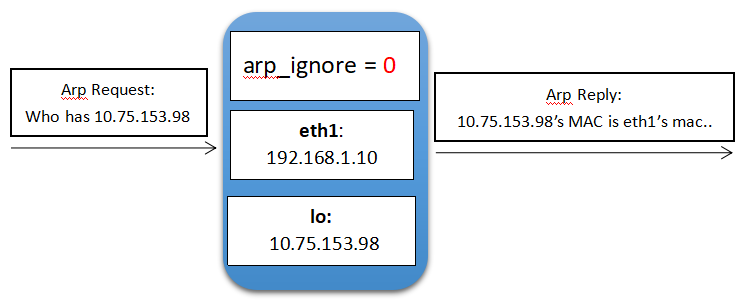
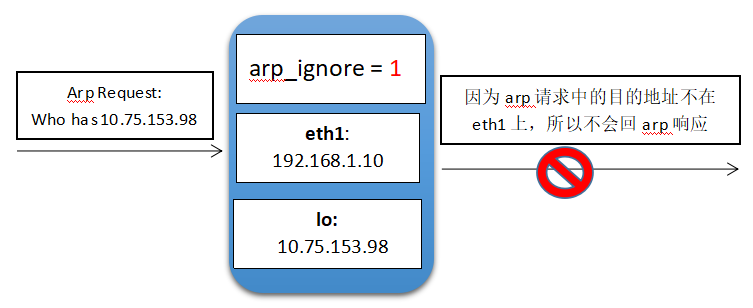
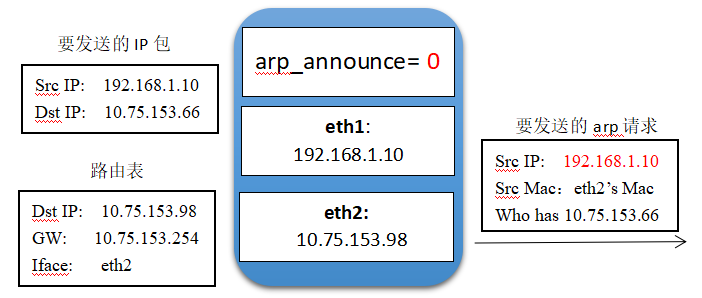
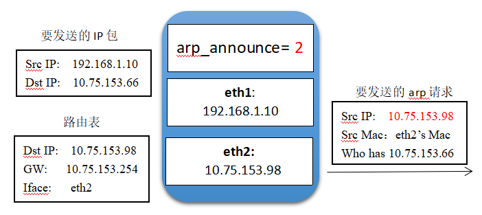
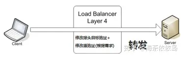
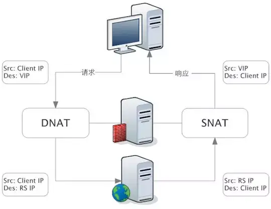
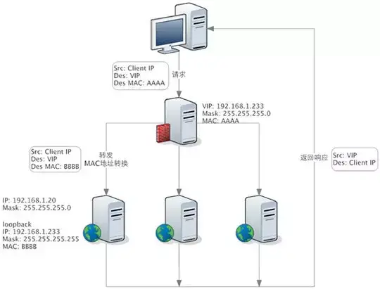
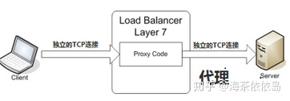
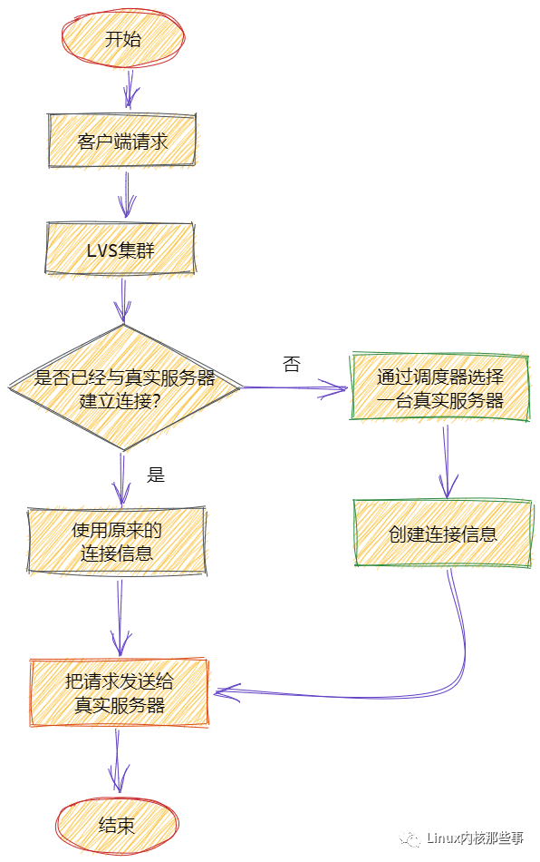

# 网络基础

## 基础命令

arp命令

```bash
#exec命令可以用来替代当前shell；换句话说，并没有启动子shell。使用这一命令时任何环境都将被清除，并重新启动一个shell。
#exec command
#其中，command通常是一个shell脚本。
#但是，exec在对文件描述符进行操作的时候（也只有在这个时候），它不会覆盖你当前的shell。
#以“读写方式”打开/dev/tcp/www.baidu.com/80，文件描述符对应为8
[root@server01 fd]# exec 8<> /dev/tcp/www.baidu.com/80
[root@server01 fd]# echo -e 'GET / HTTP/1.0\n' >& 8
[root@server01 fd]# cat <& 8
[root@server01 fd]# exec 8<&-
# ARP（Address Resolution Protocol）地址解析协议。IP数据包经常通过以太网进行发送，以32位的IP地址作为源/目的地址。但是以太网设备不能识别IP地址，他们是以48位的以太网地址传输以太网数据包的。ARP就是用来实现这种地址转换的协议
# arp -a 显示arp缓冲区的所有条目
# arp -n 查看arp表，并且用ip显示而不是主机名称
# arp -d 删除arp表（只能一个一个删除）
# arp -s 192.168.1.120 08:00:27:7e:b8:08 设置指定的主机的IP地址与 MAC 地址的静态映射；
# arp -i eth0 -d 192.168.1.120 删除指定网卡上的arp表
[root@server01 ~]# arp -an
```

虚拟网卡添加

```bash
# 虚拟网卡添加有两种方式：
# 方法1：添加别名网卡ifconfig enp0s8:0 1.1.1.2/24
# 方法2：添加辅助ip，ip add a 1.1.1.2/24 dev enp0s8
# 在server02增加一块虚拟网卡，（虚拟网卡的MAC地址跟原来的enp0s8一样）
# 通过方法1添加虚拟网卡
[root@server02 ~]# ifconfig enp0s8:1 192.168.88.88 up
# 删除通过方法1添加的虚拟网卡
[root@server02 ~]# ifconfig enp0s8:1 down
# 通过方法2添加虚拟网卡
[root@server02 ~]# ip addr add 1.1.1.2/24 dev lo
# 删除通过方法2添加的虚拟网卡
[root@server02 ~]# ip addr del 1.1.1.2/24 dev lo
```

添加路由规则

```bash
# 在server01中必须增加一条路由规则，才能ping通在server02中增加的虚拟网卡
# -net:目标地址是一个网络。
# -host:目标地址是一个主机。
# netmask:当添加一个网络路由时，需要使用网络掩码。
# gw : 路由数据包通过的网关
# dev：为路由指定的网络接口
# 添加路由并指定网关
[root@server01 ~]# route add -host 192.168.88.88 gw 192.168.56.101
# 删除路由
[root@server01 ~]# route del -host 192.168.88.88 gw 192.168.56.101 
# 添加路由并指定网络接口
[root@server01 ~]# route add -net 1.1.1.0/24 dev enp0s8
# 删除路由
[root@server01 ~]# route del -net 1.1.1.0/24 dev enp0s8
```

arp_ignore和arp_announce参数都和ARP协议相关，主要用于控制系统返回arp响应和发送arp请求时的动作。这两个参数很重要，特别是在LVS的DR场景下，它们的配置直接影响到DR转发是否正常。

## 回环网卡上配置ip

回环网络的特殊性

```bash
# ping 127.2、ping 127.2.8、ping 127.2.10.11都能成功，
# 通过ifconfig可以看到：inet 127.0.0.1/8，即：127网络的所有IP都能ping通
[root@server03 ~]# ping 127.2
PING 127.2 (127.0.0.2) 56(84) bytes of data.
64 bytes from 127.0.0.2: icmp_seq=1 ttl=64 time=0.016 ms
[root@server03 ~]# ping 127.2.8
PING 127.2.8 (127.2.0.8) 56(84) bytes of data.
64 bytes from 127.2.0.8: icmp_seq=1 ttl=64 time=0.015 ms
[root@server03 ~]# ping 127.2.10.11
PING 127.2.10.11 (127.2.10.11) 56(84) bytes of data.
64 bytes from 127.2.10.11: icmp_seq=1 ttl=64 time=0.019 ms

# 回环网卡上设置一个ip地址1.2.3.1/24，发现都能1.2.3网段的任意ip都能ping通，这就是说，只要是在回环网卡上设置一个网络，ping其网络上的任意ip地址都能够ping通。
[root@server03 ~]# ip addr add 1.2.3.1/24 dev lo
[root@server03 ~]# ping 1.2.3.1
PING 1.2.3.1 (1.2.3.1) 56(84) bytes of data.
64 bytes from 1.2.3.1: icmp_seq=1 ttl=64 time=0.013 ms
[root@server03 ~]# ping 1.2.3.2
PING 1.2.3.2 (1.2.3.2) 56(84) bytes of data.
64 bytes from 1.2.3.2: icmp_seq=1 ttl=64 time=0.014 ms
[root@server03 ~]# ping 1.2.3.3
PING 1.2.3.3 (1.2.3.3) 56(84) bytes of data.
64 bytes from 1.2.3.3: icmp_seq=1 ttl=64 time=0.014 ms
[root@server03 ~]# ping 1.2.3.100
PING 1.2.3.100 (1.2.3.100) 56(84) bytes of data.
64 bytes from 1.2.3.100: icmp_seq=1 ttl=64 time=0.015 ms

# 先删除上面配置的网络
[root@server03 ~]# ip addr del 1.2.3.1/24 dev lo
# 添加一个IP地址
[root@server03 ~]# ip addr add 1.2.3.1/32 dev lo
# ping 1.2.3.1能通
[root@server03 ~]# ping 1.2.3.1
PING 1.2.3.1 (1.2.3.1) 56(84) bytes of data.
64 bytes from 1.2.3.1: icmp_seq=1 ttl=64 time=0.013 ms
# 其他的IP都无法ping通
[root@server03 ~]# ping 1.2.3.2
PING 1.2.3.2 (1.2.3.2) 56(84) bytes of data.
```

回环网卡不对外，且接收到的数据包又会发回给本机，也就是说回环网卡是自己和自己玩

```bash
# 实验1：
# 在server02的回环网卡上配置一个虚拟ip
# 这里的意思是告诉内核，有一块1.1.1.2/24的网卡，并且由于lo网卡的特殊性，那么该机器会接受该网段所有IP(1.1.1.1~1.1.1.254) 的请求
# 并且这里还有一个比较特殊的地方是，会在路由表中增加如下的路由规则，但是实在Linux中route -n是看不到lo接口的设备的，因为它不对外。（Gateway是0.0.0.0或者*表示目标是本主机所属的网络，不需要路由）
# Destination	Gateway	Genmask	        Use Iface
# 1.1.1.0	    0.0.0.0	255.255.255.0	lo
[root@server02 ~]# ip addr add 1.1.1.2/24 dev lo
# 所有的arp_ignore配置都是0
[root@server02 ~]# sysctl -a | grep arp_ignore
net.ipv4.conf.all.arp_ignore = 0
net.ipv4.conf.default.arp_ignore = 0
net.ipv4.conf.enp0s3.arp_ignore = 0
net.ipv4.conf.enp0s8.arp_ignore = 0
net.ipv4.conf.lo.arp_ignore = 0
# 在server01上配置到1.1.1.0/24网段的路由
[root@server01 ~]# route add -net 1.1.1.0/24 dev enp0s8 
# 删除arp缓存
[root@server01 ~]# arp -d 1.1.1.2
[root@server01 ~]# arp -d 192.168.56.102
# 使用tcpdump抓取arp报文
[root@server01 ~]# tcpdump -i enp0s8 -nn arp
# 从server01 ping 1.1.1.2
[root@server01 ~]# ping 1.1.1.2
PING 1.1.1.2 (1.1.1.2) 56(84) bytes of data.
64 bytes from 1.1.1.2: icmp_seq=1 ttl=64 time=0.536 ms
64 bytes from 1.1.1.2: icmp_seq=2 ttl=64 time=0.376 ms
# 查看tcp报文
# 可以看到arp请求回复的mac地址是server02中enp0s8网卡的mac地址，通过路由表来看原因：
# Destination     Gateway         Genmask         Flags Metric Ref    Use Iface
# 0.0.0.0         10.0.2.2        0.0.0.0         UG    100    0        0 enp0s3
# 10.0.2.0        0.0.0.0         255.255.255.0   U     100    0        0 enp0s3
# 192.168.56.0    0.0.0.0         255.255.255.0   U     100    0        0 enp0s8
# 1.1.1.0	      0.0.0.0	      255.255.255.0	  U     100    0        0 lo
# 注意：上面的lo是假设的实际在Linux中route -n是看不到lo接口的设备的，因为它不对外。
# server02从arp包中解析出源IP地址为：192.168.56.101，server02在回复arp的时候192.168.56.101为目标地址，通过目标地址跟route表中的Genmask进行&运算及IP最长匹配原则，会走第三条路由规则，因此数据包会从enp0s8网卡发出
[root@server01 ~]# tcpdump -i enp0s8 -nn arp
tcpdump: verbose output suppressed, use -v or -vv for full protocol decode
listening on enp0s8, link-type EN10MB (Ethernet), capture size 262144 bytes
19:44:37.849082 ARP, Request who-has 192.168.56.101 (08:00:27:12:04:78) tell 192.168.56.1, length 46
19:44:37.849108 ARP, Reply 192.168.56.101 is-at 08:00:27:12:04:78, length 28
19:44:50.749824 ARP, Request who-has 1.1.1.2 tell 192.168.56.101, length 28
19:44:50.750112 ARP, Reply 1.1.1.2 is-at 08:00:27:9f:f2:71, length 46

# 实验2：
# 在上述配置的基础上删除arp缓存
[root@server01 ~]# arp -d 1.1.1.2
[root@server01 ~]# arp -d 192.168.56.102
# 在server02上通过tcpdump命令分别抓取enp0s8和lo上的报文
[root@server02 ~]# tcpdump -i enp0s8 -nn icmp
tcpdump: verbose output suppressed, use -v or -vv for full protocol decode
listening on enp0s8, link-type EN10MB (Ethernet), capture size 262144 bytes
[root@server02 ~]# tcpdump -i lo -nn icmp
tcpdump: verbose output suppressed, use -v or -vv for full protocol decode
listening on lo, link-type EN10MB (Ethernet), capture size 262144 bytes
# 从server01 ping 1.1.1.2
[root@server01 ~]# ping 1.1.1.2
PING 1.1.1.2 (1.1.1.2) 56(84) bytes of data.
64 bytes from 1.1.1.2: icmp_seq=1 ttl=64 time=0.454 ms
64 bytes from 1.1.1.2: icmp_seq=2 ttl=64 time=0.501 ms
64 bytes from 1.1.1.2: icmp_seq=3 ttl=64 time=0.270 ms
# 回环网卡上没有抓到数据包，lo网卡是自己跟自己玩的，不会接收外部网卡的数据包，跟对方通信的都是真实网卡。
[root@server02 ~]# tcpdump -i lo -nn icmp
tcpdump: verbose output suppressed, use -v or -vv for full protocol decode
listening on lo, link-type EN10MB (Ethernet), capture size 262144 bytes
# 所有的数据包都是通过enp0s8
[root@server02 ~]# tcpdump -i enp0s8 -nn icmp
tcpdump: verbose output suppressed, use -v or -vv for full protocol decode
listening on enp0s8, link-type EN10MB (Ethernet), capture size 262144 bytes
20:08:21.856977 IP 192.168.56.101 > 1.1.1.2: ICMP echo request, id 4547, seq 1, length 64
20:08:21.856995 IP 1.1.1.2 > 192.168.56.101: ICMP echo reply, id 4547, seq 1, length 64
20:08:22.856919 IP 192.168.56.101 > 1.1.1.2: ICMP echo request, id 4547, seq 2, length 64
20:08:22.856962 IP 1.1.1.2 > 192.168.56.101: ICMP echo reply, id 4547, seq 2, length 64
```

arp_ignore用来控制接受到arp请求的网卡，是否返回arp相应

```bash
# 实验3：
# 虚拟网卡及路由设置跟上面的实验保持不变的情况下，删除server01的arp缓存
[root@server01 ~]# arp -d 1.1.1.2
[root@server01 ~]# arp -d 192.168.56.102
# 将server02的内核参数arp_ignore设置为：1
# 只要修all即可，因为：arp_ignore分别有all,default,lo,eth1,eth2...等对应不同网卡的具体参数。当all和具体网卡的参数值不一致时，取较大值生效。
[root@server02 ~]# sysctl -w net.ipv4.conf.all.arp_ignore=1
net.ipv4.conf.all.arp_ignore = 1
# 在server02上使用tcpdump抓取arp请求的报文：
# 由上面的实验1和实验2可以lo网卡是不接受数据包的，所有的数据包都是通过真实的网卡接受，所以这里抓取的是enp0s8上的报文
[root@server02 ~]# tcpdump -i enp0s8 -nn arp
tcpdump: verbose output suppressed, use -v or -vv for full protocol decode
listening on enp0s8, link-type EN10MB (Ethernet), capture size 262144 bytes
# 从server01 ping 1.1.1.2
[root@server01 ~]# ping 1.1.1.2
PING 1.1.1.2 (1.1.1.2) 56(84) bytes of data.
From 192.168.56.101 icmp_seq=1 Destination Host Unreachable
From 192.168.56.101 icmp_seq=2 Destination Host Unreachable
From 192.168.56.101 icmp_seq=3 Destination Host Unreachable
From 192.168.56.101 icmp_seq=4 Destination Host Unreachable
# 可以看到因为arp_ignore设置成了1，所以enp0s8虽然收到了arp请求，并且也知道IP：1.1.1.2是存在的，但是由于虚拟IP：1.1.1.2不是绑定在enp0s8网卡上，所以不会回复；而server02没有回复arp请求，那么server01就获取不到目标IP的mac地址，也就无法进行通信了。
[root@server02 ~]# tcpdump -i enp0s8 -nn arp
tcpdump: verbose output suppressed, use -v or -vv for full protocol decode
listening on enp0s8, link-type EN10MB (Ethernet), capture size 262144 bytes
20:18:43.367290 ARP, Request who-has 192.168.56.102 (08:00:27:9f:f2:71) tell 192.168.56.1, length 46
20:18:43.367330 ARP, Reply 192.168.56.102 is-at 08:00:27:9f:f2:71, length 28
20:18:45.248242 ARP, Request who-has 1.1.1.2 tell 192.168.56.101, length 46
20:18:46.249570 ARP, Request who-has 1.1.1.2 tell 192.168.56.101, length 46
20:18:47.252180 ARP, Request who-has 1.1.1.2 tell 192.168.56.101, length 46

# 实验4：
# 删除server02中绑定在lo网卡上的虚拟IP
[root@server02 ~]# ip addr del 1.1.1.2/24 dev lo
# 将虚拟IP重新绑定到server02的enp0s8网卡上
[root@server02 ~]# ip addr add 1.1.1.2/24 dev enp0s8
# 将server02的内核参数arp_ignore设置为：1
[root@server02 ~]# sysctl -w net.ipv4.conf.all.arp_ignore=1
net.ipv4.conf.all.arp_ignore = 1
# 删除server01的arp缓存
[root@server01 ~]# arp -d 1.1.1.2
[root@server01 ~]# arp -d 192.168.56.102
# 从server01 ping 1.1.1.2
# 虽然server02的arp_ignore为1，但是由于虚拟IP绑定在enp0s8网卡上(即接收到arp请求的网卡上)，所以还是会回复该arp请求，那么server01还是能获取到1.1.1.2对应的mac地址，因此能ping通。
[root@server01 ~]# ping 1.1.1.2           
PING 1.1.1.2 (1.1.1.2) 56(84) bytes of data.
64 bytes from 1.1.1.2: icmp_seq=1 ttl=64 time=0.447 ms
64 bytes from 1.1.1.2: icmp_seq=2 ttl=64 time=0.964 ms
64 bytes from 1.1.1.2: icmp_seq=3 ttl=64 time=0.841 ms
```

## arp_ignore

arp_ignore参数的作用是控制系统在收到外部的arp请求时，是否要返回arp响应。arp_ignore参数常用的取值主要有0，1，2，3~8较少用到：

- 0：响应任意网卡上接收到的对本机IP地址的arp请求（包括环回网卡上的地址），而不管该目的IP是否在接收网卡上。
- 1：只响应目的IP地址为接收网卡上的本地地址的arp请求。（当将该本地地址同时绑定到环回网卡上时也不会响应）
- 2：只响应目的IP地址为接收网卡上的本地地址的arp请求，并且arp请求的源IP必须和接收网卡同网段。
- 3：如果ARP请求数据包所请求的IP地址对应的本地地址其作用域（scope）为主机（host），则不回应ARP响应数据包，如果作用域为全局（global）或链路（link），则回应ARP响应数据包。
- 4~7：保留未使用
- 8：不回应所有的arp请求

示例：

（1）当arp_ignore参数配置为0时，eth1网卡上收到目的IP为环回网卡IP的arp请求，但是eth1也会返回arp响应，把自己的mac地址告诉对端。



（2）当arp_ignore参数配置为1时，eth1网卡上收到目的IP为环回网卡IP的arp请求，发现请求的IP不是自己网卡上的IP，不会回arp响应。



## arp_announce

arp_announce的作用是控制系统在对外发送arp请求时，如何选择arp请求数据包的源IP地址。（比如系统准备通过网卡发送一个数据包a，这时数据包a的源IP和目的IP一般都是知道的，而根据目的IP查询路由表，发送网卡也是确定的，故源MAC地址也是知道的，这时就差确定目的MAC地址了。而想要获取目的IP对应的目的MAC地址，就需要发送arp请求。arp请求的目的IP自然就是想要获取其MAC地址的IP，而arp请求的源IP是什么呢？ 可能第一反应会以为肯定是数据包a的源IP地址，但是这个也不是一定的，arp请求的源IP是可以选择的，控制这个地址如何选择就是arp_announce的作用）arp_announce参数常用的取值有0，1，2。

- 0：允许使用任意网卡上的IP地址作为arp请求的源IP，通常就是使用数据包a的源IP。
- 1：尽量避免使用不属于该发送网卡子网的本地地址作为发送arp请求的源IP地址。
- 2：忽略IP数据包的源IP地址，选择该发送网卡上最合适的本地地址作为arp请求的源IP地址。

示例：

（1）当arp_announce参数配置为0时，系统要发送的IP包源地址为eth1的地址，IP包目的地址根据路由表查询判断需要从eth2网卡发出，这时会先从eth2网卡发起一个arp请求，用于获取目的IP地址的MAC地址。该arp请求的源MAC自然是eth2网卡的MAC地址，但是源IP地址会选择eth1网卡的地址。



（2）当arp_announce参数配置为2时，eth2网卡发起arp请求时，源IP地址会选择eth2网卡自身的IP地址。



# 负载均衡

## 四层负载均衡

四层负载均衡，也就是主要通过报文中的目标地址和端口，再加上负载均衡设备设置的服务器选择方式，决定最终选择的内部服务器。



1. 在三层负载均衡（IP层，即网络层）的基础上，通过发布三层的 IP 地址（VIP），然后加四层的端口号，来决定哪些流量需要做负载均衡.
2. 以常见的 TCP 为例，负载均衡设备在接收到第一个来自客户端的SYN请求时，直接转发给该服务器。TCP 的连接建立，即三次握手是客户端和服务器直接建立的，负载均衡设备只是起到一个类似路由器的转发动作。
3. 对应的负载均衡器称为四层交换机（L4 switch），主要分析 IP 层及 TCP/UDP 层，实现四层负载均衡。此种负载均衡器不理解应用协议（如 HTTP/FTP/MySQL 等等）。要处理的流量转发至后台服务器，并记录下这个TCP或者UDP的流量是由哪台服务器处理的，后续这个连接的所有流量都同样转发到同一台服务器处理。

LVS属于四层负载均衡，LVS的转发主要通过修改IP地址（NAT模式，分为源地址修改SNAT和目标地址修改DNAT）、修改目标MAC（DR模式）来实现。

NAT模式：网络地址转换

NAT（Network Address Translation）是一种外网和内网地址映射的技术。NAT 模式下，网络数据报的进出都要经过 LVS 的处理。LVS 需要作为 RS（真实服务器）的网关。当包到达 LVS 时，LVS 做目标地址转换（DNAT），将目标 IP 改为 RS 的 IP。RS 接收到包以后，仿佛是客户端直接发给它的一样。RS 处理完，返回响应时，源 IP 是 RS IP，目标 IP 是客户端的 IP。这时 RS 的包通过网关（LVS）中转，LVS 会做源地址转换（SNAT），将包的源地址改为 VIP，这样，这个包对客户端看起来就仿佛是 LVS 直接返回给它的。



DR 模式：直接路由

DR 模式下需要 LVS 和 RS 集群绑定同一个 VIP（RS 通过将 VIP 绑定在 loopback 实现），但与 NAT 的不同点在于：请求由 LVS 接受，由真实提供服务的服务器（RealServer，RS）直接返回给用户，返回的时候不经过 LVS。详细来看，一个请求过来时，LVS 只需要将网络帧的 MAC 地址修改为某一台 RS 的 MAC，该包就会被转发到相应的 RS 处理，注意此时的源 IP 和目标 IP 都没变，LVS 只是做了一下移花接木。RS 收到 LVS 转发来的包时，链路层发现 MAC 是自己的，到上面的网络层，发现 IP 也是自己的，于是这个包被合法地接受，RS 感知不到前面有 LVS 的存在。而当 RS 返回响应时，只要直接向源 IP（即用户的 IP）返回即可，不再经过 LVS。



DR 负载均衡模式数据分发过程中不修改 IP 地址，只修改 mac 地址，由于实际处理请求的真实物理 IP 地址和数据请求目的 IP 地址一致，所以不需要通过负载均衡服务器进行地址转换，可将响应数据包直接返回给用户浏览器，避免负载均衡服务器网卡带宽成为瓶颈。因此，DR 模式具有较好的性能，也是目前大型网站使用最广泛的一种负载均衡手段。

## 七层负载均衡

七层负载均衡，也称为“内容交换”，也就是主要通过报文中的真正有意义的应用层内容，再加上负载均衡设备设置的服务器选择方式，决定最终选择的内部服务器。



1. 在四层负载均衡的基础上（没有四层是绝对不可能有七层的），再考虑应用层的特征，比如同一个 Web 服务器的负载均衡，除了根据 VIP 加 80 端口辨别是否需要处理的流量，还可根据七层的 URL、浏览器类别、语言来决定是否要进行负载均衡。举个例子，如果你的 Web 服务器分成两组，一组是中文语言的，一组是英文语言的，那么七层负载均衡就可以当用户来访问你的域名时，自动辨别用户语言，然后选择对应的语言服务器组进行负载均衡处理。
2. 以常见的 TCP 为例，负载均衡设备如果要根据真正的应用层内容再选择服务器，只能先代理最终的服务器和客户端建立连接（三次握手）后，才可能接受到客户端发送的真正应用层内容的报文，然后再根据该报文中的特定字段，再加上负载均衡设备设置的服务器选择方式，决定最终选择的内部服务器。负载均衡设备在这种情况下，更类似于一个代理服务器。负载均衡和前端的客户端以及后端的服务器会分别建立 TCP 连接。所以从这个技术原理上来看，七层负载均衡明显的对负载均衡设备的要求更高，处理七层的能力也必然会低于四层模式的部署方式。
3. 对应的负载均衡器称为七层交换机（L7 switch），除了支持四层负载均衡以外，还有分析应用层的信息，如 HTTP 协议 URI 或 Cookie 信息，实现七层负载均衡。此种负载均衡器能理解应用协议。

## 两者区别

- 举个例子形象的说明：四层负载均衡就像银行的自助排号机，每一个达到银行的客户根据排号机的顺序，选择对应的窗口接受服务；而七层负载均衡像银行大堂经理，先确认客户需要办理的业务，再安排排号。这样办理理财、存取款等业务的客户，会根据银行内部资源得到统一协调处理，加快客户业务办理流程。
- 四层负载与七层负载最大的区别就是效率与功能的区别。四层负载架构设计比较简单，无需解析具体的消息内容，在网络吞吐量及处理能力上会相对比较高，而七层负载均衡的优势则体现在功能多，控制灵活强大。在具体业务架构设计时，使用七层负载或者四层负载还得根据具体的情况综合考虑。
- 其他说明：七层负载均衡和四层的重要区别是，因为需要得到数据报文的应用层信息，所以负载均衡设备需要和客户端建立连接，拿到规则需要的应用层信息后，再与后端真实机器建立连接，再进行请求。所以四层是只有一个独立连接，而七层是两个独立连接。

# LVS

 LVS（Linux Virtual Server）即Linux虚拟服务器，是由章文嵩博士主导的开源负载均衡项目，目前LVS已经被集成到Linux内核模块中；LVS是基于四层(传输层/TCP层)实现的负载均衡, 主要负责完成用户请求的转发。

## 相关术语

- DS：Director Server。指的是前端负载均衡器节点。
- RS：Real Server。后端真实的工作服务器。
- VIP：向外部直接面向用户请求，作为用户请求的目标的IP地址。
- DIP：Director Server IP，主要用于和内部主机通讯的IP地址。
- RIP：Real Server IP，后端服务器的IP地址。
- CIP：Client IP，访问客户端的IP地址。

## 原理

通过观察传输层的状态标志位(如: SYNC, ACK, FIN等标志位)实现跟踪用户请求的状态, 从而实现负载均衡；

LVS主要完成对用户请求的转发, 并且以DR(Direct Routing, 直接路由)模式为主要场景。

## 优点

由于LVS是基于四层(传输层/TCP层)实现的负载均衡, 所以LVS在进行负载均衡时并不需要建立三次握手和四次挥手的过程(而Nginx是基于七层模型实现的, 所以进行负载均衡时需要经过三次握手的过程)即LVS可承受的并发量要高于Nginx(几十万并发量)；并且通常数据包的返回可以不再经由负载均衡服务器(直接建立客户端->服务器的点对点连接), 所以可以减少负载均衡服务器压力；并且LVS基于内核网络层面工作，稳定性最好，对内存和cpu资源消耗极低。

> 注意：
>
> 1、虽然LVS仅仅将数据包转发. 但是LVS会通过窥看数据包传输层的状态标志位来保证三次握手到四次分手的过程不被分隔，即确保一个请求和同一个server建立TCP连接
>
> 2、LVS由于不知道数据包的真正内容, 所以一般要求后端请求处理服务器部署的是完全相同的内容

如何保证同一个请求的不同数据包每次调度都选择相同的真实服务器，源码分析：

ip_vs_conn对象用于维护客户端与真实服务器之间的关系，为什么需要维护它们之间的关系？原因是TCP协议面向连接的协议，所以每次调度都必须选择相同的真实服务器，否则连接就会失效。

比如：调度器选择了Real-Server(1)服务器进行处理客户端请求，但第二次调度时却选择了Real-Server(2)来处理客户端请求。由于TCP协议需要客户端与服务器进行连接，但第二次请求的服务器发生了变化，所以连接状态就失效了，这就为什么LVS需要维持客户端与真实服务器连接关系的原因。LVS通过ip_vs_conn对象来维护客户端与真实服务器之间的连接关系，其定义如下：

```c
struct ip_vs_conn {
    struct list_head    c_list;     /* 用于连接到哈希表 */

    __u32               caddr;      /* 客户端IP地址 */
    __u32               vaddr;      /* 虚拟IP地址 */
    __u32               daddr;      /* 真实服务器IP地址 */
    __u16               cport;      /* 客户端端口 */
    __u16               vport;      /* 虚拟端口 */
    __u16               dport;      /* 真实服务器端口 */
    __u16               protocol;   /* 协议类型（UPD/TCP） */
    ...
    /* 用于发送数据包的接口 */
    int (*packet_xmit)(struct sk_buff *skb, struct ip_vs_conn *cp);
    ...
};
```

ip_vs_conn对象各个字段的作用都在注释中进行说明了，客户端与真实服务器的连接关系就是通过协议类型、客户端IP、客户端端口、虚拟IP和虚拟端口来进行关联的，也就是说根据这五元组能够确定一个ip_vs_conn对象。另外，LVS有3中运行模式：NAT模式、DR模式和TUN模式。而对于不同的运行模式，发送数据包的接口是不一样的，所以ip_vs_conn对象的packet_xmit字段会根据不同的运行模式来选择不同的发送数据包接口，绑定发送数据包接口是通过ip_vs_bind_xmit()函数完成，如下：

```c
static inline void ip_vs_bind_xmit(struct ip_vs_conn *cp)
{
    switch (IP_VS_FWD_METHOD(cp)) {
    case IP_VS_CONN_F_MASQ:                     // NAT模式
        cp->packet_xmit = ip_vs_nat_xmit;
        break;
    case IP_VS_CONN_F_TUNNEL:                   // TUN模式
        cp->packet_xmit = ip_vs_tunnel_xmit;
        break;
    case IP_VS_CONN_F_DROUTE:                   // DR模式
        cp->packet_xmit = ip_vs_dr_xmit;
        break;
    ...
    }
}
```

一个客户端请求到达LVS后，Director服务器首先会查找客户端是否已经与真实服务器建立了连接关系，如果已经建立了连接，那么直接使用这个连接关系。否则，通过调度器对象选择一台合适的真实服务器，然后创建客户端与真实服务器的连接关系，并且保存到全局哈希表ip_vs_conn_tab中。



## 缺点

工作在4层，不支持7层规则修改。

同时LVS需要配置后方的RS(Real Server, 后端请求处理服务器)，所以部署复杂，功能单一。

## arp_ignore和arp_announce参数在DR模式下的作用

arp_ignore

因为DR模式下，每个真实服务器节点都要在环回网卡上绑定虚拟服务IP。这时候，如果客户端对于虚拟服务IP的arp请求广播到了各个真实服务器节点，如果arp_ignore参数配置为0，则各个真实服务器节点都会响应该arp请求，此时客户端就无法正确获取LVS节点上正确的虚拟服务IP所在网卡的MAC地址。假如某个真实服务器节点A的网卡eth1响应了该arp请求，客户端把A节点的eth1网卡的MAC地址误认为是LVS节点的虚拟服务IP所在网卡的MAC，从而将业务请求消息直接发到了A节点的eth1网卡。这时候虽然因为A节点在环回网卡上也绑定了虚拟服务IP，所以A节点也能正常处理请求，业务暂时不会受到影响。但时此时由于客户端请求没有发到LVS的虚拟服务IP上，所以LVS的负载均衡能力没有生效。造成的后果就是，A节点一直在单节点运行，业务量过大时可能会出现性能瓶颈。所以DR模式下要求arp_ignore参数要求配置为1。

arp_announce

每个机器或者交换机中都有一张arp表，该表用于存储对端通信节点IP地址和MAC地址的对应关系。当收到一个未知IP地址的arp请求，就会再本机的arp表中新增对端的IP和MAC记录；当收到一个已知IP地址（arp表中已有记录的地址）的arp请求，则会根据arp请求中的源MAC刷新自己的arp表。如果arp_announce参数配置为0，则网卡在发送arp请求时，可能选择的源IP地址并不是该网卡自身的IP地址，这时候收到该arp请求的其他节点或者交换机上的arp表中记录的该网卡IP和MAC的对应关系就不正确，可能会引发一些未知的网络问题，存在安全隐患。所以DR模式下要求arp_announce参数要求配置为2。

arp_ignore和arp_announce参数分别有all,default,lo,eth1,eth2...等对应不同网卡的具体参数。当all和具体网卡的参数值不一致时，取较大值生效。

一般只需修改all和某个具体网卡的参数即可（取决于你需要修改哪个网卡）。下面以修改lo网卡为例：

1. 修改/etc/sysctl.conf文件，然后sysctl -p刷新到内存。

```properties
net.ipv4.conf.all.arp_ignore=1
net.ipv4.conf.lo.arp_ignore=1
net.ipv4.conf.all.arp_announce=2
net.ipv4.conf.lo.arp_announce=2
```

2. 使用sysctl -w直接写入内存：

```properties
sysctl -w net.ipv4.conf.all.arp_ignore=1
sysctl -w net.ipv4.conf.lo.arp_ignore=1
sysctl -w net.ipv4.conf.all.arp_announce=2
sysctl -w net.ipv4.conf.lo.arp_announce=2
```

3. 修改/proc文件系统：

```properties
echo "1">/proc/sys/net/ipv4/conf/all/arp_ignore
echo "1">/proc/sys/net/ipv4/conf/lo/arp_ignore
echo "2">/proc/sys/net/ipv4/conf/all/arp_announce
echo "2">/proc/sys/net/ipv4/conf/lo/arp_announce
```

## VS的DR模型试验搭建

server01

```bash
# server01作为负载均衡服务器，在enp0s8上配置VIP
[root@server01 ~]# ifconfig enp0s8:1 192.168.56.200/24
[root@server01 ~]# yum install ipvsadm -y
```

server02

```bash
# 修改arp_ignore和arp_announce
[root@server02 ~]# echo 1 > /proc/sys/net/ipv4/conf/enp0s8/arp_ignore    
[root@server02 ~]# echo 2 > /proc/sys/net/ipv4/conf/enp0s8/arp_announce  
[root@server02 ~]# echo 1 > /proc/sys/net/ipv4/conf/all/arp_ignore   
[root@server02 ~]# echo 2 > /proc/sys/net/ipv4/conf/all/arp_announce
# server02作为真实服务器，在回环网卡上配置VIP，这里掩码需要配置成32位的原因，具体原因参照后面的分析
[root@server02 ~]# ifconfig lo:1 192.168.56.200 netmask 255.255.255.255
[root@server02 ~]# yum install httpd -y
[root@server02 ~]# systemctl start httpd
[root@server02 ~]# vim /var/www/html/index.html
from 192.168.56.102
```

server03

```bash
[root@server03 ~]# echo 1 > /proc/sys/net/ipv4/conf/enp0s8/arp_ignore
[root@server03 ~]# echo 2 > /proc/sys/net/ipv4/conf/enp0s8/arp_announce
[root@server03 ~]# echo 1 > /proc/sys/net/ipv4/conf/all/arp_ignore   
[root@server03 ~]# echo 2 > /proc/sys/net/ipv4/conf/all/arp_announce
[root@server03 ~]# ifconfig lo:1 192.168.56.200 netmask 255.255.255.255
[root@server03 ~]# yum install httpd -y  
[root@server03 ~]# systemctl start httpd
[root@server03 ~]# vim /var/www/html/index.html
from 192.168.56.103
```

server01

```bash
# 集群服务相关
# -A:添加
# -t:TCP协议集群
# -u:UDP协议集群
# -s:调度算法
# -p:超时时间,开启持久化服务，开启它则表示在指定时间内，来自同一IP的请求都会转发到后端同一台真实服务器上
[root@server01 ~]# ipvsadm -A -t 192.168.56.200:80 -s rr
# 使用命令查看IPVS的规则：ipvsadm -S -n
[root@server01 ~]# ipvsadm -ln
IP Virtual Server version 1.2.1 (size=4096)
Prot LocalAddress:Port Scheduler Flags
  -> RemoteAddress:Port           Forward Weight ActiveConn InActConn
TCP  192.168.56.200:80 rr
# RS(Real Server)相关
# -a:添加
# -t:事先定义好的集群服务
# -r:RS的地址，可包含{IP[:port]}，只有支持端口映射的LVS类型才允许此处使用跟集群服务不同的端口
# LVS类型：
# -g:DR(默认类型)
# -i:TUN
# -m:NAT
# -w:指定RS的权重
[root@server01 ~]# ipvsadm -a -t 192.168.56.200:80 -r 192.168.56.102 -g -w 1
[root@server01 ~]# ipvsadm -a -t 192.168.56.200:80 -r 192.168.56.103 -g -w 1 
[root@server01 ~]# ipvsadm -ln
IP Virtual Server version 1.2.1 (size=4096)
Prot LocalAddress:Port Scheduler Flags
  -> RemoteAddress:Port           Forward Weight ActiveConn InActConn
TCP  192.168.56.200:80 rr
  -> 192.168.56.102:80            Route   1      0          0         
  -> 192.168.56.103:80            Route   1      0          0 
# 观察负载均衡器上lvs窥看数据包传输层的状态标志位
[root@server01 ~]# ipvsadm -lnc
IPVS connection entries
pro expire state       source             virtual            destination
TCP 03:51  ESTABLISHED 192.168.56.1:56954 192.168.56.200:80  192.168.56.102:80
TCP 01:58  FIN_WAIT    192.168.56.1:57322 192.168.56.200:80  192.168.56.102:80
TCP 14:59  ESTABLISHED 192.168.56.1:57326 192.168.56.200:80  192.168.56.103:80
```

## LVS中VIP配置在环回接口上，子网掩码为是32位的原因

LVS环境机器信息如下：

- VIP：192.168.56.200
- DIP：192.168.56.101
- RIP：192.168.56.102
- RIP：192.168.56.103

LVS中，负载均衡服务器、Real Server都在同一网段内，数据包要访问外网的时候，都会走交换机查询MAC地址，那么如果在Real Server配置的掩码为255.255.255.0，当收到会出现什么问题呢？

首先会查询当前主机的路由表：

```bash
[root@server02 ~]# route -n
Kernel IP routing table
Destination     Gateway         Genmask         Flags Metric Ref    Use Iface
0.0.0.0         10.0.2.2        0.0.0.0         UG    100    0        0 enp0s3
10.0.2.0        0.0.0.0         255.255.255.0   U     100    0        0 enp0s3
192.168.56.0    0.0.0.0         255.255.255.0   U     100    0        0 lo
192.168.56.0    0.0.0.0         255.255.255.0   U     100    0        0 enp0s8
```

（Gateway是0.0.0.0或者*表示目标是本主机所属的网络，不需要路由）
注意：上面的lo是假设的，为了方便下面的说明，实际在Linux中route -n是看不到lo接口的设备的，因为它不对外。

假设从server02中有数据要出去，目标IP为192.168.56.1，VIP为192.168.56.200，那么目标IP跟路由表中的所有Genmask进行&运算后的结果：

enp0s3网卡 192.168.56.1 & 0.0.0.0 = 0.0.0.0

lo网卡 192.168.56.1 & 255.255.255.0 = 192.168.56.0

enp0s8网卡 192.168.56.1 & 255.255.255.0 = 192.168.56.0

然后，根据IP最长匹配原则，不会走最后的默认网关：10.0.2.2 ，而且由于&运算后发现目标IP和主机在同一网段内，因此会走最后两条路由规则，而且这两条其实都会匹配成功，但是，由于是环回网卡一种特殊的网络接口，不与任何实际设备连接，而是完全由软件实现。而且lo环回网卡离内核进，所以在路由表中排在enp0s8之上，所以数据包会走lo环回接口。而环回接口有一个特点，就是接收到的数据包又会发回给本机，也就是说回环网卡是自己和自己玩，因此如果走的是环回接口发送数据包，永远也发不出去，因此不能让数据包走环回接口，所以需要将掩码设置成255.255.255.255。所以需要将掩码设置成255.255.255.255，这样192.168.56.1与192.168.56.200的Genmask进行&操作之后的结果为192.168.56.1，不等于Destination：192.168.56.200，那么将不会走这条路由规则，而会从enp0s8发送数据包。然后通过enp0s8向交换机广播，获取192.168.56.1地址的MAC地址，将数据包发送过去就完成了相应的过程。

## LVS高可用

LVS环境机器信息如下：

- VIP：192.168.56.200
- DIP：192.168.56.120
- DIP：192.168.56.121
- RIP：192.168.56.102
- RIP：192.168.56.103

loadbalance01

```bash
[root@loadbalance01 ~]# yum install keepalived ipvsadm -y
[root@loadbalance01 ~]# cd /etc/keepalived/
[root@loadbalance01 keepalived]# cp keepalived.conf keepalived.conf_BAK
[root@loadbalance01 keepalived]# vim keepalived.conf
```

keepalived.conf

```properties
! Configuration File for keepalived

global_defs {
    notification_email {
      380197443@qq.com
    }
    notification_email_from 380197443@qq.com
    smtp_server stmp.qq.com
    smtp_connect_timeout 30
    router_id mysql-master
}
# 虚拟路由冗余协议
vrrp_instance VI_1 {
    state BACKUP
    interface enp0s8
    # 同一虚拟路由里面的master和backup，id号必须相同
    virtual_router_id 200
    priority 100
    # VIP 抢占与非抢占
    # 抢占：即当高优先级的主机恢复在线后，会抢占低先级的主机的master角色，默认情况下是抢占模式
    # 影响：抢占容易造成网络抖动
    # 建议：设置为非抢占模式 nopreempt ，即高优级主机恢复后，并不会抢占低优先级主机的master角色。nopreempt只加在优先级高的keepalived就可以了。
    # 非抢占不再有主从之分，全部都为BACKUP，并且配置文件中添加nopreempt，用来标识为非抢占模式
    # 总结：配置非抢占模式时，所有所有keepalived的state必须是BACKUP，非抢占功能只需要在优先级高的keepalived服务器上加即可。
    nopreempt
    # 心跳间隔时间
    advert_int 1
    authentication {
        auth_type PASS
        auth_pass 1111
    }
    virtual_ipaddress {
        192.168.56.200/24 dev enp0s8 label enp0s8:1
    }
}

virtual_server 192.168.56.200 80 {
    delay_loop 6
    # 调度算法
    lb_algo rr
    # 负载均衡类型
    lb_kind DR
    # 超时时间，开启持久化服务，开启它则表示在指定时间内，来自同一IP的请求都会转发到后端同一台真实服务器上
	# 正常情况下LVS会保证同一个TCP链接数据包会发往同一个真实服务器。
	# 例如:（192.168.80.1:49165 192.168.80.120:8080 192.168.80.136:8080）LVS会记录这个TCP链接的【原IP与端口，目标IP与端口】，后续的数据包会发送到192.168.80.136:8080。
	# 但是如果设置了persistence_timeout那么在这个时间段内，当前IP地址下所有的TCP链接数据包都会被发送到同一个真实服务器。假设客户端使用5个端口 建立了5个TCP链接，那么这5个链接会被发往相同的后端服务器，反之亦然。
	# 测试的时候设置为0，生产环境中根据业务场景设置合适的时间。
    persistence_timeout 0
    protocol TCP

    real_server 192.168.56.102 80 {
        weight 1
        # 对后端server进程健康检查
        HTTP_GET {
            url {
              path /
              status_code 200
            }
            connect_timeout 3
            retry 3
            delay_before_retry 3
        }
    }
    
    real_server 192.168.56.103 80 {
        weight 1
        # 对后端server进程健康检查
        HTTP_GET {
            url {
              path /
              status_code 200
            }
            connect_timeout 3
            retry 3
            delay_before_retry 3
        }
    }
}
```

```bash
[root@loadbalance01 keepalived]# systemctl start keepalived
[root@loadbalance01 keepalived]# ipvsadm -S -n
-A -t 192.168.56.200:80 -s rr
-a -t 192.168.56.200:80 -r 192.168.56.102:80 -g -w 1
-a -t 192.168.56.200:80 -r 192.168.56.103:80 -g -w 1
```

loadbalance02

```bash
[root@loadbalance02 keepalived]# yum install keepalived ipvsadm -y
[root@loadbalance02 ~]# cd /etc/keepalived/
[root@loadbalance02 keepalived]# cp keepalived.conf keepalived.conf_BAK
[root@loadbalance02 keepalived]# vim keepalived.conf
```

keepalived.conf

```properties
! Configuration File for keepalived

global_defs {
    notification_email {
      380197443@qq.com
    }
    notification_email_from 380197443@qq.com
    smtp_server stmp.qq.com
    smtp_connect_timeout 30
    router_id mysql-master
}
# 虚拟路由冗余协议
vrrp_instance VI_1 {
    state BACKUP
    interface enp0s8
    # 同一虚拟路由里面的master和backup，id号必须相同
    virtual_router_id 200
    priority 90
    # 心跳间隔时间
    advert_int 1
    authentication {
        auth_type PASS
        auth_pass 1111
    }
    virtual_ipaddress {
        192.168.56.200/24 dev enp0s8 label enp0s8:1
    }
}

virtual_server 192.168.56.200 80 {
    delay_loop 6
    # 调度算法
    lb_algo rr
    # 负载均衡类型
    lb_kind DR
    # 超时时间，开启持久化服务，开启它则表示在指定时间内，来自同一IP的请求都会转发到后端同一台真实服务器上
    # 正常情况下LVS会保证同一个TCP链接数据包会发往同一个真实服务器。
    # 例如:（192.168.80.1:49165 192.168.80.120:8080 192.168.80.136:8080）LVS会记录这个TCP链接的【原IP与端口，目标IP与端口】，后续的数据包会发送到192.168.80.136:8080。
    # 但是如果设置了persistence_timeout那么在这个时间段内，当前IP地址下所有的TCP链接数据包都会被发送到同一个真实服务器。假设客户端使用5个端口 建立了5个TCP链接，那么这5个链接会被发往相同的后端服务器，反之亦然。
    # 测试的时候设置为0，生产环境中根据业务场景设置合适的时间。
    persistence_timeout 0
    protocol TCP

    real_server 192.168.56.102 80 {
        weight 1
        # 对后端server进程健康检查
        HTTP_GET {
            url {
              path /
              status_code 200
            }
            connect_timeout 3
            retry 3
            delay_before_retry 3
        }
    }
    
    real_server 192.168.56.103 80 {
        weight 1
        # 对后端server进程健康检查
        HTTP_GET {
            url {
              path /
              status_code 200
            }
            connect_timeout 3
            retry 3
            delay_before_retry 3
        }
    }
}
```

```bash
[root@loadbalance02 keepalived]# systemctl start keepalived 
[root@loadbalance02 keepalived]# ipvsadm -S -n
-A -t 192.168.56.200:80 -s rr
-a -t 192.168.56.200:80 -r 192.168.56.102:80 -g -w 1
-a -t 192.168.56.200:80 -r 192.168.56.103:80 -g -w 1
```

server02

```bash
# 修改arp_ignore和arp_announce
[root@server02 ~]# echo 1 > /proc/sys/net/ipv4/conf/enp0s8/arp_ignore    
[root@server02 ~]# echo 2 > /proc/sys/net/ipv4/conf/enp0s8/arp_announce  
[root@server02 ~]# echo 1 > /proc/sys/net/ipv4/conf/all/arp_ignore   
[root@server02 ~]# echo 2 > /proc/sys/net/ipv4/conf/all/arp_announce
[root@server02 ~]# ifconfig lo:1 192.168.56.200 netmask 255.255.255.255
```

server03

```bash
[root@server03 ~]# echo 1 > /proc/sys/net/ipv4/conf/enp0s8/arp_ignore
[root@server03 ~]# echo 2 > /proc/sys/net/ipv4/conf/enp0s8/arp_announce
[root@server03 ~]# echo 1 > /proc/sys/net/ipv4/conf/all/arp_ignore   
[root@server03 ~]# echo 2 > /proc/sys/net/ipv4/conf/all/arp_announce
[root@server03 ~]# ifconfig lo:1 192.168.56.200 netmask 255.255.255.255
```

模拟LVS服务器宕机：

```bash
# 当前VIP在loadbalance02节点上，
[root@loadbalance02 keepalived]# ip a
1: lo: <LOOPBACK,UP,LOWER_UP> mtu 65536 qdisc noqueue state UNKNOWN group default qlen 1000
    link/loopback 00:00:00:00:00:00 brd 00:00:00:00:00:00
    inet 127.0.0.1/8 scope host lo
       valid_lft forever preferred_lft forever
    inet6 ::1/128 scope host 
       valid_lft forever preferred_lft forever
2: enp0s3: <BROADCAST,MULTICAST,UP,LOWER_UP> mtu 1500 qdisc pfifo_fast state UP group default qlen 1000
    link/ether 08:00:27:00:37:ea brd ff:ff:ff:ff:ff:ff
    inet 10.0.2.15/24 brd 10.0.2.255 scope global noprefixroute dynamic enp0s3
       valid_lft 81317sec preferred_lft 81317sec
    inet6 fe80::a1be:312f:4d66:ee24/64 scope link noprefixroute 
       valid_lft forever preferred_lft forever
3: enp0s8: <BROADCAST,MULTICAST,UP,LOWER_UP> mtu 1500 qdisc pfifo_fast state UP group default qlen 1000
    link/ether 08:00:27:8a:08:e9 brd ff:ff:ff:ff:ff:ff
    inet 192.168.56.121/24 brd 192.168.56.255 scope global noprefixroute enp0s8
       valid_lft forever preferred_lft forever
    inet 192.168.56.200/24 scope global secondary enp0s8:1
       valid_lft forever preferred_lft forever
    inet6 fe80::8a2:d9d6:fefa:4ee5/64 scope link tentative noprefixroute dadfailed 
       valid_lft forever preferred_lft forever
    inet6 fe80::5f4f:9c6:5bb3:b11c/64 scope link noprefixroute 
       valid_lft forever preferred_lft forever
# stop掉loadbalance02上的keepalived服务
[root@loadbalance02 keepalived]# systemctl stop keepalived
```

```bash
# VIP漂移至loadbalance01，并且对前端应用无感
[root@loadbalance01 ~]# ip a
1: lo: <LOOPBACK,UP,LOWER_UP> mtu 65536 qdisc noqueue state UNKNOWN group default qlen 1000
    link/loopback 00:00:00:00:00:00 brd 00:00:00:00:00:00
    inet 127.0.0.1/8 scope host lo
       valid_lft forever preferred_lft forever
    inet6 ::1/128 scope host 
       valid_lft forever preferred_lft forever
2: enp0s3: <BROADCAST,MULTICAST,UP,LOWER_UP> mtu 1500 qdisc pfifo_fast state UP group default qlen 1000
    link/ether 08:00:27:c6:05:47 brd ff:ff:ff:ff:ff:ff
    inet 10.0.2.15/24 brd 10.0.2.255 scope global noprefixroute dynamic enp0s3
       valid_lft 85277sec preferred_lft 85277sec
    inet6 fe80::a1be:312f:4d66:ee24/64 scope link noprefixroute 
       valid_lft forever preferred_lft forever
3: enp0s8: <BROADCAST,MULTICAST,UP,LOWER_UP> mtu 1500 qdisc pfifo_fast state UP group default qlen 1000
    link/ether 08:00:27:70:cd:6b brd ff:ff:ff:ff:ff:ff
    inet 192.168.56.120/24 brd 192.168.56.255 scope global noprefixroute enp0s8
       valid_lft forever preferred_lft forever
    inet 192.168.56.200/24 scope global secondary enp0s8:1
       valid_lft forever preferred_lft forever
    inet6 fe80::8a2:d9d6:fefa:4ee5/64 scope link noprefixroute 
       valid_lft forever preferred_lft forever
```

模拟后端真实服务器宕机：

```bash
# 停止server02的httpd服务
[root@server02 ~]# systemctl stop httpd
```

```bash
# 可以看到DS服务器会将宕机的server02节点从真实服务器列表中剔除
[root@loadbalance01 ~]# ipvsadm -S -n
-A -t 192.168.56.200:80 -s rr
-a -t 192.168.56.200:80 -r 192.168.56.103:80 -g -w 1
```

```bash
# 可以看到DS服务器会将宕机的server02节点从真实服务器列表中剔除
[root@loadbalance02 keepalived]# ipvsadm -S -n
-A -t 192.168.56.200:80 -s rr
-a -t 192.168.56.200:80 -r 192.168.56.103:80 -g -w 1
```

```bash
# 重新启动server02的httpd服务
[root@server02 ~]# systemctl start httpd
```

```bash
# DS服务器的真实服务器列表中server02节点重新被添加进来了
[root@loadbalance01 ~]# ipvsadm -S -n
-A -t 192.168.56.200:80 -s rr
-a -t 192.168.56.200:80 -r 192.168.56.102:80 -g -w 1
-a -t 192.168.56.200:80 -r 192.168.56.103:80 -g -w 1
```

```bash
# DS服务器的真实服务器列表中server02节点重新被添加进来了
[root@loadbalance02 keepalived]# ipvsadm -S -n
-A -t 192.168.56.200:80 -s rr
-a -t 192.168.56.200:80 -r 192.168.56.102:80 -g -w 1
-a -t 192.168.56.200:80 -r 192.168.56.103:80 -g -w 1
```

