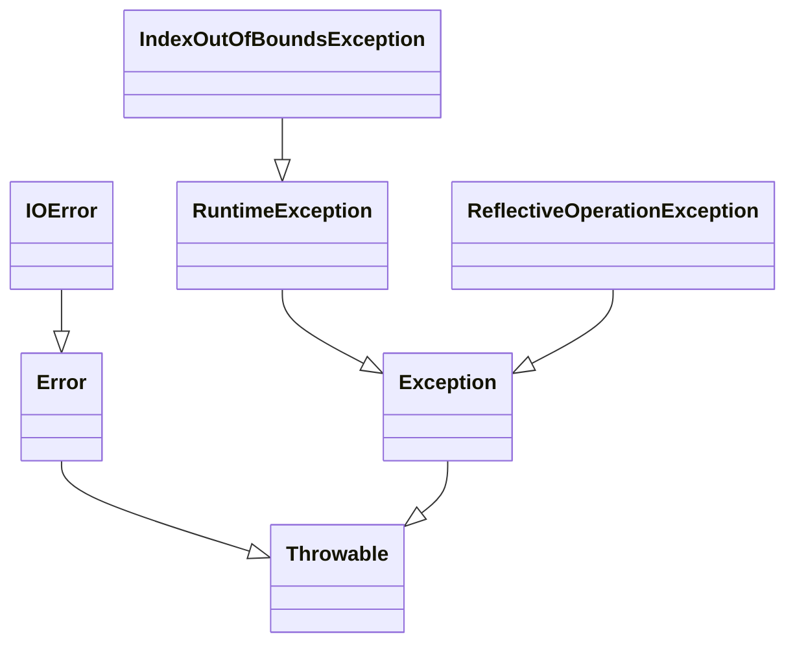
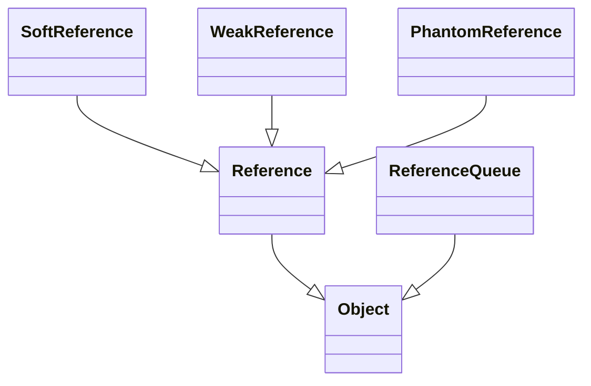

# 运算

## 原码

用第一位表示符号，其余位表示值。因为第一位是符号位，所以8位二进制数的取值范围就是：[1111_1111 , 0111_1111]  即 [-127 , 127] ,原码是容易被人脑所理解的表达方式

## 反码

正数的反码是其本身，负数的反码是符号位保持不变，其余位取反。例如正数1的原码是[0000_0001]，它的反码是是其本身[0000_0001],-1的原码是[1000_0001],其反码是[1111_1110]

## 补码

正数的补码是其本身，负数的补码是在其反码的基础上+1，例如正数1的原码是[0000_0001],他的补码是其本身[0000_0001],-1的补码是[1111_1111]。如果计算机内部采用原码来表示数，那么在进行加法和减法运算的时候，需要转化为两个绝对值的加法和减法运算；计算机既要实现加法器，又要实现减法器，代价有点大，那么如何只用一种类型的运算器来实现加和减的运算呢？很容易想到的就是化减为加，举一个生活中的例子来说明这个问题：时钟一圈是360度，当然也存在365度，但其实它和5度是一样的；相同的道理，-30度表示逆时针旋转30度，其与顺时针旋转330度是一样的；这里数字360表示时钟的一圈。在计算机里类似的概念叫模，它可以实现化减为加，本质上是将溢出的部分舍去而不改变结果。易得，单字节(8位)运算的模为256=2^8。在没有符号位的情况下，127+2=129，即：01111111+00000010=10000001这时，我们将最高位作为符号位，计算机数字均以补码来表示，则1000 0001的原码为减1后按位取反得1111 1111，也就是-127。也就是说，计算机里的129即表示-127，相当于模256为一圈，顺时针的129则和逆时针127即-127是一样的。故可以得到以下结论：负数的补码为模减去该数的绝对值。如-5的补码为：-5=256-5=251=1111 1011(二进制)。最后，来看补码是如何通过模的溢出舍弃操作来完成化减为加的：比如在单字节(8位)中计算-1+2，根据上面的描述：-1的补码为11111111，即无符号时的255；2的补码等于原码为00000010，那么-1+2=[11111111]补+[00000010]补=[100000001]，也可以看成是255+2=257，而由于是单字节运算，所以要对257取模，也就是舍弃掉结果100000001中最前面的溢出位1，得到最终的结果00000001；由此可见将溢出的部分舍去不改变结果。

使用原码参数运算的缺陷

| 负数                    | 正数                   |
| ----------------------- | ---------------------- |
| 1000_0000        (-0)   | 0000_0000        (0)   |
| 1000_0001        (-1)   | 0000_0001        (1)   |
| 1000_0010        (-2)   | 0000_0010        (2)   |
| ......                  | ......                 |
| 1111_1101        (-125) | 0111_1101        (125) |
| 1111_1110        (-126) | 0111_1110        (126) |
| 1111_1111        (-127) | 0111_1111        (127) |

从上面的原码表中可以看见左边每增加一个二进制单位对应的真数是递减的，而右边每增加一个二进制单位对应的真数是递增的，所以对于原码来说，能满足正数的加法，但无法满足负数的加法
2+1 = [0000_0010]原+[0000_0001]原=[0000_0011]原 = 3
1+-1=[0000_00001]原+[1000_0001]原=[1000_0010]原=-2

为了满足负数对加法的需求，就必须让负数与他对应的二进制码是同步递增或者同步递减
于是就通过符号位不变，其余位取反来满足这个同步递增或者递减的要求，由于正数本来就满足它本身的加法，所以不需要做任何改变。这就是反码的定义由来。

| 负数                    | 正数                   |
| ----------------------- | ---------------------- |
| 1111_1111        (-0)   | 0000_0000        (0)   |
| 1111_1110        (-1)   | 0000_0001        (1)   |
| 1111_1101        (-2)   | 0000_0010        (2)   |
| ......                  | ......                 |
| 1000_0010        (-125) | 0111_1101        (125) |
| 1000_0001        (-126) | 0111_1110        (126) |
| 1000_0000        (-127) | 0111_1111        (127) |

从上图的反码表中可以看到在运算符号位不发生进位的时候，正负数的加法已经能满足要求
-2+1=[1111_1101]反+[0000_0001]反=[1111_1110]反=-1
但是这里有个不合理的地方，就是[1111_1111]和[0000_0000]都表示0，这导致在实际计算中每当跨过符号位发生进位，就有一个单位的误差
-1+2=[1111_1110]反+[0000_0010]反=[0000_0000]反=0
-1+3=[1111_1110]反+[0000_0011]反=[0000_0001]反=1
另外还有一个不合理的地方就是：127+1=[0111_1111]反+[0000_0001]反=[1000_0000]反=-127

要解决这个问题就必须让反码中的[1111_1111]和[0000_0000]合并，
由于[1111_1111]+[0000_0001]=[0000_0000],所以在负数反码的基础上+1就可以解决反码中跨0的误差问题，同时不会对负数与它对应的二进制反码的同步递增产生影响，所以在反码的基础上+1就完美的解决了符号参与预算的问题，这就是补码为什么是在负数反码的基础上+1的由来。

| 负数                    | 正数                   |
| ----------------------- | ---------------------- |
| 0000_0000        (-0)   | 0000_0000        (0)   |
| 1111_1111        (-1)   | 0000_0001        (1)   |
| 1111_1110        (-2)   | 0000_0010        (2)   |
| ......                  | ......                 |
| 1000_0011        (-125) | 0111_1101        (125) |
| 1000_0010        (-126) | 0111_1110        (126) |
| 1000_0001        (-127) | 0111_1111        (127) |

从上面的图中发现还有一个[1000_0000]的二进制没有对应任何真数，于是就规定了这个数的真数是-128
所以补码的表示范围是[-128~127] ，这样一来256个二进制正好表示256个整数。

```java
package org.duo;

public class OperationMain {

    public static void main(String[] args) {

        // 整型总共32位，最高位为符号位，
        // 所以按理说正整数表示的范围为的1到2的31次方-1，负整数表示的范围为负2的31次方-1到-1
        // 但是这样的话正零：00000000000000000000000000000000和负零：10000000000000000000000000000000这两个数就重复了
        // 于是用正零来表示0，负零来表示负的最小值，即：负2的31次方
        System.out.println(Integer.MAX_VALUE);
        System.out.println(Integer.MIN_VALUE);
        System.out.println(toBinary(Integer.MAX_VALUE));
        System.out.println(toBinary(Integer.MIN_VALUE));
        
        OperationMain.intToBinary();
        OperationMain.byteToBinary();
        
        System.out.println("================================");
        int a = 208410238;
        int b = 9810381;
        System.out.println(toBinary(a));
        System.out.println(toBinary(b));
        System.out.println("============与运算==============>");
        System.out.println(toBinary(a & b));
        System.out.println("============或运算==============>");
        System.out.println(toBinary(a | b));
        // 相同为0，不同为1
        System.out.println("============异或运算============>");
        System.out.println(toBinary(a ^ b));
        System.out.println("============非运算==============>");
        System.out.println(toBinary(~a));
        System.out.println("=======取反加一：相当于取相反数====>");
        int c = 5;
        System.out.println(~c + 1);
        c = -5;
        System.out.println(~c + 1);
        
        System.out.println("================================");
        // 左移，正数和负数都一样（不区分带符号左移和不带符号左移）
        System.out.println(-1 << 2);
        // 右移分带符号右移和不带符号右移，正数的带符号右移和不带符号右移是一样的
        System.out.println(Integer.MIN_VALUE);
        System.out.println(toBinary(Integer.MIN_VALUE));
        // 负数带符号位右移：高位补符号位
        System.out.println("============负数带符号右移========>");
        System.out.println(Integer.MIN_VALUE >> 1);
        System.out.println(toBinary(Integer.MIN_VALUE >> 1));
        // 负数不带符号位右移：高位补0
        System.out.println("============负数不带符号右移======>");
        System.out.println(Integer.MIN_VALUE >>> 1);
        System.out.println(toBinary(Integer.MIN_VALUE >>> 1));
    }

    public static void intToBinary() {

        // 整型转二进制
        int i = -1;
        String tString = Integer.toBinaryString(i);

        // 二进制转int，二进制用0b开头
        int bn = 0b11111111111111111111111111111111;
        System.out.println("整数:" + i + "的二进制:" + tString);
    }
    
    public static void byteToBinary() {

        /**
         * -64的二进制为11000000，由于符号为符号，左移一位的话相当于缩小一半，变成-128
         * (比如二进制的整数左移一位值增大一倍，而十进制的整数左移一位值增大十倍)
         * 注意：
         * 负数左移的话后边补零、右移的话前面补1：
         * 例如-10的二进制：11110110，左移一位后二进制位：11101100，右移一位后二进制：11111011
         * 正数左移的话后边补零、右移的话前面补0:
         * 例如-10的二进制：00001010，左移一位后二进制位：00010100，右移一位后二进制：00000101
         */
        byte tByte = -2;

        // 如果直接使用Integer.toBinaryString(tByte)那么会自动将tByte转换为int，然后再将-10的int转化为二进制：11111111111111111111111111110110
        // System.out.println(Integer.toBinaryString(tByte));
        // 但是我们需要的是11110110，所以对tByte进行& 0xFF的操作，
        // 可是如果tByte = 2的时候使用Integer.toBinaryString(tByte & 0xFF)之后等到的结果将是10，而我们需要的是00000010
        // 所以通过+0x100的方式进行填充，然后再截取后面的八位。
        String tString = Integer.toBinaryString((tByte & 0xFF) + 0x100).substring(1);
        System.out.println("整数:" + tByte + "的二进制:" + tString);
    }
    
    /**
     * 将一个整型转化为二进制
     *
     * @param num
     * @return
     */
    public static String toBinary(int num) {

        StringBuilder binaryBuf = new StringBuilder();
        for (int i = 31; i >= 0; i--) {
            if ((num & 1 << i) == 0) {
                binaryBuf.append("0");
            } else {
                binaryBuf.append("1");
            }
            //System.out.print((num & (1 << i)) == 0 ? "0" : "1");
        }
        return binaryBuf.toString();
    }
}
```


# 异常

## 异常的分类层次结构



## Throwable

有两个重要的子类：Exception（异常）和 Error（错误），二者都是 Java 异常处理的重要子类，各自都包含大量子类。常和错误的区别：异常能被程序本身可以处理，错误是无法处理。

## Error

是程序无法处理的错误，表示运行应用程序中较严重问题。

大多数错误与代码编写者执行的操作无关，而表示代码运行时 JVM（Java 虚拟机）出现的问题。例如，Java虚拟机运行错误（Virtual MachineError），当 JVM 不再有继续执行操作所需的内存资源时，将出现 OutOfMemoryError。

这些异常发生时，Java虚拟机（JVM）一般会选择线程终止。这些错误表示故障发生于虚拟机自身、或者发生在虚拟机试图执行应用时，如Java虚拟机运行错误（Virtual MachineError）、类定义错误（NoClassDefFoundError）等。

这些错误是不可查的，因为它们在应用程序的控制和处理能力之 外，而且绝大多数是程序运行时不允许出现的状况。对于设计合理的应用程序来说，即使确实发生了错误，本质上也不应该试图去处理它所引起的异常状况。在 Java中，错误通过Error的子类描述。

## Exception

是程序本身可以处理的异常。

Exception 类有一个重要的子类 RuntimeException。RuntimeException 类及其子类表示“JVM 常用操作”引发的错误。例如，若试图使用空值对象引用、除数为零或数组越界，则分别引发运行时异常（NullPointerException、ArithmeticException）和 IndexOutOfBoundException。

Exception这种异常分两大类运行时异常和非运行时异常(编译异常)。程序中应当尽可能去处理这些异常。

### 运行时异常

都是RuntimeException类及其子类异常，如NullPointerException(空指针异常)、IndexOutOfBoundsException(下标越界异常)等，这些异常是不检查异常，程序中可以选择捕获处理，也可以不处理。这些异常一般是由程序逻辑错误引起的，程序应该从逻辑角度尽可能避免这类异常的发生。运行时异常的特点是Java编译器不会检查它，也就是说，当程序中可能出现这类异常，即使没有用try-catch语句捕获它，也没有用throws子句声明抛出它，也会编译通过。

### 非运行时异常 

编译异常：是RuntimeException以外的异常，类型上都属于Exception类及其子类。从程序语法角度讲是必须进行处理的异常，如果不处理，程序就不能编译通过。如IOException、SQLException等以及用户自定义的Exception异常，一般情况下不自定义检查异常。

## 可查的异常（checked exceptions）

可查异常（编译器要求必须处置的异常）：正确的程序在运行中，很容易出现的、情理可容的异常状况。可查异常虽然是异常状况，但在一定程度上它的发生是可以预计的，而且一旦发生这种异常状况，就必须采取某种方式进行处理。除了RuntimeException及其子类以外，其他的Exception类及其子类都属于可查异常。这种异常的特点是Java编译器会检查它，也就是说，当程序中可能出现这类异常，要么用try-catch语句捕获它，要么用throws子句声明抛出它，否则编译不会通过。

## 不可查的异常（unchecked exceptions）

不可查异常(编译器不要求强制处置的异常):包括运行时异常（RuntimeException与其子类）和错误（Error）。

# 枚举

## JDK1.5之前定义枚举类型：

```java
package org.duo.enum01;

/**
 * 枚举类型：季节
 */
public class Season {

    // 属性：
    private final String seasonName;//季节名字
    private final String seasonDesc;//季节描述

    // 利用构造器对属性进行赋值操作：
    // 构造器私有化，外界不能调用这个构造器，只能Season内部自己调用
    public Season(String seasonName, String seasonDesc) {
        this.seasonName = seasonName;
        this.seasonDesc = seasonDesc;
    }

    // 提供枚举类的有限的、确定的对象：
    public static final Season SPRING = new Season("春天", "春暖花开");
    public static final Season SUMMER = new Season("夏天", "夏日炎炎");
    public static final Season AUTUMN = new Season("秋天", "硕果累累");
    public static final Season WINTER = new Season("冬天", "冰天雪地");

    public String getSeasonName() {
        return seasonName;
    }

    public String getSeasonDesc() {
        return seasonDesc;
    }

    @Override
    public String toString() {
        final StringBuilder sb = new StringBuilder("Season{");
        sb.append("seasonName='").append(seasonName).append('\'');
        sb.append(", seasonDesc='").append(seasonDesc).append('\'');
        sb.append('}');
        return sb.toString();
    }

}
```

## JDK1.5之后使用enum关键字创建枚举类：

```java 
package org.duo.enum02;

public enum Season {

    // 提供枚举类的有限的、确定的对象： 
    // ==> enum枚举类要求对象(常量)必须放在最开始的位置：相当于一组Season类型的对象
    // ==> 并且可以省略类型修饰符和new
    // ==> 多个对象之间用","进行连接，最后一个对象后面用";"结束
    // ==> 枚举类型的父类是：java.lang.Enum
    SPRING("春天", "春暖花开"),
    SUMMER("夏天", "夏日炎炎"),
    AUTUMN("秋天", "硕果累累"),
    WINTER("冬天", "冰天雪地");

    // 属性：
    private final String seasonName;//季节名字
    private final String seasonDesc;//季节描述

    // 利用构造器对属性进行赋值操作：
    // 构造器私有化，外界不能调用这个构造器，只能Season内部自己调用
    private Season(String seasonName, String seasonDesc) {
        this.seasonName = seasonName;
        this.seasonDesc = seasonDesc;
    }

    public String getSeasonName() {
        return seasonName;
    }

    public String getSeasonDesc() {
        return seasonDesc;
    }

    @Override
    public String toString() {
        final StringBuilder sb = new StringBuilder("Season{");
        sb.append("seasonName='").append(seasonName).append('\'');
        sb.append(", seasonDesc='").append(seasonDesc).append('\'');
        sb.append('}');
        return sb.toString();
    }
}
```

在源码中经常可以看到别人定义的枚举类形态：

```java
package org.duo.enum03;

public enum Season {

    SPRING,
    SUMMER,
    AUTUMN,
    WINTER;
}
```

这是因为这个枚举底层没有属性，所以属性、构造器、get、toString方法都删掉不写了，然后按理来说应该写为MAN()，现在连()也省略了就变成了MAN

## Enum类的常用方法

```java
package org.duo.enum03;

public enum Season {

    SPRING,
    SUMMER,
    AUTUMN,
    WINTER;
}
```

```java
package org.duo.enum03;

public class TestSeason {

    public static void main(String[] args) {
        // 用enum关键字创建的Season枚举类型上面的父类是:java.lang.Enum，常用方法子类Season可以直接
        // toString；========> 获取对象的名字
        Season autumn = Season.AUTUMN;
        System.out.println(autumn);
        System.out.println("---------------------------------");
        // values；========> 返回枚举类型对象的数组
        Season[] values = Season.values();
        for (Season s : values) {
            System.out.println(s);
        }
        System.out.println("---------------------------------");
        // valueof；========> 通过对象名字获取枚举对象
        // 注意：对象的名字必须传正确
        Season autumn1 = Season.valueOf("AUTUMN");
        System.out.println(autumn1);
    }
}
```

## 枚举类实现接口

```java
package org.duo.enum04;

public interface TestInterface {
    void show();
}
```

```java
package org.duo.enum04;

public enum Season implements TestInterface{

    SPRING,
    SUMMER,
    AUTUMN,
    WINTER;

    @Override
    public void show() {
        System.out.println("这是Season类。");
    }
}
```

```java
package org.duo.enum04;

public class TestMain {

    public static void main(String[] args) {
        Season spring = Season.valueOf("SPRING");
        spring.show();
        Season winter = Season.valueOf("WINTER");
        winter.show();
    }
}
```

上述的写法所有的枚举对象调用show方法打印的结果都一样，如果想要不同的枚举对象实现各自的方法逻辑则可以使用以下的写法：

```java
package org.duo.enum04;

public enum Season implements TestInterface {

    SPRING {
        @Override
        public void show() {
            System.out.println("这是春天。");
        }
    },
    SUMMER {
        @Override
        public void show() {
            System.out.println("这是夏天。");
        }
    },
    AUTUMN {
        @Override
        public void show() {
            System.out.println("这是秋天。");
        }
    },
    WINTER {
        @Override
        public void show() {
            System.out.println("这是冬天。");
        }
    };

//    @Override
//    public void show() {
//        System.out.println("这是Season类。");
//    }
}
```

## 枚举的应用

```java 
package org.duo.enum05;

public enum Gender {

    男,
    女;
}
```

```java 
package org.duo.enum05;

public class Person {

    private int age;
    private String name;
    private Gender sex;

    public int getAge() {
        return age;
    }

    public void setAge(int age) {
        this.age = age;
    }

    public String getName() {
        return name;
    }

    public void setName(String name) {
        this.name = name;
    }

    public Gender getSex() {
        return sex;
    }

    public void setSex(Gender sex) {
        this.sex = sex;
    }

    @Override
    public String toString() {
        final StringBuilder sb = new StringBuilder("Person{");
        sb.append("age=").append(age);
        sb.append(", name='").append(name).append('\'');
        sb.append(", sex=").append(sex);
        sb.append('}');
        return sb.toString();
    }
}
```

```java
package org.duo.enum05;

public class TestMain {

    public static void main(String[] args) {

        Person person = new Person();
        person.setAge(18);
        person.setName("lily");
        person.setSex(Gender.男); // 传入枚举类Gender的对象：===>在入口处对参数进行了限制
        System.out.println(person);
    }
}
```

# 泛型

## 概述

泛型，即“参数化类型”。一提到参数，最熟悉的就是定义方法时有形参，然后调用此方法时传递实参。那么参数化类型怎么理解呢？顾名思义，就是将类型由原来的具体的类型参数化，类似于方法中的变量参数，此时类型也定义成参数形式（可以称之为类型形参），然后在使用/调用时传入具体的类型（类型实参）。泛型的本质是为了参数化类型（在不创建新的类型的情况下，通过泛型指定的不同类型来控制形参具体限制的类型）。也就是说在泛型使用过程中，操作的数据类型被指定为一个参数，这种参数类型可以用在类、接口和方法中，分别被称为泛型类、泛型接口、泛型方法。

## 特性

泛型只在编译阶段有效。

```java
package org.duo.generic;

import java.util.ArrayList;
import java.util.List;

public class MainClass {

    public static void main(String[] args) {

        List<String> stringArrayList = new ArrayList<String>();
        List<Integer> integerArrayList = new ArrayList<Integer>();
        Class classStringArrayList = stringArrayList.getClass();
        Class classIntegerArrayList = integerArrayList.getClass();
        if (classStringArrayList.equals(classIntegerArrayList)) {
            System.out.println(classStringArrayList);
            System.out.println(classIntegerArrayList);
            System.out.println("类型相同");
        }
    }
}
```

通过上面的例子可以证明，在编译之后程序会采取去泛型化的措施。也就是说Java中的泛型，只在编译阶段有效。在编译过程中，正确检验泛型结果后，会将泛型的相关信息擦出，并且在对象进入和离开方法的边界处添加类型检查和类型转换的方法。也就是说，泛型信息不会进入到运行时阶段。对此总结成一句话：泛型类型在逻辑上看以看成是多个不同的类型，实际上都是相同的基本类型。

## 泛型类

1. 泛型的类型参数只能是类类型（包括自定义类），不能是简单类型
2. 在使用泛型的时候如果传入泛型实参，则会根据传入的泛型实参做相应的限制，此时泛型才会起到本应起到的限制作用。如果不传入泛型类型实参的话，在泛型类中使用泛型的方法或成员变量定义的类型可以为任何的类型。
3. 实例化的时候也可以不指定泛型：如果实例化的时候不明确指定类的泛型，那么认为此泛型为Object类型。

```java 
package org.duo.generic;

import java.util.Date;

public class Generic<T> {

    //key这个成员变量的类型为T,T的类型由外部指定
    private T key;

    public Generic() { // 不明确指定类的泛型
    }

    public Generic(T key) { //泛型构造方法形参key的类型也为T，T的类型由外部指定
        this.key = key;
    }

    public void setKey(T t) {
        this.key = t;
    }

    public T getKey() { //泛型方法getKey的返回值类型为T，T的类型由外部指定
        return key;
    }

    public void showKeyValue1(Generic<Number> obj) {
        System.out.println("key value is " + obj.getKey());
    }

    public static void main(String[] args) {

        // 实例化时不指定泛型的类型
        Generic generic = new Generic();
        generic.setKey("11111");
        System.out.println(generic.getKey());
        generic.setKey(new Date());
        System.out.println(generic.getKey());

        // 实例化时指定泛型的类型
        Generic<Integer> integerGeneric = new Generic<>();
        integerGeneric.setKey(1);
        integerGeneric.setKey("");  // 编译报错
    }
}
```

## 继承

1. 如果指定父类泛型，那么子类就不需要再指定泛型了，可以直接使用

   ```java
   package org.duo.generic;
   
   public class SubGeneric1 extends Generic<Integer> {
   
       public static void main(String[] args) {
           SubGeneric1 subGeneric1 = new SubGeneric1();
           subGeneric1.setKey(123);
           System.out.println(subGeneric1.getKey());
       }
   }
   ```

2. 父类如果不指定泛型，那么子类也会变成一个泛型类，这个E的类型可以在创建子类对象的时候确定

   ```java
   package org.duo.generic;
   
   public class SubGeneric2<E> extends Generic<E> {
   
       public static void main(String[] args) {
           SubGeneric2<Integer> subGeneric2 = new SubGeneric2<>();
           subGeneric2.setKey(123);
           System.out.println(subGeneric2.getKey());
       }
   }
   ```

## 泛型接口

泛型接口与泛型类的定义及使用基本相同。泛型接口常被用在各种类的生产器中，可以看一个例子：

```java
package org.duo.generic;

public interface Generator<T> {
    public T next();
}
```

```java
package org.duo.generic;

/**
 * 未传入泛型实参时，与泛型类的定义相同，在声明类的时候，需将泛型的声明也一起加到类中
 * 即：class FruitGenerator<T> implements Generator<T>{
 * 如果不声明泛型，如：class FruitGenerator implements Generator<T>，编译器会报错："Unknown class"
 */
public class FruitGenerator<T> implements Generator<T> {

    @Override
    public T next() {
        return null;
    }
}
```

```java
package org.duo.generic;

import java.util.Random;

/**
 * 传入泛型实参时：
 * 定义一个生产器实现这个接口,虽然只创建了一个泛型接口Generator<T>
 * 但是可以为T传入无数个实参，形成无数种类型的Generator接口。
 * 在实现类实现泛型接口时，如已将泛型类型传入实参类型，则所有使用泛型的地方都要替换成传入的实参类型
 * 即：Generator<T>，public T next();中的的T都要替换成传入的String类型。
 */
public class FruitGenerator02 implements Generator<String> {

    private String[] fruits = new String[]{"Apple", "Banana", "Pear"};

    @Override
    public String next() {
        Random rand = new Random();
        return fruits[rand.nextInt(3)];
    }
}
```

## 泛型通配符

Ingeter是Number的一个子类，同时在特性章节中也验证过Generic<Ingeter>与Generic<Number>实际上是相同的一种基本类型。那么在使用Generic<Number>作为形参的方法中，能否使用Generic<Ingeter>的实例传入呢？在逻辑上类似于Generic<Number>和Generic<Ingeter>是否可以看成具有父子关系的泛型类型呢？实验如下：

```java
package org.duo.generic;

import java.util.Date;

public class Generic<T> {

    //key这个成员变量的类型为T,T的类型由外部指定
    private T key;

    public Generic() { // 不明确指定类的泛型
    }

    public Generic(T key) { //泛型构造方法形参key的类型也为T，T的类型由外部指定
        this.key = key;
    }

    public void setKey(T t) {
        this.key = t;
    }

    public T getKey() { //泛型方法getKey的返回值类型为T，T的类型由外部指定
        return key;
    }

    public void showKeyValue1(Generic<Number> obj) {
        System.out.println("key value is " + obj.getKey());
    }

    public void showKeyValue2(Generic<?> obj) {
        System.out.println("key value is " + obj.getKey());
    }

    public void norm(List<?> list) {

        list.add(null); // 当方法的参数是包含通配符的泛型时，只能添加null
        // list.add("1"); // 报错，不能随意的添加数据
        // 读取数据
        Object object = list.get(0);
    }
    
    public static void main(String[] args) {
        Generic<Integer> gInteger = new Generic<Integer>(123);
        Generic<Number> gNumber = new Generic<Number>(456);
        // 由此可以看出:同一种泛型可以对应多个版本（因为参数类型是不确定的），不同版本的泛型类实例是不兼容的。因此需要一个在逻辑上可以表示同时是Generic<Integer>和Generic<Number>父类的引用类型。
        // 类型通配符一般是使用？代替具体的类型实参，注意了，此处’？’是类型实参，而不是类型形参。再直白点的意思就是，此处的？和Number、String、Integer一样都是一种实际的类型，可以把？看成所有类型的父类。是一种真实的类型。可以解决当具体类型不确定的时候，这个通配符就是?；当操作类型时，不需要使用类型的具体功能时，只使用Object类中的功能。那么可以用?通配符来表未知类型。
        // 于是可知：A和B是子类和父类的关系，G<A>和G<B>不存在子类父类关系，加入通配符?后，G<?>就变成了G<A>和G<B>的父类
        gNumber.showKeyValue1(gInteger);// 编译报错：Generic<java.lang.Integer>cannot be applied to Generic<java.lang.Number>
        gNumber.showKeyValue2(gInteger);// 编译通过
    }
}
```

## 泛型方法

```java
package org.duo.generic;

public class GenericTest {
    /**
     * 这才是一个真正的泛型方法。
     * 首先在public与返回值之间的<T>必不可少，这表明这是一个泛型方法，并且声明了一个泛型T
     * 这个T可以出现在这个泛型方法的任意位置.
     * 泛型的数量也可以为任意多个
     * 如：public <T,K> K showKeyName(Generic<T> container){
     * ...
     * }
     */
    public <T> T showKeyName(Generic<T> container) {
        System.out.println("container key :" + container.getKey());
        //当然这个例子举的不太合适，只是为了说明泛型方法的特性。
        T test = container.getKey();
        return test;
    }

    //这也不是一个泛型方法，这就是一个普通的方法，只是使用了Generic<Number>这个泛型类做形参而已。
    public void showKeyValue1(Generic<Number> obj) {
        System.out.println("key value is " + obj.getKey());
    }

    //这也不是一个泛型方法，这也是一个普通的方法，只不过使用了泛型通配符?
    //同时这也印证了泛型通配符章节所描述的，?是一种类型实参，可以看做为Number等所有类的父类
    public void showKeyValue2(Generic<?> obj) {
        System.out.println("key value is " + obj.getKey());
    }

    /**
     * 这个方法是有问题的，编译器会为我们提示错误信息："UnKnown class 'E' "
     * 虽然声明了<T>,也表明了这是一个可以处理泛型的类型的泛型方法。
     * 但是只声明了泛型类型T，并未声明泛型类型E，因此编译器并不知道该如何处理E这个类型。
     public <T> T showKeyName(Generic<E> container){
     ...
     }
     */
    /**
     * 这个方法也是有问题的，编译器会为我们提示错误信息："UnKnown class 'T' "
     * 对于编译器来说T这个类型并未项目中声明过，因此编译也不知道该如何编译这个类。
     * 所以这也不是一个正确的泛型方法声明。
     * public void showkey(T genericObj){
     * <p>
     * }
     */
}
```

```java
package org.duo.generic;

public class GenericFruit {

    class Fruit {
        @Override
        public String toString() {
            return "fruit";
        }
    }

    class Apple extends Fruit {
        @Override
        public String toString() {
            return "apple";
        }
    }

    class Person {
        @Override
        public String toString() {
            return "Person";
        }
    }

    class GenerateTest<T> {
        public void show_1(T t) {
            System.out.println(t.toString());
        }

        // 在泛型类中声明了一个泛型方法，使用泛型E，这种泛型E可以为任意类型。可以类型与T相同，也可以不同。
        // 由于泛型方法在声明的时候会声明泛型<E>，因此即使在泛型类中并未声明泛型，编译器也能够正确识别泛型方法中识别的泛型。
        public <E> void show_3(E t) {
            System.out.println(t.toString());
        }

        // 在泛型类中声明了一个泛型方法，使用泛型T，注意这个T是一种全新的类型，可以与泛型类中声明的T不是同一种类型。
        public <T> void show_2(T t) {
            System.out.println(t.toString());
        }
    }

    public static void main(String[] args) {
        GenericFruit fruit = new GenericFruit();
        Apple apple = fruit.new Apple();
        Person person = fruit.new Person();
        GenerateTest<Fruit> generateTest = fruit.new GenerateTest<Fruit>();
        // apple是Fruit的子类，所以这里可以
        generateTest.show_1(apple);
        // 编译器会报错，因为泛型类型实参指定的是Fruit，而传入的实参类是Person
        // generateTest.show_1(person);
        // 使用这两个方法都可以成功
        generateTest.show_2(apple);
        generateTest.show_2(person);
        // 使用这两个方法也都可以成功
        generateTest.show_3(apple);
        generateTest.show_3(person);
    }
}
```

## 静态方法与泛型

静态方法有一种情况需要注意一下，那就是在类中的静态方法使用泛型：静态方法无法访问类上定义的泛型；如果静态方法操作的引用数据类型不确定的时候，必须要将泛型定义在方法上。即：如果静态方法要使用泛型的话，必须将静态方法也定义成泛型方法 。

```java
package org.duo.generic;

public class StaticGenerator {

    /**
     * 如果在类中定义使用泛型的静态方法，需要添加额外的泛型声明（将这个方法定义成泛型方法）
     * 即使静态方法要使用泛型类中已经声明过的泛型也不可以。
     * 如：public static void show(T t){..},此时编译器会提示错误信息：
     * "StaticGenerator cannot be refrenced from static context"
     */
    public static <T> void show(T t) {
    }
}
```

## 泛型上下边界

在使用泛型的时候，还可以为传入的泛型类型实参进行上下边界的限制，如：类型实参只准传入某种类型的父类或某种类型的子类。但是，泛型的上下边界添加，必须与泛型的声明在一起。

```java
package org.duo.generic;

public class Person {
}
```

```java
package org.duo.generic;

public class Student extends Person {
}
```

```java
package org.duo.generic;

import java.util.ArrayList;
import java.util.List;

public class GenericLimit {

    public static void main(String[] args) {
        //
        List<Object> aList = new ArrayList<>();
        List<Person> pList = new ArrayList<>();
        List<Student> sList = new ArrayList<>();
        /**
         * 泛型的下限： List<? extends Person>: 就相当于： List<? extends
         * Person>是List<Person>的父类，是List<Student>的父类
         */
        List<? extends Person> list1 = null;
        // list1 = aList; // 报错
        list1 = pList;
        list1 = sList;

        /**
         * 泛型的上限： List<? super Person>: 就相当于： List<? super
         * Person>是List<Person>的父类，是List<Object>的父类
         */
        List<? super Person> list2 = null;
        list2 = aList;
        list2 = pList;
        // list2 = sList; // 报错
    }

    //在泛型方法中添加上下边界限制的时候，必须在权限声明与返回值之间的<T>上添加上下边界，即在泛型声明的时候添加
    //public <T> T showKeyName(List<T extends Number> container)，编译器会报错："Unexpected bound"
    public <T extends Number> T showKeyName(List<T> container) {
        System.out.println("container key :" + container.get(0));
        T test = container.get(0);
        return test;
    }
}
```

## 泛型数组

```java
package org.duo.generic;

import java.util.ArrayList;
import java.util.List;

public class GenericArray {

    public static void main(String[] args) {
        //在java中是”不能创建一个确切的泛型类型的数组”的。
        //也就是说下面的这个例子是不可以的：
        List<String>[] ls0 = new ArrayList<String>[10];
        //而使用通配符创建泛型数组是可以的，如下面这个例子：
        List<?>[] ls1 = new ArrayList<?>[10];
        //这样也是可以的：
        List<String>[] ls2 = new ArrayList[10];
        //分析：
        List<String>[] lsa0 = new List<String>[10]; // Not really allowed. 假设编译能通过
        Object o0 = lsa0;
        Object[] oa0 = (Object[]) o0;
        List<Integer> li0 = new ArrayList<Integer>();
        li0.add(new Integer(3));
        oa0[1] = li0; // 由于JVM泛型的擦除机制，在运行时JVM是不知道泛型信息的，所以可以给oa[1]赋上一个ArrayList而不会出现异常，
        String s = lsa0[1].get(0); // 但是在取出数据的时候却要做一次类型转换，所以就会出现ClassCastException，
        //如果可以进行泛型数组的声明，上面说的这种情况在编译期将不会出现任何的警告和错误，只有在运行时才会出错。而对泛型数组的声明进行限制，对于这样的情况，可以在编译期提示代码有类型安全问题，比没有任何提示要强很多。
        //下面采用通配符的方式是被允许的:数组的类型不可以是类型变量，除非是采用通配符的方式，因为对于通配符的方式，最后取出数据是要做显式的类型转换的。
        List<?>[] lsa1 = new List<?>[10]; // OK, array of unbounded wildcard type.
        Object o1 = lsa1;
        Object[] oa1 = (Object[]) o1;
        List<Integer> li1 = new ArrayList<Integer>();
        li1.add(new Integer(3));
        oa1[1] = li1; // Correct.
        Integer i = (Integer) lsa1[1].get(0); // OK
    }
}
```


# 注解

## JDK内置的3个注解

1. @Override:限定重写父类方法，该注解只能用于方法

   ```java
   package org.duo.anno;
   
   public class Person {
   
       public void eat() {
   
       }
   }
   ```

   ```java
   package org.duo.anno;
   
   public class Student extends Person{
   
       /**
        * @Override的作用，限定重写的方法，只要重写方法有问题，就有错误提示
        */
       @Override
       public void eat() {
           System.out.println("子类eat");
       }
   }
   ```

2. @Deprecated:用于表示所修饰的元素（类、方法、构造器、属性等）已过时，通常是因为所修饰的结构危险或存在更好的选择

   ```java
   package org.duo.anno;
   
   public class Student extends Person{
   
       /**
        * @Override的作用，限定重写的方法，只要重写方法有问题，就有错误提示
        */
       @Override
       public void eat() {
           System.out.println("子类eat");
       }
   
       /**
        * 在方法前加入@Deprecated，这个方法就会变成一个废弃方法/过期方法/过时方法
        */
       @Deprecated
       public void study() {
           System.out.println("学习。。。。");
       }
   }
   ```

   ```java
   package org.duo.anno;
   
   public class Test {
   
       public static void main(String[] args) {
   
           Student student = new Student();
           student.study();
       }
   }
   ```

3. @SuppressWarnings:抑制编译器警告

   ```java
   package org.duo.anno;
   
   public class Test {
   
       public static void main(String[] args) {
   
           Student student = new Student();
           student.study();
   
           @SuppressWarnings("unused")
           int age = 10;
       }
   }
   ```


## 自定义注解

```java
package org.duo.anno;

public @interface CustomAnnotation {

    /**
     *
     * 看上去是无参数方法，实际上理解为一个成员变量，一个属性
     * String[]：无参数方法的返回值 ==> 成员变量的名字
     * value()：无参数方法的名字 ==> 成员变量的类型
     * 这个参数叫配置参数
     *
     * 无参数方法的类型：基本数据类型、String、枚举、注解类型、以及以上类型对应的数组
     * PS：如果只有一个成员变量的话，名字尽量叫value
     *
     * 1.使用注解的话，如果你定义了配置参数，就必须给赋值操作
     * 2.如果只有一个参数，并且这个参数的名字为value的话，那么value=可以省略不写。
     * 3.如果配置参数设置了默认值，那么使用的时候可以无需传值
     * 4.一个注解的内部可以是不可以配置参数的，内部没有配置参数的注解叫标记，内部定义配置参数的注解叫元数据
     */
    String[] value();
}
```

```java
package org.duo.anno;

public @interface CustomAnnotation2 {

    String[] value() default "abc";
}
```

```java
package org.duo.anno;

public @interface CustomAnnotation3 {
}
```

```java
package org.duo.anno;

@CustomAnnotation2
//@CustomAnnotation(value = {"a", "b"})
@CustomAnnotation({"a", "b"})
public class Hero {
}
```

## 元注解

元注解是修饰注解的注解，JDK提供了四种元注解：Retention、Target、Documented、Inherited

### Retention

@Retention用于修饰注解，用于指定修饰的那个注解的生命周期，@Retention包含一个RetentionPolicy的枚举类型的成员变量，使用Retention时必须为该value成员变量指定值：

1. RetentionPolicy.SOURCE：在源文件中有效(即源文件保留)，编译器直接丢弃这种策略的注解，在.class文件中不会保留注解信息
2. RetentionPolicy.CLASS：在class文件中有效(即class保留)，保留在.class文件中，但是运行java程序时，就不会继续加载了，不会保留在内存中，JVM不会保留注解。如果注解没有加Retention元注解，那么相当于默认的注解就是这种状态。
3. RetentionPolicy.RUNTIME：在运行时有效(即运行时保留)，当运行java程序时，JVM会保留注解，加载在内存中了，那么程序可以通过反射获得该注解。

### Target

用于指定被修饰的注解能用于修饰哪些程序元素（即：被描述的注解可以用在什么地方），Target通过 java.lang.annotation.ElementType 来指定注解可使用范围的枚举集合

1. TYPE：类, 接口 (包括注释类型), 或枚举声明
2. FIELD：字段声明（包括枚举常量）
3. METHOD：方法声明(Method declaration)
4. PARAMETER：正式的参数声明
5. CONSTRUCTOR：构造函数声明
6. LOCAL_VARIABLE：局部变量声明
7. ANNOTATION_TYPE：注释类型声明
8. PACKAGE：包声明
9. TYPE_PARAMETER：类型参数声明
10. TYPE_USE：使用的类型

### Documented

用于指定被该元注解修饰的注解类将被javadoc工具提取成文档。默认情况下，javadoc是不包括注解的，但是加上了这个注解生成的文档中就会带着注解了。（使用得很少）

### Inherited

被它修饰的Annotation将具有继承性。如果某个类使用了被@Inherited修饰的Annotation，则子类将自动具有该注解。（使用得极少）

# 反射

## 反射的引入

考虑一个美团外卖在线支付的场景：可能美团会跟很多的支付机构合作，所以美团会规定一个支付的接口类：

```java 
package org.duo.reflect;

/**
 * 接口的指定方：美团外卖
 */
public interface Mtwm {

    // 在线支付功能：
    void payOnline();
}
```

各个支付机构分别实现：

```java 
package org.duo.reflect;

public class AliPay implements Mtwm{
    @Override
    public void payOnline() {
        System.out.println("我已经点了外卖，正在使用支付宝支付");
    }
}
```

```java 
package org.duo.reflect;

public class WeChat implements Mtwm {

    @Override
    public void payOnline() {
        System.out.println("我已经点了外卖，正在使用微信支付");
    }
}
```

```java 
package org.duo.reflect;

public class BankCard implements Mtwm {

    @Override
    public void payOnline() {
        System.out.println("我已经点了外卖，正在使用招商银行信用卡支付");
    }
}
```

最后由美团来调用：

```java 
package org.duo.reflect;

public class TestMain {

    public static void main(String[] args) {

        // 定义一个字符串，用来模拟前台的支付方式：
        String str = "支付宝";

        if ("微信".equals(str)) {
            // 微信支付
            pay(new WeChat());
        }

        if ("支付宝".equals(str)) {
            // 支付宝支付
            pay(new AliPay());
        }

        if ("招商银行".equals(str)) {
            // 招商银行支付
            pay(new BankCard());
        }
    }

    // 微信支付
    public static void pay(WeChat weChat) {
        weChat.payOnline();
    }

    // 支付宝支付
    public static void pay(AliPay aliPay) {
        aliPay.payOnline();
    }

    // 招商银行支付
    public static void pay(BankCard bankCard) {
        bankCard.payOnline();
    }
}
```

上面的写法代码扩展性太差，增加一种合作方式就要改代码，所以可以通过多态来修改：

```java 
package org.duo.reflect;

public class TestMain {

    public static void main(String[] args) {

        // 定义一个字符串，用来模拟前台的支付方式：
        String str = "支付宝";

        if ("微信".equals(str)) {
            // 微信支付
            pay(new WeChat());
        }

        if ("支付宝".equals(str)) {
            // 支付宝支付
            pay(new AliPay());
        }

        if ("招商银行".equals(str)) {
            // 招商银行支付
            pay(new BankCard());
        }
    }

    public static void pay(Mtwm mtwm) {
        mtwm.payOnline();
    }
}
```

多态确实可以提高代码的扩展性，但是扩展性没有达到最好：比如增加了合作机构还是要改代码；可以利用发射机制进行改进

```java 
package org.duo.reflect;

import java.lang.reflect.InvocationTargetException;
import java.lang.reflect.Method;

public class ReflectDemo {

    public static void main(String[] args) throws ClassNotFoundException, NoSuchMethodException, InstantiationException, IllegalAccessException, InvocationTargetException {
        // 定义一个字符串，用来模拟前台的支付方式：
        String str = "org.duo.reflect.AliPay"; // 字符串：实际上就是支付宝的全限定路径
        //下面的代码就是利用发射：
        Class clazz = Class.forName(str);
        Object o = clazz.newInstance();
        Method method = clazz.getMethod("payOnline");
        method.invoke(o);
    }
}
```

## 获取字节码信息的四种方式

```java 
package org.duo.reflect02;

import java.lang.annotation.Retention;
import java.lang.annotation.RetentionPolicy;
import java.lang.annotation.Target;

import static java.lang.annotation.ElementType.*;
import static java.lang.annotation.ElementType.LOCAL_VARIABLE;

@Target({TYPE, FIELD, METHOD, PARAMETER, CONSTRUCTOR, LOCAL_VARIABLE})
@Retention(RetentionPolicy.RUNTIME)
public @interface MyAnnotation {
    String value();//属性
}
```

```java
package org.duo.reflect02;

public interface MyInterface {

    void myMethod();
}

```

```java 
package org.duo.reflect02;

import java.io.Serializable;

/**
 * 作为父类
 */
public class Person implements Serializable {

    //属性
    private int age;
    public String name;

    private void eat() {
        System.out.println("Person---eat");
    }

    public void sleep() {
        System.out.println("Person---sleep");
    }
}

```

```java 
package org.duo.reflect02;

/**
 * Student作为子类
 */
@MyAnnotation("hello")
public class Student extends Person implements MyInterface {

    //属性：
    private int sno;//学号
    double height;//身高
    protected double weight;//体重
    public double score;//成绩

    //方法；
    @MyAnnotation("himethod")
    public String showInfo() {
        return "我是一名三好学生";
    }

    public String showInfo(int a, int b) {
        return "重载方法======我是一名三好学生";
    }

    private void work() {
        System.out.println("我以后会找工作-->成为码农");
    }

    void happy() {
        System.out.println("做人最重要的就是开心每一天");
    }

    protected int getSno() {
        return this.sno;
    }

    //构造器：
    public Student() {
        System.out.println("空参构造器");
    }

    public Student(double weight, double height) {
        this.weight = weight;
        this.height = height;
    }

    private Student(int sno) {
        this.sno = sno;
    }

    Student(int sno, double weight) {
        this.sno = sno;
        this.weight = weight;
    }

    protected Student(int sno, double height, double weight) {
        this.sno = sno;
    }

    @Override
    @MyAnnotation("hellomyMethod")
    public void myMethod() throws RuntimeException {
        System.out.println("我重写了myMethod方法。。");
    }

    @Override
    public String toString() {
        final StringBuilder sb = new StringBuilder("Student{");
        sb.append("sno=").append(sno);
        sb.append(", height=").append(height);
        sb.append(", weight=").append(weight);
        sb.append(", score=").append(score);
        sb.append('}');
        return sb.toString();
    }
}
```

```java
package org.duo.reflect02;

public class TestMain {

    public static void main(String[] args) throws ClassNotFoundException {

        // 获取Person的字节码信息
        // 方式1：通过getClass()方法获取
        Person p = new Person();
        Class c1 = p.getClass();
        System.out.println(c1);

        // 方式2：通过内置Class属性：
        Class c2 = Person.class;
        System.out.println(c2);

        System.out.println(c1 == c2);
        // 方式3：调用Class类提供的静态方法forName
        Class c3 = Class.forName("org.duo.reflect02.Person");

        // 方式4：利用类的加载器
        ClassLoader classLoader = TestMain.class.getClassLoader();
        Class c4 = classLoader.loadClass("org.duo.reflect02.Person");

        // 方式1、2不常用，方式3用得最多，方式4了解即可
    }
}
```

## 可以作为Class类的实例的种类：

1. 类：外部类、内部类
2. 接口
3. 注解
4. 数组
5. 基本数据类型
6. void

```java
package org.duo.reflect02;

public class Demo {

    public static void main(String[] args) {

        // 类
        Class c1 = Person.class;
        // 接口
        Class c2 = Comparable.class;
        // 注解
        Class c3 = Override.class;
        // 数组
        int[] arr1 = {1, 2, 3};
        Class c4 = arr1.getClass();
        int[] arr2 = {5, 6, 7};
        Class c5 = arr2.getClass();
        System.out.println(c4 == c5); // 同一维度，同一元素类型，得到的字节码就是一个
        // 基本数据类型
        Class c6 = int.class;
        // void
        Class c7 = void.class;
    }
}
```

## 获取运行时类的完整结构

### 获取构造器和创建对象

```java
package org.duo.reflect02;

import java.lang.reflect.Constructor;
import java.lang.reflect.InvocationTargetException;

public class Test01 {

    public static void main(String[] args) throws NoSuchMethodException, InvocationTargetException, InstantiationException, IllegalAccessException {

        // 获取字节码信息：
        Class clazz = Student.class;
        // 通过字节码信息可以获取构造器：
        // getConstructors只能获取当前运行时类的被public修饰的构造器
        Constructor[] c1 = clazz.getConstructors();
        for (Constructor c : c1) {
            System.out.println(c);
        }
        System.out.println("--------------------------");
        // getDeclaredConstructors可以获取运行时类的全部修饰符的构造器
        Constructor[] c2 = clazz.getDeclaredConstructors();
        for (Constructor c : c2) {
            System.out.println(c);
        }
        System.out.println("--------------------------");
        // 获取指定的构造器：
        // 不传入参数：得到空构造器
        Constructor con1 = clazz.getConstructor();
        System.out.println(con1);
        // 得到两个参数的有参构造器
        Constructor con2 = clazz.getConstructor(double.class, double.class);
        System.out.println(con2);
        // 得到一个参数的有参构造器，并且是private修饰的
        Constructor con3 = clazz.getDeclaredConstructor(int.class);
        System.out.println(con3);
        System.out.println("--------------------------");
        // 拿到构造器后就可以创建对象了
        // 使用空构造器创建对象
        Object o1 = con1.newInstance();
        System.out.println(o1);
        System.out.println("--------------------------");
        Object o2 = con2.newInstance(1.3, 3.123);
        System.out.println(o2);
    }
}
```

### 获取属性和对属性进行赋值

```java
package org.duo.reflect02;

import java.lang.reflect.Field;
import java.lang.reflect.Modifier;

public class Test02 {

    public static void main(String[] args) throws NoSuchFieldException, InstantiationException, IllegalAccessException {
        // 获取字节码信息：
        Class clazz = Student.class;
        // 获取属性：
        // getFields：获取当前类及父类中被public修饰的属性
        Field[] fields = clazz.getFields();
        for (Field f : fields) {
            System.out.println(f);
        }
        System.out.println("--------------------------");
        // getDeclaredFields：获取当前类中的所有属性（不包括父类）
        Field[] declaredFields = clazz.getDeclaredFields();
        for (Field f : declaredFields) {
            System.out.println(f);
        }
        System.out.println("--------------------------");
        // 获取指定的属性：
        Field score = clazz.getField("score");
        System.out.println(score);
        Field sno = clazz.getDeclaredField("sno");
        System.out.println(sno);
        System.out.println("--------------------------");
        // 获取属性的具体结构：
        // 获取修饰符
        System.out.println(Modifier.toString(sno.getModifiers()));
        // 获取属性的数据类型
        System.out.println(sno.getType().getName());
        // 获取属性的名字
        System.out.println(sno.getName());
        System.out.println("--------------------------");
        // 给属性赋值：（给属性设置值必须要有对象）
        Object obj = clazz.newInstance();
        score.set(obj, 89);// 给obj这个对象的score属性设置具体的值，这个值是98
        System.out.println(obj);
    }
}
```

### 获取方法和调用方法

```java
package org.duo.reflect02;

import java.lang.annotation.Annotation;
import java.lang.reflect.InvocationTargetException;
import java.lang.reflect.Method;
import java.lang.reflect.Modifier;

public class Test03 {

    public static void main(String[] args) throws NoSuchMethodException, InstantiationException, IllegalAccessException, InvocationTargetException {
        // 获取字节码信息：
        Class clazz = Student.class;
        // 获取方法：
        // methods：获取当前类及父类中被public修饰的属性
        Method[] methods = clazz.getMethods();
        for (Method m : methods) {
            System.out.println(m);
        }
        System.out.println("--------------------------");
        // getDeclaredMethods：获取当前类中的所有方法（不包括父类）
        Method[] declaredMethods = clazz.getDeclaredMethods();
        for (Method m : declaredMethods) {
            System.out.println(m);
        }
        System.out.println("--------------------------");
        // 获取指定的方法
        Method showInfo = clazz.getMethod("showInfo");
        Method showInfo1 = clazz.getMethod("showInfo", int.class, int.class);
        System.out.println(showInfo);
        System.out.println(showInfo1);
        System.out.println("--------------------------");
        // 获取private修饰的方法
        Method work = clazz.getDeclaredMethod("work");
        System.out.println(work);
        System.out.println("--------------------------");
        // 获取方法的具体结构
        // 方法的名字
        System.out.println(work.getName());
        // 方法的修饰符
        System.out.println(Modifier.toString(work.getModifiers()));
        // 返回值
        System.out.println(work.getReturnType());
        // 参数列表
        Class[] paramTypes = work.getParameterTypes();
        for (Class c : paramTypes) {
            System.out.println(c);
        }
        System.out.println("--------------------------");
        // 注解
        Method myMethod = clazz.getMethod("myMethod");
        Annotation[] annotations = myMethod.getAnnotations();
        for (Annotation a :
                annotations) {
            System.out.println(a);
        }
        System.out.println("--------------------------");
        // 异常
        Class<?>[] exceptionTypes = myMethod.getExceptionTypes();
        for (Class c :
                exceptionTypes) {
            System.out.println(c);
        }
        System.out.println("--------------------------");
        // 方法调用
        Object o = clazz.newInstance();
        myMethod.invoke(o);
        System.out.println(showInfo1.invoke(o, 1, 2));
    }
}
```

### 获取类的接口，所在包，注解

```java
package org.duo.reflect02;

import java.lang.annotation.Annotation;

public class Test04 {

    public static void main(String[] args) {
        // 获取字节码信息：
        Class clazz = Student.class;
        // 获取当前类的接口：
        Class[] interfaces = clazz.getInterfaces();
        for (Class c :
                interfaces) {
            System.out.println(c);
        }
        System.out.println("--------------------------");
        // 获取父类的接口：
        // 先得到父类的字节码信息：
        Class superclass = clazz.getSuperclass();
        // 的到接口：
        Class[] interfaces1 = superclass.getInterfaces();
        for (Class c :
                interfaces1) {
            System.out.println(c);
        }
        System.out.println("--------------------------");
        // 获取当前类所在的包：
        System.out.println(clazz.getPackage());
        System.out.println(clazz.getPackage().getName());
        System.out.println("--------------------------");
        // 获取当前类的注解：
        Annotation[] annotations = clazz.getAnnotations();
        for (Annotation a :
                annotations) {
            System.out.println(a);
        }
        System.out.println("--------------------------");
    }
}
```

## 应用

### 数据准备

准备一张表，并且插入22万条数据

```sql
DROP TABLE IF EXISTS `t_user`;
CREATE TABLE `t_user` (
`user_id` int(11) NOT NULL,
`user_name` varchar(64) DEFAULT NULL,
`password` varchar(256) DEFAULT NULL,
`sex` tinyint(4) DEFAULT NULL,
`age` int(11) DEFAULT NULL,
PRIMARY KEY (`user_id`)
) ENGINE=InnoDB DEFAULT CHARSET=utf8;
```

```java
package org.duo.reflect;

import java.sql.*;

public class AddRecord {

    public static void main(String[] args) throws Exception {

        Connection connection = null;
        PreparedStatement stmt = null;

        try {
            Class.forName("com.mysql.cj.jdbc.Driver").newInstance();
            String dbConnStr = "jdbc:mysql://192.168.56.110:3306/test_db?useUnicode=true&characterEncoding=utf-8&useServerPrepStmts=true&serverTimezone=Asia/Shanghai";
            connection = DriverManager.getConnection(dbConnStr, "root", "123456");
            String sql = "insert into t_user(user_id,user_name,password) values(?,?,?)";
            stmt = connection.prepareStatement(sql);
            for (int i = 0; i < 220000; i++) {
                stmt.setInt(1, i);
                stmt.setString(2, "user_name" + i);
                stmt.setString(3, "password" + i);
                stmt.executeUpdate();
                System.out.println("插入成功" + i);
            }
        } catch (Exception ex) {
            ex.printStackTrace();
        } finally {
            if (stmt != null) {
                stmt.close();
            }
            if (connection != null) {
                connection.close();
            }
        }
    }
}
```

### 实验1

原生方式：查询出表中前5万条数据，实例化成对象并打印总共的耗时

```java
package org.duo.reflect.step01.entity;

public class UserEntity {
    
    public int _userId;

    public String _userName;

    public String _password;
}
```

```java
package org.duo.reflect.step01;

import org.duo.reflect.step01.entity.UserEntity;

import java.sql.*;

public class App {

    public static void main(String[] args) throws Exception {

        Connection connection = null;
        Statement statement = null;
        ResultSet resultSet = null;
        try {
            Class.forName("com.mysql.cj.jdbc.Driver").newInstance();
            String dbConnStr = "jdbc:mysql://192.168.56.110:3306/test_db?useUnicode=true&characterEncoding=utf-8&useServerPrepStmts=true&serverTimezone=Asia/Shanghai";
            connection = DriverManager.getConnection(dbConnStr, "root", "123456");
            statement = connection.createStatement();
            String sql = "select * from t_user limit 50000";
            resultSet = statement.executeQuery(sql);
            long start = System.currentTimeMillis();
            while (resultSet.next()) {
                UserEntity userEntity = new UserEntity();
                userEntity._userId = resultSet.getInt("user_id");
                userEntity._userName = resultSet.getString("user_name");
                userEntity._password = resultSet.getString("password");
            }

            long end = System.currentTimeMillis();
            // 耗时在100~150ms之间
            System.out.println("实例化花费时间 = " + (end - start) + "ms");
        } catch (Exception e) {
            e.printStackTrace();
        } finally {
            if (resultSet != null) {
                resultSet.close();
            }
            if (statement != null) {
                statement.close();
            }
            if (connection != null) {
                connection.close();
            }
        }
    }
}
```

### 实验2

反射：查询出表中前5万条数据，然后通过反射机制将数据库字段中的值赋值给对象，并打印总共的耗时

相比实验1，使用反射后耗时会增加一倍

```java
package org.duo.reflect.step02.entity;

import java.lang.annotation.ElementType;
import java.lang.annotation.Retention;
import java.lang.annotation.RetentionPolicy;
import java.lang.annotation.Target;

@Target(ElementType.FIELD)
@Retention(RetentionPolicy.RUNTIME)
public @interface Column {

    String name();
}
```

```java
package org.duo.reflect.step02.entity;

public class UserEntity {

    @Column(name = "user_id")
    public int _userId;

    @Column(name = "user_name")
    public String _userName;

    @Column(name = "password")
    public String _password;
}
```

```java
package org.duo.reflect.step02.entity;

import java.lang.reflect.Field;
import java.sql.ResultSet;

public class EntityHelper {

    /**
     * 通过在函数的参数中引入泛型，提高泛化能力
     * 调用时只需要传入具体entity类的class对象即可，该方法不需要再修改
     */
    public <T> T create(Class<T> entityClazz, ResultSet rs) throws Exception {

        if (rs == null) {
            return null;
        }

        Object entity = entityClazz.newInstance();
        Field[] fields = entity.getClass().getFields();

        for (Field field : fields) {
            // 获取字段上的注解
            Column annotation = field.getAnnotation(Column.class);
            if (annotation == null) {
                continue;
            }
            // 获取数据库字段名(注解中的name属性即为数据库中的字段名
            String colName = annotation.name();
            // 从数据库中获取列值
            Object colVal = rs.getObject(colName);

            if (colVal == null) {
                continue;
            }
            field.set(entity, colVal);
        }

        return (T) entity;
    }
}
```

```java
package org.duo.reflect.step02;

import org.duo.reflect.step02.entity.EntityHelper;
import org.duo.reflect.step02.entity.UserEntity;

import java.sql.Connection;
import java.sql.DriverManager;
import java.sql.ResultSet;
import java.sql.Statement;

public class App {

    public static void main(String[] args) throws Exception {

        Connection connection = null;
        Statement statement = null;
        ResultSet resultSet = null;
        try {
            Class.forName("com.mysql.cj.jdbc.Driver").newInstance();
            String dbConnStr = "jdbc:mysql://192.168.56.110:3306/test_db?useUnicode=true&characterEncoding=utf-8&useServerPrepStmts=true&serverTimezone=Asia/Shanghai";
            connection = DriverManager.getConnection(dbConnStr, "root", "123456");
            statement = connection.createStatement();
            String sql = "select * from t_user limit 50000";
            resultSet = statement.executeQuery(sql);
            EntityHelper helper = new EntityHelper();
            long start = System.currentTimeMillis();
            while (resultSet.next()) {
                helper.create(UserEntity.class, resultSet);
            }

            long end = System.currentTimeMillis();
            // 耗时在200~250ms之间
            System.out.println("实例化花费时间 = " + (end - start) + "ms");
        } catch (Exception e) {
            e.printStackTrace();
        } finally {
            if (resultSet != null) {
                resultSet.close();
            }
            if (statement != null) {
                statement.close();
            }
            if (connection != null) {
                connection.close();
            }
        }
    }
}
```

### 实验3

javassist操作字节码生成对象字节码：既能利用反射的优点又不影响性能。

```java
package org.duo.reflect.step03.entity;

import java.lang.annotation.ElementType;
import java.lang.annotation.Retention;
import java.lang.annotation.RetentionPolicy;
import java.lang.annotation.Target;

@Target(ElementType.FIELD)
@Retention(RetentionPolicy.RUNTIME)
public @interface Column {

    String name();
}
```

```java
package org.duo.reflect.step03.entity;

public class UserEntity {

    @Column(name = "user_id")
    public int _userId;

    @Column(name = "user_name")
    public String _userName;

    @Column(name = "password")
    public String _password;
}
```

```java
package org.duo.reflect.step03.entity;

import java.sql.ResultSet;

public abstract class AbstractEntityHelper {

    public abstract Object create(ResultSet rs);
}
```

```java
package org.duo.reflect.step03.entity;

import javassist.*;

import java.lang.reflect.Field;
import java.sql.ResultSet;
import java.util.HashMap;
import java.util.Map;

public class EntityHelperFactory {

    private static final Map<Class<?>, AbstractEntityHelper> _entityHelperMap = new HashMap<>();

    private EntityHelperFactory() {
    }

    public static AbstractEntityHelper getEntityHelper(Class<?> entityClass) throws Exception {
        if (null == entityClass) {
            return null;
        }

        AbstractEntityHelper helperObj = _entityHelperMap.get(entityClass);
        if (helperObj != null) {
            return helperObj;
        }

        ClassPool pool = ClassPool.getDefault();
        pool.appendSystemPath();

        pool.importPackage(ResultSet.class.getName());
        pool.importPackage(entityClass.getName());

        CtClass abstractEntityHelperClazz = pool.getCtClass(AbstractEntityHelper.class.getName());
        final String helperImplClazzName = entityClass.getName() + "_Helper";

        CtClass helperClazz = pool.makeClass(helperImplClazzName, abstractEntityHelperClazz);
        CtConstructor constructor = new CtConstructor(new CtClass[0], helperClazz);

        constructor.setBody("{}");
        helperClazz.addConstructor(constructor);

        final StringBuilder sb = new StringBuilder();
        sb.append("public Object create(java.sql.ResultSet rs) throws Exception {\n");
        sb.append(entityClass.getName())
                .append(" obj = new ")
                .append(entityClass.getName())
                .append("();\n");

        Field[] fArr = entityClass.getFields();

        for (Field f : fArr) {
            Column annoColumn = f.getAnnotation(Column.class);
            if (annoColumn == null) {
                continue;
            }
            String colName = annoColumn.name();
            if (f.getType() == Integer.TYPE) {
                sb.append("obj.")
                        .append(f.getName())
                        .append(" = rs.getInt(\"")
                        .append(colName)
                        .append("\");\n");
            } else if (f.getType().equals(String.class)) {
                sb.append("obj.")
                        .append(f.getName())
                        .append(" = rs.getString(\"")
                        .append(colName)
                        .append("\");\n");
            } else {

                // 可以继续扩充内容
            }
        }

        sb.append("return obj;\n");
        sb.append("}");

        CtMethod cm = CtNewMethod.make(sb.toString(), helperClazz);
        helperClazz.addMethod(cm);
        Class<?> javaClazz = helperClazz.toClass();
        helperObj = (AbstractEntityHelper) javaClazz.newInstance();

        _entityHelperMap.put(entityClass, helperObj);
        return helperObj;
    }
}
```

```java
package org.duo.reflect.step03;

import org.duo.reflect.step03.entity.AbstractEntityHelper;
import org.duo.reflect.step03.entity.EntityHelperFactory;
import org.duo.reflect.step03.entity.UserEntity;

import java.sql.Connection;
import java.sql.DriverManager;
import java.sql.ResultSet;
import java.sql.Statement;

public class App {

    public static void main(String[] args) throws Exception {

        Connection connection = null;
        Statement statement = null;
        ResultSet resultSet = null;
        try {
            Class.forName("com.mysql.cj.jdbc.Driver").newInstance();
            String dbConnStr = "jdbc:mysql://192.168.56.110:3306/test_db?useUnicode=true&characterEncoding=utf-8&useServerPrepStmts=true&serverTimezone=Asia/Shanghai";
            connection = DriverManager.getConnection(dbConnStr, "root", "123456");
            statement = connection.createStatement();
            String sql = "select * from t_user limit 50000";
            resultSet = statement.executeQuery(sql);
            AbstractEntityHelper helper = EntityHelperFactory.getEntityHelper(UserEntity.class);
            long start = System.currentTimeMillis();
            while (resultSet.next()) {
                UserEntity userEntity = (UserEntity) helper.create(resultSet);
            }

            long end = System.currentTimeMillis();
            // 耗时在100ms左右
            System.out.println("实例化花费时间 = " + (end - start) + "ms");
        } catch (Exception e) {
            e.printStackTrace();
        } finally {
            if (resultSet != null) {
                resultSet.close();
            }
            if (statement != null) {
                statement.close();
            }
            if (connection != null) {
                connection.close();
            }
        }
    }
}
```

### 实验4

动态代理方案性能对比

```java
package org.duo.proxy;

import javassist.*;
import javassist.util.proxy.MethodHandler;
import javassist.util.proxy.ProxyFactory;
import javassist.util.proxy.ProxyObject;
import jdk.internal.org.objectweb.asm.*;
import net.sf.cglib.proxy.Enhancer;
import net.sf.cglib.proxy.MethodInterceptor;
import net.sf.cglib.proxy.MethodProxy;

import java.lang.reflect.InvocationHandler;
import java.lang.reflect.Method;
import java.lang.reflect.Proxy;
import java.text.DecimalFormat;

/**
 * https://www.cnblogs.com/strongmore/p/13449590.html
 * http://javahao123.com/?p=631
 * https://gist.github.com/mschonaker/662032
 * https://www.iteye.com/blog/javatar-814426
 */
public class DynamicProxyPerformanceTest {

    /**
     * 动态代理方案性能对比
     * 测试结论：
     * 1.ASM和JAVAASSIST字节码生成方式不相上下，都很快，是CGLIB和JDK自带的1.5倍左右。
     * 2.JDK1.6对动态代理做了优化，如果用低版本JDK更慢，要注意的是JDK也是通过字节码生成来实现动态代理的，而不是反射。
     * 3.JAVAASSIST提供者动态代理接口最慢(原因是它使用的是反射的机制)
     * 差异原因：
     * 各方案生成的字节码不一样，像JDK和CGLIB都考虑了很多因素，以及继承或包装了自己的一些类， 所以生成的字节码非常大，而我们很多时候用不上这些，
     * 而手工生成的字节码非常小，所以速度快，
     * 最终选型：
     * 建议使用使用JAVAASSIST的字节码生成代理方式，虽然ASM稍快，但并没有快一个数量级，
     * 而JAVAASSIST的字节码生成方式比ASM方便，JAVAASSIST只需用字符串拼接出Java源码，便可生成相应字节码，
     * 而ASM需要手工写字节码。
     *
     * @param args
     * @throws Exception
     */
    public static void main(String[] args) throws Exception {

//        System.getProperties().put("sun.misc.ProxyGenerator.saveGeneratedFiles", "true");
        CountService delegate = new CountServiceImpl();
        long time = System.currentTimeMillis();
        CountService jdkProxy = createJdkDynamicProxy(delegate);
        time = System.currentTimeMillis() - time;
        System.out.println("Create JDK Proxy: " + time + " ms");

        time = System.currentTimeMillis();
        CountService cglibProxy = createCglibDynamicProxy(delegate);
        time = System.currentTimeMillis() - time;
        System.out.println("Create CGLIB Proxy: " + time + " ms");

        time = System.currentTimeMillis();
        CountService javassistProxy = createJavassistDynamicProxy(delegate);
        time = System.currentTimeMillis() - time;
        System.out.println("Create JAVAASSIST Proxy: " + time + " ms");

        time = System.currentTimeMillis();
        CountService javassistBytecodeProxy = createJavassistBytecodeDynamicProxy(delegate);
        time = System.currentTimeMillis() - time;
        System.out.println("Create JAVAASSIST Bytecode Proxy: " + time + " ms");

        time = System.currentTimeMillis();
        CountService asmBytecodeProxy = createAsmBytecodeDynamicProxy();
        time = System.currentTimeMillis() - time;
        System.out.println("Create ASM Proxy: " + time + " ms");
        System.out.println("================");

        for (int i = 0; i < 3; i++) {
            test(jdkProxy, "Run JDK Proxy: ");
            test(cglibProxy, "Run CGLIB Proxy: ");
            test(javassistProxy, "Run JAVAASSIST Proxy: ");
            test(javassistBytecodeProxy, "Run JAVAASSIST Bytecode Proxy: ");
            test(asmBytecodeProxy, "Run ASM Bytecode Proxy: ");
            System.out.println("----------------");
        }
    }

    private static void test(CountService service, String label)
            throws Exception {
        service.count(); // warm up
        int count = 50000000;
        long time = System.currentTimeMillis();
        for (int i = 0; i < count; i++) {
            service.count();
        }
        time = System.currentTimeMillis() - time;
        System.out.println(label + time + " ms, " + new DecimalFormat().format(count / time * 1000) + " t/s");
    }

    private static CountService createJdkDynamicProxy(final CountService delegate) {
        CountService jdkProxy = (CountService) Proxy.newProxyInstance(ClassLoader.getSystemClassLoader(),
                new Class[]{CountService.class}, new JdkHandler(delegate));
        return jdkProxy;
    }

    private static class JdkHandler implements InvocationHandler {

        final Object delegate;

        JdkHandler(Object delegate) {
            this.delegate = delegate;
        }

        public Object invoke(Object object, Method method, Object[] objects)
                throws Throwable {
            return method.invoke(delegate, objects);
        }
    }

    private static CountService createCglibDynamicProxy(final CountService delegate) throws Exception {
        Enhancer enhancer = new Enhancer();
        enhancer.setCallback(new CglibInterceptor(delegate));
        enhancer.setInterfaces(new Class[]{CountService.class});
        CountService cglibProxy = (CountService) enhancer.create();
        return cglibProxy;
    }

    private static class CglibInterceptor implements MethodInterceptor {

        final Object delegate;

        CglibInterceptor(Object delegate) {
            this.delegate = delegate;
        }

        public Object intercept(Object object, Method method, Object[] objects,
                                MethodProxy methodProxy) throws Throwable {
            return methodProxy.invoke(delegate, objects);
        }
    }

    private static CountService createJavassistDynamicProxy(final CountService delegate) throws Exception {
        ProxyFactory proxyFactory = new ProxyFactory();
        proxyFactory.setInterfaces(new Class[]{CountService.class});
        Class<?> proxyClass = proxyFactory.createClass();
        CountService javassistProxy = (CountService) proxyClass.newInstance();
        ((ProxyObject) javassistProxy).setHandler(new JavaAssitInterceptor(delegate));
        return javassistProxy;
    }

    private static class JavaAssitInterceptor implements MethodHandler {

        final Object delegate;

        JavaAssitInterceptor(Object delegate) {
            this.delegate = delegate;
        }

        public Object invoke(Object self, Method m, Method proceed,
                             Object[] args) throws Throwable {
            return m.invoke(delegate, args);
        }
    }

    private static CountService createJavassistBytecodeDynamicProxy(CountService delegate) throws Exception {
        ClassPool mPool = new ClassPool(true);
        CtClass mCtc = mPool.makeClass(CountService.class.getName() + "JavaassistProxy");
        mCtc.addInterface(mPool.get(CountService.class.getName()));
        mCtc.addConstructor(CtNewConstructor.defaultConstructor(mCtc));
        mCtc.addField(CtField.make("private int count = 0 ;", mCtc));
        mCtc.addMethod(CtNewMethod.make("public int count() { return count++ ; }", mCtc));
        Class<?> pc = mCtc.toClass();
        CountService bytecodeProxy = (CountService) pc.newInstance();
        return bytecodeProxy;
    }

    private static CountService createAsmBytecodeDynamicProxy() throws Exception {

        ClassWriter cw = new ClassWriter(0);
        FieldVisitor fv;
        MethodVisitor mv;
        String className = "org.duo.proxy.CountServiceAsmProxy";
        String classPath = className.replace('.', '/');

        // 通过visit方法确定类的头部信息
        // Opcodes.V1_8:java版本
        // Opcodes.ACC_PUBLIC:类修饰符
        // classPath:类的全限定名
        // java/lang/Object:继承类
        // interfacePath:实现的接口
        // 这里如果是实现接口的话必须定义成内部类，否则会报java.lang.IllegalAccessError异常(CountService和CountServiceAsmProxy不是同一个ClassLoader)
        // java.lang.IllegalAccessError: class org.duo.proxy.CountServiceAsmProxy cannot access its superinterface org.duo.proxy.CountService
        cw.visit(Opcodes.V1_8, Opcodes.ACC_PUBLIC, classPath, null, "java/lang/Object", new String[]{"org/duo/proxy/DynamicProxyPerformanceTest$CountService"});

        cw.visitInnerClass("org/duo/proxy/DynamicProxyPerformanceTest$CountService",
                "org/duo/proxy/DynamicProxyPerformanceTest", "CountService", Opcodes.ACC_PUBLIC + Opcodes.ACC_STATIC
                        + Opcodes.ACC_ABSTRACT + Opcodes.ACC_INTERFACE);

//        cw.visitSource("DynamicProxyPerformanceTest.java", null);

        // 定义成员变量:count
        {
            fv = cw.visitField(Opcodes.ACC_PRIVATE, "count", "I", null, null);
            fv.visitEnd();
        }
        // 创建构造函数
        {
            mv = cw.visitMethod(Opcodes.ACC_PUBLIC, "<init>", "()V", null, null);
            mv.visitCode();
            Label l0 = new Label();
            mv.visitLabel(l0);
            mv.visitLineNumber(250, l0);
            mv.visitVarInsn(Opcodes.ALOAD, 0);
            mv.visitMethodInsn(Opcodes.INVOKESPECIAL, "java/lang/Object", "<init>", "()V", false);
            Label l1 = new Label();
            mv.visitLabel(l1);
            mv.visitLineNumber(252, l1);
            mv.visitVarInsn(Opcodes.ALOAD, 0);
            mv.visitInsn(Opcodes.ICONST_0);
            mv.visitFieldInsn(Opcodes.PUTFIELD, "org/duo/proxy/CountServiceAsmProxy", "count", "I");
            mv.visitInsn(Opcodes.RETURN);
            Label l2 = new Label();
            mv.visitLabel(l2);
            mv.visitLocalVariable("this", "Lorg/duo/proxy/CountServiceAsmProxy;", null, l0, l2, 0);
            mv.visitMaxs(2, 1);
            mv.visitEnd();
        }
        // 定义方法:count
        {
            mv = cw.visitMethod(Opcodes.ACC_PUBLIC, "count", "()I", null, null);
            mv.visitCode();
            Label l0 = new Label();
            mv.visitLabel(l0);
            mv.visitLineNumber(256, l0);
            mv.visitVarInsn(Opcodes.ALOAD, 0);
            mv.visitInsn(Opcodes.DUP);
            mv.visitFieldInsn(Opcodes.GETFIELD, "org/duo/proxy/CountServiceAsmProxy", "count", "I");
            mv.visitInsn(Opcodes.DUP_X1);
            mv.visitInsn(Opcodes.ICONST_1);
            mv.visitInsn(Opcodes.IADD);
            mv.visitFieldInsn(Opcodes.PUTFIELD, "org/duo/proxy/CountServiceAsmProxy", "count", "I");
            mv.visitInsn(Opcodes.IRETURN);
            Label l1 = new Label();
            mv.visitLabel(l1);
            mv.visitLocalVariable("this", "Lorg/duo/proxy/CountServiceAsmProxy;", null, l0, l1, 0);
            mv.visitMaxs(4, 1);
            mv.visitEnd();
        }
        cw.visitEnd();

        byte[] code = cw.toByteArray();
        ByteArrayClassLoader classLoader = new ByteArrayClassLoader();
        Class<?> clazz = classLoader.getClass(className, code);
        CountService bytecodeProxy = (CountService) clazz.newInstance();
        return bytecodeProxy;
    }

    private static class ByteArrayClassLoader extends ClassLoader {

        public ByteArrayClassLoader() {
//            super(ByteArrayClassLoader.class.getClassLoader());
            super(Thread.currentThread().getContextClassLoader());
        }

        /**
         * 将字节数组转化为Class对象
         *
         * @param name 类全名
         * @param code class数组
         * @return
         */
        public synchronized Class<?> getClass(String name, byte[] code) {
            if (name == null) {
                throw new IllegalArgumentException("");
            }

            return super.defineClass(name, code, 0, code.length);
        }
    }

    public static interface CountService {

        int count();
    }

    static class CountServiceImpl implements CountService {

        private int count = 0;

        @Override
        public int count() {
            return count++;
        }
    }
}
```

# 虚引用

虚引用需要java.lang.ref.PhantomReference类来实现，虚引用顾名思义，就是形同虚设，与其他几种引用都不同，虚引用并不会决定对象的生命周期。如果一个对象被虚引用持有，那么它就像没有没有被任何引用一样，在任何时候都可能被垃圾回收器回收。虚引用不能单独使用也不能通过它访问对象，虚引用必须和引用队列（ReferenceQueue）联合使用。

虚引用的主要作用是跟踪对象被垃圾回收的状态，仅仅是提供了一种确保对象被finalize以后，做某些事情的机制。PhantomRefernce的get方法总是返回null,因此无法访问对应的引用对象。



```java
package org.duo;

import java.lang.ref.ReferenceQueue;
import java.lang.ref.WeakReference;

public class ReferenceQueueDemo {

    public static void main(String[] args) {

        Object o1 = new Object();
        ReferenceQueue<Object> referenceQueue = new ReferenceQueue<>();
        // 相当于WeakReference:weakReference对象引用了Object:o1
        WeakReference<Object> weakReference = new WeakReference<>(o1,referenceQueue);
        System.out.println("***************GC回收前***************");
        System.out.println(o1);
        System.out.println(weakReference);
        // PhantomRefernce的get方法总是返回null,因此无法访问对应的引用对象
        System.out.println(weakReference.get());
        System.out.println(referenceQueue.poll());

        System.out.println("***************启动GC***************");
        o1 = null;
        System.gc();
        try {
            Thread.sleep(500); //确保GC都执行完了
        } catch (InterruptedException e) {
            e.printStackTrace();
        }
        // GC回收后会将WeakReference对象添加到ReferenceQueue引用队列。
        System.out.println(o1);
        System.out.println(weakReference);
        System.out.println(weakReference.get());
        System.out.println(referenceQueue.poll());
    }
}
```

```java
package org.duo;

import java.lang.ref.PhantomReference;
import java.lang.ref.ReferenceQueue;

public class PhantomReferenceTest {

    Object o1 = new Object();
    ReferenceQueue<Object> referenceQueue = new ReferenceQueue<>();
    // 相当于PhantomReference:phantomReference对象引用了Object:o1
    PhantomReference<Object> phantomReference = new PhantomReference<>(o1, referenceQueue);

    public void start() {
        new Thread(() -> {
            System.out.println("phantomReference.get() = " + phantomReference.get());
            PhantomReference<Object> curReference = null;
//            try {
//                // ReferenceQueue的Remove、poll是阻塞方法。
//                // 当垃圾回收器决定对PhantomReference对象进行回收时，会将其插入ReferenceQueue中。
//                curReference = (PhantomReference<Object>) referenceQueue.remove();
//            } catch (InterruptedException e) {
//                e.printStackTrace();
//            }
            curReference = (PhantomReference<Object>) referenceQueue.poll();
            System.out.println("虚引用被回收，curReference" + curReference);
        }).start();
    }

    public static void main(String[] args) {
        PhantomReferenceTest test = new PhantomReferenceTest();
        System.out.println(test.phantomReference);
        test.start();
        test.o1 = null;
        System.gc();
        try {
            Thread.sleep(500); //确保GC都执行完了
        } catch (InterruptedException e) {
            e.printStackTrace();
        }
    }

}
```


