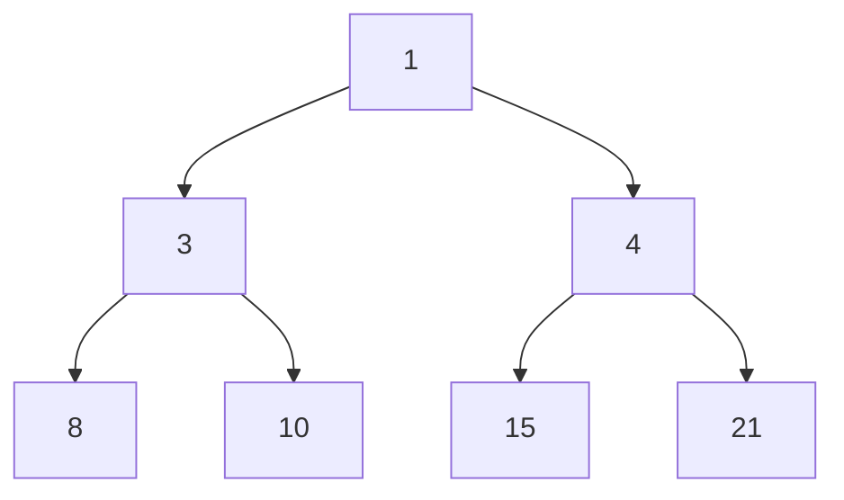
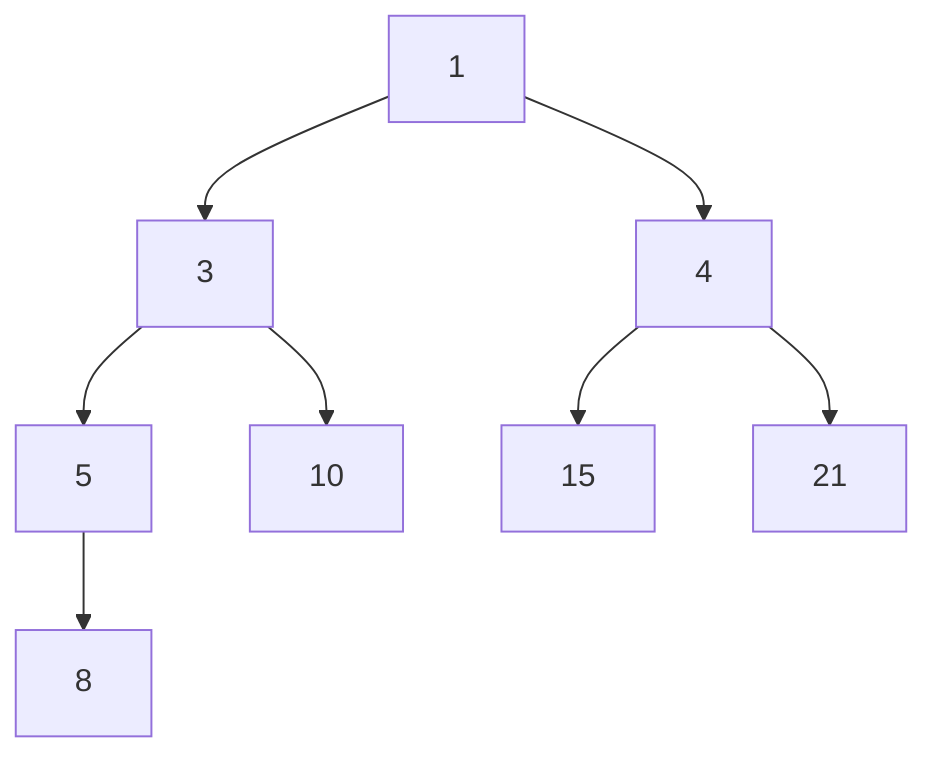
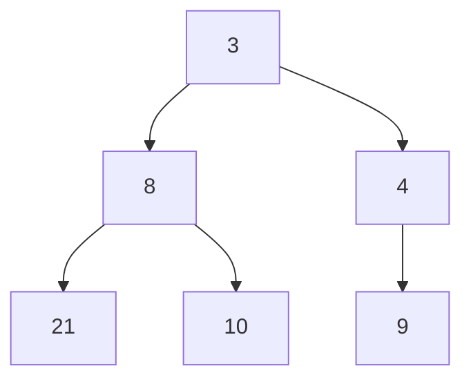
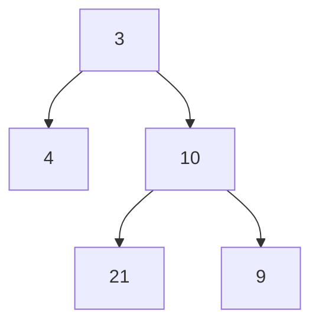
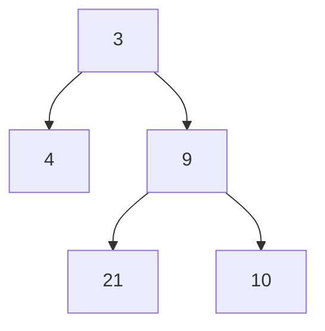

# 基本概念

## 程序

可执行文件

## 进程

操作系统进行资源分配的基本单位，进程是静态的概念(静态资源:CPU,内存,外部设备等)

## 线程

线程是调度执行的基本单位，多个线程共享同一个进程里面的所有的资源，线程是动态的概念。一个程序在运行的时候会产生不同的执行路径(同时在运行的多条路径)就叫多线程。双击可执行文件后会进入内存，变成一个进程，进程是如何执行的呢？(程序是如何执行的)真正开始执行是以线程为单位来执行，操作系统会找到主线程，然后将主线程的代码一条一条交给CPU来执行。如果主线程运行中开启了其他线程，再来线程之间的来回切换。

## 线程切换(Context Switch)

CPU的组成包括如下几个部分：

1. ALU:计算单元
2. Registers:寄存器组,用于存储数据
3. PC:程序计数器（Program Counter）也是一种寄存器，保存了将要取出的下一条指令的内存地址，指令取出后，就会更新该寄存器指向下一条指令
4. Cache:用来缓存内存中的数据，避免直接从内存中获取，提升CPU的运算周期效率。

程序执行过程：指令放PC，数据放Registers，然后ALU进行计算；线程切换则是将PC和Registers中正在执行的线程的数据保存到Cache中，然后将另一个线程的数据load到CPU的PC和Registers中来。CPU只负责计算，操作系统负责具体指令和数据是属于哪个线程的。

设置线程数量的一般计算公式：N_threads = N_cpu * U_cpu * (1 + W/C)

1. N_cpu是处理器的核的数目，可以通过Runtime.getRuntime().availableProcessors()得到
2. U_cpu是期望的CPU利用率(该值应该介于0到1之间)
3. W/C是等待时间与计算时间的比率

## 纤程/协程

绿色线程，用户管理的(而不是OS管理的)线程

## 并发(Concurrent)

当有多个线程在操作时,如果系统只有一个CPU,则它根本不可能真正同时进行一个以上的线程,它只能把CPU运行时间划分成若干个时间段,再将时间段分配给各个线程执行,在一个时间段的线程代码运行时,其它线程处于挂起状态.这种方式我们称之为并发(Concurrent).

## 并行(Parallel)

当系统有一个以上CPU时,则线程的操作有可能非并发.当一个CPU执行一个线程时,另一个CPU可以执行另一个线程,两个线程互不抢占CPU资源,可以同时进行,这种方式我们称之为并行(Parallel)

## 调用状态

阻塞（Blocking）和非阻塞（Non-Blocking）

## 通信机制

同步（synchronous）和异步（asynchronous）

## 锁

monitor

## 临界区

critical section 每个线程中访问临界资源(临界资源是一次仅允许一个线程使用的共享资源)的那段代码称为临界区。每次只准许一个线程进入临界区，进入后不允许其他线程进入，即：临界区是被synchronized锁定的代码区域，如果临界区执行时间长、语句多，叫做锁的粒度比较粗

# CPU缓存

## 硬件内存架构

计算机在执行程序的时候，每条指令都是在CPU中执行的，而执行的时候，又免不了要和数据打交道。而计算机上面的数据，是存放在主存当中的，也就是计算机的物理内存。以多核CPU为例，每个CPU核都包含一组「CPU寄存器」，这些寄存器本质上是在CPU内存中。CPU在这些寄存器上执行操作的速度要比在主内存(RAM)中执行的速度快得多。因为CPU速率高，内存速率慢，为了让存储体系可以跟上CPU的速度，所以中间又加上Cache层，就是我们说的「CPU高速缓存」。

## CPU多级缓存

由于CPU的运算速度远远超越了1级缓存的数据I\O能力，CPU厂商又引入了多级的缓存结构。通常L1、L2是每个CPU核有一个，L3是多个核共用一个。

1. 各种寄存器，用来存储本地变量和函数参数，访问一次需要1cycle，耗时小于1ns；
2. L1 Cache，一级缓存，本地core的缓存，分成32K的数据缓存L1d和32k指令缓存L1i，访问L1需要3cycles，耗时大约1ns；
3. L2 Cache，二级缓存，本地core的缓存，被设计为L1缓存与共享的L3缓存之间的缓冲，大小为256K，访问L2需要12cycles，耗时大约3ns；
4. L3 Cache，三级缓存，在同插槽的所有core共享L3缓存，分为多个2M的段，访问L3需要38cycles，耗时大约12ns；

大致可以得出结论，缓存层级越接近于CPUcore，容量越小，速度越快，同时其造价也更贵。所以为了支撑更多的热点数据，同时追求最高的性价比，多级缓存架构应运而生。

## CacheLine

Cache又是由很多个「缓存行」(CacheLine)组成的。CacheLine是Cache和RAM交换数据的最小单位。Cache存储数据是固定大小为单位的，称为一个CacheEntry，这个单位称为CacheLine或CacheBlock。给定Cache容量大小和cache-line-size的情况下，它能存储的条目个数(number-of-cache-entries)就是固定的。因为Cache是固定大小的，所以它从主内存获取数据也是固定大小。对于X86来讲，是64Bytes。对于ARM来讲，较旧的架构的CacheLine是32Bytes，但一次内存访存只访问一半的数据也不太合适，所以它经常是一次填两个CacheLine，叫做DoubleFill。

例如：遍历一个长度为16的long数组data[16]，原始数据自然存在于主内存中，访问过程描述如下

1. 访问data[0]，CPUcore尝试访问CPUCache，未命中。
2. 尝试访问主内存，操作系统一次访问的单位是一个CacheLine的大小—64字节，这意味着：既从主内存中获取到了data[0]的值，同时将data[0]~data[7]加入到了CPUCache之中。
3. 访问data[1]~data[7]，CPUcore尝试访问CPUCache，命中直接返回。
4. 访问data[8]，CPUcore尝试访问CPUCache，未命中。
5. 尝试访问主内存。重复步骤2

实验验证：

```java
public class MainClass {

	static long[][] arr;

	/*
	 * 使用了横向遍历和纵向遍历两种顺序对这个二位数组进行遍历，遍历总次数相同，只不过循环的方向不同，观察他们的耗时。
	 * 多次运行后可以发现：横向遍历的耗时大约为15ms，纵向遍历的耗时大约为40ms，前者比后者快了1倍有余。
	 * 上述现象出现的原因就是CPU-Cache&Cache-Line。因为横向遍历arr= new long[1024 * 1024][8]
	 * 每次内层寻访中的数据都存储在连续内存地址中，所以一次访问会将剩下7个数据一起加入CPUCache中，
	 * 而纵向访问内存循环的数据不是在连续地址中所以每一次都要从内存中取。
	 */
	public static void main(String[] args) throws InterruptedException {
		arr = new long[1024 * 1024][8];
		long sum = 0;
		// 横向遍历
		long marked = System.currentTimeMillis();
		for (int i = 0; i < 1024 * 1024; i += 1) {
			for (int j = 0; j < 8; j++) {
				sum += arr[i][j];
			}
		}
		System.out.println("Loop times:" + (System.currentTimeMillis() - marked) + "ms");
		sum = 0;
		marked = System.currentTimeMillis();
		// 纵向遍历
		for (int i = 0; i < 8; i += 1) {
			for (int j = 0; j < 1024 * 1024; j++) {
				sum += arr[j][i];
			}
		}
		System.out.println("Loop times:" + (System.currentTimeMillis() - marked) + "ms");
	}
}
```

## 伪共享

伪共享指的是多个线程同时读写同一个缓存行的不同变量时导致的CPU缓存失效。尽管这些变量之间没有任何关系，但由于在主内存中邻近，存在于同一个缓存行之中，它们的相互覆盖会导致频繁的缓存未命中，需要重新刷缓存，引发性能下降。伪共享问题的解决方法便是字节填充，只需要保证不同线程的变量存在于不同的CacheLine即可，使用多余的字节来填充可以做点这一点，这样就不会出现伪共享问题。

实验验证：

```java
package org.duo.cacheline;

import java.util.concurrent.CountDownLatch;

public class CacheLinePadding {
    public static long count = 10_0000_0000L;

    /**
     * 1) 不加volatile情况，使不使用缓存对齐，由于StoreBuffer和Invalidate Queues的存在对性能影响不大
     * 2) 加volatile
     * 使用缓存对齐:由于两个对象处于两个不同的缓存行内，所以使用缓存锁，并且每个线程锁定不同的缓存行不存在锁竞争所以性能高
     * 不使用缓存对齐:由于两个对象处于同一缓存行内，所以使用总线锁，并且存在锁竞争相当于串行所以性能低
     * <p>
     * 加不加volatile缓存一致性协议都存在。只不过加了volatile之后由于缓存行被锁定，所以另一个线程要等待锁的释放，并且通过缓存一致性协议读取最新的值
     */
    private static class T {
        private long p1, p2, p3, p4, p5, p6, p7;
        public volatile long x = 0L;
        //public long x = 0L;
        private long p9, p10, p11, p12, p13, p14, p15;
    }

    public static T[] arr = new T[2];

    static {
        arr[0] = new T();
        arr[1] = new T();
    }

    public static void main(String[] args) throws InterruptedException {
        CountDownLatch latch = new CountDownLatch(2);
        Thread t1 = new Thread(new Runnable() {
            @Override
            public void run() {
                for (long i = 0; i < count; i++) {
                    arr[0].x = i;
                }
                latch.countDown();
            }
        });
        Thread t2 = new Thread(new Runnable() {
            @Override
            public void run() {
                for (long i = 0; i < count; i++) {
                    arr[1].x = i;
                }
                latch.countDown();
            }
        });
        final long start = System.nanoTime();
        t1.start();
        t2.start();
        latch.await();
        System.out.println((System.nanoTime() - start) / 100_0000);

    }
}
```

## 缓存带来的问题

缓存的加入是为了解决CPU运算能力和内存读写能力的不匹配问题，简单来说就是为了提升资源利用率。那么在多CPU（一个CPU对应一个或者多个核心）或者多核心下，每个核心都会有一个一级缓存或者二级缓存，也就是说一二级缓存是核心独占的（类似JMM模型，线程的工作内存是线程独占的，主内存是共享的）而三级缓存和主内存是共享的，这样就将导致CPU缓存一致性问题。多个cache与内存之间的数据同步该怎么做？主要有两类：总线锁和缓存一致性协议

## 总线锁

在早期的CPU当中，是通过在总线上加LOCK#锁的形式来解决缓存不一致的问题。因为 CPU 和其他部件进行通信都是通过总线来进行的，如果对总线加锁的话，也就是说阻塞了其他 CPU 对其他部件访问（如内存），从而使得只能有一个 CPU 能使用内存。但是这种方式会有一个问题，由于在锁住总线期间，其他 CPU无法访问内存，导致效率低下。所以就出现了缓存一致性协议。

## 缓存一致性协议(MESI)

缓存一致性协议可以分为两类：“窥探（snooping）”协议和“基于目录的（directory-based）”协议，MESI协议属于一种"窥探协议"。窥探协议的基本思想所有cache与内存，cache与cache（是的，cache之间也会有数据传输）之间的传输都发生在一条共享的总线上，而所有的cpu都能看到这条总线，同一个指令周期中，只有一个cache可以读写内存，所有的内存访问都要经过仲裁（arbitrate）。窥探协议的思想是，cahce不但与内存通信时和总线打交道，而且它会不停地窥探总线上发生的数据交换，跟踪其他cache在做什么。所以当一个cache代表它所属的cpu去读写内存时，其它cpu都会得到通知，它们以此来使自己的cache保持同步。

并非所有情况都会使用缓存一致性协议，如被操作的数据不能被缓存在CPU内部或操作数据跨越多个缓存行(状态无法标识)，则处理器仍然会调用总线锁定

每个 Cache line 有两个标志位：dirty 和 valid 标志来标记缓存行的有4个状态，MESI是指4种状态的首字母。协议中最重要的内容有两部分：cache line的状态以及消息通知机制：

### Cache Line的状态

- M(Modified)：描述：该CacheLine有效，数据被修改了，和内存中的数据不一致，数据只存在于本Cache中。CacheLine只有处于Exclusive状态才能被修改。此外，已修改CacheLine如果被丢弃或标记为Invalid，那么先要把它的内容回写到内存中。监听任务：必须时刻监听所有试图读该缓存行相对于主存的操作，这种操作必须在CPU将该缓存行写回主存并将状态变成S（共享）状态之前被延迟执行。
- E(Exclusive)：描述：该CacheLine有效，数据和内存中的数据一致，数据只存在于本Cache中。独占该内存地址，其他处理器的CacheLine不能同时持有它，如果其他处理器原本也持有同一CacheLine，那么它会马上变成"Invalid"状态。监听任务：缓存行也必须监听其它缓存读主存中该缓存行的操作，一旦有这种操作，该缓存行需要变成S（共享）状态。
- S(Shared)：描述：该Cache line有效，数据和内存中的数据一致，数据存在于很多Cache中。处于该状态下的cache line只能被cpu读取，不能写入，因为此时还没有独占。监听任务：缓存行也必须监听其它缓存使该缓存行无效或者独享该缓存行的请求，并将该缓存行变成无效（Invalid）。
- I(Invalid)：描述：该Cache line无效。监听任务：无

对于M和E状态而言总是精确的，他们在和该缓存行的真正状态是一致的。而S状态可能是非一致的，如果一个缓存将处于S状态的缓存行作废了，而另一个缓存实际上可能已经独享了该缓存行，但是该缓存却不会将该缓存行升迁为E状态，这是因为其它缓存不会广播他们作废掉该缓存行的通知，同样由于缓存并没有保存该缓存行的copy的数量，因此（即使有这种通知）也没有办法确定自己是否已经独享了该缓存行。

cpu有读取数据的动作，有独占的动作，有独占后更新数据的动作，有更新数据之后回写内存的动作，根据”窥探协议“的规范，每个动作都需要通知到其他cpu，于是有以下的消息机制：

### 消息通知机制

- Read，cpu发起读取数据请求，请求中包含需要读取的数据地址。
- Read Response，作为Read消息的响应，该消息可能是内存响应的，也可能是某cpu响应的(比如该地址在某cpu cache Line中为Modified状态，则该cpu必须返回该地址的最新数据)。
- Invalidate，cpu发起”我要独占一个cache line，其他cpu请失效对应的cache line“的消息，消息中包含了内存地址，所有的其它cpu需要将对应cache line置为Invalid状态。
- Invalidate ACK，收到Invalidate消息的cpu在将对应cache line置为Invalid后，返回Invalid ACK。
- Read Invalidate，相当于Read消息+Invalidate消息，即取得数据并且独占它，将收到一个Read Response和所有其它cpu的Invalidate ACK。
- Write back，写回消息，即将状态为Modified的cache line写回到内存，通常在该行将被替换时使用。现代cpu cache基本都采用”写回(Write Back)”而非”直写(Write Through)”的方式。

结合cache line状态以及消息机制，来看看cpu之间是如何协作的。假设有个四核cpu系统，每个cpu只有一个cache line，每个cache line大小为1个字节，内存地址空间一共两个字节的数据，地址分别为0x0和0x8，有如下操作序列:

|                        | cup0      | cup1       | cup2        | cup3      | main   | memory |
| ---------------------- | --------- | ---------- | ----------- | --------- | ------ | ------ |
|                        | cacheline | cacheline  | cacheline   | cacheline | 0x0    | 0x8    |
| cpu0:read from 0x0     | 0/shared  |            |             |           | latest | latest |
| cpu3:read from 0x0     | 0/shared  |            |             | 0/shared  | latest | latest |
| cpu0:read from 0x8     | 8/shared  |            |             | 0/shared  | latest | latest |
| cpu2:exclusive 0x0     | 8/shared  |            | 0/exclusive |           | latest | latest |
| cpu2:modified 0x0      | 8/shared  |            | 0/modified  |           | expire | latest |
| cpu1:atomic inc in 0x0 | 8/shared  | 0/modified |             |           | expire | latest |
| cpu1:read from 0x8     | 8/shared  | 8/shared   |             |           | latest | latest |

1. 初始状态，4个cpu的cache line都为Invalid状态（黑色表示Invalid）。
2. cpu0发送Read消息，加载0x0的数据，数据从内存返回，cache line状态变为Shared。
3. cpu3发送Read消息，加载0x0的数据，数据从内存返回，cache line状态变为Shared。
4. cpu0发送Read消息，加载0x8的数据，导致cache line被替换，由于之前状态为Shared，即与内存中数据一致，可直接覆盖，而无需回写。
5. cpu2发送Read Invalidate消息，从内存返回最新数据，cpu3返回Invalidate ACK，并将状态变为Invalid，cpu2获得独占权，状态变为Exclusive。
6. cpu2修改cache line中的数据，cache line状态为Modified，同时内存中0x0的数据过期。
7. cpu1 对地址0x0的数据执行原子(atomic)递增操作，发出Read Invalidate消息，cpu2将返回Read Response(而不是内存)，包含最新数据，并返回Invalidate ACK，同时cache line状态变为Invalid。最后cpu1获得独占权，cache line状态变为Modified，数据为递增后的数据，而内存中的数据仍然为过期状态。
8. cpu1 加载0x8的数据，此时cache line将被替换，由于之前状态为Modified，因此需要先执行写回操作，此时内存中0x0的数据得以更新。

这就是缓存一致性协议，一个状态机，仅此而已。因为该协议的存在，每个cpu就可以放心操作属于自己的cache，而不需要担心本地cache中的数据会不会已经被其他cpu修改。但在缓存一致性协议的框架下工作性能不高，但这并不是协议的问题，协议本身逻辑很严谨。性能差在哪里？假如某数据存在于其他cpu的cache中，那自己每次需要修改数据时，都需要发送ReadInvalidate消息，除了等待最新数据的返回，还需要等待其他cpu的InvalidateACK才能继续执行其他指令，这是一种同步行为，于是便有了cpu的优化：处理器指令重排(指令还未结束便去执行其它指令的行为称之为，指令重排)

### 处理器指令重排

指令重排的实现:硬件层面的优化——Store Buffer, Invalid Queue，以及软件层面的优化——内存屏障指令。

#### Store Buffer(存储缓存)

StoreBuffer即存储缓存。位于内核和缓存之间。当处理器需要处理将计算结果写入在缓存中处于shared状态的数据时，需要通知其他内核将该缓存置为 Invalid（无效），引入StoreBuffer后将不再需要处理器去等待其他内核的响应结果，只需要把修改的数据写到StoreBuffer，通知其他内核，然后当前内核即可去执行其它指令。当收到其他内核的响应结果后，再把StoreBuffer中的数据写回缓存，并修改状态为M。（很类似分布式中，数据一致性保障的异步确认）

StoreBuffer带来的问题，例如有如下代码：

```java
//初始状态下，假设a，b值都为0，并且a存在cpu1的cache line中(Shared状态)，代码在cpu0中执行，
a = 1;
b = a + 1;
assert(b == 2);
```


可能出现如下操作序列:

1. cpu0 要写入a，将a=1写入store buffer，并发出Read Invalidate消息，继续其他指令。
2. cpu1 收到Read Invalidate，返回Read Response(包含a=0的cache line)和Invalidate ACK，cpu0 收到Read Response，更新cache line(a=0)。
3. cpu0 开始执行b=a+1，此时cache line中还没有加载b，于是发出Read Invalidate消息，从内存加载b=0，同时cache line中已有a=0，于是得到b=1，状态为Modified状态。
4. cpu0 得到 b=1，断言失败。
5. cpu0 将store buffer中的a=1推送到cache line，然而为时已晚。

造成这个问题的根源在于对同一个cpu存在对a的两份拷贝，一份在cache，一份在store buffer，而cpu计算b=a+1时，a和b的值都来自cache。仿佛代码的执行顺序发生了变化：b = a + 1在a = 1之前执行。

store buffer可能导致破坏程序顺序的问题，硬件工程师在store buffer的基础上，又实现了”store forwarding”技术: cpu可以直接从store buffer中加载数据，即支持将cpu存入store buffer的数据传递(forwarding)给后续的加载操作，而不经由cache。虽然解决了同一个cpu读写数据的问题，但是在并发程序中还是会有问题。例如有如下代码：

```java
//初始状态下，假设a，b值都为0，a存在于cpu1的cache中，b存在于cpu0的cache中，均为Exclusive状态，cpu0执行foo函数，cpu1执行bar函数
void foo() {
    a = 1;
    b = 1;
}
void bar() {
    while (b == 0) continue;
    assert(a == 1)
}
```

可能出现如下操作序列:

1. cpu1执行while(b == 0)，由于cpu1的Cache中没有b，发出Read b消息
2. cpu0执行a=1，由于cpu0的cache中没有a，因此它将a(当前值1)写入到store buffer并发出Read Invalidate a消息
3. cpu0执行b=1，由于b已经存在在cache中，且为Exclusive状态，因此可直接执行写入
4. cpu0收到Read b消息，将cache中的b(当前值1)返回给cpu1，将b写回到内存，并将cache Line状态改为Shared
5. cpu1收到包含b的cache line，结束while (b == 0)循环
6. cpu1执行assert(a == 1)，由于此时cpu1 cache line中的a仍然为0并且有效(Exclusive)，断言失败
7. cpu1收到Read Invalidate a消息，返回包含a的cache line，并将本地包含a的cache line置为Invalid，然而已经为时已晚。
8. cpu0收到cpu1传过来的cache line，然后将store buffer中的a(当前值1)刷新到cache line

出现这个问题的原因在于cpu不知道a,b之间的数据依赖，cpu0对a的写入需要和其他cpu通信，因此有延迟，而对b的写入直接修改本地cache就行，因此b比a先在cache中生效，导致cpu1读到b=1时，a还存在于store buffer中。从代码的角度来看，仿佛foo函数中b = 1又在a = 1之前执行。

foo函数的代码，即使是store forwarding也阻止不了它被cpu“重排”，虽然这并没有影响foo函数的正确性，但会影响到所有依赖foo函数赋值顺序的线程。到目前为止，可以发现”指令重排“的其中一个本质，cpu为了优化指令的执行效率，引入了store buffer（forwarding），而又因此导致了指令执行顺序的变化。要保证这种顺序一致性，靠硬件是优化不了了，需要在软件层面支持，没错，cpu提供了写屏障（write memory barrier）指令，Linux操作系统将写屏障指令封装成了smp_wmb()函数，cpu执行smp_mb()的思路是，会先把当前store buffer中的数据刷到cache之后，再执行屏障后的“写入操作”，该思路有两种实现方式: 一是简单地刷store buffer，但如果此时远程cache line没有返回，则需要等待，二是将当前store buffer中的条目打标，然后将屏障后的“写入操作”也写到store buffer中，cpu继续干其他的事，当被打标的条目全部刷到cache line，之后再刷后面的条目。以第二种实现逻辑为例，看看以下代码执行过程：

```java
//初始状态下，假设a，b值都为0，a存在于cpu1的cache中，b存在于cpu0的cache中，均为Exclusive状态，cpu0执行foo函数，cpu1执行bar函数
void foo() {
    a = 1;
    smp_wmb()
    b = 1;
}
void bar() {
    while (b == 0) continue;
    assert(a == 1)
}
```

1. cpu1执行while(b == 0)，由于cpu1的cache中没有b，发出Read b消息。
2. cpu0执行a=1，由于cpu0的cache中没有a，因此它将a(当前值1)写入到store buffer并发出Read Invalidate a消息。
3. cpu0看到smp_wmb()内存屏障，它会标记当前store buffer中的所有条目(即a=1被标记)。
4. cpu0执行b=1，尽管b已经存在在cache中(Exclusive)，但是由于store buffer中还存在被标记的条目，因此b不能直接写入，只能先写入store buffer中。
5. cpu0收到Read b消息，将cache中的b(当前值0)返回给cpu1，并将cache line状态改为Shared。
6. cpu1收到包含b的cache line，继续while (b == 0)循环。
7. cpu1收到Read Invalidate a消息，返回包含a的cache line，并将本地的cache line置为Invalid。
8. cpu0收到cpu1传过来的包含a的cache line，然后将store buffer中的a(当前值1)刷新到cache line，并且将cache line状态置为Modified。
9. 由于cpu0的store buffer中被标记的条目已经全部刷新到cache，此时cpu0可以尝试将store buffer中的b=1刷新到cache，但是由于包含B的cache line已经不是Exclusive而是Shared，因此需要先发Invalidate b消息。
10. cpu1收到Invalidate b消息，将包含b的cache line置为Invalid，返回Invalidate ACK。
11. cpu1继续执行while(b == 0)，此时b已经不在cache中，因此发出Read消息。
12. cpu0收到Invalidate ACK，将store buffer中的b=1写入Cache。
13. cpu0收到Read消息，返回包含b新值的cache line。
14. cpu1收到包含b的cache line，可以继续执行while(b == 0)，终止循环，然后执行assert(a == 1)，此时a不在其cache中，因此发出Read消息。
15. cpu0收到Read消息，返回包含a新值的cache line。
16. cpu1收到包含a的cache line，断言为真。

#### Invalidate Queues(失效队列)

简单说处理器修改数据时，需要通知其它内核将该缓存中的数据置为Invalid（失效），我们将该数据放到了Store Bufferes处理。那收到失效指令的这些内核会立即处理这种失效消息吗？答案是不会的，因为就算是一个内核缓存了该数据并不意味着马上要用，这些内核会将失效通知放到Invalidate Queues，然后快速返回Invalidate Acknowledge消息。后续收到失效通知的内核将会从该queues中逐个处理该命令。

加入了invalid queue之后，cpu在处理任何cache line的MSEI状态前，都必须先看invalid queue中是否有该cache line的Invalid消息没有处理。另外，它也再一次破坏了内存的一致性。看看以下代码执行过程：

```java
//初始状态下，假设a, b的初始值为0，a在cpu0，cpu1中均为Shared状态，b在cpu0独占(Exclusive状态)，cpu0执行foo，cpu1执行bar
void foo() {
    a = 1;
    smp_wmb()
    b = 1;
}
void bar() {
    while (b == 0) continue;
    assert(a == 1)
}
```

1. cpu0执行a=1，由于其有包含a的cache line，将a写入store buffer，并发出Invalidate a消息。
2. cpu1执行while(b == 0)，它没有b的cache，发出Read b消息。
3. cpu1收到cpu0的Invalidate a消息，将其放入Invalidate Queue，返回Invalidate ACK。
4. cpu0收到Invalidate ACK，将store buffer中的a=1刷新到cache line，标记为Modified。
5. cpu0看到smp_wmb()内存屏障，但是由于其store buffer为空，因此它可以直接跳过该语句。
6. cpu0执行b=1，由于其cache独占b，因此直接执行写入，cache line标记为Modified。
7. cpu0收到cpu1发的Read b消息，将包含b的cache line写回内存并返回该cache line，本地的cache line标记为Shared。
8. cpu1收到包含b(当前值1)的cache line，结束while循环。
9. cpu1执行assert(a == 1)，由于其本地有包含a旧值的cache line，读到a初始值0，断言失败。
10. cpu1这时才处理Invalid Queue中的消息，将包含a旧值的cache line置为Invalid。

问题在于第9步中cpu1在读取a的cache line时，没有先处理Invalid Queue中该cache line的Invalid操作，怎么办？其实cpu还提供了**读屏障指令**，Linux将其封装成smp_rmb()函数，将该函数插入到bar函数中，就像这样：

```java
void foo() {
    a = 1;
    smp_wmb()
    b = 1;
}
void bar() {
    while (b == 0) continue;
    smp_rmb()
    assert(a == 1)
}
```

和smp_wmb()类似，cpu执行smp_rmb()的时，会先把当前invalidate queue中的数据处理掉之后，再执行屏障后的“读取操作”；smp_mb(): 同时具有读屏障和写屏障功能。

### 总结

MESI协议，可以保证缓存的一致性，但是无法保证实时性。为了解决此类问题，CPU提供了一种通过软件告知CPU什么指令不能重排，什么指令能重排的机制，就是内存屏蔽。不同的CPU架构对内存屏障的实现是不尽相同的，Linux操作系统面向cpu抽象出了自己的一套内存屏障函数，它们分别是：

- smp_rmb(): 在invalid queue的数据被刷完之后再执行屏障后的读操作。
- smp_wmb(): 在store buffer的数据被刷完之后再执行屏障后的写操作。
- smp_mb(): 同时具有读屏障和写屏障功能。

## volatile与lock前缀指令

实际通过hsdis工具将代码转换为汇编指令来看volatile的变量在赋值前都加了lock指令，下面详细分析一下lock指令的作用和为什么加上lock指令后就能保证volatile关键字的内存可见性：

### lock指令做了什么

在修改内存操作时，使用LOCK前缀去调用加锁的读-修改-写操作，这种机制用于多处理器系统中处理器之间进行可靠的通讯，具体描述如下：

1. 在Pentium和早期的IA-32处理器中，LOCK前缀会使处理器执行当前指令时产生一个LOCK#信号，这种总是引起显式总线锁定出现
2. 在Pentium4、Inter Xeon和P6系列处理器中，加锁操作是由高速缓存锁或总线锁来处理。如果内存访问有高速缓存且只影响一个单独的高速缓存行，那么操作中就会调用高速缓存锁，而系统总线和系统内存中的实际区域内不会被锁定。同时，这条总线上的其它Pentium4、Intel Xeon或者P6系列处理器就回写所有已修改的数据并使它们的高速缓存失效，以保证系统内存的一致性。如果内存访问没有高速缓存且/或它跨越了高速缓存行的边界，那么这个处理器就会产生LOCK#信号，并在锁定操作期间不会响应总线控制请求。（从Pentium 4，Intel Xeon及P6处理器开始，intel在原有总线锁的基础上做了一个很有意义的优化：如果要访问的内存区域（area of memory）在lock前缀指令执行期间已经在处理器内部的缓存中被锁定（即包含该内存区域的缓存行当前处于独占或以修改状态），并且该内存区域被完全包含在单个缓存行（cache line）中，那么处理器将直接执行该指令。由于在指令执行期间该缓存行会一直被锁定，其它处理器无法读/写该指令要访问的内存区域，因此能保证指令执行的原子性。这个操作过程叫做缓存锁定（cache locking），缓存锁定将大大降低lock前缀指令的执行开销，但是当多处理器之间的竞争程度很高或者指令访问的内存地址**未对齐**时，仍然会锁住总线。）

为显式地强制执行LOCK语义，软件可以在下列指令修改内存区域时使用LOCK前缀。当LOCK前缀被置于其它指令之前或者指令没有对内存进行写操作（也就是说目标操作数在寄存器中）时，会产生一个非法操作码异常（#UD）。

1. 位测试和修改指令（BTS、BTR、BTC）
2. 交换指令（XADD、CMPXCHG、CMPXCHG8B）
3. 自动假设有LOCK前缀的XCHG指令
4. 下列单操作数的算数和逻辑指令：INC、DEC、NOT、NEG
5. 下列双操作数的算数和逻辑指令：ADD、ADC、SUB、SBB、AND、OR、XOR

IA-32架构提供了几种机制用来强化或弱化内存排序模型，以处理特殊的编程情形。这些机制包括：

1. I/O指令、加锁指令、LOCK前缀以及串行化指令等，强制在处理器上进行较强的排序
2. SFENCE指令（在Pentium III中引入）和LFENCE指令、MFENCE指令（在Pentium4和Intel Xeon处理器中引入）提供了某些特殊类型内存操作的排序和串行化功能
   - sfence:  store| 在sfence指令前的写操作当必须在sfence指令后的写操作前完成。
   - lfence：load | 在lfence指令前的读操作当必须在lfence指令后的读操作前完成。
   - mfence：modify/mix | 在mfence指令前的读写操作当必须在mfence指令后的读写操作前完成。

这些机制可以通过下面的方式使用：总线上的内存映射设备和其它I/O设备通常对向它们缓冲区写操作的顺序很敏感，I/O指令（IN指令和OUT指令）以下面的方式对这种访问执行强写操作的排序。在执行了一条I/O指令之前，处理器等待之前的所有指令执行完毕以及所有的缓冲区都被都被写入了内存。只有取指令和页表查询能够越过I/O指令，后续指令要等到I/O指令执行完毕才开始执行。

通过上述描述，可以得到lock指令的几个作用：

1. 锁总线，其它CPU对内存的读写请求都会被阻塞，直到锁释放，不过实际后来的处理器都采用锁缓存替代锁总线，因为锁总线的开销比较大，锁总线期间其他CPU没法访问内存
2. lock后的写操作会回写已修改的数据，同时让其它CPU相关缓存行失效，从而重新从主存中加载最新的数据
3. 不是内存屏障却能完成类似内存屏障的功能，阻止屏障两边的指令重排序

### 由lock指令回看volatile变量读写

工作内存Work Memory其实就是对CPU寄存器和高速缓存的抽象，或者说每个线程的工作内存也可以简单理解为CPU寄存器和高速缓存。

那么当写两条线程Thread-A与Threab-B同时操作主存中的一个volatile变量i时，Thread-A写了变量i，那么：

- Thread-A发出LOCK#指令

- 发出的LOCK#指令锁总线（或锁缓存行），同时让Thread-B高速缓存中的缓存行内容失效
- Thread-A向主存回写最新修改的i

Thread-B读取变量i，那么：

- Thread-B发现对应地址的缓存行被锁了，等待锁的释放，缓存一致性协议会保证它读取到最新的值

### 总结

volatile通过LOCK#指令锁总线(或缓存行)，同时让其他线程高速缓存中的缓存行内容失效，然后向主存回写最新修改后的变量值，其他线程读取变量时发现对应地址的缓存行被锁，会等待锁的释放，然后通过缓存一致性协议保证读取到最新的值(即CPU的数据读取还是使用缓存一致性协议的)。加不加volatile缓存一致性协议(MESI)都存在，不加volatile由于MESI协议只可以保证缓存的一致性，但是无法保证实时性，所以会产生可见性问题。

# 原子性

# 可见性

# 有序性

## 指令重排序

| 名称                    | 说明                                                         |
| ----------------------- | ------------------------------------------------------------ |
| 取指 IF                 | (InstrucTIon Fetch)从内存中取出指令                          |
| 译码和取寄存器操作数 ID | (InstrucTIon Decode)把指令送到指令译码器进行译码，产生相应控制信号 |
| 执行或者有效地址计算 EX | (InstrucTIon Execute)指令执行，在执行阶段的最常见部件为算术逻辑部件运算器(ArithmeTIc Logical Unit，ALU) |
| 存储器访问 MEM          | 访存（Memory Access）是指存储器访问指令将数据从存储器中读出，或者写入存储器的过程 |
| 写回 WB                 | 写回（Write-Back）是指将指令执行的结果写回通用寄存器组的过程 |

单周期处理器(时钟周期1000ps)

```
IF ID EX MEM WB
               IF ID EX MEM WB
			                  IF ID EX MEM WB
```

流水线处理器(时钟周期200ps)指令不是一步可以执行完毕的，每个步骤涉及的硬件可能不同，指令的某一步骤在执行的时候，只会占用某个类型的硬件，例如：当A指令在取指的时候，B指令是可以进行译码、执行或者写回等操作的。所以可以使用流水线技术来执行指令。可以看到，当第2条指令执行时，第1条指令只是完成了取值操作。假如每个步骤需要1毫秒，那么如果指令2等待指令1执行完再执行，就需要等待5毫秒。而使用流水线后，只需要等待1毫秒。

```
IF ID EX MEM WB
   IF ID EX  MEM WB
      IF ID  EX  MEM WB
```

例如：A = B + C的处理，在ADD指令上的大叉表示一个中断，也就是在这里停顿了一下，因为R2中的数据还没准备好。由于ADD的延迟，后面的指令都要慢一个节拍。

```
LW  R1,B     IF ID EX MEM WB                     //LW表示load，把B的值加载到R1寄存器中
LW  R2,C        IF ID EX  MEM WB                 //LW表示load，把C的值加载到R2寄存器中
ADD R3,R1,R2       IF ID  X   EX MEM WB          //ADD是加法，把R1、R2的值相加，并存放到R3中
SW  A,R3              IF  X   ID EX  MEM WB      //SW表示store存储，将R3寄存器的值保存到变量A中
```

再看复杂一点的情况

```
A = B + C 
D = E + F
LW  R1,B     IF ID EX MEM WB                     
LW  R2,C        IF ID EX  MEM WB                 
ADD R3,R1,R2       IF ID  X   EX MEM WB          
SW  A,R3              IF  X   ID EX  MEM WB      
LW  R4,E                  X   IF ID  EX  MEM WB 
LW  R5,F                         IF  ID  EX  MEM WB
ADD R6,R4,R5                         IF  ID  X   EX  MEM WB
SW  D,R6                                 IF  X   ID  EX  MEM WB
```

可见上图中有不少停顿。为了减少停顿，我们只需要将LW R4,E和LW R5,F移动到前面执行。

```
LW  R1,B     IF ID EX MEM WB                     
LW  R2,C        IF ID EX  MEM WB
LW  R4,E           IF ID  EX  MEM WB                
ADD R3,R1,R2          IF  ID  EX  MEM WB
LW  R5,F                  IF  ID  EX  MEM WB       
SW  A,R3                      IF  ID  EX  MEM WB      
ADD R6,R4,R5                      IF  ID  EX  MEM WB
SW  D,R6                              IF  ID  EX  MEM WB
```

可见指令重排序对提高CPU性能十分必要，但是要遵循happens-before规则

1. 程序顺序原则：一个线程内保证语义的串行性(比如a=1;b=a+1;)
2. volatile规则：volatile变量的写，先发生于读，这保证了volatile变量的可见性
3. 锁规则：解锁（unlock）必然发生在随后的加锁（lock）前
4. 传递性：A先于B，B先于C，那么A必然先于C
5. 线程的start()方法先于它的每一个动作
6. 线程的所有操作先于线程的终结（Thread.join()）
7. 线程的中断（interrupt()）先于被中断线程的代码
8. 对象的构造函数执行结束先于finalize()方法

指令重排实例：

```java
package org.duo.ordering;

public class Ordering {
    private static int x = 0, y = 0;
    private static int a = 0, b = 0;

    public static void main(String[] args) throws InterruptedException {
        int i = 0;
        for (; ; ) {
            i++;
            x = 0;
            y = 0;
            a = 0;
            b = 0;
            Thread one = new Thread(new Runnable() {
                public void run() {
                    //由于线程one先启动，下面这句话让它等一等线程two. 可根据自己电脑的实际性能适当调整等待时间.
                    //shortWait(100000);
                    a = 1;
                    x = b;
                }
            });

            Thread other = new Thread(new Runnable() {
                public void run() {
                    b = 1;
                    y = a;
                }
            });
            one.start();
            other.start();
            one.join();
            other.join();
            String result = "第" + i + "次 (" + x + "," + y + "）";
            if (x == 0 && y == 0) {
                System.err.println(result);
                break;
            } else {
                //System.out.println(result);
            }
        }
    }
    public static void shortWait(long interval) {
        long start = System.nanoTime();
        long end;
        do {
            end = System.nanoTime();
        } while (start + interval >= end);
    }
}

```

## 如何保证特定情况下不乱序

### 硬件层面

1. SFENCE指令（在Pentium III中引入）和LFENCE指令、MFENCE指令
2. LOCK前缀指令是一个Full Barrier，执行时会锁住内存子系统来确保执行顺序，甚至跨多个CPU。Software Locks通常使用了内存屏障或原子指令来实现变量可见性和保持程序顺序

### JVM级别如何规范（JSR133）

1. LoadLoad屏障：对于这样的语句Load1; LoadLoad; Load2， 在Load2及后续读取操作要读取的数据被访问前，保证Load1要读取的数据被读取完毕。
2. StoreStore屏障：对于这样的语句Store1; StoreStore; Store2，在Store2及后续写入操作执行前，保证Store1的写入操作对其它处理器可见。
3. LoadStore屏障：对于这样的语句Load1; LoadStore; Store2，在Store2及后续写入操作被刷出前，保证Load1要读取的数据被读取完毕。
4. StoreLoad屏障：对于这样的语句Store1; StoreLoad; Load2， 在Load2及后续所有读取操作执行前，保证Store1的写入对所有处理器可见。

### volatile的实现细节

1. 字节码层面：ACC_VOLATILE

2. JVM层面：volatile内存区的读写 都加屏障

3. OS和硬件层面：在windows系统中利用lock指令实现(有可能linux的实现又不一样，JVM只定义了规范，在不同的操作系统及硬件上的实现也各不相同)

4. 通过反汇编Java字节码，查看汇编层面对volatile关键字做了什么(windows系统)

   - 下载hsdis工具

   - 将hsdis-amd64.dll与hsdis-amd64.lib两个文件放在%JAVA_HOME%\jre\bin\server路径下

   - 跑main函数之前，加入如下虚拟机参数：

     -server

     -Xcomp

     -XX:+UnlockDiagnosticVMOptions

     -XX:+PrintAssembly

     -XX:CompileCommand=compileonly,*LazySingleton.getInstance

     (它表示将LazySingleton类中的getInstance方法转换为汇编指令)


```java
public class LazySingleton {
	private static volatile LazySingleton instance = null;
	public static LazySingleton getInstance() {
		if (instance == null) {
			instance = new LazySingleton();
		}
		return instance;
	}
	public static void main(String[] args) {
		LazySingleton.getInstance();
	}
}
```

### synchronized实现细节

1. 字节码层面：ACC_SYNCHRONIZED、monitorenter、monitorexit
2. JVM层面：C C++ 调用了操作系统提供的同步机制
3. OS和硬件层面：X86 : lock cmpxchg / xxx

# 线程的状态

Thread类中可以找到这个枚举，它定义了线程的相关状态:

```java
    public enum State {
        /**
         * Thread state for a thread which has not yet started.
         * 尚未启动的线程的线程状态。 
         */
        NEW,

        /**
         * Thread state for a runnable thread.  A thread in the runnable
         * state is executing in the Java virtual machine but it may
         * be waiting for other resources from the operating system
         * such as processor.
         * 可运行线程的线程状态。 处于可运行状态的线程正在 Java 虚拟机中执行，
         * 但它可能正在等待来自操作系统的其他资源，例如处理器 
         */
        RUNNABLE,

        /**
         * Thread state for a thread blocked waiting for a monitor lock.
         * A thread in the blocked state is waiting for a monitor lock
         * to enter a synchronized block/method or
         * reenter a synchronized block/method after calling
         * {@link Object#wait() Object.wait}.
         * 线程阻塞等待监视器锁的线程状态。
         * 处于阻塞状态的线程正在等待监视器锁进入同步块/方法或调用后重新进入同步块/方法 
         */
        BLOCKED,

        /**
         * Thread state for a waiting thread.
         * A thread is in the waiting state due to calling one of the
         * following methods:
         * <ul>
         *   <li>{@link Object#wait() Object.wait} with no timeout</li>
         *   <li>{@link #join() Thread.join} with no timeout</li>
         *   <li>{@link LockSupport#park() LockSupport.park}</li>
         * </ul>
         *
         * <p>A thread in the waiting state is waiting for another thread to
         * perform a particular action.
         *
         * For example, a thread that has called <tt>Object.wait()</tt>
         * on an object is waiting for another thread to call
         * <tt>Object.notify()</tt> or <tt>Object.notifyAll()</tt> on
         * that object. A thread that has called <tt>Thread.join()</tt>
         * is waiting for a specified thread to terminate.
         * 等待线程的线程状态。
         * 由于调用以下方法之一，线程处于等待状态
         *  Object#wait()
         *  #join() Thread.join
         *  LockSupport#park()
         */
        WAITING,

        /**
         * Thread state for a waiting thread with a specified waiting time.
         * A thread is in the timed waiting state due to calling one of
         * the following methods with a specified positive waiting time:
         * <ul>
         *   <li>{@link #sleep Thread.sleep}</li>
         *   <li>{@link Object#wait(long) Object.wait} with timeout</li>
         *   <li>{@link #join(long) Thread.join} with timeout</li>
         *   <li>{@link LockSupport#parkNanos LockSupport.parkNanos}</li>
         *   <li>{@link LockSupport#parkUntil LockSupport.parkUntil}</li>
         * </ul>
         * 具有指定等待时间的等待线程的线程状态。
         * 由于使用指定的正等待时间调用以下方法之一，线程处于定时等待状态
         *  #sleep Thread.sleep
         *  Object#wait(long) Object.wait
         *  #join(long) Thread.join
         *  LockSupport#parkNanos LockSupport.parkNanos
         *  LockSupport#parkUntil LockSupport.parkUntil
         */
        TIMED_WAITING,

        /**
         * Thread state for a terminated thread.
         * The thread has completed execution.
         * 已终止线程的线程状态 
         * 线程已完成执行 
         */
        TERMINATED;
    }
```

## sleep

sleep()是Thread类中的方法。在指定时间内让当前正在执行的线程进入阻塞状态，让出cpu给其他线程，但不会释放“锁标志”。当指定的时间到了又会自动恢复运行状态。sleep可使优先级低的线程得到执行的机会，当然也可以让同优先级和高优先级的线程有执行的机会sleep是静态方法，是谁调的谁去睡觉，就算是在main线程里调用了线程b的sleep方法，实际上还是main去睡觉，想让线程b去睡觉要在b的代码中掉sleep。

## yield

只是使当前线程重新回到可执行状态（yield()将导致线程从运行状态转到可运行状态），所以执行yield()线程有可能在进入到可执行状态后马上又被执行. 只能使同优先级的线程有执行的机会。同样, yield()也不会释放锁资源。sleep和yield的区别在于, sleep可以使优先级低的线程得到执行的机会,  而yield只能使同优先级的线程有执行的机会。

## wait

wait()是object类中的方法，当调用时会释放对象锁，进入等待队列，待调用notify()和notifyAll()唤醒指定线程或者所有线程。使用使线程阻塞在当前对象锁的wait方法、以及唤醒当前对象锁的等待线程使用notify或notifyAll方法，都必须拥有相同的对象锁，否则也会抛出IllegalMonitorStateException异常。

sleep(100L)表示:调用sleep后线程进入计时等待状态(TIMED_WAITING)，让出cpu给其他线程；100毫秒后回到可运行状态(RUNNABLE)，虽然sleep没有释放锁，但是在指定的sleep时间后，也许另外一个线程正在使用CPU，那么这时候操作系统是不会重新分配CPU的，直到那个线程挂起或结束；即使这个时候恰巧轮到操作系统进行CPU分配，那么当前线程也不一定就是总优先级最高的那个，CPU还是可能被其他线程抢占去。即Thread.sleep(2000)，2000ms后线程进入就绪状态,如果很长时间都没有获得CPU的执行权，有可能导致睡了大于2000ms。

wait(100L)表示:调用wait后线程进入计时等待状态(TIMED_WAITING)，100毫秒如果锁没有被其他线程占用，则再次得到锁，然后回到可运行状态(RUNNABLE)，但是如果锁被其他线程占用，则进入阻塞状态(BLOCKED)等待os调用分配资源。

Thread.sleep(0)的作用，就是触发操作系统立刻重新进行一次CPU竞争，重新计算优先级。竞争的结果也许是当前线程仍然获得CPU控制权，也许会换成别的线程获得CPU控制权。这也是我们在大循环里面经常会写一句Thread.sleep(0)，因为这样就给了其他线程比如Paint线程获得CPU控制权的权利，这样界面就不会假死在哪里。

## park

通过LockSupport.park()方法，也可以让线程进入休眠。它的底层也是调用了Unsafe类的park方法。调用park方法进入休眠后，线程状态为WAITING。LockSupport.park()的实现原理是通过二元信号量做的阻塞，要注意的是，这个信号量最多只能加到1。我们也可以理解成获取释放许可证的场景。unpark()方法会释放一个许可证，park()方法则是获取许可证，如果当前没有许可证，则进入休眠状态，直到许可证被释放了才被唤醒。无论执行多少次unpark()方法，也最多只会有一个许可证。park、unpark方法和wait、notify()方法有一些相似的地方。都是休眠，然后唤醒。但是wait、notify方法有一个不好的地方，就是在编程的时候必须能保证wait方法比notify方法先执行。如果notify方法比wait方法晚执行的话，就会导致因wait方法进入休眠的线程接收不到唤醒通知的问题。而park、unpark则不会有这个问题，可以先调用unpark方法释放一个许可证，这样后面线程调用park方法时，发现已经有许可证了，就可以直接获取许可证而不用进入休眠状态了。另外，和wait方法不同，执行park进入休眠后并不会释放持有的锁。park方法不会抛出`InterruptedException`，但是它也会响应中断。当外部线程对阻塞线程调用interrupt方法时，park阻塞的线程也会立刻返回。

# Thread的中断机制

线程的thread.interrupt()方法是中断线程，将会设置该线程的中断状态位，即设置为true，中断的结果线程是死亡、还是等待新的任务或是继续运行至下一步，就取决于这个程序本身。它并不像stop方法那样会中断一个正在运行的线程。

| 方法          | 含义                                                         |
| ------------- | ------------------------------------------------------------ |
| interrupted   | 判断某个线程是否已被发送过中断请求。（该方法调用后会将中断标示位清除，即重新设置为false） |
| isInterrupted | 判断某个线程是否已被发送过中断请求。（线程的中断状态不受该方法的影响） |
| interrupt     | 中断线程，将会设置该线程的中断状态位，即设置为true，         |

Java的中断是一种协作机制。也就是说调用线程对象的interrupt方法并不一定就中断了正在运行的线程，它只是要求线程自己在合适的时机中断自己。每个线程都有一个boolean的中断状态（这个状态不在Thread的属性上），interrupt方法仅仅只是将该状态置为true。对正常运行的线程调用interrupt()并不能终止他，只是改变了interrupt标示符。一般说来，如果一个方法声明抛出InterruptedException，表示该方法是可中断的,比如wait,sleep,join，也就是说可中断方法会对interrupt调用做出响应（例如sleep响应interrupt的操作包括清除中断状态，抛出InterruptedException）,异常都是由可中断方法自己抛出来的，并不是直接由interrupt方法直接引起的。JVM会不断的轮询监听阻塞在Object.wait,Thread.sleep等方法上的线程的interrupted标志位，发现其设置为true后，会停止阻塞并抛出InterruptedException异常。

1. 没有任何语言方面的需求一个被中断的线程应该终止。中断一个线程只是为了引起该线程的注意，被中断线程可以决定如何应对中断。
2. 对于处于sleep，join等操作的线程，如果被调用interrupt()后，会抛出InterruptedException，然后线程的中断标志位会由true重置为false，因为线程为了处理异常已经重新处于就绪状态。
3. 不可中断的操作，包括进入synchronized段以及Lock.lock()，inputSteam.read()等，调用interrupt()对于这几个问题无效，因为它们都不抛出中断异常。如果拿不到资源，它们会无限期阻塞下去。

使用中断信号量中断非阻塞状态的线程

```java
package org.duo.interrupt;

public class InterruptActiveThread extends Thread {
    public static void main(String args[]) throws Exception {
        InterruptActiveThread thread = new InterruptActiveThread();
        System.out.println("Starting thread...");
        thread.start();
        Thread.sleep(3000);
        System.out.println("Asking thread to stop...");
        // 发出中断请求
        thread.interrupt();
        Thread.sleep(3000);
        System.out.println("Stopping application...");
    }

    public void run() {
        // 每隔一秒检测是否设置了中断标示
        while (!Thread.currentThread().isInterrupted()) {
            System.out.println("Thread is running...");
            long time = System.currentTimeMillis();
            // 使用while循环模拟sleep
            while ((System.currentTimeMillis() - time < 1000)) {
            }
        }
        System.out.println("Thread exiting under request...");
    }
}
```

使用thread.interrupt()中断阻塞状态线程

```java
package org.duo.interrupt;

public class InterruptBlockThread extends Thread {


    public static void main(String[] args) throws InterruptedException {

        InterruptBlockThread thread = new InterruptBlockThread();
        System.out.println("Starting thread...");
        thread.start();
        Thread.sleep(3000);
        System.out.println("Asking thread to stop...");
        thread.interrupt();// 等中断信号量设置后再调用
        Thread.sleep(3000);
        System.out.println("Stopping application...");

    }

    public void run() {
        while (!Thread.currentThread().isInterrupted()) {
            System.out.println("Thread running...");
            try {
                /*
                 * 如果线程阻塞，将不会去检查中断信号量stop变量，所以thread.interrupt()
                 * 会使阻塞线程从阻塞的地方抛出异常，让阻塞线程从阻塞状态逃离出来，并进行异常块进行相应的处理
                 */
                Thread.sleep(1000);// 线程阻塞，如果线程收到中断操作信号将抛出异常
            } catch (InterruptedException e) {
                System.out.println("Thread interrupted...");
                /*
                 * 对于处于sleep，join等操作的线程，如果被调用interrupt()后，会抛出InterruptedException，
                 * 然后线程的中断标志位会由true重置为false，因为线程为了处理异常已经重新处于就绪状态。
                 */
                System.out.println(this.isInterrupted());// false

                // 中不中断由自己决定，如果需要真正中断线程，则需要重新设置中断位，如果
                // 不需要，则不用调用
                Thread.currentThread().interrupt();
            }
        }
        System.out.println("Thread exiting under request...");
    }
}
```

# 抽象队列同步器AQS及应用

## AQS的特性

- 阻塞等待队列
- 共享/独占
- 公平/非公平
- 可重入
- 允许中断

除了Lock外，Java.concurrent.util当中同步器的实现如Latch,Barrier,BlockingQueue等， 都是基于AQS框架实现

- 一般通过定义内部类Sync继承AQS
- 将同步器所有调用都映射到Sync对应的方法

AQS定义两种资源共享方式

- Exclusive-独占，只有一个线程能执行，如ReentrantLock
- Share-共享，多个线程可以同时执行，如Semaphore/CountDownLatch

AQS定义两种队列

- 同步等待队列：AQS当中的同步等待队列也称CLH队列，CLH队列是Craig、Landin、Hagersten三人发明的一种基于双向链表数据结构的队列，是FIFO先入先出线程等待队列，Java中的CLH 队列是原CLH队列的一个变种,线程由原自旋机制改为阻塞机制。
- 条件等待队列：Condition是一个多线程间协调通信的工具类，使得某个，或者某些线程一起等待某个条件（Condition）,只有当该条件具备时，这些等待线程才会被唤醒，从而重新争夺锁。

## AbstractOwnableSynchronizer

```java
package java.util.concurrent.locks;

public abstract class AbstractOwnableSynchronizer
    implements java.io.Serializable {

    /** Use serial ID even though all fields transient. */
    private static final long serialVersionUID = 3737899427754241961L;

    /**
     * Empty constructor for use by subclasses.
     */
    protected AbstractOwnableSynchronizer() { }

    /**
     * 当前拥有锁的线程.
     */
    private transient Thread exclusiveOwnerThread;

    /**
     * Sets the thread that currently owns exclusive access.
     * A {@code null} argument indicates that no thread owns access.
     * This method does not otherwise impose any synchronization or
     * {@code volatile} field accesses.
     * @param thread the owner thread
     */
    protected final void setExclusiveOwnerThread(Thread thread) {
        exclusiveOwnerThread = thread;
    }

    /**
     * Returns the thread last set by {@code setExclusiveOwnerThread},
     * or {@code null} if never set.  This method does not otherwise
     * impose any synchronization or {@code volatile} field accesses.
     * @return the owner thread
     */
    protected final Thread getExclusiveOwnerThread() {
        return exclusiveOwnerThread;
    }
}

```


## AbstractQueuedSynchronizer

```java
package java.util.concurrent.locks;
import java.util.concurrent.TimeUnit;
import java.util.ArrayList;
import java.util.Collection;
import java.util.Date;
import sun.misc.Unsafe;

public abstract class AbstractQueuedSynchronizer
    extends AbstractOwnableSynchronizer
    implements java.io.Serializable {

    private static final long serialVersionUID = 7373984972572414691L;

    /**
     * Creates a new {@code AbstractQueuedSynchronizer} instance
     * with initial synchronization state of zero.
     */
    protected AbstractQueuedSynchronizer() { }

    // AQS当中的同步等待队列也称CLH队列，CLH队列是Craig、Landin、Hagersten三人发明的一种基于双向链表数据结构的队列，是FIFO先入先出线程等待队列，Java中的CLH 队列是原CLH队列的一个变种,线程由原自旋机制改为阻塞机制
    static final class Node {
        /** 标记节点未共享模式 */
        static final Node SHARED = new Node();
        /** 标记节点为独占模式 */
        static final Node EXCLUSIVE = null;

        /** 在同步队列中等待的线程出现异常、等待超时或者被中断等，需要从同步队列中取消等待(即废弃掉) */
        static final int CANCELLED =  1;
        /** 后继节点的线程处于等待状态，而当前的节点如果释放了同步状态或者被取消，将会通知后继节点，使后继节点的线程得以运行。 */
        static final int SIGNAL    = -1;
        /** 节点在等待队列中，节点的线程等待在Condition上，当其他线程对Condit ion调用了signal()方法后，该节点会从等待队列中转移到同步队列中，加入到同步状态的获取中 */
        static final int CONDITION = -2;
        /**
         * 表示下一次共享式同步状态获取将会被无条件地传播下去
         */
        static final int PROPAGATE = -3;

        /**
         * 标记当前节点的信号量状态 (1,0,‐1,‐2,‐3)5种状态(0表示初始状态)
         * 使用CAS更改状态，volatile保证线程可见性
         */
        volatile int waitStatus;

        /**
         * 前驱节点，当前节点加入到同步队列中被设置
         */
        volatile Node prev;

        /**
         * 后继节点
         */
        volatile Node next;

        /**
         * 节点同步状态的线程
         */
        volatile Thread thread;

        /**
         * 等待队列中的后继节点，如果当前节点是共享的，那么这个字段是一个SHARED常量，
         * 也就是说节点类型(独占和共享)和等待队列中的后继节点共用同一个字段。
         */
        Node nextWaiter;

        /**
         * Returns true if node is waiting in shared mode.
         */
        final boolean isShared() {
            return nextWaiter == SHARED;
        }

        /**
         * Returns previous node, or throws NullPointerException if null.
         * Use when predecessor cannot be null.  The null check could
         * be elided, but is present to help the VM.
         *
         * @return the predecessor of this node
         */
        final Node predecessor() throws NullPointerException {
            Node p = prev;
            if (p == null)
                throw new NullPointerException();
            else
                return p;
        }

        Node() {    // Used to establish initial head or SHARED marker
        }

        Node(Thread thread, Node mode) {     // Used by addWaiter
            this.nextWaiter = mode;
            this.thread = thread;
        }

        Node(Thread thread, int waitStatus) { // Used by Condition
            this.waitStatus = waitStatus;
            this.thread = thread;
        }
    }

    /**
     * Head of the wait queue, lazily initialized.  Except for
     * initialization, it is modified only via method setHead.  Note:
     * If head exists, its waitStatus is guaranteed not to be
     * CANCELLED.
     */
    private transient volatile Node head;

    /**
     * Tail of the wait queue, lazily initialized.  Modified only via
     * method enq to add new wait node.
     */
    private transient volatile Node tail;

    /**
     * 同步状态(state的初始值=0,表示无锁状态可以进行加锁).
     */
    private volatile int state;

    /**
     * Returns the current value of synchronization state.
     * This operation has memory semantics of a {@code volatile} read.
     * @return current state value
     */
    protected final int getState() {
        return state;
    }

    /**
     * Sets the value of synchronization state.
     * This operation has memory semantics of a {@code volatile} write.
     * @param newState the new state value
     */
    protected final void setState(int newState) {
        state = newState;
    }

    /**
     * Atomically sets synchronization state to the given updated
     * value if the current state value equals the expected value.
     * This operation has memory semantics of a {@code volatile} read
     * and write.
     *
     * @param expect the expected value
     * @param update the new value
     * @return {@code true} if successful. False return indicates that the actual
     *         value was not equal to the expected value.
     */
    protected final boolean compareAndSetState(int expect, int update) {
        // See below for intrinsics setup to support this
        return unsafe.compareAndSwapInt(this, stateOffset, expect, update);
    }

    // Queuing utilities

    /**
     * The number of nanoseconds for which it is faster to spin
     * rather than to use timed park. A rough estimate suffices
     * to improve responsiveness with very short timeouts.
     */
    static final long spinForTimeoutThreshold = 1000L;

    /**
     * 节点加入CLH同步队列
     * 第一次通过addWaiter调用enq往队列添加节点的时候AbstractQueuedSynchronizer的tail肯定为空
     * 所以下面的代码中第一次循环会先初始化一个空节点并且通过CAS操作将它设置为head，并且将tail也指向此节点
     * 此时由于没有return会继续第二次循环，
     * 在第二次循环中由于已经对head和tail做过初始化操作所以此时tail已经不为空了，那么会走else的逻辑
     * 将node.prev->t并通过CAS操作将node设置为tail，然后将t.next->node(t为第一次初始化创建的空节点)
     * 在上面的操作都完成后会return结束自旋操作
     */
    private Node enq(final Node node) {
        // 自旋操作，直到node添加成功为止
        for (;;) {
            Node t = tail;
            if (t == null) { // Must initialize
                // 队列为空需要初始化，创建空的头节点
                if (compareAndSetHead(new Node()))
                    tail = head;
            } else {
                node.prev = t;
                // 当前节点置为尾部
                if (compareAndSetTail(t, node)) {
                    // 前驱节点的next指针指向当前节点
                    t.next = node;
                    return t;
                }
            }
        }
    }

    /**
     * Creates and enqueues node for current thread and given mode.
     *
     * @param mode Node.EXCLUSIVE for exclusive, Node.SHARED for shared
     * @return the new node
     */
    private Node addWaiter(Node mode) {
        // 将当前线程构建成Node类型
        Node node = new Node(Thread.currentThread(), mode);
        // Try the fast path of enq; backup to full enq on failure
        Node pred = tail;
        // 第一次调用addWaiter方法的时候由于没有对AbstractQueuedSynchronizer的tail赋值所以tail肯定为空，下面的条件不成立
        if (pred != null) {
            node.prev = pred;
            if (compareAndSetTail(pred, node)) {
                pred.next = node;
                return node;
            }
        }
        // 自旋
        enq(node);
        return node;
    }

    /**
     * Sets head of queue to be node, thus dequeuing. Called only by
     * acquire methods.  Also nulls out unused fields for sake of GC
     * and to suppress unnecessary signals and traversals.
     *
     * @param node the node
     */
    private void setHead(Node node) {
        head = node;
        node.thread = null;
        node.prev = null;
    }

    /**
     * Wakes up node's successor, if one exists.
     *
     * @param node the node
     */
    private void unparkSuccessor(Node node) {

        // 获取wait状态
        int ws = node.waitStatus;
        if (ws < 0)
            // 将等待状态waitStatus设置为初始值0
            compareAndSetWaitStatus(node, ws, 0);

        /*
         * 若后继结点为空，或状态为CANCEL（已失效），则从后尾部往前遍历找到最前的一个处于正常阻塞状态的结点
         * 进行唤醒
         */
        Node s = node.next;
        if (s == null || s.waitStatus > 0) {
            s = null;
            for (Node t = tail; t != null && t != node; t = t.prev)
                if (t.waitStatus <= 0)
                    s = t;
        }
        if (s != null)
            LockSupport.unpark(s.thread);
    }

    /**
     * 在doReleaseShared中head的status为0代表一种中间状态（head的后继代表的线程已经唤醒，但它还没有做完工作），或者代表head是tail。而这里旧head的status<0，只能是由于doReleaseShared里的compareAndSetWaitStatus(h, 0, Node.PROPAGATE)的操作，而且由于当前执行setHeadAndPropagate的线程只会在最后一句才执行doReleaseShared，所以出现这种情况，一定是因为有另一个线程在调用doReleaseShared才能造成，而这很可能是因为在中间状态时，又有人释放了共享锁。propagate == 0只能代表当时tryAcquireShared后没有共享锁剩余，但之后的时刻很可能又有共享锁释放出来了。
     * 
     */
    private void doReleaseShared() {
        for (;;) {
            Node h = head;
            if (h != null && h != tail) {
                int ws = h.waitStatus;
                if (ws == Node.SIGNAL) {
                    if (!compareAndSetWaitStatus(h, Node.SIGNAL, 0))
                        continue;            // loop to recheck cases
                    unparkSuccessor(h);
                }
                else if (ws == 0 &&
                         !compareAndSetWaitStatus(h, 0, Node.PROPAGATE))
                    continue;                // loop on failed CAS
            }
            if (h == head)                   // loop if head changed
                break;
        }
    }

    /**
     * 在doReleaseShared中head的status为0代表一种中间状态（head的后继代表的线程已经唤醒，但它还没有做完工作），或者代表head是tail。而这里旧head的status<0，只能是由于doReleaseShared里的compareAndSetWaitStatus(h, 0, Node.PROPAGATE)的操作，而且由于当前执行setHeadAndPropagate的线程只会在最后一句才执行doReleaseShared，所以出现这种情况，一定是因为有另一个线程在调用doReleaseShared才能造成，而这很可能是因为在中间状态时，又有人释放了共享锁。propagate == 0只能代表当时tryAcquireShared后没有共享锁剩余，但之后的时刻很可能又有共享锁释放出来了。
     * 比如一个线程工作结束后执行doReleaseShared的compareAndSetWaitStatus(h, Node.SIGNAL, 0))和unparkSuccessor(h)，唤醒CLH队列中的第一个线程，此时线程刚好被唤醒，还没开始执行接下来的逻辑(就是还没有走到setHeadAndPropagate中的setHead)。
     * 此时另一个线程也结束运行，执行doReleaseShared准备唤醒等待队列中的线程，此时head的waitStatus=0(由于被唤醒的线程还没来得及改变head)，所以会执行compareAndSetWaitStatus(h, 0, Node.PROPAGATE))，并且不会执行唤醒操作。
     * 接下来被唤醒的线程继续执行setHeadAndPropagate方法中的setHead及接下来的判断，那么此时第一个h.waitStatus < 0成立，所以会继续去唤醒新的head之后的节点。
     * 如果propagate > 0不成立，且h.waitStatus < 0不成立，而第二个h.waitStatus < 0成立。注意，第二个h.waitStatus < 0里的h是新head（很可能就是入参node）。第一个h.waitStatus < 0不成立很正常，因为它一般为0（考虑别的线程可能不会那么碰巧读到一个中间状态）。第二个h.waitStatus < 0成立也很正常，因为只要新head不是队尾，那么新head的status肯定是SIGNAL。所以这种情况只会造成不必要的唤醒。
     * s == null完全可能成立，当node是队尾时。此时会调用doReleaseShared，但doReleaseShared里会检测队列中是否存在两个node。
     * 
     */
    private void setHeadAndPropagate(Node node, int propagate) {
        // 为下面的检查记录旧的头结点
        Node h = head;
        // 将当前节点设置为头结点
        setHead(node);
        // propagate > 0 表示调用方指明了后继节点需要被唤醒(propagate即为调用tryAcquireShared的返回值)
        // 头结点（旧的或新的）为 null 或者 waitStatus < 0，表明后继节点需要被唤醒
        // h == null和(h = head) == null和s == null是为了防止空指针异常发生的标准写法，但这不代表就一定会发现它们为空的情况。这里的话，h == null和(h = head) == null是不可能成立，因为只要执行过addWaiter，CHL队列至少也会有一个node存在的；但s == null是可能发生的，比如node已经是队列的最后一个节点。
        if (propagate > 0 || h == null || h.waitStatus < 0 ||
            (h = head) == null || h.waitStatus < 0) {
            Node s = node.next;
            // 如果当前节点的后继节点是共享类型或者为 null，则进行唤醒
            // 这里可以理解为除非明确指明不需要唤醒（后继等待节点是独占类型），否则都要唤醒
            if (s == null || s.isShared())
                doReleaseShared();
        }
    }

    // Utilities for various versions of acquire

    /**
     * Cancels an ongoing attempt to acquire.
     *
     * @param node the node
     */
    private void cancelAcquire(Node node) {
        // Ignore if node doesn't exist
        if (node == null)
            return;

        node.thread = null;

        // Skip cancelled predecessors
        Node pred = node.prev;
        while (pred.waitStatus > 0)
            node.prev = pred = pred.prev;

        // predNext is the apparent node to unsplice. CASes below will
        // fail if not, in which case, we lost race vs another cancel
        // or signal, so no further action is necessary.
        Node predNext = pred.next;

        // Can use unconditional write instead of CAS here.
        // After this atomic step, other Nodes can skip past us.
        // Before, we are free of interference from other threads.
        node.waitStatus = Node.CANCELLED;

        // If we are the tail, remove ourselves.
        if (node == tail && compareAndSetTail(node, pred)) {
            compareAndSetNext(pred, predNext, null);
        } else {
            // If successor needs signal, try to set pred's next-link
            // so it will get one. Otherwise wake it up to propagate.
            int ws;
            if (pred != head &&
                ((ws = pred.waitStatus) == Node.SIGNAL ||
                 (ws <= 0 && compareAndSetWaitStatus(pred, ws, Node.SIGNAL))) &&
                pred.thread != null) {
                Node next = node.next;
                if (next != null && next.waitStatus <= 0)
                    compareAndSetNext(pred, predNext, next);
            } else {
                unparkSuccessor(node);
            }

            node.next = node; // help GC
        }
    }

    private static boolean shouldParkAfterFailedAcquire(Node pred, Node node) {
        int ws = pred.waitStatus;
        if (ws == Node.SIGNAL)
            // 若前驱结点的状态是SIGNAL，意味着当前结点可以被安全地park
            return true;
        if (ws > 0) {
            // 前驱节点状态如果被取消状态，将被移除出队列
            do {
                node.prev = pred = pred.prev;
            } while (pred.waitStatus > 0);
            pred.next = node;
        } else {
            // 当前驱节点waitStatus为0 or PROPAGATE状态时
            // 将其设置为SIGNAL状态，然后当前结点才可以被安全地park
            compareAndSetWaitStatus(pred, ws, Node.SIGNAL);
        }
        // 如果前驱节点的状态不是-1那么就会返回false，在acquireQueued中会继续自旋判断
        // 一直到当前节点的前驱节点的waitStatus为-1的时候shouldParkAfterFailedAcquire函数才会返回true
        // 那么acquireQueued的parkAndCheckInterrupt才会被执行，才会将当前线程挂起
        return false;
    }

    /**
     * Convenience method to interrupt current thread.
     */
    static void selfInterrupt() {
        Thread.currentThread().interrupt();
    }

    /**
     * 使用LockSupport.park挂起当前线程
     */
    private final boolean parkAndCheckInterrupt() {
        LockSupport.park(this);
        // 返回当前线程是否被其他线程触发过中断请求，也就是thread.interrupt(); 如果有触发过中断请求，那么这个方法会返回当前的中断标识true，并且对中断标识进行复位标识已经响应过了中断请求。如果返回true，意味着在acquire方法中会执行selfInterrupt()。
        // 这里清除标志位的原因：
        // 1) 用来区分线程是被哪种方式唤醒，如果是被unpark唤醒，那么parkAndCheckInterrupt会返回false，那么在acquireQueued方法中局部变量interrupted就是false，那么被唤醒后返回到acquire方法中就不会执行selfInterrupt方法。
        // 2) LockSupport.park方法让当前线程进入waiting状态，调用LockSupport.unpark和Thread.interrupt方法都可以唤醒被挂起的线程，但是如果被interrupt唤醒的话如果不通过Thread.interrupted方法清除中断标志位，那么就无法利用LockSupport.park使该线程再次进入waiting状态。
        // 在调用acquireQueued方法阻塞线程的过程中，如果线程被调用interrupt方法从parkAndCheckInterrupt方法中被唤醒后，会再次进入acquireQueued方法中去获取锁，如果获取锁失败会再次进入parkAndCheckInterrupt方法中，如果不通过Thread.interrupted方法清除中断标志位，那么LockSupport.park就无法挂起当前线程的。
        return Thread.interrupted();
    }
    
    /*
     * 已经在队列当中的Thread节点，准备阻塞等待获取锁
     */
    final boolean acquireQueued(final Node node, int arg) {
        boolean failed = true;
        try {
            boolean interrupted = false;
            for (;;) {
                // 找到当前结点的前驱结点
                final Node p = node.predecessor();
                // 如果前驱结点是头结点的节点，才tryAcquire(再获取一次锁)，其他结点是没有机会tryAcquire的。
                if (p == head && tryAcquire(arg)) {
                    // 获取同步状态成功，将AbstractQueuedSynchronizer的head设置为当前节点(相当于出队列)，在setHead方法内执行了head=node;node.thread = null;node.prev = null;所以相当于将当前节点设置为了一个所有属性都为空的头节点
                    setHead(node);
                    p.next = null; // help GC
                    failed = false;
                    return interrupted;
                }
                // 第一次循环通过shouldParkAfterFailedAcquire将前置节点的SIGNAL修改成-1
                // 第二次循环才能通过parkAndCheckInterrupt阻塞当前线程
                // 通过shouldParkAfterFailedAcquire将前置节点改为-1的原因
                // 因为持有锁的线程T0在释放锁的时候，得判断head节点的waitStatus是否!=0
                // 如果!=0成立，会再把waitStatus改成0，接着唤醒排队的第一个线程T1，
                // T1被唤醒后接着走，去抢锁，可能会失败(在非公平锁环境下)，失败后T1可能再次被阻塞，
                // head节点状态需要再一次经历两轮循环将waitStatus改成-1
                if (shouldParkAfterFailedAcquire(p, node) &&
                    parkAndCheckInterrupt())
                    interrupted = true;
            }
        } finally {
            if (failed)
                cancelAcquire(node);
        }
    }

    /**
     * Acquires in exclusive interruptible mode.
     * @param arg the acquire argument
     */
    private void doAcquireInterruptibly(int arg)
        throws InterruptedException {
        final Node node = addWaiter(Node.EXCLUSIVE);
        boolean failed = true;
        try {
            for (;;) {
                final Node p = node.predecessor();
                if (p == head && tryAcquire(arg)) {
                    setHead(node);
                    p.next = null; // help GC
                    failed = false;
                    return;
                }
                if (shouldParkAfterFailedAcquire(p, node) &&
                    parkAndCheckInterrupt())
                    throw new InterruptedException();
            }
        } finally {
            if (failed)
                cancelAcquire(node);
        }
    }

    /**
     * Acquires in exclusive timed mode.
     *
     * @param arg the acquire argument
     * @param nanosTimeout max wait time
     * @return {@code true} if acquired
     */
    private boolean doAcquireNanos(int arg, long nanosTimeout)
            throws InterruptedException {
        if (nanosTimeout <= 0L)
            return false;
        final long deadline = System.nanoTime() + nanosTimeout;
        final Node node = addWaiter(Node.EXCLUSIVE);
        boolean failed = true;
        try {
            for (;;) {
                final Node p = node.predecessor();
                if (p == head && tryAcquire(arg)) {
                    setHead(node);
                    p.next = null; // help GC
                    failed = false;
                    return true;
                }
                nanosTimeout = deadline - System.nanoTime();
                if (nanosTimeout <= 0L)
                    return false;
                if (shouldParkAfterFailedAcquire(p, node) &&
                    nanosTimeout > spinForTimeoutThreshold)
                    LockSupport.parkNanos(this, nanosTimeout);
                if (Thread.interrupted())
                    throw new InterruptedException();
            }
        } finally {
            if (failed)
                cancelAcquire(node);
        }
    }

    /**
     * Acquires in shared uninterruptible mode.
     * @param arg the acquire argument
     */
    private void doAcquireShared(int arg) {
        final Node node = addWaiter(Node.SHARED);
        boolean failed = true;
        try {
            boolean interrupted = false;
            for (;;) {
                final Node p = node.predecessor();
                if (p == head) {
                    int r = tryAcquireShared(arg);
                    if (r >= 0) {
                        setHeadAndPropagate(node, r);
                        p.next = null; // help GC
                        if (interrupted)
                            selfInterrupt();
                        failed = false;
                        return;
                    }
                }
                if (shouldParkAfterFailedAcquire(p, node) &&
                    parkAndCheckInterrupt())
                    interrupted = true;
            }
        } finally {
            if (failed)
                cancelAcquire(node);
        }
    }

    /**
     * Acquires in shared interruptible mode.
     * @param arg the acquire argument
     */
    private void doAcquireSharedInterruptibly(int arg)
        throws InterruptedException {
        // 为当前线程和给定模式创建并排队节点
        final Node node = addWaiter(Node.SHARED);
        // 获取共享锁是否成功标记
        boolean failed = true;
        try {
            for (;;) {
                // 获取当前节点的前置节点
                final Node p = node.predecessor();
                // 如果前任节点是头节点，则表示当前节点是下一个应该获得锁的节点
                if (p == head) {
                    // 尝试获取共享锁
                    int r = tryAcquireShared(arg);
                    // 根据上面说明的tryAcquireShared方法返回值的含义，这个判断成立代表获取共享锁成功
                    if (r >= 0) {
                        // 设置头结点并传播 
                        setHeadAndPropagate(node, r);
                        p.next = null; // help GC
                        failed = false;
                        return;
                    }
                }
                // 
                if (shouldParkAfterFailedAcquire(p, node) &&
                    parkAndCheckInterrupt())
                    throw new InterruptedException();
            }
        } finally {
            if (failed)
                cancelAcquire(node);
        }
    }

    /**
     * Acquires in shared timed mode.
     *
     * @param arg the acquire argument
     * @param nanosTimeout max wait time
     * @return {@code true} if acquired
     */
    private boolean doAcquireSharedNanos(int arg, long nanosTimeout)
            throws InterruptedException {
        if (nanosTimeout <= 0L)
            return false;
        final long deadline = System.nanoTime() + nanosTimeout;
        final Node node = addWaiter(Node.SHARED);
        boolean failed = true;
        try {
            for (;;) {
                final Node p = node.predecessor();
                if (p == head) {
                    int r = tryAcquireShared(arg);
                    if (r >= 0) {
                        setHeadAndPropagate(node, r);
                        p.next = null; // help GC
                        failed = false;
                        return true;
                    }
                }
                nanosTimeout = deadline - System.nanoTime();
                if (nanosTimeout <= 0L)
                    return false;
                if (shouldParkAfterFailedAcquire(p, node) &&
                    nanosTimeout > spinForTimeoutThreshold)
                    LockSupport.parkNanos(this, nanosTimeout);
                if (Thread.interrupted())
                    throw new InterruptedException();
            }
        } finally {
            if (failed)
                cancelAcquire(node);
        }
    }

    // Main exported methods

    /*
     *这个方法主要由子类实现，比如ReentrantLock的FairSync中对tryAcquire实现如下：
     *
     *  protected final boolean tryAcquire(int acquires) {
     *      final Thread current = Thread.currentThread();
	 *      // 获取AbstractQueuedSynchronizer定义的同步状态state
     *      int c = getState();
	 *      // 当c==0的时候表示目前没有任何线程持有锁，可以进行加锁
     *      if (c == 0) {
	 *          // 由于是公平锁所以先判断阻塞队列中是否有排队的线程
	 *          // 如果没有对state通过CAS改成acquires
     *          if (!hasQueuedPredecessors() &&
     *              compareAndSetState(0, acquires)) {
	 *              // 如果CAS修改state成功则将AbstractOwnableSynchronizer中定义的exclusiveOwnerThread设置为当前线程，并且返回加锁成功
     *              setExclusiveOwnerThread(current);
     *              return true;
     *          }
     *      }
	 *      // 如果c不等于0但是持有锁的线程就是当前线程
     *      else if (current == getExclusiveOwnerThread()) {
	 *          // 将state值增加acquires
     *          int nextc = c + acquires;
     *          if (nextc < 0)
     *              throw new Error("Maximum lock count exceeded");
     *          setState(nextc);
     *          return true;
     *      }
	 *      // 如果上述两个条件都不满足，则返回加锁失败
     *      return false;
     *  }
     */
    protected boolean tryAcquire(int arg) {
        throw new UnsupportedOperationException();
    }

    /**
     * Attempts to set the state to reflect a release in exclusive
     * mode.
     *
     * <p>This method is always invoked by the thread performing release.
     *
     * <p>The default implementation throws
     * {@link UnsupportedOperationException}.
     *
     * @param arg the release argument. This value is always the one
     *        passed to a release method, or the current state value upon
     *        entry to a condition wait.  The value is otherwise
     *        uninterpreted and can represent anything you like.
     * @return {@code true} if this object is now in a fully released
     *         state, so that any waiting threads may attempt to acquire;
     *         and {@code false} otherwise.
     * @throws IllegalMonitorStateException if releasing would place this
     *         synchronizer in an illegal state. This exception must be
     *         thrown in a consistent fashion for synchronization to work
     *         correctly.
     * @throws UnsupportedOperationException if exclusive mode is not supported
     */
    protected boolean tryRelease(int arg) {
        throw new UnsupportedOperationException();
    }

    /**
     * Attempts to acquire in shared mode. This method should query if
     * the state of the object permits it to be acquired in the shared
     * mode, and if so to acquire it.
     *
     * <p>This method is always invoked by the thread performing
     * acquire.  If this method reports failure, the acquire method
     * may queue the thread, if it is not already queued, until it is
     * signalled by a release from some other thread.
     *
     * <p>The default implementation throws {@link
     * UnsupportedOperationException}.
     *
     * @param arg the acquire argument. This value is always the one
     *        passed to an acquire method, or is the value saved on entry
     *        to a condition wait.  The value is otherwise uninterpreted
     *        and can represent anything you like.
     * @return a negative value on failure; zero if acquisition in shared
     *         mode succeeded but no subsequent shared-mode acquire can
     *         succeed; and a positive value if acquisition in shared
     *         mode succeeded and subsequent shared-mode acquires might
     *         also succeed, in which case a subsequent waiting thread
     *         must check availability. (Support for three different
     *         return values enables this method to be used in contexts
     *         where acquires only sometimes act exclusively.)  Upon
     *         success, this object has been acquired.
     * @throws IllegalMonitorStateException if acquiring would place this
     *         synchronizer in an illegal state. This exception must be
     *         thrown in a consistent fashion for synchronization to work
     *         correctly.
     * @throws UnsupportedOperationException if shared mode is not supported
     */
    protected int tryAcquireShared(int arg) {
        throw new UnsupportedOperationException();
    }

    /**
     * Attempts to set the state to reflect a release in shared mode.
     *
     * <p>This method is always invoked by the thread performing release.
     *
     * <p>The default implementation throws
     * {@link UnsupportedOperationException}.
     *
     * @param arg the release argument. This value is always the one
     *        passed to a release method, or the current state value upon
     *        entry to a condition wait.  The value is otherwise
     *        uninterpreted and can represent anything you like.
     * @return {@code true} if this release of shared mode may permit a
     *         waiting acquire (shared or exclusive) to succeed; and
     *         {@code false} otherwise
     * @throws IllegalMonitorStateException if releasing would place this
     *         synchronizer in an illegal state. This exception must be
     *         thrown in a consistent fashion for synchronization to work
     *         correctly.
     * @throws UnsupportedOperationException if shared mode is not supported
     */
    protected boolean tryReleaseShared(int arg) {
        throw new UnsupportedOperationException();
    }

    /**
     * Returns {@code true} if synchronization is held exclusively with
     * respect to the current (calling) thread.  This method is invoked
     * upon each call to a non-waiting {@link ConditionObject} method.
     * (Waiting methods instead invoke {@link #release}.)
     *
     * <p>The default implementation throws {@link
     * UnsupportedOperationException}. This method is invoked
     * internally only within {@link ConditionObject} methods, so need
     * not be defined if conditions are not used.
     *
     * @return {@code true} if synchronization is held exclusively;
     *         {@code false} otherwise
     * @throws UnsupportedOperationException if conditions are not supported
     */
    protected boolean isHeldExclusively() {
        throw new UnsupportedOperationException();
    }

    // acquire：尝试获取锁(在子类中实现)
    // addWaiter:加锁失败则进入排队队列
    // acquireQueued:阻塞加入队列中的线程，等待获取锁
    public final void acquire(int arg) {
        if (!tryAcquire(arg) &&
            acquireQueued(addWaiter(Node.EXCLUSIVE), arg))
            // 如果当前线程在调用acquireQueued中被中断过(即线程在被挂起的事情被中断过)，那么在parkAndCheckInterrupt方法中被唤醒后，会调用Thread.interrupted清除中断标志，然后在线程获取锁后由于acquireQueued的局部变量interrupted被赋值为true，所以会执行下面的selfInterrupt再产生一个中断请求。
            selfInterrupt();
    }

    /**
     * Acquires in exclusive mode, aborting if interrupted.
     * Implemented by first checking interrupt status, then invoking
     * at least once {@link #tryAcquire}, returning on
     * success.  Otherwise the thread is queued, possibly repeatedly
     * blocking and unblocking, invoking {@link #tryAcquire}
     * until success or the thread is interrupted.  This method can be
     * used to implement method {@link Lock#lockInterruptibly}.
     *
     * @param arg the acquire argument.  This value is conveyed to
     *        {@link #tryAcquire} but is otherwise uninterpreted and
     *        can represent anything you like.
     * @throws InterruptedException if the current thread is interrupted
     */
    public final void acquireInterruptibly(int arg)
            throws InterruptedException {
        if (Thread.interrupted())
            throw new InterruptedException();
        if (!tryAcquire(arg))
            doAcquireInterruptibly(arg);
    }

    /**
     * Attempts to acquire in exclusive mode, aborting if interrupted,
     * and failing if the given timeout elapses.  Implemented by first
     * checking interrupt status, then invoking at least once {@link
     * #tryAcquire}, returning on success.  Otherwise, the thread is
     * queued, possibly repeatedly blocking and unblocking, invoking
     * {@link #tryAcquire} until success or the thread is interrupted
     * or the timeout elapses.  This method can be used to implement
     * method {@link Lock#tryLock(long, TimeUnit)}.
     *
     * @param arg the acquire argument.  This value is conveyed to
     *        {@link #tryAcquire} but is otherwise uninterpreted and
     *        can represent anything you like.
     * @param nanosTimeout the maximum number of nanoseconds to wait
     * @return {@code true} if acquired; {@code false} if timed out
     * @throws InterruptedException if the current thread is interrupted
     */
    public final boolean tryAcquireNanos(int arg, long nanosTimeout)
            throws InterruptedException {
        if (Thread.interrupted())
            throw new InterruptedException();
        return tryAcquire(arg) ||
            doAcquireNanos(arg, nanosTimeout);
    }

    /**
     * Releases in exclusive mode.  Implemented by unblocking one or
     * more threads if {@link #tryRelease} returns true.
     * This method can be used to implement method {@link Lock#unlock}.
     *
     * @param arg the release argument.  This value is conveyed to
     *        {@link #tryRelease} but is otherwise uninterpreted and
     *        can represent anything you like.
     * @return the value returned from {@link #tryRelease}
     */
    public final boolean release(int arg) {
        if (tryRelease(arg)) {
            Node h = head;
            if (h != null && h.waitStatus != 0)
                unparkSuccessor(h);
            return true;
        }
        return false;
    }

    /**
     * Acquires in shared mode, ignoring interrupts.  Implemented by
     * first invoking at least once {@link #tryAcquireShared},
     * returning on success.  Otherwise the thread is queued, possibly
     * repeatedly blocking and unblocking, invoking {@link
     * #tryAcquireShared} until success.
     *
     * @param arg the acquire argument.  This value is conveyed to
     *        {@link #tryAcquireShared} but is otherwise uninterpreted
     *        and can represent anything you like.
     */
    public final void acquireShared(int arg) {
        if (tryAcquireShared(arg) < 0)
            doAcquireShared(arg);
    }

    /**
     * 可以响应中断的共享锁获取方法
     */
    public final void acquireSharedInterruptibly(int arg)
            throws InterruptedException {
        if (Thread.interrupted())
            throw new InterruptedException();
        // 尝试以共享模式获得锁
        // tryAcquireShared方法返回值的含义：
        // 方法返回值小于0时，代表获取共享锁失败
        // 方法返回值等于0时，因为后续线程没有办法获取共享锁，所以后续的线程是不需要唤醒的
        // 返回值大于0，因为后续线程是有可能成功获取共享锁的，所以当前线程获取到共享锁的同时也要尝试唤醒后续的线程来获取共享锁
        if (tryAcquireShared(arg) < 0)
            // 采用共享中断模式 
            doAcquireSharedInterruptibly(arg);
    }

    /**
     * Attempts to acquire in shared mode, aborting if interrupted, and
     * failing if the given timeout elapses.  Implemented by first
     * checking interrupt status, then invoking at least once {@link
     * #tryAcquireShared}, returning on success.  Otherwise, the
     * thread is queued, possibly repeatedly blocking and unblocking,
     * invoking {@link #tryAcquireShared} until success or the thread
     * is interrupted or the timeout elapses.
     *
     * @param arg the acquire argument.  This value is conveyed to
     *        {@link #tryAcquireShared} but is otherwise uninterpreted
     *        and can represent anything you like.
     * @param nanosTimeout the maximum number of nanoseconds to wait
     * @return {@code true} if acquired; {@code false} if timed out
     * @throws InterruptedException if the current thread is interrupted
     */
    public final boolean tryAcquireSharedNanos(int arg, long nanosTimeout)
            throws InterruptedException {
        if (Thread.interrupted())
            throw new InterruptedException();
        return tryAcquireShared(arg) >= 0 ||
            doAcquireSharedNanos(arg, nanosTimeout);
    }

    /**
     * Releases in shared mode.  Implemented by unblocking one or more
     * threads if {@link #tryReleaseShared} returns true.
     *
     * @param arg the release argument.  This value is conveyed to
     *        {@link #tryReleaseShared} but is otherwise uninterpreted
     *        and can represent anything you like.
     * @return the value returned from {@link #tryReleaseShared}
     */
    public final boolean releaseShared(int arg) {
        if (tryReleaseShared(arg)) {
            doReleaseShared();
            return true;
        }
        return false;
    }

    // Queue inspection methods

    /**
     * Queries whether any threads are waiting to acquire. Note that
     * because cancellations due to interrupts and timeouts may occur
     * at any time, a {@code true} return does not guarantee that any
     * other thread will ever acquire.
     *
     * <p>In this implementation, this operation returns in
     * constant time.
     *
     * @return {@code true} if there may be other threads waiting to acquire
     */
    public final boolean hasQueuedThreads() {
        return head != tail;
    }

    /**
     * Queries whether any threads have ever contended to acquire this
     * synchronizer; that is if an acquire method has ever blocked.
     *
     * <p>In this implementation, this operation returns in
     * constant time.
     *
     * @return {@code true} if there has ever been contention
     */
    public final boolean hasContended() {
        return head != null;
    }

    /**
     * Returns the first (longest-waiting) thread in the queue, or
     * {@code null} if no threads are currently queued.
     *
     * <p>In this implementation, this operation normally returns in
     * constant time, but may iterate upon contention if other threads are
     * concurrently modifying the queue.
     *
     * @return the first (longest-waiting) thread in the queue, or
     *         {@code null} if no threads are currently queued
     */
    public final Thread getFirstQueuedThread() {
        // handle only fast path, else relay
        return (head == tail) ? null : fullGetFirstQueuedThread();
    }

    /**
     * Version of getFirstQueuedThread called when fastpath fails
     */
    private Thread fullGetFirstQueuedThread() {
        /*
         * The first node is normally head.next. Try to get its
         * thread field, ensuring consistent reads: If thread
         * field is nulled out or s.prev is no longer head, then
         * some other thread(s) concurrently performed setHead in
         * between some of our reads. We try this twice before
         * resorting to traversal.
         */
        Node h, s;
        Thread st;
        if (((h = head) != null && (s = h.next) != null &&
             s.prev == head && (st = s.thread) != null) ||
            ((h = head) != null && (s = h.next) != null &&
             s.prev == head && (st = s.thread) != null))
            return st;

        /*
         * Head's next field might not have been set yet, or may have
         * been unset after setHead. So we must check to see if tail
         * is actually first node. If not, we continue on, safely
         * traversing from tail back to head to find first,
         * guaranteeing termination.
         */

        Node t = tail;
        Thread firstThread = null;
        while (t != null && t != head) {
            Thread tt = t.thread;
            if (tt != null)
                firstThread = tt;
            t = t.prev;
        }
        return firstThread;
    }

    /**
     * Returns true if the given thread is currently queued.
     *
     * <p>This implementation traverses the queue to determine
     * presence of the given thread.
     *
     * @param thread the thread
     * @return {@code true} if the given thread is on the queue
     * @throws NullPointerException if the thread is null
     */
    public final boolean isQueued(Thread thread) {
        if (thread == null)
            throw new NullPointerException();
        for (Node p = tail; p != null; p = p.prev)
            if (p.thread == thread)
                return true;
        return false;
    }

    /**
     * Returns {@code true} if the apparent first queued thread, if one
     * exists, is waiting in exclusive mode.  If this method returns
     * {@code true}, and the current thread is attempting to acquire in
     * shared mode (that is, this method is invoked from {@link
     * #tryAcquireShared}) then it is guaranteed that the current thread
     * is not the first queued thread.  Used only as a heuristic in
     * ReentrantReadWriteLock.
     */
    final boolean apparentlyFirstQueuedIsExclusive() {
        Node h, s;
        return (h = head) != null &&
            (s = h.next)  != null &&
            !s.isShared()         &&
            s.thread != null;
    }

    /**
     * 判断等待队列中是否有线程在阻塞等待，如果有线程阻塞等待，则让tryAcquire()或者tryAcquireShared()方法返回false，这样的话，acquire线程会被放入等待队列的尾部，然后唤醒阻塞等待的线程，这是一种公平的策略。
     */
    public final boolean hasQueuedPredecessors() {
        // The correctness of this depends on head being initialized
        // before tail and on head.next being accurate if the current
        // thread is first in queue.
        Node t = tail; // Read fields in reverse initialization order
        Node h = head;
        Node s;
        return h != t &&
            ((s = h.next) == null || s.thread != Thread.currentThread());
    }


    // Instrumentation and monitoring methods

    /**
     * Returns an estimate of the number of threads waiting to
     * acquire.  The value is only an estimate because the number of
     * threads may change dynamically while this method traverses
     * internal data structures.  This method is designed for use in
     * monitoring system state, not for synchronization
     * control.
     *
     * @return the estimated number of threads waiting to acquire
     */
    public final int getQueueLength() {
        int n = 0;
        for (Node p = tail; p != null; p = p.prev) {
            if (p.thread != null)
                ++n;
        }
        return n;
    }

    /**
     * Returns a collection containing threads that may be waiting to
     * acquire.  Because the actual set of threads may change
     * dynamically while constructing this result, the returned
     * collection is only a best-effort estimate.  The elements of the
     * returned collection are in no particular order.  This method is
     * designed to facilitate construction of subclasses that provide
     * more extensive monitoring facilities.
     *
     * @return the collection of threads
     */
    public final Collection<Thread> getQueuedThreads() {
        ArrayList<Thread> list = new ArrayList<Thread>();
        for (Node p = tail; p != null; p = p.prev) {
            Thread t = p.thread;
            if (t != null)
                list.add(t);
        }
        return list;
    }

    /**
     * Returns a collection containing threads that may be waiting to
     * acquire in exclusive mode. This has the same properties
     * as {@link #getQueuedThreads} except that it only returns
     * those threads waiting due to an exclusive acquire.
     *
     * @return the collection of threads
     */
    public final Collection<Thread> getExclusiveQueuedThreads() {
        ArrayList<Thread> list = new ArrayList<Thread>();
        for (Node p = tail; p != null; p = p.prev) {
            if (!p.isShared()) {
                Thread t = p.thread;
                if (t != null)
                    list.add(t);
            }
        }
        return list;
    }

    /**
     * Returns a collection containing threads that may be waiting to
     * acquire in shared mode. This has the same properties
     * as {@link #getQueuedThreads} except that it only returns
     * those threads waiting due to a shared acquire.
     *
     * @return the collection of threads
     */
    public final Collection<Thread> getSharedQueuedThreads() {
        ArrayList<Thread> list = new ArrayList<Thread>();
        for (Node p = tail; p != null; p = p.prev) {
            if (p.isShared()) {
                Thread t = p.thread;
                if (t != null)
                    list.add(t);
            }
        }
        return list;
    }

    /**
     * Returns a string identifying this synchronizer, as well as its state.
     * The state, in brackets, includes the String {@code "State ="}
     * followed by the current value of {@link #getState}, and either
     * {@code "nonempty"} or {@code "empty"} depending on whether the
     * queue is empty.
     *
     * @return a string identifying this synchronizer, as well as its state
     */
    public String toString() {
        int s = getState();
        String q  = hasQueuedThreads() ? "non" : "";
        return super.toString() +
            "[State = " + s + ", " + q + "empty queue]";
    }


    // Internal support methods for Conditions

    /**
     * 该方法用于判断节点node是否在同步队列上
     */
    final boolean isOnSyncQueue(Node node) {
        /*
         * 节点在同步队列上时，其状态可能为 0、SIGNAL、PROPAGATE 和 CANCELLED 其中之一，
         * 但不会为 CONDITION，所以可已通过节点的等待状态来判断节点所处的队列。
         * 或者如果prev为null也一定是在条件队列。
         *
         * 同步队列里的节点prev为null只可能是获取到锁后调用setHead清为null,
         * 新入队的节点prev值是不会为null的。
         * 另外,条件队列里节点是用nextWaiter来维护的，不用next和prev。
         */
        if (node.waitStatus == Node.CONDITION || node.prev == null)
            return false;
        /*
         * 如果next不为null,一定是在同步队列的。因为条件队列使用的是nextWaiter指向后继节点的，
         * 条件队列上节点的next指针均为null。但仅以node.next != null条件断定节点在同步队列是不充分的。
         * 节点在入队过程中，是先设置node.prev，后设置node.next。如果设置完node.prev后，线程被切换了，
         * 此时node.next仍然为null，但此时node确实已经在同步队列上了，所以这里还需要进行后续的判断。
         * 这里值得一提的是在AQS的cancelAcquire方法中,
         * 一个节点将自己移除出队列的时候会把自己的next域指向自己。
         * 即node.next = node;     
         *
         * 从GC效果上来看node.next = node和node.next = null无异,
         * 但是这对此处next不为null一定在同步队列上来说,
         * 这样可以将节点在同步队列上被取消的情况与普通情况归一化判断。
         */
        if (node.next != null) // If has successor, it must be on queue
            return true;
        /*
         * 有可能node.prev的值不为null,但还没在队列中,因为入队时CAS队列的tail可能失败。
         * 这是从tail向前遍历一次,确定是否已经在同步队列上。
         */
        return findNodeFromTail(node);
    }

    /**
     * 从队列尾部向前遍历判断节点是否在队列中。
     */
    private boolean findNodeFromTail(Node node) {
        Node t = tail;
        for (;;) {
            if (t == node)
                return true;
            if (t == null)
                return false;
            t = t.prev;
        }
    }

    /**
     * 这个方法用于将条件队列中的节点转移到同步队列中
     */
    final boolean transferForSignal(Node node) {
        /*
         * 如果将节点的等待状态由 CONDITION 设为 0 失败，则表明节点被取消。
         * 因为 transferForSignal 中不存在线程竞争的问题，所以下面的 CAS 
         * 失败的唯一原因是节点的等待状态为 CANCELLED。
         */ 
        if (!compareAndSetWaitStatus(node, Node.CONDITION, 0))
            return false;

        /*
         * 调用 enq 方法将 node 转移到同步队列中，并返回 node 的前驱节点 p
         */
        Node p = enq(node);
        int ws = p.waitStatus;
        /*
         * 如果前驱节点的等待状态 ws > 0，则表明前驱节点处于取消状态，此时应唤醒 node 对应的
         * 线程去获取同步状态。如果 ws <= 0，这里通过 CAS 将节点 p 的等待设为 SIGNAL。
         * 这样，节点 p 在释放同步状态后，才会唤醒后继节点 node。如果 CAS 设置失败，则应立即
         * 唤醒 node 节点对应的线程。以免因 node 没有被唤醒导致同步队列挂掉。
         */
        if (ws > 0 || !compareAndSetWaitStatus(p, ws, Node.SIGNAL))
            LockSupport.unpark(node.thread);
        return true;
    }

    /** 
     * 判断中断发生的时机，分为两种：
     * 1. 中断在节点被转移到同步队列前发生，此时返回 true
     * 2. 中断在节点被转移到同步队列期间或之后发生，此时返回 false
     */
    final boolean transferAfterCancelledWait(Node node) {
        // 中断在节点被转移到同步队列前发生，此时自行将节点转移到同步队列上，并返回true
        if (compareAndSetWaitStatus(node, Node.CONDITION, 0)) {
            enq(node);
            return true;
        }
        /*
         * 如果上面的条件分支失败了，则表明已经有线程在调用 signal/signalAll 方法了，这两个
         * 方法会先将节点等待状态由CONDITION设置为0后，再调用enq方法转移节点。下面判断节
         * 点是否已经在同步队列上的原因是，signal/signalAll 方法可能仅设置了等待状态，还没
         * 来得及转移节点就被切换走了。所以这里用自旋的方式判断signal/signalAll 是否已经完
         * 成了转移操作。这种情况表明了中断发生在节点被转移到同步队列期间。
         */
        while (!isOnSyncQueue(node))
            Thread.yield();
        return false;
    }

    /**
     * 这个方法用于完全释放同步状态。这里解释一下完全释放的原因：为了避免死锁的产生，锁的实现上
     * 一般应该支持重入功能。对应的场景就是一个线程在不释放锁的情况下可以多次调用同一把锁的 
     * lock 方法进行加锁，且不会加锁失败，如失败必然导致导致死锁。锁的实现类可通过 AQS 中的整型成员
     * 变量 state 记录加锁次数，每次加锁，将 state++。每次 unlock 方法释放锁时，则将 state--，
     * 直至 state = 0，线程完全释放锁。用这种方式即可实现了锁的重入功能。
     */
    final int fullyRelease(Node node) {
        boolean failed = true;
        try {
            // 获取同步状态数值
            int savedState = getState();
            // 调用 release 释放指定数量的同步状态
            if (release(savedState)) {
                failed = false;
                return savedState;
            } else {
                throw new IllegalMonitorStateException();
            }
        } finally {
            // 如果 relase 出现异常或释放同步状态失败，此处将 node 的等待状态设为 CANCELLED
            if (failed)
                node.waitStatus = Node.CANCELLED;
        }
    }

    // Instrumentation methods for conditions

    /**
     * Queries whether the given ConditionObject
     * uses this synchronizer as its lock.
     *
     * @param condition the condition
     * @return {@code true} if owned
     * @throws NullPointerException if the condition is null
     */
    public final boolean owns(ConditionObject condition) {
        return condition.isOwnedBy(this);
    }

    /**
     * Queries whether any threads are waiting on the given condition
     * associated with this synchronizer. Note that because timeouts
     * and interrupts may occur at any time, a {@code true} return
     * does not guarantee that a future {@code signal} will awaken
     * any threads.  This method is designed primarily for use in
     * monitoring of the system state.
     *
     * @param condition the condition
     * @return {@code true} if there are any waiting threads
     * @throws IllegalMonitorStateException if exclusive synchronization
     *         is not held
     * @throws IllegalArgumentException if the given condition is
     *         not associated with this synchronizer
     * @throws NullPointerException if the condition is null
     */
    public final boolean hasWaiters(ConditionObject condition) {
        if (!owns(condition))
            throw new IllegalArgumentException("Not owner");
        return condition.hasWaiters();
    }

    /**
     * Returns an estimate of the number of threads waiting on the
     * given condition associated with this synchronizer. Note that
     * because timeouts and interrupts may occur at any time, the
     * estimate serves only as an upper bound on the actual number of
     * waiters.  This method is designed for use in monitoring of the
     * system state, not for synchronization control.
     *
     * @param condition the condition
     * @return the estimated number of waiting threads
     * @throws IllegalMonitorStateException if exclusive synchronization
     *         is not held
     * @throws IllegalArgumentException if the given condition is
     *         not associated with this synchronizer
     * @throws NullPointerException if the condition is null
     */
    public final int getWaitQueueLength(ConditionObject condition) {
        if (!owns(condition))
            throw new IllegalArgumentException("Not owner");
        return condition.getWaitQueueLength();
    }

    /**
     * Returns a collection containing those threads that may be
     * waiting on the given condition associated with this
     * synchronizer.  Because the actual set of threads may change
     * dynamically while constructing this result, the returned
     * collection is only a best-effort estimate. The elements of the
     * returned collection are in no particular order.
     *
     * @param condition the condition
     * @return the collection of threads
     * @throws IllegalMonitorStateException if exclusive synchronization
     *         is not held
     * @throws IllegalArgumentException if the given condition is
     *         not associated with this synchronizer
     * @throws NullPointerException if the condition is null
     */
    public final Collection<Thread> getWaitingThreads(ConditionObject condition) {
        if (!owns(condition))
            throw new IllegalArgumentException("Not owner");
        return condition.getWaitingThreads();
    }

    /**
     * condition队列与之前分析过的AQS CLH队列区分开，CLH队列是用来排队获取锁的线程的，condition队列是用来排队在condition条件上等待的线程的，两者有不同的作用也是两个不同的队列。
     * ConditionObject是通过基于单链表的条件队列来管理等待线程的。
     */
    public class ConditionObject implements Condition, java.io.Serializable {
        private static final long serialVersionUID = 1173984872572414699L;
        /** condition 队列的第一个节点. */
        private transient Node firstWaiter;
        /** condition 队列的最后一个节点. */
        private transient Node lastWaiter;

        /**
         * Creates a new {@code ConditionObject} instance.
         */
        public ConditionObject() { }

        // Internal methods

        /**
         * 将当先线程封装成节点，并将节点添加到条件队列尾部
         */
        private Node addConditionWaiter() {
            Node t = lastWaiter;
            /*
             * 如果条件队列中最后一个waiter节点状态为取消，则调用unlinkCancelledWaiters清理队列。
             * fullyRelease 内部调用 release 发生异常或释放同步状态失败时，节点的等待状态会被设置为 CANCELLED。所以这里要清理一下已取消的节点
             */
            if (t != null && t.waitStatus != Node.CONDITION) {
                unlinkCancelledWaiters();
                // 重新读取lastWaiter
                t = lastWaiter;
            }
            // 创建节点，并将节点置于队列尾部
            Node node = new Node(Thread.currentThread(), Node.CONDITION);
            // t如果为null, 初始化firstWaiter为当前节点。
            if (t == null)
                firstWaiter = node;
            else
                // 将队尾的next连接到node。
                t.nextWaiter = node;
            lastWaiter = node;
            return node;
        }

        /**
         * Removes and transfers nodes until hit non-cancelled one or
         * null. Split out from signal in part to encourage compilers
         * to inline the case of no waiters.
         * @param first (non-null) the first node on condition queue
         */
        private void doSignal(Node first) {
            do {
                /*
                 * 将firstWaiter指向first节点的nextWaiter节点，while循环将会用到更新后的 
                 * firstWaiter作为判断条件。
                 */ 
                if ( (firstWaiter = first.nextWaiter) == null)
                    lastWaiter = null;
                first.nextWaiter = null;
            /*
             * 调用transferForSignal将节点转移到同步队列中，如果失败，且firstWaiter
             * 不为null，则再次进行尝试。transferForSignal成功了，while循环就结束了。
             */
            } while (!transferForSignal(first) &&
                     (first = firstWaiter) != null);
        }

        /**
         * Removes and transfers all nodes.
         * @param first (non-null) the first node on condition queue
         */
        private void doSignalAll(Node first) {
            lastWaiter = firstWaiter = null;
            do {
                Node next = first.nextWaiter;
                first.nextWaiter = null;
                transferForSignal(first);
                first = next;
            } while (first != null);
        }

        /**
         * 清理等待状态为 CANCELLED 的节点
         */
        private void unlinkCancelledWaiters() {
            Node t = firstWaiter;
            // 指向上一个等待状态为非 CANCELLED 的节点
            Node trail = null;
            while (t != null) {
                Node next = t.nextWaiter;
                if (t.waitStatus != Node.CONDITION) {
                    t.nextWaiter = null;
                    /*
                     * trail 为 null，表明 next 之前的节点等待状态均为 CANCELLED，此时更新 
                     * firstWaiter 引用的指向。
                     * trail 不为 null，表明 next 之前有节点的等待状态为 CONDITION，这时将 
                     * trail.nextWaiter 指向 next 节点。
                     */
                    if (trail == null)
                        firstWaiter = next;
                    else
                        trail.nextWaiter = next;
                    // next 为 null，表明遍历到条件队列尾部了，此时将 lastWaiter 指向 trail
                    if (next == null)
                        lastWaiter = trail;
                }
                else
                    // t.waitStatus = Node.CONDITION，则将 trail 指向 t
                    trail = t;
                t = next;
            }
        }

        // public methods

        /**
         * 将条件队列中的头结点转移到同步队列中
         */
        public final void signal() {
            // 查线程是否获取了独占锁，未获取独占锁调用 signal 方法是不允许的
            if (!isHeldExclusively())
                throw new IllegalMonitorStateException();
            Node first = firstWaiter;
            if (first != null)
                // 将头结点转移到同步队列中
                doSignal(first);
        }

        /**
         * Moves all threads from the wait queue for this condition to
         * the wait queue for the owning lock.
         *
         * @throws IllegalMonitorStateException if {@link #isHeldExclusively}
         *         returns {@code false}
         */
        public final void signalAll() {
            if (!isHeldExclusively())
                throw new IllegalMonitorStateException();
            Node first = firstWaiter;
            if (first != null)
                doSignalAll(first);
        }

        /**
         * Implements uninterruptible condition wait.
         * <ol>
         * <li> Save lock state returned by {@link #getState}.
         * <li> Invoke {@link #release} with saved state as argument,
         *      throwing IllegalMonitorStateException if it fails.
         * <li> Block until signalled.
         * <li> Reacquire by invoking specialized version of
         *      {@link #acquire} with saved state as argument.
         * </ol>
         */
        public final void awaitUninterruptibly() {
            Node node = addConditionWaiter();
            int savedState = fullyRelease(node);
            boolean interrupted = false;
            while (!isOnSyncQueue(node)) {
                LockSupport.park(this);
                if (Thread.interrupted())
                    interrupted = true;
            }
            if (acquireQueued(node, savedState) || interrupted)
                selfInterrupt();
        }

        /*
         * For interruptible waits, we need to track whether to throw
         * InterruptedException, if interrupted while blocked on
         * condition, versus reinterrupt current thread, if
         * interrupted while blocked waiting to re-acquire.
         */

        /** Mode meaning to reinterrupt on exit from wait */
        private static final int REINTERRUPT =  1;
        /** Mode meaning to throw InterruptedException on exit from wait */
        private static final int THROW_IE    = -1;

        /**
         * 检测线程在等待期间是否发生了中断
         */
        private int checkInterruptWhileWaiting(Node node) {

            return Thread.interrupted() ?
                (transferAfterCancelledWait(node) ? THROW_IE : REINTERRUPT) :
                0;
        }

        /**
         * 根据中断类型做出相应的处理：
         * THROW_IE：抛出 InterruptedException 异常
         * REINTERRUPT：重新设置中断标志，向后传递中断
         */
        private void reportInterruptAfterWait(int interruptMode)
            throws InterruptedException {
            if (interruptMode == THROW_IE)
                throw new InterruptedException();
            else if (interruptMode == REINTERRUPT)
                selfInterrupt();
        }

        /**
         * Implements interruptible condition wait.
         */
        public final void await() throws InterruptedException {
            if (Thread.interrupted())
                throw new InterruptedException();
            // 加到条件队列中
            Node node = addConditionWaiter();
            // 完全释放互斥锁(无论锁是否可以重入)，如果没有持锁，会抛出异常
            int savedState = fullyRelease(node);
            int interruptMode = 0;
            /*
             * 判断节点是否在同步队列上，如果不在则阻塞线程。
             * 循环结束的条件：
             * 1. 其他线程调用 singal/singalAll，node 将会被转移到同步队列上。node 对应线程将
             *    会在获取同步状态的过程中被唤醒，并走出 while 循环。
             * 2. 线程在阻塞过程中产生中断
             */ 
            while (!isOnSyncQueue(node)) {
                LockSupport.park(this);
                /*
                 * 检测中断模式，这里有两种中断模式，如下：
                 * THROW_IE：
                 *     中断在 node 转移到同步队列“前”发生，需要当前线程自行将 node 转移到同步队
                 *     列中，并在随后抛出 InterruptedException 异常。
                 *     
                 * REINTERRUPT：
                 *     中断在 node 转移到同步队列“期间”或“之后”发生，此时表明有线程正在调用 
                 *     singal/singalAll 转移节点。在该种中断模式下，再次设置线程的中断状态。
                 *     向后传递中断标志，由后续代码去处理中断。
                 */
                if ((interruptMode = checkInterruptWhileWaiting(node)) != 0)
                    break;
            }
            /*
             * 被转移到同步队列的节点 node 将在 acquireQueued 方法中重新获取同步状态，注意这里
             * 的这里的 savedState 是上面调用 fullyRelease 所返回的值，与此对应，可以把这里的 
             * acquireQueued 作用理解为 fullyAcquire（并不存在这个方法）。
             * 
             * 如果上面的 while 循环没有产生中断，则 interruptMode = 0。但 acquireQueued 方法
             * 可能会产生中断，产生中断时返回 true。这里仍将 interruptMode 设为 REINTERRUPT，
             * 目的是继续向后传递中断，acquireQueued 不会处理中断。
             */
            if (acquireQueued(node, savedState) && interruptMode != THROW_IE)
                interruptMode = REINTERRUPT;
            /*
             * 正常通过 singal/singalAll 转移节点到同步队列时，nextWaiter 引用会被置空。
             * 若发生线程产生中断（THROW_IE）或 fullyRelease 方法出现错误等异常情况，
             * 该引用则不会被置空
             */ 
            if (node.nextWaiter != null) // clean up if cancelled
                // 清理等待状态非 CONDITION 的节点
                unlinkCancelledWaiters();
            /*
             * 根据 interruptMode 觉得中断的处理方式：
             *   THROW_IE：抛出 InterruptedException 异常
             *   REINTERRUPT：重新设置线程中断标志
             */ 
            if (interruptMode != 0)
                reportInterruptAfterWait(interruptMode);
        }

        /**
         * Implements timed condition wait.
         * <ol>
         * <li> If current thread is interrupted, throw InterruptedException.
         * <li> Save lock state returned by {@link #getState}.
         * <li> Invoke {@link #release} with saved state as argument,
         *      throwing IllegalMonitorStateException if it fails.
         * <li> Block until signalled, interrupted, or timed out.
         * <li> Reacquire by invoking specialized version of
         *      {@link #acquire} with saved state as argument.
         * <li> If interrupted while blocked in step 4, throw InterruptedException.
         * </ol>
         */
        public final long awaitNanos(long nanosTimeout)
                throws InterruptedException {
            if (Thread.interrupted())
                throw new InterruptedException();
            Node node = addConditionWaiter();
            int savedState = fullyRelease(node);
            final long deadline = System.nanoTime() + nanosTimeout;
            int interruptMode = 0;
            while (!isOnSyncQueue(node)) {
                if (nanosTimeout <= 0L) {
                    transferAfterCancelledWait(node);
                    break;
                }
                if (nanosTimeout >= spinForTimeoutThreshold)
                    LockSupport.parkNanos(this, nanosTimeout);
                if ((interruptMode = checkInterruptWhileWaiting(node)) != 0)
                    break;
                nanosTimeout = deadline - System.nanoTime();
            }
            if (acquireQueued(node, savedState) && interruptMode != THROW_IE)
                interruptMode = REINTERRUPT;
            if (node.nextWaiter != null)
                unlinkCancelledWaiters();
            if (interruptMode != 0)
                reportInterruptAfterWait(interruptMode);
            return deadline - System.nanoTime();
        }

        /**
         * Implements absolute timed condition wait.
         * <ol>
         * <li> If current thread is interrupted, throw InterruptedException.
         * <li> Save lock state returned by {@link #getState}.
         * <li> Invoke {@link #release} with saved state as argument,
         *      throwing IllegalMonitorStateException if it fails.
         * <li> Block until signalled, interrupted, or timed out.
         * <li> Reacquire by invoking specialized version of
         *      {@link #acquire} with saved state as argument.
         * <li> If interrupted while blocked in step 4, throw InterruptedException.
         * <li> If timed out while blocked in step 4, return false, else true.
         * </ol>
         */
        public final boolean awaitUntil(Date deadline)
                throws InterruptedException {
            long abstime = deadline.getTime();
            if (Thread.interrupted())
                throw new InterruptedException();
            Node node = addConditionWaiter();
            int savedState = fullyRelease(node);
            boolean timedout = false;
            int interruptMode = 0;
            while (!isOnSyncQueue(node)) {
                if (System.currentTimeMillis() > abstime) {
                    timedout = transferAfterCancelledWait(node);
                    break;
                }
                LockSupport.parkUntil(this, abstime);
                if ((interruptMode = checkInterruptWhileWaiting(node)) != 0)
                    break;
            }
            if (acquireQueued(node, savedState) && interruptMode != THROW_IE)
                interruptMode = REINTERRUPT;
            if (node.nextWaiter != null)
                unlinkCancelledWaiters();
            if (interruptMode != 0)
                reportInterruptAfterWait(interruptMode);
            return !timedout;
        }

        /**
         * Implements timed condition wait.
         * <ol>
         * <li> If current thread is interrupted, throw InterruptedException.
         * <li> Save lock state returned by {@link #getState}.
         * <li> Invoke {@link #release} with saved state as argument,
         *      throwing IllegalMonitorStateException if it fails.
         * <li> Block until signalled, interrupted, or timed out.
         * <li> Reacquire by invoking specialized version of
         *      {@link #acquire} with saved state as argument.
         * <li> If interrupted while blocked in step 4, throw InterruptedException.
         * <li> If timed out while blocked in step 4, return false, else true.
         * </ol>
         */
        public final boolean await(long time, TimeUnit unit)
                throws InterruptedException {
            long nanosTimeout = unit.toNanos(time);
            if (Thread.interrupted())
                throw new InterruptedException();
            Node node = addConditionWaiter();
            int savedState = fullyRelease(node);
            final long deadline = System.nanoTime() + nanosTimeout;
            boolean timedout = false;
            int interruptMode = 0;
            while (!isOnSyncQueue(node)) {
                if (nanosTimeout <= 0L) {
                    timedout = transferAfterCancelledWait(node);
                    break;
                }
                if (nanosTimeout >= spinForTimeoutThreshold)
                    LockSupport.parkNanos(this, nanosTimeout);
                if ((interruptMode = checkInterruptWhileWaiting(node)) != 0)
                    break;
                nanosTimeout = deadline - System.nanoTime();
            }
            if (acquireQueued(node, savedState) && interruptMode != THROW_IE)
                interruptMode = REINTERRUPT;
            if (node.nextWaiter != null)
                unlinkCancelledWaiters();
            if (interruptMode != 0)
                reportInterruptAfterWait(interruptMode);
            return !timedout;
        }

        //  support for instrumentation

        /**
         * Returns true if this condition was created by the given
         * synchronization object.
         *
         * @return {@code true} if owned
         */
        final boolean isOwnedBy(AbstractQueuedSynchronizer sync) {
            return sync == AbstractQueuedSynchronizer.this;
        }

        /**
         * Queries whether any threads are waiting on this condition.
         * Implements {@link AbstractQueuedSynchronizer#hasWaiters(ConditionObject)}.
         *
         * @return {@code true} if there are any waiting threads
         * @throws IllegalMonitorStateException if {@link #isHeldExclusively}
         *         returns {@code false}
         */
        protected final boolean hasWaiters() {
            if (!isHeldExclusively())
                throw new IllegalMonitorStateException();
            for (Node w = firstWaiter; w != null; w = w.nextWaiter) {
                if (w.waitStatus == Node.CONDITION)
                    return true;
            }
            return false;
        }

        /**
         * Returns an estimate of the number of threads waiting on
         * this condition.
         * Implements {@link AbstractQueuedSynchronizer#getWaitQueueLength(ConditionObject)}.
         *
         * @return the estimated number of waiting threads
         * @throws IllegalMonitorStateException if {@link #isHeldExclusively}
         *         returns {@code false}
         */
        protected final int getWaitQueueLength() {
            if (!isHeldExclusively())
                throw new IllegalMonitorStateException();
            int n = 0;
            for (Node w = firstWaiter; w != null; w = w.nextWaiter) {
                if (w.waitStatus == Node.CONDITION)
                    ++n;
            }
            return n;
        }

        /**
         * Returns a collection containing those threads that may be
         * waiting on this Condition.
         * Implements {@link AbstractQueuedSynchronizer#getWaitingThreads(ConditionObject)}.
         *
         * @return the collection of threads
         * @throws IllegalMonitorStateException if {@link #isHeldExclusively}
         *         returns {@code false}
         */
        protected final Collection<Thread> getWaitingThreads() {
            if (!isHeldExclusively())
                throw new IllegalMonitorStateException();
            ArrayList<Thread> list = new ArrayList<Thread>();
            for (Node w = firstWaiter; w != null; w = w.nextWaiter) {
                if (w.waitStatus == Node.CONDITION) {
                    Thread t = w.thread;
                    if (t != null)
                        list.add(t);
                }
            }
            return list;
        }
    }

    /**
     * Setup to support compareAndSet. We need to natively implement
     * this here: For the sake of permitting future enhancements, we
     * cannot explicitly subclass AtomicInteger, which would be
     * efficient and useful otherwise. So, as the lesser of evils, we
     * natively implement using hotspot intrinsics API. And while we
     * are at it, we do the same for other CASable fields (which could
     * otherwise be done with atomic field updaters).
     */
    private static final Unsafe unsafe = Unsafe.getUnsafe();
    private static final long stateOffset;
    private static final long headOffset;
    private static final long tailOffset;
    private static final long waitStatusOffset;
    private static final long nextOffset;

    static {
        try {
            stateOffset = unsafe.objectFieldOffset
                (AbstractQueuedSynchronizer.class.getDeclaredField("state"));
            headOffset = unsafe.objectFieldOffset
                (AbstractQueuedSynchronizer.class.getDeclaredField("head"));
            tailOffset = unsafe.objectFieldOffset
                (AbstractQueuedSynchronizer.class.getDeclaredField("tail"));
            waitStatusOffset = unsafe.objectFieldOffset
                (Node.class.getDeclaredField("waitStatus"));
            nextOffset = unsafe.objectFieldOffset
                (Node.class.getDeclaredField("next"));

        } catch (Exception ex) { throw new Error(ex); }
    }

    /**
     * CAS head field. Used only by enq.
     */
    private final boolean compareAndSetHead(Node update) {
        return unsafe.compareAndSwapObject(this, headOffset, null, update);
    }

    /**
     * CAS tail field. Used only by enq.
     */
    private final boolean compareAndSetTail(Node expect, Node update) {
        return unsafe.compareAndSwapObject(this, tailOffset, expect, update);
    }

    /**
     * CAS waitStatus field of a node.
     */
    private static final boolean compareAndSetWaitStatus(Node node,
                                                         int expect,
                                                         int update) {
        return unsafe.compareAndSwapInt(node, waitStatusOffset,
                                        expect, update);
    }

    /**
     * CAS next field of a node.
     */
    private static final boolean compareAndSetNext(Node node,
                                                   Node expect,
                                                   Node update) {
        return unsafe.compareAndSwapObject(node, nextOffset, expect, update);
    }
}

```

# 异步执行任务

## FutureTask

FutureTask实现了RunnableFuture接口，即Runnable接口和Future接口。其中Runnable接口对应了FutureTask名字中的Task，代表FutureTask本质上也是表征了一个任务。而Future接口就对应了FutureTask名字中的Future，表示了我们对于这个任务可以执行某些操作，例如，判断任务是否执行完毕，获取任务的执行结果，取消任务的执行等。所以简单来说，FutureTask本质上就是一个Task，我们可以把它当做简单的Runnable对象来使用。但是它又同时实现了Future接口，因此我们可以对它所代表的Task进行额外的控制操作。

```java
package java.util.concurrent;
import java.util.concurrent.locks.LockSupport;


public class FutureTask<V> implements RunnableFuture<V> {
    /**
     * state属性是贯穿整个FutureTask的最核心的属性，该属性的值代表了任务在运行过程中的状态，
     * 随着任务的执行，状态将不断地进行转变，从上面的定义中可以看出，总共有7种状态：包括了1个初始态，2个中间态和4个终止态。
     * 注意，这里的执行完毕是指传入的Callable对象的call方法执行完毕，或者抛出了异常。所以这里的COMPLETING的名字显得有点迷惑性，它并不意味着任务正在执行中，而意味着call方法已经执行完毕，正在设置任务执行的结果。
     * 而将一个任务的状态设置成终止态只有三种方法：
     * set
     * setException
     * cancel
     */
    private volatile int state;                // 任务的状态
    private static final int NEW          = 0; // 任务的初始状态
    private static final int COMPLETING   = 1; // 正在设置任务结果
    private static final int NORMAL       = 2; // 任务正常执行完毕
    private static final int EXCEPTIONAL  = 3; // 任务执行过程中发生异常
    private static final int CANCELLED    = 4; // 任务被取消
    private static final int INTERRUPTING = 5; // 正在中断运行任务的线程
    private static final int INTERRUPTED  = 6; // 任务被中断

    /** 要执行的任务本身，即FutureTask中的“Task”部分，为Callable类型，这里之所以用Callable而不用Runnable是因为FutureTask实现了Future接口，需要获取任务的执行结果 */
    private Callable<V> callable;
    /** 任务的执行结果或者抛出的异常，为Object类型，也就是说outcome可以是任意类型的对象，所以当我们将正常的执行结果返回给调用者时，需要进行强制类型转换，返回由Callable定义的V类型 */
    private Object outcome; // non-volatile, protected by state reads/writes
    /** 任务的执行者 */
    private volatile Thread runner;
    /** 指向栈顶节点的指针 */
    private volatile WaitNode waiters;

    /**
     * 根据任务的状态，汇报执行结果
     */
    @SuppressWarnings("unchecked")
    private V report(int s) throws ExecutionException {
        // 根据当前state状态，返回正常执行的结果，或者抛出指定的异常。
        Object x = outcome;
        if (s == NORMAL)
            return (V)x;
        if (s >= CANCELLED)
            throw new CancellationException();
        throw new ExecutionException((Throwable)x);
    }

    /**
     * FutureTask共有2个构造函数，这2个构造函数一个是直接传入Callable对象, 一个是传入一个Runnable对象和一个指定的result, 然后通过Executors工具类将它适配成callable对象, 所以这两个构造函数的本质是一样的:
     * 用传入的参数初始化callable成员变量
     * 将FutureTask的状态设为NEW
     */
    public FutureTask(Callable<V> callable) {
        if (callable == null)
            throw new NullPointerException();
        this.callable = callable;
        this.state = NEW;       // ensure visibility of callable
    }

    public FutureTask(Runnable runnable, V result) {
        this.callable = Executors.callable(runnable, result);
        this.state = NEW;       // ensure visibility of callable
    }

    /*
     * 判断任务是否被取消
     */
    public boolean isCancelled() {
        return state >= CANCELLED;
    }

    /*
     * 判断任务是否已经执行完毕
     */
    public boolean isDone() {
        return state != NEW;
    }

    /*
     * 取消正在执行的任务
     * 
     * FutureTask实现cancel方法的几个规范
     * 首先，对于“任务已经执行完成了或者任务已经被取消过了，则cancel操作一定是失败的(返回false)”这两条，是通过简单的判断state值是否为NEW实现的，因为我们前面说过了，只要state不为NEW，说明任务已经执行完毕了。从代码中可以看出，只要state不为NEW，则直接返回false。
     * 其次，如果state还是NEW状态，则根据mayInterruptIfRunning的值将state的状态由NEW设置成INTERRUPTING或者CANCELLED
     * 总结，ancel方法实际上完成以下两种状态转换之一:
     * 1.NEW -> CANCELLED (对应于mayInterruptIfRunning=false)
     * 2.NEW -> INTERRUPTING -> INTERRUPTED (对应于mayInterruptIfRunning=true)
     * 对于第一条路径，虽说cancel方法最终返回了true，但它只是简单的把state状态设为CANCELLED，并不会中断线程的执行。但是这样带来的后果是，任务即使执行完毕了，也无法设置任务的执行结果，因为前面分析run方法的时候，设置任务结果有一个中间态，而这个中间态的设置，是以当前state状态为NEW为前提的。
     * 对于第二条路径，虽说对正在执行的线程发出了中断信号，但是，响不响应这个中断是由执行任务的线程自己决定的。当线程在执行过程中被中断的话，无论线程有没有响应中断都是拿不到执行结果的，因为无论set还是setException都要求设置前线程的状态为NEW
     */
    public boolean cancel(boolean mayInterruptIfRunning) {
        // 在以下三种情况之一的，cancel操作一定是失败的：
        // 1.任务已经执行完成了
        // 2.任务已经被取消过了
        // 3.任务因为某种原因不能被取消
        // 其它情况下，cancel操作将返回true。值得注意的是，cancel操作返回true并不代表任务真的就是被取消了，这取决于发动cancel状态时，任务所处的状态：
        // 如果发起cancel时任务还没有开始运行，则随后任务就不会被执行；
        // 如果发起cancel时任务已经在运行了，则这时就需要看mayInterruptIfRunning参数了：
        // 1.如果mayInterruptIfRunning 为true, 则当前在执行的任务会被中断
        // 2.如果mayInterruptIfRunning 为false, 则可以允许正在执行的任务继续运行，直到它执行完
        if (!(state == NEW &&
              UNSAFE.compareAndSwapInt(this, stateOffset, NEW,
                  mayInterruptIfRunning ? INTERRUPTING : CANCELLED)))
            return false;
        try {    // in case call to interrupt throws exception
            if (mayInterruptIfRunning) {
                // 中断当前正在执行任务的线程，最后将state的状态设为INTERRUPTED
                try {
                    Thread t = runner;
                    if (t != null)
                        t.interrupt();
                } finally { // final state
                    UNSAFE.putOrderedInt(this, stateOffset, INTERRUPTED);
                }
            }
        } finally {
            // 中断操作完成后，还需要通过finishCompletion()来唤醒所有在Treiber栈中等待的线程
            finishCompletion();
        }
        return true;
    }

    /**
     * 获取执行结果
     */
    public V get() throws InterruptedException, ExecutionException {
        int s = state;
        // 当任务还没有执行完毕或者正在设置执行结果时，使用awaitDone方法等待任务进入终止态，注意，awaitDone的返回值是任务的状态，而不是任务的结果。任务进入终止态之后，就根据任务的执行结果来返回计算结果或者抛出异常。
        if (s <= COMPLETING)
            s = awaitDone(false, 0L);
        return report(s);
    }

    /**
     * @throws CancellationException {@inheritDoc}
     */
    public V get(long timeout, TimeUnit unit)
        throws InterruptedException, ExecutionException, TimeoutException {
        if (unit == null)
            throw new NullPointerException();
        int s = state;
        if (s <= COMPLETING &&
            (s = awaitDone(true, unit.toNanos(timeout))) <= COMPLETING)
            throw new TimeoutException();
        return report(s);
    }

    /**
     * Protected method invoked when this task transitions to state
     * {@code isDone} (whether normally or via cancellation). The
     * default implementation does nothing.  Subclasses may override
     * this method to invoke completion callbacks or perform
     * bookkeeping. Note that you can query status inside the
     * implementation of this method to determine whether this task
     * has been cancelled.
     */
    protected void done() { }

    /**
     * 任务执行成功，就使用set(result)设置结果
     */
    protected void set(V v) {
        // 开始通过CAS操作将state属性由原来的NEW状态修改为COMPLETING状态，COMPLETING是一个非常短暂的中间态，表示正在设置执行的结果。
        if (UNSAFE.compareAndSwapInt(this, stateOffset, NEW, COMPLETING)) {
            // 状态设置成功后，就把任务执行结果赋值给outcome, 然后直接把state状态设置成NORMAL
            outcome = v;
            UNSAFE.putOrderedInt(this, stateOffset, NORMAL); // final state
            // 调用了finishCompletion()来完成执行结果的设置
            finishCompletion();
        }
    }

    /**
     * 任务执行失败，用setException(ex)设置抛出的异常
     */
    protected void setException(Throwable t) {
        // 开始通过CAS操作将state属性由原来的NEW状态修改为COMPLETING状态，COMPLETING是一个非常短暂的中间态，表示正在设置执行的结果。
        if (UNSAFE.compareAndSwapInt(this, stateOffset, NEW, COMPLETING)) {
            // 状态设置成功后，就把异常对象赋值给outcome, 然后直接把state状态设置成EXCEPTIONAL
            outcome = t;
            UNSAFE.putOrderedInt(this, stateOffset, EXCEPTIONAL); // final state
            // 调用了finishCompletion()来完成执行结果的设置
            finishCompletion();
        }
    }

    /*
     * 由于FutureTask实现了RunnableFuture，RunnableFuture继承了Runnable，而线程池只执行Runnable的run方法，所以run方法，是FutureTask放入线程池后执行的第一个方法。
     *
     */
    public void run() { 
        // 状态必须是NEW(新建)状态，能且成功的将其runner修改为当前线程
        // 代表FutureTask保存了当前正在执行他的线程，所以就可以通过runner对象，在cancel中中断线程
        if (state != NEW ||
            !UNSAFE.compareAndSwapObject(this, runnerOffset,
                                         null, Thread.currentThread()))
            return;
        try {
            Callable<V> c = callable;
            // 查看内部执行的执行体，即用户定义的函数callable是否为空，且当前状态是否已经被改变。即执行前状态必须是NEW
            if (c != null && state == NEW) {
                V result;
                boolean ran;
                try {
                    // 执行用户定义函数
                    result = c.call();
                    // 执行成功
                    ran = true;
                } catch (Throwable ex) {
                    // 捕捉用户定义的函数执行的异常结果
                    result = null;
                    // 标志执行失败
                    ran = false;
                    // 设置执行失败的结果outcome
                    setException(ex);
                }
                if (ran)
                    // 执行成功，设置正常执行结果outcome
                    set(result);
            }
        } finally {
            // 执行完毕后，不持有Thread的引用，方便垃圾回收(这个FutureTask已经执行完了，可以被回收掉了，如果在这个FutureTask内还持有Thread的引用那就不能进行垃圾回收，所以这里要将将要被垃圾回收掉的FutureTask对象中的runner设置为空)
            runner = null;
            // 判断状态是否被中断，如果是中断处理，那么调用handlePossibleCancellationInterrupt处理中断信息。
            // 注意：如果已经在set方法或者setException方法中将state状态设置成NORMAL或者EXCEPTIONAL了的话就无法再被别的线程取消了，因为在cancel方法中需要通过CAS操作将state的状态从NEW修改到INTERRUPTING或者CANCELLED。
            int s = state;
            if (s >= INTERRUPTING)
                handlePossibleCancellationInterrupt(s);
        }
    }

    /**
     * Executes the computation without setting its result, and then
     * resets this future to initial state, failing to do so if the
     * computation encounters an exception or is cancelled.  This is
     * designed for use with tasks that intrinsically execute more
     * than once.
     *
     * @return {@code true} if successfully run and reset
     */
    protected boolean runAndReset() {
        if (state != NEW ||
            !UNSAFE.compareAndSwapObject(this, runnerOffset,
                                         null, Thread.currentThread()))
            return false;
        boolean ran = false;
        int s = state;
        try {
            Callable<V> c = callable;
            if (c != null && s == NEW) {
                try {
                    c.call(); // don't set result
                    ran = true;
                } catch (Throwable ex) {
                    setException(ex);
                }
            }
        } finally {
            // runner must be non-null until state is settled to
            // prevent concurrent calls to run()
            runner = null;
            // state must be re-read after nulling runner to prevent
            // leaked interrupts
            s = state;
            if (s >= INTERRUPTING)
                handlePossibleCancellationInterrupt(s);
        }
        return ran && s == NEW;
    }

    /**
     * 自旋等待，直到state状态转换成终止态
     */
    private void handlePossibleCancellationInterrupt(int s) {
        // 该方法是一个自旋操作，如果当前的state状态是INTERRUPTING在原地自旋，直到state状态转换成终止态
        if (s == INTERRUPTING)
            while (state == INTERRUPTING)
                Thread.yield(); // wait out pending interrupt
    }

    /**
     * 在FutureTask中，队列的实现是一个单向链表，它表示所有等待任务执行完毕的线程的集合。FutureTask实现了Future接口，可以获取Task的执行结果，那么如果获取结果时，任务还没有执行完毕怎么办呢？那么获取结果的线程就会在一个等待队列中挂起，直到任务执行完毕被唤醒。这一点有点类似于AQS中的sync queue。
     * 并发编程中使用队列通常是将当前线程包装成某种类型的数据结构扔到等待队列中
     *FutureTask中的这个单向链表是当做栈来使用的，确切来说是当做Treiber栈来使用的，(可以简单的把Treiber栈当做是一个线程安全的栈，它使用CAS来完成入栈出栈操作)。为啥要使用一个线程安全的栈呢，因为同一时刻可能有多个线程都在获取任务的执行结果，如果任务还在执行过程中，则这些线程就要被包装成WaitNode扔到Treiber栈的栈顶，即完成入栈操作，这样就有可能出现多个线程同时入栈的情况，因此需要使用CAS操作保证入栈的线程安全，对于出栈的情况也是同理。由于FutureTask中的队列本质上是一个Treiber栈，那么使用这个队列就只需要一个指向栈顶节点的指针就行了，在FutureTask中，就是waiters属性：
     * /** Treiber stack of waiting threads */
     * private volatile WaitNode waiters;
     */
    static final class WaitNode {
        volatile Thread thread;
        volatile WaitNode next;
        WaitNode() { thread = Thread.currentThread(); }
    }

    /**
     * 完成执行结果的设置
     */
    private void finishCompletion() {
        for (WaitNode q; (q = waiters) != null;) {
            // 将waiters属性的值由原值设置为null, 我们知道，waiters属性指向了Treiber栈的栈顶节点，可以说是代表了整个Treiber栈，将该值设为null的目的就是清空整个栈。如果设置不成功，则if语句块不会被执行，又进行下一轮for循环，而下一轮for循环的判断条件又是waiters!=null，并且为下一次CAS操作重新给q赋值 ，由此我们知道，虽然最外层的for循环乍只是为了确保waiters属性被成功设置成null，本质上相当于一个自旋操作。
            if (UNSAFE.compareAndSwapObject(this, waitersOffset, q, null)) {
                // 将waiters属性设置成null以后，接下来的死循环才是真正的遍历节点，可以看出，循环内部就是一个普通的遍历链表的操作，Treiber栈里面存放的WaitNode代表了当前等待任务执行结束的线程，这个循环的作用也正是遍历链表中所有等待的线程，并唤醒他们。
                for (;;) {
                    Thread t = q.thread;
                    if (t != null) {
                        q.thread = null;
                        LockSupport.unpark(t);
                    }
                    WaitNode next = q.next;
                    if (next == null)
                        break;
                    q.next = null; // unlink to help gc
                    q = next;
                }
                break;
            }
        }

        // 将Treiber栈中所有挂起的线程都唤醒后，下面就是执行done方法：
        // 这个方法是一个空方法，从注释上看，它是提供给子类覆写的，以实现一些任务执行结束前的额外操作。
        done();
        // done方法之后就是callable属性的清理了（callable = null）。
        callable = null;        // to reduce footprint
    }

    /**
     * FutureTask中会涉及到两类线程，一类是执行任务的线程，它只有一个，FutureTask的run方法就由该线程来执行；一类是获取任务执行结果的线程，它可以有多个，这些线程可以并发执行，每一个线程都是独立的，都可以调用get方法来获取任务的执行结果。如果任务还没有执行完，则这些线程就需要进入Treiber栈中挂起，直到任务执行结束，或者等待的线程自身被中断。
     *
     */
    private int awaitDone(boolean timed, long nanos)
        throws InterruptedException {
        final long deadline = timed ? System.nanoTime() + nanos : 0L;
        WaitNode q = null;
        boolean queued = false;
        for (;;) {
            // 首先一开始，先检测当前线程是否被中断了，这是因为get方法是阻塞式的，如果等待的任务还没有执行完，则调用get方法的线程会被扔到Treiber栈中挂起等待，直到任务执行完毕。但是，如果任务迟迟没有执行完毕，则我们也有可能直接中断在Treiber栈中的线程，以停止等待。
            if (Thread.interrupted()) {
                // 当检测到线程被中断后，调用了removeWaiter:
                // removeWaiter的作用是将参数中的node从等待队列（即Treiber栈）中移除。如果此时线程还没有进入Treiber栈，则q=null，那么removeWaiter(q)啥也不干。
                removeWaiter(q);
                // 直接抛出InterruptedException异常
                throw new InterruptedException();
            }

            int s = state;
            // 如果任务已经进入终止态（s > COMPLETING），我们就直接返回任务的状态;
            if (s > COMPLETING) {
                if (q != null)
                    q.thread = null;
                return s;
            }
            // 任务执行完成，正在设置任务结果阶段，在原地自旋等待(用的是Thread.yield)
            // 否则，如果任务正在设置执行结果（s == COMPLETING），我们就让出当前线程的CPU资源继续等待
            else if (s == COMPLETING) // cannot time out yet
                Thread.yield();
            // 否则，就说明任务还没有执行，或者任务正在执行过程中，那么这时，如果q现在还为null, 说明当前线程还没有进入等待队列，于是新建了一个WaitNode, WaitNode的构造函数之前已经看过了，就是生成了一个记录了当前线程的节点；
            else if (q == null)
                q = new WaitNode();
            // 如果q不为null，说明代表当前线程的WaitNode已经被创建出来了，则接下来如果queued=false，表示当前线程还没有入队
            else if (!queued)
                // 通过CAS操作将新建的q节点添加到waiters链表的头节点之前，其实就是Treiber栈的入栈操作
                // 这个CAS操作就是为了保证同一时刻如果有多个线程在同时入栈，则只有一个能够操作成功，也即Treiber栈的规范。
                queued = UNSAFE.compareAndSwapObject(this, waitersOffset,
                                                     q.next = waiters, q);
            // 如果timed为true表示，执行带超时时间的get
            else if (timed) {
                nanos = deadline - System.nanoTime();
                if (nanos <= 0L) {
                    removeWaiter(q);
                    return state;
                }
                // 获取任务执行结果的线程就会在Treiber栈中被LockSupport.park(this)挂起了
                LockSupport.parkNanos(this, nanos);
            }
            // 以上的条件都不满足(对应任务还没有执行完)，执行不带超时时间的get
            else
                // 获取任务执行结果的线程就会在Treiber栈中被LockSupport.park(this)挂起了
                // 被挂起的线程在下面两种情况被唤醒：
                // 1.任务执行完毕了，在finishCompletion方法中会唤醒所有在Treiber栈中等待的线程
                // 2.等待的线程自身因为被中断等原因而被唤醒
                LockSupport.park(this);
        }
    }

    /**
     * 将当前线程从等待的Treiber栈中移除
     */
    private void removeWaiter(WaitNode node) {
        if (node != null) {
            // 把要出栈的WaitNode的thread属性设置为null
            node.thread = null;
            retry:
            for (;;) {          // restart on removeWaiter race
                // 如果要删除的节点就位于栈顶，由于一开始我们就将该节点的thread属性设为了null，因此，前面的q.thread != null 和 pred != null都不满足，直接进入到最后一个else if 分支：采用了CAS比较，将栈顶元素设置成原栈顶节点的下一个节点。
                // 如果要删除的节点不在栈顶，当要移除的节点不在栈顶时，会一直遍历整个链表，直到找到q.thread == null的节点，找到之后将进入else if (pred != null)，这里因为节点不在栈顶，则其必然是有前驱节点pred的，这时，只是简单的让前驱节点指向当前节点的下一个节点，从而将目标节点从链表中剔除。
                for (WaitNode pred = null, q = waiters, s; q != null; q = s) {
                    s = q.next;
                    // 当前节点的thread不为空，将pred设置为当前节点继续循环
                    if (q.thread != null)
                        pred = q;
                    // 当前节点的thread为空，前一个节点不为空
                    else if (pred != null) {
                        // 将前一个节点的next指向当前节点的下一个节点(相当于删除链表中node.thread==null的节点)
                        pred.next = s;
                        // 注意，后面多加的那个if判断是很有必要的，因为removeWaiter方法并没有加锁，所以可能有多个线程在同时执行，WaitNode的两个成员变量thread和next都被设置成volatile，这保证了它们的可见性，如果在这时发现了pred.thread==null，那就意味着它已经被另一个线程标记了，将在另一个线程中被拿出waiters链表，而当前目标节点的原后继节点现在是接在这个pred节点上的，因此，如果pred已经被其他线程标记为要拿出去的节点，我们现在这个线程再继续往后遍历就没有什么意义了，所以这时就调到retry处，从头再遍历。如果pred节点没有被其他线程标记，那我们就接着往下遍历，直到整个链表遍历完。
                        if (pred.thread == null) // check for race
                            continue retry;
                    }
                    else if (!UNSAFE.compareAndSwapObject(this, waitersOffset,
                                                          q, s))
                        // 当CAS操作不成功时，程序会回到retry处重来
                        // 但即使CAS操作成功了，程序依旧会遍历完整个链表，找寻node.thread == null 的节点，并将它们一并从链表中剔除。
                        continue retry;
                }
                break;
            }
        }
    }

    // Unsafe mechanics
    private static final sun.misc.Unsafe UNSAFE;
    // state属性代表了任务的状态
    private static final long stateOffset;
    // runner属性代表了执行FutureTask中的Task的线程
    // 记录执行任务的线程的原因：为了中断或者取消任务做准备的，只有知道了执行任务的线程是谁，才能去中断它。
    private static final long runnerOffset;
    // waiters属性代表了指向栈顶节点的指针
    private static final long waitersOffset;
    static {
        try {
            UNSAFE = sun.misc.Unsafe.getUnsafe();
            Class<?> k = FutureTask.class;
            stateOffset = UNSAFE.objectFieldOffset
                (k.getDeclaredField("state"));
            runnerOffset = UNSAFE.objectFieldOffset
                (k.getDeclaredField("runner"));
            waitersOffset = UNSAFE.objectFieldOffset
                (k.getDeclaredField("waiters"));
        } catch (Exception e) {
            throw new Error(e);
        }
    }

}
```


# Java常用线程池体系

1. Executor：线程池顶级接口；
2. ExecutorService：线程池次级接口，对Executor做了一些扩展，增加了一些功能；
3. ScheduledExecutorService：对ExecutorService做了一些扩展，增加了一些定时任务相关的功能；
4. AbstractExecutorService：抽象类，运用模板方法设计模式实现了一部分方法；
5. ThreadPoolExecutor：普通线程池类，包含最基本的一些线程池操作相关的方法实现；
6. ScheduledThreadPoolExecutor：定时任务线程池类，用于实现定时任务相关功能；
7. ForkJoinPool：新型线程池类，Java7中新增的线程池类，基于工作窃取理论实现，运用于大任务拆小任务，任务无限多的场景；
8. Executors：线程池工具类，定义了一些快速实现线程池的方法；

## Executor

```java
package java.util.concurrent;

public interface Executor {

    /**
     * 执行无返回值任务
     * 根据Executor的实现判断，可能是在新线程、线程池、线程调用中执行
     */
    void execute(Runnable command);
}

```

## ExecutorService

```java
package java.util.concurrent;
import java.util.List;
import java.util.Collection;

public interface ExecutorService extends Executor {
    
    // 关闭线程池，不再接受新任务，但已经提交的任务会执行完成   
    void shutdown();

    /**
     * 立即关闭线程池，尝试停止正在运行的任务，未执行的任务不再执行
     * 被迫停止及未执行的任务将以列表的形式返回
     */
    List<Runnable> shutdownNow();

    // 检查线程池是否已关闭
    boolean isShutdown();

    // 检查线程池是否已终止，只有在shutdown()或shutdownNow()之后调用才有可能为true
    boolean isTerminated();

    // 在指定时间内线程池达到终止状态了才会返回true
    boolean awaitTermination(long timeout, TimeUnit unit)
        throws InterruptedException;

    // 执行有返回值的任务，任务的返回值为task.call()的结果
    <T> Future<T> submit(Callable<T> task);

    /**
     * 执行有返回值的任务，任务的返回值为这里传入的result
     * 当然只有当任务执行完成了调用get()时才返回
     */
    <T> Future<T> submit(Runnable task, T result);

    /**
     * Submits a Runnable task for execution and returns a Future
     * representing that task. The Future's {@code get} method will
     * return {@code null} upon <em>successful</em> completion.
     *
     * @param task the task to submit
     * @return a Future representing pending completion of the task
     * @throws RejectedExecutionException if the task cannot be
     *         scheduled for execution
     * @throws NullPointerException if the task is null
     */
    Future<?> submit(Runnable task);

    // 批量执行任务，只有当这些任务都完成了这个方法才返回
    <T> List<Future<T>> invokeAll(Collection<? extends Callable<T>> tasks)
        throws InterruptedException;

    /**
     * 在指定时间内批量执行任务，未执行完成的任务将被取消
     * 这里的timeout是所有任务的总时间，不是单个任务的时间
     */
    <T> List<Future<T>> invokeAll(Collection<? extends Callable<T>> tasks,
                                  long timeout, TimeUnit unit)
        throws InterruptedException;

    // 返回任意一个已完成任务的执行结果，未执行完成的任务将被取消
    <T> T invokeAny(Collection<? extends Callable<T>> tasks)
        throws InterruptedException, ExecutionException;

    // 在指定时间内如果有任务已完成，则返回任意一个已完成任务的执行结果，未执行完成的任务将被取消
    <T> T invokeAny(Collection<? extends Callable<T>> tasks,
                    long timeout, TimeUnit unit)
        throws InterruptedException, ExecutionException, TimeoutException;
}
```

## AbstractExecutorService

```java
package java.util.concurrent;
import java.util.*;

public abstract class AbstractExecutorService implements ExecutorService {

    protected <T> RunnableFuture<T> newTaskFor(Runnable runnable, T value) {
        return new FutureTask<T>(runnable, value);
    }

    protected <T> RunnableFuture<T> newTaskFor(Callable<T> callable) {
        return new FutureTask<T>(callable);
    }

    public Future<?> submit(Runnable task) {
        if (task == null) throw new NullPointerException();
        RunnableFuture<Void> ftask = newTaskFor(task, null);
        execute(ftask);
        return ftask;
    }

    public <T> Future<T> submit(Runnable task, T result) {
        if (task == null) throw new NullPointerException();
        RunnableFuture<T> ftask = newTaskFor(task, result);
        execute(ftask);
        return ftask;
    }

    public <T> Future<T> submit(Callable<T> task) {
        if (task == null) throw new NullPointerException();
        RunnableFuture<T> ftask = newTaskFor(task);
        execute(ftask);
        return ftask;
    }

    private <T> T doInvokeAny(Collection<? extends Callable<T>> tasks,
                              boolean timed, long nanos)
        throws InterruptedException, ExecutionException, TimeoutException {
        if (tasks == null)
            throw new NullPointerException();
        int ntasks = tasks.size();
        if (ntasks == 0)
            throw new IllegalArgumentException();
        ArrayList<Future<T>> futures = new ArrayList<Future<T>>(ntasks);
        ExecutorCompletionService<T> ecs =
            new ExecutorCompletionService<T>(this);

        try {
            // Record exceptions so that if we fail to obtain any
            // result, we can throw the last exception we got.
            ExecutionException ee = null;
            final long deadline = timed ? System.nanoTime() + nanos : 0L;
            Iterator<? extends Callable<T>> it = tasks.iterator();

            // Start one task for sure; the rest incrementally
            futures.add(ecs.submit(it.next()));
            --ntasks;
            int active = 1;

            for (;;) {
                Future<T> f = ecs.poll();
                if (f == null) {
                    if (ntasks > 0) {
                        --ntasks;
                        futures.add(ecs.submit(it.next()));
                        ++active;
                    }
                    else if (active == 0)
                        break;
                    else if (timed) {
                        f = ecs.poll(nanos, TimeUnit.NANOSECONDS);
                        if (f == null)
                            throw new TimeoutException();
                        nanos = deadline - System.nanoTime();
                    }
                    else
                        f = ecs.take();
                }
                if (f != null) {
                    --active;
                    try {
                        return f.get();
                    } catch (ExecutionException eex) {
                        ee = eex;
                    } catch (RuntimeException rex) {
                        ee = new ExecutionException(rex);
                    }
                }
            }

            if (ee == null)
                ee = new ExecutionException();
            throw ee;

        } finally {
            for (int i = 0, size = futures.size(); i < size; i++)
                futures.get(i).cancel(true);
        }
    }

    public <T> T invokeAny(Collection<? extends Callable<T>> tasks)
        throws InterruptedException, ExecutionException {
        try {
            return doInvokeAny(tasks, false, 0);
        } catch (TimeoutException cannotHappen) {
            assert false;
            return null;
        }
    }

    public <T> T invokeAny(Collection<? extends Callable<T>> tasks,
                           long timeout, TimeUnit unit)
        throws InterruptedException, ExecutionException, TimeoutException {
        return doInvokeAny(tasks, true, unit.toNanos(timeout));
    }

    public <T> List<Future<T>> invokeAll(Collection<? extends Callable<T>> tasks)
        throws InterruptedException {
        if (tasks == null)
            throw new NullPointerException();
        ArrayList<Future<T>> futures = new ArrayList<Future<T>>(tasks.size());
        boolean done = false;
        try {
            for (Callable<T> t : tasks) {
                RunnableFuture<T> f = newTaskFor(t);
                futures.add(f);
                execute(f);
            }
            for (int i = 0, size = futures.size(); i < size; i++) {
                Future<T> f = futures.get(i);
                if (!f.isDone()) {
                    try {
                        f.get();
                    } catch (CancellationException ignore) {
                    } catch (ExecutionException ignore) {
                    }
                }
            }
            done = true;
            return futures;
        } finally {
            if (!done)
                for (int i = 0, size = futures.size(); i < size; i++)
                    futures.get(i).cancel(true);
        }
    }

    public <T> List<Future<T>> invokeAll(Collection<? extends Callable<T>> tasks,
                                         long timeout, TimeUnit unit)
        throws InterruptedException {
        if (tasks == null)
            throw new NullPointerException();
        long nanos = unit.toNanos(timeout);
        ArrayList<Future<T>> futures = new ArrayList<Future<T>>(tasks.size());
        boolean done = false;
        try {
            for (Callable<T> t : tasks)
                futures.add(newTaskFor(t));

            final long deadline = System.nanoTime() + nanos;
            final int size = futures.size();

            // Interleave time checks and calls to execute in case
            // executor doesn't have any/much parallelism.
            for (int i = 0; i < size; i++) {
                execute((Runnable)futures.get(i));
                nanos = deadline - System.nanoTime();
                if (nanos <= 0L)
                    return futures;
            }

            for (int i = 0; i < size; i++) {
                Future<T> f = futures.get(i);
                if (!f.isDone()) {
                    if (nanos <= 0L)
                        return futures;
                    try {
                        f.get(nanos, TimeUnit.NANOSECONDS);
                    } catch (CancellationException ignore) {
                    } catch (ExecutionException ignore) {
                    } catch (TimeoutException toe) {
                        return futures;
                    }
                    nanos = deadline - System.nanoTime();
                }
            }
            done = true;
            return futures;
        } finally {
            if (!done)
                for (int i = 0, size = futures.size(); i < size; i++)
                    futures.get(i).cancel(true);
        }
    }

}
```

## ThreadPoolExecutor

```java
package java.util.concurrent;

import java.security.AccessControlContext;
import java.security.AccessController;
import java.security.PrivilegedAction;
import java.util.concurrent.locks.AbstractQueuedSynchronizer;
import java.util.concurrent.locks.Condition;
import java.util.concurrent.locks.ReentrantLock;
import java.util.concurrent.atomic.AtomicInteger;
import java.util.*;

public class ThreadPoolExecutor extends AbstractExecutorService {
 
    // ctl贯穿在线程池的整个生命周期中。主要作用是用来保存线程数量和线程池的状态。一个int数值是4个字节32个bit位，这里采用高3位来保存运行状态，低29位来保存线程数量。 
    private final AtomicInteger ctl = new AtomicInteger(ctlOf(RUNNING, 0));
    // 32-3 =29
    private static final int COUNT_BITS = Integer.SIZE - 3;
    // CAPACITY是个常量，值为：00011111 11111111 11111111 11111111
    private static final int CAPACITY   = (1 << COUNT_BITS) - 1;

    // 运行状态保存在int值的高3位(所有数值左移29位) 
    private static final int RUNNING    = -1 << COUNT_BITS; //接收新任务,并执行队列中的任务 
    private static final int SHUTDOWN   =  0 << COUNT_BITS; //不接收外部新任务,但是执行队列中的任务 
    private static final int STOP       =  1 << COUNT_BITS; //不接收外部新任务,也不执行队列中的任务,中断正在执行中的任务
    private static final int TIDYING    =  2 << COUNT_BITS;//所有的任务都已结束,线程数量为 0,处于该状态的线程池即将调用 terminated()方法 
    private static final int TERMINATED =  3 << COUNT_BITS;//terminated()方法执行完成 

    // 读取状态，先将CAPACITY进行非(~)运算，得到结果 11100000 00000000 00000000 00000000
    // 再通过&（按位与）运算，保留高3位，把低29位全部变为0；
    private static int runStateOf(int c)     { return c & ~CAPACITY; }
    // 读取数量，可以把高3位变为0，低29位保留。
    private static int workerCountOf(int c)  { return c & CAPACITY; }
    private static int ctlOf(int rs, int wc) { return rs | wc; }

    /*
     * Bit field accessors that don't require unpacking ctl.
     * These depend on the bit layout and on workerCount being never negative.
     */

    private static boolean runStateLessThan(int c, int s) {
        return c < s;
    }

    private static boolean runStateAtLeast(int c, int s) {
        return c >= s;
    }

    private static boolean isRunning(int c) {
        return c < SHUTDOWN;
    }

    /**
     * Attempts to CAS-increment the workerCount field of ctl.
     */
    private boolean compareAndIncrementWorkerCount(int expect) {
        return ctl.compareAndSet(expect, expect + 1);
    }

    /**
     * Attempts to CAS-decrement the workerCount field of ctl.
     */
    private boolean compareAndDecrementWorkerCount(int expect) {
        return ctl.compareAndSet(expect, expect - 1);
    }

    /**
     * Decrements the workerCount field of ctl. This is called only on
     * abrupt termination of a thread (see processWorkerExit). Other
     * decrements are performed within getTask.
     */
    private void decrementWorkerCount() {
        do {} while (! compareAndDecrementWorkerCount(ctl.get()));
    }

    /**
     * The queue used for holding tasks and handing off to worker
     * threads.  We do not require that workQueue.poll() returning
     * null necessarily means that workQueue.isEmpty(), so rely
     * solely on isEmpty to see if the queue is empty (which we must
     * do for example when deciding whether to transition from
     * SHUTDOWN to TIDYING).  This accommodates special-purpose
     * queues such as DelayQueues for which poll() is allowed to
     * return null even if it may later return non-null when delays
     * expire.
     */
    private final BlockingQueue<Runnable> workQueue;

    /**
     * Lock held on access to workers set and related bookkeeping.
     * While we could use a concurrent set of some sort, it turns out
     * to be generally preferable to use a lock. Among the reasons is
     * that this serializes interruptIdleWorkers, which avoids
     * unnecessary interrupt storms, especially during shutdown.
     * Otherwise exiting threads would concurrently interrupt those
     * that have not yet interrupted. It also simplifies some of the
     * associated statistics bookkeeping of largestPoolSize etc. We
     * also hold mainLock on shutdown and shutdownNow, for the sake of
     * ensuring workers set is stable while separately checking
     * permission to interrupt and actually interrupting.
     */
    private final ReentrantLock mainLock = new ReentrantLock();

    /**
     * Set containing all worker threads in pool. Accessed only when
     * holding mainLock.
     */
    private final HashSet<Worker> workers = new HashSet<Worker>();

    /**
     * Wait condition to support awaitTermination
     */
    private final Condition termination = mainLock.newCondition();

    /**
     * Tracks largest attained pool size. Accessed only under
     * mainLock.
     */
    private int largestPoolSize;

    /**
     * Counter for completed tasks. Updated only on termination of
     * worker threads. Accessed only under mainLock.
     */
    private long completedTaskCount;

    /*
     * All user control parameters are declared as volatiles so that
     * ongoing actions are based on freshest values, but without need
     * for locking, since no internal invariants depend on them
     * changing synchronously with respect to other actions.
     */

    /**
     * Factory for new threads. All threads are created using this
     * factory (via method addWorker).  All callers must be prepared
     * for addWorker to fail, which may reflect a system or user's
     * policy limiting the number of threads.  Even though it is not
     * treated as an error, failure to create threads may result in
     * new tasks being rejected or existing ones remaining stuck in
     * the queue.
     *
     * We go further and preserve pool invariants even in the face of
     * errors such as OutOfMemoryError, that might be thrown while
     * trying to create threads.  Such errors are rather common due to
     * the need to allocate a native stack in Thread.start, and users
     * will want to perform clean pool shutdown to clean up.  There
     * will likely be enough memory available for the cleanup code to
     * complete without encountering yet another OutOfMemoryError.
     */
    private volatile ThreadFactory threadFactory;

    /**
     * Handler called when saturated or shutdown in execute.
     */
    private volatile RejectedExecutionHandler handler;

    /**
     * 等待工作的空闲线程的超时时间（以纳秒为单位）
     * 以下两部分线程将使用此超时时间：
     *   1) 当allowCoreThreadTimeOut为false时，超过corePoolSize部分的线程
     *   2) 当allowCoreThreadTimeOut为true时，所有的线程
     * 否则它们将永远等待新工作
     */
    private volatile long keepAliveTime;

    /**
     * 如果为false（默认），核心线程即使在空闲时也保持活动状态.
     * 如果为 true，核心线程使用 keepAliveTime 超时等待工作.
     */
    private volatile boolean allowCoreThreadTimeOut;

    /**
     * 核心线程数 
     * 使用完成后不回收(占用OS资源)
     */
    private volatile int corePoolSize;

    /**
     * 最大线程数
     */
    private volatile int maximumPoolSize;

    /**
     * 任务队列已经满了并且没有线程可以执行时，对新来的任务的处理策略
     */
    private static final RejectedExecutionHandler defaultHandler =
        new AbortPolicy();

    /**
     * Permission required for callers of shutdown and shutdownNow.
     * We additionally require (see checkShutdownAccess) that callers
     * have permission to actually interrupt threads in the worker set
     * (as governed by Thread.interrupt, which relies on
     * ThreadGroup.checkAccess, which in turn relies on
     * SecurityManager.checkAccess). Shutdowns are attempted only if
     * these checks pass.
     *
     * All actual invocations of Thread.interrupt (see
     * interruptIdleWorkers and interruptWorkers) ignore
     * SecurityExceptions, meaning that the attempted interrupts
     * silently fail. In the case of shutdown, they should not fail
     * unless the SecurityManager has inconsistent policies, sometimes
     * allowing access to a thread and sometimes not. In such cases,
     * failure to actually interrupt threads may disable or delay full
     * termination. Other uses of interruptIdleWorkers are advisory,
     * and failure to actually interrupt will merely delay response to
     * configuration changes so is not handled exceptionally.
     */
    private static final RuntimePermission shutdownPerm =
        new RuntimePermission("modifyThread");

    /* The context to be used when executing the finalizer, or null. */
    private final AccessControlContext acc;

   
    private final class Worker
        extends AbstractQueuedSynchronizer
        implements Runnable
    {
        /**
         * This class will never be serialized, but we provide a
         * serialVersionUID to suppress a javac warning.
         */
        private static final long serialVersionUID = 6138294804551838833L;

        // 注意了，这才是真正执行task的线程，从构造函数可知是由ThreadFactury创建的
        final Thread thread;
        // 这就是需要执行的task
        Runnable firstTask;
        // 完成的任务数，用于线程池统计
        volatile long completedTasks;

        /**
         * Creates with given first task and thread from ThreadFactory.
         * @param firstTask the first task (null if none)
         */
        Worker(Runnable firstTask) {
            // 初始状态-1, 防止在调用runWorker() ，也就是真正执行task前中断thread
            setState(-1); 
            this.firstTask = firstTask;
            this.thread = getThreadFactory().newThread(this);
        }

        /** Delegates main run loop to outer runWorker  */
        public void run() {
            runWorker(this);
        }

        // Lock methods
        //
        // The value 0 represents the unlocked state.
        // The value 1 represents the locked state.

        protected boolean isHeldExclusively() {
            return getState() != 0;
        }

        protected boolean tryAcquire(int unused) {
            if (compareAndSetState(0, 1)) {
                setExclusiveOwnerThread(Thread.currentThread());
                return true;
            }
            return false;
        }

        protected boolean tryRelease(int unused) {
            setExclusiveOwnerThread(null);
            setState(0);
            return true;
        }

        public void lock()        { acquire(1); }
        public boolean tryLock()  { return tryAcquire(1); }
        public void unlock()      { release(1); }
        public boolean isLocked() { return isHeldExclusively(); }

        void interruptIfStarted() {
            Thread t;
            if (getState() >= 0 && (t = thread) != null && !t.isInterrupted()) {
                try {
                    t.interrupt();
                } catch (SecurityException ignore) {
                }
            }
        }
    }

    /*
     * Methods for setting control state
     */

    /**
     * Transitions runState to given target, or leaves it alone if
     * already at least the given target.
     *
     * @param targetState the desired state, either SHUTDOWN or STOP
     *        (but not TIDYING or TERMINATED -- use tryTerminate for that)
     */
    private void advanceRunState(int targetState) {
        for (;;) {
            int c = ctl.get();
            if (runStateAtLeast(c, targetState) ||
                ctl.compareAndSet(c, ctlOf(targetState, workerCountOf(c))))
                break;
        }
    }

    /**
     * 根据线程池状态进行判断是否结束线程池
     */
    final void tryTerminate() {
        for (;;) {
            int c = ctl.get();
            /*
             * 当前线程池的状态为以下几种情况时，直接返回：
             * 1. RUNNING，因为还在运行中，不能停止；
             * 2. TIDYING或TERMINATED，因为线程池中已经没有正在运行的线程了；
             * 3. SHUTDOWN并且等待队列非空，这时要执行完workQueue中的task；
             */
            if (isRunning(c) ||
                runStateAtLeast(c, TIDYING) ||
                (runStateOf(c) == SHUTDOWN && ! workQueue.isEmpty()))
                return;
            // 如果线程数量不为0，则中断一个空闲的工作线程，并返回
            if (workerCountOf(c) != 0) { // Eligible to terminate
                // interruptIdleWorkers(ONLY_ONE)的作用：
                // shutdown方法中，会中断所有空闲的工作线程，但如果在执行shutdown时工作线程没有空闲，那么这里就必须接着去调用interruptIdleWorkers方法中断线程，如果工作线程数大于零，那么线程池就一直无法关闭
                // 这里只中断一个空闲的工作线程的原因：在interruptIdleWorkers中会调用interrupt将空闲线程从runWorker的getTask中唤醒，空闲线程被唤醒后会执行processWorkerExit方法，在processWorkerExit方法中又会调用tryTerminate，所以这里只中断一个线程即可。被中断的线程又会出继续中断线程池中其他的没有中断的线程，直到workerCountOf(c)===0之后，就会执行下面的逻辑将ctl的状态设置为TERMINATED。
                interruptIdleWorkers(ONLY_ONE);
                return;
            }

            final ReentrantLock mainLock = this.mainLock;
            mainLock.lock();
            try {
                // 这里尝试设置状态为TIDYING，如果设置成功，则调用terminated方法
                if (ctl.compareAndSet(c, ctlOf(TIDYING, 0))) {
                    try {
                        // terminated方法默认什么都不做，留给子类实现
                        terminated();
                    } finally {
                        // 设置状态为TERMINATED
                        ctl.set(ctlOf(TERMINATED, 0));
                        // 唤醒调用所有等待线程池终止的线程 awaitTermination
                        termination.signalAll();
                    }
                    return;
                }
            } finally {
                mainLock.unlock();
            }
            // else retry on failed CAS
        }
    }

    /*
     * Methods for controlling interrupts to worker threads.
     */

    /**
     * If there is a security manager, makes sure caller has
     * permission to shut down threads in general (see shutdownPerm).
     * If this passes, additionally makes sure the caller is allowed
     * to interrupt each worker thread. This might not be true even if
     * first check passed, if the SecurityManager treats some threads
     * specially.
     */
    private void checkShutdownAccess() {
        SecurityManager security = System.getSecurityManager();
        if (security != null) {
            security.checkPermission(shutdownPerm);
            final ReentrantLock mainLock = this.mainLock;
            mainLock.lock();
            try {
                for (Worker w : workers)
                    security.checkAccess(w.thread);
            } finally {
                mainLock.unlock();
            }
        }
    }

    /**
     * Interrupts all threads, even if active. Ignores SecurityExceptions
     * (in which case some threads may remain uninterrupted).
     */
    private void interruptWorkers() {
        final ReentrantLock mainLock = this.mainLock;
        mainLock.lock();
        try {
            for (Worker w : workers)
                w.interruptIfStarted();
        } finally {
            mainLock.unlock();
        }
    }

    /**
     * 中断空闲线程
     */
    private void interruptIdleWorkers(boolean onlyOne) {
        final ReentrantLock mainLock = this.mainLock;
        mainLock.lock();
        try {
            for (Worker w : workers) {
                Thread t = w.thread;
                // 判断线程是否为空闲线程是通过AQS中的state是否为0来实现的
                // 如果线程的中断标志位为false并且获取锁成功，则中断线程
                // 通过锁来判断该线程是不是在运行中，因为在runWorker方法中会先加锁，然后再运行任务
                if (!t.isInterrupted() && w.tryLock()) {
                    try {
                        // 会使线程从runWorker的getTask中被唤醒
                        t.interrupt();
                    } catch (SecurityException ignore) {
                    } finally {
                        w.unlock();
                    }
                }
                if (onlyOne)
                    break;
            }
        } finally {
            mainLock.unlock();
        }
    }

    /**
     * Common form of interruptIdleWorkers, to avoid having to
     * remember what the boolean argument means.
     */
    private void interruptIdleWorkers() {
        interruptIdleWorkers(false);
    }

    private static final boolean ONLY_ONE = true;

    /*
     * Misc utilities, most of which are also exported to
     * ScheduledThreadPoolExecutor
     */

    /**
     * Invokes the rejected execution handler for the given command.
     * Package-protected for use by ScheduledThreadPoolExecutor.
     */
    final void reject(Runnable command) {
        handler.rejectedExecution(command, this);
    }

    /**
     * Performs any further cleanup following run state transition on
     * invocation of shutdown.  A no-op here, but used by
     * ScheduledThreadPoolExecutor to cancel delayed tasks.
     */
    void onShutdown() {
    }

    /**
     * State check needed by ScheduledThreadPoolExecutor to
     * enable running tasks during shutdown.
     *
     * @param shutdownOK true if should return true if SHUTDOWN
     */
    final boolean isRunningOrShutdown(boolean shutdownOK) {
        int rs = runStateOf(ctl.get());
        return rs == RUNNING || (rs == SHUTDOWN && shutdownOK);
    }

    /**
     * Drains the task queue into a new list, normally using
     * drainTo. But if the queue is a DelayQueue or any other kind of
     * queue for which poll or drainTo may fail to remove some
     * elements, it deletes them one by one.
     */
    private List<Runnable> drainQueue() {
        BlockingQueue<Runnable> q = workQueue;
        ArrayList<Runnable> taskList = new ArrayList<Runnable>();
        q.drainTo(taskList);
        if (!q.isEmpty()) {
            for (Runnable r : q.toArray(new Runnable[0])) {
                if (q.remove(r))
                    taskList.add(r);
            }
        }
        return taskList;
    }

    private boolean addWorker(Runnable firstTask, boolean core) {
        retry: //goto 语句,避免死循环 
        for (;;) {
            int c = ctl.get();
            int rs = runStateOf(c);

            /*
             * 下面这个条件只有在execute方法中的第二个判断成立时才有可能
             * 当核心线程数已满，队列未满时补充新的线程到线程池中
             */
            // 线程池已经shutdown后，还要添加新的任务，拒绝
            // （第二个判断）SHUTDOWN状态不接受新任务，但仍然会执行已经加入任务队列的任务,所以当进入SHUTDOWN状态，而传进来的任务为空，并且任务队列不为空的时候，是允许添加新线程的(补充新的线程：execute方法中的第二个条件),如果把这个条件取反，就表示不允许添加worker
            // firstTask == nul表示不可接受外部任务
            // workQueue.isEmpty()表示需要执行内部队列的任务
            if (rs >= SHUTDOWN &&
                ! (rs == SHUTDOWN &&
                   firstTask == null &&
                   ! workQueue.isEmpty()))
                return false;

            for (;;) {
                // 获得Worker工作线程数 
                int wc = workerCountOf(c);
                // 如果工作线程数大于默认容量大小或者大于核心线程数大小，则直接返回false表示不能再添加 worker。
                if (wc >= CAPACITY ||
                    wc >= (core ? corePoolSize : maximumPoolSize))
                    return false;
                // 通过cas来增加工作线程数，如果cas失败，则直接重试 
                if (compareAndIncrementWorkerCount(c))
                    break retry;
                // 再次获取ctl
                c = ctl.get();  // Re-read ctl
                // 这里如果不相等，说明线程的状态发生了变化，继续重试 
                if (runStateOf(c) != rs)
                    continue retry;
                // else CAS failed due to workerCount change; retry inner loop
            }
        }

        // 上面的代码主要是对worker数量做原子+1操作,下面的逻辑才是正式构建一个worker
        boolean workerStarted = false;//工作线程是否启动的标识
        boolean workerAdded = false;//工作线程是否已经添加成功的标识
        Worker w = null;
        try {
            // 构建一个 Worker，可以看到构造方法里面传入了一个Runnable对象
            w = new Worker(firstTask);
            // 从worker对象中取出线程
            final Thread t = w.thread;
            if (t != null) {
                final ReentrantLock mainLock = this.mainLock;
                mainLock.lock();
                try {
                    // Recheck while holding lock.
                    // Back out on ThreadFactory failure or if
                    // shut down before lock acquired.
                    int rs = runStateOf(ctl.get());

                    // 只有当前线程池是正在运行状态，[或是SHUTDOWN且firstTask为空]，才能添加到 workers集合中 
                    if (rs < SHUTDOWN ||
                        (rs == SHUTDOWN && firstTask == null)) {
                        // 任务刚封装到work ，还没start,你封装的线程就是alive，那肯定是有问题的要抛异常出去的
                        if (t.isAlive()) // precheck that t is startable
                            throw new IllegalThreadStateException();
                        // 将新创建的Worker添加到workers集合中 
                        workers.add(w);
                        int s = workers.size();
                        // 如果集合中的工作线程数大于最大线程数，这个最大线程数表示线程池曾经出现过的最大线程数 
                        if (s > largestPoolSize)
                            largestPoolSize = s; // 更新线程池出现过的最大线程数
                        workerAdded = true; // 表示工作线程创建成功了
                    }
                } finally {
                    mainLock.unlock();
                }
                // 如果worker添加成功
                if (workerAdded) {
                    // 启动线程
                    t.start();
                    workerStarted = true;
                }
            }
        } finally {
            if (! workerStarted)
                addWorkerFailed(w);
        }
        return workerStarted;
    }

    /**
     * Rolls back the worker thread creation.
     * - removes worker from workers, if present
     * - decrements worker count
     * - rechecks for termination, in case the existence of this
     *   worker was holding up termination
     */
    private void addWorkerFailed(Worker w) {
        final ReentrantLock mainLock = this.mainLock;
        mainLock.lock();
        try {
            if (w != null)
                workers.remove(w);
            decrementWorkerCount();
            tryTerminate();
        } finally {
            mainLock.unlock();
        }
    }

    private void processWorkerExit(Worker w, boolean completedAbruptly) {
        
        // 如果是因为用户的异常导致worker的中止，则将workercount减一
        if (completedAbruptly) 
            decrementWorkerCount();

        // 将completedTaskCount进行增加，表示总共完成的任务数，并且从WorkerSet中将对应的Worker移除
        final ReentrantLock mainLock = this.mainLock;
        mainLock.lock();
        try {
            completedTaskCount += w.completedTasks;
            workers.remove(w);
        } finally {
            mainLock.unlock();
        }

        // 调用tryTemiate，进行判断当前的线程池是否处于SHUTDOWN状态，判断是否要终止线程
        tryTerminate();

        //判断当前的线程池状态，如果当前线程池状态比STOP大的话，就不处理
        int c = ctl.get();
        if (runStateLessThan(c, STOP)) {
            // 判断是否是意外退出，如果不是意外退出的话，那么就会判断最少要保留的核心线程数，如果allowCoreThreadTimeOut被设置为true的话，那么说明核心线程在设置的KeepAliveTime之后，也会被销毁。
            if (!completedAbruptly) {
                int min = allowCoreThreadTimeOut ? 0 : corePoolSize;
                // 如果最少保留的Worker数为0的话，那么就会判断当前的任务队列是否为空，如果任务队列不为空的话而且线程池没有停止，那么说明至少还需要1个线程继续将任务完成。
                if (min == 0 && ! workQueue.isEmpty())
                    min = 1;
                // 判断当前的Worker是否大于min，也就是说当前的Worker总数大于最少需要的Worker数的话，那么就直接返回，因为剩下的Worker会继续从WorkQueue中获取任务执行。
                if (workerCountOf(c) >= min)
                    return; // replacement not needed
            }
            // 如果当前运行的Worker数比当前所需要的Worker数少的话，那么就会调用addWorker，添加新的Worker，也就是新开启线程继续处理任务。
            addWorker(null, false);
        }
    }

    /**
     * Performs blocking or timed wait for a task, depending on
     * current configuration settings, or returns null if this worker
     * must exit because of any of:
     * 1. There are more than maximumPoolSize workers (due to
     *    a call to setMaximumPoolSize).
     * 2. The pool is stopped.
     * 3. The pool is shutdown and the queue is empty.
     * 4. This worker timed out waiting for a task, and timed-out
     *    workers are subject to termination (that is,
     *    {@code allowCoreThreadTimeOut || workerCount > corePoolSize})
     *    both before and after the timed wait, and if the queue is
     *    non-empty, this worker is not the last thread in the pool.
     *
     * @return task, or null if the worker must exit, in which case
     *         workerCount is decremented
     */
    private Runnable getTask() {
        boolean timedOut = false; // Did the last poll() time out?

        for (;;) {
            int c = ctl.get();
            int rs = runStateOf(c);

            // Check if queue empty only if necessary.
            if (rs >= SHUTDOWN && (rs >= STOP || workQueue.isEmpty())) {
                decrementWorkerCount();
                return null;
            }

            int wc = workerCountOf(c);

            // Are workers subject to culling?
            boolean timed = allowCoreThreadTimeOut || wc > corePoolSize;

            if ((wc > maximumPoolSize || (timed && timedOut))
                && (wc > 1 || workQueue.isEmpty())) {
                if (compareAndDecrementWorkerCount(c))
                    return null;
                continue;
            }

            try {
                Runnable r = timed ?
                    workQueue.poll(keepAliveTime, TimeUnit.NANOSECONDS) :
                    workQueue.take();
                if (r != null)
                    return r;
                timedOut = true;
            } catch (InterruptedException retry) {
                timedOut = false;
            }
        }
    }

    final void runWorker(Worker w) {
        Thread wt = Thread.currentThread();
        Runnable task = w.firstTask;
        w.firstTask = null;
        // 表示当前worker线程允许中断，因为 new Worker默认的state=-1,此处是调用Worker类的tryRelease()方法，将state置为0，而interruptIfStarted()中只有state>=0才允许调用中断
        w.unlock(); // allow interrupts
        // 当用户重写的beforeExecute方法和afterExecute方法出现异常时，由于代码中没有处理异常，所以while循环里的completedAbruptly=false这句代码时走不到的，所以调用processWorkerExit方法时completedAbruptly是等于true的
        boolean completedAbruptly = true;
        try {
            // 注意这个while循环,在这里实现了[线程复用] 
            // 如果task为空，则通过getTask(从workQueue)来获取任务,如果队列中没有任务则阻塞等待
            while (task != null || (task = getTask()) != null) {
                // 上锁，不是为了防止并发执行任务，为了在shutdown()时不终止正在运行的worker
                // shutdown中会掉用interruptIdleWorkers，而interruptIdleWorkers在进行中断时会使用tryLock来判断该工作线程是否正在处理任务，如果tryLock返回true，说明该工作线程当前未执行任务，这时才可以被中断。如果当前线程阻塞在getTask方法中，而getTask方法中没有mainLock，
                w.lock();
                // 如果线程池状态是stop并且当前线程是没有设置中断位的，则给当前线程设置中断位。
                // 如果线程池的状态不是stop，使用Thread.interrupted()判断当前线程的中断状态，如果是true，再继续判断线程池的状态是否为stop如果是stop,并且当前线程是没有设置中断位，则给当前线程设置中断。
                // 根据shutdownNow方法的定义，线程池是STOP状态就要设置中断位。因为是多线程环境，主线程正在把线程池的状态设置为stop，此时工作线程也在给自己设置中断位。当指令重排序的时候可能会使得线程池的状态还没有设置完，工作线程会先设置了中断位。因此就出现了runWorker里面的操作，如果中断位的设置早于stop的设置，就把中段位清理掉，重新设置。
                //设置中断位不是说立即把线程正在执行的任务也停了，只是设置中断位由工作线程自行去处理，所以正常状态下线程还是会把最后一个任务执行完毕后再回到while循环的判断条件getTask中，由于此时状态为STOP所以直接worker数量减一后返回null结束while循环，再在执行完processWorkerExit后结束线程。
                if ((runStateAtLeast(ctl.get(), STOP) ||
                     (Thread.interrupted() &&
                      runStateAtLeast(ctl.get(), STOP))) &&
                    !wt.isInterrupted())
                    wt.interrupt();
                try {
                    // beforeExecute：钩子函数，留给子类去重写
                    // 这里默认是没有实现的，在一些特定的场景中可以自己继承ThreadpoolExecutor自己重写 
                    beforeExecute(wt, task);
                    Throwable thrown = null;
                    try {
                        task.run();
                    } catch (RuntimeException x) {
                        thrown = x; throw x;
                    } catch (Error x) {
                        thrown = x; throw x;
                    } catch (Throwable x) {
                        thrown = x; throw new Error(x);
                    } finally {
                        afterExecute(task, thrown);
                    }
                } finally {
                    // 置空任务(这样下次循环开始时,task依然为null,需要再通过getTask()取) 
                    task = null;
                    w.completedTasks++;
                    w.unlock();
                }
            }
            completedAbruptly = false;
        } finally {
            // 有两种情况会终止while循环
            // 当上面while中有业务异常抛出（由于代码中try之后只有finally没有catch所有异常还是会往外抛，所以while循环会中止然后进入外层try的finally里面）
            // 线程池中止的时候
            processWorkerExit(w, completedAbruptly);
        }
    }

    // Public constructors and methods

    /**
     * Creates a new {@code ThreadPoolExecutor} with the given initial
     * parameters and default thread factory and rejected execution handler.
     * It may be more convenient to use one of the {@link Executors} factory
     * methods instead of this general purpose constructor.
     *
     * @param corePoolSize the number of threads to keep in the pool, even
     *        if they are idle, unless {@code allowCoreThreadTimeOut} is set
     * @param maximumPoolSize the maximum number of threads to allow in the
     *        pool
     * @param keepAliveTime when the number of threads is greater than
     *        the core, this is the maximum time that excess idle threads
     *        will wait for new tasks before terminating.
     * @param unit the time unit for the {@code keepAliveTime} argument
     * @param workQueue the queue to use for holding tasks before they are
     *        executed.  This queue will hold only the {@code Runnable}
     *        tasks submitted by the {@code execute} method.
     * @throws IllegalArgumentException if one of the following holds:<br>
     *         {@code corePoolSize < 0}<br>
     *         {@code keepAliveTime < 0}<br>
     *         {@code maximumPoolSize <= 0}<br>
     *         {@code maximumPoolSize < corePoolSize}
     * @throws NullPointerException if {@code workQueue} is null
     */
    public ThreadPoolExecutor(int corePoolSize,
                              int maximumPoolSize,
                              long keepAliveTime,
                              TimeUnit unit,
                              BlockingQueue<Runnable> workQueue) {
        this(corePoolSize, maximumPoolSize, keepAliveTime, unit, workQueue,
             Executors.defaultThreadFactory(), defaultHandler);
    }

    /**
     * Creates a new {@code ThreadPoolExecutor} with the given initial
     * parameters and default rejected execution handler.
     *
     * @param corePoolSize the number of threads to keep in the pool, even
     *        if they are idle, unless {@code allowCoreThreadTimeOut} is set
     * @param maximumPoolSize the maximum number of threads to allow in the
     *        pool
     * @param keepAliveTime when the number of threads is greater than
     *        the core, this is the maximum time that excess idle threads
     *        will wait for new tasks before terminating.
     * @param unit the time unit for the {@code keepAliveTime} argument
     * @param workQueue the queue to use for holding tasks before they are
     *        executed.  This queue will hold only the {@code Runnable}
     *        tasks submitted by the {@code execute} method.
     * @param threadFactory the factory to use when the executor
     *        creates a new thread
     * @throws IllegalArgumentException if one of the following holds:<br>
     *         {@code corePoolSize < 0}<br>
     *         {@code keepAliveTime < 0}<br>
     *         {@code maximumPoolSize <= 0}<br>
     *         {@code maximumPoolSize < corePoolSize}
     * @throws NullPointerException if {@code workQueue}
     *         or {@code threadFactory} is null
     */
    public ThreadPoolExecutor(int corePoolSize,
                              int maximumPoolSize,
                              long keepAliveTime,
                              TimeUnit unit,
                              BlockingQueue<Runnable> workQueue,
                              ThreadFactory threadFactory) {
        this(corePoolSize, maximumPoolSize, keepAliveTime, unit, workQueue,
             threadFactory, defaultHandler);
    }

    /**
     * Creates a new {@code ThreadPoolExecutor} with the given initial
     * parameters and default thread factory.
     *
     * @param corePoolSize the number of threads to keep in the pool, even
     *        if they are idle, unless {@code allowCoreThreadTimeOut} is set
     * @param maximumPoolSize the maximum number of threads to allow in the
     *        pool
     * @param keepAliveTime when the number of threads is greater than
     *        the core, this is the maximum time that excess idle threads
     *        will wait for new tasks before terminating.
     * @param unit the time unit for the {@code keepAliveTime} argument
     * @param workQueue the queue to use for holding tasks before they are
     *        executed.  This queue will hold only the {@code Runnable}
     *        tasks submitted by the {@code execute} method.
     * @param handler the handler to use when execution is blocked
     *        because the thread bounds and queue capacities are reached
     * @throws IllegalArgumentException if one of the following holds:<br>
     *         {@code corePoolSize < 0}<br>
     *         {@code keepAliveTime < 0}<br>
     *         {@code maximumPoolSize <= 0}<br>
     *         {@code maximumPoolSize < corePoolSize}
     * @throws NullPointerException if {@code workQueue}
     *         or {@code handler} is null
     */
    public ThreadPoolExecutor(int corePoolSize,
                              int maximumPoolSize,
                              long keepAliveTime,
                              TimeUnit unit,
                              BlockingQueue<Runnable> workQueue,
                              RejectedExecutionHandler handler) {
        this(corePoolSize, maximumPoolSize, keepAliveTime, unit, workQueue,
             Executors.defaultThreadFactory(), handler);
    }

    /**
     * Creates a new {@code ThreadPoolExecutor} with the given initial
     * parameters.
     *
     * @param corePoolSize the number of threads to keep in the pool, even
     *        if they are idle, unless {@code allowCoreThreadTimeOut} is set
     * @param maximumPoolSize the maximum number of threads to allow in the
     *        pool
     * @param keepAliveTime when the number of threads is greater than
     *        the core, this is the maximum time that excess idle threads
     *        will wait for new tasks before terminating.
     * @param unit the time unit for the {@code keepAliveTime} argument
     * @param workQueue the queue to use for holding tasks before they are
     *        executed.  This queue will hold only the {@code Runnable}
     *        tasks submitted by the {@code execute} method.
     * @param threadFactory the factory to use when the executor
     *        creates a new thread
     * @param handler the handler to use when execution is blocked
     *        because the thread bounds and queue capacities are reached
     * @throws IllegalArgumentException if one of the following holds:<br>
     *         {@code corePoolSize < 0}<br>
     *         {@code keepAliveTime < 0}<br>
     *         {@code maximumPoolSize <= 0}<br>
     *         {@code maximumPoolSize < corePoolSize}
     * @throws NullPointerException if {@code workQueue}
     *         or {@code threadFactory} or {@code handler} is null
     */
    public ThreadPoolExecutor(int corePoolSize,
                              int maximumPoolSize,
                              long keepAliveTime,
                              TimeUnit unit,
                              BlockingQueue<Runnable> workQueue,
                              ThreadFactory threadFactory,
                              RejectedExecutionHandler handler) {
        if (corePoolSize < 0 ||
            maximumPoolSize <= 0 ||
            maximumPoolSize < corePoolSize ||
            keepAliveTime < 0)
            throw new IllegalArgumentException();
        if (workQueue == null || threadFactory == null || handler == null)
            throw new NullPointerException();
        this.acc = System.getSecurityManager() == null ?
                null :
                AccessController.getContext();
        this.corePoolSize = corePoolSize;
        this.maximumPoolSize = maximumPoolSize;
        this.workQueue = workQueue;
        this.keepAliveTime = unit.toNanos(keepAliveTime);
        this.threadFactory = threadFactory;
        this.handler = handler;
    }

    public void execute(Runnable command) {
        if (command == null)
            throw new NullPointerException();
       
        int c = ctl.get();
        // 当前池中线程比核心数少，新建一个线程执行任务 
        if (workerCountOf(c) < corePoolSize) {
            if (addWorker(command, true))
                return;
            c = ctl.get();
        }
        // 核心池已满，但任务队列未满，添加到队列中 
        if (isRunning(c) && workQueue.offer(command)) {
            int recheck = ctl.get();
            // 任务成功添加到队列以后，再次检查是否需要添加新的线程，因为已存在的线程可能被销毁了
            if (! isRunning(recheck) && remove(command))
                // 如果线程池处于非运行状态，并且把当前的任务从任务队列中移除成功，则拒绝该任务
                reject(command);
            // 因为设置了allowCoreThreadTimeOut为true，那么之前的线程可能已被销毁完，所以这里新建一个线程
            else if (workerCountOf(recheck) == 0)
                addWorker(null, false);
        }
        // 核心池已满，队列已满，试着创建一个新线程（当没有达到最大线程数时创建成功） 
        else if (!addWorker(command, false))
            // 如果创建新线程失败了，说明线程池被关闭或者线程池完全满了，拒绝任务
            reject(command);
    }

    /**
     * Initiates an orderly shutdown in which previously submitted
     * tasks are executed, but no new tasks will be accepted.
     * Invocation has no additional effect if already shut down.
     *
     * <p>This method does not wait for previously submitted tasks to
     * complete execution.  Use {@link #awaitTermination awaitTermination}
     * to do that.
     *
     * @throws SecurityException {@inheritDoc}
     */
    public void shutdown() {
        final ReentrantLock mainLock = this.mainLock;
        mainLock.lock();
        try {
            // 安全策略判断(无视即可)
            checkShutdownAccess();
            // SHUTDOWN:不接受新任务，但是执行queue任务
            advanceRunState(SHUTDOWN);
            // 中断空闲线程
            interruptIdleWorkers();
            onShutdown(); // hook for ScheduledThreadPoolExecutor
        } finally {
            mainLock.unlock();
        }
        // 尝试结束线程池
        tryTerminate();
    }

    /**
     * Attempts to stop all actively executing tasks, halts the
     * processing of waiting tasks, and returns a list of the tasks
     * that were awaiting execution. These tasks are drained (removed)
     * from the task queue upon return from this method.
     *
     * <p>This method does not wait for actively executing tasks to
     * terminate.  Use {@link #awaitTermination awaitTermination} to
     * do that.
     *
     * <p>There are no guarantees beyond best-effort attempts to stop
     * processing actively executing tasks.  This implementation
     * cancels tasks via {@link Thread#interrupt}, so any task that
     * fails to respond to interrupts may never terminate.
     *
     * @throws SecurityException {@inheritDoc}
     */
    public List<Runnable> shutdownNow() {
        List<Runnable> tasks;
        final ReentrantLock mainLock = this.mainLock;
        mainLock.lock();
        try {
            // 安全策略判断(无视即可)
            checkShutdownAccess();
            // 不接受新任务，也不执行queue任务
            advanceRunState(STOP);
            // 中断所有线程
            interruptWorkers();
            // 取出队列中的任务
            tasks = drainQueue();
        } finally {
            mainLock.unlock();
        }
        // 尝试结束线程池
        tryTerminate();
        return tasks;
    }

    public boolean isShutdown() {
        return ! isRunning(ctl.get());
    }

    /**
     * Returns true if this executor is in the process of terminating
     * after {@link #shutdown} or {@link #shutdownNow} but has not
     * completely terminated.  This method may be useful for
     * debugging. A return of {@code true} reported a sufficient
     * period after shutdown may indicate that submitted tasks have
     * ignored or suppressed interruption, causing this executor not
     * to properly terminate.
     *
     * @return {@code true} if terminating but not yet terminated
     */
    public boolean isTerminating() {
        int c = ctl.get();
        return ! isRunning(c) && runStateLessThan(c, TERMINATED);
    }

    public boolean isTerminated() {
        return runStateAtLeast(ctl.get(), TERMINATED);
    }

    public boolean awaitTermination(long timeout, TimeUnit unit)
        throws InterruptedException {
        long nanos = unit.toNanos(timeout);
        final ReentrantLock mainLock = this.mainLock;
        mainLock.lock();
        try {
            for (;;) {
                if (runStateAtLeast(ctl.get(), TERMINATED))
                    return true;
                if (nanos <= 0)
                    return false;
                nanos = termination.awaitNanos(nanos);
            }
        } finally {
            mainLock.unlock();
        }
    }

    /**
     * Invokes {@code shutdown} when this executor is no longer
     * referenced and it has no threads.
     */
    protected void finalize() {
        SecurityManager sm = System.getSecurityManager();
        if (sm == null || acc == null) {
            shutdown();
        } else {
            PrivilegedAction<Void> pa = () -> { shutdown(); return null; };
            AccessController.doPrivileged(pa, acc);
        }
    }

    /**
     * Sets the thread factory used to create new threads.
     *
     * @param threadFactory the new thread factory
     * @throws NullPointerException if threadFactory is null
     * @see #getThreadFactory
     */
    public void setThreadFactory(ThreadFactory threadFactory) {
        if (threadFactory == null)
            throw new NullPointerException();
        this.threadFactory = threadFactory;
    }

    /**
     * Returns the thread factory used to create new threads.
     *
     * @return the current thread factory
     * @see #setThreadFactory(ThreadFactory)
     */
    public ThreadFactory getThreadFactory() {
        return threadFactory;
    }

    /**
     * Sets a new handler for unexecutable tasks.
     *
     * @param handler the new handler
     * @throws NullPointerException if handler is null
     * @see #getRejectedExecutionHandler
     */
    public void setRejectedExecutionHandler(RejectedExecutionHandler handler) {
        if (handler == null)
            throw new NullPointerException();
        this.handler = handler;
    }

    /**
     * Returns the current handler for unexecutable tasks.
     *
     * @return the current handler
     * @see #setRejectedExecutionHandler(RejectedExecutionHandler)
     */
    public RejectedExecutionHandler getRejectedExecutionHandler() {
        return handler;
    }

    /**
     * Sets the core number of threads.  This overrides any value set
     * in the constructor.  If the new value is smaller than the
     * current value, excess existing threads will be terminated when
     * they next become idle.  If larger, new threads will, if needed,
     * be started to execute any queued tasks.
     *
     * @param corePoolSize the new core size
     * @throws IllegalArgumentException if {@code corePoolSize < 0}
     * @see #getCorePoolSize
     */
    public void setCorePoolSize(int corePoolSize) {
        if (corePoolSize < 0)
            throw new IllegalArgumentException();
        int delta = corePoolSize - this.corePoolSize;
        this.corePoolSize = corePoolSize;
        if (workerCountOf(ctl.get()) > corePoolSize)
            interruptIdleWorkers();
        else if (delta > 0) {
            // We don't really know how many new threads are "needed".
            // As a heuristic, prestart enough new workers (up to new
            // core size) to handle the current number of tasks in
            // queue, but stop if queue becomes empty while doing so.
            int k = Math.min(delta, workQueue.size());
            while (k-- > 0 && addWorker(null, true)) {
                if (workQueue.isEmpty())
                    break;
            }
        }
    }

    /**
     * Returns the core number of threads.
     *
     * @return the core number of threads
     * @see #setCorePoolSize
     */
    public int getCorePoolSize() {
        return corePoolSize;
    }

    /**
     * Starts a core thread, causing it to idly wait for work. This
     * overrides the default policy of starting core threads only when
     * new tasks are executed. This method will return {@code false}
     * if all core threads have already been started.
     *
     * @return {@code true} if a thread was started
     */
    public boolean prestartCoreThread() {
        return workerCountOf(ctl.get()) < corePoolSize &&
            addWorker(null, true);
    }

    /**
     * Same as prestartCoreThread except arranges that at least one
     * thread is started even if corePoolSize is 0.
     */
    void ensurePrestart() {
        int wc = workerCountOf(ctl.get());
        if (wc < corePoolSize)
            addWorker(null, true);
        else if (wc == 0)
            addWorker(null, false);
    }

    /**
     * Starts all core threads, causing them to idly wait for work. This
     * overrides the default policy of starting core threads only when
     * new tasks are executed.
     *
     * @return the number of threads started
     */
    public int prestartAllCoreThreads() {
        int n = 0;
        while (addWorker(null, true))
            ++n;
        return n;
    }

    /**
     * Returns true if this pool allows core threads to time out and
     * terminate if no tasks arrive within the keepAlive time, being
     * replaced if needed when new tasks arrive. When true, the same
     * keep-alive policy applying to non-core threads applies also to
     * core threads. When false (the default), core threads are never
     * terminated due to lack of incoming tasks.
     *
     * @return {@code true} if core threads are allowed to time out,
     *         else {@code false}
     *
     * @since 1.6
     */
    public boolean allowsCoreThreadTimeOut() {
        return allowCoreThreadTimeOut;
    }

    /**
     * Sets the policy governing whether core threads may time out and
     * terminate if no tasks arrive within the keep-alive time, being
     * replaced if needed when new tasks arrive. When false, core
     * threads are never terminated due to lack of incoming
     * tasks. When true, the same keep-alive policy applying to
     * non-core threads applies also to core threads. To avoid
     * continual thread replacement, the keep-alive time must be
     * greater than zero when setting {@code true}. This method
     * should in general be called before the pool is actively used.
     *
     * @param value {@code true} if should time out, else {@code false}
     * @throws IllegalArgumentException if value is {@code true}
     *         and the current keep-alive time is not greater than zero
     *
     * @since 1.6
     */
    public void allowCoreThreadTimeOut(boolean value) {
        if (value && keepAliveTime <= 0)
            throw new IllegalArgumentException("Core threads must have nonzero keep alive times");
        if (value != allowCoreThreadTimeOut) {
            allowCoreThreadTimeOut = value;
            if (value)
                interruptIdleWorkers();
        }
    }

    /**
     * Sets the maximum allowed number of threads. This overrides any
     * value set in the constructor. If the new value is smaller than
     * the current value, excess existing threads will be
     * terminated when they next become idle.
     *
     * @param maximumPoolSize the new maximum
     * @throws IllegalArgumentException if the new maximum is
     *         less than or equal to zero, or
     *         less than the {@linkplain #getCorePoolSize core pool size}
     * @see #getMaximumPoolSize
     */
    public void setMaximumPoolSize(int maximumPoolSize) {
        if (maximumPoolSize <= 0 || maximumPoolSize < corePoolSize)
            throw new IllegalArgumentException();
        this.maximumPoolSize = maximumPoolSize;
        if (workerCountOf(ctl.get()) > maximumPoolSize)
            interruptIdleWorkers();
    }

    /**
     * Returns the maximum allowed number of threads.
     *
     * @return the maximum allowed number of threads
     * @see #setMaximumPoolSize
     */
    public int getMaximumPoolSize() {
        return maximumPoolSize;
    }

    /**
     * Sets the time limit for which threads may remain idle before
     * being terminated.  If there are more than the core number of
     * threads currently in the pool, after waiting this amount of
     * time without processing a task, excess threads will be
     * terminated.  This overrides any value set in the constructor.
     *
     * @param time the time to wait.  A time value of zero will cause
     *        excess threads to terminate immediately after executing tasks.
     * @param unit the time unit of the {@code time} argument
     * @throws IllegalArgumentException if {@code time} less than zero or
     *         if {@code time} is zero and {@code allowsCoreThreadTimeOut}
     * @see #getKeepAliveTime(TimeUnit)
     */
    public void setKeepAliveTime(long time, TimeUnit unit) {
        if (time < 0)
            throw new IllegalArgumentException();
        if (time == 0 && allowsCoreThreadTimeOut())
            throw new IllegalArgumentException("Core threads must have nonzero keep alive times");
        long keepAliveTime = unit.toNanos(time);
        long delta = keepAliveTime - this.keepAliveTime;
        this.keepAliveTime = keepAliveTime;
        if (delta < 0)
            interruptIdleWorkers();
    }

    /**
     * Returns the thread keep-alive time, which is the amount of time
     * that threads in excess of the core pool size may remain
     * idle before being terminated.
     *
     * @param unit the desired time unit of the result
     * @return the time limit
     * @see #setKeepAliveTime(long, TimeUnit)
     */
    public long getKeepAliveTime(TimeUnit unit) {
        return unit.convert(keepAliveTime, TimeUnit.NANOSECONDS);
    }

    /* User-level queue utilities */

    /**
     * Returns the task queue used by this executor. Access to the
     * task queue is intended primarily for debugging and monitoring.
     * This queue may be in active use.  Retrieving the task queue
     * does not prevent queued tasks from executing.
     *
     * @return the task queue
     */
    public BlockingQueue<Runnable> getQueue() {
        return workQueue;
    }

    /**
     * Removes this task from the executor's internal queue if it is
     * present, thus causing it not to be run if it has not already
     * started.
     *
     * <p>This method may be useful as one part of a cancellation
     * scheme.  It may fail to remove tasks that have been converted
     * into other forms before being placed on the internal queue. For
     * example, a task entered using {@code submit} might be
     * converted into a form that maintains {@code Future} status.
     * However, in such cases, method {@link #purge} may be used to
     * remove those Futures that have been cancelled.
     *
     * @param task the task to remove
     * @return {@code true} if the task was removed
     */
    public boolean remove(Runnable task) {
        boolean removed = workQueue.remove(task);
        tryTerminate(); // In case SHUTDOWN and now empty
        return removed;
    }

    /**
     * Tries to remove from the work queue all {@link Future}
     * tasks that have been cancelled. This method can be useful as a
     * storage reclamation operation, that has no other impact on
     * functionality. Cancelled tasks are never executed, but may
     * accumulate in work queues until worker threads can actively
     * remove them. Invoking this method instead tries to remove them now.
     * However, this method may fail to remove tasks in
     * the presence of interference by other threads.
     */
    public void purge() {
        final BlockingQueue<Runnable> q = workQueue;
        try {
            Iterator<Runnable> it = q.iterator();
            while (it.hasNext()) {
                Runnable r = it.next();
                if (r instanceof Future<?> && ((Future<?>)r).isCancelled())
                    it.remove();
            }
        } catch (ConcurrentModificationException fallThrough) {
            // Take slow path if we encounter interference during traversal.
            // Make copy for traversal and call remove for cancelled entries.
            // The slow path is more likely to be O(N*N).
            for (Object r : q.toArray())
                if (r instanceof Future<?> && ((Future<?>)r).isCancelled())
                    q.remove(r);
        }

        tryTerminate(); // In case SHUTDOWN and now empty
    }

    /* Statistics */

    /**
     * Returns the current number of threads in the pool.
     *
     * @return the number of threads
     */
    public int getPoolSize() {
        final ReentrantLock mainLock = this.mainLock;
        mainLock.lock();
        try {
            // Remove rare and surprising possibility of
            // isTerminated() && getPoolSize() > 0
            return runStateAtLeast(ctl.get(), TIDYING) ? 0
                : workers.size();
        } finally {
            mainLock.unlock();
        }
    }

    /**
     * Returns the approximate number of threads that are actively
     * executing tasks.
     *
     * @return the number of threads
     */
    public int getActiveCount() {
        final ReentrantLock mainLock = this.mainLock;
        mainLock.lock();
        try {
            int n = 0;
            for (Worker w : workers)
                if (w.isLocked())
                    ++n;
            return n;
        } finally {
            mainLock.unlock();
        }
    }

    /**
     * Returns the largest number of threads that have ever
     * simultaneously been in the pool.
     *
     * @return the number of threads
     */
    public int getLargestPoolSize() {
        final ReentrantLock mainLock = this.mainLock;
        mainLock.lock();
        try {
            return largestPoolSize;
        } finally {
            mainLock.unlock();
        }
    }

    /**
     * Returns the approximate total number of tasks that have ever been
     * scheduled for execution. Because the states of tasks and
     * threads may change dynamically during computation, the returned
     * value is only an approximation.
     *
     * @return the number of tasks
     */
    public long getTaskCount() {
        final ReentrantLock mainLock = this.mainLock;
        mainLock.lock();
        try {
            long n = completedTaskCount;
            for (Worker w : workers) {
                n += w.completedTasks;
                if (w.isLocked())
                    ++n;
            }
            return n + workQueue.size();
        } finally {
            mainLock.unlock();
        }
    }

    /**
     * Returns the approximate total number of tasks that have
     * completed execution. Because the states of tasks and threads
     * may change dynamically during computation, the returned value
     * is only an approximation, but one that does not ever decrease
     * across successive calls.
     *
     * @return the number of tasks
     */
    public long getCompletedTaskCount() {
        final ReentrantLock mainLock = this.mainLock;
        mainLock.lock();
        try {
            long n = completedTaskCount;
            for (Worker w : workers)
                n += w.completedTasks;
            return n;
        } finally {
            mainLock.unlock();
        }
    }

    /**
     * Returns a string identifying this pool, as well as its state,
     * including indications of run state and estimated worker and
     * task counts.
     *
     * @return a string identifying this pool, as well as its state
     */
    public String toString() {
        long ncompleted;
        int nworkers, nactive;
        final ReentrantLock mainLock = this.mainLock;
        mainLock.lock();
        try {
            ncompleted = completedTaskCount;
            nactive = 0;
            nworkers = workers.size();
            for (Worker w : workers) {
                ncompleted += w.completedTasks;
                if (w.isLocked())
                    ++nactive;
            }
        } finally {
            mainLock.unlock();
        }
        int c = ctl.get();
        String rs = (runStateLessThan(c, SHUTDOWN) ? "Running" :
                     (runStateAtLeast(c, TERMINATED) ? "Terminated" :
                      "Shutting down"));
        return super.toString() +
            "[" + rs +
            ", pool size = " + nworkers +
            ", active threads = " + nactive +
            ", queued tasks = " + workQueue.size() +
            ", completed tasks = " + ncompleted +
            "]";
    }

    /* Extension hooks */

    /**
     * Method invoked prior to executing the given Runnable in the
     * given thread.  This method is invoked by thread {@code t} that
     * will execute task {@code r}, and may be used to re-initialize
     * ThreadLocals, or to perform logging.
     *
     * <p>This implementation does nothing, but may be customized in
     * subclasses. Note: To properly nest multiple overridings, subclasses
     * should generally invoke {@code super.beforeExecute} at the end of
     * this method.
     *
     * @param t the thread that will run task {@code r}
     * @param r the task that will be executed
     */
    protected void beforeExecute(Thread t, Runnable r) { }

    /**
     * Method invoked upon completion of execution of the given Runnable.
     * This method is invoked by the thread that executed the task. If
     * non-null, the Throwable is the uncaught {@code RuntimeException}
     * or {@code Error} that caused execution to terminate abruptly.
     *
     * <p>This implementation does nothing, but may be customized in
     * subclasses. Note: To properly nest multiple overridings, subclasses
     * should generally invoke {@code super.afterExecute} at the
     * beginning of this method.
     *
     * <p><b>Note:</b> When actions are enclosed in tasks (such as
     * {@link FutureTask}) either explicitly or via methods such as
     * {@code submit}, these task objects catch and maintain
     * computational exceptions, and so they do not cause abrupt
     * termination, and the internal exceptions are <em>not</em>
     * passed to this method. If you would like to trap both kinds of
     * failures in this method, you can further probe for such cases,
     * as in this sample subclass that prints either the direct cause
     * or the underlying exception if a task has been aborted:
     *
     *  <pre> {@code
     * class ExtendedExecutor extends ThreadPoolExecutor {
     *   // ...
     *   protected void afterExecute(Runnable r, Throwable t) {
     *     super.afterExecute(r, t);
     *     if (t == null && r instanceof Future<?>) {
     *       try {
     *         Object result = ((Future<?>) r).get();
     *       } catch (CancellationException ce) {
     *           t = ce;
     *       } catch (ExecutionException ee) {
     *           t = ee.getCause();
     *       } catch (InterruptedException ie) {
     *           Thread.currentThread().interrupt(); // ignore/reset
     *       }
     *     }
     *     if (t != null)
     *       System.out.println(t);
     *   }
     * }}</pre>
     *
     * @param r the runnable that has completed
     * @param t the exception that caused termination, or null if
     * execution completed normally
     */
    protected void afterExecute(Runnable r, Throwable t) { }

    /**
     * Method invoked when the Executor has terminated.  Default
     * implementation does nothing. Note: To properly nest multiple
     * overridings, subclasses should generally invoke
     * {@code super.terminated} within this method.
     */
    protected void terminated() { }

    /* Predefined RejectedExecutionHandlers */

    /**
     * A handler for rejected tasks that runs the rejected task
     * directly in the calling thread of the {@code execute} method,
     * unless the executor has been shut down, in which case the task
     * is discarded.
     */
    public static class CallerRunsPolicy implements RejectedExecutionHandler {
        /**
         * Creates a {@code CallerRunsPolicy}.
         */
        public CallerRunsPolicy() { }

        /**
         * Executes task r in the caller's thread, unless the executor
         * has been shut down, in which case the task is discarded.
         *
         * @param r the runnable task requested to be executed
         * @param e the executor attempting to execute this task
         */
        public void rejectedExecution(Runnable r, ThreadPoolExecutor e) {
            if (!e.isShutdown()) {
                r.run();
            }
        }
    }

    /**
     * A handler for rejected tasks that throws a
     * {@code RejectedExecutionException}.
     */
    public static class AbortPolicy implements RejectedExecutionHandler {
        /**
         * Creates an {@code AbortPolicy}.
         */
        public AbortPolicy() { }

        /**
         * Always throws RejectedExecutionException.
         *
         * @param r the runnable task requested to be executed
         * @param e the executor attempting to execute this task
         * @throws RejectedExecutionException always
         */
        public void rejectedExecution(Runnable r, ThreadPoolExecutor e) {
            throw new RejectedExecutionException("Task " + r.toString() +
                                                 " rejected from " +
                                                 e.toString());
        }
    }

    /**
     * A handler for rejected tasks that silently discards the
     * rejected task.
     */
    public static class DiscardPolicy implements RejectedExecutionHandler {
        /**
         * Creates a {@code DiscardPolicy}.
         */
        public DiscardPolicy() { }

        /**
         * Does nothing, which has the effect of discarding task r.
         *
         * @param r the runnable task requested to be executed
         * @param e the executor attempting to execute this task
         */
        public void rejectedExecution(Runnable r, ThreadPoolExecutor e) {
        }
    }

    /**
     * A handler for rejected tasks that discards the oldest unhandled
     * request and then retries {@code execute}, unless the executor
     * is shut down, in which case the task is discarded.
     */
    public static class DiscardOldestPolicy implements RejectedExecutionHandler {
        /**
         * Creates a {@code DiscardOldestPolicy} for the given executor.
         */
        public DiscardOldestPolicy() { }

        /**
         * Obtains and ignores the next task that the executor
         * would otherwise execute, if one is immediately available,
         * and then retries execution of task r, unless the executor
         * is shut down, in which case task r is instead discarded.
         *
         * @param r the runnable task requested to be executed
         * @param e the executor attempting to execute this task
         */
        public void rejectedExecution(Runnable r, ThreadPoolExecutor e) {
            if (!e.isShutdown()) {
                e.getQueue().poll();
                e.execute(r);
            }
        }
    }
}
```

ThreadPool的5中状态：
RUNNING:接收新任务和进程队列任务
SHUTDOWN:不接受新任务，但是接收进程队列任务(即：还接受已经在队列中的任务)
STOP:不接受新任务也不接受进程队列任务，并且打断正在进行中的任务
TIDYING:所有任务终止，待处理任务数量为0，线程转换为TIDYING，将会执行terminated钩子函数
TERMINATED:terminated()执行完成

状态之间的转换：
RUNNING -> SHUTDOWN:调用shutdown()方法
(RUNNING or SHUTDOWN) -> STOP:调用shutdownNow()方法
SHUTDOWN -> TIDYING:队列和线程池都是空的
STOP -> TIDYING:线程池为空
TIDYING -> TERMINATED:钩子函数terminated()执行完成

4中丢弃策略：
CallerRunsPolicy：由主线程去执行被拒绝的任务（比：线程池核心线程数设置为2，最大线程数也设置为2，任务队列的大小设置为3，当提交第6个任务的时候会触发拒绝策略，而如果此时配置了CallerRunsPolicy策略的话，主线程会直接执行第六个任务）
AbortPolicy：抛RejectedExecutionException异常，（默认的处理方式）
DiscardPolicy：对拒绝任务直接无声抛弃，没有异常信息
DiscardOldestPolicy：对拒绝任务不抛弃，而是抛弃队列里面等待最久的一个线程，然后把拒绝任务加到队列。

## ScheduledThreadPoolExecutor

继承自ThreadPoolExecutor，主要用来在给定的延迟之后运行任务，或者定期执行任务。ScheduledThreadPoolExecutor继承ThreadPoolExecutor来重用线程池的功能，实现了ScheduledExecutorService接口，该接口定义了schedule等任务调度的方法。它的主要实现方式如下：

1. 将任务封装成ScheduledFutureTask对象，ScheduledFutureTask基于相对时间，不受系统时间的改变所影响；
2. ScheduledFutureTask实现了java.lang.Comparable接口和java.util.concurrent.Delayed接口，所以有两个重要的方法：compareTo和getDelay。compareTo方法用于比较任务之间的优先级关系，如果距离下次执行的时间间隔较短，则优先级高；getDelay方法用于返回距离下次任务执行时间的时间间隔；
3. ScheduledThreadPoolExecutor定义了一个DelayedWorkQueue，它是一个有序队列，会通过每个任务按照距离下次执行时间间隔的大小来排序；
4. ScheduledFutureTask继承自FutureTask，可以通过返回Future对象来获取执行的结果。

```java
package java.util.concurrent;
import static java.util.concurrent.TimeUnit.NANOSECONDS;
import java.util.concurrent.atomic.AtomicLong;
import java.util.concurrent.locks.Condition;
import java.util.concurrent.locks.ReentrantLock;
import java.util.*;

public class ScheduledThreadPoolExecutor
        extends ThreadPoolExecutor
        implements ScheduledExecutorService {

    /*
     * This class specializes ThreadPoolExecutor implementation by
     *
     * 1. Using a custom task type, ScheduledFutureTask for
     *    tasks, even those that don't require scheduling (i.e.,
     *    those submitted using ExecutorService execute, not
     *    ScheduledExecutorService methods) which are treated as
     *    delayed tasks with a delay of zero.
     *
     * 2. Using a custom queue (DelayedWorkQueue), a variant of
     *    unbounded DelayQueue. The lack of capacity constraint and
     *    the fact that corePoolSize and maximumPoolSize are
     *    effectively identical simplifies some execution mechanics
     *    (see delayedExecute) compared to ThreadPoolExecutor.
     *
     * 3. Supporting optional run-after-shutdown parameters, which
     *    leads to overrides of shutdown methods to remove and cancel
     *    tasks that should NOT be run after shutdown, as well as
     *    different recheck logic when task (re)submission overlaps
     *    with a shutdown.
     *
     * 4. Task decoration methods to allow interception and
     *    instrumentation, which are needed because subclasses cannot
     *    otherwise override submit methods to get this effect. These
     *    don't have any impact on pool control logic though.
     */

    /**
     * 表示在池关闭之后是否继续执行已经存在的周期任务
     */
    private volatile boolean continueExistingPeriodicTasksAfterShutdown;

    /**
     * 表示在池关闭之后是否继续执行已经存在的非周期任务
     */
    private volatile boolean executeExistingDelayedTasksAfterShutdown = true;

    /**
     * True if ScheduledFutureTask.cancel should remove from queue
     */
    private volatile boolean removeOnCancel = false;

    /**
     * Sequence number to break scheduling ties, and in turn to
     * guarantee FIFO order among tied entries.
     */
    private static final AtomicLong sequencer = new AtomicLong();

    /**
     * Returns current nanosecond time.
     */
    final long now() {
        return System.nanoTime();
    }

    private class ScheduledFutureTask<V>
            extends FutureTask<V> implements RunnableScheduledFuture<V> {

        /** Sequence number to break ties FIFO */
        private final long sequenceNumber;

        /** The time the task is enabled to execute in nanoTime units */
        private long time;

        /**
         * Period in nanoseconds for repeating tasks.  A positive
         * value indicates fixed-rate execution.  A negative value
         * indicates fixed-delay execution.  A value of 0 indicates a
         * non-repeating task.
         */
        private final long period;

        /** The actual task to be re-enqueued by reExecutePeriodic */
        RunnableScheduledFuture<V> outerTask = this;

        /**
         * Index into delay queue, to support faster cancellation.
         */
        int heapIndex;

        /**
         * Creates a one-shot action with given nanoTime-based trigger time.
         */
        ScheduledFutureTask(Runnable r, V result, long ns) {
            super(r, result);
            this.time = ns;
            this.period = 0;
            this.sequenceNumber = sequencer.getAndIncrement();
        }

        /**
         * Creates a periodic action with given nano time and period.
         */
        ScheduledFutureTask(Runnable r, V result, long ns, long period) {
            super(r, result);
            this.time = ns;
            this.period = period;
            this.sequenceNumber = sequencer.getAndIncrement();
        }

        /**
         * Creates a one-shot action with given nanoTime-based trigger time.
         */
        ScheduledFutureTask(Callable<V> callable, long ns) {
            super(callable);
            this.time = ns;
            this.period = 0;
            this.sequenceNumber = sequencer.getAndIncrement();
        }

        public long getDelay(TimeUnit unit) {
            // 执行时间减去当前系统时间
            return unit.convert(time - now(), NANOSECONDS);
        }

        public int compareTo(Delayed other) {
            if (other == this) // compare zero if same object
                return 0;
            if (other instanceof ScheduledFutureTask) {
                ScheduledFutureTask<?> x = (ScheduledFutureTask<?>)other;
                long diff = time - x.time;
                if (diff < 0)
                    return -1;
                else if (diff > 0)
                    return 1;
                else if (sequenceNumber < x.sequenceNumber)
                    return -1;
                else
                    return 1;
            }
            long diff = getDelay(NANOSECONDS) - other.getDelay(NANOSECONDS);
            return (diff < 0) ? -1 : (diff > 0) ? 1 : 0;
        }

        /**
         * 判断是否为周期性任务
         */
        public boolean isPeriodic() {
            return period != 0;
        }

        /**
         * scheduleAtFixedRate和scheduleWithFixedDelay的区别在setNextRunTime方法中就可以看出来
         * setNextRunTime方法会在run方法中执行完任务后调用。
         */
        private void setNextRunTime() {
            long p = period;
            // 固定频率，上次执行时间加上周期时间
            if (p > 0)
                time += p;
            // 相对固定延迟执行，使用当前系统时间加上周期时间
            else
                time = triggerTime(-p);
        }

        public boolean cancel(boolean mayInterruptIfRunning) {
            boolean cancelled = super.cancel(mayInterruptIfRunning);
            if (cancelled && removeOnCancel && heapIndex >= 0)
                remove(this);
            return cancelled;
        }

        /**
         * Overrides FutureTask version so as to reset/requeue if periodic.
         */
        public void run() {
            // 是否是周期性任务
            boolean periodic = isPeriodic();
            // 当前线程池运行状态下如果不可以执行任务，取消该任务
            if (!canRunInCurrentRunState(periodic))
                cancel(false);
            // 如果不是周期性任务，调用FutureTask中的run方法执行
            else if (!periodic)
                ScheduledFutureTask.super.run();
            // 如果是周期性任务，调用FutureTask中的runAndReset方法执行
            // runAndReset方法不会设置执行结果，所以可以重复执行任务
            else if (ScheduledFutureTask.super.runAndReset()) {
                // 计算下次执行该任务的时间
                setNextRunTime();
                // 重复执行任务
                reExecutePeriodic(outerTask);
            }
        }
    }

    /**
     * 判断调用线程池shutdown()方法后是否应该执行此任务。
     * 可以通过setContinueExistingPeriodicTasksAfterShutdownPolicy方法设置在线程池关闭时，周期任务继续执行，默认为false，也就是线程池关闭时，不再执行周期任务
     * isRunningOrShutdown方法中通过目前线程池的状态以及出入的参数shutdownOK来决定是否运行次任务
     * 如果线程池的状态是RUNNING则不看shutdownOK直接返回true，
     * 如果线程池的状态是SHUTDOWN那么返回shutdownOK的值
     */
    boolean canRunInCurrentRunState(boolean periodic) {
        return isRunningOrShutdown(periodic ?
                                   continueExistingPeriodicTasksAfterShutdown :
                                   executeExistingDelayedTasksAfterShutdown);
    }

    /**
     * Main execution method for delayed or periodic tasks.  If pool
     * is shut down, rejects the task. Otherwise adds task to queue
     * and starts a thread, if necessary, to run it.  (We cannot
     * prestart the thread to run the task because the task (probably)
     * shouldn't be run yet.)  If the pool is shut down while the task
     * is being added, cancel and remove it if required by state and
     * run-after-shutdown parameters.
     *
     * @param task the task
     */
    private void delayedExecute(RunnableScheduledFuture<?> task) {
        // 如果线程池已经关闭，使用拒绝策略拒绝任务
        if (isShutdown())
            reject(task);
        else {
            // 添加到阻塞队列中
            super.getQueue().add(task);
            // 通过canRunInCurrentRunState方法判断在线程池关闭时，周期任务是否继续执行
            if (isShutdown() &&
                !canRunInCurrentRunState(task.isPeriodic()) &&
                remove(task))
                task.cancel(false);
            else
                // 确保线程池中至少有一个线程启动
                // 该方法在ThreadPoolExecutor中实现
                ensurePrestart();
        }
    }

    /**
     * Requeues a periodic task unless current run state precludes it.
     * Same idea as delayedExecute except drops task rather than rejecting.
     *
     * @param task the task
     */
    void reExecutePeriodic(RunnableScheduledFuture<?> task) {
        if (canRunInCurrentRunState(true)) {
            super.getQueue().add(task);
            if (!canRunInCurrentRunState(true) && remove(task))
                task.cancel(false);
            else
                ensurePrestart();
        }
    }

    /**
     * Cancels and clears the queue of all tasks that should not be run
     * due to shutdown policy.  Invoked within super.shutdown.
     */
    @Override void onShutdown() {
        BlockingQueue<Runnable> q = super.getQueue();
        boolean keepDelayed =
            getExecuteExistingDelayedTasksAfterShutdownPolicy();
        boolean keepPeriodic =
            getContinueExistingPeriodicTasksAfterShutdownPolicy();
        if (!keepDelayed && !keepPeriodic) {
            for (Object e : q.toArray())
                if (e instanceof RunnableScheduledFuture<?>)
                    ((RunnableScheduledFuture<?>) e).cancel(false);
            q.clear();
        }
        else {
            // Traverse snapshot to avoid iterator exceptions
            for (Object e : q.toArray()) {
                if (e instanceof RunnableScheduledFuture) {
                    RunnableScheduledFuture<?> t =
                        (RunnableScheduledFuture<?>)e;
                    if ((t.isPeriodic() ? !keepPeriodic : !keepDelayed) ||
                        t.isCancelled()) { // also remove if already cancelled
                        if (q.remove(t))
                            t.cancel(false);
                    }
                }
            }
        }
        tryTerminate();
    }

    /**
     * 修改或替换用于执行runnable的任务。此方法可重写用于管理内部任务的具体类。默认实现只返回给定任务。
     */
    protected <V> RunnableScheduledFuture<V> decorateTask(
        Runnable runnable, RunnableScheduledFuture<V> task) {
        return task;
    }

    /**
     * 修改或替换用于执行callable的任务。此方法可重写用于管理内部任务的具体类。默认实现只返回给定任务。
     */
    protected <V> RunnableScheduledFuture<V> decorateTask(
        Callable<V> callable, RunnableScheduledFuture<V> task) {
        return task;
    }

    /**
     * 因为ScheduledThreadPoolExecutor继承自ThreadPoolExecutor，所以这里都是调用的ThreadPoolExecutor类的构造方法。注意传入的阻塞队列是DelayedWorkQueue类型的对象。
     */
    public ScheduledThreadPoolExecutor(int corePoolSize) {
        // 这里直接调用父类也就是ThreadPoolExecutor的构造方法，而在ThreadPoolExecutor中，只有当workQueue为有限队列时候非核心线程数：maximumPoolSize才有效，
        // ScheduledThreadPoolExecutor里面的DelayedWorkQueue是自定义的队列，而且DelayedWorkQueue的构造方法中没有限制队列大小的变量，所以这里的队列为无限队列，所以它的非核心线程数以及超时时间参数都是无效的。
        super(corePoolSize, Integer.MAX_VALUE, 0, NANOSECONDS,
              new DelayedWorkQueue());
    }

    /**
     * 因为ScheduledThreadPoolExecutor继承自ThreadPoolExecutor，所以这里都是调用的ThreadPoolExecutor类的构造方法。注意传入的阻塞队列是DelayedWorkQueue类型的对象。
     */
    public ScheduledThreadPoolExecutor(int corePoolSize,
                                       ThreadFactory threadFactory) {
        super(corePoolSize, Integer.MAX_VALUE, 0, NANOSECONDS,
              new DelayedWorkQueue(), threadFactory);
    }

    /**
     * 因为ScheduledThreadPoolExecutor继承自ThreadPoolExecutor，所以这里都是调用的ThreadPoolExecutor类的构造方法。注意传入的阻塞队列是DelayedWorkQueue类型的对象。
     */
    public ScheduledThreadPoolExecutor(int corePoolSize,
                                       RejectedExecutionHandler handler) {
        super(corePoolSize, Integer.MAX_VALUE, 0, NANOSECONDS,
              new DelayedWorkQueue(), handler);
    }

    /**
     * 因为ScheduledThreadPoolExecutor继承自ThreadPoolExecutor，所以这里都是调用的ThreadPoolExecutor类的构造方法。注意传入的阻塞队列是DelayedWorkQueue类型的对象。
     */
    public ScheduledThreadPoolExecutor(int corePoolSize,
                                       ThreadFactory threadFactory,
                                       RejectedExecutionHandler handler) {
        super(corePoolSize, Integer.MAX_VALUE, 0, NANOSECONDS,
              new DelayedWorkQueue(), threadFactory, handler);
    }

    /**
     * 用于获取下一次执行的具体时间.
     */
    private long triggerTime(long delay, TimeUnit unit) {
        return triggerTime(unit.toNanos((delay < 0) ? 0 : delay));
    }

    /**
     * Returns the trigger time of a delayed action.
     */
    long triggerTime(long delay) {
        // 这里的delay < (Long.MAX_VALUE >> 1是为了判断是否要防止Long类型溢出，
        // 如果delay的值小于Long类型最大值的一半，则直接返回delay，否则需要进行防止溢出处理。
        return now() +
            ((delay < (Long.MAX_VALUE >> 1)) ? delay : overflowFree(delay));
    }

    /**
     * 限制队列中所有节点的延迟时间在Long.MAX_VALUE之内，防止在compareTo方法中溢出
     */
    private long overflowFree(long delay) {
        // 获取队列中的第一个节点
        Delayed head = (Delayed) super.getQueue().peek();
        if (head != null) {
            // 获取延迟时间
            long headDelay = head.getDelay(NANOSECONDS);
            // 如果延迟时间小于0，并且 delay - headDelay 超过了Long.MAX_VALUE
            // 将delay设置为 Long.MAX_VALUE + headDelay 保证delay小于Long.MAX_VALUE
            if (headDelay < 0 && (delay - headDelay < 0))
                delay = Long.MAX_VALUE + headDelay;
        }
        return delay;
    }

    /**
     * 在delay时间后开始执行commod任务
     */
    public ScheduledFuture<?> schedule(Runnable command,
                                       long delay,
                                       TimeUnit unit) {
        if (command == null || unit == null)
            throw new NullPointerException();
        // 把传入的任务封装成一个RunnableScheduledFuture对象，其实也就是ScheduledFutureTask对象
        // decorateTask默认什么功能都没有做，子类可以重写该方法
        RunnableScheduledFuture<?> t = decorateTask(command,
            new ScheduledFutureTask<Void>(command, null,
                                          triggerTime(delay, unit)));
        // 通过调用delayedExecute方法来延时执行任务。
        delayedExecute(t);
        return t;
    }

    /**
     * 在delay时间后开始执行commod任务
     */
    public <V> ScheduledFuture<V> schedule(Callable<V> callable,
                                           long delay,
                                           TimeUnit unit) {
        if (callable == null || unit == null)
            throw new NullPointerException();
        // 把传入的任务封装成一个RunnableScheduledFuture对象，其实也就是ScheduledFutureTask对象
        // decorateTask默认什么功能都没有做，子类可以重写该方法
        RunnableScheduledFuture<V> t = decorateTask(callable,
            new ScheduledFutureTask<V>(callable,
                                       triggerTime(delay, unit)));
        // 通过调用delayedExecute方法来延时执行任务。
        delayedExecute(t);
        return t;
    }

    /**
     * initialDelay:系统启动后，需要等待多久才开始执行。
     * period:为固定周期时间，按照一定频率来重复执行任务。
     * 如果period设置的是3秒，command执行要5秒；那么等上一次任务执行完就立即执行，也就是任务与任务之间的差异是5s；
     * 如果period设置的是3s，command执行要2s；那么需要等到command执行完后再等1S后再次执行下一次任务。
     */
    public ScheduledFuture<?> scheduleAtFixedRate(Runnable command,
                                                  long initialDelay,
                                                  long period,
                                                  TimeUnit unit) {
        if (command == null || unit == null)
            throw new NullPointerException();
        if (period <= 0)
            throw new IllegalArgumentException();
        ScheduledFutureTask<Void> sft =
            new ScheduledFutureTask<Void>(command,
                                          null,
                                          triggerTime(initialDelay, unit),
                                          unit.toNanos(period));
        RunnableScheduledFuture<Void> t = decorateTask(command, sft);
        sft.outerTask = t;
        delayedExecute(t);
        return t;
    }

    /**
     * initialDelay:系统启动后，需要等待多久才开始执行
     * period:固定周期时间，按照一定频率来重复执行任务。
     * 这个方式必须等待上一个任务结束才开始计时period。
     * 如果设置的period为3s;任务执行耗时为5S那么下次任务执行时间为第8S。
     */
    public ScheduledFuture<?> scheduleWithFixedDelay(Runnable command,
                                                     long initialDelay,
                                                     long delay,
                                                     TimeUnit unit) {
        if (command == null || unit == null)
            throw new NullPointerException();
        if (delay <= 0)
            throw new IllegalArgumentException();
        ScheduledFutureTask<Void> sft =
            new ScheduledFutureTask<Void>(command,
                                          null,
                                          triggerTime(initialDelay, unit),
                                          unit.toNanos(-delay));
        RunnableScheduledFuture<Void> t = decorateTask(command, sft);
        sft.outerTask = t;
        delayedExecute(t);
        return t;
    }

    /**
     * Executes {@code command} with zero required delay.
     * This has effect equivalent to
     * {@link #schedule(Runnable,long,TimeUnit) schedule(command, 0, anyUnit)}.
     * Note that inspections of the queue and of the list returned by
     * {@code shutdownNow} will access the zero-delayed
     * {@link ScheduledFuture}, not the {@code command} itself.
     *
     * <p>A consequence of the use of {@code ScheduledFuture} objects is
     * that {@link ThreadPoolExecutor#afterExecute afterExecute} is always
     * called with a null second {@code Throwable} argument, even if the
     * {@code command} terminated abruptly.  Instead, the {@code Throwable}
     * thrown by such a task can be obtained via {@link Future#get}.
     *
     * @throws RejectedExecutionException at discretion of
     *         {@code RejectedExecutionHandler}, if the task
     *         cannot be accepted for execution because the
     *         executor has been shut down
     * @throws NullPointerException {@inheritDoc}
     */
    public void execute(Runnable command) {
        schedule(command, 0, NANOSECONDS);
    }

    // Override AbstractExecutorService methods

    /**
     * @throws RejectedExecutionException {@inheritDoc}
     * @throws NullPointerException       {@inheritDoc}
     */
    public Future<?> submit(Runnable task) {
        return schedule(task, 0, NANOSECONDS);
    }

    /**
     * @throws RejectedExecutionException {@inheritDoc}
     * @throws NullPointerException       {@inheritDoc}
     */
    public <T> Future<T> submit(Runnable task, T result) {
        return schedule(Executors.callable(task, result), 0, NANOSECONDS);
    }

    /**
     * @throws RejectedExecutionException {@inheritDoc}
     * @throws NullPointerException       {@inheritDoc}
     */
    public <T> Future<T> submit(Callable<T> task) {
        return schedule(task, 0, NANOSECONDS);
    }

    /**
     * Sets the policy on whether to continue executing existing
     * periodic tasks even when this executor has been {@code shutdown}.
     * In this case, these tasks will only terminate upon
     * {@code shutdownNow} or after setting the policy to
     * {@code false} when already shutdown.
     * This value is by default {@code false}.
     *
     * @param value if {@code true}, continue after shutdown, else don't
     * @see #getContinueExistingPeriodicTasksAfterShutdownPolicy
     */
    public void setContinueExistingPeriodicTasksAfterShutdownPolicy(boolean value) {
        continueExistingPeriodicTasksAfterShutdown = value;
        if (!value && isShutdown())
            onShutdown();
    }

    /**
     * Gets the policy on whether to continue executing existing
     * periodic tasks even when this executor has been {@code shutdown}.
     * In this case, these tasks will only terminate upon
     * {@code shutdownNow} or after setting the policy to
     * {@code false} when already shutdown.
     * This value is by default {@code false}.
     *
     * @return {@code true} if will continue after shutdown
     * @see #setContinueExistingPeriodicTasksAfterShutdownPolicy
     */
    public boolean getContinueExistingPeriodicTasksAfterShutdownPolicy() {
        return continueExistingPeriodicTasksAfterShutdown;
    }

    /**
     * Sets the policy on whether to execute existing delayed
     * tasks even when this executor has been {@code shutdown}.
     * In this case, these tasks will only terminate upon
     * {@code shutdownNow}, or after setting the policy to
     * {@code false} when already shutdown.
     * This value is by default {@code true}.
     *
     * @param value if {@code true}, execute after shutdown, else don't
     * @see #getExecuteExistingDelayedTasksAfterShutdownPolicy
     */
    public void setExecuteExistingDelayedTasksAfterShutdownPolicy(boolean value) {
        executeExistingDelayedTasksAfterShutdown = value;
        if (!value && isShutdown())
            onShutdown();
    }

    /**
     * Gets the policy on whether to execute existing delayed
     * tasks even when this executor has been {@code shutdown}.
     * In this case, these tasks will only terminate upon
     * {@code shutdownNow}, or after setting the policy to
     * {@code false} when already shutdown.
     * This value is by default {@code true}.
     *
     * @return {@code true} if will execute after shutdown
     * @see #setExecuteExistingDelayedTasksAfterShutdownPolicy
     */
    public boolean getExecuteExistingDelayedTasksAfterShutdownPolicy() {
        return executeExistingDelayedTasksAfterShutdown;
    }

    /**
     * Sets the policy on whether cancelled tasks should be immediately
     * removed from the work queue at time of cancellation.  This value is
     * by default {@code false}.
     *
     * @param value if {@code true}, remove on cancellation, else don't
     * @see #getRemoveOnCancelPolicy
     * @since 1.7
     */
    public void setRemoveOnCancelPolicy(boolean value) {
        removeOnCancel = value;
    }

    /**
     * Gets the policy on whether cancelled tasks should be immediately
     * removed from the work queue at time of cancellation.  This value is
     * by default {@code false}.
     *
     * @return {@code true} if cancelled tasks are immediately removed
     *         from the queue
     * @see #setRemoveOnCancelPolicy
     * @since 1.7
     */
    public boolean getRemoveOnCancelPolicy() {
        return removeOnCancel;
    }

    /**
     * Initiates an orderly shutdown in which previously submitted
     * tasks are executed, but no new tasks will be accepted.
     * Invocation has no additional effect if already shut down.
     *
     * <p>This method does not wait for previously submitted tasks to
     * complete execution.  Use {@link #awaitTermination awaitTermination}
     * to do that.
     *
     * <p>If the {@code ExecuteExistingDelayedTasksAfterShutdownPolicy}
     * has been set {@code false}, existing delayed tasks whose delays
     * have not yet elapsed are cancelled.  And unless the {@code
     * ContinueExistingPeriodicTasksAfterShutdownPolicy} has been set
     * {@code true}, future executions of existing periodic tasks will
     * be cancelled.
     *
     * @throws SecurityException {@inheritDoc}
     */
    public void shutdown() {
        super.shutdown();
    }

    /**
     * Attempts to stop all actively executing tasks, halts the
     * processing of waiting tasks, and returns a list of the tasks
     * that were awaiting execution.
     *
     * <p>This method does not wait for actively executing tasks to
     * terminate.  Use {@link #awaitTermination awaitTermination} to
     * do that.
     *
     * <p>There are no guarantees beyond best-effort attempts to stop
     * processing actively executing tasks.  This implementation
     * cancels tasks via {@link Thread#interrupt}, so any task that
     * fails to respond to interrupts may never terminate.
     *
     * @return list of tasks that never commenced execution.
     *         Each element of this list is a {@link ScheduledFuture},
     *         including those tasks submitted using {@code execute},
     *         which are for scheduling purposes used as the basis of a
     *         zero-delay {@code ScheduledFuture}.
     * @throws SecurityException {@inheritDoc}
     */
    public List<Runnable> shutdownNow() {
        return super.shutdownNow();
    }

    /**
     * Returns the task queue used by this executor.  Each element of
     * this queue is a {@link ScheduledFuture}, including those
     * tasks submitted using {@code execute} which are for scheduling
     * purposes used as the basis of a zero-delay
     * {@code ScheduledFuture}.  Iteration over this queue is
     * <em>not</em> guaranteed to traverse tasks in the order in
     * which they will execute.
     *
     * @return the task queue
     */
    public BlockingQueue<Runnable> getQueue() {
        return super.getQueue();
    }

    /**
     * Specialized delay queue. To mesh with TPE declarations, this
     * class must be declared as a BlockingQueue<Runnable> even though
     * it can only hold RunnableScheduledFutures.
     */
    static class DelayedWorkQueue extends AbstractQueue<Runnable>
        implements BlockingQueue<Runnable> {

        /*
         * A DelayedWorkQueue is based on a heap-based data structure
         * like those in DelayQueue and PriorityQueue, except that
         * every ScheduledFutureTask also records its index into the
         * heap array. This eliminates the need to find a task upon
         * cancellation, greatly speeding up removal (down from O(n)
         * to O(log n)), and reducing garbage retention that would
         * otherwise occur by waiting for the element to rise to top
         * before clearing. But because the queue may also hold
         * RunnableScheduledFutures that are not ScheduledFutureTasks,
         * we are not guaranteed to have such indices available, in
         * which case we fall back to linear search. (We expect that
         * most tasks will not be decorated, and that the faster cases
         * will be much more common.)
         *
         * All heap operations must record index changes -- mainly
         * within siftUp and siftDown. Upon removal, a task's
         * heapIndex is set to -1. Note that ScheduledFutureTasks can
         * appear at most once in the queue (this need not be true for
         * other kinds of tasks or work queues), so are uniquely
         * identified by heapIndex.
         */

        private static final int INITIAL_CAPACITY = 16;
        private RunnableScheduledFuture<?>[] queue =
            new RunnableScheduledFuture<?>[INITIAL_CAPACITY];
        private final ReentrantLock lock = new ReentrantLock();
        private int size = 0;

        /**
         * Thread designated to wait for the task at the head of the
         * queue.  This variant of the Leader-Follower pattern
         * (http://www.cs.wustl.edu/~schmidt/POSA/POSA2/) serves to
         * minimize unnecessary timed waiting.  When a thread becomes
         * the leader, it waits only for the next delay to elapse, but
         * other threads await indefinitely.  The leader thread must
         * signal some other thread before returning from take() or
         * poll(...), unless some other thread becomes leader in the
         * interim.  Whenever the head of the queue is replaced with a
         * task with an earlier expiration time, the leader field is
         * invalidated by being reset to null, and some waiting
         * thread, but not necessarily the current leader, is
         * signalled.  So waiting threads must be prepared to acquire
         * and lose leadership while waiting.
         */
        private Thread leader = null;

        /**
         * Condition signalled when a newer task becomes available at the
         * head of the queue or a new thread may need to become leader.
         */
        private final Condition available = lock.newCondition();

        /**
         * Sets f's heapIndex if it is a ScheduledFutureTask.
         */
        private void setIndex(RunnableScheduledFuture<?> f, int idx) {
            if (f instanceof ScheduledFutureTask)
                ((ScheduledFutureTask)f).heapIndex = idx;
        }

        /**
         * Sifts element added at bottom up to its heap-ordered spot.
         * Call only when holding lock.
         */
        private void siftUp(int k, RunnableScheduledFuture<?> key) {
            while (k > 0) {
                int parent = (k - 1) >>> 1;
                RunnableScheduledFuture<?> e = queue[parent];
                if (key.compareTo(e) >= 0)
                    break;
                queue[k] = e;
                setIndex(e, k);
                k = parent;
            }
            queue[k] = key;
            setIndex(key, k);
        }

        /**
         * Sifts element added at top down to its heap-ordered spot.
         * Call only when holding lock.
         */
        private void siftDown(int k, RunnableScheduledFuture<?> key) {
            int half = size >>> 1;
            while (k < half) {
                int child = (k << 1) + 1;
                RunnableScheduledFuture<?> c = queue[child];
                int right = child + 1;
                if (right < size && c.compareTo(queue[right]) > 0)
                    c = queue[child = right];
                if (key.compareTo(c) <= 0)
                    break;
                queue[k] = c;
                setIndex(c, k);
                k = child;
            }
            queue[k] = key;
            setIndex(key, k);
        }

        /**
         * Resizes the heap array.  Call only when holding lock.
         */
        private void grow() {
            int oldCapacity = queue.length;
            int newCapacity = oldCapacity + (oldCapacity >> 1); // grow 50%
            if (newCapacity < 0) // overflow
                newCapacity = Integer.MAX_VALUE;
            queue = Arrays.copyOf(queue, newCapacity);
        }

        /**
         * Finds index of given object, or -1 if absent.
         */
        private int indexOf(Object x) {
            if (x != null) {
                if (x instanceof ScheduledFutureTask) {
                    int i = ((ScheduledFutureTask) x).heapIndex;
                    // Sanity check; x could conceivably be a
                    // ScheduledFutureTask from some other pool.
                    if (i >= 0 && i < size && queue[i] == x)
                        return i;
                } else {
                    for (int i = 0; i < size; i++)
                        if (x.equals(queue[i]))
                            return i;
                }
            }
            return -1;
        }

        public boolean contains(Object x) {
            final ReentrantLock lock = this.lock;
            lock.lock();
            try {
                return indexOf(x) != -1;
            } finally {
                lock.unlock();
            }
        }

        public boolean remove(Object x) {
            final ReentrantLock lock = this.lock;
            lock.lock();
            try {
                int i = indexOf(x);
                if (i < 0)
                    return false;

                setIndex(queue[i], -1);
                int s = --size;
                RunnableScheduledFuture<?> replacement = queue[s];
                queue[s] = null;
                if (s != i) {
                    siftDown(i, replacement);
                    if (queue[i] == replacement)
                        siftUp(i, replacement);
                }
                return true;
            } finally {
                lock.unlock();
            }
        }

        public int size() {
            final ReentrantLock lock = this.lock;
            lock.lock();
            try {
                return size;
            } finally {
                lock.unlock();
            }
        }

        public boolean isEmpty() {
            return size() == 0;
        }

        public int remainingCapacity() {
            return Integer.MAX_VALUE;
        }

        public RunnableScheduledFuture<?> peek() {
            final ReentrantLock lock = this.lock;
            lock.lock();
            try {
                return queue[0];
            } finally {
                lock.unlock();
            }
        }

        public boolean offer(Runnable x) {
            if (x == null)
                throw new NullPointerException();
            RunnableScheduledFuture<?> e = (RunnableScheduledFuture<?>)x;
            final ReentrantLock lock = this.lock;
            lock.lock();
            try {
                int i = size;
                if (i >= queue.length)
                    grow();
                size = i + 1;
                if (i == 0) {
                    queue[0] = e;
                    setIndex(e, 0);
                } else {
                    siftUp(i, e);
                }
                if (queue[0] == e) {
                    leader = null;
                    available.signal();
                }
            } finally {
                lock.unlock();
            }
            return true;
        }

        public void put(Runnable e) {
            offer(e);
        }

        public boolean add(Runnable e) {
            return offer(e);
        }

        public boolean offer(Runnable e, long timeout, TimeUnit unit) {
            return offer(e);
        }

        /**
         * Performs common bookkeeping for poll and take: Replaces
         * first element with last and sifts it down.  Call only when
         * holding lock.
         * @param f the task to remove and return
         */
        private RunnableScheduledFuture<?> finishPoll(RunnableScheduledFuture<?> f) {
            int s = --size;
            RunnableScheduledFuture<?> x = queue[s];
            queue[s] = null;
            if (s != 0)
                siftDown(0, x);
            setIndex(f, -1);
            return f;
        }

        public RunnableScheduledFuture<?> poll() {
            final ReentrantLock lock = this.lock;
            lock.lock();
            try {
                RunnableScheduledFuture<?> first = queue[0];
                if (first == null || first.getDelay(NANOSECONDS) > 0)
                    return null;
                else
                    return finishPoll(first);
            } finally {
                lock.unlock();
            }
        }

        public RunnableScheduledFuture<?> take() throws InterruptedException {
            final ReentrantLock lock = this.lock;
            lock.lockInterruptibly();
            try {
                for (;;) {
                    RunnableScheduledFuture<?> first = queue[0];
                    if (first == null)
                        available.await();
                    else {
                        long delay = first.getDelay(NANOSECONDS);
                        if (delay <= 0)
                            return finishPoll(first);
                        first = null; // don't retain ref while waiting
                        if (leader != null)
                            available.await();
                        else {
                            Thread thisThread = Thread.currentThread();
                            leader = thisThread;
                            try {
                                available.awaitNanos(delay);
                            } finally {
                                if (leader == thisThread)
                                    leader = null;
                            }
                        }
                    }
                }
            } finally {
                if (leader == null && queue[0] != null)
                    available.signal();
                lock.unlock();
            }
        }

        public RunnableScheduledFuture<?> poll(long timeout, TimeUnit unit)
            throws InterruptedException {
            long nanos = unit.toNanos(timeout);
            final ReentrantLock lock = this.lock;
            lock.lockInterruptibly();
            try {
                for (;;) {
                    RunnableScheduledFuture<?> first = queue[0];
                    if (first == null) {
                        if (nanos <= 0)
                            return null;
                        else
                            nanos = available.awaitNanos(nanos);
                    } else {
                        long delay = first.getDelay(NANOSECONDS);
                        if (delay <= 0)
                            return finishPoll(first);
                        if (nanos <= 0)
                            return null;
                        first = null; // don't retain ref while waiting
                        if (nanos < delay || leader != null)
                            nanos = available.awaitNanos(nanos);
                        else {
                            Thread thisThread = Thread.currentThread();
                            leader = thisThread;
                            try {
                                long timeLeft = available.awaitNanos(delay);
                                nanos -= delay - timeLeft;
                            } finally {
                                if (leader == thisThread)
                                    leader = null;
                            }
                        }
                    }
                }
            } finally {
                if (leader == null && queue[0] != null)
                    available.signal();
                lock.unlock();
            }
        }

        public void clear() {
            final ReentrantLock lock = this.lock;
            lock.lock();
            try {
                for (int i = 0; i < size; i++) {
                    RunnableScheduledFuture<?> t = queue[i];
                    if (t != null) {
                        queue[i] = null;
                        setIndex(t, -1);
                    }
                }
                size = 0;
            } finally {
                lock.unlock();
            }
        }

        /**
         * Returns first element only if it is expired.
         * Used only by drainTo.  Call only when holding lock.
         */
        private RunnableScheduledFuture<?> peekExpired() {
            // assert lock.isHeldByCurrentThread();
            RunnableScheduledFuture<?> first = queue[0];
            return (first == null || first.getDelay(NANOSECONDS) > 0) ?
                null : first;
        }

        public int drainTo(Collection<? super Runnable> c) {
            if (c == null)
                throw new NullPointerException();
            if (c == this)
                throw new IllegalArgumentException();
            final ReentrantLock lock = this.lock;
            lock.lock();
            try {
                RunnableScheduledFuture<?> first;
                int n = 0;
                while ((first = peekExpired()) != null) {
                    c.add(first);   // In this order, in case add() throws.
                    finishPoll(first);
                    ++n;
                }
                return n;
            } finally {
                lock.unlock();
            }
        }

        public int drainTo(Collection<? super Runnable> c, int maxElements) {
            if (c == null)
                throw new NullPointerException();
            if (c == this)
                throw new IllegalArgumentException();
            if (maxElements <= 0)
                return 0;
            final ReentrantLock lock = this.lock;
            lock.lock();
            try {
                RunnableScheduledFuture<?> first;
                int n = 0;
                while (n < maxElements && (first = peekExpired()) != null) {
                    c.add(first);   // In this order, in case add() throws.
                    finishPoll(first);
                    ++n;
                }
                return n;
            } finally {
                lock.unlock();
            }
        }

        public Object[] toArray() {
            final ReentrantLock lock = this.lock;
            lock.lock();
            try {
                return Arrays.copyOf(queue, size, Object[].class);
            } finally {
                lock.unlock();
            }
        }

        @SuppressWarnings("unchecked")
        public <T> T[] toArray(T[] a) {
            final ReentrantLock lock = this.lock;
            lock.lock();
            try {
                if (a.length < size)
                    return (T[]) Arrays.copyOf(queue, size, a.getClass());
                System.arraycopy(queue, 0, a, 0, size);
                if (a.length > size)
                    a[size] = null;
                return a;
            } finally {
                lock.unlock();
            }
        }

        public Iterator<Runnable> iterator() {
            return new Itr(Arrays.copyOf(queue, size));
        }

        /**
         * Snapshot iterator that works off copy of underlying q array.
         */
        private class Itr implements Iterator<Runnable> {
            final RunnableScheduledFuture<?>[] array;
            int cursor = 0;     // index of next element to return
            int lastRet = -1;   // index of last element, or -1 if no such

            Itr(RunnableScheduledFuture<?>[] array) {
                this.array = array;
            }

            public boolean hasNext() {
                return cursor < array.length;
            }

            public Runnable next() {
                if (cursor >= array.length)
                    throw new NoSuchElementException();
                lastRet = cursor;
                return array[cursor++];
            }

            public void remove() {
                if (lastRet < 0)
                    throw new IllegalStateException();
                DelayedWorkQueue.this.remove(array[lastRet]);
                lastRet = -1;
            }
        }
    }
}
```

### DelayedWorkQueue

ScheduledThreadPoolExecutor之所以要自己实现阻塞的工作队列，是因为ScheduledThreadPoolExecutor要求的工作队列有些特殊。DelayedWorkQueue是一个基于堆的数据结构，类似于DelayQueue和PriorityQueue。在执行定时任务的时候，每个任务的执行时间都不同，所以DelayedWorkQueue的工作就是按照执行时间的升序来排列，执行时间距离当前时间越近的任务在队列的前面（注意：这里的顺序并不是绝对的，堆中的排序只保证了子节点的下次执行时间要比父节点的下次执行时间要大，而叶子节点之间并不一定是顺序的，下文中会说明）。堆结构如下图所示：



可见，DelayedWorkQueue是一个基于最小堆结构的队列。堆结构可以使用数组表示，可以转换成如下的数组：

| 1    | 3    | 4    | 8    | 10   | 15   | 21   |
| ---- | ---- | ---- | ---- | ---- | ---- | ---- |

在这种结构中，可以发现有如下特性：
假设，索引值从0开始，子节点的索引值为k，父节点的索引值为p，则：

1. 一个节点的左子节点的索引为：k = p * 2 + 1；
2. 一个节点的右子节点的索引为：k = (p + 1) * 2；
3. 一个节点的父节点的索引为：p = (k - 1) / 2。

为什么要使用DelayedWorkQueue呢？

定时任务执行时需要取出最近要执行的任务，所以任务在队列中每次出队时一定要是当前队列中执行时间最靠前的，所以自然要使用优先级队列。DelayedWorkQueue是一个优先级队列，它可以保证每次出队的任务都是当前队列中执行时间最靠前的，由于它是基于堆结构的队列，堆结构在执行插入和删除操作时的最坏时间复杂度是 O(logN)。

DelayedWorkQueue的属性

```java
// 队列初始容量
private static final int INITIAL_CAPACITY = 16;
// 根据初始容量创建RunnableScheduledFuture类型的数组
private RunnableScheduledFuture<?>[] queue =
    new RunnableScheduledFuture<?>[INITIAL_CAPACITY];
private final ReentrantLock lock = new ReentrantLock();
private int size = 0;
// leader线程
private Thread leader = null;
// 当较新的任务在队列的头部可用时，或者新线程可能需要成为leader，则通过该条件发出信号
private final Condition available = lock.newCondition();
```

注意这里的leader，它是Leader-Follower模式的变体，用于减少不必要的定时等待。什么意思呢？对于多线程的网络模型来说：所有线程会有三种身份中的一种：leader和follower，以及一个干活中的状态：proccesser。它的基本原则就是，永远最多只有一个leader。而所有follower都在等待成为leader。线程池启动时会自动产生一个Leader负责等待网络IO事件，当有一个事件产生时，Leader线程首先通知一个Follower线程将其提拔为新的Leader，然后自己就去干活了，去处理这个网络事件，处理完毕后加入Follower线程等待队列，等待下次成为Leader。这种方法可以增强CPU高速缓存相似性，及消除动态内存分配和线程间的数据交换。

offer方法

```java
public boolean offer(Runnable x) {
    if (x == null)
        throw new NullPointerException();
    RunnableScheduledFuture<?> e = (RunnableScheduledFuture<?>)x;
    final ReentrantLock lock = this.lock;
    lock.lock();
    try {
        int i = size;
        // queue是一个RunnableScheduledFuture类型的数组，如果容量不够需要扩容
        if (i >= queue.length)
            grow();
        size = i + 1;
        // i == 0 说明堆中还没有数据
        if (i == 0) {
            queue[0] = e;
            setIndex(e, 0);
        } else {
            // i != 0 时，需要对堆进行重新排序
            siftUp(i, e);
        }
        // 如果传入的任务已经是队列的第一个节点了，这时available需要发出信号
        if (queue[0] == e) {
            // leader设置为null为了使在take方法中的线程在通过available.signal();后会执行available.awaitNanos(delay);
            leader = null;
            available.signal();
        }
    } finally {
        lock.unlock();
    }
    return true;
}
```

siftUp方法

```java
private void siftUp(int k, RunnableScheduledFuture<?> key) {
    while (k > 0) {
        int parent = (k - 1) >>> 1;
        RunnableScheduledFuture<?> e = queue[parent];
        if (key.compareTo(e) >= 0)
            break;
        queue[k] = e;
        setIndex(e, k);
        k = parent;
    }
    queue[k] = key;
    setIndex(key, k);
}
```

代码很好理解，就是循环的根据key节点与它的父节点来判断，如果key节点的执行时间小于父节点，则将两个节点交换，使执行时间靠前的节点排列在队列的前面。假设新入队的节点的延迟时间（调用getDelay()方法获得）是5，执行过程如下：

1. 先将新的节点添加到数组的尾部，这时新节点的索引k为7：

   ```mermaid
   graph TD;
       1-->3;
       1-->4;
       3-->8;
       3-->10;
       4-->15;
       4-->21;
       8-->5;
   ```

2. 计算新父节点的索引：parent = (k - 1) >>> 1，parent = 3，那么queue[3]的时间间隔值为8，因为 5 < 8 ，将执行queue[7] = queue[3]：

   ```mermaid
   graph TD;
       1-->3;
       1-->4;
       3-->8';
       3-->10;
       4-->15;
       4-->21;
       8'-->8;
   ```

   

3. 这时将k设置为3，继续循环，再次计算parent为1，queue[1]的时间间隔为3，因为 5 > 3 ，这时退出循环，最终k为3：



可见，每次新增节点时，只是根据父节点来判断，而不会影响兄弟节点。另外，setIndex方法只是设置了ScheduledFutureTask中的heapIndex属性(即设置在队列中的索引)：

```java
private void setIndex(RunnableScheduledFuture<?> f, int idx) {
    if (f instanceof ScheduledFutureTask)
        ((ScheduledFutureTask)f).heapIndex = idx;
}
```

take方法

```java
public RunnableScheduledFuture<?> take() throws InterruptedException {
    final ReentrantLock lock = this.lock;
    lock.lockInterruptibly();
    try {
        for (;;) {
            RunnableScheduledFuture<?> first = queue[0];
            if (first == null)
                available.await();
            else {
                // 计算当前时间到执行时间的时间间隔
                long delay = first.getDelay(NANOSECONDS);
                if (delay <= 0)
                    return finishPoll(first);
                first = null; // don't retain ref while waiting
                if (leader != null)
                    // leader不为空，阻塞线程(进入条件队列)
                    available.await();
                else {
                    // leader为空，则把leader设置为当前线程
                    Thread thisThread = Thread.currentThread();
                    leader = thisThread;
                    try {
                        // 阻塞到执行时间
                        available.awaitNanos(delay);
                    } finally {
                        // 设置leader = null，让其他线程执行available.awaitNanos(delay);
                        if (leader == thisThread)
                            leader = null;
                    }
                }
            }
        }
    } finally {
        // 如果leader不为空，则说明leader的线程正在执行available.awaitNanos(delay);
        // 如果queue[0] == null，说明队列为空
        if (leader == null && queue[0] != null)
            available.signal();
        lock.unlock();
    }
}
```

在ThreadPoolExecutor的getTask方法中，工作线程会循环地从workQueue中取任务。但定时任务却不同，在take方法中，要保证只有在到指定的执行时间的时候任务才可以被取走。再来说一下leader的作用，这里的leader是为了减少不必要的定时等待，当一个线程成为leader时，它只等待下一个节点的时间间隔，但其它线程无限期等待。leader线程必须在从take()或poll()返回之前signal其它线程，除非其他线程成为了leader。举例来说，如果没有leader，当十个线程在等待同一个任务的时候，都会执行available.awaitNanos(delay)，那么在delay时间后十个线程又被同时唤醒但是只有一个线程能拿到任务，这是完全不合理的，所以这里增加了leader，如果leader不为空，则说明队列中第一个节点已经在等待出队，这时其它的线程会一直阻塞，减少了无用的阻塞。

poll方法

```java
public RunnableScheduledFuture<?> poll(long timeout, TimeUnit unit)
    throws InterruptedException {
    long nanos = unit.toNanos(timeout);
    final ReentrantLock lock = this.lock;
    lock.lockInterruptibly();
    try {
        for (;;) {
            RunnableScheduledFuture<?> first = queue[0];
            if (first == null) {
                if (nanos <= 0)
                    return null;
                else
                    nanos = available.awaitNanos(nanos);
            } else {
                long delay = first.getDelay(NANOSECONDS);
                // 如果delay <= 0，说明已经到了任务执行的时间，返回。
                if (delay <= 0)
                    return finishPoll(first);
                // 如果nanos <= 0，说明已经超时，返回null
                if (nanos <= 0)
                    return null;
                first = null; // don't retain ref while waiting
                // nanos < delay 说明需要等待的时间小于任务要执行的延迟时间
                // leader != null 说明有其它线程正在对任务进行阻塞
                // 这时阻塞当前线程nanos纳秒
                if (nanos < delay || leader != null)
                    nanos = available.awaitNanos(nanos);
                else {
                    Thread thisThread = Thread.currentThread();
                    leader = thisThread;
                    try {
                        // 这里的timeLeft表示delay减去实际的等待时间
                        long timeLeft = available.awaitNanos(delay);
                        // 计算剩余的等待时间
                        nanos -= delay - timeLeft;
                    } finally {
                        if (leader == thisThread)
                            leader = null;
                    }
                }
            }
        }
    } finally {
        if (leader == null && queue[0] != null)
            available.signal();
        lock.unlock();
    }
}
```

finishPoll方法

```java
private RunnableScheduledFuture<?> finishPoll(RunnableScheduledFuture<?> f) {
    // 数组长度-1
    int s = --size;
    // 取出最后一个节点
    RunnableScheduledFuture<?> x = queue[s];
    queue[s] = null;
    // 长度不为0，则从第一个元素开始排序，目的是要把最后一个节点放到合适的位置上
    if (s != 0)
        siftDown(0, x);
    setIndex(f, -1);
    return f;
}
```

siftDown方法(siftDown方法使堆从k开始向下调整):

```java
private void siftDown(int k, RunnableScheduledFuture<?> key) {
    int half = size >>> 1;
    while (k < half) {
        int child = (k << 1) + 1;
        RunnableScheduledFuture<?> c = queue[child];
        int right = child + 1;
        if (right < size && c.compareTo(queue[right]) > 0)
            c = queue[child = right];
        if (key.compareTo(c) <= 0)
            break;
        queue[k] = c;
        setIndex(c, k);
        k = child;
    }
    queue[k] = key;
    setIndex(key, k);
}
```

假设k=0，那么执行如下步骤：

1. 获取左子节点，child = 1 ，获取右子节点， right = 2 ：

   ```mermaid
   graph TD;
       1-->3;
       1-->4;
       3-->8;
       3-->10;
       4-->15;
       4-->21;
   ```

   

2. 由于 right < size ，这时比较左子节点和右子节点时间间隔的大小，这里 3 < 7 ，所以 c = queue[child] ；

3. 比较key的时间间隔是否小于c的时间间隔，这里不满足，继续执行，把索引为k的节点设置为c，然后将k设置为child，；

   ```mermaid
   graph TD;
       3'-->3;
       3'-->4;
       3-->8;
       3-->10;
       4-->15;
       4-->21;
   ```

   

4. 因为 half = 3 ，k = 1 ，继续执行循环，这时的索引变为：

   ```mermaid
   graph TD;
       3'-->3;
       3'-->4;
       3-->8;
       3-->10;
       4-->15;
       4-->21;
   ```

   

5. 这时再经过如上判断后，将k的值为3，最终的结果如下：

   ```mermaid
   graph TD;
       3-->8;
       3-->4;
       8-->21;
       8-->10;
       4-->15;
   ```

   

6. 最后，如果在finishPoll方法中调用的话，会把索引为0的节点的索引设置为-1，表示已经删除了该节点，并且size也减了1，最后的结果如下：

   ```mermaid
   graph TD;
       3-->8;
       3-->4;
       8-->21;
       8-->10;
       4-->15;
   ```

   

可见，siftdown方法在执行完并不是有序的，但可以发现，子节点的下次执行时间一定比父节点的下次执行时间要大，由于每次都会取左子节点和右子节点中下次执行时间最小的节点，所以还是可以保证在take和poll时出队是有序的。

1. 

remove方法

```java
public boolean remove(Object x) {
    final ReentrantLock lock = this.lock;
    lock.lock();
    try {
        int i = indexOf(x);
        if (i < 0)
            return false;

        setIndex(queue[i], -1);
        int s = --size;
        RunnableScheduledFuture<?> replacement = queue[s];
        queue[s] = null;
        if (s != i) {
            // 从i开始向下调整
            siftDown(i, replacement);
            // 如果queue[i] == replacement，说明i是叶子节点
            // 如果是这种情况，不能保证子节点的下次执行时间比父节点的大
            // 这时需要进行一次向上调整
            if (queue[i] == replacement)
                siftUp(i, replacement);
        }
        return true;
    } finally {
        lock.unlock();
    }
}
```

假设初始的堆结构如下：



这时要删除8的节点，那么这时 k = 1，key为最后一个节点：


这时通过上文对siftDown方法的分析，siftDown方法执行后的结果如下：



这时会发现，最后一个节点的值比父节点还要小，所以这里要执行一次siftUp方法来保证子节点的下次执行时间要比父节点的大，所以最终结果如下：



总结

1. 与Timer执行定时任务的比较，相比Timer，ScheduedThreadPoolExecutor有什么优点；
2. ScheduledThreadPoolExecutor继承自ThreadPoolExecutor，所以它也是一个线程池，也有coorPoolSize和workQueue，ScheduledThreadPoolExecutor特殊的地方在于，自己实现了优先工作队列DelayedWorkQueue；
3. ScheduedThreadPoolExecutor实现了ScheduledExecutorService，所以就有了任务调度的方法，如schedule，scheduleAtFixedRate和scheduleWithFixedDelay，同时注意他们之间的区别；
4. 内部类ScheduledFutureTask继承自FutureTask，实现了任务的异步执行并且可以获取返回结果。同时也实现了Delayed接口，可以通过getDelay方法获取将要执行的时间间隔；
5. 周期任务的执行其实是调用了FutureTask类中的runAndReset方法，每次执行完不设置结果和状态。
6. DelayedWorkQueue是一个基于最小堆结构的优先队列，并且每次出队时能够保证取出的任务是当前队列中下次执行时间最小的任务。同时注意一下优先队列中堆的顺序，堆中的顺序并不是绝对的，但要保证子节点的值要比父节点的值要大，这样就不会影响出队的顺序。

onShutdown方法

```java
/**
 * onShutdown方法是ThreadPoolExecutor中的钩子方法，在ThreadPoolExecutor中什么都没有做，该方法是在执行shutdown方法时被调用
 */
@Override void onShutdown() {
    BlockingQueue<Runnable> q = super.getQueue();
    // 获取在线程池已 shutdown 的情况下是否继续执行现有延迟任务
    boolean keepDelayed =
        getExecuteExistingDelayedTasksAfterShutdownPolicy();
    // 获取在线程池已 shutdown 的情况下是否继续执行现有定期任务
    boolean keepPeriodic =
        getContinueExistingPeriodicTasksAfterShutdownPolicy();
    // 如果在线程池已 shutdown 的情况下不继续执行延迟任务和定期任务
    // 则依次取消任务，否则则根据取消状态来判断
    if (!keepDelayed && !keepPeriodic) {
        for (Object e : q.toArray())
            if (e instanceof RunnableScheduledFuture<?>)
                ((RunnableScheduledFuture<?>) e).cancel(false);
        // 当workQueue为空后，线程在ThreadPoolExecutor的getTask处会返回null，这样所有的线程在执行完最后一个任务后就退出
        q.clear();
    }
    else {
        // Traverse snapshot to avoid iterator exceptions
        for (Object e : q.toArray()) {
            if (e instanceof RunnableScheduledFuture) {
                RunnableScheduledFuture<?> t =
                    (RunnableScheduledFuture<?>)e;
                // 如果有在 shutdown 后不继续的延迟任务或周期任务，则从队列中删除并取消任务
                if ((t.isPeriodic() ? !keepPeriodic : !keepDelayed) ||
                    t.isCancelled()) { // also remove if already cancelled
                    if (q.remove(t))
                        t.cancel(false);
                }
            }
        }
    }
    tryTerminate();
}
```


