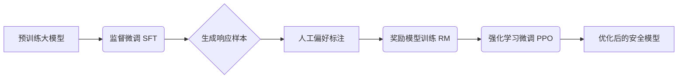

# Attention

Transformer模型中的Q、K、V是自注意力机制的核心组成部分，下面我将通过一个具体示例详细解释它们的计算过程。

## 一、基本概念与计算流程

**Q（Query）**：查询向量，代表当前需要关注其他位置信息的"提问者"
 **K（Key）**：键向量，提供"匹配标签"，用于与查询向量比较
 **V（Value）**：值向量，承载"核心信息"，表示被关注token的实际内容

计算过程分为四步：**生成QKV → 计算注意力分数 → 归一化权重 → 加权求和**。

## 二、具体计算示例

假设输入序列为"我爱吃酸菜"，经过词嵌入后得到5个词向量（为简化计算，假设每个词向量维度为4）：

**输入矩阵 X**（5×4）：

```markdown
[ [0.1, 0.2, 0.3, 0.4],  # "我"
  [0.5, 0.6, 0.7, 0.8],  # "爱"
  [0.9, 1.0, 1.1, 1.2],  # "吃"
  [1.3, 1.4, 1.5, 1.6],  # "酸"
  [1.7, 1.8, 1.9, 2.0] ] # "菜"
```

### 1. 生成Q、K、V向量

通过三个独立的线性变换矩阵 **Wq**、**Wk**、**Wv**（均为4×4）计算：

**计算公式**：

- Q = X × Wq
- K = X × Wk
- V = X × Wv

假设变换后得到：

- **Q**（5×4）：[[0.2, 0.3, 0.4, 0.5], [0.6, 0.7, 0.8, 0.9], [1.0, 1.1, 1.2, 1.3], [1.4, 1.5, 1.6, 1.7], [1.8, 1.9, 2.0, 2.1]]
- **K**（5×4）：[[0.1, 0.2, 0.3, 0.4], [0.5, 0.6, 0.7, 0.8], [0.9, 1.0, 1.1, 1.2], [1.3, 1.4, 1.5, 1.6], [1.7, 1.8, 1.9, 2.0]]
- **V**（5×4）：[[0.3, 0.4, 0.5, 0.6], [0.7, 0.8, 0.9, 1.0], [1.1, 1.2, 1.3, 1.4], [1.5, 1.6, 1.7, 1.8], [1.9, 2.0, 2.1, 2.2]]

> **关键点**：Q、K、V都来自**同一输入序列**的线性变换，但使用不同的权重矩阵。

### 2. 计算注意力分数

**计算公式**：注意力分数 = Q · KT / √dk

- **dk** 是K的维度（本例中为4），√dk ≈ 2
- **Q · KT**：5×4矩阵与4×5矩阵相乘，得到5×5的注意力分数矩阵

**计算过程**：

- "我"的Q向量与所有K向量点积：
  [0.2, 0.3, 0.4, 0.5] · [0.1, 0.2, 0.3, 0.4] = 0.4
  [0.2, 0.3, 0.4, 0.5] · [0.5, 0.6, 0.7, 0.8] = 1.2
  [0.2, 0.3, 0.4, 0.5] · [0.9, 1.0, 1.1, 1.2] = 2.0
  [0.2, 0.3, 0.4, 0.5] · [1.3, 1.4, 1.5, 1.6] = 2.8
  [0.2, 0.3, 0.4, 0.5] · [1.7, 1.8, 1.9, 2.0] = 3.6
- 将所有分数除以√dk（≈2）进行缩放，得到：[0.2, 0.6, 1.0, 1.4, 1.8]

> **为什么需要缩放**？防止点积过大导致Softmax梯度消失。

### 3. Softmax归一化

将缩放后的注意力分数通过Softmax函数转换为概率分布：

**计算公式**：α = Softmax(注意力分数)

- Softmax确保每行分数和为1
- 例如第一行分数[0.2, 0.6, 1.0, 1.4, 1.8] → 归一化后[0.08, 0.12, 0.18, 0.24, 0.38]

> **Softmax的作用**：将原始分数转换为可解释的注意力权重，保证非负性并增加非线性。

### 4. 加权求和得到输出

**计算公式**：Z = α × V

- 用归一化后的注意力权重α对V进行加权求和
- 例如"我"的输出向量：
  0.08×[0.3, 0.4, 0.5, 0.6] + 0.12×[0.7, 0.8, 0.9, 1.0] + 0.18×[1.1, 1.2, 1.3, 1.4] + 0.24×[1.5, 1.6, 1.7, 1.8] + 0.38×[1.9, 2.0, 2.1, 2.2] = [1.45, 1.55, 1.65, 1.75]

> **关键点**：输出向量Z既包含"我"自身的特征，又融合了其他词的上下文信息。

## 三、核心要素总结

1. **Q、K、V 的来源**：通过输入 X*X* 与三个不同的可学习权重矩阵相乘得到，分别表示**查询、键、值**。
2. **计算目的**：
   - Q*Q*：代表当前词要**查询什么信息**。
   - K*K*：代表每个词能**提供什么信息标识**。
   - V*V*：代表每个词**实际携带的信息内容**。
3. **注意力机制**：通过计算 Q*Q* 与 K*K* 的点积，得到每个 Query 对所有 Key 的**相关性分数**，再对 V*V* 加权求和，从而让每个词都能**聚合全局信息**。
4. **多头注意力**：在实际 Transformer 中，会先将原始输入特征通过线性投影层，得到高质量的 Q/K/V，再拆分成num_heads个头，每个头的 Q/K/V 是 “全局优质特征的子集”。

这种设计让 Transformer 能够**动态地、有区分地**关注序列中不同位置的信息，从而有效捕捉长距离依赖关系。

# MLP

Transformer中**MLP（多层感知机）的核心作用是为模型提供非线性变换能力，对注意力机制融合后的上下文信息进行深度加工和语义提炼**，使模型能够学习更复杂的语言模式和知识表示。

## 一、MLP在Transformer中的关键作用

### 1. **提供非线性变换能力**

- 注意力机制本质上是**线性操作**（QK点积+加权求和），虽然能有效融合上下文信息，但无法捕捉复杂的语义关系
- MLP通过**线性变换+激活函数（如GELU/ReLU）**引入非线性，使模型能够学习更复杂的函数关系
- **没有MLP，Transformer将退化为纯线性模型**，表达能力大幅下降，无法处理复杂的语言任务

### 2. **对每个token进行独立语义加工**

- 经过注意力机制后，每个token的向量已包含全局上下文信息（如"吃"知道主语是"猫"）
- MLP作为**position-wise（逐位置）的前馈网络**，对每个token的向量进行独立处理：
  - **过滤无关噪声**，保留关键语义信息
  - **放大重要特征**，增强语义表示
  - **映射到更适合预测的语义空间**
- 这种处理使模型能够**更精准地预测下一个词**，如将"Michael Jordan"的向量映射到"basketball"方向

### 3. **存储和应用语言知识**

- 研究表明，**MLP层是模型存储大量"知识"和"事实"的主要场所**（如记住"刘德华"这个实体）
- 在GPT-3等大模型中，**MLP层占据了约2/3的参数量**，意味着模型的大部分"知识"和"推理能力"藏在MLP里
- MLP通过高维向量空间的非线性变换，能够**同时存储多种语义关系**（如性别、地域、职业等）

### 4. **增强模型的表达能力**

- MLP通过**扩大-压缩**的特征处理流程（通常将维度扩大4倍再压缩回原尺寸）
- 这种设计使模型能够在**高维空间中学习更复杂的特征表示**，同时保持输入输出维度的一致性
- 实验表明，当隐藏维度低于输入维度3倍时，模型难以学习复杂模式；而超过5倍则会导致过拟合

## 二、MLP与注意力机制的协同工作

Transformer模型的工作流程可概括为：**Embedding → Attention → MLP → Unembedding**

1. **注意力机制**：负责"看懂上下文"，让每个token获取其他token的信息
2. **MLP层**：负责"想明白意思"，对融合后的信息进行深度加工
3. **残差连接**：确保信息在多层网络中稳定传递，防止梯度消失

> 💡 **形象比喻**：如果将Transformer比作一个写作团队，注意力机制是负责收集资料的研究员，而MLP则是负责整理资料、提炼观点并撰写文章的作家。研究员收集的信息再全面，也需要作家进行深度思考和创作才能产出有价值的内容。

## 三、MLP的结构特点

Transformer中的MLP通常包含：

- **两个线性变换层**：第一个将输入维度扩大（通常扩大4倍），第二个将维度还原
- **一个激活函数**：如GELU或ReLU，提供非线性
- **残差连接**：将MLP输出与原始输入相加，保持信息完整性
- **层归一化**：确保训练稳定性

数学表达式为：FFN(x) = max(0, xW₁ + b₁)W₂ + b₂ + x（含残差连接）

## 四、实验验证

最新研究表明，**MLP在Transformer中不可或缺**：

- 去掉MLP层会导致模型性能显著下降，甚至无法正常工作
- 在某些场景下，精心设计的MLP可以**部分替代注意力机制**，但完全去除MLP会导致模型崩溃
- 在时序预测任务中，纯MLP模型（如TimeMixer）在某些场景下能**超越Transformer**，证明了MLP的强大潜力

总之，**注意力机制负责"理解上下文"，而MLP负责"深度思考和表达"**。两者协同工作，使Transformer模型能够处理复杂的语言理解和生成任务。

# 显存占用

## 训练

### Model States

**Model States模型本身相关必须存储的参数**：

这部分是训练的 “基础显存开销”，是模型训练的必要条件（无则无法完成参数更新），显存占用仅和模型规模、数值精度、优化器类型相关，和训练的批次、序列长度无关。

#### Parameters

**定义**：模型的核心权重矩阵（如 Transformer 的注意力层 Q/K/V 权重、全连接层权重、LayerNorm 参数等），是模型 “能力” 的载体，训练 / 推理都必须保留。

**显存计算逻辑**：显存大小 = 参数总数 × 单个参数的存储字节数（由数值精度决定）。

**实例（LLaMA-7B 为例）**：70 亿参数，FP16（2 字节 / 参数）→ 7×10⁹ × 2 = 14GB；FP32（4 字节 / 参数）→ 28GB；BF16 和 FP16 字节数相同（2 字节），是大模型训练的主流选择。

**关键特点**：推理时也需要这部分显存，是模型的 “最小显存门槛”；混合精度训练时，参数通常以 FP16/BF16 存储（降低显存），仅在计算时临时转为 FP32 保证精度。

#### Gradients

**定义**：反向传播时计算的参数梯度（∇θ），用于更新模型参数，每个参数对应一个梯度值，维度和参数完全一致。

**显存计算逻辑**：显存大小 = 参数总数 × 单个梯度的存储字节数（通常和参数精度一致）。

**实例（LLaMA-7B 为例）**：FP16 精度下，梯度显存 = 7×10⁹ × 2 = 14GB；即使做梯度累加 / 梯度裁剪，也不会改变梯度的总显存大小（仅改变梯度的计算 / 更新时机）。

**关键特点**：推理时完全不需要，是训练独有的开销；梯度的显存占用和参数一一对应，无法 “精简”，只能通过并行策略拆分（如 ZeRO-2 拆分梯度到多卡）。

#### Optimizer States

**定义**：（优化器状态，以 Adam/AdamW 为例）Adam 优化器为了实现自适应学习率，需要为每个参数存储两个状态：动量（momentum，m_t）和方差（variance，v_t）；AdamW 和 Adam 的状态数量一致，仅多了权重衰减的逻辑。

**显存计算逻辑**：

1. 纯 FP32 训练（无混合精度）

   1. 不需要维护任何 “参数副本”：模型只有一份 FP32 的参数，梯度、Optimizer States 也都是 FP32；
   2. 优化器更新逻辑：直接用 FP32 梯度更新 FP32 参数，全程无精度转换，自然不存在 “副本” 之说；
   3. 显存开销（7B 模型）：参数 (28GB) + 梯度 (28GB) + Optimizer States (56GB) = 112GB（无副本，但整体显存更高）。

2. 混合精度训练（FP16/BF16，工业界主流）

   1. FP16 参数：用于前向 / 反向计算，省显存（7B 模型 14GB）；

   2.  FP32 参数副本：仅用于优化器更新，是独立的 “工作副本”，和 Optimizer States（m_t/v_t）是分开的

   3. Optimizer States：始终以 FP32 存储，作用是为 FP32 参数副本的更新提供自适应学习率，本身不存储模型参数。

   4. 显存开销（7B 模型）：参数 (14GB) + 梯度 (14GB) + Optimizer States (56GB)  + 副本 (28GB)= 112GB。

   5. 混合精度训练过程：

      ```mermaid
      graph TB
      FP32参数副本 --> 用梯度+优化器更新副本
      用梯度+优化器更新副本 --> 更新后的FP32转回FP16参数
      更新后的FP32转回FP16参数 --> 下一轮计算
      下一轮计算 --> 前向/反向传播计算FP16梯度
      前向/反向传播计算FP16梯度 --> 将FP16转化为FP32
      ```

      

**实例（LLaMA-7B 为例）**：优化器状态显存 = 7×10⁹ × 2 × 4 = 56GB；若用 SGD（仅存储动量，1 个状态），则显存减半为 28GB。

**关键特点**：这是 Model States 中占比最大的部分（7B 模型 Adam 下占 66.7%）；可通过 “精简优化器”（如 AdamP）或 “混合精度优化器”（FP16 存储部分状态）降低开销，但可能损失训练稳定性。

### 动态显存

**训练过程中产生的参数（动态显存）**：

这部分是前向 / 反向传播过程中临时生成的显存开销，核心是 Activation（激活值），随训练的批次、序列长度动态变化，是 “可优化的显存开销”。

#### Activation

**定义**：前向传播时，每一层神经网络的输入 / 输出张量（如 Transformer 中 Attention 的 Q/K/V 矩阵、FeedForward 层的输出、LayerNorm 的结果等）；反向传播需要这些激活值计算梯度，因此前向时必须保留，直到反向传播完成。

**显存影响因素（核心）**：

1. **批次大小（Batch Size）**：线性影响 ——Batch Size 从 8 翻倍到 16，激活值显存也翻倍；
2. **序列长度（Sequence Length）**：非线性影响 ——Transformer 的 Attention 层激活值和序列长度的平方（L2）成正比，序列长度从 512 翻倍到 1024，Attention 层激活值显存翻 4 倍；
3. **模型层数**：层数越多，需要保留的激活值越多，显存线性增加；
4. **并行策略**：数据并行会复制激活值（增加单卡显存），模型 / 张量并行会拆分激活值（降低单卡显存）。

**实例（LLaMA-7B 为例）**：

Batch Size=8、序列长度 = 1024、FP16 下，激活值显存约 20~40GB；若 Batch Size=16、序列长度 = 2048，激活值显存会飙升至 60~80GB。

**核心优化手段**：梯度检查点（Gradient Checkpointing，也叫 “激活重计算”）—— 不保留所有层的激活值，仅保留关键层，反向时重新计算其他层的激活值，以 “时间换显存”：可减少 50%~70% 的激活值显存，但训练速度下降 10%~20%（大模型训练的标配优化）。

#### 其他临时参数

**定义**：训练过程中生成的临时张量，如矩阵乘法的中间结果、Softmax 的临时输出、梯度累加缓存、数据加载的临时张量、分布式训练的通信缓冲区等。

**显存占比**：通常占动态显存的 10%~20%（如激活值 40GB 时，这部分约 4~8GB），大批次 / 长序列下不可忽视。

**优化手段**：及时释放临时张量（如 PyTorch 中使用`torch.no_grad()`、`del`删除无用张量）、设置合理的显存缓存区，可减少这部分开销。

# Ollama

```bash
[root@server01 deepseek]#docker run -itd --name=ollama -v /software/deepseek:/root/.ollama -p 1234:11434 ollama/ollama:latest
[root@server01 deepseek]# docker exec -it 9b1bd1dc1a0a /bin/bash
root@9b1bd1dc1a0a:/# ollama pull deepseek-r1:32b
```

# 环境

## GPU驱动

```markdown
https://www.nvidia.cn/drivers/lookup/

Data Center / Tesla
A-Series
NVIDIA A100
Linux 64-bit
12.4
Chinese (Simplified)
```

## Docker

- buildkit

  ```bash
  # 二级制安装的docker，在打镜像的时候如果想用--mount=type=cache功能的话，则必须进行以下设置
  # https://github.com/docker/buildx?tab=readme-ov-file
  [root@server02 vllm]# cp buildx-v0.23.0.linux-amd64  /root/.docker/cli-plugins/
  [root@server02 vllm]# cd /root/..docker/cli-plugins/
  [root@server02 vllm]# mv buildx-v0.23.0.linux-amd64 docker-buildx
  [root@server02 vllm]# chmod +x /root/.docker/cli-plugins/docker-buildx
  [root@server02 vllm]# systemctl restart docker 
  [root@server02 vllm]# vi /etc/docker/daemon.json
  {
    "features": {
      "buildkit": true
    }
  }
  ```

- 配置生产仓库

  ```bash
  # https://docs.nvidia.com/datacenter/cloud-native/container-toolkit/latest/install-guide.html
  #curl -fsSL https://nvidia.github.io/libnvidia-container/gpgkey | sudo gpg --dearmor -#o /usr/share/keyrings/nvidia-container-toolkit-keyring.gpg \
  #  && curl -s -L https://nvidia.github.io/libnvidia-container/stable/deb/nvidia-#container-toolkit.list | \
  #    sed 's#deb https://#deb [signed-by=/usr/share/keyrings/nvidia-container-toolkit-#keyring.gpg] https://#g' | \
  #    sudo tee /etc/apt/sources.list.d/nvidia-container-toolkit.list
  
  root@763ac07c2af3:/vllm-workspace# curl -fsSL https://nvidia.github.io/libnvidia-container/gpgkey | sudo gpg --dearmor -o /usr/share/keyrings/nvidia-container-toolkit-keyring.gpg \
  >   && curl -s -L https://nvidia.github.io/libnvidia-container/stable/deb/nvidia-container-toolkit.list | \
  >     sed 's#deb https://#deb [signed-by=/usr/share/keyrings/nvidia-container-toolkit-keyring.gpg] https://#g' | \
  >     sudo tee /etc/apt/sources.list.d/nvidia-container-toolkit.list
  ```

  

- 离线下载 nvidia-container-toolkit 组件

  ```bash
  #apt-get install --reinstall --download-only
  #功能
  #下载指定包及其所有依赖项，但不会安装或重新安装。
  #--reinstall 表示强制重新下载（即使本地已安装或存在缓存）。
  #--download-only 表示仅下载，不执行安装。
  
  #特点
  #递归下载所有依赖：会自动下载目标包及其依赖的所有包（包括间接依赖）。
  #需要 root 权限：必须使用 sudo 执行。
  #保存路径：下载的 .deb 文件默认存储在 /var/cache/apt/archives/。
  #适用场景：为离线安装准备完整的包和依赖项。
  
  #apt-cache depends
  #分步解析
  #核心命令：查询包的依赖关系。
  #--recurse：递归查询所有层级的依赖（直接依赖、间接依赖的依赖等）。
  #
  #过滤无关信息
  #--no-recommends：排除“推荐”安装的包（非必需）。
  #--no-suggests：排除“建议”安装的包（非必需）。
  #--no-conflicts：忽略冲突包（避免干扰）。
  #--no-breaks：忽略破坏性依赖（避免干扰）。
  #--no-replaces：忽略替换性依赖（避免干扰）。
  #--no-enhances：忽略增强性依赖（非必需）。
  #
  #目标包名
  #nvidia-container-toolkit：要分析的包。
  #
  #grep "^\w"
  #过滤输出：仅保留以字母/数字（即依赖包名）开头的行。
  #例如，过滤掉 Depends:、PreDepends: 等描述性行。
  #
  #sort -u
  #排序并去重：确保依赖包列表唯一且有序。
  
  root@763ac07c2af3:/vllm-workspace# apt-get install --reinstall --download-only $(apt-cache depends --recurse --no-recommends --no-suggests --no-conflicts --no-breaks --no-replaces --no-enhances nvidia-container-toolkit | grep "^\w" | sort -u)
  ```

  ```bash
  # centos
  [root@server01 ~]# curl -s -L https://nvidia.github.io/libnvidia-container/stable/rpm/nvidia-container-toolkit.repo |   sudo tee /etc/yum.repos.d/nvidia-container-toolkit.repo
  [root@server01 ~]# yumdownloader --resolve --destdir=/software/nvidia-container-toolkit  nvidia-container-toolkit
  ```

- 离线安装nvidia-container-toolkit 

  ```bash
  root@763ac07c2af3:/vllm-workspace# dpkg -i /home/nfs-pkgs/*.deb
  ```

  ```bash
  [root@server01 ~]# rpm -ivh *
  ```

- docker 配置使用 nvidia-runtime

  新版本

  ```bash
  [root@server01 deepseek]# nvidia-ctk runtime configure --runtime=docker
  [root@server01 deepseek]# systemctl restart docker
  ```

  老版本

  需要手动在 /etc/docker/daemon.json 中增加配置，指定使用 nvidia 的 runtime。

  ```json
  "default-runtime": "nvidia",
  "runtimes": {
      "nvidia": {
          "path": "/usr/bin/nvidia-container-runtime",
          "runtimeArgs": []
      }
  }
  ```

- 错误解析

  ```bash
  # 1、安装驱动时提示：WARNING: The Nouveau kernel driver is currently in use by your system.  This driver is incompatible with the NVIDIA driver，and must be disabled before proceeding.（警告：您的系统当前正在使用Nouveau内核驱动程序。此驱动程序与NVIDIA驱动程序不兼容，必须先禁用才能继续。）
  #在 CentOS 系统上，如果你想要禁用 Nouveau 驱动（这是一个开源的 NVIDIA 驱动，通常用于 Nouveau 显卡），你可以通过以下几种方法来实现：
  # 1.1 临时禁用：
  [root@server01 deepseek]# lsmod | grep nouveau
  [root@server01 deepseek]# rmmod nouveau
  [root@server01 deepseek]# lsmod | grep nouveau
  # 1.2 使用黑名单模块
  [root@server01 deepseek]# vim /etc/modprobe.d/blacklist.conf
  blacklist nouveau
  options nouveau modeset=0
  [root@server01 deepseek]# dracut --force
  [root@server01 deepseek]# reboot
  [root@server01 deepseek]# lsmod | grep nouveau
  # 2、在安装完驱动、docker以及nvidia-container-toolkit后，用docker创建容器时出现如下报错,原因是gpu的持久模式(nvidia-persistenced daemon)并未开启
  [root@server01 deepseek]# docker: Error response from daemon: failed to create shim task: OCI runtime create failed: runc create failed: unable to start container process: error during container init: error running hook #0: error running hook: exit status 1, stdout: , stderr: Auto-detected mode as 'legacy' nvidia-container-cli: initialization error: driver rpc error: timed out: unknown.
  # 可以用nvidia-smi -a查询自己的 Persistence Mode 是否开启、同时也可以用nvidia-smi
  # 解决方案：使用root权限执行如下命令：
  [root@server01 deepseek]# nvidia-smi -pm ENABLED
  
  # 3、nvidia-docker Failed to initialize NVML: Unknown Error
  [root@server01 deepseek]# docker run --rm --runtime=nvidia --gpus all centos nvidia-smi
  [root@server01 deepseek]# Failed to initialize NVML: Unknown Error
  # 解决方案：
  [root@server01 deepseek]# vim /etc/nvidia-container-runtime/config.toml
  # 设置 no-cgroups = false，然后保存
  [root@server01 deepseek]# systemctl restart docker
  ```

- 启动容器时增加 --gpu 参数


# 传统大模型训练流程

## Pre training

预训练：Base model

预训练利用大量无标签或弱标签的数据，通过某种算法模型进行训练，得到一个初步具备通用知识或能力的模型。

## Supervised fine tuning

监督式微调：Instruct model

尽管预训练模型已经在大规模数据集上学到了丰富的通用特征和先验知识，但这些特征和知识可能并不完全适用于特定的目标任务。微调通过在新任务的少量标注数据上进一步训练预训练模型，使模型能够学习到与目标任务相关的特定特征和规律，从而更好地适应新任务。

## Preference alignment

偏好对齐：chat model

在很多应用场景下有监督微调就已经够用了，但对于一些面向用户的公众模型，偏好对齐还是很有必要的（不然模型说了什么不该说的话可能这个产品甚至公司都要完蛋）。比较经典的偏好对齐的做法就是基于人类反馈的强化学习（Reinforcement Learning from Human Feedback, RLHF）那一套，根据人类偏好/反馈数据训练一个“奖励模型”，并使用该模型作为强化学习中的奖励函数，再通过类似PPO之类的强化学习算法来优化大语言模型的输出。不过对于大多数非公司级的大语言模型来说，不愿意折腾RLHF，毕竟偏好数据不好收集、还要额外训一个奖励模型、还要搞训练不稳定的强化学习。这些成本都是很高的。

## TRL

TRL（Transformer Reinforcement Learning）训练的三个阶段：监督微调（SFT）、奖励模型训练（Reward Modeling）和强化学习微调（PPO）。这三个阶段是逐步递进的关系，共同完成基于人类反馈的强化学习（RLHF）过程。

|        阶段         |                             目标                             |            输入            |       输出       |      所需模型/组件       |
| :-----------------: | :----------------------------------------------------------: | :------------------------: | :--------------: | :----------------------: |
|   监督微调 (SFT)    | 让预训练模型适应特定任务或领域，使其能根据给定的指令生成合理的内容 |      指令-输出对数据       | 微调后的基础模型 |       基础语言模型       |
|  奖励模型训练 (RM)  | 将人类偏好转化为可量化的奖励信号，使强化学习可行（人类无法实时反馈） | 成对的候选回答（人类偏好） |     奖励模型     |    SFT 模型 + RM 模型    |
| 强化学习微调 (RLHF) | 在RM的指导下，通过试错不断改进策略，生成更符合人类偏好的回答。 |       提示（prompt）       |  最终 RLHF 模型  | RM 模型 + PPO/DPO 等算法 |

1. 监督微调（Supervised Fine-Tuning, SFT）

   使用高质量的标注数据（通常是人工编写的回答）对预训练语言模型进行微调，使模型初步具备完成特定任务（如对话、问答）的能力。SFT是RLHF的起点。它为后续的奖励模型训练和PPO提供了一个基础模型。没有SFT，直接进行强化学习微调可能会因为模型行为过于随机而难以训练。

   例子：假设我们想训练一个帮助写代码的AI助手。我们收集了这样的数据：
   输入（Prompt）: "用Python写一个快速排序函数。"
   输出（Response）: "def quicksort(arr): ... " （人工编写的代码）
   用这些数据微调预训练模型（如Llama-3），使模型学会如何根据问题生成代码。

2. 奖励模型训练（Reward Modeling）

   训练一个能够根据人类偏好对模型生成的回答进行打分的模型。这个奖励模型将替代人类，在强化学习阶段提供即时反馈。奖励模型是连接人类偏好和强化学习的桥梁。它通过学习人类对多个回答的偏好（例如，哪个回答更好），从而能够为任何生成的回答打分。这个奖励模型将在PPO阶段作为评判标准，指导策略模型（即我们要优化的模型）的学习方向。

   例子：继续代码助手的例子；我们收集偏好数据：对于同一个问题（Prompt），我们让基础模型（SFT后的模型）生成多个回答，然后让人工标注哪个回答更好。例如：
   Prompt: "用Python写一个快速排序函数。"
   回答A: 一个正确但效率不高的实现（冒泡排序）
   回答B: 一个正确且高效的快速排序实现
   人工标注：回答B更好。
   奖励模型训练的目标是学习一个函数：RM(Prompt, Response) → 分数（标量）。它要能够学会：对于同一个Prompt，给回答B的打分高于回答A。

3. 强化学习微调（PPO）

   使用强化学习（具体是PPO算法）优化策略模型（即SFT后的模型），使其生成的回答在奖励模型看来得分更高，从而更符合人类偏好。PPO阶段将SFT模型作为初始策略，同时固定奖励模型作为环境反馈。通过不断生成回答、获得奖励、更新策略，模型逐步学习生成更高质量的回答。为了防止模型过度优化（只迎合奖励模型而偏离正常语言能力），我们通常保留一个参考模型（即未经过PPO训练的SFT模型），通过KL散度惩罚来约束策略模型不要偏离参考模型太远。

   例子：继续代码助手。
   我们有一个Prompt: "用Python写一个快速排序函数。"
   PPO训练步骤：
   1. 策略模型根据这个Prompt生成一个回答（比如，生成了一个正确的快速排序函数，但变量命名不规范）。
   2. 我们将这个回答输入奖励模型，得到一个分数（比如7分）。
   3. 同时，参考模型（SFT模型）也会生成一个回答（比如，变量命名规范但算法效率一般）。
   4. 计算策略模型生成回答的奖励（包括奖励模型分数和KL惩罚，例如：最终奖励 = 7 - β * KL(策略模型||参考模型)）。
   5. 使用PPO算法更新策略模型，使得它未来更可能生成高奖励的回答（即同时满足：高质量代码、且不过于偏离参考模型）。

监督微调(SFT) → 使用高质量的指令数据微调一个预训练的语言模型；奖励模型训练(RM) ← 使用人类标注的偏好数据（如两个回答之间选择更好的一个）训练一个奖励模型；强化学习微调(PPO) → 使用近端策略优化（PPO）等算法，利用奖励模型来优化SFT模型。



- SFT 就像学生学习课本知识，知道该怎么回答问题；
- RM 就像老师评分系统，知道什么样的答案更好；
- RLHF 就是学生根据老师的反馈不断改进答题能力，直到得到高分。

# PEFT

Parameter-Efficient Fine-Tuning

# training

## 优化器

Adam优化器中Optimizer States里的动量（momentum，m_t）和方差（variance，v_t）的核心目标：让模型参数更新更高效、更稳定：

-  基础的 SGD（随机梯度下降）只有 “当前步梯度” 一个信息，更新逻辑是：`参数 = 参数 - 学习率 × 当前梯度`；

- 问题：SGD 容易在梯度震荡中收敛慢，且所有参数共用一个学习率（无法适配不同参数的更新需求）；

- Adam 的核心改进：引入**动量（利用历史梯度方向）** 和**方差（利用历史梯度波动）**，把 “单步梯度决策” 变成 “历史 + 当前的综合决策”，这也是需要存储这两个状态的根本原因。

### 动量

动量（momentum，m_t）：梯度的 “历史方向累积”

1. 本质含义 可以把参数更新类比成 “推箱子”：
   1. SGD 是 “每一步只看当前的推力（梯度），推一下就停”，容易推一下、晃一下，收敛慢；
   2. 动量是 “记住之前推的方向和力度，把历史推力和当前推力结合”，像箱子被推起来的 “惯性”—— 之前推的方向如果和当前一致，推力会叠加；如果相反，会抵消一部分，让箱子走得更稳、更快。
2. 数学计算逻辑 Adam 中动量的计算是**指数移动平均（EMA）**，核心是 “保留历史动量，叠加当前梯度”，公式：mt = β1 × mt−1 + (1−β1) × gt
   1. mt：第 t 步的动量（需要存储的状态）；
   2. mt−1：第 t-1 步的动量（上一步存储的状态，核心依赖）；
   3. β1：动量衰减系数（通常取 0.9），控制 “历史动量的权重”；
   4. gt：第 t 步的当前梯度（反向传播计算得到）。
3. 核心作用
   1. 解决 SGD 的**震荡问题**：比如参数更新时，前一步梯度是 “向左”，当前步梯度是 “向右”，动量会中和两者，避免参数来回震荡；
   2. 加速收敛：如果连续多步梯度方向一致（比如都 “向下”），动量会持续叠加，让参数更新的步长变大，更快接近最优值。

### 方差

方差（variance，v_t）：梯度的 “历史波动累积”1. 本质含义

方差（严格来说是 “梯度平方的指数移动平均”）是用来衡量 “某个参数的梯度波动程度”：

- 有的参数（比如文本模型中高频字的权重）梯度一直比较稳定（波动小），方差小；
- 有的参数（比如低频字的权重）梯度忽大忽小（波动大），方差大；
- Adam 利用这个 “波动程度” 为**每个参数单独调整学习率**（自适应学习率），而不是所有参数用同一个学习率。

数学计算逻辑

vt = β2 × vt−1 + (1−β2) × gt2

- vt：第 t 步的方差（需要存储的状态）；
- vt−1：第 t-1 步的方差（上一步存储的状态，核心依赖）；
- β2：方差衰减系数（通常取 0.999），控制 “历史方差的权重”；
- gt2：第 t 步当前梯度的平方（放大梯度波动的差异）。

核心作用

- 自适应学习率：Adam 的最终更新公式会引入√vt，逻辑是：

  θt = θt−1 − η/√vt+ϵ × mt

  - 方差vt大（梯度波动大）→ 分母大 → 学习率变小 → 参数更新更谨慎，避免 “步子太大扯到蛋”；
  - 方差vt小（梯度稳定）→ 分母小 → 学习率变大 → 参数更新更快，加速收敛；

- 数值稳定性：加ϵ（通常 1e-8）是为了避免分母为 0，和存储无关，是公式的安全项。

动量保留的是 “过去往哪个方向走” 的经验，避免每一步都 “从零开始决策”；

方差保留的是 “过去走得稳不稳” 的经验，让每个参数的更新节奏适配自身特性；

如果不存储这两个状态，就相当于 “每次推箱子都忘记之前推过的方向和力度”，优化器退化为最原始的 SGD，训练效率和稳定性会大幅下降。

# 分词

| 维度     | 词级分词算法（FMM/HMM/BiLSTM+CRF）      | 子词级分词算法（BPE/Wordpiece/Unigram）           |
| -------- | --------------------------------------- | ------------------------------------------------- |
| 核心目标 | 把文本切分为**具有独立语义的词单元**    | 构建**子词词汇表**，解决 OOV 和词汇表膨胀问题     |
| 处理对象 | 中文：连续汉字序列；英文：连续字母序列  | 英文：单词；中文：字 / 词（因中文无天然单词边界） |
| 应用阶段 | NLP 下游任务前置步骤（如文本分类、NER） | 预训练语言模型训练前的词汇表构建阶段              |
| 典型产出 | 分词结果：`信用卡/账单/逾期`            | 子词拆分结果：`unhappiness`→`un+happy+ness`       |

子词级分词算法的本质与应用场景

这类算法诞生的核心诉求是**解决预训练语言模型的两大痛点**：

1. **OOV（未登录词）问题**：英文中存在大量生僻词、专业术语（如金融领域的`cryptocurrency`），直接纳入词汇表会导致词汇表无限膨胀；
2. **词汇表效率问题**：如果词汇表只包含完整单词，会出现大量重复字符组合，浪费存储和计算资源。

子词级分词算法的核心逻辑是：**将单词拆分为更小的子词单元，让模型学习子词的语义，从而覆盖更多未见过的词**。

这类算法的核心是 “切出有语义的词”；为NLP下游任务服务

# tokenizer

编码过程：

大模型采用了这样一个映射表

```python
def bytes_to_unicode():
    """
    生成字节到Unicode字符的正向映射表
    返回字典：{byte_value: unicode_char}
    """
    # 原始保留的字节范围
    bs = (
        list(range(ord("!"), ord("~") + 1)) +          # ASCII可打印字符（33-126）
        list(range(ord("¡"), ord("¬") + 1)) +          # 西班牙语特殊字符（161-172）
        list(range(ord("®"), ord("ÿ") + 1))            # 其他扩展字符（174-255）
    )
    
    cs = bs.copy()  # 初始字符列表
    n = 0
    
    # 遍历所有可能的字节（0-255）
    for b in range(2**8):
        if b not in bs:
            bs.append(b)
            cs.append(2**8 + n)  # 超出原始范围的字节映射到更高Unicode码位
            n += 1
    
    # 将码位转换为Unicode字符
    cs = [chr(code) for code in cs]
    
    return dict(zip(bs, cs))
```

对照表（如果有问题可以按照上述代码生成一个映射表查看）

| DEC(十进制) | OCT(八进制) | HEX(十六进制) | BIN(二进制) | 映射字符 |
| ----------- | ----------- | ------------- | ----------- | -------- |
| 0           | 000         | 00            | 00000000    | Ā        |
| 1           | 001         | 01            | 00000001    | ā        |
| 2           | 002         | 02            | 00000010    | Ă        |
| 3           | 003         | 03            | 00000011    | ă        |
| 4           | 004         | 04            | 00000100    | Ą        |
| 5           | 005         | 05            | 00000101    | ą        |
| 6           | 006         | 06            | 00000110    | Ć        |
| 7           | 007         | 07            | 00000111    | ć        |
| 8           | 010         | 08            | 00001000    | Ĉ        |
| 9           | 011         | 09            | 00001001    | ĉ        |
| 10          | 012         | 0A            | 00001010    | Ċ        |
| 11          | 013         | 0B            | 00001011    | ċ        |
| 12          | 014         | 0C            | 00001100    | Č        |
| 13          | 015         | 0D            | 00001101    | č        |
| 14          | 016         | 0E            | 00001110    | Ď        |
| 15          | 017         | 0F            | 00001111    | ď        |
| 16          | 020         | 10            | 00010000    | Đ        |
| 17          | 021         | 11            | 00010001    | đ        |
| 18          | 022         | 12            | 00010010    | Ē        |
| 19          | 023         | 13            | 00010011    | ē        |
| 20          | 024         | 14            | 00010100    | Ĕ        |
| 21          | 025         | 15            | 00010101    | ĕ        |
| 22          | 026         | 16            | 00010110    | Ė        |
| 23          | 027         | 17            | 00010111    | Ė        |
| 24          | 030         | 18            | 00011000    | ė        |
| 25          | 031         | 19            | 00011001    | Ę        |
| 26          | 032         | 1A            | 00011010    | ę        |
| 27          | 033         | 1B            | 00011011    | ě        |
| 28          | 034         | 1C            | 00011100    | Ĝ        |
| 29          | 035         | 1D            | 00011101    | ĝ        |
| 30          | 036         | 1E            | 00011110    | Ğ        |
| 31          | 037         | 1F            | 00011111    | ğ        |
| 32          | 040         | 20            | 00100000    | Ġ        |
| 33          | 041         | 21            | 00100001    | !        |
| 34          | 042         | 22            | 00100010    | \        |
| 35          | 043         | 23            | 00100011    | #        |
| 36          | 044         | 24            | 00100100    | $        |
| 37          | 045         | 25            | 00100101    | %        |
| 38          | 046         | 26            | 00100110    | &        |
| 39          | 047         | 27            | 00100111    | ’        |
| 40          | 050         | 28            | 00101000    | (        |
| 41          | 051         | 29            | 00101001    | )        |
| 42          | 052         | 2A            | 00101010    | *        |
| 43          | 053         | 2B            | 00101011    | +        |
| 44          | 054         | 2C            | 00101100    | ,        |
| 45          | 055         | 2D            | 00101101    | -        |
| 46          | 056         | 2E            | 00101110    | .        |
| 47          | 057         | 2F            | 00101111    | /        |
| 48          | 060         | 30            | 00110000    | 0        |
| 49          | 061         | 31            | 00110001    | 1        |
| 50          | 062         | 32            | 00110010    | 2        |
| 51          | 063         | 33            | 00110011    | 3        |
| 52          | 064         | 34            | 00110100    | 4        |
| 53          | 065         | 35            | 00110101    | 5        |
| 54          | 066         | 36            | 00110110    | 6        |
| 55          | 067         | 37            | 00110111    | 7        |
| 56          | 070         | 38            | 00111000    | 8        |
| 57          | 071         | 39            | 00111001    | 9        |
| 58          | 072         | 3A            | 00111010    | :        |
| 59          | 073         | 3B            | 00111011    | ;        |
| 60          | 074         | 3C            | 00111100    | <        |
| 61          | 075         | 3D            | 00111101    | =        |
| 62          | 076         | 3E            | 00111110    | >        |
| 63          | 077         | 3F            | 00111111    | ?        |
| 64          | 100         | 40            | 01000000    | @        |
| 65          | 101         | 41            | 01000001    | A        |
| 66          | 102         | 42            | 01000010    | B        |
| 67          | 103         | 43            | 01000011    | C        |
| 68          | 104         | 44            | 01000100    | D        |
| 69          | 105         | 45            | 01000101    | E        |
| 70          | 106         | 46            | 01000110    | F        |
| 71          | 107         | 47            | 01000111    | G        |
| 72          | 110         | 48            | 01001000    | H        |
| 73          | 111         | 49            | 01001001    | I        |
| 74          | 112         | 4A            | 01001010    | J        |
| 75          | 113         | 4B            | 01001011    | K        |
| 76          | 114         | 4C            | 01001100    | L        |
| 77          | 115         | 4D            | 01001101    | M        |
| 78          | 116         | 4E            | 01001110    | N        |
| 79          | 117         | 4F            | 01001111    | O        |
| 80          | 120         | 50            | 01010000    | P        |
| 81          | 121         | 51            | 01010001    | Q        |
| 82          | 122         | 52            | 01010010    | R        |
| 83          | 123         | 53            | 01010011    | S        |
| 84          | 124         | 54            | 01010100    | T        |
| 85          | 125         | 55            | 01010101    | U        |
| 86          | 126         | 56            | 01010110    | V        |
| 87          | 127         | 57            | 01010111    | W        |
| 88          | 130         | 58            | 01011000    | X        |
| 89          | 131         | 59            | 01011001    | Y        |
| 90          | 132         | 5A            | 01011010    | Z        |
| 91          | 133         | 5B            | 01011011    | [        |
| 92          | 134         | 5C            | 01011100    | \\\\     |
| 93          | 135         | 5D            | 01011101    | ]        |
| 94          | 136         | 5E            | 01011110    | ^        |
| 95          | 137         | 5F            | 01011111    | _        |
| 96          | 140         | 60            | 01100000    | `        |
| 97          | 141         | 61            | 01100001    | a        |
| 98          | 142         | 62            | 01100010    | b        |
| 99          | 143         | 63            | 01100011    | c        |
| 100         | 144         | 64            | 01100100    | d        |
| 101         | 145         | 65            | 01100101    | e        |
| 102         | 146         | 66            | 01100110    | f        |
| 103         | 147         | 67            | 01100111    | g        |
| 104         | 150         | 68            | 01101000    | h        |
| 105         | 151         | 69            | 01101001    | i        |
| 106         | 152         | 6A            | 01101010    | j        |
| 107         | 153         | 6B            | 01101011    | k        |
| 108         | 154         | 6C            | 01101100    | l        |
| 109         | 155         | 6D            | 01101101    | m        |
| 110         | 156         | 6E            | 01101110    | n        |
| 111         | 157         | 6F            | 01101111    | o        |
| 112         | 160         | 70            | 01110000    | p        |
| 113         | 161         | 71            | 01110001    | q        |
| 114         | 162         | 72            | 01110010    | r        |
| 115         | 163         | 73            | 01110011    | s        |
| 116         | 164         | 74            | 01110100    | t        |
| 117         | 165         | 75            | 01110101    | u        |
| 118         | 166         | 76            | 01110110    | v        |
| 119         | 167         | 77            | 01110111    | w        |
| 120         | 170         | 78            | 01111000    | x        |
| 121         | 171         | 79            | 01111001    | y        |
| 122         | 172         | 7A            | 01111010    | z        |
| 123         | 173         | 7B            | 01111011    | {        |
| 124         | 174         | 7C            | 01111100    | \|       |
| 125         | 175         | 7D            | 01111101    | }        |
| 126         | 176         | 7E            | 01111110    | ~        |
| 127         | 177         | 7F            | 01111111    | ġ        |
| 128         | 200         | 80            | 10000000    | Ģ        |
| 129         | 201         | 81            | 10000001    | ģ        |
| 130         | 202         | 82            | 10000010    | Ĥ        |
| 131         | 203         | 83            | 10000011    | ĥ        |
| 132         | 204         | 84            | 10000100    | Ħ        |
| 133         | 205         | 85            | 10000101    | ħ        |
| 134         | 206         | 86            | 10000110    | Ĩ        |
| 135         | 207         | 87            | 10000111    | ĩ        |
| 136         | 210         | 88            | 10001000    | Ī        |
| 137         | 211         | 89            | 10001001    | ī        |
| 138         | 212         | 8A            | 10001010    | Ĭ        |
| 139         | 213         | 8B            | 10001011    | ĭ        |
| 140         | 214         | 8C            | 10001100    | Į        |
| 141         | 215         | 8D            | 10001101    | į        |
| 142         | 216         | 8E            | 10001110    | İ        |
| 143         | 217         | 8F            | 10001111    | ı        |
| 144         | 220         | 90            | 10010000    | IJ        |
| 145         | 221         | 91            | 10010001    | ij        |
| 146         | 222         | 92            | 10010010    | Ĵ        |
| 147         | 223         | 93            | 10010011    | ĵ        |
| 148         | 224         | 94            | 10010100    | Ķ        |
| 149         | 225         | 95            | 10010101    | ķ        |
| 150         | 226         | 96            | 10010110    | ĸ        |
| 151         | 227         | 97            | 10010111    | Ĺ        |
| 152         | 230         | 98            | 10011000    | ĺ        |
| 153         | 231         | 99            | 10011001    | Ļ        |
| 154         | 232         | 9A            | 10011010    | ļ        |
| 155         | 233         | 9B            | 10011011    | Ľ        |
| 156         | 234         | 9C            | 10011100    | ľ        |
| 157         | 235         | 9D            | 10011101    | Ŀ        |
| 158         | 236         | 9E            | 10011110    | ŀ        |
| 159         | 237         | 9F            | 10011111    | Ł        |
| 160         | 240         | A0            | 10100000    | ł        |
| 161         | 241         | A1            | 10100001    | ¡        |
| 162         | 242         | A2            | 10100010    | ¢        |
| 163         | 243         | A3            | 10100011    | £        |
| 164         | 244         | A4            | 10100100    | ¤        |
| 165         | 245         | A5            | 10100101    | ¥        |
| 166         | 246         | A6            | 10100110    | ¦        |
| 167         | 247         | A7            | 10100111    | §        |
| 168         | 250         | A8            | 10101000    | ¨        |
| 169         | 251         | A9            | 10101001    | ©        |
| 170         | 252         | AA            | 10101010    | ª        |
| 171         | 253         | AB            | 10101011    | «        |
| 172         | 254         | AC            | 10101100    | ¬        |
| 173         | 255         | AD            | 10101101    | Ń        |
| 174         | 256         | AE            | 10101110    | ®        |
| 175         | 257         | AF            | 10101111    | ¯        |
| 176         | 260         | B0            | 10110000    | °        |
| 177         | 261         | B1            | 10110001    | ±        |
| 178         | 262         | B2            | 10110010    | ²        |
| 179         | 263         | B3            | 10110011    | ³        |
| 180         | 264         | B4            | 10110100    | ´        |
| 181         | 265         | B5            | 10110101    | µ        |
| 182         | 266         | B6            | 10110110    | ¶        |
| 183         | 267         | B7            | 10110111    | ·        |
| 184         | 270         | B8            | 10111000    | ¸        |
| 185         | 271         | B9            | 10111001    | ¹        |
| 186         | 272         | BA            | 10111010    | º        |
| 187         | 273         | BB            | 10111011    | »        |
| 188         | 274         | BC            | 10111100    | ¼        |
| 189         | 275         | BD            | 10111101    | ½        |
| 190         | 276         | BE            | 10111110    | ¾        |
| 191         | 277         | BF            | 10111111    | ¿        |
| 192         | 300         | C0            | 11000000    | À        |
| 193         | 301         | C1            | 11000001    | Á        |
| 194         | 302         | C2            | 11000010    | Â        |
| 195         | 303         | C3            | 11000011    | Ã        |
| 196         | 304         | C4            | 11000100    | Ä        |
| 197         | 305         | C5            | 11000101    | Å        |
| 198         | 306         | C6            | 11000110    | Æ        |
| 199         | 307         | C7            | 11000111    | Ç        |
| 200         | 310         | C8            | 11001000    | È        |
| 201         | 311         | C9            | 11001001    | É        |
| 202         | 312         | CA            | 11001010    | Ê        |
| 203         | 313         | CB            | 11001011    | Ë        |
| 204         | 314         | CC            | 11001100    | Ì        |
| 205         | 315         | CD            | 11001101    | Í        |
| 206         | 316         | CE            | 11001110    | Î        |
| 207         | 317         | CF            | 11001111    | Ï        |
| 208         | 320         | D0            | 11010000    | Ð        |
| 209         | 321         | D1            | 11010001    | Ñ        |
| 210         | 322         | D2            | 11010010    | Ò        |
| 211         | 323         | D3            | 11010011    | Ó        |
| 212         | 324         | D4            | 11010100    | Ô        |
| 213         | 325         | D5            | 11010101    | Õ        |
| 214         | 326         | D6            | 11010110    | Ö        |
| 215         | 327         | D7            | 11010111    | ×        |
| 216         | 330         | D8            | 11011000    | Ø        |
| 217         | 331         | D9            | 11011001    | Ù        |
| 218         | 332         | DA            | 11011010    | Ú        |
| 219         | 333         | DB            | 11011011    | Û        |
| 220         | 334         | DC            | 11011100    | Ü        |
| 221         | 335         | DD            | 11011101    | Ý        |
| 222         | 336         | DE            | 11011110    | Þ        |
| 223         | 337         | DF            | 11011111    | ß        |
| 224         | 340         | E0            | 11100000    | à        |
| 225         | 341         | E1            | 11100001    | á        |
| 226         | 342         | E2            | 11100010    | â        |
| 227         | 343         | E3            | 11100011    | ã        |
| 228         | 344         | E4            | 11100100    | ä        |
| 229         | 345         | E5            | 11100101    | å        |
| 230         | 346         | E6            | 11100110    | æ        |
| 231         | 347         | E7            | 11100111    | ç        |
| 232         | 350         | E8            | 11101000    | è        |
| 233         | 351         | E9            | 11101001    | é        |
| 234         | 352         | EA            | 11101010    | ê        |
| 235         | 353         | EB            | 11101011    | ë        |
| 236         | 354         | EC            | 11101100    | ì        |
| 237         | 355         | ED            | 11101101    | í        |
| 238         | 356         | EE            | 11101110    | î        |
| 239         | 357         | EF            | 11101111    | ï        |
| 240         | 360         | F0            | 11110000    | ð        |
| 241         | 361         | F1            | 11110001    | ñ        |
| 242         | 362         | F2            | 11110010    | ò        |
| 243         | 363         | F3            | 11110011    | ó        |
| 244         | 364         | F4            | 11110100    | ô        |
| 245         | 365         | F5            | 11110101    | õ        |
| 246         | 366         | F6            | 11110110    | ö        |
| 247         | 367         | F7            | 11110111    | ÷        |
| 248         | 370         | F8            | 11111000    | ø        |
| 249         | 371         | F9            | 11111001    | ù        |
| 250         | 372         | FA            | 11111010    | ú        |
| 251         | 373         | FB            | 11111011    | û        |
| 252         | 374         | FC            | 11111100    | ü        |
| 253         | 375         | FD            | 11111101    | ý        |
| 254         | 376         | FE            | 11111110    | þ        |
| 255         | 377         | FF            | 11111111    | ÿ        |

比如：
```python
# 原始文本 -> UTF-8 编码字节
text = "你好世界"
bytes_data = text.encode('utf-8')
print(bytes_data)
# 此时输出对应的UTF-8 字节为b'\xe4\xbd\xa0\xe5\xa5\xbd\xe4\xb8\x96\xe7\x95\x8c'
# 再按照上面的映射表，将每个字节转换为字符
# \xe4->ä；\xbd->½；\xa0->ł；\xe5->å；\xa5-> ¥； \xbd->½ ； \xe4->ä；\xb8->¸ ； \x96->ĸ； \xe7->ç； \x95->ķ； \x8c->Į；
# 组合即可得到：ä½łå¥½ä¸ĸçķĮ
# 在DeepSeek-V3.2的tokenizer.json中：
# "ä½łå¥½": 30594
# "ä¸ĸçķĮ": 3427
from transformers import AutoTokenizer

tokenizer = AutoTokenizer.from_pretrained("./DeepSeek")
print(tokenizer.decode([30594]))
print(tokenizer.decode([3427]))

```

## BPE

BPE算法的主体思想是统计相邻子词的频率，不断融合频率最高的相邻子词

训练过程：

1. 词典构造：训练一个词典大小为8的字典，训练语料为：abcccabcabdef
2. 字符包含a,b,c,d,e,f，首先分别给它们一个id，作为字典的第一个版本：{'a': 0, 'b': 1, 'c': 2, 'd': 3, 'e': 4, 'f': 5}
3. 原始的输入变成id：[0, 1, 2, 2, 2, 0, 1, 2, 0, 1, 3, 4, 5]
4. 第一步更新词典：
   1. 统计相邻的id对出现的频率，得到：{ ('a', 'b'): 3, ('b', 'c'): 2, ('c', 'c'): 2,  ('c', 'a'): 2, ('b', 'd'): 1, ('d', 'e'): 1,  ('e', 'f'): 1 }；
   2. 可以看到，('a', 'b')这个子对出现的频率最高。我们把它们合并起 来并在词典里面加入一个新的id，加入后词典变成，并记录merge 的过程(0, 1)->6，融合后的词表为：{0: 'a', 1: 'b', 2: 'c', 3: 'd', 4: 'e', 5: 'f', 6: 'ab'}；
   3. 原始输入的id里面也把对应的(0,1)替换成6，也就是把(a, b)替换成 ab。替换后，原始输入id从[0, 1, 2, 2, 2, 0, 1, 2, 0, 1, 3, 4, 5]变为：[6, 2, 2, 2, 6, 2, 6, 3, 4, 5]。
5. 继续统计替换后的相邻id出现的频率，得到：{('ab', 'c'): 2, ('c', 'c'): 2, ('c', 'ab'):  2, ('ab', 'd'): 1, ('d', 'e'): 1, ('e', 'f'):  1}
   1. 里面有三个id对出现的频率都是2，任意选择一个进行融合。这 里选择第一个，也就是('ab', 'c')进行融合，并记录merge的过程 为(6, 2)->7，融合后的词表为：{0: 'a', 1: 'b', 2: 'c', 3: 'd', 4: 'e', 5:  'f', 6: 'ab', 7: 'abc'}
   2. 原始输入变为：[7, 2, 2, 7, 6, 3, 4, 5]
6. 继续统计相邻id频率，得到：{('abc', 'c'): 1, ('c', 'c'): 1, ('c', 'abc'):  1, ('abc', 'ab'): 1, ('ab', 'd'): 1, ('d',  'e'): 1, ('e', 'f'): 1}
   1. 继续融合第一个最大的，得到新的字典，记录merge的过程为(7,  2)-> 8，融合后的词表为：{0: 'a', 1: 'b', 2: 'c', 3: 'd', 4: 'e', 5:  'f', 6: 'ab', 7: 'abc', 8: 'abcc'}
7. 词典的大小已经达到我们设定的大小，训练完成

编码过程：

1. 词典：{0: 'a', 1: 'b', 2: 'c',  3: 'd', 4: 'e', 5: 'f',  6: 'ab', 7: 'abc', 8:  'abcc'}
2. merge过程：(0, 1)->6；(6, 2)->7；(7, 2)->8
3. 假设需要编码的输入字符串abc：
   1. 先把单个字符转换成对应的id：a->0, b->1, c->2，得到：[0, 1, 2]
   2. 对[0, 1, 2]进行的merge操作，得到[6,  2]，每一步都选择可以merge的最小 id，继续这个过程，最后得到编码结果为[7]
   3. abc -> [7]

```python
from typing import Dict, Tuple


class BPETokenizer:

    """
    BPE算法的实现
    """

    def __init__(self):
        """
        初始化BPE分词器
        """
        self.merge = {}
        self.id_2_char = {}
        self.char_2_id = {}

    def train(self, input_texts, vocab_size):

        """
        BPE算法的训练过程

        Args:
            input_texts (str): 输入语料库
            vocab_size (int): 目标构建的词典的大小

        Returns:
            None
        """

        # 1.对输入语料进行切分
        unique_chrs = list(set(list(input_texts)))
        # 2.得到一个初始化的字典
        id_2_char = {idx: char for idx, char in enumerate(unique_chrs)}
        char_2_id = {char: idx for idx, char in enumerate(unique_chrs)}
        # 3.利用字典对输入语料进行id化
        ids = [char_2_id[c] for c in input_texts]
        merge = {}

        if vocab_size > len(unique_chrs):

            merge_times = vocab_size - len(unique_chrs)
            vocab_size = len(unique_chrs) - 1

            # 4.训练，合并子词，直到字典的大小达到vocab_size
            for i in range(merge_times):
                if len(ids) == 1:
                    break
                # 统计相邻子词出现的频率
                stats = self._stats_adjacent_pairs(ids)
                # 找出出现频率最高的相邻子词对
                pair = max(stats, key=stats.get)
                vocab_size += 1
                id_2_char[vocab_size] = id_2_char[pair[0]] + id_2_char[pair[1]]
                char_2_id[id_2_char[pair[0]] + id_2_char[pair[1]]] = vocab_size
                merge[pair] = vocab_size

                # 根据当前的词典，合并ids
                ids = self._merge_ids(ids, pair, vocab_size)

        self.merge = merge
        self.char_2_id = char_2_id
        self.id_2_char = id_2_char

    @staticmethod
    def _stats_adjacent_pairs(ids) -> Dict[Tuple[str, str], int]:

        """
        统计输入列表中相邻元素对的出现频率（次数）

        核心逻辑：通过遍历列表中相邻的元素对（如ids[i]和ids[i+1]），
        记录每一组相邻元素对出现的总次数，最终返回频率统计结果。
        示例：输入[1,2,3,4,1,2]，返回{(1,2):2, (2,3):1, (3,4):1, (4,1):1}

        Args:
            ids (List[int]): 包含整数元素的输入列表，用于提取相邻元素对进行统计，示例：[1,2,3,4,1,2]

        Returns:
            Dict[Tuple[int, int], int]: 相邻元素对频率统计字典
            - 键：Tuple[int, int]，相邻的两个整数组成的元组（相邻元素对）
            - 值：int，对应相邻元素对在输入列表中出现的次数
        """
        # [1,2,3,4,1,2]
        # [1,2,3,4,1]
        # [2,3,4,1,2]
        count = {}
        for item in zip(ids[:-1], ids[1:]):
            count[item] = count.get(item, 0) + 1
        return count

    @staticmethod
    def _merge_ids(ids, pair, idx):

        """
        合并语料库里面的相邻子词对，并更新ids

        Args:
            ids (List[int]): 语料库未更新前的ids
            pair (Tuple[int, int]): 当前待合并的相邻子词对
            idx (int): 当前合并的相邻子词对在词典里的id

        Returns:
            List[int]: 语料库更新后的ids
        """
        new_ids = []
        count = 0
        # ids: [1,2,3,4,5]
        # pair: [3,4]
        while count < len(ids):
            if ids[count] == pair[0] and count < len(ids) - 1 and ids[count + 1] == pair[1]:
                new_ids.append(idx)
                count += 2
            else:
                new_ids.append(ids[count])
                count += 1
        return new_ids

    def encode(self, text):

        """
        将输入文本进行切分并索引化

        Args:
            text (str): 输入的文本

        Returns:
            List(int): 索引化之后的列表
        """

        # 1.对输入文本进行简单切分
        ids = [self.char_2_id[c] for c in text]
        # print(ids)
        # 2 利用merge词典，进行多次合并，得到最终的输出
        while len(ids) >= 2:
            stats = self._stats_adjacent_pairs(ids)
            pair = min(stats, key=lambda p: self.merge.get(p, float('inf')))
            if pair not in self.merge:
                break
            ids = self._merge_ids(ids, pair, self.merge[pair])
        return ids

    def decode(self, ids):

        """
        将索引列表转化为文本

        Args:
            ids (List[int]): 索引列表

        Returns:
            List[str]: 文本列表
        """
        return "".join([self.id_2_char[index] for index in ids])


if __name__ == '__main__':

    t1 = BPETokenizer()
    train_text = """小说塑造了一群可歌可泣的英雄群像，展现了这些英雄的悲剧以及其中深刻的意义。他们具有强大的不可战胜的精神力量，面对不可抗拒的命运也毅然“亮剑”。在作者的笔下，李云龙的形象更为深刻，与以前的英雄形象有着巨大的差别。李云龙之死是小说的浓墨重彩之处，这时的李云龙不但具有着超乎常人的英雄意志和英雄业绩，同时还具备了大彻大悟的英雄的精神力量，他的死亡是撼人心魄的悲剧，是面对更为强大的外在力量的不屈抗争，他以死来肯定生，以他的毅然亮剑来张扬生命的尊严与高贵。作者通过英雄的悲剧表达了一种对文革历史的思考。作品通过对造成英雄悲剧的社会环境的描写，为读者重现了十年文革的社会动荡。城市的肆意破坏，人民的大量伤亡，英雄的无辜迫害，道德的任意践踏，人沦的丧失殆尽。人们在悲叹小说主人公的悲剧命运的同时也不由对那场十年浩劫进行反思。作者借赵刚之口表达了自己对“十年文革”的客观审视与冷静反思，“革命也许是个中性词，它可以引导人们走向光明， 也可以以革命的名义制造人间灾难。革命必须符合普遍的道德准则即人道的原则，如果对个体生命漠视或无动于衷，甚至无端制造流血和死亡，所谓革命无论打着怎样好看的旗帜，其性质都是可疑的”。作者与英雄的悲剧寓意中蕴含了对人性光辉的追求及对人类美好前景的期望。英雄的悲剧使人悲痛，但与悲痛之中我们看到的不仅仅是英雄的被毁灭，更多的是走向毁灭中那种震慑人心的精神。这种精神是一种人性中对真的不懈追求，对善的至死不渝，对美的无限向往。正是有这种精神的存在，黑暗中人们才不怕迷失方向，无助中人们才能有前行的力量。书中的英雄虽然以悲剧收场，但书中的结尾“阿波罗十一号”登月成功，“亚洲四小龙”经济腾飞，李云龙恢复名誉、平反昭雪，这一切预示着：历史是公正的，正义事业势必会顺着历史的潮流向前迈进，人性中的假恶丑也许可以在一时一地得势，阻碍社会的向前发展， 但在人性真善美光辉的普照下，历史的车轮是不可阻挡的，他必将以一种决然的气势荡涤世间的污浊而滚滚前行从《亮剑》中的英雄人物身上可以找到英雄之间的共同点，那就是精神上的至高无上与不可战胜。他们在面对强大的外敌时表现出了万众一心，其利断金的伟大决心，还有可歌可泣的生命的高贵与尊严。 勇往直前、慷慨无畏的亮剑精神，用主人公李云龙的话描述，就是：“面对强大的敌人，明知不敌也要毅然亮剑；即使倒下，也要成为一座山，一道岭。”这种自强不息、奋斗不止、坚忍不拔的亮剑精神，其动机、动力与目的，来自于“人民军队为人民”的大忠大义。民是国之本，为民即为国；“为人民服务”，是军队的宗旨，也是军人的天职；为了人民的根本利益，个人生死荣辱是那样微不足道。作者站在人道主义的立场塑造英雄，人道主义简言之就是批判和摒弃无视甚至践踏人的尊严和自由的封建价值观，强调人的尊严、自由和发展。以人道主义的情怀表现战争，不仅写出了战争中双方的各种各样的人物形象，而且写出了人的生命的宝贵、人的尊严的神圣以及战争对人的生命和价值的破坏和毁灭，达到了一种人性的高度，表现了一种进步的现代意义的战争观。在一定程度上反映了战争的残酷性和反人类性，这样的战争表现才能更适合人类的精神需要，更符合人类的审美理想。《亮剑》43章，加一个尾声，共44个相对独立而完整的故事。这44个段落所描写的44个故事情节，从作者设计到实际的叙述，都是以主人公李云龙的行动作为主线。李云龙是全部故事的筋。他从来也不可能离开每一个故事，他参与了每一章所描写的情节。他不仅是故事的联结者，更是故事的主要参与者。从中读者可以看出，李云龙的行动从第一章开始就是不间断地出现的。即使某一章，如第六章写楚云飞去偷袭日本鬼子的部队，写得相当精彩而详细，把楚云飞足智多谋、精明强干的性格写得栩栩如生，但在这个人物身上下重笔的时候，李云龙的行动也没有间断，除了楚云飞的行动在逻辑上是为了解救李云龙这个相关的大前提之外，李云龙也在这一章里出现。并且，在面对残暴的日本侵略者的时候，这两个既是对手又是朋友的关系，通过两个人的不断的行动得到了加强。《亮剑》小说采用了传统的线性叙事结构，从李云龙参加抗日战争开始到文革中的自杀结尾，按照时间顺序将故事娓娓道来。如五个章节讲述李云龙围攻平安县城，之前李云龙与日本关东军的白刃战让他受到日军注意，因此山本一木的特种部队才被派遣偷袭独立团；恰巧正值李云龙大婚之际，新娘子秀芹被俘虏了；吃了大亏的李云龙怒发冲冠集结独立团攻打平安县，牵一发而动全身的战争格局竟因为李云龙的这一战取得了积极成果，晋西北战场打成一片。在线性叙事结构中，所有事件的发生、发展、高潮、结局有据可循，读者可以根据其叙事内容明确一条或几条线索。首先，《亮剑》通过增强传奇偶然性的方式来消解先前的革命历史传奇英雄塑造手法。所谓传奇的偶然性在此是指传奇故事情节演进的突变性、非线性与超逻辑性。在先前的革命历史传奇中，英雄传奇故事发生的深层次原因往往是党的使命或人民的需要，而《亮剑》却将偶然的凡俗小事或英雄人物的小过失作为英雄传奇故事发生的诱因和英雄传奇故事演进的内驱力，如《亮剑》中李云龙没有脱离红军仅仅是因为传令兵陷入沼泽淹死了，攻打平安县城的原因竟是“冲冠一怒为红颜”。这种偶然性淡化了政治的严肃性，使英雄传奇故事具有生活的“原生态”特征或不假雕饰的真实性。其次，《亮剑》通过增强传奇浪漫色彩的方式来消解先前革命历史传奇英雄塑造手法。革命历史传奇塑造的英雄形象大都具有很强的政治隐喻意义，如通过“革命战士”个体的品格隐喻整个共产党阶层的优秀品格与特殊属性，通过“革命战士”的成长经历与过程隐喻历史的演进规律或图解特殊的政治哲学理念等等；这种隐喻手法带来两种结果：一是由政治功利性所致的英雄形象的鲜明政治印记，二是英雄形象的浪漫色彩被削弱。《亮剑》的英雄形象塑造并不强调的政治隐喻性，相反，它在一定程度上是以满足大众文化勃兴背景中读者的休闲需求为目的的，正如作者都梁所说：“读者朋友，咱老百姓看书，没别的要求，故事好就行。作为作者，我也是这么想。我写出的故事，要能得到您的认可，我就知足了。”因此《亮剑》的英雄传奇更具有浪漫色彩。浪漫色彩增强了传奇的戏剧性和革命历史传奇英雄经历的曲折性。"""
    t1.train(input_texts=train_text, vocab_size=850)
    print(t1.encode("精神力量"))
    for i in t1.encode("精神力量"):
        print(t1.decode([i]))
```

## PE

Transformer原始论文中绝对位置编码代码实现：

```python
import torch
import math
import torch.nn as nn


class SinusoidalPositionalEncoding(nn.Module):
    """
    Sinusoidal Positional Encoding
    """

    def __init__(self, d_model, seq_len=4096):
        super().__init__()
        # 1. 初始化位置编码矩阵，设置requires_grad=False避免梯度计算
        self.pe = torch.zeros(seq_len, d_model, requires_grad=False)
        # 2. 生成位置索引 [seq_len, 1]
        position = torch.arange(0, seq_len, dtype=torch.float).unsqueeze(1)
        # 3. 计算频率因子：10000^(2k/d_model)，k=0,1,...,d_model/2-1
        # 等价形式：exp(2k * log(10000) / d_model)，两种写法均可
        div_term = 10000.0 ** (torch.arange(0, d_model, 2).float() / d_model)
        # 4. 偶数维度用sin，奇数维度用cos
        self.pe[:, 0::2] = torch.sin(position / div_term)  # 偶数维度用sin
        self.pe[:, 1::2] = torch.cos(position / div_term)  # 奇数维度用cos

    def forward(self, x):
        """
        接收模型的输入张量x（通常是词嵌入 / 序列特征张量），截取与输入序列长度匹配的位置编码，将位置编码叠加（相加） 到输入张量上，最终返回融合了 “位置信息” 的新张量
        这是让模型能感知序列中每个 token（词 / 字符）位置的关键步骤（比如区分 “我打你” 和 “你打我” 中相同token的不同位置）。

        Args:
            x (Tensor[int, int]): 输入的特征张量

        Returns:
            Tensor[int, int]: 融合了“位置信息”的新张量
        """

        # x.size(n)：获取张量x第n个维度的长度（维度索引从 0 开始）
        # x = torch.zeros(32, 40)，x.size(0) = 32（对应seq_len）
        # self.pe[:N]：截取self.pe的前N行（行对应序列位置），保证位置编码的 “序列长度” 和输入x一致；
        return x + self.pe[:x.size(0)]  # 截取与输入序列长度匹配的位置编码并相加


if __name__ == '__main__':
    pe = SinusoidalPositionalEncoding(40, 32);
    x = torch.zeros(32, 40)
    r = pe(x)
    print(r)

```

初始化全0的位置编码矩阵

```python
self.pe = torch.zeros(max_len, d_model)  # 初始化位置编码矩阵
```

- **核心作用**：创建一个行数为`max_len`、列数为`d_model`的二维张量，所有元素初始化为 0，作为位置编码的 “空容器”。

- **关键语法**：

  - `torch.zeros(行, 列)`：生成指定形状的全 0 张量（PyTorch 基础函数）；

  - `self.pe`：将这个矩阵作为类的实例变量，后续填充值后可被`forward`方法调用。

- **示例结果**（max_len=5, d_model=4）：

  ```markdown
  tensor([[0., 0., 0., 0.],
          [0., 0., 0., 0.],
          [0., 0., 0., 0.],
          [0., 0., 0., 0.],
          [0., 0., 0., 0.]])
  ```

生成位置索引的列向量

```python
position = torch.arange(0, max_len, dtype=torch.float).unsqueeze(1)  # 位置索引 [max_len, 1]
```

- **核心作用**：生成 0 到`max_len-1`的浮点型位置序号，并转换为列向量（二维），为后续计算每个位置的编码值提供基础。

- **逐段拆解**：
  1. `torch.arange(0, max_len, dtype=torch.float)`：生成一维序列`[0., 1., 2., ..., max_len-1.]`（浮点型），示例中是`[0., 1., 2., 3., 4.]`，形状`[5]`；
  2. `.unsqueeze(1)`：在**第 1 个维度**（列维度）插入新维度，把一维行向量转成二维列向量，示例中形状从`[5]`变为`[5, 1]`。

- **为什么转列向量？**：为了后续和`div_term`（一维行向量）做**广播运算**（PyTorch 自动匹配维度），如果保持一维会报维度不兼容错误。

- **示例结果**：

  ```markdown
  tensor([[0.],
          [1.],
          [2.],
          [3.],
          [4.]])
  ```

计算位置编码的频率因子

```python
div_term = 10000.0 ** (torch.arange(0, d_model, 2).float() / d_model)
```

- **核心作用**：生成位置编码的 “频率衰减因子”，对应 Transformer 论文中公式的`10000^(2i/d_model)`（注：你原代码这里的公式写法有小问题，后文会说），用于控制不同维度的正弦 / 余弦周期。

- **逐段拆解**：
  - `torch.arange(0, d_model, 2)`：生成从 0 开始、步长为 2 的整数序列（只取偶数索引），示例中`d_model=4`，结果是`[0, 2]`，形状`[2]`（长度为`d_model/2`）；
  - `.float()`：转换为浮点型，方便后续除法 / 幂运算，示例中变为`[0., 2.]`；
  - `/ d_model`：除以特征维度，示例中是`0./4=0.`、`2./4=0.5`，结果`[0., 0.5]`；
  - `10000.0 ** (...)`：计算 10000 的幂次，示例中`10000^0=1.`、`10000^0.5=100.`，最终`div_term=[1., 100.]`；

- **维度说明**：`div_term`的形状是`[d_model/2]`（示例中`[2]`），对应位置编码的 “半维度”（因为奇偶列分别用 sin/cos）。

- **示例结果**：`tensor([  1., 100.])`，形状`torch.Size([2])`。

填充位置编码的偶数列（sin）

```python
self.pe[:, 0::2] = torch.sin(position / div_term)  # 偶数维度用sin
```

- **核心作用**：对`position * div_term`的结果求正弦值，填充到`pe`矩阵的所有行、偶数列（0 列、2 列、4 列...）。

- **逐段拆解**：

  - `position * div_term`：**广播运算**（核心！）——`position`是`[5,1]`，`div_term`是`[2]`，PyTorch 会自动把两者扩展为`[5,2]`后相乘：

    示例计算：

    ```markdown
    position（[5,1]）: [[0.], [1.], [2.], [3.], [4.]]
    div_term（[2]）:    [1., 100.]
    广播后相乘结果（[5,2]）：
    [[0.*1., 0.*100.],
     [1.*1., 1.*100.],
     [2.*1., 2.*100.],
     [3.*1., 3.*100.],
     [4.*1., 4.*100.]]
    = [[0.,   0.],
       [1., 100.],
       [2., 200.],
       [3., 300.],
       [4., 400.]]
    ```

  - `torch.sin(...)`：对每个元素求正弦值（三角函数），示例结果：

    ```markdown
    tensor([[ 0.0000,  0.0000],
            [ 0.8415, -0.5064],
            [ 0.9093, -0.8733],
            [ 0.1411,  0.9987],
            [-0.7568,  0.8623]])
    ```

  - `self.pe[:, 0::2]`：切片语法，`:`表示 “所有行”，`0::2`表示 “从索引 0 开始，步长 2 取列”（偶数列），示例中对应`pe`的 0 列、2 列；

  - 赋值：把正弦结果填充到`pe`的偶数列，示例中`pe`变为：

    ```
    tensor([[ 0.0000,  0.0000,  0.0000,  0.0000],
            [ 0.8415,  0.0000, -0.5064,  0.0000],
            [ 0.9093,  0.0000, -0.8733,  0.0000],
            [ 0.1411,  0.0000,  0.9987,  0.0000],
            [-0.7568,  0.0000,  0.8623,  0.0000]])
    ```

填充位置编码的奇数列

```python
self.pe[:, 1::2] = torch.cos(position * div_term)  # 奇数维度用cos
```

- **核心作用**：和第 4 行逻辑一致，只是对`position * div_term`求余弦值，填充到`pe`的奇数列（1 列、3 列、5 列...）。

- **关键拆解**：

  1. `torch.cos(position * div_term)`：对广播后的乘积结果求余弦，示例结果：

     ```
     tensor([[ 1.0000,  1.0000],
             [ 0.5403,  0.8624],
             [-0.4161,  0.4872],
             [-0.9900,  0.0523],
             [-0.6536, -0.5064]])
     ```

  2. `self.pe[:, 1::2]`：切片表示 “所有行，从索引 1 开始、步长 2 取列”（奇数列），示例中对应`pe`的 1 列、3 列；

  3. 赋值后最终`pe`矩阵（示例）：

     ```
     tensor([[ 0.0000,  1.0000,  0.0000,  1.0000],
             [ 0.8415,  0.5403, -0.5064,  0.8624],
             [ 0.9093, -0.4161, -0.8733,  0.4872],
             [ 0.1411, -0.9900,  0.9987,  0.0523],
             [-0.7568, -0.6536,  0.8623, -0.5064]])
     ```

     形状仍为

     ```
     [5,4]
     ```

     但所有位置都填充了对应的 sin/cos 值。

# Transformer

## LayerNorm

稳定训练过程（规整数据分布）：把数据拉到 “均值 0、方差 1” 的分布，消除输入数据分布偏移（Internal Covariate Shift），稳定梯度，加速模型收敛；

均值 0、方差 1 是**数据分布的 “基准态”**，其核心价值是：规整分布→稳定梯度→加速收敛→提升模型性能

```python
import torch
import torch.nn as nn


class CustomLayerNorm(nn.Module):

    """
    自定义LayerNorm层（层归一化），符合Transformer标准实现
    LayerNorm的核心逻辑：针对指定维度计算均值和方差，将数据归一化后，再通过可学习的仿射变换（γ/β）恢复表达能力
    """

    def __init__(self, normalizer_shape, eps=1e-5, elementwise_affine=True):
        """
        初始化LayerNorm层
        Args:
            normalizer_shape (int/tuple): 要归一化的维度形状（如Transformer中通常为hidden_dim，即768）
                                          若为int则自动转为tuple，如768 → (768,)
            eps (float): 极小值，防止分母为0（数值稳定性）
            elementwise_affine (bool): γ（缩放）、β（偏移）：可学习参数，让模型自主调整归一化后的数据分布。默认True（Transformer标准配置）
        """
        super().__init__()
        # 统一将normalizer_shape转为tuple格式，方便后续处理
        if isinstance(normalizer_shape, int):
            normalizer_shape = (normalizer_shape,)
        self.normalizer_shape = normalizer_shape  # 要归一化的维度（如(768,)）
        self.eps = eps  # 数值稳定项
        self.elementwise_affine = elementwise_affine  # 是否启用仿射变换

        # gamma（缩放）初始为1，beta（偏移）初始为0
        if self.elementwise_affine:
            # nn.Parameter标记为可学习参数，形状与normalizer_shape一致
            self.gamma = nn.Parameter(torch.ones(*self.normalizer_shape))
            self.beta = nn.Parameter(torch.zeros(*self.normalizer_shape))
        else:
            # 不启用仿射变换时，注册空参数（避免后续调用报错）
            self.register_parameter('gamma', None)
            self.register_parameter('beta', None)

    def forward(self, layer_input):

        """
        前向传播：执行层归一化计算
        Args:
            layer_input (torch.Tensor): 输入张量，形状通常为 [batch_size, seq_len, hidden_dim]（Transformer输入格式）
        Returns:
            torch.Tensor: 归一化后的输出，形状与输入一致
        """
        # 步骤1：确定归一化的维度（根据normalizer_shape推导，取最后N个维度，N为normalizer_shape的长度）
        # 例如：normalizer_shape=(768,) → dim=-1；normalizer_shape=(12,64) → dim=(-2,-1)
        dims = tuple(range(-len(self.normalizer_shape), 0))

        # 步骤2：计算指定维度上的均值（keepdim=True保持维度，方便后续广播运算）
        # 有偏均值（LayerNorm标准实现，无需无偏修正）
        mean = torch.mean(layer_input, dim=dims, keepdim=True)

        # 步骤3：计算指定维度上的方差（unbiased=False：有偏方差，LayerNorm标准实现）
        var = torch.var(layer_input, dim=dims, keepdim=True, unbiased=False)

        # 步骤4：核心归一化计算（关键修正：eps要加到方差里再开平方，保证数值稳定性）
        # (x-mean)/sqrt(var + eps)：将数据归一化到均值0、方差1
        x_normalized = (layer_input - mean) / torch.sqrt(var + self.eps)

        # 步骤5：仿射变换（可选）：gamma缩放 + beta偏移
        if self.elementwise_affine:
            output = self.gamma * x_normalized + self.beta
        else:
            output = x_normalized

        return output


# 测试代码：模拟Transformer输入（batch_size=2, seq_len=10, hidden_dim=768）
if __name__ == "__main__":

    # 初始化LayerNorm层（归一化最后一维，即hidden_dim=768）
    ln = CustomLayerNorm(normalizer_shape=768)
    # 构造测试输入
    x = torch.randn(2, 10, 768)
    # 前向传播
    result = ln(x)

    print(f"输入形状: {x.shape}")  # 输出：torch.Size([2, 10, 768])
    print(f"输出形状: {result.shape}")  # 输出：torch.Size([2, 10, 768])
    print(f"gamma形状: {ln.gamma.shape}")  # 输出：torch.Size([768])
    print(f"beta形状: {ln.beta.shape}")  # 输出：torch.Size([768])

```

## softmax

把一组数变成 “谁大谁占比高” 的概率，将任意实数向量转换为和为1的概率分布，突出最大值对应的元素，抑制小值，方便做选择（比如注意力权重、分类）。

```python
import torch


def softmax_torch(x, dim=-1):
    print(f"输入x的维度: {x.shape}")
    # 取最大值并保留维度（keepdim=True，它让max_values不会变成一维向量，而是保持和原输入x相同的维度数，仅将指定dim维度的尺寸变为 1）
    max_values = torch.max(x, dim=dim, keepdim=True).values
    print(f"max_values的维度: {max_values.shape}")
    # 指数计算（广播发生在这里）
    # PyTorch的广播规则核心：两个张量在维度上从后往前匹配，若某一维度的尺寸为1或缺失，则会被广播（复制）到对应维度的尺寸
    # 张量的维度是有索引顺序的（从 0 开始），“前” 和 “后” 完全对应这个索引的 “左” 和 “右”：
    # “前”（左）：维度索引更小的维度（比如 shape=(16,10) 中，dim=0 是 “前”）；
    # “后”（右）：维度索引更大的维度（比如 shape=(16,10) 中，dim=1 是 “后”，也是你代码里的 dim=-1，-1 表示最后一维）。
    # “从后往前匹配” 就是：先对齐两个张量的最后一维（最右侧），再依次往左匹配前一维，而不是从左到右匹配。
    # 例子：
    # 正例：
    # 张量 C：shape=(2, 3, 4) → 维度索引 0:2，1:3，2:4（最后一维是 4）；
    # 张量 D：shape=(3, 4) → 维度索引 0:3，1:4（最后一维是 4）。
    # “从后往前匹配” 的过程：
    # 先对齐最后一维（后）：C 的 dim=2（4） ↔ D 的 dim=1（4）→ 尺寸相同；
    # 再对齐倒数第二维：C 的 dim=1（3） ↔ D 的 dim=0（3）→ 尺寸相同；
    # 最后看最前一维：C 的 dim=0（2），D 没有这个维度 → 视为尺寸 1，广播到 2；
    # 最终 D 会被广播成 shape=(2, 3, 4)，和 C 匹配。
    # 反例：
    # 张量 C=(2,3,4)
    # 张量 E=(2,4)
    # 从后往前匹配：
    # C 的 dim=2（4） ↔ E 的 dim=1（4）→ 匹配；
    # C 的 dim=1（3） ↔ E 的 dim=0（2）→ 3≠2 且都不是 1 → 广播失败，报错
    e_x = torch.exp(x - max_values)
    print(f"e_x的维度: {e_x.shape}")  # 仍为(16,10)，广播后维度不变
    output = e_x / torch.sum(e_x, dim=dim, keepdim=True)
    return output


batch_size, seq_len = 16, 10
x = torch.randn(batch_size, seq_len)

result = softmax_torch(x, dim=-1)
print(f"最终softmax结果维度: {result.shape}")
print(f"每个样本的softmax求和: {torch.sum(result, -1)}")  # 应为全1（浮点误差忽略）

```

## attention

```python
import torch
from torch import nn
from torch import Tensor  # 导入Tensor做类型注解，消除IDE警告


class ScaledDotProductAttention(nn.Module):
    """
    Scaled Dot Product Attention（缩放点积注意力，支持掩码）
    标准公式：
    attention(Q,K,V) = softmax( (Q·K^T)/sqrt(d_k) * mask ) · V
    输入维度适配：兼容多头拆分后的维度 [batch_size, num_heads, seq_len, head_dim]
                也兼容未拆分的维度 [batch_size, seq_len, d_model]
    """
    def __init__(self):
        # 无任何可学习参数，标准缩放点积注意力是无参数模块
        super(ScaledDotProductAttention, self).__init__()
        self.scale = None  # 添加一个实例变量，消除IDE警告

    def forward(self, query: Tensor, key: Tensor, value: Tensor, mask: Tensor = None) -> tuple[Tensor, Tensor]:
        """
        前向传播：计算缩放点积注意力，核心步骤：点积→缩放→掩码→softmax→加权V

        Args:
            query (Tensor): 查询向量，形状 [batch_size, * , seq_len_q, d_k]
            key (Tensor): 键向量，形状 [batch_size, * , seq_len_k, d_k]
            value (Tensor): 值向量，形状 [batch_size, * , seq_len_v, d_v]（要求seq_len_k=seq_len_v）
            mask (Tensor): 注意力掩码，形状需与scores匹配 [batch_size, * , seq_len_q, seq_len_k]
                  掩码值为0表示屏蔽，1表示保留（与masked_fill配合）
        Returns:
            output (Tensor): 注意力加权输出，形状 [batch_size, * , seq_len_q, d_v]
            attn_scores (Tensor): 注意力分数（softmax后），形状 [batch_size, * , seq_len_q, seq_len_k]
        """
        self.scale = None
        # 获取每个头/模型的维度d_k，对齐query的设备和数据类型
        d_k = query.size(-1)
        # 计算缩放因子：1/sqrt(d_k)，直接在原张量上运算，更简洁
        scale = torch.tensor(d_k, dtype=query.dtype, device=query.device).sqrt()
        # 1. 计算Q·K^T，点积得到原始注意力分数
        # key.transpose(-2, -1)：交换最后两个维度，实现K的转置
        attn_scores = torch.matmul(query, key.transpose(-2, -1))
        # 2. 缩放：除以sqrt(d_k)，避免点积结果过大导致softmax饱和
        attn_scores = attn_scores / scale
        # 3. 掩码：先屏蔽再softmax（核心修正！只做一次softmax）
        if mask is not None:
            # 将掩码为0的位置设为-1e9，softmax后这些位置的权重会趋近于0
            attn_scores = attn_scores.masked_fill(mask == 0, -1e9)
        # 4. softmax归一化：对最后一维归一化，保证每行注意力权重和为1
        attn_scores = torch.softmax(attn_scores, dim=-1)
        # 5. 注意力加权求和：权重 × V，得到最终注意力输出
        output = torch.matmul(attn_scores, value)
        return output, attn_scores


class MultiHeadAttention(nn.Module):
    """
    多头自注意力机制实现（Multi-Head Self-Attention）
    核心逻辑：将模型维度d_model拆分为num_heads个独立的头，并行计算点积注意力，最后拼接输出
    适用场景：Transformer编码器/解码器的自注意力层，q=k=v为同一输入
    可扩展为交叉注意力：只需将forward的输入改为query, key, value三个独立张量即可
    """

    def __init__(self, d_model: int, num_heads: int):

        """
        Args:
            d_model (int): 模型的整体维度（词嵌入/特征维度）
            num_heads (int): 注意力头的数量，要求d_model能被num_heads整除
        """

        # 第一步：先调用父类nn.Module的初始化方法，规范写法
        super(MultiHeadAttention, self).__init__()
        # 模型核心超参数
        self.d_model = d_model  # 整体模型维度
        self.num_heads = num_heads  # 注意力头数
        # 断言验证：d_model必须能被num_heads整除，保证每个头的维度相等
        assert self.d_model % self.num_heads == 0, "d_model must be divisible by num_heads"
        self.head_dim = self.d_model // self.num_heads  # 单个注意力头的维度

        # 定义Q/K/V的线性投影层：将d_model维度的输入映射为d_model维度（拆分为num_heads个head_dim）
        self.query_proj = nn.Linear(d_model, d_model)
        self.key_proj = nn.Linear(d_model, d_model)
        self.value_proj = nn.Linear(d_model, d_model)
        # 定义多头注意力拼接后的输出投影层
        self.out_proj = nn.Linear(d_model, d_model)
        # 实例化缩放点积注意力模块（需提前实现，包含mask和softmax逻辑）
        self.attention = ScaledDotProductAttention()
        self.scale = None  # 添加一个实例变量，消除IDE警告

    def split_heads(self, x: torch.Tensor) -> torch.Tensor:
        """
        将输入张量拆分为多个注意力头，为并行计算做准备
        维度变换：[batch_size, seq_len, d_model] → [batch_size, num_heads, seq_len, head_dim]

        Args:
            x (torch.Tensor): 输入张量，形状为[batch_size, seq_len, d_model]
        Returns:
            torch.Tensor: 拆分为多头后的张量，形状为[batch_size, num_heads, seq_len, head_dim]
        """
        batch_size, seq_len, d_model = x.size()
        # 二次断言：确保输入维度与模型定义的d_model一致，避免维度不匹配错误
        assert d_model == self.head_dim * self.num_heads, \
            f"Input dim must be {self.num_heads * self.head_dim}, but got {d_model}"
        # 先拆分为[bs, seq_len, num_heads, head_dim]，再交换seq_len和num_heads维度
        return x.view(batch_size, seq_len, self.num_heads, self.head_dim).transpose(1, 2)

    def combine_heads(self, x: torch.Tensor) -> torch.Tensor:
        """
        将多个注意力头的计算结果拼接回原始模型维度，与split_heads逆操作
        维度变换：[batch_size, num_heads, seq_len, head_dim] → [batch_size, seq_len, d_model]

        Args:
            x (torch.Tensor): 多头计算后的张量，形状为[batch_size, num_heads, seq_len, head_dim]
        Returns:
            torch.Tensor: 拼接后的张量，形状为[batch_size, seq_len, d_model]
        """
        self.scale = None
        batch_size, num_heads, seq_len, head_dim = x.size()
        # 先交换num_heads和seq_len维度，再拼接为[bs, seq_len, d_model]
        # contiguous()：保证张量内存连续，避免transpose后view报错
        return x.transpose(1, 2).contiguous().view(batch_size, seq_len, num_heads * head_dim)

    def forward(self, x: torch.Tensor, mask: torch.Tensor = None) -> tuple[torch.Tensor, torch.Tensor]:
        """
        多头自注意力的前向传播
        整体流程：Q/K/V线性投影 → 拆分多头 → 缩放点积注意力 → 合并多头 → 输出线性投影

        Args:
            x (torch.Tensor): 输入张量（自注意力下q=k=v），形状[batch_size, seq_len, d_model]
            mask (torch.Tensor, optional): 注意力掩码，用于屏蔽padding/未来位置，默认None
                掩码形状需与缩放点积注意力的要求匹配，一般为[batch_size, 1, seq_len, seq_len]
        Returns:
            tuple[torch.Tensor, torch.Tensor]:
                - 多头注意力最终输出，形状[batch_size, seq_len, d_model]
                - 注意力分数，形状[batch_size, num_heads, seq_len, seq_len]（用于可视化）
        """
        # 1. Q/K/V的线性投影：将输入映射为与模型维度一致的张量
        q = self.query_proj(x)
        k = self.key_proj(x)
        v = self.value_proj(x)

        # 2. 拆分多头：为多个头并行计算注意力做准备
        q_split = self.split_heads(q)
        k_split = self.split_heads(k)
        v_split = self.split_heads(v)

        # 3. 调用缩放点积注意力，计算多头并行的注意力输出和注意力分数
        attn_output, attn_scores = self.attention(q_split, k_split, v_split, mask)

        # 4. 合并多头：将多个头的输出拼接回原始模型维度
        attn_output_combine = self.combine_heads(attn_output)

        # 5. 输出线性投影：对拼接后的结果做一次线性变换，完成多头注意力计算
        final_output = self.out_proj(attn_output_combine)

        return final_output, attn_scores


# 测试代码
if __name__ == "__main__":

    batch, seq, model = 16, 10, 768
    multiHeadAttention = MultiHeadAttention(model, num_heads=12)

    # 生成测试张量（可指定device，比如cuda）
    # q = torch.randn(batch, seq, model)  # 可加device="cuda"测试GPU
    # k = torch.randn(batch, seq, model)
    # v = torch.randn(batch, seq, model)
    m = torch.tril(torch.ones(seq, seq)).unsqueeze(0)
    in_x = torch.randn(batch, seq, model)
    logits, attention = multiHeadAttention(in_x, m)

    # 修正打印逻辑：维度和张量分开打印，避免输出过多内容
    print(f"output size: {logits.size()}")  # 预期：torch.Size([16, 10, 768])
    print(f"scores size: {attention.size()}")  # 预期：torch.Size([16, 10, 10])
    print(f"scores sample (first batch, first 2 tokens): \n{attention[0, :2, :2]}")
    print(sum(attention[0][0][0]))

```

## decoder

```python
import torch
from torch import nn
from torch import Tensor
from typing import Optional, List, Tuple  # 补全类型注解所需

# 特殊token定义（需和词表一致，根据实际修改）
BOS_TOKEN_ID = 0  # 起始符 Begin of Sequence
EOS_TOKEN_ID = 1  # 结束符 End of Sequence
MAX_GENERATE_LEN = 32  # 最大生成长度，防止无限循环


def rotate_half(x):

    """
    RoPE的核心旋转操作，将输入张量在最后一维拆分为前后两半，对后一半取负后与前一半拼接

    Args:
        x (Tensor): 词嵌入/特征张量
    Returns:
        Tensor: 返回将输入张量在最后一维拆分为前后两半，对后一半取负后与前一半拼接后的结果

    补充说明（以dim=4、max_seq_len=2为例）：
    输入x的最后一维拆分（head_dim=4 → 前 2 维 / 后 2 维）：
        位置 0：x1=[1.0,2.0]，x2=[3.0,4.0] → 旋转后：[-3.0, -4.0, 1.0, 2.0]
        位置 1：x1=[5.0,6.0]，x2=[7.0,8.0] → 旋转后：[-7.0, -8.0, 5.0, 6.0]
    """
    x1, x2 = torch.chunk(x, 2, dim=-1)
    return torch.cat([-x2, x1], dim=-1)


def apply_rotary_pos_emd(x, cos, sin):

    """
    优化：显式扩展cos/sin维度，匹配x的形状
    Args:
        x ([batch_size, num_heads, seq_len, head_dim]): 词嵌入/特征张量
        cos ([seq_len, head_dim]): cos
        sin ([seq_len, head_dim]): sin
    Returns:
        [batch_size, num_heads, seq_len, head_dim]: 将RoPE的余弦/正弦矩阵应用到输入张量后的结果

    例如：
        位置0的计算（sin全为 0，结果等于原x）：
        x[0] * cos[0] = [1*1, 2*1, 3*1, 4*1] = [1.0, 2.0, 3.0, 4.0]
        rotate_half(x)[0] * sin[0] = [-3*0, -4*0, 1*0, 2*0] = [0.0, 0.0, 0.0, 0.0]
        总和 = [1.0, 2.0, 3.0, 4.0]

        位置1的计算（核心旋转）：
        # x[1] * cos[1]
        5*0.5403=2.7015, 6*0.9999=5.9994, 7*0.5403=3.7821, 8*0.9999=7.9992 → [2.7015, 5.9994, 3.7821, 7.9992]
        # rotate_half(x)[1] * sin[1]
        -7*0.8415=-5.8905, -8*0.0100=-0.0800, 5*0.8415=4.2075, 6*0.0100=0.0600 → [-5.8905, -0.0800, 4.2075, 0.0600]

        # 求和（保留4位小数）
        2.7015-5.8905 = -3.1890
        5.9994-0.0800 = 5.9194
        3.7821+4.2075 = 7.9896
        7.9992+0.0600 = 8.0592
        → [-3.1890, 5.9194, 7.9896, 8.0592]
    """
    return x * cos + rotate_half(x) * sin


class RotaryEmbedding(nn.Module):

    def __init__(self, base, head_dim):

        super().__init__()
        self.base = base # RoPE频率基数，默认10000（Transformer标准值）
        self.dim = head_dim  # 单个注意力头的维度（需为偶数）

    def forward(self, max_seq_len):
        """
        生成旋转位置编码（RoPE）所需的余弦/正弦矩阵，核心公式：
            θ_i = 1 / base^(2i/dim) （i为维度索引，范围0,1,...,(dim/2)-1）
            m为token的位置索引（范围0,1,...,max_seq_len-1）
            cos矩阵：cos(m * θ_i)，sin矩阵：sin(m * θ_i)
            最终通过拼接扩展维度，匹配单个注意力头的完整维度

        Args:
            max_seq_len (int): 序列的最大长度，即需要生成位置编码的token数量

        Returns:
            cos (torch.Tensor): 旋转编码的余弦矩阵
                - 形状：[max_seq_len, head_dim]
                - 维度含义：
                  - 第1维（max_seq_len）：对应token的位置m（0到max_seq_len-1）
                  - 第2维（head_dim）：对应单个注意力头的维度，每个位置m的余弦值按如下规律排列：
                    [cos(m*θ₀), cos(m*θ₁), ..., cos(m*θ_{dim/2-1}), cos(m*θ₀), cos(m*θ₁), ..., cos(m*θ_{dim/2-1})]
            sin (torch.Tensor): 旋转编码的正弦矩阵
                - 形状：[max_seq_len, head_dim]
                - 维度含义：
                  - 第1维（max_seq_len）：对应token的位置m（0到max_seq_len-1）
                  - 第2维（head_dim）：对应单个注意力头的维度，每个位置m的正弦值按如下规律排列：
                    [sin(m*θ₀), sin(m*θ₁), ..., sin(m*θ_{dim/2-1}), sin(m*θ₀), sin(m*θ₁), ..., sin(m*θ_{dim/2-1})]

        补充说明（以dim=4、max_seq_len=2为例）：
            1. θ_i计算：θ = [1/base^0, 1/base^(2*1/dim), 1/base^(2*2/dim), ..., 1/base^(2*(dim/2-1)/dim)]，长度为dim/2，对应注意力头维度的前半部分
               dim为4，torch.arange(0, 4, 2) → [0, 2]
               指数计算：0/4=0，2/4=0.5 → 10000^0=1，10000^0.5=100
               inv_freq = [1/1, 1/100] → [1.0, 0.01]
            2. 外积计算：emb = m ⊗ θ → 形状[max_seq_len, dim/2]，每个元素为m*θ_i（m是位置，i是频率索引）
               seq = torch.arange(2) → [0, 1]（对应 2 个 token 的位置 0、1）
               外积torch.outer(seq, inv_freq)：
               [0*1.0, 0*0.01] → [0.0, 0.0]  # 位置0的频率值
               [1*1.0, 1*0.01] → [1.0, 0.01] # 位置1的频率值
            3. 维度扩展：将emb拼接为[emb, emb] → 形状[max_seq_len, dim]，匹配单个注意力头的完整维度
               emb = torch.cat([emb, emb], dim=-1) → 扩展后：
               位置0: [0.0, 0.0, 0.0, 0.0]
               位置1: [1.0, 0.01, 1.0, 0.01]
            4. 计算cos/sin的最终数值：
               cos = torch.cos(emb)：
               位置0: [cos(0), cos(0), cos(0), cos(0)] → [1.0, 1.0, 1.0, 1.0]
               位置1: [cos(1), cos(0.01), cos(1), cos(0.01)] → [0.5403, 0.9999, 0.5403, 0.9999]
               sin = torch.sin(emb)：
               位置0: [sin(0), sin(0), sin(0), sin(0)] → [0.0, 0.0, 0.0, 0.0]
               位置1: [sin(1), sin(0.01), sin(1), sin(0.01)] → [0.8415, 0.0100, 0.8415, 0.0100]
        """
        inv_freq = 1.0 / (self.base ** (torch.arange(0, self.dim, 2) / self.dim))
        seq = torch.arange(max_seq_len)
        emb = torch.outer(seq, inv_freq)
        emb = torch.cat([emb, emb], dim=-1)

        return torch.cos(emb), torch.sin(emb)


class SinusoidalPositionalEncoding(nn.Module):
    """
    Sinusoidal Positional Encoding（正弦位置编码）
    核心作用：为序列添加位置信息，让模型感知token的顺序
    公式：pe(pos, 2k) = sin(pos / 10000^(2k/d_model)), pe(pos, 2k+1) = cos(pos / 10000^(2k/d_model))
    """

    def __init__(self, d_model: int, seq_len: int = 4096):
        super().__init__()
        self.pe = torch.zeros(seq_len, d_model, requires_grad=False)  # 位置编码矩阵，无梯度
        position = torch.arange(0, seq_len, dtype=torch.float).unsqueeze(1)  # [seq_len, 1]
        div_term = 10000.0 ** (torch.arange(0, d_model, 2).float() / d_model)  # 频率因子 [d_model//2]
        self.pe[:, 0::2] = torch.sin(position / div_term)  # 偶数维度用sin
        self.pe[:, 1::2] = torch.cos(position / div_term)  # 奇数维度用cos

    def forward(self, x: Tensor) -> Tensor:
        """
        截取与输入序列长度匹配的位置编码，叠加到输入上
        Args:
            x: [batch_size, seq_len, d_model] 词嵌入/特征张量
        Returns:
            [batch_size, seq_len, d_model] 融合位置信息的张量
        """
        return x + self.pe[:x.size(1)].to(x.device)  # 设备对齐：pe移到输入x的设备


class ScaledDotProductAttention(nn.Module):
    """
     Scaled Dot Product Attention（缩放点积注意力，支持掩码）
     标准公式：
     attention(Q,K,V) = softmax( (Q·K^T)/sqrt(d_k) * mask ) · V
     输入维度适配：兼容多头拆分后的维度 [batch_size, num_heads, seq_len, head_dim]
                 也兼容未拆分的维度 [batch_size, seq_len, d_model]
     """

    def __init__(self):
        # 无任何可学习参数，标准缩放点积注意力是无参数模块
        super().__init__()

    def forward(self, query: Tensor, key: Tensor, value: Tensor, mask: Tensor = None) -> Tuple[Tensor, Tensor]:
        """
        前向传播：计算缩放点积注意力，核心步骤：点积→缩放→掩码→softmax→加权V

        Args:
            query (Tensor): 查询向量，形状 [batch_size, * , seq_len_q, d_k]
            key (Tensor): 键向量，形状 [batch_size, * , seq_len_k, d_k]
            value (Tensor): 值向量，形状 [batch_size, * , seq_len_v, d_v]（要求seq_len_k=seq_len_v）
            mask (Tensor): 注意力掩码，形状需与scores匹配 [batch_size, * , seq_len_q, seq_len_k]
                  掩码值为0表示屏蔽，1表示保留（与masked_fill配合）
        Returns:
            output (Tensor): 注意力加权输出，形状 [batch_size, * , seq_len_q, d_v]
            attn_scores (Tensor): 注意力分数（softmax后），形状 [batch_size, * , seq_len_q, seq_len_k]
        """
        d_k = query.size(-1)
        # 计算缩放点积：Q·K^T / √d_k，避免点积结果过大导致softmax饱和
        attn_scores = torch.matmul(query, key.transpose(-2, -1)) / torch.sqrt(
            torch.tensor(d_k, dtype=query.dtype, device=query.device))

        # 掩码处理：屏蔽位置设为-1e9，softmax后权重趋近于0
        if mask is not None:
            attn_scores = attn_scores.masked_fill(mask, -1e9)

        # 对最后一维归一化，得到注意力权重
        attn_scores = torch.softmax(attn_scores, dim=-1)
        # 注意力加权求和
        output = torch.matmul(attn_scores, value)
        return output, attn_scores


class MultiHeadAttention(nn.Module):
    """
    多头自注意力机制实现（Multi-Head Self-Attention）
    核心逻辑：将模型维度d_model拆分为num_heads个独立的头，并行计算点积注意力，最后拼接输出
    适用场景：Transformer编码器/解码器的自注意力层，q=k=v为同一输入
    可扩展为交叉注意力：只需将forward的输入改为query, key, value三个独立张量即可
    """

    def __init__(self, d_model: int, num_heads: int, dropout: float = 0.1, base: int = 10000):
        """
        Args:
            d_model (int): 模型的整体维度（词嵌入/特征维度）
            num_heads (int): 注意力头的数量，要求d_model能被num_heads整除
            dropout (float): dropout参数
        """

        super().__init__()
        self.d_model = d_model
        self.num_heads = num_heads
        assert d_model % num_heads == 0, f"d_model({d_model})必须被num_heads({num_heads})整除"
        self.head_dim = d_model // num_heads  # 单个注意力头的维度

        # Q/K/V线性投影层（无偏置，Transformer标准实现）的核心作用是：将原始输入特征映射到「注意力计算专用的特征空间」，并通过独立的可训练参数，让模型学会生成最适合计算注意力的查询（Q）、键（K）、值（V）表示
        # 作用1：解耦 Q/K/V 的表示，让模型独立学习 “查询 - 匹配 - 取值” 逻辑
        # 作用2：引入可训练参数，让注意力机制具备 “学习能力”
        # 作用3：为“多头拆分”做前置准备，保证多头特征的有效性：先通过全局投影（d_model→d_model）得到高质量的 Q/K/V，再拆分成num_heads个头，每个头的 Q/K/V 是 “全局优质特征的子集”；反之，如果先拆分再投影（比如每个头单独做d_model→head_dim的投影），虽然总参数量相同，但代码实现更复杂，且全局投影能让所有头共享 “统一的特征编码逻辑”，再在各自的子空间计算注意力，效率更高。
        
        # 原始输入x：相当于 “通用简历”（包含候选人的所有信息，但没有针对性）；
        # query_proj(x)生成 Q（Query）：相当于 “面试官的提问角度”（聚焦 “我想查什么”，比如 “这个候选人的编程能力如何？”）；
        # key_proj(x)生成 K（Key）：相当于 “候选人的匹配标签”（聚焦 “我能提供什么”，比如 “熟悉 Python/Java”）；
        # value_proj(x)生成 V（Value）：相当于 “候选人的核心能力详情”（聚焦 “我的实际价值是什么”，比如 “参与过 3 个大型项目，负责核心模块开发”）。
        
        # 投影层的核心价值是：把同一个 “通用简历”，转换成适合 “面试场景” 的三类专属信息，且三者的转换规则（权重）完全独立 —— 模型可以分别优化：
        # Q的生成规则：让当前位置的Q精准聚焦于 “自己想查询的信息维度”；
        # K的生成规则：让其他位置的K和Q的特征空间匹配，方便计算 “匹配度”（点积）；
        # V的生成规则：让其他位置的V保留对最终输出最有用的信息（而非冗余信息）。
        self.query_proj = nn.Linear(d_model, d_model, bias=False)
        self.key_proj = nn.Linear(d_model, d_model, bias=False)
        self.value_proj = nn.Linear(d_model, d_model, bias=False)
        # 合并多头只是「无参的简单拼接」，不同头的特征相互独立，无任何交互；而out_proj的核心作用是可训练的线性融合：让模型学习如何加权、整合多头发掘的不同注意力模式
        # 将分散在不同子空间的多头特征，映射回模型的统一特征空间，保证后续层的学习效率
        # 这一层是多头注意力的必要设计，去掉后模型性能会显著下降，失去多头的核心价值
        self.out_proj = nn.Linear(d_model, d_model, bias=False)  # 拼接后的输出投影层

        self.attention = ScaledDotProductAttention()
        self.dropout = nn.Dropout(dropout)  # 注意力输出dropout
        self.rotaryEmbedding = RotaryEmbedding(base, self.head_dim)

    def split_heads(self, x: Tensor) -> Tensor:
        """
        将输入张量拆分为多个注意力头，为并行计算做准备
        维度变换：[batch_size, seq_len, d_model] → [batch_size, num_heads, seq_len, head_dim]

        Args:
            x (torch.Tensor): 输入张量，形状为[batch_size, seq_len, d_model]
        Returns:
            torch.Tensor: 拆分为多头后的张量，形状为[batch_size, num_heads, seq_len, head_dim]
        """
        batch_size, seq_len, d_model = x.size()
        # 二次断言：确保输入维度与模型定义的d_model一致，避免维度不匹配错误
        assert d_model == self.head_dim * self.num_heads, \
            f"Input dim must be {self.num_heads * self.head_dim}, but got {d_model}"
        # 先拆分为[bs, seq_len, num_heads, head_dim]，再交换seq_len和num_heads维度
        return x.view(batch_size, seq_len, self.num_heads, self.head_dim).transpose(1, 2)

    def combine_heads(self, x: Tensor) -> Tensor:
        """
        将多个注意力头的计算结果拼接回原始模型维度，与split_heads逆操作
        维度变换：[batch_size, num_heads, seq_len, head_dim] → [batch_size, seq_len, d_model]

        Args:
            x (torch.Tensor): 多头计算后的张量，形状为[batch_size, num_heads, seq_len, head_dim]
        Returns:
            torch.Tensor: 拼接后的张量，形状为[batch_size, seq_len, d_model]
        """
        batch_size, _, seq_len, _ = x.size()
        # 先交换num_heads和seq_len维度，再拼接为[bs, seq_len, d_model]
        # contiguous()：保证张量内存连续，避免transpose后view报错
        return x.transpose(1, 2).contiguous().view(batch_size, seq_len, self.d_model)

    def forward(self, x: Tensor, mask: Optional[Tensor] = None) -> Tuple[Tensor, Tensor]:
        """
        多头自注意力的前向传播
        整体流程：Q/K/V线性投影 → 拆分多头 → 缩放点积注意力 → 合并多头 → 输出线性投影

        Args:
            x (torch.Tensor): 输入张量（自注意力下q=k=v），形状[batch_size, seq_len, d_model]
            mask (torch.Tensor, optional): 注意力掩码，用于屏蔽padding/未来位置，默认None
                掩码形状需与缩放点积注意力的要求匹配，一般为[batch_size, 1, seq_len, seq_len]
        Returns:
            tuple[torch.Tensor, torch.Tensor]:
                - 多头注意力最终输出，形状[batch_size, seq_len, d_model]
                - 注意力分数，形状[batch_size, num_heads, seq_len, seq_len]（用于可视化）
        """
        # 1. Q/K/V线性投影
        q = self.query_proj(x)  # [batch_size, seq_len, d_model]
        k = self.key_proj(x)
        v = self.value_proj(x)

        # 2. 拆分为多头
        q_split = self.split_heads(q)  # [batch_size, num_heads, seq_len, head_dim]
        k_split = self.split_heads(k)
        v_split = self.split_heads(v)

        _, seq_len, _ = x.size()
        # 应用旋转位置矩阵
        cos, sin = self.rotaryEmbedding(seq_len)
        q_split = apply_rotary_pos_emd(q_split, cos, sin)
        k_split = apply_rotary_pos_emd(k_split, cos, sin)
        
        # 3. 计算缩放点积注意力
        attn_output, attn_scores = self.attention(q_split, k_split, v_split, mask)

        # 4. 合并多头
        attn_output_combine = self.combine_heads(attn_output)  # [batch_size, seq_len, d_model]

        # 5. 输出投影 + Dropout
        final_output = self.dropout(self.out_proj(attn_output_combine))
        return final_output, attn_scores


class FeedForwardNeuralNetwork(nn.Module):
    """
    Transformer标准前馈神经网络（FFN）
    核心结构：d_model → d_ff → GELU → Dropout → d_model
    无内部LayerNorm（由解码器块统一按Pre-LN范式管理），仅负责特征的非线性变换
    Transformer原文：d_ff=4*d_model，激活函数为ReLU；当前主流：d_ff=4*d_model，激活函数为GELU
    """

    def __init__(self, d_model: int, d_ff: int, dropout: float = 0.1):
        """
        Args:
            d_model (int): 模型整体维度（与词嵌入/注意力输出维度一致）
            d_ff (int): 前馈层隐藏维度，通常设为4*d_model
            dropout (float): Dropout概率，防止过拟合
        """
        super().__init__()
        # 线性层1：升维 d_model → d_ff
        self.linear1 = nn.Linear(d_model, d_ff, bias=True)
        # 线性层2：降维 d_ff → d_model（还原模型维度，保证残差连接）
        self.linear2 = nn.Linear(d_ff, d_model, bias=True)
        # 激活函数：GELU（优于ReLU，当前LLM主流选择）
        self.activation = nn.GELU()
        # Dropout层：线性层2后添加，防止过拟合
        self.dropout = nn.Dropout(dropout)

    def forward(self, x: Tensor) -> Tensor:
        """
        FFN前向传播：升维→激活→降维→Dropout
        Args:
            x ([batch_size, seq_len, d_model]): 输入张量（注意力子层的残差输出）
        Returns:
            [batch_size, seq_len, d_model]: FFN输出（维度与输入一致，支持残差连接）
        """
        # 步骤1：升维 + 激活
        x = self.activation(self.linear1(x))  # [batch_size, seq_len, d_ff]
        # 步骤2：降维 + Dropout
        x = self.dropout(self.linear2(x))  # [batch_size, seq_len, d_model]
        return x


class TransformerDecoderBlock(nn.Module):
    """
    Transformer解码器单个块（Decoder Block）
    采用**Pre-LN范式**（子层前做LayerNorm，训练更稳定、收敛更快，当前主流）
    核心流程：Norm → 掩码自注意力 → 残差相加 → Norm → FFN → 残差相加
    每个子层（注意力/FFN）输出后均有Dropout（已在子层内部实现）
    """

    def __init__(self, d_model: int, num_heads: int, d_ff: int, dropout: float = 0.1):
        """
        Args:
            d_model (int): 模型整体维度
            num_heads (int): 注意力头数（要求d_model能被num_heads整除）
            d_ff (int): FFN隐藏层维度，通常4*d_model
            dropout (float): 所有Dropout层的概率（注意力/FFN共享）
        """
        super().__init__()
        # 掩码自注意力层（解码器核心，防止看到未来位置的token）
        self.masked_self_attn = MultiHeadAttention(d_model, num_heads, dropout)
        # FFN前馈网络层
        self.feed_forward = FeedForwardNeuralNetwork(d_model, d_ff, dropout)
        # 层归一化：Pre-LN范式，两个子层各一个独立的LayerNorm（参数不共享）
        self.norm1 = nn.LayerNorm(d_model, eps=1e-5)  # 注意力子层前的Norm
        self.norm2 = nn.LayerNorm(d_model, eps=1e-5)  # FFN子层前的Norm

    def forward(self, x: Tensor, attn_mask: Optional[Tensor] = None) -> Tuple[Tensor, Tensor]:
        """
        解码器块前向传播（Pre-LN范式 + 残差连接）
        残差连接核心：子层输入 = 上一层输出，子层输出 = 子层输入 + 子层( Norm(子层输入) )
        Args:
            x ([batch_size, seq_len, d_model]): 解码器块输入张量
            attn_mask ([batch_size, 1, seq_len, seq_len]): 因果掩码，bool型：True=屏蔽，False=保留
        Returns:
            x ([batch_size, seq_len, d_model]): 解码器块输出张量（维度与输入一致）
            attn_weights ([batch_size, num_heads, seq_len, seq_len]): 掩码自注意力分数（可可视化）
        """
        # 子层1：掩码自注意力 + 残差连接（Pre-LN）
        # 残差项：原始输入x
        residual = x
        # Norm → 掩码自注意力 → 残差相加
        attn_output, attn_weights = self.masked_self_attn(self.norm1(x), attn_mask)
        x = residual + attn_output  # [batch_size, seq_len, d_model]

        # 子层2：FFN + 残差连接（Pre-LN）
        # 残差项：注意力子层的输出x
        residual = x
        # Norm → FFN → 残差相加
        ffn_output = self.feed_forward(self.norm2(x))
        x = residual + ffn_output  # [batch_size, seq_len, d_model]

        return x, attn_weights


class TransformerDecoder(nn.Module):
    """
    Transformer完整解码器（堆叠N个DecoderBlock + 词嵌入 + 位置编码 + 输出层）
    核心流程：词嵌入→缩放→位置编码→Dropout→堆叠解码器块→最终Norm→输出层（权重共享）
    关键特性：
        1. 词嵌入+位置编码：为token添加语义+位置信息
        2. 因果掩码：防止解码器预测时看到未来位置的token
        3. 权重共享：输出层与词嵌入层权重共享（减少参数，提升效果）
        4. Pre-LN范式：所有解码器块采用Pre-LN，训练更稳定
    """

    def __init__(
            self,
            vocab_size: int,
            d_model: int,
            max_len: int = 4096,
            num_layers: int = 6,
            num_heads: int = 8,
            d_ff: int = 2048,
            dropout: float = 0.1,
            pad_token_id: Optional[int] = None
    ):
        """
        Args:
            vocab_size (int): 词表大小（输出层分类数与词表一致）
            d_model (int): 模型整体维度
            max_len (int): 序列最大长度（位置编码的最大长度）
            num_layers (int): 解码器块的堆叠数量，通常6/12/24
            num_heads (int): 注意力头数
            d_ff (int): FFN隐藏层维度，通常4*d_model
            dropout (float): 全局Dropout概率（嵌入/注意力/FFN共享）
            pad_token_id (int): padding token的id（若有，可扩展填充掩码）
        """
        super().__init__()
        self.vocab_size = vocab_size
        self.d_model = d_model
        self.num_layers = num_layers
        self.pad_token_id = pad_token_id

        # 1. 词嵌入层：将token id映射为d_model维的向量
        self.token_embedding = nn.Embedding(vocab_size, d_model)
        # 2. 位置编码层：正弦位置编码，为序列添加位置信息
        # self.pos_encoder = SinusoidalPositionalEncoding(d_model, max_len)
        # 3. 嵌入层Dropout：嵌入+位置编码后添加，防止过拟合
        self.emb_dropout = nn.Dropout(dropout)
        # 4. 堆叠N个解码器块（ModuleList自动管理子模块参数）
        self.layers = nn.ModuleList([
            TransformerDecoderBlock(d_model, num_heads, d_ff, dropout)
            for _ in range(num_layers)
        ])
        # 5. 最终层归一化：堆叠解码器块后做一次Norm，稳定输出分布
        self.final_norm = nn.LayerNorm(d_model, eps=1e-5)
        # 6. 输出层：将d_model维特征映射为词表大小的logits（无偏置）
        self.output_layer = nn.Linear(d_model, vocab_size, bias=False)

        # 权重共享：输出层权重与词嵌入层权重完全相同（Transformer标准操作）
        self.output_layer.weight = self.token_embedding.weight

        # 初始化模型所有参数
        self._init_weights()

    def _init_weights(self):
        """
        模型参数初始化（遵循LLM主流初始化策略）
        1. 词嵌入/输出层：正态分布 N(0, 0.02)（BERT/GPT系列标准）
        2. 线性层：注意力投影层用Xavier正态，FFN线性层用Kaiming正态（适应GELU）
        3. 偏置项：所有线性层偏置置0，LayerNorm保持默认（weight=1, bias=0）
        """
        # 词嵌入/输出层初始化
        nn.init.normal_(self.token_embedding.weight, mean=0.0, std=0.02)
        # 遍历所有解码器块，初始化注意力和FFN的线性层
        for layer in self.layers:
            # 注意力投影层：Xavier正态（适用于线性变换后做矩阵乘法的场景）
            nn.init.xavier_normal_(layer.masked_self_attn.query_proj.weight)
            nn.init.xavier_normal_(layer.masked_self_attn.key_proj.weight)
            nn.init.xavier_normal_(layer.masked_self_attn.value_proj.weight)
            nn.init.xavier_normal_(layer.masked_self_attn.out_proj.weight)
            # FFN线性层：Kaiming正态（适用于激活函数为GELU/ReLU的场景）
            nn.init.kaiming_normal_(layer.feed_forward.linear1.weight, nonlinearity='relu')
            nn.init.kaiming_normal_(layer.feed_forward.linear2.weight, nonlinearity='relu')
            # 所有线性层偏置项置0
            if layer.feed_forward.linear1.bias is not None:
                nn.init.constant_(layer.feed_forward.linear1.bias, 0.0)
            if layer.feed_forward.linear2.bias is not None:
                nn.init.constant_(layer.feed_forward.linear2.bias, 0.0)

    def create_causal_mask(self, seq_len: int, device: torch.device, dtype: torch.dtype) -> Tensor:
        """
        生成因果掩码（Causal Mask），防止解码器看到未来位置的token
        掩码形状：[1, 1, seq_len, seq_len]（扩展维度为了广播到[batch_size, num_heads, seq_len, seq_len]）
        掩码值：bool型，True=屏蔽（未来位置），False=保留（当前/过去位置）
        Args:
            seq_len (int): 序列长度
            device (torch.device): 掩码设备（与输入张量一致，避免CPU/GPU不匹配）
            dtype (torch.dtype): 掩码数据类型（bool型，ScaledDotProductAttention最优）
        Returns:
            [1, 1, seq_len, seq_len]: 因果掩码张量
        """
        # 生成下三角矩阵（1=保留，0=屏蔽）→ 转置为上三角→转为bool（True=屏蔽未来位置）
        mask = torch.tril(torch.ones(seq_len, seq_len, device=device, dtype=dtype)) == 0
        # 扩展两个维度：[seq_len, seq_len] → [1, 1, seq_len, seq_len]，支持batch和num_heads广播
        return mask.unsqueeze(0).unsqueeze(0)

    def forward(self, input_ids: Tensor) -> Tuple[Tensor, List[Tensor]]:
        """
        Transformer解码器前向传播（完整流程）
        Args:
            input_ids ([batch_size, seq_len]): 目标序列的token id张量（整数型）
        Returns:
            logits ([batch_size, seq_len, vocab_size]): 词表大小的预测logits（未做softmax）
            all_attn_weights (List[Tensor]): 长度为num_layers的列表，每个元素是[batch_size, num_heads, seq_len, seq_len]的注意力分数
        """
        batch_size, seq_len = input_ids.size()
        device = input_ids.device
        dtype = torch.bool

        # 步骤1：词嵌入 + 缩放（Transformer标准操作：嵌入后×√d_model，平衡位置编码幅度）
        # [batch_size, seq_len] → [batch_size, seq_len, d_model]
        embeddings = self.token_embedding(input_ids) * torch.sqrt(
            torch.tensor(self.d_model, device=device, dtype=torch.float32))

        # 步骤2：添加位置编码
        # embeddings = self.pos_encoder(embeddings)

        # 步骤3：嵌入层Dropout，防止过拟合
        hidden_states = self.emb_dropout(embeddings)  # [batch_size, seq_len, d_model]

        # 步骤4：生成因果掩码（设备/形状/dtype均匹配多头注意力输入）
        causal_mask = self.create_causal_mask(seq_len, device, dtype)

        # 步骤5：通过堆叠的解码器块
        all_attn_weights = []
        for layer in self.layers:
            # 每层输入：上一层的隐藏状态 + 因果掩码
            hidden_states, attn_weights = layer(hidden_states, causal_mask)
            all_attn_weights.append(attn_weights)

        # 步骤6：最终层归一化，稳定输出分布
        hidden_states = self.final_norm(hidden_states)

        # 步骤7：输出层映射为词表logits（未做softmax，训练时用CrossEntropyLoss（内置softmax））
        logits = self.output_layer(hidden_states)  # [batch_size, seq_len, vocab_size]

        return logits, all_attn_weights

    def generate(
            self,
            batch_size: int,
            bos_token_id: int = BOS_TOKEN_ID,
            eos_token_id: int = EOS_TOKEN_ID,
            max_len: int = MAX_GENERATE_LEN,
            device: torch.device = torch.device("cpu")
    ) -> Tuple[Tensor, Tensor]:
        """
        Transformer解码器自回归生成（模拟大模型推理过程）
        核心：贪心采样（选概率最大的token），串行生成，拼接待输入
        Args:
            batch_size (int): 批量生成的样本数
            bos_token_id (int): 起始符token_id，推理的初始输入
            eos_token_id (int): 结束符token_id，生成到该token则停止
            max_len (int): 最大生成长度（包含起始符）
            device (torch.device): 生成设备（CPU/GPU）
        Returns:
            generated_ids ([batch_size, gen_len]): 生成的完整token序列（包含起始符）
            generated_probs ([batch_size, gen_len-1]): 每个生成token的预测概率（不含起始符）
        """
        self.eval()  # 👉 推理关键：切换为评估模式，关闭Dropout/BatchNorm等训练层
        generated_probs = []  # 保存每个生成token的概率
        # 1. 初始输入：[batch_size, 1]，全为起始符bos_token_id（推理的起点）
        generated_ids = torch.tensor([[bos_token_id]] * batch_size, device=device, dtype=torch.long)

        with torch.no_grad():  # 👉 推理关键：关闭梯度计算，大幅节省内存、提升速度
            # 2. 自回归循环生成：直到达到最大长度或所有样本都生成了结束符
            for _ in range(max_len - 1):  # 减1是因为初始输入已经有1个token
                # 提前终止：如果所有样本都生成了eos，直接退出循环
                if (generated_ids == eos_token_id).any(dim=1).all():
                    break

                # 3. 传入模型，得到logits [batch_size, seq_len, vocab_size]
                logits, _ = self.forward(generated_ids)

                # 核心1：只取最后一个位置的logits，这是下一个token的预测
                last_logits = logits[:, -1, :]  # [batch_size, vocab_size]

                # 核心2：logits转概率分布（softmax）
                last_probs = torch.softmax(last_logits, dim=-1)  # [batch_size, vocab_size]

                # 核心3：贪心采样——选概率最大的token（大模型基础采样方式）
                next_token_probs, next_token_ids = torch.max(last_probs, dim=-1)  # 均为[batch_size]

                # 保存当前生成token的概率
                generated_probs.append(next_token_probs)

                # 核心4：拼接token，作为下一次的输入
                # next_token_ids形状：[batch_size] → 扩维为[batch_size,1]，才能拼接
                next_token_ids = next_token_ids.unsqueeze(1)
                generated_ids = torch.cat([generated_ids, next_token_ids], dim=1)  # 拼接在序列维度（dim=1）

        # 处理生成的概率：list转tensor，形状[batch_size, gen_len-1]
        generated_probs = torch.stack(generated_probs, dim=1) if generated_probs else torch.tensor([], device=device)
        return generated_ids, generated_probs


if __name__ == "__main__":
    # 设备选择：自动检测GPU，无则用CPU
    device = torch.device("cuda" if torch.cuda.is_available() else "cpu")
    print(f"Using device: {device}")

    # 初始化解码器
    decoder = TransformerDecoder(
        vocab_size=500,
        d_model=256,
        max_len=128,
        num_layers=6,
        num_heads=8,
        d_ff=256 * 4,  # 遵循4*d_model的标准
        dropout=0.1,
        pad_token_id=0
    ).to(device)  # 移到指定设备

    # # 训练
    # # 生成测试输入：[batch_size, seq_len]
    # batch_size, seq_len = 16, 10
    # input_ids = torch.randint(0, 500, (batch_size, seq_len), device=device)
    #
    # # 前向传播
    # logits, all_attn_weights = decoder(input_ids)
    #
    # # 验证维度正确性（核心测试）
    # print(f"Input shape: {input_ids.shape}")  # torch.Size([16, 10])
    # print(f"Output logits shape: {logits.shape}")  # torch.Size([16, 10, 500])
    # print(f"Number of attention layers: {len(all_attn_weights)}")  # 6
    # print(f"Attention weights shape (layer 0): {all_attn_weights[0].shape}")  # torch.Size([16, 8, 10, 10])
    # print("Transformer Decoder forward pass success! All dimensions match!")

    # 推理
    # ===================== 模拟大模型推理：批量生成3个样本 =====================
    batch_size = 3  # 一次生成3个序列
    generated_ids, generated_probs = decoder.generate(
        batch_size=batch_size,
        bos_token_id=BOS_TOKEN_ID,
        eos_token_id=EOS_TOKEN_ID,
        max_len=MAX_GENERATE_LEN,
        device=device
    )

    # 打印推理结果
    print("=" * 50)
    print(f"大模型推理生成完成！")
    print(f"生成序列形状: {generated_ids.shape} → [batch_size={batch_size}, gen_len={generated_ids.shape[1]}]")
    print(f"生成token序列:\n{generated_ids}")
    print(
        f"每个token的预测概率形状: {generated_probs.shape} → [batch_size={batch_size}, gen_len-1={generated_probs.shape[1]}]")
    print(f"每个token的预测概率:\n{generated_probs}")
    print("=" * 50)

    # 额外验证：单步推理（看最后一个位置的输出）
    print("\n【单步推理验证】：输入[3,2]的序列，只取最后一个位置的输出预测下一个token")
    test_input = torch.tensor([[0, 5], [0, 8], [0, 10]], device=device)  # 3个样本，序列长度2
    logits, _ = decoder(test_input)
    last_logits = logits[:, -1, :]  # 只取最后一个位置，[3,500]
    last_probs = torch.softmax(last_logits, dim=-1)  # 转概率
    next_token = torch.max(last_probs, dim=-1)[1]  # 贪心选token
    print(f"测试输入: {test_input}")
    print(f"下一个token的预测: {next_token}")
```

# CrossEntropyLoss

```python
import torch
import torch.nn as nn


def loss_func(x, logits):
    """
    计算序列建模（语言模型）的交叉熵损失，核心逻辑：移位匹配（前N-1个logits预测后N-1个标签）
    Args:
        x (torch.Tensor): 真实标签，维度 [batch_size, seq_len]，元素为token的索引（0~val_size-1），padding位置可设为-100
        logits (torch.Tensor): 模型原始输出（未经过softmax），维度 [batch_size, seq_len, val_size]
    Returns:
        loss: 平均交叉熵损失值（标量）
    """
    # 移位标签：取第2个到最后一个token作为预测目标（shape: [batch_size, seq_len-1]）
    # 示例： batch_size=2，seq_len=3，val_size=4
    # 标签维度：[2,3]
    # 示例：x=[[1,2,3],[0,1,2]] → shift_labels=[[2,3],[1,2]]
    # 移位后维度：[2,2]
    shift_labels = x[:, 1:]

    # 移位logits：取第1个到倒数第二个token的输出作为预测值（shape: [batch_size, seq_len-1, val_size]）
    # 维度：[2,3,4]
    # 示例：logits=[[[0.1,0.2,0.3,0.4],
    # [0.5,0.6,0.7,0.8],
    # [0.9,1.0,1.1,1.2]],
    # [[1.3,1.4,1.5,1.6],
    # [1.7,1.8,1.9,2.0],
    # [2.1,2.2,2.3,2.4]]]
    # 移位后维度：[2,2,4]
    # logits[:,:-1,:]=[[[0.1,0.2,0.3,0.4],
    # [0.5,0.6,0.7,0.8]],
    # [[1.3,1.4,1.5,1.6],
    # [1.7,1.8,1.9,2.0]]]
    shift_logits = logits[:, :-1, :]

    # 获取词汇表大小（val_size）
    val_size = logits.size()[-1]

    # 展平logits：将[batch_size, seq_len-1, val_size] → [batch_size*(seq_len-1), val_size]
    # 目的：适配nn.CrossEntropyLoss的输入要求（input: [N, C], target: [N]）
    # 示例：[2,2,4] → [4,4]
    shift_logits = shift_logits.contiguous().view(-1, val_size)

    # 展平标签：将[batch_size, seq_len-1] → [batch_size*(seq_len-1)]
    # 示例：[2,2] → [4]
    shift_labels = shift_labels.contiguous().view(-1)

    # 定义交叉熵损失函数：ignore_index=-100表示忽略标签为-100的位置（通常是padding）
    loss_fn = nn.CrossEntropyLoss(ignore_index=-100)

    # 计算损失：input=展平的logits，target=展平的标签
    # CrossEntropyLoss内部会自动做：log_softmax + nll_loss，无需提前对logits做softmax
    loss = loss_fn(shift_logits, shift_labels)

    return loss


# 测试示例
if __name__ == "__main__":
    # 设定超参数
    batch_size, seq_len, val_size = 32, 20, 100000

    # 生成真实标签：模拟token索引，其中随机插入-100（padding）以测试ignore_index
    input_x = torch.randint(0, val_size, size=(batch_size, seq_len))
    input_x[0, -5:] = -100  # 给第一个样本最后5个位置设为padding

    # 生成模型原始输出（logits）：nn.CrossEntropyLoss内部已集成log_softmax计算，输入需为未经过 softmax 的原始 logits；
    input_logits = torch.randn(size=(batch_size, seq_len, val_size))  # 用randn更符合模型输出分布（rand是0~1，不符合）

    # 计算损失
    l = loss_func(input_x, input_logits)
    print(f"计算得到的交叉熵损失值：{l.item():.4f}")
```

