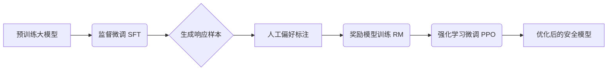

# Ollama

```bash
[root@server01 deepseek]#docker run -itd --name=ollama -v /software/deepseek:/root/.ollama -p 1234:11434 ollama/ollama:latest
[root@server01 deepseek]# docker exec -it 9b1bd1dc1a0a /bin/bash
root@9b1bd1dc1a0a:/# ollama pull deepseek-r1:32b
```

# 环境

## GPU驱动

```markdown
https://www.nvidia.cn/drivers/lookup/

Data Center / Tesla
A-Series
NVIDIA A100
Linux 64-bit
12.4
Chinese (Simplified)
```

## Docker

- buildkit

  ```bash
  # 二级制安装的docker，在打镜像的时候如果想用--mount=type=cache功能的话，则必须进行以下设置
  # https://github.com/docker/buildx?tab=readme-ov-file
  [root@server02 vllm]# cp buildx-v0.23.0.linux-amd64  /root/.docker/cli-plugins/
  [root@server02 vllm]# cd /root/..docker/cli-plugins/
  [root@server02 vllm]# mv buildx-v0.23.0.linux-amd64 docker-buildx
  [root@server02 vllm]# chmod +x /root/.docker/cli-plugins/docker-buildx
  [root@server02 vllm]# systemctl restart docker 
  [root@server02 vllm]# vi /etc/docker/daemon.json
  {
    "features": {
      "buildkit": true
    }
  }
  ```

- 配置生产仓库

  ```bash
  # https://docs.nvidia.com/datacenter/cloud-native/container-toolkit/latest/install-guide.html
  #curl -fsSL https://nvidia.github.io/libnvidia-container/gpgkey | sudo gpg --dearmor -#o /usr/share/keyrings/nvidia-container-toolkit-keyring.gpg \
  #  && curl -s -L https://nvidia.github.io/libnvidia-container/stable/deb/nvidia-#container-toolkit.list | \
  #    sed 's#deb https://#deb [signed-by=/usr/share/keyrings/nvidia-container-toolkit-#keyring.gpg] https://#g' | \
  #    sudo tee /etc/apt/sources.list.d/nvidia-container-toolkit.list
  
  root@763ac07c2af3:/vllm-workspace# curl -fsSL https://nvidia.github.io/libnvidia-container/gpgkey | sudo gpg --dearmor -o /usr/share/keyrings/nvidia-container-toolkit-keyring.gpg \
  >   && curl -s -L https://nvidia.github.io/libnvidia-container/stable/deb/nvidia-container-toolkit.list | \
  >     sed 's#deb https://#deb [signed-by=/usr/share/keyrings/nvidia-container-toolkit-keyring.gpg] https://#g' | \
  >     sudo tee /etc/apt/sources.list.d/nvidia-container-toolkit.list
  ```

  

- 离线下载 nvidia-container-toolkit 组件

  ```bash
  #apt-get install --reinstall --download-only
  #功能
  #下载指定包及其所有依赖项，但不会安装或重新安装。
  #--reinstall 表示强制重新下载（即使本地已安装或存在缓存）。
  #--download-only 表示仅下载，不执行安装。
  
  #特点
  #递归下载所有依赖：会自动下载目标包及其依赖的所有包（包括间接依赖）。
  #需要 root 权限：必须使用 sudo 执行。
  #保存路径：下载的 .deb 文件默认存储在 /var/cache/apt/archives/。
  #适用场景：为离线安装准备完整的包和依赖项。
  
  #apt-cache depends
  #分步解析
  #核心命令：查询包的依赖关系。
  #--recurse：递归查询所有层级的依赖（直接依赖、间接依赖的依赖等）。
  #
  #过滤无关信息
  #--no-recommends：排除“推荐”安装的包（非必需）。
  #--no-suggests：排除“建议”安装的包（非必需）。
  #--no-conflicts：忽略冲突包（避免干扰）。
  #--no-breaks：忽略破坏性依赖（避免干扰）。
  #--no-replaces：忽略替换性依赖（避免干扰）。
  #--no-enhances：忽略增强性依赖（非必需）。
  #
  #目标包名
  #nvidia-container-toolkit：要分析的包。
  #
  #grep "^\w"
  #过滤输出：仅保留以字母/数字（即依赖包名）开头的行。
  #例如，过滤掉 Depends:、PreDepends: 等描述性行。
  #
  #sort -u
  #排序并去重：确保依赖包列表唯一且有序。
  
  root@763ac07c2af3:/vllm-workspace# apt-get install --reinstall --download-only $(apt-cache depends --recurse --no-recommends --no-suggests --no-conflicts --no-breaks --no-replaces --no-enhances nvidia-container-toolkit | grep "^\w" | sort -u)
  ```

  ```bash
  # centos
  [root@server01 ~]# curl -s -L https://nvidia.github.io/libnvidia-container/stable/rpm/nvidia-container-toolkit.repo |   sudo tee /etc/yum.repos.d/nvidia-container-toolkit.repo
  [root@server01 ~]# yumdownloader --resolve --destdir=/software/nvidia-container-toolkit  nvidia-container-toolkit
  ```

- 离线安装nvidia-container-toolkit 

  ```bash
  root@763ac07c2af3:/vllm-workspace# dpkg -i /home/nfs-pkgs/*.deb
  ```

  ```bash
  [root@server01 ~]# rpm -ivh *
  ```

- docker 配置使用 nvidia-runtime

  新版本

  ```bash
  [root@server01 deepseek]# nvidia-ctk runtime configure --runtime=docker
  [root@server01 deepseek]# systemctl restart docker
  ```

  老版本

  需要手动在 /etc/docker/daemon.json 中增加配置，指定使用 nvidia 的 runtime。

  ```json
  "default-runtime": "nvidia",
  "runtimes": {
      "nvidia": {
          "path": "/usr/bin/nvidia-container-runtime",
          "runtimeArgs": []
      }
  }
  ```

- 错误解析

  ```bash
  # 1、在安装完驱动、docker以及nvidia-container-toolkit后，用docker创建容器时出现如下报错,原因是gpu的持久模式(nvidia-persistenced daemon)并未开启
  [root@server01 deepseek]# docker: Error response from daemon: failed to create shim task: OCI runtime create failed: runc create failed: unable to start container process: error during container init: error running hook #0: error running hook: exit status 1, stdout: , stderr: Auto-detected mode as 'legacy' nvidia-container-cli: initialization error: driver rpc error: timed out: unknown.
  # 可以用nvidia-smi -a查询自己的 Persistence Mode 是否开启、同时也可以用nvidia-smi
  # 解决方案：使用root权限执行如下命令：
  [root@server01 deepseek]# nvidia-smi -pm ENABLED
  
  # 2、nvidia-docker Failed to initialize NVML: Unknown Error
  [root@server01 deepseek]# docker run --rm --runtime=nvidia --gpus all centos nvidia-smi
  [root@server01 deepseek]# Failed to initialize NVML: Unknown Error
  # 解决方案：
  [root@server01 deepseek]# vim /etc/nvidia-container-runtime/config.toml
  # 设置 no-cgroups = false，然后保存
  [root@server01 deepseek]# systemctl restart docker
  ```

- 启动容器时增加 --gpu 参数


# 传统大模型训练流程

## Pre training

预训练：Base model

预训练利用大量无标签或弱标签的数据，通过某种算法模型进行训练，得到一个初步具备通用知识或能力的模型。

## Supervised fine tuning

监督式微调：Instruct model

尽管预训练模型已经在大规模数据集上学到了丰富的通用特征和先验知识，但这些特征和知识可能并不完全适用于特定的目标任务。微调通过在新任务的少量标注数据上进一步训练预训练模型，使模型能够学习到与目标任务相关的特定特征和规律，从而更好地适应新任务。

## Preference alignment

偏好对齐：chat model

在很多应用场景下有监督微调就已经够用了，但对于一些面向用户的公众模型，偏好对齐还是很有必要的（不然模型说了什么不该说的话可能这个产品甚至公司都要完蛋）。比较经典的偏好对齐的做法就是基于人类反馈的强化学习（Reinforcement Learning from Human Feedback, RLHF）那一套，根据人类偏好/反馈数据训练一个“奖励模型”，并使用该模型作为强化学习中的奖励函数，再通过类似PPO之类的强化学习算法来优化大语言模型的输出。不过对于大多数非公司级的大语言模型来说，不愿意折腾RLHF，毕竟偏好数据不好收集、还要额外训一个奖励模型、还要搞训练不稳定的强化学习。这些成本都是很高的。

## TRL

TRL（Transformer Reinforcement Learning）训练的三个阶段：监督微调（SFT）、奖励模型训练（Reward Modeling）和强化学习微调（PPO）。这三个阶段是逐步递进的关系，共同完成基于人类反馈的强化学习（RLHF）过程。

|        阶段         |                             目标                             |            输入            |       输出       |      所需模型/组件       |
| :-----------------: | :----------------------------------------------------------: | :------------------------: | :--------------: | :----------------------: |
|   监督微调 (SFT)    | 让预训练模型适应特定任务或领域，使其能根据给定的指令生成合理的内容 |      指令-输出对数据       | 微调后的基础模型 |       基础语言模型       |
|  奖励模型训练 (RM)  | 将人类偏好转化为可量化的奖励信号，使强化学习可行（人类无法实时反馈） | 成对的候选回答（人类偏好） |     奖励模型     |    SFT 模型 + RM 模型    |
| 强化学习微调 (RLHF) | 在RM的指导下，通过试错不断改进策略，生成更符合人类偏好的回答。 |       提示（prompt）       |  最终 RLHF 模型  | RM 模型 + PPO/DPO 等算法 |

1. 监督微调（Supervised Fine-Tuning, SFT）

   使用高质量的标注数据（通常是人工编写的回答）对预训练语言模型进行微调，使模型初步具备完成特定任务（如对话、问答）的能力。SFT是RLHF的起点。它为后续的奖励模型训练和PPO提供了一个基础模型。没有SFT，直接进行强化学习微调可能会因为模型行为过于随机而难以训练。

   例子：假设我们想训练一个帮助写代码的AI助手。我们收集了这样的数据：
   输入（Prompt）: "用Python写一个快速排序函数。"
   输出（Response）: "def quicksort(arr): ... " （人工编写的代码）
   用这些数据微调预训练模型（如Llama-3），使模型学会如何根据问题生成代码。

2. 奖励模型训练（Reward Modeling）

   训练一个能够根据人类偏好对模型生成的回答进行打分的模型。这个奖励模型将替代人类，在强化学习阶段提供即时反馈。奖励模型是连接人类偏好和强化学习的桥梁。它通过学习人类对多个回答的偏好（例如，哪个回答更好），从而能够为任何生成的回答打分。这个奖励模型将在PPO阶段作为评判标准，指导策略模型（即我们要优化的模型）的学习方向。

   例子：继续代码助手的例子；我们收集偏好数据：对于同一个问题（Prompt），我们让基础模型（SFT后的模型）生成多个回答，然后让人工标注哪个回答更好。例如：
   Prompt: "用Python写一个快速排序函数。"
   回答A: 一个正确但效率不高的实现（冒泡排序）
   回答B: 一个正确且高效的快速排序实现
   人工标注：回答B更好。
   奖励模型训练的目标是学习一个函数：RM(Prompt, Response) → 分数（标量）。它要能够学会：对于同一个Prompt，给回答B的打分高于回答A。

3. 强化学习微调（PPO）

   使用强化学习（具体是PPO算法）优化策略模型（即SFT后的模型），使其生成的回答在奖励模型看来得分更高，从而更符合人类偏好。PPO阶段将SFT模型作为初始策略，同时固定奖励模型作为环境反馈。通过不断生成回答、获得奖励、更新策略，模型逐步学习生成更高质量的回答。为了防止模型过度优化（只迎合奖励模型而偏离正常语言能力），我们通常保留一个参考模型（即未经过PPO训练的SFT模型），通过KL散度惩罚来约束策略模型不要偏离参考模型太远。

   例子：继续代码助手。
   我们有一个Prompt: "用Python写一个快速排序函数。"
   PPO训练步骤：
   1. 策略模型根据这个Prompt生成一个回答（比如，生成了一个正确的快速排序函数，但变量命名不规范）。
   2. 我们将这个回答输入奖励模型，得到一个分数（比如7分）。
   3. 同时，参考模型（SFT模型）也会生成一个回答（比如，变量命名规范但算法效率一般）。
   4. 计算策略模型生成回答的奖励（包括奖励模型分数和KL惩罚，例如：最终奖励 = 7 - β * KL(策略模型||参考模型)）。
   5. 使用PPO算法更新策略模型，使得它未来更可能生成高奖励的回答（即同时满足：高质量代码、且不过于偏离参考模型）。

监督微调(SFT) → 使用高质量的指令数据微调一个预训练的语言模型；奖励模型训练(RM) ← 使用人类标注的偏好数据（如两个回答之间选择更好的一个）训练一个奖励模型；强化学习微调(PPO) → 使用近端策略优化（PPO）等算法，利用奖励模型来优化SFT模型。



- SFT 就像学生学习课本知识，知道该怎么回答问题；
- RM 就像老师评分系统，知道什么样的答案更好；
- RLHF 就是学生根据老师的反馈不断改进答题能力，直到得到高分。

# PEFT

Parameter-Efficient Fine-Tuning

# training

```python
# Step1 导入相关模块
from datasets import load_dataset
from transformers import AutoTokenizer, AutoModelForCausalLM, DataCollatorForSeq2Seq, TrainingArguments, Trainer

import warnings
warnings.filterwarnings('ignore')

#import datasets
#datasets.__version__
#'3.6.0'
#import transformers
#transformers.__version
#'4.51.1'
```


