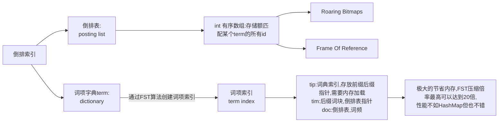

# 前言

apache所有软件的下载地址（包含各种历史版本）：

https://archive.apache.org/dist/

# Zookeeper

## 概念

Zookeeper是一个开源的分布式协调服务器，主要用来解决分布式集群中应用系统的一致性问题和数据管理问题

## 特点

Zookeeper本质上是一个分布式文件系统，适合存放小文件，也可以理解为一个数据库，Zookeeper中存储的其实是一个又一个Znode，Znode是Zookeeper中的节点。

1. Znode是有路径的，例如/data/host1，/data/host2，这个路径也可以理解为是Znode的Name
2. Znode也可以携带数据，例如说某个Znode的路径是/data/host1，其值是一个字符串"192.168.0.1"

正因为Znode的特性，所以Zookeeper可以对外提供出一个类似于文件系统的视图，可以通过操作文件系统的方式操作Zookeeper

1. 使用路径获取Znode
2. 获取Znode携带的数据
3. 修改Znode携带的数据
4. 删除Znode
5. 添加Znode

## 架构

### Leader

一个Zookeeper集群同一时间只会有一个实际工作的Leader，它会发起并维护与各Follwer及Observer间的心跳。所有的写操作必须要通过Leader完成再由Leader将写操作广播给其他服务器。

1. 集群的核心，集群内部各个服务器的调度者
2. 负责进行投票选举
3. 处理事务性（写操作）请求
4. 参与集群投票

### Follwer

一个Zookeeper集群可能同时存在多个Follwer，它会响应Leader的心跳。Follwer可直接处理并返回客户端的读请求，同时会将写请求转发给Leader处理，并且负责在Leader处理写请求时对请求进行投票。

1. 接受客户端请求，并向客户端返回结果
2. 处理客户端非事物性（读操作）请求
3. 转发事务性请求给Leader
4. 参与投票选举

### Observer

观察者角色与Follwer类似，但无投票权。

1. 接受客户端请求，并向客户端返回结果
2. 处理客户端非事物性（读操作）请求
3. 转发事务性请求给Leader
4. 不参与投票选举

## 应用场景

### 数据发布/订阅

发布/订阅一般有两种设计模式：推模式和拉模式，服务端主动将数据更新发送给所有订阅的客户端称为推模式；客户端主动请求获取最新数据称为拉模式。

Zookeeper采用了推拉结合的模式，客户端向服务器注册自己需要关注的节点，一旦该节点数据发生变更，那么服务器就会向相应的客户端推送Watcher事件通知，客户端接收到此通知后，主动到服务端获取最新的数据。

### 命名服务

命名服务是分布式系统中较为常见的一类场景，分布式系统中，被命名的实体通常可以是集群中的机器、提供的服务地址或远程服务对象等，通过命名服务，客户端可以根据指定名字来获取资源的实体，在分布式环境中，上层应用仅仅需要一个全局唯一名字。Zookeeper可以实现一套分布式全局唯一ID的分配机制。

### 分布式协调/通知

ZooKeeper中特有Watcher注册与异步通知机制，能够很好的实现分布式环境下不同系统之间的通知与协调，实现对数据变更的实时处理。使用方法通常是不同系统都对ZooKeeper上同一个Znode进行Watcher注册，监听Znode的变化（包括Znode本身内容及子节点的），若数据节点发生了变化，那么所有订阅该节点的客户端都能够接收到相应的Watcher通知，并作出相应处理。

在大多数分布式系统中，系统间的通信主要包括：心跳检测、工作进度汇报和系统调度。

### 分布式锁

分布式锁用于控制分布式系统之间同步访问共享资源的一种方式，可以保证不同系统访问一个或一组资源时的一致性，主要分为排它锁和共享锁。

#### 排它锁

又称写锁或者独占锁，若事物T1对数据对象O1加上了排它锁，那么在整个加锁期间，只允许事物T1对O1进行读取和更新操作，其他任何事物都不能再对这个数据对象进行任何类型的操作，直到T1释放了排它锁。

##### 定义锁

```
/exclusive_lock/lock
```

##### 实现方式

利用zookeeper的同级节点的唯一性特性，在需要获取排他锁时，所有的客户端试图通过调用create()接口，在/exclusive_lock节点下创建临时子节点/exclusive_lock/lock，最终只有一个客户端能创建成功，那么此客户端就获得了分布式锁。同时，所有没有获取到锁的客户端可以在/exclusive_lock节点上注册一个子节点变更的watcher监听事件，以便重新争取获得锁。

#### 共享锁

又称读锁。如果事务T1对数据对象O1加上了共享锁，那么当前事务只能对O1进行读取操作，其他事务也只能对这个数据对象加共享锁，直到该数据对象上的所有共享锁都释放。

##### 定义锁

```
/shared_lock/[hostname]-请求类型W/R-序号
```

##### 实现方式

1. 客户端调用create方法创建类似定义锁方式的临时顺序节点。
2. 客户端调用getChildren接口来获取所有已创建的子节点列表。
3. 判断是否获得锁，对于读请求如果所有比自己小的子节点都是读请求或者没有比自己序号小的子节点，表明已经成功获取共享锁，同时开始执行度逻辑。对于写请求，如果自己不是序号最小的子节点，那么就进入等待。
4. 如果没有获取到共享锁，读请求向比自己序号小的最后一个写请求节点注册watcher监听，写请求向比自己序号小的最后一个节点注册watcher监听。

#### 释放锁

在获取锁的客户端宕机或者正常完成业务逻辑都会导致临时节点的删除，此时，所有在/exclusive_lock节点上注册监听的客户端都会收到通知，可以重新发起分布式锁获取。

### 分布式队列

## 选举机制

### Serverid

编号越大在选择算法中的权重越大。比如有三台服务器，编号分别是1,2,3；则myid为3的服务器权重最大。

### Zxid

服务器中存放的最大数据ID。值越大说明数据越新，在选举算法中数据越新权重越大。

### Epoch

逻辑时钟。或者叫投票的次数，同一轮投票过程中的逻辑时钟值是相同的。每投完一次票这个数据就会增加，然后与接收到的其它服务器返回的投票信息中的数值相比，根据不同的值做出不同的判断。

### Server状态

选举状态：

1. LOOKING，竞选状态。
2. FOLLOWING，随从状态，同步leader状态，参与投票。
3. OBSERVING，观察状态,同步leader状态，不参与投票。
4. LEADING，领导者状态。

### 选举流程

#### 流程

##### 发出投票

节点启动时，都会将自己作为leader服务器来进行投票。

##### 接受各个服务器的投票

集群的每个服务器收到投票后，首先判断该投票的有效性，如检查是否是本轮投票，是否来自LOOKING状态的服务器。

##### 处理投票

针对每个投票，服务器都需要将别人的投票和自己的投票进行PK，PK规则如下：

优先检查ZXID：ZXID比较大的服务器优先作为leader。

如果ZXID相同：比较Serverid，Serverid较大的服务器作为leader服务器。

##### 统计投票

每次投票后，服务器都会统计投票信息，判断是否有机器得到的票数已经超过半数，如果有的话该机器当选leader。

##### 改变服务器状态

一旦确定了leader，每个服务器就会更新自己的状态，如果是follower，那么就变更为FOLLOWING，如果是leader，就变更为LEADING。


#### 集群刚启动

1. 服务器1启动：发起一次选举，服务器1投自己一票，此时服务器1票数一票，不够半数以上（3票），选举无法完成。投票结果：服务器1为1票。服务器1状态保持为LOOKING。

2. 服务器2启动：发起一次选举，服务器1和2分别投自己一票，此时服务器1发现服务器2的id比自己大，更改选票投给服务器2。投票结果：服务器1为0票，服务器2为2票。服务器1，2状态保持LOOKING

3. 服务器3启动：发起一次选举，服务器1、2、3先投自己一票，然后因为服务器3的id最大，两者更改选票投给为服务器3；投票结果：服务器1为0票，服务器2为0票，服务器3为3票。此时服务器3的票数已经超过半数（3票），服务器3当选Leader。服务器1，2更改状态为FOLLOWING，服务器3更改状态为LEADING。

4. 服务器4启动：发起一次选举，此时服务器1，2，3已经不是LOOKING 状态，不会更改选票信息。交换选票信息结果：服务器3为3票，服务器4为1票。此时服务器4服从多数，更改选票信息为服务器3。服务器4并更改状态为FOLLOWING。

5. 服务器5启动：与服务器4一样投票给3，此时服务器3一共5票，服务器5为0票。服务器5并更改状态为FOLLOWING。

6. 最终的结果：服务器3是 Leader，状态为 LEADING；其余服务器是 Follower，状态为 FOLLOWING。

#### 运行时期

在Zookeeper运行期间Leader和非Leader各司其职，当有非Leader服务器宕机或加入不会影响Leader，但是一旦Leader服务器挂了，那么整个Zookeeper集群将暂停对外服务，会触发新一轮的选举。初始状态下服务器3当选为Leader，假设现在服务器3故障宕机了，此时每个服务器上zxid可能都不一样，server1为99，server2为102，server4为100，server5为101。

集群 Leader 节点故障运行期选举与初始状态投票过程基本类似，大致可以分为以下几个步骤：

1. 状态变更。Leader 故障后，余下的非 Observer 服务器都会将自己的服务器状态变更为LOOKING，然后开始进入Leader选举过程。

2. 每个Server会发出投票。

3. 接收来自各个服务器的投票，如果其他服务器的数据比自己的新会改投票。

4. 处理和统计投票，每一轮投票结束后都会统计投票，超过半数即可当选。

5. 改变服务器的状态，宣布当选。

运行器Leader故障后选举流程

1. 第一次投票，每台机器都会将票投给自己。

2. 接着每台机器都会将自己的投票发给其他机器，如果发现其他机器的zxid比自己大，那么就需要改投票重新投一次。比如server1 收到了三张票，发现server2的xzid为102，pk一下发现自己输了，后面果断改投票选server2为老大。

##  安装

Zookeeper官网：https://zookeeper.apache.org/
下载地址：https://archive.apache.org/dist/zookeeper/

### 修改配置文件

```bash
[root@server01 conf]# cp zoo_sample.cfg zoo.cfg
[root@server01 conf]# vim zoo.cfg

# 修改如下内容
# 保留多少个快照
autopurge.snapRetainCount=3
# 日志多少个小时清理一次
autopurge.purgeInterval=1
dataDir=/opt/zookeeper/data
dataLogDir=/opt/zookeeper/log
# 集群中服务器地址
# 其中id为一个数字，表示zk进程的id，这个id也是dataDir目录下myid文件的内容
# host是该zk进程所在的IP地址，port1表示follower和leader交换消息所使用的端口，port2表示选举leader所使用的端口。
server.1=server01:2888:3888
server.2=server02:2888:3888
server.3=server03:2888:3888
```

### 添加myid配置

```bash
[root@server01 conf]# mkdir -p -m 755 /opt/zookeeper/data
[root@server01 conf]# mkdir -p -m 755 /opt/zookeeper/log
[root@server01 conf]# cd /opt/zookeeper/data
[root@server01 conf]# vim myid

# 添加如下内容
1
# 修改其他机器的配置文件：在server02上：修改myid为：2；在server03上：修改myid为：3
```

### 启动集群

```bash
# 启动
[root@server01 conf]# zkServer.sh start
# 查看集群状态，主从信息
[root@server01 conf]# zkServer.sh status
```

## 数据模型

Zookeeper的数据模型，在结构上和标准文件系统非常相似，拥有一个层次的命名空间，都是采用树形层次结构。Zookeeper树中的每个节点被称为一个Znode。和文件系统的目录树一样，Zookeeper树中的每个节点可以拥有子节点。

1. Znode 兼具文件和目录两种特点。既像文件一样维护着数据、元信息、ACL、时间戳等数据结构，又像目录一样可以作为路径标识的一部分，并可以具有子Znode。用户对Znode具有增、删、查、改等操作。

2. Znode存储数据大小的限制。Zookeeper虽然可以关联一些数据，但并没有被设计为常规的数据库或者大数据存储，相反的是，它用来管理调度数据，比如分布式应用中的配置文件信息、状态信息、汇集位置等等。这些数据的共同特征是它们都是很小的数据，通常以KB为大小单位，Zookeeper的服务器和客户端都被设计为严格检查并限制每个Znode的数据大小最多1M，常规使用中应该远小于此值。

3. Znode通过路径引用。如同Unix中的文件路径，路径必须是绝对的。因此他们必须由斜杠符开头。除此之外，他么必须是唯一的，也就是说每一个路径只有一个表示，因此这些路径不能改变。/zookeeper节点是默认节点，用来保存关键配置信息。

4. 每个Znode由3部分组成：

   stat：此为状态信息，描述为该Znode的版本，权限等信息；

   data：与该Znode关联的数据；

   children：该Znode下的子节点。

## 节点类型

### 临时节点

该节点的生命周期依赖于创建它们的会话。一旦会话结束，临时节点就将被自动删除，当然也可以手动删除。临时节点不允许拥有子节点。（ephemeral）

### 永久节点

该节点的生命周期不依赖于会话，并且只有在客户端显示执行删除操作的时候，他们才能被删除。（persistent）

### 序列化

Znode还有一个序列化特性，如果创建的时候指定的话，该Znode的名字后面会自动追加一个不断增加的序列号。序列号对于此节点的父节点来说是唯一的，这样便会记录每个子节点创建的先后顺序。它的格式为"%10d"(10位数字，没有数值的数位用0补充，例如“0000000001”)。

### 目录节点形式

1. PERSISTENT

   永久节点

2. PERSISTENT_SEQUENTIAL

   永久节点、序列化

3. EPHEMERAL

   临时节点

4. EPHEMERAL_SEQUENTIAL

   临时节点、序列化

## 命令操作

1. 创建永久节点：create /hello world
2. 创建临时节点：create -e /abc 123
3. 创建永久序列化节点：create -s /zhangsan boy
4. 创建临时序列化节点：create -e -s /lisi boy
5. 修改节点数据：set /hello zookeeper
6. 获取节点信息：get /hello
   - dataVersion：数据版本号，每次对节点进行set操作，dataVersion都会增加1。
   - cversion：子节点的版本号。当Znode的子节点有变化时，cversion的值就会增加1。
   - aclVersion：ACL的版本号。
   - cZxid：Znode创建时的事物id。
   - mZxid：Znode被修改的事物id，即每次对Znode的修改都会更新mZxid。对于Zookeeper来说，每次的变化都会产生一个唯一的事物id，zxid(Zookeeper Transaction Id)。通过zxid可以确定更新操作的先后顺序。例如，如果zxid1小于zxid2说明zxid1操作先于zxid2发生，zxid对于整个zk都是唯一的。
   - ctime：节点创建时的时间戳
   - mtime：节点最新一次更新发生时的时间戳
   - ephemeralOwner：如果该节点为临时节点，ephemeralOwner的值表示与该节点绑定的session id，如果不是ephemeralOwner的值为0。
7. 删除节点(如果要删除的节点有子Znode则无法删除)：delete /hello
8. 删除节点(如果有子Znode则递归删除)：rmr /abc
9. 列出历史记录：histroy

## Watch机制

类似于数据库的触发器，对某个Znode设置Watcher，当Znode发生变化的时候，WatchManager会调用对应的Watcher。

当Znode发生删除、修改、创建、子节点修改的时候，对应的Watcher会得到通知。

Watcher的特点：

1. 一个Watcher只会被触发一次，如果需要继续监听，则需要再次添加Watcher
2. Watcher得到的事件是被封装过的，包括三个内容：keeperState，eventType，path

### keeperState

| 属性          | 说明                     |
| ------------- | ------------------------ |
| SyncConnected | 客户端与服务器正常连接时 |
| Disconnected  | 客户端与服务器断开连接时 |
| Expired       | 会话session失效时        |
| AuthFailed    | 身份认证失败时           |

### eventType

| 枚举类型                       | 说明                             |
| ------------------------------ | -------------------------------- |
| None                           | 无                               |
| NodeCreated	Watcher         | 监听的数据节点被创建时           |
| NodeDeleted	Watcher         | 监听的数据节点被删除时           |
| NodeDataChanged	Watcher     | 监听的数据节点内容发生变更时     |
| NodeChildrenChanged	Watcher | 监听的数据节点的子节点发生变化时 |

## JavaAPI操作

可以使用一套Zookeeper客户端框架Curator，可以解决很多Zookeeper客户端非常底层的细节开发问题。

Curator包含几个包：

1. curator-framework：对zookeeper的底层api的一些封装；
2. curator-recipes：封装了一些高级特性，如：Cache事件监听、选举、分布式锁、分布式计数器等。

# Kafka

## 消息队列

### 优点

1. 解耦

   允许你独立的扩展或修改两边的处理过程，只要确保它们遵守同样的接口约束。

2. 可恢复性

   系统的一部分组件失效时，不会影响到整个系统。消息队列降低了进程间的耦合度，所

   以即使一个处理消息的进程挂掉，加入队列中的消息仍然可以在系统恢复后被处理。

3. 缓冲

   有助于控制和优化数据流经过系统的速度，解决生产消息和消费消息的处理速度不一致

   的情况。

4. 灵活性 & 峰值处理能力

   在访问量剧增的情况下，应用仍然需要继续发挥作用，但是这样的突发流量并不常见。

   如果为以能处理这类峰值访问为标准来投入资源随时待命无疑是巨大的浪费。使用消息队列

   能够使关键组件顶住突发的访问压力，而不会因为突发的超负荷的请求而完全崩溃。

5. 异步通信

   很多时候，用户不想也不需要立即处理消息。消息队列提供了异步处理机制，允许用户

   把一个消息放入队列，但并不立即处理它。想向队列中放入多少消息就放多少，然后在需要

   的时候再去处理它们。

### 消息队列的两种模式

#### 点对点模式（一对一，消费者主动拉取数据，消息收到后消息清除）

消息生产者生产消息发送到Queue中，然后消息消费者从Queue中取出并且消费消息。消息被消费以后，queue中不再有存储，所以消息消费者不可能消费到已经被消费的消息。Queue支持存在多个消费者，但是对一个消息而言，只会有一个消费者可以消费。

#### 发布/订阅模式（一对多，消费者消费数据之后不会清除消息）

消息生产者（发布）将消息发布到topic中，同时有多个消息消费者（订阅）消费该消息。和点对点方式不同，发布到topic的消息会被所有订阅者消费。

### Kafka基础架构

1. Producer：消息生产者，就是向kafka broker发消息的客户端；
2. Consumer：消息消费者，向kafka broker取消息的客户端；
3. Consumer Group（CG）：消费者组，由多个consumer组成。消费者组内每个消费者负责消费不同分区的数据，一个分区只能由一个组内消费者消费；消费者组之间互不影响。所有的消费者都属于某个消费者组，即消费者组是逻辑上的一个订阅者。
4. Broker：一台kafka服务器就是一个broker。一个集群由多个broker组成。一个broker可以容纳多个topic
5. Topic：可以理解为一个队列，生产者和消费者面向的都是一个topic；
6. Partition：为了实现扩展性，一个非常大的topic可以分布到多个broker（即服务器）上，一个topic可以分为多个partition，每个partition是一个有序的队列；
7. Replica：副本，为保证集群中的某个节点发生故障时，该节点上的partition数据不丢失，且kafka仍然能够继续工作，kafka提供了副本机制，一个topic的每个分区都有若干个副本，一个leader和若干个follower。
8. leader：每个分区多个副本的“主”，生产者发送数据的对象，以及消费者消费数据的对象都是leader。
9. follower：每个分区多个副本中的“从”，实时从leader中同步数据，保持和leader数据的同步。leader发生故障时，某个follower会成为新的follower。

### Kafka命令行操作

```bash
#下面是kafka的基础配置项
broker.id=0
listeners=PLAINTEXT://server01:9092
log.dirs=/date/kafka/data
#后面加/kafka的目的是让之后关于kafka的信息都存放到zookeeper的/kafka目录下
zookeeper.connect=server01:2181,server02:2181,server03:2181/kafka
```

```bash
#启动集群
kafka-server-start.sh -daemon config/server.properties
#关闭集群
kafka-server-stop.sh stop
#查看当前服务器中的所有topic
kafka-topics.sh --zookeeper server01:2181/kafka --list
#查看某个Topic的详情
kafka-topics.sh --zookeeper server01:2181/kafka --describe --topic gentleduo-topic-1
#创建topic
kafka-topics.sh --zookeeper server01:2181/kafka --create --replication-factor 2 --partitions 3 --topic gentleduo-topic-1
选项说明：
--topic 定义topic名
--replication-factor 定义副本数
--partitions 定义分区数
#删除topic（需要server.properties中设置delete.topic.enable=true否则只是标记删除。）
kafka-topics.sh --zookeeper server01:2181/kafka --delete --topic gentleduo-topic-1
#修改分区数
kafka-topics.sh --zookeeper server01:2181/kafka --alter --topic first --partitions 6
#发送消息
kafka-console-producer.sh --broker-list server01:9092 --topic gentleduo-topic-1
#消费消息（--from-beginning：会把主题中以往所有的数据都读取出来。）
kafka-console-consumer.sh --zookeeper server01:2181/kafka --topic gentleduo-topic-1
kafka-console-consumer.sh --bootstrap-server server01:9092 --topic gentleduo-topic-1
kafka-console-consumer.sh --bootstrap-server server01:9092 --from-beginning --topic gentleduo-topic-1
#查询消费者组
kafka-consumer-groups.sh --bootstrap-server server01:9092 --list
#查询消费者组详情
#LogEndOffset 下一条将要被加入到日志的消息的位移
#CurrentOffset 当前消费的位移
#LAG 消息堆积量：消息中间件服务端中所留存的消息与消费掉的消息之间的差值即为消息堆积量也称之为消费滞后量
kafka-consumer-groups.sh --bootstrap-server server01:9092 --describe --group groupname
#通过kafka-dump-log.sh查看.index及.log中的内容
kafka-dump-log.sh --files 00000000000000000000.index
```

## Kafka架构

### 顺序写入和MMFile

Kafka的特性之一就是高吞吐率，但是Kafka的消息是保存或缓存在磁盘上的，一般认为在磁盘上读写数据是会降低性能的，但是Kafka即使是普通的服务器，Kafka也可以轻松支持每秒百万级的写入请求，超过了大部分的消息中间件，这种特性也使得Kafka在日志处理等海量数据场景广泛应用。Kafka会把收到的消息都写入到硬盘中，防止丢失数据。为了优化写入速度Kafka采用了两个技术：顺序写入和MMFile 。

#### 顺序写

在讨论顺序写之前，先梳理一下linux系统中用户程序读写文件时OS和硬件交互的内存模型：


##### 读文件

用户程序通过编程语言提供的读取文件api发起对某个文件读取。此时程序切换到内核态，用户程序处于阻塞状态。由于读取的内容还不在内核缓冲区中，导致触发OS缺页中断异常。然后由OS负责发起对磁盘文件的数据读取。读取到数据后，先存放在OS内核的主存空间，叫PageCache。然后OS再将数据拷贝一份至用户进程空间的主存ByteBuffer中。此时程序由内核态切换至用户态继续运行程序。程序将ByteBuffer中的内容读取到本地变量中，即完成文件数据读取工作。

如下所示为一典型Java读取某文件内容的用户编程代码。接下来详细解说读取文件过程。

```java
// 一次读多个字节
byte[] tempbytes = new byte[100];
int byteread = 0;
in = new FileInputStream(fileName);//①
ReadFromFile.showAvailableBytes(in);
// 读入多个字节到字节数组中，byteread为一次读入的字节数
while ((byteread = in.read(tempbytes)) != -1) { //②
    System.out.write(tempbytes, 0, byteread);
}
```

首先通过位置①的代码发起一个open的系统调用，程序由用户态切换到内核态。操作系统通过文件全路径名在文件目录中找到目标文件名对应的文件iNode标识ID，然后用这个iNode标识ID在iNode索引文件找到目标文件iNode节点数据并加载到内核空间中。这个iNode节点包含了文件的各种属性（创建时间，大小以及磁盘块空间占用信息等等）。然后再由内核态切换回用户态，这样程序就获得了操作这个文件的文件描述。接下来就可以正式开始读取文件内容了。然后再通位置②，循环数次获取固定大小的数据。通过发起read系统调用，操作系统通过文件iNode文件属性中的磁盘块空间占用信息得到文件起始位的磁盘物理地址。再从磁盘中将要取得数据拷贝到PageCache内核缓冲区。然后将数据拷贝至用户进程空间。程序由内核态切换回用户态，从而可以读取到数据，并放入上面代码中的临时变量tempbytes中。整个过程如下图所示：


至于上面说到的操作系统通过iNode节点中的磁盘块占用信息去定位磁盘文件数据。其细节过程如下图所示:


###### 根据文件路径从文件目录中找到iNode ID。

用户读取一个文件，首先需要调用OS中文件系统的open方法。该方法会返回一个文件描述符给用户程序。OS首先根据用户传过来的文件全路径名在目录索引数据结构中找到文件对应的iNode标识ID。目录数据是存在于磁盘上的，在OS初始化时就会加载到内存中，由于目录数据结构并不会很庞大，一次性加载驻留到内存也不是不可以或者部分加载，等需要的时候在从磁盘上调度进内存也可以。根据文件路径在目录中查找效率应该是很高的，因为目录本身就是一棵树，应该也是类似数据库的树形索引结构。所以它的查找算法时间复杂度就是O(logN)。iNode就是文件属性索引数据了。磁盘格式化时OS就会把磁盘分区成iNode区和数据区。iNode节点就包含了文件的一些属性信息，比如文件大小、创建修改时间、作者等等。其中最重要的是还存有整个文件数据在磁盘上的分布情况（文件占用了哪些磁盘块）。

###### 根据iNode ID从Inode索引中找到文件属性。

得到iNode标识的ID后，就可以去iNode数据中查找到对应的文件属性了,并加载到内存，方便后续读写文件时快速获得磁盘定位。iNode数据结构应该类似哈希结构了，key就是iNode标识ID，value就是具体某个文件的属性数据对象了。所以它的算法时间复杂度就是O(1)。系统中的文件它的文件属性（iNode）和它的数据正文是分开存储的。文件属性中有文件数据所在磁盘块的位置信息。

###### 根据文件属性中的磁盘空间块信息找到需要读取的数据所在的磁盘块的物理位置

文件属性也就是iNode节点这个数据结构，里面包含了文件正文数据在磁盘物理位置上的分布情况。磁盘读写都是以块为单位的。所以这个位置信息其实也就是一个指向磁盘块的物理地址指针。其结构图如下:


文件属性里就包含了文件正文数据占有磁盘所有信息。但是由于文件属性大小有限制，而文件大小没有限制。这样会导致磁盘块占用信息超出限制。所以最后一个磁盘数据项设计为特殊的作用。它是一个指向更多磁盘占用信息数据的指针。这些更多信息存放在普通的数据区。这样当文件iNode加载到内存后，可以把其他更多磁盘块信息一起加载进来。这样就避免了iNode索引文件太大的问题。后续的文件读写系统调用，由用户态切换至内核态。操作系统就可以根据文件数据的相对位置（偏移量）快速从iNode中的磁盘块占用数据结构中找到其对应的磁盘物理位置在哪里了。很明显这个数据结构类似哈希结构，其算法复杂度就是O(1)。比如我们现在讨论的读取数据。每次用户代码的api调用read方法时。由于时从头开始读取，所以OS就从上图中“磁盘块0”数据项开始迭代，获取对应的物理磁盘块起始地址开始读取数据并拷贝至PageCache缓冲区，再拷贝至用户进程缓冲区。这样用户代码就可以获取这些数据了。考虑到另外一种随机读的场景。我们并不是把整个文件从头开始读一遍。而是需要直接定位到文件的中间某个位置开始读取部分内容。如下所示：

```java
RandomAccessFile raf=new RandomAccessFile(new File("D:\\3\\test.txt"), "r");   
//获取RandomAccessFile对象文件指针的位置，初始位置是0  
System.out.println("RandomAccessFile文件指针的初始位置:"+raf.getFilePointer());  
raf.seek(pointe);//移动文件指针位置  
byte[]  buff=new byte[1024];  
//用于保存实际读取的字节数  
int hasRead=0;  
//循环读取  
while((hasRead=raf.read(buff))>0){  
    //打印读取的内容,并将字节转为字符串输入  
    System.out.println(new String(buff,0,hasRead));       
}
```

程序代码调用seek方法直接定位到某个文件相对位置开始读取内容。实际上就是调用了OS管理文件的系统调用seek函数。这个系统调用需要传递一个文件相对位置也就是偏移量，不是指磁盘的物理位置。文件的相对位置偏移量是从0开始的，结束位置和文件的大小字节数相等。操作系统拿到这个偏移量后，就可以计算出文件所属的逻辑块编号。因为每个块是固定大小的，所以能计算出来。通过文件属性的逻辑磁盘块信息就能得到磁盘块的物理位置。从而可以快速直接定位到磁盘物理块读取到需要的数据。这里说的逻辑块和物理块的概念是有区别的。逻辑块属于当前的文件从0开始编号，物理块才是磁盘真正的存放数据的区域，属于全局的。编号自然不是从0开始的。

##### 写文件

用户程序通过编程语言提供的写入文件api发起对某个文件写入磁盘。此时程序切换到内核态用户程序处于阻塞状态，由OS负责发起对磁盘文件的数据写入。用户写入数据后，并不是直接写到磁盘的，而是先写到ByteBuffer中，然后再提交到PageCache中。最后由操作系统决定何时写入磁盘。数据写入PageCache中后，此时程序由内核态切换至用户态继续运行。用户程序将数据写入内核的PageCache缓冲区后，即认为写入成功了。程序由内核态切换回用于态，可以继续后续的工作了。PageCache中的数据最终写入磁盘是由操作系统异步提交至磁盘的。一般是定时或PageCache满了的时候写入。如果用户程序通过调用flush方法强制写入，则操作系统也会服从这个命令。立即将数据写入磁盘然后由内核态切换回用户态继续运行程序。但是这样做会损失性能，但可以确切的知道数据是否已经写入磁盘了。

写文件的过程和读文件差不多，相关的知识点也在读文件中已经顺带描述了。就不在赘述了。这里就说些特别需要注意的点就行。


###### 根据空闲块索引找到可以写入的物理位置并写入

如上图所示，OS写文件内容时首先要访问磁盘空闲块索引表。这是个什么东西呢？由于磁盘很大，不可能每次写数据时，都让磁头从头到尾遍历一次才能找到空闲位置。这样效率可想而知的差劲。所以OS会把磁盘上的空闲块索引起来存放在磁盘某个位置上。后续磁盘存储和删除文件内容时都通过这个空闲块索引表快速定位，同时删除数据也会更新索引表增加空闲块。空闲块记录索引的实现常用有两种，一种是链表结构，还有一种是位图结构。这里就不详细讨论了。

###### 写入数据后更新iNode里的磁盘占用块索引

数据写入后，那么这个空闲块就被占用了，自然也就需要更新下iNode文件属性里的磁盘占用块索引数据了。前面说的写文件都是只讲了尾部追加这种方式。但是实际上可以通过RandomAccessFile类实现文件随机位置写功能。文件随机位置写不是直接在中间某个位置插入要写的内容，而是要先把插入位置后面的内容截取放入临时文件中。插入新内容后，再把临时文件内容尾部追加到原来的文件中来实现文件修改。代码如下所示：

```java
public static void insert(String fileName, long pos, String insertContent) throws IOException{
        File file = File.createTempFile("tmp", null);
        file.deleteOnExit();
        RandomAccessFile raf = new RandomAccessFile(fileName, "rw");
        FileInputStream fileInputStream = new FileInputStream(file);
        FileOutputStream fileOutputStream = new FileOutputStream(file);
        raf.seek(pos);
        byte[] buff = new byte[64];
        int hasRead = 0;
        while((hasRead = raf.read(buff)) > 0){
            fileOutputStream.write(buff);
        }
        raf.seek(pos);
        raf.write(insertContent.getBytes());
        //追加文件插入点之后的内容
        while((hasRead = fileInputStream.read(buff)) > 0){
            raf.write(buff, 0, hasRead);
        }
        raf.close();
        fileInputStream.close();
        fileOutputStream.close();
    }
```

按照上面的阐述，写入的文件内容完全可以存入磁盘上的一个新块，然后更新下iNode属性里的占用磁盘块索引数据即可。也不需要真的去移动磁盘上的所有数据块。看上去成本也很小，可为啥编程api却都不支持呢？答案可能是这样的。假如允许上面那种操作，如果一个很大的文本文件。你现在只是编辑了文本中间某个位置的一个字，即插入了一个文本字符。那么此时这个新增的文本内容就得在磁盘上找到一个新的块存储下来。这样是不是有点浪费空间呢？因为磁盘上的一个块只能分配给一个文件使用，块大小如果是64kb的话，一个字符也就占用了2个字节的空间。更要命的是这样一搞，使得原本满存状态的块，出现很多不连续的空洞。这样就会使得读取文件时数据是不连续的，系统需要额外信息记录这些中间的存储空洞。加大了读取难度。这就是我猜测的原因。实际上操作系统层面也没有这种操作插入的系统调用函数。故编程语言层面也就没法支持了。

操作系统层面给上层应用程序提供了写文件的两个系统调用。write和append，其中append是write的限制形式，即只能在文件尾部追加。而write虽然提供了随机位置写，但是并不是将新内容插入其中，而是覆盖原有的数据。我们平时使用Word文本编辑软件时，如果对一个很大的文件进行编辑，然后点击保存，你会发现很慢。同时你还能看到文件所在的目录下生成了一个新的处于隐藏状态的临时文件。这些现象也能说明我们上面的观点。即编辑文件时，需要一个成本很高的过程。如下图所示：


##### 总结

所以其实所有的中间件的顺序写，并不是磁盘存储时分配连续的空间给到文件，减少了磁盘寻道时间。事实上，磁盘从来都不会连续分配空间给哪个文件。这是现代文件系统的设计方案。用户程序写文件内容时，提交给OS的缓冲区PageCache后就返回了。实际这个内容存储在磁盘哪个位置是由OS决定的。OS会根据磁盘未分配空间索引表随机找一个空块把内容存储进去，然后更新文件iNode里的磁盘占用块索引数据。这样就完成了文件写入操作。所以append操作不是在磁盘上接着文件末尾内容所在块位置连续分配空间的。最多只能说逻辑上是顺序的。

所以顺序写真正快的原因是：它没有更新和删除操作，从而不要进行：把修改位置后面的内容截取放入临时文件中，插入新内容后，再把临时文件内容尾部追加到原来的文件中的操作(设想一下当文件越来越大的时候，写入临时文件，再将临时文件追加到原来的文件中的过程是很慢的)，而是一律追加到文件末尾，所以写入性能能大幅提升。

#### mmap

Kafka充分利用了现代操作系统分页存储来利用内存提高I/O效率。Memory Mapped Files(后面简称mmap)也称为内存映射文件，在64位操作系统中一般可以表示20G的数据文件，它的工作原理是直接利用操作系统的Page实现文件到物理内存的直接映射。完成MMP映射后，用户对内存的所有操作会被操作系统自动的刷新到磁盘上，极大地降低了IO使用率。


其他关于mmap的解释：

这个技术是操作系统给用户程序提供的一个系统调用函数。它把文件映射到OS内核缓冲区空间，同时共享给用户进程，也可以共享给多个用户进程。映射过程中不会产生实际的数据从磁盘真正调取动作，只有用户程序需要的时候才会调入部分数据。总之也是和普通文件读取一样按需调取。那么mmap技术为什么在读取数据时会比普通read操作快几个数量级呢？相对于普通读写操作的内存模型。用户程序要读取到磁盘上的数据。要经历4次内核态切换以及2次数据拷贝操作。那么mmap技术由于是和用户进程共享内核缓冲区，所以少了一次拷贝操作（数据从内核缓冲区到用户进程缓冲区）。从而大大提高了性能。如下图所示


> mmap具体的实现原理，有待于通过分析linux源码来验证

### ZeroCopy

Kafka服务器在响应客户端读取的时候，底层使用ZeroCopy技术，直接将磁盘无需拷贝到用户空间，而是直接将数据通过内核空间传递输出，数据并没有抵达用户空间。

传统IO操作

1. 用户进程调用read等系统调用向操作系统发出IO请求，请求读取数据到自己的内存缓冲区中。自己进入阻塞状态。
2. 操作系统收到请求后，进一步将IO请求发送磁盘。
3. 磁盘驱动器收到内核的IO请求，把数据从磁盘读取到驱动器的缓冲中。此时不占用CPU。当驱动器的缓冲区被读满后，向内核发起中断信号告知自己缓冲区已满。
4. 内核收到中断，使用CPU时间将磁盘驱动器的缓存中的数据拷贝到内核缓冲区中。
5. 如果内核缓冲区的数据少于用户申请的读的数据，重复步骤3跟步骤4，直到内核缓冲区的数据足够多为止。
6. 将数据从内核缓冲区拷贝到用户缓冲区，同时从系统调用中返回。完成任务


DMA读取

1. 用户进程调用read等系统调用向操作系统发出IO请求，请求读取数据到自己的内存缓冲区中。自己进入阻塞状态。

2. 操作系统收到请求后，进一步将IO请求发送DMA。然后让CPU干别的活去。

3. DMA进一步将IO请求发送给磁盘。

4. 磁盘驱动器收到DMA的IO请求，把数据从磁盘读取到驱动器的缓冲中。当驱动器的缓冲区被读满后，向DMA发起中断信号告知自己缓冲区已满。

5. DMA收到磁盘驱动器的信号，将磁盘驱动器的缓存中的数据拷贝到内核缓冲区中。此时不占用CPU。这个时候只要内核缓冲区的数据少于用户申请的读的数据，内核就会一直重复步骤3跟步骤4，直到内核缓冲区的数据足够多为止。

6. 当DMA读取了足够多的数据，就会发送中断信号给CPU。

7. CPU收到DMA的信号，知道数据已经准备好，于是将数据从内核拷贝到用户空间，系统调用返回。

   **跟IO中断模式相比，DMA模式下，DMA就是CPU的一个代理，它负责了一部分的拷贝工作，从而减轻了CPU的负担。DMA的优点就是：中断少，CPU负担低。**


常规IO

1. 文件在磁盘中数据被copy到内核缓冲区
2. 从内核缓冲区copy到用户缓冲区
3. 用户缓冲区copy到内核与socket相关的缓冲区。
4. 数据从socket缓冲区copy到相关协议引擎发送出去


网络IO：Zero拷贝

操作系统提供了sendfile系统调用来支持MMAP机制，即应用只需指定需要传输的磁盘文件句柄，然后通过sendfile系统实现磁盘文件读取和从socket传输出去，其中磁盘文件的读取和从socket传输出去都是通过sendfile系统调用在内核完成的，不需要在内核空间和用户空间进行数据拷贝，具体过程如下：

1. 应用指定需要传输的文件句柄和调用sendfile系统调用（第一次系统调用）；
2. 操作系统在内核读取磁盘文件拷贝到页缓存（第一次内存拷贝）；
3. 操作系统在内核将页缓存内容拷贝到网卡硬件缓存（第二次内存拷贝）。

**故整个过程涉及到一次sendfile系统调用，在内核态完成两次拷贝，在内核和用户空间之间不需要进行数据拷贝。**


- 所以 kafka 使用 sendfile 系统调用，具体为 Java 的 sendfile 系统调用API: FileChannel的transferTo, transferFrom，基于MMAP机制实现了磁盘文件内容的零拷贝传输（不需要在用户控件和内核空间进行数据拷贝）。
- 同时由于操作系统将磁盘文件内容加载到了内核页缓存，故消费者针对该磁盘文件的多次请求可以重复使用，避免重复在磁盘和内存之间进行数据拷贝。

### Kafka工作流程及文件存储机制

Kafka中消息是以topic进行分类的，生产者生产消息，消费者消费消息，都是面向topic的。topic是逻辑上的概念，而partition是物理上的概念，每个partition对应于一个log文件，该log文件中存储的就是producer生产的数据。Producer生产的数据会被不断追加到该log文件末端，且每条数据都有自己的offset。消费者组中的每个消费者，都会实时记录自己消费到了哪个offset，以便出错恢复时，从上次的位置继续消费。

由于生产者生产的消息会不断追加到log文件末尾，为防止log文件过大导致数据定位效率低下，Kafka采取了分片和索引机制，将每个partition分为多个segment。每个segment对应两个文件——“.index”文件和“.log”文件。这些文件位于一个文件夹下，该文件夹的命名规则为：topic名称+分区序号。例如，test这个first有三个分区，则其对应的文件夹为first-0,first-1,first-2。

index和log文件以当前segment的第一条消息的offset命名。".index"文件存储大量的索引信息，".log"文件存储大量的数据，索引文件中的元数据指向对应数据文件中message的物理偏移地址。

```bash
#通过lsof可以看出来.indx使用的是mmap，而.log使用的是普通的io
[root@server01 kafka_2.11-2.1.0]# lsof -Pnp 3012 | grep gentleduo
java    3012 root  mem       REG              253,0  10485756 101271713 /data/kafka/data/gentleduo-topic-1-1/00000000000000000000.timeindex
java    3012 root  mem       REG              253,0  10485760 101271712 /data/kafka/data/gentleduo-topic-1-1/00000000000000000000.index
java    3012 root  mem       REG              253,0  10485756  68361464 /data/kafka/data/gentleduo-topic-1-0/00000000000000000000.timeindex
java    3012 root  mem       REG              253,0  10485760  68361463 /data/kafka/data/gentleduo-topic-1-0/00000000000000000000.index
java    3012 root  128u      REG              253,0         0  68361462 /data/kafka/data/gentleduo-topic-1-0/00000000000000000000.log
java    3012 root  129u      REG              253,0         0 101271711 /data/kafka/data/gentleduo-topic-1-1/00000000000000000000.log
#通过kafka-dump-log.sh查看.index及.log中的内容
#通过.index文件可以定位到offset在log文件中对应的position，但是并不是每个offset都会记录position，所以不能绝对定位，所以消费的时候从最接近的offset(比如消费者需要从offset==150开始消费，但是目前只记录了offset==108的position，那么就会从offset==108的position的位置开始读)开始，通过RandomAccessFile的seek方法读取文件，最后通过sendfile发送(零拷贝技术，即：FileChannel的transferTo)。
[root@server01 gentleduo-topic-1-0]# kafka-dump-log.sh --files 00000000000000000000.index
Dumping 00000000000000000000.index
offset: 54 position: 4158
offset: 108 position: 8316
offset: 162 position: 12474
offset: 216 position: 16632
offset: 270 position: 20790
offset: 324 position: 24948
offset: 378 position: 29106
offset: 432 position: 33264
offset: 486 position: 37422
offset: 540 position: 41580
offset: 594 position: 45738
offset: 648 position: 49896
offset: 702 position: 54054
offset: 756 position: 58212
offset: 810 position: 62370
#kafka还保存了某个时间对应的offset的日志文件，所以kafka也支持消费者通过某个时间戳找到对应的offset(但是找到offset后还是需要通过.index找到position)，然后开始消费
[root@server01 gentleduo-topic-1-0]# kafka-dump-log.sh --files 00000000000000000000.timeindex
Dumping 00000000000000000000.timeindex
timestamp: 1649496191290 offset: 54
timestamp: 1649496192582 offset: 108
timestamp: 1649498560810 offset: 162
timestamp: 1649498562172 offset: 216
timestamp: 1649498562988 offset: 270
timestamp: 1649498563569 offset: 324
timestamp: 1649498564164 offset: 378
timestamp: 1649498564711 offset: 432
timestamp: 1649498565253 offset: 486
timestamp: 1649498565843 offset: 540
timestamp: 1649498566490 offset: 594
timestamp: 1649498567383 offset: 648
timestamp: 1649498567915 offset: 702
timestamp: 1649498568920 offset: 756
timestamp: 1649498569803 offset: 810
```

## Kafka生产者

### 分区策略

1. 分区的原因
   1. 方便在集群中扩展，每个Partition可以通过调整以适应它所在的机器，而一个topic又可以有多个 Partition组成，因此整个集群就可以适应任意大小的数据了；
   2. 可以提高并发，因为可以以Partition为单位读写了。
2. 分区的原则
   1. 指明partition的情况下，直接将指明的值直接作为partiton值；
   2. 没有指明partition值但有key的情况下，将key的hash值与topic的partition数进行取余得到partition值；
   3. 既没有partition值又没有key值的情况下，第一次调用时随机生成一个整数（后面每次调用在这个整数上自增），将这个值与topic可用的partition总数取余得到partition值，也就是常说的round-robin算法。

### 数据可靠性保证

#### 副本数据同步策略

为保证producer发送的数据，能可靠的发送到指定的topic，topic的每个partition收到producer发送的数据后，都需要向producer发送ack（acknowledgement确认收到），如果producer收到ack，就会进行下一轮的发送，否则重新发送数据。

1. 何时发送ack？确保有follower与leader同步完成，leader再发送ack，这样才能保证leader挂掉之后，能在follower中选举出新的leader
2. 多少个follower同步完成之后发送ack？有如下两个方案：

| 方案                      | 优点                                               | 缺点                                                |
| ------------------------- | -------------------------------------------------- | --------------------------------------------------- |
| 半数以上完成同步就发送ack | 延迟低                                             | 选举新的leader时，容忍n台节点的故障，需要2n+1个副本 |
| 全部完成同步，才发送ack   | 选举新的leader时，容忍n台节点的故障，需要n+1个副本 | 延迟高                                              |

Kafka选择了第二种方案，原因如下：

1. 同样为了容忍n台节点的故障，第一种方案需要2n+1个副本，而第二种方案只需要n+1个副本，而Kafka的每个分区都有大量的数据，第一种方案会造成大量数据的冗余。
2. 2.虽然第二种方案的网络延迟会比较高，但网络延迟对Kafka的影响较小。

#### ISR

采用第二种方案之后，设想以下情景：leader收到数据，所有follower都开始同步数据，但有一个follower，因为某种故障，迟迟不能与leader进行同步，那leader就要一直等下去，直到它完成同步，才能发送ack。这个问题怎么解决呢？Leader维护了一个动态的in-sync-replicaset(ISR)，意为和leader保持同步的follower集合。当ISR中的follower完成数据的同步之后，leader就会给follower发送ack。如果follower长时间未向leader同步数据，则该follower将被踢出ISR，该时间阈值由replica.lag.time.max.ms参数设定。Leader发生故障之后，就会从ISR中选举新的leader。

#### OSR

out-sync-replicaset，超过阈值时间(10秒)，没有"心跳"

#### AR

Assigned-replicaset，面向分区的副本集合，创建topic的时候定义的分区的副本数

AR=ISR+OSR

#### ack应答机制

对于某些不太重要的数据，对数据的可靠性要求不是很高，能够容忍数据的少量丢失，所以没必要等ISR中的follower全部接收成功。所以Kafka为用户提供了三种可靠性级别，用户根据对可靠性和延迟的要求进行权衡，选择以下的配置。acks参数配置：

acks：

- 0：producer不等待broker的ack，这一操作提供了一个最低的延迟，broke 一接收到还没有写入磁盘就已经返回，当broker故障时有可能丢失数据；
- 1：producer等待broker的ack，partition的leader落盘成功后返回ack，如果在follower同步成功之前leader 故障，那么将会丢失数据；
- -1（all）：producer等待broker的ack，partition的leader和follower全部落盘成功后才返回ack。但是如果在follower同步完成后，broker发送ack之前，leader发生故障，那么会造成数据重复。（acks=all在某种极限场合也会丢数据，比如：ISR里只剩下leader这一个broker了，当leader完成同步后由于ISR里面没有其他的follower了，此时leader会发送ack给producer；发送完后leader宕机了，由于其他不在ISR里面的follower还没有跟leader同步完数据，于是就发生了数据丢失）

```bash
#可以通过在server02中增加一条静态路由，模拟server02和server01由于网络问题无法通信，这就可以模拟当leaer是server01而server02为follower时，由于在replica.lag.time.max.ms规定的时间内follower无法跟leader通信被提出ISR的场景。所以生产者的acks被设置为-1，且生产数据的过程中，有follower与leader无法通信时，就会有replica.lag.time.max.ms的时间由于在等待ack而处于阻塞状态。
route add -host 192.168.56.101 gw 127.0.0.1
route -n 
route del -host 192.168.56.101
```

#### 故障处理细节

LEO(Log End Offset)：每个副本的最后一个offset，即每个副本最大的offset；
HW(High Watermark) ：所有副本中最小的LEO，即消费者能见到的最大的offset，ISR队列中最小的LEO

设置HW的原因：主要是保证副本之间数据一致性。比如ISR里面有三个broker，leader中最大的offset是19，其他两个follower中最大的offset分别是12和15，如果没有设置HW那么原来leader中所有的数据对于消费者都是可见的，当消费者消费到offset=17时leader宕机了，然后新选举出来的leader中只有offset<=15的数据，消费者从新的leader中拉取offset=17之后的数据就会报错。

1. follower故障：follower发生故障后会被临时踢出ISR，待该follower恢复后，follower会读取本地磁盘记录的上次的HW，并将log文件高于HW的部分截取掉，从HW开始向leader进行同步。
2. leader发生故障之后，会从ISR中选出一个新的leader之后，为保证多个副本之间的数据一致性，其余的follower会先将各自的log文件高于HW的部分截掉，然后从新的leader同步数据。

### Exactly Once语义

将服务器的ACK级别设置为-1，可以保证Producer到Server之间不会丢失数据，即At Least Once语义。相对的，将服务器ACK级别设置为0，可以保证生产者每条消息只会被发送一次，即At Most Once语义。

At Least Once可以保证数据不丢失，但是不能保证数据不重复；相对的，At Most Once可以保证数据不重复，但是不能保证数据不丢失。但是，对于一些非常重要的信息，比如说交易数据，下游数据消费者要求数据既不重复也不丢失，即Exactly Once语义。在0.11版本以前的Kafka，对此是无能为力的，只能保证数据不丢失，再在下游消费者对数据做全局去重。对于多个下游应用的情况，每个都需要单独做全局去重，这就对性能造成了很大影响。

0.11版本的Kafka，引入了一项重大特性：幂等性。所谓的幂等性就是指Producer不论向Server发送多少次重复的数据，Server端都只会持久化一条。幂等性再结合At Least Once语义，就构成了Kafka的Exactly Once语义。即：At Least Once + 幂等性 = Exactly Once

要启用幂等性，只需要将Producer的参数中enable.idompotence设置为true即可。Kafka的幂等性实现其实就是将原来下游需要做的去重放在了数据上游。开启幂等性的Producer在初始化的时候会被分配一个PID，发往同一Partition的消息会附带SequenceNumber。而Broker端会对<PID,Partition,SeqNumber>做缓存，当具有相同主键的消息提交时，Broker只会持久化一条。

但是PID重启就会变化，同时不同的Partition也具有不同主键，所以幂等性无法保证跨分区跨会话的Exactly Once。

## Kafka消费者

### 消费方式

consumer采用pull（拉）模式从broker中读取数据。consumer采用pull（拉）模式从broker中读取数据。push（推）模式很难适应消费速率不同的消费者，因为消息发送速率是由broker决定的。它的目标是尽可能以最快速度传递消息，但是这样很容易造成consumer来不及处理消息，典型的表现就是拒绝服务以及网络拥塞。而pull模式则可以根据consumer的消费能力以适当的速率消费消息。pull模式不足之处是，如果kafka没有数据，消费者可能会陷入循环中，一直返回空数据。针对这一点，Kafka的消费者在消费数据时会传入一个时长参数timeout，如果当前没有数据可供消费，consumer会等待一段时间之后再返回，这段时长即为timeout。

### 分区分配策略

一个consumergroup中有多个consumer，一个topic有多个partition，所以必然会涉及到partition的分配问题，即确定那个partition由哪个consumer来消费。Kafka有两种分配策略，一是RoundRobin，一是Range。

1. RoundRobin

   按组来划分（前提：必须保证消费者组里面的消费者订阅的主题完全一致）如果不一致会出现下面的问题

   consumer group里面有consumer-0，consumer-1

   topic-0里面有partition-0，partition-1，partition-2
   topic-1里面有partition-0，partition-1，partition-2

   然后consumer-0订阅topic-0；consumer-1订阅topic-1

   如果采用RoundRobin进行分配的话，那么它会将consumer-0和consumer-1订阅的主题topic-0和topic-1里面的所有partition全部当作一个整理来轮询分配：

   那么consumer-0分到的就是：topic-0的partition-0，partition-2和topic-1的partition-1

   那么consumer-1分到的就是：topic-0的partition-1和topic-1的partition-0，partition-2

2. Range

   以主题划分（按照主题划分的时候，它是先要找到谁订阅了这个主题，然后再考虑组，他不会将分区划分给组里面没有订阅他的消费者） 

   consumer group里面有consumer-0，consumer-1

   topic-0里面有partition-0，partition-1，partition-2
   topic-1里面有partition-0，partition-1，partition-2
   
   consumer-0和consumer-1都订阅了topic-0和topic-1

   如果采用Range进行分配的话，由于Range以topic划分，所以先会看topic-0被哪几个consumer订阅了，上述的例子中topic-0被2个consumer订阅于是将topic-0的partition数除以consumer的数量（然后将partition-0，partition-1分配给consumer-0；partition-2分给了consumer-1），对于topic-1也是执行同样的处理；最后的分配结果如下：

   consumer-0：partition-0(opic-0)，partition-1(opic-0)，partition-0(opic-1)，partition-1(opic-1)
   consumer-1：partition-2(opic-0)，partition-2(opic-1):
   
   实例2：

   topic-0里面有partition-0，partition-1，partition-2
   topic-1里面有partition-0，partition-1，partition-2
   consumer-group-0里面有consumer-a和consumer-b；
   consumer-group-1里面有consumer-c；
   consumer-a、consumer-b、consumer-c都订阅了topic-0；consumer-b还订阅了topic-1；
   如果按照RoundRobin策略划分的话，那会先把consumer-group-0组所订阅的所有topic：topic-0和topic-1里面的所有的partition当作一个整体，然后轮询分配到组里面的两个消费者：consumer-a和consumer-b，那就可能出现将topic-1里面的partition分配给consumer-a的情况；
   如果按照Range划分的话，首先它先找到有哪些消费者订阅了topic-0，它发现有consumer-group-0的consumer-a和consumer-b和consumer-group-1的consumer-c订阅了topic-0，接着他会根据range算法把topic-0的partition-0，partition-1分配给consumer-a，topic-0的partition-2分配给consumer-b，然后把topic-0里面有partition-0，partition-1，partition-2都分配给consumer-group-1的consumer-c；然后找到有哪些消费者订阅了topic-1，它发现只有consumer-group-0的consumer-b订阅了，于是他会将topic-1的所有分区全部划分给consumer-b

### offset的维护

由于consumer在消费过程中可能会出现断电宕机等故障，consumer恢复后，需要从故障前的位置的继续消费，所以consumer需要实时记录自己消费到了哪个offset，以便故障恢复后继续消费。Kafka0.9版本之前，consumer默认将offset保存在Zookeeper中，从0.9版本开始，consumer默认将offset保存在Kafka一个内置的topic中，该topic为__consumer_offsets。(消费者组+主题+分区确定一个offset)

读取__consumer_offsets中的offset

1. 修改配置文件 consumer.properties

   exclude.internal.topics=false

2. 读取 offset

   0.11.0.0 之前版本:

   bin/kafka-console-consumer.sh --topic __consumer_offsets --zookeeper server01:2181 --formatter "kafka.coordinator.GroupMetadataManager\$OffsetsMessageFormatter" --consumer.config config/consumer.properties --from-beginning

   0.11.0.0 之后版本(含):

   bin/kafka-console-consumer.sh --topic __consumer_offsets --zookeeper server01:2181 --formatter "kafka.coordinator.group.GroupMetadataManager\$OffsetsMessageFormatter" --consumer.config config/consumer.properties --from-beginning

offset重置的场合：

1. offset还没有被初始化的时候。也就是当消费者组启动后第一次拉取数据的时候 。
2. 当offset的值在服务器中已经不存在了，比如说：消费者组在第一天消费完后就宕机了，然后八天后又被重新启动起来消费，这个时候由于kafka只保留七天以内的数据，所以第一天的数据已经被删除了，因此消费者组第一天消费完后所保留的offset在topic的partition里面肯定已经不存在了，这个时候也会触发重置。AUTO_OFFSET_RESET_CONFIG设置为earliest表示将从最小的offset开始消费，也就是从头开始消费，设置为latest表示将从最新也就是最大的offset开始消费

只有在满足reset条件并且AUTO_OFFSET_RESET_CONFIG被设置为earliest的时候才会重头开始消费。比如一个消费者组在消费一段时间后宕机了，在七天以内又被重新启动起来消费，并且不更换组名，这时候由于不会触发offset的reset操作，因此即使AUTO_OFFSET_RESET_CONFIG被设置为earliest的时候也不会从头开始消费，而是会从宕机前保存在服务器中的offset开始继续消费

# Redis

## 基本介绍

redis官网地址：https://redis.io/

中文网站：http://www.redis.cn/

## 特点

高效性：Redis读取的速度是110000次/s，写的速度是81000次/s

原子性：Redis的所有操作都是原子性的，同时Redis还支持对几个操作全并后的原子性执行。

支持多种数据结构：string（字符串）；list（列表）；hash（哈希），set（集合）；zset(有序集合)

稳定性：持久化，主从复制（集群）

其他特性：支持过期时间，支持事务，消息订阅。

## 安装

### 下载安装包

```bash
wget http://download.redis.io/releases/redis-3.2.8.tar.gz
tar -zxvf redis-3.2.8.tar.gz -C /usr/local/
```

### 安装C程序运行环境

```bash
yum -y install gcc-c++
```

### 安装较新版本的tcl

```bash
yum -y install tcl
```

### 编译

```bash
cd /usr/local/redis-3.2.8/
make  # 如果make失败的话，用：make MALLOC=libc
make test && make install
```

### 创建相关目录

```bash
mkdir -p /usr/local/redis-3.2.8/logs
mkdir -p /usr/local/redis-3.2.8/redisdata
```

### redis.conf

```properties
bind sever01
daemonize yes
pidfile /var/run/redis_6379.pid
logfile "/usr/local/redis-3.2.8/logs/redis.log"
dir /usr/local/redis-3.2.8/redisdata
```

### 启动

```bash
cd  /usr/local/redis-3.2.8/src
redis-server  ../redis.conf
```

### 连接

```bash
cd  /usr/local/redis-3.2.8/src
redis-cli -h server01
```

### 停止

```bash
#.redis-cli -h IP -p 端口号 shutdown
cd  /usr/local/redis-3.2.8/src
redis-cli -h server01 -p 6379 shutdown
```

## 数据类型

redis当中一共支持五种数据类型，分别是string字符串类型，list列表类型，集合set类型，hash表类型以及有序集合zset类型

### string

#### SET key value 

设置指定 key 的值
示例：SET hello world

#### GET key 

获取指定 key 的值。
示例：GET hello

#### GETRANGE key start end 

返回 key 中字符串值的子字符
示例：GETRANGE hello 0 3

#### GETSET key value

将给定 key 的值设为 value ，并返回 key 的旧值(old value)。
示例：GETSET hello world2

#### MGET key1 [key2..]

获取所有(一个或多个)给定 key 的值。
示例：MGET hello world

#### SETEX key seconds value

将值 value 关联到 key ，并将 key 的过期时间设为 seconds (以秒为单位)。
示例：SETEX hello 10 world3

#### SETNX key value

只有在 key 不存在时设置 key 的值。
示例：SETNX itcast redisvalue

#### SETRANGE key offset value

用 value 参数覆写给定 key 所储存的字符串值，从偏移量 offset 开始。
示例：SETRANGE itcast 0 helloredis

#### STRLEN key

返回 key 所储存的字符串值的长度。
示例：STRLEN itcast

#### MSET key value [key value ...]

同时设置一个或多个 key-value 对。
示例：MSET itcast2 itcastvalue2 itcast3 itcastvalue3

#### MSETNX key value [key value ...] 

同时设置一个或多个 key-value 对，当且仅当所有给定 key 都不存在。
示例：MSETNX itcast4 itcastvalue4 itcast5 itcastvalue5

#### PSETEX key milliseconds value

这个命令和 SETEX 命令相似，但它以毫秒为单位设置 key 的生存时间，而不是像 SETEX 命令那样，以秒为单位。
示例：PSETEX itcast6 6000 itcast6value

#### INCR key

将 key 中储存的数字值增一。
示例：
set itcast7 1

#### INCR itcast7

GET itcast7

#### INCRBY key increment

将 key 所储存的值加上给定的增量值（increment） 。
示例：INCRBY itcast7 2
get itcast7

#### INCRBYFLOAT key increment

将 key 所储存的值加上给定的浮点增量值（increment） 。
示例：INCRBYFLOAT itcast7 0.8

#### DECR key

将 key 中储存的数字值减一。
示例：
set itcast8 1
DECR itcast8
GET itcast8

#### DECRBY key decrement

key 所储存的值减去给定的减量值（decrement） 。
示例：DECRBY itcast8 3

#### APPEND key value

如果 key 已经存在并且是一个字符串， APPEND 命令将指定的 value 追加到该 key 原来值（value）的末尾。
示例：APPEND itcast8 hello

### hash

Redis hash是一个string类型的field和value的映射表，hash特别适合用于存储对象。Redis中每个hash可以存储 2的32次方 - 1 键值对（40多亿）

#### HSET key field value 

将哈希表 key 中的字段 field 的值设为 value 。
示例：HSET key1 field1 value1

#### HSETNX key field value 

只有在字段 field 不存在时，设置哈希表字段的值。
示例：HSETNX key1 field2 value2

#### HMSET key field1 value1 [field2 value2 ] 

同时将多个 field-value (域-值)对设置到哈希表 key 中。
示例：HMSET key1 field3 value3 field4 value4

#### HEXISTS key field 

查看哈希表 key 中，指定的字段是否存在。
示例：
HEXISTS key1 field4
HEXISTS key1 field6

#### HGET key field 

获取存储在哈希表中指定字段的值。
示例：HGET key1 field4

#### HGETALL key 

获取在哈希表中指定 key 的所有字段和值
示例：HGETALL key1

#### HKEYS key 

获取所有哈希表中的字段
示例：HKEYS key1

#### HLEN key 

获取哈希表中字段的数量
示例：HLEN key1

#### HMGET key field1 [field2] 

获取所有给定字段的值
示例：HMGET key1 field1 field2

#### HINCRBY key field increment 

为哈希表 key 中的指定字段的整数值加上增量 increment 。
示例：
HSET key2 field1 1
HINCRBY key2 field1 1
HGET key2 field1

#### HINCRBYFLOAT key field increment 

为哈希表 key 中的指定字段的浮点数值加上增量 increment 。
示例：HINCRBYFLOAT key2 field1 0.8

#### HVALS key 

获取哈希表中所有值
示例：HVALS key1

#### HDEL key field1 [field2] 

删除一个或多个哈希表字段
示例：
HDEL key1 field1	
HVALS key1

### list

Redis列表是简单的字符串列表，按照插入顺序排序。你可以添加一个元素到列表的头部（左边）或者尾部（右边）一个列表最多可以包含2的32次方 - 1个元素 (4294967295, 每个列表超过40亿个元素)。

#### LPUSH key value1 [value2] 

将一个或多个值插入到列表头部
示例：LPUSH list1 value1 value2

#### LRANGE key start stop

查看list当中所有的数据
示例：LRANGE list1 0 -1

#### LPUSHX key value 

将一个值插入到已存在的列表头部
示例：LPUSHX list1 value3
LINDEX list1 0

#### RPUSH key value1 [value2] 

在列表中添加一个或多个值
示例：
RPUSH list1 value4 value5
LRANGE list1 0 -1

#### RPUSHX key value 

为已存在的列表添加值
示例：RPUSHX list1 value6

#### LINSERT key BEFORE|AFTER pivot value 

在列表的元素前或者后插入元素
示例：LINSERT list1 BEFORE value3 beforevalue3

#### LINDEX key index 

通过索引获取列表中的元素
示例：LINDEX list1 0

#### LSET key index value 

通过索引设置列表元素的值
示例：LSET list1 0 hello

#### LLEN key 

获取列表长度
示例：LLEN list1

#### LPOP key 

移出并获取列表的第一个元素
示例：LPOP list1

#### RPOP key 

移除列表的最后一个元素，返回值为移除的元素。
示例：RPOP list1

#### BLPOP key1 [key2 ] timeout 

移出并获取列表的第一个元素， 如果列表没有元素会阻塞列表直到等待超时或发现可弹出元素为止。
示例：BLPOP list1 2000

#### BRPOP key1 [key2 ] timeout 

移出并获取列表的最后一个元素， 如果列表没有元素会阻塞列表直到等待超时或发现可弹出元素为止。
示例：BRPOP list1 2000

#### RPOPLPUSH source destination 

移除列表的最后一个元素，并将该元素添加到另一个列表并返回
示例：RPOPLPUSH list1 list2

#### BRPOPLPUSH source destination timeout 

从列表中弹出一个值，将弹出的元素插入到另外一个列表中并返回它； 如果列表没有元素会阻塞列表直到等待超时或发现可弹出元素为止。
示例：BRPOPLPUSH list1 list2 2000

#### LTRIM key start stop 

对一个列表进行修剪(trim)，就是说，让列表只保留指定区间内的元素，不在指定区间之内的元素都将被删除。
示例：LTRIM list1 0 2

#### DEL key1 key2

删除指定key的列表
示例：DEL list2

### set

redis的Set是String类型的无序集合。集合成员是唯一的，这就意味着集合中不能出现重复的数据。Redis中集合是通过哈希表实现的，所以添加，删除，查找的复杂度都是O(1)。集合中最大的成员数为2的32次方-1(4294967295,每个集合可存储40多亿个成员)。

#### SADD key member1 [member2] 

向集合添加一个或多个成员
示例：SADD set1 setvalue1 setvalue2

#### SMEMBERS key 

返回集合中的所有成员
示例：SMEMBERS set1

#### SCARD key 

获取集合的成员数
示例：SCARD set1

#### SDIFF key1 [key2] 

返回给定所有集合的差集
示例：
SADD set2 setvalue2 setvalue3
SDIFF set1 set2

#### SDIFFSTORE destination key1 [key2] 

返回给定所有集合的差集并存储在 destination 中
示例：SDIFFSTORE set3 set1 set2

#### SINTER key1 [key2] 

返回给定所有集合的交集
示例：SINTER set1 set2

#### SINTERSTORE destination key1 [key2] 

返回给定所有集合的交集并存储在 destination 中
示例：SINTERSTORE set4 set1 set2

#### SISMEMBER key member 

判断 member 元素是否是集合 key 的成员
示例：SISMEMBER set1 setvalue1

#### SMOVE source destination member 

将 member 元素从 source 集合移动到 destination 集合
示例：SMOVE set1 set2 setvalue1

#### SPOP key 

移除并返回集合中的一个随机元素
示例：SPOP set2

#### SRANDMEMBER key [count] 

返回集合中一个或多个随机数
示例：SRANDMEMBER set2 2

#### SREM key member1 [member2] 

移除集合中一个或多个成员
示例：SREM set2 setvalue1

#### SUNION key1 [key2] 

返回所有给定集合的并集
示例：SUNION set1 set2

#### SUNIONSTORE destination key1 [key2] 

所有给定集合的并集存储在 destination 集合中
示例：SUNIONSTORE set5 set1 set2

### redis中对key的操作

#### DEL key

该命令用于在 key 存在时删除 key。
示例：del itcast5

#### DUMP key 

序列化给定 key ，并返回被序列化的值。
示例：DUMP key1

#### EXISTS key 

检查给定 key 是否存在。
示例：exists itcast

#### EXPIRE key seconds

为给定 key 设置过期时间，以秒计。
示例：expire itcast 5

#### PEXPIRE key milliseconds 

设置 key 的过期时间以毫秒计。
示例：PEXPIRE set2 3000000

#### KEYS pattern 

查找所有符合给定模式( pattern)的 key 。
示例：keys * 

#### PERSIST key 

移除 key 的过期时间，key 将持久保持。
示例：persist set2

#### PTTL key 

以毫秒为单位返回 key 的剩余的过期时间。
示例：pttl  set2 

#### TTL key 

以秒为单位，返回给定 key 的剩余生存时间(TTL, time to live)。
示例：ttl set2 

#### RANDOMKEY 

从当前数据库中随机返回一个 key 。
示例： randomkey

#### RENAME key newkey 

修改 key 的名称
示例：rename  set5 set8

#### RENAMENX key newkey 

仅当 newkey 不存在时，将 key 改名为 newkey 。
示例：renamenx  set8 set10

#### TYPE key 

返回 key 所储存的值的类型。
示例：type  set10

## JavaAPI

JedisOperate.java

```java
package org.duo.redis;

import redis.clients.jedis.Jedis;
import redis.clients.jedis.JedisPool;
import redis.clients.jedis.JedisPoolConfig;

import java.util.List;
import java.util.Map;
import java.util.Set;

public class JedisOperate {
    
    public Jedis connectJedis() {

        JedisPoolConfig jedisPoolConfig = new JedisPoolConfig();
        jedisPoolConfig.setMaxIdle(20); // 设置连接redis的最大空闲数
        jedisPoolConfig.setMaxWaitMillis(5000); // 设置连接redis的超时时间
        jedisPoolConfig.setMaxTotal(50); // 设置redis连接最大客户端数
        jedisPoolConfig.setMinIdle(5);
        // 获取redis连接池
        JedisPool jedisPool = new JedisPool(jedisPoolConfig, "server01", 6379);
        // 获取redis客户端
        Jedis resource = jedisPool.getResource();
        return resource;
    }

    public static void main(String[] args) {

        JedisOperate jedisOperate = new JedisOperate();
        Jedis resource = jedisOperate.connectJedis();

        //***********************
        //操作string类型数据
        //***********************
        //添加
        resource.set("jediskey", "jedisvalue");
        //查询
        String jediskey = resource.get("jediskey");
        System.out.println(jediskey);
        //修改
        resource.set("jediskey", "jedisvalueUpdate");
        //删除
        resource.del("jediskey");
        //实现整型数据的增长操作
        resource.incr("jincr");
        resource.incrBy("jincr", 3);
        String jincr = resource.get("jincr");
        System.out.println(jincr);

        //***********************
        //操作hash列表类型数据
        //***********************
        //添加数据
        resource.hset("jhsetkey", "jmapkey", "jmapvalue");
        resource.hset("jhsetkey", "jmapkey2", "jmapvalue2");
        //获取所有数据
        Map<String, String> jhsetkey = resource.hgetAll("jhsetkey");
        for (String s : jhsetkey.keySet()) {
            System.out.println(s);
        }
        //修改数据
        resource.hset("jhsetkey", "jmapkey2", "jmapvalueupdate2");
        Map<String, String> jhsetkey2 = resource.hgetAll("jhsetkey");
        for (String s : jhsetkey2.keySet()) {
            System.out.println("修改数据打印" + s);
        }
        //删除数据
        resource.del("jhsetkey");

        Set<String> jhsetkey1 = resource.keys("jhsetkey");
        for (String result : jhsetkey1) {
            System.out.println(result);
        }

        //***********************
        //操作list类型数据
        //***********************
        //从左边插入元素
        resource.lpush("listkey", "listvalue1", "listvalue1", "listvalue2");
        //从右边移除元素
        resource.rpop("listkey");
        //获取所有值
        List<String> listkey = resource.lrange("listkey", 0, -1);
        for (String s : listkey) {
            System.out.println(s);
        }

        //***********************
        //操作set类型的数据
        //***********************
        //添加数据
        resource.sadd("setkey", "setvalue1", "setvalue1", "setvalue2", "setvalue3");
        //查询数据
        Set<String> setkey = resource.smembers("setkey");
        for (String s : setkey) {
            System.out.println(s);
        }
        //移除掉一个数据
        resource.srem("setkey", "setvalue3");

        resource.close();
    }
}
```

## 持久化

由于redis是一个内存数据库，所有的数据都是保存在内存当中的，内存当中的数据极易丢失，所以redis的数据持久化就显得尤为重要，在redis当中，提供了两种数据持久化的方式，分别为RDB以及AOF，且redis默认开启的数据持久化方式为RDB方式

### RDB

save [seconds] [changes]

意为在[seconds]秒内如果发生了[changes]次数据修改，则进行一次RDB快照保存，例如：save 60 100，会让Redis每60秒检查一次数据变更情况，如果发生了100次或以上的数据变更，则进行RDB快照保存。可以配置多条save指令，让Redis执行多级的快照保存策略。Redis默认开启RDB快照。也可以通过SAVE或者BGSAVE命令手动触发RDB快照保存。

SAVE 和 BGSAVE 两个命令都会调用 rdbSave 函数，但它们调用的方式各有不同：

1. SAVE 直接调用 rdbSave ，阻塞 Redis 主进程，直到保存完成为止。在主进程阻塞期间，服务器不能处理客户端的任何请求。
2. BGSAVE 则 fork 出一个子进程，子进程负责调用 rdbSave ，并在保存完成之后向主进程发送信号，通知保存已完成。 Redis 服务器在BGSAVE 执行期间仍然可以继续处理客户端的请求。

RDB方案优点

1. 对性能影响最小。如前文所述，Redis在保存RDB快照时会fork出子进程进行，几乎不影响Redis处理客户端请求的效率。
2. 每次快照会生成一个完整的数据快照文件，所以可以辅以其他手段保存多个时间点的快照（例如把每天0点的快照备份至其他存储媒介中），作为非常可靠的灾难恢复手段。
3. 使用RDB文件进行数据恢复比使用AOF要快很多

RDB方案缺点

1. 快照是定期生成的，所以在Redis crash时或多或少会丢失一部分数据。
2. 如果数据集非常大且CPU不够强（比如单核CPU），Redis在fork子进程时可能会消耗相对较长的时间，影响Redis对外提供服务的能力。

### AOF

采用AOF持久方式时，Redis会把每一个写请求都记录在一个日志文件里。在Redis重启时，会把AOF文件中记录的所有写操作顺序执行一遍，确保数据恢复到最新。AOF默认是关闭的，如要开启，进行如下配置：appendonly yes；AOF提供了三种fsync配置，always/everysec/no，通过配置项[appendfsync]指定：

1. appendfsync no：不进行fsync，将flush文件的时机交给OS决定，速度最快
2. appendfsync always：每写入一条日志就进行一次fsync操作，数据安全性最高，但速度最慢
3. appendfsync everysec：折中的做法，交由后台线程每秒fsync一次

随着AOF不断地记录写操作日志，因为所有的操作都会记录，所以必定会出现一些无用的日志。大量无用的日志会让AOF文件过大，也会让数据恢复的时间过长。不过Redis提供了AOF rewrite功能，可以重写AOF文件，只保留能够把数据恢复到最新状态的最小写操作集。AOF rewrite可以通过BGREWRITEAOF命令触发，也可以配置Redis定期自动进行：

```properties
auto-aof-rewrite-percentage 100
auto-aof-rewrite-min-size 64mb
```

上面两行配置的含义是，Redis在每次AOF rewrite时，会记录完成rewrite后的AOF日志大小，当AOF日志大小在该基础上增长了100%后，自动进行AOF rewrite。同时如果增长的大小没有达到64mb，则不会进行rewrite。

AOF优点：

1. 最安全，在启用appendfsync always时，任何已写入的数据都不会丢失，使用在启用appendfsync everysec也至多只会丢失1秒的数据
2. AOF文件在发生断电等问题时也不会损坏，即使出现了某条日志只写入了一半的情况，也可以使用redis-check-aof工具轻松修复。	
3. AOF文件易读，可修改，在进行了某些错误的数据清除操作后，只要AOF文件没有rewrite，就可以把AOF文件备份出来，把错误的命令删除，然后恢复数据。

AOF的缺点：

1. AOF文件通常比RDB文件更大
2. 性能消耗比RDB高
3. 数据恢复速度比RDB慢

AOF方案配置：

appendonly yes，可以打开AOF持久化机制，在生产环境里面，一般来说AOF都是要打开的，打开AOF持久化机制之后，redis每次接收到一条写命令，就会写入日志文件中，当然是先写入os cache的，然后每隔一定时间再fsync一下，而且即使AOF和RDB都开启了，redis重启的时候，也是优先通过AOF进行数据恢复的，因为aof数据比较完整。可以配置AOF的fsync策略，有三种策略可以选择。

## redis的主从复制架构

在Redis中，用户可以通过执行SLAVEOF命令或者设置slaveof选项，让一个服务器去复制（replicate）另一个服务器，我们称呼被复制的服务器为主服务器（master），而对主服务器进行复制的服务器则被称为从服务器（slave），使用主从复制这种模式，实现server01作为主节点，server02与server03作为从节点，并且将server01所有的数据全部都同步到server02与server03服务器：

1. 在server02与server03服务器安装redis

2. 在server02与server03服务器修改redis配置文件

   ```bash
   mkdir -p /usr/local/redis-3.2.8/logs
   mkdir -p /usr/local/redis-3.2.8/redisdata
   ```

   vim redis.conf

   ```properties
   daemonize yes
   pidfile /var/run/redis_6379.pid
   logfile "/usr/local/redis-3.2.8/logs/redis.log"
   dir /usr/local/redis-3.2.8/redisdata
   slaveof server01 6379
   ```

3. 启动server02与server03机器的redis服务

   在server01中设置key

   ```bash
   [root@server01 redis-3.2.8]# src/redis-cli -h server01
   server01:6379> keys *
   1) "jincr"
   2) "listkey"
   3) "set1"
   4) "setkey"
   5) "set2"
   server01:6379> set key1 val1
   OK
   server01:6379>
   ```

   在server02中get

   ```bash
   [root@server02 redis-3.2.8]# src/redis-cli -h server02
   server02:6379> keys *
   1) "set1"
   2) "listkey"
   3) "jincr"
   4) "set2"
   5) "key1"
   6) "setkey"
   server02:6379>
   
   ```

在主从复制架构中，当主节点宕机后就只能读取已写入redis中的key，无法添加新的key了，如果要实现主节点下线后自动将某个从节点升级为主服务器则需要使用Sentinel架构。

## redis的Sentinel架构

Sentinel（哨兵）是Redis 的高可用性解决方案：由一个或多个Sentinel 实例 组成的Sentinel 系统可以监视任意多个主服务器，以及这些主服务器属下的所有从服务器，并在被监视的主服务器进入下线状态时，自动将下线主服务器属下的某个从服务器升级为新的主服务器。

1. 三台机器修改哨兵配置文件

   vim sentinel.conf

   ```properties
   # 配置监听的主服务器，这里sentinel monitor代表监控，mymaster代表服务器的名称，可以自定义，server01代表监控的主服务器，6379代表端口，2代表只有两个或两个以上的哨兵认为主服务器不可用的时候，才会进行failover操作。
   #修改bind配置，每台机器修改为自己对应的主机名
   bind server01  
   #配置sentinel服务后台运行
   daemonize yes
   #修改三台机器监控的主节点，现在主节点是server01服务器
   sentinel monitor mymaster server01 6379 2
   ```

2. 三台机器启动哨兵服务

   ```bash
   [root@server01 redis-3.2.8]# src/redis-sentinel sentinel.conf
   ```

3. 验证

   下线主服务器

   ```bash
   [root@server01 redis-3.2.8]# src/redis-cli -h server01 -p 6379 shutdown
   [root@server01 redis-3.2.8]# ps  -ef | grep redis
   root     22053     1  0 22:23 ?        00:00:00 src/redis-sentinel server01:26379 [sentinel]
   root     22096  1139  0 22:27 pts/0    00:00:00 grep --color=auto redis
   [root@server01 redis-3.2.8]#
   ```

   等待30秒之后，自动会将主服务器属下的某个从服务器升级为新的主服务器

   ```bash
   [root@server02 redis-3.2.8]# src/redis-cli -h server02
   server02:6379> set key2 val2
   OK
   server02:6379>
   ```

   

## redis集群

Redis 集群是一个提供在多个Redis节点之间共享数据的程序集。
Redis 集群并不支持同时处理多个键的Redis命令，因为这需要在多个节点间移动数据，这样会降低redis集群的性能，在高负载的情况下可能会导致不可预料的错误。
Redis 集群通过分区来提供一定程度的可用性，即使集群中有一部分节点失效或者无法进行通讯， 集群也可以继续处理命令请求。

Redis 集群的优势:

1. 缓存永不宕机：启动集群，永远让集群的一部分起作用。主节点失效了子节点能迅速改变角色成为主节点，整个集群的部分节点失败或者不可达的情况下能够继续处理命令；

2. 迅速恢复数据：持久化数据，能在宕机后迅速解决数据丢失的问题；

3. Redis可以使用所有机器的内存，变相扩展性能；

4. 使Redis的计算能力通过简单地增加服务器得到成倍提升,Redis的网络带宽也会随着计算机和网卡的增加而成倍增长；

5. Redis集群没有中心节点，不会因为某个节点成为整个集群的性能瓶颈;

6. 异步处理数据，实现快速读写。

redis集群环境搭建：

由于redis集群当中最少需要三个主节点，每个主节点，最少需要一个对应的从节点，所以搭建redis集群最少需要三主三从的配置，所以redis集群最少需要6台redis的实例，这里使用server01服务器，通过配置不同的端口，实现redis集群的环境搭建：

1. node01服务器解压redis压缩包

   ```bash
   cd /usr/local/
   tar -zxf redis-3.2.8.tar.gz -C /usr/local/
   mv redis-3.2.8 redis-clusters
   ```

2. 安装redis必须依赖环境并进行编译

   ```bash
   cd /usr/local/redis-clusters/
   make && make install
   ```

3. 创建redis不同实例的配置文件夹

   ```bash
   cd /usr/local/redis-clusters
   mkdir -p /usr/local/redis-clusters/clusters/7001
   mkdir -p /usr/local/redis-clusters/clusters/7002
   mkdir -p /usr/local/redis-clusters/clusters/7003
   mkdir -p /usr/local/redis-clusters/clusters/7004
   mkdir -p /usr/local/redis-clusters/clusters/7005
   mkdir -p /usr/local/redis-clusters/clusters/7006
   ```

4. 修改redis的六个配置文件

   ```bash
   mkdir -p /usr/local/redis-clusters/logs
   mkdir -p /usr/local/redis-clusters/redisdata/7001
   mkdir -p /usr/local/redis-clusters/redisdata/7002
   mkdir -p /usr/local/redis-clusters/redisdata/7003
   mkdir -p /usr/local/redis-clusters/redisdata/7004
   mkdir -p /usr/local/redis-clusters/redisdata/7005
   mkdir -p /usr/local/redis-clusters/redisdata/7006
   ```

   vim /usr/local/redis-clusters/redis.conf

   ```properties
   bind 192.168.56.110
   port 7001
   cluster-enabled yes
   cluster-config-file nodes-7001.conf
   cluster-node-timeout 5000
   appendonly yes
   daemonize yes
   pidfile /var/run/redis_7001.pid
   logfile "/usr/local/redis-clusters/logs/7001.log"
   dir /usr/local/redis-clusters/redisdata/7001
   ```

   将修改后的文件拷贝到对应的文件夹下面去，并且做相应的修改

   ```bash
   cp /usr/local/redis-clusters/redis.conf /usr/local/redis-clusters/clusters/7001
   cp /usr/local/redis-clusters/redis.conf /usr/local/redis-clusters/clusters/7002
   cp /usr/local/redis-clusters/redis.conf /usr/local/redis-clusters/clusters/7003
   cp /usr/local/redis-clusters/redis.conf /usr/local/redis-clusters/clusters/7004
   cp /usr/local/redis-clusters/redis.conf /usr/local/redis-clusters/clusters/7005
   cp /usr/local/redis-clusters/redis.conf /usr/local/redis-clusters/clusters/7006
   ```

5. 启动redis进程

   ```bash
   [root@server01 redis-clusters]# cd /usr/local/redis-clusters/
   [root@server01 redis-clusters]# src/redis-server clusters/7001/redis.conf
   [root@server01 redis-clusters]# src/redis-server clusters/7002/redis.conf
   [root@server01 redis-clusters]# src/redis-server clusters/7003/redis.conf
   [root@server01 redis-clusters]# src/redis-server clusters/7004/redis.conf
   [root@server01 redis-clusters]# src/redis-server clusters/7005/redis.conf
   [root@server01 redis-clusters]# src/redis-server clusters/7006/redis.conf
   ```

6. 安装ruby运行环境

   ```bash
   [root@server01 redis-clusters]# yum install ruby
   [root@server01 redis-clusters]# yum install rubygems
   [root@server01 redis-clusters]# gem install redis
   #gem install redis的时候有可能报错：Ruby的版本太低，按照如下步骤升级Ruby之后再执行：gem install redis
   Fetching: connection_pool-2.2.5.gem (100%)
   ERROR:  Error installing redis:
           connection_pool requires Ruby version >= 2.2.0.
   [root@server01 redis-clusters]# cd /usr/local/redis-clusters/
   #使用rvm升级ruby版本
   #安装rvm
   [root@server01 redis-clusters]# curl -L get.rvm.io | bash -s stable
   # 若安装rvm出现如下错误，则执行下面的指令后 重新安装：curl -L get.rvm.io | bash -s stable
   [root@server01 redis-clusters]# gpg --keyserver keyserver.ubuntu.com --recv-key 409B6B1796C275462A1703113804BB82D39DC0E3 7D2BAF1CF37B13E2069D6956105BD0E739499BDB
   #重新安装rvm，另外如果已经安装了rvm要卸载的话使用命令：rvm implode                             
   [root@server01 redis-clusters]# curl -L get.rvm.io | bash -s stable
   #查看rvm安装情况
   [root@server01 redis-clusters]# find / -name rvm
   #执行命令，执行rvm脚本文件
   [root@server01 redis-clusters]# source /usr/local/rvm/scripts/rvm
   #成功安装rvm，查看rvm库中的ruby版本
   [root@server01 redis-clusters]# rvm list known
   #安装新版本ruby
   [root@server01 redis-clusters]# rvm install 2.6.0
   #重新执行：gem install redis
   [root@server01 redis-clusters]# gem install redis
   ```

7. 创建redis集群

   ```bash
   [root@server01 redis-clusters]# src/redis-trib.rb create --replicas 1 192.168.56.110:7001 192.168.56.110:7002 192.168.56.110:7003 192.168.56.110:7004 192.168.56.110:7005 192.168.56.110:7006
   #如果上面的ip地址无法启动的话，可以先ps -ef | grep redis看一下 进程启动时使用的ip
   [root@server01 ~]# ps -ef | grep redis
   root      3264     1  0 21:41 ?        00:00:00 src/redis-server 127.0.0.1:7001 [cluster]
   root      3268     1  0 21:41 ?        00:00:00 src/redis-server 127.0.0.1:7002 [cluster]
   root      3272     1  0 21:41 ?        00:00:00 src/redis-server 127.0.0.1:7003 [cluster]
   root      3276     1  0 21:41 ?        00:00:00 src/redis-server 127.0.0.1:7004 [cluster]
   root      3280     1  0 21:41 ?        00:00:00 src/redis-server 127.0.0.1:7005 [cluster]
   root      3284     1  0 21:41 ?        00:00:00 src/redis-server 127.0.0.1:7006 [cluster]
   root      7750  7649  0 21:57 pts/2    00:00:00 grep --color=auto redis
   # 如果集群启动的时候报类似下面的错：
   #ERR slot 0 is already busy (Redis::CommandError)，
   [root@server01 redis-clusters]# src/redis-trib.rb create --replicas 1 192.168.56.110:7001 192.168.56.110:7002 192.168.56.110:7003 192.168.56.110:7004 192.168.56.110:7005 192.168.56.110:7006
   >>> Creating cluster
   [ERR] Node 192.168.56.110:7001 is not empty. Either the node already knows other nodes (check with CLUSTER NODES) or contains some key in database 0.
   #进入每个节点执行如下两个命令：
   [root@server01 redis-clusters]# src/redis-cli -h 192.168.56.110 -c -p 7001
   192.168.56.110:7001>flushall
   OK
   192.168.56.110:7001>cluster reset
   OK
   192.168.56.110:7001>
   ```

8. 连接redis客户端

   ```bash
   [root@server01 redis-clusters]# src/redis-cli -h 192.168.56.110 -c -p 7001
   ```

9. 停止集群

   ```bash
   [root@server01 redis-clusters]# src/redis-cli -h 192.168.56.110 -c -p 7001 shutdown
   [root@server01 redis-clusters]# src/redis-cli -h 192.168.56.110 -c -p 7002 shutdown
   [root@server01 redis-clusters]# src/redis-cli -h 192.168.56.110 -c -p 7003 shutdown
   [root@server01 redis-clusters]# src/redis-cli -h 192.168.56.110 -c -p 7004 shutdown
   [root@server01 redis-clusters]# src/redis-cli -h 192.168.56.110 -c -p 7005 shutdown
   [root@server01 redis-clusters]# src/redis-cli -h 192.168.56.110 -c -p 7006 shutdown
   ```


# Elasticsearch

## 环境安装

### Elasticsearch安装

https://www.elastic.co/cn/downloads/elasticsearch

目录结构：

| 目录名称 | 描述                                                         |
| -------- | ------------------------------------------------------------ |
| bin      | 可执行脚本文件，包括启动Elasticsearch服务、插件管理、函数命令等 |
| config   | 配置文件目录，如Elasticsearch配置、角色配置、jvm配置等       |
| lib      | Elasticsearch所依赖的java库                                  |
| data     | 默认的数据存放目录，包括节点、分片、索引、文档的所有数据，生产环境要求必须修改 |
| logs     | 默认的日志文件存储路径，生产环境必须修改                     |
| modules  | 包含所有的Elasticsearch模块，如Cluster、Discovery、Indices等 |
| plugins  | 已安装的插件的目录                                           |
| jdk      | 7.0以后才有，自带的java环境                                  |

修改系统变量

```bash
# 修改limits进程打开文件句柄数量
[root@server01 elasticsearch]# vim /etc/security/limits.conf
* - nofile 65536
* soft memlock unlimited
* hard memlock unlimited
# 修改一个进程可以拥有的VMA(虚拟内存区域)的数量
[root@server01 elasticsearch]# vim /etc/sysctl.conf
vm.max_map_count=262144
```

修改bin/elasticsearch-env给es指定单独JDK版本

```bash
[root@server01 elasticsearch]# vim bin/elasticsearch-env
# 在if [ ! -z "$JAVA_HOME" ]; then前增加JAVA_HOME的设置
# now set the path to java
JAVA_HOME=/usr/local/elasticsearch/jdk
if [ ! -z "$JAVA_HOME" ]; then
  JAVA="$JAVA_HOME/bin/java"
  JAVA_TYPE="JAVA_HOME"
else
  if [ "$(uname -s)" = "Darwin" ]; then
    # macOS has a different structure
    JAVA="$ES_HOME/jdk.app/Contents/Home/bin/java"
  else
    JAVA="$ES_HOME/jdk/bin/java"
  fi
  JAVA_TYPE="bundled jdk"
fi
```

编辑配置文件：config/elasticsearch.yml

```yaml
# 设置集群名称，集群内所有节点的名称必须一致。
cluster.name: es-prod
# 设置节点名称，集群内节点名称必须唯一,且不可重复
node.name: node-1
# 数据存储目录的路径(用逗号分隔多个位置):
path.data: /usr/local/elasticsearch/data
# 日志存储路径:
path.logs: /usr/local/elasticsearch/logs
# 启动时锁定内存,内存不足2G请勿开启
bootstrap.memory_lock: true
# 将绑定地址设置为特定的IP（IPv4或IPv6
network.host: 192.168.56.110
# 为HTTP设置自定义端口
http.port: 9200
# 在启动此节点时，传递主机的初始列表以执行发现.主机的默认列表是: ["127.0.0.1", "[::1]"]
# 写入候选主节点的设备地址，在开启服务后可以被选为主节点
discovery.seed_hosts: ["192.168.56.110", "192.168.56.111", "192.168.56.112"]
# 初始化一个新的集群时需要此配置来选举master
cluster.initial_master_nodes: ["192.168.56.110", "192.168.56.111", "192.168.56.112"]
```

启动集群

```bash
# 分别在三台机器中执行如下操作：
# es5之后的都不能使用添加启动参数或者修改配置文件等方法启动了，必须要创建用户
# 创建用户：elasticsearch
[root@server01 elasticsearch]# adduser elasticsearch
# 创建用户密码
[root@server01 elasticsearch]# passwd elasticsearch
# 将对应的文件夹权限赋给该用户
[root@server01 local]# chown -R elasticsearch /usr/local/elasticsearch
# 切换至elasticsearch用户
[root@server01 elasticsearch]# su elasticsearch
# 使用后台方式启动elasticsearch
[elasticsearch@server01 elasticsearch]$ ./bin/elasticsearch -d
# 启动后测试
[elasticsearch@server01 bin]$ curl -X GET server01:9200/_cat/nodes?v
ip             heap.percent ram.percent cpu load_1m load_5m load_15m node.role  master name
192.168.56.110           15          96  31    1.45    0.58     0.28 cdhilmrstw *      node-1
192.168.56.112           35          22  96    1.99    0.61     0.24 cdhilmrstw -      node-3
192.168.56.111           26          84  11    1.95    0.69     0.30 cdhilmrstw -      node-2
```

### Elasticsearch-head插件的安装与配置

```bash
# 安装node.js
# 通过官网下载二进制安装包：https://nodejs.org/en/download/
# 解压安装包
[root@server01 opt]# tar -xJf node-v10.16.3-linux-x64.tar.xz -C /opt
# 配置环境变量
[root@server01 opt]# vim /etc/profile
# 在文件最后面追加node.js环境变量
export NODE_HOME=/usr/local/node
export PATH=$PATH:$NODE_HOME/bin
# 重新加载配置文件并验证是否安装成功
[root@server01 opt]# source /etc/profile
[root@server01 opt]# node -v
[root@server01 opt]# npm -v
# 下载并安装head插件
[root@server01 opt]# git clone git://github.com/mobz/elasticsearch-head.git
[root@server01 opt]# cd elasticsearch-head/
[root@server01 elasticsearch-head]# npm install -g
# 配置elasticsearch，允许head插件远程访问
[root@server01 config]# su elasticsearch
[elasticsearch@server01 elasticsearch-head]$ cd /usr/local/elasticsearch/config/
[elasticsearch@server01 config]$ vim elasticsearch.yml
# 在配置文件末尾添加如下内容，重新启动elasticsearch服务
http.cors.enabled: true
http.cors.allow-origin: "*"
# 启动elasticsearch-head服务
## 修改/opt/elasticsearch-head/Gruntfile.js，设置远程访问，hostname: '*'表示允许所有的远程主机访问：
#[root@server01 elasticsearch-head]# vim Gruntfile.js 
#connect: {
#		server: {
#				options: {
#						hostname: '远程主机IP'
#						port: 9100,
#						base: '.',
#						keepalive: true
#				}
#		}
#}
## 修改/opt/elasticsearch-head/_site目录下的app.js文件
#[root@server01 _site]# vim app.js 
#this.base_uri = this.config.base_uri || this.prefs.get("app-base_uri") || "http://es服务器的IP:端口";
[root@server01 _site]# cd /opt/elasticsearch-head/
[root@server01 elasticsearch-head]# npm run start
```

### Kibana安装

```bash
# 下载es对应的kibana版本：https://elasticsearch.cn/download/
# 解压
[root@server01 opt]# tar -zxvf kibana-6.6.0-linux-x86_64.tar.gz -C /opt
# 配置
[root@server01 kibana-7.10.1-linux-x86_64]# vim config/kibana.yml
# 端口
server.port: 5601
# 开放外网访问
server.host: "0.0.0.0"
# es的服务器
elasticsearch.hosts: ["http://192.168.56.110:9200","http://192.168.56.111:9200","http://192.168.56.112:9200"]
# 启动用户使用elasticsearch的启动用户保持一致，不允许使用root用户启动
[root@server01 opt]# su elasticsearch
[elasticsearch@server01 opt]$ cd ./kibana-7.10.1-linux-x86_64/
[elasticsearch@server01 kibana-7.10.1-linux-x86_64]$ nohup ./bin/kibana &
```

## 集群管理

### 健康状况检查

```bash
# 快速检查集群的健康状况 kibana：GET /_cat/health?v
# green：每个索引的primary shard和replica shard都是active状态的（只要集群中有一个索引的分片不是active状态，那么集群就会变成yellow）
# yellow：每个索引的primary shard都是active状态的，但是部分replica shard不是active状态，处于不可用的状态。例如：集群中目前只有三个节点，但是新建一个索引：分片数为3，副本数为3，那么集群就会变成黄色，因为primary shard和副本以及副本和副本都不能在同一节点，目前集群只有3个节点，而新建的索引由于primary shard加3个副本要满足副本之间不能在同一节点的需要的话要求至少需要4个节点，因此就会造成每个分片都有一个副本不是active状态。
# red：不是所有索引的primary shard都是active状态的，部分索引有数据丢失了
[root@server02 bin]# curl -X GET server01:9200/_cat/health?v
epoch      timestamp cluster status node.total node.data shards pri relo init unassign pending_tasks max_task_wait_time active_shards_percent
1667132731 12:25:31  es-prod green           3         3     20  11    0    0        0             0                  -                100.0%
# 检查集群状态，查看是否有节点丢失，有多少分片无法分配；kibana：GET /_cluster/health/
[elasticsearch@server01 opt]$ curl -X GET server01:9200/_cluster/health/
# 查看索引级别,找到红色的索引；kibana：GET /_cluster/health?level=indices
[elasticsearch@server01 opt]$ curl -X GET server01:9200/_cluster/health?level=indices
# 查看索引的分片；kibana：GET /_cluster/health?level=shards
[elasticsearch@server01 opt]$ curl -X GET server01:9200/_cluster/health?level=shards
# Explain 变红的原因；kibana：GET /_cluster/allocation/explain
[elasticsearch@server01 opt]$ curl -X GET server01:9200/_cluster/allocation/explain
# 快速查看集群中有哪些索引；kibana：GET /_cat/indices?v&pretty
[elasticsearch@server01 opt]$ curl -X GET server01:9200/_cat/indices?v&pretty
```

### 脑裂现象

ES集群Unassigned（脑裂现象）

现象：
后台启动ES集群，由三个节点组成，集群健康值为yellow，节点只有主分片，副本状态为：Unassigned
原因：
在ES磁盘分配分片控制策略中，为了保护数据节点的安全，ES对磁盘进行了限额，并会定时检查各节点数据目录的使用情况：
cluster.info.update.interval // 默认30秒
在达到cluster.routing.allocation.disk.watermark.low(默认85%)时，新索引分片就不会分配到这个节点上了。
在达到cluster.routing.allocation.disk.watermark.high(默认90%)时，就会触发该节点现存分片的数据均衡，把数据挪到其他节点上去。
如何修改：
方案一：删除es集群所在路径不必要大文件，如旧的日志文件，临时文件等，使 Use% 值小于 85%。
方案二：修改ES分片控制策略，提高cluster.routing.allocation.disk.watermark.low的值，该值大于当前ES集群所在路径%Use的值。

```bash
[root@server02 bin]# curl -X PUT -H "Content-Type:application/json" server01:9200/_cluster/settings -d '{"transient":{"cluster.routing.allocation.disk.watermark.high":"95%","cluster.routing.allocation.disk.watermark.low":"90%"}}'
```

## ES的核心概念

### 全文检索

对于非结构化的数据检索，被称为全文检索。

假设现在MySQL中有一张User表，含有三个阶段：姓名name、年龄age和爱好favor：

| 字段名 | 含义 | 类型       |
| ------ | ---- | ---------- |
| name   | 姓名 | varchar(5) |
| age    | 年龄 | tinyint    |
| favor  | 爱好 | text       |

对于User表来说，整体上是结构化的，比如name、age都可以直接建立索引来快速地检索。而其中的favor字段是一个text类型，存储的是非结构化的文本数据：篮球、足球、爱运动的我；本人热爱学习，游戏偶尔也玩！！！！与结构化查询相比，全文检索面临的最大问题就是性能问题。全文检索最一般的应用场景是根据一些关键字查找包含这些关键字的文档，比如互联网搜索引擎要实现的功能就是根据一些关键字查找网页。显然，如果没有对文档做特别处理，查找的办法似乎只能是逐条比对。假设现在需要找到favor中含有“足球”这个关键字的User，那么只能使用like模糊查询：select * from user where favor like '%足球%'；like语句是无法建立索引的，查询时会进行全表扫描，并且在每个favor字段中进行遍历匹配，以找到含有“足球”这个关键字的记录，整体复杂度特别高，所以全文检索也是MySQL这类结构关系式数据库无法很好实现的需求。全文检索一般是查询包含某一或某些关键字记录，所以通过文档整体值建立的索引对提高查询速度是没有任何帮助的。为了解决这个问题，人们创建了一种新索引方法，这种索引方法就是倒排索引。

### 倒排索引

倒排索引是为了解决上述非结构化数据的检索问题而产生的。首先明确一下，在ES中存储记录的单位是JSON“文档”，而JSON“文档”中的“字段”也就是组成JSON的一个个KV对。普通索引也被称为正排索引，也就是通过对主键和结构化字段建立索引，通过这些结构化索引找到文档。倒排索引则是先将文档中包含的关键字全部提取出来，然后再将关键字与文档的对应关系保存起来，最后再对关键字本身做索引排序。用户在检索某一关键字时，可以先对关键字的索引进行查找，再通过关键字与文档的对应关系找到所在文档。假设上述的User表通过ES存储，其中两个User文档为：

```json
{
    "_id: 1,
    "name":"pbr1",
    "age":22,
    "favor":"篮球、足球、爱运动的我；本人热爱学习，游戏偶尔也玩！！！！"
}
{
    "_id: 2,
    "name":"pbr2",
    "age":22,
    "favor":"篮球、足球、爱运动的我"
}
```

其中favor定义为text类型，假设分词器进行以下分词：

- 文档1的favor分词：“篮球”、“足球”、“爱运动的我”、“本人热爱学习”、“游戏偶尔也玩”这5个token
- 文档2的favor分词：“篮球”、“足球”、“爱运动的我”这3个token

那么对分词token建立索引，并建立对原始文档的映射，就得到一个以favor进行分词的倒排索引：

| 序号 | 关键字(token) | 映射文档 |
| ---- | ------------- | -------- |
| 1    | 篮球          | {1,2}    |
| 2    | 足球          | {1,2}    |
| 3    | 爱运动的我    | {1,2}    |
| 4    | 本人热爱学习  | {2}      |
| 5    | 游戏偶尔也玩  | {2}      |

可以看到，倒排索引实际上就是对全文数据结构化的过程。对于存储在关系型数据库中的数据来说，它们依赖于人的预先分析将数据拆解为不同字段，所以在数据插入时就已经是结构化的；而在全文数据库中，文档在插入时还不是结构化的，需要应用程序根据规则自动提取关键字，并形成关键字与文档之间的结构化对应关系。比如现在需要查询爱好为“篮球”和“足球”的用户，那么可以直接通过倒排索引拿到对应的文档1和文档2，也就查询到了这两个用户。

倒排列表 用来记录有哪些文档包含了某个单词（Term）。一般在文档集合里会有很多文档包含某个单词，每个文档会记录文档编号（doc ID），单词在这个文档中出现的次数（TF）及单词在文档中哪些位置出现过等信息，这样与一个文档相关的信息被称做 倒排索引项（Posting），包含这个单词的一系列倒排索引项形成了列表结构，这就是某个单词对应的 倒排列表 。



> 倒排索引表中包括：词语、词语出现所在文档的ID、词频等，在ES中这些都会通过压缩算法进行存储，为的是压缩空间后可以直接加载到内存中进行搜索

#### 倒排表的压缩算法

##### FOR: Frame Of Reference

为了高效的计算交集和并集，需要倒排列表（postings lists）是有序的，这样方便压缩和解压缩。针对倒排列表，Lucene 采用一种增量编码的方式将一系列ID进行压缩存储，即称为Frame Of Reference的压缩方式（FOR），自Lucene4.1以来一直在使用。在实际的搜索引擎系统中，并不存储倒排索引项中的实际文档编号（DocID），而是代之以文档编号差值（D-Gap）。文档编号差值是倒排列表中相邻的两个倒排索引项文档编号的差值，一般在索引构建过程中，可以保证倒排列表中后面出现的文档编号大于之前出现的文档编号，所以文档编号差值总是大于0的整数。如下图所示的例子中，原始的3个文档编号分别是187、196和199，通过编号差值计算，在实际存储的时候就转化成了：187、9、3。


之所以要对文档编号进行差值计算，主要原因是为了更好地对数据进行压缩，原始文档编号一般都是大数值，通过差值计算，就有效地将大数值转换为了小数值，而这有助于增加数据的压缩率。比如一个词对应的文档ID 列表` [73, 300, 302, 332,343, 372] ，ID列表首先要从小到大排好序；

- 第一步： 增量编码就是从第二个数开始每个数存储与前一个id的差值，即300-73=227，302-300=2，...，一直到最后一个数。
- 第二步： 就是将这些差值放到不同的区块，Lucene使用256个区块，下面示例为了方便展示使用了3个区块，即每3个数一组。
- 第三步： 位压缩，计算每组3个数中最大的那个数需要占用bit位数，比如30、11、29中最大数30最小需要5个bit位存储，这样11、29也用5个bit位存储，这样才占用15个bit，不到2个字节，压缩效果很好。


考虑到频繁出现的term（所谓low cardinality的值），比如gender里的男或者女。如果有1百万个文档，那么性别为男的 posting list 里就会有50万个int值。用 Frame of Reference 编码进行压缩可以极大减少磁盘占用。这个优化对于减少索引尺寸有非常重要的意义。因为这个 FOR 的编码是有解压缩成本的。利用skip list(跳表)，除了跳过了遍历的成本，也跳过了解压缩这些压缩过的block的过程，从而节省了cpu。

##### RBM: RoaringBitmap

在elasticsearch中使用filters优化查询，filter查询只处理文档是否匹配与否，不涉及文档评分操作，查询的结果可以被缓存。对于filter查询，elasticsearch提供了Filter cache这种特殊的缓存，filter cache用来存储filters得到的结果集。缓存filters不需要太多的内存，它只保留一种信息，即哪些文档与filter相匹配。同时它可以由其它的查询复用，极大地提升了查询的性能。Frame Of Reference压缩算法对于倒排表来说效果很好，但对于需要存储在内存中的Filter cache等不太合适。倒排表和Filter cache两者之间有很多不同之处：

- 倒排表存储在磁盘，针对每个词都需要进行编码，而Filter等内存缓存只会存储那些经常使用的数据。

- 针对Filter数据的缓存就是为了加速处理效率，对压缩算法要求更高。

Roaring Bitmap是由int数组和bitmap这两个数据结构改良过的成果——int数组速度快但是空间消耗大，bitmap相对来说空间消耗小但是不管包含多少文档都需要8KB的空间（这里指的是一个block id都需要8KB的空间），即使只有一个文件也要18KB的空间，这样实在不划算，所以权衡之后就有了下面的Roaring Bitmap。

- Roaring Bitmap首先会根据每个id的高16位分配id到对应的block里面，比如第一个block里面id应该都是在0到65535之间，第二个block的id在65536和131071之间
- 对于每一个block里面的数据，根据id数量分成两类

如果数量小于4096，即：一个大桶(N/65536)里面的小桶(N%65536)的数量小于4096，就是用short数组保存；数量大于等于4096，就使用bitmap保存。在每一个block里面，一个数字实际上只需要2个字节来保存就行了，因为高16位在这个block里面都是相同的，高16位就是block的id，block id和文档的id都用short保存。


至于4096这个分界线，参照下图


因为每个block的大小是65536(2^16)，即：N%65536的值为0~65535；如果是bitmap的话，需要65536/8 byte=8192 byte（不论实际的文档数有多少都需要这么多），即用8192个字节就可以表示65536个数，因为一个字节包含八位；

而如果是用Integer array的话，则真正包含的文档数越多的话，需要的内存越大，是一个线性增长的过程。

那么看看上面的图，就可以得出这个阈值就是 8192byte / 2byte = 4096（个）文档。也就是说，当文档数少于4096的时候，用Integer array划算，否则用bitmap划算。

#### 词项索引的检索原理

##### lucene

使用lucene进行查询不可避免都会使用到其提供的字典功能，即根据给定的term找到该term所对应的倒排文档id列表等信息。实际上lucene索引文件后缀名为tim和tip的文件实现的就是lucene的字典功能。怎么实现一个字典呢？马上想到排序数组，即term字典是一个已经按字母顺序排序好的数组，数组每一项存放着term和对应的倒排文档id列表。每次载入索引的时候只要将term数组载入内存，通过二分查找即可。这种方法查询时间复杂度为Log(N)，N指的是term数目，占用的空间大小是O(N*str(term))。排序数组的缺点是消耗内存，即需要完整存储每一个term，当term数目多达上千万时，占用的内存将不可接受。


##### 常用字典数据结构

| 数据结构                      | 优缺点                                                       |
| ----------------------------- | ------------------------------------------------------------ |
| 排序列表Array/List            | 使用二分法查找，不平衡                                       |
| HashMap/TreeMap               | 性能高，内存消耗大，几乎是原始数据的三倍                     |
| Skip List                     | 跳跃表，可快速查找词语，在lucene、redis、Hbase等均有实现。相对于TreeMap等结构，特别适合高并发场景 |
| Trie                          | 适合英文词典，如果系统中存在大量字符串且这些字符串基本没有公共前缀，则相应的trie树将非常消耗内存 |
| Double Array Trie             | 适合做中文词典，内存占用小，很多分词工具均采用此种算法       |
| Ternary Search Tree           | 三叉树，每一个node有3个节点，兼具省空间和查询快的优点        |
| Finite State Transducers(FST) | 一种有限状态转移机，Lucene 4有开源实现，并大量使用           |

##### FST

lucene从4开始大量使用的数据结构是FST（Finite State Transducer）。FST有两个优点：1）空间占用小。通过对词典中单词前缀和后缀的重复利用，压缩了存储空间；2）查询速度快。O(len(str))的查询时间复杂度。

下面简单描述下FST的构造过程对“cat”、 “deep”、 “do”、 “dog” 、“dogs”这5个单词进行插入构建FST（注：必须已排序）。

1）插入“cat”

插入cat，每个字母形成一条边，其中t边指向终点。


2）插入“deep”

与前一个单词“cat”进行最大前缀匹配，发现没有匹配则直接插入，P边指向终点。


3）插入“do”

与前一个单词“deep”进行最大前缀匹配，发现是d，则在d边后增加新边o，o边指向终点。


4）插入“dog”

与前一个单词“do”进行最大前缀匹配，发现是do，则在o边后增加新边g，g边指向终点。


5）插入“dogs”

与前一个单词“dog”进行最大前缀匹配，发现是dog，则在g后增加新边s，s边指向终点。


最终得到了如上一个有向无环图。利用该结构可以很方便的进行查询，如给定一个term “dog”，可以通过上述结构很方便的查询存不存在，甚至在构建过程中可以将单词与某一数字、单词进行关联，从而实现key-value的映射。

### Shard

index会拆分多个shard，每个shard就会存放这个index的一份数据，这些shard会散落在多台服务器上面，这样做的好处：

- 横向扩展，比如说数据增加，可以重新建立多shard的索引
- 数据分布在多个shard，多台服务器上，所有的操作都会在多台服务器上进行分布式执行，提升吞吐量和性能

shard其实就是primary shard，一般称为shard，replica其实就是replica shard，一般简称为replica

- index包含多个shard
- 每个shard都是一个最小工作单元，承载部分数据，lucene实例，完整的建立索引和处理请求的能力
- 增减节点时，shard会自动在nodes中负载均衡
- primary shard和replica shard，每个document肯定只存在于某一个primary shard以及其对应的replica shard中，不可能存在于多个primary shard
- replica shard是primary shard的副本，负责容错，以及承担读请求负载
- primary shard的数量在创建索引的时候就固定了，replica shard的数量可以随时修改
- primary shard的默认数量是5，replica默认是1，默认有10个shard，5个primary shard，5个replica shard
- primary shard不能和自己的replica shard放在同一个节点上（否则节点宕机，primary shard和副本都丢失，起不到容错的作用），但是可以和其他primary shard的replica shard放在同一个节点上

在es中master节点不承载所有的请求，只负责管理es集群的元数据，所以es属于节点平等的分布式架构

节点平等的分布式架构：

- 节点对等，每个节点都能接收所有的请求
- 自动请求路由
- 响应收集

### NRT

Near Realtime（NRT）：近实时，从写入数据到数据可以被搜索到有一个小延迟（大概1秒）：基于ES执行搜索和分析可以达到秒级

### Document

文档，ES中最小的数据单元，一个document可以是一条商品数据，通常用JSON数据结构表示，每个index下的type中可以存储多个document。

### Type

类型，type是index中的一个逻辑数据分类，一个type下的document有相同的field。

### Index

索引，包含很多相似结构的文档数据。每个索引下面可以有一个或多个type，type是index中的一个逻辑数据分类

在ES7.0之前：

| Elasticsearch | 数据库 |
| ------------- | ------ |
| Document      | 行     |
| Type          | 表     |
| Index         | 库     |

在ES7.0之后：

Type被废弃了。一个index中只有一个默认的type，即_doc。ES的Type被废弃后，库表合一，Index既可以被认为对应MySQL的Database，也可以认为对应table。

### 面向文档的搜索分析引擎

1. 应用系统的数据结构都是面向对象的，复杂的
2. 对象数据存储到数据库中，只能拆解开来，变为扁平的多张表，每次查询的时候还得还原回对象格式，相当麻烦
3. ES是面向文档的，文档中存储的数据结构，与面向对象的数据结构是一样的，基于这种文档数据结构，es可以提供复杂的索引，全文检索，分析聚合等功能
4. es的document用json数据格式来表达

比如：employee对象：里面包含了Employee类自己的属性，还有一个EmployeeInfo对象，如果是数据库的话，则是如下设计：两张表：employee表，employee_info表，将employee对象的数据重新拆开来，变成Employee数据和EmployeeInfo数据；employee表：email，first_name，last_name，join_date，4个字段；employee_info表：bio，age，interests，3个字段；此外还有一个外键字段，比如employee_id，关联着employee表。用es的话数据会存储在一个document中：

```json
{
    "email":      "zhangsan@sina.com",
    "first_name": "san",
    "last_name": "zhang",
    "info": {
        "bio":         "curious and modest",
        "age":         30,
        "interests": [ "bike", "climb" ]
    },
    "join_date": "2017/01/01"
}
```

这就就明白了es的document数据格式和数据库的关系型数据格式的区别

## 基本操作

### 新增

```bash
# url的格式为：/索引名/类型名/id
# es会自动建立index和type，不需要提前创建，而且es默认会对document每个field都建立倒排索引，让其可以被搜索
# 加上?pretty可以更清晰直观的看到执行结果
[elasticsearch@server01 opt]$ curl -X PUT -H "Content-Type:application/json" server01:9200/class/_doc/1?pretty -d '{"name":"lee","age":18}'
{
  "_index" : "class",
  "_type" : "_doc",
  "_id" : "1",
  "_version" : 1,
  "result" : "created",
  "_shards" : {
    "total" : 2,
    "successful" : 2,
    "failed" : 0
  },
  "_seq_no" : 0,
  "_primary_term" : 1
}
```

### 查询

```bash
# url的格式为：/索引名/类型名/id
[elasticsearch@server01 opt]$ curl -X GET server01:9200/class/_doc/1?pretty
{
  "_index" : "class",
  "_type" : "_doc",
  "_id" : "1",
  "_version" : 1,
  "_seq_no" : 0,
  "_primary_term" : 1,
  "found" : true,
  "_source" : {
    "name" : "lee",
    "age" : 18
  }
}
# 查询索引：class下面所有的数据
[elasticsearch@server01 elasticsearch]$ curl -X GET server01:9200/class/_search?pretty
{
  "took" : 14,
  "timed_out" : false,
  "_shards" : {
    "total" : 1,
    "successful" : 1,
    "skipped" : 0,
    "failed" : 0
  },
  "hits" : {
    "total" : {
      "value" : 1,
      "relation" : "eq"
    },
    "max_score" : 1.0,
    "hits" : [
      {
        "_index" : "class",
        "_type" : "_doc",
        "_id" : "1",
        "_score" : 1.0,
        "_source" : {
          "name" : "lee",
          "age" : 18
        }
      }
    ]
  }
}
```

### 修改

```bash
# 修改有两种方式
# 1.替换文档；替换方式必须带上所有的field，才能去进行信息的修改，否则其他字段将被置空
[elasticsearch@server01 opt]$ curl -X PUT -H "Content-type:application/json" -d '{"name":"robert","age":8}' server01:9200/class/_doc/1?pretty
{
  "_index" : "class",
  "_type" : "_doc",
  "_id" : "1",
  "_version" : 3,
  "result" : "updated",
  "_shards" : {
    "total" : 2,
    "successful" : 2,
    "failed" : 0
  },
  "_seq_no" : 2,
  "_primary_term" : 1
}
# 2.更新文档
[elasticsearch@server01 opt]$ curl -X POST -H "Content-Type:application/json" server01:9200/class/_update/1?pretty -d '{"doc":{"age":28}}'
{
  "_index" : "class",
  "_type" : "_doc",
  "_id" : "1",
  "_version" : 2,
  "result" : "updated",
  "_shards" : {
    "total" : 2,
    "successful" : 2,
    "failed" : 0
  },
  "_seq_no" : 1,
  "_primary_term" : 1
}
```

### 删除

```bash
[elasticsearch@server01 /]$ curl -X DELETE server01:9200/class/_doc/2
{"_index":"class","_type":"_doc","_id":"2","_version":2,"result":"deleted","_shards":{"total":2,"successful":2,"failed":0},"_seq_no":4,"_primary_term":1}[elasticsearch@server01 /]$
```

## Mapping

### 概念

映射是定义文档及其包含的字段的存储和索引方式的过程。ES中的mapping类似于RDB中表结构的概念，在MySQL中，表结构里包含了字段名称，字段的类型还有索引信息等。在mapping里也包含了一些属性，比如字段名称、类型、字段使用的分词器、是否评分、是否创建索引等属性。

### 查看mapping

```bash
[elasticsearch@server01 elasticsearch]$  curl -X GET http://server01:9200/class/_mapping?pretty 
{
  "class" : {
    "mappings" : {
      "properties" : {
        "age" : {
          "type" : "long"
        },
        "name" : {
          "type" : "text",
          "fields" : {
            "keyword" : {
              "type" : "keyword",
              "ignore_above" : 256
            }
          }
        }
      }
    }
  }
}
```

### Mapping数据类型

#### 常见类型

##### 数据类型

long integer short byte double float half_float scaled_float unsigned_long

##### keywords

keyword：适用于索引结构化的字段，可以用于过滤、排序、聚合。keyword类型的字段只能通过精确值(exact value)搜索到。Id应该用keyword

constant_keyword：始终包含相同值的关键字字段

wildcard：可针对类似grep的通配符查询优化日志行和类似的关键字段

关键字字段通常用于排序、汇总和Term查询，例如term

##### Dates

包括date和date_nanos

##### alias

为现有字段定义别名

##### binary

binary

##### range

integer_range float_range long_range double_range date_range

##### text

当一个字段是要被全文索引的，比如产品描述、邮件内容等，这些字段应该使用text类型。设置text类型以后，字段内容会被分析，在生成倒排索引以前，字符串会被分词器分成一个一个词项，text类型的字段不用于排序，很少用于聚合。

一般不为text创建正排索引：doc_values，原因：正排索引会占用大量堆空间，尤其是在加载高基数(即去重后还剩下大量字段)text字段时，数据段一旦被加载到堆中，就在该段的生命周期内保持在那里。同样，加载字段数据也是一个昂贵的过程，可能导致延迟问题。

#### 对象关系类型

##### object

用于单个json对象

##### nested

用于json对象数组

##### flattened

允许将整个json对象索引成单个字段

#### 结构化类型

##### geo-point

经度/维度

##### geo-shape

用于多边形等复杂形状

##### point

笛卡尔坐标点

##### shape

笛卡尔任意几何图形

#### 特殊类型

##### ip地址

ip用于IPv4和IPv6地址

##### completion

提供自动完成建议，即：自动提示

##### token_count

计算字符串中令牌的数量

##### join

为同一索引内的文档定义父子关系

##### array

在Elasticsearch中，数组不需要专用的字段数据类型，默认情况下，任何字段都可以包含零个或多个值，但是，数组中的所有值都必须具有相同的数据类型。

### 映射方式

#### dynamic mapping

整型 ==> long

浮点数 ==> float

true || false ==> boolean

日期 ==> date

数组 ==> 取决于数组中的第一个有效值

对象 ==> object

字符串 ==> 如果不是数字和日期类型，那会被映射为text和keyword两个类型

除了上述字段类型之外，其他类型都必须显示映射，也就是必须手工指定，因为其他类型ES无法自动识别。

#### explicit mapping

##### 映射参数

keyword：适用于索引结构化的字段，可以用于过滤、排序、聚合。keyword类型的字段只能通过精确值(exact value)搜索到。Id应该用keyword

index：控制是否对字段值建立索引，默认true。未索引的字段不可查询。

analyzer：text字段文本解析器

boots：增强匹配权重，默认1.0

coerce：是否允许强制类型转换，默认true。如：如string（“10”）强制转换为integer（10）

copy_to：将多个字段的值复制到同一字段中，然后可以将其作为单个字段进行查询

doc_values：开启字段的排序、聚合和脚本中访问字段，支持除了text和annotated_text的所有字段类型，默认true。本质上是列式存储，保持与原始文档字段相同的值，如果确定不需要对字段进行排序或聚合，也不需要通过脚本访问字段值，则可以禁用doc值以节省磁盘空间。

dynamic：新检测到的字段添加到映射，默认true。false表示不建立索引，strict表示拒绝文档

eager_global_ordinals：全局序号映射。文档中字段的值仅存储序号，而不存原始内容，用于聚合时提高性能

enabled：尝试为字段建立索引，仅可应用于顶级映射和object类型下，默认true。如果禁用整个映射，意味着可以对其进行获取，但是不会以任何方式对它的内容建立索引

fields：为不同的目的以不同的方式对同一字段建立索引

format：自定义日期格式

ignore_above：超过长度的字符串内容将不会被索引

ignore_malformed：忽略错误的数据类型插入到索引中。默认抛出异常并丢弃文档

index：控制是否对字段值建立索引，默认true。未索引的字段不可查询

index_options：控制哪些信息添加到倒排索引已进行搜索并突出显示，仅使用于文本字段

index_phrases：将两个词的组合词索引到一个单独的字段中。默认false

index_prefixes：为字段值的前缀编制索引，以加快前缀搜索速度

meta：附加到字段的元数据

norms：用于计算查询的文档分数，默认true。对于仅用于过滤或聚合的字段，不需要对字段进行打分排序时设置为false

null_value：使用指定的值替换为null值，以便可以进行索引和搜索

position_increment_gap：当为具有多个值的文本字段建立索引时，将在值之间添加“假”间隙，以防止大多数短语查询在值之间进行匹配，默认值为100

properties：类型映射，object字段和nested字段包含子字段叫properties

search_analyzer：查询时使用指定的分析器

similarity：字段打分的相似性算法，默认BM25

store：单独存储属性值。默认对字段值进行索引以使其可搜索，但不单独存储它们，但是已存储在_source字段中

term_vector：存储分析过程的词矢量（Term vectors）信息。包括：词、位置、偏移量、有效载荷

##### 新建自定义mapping的index

```bash
# 新建index并且自定义mapping
[elasticsearch@server01 opt]$ curl -X PUT -H "Content-type:application/json" server01:9200/product -d '{"settings": {"number_of_shards": 1,"number_of_replicas": 0},"mappings" :{"properties" : {"date":{"type":"text"},"desc":{"type":"text","analyzer":"english"},"name":{"type":"text","index":"false"},"price":{"type":"long"},"tags":{"type":"text","index":"true"},"parts":{"type":"object"},"partlist":{"type":"nested"}},"_source": {"enabled": true}}}'

```

##### 修改索引信息

```bash
[elasticsearch@server01 opt]$ curl -X PUT -H "Content-type:application/json" server01:9200/product/_settings -d '{"number_of_replicas": 1}'
```

##### 修改mapping信息

```bash
[elasticsearch@server01 elasticsearch]$ curl -X POST -H "Content-type:application/json" server01:9200/student/_mapping?pretty -d '{"properties": {"name": {"type": "text","fielddata": true}}}'                     
{
  "acknowledged" : true
}
```

### Mapping参数

#### doc_values

不分词的所有field（如：keyword、long、integer等）可以执行聚合操作；因为在创建索引的时候doc_values的属性默认为true，所以会自动生成doc_values正排索引，如果将doc_values设置为false，则无法基于该字段排序、聚合。

```bash
# 例如：
# 新建index、将类型为：keyword和integer的字段的doc_values设置为false：
[elasticsearch@server01 opt]$ curl -X PUT -H "Content-type:application/json" server01:9200/student -d '{"mappings" :{"properties": {"name": {"type": "keyword","doc_values": false},"age": {"type": "integer","doc_values": false}}}}'
# 插入数据
[elasticsearch@server01 elasticsearch]$ vim data.json
{ "index" : { "_index" : "student", "_id" : "1" } }
{ "name" : "张三", "age": 12 }
{ "index" : { "_index" : "student", "_id" : "2" } }
{ "name" : "李四", "age": 10 }
{ "index" : { "_index" : "student", "_id" : "3" } }
{ "name" : "王五", "age": 11 }
[elasticsearch@server01 elasticsearch]$ curl -X POST -H "Content-type:application/json"  server01:9200/_bulk --data-binary @data.json
# 查询数据并按照age排序，会报错
[elasticsearch@server01 elasticsearch]$ curl -X POST -H "Content-type:application/json" server01:9200/student/_search?pretty -d '{"query": {"match_all": {}},"sort" : [{"age": {"order": "desc"}}],"from": 0,"size": 1}' 
{
  "error" : {
    "root_cause" : [
      {
        "type" : "illegal_argument_exception",
        "reason" : "Can't load fielddata on [age] because fielddata is unsupported on fields of type [integer]. Use doc values instead."
      }
    ],
    "type" : "search_phase_execution_exception",
    "reason" : "all shards failed",
    "phase" : "query",
    "grouped" : true,
    "failed_shards" : [
      {
        "shard" : 0,
        "index" : "student",
        "node" : "g8_A-f4WS_OCunZ4C0j_UQ",
        "reason" : {
          "type" : "illegal_argument_exception",
          "reason" : "Can't load fielddata on [age] because fielddata is unsupported on fields of type [integer]. Use doc values instead."
        }
      }
    ],
    "caused_by" : {
      "type" : "illegal_argument_exception",
      "reason" : "Can't load fielddata on [age] because fielddata is unsupported on fields of type [integer]. Use doc values instead.",
      "caused_by" : {
        "type" : "illegal_argument_exception",
        "reason" : "Can't load fielddata on [age] because fielddata is unsupported on fields of type [integer]. Use doc values instead."
      }
    }
  },
  "status" : 400
}

# 新建index并且开启doc_values
[elasticsearch@server01 elasticsearch]$ curl -X DELETE -H "Content-type:application/json" server01:9200/student
{"acknowledged":true}
[elasticsearch@server01 elasticsearch]$ curl -X PUT -H "Content-type:application/json" server01:9200/student -d '{"mappings" :{"properties": {"name": {"type": "keyword","doc_values": true},"age": {"type": "integer","doc_values": true}}}}'
{"acknowledged":true,"shards_acknowledged":true,"index":"student"}
# 重新导入数据
[elasticsearch@server01 elasticsearch]$ curl -X POST -H "Content-type:application/json"  server01:9200/_bulk --data-binary @data.json
{"took":22,"errors":false,"items":[{"index":{"_index":"student","_type":"_doc","_id":"1","_version":1,"result":"created","_shards":{"total":2,"successful":2,"failed":0},"_seq_no":0,"_primary_term":1,"status":201}},{"index":{"_index":"student","_type":"_doc","_id":"2","_version":1,"result":"created","_shards":{"total":2,"successful":2,"failed":0},"_seq_no":1,"_primary_term":1,"status":201}},{"index":{"_index":"student","_type":"_doc","_id":"3","_version":1,"result":"created","_shards":{"total":2,"successful":2,"failed":0},"_seq_no":2,"_primary_term":1,"status":201}}]}
# 查询数据并按照age排序，正常执行
[elasticsearch@server01 elasticsearch]$ curl -X POST -H "Content-type:application/json" server01:9200/student/_search?pretty -d '{"query": {"match_all": {}},"sort" : [{"age": {"order": "desc"}}],"from": 0,"size": 1}' 
{
  "took" : 59,
  "timed_out" : false,
  "_shards" : {
    "total" : 1,
    "successful" : 1,
    "skipped" : 0,
    "failed" : 0
  },
  "hits" : {
    "total" : {
      "value" : 3,
      "relation" : "eq"
    },
    "max_score" : null,
    "hits" : [
      {
        "_index" : "student",
        "_type" : "_doc",
        "_id" : "1",
        "_score" : null,
        "_source" : {
          "name" : "张三",
          "age" : 12
        },
        "sort" : [
          12
        ]
      }
    ]
  }
}
# 查询数据并按照name排序，正常执行
[elasticsearch@server01 elasticsearch]$ curl -X POST -H "Content-type:application/json" server01:9200/student/_search?pretty -d '{"query": {"match_all": {}},"sort" : [{"name": {"order": "desc"}}],"from": 0,"size": 1}'
{
  "took" : 11,
  "timed_out" : false,
  "_shards" : {
    "total" : 1,
    "successful" : 1,
    "skipped" : 0,
    "failed" : 0
  },
  "hits" : {
    "total" : {
      "value" : 3,
      "relation" : "eq"
    },
    "max_score" : null,
    "hits" : [
      {
        "_index" : "student",
        "_type" : "_doc",
        "_id" : "3",
        "_score" : null,
        "_source" : {
          "name" : "王五",
          "age" : 11
        },
        "sort" : [
          "王五"
        ]
      }
    ]
  }
}
# 获取age平均值，正常执行
[elasticsearch@server01 elasticsearch]$ curl -X POST -H "Content-type:application/json" server01:9200/student/_search?pretty -d '{"aggs":{"age_stat": {"avg": {"field": "age"}}},"from": 0,"size": 0}'                            
{
  "took" : 655,
  "timed_out" : false,
  "_shards" : {
    "total" : 1,
    "successful" : 1,
    "skipped" : 0,
    "failed" : 0
  },
  "hits" : {
    "total" : {
      "value" : 3,
      "relation" : "eq"
    },
    "max_score" : null,
    "hits" : [ ]
  },
  "aggregations" : {
    "age_stat" : {
      "value" : 11.0
    }
  }
}
```

#### fielddata

对于分词的field（如：text），由于在创建索引的时候不会给它建立doc_values正排索引，所以无法基于该字段排序、聚合；如果一定要对分词的field执行聚合，那么必须将fielddata=true，然后es就会在执行聚合操作的时候，现场将field对应的数据，建立一份fielddata正排索引，fielddata正排索引的结构跟doc_value是类似的，但是只会将fielddata正排索引加载到内存中来，然后基于内存中的fielddata正排索引执行分词field的聚合操作。

```bash
# 创建index，包含分词field：name
[elasticsearch@server01 elasticsearch]$ curl -X PUT -H "Content-type:application/json" server01:9200/student -d '{"mappings" : {"properties" : {"name" : {"type" : "text","fields" : {"keyword" : {"type" : "keyword","ignore_above" : 256}}},"age" : {"type" : "integer"}}}}'                         
{"acknowledged":true,"shards_acknowledged":true,"index":"student"}
# 插入数据
[elasticsearch@server01 elasticsearch]$ curl -X POST -H "Content-type:application/json"  server01:9200/_bulk --data-binary @data.json
{"took":23,"errors":false,"items":[{"index":{"_index":"student","_type":"_doc","_id":"1","_version":1,"result":"created","_shards":{"total":2,"successful":2,"failed":0},"_seq_no":0,"_primary_term":1,"status":201}},{"index":{"_index":"student","_type":"_doc","_id":"2","_version":1,"result":"created","_shards":{"total":2,"successful":2,"failed":0},"_seq_no":1,"_primary_term":1,"status":201}},{"index":{"_index":"student","_type":"_doc","_id":"3","_version":1,"result":"created","_shards":{"total":2,"successful":2,"failed":0},"_seq_no":2,"_primary_term":1,"status":201}}]}
# 以name进行分组会报错
[elasticsearch@server01 elasticsearch]$ curl -X GET -H "Content-type:application/json" server01:9200/student/_search?pretty -d '{"aggs": {"group_by_name_field": {"terms": {"field": "name"}}}}'    
{
  "error" : {
    "root_cause" : [
      {
        "type" : "illegal_argument_exception",
        "reason" : "Text fields are not optimised for operations that require per-document field data like aggregations and sorting, so these operations are disabled by default. Please use a keyword field instead. Alternatively, set fielddata=true on [name] in order to load field data by uninverting the inverted index. Note that this can use significant memory."
      }
    ],
    "type" : "search_phase_execution_exception",
    "reason" : "all shards failed",
    "phase" : "query",
    "grouped" : true,
    "failed_shards" : [
      {
        "shard" : 0,
        "index" : "student",
        "node" : "g8_A-f4WS_OCunZ4C0j_UQ",
        "reason" : {
          "type" : "illegal_argument_exception",
          "reason" : "Text fields are not optimised for operations that require per-document field data like aggregations and sorting, so these operations are disabled by default. Please use a keyword field instead. Alternatively, set fielddata=true on [name] in order to load field data by uninverting the inverted index. Note that this can use significant memory."
        }
      }
    ],
    "caused_by" : {
      "type" : "illegal_argument_exception",
      "reason" : "Text fields are not optimised for operations that require per-document field data like aggregations and sorting, so these operations are disabled by default. Please use a keyword field instead. Alternatively, set fielddata=true on [name] in order to load field data by uninverting the inverted index. Note that this can use significant memory.",
      "caused_by" : {
        "type" : "illegal_argument_exception",
        "reason" : "Text fields are not optimised for operations that require per-document field data like aggregations and sorting, so these operations are disabled by default. Please use a keyword field instead. Alternatively, set fielddata=true on [name] in order to load field data by uninverting the inverted index. Note that this can use significant memory."
      }
    }
  },
  "status" : 400
}
# 使用类型为keyword的内置field，可以正常执行聚合操作
[elasticsearch@server01 elasticsearch]$ curl -X GET -H "Content-type:application/json" server01:9200/student/_search?pretty -d '{"aggs": {"group_by_name_field": {"terms": {"field": "name.keyword"}}}}'
{
  "took" : 26,
  "timed_out" : false,
  "_shards" : {
    "total" : 1,
    "successful" : 1,
    "skipped" : 0,
    "failed" : 0
  },
  "hits" : {
    "total" : {
      "value" : 3,
      "relation" : "eq"
    },
    "max_score" : 1.0,
    "hits" : [
      {
        "_index" : "student",
        "_type" : "_doc",
        "_id" : "1",
        "_score" : 1.0,
        "_source" : {
          "name" : "张三",
          "age" : 12
        }
      },
      {
        "_index" : "student",
        "_type" : "_doc",
        "_id" : "2",
        "_score" : 1.0,
        "_source" : {
          "name" : "李四",
          "age" : 10
        }
      },
      {
        "_index" : "student",
        "_type" : "_doc",
        "_id" : "3",
        "_score" : 1.0,
        "_source" : {
          "name" : "王五",
          "age" : 11
        }
      }
    ]
  },
  "aggregations" : {
    "group_by_name_field" : {
      "doc_count_error_upper_bound" : 0,
      "sum_other_doc_count" : 0,
      "buckets" : [
        {
          "key" : "张三",
          "doc_count" : 1
        },
        {
          "key" : "李四",
          "doc_count" : 1
        },
        {
          "key" : "王五",
          "doc_count" : 1
        }
      ]
    }
  }
}
# 对于分词的field，设置fielddata为true，可以正常执行聚合操作
[elasticsearch@server01 elasticsearch]$ curl -X POST -H "Content-type:application/json" server01:9200/student/_mapping?pretty -d '{"properties": {"name": {"type": "text","fielddata": true}}}'                     
{
  "acknowledged" : true
}
# 可以正常执行聚合操作
[elasticsearch@server01 elasticsearch]$ curl -X GET -H "Content-type:application/json" server01:9200/student/_search?pretty -d '{"aggs": {"group_by_name_field": {"terms": {"field": "name"}}}}'        
{
  "took" : 24,
  "timed_out" : false,
  "_shards" : {
    "total" : 1,
    "successful" : 1,
    "skipped" : 0,
    "failed" : 0
  },
  "hits" : {
    "total" : {
      "value" : 3,
      "relation" : "eq"
    },
    "max_score" : 1.0,
    "hits" : [
      {
        "_index" : "student",
        "_type" : "_doc",
        "_id" : "1",
        "_score" : 1.0,
        "_source" : {
          "name" : "张三",
          "age" : 12
        }
      },
      {
        "_index" : "student",
        "_type" : "_doc",
        "_id" : "2",
        "_score" : 1.0,
        "_source" : {
          "name" : "李四",
          "age" : 10
        }
      },
      {
        "_index" : "student",
        "_type" : "_doc",
        "_id" : "3",
        "_score" : 1.0,
        "_source" : {
          "name" : "王五",
          "age" : 11
        }
      }
    ]
  },
  "aggregations" : {
    "group_by_name_field" : {
      "doc_count_error_upper_bound" : 0,
      "sum_other_doc_count" : 0,
      "buckets" : [
        {
          "key" : "三",
          "doc_count" : 1
        },
        {
          "key" : "五",
          "doc_count" : 1
        },
        {
          "key" : "四",
          "doc_count" : 1
        },
        {
          "key" : "张",
          "doc_count" : 1
        },
        {
          "key" : "李",
          "doc_count" : 1
        },
        {
          "key" : "王",
          "doc_count" : 1
        }
      ]
    }
  }
}
```

总结

Doc Values和Fielddata就是用来给文档建立正排索引的, DocValues工作地盘主要在磁盘，是建立索引的时候进行的初始化，而Fielddata的工作地盘在内存，需要开启 fielddata=true ，fielddata 构建和管理 100% 在内存中，常驻于 JVM 内存堆，使用text字段进行聚合排序的时候才加载到内存。

| 对比        | Doc Values                                                | Fielddata                                                    |
| ----------- | --------------------------------------------------------- | ------------------------------------------------------------ |
| 存储位置    | docvalues存储在磁盘，和倒排索引存储位置一样，序列化到磁盘 | JVM堆内存，所以会OOM                                         |
| 加载时间    | 创建索引的时候就会创建docvalues及倒排索引                 | 搜索临时使用的时候才会把fielddata加载到jvm，懒加载           |
| 占用JVM内存 | 不会占用Heap内存                                          | 加载时，占用JVM内存                                          |
| 速度效率    | docvalues 从磁盘加载，一般不会太大，很快                  | 首次加载如果fielddata过大就会加载很慢，另外如果剩余jvm比较小，会导致频繁的出发gc |
| 数据类型    | docvalues 不支持 analyed字段，其他非analyed字段都支持     | 支持其他类型及分词 analyed字段的text文本                     |

!!!尽量不要再生产环境使用fielddata=true，即使要用也要控制好占用内存比例的大小，否则容易出现OOM

#### _source

元数据；Es除了将数据保存在倒排索引中，另外还有一分原始文档，原始文档就是存储在`_source`中的，其实在elasticsearch中搜索文档，查看文档的内容就是`_source`中的内容

source字段得作用：

| ID _source     | 倒排索引            | ID 原始文档 |
| -------------- | ------------------- | ----------- |
| 1 {‘我爱中国’} | 我爱[1,2,3] 中国[1] | 1 我爱中国  |
| 2 {‘我爱游戏’} | 游戏[2]             | 2 我爱游戏  |
| 3 {‘我爱游戏’} | 爱[1,2,3]           | 3 我啥都爱  |

1、如果关闭source字段，也就是enable:false，那么在检索过程中会根据关键字比如”游戏”去倒排索引【记录了词项和文档之间的对应关系】中查询文档的ID，但是source字段的enable:false，那么原始文档中没有这些内容，就只能查到文档的ID，字段内容是找不到的

2、如果开启source字段，也就是enable:true,那么在检索过程过程中，客户端通过解析返回存储整个文档信息的source JSON串，获取指定field信息。

3、source字段默认是存储的，不用保留source字段的情况：如果某个字段内容非常多，业务里面只需要能对该字段进行搜索，最后返回文档id，查看文档内容会再次到mysql或者hbase中取数据。


在创建索引的时候通过mapping设置`_source_includes`和`_source_excludes`

```bash
# 通过设置_source的enabled属性关闭_source
[elasticsearch@server03 elasticsearch]$ curl -X PUT -H "Content-type:application/json" server01:9200/product?pretty -d '{"settings": {"number_of_shards": 1,"number_of_replicas": 0},"mappings" :{"properties" : {"date":{"type":"text"},"desc":{"type":"text","analyzer":"english"},"name":{"type":"text","index":"false"},"price":{"type":"long"},"tags":{"type":"text","index":"true"}},"_source": {"enabled": false}}}'
{
  "acknowledged" : true,
  "shards_acknowledged" : true,
  "index" : "product"
}
# 插入数据
[elasticsearch@server03 elasticsearch]$ curl -X PUT -H "Content-type:application/json" server01:9200/product/_doc/1?pretty -d '{"name":"lee","desc":"man","price":399,"tags":["lowbee","zhili"]}'
{
  "_index" : "product",
  "_type" : "_doc",
  "_id" : "1",
  "_version" : 1,
  "result" : "created",
  "_shards" : {
    "total" : 1,
    "successful" : 1,
    "failed" : 0
  },
  "_seq_no" : 0,
  "_primary_term" : 1
}
# 查询结果中不包含_source信息
[elasticsearch@server03 elasticsearch]$  curl -X GET -H "Content-type:application/json" server01:9200/product/_search?pretty
{
  "took" : 847,
  "timed_out" : false,
  "_shards" : {
    "total" : 1,
    "successful" : 1,
    "skipped" : 0,
    "failed" : 0
  },
  "hits" : {
    "total" : {
      "value" : 1,
      "relation" : "eq"
    },
    "max_score" : 1.0,
    "hits" : [
      {
        "_index" : "product",
        "_type" : "_doc",
        "_id" : "1",
        "_score" : 1.0
      }
    ]
  }
}
# 删除索引product
[elasticsearch@server03 elasticsearch]$ curl -X DELETE -H "Content-type:application/json" server01:9200/product  {"acknowledged":true}
# 通过_source结合includes(包含的字段)，excludes(屏蔽的字段)，屏蔽部分字段
[elasticsearch@server03 elasticsearch]$ curl -X PUT -H "Content-type:application/json" server01:9200/product?pretty -d '{"mappings":{"_source":{"includes":["name","price"],"excludes":["desc","tags"]}}}'
{
  "acknowledged" : true,
  "shards_acknowledged" : true,
  "index" : "product"
}
# 插入数据
[elasticsearch@server03 elasticsearch]$ curl -X PUT -H "Content-type:application/json" server01:9200/product/_doc/1?pretty -d '{"name":"lee","desc":"man","price":399,"tags":["lowbee","zhili"]}'
{
  "_index" : "product",
  "_type" : "_doc",
  "_id" : "1",
  "_version" : 1,
  "result" : "created",
  "_shards" : {
    "total" : 2,
    "successful" : 2,
    "failed" : 0
  },
  "_seq_no" : 0,
  "_primary_term" : 1
}
# 查询结果中，只包含includes中指定的字段
[elasticsearch@server03 elasticsearch]$ curl -X GET -H "Content-type:application/json" server01:9200/product/_search?pretty
{
  "took" : 768,
  "timed_out" : false,
  "_shards" : {
    "total" : 1,
    "successful" : 1,
    "skipped" : 0,
    "failed" : 0
  },
  "hits" : {
    "total" : {
      "value" : 1,
      "relation" : "eq"
    },
    "max_score" : 1.0,
    "hits" : [
      {
        "_index" : "product",
        "_type" : "_doc",
        "_id" : "1",
        "_score" : 1.0,
        "_source" : {
          "price" : 399,
          "name" : "lee"
        }
      }
    ]
  }
}
```

在请求体中设置`_source_includes`和`_source_excludes`

```bash
# 删除索引
[elasticsearch@server03 elasticsearch]$ curl -X DELETE -H "Content-type:application/json" server01:9200/product  {"acknowledged":true}
# 创建索引
[elasticsearch@server03 elasticsearch]$ curl -X PUT -H "Content-type:application/json" server01:9200/product?pretty -d '{"settings": {"number_of_shards": 1,"number_of_replicas": 0},"mappings" :{"properties" : {"date":{"type":"text"},"desc":{"type":"text","analyzer":"english"},"name":{"type":"text","index":"false"},"price":{"type":"long"},"tags":{"type":"text","index":"true"}}}}'                              
{
  "acknowledged" : true,
  "shards_acknowledged" : true,
  "index" : "product"
}
# 插入数据
[elasticsearch@server03 elasticsearch]$ curl -X PUT -H "Content-type:application/json" server01:9200/product/_doc/1?pretty -d '{"name":"lee","desc":"man","price":399,"tags":["lowbee","zhili"]}'
{
  "_index" : "product",
  "_type" : "_doc",
  "_id" : "1",
  "_version" : 1,
  "result" : "created",
  "_shards" : {
    "total" : 1,
    "successful" : 1,
    "failed" : 0
  },
  "_seq_no" : 0,
  "_primary_term" : 1
}
# 设置_source=false，则不返回_source
[elasticsearch@server03 elasticsearch]$  curl -X GET -H "Content-type:application/json" server01:9200/product/_search?_source=false
{"took":4,"timed_out":false,"_shards":{"total":1,"successful":1,"skipped":0,"failed":0},"hits":{"total":{"value":1,"relation":"eq"},"max_score":1.0,"hits":[{"_index":"product","_type":"_doc","_id":"1","_score":1.0}]}}
# _source_includes:只返回部分字段
[elasticsearch@server03 elasticsearch]$ curl -X GET -H "Content-type:application/json" server01:9200/product/_search?pretty -d '{"_source":"tags","query":{"match_all":{}}}'
{
  "took" : 9,
  "timed_out" : false,
  "_shards" : {
    "total" : 1,
    "successful" : 1,
    "skipped" : 0,
    "failed" : 0
  },
  "hits" : {
    "total" : {
      "value" : 1,
      "relation" : "eq"
    },
    "max_score" : 1.0,
    "hits" : [
      {
        "_index" : "product",
        "_type" : "_doc",
        "_id" : "1",
        "_score" : 1.0,
        "_source" : {
          "tags" : [
            "lowbee",
            "zhili"
          ]
        }
      }
    ]
  }
}
```

#### store

如果将字段的store设置为true，这意味着这个field的数据将会被单独存储。这时如果要返回field1（store：yes），es会分辨出field1已经被存储了，因此不会从_source中加载，而是从field1的存储块中加载。从每一个stored field中获取值都需要一次磁盘io，如果想获取多个field的值，就需要多次磁盘io。但是，如果从source中获取多个field的值，则只需要一次磁盘io（因为source存储的是整个文档的信息），因为source只是一个字段而已。所以在大多数情况下，从source中获取是快速而高效的。

大多数情况并不是必须的。从`_source`中获取值是快速而且高效的。如果你的文档长度很长，存储`_source`或者从`_source`中获取field的代价很大，你可以显式的将某些field的store属性设置为yes。
优点是只查询这一个字段的值的话效率高；
缺点如上边所说：假设你存储了10个field，而如果想获取这10个field的值，则需要多次的io，
如果从`_source`中获取则只需要一次，而且`_source`是被压缩过的。

总结：

果对某个field做了索引，则可以查询。如果store：yes，则可以展示该field的值。
是如果你存储了这个doc的数据（`_source` enable），即使store为no，仍然可以得到field的值（client去解析）。
一个store设置为no的field，如果_source被disable，则只能检索不能展示

## 搜索和查询

### DSL

DSL：Domain Specified Language，特定领域的语言；http request body：请求体，可以用json的格式来构建查询语法，比较方便，可以构建各种复杂的语法，比query string search肯定强大多了

#### 全文检索：match

match_phrase会将关键字分词，match_phrase的分词结构必须在被检索字段的分词中都包含，而且顺序必须相同，而且默认必须都是连续的

```bash
# 插入数据
[elasticsearch@server01 elasticsearch]$ curl -X PUT -H "Content-type:application/json" server01:9200/product/_doc/1?pretty -d '{"name":"lee","age":"10","desc":"a football boy"}'
{
  "_index" : "product",
  "_type" : "_doc",
  "_id" : "1",
  "_version" : 3,
  "result" : "updated",
  "_shards" : {
    "total" : 2,
    "successful" : 2,
    "failed" : 0
  },
  "_seq_no" : 2,
  "_primary_term" : 1
}
[elasticsearch@server01 elasticsearch]$ curl -X PUT -H "Content-type:application/json" server01:9200/product/_doc/2?pretty -d '{"name":"robert","age":"11","desc":"a baskball boy"}'
{
  "_index" : "product",
  "_type" : "_doc",
  "_id" : "2",
  "_version" : 1,
  "result" : "created",
  "_shards" : {
    "total" : 2,
    "successful" : 2,
    "failed" : 0
  },
  "_seq_no" : 3,
  "_primary_term" : 1
}
# 由下面的结果可知match是全文检索
[elasticsearch@server01 elasticsearch]$ curl -X GET -H "Content-type:application/json" server01:9200/product/_search?pretty -d '{"query" : {"match" : {"desc" : "boy"}}}'           
{
  "took" : 914,
  "timed_out" : false,
  "_shards" : {
    "total" : 1,
    "successful" : 1,
    "skipped" : 0,
    "failed" : 0
  },
  "hits" : {
    "total" : {
      "value" : 2,
      "relation" : "eq"
    },
    "max_score" : 0.18232156,
    "hits" : [
      {
        "_index" : "product",
        "_type" : "_doc",
        "_id" : "1",
        "_score" : 0.18232156,
        "_source" : {
          "name" : "lee",
          "age" : "10",
          "desc" : "a football boy"
        }
      },
      {
        "_index" : "product",
        "_type" : "_doc",
        "_id" : "2",
        "_score" : 0.18232156,
        "_source" : {
          "name" : "robert",
          "age" : "11",
          "desc" : "a baskball boy"
        }
      }
    ]
  }
}
# text的keyword字段用来做精确匹配以及排序
[elasticsearch@server01 elasticsearch]$ curl -X GET -H "Content-type:application/json" server01:9200/product/_search?pretty -d '{"query" : {"match" : {"desc.keyword" : "a football boy"}}}'
{
  "took" : 3,
  "timed_out" : false,
  "_shards" : {
    "total" : 1,
    "successful" : 1,
    "skipped" : 0,
    "failed" : 0
  },
  "hits" : {
    "total" : {
      "value" : 1,
      "relation" : "eq"
    },
    "max_score" : 0.6931471,
    "hits" : [
      {
        "_index" : "product",
        "_type" : "_doc",
        "_id" : "1",
        "_score" : 0.6931471,
        "_source" : {
          "name" : "lee",
          "age" : "10",
          "desc" : "a football boy"
        }
      }
    ]
  }
} 
[elasticsearch@server02 elasticsearch]$ curl -X GET -H "Content-type:application/json" server01:9200/product/_search?pretty -d '{"query" : {"match_all" : {}},"_source": ["desc", "boy"]}'
{
  "took" : 135,
  "timed_out" : false,
  "_shards" : {
    "total" : 1,
    "successful" : 1,
    "skipped" : 0,
    "failed" : 0
  },
  "hits" : {
    "total" : {
      "value" : 2,
      "relation" : "eq"
    },
    "max_score" : 1.0,
    "hits" : [
      {
        "_index" : "product",
        "_type" : "_doc",
        "_id" : "1",
        "_score" : 1.0,
        "_source" : {
          "desc" : "a football boy"
        }
      },
      {
        "_index" : "product",
        "_type" : "_doc",
        "_id" : "2",
        "_score" : 1.0,
        "_source" : {
          "desc" : "a baskball boy"
        }
      }
    ]
  }
}
# match_phrase：
# 1.如match搜索一样进行分词，
# 2.对分词后的单词到field中去进行搜索。这一步返回每个单词对应的doc，并返回这些单词在对应的doc中的位置，
# 3.对返回的doc进行第一步的筛选：所有的单词必须在同一个doc中。
# 4.对第3步进行筛选后的doc进行再一次的筛选，选回位置符合要求的doc。比如，对于match_phrase，就是找到后一个单词的位置比前一个单词的位置大1。
# 比如在下面这个例子中：match_phrase的检索条件是"a football"，那么会先对a football分词，变成"a"和"football"
# 然后分别对a和football进行全文检索，返回doc1和doc2
# 但是doc2中只有单词a没有单词football所以排除
# 然后再对返回的结果：doc1进一步进行校验，由于没有指定分词器那么doc1中的desc字段将按照默认的分词器：standard进行分词，可以看到使用默认的分词器分词后"a football"中的a的位置为1，football的位置为2，满足后一个单词比前一个单词的位置大1，所以doc1满足条件
[elasticsearch@server02 elasticsearch]$ curl -X GET -H "Content-type:application/json" server01:9200/product/_search?pretty -d '{"query" : {"match_phrase" : {"desc":"a football"}}}'
{
  "took" : 22,
  "timed_out" : false,
  "_shards" : {
    "total" : 1,
    "successful" : 1,
    "skipped" : 0,
    "failed" : 0
  },
  "hits" : {
    "total" : {
      "value" : 1,
      "relation" : "eq"
    },
    "max_score" : 0.87546873,
    "hits" : [
      {
        "_index" : "product",
        "_type" : "_doc",
        "_id" : "1",
        "_score" : 0.87546873,
        "_source" : {
          "name" : "lee",
          "age" : "10",
          "desc" : "a football boy"
        }
      }
    ]
  }
}
# 使用分词器测试句子分词后的结果
[elasticsearch@server02 elasticsearch]$ curl -X GET -H "Content-type:application/json" server01:9200/_analyze?pretty -d '{"analyzer": "standard","text":"a football boy"}'
{
  "tokens" : [
    {
      "token" : "a",
      "start_offset" : 0,
      "end_offset" : 1,
      "type" : "<ALPHANUM>",
      "position" : 0
    },
    {
      "token" : "football",
      "start_offset" : 2,
      "end_offset" : 10,
      "type" : "<ALPHANUM>",
      "position" : 1
    },
    {
      "token" : "boy",
      "start_offset" : 11,
      "end_offset" : 14,
      "type" : "<ALPHANUM>",
      "position" : 2
    }
  ]
}
```

#### 精准查询：term

term搜索不会将搜索词分词，keyword是字段类型，是对于source data中的字段值不分词

```bash
# 添加数据
[elasticsearch@server03 elasticsearch]$ curl -X PUT -H "Content-type:application/json" server01:9200/product/_doc/3?pretty -d '{"name":"robert","age":"11","desc":"sport boy"}'      
{
  "_index" : "product",
  "_type" : "_doc",
  "_id" : "3",
  "_version" : 1,
  "result" : "created",
  "_shards" : {
    "total" : 2,
    "successful" : 2,
    "failed" : 0
  },
  "_seq_no" : 4,
  "_primary_term" : 4
}
# 由于term是精准匹配所以query中的”sport boy“不会被分词之后再去doc中检索的，而由于doc中的内容是被分词的所以通过下面的检索语句是检索不到doc的
[elasticsearch@server03 elasticsearch]$ curl -X GET -H "Content-type:application/json" server01:9200/product/_search?pretty -d '{"query" : {"term" : {"desc":"sport boy"}}}'                 
{
  "took" : 551,
  "timed_out" : false,
  "_shards" : {
    "total" : 1,
    "successful" : 1,
    "skipped" : 0,
    "failed" : 0
  },
  "hits" : {
    "total" : {
      "value" : 0,
      "relation" : "eq"
    },
    "max_score" : null,
    "hits" : [ ]
  }
}
# 如果term中使用的是字段的keyword，由于搜索词和source data都不分词，所以能搜索到
[elasticsearch@server03 elasticsearch]$ curl -X GET -H "Content-type:application/json" server01:9200/product/_search?pretty -d '{"query" : {"term" : {"desc.keyword":"sport boy"}}}'  
{
  "took" : 10,
  "timed_out" : false,
  "_shards" : {
    "total" : 1,
    "successful" : 1,
    "skipped" : 0,
    "failed" : 0
  },
  "hits" : {
    "total" : {
      "value" : 1,
      "relation" : "eq"
    },
    "max_score" : 0.9808291,
    "hits" : [
      {
        "_index" : "product",
        "_type" : "_doc",
        "_id" : "3",
        "_score" : 0.9808291,
        "_source" : {
          "name" : "robert",
          "age" : "11",
          "desc" : "sport boy"
        }
      }
    ]
  }
}
# 如果通过单独的”sport“是能够检索到内容的
[elasticsearch@server03 elasticsearch]$ curl -X GET -H "Content-type:application/json" server01:9200/product/_search?pretty -d '{"query" : {"term" : {"desc":"sport"}}}'    
{
  "took" : 677,
  "timed_out" : false,
  "_shards" : {
    "total" : 1,
    "successful" : 1,
    "skipped" : 0,
    "failed" : 0
  },
  "hits" : {
    "total" : {
      "value" : 1,
      "relation" : "eq"
    },
    "max_score" : 1.0925692,
    "hits" : [
      {
        "_index" : "product",
        "_type" : "_doc",
        "_id" : "3",
        "_score" : 1.0925692,
        "_source" : {
          "name" : "robert",
          "age" : "11",
          "desc" : "sport boy"
        }
      }
    ]
  }
}
```

#### 范围查找：range

```bash
[elasticsearch@server03 elasticsearch]$ curl -X PUT -H "Content-type:application/json" server01:9200/product/_doc/4?pretty -d '{"name":"robert","age":"21","desc":"CBA member"}'
{
  "_index" : "product",
  "_type" : "_doc",
  "_id" : "4",
  "_version" : 1,
  "result" : "created",
  "_shards" : {
    "total" : 2,
    "successful" : 2,
    "failed" : 0
  },
  "_seq_no" : 5,
  "_primary_term" : 4
}
# 范围查找
[elasticsearch@server03 elasticsearch]$ curl -X GET -H "Content-type:application/json" server01:9200/product/_search?pretty -d '{"query":{"range":{"age":{"gte":12,"lte":30}}}}'
{
  "took" : 20,
  "timed_out" : false,
  "_shards" : {
    "total" : 1,
    "successful" : 1,
    "skipped" : 0,
    "failed" : 0
  },
  "hits" : {
    "total" : {
      "value" : 1,
      "relation" : "eq"
    },
    "max_score" : 1.0,
    "hits" : [
      {
        "_index" : "product",
        "_type" : "_doc",
        "_id" : "4",
        "_score" : 1.0,
        "_source" : {
          "name" : "robert",
          "age" : "21",
          "desc" : "CBA member"
        }
      }
    ]
  }
}
```

#### 过滤器：filter

- filter，仅仅只是按照搜索条件过滤出需要的数据而已，不计算任何相关度分数，对相关度没有任何影响
- query，会去计算每个document相对于搜索条件的相关度，并按照相关度进行排序
- 一般来说，如果你是在进行搜索，需要将最匹配搜索条件的数据先返回，那么用query；如果你只是要根据一些条件筛选出一部分数据，不关注其排序，那么用filter
- 除非是你的这些搜索条件，你希望越符合这些搜索条件的document越排在前面返回，那么这些搜索条件要放在query中；如果你不希望一些搜索条件来影响你的document排序，那么就放在filter中即可
- filter，不需要计算相关度分数，不需要按照相关度分数进行排序，同时还有内置的自动cache最常使用filter的数据
- query，相反，要计算相关度分数，按照分数进行排序，而且无法cache结果

```bash
# 
[elasticsearch@server03 elasticsearch]$ curl -X GET -H "Content-type:application/json" server01:9200/product/_search?pretty -d '{"query":{"constant_score":{"filter":{"term":{"desc":"sport"}}}}}'    
{
  "took" : 1,
  "timed_out" : false,
  "_shards" : {
    "total" : 1,
    "successful" : 1,
    "skipped" : 0,
    "failed" : 0
  },
  "hits" : {
    "total" : {
      "value" : 1,
      "relation" : "eq"
    },
    "max_score" : 1.0,
    "hits" : [
      {
        "_index" : "product",
        "_type" : "_doc",
        "_id" : "3",
        "_score" : 1.0,
        "_source" : {
          "name" : "robert",
          "age" : "11",
          "desc" : "sport boy"
        }
      }
    ]
  }
}
```

#### 组合查询：bool query

可以组合多个查询条件，bool查询也是采用more_matches_is_better机制，因此满足must和should子句的文档将会合并起来计算分值

must：必须满足子句（查询）必须出现在匹配的文档中，并计算相关度评分

filter：过滤器，不计算相关度分数，

should：可能满足

must not：必须不满足，不计算相关度分数，not子句（查询）不得出现在匹配的文档中，这意味着计分被忽略

```json
{
  "query": {
    "bool": {
        "must":     { "match": { "title": "how to make millions" }},
        "must_not": { "match": { "tag":   "spam" }},
        "should": [
            { "match": { "tag": "starred" }}
        ],
        "filter": {
          "bool": { 
              "must": [
                  { "range": { "date": { "gte": "2014-01-01" }}},
                  { "range": { "price": { "gte": 29.99 }}}
              ],
              "must_not": [
                  { "term": { "category": "ebooks" }}
              ]
          }
        }
    }
  }
}
```

