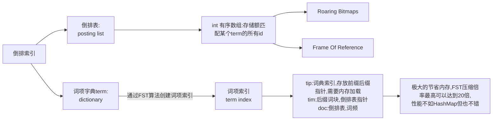

# 前言

apache所有软件的下载地址（包含各种历史版本）：

https://archive.apache.org/dist/

# Zookeeper

## 概念

Zookeeper是一个开源的分布式协调服务器，主要用来解决分布式集群中应用系统的一致性问题和数据管理问题

## 特点

Zookeeper本质上是一个分布式文件系统，适合存放小文件，也可以理解为一个数据库，Zookeeper中存储的其实是一个又一个Znode，Znode是Zookeeper中的节点。

1. Znode是有路径的，例如/data/host1，/data/host2，这个路径也可以理解为是Znode的Name
2. Znode也可以携带数据，例如说某个Znode的路径是/data/host1，其值是一个字符串"192.168.0.1"

正因为Znode的特性，所以Zookeeper可以对外提供出一个类似于文件系统的视图，可以通过操作文件系统的方式操作Zookeeper

1. 使用路径获取Znode
2. 获取Znode携带的数据
3. 修改Znode携带的数据
4. 删除Znode
5. 添加Znode

## 架构

### Leader

一个Zookeeper集群同一时间只会有一个实际工作的Leader，它会发起并维护与各Follwer及Observer间的心跳。所有的写操作必须要通过Leader完成再由Leader将写操作广播给其他服务器。

1. 集群的核心，集群内部各个服务器的调度者
2. 负责进行投票选举
3. 处理事务性（写操作）请求
4. 参与集群投票

### Follwer

一个Zookeeper集群可能同时存在多个Follwer，它会响应Leader的心跳。Follwer可直接处理并返回客户端的读请求，同时会将写请求转发给Leader处理，并且负责在Leader处理写请求时对请求进行投票。

1. 接受客户端请求，并向客户端返回结果
2. 处理客户端非事物性（读操作）请求
3. 转发事务性请求给Leader
4. 参与投票选举

### Observer

观察者角色与Follwer类似，但无投票权。

1. 接受客户端请求，并向客户端返回结果
2. 处理客户端非事物性（读操作）请求
3. 转发事务性请求给Leader
4. 不参与投票选举

## 应用场景

### 数据发布/订阅

发布/订阅一般有两种设计模式：推模式和拉模式，服务端主动将数据更新发送给所有订阅的客户端称为推模式；客户端主动请求获取最新数据称为拉模式。

Zookeeper采用了推拉结合的模式，客户端向服务器注册自己需要关注的节点，一旦该节点数据发生变更，那么服务器就会向相应的客户端推送Watcher事件通知，客户端接收到此通知后，主动到服务端获取最新的数据。

### 命名服务

命名服务是分布式系统中较为常见的一类场景，分布式系统中，被命名的实体通常可以是集群中的机器、提供的服务地址或远程服务对象等，通过命名服务，客户端可以根据指定名字来获取资源的实体，在分布式环境中，上层应用仅仅需要一个全局唯一名字。Zookeeper可以实现一套分布式全局唯一ID的分配机制。

### 分布式协调/通知

ZooKeeper中特有Watcher注册与异步通知机制，能够很好的实现分布式环境下不同系统之间的通知与协调，实现对数据变更的实时处理。使用方法通常是不同系统都对ZooKeeper上同一个Znode进行Watcher注册，监听Znode的变化（包括Znode本身内容及子节点的），若数据节点发生了变化，那么所有订阅该节点的客户端都能够接收到相应的Watcher通知，并作出相应处理。

在大多数分布式系统中，系统间的通信主要包括：心跳检测、工作进度汇报和系统调度。

### 分布式锁

分布式锁用于控制分布式系统之间同步访问共享资源的一种方式，可以保证不同系统访问一个或一组资源时的一致性，主要分为排它锁和共享锁。

#### 排它锁

又称写锁或者独占锁，若事物T1对数据对象O1加上了排它锁，那么在整个加锁期间，只允许事物T1对O1进行读取和更新操作，其他任何事物都不能再对这个数据对象进行任何类型的操作，直到T1释放了排它锁。

##### 定义锁

```
/exclusive_lock/lock
```

##### 实现方式

利用zookeeper的同级节点的唯一性特性，在需要获取排他锁时，所有的客户端试图通过调用create()接口，在/exclusive_lock节点下创建临时子节点/exclusive_lock/lock，最终只有一个客户端能创建成功，那么此客户端就获得了分布式锁。同时，所有没有获取到锁的客户端可以在/exclusive_lock节点上注册一个子节点变更的watcher监听事件，以便重新争取获得锁。

#### 共享锁

又称读锁。如果事务T1对数据对象O1加上了共享锁，那么当前事务只能对O1进行读取操作，其他事务也只能对这个数据对象加共享锁，直到该数据对象上的所有共享锁都释放。

##### 定义锁

```
/shared_lock/[hostname]-请求类型W/R-序号
```

##### 实现方式

1. 客户端调用create方法创建类似定义锁方式的临时顺序节点。
2. 客户端调用getChildren接口来获取所有已创建的子节点列表。
3. 判断是否获得锁，对于读请求如果所有比自己小的子节点都是读请求或者没有比自己序号小的子节点，表明已经成功获取共享锁，同时开始执行度逻辑。对于写请求，如果自己不是序号最小的子节点，那么就进入等待。
4. 如果没有获取到共享锁，读请求向比自己序号小的最后一个写请求节点注册watcher监听，写请求向比自己序号小的最后一个节点注册watcher监听。

#### 释放锁

在获取锁的客户端宕机或者正常完成业务逻辑都会导致临时节点的删除，此时，所有在/exclusive_lock节点上注册监听的客户端都会收到通知，可以重新发起分布式锁获取。

### 分布式队列

## 选举机制

### Serverid

编号越大在选择算法中的权重越大。比如有三台服务器，编号分别是1,2,3；则myid为3的服务器权重最大。

### Zxid

服务器中存放的最大数据ID。值越大说明数据越新，在选举算法中数据越新权重越大。

### Epoch

逻辑时钟。或者叫投票的次数，同一轮投票过程中的逻辑时钟值是相同的。每投完一次票这个数据就会增加，然后与接收到的其它服务器返回的投票信息中的数值相比，根据不同的值做出不同的判断。

### Server状态

选举状态：

1. LOOKING，竞选状态。
2. FOLLOWING，随从状态，同步leader状态，参与投票。
3. OBSERVING，观察状态,同步leader状态，不参与投票。
4. LEADING，领导者状态。

### 选举流程

#### 流程

##### 发出投票

节点启动时，都会将自己作为leader服务器来进行投票。

##### 接受各个服务器的投票

集群的每个服务器收到投票后，首先判断该投票的有效性，如检查是否是本轮投票，是否来自LOOKING状态的服务器。

##### 处理投票

针对每个投票，服务器都需要将别人的投票和自己的投票进行PK，PK规则如下：

优先检查ZXID：ZXID比较大的服务器优先作为leader。

如果ZXID相同：比较Serverid，Serverid较大的服务器作为leader服务器。

##### 统计投票

每次投票后，服务器都会统计投票信息，判断是否有机器得到的票数已经超过半数，如果有的话该机器当选leader。

##### 改变服务器状态

一旦确定了leader，每个服务器就会更新自己的状态，如果是follower，那么就变更为FOLLOWING，如果是leader，就变更为LEADING。


#### 集群刚启动

1. 服务器1启动：发起一次选举，服务器1投自己一票，此时服务器1票数一票，不够半数以上（3票），选举无法完成。投票结果：服务器1为1票。服务器1状态保持为LOOKING。

2. 服务器2启动：发起一次选举，服务器1和2分别投自己一票，此时服务器1发现服务器2的id比自己大，更改选票投给服务器2。投票结果：服务器1为0票，服务器2为2票。服务器1，2状态保持LOOKING

3. 服务器3启动：发起一次选举，服务器1、2、3先投自己一票，然后因为服务器3的id最大，两者更改选票投给为服务器3；投票结果：服务器1为0票，服务器2为0票，服务器3为3票。此时服务器3的票数已经超过半数（3票），服务器3当选Leader。服务器1，2更改状态为FOLLOWING，服务器3更改状态为LEADING。

4. 服务器4启动：发起一次选举，此时服务器1，2，3已经不是LOOKING 状态，不会更改选票信息。交换选票信息结果：服务器3为3票，服务器4为1票。此时服务器4服从多数，更改选票信息为服务器3。服务器4并更改状态为FOLLOWING。

5. 服务器5启动：与服务器4一样投票给3，此时服务器3一共5票，服务器5为0票。服务器5并更改状态为FOLLOWING。

6. 最终的结果：服务器3是 Leader，状态为 LEADING；其余服务器是 Follower，状态为 FOLLOWING。

#### 运行时期

在Zookeeper运行期间Leader和非Leader各司其职，当有非Leader服务器宕机或加入不会影响Leader，但是一旦Leader服务器挂了，那么整个Zookeeper集群将暂停对外服务，会触发新一轮的选举。初始状态下服务器3当选为Leader，假设现在服务器3故障宕机了，此时每个服务器上zxid可能都不一样，server1为99，server2为102，server4为100，server5为101。

集群 Leader 节点故障运行期选举与初始状态投票过程基本类似，大致可以分为以下几个步骤：

1. 状态变更。Leader 故障后，余下的非 Observer 服务器都会将自己的服务器状态变更为LOOKING，然后开始进入Leader选举过程。

2. 每个Server会发出投票。

3. 接收来自各个服务器的投票，如果其他服务器的数据比自己的新会改投票。

4. 处理和统计投票，每一轮投票结束后都会统计投票，超过半数即可当选。

5. 改变服务器的状态，宣布当选。

运行器Leader故障后选举流程

1. 第一次投票，每台机器都会将票投给自己。

2. 接着每台机器都会将自己的投票发给其他机器，如果发现其他机器的zxid比自己大，那么就需要改投票重新投一次。比如server1 收到了三张票，发现server2的xzid为102，pk一下发现自己输了，后面果断改投票选server2为老大。

##  安装

Zookeeper官网：https://zookeeper.apache.org/
下载地址：https://archive.apache.org/dist/zookeeper/

### 修改配置文件

```bash
[root@server01 conf]# cp zoo_sample.cfg zoo.cfg
[root@server01 conf]# vim zoo.cfg

# 修改如下内容
# 保留多少个快照
autopurge.snapRetainCount=3
# 日志多少个小时清理一次
autopurge.purgeInterval=1
dataDir=/opt/zookeeper/data
dataLogDir=/opt/zookeeper/log
# 集群中服务器地址
# 其中id为一个数字，表示zk进程的id，这个id也是dataDir目录下myid文件的内容
# host是该zk进程所在的IP地址，port1表示follower和leader交换消息所使用的端口，port2表示选举leader所使用的端口。
server.1=server01:2888:3888
server.2=server02:2888:3888
server.3=server03:2888:3888
```

### 添加myid配置

```bash
[root@server01 conf]# mkdir -p -m 755 /opt/zookeeper/data
[root@server01 conf]# mkdir -p -m 755 /opt/zookeeper/log
[root@server01 conf]# cd /opt/zookeeper/data
[root@server01 conf]# vim myid

# 添加如下内容
1
# 修改其他机器的配置文件：在server02上：修改myid为：2；在server03上：修改myid为：3
```

### 启动集群

```bash
# 启动
[root@server01 conf]# zkServer.sh start
# 查看集群状态，主从信息
[root@server01 conf]# zkServer.sh status
```

## 数据模型

Zookeeper的数据模型，在结构上和标准文件系统非常相似，拥有一个层次的命名空间，都是采用树形层次结构。Zookeeper树中的每个节点被称为一个Znode。和文件系统的目录树一样，Zookeeper树中的每个节点可以拥有子节点。

1. Znode 兼具文件和目录两种特点。既像文件一样维护着数据、元信息、ACL、时间戳等数据结构，又像目录一样可以作为路径标识的一部分，并可以具有子Znode。用户对Znode具有增、删、查、改等操作。

2. Znode存储数据大小的限制。Zookeeper虽然可以关联一些数据，但并没有被设计为常规的数据库或者大数据存储，相反的是，它用来管理调度数据，比如分布式应用中的配置文件信息、状态信息、汇集位置等等。这些数据的共同特征是它们都是很小的数据，通常以KB为大小单位，Zookeeper的服务器和客户端都被设计为严格检查并限制每个Znode的数据大小最多1M，常规使用中应该远小于此值。

3. Znode通过路径引用。如同Unix中的文件路径，路径必须是绝对的。因此他们必须由斜杠符开头。除此之外，他么必须是唯一的，也就是说每一个路径只有一个表示，因此这些路径不能改变。/zookeeper节点是默认节点，用来保存关键配置信息。

4. 每个Znode由3部分组成：

   stat：此为状态信息，描述为该Znode的版本，权限等信息；

   data：与该Znode关联的数据；

   children：该Znode下的子节点。

## 节点类型

### 临时节点

该节点的生命周期依赖于创建它们的会话。一旦会话结束，临时节点就将被自动删除，当然也可以手动删除。临时节点不允许拥有子节点。（ephemeral）

### 永久节点

该节点的生命周期不依赖于会话，并且只有在客户端显示执行删除操作的时候，他们才能被删除。（persistent）

### 序列化

Znode还有一个序列化特性，如果创建的时候指定的话，该Znode的名字后面会自动追加一个不断增加的序列号。序列号对于此节点的父节点来说是唯一的，这样便会记录每个子节点创建的先后顺序。它的格式为"%10d"(10位数字，没有数值的数位用0补充，例如“0000000001”)。

### 目录节点形式

1. PERSISTENT

   永久节点

2. PERSISTENT_SEQUENTIAL

   永久节点、序列化

3. EPHEMERAL

   临时节点

4. EPHEMERAL_SEQUENTIAL

   临时节点、序列化

## 命令操作

1. 创建永久节点：create /hello world
2. 创建临时节点：create -e /abc 123
3. 创建永久序列化节点：create -s /zhangsan boy
4. 创建临时序列化节点：create -e -s /lisi boy
5. 修改节点数据：set /hello zookeeper
6. 获取节点信息：get /hello
   - dataVersion：数据版本号，每次对节点进行set操作，dataVersion都会增加1。
   - cversion：子节点的版本号。当Znode的子节点有变化时，cversion的值就会增加1。
   - aclVersion：ACL的版本号。
   - cZxid：Znode创建时的事物id。
   - mZxid：Znode被修改的事物id，即每次对Znode的修改都会更新mZxid。对于Zookeeper来说，每次的变化都会产生一个唯一的事物id，zxid(Zookeeper Transaction Id)。通过zxid可以确定更新操作的先后顺序。例如，如果zxid1小于zxid2说明zxid1操作先于zxid2发生，zxid对于整个zk都是唯一的。
   - ctime：节点创建时的时间戳
   - mtime：节点最新一次更新发生时的时间戳
   - ephemeralOwner：如果该节点为临时节点，ephemeralOwner的值表示与该节点绑定的session id，如果不是ephemeralOwner的值为0。
7. 删除节点(如果要删除的节点有子Znode则无法删除)：delete /hello
8. 删除节点(如果有子Znode则递归删除)：rmr /abc
9. 列出历史记录：histroy

## Watch机制

类似于数据库的触发器，对某个Znode设置Watcher，当Znode发生变化的时候，WatchManager会调用对应的Watcher。

当Znode发生删除、修改、创建、子节点修改的时候，对应的Watcher会得到通知。

Watcher的特点：

1. 一个Watcher只会被触发一次，如果需要继续监听，则需要再次添加Watcher
2. Watcher得到的事件是被封装过的，包括三个内容：keeperState，eventType，path

### keeperState

| 属性          | 说明                     |
| ------------- | ------------------------ |
| SyncConnected | 客户端与服务器正常连接时 |
| Disconnected  | 客户端与服务器断开连接时 |
| Expired       | 会话session失效时        |
| AuthFailed    | 身份认证失败时           |

### eventType

| 枚举类型                       | 说明                             |
| ------------------------------ | -------------------------------- |
| None                           | 无                               |
| NodeCreated	Watcher         | 监听的数据节点被创建时           |
| NodeDeleted	Watcher         | 监听的数据节点被删除时           |
| NodeDataChanged	Watcher     | 监听的数据节点内容发生变更时     |
| NodeChildrenChanged	Watcher | 监听的数据节点的子节点发生变化时 |

## JavaAPI操作

可以使用一套Zookeeper客户端框架Curator，可以解决很多Zookeeper客户端非常底层的细节开发问题。

Curator包含几个包：

1. curator-framework：对zookeeper的底层api的一些封装；
2. curator-recipes：封装了一些高级特性，如：Cache事件监听、选举、分布式锁、分布式计数器等。

# Kafka

## 消息队列

### 优点

1. 解耦

   允许你独立的扩展或修改两边的处理过程，只要确保它们遵守同样的接口约束。

2. 可恢复性

   系统的一部分组件失效时，不会影响到整个系统。消息队列降低了进程间的耦合度，所

   以即使一个处理消息的进程挂掉，加入队列中的消息仍然可以在系统恢复后被处理。

3. 缓冲

   有助于控制和优化数据流经过系统的速度，解决生产消息和消费消息的处理速度不一致

   的情况。

4. 灵活性 & 峰值处理能力

   在访问量剧增的情况下，应用仍然需要继续发挥作用，但是这样的突发流量并不常见。

   如果为以能处理这类峰值访问为标准来投入资源随时待命无疑是巨大的浪费。使用消息队列

   能够使关键组件顶住突发的访问压力，而不会因为突发的超负荷的请求而完全崩溃。

5. 异步通信

   很多时候，用户不想也不需要立即处理消息。消息队列提供了异步处理机制，允许用户

   把一个消息放入队列，但并不立即处理它。想向队列中放入多少消息就放多少，然后在需要

   的时候再去处理它们。

### 消息队列的两种模式

#### 点对点模式（一对一，消费者主动拉取数据，消息收到后消息清除）

消息生产者生产消息发送到Queue中，然后消息消费者从Queue中取出并且消费消息。消息被消费以后，queue中不再有存储，所以消息消费者不可能消费到已经被消费的消息。Queue支持存在多个消费者，但是对一个消息而言，只会有一个消费者可以消费。

#### 发布/订阅模式（一对多，消费者消费数据之后不会清除消息）

消息生产者（发布）将消息发布到topic中，同时有多个消息消费者（订阅）消费该消息。和点对点方式不同，发布到topic的消息会被所有订阅者消费。

### Kafka基础架构

1. Producer：消息生产者，就是向kafka broker发消息的客户端；
2. Consumer：消息消费者，向kafka broker取消息的客户端；
3. Consumer Group（CG）：消费者组，由多个consumer组成。消费者组内每个消费者负责消费不同分区的数据，一个分区只能由一个组内消费者消费；消费者组之间互不影响。所有的消费者都属于某个消费者组，即消费者组是逻辑上的一个订阅者。
4. Broker：一台kafka服务器就是一个broker。一个集群由多个broker组成。一个broker可以容纳多个topic
5. Topic：可以理解为一个队列，生产者和消费者面向的都是一个topic；
6. Partition：为了实现扩展性，一个非常大的topic可以分布到多个broker（即服务器）上，一个topic可以分为多个partition，每个partition是一个有序的队列；
7. Replica：副本，为保证集群中的某个节点发生故障时，该节点上的partition数据不丢失，且kafka仍然能够继续工作，kafka提供了副本机制，一个topic的每个分区都有若干个副本，一个leader和若干个follower。
8. leader：每个分区多个副本的“主”，生产者发送数据的对象，以及消费者消费数据的对象都是leader。
9. follower：每个分区多个副本中的“从”，实时从leader中同步数据，保持和leader数据的同步。leader发生故障时，某个follower会成为新的follower。

### Kafka命令行操作

```bash
#下面是kafka的基础配置项
broker.id=0
listeners=PLAINTEXT://server01:9092
log.dirs=/date/kafka/data
#后面加/kafka的目的是让之后关于kafka的信息都存放到zookeeper的/kafka目录下
zookeeper.connect=server01:2181,server02:2181,server03:2181/kafka
```

```bash
#启动集群
kafka-server-start.sh -daemon config/server.properties
#关闭集群
kafka-server-stop.sh stop
#查看当前服务器中的所有topic
kafka-topics.sh --zookeeper server01:2181/kafka --list
#查看某个Topic的详情
kafka-topics.sh --zookeeper server01:2181/kafka --describe --topic gentleduo-topic-1
#创建topic
kafka-topics.sh --zookeeper server01:2181/kafka --create --replication-factor 2 --partitions 3 --topic gentleduo-topic-1
选项说明：
--topic 定义topic名
--replication-factor 定义副本数
--partitions 定义分区数
#删除topic（需要server.properties中设置delete.topic.enable=true否则只是标记删除。）
kafka-topics.sh --zookeeper server01:2181/kafka --delete --topic gentleduo-topic-1
#修改分区数
kafka-topics.sh --zookeeper server01:2181/kafka --alter --topic first --partitions 6
#发送消息
kafka-console-producer.sh --broker-list server01:9092 --topic gentleduo-topic-1
#消费消息（--from-beginning：会把主题中以往所有的数据都读取出来。）
kafka-console-consumer.sh --zookeeper server01:2181/kafka --topic gentleduo-topic-1
kafka-console-consumer.sh --bootstrap-server server01:9092 --topic gentleduo-topic-1
kafka-console-consumer.sh --bootstrap-server server01:9092 --from-beginning --topic gentleduo-topic-1
#查询消费者组
kafka-consumer-groups.sh --bootstrap-server server01:9092 --list
#查询消费者组详情
#LogEndOffset 下一条将要被加入到日志的消息的位移
#CurrentOffset 当前消费的位移
#LAG 消息堆积量：消息中间件服务端中所留存的消息与消费掉的消息之间的差值即为消息堆积量也称之为消费滞后量
kafka-consumer-groups.sh --bootstrap-server server01:9092 --describe --group groupname
#通过kafka-dump-log.sh查看.index及.log中的内容
kafka-dump-log.sh --files 00000000000000000000.index
```

## Kafka架构

### 顺序写入和MMFile

Kafka的特性之一就是高吞吐率，但是Kafka的消息是保存或缓存在磁盘上的，一般认为在磁盘上读写数据是会降低性能的，但是Kafka即使是普通的服务器，Kafka也可以轻松支持每秒百万级的写入请求，超过了大部分的消息中间件，这种特性也使得Kafka在日志处理等海量数据场景广泛应用。Kafka会把收到的消息都写入到硬盘中，防止丢失数据。为了优化写入速度Kafka采用了两个技术：顺序写入和MMFile 。

#### 顺序写

在讨论顺序写之前，先梳理一下linux系统中用户程序读写文件时OS和硬件交互的内存模型：


##### 读文件

用户程序通过编程语言提供的读取文件api发起对某个文件读取。此时程序切换到内核态，用户程序处于阻塞状态。由于读取的内容还不在内核缓冲区中，导致触发OS缺页中断异常。然后由OS负责发起对磁盘文件的数据读取。读取到数据后，先存放在OS内核的主存空间，叫PageCache。然后OS再将数据拷贝一份至用户进程空间的主存ByteBuffer中。此时程序由内核态切换至用户态继续运行程序。程序将ByteBuffer中的内容读取到本地变量中，即完成文件数据读取工作。

如下所示为一典型Java读取某文件内容的用户编程代码。接下来详细解说读取文件过程。

```java
// 一次读多个字节
byte[] tempbytes = new byte[100];
int byteread = 0;
in = new FileInputStream(fileName);//①
ReadFromFile.showAvailableBytes(in);
// 读入多个字节到字节数组中，byteread为一次读入的字节数
while ((byteread = in.read(tempbytes)) != -1) { //②
    System.out.write(tempbytes, 0, byteread);
}
```

首先通过位置①的代码发起一个open的系统调用，程序由用户态切换到内核态。操作系统通过文件全路径名在文件目录中找到目标文件名对应的文件iNode标识ID，然后用这个iNode标识ID在iNode索引文件找到目标文件iNode节点数据并加载到内核空间中。这个iNode节点包含了文件的各种属性（创建时间，大小以及磁盘块空间占用信息等等）。然后再由内核态切换回用户态，这样程序就获得了操作这个文件的文件描述。接下来就可以正式开始读取文件内容了。然后再通位置②，循环数次获取固定大小的数据。通过发起read系统调用，操作系统通过文件iNode文件属性中的磁盘块空间占用信息得到文件起始位的磁盘物理地址。再从磁盘中将要取得数据拷贝到PageCache内核缓冲区。然后将数据拷贝至用户进程空间。程序由内核态切换回用户态，从而可以读取到数据，并放入上面代码中的临时变量tempbytes中。整个过程如下图所示：


至于上面说到的操作系统通过iNode节点中的磁盘块占用信息去定位磁盘文件数据。其细节过程如下图所示:


###### 根据文件路径从文件目录中找到iNode ID。

用户读取一个文件，首先需要调用OS中文件系统的open方法。该方法会返回一个文件描述符给用户程序。OS首先根据用户传过来的文件全路径名在目录索引数据结构中找到文件对应的iNode标识ID。目录数据是存在于磁盘上的，在OS初始化时就会加载到内存中，由于目录数据结构并不会很庞大，一次性加载驻留到内存也不是不可以或者部分加载，等需要的时候在从磁盘上调度进内存也可以。根据文件路径在目录中查找效率应该是很高的，因为目录本身就是一棵树，应该也是类似数据库的树形索引结构。所以它的查找算法时间复杂度就是O(logN)。iNode就是文件属性索引数据了。磁盘格式化时OS就会把磁盘分区成iNode区和数据区。iNode节点就包含了文件的一些属性信息，比如文件大小、创建修改时间、作者等等。其中最重要的是还存有整个文件数据在磁盘上的分布情况（文件占用了哪些磁盘块）。

###### 根据iNode ID从Inode索引中找到文件属性。

得到iNode标识的ID后，就可以去iNode数据中查找到对应的文件属性了,并加载到内存，方便后续读写文件时快速获得磁盘定位。iNode数据结构应该类似哈希结构了，key就是iNode标识ID，value就是具体某个文件的属性数据对象了。所以它的算法时间复杂度就是O(1)。系统中的文件它的文件属性（iNode）和它的数据正文是分开存储的。文件属性中有文件数据所在磁盘块的位置信息。

###### 根据文件属性中的磁盘空间块信息找到需要读取的数据所在的磁盘块的物理位置

文件属性也就是iNode节点这个数据结构，里面包含了文件正文数据在磁盘物理位置上的分布情况。磁盘读写都是以块为单位的。所以这个位置信息其实也就是一个指向磁盘块的物理地址指针。其结构图如下:


文件属性里就包含了文件正文数据占有磁盘所有信息。但是由于文件属性大小有限制，而文件大小没有限制。这样会导致磁盘块占用信息超出限制。所以最后一个磁盘数据项设计为特殊的作用。它是一个指向更多磁盘占用信息数据的指针。这些更多信息存放在普通的数据区。这样当文件iNode加载到内存后，可以把其他更多磁盘块信息一起加载进来。这样就避免了iNode索引文件太大的问题。后续的文件读写系统调用，由用户态切换至内核态。操作系统就可以根据文件数据的相对位置（偏移量）快速从iNode中的磁盘块占用数据结构中找到其对应的磁盘物理位置在哪里了。很明显这个数据结构类似哈希结构，其算法复杂度就是O(1)。比如我们现在讨论的读取数据。每次用户代码的api调用read方法时。由于时从头开始读取，所以OS就从上图中“磁盘块0”数据项开始迭代，获取对应的物理磁盘块起始地址开始读取数据并拷贝至PageCache缓冲区，再拷贝至用户进程缓冲区。这样用户代码就可以获取这些数据了。考虑到另外一种随机读的场景。我们并不是把整个文件从头开始读一遍。而是需要直接定位到文件的中间某个位置开始读取部分内容。如下所示：

```java
RandomAccessFile raf=new RandomAccessFile(new File("D:\\3\\test.txt"), "r");   
//获取RandomAccessFile对象文件指针的位置，初始位置是0  
System.out.println("RandomAccessFile文件指针的初始位置:"+raf.getFilePointer());  
raf.seek(pointe);//移动文件指针位置  
byte[]  buff=new byte[1024];  
//用于保存实际读取的字节数  
int hasRead=0;  
//循环读取  
while((hasRead=raf.read(buff))>0){  
    //打印读取的内容,并将字节转为字符串输入  
    System.out.println(new String(buff,0,hasRead));       
}
```

程序代码调用seek方法直接定位到某个文件相对位置开始读取内容。实际上就是调用了OS管理文件的系统调用seek函数。这个系统调用需要传递一个文件相对位置也就是偏移量，不是指磁盘的物理位置。文件的相对位置偏移量是从0开始的，结束位置和文件的大小字节数相等。操作系统拿到这个偏移量后，就可以计算出文件所属的逻辑块编号。因为每个块是固定大小的，所以能计算出来。通过文件属性的逻辑磁盘块信息就能得到磁盘块的物理位置。从而可以快速直接定位到磁盘物理块读取到需要的数据。这里说的逻辑块和物理块的概念是有区别的。逻辑块属于当前的文件从0开始编号，物理块才是磁盘真正的存放数据的区域，属于全局的。编号自然不是从0开始的。

##### 写文件

用户程序通过编程语言提供的写入文件api发起对某个文件写入磁盘。此时程序切换到内核态用户程序处于阻塞状态，由OS负责发起对磁盘文件的数据写入。用户写入数据后，并不是直接写到磁盘的，而是先写到ByteBuffer中，然后再提交到PageCache中。最后由操作系统决定何时写入磁盘。数据写入PageCache中后，此时程序由内核态切换至用户态继续运行。用户程序将数据写入内核的PageCache缓冲区后，即认为写入成功了。程序由内核态切换回用于态，可以继续后续的工作了。PageCache中的数据最终写入磁盘是由操作系统异步提交至磁盘的。一般是定时或PageCache满了的时候写入。如果用户程序通过调用flush方法强制写入，则操作系统也会服从这个命令。立即将数据写入磁盘然后由内核态切换回用户态继续运行程序。但是这样做会损失性能，但可以确切的知道数据是否已经写入磁盘了。

写文件的过程和读文件差不多，相关的知识点也在读文件中已经顺带描述了。就不在赘述了。这里就说些特别需要注意的点就行。


###### 根据空闲块索引找到可以写入的物理位置并写入

如上图所示，OS写文件内容时首先要访问磁盘空闲块索引表。这是个什么东西呢？由于磁盘很大，不可能每次写数据时，都让磁头从头到尾遍历一次才能找到空闲位置。这样效率可想而知的差劲。所以OS会把磁盘上的空闲块索引起来存放在磁盘某个位置上。后续磁盘存储和删除文件内容时都通过这个空闲块索引表快速定位，同时删除数据也会更新索引表增加空闲块。空闲块记录索引的实现常用有两种，一种是链表结构，还有一种是位图结构。这里就不详细讨论了。

###### 写入数据后更新iNode里的磁盘占用块索引

数据写入后，那么这个空闲块就被占用了，自然也就需要更新下iNode文件属性里的磁盘占用块索引数据了。前面说的写文件都是只讲了尾部追加这种方式。但是实际上可以通过RandomAccessFile类实现文件随机位置写功能。文件随机位置写不是直接在中间某个位置插入要写的内容，而是要先把插入位置后面的内容截取放入临时文件中。插入新内容后，再把临时文件内容尾部追加到原来的文件中来实现文件修改。代码如下所示：

```java
public static void insert(String fileName, long pos, String insertContent) throws IOException{
        File file = File.createTempFile("tmp", null);
        file.deleteOnExit();
        RandomAccessFile raf = new RandomAccessFile(fileName, "rw");
        FileInputStream fileInputStream = new FileInputStream(file);
        FileOutputStream fileOutputStream = new FileOutputStream(file);
        raf.seek(pos);
        byte[] buff = new byte[64];
        int hasRead = 0;
        while((hasRead = raf.read(buff)) > 0){
            fileOutputStream.write(buff);
        }
        raf.seek(pos);
        raf.write(insertContent.getBytes());
        //追加文件插入点之后的内容
        while((hasRead = fileInputStream.read(buff)) > 0){
            raf.write(buff, 0, hasRead);
        }
        raf.close();
        fileInputStream.close();
        fileOutputStream.close();
    }
```

按照上面的阐述，写入的文件内容完全可以存入磁盘上的一个新块，然后更新下iNode属性里的占用磁盘块索引数据即可。也不需要真的去移动磁盘上的所有数据块。看上去成本也很小，可为啥编程api却都不支持呢？答案可能是这样的。假如允许上面那种操作，如果一个很大的文本文件。你现在只是编辑了文本中间某个位置的一个字，即插入了一个文本字符。那么此时这个新增的文本内容就得在磁盘上找到一个新的块存储下来。这样是不是有点浪费空间呢？因为磁盘上的一个块只能分配给一个文件使用，块大小如果是64kb的话，一个字符也就占用了2个字节的空间。更要命的是这样一搞，使得原本满存状态的块，出现很多不连续的空洞。这样就会使得读取文件时数据是不连续的，系统需要额外信息记录这些中间的存储空洞。加大了读取难度。这就是我猜测的原因。实际上操作系统层面也没有这种操作插入的系统调用函数。故编程语言层面也就没法支持了。另一个层面：如果是修改一个很大的文本文件中的某一个位置的数据，可能还需要先找到数据所在的块，这个过程也是需要花费一定的时间。

操作系统层面给上层应用程序提供了写文件的两个系统调用。write和append，其中append是write的限制形式，即只能在文件尾部追加。而write虽然提供了随机位置写，但是并不是将新内容插入其中，而是覆盖原有的数据。我们平时使用Word文本编辑软件时，如果对一个很大的文件进行编辑，然后点击保存，你会发现很慢。同时你还能看到文件所在的目录下生成了一个新的处于隐藏状态的临时文件。这些现象也能说明我们上面的观点。即编辑文件时，需要一个成本很高的过程。如下图所示：


##### 随机写示例

假设当前文件系统的块大小是8Byte，在系统中存在文件a.txt，a的内容："1234567890qwertyuiopasdfghjklzxcvbnm" ，那么文件存储结构如下：


如果此时要修改a.txt中的内容，比如要在'p'跟'a'之间插入一个字符";"那么可以有如下两种方式：

第一种：增加一个inode块然后更新iNode属性里的占用磁盘块索引数据


第二种：覆盖更新：把修改位置后面的内容截取放入临时文件中，插入新内容后，再把临时文件内容尾部追加到原来的文件中


由此可见，随机写无论哪种方式都会存在问题：

第一种方式：因为磁盘上的一个块只能分配给一个文件使用，块大小如果是64kb的话，一个字符也就占用了2个字节的空间。这样一来，使得原本满存状态的块，出现很多不连续的空洞。这样就会使得读取文件时数据是不连续的，系统需要额外信息记录这些中间的存储空洞。所以一般不会采取这种方式，实际上操作系统层面也没有这种操作插入的系统调用函数。故编程语言层面也就没法支持了。

第二种方式：由于需要把修改位置后面的内容截取放入临时文件中，插入新内容后，再把临时文件内容尾部追加到原来的文件中的操作，所以写入性能很差。

**从内核层面提供的write方法来看，只支持通过fseek指定新的写位置后，写入新的数据，同时会覆盖原来该位置之后的数据。所以在随机写模式下，修改文件中的内容需要先把修改位置后面的内容截取放入临时文件中，插入新内容后，再把临时文件内容尾部追加到原来的文件中的操作，其实是一个覆盖的过程，所以写入性能较差**

**而内核也提供了另外一种方式：在open函数中使用O_APPEND标志，那么在调用open函数打开文件时，每次使用write()函数对文件进行写操作时，都会把文件当前位置偏移量移动到文件末尾，从文件末尾写入数据。append写的方式由于没有了定位过程、数据临时保存及覆盖过程，所以性能非常高**

##### 总结

所以其实所有的中间件的顺序写，并不是磁盘存储时分配连续的空间给到文件，减少了磁盘寻道时间。事实上，磁盘从来都不会连续分配空间给哪个文件。这是现代文件系统的设计方案。用户程序写文件内容时，提交给OS的缓冲区PageCache后就返回了。实际这个内容存储在磁盘哪个位置是由OS决定的。OS会根据磁盘未分配空间索引表随机找一个空块把内容存储进去，然后更新文件iNode里的磁盘占用块索引数据。这样就完成了文件写入操作。所以append操作不是在磁盘上接着文件末尾内容所在块位置连续分配空间的。最多只能说逻辑上是顺序的。

所以顺序写真正快的原因是：它没有更新和删除操作，从而不要进行：把修改位置后面的内容截取放入临时文件中，插入新内容后，再把临时文件内容尾部追加到原来的文件中的操作(设想一下当文件越来越大的时候，写入临时文件，再将临时文件追加到原来的文件中的过程是很慢的)，而是一律追加到文件末尾，所以写入性能能大幅提升。

#### mmap

Kafka充分利用了现代操作系统分页存储来利用内存提高I/O效率。Memory Mapped Files(后面简称mmap)也称为内存映射文件，在64位操作系统中一般可以表示20G的数据文件，它的工作原理是直接利用操作系统的Page实现文件到物理内存的直接映射。完成MMP映射后，用户对内存的所有操作会被操作系统自动的刷新到磁盘上，极大地降低了IO使用率。


其他关于mmap的解释：

这个技术是操作系统给用户程序提供的一个系统调用函数。它把文件映射到OS内核缓冲区空间，同时共享给用户进程，也可以共享给多个用户进程。映射过程中不会产生实际的数据从磁盘真正调取动作，只有用户程序需要的时候才会调入部分数据。总之也是和普通文件读取一样按需调取。那么mmap技术为什么在读取数据时会比普通read操作快几个数量级呢？相对于普通读写操作的内存模型。用户程序要读取到磁盘上的数据。要经历4次内核态切换以及2次数据拷贝操作。那么mmap技术由于是和用户进程共享内核缓冲区，所以少了一次拷贝操作（数据从内核缓冲区到用户进程缓冲区）。从而大大提高了性能。如下图所示


> mmap具体的实现原理，有待于通过分析linux源码来验证

### ZeroCopy

Kafka服务器在响应客户端读取的时候，底层使用ZeroCopy技术，直接将磁盘无需拷贝到用户空间，而是直接将数据通过内核空间传递输出，数据并没有抵达用户空间。

传统IO操作

1. 用户进程调用read等系统调用向操作系统发出IO请求，请求读取数据到自己的内存缓冲区中。自己进入阻塞状态。
2. 操作系统收到请求后，进一步将IO请求发送磁盘。
3. 磁盘驱动器收到内核的IO请求，把数据从磁盘读取到驱动器的缓冲中。此时不占用CPU。当驱动器的缓冲区被读满后，向内核发起中断信号告知自己缓冲区已满。
4. 内核收到中断，使用CPU时间将磁盘驱动器的缓存中的数据拷贝到内核缓冲区中。
5. 如果内核缓冲区的数据少于用户申请的读的数据，重复步骤3跟步骤4，直到内核缓冲区的数据足够多为止。
6. 将数据从内核缓冲区拷贝到用户缓冲区，同时从系统调用中返回。完成任务


DMA读取

1. 用户进程调用read等系统调用向操作系统发出IO请求，请求读取数据到自己的内存缓冲区中。自己进入阻塞状态。

2. 操作系统收到请求后，进一步将IO请求发送DMA。然后让CPU干别的活去。

3. DMA进一步将IO请求发送给磁盘。

4. 磁盘驱动器收到DMA的IO请求，把数据从磁盘读取到驱动器的缓冲中。当驱动器的缓冲区被读满后，向DMA发起中断信号告知自己缓冲区已满。

5. DMA收到磁盘驱动器的信号，将磁盘驱动器的缓存中的数据拷贝到内核缓冲区中。此时不占用CPU。这个时候只要内核缓冲区的数据少于用户申请的读的数据，内核就会一直重复步骤3跟步骤4，直到内核缓冲区的数据足够多为止。

6. 当DMA读取了足够多的数据，就会发送中断信号给CPU。

7. CPU收到DMA的信号，知道数据已经准备好，于是将数据从内核拷贝到用户空间，系统调用返回。

   **跟IO中断模式相比，DMA模式下，DMA就是CPU的一个代理，它负责了一部分的拷贝工作，从而减轻了CPU的负担。DMA的优点就是：中断少，CPU负担低。**


常规IO

1. 文件在磁盘中数据被copy到内核缓冲区
2. 从内核缓冲区copy到用户缓冲区
3. 用户缓冲区copy到内核与socket相关的缓冲区。
4. 数据从socket缓冲区copy到相关协议引擎发送出去


网络IO：Zero拷贝

操作系统提供了sendfile系统调用来支持MMAP机制，即应用只需指定需要传输的磁盘文件句柄，然后通过sendfile系统实现磁盘文件读取和从socket传输出去，其中磁盘文件的读取和从socket传输出去都是通过sendfile系统调用在内核完成的，不需要在内核空间和用户空间进行数据拷贝，具体过程如下：

1. 应用指定需要传输的文件句柄和调用sendfile系统调用（第一次系统调用）；
2. 操作系统在内核读取磁盘文件拷贝到页缓存（第一次内存拷贝）；
3. 操作系统在内核将页缓存内容拷贝到网卡硬件缓存（第二次内存拷贝）。

**故整个过程涉及到一次sendfile系统调用，在内核态完成两次拷贝，在内核和用户空间之间不需要进行数据拷贝。**


- 所以 kafka 使用 sendfile 系统调用，具体为 Java 的 sendfile 系统调用API: FileChannel的transferTo, transferFrom，基于MMAP机制实现了磁盘文件内容的零拷贝传输（不需要在用户控件和内核空间进行数据拷贝）。
- 同时由于操作系统将磁盘文件内容加载到了内核页缓存，故消费者针对该磁盘文件的多次请求可以重复使用，避免重复在磁盘和内存之间进行数据拷贝。

### Kafka工作流程及文件存储机制

Kafka中消息是以topic进行分类的，生产者生产消息，消费者消费消息，都是面向topic的。topic是逻辑上的概念，而partition是物理上的概念，每个partition对应于一个log文件，该log文件中存储的就是producer生产的数据。Producer生产的数据会被不断追加到该log文件末端，且每条数据都有自己的offset。消费者组中的每个消费者，都会实时记录自己消费到了哪个offset，以便出错恢复时，从上次的位置继续消费。

由于生产者生产的消息会不断追加到log文件末尾，为防止log文件过大导致数据定位效率低下，Kafka采取了分片和索引机制，将每个partition分为多个segment。每个segment对应两个文件——“.index”文件和“.log”文件。这些文件位于一个文件夹下，该文件夹的命名规则为：topic名称+分区序号。例如，test这个first有三个分区，则其对应的文件夹为first-0,first-1,first-2。

index和log文件以当前segment的第一条消息的offset命名。".index"文件存储大量的索引信息，".log"文件存储大量的数据，索引文件中的元数据指向对应数据文件中message的物理偏移地址。

```bash
#通过lsof可以看出来.indx使用的是mmap，而.log使用的是普通的io
[root@server01 kafka_2.11-2.1.0]# lsof -Pnp 3012 | grep gentleduo
java    3012 root  mem       REG              253,0  10485756 101271713 /data/kafka/data/gentleduo-topic-1-1/00000000000000000000.timeindex
java    3012 root  mem       REG              253,0  10485760 101271712 /data/kafka/data/gentleduo-topic-1-1/00000000000000000000.index
java    3012 root  mem       REG              253,0  10485756  68361464 /data/kafka/data/gentleduo-topic-1-0/00000000000000000000.timeindex
java    3012 root  mem       REG              253,0  10485760  68361463 /data/kafka/data/gentleduo-topic-1-0/00000000000000000000.index
java    3012 root  128u      REG              253,0         0  68361462 /data/kafka/data/gentleduo-topic-1-0/00000000000000000000.log
java    3012 root  129u      REG              253,0         0 101271711 /data/kafka/data/gentleduo-topic-1-1/00000000000000000000.log
#通过kafka-dump-log.sh查看.index及.log中的内容
#通过.index文件可以定位到offset在log文件中对应的position，但是并不是每个offset都会记录position，所以不能绝对定位，所以消费的时候从最接近的offset(比如消费者需要从offset==150开始消费，但是目前只记录了offset==108的position，那么就会从offset==108的position的位置开始读)开始，通过RandomAccessFile的seek方法读取文件，最后通过sendfile发送(零拷贝技术，即：FileChannel的transferTo)。
[root@server01 gentleduo-topic-1-0]# kafka-dump-log.sh --files 00000000000000000000.index
Dumping 00000000000000000000.index
offset: 54 position: 4158
offset: 108 position: 8316
offset: 162 position: 12474
offset: 216 position: 16632
offset: 270 position: 20790
offset: 324 position: 24948
offset: 378 position: 29106
offset: 432 position: 33264
offset: 486 position: 37422
offset: 540 position: 41580
offset: 594 position: 45738
offset: 648 position: 49896
offset: 702 position: 54054
offset: 756 position: 58212
offset: 810 position: 62370
#kafka还保存了某个时间对应的offset的日志文件，所以kafka也支持消费者通过某个时间戳找到对应的offset(但是找到offset后还是需要通过.index找到position)，然后开始消费
[root@server01 gentleduo-topic-1-0]# kafka-dump-log.sh --files 00000000000000000000.timeindex
Dumping 00000000000000000000.timeindex
timestamp: 1649496191290 offset: 54
timestamp: 1649496192582 offset: 108
timestamp: 1649498560810 offset: 162
timestamp: 1649498562172 offset: 216
timestamp: 1649498562988 offset: 270
timestamp: 1649498563569 offset: 324
timestamp: 1649498564164 offset: 378
timestamp: 1649498564711 offset: 432
timestamp: 1649498565253 offset: 486
timestamp: 1649498565843 offset: 540
timestamp: 1649498566490 offset: 594
timestamp: 1649498567383 offset: 648
timestamp: 1649498567915 offset: 702
timestamp: 1649498568920 offset: 756
timestamp: 1649498569803 offset: 810
```

## Kafka生产者

### 分区策略

1. 分区的原因
   1. 方便在集群中扩展，每个Partition可以通过调整以适应它所在的机器，而一个topic又可以有多个 Partition组成，因此整个集群就可以适应任意大小的数据了；
   2. 可以提高并发，因为可以以Partition为单位读写了。
2. 分区的原则
   1. 指明partition的情况下，直接将指明的值直接作为partiton值；
   2. 没有指明partition值但有key的情况下，将key的hash值与topic的partition数进行取余得到partition值；
   3. 既没有partition值又没有key值的情况下，第一次调用时随机生成一个整数（后面每次调用在这个整数上自增），将这个值与topic可用的partition总数取余得到partition值，也就是常说的round-robin算法。

### 数据可靠性保证

#### 副本数据同步策略

为保证producer发送的数据，能可靠的发送到指定的topic，topic的每个partition收到producer发送的数据后，都需要向producer发送ack（acknowledgement确认收到），如果producer收到ack，就会进行下一轮的发送，否则重新发送数据。

1. 何时发送ack？确保有follower与leader同步完成，leader再发送ack，这样才能保证leader挂掉之后，能在follower中选举出新的leader
2. 多少个follower同步完成之后发送ack？有如下两个方案：

| 方案                      | 优点                                               | 缺点                                                |
| ------------------------- | -------------------------------------------------- | --------------------------------------------------- |
| 半数以上完成同步就发送ack | 延迟低                                             | 选举新的leader时，容忍n台节点的故障，需要2n+1个副本 |
| 全部完成同步，才发送ack   | 选举新的leader时，容忍n台节点的故障，需要n+1个副本 | 延迟高                                              |

Kafka选择了第二种方案，原因如下：

1. 同样为了容忍n台节点的故障，第一种方案需要2n+1个副本，而第二种方案只需要n+1个副本，而Kafka的每个分区都有大量的数据，第一种方案会造成大量数据的冗余。
2. 2.虽然第二种方案的网络延迟会比较高，但网络延迟对Kafka的影响较小。

#### ISR

采用第二种方案之后，设想以下情景：leader收到数据，所有follower都开始同步数据，但有一个follower，因为某种故障，迟迟不能与leader进行同步，那leader就要一直等下去，直到它完成同步，才能发送ack。这个问题怎么解决呢？Leader维护了一个动态的in-sync-replicaset(ISR)，意为和leader保持同步的follower集合。当ISR中的follower完成数据的同步之后，leader就会给follower发送ack。如果follower长时间未向leader同步数据，则该follower将被踢出ISR，该时间阈值由replica.lag.time.max.ms参数设定。Leader发生故障之后，就会从ISR中选举新的leader。

#### OSR

out-sync-replicaset，超过阈值时间(10秒)，没有"心跳"

#### AR

Assigned-replicaset，面向分区的副本集合，创建topic的时候定义的分区的副本数

AR=ISR+OSR

#### ack应答机制

对于某些不太重要的数据，对数据的可靠性要求不是很高，能够容忍数据的少量丢失，所以没必要等ISR中的follower全部接收成功。所以Kafka为用户提供了三种可靠性级别，用户根据对可靠性和延迟的要求进行权衡，选择以下的配置。acks参数配置：

acks：

- 0：producer不等待broker的ack，这一操作提供了一个最低的延迟，broke 一接收到还没有写入磁盘就已经返回，当broker故障时有可能丢失数据；
- 1：producer等待broker的ack，partition的leader落盘成功后返回ack，如果在follower同步成功之前leader 故障，那么将会丢失数据；
- -1（all）：producer等待broker的ack，partition的leader和follower全部落盘成功后才返回ack。但是如果在follower同步完成后，broker发送ack之前，leader发生故障，那么会造成数据重复。（acks=all在某种极限场合也会丢数据，比如：ISR里只剩下leader这一个broker了，当leader完成同步后由于ISR里面没有其他的follower了，此时leader会发送ack给producer；发送完后leader宕机了，由于其他不在ISR里面的follower还没有跟leader同步完数据，于是就发生了数据丢失）

```bash
#可以通过在server02中增加一条静态路由，模拟server02和server01由于网络问题无法通信，这就可以模拟当leaer是server01而server02为follower时，由于在replica.lag.time.max.ms规定的时间内follower无法跟leader通信被提出ISR的场景。所以生产者的acks被设置为-1，且生产数据的过程中，有follower与leader无法通信时，就会有replica.lag.time.max.ms的时间由于在等待ack而处于阻塞状态。
route add -host 192.168.56.101 gw 127.0.0.1
route -n 
route del -host 192.168.56.101
```

#### 故障处理细节

LEO(Log End Offset)：每个副本的最后一个offset，即每个副本最大的offset；
HW(High Watermark) ：所有副本中最小的LEO，即消费者能见到的最大的offset，ISR队列中最小的LEO

设置HW的原因：主要是保证副本之间数据一致性。比如ISR里面有三个broker，leader中最大的offset是19，其他两个follower中最大的offset分别是12和15，如果没有设置HW那么原来leader中所有的数据对于消费者都是可见的，当消费者消费到offset=17时leader宕机了，然后新选举出来的leader中只有offset<=15的数据，消费者从新的leader中拉取offset=17之后的数据就会报错。

1. follower故障：follower发生故障后会被临时踢出ISR，待该follower恢复后，follower会读取本地磁盘记录的上次的HW，并将log文件高于HW的部分截取掉，从HW开始向leader进行同步。
2. leader发生故障之后，会从ISR中选出一个新的leader之后，为保证多个副本之间的数据一致性，其余的follower会先将各自的log文件高于HW的部分截掉，然后从新的leader同步数据。

### Exactly Once语义

将服务器的ACK级别设置为-1，可以保证Producer到Server之间不会丢失数据，即At Least Once语义。相对的，将服务器ACK级别设置为0，可以保证生产者每条消息只会被发送一次，即At Most Once语义。

At Least Once可以保证数据不丢失，但是不能保证数据不重复；相对的，At Most Once可以保证数据不重复，但是不能保证数据不丢失。但是，对于一些非常重要的信息，比如说交易数据，下游数据消费者要求数据既不重复也不丢失，即Exactly Once语义。在0.11版本以前的Kafka，对此是无能为力的，只能保证数据不丢失，再在下游消费者对数据做全局去重。对于多个下游应用的情况，每个都需要单独做全局去重，这就对性能造成了很大影响。

0.11版本的Kafka，引入了一项重大特性：幂等性。所谓的幂等性就是指Producer不论向Server发送多少次重复的数据，Server端都只会持久化一条。幂等性再结合At Least Once语义，就构成了Kafka的Exactly Once语义。即：At Least Once + 幂等性 = Exactly Once

要启用幂等性，只需要将Producer的参数中enable.idompotence设置为true即可。Kafka的幂等性实现其实就是将原来下游需要做的去重放在了数据上游。开启幂等性的Producer在初始化的时候会被分配一个PID，发往同一Partition的消息会附带SequenceNumber。而Broker端会对<PID,Partition,SeqNumber>做缓存，当具有相同主键的消息提交时，Broker只会持久化一条。

但是PID重启就会变化，同时不同的Partition也具有不同主键，所以幂等性无法保证跨分区跨会话的Exactly Once。

## Kafka消费者

### 消费方式

consumer采用pull（拉）模式从broker中读取数据。consumer采用pull（拉）模式从broker中读取数据。push（推）模式很难适应消费速率不同的消费者，因为消息发送速率是由broker决定的。它的目标是尽可能以最快速度传递消息，但是这样很容易造成consumer来不及处理消息，典型的表现就是拒绝服务以及网络拥塞。而pull模式则可以根据consumer的消费能力以适当的速率消费消息。pull模式不足之处是，如果kafka没有数据，消费者可能会陷入循环中，一直返回空数据。针对这一点，Kafka的消费者在消费数据时会传入一个时长参数timeout，如果当前没有数据可供消费，consumer会等待一段时间之后再返回，这段时长即为timeout。

### 分区分配策略

一个consumergroup中有多个consumer，一个topic有多个partition，所以必然会涉及到partition的分配问题，即确定那个partition由哪个consumer来消费。Kafka有两种分配策略，一是RoundRobin，一是Range。

1. RoundRobin

   按组来划分（前提：必须保证消费者组里面的消费者订阅的主题完全一致）如果不一致会出现下面的问题

   consumer group里面有consumer-0，consumer-1

   topic-0里面有partition-0，partition-1，partition-2
   topic-1里面有partition-0，partition-1，partition-2

   然后consumer-0订阅topic-0；consumer-1订阅topic-1

   如果采用RoundRobin进行分配的话，那么它会将consumer-0和consumer-1订阅的主题topic-0和topic-1里面的所有partition全部当作一个整理来轮询分配：

   那么consumer-0分到的就是：topic-0的partition-0，partition-2和topic-1的partition-1

   那么consumer-1分到的就是：topic-0的partition-1和topic-1的partition-0，partition-2

2. Range

   以主题划分（按照主题划分的时候，它是先要找到谁订阅了这个主题，然后再考虑组，他不会将分区划分给组里面没有订阅他的消费者） 

   consumer group里面有consumer-0，consumer-1

   topic-0里面有partition-0，partition-1，partition-2
   topic-1里面有partition-0，partition-1，partition-2
   
   consumer-0和consumer-1都订阅了topic-0和topic-1

   如果采用Range进行分配的话，由于Range以topic划分，所以先会看topic-0被哪几个consumer订阅了，上述的例子中topic-0被2个consumer订阅于是将topic-0的partition数除以consumer的数量（然后将partition-0，partition-1分配给consumer-0；partition-2分给了consumer-1），对于topic-1也是执行同样的处理；最后的分配结果如下：

   consumer-0：partition-0(opic-0)，partition-1(opic-0)，partition-0(opic-1)，partition-1(opic-1)
   consumer-1：partition-2(opic-0)，partition-2(opic-1):
   
   实例2：

   topic-0里面有partition-0，partition-1，partition-2
   topic-1里面有partition-0，partition-1，partition-2
   consumer-group-0里面有consumer-a和consumer-b；
   consumer-group-1里面有consumer-c；
   consumer-a、consumer-b、consumer-c都订阅了topic-0；consumer-b还订阅了topic-1；
   如果按照RoundRobin策略划分的话，那会先把consumer-group-0组所订阅的所有topic：topic-0和topic-1里面的所有的partition当作一个整体，然后轮询分配到组里面的两个消费者：consumer-a和consumer-b，那就可能出现将topic-1里面的partition分配给consumer-a的情况；
   如果按照Range划分的话，首先它先找到有哪些消费者订阅了topic-0，它发现有consumer-group-0的consumer-a和consumer-b和consumer-group-1的consumer-c订阅了topic-0，接着他会根据range算法把topic-0的partition-0，partition-1分配给consumer-a，topic-0的partition-2分配给consumer-b，然后把topic-0里面有partition-0，partition-1，partition-2都分配给consumer-group-1的consumer-c；然后找到有哪些消费者订阅了topic-1，它发现只有consumer-group-0的consumer-b订阅了，于是他会将topic-1的所有分区全部划分给consumer-b

### offset的维护

由于consumer在消费过程中可能会出现断电宕机等故障，consumer恢复后，需要从故障前的位置的继续消费，所以consumer需要实时记录自己消费到了哪个offset，以便故障恢复后继续消费。Kafka0.9版本之前，consumer默认将offset保存在Zookeeper中，从0.9版本开始，consumer默认将offset保存在Kafka一个内置的topic中，该topic为__consumer_offsets。(消费者组+主题+分区确定一个offset)

读取__consumer_offsets中的offset

1. 修改配置文件 consumer.properties

   exclude.internal.topics=false

2. 读取 offset

   0.11.0.0 之前版本:

   bin/kafka-console-consumer.sh --topic __consumer_offsets --zookeeper server01:2181 --formatter "kafka.coordinator.GroupMetadataManager\$OffsetsMessageFormatter" --consumer.config config/consumer.properties --from-beginning

   0.11.0.0 之后版本(含):

   bin/kafka-console-consumer.sh --topic __consumer_offsets --zookeeper server01:2181 --formatter "kafka.coordinator.group.GroupMetadataManager\$OffsetsMessageFormatter" --consumer.config config/consumer.properties --from-beginning

offset重置的场合：

1. offset还没有被初始化的时候。也就是当消费者组启动后第一次拉取数据的时候 。
2. 当offset的值在服务器中已经不存在了，比如说：消费者组在第一天消费完后就宕机了，然后八天后又被重新启动起来消费，这个时候由于kafka只保留七天以内的数据，所以第一天的数据已经被删除了，因此消费者组第一天消费完后所保留的offset在topic的partition里面肯定已经不存在了，这个时候也会触发重置。AUTO_OFFSET_RESET_CONFIG设置为earliest表示将从最小的offset开始消费，也就是从头开始消费，设置为latest表示将从最新也就是最大的offset开始消费

只有在满足reset条件并且AUTO_OFFSET_RESET_CONFIG被设置为earliest的时候才会重头开始消费。比如一个消费者组在消费一段时间后宕机了，在七天以内又被重新启动起来消费，并且不更换组名，这时候由于不会触发offset的reset操作，因此即使AUTO_OFFSET_RESET_CONFIG被设置为earliest的时候也不会从头开始消费，而是会从宕机前保存在服务器中的offset开始继续消费

# Redis

## 基本介绍

redis官网地址：https://redis.io/

中文网站：http://www.redis.cn/

## 特点

高效性：Redis读取的速度是110000次/s，写的速度是81000次/s

原子性：Redis的所有操作都是原子性的，同时Redis还支持对几个操作全并后的原子性执行。

支持多种数据结构：string（字符串）；list（列表）；hash（哈希），set（集合）；zset(有序集合)

稳定性：持久化，主从复制（集群）

其他特性：支持过期时间，支持事务，消息订阅。

## 安装

### 下载安装包

```bash
wget http://download.redis.io/releases/redis-3.2.8.tar.gz
tar -zxvf redis-3.2.8.tar.gz -C /usr/local/
```

### 安装C程序运行环境

```bash
yum -y install gcc-c++
```

### 安装较新版本的tcl

```bash
yum -y install tcl
```

### 编译

```bash
cd /usr/local/redis-3.2.8/
make  # 如果make失败的话，用：make MALLOC=libc
make test && make install
```

### 创建相关目录

```bash
mkdir -p /usr/local/redis-3.2.8/logs
mkdir -p /usr/local/redis-3.2.8/redisdata
```

### redis.conf

```properties
bind sever01
daemonize yes
pidfile /var/run/redis_6379.pid
logfile "/usr/local/redis-3.2.8/logs/redis.log"
dir /usr/local/redis-3.2.8/redisdata
```

### 启动

```bash
cd  /usr/local/redis-3.2.8/src
redis-server  ../redis.conf
```

### 连接

```bash
cd  /usr/local/redis-3.2.8/src
redis-cli -h server01
```

### 停止

```bash
#.redis-cli -h IP -p 端口号 shutdown
cd  /usr/local/redis-3.2.8/src
redis-cli -h server01 -p 6379 shutdown
```

## 数据类型

redis当中一共支持五种数据类型，分别是string字符串类型，list列表类型，集合set类型，hash表类型以及有序集合zset类型

### string

#### SET key value 

设置指定 key 的值
示例：SET hello world

#### GET key 

获取指定 key 的值。
示例：GET hello

#### GETRANGE key start end 

返回 key 中字符串值的子字符
示例：GETRANGE hello 0 3

#### GETSET key value

将给定 key 的值设为 value ，并返回 key 的旧值(old value)。
示例：GETSET hello world2

#### MGET key1 [key2..]

获取所有(一个或多个)给定 key 的值。
示例：MGET hello world

#### SETEX key seconds value

将值 value 关联到 key ，并将 key 的过期时间设为 seconds (以秒为单位)。
示例：SETEX hello 10 world3

#### SETNX key value

只有在 key 不存在时设置 key 的值。
示例：SETNX itcast redisvalue

#### SETRANGE key offset value

用 value 参数覆写给定 key 所储存的字符串值，从偏移量 offset 开始。
示例：SETRANGE itcast 0 helloredis

#### STRLEN key

返回 key 所储存的字符串值的长度。
示例：STRLEN itcast

#### MSET key value [key value ...]

同时设置一个或多个 key-value 对。
示例：MSET itcast2 itcastvalue2 itcast3 itcastvalue3

#### MSETNX key value [key value ...] 

同时设置一个或多个 key-value 对，当且仅当所有给定 key 都不存在。
示例：MSETNX itcast4 itcastvalue4 itcast5 itcastvalue5

#### PSETEX key milliseconds value

这个命令和 SETEX 命令相似，但它以毫秒为单位设置 key 的生存时间，而不是像 SETEX 命令那样，以秒为单位。
示例：PSETEX itcast6 6000 itcast6value

#### INCR key

将 key 中储存的数字值增一。
示例：
set itcast7 1

#### INCR itcast7

GET itcast7

#### INCRBY key increment

将 key 所储存的值加上给定的增量值（increment） 。
示例：INCRBY itcast7 2
get itcast7

#### INCRBYFLOAT key increment

将 key 所储存的值加上给定的浮点增量值（increment） 。
示例：INCRBYFLOAT itcast7 0.8

#### DECR key

将 key 中储存的数字值减一。
示例：
set itcast8 1
DECR itcast8
GET itcast8

#### DECRBY key decrement

key 所储存的值减去给定的减量值（decrement） 。
示例：DECRBY itcast8 3

#### APPEND key value

如果 key 已经存在并且是一个字符串， APPEND 命令将指定的 value 追加到该 key 原来值（value）的末尾。
示例：APPEND itcast8 hello

### hash

Redis hash是一个string类型的field和value的映射表，hash特别适合用于存储对象。Redis中每个hash可以存储 2的32次方 - 1 键值对（40多亿）

#### HSET key field value 

将哈希表 key 中的字段 field 的值设为 value 。
示例：HSET key1 field1 value1

#### HSETNX key field value 

只有在字段 field 不存在时，设置哈希表字段的值。
示例：HSETNX key1 field2 value2

#### HMSET key field1 value1 [field2 value2 ] 

同时将多个 field-value (域-值)对设置到哈希表 key 中。
示例：HMSET key1 field3 value3 field4 value4

#### HEXISTS key field 

查看哈希表 key 中，指定的字段是否存在。
示例：
HEXISTS key1 field4
HEXISTS key1 field6

#### HGET key field 

获取存储在哈希表中指定字段的值。
示例：HGET key1 field4

#### HGETALL key 

获取在哈希表中指定 key 的所有字段和值
示例：HGETALL key1

#### HKEYS key 

获取所有哈希表中的字段
示例：HKEYS key1

#### HLEN key 

获取哈希表中字段的数量
示例：HLEN key1

#### HMGET key field1 [field2] 

获取所有给定字段的值
示例：HMGET key1 field1 field2

#### HINCRBY key field increment 

为哈希表 key 中的指定字段的整数值加上增量 increment 。
示例：
HSET key2 field1 1
HINCRBY key2 field1 1
HGET key2 field1

#### HINCRBYFLOAT key field increment 

为哈希表 key 中的指定字段的浮点数值加上增量 increment 。
示例：HINCRBYFLOAT key2 field1 0.8

#### HVALS key 

获取哈希表中所有值
示例：HVALS key1

#### HDEL key field1 [field2] 

删除一个或多个哈希表字段
示例：
HDEL key1 field1	
HVALS key1

### list

Redis列表是简单的字符串列表，按照插入顺序排序。你可以添加一个元素到列表的头部（左边）或者尾部（右边）一个列表最多可以包含2的32次方 - 1个元素 (4294967295, 每个列表超过40亿个元素)。

#### LPUSH key value1 [value2] 

将一个或多个值插入到列表头部
示例：LPUSH list1 value1 value2

#### LRANGE key start stop

查看list当中所有的数据
示例：LRANGE list1 0 -1

#### LPUSHX key value 

将一个值插入到已存在的列表头部
示例：LPUSHX list1 value3
LINDEX list1 0

#### RPUSH key value1 [value2] 

在列表中添加一个或多个值
示例：
RPUSH list1 value4 value5
LRANGE list1 0 -1

#### RPUSHX key value 

为已存在的列表添加值
示例：RPUSHX list1 value6

#### LINSERT key BEFORE|AFTER pivot value 

在列表的元素前或者后插入元素
示例：LINSERT list1 BEFORE value3 beforevalue3

#### LINDEX key index 

通过索引获取列表中的元素
示例：LINDEX list1 0

#### LSET key index value 

通过索引设置列表元素的值
示例：LSET list1 0 hello

#### LLEN key 

获取列表长度
示例：LLEN list1

#### LPOP key 

移出并获取列表的第一个元素
示例：LPOP list1

#### RPOP key 

移除列表的最后一个元素，返回值为移除的元素。
示例：RPOP list1

#### BLPOP key1 [key2 ] timeout 

移出并获取列表的第一个元素， 如果列表没有元素会阻塞列表直到等待超时或发现可弹出元素为止。
示例：BLPOP list1 2000

#### BRPOP key1 [key2 ] timeout 

移出并获取列表的最后一个元素， 如果列表没有元素会阻塞列表直到等待超时或发现可弹出元素为止。
示例：BRPOP list1 2000

#### RPOPLPUSH source destination 

移除列表的最后一个元素，并将该元素添加到另一个列表并返回
示例：RPOPLPUSH list1 list2

#### BRPOPLPUSH source destination timeout 

从列表中弹出一个值，将弹出的元素插入到另外一个列表中并返回它； 如果列表没有元素会阻塞列表直到等待超时或发现可弹出元素为止。
示例：BRPOPLPUSH list1 list2 2000

#### LTRIM key start stop 

对一个列表进行修剪(trim)，就是说，让列表只保留指定区间内的元素，不在指定区间之内的元素都将被删除。
示例：LTRIM list1 0 2

#### DEL key1 key2

删除指定key的列表
示例：DEL list2

### set

redis的Set是String类型的无序集合。集合成员是唯一的，这就意味着集合中不能出现重复的数据。Redis中集合是通过哈希表实现的，所以添加，删除，查找的复杂度都是O(1)。集合中最大的成员数为2的32次方-1(4294967295,每个集合可存储40多亿个成员)。

#### SADD key member1 [member2] 

向集合添加一个或多个成员
示例：SADD set1 setvalue1 setvalue2

#### SMEMBERS key 

返回集合中的所有成员
示例：SMEMBERS set1

#### SCARD key 

获取集合的成员数
示例：SCARD set1

#### SDIFF key1 [key2] 

返回给定所有集合的差集
示例：
SADD set2 setvalue2 setvalue3
SDIFF set1 set2

#### SDIFFSTORE destination key1 [key2] 

返回给定所有集合的差集并存储在 destination 中
示例：SDIFFSTORE set3 set1 set2

#### SINTER key1 [key2] 

返回给定所有集合的交集
示例：SINTER set1 set2

#### SINTERSTORE destination key1 [key2] 

返回给定所有集合的交集并存储在 destination 中
示例：SINTERSTORE set4 set1 set2

#### SISMEMBER key member 

判断 member 元素是否是集合 key 的成员
示例：SISMEMBER set1 setvalue1

#### SMOVE source destination member 

将 member 元素从 source 集合移动到 destination 集合
示例：SMOVE set1 set2 setvalue1

#### SPOP key 

移除并返回集合中的一个随机元素
示例：SPOP set2

#### SRANDMEMBER key [count] 

返回集合中一个或多个随机数
示例：SRANDMEMBER set2 2

#### SREM key member1 [member2] 

移除集合中一个或多个成员
示例：SREM set2 setvalue1

#### SUNION key1 [key2] 

返回所有给定集合的并集
示例：SUNION set1 set2

#### SUNIONSTORE destination key1 [key2] 

所有给定集合的并集存储在 destination 集合中
示例：SUNIONSTORE set5 set1 set2

### redis中对key的操作

#### DEL key

该命令用于在 key 存在时删除 key。
示例：del itcast5

#### DUMP key 

序列化给定 key ，并返回被序列化的值。
示例：DUMP key1

#### EXISTS key 

检查给定 key 是否存在。
示例：exists itcast

#### EXPIRE key seconds

为给定 key 设置过期时间，以秒计。
示例：expire itcast 5

#### PEXPIRE key milliseconds 

设置 key 的过期时间以毫秒计。
示例：PEXPIRE set2 3000000

#### KEYS pattern 

查找所有符合给定模式( pattern)的 key 。
示例：keys * 

#### PERSIST key 

移除 key 的过期时间，key 将持久保持。
示例：persist set2

#### PTTL key 

以毫秒为单位返回 key 的剩余的过期时间。
示例：pttl  set2 

#### TTL key 

以秒为单位，返回给定 key 的剩余生存时间(TTL, time to live)。
示例：ttl set2 

#### RANDOMKEY 

从当前数据库中随机返回一个 key 。
示例： randomkey

#### RENAME key newkey 

修改 key 的名称
示例：rename  set5 set8

#### RENAMENX key newkey 

仅当 newkey 不存在时，将 key 改名为 newkey 。
示例：renamenx  set8 set10

#### TYPE key 

返回 key 所储存的值的类型。
示例：type  set10

## JavaAPI

JedisOperate.java

```java
package org.duo.redis;

import redis.clients.jedis.Jedis;
import redis.clients.jedis.JedisPool;
import redis.clients.jedis.JedisPoolConfig;

import java.util.List;
import java.util.Map;
import java.util.Set;

public class JedisOperate {
    
    public Jedis connectJedis() {

        JedisPoolConfig jedisPoolConfig = new JedisPoolConfig();
        jedisPoolConfig.setMaxIdle(20); // 设置连接redis的最大空闲数
        jedisPoolConfig.setMaxWaitMillis(5000); // 设置连接redis的超时时间
        jedisPoolConfig.setMaxTotal(50); // 设置redis连接最大客户端数
        jedisPoolConfig.setMinIdle(5);
        // 获取redis连接池
        JedisPool jedisPool = new JedisPool(jedisPoolConfig, "server01", 6379);
        // 获取redis客户端
        Jedis resource = jedisPool.getResource();
        return resource;
    }

    public static void main(String[] args) {

        JedisOperate jedisOperate = new JedisOperate();
        Jedis resource = jedisOperate.connectJedis();

        //***********************
        //操作string类型数据
        //***********************
        //添加
        resource.set("jediskey", "jedisvalue");
        //查询
        String jediskey = resource.get("jediskey");
        System.out.println(jediskey);
        //修改
        resource.set("jediskey", "jedisvalueUpdate");
        //删除
        resource.del("jediskey");
        //实现整型数据的增长操作
        resource.incr("jincr");
        resource.incrBy("jincr", 3);
        String jincr = resource.get("jincr");
        System.out.println(jincr);

        //***********************
        //操作hash列表类型数据
        //***********************
        //添加数据
        resource.hset("jhsetkey", "jmapkey", "jmapvalue");
        resource.hset("jhsetkey", "jmapkey2", "jmapvalue2");
        //获取所有数据
        Map<String, String> jhsetkey = resource.hgetAll("jhsetkey");
        for (String s : jhsetkey.keySet()) {
            System.out.println(s);
        }
        //修改数据
        resource.hset("jhsetkey", "jmapkey2", "jmapvalueupdate2");
        Map<String, String> jhsetkey2 = resource.hgetAll("jhsetkey");
        for (String s : jhsetkey2.keySet()) {
            System.out.println("修改数据打印" + s);
        }
        //删除数据
        resource.del("jhsetkey");

        Set<String> jhsetkey1 = resource.keys("jhsetkey");
        for (String result : jhsetkey1) {
            System.out.println(result);
        }

        //***********************
        //操作list类型数据
        //***********************
        //从左边插入元素
        resource.lpush("listkey", "listvalue1", "listvalue1", "listvalue2");
        //从右边移除元素
        resource.rpop("listkey");
        //获取所有值
        List<String> listkey = resource.lrange("listkey", 0, -1);
        for (String s : listkey) {
            System.out.println(s);
        }

        //***********************
        //操作set类型的数据
        //***********************
        //添加数据
        resource.sadd("setkey", "setvalue1", "setvalue1", "setvalue2", "setvalue3");
        //查询数据
        Set<String> setkey = resource.smembers("setkey");
        for (String s : setkey) {
            System.out.println(s);
        }
        //移除掉一个数据
        resource.srem("setkey", "setvalue3");

        resource.close();
    }
}
```

## 持久化

由于redis是一个内存数据库，所有的数据都是保存在内存当中的，内存当中的数据极易丢失，所以redis的数据持久化就显得尤为重要，在redis当中，提供了两种数据持久化的方式，分别为RDB以及AOF，且redis默认开启的数据持久化方式为RDB方式

### RDB

save [seconds] [changes]

意为在[seconds]秒内如果发生了[changes]次数据修改，则进行一次RDB快照保存，例如：save 60 100，会让Redis每60秒检查一次数据变更情况，如果发生了100次或以上的数据变更，则进行RDB快照保存。可以配置多条save指令，让Redis执行多级的快照保存策略。Redis默认开启RDB快照。也可以通过SAVE或者BGSAVE命令手动触发RDB快照保存。

SAVE 和 BGSAVE 两个命令都会调用 rdbSave 函数，但它们调用的方式各有不同：

1. SAVE 直接调用 rdbSave ，阻塞 Redis 主进程，直到保存完成为止。在主进程阻塞期间，服务器不能处理客户端的任何请求。
2. BGSAVE 则 fork 出一个子进程，子进程负责调用 rdbSave ，并在保存完成之后向主进程发送信号，通知保存已完成。 Redis 服务器在BGSAVE 执行期间仍然可以继续处理客户端的请求。

RDB方案优点

1. 对性能影响最小。如前文所述，Redis在保存RDB快照时会fork出子进程进行，几乎不影响Redis处理客户端请求的效率。
2. 每次快照会生成一个完整的数据快照文件，所以可以辅以其他手段保存多个时间点的快照（例如把每天0点的快照备份至其他存储媒介中），作为非常可靠的灾难恢复手段。
3. 使用RDB文件进行数据恢复比使用AOF要快很多

RDB方案缺点

1. 快照是定期生成的，所以在Redis crash时或多或少会丢失一部分数据。
2. 如果数据集非常大且CPU不够强（比如单核CPU），Redis在fork子进程时可能会消耗相对较长的时间，影响Redis对外提供服务的能力。

### AOF

采用AOF持久方式时，Redis会把每一个写请求都记录在一个日志文件里。在Redis重启时，会把AOF文件中记录的所有写操作顺序执行一遍，确保数据恢复到最新。AOF默认是关闭的，如要开启，进行如下配置：appendonly yes；AOF提供了三种fsync配置，always/everysec/no，通过配置项[appendfsync]指定：

1. appendfsync no：不进行fsync，将flush文件的时机交给OS决定，速度最快
2. appendfsync always：每写入一条日志就进行一次fsync操作，数据安全性最高，但速度最慢
3. appendfsync everysec：折中的做法，交由后台线程每秒fsync一次

随着AOF不断地记录写操作日志，因为所有的操作都会记录，所以必定会出现一些无用的日志。大量无用的日志会让AOF文件过大，也会让数据恢复的时间过长。不过Redis提供了AOF rewrite功能，可以重写AOF文件，只保留能够把数据恢复到最新状态的最小写操作集。AOF rewrite可以通过BGREWRITEAOF命令触发，也可以配置Redis定期自动进行：

```properties
auto-aof-rewrite-percentage 100
auto-aof-rewrite-min-size 64mb
```

上面两行配置的含义是，Redis在每次AOF rewrite时，会记录完成rewrite后的AOF日志大小，当AOF日志大小在该基础上增长了100%后，自动进行AOF rewrite。同时如果增长的大小没有达到64mb，则不会进行rewrite。

AOF优点：

1. 最安全，在启用appendfsync always时，任何已写入的数据都不会丢失，使用在启用appendfsync everysec也至多只会丢失1秒的数据
2. AOF文件在发生断电等问题时也不会损坏，即使出现了某条日志只写入了一半的情况，也可以使用redis-check-aof工具轻松修复。	
3. AOF文件易读，可修改，在进行了某些错误的数据清除操作后，只要AOF文件没有rewrite，就可以把AOF文件备份出来，把错误的命令删除，然后恢复数据。

AOF的缺点：

1. AOF文件通常比RDB文件更大
2. 性能消耗比RDB高
3. 数据恢复速度比RDB慢

AOF方案配置：

appendonly yes，可以打开AOF持久化机制，在生产环境里面，一般来说AOF都是要打开的，打开AOF持久化机制之后，redis每次接收到一条写命令，就会写入日志文件中，当然是先写入os cache的，然后每隔一定时间再fsync一下，而且即使AOF和RDB都开启了，redis重启的时候，也是优先通过AOF进行数据恢复的，因为aof数据比较完整。可以配置AOF的fsync策略，有三种策略可以选择。

## redis的主从复制架构

在Redis中，用户可以通过执行SLAVEOF命令或者设置slaveof选项，让一个服务器去复制（replicate）另一个服务器，我们称呼被复制的服务器为主服务器（master），而对主服务器进行复制的服务器则被称为从服务器（slave），使用主从复制这种模式，实现server01作为主节点，server02与server03作为从节点，并且将server01所有的数据全部都同步到server02与server03服务器：

1. 在server02与server03服务器安装redis

2. 在server02与server03服务器修改redis配置文件

   ```bash
   mkdir -p /usr/local/redis-3.2.8/logs
   mkdir -p /usr/local/redis-3.2.8/redisdata
   ```

   vim redis.conf

   ```properties
   daemonize yes
   pidfile /var/run/redis_6379.pid
   logfile "/usr/local/redis-3.2.8/logs/redis.log"
   dir /usr/local/redis-3.2.8/redisdata
   slaveof server01 6379
   ```

3. 启动server02与server03机器的redis服务

   在server01中设置key

   ```bash
   [root@server01 redis-3.2.8]# src/redis-cli -h server01
   server01:6379> keys *
   1) "jincr"
   2) "listkey"
   3) "set1"
   4) "setkey"
   5) "set2"
   server01:6379> set key1 val1
   OK
   server01:6379>
   ```

   在server02中get

   ```bash
   [root@server02 redis-3.2.8]# src/redis-cli -h server02
   server02:6379> keys *
   1) "set1"
   2) "listkey"
   3) "jincr"
   4) "set2"
   5) "key1"
   6) "setkey"
   server02:6379>
   
   ```

在主从复制架构中，当主节点宕机后就只能读取已写入redis中的key，无法添加新的key了，如果要实现主节点下线后自动将某个从节点升级为主服务器则需要使用Sentinel架构。

## redis的Sentinel架构

Sentinel（哨兵）是Redis 的高可用性解决方案：由一个或多个Sentinel 实例 组成的Sentinel 系统可以监视任意多个主服务器，以及这些主服务器属下的所有从服务器，并在被监视的主服务器进入下线状态时，自动将下线主服务器属下的某个从服务器升级为新的主服务器。

1. 三台机器修改哨兵配置文件

   vim sentinel.conf

   ```properties
   # 配置监听的主服务器，这里sentinel monitor代表监控，mymaster代表服务器的名称，可以自定义，server01代表监控的主服务器，6379代表端口，2代表只有两个或两个以上的哨兵认为主服务器不可用的时候，才会进行failover操作。
   #修改bind配置，每台机器修改为自己对应的主机名
   bind server01  
   #配置sentinel服务后台运行
   daemonize yes
   #修改三台机器监控的主节点，现在主节点是server01服务器
   sentinel monitor mymaster server01 6379 2
   ```

2. 三台机器启动哨兵服务

   ```bash
   [root@server01 redis-3.2.8]# src/redis-sentinel sentinel.conf
   ```

3. 验证

   下线主服务器

   ```bash
   [root@server01 redis-3.2.8]# src/redis-cli -h server01 -p 6379 shutdown
   [root@server01 redis-3.2.8]# ps  -ef | grep redis
   root     22053     1  0 22:23 ?        00:00:00 src/redis-sentinel server01:26379 [sentinel]
   root     22096  1139  0 22:27 pts/0    00:00:00 grep --color=auto redis
   [root@server01 redis-3.2.8]#
   ```

   等待30秒之后，自动会将主服务器属下的某个从服务器升级为新的主服务器

   ```bash
   [root@server02 redis-3.2.8]# src/redis-cli -h server02
   server02:6379> set key2 val2
   OK
   server02:6379>
   ```

   

## redis集群

Redis 集群是一个提供在多个Redis节点之间共享数据的程序集。
Redis 集群并不支持同时处理多个键的Redis命令，因为这需要在多个节点间移动数据，这样会降低redis集群的性能，在高负载的情况下可能会导致不可预料的错误。
Redis 集群通过分区来提供一定程度的可用性，即使集群中有一部分节点失效或者无法进行通讯， 集群也可以继续处理命令请求。

Redis 集群的优势:

1. 缓存永不宕机：启动集群，永远让集群的一部分起作用。主节点失效了子节点能迅速改变角色成为主节点，整个集群的部分节点失败或者不可达的情况下能够继续处理命令；

2. 迅速恢复数据：持久化数据，能在宕机后迅速解决数据丢失的问题；

3. Redis可以使用所有机器的内存，变相扩展性能；

4. 使Redis的计算能力通过简单地增加服务器得到成倍提升,Redis的网络带宽也会随着计算机和网卡的增加而成倍增长；

5. Redis集群没有中心节点，不会因为某个节点成为整个集群的性能瓶颈;

6. 异步处理数据，实现快速读写。

redis集群环境搭建：

由于redis集群当中最少需要三个主节点，每个主节点，最少需要一个对应的从节点，所以搭建redis集群最少需要三主三从的配置，所以redis集群最少需要6台redis的实例，这里使用server01服务器，通过配置不同的端口，实现redis集群的环境搭建：

1. node01服务器解压redis压缩包

   ```bash
   cd /usr/local/
   tar -zxf redis-3.2.8.tar.gz -C /usr/local/
   mv redis-3.2.8 redis-clusters
   ```

2. 安装redis必须依赖环境并进行编译

   ```bash
   cd /usr/local/redis-clusters/
   make && make install
   ```

3. 创建redis不同实例的配置文件夹

   ```bash
   cd /usr/local/redis-clusters
   mkdir -p /usr/local/redis-clusters/clusters/7001
   mkdir -p /usr/local/redis-clusters/clusters/7002
   mkdir -p /usr/local/redis-clusters/clusters/7003
   mkdir -p /usr/local/redis-clusters/clusters/7004
   mkdir -p /usr/local/redis-clusters/clusters/7005
   mkdir -p /usr/local/redis-clusters/clusters/7006
   ```

4. 修改redis的六个配置文件

   ```bash
   mkdir -p /usr/local/redis-clusters/logs
   mkdir -p /usr/local/redis-clusters/redisdata/7001
   mkdir -p /usr/local/redis-clusters/redisdata/7002
   mkdir -p /usr/local/redis-clusters/redisdata/7003
   mkdir -p /usr/local/redis-clusters/redisdata/7004
   mkdir -p /usr/local/redis-clusters/redisdata/7005
   mkdir -p /usr/local/redis-clusters/redisdata/7006
   ```

   vim /usr/local/redis-clusters/redis.conf

   ```properties
   bind 192.168.56.110
   port 7001
   cluster-enabled yes
   cluster-config-file nodes-7001.conf
   cluster-node-timeout 5000
   appendonly yes
   daemonize yes
   pidfile /var/run/redis_7001.pid
   logfile "/usr/local/redis-clusters/logs/7001.log"
   dir /usr/local/redis-clusters/redisdata/7001
   ```

   将修改后的文件拷贝到对应的文件夹下面去，并且做相应的修改

   ```bash
   cp /usr/local/redis-clusters/redis.conf /usr/local/redis-clusters/clusters/7001
   cp /usr/local/redis-clusters/redis.conf /usr/local/redis-clusters/clusters/7002
   cp /usr/local/redis-clusters/redis.conf /usr/local/redis-clusters/clusters/7003
   cp /usr/local/redis-clusters/redis.conf /usr/local/redis-clusters/clusters/7004
   cp /usr/local/redis-clusters/redis.conf /usr/local/redis-clusters/clusters/7005
   cp /usr/local/redis-clusters/redis.conf /usr/local/redis-clusters/clusters/7006
   ```

5. 启动redis进程

   ```bash
   [root@server01 redis-clusters]# cd /usr/local/redis-clusters/
   [root@server01 redis-clusters]# src/redis-server clusters/7001/redis.conf
   [root@server01 redis-clusters]# src/redis-server clusters/7002/redis.conf
   [root@server01 redis-clusters]# src/redis-server clusters/7003/redis.conf
   [root@server01 redis-clusters]# src/redis-server clusters/7004/redis.conf
   [root@server01 redis-clusters]# src/redis-server clusters/7005/redis.conf
   [root@server01 redis-clusters]# src/redis-server clusters/7006/redis.conf
   ```

6. 安装ruby运行环境

   ```bash
   [root@server01 redis-clusters]# yum install ruby
   [root@server01 redis-clusters]# yum install rubygems
   [root@server01 redis-clusters]# gem install redis
   #gem install redis的时候有可能报错：Ruby的版本太低，按照如下步骤升级Ruby之后再执行：gem install redis
   Fetching: connection_pool-2.2.5.gem (100%)
   ERROR:  Error installing redis:
           connection_pool requires Ruby version >= 2.2.0.
   [root@server01 redis-clusters]# cd /usr/local/redis-clusters/
   #使用rvm升级ruby版本
   #安装rvm
   [root@server01 redis-clusters]# curl -L get.rvm.io | bash -s stable
   # 若安装rvm出现如下错误，则执行下面的指令后 重新安装：curl -L get.rvm.io | bash -s stable
   [root@server01 redis-clusters]# gpg --keyserver keyserver.ubuntu.com --recv-key 409B6B1796C275462A1703113804BB82D39DC0E3 7D2BAF1CF37B13E2069D6956105BD0E739499BDB
   #重新安装rvm，另外如果已经安装了rvm要卸载的话使用命令：rvm implode                             
   [root@server01 redis-clusters]# curl -L get.rvm.io | bash -s stable
   #查看rvm安装情况
   [root@server01 redis-clusters]# find / -name rvm
   #执行命令，执行rvm脚本文件
   [root@server01 redis-clusters]# source /usr/local/rvm/scripts/rvm
   #成功安装rvm，查看rvm库中的ruby版本
   [root@server01 redis-clusters]# rvm list known
   #安装新版本ruby
   [root@server01 redis-clusters]# rvm install 2.6.0
   #重新执行：gem install redis
   [root@server01 redis-clusters]# gem install redis
   ```

7. 创建redis集群

   ```bash
   [root@server01 redis-clusters]# src/redis-trib.rb create --replicas 1 192.168.56.110:7001 192.168.56.110:7002 192.168.56.110:7003 192.168.56.110:7004 192.168.56.110:7005 192.168.56.110:7006
   #如果上面的ip地址无法启动的话，可以先ps -ef | grep redis看一下 进程启动时使用的ip
   [root@server01 ~]# ps -ef | grep redis
   root      3264     1  0 21:41 ?        00:00:00 src/redis-server 127.0.0.1:7001 [cluster]
   root      3268     1  0 21:41 ?        00:00:00 src/redis-server 127.0.0.1:7002 [cluster]
   root      3272     1  0 21:41 ?        00:00:00 src/redis-server 127.0.0.1:7003 [cluster]
   root      3276     1  0 21:41 ?        00:00:00 src/redis-server 127.0.0.1:7004 [cluster]
   root      3280     1  0 21:41 ?        00:00:00 src/redis-server 127.0.0.1:7005 [cluster]
   root      3284     1  0 21:41 ?        00:00:00 src/redis-server 127.0.0.1:7006 [cluster]
   root      7750  7649  0 21:57 pts/2    00:00:00 grep --color=auto redis
   # 如果集群启动的时候报类似下面的错：
   #ERR slot 0 is already busy (Redis::CommandError)，
   [root@server01 redis-clusters]# src/redis-trib.rb create --replicas 1 192.168.56.110:7001 192.168.56.110:7002 192.168.56.110:7003 192.168.56.110:7004 192.168.56.110:7005 192.168.56.110:7006
   >>> Creating cluster
   [ERR] Node 192.168.56.110:7001 is not empty. Either the node already knows other nodes (check with CLUSTER NODES) or contains some key in database 0.
   #进入每个节点执行如下两个命令：
   [root@server01 redis-clusters]# src/redis-cli -h 192.168.56.110 -c -p 7001
   192.168.56.110:7001>flushall
   OK
   192.168.56.110:7001>cluster reset
   OK
   192.168.56.110:7001>
   ```

8. 连接redis客户端

   ```bash
   [root@server01 redis-clusters]# src/redis-cli -h 192.168.56.110 -c -p 7001
   ```

9. 停止集群

   ```bash
   [root@server01 redis-clusters]# src/redis-cli -h 192.168.56.110 -c -p 7001 shutdown
   [root@server01 redis-clusters]# src/redis-cli -h 192.168.56.110 -c -p 7002 shutdown
   [root@server01 redis-clusters]# src/redis-cli -h 192.168.56.110 -c -p 7003 shutdown
   [root@server01 redis-clusters]# src/redis-cli -h 192.168.56.110 -c -p 7004 shutdown
   [root@server01 redis-clusters]# src/redis-cli -h 192.168.56.110 -c -p 7005 shutdown
   [root@server01 redis-clusters]# src/redis-cli -h 192.168.56.110 -c -p 7006 shutdown
   ```


# Elasticsearch

## 环境安装

### Elasticsearch安装

https://www.elastic.co/cn/downloads/elasticsearch

目录结构：

| 目录名称 | 描述                                                         |
| -------- | ------------------------------------------------------------ |
| bin      | 可执行脚本文件，包括启动Elasticsearch服务、插件管理、函数命令等 |
| config   | 配置文件目录，如Elasticsearch配置、角色配置、jvm配置等       |
| lib      | Elasticsearch所依赖的java库                                  |
| data     | 默认的数据存放目录，包括节点、分片、索引、文档的所有数据，生产环境要求必须修改 |
| logs     | 默认的日志文件存储路径，生产环境必须修改                     |
| modules  | 包含所有的Elasticsearch模块，如Cluster、Discovery、Indices等 |
| plugins  | 已安装的插件的目录                                           |
| jdk      | 7.0以后才有，自带的java环境                                  |

修改系统变量

```bash
# 修改limits进程打开文件句柄数量
[root@server01 elasticsearch]# vim /etc/security/limits.conf
* - nofile 65536
* soft memlock unlimited
* hard memlock unlimited
# 修改一个进程可以拥有的VMA(虚拟内存区域)的数量
[root@server01 elasticsearch]# vim /etc/sysctl.conf
vm.max_map_count=262144
```

修改bin/elasticsearch-env给es指定单独JDK版本

```bash
[root@server01 elasticsearch]# vim bin/elasticsearch-env
# 在if [ ! -z "$JAVA_HOME" ]; then前增加JAVA_HOME的设置
# now set the path to java
JAVA_HOME=/usr/local/elasticsearch/jdk
if [ ! -z "$JAVA_HOME" ]; then
  JAVA="$JAVA_HOME/bin/java"
  JAVA_TYPE="JAVA_HOME"
else
  if [ "$(uname -s)" = "Darwin" ]; then
    # macOS has a different structure
    JAVA="$ES_HOME/jdk.app/Contents/Home/bin/java"
  else
    JAVA="$ES_HOME/jdk/bin/java"
  fi
  JAVA_TYPE="bundled jdk"
fi
```

编辑配置文件：config/elasticsearch.yml

```yaml
# 设置集群名称，集群内所有节点的名称必须一致。
cluster.name: es-prod
# 设置节点名称，集群内节点名称必须唯一,且不可重复
node.name: node-1
# node.roles配置项如果没有显示的配置，那么当前节点拥有所有角色(master,data,ingest,ml,remote_cluster_client,transform)。在早期的版本中通过node.master:true或者node.data:true来配置是否是master或data角色
# node.roles:[data,master,voting_only]
# 数据存储目录的路径(用逗号分隔多个位置):
path.data: /usr/local/elasticsearch/data
# 日志存储路径:
path.logs: /usr/local/elasticsearch/logs
# 禁止使用swap分区，swapping对性能和节点稳定性非常不利。在分布式系统中，使用swap还不如让操作系统kill节点效果更好。设置bootstrap.memory_lock:true的作用是禁止使用swap
bootstrap.memory_lock: true
# 绑定内网IP（IPv4或IPv6），另外一个参数network.publish_host绑定的是公网IP，比如当集群位于云服务器的时候，各个节点不可能在同一个内网中，而节点之间的通信就必须通过公网的IP。
network.host: 192.168.56.110
# 为HTTP设置自定义端口
http.port: 9200
# 在默认情况下，Elasticsearch无需任何网络配置，开箱即用。因为Elasticsearch在启动的时候，会自动搜索本机9300到9305端口服务，并尝试连接组成集群。如果要与其他主机上的节点组成集群，则必须设置discovery.seed_hosts，提供集群中其他主机的列表。此设置通常应包含群集中所有符合主机条件的节点的地址，是主机地址数组或逗号分隔的字符串。每个值都采用host:port或者host形式（其中port默认设置为transport.profiles.default.port，如果未设置则返回transport.port）。注意，IPV6主机放在方括号里。默认值是：127.0.0.1,[::1]
discovery.seed_hosts: ["192.168.56.110", "192.168.56.111", "192.168.56.112"]
# 首次启动全新的Elasticsearch集群时，会出现集群选举情况，该步骤确定了在第一次选举中符合主机资格的节点的集合。而在开发模式中，如果没有discovery相关配置，那么这个步骤就会由Elasticsearch自己自动执行，而这种自动执行模式本身又是不安全的，所以在生产模式下启动新集群时，必须显式列出所有有资格成为master的节点，这些节点的投票应该在第一次选举中被计算。重启集群或向现有集群添加新节点时，不要使用该设置。
cluster.initial_master_nodes: ["192.168.56.110", "192.168.56.111", "192.168.56.112"]
```

启动集群

```bash
# 分别在三台机器中执行如下操作：
# es5之后的都不能使用添加启动参数或者修改配置文件等方法启动了，必须要创建用户
# 创建用户：elasticsearch
[root@server01 elasticsearch]# adduser elasticsearch
# 创建用户密码
[root@server01 elasticsearch]# passwd elasticsearch
# 将对应的文件夹权限赋给该用户
[root@server01 local]# chown -R elasticsearch /usr/local/elasticsearch
# 切换至elasticsearch用户
[root@server01 elasticsearch]# su elasticsearch
# 使用后台方式启动elasticsearch
[elasticsearch@server01 elasticsearch]$ ./bin/elasticsearch -d
# 启动后测试
[elasticsearch@server01 bin]$ curl -X GET server01:9200/_cat/nodes?v
ip             heap.percent ram.percent cpu load_1m load_5m load_15m node.role  master name
192.168.56.110           15          96  31    1.45    0.58     0.28 cdhilmrstw *      node-1
192.168.56.112           35          22  96    1.99    0.61     0.24 cdhilmrstw -      node-3
192.168.56.111           26          84  11    1.95    0.69     0.30 cdhilmrstw -      node-2
```

### Elasticsearch-head插件的安装与配置

```bash
# 安装node.js
# 通过官网下载二进制安装包：https://nodejs.org/en/download/
# 解压安装包
[root@server01 opt]# tar -xJf node-v10.16.3-linux-x64.tar.xz -C /opt
# 配置环境变量
[root@server01 opt]# vim /etc/profile
# 在文件最后面追加node.js环境变量
export NODE_HOME=/usr/local/node
export PATH=$PATH:$NODE_HOME/bin
# 重新加载配置文件并验证是否安装成功
[root@server01 opt]# source /etc/profile
[root@server01 opt]# node -v
[root@server01 opt]# npm -v
# 下载并安装head插件
[root@server01 opt]# git clone git://github.com/mobz/elasticsearch-head.git
[root@server01 opt]# cd elasticsearch-head/
[root@server01 elasticsearch-head]# npm install -g
# 配置elasticsearch，允许head插件远程访问
[root@server01 config]# su elasticsearch
[elasticsearch@server01 elasticsearch-head]$ cd /usr/local/elasticsearch/config/
[elasticsearch@server01 config]$ vim elasticsearch.yml
# 在配置文件末尾添加如下内容，重新启动elasticsearch服务
http.cors.enabled: true
http.cors.allow-origin: "*"
# 启动elasticsearch-head服务
## 修改/opt/elasticsearch-head/Gruntfile.js，设置远程访问，hostname: '*'表示允许所有的远程主机访问：
#[root@server01 elasticsearch-head]# vim Gruntfile.js 
#connect: {
#		server: {
#				options: {
#						hostname: '远程主机IP'
#						port: 9100,
#						base: '.',
#						keepalive: true
#				}
#		}
#}
## 修改/opt/elasticsearch-head/_site目录下的app.js文件
#[root@server01 _site]# vim app.js 
#this.base_uri = this.config.base_uri || this.prefs.get("app-base_uri") || "http://es服务器的IP:端口";
[root@server01 _site]# cd /opt/elasticsearch-head/
[root@server01 elasticsearch-head]# npm run start
```

### Kibana安装

```bash
# 下载es对应的kibana版本：https://elasticsearch.cn/download/
# 解压
[root@server01 opt]# tar -zxvf kibana-6.6.0-linux-x86_64.tar.gz -C /opt
# 配置
[root@server01 kibana-7.10.1-linux-x86_64]# vim config/kibana.yml
# 端口
server.port: 5601
# 开放外网访问
server.host: "0.0.0.0"
# es的服务器
elasticsearch.hosts: ["http://192.168.56.110:9200","http://192.168.56.111:9200","http://192.168.56.112:9200"]
# 启动用户使用elasticsearch的启动用户保持一致，不允许使用root用户启动
[root@server01 opt]# su elasticsearch
[elasticsearch@server01 opt]$ cd ./kibana-7.10.1-linux-x86_64/
[elasticsearch@server01 kibana-7.10.1-linux-x86_64]$ nohup ./bin/kibana &
```

## 集群管理

### 健康状况检查

```bash
# 快速检查集群的健康状况 kibana：GET /_cat/health?v
# green：每个索引的primary shard和replica shard都是active状态的（只要集群中有一个索引的分片不是active状态，那么集群就会变成yellow）
# yellow：每个索引的primary shard都是active状态的，但是部分replica shard不是active状态，处于不可用的状态。例如：集群中目前只有三个节点，但是新建一个索引：分片数为3，副本数为3，那么集群就会变成黄色，因为primary shard和副本以及副本和副本都不能在同一节点，目前集群只有3个节点，而新建的索引由于primary shard加3个副本要满足副本之间不能在同一节点的需要的话要求至少需要4个节点，因此就会造成每个分片都有一个副本不是active状态。
# red：不是所有索引的primary shard都是active状态的，部分索引有数据丢失了
[root@server02 bin]# curl -X GET server01:9200/_cat/health?v
epoch      timestamp cluster status node.total node.data shards pri relo init unassign pending_tasks max_task_wait_time active_shards_percent
1667132731 12:25:31  es-prod green           3         3     20  11    0    0        0             0                  -                100.0%
# 检查集群状态，查看是否有节点丢失，有多少分片无法分配；kibana：GET /_cluster/health/
[elasticsearch@server01 opt]$ curl -X GET server01:9200/_cluster/health/
# 查看索引级别,找到红色的索引；kibana：GET /_cluster/health?level=indices
[elasticsearch@server01 opt]$ curl -X GET server01:9200/_cluster/health?level=indices
# 查看索引的分片；kibana：GET /_cluster/health?level=shards
[elasticsearch@server01 opt]$ curl -X GET server01:9200/_cluster/health?level=shards
# Explain 变红的原因；kibana：GET /_cluster/allocation/explain
[elasticsearch@server01 opt]$ curl -X GET server01:9200/_cluster/allocation/explain
# 快速查看集群中有哪些索引；kibana：GET /_cat/indices?v&pretty
[elasticsearch@server01 opt]$ curl -X GET server01:9200/_cat/indices?v&pretty
# 查看当前集群中的master节点，其中master列为*号表示该节点为主节点；
[elasticsearch@server03 elasticsearch]$ curl -X GET server01:9200/_cat/nodes?v
ip             heap.percent ram.percent cpu load_1m load_5m load_15m node.role  master name
192.168.56.110           23          94   3    0.00    0.01     0.05 cdhilmrstw -      node-1
192.168.56.111           52          88   1    0.00    0.01     0.05 cdhilmrstw *      node-2
192.168.56.112           13          23   2    0.01    0.03     0.05 cdhilmrstw -      node-3
```

### 脑裂现象

ES集群Unassigned（脑裂现象）

现象：
后台启动ES集群，由三个节点组成，集群健康值为yellow，节点只有主分片，副本状态为：Unassigned
原因：
在ES磁盘分配分片控制策略中，为了保护数据节点的安全，ES对磁盘进行了限额，并会定时检查各节点数据目录的使用情况：
cluster.info.update.interval // 默认30秒
在达到cluster.routing.allocation.disk.watermark.low(默认85%)时，新索引分片就不会分配到这个节点上了。
在达到cluster.routing.allocation.disk.watermark.high(默认90%)时，就会触发该节点现存分片的数据均衡，把数据挪到其他节点上去。
如何修改：
方案一：删除es集群所在路径不必要大文件，如旧的日志文件，临时文件等，使 Use% 值小于 85%。
方案二：修改ES分片控制策略，提高cluster.routing.allocation.disk.watermark.low的值，该值大于当前ES集群所在路径%Use的值。

```bash
[root@server02 bin]# curl -X PUT -H "Content-Type:application/json" server01:9200/_cluster/settings -d '{"transient":{"cluster.routing.allocation.disk.watermark.high":"95%","cluster.routing.allocation.disk.watermark.low":"90%"}}'
```

## ES的核心概念

### 全文检索

对于非结构化的数据检索，被称为全文检索。

假设现在MySQL中有一张User表，含有三个阶段：姓名name、年龄age和爱好favor：

| 字段名 | 含义 | 类型       |
| ------ | ---- | ---------- |
| name   | 姓名 | varchar(5) |
| age    | 年龄 | tinyint    |
| favor  | 爱好 | text       |

对于User表来说，整体上是结构化的，比如name、age都可以直接建立索引来快速地检索。而其中的favor字段是一个text类型，存储的是非结构化的文本数据：篮球、足球、爱运动的我；本人热爱学习，游戏偶尔也玩！！！！与结构化查询相比，全文检索面临的最大问题就是性能问题。全文检索最一般的应用场景是根据一些关键字查找包含这些关键字的文档，比如互联网搜索引擎要实现的功能就是根据一些关键字查找网页。显然，如果没有对文档做特别处理，查找的办法似乎只能是逐条比对。假设现在需要找到favor中含有“足球”这个关键字的User，那么只能使用like模糊查询：select * from user where favor like '%足球%'；like语句是无法建立索引的，查询时会进行全表扫描，并且在每个favor字段中进行遍历匹配，以找到含有“足球”这个关键字的记录，整体复杂度特别高，所以全文检索也是MySQL这类结构关系式数据库无法很好实现的需求。全文检索一般是查询包含某一或某些关键字记录，所以通过文档整体值建立的索引对提高查询速度是没有任何帮助的。为了解决这个问题，人们创建了一种新索引方法，这种索引方法就是倒排索引。

> 索引：帮助快速检索，以数据结构为载体，以文件的形式落地

### 倒排索引

倒排索引是为了解决上述非结构化数据的检索问题而产生的。首先明确一下，在ES中存储记录的单位是JSON“文档”，而JSON“文档”中的“字段”也就是组成JSON的一个个KV对。普通索引也被称为正排索引，也就是通过对主键和结构化字段建立索引，通过这些结构化索引找到文档。倒排索引则是先将文档中包含的关键字全部提取出来，然后再将关键字与文档的对应关系保存起来，最后再对关键字本身做索引排序。用户在检索某一关键字时，可以先对关键字的索引进行查找，再通过关键字与文档的对应关系找到所在文档。假设上述的User表通过ES存储，其中两个User文档为：

```json
{
    "_id: 1,
    "name":"pbr1",
    "age":22,
    "favor":"篮球、足球、爱运动的我；本人热爱学习，游戏偶尔也玩！！！！"
}
{
    "_id: 2,
    "name":"pbr2",
    "age":22,
    "favor":"篮球、足球、爱运动的我"
}
```

其中favor定义为text类型，假设分词器进行以下分词：

- 文档1的favor分词：“篮球”、“足球”、“爱运动的我”、“本人热爱学习”、“游戏偶尔也玩”这5个token
- 文档2的favor分词：“篮球”、“足球”、“爱运动的我”这3个token

那么对分词token建立索引，并建立对原始文档的映射，就得到一个以favor进行分词的倒排索引：

| 序号 | 关键字(token) | 映射文档 |
| ---- | ------------- | -------- |
| 1    | 篮球          | {1,2}    |
| 2    | 足球          | {1,2}    |
| 3    | 爱运动的我    | {1,2}    |
| 4    | 本人热爱学习  | {2}      |
| 5    | 游戏偶尔也玩  | {2}      |

可以看到，倒排索引实际上就是对全文数据结构化的过程。对于存储在关系型数据库中的数据来说，它们依赖于人的预先分析将数据拆解为不同字段，所以在数据插入时就已经是结构化的；而在全文数据库中，文档在插入时还不是结构化的，需要应用程序根据规则自动提取关键字，并形成关键字与文档之间的结构化对应关系。比如现在需要查询爱好为“篮球”和“足球”的用户，那么可以直接通过倒排索引拿到对应的文档1和文档2，也就查询到了这两个用户。

倒排列表 用来记录有哪些文档包含了某个单词（Term）。一般在文档集合里会有很多文档包含某个单词，每个文档会记录文档编号（doc ID），单词在这个文档中出现的次数（TF）及单词在文档中哪些位置出现过等信息，这样与一个文档相关的信息被称做 倒排索引项（Posting），包含这个单词的一系列倒排索引项形成了列表结构，这就是某个单词对应的 倒排列表 。



> 倒排索引表中包括：词语、词语出现所在文档的ID、词频等，在ES中这些都会通过压缩算法进行存储，为的是压缩空间后可以直接加载到内存中进行搜索

#### 倒排表的压缩算法

##### FOR: Frame Of Reference

为了高效的计算交集和并集，需要倒排列表（postings lists）是有序的，这样方便压缩和解压缩。针对倒排列表，Lucene 采用一种增量编码的方式将一系列ID进行压缩存储，即称为Frame Of Reference的压缩方式（FOR），自Lucene4.1以来一直在使用。在实际的搜索引擎系统中，并不存储倒排索引项中的实际文档编号（DocID），而是代之以文档编号差值（D-Gap）。文档编号差值是倒排列表中相邻的两个倒排索引项文档编号的差值，一般在索引构建过程中，可以保证倒排列表中后面出现的文档编号大于之前出现的文档编号，所以文档编号差值总是大于0的整数。如下图所示的例子中，原始的3个文档编号分别是187、196和199，通过编号差值计算，在实际存储的时候就转化成了：187、9、3。


之所以要对文档编号进行差值计算，主要原因是为了更好地对数据进行压缩，原始文档编号一般都是大数值，通过差值计算，就有效地将大数值转换为了小数值，而这有助于增加数据的压缩率。比如一个词对应的文档ID 列表` [73, 300, 302, 332,343, 372] ，ID列表首先要从小到大排好序；

- 第一步： 增量编码就是从第二个数开始每个数存储与前一个id的差值，即300-73=227，302-300=2，...，一直到最后一个数。
- 第二步： 就是将这些差值放到不同的区块，Lucene使用256个区块，下面示例为了方便展示使用了3个区块，即每3个数一组。
- 第三步： 位压缩，计算每组3个数中最大的那个数需要占用bit位数，比如30、11、29中最大数30最小需要5个bit位存储，这样11、29也用5个bit位存储，这样才占用15个bit，不到2个字节，压缩效果很好。


考虑到频繁出现的term（所谓low cardinality的值），比如gender里的男或者女。如果有1百万个文档，那么性别为男的 posting list 里就会有50万个int值。用 Frame of Reference 编码进行压缩可以极大减少磁盘占用。这个优化对于减少索引尺寸有非常重要的意义。因为这个 FOR 的编码是有解压缩成本的。利用skip list(跳表)，除了跳过了遍历的成本，也跳过了解压缩这些压缩过的block的过程，从而节省了cpu。

##### RBM: RoaringBitmap

在elasticsearch中使用filters优化查询，filter查询只处理文档是否匹配与否，不涉及文档评分操作，查询的结果可以被缓存。对于filter查询，elasticsearch提供了Filter cache这种特殊的缓存，filter cache用来存储filters得到的结果集。缓存filters不需要太多的内存，它只保留一种信息，即哪些文档与filter相匹配。同时它可以由其它的查询复用，极大地提升了查询的性能。Frame Of Reference压缩算法对于倒排表来说效果很好，但对于需要存储在内存中的Filter cache等不太合适。倒排表和Filter cache两者之间有很多不同之处：

- 倒排表存储在磁盘，针对每个词都需要进行编码，而Filter等内存缓存只会存储那些经常使用的数据。

- 针对Filter数据的缓存就是为了加速处理效率，对压缩算法要求更高。

Roaring Bitmap是由int数组和bitmap这两个数据结构改良过的成果——int数组速度快但是空间消耗大，bitmap相对来说空间消耗小但是不管包含多少文档都需要8KB的空间（这里指的是一个block id都需要8KB的空间），即使只有一个文件也要18KB的空间，这样实在不划算，所以权衡之后就有了下面的Roaring Bitmap。

- Roaring Bitmap首先会根据每个id的高16位分配id到对应的block里面，比如第一个block里面id应该都是在0到65535之间，第二个block的id在65536和131071之间
- 对于每一个block里面的数据，根据id数量分成两类

如果数量小于4096，即：一个大桶(N/65536)里面的小桶(N%65536)的数量小于4096，就是用short数组保存；数量大于等于4096，就使用bitmap保存。在每一个block里面，一个数字实际上只需要2个字节来保存就行了，因为高16位在这个block里面都是相同的，高16位就是block的id，block id和文档的id都用short保存。


至于4096这个分界线，参照下图


因为每个block的大小是65536(2^16)，即：N%65536的值为0~65535；如果是bitmap的话，需要65536/8 byte=8192 byte（不论实际的文档数有多少都需要这么多），即用8192个字节就可以表示65536个数，因为一个字节包含八位；

而如果是用Integer array的话，则真正包含的文档数越多的话，需要的内存越大，是一个线性增长的过程。

那么看看上面的图，就可以得出这个阈值就是 8192byte / 2byte = 4096（个）文档。也就是说，当文档数少于4096的时候，用Integer array划算，否则用bitmap划算。

#### 词项索引的检索原理

##### lucene

使用lucene进行查询不可避免都会使用到其提供的字典功能，即根据给定的term找到该term所对应的倒排文档id列表等信息。实际上lucene索引文件后缀名为tim和tip的文件实现的就是lucene的字典功能。怎么实现一个字典呢？马上想到排序数组，即term字典是一个已经按字母顺序排序好的数组，数组每一项存放着term和对应的倒排文档id列表。每次载入索引的时候只要将term数组载入内存，通过二分查找即可。这种方法查询时间复杂度为Log(N)，N指的是term数目，占用的空间大小是O(N*str(term))。排序数组的缺点是消耗内存，即需要完整存储每一个term，当term数目多达上千万时，占用的内存将不可接受。所以必须利用压缩算法对term进行压缩存储。


##### 常用字典数据结构

| 数据结构                      | 优缺点                                                       |
| ----------------------------- | ------------------------------------------------------------ |
| 排序列表Array/List            | 使用二分法查找，不平衡                                       |
| HashMap/TreeMap               | 性能高，内存消耗大，几乎是原始数据的三倍                     |
| Skip List                     | 跳跃表，可快速查找词语，在lucene、redis、Hbase等均有实现。相对于TreeMap等结构，特别适合高并发场景 |
| Trie                          | 适合英文词典，如果系统中存在大量字符串且这些字符串基本没有公共前缀，则相应的trie树将非常消耗内存 |
| Double Array Trie             | 适合做中文词典，内存占用小，很多分词工具均采用此种算法       |
| Ternary Search Tree           | 三叉树，每一个node有3个节点，兼具省空间和查询快的优点        |
| Finite State Transducers(FST) | 一种有限状态转移机，Lucene 4有开源实现，并大量使用           |

##### FST

lucene从4开始大量使用的数据结构是FST（Finite State Transducer）。FST有两个优点：1）空间占用小。通过对词典中单词前缀和后缀的重复利用，压缩了存储空间；2）查询速度快。O(len(str))的查询时间复杂度。

下面简单描述下FST的构造过程对“cat”、 “deep”、 “do”、 “dog” 、“dogs”这5个单词进行插入构建FST（注：必须已排序）。

1）插入“cat”

插入cat，每个字母形成一条边，其中t边指向终点。


2）插入“deep”

与前一个单词“cat”进行最大前缀匹配，发现没有匹配则直接插入，P边指向终点。


3）插入“do”

与前一个单词“deep”进行最大前缀匹配，发现是d，则在d边后增加新边o，o边指向终点。


4）插入“dog”

与前一个单词“do”进行最大前缀匹配，发现是do，则在o边后增加新边g，g边指向终点。


5）插入“dogs”

与前一个单词“dog”进行最大前缀匹配，发现是dog，则在g后增加新边s，s边指向终点。


最终得到了如上一个有向无环图。利用该结构可以很方便的进行查询，如给定一个term “dog”，可以通过上述结构很方便的查询存不存在，甚至在构建过程中可以将单词与某一数字、单词进行关联，从而实现key-value的映射。

#### 字段和倒排索引的关系

首先，在es中，可以把一个doc(文档)理解为数据库中的一行数据，每个doc对应多个field(字段)，例如:

```json
// PUT /employee/_doc/1
{
    "age" : 25,
    "about" :      "I love to go rock climbing",
    "interests": [ "sports", "music" ]
}
// PUT /employee/_doc/2
{
    "age" :         32,
    "about" :       "I like to collect rock albums",
    "interests":  [ "music" ]
}
```

es中，会在_source中将数据存一份，然后，写入数据的同时，自动生成mapping信息，根据mapping信息，生成字段对应的倒排索引文件。

```json
// GET /employee/_mapping
{
  "employee" : {
    "mappings" : {
      "properties" : {
        "about" : {
          "type" : "text",
          "fields" : {
            "keyword" : {
              "type" : "keyword",
              "ignore_above" : 256
            }
          }
        },
        "age" : {
          "type" : "long"
        },
        "interests" : {
          "type" : "text",
          "fields" : {
            "keyword" : {
              "type" : "keyword",
              "ignore_above" : 256
            }
          }
        }
      }
    }
  }
}

```

按照字段分别生成倒排索引文件（所有的字段都会生成倒排索引，包括int、long等），然后检索字段的时候，搜索字段对应的倒排索引文件即可，如下:

age字段：age字段因为是long类型，整个字段无需分词(term,token)，直接按字段值做倒排索引。

age-1-倒排索引文件

| term词条 | docID |
| -------- | ----- |
| 25       | 1     |
| 32       | 2     |

about字段本身为text类型，支持分词，about.keyword多域字段为keyword类型，按整词作为term词条，所以产生about,about.keyword两个字段的倒排索引文件。

about-1 倒排索引文件

| term词条 | docID |
| -------- | ----- |
| i        | 1,2   |
| love     | 1     |
| to       | 1,2   |
| go       | 1     |
| rock     | 1,2   |
| climbing | 1     |
| like     | 2     |
| collect  | 2     |
| albums   | 2     |

about.keyword-1倒排索引文件

| term词条                      | docID |
| ----------------------------- | ----- |
| I love to go rock climbing    | 1     |
| I like to collect rock albums | 2     |

ES检索过程:

1.根据检索字段，如果是text类型的，按照写入索引时的分词机制，进行查询关键字分词，

2.查询字段对应的倒排索引文件，查询term分词，得到对应的docID

3.根据docID,获得doc，显示查询结果。

**about.keyword的作用,换而言之，keyword数据类型和text数据类型的区别？**

```markdown
"about":"I love to go rock climbing"
```

对上面的about字段，keyword数据类型只支持精确搜索，因为keyword建立的索引文件的term，是全词建立索引，没有分词，所以，对于检索 about:"i"，如果格式为keyword将返回null，无搜索结果。如果格式为text，则分词后建立索引，搜索 about:"i"，有结果，因为有I 的term，由此可见，分词机制对搜索影响很大，因为term只能完全匹配，才会得到term对应的文档。

#### 倒排索引的不足

1. 倒排索引，按分词建立，建立后不可修改。ES针对修改倒排索引，使用的是再合并策略：对修改的数据建立新的，小的索引文件，记录时间，新的索引文件和旧的索引文件合并，修改的部分，按时间最新覆盖。
2. 倒排索引可以很快的通过分词，得到包含分词的文档。但是，如果已知文档，想得到文档拥有哪些分词，需要遍历整个倒排索引文件，影响效率。解决办法是引入doc_values，doc_values是文档对应的分词形成的索引文件。
3. 倒排索引十分依赖分词机制，分词机制不好，则搜索结果不理想ES提供很多分词机制，也支持自定义分词机制。当然，如果不需要分词，只需要精准匹配，直接建立keyword类型数据即可。

#### doc_values

##### doc_values是什么

doc_values是elasticsearch中，对于倒排索引的部分缺点进行部分补充的功能。倒排索引很方便单项查看 分词对应的文档，但是不利于反向查看文档所有的分词。doc_values可以理解为反向的倒排索引。doc_values存放的是文档对应的分词

##### doc_values的应用场景

上面说doc_values是为了满足反向查询倒排索引而建立的。那么，什么样的情况需要用到doc_values呢。大致说来，聚合，排序，都会用到doc_values

例如：

```json
// ## 增加一条记录
// PUT /employee/_doc/3
{
    "age" :         32,
    "about" :       "I like to read book",
    "interests":  [ "music","books" ]
}
// ## 查询abount中有i的，按age聚合，统计文档数
// GET /employee/_search
{
  "query" : {
    "match" : {
      "about" : "i"
    }
  },
  "aggs" : {
    "res": {
      "terms" : {
        "field" : "age"
      }
    }
  }
}
```

将上面的查询聚合过程分解:

1.执行query，查询about中包含i这个term的doc。得到文档1、2、3

2.得到文档1、2、3后，分析1、2、3的age字段，判断每个age的有多少人。

在第二步中，如果只有倒排索引，则相当于已知文档ID，然后遍历整个倒排索引取获取文档1、2、3的term，即age值，然后合并并统计文档数。（由于单单通过倒排索引的话并不知道文档1、2、3中会包括哪些age值，所以必须遍历整个倒排索引）

但是如果有doc_values之后，就很方便统计了。doc_values是和倒排索引同时建立的。同样按索引/类型/字段区分索引文件，doc_value生成数据为:

| 文档ID | 包含的term(不分词的term，即字段对应的值) |
| ------ | ---------------------------------------- |
| 1      | 25                                       |
| 2      | 32                                       |
| 3      | 32                                       |

有了doc_values的查询聚合过程如下:

1. 执行query，查询about中包含i这个term的doc。得到文档1,2,3
2. 得到文档1,2，3后，查询age对应的doc_values索引文件，将age合并，计数，得到25->1,32->2，返回结果。搜索和聚合是相互紧密缠绕的。搜索使用倒排索引查找文档，聚合操作收集和聚合 doc values 里的数据。

### Shard

index会拆分多个shard，每个shard就会存放这个index的一份数据，这些shard会散落在多台服务器上面，这样做的好处：

- 横向扩展，比如说数据增加，可以重新建立多shard的索引
- 数据分布在多个shard，多台服务器上，所有的操作都会在多台服务器上进行分布式执行，提升吞吐量和性能

shard其实就是primary shard，一般称为shard，replica其实就是replica shard，一般简称为replica

- index包含多个shard
- 每个shard都是一个最小工作单元，承载部分数据，lucene实例，完整的建立索引和处理请求的能力
- 增减节点时，shard会自动在nodes中负载均衡
- primary shard和replica shard，每个document肯定只存在于某一个primary shard以及其对应的replica shard中，不可能存在于多个primary shard
- replica shard是primary shard的副本，负责容错，以及承担读请求负载
- primary shard的数量在创建索引的时候就固定了，replica shard的数量可以随时修改
- primary shard的默认数量是5，replica默认是1，默认有10个shard，5个primary shard，5个replica shard
- primary shard不能和自己的replica shard放在同一个节点上（否则节点宕机，primary shard和副本都丢失，起不到容错的作用），但是可以和其他primary shard的replica shard放在同一个节点上

在es中master节点不承载所有的请求，只负责管理es集群的元数据，所以es属于节点平等的分布式架构

节点平等的分布式架构：

- 节点对等，每个节点都能接收所有的请求
- 自动请求路由
- 响应收集

### NRT

Near Realtime（NRT）：近实时，从写入数据到数据可以被搜索到有一个小延迟（大概1秒）：基于ES执行搜索和分析可以达到秒级

### Document

文档，ES中最小的数据单元，一个document可以是一条商品数据，通常用JSON数据结构表示，每个index下的type中可以存储多个document。

### Type

类型，type是index中的一个逻辑数据分类，一个type下的document有相同的field。

### Index

索引，包含很多相似结构的文档数据。每个索引下面可以有一个或多个type，type是index中的一个逻辑数据分类

在ES7.0之前：

| Elasticsearch | 数据库 |
| ------------- | ------ |
| Document      | 行     |
| Type          | 表     |
| Index         | 库     |

在ES7.0之后：

Type被废弃了。一个index中只有一个默认的type，即_doc。ES的Type被废弃后，库表合一，Index既可以被认为对应MySQL的Database，也可以认为对应table。

### 面向文档的搜索分析引擎

1. 应用系统的数据结构都是面向对象的，复杂的
2. 对象数据存储到数据库中，只能拆解开来，变为扁平的多张表，每次查询的时候还得还原回对象格式，相当麻烦
3. ES是面向文档的，文档中存储的数据结构，与面向对象的数据结构是一样的，基于这种文档数据结构，es可以提供复杂的索引，全文检索，分析聚合等功能
4. es的document用json数据格式来表达

比如：employee对象：里面包含了Employee类自己的属性，还有一个EmployeeInfo对象，如果是数据库的话，则是如下设计：两张表：employee表，employee_info表，将employee对象的数据重新拆开来，变成Employee数据和EmployeeInfo数据；employee表：email，first_name，last_name，join_date，4个字段；employee_info表：bio，age，interests，3个字段；此外还有一个外键字段，比如employee_id，关联着employee表。用es的话数据会存储在一个document中：

```json
{
    "email":      "zhangsan@sina.com",
    "first_name": "san",
    "last_name": "zhang",
    "info": {
        "bio":         "curious and modest",
        "age":         30,
        "interests": [ "bike", "climb" ]
    },
    "join_date": "2017/01/01"
}
```

这就就明白了es的document数据格式和数据库的关系型数据格式的区别

## 基本操作

### 新增

```bash
# url的格式为：/索引名/类型名/id
# es会自动建立index和type，不需要提前创建，而且es默认会对document每个field都建立倒排索引，让其可以被搜索
# 加上?pretty可以更清晰直观的看到执行结果
[elasticsearch@server01 opt]$ curl -X PUT -H "Content-Type:application/json" server01:9200/class/_doc/1?pretty -d '{"name":"lee","age":18}'
{
  "_index" : "class",
  "_type" : "_doc",
  "_id" : "1",
  "_version" : 1,
  "result" : "created",
  "_shards" : {
    "total" : 2,
    "successful" : 2,
    "failed" : 0
  },
  "_seq_no" : 0,
  "_primary_term" : 1
}
```

### 查询

```bash
# url的格式为：/索引名/类型名/id
[elasticsearch@server01 opt]$ curl -X GET server01:9200/class/_doc/1?pretty
{
  "_index" : "class",
  "_type" : "_doc",
  "_id" : "1",
  "_version" : 1,
  "_seq_no" : 0,
  "_primary_term" : 1,
  "found" : true,
  "_source" : {
    "name" : "lee",
    "age" : 18
  }
}
# 查询索引：class下面所有的数据
[elasticsearch@server01 elasticsearch]$ curl -X GET server01:9200/class/_search?pretty
{
  "took" : 14,
  "timed_out" : false,
  "_shards" : {
    "total" : 1,
    "successful" : 1,
    "skipped" : 0,
    "failed" : 0
  },
  "hits" : {
    "total" : {
      "value" : 1,
      "relation" : "eq"
    },
    "max_score" : 1.0,
    "hits" : [
      {
        "_index" : "class",
        "_type" : "_doc",
        "_id" : "1",
        "_score" : 1.0,
        "_source" : {
          "name" : "lee",
          "age" : 18
        }
      }
    ]
  }
}
```

### 修改

```bash
# 修改有两种方式
# 1.替换文档；替换方式必须带上所有的field，才能去进行信息的修改，否则其他字段将被置空
[elasticsearch@server01 opt]$ curl -X PUT -H "Content-type:application/json" -d '{"name":"robert","age":8}' server01:9200/class/_doc/1?pretty
{
  "_index" : "class",
  "_type" : "_doc",
  "_id" : "1",
  "_version" : 3,
  "result" : "updated",
  "_shards" : {
    "total" : 2,
    "successful" : 2,
    "failed" : 0
  },
  "_seq_no" : 2,
  "_primary_term" : 1
}
# 2.更新文档
[elasticsearch@server01 opt]$ curl -X POST -H "Content-Type:application/json" server01:9200/class/_update/1?pretty -d '{"doc":{"age":28}}'
{
  "_index" : "class",
  "_type" : "_doc",
  "_id" : "1",
  "_version" : 2,
  "result" : "updated",
  "_shards" : {
    "total" : 2,
    "successful" : 2,
    "failed" : 0
  },
  "_seq_no" : 1,
  "_primary_term" : 1
}
```

### 删除

```bash
[elasticsearch@server01 /]$ curl -X DELETE server01:9200/class/_doc/2
{"_index":"class","_type":"_doc","_id":"2","_version":2,"result":"deleted","_shards":{"total":2,"successful":2,"failed":0},"_seq_no":4,"_primary_term":1}[elasticsearch@server01 /]$
```

## Mapping

### 概念

映射是定义文档及其包含的字段的存储和索引方式的过程。ES中的mapping类似于RDB中表结构的概念，在MySQL中，表结构里包含了字段名称，字段的类型还有索引信息等。在mapping里也包含了一些属性，比如字段名称、类型、字段使用的分词器、是否评分、是否创建索引等属性。

### 查看mapping

```bash
[elasticsearch@server01 elasticsearch]$  curl -X GET http://server01:9200/class/_mapping?pretty 
{
  "class" : {
    "mappings" : {
      "properties" : {
        "age" : {
          "type" : "long"
        },
        "name" : {
          "type" : "text",
          "fields" : {
            "keyword" : {
              "type" : "keyword",
              "ignore_above" : 256
            }
          }
        }
      }
    }
  }
}
```

### Mapping数据类型

#### 常见类型

##### 数据类型

long integer short byte double float half_float scaled_float unsigned_long

##### keywords

keyword：适用于索引结构化的字段，可以用于过滤、排序、聚合。keyword类型的字段只能通过精确值(exact value)搜索到。Id应该用keyword

constant_keyword：始终包含相同值的关键字字段

wildcard：可针对类似grep的通配符查询优化日志行和类似的关键字段

关键字字段通常用于排序、汇总和Term查询，例如term

##### Dates

包括date和date_nanos

##### alias

为现有字段定义别名

##### binary

binary

##### range

integer_range float_range long_range double_range date_range

##### text

当一个字段是要被全文索引的，比如产品描述、邮件内容等，这些字段应该使用text类型。设置text类型以后，字段内容会被分析，在生成倒排索引以前，字符串会被分词器分成一个一个词项，text类型的字段不用于排序，很少用于聚合。

一般不为text创建正排索引：doc_values，原因：正排索引会占用大量堆空间，尤其是在加载高基数(即去重后还剩下大量字段)text字段时，数据段一旦被加载到堆中，就在该段的生命周期内保持在那里。同样，加载字段数据也是一个昂贵的过程，可能导致延迟问题。

#### 对象关系类型

##### object

用于单个json对象

##### nested

用于json对象数组

##### flattened

允许将整个json对象索引成单个字段

#### 结构化类型

##### geo-point

经度/维度

##### geo-shape

用于多边形等复杂形状

##### point

笛卡尔坐标点

##### shape

笛卡尔任意几何图形

#### 特殊类型

##### ip地址

ip用于IPv4和IPv6地址

##### completion

提供自动完成建议，即：自动提示

##### token_count

计算字符串中令牌的数量

##### join

为同一索引内的文档定义父子关系

##### array

在Elasticsearch中，数组不需要专用的字段数据类型，默认情况下，任何字段都可以包含零个或多个值，但是，数组中的所有值都必须具有相同的数据类型。

### 映射方式

#### dynamic mapping

整型 ==> long

浮点数 ==> float

true || false ==> boolean

日期 ==> date

数组 ==> 取决于数组中的第一个有效值

对象 ==> object

字符串 ==> 如果不是数字和日期类型，那会被映射为text和keyword两个类型

除了上述字段类型之外，其他类型都必须显示映射，也就是必须手工指定，因为其他类型ES无法自动识别。

#### explicit mapping

##### 映射参数

keyword：适用于索引结构化的字段，可以用于过滤、排序、聚合。keyword类型的字段只能通过精确值(exact value)搜索到。Id应该用keyword

index：控制是否对字段值建立索引，默认true。未索引的字段不可查询。

analyzer：text字段文本解析器

boots：增强匹配权重，默认1.0

coerce：是否允许强制类型转换，默认true。如：如string（“10”）强制转换为integer（10）

copy_to：将多个字段的值复制到同一字段中，然后可以将其作为单个字段进行查询

doc_values：开启字段的排序、聚合和脚本中访问字段，支持除了text和annotated_text的所有字段类型，默认true。本质上是列式存储，保持与原始文档字段相同的值，如果确定不需要对字段进行排序或聚合，也不需要通过脚本访问字段值，则可以禁用doc值以节省磁盘空间。

dynamic：新检测到的字段添加到映射，默认true。false表示不建立索引，strict表示拒绝文档

eager_global_ordinals：全局序号映射。文档中字段的值仅存储序号，而不存原始内容，用于聚合时提高性能

enabled：尝试为字段建立索引，仅可应用于顶级映射和object类型下，默认true。如果禁用整个映射，意味着可以对其进行获取，但是不会以任何方式对它的内容建立索引

fields：为不同的目的以不同的方式对同一字段建立索引

format：自定义日期格式

ignore_above：超过长度的字符串内容将不会被索引

ignore_malformed：忽略错误的数据类型插入到索引中。默认抛出异常并丢弃文档

index：控制是否对字段值建立索引，默认true。未索引的字段不可查询

index_options：控制哪些信息添加到倒排索引已进行搜索并突出显示，仅使用于文本字段

index_phrases：将两个词的组合词索引到一个单独的字段中。默认false

index_prefixes：为字段值的前缀编制索引，以加快前缀搜索速度

meta：附加到字段的元数据

norms：用于计算查询的文档分数，默认true。对于仅用于过滤或聚合的字段，不需要对字段进行打分排序时设置为false

null_value：使用指定的值替换为null值，以便可以进行索引和搜索

position_increment_gap：当为具有多个值的文本字段建立索引时，将在值之间添加“假”间隙，以防止大多数短语查询在值之间进行匹配，默认值为100

properties：类型映射，object字段和nested字段包含子字段叫properties

search_analyzer：查询时使用指定的分析器

similarity：字段打分的相似性算法，默认BM25

store：单独存储属性值。默认对字段值进行索引以使其可搜索，但不单独存储它们，但是已存储在_source字段中

term_vector：存储分析过程的词矢量（Term vectors）信息。包括：词、位置、偏移量、有效载荷

##### 新建自定义mapping的index

```bash
# 新建index并且自定义mapping
[elasticsearch@server01 opt]$ curl -X PUT -H "Content-type:application/json" server01:9200/product -d '{"settings": {"number_of_shards": 1,"number_of_replicas": 0},"mappings" :{"properties" : {"date":{"type":"text"},"desc":{"type":"text","analyzer":"english"},"name":{"type":"text","index":"false"},"price":{"type":"long"},"tags":{"type":"text","index":"true"},"parts":{"type":"object"},"partlist":{"type":"nested"}},"_source": {"enabled": true}}}'

```

##### 修改索引信息

```bash
[elasticsearch@server01 opt]$ curl -X PUT -H "Content-type:application/json" server01:9200/product/_settings -d '{"number_of_replicas": 1}'
```

##### 修改mapping信息

```bash
[elasticsearch@server01 elasticsearch]$ curl -X POST -H "Content-type:application/json" server01:9200/student/_mapping?pretty -d '{"properties": {"name": {"type": "text","fielddata": true}}}'                     
{
  "acknowledged" : true
}
```

### Mapping参数

#### doc_values

不分词的所有field（如：keyword、long、integer等）可以执行聚合操作；因为在创建索引的时候doc_values的属性默认为true，所以会自动生成doc_values正排索引，如果将doc_values设置为false，则无法基于该字段排序、聚合。

```bash
# 例如：
# 新建index、将类型为：keyword和integer的字段的doc_values设置为false：
[elasticsearch@server01 opt]$ curl -X PUT -H "Content-type:application/json" server01:9200/student -d '{"mappings" :{"properties": {"name": {"type": "keyword","doc_values": false},"age": {"type": "integer","doc_values": false}}}}'
# 插入数据
[elasticsearch@server01 elasticsearch]$ vim data.json
{ "index" : { "_index" : "student", "_id" : "1" } }
{ "name" : "张三", "age": 12 }
{ "index" : { "_index" : "student", "_id" : "2" } }
{ "name" : "李四", "age": 10 }
{ "index" : { "_index" : "student", "_id" : "3" } }
{ "name" : "王五", "age": 11 }
[elasticsearch@server01 elasticsearch]$ curl -X POST -H "Content-type:application/json"  server01:9200/_bulk --data-binary @data.json
# 查询数据并按照age排序，会报错
[elasticsearch@server01 elasticsearch]$ curl -X POST -H "Content-type:application/json" server01:9200/student/_search?pretty -d '{"query": {"match_all": {}},"sort" : [{"age": {"order": "desc"}}],"from": 0,"size": 1}' 
{
  "error" : {
    "root_cause" : [
      {
        "type" : "illegal_argument_exception",
        "reason" : "Can't load fielddata on [age] because fielddata is unsupported on fields of type [integer]. Use doc values instead."
      }
    ],
    "type" : "search_phase_execution_exception",
    "reason" : "all shards failed",
    "phase" : "query",
    "grouped" : true,
    "failed_shards" : [
      {
        "shard" : 0,
        "index" : "student",
        "node" : "g8_A-f4WS_OCunZ4C0j_UQ",
        "reason" : {
          "type" : "illegal_argument_exception",
          "reason" : "Can't load fielddata on [age] because fielddata is unsupported on fields of type [integer]. Use doc values instead."
        }
      }
    ],
    "caused_by" : {
      "type" : "illegal_argument_exception",
      "reason" : "Can't load fielddata on [age] because fielddata is unsupported on fields of type [integer]. Use doc values instead.",
      "caused_by" : {
        "type" : "illegal_argument_exception",
        "reason" : "Can't load fielddata on [age] because fielddata is unsupported on fields of type [integer]. Use doc values instead."
      }
    }
  },
  "status" : 400
}

# 新建index并且开启doc_values
[elasticsearch@server01 elasticsearch]$ curl -X DELETE -H "Content-type:application/json" server01:9200/student
{"acknowledged":true}
[elasticsearch@server01 elasticsearch]$ curl -X PUT -H "Content-type:application/json" server01:9200/student -d '{"mappings" :{"properties": {"name": {"type": "keyword","doc_values": true},"age": {"type": "integer","doc_values": true}}}}'
{"acknowledged":true,"shards_acknowledged":true,"index":"student"}
# 重新导入数据
[elasticsearch@server01 elasticsearch]$ curl -X POST -H "Content-type:application/json"  server01:9200/_bulk --data-binary @data.json
{"took":22,"errors":false,"items":[{"index":{"_index":"student","_type":"_doc","_id":"1","_version":1,"result":"created","_shards":{"total":2,"successful":2,"failed":0},"_seq_no":0,"_primary_term":1,"status":201}},{"index":{"_index":"student","_type":"_doc","_id":"2","_version":1,"result":"created","_shards":{"total":2,"successful":2,"failed":0},"_seq_no":1,"_primary_term":1,"status":201}},{"index":{"_index":"student","_type":"_doc","_id":"3","_version":1,"result":"created","_shards":{"total":2,"successful":2,"failed":0},"_seq_no":2,"_primary_term":1,"status":201}}]}
# 查询数据并按照age排序，正常执行
[elasticsearch@server01 elasticsearch]$ curl -X POST -H "Content-type:application/json" server01:9200/student/_search?pretty -d '{"query": {"match_all": {}},"sort" : [{"age": {"order": "desc"}}],"from": 0,"size": 1}' 
{
  "took" : 59,
  "timed_out" : false,
  "_shards" : {
    "total" : 1,
    "successful" : 1,
    "skipped" : 0,
    "failed" : 0
  },
  "hits" : {
    "total" : {
      "value" : 3,
      "relation" : "eq"
    },
    "max_score" : null,
    "hits" : [
      {
        "_index" : "student",
        "_type" : "_doc",
        "_id" : "1",
        "_score" : null,
        "_source" : {
          "name" : "张三",
          "age" : 12
        },
        "sort" : [
          12
        ]
      }
    ]
  }
}
# 查询数据并按照name排序，正常执行
[elasticsearch@server01 elasticsearch]$ curl -X POST -H "Content-type:application/json" server01:9200/student/_search?pretty -d '{"query": {"match_all": {}},"sort" : [{"name": {"order": "desc"}}],"from": 0,"size": 1}'
{
  "took" : 11,
  "timed_out" : false,
  "_shards" : {
    "total" : 1,
    "successful" : 1,
    "skipped" : 0,
    "failed" : 0
  },
  "hits" : {
    "total" : {
      "value" : 3,
      "relation" : "eq"
    },
    "max_score" : null,
    "hits" : [
      {
        "_index" : "student",
        "_type" : "_doc",
        "_id" : "3",
        "_score" : null,
        "_source" : {
          "name" : "王五",
          "age" : 11
        },
        "sort" : [
          "王五"
        ]
      }
    ]
  }
}
# 获取age平均值，正常执行
[elasticsearch@server01 elasticsearch]$ curl -X POST -H "Content-type:application/json" server01:9200/student/_search?pretty -d '{"aggs":{"age_stat": {"avg": {"field": "age"}}},"from": 0,"size": 0}'                            
{
  "took" : 655,
  "timed_out" : false,
  "_shards" : {
    "total" : 1,
    "successful" : 1,
    "skipped" : 0,
    "failed" : 0
  },
  "hits" : {
    "total" : {
      "value" : 3,
      "relation" : "eq"
    },
    "max_score" : null,
    "hits" : [ ]
  },
  "aggregations" : {
    "age_stat" : {
      "value" : 11.0
    }
  }
}
```

#### fielddata

对于分词的field（如：text），由于在创建索引的时候不会给它建立doc_values正排索引，所以无法基于该字段排序、聚合；如果一定要对分词的field执行聚合，那么必须将fielddata=true，然后es就会在执行聚合操作的时候，现场将field对应的数据，建立一份fielddata正排索引，fielddata正排索引的结构跟doc_value是类似的，但是只会将fielddata正排索引加载到内存中来，然后基于内存中的fielddata正排索引执行分词field的聚合操作。

```bash
# 创建index，包含分词field：name
[elasticsearch@server01 elasticsearch]$ curl -X PUT -H "Content-type:application/json" server01:9200/student -d '{"mappings" : {"properties" : {"name" : {"type" : "text","fields" : {"keyword" : {"type" : "keyword","ignore_above" : 256}}},"age" : {"type" : "integer"}}}}'                         
{"acknowledged":true,"shards_acknowledged":true,"index":"student"}
# 插入数据
[elasticsearch@server01 elasticsearch]$ curl -X POST -H "Content-type:application/json"  server01:9200/_bulk --data-binary @data.json
{"took":23,"errors":false,"items":[{"index":{"_index":"student","_type":"_doc","_id":"1","_version":1,"result":"created","_shards":{"total":2,"successful":2,"failed":0},"_seq_no":0,"_primary_term":1,"status":201}},{"index":{"_index":"student","_type":"_doc","_id":"2","_version":1,"result":"created","_shards":{"total":2,"successful":2,"failed":0},"_seq_no":1,"_primary_term":1,"status":201}},{"index":{"_index":"student","_type":"_doc","_id":"3","_version":1,"result":"created","_shards":{"total":2,"successful":2,"failed":0},"_seq_no":2,"_primary_term":1,"status":201}}]}
# 以name进行分组会报错
[elasticsearch@server01 elasticsearch]$ curl -X GET -H "Content-type:application/json" server01:9200/student/_search?pretty -d '{"aggs": {"group_by_name_field": {"terms": {"field": "name"}}}}'    
{
  "error" : {
    "root_cause" : [
      {
        "type" : "illegal_argument_exception",
        "reason" : "Text fields are not optimised for operations that require per-document field data like aggregations and sorting, so these operations are disabled by default. Please use a keyword field instead. Alternatively, set fielddata=true on [name] in order to load field data by uninverting the inverted index. Note that this can use significant memory."
      }
    ],
    "type" : "search_phase_execution_exception",
    "reason" : "all shards failed",
    "phase" : "query",
    "grouped" : true,
    "failed_shards" : [
      {
        "shard" : 0,
        "index" : "student",
        "node" : "g8_A-f4WS_OCunZ4C0j_UQ",
        "reason" : {
          "type" : "illegal_argument_exception",
          "reason" : "Text fields are not optimised for operations that require per-document field data like aggregations and sorting, so these operations are disabled by default. Please use a keyword field instead. Alternatively, set fielddata=true on [name] in order to load field data by uninverting the inverted index. Note that this can use significant memory."
        }
      }
    ],
    "caused_by" : {
      "type" : "illegal_argument_exception",
      "reason" : "Text fields are not optimised for operations that require per-document field data like aggregations and sorting, so these operations are disabled by default. Please use a keyword field instead. Alternatively, set fielddata=true on [name] in order to load field data by uninverting the inverted index. Note that this can use significant memory.",
      "caused_by" : {
        "type" : "illegal_argument_exception",
        "reason" : "Text fields are not optimised for operations that require per-document field data like aggregations and sorting, so these operations are disabled by default. Please use a keyword field instead. Alternatively, set fielddata=true on [name] in order to load field data by uninverting the inverted index. Note that this can use significant memory."
      }
    }
  },
  "status" : 400
}
# 使用类型为keyword的内置field，可以正常执行聚合操作
[elasticsearch@server01 elasticsearch]$ curl -X GET -H "Content-type:application/json" server01:9200/student/_search?pretty -d '{"aggs": {"group_by_name_field": {"terms": {"field": "name.keyword"}}}}'
{
  "took" : 26,
  "timed_out" : false,
  "_shards" : {
    "total" : 1,
    "successful" : 1,
    "skipped" : 0,
    "failed" : 0
  },
  "hits" : {
    "total" : {
      "value" : 3,
      "relation" : "eq"
    },
    "max_score" : 1.0,
    "hits" : [
      {
        "_index" : "student",
        "_type" : "_doc",
        "_id" : "1",
        "_score" : 1.0,
        "_source" : {
          "name" : "张三",
          "age" : 12
        }
      },
      {
        "_index" : "student",
        "_type" : "_doc",
        "_id" : "2",
        "_score" : 1.0,
        "_source" : {
          "name" : "李四",
          "age" : 10
        }
      },
      {
        "_index" : "student",
        "_type" : "_doc",
        "_id" : "3",
        "_score" : 1.0,
        "_source" : {
          "name" : "王五",
          "age" : 11
        }
      }
    ]
  },
  "aggregations" : {
    "group_by_name_field" : {
      "doc_count_error_upper_bound" : 0,
      "sum_other_doc_count" : 0,
      "buckets" : [
        {
          "key" : "张三",
          "doc_count" : 1
        },
        {
          "key" : "李四",
          "doc_count" : 1
        },
        {
          "key" : "王五",
          "doc_count" : 1
        }
      ]
    }
  }
}
# 对于分词的field，设置fielddata为true，可以正常执行聚合操作
[elasticsearch@server01 elasticsearch]$ curl -X POST -H "Content-type:application/json" server01:9200/student/_mapping?pretty -d '{"properties": {"name": {"type": "text","fielddata": true}}}'                     
{
  "acknowledged" : true
}
# 可以正常执行聚合操作
[elasticsearch@server01 elasticsearch]$ curl -X GET -H "Content-type:application/json" server01:9200/student/_search?pretty -d '{"aggs": {"group_by_name_field": {"terms": {"field": "name"}}}}'        
{
  "took" : 24,
  "timed_out" : false,
  "_shards" : {
    "total" : 1,
    "successful" : 1,
    "skipped" : 0,
    "failed" : 0
  },
  "hits" : {
    "total" : {
      "value" : 3,
      "relation" : "eq"
    },
    "max_score" : 1.0,
    "hits" : [
      {
        "_index" : "student",
        "_type" : "_doc",
        "_id" : "1",
        "_score" : 1.0,
        "_source" : {
          "name" : "张三",
          "age" : 12
        }
      },
      {
        "_index" : "student",
        "_type" : "_doc",
        "_id" : "2",
        "_score" : 1.0,
        "_source" : {
          "name" : "李四",
          "age" : 10
        }
      },
      {
        "_index" : "student",
        "_type" : "_doc",
        "_id" : "3",
        "_score" : 1.0,
        "_source" : {
          "name" : "王五",
          "age" : 11
        }
      }
    ]
  },
  "aggregations" : {
    "group_by_name_field" : {
      "doc_count_error_upper_bound" : 0,
      "sum_other_doc_count" : 0,
      "buckets" : [
        {
          "key" : "三",
          "doc_count" : 1
        },
        {
          "key" : "五",
          "doc_count" : 1
        },
        {
          "key" : "四",
          "doc_count" : 1
        },
        {
          "key" : "张",
          "doc_count" : 1
        },
        {
          "key" : "李",
          "doc_count" : 1
        },
        {
          "key" : "王",
          "doc_count" : 1
        }
      ]
    }
  }
}
```

总结

Doc Values和Fielddata就是用来给文档建立正排索引的, DocValues工作地盘主要在磁盘，是建立索引的时候进行的初始化，而Fielddata的工作地盘在内存，需要开启 fielddata=true ，fielddata 构建和管理 100% 在内存中，常驻于 JVM 内存堆，使用text字段进行聚合排序的时候才加载到内存。

| 对比        | Doc Values                                                | Fielddata                                                    |
| ----------- | --------------------------------------------------------- | ------------------------------------------------------------ |
| 存储位置    | docvalues存储在磁盘，和倒排索引存储位置一样，序列化到磁盘 | JVM堆内存，所以会OOM                                         |
| 加载时间    | 创建索引的时候就会创建docvalues及倒排索引                 | 搜索临时使用的时候才会把fielddata加载到jvm，懒加载           |
| 占用JVM内存 | 不会占用Heap内存                                          | 加载时，占用JVM内存                                          |
| 速度效率    | docvalues 从磁盘加载，一般不会太大，很快                  | 首次加载如果fielddata过大就会加载很慢，另外如果剩余jvm比较小，会导致频繁的出发gc |
| 数据类型    | docvalues 不支持 analyed字段，其他非analyed字段都支持     | 支持其他类型及分词 analyed字段的text文本                     |

!!!尽量不要再生产环境使用fielddata=true，即使要用也要控制好占用内存比例的大小，否则容易出现OOM

#### _source

元数据；Es除了将数据保存在倒排索引中，另外还有一分原始文档，原始文档就是存储在`_source`中的，其实在elasticsearch中搜索文档，查看文档的内容就是`_source`中的内容

source字段得作用：

| ID _source     | 倒排索引            | ID 原始文档 |
| -------------- | ------------------- | ----------- |
| 1 {‘我爱中国’} | 我爱[1,2,3] 中国[1] | 1 我爱中国  |
| 2 {‘我爱游戏’} | 游戏[2]             | 2 我爱游戏  |
| 3 {‘我爱游戏’} | 爱[1,2,3]           | 3 我啥都爱  |

1、如果关闭source字段，也就是enable:false，那么在检索过程中会根据关键字比如”游戏”去倒排索引【记录了词项和文档之间的对应关系】中查询文档的ID，但是source字段的enable:false，那么原始文档中没有这些内容，就只能查到文档的ID，字段内容是找不到的

2、如果开启source字段，也就是enable:true,那么在检索过程过程中，客户端通过解析返回存储整个文档信息的source JSON串，获取指定field信息。

3、source字段默认是存储的，不用保留source字段的情况：如果某个字段内容非常多，业务里面只需要能对该字段进行搜索，最后返回文档id，查看文档内容会再次到mysql或者hbase中取数据。


在创建索引的时候通过mapping设置`_source_includes`和`_source_excludes`

```bash
# 通过设置_source的enabled属性关闭_source
[elasticsearch@server03 elasticsearch]$ curl -X PUT -H "Content-type:application/json" server01:9200/product?pretty -d '{"settings": {"number_of_shards": 1,"number_of_replicas": 0},"mappings" :{"properties" : {"date":{"type":"text"},"desc":{"type":"text","analyzer":"english"},"name":{"type":"text","index":"false"},"price":{"type":"long"},"tags":{"type":"text","index":"true"}},"_source": {"enabled": false}}}'
{
  "acknowledged" : true,
  "shards_acknowledged" : true,
  "index" : "product"
}
# 插入数据
[elasticsearch@server03 elasticsearch]$ curl -X PUT -H "Content-type:application/json" server01:9200/product/_doc/1?pretty -d '{"name":"lee","desc":"man","price":399,"tags":["lowbee","zhili"]}'
{
  "_index" : "product",
  "_type" : "_doc",
  "_id" : "1",
  "_version" : 1,
  "result" : "created",
  "_shards" : {
    "total" : 1,
    "successful" : 1,
    "failed" : 0
  },
  "_seq_no" : 0,
  "_primary_term" : 1
}
# 查询结果中不包含_source信息
[elasticsearch@server03 elasticsearch]$  curl -X GET -H "Content-type:application/json" server01:9200/product/_search?pretty
{
  "took" : 847,
  "timed_out" : false,
  "_shards" : {
    "total" : 1,
    "successful" : 1,
    "skipped" : 0,
    "failed" : 0
  },
  "hits" : {
    "total" : {
      "value" : 1,
      "relation" : "eq"
    },
    "max_score" : 1.0,
    "hits" : [
      {
        "_index" : "product",
        "_type" : "_doc",
        "_id" : "1",
        "_score" : 1.0
      }
    ]
  }
}
# 删除索引product
[elasticsearch@server03 elasticsearch]$ curl -X DELETE -H "Content-type:application/json" server01:9200/product  {"acknowledged":true}
# 通过_source结合includes(包含的字段)，excludes(屏蔽的字段)，屏蔽部分字段
[elasticsearch@server03 elasticsearch]$ curl -X PUT -H "Content-type:application/json" server01:9200/product?pretty -d '{"mappings":{"_source":{"includes":["name","price"],"excludes":["desc","tags"]}}}'
{
  "acknowledged" : true,
  "shards_acknowledged" : true,
  "index" : "product"
}
# 插入数据
[elasticsearch@server03 elasticsearch]$ curl -X PUT -H "Content-type:application/json" server01:9200/product/_doc/1?pretty -d '{"name":"lee","desc":"man","price":399,"tags":["lowbee","zhili"]}'
{
  "_index" : "product",
  "_type" : "_doc",
  "_id" : "1",
  "_version" : 1,
  "result" : "created",
  "_shards" : {
    "total" : 2,
    "successful" : 2,
    "failed" : 0
  },
  "_seq_no" : 0,
  "_primary_term" : 1
}
# 查询结果中，只包含includes中指定的字段
[elasticsearch@server03 elasticsearch]$ curl -X GET -H "Content-type:application/json" server01:9200/product/_search?pretty
{
  "took" : 768,
  "timed_out" : false,
  "_shards" : {
    "total" : 1,
    "successful" : 1,
    "skipped" : 0,
    "failed" : 0
  },
  "hits" : {
    "total" : {
      "value" : 1,
      "relation" : "eq"
    },
    "max_score" : 1.0,
    "hits" : [
      {
        "_index" : "product",
        "_type" : "_doc",
        "_id" : "1",
        "_score" : 1.0,
        "_source" : {
          "price" : 399,
          "name" : "lee"
        }
      }
    ]
  }
}
```

在请求体中设置`_source_includes`和`_source_excludes`

```bash
# 删除索引
[elasticsearch@server03 elasticsearch]$ curl -X DELETE -H "Content-type:application/json" server01:9200/product  {"acknowledged":true}
# 创建索引
[elasticsearch@server03 elasticsearch]$ curl -X PUT -H "Content-type:application/json" server01:9200/product?pretty -d '{"settings": {"number_of_shards": 1,"number_of_replicas": 0},"mappings" :{"properties" : {"date":{"type":"text"},"desc":{"type":"text","analyzer":"english"},"name":{"type":"text","index":"false"},"price":{"type":"long"},"tags":{"type":"text","index":"true"}}}}'                              
{
  "acknowledged" : true,
  "shards_acknowledged" : true,
  "index" : "product"
}
# 插入数据
[elasticsearch@server03 elasticsearch]$ curl -X PUT -H "Content-type:application/json" server01:9200/product/_doc/1?pretty -d '{"name":"lee","desc":"man","price":399,"tags":["lowbee","zhili"]}'
{
  "_index" : "product",
  "_type" : "_doc",
  "_id" : "1",
  "_version" : 1,
  "result" : "created",
  "_shards" : {
    "total" : 1,
    "successful" : 1,
    "failed" : 0
  },
  "_seq_no" : 0,
  "_primary_term" : 1
}
# 设置_source=false，则不返回_source
[elasticsearch@server03 elasticsearch]$  curl -X GET -H "Content-type:application/json" server01:9200/product/_search?_source=false
{"took":4,"timed_out":false,"_shards":{"total":1,"successful":1,"skipped":0,"failed":0},"hits":{"total":{"value":1,"relation":"eq"},"max_score":1.0,"hits":[{"_index":"product","_type":"_doc","_id":"1","_score":1.0}]}}
# _source_includes:只返回部分字段
[elasticsearch@server03 elasticsearch]$ curl -X GET -H "Content-type:application/json" server01:9200/product/_search?pretty -d '{"_source":"tags","query":{"match_all":{}}}'
{
  "took" : 9,
  "timed_out" : false,
  "_shards" : {
    "total" : 1,
    "successful" : 1,
    "skipped" : 0,
    "failed" : 0
  },
  "hits" : {
    "total" : {
      "value" : 1,
      "relation" : "eq"
    },
    "max_score" : 1.0,
    "hits" : [
      {
        "_index" : "product",
        "_type" : "_doc",
        "_id" : "1",
        "_score" : 1.0,
        "_source" : {
          "tags" : [
            "lowbee",
            "zhili"
          ]
        }
      }
    ]
  }
}
```

#### store

如果将字段的store设置为true，这意味着这个field的数据将会被单独存储。这时如果要返回field1（store：yes），es会分辨出field1已经被存储了，因此不会从_source中加载，而是从field1的存储块中加载。从每一个stored field中获取值都需要一次磁盘io，如果想获取多个field的值，就需要多次磁盘io。但是，如果从source中获取多个field的值，则只需要一次磁盘io（因为source存储的是整个文档的信息），因为source只是一个字段而已。所以在大多数情况下，从source中获取是快速而高效的。

大多数情况并不是必须的。从`_source`中获取值是快速而且高效的。如果你的文档长度很长，存储`_source`或者从`_source`中获取field的代价很大，你可以显式的将某些field的store属性设置为yes。
优点是只查询这一个字段的值的话效率高；
缺点如上边所说：假设你存储了10个field，而如果想获取这10个field的值，则需要多次的io，
如果从`_source`中获取则只需要一次，而且`_source`是被压缩过的。

总结：

果对某个field做了索引，则可以查询。如果store：yes，则可以展示该field的值。
是如果你存储了这个doc的数据（`_source` enable），即使store为no，仍然可以得到field的值（client去解析）。
一个store设置为no的field，如果_source被disable，则只能检索不能展示

## 搜索和查询

### DSL

DSL：Domain Specified Language，特定领域的语言；http request body：请求体，可以用json的格式来构建查询语法，比较方便，可以构建各种复杂的语法，比query string search肯定强大多了

#### 全文检索：match

match_phrase会将关键字分词，match_phrase的分词结构必须在被检索字段的分词中都包含，而且顺序必须相同，而且默认必须都是连续的

```bash
# 插入数据
[elasticsearch@server01 elasticsearch]$ curl -X PUT -H "Content-type:application/json" server01:9200/product/_doc/1?pretty -d '{"name":"lee","age":"10","desc":"a football boy"}'
{
  "_index" : "product",
  "_type" : "_doc",
  "_id" : "1",
  "_version" : 3,
  "result" : "updated",
  "_shards" : {
    "total" : 2,
    "successful" : 2,
    "failed" : 0
  },
  "_seq_no" : 2,
  "_primary_term" : 1
}
[elasticsearch@server01 elasticsearch]$ curl -X PUT -H "Content-type:application/json" server01:9200/product/_doc/2?pretty -d '{"name":"robert","age":"11","desc":"a baskball boy"}'
{
  "_index" : "product",
  "_type" : "_doc",
  "_id" : "2",
  "_version" : 1,
  "result" : "created",
  "_shards" : {
    "total" : 2,
    "successful" : 2,
    "failed" : 0
  },
  "_seq_no" : 3,
  "_primary_term" : 1
}
# 由下面的结果可知match是全文检索
[elasticsearch@server01 elasticsearch]$ curl -X GET -H "Content-type:application/json" server01:9200/product/_search?pretty -d '{"query" : {"match" : {"desc" : "boy"}}}'           
{
  "took" : 914,
  "timed_out" : false,
  "_shards" : {
    "total" : 1,
    "successful" : 1,
    "skipped" : 0,
    "failed" : 0
  },
  "hits" : {
    "total" : {
      "value" : 2,
      "relation" : "eq"
    },
    "max_score" : 0.18232156,
    "hits" : [
      {
        "_index" : "product",
        "_type" : "_doc",
        "_id" : "1",
        "_score" : 0.18232156,
        "_source" : {
          "name" : "lee",
          "age" : "10",
          "desc" : "a football boy"
        }
      },
      {
        "_index" : "product",
        "_type" : "_doc",
        "_id" : "2",
        "_score" : 0.18232156,
        "_source" : {
          "name" : "robert",
          "age" : "11",
          "desc" : "a baskball boy"
        }
      }
    ]
  }
}
# text的keyword字段用来做精确匹配以及排序
[elasticsearch@server01 elasticsearch]$ curl -X GET -H "Content-type:application/json" server01:9200/product/_search?pretty -d '{"query" : {"match" : {"desc.keyword" : "a football boy"}}}'
{
  "took" : 3,
  "timed_out" : false,
  "_shards" : {
    "total" : 1,
    "successful" : 1,
    "skipped" : 0,
    "failed" : 0
  },
  "hits" : {
    "total" : {
      "value" : 1,
      "relation" : "eq"
    },
    "max_score" : 0.6931471,
    "hits" : [
      {
        "_index" : "product",
        "_type" : "_doc",
        "_id" : "1",
        "_score" : 0.6931471,
        "_source" : {
          "name" : "lee",
          "age" : "10",
          "desc" : "a football boy"
        }
      }
    ]
  }
} 
[elasticsearch@server02 elasticsearch]$ curl -X GET -H "Content-type:application/json" server01:9200/product/_search?pretty -d '{"query" : {"match_all" : {}},"_source": ["desc", "boy"]}'
{
  "took" : 135,
  "timed_out" : false,
  "_shards" : {
    "total" : 1,
    "successful" : 1,
    "skipped" : 0,
    "failed" : 0
  },
  "hits" : {
    "total" : {
      "value" : 2,
      "relation" : "eq"
    },
    "max_score" : 1.0,
    "hits" : [
      {
        "_index" : "product",
        "_type" : "_doc",
        "_id" : "1",
        "_score" : 1.0,
        "_source" : {
          "desc" : "a football boy"
        }
      },
      {
        "_index" : "product",
        "_type" : "_doc",
        "_id" : "2",
        "_score" : 1.0,
        "_source" : {
          "desc" : "a baskball boy"
        }
      }
    ]
  }
}
# match_phrase：
# 1.match_phrase关键字也会被分词
# 2.被检索字段必须包含match_phrase中所有词项并且顺序必须是相同的
# 3.被检索字段包含的match_phrase中的词项之间不能有其他词项
# 1.如match搜索一样进行分词，
# 2.对分词后的单词到field中去进行搜索。这一步返回每个单词对应的doc，并返回这些单词在对应的doc中的位置，
# 3.对返回的doc进行第一步的筛选：所有的单词必须在同一个doc中。
# 4.对第3步进行筛选后的doc进行再一次的筛选，选回位置符合要求的doc。比如，对于match_phrase，就是找到后一个单词的位置比前一个单词的位置大1。
# 比如在下面这个例子中：match_phrase的检索条件是"a football"，那么会先对a football分词，变成"a"和"football"
# 然后分别对a和football进行全文检索，返回doc1和doc2
# 但是doc2中只有单词a没有单词football所以排除
# 然后再对返回的结果：doc1进一步进行校验，由于没有指定分词器那么doc1中的desc字段将按照默认的分词器：standard进行分词，可以看到使用默认的分词器分词后"a football"中的a的位置为1，football的位置为2，满足后一个单词比前一个单词的位置大1，所以doc1满足条件
[elasticsearch@server02 elasticsearch]$ curl -X GET -H "Content-type:application/json" server01:9200/product/_search?pretty -d '{"query" : {"match_phrase" : {"desc":"a football"}}}'
{
  "took" : 22,
  "timed_out" : false,
  "_shards" : {
    "total" : 1,
    "successful" : 1,
    "skipped" : 0,
    "failed" : 0
  },
  "hits" : {
    "total" : {
      "value" : 1,
      "relation" : "eq"
    },
    "max_score" : 0.87546873,
    "hits" : [
      {
        "_index" : "product",
        "_type" : "_doc",
        "_id" : "1",
        "_score" : 0.87546873,
        "_source" : {
          "name" : "lee",
          "age" : "10",
          "desc" : "a football boy"
        }
      }
    ]
  }
}
# 使用分词器测试句子分词后的结果
[elasticsearch@server02 elasticsearch]$ curl -X GET -H "Content-type:application/json" server01:9200/_analyze?pretty -d '{"analyzer": "standard","text":"a football boy"}'
{
  "tokens" : [
    {
      "token" : "a",
      "start_offset" : 0,
      "end_offset" : 1,
      "type" : "<ALPHANUM>",
      "position" : 0
    },
    {
      "token" : "football",
      "start_offset" : 2,
      "end_offset" : 10,
      "type" : "<ALPHANUM>",
      "position" : 1
    },
    {
      "token" : "boy",
      "start_offset" : 11,
      "end_offset" : 14,
      "type" : "<ALPHANUM>",
      "position" : 2
    }
  ]
}
```

#### 精准查询：term

term搜索不会将搜索词分词，keyword是字段类型，是对于source data中的字段值不分词

```bash
# 添加数据
[elasticsearch@server03 elasticsearch]$ curl -X PUT -H "Content-type:application/json" server01:9200/product/_doc/3?pretty -d '{"name":"robert","age":"11","desc":"sport boy"}'      
{
  "_index" : "product",
  "_type" : "_doc",
  "_id" : "3",
  "_version" : 1,
  "result" : "created",
  "_shards" : {
    "total" : 2,
    "successful" : 2,
    "failed" : 0
  },
  "_seq_no" : 4,
  "_primary_term" : 4
}
# 由于term是精准匹配所以query中的”sport boy“不会被分词之后再去doc中检索的，而由于doc中的内容是被分词的所以通过下面的检索语句是检索不到doc的
[elasticsearch@server03 elasticsearch]$ curl -X GET -H "Content-type:application/json" server01:9200/product/_search?pretty -d '{"query" : {"term" : {"desc":"sport boy"}}}'                 
{
  "took" : 551,
  "timed_out" : false,
  "_shards" : {
    "total" : 1,
    "successful" : 1,
    "skipped" : 0,
    "failed" : 0
  },
  "hits" : {
    "total" : {
      "value" : 0,
      "relation" : "eq"
    },
    "max_score" : null,
    "hits" : [ ]
  }
}
# 如果term中使用的是字段的keyword，由于搜索词和source data都不分词，所以能搜索到
[elasticsearch@server03 elasticsearch]$ curl -X GET -H "Content-type:application/json" server01:9200/product/_search?pretty -d '{"query" : {"term" : {"desc.keyword":"sport boy"}}}'  
{
  "took" : 10,
  "timed_out" : false,
  "_shards" : {
    "total" : 1,
    "successful" : 1,
    "skipped" : 0,
    "failed" : 0
  },
  "hits" : {
    "total" : {
      "value" : 1,
      "relation" : "eq"
    },
    "max_score" : 0.9808291,
    "hits" : [
      {
        "_index" : "product",
        "_type" : "_doc",
        "_id" : "3",
        "_score" : 0.9808291,
        "_source" : {
          "name" : "robert",
          "age" : "11",
          "desc" : "sport boy"
        }
      }
    ]
  }
}
# 如果通过单独的”sport“是能够检索到内容的
[elasticsearch@server03 elasticsearch]$ curl -X GET -H "Content-type:application/json" server01:9200/product/_search?pretty -d '{"query" : {"term" : {"desc":"sport"}}}'    
{
  "took" : 677,
  "timed_out" : false,
  "_shards" : {
    "total" : 1,
    "successful" : 1,
    "skipped" : 0,
    "failed" : 0
  },
  "hits" : {
    "total" : {
      "value" : 1,
      "relation" : "eq"
    },
    "max_score" : 1.0925692,
    "hits" : [
      {
        "_index" : "product",
        "_type" : "_doc",
        "_id" : "3",
        "_score" : 1.0925692,
        "_source" : {
          "name" : "robert",
          "age" : "11",
          "desc" : "sport boy"
        }
      }
    ]
  }
}
```

#### 范围查找：range

```bash
[elasticsearch@server03 elasticsearch]$ curl -X PUT -H "Content-type:application/json" server01:9200/product/_doc/4?pretty -d '{"name":"robert","age":"21","desc":"CBA member"}'
{
  "_index" : "product",
  "_type" : "_doc",
  "_id" : "4",
  "_version" : 1,
  "result" : "created",
  "_shards" : {
    "total" : 2,
    "successful" : 2,
    "failed" : 0
  },
  "_seq_no" : 5,
  "_primary_term" : 4
}
# 范围查找
[elasticsearch@server03 elasticsearch]$ curl -X GET -H "Content-type:application/json" server01:9200/product/_search?pretty -d '{"query":{"range":{"age":{"gte":12,"lte":30}}}}'
{
  "took" : 20,
  "timed_out" : false,
  "_shards" : {
    "total" : 1,
    "successful" : 1,
    "skipped" : 0,
    "failed" : 0
  },
  "hits" : {
    "total" : {
      "value" : 1,
      "relation" : "eq"
    },
    "max_score" : 1.0,
    "hits" : [
      {
        "_index" : "product",
        "_type" : "_doc",
        "_id" : "4",
        "_score" : 1.0,
        "_source" : {
          "name" : "robert",
          "age" : "21",
          "desc" : "CBA member"
        }
      }
    ]
  }
}
```

#### 过滤器：filter

- filter，仅仅只是按照搜索条件过滤出需要的数据而已，不计算任何相关度分数，对相关度没有任何影响
- query，会去计算每个document相对于搜索条件的相关度，并按照相关度进行排序
- 一般来说，如果你是在进行搜索，需要将最匹配搜索条件的数据先返回，那么用query；如果你只是要根据一些条件筛选出一部分数据，不关注其排序，那么用filter
- 除非是你的这些搜索条件，你希望越符合这些搜索条件的document越排在前面返回，那么这些搜索条件要放在query中；如果你不希望一些搜索条件来影响你的document排序，那么就放在filter中即可
- filter，不需要计算相关度分数，不需要按照相关度分数进行排序，同时还有内置的自动cache最常使用filter的数据
- query，相反，要计算相关度分数，按照分数进行排序，而且无法cache结果

```bash
# 
[elasticsearch@server03 elasticsearch]$ curl -X GET -H "Content-type:application/json" server01:9200/product/_search?pretty -d '{"query":{"constant_score":{"filter":{"term":{"desc":"sport"}}}}}'    
{
  "took" : 1,
  "timed_out" : false,
  "_shards" : {
    "total" : 1,
    "successful" : 1,
    "skipped" : 0,
    "failed" : 0
  },
  "hits" : {
    "total" : {
      "value" : 1,
      "relation" : "eq"
    },
    "max_score" : 1.0,
    "hits" : [
      {
        "_index" : "product",
        "_type" : "_doc",
        "_id" : "3",
        "_score" : 1.0,
        "_source" : {
          "name" : "robert",
          "age" : "11",
          "desc" : "sport boy"
        }
      }
    ]
  }
}
```

#### 组合查询：bool query

可以组合多个查询条件，bool查询也是采用more_matches_is_better机制，因此满足must和should子句的文档将会合并起来计算分值

must：必须满足子句（查询）必须出现在匹配的文档中，并计算相关度评分

filter：过滤器，不计算相关度分数，

should：可能满足 

must not：必须不满足，不计算相关度分数，not子句（查询）不得出现在匹配的文档中，这意味着计分被忽略

minimum_should_match：参数指定should返回的文档必须匹配的子句的数量或百分比。如果bool查询包含至少一个should子句，而没有must或filter子句，则默认值为1。否则，默认值为0

```json
{
  "query": {
    "bool": {
        "must":     { "match": { "title": "how to make millions" }},
        "must_not": { "match": { "tag":   "spam" }},
        "should": [
            { "match": { "tag": "starred" }}
        ],
        "filter": {
          "bool": { 
              "must": [
                  { "range": { "date": { "gte": "2014-01-01" }}},
                  { "range": { "price": { "gte": 29.99 }}}
              ],
              "must_not": [
                  { "term": { "category": "ebooks" }}
              ]
          }
        }
    }
  }
}
```

## 分词器

### 使用场合

分词器主要有两种情况会被使用：
第一种是插入文档时，将text类型的字段做分词然后插入倒排索引，
第二种就是在查询时，先对要查询的text类型的输入做分词，再去倒排索引搜索
如果想要让索引和查询时使用不同的分词器，ElasticSearch也是能支持的，只需要在字段上加上search_analyzer参数
在索引时，只会去看字段有没有定义analyzer，有定义的话就用定义的，没定义就用ES预设的
在查询时，会先去看字段有没有定义search_analyzer，如果没有定义，就去看有没有analyzer，再没有定义，才会去使用ES预设的

### 归一化：normalization

normalization主要是用来提高查询的命中率的 我们知道es会将一段文字进行分词 形成倒排索引后存储 如下面的这句话：Mr. Ma is an excellent teacher. I‘m glad to meet him；如果搜索的关键字为Teacher 由于原文档中并没有Teacher这个单词 所以正常情况该搜索是无法命中的 所以这个时候就需要normalization来处理。normalization简单的来说就是将搜索条件中的一些不规范的词项进行规范化如将搜索条件中的大写字母转成小写字母 对搜索条件中的错误单词进行校正、去掉单词中的复数形式、去掉语气助词等等。


### 字符过滤器：Character Filter

es的字符过滤器有三种html_strip、mapping、pattern_replace

#### html_strip


html_strip这种字符过滤器用于处理文本中的html标签 html_strip还可以通过属性指定哪些html需要保留 通过escaped_tags属性来设置要保留哪些html标签

#### mapping

mapping过滤器主要是将某些特定的词汇做一个转换


#### **pattern_replace** 

正则字符过滤器


**备注上面几张截图的标注有问题 analyzer是分析器 tokenizer才是分词器**

### 令牌过滤器：token filter

同义词过滤

创建同义词文件

```bash
[elasticsearch@server03 config]$ cd /usr/local/elasticsearch/config
[elasticsearch@server03 config]$ mkdir analysis
[elasticsearch@server03 config]$ cd analysis
[elasticsearch@server03 analysis]$ cd analysis
[elasticsearch@server03 analysis]$ vim synonyms.txt
蒙丢丢,mengdiou => 蒙迪欧
大G => 奔驰G级
霸道 => 普拉多
daG => prodo
```

```json
PUT /test_index
{
  "settings": {
    "analysis": {
      "filter": {
        "my_synonym":{
          "type":"synonym",
          "synonyms_path":"analysis/synonyms.txt"
        }
      }, 
      "analyzer": {
       "my_analyzer":{
         "tokenizer":"ik_max_word",
         "filter":["my_synonym"]
       } 
      }
    }
  }
}
GET test_index/_analyze
{
  "analyzer": "my_analyzer",
  "text": ["蒙丢丢,大G,霸道,daG"]
}
```

直接在query中指定synonyms的方式：

```json
PUT /test_index
{
  "settings": {
    "analysis": {
      "filter": {
        "my_synonym":{
          "type":"synonym",
          "synonyms":["蒙丢丢,mengdiou => 蒙迪欧","大G => 奔驰G级"]
        }
      }, 
      "analyzer": {
       "my_analyzer":{
         "tokenizer":"ik_max_word",
         "filter":["my_synonym"]
       } 
      }
    }
  }
}
GET test_index/_analyze
{
  "analyzer": "my_analyzer",
  "text": ["蒙丢丢,大G,霸道,daG"]
}
```

大写换小写

```json
GET _analyze
{
  "tokenizer" : "standard",
  "filter" : ["lowercase"],
  "text" : "THE Quick FoX JUMPs"
}
```

大写转小写

```json
GET _analyze
{
  "tokenizer" : "standard",
  "filter" : ["uppercase"],
  "text" : "the Quick FoX JUMPs"
}
```

条件过滤：当单词的长度小于5则转大写

```json
GET test_index/_analyze
{
  "tokenizer": "standard",
  "filter": {
    "type":"condition",
    "filter":"uppercase",
    "script": {
      "source": "token.getTerm().length() < 5"
    }
  },
  "text": ["hello everybody come on"]
}
```

### 分词器：tokenizer

默认的英文分词器是：standard

```json
GET test_index/_analyze
{
  "tokenizer": "standard",
  "text": ["Teacher me and you in the china"]
}
```

### 自定义分词器

说的自定义分词器其实是指的自定义分析器

char_filter：内置或自定义字符过滤器

token filter：内置或自定义token filter

tokenizer：内置或自定义分词器


### 中文分词器

#### 下载

```bash
#ik分词器github地址 找到对应的版本下载
https://github.com/medcl/elasticsearch-analysis-ik
```

#### 安装

在es安装目录的home目录下找到对应的plugins目录

cd到plugins目录 然后解压缩刚刚下载的ik分词器的文件夹 并重命名为ik

重启es ik分词器安装完成

```json
GET test_index/_analyze
{
  "tokenizer": "ik_max_word",
  "text": ["我是中国人"]
}
```

#### 文件描述

配置文件及词库位于config目录下

IKAnalyzer.cfg.xml：IK分词配置文件

主词库：main.dic

英文停用词：stopword.dic，不会建立在倒排索引中

特殊词库：

quantifier.dic：特殊词库，计量单位等

suffix.dic：特殊词库：后缀名

surname.dic：特殊词库：百家姓

preposition.dic：特殊词库：语气词

自定义词库：网络词汇、流行词、自造词等

#### 自定义扩展字典

真实的业务场景中原生的ik分词器的字典中不包含某些特定的词汇，这个时候可以通过修改ik分词器的配置 自定义扩展字典。

IKAnalyzer.cfg.xml

```xml
<?xml version="1.0" encoding="UTF-8"?>
<!DOCTYPE properties SYSTEM "http://java.sun.com/dtd/properties.dtd">
<properties>
        <comment>IK Analyzer 扩展配置</comment>
        <!--用户可以在这里配置自己的扩展字典 -->
        <entry key="ext_dict"></entry>
         <!--用户可以在这里配置自己的扩展停止词字典-->
        <entry key="ext_stopwords"></entry>
        <!--用户可以在这里配置远程扩展字典 -->
        <!-- <entry key="remote_ext_dict">words_location</entry> -->
        <!--用户可以在这里配置远程扩展停止词字典-->
        <!-- <entry key="remote_ext_stopwords">words_location</entry> -->
</properties>
```

例如：


ik分词器热更新方法

上面的方式虽然能够扩展字典，但是每次更新自定义词典都需要重启es, ik分词目前支持热更新


基于MySQL的热词更新

需要修改IK源码

## 聚合查询

### 聚合分类

#### 分桶聚合

Bucket agregations

相当于sql的group by 能按照某一个或多个条件，对数据进行分桶（分组），默认返回数据的count（计数）条数，但实际上，可以理解为数据被分桶了，方便后面的聚合或者统计操作

#### 指标聚合

Metrics agregations

就是对分桶，或者未分桶的数据进行计算，例如avg求平均值，MAX最大值，min最小值，value count 计数 cardinality 基数 去重 starts 统计聚合等

#### 管道聚合

Pipeline agregations

基于聚合结果的查询，分桶有可能是多层的，也有可能和指标是嵌套的，管道聚合可以根据路径（分桶和指标聚合时候的命名路径）对数据进行有针对性的操作，例如排序

创建索引

```json
PUT product
{
  "mappings": {
      "properties": { 
      "createtime": {
        "type":"date"
      },
      "desc": {
        "type":"text",
        "fields":{
          "keyword":{
            "type":"keyword",
            "ignore_above":256
          }
        },
        "analyzer":"ik_max_word"
      },
      "lv": {
        "type":"text",
        "fields":{
          "keyword":{
            "type":"keyword",
            "ignore_above":256
          }
        }
      },
      "name": {
        "type":"text",
        "fields":{
          "keyword":{
            "type":"keyword",
            "ignore_above":256
          }
        },
        "analyzer":"ik_max_word"
      },
     "price": {
        "type":"long"
      },
      "tags": {
        "type":"text",
        "fields":{
          "keyword":{
            "type":"keyword",
            "ignore_above":256
          }
        }
      },
      "type": {
        "type":"text",
        "fields":{
          "keyword":{
            "type":"keyword",
            "ignore_above":256
          }
        }
      }
    }
  }
}
```

插入数据

```json
PUT /product/_doc/1
{
    "name" : "小米手机",
    "desc" :  "手机中的战斗机",
    "price" :  3999,
    "lv":"旗舰机",
    "type":"手机",
    "createtime":"2020-10-01T08:00:00Z",
    "tags": [ "性价比", "发烧", "不卡顿" ]
}
PUT /product/_doc/2
{
    "name" : "小米NFC手机",
    "desc" :  "支持全功能NFC，手机中的滑翔机",
    "price" :  4999,
        "lv":"旗舰机",
    "type":"手机",
    "createtime":"2020-05-21T08:00:00Z",
    "tags": [ "性价比", "发烧", "公交卡" ]
}
PUT /product/_doc/3
{
    "name" : "NFC手机",
    "desc" :  "手机中的轰炸机",
    "price" :  2999,
        "lv":"高端机",
    "type":"手机",
    "createtime":"2020-06-20",
    "tags": [ "性价比", "快充", "门禁卡" ]
}
PUT /product/_doc/4
{
    "name" : "小米耳机",
    "desc" :  "耳机中的黄焖鸡",
    "price" :  999,
        "lv":"百元机",
    "type":"耳机",
    "createtime":"2020-06-23",
    "tags": [ "降噪", "防水", "蓝牙" ]
}
PUT /product/_doc/5
{
    "name" : "红米耳机",
    "desc" :  "耳机中的肯德基",
    "price" :  399,
    "type":"耳机",
        "lv":"百元机",
    "createtime":"2020-07-20",
    "tags": [ "防火", "低音炮", "听声辨位" ]
}
PUT /product/_doc/6
{
    "name" : "小米手机12",
    "desc" :  "充电贼快掉电更快，超级无敌望远镜，高刷电竞屏",
    "price" :  5999,
        "lv":"旗舰机",
    "type":"手机",
    "createtime":"2020-07-27",
    "tags": [ "120HZ刷新率", "120W快充", "120倍变焦" ]
}
PUT /product/_doc/7
{
    "name" : "挨炮 SE2",
    "desc" :  "除了CPU，一无是处",
    "price" :  3299,
        "lv":"旗舰机",
    "type":"手机",
    "createtime":"2020-07-21",
    "tags": [ "割韭菜", "割韭菜", "割新韭菜" ]
}
PUT /product/_doc/8
{
    "name" : "XS Max",
    "desc" :  "听说要出新款15手机了，终于可以换掉手中的4S了",
    "price" :  4399,
        "lv":"旗舰机",
    "type":"手机",
    "createtime":"2020-08-19",
    "tags": [ "5V1A", "4G全网通", "大" ]
}
PUT /product/_doc/9
{
    "name" : "小米电视",
    "desc" :  "70寸性价比只选，不要一万八，要不要八千八，只要两千九百九十八",
    "price" :  2998,
        "lv":"高端机",
    "type":"电视",
    "createtime":"2020-08-16",
    "tags": [ "巨馍", "家庭影院", "游戏" ]
}
PUT /product/_doc/10
{
    "name" : "红米电视",
    "desc" :  "我比上边那个更划算，我也2998，我也70寸，但是我更好看",
    "price" :  2999,
    "type":"电视",
        "lv":"高端机",
    "createtime":"2020-08-28",
    "tags": [ "大片", "蓝光8K", "超薄" ]
}
PUT /product/_doc/11
{
  "name": "红米电视",
  "desc": "我比上边那个更划算，我也2998，我也70寸，但是我更好看",
  "price": "2998",
  "type": "电视",
  "lv": "高端机",
  "createtime": "2020-08-28",
  "tags": [
    "大片",
    "蓝光8K",
    "超薄"
  ]
}
```

验证插入结果

```json
GET product/_search?size=20
```


### 分桶聚合

统计不同标签的商品数量

```json
GET product/_search
{
  "size": 0,
  "aggs":{
      "agg_tag":{
        "terms":{
        "field":"tags.keyword",
        "size":30,
        "order": {
          "_count": "asc"
        }
      }
    } 
  }
}
```

### 指标聚合

```json
GET product/_search
{
  "size": 0,
  "aggs": {
    "max_price": {
      "max": {
        "field": "price"
      }
    },
    "min_price": {
      "min": {
        "field": "price"
      }
    },
    "avg_price": {
      "avg": {
        "field": "price"
      }
    },
    "sum_price": {
      "sum": {
        "field": "price"
      }
    },
    "count": {
      "value_count": {
        "field": "price"
      }
    }
  }
}
# 查询所有指标
GET product/_search
{
  "size":0,
  "aggs":{
    "price_stats":{
      "stats":{
        "field":"price"
      }
    }
  }
}

# 按照name去重后的数量
GET product/_search
{
  "size":0,
  "aggs":{
    "name_count":{
      "cardinality":{
        "field":"name.keyword"
      }
    }
  }
}
```

### 管道聚合


```json
# 统计平均价格最低的商品分类
GET product/_search
{
  "size":0,
  "aggs":{
    "type_bucket":{
      "terms":{
        "field":"type.keyword"
      },
      "aggs": {
        "price_bucket": {
          "avg": {
            "field": "price"
          }
        }
      }
    },
    "min_bucket":{
      "min_bucket": {
        "buckets_path": "type_bucket>price_bucket"
      }
    }
  }
}
```

### 嵌套聚合

根据商品的type，和lv（级别）进行分桶（嵌套），利用avg函数对价格计算平均值，利用管道查出分桶平均后的最小值

```json
GET product/_search
{
  "size": 0,
  "aggs": {
    "type": {
      "terms": {
        "field": "type.keyword"
      },
      "aggs": {
        "lv": {
          "terms": {
            "field": "lv.keyword"
          },
          "aggs": {
            "price_avg": {
              "avg": {
                "field": "price"
              }
            }
          }
        },
        "price_min": {
          "min_bucket": {
            "buckets_path": "lv>price_avg"
          }
        }
      }
    }
  }
}
```

### 基于查询结果的聚合

可以再aggs同级下添加 查询或筛选条件，对分桶的数据进行条件限制

如添加条件筛选，按标签分桶，限制价格区间

```json
GET product/_search
{
  "query": {
    "range": {
      "price": {
        "gte": 2000,
        "lte": 6000
      } 
    }
  }, 
  "aggs": {
    "type_lv": {
      "terms": {
        "field": "type.keyword"
      }
    }
  }
}
```

用过滤器先进行过滤然后分桶

```json
GET product/_search
{
  "query": {
    "bool": {
      "filter": [
        {
          "range": {
            "price": {
              "gte": 10,
              "lte": 2000
            }
          }
          
        }
      ]
    }
  },
  "aggs": {
    "type_lv": {
      "terms": {
        "field": "type.keyword"
      }
    }
  }
}
```

对分桶的部分结果，取消查询或筛选条件的限制

global 阻断 上面的查询条件；如果多维度统计 有些需要过滤之后统计，有些不需要

```json
GET product/_search
{
  "size": 0,
  "query": {"range": {
    "price": {
      "gte": 1000
      }
  }}, 
  "aggs": {
    "max": {
      "max": {
        "field": "price"
      }
    },
    "min": {
      "min": {
        "field": "price"
      }
    },
    "avg": {
      "global": {}, 
      "aggs": {
        "price_avg": {
          "avg": {
            "field": "price"
          }
        }
      }
    }
  }
}
```

不同的指标聚合 有的根据筛选聚合 有的全量数据聚合

```json
GET product/_search
{
  "size": 0,
  "aggs": {
    "max": {
      "max": {
        "field": "price"
      }
    },
    "min": {
      "min": {
        "field": "price"
      }
    },
    "avg": {
      "filter": {
        "range": {
          "price": {
            "gte": 1000
          }
        }
      },
      "aggs": {
        "price_avg": {
          "avg": {
            "field": "price"
          }
        }
      }
    }
  }
}
```

### 基于聚合结果的查询

```json
GET product/_search
{
  "post_filter": {
    "term": {
      "tags.keyword": "性价比"
    }
  },
  "aggs": {
    "lv": {
      "terms": {
        "field": "tags.keyword"
      }
    }
  }
}
```

### 基于聚合的排序

按照count排序

```json
GET product/_search
{
  "size": 0,
  "aggs": {
    "tag_bucket":{
      "terms": {
        "field": "tags.keyword",
        "size": 10,
        "order": {
          "_count": "asc"
        }
      }
    }
  }
}
```

多级排序

```json
GET product/_search
{
  "size": 0,
  "aggs": {
    "type_first_order":{
      "terms": {
        "field": "type.keyword",
        "order": {
          "_term": "asc"
        }
      },
      "aggs": {
        "lv_second_order": {
          "terms": {
            "field": "lv.keyword",
             "order": {
              "_key": "asc"
            }
          }
        }
      }
    }
  }
}
```

多级聚合

```json
GET product/_search
{
  "size": 0,
  "aggs": {
    "type_stats_price": {
      "terms": {
        "field": "type.keyword",
        "order": {
          "aggs_price>stats.sum": "asc"
        }
      },
      "aggs": {
        "aggs_price": {
          "filter": {
            "terms": {
              "type.keyword": ["耳机","手机","电视"]
            }
          },
          "aggs": {
            "stats": {
              "stats": {
                "field": "price"
              }
            }
          }
        }
      }
    }
  }
}
```

## 脚本查询

### 索引备份

```bash
[elasticsearch@server01 elasticsearch]$ curl -X POST server01:9200/_reindex?pretty -H 'Content-Type: application/json' -d '{"source": {"index": "product"},"dest": {"index": "product2"}}'
{
  "took" : 845,
  "timed_out" : false,
  "total" : 11,
  "updated" : 0,
  "created" : 11,
  "deleted" : 0,
  "batches" : 1,
  "version_conflicts" : 0,
  "noops" : 0,
  "retries" : {
    "bulk" : 0,
    "search" : 0
  },
  "throttled_millis" : 0,
  "requests_per_second" : -1.0,
  "throttled_until_millis" : 0,
  "failures" : [ ]
}
```

Scripting是es支持的一种专门**用于复杂场景**下**支持自定义编程**的强大的**脚本功能**。es5.0之后默认语言是painless

```json
// 语法：ctx._source.<field-name>    ctx可以理解为上下文
// 将doc为2数据的price属性-1
// 修改属性要使用post请求
// POST product/_update/2
{
  "script": {
    "source": "ctx._source.price-=1"
  }
}
// GET product/_doc/2
```

### Scripting的CRUD

新增

```json
// 将id为6数据的tags属性新增无线充电标签
// POST product/_update/6
{
  "script": {
    "lang": "painless",
    "source": "ctx._source.tags.add('无线充电')"
  }
}
```

删除：

```json
// 将id为11的数据删除
// POST product/_update/11
{
  "script": {
    "lang": "painless",
    "source": "ctx.op='delete'"
  }
}
```

upsert：

```json
// upsert 当需要修的数据存在时执行update操作，当数据不存在时执行insert操作
// POST product/_update/15
{
  "script": {
    "lang": "painless",
    "source": "ctx._source.price+=100"
  },
  "upsert": {
    "name" : "小米手机10",
    "desc" : "充电贼快掉电更快，超级无敌望远镜，高刷电竞屏",
    "price" : "1599"
  }
}
```

select:

```json
// GET product/_search
{
  "script_fields": {
    "my_price": {
      "script": {
        "lang": "painless",
        "source": "doc['price']*0.9"
      }
    }
  }
}
```

### 参数化脚本

```json
// POST product/_update/6
{
  "script": {
    "lang": "painless",
    "source": "ctx._source.tags.add(params.tag_name)",
    "params": {
      "tag_name":"无线秒充"
    }
  }
}

// GET product/_search
{
  "script_fields": {
    "my_price": {
      "script": {
        "lang": "painless",
        "source": "doc['price'].value * params.num",
        "params": {
          "num":9
        }
      }
    }
  }
}

// GET product/_search
{
  "script_fields": {
    "price":{
      "script": {
        "lang": "painless",
        "source": "doc['price'].value"
      }
    },
    "discount_price": {
      "script": {
        "lang": "painless",
        "source": "[doc['price'].value * params.discount_8,doc['price'].value * params.discount_7,doc['price'].value * params.discount_6,doc['price'].value * params.discount_5]",
        "params": {
          "discount_8":0.8,
          "discount_7":0.7,
          "discount_6":0.6,
          "discount_5":0.5
        }
      }
    }
  }
}
```

### Scripts模板

```json
// POST _scripts/calculate_discount
{
  "script": {
    "lang": "painless",
    "source": "doc.price.value * params.discount"
  }
}

// GET _scripts/calculate_discount

// GET product/_search
{
  "script_fields": {
    "discount_fields": {
      "script": {
        "id": "calculate_discount",
        "params": {
          "discount":0.8
        }
      }
    }
  }
}
```

### 函数式编程

```json
// """xxx"""相当于java中的{}
// POST product/_update/1
{
  "script": {
    "lang": "painless",
    "source": """       
          ctx._source.tags.add(params.tag_name);
          ctx._source.price-=100;
        """,
    "params": {
      "tag_name": "无线充电"
    }
  }
}
```

统计所有价格小于1000的商品的tag的数量 不考虑重复的情况

```json
// GET product/_search
{
  "query": {
    "constant_score": {
      "filter": {
        "range": {
          "price": {
            "lt": 1000
          }
        }
      }
    }
  },
  "aggs": {
    "tag_agg": {
      "sum": {
        "script": {
          "source": """
            int total = 0;
            for(int i=0;i<doc['tags.keyword'].length;i++){
              total++;
            }
            return total;
          """
        }
      }
    }
  }
}
```

### 案例

插入数据

```json
PUT test_index/_bulk?refresh
{"index":{"_id":1}}
{"ajbh": "12345","ajmc": "立案案件","lasj": "2020/05/21 13:25:23","jsbax_sjjh2_xz_ryjbxx_cleaning": [{"XM": "张三","NL": "30","SF": "男"},{"XM": "李四","NL": "31","SF": "男"},{"XM": "王五","NL": "30","SF": "女"},{"XM": "赵六","NL": 23,"SF": "男"}]}
{"index":{"_id":2}}
{"ajbh": "563245","ajmc": "结案案件","lasj": "2020/05/21 13:25:23","jsbax_sjjh2_xz_ryjbxx_cleaning": [{"XM": "张三2","NL": "30","SF": "男"},{"XM": "李四2","NL": "31","SF": "男"},{"XM": "王五2","NL": "30","SF": "女"},{"XM": "赵六2","NL": "23","SF": "女"}]}
{"index":{"_id":3}}
{"ajbh": "12345","ajmc": "立案案件","lasj": "2020/05/21 13:25:23","jsbax_sjjh2_xz_ryjbxx_cleaning": [{"XM": "张三3","NL": "30","SF": "男"},{"XM": "李四3","NL": "31","SF": "男"},{"XM": "王五3","NL": "30","SF": "女"},{"XM": "赵六3","NL": "23","SF": "男"}]}
```

统计男性嫌疑人的数量

```json
// GET test_index/_search
{
  "size": 0,
  "aggs": {
    "sum_persion": {
      "sum": {
        "script": {
          "source": """
          int total = 0;
          for(int i=0;i<params['_source']['jsbax_sjjh2_xz_ryjbxx_cleaning'].length;i++){
            if(params['_source']['jsbax_sjjh2_xz_ryjbxx_cleaning'][i]['SF']=="男"){
              total+=1;
            }
          }
          return total;
          """
        }
      }
    }
  }
}
```

>**注意：doc['field'].value和params['_source']['field']的区别**
>
>doc['field'].value只能用于简单类型不适用于复杂类型，如nested
>
>而params['_source']['field']适用于复杂类型

## 索引的批量操作

### 基于mget的批量查询

```json
// GET /_mget
{
  "docs":[
    {
      "_index":"product",
      "_id":2
    },
    {
      "_index":"product",
      "_id":3
    }
  ]
}
```

```json
// GET product/_mget
{
  "docs":[
    {
      "_id":2
    },
    {
      "_id":3
    }
  ]
}
```

```json
// GET product/_mget
{
  "ids":[2,3]
}
```

```json
// GET product/_mget
{
  "docs":[
    {
      "_id":2,
      "_source":["name","price"]
    },
    {
      "_id":3,
      "_source":{
        "include":["name","price"],
        "exclude":["price","type"]
      }
    }
  ]
}
```

### 基于bulk的批量增删改

文档的操作类型

create：不存在则创建，存在则报错

```json
// PUT test_index2/_doc/1
// 创建索引：test_index2并且新增id为1的doc
{
  "test_field":"test",
  "test_title":"title"
}
// 再创建id为1的doc会报错
// PUT test_index2/_doc/1/_create
{
  "test_field":"test",
  "test_title":"title"
}
// 创建id为2的doc成功
// PUT test_index2/_doc/2/_create
{
  "test_field":"test",
  "test_title":"title"
}
// 创建id为3的doc成功
PUT test_index2/_create/3
{
  "test_field":"test",
  "test_title":"title"
}
// 使用POST的方式在创建doc的同时自动创建索引
POST test_index2/_doc
{
  "test_field":"test",
  "test_title":"title"
}
```

delete：删除文档

update：全量替换或部分更新

index：索引（动词）

```json
// index可以创建也可以全量替换
// id=2的数据存在执行的是全量替换
// PUT /test_index2/_doc/2?op_type=index
{
  "test_field":"update test",
  "test_title":"update title"
}
// id=4的数据不存在执行的是新增操作
// PUT /test_index2/_doc/4?op_type=index
{
  "test_field":"insert test",
  "test_title":"insert title"
}

```

批量操作

```json
// POST _bulk?filter_path=items.*.error
// id为2的doc存在所以新增会报错
{"create":{"_index":"product","_id":2}}
{"name":"_bulk create"}
{"create":{"_index":"product","_id":12}}
{"name":"_bulk create"}
{"delete":{"_index":"product","_id":3}}
{"delete":{"_index":"product","_id":13}}
// id为3的doc不存在所以更新会报错
{"update":{"_index":"product","_id":3}}
{"doc":{"name":"_bulk delete"}}
{"update":{"_index":"product","_id":4}}
{"doc":{"name":"_bulk delete"}}
```

## 模糊查询

### prefix：前缀搜索

前缀搜索匹配的是term，而不是field，即前缀搜索是匹配doc中切词后的词典中有没有以关键字开头的词

前缀搜索的性能很差

前缀搜索没有缓存

```json
// PUT my_index
{
  "mappings" : {
    "properties" : {
      "text" : {
        "analyzer": "ik_max_word", 
        "type" : "text",
        "fields" : {
          "keyword" : {
            "type" : "keyword",
            "ignore_above" : 256
          }
        }
      }
    }
  }
}

// POST /my_index/_bulk?filter_path=items.*.error
{"index":{"_id":"1"}}
{"text":"城管打电话喊商贩去摆摊摊"}
{"index":{"_id":"2"}}
{"text":"笑果文化回应商贩老农去摆摊"}
{"index":{"_id":"3"}}
{"text":"老农耗时17年种出椅子树"}
{"index":{"_id":"4"}}
{"text":"夫妻结婚30多年AA制,被城管抓"}
{"index":{"_id":"5"}}
{"text":"黑人见义勇为阻止抢劫反被铐住"}

// GET my_index/_search
{
  "query": {
    "prefix": {
      "text": {
        "value": "城管"
      }                       
    }
  }
}
```

### wildcard：通配符

使用*匹配零个或多个字符，语法与prefix相同。同样也是匹配term分词后的数据，而不是直接匹配字段中的数据

```json
// POST /my_index/_bulk?filter_path=items.*.error
{"index":{"_id":"1"}}
{"text":"my english teacher"}
{"index":{"_id":"2"}}
{"text":"my chinese teacher"}
{"index":{"_id":"3"}}
{"text":"my japanese teacher"}
{"index":{"_id":"4"}}
{"text":"english is pool"}
{"index":{"_id":"5"}}
{"text":"this is english version"}

// GET my_index/_search
{
  "query": {
    "wildcard": {
      "text": {
        "value": "en*h"
      }                       
    }
  }
}
```

### regexp：正则表达式

```json
// GET my_index/_search
{
  "query": {
    "regexp": {
      "text": "[\\s\\S]*chinese[\\s\\S]*"
    }
  }
}
```

### fuzzy：模糊查询

fuzzy搜索关键字是不切词的

混淆字符(box->fox)

缺少字符(black->lack)

多出字符(sic->sick)

颠倒字符(act->cat)

```json
GET my_index/_search
{
  "query": {
    "fuzzy": {
      "text":{
        "value": "engilsh",
        "fuzziness":1
      }
    }
  }
}
```

value：关键字

fuzziness：编辑距离，(0,1,2)并非越大越好，召回率高但结果不准确

- 两段文本之间的Damerau-Levenshtein距离是使一个字符串与另一个字符串匹配所需的插入、删除、替换和调换的数量
- 距离公式：Levenshtein是lucene的，es改进版：Damerau-Levenshtein，
- 例如：axe=>aex，Levenshtein=2，Damerau-Levenshtein=1
- 默认为auto，es会根据你的关键字的长度从1-20动态给值

transpositions：指示编辑是否包含两个相邻字符的变位（ab->ba）。默认为true。如果设置为false相当于使用Levenshtein计算公式

### match_phrase_prefix：短语前缀

match_phrase_prefix与match_phrase相同,但是它多了一个特性,就是它允许在文本的最后一个词项(term)上的前缀匹配,如果 是一个单词,比如a,它会匹配文档字段所有以a开头的文档,如果是一个短语,比如 "this is ma" ,它先会在倒排索引中做以ma做前缀索引，然后在匹配到的doc中做match_phrase。

```json
// GET my_index/_search
{
  "query": {
    "match_phrase_prefix": {
      "text": "this is eng"
    }
  }
}

// GET my_index/_search
{
  "query": {
    "match_phrase_prefix": {
      "text": {
        "query":"is this eng",
        "slop":2
      }
    }
  }
}
```

max_expansions：最后一个term做前缀匹配时的最大拓展数，默认是50

slop：与match_phrase的slop相同，允许term之间的最大间隔；即：slop告诉match_phrase查询词条相隔多远时仍然能将文档视为匹配，意思是需要移动一个词条多少次来让查询和文档匹配

### ngram

```json
// DELETE my_index

// PUT my_index
{
  "settings": {
    "analysis": {
      "filter": {
        "2_3_ngram":{
          "type":"ngram",
          "min_gram":2,
          "max_gram":3
        }
      }, 
      "analyzer": {
       "my_ngram":{
         "type":"custom",
         "tokenizer":"standard",
         "filter":["2_3_ngram"]
       } 
      }
    }
  },
  "mappings": {
    "properties": {
      "text":{
        "type":"text",
        "analyzer": "my_ngram",
        "search_analyzer":"standard"
      }
    }
  }
}

// GET my_index/_mapping

// POST /my_index/_bulk
{"index":{"_id":"1"}}
{"text":"my english"}
{"index":{"_id":"2"}}
{"text":"my english is good"}
{"index":{"_id":"3"}}
{"text":"my chinese is good"}
{"index":{"_id":"4"}}
{"text":"my japanese is nice"}
{"index":{"_id":"5"}}
{"text":"my disk is full"}


// GET my_index/_search

// GET /my_index/_search
{
  "query": {
    "match_phrase": {
      "text": "my eng is goo"
    }
  }
}
```

### edge_ngram

```json
// DELETE my_index

// PUT my_index
{
  "settings": {
    "analysis": {
      "filter": {
        "2_3_edge_ngram":{
          "type":"edge_ngram",
          "min_gram":2,
          "max_gram":3
        }
      }, 
      "analyzer": {
       "my_ngram":{
         "type":"custom",
         "tokenizer":"standard",
         "filter":["2_3_edge_ngram"]
       } 
      }
    }
  },
  "mappings": {
    "properties": {
      "text":{
        "type":"text",
        "analyzer": "my_ngram",
        "search_analyzer":"standard"
      }
    }
  }
}

// GET my_index/_mapping

// POST /my_index/_bulk
{"index":{"_id":"1"}}
{"text":"my english"}
{"index":{"_id":"2"}}
{"text":"my english is good"}
{"index":{"_id":"3"}}
{"text":"my chinese is good"}
{"index":{"_id":"4"}}
{"text":"my japanese is nice"}
{"index":{"_id":"5"}}
{"text":"my disk is full"}


// GET my_index/_search

// GET /my_index/_search
{
  "query": {
    "match_phrase": {
      "text": "my eng is goo"
    }
  }
}

// GET /my_index/_search
{
  "query": {
    "match_phrase": {
      "text": "my ng is goo"
    }
  }
}
```

edge_ngram的分词器，就是从首字开始，按步长，逐字符分词，直至最终结尾文字；

ngram呢，就不仅是从首字开始，而是逐字开始按步长，逐字符分词。

如果必须首字匹配的情况，那么用edge_ngram自然是最佳选择，如果需要文中任意字符的匹配，ngram就更为合适了。

## 搜索推荐

### 概述

搜索一般都会要求具有“搜索推荐”或者叫“搜索补全”的功能，即在用户输入搜索的过程中，进行自动补全或者纠错。以此来提高搜索文档的匹配精准度，进而提升用户的搜索体验，这就是Suggester

### Term Suggester

只基于tokenizer之后的单个term去匹配建议词，并不会考虑多个term之间的关系

1. text : 要查询的text,可以全局设置可以局部设置
2. field: 查找提示词使用的field,可以全局设置可以局部设置
3. analyzer: 分词器用来分词suggest text。默认为suggest字段的搜索分词器。
4. size: 每个suggest text token 将返回的最大更正数。
5. sort: 定义如何按suggest text term对suggest进行排序。两个可能的值：
   1. 分数score ：首先按分数排序，然后记录频次，然后是词条本身。
   2. 频次frequency ：先按文档频次排序，然后按相似性得分排序，然后再按term本身排序。
6. suggest_mode: suggest_mode控制要包括的suggest，或控制suggest的文本term和suggest的控制。可以指定三个可能的值：
   1. missing：仅对未在索引中的suggest text term提供suggest。这是默认值。
   2. popular：仅suggest哪些比原始suggest text term在更多的文档中出现的term。
   3. always：根据suggest text中的term suggest任何匹配的suggest。

```json
// DELETE my_index

// POST _bulk
{"index":{"_index":"my_index","_id":1}}
{"title":"baoqiang4"}
{"index":{"_index":"my_index","_id":2}}
{"title":"baoqiang4 baoqiang3"}
{"index":{"_index":"my_index","_id":3}}
{"title":"baoqiang4 baoqiang3 baoqiang2"}
{"index":{"_index":"my_index","_id":4}}
{"title":"baoqiang4 baoqiang3 baoqiang2 baoqiang"}

// POST /my_index/_search
{
  "suggest": {
    "first_suggest": {
      "text": "baoqian baoqiang baoqiang2",
      "term": {
        "suggest_mode":"always",
        "field": "title"
      }
    },
    "second_suggest": {
      "text": "baoqian baoqiang baoqiang2 baoqiang3",
      "term": {
        "suggest_mode":"popular",
        "field": "title"
      }
    },
    "thrid_suggest": {
      "text": "baoqian baoqiang",
      "term": {
        "suggest_mode":"missing",
        "field": "title"
      }
    }
  }
}
```

>Term Suggester中suggest_mode的含义跟官方给出的定义不一致：
>
>比如上面second_suggest的结果跟预期不符
>
>Term Suggester一般应用得比较少

### Phrase suggester

term suggester可以对单个term进行建议或者纠错，不会考虑多个term之间的关系，但是phrase suggester在term suggester的基础上，考虑多个term之间的关系，比如是否同时出现在一个索引原文中，相邻程度以及词频等。

```json
// DELETE my_index

//PUT my_index
{
  "settings": {
    "number_of_shards": 1, 
    "number_of_replicas": 0,
    "analysis": {
      "filter": {
        "shingle":{
          "type":"shingle",
          "min_shingle_size":2,
          "max_shingle_size":3
        }
      }, 
      "analyzer": {
       "trigram":{
         "type":"custom",
         "tokenizer":"standard",
         "filter":[
           "lowercase",
           "shingle"
          ]
       } 
      }
    }
  },
  "mappings": {
    "properties": {
      "title":{
        "type":"text",
        "fields": {
          "trigram":{
            "type":"text",
            "analyzer":"trigram"
          }
        }
      }
    }
  }
}

// POST _bulk
{"index":{"_index":"my_index","_id":1}}
{"title":"lucene and elasticsearch"}
{"index":{"_index":"my_index","_id":2}}
{"title":"lucene and elasticsearhc"}
{"index":{"_index":"my_index","_id":3}}
{"title":"luceen and elasticsearch"}

// GET my_index/_analyze
{
  "analyzer": "trigram",
  "text":"lucene and elastcsearch"
}

// POST my_index/_search
{
  "suggest": {
    "text": "Luceen and elasticsearhc",
    "simple_phrase":{
      "phrase":{
        "field":"title.trigram",
        "max_errors":1,
        "direct_generator":[
          {
            "field":"title.trigram",
            "suggest_mode":"always"
          }
        ],
        "highlight":{
          "pre_tag":"<em>",
          "post_tag":"</em>"
        }
      }
    }
  }
}
```

### Completion suggester

基于内存，性能高，需要结合特定的Completion类型，只适合前缀推荐

```json
// PUT my_index
{
  "mappings": {
    "properties": {
      "title":{
        "type":"text",
        "analyzer": "ik_max_word",
        "fields": {
          "suggest":{
            "type":"completion",
            "analyzer":"ik_max_word"
          }
        }
      },
      "content":{
        "type":"text",
        "analyzer":"ik_max_word"
      }
    }
  }
}

// POST /my_index/_bulk
{"index":{"_id":"1"}}
{"title":"宝马X5 两万公里准新车","content":"这里是宝马X5图文描述"}
{"index":{"_id":"2"}}
{"title":"宝马5系列","content":"这里是奥迪A6图文描述"}
{"index":{"_id":"3"}}
{"title":"宝马3系列","content":"这里是奔驰图文描述"}
{"index":{"_id":"4"}}
{"title":"奥迪Q5 两万公里准新车","content":"这里是宝马X5图文描述"}
{"index":{"_id":"5"}}
{"title":"奥迪Q6 无敌车况","content":"这里是奥迪A6图文描述"}
{"index":{"_id":"1"}}
{"title":"宝马X5 两万公里准新车","content":"这里是宝马X5图文描述"}
{"index":{"_id":"6"}}
{"title":"奥迪双钻","content":"这里是奔驰图文描述"}
{"index":{"_id":"7"}}
{"title":"奔驰AMG 两万公里准新车","content":"这里是宝马X5图文描述"}
{"index":{"_id":"8"}}
{"title":"奔驰大G 无敌车况","content":"这里是奥迪A6图文描述"}
{"index":{"_id":"9"}}
{"title":"奔驰C260","content":"这里是奔驰图文描述"}
{"index":{"_id":"10"}}
{"title":"nir奔驰C260","content":"这里是奔驰图文描述"}


// GET /my_index/_search
{
  "suggest": {
    "car_suggest": {
      "prefix":"奥迪",
      "completion":{
        "field":"title.suggest"
      }
    }
  }
}

// GET /my_index/_search
{
  "suggest": {
    "car_suggest": {
      "prefix":"宝马5系",
      "completion":{
        "field":"title.suggest",
        "skip_duplicates":true,
        "fuzzy":{
          "fuzziness":2
        }
      }
    }
  }
}
```

### Context suggester

completion suggester会考虑索引中的所有文档，但有些情况下希望在复合一定的过滤条件的范围内获得suggest。例如，想建立由某些艺术家的歌曲标题，或者要根据其类型来提升某些歌曲标题的权重。为了实现过滤或增强suggest，可以在配置completion字段的mapping时添加上context mappings。可以为completion字段定义多个上context mappings。每个context mappings都有唯一的name和type。有两种type：category 和 geo。上下文映射在字段映射中的contexts。

```json
// PUT place
{
  "mappings": {
    "properties": {
      "suggest": {
        "type": "completion",
        "contexts": [
          {
            "name": "place_type",
            "type": "category"
          },
          {
            "name": "location",
            "type": "geo",
            "precision": 4
          }
        ]
      }
    }
  }
}

// PUT place/_doc/1
{
  "suggest": {
    "input": [
      "timmy's",
      "starbucks",
      "dunkin donuts"
    ],
    "contexts": {
      "place_type": [
        "cafe",
        "food"
      ]
    }
  }
}

// PUT place/_doc/2
{
  "suggest": {
    "input": [
      "monkey",
      "timmy's",
      "Lamborghini"
    ],
    "contexts": {
      "place_type": [
        "money"
      ]
    }
  }
}

// POST place/_search?pretty
{
  "suggest": {
    "place_suggestion": {
      "prefix": "sta",
      "completion": {
        "field": "suggest",
        "size": 10,
        "contexts": {
          "place_type": [
            "cafe",
            "restaurants"
          ]
        }
      }
    }
  }
}

// POST place/_search?pretty
{
  "suggest": {
    "place_suggestion": {
      "prefix": "tim",
      "completion": {
        "field": "suggest",
        "size": 10,
        "contexts": {
          "place_type": [
            {"context":"cafe"},
            {"context":"money","boost":2}
          ]
        }
      }
    }
  }
}

PUT place/_doc/1
{
  "suggest": {
    "input": "timmy's",
    "contexts": {
      "location": [
        {
          "lat": 43.6624803,
          "lon": -79.3863353
        },
        {
          "lat": 43.6624718,
          "lon": -79.3873227
        }
      ]
    }
  }
}

POST place/_search
{
  "suggest": {
    "place_suggestion": {
      "prefix": "tim",
      "completion": {
        "field": "suggest",
        "size": 10,
        "contexts": {
          "location": {
            "lat": 43.662,
            "lon": -79.38
          }
        }
      }
    }
  }
}

// POST place/_search?pretty
{
  "suggest": {
    "place_suggestion": {
      "prefix": "tim",
      "completion": {
        "field": "suggest",
        "size": 10,
        "contexts": {
          "location": [
            {
              "lat": 43.6624803,
              "lon": -79.3863353,
              "precision": 2
            },
            {
              "context": {
                "lat": 43.6624803,
                "lon": -79.3863353
              },
              "boost": 2
            }
          ]
        }
      }
    }
  }
}
```

## 数据建模

### 嵌套类型查询：Nested

#### 定义

nested类型是object一种数据类型，允许对象数组以相互独立的方式进行索引，nested属于object类型的一种，是Elasticsearch中用于复杂类型对象数组的索引操作。Elasticsearch没有内部对象的概念，因此，ES在存储复杂类型的时候会把对象的复杂层次结果扁平化为一个键值对列表。

#### 适用场景

字段值为复杂类型的情况，即字段值为非基本数据类型。

#### 案例

场景：假如有如下order索引，包含订单的商品列表

```json
// PUT /order/_doc/1
{
  "order_name": "xiaomi order",
  "desc": "shouji zhong de zhandouji",
  "goods_count": 3,
  "total_price": 12699,
  "goods_list": [
    {
      "name": "xiaomi PRO MAX 5G",
      "price": 4999
    },
    {
      "name": "ganghuamo",
      "price": 19
    },
    {
      "name": "shoujike",
      "price": 1999
    }
  ]
}
// PUT /order/_doc/2
{
  "order_name": "Cleaning robot order",
  "desc": "shouji zhong de zhandouji",
  "goods_count": 2,
  "total_price": 12699,
  "goods_list": [
    {
      "name": "xiaomi cleaning robot order",
      "price": 1999
    },
    {
      "name": "dishwasher",
      "price": 4999
    }
  ]
}
```

需求：查询订单商品中商品名称为dishwasher并且商品价格为1999的订单信息，尝试执行以下脚本

```json
// GET order/_search
{
  "query": {
    "bool": {
      "must": [
        {
          "match": {
            "goods_list.name": "dishwasher"
          }
        },
        {
          "match": {
            "goods_list.price": 1999
          }
        }
      ]
    }
  }
}
```

结果：按照bool中must的查询逻辑，两个条件都符合的数据并不存在，然而执行查询后发现返回以下结果

```json
{
  "took" : 15,
  "timed_out" : false,
  "_shards" : {
    "total" : 1,
    "successful" : 1,
    "skipped" : 0,
    "failed" : 0
  },
  "hits" : {
    "total" : {
      "value" : 1,
      "relation" : "eq"
    },
    "max_score" : 1.7199211,
    "hits" : [
      {
        "_index" : "order",
        "_type" : "_doc",
        "_id" : "2",
        "_score" : 1.7199211,
        "_source" : {
          "order_name" : "Cleaning robot order",
          "desc" : "shouji zhong de zhandouji",
          "goods_count" : 2,
          "total_price" : 12699,
          "goods_list" : [
            {
              "name" : "xiaomi cleaning robot order",
              "price" : 1999
            },
            {
              "name" : "dishwasher",
              "price" : 4999
            }
          ]
        }
      }
    ]
  }
}

```

原因分析

可以看到上述结果元数据中出现了订单数据，这和预期结果不一致。分析原因如下：当字段值为复杂数据类型（Object、Geo-Point等）的时候，ES内部实际是以如下方式保存数据的：

```json
{
  "order_name": "Cleaning robot order",
  "desc": "shouji zhong de zhandouji",
  "goods_count": 2,
  "total_price": 12699,
  "goods_list.name":[ "alice", "cleaning", "robot", "order", "dishwasher" ],
  "goods_list.price":[ 1999, 4999 ]
}
```

解决方案：使用Nested类型

#### Nested用法

上述问题解决办法即对复杂类型使用Nested类型。在ES中嵌套类型不止Nested一种，但是只有Nested是最常用的，因此其他的暂不需考虑

```json
// DELETE order

// PUT order
{
  "mappings": {
    "properties": {
      "goods_list": {
        "type": "nested",
        "properties": {
          "name": {
            "type": "text"
          }
        }
      }
    }
  }
}

// PUT /order/_doc/1
{
  "order_name": "xiaomi order",
  "desc": "shouji zhong de zhandouji",
  "goods_count": 3,
  "total_price": 12699,
  "goods_list": [
    {
      "name": "xiaomi PRO MAX 5G",
      "price": 4999
    },
    {
      "name": "ganghuamo",
      "price": 19
    },
    {
      "name": "shoujike",
      "price": 1999
    }
  ]
}

// PUT /order/_doc/2
{
  "order_name": "Cleaning robot order",
  "desc": "shouji zhong de zhandouji",
  "goods_count": 2,
  "total_price": 12699,
  "goods_list": [
    {
      "name": "xiaomi cleaning robot order",
      "price": 1999
    },
    {
      "name": "dishwasher",
      "price": 4999
    }
  ]
}

// GET /order/_search
{
  "query": {
    "nested": {
      "path": "goods_list", 
      "query": {
        "bool": {
          "must": [
            {
              "match": {
                "goods_list.name": "dishwasher"
              }
            },
            {
              "match": {
                "goods_list.price": 1999
              }
            }
          ]
        }
      }
    }
  }
}
```

### 父子级关系查询：Join

连接数据类型是一个特殊字段，它在同一索引的文档中创建父子关系。关系部分在文档中定义了一组可能的关系，每个关系是一个父名和一个子名。

```json
// PUT msb_depart
{
  "mappings": {
    "properties": {
      "msb_join_field": {
        "type": "join",
        "relations": {
          "depart": "employee"
        }
      },
      "my_id": {
        "type": "keyword"
      }
    }
  }
}
// 部门
// PUT msb_depart/_doc/1
{
  "my_id": 1,
  "name":"教学部",
  "msb_join_field":{
    "name":"depart"
  }
}
// PUT msb_depart/_doc/2
{
  "my_id": 2,
  "name":"咨询部",
  "msb_join_field":{
    "name":"depart"
  }
}

// 路由值是强制性的，因为父文档和子文档必须在同一个分片上建立索引
// PUT msb_depart/_doc/3?routing=1&refresh
{
  "my_id": 3,
  "name":"马老师",
  "msb_join_field":{
    "name":"employee",
    "parent":1
  }
}
// PUT msb_depart/_doc/4?routing=1&refresh
{
  "my_id": 4,
  "name":"周老师",
  "msb_join_field":{
    "name":"employee",
    "parent":1
  }
}
// PUT msb_depart/_doc/5?routing=1&refresh
{
  "my_id": 5,
  "name":"静静",
  "msb_join_field":{
    "name":"employee",
    "parent":2
  }
}
// PUT msb_depart/_doc/6?routing=1&refresh
{
  "my_id": 6,
  "name":"球球",
  "msb_join_field":{
    "name":"employee",
    "parent":2
  }
}
// PUT msb_depart/_doc/7?routing=1&refresh
{
  "my_id": 7,
  "name":"琪琪",
  "msb_join_field":{
    "name":"employee",
    "parent":2
  }
}

// has_child：有孩子说明是父亲，has_parent：有父亲说明是孩子
// GET msb_depart/_search
{
  "query": {
    "has_child": {
      "type": "employee",
      "query": {
        "match_all": {}
      }
    }
  }
}

// 搜索周老师所在的部门
// GET msb_depart/_search
{
  "query": {
    "has_child": {
      "type": "employee",
      "query": {
        "match": {
          "name.keyword": "周老师"
        }
      }
    }
  }
}

// 搜索咨询部的员工
// GET msb_depart/_search
{
  "query": {
    "has_parent": {
      "parent_type": "depart",
      "query": {
        "match": {
          "name.keyword": "咨询部"
        }
      }
    }
  }
}

// 搜索部门id为2的部门员工
// GET msb_depart/_search
{
  "query": {
    "parent_id":{
      "type":"employee",
      "id":2
    }
  }
}
```

join类型不能像关系型数据库的表链接那样去用。无论是has_child或者是has_parent查询都会对索引的查询性能有严重的负面影响。并且会触发global ordinals

join唯一合适的应用场景是：当索引的数据包含一对多的关系，并且其中一个实体的数量远远超过另一个的时候。

注意：

- 在索引父子级关系数据的时候必须传入routing参数，即指定把数据存入哪个分片，因为父文档和子文档必须在同一个分片上，因此，在获取、删除或更新子文档时需要提供相同的路由值。
- 每个索引只允许一个join类型的字段映射
- 一个元素可以有多个子元素但只有一个父元素
- 可以向现有连接字段添加新关系
- 也可以向现有元素添加子元素，但前提是该元素已经是父元素

### Elasticsearch数据建模

## ES客户端

### Java API（TransportClient）

#### 生命周期

Java API使用的客户端名称叫TransportClient，从7.0.0开始，官方已经不建议使用TransportClient作为ES的Java客户端了，并且从8.0会被彻底删除。

#### 注意事项

- TransportClient 使用transport模块（9300端口）远程连接到 Elasticsearch 集群，客户端并不加入集群，而是通过获取单个或者多个transport地址来以轮询的方式与他们通信。
- TransportClient使用transport协议与Elasticsearch节点通信，如果客户端的版本和与其通信的ES实例的版本不同，就会出现兼容性问题。而low-level REST使用的是HTTP协议，可以与任意版本ES集群通信。high-level REST是基于low-level REST的。

#### Maven依赖

```xml
<dependency>
    <groupId>org.elasticsearch.client</groupId>
    <artifactId>transport</artifactId>
    <version>7.12.1</version>
</dependency>
```

#### 调用

```java
// 创建客户端连接
TransportClient client = new PreBuiltTransportClient(Settings.EMPTY)
        .addTransportAddress(new TransportAddress(InetAddress.getByName("host1"), 9300))
        .addTransportAddress(new TransportAddress(InetAddress.getByName("host2"), 9300));
// 关闭客户端
client.close();
```

#### 嗅探器

```java
Settings settings = Settings.builder()
        .put("client.transport.sniff", true).build();
TransportClient client = new PreBuiltTransportClient(settings);
```

### Java REST Client

RestClient是线程安全的，RestClient使用Elasticsearch的HTTP服务，默认为9200端口，这一点和transport client不同。

#### Java Low-level REST client

第一个5.0.0版Java REST客户端，之所以称为低级客户端，是因为它几乎没有帮助Java用户构建请求或解析响应。它处理请求的路径和查询字符串构造，但它将JSON请求和响应主体视为必须由用户处理的不透明字节数组。

##### 生命周期

ES 5.0.0-alpha4 ~ ES 7.15（ES 8.x中启用）

##### 特点

1. 与任何 Elasticsearch 版本兼容

2. ES 5.0.0只是发布第一个Java Low-level REST client时的ES版本（2016年），不代表其向前只兼容到5.0，Java Low-level REST client基于Apache HTTP 客户端，它允许使用 HTTP 与任何版本的 Elasticsearch 集群进行通信。

3. 最小化依赖

4. 跨所有可用节点的负载平衡

5. 在节点故障和特定响应代码的情况下进行故障转移

6. 连接失败惩罚（是否重试失败的节点取决于它连续失败的次数；失败的尝试越多，客户端在再次尝试同一节点之前等待的时间就越长）

7. 持久连接

8. 请求和响应的跟踪记录

9. 可选的集群节点自动发现（也称为嗅探）

##### Maven依赖

```xml
<dependency>
    <groupId>org.elasticsearch.client</groupId>
    <artifactId>elasticsearch-rest-client</artifactId>
    <version>7.10.1</version>
</dependency>
```

##### 初始化

```java
RestClient restClient = RestClient.builder(
    new HttpHost("localhost1", 9200, "http"),
    new HttpHost("localhost2", 9200, "http")).build();
```

##### 资源释放

```java
restClient.close();
```

##### 嗅探器

允许从正在运行的 Elasticsearch 集群中自动发现节点并将它们设置为现有 RestClient 实例的最小库

##### Maven依赖

```java
<dependency>
    <groupId>org.elasticsearch.client</groupId>
    <artifactId>elasticsearch-rest-client-sniffer</artifactId>
    <version>7.10.1</version>
</dependency>
```

##### 代码

```java
// 默认每五分钟发现一次
RestClient restClient = RestClient.builder(
    new HttpHost("localhost", 9200, "http"))
    .build();
Sniffer sniffer = Sniffer.builder(restClient).build();
```

##### 资源释放

```java
sniffer.close();
restClient.close();
```

##### 设置嗅探间隔

```java
RestClient restClient = RestClient.builder(
    new HttpHost("localhost", 9200, "http"))
    .build();
// 设置嗅探间隔为60000毫秒
Sniffer sniffer = Sniffer.builder(restClient)
    .setSniffIntervalMillis(60000).build();
```

##### 失败时重启嗅探

启用失败时嗅探，也就是在每次失败后，节点列表会立即更新，而不是在接下来的普通嗅探轮中更新。在这种情况下，首先需要创建一个 SniffOnFailureListener 并在 RestClient 创建时提供。此外，一旦稍后创建嗅探器，它需要与同一个 SniffOnFailureListener 实例相关联，它将在每次失败时收到通知，并使用嗅探器执行额外的嗅探轮
```java
SniffOnFailureListener sniffOnFailureListener =
    new SniffOnFailureListener();
RestClient restClient = RestClient.builder(
    new HttpHost("localhost", 9200))
    .setFailureListener(sniffOnFailureListener) //将失败侦听器设置为 RestClient 实例 
    .build();
Sniffer sniffer = Sniffer.builder(restClient)
    .setSniffAfterFailureDelayMillis(30000) //在嗅探失败时，不仅节点在每次失败后都会更新，而且还会比平常更早安排额外的嗅探轮次，默认情况下是在失败后一分钟，假设事情会恢复正常并且我们想要检测尽快地。可以在 Sniffer 创建时通过 setSniffAfterFailureDelayMillis 方法自定义所述间隔。请注意，如果如上所述未启用故障嗅探，则最后一个配置参数无效。
    .build();
sniffOnFailureListener.setSniffer(sniffer); //将 Sniffer 实例设置为失败侦听器
```

#### Java High Level REST Client

##### Maven依赖

```xml
<dependency>
    <groupId>org.elasticsearch.client</groupId>
    <artifactId>elasticsearch-rest-high-level-client</artifactId>
    <version>7.10.1</version>
</dependency>
<dependency>
    <groupId>com.google.code.gson</groupId>
    <artifactId>gson</artifactId>
    <version>2.8.5</version>
</dependency>
```

##### 生命周期

ES 5.0.0-alpha4~ ES 7.17（ES 8.x 弃用）

Java高级REST客户端在Java低级REST客户端之上运行。它的主要目标是公开API特定的方法，接受请求对象作为参数并返回响应对象，以便请求编组和响应解组由客户端本身处理。要求Elasticsearch版本为2.0或者更高。

##### 客户端优缺点及兼容性建议

|        | Java API                         | Low Level Client                               | High Level Client                |
| ------ | -------------------------------- | ---------------------------------------------- | -------------------------------- |
| 优点   | 性能略好                         | 安全<br>易用<br>轻耦合<br>轻依赖<br>兼容性极好 | 功能全<br>松耦合<br>接口稳定     |
| 缺点   | 重依赖<br>紧耦合<br>不安全       | 功能少                                         | 性能略逊于Java API<br>兼容性中等 |
| 兼容性 | 主版本必须相同<br>次版本最好相同 | 兼容所有版本                                   | 主版本必须相同<br>次版本向后兼容 |

### 总结

#### Java API

##### 优点

- 性能略好：
- 吞吐量大：Transport Client的批量索引吞吐量比HTTP 客户端大 4% 到 7%（实验室条件）

##### 缺点

- 重依赖：并非单独意义上的“客户端”，其依赖于lucene、log4j2等，可能会产生依赖冲突
- 不安全：Java API通过传输层调用服务，不安全。
- 重耦合：和ES核心服务有共同依赖，版本兼容性要求高。

#### REST API

##### 优点

- 安全：REST API使用单一的集群入口点，可以通过 HTTPS 保障数据安全性，传输层只用于内部节点到节点的通信。
- 易用：客户端只通过 REST 层而不是通过传输层调用服务，可以大大简化代码编写

##### 缺点

- 性能略逊于Java API，但是差距不大

#### Low level Client

##### 优点

- 轻依赖：Apache HTTP 异步客户端及其传递依赖项（Apache HTTP 客户端、Apache HTTP Core、Apache HTTP Core NIO、Apache Commons Codec 和 Apache Commons Logging）
- 兼容性强：兼容所有ES版本

##### 缺点

- 功能少：显而易见，轻量化带来的必然后果

#### High level Client

##### 优点

- 功能强大：支持所有ES的API调用。
- 松耦合：客户端和ES核心服务完全独立，无共同依赖。
- 接口稳定：REST API 比与 Elasticsearch 版本完全匹配的Transport Client接口稳定得多。

##### 缺点

- 兼容性中等：基于Low Level Client，只向后兼容ES的大版本，比如6.0的客户端兼容6.x（即6.0之后的版本），但是6.1的客户端未必支持所有6.0ES的API，但是这并不是什么大问题，咱们使用相同版本的客户端和服务端即可，而且不会带来其他问题。

### 嗅探器：Sniffer

允许从正在运行的Elasticsearch集群中自动发现节点并将它们设置为现有RestClient实例的最小库。即：通过给定的集群名字及初始节点，将当前集群中所有的其他节点都找出来。

#### Maven依赖

```xml
<dependency>
    <groupId>org.elasticsearch.client</groupId>
    <artifactId>elasticsearch-rest-client-sniffer</artifactId>
    <version>${elasticsearch.sniffer.version}</version>
</dependency>
```

## 分布式原理

### 分片的创建策略

#### 定义

Shard即数据分片，是ES的数据载体。在ES中数据分为primary shard（主分片）和replica shard（副本分片），每一个primary承载单个索引的一部分数据，分布于各个节点，replica为某个primary的副本，即备份。分片分配的原则是尽量均匀的分配在集群中的各个节点，以最大程度降低部分shard在出现意外时对整个集群乃至服务造成的影响。每个分片就是一个Lucene的实例，具有完整的功能。

#### 分片创建策略

分片产生的目的是为了实现分布式，而分布式的好处之一就是实现“高可用性”（还包括高性能如提高吞吐量等），分片的分配策略极大程度上都是围绕如何提高可用性而来的，如分片分配感知、强制感知等。

分片的数量分配也没有适用于所有场景的最佳值，创建分片策略的最佳方法是使用在生产中看到的相同查询和索引负载在生产硬件上对生产数据进行基准测试。分片的分配策略主要从两个指标来衡量：即数量和单个分片的大小。

#### 分片分配的基本策略

- ES使用数据分片（shard）来提高服务的可用性，将数据分散保存在不同的节点上以降低当单个节点发生故障时对数据完整性的影响，同时使用副本（repiica）来保证数据的完整性。关于分片的默认分配策略，在7.x之前，默认5个primary shard，每个primary shard默认分配一个replica，即5主1副，而7.x之后，默认1主1副
- ES在分配单个索引的分片时会将每个分片尽可能分配到更多的节点上。但是，实际情况取决于集群拥有的分片和索引的数量以及它们的大小，不一定总是能均匀地分布。
- Paimary只能在索引创建时配置数量，而replica可以在任何时间分配，并且primary支持读和写操作，而replica只支持客户端的读取操作，数据由es自动管理，从primary同步。
- ES不允许Primary和它的Replica放在同一个节点中，并且同一个节点不接受完全相同的两个Replica
- 同一个节点允许多个索引的分片同时存在。

#### 分片的数量分配多少

- 避免分片过多：大多数搜索会命中多个分片。每个分片在单个 CPU 线程上运行搜索。虽然分片可以运行多个并发搜索，但跨大量分片的搜索会耗尽节点的搜索线程池。这会导致低吞吐量和缓慢的搜索速度。
- 分片越少越好：每个分片都使用内存和 CPU 资源。在大多数情况下，一小组大分片比许多小分片使用更少的资源。

#### 分片的大小决策

1. 分片的合理容量：10GB-50GB。虽然不是硬性限制，但 10GB 到 50GB 之间的分片往往效果很好。根据网络和用例，也许可以使用更大的分片。在索引的生命周期管理中，一般设置50GB为单个索引的最大阈值。
2. 堆内存容量和分片数量的关联：小于20分片/每GB堆内存，一个节点可以容纳的分片数量与节点的堆内存成正比。例如，一个拥有 30GB 堆内存的节点最多应该有 600 个分片。如果节点超过每 GB 20 个分片，考虑添加另一个节点。

```bash
// 查询当前节点堆内存大小：
[elasticsearch@server01 elasticsearch]$ curl -X GET -H "Content-type:application/json" server01:9200/_cat/nodes?v=true&h=heap.current
[1] 1475
[elasticsearch@server01 elasticsearch]$ ip             heap.percent ram.percent cpu load_1m load_5m load_15m node.role  master name
192.168.56.112           15          22   3    2.05    0.70     0.25 cdhilmrstw -      node-3
192.168.56.111           37          83   8    1.78    0.66     0.24 cdhilmrstw *      node-2
192.168.56.110           12          97   8    1.83    0.71     0.26 cdhilmrstw -      node-1
```

### 配置

#### 自定义属性

```bash
[elasticsearch@server01 elasticsearch]$ vim config/elasticsearch.yml
# 在elasticsearch.yml中添加自定义属性
node.attr.rack_id: rack1
node.attr.hot_warm_cold: warm
# 查看自定义属性
[elasticsearch@server01 elasticsearch]$ curl -X GET -H "Content-type:application/json" server01:9200/_cat/nodeattrs?v
node   host           ip             attr              value
node-2 192.168.56.111 192.168.56.111 hot_warm_cold     warm
node-2 192.168.56.111 192.168.56.111 rack_id           rack2
node-2 192.168.56.111 192.168.56.111 ml.machine_memory 2097836032
node-2 192.168.56.111 192.168.56.111 ml.max_open_jobs  20
node-2 192.168.56.111 192.168.56.111 xpack.installed   true
node-2 192.168.56.111 192.168.56.111 transform.node    true
node-1 192.168.56.110 192.168.56.110 hot_warm_cold     warm
node-1 192.168.56.110 192.168.56.110 rack_id           rack1
node-1 192.168.56.110 192.168.56.110 ml.machine_memory 2097836032
node-1 192.168.56.110 192.168.56.110 ml.max_open_jobs  20
node-1 192.168.56.110 192.168.56.110 xpack.installed   true
node-1 192.168.56.110 192.168.56.110 transform.node    true
node-3 192.168.56.112 192.168.56.112 hot_warm_cold     warm
node-3 192.168.56.112 192.168.56.112 rack_id           rack3
node-3 192.168.56.112 192.168.56.112 ml.machine_memory 8202903552
node-3 192.168.56.112 192.168.56.112 ml.max_open_jobs  20
node-3 192.168.56.112 192.168.56.112 xpack.installed   true
node-3 192.168.56.112 192.168.56.112 transform.node    true
```

#### 索引级配置

- index.routing.allocation.include.{attribute}：表示索引可以分配在包含多个值中其中一个的节点上。
- index.routing.allocation.require.{attribute}：表示索引要分配在包含索引指定值的节点上（通常一般设置一个值）。
- index.routing.allocation.exclude.{attribute}：表示索引只能分配在不包含所有指定值的节点上。

```json
//索引创建之前执行
PUT <index_name>
{
  "settings": {
    "number_of_shards": 3,
    "number_of_replicas": 1,
    "index.routing.allocation.include._name": "node1"
  }
}
```

#### 集群级配置

结合自定义属性启动分片感知策略

transient 临时：这些设置在集群重启之前一直会生效。一旦整个集群重启，这些设置就会被清除。
persistent 永久：这些设置永久保存，除非再次被手动修改。是将修改持久化到文件中，重启之后也不影响。

```json
PUT _cluster/settings
{
  "persistent": {
    "cluster.routing.allocation.awareness.attributes": "rack_id"
  }
}
```

### 索引分片分配

#### 分片均衡策略

当集群在每个节点上具有相同数量的分片而没有集中在任何节点上的任何索引的分片时，集群是平衡的。Elasticsearch 运行一个称为rebalancing 的自动过程，它在集群中的节点之间移动分片以改善其平衡。重新平衡遵循所有其他分片分配规则，例如分配过滤和强制意识，这可能会阻止它完全平衡集群。在这种情况下，重新平衡会努力在您配置的规则内实现最平衡的集群。如果您使用数据层然后 Elasticsearch 会自动应用分配过滤规则将每个分片放置在适当的层中。这些规则意味着平衡器在每一层内独立工作。

cluster.routing.rebalance.enable

- all -（默认）允许对所有类型的分片进行分片平衡。
- primaries - 只允许主分片的分片平衡。
- replicas - 仅允许对副本分片进行分片平衡。
- none - 任何索引都不允许进行任何类型的分片平衡。

cluster.routing.allocation.allow_rebalance

- always - 始终允许重新平衡。
- indices_primaries_active - 仅当集群中的所有主节点都已分配时。
- indices_all_active -（默认）仅当集群中的所有分片（主分片和副本）都被分配时。

#### 延迟分配策略

当节点出于任何原因（有意或无意）离开集群时，主节点会做出以下反应

- 将副本分片提升为主分片以替换节点上的任何主分片。
- 分配副本分片以替换丢失的副本（假设有足够的节点）。
- 在其余节点之间均匀地重新平衡分片。

这些操作旨在通过确保尽快完全复制每个分片来保护集群免受数据丢失。即使在节点级别和集群级别限制并发恢复 ，这种“分片洗牌”仍然会给集群带来很多额外的负载，如果丢失的节点可能很快就会返回，这可能是不必要的

#### 分片过滤

即（Shard allocation filtering，控制那个分片分配给哪个节点）

- index.routing.allocation.include.{attribute}：表示索引可以分配在包含多个值中其中一个的至少节点上。
- index.routing.allocation.require.{attribute}：表示索引要分配在包含索引指定值的节点上（通常一般设置一个值）。
- index.routing.allocation.exclude.{attribute}：表示索引只能分配在不包含所有指定值的节点上。

#### 分片分配感知策略

Shard Allocation Awareness的设计初衷是为了提高服务的可用性，通过自定义节点属性作为感知属性，让 Elasticsearch 在分配分片时将物理硬件配置考虑在内。如果 Elasticsearch 知道哪些节点位于同一物理服务器上、同一机架中或同一区域中，则它可以分离主副本分片，以最大程度地降低在发生故障时丢失数据的风险。

实验1

首先配置server01、server02、server03的节点属性：

server01：

```yaml
node.attr.rack_id: rack1
node.attr.hot_warm_cold: warm
```

server02：

```yaml
node.attr.rack_id: rack2
node.attr.hot_warm_cold: warm
```

server03：

```yaml
node.attr.rack_id: rack3
node.attr.hot_warm_cold: warm
```

创建一个3分片2副本的节点：


实验2

首先配置server01、server02、server03的节点属性：

server01：

```yaml
node.attr.rack_id: rack1
node.attr.hot_warm_cold: warm
```

server02：

```yaml
node.attr.rack_id: rack1
node.attr.hot_warm_cold: warm
```

server03：

```yaml
node.attr.rack_id: rack2
node.attr.hot_warm_cold: warm
```

创建一个3分片2副本的节点：


#### 强制感知策略

Forced awareness，默认情况下，如果一个区域发生故障，Elasticsearch 会将所有故障的副本分片分配给其他区域。但是剩余区域可能没有足够的性能冗余来承载这些分片。为了防止在发生故障时单个位置过载，您可以设置为cluster.routing.allocation.awareness.force不分配副本，直到另一个位置的节点可用。设置强制感知策略，告诉主节点当前通过某个属性来划分区域，并且告知区域有哪些值。

```yaml
cluster.routing.allocation.awareness.attributes: rack_id
cluster.routing.allocation.awareness.force.rack_id.values: rack1,rack2 
```

### 高可用

高可用性即：High Availability（HA），高可用性是分布式系统架构设计的重要因素之一，简单来说，可用性越高的集群在发生意外情况（如断电、节点宕机）的时候，服务发生故障而不可用的可能性越低，也就是降低了意外情况而对整体服务产生的影响的可能性。

#### 原理

- ES使用数据分片（shard）来提高服务的可用性，将数据分散保存在不同的节点上以降低当单个节点发生故障时对数据完整性的影响，同时使用副本（repiica）来保证数据的完整性。关于分片的默认分配策略，在7.x之前，默认5个primary shard，每个primary shard默认分配一个replica，即5主1副，而7.x之后，默认1主1副
- ES在分配单个索引的分片时会将每个分片尽可能分配到更多的节点上。但是，实际情况取决于集群拥有的分片和索引的数量以及它们的大小，不一定总是能均匀地分布。
- Paimary只能在索引创建时配置数量，而replica可以在任何时间分配，并且primary支持读和写操作，而replica只支持客户端的读取操作，数据由es自动管理，从primary同步。
- ES不允许Primary和它的Replica放在同一个节点中，并且同一个节点不接受完全相同的两个Replica
- 同一个节点允许多个索引的分片同时存在。

#### ES的容错机制

容错性可以理解系统容忍的局部发生异常情况的比率和当异常发生时自行恢复的能力。在ES中表现为对节点宕机的处理机制。

1. Master选举：选出集群中的Leader。
2. Replica容错：新的Active Master会将丢失的Primary的某个Replica提升为Primary。
3. 重启故障机：Master尝试重启故障节点。
4. 数据同步：Master将宕机期间丢失的数据同步到重启节点对应的分片上去，从而使服务恢复正常。

#### ES节点角色划分

##### 主节点

主节点 ≠ master节点

集群中只允许有一个活跃的主节点（下面简称主节点），称之为active master节点。一般为了避免主节点宕机造成集群无主，所以需要配置候选节点以便在主节点宕机时选举出新的主节点。通常在口语中所说的主节点（或者master节点）指的都是active master节点，而不是严格意义上的配置了master角色的节点，换句话说，配置了master的节点应该叫做候选节点，其不一定是主节点，只有在master选举中胜出的节点，才是主节点，即active master节点。

主节点必须遵循以下分配原则

- 避免重负载任务：主节点主要负责集群方面的轻量级的操作，例如创建或删除索引、跟踪哪些节点是集群的一部分以及决定将哪些分片分配给哪些节点。拥有一个稳定的主节点对于集群健康很重要。当选的主节点拥有履行其职责所需的资源，这对于集群的健康非常重要。如果所选的主节点承载了其他任务，比如数据的增删改查等资源密集型人物，会对集群的稳定运行造成较大影响。避免主节点负载过重的最可靠方法是把所有配置了master角色的节点配置为专用主节点（或者称之为专用候选节点），使它们能够专注于管理集群。
- 负载均衡器：专用master节点仍将充当协调节点，也就是集群中的负载均衡器，将请求从客户端路由到集群中的其他节点，但是不要以负载均衡器的目的而设置候选节点。另外负载均衡节点
- 任何不是 voting-only的 master-eligible节点都可以被选举为 active master。
- 主节点必须有一个path.data目录，其内容在重启后仍然存在，就像数据节点一样，因为这是存储集群元数据的地方。集群元数据描述了如何读取存储在数据节点上的数据，因此如果丢失，则无法读取存储在数据节点上的数据。
- 高可用性 (HA) 集群需要至少三个候选节点，其中至少两个不是仅投票节点。这样即使其中一个节点发生故障，也可以保证剩下的节点能够选举出一个主节点。

##### 候选节点

候选节点即：master-eligible node，口语中经常也称之为master node，严格来说，用中文来解释，应该叫做候选节点（中文口语中通常也叫master节点）。默认情况下，候选节点默认也是有效的投票节点，即：配置了master角色的节点，默认具备选举权和被选举权，可以参与选举，也可以为其他节点投票。活跃的主节点一定是配置了master角色的节点，即一定是候选节点，但是候选节点不一定是主节点，一个集群中只可能有一个主节点，而可以同时存在多个候选节点，候选节点的作用主要在于当主节点宕机或发生故障脱离集群时，参与选举成为新的主节点，从而避免集群无主。

##### 专用主节点

专用候选节点（专用主节点）一般指仅配置了master角色的节点，其设计初衷为尽可能的让主节点职责单一，避免重负载任务给集群管理带来压力。

```yaml
node.roles: [ master ]
```

##### 仅投票节点

仅投票节点即：仅具备选举权可以为其他候选节点投票，而没有被选举权无法参与竞选的节点。

仅投票节点存在的意义：仅投票节点存在的意义就是为了降低资源浪费，注意是降低而无法做到完全避免。因为高可用系统在很多层面都需要以空间换时间，在很多情况下需要我们去权衡利弊，做出最佳选择。为了避免让主节点执行重负载任务，遵循职责单一原则，一般不为其分配 data 角色，从而避免让主节点执行数据的增删改查这种重负载任务。但是这无形中造成很大的资源浪费，尤其是小规模集群，本身服务器资源就不多，节点就少。以一个五节点的集群为例，如果我们为了遵循职责单一法则，让其中3个master节点都作为专用候选节点（仅配置master角色），那么真正执行增删改查的节点就只有两个了，一个很好的办法就是“二加一部署”，即两个专用主节点 **＋** 一个仅投票节点。仅投票节点没有被选举权只有选举权，也就是仅投票节点永远无法成为主节点，这样的话就可以为其分配data角色让其承担数据负载，这样技能保证选举出的新的主节点是一个专用主节点，又降低的资源浪费。

配置仅投票节点：一般情况下，voting_only和master角色是一起配置的，单独配置voting_only角色是没有意义的。配置master角色的节点拥有被选举权和选举权，而voting_only的作用就是阉割掉候选节点的被选举权，让其只能投票，而不能参与选举。所以如果没有master角色，配置voting_only也是没有意义的。

```yaml
node.roles: [ data, master, voting_only ]
```

##### 数据节点

数据节点保存包含已编入索引的文档的分片。数据节点处理数据相关操作，如 CRUD、搜索和聚合。这些操作是 I/O 密集型、内存密集型和 CPU 密集型的。监控这些资源并在它们过载时添加更多数据节点非常重要。配置数据节点：

```yaml
node.roles: [ data, xxx ]
```

##### 预处理节点

预处理节点有点类似于logstash的消息管道，所以也叫ingest pipeline，常用语一些数据写入之前的预处理操作，比如去除空格、split等操作，常和update_by_query、reindex等一起考

```yaml
node.roles: [ ingest, xxx ]
```

##### 远程节点

具有remote_cluster_client角色的节点，使其有资格充当远程客户端，当需要通过远程访问节点时，该角色必须配置，比如通过publish_host配置的地址访问服务节点时，该角色必须启用

```yaml
node.roles: [ remote_cluster_client, xxx ]
```

#### 小规模集群

##### 单节点集群

集群只有单个节点，为了适应这一点，ES默认会给集群分配所有角色。单节点角色不具备高可用性，并且无法分配副本分片。为了使集群保持健康，单节点模式下创建索引，需要使用index.number_of_replicas设置副本数量为0。

##### 两节点集群

1. 如果出于硬件成本考虑，集群中只允许有两个节点，那么一般来说最好把两个节点都设置成数据节点。还应该通过在每个不是可搜索快照索引的索引上设置index.number_of_replicas，为来确保每个分片都冗余存储在两个节点上。这是默认行为，但可能会被索引模板覆盖。Auto-expand replicas也可以达到同样的效果，但是在这么小的集群中没有必要使用这个功能。
2. 推荐在两个节点之一设置node.master: false明确告知其不具备候选节点资格。目的是为了确定哪个节点是主节点。集群可以容忍另一个不具备候选资格的节点的丢失。如果不做此设置，这时两个节点都会具有候选资格，但是其中一个节点如果宕机，由于选主需要票数过半（票数>N/2+1），也就是票数必须是两票才能选出active master，所以会导致无法选主。此时集群无法容忍任何一个节点宕机
3. 默认情况下，ES会为每个节点分配所有角色，如果手动分配角色，一般建议为每个节点分配所有角色，如果其中一个节点宕机，另一个节点可以取而代之
4. 两个节点的集群，只允许其中一个固定的节点宕机，而不是任意一个节点。因为如果允许两个节点可以独立选举，那么如果集群由于网络或者其他原因导致节点连接断开，那么两个节点没办法确定另一个节点是否是宕机了，也就是会产生所谓的”脑裂“问题，而产生多主的情况。Elasticsearch 避免了这种情况并通过不选择任何一个节点作为主节点来保护您的数据，直到该节点可以确保它具有最新的集群状态并且集群中没有其他主节点。这可能导致集群在连接恢复之前没有主节点

##### 三节点集群

如果整个集群中所有节点一共只有三个，建议把三个节点全部部署为数据节点和候选节点。虽然active  master节点一般只负责轻量级任务不做数据节点。但是通常来说三节点集群一般不会承载很大的业务量，也就不必考虑那么多了。这也是出于成本考虑不得已而为之。三节点集群的容错能力是1，即允许一台节点故障。

##### 大于三的小规模集群

二加一部署：即两个候选节点，一个仅投票节点，若干数据节点。这种配置的最大好处就是在保证高可用的前提下性价比更高，适用于小规模集群。由于在避免脑裂的前提下，要选举出主节点的最小节点数量是3，也就是选主的必要条件是票数过半也就是2票。而候选节点一般是不负责其他的任务的，也就不会为其分配data角色，那么集群通常会出现三个节点不存放数据的局面。此时会造成资源浪费。因为active master只存在一个，另外两个master作为候选节点，在集群中仅仅是充当了负载均衡器。为了避免这种资源浪费，通常的做法是把其中一个候选节点设置为仅投票节点，即node.roles: [ data, master, voting_only ]，此时，当前节点在选举过程中，仅有选举权而没有被选举权，这样就可以同时给他分配数据节点的角色，因为其不会被选举为active master。三节点集群中，三个节点必须都具有master角色，并且仅投票节点最多只能有一个。仅投票节点由叫仲裁节点起着决胜票的作用。

#### 大规模集群

##### 单集群

避免跨数据中心：ES对网络和宽带要求较高，并且一般来说要尽量避免服务跨多个数据中心。因为一旦遇到分区恢复问题，它必须重新同步任何丢失的数据并重新平衡集群。如果一定要跨多个数据中心，建议在每个数据中心部署独立集群，然后配置跨集群搜索[10]或跨集群复制[11]。部署分片分配感知：为了降低当集群出现单个或区域节点（比如一个机架）宕机对整个服务造成的影响，一般策略是通过分配感知来实现[12]。

##### 双区集群

如果集群部署在两个区域比如两个机房内，应该在每个区域中拥有不同数量的候选节点，这样在其中一个区域出现问题的时候，会增加另一个区域的存活概率。比如两个机房部署同一个集群，那么两个机房的候选节点避免相等，因为此时如果一个机房意外断电，两个机房的服务都会停止。配置单数投票节点可避免此问题。此时其中一个机房断电，服务可用的概率为50%。双区集群理论上能容忍一个区域的数据丢失，但不是任意一个区域，打个比方：服务部署在两个机房，机房A和机房B，要么是仅允许A机房出现故障而不允许B机房出现故障，也就是A机房断电服务可用，但是B机房断电服务中断；要么是仅允许B机房出现故障而不允许A机房出现故障，也就是B机房断电服务可用，但是A机房断电服务中断。从高可用的角度想，我们更希望任意一个机房断电，另一个机房的服务都不受影响，但是这是不可能的。因为没有断电的机房不知道出现故障的机房是断网了还是断电了，也就不知道应该是发起独立选举还是等待下去。如果两个机房都可以独立选主，那么就无法避免脑裂，可能会产生两个机房选出active master。解决办法是在两个区域中都配置一个仅投票节点并在独立的第三个区域添加一个额外的候选节点。这样两个区域其中之一断电，额外的投票节点就可以投出关键票。这个额外的节点也叫专用tiebreaker
节点，此节点可以用低配服务器。

##### 多区集群

如果集群中有三个区域，那么每个区域中应该有一个候选节点。如果集群包含三个以上的区域，那么应该选择其中的三个区域，并在这三个区域中的每一个区域中放置一个候选节点。这意味着即使其中一个区域发生故障，集群仍然可以选举主节点。

##### 多集群

Elasticsearch是主从结构，主节点能管理的节点上线一般不超过一千个，如果继续增加节点，可能会导致active master不稳定，如果集群想突破集群规模带来的性能瓶颈，一般可配置多集群，利用跨集群搜索单个超大集群拆分成多个小集群（相对小，千节点级别）来完成对集群的性能扩展。

### Master选举

设计思路：所有分布式系统都需要解决数据的一致性问题，处理这类问题一般采取两种策略：

- 避免数据不一致情况的发生
- 定义数据不一致后的处理策略

ES的选举算法：ES基于Bully和Paxos两种算法实现，而非就是两种算法或之一。 ES 7.x 基于以上算法，加入了基于Raft的优化。

- Bully：Bully是Leader选举的基本算法之一，基本原理就是按照节点ID进行排序，任何时候当前Leader的节点ID都是集群中最高节点ID。该算法非常易于实现但是当Leader处于不稳定状态的时候，如因负载过重而假死，此时可能会触发选主，选出第二大ID的节点为新的Leader。ES通过推迟选举直到Master失效（Master放弃Active Master资格触发选举）来解决问题，但是会产生双主或多主（也就是脑裂）问题。
- Paxos：Paxos非常强大，在选举方面的灵活性比Bully算法有很大的优势，但是其原理非常复杂。
- Raft：Raft是一种使用较为广泛的分布式一致性的协议。

有效选票：所有节点都会参与选举并参与投票，但是只有候选节点的投票才是有效投票。
法定票数：即当选Master所需的最小票数，可通过：discovery.zen.minimum_master_nodes配置

节点失效监测：FaultDetection类

```markdown
There are two fault detection processes running. The first is by the
master, to ping all the other nodes in the cluster and verify that they
are alive. And on the other end, each node pings to master to verify if
its still alive or an election process needs to be initiated
```

1. NodesFaultDetection：即NodesFD，用于定期检查集群中的节点是否存活。

2. MasterFaultDetection：即MasterFD，作用是定期检查Master节点是否存活。

3. 选举临时Master

### 脑裂问题

#### 现象

正常情况下，当主节点无法工作时，会从备选主节点中选举一个出来变成新主节点，原主节点回归后变成备选主节点。但有时因为网络抖动等原因，主节点没能及时响应，集群误以为主节点下线了，选举了一个新主节点，此时一个Elasticsearch集群中有了两个主节点，其他节点不知道该听谁的调度，这时就发生了"脑裂"现象，通俗点就是“精神分裂”。

例如：比如有a b c d四个节点，master为a；若某个时刻由于网络原因c d 访问不到a ，b能访问到a；那么c d之间会重新选举一个master。那么整个es集群就会分裂为a b 和 b c 两个集群。 

#### 产生原因

网络抖动。

由于是内网通信、网络通信等问题造成部分节点认为master node挂掉， 然后另选master node的情况可能性较小；可以通过检查Ganglia集群监控，没有发现异常的内网流量， 故此原因可以排除。而外网的网络出现问题的可能性更大，更有可能造成“脑裂”现象。

节点负载。

如果主节点同时承担数据节点的工作，可能会因为工作负载大而导致对应的Elasticsearch实例停止响应。此外，由于数据节点上的Elasticsearch进程占用的内存较大， 较大规模的内存回收操作（GC）也能造成Elasticsearch进程失去响应。所以，该原因出现“脑裂”现象的可能性更大。

内存回收。
由于数据节点上的Elasticsearch进程占用的内存较大，较大规模的内存回收操作也能造成Elasticsearch进程失去响应。

#### 解决办法

1. 不要把主节点同时设为数据节点，即node.master和node.data不要同时为true。
2. 将节点响应超时discovery.zen.ping_timeout稍稍设置长一些（默认是3秒）。默认情况下， 一个节点会认为， 如果master节点在 3 秒之内没有应答， 那么这个节点就是挂掉了， 而增加这个值， 会增加节点等待响应的时间， 从一定程度上会减少误判。
3. discovery.zen.minimum_master_nodes的默认值是1，该参数表示， 一个节点需要看到的具有master节点资格的最小数量， 然后才能在集群中做操作，即重新选举主节点。官方的推荐值是(N/2)+1，其中 N 是具有 master资格的节点的数量，即只有超过(N/2)+1个主节点同意，才能重新选举主节点。

## 深度分页

### 什么是深度分页

分页问题是Elasticsearch中最常见的查询场景之一，正常情况下分页代码如实下面这样的：

```json
GET order_2290w/_search
{
  "from": 0,
  "size": 5
}
```


很好理解，即查询第一页的5条数据。图中数字2即返回的五条文档数据。但是如果查询的数据页数特别大，达到什么程度呢？当from + size大于10000的时候，就会出现问题，如下图报错信息所示：


报错信息的解释为当前查询的结果超过了10000的最大值。那么疑问就来了，明明只查询了5条数据，为什么它计算最大值要加上我from的数量呢？而且Elasticsearch不是号称PB及数据秒级查询，几十亿的数据都没问题，怎么还限制最大查询前10000条数据呢？这里有一个字很关键：“前”，前10000条意味着什么？意味着数据肯定是按照某种顺序排列的，ES中如果不人工指定排序字段，那么最终结果将按照相关度评分排序。

### 案例解释什么是深分页

从10万名高考生中查询成绩为的10001-10100位的100名考生的信息。看似简单的查询其实并不简单，来画图解释一下：


假设10万名考生的考试信息被存放在一个exam_info索引中，由于索引数据在写入是并无法判断在执行业务查询时的具体排序规则，因此排序是随机的。而由于ES的分片和数据分配策略为了提高数据在检索时的准确度，会把数据尽可能均匀的分布在不同的分片。假设此时我们有五个分片，每个分片中承载2万条有效数据。按照需求我们需要去除成绩在10001到10100的一百名考生的信息，就要先按照成绩进行倒序排列。然后按照page_size: 100&page_index: 101进行查询。即查询按照成绩排序，第101页的100位学员信息。单机数据库的查询逻辑很简单，先按照把10万学生成绩排序，然后从前10100条数据数据中取出第10001-10100条。即按照100为一页的第101页数据。

但是分布式数据库不同于单机数据库，学员成绩是被分散保存在每个分片中的，你无法保证要查询的这一百位学员的成绩一定都在某一个分片中，结果很有可能是存在于每个分片。换句话说，你从任意一个分片中取出的前10100位学员的成绩，都不一定是总成绩的前10100。更不幸的是，唯一的解决办法是从每个分片中取出当前分片的前10100名学员成绩，然后汇总成50500条数据再次排序，然后从排序后的这50500个成绩中查询前10100的成绩，此时才能保证一定是整个索引中的成绩的前10100名。

如果还不理解，再举个例子用来类比：从保存了世界所有国家短跑运动员成绩的索引中查询短跑世界前三，每个国家类比为一个分片的数据，每个国家都会从国家内选出成绩最好的前三位参加最后的竞争，从每个国家选出的前三名放在一起再次选出前三名，此时才能保证是世界的前三名。

### 深度分页会带来的问题

从上面案例中不难看出，每次有序的查询都会在每个分片中执行单独的查询，然后进行数据的二次排序，而这个二次排序的过程是发生在heap中的，也就是说当你单次查询的数量越大，那么堆内存中汇总的数据也就越多，对内存的压力也就越大。这里的单次查询的数据量取决于你查询的是第几条数据而不是查询了几条数据，比如你希望查询的是第10001-10100这一百条数据，但是ES必须将前10100全部取出进行二次查询。因此，如果查询的数据排序越靠后，就越容易导致OOM（Out Of Memory）情况的发生，频繁的深分页查询会导致频繁的FGC。ES为了避免用户在不了解其内部原理的情况下而做出错误的操作，设置了一个阈值，即max_result_window，其默认值为10000，其作用是为了保护堆内存不被错误操作导致溢出。因此也就出现了上面例子所演示的问题。

### max_result_window参数

max_result_window是分页返回的最大数值，默认值为10000。max_result_window本身是对JVM的一种保护机制，通过设定一个合理的阈值，避免初学者分页查询时由于单页数据过大而导致OOM。在很多业务场景中经常需要查询10000条以后的数据，当遇到不能查询10000条以后的数据的问题之后，网上的很多答案会告诉你可以通过放开这个参数的限制，将其配置为100万，甚至1000万就行。但是如果仅仅放开这个参数就行，那么这个参数限制的意义有何在呢？如果你不知道这个参数的意义，很可能导致的后果就是频繁的发生OOM而且很难找到原因，设置一个合理的大小是需要通过你的各项指标参数来衡量确定的，比如你用户量、数据量、物理内存的大小、分片的数量等等。通过监控数据和分析各项指标从而确定一个最佳值，并非越大约好。

### 避免使用深度分页

目前人类对抗疾病最有效的手段：打疫苗。没错，能方式发生的问题总比发生之后再治理来的强。同样，解决深度分页问题最好的办法也是预防，也就是能避免最好是避免使用深度分页。可能有人会质疑怎么能要求用户去做什么、不做什么呢？用户想深度分页检索你凭什么不让呢？…带着这些质疑，先来看一看众多大型搜索引擎面对深度分页问题是如何处理的：首先是以百度和谷歌为代表的全文搜索引擎：


谷歌、百度目前作为全球和国内做大的搜索引擎，不约而同的在分页条中删除了“跳页”功能，其目的就是为了避免用户使用深度分页检索。

这里也许又双叒叕会有人不禁发问：难道删除“跳页”就能阻止用户查询很多页以后的数据了吗？直接狂点下一页不也是深度分页？好我暂时先不反驳这里的提问，但是也发出一个反问，至少删除跳页，可以阻挡哪些刻意去尝试深度分页的“恶意用户”，真正想通过搜索引擎来完成自己检索需求的用户，通常来说都会首先查看第一页数据，因为搜索引擎是按照“相关度评分”进行排名的，也就是说，第一页的数据很往往是最符合用户预期结果的（暂时不考虑广告、置顶等商业排序情况）。

下面再看一下以中国最大电商平台“淘宝”为代表的垂直搜索引擎是怎么解决的：


分别尝试搜索较大较为宽泛的商品种类，以使其召回结果足够多（这里以手机和衣服为例）。虽然这里没有删除“跳页”功能，但这里可以看到一个有趣的现象，不管搜索什么内容，只要商品结果足够多，返回的商品列表都是仅展示前100页的数据，不难发现，其实召回的商品被“截断”了，不管你有多少，都只允许你查询前100页，其实这本质和ES中的max_result_window作用是一样的，都是限制你去搜索更深页数的数据。

手机端APP就更不用说了，直接是下拉加载更多，连分页条都没有，相当于你只能点击“下一页”。那么回到当初的问题，真的牺牲了用户体验了吗？不仅没有，而且用户体验大大提升了！

- 首先那些直接输入很大的页码，直接点击跳页的用户，本身就是恶意用户，组织其行为是理所应当，因此删除“跳页”，功能并无不妥！
- 其次，真正的通过搜索引擎来检索其意向数据的用户，只关心前几页数据，即便他通过分页条跳了几页，但这种搜索并不涉及深度分页，即便它不停的点下去，我们也有其它方案解决此问题。
- 类似淘宝这种直接截断前100页数据的做法，看似暴力，其实是在补习生用户体验的前提下，极大的提升了搜索的性能，这也变相的为哪些“正常用户”，提升了搜索体验，何乐不为？

### Scroll Search

为了使用滚动，初始搜索请求应该scroll在查询字符串中指定参数，该 参数告诉 Elasticsearch 应该保持“搜索上下文”多长时间，例如?scroll=1m。

```json
// POST /my-index-000001/_search?scroll=1m
{
  "size": 100,
  "query": {
    "match": {
      "message": "foo"
    }
  }
}
```

 上述请求的结果包括一个“_scroll_id”，它应该传递给“scroll”API，以便检索下一批结果。 

```json
// POST /_search/scroll                                                               
{
  "scroll" : "1m",                                                                 
  "scroll_id" : "DXF1ZXJ5QW5kRmV0Y2gBAAAAAAAAAD4WYm9laVYtZndUQlNsdDcwakFMNjU1QQ==" 
}
```

滚动参数（传递给搜索请求和每个滚动请求）告诉Elasticsearch应该将搜索上下文保持多长时间。其值（例如1m，请参见时间单位）不需要足够长以处理所有数据 — 它只需要足够长的时间来处理前一批结果。每个滚动请求（带有滚动参数）都会设置一个新的到期时间。

Scroll Search可以解决深度分页的原因：

ES的搜索是分2个阶段进行的，即Query阶段和Fetch阶段。 

1. Query阶段比较轻量级，通过查询倒排索引，获取满足查询结果的文档ID列表。 

2. Fetch阶段比较重，需要将每个shard的结果取回，在协调结点进行全局排序。  通过From+size这种方式分批获取数据的时候，随着from加大，需要全局排序并丢弃的结果数量随之上升，性能越来越差。

而Scroll Search，第一次返回在初始搜索请求时与搜索匹配的所有文档（也就是将复合条件的所有doc id列表保留在一个上下文里），相当于保存一个当时的视图快照，之后只会基于该旧的视图快照提供数据搜索，如果这个期间数据变更，是不会让用户看到的。

### Search After

在旧版本中，ES为深度分页有scroll search 的方式，官方的建议并不是用于实时的请求，因为每一个 scroll_id 不仅会占用大量的资源（特别是排序的请求），而且是生成的历史快照，对于数据的变更不会反映到快照上。这种方式往往用于非实时处理大量数据的情况，比如要进行数据迁移或者索引变更之类的。那么在实时情况下如果处理深度分页的问题呢？es 给出了 search_after 的方式，这是在 >= 5.0 版本才提供的功能。

```json
// POST twitter/_search
{
    "size": 10,
    "query": {
        "match" : {
            "title" : "es"
        }
    },
    "sort": [
        {"date": "asc"},
        {"_id": "desc"}
    ]
}
```

返回出的结果信息 

```json
{
	"took": 29,
	"timed_out": false,
	"_shards": {
		"total": 1,
		"successful": 1,
		"skipped": 0,
		"failed": 0
	},
	"hits": {
		"total": {
			"value": 5,
			"relation": "eq"
		},
		"max_score": null,
		"hits": [{
			...
		},
		"sort": [...]
	},
	{
		...
	},
	"sort": [124648691,
	"624812"]
}
```

上面的请求会为每一个文档返回一个包含sort排序值的数组。这些sort排序值可以被用于 search_after 参数里以便抓取下一页的数据。比如，我们可以使用最后的一个文档的sort排序值，将它传递给 search_after 参数：

```json
GET twitter/_search
{
    "size": 10,
    "query": {
        "match" : {
            "title" : "es"
        }
    },
    "search_after": [124648691, "624812"],
    "sort": [
        {"date": "asc"},
        {"_id": "desc"}
    ]
}
```

注意：当我们使用search_after时，from值必须设置为0或者-1。

search_after缺点是不能够随机跳转分页，只能是一页一页的向后翻，并且需要至少指定一个唯一不重复字段来排序。它与滚动API非常相似，但与它不同，search_after参数是无状态的，它始终针对最新版本的搜索器进行解析。因此，排序顺序可能会在步行期间发生变化，具体取决于索引的更新和删除。

## 高级搜索

### multi_match

#### 语法

```json
// GET <index>/_search
{
  "query": {
    "multi_match": {
      "query": "<query keyword>",
      "type": "<multi_match_type>",
      "fields": [
        "<field_a>",
        "<field_b>"
      ]
    }
  }
}
```

#### multi_match和_source区别

- multi_match：从哪些字段中检索，指的是查询条件
- _source：查询的结果包含哪些字段，指的是元数据

#### most_fields

计算规则：每个query的分数，乘以matched query数量，除以总query数量

例如：

```json
//DELETE product

//GET _analyze
{
  "analyzer": "ik_max_word",
  "text":["游戏手机"]
}

//PUT product
{
  "mappings": {
    "properties": {
      "name":{
        "type": "text",
        "analyzer": "ik_max_word"
      },
      "desc":{
        "type": "text",
        "analyzer": "ik_max_word"
      }
    }
  }
}

//PUT /product/_doc/1
{
    "name" : "游戏手机，神器，超级",
    "desc" :  "基于TX深度定制，流畅吃鸡不发热，物理外挂，快充",
    "price" :  3999,
    "lv":"旗舰机",
    "type":"手机",
    "createtime":"2020-10-01T08:00:00Z",
    "tags": [ "性价比", "发烧", "不卡顿" ]
}
//PUT /product/_doc/2
{
    "name" : "小米NFC手机",
    "desc" :  "支持全功能NFC，专业游戏，快充",
    "price" :  4999,
        "lv":"旗舰机",
    "type":"手机",
    "createtime":"2020-05-21T08:00:00Z",
    "tags": [ "性价比", "发烧", "公交卡" ]
}
//PUT /product/_doc/3
{
    "name" : "NFC手机，超级",
    "desc" :  "手机中的轰炸机",
    "price" :  2999,
        "lv":"高端机",
    "type":"手机",
    "createtime":"2020-06-20",
    "tags": [ "性价比", "快充", "门禁卡" ]
}
//PUT /product/_doc/4
{
    "name" : "小米耳机",
    "desc" :  "耳机中的黄焖鸡",
    "price" :  999,
        "lv":"百元机",
    "type":"耳机",
    "createtime":"2020-06-23",
    "tags": [ "降噪", "防水", "蓝牙" ]
}
//PUT /product/_doc/5
{
    "name" : "红米耳机",
    "desc" :  "耳机中的肯德基",
    "price" :  399,
    "type":"耳机",
        "lv":"百元机",
    "createtime":"2020-07-20",
    "tags": [ "防火", "低音炮", "听声辨位" ]
}

//GET product/_search
{
  "query": {
    "bool": {
      "should": [
        {
          "match": {
            "name": "游戏手机"
          }
        },
        {
          "match": {
            "desc": "游戏手机"
          }
        }
      ]
    }
  }
}

//GET product/_search
{
  "query": {
    "multi_match": {
      "query": "游戏手机",
      "type": "most_fields", 
      "fields": [
        "name",
        "desc"
      ]
    }
  }
}
```

query1：{"match":{"name":"游戏手机"}}

- doc1：游戏1次，手机1次，计2分
- doc2：游戏0次，手机1次，计1分
- doc3：游戏0次，手机1次，计1分

query2：{"match":{"desc":"游戏手机"}}

- doc1：游戏0次，手机0次，计0分
- doc2：游戏0次，手机1次，计1分
- doc3：游戏0次，手机1次，计1分

总分：(query1+query2) * matched query / total query

- doc1：query1 + query2 : 2 matched : 1 total query : 2 result : 2 * 1 / 2 = 1
- doc2：query1 + query2 : 2 matched : 2 total query : 2 result : 2 * 2 / 2 = 2
- doc3：query1 + query2 : 2 matched : 2 total query : 2 result : 2 * 2 / 2 = 2

#### best_fields

侧重于字段维度，单个字段的得分权重大，对于同一个query，单个field匹配更多的term，则优先排序。

注意，best_fields是multi_match中type的默认值

```json
// GET product/_search
{
  "query": {
    "multi_match": {
      "query": "超级快充",
      "type": "best_fields", 
      "fields": [
        "name",
        "desc"
      ],
      "tie_breaker": 0.5
    }
  }
}
```

tie_breaker参数

在best_fields策略中给其他剩余字段设置的权重值，取值范围 [0,1]，其中 0 代表使用 dis_max 最佳匹配语句的普通逻辑，1表示所有匹配语句同等重要。最佳的精确值需要根据数据与查询调试得出，但是合理值应该与零接近（处于 0.1 - 0.4 之间），这样就不会颠覆 dis_max （Disjunction Max Query）最佳匹配性质的根本。

#### cross_fields

注意：理解cross_fields的概念之前，需要对ES的评分规则有基本的了解

将任何与任一查询匹配的文档作为结果返回，但只将最佳匹配的评分作为查询的评分结果返回

```json
// 以下查询语义：
// 吴 必须包含在 name.姓 或者 name.名 里
// 或者  
// 磊 必须包含在 name.姓 或者 name.名 里
// GET teacher/_search
{
  "query": {
    "multi_match" : {
      "query":      "吴磊",
      "type":       "cross_fields",
      "fields":     [ "name.姓", "name.名" ],
      "operator":   "or"
    }
  }
}
```

假设有如下teacher索引，索引中包含了name字段，包含姓和名两个field（案例中使用中文为方便观察和理解，切勿在生产环境中使用中文命名，一定要遵循命名规范）。

```json
// POST /teacher/_bulk
{ "index": { "_id": "1"} }
{ "name" : {"姓" : "吴", "名" : "磊"} }
{ "index": { "_id": "2"} }	
{ "name" : {"姓" : "连", "名" : "鹏鹏"} }
{ "index": { "_id": "3"} }
{ "name" : { "姓" : "张","名" : "明明"} }
{ "index": { "_id": "4"} }
{ "name" : { "姓" : "周","名" : "志志"} }
{ "index": { "_id": "5"} }
{ "name" : {"姓" : "吴", "名" : "亦凡"} }
{ "index": { "_id": "6"} }
{ "name" : {"姓" : "吴", "名" : "京"} }
{ "index": { "_id": "7"} }
{ "name" : {"姓" : "吴", "名" : "彦祖"} }
{ "index": { "_id": "8"} }
{ "name" : {"姓" : "帅", "名" : "吴"} }
{ "index": { "_id": "9"} }
{ "name" : {"姓" : "连", "名" : "磊"} }
{ "index": { "_id": "10"} }
{ "name" : {"姓" : "周", "名" : "磊"} }
{ "index": { "_id": "11"} }
{ "name" : {"姓" : "张", "名" : "磊"} }
{ "index": { "_id": "12"} }
{ "name" : {"姓" : "马", "名" : "磊"} }
// { "index": { "_id": "13"} }
// { "name" : {"姓" : "诸葛", "名" : "吴磊"} }
```

执行以上代码创建teacher索引，并且执行以下查询语句

```json
// 语义： 默认分词器的对`吴磊`的分词结果为`吴`和`磊`
// name.姓 中包含 `吴` 或者 `磊`  
// OR  
// name.名 中包含 `吴` 或者 `磊` 
// 如果设置了"operator": "and"，则中间 OR 的关系变为 AND
// GET teacher/_search
{
  "query": {
    "multi_match": {
      "query": "吴 磊",
      "type": "most_fields",
      "fields": [
        "name.姓",
        "name.名"
      ]
      // ,"operator": "and"
    }
  }
}


```

根据上面查询的语义，期望的结果是：姓为吴并且名为磊的doc评分最高，然而结果却如下：

```json
{
  "took" : 3,
  "timed_out" : false,
  "_shards" : {
    "total" : 1,
    "successful" : 1,
    "skipped" : 0,
    "failed" : 0
  },
  "hits" : {
    "total" : {
      "value" : 9,
      "relation" : "eq"
    },
    "max_score" : 2.4548545,
    "hits" : [
      {
        "_index" : "teacher",
        "_type" : "_doc",
        "_id" : "8",
        "_score" : 2.4548545,
        "_source" : {
          "name" : {
            "姓" : "帅",
            "名" : "吴"
          }
        }
      },
      {
        "_index" : "teacher",
        "_type" : "_doc",
        "_id" : "1",
        "_score" : 2.03873,
        "_source" : {
          "name" : {
            "姓" : "吴",
            "名" : "磊"
          }
        }
      },
      {
        "_index" : "teacher",
        "_type" : "_doc",
        "_id" : "5",
        "_score" : 1.060872,
        "_source" : {
          "name" : {
            "姓" : "吴",
            "名" : "亦凡"
          }
        }
      },
      {
        "_index" : "teacher",
        "_type" : "_doc",
        "_id" : "6",
        "_score" : 1.060872,
        "_source" : {
          "name" : {
            "姓" : "吴",
            "名" : "京"
          }
        }
      },
      {
        "_index" : "teacher",
        "_type" : "_doc",
        "_id" : "7",
        "_score" : 1.060872,
        "_source" : {
          "name" : {
            "姓" : "吴",
            "名" : "彦祖"
          }
        }
      },
      {
        "_index" : "teacher",
        "_type" : "_doc",
        "_id" : "9",
        "_score" : 0.977858,
        "_source" : {
          "name" : {
            "姓" : "连",
            "名" : "磊"
          }
        }
      },
      {
        "_index" : "teacher",
        "_type" : "_doc",
        "_id" : "10",
        "_score" : 0.977858,
        "_source" : {
          "name" : {
            "姓" : "周",
            "名" : "磊"
          }
        }
      },
      {
        "_index" : "teacher",
        "_type" : "_doc",
        "_id" : "11",
        "_score" : 0.977858,
        "_source" : {
          "name" : {
            "姓" : "张",
            "名" : "磊"
          }
        }
      },
      {
        "_index" : "teacher",
        "_type" : "_doc",
        "_id" : "12",
        "_score" : 0.977858,
        "_source" : {
          "name" : {
            "姓" : "马",
            "名" : "磊"
          }
        }
      }
    ]
  }
}
```

上面结果显示，名叫帅磊的doc排在了最前面，即便使用best_fields策略结果也是帅磊评分最高，因为导致这个结果的原因和使用哪种搜索策略并无关系。这些然不是希望的结果。那么导致上述问题的原因是什么呢？看以下三条基本的评分规则：

- 词频（TF term frequency ）：关键词在每个doc中出现的次数，词频越高，评分越高
- 反词频（ IDF inverse doc frequency）：关键词在整个索引中出现的次数，反词频越高，评分越低
- 每个doc的长度，越长相关度评分越低

在上述案例中，吴磊作为预期结果，其中吴字作为姓氏是非常常见的，磊作为名也是非常常见的。反应在索引中，他们的IDF都是非常高的，而反词频越高则评分越低，因此吴磊在索引中的IDF评分则会很低。而帅磊中帅作为姓氏却是非常少见的，因此IDF的得分就很高。在词频相同的情况下就会导致以上不符合常理的搜索预期。

为了避免某一个字段的词频或者反词频对结果产生巨大影响，需要把姓和名作为一个整体来查询，体现在代码上即：

```json
//  吴 必须包含在 name.姓 或者 name.名 里
//  并且
//  磊 必须包含在 name.姓 或者 name.名 里
// GET teacher/_search
{
  "query": {
    "multi_match" : {
      "query":      "吴磊",
      "type":       "cross_fields",
      "fields":     [ "name.姓", "name.名" ],
      "operator":   "and"
    }
  }
}
```

### term vector

termvector会获取document中的某个field内的各个term的统计信息。

```json
//DELETE term_vector_index
//PUT term_vector_index
{
  "mappings": {
    "properties": {
      "text":{
        "type": "text"
        , "term_vector": "with_positions_offsets_payloads"
      }
    }
  }
}
//PUT term_vector_index/_doc/1
{
  "text":"you can kill me but can't kuck me",
  "desc":"test test test"
}
//PUT term_vector_index/_doc/2
{
  "text":"a big house bling bling me",
  "desc":"test2 test2 test2"
}
//PUT term_vector_index/_doc/3
{
  "text":"one day is your teacher,day day is your father"
}
//PUT term_vector_index/_doc/4
{
  "text":"good good study,day day up"
}
//GET term_vector_index/_termvectors/1
{
  "fields": ["text"],
  "offsets": true,
  "payloads": true,
  "positions": true,
  "term_statistics": true,
  "field_statistics": true
}
```

查询结果：

```json
{
  "_index" : "term_vector_index",
  "_type" : "_doc",
  "_id" : "1",
  "_version" : 1,
  "found" : true,
  "took" : 3,
  "term_vectors" : {
    "text" : {
      "field_statistics" : {
        "sum_doc_freq" : 22, // 一个field中所有term的df之和
        "doc_count" : 4, //  有多少个文档包含这个字段
        "sum_ttf" : 30 // total term frequency的缩写， 一个field中的所有term的tf之和。erm statistics和field statistics并不精准，不会被考虑有的doc可能被删除了
      },
      "terms" : {
        "but" : {
          "doc_freq" : 1, // 有多少个文档包含这个字段
          "ttf" : 1, // ttf该词在全部记录中出现的次数
          "term_freq" : 1, // 在当前文档词的频率
          "tokens" : [
            {
              "position" : 4,
              "start_offset" : 16,
              "end_offset" : 19
            }
          ]
        },
        "can" : {
          "doc_freq" : 1,
          "ttf" : 1,
          "term_freq" : 1,
          "tokens" : [
            {
              "position" : 1,
              "start_offset" : 4,
              "end_offset" : 7
            }
          ]
        },
        "can't" : {
          "doc_freq" : 1,
          "ttf" : 1,
          "term_freq" : 1,
          "tokens" : [
            {
              "position" : 5,
              "start_offset" : 20,
              "end_offset" : 25
            }
          ]
        },
        "kill" : {
          "doc_freq" : 1,
          "ttf" : 1,
          "term_freq" : 1,
          "tokens" : [
            {
              "position" : 2,
              "start_offset" : 8,
              "end_offset" : 12
            }
          ]
        },
        "kuck" : {
          "doc_freq" : 1,
          "ttf" : 1,
          "term_freq" : 1,
          "tokens" : [
            {
              "position" : 6,
              "start_offset" : 26,
              "end_offset" : 30
            }
          ]
        },
        "me" : {
          "doc_freq" : 2, 
          "ttf" : 3,
          "term_freq" : 2,
          "tokens" : [
            {
              "position" : 3,
              "start_offset" : 13,
              "end_offset" : 15
            },
            {
              "position" : 7,
              "start_offset" : 31,
              "end_offset" : 33
            }
          ]
        },
        "you" : {
          "doc_freq" : 1,
          "ttf" : 1,
          "term_freq" : 1,
          "tokens" : [
            {
              "position" : 0,
              "start_offset" : 0,
              "end_offset" : 3
            }
          ]
        }
      }
    }
  }
}
```

### 高亮查询

```json
//POST _bulk
{"index":{"_index":"hightlight_index","_id":1}}
{"title":"宝强买了一顶帽子颜色特别好看，我感觉特别帅","content":"宝强买了一顶帽子颜色特别好看，我感觉特别帅，吧啦吧啦吧啦。。。"}
{"index":{"_index":"hightlight_index","_id":2}}
{"title":"宝强哥有两个孩子，一个和楼上长得特别像，一个和楼下长得特别像","content":"宝强哥有两个孩子，一个和楼上长得特别像，一个和楼下长得特别像。吧啦吧啦吧啦。。。"}
{"index":{"_index":"hightlight_index","_id":3}}
{"title":"宝强哥的钱被人卷走了，骗子实在太可恶了","content":"宝强买了一顶帽子颜色特别好看，我感觉特别帅，吧啦吧啦吧啦。。。"}

//GET hightlight_index/_search
{
  "query": {
    "match": {
      "title": "宝强"
    }
  },
  "highlight": {
    "fields": {
      "title": {
        "type":"plain"
      }
    }
  }
}
```

三种高亮选择器：

unified highlighter

默认的高亮选择器，性能略弱于plain，资源占用少

plain highlighter

性能较高，消耗少量内存，性价比高

Fast vector highlighter

适合字段较大，复杂的查询情况

在使用fast vector highlighter的时候需要在mapping中指定term_vector

```json
GET hightlight_index/_mapping
DELETE hightlight_index
PUT hightlight_index
{
  "mappings": {
     "properties" : {
        "content" : {
          "type" : "text",
          "fields" : {
            "keyword" : {
              "type" : "keyword",
              "ignore_above" : 256
            }
          }
        },
        "title" : {
          "type" : "text",
          "analyzer": "ik_max_word",
          "term_vector":"with_positions_offsets"
        }
      }
  }
}
GET hightlight_index/_search
{
  "query": {
    "match": {
      "title": "宝强"
    }
  },
  "highlight": {
    "fields": {
      "title": {
        "type":"fvh"
      }
    }
  }
}
```

多字段高亮

```json
// #一个查询对应一个字段，如果需要多字段高亮则需要使用组合查询即多字段查询
// GET hightlight_index/_search
{
  "query": {
    "bool": {
      "should": [
        {
          "match": {
            "title": "宝强"
          }
        },
        {
          "match": {
            "content": "宝强"
          }
        }
      ]
    }
  },
  "highlight": {
    "fields": {
      "title": {},
      "content": {}
    }
  }
}
// ## 高亮的作用域（更改高亮字段的html标签）
// GET hightlight_index/_search
{
  "query": {
    "multi_match": {
      "query": "宝强",
      "type": "most_fields", 
      "fields": [
        "title",
        "content"
        ]
    }
  },
  "highlight": {
    "pre_tags": ["<b>"],
    "post_tags": ["</b>"], 
    "fields": {
      "title": {},
      "content": {}
    }
  }
}
```

### 地理位置检索

#### 两种数据类型

##### geo_point

```json
// # 位置信息不能自动映射，必须通过mapping手动指定
// PUT geo_point
{
  "mappings": {
    "properties": {
      "location":{
        "type": "geo_point"
      }
    }
  }
}
// ## 位置信息的五种存储方式
// ## 第一种
// PUT geo_point/_doc/1
{
  "name":"天安门",
  "location":{
    "lat":40.12,
    "lon":-71.34
  }
}
// ## 第二种：字符串的形式，先纬度:lat，再经度:lon
// PUT geo_point/_doc/2
{
  "name":"天安门",
  "location":"40.12,-71.34"
}

// ## 第三种：数组的形式，先经度:lon，再纬度:lat
// PUT geo_point/_doc/3
{
  "name":"天安门",
  "location":[-71.34,40.12]
}

// ### 第四种：WKT（生产环境一般不使用）
// PUT geo_point/_doc/4
{
  "name":"西直门",
  "location":"POINT (-71.34 40.12)"
}

// ## 第五种：Geo哈希（生产环境一般不使用）
// ## https://www.cnblogs.com/LBSer/p/3310455.html
```

##### geo_shape

ES的特殊类型之一，用来描述复杂的几何图形的类型，比如点、线、面，多边形等二维几何模型

i. GeoJSON：GeoJSON是一种用于编码各种地理数据结构的格式，支持以下几种几何类型：

1. Point：点

2. LineString：线段

3. Polygon：多边形

4. MultiPoint：多点

5. MultiLineString：多线段

6. MultiPolygon：多边形集合

7. Feature：具有其他属性的对象

ii. WKT（Well-Known Text）：POINT(125.6 10.1)

GeoJSON（OGC）和WKT到Elasticsearch类型的映射关系

| eoJSON Type        | WKT Type           | Elasticsearch Type | description                                                  |
| ------------------ | ------------------ | ------------------ | ------------------------------------------------------------ |
| Point              | POINT              | Point              | 单一的经纬度坐标                                             |
| LineString         | LINTSTRING         | lingstring         | 给定两个点或多个点组成的任意直线                             |
| Polygon            | POLYGON            | polygon            | 封闭的多边形，第一个点和最后一个点必须匹配，也就是n+1个点形成的n边多边形，至少4个顶点 |
| MultiPoint         | MULTIPOINT         | multipoint         | 一组不相连但是可能相关的点                                   |
| MultiLineString    | MULTILINESTRING    | multilinestring    | 单独的行字符串组成的数组                                     |
| MultiPolygon       | MULTIPOLYGON       | multipolygon       | 单独的多边形数组                                             |
| GeometryCollection | GEOMETRYCOLLECTION | geometrycollection | 与JSON形状相似的GeoJSON形状， multi*但可以同时存在多种类型（例如，Point和LineString）。 |
| N/A                | BBOX               | envelope           | 通过仅指定左上和右下点指定的边界矩形。                       |
| N/A                | N/A                | circle             | 由中心点和半径指定的圆，单位为，默认为METERS。               |

```json
// DELETE geo_shape
// # 位置信息不能自动映射，必须通过mapping手动指定
// PUT geo_shape
{
  "mappings": {
    "properties": {
      "location":{
        "type": "geo_shape"
      }
    }
  }
}

// ## 存储点
// POST /geo_shape/_doc/1
{
  "name":"中国 香港",
  "location":{
    "type":"point",
    "coordinates":[13.400544,52.530286]
  }
}

// ## 存储线段
// POST /geo_shape/_doc/2
{
  "name":"湘江路",
  "location":{
    "type":"linestring",
    "coordinates":[[13.400544,52.530286],[-77.400544,38.530286]]
  }
}

// ## 存储多边形
// POST /geo_shape/_doc/3
{
  "name": "朝阳区",
  "location": {
    "type": "polygon",
    "coordinates": [
      [
        [
          100,
          0
        ],
        [
          101,
          0
        ],
        [
          101,
          1
        ],
        [
          100,
          1
        ],
        [
          100,
          0
        ]
      ]
    ]
  }
}

// ## 存储圆形
// PUT _ingest/pipeline/polygonize_circles
{
  "description": "圆形转换成多边形",
  "processors": [
    {
      "circle": {
        "field": "location",
        "error_distance": 1,
        "shape_type": "geo_shape"
      }
    }
  ]
}
// POST /geo_shape/_doc/4?pipeline=polygonize_circles
{
  "name": "安全区",
  "location": {
    "type": "circle",
    "coordinates": [
      30,
      10
    ],
    "radius": "1m"
  }
}
// GET geo_shape/_doc/4
```

附：圆形处理精度解释：表示圆的多边形的精度定义为error_distance。这种差异越小，多边形越接近理想圆。下表是旨在帮助捕获在给定不同输入的情况下圆的半径如何影响多边形的边数的表格。最小边数为4，最大为1000。

| **error_distance** | **半径（米）** | **多边形的边数** |
| ------------------ | -------------- | ---------------- |
| 1                  | 1              | 4                |
| 1                  | 10             | 14               |
| 1                  | 100            | 45               |
| 1                  | 1,000          | 141              |
| 1                  | 10,000         | 445              |
| 1                  | 100,000        | 1000             |

#### 四种查询

##### 矩形查询

概念：geo_bounding box 在同一个平面内，两个点确定一个矩形，搜索矩形内的坐标。

top_left：矩形左上点坐标。

bottom_right：矩形右下点左边。

```json
// GET geo_point/_search
{
  "query": {
    "geo_bounding_box":{
      "location":{
        "top_left":{
          "lat":50.73,
          "lon":-74.1
        },
        "bottom_right":{
          "lat":30.01,
          "lon":-61.12
        }
      }
    }
  }
}
```

##### 半径查询

以某个点为圆心查找指定半径的圆内的坐标。

i. distance：距离单位，默认是米，支持以下选项

1. Mile（英里）：mi 或者 miles

2. Yard（码）：yd 或者yards

3. Feet（英尺）：ft 或者feet

4. Inch（英寸）：in 或者inch

5. Kilometer（公里）：km 或者kilometers

6. Meter（米）：m后者meters

7. Centimeter（厘米）：cm 或者centimeters

8. Millimeter（毫米）：mm 或者millimeters

9. Nautical mile（海里）：NM, nmi, 或者nauticalmiles

ii. distance_type：计算距离的方式

1. arc（默认值）：更准确，但是速度慢

2. plane：（更快，但在长距离和极点附近不准确）


```json
// # 半径查找
// GET geo_point/_search
{
  "query": {
    "geo_distance":{
      "distance":"50km",
      "location":{
        "lat":40,
        "lon":-71
      }
    }
  },
  "sort": [
    {
      "_geo_distance": {
        "location": {
          "lat": 40,
          "lon": -71
        }, 
        "order": "asc"
      }
    }
  ]
}
```

##### 多边形

geo_polygon query（多边形）：查找给定多个点连成的多边形内的坐标。

```json
// # 多边形查找
// GET geo_point/_search
{
  "query": {
    "geo_polygon":{
      "location":{
        "points":[
          {
            "lat":40,
            "lon":-70
          },
          {
            "lat":40,
            "lon":-80
          },
          {
            "lat":50,
            "lon":-90
          }
        ]
      }
    }
  }
}
```

##### 地理几何检索

i. Inline Shape Definition：内联形状

ii. Pre-Indexed Shape：预定义形状

1. id- 包含预索引形状的文档ID。

2. index- 索引的名称，其中预索引形状为：默认形状。

3. routing- 非必须。

4. path- 包含预索引形状的指定路径，默认形状。


iii. Spatial Relations(空间关系)

1. INTERSECTS- (default) Return all documents whose shape field intersects the query geometry。

2. DISJOINT- Return all documents whose shape field has nothing in common with the query geometry

3. WITHIN- Return all documents whose shape field is within the query geometry。

4. CONTAINS- Return all documents whose shape field contains the query geometry。


```json
// DELETE geo_shape
// # 位置信息不能自动映射，必须通过mapping手动指定
// PUT geo_shape
{
  "mappings": {
    "properties": {
      "location":{
        "type": "geo_shape"
      }
    }
  }
}

// ## 存储点
// POST /geo_shape/_doc/1
{
  "name":"中国 香港",
  "location":{
    "type":"point",
    "coordinates":[13.400544,52.530286]
  }
}

// ## 存储线段
// POST /geo_shape/_doc/2
{
  "name":"湘江路",
  "location":{
    "type":"linestring",
    "coordinates":[[13.400544,52.530286],[-77.400544,38.530286]]
  }
}

// ## 存储多边形
// POST /geo_shape/_doc/3
{
  "name": "朝阳区",
  "location": {
    "type": "polygon",
    "coordinates": [
      [
        [
          13,
          53
        ],
        [
          14,
          53
        ],
        [
          14,
          52
        ],
        [
          13,
          52
        ],
        [
          13,
          53
        ]
      ]
    ]
  }
}

// ## Inline Shape Definition：内联形状
// GET geo_shape/_search
{
  "query": {
    "geo_shape": {
      "location": {
        "shape": {
          "type": "envelope",
          "coordinates": [
            [
              13,
              53
            ],
            [
              14,
              52
            ]
          ]
        },
        "relation": "within"
      }
    }
  }
}

// ## Pre-Indexed Shape：预定义形状
// GET /geo_shape/_search
{
  "query": {
    "geo_shape": {
      "location": {
        "indexed_shape": {
          "index": "geo_shape",
          "id": "3",
          "path":"location"
        },
        "relation": "within"
      }
    }
  }
}
```

## 深入聚合查询

### 正排索引

### 三角选择原则

CAP定理(CAP theorem)，又被称作为布鲁尔定理(Brewer's theorem)，是分布式系统中的一个基本定理。它指出任何分布式系统(Distributed System)中，最多具有一致性、可用性、分区容错这三个特征中的两个。也就是说，三个特征无法兼顾，必须有所取舍。

三角选择原则：在大数据领域，精确度、实时性、大数据三个特征最多只能同时满足两个，通常来说必须舍弃其中一个以换取另外两个指标的生产要求。即：精准度、实时性、大数据，三选其二

1. 精准+实时: msysql，没有大数据，数据量很小，那么一般就是单击跑，随便你则么玩儿就可以
2. 精准+大数据：hadoop，批处理，非实时，可以处理海量数据，保证精准，可能会跑几个小时
3. 大数据+实时：es，不精准，近似估计，可能会有百分之几的错误率

### Cardinality

#### 易并行算法

在数据库中找一个最大值，只需要两步

1. 各个node都返回最大值给coordinary node
2. coordinary node 根据各个node返回的值计算出最大值返回给应用程序 

这两步在es中都是容易执行的（不会在coordinary node中占用大量内存，也不会在coordinary node占用大量cpu) 

#### 不易并行算法

现在假设要计算count(distinct)。也就是说找出所有唯一值的总和，要执行这个算法es会执行以下几步

1. 各个node找到当前node的唯一值（比如有100万条）返回给coordinary node。
2. coordinary node接收到各个node所返回的唯一值后，再进行去重处理，然后根据去重后的结果求和，再返回给应用程序。 

在这个过程中coordinary node会至少保留300万条（假设只有3个node)数据，并要对这300万条数据做处理，这样对coordinary node，不管是内存还是cpu的压力都很大，这就是不易并行聚合算法。

#### 高基数与低基数聚合

高基数：手机；

低基数：国家、地区、性别

在ES中Cardinality函数的作用就相当于count(distinct)，由于无法在不同分片中保证数据是否重合，因此将消耗更多的内存用于数据汇总进行基数聚合，尤其是高基聚合。

ES在执行Cardinality聚合的时候，通过precision_threshold参数以内存换精度，默认3000，最大值40000，设置再大的值，实际也最高只能是4W，当小于precision_threshold设置的时候，精度接近100%，当大于此设置的时候，即时数据量有几百万，误差也只是1-6%。注意：precision_threshold设置较高阀值对低基数聚合有显著效果，但是对高基数聚合并无显著效果，反而会占用大量的资源，适得其反。

内存精度换算单位

内存消耗<=>precision_threshold * 8个Byte，比如precision_threshold=1000，内存消耗8KB

#### HyperLogLog

HyperLogLog算法是依赖于field value计算hash，在做cardinality运算的时候，ES会动态为每个field value计算hash用于提升聚合性能。

#### 低基聚合优化方案

maper-murmur3

作用：提升低基聚合的查询性能，副作用是消耗较大磁盘空间。

原理：maper-murmur3提升低基聚合的原理就是通过预先为字段值计算hash，在做cardinality计算的时候，使用提前准备好的hash值参与计算，避免了动态运算从而节省性能，建议在字段基数较大并且可能会有大量重复值的时候使用，这样可能会产生显著的性能提升，不然可能不但不会带来显著的性能提升，而且会增加磁盘消耗。

安装：/usr/local/elasticsearch/elasticsearch-plugin install mapper-murmur3

## 评分和排序

### 相关度评分

相关性指的是召回结果和用户搜索关键词的匹配程度，也就是用户搜索的预期值的匹配程度

相关度评分用于对搜索结果排序，评分越高则认为其结果和搜索的预期值相关度越高，即越符合搜索预期值。在7.X之前相关度评分默认使用TF/IDF算法计算，7.X之后默认为BM25

Similarity

Classic 也就是TF-IDF，在7.X中已弃用，在7.X之前是Elasticsearch和Lucene中的默认算法

BM25 Okapi BM25算法，在7.X之后为Elasticsearch和Lucene中默认使用的算法

Boolean 一个简单的布尔相似度，当不需要全文排序并且分数应该只基于查询词是否匹配时使用。

### TF-IDF算法

#### 词频(TF term frequency)

关键词在doc中出现的次数，词频越高，评分越高。

term的词频：该词在文档中出现次数的平方根

```json
//PUT product_tf
{
  "mappings": {
    "properties": {
      "name":{
        "type":"text",
        "analyzer": "ik_max_word",
        "fields": {
          "keyword":{
            "type":"keyword",
            "ignore_above":256
          }
        }
      }
    }
  }
}

//PUT /product_tf/_doc/1
{
  "name":"小米 大米 紫米 青米 红米 黑米 豌豆 大米"
}

//PUT /product_tf/_doc/2
{
  "name":"小米 大米 紫米 青米 红米 黑米 豌豆 小米"
}

//GET product_tf/_search
{
  "query": {
    "match": {
      "name": "小米"
    }
  }
}

//GET product_tf/_search
{
  "query": {
    "match": {
      "name": "大米"
    }
  }
}
```

#### 反词频(IDF inverse doc frequency)

关键词在整个索引中出现的次数，反词频越高，权重越低，评分越低

term的逆向文档频率：索引中文档数量除以所有包含该词的文档数（因为有可能索引中文档数及包含该词的文档数都有可能为零，所以为了避免这种异常所以在实际计算过程中分子和分母都会加一后再相除），然后求其对数

```json
// PUT product_idf
{
  "mappings": {
    "properties": {
      "name":{
        "type": "text",
        "analyzer": "ik_max_word",
        "fields": {
          "keyword":{
            "type":"keyword",
            "ignore_above":256
          }
        }
      }
    }
  }
}

// PUT /product_idf/_doc/1
{
  "name":"小米 大米 紫米 青米 红米 黑米 豌豆"
}
// PUT /product_idf/_doc/2
{
  "name":"小米 大米 紫米 青米 红米 黑米 花生"
}

// GET product_idf/_search
{
  "query": {
    "match": {
      "name": "小米 豌豆"
    }
  }
}
// GET product_idf/_search
{
  "query": {
    "match": {
      "name": "小米 花生"
    }
  }
}
```

#### 文档长度规约(field-length norm)

字段长度越短，字段搜索权重越高，相关度评分越高。比如：检索词出现在一个短的title要比同样的词出现在一个长的content字段权重更大。

字段长度归一值：字段中词数平方根的倒数

```json
// PUT product_doc
{
  "mappings": {
    "properties": {
      "name":{
        "type": "text",
        "analyzer": "ik_max_word",
        "fields": {
          "keyword":{
            "type":"keyword",
            "ignore_above":256
          }
        }
      }
    }
  }
}

// PUT /product_doc/_doc/1
{
  "name":"小米 大米 紫米 青米 红米 黑米 duo"
}
// PUT /product_doc/_doc/2
{
  "name":"小米 大米 紫米 青米 红米 黑米"
}

// GET product_doc/_search
{
  "query": {
    "match": {
      "name": "小米"
    }
  }
}
// GET product_doc/_search
{
  "query": {
    "match": {
      "name": "黑米"
    }
  }
}
```

#### Explain API

explain API 来调试相似度评分函数的计算

```json
// GET product_tf/_explain/1/
{
  "query": {
    "match": {
      "name": "大米"
    }
  }
}
```

### BM25算法

BM25（全称：OKapi BM25）其中BM指的Best Matching的缩写，是搜索引擎常用的一种相关度评分函数。和TF-IDF一样，BM25也是基于词频和文档频率问文档长度相关性计算相关度，但是规则有所不同。

### Shard Local IDF

问题现象：

先创建索引及数据

```json
// PUT shard_local_idf
{
  "settings": {
    "number_of_shards": 2,
    "number_of_replicas": 0
  }
}
// PUT shard_local_idf/_bulk?routing=1&refresh=true
{"index":{"_id":1,"_type":"_doc"}}
{"title":"xiaomi shouji"}
{"index":{"_id":2,"_type":"_doc"}}
{"title":"huawei shouji"}
{"index":{"_id":3,"_type":"_doc"}}
{"title":"pingguo shouji"}
{"index":{"_id":4,"_type":"_doc"}}
{"title":"zhongxing shouji"}
{"index":{"_id":5,"_type":"_doc"}}
{"title":"sanxing shouji"}
{"index":{"_id":6,"_type":"_doc"}}
{"title":"bodao shouji"}
{"index":{"_id":7,"_type":"_doc"}}
{"title":"oppo shouji"}
{"index":{"_id":8,"_type":"_doc"}}
{"title":"lg shouji"}
{"index":{"_id":9,"_type":"_doc"}}
{"title":"vivo shouji"}
{"index":{"_id":10,"_type":"_doc"}}
{"title":"xiaomi tv"}
// PUT shard_local_idf/_bulk?routing=0&refresh=true
{"index":{"_id":11,"_type":"_doc"}}
{"title":"xiaomi tv"}
{"index":{"_id":12,"_type":"_doc"}}
{"title":"huawei 12"}
{"index":{"_id":3,"_type":"_doc"}}
{"title":"pingguo 13"}
{"index":{"_id":14,"_type":"_doc"}}
{"title":"zhongxing 14"}
{"index":{"_id":15,"_type":"_doc"}}
{"title":"sanxing 51"}
{"index":{"_id":16,"_type":"_doc"}}
{"title":"bodao 16"}
{"index":{"_id":17,"_type":"_doc"}}
{"title":"oppo 17"}
{"index":{"_id":18,"_type":"_doc"}}
{"title":"lg 18"}
{"index":{"_id":19,"_type":"_doc"}}
{"title":"vivo 19"}
{"index":{"_id":20,"_type":"_doc"}}
{"title":"meizu 20"}
```

指定条件"xiaomi shouji"进行查询

```json
// GET shard_local_idf/_search
{
  "query": {
    "match": {
      "title": "xiaomi shouji"
    }
  }
}
```

召回结果如下：

```json
"hits" : [
      {
        "_index" : "shard_local_idf",
        "_type" : "_doc",
        "_id" : "11",
        "_score" : 1.9924302,
        "_routing" : "0",
        "_source" : {
          "title" : "xiaomi tv"
        }
      },
      {
        "_index" : "shard_local_idf",
        "_type" : "_doc",
        "_id" : "1",
        "_score" : 1.6282079,
        "_routing" : "1",
        "_source" : {
          "title" : "xiaomi shouji"
        }
      },
      {
        "_index" : "shard_local_idf",
        "_type" : "_doc",
        "_id" : "10",
        "_score" : 1.4816045,
        "_routing" : "1",
        "_source" : {
          "title" : "xiaomi tv"
        }
      }
      ...
    ]
  

```

明显不符合我们的预期，检索结果中xiaomi tv排在xiaomi shouji的前面

原因分析：

词频得分（TF）相关性：对于`_doc1`和`_doc11`，两个文档词频都是1，他们在同一个索引，所以反词频一定相同，所以单就TF得分而言，这两个词得分肯定相同。因此，对于上述问题，TF得分为常量，不是问题产生的主要原因。

所以问题可能出在反词频得分（IDF）相关性上，通过 explain 计算以下得分，如下：

```json
GET shard_local_idf/_search
{
  "explain": true, 
  "query": {
    "match": {
      "title": "xiaomi shouji"
    }
  }
}
```

对于 query：xiaomi shouji 查询结果如下：

    _doc1：总分：1.4816045（term：xiaomi） + 0.14660348（term：shouji） = 1.6282079
        xiaomi：2.2 * 1.4816046 * 0.45454544 = 1.4816045
            boost：2.2（ k 1 k_1 k1+1）
            idf：1.4816046
                n：2
                N：10
            tf：0.45454544
        shouji：2.2 * 0.14660348 * 0.45454544 = 0.14660348
            boost：2.2（ k 1 k_1 k1+1）
            idf：0.14660348
            tf：0.45454544
    
    _doc11：总分：1.9924302（term：xiaomi） = 1.9924302
    
        xiaomi：2.2 * 1.9924302 * 0.45454544 = 1.9924302
            boost：2.2（ k 1 k_1 k1+1）
            idf：1.9924302
                n：1
                N：10
            tf：0.45454544
    
        tv：0
可以看到xiaomi在两个query中的n的值不相同，造成这现象的原因是：在生成数据的时候讲id为1到10的数据强行route在shard0，而id为11到20的数据被route到了shard1，而在计算idf的分值的时候，在本分片中进行的，即：包含xiaomi的doc数在两个分片中不一样，所以造成idf值会不一致

解决方案：

开发和灰度环境或数据量不大的情况

search_type

dfs_query_then_fetch：使用从运行搜索的所有分片收集的信息，全局计算分布式词频。虽然此选项提高了评分的准确性，但它增加了每个分片的往返行程，这可能会导致搜索速度变慢。
query_then_fetch：（默认）为每个运行搜索的分片本地计算分布式词频。我们建议使用此选项进行更快的搜索，但评分可能不太准确。

测试环境设置：search_type = dfs_query_then_fetch 即表示在计算idf的分值的时候，对全局进行计算，而不是 local_shard 。会牺牲一部分性能，换取准确性。这种方式适合于本地开发环境或者测试环境，或者生产环境中数据不对的情况下。

```json
// GET shard_local_idf/_search?search_type=dfs_query_then_fetch
{
  "explain": true, 
  "query": {
    "match": {
      "title": "xiaomi shouji"
    }
  }
}
```

对于生产环境

对于生产环境，一般分布式数据库数据都不会太少，既然设计了多个分片，必然要考虑海量数据的情况。一般来说用 query_then_fetch 不太合适，会影响检索速度，牺牲用户体验。生产环境真正的做法是避免分片不均衡，包括分片的大小、节点分片的分配数量、文档的均衡分配等。ES本身通过shard reblance实现分片自动均衡策略，但是如果人工通过routing的方式分配数据，务必要保证数据按照某种机制，如分布式哈希表来控制数据的均衡分配，以避免这种情况的产生。

总结：在不了解分布式文档路由原理的前提下，不要随意使用 routing 来指定文档的分配机制。

### Relevance Score

### 精准控制评分和干预排序

#### boost

```json
// 在创建索引时指定权重，但是这种方法在ES8.X已经被废弃
// PUT test_index
{
  "mappings": {
    "properties": {
      "title":{
        "type": "text",
        "boost": 2
      },
      "content":{
        "type": "text"
      }
    }
  }
}

// PUT test_index/_doc/1
{
  "title":"abc 123",
  "content":"efg 123"
}
// PUT test_index/_doc/2
{
  "title":"efg 456",
  "content":"abc 456"
}

// GET test_index/_search
{
  "query": {
    "multi_match": {
      "query": "abc",
      "type": "most_fields", 
      "fields": [
        "title",
        "content"
      ]
    }
  }
}

// 在查询时指定权重
// GET test_index/_search
{
  "query": {
    "bool": {
      "should": [
        {
          "match": {
            "title": {
              "query": "abc",
              "boost": 10
            }
          }
        },
        {
          "match": {
            "content": "abc"
          }
        }
      ]
    }
  }
}
```

不推荐在创建索引时定义权重，因为如果不重建索引，无法修改设置的索引权重值。

#### boosting query

有时需要将某些搜索结果降级，但又不想完全从搜索结果中剔除它们，那么可以使用boosting query对其降低权重。例如：下面的搜索表示从title匹配abc efg的搜索结果中，对content包含456的结果权重降低为原来的0.1

```json
// GET test_index/_search
{
  "query": {
    "boosting": {
      "positive": {
        "match": {
          "title": "abc efg"
        }
      },
      "negative": {
        "match": {
          "content": "456"
        }
      },
      "negative_boost": 0.1
    }
  }
}
```

positive(必须，查询对象)：必须满足的查询条件

negative(必须，查询对象)：需要降低评分权重的过滤器

negative_boost(必须，float)：权重降低因子，值设置多少negative中匹配的文档权重就是原来的多少倍

#### function_score

和boosting query相反，有些时候希望提升某些查询的权重，就需要利用function score。

```json
// GET test_index/_search
{
  "query": {
    "function_score": {
      "query": {
        "match": {
          "title": "abc efg"
        }
      },
      "functions": [
        {
          "filter": {
            "match":{
              "content":"efg"
            }
          },
          "weight": 10
        }
      ]
    }
  }
}
```

#### constant_score

如果需要直接指定某些查询结果的评分为具体数值而不是设置其权重，可通过constant_score来实现，如：以下代码表示title字段中匹配abc的结果，其评分为1.3

```json
// GET test_index/_search
{
  "query": {
    "constant_score": {
      "filter": {
        "match":{
          "title":"abc"
        }
      },
      "boost": 1.3
    }
  }
}

```

## 读写原理及调优

### ES并发控制

#### 悲观锁

#### 乐观锁

`_version`：每个索引文档都有一个版本号，默认情况下，使用从1开始的内部版本控制，每次更新都会增加，包括删除。版本号可以设置为外部值。要启用此功能，version_type应设置为external。提供的值必须是大于或等于0且小于9.2e+18左右的数字长整型值。使用外部版本类型时，系统会检查传递给索引请求的版本号是否大于当前存储文档的版本。如果为真，文档将使用新的版本号。如果提供的值小于或等于存储文档的版本号。则会发生版本冲突，索引操作将失败。`_version`的有效范围为当前文档。

external或者external_gt：仅当给定版本严格高于存储文档的版本或不存在现有文档时才索引文档。给定版本将用作新版本，并将与新文档一起存储。提供的版本必须是非负长整数。

external_gte：仅当给定版本等于或高于存储文档的版本时才索引文档。如果没有现有文档，则操作会成功。给定版本将用作新版本，并将与新文档一起存储。提供的版本必须是非负长整数。external_gte需要谨慎使用，否则可能会丢失数据。

使用if_seq_no和if_primary_term进行版本控制

if_seq_no和if_primary_term是用来并发控制的，和`_version`属于当前文档不同`_seq_no`属于整个index

`_seq_no`：索引级别的版本号，索引中所有文档共享一个`_seq_no`

`_primary_term`：`_primary_term`是一个整数，每当primary_shard发生重新分配时，比如节点重启，primary选举或重新分配等，`_primary_term`会递增1。主要作用是用来恢复数据时处理多个文档的`_seq_no`一样时的冲突，避免primary shard上的数据写入被覆盖。

### 写入原理

ES的任意节点都可以作为协调节点(coordinating)接受请求，当协调节点接受到请求后进行一系列处理，然后通过_routing字段找到对应的primary shard，并将请求转发给primary shard。ES中的数据写入均发生在Primary Shard，当数据在Primary写入完成之后会同步到相应的Replica Shard。

写一致性策略

ES 5.x 之后，一致性策略由 `wait_for_active_shards` 参数控制，默认为 wait_for_active_shards = 1，即只需要主分片写入成功即返回成功，设置为 all或任何正整数，最大值为索引中的分片总数 ( number_of_replicas + 1 )。如果当前 active 状态的副本没有达到设定阈值，写操作必须等待并且重试，默认等待时间30秒，直到 active 状态的副本数量超过设定的阈值或者超时返回失败为止。执行索引操作时，分配给执行索引操作的主分片可能不可用。造成这种情况的原因可能是主分片当前正在从网关恢复或正在进行重定位。默认情况下，索引操作将在主分片上等待最多 1 分钟，然后才会失败并返回错误。


1. 客户端请求发送到一个节点， 该节点被称为协调节点，协调节点解析请求发现为写请求，解析其doc id，计算其路由，将其发送到对应的主分片上 primary shard
2. 数据会先被写入内存buff中，然后再写入translog，进行 2.1 2.2 的操作，数据会被写入磁盘上的translog文件。一旦数据被写入磁盘，es 宕机不会丢失数据。
3. 3过程可以在2.1操作成功之后进行，也可以在 2.2操作成功之后进行。 如果3过程在2.1之后进行，那么es会存在数据丢失的风险，因为给客户端返回写入成功，但translog并未入磁盘，仍存在os cache中，os cache也在内存中，内存数据断电丢失，如果4过程之后，2.2过程执行之前宕机，数据丢失。如果3过程在2.2之后进行，则es不会出现数据丢失情况。 可以通过es的参数 来进行控制，设置为同步，会在每次写入translog时都写入磁盘，设置为异步，则2.2操作会异步进行，默认5s进行一次写磁盘操作(fsync)
4. 数据经过5过程才会被search操作搜索得到， ps：当使用文档id进行get查询时，即使数据在内存buff中也可以搜索得到，5过程默认1s操作一次， 将内存buff中的数据写入os cache对应的segment file
5. 6过程是将os cache中的segment file 写入磁盘，操作本质上与2.2一致，默认每半小时更新一次
6. flush过程同时也会写一个commit到commit point中

为什么叫 es 是准实时的？

NRT，全称 near real-time。默认是每隔 1 秒 refresh 一次的，所以 es 是准实时的，因为写入的数据 1 秒之后才能被看到。可以通过 es 的 restful api 或者 java api，手动执行一次 refresh 操作，就是手动将 buffer 中的数据刷入 os cache中，让数据立马就可以被搜索到。只要数据被输入 os cache 中，buffer 就会被清空了，因为不需要保留 buffer 了，数据在 translog 里面已经持久化到磁盘去一份了。

ES会丢失数据吗？

es宕机是否丢失数据主要看translog是否丢失数据， translog在写入时可以设置写入方式，通过设置每次写translog都写入磁盘，可防止translog数据的丢失，从而达到es宕机不丢失数据的目的。

### 读原理


以上图三个节点为例，三个节点组成一个es集群，一个索引，3主3从。

1. 当查询从客户端发送到节点2时，此客户端发送的请求被节点2接受并处理，此时称节点2为此次请求的协调节点，节点2会将查询发送到索引对应的三个分片，三个分片可能是主可能是从，es会根据负载均衡算法来决定查询请求发送到哪个分片。

2. 各个分片会将查询结果的docid和排序字段返回给协调节点，注此时并不返回文档的全部数据。

3. 协调节点根据各个分片返回的docid和排序字段进行排序，筛选出需要返回给客户端的文档docid使用docid去对应分片上拉取文档真实数据，返回给客户端

   > 排序过程，数据若能完全在内存中，则使用快速排序（logn ~ n）， 若内存放不下所有数据，就要借助文件进行排序，使用归并排序算法(nlogn)

es二阶段查询

1. query阶段， 2,3,4为query阶段
2. fetch阶段， 5,6为fetch阶段

## 运维调优

### 冷热集群架构部署

#### 通过节点角色控制

官网地址：https://www.elastic.co/guide/en/elasticsearch/reference/current/modules-node.html

You define a node’s roles by setting `node.roles` in `elasticsearch.yml`. If you set `node.roles`, the node is only assigned the roles you specify. If you don’t set `node.roles`, the node is assigned the following roles（可以通过在 elasticsearch.yml 中设置 node.roles 来定义节点的角色。如果您设置 `node.roles`，则节点只会分配您指定的角色。如果您不设置 `node.roles`，节点将被分配以下角色：）:

- `master`
- `data`
- `data_content`
- `data_hot`
- `data_warm`
- `data_cold`
- `data_frozen`
- `ingest`
- `ml`
- `remote_cluster_client`
- `transform`

If you set `node.roles`, ensure you specify every node role your cluster needs. Every cluster requires the following node roles（如果设置 node.roles，请确保指定集群所需的每个节点角色。每个集群都需要以下节点角色）:

- `master`
- `data_content` and `data_hot`OR`data`；首先在使用冷热集群的时候才在节点配置中使用data_content + data_hot或data_warm或data_cold或data_frozen的形式；另外在使用索引生命周期管理的时候，只需要将hot节点配置data_content + data_hot即可，其他的节点分别配置：data_warm、data_cold、data_frozen.....。而在数据流中则将所有的节点都配置data_content也是没有问题的。

Some Elastic Stack features also require specific node roles:

- Cross-cluster search and cross-cluster replication require the `remote_cluster_client` role.
- Stack Monitoring and ingest pipelines require the `ingest` role.
- Fleet, the Elastic Security app, and transforms require the `transform` role. The `remote_cluster_client` role is also required to use cross-cluster search with these features.
- Machine learning features, such as anomaly detection, require the `ml` role.

```json
// PUT index_c
{
    "settings":{
        "index.routing.allocation.require._tier": "data_hot"
    }
}
```

#### 通过自定义属性来控制

通过自定义属性标记当前节点

```yaml
# 名称可以自定义
node.attr.hot_warm_cold: hot
```

告诉集群通过哪个自定义属性来指定allocation.awareness规则

```json
// PUT _cluster/settings
{
    "persistent":{
		"cluster.routing.allocation.awareness.attributes": "hot_warm_cold"
    }
}
```

新建索引，数据写入hot节点

```json
// PUT index_a
{
    "settings":{
        "index.routing.allocation.require.hot_warm_cold": "hot"
    }
}
```

将数据从hot节点移到warm节点

```json
// PUT index_a/_settings
{
    "number_of_replicas": 0,
    "index.routing.allocation.require.hot_warm_cold": "warm"
}
```

### 索引管理

#### cat api

```json
# 查看节点分配情况
GET _cat/nodes?v
# 查看节点属性
GET _cat/nodeattrs?v
# 查看分片分配情况
GET _cat/shards?v
# 查看节点的硬盘占用和剩余
GET _cat/allocation?v
# 查看索引的文档数量，可以用_count替代
GET _cat/count/product_tf?v
GET product_tf/_count
# 查看集群健康状态
GET _cat/health?v
# 查看集群中索引的分片数，文档数等信息，常用于查看集群中包含哪些索引。
GET _cat/indices?v
# 查看集群中安装了哪些插件
GET _cat/plugins?v
# 查看集群中包含了哪些索引模板
GET _cat/templates?v

# 查看索引的分配执行计划，常用于查看索引为什么没有分配或者为什么分配到当前节点
GET _cluster/allocation/explain
# 查看集群的健康状态
GET _cluster/health
# 查看集群状态的元数据
GET _cluster/state
# 查看集群统计信息，相当于对cat api信息的一些汇总
GET _cluster/stats
```

#### 索引压缩

并非在原有索引上压缩，而是生成一个新的索引。

前提条件：

要压缩的索引必须是只读

target index的所有shard必须位于同一节点

索引的健康状态必须为green

target index不能已存在

target index分片数量必须为source index的约数。比如source index的shard为12，那么target index的shard只能是6 4 3 2 1。

整个索引的doc数量不能超过2 147 483 519个（因为doc的id是整型），因为可能将这个索引压缩成一个分片。

目标节点所在服务器必须有足够大的磁盘空间

操作步骤：

备份数据：不做强制要求

```json
// 创建源索引
// PUT source_index/_doc/1
{
  "name":"zhangsan",
  "age":18,
  "sex": "male"
}

// PUT source_index/_doc/2
{
  "name": "lisi",
  "age": 19,
  "sex": "female"
}
// 数据备份
POST _reindex
{
  "source": {
    "index": "source_index"
  },
  "dest": {
    "index": "bak_index"
  }
}
```

删除副本

```json
// GET _cat/nodeattrs?v
// 设置副本为零、设置当前索引为只读、并且将source_index中的所有分片都迁移到node-3节点上
// PUT source_index/_settings
{
  "settings": {
    "number_of_replicas": 0,
    "index.blocks.write": true,
    "index.routing.allocation.require._name": "node-3"
  }
}
```

1. index.blocks.read_only: true 设置为使索引和元数据只读
2. index.blocks.read:true            禁止索引读操作
3. index.blocks.write:true           禁止写索引

执行压缩命令

```json
// 执行索引压缩 _shrink
// POST /source_index/_shrink/target_index
{
  "settings":{
    "index.number_of_replicas": 1,
    "index.number_of_shards": 3,
    "index.codec": "best_compression"
  }
}
```

恢复索引

```json
// PUT target_index/_settings
{
  "index.routing.allocation.require._name": null,
  "index.blocks.write": false
}

```

工作原理及过程

创建一个新的目标索引，其定义与源索引相同，但分片数量较少。

将段从源索引硬链接到目标索引。跨节点无法完成硬链接操作，所以只能先将目标索引都移动到一个节点中。如果文件系统不支持硬链接，则将所有segment file都复制到新索引中，复制过程很耗时。

shard recovery操作，恢复目标索引。

#### 判断索引是否存在

```json
HEAD target_index
```

#### 打开和关闭索引

关闭的索引被阻止进行读/写操作

关闭索引

```json
POST target_index/_close
```

打开索引

```json
POST target_index/_open
```

#### 索引别名

查看当前索引绑定的别名

```json
// GET .kibana_task_manager_1/_alias
```

绑定别名

```json
// PUT /_bulk
{"index":{"_index":"product","_id":"1"}}
{"name":"小米手机","desc":"手机中的战斗机"}

// POST _aliases
{
  "actions": [
    {
      "add": {
        "index": "product",
        "alias": "product_temp"
      }
    }
  ]
}
```

删除别名后重新绑定

```json
// POST _aliases
{
  "actions": [
    {
      "remove": {
        "index": "product",
        "alias": "product_temp"
      }
    },
    {
      "add": {
        "index": "product",
        "alias": "product_real"
      }
    }
  ]
}

// GET product_real/_search
```

创建索引同时指定别名

```json
// PUT test
// 别名1：alias_1不带过滤条件，所以通过别名1可以检索到所有的数据
// 别名2：alias_2带过滤条件，所以通过别名2查询时只能查到key为123456的数据
{
 "mappings": {},
 "settings": {},
 "aliases": {
   "alias_1": {},
   "alias_2": {
     "filter": {
       "term": {
         "key": "123456"
       }
     }
   }
 }
}

// PUT test/_doc/1
{
  "key":"123456"
}
// PUT test/_doc/2
{
  "key":"456789"
}
// GET alias_1/_search
// GET alias_2/_search
```

一个索引可以绑定多个别名，一个别名也可以绑定多个索引

别名不能和索引名相同

#### 滚动索引

触发条件

max_age：时间阀值

max_docs：文档数阀值

max_size：空间阀值

创建带别名的索引

滚动索引的命名有要求：必须以6位数字或者日期结尾

```json
// PUT /my_logs-000001
{
  "mappings": {
    "properties": {
      "title":{
        "type":"text",
        "analyzer": "english"
      }
    }
  },
  "aliases": {
    "logs_write": {}
  }
}
```

使索引满足触发条件

```json
// PUT logs_write/_bulk
{"index":{}}
{"title":"test data 1"}
{"index":{}}
{"title":"test data 2"}
```

ES的写入默认有延迟，可执行手动刷新

```json
// POST logs_write/_refresh
```

执行滚动索引

将自动创建新的索引：my_logs-000002，并且将别名：logs_write自动绑定到新创建的索引上

注意底层是通过reindex重新创建的索引，所以不会将mapping信息带入新的索引中

```json
// POST /logs_write/_rollover
{
  "conditions": {
    "max_age": "7d",
    "max_docs": 2,
    "max_size": "5gb"
  }
}
```

绑定后的结果

```json
{
  "acknowledged" : true,
  "shards_acknowledged" : true,
  "old_index" : "my_logs-000001",
  "new_index" : "my_logs-000002",
  "rolled_over" : true,
  "dry_run" : false,
  "conditions" : {
    "[max_size: 5gb]" : false,
    "[max_docs: 2]" : true,
    "[max_age: 7d]" : false
  }
}

```

#### 索引模板

索引模板: 就是把已经创建好的某个索引的参数设置(settings)和索引映射(mapping)保存下来作为模板, 在创建新索引时, 指定要使用的模板名, 就可以直接重用已经定义好的模板中的设置和映射。

索引模板一般用在时间序列相关的索引中，也就是说, 如果你需要每间隔一定的时间就建立一次索引, 你只需要配置好索引模板, 以后就可以直接使用这个模板中的设置, 不用每次都设置settings和mappings.

```json
// 由于滚动索引在创建的过程中使用的是reindex，所以新的索引和老索引的mapping是不一致的
// GET my_logs-000001/_mapping
// GET my_logs-000002/_mapping

// 可以使用索引模板解决上述问题
// PUT _template/my_template
{
  "index_patterns": [
    "my_logs-*"
  ],
  "mappings": {
    "properties": {
      "title": {
        "type": "text",
        "analyzer": "english"
      }
    }
  }
}

// 在执行完索引模板后，可以再次触发滚动索引创建的条件
// PUT logs_write/_bulk
{"index":{}}
{"title":"test data 1"}
{"index":{}}
{"title":"test data 2"}

// POST /logs_write/_rollover
{
  "conditions": {
    "max_age": "7d",
    "max_docs": 2,
    "max_size": "5gb"
  }
}

// 此时my_logs-000001和my_logs-000003的mapping就一致了
// GET my_logs-000001/_mapping
// GET my_logs-000003/_mapping
```


#### 索引的生命周期管理

索引生命周期管理（ILM）是一种可以让我们随着时间推移自动化的管理索引的一种方式。我们可以根据性能，索引文档数量、大小等弹性要求，文档的保留需求等方面来自定义索引生命周期管理策略，可以使用ILM实现如下需求：

- 当索引达到一定的大小或者一定的文档数量时生成一个新的索引
- 每天、每周或者每个月创建一个新索引、并把之前的索引归档

- 删除历史索引、按照数据保留标准执行是否保留索引

ILM将索引生命周期定义为5个阶段：

- Hot 热阶段，正在更新和查询的索引
- Warm 暖阶段，不再更新，但仍在查询的索引
- Cold 冷阶段，索引不再更新，并且不经常查询。信息仍需要可搜索，但是查询比较慢也没关系。
- Frozen 冻结阶段，索引不再更新，很少被查询。信息仍需要搜索，但是查询非常慢也没关系。
- Delete 删除阶段，索引不再需要，可以安全地删除。

索引的生命周期策略（Index lifecycle policies）指定适用于哪些阶段，在每个阶段执行哪些操作，以及在阶段之间转换的时间。

阶段转变 phase transitions

ILM 根据索引的年龄在生命周期中移动索引。为了控制这些转换的时间，可以为每个阶段设置最小年龄。要使索引进入下一阶段，当前阶段的所有操作都必须完成，并且索引的年龄必须大于下一阶段的最小年龄。规定的最低年龄必须在以后各阶段之间增加，例如，最低年龄为10天的”暖”阶段之后只能是最低年龄未设定或大于10天的”冷”阶段。

索引生命周期阶段的转变主要是根据索引的年龄。

阶段执行 phase execution

ILM 控制一个阶段中的动作执行的顺序，以及执行哪些步骤以对每个动作执行必要的索引操作。

当索引进入一个阶段时，ILM 将阶段定义缓存到索引元数据中。这可以确保策略更新不会将索引置于它永远不能退出阶段的状态。如果可以安全地应用更改，ILM 将更新缓存的阶段定义。如果不能，则使用缓存的定义继续阶段执行。

ILM 定期运行，检查索引是否满足策略标准，并执行所需的任何步骤。为了避免竞态条件，ILM 可能需要运行多次以执行完成操作所需的所有步骤。例如，如果 ILM 确定某个索引已经满足滚动条件，它将开始执行完成滚动动作所需的步骤。

阶段行动 phase actions

ILM 在每个阶段支持以下操作。

Hot阶段

- 设置优先级 Set Priority
- 取消跟随 Unfollow
- 滚动 Rollover
- 只读 Read-Only
- 分片压缩 Shrink
- 强制合并 Force Merge
- 可搜索快照 Searchable Snapshot

Warm阶段

- 设置优先级 Set Priority
- 取消跟随 Unfollow
- 只读 Read-Only
- 分配 Allocate
- 迁移 Migrate
- 分片压缩 Shrink
- 强制合并 Force Merge

Cold阶段

- 设置优先级 Set Priority
- 取消跟随 Unfollow
- 只读 Read-Only
- 可搜索快照 Searchable Snapshot
- 分配 Allocate
- 迁移 Migrate
- 强制合并 Force Merge

Frozen阶段

- 可搜索快照 Searchable Snapshot

Delete阶段

- 等待快照 Wait For Snapshot
- 删除 Delete

创建ILM

```json
// 可以在kibana里面配置生成：
// Stack Management ==> Index Lifecycle Policies ==> Create policy
// PUT _ilm/policy/test_ilm
{
  "policy": {
    "phases": {
      "hot": {
        "min_age": "5ms",
        "actions": {
          "rollover": {
            "max_size": "50gb",
            "max_age": "30d",
            "max_docs": 2
          },
          "set_priority": {
            "priority": 100
          }
        }
      },
      "warm": {
        "min_age": "10s",
        "actions": {
          "allocate": {
            "include": {},
            "exclude": {},
            "require": {
              "hot_warm_cold": "warm"
            }
          },
          "set_priority": {
            "priority": 50
          }
        }
      },
      "cold": {
        "min_age": "15s",
        "actions": {
          "allocate": {
            "include": {},
            "exclude": {},
            "require": {
              "hot_warm_cold": "cold"
            }
          }
        }
      },
      "delete": {
        "min_age": "20s",
        "actions": {
          "delete": {
            "delete_searchable_snapshot": true
          }
        }
      }
    }
  }
}

// 如果在执行过程过有问题，可以通过查看执行计划定位问题
// GET /_cluster/allocation/explain
{
  "index": "test_ilm_index-000001",
  "shard": 0,
  "primary": true
}
```

创建索引模板 引用ILM

```json
// PUT _template/my_template
{
  "index_patterns": [
    "test_ilm_index-*"
  ],
  "settings": {
    "number_of_shards": 1,
    "number_of_replicas": 0,
    "index.lifecycle.name": "test_ilm",
    "index.lifecycle.rollover_alias":"test-alias",
    "index.routing.allocation.require.hot_warm_cold": "hot"
  }
}
```

使用索引模板创建索引

```json
// PUT test_ilm_index-000001
{
  "aliases": {
    "test-alias": {
      "is_write_index": true
    }
  }
}
```

插入数据，触发滚动创建索引

```json
// PUT test-alias/_bulk
{"index":{"_id":1}}
{"title":"test data 1"}
{"index":{"_id":2}}
{"title":"test data 2"}
{"index":{"_id":3}}
{"title":"test data 3"}

// POST test-alias/_refresh

// 设置刷新频率
// 索引生命周期管理检查符合policy策略标准的索引的频率，本质上是检查是否满足rollover的周期频率值。
// poll_interval默认10分钟，也就是每间隔10分钟检查一次。
// PUT _cluster/settings
{
  "transient": {
    "indices.lifecycle.poll_interval": "1s" 
  }
}
```

# ClickHouse

## ClickHouse与其特性


批处理会将源业务系统中的数据通过数据抽取工具（例如Sqoop）将数据抽取到HDFS中，这个过程可以使用MapReduce、Spark、Flink技术对数据进行ETL清洗处理，也可以直接将数据抽取到Hive数仓中，一般可以将结构化的数据直接抽取到Hive数据仓库中，然后使用HiveSQL或者SparkSQL进行业务指标分析，如果涉及到的分析业务非常复杂，可以使用Hive的自定义函数或者Spark、Flink进行复杂分析，这就是通常说的数据指标分析。分析之后的结果可以保存到Hive、HBase、MySQL、Redis等，供后续查询使用。一般在数仓构建中，如果指标存入Hive中，可以使用Sqoop工具将结果导入到关系型数据库中供后续查询。HBase中更擅长存储原子性非聚合查询数据，如果有大量结果数据后期不需要聚合查询，也可以通过业务分析处理考虑存入HBase中。对于一些查询需求结果反馈非常快的场景可以考虑将结果存入Redis中。

对于大多数企业构建数仓之后，会将结果存入到Hive中的DM层中。DM层数据存入的是与业务强相关的报表数据，DM层数据是由数仓中DWS层主题宽表聚合统计得到，这种报表层设计适合查询固定的场景。对于一些查询需求多变场景，也可以使用Impala来直接将主题宽表数据基于内存进行交互式查询，对Web或者数据分析做到交互式返回结果，使用Impala对内存开销非常大。还有另外一种方式是使用Kylin进行预计算，将结果提前计算好存入Hbase中，以供后续交互式查询结果，Kylin是使用空间换取时间的一种方式，预先将各种维度组合对应的度量计算出来存入HBase，用户写SQL交互式查询的是HBase中预计算好的结果数据。最后将数据分析结果可以直接对Web以接口服务提供使用或者公司内部使用可视化工具展示使用。

以上无论批处理过程还是流处理过程，使用到的技术几乎离不开 Hadoop 生态圈。

### ClickHouse

ClickHouse是一个开源的，用于联机分析（OLAP）的列式数据库管理系统（DBMS-database manager system），它是面向列的，并允许使用SQL查询，实时生成分析报告。ClickHouse最初是一款名为Yandex Metrica的产品，主要用于WEB流量分析。ClickHouse的全称是ClickStream，Data WareHouse，简称ClickHouse。

ClickHouse不是一个单一的数据库，它允许在运行时创建表和数据库，加载数据和运行查询，而无需重新配置和重新启动服务器。ClickHouse同时支持列式存储和数据压缩，这是对于一款高性能数据库来说是必不可少的特性。一个非常流行的观点认为，如果你想让查询变得更快，最简单且有效的方法是减少数据扫描范围和数据传输时的大小，而列式存储和数据压缩就可以帮助我们实现上述两点，列式存储和数据压缩通常是伴生的，因为一般来说列式存储是数据压缩的前提。

### OLAP场景的特征

- 绝大多数是读请求。

- 数据以相当大的批次（> 1000行）更新，而不是单行更新，或者根本没有更新。

- 已添加到数据库的数据不能修改。

- 对于读取，从数据库中提取相当多的行，但只提取列的一小部分。

- 宽表，即每个表包含着大量的列。

- 查询相对较少，通常每台服务器每秒查询数百次或更少。

- 对于简单查询，允许延迟大约50毫秒。

- 列中的数据相对较小：数字和短字符串，例如，每个URL 60个字节。

- 处理单个查询时需要高吞吐量，每台服务器每秒可达数十亿行。

- 事务不是必须的。

- 对数据一致性要求低。有副本情况下，写入一个即可，后台自动同步。

- 每个查询有一个大表。除了他以外，其他的都很小。

- 查询结果明显小于源数据。数据经过过滤或聚合，因此结果适合于单个服务器的RAM中。

通过以上OLAP场景分析特点很容易可以看出，OLAP场景与其他通常业务场景（例如OLTP或K/V）有很大的不同，因此想要使用OLTP或Key-Value数据库去高效的处理分析查询场景，并不是非常完美的适用方案。例如，使用OLAP数据库去处理分析请求通常要优于使用MongoDB或Redis去处理分析请求。

### 完备的DBMS功能

ClickHouse是一个数据库管理系统，而不仅是一个数据库，作为数据库管理系统具备完备的管理功能：

- DDL(Data Definition Language - 数据定义语言)：可以动态地创建、修改或删除数据库、表和视图，而无须重启服务。
- DML(Data Manipulation Language)：可以动态查询、插入、修改或删除数据。
- 分布式管理：提供集群模式，能够自动管理多个数据库节点。
- 权限控制：可以按照用户粒度设置数据库或者表的操作权限，保障数据的安全性。
- 数据备份与恢复：提供了数据备份导出与导入恢复机制，满足生产环境的要求。

### 列式存储

目前大数据存储有两种方案可以选择，行式存储(Row-Based)和列式存储(Column-Based)。


- 行式存储在数据写入和修改上具有优势。行存储的写入是一次完成的，如果这种写入建立在操作系统的文件系统上，可以保证写入过程的成功或者失败，可以保证数据的完整性。列式存储需要把一行记录拆分成单列保存，写入次数明显比行存储多(因为磁头调度次数多，而磁头调度是需要时间的，一般在1ms~10ms)，再加上磁头需要在盘片上移动和定位花费的时间，实际消耗更大。数据修改实际上也是一次写入过程，不同的是，数据修改是对磁盘上的记录做删除标记。行存储是在指定位置写入一次，列存储是将磁盘定位到多个列上分别写入，这个过程仍是行存储的列数倍。所以，行式存储在数据写入和修改上具有很大优势。
- 列式存储在数据读取和解析、分析数据上具有优势。数据读取时，行存储通常将一行数据完全读出，如果只需要其中几列数据的情况，就会存在冗余列，出于缩短处理时间的考量，消除冗余列的过程通常是在内存中进行的。列存储每次读取的数据是集合的一段或者全部，不存在冗余性问题。列式存储中的每一列数据类型是相同的，不存在二义性问题，例如，某列类型为整型，那么它的数据集合一定是整型数据，这种情况使数据解析变得十分容易。相比之下，行存储则要复杂得多，因为在一行记录中保存了多种类型的数据，数据解析需要在多种数据类型之间频繁转换，这个操作很消耗CPU，增加了解析的时间。所以，列式存储在数据读取和解析数据做数据分析上更具优势。

综上所述，行存储的写入是一次性完成，消耗的时间比列存储少，并且能够保证数据的完整性，缺点是数据读取过程中会产生冗余数据，如果只有少量数据，此影响可以忽略，数量大可能会影响到数据的处理效率。列存储在写入效率、保证数据完整性上都不如行存储，它的优势是在读取过程，不会产生冗余数据，这对数据完整性要求不高的大数据处理领域比较重要。一般来说，一个 OLAP 类型的查询可能需要访问几百万或者几十亿行的数据，但是 OLAP 分析时只是获取少数的列，对于这种场景列式数据库只需要读取对应的列即可，行式数据库需要读取所有的数据列，因此这种场景更适合列式数据库，可以大大提高 OLAP 数据分析的效率。ClickHouse 就是一款使用列式存储的数据库，数据按列进行组织，属于同一列的数据会被保存在一起，列与列之间也会由不同的文件分别保存，在对 OLAP 场景分析时，效率很高。

### 数据压缩

为了使数据在传输上更小，处理起来更快，可以对数据进行压缩，ClickHouse 默认使用 LZ4 算法压缩，数据总体压缩比可达 8:1。ClickHouse 采用列式存储，列式存储相对于行式存储另一个优势就是对数据压缩的友好性。例如：有两个字符串 "'ABCDE"，"BCD"，现在对它们进行压缩：

    压缩前：ABCDE_BCD
    压缩后：ABCDE_(5,3)

通过以上案例可以看到，压缩的本质是按照一定步长对数据进行匹配扫描，当发现重复部分的时候就进行编码转换。例如：(5,3) 代表从下划线往前数5个字节，会匹配上3个字节长度的重复项，即 "BCD"。当然，真实的压缩算法比以上举例更复杂，但压缩的本质就是如此，数据中重复性项越多，则压缩率越高，压缩率越高，则数据体量越小，而数据体量越小，则数据在网络中的传输越快，对网络带宽和磁盘IO的压力也就越小。列式存储中同一个列的数据由于它们拥有相同的数据类型和现实语义，可能具备重复项的可能性更高，更利于数据的压缩。所以 ClickHouse 在数据压缩上比例很大。

### 向量化执行引擎


在计算机系统的体系结构中，存储系统是一种层次结构，典型服务器计算机的存储层次结构如上图，上图表述了 CPU、CPU 三级缓存、内存、磁盘数据容量与数据读取速度对比，我们可以看出存储媒介距离 CPU 越近，则访问数据的速度越快。

从内存读取数据速度比磁盘读取数据速度要快1000倍，从 CPU 缓存中读取数据的速度比从内存中读取数据的速度最快要快 100 倍，从 CPU 寄存器中读取数据的速度为300ps(1纳秒 = 1000皮秒)，比 CPU 缓存要快3倍还多。从寄存器中访问数据的速度，是从内存访问数据速度的300倍，是从磁盘中访问数据速度的30万倍。

如果能从 CPU 寄存器中访问数据对程序的性能提升意义非凡，向量化执行就是在寄存器层面操作数据，为上层应用程序的性能带来了指数级的提升。

向量化执行，可以简单地看作一项消除程序中循环的优化。

为了实现向量化执行，需要利用 CPU 的 SIMD(Single Instruction Multiple Data) 指令，即用单条指令操作多条数据。现代计算机系统概念中，它是通过数据并行以提高性能的一种实现方式，其他的还有指令级并行和线程级并行，它的原理是在 CPU 寄存器层面实现数据的并行操作。

ClickHouse 列式存储除了降低 IO 和存储的压力之外，还为向量化执行做好了铺垫，除了读取磁盘速度快之外，ClickHouse 还利用 SSE4.2 指令集实现向量化执行，为处理数据提升很大效率。

### 关系模型与标准SQL查询

相比HBase和Redis这类NoSQL数据库，ClickHouse使用关系模型描述数据并提供了传统数据库的概念(数据库、表、视图和函数等)。ClickHouse完全使用SQL作为查询语言(支持GROUPBY、ORDERBY、JOIN、IN等大部分标准SQL)，ClickHouse提供了标准协议的SQL查询接口，可以与第三方分析可视化系统无缝集成对接。在SQL解析方面，ClickHouse是大小写敏感，SELECTa与SELECTA所代表的语义不同。

### 多样化的表引擎

与MySQL类似，ClickHouse也将存储部分进行了抽象，把存储引擎作为一层独立的接口。ClickHouse拥有各种表引擎，每种表引擎决定不同的数据存储方式。其中每一种表引擎都有着各自的特点，用户可以根据实际业务场景的要求，选择合适的表引擎使用。将表引擎独立设计的好处是通过特定的表引擎支撑特定的场景，十分灵活，对于简单的场景，可直接使用简单的引擎降低成本，而复杂的场景也有合适的选择。

### 多线程与分布式


向量化执行是通过数据级并行的方式提升了性能，多线程处理是通过线程级并行的方式实现了性能的提升。相比基于底层硬件实现的向量化执行 SIMD，线程级并行通常由更高层次的软件层面控制，目前市面上的服务器都支持多核心多线程处理能力。由于SIMD不适合用于带有较多分支判断的场景，ClickHouse也大量使用了多线程技术以实现提速，以此和向量化执行形成互补。ClickHouse在数据存取方面，既支持分区(纵向扩展，利用多线程原理)，也支持分片(横向扩展，利用分布式原理)，可以说是将多线程和分布式的技术应用到了极致。

### 多主架构

HDFS、Spark、HBase 和ElasticSearch这类分布式系统，都采用了Master-Slave主从架构，由一个管控节点作为Leader统筹全局。而ClickHouse则采用Multi-Master多主架构，集群中的每个节点角色对等，客户端访问任意一个节点都能得到相同的效果。这种多主的架构有许多优势，例如对等的角色使系统架构变得更加简单，不用再区分主控节点、数据节点和计算节点，集群中的所有节点功能相同。所以它天然规避了单点故障的问题，非常适合用于多数据中心、异地多活的场景。

### 交互式查询

Hive、SparkSQL、HBase等都支持海量数据的查询场景，都拥有分布式架构，都支持列存、数据分片、计算下推等特性。ClickHouse在设计上吸取了以上技术的优势，例如：Hive、SparkSQL无法保证90%以上的查询在秒级内响应，在大数据量复杂查询下需要至少分钟级的响应时间，而HBase可以对海量数据做到交互式查询，由于不支持标准SQL在对数据做OLAP聚合分析时显得捉襟见肘。ClickHouse吸取以上各个技术的优势，在复杂查询的场景下，它也能够做到极快响应，且无须对数据进行任何预处理加工。

### 数据分片与分布式查询

数据分片是将数据进行横向切分，这是一种在面对海量数据的场景下，解决存储和查询瓶颈的有效手段，是一种分治思想的体现。ClickHouse 支持分片，而分片则依赖集群。每个集群由一到多个分片组成，而每个分片则对应了ClickHouse的一个服务节点。分片的数量上限取决于节点数量：一个分片只能对应一个服务节点。

ClickHouse拥有高度自动化的分片功能。ClickHouse提供了LocalTable本地表与DistributedTable分布式表的概念。一张本地表等同于一份数据的分片。而分布式表本身不存储任何数据，它是本地表的访问代理，其作用类似分库中间件。借助分布式表，能够代理访问多个数据分片，从而实现分布式查询。

这种设计类似数据库的分库和分表，十分灵活。例如在业务系统上线的初期，数据体量并不高，此时数据表并不需要多个分片。所以使用单个节点的本地表（单个数据分片）即可满足业务需求，待到业务增长、数据量增大的时候，再通过新增数据分片的方式分流数据，并通过分布式表实现分布式查询。

## 安装部署

### 基础设施

目前ClickHouse仅支持Linux系统，且cpu必须支持SSE4.2指令集，可以通过以下命令查询Linux是否支持：

```bash
[root@server01 ~]# more /proc/cpuinfo | grep sse4_2
flags           : fpu vme de pse tsc msr pae mce cx8 apic sep mtrr pge mca cmov pat pse36 clflush mmx fxsr sse sse2 syscall nx rdtscp lm constant_tsc rep_good nopl xtopology nonstop_tsc pni pclmulqdq monitor ssse3 cx16 pcid sse4_1 sse4_2 x2apic movbe popcnt aes xsave avx rdrand hypervisor lahf_lm abm 3dnowprefetch fsgsbase avx2 invpcid rdseed clflushopt
[root@server01 ~]# grep -q sse4_2 /proc/cpuinfo && echo "SSE 4.2 supported" || echo "SSE 4.2 not supported"
SSE 4.2 supported
```

如果服务器不支持SSE4.2指令集，则不能下载预编译安装包，需要通过源码编译特定版本进行安装。

### YUM 安装

```bash
[root@server01 ~]# yum -y install yum-utils
[root@server01 ~]# rpm --import https://repo.clickhouse.tech/CLICKHOUSE-KEY.GPG
[root@server01 ~]# yum-config-manager --add-repo https://repo.clickhouse.tech/rpm/clickhouse.repo
[root@server01 ~]# yum install clickhouse-server clickhouse-client

```

### RPM 安装

```bash
[root@server01 ~]# wget --content-disposition https://packagecloud.io/Altinity/clickhouse/packages/el/7/clickhouse-common-static-20.8.3.18-1.el7.x86_64.rpm/download.rpm
[root@server01 ~]# wget --content-disposition https://packagecloud.io/Altinity/clickhouse/packages/el/7/clickhouse-server-common-20.8.3.18-1.el7.x86_64.rpm/download.rpm
[root@server01 ~]# wget --content-disposition https://packagecloud.io/Altinity/clickhouse/packages/el/7/clickhouse-server-20.8.3.18-1.el7.x86_64.rpm/download.rpm
[root@server01 ~]# wget --content-disposition https://packagecloud.io/Altinity/clickhouse/packages/el/7/clickhouse-client-20.8.3.18-1.el7.x86_64.rpm/download.rpm

# 可独立安装 安装顺序无要求
[root@server01 ~]# rpm -ivh clickhouse-common-static-20.8.3.18-1.el7.x86_64.rpm
[root@server01 ~]# rpm -ivh clickhouse-server-common-20.8.3.18-1.el7.x86_64.rpm
[root@server01 ~]# rpm -ivh clickhouse-server-20.8.3.18-1.el7.x86_64.rpm
[root@server01 ~]# rpm -ivh clickhouse-client-20.8.3.18-1.el7.x86_64.rpm

# 或者批量安装
[root@server01 ~]# rpm -ivh ./clickhouse-*.rpm
```

### 服务管理

```bash
# 启动服务
[root@server01 ~]# systemctl start clickhouse-server
# 停止服务
[root@server01 ~]# systemctl stop clickhouse-server
# 进入 CLI 客户端
[root@server01 ~]# clickhouse-client
[root@server01 ~]# clickhouse-client --host localhost --port 9000
```

### 集群配置

vim /etc/clickhouse-server/config.xml

```xml
<!-- 取消 listen_host 注释 -->
<!-- 允许所有网络接口访问服务 -->
<listen_host>::</listen_host>
```

配置 metrika.xml

vim /etc/metrika.xml

```xml
<yandex>

    <!--  -->
    <!-- clickhouse_remote_servers：集群配置标签，固定写法。 -->
    <clickhouse_remote_servers>
    	<!-- clickhouse_cluster 为集群名称 可自由指定 -->
        <clickhouse_cluster>
            <!-- 分片，一个集群可以分多个分片，每个分片可以存储数据。分片是指包含部分数据的服务器，要读取所有的数据，必须访问所有的分片。分片可以理解为 ClickHouse 机器中的每个节点。这里可以配置一个或者任意多个分片，在每个分片中可以配置一个或任意多个副本，不同分片可配置不同数量的副本。如果只是配置一个分片，这种情况下查询操作应该称为远程查询，而不是分布式查询。 -->
            <shard>
                <!-- 默认为 false，写数据操作会将数据写入所有的副本，设置为 true，写操作只会选择一个正常的副本写入数据，副本间数据同步在后台自动进行。 -->
                <internal_replication>true</internal_replication>
                <!-- 每个分片的副本，默认每个分片配置了一个副本。副本是指存储分片备份数据的服务器，要读取所有的数据，访问任意副本上的数据即可。也可以配置多个。如果配置了副本，读取操作可以从每个分片里选择一个可用的副本。如果副本不可用，会依次选择下个副本进行连接。该机制利于系统的可用性。 -->
                <replica>
                    <host>server01</host>
                    <port>9000</port>
                </replica>
            </shard>
            <shard>
                <internal_replication>true</internal_replication>
                <replica>
                    <host>server02</host>
                    <port>9000</port>
                </replica>
            </shard>
            <shard>
                <internal_replication>true</internal_replication>
                <replica>
                    <host>server03</host>
                    <port>9000</port>
                </replica>
            </shard>
        </clickhouse_cluster>
    </clickhouse_remote_servers>

    <!-- zookeeper-servers：ZK 集群配置。 -->
    <zookeeper-servers>
        <node index="1">
            <host>server01</host>
            <port>2181</port>
        </node>
        <node index="2">
            <host>server02</host>
            <port>2181</port>
        </node>
        <node index="3">
            <host>server03</host>
            <port>2181</port>
        </node>
    </zookeeper-servers>

    <!-- 区分每台clickhouse节点的宏配置，每台clickhouse需要配置不同的名称。 -->
    <macros>
        <replica>01</replica>
    </macros>

    <!-- networks：这里配置 IP 为 ::/0 代表任意 IP 可以访问，包含 IPv4 和 IPv6。注意：允许外网访问还需配置 /etc/clickhouse-server/config.xml。 -->
    <networks>
        <ip>::/0</ip>
    </networks>

    <!-- clickhouse_compression：MergeTree 引擎表的数据压缩设置。  -->
    <clickhouse_compression>
        <case>
            <!-- min_part_size：代表数据部分最小大小。 -->
            <min_part_size>10000000000</min_part_size>
            <!-- min_part_size_ratio：数据部分大小与表大小的比率。 -->
            <min_part_size_ratio>0.01</min_part_size_ratio>
            <!-- method：数据压缩格式。 -->
            <method>lz4</method>
        </case>
    </clickhouse_compression>

</yandex>
```

注意：需要在每台 ClickHouse 节点上配置 `metrika.xml` 文件，并且修改每个节点的 `macros` 配置名称。

检查集群状态

```bash
[root@server01 zookeeper]# clickhouse-client 
ClickHouse client version 20.8.3.18.
Connecting to localhost:9000 as user default.
Connected to ClickHouse server version 20.8.3 revision 54438.

server01 :) select * from system.clusters;
```

相关目录

1. /etc/clickhouse-server：服务端的配置文件目录，包括全局配置 config.xml 和用户配置 users.xml。

2. /var/lib/clickhouse：默认数据存储目录，通常会修改，将数据保存到大容量磁盘路径中。

3. /var/log/cilckhouse-server：默认日志目录，通常会修改，将数据保存到大容量磁盘路径中。

4. /usr/bin：可执行文件。

   - clickhouse：主程序可执行文件。

   - clickhouse-server：一个指向 clickhouse可执行文件的软连接，供服务端启动使用。

   - clickhouse-client：一个指向 clickhouse可执行文件的软连接，供客户端启动使用。

配置文件检查

clickhouse-extract-from-config 是用来获取配置项的，检查配置只是附带的：

```bash
[root@server01 zookeeper]# clickhouse-extract-from-config --config-file=/etc/clickhouse-server/config.xml --key=mark_cache_size
```

## CLI命令

--host, -h：服务端的 host 名称，默认是 localhost。可以选择使用 host 名称或者 IPv4 或 IPv6 地址。需要 config.xml 中开启 <listen_host>::</listen_host> 配置，代表可以任意ip可访问。

--port：连接的端口，默认值：9000。

--user, -u：用户名。 默认值：default。

--password：密码。

--query，-q：使用非交互模式查询。

```bash
[root@server01 zookeeper]# clickhouse-client -q "show databases" 
_temporary_and_external_tables
default
system
```

--database, -d：默认当前操作的数据库. 默认值：服务端默认的配置（默认是 default）。

--multiline, -m：如果指定，允许多行语句查询（Enter仅代表换行，不代表查询语句完结）。

```bash
[root@server01 zookeeper]# clickhouse-client -m
ClickHouse client version 20.8.3.18.
Connecting to localhost:9000 as user default.
Connected to ClickHouse server version 20.8.3 revision 54438.

server01 :) show
:-] databases
:-] ;

SHOW DATABASES

┌─name───────────────────────────┐
│ _temporary_and_external_tables │
│ default                        │
│ system                         │
└────────────────────────────────┘

3 rows in set. Elapsed: 0.002 sec. 

server01 :) 
```

--time, -t：如果指定，非交互模式下会打印查询执行的时间到 stderr 中。

--stacktrace：如果指定，如果出现异常，会打印堆栈跟踪信息。

--config-file：配置文件的名称。

--multiquery，-n：使用非交互模式查询数据时，可以分号隔开多个sql语句。

```bash
[root@server01 zookeeper]# clickhouse-client -n -q "use system;show tables;"
```

## 数据类型

ClickHouse提供了许多数据类型，它们可以划分为基础类型、复合类型和特殊类型。可以在system.data_type_families表中检查数据类型名称以及是否区分大小写。这个表中存储了ClickHouse支持的所有数据类型。ClickHouse与Mysql、Hive中常用数据类型的对比如下：

| MySQL     | Hive      | ClickHouse |
| --------- | --------- | ---------- |
| byte      | TINYINT   | Int8       |
| short     | SMALLINT  | Int16      |
| int       | INT       | Int32      |
| long      | BIGINT    | Int64      |
| varchar   | STRING    | String     |
| timestamp | TIMESTAMP | DateTime   |
| float     | FLOAT     | Float32    |
| double    | DOUBLE    | Float64    |
| boolean   | BOOLEAN   |            |

可通过toTypeName(field)函数获取字段数据类型。

### 整型

ClickHouse中整形分为Int8、Int16、Int32、Int64来表示整数不同的取值范围，整形又包含有符号整形和无符号整形。

| 类型   | 字节空间 | 取值范围                                     |
| ------ | -------- | -------------------------------------------- |
| Int8   | 1        | [-128 : 127]                                 |
| Int16  | 2        | [-32768 : 32767]                             |
| In32   | 4        | [-2147483648 : 2147483647]                   |
| Int64  | 8        | [-9223372036854775808 : 9223372036854775807] |
| UInt8  | 1        | [0 : 255]                                    |
| UInt16 | 2        | [0 : 65535]                                  |
| UInt32 | 4        | [0 : 4294967295]                             |
| UInt64 | 8        | [0 : 18446744073709551615]                   |

### 浮点型

建议使用整数方式来存储数据，因为浮点类型数据计算可能导致精度误差。浮点类型包含单精度浮点数和双精度浮点数。

| 类型    | 字节空间 | 有效精度位数 | 说明                             |
| ------- | -------- | ------------ | -------------------------------- |
| Float32 | 4        | 7            | 小数点后第8位起会发生数据溢出。  |
| Float64 | 8        | 16           | 小数点后第17位起会发生数据溢出。 |

相关函数：

- toFloat32(value) 用来将字符串转换成 Float32 类型的函数。
- toFloat64(value)用来将字符串转换成 Float64 类型的函数。

### Decimal

Decimal 有符号的定点数，可在加、减和乘法运算过程中保持精度。ClickHouse提供了 Decimal32、Decimal64、Decimal128、Decimal256 几种精度的定点数。

Decimal(P,S)：原生写法

其中，P 代表精度，决定总位数（整数部分+小数部分），取值范围是 [ 1 - 76 ]。S 代表规模，决定小数位数，取值范围是 [ 0 - P ]。

根据P值的范围可以有如下对等写法，这里以小数点后2位举例：

| P取值     | 原生写法示例   | 等同于        |
| --------- | -------------- | ------------- |
| [1 : 9]   | Decimal(9, 2)  | Decimal32(2)  |
| [10 : 18] | Decimal(18, 2) | Decimal64(2)  |
| [19 : 38] | Decimal(38, 2) | Decimal128(2) |
| [39 : 76] | Decimal(76, 2) | Decimal256(2) |

Decimal 数据在进行四则运算时，精度（总位数）和规模（小数点位数）会发生变化，具体规则如下：

1. 精度（总位数）对应规则：两个不同精度的数据进行四则运算时，结果数据的精度以最大精度为准。

2. 规模（小数点位数）对应规则：

   - 加法|减法：`S = max(S1, S2)`，以两个数据中小数点位数最多的为准。

   - 乘法：`S = S1 + S2`，以两个数据的小数位相加为准。

   - 除法：规模以被除数的小数位为准。两数相除，被除数的小数位数不能小于除数的小数位数，也就是触发的规模可以理解为与两个数据中小数点位数大的为准。

   - 举例：A/B ，A 是被除数，与 A 的规模保持一致。

相关函数：

- `toDecimal32(value, S)` 函数可将字符串 `value` 转换为 `Decimal32` 类型,小数点后有 S 位。
- `toDecimal64(value, S)` 函数可将字符串 `value` 转换为 `Decimal64` 类型,小数点后有 S 位。
- `toDecimal128(value, S)` 函数可将字符串 `value` 转换为 `Decimal128` 类型,小数点后有 S 位。
- `toDecimal256(value, S)` 函数可将字符串 `value` 转换为 `Decimal256` 类型,小数点后有 S 位。

### String

字符串 String 可以是任意长度的。它可以包含任意的字节集，包含空字节。因此，字符串类型可以代替其他 DBMS 中的 VARCHAR、BLOB、CLOB 等类型。

相关函数：

- `toString(value)`：将数据转换为字符串类型。

### FixedString

FixedString 固定长度 N 的字符串，N 必须是严格的正自然数，一般在明确字符串长度的场景下使用，可以使用下面的语法对列声明为 FixedString 类型：

```sql
<column_name>  FixedString(N)
```

当向 ClickHouse 中插入数据时,如果字符串包含的字节数少于 N ,将对字符串末尾进行空字节填充。如果字符串包含的字节数大于 N,将抛出 `Too large value for FixedString(N)` 异常。当做数据查询时，ClickHouse 不会删除字符串末尾的空字节。 如果使用 WHERE 子句，则须要手动添加空字节以匹配 FixedString 的值，新版本后期不需要手动添加。

相关函数：

- `toFixedString(value, N)`：将数据转换为 N 位长度，N 不能小于 `value` 字符串实际长度。
- `length(field)`：查询字符串字节数，中文所占用字节数与编码相关。

### UUID

UUID 是一种数据库常见的主键类型，在 ClickHouse 中直接把它作为一种数据类型。UUID 共有32位，它的格式为 8-4-4-4-12，如果在插入新记录时未指定 UUID 列值，则UUID 值将用0来填充：00000000-0000-0000-0000-000000000000。UUID 类型不支持算术运算及聚合函数。

相关函数：

- `generateUUIDv4()`：随机生成32位 UUID。

### 日期/时间类型

#### Date

Date 只能精确到天，用2字节存储，表示从 1970-01-01（无符号）到当前的日期值。日期中没有存储时区信息，不能指定时区。

```sql
server01 :) CREATE TABLE t_date (x Date) ENGINE = Memory;
server01 :) INSERT INTO t_date (x) VALUES ('2021-06-01'), ('2021-07-01');
server01 :) SELECT x, toTypeName(x) FROM t_date;
server01 :) SELECT now(), toDate(now()) as d, toTypeName(d);
```

#### DateTime

DateTime精确到秒，可以指定时区。用4字节（无符号）存储Unix时间戳。允许存储与日期类型相同的范围内的值。最小值为0000-00-0000:00:00，时间戳类型值精确到秒。时区使用启动客户端或服务器时的系统时区。默认情况下，客户端连接到服务的时候会使用服务端时区，可以通过启用客户端命令行选项--use_client_time_zone来设置使用客户端时区。

```sql
server01 :) CREATE TABLE t_datetime(ts DateTime) ENGINE = Memory;
server01 :) INSERT INTO t_datetime VALUES ('2021-06-01 08:00:00');
server01 :) SELECT ts, toTypeName(ts) AS t FROM t_datetime;
server01 :) SELECT toDateTime(ts, 'Asia/Shanghai') AS tz, toTypeName(tz) AS tzt  FROM t_datetime;
```

#### DateTime64 

DateTime64 精确到毫秒和微秒，可以指定时区。在内部，此类型以 Int64 类型将数据存储。时间刻度的分辨率由 `precision` 参数确定。此外，DateTime64 类型可以像存储其他数据列一样存储时区信息，时区会影响 DateTime64 类型的值如何以文本格式显示，以及如何解析以字符串形式指定的时间数据 (`2020-01-01 05:00:01.000`)。时区信息不存储在表的行中，而是存储在列的元数据中。

```sql
server01 :) CREATE TABLE t_datetime64(dt64 DateTime64(3, 'Europe/Moscow'), event_id UInt8) ENGINE = Memory;
server01 :) INSERT INTO t_datetime64 Values (1546300800000, 1), ('2019-01-01 00:00:00', 2), (1546300812345, 3);
server01 :) SELECT toDateTime64(dt64, 4) as t1, toDateTime64(dt64, 4, 'Europe/London') as t2, event_id from t_datetime64;
```

相关函数：

- `now()`：获取当前时间，返回格式：`yyyy-MM-dd HH:mm:ss`。
- `toDate(value)`：将字符串转成 Date 类型，只支持 `yyyy-MM-dd` 格式。
- `toDateTime(value, [TimeZone])`：将字符串转成 DateTime，支持将数据转换为对应时区时间，只支持 `yyyy-MM-dd HH:mm:ss` 格式。
- `toDateTime64(value, precision, [TimeZone])`：将字符串转成 DateTime64，精度为 `precision`。支持 `yyyy-MM-dd HH:mm:ss.SSS` 时间格式。

### 枚举型

枚举类型通常在定义常量时使用，ClickHouse 提供 Enum8 和 Enum16 两种枚举类型。Enum 保存 'string' = integer 的对应关系。在 ClickHouse 中，尽管用户使用的是字符串常量，但所有含有 Enum 数据类型的操作都是按照包含整数的值来执行。这在性能方面比使用 String 数据类型更有效。

Enum8 和 Enum16 分别对应 'String' = Int8 和 'String' = Int16，Enum8 类型的每个值范围是 -128 ~ 127，Enum16 类型的每个值范围是 -32768 ~ 32767，所有的字符串或者数字都必须是不一样的，允许存在空字符串，Enum 类型中数字可以是任意顺序，顺序并不重要。

向 Enum 字段中插入值时，可以插入枚举的字符串值也可以插入枚举对应的 Integer 值，建议插入对应的字符串值，这样避免插入对应的 Integer 值不在 Enum 枚举集合中再次查询表时报错。定义了枚举类型值之后，不能写入其他值的数据，写入的值不在枚举集合中就会抛出异常。

```sql
server01 :) CREATE TABLE t_enum(x Enum8('hello' = 1, 'world' = 2)) ENGINE = Memory;
server01 :) INSERT INTO t_enum VALUES ('hello'), (2);
```

### Boolean

ClickHouse 中没有单独的类型来存储布尔值。可以使用 Enum8 类型，取值限制为 0 或 1。

```sql
server01 :) CREATE TABLE t_boolean(bl Enum8('true' = 1, 'false' = 0)) ENGINE = Memory;
server01 :) INSERT INTO t_boolean VALUES (0), (1);
```

### Nullable

Nullable类型只能与基础数据类型搭配使用，表示某个类型的值可以为NULL，Nullable(Int8)表示可以存储Int8类型的值，没有值时存NULL。使用Nullable需要注意：Nullable类型的字段不能作为索引字段，尽量避免使用Nullable类型，因为字段被定义为Nullable类型后会额外生成[Column].null.bin文件保存NULL值，增加开销，比普通列消耗更多的存储空间。

```sql
server01 :) CREATE TABLE t_nullable(x Int8, y Nullable(Int8)) ENGINE Memory;
server01 :) INSERT INTO t_nullable VALUES (1, NULL), (2, 3);
server01 :) SELECT * FROM t_nullable;

SELECT *
FROM t_nullable

┌─x─┬────y─┐
│ 1 │ ᴺᵁᴸᴸ │
│ 2 │    3 │
└───┴──────┘

2 rows in set. Elapsed: 0.002 sec. 

server01 :) SELECT x + y FROM t_nullable;

SELECT x + y
FROM t_nullable

┌─plus(x, y)─┐
│       ᴺᵁᴸᴸ │
│          5 │
└────────────┘

2 rows in set. Elapsed: 0.002 sec. 
```

### Array

Array(T) 由 T 类型元素组成的数组。T 可以是任意类型，包含数组类型。但不推荐使用多维数组，ClickHouse 对多维数组的支持有限。例如，不能在 MergeTree 表中存储多维数组。数组的定义方式有两种：Array(T) 或 [1,2,3,...]，数组类型里面的元素必须具有相同的数据类型，否则将引发异常。另外，需要注意的是，数组元素中如果存在 NULL 值，则元素类型将变为 Nullable。从数组中查询获取值使用 field[1|2|...]，直接使用中括号获取值，下标从1开始。

```sql
# array 必须为小写
server01 :) SELECT array(1, 2) AS x, toTypeName(x) AS xt, ['a','b','c'] as y, toTypeName(y) AS yt;

SELECT 
    [1, 2] AS x,
    toTypeName(x) AS xt,
    ['a', 'b', 'c'] AS y,
    toTypeName(y) AS yt

┌─x─────┬─xt───────────┬─y─────────────┬─yt────────────┐
│ [1,2] │ Array(UInt8) │ ['a','b','c'] │ Array(String) │
└───────┴──────────────┴───────────────┴───────────────┘

server01 :) CREATE TABLE t_array(id UInt32,name String, score Array(UInt32)) ENGINE = Memory;
server01 :) INSERT INTO t_array VALUES (1, 'zs', array(10,20,30)), (2, 'ls', [100,200,300]);
server01 :)  SELECT id, name, score[1] AS score_1 FROM t_array;

SELECT 
    id,
    name,
    score[1] AS score_1
FROM t_array

┌─id─┬─name─┬─score_1─┐
│  1 │ zs   │      10 │
│  2 │ ls   │     100 │
└────┴──────┴─────────┘
```

### tuple

元组类型有 1-N 个元素组成，每个元素允许设置不同的数据类型，且彼此之间不要求兼容。元组支持两种定义方式：`tuple(1, 'hello', 12.34)` 或 `(1, 'hello', 45.67)`。元组中可以存储多种数据类型，但是要注意数据类型顺序。

```sql
server01 :) SELECT tuple(1, 'a') AS x, toTypeName(x) AS xt, (1,'b','hello') AS y, toTypeName(y) AS yt;

SELECT 
    (1, 'a') AS x,
    toTypeName(x) AS xt,
    (1, 'b', 'hello') AS y,
    toTypeName(y) AS yt

┌─x───────┬─xt───────────────────┬─y───────────────┬─yt───────────────────────────┐
│ (1,'a') │ Tuple(UInt8, String) │ (1,'b','hello') │ Tuple(UInt8, String, String) │
└─────────┴──────────────────────┴─────────────────┴──────────────────────────────┘
server01 :) CREATE TABLE t_tuple(id UInt8, name String, info Tuple(String,UInt8)) engine = Memory;
server01 :) INSERT INTO t_tuple VALUES (1, 'zs', tuple('cls1', 100)), (2, 'ls', ('cls2', 200));
server01 :) SELECT * FROM t_tuple;

SELECT *
FROM t_tuple

┌─id─┬─name─┬─info─────────┐
│  1 │ zs   │ ('cls1',100) │
│  2 │ ls   │ ('cls2',200) │
└────┴──────┴──────────────┘
```

### Nested

ClickHouse 支持嵌套数据类型 Nested，可以为表定义一个或多个嵌套数据类型字段，但是每个嵌套字段只支持一级嵌套，即嵌套字段内不能继续使用嵌套类型。嵌套一般用来表示简单的级联关系。嵌套本质上是多维数组，嵌套类型中的每个数组的长度必须相同。目前，Nested 类型支持很局限，MergeTree 引擎中不支持 Nested 类型。

```sql
server01 :) CREATE TABLE t_nested (id UInt8,name String,dept Nested(id UInt8,name String)) engine = Memory;
server01 :) DESC t_nested;

DESCRIBE TABLE t_nested

┌─name──────┬─type──────────┬─default_type─┬─default_expression─┬─comment─┬─codec_expression─┬─ttl_expression─┐
│ id        │ UInt8         │              │                    │         │                  │                │
│ name      │ String        │              │                    │         │                  │                │
│ dept.id   │ Array(UInt8)  │              │                    │         │                  │                │
│ dept.name │ Array(String) │              │                    │         │                  │                │
└───────────┴───────────────┴──────────────┴────────────────────┴─────────┴──────────────────┴────────────────┘
server01 :) INSERT INTO t_nested VALUES (1, 'zs', [10, 11, 12], ['dp1', 'dp2', 'dp3']), (2, 'ls', [100, 101], ['dp4', 'dp5']);
server01 :) SELECT * FROM t_nested;

SELECT *
FROM t_nested

┌─id─┬─name─┬─dept.id────┬─dept.name───────────┐
│  1 │ zs   │ [10,11,12] │ ['dp1','dp2','dp3'] │
│  2 │ ls   │ [100,101]  │ ['dp4','dp5']       │
└────┴──────┴────────────┴─────────────────────┘

server01 :) SELECT id, name, dept.name[1] AS first_dept FROM t_nested;

SELECT 
    id,
    name,
    dept.name[1] AS first_dept
FROM t_nested

┌─id─┬─name─┬─first_dept─┐
│  1 │ zs   │ dp1        │
│  2 │ ls   │ dp4        │
└────┴──────┴────────────┘
```

### Domain

Domain类型是特定实现的类型，目前支持IPv4和IPv6，本质上是对整形和字符串的进一步封装，IPv4基于UInt32封装，IPv6基于FixedString(16)封装。

出于便捷性的考量，IPv4支持格式检查，格式错误的IP无法被写入。出于性能的考量，IPv4和IPv6相对于String更加紧凑，占用的空间更小，查询性能更快。

在使用Domain时需要注意，虽然表面看来与String一样，但Domain类型并不是字符串，也不支持隐式自动转换成字符串，如果需要返回IP的字符串形式，需要调用函数显式实现。

```sql
server01 :) CREATE TABLE t_domain(url String, `from` IPv4) ENGINE = Memory;
server01 :) INSERT INTO t_domain(url, `from`) VALUES ('https://wikipedia.org', '116.253.40.133') ('https://clickhouse.tech', '183.247.232.58') ('https://clickhouse.tech/docs/en/', '116.106.34.242');
server01 :) SELECT * FROM t_domain;
server01 :) SELECT `from`, toTypeName(`from`) as ft, IPv4NumToString(`from`) as s, toTypeName(s) as st FROM t_domain;
```

相关函数

- `IPv4NumToString(field)`：IPv4 类型字段转化为 String。
- `IPv6NumToString(field)`：IPv6 类型字段转化为 String。

## 数据库引擎

ClickHouse 中支持在创建数据库时指定引擎，目前比较常用的两种引擎为默认引擎和 MySQL 数据库引擎。

### Ordinary

Ordinary 是 ClickHouse 中默认引擎，在这种数据库引擎下可以使用任意表引擎。

```sql
server01 :) CREATE DATABASE test ENGINE = Ordinary;
# 查看建库信息
server01 :) SHOW CREATE DATABASE test;

SHOW CREATE DATABASE test

┌─statement─────────────────────────────┐
│ CREATE DATABASE test
ENGINE = Ordinary │
└───────────────────────────────────────┘
```

### MySQL

MySQL引擎用于将远程MySQL服务器中数据库映射到ClickHouse中，并允许对表进行INSERT插入和SELECT查询，方便在ClickHouse与MySQL之间进行数据交换。但不会将MySQL的数据同步到ClickHouse中，仅将MySQL的表映射为ClickHouse表，在MySQL中进行CRUD操作，可以同时映射到ClickHouse中。MySQL数据库引擎会将对其的查询转换为MySQL语法并发送到MySQL服务器，因此可以执行诸如SHOWTABLES或SHOWCREATETABLE之类的操作，但是不允许创建表、修改表、删除数据、重命名操作。建库语法如下：

```sql
CREATE DATABASE [IF NOT EXISTS] {database_name} [ON CLUSTER cluster]
    ENGINE = MySQL('{host}:{port}', ['{database}' | database], '{user}', '{password}');
```

### 创建分布式数据库

```sql
#创建分布式数据库
server01 :) create database test on cluster clickhouse_cluster

CREATE DATABASE test ON CLUSTER clickhouse_cluster

┌─host─────┬─port─┬─status─┬─error─┬─num_hosts_remaining─┬─num_hosts_active─┐
│ server01 │ 9000 │      0 │       │                   2 │                0 │
│ server03 │ 9000 │      0 │       │                   1 │                0 │
│ server02 │ 9000 │      0 │       │                   0 │                0 │
└──────────┴──────┴────────┴───────┴─────────────────────┴──────────────────┘

#删除分布式数据库
server01 :) drop database test on cluster clickhouse_cluster

DROP DATABASE test ON CLUSTER clickhouse_cluster

┌─host─────┬─port─┬─status─┬─error─┬─num_hosts_remaining─┬─num_hosts_active─┐
│ server02 │ 9000 │      0 │       │                   2 │                2 │
└──────────┴──────┴────────┴───────┴─────────────────────┴──────────────────┘
┌─host─────┬─port─┬─status─┬─error─┬─num_hosts_remaining─┬─num_hosts_active─┐
│ server01 │ 9000 │      0 │       │                   1 │                0 │
│ server03 │ 9000 │      0 │       │                   0 │                0 │
└──────────┴──────┴────────┴───────┴─────────────────────┴──────────────────┘

3 rows in set. Elapsed: 0.134 sec.
```

## 表引擎

表引擎在ClickHouse中的作用十分关键，直接决定了数据如何存储和读取、是否支持并发读写、是否支持Index索引、支持的Query种类、是否支持主备复制等。

ClickHouse提供了大约28种表引擎，比如Log系列用来做小表数据分析，MergeTree系列用来做大数据量分析，而Integration系列则多用于外表数据集成，以及复制表Replicated系列，分布式表Distributed等，纷繁复杂。

ClickHouse表引擎一共分为四个系列，分别是Log系列、MergeTree系列、Integration系列、Special系列。其中包含了两种特殊的表引擎Replicated、Distributed，功能上与其他表引擎正交，根据场景组合使用。

### Log 系列

Log系列表引擎功能相对简单，主要用于快速写入小表（1百万行左右的表），然后全部读出的场景，即一次写入，多次查询。Log系列表引擎包含：TinyLog、StripeLog、Log三种引擎。Log表引擎的共性：

- 数据被顺序append写入本地磁盘。
- 不支持delete、update修改数据。
- 不支持index索引。
- 不支持原子性写。如果某些操作(异常的服务器关闭)中断了写操作，则可能会获得带有损坏数据的表。
- insert会阻塞select操作。当向表中写入数据时，针对这张表的查询会被阻塞，直至写入动作结束。

Log表引擎区别：

- TinyLog：不支持并发读取数据文件，查询性能较差；格式简单，适合用来暂存中间数据。
- StripLog：支持并发读取数据文件，查询性能比TinyLog好；将所有列存储在同一个大文件中，减少了文件个数。
- Log：支持并发读取数据文件，查询性能比TinyLog好；每个列会单独存储在一个独立文件中。

#### TinyLog

TinyLog是Log系列引擎中功能简单、性能较低的引擎。它的存储结构由数据文件和元数据两部分组成。其中，数据文件按列独立存储，每一个列字段对应一个文件。由于TinyLog数据存储不分块，所以不支持并发数据读取，该引擎适合一次写入，多次读取的场景，对于处理小批量中间表的数据可以使用该引擎，这种引擎会有大量小文件，性能会低。

```sql
server01 :) CREATE TABLE t_tinylog(id UInt8, name String, age UInt8) engine = TinyLog;
server01 :) INSERT INTO t_tinylog VALUES (1, 'zs', 18), (2, 'ls', 19), (3, 'ww', 20);
server01 :) SELECT * FROM t_tinylog;
# TinyLog 引擎不支持删除数据 删除数据将引发异常
server01 :) ALTER TABLE t_tinylog DELETE WHERE id = 1;

ALTER TABLE t_tinylog
    DELETE WHERE id = 1


Received exception from server (version 20.8.3):
Code: 48. DB::Exception: Received from localhost:9000. DB::Exception: Mutations are not supported by storage TinyLog. 

0 rows in set. Elapsed: 0.002 sec. 
```

TinyLog引擎表中的每个列单独对应一个bin文件，同时还有一个sizes.json文件存储元数据，记录了每个bin文件中数据大小。

```bash
[root@server01 ~]# cd /var/lib/clickhouse/data/test/t_tinylog/ && ls -lhat
总用量 16K
drwxr-x--- 2 clickhouse clickhouse 69 11月 14 10:11 .
-rw-r----- 1 clickhouse clickhouse 29 11月 14 10:11 age.bin
-rw-r----- 1 clickhouse clickhouse 29 11月 14 10:11 id.bin
-rw-r----- 1 clickhouse clickhouse 35 11月 14 10:11 name.bin
-rw-r----- 1 clickhouse clickhouse 90 11月 14 10:11 sizes.json
drwxr-x--- 3 clickhouse clickhouse 23 11月 14 10:11 ..
```

#### StripeLog

相比TinyLog而言，StripeLog数据存储会划分块，每次插入对应一个数据块，拥有更高的查询性能（拥有.mrk标记文件，支持并行查询）。StripeLog引擎将所有列存储在一个文件中，使用了更少的文件描述符。对每一次insert请求，ClickHouse将数据块追加在表文件的末尾，逐列写入。StripeLog引擎不支持ALTER UPDATE和ALTER DELETE操作。

```sql
server01 :) CREATE TABLE t_stripelog(id UInt8, name String, age UInt8) engine = StripeLog;
# 多次插入会将数据插入不同数据块中
server01 :) INSERT INTO t_stripelog VALUES (1, 'zs', 18);
server01 :) INSERT INTO t_stripelog VALUES (2, 'ls', 19), (3, 'ww', 20);
# ClickHouse在查询数据时使用多线程。每个线程读取单独的数据块并在完成后独立的返回结果行。这样的结果是，大多数情况下，输出中块的顺序和输入时相应块的顺序可能不一样。
server01 :) SELECT * FROM t_stripelog;

SELECT *
FROM t_stripelog

┌─id─┬─name─┬─age─┐
│  1 │ zs   │  18 │
└────┴──────┴─────┘
┌─id─┬─name─┬─age─┐
│  2 │ ls   │  19 │
│  3 │ ww   │  20 │
└────┴──────┴─────┘

3 rows in set. Elapsed: 0.003 sec. 

server01 :) 
```

StripeLog 引擎表文件如下：

```bash
[root@server01 t_tinylog]# cd /var/lib/clickhouse/data/test/t_stripelog/ && ls -lhat        
总用量 12K
drwxr-x--- 2 clickhouse clickhouse  57 11月 14 10:15 .
-rw-r----- 1 clickhouse clickhouse 291 11月 14 10:15 data.bin
-rw-r----- 1 clickhouse clickhouse 150 11月 14 10:15 index.mrk
-rw-r----- 1 clickhouse clickhouse  69 11月 14 10:15 sizes.json
drwxr-x--- 4 clickhouse clickhouse  42 11月 14 10:15 ..
```

- data.bin：数据文件，所有列字段都写入该文件中。

- index.mrk：数据标记文件，保存了数据在 data.bin 文件中的位置信息，即每个插入数据列的 offset 信息。利用数据标记能够使用多个线程，并行读取 data.bin 压缩数据，提升查询性能。

- sizes.json：元数据文件，记录了 data.bin 和 index.mrk 大小信息。

#### Log

Log引擎表适用于临时数据，一次性写入、测试场景。Log引擎结合了TinyLog表引擎和StripeLog表引擎的长处，是Log系列引擎中性能最高的表引擎。Log表引擎会将每一列都存在一个文件中，对于每一次的insert操作，会生成数据块，经测试，数据块个数与当前节点的CPU核心数一致。

```sql
server01 :) CREATE TABLE t_log(id UInt8, name String, age UInt8) engine = Log;
server01 :) INSERT INTO t_log VALUES (1,'zs',18);
server01 :) INSERT INTO t_log VALUES (2,'ls',19);
server01 :) INSERT INTO t_log VALUES (3,'ww',20);
server01 :) INSERT INTO t_log VALUES (4,'ml',21); 
server01 :) INSERT INTO t_log VALUES (5,'tq',22);
server01 :) select * from t_log;

SELECT *
FROM t_log

┌─id─┬─name─┬─age─┐
│  1 │ zs   │  18 │
│  2 │ ls   │  19 │
│  3 │ ww   │  20 │
│  4 │ ml   │  21 │
│  5 │ tq   │  22 │
└────┴──────┴─────┘

6 rows in set. Elapsed: 0.002 sec. 
```

- `__marks.mrk`：数据标记，保存了每个列文件中的数据位置信息，利用数据标记能够使用多个线程，并行读取data.bin压缩数据，提升查询性能。
- sizes.json：记录了bin和`__mark.mrk`大小信息。

### Special 系列

#### Memory 

Memory表引擎直接将数据保存在内存中，ClickHouse中的Memory表引擎具有以下特点：

- Memory引擎以未压缩的形式将数据存储在RAM中，数据完全以读取时获得的形式存储。
- 并发数据访问是同步的，锁范围小，读写操作不会相互阻塞。
- 不支持索引。
- 查询是并行化的，在简单查询上达到最大速率，超过10GB/秒，在相对较少的行（最多约100,000,000行）上有高性能的查询。
- 没有磁盘读取，不需要解压缩或反序列化数据，速度更快，在某些情况下，与MergeTree引擎的性能几乎一样高。
- 重新启动服务器时，表存在，但是表中数据全部清空。
- Memory引擎多用于测试。

```sql
server01 :) CREATE TABLE t_memory(id UInt8, name String, age UInt8) engine = Memory;
server01 :) INSERT INTO t_memory VALUES (1, 'zs', 18), (2, 'ls', 19), (3, 'ww', 20);
server01 :) SELECT * FROM t_memory;
```

#### Merge 

Merge引擎本身不存储数据，但可用于同时从任意多个其他的表中读取数据，这里需要多个表的结构相同，并且创建的Merge引擎表的结构也需要和这些表结构相同才能读取。读是自动并行的，不支持写入。读取时，被真正读取到数据的表如果设置了索引，索引也会被使用。Merge引擎参数：数据库名和用于匹配表名的正则表达式。

注意：当选择需要读取的表时，会匹配正则表达式匹配命中的表，如果当前Merge表的名称也符合正则表达式匹配规则，Merge表本身会自动排除，以避免进入递归死循环，当然也可以创建两个相互无限递归读取对方数据的Merge表，但这并没有什么意义。

注意：Merge引擎表不会在对应的库路径下产生对应的目录结构。

```sql
server01 :) CREATE TABLE m_t1 (id UInt8, name String, age UInt8) engine = TinyLog;
server01 :) INSERT INTO m_t1 VALUES (1, 'zs', 18), (2, 'ls', 19);

server01 :) CREATE TABLE m_t2 (id UInt8, name String, age UInt8) engine = TinyLog;
server01 :) INSERT INTO m_t2 VALUES (3, 'ww', 20), (4, 'ml', 21);

server01 :) CREATE TABLE m_t3 (id UInt8, name String, age UInt8) engine = TinyLog;
server01 :) INSERT INTO m_t3 VALUES (5, 'tq', 22), (6, 'zb', 23);

# Merge 语法：Merge(${database}, '${regex}')
server01 :) CREATE TABLE t_merge (id UInt8, name String, age UInt8) engine = Merge(test, '^m_t');

server01 :) SELECT * FROM t_merge;

SELECT *
FROM t_merge

┌─id─┬─name─┬─age─┐
│  1 │ zs   │  18 │
│  2 │ ls   │  19 │
└────┴──────┴─────┘
┌─id─┬─name─┬─age─┐
│  3 │ ww   │  20 │
│  4 │ ml   │  21 │
└────┴──────┴─────┘
┌─id─┬─name─┬─age─┐
│  5 │ tq   │  22 │
│  6 │ zb   │  23 │
└────┴──────┴─────┘

6 rows in set. Elapsed: 0.003 sec.

```

#### Distributed 

Distributed是ClickHouse中分布式引擎，使用分布式引擎声明的表才可以在其他节点访问与操作。Distributed引擎和Merge引擎类似，本身不存放数据，功能是在不同节点把多张相同结构的物理表合并为一张逻辑表。

分布式表引擎语法：Distributed(cluster_name, database_name, table_name[, sharding_key])。

- cluster_name：映射 metrika.xml 配置文件中 clickhouse_remote_servers 标签下配置集群名称。
- database_name：数据库名称。
- table_name：表名称。
- sharding_key：可选项，用于分片的 KEY 值，在数据写入的过程中，分布式表会依据分片 KEY 的规则，将数据分布到各个节点的本地表。

注意：创建分布式表是读时检查机制，对创建分布式表和本地表的顺序并没有强制要求。

```sql
#在server01、server02、server03节点上启动ClickHouse 服务
# ssh server01 'systemctl start clickhouse-server'
# ssh server02 'systemctl start clickhouse-server'
# ssh server03 'systemctl start clickhouse-server'

# ssh server01
# clickhouse-client
server01 :) CREATE TABLE test_local (id UInt8, name String) engine= TinyLog;
server01 :) INSERT INTO test_local VALUES (1, 'zs'), (2, 'ls');

# ssh server02
# clickhouse-client
server02 :) CREATE TABLE test_local (id UInt8, name String) engine= TinyLog;
server02 :) INSERT INTO test_local VALUES (3, 'ww'), (4, 'ml');

# ssh server03
# clickhouse-client
server03 :) CREATE TABLE test_local (id UInt8, name String) engine= TinyLog;
server03 :) INSERT INTO test_local VALUES (5, 'tq'), (6, 'zb');

# 在 server01 节点创建分布式表 t_distributed 表引擎使用 Distributed 引擎
# ssh server01
# clickhouse-client
server01 :) CREATE TABLE t_distributed(id UInt8, name String) engine = Distributed(clickhouse_cluster, default, test_local, id);
# 以上分布式表 t_distributed 只存在于 server01 节点 ClickHouse 中

server01 :) SELECT * FROM t_distributed;
┌─id─┬─name─┐
│  1 │ zs   │
│  2 │ ls   │
└────┴──────┘
┌─id─┬─name─┐
│  5 │ tq   │
│  6 │ zb   │
└────┴──────┘
┌─id─┬─name─┐
│  3 │ ww   │
│  4 │ ml   │
└────┴──────┘
6 rows in set. Elapsed: 0.010 sec. 

# 向分布式表中插入数据 将分布式存储在不同节点
server01 :) INSERT INTO t_distributed VALUES (7, 'dzs'), (8, 'dls'), (9, 'dww'), (10, 'dml'), (11, 'dtq'), (12, 'dzb');

# ssh server01
server01 :) SELECT * FROM test_local;
┌─id─┬─name─┐
│  1 │ zs   │
│  2 │ ls   │
│  9 │ dww  │
│ 12 │ dzb  │
└────┴──────┘
4 rows in set. Elapsed: 0.004 sec. 

# ssh server02
server02 :) SELECT * FROM test_local;
┌─id─┬─name─┐
│  3 │ ww   │
│  4 │ ml   │
│  7 │ dzs  │
│ 10 │ dml  │
└────┴──────┘
4 rows in set. Elapsed: 0.004 sec. 

# ssh server03
server03 :) SELECT * FROM test_local;
┌─id─┬─name─┐
│  5 │ tq   │
│  6 │ zb   │
│  8 │ dls  │
│ 11 │ dtq  │
└────┴──────┘
4 rows in set. Elapsed: 0.005 sec. 
```

以上在server01节点创建的分布式表t_distributed虽然数据是分布式存储在每个ClickHouse集群节点，但只能在server01节点查询t_distributed表，其他ClickHouse节点查询不到此分布式表。如需每台ClickHouse节点上都能访问分布式表，可以指定集群，创建该表：

```sql
# 删除数据库
server01 :) drop database test ON cluster clickhouse_cluster;

DROP DATABASE test ON CLUSTER clickhouse_cluster

┌─host─────┬─port─┬─status─┬─error─┬─num_hosts_remaining─┬─num_hosts_active─┐
│ server01 │ 9000 │      0 │       │                   2 │                0 │
│ server03 │ 9000 │      0 │       │                   1 │                0 │
│ server02 │ 9000 │      0 │       │                   0 │                0 │
└──────────┴──────┴────────┴───────┴─────────────────────┴──────────────────┘
# 创建数据库
server01 :) create database test ON cluster clickhouse_cluster;

CREATE DATABASE test ON CLUSTER clickhouse_cluster

┌─host─────┬─port─┬─status─┬─error─┬─num_hosts_remaining─┬─num_hosts_active─┐
│ server01 │ 9000 │      0 │       │                   2 │                0 │
│ server03 │ 9000 │      0 │       │                   1 │                0 │
│ server02 │ 9000 │      0 │       │                   0 │                0 │
└──────────┴──────┴────────┴───────┴─────────────────────┴──────────────────┘
# 创建本地表
server01 :) CREATE TABLE test_local ON cluster clickhouse_cluster (id UInt8, name String, birthday Date) engine= MergeTree() ORDER BY id PARTITION by toYYYYMM(birthday);
# 创建分布式表 t_cluster ,引擎使用Distributed 引擎
server01 :) CREATE TABLE t_cluster ON cluster clickhouse_cluster (id UInt8, name String, birthday Date) engine =  Distributed(clickhouse_cluster, test, test_local, id);
# 插入数据
server01 :) INSERT INTO t_cluster VALUES (1, 'zs', '2021-06-01'), (2, 'ls', '2021-02-10'), (3, 'ww', '2021-06-01'), (4, 'zl',  '2021-06-18'), (5, 'sq', '2021-07-09'), (6, 'zb', '2021-07-29');
```

上面的语句中使用了 ON CLUSTER 分布式 DDL，意味着在集群的每个分片节点，都会创建一张 Distributed 表，这样便可以从其中任意一端发起对所有分片的读、写请求。

### MergeTree 系列

MergeTree 在写入一批数据时，数据总会以数据片段的形式写入磁盘，且数据片段在磁盘上不可修改。为了避免片段过多，ClickHouse 会通过后台线程，定期合并这些数据片段，属于相同分区的数据片段会被合成一个新的片段。这种数据片段往复合并的特点，也正是合并树名称的由来。MergeTree 作为家族系列最基础的表引擎，主要有以下特点：

- 存储的数据按照主键排序：创建稀疏索引加快数据查询速度。
- 支持数据分区，可以通过 PARTITION BY 语句指定分区字段。
- 支持数据副本。
- 支持数据采样。

建表语句

```sql
CREATE TABLE [IF NOT EXISTS] [db.]table_name [ON CLUSTER cluster]
(
    name1 [type1] [DEFAULT|MATERIALIZED|ALIAS expr1] [TTL expr1],
    name2 [type2] [DEFAULT|MATERIALIZED|ALIAS expr2] [TTL expr2],
    ...
    INDEX index_name1 expr1 TYPE type1(...) GRANULARITY value1,
    INDEX index_name2 expr2 TYPE type2(...) GRANULARITY value2
) ENGINE = MergeTree()
ORDER BY expr
[PARTITION BY expr]
[PRIMARY KEY expr]
[SAMPLE BY expr]
[TTL expr [DELETE|TO DISK 'xxx'|TO VOLUME 'xxx'], ...]
[SETTINGS name=value, ...]
```

1. `ENGINE`：ENGINE = MergeTree()，MergeTree 引擎没有参数。
2. `ORDER BY`：必选项，排序字段。比如 `ORDER BY (Col1, Col2)`，值得注意的是，如果没有使用 `PRIMARY KEY` 显式的指定主键 `ORDER BY` 排序字段自动作为主键。如果不需要排序，则可以使用 `ORDER BY tuple()` 语法，创建的表也就不包含主键。这种情况下，ClickHouse 会按照插入的顺序存储数据。
3. `PARTITION BY`：可选项，分区字段，例如要按月分区，可以使用表达式 `toYYYYMM(date_column)`，分区名格式为 `YYYYMM`。
4. `PRIMARY KEY`：可选项，指定主键，如果排序字段与主键不一致，可以单独指定主键字段，否则默认主键是排序字段。另外，如果指定了 `PRIMARY KEY` 与排序字段不一致，要保证 `PRIMARY KEY` 指定的主键是 `ORDER BY` 指定字段的前缀，这种强制约束保障了即便在两者定义不同的情况下，主键仍然是排序键的前缀，不会出现索引与数据顺序混乱的问题。大部分情况下不需要专门指定一个 `PRIMARY KEY` 子句。注意：在 MergeTree 中主键并不用于去重，而是用于索引，加快查询速度。
   - `ORDER BY (A,B,C) PRIMARY KEY A`：允许。
   - `ORDER BY (A,B,C) PRIMARY KEY B`：禁止：DB::Exception: Primary key must be a prefix of the sorting key。
5. `SAMPLE BY`：可选项，采样字段。如果指定了该字段，那么主键中也必须包含该字段。
6. `TTL`：可选项，数据存活时间。在 MergeTree 中，可以为某个列字段或整张表设置 `TTL`。当时间到达时，如果是列字段级别的 `TTL`，则会删除这一列的数据；如果是表级别的 `TTL`，则会删除整张表的数据。
7. `SETTINGS`：可选项。额外的参数配置。

#### 数据分区

```sql
# 创建表
server01 :) CREATE TABLE t_mt(id UInt8,name String,age UInt8,birthday Date,location String) engine = MergeTree() ORDER BY (id,age) PARTITION by toYYYYMM(birthday);
# 插入数据
server01 :) INSERT INTO t_mt VALUES (1, 'zs', 18, '2021-06-01', 'sh'), (2, 'ls', 19, '2021-02-10', 'bj'), (3, 'ww', 12, '2021-06-01', 'tj'), (1, 'ml', 10, '2021-06-18', 'sh'), (5, 'tq', 22, '2021-02-09', 'gz');
server01 :) select * from t_mt;
# 继续插入数据
server01 :) INSERT INTO t_mt VALUES (1, 'zb', 11, '2021-06-08', 'bj'), (2, 'lj', 19, '2021-02-10', 'tj'), (3, 'zs', 12, '2021-07-01', 'bj');
server01 :) SELECT * FROM t_mt;

SELECT *
FROM t_mt

┌─id─┬─name─┬─age─┬───birthday─┬─location─┐
│  2 │ ls   │  19 │ 2021-02-10 │ bj       │
│  5 │ tq   │  22 │ 2021-02-09 │ gz       │
└────┴──────┴─────┴────────────┴──────────┘
┌─id─┬─name─┬─age─┬───birthday─┬─location─┐
│  2 │ lj   │  19 │ 2021-02-10 │ tj       │
└────┴──────┴─────┴────────────┴──────────┘
┌─id─┬─name─┬─age─┬───birthday─┬─location─┐
│  1 │ ml   │  10 │ 2021-06-18 │ sh       │
│  1 │ zs   │  18 │ 2021-06-01 │ sh       │
│  3 │ ww   │  12 │ 2021-06-01 │ tj       │
└────┴──────┴─────┴────────────┴──────────┘
┌─id─┬─name─┬─age─┬───birthday─┬─location─┐
│  1 │ zb   │  11 │ 2021-06-08 │ bj       │
└────┴──────┴─────┴────────────┴──────────┘
┌─id─┬─name─┬─age─┬───birthday─┬─location─┐
│  3 │ zs   │  12 │ 2021-07-01 │ bj       │
└────┴──────┴─────┴────────────┴──────────┘

```

可以看到新插入的数据生成了新数据块，实际上这里在底层对应新的分区文件片段，MergeTree引擎会在插入数据15分钟左右，将同一个分区的各个分区文件片段合并成一整个分区文件。也可以手动执行 OPTIMIZE 语句手动触发合并。

```sql
server01 :) OPTIMIZE TABLE t_mt PARTITION '202102';
server01 :) OPTIMIZE TABLE t_mt PARTITION '202106'; 
server01 :) SELECT * FROM t_mt;

SELECT *
FROM t_mt

┌─id─┬─name─┬─age─┬───birthday─┬─location─┐
│  2 │ ls   │  19 │ 2021-02-10 │ bj       │
│  2 │ lj   │  19 │ 2021-02-10 │ tj       │
│  5 │ tq   │  22 │ 2021-02-09 │ gz       │
└────┴──────┴─────┴────────────┴──────────┘
┌─id─┬─name─┬─age─┬───birthday─┬─location─┐
│  1 │ ml   │  10 │ 2021-06-18 │ sh       │
│  1 │ zb   │  11 │ 2021-06-08 │ bj       │
│  1 │ zs   │  18 │ 2021-06-01 │ sh       │
│  3 │ ww   │  12 │ 2021-06-01 │ tj       │
└────┴──────┴─────┴────────────┴──────────┘
┌─id─┬─name─┬─age─┬───birthday─┬─location─┐
│  3 │ zs   │  12 │ 2021-07-01 │ bj       │
└────┴──────┴─────┴────────────┴──────────┘
```

- `OPTIMIZE TABLE t_mt PARTITION 'value'`：合并指定分区，如果有多个分区，需要执行多次。
- `OPTIMIZE TABLE t_mt`：合并一个分区，如果有多个分区，需要执行多次。

- `OPTIMIZE TABLE t_mt FINAL`：合并所有分区。

#### 数据文件目录解析

在创建表，并插入数据后，表目录如下：

```bash
[root@server01 t_mt]# cd /var/lib/clickhouse/data/test/t_mt/ && ll
总用量 4
drwxr-x--- 2 clickhouse clickhouse 305 11月 14 19:02 202102_2_2_0
drwxr-x--- 2 clickhouse clickhouse 305 11月 14 19:05 202102_2_4_1
drwxr-x--- 2 clickhouse clickhouse 305 11月 14 19:04 202102_4_4_0
drwxr-x--- 2 clickhouse clickhouse 305 11月 14 19:02 202106_1_1_0
drwxr-x--- 2 clickhouse clickhouse 305 11月 14 19:05 202106_1_3_1
drwxr-x--- 2 clickhouse clickhouse 305 11月 14 19:04 202106_3_3_0
drwxr-x--- 2 clickhouse clickhouse 305 11月 14 19:04 202107_5_5_0
drwxr-x--- 2 clickhouse clickhouse   6 11月 14 19:02 detached
-rw-r----- 1 clickhouse clickhouse   1 11月 14 19:02 format_version.txt
```

`202102_2_2_0` 及 `202106_1_1_0` 为分区目录。该分区目录可在 `system.parts` 表中查询：

```sql
server01 :) SELECT table, partition, name, active FROM system.parts WHERE table = 't_mt';

SELECT 
    table,
    partition,
    name,
    active
FROM system.parts
WHERE table = 't_mt'

┌─table─┬─partition─┬─name─────────┬─active─┐
│ t_mt  │ 202102    │ 202102_2_2_0 │      0 │
│ t_mt  │ 202102    │ 202102_2_4_1 │      1 │
│ t_mt  │ 202102    │ 202102_4_4_0 │      0 │
│ t_mt  │ 202106    │ 202106_1_1_0 │      0 │
│ t_mt  │ 202106    │ 202106_1_3_1 │      1 │
│ t_mt  │ 202106    │ 202106_3_3_0 │      0 │
│ t_mt  │ 202107    │ 202107_5_5_0 │      1 │
└───────┴───────────┴──────────────┴────────┘
```

- `table`：归属表。
- `partition`：分区名称。
- `name`：对应磁盘数据所在的分区目录片段，格式为 `{分区名称}_{数据块最小编号}_{数据块最大编号}_{合并次数}`。
- `active`：分区片段状态：1代表激活状态，0代表非激活状态。

非激活片段是那些在合并到较大片段之后剩余的源数据片段，损坏的数据片段也表示为非活动状态。非激活片段会在合并后的10分钟左右被删除。

分区片段目录结构如下：

```bash
[root@server01 t_mt]# cd /var/lib/clickhouse/data/test/t_mt/202107_5_5_0 && ll                                 
总用量 64
-rw-r----- 1 clickhouse clickhouse  27 11月 14 19:04 age.bin
-rw-r----- 1 clickhouse clickhouse  48 11月 14 19:04 age.mrk2
-rw-r----- 1 clickhouse clickhouse  28 11月 14 19:04 birthday.bin
-rw-r----- 1 clickhouse clickhouse  48 11月 14 19:04 birthday.mrk2
-rw-r----- 1 clickhouse clickhouse 493 11月 14 19:04 checksums.txt
-rw-r----- 1 clickhouse clickhouse 108 11月 14 19:04 columns.txt
-rw-r----- 1 clickhouse clickhouse   1 11月 14 19:04 count.txt
-rw-r----- 1 clickhouse clickhouse  27 11月 14 19:04 id.bin
-rw-r----- 1 clickhouse clickhouse  48 11月 14 19:04 id.mrk2
-rw-r----- 1 clickhouse clickhouse  29 11月 14 19:04 location.bin
-rw-r----- 1 clickhouse clickhouse  48 11月 14 19:04 location.mrk2
-rw-r----- 1 clickhouse clickhouse   4 11月 14 19:04 minmax_birthday.idx
-rw-r----- 1 clickhouse clickhouse  29 11月 14 19:04 name.bin
-rw-r----- 1 clickhouse clickhouse  48 11月 14 19:04 name.mrk2
-rw-r----- 1 clickhouse clickhouse   4 11月 14 19:04 partition.dat
-rw-r----- 1 clickhouse clickhouse   4 11月 14 19:04 primary.idx
```

- `checksums.txt`：校验和文件，使用二进制格式存储，保存余下各类文件(`primary. idx`、`count.txt`等)的 `size` 大小及 `size` 哈希值，用于快速校验文件的完整性和正确性。
- `columns.txt`：存储当前分区所有列信息。使用明文格式存储。
- `count.txt`：计数文件，使用明文格式存储。用于记录当前数据分区目录下数据的总行数。
- `primary.idx`：一级索引文件，使用二进制格式存储。用于存放稀疏索引，一张 MergeTree 表只能声明一次一级索引，即通过 `ORDER BY` 或者 `PRIMARY KEY` 指定字段。借助稀疏索引，在数据查询的时能够排除主键条件范围之外的数据文件，从而有效减少数据扫描范围，加速查询速度。
- `*.bin`：数据文件，使用压缩格式存储，默认为 LZ4 压缩格式，用于存储某一列的数据。
- `*.mrk2`：列字段标记文件，使用二进制格式存储。标记文件中保存了 `bin` 文件中数据的偏移量信息。
- `partition.dat` & `minmax_[Column].idx`：如果指定了分区键，则会额外生成 `partition.dat` 与 `minmax` 索引文件，它们均使用二进制格式存储。`partition.dat` 用于保存当前分区下分区表达式最终生成的值，即分区字段值；而 `minmax` 索引用于记录当前分区下分区字段对应原始数据的最小和最大值。

ClickHouse MergeTree 引擎表支持分区，索引，修改，并发查询数据，当查询 MergeTree 表数据时，首先通过 `primary.idx` 文件获取对应索引，根据索引找到 `[column].mrk2` 文件获取对应的数据块偏移量，之后再根据偏移量从 `[column].bin` 文件中读取块数据。

#### 分区合并规则

为表设置分区可以在查询过程中跳过不需要的数据目录，提升查询效率。在 ClickHouse 中并不是所有的表都支持分区，目前只有 MergeTree 家族系列的表引擎才支持数据分区。向 MergeTree 分区表中插入数据时，每次都会生成对应的分区片段，不会立刻合并相同分区的数据，需要等待15分钟左右，ClickHouse 会自动合并相同的分区片段，并删除合并之前的源数据片段，当然也可以手动执行 `OPTIMIZE` 语句手动触发合并分区表中的分区片段。


表设置分区字段时，分区健不仅可以指定为时间列，也可以是表中任意列或者列的表达式。如果按照字符串字段来进行分区，在底层 `/var/lib/clickhouse/data/{database}/` 目录下对应的表中的分区片段名称是使用字符串的 `hashcode + 编码` 的形式来命名。

#### ReplacingMergeTree

MergeTree 不能对相同主键的数据进行去重，ClickHouse 提供了 ReplacingMergeTree 引擎，可以针对同分区内相同主键的数据进行去重，它能够在合并分区时删除重复的数据。值得注意的是，ReplacingMergeTree 只是在一定程度上解决了数据重复问题，由于自动分区合并机制在后台定时执行，所以并不能完全保障数据不重复 。ReplacingMergeTree 适用于在后台清除重复的数据以节省空间。

```sql
CREATE TABLE [IF NOT EXISTS] [db.]table_name [ON CLUSTER cluster]
(
    name1 [type1] [DEFAULT|MATERIALIZED|ALIAS expr1],
    name2 [type2] [DEFAULT|MATERIALIZED|ALIAS expr2],
    ...
) ENGINE = ReplacingMergeTree([ver])
[PARTITION BY expr]
[ORDER BY expr]
[SAMPLE BY expr]
[SETTINGS name=value, ...]
```

- `ver`：可选参数，指定列的版本，可以是 `UInt*`、`Date` 或 `DateTime` 类型的字段作为版本号。该参数决定了数据去重的方式。当没有指定 `ver` 时，保留最后插入的数据，也就是最新的数据。如果指定了具体的 `ver` 列，则保留最大版本数据。

**注意事项**

- 数据重复判断：ReplacingMergeTree 在去除重复数据时，是以 `ORDER BY` 排序键为基准的，而不是 `PRIMARY KEY`。
- 删除重复数据时机：在执行分区合并时，会触发删除重复数据。`OPTIMIZE` 合并操作是在后台执行的，无法预测具体执行时间点，除非手动执行。
- 不同分区的重复数据不会被去重：ReplacingMergeTree 是以分区为单位删除重复数据的。只有在相同的数据分区内重复的数据才可以被删除，而不同数据分区之间的重复数据依然不能被剔除。
- 数据去重策略：如果没有设置 `ver` 版本号，则保留同一组重复数据中最新插入的数据；如果设置了 `ver` 版本号，则保留同一组重复数据中 `ver` 字段取值最大的一行。
- `OPTIMIZE` 命令使用：一般在数据量比较大的情况，尽量不要使用该命令。因为在海量数据场景下，执行 `OPTIMIZE` 要消耗大量时间。

#### SummingMergeTree

该引擎继承了MergeTree引擎，当合并 SummingMergeTree 表的数据片段时，ClickHouse 会把所有具有相同主键的行合并为一行，该行包含了被合并的行中具有数值数据类型的列的汇总值，即如果存在重复的数据，会对对这些重复的数据进行合并成一条数据，类似于 `GROUP BY` 的效果，可以显著减少存储空间并加快数据查询速度。如果只需要查询数据的汇总结果，不关心明细数据，并且数据的汇总条件是预先明确的，即 `GROUP BY` 的分组字段是确定的，可以使用该表引擎。

```sql
CREATE TABLE [IF NOT EXISTS] [db.]table_name [ON CLUSTER cluster]
(
    name1 [type1] [DEFAULT|MATERIALIZED|ALIAS expr1],
    name2 [type2] [DEFAULT|MATERIALIZED|ALIAS expr2],
    ...
) ENGINE = SummingMergeTree([columns])
[PARTITION BY expr]
[ORDER BY expr]
[SAMPLE BY expr]
[SETTINGS name=value, ...]
```

- `columns`：可选参数。将要被汇总的列，或者多个列，多个列需要写在元组中 `SummingMergeTree((columns_1, column_2))`。所选的列必须是数值类型，并且不可位于主键中。如果未指定 `columns`，ClickHouse 会把所有不在主键中的数值类型的列都进行汇总。

**注意事项**

- 合并规则：通过 `ORBER BY` 排序键作为聚合数据的条件 Key。即如果排序 Key 是相同的，则会合并成一条数据，并对指定的合并字段进行聚合。
- 仅对分区内相同排序 Key 的数据行进行聚合合并：以数据分区为单位来聚合数据。当分区合并时，同一数据分区内聚合 Key 相同的数据会被合并汇总，而不同分区之间的数据则不会被汇总。
- 未指定聚合字段聚合规则：如果未指定聚合字段，则会按照非主键的数值类型字段进行聚合。
- 非汇总聚合字段合并规则：如果两行数据除了排序字段相同，其他的非聚合字段不相同，那么在聚合发生时，会保留最初的那条数据，新插入的数据对应的那个字段值会被舍弃。

#### AggregatingMergeTree

该表引擎继承自 MergeTree，可以使用 AggregatingMergeTree 表来做增量数据统计聚合。如果要按一组规则来合并减少行数，则使用 AggregatingMergeTree 是合适的。AggregatingMergeTree 是通过预先定义的聚合函数计算数据并通过二进制的格式存入表内。与 SummingMergeTree 的区别在于：SummingMergeTree 对非主键列进行 `sum` 聚合，而 AggregatingMergeTree 则可以指定各种聚合函数。对某些字段需要进行聚合时，需要在创建表字段时指定成 AggregateFunction 类型。

```sql
CREATE TABLE [IF NOT EXISTS] [db.]table_name [ON CLUSTER cluster]
(
    name1 [type1] [DEFAULT|MATERIALIZED|ALIAS expr1],
    name2 [type2] [DEFAULT|MATERIALIZED|ALIAS expr2],
    ...
    aggName1 AggregateFunction(function, type),
    ...
) ENGINE = AggregatingMergeTree()
[PARTITION BY expr]
[ORDER BY expr]
[SAMPLE BY expr]
[TTL expr]
[SETTINGS name=value, ...]
```

对于 AggregateFunction 类型列字段，在进行数据的写入和查询时与其他的表引擎有很大区别，在写入数据时，需要调用 `*State()` 函数；而在查询数据时，则需要调用相应的 `*Merge()` 函数。

```sql
server01 :) INSERT INTO table_name SELECT 1, 'value', ... , sumState(toDecimal32(value, 2));

-- 使用 *Merge() 函数查询 AggregatingMergeTree 表中数据 必须指定 GROUP BY 子句
server01 :) SELECT name1, name2, sumMerge(aggName1) FROM table_name GROUP BY name1, name2;

```

**合并规则**：向表中插入排序字段相同的数据进行分区聚合时，数据按建表指定的聚合字段进行合并，其他的非聚合字段会保留最初的数据，新插入的数据对应的字段值将被舍弃。

通常情况下使用 AggregatingMergeTree 表引擎较为不便，更多情况下，将 AggregatingMergeTree 作为物化视图的表引擎与 MergeeTree 配合使用。

```sql
-- 创建表 t_merge_base 表，使用 MergeTree 引擎
server01 :) CREATE TABLE t_merge_base(id UInt8,name String,age UInt8,location String,dept String,workdays UInt8,salary Decimal32(2)) ENGINE = MergeTree() ORDER BY (id, age) PRIMARY KEY id PARTITION BY location;

-- 创建物化视图 view_aggregating 使用 AggregatingMergeTree 引擎
server01 :)  CREATE MATERIALIZED VIEW view_aggregating ENGINE = AggregatingMergeTree() ORDER BY id AS SELECT id, name, sumState(salary) as total FROM t_merge_base GROUP BY id, name;

-- 向表 t_merge_base 中插入数据
server01 :) INSERT INTO t_merge_base VALUES (1, 'zs', 18, 'bj', 'dsj', 24, 10000), (2, 'ls', 19, 'sh', 'java', 22, 8000), (3, 'ww', 20, 'bj', 'java', 26, 12000);

-- 查看 view_aggregating 物化视图数据
server01 :) SELECT id, name, sumMerge(total) AS sum_total FROM view_aggregating GROUP BY id, name, total;

-- 继续向表 t_merge_base 中插入排序键相同的数据
server01 :) INSERT INTO t_merge_base VALUES (1, 'zsx', 18, 'bj', 'qd', 22, 5000);

-- 手动执行 OPTIMIZE 命令 合并物化视图 view_aggregating 相同分区数据
server01 :) OPTIMIZE TABLE view_aggregating;

-- 查询视图 view_aggregating 数据
server01 :) SELECT id, name, sumMerge(total) AS sum_total FROM view_aggregating GROUP BY id, name, total;
```

注意：通过普通 MergeTree 表与 AggregatingMergeTree 物化视图结合使用，MergeTree 中存放原子数据，物化视图中存入聚合结果数据，可以提升数据查询效率。

`SimpleAggregateFunction(name, types_of_arguments…)` 数据类型存储字面值，而不将其存储为 `AggregateFunction` 类型，因此该类型列的插入和查询不需要通过`*State()` 和 `*Merge()` 函数进行转换。`SimpleAggregateFunction` 支持以下聚合函数：

- `any`：用于获取某列聚合结果的任意值，该函数的结果是不确定的。要获得确定的结果，可以使用 `min` 或 `max` 函数代替。
- `anyLast`：用于获取某列聚合结果的最后一个值。结果与 `any` 函数一样不确定。
- `min`：获取最小值。
- `max`：获取最大值。
- `sum`：获取汇总值。
- `sumWithOverflow`：使用指定的类型存储聚合结果，如果聚合结果溢出，则根据具体类型的溢出状态存储最终结果，有一定风险。
- `groupBitAnd`：被聚合的数据集合进行按位与运算，返回 `UInt*` 类型值。
- `groupBitOr`：被聚合的数据集合进行按位或运算，返回 `UInt*` 类型值。
- `groupBitXor`：被聚合的数据集合进行按位异或运算，返回 `UInt*` 类型值。
- `groupArray`：语法：`groupArray(x)` 或 `groupArray(max_size)(x)`。创建一个数组，将聚合后该列数据集合存储在该数组中，`max_size` 可指定数组最大宽度。如果设置为1，该函数等同于 `any` 函数。
- `groupUniqArray`：语法：`groupUniqArray(x)` 或 `groupUniqArray(max_size)(x)`。与 `groupArray` 类似，只是仅存储去重后值。
- `sumMap`：语法：`sumMap(key, value)` 或 `sumMap(Tuple(key, value))`。返回 `Tuple(key, value)` 数组，数组中数据按 `key` 分组聚合 `value` 值。
- `minMap`：语法及结果形式上与 `sumMap` 一致，只是 `value` 仅存储最小值。
- `maxMap`：语法及结果形式上与 `sumMap` 一致，只是 `value` 仅存储最大值。
- `argMin`：语法：`argMin(arg, val)` 或 `argMin(Tuple(arg, val))`。返回 `arg` 最小值数据行中 `val` 列的值。
- `argMax`：语法：`argMax(arg, val)` 或 `argMax(Tuple(arg, val))`。返回 `arg` 最大值数据行中 `val` 列的值。

#### CollapsingMergeTree

CollapsingMergeTree 通过以增代删的思路，支持行级数据修改和删除的表引擎。它通过定义一个 `sign` 标记位字段，记录数据行的状态。如果 `sign` 标记为1，则表示这是一行有效的数据；如果 `sign` 标记为-1，则表示这行数据需要被删除。当 CollapsingMergeTree 分区合并时，同一数据分区内，sign标记为1和-1的一组数据会被抵消删除。每次需要新增数据时，写入一行sign标记为1的数据；需要删除数据时，则写入一行sign标记为-1的数据。此外，只有相同分区内的数据才有可能被折叠。

```sql
CREATE TABLE [IF NOT EXISTS] [db.]table_name [ON CLUSTER cluster]
(
    name1 [type1] [DEFAULT|MATERIALIZED|ALIAS expr1],
    name2 [type2] [DEFAULT|MATERIALIZED|ALIAS expr2],
    ...
    sign Int8
) ENGINE = CollapsingMergeTree(sign)
[PARTITION BY expr]
[ORDER BY expr]
[SAMPLE BY expr]
[SETTINGS name=value, ...]

```

CollapsingMergeTree 对于写入数据的顺序有着严格要求，否则导致无法正常折叠。

**数据折叠保留规则**

同一分区内 `ORDER BY` 字段相同的数据存在多条，且 `sign` 值不同，数据保留规则如下：

- 如果 `sign = 1` 和 `sign = -1` 的行数相同并且最后一行数据 `sign = 1`，则保留第一行 `sign = -1` 的行和最后一行 `sign = 1` 的行。
- 如果 `sign = 1` 的行比 `sign = -1` 的行多，则保留最后一条 `sign = 1` 的行。
- 如果 `sign = -1` 的行比 `sign = 1` 的行多，则保留第一条 `sign = -1` 的行。
- 其他情况，不保留数据。

```sql
-- 创建表 t_collapsing 使用CollapsingMergeTree
server01 :) CREATE TABLE t_collapsing(id UInt8,name String,loc String,login_time UInt8,total_dur UInt8,sign Int8) ENGINE = CollapsingMergeTree(sign) ORDER BY (id, total_dur) PRIMARY KEY id PARTITION BY loc;

-- 向表 t_collapsing 中插入数据
server01 :) INSERT INTO t_collapsing VALUES(1, 'zs', 'bj', 1, 30, 1), (2, 'ls', 'sh', 1, 40, 1);

-- 查看表 t_collapsing 中数据
server01 :) SELECT * FROM t_collapsing;

-- 向表 t_collapsing 中继续插入一条数据，删除 id = 1 的数据
server01 :) INSERT INTO t_collapsing VALUES(1, 'zs', 'bj', 1, 30, -1);

-- 查询表 t_collapsing_mt 中的数据 
server01 :) SELECT * FROM t_collapsing;

-- 手动触发 OPTIMIZE 合并相同分区数据
server01 :) OPTIMIZE TABLE t_collapsing FINAL;

-- sign = 1 和 sign = -1 的数据被抵消了
server01 :) SELECT * FROM t_collapsing;

-- 插入以下两条数据
server01 :) INSERT INTO t_collapsing VALUES(2, 'ls', 'sh', 1, 40, -1), (2, 'ls', 'sh', 2, 100, 1);

-- 查询表 t_collapsing 中数据
server01 :) SELECT * FROM t_collapsing;

-- 手动触发 OPTIMIZE 合并相同分区数据
server01 :) OPTIMIZE TABLE t_collapsing FINAL;

-- 查询表 t_collapsing 中数据
server01 :) SELECT * FROM t_collapsing;
```

注意：当数据插入到表中的顺序标记如果不是 `1, -1` 这种顺序时，合并相同分区内的数据不能达到修改和更新效果。

```sql
server01 :) INSERT INTO t_collapsing VALUES(1, 'zs', 'bj', 1, 30, -1), (1, 'zs', 'bj', 1, 30, 1), (2, 'ls', 'sh', 1, 40, 1);

-- 查询表 t_collapsing 中数据
server01 :) SELECT * FROM t_collapsing;

-- 手动执行 OPTIMIZE 命令 合并相同分区数据
server01 :) OPTIMIZE TABLE t_collapsing;

-- 查询表 t_collapsing 表中的数据，数据没有变化
server01 :) SELECT * FROM t_collapsing;
```

#### VersionedCollapsing

VersionedCollapsingMergeTree：CollapsingMergeTree 表引擎对于数据写入乱序的情况下，不能够实现数据折叠的效果。VersionedCollapsingMergeTree 表引擎的作用与 CollapsingMergeTree 完全相同，它们的不同之处在于，VersionedCollapsingMergeTree 对数据的写入顺序没有要求，在同一个分区内，任意顺序的数据都能够完成折叠操作。VersionedCollapsingMergeTree 使用 `version` 列来实现乱序情况下的数据折叠，该引擎除了需要指定一个sign标识之外，还需要指定一个 `UInt*` 类型的 `version` 版本号。

```sql
CREATE TABLE [IF NOT EXISTS] [db.]table_name [ON CLUSTER cluster]
(
    name1 [type1] [DEFAULT|MATERIALIZED|ALIAS expr1],
    name2 [type2] [DEFAULT|MATERIALIZED|ALIAS expr2],
    ...
    sign Int8,
    version UInt8
) ENGINE = VersionedCollapsingMergeTree(sign, version)
[PARTITION BY expr]
[ORDER BY expr]
[SAMPLE BY expr]
[SETTINGS name=value, ...]

```

合并规则：无论 `sign = -1` 在前，还是 `sign = -1` 在前，版本相同的邻近数据会被折叠。

```sql
-- 创建表 t_version_collapsing 使用 VersionedCollapsingMergeTree 引擎
server01 :) CREATE TABLE t_version_collapsing(id UInt8,name String,loc String,login_times UInt8,total_dur UInt8,sign Int8,version UInt8) ENGINE = VersionedCollapsingMergeTree(sign, version) ORDER BY (id, total_dur) PRIMARY KEY id PARTITION BY loc;

-- 向表 t_version_collapsing 中插入数据
server01 :) INSERT INTO TABLE t_version_collapsing VALUES(1, 'zs', 'bj', 1, 30, -1, 1), (2, 'ls', 'sh', 1, 40, 1, 2);

-- 查询表 t_version_collapsing_mt 中的数据
server01 :) SELECT * FROM t_version_collapsing;

-- 向表 t_version_collapsing 中插入以下数据 删除'zs'信息 更新'ls'信息
server01 :) INSERT INTO TABLE t_version_collapsing VALUES(1, 'zs', 'bj', 1, 30, 1, 1), (2, 'ls', 'sh', 1, 40, -1, 2), (2, 'ls', 'sh', 2, 100, 1, 2);

-- 查询表 t_version_collapsing 中数据
server01 :) SELECT * FROM t_version_collapsing;

-- 手动执行 OPTIMIZE 命令合并相同分区的数据
server01 :) OPTIMIZE TABLE t_version_collapsing FINAL;

-- 查询表 t_version_collapsing 中数据
server01 :) SELECT * FROM t_version_collapsing;
```

### Integration系列表引擎

ClickHouse提供了许多与外部系统集成的方法，包括一些表引擎。这些表引擎与其他类型的表引擎类似，可以用于将外部数据导入到ClickHouse中，或者在ClickHouse中直接操作外部数据源。

#### HDFS

HDFS引擎支持ClickHouse直接读取HDFS中特定格式的数据文件，目前文件格式支持Json、Csv文件等，ClickHouse通过HDFS引擎建立的表，不会在ClickHouse中产生数据，读取的是HDFS中的数据，将HDFS中的数据映射成ClickHouse中的一张表，这样就可以使用SQL操作HDFS中的数据。ClickHouse并不能够删除HDFS上的数据，当我们在ClickHouse客户端中删除了对应的表，只是删除了表结构，HDFS上的文件并没有被删除，这一点与Hive的外部表十分相似。

```sql
ENGINE = HDFS(URI, format)
```

注意：URI是HDFS文件路径，format指定文件格式。HDFS文件路径中文件为多个时，URI可以指定为some_file_?。当数据映射是HDFS多个文件夹下数据时，可以指定somepath/*来指定URI。

服务配置

由于HDFS配置HA模式，有集群名称，所以URI使用HDFS集群名称时，ClickHouse无法识别，这时需要做以下配置：

- 将 Hadoop 路径下 `$HADOOP_HOME/etc/hadoop/hdfs-site.xml` 配置文件复制到 `/etc/clickhouse-server` 目录中。
- 修改 `/etc/init.d/clickhouse-server` 文件，加入一行：`export LIBHDFS3_CONF=/etc/clickhouse-server/hdfs-site.xml`。
- 重启 clickhouse-server 服务：`systemctl restart clickhouse-server`。

当然，也可以不做以上配置，在写 HDFS URI 时，直接写成对应的节点+端口即可。

读写模式

ClickHouse HDFS 引擎表使用 wildcard URI 时，该表为只读，不允许写入。因为 ClickHouse 无法确认数据具体写入哪个文件。

```sql
-- t_hdfs_readonly 表仅可查询 不可修改
server01 :) CREATE TABLE t_hdfs_readonly(id UInt8, name String, age UInt8) ENGINE = HDFS('hdfs://hadoop-cluster/ch/*.csv', 'CSV');
server01 :) SELECT * FROM t_hdfs_readonly;
┌─id─┬─name─┬─age─┐
│  3 │  zs  │  21 │
│  4 │  ml  │  22 │
└────┴──────┴─────┘
┌─id─┬─name─┬─age─┐
│  1 │  zs  │  19 │
│  2 │  ls  │  20 │
└────┴──────┴─────┘

-- t_hdfs_readwrite 表可查询 也可写入数据
server01 :) CREATE TABLE t_hdfs_readwrite(id UInt8, name String, age UInt8) ENGINE = HDFS('hdfs://mycluster/chdata.csv', 'CSV');
server01 :) INSERT INTO t_hdfs_readwrite VALUES(5, 'tq', 23), (6, 'zb', 24);
server01 :) SELECT * FROM t_hdfs_readwrite;
┌─id─┬─name─┬─age─┐
│  5 │  tq  │  23 │
│  6 │  zb  │  24 │
└────┴──────┴─────┘
```

#### MySQL

ClickHouse MySQL 数据库引擎可以将 MySQL 某个库下的表映射到 ClickHouse 中，使用 ClickHouse 对数据进行操作。ClickHouse 同样支持 MySQL 表引擎，即映射一张 MySQL 中的表到 ClickHouse 中，使用 ClickHouse 进行数据操作，与 MySQL 数据库引擎一样，这里映射的表只能做查询和插入操作，不支持删除和更新操作。

```sql
CREATE TABLE [IF NOT EXISTS] [db.]table_name [ON CLUSTER cluster]
(
    name1 [type1] [DEFAULT|MATERIALIZED|ALIAS expr1] [TTL expr1],
    name2 [type2] [DEFAULT|MATERIALIZED|ALIAS expr2] [TTL expr2],
    ...
) ENGINE = MySQL('host:port', 'database', 'table', 'user', 'password'[, replace_query, 'on_duplicate_clause']);
```

- `host:port`：MySQL 服务器名称和端口。
- `database`：MySQL 数据库。
- `table`：映射的 MySQL 中的表。
- `user` & `password`：MySQL 账户/密码。
- `replace_query`：是否使用 `REPLACE INTO` 插入数据，默认为0，使用 `INSERT INTO`。
- `on_duplicate_clause`：默认不使用，可设置为 `ON DUPLICATE KEY` 后面的语句 ，设置该参数，需要 `replace_query` 设置为0。

```sql
server01 :) CREATE TABLE t_mysql_engine (id UInt8,name String,age UInt8) ENGINE = MySQL('server01:3306', 'test', 't_ch', 'root', '123456', 0, 'UPDATE age = VALUES(age)');
```

#### Kafka

ClickHouse中还可以创建表指定为Kafka为表引擎，这样创建出的表可以查询到Kafka中的流数据。对应创建的表不会将数据存入ClickHouse中，这张Kafka引擎表相当于Consumer，消费Kafka中的数据，数据被查询之后，就不会再次被查询到。

```sql
CREATE TABLE [IF NOT EXISTS] [db.]table_name [ON CLUSTER cluster]
(
    name1 [type1] [DEFAULT|MATERIALIZED|ALIAS expr1],
    name2 [type2] [DEFAULT|MATERIALIZED|ALIAS expr2],
    ...
) ENGINE = Kafka()
SETTINGS
    kafka_broker_list = 'host:port',
    kafka_topic_list = 'topic1,topic2,...',
    kafka_group_name = 'group_name',
    kafka_format = 'data_format'[,]
    [kafka_row_delimiter = 'delimiter_symbol',]
    [kafka_schema = '',]
    [kafka_num_consumers = N,]
    [kafka_max_block_size = 0,]
    [kafka_skip_broken_messages = N,]
    [kafka_commit_every_batch = 0,]
    [kafka_thread_per_consumer = 0]
```

`kafka_broker_list`：以 `,` 分隔的 Kafka Broker 节点列表。

`kafka_topic_list`：Topic 列表。

`kafka_group_name`：Kafka 消费者组名称。

`kafka_format`：Kafka 中消息的格式，例如 JSONEachRow、CSV 等等，具体参照 [ClickHouse Formats](https://links.jianshu.com/go?to=https%3A%2F%2Fclickhouse.tech%2Fdocs%2Fen%2Finterfaces%2Fformats%2F) 。

在ClickHouse中创建的Kafka引擎表只是一个数据管道，当查询这张表时就是消费Kafka中的数据，数据被消费完成之后，不能再次被读取到。如果想将Kafka中的数据持久化到ClickHouse中，可以通过物化视图方式访问Kafka中的数据，可以通过以下三个步骤完成将Kafka中数据持久化到ClickHouse中：

- 创建 Kafka 引擎表，消费 kafka 中的数据。
- 再创建一张 ClickHouse 中普通引擎表，这张表面向终端用户查询使用。这里生产环境中经常创建 MergeTree 家族引擎表。
- 创建物化视图，将 Kafka 引擎表数据实时同步到终端用户查询表中。

```sql
-- 在 ClickHouse 中创建 t_kafka_consumer 表，使用 Kafka 引擎
server01 :) CREATE TABLE t_kafka_consumer (id UInt8,name String,age UInt8) ENGINE = Kafka() SETTINGS kafka_broker_list = 'server01:9092,server02:9092,server03:9092',kafka_topic_list = 'ch-topic',kafka_group_name = 'ch-consumer',kafka_format = 'JSONEachRow';

-- 在 ClickHouse 中创建一张终端用户查询使用的表 使用 MergeTree 引擎
server01 :) CREATE TABLE t_kafka_mt (id UInt8,name String,age UInt8) ENGINE = MergeTree() ORDER BY id;

-- 创建物化视图 同步表 t_kafka_consumer 数据到 t_kafka_mt 中
server01 :) CREATE MATERIALIZED VIEW  view_consumer TO t_kafka_mt AS SELECT id, name, age FROM t_kafka_consumer;
-- 注意：物化视图在 ClickHouse 中也是存储数据的
-- CREATE MATERIALIZED VIEW  view_consumer TO t_kafka_mt 语句是将物化视图 view_consumer 中的数据存储到到对应的 t_kafka_mt 表中
-- 这样同步的目的是如果不想继续同步kafka中的数据 可以直接删除物化视图即可

-- 生产数据
_> kafka-console-producer.sh --broker-list server01:9092,server02:9092,server03:9092 --topic ch-topic
{"id":1,"name":"zs","age":18}
{"id":2,"name":"ls","age":19}
{"id":3,"name":"ww","age":20}
{"id":4,"name":"ml","age":21}
{"id":5,"name":"tq","age":22}


-- 查询表 t_kafka_mt 中数据 数据同步完成
server01 :) SELECT * FROM t_kafka_mt;
┌─id─┬─name─┬─age─┐
│  1 │ zs   │  18 │
│  2 │ ls   │  19 │
│  3 │ ww   │  20 │
│  4 │ ml   │  21 │
│  5 │ tq   │  22 │
└────┴──────┴─────┘
```

## DDL

在ClickHouse中，DDL语言中修改表结构仅支持Merge表引擎、Distributed表引擎及MergeTree家族的表引擎,SQL中的库、表、字段严格区分大小写。

### 数据库操作

建库：在创建数据库时，在/var/lib/clickhouse/metadata/目录下会有对应的库目录和*.sql文件，库目录中会存入在当前库下建表的信息，*.sql文件中存放建库信息。当删除数据库时，/var/lib/clickhouse/metadata/目录下对应的库目录和xx.sql文件也会被清空。

```sql
server01 :) CREATE DATABASE [IF NOT EXISTS] db_name [ON CLUSTER cluster] [ENGINE = engine(...)];
```

查看数据库列表

```sql
server01 :) SHOW DATABASES;
```

查看当前数据库

```sql
server01 :) SELECT database();
server01 :) SELECT currentDatabase();
```

切换数据库

```sql
server01 :) USE db_name;
```

删除数据库

```sql
server01 :) DROP DATABASE [IF EXISTS] db_name [ON CLUSTER cluster];
```

### 表操作

创建表

```sql
-- 直接创建表
CREATE TABLE [IF NOT EXISTS] [db.]table_name [ON CLUSTER cluster]
(
    name1 [type1] [DEFAULT|MATERIALIZED|ALIAS expr1],
    name2 [type2] [DEFAULT|MATERIALIZED|ALIAS expr2],
    ...
) ENGINE = engine;

-- 创建与other_db.other_table_name相同结构的表
-- 如果不指定ENGINE 默认与other_db.other_table_name表引擎一致
-- 不会将表other_db.other_table_name中数据填充到新表
CREATE TABLE [IF NOT EXISTS] [db.]table_name AS [other_db.]other_table_name [ENGINE = engine];

-- 指定引擎创建与SELECT子句结果相同结构的表 并将SELECT子句的结果填充至新表
CREATE TABLE [IF NOT EXISTS] [db.]table_name ENGINE = engine AS SELECT ...;
```

查看表列表

```sql
server01 :) SHOW TABLES;
server01:) SHOW TABLES IN default;
```

查看表定义

```sql
server01 :) SHOW CREATE TABLE table_name;
```

查看表字段

```sql
server01 :) DESC table_name;
```

删除表

```sql
server01 :) DROP [TEMPORARY] TABLE [IF EXISTS] [db.]table_name [ON CLUSTER cluster];
```

修改表 - 添加列

```sql
server01 :) ALTER TABLE [db].table_name [ON CLUSTER cluster] ADD COLUMN column_name UInt8;
```

修改表 - 删除列

```sql
server01 :) ALTER TABLE [db].table_name [ON CLUSTER cluster] DROP COLUMN column_name;
```

修改表 - 清空列：不能清空排序、主键、分区字段。

```sql
-- 清空所有分区列
server01 :) ALTER TABLE [db].table_name [ON CLUSTER cluster] CLEAR COLUMN column_name;

-- 清空指定分区列
server01 :) ALTER TABLE [db].table_name [ON CLUSTER cluster] CLEAR COLUMN column_name IN PARTITION 'partition';
```

修改表 - 修改列注释

```sql
server01 :) ALTER TABLE [db].table_name [ON CLUSTER cluster] COMMENT COLUMN column_name 'comments';
```

修改表 - 修改列类型

```sql
server01 :) ALTER TABLE [db].table_name [ON CLUSTER cluster] MODIFY COLUMN column_name UInt8;
```

表重命名：可以作用于任意表引擎。

```sql
-- 如果表数据库命名发生变动 将物理移动表到新数据库
server01 :) RENAME TABLE [db_1.]table_name_1 TO [db_2.]table_name_2, [db_3.]table_name_3 TO [db_4.]table_name_4, ... [ON CLUSTER cluster];
```

### 分区表操作

ClickHouse中只有MergeTree Family引擎下的表才能分区，因此分区表就是MergeTree Family表引擎对应的分区表。

查看分区信息

```sql
server01 :) SELECT database, table, name, partition FROM system.parts WHERE TABLE = 'table_name';
```

也可以在ClickHouse节点上查看分区信息，路径为：/var/lib/clickhouse/data/{database}/{table_name}/。

卸载分区：将指定分区的数据移动到detached目录。服务器会忽略被分离的数据分区。只有当使用ATTACH时，服务器才会知晓这部分数据。当执行操作以后，可以对detached目录的数据进行任意操作，例如删除文件，或者放着不管。

```sql
server01 :) ALTER TABLE table_name DETACH PARTITION partition_expr;
```

装载分区：可以将已经卸载的分区重新装载到对应的表分区中，将detached目录中的数据重新移动到对应的表数据目录下。也可以将卸载的分区数据加载到其他表中，但是这个表需要与原来的表具有相同的表结构及相同的分区字段。

```sql
server01 :) ALTER TABLE table_name ATTACH PARTITION partition_expr;
```

删除分区：可以针对分区表删除某个分区，之后再导入当前分区的数据，以达到数据更新的目的。执行删除分区命令是直接将对应分区数据删除，不会放入detached目录。该操作会将分区标记为不活跃的，之后在大约10分钟内删除全部数据。

```sql
server01 :) ALTER TABLE table_name DROP PARTITION partition_expr;
```

替换分区：替换分区支持将A表的分区数据复制到B表，并替换B表的已有分区。A表中分区数据不会被删除，A和B表必须要有相同的表结构且分区字段相同。此操作经常用作数据备份、表数据同步操作。

```sql
server01 :) ALTER TABLE table_name_2 REPLACE PARTITION partition_expr FROM table_name_1;
```

移动分区：该操作将A表的数据分区移动到B表，并删除A表的数据。

```sql
server01 :) ALTER TABLE table_source MOVE PARTITION partition_expr TO TABLE table_dest;
```

重置分区列：重置指定分区的特定列的值，就是将指定分区下某列的数据清空，如果建表时使用了DEFAULT语句，该操作会将列的值重置为该默认值。

```sql
server01 :) ALTER TABLE table_name CLEAR COLUMN column_name IN PARTITION partition_expr;
```

### 临时表

ClickHouse支持临时表，临时表具备以下特征：

- 当会话结束或者链接中断时，临时表将随会话一起消失。

- 临时表仅能够使用Memory表引擎，创建临时表时不需要指定表引擎。

- 无法为临时表指定数据库。它是在数据库之外创建的，与会话绑定。

- 如果临时表与另一个表名称相同，那么当在查询时没有显式的指定 database 的情况下，将优先使用临时表。

- 对于分布式处理，查询中使用的临时表将被传递到远程服务器。

```sql
CREATE TEMPORARY TABLE [IF NOT EXISTS] table_name [ON CLUSTER cluster]
(
    name1 [type1] [DEFAULT|MATERIALIZED|ALIAS expr1],
    name2 [type2] [DEFAULT|MATERIALIZED|ALIAS expr2],
    ...
)
```

在大多数情况下，临时表不是手动创建的，而是在使用外部数据进行查询或分布式时创建的，可以使用 ENGINE = Memory 表代替临时表。

### 视图

视图不存储数据，只是一层查询映射，类似于表的别名或者同义词，能简化查询，对原有表的查询性能没有增强的作用，具体性能依赖视图定义的语句，当从视图中查询时，视图只是替换了映射的查询语句。视图当基表删除后不可用。

创建视图

```sql
server01 :) CREATE [OR REPLACE] VIEW [IF NOT EXISTS] [db.]view_name [ON CLUSTER] AS SELECT ...;
```

删除视图

```sql
server01 :) DROP VIEW view_name;
server01 :) DROP TABLE view_name;
```

### 物化视图

物化视图是查询结果集的一份持久化存储，所以它与普通视图完全不同，而非常趋近于表。“查询结果集”的范围很宽泛，可以是基础表中部分数据的一份简单拷贝，也可以是多表join之后产生的结果或其子集，或者原始数据的聚合指标等。

物化视图创建之后，若源表被写入新数据则物化视图也会同步更新，POPULATE关键字决定了物化视图的更新策略。若有POPULATE则在创建视图的过程会将源表已经存在的数据一并导入，类似于CREATETABLE...AS。若无POPULATE则物化视图在创建之后没有数据，只会同步创建之后写入源表的数据。ClickHouse官方并不推荐使用populated，因为在创建物化视图的过程中同时写入的数据不能被插入物化视图。

物化视图是种特殊的数据表，创建时需要指定引擎，可以用SHOWTABLES查看。另外，物化视图不支持ALTER操作。

产生物化视图的过程叫做物化（Materialization），广义地讲，物化视图是数据库中的预计算逻辑+显式缓存，典型的空间换时间思路，如果使用得当，可以避免对基础表的频繁查询并复用结果，从而显著提升查询的性能。

```sql
server01 :) CREATE MATERIALIZED VIEW [IF NOT EXISTS] [db.]view_name [ON CLUSTER] [TO[db.]name] [ENGINE = engine] ORDER BY column [POPULATE] AS SELECT ...;
```

删除物化视图

```sql
server01 :) DROP TABLE view_name;
```

当创建好物化视图后，可以进入/var/lib/clickhouse/data/{database}/目录下看到对应目录，当物化视图中同步基表数据时，目录中有对应的列文件和元数据记录文件，与普通创建表一样，有目录结构。源表的删除或修改操作，不会触发物化视图数据的修改。

## DML

ClickHouse中DML语言包含插入、更新、删除数据操作，DML操作仅适用MergeTree引擎，不能针对主键、分区键、排序键进行DML操作。DML操作不支持事务，一旦执行成功会立刻生效。

### Insert

```sql
server01 :) INSERT INTO [db.]table_name [(c1, c2, c3)] VALUES (v11, v12, v13), (v21, v22, v23), ...;

-- 使用 SELECT INSERT 需要保证结果集于目标表结构一致
server01 :) INSERT INTO [db.]table_name SELECT ...;
```

### Update

由于ClickHouse针对的是OLAP业务分析，Update操作在ClickHouse中不会经常使用。这种更新效率低下。

```sql
server01 :) ALTER TABLE [db.]table_name UPDATE column1 = expr1 [, ...] WHERE filter_expr;
```

### Delete

由于ClickHouse针对的是OLAP业务分析，Delete操作与Update操作一样在ClickHouse中不会经常使用。这种删除效率低下。

```sql
server01 :) ALTER TABLE [db.]table_name [ON CLUSTER cluster] DELETE WHERE filter_expr;
```

### 导入导出

ClickHouse中支持多种数据格式数据导入和导出，支持格式有ORC、Parquet、Avro、Protobuf、Xml、Json、CSV等。具体操作参照官网：[https://clickhouse.tech/docs/en/sql-reference/statements/alter/update/]

**导入 CSV**

```bash
[root@server01 t_mt]# clickhouse-client --format_csv_delimiter="," --query="INSERT INTO db.table_name FORMAT CSV" < /opt/file.csv
```

**导出 CSV**

```bash
[root@server01 t_mt]# clickhouse-client --format_csv_delimiter="|" --query="SELECT * FROM db.table_name FORMAT CSV" > /opt/file.csv
```

## 框架整合

pom.xml

```xml
<?xml version="1.0" encoding="UTF-8"?>
<project xmlns="http://maven.apache.org/POM/4.0.0"
         xmlns:xsi="http://www.w3.org/2001/XMLSchema-instance"
         xsi:schemaLocation="http://maven.apache.org/POM/4.0.0 http://maven.apache.org/xsd/maven-4.0.0.xsd">
    <parent>
        <artifactId>middleware</artifactId>
        <groupId>org.duo</groupId>
        <version>1.0</version>
    </parent>
    <modelVersion>4.0.0</modelVersion>

    <artifactId>clickhouse</artifactId>

    <properties>
        <maven.compiler.source>8</maven.compiler.source>
        <maven.compiler.target>8</maven.compiler.target>
    </properties>

    <dependencies>
        <dependency>
            <groupId>org.apache.spark</groupId>
            <artifactId>spark-core_2.11</artifactId>
        </dependency>
        <dependency>
            <groupId>org.apache.spark</groupId>
            <artifactId>spark-sql_2.11</artifactId>
        </dependency>

        <!--<dependency>
            <groupId>org.apache.flink</groupId>
            <artifactId>flink-table-planner-blink_2.11</artifactId>
        </dependency>
        <dependency>
            <groupId>org.apache.flink</groupId>
            <artifactId>flink-table-api-scala-bridge_2.11</artifactId>
        </dependency>
        <dependency>
            <groupId>org.apache.flink</groupId>
            <artifactId>flink-table-common</artifactId>
        </dependency>
        &lt;!&ndash;添加 Flink JDBC 以及 Clickhouse JDBC Driver 相关的依赖 &ndash;&gt;
        <dependency>
            <groupId>org.apache.flink</groupId>
            <artifactId>flink-jdbc_2.11</artifactId>
        </dependency>-->

        <dependency>
            <groupId>org.apache.flink</groupId>
            <artifactId>flink-clients_2.11</artifactId>
        </dependency>
        <!--添加 Flink Table API 相关的依赖 -->
        <dependency>
            <groupId>org.apache.flink</groupId>
            <artifactId>flink-table-planner-blink_2.11</artifactId>
        </dependency>
        <dependency>
            <groupId>org.apache.flink</groupId>
            <artifactId>flink-table-api-scala-bridge_2.11</artifactId>
        </dependency>
        <dependency>
            <groupId>org.apache.flink</groupId>
            <artifactId>flink-table-common</artifactId>
        </dependency>
        <!--添加 Flink JDBC Connector 以及 Clickhouse JDBC Driver 相关的依赖 -->
        <dependency>
            <groupId>org.apache.flink</groupId>
            <artifactId>flink-connector-jdbc_2.11</artifactId>
        </dependency>

        <dependency>
            <groupId>ru.yandex.clickhouse</groupId>
            <artifactId>clickhouse-jdbc</artifactId>
        </dependency>
    </dependencies>

    <build>
        <sourceDirectory>src/main/scala</sourceDirectory>
        <!--<testSourceDirectory>src/test/scala</testSourceDirectory>-->
        <plugins>
            <plugin>
                <groupId>org.apache.maven.plugins</groupId>
                <artifactId>maven-compiler-plugin</artifactId>
                <version>3.1</version>
                <configuration>
                    <source>${maven.compiler.source}</source>
                    <target>${maven.compiler.target}</target>
                    <encoding>${project.build.sourceEncoding}</encoding>
                    <!--    <verbal>true</verbal>-->
                </configuration>
            </plugin>

            <!--maven-jar-plugin，默认的打包插件，用来打普通的project JAR包，它只是编译src/main/java和下的java文件src/main/resources/.它不包含依赖项JAR文件.-->
            <!--maven-shade-plugin，用来打可执行JAR包，也就是所谓的fat JAR包；-->
            <!--maven-assembly-plugin，支持自定义的打包结构，也可以定制依赖项等。-->

            <plugin>
                <groupId>org.apache.maven.plugins</groupId>
                <artifactId>maven-shade-plugin</artifactId>
                <version>2.4.3</version>
                <executions>
                    <execution>
                        <phase>package</phase>
                        <goals>
                            <goal>shade</goal>
                        </goals>
                        <configuration>
                            <filters>
                                <filter>
                                    <artifact>*:*</artifact>
                                    <excludes>
                                        <!--
                                        zip -d learn_spark.jar META-INF/*.RSA META-INF/*.DSA META-INF/*.SF
                                        -->
                                        <exclude>META-INF/*.SF</exclude>
                                        <exclude>META-INF/*.DSA</exclude>
                                        <exclude>META-INF/*.RSA</exclude>
                                    </excludes>
                                </filter>
                            </filters>
                            <transformers>
                                <transformer
                                        implementation="org.apache.maven.plugins.shade.resource.ManifestResourceTransformer">
                                    <mainClass>org.duo.env.BatchRemoteEnv</mainClass>
                                </transformer>
                            </transformers>
                        </configuration>
                    </execution>
                </executions>
            </plugin>

        </plugins>
    </build>
</project>
```

java

```java
package org.duo.choperator.java;

import ru.yandex.clickhouse.BalancedClickhouseDataSource;
import ru.yandex.clickhouse.ClickHouseConnection;
import ru.yandex.clickhouse.ClickHouseStatement;
import ru.yandex.clickhouse.settings.ClickHouseProperties;

import java.sql.ResultSet;

public class JavaOperator {

    public static void main(String[] args) throws Exception {
        ClickHouseProperties props = new ClickHouseProperties();
        props.setUser("");
        props.setPassword("");
        BalancedClickhouseDataSource dataSource = new BalancedClickhouseDataSource("jdbc:clickhouse://server01:8123,server02:8123,server03:8123/test", props);
        ClickHouseConnection conn = dataSource.getConnection();
        ClickHouseStatement statement = conn.createStatement();
        ResultSet rs = statement.executeQuery("select id, name from t_java");
        while (rs.next()) {
            int id = rs.getInt("id");
            String name = rs.getString("name");
            System.out.println("id = " + id + ",name = " + name);
        }
        rs.close();
        statement.close();
        conn.close();
    }
}
```

spark

```scala
package org.duo.choperator.spark

import org.apache.spark.sql.execution.datasources.jdbc.JDBCOptions
import org.apache.spark.sql.{DataFrame, Dataset, SaveMode, SparkSession}

import java.util.Properties

object sparkOperator {

  def main(args: Array[String]): Unit = {

    val session: SparkSession = SparkSession.builder().master("local").appName("test").getOrCreate()
    val jsonList: Seq[String] = List[String](
      "{\"id\":1,\"name\":\"张三\",\"age\":18}",
      "{\"id\":2,\"name\":\"李四\",\"age\":19}",
      "{\"id\":3,\"name\":\"王五\",\"age\":20}"
    )

    //将jsonList数据转换成DataSet
    import session.implicits._
    val ds: Dataset[String] = jsonList.toDS()

    val df: DataFrame = session.read.json(ds)
    df.show()

    //将结果写往ClickHouse
    val url = "jdbc:clickhouse://server01:8123/test"
    val table = "t_java"

    val properties = new Properties()
    properties.put("driver", "ru.yandex.clickhouse.ClickHouseDriver")
    properties.put("user", "default")
    properties.put("password", "")
    properties.put("socket_timeout", "300000")

    df.write.mode(SaveMode.Append).option(JDBCOptions.JDBC_BATCH_INSERT_SIZE, 100000).jdbc(url, table, properties)

  }

}
```

flink

```scala
package org.duo.choperator.flink

import org.apache.flink.connector.jdbc.{JdbcConnectionOptions, JdbcExecutionOptions, JdbcSink, JdbcStatementBuilder}
import org.apache.flink.streaming.api.functions.sink.SinkFunction
import org.apache.flink.streaming.api.scala.StreamExecutionEnvironment

import java.sql.PreparedStatement


//import org.apache.flink.api.common.typeinfo.Types
//import org.apache.flink.api.java.io.jdbc.JDBCAppendTableSink
//import org.apache.flink.streaming.api.scala.StreamExecutionEnvironment
//import org.apache.flink.table.api.{EnvironmentSettings, Table}
//import org.apache.flink.table.api.scala.StreamTableEnvironment


/**
 * 通过 flink-jdbc API 将 Flink 数据结果写入到ClickHouse中，只支持Table API
 *
 * 注意：
 * 1.由于 ClickHouse 单次插入的延迟比较高，我们需要设置 BatchSize 来批量插入数据，提高性能。
 * 2.在 JDBCAppendTableSink 的实现中，若最后一批数据的数目不足 BatchSize，则不会插入剩余数据。
 */

case class PersonInfo(id: Int, name: String, age: Int)

object flinkOperator {

  def main(args: Array[String]): Unit = {

    // flink 1.10.x 及之前版本
    /*    val env: StreamExecutionEnvironment = StreamExecutionEnvironment.getExecutionEnvironment
        //设置并行度为1，后期每个并行度满批次需要的条数时，会插入click中
        env.setParallelism(1)
        val settings: EnvironmentSettings = EnvironmentSettings.newInstance().inStreamingMode().useBlinkPlanner().build()
        val tableEnv: StreamTableEnvironment = StreamTableEnvironment.create(env, settings)

        //导入隐式转换
        import org.apache.flink.streaming.api.scala._

        //读取Socket中的数据
        val sourceDS: DataStream[String] = env.socketTextStream("server01", 9999)
        val ds: DataStream[PersonInfo] = sourceDS.map(line => {
          val arr: Array[String] = line.split(",")
          PersonInfo(arr(0).toInt, arr(1), arr(2).toInt)
        })

        //将 ds 转换成 table 对象
        import org.apache.flink.table.api.scala._
        val table: Table = tableEnv.fromDataStream(ds, 'id, 'name, 'age)

        //将table 对象写入ClickHouse中
        //需要在ClickHouse中创建表:create table flink_result(id Int,name String,age Int) engine = MergeTree() order by id;
        val insertIntoCkSql = "insert into t_java (id,name,age) values (?,?,?)"

        //准备ClickHouse table sink
        val sink: JDBCAppendTableSink = JDBCAppendTableSink.builder()
          .setDrivername("ru.yandex.clickhouse.ClickHouseDriver")
          .setDBUrl("jdbc:clickhouse://server01:8123/test")
          .setUsername("default")
          .setPassword("")
          .setQuery(insertIntoCkSql)
          .setBatchSize(2) //设置批次量,默认5000条
          .setParameterTypes(Types.INT, Types.STRING, Types.INT)
          .build()

        //注册ClickHouse table Sink，设置sink 数据的字段及Schema信息
        tableEnv.registerTableSink("ck-sink",
          sink.configure(Array("id", "name", "age"), Array(Types.INT, Types.STRING, Types.INT)))

        //将数据插入到 ClickHouse Sink 中
        tableEnv.insertInto(table, "ck-sink")

        //触发以上执行
        env.execute("Flink Table API to ClickHouse Example")*/

    //flink 1.11.x 及之后版本
    val env: StreamExecutionEnvironment = StreamExecutionEnvironment.getExecutionEnvironment
    //设置并行度为1
    env.setParallelism(1)
    import org.apache.flink.streaming.api.scala._

    val ds: DataStream[String] = env.socketTextStream("server01", 9999)

    val result: DataStream[(Int, String, Int)] = ds.map(line => {
      val arr: Array[String] = line.split(",")
      (arr(0).toInt, arr(1), arr(2).toInt)
    })

    //准备向ClickHouse中插入数据的sql
    val insetIntoCkSql = "insert into t_java (id,name,age) values (?,?,?)"

    //设置ClickHouse Sink
    val ckSink: SinkFunction[(Int, String, Int)] = JdbcSink.sink(
      //插入数据SQL
      insetIntoCkSql,

      //设置插入ClickHouse数据的参数
      new JdbcStatementBuilder[(Int, String, Int)] {
        override def accept(ps: PreparedStatement, tp: (Int, String, Int)): Unit = {
          ps.setInt(1, tp._1)
          ps.setString(2, tp._2)
          ps.setInt(3, tp._3)
        }
      },
      //设置批次插入数据
      new JdbcExecutionOptions.Builder().withBatchSize(2).build(),

      //设置连接ClickHouse的配置
      new JdbcConnectionOptions.JdbcConnectionOptionsBuilder()
        .withDriverName("ru.yandex.clickhouse.ClickHouseDriver")
        .withUrl("jdbc:clickhouse://server01:8123/test")
        .withUsername("default")
        .withUsername("")
        .build()
    )

    //针对数据加入sink
    result.addSink(ckSink)

    env.execute("Flink DataStream to ClickHouse Example")
  }
}
```

## 底层原理

### 数据模型

ClickHouse采用经典的表格存储模型，属于结构化数据存储系统。包括面向用户的逻辑数据模型和面向底层存储的物理数据模型

#### 逻辑数据模型

从用户使用角度看，ClickHouse的逻辑数据模型与关系型数据库有一定的相似：一个集群包含多个数据库，一个数据库包含多张表，表用于实际存储数据。与传统关系型数据库不同的是，ClickHouse是分布式系统，如何创建分布式表呢？ClickHouse的设计是：先在每个Shard每个节点上创建本地表（即Shard的副本），本地表只在对应节点内可见；然后再创建分布式表，映射到本地表。这样用户在访问分布式表时，ClickHouse会自动根据集群架构信息，把请求转发给对应的本地表。

创建分布式表的具体样例如下：

```sql
# 首先，创建本地表
CREATE TABLE table_local ON CLUSTER cluster_test(    
OrderKey             UInt32,        # 列定义    
OrderDate            Date,    
Quantity             UInt8,    
TotalPrice           UInt32,    
……)ENGINE = MergeTree()                    # 表引擎
PARTITION BY toYYYYMM(OrderDate)        # 分区方式
ORDER BY (OrderDate, OrderKey);         # 排序方式
SETTINGS index_granularity = 8192;       # 数据块大小

# 然后，创建分布式表
CREATE TABLE table_distribute 
ON CLUSTER cluster_test AS table_local 
ENGINE = Distributed(cluster_test, default, table_local, rand()) 
# 关系映射引擎
```

- MergeTree：ClickHouse 中使用非常多的表引擎，底层采用 LSM Tree 架构，写入生成的小文件会持续 Merge。
- Distributed：ClickHouse 中的关系映射引擎，它把分布式表映射到指定集群、数据库下对应的本地表上。

更直观的，ClickHouse 中的逻辑数据模型如下：


#### 物理存储模型


- 数据分区：每个分片副本的内部，数据按照 PARTITION BY 列进行分区，分区以目录的方式管理，本文样例中表按照时间进行分区。
- 列式存储：每个数据分区内部，采用列式存储，每个列涉及两个文件，分别是存储数据的 .bin 文件和存储偏移等索引信息的 .mrk2 文件。
- 数据排序：每个数据分区内部，所有列的数据是按照 ORDER BY 列进行排序的。可以理解为：对于生成这个分区的原始记录行，先按 ORDER BY 列进行排序，然后再按列拆分存储。
- 数据分块：每个列的数据文件中，实际是分块存储的，方便数据压缩及查询裁剪，每个块中的记录数不超过 index_granularity，默认 8192。
- 主键索引：主键默认与 ORDER BY 列一致，或为 ORDER BY 列的前缀。由于整个分区内部是有序的，且切割为数据块存储，ClickHouse 抽取每个数据块第一行的主键，生成一份稀疏的排序索引，可在查询时结合过滤条件快速裁剪数据块。

### 核心特性

#### 列存储

ClickHouse采用列存储，这对于分析型请求非常高效。一个典型且真实的情况是：如果需要分析的数据有50列，而每次分析仅读取其中的5列，那么通过列存储，仅需读取必要的列数据。相比于普通行存，可减少10倍左右的读取、解压、处理等开销，对性能会有质的影响。这是分析场景下，列存储数据库相比行存储数据库的重要优势。这里引用ClickHouse官方一个生动形象的动画，方便大家理解。行存储：从存储系统读取所有满足条件的行数据，然后在内存中过滤出需要的字段，速度较慢。

#### 向量化执行

向量化计算(vectorization)，也叫vectorized operation，也叫array programming，说的是一个事情：将多次for循环计算变成一次计算。


上图中，右侧为vectorization，左侧为经典的标量计算。将多次for循环计算变成一次计算完全仰仗于CPU的SIMD指令集，SIMD指令可以在一条cpu指令上处理2、4、8或者更多份的数据。在Intel处理器上，这个称之为SSE以及后来的AVX；在ARM处理器上，这个称之为NEON。因此简单来说，向量化计算就是将一个loop——处理一个array的时候每次处理1个数据共处理N次，转化为vectorization——处理一个array的时候每次同时处理8个数据共处理N/8次。向量化执行，可以简单地看作一项消除程序中循环的优化。这里用一个形象的例子比喻。小胡经营了一家果汁店，虽然店里的鲜榨苹果汁深受大家喜爱，但客户总是抱怨制作果汁的速度太慢。小胡的店里只有一台榨汁机，每次他都会从篮子里拿出一个苹果，放到榨汁机内等待出汁。如果有8个客户，每个客户都点了一杯苹果汁，那么小胡需要重复循环8次上述的榨汁流程，才能榨出8杯苹果汁。如果制作一杯果汁需要5分钟，那么全部制作完毕则需要40分钟。为了提升果汁的制作速度，小胡想出了一个办法。他将榨汁机的数量从1台增加到了8台，这么一来，他就可以从篮子里一次性拿出8个苹果，分别放入8台榨汁机同时榨汁。此时，小胡只需要5分钟就能够制作出8杯苹果汁。为了制作n杯果汁，非向量化执行的方式是用1台榨汁机重复循环制作n次，而向量化执行的方式是用n台榨汁机只执行1次。为了实现向量化执行，需要利用CPU的SIMD指令。SIMD的全称是Single Instruction Multiple Data，即用单条指令操作多条数据。现代计算机系统概念中，它是通过数据并行以提高性能的一种实现方式 ( 其他的还有指令级并行和线程级并行 )，它的原理是在CPU寄存器层面实现数据的并行操作。SIMD在现代计算机的应用甚广泛，最典型的则是在GPU的像素处理流水线中。举个例子，如果要更改一整幅图像的亮度，只需要取出各像素的RGB值存入向量单元（向量单元很宽，可以存储多个像素的数据），再同时将它们做相同的加减操作即可，效率很高。SIMD和MIMD流水线是GPU微架构的基础。

以商品订单数据为例，查询某个订单总价格的处理过程，由传统的按行遍历处理的过程，转换为按 Block 处理的过程。具体如下图：


#### 编码压缩

由于ClickHouse采用列存储，相同列的数据连续存储，且底层数据在存储时是经过排序的，这样数据的局部规律性非常强，有利于获得更高的数据压缩比。此外，ClickHouse除了支持LZ4、ZSTD等通用压缩算法外，还支持Delta、DoubleDelta、Gorilla等专用编码算法，用于进一步提高数据压缩比。其中DoubleDelta、Gorilla是Facebook专为时间序数据而设计的编码算法，理论上在列存储环境下，可接近专用时序存储的压缩比，详细可参考Gorilla论文。


在实际场景下，ClickHouse 通常可以达到 10:1 的压缩比，大幅降低存储成本。同时，超高的压缩比又可以降低存储读取开销、提升系统缓存能力，从而提高查询性能。

#### 多索引

列存储用于裁剪不必要的字段读取，而索引则用于裁剪不必要的记录读取。ClickHouse 支持丰富的索引，从而在查询时尽可能的裁剪不必要的记录读取，提高查询性能。ClickHouse中最基础的索引是主键索引。前面我们在物理存储模型中介绍，ClickHouse的底层数据按建表时指定的ORDER BY列进行排序，并按index_granularity参数切分成数据块，然后抽取每个数据块的第一行形成一份稀疏的排序索引。用户在查询时，如果查询条件包含主键列，则可以基于稀疏索引进行快速的裁剪。

这里通过下面的样例数据及对应的主键索引进行说明：


样例中的主键列为 CounterID、Date，这里按每 7 个值作为一个数据块，抽取生成了主键索引 Marks 部分。当用户查询 CounterID equal ‘h’ 的数据时，根据索引信息，只需要读取 Mark number 为 6 和 7 的两个数据块。

#### 物化视图

OLAP分析领域有两个典型的方向：

1. 一是ROLAP，通过列存、索引等各类技术手段，提升查询时性能。
2. 另一是MOLAP，通过预计算提前生成聚合后的结果数据，降低查询读取的数据量，属于计算换性能方式。

前者更为灵活，但需要的技术栈相对复杂；后者实现相对简单，但要达到的极致性能，需要生成所有常见查询对应的物化视图，消耗大量计算、存储资源。物化视图的原理如下图所示，可以在不同维度上对原始数据进行预计算汇总：


ClickHouse一定程度上做了两者的结合，在尽可能采用ROLAP方式提高性能的同时，支持一定的MOLAP能力，具体实现方式为MergeTree系列表引擎和MATERIALIZED VIEW。事实上，Yandex.Metrica的存储系统也经历过使用纯粹MOLAP方案的发展过程，具体参考ClickHouse的发展历史。用户在使用时，可优先按照ROLAP思路进行调优，例如主键选择、索引优化、编码压缩等。当希望性能更高时，可考虑结合MOLAP方式，针对高频查询模式，建立少量的物化视图，消耗可接受的计算、存储资源，进一步换取查询性能。

### LSM

LSM算法最早出现在1991年的ACM期刊上，之后其思想在各大大数据存储系统中被广泛使用，例如LevelDB,HBase,Cassandra……LSM算法由于适应的场景不同，存在很多的变体，clickhouse通过lsm算法来实现写入前预排序，以保证查询时能获得更快的速度。不过这也必然带来了数据写入的延时，因此clickhouse不适合用在写多读少的场景。众所周知，用户在调用insert向clickhouse插入数据时，数据不一定是按已经按照排序键排序好的数据，大概率是乱序数据。那么这种乱序的请求如何做到写入磁盘时变得有序呢？这个就是LSM算法实现的。LSM算法的几个核心步骤：

- 在于数据写入存储系统前首先记录日志，防止系统崩溃

- 记录完日志后在内存中以供使用，当内存达到极限后写入磁盘，记录合并次数Level为0(L=0)。已经写入磁盘的文件不可变。

- 每过一段时间将磁盘上L和L+1的文件合并

下面用一个示例来展示整个过程：

1. T=0时刻，数据库为空。

2. T=1时刻，clickhouse收到一条500条insert的插入请求，这500条数据时乱序的。此时，clickhouse开始插入操作。首先将500条插入请求一次性写入日志。接着在内存中进行排序，排序完成后将有序的结果写入磁盘，此时L=0；

3. T=2时刻，clickhouse收到一条800条insert的插入请求，这800条数据时乱序的。此时，clickhouse开始插入操作。首先将800条插入请求一次性写入日志。接着在内存中进行排序，排序完成后将有序的结果写入磁盘，此时L=0；

4. T=3时刻，clickhouse开始合并，此时此刻，磁盘上存在两个L=0的文件。这两个文件每个文件内部有序，但可能存在重合。（例如第一批500条的范围是300-400，第二批800条数据的范围是350-700）。因此需要合并。clickhouse在后台完成合并后，产生了一个新的L=1的文件。将两个L=0的文件标记为删除。

5. T=4时刻，clickhouse开始清理，将两个被标记为删除的文件真正地物理删除。

6. T=5时刻，clickhouse收到一条100条insert的插入请求，这100条数据是乱序的。此时，clickhouse开始插入操作。首先将100条插入请求一次性写入日志。接着在内存中进行排序，排序完成后将有序的结果写入磁盘，此时L=0；

7. T=6时刻，clickhouse开始合并，此时此刻，磁盘上存在1个L=0的文件和1个L=1的文件。这两个文件每个文件内部有序，但不存在重合。（例如L0文件的范围是100-200，L1文件的范围是300-700）。因此不需要合并。clickhouse在后台将L=0的文件升级成L=1，此时数据库内存在两个L=1的互不重合的文件。

总结一下，clickhouse使用LSM算法将乱序的数据在内存中排序为有序的数据，然后写入磁盘保存，并且定期合并有重合的磁盘文件。上述所有的过程对于磁盘的来说都是顺序写，因此这个也是LSM算法的一个特点——可以将大量的随机写入转换为顺序写入从而减少磁盘IO时间。

对于LSM的使用，clickhouse跟HBase、LevelDB主要的不同在于写入日志后的操作：

1. clickhouse在记录日志后，会直接在内存中进行排序，从而写入磁盘。此时如果对clickhouse又发起写入操作，那么就会再对数据进行排序和写入磁盘。

2. 而leveldb在记录日志后，会将数据首先缓存在内存中，等待后续操作继续操作这块内存，直到这块内存被填满，才会一次性将数据写入磁盘。

这个差异主要时两个数据库面向的场景不同，clickhouse主要面向读多写少的分析场景，强调大批量一次性写入增加吞吐量。而leveldb主要面向写多读少的业务场景，强调低延时。吞吐量和延时一向是互相对立的两个指标，不同系统都在这两个指标之间存在取舍。后续有机会我也会写一篇关于这两个指标之间的相爱相杀，以及知名开源软件在这两个指标之间的思考。

例如：

```sql
#创建表
server01 :) CREATE TABLE t_mt(id UInt8,name String,age UInt8,birthday Date,location String) engine = MergeTree() ORDER BY (id,age) PARTITION by toYYYYMM(birthday);

CREATE TABLE t_mt
(
    `id` UInt8,
    `name` String,
    `age` UInt8,
    `birthday` Date,
    `location` String
)
ENGINE = MergeTree()
PARTITION BY toYYYYMM(birthday)
ORDER BY (id, age)

# 连续插入4条数据
server01 :) INSERT INTO t_mt VALUES (1, 'zs', 18, '2021-06-01', 'sh')
server01 :) INSERT INTO t_mt VALUES (2, 'ls', 19, '2021-06-02', 'bj')
server01 :) INSERT INTO t_mt VALUES (3, 'ww', 20, '2021-06-03', 'sz')
server01 :) INSERT INTO t_mt VALUES (4, 'zl', 21, '2021-06-04', 'cq')

# 可以看出，此时clickhouse未合并时查询结果分成了4个独立的结果，并且在/var/lib/clickhouse/data/${database_name}/${table_name}也会生成四个文件
server01 :) select *  from t_mt;

SELECT *
FROM t_mt

┌─id─┬─name─┬─age─┬───birthday─┬─location─┐
│  1 │ zs   │  18 │ 2021-06-01 │ sh       │
└────┴──────┴─────┴────────────┴──────────┘
┌─id─┬─name─┬─age─┬───birthday─┬─location─┐
│  2 │ ls   │  19 │ 2021-06-02 │ bj       │
└────┴──────┴─────┴────────────┴──────────┘
┌─id─┬─name─┬─age─┬───birthday─┬─location─┐
│  3 │ ww   │  20 │ 2021-06-03 │ sz       │
└────┴──────┴─────┴────────────┴──────────┘
┌─id─┬─name─┬─age─┬───birthday─┬─location─┐
│  4 │ zl   │  21 │ 2021-06-04 │ cq       │
└────┴──────┴─────┴────────────┴──────────┘
```

## ClickHouse的不足

分布式系统通常包含三个重要组成部分：

- 存储引擎
- 计算引擎
- 分布式管控层

ClickHouse 有一个非常突出的高性能存储引擎，但在分布式管控层显得较为薄弱，使得运营、使用成本偏高。主要体现在：

### 分布式管控

#### 分布式表

ClickHouse对分布式表的抽象并不完整，在多数分布式系统中，用户仅感知集群和表，对分片和副本的管理透明，而在ClickHouse中，用户需要自己去管理分片、副本。例如前面介绍的建表过程：用户需要先创建本地表（分片的副本），然后再创建分布式表，并完成分布式表到本地表的映射。

#### 弹性伸缩

ClickHouse集群自身虽然可以方便的水平增加节点，但并不支持自动的数据均衡。例如，当包含6个节点的线上生产集群因存储或计算压力大，需要进行扩容时，我们可以方便的扩容到10个节点。但是数据并不会自动均衡，需要用户给已有表增加分片或者重新建表，再把写入压力重新在整个集群内打散，而存储压力的均衡则依赖于历史数据过期。ClickHouse在弹性伸缩方面的不足，大幅增加了业务在进行水平伸缩时运营压力。基于ClickHouse的当前架构，实现自动均衡相对复杂，导致相关问题的根因在于ClickHouse分组式的分布式架构：同一分片的主从副本绑定在一组节点上。更直接的说，分片间数据打散是按照节点进行的，自动均衡过程不能简单的搬迁分片到新节点，会导致路由信息错误。而创建新表并在集群中进行全量数据重新打散的方式，操作开销过高。


#### 故障恢复

与弹性伸缩类似，在节点故障的情况下，ClickHouse并不会利用其它机器补齐缺失的副本数据。需要用户先补齐节点后，然后系统再自动在副本间进行数据同步。

#### LSM

LSM算法最早出现在1991年的ACM期刊上，之后其思想在各大大数据存储系统中被广泛使用，例如LevelDB,HBase,Cassandra……LSM算法由于适应的场景不同，存在很多的变体，clickhouse也使用lsm算来实现其预排序的功能

### 计算引擎

虽然ClickHouse在单表性能方面表现非常出色，但是在复杂场景仍有不足，缺乏成熟的MPP计算引擎和执行优化器。例如：多表关联查询、复杂嵌套子查询等场景下查询性能一般，需要人工优化；缺乏UDF等能力，在复杂需求下扩展能力较弱等。这也和OLAP系统第三方评测的结果相符。这对于性能如此出众的存储引擎来说，非常可惜。

### 实时写入

ClickHouse采用类LSM Tree架构，并且建议用户通过批量方式进行写入，每个批次不少于1000行或每秒钟不超过一个批次，从而提高集群写入性能。实际测试情况下，32vCPU&128G内存的情况下，单节点写性能可达50MB/s~200MB/s，对应5w~20wTPS。但ClickHouse并不适合实时写入，原因在于ClickHouse并非典型的LSMTree架构，它没有实现MemoryTable结构，每批次写入直接落盘作为一棵Tree（如果单批次过大，会拆分为多棵Tree），每条记录实时写入会导致底层大量的小文件，影响查询性能。这使得ClickHouse不适合有实时写入需求的业务，通常需要在业务和ClickHouse之间引入一层数据缓存层，实现批量写入。


DBeaver

https://dbeaver.io/download

