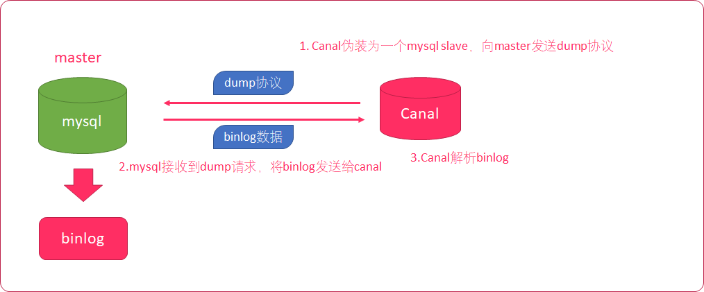
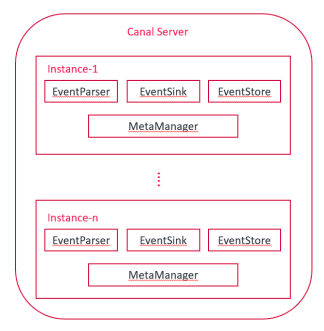
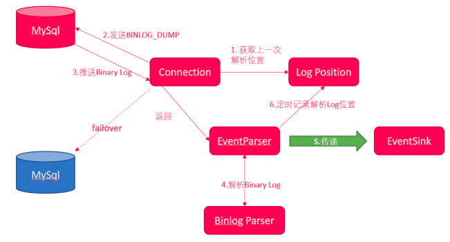

#  MySQL安装

## 二进制安装

### 环境准备

磁盘准备

/dev/sda：将操作系统安装在该盘，设置该磁盘为标准分区，并且在设置swap分区后将剩余的空间全部划分给根分区。其他的磁盘在操作系统安装好后全部做成lvm分区。（在安装操作系统的时候其他的磁盘不用管）
/dev/sdb
/dev/sdc
/dev/sdd
/dev/sde
/dev/sdf

不同的盘创建不同的vg，这样做的好处：1、方便后续扩展；2、后面mysql的数据目录和备份目录分别在不同的磁盘上，避免一块盘坏了数据和备份全部丢失的情况。

```bash
[root@mysql01 ~]# pvcreate /dev/sdb /dev/sdc /dev/sdd /dev/sde /dev/sdf
[root@mysql01 ~]# pvs
[root@mysql01 ~]# vgcreate appvg /dev/sdb
[root@mysql01 ~]# vgcreate datavg /dev/sdc
[root@mysql01 ~]# vgcreate logvg /dev/sdd
[root@mysql01 ~]# vgcreate bakvg /dev/sde
[root@mysql01 ~]# vgcreate softvg /dev/sdf
[root@mysql01 ~]# vgdisplay
[root@mysql01 ~]# vgs
[root@mysql01 ~]# lvcreate -n softlv -L 30000M softvg
[root@mysql01 ~]# lvcreate -n mysqllv -L 30000M appvg
[root@mysql01 ~]# lvcreate -n datalv -L 30000M datavg
[root@mysql01 ~]# lvcreate -n loglv -L 30000M logvg
[root@mysql01 ~]# lvcreate -n baklv -L 30000M bakvg
[root@mysql01 ~]# lvdisplay
[root@mysql01 ~]# lvs
#xfs
[root@mysql01 ~]# mkfs.xfs /dev/softvg/softlv 
[root@mysql01 ~]# mkfs.xfs /dev/appvg/mysqllv 
[root@mysql01 ~]# mkfs.xfs /dev/datavg/datalv 
[root@mysql01 ~]# mkfs.xfs /dev/logvg/loglv
[root@mysql01 ~]# mkfs.xfs /dev/bakvg/baklv
[root@mysql01 ~]# echo "/dev/appvg/mysqllv /mysql/app               xfs    defaults        0 0" >> /etc/fstab
[root@mysql01 ~]# echo "/dev/datavg/datalv /mysql/data               xfs    defaults        0 0" >> /etc/fstab
[root@mysql01 ~]# echo "/dev/logvg/loglv /mysql/log               xfs    defaults        0 0" >> /etc/fstab
[root@mysql01 ~]# echo "/dev/bakvg/baklv /mysql/backup             xfs    defaults        0 0" >> /etc/fstab
[root@mysql01 ~]# echo "/dev/softvg/softlv /soft             xfs    defaults        0 0" >> /etc/fstab
#ext4
[root@mysql01 ~]# mkfs.ext4 /dev/softvg/softlv 
[root@mysql01 ~]# mkfs.ext4 /dev/appvg/mysqllv 
[root@mysql01 ~]# mkfs.ext4 /dev/datavg/datalv 
[root@mysql01 ~]# mkfs.ext4 /dev/logvg/loglv
[root@mysql01 ~]# mkfs.ext4 /dev/bakvg/baklv
[root@mysql01 ~]# echo "/dev/appvg/mysqllv /mysql/app               ext4    defaults        0 0" >> /etc/fstab
[root@mysql01 ~]# echo "/dev/datavg/datalv /mysql/data               ext4    defaults        0 0" >> /etc/fstab
[root@mysql01 ~]# echo "/dev/logvg/loglv /mysql/log               ext4    defaults        0 0" >> /etc/fstab
[root@mysql01 ~]# echo "/dev/bakvg/baklv /mysql/backup             ext4    defaults        0 0" >> /etc/fstab
[root@mysql01 ~]# echo "/dev/softvg/softlv /soft             ext4    defaults        0 0" >> /etc/fstab

[root@mysql01 ~]# mkdir -p /mysql/app
[root@mysql01 ~]# mkdir -p /mysql/data
[root@mysql01 ~]# mkdir -p /mysql/log
[root@mysql01 ~]# mkdir -p /mysql/backup
[root@mysql01 ~]# mkdir -p /soft

[root@mysql01 ~]# mount /mysql/app
[root@mysql01 ~]# mount /mysql/data
[root@mysql01 ~]# mount /mysql/log
[root@mysql01 ~]# mount /mysql/backup
[root@mysql01 ~]# mount /soft
[root@mysql01 ~]# df -h
```

hosts

```bash
[root@mysql01 ~]# echo "192.168.56.110 mysql01" >> /etc/hosts
[root@mysql01 ~]# echo "192.168.56.111 mysql02" >> /etc/hosts
[root@mysql01 ~]# echo "192.168.56.112 mysql03" >> /etc/hosts
[root@mysql01 ~]# echo "192.168.56.113 mysql04" >> /etc/hosts
[root@mysql01 ~]# echo "192.168.56.114 mysql05" >> /etc/hosts
[root@mysql01 ~]# echo "192.168.56.115 mysql06" >> /etc/hosts
[root@mysql01 ~]# echo "192.168.56.116 mysql07" >> /etc/hosts
[root@mysql01 ~]# echo "192.168.56.117 mysql08" >> /etc/hosts
[root@mysql01 ~]# echo "192.168.56.101 server01" >> /etc/hosts
[root@mysql01 ~]# echo "192.168.56.102 server02" >> /etc/hosts
[root@mysql01 ~]# echo "192.168.56.103 server03" >> /etc/hosts
[root@mysql01 ~]# echo "192.168.56.120 loadbalance01" >> /etc/hosts
[root@mysql01 ~]# echo "192.168.56.121 loadbalance02" >> /etc/hosts
[root@mysql01 ~]# echo "192.168.56.130 middleware01" >> /etc/hosts
[root@mysql01 ~]# echo "192.168.56.131 middleware02" >> /etc/hosts
```

配置英文环境

```bash
[root@mysql01 ~]# echo "export LANG=en_US.UTF8" >> ~/.bash_profile
[root@mysql01 ~]# echo "export LANG=en_US.UTF8" >> /etc/profile
[root@mysql01 ~]# source ~/.bash_profile
[root@mysql01 ~]# source /etc/profile
```

修改资源限制参数

```bash
[root@mysql01 ~]# echo "* soft memlock 300000" >> /etc/security/limits.conf
[root@mysql01 ~]# echo "* hard memlock 300000" >> /etc/security/limits.conf
[root@mysql01 ~]# echo "* soft nproc 65535" >> /etc/security/limits.conf
[root@mysql01 ~]# echo "* hard nproc 65535" >> /etc/security/limits.conf
[root@mysql01 ~]# echo "* soft nofile 65535" >> /etc/security/limits.conf
[root@mysql01 ~]# echo "* hard nofile 65535" >> /etc/security/limits.conf
[root@mysql01 ~]# echo "* soft stack 65535" >> /etc/security/limits.conf
[root@mysql01 ~]# echo "* hard stack 65535" >> /etc/security/limits.conf
[root@mysql01 ~]# echo "* - nproc 65535" > /etc/security/limits.d/90-nproc.conf
```

设置系统安全策略

```bash
[root@mysql01 ~]# echo "SELINUX=disabled" > /etc/selinux/config
[root@mysql01 ~]# echo "SELINUXTYPE=targeted" >> /etc/selinux/config
```

设置内核参数

```bash
[root@mysql01 ~]# echo "vm.nr_hugepages=150" >> /etc/sysctl.conf
[root@mysql01 ~]# echo "vm.swappiness=10" >> /etc/sysctl.conf
[root@mysql01 ~]# echo "vm.min_free_kbytes=51200" >> /etc/sysctl.conf
[root@mysql01 ~]# echo "net.ipv4.tcp_max_tw_buckets = 6000" >> /etc/sysctl.conf
[root@mysql01 ~]# echo "net.ipv4.ip_local_port_range = 1024 65000" >> /etc/sysctl.conf
[root@mysql01 ~]# echo "net.ipv4.tcp_tw_recycle = 0" >> /etc/sysctl.conf
[root@mysql01 ~]# echo "net.ipv4.tcp_tw_reuse = 1" >> /etc/sysctl.conf
[root@mysql01 ~]# echo "net.core.somaxconn = 65500" >> /etc/sysctl.conf
[root@mysql01 ~]# echo "net.core.netdev_max_backlog = 262144" >> /etc/sysctl.conf
[root@mysql01 ~]# echo "net.ipv4.tcp_max_orphans = 262144" >> /etc/sysctl.conf
[root@mysql01 ~]# echo "net.ipv4.tcp_max_syn_backlog = 262144" >> /etc/sysctl.conf
[root@mysql01 ~]# echo "net.ipv4.tcp_synack_retries = 2" >> /etc/sysctl.conf
[root@mysql01 ~]# echo "net.ipv4.tcp_syn_retries = 1" >> /etc/sysctl.conf
[root@mysql01 ~]# echo "net.ipv4.tcp_fin_timeout = 1" >> /etc/sysctl.conf
[root@mysql01 ~]# echo "net.ipv4.tcp_keepalive_time = 30" >> /etc/sysctl.conf
[root@mysql01 ~]# echo "net.ipv4.tcp_keepalive_probes = 6" >> /etc/sysctl.conf
[root@mysql01 ~]# echo "net.ipv4.tcp_keepalive_intvl = 5" >> /etc/sysctl.conf
[root@mysql01 ~]# echo "net.ipv4.tcp_timestamps = 0" >> /etc/sysctl.conf
```

关闭防火墙

```bash
[root@mysql01 ~]# systemctl status firewalld.service
[root@mysql01 ~]# systemctl stop firewalld.service
[root@mysql01 ~]# systemctl disable firewalld.service
```

控制资源分配限制

```bash
[root@mysql01 ~]# echo "session required pam_limits.so" >> /etc/pam.d/login
```

修改系统启动脚本

```bash
[root@mysql01 ~]# echo "if test -f /sys/kernel/mm/transparent_hugepage/enabled; then">> /etc/rc.d/rc.local
[root@mysql01 ~]# echo "echo never > /sys/kernel/mm/transparent_hugepage/enabled">> /etc/rc.d/rc.local
[root@mysql01 ~]# echo "fi">> /etc/rc.d/rc.local
[root@mysql01 ~]# echo "if test -f /sys/kernel/mm/transparent_hugepage/defrag; then">> /etc/rc.d/rc.local
[root@mysql01 ~]# echo "echo never > /sys/kernel/mm/transparent_hugepage/defrag">> /etc/rc.d/rc.local
[root@mysql01 ~]# echo "fi">> /etc/rc.d/rc.local
[root@mysql01 ~]# chmod +x /etc/rc.d/rc.local
```

关闭 NUMA 功能

```bash
[root@mysql01 ~]# yum install numactl
[root@mysql01 ~]# vi /etc/default/grub
GRUB_CMDLINE_LINUX="crashkernel=auto spectre_v2=retpoline rhgb quiet numa=off"
[root@mysql01 ~]# grub2-mkconfig -o /etc/grub2.cfg
[root@mysql01 ~]# numastat
[root@mysql01 ~]# numactl --show
[root@mysql01 ~]# numactl --hardware
```

IO 调度算法与 IO 优化

```bash
[root@mysql01 ~]# cat /sys/block/sd*/queue/scheduler
#当硬盘的类型为：sas/stat
[root@mysql01 ~]# echo 'deadline' > /sys/block/sdb/queue/scheduler
[root@mysql01 ~]# echo 'deadline' > /sys/block/sdc/queue/scheduler
[root@mysql01 ~]# echo 'deadline' > /sys/block/sdd/queue/scheduler
[root@mysql01 ~]# echo 'deadline' > /sys/block/sde/queue/scheduler
[root@mysql01 ~]# echo 'deadline' > /sys/block/sdf/queue/scheduler
#当硬盘的类型为：ssd
[root@mysql01 ~]# echo 'NOOP' > /sys/block/sd*/queue/scheduler
#减少预读
[root@mysql01 ~]# echo '16' > /sys/block/sdb/queue/read_ahead_kb
[root@mysql01 ~]# echo '16' > /sys/block/sdc/queue/read_ahead_kb
[root@mysql01 ~]# echo '16' > /sys/block/sdd/queue/read_ahead_kb
[root@mysql01 ~]# echo '16' > /sys/block/sde/queue/read_ahead_kb
[root@mysql01 ~]# echo '16' > /sys/block/sdf/queue/read_ahead_kb
#增大队列
[root@mysql01 ~]# echo '512' > /sys/block/sdb/queue/nr_requests
[root@mysql01 ~]# echo '512' > /sys/block/sdc/queue/nr_requests
[root@mysql01 ~]# echo '512' > /sys/block/sdd/queue/nr_requests
[root@mysql01 ~]# echo '512' > /sys/block/sde/queue/nr_requests
[root@mysql01 ~]# echo '512' > /sys/block/sdf/queue/nr_requests
```

环境检查

```bash
[root@mysql01 ~]# rpm -qa | grep libaio
libaio-0.3.109-13.el7.x86_64
```

### 安装

```bash
[root@mysql01 ~]# groupadd mysql
# /bin/false是最严格的禁止login选项，一切服务都不能用，
# /sbin/nologin只是不允许系统login，可以使用其他ftp等服务
[root@mysql01 ~]# useradd -r -g mysql -s /bin/false mysql
# 创建基础目录
[root@mysql01 ~]# mkdir -p /mysql/data/3306/data
[root@mysql01 ~]# mkdir -p /mysql/log/3306
[root@mysql01 ~]# mkdir -p /mysql/log/3306/binlog
[root@mysql01 ~]# mkdir -p /mysql/log/3306/relaylog
# 解压
[root@mysql01 ~]# cd /mysql/app/
[root@mysql01 app]# tar zxfv mysql-8.0.32-el7-x86_64.tar.gz 
# 创建软链接
[root@mysql01 app]# ln -s mysql-8.0.32-el7-x86_64 mysql
# 添加环境变量
[root@mysql01 ~]# vim ~/.bash_profile
export MYSQL_HOME=/mysql/app/mysql/bin
PATH=$PATH:$HOME/bin:$MYSQL_HOME
# 重新登陆，查看版本
[root@mysql01 ~]# mysql --version
# 修改权限
[root@mysql01 ~]# chown -R mysql:mysql /mysql

# 创建my.cnf
[root@mysql01 3306]# cd /mysql/data/3306/
[root@mysql01 3306]# vim my.cnf
```

#### my.conf

```ini
[client]
port=3306
socket	= /mysql/data/3306/mysql.sock

[mysql]
no-beep
# 提示符
prompt="\u@itpux \R:\m:\s [\d]> "
#no-auto-rehash
auto-rehash
default-character-set=utf8mb4

[mysqld]
########basic settings########
# skip-grant-tables
# 针对于主从复制，一般用ip+端口号
server-id=1103306
port=3306
user = mysql
# 主从复制的时候bind_address设置为0.0.0.0，表示接受所有服务器主机 IPv4 接口上的 TCP/IP 连接
#bind_address= 192.168.56.110
# MGR模式下，不能绑定任何IP，下面这一行要注释掉
# bind_address= 0.0.0.0
# 软件安装路径
basedir=/mysql/app/mysql
datadir=/mysql/data/3306/data
socket	= /mysql/data/3306/mysql.sock
pid-file=/mysql/data/3306/mysql.pid
character-set-server=utf8mb4
skip-character-set-client-handshake=1
# autocommit = 0
# skip_name_resolve = 1
max_connections = 800
max_connect_errors = 1000
default-storage-engine=INNODB
# transaction_isolation = READ-COMMITTED
transaction_isolation = REPEATABLE-READ
explicit_defaults_for_timestamp = 1
sort_buffer_size = 32M
join_buffer_size = 128M
tmp_table_size = 72M
max_allowed_packet = 16M
sql_mode = "STRICT_TRANS_TABLES,NO_ENGINE_SUBSTITUTION,NO_ZERO_DATE,NO_ZERO_IN_DATE,ERROR_FOR_DIVISION_BY_ZERO"
interactive_timeout = 1800
wait_timeout = 1800
read_buffer_size = 16M
read_rnd_buffer_size = 32M

table_open_cache=2000
thread_cache_size=768
myisam_max_sort_file_size=10G
myisam_sort_buffer_size=135M
key_buffer_size=32M
read_buffer_size=8M
read_rnd_buffer_size=4M

back_log=1024
#flush_time=0
open_files_limit=65536
table_definition_cache=1400
#binlog_row_event_max_size=8K
#sync_master_info=10000
#sync_relay_log=10000
#sync_relay_log_info=10000

########log settings########
log-output=FILE
# 全局日志，不建议打开，影响性能。（0：关闭；1：打开）
general_log = 0
general_log_file=/mysql/log/3306/general.err
# 慢查询日志
slow_query_log = ON
slow_query_log_file=/mysql/log/3306/slow-query.err
long_query_time=10
# 错误日志
log-error=/mysql/log/3306/log-error.err

log_queries_not_using_indexes = 1
log_slow_admin_statements = 1
log_slow_replica_statements = 1
log_throttle_queries_not_using_indexes = 10
min_examined_row_limit = 100

# binlog设置
log_bin=/mysql/log/3306/binlog/binlog
binlog_format = row 
binlog_rows_query_log_events = on
sync_binlog = 1
max_binlog_size = 2147483648
binlog_expire_logs_seconds = 2592000
binlog_cache_size = 1048576
log_bin_trust_function_creators = ON

## 主从复制，master增加如下设置
#gtid_mode = ON
#enforce_gtid_consistency = ON
#binlog_gtid_simple_recovery = ON

## 主从复制，slave增加如下设置
#relay_log = /mysql/log/3306/relaylog/relay.log
#relay_log_recovery = ON
#relay_log_info_repository = TABLE
#master_info_repository = TABLE
#read_only = ON
#slave_skip_errors = ddl_exist_errors
#slave_preserve_commit_order = ON
#gtid_mode = ON
#log_slave_updates = ON
#enforce_gtid_consistency = ON
#binlog_gtid_simple_recovery = ON

# 使用半同步方式需要安装插件，安装方式有两种：
# 1、通过install plugin的方式安装，如果有多台机器，则需要登录每一台mysql服务器进行安装
# 2、将配置信息写入到配置文件my.cnf中。
# 半同步复制：master节点增加如下配置
# plugin_load_add ="rpl_semi_sync_source=semisync_source.so"
# rpl_semi_sync_source_enabled = 1

# 半同步复制：slave节点增加如下配置
# plugin_load_add ="rpl_semi_sync_replica=semisync_replica.so"
# rpl_semi_sync_replica_enabled = 1

# MySQL group Replication模式
binlog_checksum=NONE
# 同时安装多个插件，验证下来，初始化的时候只能安装插件，不能配置group相关的参数，只有在初始化完成后，启动mysql并且修改完密码，然后设置group相关的参数后重启。
plugin_load_add ="rpl_semi_sync_source=semisync_source.so;rpl_semi_sync_replica=semisync_replica.so;group_replication=group_replication.so"
# MGR模式必须打开GTID
gtid_mode = on
enforce_gtid_consistency = 1
log-slave-updates = 1
binlog_gtid_simple_recovery=1
relay_log = /mysql/log/3306/relaylog/relay.log
master_info_repository=table
relay_log_info_repository=table
# 对每个事务获取write set并且用XXHASH64算法获取hash指
transaction_write_set_extraction=XXHASH64
# 组名，此处可拿select.uuid()生成，也可以写成下面的格式，只要是uuid的长度和格式就行了
group_replication_group_name="aaaaaaaa-aaaa-aaaa-aaaa-aaaaaaaaaaaa"
# 在mysql启动时不自动启动组复制
group_replication_start_on_boot=off
# 本节点的ip地址和端口，注意该端口是组内成员之间的通信的端口，而不是mysql对外提供服务的端口
group_replication_local_address= "192.168.56.110:33006"
# 种子节点的IP和端口，新成员加入到集群的时候需要联系种子节点，启动集群的节点不使用该选项。
group_replication_group_seeds="192.168.56.110:33006,192.168.56.111:33006,192.168.56.112:33006"
# 是否启动集群，注意：该选项任何时候只能用于一个节点，通常情况下是启动集群的时候使用，启动之后需要关闭该选项，
group_replication_bootstrap_group= off
# 下面两个选项决定是不是多主复制
# 多主的时候：
group_replication_single_primary_mode=off
group_replication_enforce_update_everywhere_checks=on
# 单主的时候：
group_replication_member_weight=50

########innodb settings########
# 根据您的服务器IOPS能力适当调整
# 一般配普通SSD盘的话，可以调整到 10000 - 20000
# 配置高端PCIe SSD卡的话，则可以调整的更高，比如 50000 - 80000
innodb_io_capacity = 4000
innodb_io_capacity_max = 8000
innodb_buffer_pool_size = 500M
innodb_buffer_pool_instances = 8
innodb_buffer_pool_load_at_startup = 1
innodb_buffer_pool_dump_at_shutdown = 1
innodb_lru_scan_depth = 2000
innodb_lock_wait_timeout = 5
#innodb_flush_method = O_DIRECT

innodb_redo_log_capacity=5368709120
innodb_log_buffer_size = 16M

innodb_rollback_segments = 128
innodb_undo_log_truncate = 1
innodb_max_undo_log_size = 2G

innodb_flush_neighbors = 1
innodb_purge_threads = 4
innodb_thread_concurrency = 64
innodb_print_all_deadlocks = 1
innodb_strict_mode = 1
innodb_sort_buffer_size = 64M
innodb_flush_log_at_trx_commit=1
innodb_autoextend_increment=64
innodb_concurrency_tickets=5000
innodb_old_blocks_time=1000
innodb_open_files=65536
innodb_stats_on_metadata=0
# 1：用户独立表空间；0：没有独立的用户表空间
innodb_file_per_table=1
innodb_checksum_algorithm=0
innodb_data_file_path=ibdata1:200M;ibdata2:200M;ibdata3:200M:autoextend:max:5G
innodb_temp_data_file_path = ibtmp1:200M:autoextend:max:20G

innodb_buffer_pool_dump_pct = 40
innodb_page_cleaners = 4
innodb_purge_rseg_truncate_frequency = 128
binlog_gtid_simple_recovery=1
log_timestamps=system
#transaction_write_set_extraction=MURMUR32
```

初始化

```bash
# 错误日志文件必须创建，否则无法执行初始化
[root@mysql01 3306]# rm -rf /mysql/data/3306/data/*
[root@mysql01 3306]# rm -rf /mysql/log/3306/binlog/*
[root@mysql01 3306]# rm -rf /mysql/log/3306/relaylog/*
[root@mysql01 3306]# rm -rf /mysql/log/3306/log-error.err 
[root@mysql01 3306]# touch /mysql/log/3306/log-error.err
[root@mysql01 3306]# chown -R mysql:mysql /mysql
# 初始化
[root@mysql01 3306]# mysqld --defaults-file=/mysql/data/3306/my.cnf --initialize --user=mysql --basedir=/mysql/app/mysql --datadir=/mysql/data/3306/data
```

### 启动停止服务

```bash
[root@mysql01 support-files]# cd /mysql/app/mysql/support-files
# 修改mysql.server文件，具体内容参照下方的mysql.service
[root@mysql01 support-files]# vim mysql.server

[root@mysql01 support-files]# cp /mysql/app/mysql/support-files/mysql.server /mysql/app/mysql/bin/mysqlservice
[root@mysql01 support-files]# mysqlservice status

# 新建mysql服务单元配置文件，具体内容参照下方的mysqld.service
[root@mysql01 support-files]# cd /usr/lib/systemd/system/
[root@mysql01 system]# vim mysqld.service

[root@mysql01 system]# chown -R mysql:mysql /mysql/
[root@mysql01 ~]# systemctl start mysqld.service
# 通过命令可以看到mysql后台启动了两个进程，mysqld_safe是oracle在原来mysqld的基础上做了优化
# 原来通过mysqld的方式启动的话，如果mysql异常终止是不会自动重启的
# 而mysqld_safe则会在mysql异常退出后，自动重启mysql
# 简单来说，通过mysqld启动的mysql在出问题后不会重启，而通过mysqld_safe命令启动的mysql在出问题后会自动重启
[root@mysql01 ~]# ps -ef | grep mysql
mysql     2493     1  0 14:29 ?        00:00:00 /bin/sh /mysql/app/mysql/bin/mysqld_safe --defaults-file=/mysql/data/3306/my.cnf --datadir=/mysql/data/3306/data --pid-file=/mysql/data/3306/mysql.pid
mysql     3578  2493  2 14:29 ?        00:00:02 /mysql/app/mysql/bin/mysqld --defaults-file=/mysql/data/3306/my.cnf --basedir=/mysql/app/mysql --datadir=/mysql/data/3306/data --plugin-dir=/mysql/app/mysql/lib/plugin --log-error=/mysql/log/3306/log-error.err --open-files-limit=65536 --pid-file=/mysql/data/3306/mysql.pid --socket=/mysql/data/3306/mysql.sock --port=3306
root      3629  2427  0 14:30 pts/1    00:00:00 grep --color=auto mysql

######################################################################
#第一次服务启动成功后，需要修改初始密码
######################################################################

#当系统中存在多个mysql的时候，可以通过编写启动脚本的方式启动不同的mysql。例如：
[root@mysql01 ~]#  echo "/mysql/app/mysql/bin/mysqld_safe --defaults-file=/mysql/data/3306/my.cnf --user=mysql &" > /mysql/data/3306/mysql.start
[root@mysql01 ~]# chown mysql:mysql /mysql/data/3306/mysql.start
[root@mysql01 ~]# chmod +x /mysql/data/3306/mysql.start
# 使用脚本的方式启动mysql，先停止
[root@mysql01 3306]# systemctl stop mysqld.service
# 启动
[root@mysql01 3306]# /mysql/data/3306/mysql.start
[root@mysql01 3306]# 2023-07-09T06:40:48.585024Z mysqld_safe Logging to '/mysql/log/3306/log-error.err'.
2023-07-09T06:40:48.623628Z mysqld_safe Starting mysqld daemon with databases from /mysql/data/3306/data
# 停止 通过脚本启动的mysql，最好使用shutdown来停止，但是在停止的时候会出现密码过期的问题。需要修改初始化密码
# A temporary password is generated for root@localhost: tyUsdMu5t5=t
[root@mysql01 3306]# mysqladmin -uroot -p shutdown -S /mysql/data/3306/mysql.sock
Enter password: 
mysqladmin: connect to server at 'localhost' failed
error: 'Your password has expired. To log in you must change it using a client that supports expired passwords.'

```

#### mysql.service

```bash
#!/bin/sh
# Copyright Abandoned 1996 TCX DataKonsult AB & Monty Program KB & Detron HB
# This file is public domain and comes with NO WARRANTY of any kind

# MySQL daemon start/stop script.

# Usually this is put in /etc/init.d (at least on machines SYSV R4 based
# systems) and linked to /etc/rc3.d/S99mysql and /etc/rc0.d/K01mysql.
# When this is done the mysql server will be started when the machine is
# started and shut down when the systems goes down.

# Comments to support chkconfig on RedHat Linux
# chkconfig: 2345 64 36
# description: A very fast and reliable SQL database engine.

# Comments to support LSB init script conventions
### BEGIN INIT INFO
# Provides: mysql
# Required-Start: $local_fs $network $remote_fs
# Should-Start: ypbind nscd ldap ntpd xntpd
# Required-Stop: $local_fs $network $remote_fs
# Default-Start:  2 3 4 5
# Default-Stop: 0 1 6
# Short-Description: start and stop MySQL
# Description: MySQL is a very fast and reliable SQL database engine.
### END INIT INFO
 
# If you install MySQL on some other places than /usr/local/mysql, then you
# have to do one of the following things for this script to work:
#
# - Run this script from within the MySQL installation directory
# - Create a /etc/my.cnf file with the following information:
#   [mysqld]
#   basedir=<path-to-mysql-installation-directory>
# - Add the above to any other configuration file (for example ~/.my.ini)
#   and copy my_print_defaults to /usr/bin
# - Add the path to the mysql-installation-directory to the basedir variable
#   below.
#
# If you want to affect other MySQL variables, you should make your changes
# in the /etc/my.cnf, ~/.my.cnf or other MySQL configuration files.

# If you change base dir, you must also change datadir. These may get
# overwritten by settings in the MySQL configuration files.
# 主要修改以下三个地方
# 1、如果不设置basedir那么mysql启动的时候默认会到/usr/local/mysql目录下去找启动命令
basedir=/mysql/app/mysql
datadir=/mysql/data/3306/data

# Default value, in seconds, afterwhich the script should timeout waiting
# for server start. 
# Value here is overriden by value in my.cnf. 
# 0 means don't wait at all
# Negative numbers mean to wait indefinitely
service_startup_timeout=900

# Lock directory for RedHat / SuSE.
lockdir='/var/lock/subsys'
lock_file_path="$lockdir/mysql"

# The following variables are only set for letting mysql.server find things.

# Set some defaults
# 2、修改mysqld_pid_file_path以及basedir、bindir、datadir、sbindir、libexecdir
mysqld_pid_file_path=/mysql/data/3306/mysql.pid
if test -z "$basedir"
then
  basedir=/mysql/app/mysql
  bindir=/mysql/app/mysql/bin
  if test -z "$datadir"
  then
    datadir=/mysql/data/3306/data
  fi
  sbindir=/mysql/app/mysql/bin
  libexecdir=/mysql/app/mysql/bin
else
  bindir="$basedir/bin"
  if test -z "$datadir"
  then
    datadir="/mysql/app/3306/data"
  fi
  sbindir="$basedir/sbin"
  libexecdir="$basedir/libexec"
fi

# datadir_set is used to determine if datadir was set (and so should be
# *not* set inside of the --basedir= handler.)
datadir_set=

#
# Use LSB init script functions for printing messages, if possible
#
lsb_functions="/lib/lsb/init-functions"
if test -f $lsb_functions ; then
  . $lsb_functions
else
  log_success_msg()
  {
    echo " SUCCESS! $@"
  }
  log_failure_msg()
  {
    echo " ERROR! $@"
  }
fi

PATH="/sbin:/usr/sbin:/bin:/usr/bin:$basedir/bin"
export PATH

mode=$1    # start or stop

[ $# -ge 1 ] && shift


other_args="$*"   # uncommon, but needed when called from an RPM upgrade action
           # Expected: "--skip-networking --skip-grant-tables"
           # They are not checked here, intentionally, as it is the resposibility
           # of the "spec" file author to give correct arguments only.

case `echo "testing\c"`,`echo -n testing` in
    *c*,-n*) echo_n=   echo_c=     ;;
    *c*,*)   echo_n=-n echo_c=     ;;
    *)       echo_n=   echo_c='\c' ;;
esac

parse_server_arguments() {
  for arg do
    case "$arg" in
      --basedir=*)  basedir=`echo "$arg" | sed -e 's/^[^=]*=//'`
                    bindir="$basedir/bin"
		    if test -z "$datadir_set"; then
		      datadir="$basedir/data"
		    fi
		    sbindir="$basedir/sbin"
		    libexecdir="$basedir/libexec"
        ;;
      --datadir=*)  datadir=`echo "$arg" | sed -e 's/^[^=]*=//'`
		    datadir_set=1
	;;
      --pid-file=*) mysqld_pid_file_path=`echo "$arg" | sed -e 's/^[^=]*=//'` ;;
      --service-startup-timeout=*) service_startup_timeout=`echo "$arg" | sed -e 's/^[^=]*=//'` ;;
    esac
  done
}

wait_for_pid () {
  verb="$1"           # created | removed
  pid="$2"            # process ID of the program operating on the pid-file
  pid_file_path="$3" # path to the PID file.

  i=0
  avoid_race_condition="by checking again"

  while test $i -ne $service_startup_timeout ; do

    case "$verb" in
      'created')
        # wait for a PID-file to pop into existence.
        test -s "$pid_file_path" && i='' && break
        ;;
      'removed')
        # wait for this PID-file to disappear
        test ! -s "$pid_file_path" && i='' && break
        ;;
      *)
        echo "wait_for_pid () usage: wait_for_pid created|removed pid pid_file_path"
        exit 1
        ;;
    esac

    # if server isn't running, then pid-file will never be updated
    if test -n "$pid"; then
      if kill -0 "$pid" 2>/dev/null; then
        :  # the server still runs
      else
        # The server may have exited between the last pid-file check and now.  
        if test -n "$avoid_race_condition"; then
          avoid_race_condition=""
          continue  # Check again.
        fi

        # there's nothing that will affect the file.
        log_failure_msg "The server quit without updating PID file ($pid_file_path)."
        return 1  # not waiting any more.
      fi
    fi

    echo $echo_n ".$echo_c"
    i=`expr $i + 1`
    sleep 1

  done

  if test -z "$i" ; then
    log_success_msg
    return 0
  else
    log_failure_msg
    return 1
  fi
}

# Get arguments from the my.cnf file,
# the only group, which is read from now on is [mysqld]
# 3、修改conf文件的位置
if test -x "$bindir/my_print_defaults";  then
  print_defaults="$bindir/my_print_defaults"
else
  # Try to find basedir in /etc/my.cnf
  conf=/mysql/data/3306/my.cnf
  print_defaults=
  if test -r $conf
  then
    subpat='^[^=]*basedir[^=]*=\(.*\)$'
    dirs=`sed -e "/$subpat/!d" -e 's//\1/' $conf`
    for d in $dirs
    do
      d=`echo $d | sed -e 's/[ 	]//g'`
      if test -x "$d/bin/my_print_defaults"
      then
        print_defaults="$d/bin/my_print_defaults"
        break
      fi
    done
  fi

  # Hope it's in the PATH ... but I doubt it
  test -z "$print_defaults" && print_defaults="my_print_defaults"
fi

#
# Read defaults file from 'basedir'.   If there is no defaults file there
# check if it's in the old (depricated) place (datadir) and read it from there
#

# 4、修改test参数
extra_args=""
if test -r "/mysql/data/3306/my.cnf"
then
  extra_args="-e /mysql/data/3306/my.cnf"
fi

parse_server_arguments `$print_defaults $extra_args mysqld server mysql_server mysql.server`

#
# Set pid file if not given
#
if test -z "$mysqld_pid_file_path"
then
  mysqld_pid_file_path=$datadir/`hostname`.pid
else
  case "$mysqld_pid_file_path" in
    /* ) ;;
    * )  mysqld_pid_file_path="$datadir/$mysqld_pid_file_path" ;;
  esac
fi

# 5、在启动命令$bindir/mysqld_safe中加入参数：--defaults-file=/mysql/data/3306/my.cnf
case "$mode" in
  'start')
    # Start daemon

    # Safeguard (relative paths, core dumps..)
    cd $basedir

    echo $echo_n "Starting MySQL"
    if test -x $bindir/mysqld_safe
    then
      # Give extra arguments to mysqld with the my.cnf file. This script
      # may be overwritten at next upgrade.
      $bindir/mysqld_safe --defaults-file=/mysql/data/3306/my.cnf --datadir="$datadir" --pid-file="$mysqld_pid_file_path" $other_args >/dev/null &
      wait_for_pid created "$!" "$mysqld_pid_file_path"; return_value=$?

      # Make lock for RedHat / SuSE
      if test -w "$lockdir"
      then
        touch "$lock_file_path"
      fi

      exit $return_value
    else
      log_failure_msg "Couldn't find MySQL server ($bindir/mysqld_safe)"
    fi
    ;;

  'stop')
    # Stop daemon. We use a signal here to avoid having to know the
    # root password.

    if test -s "$mysqld_pid_file_path"
    then
      # signal mysqld_safe that it needs to stop
      touch "$mysqld_pid_file_path.shutdown"

      mysqld_pid=`cat "$mysqld_pid_file_path"`

      if (kill -0 $mysqld_pid 2>/dev/null)
      then
        echo $echo_n "Shutting down MySQL"
        kill $mysqld_pid
        # mysqld should remove the pid file when it exits, so wait for it.
        wait_for_pid removed "$mysqld_pid" "$mysqld_pid_file_path"; return_value=$?
      else
        log_failure_msg "MySQL server process #$mysqld_pid is not running!"
        rm "$mysqld_pid_file_path"
      fi

      # Delete lock for RedHat / SuSE
      if test -f "$lock_file_path"
      then
        rm -f "$lock_file_path"
      fi
      exit $return_value
    else
      log_failure_msg "MySQL server PID file could not be found!"
    fi
    ;;

  'restart')
    # Stop the service and regardless of whether it was
    # running or not, start it again.
    if $0 stop  $other_args; then
      $0 start $other_args
    else
      log_failure_msg "Failed to stop running server, so refusing to try to start."
      exit 1
    fi
    ;;

  'reload'|'force-reload')
    if test -s "$mysqld_pid_file_path" ; then
      read mysqld_pid <  "$mysqld_pid_file_path"
      kill -HUP $mysqld_pid && log_success_msg "Reloading service MySQL"
      touch "$mysqld_pid_file_path"
    else
      log_failure_msg "MySQL PID file could not be found!"
      exit 1
    fi
    ;;
  'status')
    # First, check to see if pid file exists
    if test -s "$mysqld_pid_file_path" ; then 
      read mysqld_pid < "$mysqld_pid_file_path"
      if kill -0 $mysqld_pid 2>/dev/null ; then 
        log_success_msg "MySQL running ($mysqld_pid)"
        exit 0
      else
        log_failure_msg "MySQL is not running, but PID file exists"
        exit 1
      fi
    else
      # Try to find appropriate mysqld process
      mysqld_pid=`pidof $libexecdir/mysqld`

      # test if multiple pids exist
      pid_count=`echo $mysqld_pid | wc -w`
      if test $pid_count -gt 1 ; then
        log_failure_msg "Multiple MySQL running but PID file could not be found ($mysqld_pid)"
        exit 5
      elif test -z $mysqld_pid ; then 
        if test -f "$lock_file_path" ; then 
          log_failure_msg "MySQL is not running, but lock file ($lock_file_path) exists"
          exit 2
        fi 
        log_failure_msg "MySQL is not running"
        exit 3
      else
        log_failure_msg "MySQL is running but PID file could not be found"
        exit 4
      fi
    fi
    ;;
    *)
      # usage
      basename=`basename "$0"`
      echo "Usage: $basename  {start|stop|restart|reload|force-reload|status}  [ MySQL server options ]"
      exit 1
    ;;
esac

exit 0
```

#### mysqld.service

```ini
[Unit]
Description=MySQL Server
Documentation=man:mysqld(8)
Documentation=http://dev.mysql.com/doc/refman/en/using-systemd.html
After=network.target
After=syslog.target

[Install]
WantedBy=multi-user.target

[Service]
User=mysql
Group=mysql
Type=forking
PIDFile=/mysql/data/3306/mysql.pid
TimeoutSec=0

# Execute pre and post scripts as root
PermissionsStartOnly=true

# Start main service
ExecStart=/mysql/app/mysql/support-files/mysql.server start

# Use this to switch malloc implementation
EnvironmentFile=-/etc/sysconfig/mysql

# Sets open_files_limit
LimitNOFILE = 65536
LimitNPROC = 65536 

Restart=on-failure
RestartPreventExitStatus=1

PrivateTmp=false
```

### 修改初始密码

```bash
# 创建sock软链接，避免每次登录mysql的时候都要指定-S参数
[root@mysql01 3306]# ln -s /mysql/data/3306/mysql.sock /tmp/
# 使用初始化密码连接到mysql
[root@mysql01 3306]# mysql -uroot -p
Enter password: 
```

```mysql
# 修改用户密码
# 由于MySql8.0版本和5.0 的加密规则不一样，而大部分可视化工具只支持旧的加密方式，为了可以通过可视化工具远程访问数据库，所以将MySQL用户登录的加密规则修改为mysql_native_password
mysql> ALTER USER 'root'@'localhost' IDENTIFIED WITH mysql_native_password BY '123456';
Query OK, 0 rows affected (0.01 sec)

mysql> use mysql;

# 这里将root用户的host设置为%，表示：root用户可以在任何地点登录该mysql服务器
mysql> update user set host='%' where user='root';
Query OK, 0 rows affected (0.00 sec)

mysql> select host,user,plugin from user;
+-----------+------------------+-----------------------+
| host      | user             | plugin                |
+-----------+------------------+-----------------------+
| %         | root             | mysql_native_password |
| localhost | mysql.infoschema | caching_sha2_password |
| localhost | mysql.session    | caching_sha2_password |
| localhost | mysql.sys        | caching_sha2_password |
+-----------+------------------+-----------------------+
4 rows in set (0.00 sec)

mysql> flush privileges;
Query OK, 0 rows affected (0.00 sec)
```

```bash
# 修改完密码之后，输入新的密码就可以停止mysql服务了
[root@mysql01 ~]# mysqladmin -uroot -p shutdown
Enter password: 
```

### 完整流程

```markdown
rm -rf /mysql/data/3306/data/*
rm -rf /mysql/log/3306/binlog/*
rm -rf /mysql/log/3306/relaylog/*
rm -rf /mysql/log/3306/log-error.err 
touch /mysql/log/3306/log-error.err
chown -R mysql:mysql /mysql

# MySQL group Replication模式下，初始化时，先安装插件，MGR对应的参数不能设置，否则可能会报错
vim /mysql/data/3306/my.cnf
mysqld --defaults-file=/mysql/data/3306/my.cnf --initialize --user=mysql --basedir=/mysql/app/mysql --datadir=/mysql/data/3306/data
vim /mysql/log/3306/log-error.err
systemctl start mysqld.service
mysql -uroot -p

ALTER USER 'root'@'localhost' IDENTIFIED WITH mysql_native_password BY '123456';
use mysql;
update user set host='%' where user='root';
flush privileges;
reset master;
reset slave all;
quit;

# MGR模式下，设置相应的参数
vim /mysql/data/3306/my.cnf
systemctl restart mysqld.service

mysql -uroot -p

set sql_log_bin=0;
create user repuser@'%' identified by 'repuser123';
grant replication slave,replication client on *.* to repuser@'%';
create user repuser@'127.0.0.1' identified by 'repuser123';
grant replication slave,replication client on *.* to repuser@'127.0.0.1';
create user repuser@'localhost' identified by 'repuser123';
grant replication slave,replication client on *.* to repuser@'localhost';
flush privileges;
set sql_log_bin=1;
set global group_replication_recovery_get_public_key=on;
change replication source to source_user='repuser', source_password='repuser123' for channel 'group_replication_recovery';

#有可能会出现权限验证问题，所以最好通过下述命令获取下公钥
mysql -urepuser -prepuser123 -h 192.168.56.110 -P3306 --server-public-key-path=/mysql/data/3306/data/public_key.pem
mysql -urepuser -prepuser123 -h 192.168.56.111 -P3306 --server-public-key-path=/mysql/data/3306/data/public_key.pem
mysql -urepuser -prepuser123 -h 192.168.56.112 -P3306 --server-public-key-path=/mysql/data/3306/data/public_key.pem

set global group_replication_bootstrap_group=on;
start group_replication;
set global group_replication_bootstrap_group=off;
select * from performance_schema.replication_group_members;

start group_replication;
select * from performance_schema.replication_group_members;
```

## RPM安装

### 安装准备工作

查看 Linux 版本，用于下载对应的mysql

```bash
[root@server01 ~]# uname -a
Linux server01 3.10.0-514.el7.x86_64 #1 SMP Tue Nov 22 16:42:41 UTC 2016 x86_64 x86_64 x86_64 GNU/Linux
```

检查是否已经安装过 mysql

```bash
[root@server01 ~]# rpm -qa | grep mysql   
mysql-community-libs-5.7.26-1.el7.x86_64
mysql-community-server-5.7.26-1.el7.x86_64
mysql80-community-release-el7-1.noarch
mysql-community-common-5.7.26-1.el7.x86_64
mysql-community-client-5.7.26-1.el7.x86_64
mysql-community-libs-compat-5.7.26-1.el7.x86_64
#【若有安装过 mysql，则删除相关文件】
[root@server01 ~]# rpm -e [--nodeps] 包名（此处包名是上面命令查出来的名字）
```

### 下载MySQL

官网地址：

https://downloads.mysql.com/archives/community/
https://downloads.mysql.com/archives/get/p/23/file/mysql-community-common-8.0.27-1.el7.x86_64.rpm
https://downloads.mysql.com/archives/get/p/23/file/mysql-community-libs-8.0.27-1.el7.x86_64.rpm
https://downloads.mysql.com/archives/get/p/23/file/mysql-community-server-8.0.27-1.el7.x86_64.rpm
https://downloads.mysql.com/archives/get/p/23/file/mysql-community-client-8.0.27-1.el7.x86_64.rpm

选择合适的版本:

mysql-community-common-8.0.27-1.el7.x86_64.rpm
mysql-community-libs-8.0.27-1.el7.x86_64.rpm
mysql-community-server-8.0.27-1.el7.x86_64.rpm
mysql-community-client-8.0.27-1.el7.x86_64.rpm


### 安装RPM

```bash
# 先装 common
[root@server01 ~]# rpm -ivh mysql-community-common-8.0.27-1.el7.x86_64.rpm
# 再装 libs（确保 mariadb 已卸载，centos7 默认支持 mariadb，不支持 mysql，不卸载会出现冲突）
[root@server01 ~]# rpm -qa | grep mariadb
[root@server01 ~]# rpm -e --nodeps mariadb-libs-5.5.52-1.el7.x86_64
# 如果在安装libs和client的时候遇到error:Failed dependencies，可以在安装包后面加两个参数 --nodeps --force：不再分析包之间的依赖关系而直接安装
[root@server01 ~]# rpm -ivh mysql-community-libs-8.0.27-1.el7.x86_64.rpm --nodeps --force
[root@server01 ~]# rpm -ivh mysql-community-client-8.0.27-1.el7.x86_64.rpm --nodeps --force
[root@server01 ~]# rpm -ivh mysql-community-server-8.0.27-1.el7.x86_64.rpm
```

### 修改data目录

如果需要为mysql数据单独指定存放目录，执行如下操作；默认mysql在安装时会指定datadir=/var/lib/mysql

1、新建data目录

```bash
[root@athena003 data]# mkdir -p /data/mysql
[root@athena003 data]# chown -R mysql:mysql mysql
```

注意：只要创建好data目录的父目录即可

2、修改my.cnf配置文件

```bash
[root@athena003 data]# vim /etc/my.cnf
datadir=/data/mysql/data
socket=/var/lib/mysql/mysql.sock
log-error=/var/log/mysqld.log
pid-file=/var/run/mysqld/mysqld.pid
```

注意：这里不需要指定basedir目录，mysql在安装的时候会自动创建my.cnf文件，并且会默认将/usr/share/mysql-8.0作为basedir，即使指定basedir=/usr/share/mysql还是会报错

### 初始化数据库

```bash
# 初始化数据库
[root@athena003 data]# mysqld --user mysql --initialize
# 获取初始密码
# 在执行完initialize后，在/var/log/mysqld.log文件中会生成mysql的初始密码
在执行完initialize后，在/var/log/mysqld.log文件中会生成mysql的初始密码
[root@athena003 ~]# cat /var/log/mysqld.log
2023-03-22T04:18:40.380807Z 0 [System] [MY-013169] [Server] /usr/sbin/mysqld (mysqld 8.0.27) initializing of server in progress as process 218619
2023-03-22T04:18:40.392756Z 1 [System] [MY-013576] [InnoDB] InnoDB initialization has started.
2023-03-22T04:18:40.781634Z 1 [System] [MY-013577] [InnoDB] InnoDB initialization has ended.
2023-03-22T04:18:41.717504Z 0 [Warning] [MY-013746] [Server] A deprecated TLS version TLSv1 is enabled for channel mysql_main
2023-03-22T04:18:41.717520Z 0 [Warning] [MY-013746] [Server] A deprecated TLS version TLSv1.1 is enabled for channel mysql_main
2023-03-22T04:18:41.760414Z 6 [Note] [MY-010454] [Server] A temporary password is generated for root@localhost: >wyoCphlT4zZ
# 使用初始密码：>wyoCphlT4zZ登录mysql
[root@athena003 data]# mysql -uroot -p>wyoCphlT4zZ
# 修改密码
mysql> alter user 'root'@'localhost' identified by 'Mysql@322';
Query OK, 0 rows affected (0.01 sec)

mysql> flush privileges;
Query OK, 0 rows affected (0.00 sec)

# 查看密码规则:
mysql> SHOW VARIABLES LIKE 'validate_password%';
# 关于 mysql 密码策略相关参数:
# 1. validate_password_length 固定密码的总长度；
# 2. validate_password_dictionary_file 指定密码验证的文件路径；
# 3. validate_password_mixed_case_count 整个密码中至少要包含大/小写字母的总个数
# 4. validate_password_number_count 整个密码中至少要包含阿拉伯数字的个数；
# 5. validate_password_policy 指定密码的强度验证等级，默认为 MEDIUM；
# 关于 validate_password_policy 的取值：
# 0/LOW：只验证长度；
# 1/MEDIUM：验证长度、数字、大小写、特殊字符；
# 2/STRONG：验证长度、数字、大小写、特殊字符、字典文件；
# 6. validate_password_special_char_count 整个密码中至少要包含特殊字符的个数；
# 修改密码规则【选做】:
mysql> set global validate_password_policy=LOW;
mysql> set global validate_password_length=6;
mysql> ALTER USER 'root'@'localhost' IDENTIFIED BY '123456';

# 设置远程登录
# 赋予root用户远程登录的权限
# GRANT 权限 ON 数据库.表 TO 用户名@登录主机 IDENTIFIED BY '密码';
# WITH GRANT OPTION 这个选项表示该用户可以将自己拥有的权限授权给别人。注意：经常有人在创建操作用户的时候不指定WITH GRANT OPTION选项导致后来该用户不能使用GRANT命令创建用户或者给其它用户授权。
# 撤销已经赋予给MySQL用户权限的权限
# revoke跟grant的语法差不多，只需要把关键字“to”换成“from” 即可：
# grant all on . to dba@localhost;
# revoke all on . from dba@localhost;
mysql> GRANT ALL PRIVILEGES ON *.* TO 'root'@'%' IDENTIFIED BY '123456' WITH GRANT OPTION;
# 也可以通过修改user表：
mysql> use mysql;
Reading table information for completion of table and column names
You can turn off this feature to get a quicker startup with -A
Database changed

mysql> update user set host = '%' where user = 'root';
Query OK, 1 row affected (0.00 sec)
Rows matched: 1  Changed: 1  Warnings: 0

mysql> flush privileges;
Query OK, 0 rows affected (0.00 sec)

# binlog 日志介绍
# 用来记录mysql中的 增加 、 删除 、 修改 操作
# select操作 不会 保存到binlog中
# 必须要 打开 mysql中的binlog功能，才会生成binlog日志
# binlog日志就是一系列的二进制文件
# 开启binlog
[root@server01 ~]# vim /etc/my.cnf
# 在mysqld下追加如下内容：
[mysqld]
# 配置binlog日志的存放路径为/var/lib/mysql目录，文件以mysql-bin开头 log-bin=/var/lib/mysql/mysql-bin
log-bin=/var/lib/mysql/mysql-bin
# 配置mysql中每一行记录的变化都会详细记录下来 binlog-format=ROW
binlog-format=ROW
# 配置当前机器器的服务ID（如果是mysql集群，不能重复） server_id=1
server_id=1
# 重启mysql
[root@server01 ~]# service mysqld restart
# mysql -u root -p 登录到mysql，执行以下命令
[root@server01 ~]# mysql -u root -p123456
# mysql -u root -p 登录到mysql，执行以下命令
mysql> show variables like '%log_bin%';
# mysql输出以下内容，表示binlog已经成功开启
+---------------------------------+--------------------------------+
| Variable_name                   | Value                          |
+---------------------------------+--------------------------------+
| log_bin                         | ON                             |
| log_bin_basename                | /var/lib/mysql/mysql-bin       |
| log_bin_index                   | /var/lib/mysql/mysql-bin.index |
| log_bin_trust_function_creators | OFF                            |
| log_bin_use_v1_row_events       | OFF                            |
| sql_log_bin                     | ON                             |
+---------------------------------+--------------------------------+
6 rows in set (0.00 sec)
# 进入到 /var/lib/mysql 可以查看到mysql-bin.000001文件已经生成
# 检查binlog-format
mysql> show variables like '%binlog-format%';

# 创建数据库、及表
mysql> create database if not exists market_dev default character set utf8 ;
mysql> use market_dev;
mysql> create table t_customer_info (id int(11) not null,name varchar(45) default null,update_time datetime default null,primary key (id)) engine=innodb default charset=utf8;
mysql> insert into t_customer_info(id,name) values (1000000001,'张三');
```

# 数据库三范式

关系型数据库设计时，遵循一定的规范彦祖，目的在于降低数据的冗余性和保证数据的一致性，这些规范就可以称为范式NF(Normal Form)，大多数情况下，关系型数据库的设计符合三范式即可

第一范式（1NF）：原子性，字段不可份

第一范式是最基本的范式。如果数据库表中的所有字段值都是不可分解的原子值，就说明该数据库表满足了第一范式。第一范式的合理遵循需要根据系统的实际需求来定。比如某些数据库系统中需要用到“地址”这个属性，本来直接将“地址”属性设计成一个数据库表的字段就行。但是如果系统经常会访问“地址”属性中的“城市”部分，那么就非要将“地址”这个属性重新拆分为省份、城市、详细地址等多个部分进行存储，这样在对地址中某一部分操作的时候将非常方便。这样设计才算满足了数据库的第一范式，如下表所示。


上表所示的用户信息遵循了第一范式的要求，这样在对用户使用城市进行分类的时候就非常方便，也提高了数据库的性能。

第二范式（2NF）：确保表中的每列都和主键相关

第二范式在第一范式的基础之上更进一层。第二范式需要确保数据库表中的每一列都和主键相关，而不能只与主键的某一部分相关（主要针对联合主键而言）。也就是说在一个数据库表中，一个表中只能保存一种数据，不可以把多种数据保存在同一张数据库表中。比如要设计一个订单信息表，因为订单中可能会有多种商品，所以要将订单编号和商品编号作为数据库表的联合主键，如下表所示。


这样就产生一个问题：这个表中是以订单编号和商品编号作为联合主键。这样在该表中商品名称、单位、商品价格等信息不与该表的主键相关，而仅仅是与商品编号相关。所以在这里违反了第二范式的设计原则。而如果把这个订单信息表进行拆分，把商品信息分离到另一个表中，把订单项目表也分离到另一个表中，就非常完美了。如下所示。


这样设计，在很大程度上减小了数据库的冗余。如果要获取订单的商品信息，使用商品编号到商品信息表中查询即可。

第三范式（3NF）：确保每列都和主键列直接相关,而不是间接相关

第三范式需要确保数据表中的每一列数据都和主键直接相关，而不能间接相关。比如在设计一个订单数据表的时候，可以将客户编号作为一个外键和订单表建立相应的关系。而不可以在订单表中添加关于客户其它信息（比如姓名、所属公司等）的字段。如下面这两个表所示的设计就是一个满足第三范式的数据库表。


这样在查询订单信息的时候，就可以使用客户编号来引用客户信息表中的记录，也不必在订单信息表中多次输入客户信息的内容，减小了数据冗余。

*注意：三大范式只是一般设计数据库的基本理念，没有冗余的数据库未必是最好的数据库，有时为了提高运行效率，提高读性能，就必须降低范式标准，降低范式就是增加字段，减少了查询的关联，提高查询效率，适当保留冗余数据。这就是反范式，反范式化一定要适度，并且在原本已满足三范式的基础上再做调整*

# ER实体关系模型

ER实体关系模型（Entity-Relationship）是数据库设计的理论基础，当初几乎所有的OLTP系统设计都采用ER模型建模的方式，这种建模方式基于第三范式。在信息系统中，将事物抽象为“实体”、“属性”、“关系”来表示数据关联和事物描述。

实体（Entity）：实体是一个数据对象，指应用中可以区别的客观存在的事物。例如：商品、用户、学生、课程等。它具有自己的属性，一类有意义的实体构成实体集。在ER实体关系模型中实体使用方框表示。

属性：对实体的描述、修饰就是属性，即：实体的某一特性称为属性。例如：商品的重量、颜色、尺寸。用户的性别、身高、爱好等。在ER实体关系模型中属性使用椭圆来表示。

关系（Relationship）：表示一个或多个实体之间的关系。实体是不孤立的，实体之间是有联系的，这就是关系。例如：用户是实体，商品是实体，用户选购商品这个过程就产生“选购商品数量”，“金额”这些属性，这就是关系。再如：学生是实体，课程是实体，学生选择课程这个过程就产生了“课程数量”、“分数”这些属性，这就是关系。在ER实体关系模型中关系使用菱形框表示，并用线段将其与相关的实体链接起来。

ER实体关系模型又叫E-R关系图，实体与实体之间的关系存在一对一的关系，一对多的关系、多对多的关系。

# 索引底层数据结构

## B-Tree

平衡多路查找树、B树又可以写成B-树/B-Tree，并不是B“减”树，横杠为连接符，容易被误导。一个节点能拥有的最大子节点数来表示这颗树的阶数。举个例子：如果一个节点最多有n个key，那么这个节点最多就会有n+1个子节点，这棵树就叫n+1（m=n+1）阶树。m阶B-Tree满足以下条件：

1. 根节点至少包括两个孩子
2. 树中每个节点最多有m个孩子(m>=2，m阶B-Tree中的m)
3. 除了根节点和叶子节点外，其它每个节点至少有Ceil(m/2)个孩子。*注：Ceil表示向上取整
4. 关键字的个数n满足：ceil(m/2)-1 <= n <= m-1 (非叶子节点关键字个数比指向孩子的指针少1个)
5. ki(1=1…n)为关键字,且关键字按顺序升序排列，非叶子结点的指针p[1],p[2],…p[m]满足：其中p1指向关键字小于k[1]的子树；p[m]指针关键字大于k[m-1]的子树；p[i]指向关键字属于(k[i-1],k[i])的子树。(p指针指向的是子节点的页地址)
6. B树的叶子节点d都在同一层级上，并指向空节点。


优点：

1. 一次可以设置多个节点，降低了树的高度，多以查找很快；
2. 节点中的数据key从左到右依次递增。

缺点：

1. 根节点不仅存了索引key也存了对应的记录，所以比较占用空间；
2. 子节点之间没有双向链表，每次查找数据都是从根节点出发，如果是查找范围数据的话，就没有优势了；
3.  性能不稳定：因为B树中所有节点都可携带数据元素, 所以导致性能不稳定，可能有些key对应的数据在第二层就能找到，有些key对应的数据可能要到第四层才能查找。

## B+Tree

B+树是一种B树的变体，广泛用于数据库管理系统。这里我们来讲一下B+树与B树的几点区别。

1. B+树节点最多有m颗子树，每个子树对应一个关键字。节点子树的个数最少有（m / 2），关键字也是（m / 2）；
2. B+树的叶子节点是储存信息的，非叶子节点只充当索引（查找叶节点的工具）的作用；
3. 非叶子节点的子树指针P[i]，指向关键字值属于[k[i],k[i+1]）的子树（B-树是开区间）；
4. 各个页之间是通过双向链表连接的，叶子节点中的数据是通过单向链表连接的


## 联合索引

![imag][1]


例如：有一个表只有INT型主键这一个字段，那么在B+树中：

每个非叶子节点的开销：6B(row header固定开销)+4B(INT型主键)+4B(指向叶子节点的指针开销)

每行数据开销：14B+6B(DB_TRX_ID:InnoDB中每条数据都有一个事物ID)+7B(DB_ROLL_PTR:回滚指针)=27B

每个非叶子节点page存储约：(16*1024 -128 page header) / 14 = 1161行记录

每个叶子节点page存储约：(16*1024 -128 page header) / 27 = 600行记录

因此，一个三层高的B+树，约可存储记录1161 * 1161 * 600 = 8亿记录

# Explain工具

使用EXPLAIN关键字可以模拟优化器执行SQL语句，分析SQL语句的性能瓶颈。在select语句之前增加explain关键字，MySQL会在查询上设置一个标记，执行查询会返回执行计划的信息，而不是执行这条SQL

示例表

```mysql
DROP TABLE IF EXISTS `actor`;
CREATE TABLE `actor` (
`id` int(11) NOT NULL,
`name` varchar(45) DEFAULT NULL,
`update_time` datetime DEFAULT NULL,
PRIMARY KEY (`id`)
) ENGINE=InnoDB DEFAULT CHARSET=utf8;

INSERT INTO `actor` (`id`, `name`, `update_time`) VALUES (1,'a','2017-12-22 15:27:18'), (2,'b','2017-12-22 15:27:18'), (3,'c','2017-12-22 15:27:18');

DROP TABLE IF EXISTS `film`;
CREATE TABLE `film` (
`id` int(11) NOT NULL AUTO_INCREMENT,
`name` varchar(10) DEFAULT NULL,
PRIMARY KEY (`id`),
KEY `idx_name` (`name`)
) ENGINE=InnoDB DEFAULT CHARSET=utf8;

INSERT INTO `film` (`id`, `name`) VALUES (3,'film0'),(1,'film1'),(2,'film2');

DROP TABLE IF EXISTS `film_actor`;
CREATE TABLE `film_actor` (
`id` int(11) NOT NULL,
`film_id` int(11) NOT NULL,
`actor_id` int(11) NOT NULL,
`remark` varchar(255) DEFAULT NULL,
PRIMARY KEY (`id`),
KEY `idx_film_actor_id` (`film_id`,`actor_id`)
) ENGINE=InnoDB DEFAULT CHARSET=utf8;

INSERT INTO `film_actor` (`id`, `film_id`, `actor_id`) VALUES (1,1,1),(2,1,2),(3,2,1);
```


## Explain中的列

### 1、id列

id列的编号是 select 的序列号，有几个 select 就有几个id，并且id的顺序是按 select 出现的顺序增长的。 id列越大执行优先级越高，id相同则从上往下执行，id为NULL最后执行。

### 2、select_type列

1. simple：简单查询。查询不包含子查询或者union
2. primary：复杂查询中最外层的 select
3. subquery：包含在 select或where 中的子查询（不在 from 子句中）
4. derived：包含在 from 子句中的子查询。MySQL会将结果存放在一个临时表中，也称为派生表（derived的英文含 义）
5. union：在 union 中的第二个和随后的 select

实验验证：

```mysql
mysql> set session optimizer_switch='derived_merge=off'; #关闭mysql5.7新特性对衍生表的合并优化
Query OK, 0 rows affected (0.00 sec)

mysql> explain select (select 1 from actor where id = 1) from (select * from film where id = 1) der;
+----+-------------+------------+------------+--------+---------------+---------+---------+-------+------+----------+-------------+
| id | select_type | table      | partitions | type   | possible_keys | key     | key_len | ref   | rows | filtered | Extra       |
+----+-------------+------------+------------+--------+---------------+---------+---------+-------+------+----------+-------------+
|  1 | PRIMARY     | <derived3> | NULL       | system | NULL          | NULL    | NULL    | NULL  |    1 |   100.00 | NULL        |
|  3 | DERIVED     | film       | NULL       | const  | PRIMARY       | PRIMARY | 4       | const |    1 |   100.00 | NULL        |
|  2 | SUBQUERY    | actor      | NULL       | const  | PRIMARY       | PRIMARY | 4       | const |    1 |   100.00 | Using index |
+----+-------------+------------+------------+--------+---------------+---------+---------+-------+------+----------+-------------+
3 rows in set, 1 warning (0.00 sec)

mysql> set session optimizer_switch='derived_merge=on'; #还原默认配置
Query OK, 0 rows affected (0.00 sec)

mysql> explain select 1 union all select 1;
+----+-------------+-------+------------+------+---------------+------+---------+------+------+----------+----------------+
| id | select_type | table | partitions | type | possible_keys | key  | key_len | ref  | rows | filtered | Extra          |
+----+-------------+-------+------------+------+---------------+------+---------+------+------+----------+----------------+
|  1 | PRIMARY     | NULL  | NULL       | NULL | NULL          | NULL | NULL    | NULL | NULL |     NULL | No tables used |
|  2 | UNION       | NULL  | NULL       | NULL | NULL          | NULL | NULL    | NULL | NULL |     NULL | No tables used |
+----+-------------+-------+------------+------+---------------+------+---------+------+------+----------+----------------+
2 rows in set, 1 warning (0.00 sec)

```

### 3、table列

显示这一行的数据是关于哪张表的。当from子句中有子查询时，table列是<derivenN>格式，表示当前查询依赖id=N的查询，于是先执行id=N的查询。当有union时，UNION RESULT的table列的值为<union1,2>，1和2表示参与union的select行id。

### 4、partitions

如果查询是基于分区表的话, 会显示查询访问的分区

### 5、type列

这一列表示关联类型或访问类型，即MySQL决定如何查找表中的行，查找数据行记录的大概范围。依次从最优到最差分别为：system > const > eq_ref > ref > range > index > ALL。一般来说，得保证查询达到range级别，最好达到ref

#### NULL

mysql能够在优化阶段分解查询语句时便获取结果，在执行阶段用不着再访问表或索引。例如：在索引列中选取最小值，可以单独查找索引来完成，不需要在执行时访问表

实验验证：

```mysql
mysql> explain select min(id) from film;
+----+-------------+-------+------------+------+---------------+------+---------+------+------+----------+------------------------------+
| id | select_type | table | partitions | type | possible_keys | key  | key_len | ref  | rows | filtered | Extra                        |
+----+-------------+-------+------------+------+---------------+------+---------+------+------+----------+------------------------------+
|  1 | SIMPLE      | NULL  | NULL       | NULL | NULL          | NULL | NULL    | NULL | NULL |     NULL | Select tables optimized away |
+----+-------------+-------+------------+------+---------------+------+---------+------+------+----------+------------------------------+
1 row in set, 1 warning (0.00 sec)

```

#### const, system

mysql能对查询的某部分进行优化并将其转化成一个常量。用于 primary key 或 unique key 的所有列与常数比较时，所以表最多有一个匹配行，读取1次，速度比较快。system是 const的特例，当表中有一行记录(系统表)时为system

#### eq_ref

primary key 或 unique key 索引的所有部分被连接使用 ，最多只会返回一条符合条件的记录。

比如：有两张表：表A包含列(id，text)，其中id是主键。表B具有相同的列(id，text)，其中id是主键。表A包含以下数据：

```markdown
1, Hello 
2, How are
```

表B有以下数据：

```markdown
1, world!
2, you?
```

A和B之间的JOIN：

```sql
select A.text, B.text where A.ID = B.ID
```

这个JOIN非常快，因为对于表A中扫描的每一行，表B中只能有一行满足JOIN条件。一个，不超过一个。那是因为B.id是独一无二的。

实验验证：

```mysql
mysql> explain select * from film_actor left join film on film_actor.film_id = film.id;
+----+-------------+------------+------------+--------+---------------+---------+---------+----------------------------+------+----------+-------+
| id | select_type | table      | partitions | type   | possible_keys | key     | key_len | ref                        | rows | filtered | Extra |
+----+-------------+------------+------------+--------+---------------+---------+---------+----------------------------+------+----------+-------+
|  1 | SIMPLE      | film_actor | NULL       | ALL    | NULL          | NULL    | NULL    | NULL                       |    3 |   100.00 | NULL  |
|  1 | SIMPLE      | film       | NULL       | eq_ref | PRIMARY       | PRIMARY | 4       | test_db.film_actor.film_id |    1 |   100.00 | NULL  |
+----+-------------+------------+------------+--------+---------------+---------+---------+----------------------------+------+----------+-------+
2 rows in set, 1 warning (0.01 sec)

```

#### ref

相比eq_ref，不使用唯一索引，而是使用普通索引或者唯一性索引的部分前缀，索引要和某个值相比较，可能会 找到多个符合条件的行。

比如：另一张带有列(id，text)的表C，其中id是索引但非UNIQUE。表C具有以下数据：

```mark
1, John!
1, Jack!
```

A和C之间的JOIN

```sql
select A.text, C.text where A.ID = C.ID
```

JOIN不如前一个快，因为对于表A中扫描的每一行，表C中有几个可能的行，它们可以满足JOIN条件。

实验验证：

```mysql
#简单 select 查询，name是普通索引（非唯一索引）
mysql> explain select * from film where name = 'film1';
+----+-------------+-------+------------+------+---------------+----------+---------+-------+------+----------+-------------+
| id | select_type | table | partitions | type | possible_keys | key      | key_len | ref   | rows | filtered | Extra       |
+----+-------------+-------+------------+------+---------------+----------+---------+-------+------+----------+-------------+
|  1 | SIMPLE      | film  | NULL       | ref  | idx_name      | idx_name | 33      | const |    1 |   100.00 | Using index |
+----+-------------+-------+------------+------+---------------+----------+---------+-------+------+----------+-------------+
1 row in set, 1 warning (0.00 sec)

#关联表查询，idx_film_actor_id是film_id和actor_id的联合索引，这里使用到了film_actor的左边前缀film_id部分。
mysql> explain select film_id from film left join film_actor on film.id = film_actor.film_id;
+----+-------------+------------+------------+-------+-------------------+-------------------+---------+-----------------+------+----------+-------------+
| id | select_type | table      | partitions | type  | possible_keys     | key               | key_len | ref             | rows | filtered | Extra       |
+----+-------------+------------+------------+-------+-------------------+-------------------+---------+-----------------+------+----------+-------------+
|  1 | SIMPLE      | film       | NULL       | index | NULL              | idx_name          | 33      | NULL            |    3 |   100.00 | Using index |
|  1 | SIMPLE      | film_actor | NULL       | ref   | idx_film_actor_id | idx_film_actor_id | 4       | test_db.film.id |    1 |   100.00 | Using index |
+----+-------------+------------+------------+-------+-------------------+-------------------+---------+-----------------+------+----------+-------------+
2 rows in set, 1 warning (0.00 sec)

```

#### range

范围扫描通常出现在 in(), between ,> ,<, >= 等操作中。使用一个索引来检索给定范围的行。

#### index

扫描全索引就能拿到结果，一般是扫描某个二级索引，这种扫描不会从索引树根节点开始快速查找，而是直接对二级索引的叶子节点遍历和扫描，速度还是比较慢的。这种查询一般为使用覆盖索引，二级索引一般比较小，所以这种通常比ALL快一些。

```sql
# 全表扫描，需要扫描表中的所有数据
mysql> explain select * from film_actor;                  
+----+-------------+------------+------------+------+---------------+------+---------+------+------+----------+-------+
| id | select_type | table      | partitions | type | possible_keys | key  | key_len | ref  | rows | filtered | Extra |
+----+-------------+------------+------------+------+---------------+------+---------+------+------+----------+-------+
|  1 | SIMPLE      | film_actor | NULL       | ALL  | NULL          | NULL | NULL    | NULL |    3 |   100.00 | NULL  |
+----+-------------+------------+------------+------+---------------+------+---------+------+------+----------+-------+
1 row in set, 1 warning (0.00 sec)

# 由于要查询的数据全部在索引中，所以不需要扫描表中的所有数据，只需要遍历索引中的叶子节点即可，而且由于索引一般占的空间比较小所以要扫描的数据块也比较少，所以比all的全表扫描要快一点。
mysql> explain select film_id,actor_id from film_actor;
+----+-------------+------------+------------+-------+---------------+-------------------+---------+------+------+----------+-------------+
| id | select_type | table      | partitions | type  | possible_keys | key               | key_len | ref  | rows | filtered | Extra       |
+----+-------------+------------+------------+-------+---------------+-------------------+---------+------+------+----------+-------------+
|  1 | SIMPLE      | film_actor | NULL       | index | NULL          | idx_film_actor_id | 8       | NULL |    3 |   100.00 | Using index |
+----+-------------+------------+------------+-------+---------------+-------------------+---------+------+------+----------+-------------+
1 row in set, 1 warning (0.00 sec)
```

#### all

即全表扫描，扫描你的聚簇索引的所有叶子节点。通常情况下这需要增加索引来进行优化了。

### 6、possible_keys列

显示可能应用在这张表中的索引,一个或者多个；查询涉及到的字段上若存在索引,则该索引将被列出,但不一定被查询实际使用；

### 7、key列

实际使用的索引,如果为NULL,则没有使用索引；如果想强制mysql使用或忽视某个索引，在查询中使用force index、ignore index。

### 8、key_len列

这一列显示了mysql在索引里使用的字节数，通过这个值可以算出具体使用了索引中的哪些列。举例来说，film_actor的联合索引 idx_film_actor_id 由 film_id 和 actor_id 两个int列组成，并且每个int是4字节。通 过结果中的key_len=4可推断出查询使用了第一个列：film_id列来执行索引查找。

key_len计算规则如下：

1. 字符串：char(n)和varchar(n)，5.0.3以后版本中，n均代表字符数，而不是字节数，如果是utf-8，一个数字或字母占1个字节，一个汉字占3个字节
   1. char(n)：如果存汉字长度就是3n字节
   2. varchar(n)：如果存汉字则长度是3n + 2字节，加的2字节用来存储字符串长度，因为varchar是变长字符串
2. 数值类型
   1. tinyint：1字节
   2. smallint：2字节
   3. int：4字节
   4. bigint：8字节
3. 时间类型
   1. date：3字节
   2. timestamp：4字节
   3. datetime：8字节

如果字段允许为NULL，需要1字节记录是否为NULL。索引的最大长度是768字节，当字符串过长时，mysql会做一个类似左前缀索引的处理，将前半部分的字符提取出来做索引。

### 9、ref列

这一列显示了之前的表在key列记录的索引中查找值所用的列或常量，常见的有：const（常量），字段名（例：film.id）

### 10、rows列

这一列是mysql估计要读取并检测的行数。

### 11、filtered列

是一个百分比的值，rows * filtered / 100可以估算出将要和explain中前一个表进行连接的行数（前一个表指explain中的id值比当前表id值小的表）。

### 12、Extra

#### Using index

使用覆盖索引，如果select后面查询的字段都可以从这个索引的树中获取，这种情况一般可以说是用到了覆盖索引，extra里一般都有using index；覆盖索引一般针对的是辅助索引，整个查询结果只通过辅助索引就能拿到结果，不需要通过辅助索引树找到主键，再通过主键去主键索引树里获取其它字段值

#### Using where

使用where语句来处理结果，并且查询的列未被索引覆盖（全表扫描）

#### Using index condition

搜索条件中虽然出现了索引列，但是有部分条件无法使用索引，会根据能用索引的条件先搜索一遍再匹配无法使用索引的条件。

```sql
# 下面的sql只用到了联合索引：idx_name_age_position中的第一个字段：name。
mysql> explain select * from employees where name = 'zhangsan' and position = '1';
+----+-------------+-----------+------------+------+-----------------------+-----------------------+---------+-------+------+----------+-----------------------+
| id | select_type | table     | partitions | type | possible_keys         | key                   | key_len | ref   | rows | filtered | Extra                 |
+----+-------------+-----------+------------+------+-----------------------+-----------------------+---------+-------+------+----------+-----------------------+
|  1 | SIMPLE      | employees | NULL       | ref  | idx_name_age_position | idx_name_age_position | 74      | const |    1 |    10.00 | Using index condition |
+----+-------------+-----------+------------+------+-----------------------+-----------------------+---------+-------+------+----------+-----------------------+
1 row in set, 1 warning (0.00 sec)
```

#### Using temporary

mysql需要创建一张临时表来处理查询。出现这种情况一般是要进行优化的，首先是想到用索引来优化

#### Using filesort

将用外部排序而不是索引排序，数据较小时从内存排序，否则需要在磁盘完成排序。这种情况下一般也是要考虑使用索引来优化的

#### Select tables optimized away

使用某些聚合函数（比如 max、min）来访问存在索引的某个字段。（mysql能够在优化阶段分解查询语句时便获取结果）

# 约束

## not null

如果在列上定义了not null，那么当插入数据时，必须为列提供数据。

## unique

当定义了唯一约束后，该列值是不能重复的，但是允许为空。

如果没有给唯一约束命名，默认和列名相同。

```sql
# 表级别的唯一约束，
create table t_unique_1(
id int not null,
name varchar(20),
password varchar(16),
constraint unique_name_pwd unique(name,password)
);
# 查看表的唯一约束信息
select * from information_schema.table_constraints where table_name='t_unique_1';
# 删除约束的两种方式
alter table t_unique_1 drop index t_unique_1;
drop index unique_name_pwd on t_unique_1;;
```

## primary key

用于唯一的标识表中的行数据，当定义了主键约束后，该列不但不能重复而且不能为NULL。一张表最多只能有一个主键，但是可以有多个unique约束。

```sql
################查找没有定义主键的表################
select * from information_schema.tables as t left join ( select distinct table_schema, table_name from information_schema.KEY_COLUMN_USAGE) as kt on kt.table_schema=t.table_schema and kt.table_name = t.table_name where t.table_schema not in ('mysql','information_schema','performance_schema','test','sys') and kt.table_name is null;
################主键的删除################
#无自增字段+主键
create table t_t1 (id int primary key,name varchar(10),age int(10));
alter table t_t1 drop primary key;
#有自增字段+主键
create table t_t2 (id int primary key AUTO_INCREMENT,name varchar(10),age int(10));
alter table t_t2 change id id int;
alter table t_t2 drop primary key;
################主键的增加################
alter table t_t1 add primary key (id);
alter table t_t2 add primary key (id);
################有主键的表想插入重复的值################
#1、ignore：自动忽略重复的记录行，不影响后面的记录插入
create table t_t3 (id int primary key,name varchar(10),age int(10));
insert into t_t3 values(1,'a',18);
# 在执行下面的sql是由于在插入1的时候主键重复后报错退出，所以2,3插入不进去
insert into t_t3 values(1,'a',18),(2,'b',19),(3,'c',19);
# 键入关键字ignore后会忽略重复的主键，所以2和3能插进去
insert ignore into t_t3 values(1,'a',18),(2,'b',19),(3,'c',19);
#2、replace：先删除重复的行再插入，替换
replace into t_t3 values(2,'aa',18),(3,'bb',19),(4,'c',19);
#3、on duplicate key update：先执行insert操作，再根据主键执行update操作
insert ignore into t_t3 values(5,'e',5);
insert ignore into t_t3 values(5,'e',5) on duplicate key update age = age + 1;
################有重复值，没主键，要加主键################
create table t_t4 (id int,name varchar(10),age int(10)); 
insert into t_t4 values(1,'a',18),(1,'b',19),(2,'c',20),(2,'d',21),(3,'e',22),(4,'f',23);
# 报错
alter table t_t4 add primary key (id);
#1、查出不重复的数据，复制到一张新表做备份，再将原来的表重命名，然后再恢复原表名，再加主键。
#mysql默认启用了ONLY_FULL_GROUP_BY模式，即：select不能引用不在GROUP BY子句中的列所以下面的sql是不会成功的，
select * from t_t4 group by id having count(id)>=1;
# 解决方案1，临时方案：将sql_mode中的ONLY_FULL_GROUP_BY去掉
show variables like 'sql_mode';
set global sql_mode='STRICT_TRANS_TABLES,NO_ZERO_IN_DATE,NO_ZERO_DATE,ERROR_FOR_DIVISION_BY_ZERO,NO_AUTO_CREATE_USER,NO_ENGINE_SUBSTITUTION'; 
set session sql_mode='STRICT_TRANS_TABLES,NO_ZERO_IN_DATE,NO_ZERO_DATE,ERROR_FOR_DIVISION_BY_ZERO,NO_AUTO_CREATE_USER,NO_ENGINE_SUBSTITUTION';
# 解决方案2，永久方案：在my.cnf中添加sql_mode，然后重启mysql。
sql_mode='STRICT_TRANS_TABLES,NO_ZERO_IN_DATE,NO_ZERO_DATE,ERROR_FOR_DIVISION_BY_ZERO,NO_AUTO_CREATE_USER,NO_ENGINE_SUBSTITUTION'; 

create table t_t4_temp as select * from t_t4 group by id having count(id)>=1;
rename table t_t4 to t_t4_bak;
rename table t_t4_temp to t_t4;
select * from t_t4;
alter table t_t4 add primary key (id);
```

## foreign key

用于定义主表和从表之间的关系，外键约束要定义在从表上，主要则必须具有主键约束或是unique约束，当定义外键约束后，要求外键数据必须在主表的主键列存在或是为NULL。（外键的名字由MySQL自动给出）

```sql
# 保证数据的完整性，至少两张表，父子关系
# 语法
# foreign key (外键字段) references 主表名（关联字段）[主表记录删除时on delete/更新时 on update 的动作]
# 如果指定了on delete/on update还有几个选择：
# cascade：级联操作，主表更新从表也更新（主键值），主表删除从表也删除
# set null：设置null，主表更新从表设置为null（主键值），主表删除从表也设置null(从表的列属性不是not null)
# restrict：拒绝父表删除和更新
# no action：标准的SQL关键字，同restrict

# 创建部门表
create table t_dept ( dept_id int primary key auto_increment, dept_name varchar(20) not null) character set utf8;
# 创建员工表
create table t_employee (emp_id int primary key auto_increment,emp_name varchar(20) not null,dept_id int,foreign key (dept_id) references t_dept(dept_id)) character set utf8;
insert into t_employee values(1,'itpux01',10); -- 错误
# 查询外键的名字
select * from information_schema.`KEY_COLUMN_USAGE` where table_schema='test_db' and table_name='t_employee';
# 删除外键
alter table t_employee drop foreign key t_employee_ibfk_1;
# 级联操作
alter table t_employee add foreign key (dept_id) references t_dept(dept_id) on delete cascade;
alter table t_employee add foreign key (dept_id) references t_dept(dept_id) on update cascade;
alter table t_employee add foreign key (dept_id) references t_dept(dept_id) on delete cascade on update cascade;
insert into t_dept values(1,'dept01'),(2,'dept02'),(3,'dept03');
insert into t_employee values(1,'emp01',1),(2,'emp02',2),(3,'emp03',3);
# set null
alter table t_employee add foreign key (dept_id) references t_dept(dept_id) on delete set null on update set null;
# restrict
alter table t_employee add foreign key (dept_id) references t_dept(dept_id) on delete restrict on update restrict;
# 删除：级联，更新：禁止
alter table t_employee add foreign key (dept_id) references t_dept(dept_id) on delete cascade on update restrict;
```

## check

用于强制行数据必须满足的条件，假定在sal列上定义了check约束，并要求sal列值在1000~2000之间，如果不在1000~2000之间就提示出错。（主要mysql的check约束并不是强约束，也就是虽然定义了check约束，但是实际上不满足条件时也是能插入进去的）

```sql
create table t_t5(id int not null primary key,name varchar(20),age int check(age>17));
insert into t_t5 values(1,'a',5);
create table t_t6(id int not null primary key,name varchar(20),age int);
alter table t_t6 add constraint check(age>17);
```

## 约束的查询

```sql
# 查询库中哪些表有约束
select * from information_schema.`TABLE_CONSTRAINTS` where TABLE_SCHEMA='test_db'\G
# 查询存在约束的表及约束类型
select * from information_schema.`TABLE_CONSTRAINTS` where TABLE_SCHEMA='test_db' and table_name='t_dept'\G
# 查询有约束的列
select * from information_schema.`KEY_COLUMN_USAGE` where TABLE_SCHEMA='test_db' and table_name='t_t5'\G
# 查看外键约束
select * from information_schema.`REFERENTIAL_CONSTRAINTS` where constraint_SCHEMA='test_db' and table_name='t_employee'\G
```

>1、NOT NULL约束只能在列级别定义，作用在多个列上的约束只能定义在表级别，例如复合主键约束；
>
>2、列级别上不能定义外键约束，并且不能给约束起名字，由MySQL自动命名（NOT NULL除外）；
>
>3、表级别上定义的约束可以给约束起名字（CHECK约束除外）；
>
>4、AUTO_INCREMENT：只能定义在有索引的列，并且必须not null，一张表只能存在一个自动增长的列，通常定义在主键字段上面。AUTO_INCREMENT=X，可以修改初始值，默认从1开始递增。

# 索引优化

示例表

```mysql
DROP TABLE IF EXISTS `employees`;
CREATE TABLE `employees` (
`id` int(11) NOT NULL AUTO_INCREMENT,
`name` varchar(24) NOT NULL DEFAULT '' COMMENT '姓名',
`age` int(11) NOT NULL DEFAULT '0' COMMENT '年龄',
`position` varchar(20) NOT NULL DEFAULT '' COMMENT '职位',
`hire_time` timestamp NOT NULL DEFAULT CURRENT_TIMESTAMP COMMENT '入职时间',
PRIMARY KEY (`id`),
KEY `idx_name_age_position` (`name`,`age`,`position`) USING BTREE
) ENGINE=InnoDB AUTO_INCREMENT=1 DEFAULT CHARSET=utf8 COMMENT='员工记录表';

INSERT INTO employees(name,age,position,hire_time) VALUES('LiLei',22,'manager',NOW());
INSERT INTO employees(name,age,position,hire_time) VALUES('HanMeimei', 23,'dev',NOW());
INSERT INTO employees(name,age,position,hire_time) VALUES('Lucy',23,'dev',NOW());

‐‐ 插入一些示例数据
drop procedure if exists insert_emp;
delimiter ;;
create procedure insert_emp()
begin
declare i int;
set i=1;
while(i<=100000)do
insert into employees(name,age,position) values(CONCAT('zhuge',i),i,'dev');
set i=i+1;
end while;
end;;
delimiter ;
call insert_emp();
```


## 1、联合索引第一个字段用范围不会走索引

mysql> EXPLAIN SELECT * FROM employees WHERE name > 'LiLei' AND age = 22 AND position ='manager';
+----+-------------+-----------+------------+------+-----------------------+------+---------+------+-------+----------+-------------+
| id | select_type | table     | partitions | type | possible_keys         | key  | key_len | ref  | rows  | filtered | Extra       |
+----+-------------+-----------+------------+------+-----------------------+------+---------+------+-------+----------+-------------+
|  1 | SIMPLE      | employees | NULL       | ALL  | idx_name_age_position | NULL | NULL    | NULL | 99918 |     0.50 | Using where |
+----+-------------+-----------+------------+------+-----------------------+------+---------+------+-------+----------+-------------+
1 row in set, 1 warning (0.00 sec)

结论：联合索引第一个字段就用范围查找不会走索引，mysql内部可能觉得第一个字段就用范围，结果集应该很大，回表效率不高，还不如就全表扫描


## 2、强制走索引

mysql> EXPLAIN SELECT * FROM employees force index(idx_name_age_position) WHERE name > 'LiLei' AND age = 22 AND position ='manager';
+----+-------------+-----------+------------+-------+-----------------------+-----------------------+---------+------+-------+----------+-----------------------+
| id | select_type | table     | partitions | type  | possible_keys         | key                   | key_len | ref  | rows  | filtered | Extra                 |
+----+-------------+-----------+------------+-------+-----------------------+-----------------------+---------+------+-------+----------+-----------------------+
|  1 | SIMPLE      | employees | NULL       | range | idx_name_age_position | idx_name_age_position | 74      | NULL | 49959 |     1.00 | Using index condition |
+----+-------------+-----------+------------+-------+-----------------------+-----------------------+---------+------+-------+----------+-----------------------+
1 row in set, 1 warning (0.00 sec)

结论：虽然使用了强制走索引让联合索引第一个字段范围查找也走索引，扫描的行rows看上去也少了点，但是最终查找效率不一定比全表 扫描高，因为回表效率不高

实验验证：

```mysql
‐‐ 关闭查询缓存
set global query_cache_size=0;
set global query_cache_type=0;
‐‐ 执行时间0.333s
SELECT * FROM employees WHERE name > 'LiLei';
‐‐ 执行时间0.444s
SELECT * FROM employees force index(idx_name_age_position) WHERE name > 'LiLei';
```


## 3、in和or在表数据量比较大的情况会走索引，在表记录不多的情况下会选择全表扫描

mysql> EXPLAIN SELECT * FROM employees WHERE name in ('LiLei','HanMeimei','Lucy') AND age = 22 AND position='manager';
+----+-------------+-----------+------------+-------+-----------------------+-----------------------+---------+------+------+----------+-----------------------+
| id | select_type | table     | partitions | type  | possible_keys         | key                   | key_len | ref  | rows | filtered | Extra                 |
+----+-------------+-----------+------------+-------+-----------------------+-----------------------+---------+------+------+----------+-----------------------+
|  1 | SIMPLE      | employees | NULL       | range | idx_name_age_position | idx_name_age_position | 140     | NULL |    3 |   100.00 | Using index condition |
+----+-------------+-----------+------------+-------+-----------------------+-----------------------+---------+------+------+----------+-----------------------+
1 row in set, 1 warning (0.00 sec)

mysql> EXPLAIN SELECT * FROM employees WHERE (name = 'LiLei' or name = 'HanMeimei') AND age = 22 AND position = 'manager';
+----+-------------+-----------+------------+-------+-----------------------+-----------------------+---------+------+------+----------+-----------------------+
| id | select_type | table     | partitions | type  | possible_keys         | key                   | key_len | ref  | rows | filtered | Extra                 |
+----+-------------+-----------+------------+-------+-----------------------+-----------------------+---------+------+------+----------+-----------------------+
|  1 | SIMPLE      | employees | NULL       | range | idx_name_age_position | idx_name_age_position | 140     | NULL |    2 |   100.00 | Using index condition |
+----+-------------+-----------+------------+-------+-----------------------+-----------------------+---------+------+------+----------+-----------------------+
1 row in set, 1 warning (0.00 sec)

实验验证

将employees 表复制一张employees_copy的表，里面保留两三条记录

```mysql
DROP TABLE IF EXISTS `employees_copy`;
CREATE TABLE `employees_copy` (
`id` int(11) NOT NULL AUTO_INCREMENT,
`name` varchar(24) NOT NULL DEFAULT '' COMMENT '姓名',
`age` int(11) NOT NULL DEFAULT '0' COMMENT '年龄',
`position` varchar(20) NOT NULL DEFAULT '' COMMENT '职位',
`hire_time` timestamp NOT NULL DEFAULT CURRENT_TIMESTAMP COMMENT '入职时间',
PRIMARY KEY (`id`),
KEY `idx_name_age_position` (`name`,`age`,`position`) USING BTREE
) ENGINE=InnoDB AUTO_INCREMENT=1 DEFAULT CHARSET=utf8 COMMENT='员工记录表';

INSERT INTO employees_copy(name,age,position,hire_time) VALUES('LiLei',22,'manager',NOW());
INSERT INTO employees_copy(name,age,position,hire_time) VALUES('HanMeimei', 23,'dev',NOW());
INSERT INTO employees_copy(name,age,position,hire_time) VALUES('Lucy',23,'dev',NOW());
```

mysql> EXPLAIN SELECT * FROM employees_copy WHERE name in ('LiLei','HanMeimei','Lucy') AND age = 22 AND position = 'manager';
+----+-------------+----------------+------------+------+-----------------------+------+---------+------+------+----------+-------------+
| id | select_type | table          | partitions | type | possible_keys         | key  | key_len | ref  | rows | filtered | Extra       |
+----+-------------+----------------+------------+------+-----------------------+------+---------+------+------+----------+-------------+
|  1 | SIMPLE      | employees_copy | NULL       | ALL  | idx_name_age_position | NULL | NULL    | NULL |    3 |   100.00 | Using where |
+----+-------------+----------------+------------+------+-----------------------+------+---------+------+------+----------+-------------+
1 row in set, 1 warning (0.00 sec)

mysql> EXPLAIN SELECT * FROM employees_copy WHERE (name = 'LiLei' or name = 'HanMeimei') AND age = 22 AND position = 'manager';
+----+-------------+----------------+------------+------+-----------------------+------+---------+------+------+----------+-------------+
| id | select_type | table          | partitions | type | possible_keys         | key  | key_len | ref  | rows | filtered | Extra       |
+----+-------------+----------------+------------+------+-----------------------+------+---------+------+------+----------+-------------+
|  1 | SIMPLE      | employees_copy | NULL       | ALL  | idx_name_age_position | NULL | NULL    | NULL |    3 |    66.67 | Using where |
+----+-------------+----------------+------------+------+-----------------------+------+---------+------+------+----------+-------------+
1 row in set, 1 warning (0.00 sec)


## 4、联合索引最左匹配原则

在通过联合索引检索数据时，从索引中最左边的列开始，一直向右匹配，如果遇到范围查询(>、<、between、like等)，就停止后边的匹配。

假如对字段 (a, b, c) 建立联合索引，现在有这样一条查询语句：

```sql
where a > xxx and b=yyy and c=zzz
where a like 'xxx%' and b=yyy and c=zzz
```

在这个条件语句中，只有a用到了索引，后面的b,c就不会用到索引。这就是“如果遇到范围查询(>、<、between、like等)，就停止后边的匹配。”的意思。

如下查询语句可以使用到索引：

```sql
where a = xxx
where a = xxx and b = xxx
where a = xxx and b = xxx and c = xxx
where a like 'xxx%'
where a > xxx
where a = xxx order by b
where a = xxx and b = xxx order by c
group by a
```

如下查询条件也会使用索引：

```sql
where b = xxx and a = xxx
where a = xxx and c = xxx and b = xxx
```

虽然b和a的顺序换了，但是mysql中的优化器会帮助我们调整顺序。

如下查询条件只用到联合索引的一部分：

```sql
# 可以用到a列的索引，用不到c列索引。
where a = xxx and c = xxx
# 可以用到a列的索引，用不到b列的索引。
where a like 'xxx%' and b = xxx 
# 可以用到a列的索引，用不到b列的索引。
where a > xxx and b = xxx 
```

如下查询条件完全用不到索引

```sql
where b = xxx
where c = xxx
-- 不满足最左前缀
where a like '%xxx'
-- 出现非排序使用到的索引列 d
where d = xxx order by a 
-- 使用函数、运算表达式及类型隐式转换等
where a + 1 = xxx
```

如何选择合适的联合索引：

- where a = xxx and b = xxx and c = xxx 如果我们的查询是这样的，建索引时，就可以考虑将选择性高的列放在索引的最前列，选择性低的放后边。

- 如果是 where a > xxx and b = xxx 或 where a like 'xxx%' and b = xxx 这样的语句，可以对 (b, a) 建立索引。

- 如果是 where a = xxx order by b 这样的语句，可以对 (a, b) 建立索引。


## 5、索引下推

索引下推是索引下推是MySQL 5.6及以上版本上推出的，用于对查询进行优化。索引下推是把本应该在server层进行筛选的条件，下推到存储引擎层来进行筛选判断，这样能有效减少回表。

举例说明：首先使用联合索引（name，age），现在有这样一个查询语句：

```sql
select *  from t_user where name like 'L%' and age = 17;
```

这条语句从最左匹配原则上来说是不符合的，原因在于只有name用的索引，但是age并没有用到。

不用索引下推的执行过程：

第一步：利用索引找出name带'L'的数据行：LiLei、Lili、Lisa、Lucy 这四条索引数据
第二步：再根据这四条索引数据中的 id 值，逐一进行回表扫描，从聚簇索引中找到相应的行数据，将找到的行数据返回给 server 层。
第三步：在server层判断age = 17,进行筛选，最终只留下 Lucy 用户的数据信息。

使用索引下推的执行过程：

第一步：利用索引找出name带'L'的数据行：LiLei、Lili、Lisa、Lucy 这四条索引数据
第二步：根据 age = 17 这个条件，对四条索引数据进行判断筛选，最终只留下 Lucy 用户的数据信息。
（注意：这一步不是直接进行回表操作，而是根据 age = 17 这个条件，对四条索引数据进行判断筛选）
第三步：将符合条件的索引对应的 id 进行回表扫描，最终将找到的行数据返回给 server 层。

比较二者的第二步可知，索引下推的方式极大的减少了回表次数。

开启索引下推：

索引下推是 MySQL 5.6 及以上版本上推出的，用于对查询进行优化。默认情况下，索引下推处于启用状态。我们可以使用如下命令来开启或关闭。

```sql
set optimizer_switch='index_condition_pushdown=off';  -- 关闭索引下推
set optimizer_switch='index_condition_pushdown=on';  -- 开启索引下推
```


## 6、Mysql如何选择合适的索引

mysql> EXPLAIN select * from employees where name > 'a';
+----+-------------+-----------+------------+------+-----------------------+------+---------+------+-------+----------+-------------+
| id | select_type | table     | partitions | type | possible_keys         | key  | key_len | ref  | rows  | filtered | Extra       |
+----+-------------+-----------+------------+------+-----------------------+------+---------+------+-------+----------+-------------+
|  1 | SIMPLE      | employees | NULL       | ALL  | idx_name_age_position | NULL | NULL    | NULL | 99918 |    50.00 | Using where |
+----+-------------+-----------+------------+------+-----------------------+------+---------+------+-------+----------+-------------+
1 row in set, 1 warning (0.00 sec)

如果用name索引需要遍历name字段联合索引树，然后还需要根据遍历出来的主键值去主键索引树里再去查出最终数据，成本比全表扫描还高，可以用覆盖索引优化，这样只需要遍历name字段的联合索引树就能拿到所有结果，如下：

mysql> EXPLAIN select name,age,position from employees where name > 'a' ;
+----+-------------+-----------+------------+-------+-----------------------+-----------------------+---------+------+-------+----------+--------------------------+
| id | select_type | table     | partitions | type  | possible_keys         | key                   | key_len | ref  | rows  | filtered | Extra                    |
+----+-------------+-----------+------------+-------+-----------------------+-----------------------+---------+------+-------+----------+--------------------------+
|  1 | SIMPLE      | employees | NULL       | range | idx_name_age_position | idx_name_age_position | 74      | NULL | 49959 |   100.00 | Using where; Using index |
+----+-------------+-----------+------------+-------+-----------------------+-----------------------+---------+------+-------+----------+--------------------------+
1 row in set, 1 warning (0.00 sec)

mysql> EXPLAIN select * from employees where name > 'zzz' ;
+----+-------------+-----------+------------+-------+-----------------------+-----------------------+---------+------+------+----------+-----------------------+
| id | select_type | table     | partitions | type  | possible_keys         | key                   | key_len | ref  | rows | filtered | Extra                 |
+----+-------------+-----------+------------+-------+-----------------------+-----------------------+---------+------+------+----------+-----------------------+
|  1 | SIMPLE      | employees | NULL       | range | idx_name_age_position | idx_name_age_position | 74      | NULL |    1 |   100.00 | Using index condition |
+----+-------------+-----------+------------+-------+-----------------------+-----------------------+---------+------+------+----------+-----------------------+
1 row in set, 1 warning (0.00 sec)

对于上面这两种 name>'a' 和 name>'zzz' 的执行结果，mysql最终是否选择走索引或者一张表涉及多个索引，mysql最 终如何选择索引，可以用trace工具来一查究竟，开启trace工具会影响mysql性能，所以只能临时分析sql使用，用 完之后立即关闭

trace工具用法：

```mysql
mysql> set session optimizer_trace="enabled=on",end_markers_in_json=on; -- 开启trace
mysql> select * from employees where name > 'a' order by position;
mysql> SELECT * FROM information_schema.OPTIMIZER_TRACE;

select * from employees where name > 'a' order by position | {
  "steps": [
    {
      "join_preparation": {  -- 第一阶段：SQL准备阶段，格式化sql
        "select#": 1,
        "steps": [
          {
            "expanded_query": "/* select#1 */ select `employees`.`id` AS `id`,`employees`.`name` AS `name`,`employees`.`age` AS `age`,`employees`.`position` AS `position`,`employees`.`hire_time` AS `hire_time` from `employees` where (`employees`.`name` > 'a') order by `employees`.`position`"
          }
        ] /* steps */
      } /* join_preparation */
    },
    {
      "join_optimization": {  ‐‐ 第二阶段：SQL优化阶段
        "select#": 1,
        "steps": [
          {
            "condition_processing": {  -- 条件处理
              "condition": "WHERE",
              "original_condition": "(`employees`.`name` > 'a')",
              "steps": [
                {
                  "transformation": "equality_propagation",
                  "resulting_condition": "(`employees`.`name` > 'a')"
                },
                {
                  "transformation": "constant_propagation",
                  "resulting_condition": "(`employees`.`name` > 'a')"
                },
                {
                  "transformation": "trivial_condition_removal",
                  "resulting_condition": "(`employees`.`name` > 'a')"
                }
              ] /* steps */
            } /* condition_processing */
          },
          {
            "substitute_generated_columns": {
            } /* substitute_generated_columns */
          },
          {
            "table_dependencies": [  -- 表依赖详情
              {
                "table": "`employees`",
                "row_may_be_null": false,
                "map_bit": 0,
                "depends_on_map_bits": [
                ] /* depends_on_map_bits */
              }
            ] /* table_dependencies */
          },
          {
            "ref_optimizer_key_uses": [
            ] /* ref_optimizer_key_uses */
          },
          {
            "rows_estimation": [  -- 预估表的访问成本
              {
                "table": "`employees`",
                "range_analysis": {
                  "table_scan": {  -- 全表扫描情况
                    "rows": 99918,  -- 扫描行数
                    "cost": 20275  -- 查询成本
                  } /* table_scan */,
                  "potential_range_indexes": [  -- 查询可能使用的索引
                    {
                      "index": "PRIMARY",  -- 主键索引
                      "usable": false,
                      "cause": "not_applicable"
                    },
                    {
                      "index": "idx_name_age_position",  -- 辅助索引
                      "usable": true,
                      "key_parts": [
                        "name",
                        "age",
                        "position",
                        "id"
                      ] /* key_parts */
                    }
                  ] /* potential_range_indexes */,
                  "setup_range_conditions": [
                  ] /* setup_range_conditions */,
                  "group_index_range": {
                    "chosen": false,
                    "cause": "not_group_by_or_distinct"
                  } /* group_index_range */,
                  "analyzing_range_alternatives": {  -- 分析各个索引使用成本
                    "range_scan_alternatives": [
                      {
                        "index": "idx_name_age_position",
                        "ranges": [
                          "a < name"  -- 索引使用范围
                        ] /* ranges */,
                        "index_dives_for_eq_ranges": true,
                        "rowid_ordered": false,  -- 使用该索引获取的记录是否按照主键排序
                        "using_mrr": false,
                        "index_only": false,  -- 是否使用覆盖索引
                        "rows": 49959,  -- 索引扫描行数
                        "cost": 59952,  -- 索引扫描成本
                        "chosen": false,  -- 是否选择该索引
                        "cause": "cost"
                      }
                    ] /* range_scan_alternatives */,
                    "analyzing_roworder_intersect": {
                      "usable": false,
                      "cause": "too_few_roworder_scans"
                    } /* analyzing_roworder_intersect */
                  } /* analyzing_range_alternatives */
                } /* range_analysis */
              }
            ] /* rows_estimation */
          },
          {
            "considered_execution_plans": [
              {
                "plan_prefix": [
                ] /* plan_prefix */,
                "table": "`employees`",
                "best_access_path": {  -- 最优访问路径
                  "considered_access_paths": [
                    {
                      "rows_to_scan": 99918,
                      "access_type": "scan",  -- 访问类型：为scan，全表扫描
                      "resulting_rows": 99918,
                      "cost": 20273,
                      "chosen": true,  -- 确定选择
                      "use_tmp_table": true
                    }
                  ] /* considered_access_paths */
                } /* best_access_path */,
                "condition_filtering_pct": 100,
                "rows_for_plan": 99918,
                "cost_for_plan": 20273,
                "sort_cost": 99918,
                "new_cost_for_plan": 120191,
                "chosen": true
              }
            ] /* considered_execution_plans */
          },
          {
            "attaching_conditions_to_tables": {
              "original_condition": "(`employees`.`name` > 'a')",
              "attached_conditions_computation": [
              ] /* attached_conditions_computation */,
              "attached_conditions_summary": [
                {
                  "table": "`employees`",
                  "attached": "(`employees`.`name` > 'a')"
                }
              ] /* attached_conditions_summary */
            } /* attaching_conditions_to_tables */
          },
          {
            "clause_processing": {
              "clause": "ORDER BY",
              "original_clause": "`employees`.`position`",
              "items": [
                {
                  "item": "`employees`.`position`"
                }
              ] /* items */,
              "resulting_clause_is_simple": true,
              "resulting_clause": "`employees`.`position`"
            } /* clause_processing */
          },
          {
            "reconsidering_access_paths_for_index_ordering": {
              "clause": "ORDER BY",
              "steps": [
              ] /* steps */,
              "index_order_summary": {
                "table": "`employees`",
                "index_provides_order": false,
                "order_direction": "undefined",
                "index": "unknown",
                "plan_changed": false
              } /* index_order_summary */
            } /* reconsidering_access_paths_for_index_ordering */
          },
          {
            "refine_plan": [
              {
                "table": "`employees`"
              }
            ] /* refine_plan */
          }
        ] /* steps */
      } /* join_optimization */
    },
    {
      "join_execution": {  -- 第三阶段：SQL执行阶段
        "select#": 1,
        "steps": [
          {
            "filesort_information": [
              {
                "direction": "asc",
                "table": "`employees`",
                "field": "position"
              }
            ] /* filesort_information */,
            "filesort_priority_queue_optimization": {
              "usable": false,
              "cause": "not applicable (no LIMIT)"
            } /* filesort_priority_queue_optimization */,
            "filesort_execution": [
            ] /* filesort_execution */,
            "filesort_summary": {
              "rows": 100003,
              "examined_rows": 100003,
              "number_of_tmp_files": 30,
              "sort_buffer_size": 262056,
              "sort_mode": "<sort_key, packed_additional_fields>"
            } /* filesort_summary */
          }
        ] /* steps */
      } /* join_execution */
    }
  ] /* steps */
}

-- 结论：全表扫描的成本低于索引扫描，所以mysql最终选择全表扫描。（由cost来决定最终选哪种方式）
mysql> select * from employees where name > 'zzz' order by position;
mysql> SELECT * FROM information_schema.OPTIMIZER_TRACE;

-- 查看trace字段可知索引扫描的成本低于全表扫描，所以mysql最终选择索引扫描

mysql> set session optimizer_trace="enabled=off"; -- 关闭trace;

```


## 7、索引深入优化

### Case1：

```mysql
mysql> explain select * from employees where name = 'Lilei' and position = 'dev' order by age;
+----+-------------+-----------+------------+------+-----------------------+-----------------------+---------+-------+------+----------+-----------------------+
| id | select_type | table     | partitions | type | possible_keys         | key                   | key_len | ref   | rows | filtered | Extra                 |
+----+-------------+-----------+------------+------+-----------------------+-----------------------+---------+-------+------+----------+-----------------------+
|  1 | SIMPLE      | employees | NULL       | ref  | idx_name_age_position | idx_name_age_position | 74      | const |    1 |    10.00 | Using index condition |
+----+-------------+-----------+------------+------+-----------------------+-----------------------+---------+-------+------+----------+-----------------------+
1 row in set, 1 warning (0.00 sec)
```

分析： 利用最左前缀法则：中间字段不能断，因此查询用到了name索引，从key_len=74也能看出，age索引列用 在排序过程中，因为Extra字段里没有using filesort。（复合索引中某一列能否用到索引取决于该列的数据在通过前面的索引列过滤出来后是否有序，例如此例中通过name='Lilei'过滤出的数据中age是有序的所以可以将age索引列用在排序过程中，即在name固定的情况下age是有序的）

### Case 2：

```mysql
mysql> explain select * from employees where name = 'Lilei' order by position;
+----+-------------+-----------+------------+------+-----------------------+-----------------------+---------+-------+------+----------+---------------------------------------+
| id | select_type | table     | partitions | type | possible_keys         | key                   | key_len | ref   | rows | filtered | Extra                                 |
+----+-------------+-----------+------------+------+-----------------------+-----------------------+---------+-------+------+----------+---------------------------------------+
|  1 | SIMPLE      | employees | NULL       | ref  | idx_name_age_position | idx_name_age_position | 74      | const |    1 |   100.00 | Using index condition; Using filesort |
+----+-------------+-----------+------------+------+-----------------------+-----------------------+---------+-------+------+----------+---------------------------------------+
1 row in set, 1 warning (0.00 sec)
```

分析：从explain的执行结果来看：key_len=74，查询使用了name索引，由于用了position进行排序，跳过了 age，出现了Using filesort。

### Case 3：

```mysql
mysql> explain select * from employees where name = 'Lilei' order by age,position;
+----+-------------+-----------+------------+------+-----------------------+-----------------------+---------+-------+------+----------+-----------------------+
| id | select_type | table     | partitions | type | possible_keys         | key                   | key_len | ref   | rows | filtered | Extra                 |
+----+-------------+-----------+------------+------+-----------------------+-----------------------+---------+-------+------+----------+-----------------------+
|  1 | SIMPLE      | employees | NULL       | ref  | idx_name_age_position | idx_name_age_position | 74      | const |    1 |   100.00 | Using index condition |
+----+-------------+-----------+------------+------+-----------------------+-----------------------+---------+-------+------+----------+-----------------------+
1 row in set, 1 warning (0.00 sec)
```

分析：查找只用到索引name，age和position用于排序，无Using filesort。

### Case 4：

```mysql
mysql> explain select * from employees where name = 'Lilei' order by position,age;
+----+-------------+-----------+------------+------+-----------------------+-----------------------+---------+-------+------+----------+---------------------------------------+
| id | select_type | table     | partitions | type | possible_keys         | key                   | key_len | ref   | rows | filtered | Extra                                 |
+----+-------------+-----------+------------+------+-----------------------+-----------------------+---------+-------+------+----------+---------------------------------------+
|  1 | SIMPLE      | employees | NULL       | ref  | idx_name_age_position | idx_name_age_position | 74      | const |    1 |   100.00 | Using index condition; Using filesort |
+----+-------------+-----------+------------+------+-----------------------+-----------------------+---------+-------+------+----------+---------------------------------------+
1 row in set, 1 warning (0.00 sec)
```

分析：和Case 3中explain的执行结果一样，但是出现了Using filesort，因为索引的创建顺序为name,age,position，但是排序的时候age和position颠倒位置了。

### Case 5：

```mysql
mysql> explain select * from employees where name = 'Lilei' and age = 18 order by position,age;
+----+-------------+-----------+------------+------+-----------------------+-----------------------+---------+-------------+------+----------+-----------------------+
| id | select_type | table     | partitions | type | possible_keys         | key                   | key_len | ref         | rows | filtered | Extra                 |
+----+-------------+-----------+------------+------+-----------------------+-----------------------+---------+-------------+------+----------+-----------------------+
|  1 | SIMPLE      | employees | NULL       | ref  | idx_name_age_position | idx_name_age_position | 78      | const,const |    1 |   100.00 | Using index condition |
+----+-------------+-----------+------------+------+-----------------------+-----------------------+---------+-------------+------+----------+-----------------------+
1 row in set, 1 warning (0.00 sec)
```

分析：与Case 4对比，在Extra中并未出现Using filesort，因为age为常量，在排序中被优化，所以索引未颠倒，不会出现Using filesort。

### Case 6：

```mysql
mysql> explain select * from employees where name = 'Lilei' order by age asc,position desc;
+----+-------------+-----------+------------+------+-----------------------+-----------------------+---------+-------+------+----------+---------------------------------------+
| id | select_type | table     | partitions | type | possible_keys         | key                   | key_len | ref   | rows | filtered | Extra                                 |
+----+-------------+-----------+------------+------+-----------------------+-----------------------+---------+-------+------+----------+---------------------------------------+
|  1 | SIMPLE      | employees | NULL       | ref  | idx_name_age_position | idx_name_age_position | 74      | const |    1 |   100.00 | Using index condition; Using filesort |
+----+-------------+-----------+------------+------+-----------------------+-----------------------+---------+-------+------+----------+---------------------------------------+
1 row in set, 1 warning (0.00 sec)
```

分析：虽然排序的字段列与索引顺序一样，且order by默认升序，这里position desc变成了降序，导致与索引的排序方式不同，从而产生Using filesort。Mysql8以上版本有降序索引可以支持该种查询方式。

### Case 7：

```mysql
mysql> explain select * from employees where name in ( 'Lilei', 'zhuge' ) order by age,position;
+----+-------------+-----------+------------+-------+-----------------------+-----------------------+---------+------+------+----------+---------------------------------------+
| id | select_type | table     | partitions | type  | possible_keys         | key                   | key_len | ref  | rows | filtered | Extra                                 |
+----+-------------+-----------+------------+-------+-----------------------+-----------------------+---------+------+------+----------+---------------------------------------+
|  1 | SIMPLE      | employees | NULL       | range | idx_name_age_position | idx_name_age_position | 74      | NULL |    2 |   100.00 | Using index condition; Using filesort |
+----+-------------+-----------+------------+-------+-----------------------+-----------------------+---------+------+------+----------+---------------------------------------+
1 row in set, 1 warning (0.00 sec)
```

分析：对于排序来说，多个相等条件也是范围查询，导致后面的索引失效，从而产生Using filesort。

### 优化总结：

1. MySQL支持两种方式的排序filesort和index，Using index是指MySQL扫描索引本身完成排序。index 效率高，filesort效率低。
2. order by满足两种情况会使用Using index。
   1. order by语句使用索引最左前列。
   2. 使用where子句与order by子句条件列组合满足索引最左前列
3. 尽量在索引列上完成排序，遵循索引建立（索引创建的顺序）时的最左前缀法则。
4. 如果order by的条件不在索引列上，就会产生Using filesort。
5. 能用覆盖索引尽量用覆盖索引
6. group by与order by很类似，其实质是先排序后分组，遵照索引创建顺序的最左前缀法则。对于group by的优化如果不需要排序的可以加上order by null禁止排序。注意，where高于having，能写在where中 的限定条件就不要去having限定了。


## 8、Using filesort文件排序原理详解

### filesort文件排序方式

1. 单路排序：是一次性取出满足条件行的所有字段，然后在sort buffer中进行排序；用trace工具可 以看到sort_mode信息里显示< sort_key, additional_fields >或者< sort_key, packed_additional_fields >
2. 双路排序（又叫回表排序模式）：是首先根据相应的条件取出相应的排序字段和可以直接定位行 数据的行 ID，然后在 sort buffer 中进行排序，排序完后需要再次取回其它需要的字段；用trace工具 可以看到sort_mode信息里显示< sort_key, rowid >

MySQL 通过比较系统变量 max_length_for_sort_data(默认1024字节) 的大小和需要查询的字段总大小来 判断使用哪种排序模式。

1. 如果 字段的总长度小于max_length_for_sort_data ，那么使用 单路排序模式；
2. 如果 字段的总长度大于max_length_for_sort_data ，那么使用 双路排序模∙式。

```mysql
mysql> set session optimizer_trace="enabled=on",end_markers_in_json=on; -- 开启trace
mysql>  select * from employees where name like 'zhuge%' order by position;
mysql> select * from information_schema.OPTIMIZER_TRACE;

select * from employees where name like 'zhuge%' order by position | {
  "steps": [
    {
      "join_preparation": {
        "select#": 1,
        "steps": [
          {
            "expanded_query": "/* select#1 */ select `employees`.`id` AS `id`,`employees`.`name` AS `name`,`employees`.`age` AS `age`,`employees`.`position` AS `position`,`employees`.`hire_time` AS `hire_time` from `employees` where (`employees`.`name` like 'zhuge%') order by `employees`.`position`"
          }
        ] /* steps */
      } /* join_preparation */
    },
    {
      "join_optimization": {
        "select#": 1,
        "steps": [
          {
            "condition_processing": {
              "condition": "WHERE",
              "original_condition": "(`employees`.`name` like 'zhuge%')",
              "steps": [
                {
                  "transformation": "equality_propagation",
                  "resulting_condition": "(`employees`.`name` like 'zhuge%')"
                },
                {
                  "transformation": "constant_propagation",
                  "resulting_condition": "(`employees`.`name` like 'zhuge%')"
                },
                {
                  "transformation": "trivial_condition_removal",
                  "resulting_condition": "(`employees`.`name` like 'zhuge%')"
                }
              ] /* steps */
            } /* condition_processing */
          },
          {
            "substitute_generated_columns": {
            } /* substitute_generated_columns */
          },
          {
            "table_dependencies": [
              {
                "table": "`employees`",
                "row_may_be_null": false,
                "map_bit": 0,
                "depends_on_map_bits": [
                ] /* depends_on_map_bits */
              }
            ] /* table_dependencies */
          },
          {
            "ref_optimizer_key_uses": [
            ] /* ref_optimizer_key_uses */
          },
          {
            "rows_estimation": [
              {
                "table": "`employees`",
                "range_analysis": {
                  "table_scan": {
                    "rows": 94465,
                    "cost": 19184
                  } /* table_scan */,
                  "potential_range_indexes": [
                    {
                      "index": "PRIMARY",
                      "usable": false,
                      "cause": "not_applicable"
                    },
                    {
                      "index": "idx_name_age_position",
                      "usable": true,
                      "key_parts": [
                        "name",
                        "age",
                        "position",
                        "id"
                      ] /* key_parts */
                    }
                  ] /* potential_range_indexes */,
                  "setup_range_conditions": [
                  ] /* setup_range_conditions */,
                  "group_index_range": {
                    "chosen": false,
                    "cause": "not_group_by_or_distinct"
                  } /* group_index_range */,
                  "analyzing_range_alternatives": {
                    "range_scan_alternatives": [
                      {
                        "index": "idx_name_age_position",
                        "ranges": [
                          "zhuge\u0000\u0000\u0000\u0000\u0000\u0000\u0000\u0000\u0000\u0000\u0000\u0000\u0000\u0000\u0000\u0000\u0000\u0000\u0000 <= name <= zhuge▒▒▒▒▒▒▒▒▒▒▒▒▒▒▒▒▒▒▒"
                        ] /* ranges */,
                        "index_dives_for_eq_ranges": true,
                        "rowid_ordered": false,
                        "using_mrr": false,
                        "index_only": false,
                        "rows": 47232,
                        "cost": 56679,
                        "chosen": false,
                        "cause": "cost"
                      }
                    ] /* range_scan_alternatives */,
                    "analyzing_roworder_intersect": {
                      "usable": false,
                      "cause": "too_few_roworder_scans"
                    } /* analyzing_roworder_intersect */
                  } /* analyzing_range_alternatives */
                } /* range_analysis */
              }
            ] /* rows_estimation */
          },
          {
            "considered_execution_plans": [
              {
                "plan_prefix": [
                ] /* plan_prefix */,
                "table": "`employees`",
                "best_access_path": {
                  "considered_access_paths": [
                    {
                      "rows_to_scan": 94465,
                      "access_type": "scan",
                      "resulting_rows": 94465,
                      "cost": 19182,
                      "chosen": true,
                      "use_tmp_table": true
                    }
                  ] /* considered_access_paths */
                } /* best_access_path */,
                "condition_filtering_pct": 100,
                "rows_for_plan": 94465,
                "cost_for_plan": 19182,
                "sort_cost": 94465,
                "new_cost_for_plan": 113647,
                "chosen": true
              }
            ] /* considered_execution_plans */
          },
          {
            "attaching_conditions_to_tables": {
              "original_condition": "(`employees`.`name` like 'zhuge%')",
              "attached_conditions_computation": [
              ] /* attached_conditions_computation */,
              "attached_conditions_summary": [
                {
                  "table": "`employees`",
                  "attached": "(`employees`.`name` like 'zhuge%')"
                }
              ] /* attached_conditions_summary */
            } /* attaching_conditions_to_tables */
          },
          {
            "clause_processing": {
              "clause": "ORDER BY",
              "original_clause": "`employees`.`position`",
              "items": [
                {
                  "item": "`employees`.`position`"
                }
              ] /* items */,
              "resulting_clause_is_simple": true,
              "resulting_clause": "`employees`.`position`"
            } /* clause_processing */
          },
          {
            "reconsidering_access_paths_for_index_ordering": {
              "clause": "ORDER BY",
              "steps": [
              ] /* steps */,
              "index_order_summary": {
                "table": "`employees`",
                "index_provides_order": false,
                "order_direction": "undefined",
                "index": "unknown",
                "plan_changed": false
              } /* index_order_summary */
            } /* reconsidering_access_paths_for_index_ordering */
          },
          {
            "refine_plan": [
              {
                "table": "`employees`"
              }
            ] /* refine_plan */
          }
        ] /* steps */
      } /* join_optimization */
    },
    {
      "join_execution": {  -- ‐Sql执行阶段
        "select#": 1,
        "steps": [
          {
            "filesort_information": [
              {
                "direction": "asc",
                "table": "`employees`",
                "field": "position"
              }
            ] /* filesort_information */,
            "filesort_priority_queue_optimization": {
              "usable": false,
              "cause": "not applicable (no LIMIT)"
            } /* filesort_priority_queue_optimization */,
            "filesort_execution": [
            ] /* filesort_execution */,
            "filesort_summary": {  -- 文件排序信息
              "rows": 100000,  -- 预计扫描行数
              "examined_rows": 100003,  -- 参与排序的行
              "number_of_tmp_files": 30,  -- ‐使用临时文件的个数，这个值如果为0代表全部使用的sort_buffer内存排序，否则使用的磁盘文件排序
              "sort_buffer_size": 262056,  -- 排序缓存的大小，单位Byte
              "sort_mode": "<sort_key, packed_additional_fields>"  -- 排序方式，这里用的单路排序
            } /* filesort_summary */
          }
        ] /* steps */
      } /* join_execution */
    }
  ] /* steps */
} 

mysql> set max_length_for_sort_data = 10;  -- employees表所有字段长度总和肯定大于10字节
mysql> select * from employees where name like 'zhuge%' order by position;
mysql> select * from information_schema.OPTIMIZER_TRACE;

select * from employees where name like 'zhuge%' order by position | {
  "steps": [
    {
      "join_preparation": {
        "select#": 1,
        "steps": [
          {
            "expanded_query": "/* select#1 */ select `employees`.`id` AS `id`,`employees`.`name` AS `name`,`employees`.`age` AS `age`,`employees`.`position` AS `position`,`employees`.`hire_time` AS `hire_time` from `employees` where (`employees`.`name` like 'zhuge%') order by `employees`.`position`"
          }
        ] /* steps */
      } /* join_preparation */
    },
    {
      "join_optimization": {
        "select#": 1,
        "steps": [
          {
            "condition_processing": {
              "condition": "WHERE",
              "original_condition": "(`employees`.`name` like 'zhuge%')",
              "steps": [
                {
                  "transformation": "equality_propagation",
                  "resulting_condition": "(`employees`.`name` like 'zhuge%')"
                },
                {
                  "transformation": "constant_propagation",
                  "resulting_condition": "(`employees`.`name` like 'zhuge%')"
                },
                {
                  "transformation": "trivial_condition_removal",
                  "resulting_condition": "(`employees`.`name` like 'zhuge%')"
                }
              ] /* steps */
            } /* condition_processing */
          },
          {
            "substitute_generated_columns": {
            } /* substitute_generated_columns */
          },
          {
            "table_dependencies": [
              {
                "table": "`employees`",
                "row_may_be_null": false,
                "map_bit": 0,
                "depends_on_map_bits": [
                ] /* depends_on_map_bits */
              }
            ] /* table_dependencies */
          },
          {
            "ref_optimizer_key_uses": [
            ] /* ref_optimizer_key_uses */
          },
          {
            "rows_estimation": [
              {
                "table": "`employees`",
                "range_analysis": {
                  "table_scan": {
                    "rows": 94465,
                    "cost": 19184
                  } /* table_scan */,
                  "potential_range_indexes": [
                    {
                      "index": "PRIMARY",
                      "usable": false,
                      "cause": "not_applicable"
                    },
                    {
                      "index": "idx_name_age_position",
                      "usable": true,
                      "key_parts": [
                        "name",
                        "age",
                        "position",
                        "id"
                      ] /* key_parts */
                    }
                  ] /* potential_range_indexes */,
                  "setup_range_conditions": [
                  ] /* setup_range_conditions */,
                  "group_index_range": {
                    "chosen": false,
                    "cause": "not_group_by_or_distinct"
                  } /* group_index_range */,
                  "analyzing_range_alternatives": {
                    "range_scan_alternatives": [
                      {
                        "index": "idx_name_age_position",
                        "ranges": [
                          "zhuge\u0000\u0000\u0000\u0000\u0000\u0000\u0000\u0000\u0000\u0000\u0000\u0000\u0000\u0000\u0000\u0000\u0000\u0000\u0000 <= name <= zhuge▒▒▒▒▒▒▒▒▒▒▒▒▒▒▒▒▒▒▒"
                        ] /* ranges */,
                        "index_dives_for_eq_ranges": true,
                        "rowid_ordered": false,
                        "using_mrr": false,
                        "index_only": false,
                        "rows": 47232,
                        "cost": 56679,
                        "chosen": false,
                        "cause": "cost"
                      }
                    ] /* range_scan_alternatives */,
                    "analyzing_roworder_intersect": {
                      "usable": false,
                      "cause": "too_few_roworder_scans"
                    } /* analyzing_roworder_intersect */
                  } /* analyzing_range_alternatives */
                } /* range_analysis */
              }
            ] /* rows_estimation */
          },
          {
            "considered_execution_plans": [
              {
                "plan_prefix": [
                ] /* plan_prefix */,
                "table": "`employees`",
                "best_access_path": {
                  "considered_access_paths": [
                    {
                      "rows_to_scan": 94465,
                      "access_type": "scan",
                      "resulting_rows": 94465,
                      "cost": 19182,
                      "chosen": true,
                      "use_tmp_table": true
                    }
                  ] /* considered_access_paths */
                } /* best_access_path */,
                "condition_filtering_pct": 100,
                "rows_for_plan": 94465,
                "cost_for_plan": 19182,
                "sort_cost": 94465,
                "new_cost_for_plan": 113647,
                "chosen": true
              }
            ] /* considered_execution_plans */
          },
          {
            "attaching_conditions_to_tables": {
              "original_condition": "(`employees`.`name` like 'zhuge%')",
              "attached_conditions_computation": [
              ] /* attached_conditions_computation */,
              "attached_conditions_summary": [
                {
                  "table": "`employees`",
                  "attached": "(`employees`.`name` like 'zhuge%')"
                }
              ] /* attached_conditions_summary */
            } /* attaching_conditions_to_tables */
          },
          {
            "clause_processing": {
              "clause": "ORDER BY",
              "original_clause": "`employees`.`position`",
              "items": [
                {
                  "item": "`employees`.`position`"
                }
              ] /* items */,
              "resulting_clause_is_simple": true,
              "resulting_clause": "`employees`.`position`"
            } /* clause_processing */
          },
          {
            "reconsidering_access_paths_for_index_ordering": {
              "clause": "ORDER BY",
              "steps": [
              ] /* steps */,
              "index_order_summary": {
                "table": "`employees`",
                "index_provides_order": false,
                "order_direction": "undefined",
                "index": "unknown",
                "plan_changed": false
              } /* index_order_summary */
            } /* reconsidering_access_paths_for_index_ordering */
          },
          {
            "refine_plan": [
              {
                "table": "`employees`"
              }
            ] /* refine_plan */
          }
        ] /* steps */
      } /* join_optimization */
    },
    {
      "join_execution": {
        "select#": 1,
        "steps": [
          {
            "filesort_information": [
              {
                "direction": "asc",
                "table": "`employees`",
                "field": "position"
              }
            ] /* filesort_information */,
            "filesort_priority_queue_optimization": {
              "usable": false,
              "cause": "not applicable (no LIMIT)"
            } /* filesort_priority_queue_optimization */,
            "filesort_execution": [
            ] /* filesort_execution */,
            "filesort_summary": {
              "rows": 100000,
              "examined_rows": 100003,
              "number_of_tmp_files": 20,
              "sort_buffer_size": 262136,
              "sort_mode": "<sort_key, rowid>"  -- 排序方式，这里用的双路排序
            } /* filesort_summary */
          }
        ] /* steps */
      } /* join_execution */
    }
  ] /* steps */
}

mysql> set session optimizer_trace="enabled=off";  -- 关闭trace
```

### 单路排序的详细过程：

1. 从索引name找到第一个满足 name like ‘zhuge%’ 条件的主键 id
2. 根据主键 id 取出整行，取出所有字段的值，存入 sort_buffer 中
3. 从索引name找到下一个满足 name like  ‘zhuge%’ 条件的主键 id
4. 重复步骤 2、3 直到不满足 name like ‘zhuge%’
5. 对 sort_buffer 中的数据按照字段 position 进行排序
6. 返回结果给客户端

### 双路排序的详细过程：

1. 从索引 name 找到第一个满足 name like ‘zhuge%’ 的主键id
2. 根据主键 id 取出整行，把排序字段 position 和主键 id 这两个字段放到 sort buffer 中
3. 从索引 name 取下一个满足 name like ‘zhuge%’ 记录的主键 id
4.  重复 3、4 直到不满足 name like ‘zhuge%’
5. 对 sort_buffer 中的字段 position 和主键 id 按照字段 position 进行排序
6. 遍历排序好的 id 和字段 position，按照 id 的值回到原表中取出 所有字段的值返回给客户端

其实对比两个排序模式，单路排序会把所有需要查询的字段都放到 sort buffer 中，而双路排序只会把主键 和需要排序的字段放到 sort buffer 中进行排序，然后再通过主键回到原表查询需要的字段。 如果 MySQL 排序内存 sort_buffer 配置的比较小并且没有条件继续增加了，可以适当把 max_length_for_sort_data 配置小点，让优化器选择使用双路排序算法，可以在sort_buffer 中一次排序更 多的行，只是需要再根据主键回到原表取数据。 如果 MySQL 排序内存有条件可以配置比较大，可以适当增大 max_length_for_sort_data 的值，让优化器 优先选择全字段排序(单路排序)，把需要的字段放到 sort_buffer 中，这样排序后就会直接从内存里返回查 询结果了。 所以，MySQL通过 max_length_for_sort_data 这个参数来控制排序，在不同场景使用不同的排序模式， 从而提升排序效率。注意，如果全部使用sort_buffer内存排序一般情况下效率会高于磁盘文件排序，但不能因为这个就随便增 大sort_buffer(默认1M)，mysql很多参数设置都是做过优化的，不要轻易调整。


## 9、索引设计原则

### 1、代码先行，索引后上

一般应该等到主体业务功能开发完毕，把涉及到该表相关sql都要拿出来分析之后再建立 索引。

### 2、联合索引尽量覆盖条件

比如可以设计一个或者两三个联合索引(尽量少建单值索引)，让每一个联合索引都尽量去包含sql语句里的 where、order by、group by的字段，还要确保这些联合索引的字段顺序尽量满足sql查询的最左前缀原 则。

### 3、不要在小基数字段上建立索引

索引基数是指这个字段在表里总共有多少个不同的值，比如一张表总共100万行记录，其中有个性别字段， 其值不是男就是女，那么该字段的基数就是2。如果对这种小基数字段建立索引的话，还不如全表扫描了，因为你的索引树里就包含男和女两种值，根本没 法进行快速的二分查找，那用索引就没有太大的意义了。一般建立索引，尽量使用那些基数比较大的字段，就是值比较多的字段，那么才能发挥出B+树快速二分查 找的优势来。

### 4、长字符串我们可以采用前缀索引

尽量对字段类型较小的列设计索引，比如说什么tinyint之类的，因为字段类型较小的话，占用磁盘空间也会 比较小，此时你在搜索的时候性能也会比较好一点。 当然，这个所谓的字段类型小一点的列，也不是绝对的，很多时候你就是要针对varchar(255)这种字段建立 索引，哪怕多占用一些磁盘空间也是有必要的。 对于这种varchar(255)的大字段可能会比较占用磁盘空间，可以稍微优化下，比如针对这个字段的前20个 字符建立索引，就是说，对这个字段里的每个值的前20个字符放在索引树里，类似于alter table employees add index idx_name(name(20))。 此时你在where条件里搜索的时候，如果是根据name字段来搜索，那么此时就会先到索引树里根据name 字段的前20个字符去搜索，定位到之后前20个字符的前缀匹配的部分数据之后，再回到聚簇索引提取出来 完整的name字段值进行比对。 但是假如你要是order by name，那么此时你的name因为在索引树里仅仅包含了前20个字符，所以这个排 序是没法用上索引的， group by也是同理。所以这里大家要对前缀索引有一个了解。

### 5、where与order by冲突时优先where

在where和order by出现索引设计冲突时，到底是针对where去设计索引，还是针对order by设计索引？到 底是让where去用上索引，还是让order by用上索引? 一般这种时候往往都是让where条件去使用索引来快速筛选出来一部分指定的数据，接着再进行排序。 因为大多数情况基于索引进行where筛选往往可以最快速度筛选出你要的少部分数据，然后做排序的成本可 能会小很多。

### 6、基于慢sql查询做优化

可以根据监控后台的一些慢sql，针对这些慢sql查询做特定的索引优化。关于慢sql查询不清楚的可以参考这篇文章：https://blog.csdn.net/qq_40884473/article/details/89455740


## 10、分页查询优化

很多时候我们业务系统实现分页功能可能会用如下sql实现

 select * from employees limit 10000,10;

表示从表 employees 中取出从 10001 行开始的 10 行记录。看似只查询了 10 条记录，实际这条 SQL 是先读取 10010 条记录（从磁盘读取10010的代价是比较大的，而且随着起始OFFSET的增加，性能会越来越差），然后抛弃前 10000 条记录，然后读到后面 10 条想要的数据。因此要查询一张大表比较靠后的数据，执行效率 是非常低的。

### 1、根据自增且连续的主键排序的分页查询

select * from employees where id > 90000 limit 5;

显然改写后的 SQL 走了索引，而且扫描的行数大大减少，执行效率更高。但是，这条改写的SQL 在很多场景并不实用，因为表中可能某些记录被删后，主键空缺，导致结果不一致。

所以这种改写得满 足以下两个条件：

1. 主键自增且连续
2. 结果是按照主键排序的

### 2、根据非主键字段排序的分页查询

可以让排序和分页操作通过索引覆盖先查出主键，然后根据主键查到对应的记录，

select * from employees e inner join (select id from employees order by name limit 90000,5) ed on e.id = ed.id;


## 11、Join关联查询优化

示例表

```mysql
DROP TABLE IF EXISTS `t1`;
DROP TABLE IF EXISTS `t2`;

CREATE TABLE `t1` (
`id` int(11) NOT NULL AUTO_INCREMENT,
`a` int(11) DEFAULT NULL,
`b` int(11) DEFAULT NULL,
PRIMARY KEY (`id`),
KEY `idx_a` (`a`)
) ENGINE=InnoDB DEFAULT CHARSET=utf8;

create table t2 like t1;

-- 插入一些示例数据
-- 往t1表插入1万行记录
drop procedure if exists insert_t1;
delimiter ;;
create procedure insert_t1()
begin
declare i int;
set i=1;
while(i<=10000)do
insert into t1(a,b) values(i,i);
set i=i+1;
end while;
end;;
delimiter ;
call insert_t1();

-- 往t2表插入100行记录
drop procedure if exists insert_t2;
delimiter ;;
create procedure insert_t2()
begin
declare i int;
set i=1;
while(i<=100)do
insert into t2(a,b) values(i,i);
set i=i+1;
end while;
end;;
delimiter ;
call insert_t2();
```

### 1、 嵌套循环连接 Nested-Loop Join(NLJ) 算法

一次一行循环地从第一张表（称为驱动表）中读取行，在这行数据中取到关联字段，根据关联字段在另一张表（被驱动 表）里取出满足条件的行，然后取出两张表的结果合集。

```mysql
mysql> EXPLAIN select * from t1 inner join t2 on t1.a= t2.a;
+----+-------------+-------+------------+------+---------------+-------+---------+--------------+------+----------+-------------+
| id | select_type | table | partitions | type | possible_keys | key   | key_len | ref          | rows | filtered | Extra       |
+----+-------------+-------+------------+------+---------------+-------+---------+--------------+------+----------+-------------+
|  1 | SIMPLE      | t2    | NULL       | ALL  | idx_a         | NULL  | NULL    | NULL         |  100 |   100.00 | Using where |
|  1 | SIMPLE      | t1    | NULL       | ref  | idx_a         | idx_a | 5       | test_db.t2.a |    1 |   100.00 | NULL        |
+----+-------------+-------+------------+------+---------------+-------+---------+--------------+------+----------+-------------+
2 rows in set, 1 warning (0.00 sec)
```

从执行计划中可以看到这些信息：

1. 驱动表是 t2，被驱动表是 t1。先执行的就是驱动表(执行计划结果的id如果一样则按从上到下顺序执行sql)；优 化器一般会优先选择小表做驱动表。所以使用 inner join 时，排在前面的表并不一定就是驱动表。
2. 当使用left join时，左表是驱动表，右表是被驱动表，当使用right join时，右表时驱动表，左表是被驱动表， 当使用inner join时，mysql会选择数据量比较小的表作为驱动表，大表作为被驱动表。
3. 使用了 NLJ算法。一般 join 语句中，如果执行计划 Extra 中未出现 Using join buffer 则表示使用的 join 算 法是 NLJ。

上面sql的大致流程如下：

1. 从表 t2 中读取一行数据（如果t2表有查询过滤条件的，会从过滤结果里取出一行数据）；
2. 从第 1 步的数据中，取出关联字段 a，到表 t1 中查找；
3. 取出表 t1 中满足条件的行，跟 t2 中获取到的结果合并，作为结果返回给客户端；
4. 重复上面 3 步。

整个过程会读取 t2 表的所有数据(扫描100行)，然后遍历这每行数据中字段 a 的值，根据 t2 表中 a 的值索引扫描 t1 表 中的对应行(扫描100次 t1 表的索引，1次扫描可以认为最终只扫描 t1 表一行完整数据，也就是总共 t1 表也扫描了100 行)。因此整个过程扫描了 200 行。如果被驱动表的关联字段没索引，使用NLJ算法性能会比较低(下面有详细解释)，mysql会选择Block Nested-Loop Join 算法。

### 2、 基于块的嵌套循环连接 Block Nested-Loop Join(BNL)算法

把驱动表的数据读入到 join_buffer 中，然后扫描被驱动表，把被驱动表每一行取出来跟 join_buffer 中的数据做对比。

```mysql
mysql> EXPLAIN select * from t1 inner join t2 on t1.b= t2.b;
+----+-------------+-------+------------+------+---------------+------+---------+------+-------+----------+----------------------------------------------------+
| id | select_type | table | partitions | type | possible_keys | key  | key_len | ref  | rows  | filtered | Extra                                              |
+----+-------------+-------+------------+------+---------------+------+---------+------+-------+----------+----------------------------------------------------+
|  1 | SIMPLE      | t2    | NULL       | ALL  | NULL          | NULL | NULL    | NULL |   100 |   100.00 | NULL                                               |
|  1 | SIMPLE      | t1    | NULL       | ALL  | NULL          | NULL | NULL    | NULL | 10142 |    10.00 | Using where; Using join buffer (Block Nested Loop) |
+----+-------------+-------+------------+------+---------------+------+---------+------+-------+----------+----------------------------------------------------+
2 rows in set, 1 warning (0.00 sec)
```

Extra 中 的Using join buffer (Block Nested Loop)说明该关联查询使用的是 BNL 算法

上面sql的大致流程如下：

1. 把 t2 的所有数据放入到 join_buffer 中
2. 把表 t1 中每一行取出来，跟 join_buffer 中的数据做对比
3. 返回满足 join 条件的数据

整个过程对表 t1 和 t2 都做了一次全表扫描，因此扫描的总行数为10000(表 t1 的数据总量) + 100(表 t2 的数据总量) = 10100。并且 join_buffer 里的数据是无序的，因此对表 t1 中的每一行，都要做 100 次判断，所以内存中的判断次数是 100 * 10000= 100 万次。这个例子里表 t2 才 100 行，要是表 t2 是一个大表，join_buffer 放不下怎么办呢？join_buffer 的大小是由参数 join_buffer_size 设定的，默认值是 256k。如果放不下表 t2 的所有数据话，策略很简单， 就是分段放。比如 t2 表有1000行记录， join_buffer 一次只能放800行数据，那么执行过程就是先往 join_buffer 里放800行记录，然 后从 t1 表里取数据跟 join_buffer 中数据对比得到部分结果，然后清空 join_buffer ，再放入 t2 表剩余200行记录，再 次从 t1 表里取数据跟 join_buffer 中数据对比。所以就多扫了一次 t1 表。

被驱动表的关联字段没索引为什么要选择使用 BNL 算法而不使用 Nested-Loop Join 呢？如果上面第二条sql使用 Nested-Loop Join，那么扫描行数为 100 * 10000 = 100万次，这个是磁盘扫描。很显然，用BNL磁盘扫描次数少很多，相比于磁盘扫描，BNL的内存计算会快得多。因此MySQL对于被驱动表的关联字段没索引的关联查询，一般都会使用 BNL 算法。如果有索引一般选择 NLJ 算法，有 索引的情况下 NLJ 算法比 BNL算法性能更高

### 3、对于关联sql的优化

1. 关联字段加索引，让mysql做join操作时尽量选择NLJ算法
2. 小表驱动大表，写多表连接sql时如果明确知道哪张表是小表可以用straight_join写法固定连接驱动方式，省去 mysql优化器自己判断的时间

straight_join解释：straight_join功能同join类似，但能让左边的表来驱动右边的表，能改表优化器对于联表查询的执 行顺序。比如：select * from t2 straight_join t1 on t2.a = t1.a; 代表指定mysql选着 t2 表作为驱动表。

1. straight_join只适用于inner join，并不适用于left join，right join。（因为left join，right join已经代表指 定了表的执行顺序）
2. 尽可能让优化器去判断，因为大部分情况下mysql优化器是比人要聪明的。使用straight_join一定要慎重，因 为部分情况下人为指定的执行顺序并不一定会比优化引擎要靠谱。

对于小表定义的明确：在决定哪个表做驱动表的时候，应该是两个表按照各自的条件过滤，过滤完成之后，计算参与 join 的各个字段的总数据 量，数据量小的那个表，就是“小表”，应该作为驱动表。


## 12、in和exsits优化

原则：小表驱动大表，即小的数据集驱动大的数据集

### in：当B表的数据集小于A表的数据集时，in优于exists

select * from A where id in (select id from B)
#等价于：
for(select id from B){
    select * from A where A.id = B.id
}

### exists：当A表的数据集小于B表的数据集时，exists优于in

将主查询A的数据，放到子查询B中做条件验证，根据验证结果（true或false）来决定主查询的数据是否保留

select * from A where exists (select 1 from B where B.id = A.id)
#等价于:
for(select * from A){
    select * from B where B.id = A.id
}
#A表与B表的ID字段应建立索引

1、EXISTS (subquery)只返回TRUE或FALSE,因此子查询中的SELECT * 也可以用SELECT 1替换,官方说法是实际执行时会 忽略SELECT清单,因此没有区别

2、EXISTS子查询的实际执行过程可能经过了优化而不是我们理解上的逐条对比

3、EXISTS子查询往往也可以用JOIN来代替，何种最优需要具体问题具体分析

### exists的用法

例如：存在两张表：

班级表（A_CLASS）


```sql
CREATE TABLE `A_ClASS` (
`ID` char(11) NOT NULL,
`CLASS_NAME` char(20) DEFAULT NULL,
PRIMARY KEY (`ID`)
) ENGINE=InnoDB DEFAULT CHARSET=utf8;

insert into A_ClASS values('c1','一班');
insert into A_ClASS values('c2','二班');
```

学生表( STUDENT)


```sql
CREATE TABLE `STUDENT` (
`ID` char(11) NOT NULL,
`CLASS_ID` char(11) DEFAULT NULL,
`STUDENT_NAME` char(20) DEFAULT NULL,
PRIMARY KEY (`ID`)
) ENGINE=InnoDB DEFAULT CHARSET=utf8;

insert into STUDENT values('s1','c1','张三');
insert into STUDENT values('s2','c1','李四');
insert into STUDENT values('s3','c2','王五');
insert into STUDENT values('s4','c3','赵六');
```

注：学生表(STUDENT)的classId关联班级表（A_CLASS）的主键ID

执行：

```sql
select * from STUDENT s WHERE exists (select 1 from A_ClASS c where s.CLASS_ID=c.ID);
```

结果：


exists语句的执行顺序如下：

1.首先会执行外循环（select * from student）

2.外循环返回的结果每一行都会拿着去内层循环执行（此时注意，内层也是循环查询的）

第一次：select* from A_CLASS where c1=c1,第二次：select* from A_CLASS where c1=c2,

第三次：select* from A_CLASS where c1=c1,第四次：select* from A_CLASS where c1=c2,

第五次：select* from A_CLASS where c2=c1,第六次：select* from A_CLASS where c2=c2,

第七次：select* from A_CLASS where c3=c1,第八次：select* from A_CLASS where c3=c2,

**注意：此时的内层子查询如果为true，则直接返回不会再继续执行本次循环;**

综上所述：第二次和第四次是不会被执行的; 第一次和第三次还有第六次是符合条件的;所以 STUDENT表中CLASS_ID字段为（c1,c2）的数据都会被查询出来;

如果将上述语句中的"="换成"!="将会是如下的效果：

```sql
select * from STUDENT s WHERE exists (select 1 from A_ClASS c where s.CLASS_ID != c.ID);
```

结果：


具体分析一下：此时的执行应该和第一次一模一样也是循环8次分别为：

第一次：select* from A_CLASS where c1！=c1,第二次：select* from A_CLASS where c1！=c2,

第三次：select* from A_CLASS where c1！=c1,第四次：select* from A_CLASS where c1！=c2,

第五次：select* from A_CLASS where c2！=c1,第六次：select* from A_CLASS where c2！=c2,

第七次：select* from A_CLASS where c3！=c1,第八次：select* from A_CLASS where c3！=c2,

但是"="换成了"!="；这次是第六次和第八次没有被执行，其余的全被执行，s.CLASS_ID涉及到（c1,c2,c3）并且语句都返回了true;所以STUDENT表中CLASS_ID字段为（c1,c2，c3）的数据都会被查询出来;

总结：

1. exists执行外循环后，会拿着外循环的值，去内层查询，如果查询到就直接返回true，并且终止本次循环，如果是false，则会一直执行，直至循环完成还为false，则本次内循环不符合条件;
2. 内层的判断条件不要写!=;查询的结果会不尽人意;

## 13、count(*)查询优化

-- 临时关闭mysql查询缓存，为了查看sql多次执行的真实时间
mysql> set global query_cache_size=0;
mysql> set global query_cache_type=0;

mysql> EXPLAIN select count(1) from employees;
mysql> EXPLAIN select count(id) from employees;
mysql> EXPLAIN select count(name) from employees;
mysql> EXPLAIN select count(*) from employees;

注意：以上4条sql只有根据某个字段count不会统计字段为null值的数据行

四个sql的执行计划一样，说明这四个sql执行效率应该差不多

字段有索引：count(*)≈count(1)>count(字段)>count(主键 id) //字段有索引，count(字段)统计走二级索引，二 级索引存储数据比主键索引少，所以count(字段)>count(主键 id)

字段无索引：count(*)≈count(1)>count(主键 id)>count(字段) //字段没有索引count(字段)统计走不了索引， count(主键 id)还可以走主键索引，所以count(主键 id)>count(字段)

count(1)跟count(字段)执行过程类似，不过count(1)不需要取出字段统计，就用常量1做统计，count(字段)还需要取出 字段，所以理论上count(1)比count(字段)会快一点。

`count(*)` 是例外，mysql并不会把全部字段取出来，而是专门做了优化，不取值，按行累加，效率很高，所以不需要用 count(列名)或count(常量)来替代 `count(*)`。

为什么对于count(id)，mysql最终选择辅助索引而不是主键聚集索引？因为二级索引相对主键索引存储数据更少，检索 性能应该更高，mysql内部做了点优化(应该是在5.7版本才优化)。

常见优化方法

1. 查询mysql自己维护的总行数，对于myisam存储引擎的表做不带where条件的count查询性能是很高的，因为myisam存储引擎的表的总行数会被 mysql存储在磁盘上，查询不需要计算，对于innodb存储引擎的表mysql不会存储表的总记录行数(因为有MVCC机制，后面会讲)，查询count需要实时计算。
2. show table status 如果只需要知道表总行数的估计值可以用如下sql查询，性能很高。
3. 将总数维护到Redis里。插入或删除表数据行的时候同时维护redis里的表总行数key的计数值(用incr或decr命令)，但是这种方式可能不准，很难 保证表操作和redis操作的事务一致性。
4. 插入或删除表数据行的时候同时维护计数表，让他们在同一个事务里操作。


## 14、MySQL数据类型

### 1、数值类型

| 类型         | 大小  | 范围（有符号）  | 范围（无符号） | 用途           |
| ------------ | ----- | --------------- | -------------- | :------------- |
| TINYINT      | 1字节 | (-128, 127)     | (0, 255)       | 小整数值       |
| SMALLINT     | 2字节 | (-32768, 32767) | (0, 65535)     | 大整数值       |
| MEDIUMINT    | 3字节 |                 |                | 大整数值       |
| INT或INTEGER | 4字节 |                 |                | 大整数值       |
| BIGINT       | 8字节 |                 |                | 极大整数值     |
| FLOAT        | 4字节 |                 |                | 单精度浮点数值 |
| DOUBLE       | 8字节 |                 |                | 双精度浮点数值 |
| DECIMAL      |       |                 |                | 小数值         |

优化建议

1. 如果整形数据没有负数，如ID号，建议指定为UNSIGNED无符号类型，容量可以扩大一倍。
2. 建议使用TINYINT代替ENUM、BITENUM、SET。
3. 避免使用整数的显示宽度(参看文档最后)，也就是说，不要用INT(10)类似的方法指定字段显示宽度，直接用 INT。
4. DECIMAL最适合保存准确度要求高，而且用于计算的数据，比如价格。但是在使用DECIMAL类型的时候，注意 长度设置。
5. 建议使用整形类型来运算和存储实数，方法是，实数乘以相应的倍数后再操作。
6. 整数通常是最佳的数据类型，因为它速度快，并且能使用AUTO_INCREMENT。

### 2、日期和时间

| 类型      | 大小 (字节) | 范围                                     | 格式                | 用途                     |
| --------- | ----------- | ---------------------------------------- | ------------------- | ------------------------ |
| DATE      | 3           | 1000-01-01到9999-12-31                   | YYYY-MM-DD          | 日期值                   |
| TIME      | 3           | '-838:59:59'到'838:59:59'                | HH:MM:SS            | 时间值或持续时间         |
| YEAR      | 1           | 1901到2155                               | YYYY                | 年份值                   |
| DATETIME  | 8           | 1000-01-01 00:00:00到9999-12-31 23:59:59 | YYYY-MM-DD HH:MM:SS | 混合日期和时间值         |
| TIMESTAMP | 4           | 1970-01-01 00:00:00到2038-01-19 03:14:07 | YYYYMMDDhhmmss      | 混合日期和时间值，时间戳 |

优化建议

1. MySQL能存储的最小时间粒度为秒。
2. 建议用DATE数据类型来保存日期。MySQL中默认的日期格式是yyyy-mm-dd。
3. 用MySQL的内建类型DATE、TIME、DATETIME来存储时间，而不是使用字符串。
4. 当数据格式为TIMESTAMP和DATETIME时，可以用CURRENT_TIMESTAMP作为默认（MySQL5.6以后）， MySQL会自动返回记录插入的确切时间。
5. TIMESTAMP是UTC时间戳，与时区相关
6. DATETIME的存储格式是一个YYYYMMDD HH:MM:SS的整数，与时区无关，你存了什么，读出来就是什么
7. 除非有特殊需求，一般的公司建议使用TIMESTAMP，它比DATETIME更节约空间，但是像阿里这样的公司一般 会用DATETIME，因为不用考虑TIMESTAMP将来的时间上限问题。
8. 有时人们把Unix的时间戳保存为整数值，但是这通常没有任何好处，这种格式处理起来不太方便，我们并不推荐 它。

### 3、字符串

| 类型       | 大小             | 用途                                                         |
| ---------- | ---------------- | ------------------------------------------------------------ |
| CHAR       | 0-255字节        | 定长字符串，char(n)当插入的字符串实际长度不足n时， 插入空格进行补充保存。在进行检索时，尾部的空格会被去掉。 |
| VARCHAR    | 0-65535字节      | 变长字符串，varchar(n)中的n代表最大列长度，插入的 字符串实际长度不足n时不会补充空格 |
| TINYBLOB   | 0-255字节        | 不超过 255 个字符的二进制字符串                              |
| TINYTEXT   | 0-255字节        | 短文本字符串                                                 |
| BLOB       | 0-65535字节      | 二进制形式的长文本数据                                       |
| TEXT       | 0-65535字节      | 长文本数据                                                   |
| MEDIUMBLOB | 0-16777215字节   | 二进制形式的中等长度文本数据                                 |
| MEDIUMTEXT | 0-16777215字节   | 中等长度文本数据                                             |
| LONGBLOB   | 0-4294967295字节 | 二进制形式的极大文本数据                                     |
| LONGTEXT   | 0-4294967295字节 | 极大文本数据                                                 |

优化建议

1.  字符串的长度相差较大用VARCHAR；字符串短，且所有值都接近一个长度用CHAR。
2. CHAR和VARCHAR适用于包括人名、邮政编码、电话号码和不超过255个字符长度的任意字母数字组合。那些 要用来计算的数字不要用VARCHAR类型保存，因为可能会导致一些与计算相关的问题。换句话说，可能影响到计 算的准确性和完整性。
3. 尽量少用BLOB和TEXT，如果实在要用可以考虑将BLOB和TEXT字段单独存一张表，用id关联。
4. BLOB系列存储二进制字符串，与字符集无关。TEXT系列存储非二进制字符串，与字符集相关。
5. BLOB和TEXT都不能有默认值。

### 4、INT显示宽度

我们经常会使用命令来创建数据表，而且同时会指定一个长度，如下。但是，这里的长度并非是TINYINT类型存储的最大 长度，而是显示的最大长度。

CREATE TABLE `user`(
    `id` TINYINT(2) UNSIGNED
);

这里表示user表的id字段的类型是TINYINT，可以存储的最大数值是255。所以，在存储数据时，如果存入值小于等于 255，如200，虽然超过2位，但是没有超出TINYINT类型长度，所以可以正常保存；如果存入值大于255，如500，那么 MySQL会自动保存为TINYINT类型的最大值255。在查询数据时，不管查询结果为何值，都按实际输出。这里TINYINT(2)中2的作用就是，当需要在查询结果前填充0时， 命令中加上ZEROFILL就可以实现，如：

`id` TINYINT(2) UNSIGNED ZEROFILL

这样，查询结果如果是5，那输出就是05。如果指定TINYINT(5)，那输出就是00005，其实实际存储的值还是5，而且存 储的数据不会超过255，只是MySQL输出数据时在前面填充了0。换句话说，在MySQL命令中，字段的类型长度TINYINT(2)、INT(11)不会影响数据的插入，只会在使用ZEROFILL时有用，让查询结果前填充0。


# 锁与事物隔离级别

## 1、事务及其ACID属性

### 原子性(Atomicity) 

事务是一个原子操作单元,其对数据的修改,要么全都执行,要么全都不执行。(原子性主要从代码的执行层面来看，而一致性主要从执行完成后数据层面来看)

以A向B转账100元转账为例，需要执行以下2个操作：

```markdown
1.将A的余额减少100元；
2.将B的余额增加100元。
```

这两个操作要么都成功，要么都失败，否则最后账目就会对不上(破坏一致性)。事务的原子性可以保证以上两个操作同时成功，或者同时失败。

### 一致性(Consistent) 

事务开始前和结束后，数据库的完整性约束没有被破坏。

满足一致性的例子：

- 学生表中的学号是唯一的。
- 账户的余额减少了，账单中要有对应的扣款记录，且减少的金额和账单的扣款金额一致。
- 一篇文章浏览量为100次，则浏览记录表有该文章的100条浏览记录。
- 发布文章的用户ID是100，则用户表中存在ID为100的用户。

不满足一致性的例子：

- 学生表中有重复的学号。
- 转账成功了，但是付款的人余额没扣，或者收款的人余额没有增加。
- 付款多次，只扣款1次（或者付款1次，扣款多次）。
- 发布文章的用户ID是100，但用户表中没有ID=100的用户。
- 文章的发布时间是空的。
- 用户的年龄是负数。
- 用户的年龄是几个字母。

数据库如何实现一致性：

- 唯一索引：给学号添加唯一索引，创建学生信息时，如果已存在相同学号，则创建失败。
- 外键约束：给文章表的用户ID创建外键，创建文章时，如果不存在对应的用户，则创建失败；删除用户时，如果文章表有该用户的文章，则无法删除用户，或者将用户与文章一起删除
- 触发器：插入文章的浏览记录时，使用触发器去更新对应文章的浏览量（保证每增加一条浏览记录，对应文章浏览量+1）。
- 指定数据类型：设置年龄的类型为非负整数，则年龄为负数、字母时保存失败。
- 设置默认值：如果没有指定文章的发布时间，则默认以文章记录的插入时间作为发布时间。
- 设置字段不能为空：设置文章的发布时间NOT NULL，没指定发布时间，或发布时间为NULL时，文章创建失败。

### 隔离性(Isolation) 

数据库系统提供一定的隔离机制,保证事务在不受外部并发操作影响的“独立”环境执行。这意味着事务处理过程中的中间状态对外部是不可见的,反之亦然。

在并发的情况下，只靠事务的原子性并不能保证一致性。举个例子，A有100元，A同时向B发起两笔转账请求，转账金额分别是99元和1元。

| 时间 | 请求1                    | 请求2                  |
| ---- | ------------------------ | ---------------------- |
| 1    | 查询A余额（100元）       |                        |
| 2    |                          | 查询A余额（100元）     |
| 3    | 转账99元，修改A余额为1元 |                        |
| 4    | B余额增加99元            |                        |
| 5    |                          | 转账1元，修改A余额99元 |
| 6    |                          | B余额增加1元           |

两笔转账都执行成功了，理论上A的余额为0，但实际上A的余额被请求2修改为99元，数据的一致性被破坏了！

再举一个例子，A同时发起两笔转账，其中一笔因为某些原因操作失败，事务回滚，而另外一笔转账执行成功。执行时间线如下：

| 时间 | 请求1                              | 请求2                 |
| ---- | ---------------------------------- | --------------------- |
| 1    | 查询A余额（100元）                 |                       |
| 2    | 转账99元，修改A余额为1元           |                       |
| 3    |                                    | 查询A余额（1元）      |
| 4    | 发生错误，事物回滚，A余额被改回100 |                       |
| 5    |                                    | 转账1元，修改A余额为0 |
| 6    |                                    | B余额增加1元          |

在这个场景下，A实际转账成功了1元，但是A的余额最终为0，数据的一致性又被破坏了！事务的隔离性可以在多个事务并发执行的情况下，通过加锁等方式，保证数据的一致性。

### 持久性(Durable) 

事务完成之后,它对于数据的修改是永久性的,即使出现系统故障也能够保持。


## 2、事务的并发问题

- 脏读：事务A读取了事务B更新的数据，然后B回滚操作，那么A读取到的数据是脏数据。
- 不可重复读：事务A多次读取同一数据，事务B在事务A多次读取的过程中，对数据作了更新并提交，导致事务A多次读取同一数据时，结果不一致。
- 幻读：并不是说两次读取获取的结果集不同，幻读侧重的方面是某一次的select操作得到的结果所表征的数据状态无法支撑后续的业务操作。更为具体一些：select 某记录是否存在，不存在，准备插入此记录，但执行insert时发现此记录已存在，无法插入，此时就发生了幻读。


## 3、MySQL事务隔离级别

| 事务隔离级别                 | 脏读 | 不可重复读 | 幻读 |
| ---------------------------- | ---- | ---------- | ---- |
| 读未提交（read-uncommitted） | 是   | 是         | 是   |
| 不可重复读（read-committed） | 否   | 是         | 是   |
| 可重复读（repeatable-read）  | 否   | 否         | 是   |
| 串行化（serializable）       | 否   | 否         | 否   |

mysql默认的事务隔离级别为repeatable-read

关于幻读的理解：
幻读，并不是说两次读取获取的结果集不同，幻读侧重的方面是某一次的select操作得到的结果所表征的数据状态无法支撑后续的业务操作。更为具体一些：select 某记录是否存在，不存在，准备插入此记录，但执行insert时发现此记录已存在，无法插入，此时就发生了幻读。
例：

| session1                                   | session2                                   |
| ------------------------------------------ | ------------------------------------------ |
| SELECT * FROM `users` WHERE `id` = 1;      |                                            |
|                                            | INSERT INTO `users` VALUES (1, 'big cat'); |
| INSERT INTO `users` VALUES (1, 'big cat'); |                                            |
| SELECT * FROM `users` WHERE `id` = 1;      |                                            |

session1：主事务，检测表中是否有id为1的记录，没有则插入，这是我们期望的正常业务逻辑。
session2：干扰事务，目的在于扰乱session1的正常的事务执行。
在RR隔离级别下，step1、step2是会正常执行的，step3则会报错主键冲突，对于session1的业务来说是执行失败的，这里session1就是发生了幻读，因为session1在step1中读取的数据状态并不能支撑后续的业务操作，session1：“见鬼了，我刚才读到的结果应该可以支持我这样操作才对啊，为什么现在不可以”。session1不敢相信的又执行了step4，发现和setp1读取的结果是一样的（RR下的MMVC机制）。此时，幻读无疑已经发生，session1无论读取多少次，都查不到id=1的记录，但它的确无法插入这条他通过读取来认定不存在的记录（此数据已被session2插入），对于session1来说，它幻读了。
其实RR也是可以避免幻读的，通过对select操作手动加行X锁（SELECT ... FOR UPDATE这也正是SERIALIZABLE 隔离级别下会隐式为你做的事情）。
不可重复读侧重表达读-读，幻读则是说读-写，用写来证实读的是鬼影。

补充：

1. 事务隔离级别为读未提交或读提交时，写数据只会锁住相应的行
2. 事务隔离级别为可重复读时，如果检索条件有索引（包括主键索引）的时候，默认加锁方式是next-key锁；如果检索条件没有索引，更新数据时会锁住整张表。一个间隙被事务加了锁，其他事务是不能在这个间隙插入记录的，这样可以防止幻读。
3. 事务隔离级别为串行化时，读写数据都会锁住整张表
4. 隔离级别越高，越能保证数据的完整性和一致性，但是对并发性能的影响也越大。

```mysql
#查看当前数据库的事务隔离级别
select @@tx_isolation;
#设置事务隔离级别：
set @@session.tx_isolation = 'read-uncommitted';
set @@session.tx_isolation = 'read-committed';
set @@session.tx_isolation = 'repeatable-read';
set @@session.tx_isolation = 'serializable';
start transaction;
commit;
```


## 4、锁详解

### 锁分类

- 从性能上分为乐观锁(用版本对比来实现)和悲观锁
- 从对数据库操作的类型分，分为读锁和写锁(都属于悲观锁)
  1. 读锁（共享锁，S锁(Shared)）：针对同一份数据，多个读操作可以同时进行而不会互相影响
  2. 写锁（排它锁，X锁(eXclusive)）：当前写操作没有完成前，它会阻断其他写锁和读锁
- 从对数据操作的粒度分，分为表锁和行锁

注意：mysql InnoDB引擎默认的修改数据语句，update,delete,insert都会自动给涉及到的数据加上排他锁，select语句默认不会加任何锁类型，如果加排他锁可以使用select ...for update语句，加共享锁可以使用select ... lock in share mode语句。所以加过排他锁的数据行在其他事务种是不能修改数据的，也不能通过for update和lock in share mode锁的方式查询数据，但可以直接通过select ...from...查询数据，因为普通查询没有任何锁机制。

### MySql中锁与索引的关系

MyISAM 操作数据都是使用表级锁，MyISAM总是一次性获得所需的全部锁，要么全部满足，要么全部等待。所以不会产生死锁，但是由于每操作一条记录就要锁定整个表，导致性能较低，并发不高。
InnoDB与MyISAM的最大不同有两点：一是InnoDB支持事务；二是InnoDB采用了行级锁。也就是你需要修改哪行，就可以只锁定哪行。在Mysql中，行级锁并不是直接锁记录，而是锁索引。InnoDB行锁是通过给索引项加锁实现的，索引分为主键索引和非主键索引两种，如果一条sql语句操作了主键索引，Mysql就会锁定这条主键索引；如果一条语句操作了非主键索引，MySQL会先锁定该非主键索引，再锁定相关的主键索引。

### Next-Key-Locks

Next-Key-Locks是在存储引擎innodb、事务级别在可重复读的情况下使用的数据库锁，官网上有介绍，Next-Key-Locks是行锁和gap锁的组合。行锁是什么我们都很清楚，这篇文章主要简单分析一下mysql中的gap锁是什么。innodb默认的锁就是Next-Key-locks。

### gap锁

gap锁，又称为间隙锁。存在的主要目的就是为了防止在可重复读的事务级别下，出现幻读问题。在可重复读的事务级别下面，普通的select读的是快照，不存在幻读情况，但是如果加上for update的话，读取是已提交事务数据，gap锁保证for update情况下，不出现幻读。那么gap锁到底是如何加锁的呢？假如是for update级别操作，先看看几条总结的何时加锁的规则。

1. 唯一索引
   - 精确等值检索，Next-Key-Locks就退化为记录锁，不会加gap锁。
   - 范围检索，会锁住where条件中相应的范围，范围中的记录以及间隙，换言之就是加上记录锁和gap锁。
   - 不走索引检索，全表间隙加gap锁、全表记录加记录锁。
2. 非唯一索引
   - 精确等值检索，Next-Key-Locks会对间隙加gap锁，以及对应检索到的记录加记录锁。
   - 范围检索，会锁住where条件中相应的范围，范围中的记录以及间隙，换言之就是加上记录锁和gap锁。
   - 非索引检索，全表间隙gap lock，全表记录record lock。

### gap锁演示例子

示例表

```mysql
#假如有以下一张表结构，主键简单点是字符，属性列只有一个数字，是非唯一索引。
DROP TABLE IF EXISTS `gap_table`;
create table gap_table
(
  letter varchar(2) default '' not null primary key,
  num int not null
);

create index gap_table_num_uindex  on gap_table (num);
  
INSERT INTO gap_table (letter, num) VALUES ('d', 3);
INSERT INTO gap_table (letter, num) VALUES ('g', 6);
INSERT INTO gap_table (letter, num) VALUES ('j', 8);
```

无gap锁，也就是把事务级别调到读提交,执行以下两个session

| session1                                                     | session2                                             |
| ------------------------------------------------------------ | ---------------------------------------------------- |
| select * from gap_table where num=6 for update，结果是一条   |                                                      |
|                                                              | INSERT INTO gap_table (letter, num) VALUES (’e’, 6); |
| select * from gap_table where num=6 for update，结果是二条，出现幻读 |                                                      |

非唯一索引等值检索gap锁（事务隔离级别为可重复读）

| session1                                                     | session2                                                     |
| ------------------------------------------------------------ | ------------------------------------------------------------ |
| select * from gap_table where num=6 for update，结果是一条。 |                                                              |
|                                                              | INSERT INTO gap_table (letter, num) VALUES (’e’, 6);gap锁住间隙，阻塞无法插入数据。 |
| select * from gap_table where num=6 for update，结果是一条。不出现幻读 |                                                              |

gap锁是如何锁区间？经过上面的演示可以知道gap锁的基本作用就是保证可重复读的情况下select-for-update不出现幻读。那么还有一点就是gap是按照什么原则进行锁的呢？要了解gap锁的原则，需要先了解innodb中索引树的结构。innodb中索引树的结构分为主索引树和辅助索引树，辅助索引树的叶子节点中包含了主键数据，主键数据影响着叶子节点的排序，gap锁的关键就是锁住索引树的叶子节点之间的间隙，不让新的记录插入到间隙之中。

### 非唯一索引gap锁原则分析

示例表

```mysql
#假如有以下一张表结构，主键简单点是字符，属性列只有一个数字，是非唯一索引。
DROP TABLE IF EXISTS `gap_table`;
create table gap_table
(
  letter varchar(2) default '' not null primary key,
  num int not null
);

create index gap_table_num_uindex  on gap_table (num);
  
INSERT INTO gap_table (letter, num) VALUES ('d', 3);
INSERT INTO gap_table (letter, num) VALUES ('g', 6);
INSERT INTO gap_table (letter, num) VALUES ('j', 8);
```

#### 情况1

```mysql
#分别有两个session，session1执行以下语句:
select * from gap_table where num=6 for update
#session2执行以下sql，执行成功：
INSERT INTO gap_table (letter, num) VALUES ('a', 3);
#按照排序规则,叶子节点插入结构如下
           3
		   a
		  |
          |
          |
          ↓	  
非唯一索引   3 6 8
主键        d g j
```

#### 情况2

```mysql
#分别有两个session，session1执行以下语句:
select * from gap_table where num=6 for update
#session2执行以下sql，执行失败：
INSERT INTO gap_table (letter, num) VALUES ('e', 3);
#按照排序规则，叶子节点应该插入如下地方，但是因为区间被锁插入失败。
            3
		    e
		    |
            |
            |
            ↓		  
非唯一索引   3 6 8
主键        d g j
```

#### 情况3

```mysql
#分别有两个session，session1执行以下语句:
select * from gap_table where num=6 for update
#session2执行以下sql，执行失败：
INSERT INTO gap_table (letter, num) VALUES ('h', 6);
#按照排序规则，叶子节点应该插入如下地方，但是因为区间被锁插入失败。
              6
		      h
		      |
              |
              |
              ↓		  
非唯一索引   3 6 8
主键        d g j
```

#### 情况4

```mysql
#分别有两个session，session1执行以下语句:
select * from gap_table where num=6 for update
#session2执行以下sql，执行失败：
INSERT INTO gap_table (letter, num) VALUES ('h', 7);
#按照排序规则，叶子节点应该插入如下地方，但是因为区间被锁插入失败。
              7
		      h
		      |
              |
              |
              ↓		  
非唯一索引   3 6 8
主键        d g j
```

#### 情况5

```mysql
#分别有两个session，session1执行以下语句:
select * from gap_table where num=6 for update
#session2执行以下sql，执行成功：
INSERT INTO gap_table (letter, num) VALUES ('h', 9);
#按照排序规则,插入在未锁区间就能插入成功。
                9
		        h
		        |
                |
                |
                ↓		  
非唯一索引   3 6 8
主键        d g j
```

#### 总结

```mysql
#当session1执行以下语句:
select * from gap_table where num=6 for update
#锁住的区间如图所示。按照B+索引树排序规则，计算好叶子节点插入位置时，在被gap锁住的区间段内，不能插入任何数据，只有在gap锁释放时才能进行插入。
             |    |
		     |LOCK|
		     |    |
             |    |
             |    |
             ↓    ↓		  
非唯一索引   3   6   8
主键        d   g   j
#在上面的各种情况中锁住的区间其实是（3，d）到（6，g）和（6，g）到（8，j），落到这个区间段的叶子节点都是无法插入的。主键也作为一个信息参与到叶子节点的排序规则中。这里面边界都是开区间，插入（3，d），（8，j）的数据会报错主键重复而不是lock等待超时。
```

### 唯一索引或者非唯一索引范围检索gap锁原则分析

示例表

```mysql
DROP TABLE IF EXISTS `gap_tbz`;
create table gap_tbz
(
  id   int default 0 not null primary key,
  name varchar(11) not null
);

INSERT INTO gap_tbz (id, name) VALUES (1, 'a');
INSERT INTO gap_tbz (id, name) VALUES (5, 'h');
INSERT INTO gap_tbz (id, name) VALUES (8, 'm');
INSERT INTO gap_tbz (id, name) VALUES (11, 'ds');
```

#### 情况1

```mysql
#分别有两个session，session1执行以下语句:
select * from gap_tbz where id > 5 for update;
#session2执行以下sql，执行失败：
insert into gap_tbz values(6,'cc');
#按照排序规则,这里应该是在主键索引树检索，叶子节点插入结构如下。由于session1执行了范围的for update sql语句，因此范围内添加了gap锁，gap锁的区间是id在（5，+无限）
          6
		  cc
		  |
          |
          |
          ↓		  
主键    1 5 8 11
       a h m ds
#当执行插入的id范围在5之前，如下sql,能够执行成功。
insert into gap_tbz values(4,'cc');
```

#### 情况2

```mysql
#分别有两个session，session1执行以下语句:
select * from gap_tbz where id > 5 and id < 11 for update;
#session2执行以下sql，执行失败：
#以下报错 lock等待超时
insert into gap_tbz values(11,'cc');
#以下报错 主键重复
insert into gap_tbz values(5,'cc');
#从两种报错来看也可以看出gap锁区间是左开右闭
#按照排序规则,这里应该是在主键索引树检索，由于session1执行了范围的for update sql语句，因此范围内添加了gap锁，gap锁的区间是id在（5，11]，唯一索引gap锁区间是左开右闭。
```

# MVCC多版本并发控制机制

## 什么是MVCC

MVCC （Multiversion Concurrency Control），多版本并发控制。顾名思义，MVCC 是通过数据行的多个版本管理来实现数据库的并发控制。这项技术使得在InnoDB的事务隔离级别下执行一致性读操作有了保证。换言之，就是为了查询一些正在被另一个事务更新的行，并且可以看到它们被更新之前的值，这样在做查询的时候就不用等待另一个事务释放锁。

## 快照读与当前读

MVCC在MySQL InnoDB中的实现主要是为了提高数据库并发性能，用更好的方式去处理读-写冲突，做到即使有读写冲突时，也能做到不加锁，非阻塞并发读，而这个读指的就是快照读,而非当前读。当前读实际上是一种加锁的操作，是悲观锁的实现。而MVCC本质是采用乐观锁思想的一种方式。

### 快照读

快照读又叫一致性读，读取的是快照数据。不加锁的简单的SELECT都属于快照读，即不加锁的非阻塞读；比如这样：SELECT * FROM player WHERE ...；之所以出现快照读的情况，是基于提高并发性能的考虑，快照读的实现是基于MVCC，它在很多情况下，避免了加锁操作，降低了开销。既然是基于多版本，那么快照读可能读到的并不一定是数据的最新版本，而有可能是之前的历史版本。快照读的前提是隔离级别不是串行级别，串行级别下的快照读会退化成当前读。

### 当前读

当前读读取的是记录的最新版本（最新数据，而不是历史版本的数据），读取时还要保证其他并发事务不能修改当前记录，会对读取的记录进行加锁。加锁的SELECT，或者对数据进行增删改都会进行当前读。比如：

```sql
SELECT * FROM student LOCK IN SHARE MODE;  # 共享锁
SELECT * FROM student FOR UPDATE; # 排他锁
```

## ReadView

MVCC 的实现依赖于：隐藏字段（rowId+trxId）、Undo Log、Read View。

### 什么是ReadView

在MVCC机制中，多个事务对同一个行记录进行更新会产生多个历史快照，这些历史快照保存在Undo Log里。如果一个事务想要查询这个行记录，需要读取哪个版本的行记录呢？这时就需要用到ReadView了，它帮我们解决了行的可见性问题。ReadView就是事务A在使用MVCC机制进行快照读操作时产生的读视图。当事务启动时，会生成数据库系统当前的一个快照，InnoDB为每个事务构造了一个数组，用来记录并维护系统当前活跃事务的id(“活跃"指的就是，启动了但还没提交)。

### 设计思路

使用READ UNCOMMITTED隔离级别的事务，由于可以读到未提交事务修改过的记录，所以直接读取记录的最新版本就好了。使用SERIALIZABLE隔离级别的事务，InnoDB规定使用加锁的方式来访问记录。使用READ COMMITTED和REPEATABLE READ隔离级别的事务，都必须保证读到已经提交了的事务修改过的记录。假如另一个事务已经修改了记录但是尚未提交，是不能直接读取最新版本的记录的，核心问题就是需要判断一下版本链中的哪个版本是当前事务可见的，这是ReadView要解决的主要问题。MVCC解决的是READ COMMITTED和REPEATABLE READ隔离级别的问题。这个ReadView中主要包含4个比较重要的内容，分别如下：

1. creator_trx_id

   创建这个Read View的事务ID。注意：只有在对表中的记录做改动时（执行INSERT、DELETE、 UPDATE这些语句时）才会为 事务分配事务id，否则在一个只读事务中的事务id值都默认为0。

2. trx_ids

   表示在生成ReadView时当前系统中活跃的读写事务的事务id列表。

3. up_limit_id

   活跃的事务中最小的事务ID。

4. low_limit_id

   表示生成ReadView时系统中应该分配给下一个事务的id值。low_limit_id是系统最大的事务id值，这里要注意是系统中的事务id,需要区别于正在活跃的事务ID。注意：low_limit_id并不是trx_ids中的最大值，事务id是递增分配的。比如，现在有id为1,2, 3这三个事务，之后id为3的事务提交了。那么一个新的读事务在生成ReadView时，trx_ids就包括1和2, up_imit_id的值就是1, low_limit_id的值就是4。

### ReadView的规则

有了这个ReadView，这样在访问某条记录时，只需要按照下边的步骤判断记录的某个版本是否可见。

1. 如果被访问版本的trx_id属性值与ReadView中的creator_trx_id值相同，意味着当前事务在访问 它自己修改过的记录，所以该版本可以被当前事务访问。

2. 如果被访问版本的trx_id属性值小于ReadView中的up_limit_id值，表明生成该版本的事务在当前 事务生成ReadView前已经提交，所以该版本可以被当前事务访问。

3. 如果被访问版本的trx_id属性值大于或等于ReadView中的low_limit_id值，表明生成该版本的事 务在当前事务生成ReadView后才开启，所以该版本不可以被当前事务访问。

4. 如果被访问版本的trx_id属性值在ReadView的up_limit_id和low_limit_id之间，那就需要判 断一下trx_id属性值是不是在trx_ids列表中。
   - 如果在，说明创建ReadView时生成该版本的事务还是活跃的，该版本不可以被访问。
   - 如果不在，说明创建ReadView时生成该版本的事务已经被提交，该版本可以被访问。

### MVCC整体操作流程

了解了这些概念之后，来看下当查询一条记录的时候，系统如何通过MVCC找到它：

1. 首先获取事务自己的版本号，也就是事务ID；
2. 获取ReadView；
3. 查询得到的数据，然后与ReadView中的事务版本号进行比较；
4. 如果不符合ReadView规则，就需要从UndoLog中获取历史快照；
5. 最后返回符合规则的数据。

某个版本的数据对当前事务不可见的话，那就顺着版本链找到下一个版本的数据，继续按照上边的步骤判断可见性，依此类推，直到版本链中的最后一个版本。如果最后一个版本也不可见的话，那么就意味着该条记录对 该事务完全不可见，查询结果就不包含该记录。

>InnoDB中，MVCC是通过Undo Log + ReadView进行数据读取，Undo Log保存了历史快照，而Read View规则辅助判断当前版本的数据是否可见。

在隔离级别为读已提交（Read Committed）时，一个事务中的每一次SELECT查询都会重新获取一次ReadView。

>注意，此时同样的查询语句都会重新获取一次 Read View，这时如果 Read View 不同，就可能产生不可重复读或者幻读的情况。

当隔离级别为可重复读的时候，就避免了不可重复读，这是因为一个事务只在第一次SELECT的时候会获取一次Read View，而后面所有的SELECT都会复用这个Read View

## 举例说明

假设现在student表中只有一条由事务id为8的事务插入的一条记录：

```mysql
mysql>SELECT FROM student;
+----+------+------+
|id  | name |class |
|1   | 张三  |一班  |
+----+------+------+
1 row in set (0.07 sec)
```

MVCC只能在READ COMMITTED和REPEATABLE READ两个隔离级别下工作。接下来看一下READ COMMITTED和REPEATABLE READ所谓的生成ReadView的时机不同到底不同在哪里。

### READ COMMITTED隔离级别下

**每次读取数据前都生成一个ReadView。**

现在有两个事务id分别为 10 、 20 的事务在执行：

```sql
# Transaction 10
BEGIN;
UPDATE student SET name="李四" WHERE id=1;
UPDATE student SET name="王五" WHERE id=1;

# Transaction 20
BEGIN;
# 更新了一些别的表的记录
...
```

> 说明：事务执行过程中，只有在第一次真正修改记录时（比如使用INSERT、DELETE、UPDATE语句），才会被分配一个单独的事务id,这个事务id是递增的。所以我们才在事务2中更新一些别的表的记录，目的是让它分配事务id。

此刻，表student中id为1的记录得到的版本链表如下所示：


假设现在有一个使用READ COMMITTED隔离级别的事务开始执行

```sql
# 使用READ COMMITTED隔离级别的事务
BEGIN;
# SELECT1：Transaction 10、20未提交
SELECT * FROM student WHERE id = 1; # 得到的列name的值为'张三'
```

这个SELECT1的执行过程如下：

1. 步骤1：在执行SELECT语句时会先生成一个ReadView,ReadView的trx_ids列表的内容就是[10, 20], up_limit_id为10，low_limit_id为21，creator_trx_id为0。

2. 步骤2：从版本链中挑选可见的记录，从图中看出，最新版本的列name的内容是'王五'，该版本的trx_id值为10,在trx_ids列表内，所以不符合可见性要求，根据roll_pointer跳到下一个版本。

3. 步骤3：下一个版本的列name的内容是'李四'，该版本的trx_id值也为10,也在trx_ids列表内，所以也不符合要求，继续跳到下一个版本。

4. 步骤4：下一个版本的列name的内容是'张三'，该版本的trx_id值为8，小于ReadView中的up_limit_id值10，所以这个版本是符合要求的，最后返回给用户的版本就是这条列name为'张三'的记录。

之后，先把事务id为10的事务提交一下

```sql
# Transaction 10
BEGIN;

UPDATE student SET name="李四" WHERE id=1;
UPDATE student SET name="王五" WHERE id=1;

COMMIT;
```

然后再到事务id为20的事务中更新一下表student中id为1的记录：

```sql
# Transaction 20
BEGIN;

# 更新了一些别的表的记录
...
UPDATE student SET name="钱七" WHERE id=1;
UPDATE student SET name="宋八" WHERE id=1;
```

此刻，表student中id为1的记录的版本链就长这样：


然后再到刚才使用READ COMMITTED隔离级别的事务中继续查找这个id为1的记录，如下：

```sql
# 使用READ COMMITTED隔离级别的事务
BEGIN;

# SELECT1：Transaction 10、20均未提交
SELECT * FROM student WHERE id = 1; # 得到的列name的值为'张三'

# SELECT2：Transaction 10提交，Transaction 20未提交
SELECT * FROM student WHERE id = 1; # 得到的列name的值为'王五'
```

这个SELECT2的执行过程如下：

1. 步骤1：在执行SELECT语句时会又会单独生成一个ReadView,该ReadViewi的trx_ids列表的内容就是[20],up_1imit_id为20,low_imit_id为21，creator_trx_id为0。

2. 
   步骤2：从版本链中挑选可见的记录，从图中看出，最新版本的列name的内容是'宋八'，该版本的tr×_id值为20，在trx_ids列表内，所以不符合可见性要求，根据roll_pointer跳到下一个版本。

3. 
   步骤3：下一个版本的列name的内容是'钱七'，该版本的trx_id值为20,也在trx_ids列表内，所以也不符合要求，继续跳到下一个版本。

4. 
   步骤4：下一个版本的列name的内容是'王五'，该版本的trx_id值为10,小于ReadView中的up_1imit_id值20，所以这个版本是符合要求的，最后返回给用户的版本就是这条列name为'王五'的记录。

以此类推，如果之后事务id为20的记录也提交了，再次在使用READ COMMITTED隔离级别的事务中查询表student中id值为1的记录时，得到的结果就是'宋八'了，具体流程就不分析了。

> 强调：使用READ COMMITTED隔离级别的事务在每次查询开始时都会生成一个独立的ReadView。

### REPEATABLE READ隔离级别下

使用REPEATABLE READ隔离级别的事务来说，只会在第一次执行查询语句时生成一个ReadView，之后的查询就不会重复生成了。比如，系统里有两个事务id分别为10、20的事务在执行：

```sql
# Transaction 10
BEGIN;

UPDATE student SET name="李四" WHERE id=1;
UPDATE student SET name="王五" WHERE id=1;

# Transaction 20
BEGIN;

# 更新了一些别的表的记录
...
```

此刻，表student中id为1的记录得到的版本链表如下所示：


假设现在有一个使用REPEATABLE READ隔离级别的事务开始执行：

```sql
# 使用REPEATABLE READ隔离级别的事务
BEGIN;

# SELECT1：Transaction 10、20未提交
SELECT * FROM student WHERE id = 1; # 得到的列name的值为'张三'
```

SELECT1的执行过程如下：

1. 步骤1：在执行SELECT语句时会先生成一个ReadView,ReadView的trx_ids列表的内容就是[10,20],up_limit_id为10,low_limit_id为21，creator_trx_id为0。

2. 
   步骤2：然后从版本链中挑选可见的记录，从图中看出，最新版本的列name的内容是'王五'，该版本的trx_id值为10,在trx_ids列表内，所以不符合可见性要求，根据roll_pointer跳到下一个版本。

3. 
   步骤3：下一个版本的列name的内容是'李四'，该版本的trx_id值也为10,也在trx_ids列表内，所以也不符合要求，继续跳到下一个版本。

4. 
   步骤4：下一个版本的列name的内容是'张三'，该版本的trx_id值为8，小于ReadView中的up_limit_id值10,所以这个版本是符合要求的，最后返回给用户的版本就是这条列name为'张三'的记录。

之后，先把事务id为10的事务提交一下，就像这样：

```sql
# Transaction 10
BEGIN;

UPDATE student SET name="李四" WHERE id=1;
UPDATE student SET name="王五" WHERE id=1;

COMMIT;
```

然后再到事务id为20的事务中更新一下表student中id为1的记录：

```sql
# Transaction 20
BEGIN;

# 更新了一些别的表的记录
...
UPDATE student SET name="钱七" WHERE id=1;
UPDATE student SET name="宋八" WHERE id=1;
```

此刻，表student中id为1的记录的版本链长这样：


然后再到刚才使用REPEATABLE READ隔离级别的事务中继续查找这个id为1的记录 如下：

```sql
# 使用REPEATABLE READ隔离级别的事务
BEGIN;

# SELECT1：Transaction 10、20均未提交
SELECT * FROM student WHERE id = 1; # 得到的列name的值为'张三'

# SELECT2：Transaction 10提交，Transaction 20未提交
SELECT * FROM student WHERE id = 1; # 得到的列name的值仍为'张三'
```

SELECT2的执行过程如下：

1. 步骤1：因为当前事务的隔离级别为REPEATABLE READ,而之前在执行SELECT1时已经生成过ReadView了，所以此时直接复用之前的ReadView,之前的ReadView的trx_ids列表的内容就是[10,20],up_limit_id为10,low_limit_id为21，creator_trx_id为0。

2. 
   步骤2：然后从版本链中挑选可见的记录，从图中可以看出，最新版本的列name的内容是'宋八'，该版本的trx_id值为20，在trx_ids列表内，所以不符合可见性要求，根据rol1 _pointer跳到下一个版本。

3. 
   步骤3：下一个版本的列name的内容是'钱七'，该版本的tr×_id值为20，也在trx_ids列表内，所以也不符合要求，继续跳到下一个版本。

4. 
   步骤4：下一个版本的列name的内容是'王五'，该版本的trx_id值为10,而tr×_ids列表中是包含值为10的事务id的，所以该版本也不符合要求，同理下一个列name的内容是'李四'的版本也不符合要求。继续跳到下一个版本。

5. 
   步骤5：下一个版本的列name的内容是'张三'，该版本的trx_id值为8,小于ReadView中的up_limit_id值10，所以这个版本是符合要求的，最后返回给用户的版本就是这条列c为'张三'的记录。

SELECT查询得到的结果是重复的，记录的列c值都是'张三'，这就是可重复读的含义。如果之后再把id为20的记录提交了，然后再到刚才使用REPEATABLE READ隔离级别的事务中继续查找这个id为1的记录，得到的结果还是'张三'，具体执行过程就部不再分析了。

### 解决幻读

假设现在表student中只有一条数据，数据内容中，主键id=1，隐藏的trx_id=10，它的undo log如下图所示。


假设现在有事务A和事务B并发执行，事务A的事务id为20,事务B的事务id为30ₒ

步骤1：事务A开始第一次查询数据，查询的SQL语句如下。

```sql
 select * from student where id >= 1;
```

在开始查询之前，MySQL会为事务A产生一个Readview,此时ReadView的内容如下：trx_ids= [20,30] , up_limit_id=20，low_limit_id=31，creator_trx_id=0 ₒ由于此时表student中只有一条数据，且符合where id>=l条件，因此会查询出来。然后根据ReadView 机制，发现该行数据的trx_id=10,小于事务A的ReadView里up_limit_id，这表示这条数据是事务A开启之前其他事务就已经提交了的数据，因此事务A可以读取到。

结论：事务A的第一次直询，能读取到一条数据，id=1。

步骤2：接着事务B(trx_id=30),往表student中新插入两条数据，并提交事务

```sql
insert into student(id, name) values(2J 李四)
insert into student(id, name) values(3, '王五’)；
```

此时表student中就有三条数据了，对应的undo如下图所示:


步骤3：接着事务A开启第二次查询，根据可重复读隔离级别的规则，此时事务A并不会再重新生成ReadView。此时表student中的3条数据都满足where id>=1的条件，因此会先查出来。然后根据ReadView 机制，判断每条数据是不是都可以被事务A看到。

1. 首先id=1的这条数据，前面已经说过了，可以被事务A看到。

2. 
   然后是id=2的数据，它的trx_id=30，此时事务A发现，这个值处于up_limit_id和low_limit_id之间，因此还需要再判断30是否处于trx_ids数组内。由于事务A的trx_ids=[20,30]，因此在数组内，这表示id=2的这条数据是与事务A在同一时刻启动的其他事务提交的，所以这条数据不能让事务A看到。

3. 
   同理，id=3的这条数据，trx_id也为30，因此也不能被事务A看见。


结论： 最终事务A的第二次查询，只能查询出id=1的这条数据。

这和事务A的第一次查询的结果是一样的，因此没有出现幻读现象，所以说在MySQL的可重复读隔离级别下，不存在幻读问题。

## 总结

MVCC在READ COMMITTD、REPEATABLE READ这两种隔离级别的事务在执行快照读操作时访问记录的版本链的过程。这样使不同事务的 读-写、写-读操作并发执行，从而提升系统性能。核心点在于ReadView的原理，READ COMMITTD、REPEATABLE READ这两个隔离级别的一个很大不同就是生成ReadView的时机不同：

1. READ COMMITTD 在每一次进行普通SELECT操作前都会生成一个ReadView
2. REPEATABLE READ 只在第一次进行普通SELECT操作前生成一个ReadView，之后的查询操作都重复使用这个ReadView就好了。

> 执行DELETE语句或者更新主键的UPDATET语句并不会立即把对应的记录完全从页面中删除，而是执行一个所谓的delete mark操作，相当于只是对记录打上了一个删除标志位，这主要就是为MVCC服务的。

通过MVCC可以解决：

- 读写之间阻塞的问题。通过MVCC可以让读写互相不阻塞，即读不阻塞写，写不阻塞读，这样就可以提升事务并发处理能力。

- 
  降低了死锁的概率。这是因为MVCC采用了乐观锁的方式，读取数据时并不需要加锁，对于写操作，也只锁定必要的行。

- 
  解决快照读的问题。当我们查询数据库在某个时间点的快照时，只能看到这个时间点之前事务提交更新的结果，而不能看到这个时间点之后事务提交的更新结果。

# MySQL存储引擎

## InnoDB表空间

InnoDB表空间（Tablespace）可以看做一个逻辑概念，InnoDB把数据保存在表空间，本质上是一个或多个磁盘文件组成的虚拟文件系统。InnoDB表空间不仅仅存储了表和索引，它还保存了回滚日志（redo log）、插入缓冲（insert buffer）、双写缓冲（double write buffer）以及其他内部数据结构。默认情况下InnoDB存储引擎有一个共享表空间ibdata1，即所有数据都放在这个表空间内。如果配置了参数innodb_file_per_table，则每张表内的数据可以单独放到一个表空间内。其对应的存储文件都放在innodb_data_home_dir指定的目录下。当启用了innodb_file_per_table参数选项，需要注意的是，每张表的表空间内存放的只是数据、索引和插入缓冲，其它的数据，如撤销（Undo）信息、系统事务信息、二次写缓冲（double write buffer）等还是存放在原来的共享表空间内。这也就说明了另一个问题：即使在启用了参数innodb_file_per_table，共享表空间还是会不断地增加其大小。

从 InnoDB 逻辑存储结构来看，所有的数据都被逻辑的存放在一个空间中，这个空间就叫做表空间（tablespace）。表空间有 段（segment）、区（extent）、页（page）组成。


1. 段（segment）

   段(Segment)分为索引段，数据段，回滚段等。其中索引段就是非叶子结点部分，而数据段就是叶子结点部分，回滚段用于数据的回滚和多版本控制。一个段包含256个区(256M大小)。

2. 区（extent）

   区是页的集合，一个区包含64个连续的页，默认大小为 1MB (64*16K)。

3. 页（page）

   页是InnoDB管理的最小单位(16K)，所有页的结构都是一样的，分为文件头(前38字节)，页数据和文件尾(后8字节)。

### 系统表空间

系统表空间是变更缓冲区的存储区。如果在系统表空间中创建表，而不是在每个表文件或常规表空间中创建表，则它也可能包含表和索引数据。在以前的MySQL版本中，系统表空间包含InnoDB数据字典。在MySQL 8.0中，InnoDB将元数据存储在MySQL数据字典中。在以前的MySQL版本中，系统表空间还包含double write 缓冲区存储区。自MySQL 8.0.20起，此存储区位于单独的double write文件中。系统表空间可以有一个或多个数据文件。默认情况下，在数据目录中创建一个名为ibdata1的系统表空间数据文件。系统表空间数据文件的大小和数量由innodb_data_file_path启动项定义。归纳一下，系统表空间包含数据字典，双写缓冲，变更缓冲区、undo日志，以及在系统表空间创建的表的数据和索引。

### 独占表空间

独立表空间就是每个表单独创建一个.ibd文件，该文件存储着该表的索引和数据。由innodb_file_per_table变量控制。禁用innodb_file_per_table会导致InnoDB在系统表空间中创建表。innodb_file_per_table设置可以在配置文件中指定，也可以在运行时使用SETGLOBAL语句进行配置。在运行时更改设置需要足够的权限来设置全局系统变量。

通过配置文件设置：

```mysql
[mysqld]
innodb_file_per_table=ON
```

### 常规表空间

常规表空间是使用CREATE TABLESPACE语法创建的共享InnoDB表空间，常规表空间提供了以下功能：

- 类似于系统表空间，常规表空间是共享表空间，可以存储多个表的数据

- 常规表空间比独占表空间具有潜在的内存优势。服务器在表空间的生存期内将表空间元数据保留在内存中。与独占表空间中的相同数量的表相比，常规表空间中的多个表元数据消耗的内存更少。

- 常规表空间数据文件可以放置在相对于MySQL数据目录或独立于MySQL数据目录的目录中，该目录为您提供了许多数据文件和独占表空间的存储管理功能。与独占表空间一样，将数据文件放置在MySQL数据目录之外的功能使您可以分别管理关键表的性能，为特定表设置RAID或DRBD或将表绑定到特定磁盘。

- 常规表空间支持所有表行格式和相关功能。

- TABLESPACE选项可与CREATE TABLE一起使用，以在常规表空间，独占表空间或系统表空间中创建表。

- TABLESPACE选项可与ALTER TABLE一起使用，以在常规表空间，独占表空间和系统表空间之间移动表。以前，不可能将表从独占表空间移动到系统表空间。使用常规表空间功能，您现在可以这样做。

```sql
#常规表空间是使用CREATE TABLESPACE语法创建的
CREATE TABLESPACE tablespace_name
    [ADD DATAFILE 'file_name']
    [FILE_BLOCK_SIZE = value]
        [ENGINE [=] engine_name]
```

常规表空间可以在数据目录中或在其外部创建。为避免与隐式创建的独占表空间冲突，不支持在数据目录下的子目录中创建常规表空间。在数据目录之外创建常规表空间时，该目录必须存在并且在创建表空间之前InnoDB必须知道。要使InnoDB知道未知目录，请将目录添加到 innodb_directories 参数值。innodb_directories是只读的启动选项。配置它需要重新启动服务器。

1. 在数据目录中创建常规表空间

   ```sql
   mysql> CREATE TABLESPACE `ts1` ADD DATAFILE 'ts1.ibd' Engine=InnoDB;
   #或者
   mysql> CREATE TABLESPACE `ts1` Engine=InnoDB;
   ```

   从MySQL 8.0.14开始，ADD DATAFILE 子句是可选的，在此之前是必需的。如果在创建表空间时未指定ADD DATAFILE 子句，则会隐式创建具有唯一文件名的表空间数据文件。唯一文件名是128位UUID，格式为五组十六进制数字，中间用破折号（aaaaaaaa-bbbb-cccc-dddd-eeeeeeeeeeeeee）分隔。常规表空间数据文件包括.ibd 文件扩展名。在复制环境中，在主服务器上创建的数据文件名与在从属服务器上创建的数据文件名不同。

2. 在数据目录之外的目录中创建常规表空间

   ```sql
   mysql> CREATE TABLESPACE `ts1` ADD DATAFILE '/my/tablespace/directory/ts1.ibd' Engine=InnoDB;
   # 您可以指定相对于数据目录的路径，只要表空间目录不在数据目录下即可。在此示例中，my_tablespace目录与数据目录处于同一级别：
   mysql> CREATE TABLESPACE `ts1` ADD DATAFILE '../my_tablespace/ts1.ibd' Engine=InnoDB;
   #注意：ENGINE = InnoDB子句必须定义为CREATE TABLESPACE语句的一部分，或者InnoDB必须定义为默认存储引擎（default_storage_engine = InnoDB）。
   ```

将表添加到常规表空间

创建InnoDB常规表空间后，可以使用 CREATE TABLE tbl_name … TABLESPACE [=] tablespace_name 或 ALTER TABLE tbl_name TABLESPACE [=] tablespace_name 将表添加到表空间，如以下示例所示：
```sql
mysql> CREATE TABLE t1 (c1 INT PRIMARY KEY) TABLESPACE ts1;
#或
mysql> ALTER TABLE t2 TABLESPACE = ts1;
# 注意：在MySQL 5.7.24中弃用了将表分区添加到共享表空间的支持，在MySQL 8.0.13中不再支持。共享表空间包括InnoDB系统表空间和常规表空间。
# 将常规表空间的表迁到独占表空间
mysql> ALTER TABLE t2 TABLESPACE = innodb_file_per_table;
# 将常规表空间的表迁到系统表空间
mysql> ALTER TABLE t2 TABLESPACE = innodb_system;
```

### Undo表空间

Undo表空间包含undolog，Undo表空间是撤消日志记录的集合，其中包含有关如何通过事务撤消对聚集索引记录的最新更改的信息。撤消日志存在于撤消日志段中，撤消日志段中包含撤消日志段。innodb_rollback_segments变量定义分配给每个撤消表空间的回滚段数。

初始化MySQL实例时，会创建两个默认的Undo表空间。默认的Undo表空间是在初始化时创建的，以提供回滚段的位置，这些段必须存在才能接受SQL语句。至少需要两个Undo表空间才能支持Undo表空间的自动截断。

默认的Undo表空间在innodb_undo_directory变量定义的位置中创建。如果未定义innodb_undo_directory变量，则会在数据目录中创建默认的Undo表空间。默认的Undo表空间数据文件名为undo_001和undo_002。数据字典中定义的相应Undo表空间名称是innodb_undo_001和innodb_undo_002。

Undo表空间数据文件的初始大小取决于innodb_page_size值。对于默认的16KB页面大小，初始撤消表空间文件大小为10MiB。对于4KB，8KB，32KB和64KB页面大小，初始Undo表空间文件大小分别为7MiB，8MiB，20MiB和40MiB。

### 临时表空间

InnoDB 临时表空间包括会话临时表空间和全局临时表空间

1. 会话临时表空间

   当将InnoDB配置为磁盘内部临时表的存储引擎时，会话临时表空间将存储用户创建的临时表和由优化程序创建的内部临时表。从MySQL 8.0.16开始，用于磁盘内部临时表的存储引擎始终是InnoDB。 （以前，存储引擎由internal_tmp_disk_storage_engine的值确定。）

   在创建磁盘临时表的第一个请求上，会话临时表空间从临时表空间池分配给会话。最多可将两个表空间分配给一个会话，一个用于用户创建的临时表，另一个用于由优化程序创建的内部临时表。分配给会话的临时表空间用于该会话创建的所有磁盘上的临时表。当会话断开连接时，其临时表空间将被删除并释放回池中。启动服务器时，将创建10个临时表空间的池。池的大小永远不会缩小，并且表空间会根据需要自动添加到池中。在正常关闭或初始化中止时，将删除临时表空间池。会话临时表空间文件在创建时大小为5页，并具有.ibt文件扩展名。

   为会话临时表空间保留了40万个空间ID。因为每次启动服务器时都会重新创建会话临时表空间池，所以在关闭服务器时，会话临时表空间的空间ID不会保留，并且可以重新使用。

   innodb_temp_tablespaces_dir 变量定义了创建会话临时表空间的位置。默认位置是数据目录中的#innodb_temp目录。如果无法创建临时表空间池，则拒绝启动。

2. 全局临时表空间

   全局临时表空间（ibtmp1）存储回滚段，以对用户创建的临时表进行更改。

   innodb_temp_data_file_path 变量定义全局临时表空间数据文件的相对路径，名称，大小和属性。如果没有为innodb_temp_data_file_path指定值，则默认行为是在 innodb_data_home_dir 目录中创建一个名为ibtmp1的自动扩展数据文件。初始文件大小略大于12MB。

   全局临时表空间在正常关闭或初始化中止时被删除，并在每次启动服务器时重新创建。全局临时表空间在创建时会接收动态生成的空间ID。如果无法创建全局临时表空间，则拒绝启动。如果服务器意外停止，则不会删除全局临时表空间。在这种情况下，数据库管理员可以手动删除全局临时表空间或重新启动MySQL服务器。重新启动MySQL服务器会自动删除并重新创建全局临时表空间。

   全局临时表空间不能驻留在原始设备上。

   INFORMATION_SCHEMA.FILES提供有关全局临时表空间的元数据。发出与此查询类似的查询以查看全局临时表空间元数据：

   ```sql
   mysql> SELECT * FROM INFORMATION_SCHEMA.FILES WHERE TABLESPACE_NAME='innodb_temporary'\G
   #默认情况下，全局临时表空间数据文件是自动扩展的，并根据需要增加大小。要确定全局临时表空间数据文件是否正在自动扩展，请检查 innodb_temp_data_file_path 设置：
   mysql> SELECT @@innodb_temp_data_file_path;
   +------------------------------+
   | @@innodb_temp_data_file_path |
   +------------------------------+
   | ibtmp1:12M:autoextend        |
   +------------------------------+
   # 要检查全局临时表空间数据文件的大小，请使用与此类似的查询来查询INFORMATION_SCHEMA.FILES表：
   mysql> SELECT FILE_NAME, TABLESPACE_NAME, ENGINE, INITIAL_SIZE, TOTAL_EXTENTS*EXTENT_SIZE 
          AS TotalSizeBytes, DATA_FREE, MAXIMUM_SIZE FROM INFORMATION_SCHEMA.FILES 
          WHERE TABLESPACE_NAME = 'innodb_temporary'\G
   *************************** 1. row ***************************
         FILE_NAME: ./ibtmp1
   TABLESPACE_NAME: innodb_temporary
            ENGINE: InnoDB
      INITIAL_SIZE: 12582912
    TotalSizeBytes: 12582912
         DATA_FREE: 6291456
      MAXIMUM_SIZE: NULL
   ```

   TotalSizeBytes 显示全局临时表空间数据文件的当前大小。

   检查操作系统上的全局临时表空间数据文件大小。全局临时表空间数据文件位于 innodb_temp_data_file_path 变量定义的目录中。

   要回收全局临时表空间数据文件占用的磁盘空间，请重新启动MySQL服务器。重新启动服务器会根据 innodb_temp_data_file_path 定义的属性删除并重新创建全局临时表空间数据文件。

   要限制全局临时表空间数据文件的大小，请配置innodb_temp_data_file_path以指定最大文件大小。例如：
   ```sql
   [mysqld]
   innodb_temp_data_file_path=ibtmp1:12M:autoextend:max:500M
   ```

   配置 innodb_temp_data_file_path 要求重新启动服务器。

## InnoDB数据存储结构：页

索引结构给我们提供了高效的索引方式，不过索引信息以及数据记录都是保存在文件上的，确切说是存储在页结构中。另一方面，索引是在存储引擎中实现的，MySQL服务器的存储引擎负责对表中数据的读取和写入工作。 不同存储引擎中存放的格式一般是不同的，甚至有的存储引擎比如Memory的都不用磁盘来存储数据。

### 磁盘与内存交互基本单位：页

InnoDB将数据划分为若干个页，InnoDB中页的大小默认16KB。以页作为磁盘和内存之间交互的基本单位，也就是一次最少从磁盘中读取16KB的内容到内存中，一次最少把内存中的16KB内容刷新到磁盘中。也就是说，在数据库中，不论读一行，还是读多行，都是将这些行所在的页进行加载。也就是说，数据库管理存储空间的基本单位是页（Page）,数据库I/O操作的最小单位是页。一个页中可以存储多个行记录。

>记录是按照行来存储的，但是数据库的读取并不以行为单位，否则一次读取（也就是一次I/O。操作）只能处 理一行数据，效率会非常低。


### 页结构概述

页a、页b、页c...页n这些页可以不在物理结构上相连，只要通过双向链表相关联即可。每个数据页中的记录会按 照主键值从小到大的顺序组成一个单向链表，每个数据页都会为存储在它里边的记录生成一个页目录，在通过主 键查找某条记录的时候可以在页目录中使用二分法快速定位到对应的槽，然后再遍历该槽对应分组中的记录即可 快速找到指定的记录。

### 页的大小

不同的数据库管理系统（简称DBMS）的页大小不同。比如在MySQL的InnoDB存储引擎中，默认页的大小是 16KB,可以通过下面的命令来进行查看：

```mysql
mysql> show variables like %innodb_page_size%';
```

SQL Server中页的大小为8KB,而在Oracle中我们用术语“块”（Block）来代表“页”，Ora Ice支持的块大小为 2KB, 4KB, 8KB, 16KB, 32KB 和 64KB。

### 页的上层结构

另外在数据库中，还存在着区（Extent）、段（Segment）和表空间（Tablespace）的概念。行、页、区、段、表 空间的关系如下图标：


区(Extent)是比页大一级的存储结构，在InnoDB存储引擎中，一个区会分配64个连续的页。因为InnoDB中的页大小默认是16KB,所以一个区的大小是64*6KB=1MB。
段(Segment)由一个或多个区组成，区在文件系统是一个连续分配的空间(在InnoDB中是连续的64个页)，不过在段中不要求区与区之间是相邻的。段是数据库中的分配单位，不同类型的数据库对象以不同的段形式存在。当我们创建数据表、索引的时候，就会相应创建对应的段，比如创建一张表时会创建一个表段，创建一个索引时会创建一个索引段。一个段包含256个区(256M大小)。
表空间(Tablespace)是一个逻辑容器，表空间存储的又是段，在一个表空间中可以有一个或多个段，但是一个段只能属于一个表空间。数据库由一个或多个表空间组成，表空间从管理上可以划分为系统表空间、用户表空间、撤销表空间、临时表空间等。

### 页的内部结构

页如果按类型划分的话，常见的有数据页(保存B+树节点)、系统页、Undo页和事务数据页等。数据页是最常使用的页。数据页的16KB大小的存储空间被划分为七个部分，分别是文件头(File Header)、页头(Page Header)、最大 最小记录(Infimum+supremum) 、 用户记录(User Records)、空闲空间(Free Space)、页目录(Page Directory)和文件尾(File Tailer) ₒ页结构的示意图如下所示：


这7个部分作用分别如下：

| 名称               | 中文名             | 占用空间大小 | 简单描述                         |
| ------------------ | ------------------ | ------------ | -------------------------------- |
| File Header        | 文件头部           | `38`字节     | 文件头，页的一些通用信息         |
| Page Header        | 页面头部           | `56`字节     | 页头，数据页专有的一些信息       |
| Infimum + Supremum | 最小记录和最大记录 | `26`字节     | 最大最小记录，两个虚拟的行记录   |
| User Records       | 用户记录           | 不确定       | 用户记录，实际存储的行记录内容   |
| Free Space         | 空闲空间           | 不确定       | 空闲记录，页中尚未使用的空间     |
| Page Directory     | 页面目录           | 不确定       | 页目录，页中的某些记录的相对位置 |
| File Trailer       | 文件尾部           | `8`字节      | 文件尾，校验页是否完整           |

#### File Header

它描述了一些针对各种页都通用的一些信息，比方说这个页的编号是多少，它的上一个页、下一个页是谁啦等等～这个部分占用固定的38个字节，是由下面这些内容组成的：

| 名称                             | 占用空间大小 | 描述                                                         |
| -------------------------------- | ------------ | ------------------------------------------------------------ |
| FIL_PAGE_SPACE_OR_CHKSUM         | `4`字节      | 页的校验和（checksum值）                                     |
| FIL_PAGE_OFFSET                  | `4`字节      | 页号                                                         |
| FIL_PAGE_PREV                    | `4`字节      | 上一个页的页号                                               |
| FIL_PAGE_NEXT                    | `4`字节      | 下一个页的页号                                               |
| FIL_PAGE_LSN                     | `8`字节      | 页面被最后修改时对应的日志序列位置（英文名是：Log Sequence Number） |
| FIL_PAGE_TYPE                    | `2`字节      | 该页的类型                                                   |
| FIL_PAGE_FILE_FLUSH_LSN          | `8`字节      | 仅在系统表空间的一个页中定义，代表文件至少被刷新到了对应的LSN值 |
| FIL_PAGE_ARCH_LOG_NO_OR_SPACE_ID | `4`字节      | 页属于哪个表空间                                             |

对照着这个表格，看几个目前比较重要的部分：

- FIL_PAGE_SPACE_OR_CHKSUM

  这个代表当前页面的校验和（checksum）。什么是个校验和？就是对于一个很长很长的字节串来说，会通过某种算法来计算一个比较短的值来代表这个很长的字节串，这个比较短的值就称为校验和。这样在比较两个很长的字节串之前先比较这两个长字节串的校验和，如果校验和都不一样两个长字节串肯定是不同的，所以省去了直接比较两个比较长的字节串的时间损耗。

  文件头部和文件尾部都有属性：FIL_PAGE_SPACE_OR_CHKSUM，它的作用是：

  - InnoDB存储引擎以页为单位把数据加载到内存中处理，如果该页中的数据在内存中被修改了，那么在修改后的某个时间需要把数据同步到磁盘中。但是在同步了一半的时候断电了，造成了该页传输的不完整。 


  - 为了检测一个页是否完整（也就是在同步的时候有没有发生只同步一半的尴尬情况），这时可以通过文件尾的校验和（checksum值）与文件头的校验和做比对，如果两个值不相等则证明页的传输有问题，需要重新进行传输，否则认为页的传输已经完成。

  具体的： 

  每当一个页面在内存中修改了，在同步之前就要把它的校验和算出来，因为File Header在页面的前边，所以校验和会被首先同步到磁盘，当完全写完时，校验和也会被写到页的尾部，如果完全同步成功，则页的首部和尾部的校验和应该是一致的。如果写了一半儿断电了，那么在File Header中的校验和就代表着已经修改过的页，而在File Trailer中的校验和代表着原先的页，二者不同则意味着同步中间出了错。这里，校验方式就是采用Hash算法进行校验。

- FIL_PAGE_OFFSET

  每一个页都有一个单独的页号，就跟你的身份证号码一样，InnoDB通过页号来可以唯一定位一个页。

- FIL_PAGE_TYPE 

  这个代表当前页的类型，我们前面说过，InnoDB为了不同的目的而把页分为不同的类型，我们上面介绍的其实都是存储记录的数据页，其实还有很多别的类型的页，具体如下表：

  | 类型名称                | 十六进制 | 描述                             |
  | ----------------------- | -------- | -------------------------------- |
  | FIL_PAGE_TYPE_ALLOCATED | 0x0000   | 最新分配，还没使用               |
  | FIL_PAGE_UNDO_LOG       | 0x0002   | Undo日志页                       |
  | FIL_PAGE_INODE          | 0x0003   | 段信息节点                       |
  | FIL_PAGE_IBUF_FREE_LIST | 0x0004   | Insert Buffer空闲列表            |
  | FIL_PAGE_IBUF_BITMAP    | 0x0005   | Insert Buffer位图                |
  | FIL_PAGE_TYPE_SYS       | 0x0006   | 系统页                           |
  | FIL_PAGE_TYPE_TRX_SYS   | 0x0007   | 事务系统数据                     |
  | FIL_PAGE_TYPE_FSP_HDR   | 0x0008   | 表空间头部信息                   |
  | FIL_PAGE_TYPE_XDES      | 0x0009   | 扩展描述页                       |
  | FIL_PAGE_TYPE_BLOB      | 0x000A   | BLOB页                           |
  | FIL_PAGE_INDEX          | 0x45BF   | 索引页，也就是我们所说的`数据页` |

- FIL_PAGE_TYPE、FIL_PAGE_NEXT 

  InnoDB都是以页为单位存放数据的，有时候存放某种类型的数据占用的空间非常大（比方说一张表中可以有成千上万条记录），InnoDB可能不可以一次性为这么多数据分配一个非常大的存储空间，如果分散到多个不连续的页中存储的话需要把这些页关联起来，FIL_PAGE_PREV和FIL_PAGE_NEXT就分别代表本页的上一个和下一个页的页号。这样通过建立一个双向链表把许许多多的页就都串联起来了，而无需这些页在物理上真正连着,而是逻辑上的连续。需要注意的是，并不是所有类型的页都有上一个和下一个页的属性，不过本集中介绍的数据页（也就是类型为FIL_PAGE_INDEX的页）是有这两个属性的，所以所有的数据页其实是一个双链表，就像这样：

  

- FIL_PAGE_LSN 

  页面被最后修改时对应的日志序列位置（英文名是：Log Sequence Number）

#### File Trailer

InnoDB存储引擎会把数据存储到磁盘上，但是磁盘速度太慢，需要以页为单位把数据加载到内存中处理，如果该页中的数据在内存中被修改了，那么在修改后的某个时间需要把数据同步到磁盘中。但是在同步了一半的时候中断电了咋办，这不是莫名尴尬么？为了检测一个页是否完整（也就是在同步的时候有没有发生只同步一半的尴尬情况），设计InnoDB的大佬们在每个页的尾部都加了一个File Trailer部分，这个部分由8个字节组成，可以分成2个小部分：

- 前4个字节代表页的校验和

  这个部分是和File Header中的校验和相对应的。每当一个页面在内存中修改了，在同步之前就要把它的校验和算出来，因为File Header在页面的前面，所以校验和会被首先同步到磁盘，当完全写完时，校验和也会被写到页的尾部，如果完全同步成功，则页的首部和尾部的校验和应该是一致的。如果写了一半儿断电了，那么在File Header中的校验和就代表着已经修改过的页，而在File Trialer中的校验和代表着原先的页，二者不同则意味着同步中间出了错。

- 后4个字节代表页面被最后修改时对应的日志序列位置（LSN）

#### 空闲、用户和最大最小记录

页的主要作用是存储记录，所以“最大和最小记录”和“用户记录”部分占了页结构的主要空间。


##### Free Space

存储的记录会按照指定的行格式存储到User Records部分。但是在一开始生成页的时候，其实并没有User Records这个部分，每当插入一条记录，都会从Free Space部分，也就是尚未使用的存储空间中申请一个记录大小的空间划分到User Records部分，当FreeSpace部分的空间全部被User Records部分替代掉之后，也就意味着这个页使用完了，如果还有新的记录插入的话，就需要去申请新的页了。


##### User Records

User Records中的这些记录按照 指定的行格式 一条一条摆在User Records部分，相互之间形成 单链表。

##### Infimum + Supremum 最大最小记录26字节

记录可以比大小，对于一条完整的记录来说，比较记录的大小就是 比较主键 的大小。比方说我们插入的4行记录的主键值分别是：1、2、3、4，这也就意味着这4条记录是从小到大依次递增。 InnoDB规定的最小记录与最大记录这两条记录的构造十分简单，都是由5字节大小的记录头信息和8字节大小的一个固定的部分组成的，如图所示：


这两条记录不是用户自己定义的记录，所以它们并不存放在页的UserRecords部分，他们被单独放在一个称为Infimum+Supremum的部分，如图所示：


#### Page Directory

##### 为什么需要页目录？

在页中，记录是以单向链表的形式进行存储的。单向链表的特点就是插入、删除非常方便，但是检索效率不高，最差的情况下需要遍历链表上的所有节点才能完成检索。因此在页结构中专门设计了页目录这个模块，专门给记录做一个目录，通过二分查找法的方式进行检索，提升效率。 

需求：根据主键值查找页中的某条记录，如何实现快速查找呢?

- 方式1：顺序查找

  从Infimum记录（最小记录）开始，沿着链表一直往后找，总有一天会找到（或者找不到），在找的时候还能投机取巧，因为链表中各个记录的值是按照从小到大顺序排列的，所以当链表的某个节点代表的记录的主键值大于你想要查找的主键值时，你就可以停止查找了，因为该节点后边的节点的主键值依次递增。如果一个页中存储了非常多的记录，这么查找性能很差。

- 方式2：使用页目录，二分法查找 

  1. 将所有的记录分成几个组，这些记录包括最小记录和最大记录，但不包括标记为“已删除”的记录。

  2. 第1组，也就是最小记录所在的分组只有1个记录；最后一组，就是最大记录所在的分组，会有 1-8条记录；其余的组记录数量在4-8条之间。这样做的好处是，除了第1组（最小记录所在组）以外，其余组的记录数会尽量平分。
  3. 在每个组中最后一条记录的头信息中会存储该组一共有多少条记录，作为n_owned字段。
  4. 页目录用来存储每组最后一条记录的地址偏移量 ，这些地址偏移量会按照 先后顺序存储 起来，每组的地址偏移量也被称之为槽（slot），每个槽相当于指针指向了不同组的最后一个记录。 

举例：现在的page_demo表中正常的记录共有6条，InnoDB会把它们分成两组，第一组中只有一个最小记录，第二组中是剩余的5条记录。如下图：


从这个图中需要注意这么几点： 

1. 现在页目录部分中有两个槽，也就意味着记录被分成了两个组，槽1中的值是112，代表最大记录的地址偏移量（就是从页面的0字节开始数，数112个字节）；槽0中的值是99，代表最小记录的地址偏移量。 
2. 注意最小和最大记录的头信息中的n_owned属性
   1. 最小记录的n_owned值为1，这就代表着以最小记录结尾的这个分组中只有1条记录，也就是最小记录本身。 
   2. 最大记录的n_owned值为5，这就代表着以最大记录结尾的这个分组中只有5条记录，包括最大记录本身还有我们自己插入的4条记录。

##### 页目录分组的个数如何确定？

为什么最小记录的n_owned值为1，而最大记录的n_owned值为5呢？InnoDB规定：对于最小记录所在的分组只能有1条记录，最大记录所在的分组拥有的记录条数只能在1~8条之间，剩下的分组中记录的条数范围只能在是4~8条之间。分组是按照下边的步骤进行的：

1. 初始情况下一个数据页里只有最小记录和最大记录两条记录，它们分属于两个分组。 
2. 之后每插入一条记录，都会从页目录中找到主键值比本记录的主键值大并且差值最小的槽，然后把该槽对应的记录的n_owned值加1，表示本组内又添加了一条记录，直到该组中的记录数等于8个。 
3. 在一个组中的记录数等于8个后再插入一条记录时，会将组中的记录拆分成两个组，一个组中4条记录，另一个5条记录。这个过程会在页目录中新增一个槽来记录这个新增分组中最大的那条记录的偏移量。

##### 页目录结构下如何快速查找记录？

现在向page_demo表中添加更多的数据。如下： 

```sql
INSERT INTO page_demo VALUES (5, 500, 'zhou'),(6, 600, 'chen'), (7, 700, 'deng'), (8, 800, 'yang'), (9, 900, 'wang'), (10, 1000, 'zhao'), (11, 1100, 'qian'), (12, 1200, 'feng'), (13, 1300, 'tang'), (14, 1400, 'ding'), (15, 1500, 'jing'), (16, 1600, 'quan'); 
```

添加了12条记录，现在页里一共有18条记录了（包括最小和最大记录），这些记录被分成了5个组，如图所示：


因为把16条记录的全部信息都画在一张图里太占地方，让人眼花缭乱的，所以只保留了用户记录头信息中的n_owned和next_record属性，也省略了各个记录之间的箭头，没画不等于没有啊！现在看怎么从这个页目录中查找记录。因为各个槽代表的记录的主键值都是从小到大排序的，所以我们可以使用所谓的二分法来进行快速查找。4个槽的编号分别是：0、1、2、3、4，所以初始情况下最低的槽就是low=0，最高的槽就是high=4。比方说我们想找主键值为6的记录，过程是这样的：

1. 计算中间槽的位置：(0+4)/2=2，所以查看槽2对应记录的主键值为8，又因为8 > 6，所以设置high=2，low保持不变。
2. 重新计算中间槽的位置：(0+2)/2=1，所以查看槽1对应的主键值为4，又因为4 < 6，所以设置low=1，high保持不变。
3. 因为high - low的值为1，所以确定主键值为5的记录在槽2对应的组中。此刻我们需要找到槽2中主键值最小的那条记录，然后沿着单向链表遍历槽2中的记录。但是我们前面又说过，每个槽对应的记录都是该组中主键值最大的记录，这里槽2对应的记录是主键值为8的记录，怎么定位一个组中最小的记录呢？别忘了各个槽都是挨着的，我们可以很轻易的拿到槽1对应的记录（主键值为4），该条记录的下一条记录就是槽2中主键值最小的记录，该记录的主键值为5。所以我们可以从这条主键值为5的记录出发，遍历槽2中的各条记录，直到找到主键值为6的那条记录即可。由于一个组中包含的记录条数只能是1~8条，所以遍历一个组中的记录的代价是很小的。

所以在一个数据页中查找指定主键值的记录的过程分为两步：

1. 通过二分法确定该记录所在的槽，并找到该槽中主键值最小的那条记录。
2. 通过记录的next_record属性遍历该槽所在的组中的各个记录。

#### Page Header

InnoDB的设计者为了能得到一个数据页中存储的记录的状态信息，比如本页中已经存储了多少条记录，第一条记录的地址是什么，页目录中存储了多少个槽等等，特意在页中定义了一个叫Page Header的部分，它是页结构的第二部分，这个部分占用固定的56个字节，专门存储各种状态信息，具体各个字节都是干嘛的看下表：

| 名称              | 占用空间大小 | 描述                                                         |
| ----------------- | ------------ | ------------------------------------------------------------ |
| PAGE_N_DIR_SLOTS  | `2`字节      | 在页目录中的槽数量                                           |
| PAGE_HEAP_TOP     | `2`字节      | 还未使用的空间最小地址，也就是说从该地址之后就是`Free Space` |
| PAGE_N_HEAP       | `2`字节      | 本页中的记录的数量（包括最小和最大记录以及标记为删除的记录） |
| PAGE_FREE         | `2`字节      | 第一个已经标记为删除的记录地址（各个已删除的记录通过`next_record`也会组成一个单链表，这个单链表中的记录可以被重新利用） |
| PAGE_GARBAGE      | `2`字节      | 已删除记录占用的字节数                                       |
| PAGE_LAST_INSERT  | `2`字节      | 最后插入记录的位置                                           |
| PAGE_DIRECTION    | `2`字节      | 记录插入的方向                                               |
| PAGE_N_DIRECTION  | `2`字节      | 一个方向连续插入的记录数量                                   |
| PAGE_N_RECS       | `2`字节      | 该页中记录的数量（不包括最小和最大记录以及被标记为删除的记录） |
| PAGE_MAX_TRX_ID   | `8`字节      | 修改当前页的最大事务ID，该值仅在二级索引中定义               |
| PAGE_LEVEL        | `2`字节      | 当前页在B+树中所处的层级                                     |
| PAGE_INDEX_ID     | `8`字节      | 索引ID，表示当前页属于哪个索引                               |
| PAGE_BTR_SEG_LEAF | `10`字节     | B+树叶子段的头部信息，仅在B+树的Root页定义                   |
| PAGE_BTR_SEG_TOP  | `10`字节     | B+树非叶子段的头部信息，仅在B+树的Root页定义                 |

1. PAGE_DIRECTION

   假如新插入的一条记录的主键值比上一条记录的主键值大，我们说这条记录的插入方向是右边，反之则是左边。用来表示最后一条记录插入方向的状态就是PAGE_DIRECTION。

2. PAGE_N_DIRECTION

   假设连续几次插入新记录的方向都是一致的，InnoDB会把沿着同一个方向插入记录的条数记下来，这个条数就用PAGE_N_DIRECTION这个状态表示。当然，如果最后一条记录的插入方向改变了的话，这个状态的值会被清零重新统计。

## InnoDB行记录格式

### 行格式

目前，InnoDB支持4中行记录格式，分别是 Compact、Redundant、Dynamic和Compressed 行格式。

| 行格式     | 紧凑的存储特征 | 增强的可变长存储 | 大索引键前缀支持 | 压缩支持 | 支持的表空间                  | 所需文件格式       |
| ---------- | -------------- | ---------------- | ---------------- | -------- | ----------------------------- | ------------------ |
| Redundant  | NO             | NO               | NO               | NO       | system,file-per-table,general | Antelope,Barracuda |
| Compact    | YES            | NO               | NO               | NO       | system,file-per-table,general | Antelope,Barracuda |
| Dynamic    | YES            | YES              | YES              | NO       | system,file-per-table,general | Barracuda          |
| Compressed | YES            | YES              | YES              | YES      | file-per-table,general        | Barracuda          |

InnoDB 表的默认行格式由参数 innodb_default_row_format 定义，默认值为 DYNAMIC。

```mysql
mysql> show variables like 'innodb_default_row_format';
+---------------------------+---------+
| Variable_name             | Value   |
+---------------------------+---------+
| innodb_default_row_format | dynamic |
+---------------------------+---------+
# 可以通过如下语法来指定表的行格式：
mysql> CREATE TABLE <table_name(column_name)> ROW_FORMAT=行格式名称
    
mysql> ALTER TABLE <table_name> ROW_FORMAT=行格式名称
```

### 文件格式

在MySQL 8.0之前的版本中，支持两种主要的文件格式:

1. Antelope是innodb-base的文件格式，对应的行格式为:紧凑、冗余。
2. Barracude是innodb-plugin后引入的文件格式，同时Barracude也支持Antelope文件格式，新的文件格式。对应的行格式是:压缩的、动态的。。

两者区别在于：

| **文件格式**              | **支持行格式**                           | **特性**                                                     |
| ------------------------- | ---------------------------------------- | ------------------------------------------------------------ |
| Antelope （Innodb-base）  | ROW_FORMAT=COMPACT ROW_FORMAT=REDUNDANT  | Compact和redumdant的区别在就是在于首部的存存内容区别。 compact的存储格式为首部为一个非NULL的变长字段长度列表redundant的存储格式为首部是一个字段长度偏移列表（每个字段占用的字节长度及其相应的位移）。在Antelope中对于变长字段，低于768字节的，不会进行overflow page存储，某些情况下会减少结果集IO. |
| Barracuda (innodb-plugin) | ROW_FORMAT=DYNAMIC ROW_FORMAT=COMPRESSED | 这两者主要是功能上的区别功能上的。另外在行里的变长字段和Antelope的区别是：采用了完全的行溢出的方式，在数据页中只存放20个字节的指针（溢出页的地址），实际的数据都存放在Off Page（溢出页）中。 另外这两都需要开启innodb_file_per_table=1（这个特性对一些优化还是很有用的） |

MySQL 8.0之后不再支持Antelope，只支持Barracuda格式，因此innodb_file_format这个配置也在mysql8被去掉了

>**由于保存行溢出页的指针大小为20字节，是不是可以推算出字段的最大容量呢？**
>
>比如：一个地址4个字节，那么20个字节最多保存5个地址，那么字段的最大容量为：5*16K？需要验证

### 行记录结构


>隐藏列：
>
>1、DB_ROW_ID(row_id) : 当表没有定义主键，则选择unique键作为主键，如果仍没有，则默认添加一个名为DB_ROW_ID的隐藏列作为主键，占用6个字节。也就是说这个列只有当没有主键也没有索引时才存在
>
>2、DB_TRX_ID(transaction_id): 事务id,占用6字节
>
>3、DB_ROLL_PTR(roll_pointer): 占用7个字节,回滚指针(后面MVCC的时候会用到)
>
>创建表的时候如果指定了主键，在具体的行格式中InnoDB就不会去创建row_id隐藏列了。上图所示的行记录结构是假设创建表的时候指定了主键的情况。

### 行容量限制

mysql里每一个行的大小被限制在**65535**字节（不包括隐藏列和记录头信息）

对于varchar类型的字段，如果该字段定义为NOT NULL则实际最大容量为65533，因为另外需要占2个字节存储真实数据占用字节的长度；如果该字段定义为可以为空则实际最大容量为65532，因为另外需要占2个字节存储真实数据占用字节的长度和一个字节存储NULL值标识。比如我们定义一个存储VARCHAR(M)类型的列，其实需要占用3部分存储空间：

- 真实数据
- 真实数据占用字节的长度
- NULL值标识，如果该列有NOT NULL属性则可以没有这部分存储空间

```mysql
# 可以为NULL时：
mysql> create table test_t1 (c1 varchar(65533)) charset latin1; 
ERROR 1118 (42000): Row size too large. The maximum row size for the used table type, not counting BLOBs, is 65535. This includes storage overhead, check the manual. You have to change some columns to TEXT or BLOBs
mysql> create table test_t1 (c1 varchar(65532)) charset latin1; 
Query OK, 0 rows affected (0.04 sec)
# NOT NULL时：
mysql> create table test_t2 (c1 varchar(65534) not null) charset latin1; 
ERROR 1118 (42000): Row size too large. The maximum row size for the used table type, not counting BLOBs, is 65535. This includes storage overhead, check the manual. You have to change some columns to TEXT or BLOBs
mysql> create table test_t2 (c1 varchar(65533) not null) charset latin1;  
Query OK, 0 rows affected (0.06 sec)
```

65535 是记录的最大长度，则这个限制不仅仅是针对一列，而是所有列。即所有列的长度加起来不能超过65535。看下面这个示例，指定了2个列，分别定义为VARCHAR和INT。

```mysql
mysql> create table test_t3 (c1 varchar(65530) not null,c2 int not null) charset latin1;
ERROR 1118 (42000): Row size too large. The maximum row size for the used table type, not counting BLOBs, is 65535. This includes storage overhead, check the manual. You have to change some columns to TEXT or BLOBs
mysql> create table test_t3 (c1 varchar(65529) not null,c2 int not null) charset latin1; 
Query OK, 0 rows affected (0.05 sec)
```

因为INT会占4个字节，所以 c1 最大就只能设置为65535 - 4 - 2 = 65529。这里之所以要减去2，是因为varchar(65529)超过了255个字节，需要2个字节来表示其长度。报错信息中，提到“The maximum row size for the used table type, not counting BLOBs, is 65535”，即记录的最大长度限制不包括BLOB等字段。

### 变长字段长度列表

MySQL 5+默认行格式都是Dynamic，所以通过默认行格式dynamic来理解变长字段长度列表

```mysql
# 创建表
CREATE TABLE record_format_demo (col1 VARCHAR(8),col2 VARCHAR(8) NOT NULL,col3 CHAR(8),col4 VARCHAR(8)) CHARSET= ascii;
# 查看行格式
mysql> show table status like 'record_format_demo'\G
*************************** 1. row ***************************
           Name: record_format_demo
         Engine: InnoDB
        Version: 10
     Row_format: Dynamic
           Rows: 0
 Avg_row_length: 0
    Data_length: 16384
Max_data_length: 0
   Index_length: 0
      Data_free: 0
 Auto_increment: NULL
    Create_time: 2023-06-21 13:02:32
    Update_time: NULL
     Check_time: NULL
      Collation: ascii_general_ci
       Checksum: NULL
 Create_options: 
        Comment: 
1 row in set (0.00 sec)
# 向表中插入两条记录：
mysql> INSERT INTO record_format_demo(col1,col2,col3,col4) VALUES ('zhangsan','lisi','wangwu','songhk'), ('tong','chen',NULL,NULL);
Query OK, 2 rows affected (0.01 sec)
Records: 2  Duplicates: 0  Warnings: 0
```

行格式：


MySQL支持一些变长的数据类型，比如VARCHAR(M)、VARBINARY(M)、各种TEXT类型，各种BLOB类型，可以把拥有这些数据类型的列称为变长字段，变长字段中存储多少字节的数据是不固定的，所以在存储真实数据的时候需要顺便把这些数据占用的字节数也存起来，因此这些变长字段占用的存储空间分为两部分：真正的数据内容和占用的字节数
在dynamic行格式中，把所有变长字段的真实数据占用的字节长度都存放在记录的开头部位，从而形成一个变长字段长度列表，各变长字段数据占用的字节数按照列的顺序逆序存放，再次强调一遍，是逆序存放！
拿record_format_demo表中的第一条记录来举个例子。因为record_format_demo表的c1、c2、c4列都是VARCHAR(10)类型的，也就是变长的数据类型，所以这三个列的值的长度都需要保存在记录开头处，因为record_format_demo表中的各个列都使用的是ascii字符集，所以每个字符只需要1个字节来进行编码，来看一下第一条记录各变长字段内容的长度：

| 列名 | 存储内容 | 内容长度（十进制表示） | 内容长度（十六进制表示） |
| ---- | -------- | ---------------------- | ------------------------ |
| `c1` | `'aaaa'` | `4`                    | `0x04`                   |
| `c2` | `'bbb'`  | `3`                    | `0x03`                   |
| `c4` | `'d'`    | `1`                    | `0x01`                   |

又因为这些长度值需要按照列的逆序存放，所以最后变长字段长度列表的字节串用十六进制表示的效果就是（各个字节之间实际上没有空格，用空格隔开只是方便理解）：01 03 04 

把这个字节串组成的变长字段长度列表填入上面的示意图中的效果就是：


由于第一行记录中`c1`、`c2`、`c4`列中的字符串都比较短，也就是说内容占用的字节数比较小，用1个字节就可以表示，但是如果变长列的内容占用的字节数比较多，可能就需要用2个字节来表示。具体用1个还是2个字节来表示真实数据占用的字节数，`InnoDB`有它的一套规则，我们首先声明一下`W`、`M`和`L`的意思：

1. 假设某个字符集中表示一个字符最多需要使用的字节数为`W`，也就是使用`SHOW CHARSET`语句的结果中的`Maxlen`列，比方说`utf8`字符集中的`W`就是`3`，`gbk`字符集中的`W`就是`2`，`ascii`字符集中的`W`就是`1`。
2. 对于变长类型`VARCHAR(M)`来说，这种类型表示能存储最多`M`个字符（注意是字符不是字节），所以这个类型能表示的字符串最多占用的字节数就是`M×W`。
3. 假设它实际存储的字符串占用的字节数是`L`。

所以确定使用1个字节还是2个字节表示真正字符串占用的字节数的规则就是这样：

1. 如果`M×W <= 255`，那么使用1个字节来表示真正字符串占用的字节数。
   - 就是说InnoDB在读记录的变长字段长度列表时先查看表结构，如果某个变长字段允许存储的`最大字节数不大于255时`，可以认为只使用`1个字节`来表示真正字符串占用的字节数。
2. 如果`M×W > 255`，则分为两种情况：
   - 如果`L <= 127`，则用1个字节来表示真正字符串占用的字节数。
   - 如果`L > 127`，则用2个字节来表示真正字符串占用的字节数。

>InnoDB在读记录的变长字段长度列表时先查看表结构，如果某个变长字段允许存储的最大字节数大于255时，该怎么区分它正在读的某个字节是一个单独的字段长度还是半个字段长度呢？设计InnoDB的大佬使用该字节的第一个二进制位作为标志位：如果该字节的第一个位为0，那该字节就是一个单独的字段长度（使用一个字节表示不大于127的二进制的第一个位都为0），如果该字节的第一个位为1，那该字节就是半个字段长度。

总结一下就是说：如果该可变字段允许存储的最大字节数（`M×W`）超过255字节并且真实存储的字节数（`L`）超过127字节，则使用2个字节，否则使用1个字节。

另外需要注意的一点是，变长字段长度列表中只存储值为 **非NULL** 的列内容占用的长度，值为 **NULL** 的列的长度是不储存的 。也就是说对于第二条记录来说，因为c4列的值为NULL，所以第二条记录的变长字段长度列表只需要存储c1和c2列的长度即可。其中c1列存储的值为'eeee'，占用的字节数为4，c2列存储的值为'fff'，占用的字节数为3。数字4可以用1个字节表示，3也可以用1个字节表示，所以整个变长字段长度列表共需2个字节。填充完变长字段长度列表的两条记录的对比图如下：


> 并不是所有记录都有这个变长字段长度列表部分，比方说表中所有的列都不是变长的数据类型的话，这一部分就不需要有。

### NULL值列表

表中的某些列可能存储NULL值，把这些NULL值都放到记录的真实数据中存储会很占地方，所以dynamic行格式把这些值为NULL的列统一管理起来，存储到NULL值列表中，它的处理过程是这样的：

1. 首先统计表中允许存储NULL的列有哪些

   主键列、被NOT NULL修饰的列都是不可以存储NULL值的，所以在统计的时候不会把这些列算进去。比方说表record_format_demo的3个列c1、c3、c4都是允许存储NULL值的，而c2列是被NOT NULL修饰，不允许存储NULL值。

2. 如果表中没有允许存储 NULL 的列，则NULL值列表 也不存在了，否则将每个允许存储NULL的列对应一个二进制位，二进制位按照列的顺序逆序排列，二进制位表示的意义如下：

   - 二进制位的值为1时，代表该列的值为NULL。

   - 二进制位的值为0时，代表该列的值不为NULL。

     因为表record_format_demo有3个值允许为NULL的列，所以这3个列和二进制位的对应关系就是这样：

     

     再一次强调，二进制位按照列的顺序逆序排列，所以第一个列c1和最后一个二进制位对应。

3. MySQL规定NULL值列表必须用整数个字节的位表示，如果使用的二进制位个数不是整数个字节，则在字节的高位补0。

   表record_format_demo只有3个值允许为NULL的列，对应3个二进制位，不足一个字节，所以在字节的高位补0，效果就是这样：

   

   以此类推，如果一个表中有9个允许为NULL，那这个记录的NULL值列表部分就需要2个字节来表示了。知道了规则之后，我们再返回头看表record_format_demo中的两条记录中的NULL值列表应该怎么储存。因为只有c1、c3、c4这3个列允许存储NULL值，所以所有记录的NULL值列表只需要一个字节。

对于第一条记录来说，c1、c3、c4这3个列的值都不为NULL，所以它们对应的二进制位都是0，画个图就是这样：


所以第一条记录的NULL值列表用十六进制表示就是：0x00。

对于第二条记录来说，c1、c3、c4这3个列中c3和c4的值都为NULL，所以这3个列对应的二进制位的情况就是：


所以第二条记录的NULL值列表用十六进制表示就是：0x06。

所以这两条记录在填充了NULL值列表后的示意图就是这样：


### 记录头信息

```mysql
mysql> CREATE TABLE page_demo(c1 INT,c2 INT,c3 VARCHAR(10000),PRIMARY KEY (c1)) CHARSET=ascii;
Query OK, 0 rows affected (0.06 sec)
```

这个新创建的page_demo表有3个列，其中c1和c2列是用来存储整数的，c3列是用来存储字符串的。需要注意的是，我们把 c1 列指定为主键，所以在具体的行格式中InnoDB就没必要为我们去创建那个所谓的 row_id 隐藏列了。而且我们为这个表指定了ascii字符集以及Compact的行格式。所以这个表中记录的行格式示意图就是这样的：


从图中可以看到，特意把记录头信息的5个字节的数据给标出来了，说明它很重要，我们再次先把这些记录头信息中各个属性的大体意思浏览一下：

| 名称         | 大小（单位：bit） | 描述                                                         |
| ------------ | ----------------- | ------------------------------------------------------------ |
| 预留位1      | 1                 | 没有使用                                                     |
| 预留位2      | 1                 | 没有使用                                                     |
| delete_mask  | 1                 | 标记该记录是否被删除                                         |
| min_rec_mask | 1                 | B+树的每层非叶子节点中的最小记录都会添加该标记               |
| n_owned      | 4                 | 表示当前记录拥有的记录数                                     |
| heap_no      | 13                | 表示当前记录在记录堆的位置信息                               |
| record_type  | 3                 | 表示当前记录的类型，`0`表示普通记录，`1`表示B+树非叶节点记录，`2`表示最小记录，`3`表示最大记录 |
| next_record  | 16                | 表示下一条记录的相对位置                                     |

主要在介绍记录头信息的作用，所以为了理解上的方便，只在page_demo表的行格式演示图中画出有关的头信息属性以及c1、c2、c3列的信息（其他信息没画不代表它们不存在啊，只是为了理解上的方便在图中省略了～），简化后的行格式示意图就是这样：


向page_demo表中插入几条记录：

```mysql
mysql> INSERT INTO page_demo VALUES(1, 100, 'aaaa'), (2, 200, 'bbbb'), (3, 300, 'cccc'), (4, 400, 'dddd');
Query OK, 4 rows affected (0.03 sec)
Records: 4  Duplicates: 0  Warnings: 0
```

为了方便大家分析这些记录在页的User Records部分中是怎么表示的，把记录中头信息和实际的列数据都用十进制表示出来了（其实是一堆二进制位），所以这些记录的示意图就是：


delete_mask

这个属性标记着当前记录是否被删除，占用1个二进制位，值为`0`的时候代表记录并没有被删除，为`1`的时候代表记录被删除掉了。这些被删除的记录之所以不立即从磁盘上移除，是因为移除它们之后把其他的记录在磁盘上重新排列需要性能消耗，所以只是打一个删除标记而已，所有被删除掉的记录都会组成一个所谓的垃圾链表，在这个链表中的记录占用的空间称之为所谓的可重用空间，之后如果有新记录插入到表中的话，可能把这些被删除的记录占用的存储空间覆盖掉。

>提示：将这个delete_mask位设置为1和将被删除的记录加入到垃圾链表中其实是两个阶段

min_rec_mask

B+树的每层非叶子节点中的最小记录都会添加该标记

n_owned

在每个组中最后一条记录的头信息中会存储该组一共有多少条记录，作为n_owned字段。

heap_no

这个属性表示当前记录在本页中的位置，从图中可以看出来，插入的4条记录在本页中的位置分别是：2、3、4、5。那怎么不见heap_no值为0和1的记录呢？这其实是设计InnoDB的大佬们玩的一个小把戏，他们自动给每个页里边儿加了两个记录，由于这两个记录并不是我们自己插入的，所以有时候也称为伪记录或者虚拟记录。这两个伪记录一个代表最小记录，一个代表最大记录，等一下~，记录可以比大小么？是的，记录也可以比大小，对于一条完整的记录来说，比较记录的大小就是比较主键的大小。比方说我们插入的4行记录的主键值分别是：1、2、3、4，这也就意味着这4条记录的大小从小到大依次递增。但是不管我们向页中插入了多少自己的记录，设计InnoDB的大佬们都规定他们定义的两条伪记录分别为最小记录与最大记录。这两条记录的构造十分简单，都是由5字节大小的记录头信息和8字节大小的一个固定的部分组成的，如图所示


由于这两条记录不是自己定义的记录，所以它们并不存放在页的User Records部分，他们被单独放在一个称为Infimum + Supremum的部分，如图所示：


从图中我们可以看出来，最小记录和最大记录的heap_no值分别是0和1，也就是说它们的位置最靠前。

record_type

这个属性表示当前记录的类型，一共有4种类型的记录，0表示普通记录，1表示B+树非叶节点记录，2表示最小记录，3表示最大记录。从图中可以看出来，我们自己插入的记录就是普通记录，它们的record_type值都是0，而最小记录和最大记录的record_type值分别为2和3。


30这个页就是B+树中非叶子节点，10，8，9，20这几个页就是B+树中的叶子节点。通过上图可以看出非叶子节点中记录的record_type都是1，而叶子节点的record_type都是0（代表普通记录，即用户插入的记录）。

next_record

它表示从当前记录的真实数据到下一条记录的真实数据的地址偏移量。比方说第一条记录的next_record值为32，意味着从第一条记录的真实数据的地址处向后找32个字节便是下一条记录的真实数据。如果你熟悉数据结构的话，就立即明白了，这其实是个链表，可以通过一条记录找到它的下一条记录。但是需要注意注意再注意的一点是，下一条记录指得并不是按照我们插入顺序的下一条记录，而是按照主键值由小到大的顺序的下一条记录。而且规定 Infimum记录（也就是最小记录） 的下一条记录就是本页中主键值最小的用户记录，而本页中主键值最大的用户记录的下一条记录就是 Supremum记录（也就是最大记录） ，为了更形象的表示一下这个next_record起到的作用，用箭头来替代一下next_record中的地址偏移量：


从图中可以看出来，记录按照主键从小到大的顺序形成了一个单链表。最大记录的next_record的值为0，这也就是说最大记录是没有下一条记录了，它是这个单链表中的最后一个节点。如果从中删除掉一条记录，这个链表也是会跟着变化的，比如把第2条记录删掉：

```mysql
mysql> DELETE FROM page_demo WHERE c1 = 2;
Query OK, 1 row affected (0.02 sec)Copy to clipboardErrorCopied
```

删掉第2条记录后的示意图就是：


从图中可以看出来，删除第2条记录前后主要发生了这些变化：

- 第2条记录并没有从存储空间中移除，而是把该条记录的delete_mask值设置为1。


- 第2条记录的next_record值变为了0，意味着该记录没有下一条记录了。


- 第1条记录的next_record指向了第3条记录。


- 还有一点就是最大记录的n_owned值从5变成了4，

所以，不论怎么对页中的记录做增删改操作，InnoDB始终会维护一条记录的单链表，链表中的各个节点是按照主键值由小到大的顺序连接起来的。

再来看一个事情，因为主键值为2的记录被删掉了，但是存储空间却没有回收，如果再次把这条记录插入到表中，会发生什么事呢？

```mysql
mysql> INSERT INTO page_demo VALUES(2, 200, 'bbbb');
Query OK, 1 row affected (0.00 sec)Copy to clipboardErrorCopied
```

看一下记录的存储情况：


从图中可以看到，InnoDB并没有因为新记录的插入而为它申请新的存储空间，而是直接复用了原来被删除记录的存储空间。

### 行溢出数据

以ascii字符集下的varchar_size_demo表为例，插入一条记录：

```mysql
mysql> CREATE TABLE varchar_size_demo(c VARCHAR(65532)) CHARSET=ascii;
Query OK, 0 rows affected (0.04 sec)
mysql> INSERT INTO varchar_size_demo(c) VALUES(REPEAT('a', 65532));
Query OK, 1 row affected (0.04 sec)
```

其中的REPEAT('a', 65532)是一个函数调用，它表示生成一个把字符'a'重复65532次的字符串。前面说过，MySQL中磁盘和内存交互的基本单位是页，也就是说MySQL是以页为基本单位来管理存储空间的，记录都会被分配到某个页中存储。而一个页的大小一般是16KB，也就是16384字节，而一个VARCHAR(M)类型的列就最多可以存储65532个字节，这样就可能造成一个页存放不了一条记录的情况。

1. 在Compact和Reduntant行格式中，对于占用存储空间非常大的列，在记录的真实数据处只会存储该列的一部分数据，把剩余的数据分散存储在几个其他的页中，然后记录的真实数据处用20个字节存储指向这些页的地址（当然这20个字节中还包括这些分散在其他页面中的数据的占用的字节数），从而可以找到剩余数据所在的页。对于Compact和Reduntant行格式来说，如果某一列中的数据非常多的话，在本记录的真实数据处只会存储该列的前768个字节的数据和一个指向其他页的地址，然后把剩下的数据存放到其他页中，这个过程也叫做行溢出，存储超出768字节的那些页面也被称为溢出页。
2. Compressed和Dynamic两种记录格式采用了完全的行溢出的方式，在数据页中只存放20个字节的指针（溢出页的地址），实际的数据都存放在Off Page（溢出页）中。Compressed行记录格式的另一个功能就是，存储在其中的行数据会以zlib的算法进行压缩，因此对于BLOB、TEXT、VARCHAR这类大长度类型的数据能够进行非常有效的存储

### 行溢出的临界点

MySQL中规定一个页中至少存放两行记录，以上面的varchar_size_demo表为例，它只有一个列c，往这个表中插入两条记录，每条记录最少插入多少字节的数据才会行溢出的现象呢？这得分析一下页中的空间都是如何利用的。

1. 每个页除了存放我们的记录以外，也需要存储一些额外的信息，这些额外信息加起来需要136个字节的空间（现在只要知道这个数字就好了），其他的空间都可以被用来存储记录。

2. 每个记录需要的额外信息是27字节。这27个字节包括下面这些部分：
   - 2个字节用于存储真实数据的长度
   - 1个字节用于存储列是否是NULL值
   - 5个字节大小的头信息
   - 6个字节的row_id列
   - 6个字节的transaction_id列
   - 7个字节的roll_pointer列

假设一个列中存储的数据字节数为n，那么发生行溢出现象时需要满足这个式子：

```scss
136 + 2×(27 + n) > 16384
```

求解这个式子得出的解是：n > 8098。也就是说如果一个列中存储的数据不大于8098个字节，那就不会发生行溢出，否则就会发生行溢出。不过这个8098个字节的结论只是针对只有一个列的varchar_size_demo表来说的，如果表中有多个列，那上面的式子和结论都需要改一改了，所以重点就是：不用关注这个临界点是什么，只要知道如果向一个行中存储了很大的数据时，可能发生行溢出的现象。

## 通常sql执行流程


上图为用户正常请求网页时，正常的sql执行的流程，比如执行如下sql：

```sql
select id,name,age from users where id=1
```

用户发起请求到业务服务器，执行sql语句时，先到连接池中获取连接，然后到mysql服务器执行查询。

### MySQL谁去处理网络请求

mysql服务器也是启动一个线程从网络连接中读取和解析出来一条发过去的sql语句，如下图所示：


### MySQL如何执行sql语句

当mysql内部的工作线程从一个网络连接中读取出来一个sql语句之后，此时会如何执行这个sql语句呢？

如果要执行这个sql，去完成底层的数据增删改查，其实是一项极其复杂的任务了。mysql内部首先提供一个组件，就是SQL接口（SQL Interface），他是一套执行sql语句的接口，专门用于执行发送给mysql的那些增删改查的sql语句。

因此mysql工作线程接收到SQL语句后，就会转交给SQL接口去执行，如下图：


### 查询解析器

MySQL怎么看懂和理解这些SQL?比如现在有个这样的SQL，如果给人脑处理一下，只要懂SQL语法的人，立马就明白什么意思了。但是MySQL是一个数据库管理系统，他是没法直接理解这些SQL语句的！此时就有一个关键组件出场了：查询解析器。查询解析器（Parser）是负责对SQL语句进行解析的，比如上面那个sql语句进行一下拆解，可以拆解为以下几部分：

1. 要从『users』表里查询数据
2. 查询『id』字段等于1的那行数据
3. 对查询出来的那行数据要提取里面『id,name,age』三个字段

所谓的SQL解析，就是按照既定的sql语法，对按照sql语法规则编写的sql语句进行解析，然后理解这个sql语句要干什么事情，如下图所示：


### 查询优化器

当通过解析器理解了SQL要干什么之后，并不是马上去执行，而是要通过查询优化器（Optimizer）来选择一个最优的查询路径。就以上面那个sql查询为例，看下所谓最优查询路径是什么。要完成这个事，有以下几个查询路径：

1. 查询路径1：直接定位到『users』表中的『ID』字段等于1的那一行数据，然后取那行数据的『id,name,age』三个字段值就行了；
2. 查询路径2：先把『users』表中每一行数据的『id,name,age』三个字段的值都查出来，然后从这批数据里过滤出『id』字段等于1的那行数据。

上面就是一个最简单的SQL语句的两种实现路径，要完成这个sql语句的目标，两个路径都可以做到，但哪一种更好呢？显然感觉上第一种查询路径更好一些。所以查询优化器就是针对你编写的几十行、几百行甚至上千行的复杂sql语句生成查询路径树，然后从里面选择一条最优的查询路径出来。相当于他告诉sql执行器，按照一个什么样的步骤和顺序，去执行哪些操作，然后一步一步把SQL语句就完成了。


### 存储引擎

数据库就是一个编程语言写出来的系统而已，然后启动之后也是个进程，执行池里面的各种代码，也就是上面所说的那些东西。所以对数据库而言，数据要不然是放在内存里，要不然是放在磁盘文件里，没什么特殊的地方！所以来思考一下，假设数据有的存放在内存里，有的存放在磁盘文件里如下图所示。


那么问题来了，执行的时候是先更新内存数据？还是磁盘数据？如果先更新磁盘数据，是先查询哪个磁盘文件，再更新哪个磁盘文件？这个时候就需要存储引擎了。存储引擎其实就是执行sql语句的核心组件，它会按照一定的步骤去查询内存缓存数据，更新磁盘数据，查询磁盘数据等等，执行一系列数据的操作，如下图所示：


MySQL的架构设计中，SQL接口、SQL解析器、查询优化器都是用的一套组件。但是存储引擎像插件一样，支持各种各样的存储引擎的，比如常见的InnoDB、MylSam、Momery等。我们可以自由选择哪种存储引擎来负责具体的SQL执行。不过现在大家一般都使用InnoDB作为MySQL的存储引擎。

### 执行器

那么看完存储引擎之后，知道存储引擎可以帮助去访问内存以及磁盘上的数据，那么是谁来调用存储引擎的接口呢？其实现在还漏了一个执行器的概念，这个执行器会根据优化器选择的执行方案，去调用存储引擎的接口按照一定的顺序和步骤，就把SQL语句的逻辑给执行了。举个例子，比如执行器可能会先调用存储引擎的一个接口，去获取“users”表中的第一行数据，然后判断一下这个数据的"id”字段的值是否等于我们期望的一个值，如果不是的话，那就继续调用存储引擎的接口，去获取“users”表的下一行数据。就是基于上述的思路，执行器就会去根据优化器生成的一套执行计划，然后不停的调用存储引擎的各种接口去完成SQL语句的执行计划，大致就是不停的更新或者提取一些数据出来。如下图所示：


### 总结

再来总结下MySQL的执行流程：

1. 用户发起请求到tomcat服务器，tomcat服务器中线程开始执行sql 语句
2. 首先线程从数据库的连接池中获取一个连接，建立与MySQL数据库服务器的连接
3. MySQL的工作线程接收到SQL语句后，转交给SQL接口去执行
4. 查询解析器对SQL进行语法拆解，理解这个SQL要干什么
5. 查询优化器选择最优的查询路径，生成SQL的执行顺序和步骤
6. 执行器将sql执行计划交给底层的存储引擎接口去执行，他按照一定的步骤去查询内存数据、更新磁盘数据等等


## Redo Log

如果已经把内存里的数据进行了修改，但是磁盘上的数据还没修改，那么此时万一MySQL所在的机器宕机了，必然会导致内存里修改过的数据丢失，这可怎么办呢？这个时候，就必须要把对内存所做的修改写入到一个地方里去，这也是内存里的一个缓冲区，组件名字叫redo日志。所谓的redo日志，就是记录下来你对数据做了哪些修改，比如对“id=2这行记录修改了name字段的值为liSi”，这就是一个redo日志。


这个redo日志其实是用来在MySQL突然宕机的时候，用来恢复你更新过的新数据。

事务有4种特性：原子性、一致性、隔离性和持久性。

1. 事务的隔离性由锁机制实现。
2. 而事务的原子性、一致性和持久性由事务的redo日志和undo日志来保证。
   - REDO LOG称为重做日志，提供再写入操作，恢复提交事务修改的页操作，用来保证事务的持久性。
   - UNDO LOG称为回滚日志，回滚行记录到某个特定版本，用来保证事务的原子性、一致性。有的DBA或许会认为UNDO是REDO的逆过程，其实不然。REDO和UNDO都可以视为是一种恢复操作，但是：
     - redo log:是存储引擎层(innodb)生成的日志，记录的是"物理级别"上的页修改操作，比如页号xxx、偏移量yyy，写入了zzz数据。主要为了保证数据的可靠性；
     - undo log:是存储引擎层(innodb)生成的日志，记录的是逻辑操作日志，比如对某一行数据进行了INSERT语句操作，那么undo log就记录一条与之相反的DELETE操作。主要用于事务的回滚(undo log记录的是每个修改操作的逆操作)和一致性非锁定读(undo log回滚行记录到某种特定的版本-MVCC,即多版本并发控制)。

### 为什么需要REDO日志

InnoDB 存储引擎是以页为单位来管理存储空间的。在真正访问页面之前，需要把在磁盘上的页缓存到内存中的Buffer Pool之后才可以访问。所有的变更都必须先更新缓冲池中的数据，然后缓冲池中的脏页会以一定的频率被刷入磁盘(checkPoint机制)，通过缓冲池来优化CPU和磁盘之间的鸿沟，这样就可以保证整体的性能不会下降太快。通过REDOLOG保证了mysql的持久性

1. 一方面，缓冲池可以帮助消除CPU和磁盘之间的鸿沟，checkpoint机制可以保证数据的最终落盘，然而由于checkpoint并不是每次变更的时候就触发的，而是master线程隔一段时间去处理的。所以最坏的情况就是事务提交后，刚写完缓冲池，数据库宕机了，那么这段数据就是丢失的，无法恢复。

2. 
   另一方面，事务包含持久性的特性，就是说对于一个已经提交的事务，在事务提交后即使系统发生了崩溃，这个事务对数据库中所做的更改也不能丢失。

那么如何保证这个持久性呢？一个简单的做法：在事务提交完成之前把该事务所修改的所有页面都刷新到磁盘，但是这个简单粗暴的做法有些问题：如下

1. 有时仅仅修改了某个页面中的一个字节，但是在InnoDB中是以页为单位来进行磁盘IO的，也就是说在该事务提交时不得不将一个完整的页面从内存中刷新到磁盘，而一个页面默认是16KB大小，只修改一个字节就要刷新16KB的数据到磁盘上显然是太小题大做了
2. 一个事务可能包含很多语句，即使是一条语句也可能修改许多页面

另一个解决的思路：只让已经提交了的事务对数据库中数据所做的修改永久生效，即使后来系统崩溃，在重启后也能把这种修改恢复出来。所以其实没有必要在每次事务提交时就把该事务在内存中修改过的全部页面刷新到磁盘，只需要把修改了哪些东西记录一下就好。比如，某个事务将系统表空间中第10号页面中偏移量为100处的那个字节的值1改成2。则只需要记录一下：将第0号表空间的10号页面的偏移量为100处的值更新为2。InnoDB引擎的事务采用了WAL技术(Write-AheadLogging)，这种技术的思想就是在持久化一个数据页之前，先将内存中相应的日志页持久化，只有日志写入成功，才算事务提交成功，这里的日志就是redolog。当发生宕机且数据未刷到磁盘的时候，可以通过redolog来恢复，保证ACID中的D,这就是redolog的作用。

### REDO日志的好处

#### 好处

1. redo日志降低了刷盘频率
2. redo日志占用的空间非常小

存储表空间D、页号、偏移量以及需要更新的值，所需的存储空间是很小的，刷盘快。

#### 特点

1. 事务执行过程中，redo log不断记录

redo log跟bin log的区别，redo log是存储引擎层产生的，而bin log是数据库层产生的。假设一个事务，对表做10万行的记录插入，在这个过程中，一直不断的往redo log顺序记录，而bin log 不会记录，直到这个事务提交，才会一次写入到bin log文件中。

### Redo日志格式

redo日志本质上只是记录了一下事务对数据库做了哪些修改。设计InnoDB的大佬们针对事务对数据库的不同修改场景定义了多种类型的redo日志，但是绝大部分类型的redo日志都有下面这种通用的结构：


1. type：该条redo日志的类型。
2. space ID：表空间ID。

3. page number：页号。

4. data：该条redo日志的具体内容。

#### 简单的redo日志类型

redo日志中只需要记录一下在某个页面的某个偏移量处修改了几个字节的值，具体被修改的内容是什么就好了，设计InnoDB的大佬把这种极其简单的redo日志称之为物理日志，并且根据在页面中写入数据的多少划分了几种不同的redo日志类型：

1. MLOG_1BYTE（type字段对应的十进制数字为1）：表示在页面的某个偏移量处写入1个字节的redo日志类型。
2. MLOG_2BYTE（type字段对应的十进制数字为2）：表示在页面的某个偏移量处写入2个字节的redo日志类型。
3. MLOG_4BYTE（type字段对应的十进制数字为4）：表示在页面的某个偏移量处写入4个字节的redo日志类型。
4. MLOG_8BYTE（type字段对应的十进制数字为8）：表示在页面的某个偏移量处写入8个字节的redo日志类型。
5. MLOG_WRITE_STRING（type字段对应的十进制数字为30）：表示在页面的某个偏移量处写入一串数据。

MLOG_8BYTE的redo日志结构如下所示：


MLOG_WRITE_STRING类型的redo日志结构如下所示：


#### 复杂一些的redo日志类型

有时候执行一条语句会修改非常多的页面，以一条INSERT语句为例:

1. 表中包含多少个索引，一条INSERT语句就可能更新多少棵B+树。
2. 针对某一棵B+树来说，既可能更新叶子节点页面，也可能更新内节点页面，也可能创建新的页面（在该记录插入的叶子节点的剩余空间比较少，不足以存放该记录时，会进行页面的分裂，在内节点页面中添加目录项记录）。

在语句执行过程中，INSERT语句对所有页面的修改都得保存到redo日志中去。这句话说的比较轻巧，做起来可就比较麻烦了，比方说将记录插入到聚簇索引中时，如果定位到的叶子节点的剩余空间足够存储该记录时，那么只更新该叶子节点页面就好，那么只记录一条MLOG_WRITE_STRING类型的redo日志，表明在页面的某个偏移量处增加了哪些数据就好了么？ 别忘了一个数据页中除了存储实际的记录之后，还有什么File Header、Page Header、Page Directory等等部分，所以每往叶子节点代表的数据页里插入一条记录时，还有其他很多地方会跟着更新，比如说：

1. 可能更新Page Directory中的槽信息。
2. Page Header中的各种页面统计信息，比如PAGE_N_DIR_SLOTS表示的槽数量可能会更改，PAGE_HEAP_TOP代表的还未使用的空间最小地址可能会更改，PAGE_N_HEAP代表的本页面中的记录数量可能会更改，等等，各种信息都可能会被修改。
3. 数据页里的记录是按照索引列从小到大的顺序组成一个单向链表的，每插入一条记录，还需要更新上一条记录的记录头信息中的next_record属性来维护这个单向链表。
4. 还有别的等等的更新的地方，就不一一介绍了...

画一个简易的示意图就像是这样：


这时如果使用上面介绍的简单的物理redo日志来记录这些修改时，可以有两种解决方案：

1. 方案一：在每个修改的地方都记录一条redo日志。

   也就是如上图所示，有多少个加粗的块，就写多少条物理redo日志。这样子记录redo日志的缺点是显而易见的，因为被修改的地方是在太多了，可能记录的redo日志占用的空间都比整个页面占用的空间都多了～

2. 方案二：将整个页面的第一个被修改的字节到最后一个修改的字节之间所有的数据当成是一条物理redo日志中的具体数据。

   从图中也可以看出来，第一个被修改的字节到最后一个修改的字节之间仍然有许多没有修改过的数据，如果把这些没有修改的数据也加入到redo日志中去很浪费。

正因为上述两种使用物理redo日志的方式来记录某个页面中做了哪些修改比较浪费，设计InnoDB的大佬本着勤俭节约的初心，提出了一些新的redo日志类型，比如：

1. MLOG_REC_INSERT（对应的十进制数字为9）：表示插入一条使用非紧凑行格式的记录时的redo日志类型。

2. MLOG_COMP_REC_INSERT（对应的十进制数字为38）：表示插入一条使用紧凑行格式的记录时的redo日志类型。

3. MLOG_COMP_PAGE_CREATE（type字段对应的十进制数字为58）：表示创建一个存储紧凑行格式记录的页面的redo日志类型。

4. MLOG_COMP_REC_DELETE（type字段对应的十进制数字为42）：表示删除一条使用紧凑行格式记录的redo日志类型。

5. MLOG_COMP_LIST_START_DELETE（type字段对应的十进制数字为44）：表示从某条给定记录开始删除页面中的一系列使用紧凑行格式记录的redo日志类型。

6. MLOG_COMP_LIST_END_DELETE（type字段对应的十进制数字为43）：与MLOG_COMP_LIST_START_DELETE类型的redo日志呼应，表示删除一系列记录直到MLOG_COMP_LIST_END_DELETE类型的redo日志对应的记录为止。

7. MLOG_ZIP_PAGE_COMPRESS（type字段对应的十进制数字为51）：表示压缩一个数据页的redo日志类型。

这些类型的redo日志既包含物理层面的意思，也包含逻辑层面的意思，具体指：

1. 物理层面看，这些日志都指明了对哪个表空间的哪个页进行了修改。
2. 逻辑层面看，在系统奔溃重启时，并不能直接根据这些日志里的记载，将页面内的某个偏移量处恢复成某个数据，而是需要调用一些事先准备好的函数，执行完这些函数后才可以将页面恢复成系统奔溃前的样子。

以类型为MLOG_COMP_REC_INSERT这个代表插入一条使用紧凑行格式的记录时的redo日志为例来理解一下我们上面所说的物理层面和逻辑层面到底是什么意思。


- 在一个数据页里，不论是叶子节点还是非叶子节点，记录都是按照索引列从小到大的顺序排序的。对于二级索引来说，当索引列的值相同时，记录还需要按照主键值进行排序。图中n_uniques的值的含义是在一条记录中，需要几个字段的值才能确保记录的唯一性，这样当插入一条记录时就可以按照记录的前n_uniques个字段进行排序。对于聚簇索引来说，n_uniques的值为主键的列数，对于其他二级索引来说，该值为索引列数+主键列数。这里需要注意的是，唯一二级索引的值可能为NULL，所以该值仍然为索引列数+主键列数。
- field1_len ~ fieldn_len代表着该记录若干个字段占用存储空间的大小，需要注意的是，这里不管该字段的类型是固定长度大小的（比如INT），还是可变长度大小（比如VARCHAR(M)）的，该字段占用的大小始终要写入redo日志中。
- offset代表的是该记录的前一条记录在页面中的地址。为什么要记录前一条记录的地址呢？这是因为每向数据页插入一条记录，都需要修改该页面中维护的记录链表，每条记录的记录头信息中都包含一个称为next_record的属性，所以在插入新记录时，需要修改前一条记录的next_record属性。
- 一条记录其实由额外信息和真实数据这两部分组成，这两个部分的总大小就是一条记录占用存储空间的总大小。通过end_seg_len的值可以间接的计算出一条记录占用存储空间的总大小，为什么不直接存储一条记录占用存储空间的总大小呢？这是因为写redo日志是一个非常频繁的操作，设计InnoDB的大佬想方设法想减小redo日志本身占用的存储空间大小，所以想了一些弯弯绕的算法来实现这个目标，end_seg_len这个字段就是为了节省redo日志存储空间而提出来的。至于具体设计InnoDB的大佬到底是用了什么神奇魔法减小redo日志大小的，这就不多介绍了，因为的确有那么一丢丢小复杂，说清楚还是有一点点麻烦的，而且说明白了也没什么用。
- mismatch_index的值也是为了节省redo日志的大小而设立的，可以先忽略。

很显然这个类型为MLOG_COMP_REC_INSERT的redo日志并没有记录PAGE_N_DIR_SLOTS的值修改为了什么，PAGE_HEAP_TOP的值修改为了什么，PAGE_N_HEAP的值修改为了什么等等这些信息，而只是把在本页面中插入一条记录所有必备的要素记了下来，之后系统奔溃重启时，服务器会调用相关向某个页面插入一条记录的那个函数，而redo日志中的那些数据就可以被当成是调用这个函数所需的参数，在调用完该函数后，页面中的PAGE_N_DIR_SLOTS、PAGE_HEAP_TOP、PAGE_N_HEAP等等的值也就都被恢复到系统奔溃前的样子了。这就是所谓的逻辑日志的意思。

#### redo日志格式小结

虽然上面说了一大堆关于redo日志格式的内容，但是如果不是为了写一个解析redo日志的工具或者自己开发一套redo日志系统的话，那就没必要把InnoDB中的各种类型的redo日志格式都研究的透透的，没那个必要。上面只是象征性的介绍了几种类型的redo日志格式，目的是说明redo日志会把事务在执行过程中对数据库所做的所有修改都记录下来，在之后系统奔溃重启后可以把事务所做的任何修改都恢复出来。

>提示：为了节省redo日志占用的存储空间大小，设计InnoDB的大佬对redo日志中的某些数据还可能进行压缩处理，比方说spacd ID和page number一般占用4个字节来存储，但是经过压缩后，可能使用更小的空间来存储。具体压缩算法就不介绍了。

### Redo的组成

Redo log可以简单分为以下两个部分：redo log buffer、redo log file

重做日志的缓冲 (redo log buffer)，保存在内存中，容易丢失。在服务器启动时就向操作系统申请了一大片称之为redo log buffer的连续内存空间，翻译成中文就是redo日志缓冲区。这片内存空间被划分成若干个连续的redo log block。一个redo log block占用512字节大小。


参数设置：innodb_log_buffer_size：redo log buffer大小，默认 16M，最大值是4096M，最小值为1M。

```mysql
mysql> show variables like '%innodb_log_buffer_size%';
+------------------------+----------+
| Variable_name          | Value    |
+------------------------+----------+
| innodb_log_buffer_size | 16777216 |
+------------------------+----------+
```

### Redo log的刷盘策略

上面是因为没有提交事务，所以mysql服务器宕机影响不大。但是接着准备提交事务了，此时可能想到的是：是不是应该将redo日志从内存中写入磁盘去？从而来避免msyql宕机造成的数据不一致。没错，接着要提交事务了，此时存储引擎是要把redo日志从redo log buffer里刷入到磁盘文件里去。在此额外补充一点，内存数据写入磁盘中一般并不是直接写入磁盘，而是先写入磁盘的文件系统缓存中（os cache），再刷入（flush）磁盘中。InnoDB提供了几种刷盘策略，此时这个策略是通过这个参数innodb_flush_log_at_trx_commit来配置的，它有几个选项如下：

- innodb_flush_log_at_trx_commit=0，表示每隔一秒把redo log buffer刷到磁盘文件系统中(os cache)去，并且调用文件系统的“flush”操作将缓存刷新到磁盘上去。也就是说一秒之前的日志都保存在内存缓冲区，此时如果mysql机器宕掉，最极端的情况是可能丢失1秒的数据变更。

  

- innodb_flush_log_at_trx_commit=1，表示在每次事务提交的时候，都会把redo log buffer刷到磁盘文件系统中(os cache)去，并立刻调用文件系统的“flush”操作将缓存刷新到磁盘上去。这个设置是最安全的设置，能够保证不论是MySQL Crash 还是OS Crash或者是主机断电都不会丢失任何已经提交的数据。但是这样的话，数据库对磁盘IO的要求就非常高了，如果底层的硬件比较差，那么MySQL数据库的并发很快就会由于硬件IO的问题而无法提升，会大大降低mysql的性能。

  

- innodb_flush_log_at_trx_commit=2，表示在每次事务提交的时候会把redo log buffer刷到磁盘文件系统中(os cache)去，但并不会立即刷写到磁盘，每隔1s 将os cache中的数据刷新到磁盘。如果只是MySQL数据库挂掉了（MySQL Crash），由于文件系统没有问题，那么对应的事务数据并没有丢失。只有在数据库所在的主机操作系统损坏或者突然掉电的情况下，数据库的事务数据可能丢失1秒之类的事务数据。这样的好处，减少了事务数据丢失的概率，而对底层硬件的IO要求也没有那么高了。(log buffer写到文件系统中，一般只是从log buffer的内存转移的文件系统的内存缓存(os cache)中，对底层IO没有压力)。

  

关于redo log刷入磁盘总结如下：

```markdown
再大致了解一下mysql redo log刷入磁盘步骤：
log_buff(内存) ---> os cache --->OS刷新 (flush)---> disk
```

```mark
innodb_flush_log_at_trx_commit 参数解释：
0（延迟写）：        log_buff  —> 每隔1秒   —>  os cache  —>实时---—>  disk
1（实时写，实时刷）： log_buff  —>   实时    —>  os cache  —>实时---—>  disk
2（实时写，延迟刷）： log_buff  —>   实时    —>  os cache  —>每隔1秒—>  disk
```

假设此时提交事务成功之后，redo日志也写在磁盘文件里，此时你肯定会有一条redo日志记录如下内容：“此时对哪个数据做了一个什么修改，比如name字段修改为liSi了”。然后哪怕此时buffer pool中更新过的数据还没刷新到磁盘里去，此时内存里的数据是已经更新过的“name=liSi”，然后磁盘上的数据还是没更新过的“name=zhangSan”。看下图，提交事务之后，可能处于的一个状态，Buffer Pool和redo日志中都是更新后的新值，而磁盘中则是旧值。


此时如果说提交事务后处于上图的状态，然后mysql系统突然崩溃了，此时会如何？会丢失数据吗？
答案是不会丢失。因此等mysql重启之后，innoDB可以根据redo日志去恢复之前做过的修改，如下图：


如果还没提交事务，MySQL宕机了怎么办

InnoDB存储引擎是支持事务的，其实在数据库中，哪怕执行一条SQL语句，其实也可以是一个独立的事务，只有当提交事务之后，SQL语句才算执行结束。到目前为止，仅是将新数据写入redo日志中，其实还没有提交事务，那么如果此时MySQL崩溃，必然导致内存里Buffer Pool中的修改过的数据都丢失，同时你写入Redo Log Buffer中的redo日志也会丢失，因为这两个Buffer都在内存中。如下图所示：


那么这个时候数据丢失要紧吗？其实是不要紧的，因为你一条更新语句，没提交事务，就代表没执行成功，仍然是保持着数据的一致性。因为此时MySQL宕机虽然导致内存里的数据都丢失了，但是你会发现，磁盘上的数据依然还停留在原样子。也就是说，“id=2”的那行数据的name字段的值还是老的值name=“zhangSan”，所以此时你的这个事务就是执行失败了，没能成功完成更新，你会收到一个数据库的异常，然后当mysql重启之后，你会发现你的数据并没有任何变化。所以此时如果mysql服务器宕机，不会有任何的问题。

### Mini-Transaction

#### 以组的形式写入redo日志

语句在执行过程中可能修改若干个页面。比如我们前面说的一条INSERT语句可能修改系统表空间页，还会更新聚簇索引和二级索引对应B+树中的页面。由于对这些页面的更改都发生在Buffer Pool中，所以在修改完页面之后，需要记录一下相应的redo日志。在执行语句的过程中产生的redo日志被设计InnoDB的大佬人为的划分成了若干个不可分割的组，比如：

- 向聚簇索引对应B+树的页面中插入一条记录时产生的redo日志是不可分割的。
- 向某个二级索引对应B+树的页面中插入一条记录时产生的redo日志是不可分割的。
- 还有其他的一些对页面的访问操作时产生的redo日志是不可分割的。。。

怎么理解这个不可分割的意思呢？以向某个索引对应的B+树插入一条记录为例，在向B+树中插入这条记录之前，需要先定位到这条记录应该被插入到哪个叶子节点代表的数据页中，定位到具体的数据页之后，有两种可能的情况：

- 情况一：该数据页的剩余的空闲空间充足，足够容纳这一条待插入记录，那么事情很简单，直接把记录插入到这个数据页中，记录一条类型为MLOG_COMP_REC_INSERT的redo日志就好了，这种情况称之为乐观插入。假如某个索引对应的B+树长这样：

  

  现在要插入一条键值为10的记录，很显然需要被插入到页b中，由于页b现在有足够的空间容纳一条记录，所以直接将该记录插入到页b中就好了，就像这样：

  

- 情况二：该数据页剩余的空闲空间不足，那么事情就悲剧了，前面说过，遇到这种情况要进行所谓的页分裂操作，也就是新建一个叶子节点，然后把原先数据页中的一部分记录复制到这个新的数据页中，然后再把记录插入进去，把这个叶子节点插入到叶子节点链表中，最后还要在内节点中添加一条目录项记录指向这个新创建的页面。很显然，这个过程要对多个页面进行修改，也就意味着会产生多条redo日志，我们把这种情况称之为悲观插入。假如某个索引对应的B+树长这样：

  

  现在要插入一条键值为10的记录，很显然需要被插入到页b中，但是从图中也可以看出来，此时页b已经塞满了记录，没有更多的空闲空间来容纳这条新记录了，所以需要进行页面的分裂操作，就像这样：

  

  如果作为内节点的页a的剩余空闲空间也不足以容纳增加一条目录项记录，那需要继续做内节点页a的分裂操作，也就意味着会修改更多的页面，从而产生更多的redo日志。另外，对于悲观插入来说，由于需要新申请数据页，还需要改动一些系统页面，比方说要修改各种段、区的统计信息信息，各种链表的统计信息（比如什么FREE链表、FSP_FREE_FRAG链表等等）等等等等，反正总共需要记录的redo日志有二、三十条。

  向某个索引对应的B+树中插入一条记录的这个过程必须是原子的，不能说插了一半之后就停止了。比方说在悲观插入过程中，新的页面已经分配好了，数据也复制过去了，新的记录也插入到页面中了，可是没有向内节点中插入一条目录项记录，这个插入过程就是不完整的，这样会形成一棵不正确的B+树。redo日志是为了在系统奔溃重启时恢复崩溃前的状态，如果在悲观插入的过程中只记录了一部分redo日志，那么在系统奔溃重启时会将索引对应的B+树恢复成一种不正确的状态，这是不能忍受的。所以规定在执行这些需要保证原子性的操作时必须以组的形式来记录的redo日志，在进行系统奔溃重启恢复时，针对某个组中的redo日志，要么把全部的日志都恢复掉，要么一条也不恢复。怎么做到的呢？这得分情况讨论：

有的需要保证原子性的操作会生成多条redo日志，比如向某个索引对应的B+树中进行一次悲观插入就需要生成许多条redo日志。如何把这些redo日志划分到一个组里边儿呢？就是在该组中的最后一条redo日志后边加上一条特殊类型的redo日志，该类型名称为MLOG_MULTI_REC_END，type字段对应的十进制数字为31，该类型的redo日志结构很简单，只有一个type字段。所以某个需要保证原子性的操作产生的一系列redo日志必须要以一个类型为MLOG_MULTI_REC_END结尾，就像这样：


这样在系统奔溃重启进行恢复时，只有当解析到类型为MLOG_MULTI_REC_END的redo日志，才认为解析到了一组完整的redo日志，才会进行恢复。否则的话直接放弃前面解析到的redo日志。

有的需要保证原子性的操作只生成一条redo日志。其实在一条日志后边跟一个类型为MLOG_MULTI_REC_END的redo日志也是可以的，不过设计InnoDB的大佬比较勤俭节约，他们不想浪费一个比特位。别忘了虽然redo日志的类型比较多，但撑死了也就是几十种，是小于127这个数字的，也就是说我们用7个比特位就足以包括所有的redo日志类型，而type字段其实是占用1个字节的，也就是说我们可以省出来一个比特位用来表示该需要保证原子性的操作只产生单一的一条redo日志，示意图如下：


如果type字段的第一个比特位为1，代表该需要保证原子性的操作只产生了单一的一条redo日志，否则表示该需要保证原子性的操作产生了一系列的redo日志。

#### Mini-Transaction的概念

MySQL把对底层页面中的一次原子访问的过程称之为一个Mini-Transaction，简称mtr，向某个索引对应的B+树中插入一条记录的过程也算是一个Mini-Transaction。通过上面的叙述，一个所谓的mtr可以包含一组redo日志，在进行奔溃恢复时这一组redo日志作为一个不可分割的整体。一个事务可以包含若干条语句，每一条语句其实是由若干个mtr组成，每一个mtr又可以包含若干条redo日志，画个图表示它们的关系就是这样：


### Redo日志的写入过程

#### redo log block的结构图

一个redo log block是由日志头、日志体、日志尾组成。日志头占用12字节，日志尾占用8字节，所以一个block真正能存储的数据就是512-12-8=492字节。

为什么一个block设计成512字节？这个和磁盘的扇区有关，机械磁盘默认的扇区就是512字节，如果你要写入的数据大于512字节，那么要写入的扇区肯定不止一个，这时就要涉及到盘片的转动，找到下一个扇区，假设现在需要写入两个扇区A和B,如果扇区A写入成功，而扇区B写入失败，那么就会出现非原子性的写入，而如果每次只写入和扇区的大小一样的512字节，那么每次的写入都是原子性的。


真正的redo日志都是存储到占用496字节大小的log block body中，图中的log block header和log block trailer存储的是一些管理信息。我们来看看这些所谓的管理信息都有什么。


log block header的属性分别如下：

1. LOG_BLOCK_HDR_NO: log buffer是由log block组成，在内部log buffer就好以一个数组，因此LOG_BLOCK_HDR_NO用来标记这个数组中的位置。其是递增并且循环使用的，占用4个字节，但是由于第一位用来判断是否是flush bit,所以最大的值为2G。

2. 
   LOG_BLOCK_HDR_DATA_LEN:表示block中已经使用了多少字节，初始值为12（因为log b1ock body 从第12个字节处开始)。随着往block中写入的redo日志越来也多，本属性值也跟着增长。如果log block body已经被全部写满，那么本属性的值被设置为512。

3. 
   LOG_BLOCK_FIRST_REC_GROUP: 一条redo日志也可以称之为一条redo日志记录(redo log record),一个mtr会生产多条redo日志记录，这些redo日志记录被称之为一个redo日志记录组(redo log record group)。LOG_BLOCK_FIRST_REC_GROUP就代表该block中第一个mtr生成的redo日志记录组的偏移量（其实也就是这个block里第一个mtr生成的第一条redo日志的偏移量)。如果该值的大小和LOG_BLOCK_HDR_DATA_LEN相同，则表示当前log block不包含新的日志，

4. 
   LOG_BL0CK_CHECKPOINT_NO:占用4字节，表示该log block最后被写入时的checkpoint。

1og block trailer中属性的意思如下：

1. LOG_BLOCK_CHECKSUM:表示block的校验值，用于正确性校验（其值和LOG_BLOCK_HDR_NO相同），暂时不关心它。

#### redo日志写入log buffer

向log buffer中写入redo日志的过程是顺序的，也就是先往前边的block中写，当该block的空闲空间用完之后再往下一个block中写。当想往log buffer中写入redo日志时，第一个遇到的问题就是应该写在哪个block的哪个偏移量处，所以InnoDB的设计者特意提供了一个称之为buf_free的全局变量，该变量指明后续写入的redo日志应该写入到log buffer中的明哪个位置，如图所示：


每个mtr都会产生一组redo日志，用示意图来描述一下这些mtr产生的日志情况：


不同的事务可能是并发执行的，所以T1、T2之间的mtr可能是交替执行的。每当一个mt执行完成时，伴随该mtr生成的一组redo日志就需要被复制到log buffer中，也就是说不同事务的mtr可能是交替写入logbuffer的。


有的mtr产生的redo日志量非常大，比如mtr_t1_2产生的redo日志占用空间比较大，占用了3个block来存储。

### Redo log file日志文件

#### 相关参数设置

1. innodb_log_group_home_dir ：指定 redo log 文件组所在的路径，默认值为./，表示在数据库的数据目录下。MySQL的默认数据目录（ var/lib/mysql ）下默认有两个名为 ib_logfile0 和ib_logfile1 的文件，log buffer中的日志默认情况下就是刷新到这两个磁盘文件中。此redo日志文件位置还可以修改。
2. innodb_log_files_in_group（log_files文件个数）：指明redo log file的个数，命名方式如：ib_logfile0，iblogfile1… iblogfilen。默认2个，最大100个
3. innodb_flush_log_at_trx_commit：控制 redo log 刷新到磁盘的策略，默认为1。
4. innodb_log_file_size（log_files文件个数中单个大小）：单个 redo log 文件设置大小，默认值为 48M 。最大值为512G，注意最大值指的是整个 redo log 系列文件之和，即（innodb_log_files_in_group * innodb_log_file_size ）不能大于最大值512G。从8.0.30开始新增innodb_redo_log_capacity(单位为字节)，用于定义redo log的总大小，如果设置了innodb_redo_log_capacity则原来的：innodb_log_group_home_dir 、innodb_log_files_in_group、innodb_log_file_size就都失效了，在8.0.30里，redo log存储在datadir/#innodb_redo下，由32个文件组成，文件命名为#ib_redoN**#，每个文件是innodb_log_file_size/32。有两种类型的redo log文件，一种是当前正在使用的(ordinary)，文件名是正常的ib_redoN；另一种是空闲的(spare)，文件名为ib_redoN_tmp。

#### 日志文件组

从上边的描述中可以看到，磁盘上的redo日志文件不只一个，而是以一个日志文件组的形式出现的。这些文件以ib_logfi1e[数字]（数宇可以是0、1、2…）的形式进行命名，每个的redo日志文件大小都是一样的。在将redo日志写入日志文件组时，是从ib-1ogfile0开始写，如果ib_1ogfile0写满了，就接着ib_1ogfile1写。同理，ib_1ogfile1写满了就去写ib_1ogfile2,依此类推。如果写到最后一个文件该昨办？那就重新转到ib_logfile0继续写，所以整个过程如下图所示：


总共的redo日志文件大小其实就是： innodb_log_file_size × innodb_log_files_in_group 。采用循环使用的方式向redo日志文件组里写数据的话，会导致后写入的redo日志覆盖掉前边写的redo日志？当然！所以InnoDB的设计者提出了checkpoint的概念。

#### redo日志文件格式

log buffer本质上是一片连续的内存空间，被划分成了若干个512字节大小的block。将log buffer中的redo日志刷新到磁盘的本质就是把block的镜像写入日志文件中，所以redo日志文件其实也是由若干个512字节大小的block组成。redo日志文件组中的每个文件大小都一样，格式也一样，都是由两部分组成：

1. 前2048个字节，也就是前4个block是用来存储一些管理信息的。
2. 从第2048字节往后是用来存储log buffer中的block镜像的。

前面所说的循环使用redo日志文件，其实是从每个日志文件的第2048个字节开始算，画个示意图就是这样：


普通block的格式我们在介绍log buffer的时候都说过了，就是log block header、log block body、log block trialer这三个部分，就不重复介绍了。这里需要介绍一下每个redo日志文件前2048个字节，也就是前4个特殊block的格式都是干嘛的，先看图：


- log file header：描述该redo日志文件的一些整体属性，看一下它的结构：

  

  | 属性名               | 长度（单位：字节） | 描述                                                         |
  | -------------------- | ------------------ | ------------------------------------------------------------ |
  | LOG_HEADER_FORMAT    | 4                  | redo日志的版本，在MySQL 5.7.21中该值永远为1                  |
  | LOG_HEADER_PAD1      | 4                  | 做字节填充用的，没什么实际意义，忽略～                       |
  | LOG_HEADER_START_LSN | 8                  | 标记本redo日志文件开始的LSN值，也就是文件偏移量为2048字节初对应的LSN值（关于什么是LSN稍后再看，看不懂的先忽略）。 |
  | LOG_HEADER_CREATOR   | 32                 | 一个字符串，标记本redo日志文件的创建者是谁。正常运行时该值为MySQL的版本号，比如："MySQL 5.7.21"，使用mysqlbackup命令创建的redo日志文件的该值为"ibbackup"和创建时间。 |
  | LOG_BLOCK_CHECKSUM   | 4                  | 本block的校验值，所有block都有，暂时不用关心                 |

  >提示：设计InnoDB的大佬对redo日志的block格式做了很多次修改，如果阅读的其他书籍中发现上述的属性有些出入，不要慌，正常现象。

- checkpoint1：记录关于checkpoint的一些属性，看一下它的结构：

  

  | 属性名                      | 长度（单位：字节） | 描述                                                         |
  | --------------------------- | ------------------ | ------------------------------------------------------------ |
  | LOG_CHECKPOINT_NO           | 8                  | 服务器做checkpoint的编号，每做一次checkpoint，该值就加1。    |
  | LOG_CHECKPOINT_LSN          | 8                  | 服务器做checkpoint结束时对应的LSN值，系统奔溃恢复时将从该值开始。 |
  | LOG_CHECKPOINT_OFFSET       | 8                  | 上个属性中的LSN值在redo日志文件组中的偏移量                  |
  | LOG_CHECKPOINT_LOG_BUF_SIZE | 8                  | 服务器在做checkpoint操作时对应的log buffer的大小             |
  | LOG_BLOCK_CHECKSUM          | 4                  | 本block的校验值，所有block都有，暂时不用关心                 |

- 第三个block未使用，忽略～

- checkpoint2：结构和checkpoint1一样。

#### Log Sequeue Number

自系统开始运行，就不断的在修改页面，也就意味着会不断的生成redo日志。redo日志的量在不断的递增，就像人的年龄一样，自打出生起就不断递增，永远不可能缩减了。设计InnoDB的大佬为记录已经写入的redo日志量，设计了一个称之为Log Sequeue Number的全局变量，翻译过来就是：日志序列号，简称lsn。不过不像人一出生的年龄是0岁，设计InnoDB的大佬规定初始的lsn值为8704（也就是一条redo日志也没写入时，lsn的值为8704）。在向log buffer中写入redo日志时不是一条一条写入的，而是以一个mtr生成的一组redo日志为单位进行写入的。而且实际上是把日志内容写在了log block body处。但是在统计lsn的增长量时，是按照实际写入的日志量加上占用的log block header和log block trailer来计算的。来看一个例子：

- 系统第一次启动后初始化log buffer时，buf_free（就是标记下一条redo日志应该写入到log buffer的位置的变量）就会指向第一个block的偏移量为12字节（log block header的大小）的地方，那么lsn值也会跟着增加12：

  

- 如果某个mtr产生的一组redo日志占用的存储空间比较小，也就是待插入的block剩余空闲空间能容纳这个mtr提交的日志时，lsn增长的量就是该mtr生成的redo日志占用的字节数，就像这样：

  

  假设上图中mtr_1产生的redo日志量为200字节，那么lsn就要在8716的基础上增加200，变为8916。

- 如果某个mtr产生的一组redo日志占用的存储空间比较大，也就是待插入的block剩余空闲空间不足以容纳这个mtr提交的日志时，lsn增长的量就是该mtr生成的redo日志占用的字节数加上额外占用的log block header和log block trailer的字节数，就像这样：

  

  假设上图中mtr_2产生的redo日志量为1000字节，为了将mtr_2产生的redo日志写入log buffer，我们不得不额外多分配两个block，所以lsn的值需要在8916的基础上增加1000 + 12×2 + 4 × 2 = 1032。

##### flushed_to_disk_lsn

redo日志是首先写到log buffer中，之后才会被刷新到磁盘上的redo日志文件。所以设计InnoDB提出了一个称之为buf_next_to_write的全局变量，标记当前log buffer中已经有哪些日志被刷新到磁盘中了。画个图表示就是这样：


lsn是表示当前系统中写入的redo日志量，这包括了写到log buffer而没有刷新到磁盘的日志，相应的，设计InnoDB的大佬提出了一个表示刷新到磁盘中的redo日志量的全局变量，称之为flushed_to_disk_lsn。系统第一次启动时，该变量的值和初始的lsn值是相同的，都是8704。随着系统的运行，redo日志被不断写入log buffer，但是并不会立即刷新到磁盘，lsn的值就和flushed_to_disk_lsn的值拉开了差距。演示一下：

1. 系统第一次启动后，向log buffer中写入了mtr_1、mtr_2、mtr_3这三个mtr产生的redo日志，假设这三个mtr开始和结束时对应的lsn值分别是：

   - mtr_1：8716 ～ 8916
   - mtr_2：8916 ～ 9948
   - mtr_3：9948 ～ 10000

   此时的lsn已经增长到了10000，但是由于没有刷新操作，所以此时flushed_to_disk_lsn的值仍为8704，如图：

   

2. 随后进行将log buffer中的block刷新到redo日志文件的操作，假设将mtr_1和mtr_2的日志刷新到磁盘，那么flushed_to_disk_lsn就应该增长mtr_1和mtr_2写入的日志量，所以flushed_to_disk_lsn的值增长到了9948，如图：


综上所述，当有新的redo日志写入到log buffer时，首先lsn的值会增长，但flushed_to_disk_lsn不变，随后随着不断有log buffer中的日志被刷新到磁盘上，flushed_to_disk_lsn的值也跟着增长。如果两者的值相同时，说明log buffer中的所有redo日志都已经刷新到磁盘中了。

>提示：
 应用程序向磁盘写入文件时其实是先写到操作系统的缓冲区中去，如果某个写入操作要等到操作系统确认已经写到磁盘时才返回，那需要调用一下操作系统提供的fsync函数。其实只有当系统执行了fsync函数后，flushed_to_disk_lsn的值才会跟着增长，当仅仅把log buffer中的日志写入到操作系统缓冲区却没有显式的刷新到磁盘时，另外的一个称之为write_lsn的值跟着增长。不过为了理解上的方便，在讲述时把flushed_to_disk_lsn和write_lsn的概念混淆了起来。

##### lsn值和redo日志文件偏移量的对应关系

因为lsn的值是代表系统写入的redo日志量的一个总和，一个mtr中产生多少日志，lsn的值就增加多少（当然有时候要加上log block header和log block trailer的大小），这样mtr产生的日志写到磁盘中时，很容易计算某一个lsn值在redo日志文件组中的偏移量，如图：


初始时的LSN值是8704，对应文件偏移量2048，之后每个mtr向磁盘中写入多少字节日志，lsn的值就增长多少。

##### flush链表中的LSN

一个mtr代表一次对底层页面的原子访问，在访问过程中可能会产生一组不可分割的redo日志，在mtr结束时，会把这一组redo日志写入到log buffer中。除此之外，在mtr结束时还有一件非常重要的事情要做，就是把在mtr执行过程中可能修改过的页面加入到Buffer Pool的flush链表处。

当第一次修改某个缓存在Buffer Pool中的页面时，就会把这个页面对应的控制块插入到flush链表的头部，之后再修改该页面时由于它已经在flush链表中了，就不再次插入了。也就是说flush链表中的脏页是按照页面的第一次修改时间从大到小进行排序的。在这个过程中会在缓存页对应的控制块中记录两个关于页面何时修改的属性：

- oldest_modification：如果某个页面被加载到Buffer Pool后进行第一次修改，那么就将修改该页面的mtr开始时对应的lsn值写入这个属性。
- newest_modification：每修改一次页面，都会将修改该页面的mtr结束时对应的lsn值写入这个属性。也就是说该属性表示页面最近一次修改后对应的系统lsn值。

接着上面介绍flushed_to_disk_lsn的例子看一下：

- 假设mtr_1执行过程中修改了页a，那么在mtr_1执行结束时，就会将页a对应的控制块加入到flush链表的头部。并且将mtr_1开始时对应的lsn，也就是8716写入页a对应的控制块的oldest_modification属性中，把mtr_1结束时对应的lsn，也就是8916写入页a对应的控制块的newest_modification属性中。画个图表示一下（为了让图片美观一些，把oldest_modification缩写成了o_m，把newest_modification缩写成了n_m）：

  

- 接着假设mtr_2执行过程中又修改了页b和页c两个页面，那么在mtr_2执行结束时，就会将页b和页c对应的控制块都加入到flush链表的头部。并且将mtr_2开始时对应的lsn，也就是8916写入页b和页c对应的控制块的oldest_modification属性中，把mtr_2结束时对应的lsn，也就是9948写入页b和页c对应的控制块的newest_modification属性中。画个图表示一下：

  

  从图中可以看出来，每次新插入到flush链表中的节点都是被放在了头部，也就是说flush链表中前面的脏页修改的时间比较晚，后边的脏页修改时间比较早。

- 接着假设mtr_3执行过程中修改了页b和页d，不过页b之前已经被修改过了，所以它对应的控制块已经被插入到了flush链表，所以在mtr_3执行结束时，只需要将页d对应的控制块都加入到flush链表的头部即可。所以需要将mtr_3开始时对应的lsn，也就是9948写入页d对应的控制块的oldest_modification属性中，把mtr_3结束时对应的lsn，也就是10000写入页d对应的控制块的newest_modification属性中。另外，由于页b在mtr_3执行过程中又发生了一次修改，所以需要更新页b对应的控制块中newest_modification的值为10000。画个图表示一下：

  

总结一下上面说的，就是：flush链表中的脏页按照修改发生的时间顺序进行排序，也就是按照oldest_modification代表的LSN值进行排序，被多次更新的页面不会重复插入到flush链表中，但是会更新newest_modification属性的值。

#### checkpoint

由于redo日志文件组容量是有限的，所以不得不选择循环使用redo日志文件组中的文件，但是这会造成最后写的redo日志与最开始写的redo日志追尾，这时应该想到：redo日志只是为了系统奔溃后恢复脏页用的，如果对应的脏页已经刷新到了磁盘，也就是说即使现在系统奔溃，那么在重启后也用不着使用redo日志恢复该页面了，所以该redo日志也就没有存在的必要了，那么它占用的磁盘空间就可以被后续的redo日志所重用。也就是说：判断某些redo日志占用的磁盘空间是否可以覆盖的依据就是它对应的脏页是否已经刷新到磁盘里。看一下前面一直介绍的那个例子：


如图，虽然mtr_1和mtr_2生成的redo日志都已经被写到了磁盘上，但是它们修改的脏页仍然留在Buffer Pool中，所以它们生成的redo日志在磁盘上的空间是不可以被覆盖的。之后随着系统的运行，如果页a被刷新到了磁盘，那么它对应的控制块就会从flush链表中移除，就像这样子：


这样mtr_1生成的redo日志就没有用了，它们占用的磁盘空间就可以被覆盖掉了。InnoDB提出了一个全局变量checkpoint_lsn来代表当前系统中可以被覆盖的redo日志总量是多少，这个变量初始值也是8704。比方说现在页a被刷新到了磁盘，mtr_1生成的redo日志就可以被覆盖了，所以可以进行一个增加checkpoint_lsn的操作，把这个过程称之为做一次checkpoint。做一次checkpoint其实可以分为两个步骤：

- 步骤一：计算一下当前系统中可以被覆盖的redo日志对应的lsn值最大是多少。

  redo日志可以被覆盖，意味着它对应的脏页被刷到了磁盘，只要计算出当前系统中被最早修改的脏页对应的oldest_modification值，那凡是在系统lsn值小于该节点的oldest_modification值时产生的redo日志都是可以被覆盖掉的，把该脏页的oldest_modification赋值给checkpoint_lsn。比方说当前系统中页a已经被刷新到磁盘，那么flush链表的尾节点就是页c，该节点就是当前系统中最早修改的脏页了，它的oldest_modification值为8916，就把8916赋值给checkpoint_lsn（也就是说在redo日志对应的lsn值小于8916时就可以被覆盖掉）。

- 步骤二：将checkpoint_lsn和对应的redo日志文件组偏移量以及此次checkpint的编号写到日志文件的管理信息（就是checkpoint1或者checkpoint2）中。

  InnoDB维护了一个目前系统做了多少次checkpoint的变量checkpoint_no，每做一次checkpoint，该变量的值就加1。前面说过计算一个lsn值对应的redo日志文件组偏移量是很容易的，所以可以计算得到该checkpoint_lsn在redo日志文件组中对应的偏移量checkpoint_offset，然后把这三个值都写到redo日志文件组的管理信息中。每一个redo日志文件都有2048个字节的管理信息，但是上述关于checkpoint的信息只会被写到日志文件组的第一个日志文件的管理信息中。但是是存储到checkpoint1中还是checkpoint2中呢？InnoDB规定，当checkpoint_no的值是偶数时，就写到checkpoint1中，是奇数时，就写到checkpoint2中。记录完checkpoint的信息之后，redo日志文件组中各个lsn值的关系就像这样：

  

在整个日志文件组中还有两个重要的属性，分别是write pos、checkpoint

- write pos是当前记录的位置，一边写一边后移
- checkpoint是当前要擦除的位置，也是往后推移

每次刷盘redo log记录到日志文件组中，write pos位置就会后移更新。每次MySQL加载日志文件组恢复数据时，会清空加载过的redo log记录，并把checkpoint后移更新。write pos和checkpoint.之间的还空着的部分可以用来写入新的redo log记录。如果write pos追上checkpoint，表示日志文件组满了，这时候不能再写入新的redo log记录，MySQL得停下来，清空一些记录，把checkpoint推进一下。

#### 批量从flush链表中刷出脏页

一般情况下都是后台的线程在对LRU链表和flush链表进行刷脏操作，这主要因为刷脏操作比较慢，不想影响用户线程处理请求。但是如果当前系统修改页面的操作十分频繁，这样就导致写日志操作十分频繁，系统lsn值增长过快。如果后台的刷脏操作不能将脏页刷出，那么系统无法及时做checkpoint，可能就需要用户线程同步的从flush链表中把那些最早修改的脏页（oldest_modification最小的脏页）刷新到磁盘，这样这些脏页对应的redo日志就没用了，然后就可以去做checkpoint了。

#### 查看系统中的各种LSN值

可以使用SHOW ENGINE INNODB STATUS命令查看当前InnoDB存储引擎中的各种LSN值的情况，比如：

```mysql
mysql> SHOW ENGINE INNODB STATUS\G
Log sequence number 124476971
Log flushed up to   124099769
Pages flushed up to 124052503
Last checkpoint at  124052494
```

- Log sequence number：代表系统中的lsn值，也就是当前系统已经写入的redo日志量，包括写入log buffer中的日志。
- Log flushed up to：代表flushed_to_disk_lsn的值，也就是当前系统已经写入磁盘的redo日志量。
- Pages flushed up to：代表flush链表中被最早修改的那个页面对应的oldest_modification属性值。
- Last checkpoint at：当前系统的checkpoint_lsn值。

### 崩溃恢复

在服务器不挂的情况下，redo日志简直就是个大累赘，不仅没用，反而让性能变得更差。但是如果数据库挂了，那redo日志就非常重要了，可以在重启时根据redo日志中的记录就可以将页面恢复到系统奔溃前的状态。接下来大致看一下恢复过程是什么样。

#### 确定恢复的起点

checkpoint_lsn之前的redo日志都可以被覆盖，也就是说这些redo日志对应的脏页都已经被刷新到磁盘中了，既然它们已经被刷盘，就没必要恢复它们了。对于checkpoint_lsn之后的redo日志，它们对应的脏页可能没被刷盘，也可能被刷盘了，不能确定，所以需要从checkpoint_lsn开始读取redo日志来恢复页面。当然，redo日志文件组的第一个文件的管理信息中有两个block都存储了checkpoint_lsn的信息，所以要选取最近发生的那次checkpoint的信息。衡量checkpoint发生时间早晚的信息就是所谓的checkpoint_no，只要把checkpoint1和checkpoint2这两个block中的checkpoint_no值读出来比一下大小，哪个的checkpoint_no值更大，说明哪个block存储的就是最近的一次checkpoint信息。这样就能拿到最近发生的checkpoint对应的checkpoint_lsn值以及它在redo日志文件组中的偏移量checkpoint_offset。

#### 确定恢复的终点

redo日志恢复的起点确定了，那终点是哪个呢？这个还得从block的结构说起。在写redo日志的时候都是顺序写的，写满了一个block之后会再往下一个block中写：


普通block的log block header部分有一个称之为LOG_BLOCK_HDR_DATA_LEN的属性，该属性值记录了当前block里使用了多少字节的空间。对于被填满的block来说，该值永远为512。如果该属性的值不为512，那么就是它了，它就是此次奔溃恢复中需要扫描的最后一个block。

#### 怎么恢复

确定了需要扫描哪些redo日志进行奔溃恢复之后，接下来就是怎么进行恢复了。假设现在的redo日志文件中有5条redo日志，如图：


由于redo 0在checkpoint_lsn后边，恢复时可以不管它。可以按照redo日志的顺序依次扫描checkpoint_lsn之后的各条redo日志，按照日志中记载的内容将对应的页面恢复出来。这样没什么问题，不过设计InnoDB的大佬还是想了一些办法加快这个恢复的过程：

使用哈希表

根据redo日志的space ID和page number属性计算出散列值，把space ID和page number相同的redo日志放到哈希表的同一个槽里，如果有多个space ID和page number都相同的redo日志，那么它们之间使用链表连接起来，按照生成的先后顺序链接起来的，如图所示：


之后就可以遍历哈希表，因为对同一个页面进行修改的redo日志都放在了一个槽里，所以可以一次性将一个页面修复好（避免了很多读取页面的随机IO），这样可以加快恢复速度。另外需要注意一点的是，同一个页面的redo日志是按照生成时间顺序进行排序的，所以恢复的时候也是按照这个顺序进行恢复，如果不按照生成时间顺序进行排序的话，那么可能出现错误。比如原先的修改操作是先插入一条记录，再删除该条记录，如果恢复时不按照这个顺序来，就可能变成先删除一条记录，再插入一条记录，这显然是错误的。

跳过已经刷新到磁盘的页面（**没理解，需要确认**）

checkpoint_lsn之前的redo日志对应的脏页确定都已经刷到磁盘了，但是checkpoint_lsn之后的redo日志并不能确定是否已经刷到磁盘，主要是因为在最近做的一次checkpoint后，可能后台线程又不断的从LRU链表和flush链表中将一些脏页刷出Buffer Pool。这些在checkpoint_lsn之后的redo日志，如果它们对应的脏页在奔溃发生时已经刷新到磁盘，那在恢复时也就没有必要根据redo日志的内容修改该页面了。那在恢复时怎么知道某个redo日志对应的脏页是否在奔溃发生时已经刷新到磁盘了呢？这还得从页面的结构说起，我们前面说过每个页面都有一个称之为File Header的部分，在File Header里有一个称之为FIL_PAGE_LSN的属性，该属性记载了最近一次修改页面时对应的lsn值（其实就是页面控制块中的newest_modification值）。如果在做了某次checkpoint之后有脏页被刷新到磁盘中，那么该页对应的FIL_PAGE_LSN代表的lsn值肯定大于checkpoint_lsn的值，凡是符合这种情况的页面就不需要重复执行lsn值小于FIL_PAGE_LSN的redo日志了，所以更进一步提升了奔溃恢复的速度。

### LOG_BLOCK_HDR_NO

对于实际存储redo日志的普通的log block来说，在log block header处有一个称之为LOG_BLOCK_HDR_NO的属性，这个属性代表一个唯一的标号。这个属性是初次使用该block时分配的，跟当时的系统lsn值有关。使用下面的公式计算该block的LOG_BLOCK_HDR_NO值：((lsn / 512) & 0x3FFFFFFFUL) + 1。这个公式里的0x3FFFFFFFUL的二进制表示：


图中可以看出，0x3FFFFFFFUL对应的二进制数的前2位为0，后30位的值都为1。让一个数和0x3FFFFFFFUL做与运算的意思就是要将该值的前2个比特位的值置为0，这样该值就肯定小于或等于0x3FFFFFFFUL了。这也就说明了，不论lsn多大，((lsn / 512) & 0x3FFFFFFFUL)的值肯定在0 ~ 0x3FFFFFFFUL之间，再加1的话肯定在1~0x40000000UL之间。而0x40000000UL这个值就代表着1GB。也就是说系统最多能产生不重复的LOG_BLOCK_HDR_NO值只有1GB个。InnoDB规定redo日志文件组中包含的所有文件大小总和不得超过512GB，一个block大小是512字节，也就是说redo日志文件组中包含的block块最多为1GB个，所以有1GB个不重复的编号值也就够用了。另外，LOG_BLOCK_HDR_NO值的第一个比特位比较特殊，称之为flush bit，如果该值为1，代表着本block是在某次将log buffer中的block刷新到磁盘的操作中的第一个被刷入的block。

## Undo Log

基于一条更新语句的执行为例，来初步的了解一下InnoDB存储引擎的架构设计。假如需要在业务系统需要执行一条如下的sql来更新数据：

```sql
update users set name='liSi' where id=2
```

要将id=2这行数据旧值name='zhangsan’更新为新值name=‘liSi’。

回想一下这个sql一步步是如何执行的？首先业务系统通过连接池获取一个连接，连接到mysql数据库上，然后会经过SQL接口、解析器、优化器、执行器这几个环节，解析SQL语句，生成执行计划，然后由执行器负责按照这个计划，再去调用InnoDB存储引擎的接口去执行SQL，存储引擎对内存或磁盘的数据进行读取或写入，然后完成整个操作。下面一起探索下这个存储引擎里的架构设计，以及MySql是如何基于存储引擎完成一条更新语句的执行。

### 缓冲池

缓冲池（Buffer Pool）。缓冲池是InnoDB存储引擎中放在内存里的一个组件，这里面会缓存很多的数据，以便于以后在查询的时候，如果内存缓冲池里有数据，就可以不用去查磁盘了，看下图：


所以当InnoDB存储引擎要执行更新语句的时候 ，比如对“id=2”这一行数据进行更新，其实会先看看“id=2”的这一行数据是否在内存缓冲池里，如果不在的话，那么会直接从磁盘里加载数据到内存缓冲池里来，而且接着还会对这行记录加独占锁。


### Undo Log

其实都应该知道，现在执行的是一个更新语句，一般都是在一个事务里进行的，那么事务提交之前，如果业务执行失败，是需要对数据进行回滚的，也就是把“id=2”这行数据的新值name=“liSi”，回滚到之前的name=“zhangSan”旧值。那怎么进行回滚呢？最简单的办法就是把这条数据的旧值“zhangsan”在更新之前找个地方先记录下来，以便于以后的回滚。mysql就是这样做的，记录这个旧值的组件叫做uodo log。此时，“id=2”这行数据的name原来值是“zhangSan”，现在将要更新为“liSi”。那么此时在更新前得先把旧值“zhangSan”和“id=2”这些信息，写入到undo日志文件中去。所以考虑到可能要回滚数据到旧值，这里会把你更新前的旧值写入undo日志文件，看下图：


### 更新buffer pool中的缓存数据

当做完如下两步：

1. 把要更新的那行记录从磁盘文件加载到缓冲池，同时对这行记录加锁之后
2. 更新前的旧值写入undo日志文件之后

此时就可以正式开始更新这行记录了，那么更新的时候，存储引擎是怎么做的呢？

首先更新内存缓冲池中的这条记录，当更新为“liSi”后，此时这个数据就是脏数据了。
ps：这里所谓的更新内存缓冲池里的数据，意思就是把内存里的“id=2”这行数据的name字段修改为“liSi”。

**那么为什么说此时这行数据就是脏数据了呢？**

因为这个时候仅仅只是更新了内存缓冲池中数据，磁盘上“id=2”这行数据的name字段还是“zhangSan”，所以就会叫他是脏数据。如下图，注意认真看执行的步骤的序号：


redo log是事务持久性的保证，undo log是事务原子性的保证。在事务中更新数据的前置操作其实是要先写入一个undo log。

### 如何理解Undo日志

事务需要保证原子性,也就是事务中的操作要么全部完成，要么什么也不做。但有时候事务执行到一半会出现一些情况，比如：

1. 情况一：事务执行过程中可能遇到各种错误，比如服务器本身的错误，操作系统错误，甚至是突然断电导致的错误。
2. 情况二：程序员可以在事务执行过程中手动输入ROLLBACK语句结束当前事务的执行。以上情况出现，我们需要把数据改回原先的样子，这个过程称之为回滚，这样就可以造成一个假象：这个事务看起来什么都没做，所以符合原子性要求。

每当要对一条记录做改动时（这里的改动可以指innodb_undo_logsINSERT、DELETE、UPDATE),都需要"留一手"一一把回滚时所需的东西记下来。比如：

- 插入一条记录时，至少要把这条记录的主键值记下来，之后回滚的时候只需要把这个主键值对应的记录删掉就好了。（对于每个INSERT，InnoDB存储引擎会完成一个DELETE)
- 删除了一条记录，至少要把这条记录中的内容都记下来，这样之后回滚时再把由这些内容组成的记录插入到表中就好了。（对于每个DELETE，InnoDB存储引擎会执行一个INSERT)
- 修改了一条记录，至少要把修改这条记录前的旧值都记录下来，这样之后回滚时再把这条记录更新为旧值就好了。（对于每个UPDATE，InnoDB存储引会执行一个相反的UPDATE，将修改前的行放回去）

MySQL把这些为了回滚而记录的这些内容称之为撤销日志或者回滚日志（即undo log)。注意，由于查询操作(SELECT)并不会修改任何用户记录，所以在查询操作执行时，并不需要记录相应的undo日志。此外，undo log会产生redo log，也就是undo log的产生会伴随着redo log的产生，这是因为undo log也需要持久性的保护。

### Undo日志的作用

1. 回滚数据

   用户对undo日志可能有误解：undo用于将数据库物理地恢复到执行语句或事务之前的样子。但事实并非如此。undo是逻辑日志，因此只是将数据库逻辑地恢复到原来的样子。所有修改都被逻辑地取消了，但是数据结构和页本身在回滚之后可能大不相同。这是因为在多用户并发系统中，可能会有数十、数百甚至数干个并发事务。数据库的主要任务就是协调对数据记录的并发访问。比如，一个事务在修改当前一个页中某几条记录，同时还有别的事务在对同一个页中另几条记录进行修改。因此，不能将一个页回滚到事务开始的样子，因为这样会影响其他事务正在进行的工作。

2. MVCC

   undo的另一个作用是MVCC,即在InnoDB存储引擎中MVCC的实现是通过undo来完成。当用户读取一行记录时，若该记录已经被其他事务占用，当前事务可以通过undo读取之前的行版本信息，以此实现非锁定读取。

### Undo的存储结构

#### 回滚段与undo页

InnoDB对undo log的管理采用段的方式，也就是回滚段（rollback segment）。每个回滚段记录了1024个undo log segment，而在每个undo log segment段中进行undo页的申请。

1. 在InnoDB1.1版本之前（不包括1.1版本），只有一个rollback segment，因此支持同时在线的事务限制为1024。虽然对绝大多数的应用来说都已经够用。
2. 从1.1版本开始InnoDB支持最大128个rollback segment，故其支持同时在线的事务限制提高到了128*1024。

```mysql
mysql> show variables like 'innodb_undo_logs';
+------------------+-------+
| Variable_name  | Value |
+------------------+-------+
| innodb_undo_logs | 128  |
+------------------+-------+
```

虽然InnoDB1.1版本支持了128个rollbacksegment,但是这些rollback segment都存储于共享表空间ibdata中。从InnoDB1.2版本开始，可通过参数对rollback segment做进一步的设置。这些参数包括：

1. innodb_undo_directory:设置rollback segment 的文件所在的路径。这意味着rollback segmenti可以存放在共享表空间以外的位置，即可以设置为独立表空间。该参数的默认值为“/"，表示当前InnoDB存储引擎的目录。

2. innodb_undo_1ogs:设置rollback segment的个数，默认值为128。在InnoDB 1.2版本中，该参数用来替换之前版本的参数innodb_rollback_segments。（mysql8之后使用innodb_rollback_segments）

3. innodb_undo_tablespaces:设置构成rollback segment文件的数量，这样rollback segment可以较为平均地分布在多个文件中。设置该参数后，会在路径innodb_undo_directory看到undo为前缀的文件，该文件就代表rollback segment文件。undo log相关参数一般很少改动。(mysql8之后改参数将被废弃：The setting INNODB_UNDO_TABLESPACES is deprecated and is no longer used.  InnoDB always creates 2 undo tablespaces to start with. If you need more, please use CREATE UNDO TABLESPACE.)

undo页的重用

当开启一个事务需要写undo log的时候，就得先去undo log segment 中去找到一个空闲的位置，当有空位的时候，就去申请undo页，在这个申请到的undo页中进行undo log的写入。众所周知mysql默认一页的大小是16k。为每一个事务分配一个页，是非常浪费的（除非你的事务非常长），假设你的应用的TPS(每秒处理的事务数目)为1000，那么1s就需要1000个页大概需要16M的存储，1分钟大概需要1G的存储。如果照这样下去除非MySQL清理的非常勤快，否则随着时间的推移，磁盘空间会增长的非常快，而且很多空间都是浪费的。于是undo页就被设计的可以重用了，当事务提交时，并不会立刻删除undo页。因为重用，所以这个undo页可能混杂着其他事务的undo log。undo log在commit 后，会被放到一个链表中，然后判断undo页的使用空间是否小于3/4，如果小于3/4的话，则表示当前的udo页可以被重用，那么它就不会被回收，其他事务的undo log可以记录在当前undo页的后面。由于undo log是离散的，所以清理对应的磁盘空间时，效率不高。

#### 回滚段与事务

1. 每个事务只会使用一个回滚段，一个回滚段在同一时刻可能会服务于多个事务。
2. 当一个事务开始的时候，会指定一个回滚段，在事务进行的过程中，当数据被修改时，原始的数 据会被复制到回滚段。
3. 在回滚段中，事务会不断填充盘区，直到事务结束或所有的空间被用完。如果当前的盘区不够 用，事务会在段中请求扩展下一个盘区，如果所有已分配的盘区都被用完，事务会覆盖最初的盘 区或者在回滚段允许的情况下扩展新的盘区来使用。
4. 回滚段存在于undo表空间中，在数据库中可以存在多个undo表空间，但同一时刻只能使用一个 undo表空间。
5. 当事务提交时，InnoDB存储引擎会做以下两件事情：
   - 将undo log放入列表中，以供之后的purge操作
   - 判断undo log所在的页是否可以重用，若可以分配给下个事务使用

#### 回滚段中的数据分类

1. 未提交的回滚数据(uncommitted undo information):该数据所关联的事务并未提交，用于实现读一致性，所以该数据不能被其他事务的数据覆盖。

2. 已经提交但未过期的回滚数据(committed undo information):该数据关联的事务已经提交，但是仍受到undo retention参数的保持时i间的影响。

3. 事务已经提交并过期的数据(expired undo information):事务已经提交，而且数据保存时间已经超过undo retention:参数指定的时间，属于已经过期的数据。当回滚段满了之后，会优先覆盖"事务已经提交并过期的数据”。

### Undo的类型

1. insert undo log

   insert undo log是指在insert操作中产生的undo log。因为insert操作的记录，只对事务本身可见，对其他事务不可见（这是事务隔离性的要求），故该undo log可以在事务提交后直接删除。不需要进行purge 操作。

2. update undo log

   update undo log 记录的是对delete和update操作产生的undo log。该undo log可能需要提供MVCC机制，因此不能在事务提交时就进行删除。提交时放入undo log链表，等待purge线程进行最后的删除。

### undo log的生命周期

#### 简要生成过程

以下是undo+redo事务的简化过程，假设有2个数值，分别为A=1和B=2,然后将A修改为3，B修改为4

```ini
1.start transaction;
2.记录A=1到undo log:
3.update A 3;
4.记录A=3到redo log:
5.订录B=2到undo log:
6.update B 4:
7.记录B=4到redo log:
8.将redo log刷新到磁盘
9.commit
```

1. 在1-8步骤的任意一步系统宕机，事务未提交，该事务就不会对磁盘上的数据做任何影响。
2. 如果在8-9之间宕机，恢复之后可以选择回滚，也可以选择继续完成事务提交，因为此时redo log已经持久化。
3. 若在9之后系统宕机，内存映射中变更的数据还来不及刷回磁盘，那么系统恢复之后，可以根据redo log把数据刷回磁盘。

#### 详细生成过程

对于InnoDB引擎来说，每个行记录除了记录本身的数据之外，还有几个隐藏的列：

1. DB_ROW_ID:如果没有为表显式的定义主键，并且表中也没有定义唯一索引，那么InnoDB会自动为表添加一个row_id的隐藏列作为主键。
2. DB_TRX_ID:每个事务都会分配一个事务ID,当对某条记录发生变更时，就会将这个事务的事务ID写入tx_id中。
3. DB_ROLL_PTR:回滚指针，本质上就是指向undo log的指针。


当执行INSERT时：

```sql
begin;
INSERT INTO user (name) VALUES ("tom");
```

插入的数据都会生成一条insert undo log，并且数据的回滚指针会指向它。undo logs会记录undo log的序号、插入主键的列和值，那么在进行rollback的时候，通过主键直接把对应的数据删除即可。


当执行UPDATE时：

```sql
UPDATE user SET name="Sun" WHERE id=1;
```

 对于更新的操作会产生update undo log,并且会分更新主键的和不更新主键的，假设现在执行：


这时会把老的记录写入新的undo log,让回滚指针指向新的undo log,它的undo no是1，并且新的undo log会指向老的undo log(undo no=0)。

更新主键：

```sql
UPDATE user SET id=2 WHERE id=1;
```


对于更新主键的操作，会先把原来的数据deletemark标识打开，这时并没有真正的删除数据，真正的删除会交给清理线程去判断，然后在后面插入一条新的数据，新的数据也会产生undo log,并且undo log的序号会递增。可以发现每次对数据的变更都会产生一个undo log,当一条记录被变更多次时，那么就会产生多条undo log, undo log记录的是变更前的日志，并且每个undo log的序号是递增的，那么当要回滚的时候，按照序号依次向前推，就可以找到原始数据了。

#### undo log是如何回滚的

以上面的例子来说，假设执行rollback,那么对应的流程应该是这样:

1. 通过undo no=3的日志把id=2的数据删除
2. 通过undo no=2的日志把id=1的数据的deletemark还原成0
3. 通过undo no=1的日志把id=1的数据的name还原成Tom
4. 通过undo no=0的日志把id=1的数据删除

#### undo log的删除

1. 针对于insert undo log 因为insert操作的记录，只对事务本身可见，对其他事务不可见。故该undo log可以在事务提交后直接删 除，不需要进行purge操作。
2. 针对于update undo log 该undo log可能需要提供MVCC机制，因此不能在事务提交时就进行删除。提交时放入undo log链表，等待purge线程进行最后的删除。

>补充：
> purge线程两个主要作用是：清理undo页和清除page里面带有Delete_Bit标识的数据行。在InnoDB中，事务中的Delete操作实际上并不是真正的删除掉数据行，而是一种Delete Mark操作，在记录上标识Delete_Bit,而不删除记录。是一种"假删除”，只是做了个标记，真正的删除工作需要后台puge线程去完成。

## BinLog

MySQL除了以上的两种主要日志文件外，还有一种重要的日志文件：binlog。那什么是binlog呢？

1. 实际上之前说的redo log，是一种偏向物理性质的重做日志，因为他里面记录的是类似这样的东西，“对哪个数据页中的什么记录，做了个什么修改”。而且redo log本身是属于InnoDB存储引擎独有的一个东西。
2. 而binlog叫做归档日志，里面记录的是偏向于逻辑性的日志，类似于“对users表中的id=2的这一行数据做了更新操作，更新以后的值是什么”。binlog不是InnoDB存储引擎特有的日志文件，是属于mysql server自己的日志文件。

### binlog的作用

binlog是一个二进制格式的文件，主要有以下几个作用：

1. 利用binlog日志恢复数据库数据。比如我们经常听说的删库跑路，那么有什么办法将删除的数据再恢复进来，通过binlog日志就可以做到。
2. 主从架构通过binlog同步数据。生产上MySQL架构一般都是主从架构，那么怎么将主库更改的数据同步到从库去呢？最常用的办法就是使用binlog来同步数据到从库。
3. 可以用binlog中的信息进行审计，比如判断是否有对数据库进行注入攻击。

### 提交事务的时候，同时会写入binlog

接着上一讲讲到，在提交事务的时候，会把redo log日志写入磁盘文件中去。但是其实在提交事务的时候，同时还会把这次更新对应的binlog日志写入到磁盘文件中去，如下图所示：


可以在这个图里看到一些变动，就是把跟InnoDB存储引擎进行交互的组件加了进来，这个组件就是之前提过的执行器，他会负责跟InnoDB进行交互，包括从磁盘里加载数据到Buffer Pool中进行缓存，包括写入undo日志，包括更新Buffer Pool里的数据，以及写入redo log buffer，redo log刷入磁盘，写binlog，等等。实际上，执行器是非常核心的一个组件，负责跟存储引擎配合完成一个SQL语句在磁盘与内存层面的数据全部更新操作。而且在上图可以看到，每一次更新语句的执行，拆分为了两个阶段：

1. 上图中的1、2、3、4几个步骤，其实本质是你执行这个更新语句的时候干的事。
2. 然后上图中的5和6两个步骤，是从你提交事务开始的，属于提交事务的阶段了。

### binlog日志的刷盘策略分析

对于binlog日志，其实和redo日志一样也有不同的刷盘策略，有一个sync_binlog参数可以控制binlog的刷盘策略。

- sync_binlog=0，此时你把binlog写入磁盘的时候，其实不是直接进入磁盘文件，而是进入文件系统的os cache内存缓存。而让文件系统自行决定什么时候来做同步，或者cache满了之后才同步到磁盘。所以跟之前分析的一样，如果此时机器宕机，那么你在os cache里的binlog日志是会丢失的，看下图的示意：

  

- sync_binlog=1，那么此时会强制在提交事务的时候，把binlog直接写入OS CACHE，并立即刷入到磁盘文件里去，相当于直接写入磁盘了。那么这样提交事务之后，哪怕机器宕机，磁盘上的binlog是不会丢失的，如下图所示

  

- sync_binlog=n，当每进行n次事务提交之后，MySQL进行一次将os cache中的binlog数据强制写入磁盘。

总结：

1. 前面讲到在MySQL中系统默认的设置是sync_binlog=0，也就是不做任何强制性的磁盘刷新指令，这时候的性能是最好的，但是风险也是最大的。因为一旦系统Crash，在os cache中的所有binlog信息都会被丢失。
2. 而当sync_binlog=1的时候，是最安全但是性能损耗最大的设置。因为当设置为1的时候，即使系统Crash，也最多丢失os cache中未完成的一个事务，对实际数据没有任何实质性影响。但是就是对写入性能影响太大，binlog虽然是顺序IO，多个事务同时提交，同样很大的影响MySQL和IO性能。
3. 对于高并发事务的系统说，“sync_binlog”设置为0和设置为1的系统写入性能差距可能高达5倍甚至更多。
4. 所以此参数设置要结合自己的实际业务场景来设置合理值。

### 基于binlog和redo log完成事务的提交

当把binlog写入磁盘文件之后，接着就会完成最终的事务提交，此时会把本次更新对应的binlog文件名称和这次更新的binlog日志在文件里的位置，都写入到redo log日志文件里去，同时在redo log日志文件里写入一个commit标记。在完成这个事情之后，才算最终完成了事务的提交，看下图的示意。


### 最后一步在redo日志中写入commit标记的意义是什么？

最后一步在redo日志中写入commit标记的意义是什么？说白了，这个commit其实是用来保持redo log日志与binlog日志一致性的。
来举个例子，假设在提交事务的时候，一共有上图中的5、6、7三个步骤，必须是三个步骤都执行完毕，才算是提交了事务。那么在刚完成步骤5的时候，也就是redo log刚刷入磁盘文件的时候，mysql宕机了，此时怎么办？这个时候因为没有最终的事务commit标记在redo日志里，所以此次事务可以判定为不成功。不会说redo日志文件里有这次更新的日志，但是binlog日志文件里没有这次更新的日志。如果要是完成步骤6的时候，也就是binlog写入磁盘了，此时mysql宕机了，怎么办？同理，因为没有redo log中的最终commit标记，因此此时事务提交也是失败的。必须是在redo log中写入最终的事务commit标记了，然后此时事务提交成功，而且redo log里有本次更新对应的日志，binlog里也有本次更新对应的日志 ，redo log和binlog完全是一致的。

### 后台IO线程随机将内存更新后的脏数据刷回磁盘

现在假设已经提交事务了，此时一次更新“update users set name=‘lisi’ where id=2”，他已经把内存里的buffer pool中的缓存数据更新了，同时磁盘里有redo日志和binlog日志，都记录了把指定的“id=2”这行数据修改了“name=‘lisi’”。


此时会思考一个问题了，但是这个时候磁盘上的数据文件里的“id=2”这行数据的name字段还是等于"zhangsan"这个旧的值！那么什么时候会把磁盘的数据刷成"lisi"呢？其实MySQL有一个后台的IO线程，会在之后某个时间里，随机的把内存buffer pool中的修改后的脏数据给刷回到磁盘上的数据文件里去，看下图：


当上图中的IO线程把buffer pool里的修改后的脏数据刷回磁盘的之后，磁盘上的数据才会跟内存里一样，都是"name=lisi"这个修改以后的值了！在你IO线程把脏数据刷回磁盘之前，哪怕mysql宕机崩溃也没关系，因为重启之后，会根据redo日志恢复之前提交事务做过的修改到内存里去，就是id=10的数据的name修改为了"lisi"。然后等适当时机，IO线程自然还是会把这个修改后的数据刷到磁盘上的数据文件里去的。

### binlog日志和redo日志的区别是什么

binlog日志和redo日志都是还原数据库数据用的，这两个功能很类似，是不是存在功能重复的问题？相信很多人都混淆过，其实两者的本质不同。

1. 作用不同：binlog可以作为恢复数据使用，比如误删数据；redo log作为异常宕机或者介质故障后的数据恢复使用。
2. 内容不同：redo log是物理日志，是数据页面的修改之后的物理记录，binlog是逻辑日志，可以简单认为记录的就是sql语句。
3. 恢复数据时候的效率不同，基于物理日志的redo log恢复数据的效率要高于语句逻辑日志的binlog。
4. binlog不是循环使用，在写满或者重启之后，会生成新的binlog文件。redo log是循环使用，在所有文件被写满之后，可能会被覆盖之前的文件，后面还会有更加详细的介绍redo log的底层原理和物理结构。

### 基于更新数据的流程，总结一下InnoDB存储引擎的架构原理

通过一次更新数据的流程，就可以清晰地看到，InnoDB存储引擎主要就是包含了一些buffer pool、redo log buffer等内存里的缓存数据，同时还包含了一些undo日志文件、redo日志文件等东西，同时mysql server自己还有binlog日志文件。在你执行更新的时候，每条SQL语句，都会对应修改buffer pool里的缓存数据、写undo日志、写redo log buffer几个步骤。但是当你提交事务的时候，一定会把redo log刷入磁盘，binlog刷入磁盘，完成redo log中的事务commit标记。最后后台的IO线程会随机的把buffer pool里的脏数据刷入磁盘里去。


其实大家可以看到MySQL通过两阶段提交过程来完成事务的一致性的，也即redo log和binlog的一致性的。理论上是先写redo log，再写binlog，两个日志都提交成功(刷入磁盘)，事务才算真正的完成。

### BinLog基础参数

1. 文件大小

   - max_binlog_size

     范围4k-1G，默认为1G；这里注意下，并非设置了max_binlog_size=1G，binlog文件最大就为1G，当事务短且小的情况下，binlog接近1G的时候，就会flush log，生成新的binlog文件，但是，但是，但是，但是同个事务是不能够跨多个binlog文件存储，一个事务只能存储在一个binlog文件。如果这个时候，有个大事务，假设单个SQL UPDATE了100w行数据，SQL产生的binlog日志记录有5G，那么当前的binlog文件则会出现大于5G的情况，该事务结束后，才会切换binlog文件。

2. 缓存大小

   - binlog_cache_size
     - binlog写缓冲区设置大小，由于是内存，写速度非常快，可以有效提高binlog的写效率，如果数据库中经常出现大事务，可以酌情提高该参数。
     - 那么，如果观察binlog_cache_size设置是否合理呢？可以通过show status like '%Binlog_cache%';查看Binlog_cache_use and Binlog_cache_disk_use的使用情况，Binlog_cache_use表示用到binlog缓冲区的次数，Binlog_cache_disk_use使用临时文件来存放binlog cache的次数，如果Binlog_cache_disk_use的次数过多，可以酌情提高该参数。
   - binlog_stmt_cache_size
     - 保留一个事务内，非事务语句文本的缓存大小。默认32k。
     - 与binlog_cache_size一样，也可以通过show status like '%binlog_stmt_cache%';来查看是否设置合理。查看参数为：Binlog_stmt_cache_use（使用缓存区的次数），Binlog_stmt_cache_disk_use（使用临时文件的次数）
   - max_binlog_cache_size
     - 默认为4G，如果发生大事务占用binlog cache超过设置值，则会报错 ： multi-statement transaction required more than 'max_binlog_cache_size' bytes of storage。
     - 有binlog_cache_size还需要max_binlog_cache_size的原因：
       1. 当一个线程连接进来并开始执行事务的时候，数据库会按照binlog_cache_size的大小分配给它一个缓冲区域，如果使用到的空间要大于binlog_cache_size，则会使用临时文件来存储，线程结束后再删除临时文件。
       2. 而max_binlog_cache_size则是严格限制了一个多SQL事务总的使用binlog cache的大小，保留分配缓冲区域跟临时文件，总大小不能超过max_binlog_cache_size的限制值，一旦超过，则会报错multi-statement transaction required more than 'max_binlog_cache_size' bytes of storage。

3. binlog文件相关

   1. log_bin_basename
      - binlog文件的命名方式
   2. log_bin_index
      - binlog索引文件的绝对路径

### BinLog二进制格式

1. log_bin

   指定--log-bin=binlog日志文件的路径

2. binlog_format

   - 设置binlog的记录格式，

   - 5.7.6前默认statement，5.7.7后默认row，可选row，mixed，statement

     - statement

       - 当binlog_format=statement的时候，DDL及DML都是明文按照SQL记录存储
       - 函数在不同时间不同服务器，执行结果不一致，这会给复制的主从带来数据不一致的严重影响，比如：LOAD_FILE()， UUID()， USER()，FOUND_ROWS()，defaults now()及用户自定义函数等
       - 同步到从库的binlog都是SQL语句，在slave端再跑一遍，假设一个update语句性能很差，但是最终只修改了一行数据，那么在从库也会同样执行这个性能差的SQL
       - 而对于 insert tb select * from tbname 这类型的SQL，则只需要同步一行SQL语句即可

     - row

       - binlog_row_image默认full，binlog_rows_query_log_events默认false
       - 在row格式下，其他参数默认，DDL明文存储SQL脚本，DML是加密存储且存储的是每一行的行记录修改情况。mysqlbinlog提供参数-v反解析查看。
       - 最安全的同步设置：同步到从库的binlog都是按行记录修改的SQL，所以假设一个update语句性能很差，但是最终只修改了一行数据，那么在从库不需要执行这个性能差的SQL，只需要直接执行行记录的修改结果即可（注意，使用基于row格式复制的实例，请给所有表格添加主键或者唯一索引，不然每一行记录的修改都需要全表扫，会导致从库性能非常差而且可能延时较长）
       - 而对于 insert tb select * from tbname 这类型的SQL，statment格式的只需要同步一条sql，但是row的话，则需要同步所有行记录。

     - mixed

       mixed模式下，大多数情况下，是以statement格式记录binlog日志，当隔离级别为RC模式的时候，则修改为row模式记录，以下几个形式，也是以row模式记录：

       - When a function contains UUID().
       - When one or more tables with AUTO_INCREMENT columns are updated and a trigger or stored function is invoked. Like all other unsafe statements, this generates a warning if binlog_format = STATEMENT
       - When the body of a view requires row-based replication, the statement creating the view also uses it. For example, this occurs when the statement creating a view uses the UUID() function.
       - When a call to a UDF is involved.
       - If a statement is logged by row and the session that executed the statement has any temporary tables, logging by row is used for all subsequent statements (except for those accessing temporary tables) until all temporary tables in use by that session are dropped
       - This is true whether or not any temporary tables are actually logged.
       - Temporary tables cannot be logged using row-based format; thus, once row-based logging is used, all subsequent statements using that table are unsafe. The server approximates this condition by treating all statements executed during the session as unsafe until the session no longer holds any temporary tables.
       - When FOUND_ROWS() or ROW_COUNT() is used. (Bug #12092, Bug #30244)
       - When USER(), CURRENT_USER(), or CURRENT_USER is used. (Bug #28086)
       - When a statement refers to one or more system variables. (Bug #31168)

3. binlog_row_image

   - 主要针对当binlog_format=row格式下的设置

   - 默认full，可选full，noblob，minimal

     - full

       update语句的set部分是新纪录内容，delete及update语句的where部分是全部旧记录内容；

     - noblob

       update语句的set部分是新纪录内容，delete及update语句的where部分是全部旧记录内容，但是，如果修改的列不是blob或者text字段，则set部分不会出现blob及text字段；where条件中无论涉不涉及，都不会出现；

     - minimal

       update语句的set部分只有修改的列内容，delete及update语句的where部分是主键或者唯一索引，如果都没有，才会使整行旧记录；

4. binlog_rows_query_log_events

   1. 主要针对当binlog_format=row格式 下的设置，如果基于row记录binlog日志，默认是只记录变化的行数据，不记录涉及执行的SQL语句，如果开启此参数，则会一同记录执行的SQL语句
   2. 默认false

### BinLog保存时效

编辑/etc/my.cnf文件，在[mysqld]节点中增加如下两行

```properties
max_binlog_size = 500M
expire_logs_days = 15
```

binlog保存时效max_binlog_size：bin log日志每达到设定大小后，会使用新的bin log日志。如mysql-bin.000002达到500M后，创建并使用mysql-bin.000003文件作为日志记录。expire_logs_days：保留指定日期范围内的bin log历史日志，上示例设置的15天内。

```mysql
-- mysql8.0以下版本查看当前数据库日志binlog保存时效 以天为单位，默认0 永不过期，最多只能设置99天
show variables like 'expire_logs_days';
set global expire_logs_days=60;

-- mysql8.0以上版本通过设置全局参数binlog_expire_logs_seconds修改binlog保存时间 以秒为单位；默认2592000 30天   14400   4小时；86400  1天；259200  3天
show variables like '%binlog_expire_logs_seconds%';

set global binlog_expire_logs_seconds=259200;
```

### 过期删除策略

1. mysql是根据binlog文件的操作系统最近修改时间，来判断binlog是否过期(而不是根据binlog日志中事物发生的时间)。
2. 在触发mysql过期删除时，mysql先检查*bin.index文件，找到目前最老的binlog，然后检查该文件的系统时间，会有如下两种情况：
   1. 如果发现该文件未过期，则认为目前没有binlog日志过期,不进行删除,即使此时有其他binlog已过期。
   2. 如果发现该文件已经过期，则会找下一个binlog，判断是否过期,同样存在两种情况(过期或者未过期),如此往复,直到找到第一个过期的binlog 即停止继续查找，并删除该binlog及所有该binlog之前的所有日志

```mysql
#查看数据库binlog列表
show binary logs;
#删除该binlog之前的日志
purge master logs to '3306-bin.000007';
#触发过期日志清除操作，并强制重新创建一个binlog文件。
flush logs;
#查看master状态，即最后(最新)一个binlog日志的编号名称，及其最后一个操作事件pos结束点(Position)值
show master status;
```

### BinLog查看工具

```mysql
# in '日志文件'，指定要查询的binlog文件名，不指定就默认看第一个。
show binlog events in 'duodb-binlog.000001';
# from pos 指定从哪个pos开始查询
show binlog events in 'duodb-binlog.000001' from 219;
# limit offset 偏移量，从某个位置开始查多少条
show binlog events in 'duodb-binlog.000001' limit 5,1;
show binlog events in 'duodb-binlog.000001' from 219 limit 3,2;
# limint row_count 查询总条数
show binlog events in 'duodb-binlog.000001' limit 5;
show binlog events in 'duodb-binlog.000001' from 219 limit 3;
```


```bash
# 如果日志太多可以通过参数指定输出某个数据库的日志，-d或者--database
mysqlbinlog -d itpuxdb mysql-bin.000007
# 禁止恢复过程中产生日志
mysqlbinlog -D itpuxdb mysql-bin.000007
mysqlbinlog --disable-log-bin itpuxdb mysql-bin.000007
# 在输出时候控制内容的编码显示格式，base64-output配合-vv则是显示详细的信息
mysqlbinlog --base64-output=decode-rows -vv mysql-bin.000007
# 获取从指定位置开始到指定位置结束的日志
mysqlbinlog --start-position=538 --stop-position=646 mysql-bin.000003
# 获取从指定时间开始到指定时间结束的日志
mysqlbinlog --start-datatime='2023-07-02 13:38:00' --stop-datatime='2023-07-02 14:38:00' mysql-bin.000003
```

### 日志恢复数据

```mysql
#通过binlog日志增量恢复至表删除之前，下面的例子表示：通过分析可知需要恢复的日志为mysql-bin.000003的第一行到第890行，然后执行下面的命令后就可以完成恢复
mysqlbinlog -stop-position=890 --database=itpux mysql-bin.000003 | mysql -uroot -p itpux
#闪回批量误删除
#1、官方的mysqlbinlog：支持离线，用脚本处理binlog的输出，再插回数据库，通用性不好，技术要求比较高
#2、第三方的mysqlbinlog工具：比官方的工具多了一个闪回功能，-B
#3、开源的binlog2sql：兼容性比较好，使用难度小，使用简单，前提是MySQL必须开启
#线上环境快速闪回：binlog2sql；离线解析：mysqlbinlog/mysqlbinlog_flashback
```

例子1：利用官方的mysqlbinlog闪回批量误删除操作

```mysql
binlog_format=row

create table itpuxfg2 (
`id` int(10) unsigned not null auto_increment,
`name` varchar(16) not null,
`sex` enum('m','w') not null default 'm',
`age` tinyint(3) unsigned not null,
primary key (`id`)
) engine=innodb default charset=utf8;

insert into itpux.itpuxfg2(`name`,`sex`,`age`) values
('itpux1','w',21),
('itpux2','m',22),
('itpux3','w',23),
('itpux4','m',24),
('itpux5','w',25);
commit;

select * from itpux.itpuxfg2;

delete from itpuxfg2 where id=2; -- 想象很美好。
delete from itpuxfg2; -- 现实很骨感。
commit; -- 完了。发现弄错了

select * from itpux.itpuxfg2;

#开始恢复，生产高峰：
#锁表，禁止继续写入
lock tables itpuxfg2 read;
show master status;
show binlog events in 'itpuxdb-binlog.000001';
# 查找被删除的内容
mysqlbinlog --base64-output=decode-rows -vv itpuxdb-binlog.000001 | sed -n '/### DELETE FROM `itpuxdb`.`itpuxfg2`/,/COMMIT/p' > itpuxfg2.txt
# 通过sed名将DELETE替换成INSERT后再执行
cat itpuxfg2.txt | sed -n '/###/p' | sed 's/### //g;s/\/\*.*/,/g;s/DELETEFROM/INSERT INTO/g;s/WHERE/SELECT/g;' | sed -r 's/(@4.*),/\1;/g'|sed's/@[1-9]=//g' > recover_itpuxfg2.sql

#然后解锁表：
unlock tables;
lock tables itpuxfg2 write;
......
commit;
unlock tables;
source recover_itpuxfg2.sql
select * from itpuxfg2;
```

## Buffer Pool

Buffer Pool就是数据库的一个内存组件，里面缓存了磁盘上的真实数据，增删改操作首先就是针对这个内存中的Buffer Pool里的数据执行的，同时配合了后续的redo log、刷磁盘等机制和操作。

### 如何配置MySQL的Buffer Pool的大小

这个Buffer Pool默认情况下是128MB，还是有一点偏小了，实际生产环境下完全可以对Buffer Pool进行调整。一般可以设置为物理内存的70%~80%

```mysql
[server]
innodb_buffer_pool_size = 2147483648
```

### 数据页

MySQL对数据抽象出来了一个数据页的概念，是把很多行数据放在了一个数据页里，也就是说磁盘文件中就是会有很多的数据页，每一页数据里放了很多行数据。所以实际上假设要更新一行数据，此时数据库会找到这行数据所在的数据页，不是只加载一行数据，而是从磁盘文件里把这行数据所在的数据页直接给加载到Buffer Pool里去。也就是说，Buffer Pool中存放的也是一个一个的数据页，如下图：


### 缓存页描述信息

对于每个缓存页，实际上都会有一个描述信息，这个描述信息大体可以认为是用来描述这个缓存页的。比如包含如下的一些东西：这个数据页所属的表空间、数据页的编号、这个缓存页在Buffer Pool中的内存地址以及别的一些东西，就相当于缓存页的元数据一样。每个缓存页都会对应一个描述信息，这个描述信息本身也是一块数据，在Buffer Pool中，每个缓存页的描述数据放在最前面，然后各个缓存页放在后面。所以此时看下面的图，Buffer Pool实际看起来大概长这个样子。


而且这里要注意一点，Buffer Pool中的描述数据大概相当于缓存页大小的5%左右，也就是每个描述数据大概是800个字节左右的大小，然后假设你设置的buffer pool大小是128MB，实际上Buffer Pool真正的最终大小会超出一些，可能有个130多MB的样子，因为他里面还要存放每个缓存页的描述数据。

## Free链表、Flush链表、LRU链表

### Buffer Pool的初始化

Buffer Pool里面就是会包含很多个缓存页，同时每个缓存页还有一个描述数据，也可以叫做是控制数据，但是一般都叫做描述数据，或者缓存页的元数据。那么在数据库启动的时候，他是如何初始化Buffer Pool的呢？

1. 其实这个也很简单，数据库只要一启动，就会按照你设置的Buffer Pool大小，稍微再加大一点，去找操作系统申请一块内存区域，作为Buffer Pool的内存区域。

2. 然后当内存区域申请完毕之后，数据库就会按照默认的缓存页的16KB的大小以及对应的800个字节左右的描述数据的大小，在Buffer Pool中划分出来一个一个的缓存页和一个一个的他们对应的描述数据。

然后当数据库把Buffer Pool划分完毕之后，看起来就是之前看到的那张图了，如下图所示：


只不过这个时候，Buffer Pool中的一个一个的缓存页都是空的，里面什么都没有，要等数据库运行起来之后，当要对数据执行增删改查的操作的时候，才会把数据对应的页从磁盘文件里读取出来，放入Buffer Pool中的缓存页中。

### Free链表

当数据库运行起来之后，我们的系统肯定会不停的执行增删改查的操作，此时就需要不停的从磁盘上读取一个一个的数据页放入Buffer Pool中的对应的缓存页里去，把数据缓存起来，那么以后就可以在内存里对这个数据执行增删改查了。但是此时在从磁盘上读取数据页放入Buffer Pool中的缓存页的时候，必然涉及到一个问题，那就是哪些缓存页是空闲的？因为默认情况下磁盘上的数据页和缓存页是一 一对应起来的，都是16KB，一个数据页对应一个缓存页。数据页只能加载到空闲的缓存页里，所以MySql必须要知道Buffer Pool中哪些缓存页是空闲的状态？MySQL数据库会为Buffer Pool设计了一个free链表，是一个双向链表数据结构，这个free链表里，每个节点就是一个空闲的缓存页的描述数据块的地址，也就是说，只要你一个缓存页是空闲的，那么它的描述数据块就会被放入这个free链表中。刚开始数据库启动的时候，所有的缓存页都是空闲的，因为此时可能是一个空的数据库，一条数据都没有，所以此时所有缓存页的描述数据块，都会被放入这个free链表中。假设数据此时总共有3个数据页，那么它的free链表如下图所示：


1. 可以看到上面出现了一个free链表，这个free链表里面就是各个缓存页的描述数据块，只要缓存页是空闲的，那么他们对应的描述数据块就会加入到这个free链表中，每个节点都会双向链接自己的前后节点，组成一个双向链表。

2. 除此之外，这个free链表有一个基础节点，它会引用链表的头节点和尾节点，里面还存储了链表中有多少个描述数据块的节点，也就是有多少个空闲的缓存页。

3. 这里要明白一点，这个free链表，其实就是咱们所学的数据结构中的双向链表。它本身其实就是由Buffer Pool里的描述数据块组成的，你可以认为是每个描述数据块里都有两个指针，一个是free_pre，一个是free_next，分别指向自己的上一个free链表的节点，以及下一个free链表的节点。

4. 通过Buffer Pool中的描述数据块的free_pre和free_next两个指针，就可以把所有的描述数据块串成一个free链表。上面为了画图需要，假如数据库总共有3个空闲的描述数据块，展示他们之间的指针引用关系。

5. 对于free链表而言，只有一个基础节点是不属于Buffer Pool的，它是40字节大小的一个节点，里面就存放了free链表的头节点的地址，尾节点的地址，还有free链表里当前有多少个节点。

### 如何将磁盘上的页读取到Buffer Pool的缓存页中去

- 首先，需要从free链表里获取一个描述数据块，然后就可以获取到这个描述数据块对应的空闲缓存页；

- 接着就可以把磁盘上的数据页读取到对应的缓存页里去，同时把相关的一些描述数据写入缓存页的描述数据块里去，比如这个数据页所属的表空间之类的信息，如下图所示：

  

- 最后把那个描述数据块从free链表里去除就可以了。移除后，链表变化如下图所示：

  

### MySQL怎么知道某个数据页有没有被缓存

在执行增删改查的时候，肯定是先看看这个数据页有没有被缓存，如果没被缓存就走上面的逻辑，从free链表中找到一个空闲的缓存页，从磁盘上读取数据页写入缓存页，写入描述数据，从free链表中移除这个描述数据块。但是如果数据页已经被缓存了，那么就会直接使用了。所以其实数据库还会有一个哈希表数据结构，他会用表空间号+数据页号，作为一个key，然后缓存页的地址作为value。当你要使用一个数据页的时候，通过“表空间号+数据页号”作为key去这个哈希表里查一下，如果没有就读取数据页，如果已经有了，就说明数据页已经被缓存了，如下图所示：


MySQL引入了一个数据页缓存哈希表的结构，也就是说，每次你读取一个数据页到缓存之后，都会在这个哈希表中写入一个key-value对，key就是表空间号+数据页号，value就是缓存页的地址，那么下次如果你再使用这个数据页，就可以从哈希表里直接读取出来它已经被放入一个缓存页了。

### Flush链表

内存里更新的脏页的数据，都是要被刷新回磁盘文件的。但是不可能所有的缓存页都刷回磁盘的，因为有的缓存页可能是因为查询的时候被读取到Buffer Pool里去的，可能根本没修改过！那mysql是怎么判断哪些缓存页需要刷回磁盘的呢？所以mysql数据库在这里引入了另外一个跟free链表类似的flush链表。flush链表也是由描述数据块组成，凡是被修改过的缓存页，都会把它的描述数据块加入到flush链表中去。flush的意思就是这些都是脏页，后续都是要flush刷新到磁盘上去的。所以flush链表的结构如下图所示，跟free链表几乎是一样的，只不过是脏页对应的描述数据块组成的链表。


当msyql更新缓存页的时候，通过变换缓存页中的描述数据块的flush链表的指针，就可以把脏页的描述数据块组成一个双向链表，也就是flush链表，而且flush链表的基础节点会指向起始节点和尾巴节点。通过这个flush链表，就可以记录下来哪些缓存页是脏页了！

### LRU链表

当不停的把磁盘上的数据页加载到空闲缓存页里去，free链表中不停的移除空闲缓存页，迟早有那么一瞬间，你会发现free链表中已经没有空闲缓存页了。这个时候，当你还要加载数据页到一个空闲缓存页的时候，怎么办呢？如下图所示：


如果所有的缓存页都被塞了数据了，此时无法从磁盘上加载新的数据页到缓存页里去了，那么此时你只有一个办法，就是淘汰掉一些缓存页。那什么叫淘汰缓存页呢？顾名思义，你必须把一个缓存页里被修改过的数据，给他刷到磁盘上的数据页里去，然后这个缓存页就可以清空了，让他重新变成一个空闲的缓存页。接着你再把磁盘上你需要的新的数据页加载到这个腾出来的空闲缓存页中去，如下图。


那么下一个问题来了，如果要把一个缓存页里的数据刷入磁盘，腾出来一个空闲缓存页，那么应该把哪个缓存页的数据给刷入磁盘呢？要解答这个问题，就得引入一个缓存命中率的概念。

1. 假设现在有两个缓存页，一个缓存页的数据，经常会被修改和查询，比如在100次请求中，有30次都是在查询和修改这个缓存页里的数据。那么此时我们可以说这种情况下，缓存命中率很高，为什么呢？因为100次请求中，30次都可以操作缓存，不需要从磁盘加载数据，这个缓存命中率就比较高了。

2. 另外一个缓存页里的数据，就是刚从磁盘加载到缓存页之后，被修改和查询过1次，之后100次请求中没有一次是修改和查询这个缓存页的数据的，那么此时我们就说缓存命中率有点低，因为大部分请求可能还需要走磁盘查询数据，他们要操作的数据不在缓存中。

所以针对上述两个缓存页，假设此时让你做一个抉择，要把其中缓存页的数据刷入到磁盘去，腾出来一个空闲的缓存页，此时你会选择谁？那还用想么，当然是选择第二个缓存页刷入磁盘中了！因为第二个缓存页，压根儿就没什么人来使用他里面的数据，结果这些数据还空占据了一个缓存页，这不是白白浪费缓存页吗？

引入LRU链表来判断哪些缓存页是不常用的。这个所谓的LRU就是Least Recently Used，最近最少使用的意思。通过这个LRU链表，可以知道哪些缓存页是最近最少被使用的，那么当你缓存页需要腾出来一个刷入磁盘的时候，不就可以选择那个LRU链表中最近最少被使用的缓存页了么？这个LRU链表大致是怎么个工作原理呢？简单来说，看下图，假设从磁盘加载一个数据页到缓存页的时候，就把这个缓存页的描述数据块放到LRU链表头部去，那么只要有数据的缓存页，他都会在LRU里了，而且最近被加载数据的缓存页，都会放到LRU链表的头部去。


然后假设某个缓存页的描述数据块本来在LRU链表的尾部，后续你只要查询或者修改了这个缓存页的数据，也要把这个缓存页挪动到LRU链表的头部去，也就是说最近被访问过的缓存页，一定在LRU链表的头部，如下图所示：


那么这样的话，当你的缓存页没有一个空闲的时候，你是不是要找出来那个最近最少被访问的缓存页去刷入磁盘？此时你就直接在LRU链表的尾部找到一个缓存页，它一定是最近最少被访问的那个缓存页！然后你就把LRU链表尾部的那个缓存页刷入磁盘中，然后把你需要的磁盘数据页加载到腾出来的空闲缓存页中就可以了！

LRU链表和Flush链表的区别

1. LRU链表flush，由用户线程触发（MySQL 5.6.2之前）；而Flush链表flush由MySQL数据库InnoDB存储引擎后台srv_master线程处理。（在MySQL 5.6.2之后，都被迁移到Page Cleaner线程中）。

2. LRU链表flush，其目的是为了写出LRU链表尾部的脏页，释放足够的空闲页，当Buffer Pool满的时候，用户可以立即获得空闲页面，而不需要长时间等待；Flush链表flush，其目的是推进Checkpoint LSN，使得InnoDB系统崩溃之后能快速的恢复。

3. LRU链表flush，其写出的脏页，需要从LRU链表中删除，移动到Free链表；Flush链表flush，不需要移动Page在LRU链表中的位置。

4. LRU链表flush，每次flush的脏页数量较少，基本固定，只要释放一定的空闲空间即可；FLUSH链表flush，根据当前系统的更新繁忙程度，动态调整一次flush的脏页数量，量很大。

5. 在Flush链表上的页面一定在LRU链表上，反之则不成立。

## Change Buffer

Buffer Pool对于读操作，可以提高效率，减少磁盘IO。而Change Buffer则是为了减少写操作的磁盘IO。如果在不使用Change Buffer的情况下去执行写操作时，会有两种情况：

如果Buffer Pool中存在该目标数据页：如果Buffer Pool中存在，那么直接在内存中进行修改，数据页有clean page变为dirty page。最终由后台线程将数据刷到磁盘。

如果Buffer Pool中不存在该目标数据页：如果Buffer Pool不存在，那么先会进行一次磁盘IO将磁盘上的数据读取到Buffer Pool的数据页中，之后再对这个数据页进行修改。在Buffer Pool中进行写操作，如果缓存命中那只需要进行一次内存操作就可以完成，效率很高。但是如果缓存没有命中，那么就需要至少一次IO操作，在写多读少的情况下效率比较低下。Change Buffer与Buffer Pool不同处在于，当执行写操作时，如果对应的数据页不存在，那么就会寻找一个free page进行存储。如果下次对该数据进行读操作时，Buffer Pool将会读取磁盘上的数据并且与Change Buffer中的数据进行合并，最终填充到Buffer Pool中。

需要注意的是，Chang Buffer适用于非唯一的普通索引，如果设置了唯一索引，那么在写操作时，InnoDB需要校验唯一性，这个时候不得不进行IO操作，Change Buffer存在的意义就不大了。还有一点，Chang Buffer是占用Buffer Pool的内部空间，最大占比大约为25%左右，可以使用sql进行查看。如果业务场景是写多读少，那么可以适当调整Change Buffer的占比。

## Doublewrite Buffer

双写缓冲区（DoubleWrite Buffer），也叫双写机制，它是一种特殊文件 flush 技术，带给 InnoDB 存储引擎的是数据页的可靠性。它的作用是，在把页写到数据文件之前，InnoDB 先把它们写到一个叫 doublewrite buffer（双写缓冲区）的连续区域内，在写 doublewrite buffer 完成后，InnoDB 才会把页写到数据文件的适当的位置。如果在写页的过程中发生意外崩溃，InnoDB 在稍后的恢复过程中在 doublewrite buffer 中找到完好的 page 副本用于恢复。所以，虽然叫双写缓冲区，但是这个缓冲区不仅在内存中有，更多的是属于 MySQL 的系统表空间，属于磁盘文件的一部分。我们从以下问题去了解它。

**什么是 partial page write ？**

在理解为什么要设置双写缓冲区之前，先需要理解一下什么是partial page write，由于InnoDB和操作系统的页大小不一致，InnoDB页大小一般为16k，操作系统页大小为4k，导致InnoDB回写数据到操作系统中，一个页面需要写4次，写入过程出现问题无法保持原子性。而计算机硬件和操作系统，写的过程如果崩溃或者断电，可能导致只有一部分写回到操作系统文件系统中，整个数据只是部分成功，其实数据是损坏的。这种情况下会产生partial page write（部分页写入）问题。这时页数据出现不一样的情形，从而形成一个"断裂"的页，使数据产生混乱。

双写缓冲区是InnoDB在表空间上的128个页（2个区，extend1和extend2），大小是2MB。为了解决部分页写入问题，当MySQL将脏数据flush到数据文件的时候，先使将脏数据复制到内存中的一个区域（也是2M），之后通过这个内存区域再分2次，每次写入1MB到系统表空间，然后马上调用fsync函数（fsync是底层操作系统对外提供的一个API接口，它能保证数据必然已经落盘），同步到磁盘上。

在这个过程中是顺序写，开销并不大，在完成double write写入后，再将数据写入各数据文件文件，这时是离散写入。所以在正常的情况下，MySQL写数据页时，会写两遍到磁盘上，第一遍是写到double write buffer，第二遍是写到真正的数据文件中。如果发生了极端情况（断电），InnoDB再次启动后，发现了一个页数据已经损坏，那么此时就可以从双写缓冲区中进行数据恢复了。

**是否一定需要 double write？**

前面说过，位于系统表空间上的double write buffer 实际上也是一个文件，写系统表空间会导致系统有更多的 fsync 操作，而硬盘的 fsync 性能因素会降低 MySQL 的整体性能。不过在存储上，double write 是在一个连续的存储空间, 所以硬盘在写数据的时候是顺序写，而不是随机写，这样性能影响不大，相比不双写，降低了大概 5-10%左右。

所以，在一些情况下可以关闭double write以获取更高的性能。比如在slave上可以关闭，因为即使出现了partial page write问题，数据还是可以从中继日志中恢复。比如某些文件系统ZFS本身有些文件系统本身就提供了部分写失效的防范机制，也可以关闭。

**双写缓冲区是如何恢复数据的？**

双写缓冲区存在的目的就是Innodb为了保证MySQL数据的原子性。在数据库异常关闭的情况下启动时，都会做数据库恢复（redo）操作，恢复的过程中，数据库都会检查页面是不是合法（校验等等），如果发现一个页面校验结果不一致，则此时会用到双写这个功能，并对有问题的页进行数据恢复。

**假如写双写缓冲区挂了呢？**

既然MySQL的双写缓冲区是双写机制，第一步写到磁盘的双写缓冲区自然有可能失败。假如失败了，MySQL会根据磁盘上B+树的结构，再配合上Redo日志对数据进行恢复。

**既然可以通过 Redo 日志进行恢复，那么为什么还要双写缓冲区？**

Redo日志记录的是数据页的物理操作：对XXX表空间中的XXX数据页XXX偏移量的地方做了XXX更新。如果页都损坏了，是无法进行任何恢复操作的。所以我们需要页的一个副本，如果服务器宕机了，可以通过副本把原来的数据页还原回来。这就是double write的作用。

**那如果Redo日志失败了呢？**

InnoDB是存在事务的，因此不存在这种情况，每个事务在提交时都会将对应的Redo日志刷盘，只有Redo日志刷盘成功了，事务才能算完成。

# MySQL逻辑备份恢复

## 逻辑备份

备份内容：数据库的结构定义语句+数据内容的插入语句，备份出来的文件是可以编辑的

使用场景：数量少的数据库，比较适合100G数据量以内的

特点：

1. sql语句组成的文件；
2. 备份文件比物理的小；
3. 可以细化到表；
4. 速度慢；
5. 可以跨平台；
6. 只能在线备份，在线优化

工具：mysqldump(单线程)；mysqlpump(多线程)

## mysqldump

5.7之前的版本用得比较多

### 相关参数

mysqldump客户端读取会读取`my.cnf`中`[client]`和`[mysqldump]`中的参数

可以备份：所有数据库、几个数据库，一个数据库，一张表，几张表，一个表里面的内容、存储过程、函数、触发器、调度事件。

### 常用参数

-A,--all-databases：所有数据库

-B,--databases：一个数据库或几个数据库，中间空格隔开， 也可以备份数据库中的某个表：database[tables]

-y,-all-tablespaces：备份索引表空间

-n,--no-create-db：不导致数据库结构

-t,--no-create-info：不导出表结构：

-d,--no-data：不导出数据，只导结构

-R,--routines ：不导出存储过程和函数，默认不导出。 

--triggers：导出触发器,默认导出

--skip-triggers：不导出触发器 

-E,--events：导出调度事件

--ignore-table：不导出某个库的某个表，或者不导出几个表：itpuxdb1.itpuxt1

-w,--where=''：导出指定条件的数据

--skip-lock-tables：所的有备份，都不包括 information_schema、sys、performance_schema。如果要真备份这 3 个数据库就是加上skip-lock-tables参数

### 与事物和锁相关的选项

--single-transaction：保证数据一致性，主要做了以下两个操作

1. 在开始的时候把该 session 的事务隔离级别设置成 repeatable read ；
2. 然后启动一个事务（执行 begin ），备份结束的时候结束该事务（执行 commit ）

有了这两个操作，在备份过程中，该 session 读到的数据都是启动备份时的数据（同一个点）。可以理解为对于 innodb 引擎来说加了该参数，备份开始时就已经把要备份的数据定下来了，备份过程中的提交的事务时是看不到的，也不会备份进去。但是，需没有下列语句ALTER TABLE, CREATE TABLE, DROP TABLE, RENAME TABLE, TRUNCATE TABLE，因为一致性读不能隔离上述语句。所以如果在dump过程中，使用上述语句，可能会导致dump出来的文件数据不一致或者不可用。

--locak-tables：默认打开的。这个锁表是导一个锁一个，导完解锁。

--locak-all-tables：会把所有的表都给锁了，慢慢导，导完解锁。

**single-transaction、locak-tables、locak-all-tables是互斥的，只能同时用一个**

-F,--flush-logs：导出数据时刷新二进制日志，达到一致性导出。该选项也会刷新binlog日志。执行“mysqldump -F”或“mysqladmin flush-logs”会将binlog刷新为新文件。

--flush-privileges：导出权限

--master-data：在dump之后的结果中存有当前备份开始时的binlog位置，为了满足所获得binlog位置的一致性，需要在执行SHOW MASTER STATUS前，获取对所有表的读锁以阻塞所有binlog的提交事件，因此要求执行一次FLUSH TABLES WITH READ LOCK，获取binlog位置的过程一定是在加锁后，这样才可以准确获取响应的binlog

1. 1：表示在dump过程中记录主库的binlog和pos点，并在dump文件中不注释掉这一行，即恢复时会执行；
2. 2：表示在dump过程中记录主库的binlog和pos点，并在dump文件中注释掉这一行；

--dump-slave：必须在从库使用，效果和--master-data一样

1. 1表示在dump过程中，在从库dump，mysqldump进程也要在从库执行，记录当时主库的binlog和pos点，并在dump文件中不注释掉这一行；
2. 2表示在dump过程中，在从库dump，mysqldump进程也要在从库执行，记录当时主库的binlog和pos点，并在dump文件中注释掉这一行；

--apply-slave-statements：和--master-data=1 类似

--include-master-host-port：结合--dump-slave=1/2，在导出中加入 host

--include-master-host-port：结合--dump-slave=1/2，在导出中加入 port

--delete-master-logs：在备份之后，删除 master 的 bin log 日志，一般不用，因为日志一般不能随便删除。

--set-gtid-purged：用于在 gtid 的环境使用

### 字符集相关的选项

--set-charset：默认开启，--set-charset=1/0，是否开启字符集

--default-character-set：指定是什么字符集，utf8,gbk,utf8mb4

-N,--no-set-names：关闭--set-charset

### 控制是否生成DDL语句的选项

--add-drop-database(add:drop database ddl)：先删除数据库

--add-drop-table：先删除表，默认打开的，禁用：--skip-add-drop-table

--add-drop-trigger：先删除触发器

-n,--no-create-db：不创建数据库，即：如果不存在数据库就不执行导入

-t,--no-create-info：不创建表，即：如果不存在表就不执行导入

### single-transaction

通过打开general_log，观察single-transaction如何在不对表加锁的情况下保证数据的一致性，对于使用MyISAM等不支持事务的存储引擎的表，--single-transaction无法保证它们的数据一致性。

```mysql
# 关闭查询日志
mysql> set global general_log = on; 
```

1、只加--single-transaction的情况，会通过将事物的隔离级别设置为"可重复读"，会创建一个数据库当前的快照与一个事务id，所有在该事务之后的事务所进行的数据更新都会被过滤，以此来保证备份的一致性。所以只支持存储引擎为InnoDB的情况。

```bash
[root@athena003 ~]# mysqldump -uroot -pMysql@322 --single-transaction --databases risk_dev > /opt/risk_dev.sql
```

```markdown
Tcp port: 3306  Unix socket: /var/lib/mysql/mysql.sock
Time                 Id Command    Argument
2023-07-05T02:22:16.309653Z	  246 Query	show databases
2023-07-05T02:24:42.444828Z	  247 Connect	root@localhost on  using Socket
2023-07-05T02:24:42.444976Z	  247 Query	/*!40100 SET @@SQL_MODE='' */
2023-07-05T02:24:42.445066Z	  247 Query	/*!40103 SET TIME_ZONE='+00:00' */
2023-07-05T02:24:42.445137Z	  247 Query	/*!80000 SET SESSION information_schema_stats_expiry=0 */
2023-07-05T02:24:42.445190Z	  247 Query	SET SESSION NET_READ_TIMEOUT= 86400, SESSION NET_WRITE_TIMEOUT= 86400
# 设置事物的隔离级别为REPEATABLE READ；通过执行START TRANSACTION WITH CONSISTENT SNAPSHOT会创建一个数据库当前的快照与一个事务id
2023-07-05T02:24:42.445271Z	  247 Query	SET SESSION TRANSACTION ISOLATION LEVEL REPEATABLE READ
2023-07-05T02:24:42.445318Z	  247 Query	START TRANSACTION /*!40100 WITH CONSISTENT SNAPSHOT */
2023-07-05T02:24:42.445501Z	  247 Query	SHOW VARIABLES LIKE 'gtid\_mode'
# 指定了--single-transaction选项时才会解锁所有先前被加锁的表，--single-transaction下所进行的备份通过事务性质可以保证数据的一致性，没有必要再保留对所有表所加的锁，因此这里执行解锁，以免阻塞其他事务的进行。
2023-07-05T02:24:42.449321Z	  247 Query	UNLOCK TABLES
2023-07-05T02:24:42.449504Z	  247 Query	SELECT LOGFILE_GROUP_NAME, FILE_NAME, TOTAL_EXTENTS, INITIAL_SIZE, ENGINE, EXTRA FROM INFORMATION_SCHEMA.FILES WHERE FILE_TYPE = 'UNDO LOG' AND FILE_NAME IS NOT NULL AND LOGFILE_GROUP_NAME IS NOT NULL AND LOGFILE_GROUP_NAME IN (SELECT DISTINCT LOGFILE_GROUP_NAME FROM INFORMATION_SCHEMA.FILES WHERE FILE_TYPE = 'DATAFILE' AND TABLESPACE_NAME IN (SELECT DISTINCT TABLESPACE_NAME FROM INFORMATION_SCHEMA.PARTITIONS WHERE TABLE_SCHEMA IN ('risk_dev'))) GROUP BY LOGFILE_GROUP_NAME, FILE_NAME, ENGINE, TOTAL_EXTENTS, INITIAL_SIZE ORDER BY LOGFILE_GROUP_NAME
2023-07-05T02:24:42.454130Z	  247 Query	SELECT DISTINCT TABLESPACE_NAME, FILE_NAME, LOGFILE_GROUP_NAME, EXTENT_SIZE, INITIAL_SIZE, ENGINE FROM INFORMATION_SCHEMA.FILES WHERE FILE_TYPE = 'DATAFILE' AND TABLESPACE_NAME IN (SELECT DISTINCT TABLESPACE_NAME FROM INFORMATION_SCHEMA.PARTITIONS WHERE TABLE_SCHEMA IN ('risk_dev')) ORDER BY TABLESPACE_NAME, LOGFILE_GROUP_NAME
2023-07-05T02:24:42.456001Z	  247 Query	SHOW VARIABLES LIKE 'ndbinfo\_version'
2023-07-05T02:24:42.457710Z	  247 Init DB	risk_dev
2023-07-05T02:24:42.457778Z	  247 Query	SHOW CREATE DATABASE IF NOT EXISTS `risk_dev`
# 增加savepoint的意义在于，假如要dump表A，savepoint记录了dump表A之前尚未给表A加MDL锁（metadata lock：基于表元数据(表结构)的锁）的状态，当开始dump表A时，由于要进行一系列select操作，会给表A加上MDL锁防止其他事务的DDL操作改变表结构导致读动作出错；最后当对表A的dump完成后，后续都不会再访问表A了，此时没有释放的MDL锁没有意义，反而会阻塞其他并行事务对表A的DDL操作。对此，MySQL的解决方法是在访问表A前通过SAVEPOINT sp记录一个savepoint，在dump完表A之后通过ROLLBACK TO SAVEPOINT sp回到当时的状态，即可释放对表A加的MDL锁，放行其他事务对该表的DDL操作。
2023-07-05T02:24:42.457863Z	  247 Query	SAVEPOINT sp
2023-07-05T02:24:42.457948Z	  247 Query	show tables
2023-07-05T02:24:42.459065Z	  247 Query	show table status like 't\_customer\_info'
2023-07-05T02:24:42.459981Z	  247 Query	SET SQL_QUOTE_SHOW_CREATE=1
2023-07-05T02:24:42.460031Z	  247 Query	SET SESSION character_set_results = 'binary'
2023-07-05T02:24:42.460072Z	  247 Query	show create table `t_customer_info`
2023-07-05T02:24:42.460329Z	  247 Query	SET SESSION character_set_results = 'utf8mb4'
2023-07-05T02:24:42.460404Z	  247 Query	show fields from `t_customer_info`
2023-07-05T02:24:42.461200Z	  247 Query	show fields from `t_customer_info`
2023-07-05T02:24:42.461993Z	  247 Query	SELECT /*!40001 SQL_NO_CACHE */ * FROM `t_customer_info`
2023-07-05T02:24:42.462126Z	  247 Query	SET SESSION character_set_results = 'binary'
2023-07-05T02:24:42.462185Z	  247 Query	use `risk_dev`
2023-07-05T02:24:42.462234Z	  247 Query	select @@collation_database
2023-07-05T02:24:42.462310Z	  247 Query	SHOW TRIGGERS LIKE 't\_customer\_info'
2023-07-05T02:24:42.462981Z	  247 Query	SET SESSION character_set_results = 'utf8mb4'
2023-07-05T02:24:42.463039Z	  247 Query	SET SESSION character_set_results = 'binary'
2023-07-05T02:24:42.463657Z	  247 Query	SELECT COLUMN_NAME,                       JSON_EXTRACT(HISTOGRAM, '$."number-of-buckets-specified"')                FROM information_schema.COLUMN_STATISTICS                WHERE SCHEMA_NAME = 'risk_dev' AND TABLE_NAME = 't_customer_info'
2023-07-05T02:24:42.463855Z	  247 Query	SET SESSION character_set_results = 'utf8mb4'
2023-07-05T02:24:42.463905Z	  247 Query	ROLLBACK TO SAVEPOINT sp
2023-07-05T02:24:42.463939Z	  247 Query	RELEASE SAVEPOINT sp
2023-07-05T02:24:42.464467Z	  247 Quit
```

2、加--single-transaction和--master-data的情况：

```bash
[root@athena003 ~]# mysqldump -uroot -pMysql@322 --single-transaction --master-data=2 --databases risk_dev > /opt/risk_dev.sql
```

```markdown
2023-07-05T02:26:21.564660Z	  248 Connect	root@localhost on  using Socket
2023-07-05T02:26:21.564837Z	  248 Query	/*!40100 SET @@SQL_MODE='' */
2023-07-05T02:26:21.564926Z	  248 Query	/*!40103 SET TIME_ZONE='+00:00' */
2023-07-05T02:26:21.565009Z	  248 Query	/*!80000 SET SESSION information_schema_stats_expiry=0 */
2023-07-05T02:26:21.565059Z	  248 Query	SET SESSION NET_READ_TIMEOUT= 86400, SESSION NET_WRITE_TIMEOUT= 86400
# ####################################################################################
# 进行关表和加读锁的目的：
# --master-data选项要求dump出来的结果中包含binlog位置；
# 为了准确地得到当前binlog的位置，自然就需要给所有的表加共享锁，防止其他并行事务进行写操作导致binlog更新，因此这里才有一个关表、加读锁的动作。
# ####################################################################################
# FLUSH TABLES：关闭所有表
2023-07-05T02:26:21.565135Z	  248 Query	FLUSH /*!40101 LOCAL */ TABLES
# 关表同时给所有表加上读锁
2023-07-05T02:26:21.573490Z	  248 Query	FLUSH TABLES WITH READ LOCK
2023-07-05T02:26:21.573579Z	  248 Query	SET SESSION TRANSACTION ISOLATION LEVEL REPEATABLE READ
2023-07-05T02:26:21.573642Z	  248 Query	START TRANSACTION /*!40100 WITH CONSISTENT SNAPSHOT */
2023-07-05T02:26:21.573746Z	  248 Query	SHOW VARIABLES LIKE 'gtid\_mode'
# 获取、记录当前的binlog位置，并将得到的binlog位置信息写入dump结果中。
2023-07-05T02:26:21.576579Z	  248 Query	SHOW MASTER STATUS
2023-07-05T02:26:21.576668Z	  248 Query	UNLOCK TABLES
2023-07-05T02:26:21.576832Z	  248 Query	SELECT LOGFILE_GROUP_NAME, FILE_NAME, TOTAL_EXTENTS, INITIAL_SIZE, ENGINE, EXTRA FROM INFORMATION_SCHEMA.FILES WHERE FILE_TYPE = 'UNDO LOG' AND FILE_NAME IS NOT NULL AND LOGFILE_GROUP_NAME IS NOT NULL AND LOGFILE_GROUP_NAME IN (SELECT DISTINCT LOGFILE_GROUP_NAME FROM INFORMATION_SCHEMA.FILES WHERE FILE_TYPE = 'DATAFILE' AND TABLESPACE_NAME IN (SELECT DISTINCT TABLESPACE_NAME FROM INFORMATION_SCHEMA.PARTITIONS WHERE TABLE_SCHEMA IN ('risk_dev'))) GROUP BY LOGFILE_GROUP_NAME, FILE_NAME, ENGINE, TOTAL_EXTENTS, INITIAL_SIZE ORDER BY LOGFILE_GROUP_NAME
2023-07-05T02:26:21.585652Z	  248 Query	SELECT DISTINCT TABLESPACE_NAME, FILE_NAME, LOGFILE_GROUP_NAME, EXTENT_SIZE, INITIAL_SIZE, ENGINE FROM INFORMATION_SCHEMA.FILES WHERE FILE_TYPE = 'DATAFILE' AND TABLESPACE_NAME IN (SELECT DISTINCT TABLESPACE_NAME FROM INFORMATION_SCHEMA.PARTITIONS WHERE TABLE_SCHEMA IN ('risk_dev')) ORDER BY TABLESPACE_NAME, LOGFILE_GROUP_NAME
2023-07-05T02:26:21.586899Z	  248 Query	SHOW VARIABLES LIKE 'ndbinfo\_version'
2023-07-05T02:26:21.588256Z	  248 Init DB	risk_dev
2023-07-05T02:26:21.588352Z	  248 Query	SHOW CREATE DATABASE IF NOT EXISTS `risk_dev`
2023-07-05T02:26:21.588464Z	  248 Query	SAVEPOINT sp
2023-07-05T02:26:21.588560Z	  248 Query	show tables
2023-07-05T02:26:21.590448Z	  248 Query	show table status like 't\_customer\_info'
2023-07-05T02:26:21.591509Z	  248 Query	SET SQL_QUOTE_SHOW_CREATE=1
2023-07-05T02:26:21.591566Z	  248 Query	SET SESSION character_set_results = 'binary'
2023-07-05T02:26:21.591613Z	  248 Query	show create table `t_customer_info`
2023-07-05T02:26:21.592037Z	  248 Query	SET SESSION character_set_results = 'utf8mb4'
2023-07-05T02:26:21.592117Z	  248 Query	show fields from `t_customer_info`
2023-07-05T02:26:21.593487Z	  248 Query	show fields from `t_customer_info`
2023-07-05T02:26:21.594338Z	  248 Query	SELECT /*!40001 SQL_NO_CACHE */ * FROM `t_customer_info`
2023-07-05T02:26:21.594470Z	  248 Query	SET SESSION character_set_results = 'binary'
2023-07-05T02:26:21.594522Z	  248 Query	use `risk_dev`
2023-07-05T02:26:21.594578Z	  248 Query	select @@collation_database
2023-07-05T02:26:21.594653Z	  248 Query	SHOW TRIGGERS LIKE 't\_customer\_info'
2023-07-05T02:26:21.595791Z	  248 Query	SET SESSION character_set_results = 'utf8mb4'
2023-07-05T02:26:21.595852Z	  248 Query	SET SESSION character_set_results = 'binary'
2023-07-05T02:26:21.595925Z	  248 Query	SELECT COLUMN_NAME,                       JSON_EXTRACT(HISTOGRAM, '$."number-of-buckets-specified"')                FROM information_schema.COLUMN_STATISTICS                WHERE SCHEMA_NAME = 'risk_dev' AND TABLE_NAME = 't_customer_info'
2023-07-05T02:26:21.596287Z	  248 Query	SET SESSION character_set_results = 'utf8mb4'
2023-07-05T02:26:21.596331Z	  248 Query	ROLLBACK TO SAVEPOINT sp
2023-07-05T02:26:21.596372Z	  248 Query	RELEASE SAVEPOINT sp
2023-07-05T02:26:21.596814Z	  248 Quit	
```

### 其它

-f,--force：强制性导出，忽略错误

--log-error=/tmp/1.log：将备份过程中的错误日志输出到指定目录

### 常用备份命令使用案例

```bash
#导出所有的数据库（库/表结构/数据）
mysqldump -uroot -proot --all-databases > fullbak01.sql 

#导出所有的数据库（库/表结构，但是不包括数据）
mysqldump -uroot -proot --all-databases --no-data > fullbak02.sql

#导出某一个表（结构+数据：itpuxdb.yg）
mysqldump -uroot -proot itpuxdb yg > itpuxdb_yg_01.sql 

#导出某一个表（结构，不包括数据：itpuxdb.yg）
mysqldump -uroot -proot --no-data itpuxdb yg > itpuxdb_yg_02.sql

#导出某个库中的多个表
mysqldump -uroot -proot itpuxdb yg bm > itpuxdb_yg_bm_01.sql

#只导出数据，不导出结构
mysqldump -uroot -proot --no-create-info itpux dept > itpux_dept.sql

#导出单个数据库，如果不加--databases参数，就不会自动添加创建数据库的DDL语句到备份脚本中
mysqldump -uroot -proot --databases itpuxdb > itpuxdb07.sql 

#导出多个数据库
mysqldump -uroot -proot --databases itpuxdb itpux > itpuxdb08.sql

#导出数据库（只要数据，不要结构）
mysqldump -uroot -proot --no-create-db --no-create-info --databasesitpuxdb > itpuxdb11.sql

#导出数据库，排除某个表
mysqldump -uroot -proot --databases itpuxdb--ignore-table=itpuxdb.itpux_m5 \> itpuxdb12.sql

#按指定条件导出表中的数据
mysqldump -uroot -proot itpuxdb yg --where="employee_id < 105" > itpuxdb13.sql

#导出数据库所有内容（库/表结构/数据/函数/存储过程/调度事件）
mysqldump -uroot -proot -R -E --all-databases > fullbak14.sql

#导出数据库（数据一致+导出权限+刷新日志）
mysqldump -uroot -proot --single-transaction --master-data=2 --flush-logs --flush-privileges --events --routines --all-databases > fullbak15.sql

#导入所有库
mysql -uroot -p < 11.sql
#导入单个库
mysql -uroot -p -o itpux < db_fullbackup.sql
#导入单个表（需要先建表）
mysql -uroot -p itpux < itpuxtest.sql
```

### 字符集问题与字符集转换

汲到字符集的地方有3个：

1）mysql 自身的设置

my.cnf 文件 

show variables like '%character%';

2）服务器的字符集设置

vi ~/.bash_prorfile

export LANG=en_US.UTF8

3）使用工具的字符集设置

mysqldump -uroot -proot --default-character-set=utf8 --single-transaction--master-data=2 --flush-logs --flush-privileges --routines--all-databases >db_fullbackup.sql

4）CRT 工具也可以设置字符集。

转换字符编码

iconv -t utf-8 -f gbk -c db_fullbackup.sql > db_fullbackup_utf8.sql

-f, --from-code=名称     原始文本编码

-t, --to-code=名称       输出编码

字符集转换案例

```mysql
create database itpuxdb1 charset gbk;
use itpuxdb1;
create table itpuxzfj(
id int,
name varchar(20)
) engine=innodb,charset=gbk;
insert into itpuxzfj values(1,'风哥教育');
insert into itpuxzfj values(2,'风哥 Oracle 微职位培训班');
insert into itpuxzfj values(3,'风哥 MySQL 微职位培训班');
insert into itpuxzfj values(4,'风哥双 DBA 微职位培训班');
insert into itpuxzfj values(5,'ITPUX 技术网');
commit;
```

```bash
# 接下来，将 itpuxdb1 由 gbk 转换为 utf8 字符集的数据库。
# 第一步，导出表结果，并且将sql中的gbk全局替换为utf8
mysqldump -uroot -proot --routines --default-character-set=utf8 --no-dataitpuxdb1 > itpuxdb1_nodata.sql
# 修改 itpuxdb_nodata.sql 中的定义 :%s/gbk/utf8/g
# 建议修改 char/varchar 的长度为原来的 1.5 倍，为了安全，导出时加--extended-insert参数。
# 第二步，按照GBK的格式导出数据，并且将sql中的gbk全局替换为utf8
mysqldump -uroot -proot --routines --default-character-set=gbk--extended-insert --no-create-info itpuxdb1 > itpuxdb1_data.sql
# 由/*!40101 SET NAMES gbk */;修改为/*!40101 SET NAMES utf8 */;
# 创建utf8的库
create database itpuxdb2 charset=utf8;
# 导入utf8的表结构
mysql -uroot -proot itpuxdb2 < itpuxdb1_nodata.sql
# 第三步，导入数据
iconv -t utf-8 -f gbk -c itpuxdb1_data.sql > itpuxdb1_data_new.sqlmysql -uroot -proot itpuxdb2 < itpuxdb1_data_new.sql
```

## mysqlpump

mysql5.7.8开始官方提供的一个逻辑备份工具：mysqlpump(mysql 5.7.11+)，用法和mysqldump类似区别在于mysqlpump是多线程，而mysqldump是单线程，因此mysqlpump可以备份超过100G的库。

### 相关参数

相比mysqldump多出来的重要参数：

--add-drop-user

在 create user 语句之前增加 drop user，这个参数要和--user 一起使用，否则不生效。

--compress-output

默认不压缩输出，目前可以使用压缩的算法有 lz4 和 zlib

--default-parallelism

指定并行线程数据，默认是 2 个，如果设置 0 就不并行备份，如果是单表则并行无效。每个线程在导入的时候，先写数据，最后再创二级索引（主键索引在创建表的时候建立）。

--defer-table-indexes

延迟创建索引，直到所有的数据都加载完了之后再创建索引，默认开启。关闭--skip-defer-table-indexes,就和 mysqldump 类似了，先创建表和索引，再导数据，因为在加载还原数据的时候要维护二级索引的开销，导致效率比较低。

--parallel-schemas

指定并行备份的库，每个库指定相应的线程数：--parallel-schemas=6:db1,3:db3

### 常用备份命令

```bash
# 导出所有库（不压缩）
[root@server01 ~]# mysqlpump -uroot -proot --single-transaction --default-character-set=utf8--default-parallelism=2 --all-databases --users > alldb01.sql

# 导出所有库（使用LZ4压缩）
[root@server01 ~]# mysqlpump -uroot -proot --single-transaction --default-character-set=utf8--default-parallelism=2 --compress-output=LZ4 --all-databases --users>alldb02.sql.LZ4

# 导出所有库（使用ZLIB压缩-压缩效果最好）
[root@server01 ~]# mysqlpump -uroot -proot --single-transaction --default-character-set=utf8--default-parallelism=2 --compress-output=ZLIB --all-databases --users>alldb03.sql.zlib

# 备份单个数据库（数据+结构）
[root@server01 ~]# mysqlpump -uroot -proot --single-transaction --default-parallelism=2 -B itpux > itpux_04.sql

# 导出多个库，并设置不同的并行度
[root@server01 ~]# mysqlpump -uroot -proot --single-transaction --default-parallelism=2 --parallel-schemas=2:itpux --parallel-schemas=2:itpuxdb1 -B itpuxitpuxdb1 > itpux_05.sql

[root@server01 ~]# mysqlpump -uroot -proot --single-transaction --default-parallelism=2 --parallel-schemas=2:itpux,3:itpuxdb1 -B itpux itpuxdb1 > itpux_05.sql

# 导出多个库，并行线程不分开
[root@server01 ~]# mysqlpump -uroot -proot --single-transaction --default-parallelism=2 -B itpux itpuxdb1 > itpux_06.sql

# 导出单个数据库（数据+结构+过程+函数+触发器+事件）
[root@server01 ~]# mysqlpump -uroot -proot --single-transaction --routines --triggers --events --default-parallelism=2 -B itpux > itpux_07.sql

# 只导出所有数据库的结构
[root@server01 ~]# mysqlpump -uroot -proot --single-transaction --default-parallelism=2 --all-databases --add-drop-table --skip-dump-rows > alldb08.sql

# 只导出数据
[root@server01 ~]# mysqlpump -uroot -proot --single-transaction --default-parallelism=2 -B itpux --no-create-info > itpux10.sql

# 只导出某张表（结构+数据）
[root@server01 ~]# mysqlpump -uroot -proot --single-transaction --default-parallelism=2 --include-databases=itpux --include-tables=itpuxfg01 > itpux11.sql

# 只导出某张表的数据
[root@server01 ~]# mysqlpump -uroot -proot --single-transaction --default-parallelism=2 --no-create-info --include-databases=itpux --include-tables=itpuxfg01 >itpux12.sql

# 导出某个数据库，排除某几张表
[root@server01 ~]# mysqlpump -uroot -proot --single-transaction --default-character-set=utf8--default-parallelism=2 --all-databases --exclude-databases=itpuxdb--users > alldb15.sqlmysqlpump -uroot -proot --single-transaction --default-parallelism=2 --include-databases=itpuxdb --exclude-tables=itpux_m5,itpux_m1 > itpuxdb13.sql

# 导出所有数据库，排除某个库
[root@server01 ~]# mysqlpump -uroot -proot --single-transaction --default-character-set=utf8 --default-parallelism=2 --all-databases --exclude-databases=itpuxdb --users > alldb15.sql
```

### 恢复数据

```bash
# 恢复库
[root@server01 ~]# mysql -uroot -proot < itpux_06.sql
# 恢复表
use itpux;
drop table itpuxfg01;
echo "commit;" >> itpux11.sql
[root@server01 ~]# mysql -uroot -proot itpux < itpux_06.sql
```

#  MySql主从复制

## 原理

mysql主从复制用途 

1. 实时灾备，用于故障切换 
2. 读写分离，提供查询服务 
3. 备份，避免影响业务

主从形式 

1. 一主一从 
2. 一主多从--扩展系统读取性能，一主一从和一主多从是最常见的主从架构，实施起来简单并且有效，不仅可以实现HA，而且还能读写分离，进而提升集群 的并发能力
3. 多主一从--5.7开始支持：多主一从可以将多个mysql数据库备份到一台存储性能比较好的服务器上。
4. 主主复制--双主复制，也就是互做主从复制，每个master既是master，又是另外一台服务器的slave。这样任何一方所做的变更， 都会通过复制应用到另外一方的数据库中。
5. 联级复制--级联复制模式下，部分slave的数据同步不连接主节点，而是连接从节点。因为如果主节点有太多的从节点，就会损耗一 部分性能用于replication，那么可以让3~5个从节点连接主节点，其它从节点作为二级或者三级与从节点连接，这 样不仅可以缓解主节点的压力，并且对数据一致性没有负面影响。

主从部署必要条件：

1. 主库开启 binlog 日志 
2. 主从 server-id 不同 
3. 从库服务器能连通主库

主从复制原理图:
![image][3]

- master 将改变记录到二进制日志( binary log )中（这些记录叫做二进制日志事件， binary log events ，可以通过 show binlog events 进行查看）；
- slave 的I/O线程去请求主库的binlog，拷贝到它的中继日志( relay log )；
- master 会生成一个 log dump 线程，用来给从库I/O线程传输binlog；
- slave重做中继日志中的事件，将改变反映它自己的数据。

## 异步复制

### 配置参数

mysql主从复制的参数要求

```ini
# master节点增加以下参数
[mysqld]
# 参数设置为on时，MySQL将不在每次处理连接请求时做hostname解析，而从用户表里直接提取IP地址，提高了性能。不是必须配置项
# skip_name_resolve = ON
# 必须设置事务的隔离级别为：读已提交（是必须为读已提交还是至少是读已提交需要确认？）
# transaction_isolation = READ-COMMITTED
transaction_isolation = REPEATABLE-READ
# 打开二进制日志
log_bin=/mysql/log/3306/binlog/binlog
# 二进制日志格式必须为row（默认就是row）
binlog_format = row
# 主要针对当binlog_format=row格式 下的设置，如果基于row记录binlog日志，默认是只记录变化的行数据，不记录涉及执行的SQL语句，如果开启此参数，则会一同记录执行的SQL语句。这个参数默认是false。（是否必须打开需要确认）
binlog_rows_query_log_events = on
# 会强制在提交事务的时候，把binlog直接写入OS CACHE，并立即刷入到磁盘文件里去，相当于直接写入磁盘了。那么这样提交事务之后，哪怕机器宕机，磁盘上的binlog是不会丢失
sync_binlog = 1
# 表示在每次事务提交的时候，都会把redo log buffer刷到磁盘文件系统中(os cache)去，并立刻调用文件系统的“flush”操作将缓存刷新到磁盘上去
innodb_flush_log_at_trx_commit = 1
# 同步函数和存储过程，默认：OFF
log_bin_trust_function_creators = ON
# 默认1024M=1073741824B
max_binlog_size = 2147483648
# binlog保存时间 以秒为单位；默认2592000 30天，mysql8以前的版本通过expire_logs_days设置
binlog_expire_logs_seconds = 2592000
# binlog缓存大小，默认32768B，即32K，建议设置1~4M，
binlog_cache_size = 1048576
# 这个参数是在主库上设置，默认是自动开启的，看到XA首先想到的就是分布式事务，这个参数确保事务日志写入bin-log的顺序与事务的time-line是一致的，这样在系统崩溃的时候，启用日志恢复，可以严格按照时间线来恢复数据库。
# 在MySQL 8中，innodb_support_xa系统变量已被移除，因为始终启用Innodb对XA事务中两阶段提交的支持，
# innodb_support_xa = TRUE
# GTID (Global Transaction ID)是全局事务ID,由主库上生成的与事务绑定的唯一标识，这个标识不仅在主库上是唯一的，在MySQL集群内也是唯一的。
# ON:产生GTID
# OFF:不产生GTID,Slave只接受不带GTID的事务
# ON_PERMISSIVE  :产生GTID,Slave即接受不带GTID的事务,也接受带GTID的事务
# OFF_PERMISSIVE :不产生GTID,Slave即接受不带GTID的事务,也接受带GTID的事务
gtid_mode = ON
# ON:当发现语句/事务不支持GTID时，返回错误信息
# WARN:当发现不支持语句/事务，返回警告，并在日志中记录警告信息
# OFF:不检查是否有GTID不支持的语句/事务
enforce_gtid_consistency = ON
# 这个参数控制当mysql启动或重启时候，mysql在搜索GTID时是如何迭代使用binlong文件的，这个选项开启会提升mysql执行恢复的性能。默认就是开启的
binlog_gtid_simple_recovery = ON

# slave节点增加以下参数
# 设置事务隔离级别
transaction_isolation = REPEATABLE-READ
# 设置binlog相关参数
log_bin=/mysql/log/3306/binlog/binlog
binlog_format = row
binlog_rows_query_log_events = on
sync_binlog = 1
innodb_flush_log_at_trx_commit = 1
log_bin_trust_function_creators = ON
max_binlog_size = 2147483648
binlog_expire_logs_seconds = 2592000
binlog_cache_size = 1048576
# relaylog日志目录
relay_log = /mysql/log/3306/relaylog/relay.log
# 打开replication中继日志崩溃恢复模式，replication支持中继日志的自我修复，当slave从库启动后，如果replay-log发生损坏，导致一部分中继日志没有处理，就自动放弃未执行的replay-log，重新从master上获取日志，完成中继日志的恢复，该参数表示当前接受到的relay-log，全部删除，然后从SQL线程回放到的位置重新拉取。
relay_log_recovery = ON
# realy_log_info_repository用来决定slave同步的位置信息记录在哪里，同样有两个参数：
# relay_log_info_repository=file，就会创建一个realy-log.info
# relay_log_info_repository=table，就会创建mysql.slave_relay_info表来记录同步的位置信息。
# relay_log_info_repository=file，sync_relay_log_info=N，如果N>0，slave在N个事务之后使用fdatasync()方式将realy_info.info文件同步到磁盘中。如果N=0，那么Mysql并不会同步realy_log.info文件到磁盘，而是让操作系统决定
# relay_log_info_repository=table，如果该表是支持事务的表，那么slave在每次事务之后都会更新该表，忽略sync_relay_log_info参数。如果该表是非事务表，sync_log_info=N，当N>0时，则slave会在每N个event后更新该表，当N=0时，则该表永远不会被更新
# 设置为file很难保证一致性，mysql8以后默认是table
relay_log_info_repository = TABLE
#  master_info_repository有两个值，分别是file和table，该参数决定了slave记录master的状态，如果参数是file，就会创建master.info文件，如果参数值是table，就在mysql中创建slave_master_info的表。
# 如果master_info_repository=file,sync_master_info=N，其中N>0，那么slave就会在每N个事件后，使用fdatasync()方式同步到master.info文件中。如果sync_master_info=N，其中N=0，那么MySQL就会把状态信息写入到OS Cache中，需要等待操作系统同步
# 如果master_info_repository=table,sync_master_info=N,如果N>0，那么slave就会在，每N个事件后，更新mysql.slave_master_info表，如果N=0，那么mysql.slave_master_info表将永远不会更新
master_info_repository = TABLE
# 从库开启只读模式
read_only = ON
# 通过slave_skip_errors参数来跳所有错误或指定类型的错误，选项有四个可用值，分别为：off，all，ErorCode，ddl_exist_errors。默认情况下该参数值是off，我们可以列出具体的error code，也可以选择all，mysql5.6及MySQL Cluster NDB 7.3以及后续版本增加了参数ddl_exist_errors，该参数包含一系列error code(1007,1008,1050,1051,1054,1060,1061,1068,1094,1146)
slave_skip_errors = ddl_exist_errors
# slave_preserve_commit_order 参数在多线程复制环境下，能够保证从库回放relay log事务的顺序与这些事务在relay log中的顺序完全一致，也就是与主库提交的顺序完全一致。举个例子，开启并行复制后，如果relay log中有3个事务A,B,C，他们在relay log中的顺序是A->B->C，而它们的last_commited相同，也就是说他们可以并行回放，那么在从库上，这3个事务，提交的顺序可能就不再是A->B->C，设置slave_preserve_commit_order=ON，能够保证这3个事务，在从库回放时，仍然按照它们在relay log中的顺序来回放，保证从库回放relay log事务的顺序与主库完全相同。
slave_preserve_commit_order = ON
# GTID (Global Transaction ID)是全局事务ID,由主库上生成的与事务绑定的唯一标识，这个标识不仅在主库上是唯一的，在MySQL集群内也是唯一的。
# ON:产生GTID
# OFF:不产生GTID,Slave只接受不带GTID的事务
# ON_PERMISSIVE  :产生GTID,Slave即接受不带GTID的事务,也接受带GTID的事务
# OFF_PERMISSIVE :不产生GTID,Slave即接受不带GTID的事务,也接受带GTID的事务
gtid_mode = ON
# OFF:从库的binlog不会记录来源于主库的操作记录
# ON:从库的binlog记录主库同步的操作日志
# 如果是多个从库，切换后，建议关掉log_slave_updates参数，否则重置主库后可能会将已经执行过的二进制日志重复传送给其他从库，导致同步错误
log_slave_updates = ON
# ON:当发现语句/事务不支持GTID时，返回错误信息
# WARN:当发现不支持语句/事务，返回警告，并在日志中记录警告信息
# OFF:不检查是否有GTID不支持的语句/事务
enforce_gtid_consistency = ON
# 这个参数控制当mysql启动或重启时候，mysql在搜索GTID时是如何迭代使用binlong文件的，这个选项开启会提升mysql执行恢复的性能。默认就是开启的
binlog_gtid_simple_recovery = ON
```

### 从库创建中继日志目录

```bash
[root@mysql02 ~]# mkdir -p /mysql/log/3306/relaylog
[root@mysql02 ~]# chown -R mysql:mysql /mysql
```

### 主库创建同步用户

主库

```mysql
mysql> create user 'repuser'@'%' identified by 'repuser123';
Query OK, 0 rows affected (0.02 sec)

mysql> grant replication slave on *.* to 'repuser'@'%';
Query OK, 0 rows affected (0.01 sec)

mysql> flush privileges;
Query OK, 0 rows affected (0.01 sec)

mysql> select user,host from mysql.user;
+------------------+-----------+
| user             | host      |
+------------------+-----------+
| repuser          | %         |
| root             | %         |
| mysql.infoschema | localhost |
| mysql.session    | localhost |
| mysql.sys        | localhost |
+------------------+-----------+
5 rows in set (0.00 sec)
```

### 修改配置文件

分别修改主从服务器的my.cnf后，重启主从服务器

### 查看主节点状态

master节点上登录mysql，查看binlog文件状态

```mysql
mysql> show master status;
+---------------+----------+--------------+------------------+-------------------+
| File          | Position | Binlog_Do_DB | Binlog_Ignore_DB | Executed_Gtid_Set |
+---------------+----------+--------------+------------------+-------------------+
| binlog.000033 |      157 |              |                  |                   |
+---------------+----------+--------------+------------------+-------------------+
1 row in set (0.00 sec)
```

### 连接主库

启动slave

```bash
[root@mysql02 ~]# systemctl start mysqld.service
```

```mysql
# mysql8.0之后身份验证插件发生了变化，默认会使用：caching_sha2_password，使用caching_sha2_password进行身份验证时，master在验证时需要公钥，但是对于该插件除非请求否则服务器不会发送公钥，所有必须从服务器请求基于RSA密钥对的密码交换所需的公共密钥。
# 首先使用复制用户请求服务器公钥，注意这里请求的是master节点的公钥，所以-h节点到后面跟的是master节点的ip
[root@mysql02 ~]# mysql -urepuser -prepuser123 -h 192.168.56.110 -P3306 --server-public-key-path=/mysql/data/3306/data/public_key.pem
# 然后quit；重新登录本地的mysql
[root@mysql02 ~]# mysql -uroot -p123456
# 如果开启了GTID模式，则使用change master to命令的时候不需要指定master_log_file和master_log_pos，只需要指定MASTER_AUTO_POSITION=1即可
mysql> change master to master_host='192.168.56.110',master_user='repuser',master_password='repuser123',master_log_file='binlog.000033',master_log_pos=157;
Query OK, 0 rows affected, 8 warnings (0.04 sec)

mysql> change master to master_host='192.168.56.110',master_user='repuser',master_password='repuser123',master_auto_position=1;

mysql> start slave;
Query OK, 0 rows affected, 1 warning (0.01 sec)

mysql> show slave status \G
```

### 验证

登录主库

```mysql
mysql> CREATE DATABASE IF NOT EXISTS test_db;
mysql> use test_db;
mysql> create table `test_t1` (`id` int(10) not null,`name` varchar(255) null,primary key(`id`));
mysql> insert into test_t1 values (1,'zhangsan'),(2,'lisi');
```

登录从库

```mysql
mysql> use test_db;
mysql> select * from test_t1;
+----+----------+
| id | name     |
+----+----------+
|  1 | zhangsan |
|  2 | lisi     |
+----+----------+
```

> 可能碰到的身份验证问题：
>
> mysql8.0之后身份验证插件发生了变化，默认会使用：caching_sha2_password，使用caching_sha2_password进行身份验证时，master在验证时需要公钥，但是对于该插件除非请求否则服务器不会发送公钥，所有必须从服务器请求基于RSA密钥对的密码交换所需的公共密钥。
>
> ```bash
> # https://www.modb.pro/db/29919
> # 解决方案一：
> # 使用复制用户请求服务器公钥：
> # 在这种情况下，服务器将RSA公钥发送给客户端，后者使用它来加密密码并将结果返回给服务器。插件使用服务器端的RSA私钥解密密码，并根据密码是否正确来接受或拒绝连接。
> [root@mysql02 ~]# mysql -urepuser -prepuser123 -h 192.168.56.110 -P3306 --get-server-public-key
> 
> # 解决方案二：
> # 使用复制用户请求服务器公钥：
> [root@mysql02 ~]# mysql -urepuser -prepuser123 -h 192.168.56.110 -P3306 --server-public-key-path=/mysql/data/3306/data/public_key.pem
> 
> mysql> show slave status;
> ERROR 1227 (42000): Access denied; you need (at least one of) the SUPER, REPLICATION CLIENT privilege(s) for this operation
> 
> # 由于repuser没有权限，所有在获取公钥后需要退出后重新使用root用户登录启动slave
> [root@mysql02 ~]# mysql -uroot -p123456
> ```

使用复制用户请求服务器公钥：

mysql8.0之后身份验证插件发生了变化，默认会使用：caching_sha2_password，使用caching_sha2_password进行身份验证时，master在验证时需要公钥，但是对于该插件除非请求否则服务器不会发送公钥，所有必须从服务器请求基于RSA密钥对的密码交换所需的公共密钥。

```bash
# https://www.modb.pro/db/29919
# 解决方案一：
# 使用复制用户请求服务器公钥：
# 在这种情况下，服务器将RSA公钥发送给客户端，后者使用它来加密密码并将结果返回给服务器。插件使用服务器端的RSA私钥解密密码，并根据密码是否正确来接受或拒绝连接。
[root@mysql02 ~]# mysql -urepuser -prepuser123 -h 192.168.56.110 -P3306 --get-server-public-key

# 解决方案二：
# 使用复制用户请求服务器公钥：
[root@mysql02 ~]# mysql -urepuser -prepuser123 -h 192.168.56.110 -P3306 --server-public-key-path=/mysql/data/3306/data/public_key.pem

mysql> show slave status;
ERROR 1227 (42000): Access denied; you need (at least one of) the SUPER, REPLICATION CLIENT privilege(s) for this operation

# 由于repuser没有权限，所有在获取公钥后需要退出后重新使用root用户登录启动slave
[root@mysql02 ~]# mysql -uroot -p123456
```

### 关机

关机先关master节点，避免数据不一致问题

主库

```bash
[root@mysql01 3306]# systemctl stop mysqld.service
```

从库

```sql
mysql> show processlist;
mysql> stop slave;
```

```bash
[root@mysql02 ~]# systemctl stop mysqld.service
```

### 开机

开机也是先启master节点

主库

```bash
[root@mysql01 3306]# systemctl start mysqld.service
```

从库

```bash
[root@mysql02 ~]# systemctl start mysqld.service
```

### 故障解决

当需要全量从master节点同步数据时：

主节点：

```sql
# reset之后，通过shwo master status命令可以看到binlog的位置回到的起始位置
mysql> reset master;
```

从节点：

```mysql
mysql> stop slave;
# 从节点的reset mater会清除Master_Info_File: mysql.slave_master_info表中保存的master节点的信息，
# 通过show slave status可以看到Master_Info_File选项
mysql> reset master;
mysql> reset slave all;
# 重新设置master节点binlog的位置信息
mysql> change master to master_host='192.168.56.110',master_user='repuser',master_password='repuser123',master_log_file='binlog.000033',master_log_pos=157;
mysql> start slave;
```

## 无损同步

### 插件安装

```mysql
mysql> show variables like 'plugin_dir';
```

主库安装插件

```mysql
# 源服务器，旧术语： rpl_semi_sync_master插件（semisync_master.so或 semisync_master.dll库）
# 源服务器，新术语（来自 MySQL 8.0.26）： rpl_semi_sync_source插件（semisync_source.so或 semisync_source.dll库）
mysql> install plugin rpl_semi_sync_source soname 'semisync_source.so';
```

从库安装插件

```mysql
# 副本，旧术语： rpl_semi_sync_slave插件（semisync_slave.so或 semisync_slave.dll库）
# 副本，新术语（来自 MySQL 8.0.26）： rpl_semi_sync_replica插件（semisync_replica.so或 semisync_replica.dll库）
mysql> install plugin rpl_semi_sync_replica soname 'semisync_replica.so';
```

检查插件安装

```mysql
mysql> show plugins;
```

开启半同步复制

主库激活半同步复制

```mysql
mysql> set global rpl_semi_sync_source_enabled=1;
mysql> show variables like 'rpl_semi_sync_source_enabled';
```

从库激活半同步复制

```mysql
mysql> set global rpl_semi_sync_replica_enabled=1;
mysql> show variables like 'rpl_semi_sync_replica_enabled';
mysql> stop replica io_thread;
mysql> start replica io_thread;
```

在主库中插入一条记录进行验证，可以看到Rpl_semi_sync_source_yes_tx的值为1

```mysql
mysql> insert into test_t1 values (5,'qianqi');
mysql> show global status like 'rpl%';
+--------------------------------------------+-------+
| Variable_name                              | Value |
+--------------------------------------------+-------+
| Rpl_semi_sync_source_clients               | 1     |
| Rpl_semi_sync_source_net_avg_wait_time     | 0     |
| Rpl_semi_sync_source_net_wait_time         | 0     |
| Rpl_semi_sync_source_net_waits             | 1     |
| Rpl_semi_sync_source_no_times              | 0     |
| Rpl_semi_sync_source_no_tx                 | 0     |
| Rpl_semi_sync_source_status                | ON    |
| Rpl_semi_sync_source_timefunc_failures     | 0     |
| Rpl_semi_sync_source_tx_avg_wait_time      | 550   |
| Rpl_semi_sync_source_tx_wait_time          | 550   |
| Rpl_semi_sync_source_tx_waits              | 1     |
| Rpl_semi_sync_source_wait_pos_backtraverse | 0     |
| Rpl_semi_sync_source_wait_sessions         | 0     |
| Rpl_semi_sync_source_yes_tx                | 1     |
+--------------------------------------------+-------+
14 rows in set (0.00 sec)
```

### 参数解析

#### 主库的半同步复制

在主库执行show variables 命令，即可看到半同步复制主库端相应的系统变量：

```mysql
mysql> show variables like 'rpl_semi%';
+---------------------------------------------+------------+
| Variable_name                               | Value      |
+---------------------------------------------+------------+
| rpl_semi_sync_source_enabled                | ON         |
| rpl_semi_sync_source_timeout                | 10000      |
| rpl_semi_sync_source_trace_level            | 32         |
| rpl_semi_sync_source_wait_for_replica_count | 1          |
| rpl_semi_sync_source_wait_no_replica        | ON         |
| rpl_semi_sync_source_wait_point             | AFTER_SYNC |
+---------------------------------------------+------------+
6 rows in set (0.00 sec)
```

1. rpl_semi_sync_source_enabled

   默认OFF，用于控制主库是否启用半同步复制，设置为ON，表示主库开启半同步复制

2. rpl_semi_sync_source_timeout

   默认10000毫秒（10秒），用于控制主库等待从库返回确认提交的超时时间，若超过对应的时间未收到从库的确认，则半同步复制将退化为异步复制

3. rpl_semi_sync_source_trace_level

   默认32，用于控制主库半同步复制调试跟踪级别，定义的级别共有4个，分别是:1、16、32和64

4. rpl_semi_sync_source_wait_for_replica_count

   默认1，用于控制主库在返回客户端会话前每个事务必须被多少个从库接收，默认是1，即主库收到一个从库接收到事务事件的确认信息后，即可进行提交事务并返回给客户端会话，该值越小，性能越好

5. rpl_semi_sync_source_wait_no_replica

   默认ON，即允许在超时时间内从库的数量小于rpl_semi_sync_source_wait_for_replica_count配置的值，只要在超时时间到期前有足够的从库确认事务，半同步复制就会继续

6. rpl_semi_sync_source_wait_point

   默认AFTER_SYNC，用于控制主库在向提交事务的客户端返回状态前等待接收事务的从库确认的时间点，该参数有两个值，分别是AFTER_SYNC和AFTER_COMMIT，不同的值，产生的影响不同：

   **AFTER_COMMIT**

   1. 当rpl_semi_sync_source_wait_point=after_commit时，事务的执行过程如图，由于先在存储引擎层进行提交，然后等待从库的确认，如果在从库确认的过程中，主库宕机了，此时，可能的情况有两种：

      1. 事务还没发送到从库上

         此时，客户端会收到事务提交失败的信息，客户端会重新提交该事务到新的主库上，当宕机的主库重新启动后，以从库的身份重新加入到该主从架构中，会发现该事务在从库中被提交了两次，一次是之前作为主的时候，一次是被新主库同步过来的。

      2. 事务已经发送到从库上

         此时，从库已经收到并应用了该事务，但是客户端仍然会收到事务提交失败的信息，重新提交该事务到新的主库上。

      

      使用AFTER_COMMIT，事务在存储引擎层提交后，执行事务的客户端便收到返回信息，在提交到存储引擎之后和从库发出应答确认之前的这段时间，其他客户端可以看到已经提交的事务，如果此时发生错误，主从库切换后，之前可能看到数据的客户端发现在新主库看不到对应的数据了，比如下面的插入操作，会发生幻读。

   

   

   **AFTER_SYNC**

   当rpl_semi_sync_source_wait_point=after_sync时，事务的执行过程如图，”waiting slave dump“被调整到”storage commit“之前，即先等待从库的应答确认，然后再在存储引擎层进行事务的提交。

   

   使用AFTER_SYNC，由于先收到从库的应答确认，然后再在存储引擎层提交事务，并返回给客户端，这样，在同样的时间，所有的客户端都可以看到已提交的数据，即使主库发生故障进行主从库切换，所有在主库提交的事务已经复制到从库，因此，从库的数据也是最新的，这种半同步方案也称为无损半同步复制。
   

#### 从库的半同步复制

在从库执行show variables 命令，即可看到半同步复制从库端相应的系统变量：

```mysql
mysql> show variables like 'rpl_semi%';
+-----------------------------------+-------+
| Variable_name                     | Value |
+-----------------------------------+-------+
| rpl_semi_sync_replica_enabled     | ON    |
| rpl_semi_sync_replica_trace_level | 32    |
+-----------------------------------+-------+
```

1. rpl_semi_sync_replica_enabled

   默认OFF，用于控制从库是否启用半同步复制，设置为ON，表示从库开启半同步复制

2. rpl_semi_sync_replica_trace_level

   默认32，用于控制从库半同步复制调试跟踪级别，定义的级别共有4个，分别是:1、16、32和64

#### 监控半同步复制

##### 主库的半同步复制状态

在主库执行show status命令，即可看到半同步复制主库端相应的状态变量：

```mysql
mysql> show status like 'rpl_semi%';
+--------------------------------------------+-------+
| Variable_name                              | Value |
+--------------------------------------------+-------+
| Rpl_semi_sync_source_clients               | 1     |
| Rpl_semi_sync_source_net_avg_wait_time     | 0     |
| Rpl_semi_sync_source_net_wait_time         | 0     |
| Rpl_semi_sync_source_net_waits             | 1     |
| Rpl_semi_sync_source_no_times              | 0     |
| Rpl_semi_sync_source_no_tx                 | 0     |
| Rpl_semi_sync_source_status                | ON    |
| Rpl_semi_sync_source_timefunc_failures     | 0     |
| Rpl_semi_sync_source_tx_avg_wait_time      | 550   |
| Rpl_semi_sync_source_tx_wait_time          | 550   |
| Rpl_semi_sync_source_tx_waits              | 1     |
| Rpl_semi_sync_source_wait_pos_backtraverse | 0     |
| Rpl_semi_sync_source_wait_sessions         | 0     |
| Rpl_semi_sync_source_yes_tx                | 1     |
+--------------------------------------------+-------+
14 rows in set (0.00 sec)
```

1. Rpl_semi_sync_source_clients

   连接到主库的半同步从库的数量

2. Rpl_semi_sync_source_net_avg_wait_time

   主库等待从库应答的平均时间（以微妙为单位），值一直是0，已被弃用

3. Rpl_semi_sync_source_net_wait_time

   主库等待从库应答的总时间（以微妙为单位），值一直是0，已被弃用

4. Rpl_semi_sync_source_net_waits

   主库等待从库应答的总次数

5. Rpl_semi_sync_source_no_times

   主库关闭半同步复制的次数，即当主库在指定时间内未收到从库的应答确认，就会退化为异步复制

6. Rpl_semi_sync_source_no_tx

   从库未成功确认的提交的次数

7. Rpl_semi_sync_source_status

   主库当前是否处于半同步复制状态，如果已启用插件，并且已经发生了提交确认，则该值为ON，如果插件未启用，或者由于提交确认超时，主库退化为异步复制，则该值为OFF

8. Rpl_semi_sync_source_timefunc_failures

   当调用时间函数（例如gettimeofday()）时，主库失败的次数

9. Rpl_semi_sync_source_tx_avg_wait_time

   主库等待每个事务的平均时间（以微秒为单位）

10. Rpl_semi_sync_source_tx_wait_time

    主库等待事务的总时间（以微秒为单位）

11. Rpl_semi_sync_source_tx_waits

    主库等待事务的总次数

12. Rpl_semi_sync_source_wait_pos_backtraverse

13. Rpl_semi_sync_source_wait_sessions

    正在等待从库应答的会话数

14. Rpl_semi_sync_source_yes_tx

    从库已成功确认提交的次数

##### 从库的半同步复制状态

在从库执行show status 命令，即可看到半同步复制从库端相应的状态变量：

```mysql
mysql> show status like 'rpl_semi%';
+------------------------------+-------+
| Variable_name                | Value |
+------------------------------+-------+
| Rpl_semi_sync_replica_status | ON    |
+------------------------------+-------+
1 row in set (0.00 sec)

```

1. Rpl_semi_sync_replica_status

   显示当前从库是否运行半同步复制，如果插件已启用，并且复制I/O线程正在运行，则为ON，否则为OFF

## 主从切换

主库

```mysql
# 设置主库为只读模式
mysql> set global read_only=1;
Query OK, 0 rows affected (0.00 sec)

# 刷新二进制日志
mysql> flush logs;
Query OK, 0 rows affected (0.02 sec)

mysql> show master status;
+---------------+----------+--------------+------------------+-------------------------------------------+
| File          | Position | Binlog_Do_DB | Binlog_Ignore_DB | Executed_Gtid_Set                         |
+---------------+----------+--------------+------------------+-------------------------------------------+
| binlog.000042 |      197 |              |                  | 438d20fa-1e3f-11ee-8ba9-08002768f4c6:1-24 |
+---------------+----------+--------------+------------------+-------------------------------------------+
1 row in set (0.00 sec)
```

从库

```mysql
# 下面两种方式都用于判断主从是否一致
mysql> show slave status\G
# 用主库的文件在备库上查询，如果主库和从库的差距为零则表示双方数据一致，
mysql> select master_pos_wait('binlog.000042',197);
+--------------------------------------+
| master_pos_wait('binlog.000042',197) |
+--------------------------------------+
|                                    0 |
+--------------------------------------+
1 row in set, 1 warning (0.00 sec)
# 确保所有线程都出于wait状态
mysql> show processlist;
mysql> stop slave;
# RESET MASTER的作用
# 删除binlog索引文件中列出的所有binlog文件
# 清空binlog索引文件
# 创建一个新的binlog文件
# 清空系统变量gtid_purged和gtid_executed
# 在MySQL 5.7.5 及后续版本中, RESET MASTER还会会清空 mysql.gtid_executed 数据表。
mysql> reset master;
# RESET SLAVE的作用
# 清除slave 复制时的master binlog的位置
# 清空master info, relay log info
# 删除所有的relay log文件，并创建一个新的relay log文件。
# 重置复制延迟(CHANGE MASTER TO 的 MASTER_DELAY参数指定的)为0。
# RESET SLAVE 不会改变gtid_executed or gtid_purged.
# RESET SLAVE 不会改变复制连接使用的参数，例如master host, master port, master user, or master password
# 如果要重置这些连接参数，需要使用命令RESET SLAVE ALL重置操作之后，就需要使用CHANGE MASTER TO重新指定复制连接参数。
mysql> reset slave;
mysql> show master status;
```

主库

```mysql
# 清除所有二进制日志
mysql> reset master;
Query OK, 0 rows affected (0.02 sec)
# 清除所有中继日志
mysql> reset slave;
Query OK, 0 rows affected, 1 warning (0.00 sec)
mysql> show master status;
```

修改my.cnf信息

- 主库

```bash
[root@mysql01 ~]# cp /mysql/data/3306/my.cnf /mysql/data/3306/my.cnf.master
[root@mysql01 ~]# vim /mysql/data/3306/my.cnf
```

- 从库

```bash
[root@mysql02 ~]# cp /mysql/data/3306/my.cnf /mysql/data/3306/my.cnf.slave
[root@mysql01 ~]# vim /mysql/data/3306/my.cnf
```

重启主从

```bash
[root@mysql02 ~]# systemctl restart mysqld.service
[root@mysql01 ~]# systemctl restart mysqld.service
```

新主库创建同步用户：由于同步用户有也会从老的主库同步至老的从库，所以不需要再次创建，只需要确实是否有同步用户即可

```mysql
mysql> select host,user,plugin from user;
ERROR 1146 (42S02): Table 'test_db.user' doesn't exist
mysql> select host,user,plugin from mysql.user;
+-----------+------------------+-----------------------+
| host      | user             | plugin                |
+-----------+------------------+-----------------------+
| %         | repuser          | caching_sha2_password |
| %         | root             | mysql_native_password |
| localhost | mysql.infoschema | caching_sha2_password |
| localhost | mysql.session    | caching_sha2_password |
| localhost | mysql.sys        | caching_sha2_password |
+-----------+------------------+-----------------------+
5 rows in set (0.00 sec)
```

新从库连接主库

```mysql
mysql> change master to master_host='192.168.56.111',master_user='repuser',master_password='repuser123',master_auto_position=1;
```

获取公钥

```bash
[root@mysql01 ~]# mysql -urepuser -prepuser123 -h 192.168.56.111 -P3306 --server-public-key-path=/mysql/data/3306/data/public_key.pem
[root@mysql01 ~]# mysql -uroot -p123456
```

启动slave

```mysql
mysql> start slave;
mysql> show slave status\G
```

## 主从同步

从备份恢复的时候，需要从备份文件中找到gtid编号（在通过mysqldump进行备份的时候，加master-data参数会输出最后一个gtid），跳过已经执行过的gtid编号。

```mysql
mysql> reset master;
mysql> reset slave;
mysql> set @MYSQLDUMP_TEMP_LOG_BIN = @@SESSION.SQL_LOG_BIN;
mysql> set @@SESSION.SQL_LOG_BIN= 0;
mysql> set @@GLOBAL.GTID_PURGED='e5de0648-5bcf-11e8-9806-000c292834b0:1-3';set mysql> mysql> @@SESSION.SQL_LOG_BIN = @MYSQLDUMP_TEMP_LOG_BIN;
```

## 主从SQL及IO线程故障处理

### SQL故障

先在从库上创建一个用户：

```mysql
mysql> mysql -uroot -proot
# 从库创建的用户不会同步给主库，所以在主库中还可以创建一模一样的用户
mysql> create user 'repuser01'@'%' identified by 'repuser01';
mysql> grant all privileges on *.* to 'repuser01'@'%';
mysql> flush privileges;
mysql> select user,host from mysql.user;
```

再到主库上去创建一个用户，这样冲突，就报错了

```mysql
mysql> mysql -uroot -proot
# 主库创建的用户会同步给从库，所以从库执行创建用户的SQL时会报错
mysql> create user 'repuser01'@'%' identified by 'repuser01';
mysql> grant all privileges on *.* to 'repuser01'@'%';
mysql> flush privileges;
mysql> select user,host from mysql.user;
mysql> insert into test_db.test_t1 values (5,'qianqi');
mysql> commit;
mysql> select * from test_db.test_t1;
```

从库查看报错信息：

```mysql
mysql> show slave status\G
*************************** 1. row ***************************
               Slave_IO_State: Waiting for source to send event
                  Master_Host: 192.168.56.110
                  Master_User: repuser
                  Master_Port: 3306
                Connect_Retry: 60
              Master_Log_File: binlog.000003
          Read_Master_Log_Pos: 1258
               Relay_Log_File: relay.000004
                Relay_Log_Pos: 367
        Relay_Master_Log_File: binlog.000003
             Slave_IO_Running: Yes
            Slave_SQL_Running: No
              Replicate_Do_DB: 
          Replicate_Ignore_DB: 
           Replicate_Do_Table: 
       Replicate_Ignore_Table: 
      Replicate_Wild_Do_Table: 
  Replicate_Wild_Ignore_Table: 
                   # 错误号
                   Last_Errno: 1396
                   # 这里可以看到，从库在执行ad8b4216-22ca-11ee-841b-08002768f4c6:3这个transcation的时候报错，并且该事务在master中的二进制位置为：binlog.000003.514
                   Last_Error: Coordinator stopped because there were error(s) in the worker(s). The most recent failure being: Worker 1 failed executing transaction 'ad8b4216-22ca-11ee-841b-08002768f4c6:3' at master log binlog.000003, end_log_pos 514. See error log and/or performance_schema.replication_applier_status_by_worker table for more details about this failure or others, if any.
                 Skip_Counter: 0
          Exec_Master_Log_Pos: 197
              Relay_Log_Space: 1628
              Until_Condition: None
               Until_Log_File: 
                Until_Log_Pos: 0
           Master_SSL_Allowed: No
           Master_SSL_CA_File: 
           Master_SSL_CA_Path: 
              Master_SSL_Cert: 
            Master_SSL_Cipher: 
               Master_SSL_Key: 
        Seconds_Behind_Master: NULL
Master_SSL_Verify_Server_Cert: No
                Last_IO_Errno: 0
                Last_IO_Error: 
               Last_SQL_Errno: 1396
               Last_SQL_Error: Coordinator stopped because there were error(s) in the worker(s). The most recent failure being: Worker 1 failed executing transaction 'ad8b4216-22ca-11ee-841b-08002768f4c6:3' at master log binlog.000003, end_log_pos 514. See error log and/or performance_schema.replication_applier_status_by_worker table for more details about this failure or others, if any.
  Replicate_Ignore_Server_Ids: 
             Master_Server_Id: 1103306
                  Master_UUID: ad8b4216-22ca-11ee-841b-08002768f4c6
             Master_Info_File: mysql.slave_master_info
                    SQL_Delay: 0
          SQL_Remaining_Delay: NULL
      Slave_SQL_Running_State: 
           Master_Retry_Count: 86400
                  Master_Bind: 
      Last_IO_Error_Timestamp: 
     Last_SQL_Error_Timestamp: 230716 11:55:50
               Master_SSL_Crl: 
           Master_SSL_Crlpath: 
           Retrieved_Gtid_Set: ad8b4216-22ca-11ee-841b-08002768f4c6:3-6
            Executed_Gtid_Set: 3b0a444d-22cb-11ee-b285-08002754b95e:1-3,
ad8b4216-22ca-11ee-841b-08002768f4c6:1-2
                Auto_Position: 1
         Replicate_Rewrite_DB: 
                 Channel_Name: 
           Master_TLS_Version: 
       Master_public_key_path: 
        Get_master_public_key: 0
            Network_Namespace: 
1 row in set, 1 warning (0.00 sec)

# 在master节点中执行如下命令查看具体的SQL内容
mysql> show binlog events in 'binlog.000003'\G
# 在slave中查看错误的详细信息
mysql> select * from performance_schema.replication_applier_status_by_worker where LAST_ERROR_NUMBER=1396\G
# 当出现从库有事务执行报错的时候，可以通过如下方式跳过该事务：
mysql> stop slave
mysql> set@@session.gtid_next='ad8b4216-22ca-11ee-841b-08002768f4c6:3';
mysql> begin;
mysql> commit;
mysql> set @@session.gtid_next=automatic;
mysql> start slave;
mysql> show slave status \G
```

### IO线程故障

从库还没拿到主库的记录后，而主库上的日志已经被删除了。

从库

```mysql
# 先停止从库
mysql> stop slave;
Query OK, 0 rows affected, 1 warning (0.02 sec)
```

主库

```mysql
# gtid_executed:ad8b4216-22ca-11ee-841b-08002768f4c6:1-7
mysql> show global variables like '%gtid%';
# binlog.000003 1621
mysql> show master status; 
# binlog.000004 197
mysql> flush logs;
mysql> create table test_db.test_t2 (id int) engine=innodb;
# binlog.000005 197
mysql> flush logs;
mysql> create table test_db.test_t3 (id int) engine=innodb;
# binlog.000005 412
mysql> show master status;
mysql> purge binary logs to 'binlog.000005';
# 显示gtid：ad8b4216-22ca-11ee-841b-08002768f4c6:1-8被删除了。
mysql> show global variables like '%gtid%';
+----------------------------------+------------------------------------------+
| Variable_name                    | Value                                    |
+----------------------------------+------------------------------------------+
| binlog_gtid_simple_recovery      | ON                                       |
| enforce_gtid_consistency         | ON                                       |
| gtid_executed                    | ad8b4216-22ca-11ee-841b-08002768f4c6:1-9 |
| gtid_executed_compression_period | 0                                        |
| gtid_mode                        | ON                                       |
| gtid_owned                       |                                          |
| gtid_purged                      | ad8b4216-22ca-11ee-841b-08002768f4c6:1-8 |
| session_track_gtids              | OFF                                      |
+----------------------------------+------------------------------------------+
8 rows in set (0.01 sec)
```

从库

```mysql
mysql> start slave;
# Last_IO_Errno: 13114
# Last_IO_Error: Got fatal error 1236 from master when reading data from binary log: 'Cannot replicate because the master purged required binary logs. Replicate the missing transactions from elsewhere, or provision a new slave from backup. Consider increasing the master's binary log expiration period. The GTID set sent by the slave is '3b0a444d-22cb-11ee-b285-08002754b95e:1-3,ad8b4216-22ca-11ee-841b-08002768f4c6:1-7', and the missing transactions are 'ad8b4216-22ca-11ee-841b-08002768f4c6:8''
mysql> show slave status\G
mysql> stop slave;
# 先重做一次主次
mysql> change master to master_host='192.168.56.110',master_user='repuser',master_password='repuser123',master_auto_position=1;
mysql> start slave;
# Last_IO_Errno: 13114
# Last_IO_Error: Got fatal error 1236 from master when reading data from binary log: 'Cannot replicate because the master purged required binary logs. Replicate the missing transactions from elsewhere, or provision a new slave from backup. Consider increasing the master's binary log expiration period. The GTID set sent by the slave is '3b0a444d-22cb-11ee-b285-08002754b95e:1-3,ad8b4216-22ca-11ee-841b-08002768f4c6:1-7', and the missing transactions are 'ad8b4216-22ca-11ee-841b-08002768f4c6:8''
mysql> show slave status\G
# 如果还是一样的错误，有两种方法解决
# 1、忽略被删除的事务，强行同步，再通过验证工具对比补数据。
mysql> stop slave;
mysql> set global gtid_purged='ad8b4216-22ca-11ee-841b-08002768f4c6:8';
mysql> start slave;
mysql> show slave status\G
# 如果在set global gtid_purged的时候报错：ERROR 1840 (HY000): @@GLOBAL.GTID_PURGED can only be setwhen@@GLOBAL.GTID_EXECUTED is empty，则执行如下操作：
mysql> stop slave;
mysql> reset master;
mysql> set global gtid_purged='ad8b4216-22ca-11ee-841b-08002768f4c6:8';
mysql> start slave;
mysql> show slave status\G
# 如果再不行，执行如下操作：
mysql> stop slave;
mysql> reset master;
mysql> reset slave;
mysql> set global gtid_purged='ad8b4216-22ca-11ee-841b-08002768f4c6:8';
mysql> start slave;
mysql> show slave status\G
# 如果要忽略多个事务：
mysql> set globalgtid_purged='3addb98f-7ea1-11e8-8f56-000c294eccb3:1-42,3addb98f-7ea1-11e8-8f56-000c294eccb3:1-43';
# 2、重新mysqldump恢复，重配置。
mysqldump -uroot -proot --set-gtid-purged=off --all-databases > all.sql
```

## MySQL Group Replication

### 多主模式

第一个节点

```mysql
# 如果搭建MGR集群的时候进行了mysql数据库初始化操作，最好在改完密码后reset master和reset slave all;然后用新的密码登录后执行以下操作
mysql> mysql -uroot -p123456
mysql> set sql_log_bin=0;
mysql> create user repuser@'%' identified by 'repuser123';
mysql> grant replication slave,replication client on *.* to repuser@'%';
mysql> create user repuser@'127.0.0.1' identified by 'repuser123';
mysql> grant replication slave,replication client on *.* to repuser@'127.0.0.1';
mysql> create user repuser@'localhost' identified by 'repuser123';
mysql> grant replication slave,replication client on *.* to repuser@'localhost';
mysql> flush privileges;
mysql> set sql_log_bin=1;
mysql> set global group_replication_recovery_get_public_key=on;
mysql> change replication source to source_user='repuser', source_password='repuser123' for channel 'group_replication_recovery';
mysql> set global group_replication_bootstrap_group=on;
mysql> start group_replication;
mysql> set global group_replication_bootstrap_group=off;
mysql> select * from performance_schema.replication_group_members;
```

第二个节点

```mysql
# 如果搭建MGR集群的时候进行了mysql数据库初始化操作，最好在改完密码后reset master和reset slave all;然后用新的密码登录后执行以下操作
mysql> mysql -uroot -p123456
mysql> set sql_log_bin=0;
mysql> create user repuser@'%' identified by 'repuser123';
mysql> grant replication slave,replication client on *.* to repuser@'%';
mysql> create user repuser@'127.0.0.1' identified by 'repuser123';
mysql> grant replication slave,replication client on *.* to repuser@'127.0.0.1';
mysql> create user repuser@'localhost' identified by 'repuser123';
mysql> grant replication slave,replication client on *.* to repuser@'localhost';
mysql> flush privileges;
mysql> set sql_log_bin=1;
mysql> set global group_replication_recovery_get_public_key=on;
mysql> change replication source to source_user='repuser', source_password='repuser123' for channel 'group_replication_recovery';
mysql> start group_replication;
```

第三个节点

```mysql
# 如果搭建MGR集群的时候进行了mysql数据库初始化操作，最好在改完密码后reset master和reset slave all;然后用新的密码登录后执行以下操作
mysql> mysql -uroot -p123456
mysql> set sql_log_bin=0;
mysql> create user repuser@'%' identified by 'repuser123';
mysql> grant replication slave,replication client on *.* to repuser@'%';
mysql> create user repuser@'127.0.0.1' identified by 'repuser123';
mysql> grant replication slave,replication client on *.* to repuser@'127.0.0.1';
mysql> create user repuser@'localhost' identified by 'repuser123';
mysql> grant replication slave,replication client on *.* to repuser@'localhost';
mysql> flush privileges;
mysql> set sql_log_bin=1;
mysql> set global group_replication_recovery_get_public_key=on;
mysql> change replication source to source_user='repuser', source_password='repuser123' for channel 'group_replication_recovery';
mysql> start group_replication;
mysql> select * from performance_schema.replication_group_members;
```

验证

第一个节点：

```mysql
mysql> create database test_db1;
Query OK, 1 row affected (0.01 sec)

mysql> use test_db1;
Database changed
mysql> create table test_db1.test_t1 (id int primary key ,name varchar(40));
Query OK, 0 rows affected (0.03 sec)

mysql> insert into test_db1.test_t1 values(1,'itpux111'),(2,'itpux112'),(3,'itpux113'),(4,'itpux114'),(5,'itpux115');
Query OK, 5 rows affected (0.02 sec)
Records: 5  Duplicates: 0  Warnings: 0

mysql> select * from test_db1.test_t1;
```

第二个节点：

```mysql
mysql> insert into test_db1.test_t1 values(21,'itpux111'),(22,'itpux112'),(23,'itpux113'),(24,'itpux114'),(25,'itpux115');
mysql> select * from test_db1.test_t1;
```

第三个节点：

```mysql
mysql> insert into test_db1.test_t1 values(31,'itpux111'),(32,'itpux112'),(33,'itpux113'),(34,'itpux114'),(35,'itpux115');
mysql> select * from test_db1.test_t1;
```

### 单主模式

第一个节点：

```mysql
# 如果搭建MGR集群的时候进行了mysql数据库初始化操作，最好在改完密码后reset master和reset slave all;然后用新的密码登录后执行以下操作
mysql> mysql -uroot -p123456
mysql> set sql_log_bin=0;
mysql> create user repuser@'%' identified by 'repuser123';
mysql> grant replication slave,replication client on *.* to repuser@'%';
mysql> create user repuser@'127.0.0.1' identified by 'repuser123';
mysql> grant replication slave,replication client on *.* to repuser@'127.0.0.1';
mysql> create user repuser@'localhost' identified by 'repuser123';
mysql> grant replication slave,replication client on *.* to repuser@'localhost';
mysql> flush privileges;
mysql> set sql_log_bin=1;
mysql> set global group_replication_recovery_get_public_key=on;
mysql> change replication source to source_user='repuser', source_password='repuser123' for channel 'group_replication_recovery';
mysql> set global group_replication_bootstrap_group=on;
mysql> start group_replication;
mysql> set global group_replication_bootstrap_group=off;
mysql> select * from performance_schema.replication_group_members;
```

第二个节点：

```mysql
# 如果搭建MGR集群的时候进行了mysql数据库初始化操作，最好在改完密码后reset master和reset slave all;然后用新的密码登录后执行以下操作
mysql> mysql -uroot -p123456
mysql> set sql_log_bin=0;
mysql> create user repuser@'%' identified by 'repuser123';
mysql> grant replication slave,replication client on *.* to repuser@'%';
mysql> create user repuser@'127.0.0.1' identified by 'repuser123';
mysql> grant replication slave,replication client on *.* to repuser@'127.0.0.1';
mysql> create user repuser@'localhost' identified by 'repuser123';
mysql> grant replication slave,replication client on *.* to repuser@'localhost';
mysql> flush privileges;
mysql> set sql_log_bin=1;
mysql> set global group_replication_recovery_get_public_key=on;
mysql> change replication source to source_user='repuser', source_password='repuser123' for channel 'group_replication_recovery';
mysql> start group_replication;
```

第三个节点：

```mysql
# 如果搭建MGR集群的时候进行了mysql数据库初始化操作，最好在改完密码后reset master和reset slave all;然后用新的密码登录后执行以下操作
mysql> mysql -uroot -p123456
mysql> set sql_log_bin=0;
mysql> create user repuser@'%' identified by 'repuser123';
mysql> grant replication slave,replication client on *.* to repuser@'%';
mysql> create user repuser@'127.0.0.1' identified by 'repuser123';
mysql> grant replication slave,replication client on *.* to repuser@'127.0.0.1';
mysql> create user repuser@'localhost' identified by 'repuser123';
mysql> grant replication slave,replication client on *.* to repuser@'localhost';
mysql> flush privileges;
mysql> set sql_log_bin=1;
mysql> set global group_replication_recovery_get_public_key=on;
mysql> change replication source to source_user='repuser', source_password='repuser123' for channel 'group_replication_recovery';
mysql> start group_replication;
mysql> select * from performance_schema.replication_group_members;
```

查看主节点信息

```mysql
mysql> select b.member_id, b.member_host, b.member_port from performance_schema.global_status a join performance_schema.replication_group_members b on a.variable_value= b.member_id where a.variable_name= 'group_replication_primary_member';
+--------------------------------------+-------------+-------------+
| member_id                            | member_host | member_port |
+--------------------------------------+-------------+-------------+
| 7eb90521-243c-11ee-afb2-08002768f4c6 | mysql01     |        3306 |
+--------------------------------------+-------------+-------------+
1 row in set (0.00 sec)
# 查看当前节点只读状态，0：读/写；1：只读
mysql> select @@read_only, @@super_read_only;
```

验证：

主节点：

```mysql
mysql> create database test_db1;
Query OK, 1 row affected (0.01 sec)

mysql> use test_db1;
Database changed
mysql> create table test_db1.test_t1 (id int primary key ,name varchar(40));
Query OK, 0 rows affected (0.03 sec)

mysql> insert into test_db1.test_t1 values(1,'itpux111'),(2,'itpux112'),(3,'itpux113'),(4,'itpux114'),(5,'itpux115');
Query OK, 5 rows affected (0.02 sec)
Records: 5  Duplicates: 0  Warnings: 0

mysql> select * from test_db1.test_t1;
```

下线主节点：

```bash
[root@mysql01 ~]# systemctl stop mysqld.service
```

再次查看主节点信息

```mysql
mysql> select b.member_id, b.member_host, b.member_port from performance_schema.global_status a join performance_schema.replication_group_members b on a.variable_value= b.member_id where a.variable_name= 'group_replication_primary_member';
+--------------------------------------+-------------+-------------+
| member_id                            | member_host | member_port |
+--------------------------------------+-------------+-------------+
| 1dcc2446-243d-11ee-af97-08002729e15a | mysql03     |        3306 |
+--------------------------------------+-------------+-------------+
1 row in set (0.00 sec)

mysql>  select * from performance_schema.replication_group_members;
+---------------------------+--------------------------------------+-------------+-------------+--------------+-------------+----------------+----------------------------+
| CHANNEL_NAME              | MEMBER_ID                            | MEMBER_HOST | MEMBER_PORT | MEMBER_STATE | MEMBER_ROLE | MEMBER_VERSION | MEMBER_COMMUNICATION_STACK |
+---------------------------+--------------------------------------+-------------+-------------+--------------+-------------+----------------+----------------------------+
| group_replication_applier | 1dcc2446-243d-11ee-af97-08002729e15a | mysql03     |        3306 | ONLINE       | PRIMARY     | 8.0.32         | XCom                       |
| group_replication_applier | c0cc2837-243c-11ee-b102-08002754b95e | mysql02     |        3306 | ONLINE       | SECONDARY   | 8.0.32         | XCom                       |
+---------------------------+--------------------------------------+-------------+-------------+--------------+-------------+----------------+----------------------------+
2 rows in set (0.00 sec)
```

新的主节点中插入数据

```mysql
mysql> insert into test_db1.test_t1 values(6,'itpux116');
```

重新启动下线的节点

```bash
[root@mysql01 ~]# systemctl start mysqld.service
# 可能会出现权限认证问题，所以先获取下公钥
[root@mysql01 ~]# mysql -urepuser -prepuser123 -h 192.168.56.111 -P3306 --server-public-key-path=/mysql/data/3306/data/public_key.pem
[root@mysql01 ~]# mysql -urepuser -prepuser123 -h 192.168.56.112 -P3306 --server-public-key-path=/mysql/data/3306/data/public_key.pem
```

```mysql
mysql> start group_replication;
```

### 在线修改Single-Maste 为Multi-Master模式

停止两台从节点的组复制

```mysql
mysql> stop GROUP_REPLICATION;
mysql> set global group_replication_single_primary_mode=false;
mysql> set global group_replication_enforce_update_everywhere_checks=true;
```

停止掉主节点的组复制·

```mysql
mysql> stop GROUP_REPLICATION;
mysql> set global group_replication_single_primary_mode=false;
mysql> set global group_replication_enforce_update_everywhere_checks=true;
# 启动Multi-Master模式的组复制
mysql> set global group_replication_bootstrap_group=on;
mysql> start GROUP_REPLICATION;
mysql> set global group_replication_bootstrap_group=off;
```

从节点

```mysql
mysql> stop GROUP_REPLICATION;
mysql> insert into test_db1.test_t1 values(8,'itpux118');
mysql> insert into test_db1.test_t1 values(9,'itpux119');
mysql> insert into test_db1.test_t1 values(10,'itpux120');
mysql> select * from test_db1.test_t1;

mysql> select * from performance_schema.replication_group_members;
+---------------------------+--------------------------------------+-------------+-------------+--------------+-------------+----------------+----------------------------+
| CHANNEL_NAME              | MEMBER_ID                            | MEMBER_HOST | MEMBER_PORT | MEMBER_STATE | MEMBER_ROLE | MEMBER_VERSION | MEMBER_COMMUNICATION_STACK |
+---------------------------+--------------------------------------+-------------+-------------+--------------+-------------+----------------+----------------------------+
| group_replication_applier | 1dcc2446-243d-11ee-af97-08002729e15a | mysql03     |        3306 | ONLINE       | PRIMARY     | 8.0.32         | XCom                       |
| group_replication_applier | 7eb90521-243c-11ee-afb2-08002768f4c6 | mysql01     |        3306 | ONLINE       | PRIMARY     | 8.0.32         | XCom                       |
| group_replication_applier | c0cc2837-243c-11ee-b102-08002754b95e | mysql02     |        3306 | ONLINE       | PRIMARY     | 8.0.32         | XCom                       |
+---------------------------+--------------------------------------+-------------+-------------+--------------+-------------+----------------+----------------------------+
3 rows in set (0.03 sec)
```

### 重启

配置文件不变的情况下mysql或者系统重启后，MGR的启动方式如下；

主节点：

```mysql
mysql> set global group_replication_bootstrap_group=on;
mysql> start group_replication;
mysql> set global group_replication_bootstrap_group=off;
mysql> select * from performance_schema.replication_group_members;
```

从节点：

```mysql
# 可能会出现权限认证问题，所以先获取下公钥
[root@mysql02 ~]# mysql -urepuser -prepuser123 -h 192.168.56.110 -P3306 --server-public-key-path=/mysql/data/3306/data/public_key.pem
# 使用root登录mysql，启动group_replication
mysql> start group_replication;
mysql> select * from performance_schema.replication_group_members;
# 可能会出现权限认证问题，所以先获取下公钥
[root@mysql03 ~]# mysql -urepuser -prepuser123 -h 192.168.56.110 -P3306 --server-public-key-path=/mysql/data/3306/data/public_key.pem
# 使用root登录mysql，启动group_replication
mysql> start group_replication;
mysql> select * from performance_schema.replication_group_members;
```

## Canal

canal是阿里巴巴的一个使用Java开发的开源项目，它是专门用来进行数据库同步的。

业务场景：一个大型的电商网站，每天都需要分析当天的成交量。如果使用mysql去分析，会非常慢，甚至会导致mysql宕机。要进行海量数据分析，需要将mysql中的数据同步到其他的海量数据存储介质（HDFS、hbase）中。一般的导出方式有sqoop、logstash、canal等，但是如果使用sqoop和logstash导出需要执行sql查询，mysql本来压力就比较大，再执行查询会加大mysql的压力，导致mysql速度更慢；而通过canal来解析mysql中的binlog日志来获取数据，不需要使用sql查询mysql，不会增加mysql的压力。



1. Canal模拟mysql slave的交互协议，伪装自己为mysql slave
2. 向mysql master发送dump协议
3. mysql master收到dump协议，发送binary log给slave（canal)
4. canal解析binary log字节流对象

### 架构设计



说明： 

- server 代表一个canal运行实例，对应于一个jvm 
- instance 对应于一个数据队列 （1个server对应1..n个instance)

#### instance模块：

- eventParser (数据源接入，模拟slave协议和master进行交互，协议解析) 
- eventSink (Parser和Store链接器，进行数据过滤，加工，分发的工作) 
- eventStore (数据存储) 
- metaManager (增量订阅&消费信息管理器)

#### EventParser



整个parser过程大致可分为六步：

- Connection获取上一次解析成功的位置
- Connection建立连接，发送BINLOG_DUMP命令
- Mysql开始推送Binary Log
- 接收到的Binary Log通过Binlog parser进行协议解析，补充一些特定信息
- 传递给EventSink模块进行数据存储，是一个阻塞操作，直到存储成功
- 存储成功后，定时记录Binary Log位置

#### EventSink设计


说明：

- 数据过滤：支持通配符的过滤模式，表名，字段内容等
- 数据路由/分发：解决1:n (1个parser对应多个store的模式)
- 数据归并：解决n:1 (多个parser对应1个store)
- 数据加工：在进入store之前进行额外的处理，比如join

#### EventStore设计

目前实现了Memory内存、本地file存储以及持久化到zookeeper以保障数据集群共享。 Memory内存的RingBuer设 计：


定义了3个cursor

- Put : Sink模块进行数据存储的最后一次写入位置
- Get : 数据订阅获取的最后一次提取位置
- Ack : 数据消费成功的最后一次消费位置

### 安装Canal

 解压canal到 /usr/local/canal/ 目录

```bash
[root@server01 opt]# tar -zxvf canal.deployer-1.0.24.tar.gz -C /usr/local/canal/
```

 修改 canal/conf/example 目录中的 instance.properties 文件

```bash
[root@server01 example]# vim instance.properties

# position info中修改数据库地址
canal.instance.master.address = server01:3306

# username/password修改数据库用户名和密码
canal.instance.dbUsername = root
canal.instance.dbPassword = 123456

# 1. canal.instance.mysql.slaveId这个ID不能与之前配置的 service_id 重复
# 2. canal.instance.master.address配置为mysql安装的机器名和端口号
```

执行/usr/local/canal/bin目录中的 startup.sh 启动canal

```bash
[root@server01 bin]# cd /usr/local/canal/bin
[root@server01 bin]# ./startup.sh
```

控制台如果输出如下，表示canal已经启动成功

```bash
[root@server01 bin]# ./startup.sh
cd to /usr/local/canal/bin for workaround relative path
LOG CONFIGURATION : /usr/local/canal/bin/../conf/logback.xml
canal conf : /usr/local/canal/bin/../conf/canal.properties
CLASSPATH :/usr/local/canal/bin/../conf:/usr/local/canal/bin/../lib/zookeeper-3.4.5.jar:/usr/local/canal/bin/../lib/zkclient-0.1.jar:/usr/local/canal/bin/../lib/spring-2.5.6.jar:/usr/local/canal/bin/../lib/slf4j-api-1.7.12.jar:/usr/local/canal/bin/../lib/protobuf-java-2.6.1.jar:/usr/local/canal/bin/../lib/oro-2.0.8.jar:/usr/local/canal/bin/../lib/netty-all-4.1.6.Final.jar:/usr/local/canal/bin/../lib/netty-3.2.5.Final.jar:/usr/local/canal/bin/../lib/logback-core-1.1.3.jar:/usr/local/canal/bin/../lib/logback-classic-1.1.3.jar:/usr/local/canal/bin/../lib/log4j-1.2.14.jar:/usr/local/canal/bin/../lib/jcl-over-slf4j-1.7.12.jar:/usr/local/canal/bin/../lib/guava-18.0.jar:/usr/local/canal/bin/../lib/fastjson-1.2.28.jar:/usr/local/canal/bin/../lib/commons-logging-1.1.1.jar:/usr/local/canal/bin/../lib/commons-lang-2.6.jar:/usr/local/canal/bin/../lib/commons-io-2.4.jar:/usr/local/canal/bin/../lib/commons-beanutils-1.8.2.jar:/usr/local/canal/bin/../lib/canal.store-1.0.24.jar:/usr/local/canal/bin/../lib/canal.sink-1.0.24.jar:/usr/local/canal/bin/../lib/canal.server-1.0.24.jar:/usr/local/canal/bin/../lib/canal.protocol-1.0.24.jar:/usr/local/canal/bin/../lib/canal.parse.driver-1.0.24.jar:/usr/local/canal/bin/../lib/canal.parse.dbsync-1.0.24.jar:/usr/local/canal/bin/../lib/canal.parse-1.0.24.jar:/usr/local/canal/bin/../lib/canal.meta-1.0.24.jar:/usr/local/canal/bin/../lib/canal.instance.spring-1.0.24.jar:/usr/local/canal/bin/../lib/canal.instance.manager-1.0.24.jar:/usr/local/canal/bin/../lib/canal.instance.core-1.0.24.jar:/usr/local/canal/bin/../lib/canal.filter-1.0.24.jar:/usr/local/canal/bin/../lib/canal.deployer-1.0.24.jar:/usr/local/canal/bin/../lib/canal.common-1.0.24.jar:/usr/local/canal/bin/../lib/aviator-2.2.1.jar:
cd to /usr/local/canal/bin for continue
[root@server01 bin]# jps
2192 Jps
2168 CanalLauncher
```

注意： Canal的远程连接端口号默认为 11111 ，当然如果需要，可以在 canal.properties 文件中修改

### binlog日志格式分析

测试日志数据

```json
{
    "emptyCount": 2,
    "logFileName": "mysql-bin.000002",
    "dbName": "pyg",
    "logFileOffset": 250,
    "eventType": "INSERT",
    "columnValueList": [
        {
            "columnName": "commodityId",
            "columnValue": "1",
            "isValid": "true"
        },
        {
            "columnName": "commodityName",
            "columnValue": "耐克",
            "isValid": "true"
        },
        {
            "columnName": "commodityTypeId",
            "columnValue": "1",
            "isValid": "true"
        },
        {
            "columnName": "originalPrice",
            "columnValue": "888.0",
            "isValid": "true"
        },
        {
            "columnName": "activityPrice",
            "columnValue": "820.0",
            "isValid": "true"
        }
    ],
    "tableName": "commodity",
    "timestamp": 1553741346000
}
```

格式分析

| 字段名称        | 说明                   | 示例                                                         |
| --------------- | ---------------------- | ------------------------------------------------------------ |
| emptyCount      | 操作序号（第几条记录） | 12                                                           |
| logFileName     | binlog文件名           | mysql-bin.000001                                             |
| dbName          | 数据库名称             | pyg                                                          |
| logFileOffset   | binlog文件偏移位置     | 100                                                          |
| eventType       | 操作类型               | INSERT或UPDATE或DELETE                                       |
| columnValueList | 列值列表               | { "columnName": "列名","columnValue": "列值","isValid": "是否有效"} |
| tableName       | 表名                   | commodity                                                    |
| timestamp       | 执行时间戳             | 1553701139000                                                |

# MySQL高可用及负载均衡

## keepalived

keepalived是在Linux系统下的一个轻量级的高可用解决方案，是使用C语言编写的，在 Keepalived 中实现了一组检查器，可以根据服务集群中服务器的健康状态，自动的进行动态主备切换、管理。

VRRP（Virtual Router Redundancy Protocol）虚拟路由器冗余协议，是一种容错的主备模式的协议，保证当主机的下一跳路由出现故障时，由另一台路由器来代替出现故障的路由器进行工作，通过VRRP可以在网络发生故障时透明的进行设备切换而不影响主机之间的数据通信。

Keepalived软件主要是通过VRRP协议实现高可用功能，在安装keepalived的服务器主机上会在配置文件中设置一个虚拟IP，当该keepalived节点为主节点且正常运行时，设置的虚拟Ip就会在该节点生效且绑定在该主机的网卡上，而其他备用主机设置的虚拟IP就不会生效。当测到主keepalived节点出现故障时，备用keepalived节点检会进行抢占提供服务，抢占成功的keepalived节点就会将配置的虚拟IP绑定在自己的网卡上，这样对外部用户来说虚拟IP提供的服务是一直可用的，当故障服务器被修复后可以正常工作时Keepalived会自动的将该服务器加入到服务器群中。在整个过程中，故障检测、故障服务器剔除以及修复后的服务器重新上线这些操作都是由keepalived自动完成，运维人员只需要关注故障服务器的修复。

### 安装

1、下载keepalived 安装包 下载地址
`http://www.keepalived.org`

```bash
# 依赖软件
[root@middleware01 soft]# yum install gcc -y
[root@middleware01 soft]# yum install openssl-devel -y
[root@middleware01 soft]# yum -y install libnl libnl-devel -y
[root@middleware01 soft]# tar -xzvf keepalived-2.2.8.tar.gz
[root@middleware01 soft]# cd keepalived-2.2.8
[root@middleware01 keepalived-2.2.8]# ./configure --prefix=/usr/local/keepalived --sysconf=/etc
[root@middleware01 keepalived-2.2.8]# make && make install
# 把keepalived.conf.sample复制一份重命名
[root@middleware01 keepalived-2.2.8]# cp /etc/keepalived/keepalived.conf.sample /etc/keepalived/keepalived.conf
# 修改keepalived.conf，
[root@middleware01 keepalived-2.2.8]# systemctl start keepalived.service
```

### keepalived.conf

```ini
! Configuration File for keepalived

global_defs {
   notification_email {
     380197443@qq.com
   }
   notification_email_from 380197443@qq.com
   smtp_server stmp.qq.com
   smtp_connect_timeout 30
   router_id mysql-master
   vrrp_skip_check_adv_addr
   vrrp_strict
   vrrp_garp_interval 0
   vrrp_gna_interval 0
}

vrrp_instance VI_1 {
    state MASTER
    interface enp0s8
    virtual_router_id 139
    priority 100
    advert_int 1
    authentication {
        auth_type PASS
        auth_pass 1111
    }
    virtual_ipaddress {
        192.168.56.139
    }
}

virtual_server 192.168.56.139 3306 {
    delay_loop 6
    lb_algo rr
    lb_kind DR
    persistence_timeout 0
    protocol TCP

    #real_server 192.168.56.110 3306 {
    #    weight 1
    #    TCP_CHECK {
    #        connect_timeout 3
    #        nb_get_retry 3
    #        delay_before_retry 3
    #        connect_port 3306
    #    }
    #}

    real_server 192.168.56.111 3306 {
        weight 1
        TCP_CHECK {
            connect_timeout 3
            nb_get_retry 3
            delay_before_retry 3
            connect_port 3306
        }
    }

    real_server 192.168.56.112 3306 {
        weight 1
        TCP_CHECK {
            connect_timeout 3
            nb_get_retry 3
            delay_before_retry 3
            connect_port 3306
        }
    }
}
```

## LVS

LVS（Linux Virtual Server）Linux虚拟服务器，是一个虚拟的服务器集群系统。LVS在Linux内核中实现了基于IP的内容请求分发的负载均衡调度解决方案，属于四层负载均衡。

LVS将请求均衡地转移到不同的服务器上执行，且调度器自动屏蔽掉服务器的故障，从而将一组服务器构成一个高性能的、高可用的虚拟服务器。在使用LVS负载均衡时，用户的请求都会被LVS调度器转发到真实服务器，真实服务器在处理完请求后将数据发送给用户时会有多种方式（三种）可以选择，整个服务器集群的结构对客户是透明的。

LVS的三种工作模式：

### NAT模式

NAT（Network Address Translation）网络地址转换，通过修改数据报头，使得内网中的IP可以和外部网络进行通信。LVS负载调度器使用两块不同的网卡配置不同的IP地址，网卡一设置为公网IP负责与外部通信，网卡二设置内网IP负责与内网服务通信。

外部用户通过访问LVS调度器的公网IP发送服务请求，LVS调度器接受请求后，将请求数据进行转换，通过内网IP的网卡设备，根据调度策略将数据转发给内部服务，内部服务处理完成将响应数据再返回给LVS调度器，LVS调度器再将数据转换通过公网IP的网卡设备将响应结果返回给请求用户。

以上描述的就是一个基于NAT工作模式的LVS调度，这种模式的瓶颈在于LVS调度器，因为所有的请求数据和响应数据都需要经过LVS来进行转换处理，当大流量到来时，LVS调度器就成了一个短板，限制整个集群服务性能的上限。

### TUN模式

TUN模式与NAT的不同在于，TUN模式下LVS调度器只负责接受请求，而真实服务器进行响应请给用户。LVS调度器与真实服务器建立IP隧道，IP隧道它可以将原始数据包封装并将新的源地址及端口、目标地址及端口添加新的包头中，将封装后的数据通过隧道转发给后端的真实服务器，真实服务器在收到请求数据包后直接给外部用户响应数据，这种模式下要求真实服务器具有直接外部用户通信的能力。

外部用户访问LVS调度器发送服务请求，LVS调度器接收请求后，将请求数据转换，根据调度策略将数据转发给服务集群真实服务器，真实服务器在处理完成后，就直接与外部请求用户通信，直接将响应结果返回给请求用户。

以上描述就是一个基于TUN工作模式的LVS调度，这种模式下LVS调度器就只负责请求的负载均衡转发，而处理数据的响应则全部由真实服务器来直接和用户通信了。在实际环境中，请求的数据量往往是小于响应的数据量，所以仅仅将请求数据让LVS来转发，好处就是LVS调度器的压力减少很多，可以承载更大的流量，同时真实服务器的性能也能得到充分利用，缺点就是真实服务器需要与外部网络用户直接通信，在安全上会存在一定风险。

### DR模式

DR模式是在TUN模式的基础上又进行了改造，在DR模式下LVS调度器与真实服务器共享一个虚拟IP，且调度器的虚拟IP对外暴露，而真实服务器的虚拟IP地址将配置在Non-ARP的网络设备上，这种网络设备不会向外广播自己的MAC及对应的IP地址，这样即保证了真实服务器可以接受虚拟IP的网络请求也让真实服务器所绑定的虚拟IP对外部网络部是不可见的。

外部用户通过访问虚拟IP将请求数据包发送到调度器，调度器根据调度策略确定转发的真实服务器后，在不修改数据报文的情况下，将数据帧的MAC地址修改为选出的真实服务器的MAC地址，通过交换机将该数据帧发给真实服务器，之后真实服务器在处理完后进行数据响应时，会将虚拟IP封装在数据包中，再经过路由将数据返回给外部用户，在这整个过程中，真实服务器对外部用户不可见，外部用户只能看到虚拟IP的地址

在DR模式下因为真实服务器给外部用户回应的数据包设置的源IP是虚拟IP地址，又因为真实服务器的虚拟IP不对外暴露，这样外部用户在通过虚拟IP访问时，就访问到了调度器的虚拟IP地址，就实现了整个集群对外部用户透明。

## keepalived + LVS

环境：

- DS1(MASTER)：192.168.56.130
- DS1(BACKUP)：192.168.56.131
- RS1：192.168.56.111:3306 MySQL
- RS1：192.168.56.112:3306 MySQL
- VIP：192.168.56.139

RS1、RS2

sysctl.conf中增加如下两项配置

```properties
net.ipv4.conf.enp0s8.arp_ignore = 1
net.ipv4.conf.enp0s8.arp_announce = 2
net.ipv4.conf.all.arp_ignore = 1
net.ipv4.conf.all.arp_announce = 2
```

增加虚拟IP和静态路由

```bash
[root@mysql02 ~]# ifconfig lo:0 192.168.56.139 broadcast 192.168.56.139 netmask 255.255.255.255 up
[root@mysql02 ~]# route add -host 192.168.56.139 dev lo:0
# 在实验结束后记得删除增加的虚拟IP和路由规则
[root@mysql02 ~]# ifconfig lo:0 down
[root@mysql02 ~]# route del 192.168.56.139 > /dev/null 2>&1
```

DS1、DS2

sysctl.conf中增加如下两项配置

```properties
net.ipv4.ip_nonlocal_bind=1
net.ipv4.ip_forward=1
```

keepalived.conf

```properties
! Configuration File for keepalived

global_defs {
   notification_email {
     380197443@qq.com
   }
   notification_email_from 380197443@qq.com
   smtp_server stmp.qq.com
   smtp_connect_timeout 30
   router_id mysql-master
   vrrp_skip_check_adv_addr
   vrrp_strict
   vrrp_garp_interval 0
   vrrp_gna_interval 0
}

vrrp_instance VI_1 {
    # DS2：state BACKUP
    state MASTER
    interface enp0s8
    virtual_router_id 139
    # DS2：priority 80
    priority 100
    advert_int 1
    authentication {
        auth_type PASS
        auth_pass 1111
    }
    virtual_ipaddress {
        192.168.56.139
    }
}

virtual_server 192.168.56.139 3306 {
    delay_loop 6
    lb_algo rr
    lb_kind DR
    persistence_timeout 0
    protocol TCP

    real_server 192.168.56.111 3306 {
        weight 1
        TCP_CHECK {
            connect_timeout 3
            nb_get_retry 3
            delay_before_retry 3
            connect_port 3306
        }
    }

    real_server 192.168.56.112 3306 {
        weight 1
        TCP_CHECK {
            connect_timeout 3
            nb_get_retry 3
            delay_before_retry 3
            connect_port 3306
        }
    }
}
```

启动keepalived

```bash
[root@middleware01 app]# systemctl start keepalived.service
```

测试：

登录：192.168.56.110，访问MySQL

```bash
# 可以看到请求被随机打在不同的MySQL服务器上
[root@mysql01 ~]# mysql -uroot -p123456 -h192.168.56.139 -e "select @@hostname;"
mysql: [Warning] Using a password on the command line interface can be insecure.
+------------+
| @@hostname |
+------------+
| mysql02    |
+------------+
[root@mysql01 ~]# mysql -uroot -p123456 -h192.168.56.139 -e "select @@hostname;"
mysql: [Warning] Using a password on the command line interface can be insecure.
+------------+
| @@hostname |
+------------+
| mysql03    |
+------------+
[root@mysql01 ~]# mysql -uroot -p123456 -h192.168.56.139 -e "select @@hostname;"
mysql: [Warning] Using a password on the command line interface can be insecure.
+------------+
| @@hostname |
+------------+
| mysql02    |
+------------+
[root@mysql01 ~]# mysql -uroot -p123456 -h192.168.56.139 -e "select @@hostname;"
mysql: [Warning] Using a password on the command line interface can be insecure.
+------------+
| @@hostname |
+------------+
| mysql03    |
+------------+
```

## HAProxy

### 安装

1、首先下载haproxy

https://www.haproxy.org/

2、查看当前linux内核版本

这里需要使用uname -r查看系统版本,centos6.X需要使用TARGET=linux26,  centos7.x使用linux31 

3、执行make TARGET=linux31 PREFIX=/usr/local/haproxy命令

4、执行make install PREFIX=/usr/local/haproxy

```bash
[root@middleware02 soft]# tar -zxvf haproxy-2.8.0.tar.gz 
[root@middleware02 soft]# uname -r
3.10.0-1160.71.1.el7.x86_64
[root@middleware02 soft]# cd haproxy-2.8.0
[root@middleware02 haproxy-2.8.0]# make TARGET=linux31 PREFIX=/usr/local/haproxy
[root@middleware02 haproxy-2.8.0]# make install PREFIX=/usr/local/haproxy
# 查看版本
[root@middleware01 haproxy-2.8.0]# /usr/local/haproxy/sbin/haproxy -v
```

## MGR-Keepalived-HAProxy

RS1、RS2、RS3

创建检测所使用的用户

```mysql
mysql> DROP USER 'haproxy_check'@'192.168.56.130';
mysql> DROP USER 'haproxy_check'@'192.168.56.131';
mysql> DROP USER 'haproxy_check'@'192.168.56.139';
# 由于mysql8的加密方式变了，所以这里必须指定原有的加密方式：mysql_native_password，并且要设置密码永不过期
mysql> CREATE USER 'haproxy_check'@'192.168.56.130' IDENTIFIED WITH mysql_native_password PASSWORD EXPIRE NEVER;
mysql> CREATE USER 'haproxy_check'@'192.168.56.131' IDENTIFIED WITH mysql_native_password PASSWORD EXPIRE NEVER;
mysql> CREATE USER 'haproxy_check'@'192.168.56.139' IDENTIFIED WITH mysql_native_password PASSWORD EXPIRE NEVER;
mysql> GRANT USAGE on *.* to haproxy_check@'192.168.56.130';
mysql> GRANT USAGE on *.* to haproxy_check@'192.168.56.131';
mysql> GRANT USAGE on *.* to haproxy_check@'192.168.56.139';
mysql> flush privileges;
```

DS1、DS2

sysctl.conf中增加如下两项配置

```properties
net.ipv4.ip_nonlocal_bind=1
net.ipv4.ip_forward=1
```

创建haproxy用户

```bash
[root@middleware01 haproxy]# useradd -r -s /sbin/nologin haproxy
```

修改haproxy配置文件

```bash
[root@middleware01 haproxy]# vi /usr/local/haproxy/haproxy.cfg
```

haproxy.cfg

```properties
global
    log 127.0.0.1 local0 notice
    #user haproxy
    #group haproxy
    daemon
    #quiet
    # nbproc is not supported any more since HAProxy 2.
    #nbproc 1
    pidfile /usr/local/haproxy/haproxy.pid
    defaults
    log global
    retries 3
    option dontlognull
    option redispatch
    maxconn 2000
    timeout queue 1m
    timeout http-request 10s
    timeout connect 10s
    timeout server 1m
    timeout client 1m
    timeout http-keep-alive 10s
    timeout check 10s
    balance roundrobin
listen mysql_slave_wgpt_lb1
    bind 192.168.56.139:3306
    mode tcp
    option mysql-check user haproxy_check
    stats hide-version
    balance roundrobin
    server mysql110 192.168.56.110:3306 weight 1 check inter 2000 rise 2 fall 5 maxconn 300
    server mysql111 192.168.56.111:3306 weight 1 check inter 2000 rise 2 fall 5 maxconn 300
    server mysql112 192.168.56.112:3306 weight 1 check inter 2000 rise 2 fall 5 maxconn 300
listen haproxy_stats
    mode http
    bind *:8888
    option httplog
    stats refresh 5s
    stats uri /haproxy-stat
    stats realm www.itpux.com moritor
    stats realm Haproxy Manager
    stats auth haproxy:haproxy
```

启动keepalived

```bash
[root@middleware01 app]# systemctl start keepalived.service
```

测试

```bash
[root@mysql01 app]# mysql -uroot -p123456 -h192.168.56.139 -e "select @@hostname;"
mysql: [Warning] Using a password on the command line interface can be insecure.
+------------+
| @@hostname |
+------------+
| mysql02    |
+------------+
```


[1]:data:image/png;base64,iVBORw0KGgoAAAANSUhEUgAABPgAAAHCCAYAAABynnf2AAAAAXNSR0IArs4c6QAAAARnQU1BAACxjwv8YQUAAAAJcEhZcwAAEk0AABJNAfOXxKcAAP+lSURBVHhe7P1n3G1ldS/88+7//nnxlPOUE2PvGntBsaFSbQhi71hQBBHBrlhBQVFUREFBihUUELFXrFGTWGNMTNTgOeYczUlykpwk87+/EwYulnPvfa+1fzPZ977HmJ/rs++95lxjjfIbV/mta86117/927/9/3aH9qMf/Wjy9W7rt47pPK3jmm8d03laxzXfOqbztI5rvnVM52kd13zrmM7TOq751jGdp3Vc861junXbXsMKsu0Nwz/8wz8M//N//s/hX//1X695ddfl7//+74f/8l/+y/BP//RP17yy68JWev/xH//xmld2Xejk+9/93d9F/f9f/+t/jXH1b0rYJ6Z/+7d/G7OV/3L0P/7H/4j6/y//8i+j/+n8z4FVuRfXdK5gdQ7/6fV3Sv75n/951CtnKVnEaspWetS+fCX9r1oVh5Swr/qqpK3qVFzTuUrXauGf3mStspHepE6xFFOxTYmc66fmqtVkX8U+NZXEKj3i+ctf/jKK1RpX5qhV+UrmqrCa1CnvsCpfKWHfHFgt/9N9FVzRnbKVTuOUuCb7lRpX0vOKdK0S+ubIfxqr/BdTbTNgle/JvorOX//618OvfvWrqP9s5H8aq+laJXNglc7/+l//66g3JYXV9LhS/tOfErhPY5XO//7f//vwN3/zN1Fb4Ulc5xhX0vOKObDKd1j1b0r4z072Jm2F/XRfrY+C1WRfRdd/+2//bWzpWk1jtQm+FYROvgNM0n+AEdf0gCmmTfA1wefvlBjU6E0PmIXVlK30qH35SvpftZoe3OcYMNWpuKZzla7Vwj+9yVplI71JnWIppmKbEjnXT81Vq8m+in1qKolVesSzCb5s/uUdVuUrJeybA6vlf7qvgiu6U7bS2QRfE3xzYJXvyb6Kzib4muBjJ/0pgfs0Vulsgq8JvnRfrY+C1WRfRVcTfCsIsBjcFWNK2FogTAmdfAeYpP8AI67pAVNMm+Brgs/fKTGo0ZseMAurKVvpUfvylfS/ajU9uM8xYKpTcU3nKl2rhX96k7XKRnqTOsVSTMU2JXKun5qrVpN9FfvUVBKr9IhnE3zZ/Ms7rMpXStg3B1bL/3RfBVd0p2ylswm+JvjmwCrfk30VnU3wNcHHTvpTAvdprNLZBF8TfOm+Wh8Fq8m+iq4m+FYQYDG4K8aUsLVAmBI6+Q4wSf8BRlzTA6aYNsHXBJ+/U2JQozc9YBZWU7bSo/blK+l/1Wp6cJ9jwFSn4prOVbpWC//0JmuVjfQmdYqlmIptSuRcPzVXrSb7KvapqSRW6RHPJviy+Zd3WJWvlLBvDqyW/+m+Cq7oTtlKZxN8TfDNgVW+J/sqOpvga4KPnfSnBO7TWKWzCb4m+NJ9tT4KVpN9FV1N8K0gwGJwV4wpYWuBMCV08h1gkv4DjLimB0wxbYKvCT5/p8SgRm96wCyspmylR+3LV9L/qtX04D7HgKlOxTWdq3StFv7pTdYqG+lN6hRLMRXblMi5fmquWk32VexTU0ms0iOeTfBl8y/vsCpfKWHfHFgt/9N9FVzRnbKVzib4muCbA6t8T/ZVdDbB1wQfO+lPCdynsUpnE3xN8KX7an0UrCb7Krqa4FtBgMXgrhhTwtYCYUro5DvAJP0HGHFND5hi2gRfE3z+TolBjd70gFlYTdlKj9qXr6T/VavpwX2OAVOdims6V+laLfzTm6xVNtKb1CmWYiq2KZFz/dRctZrsq9inppJYpUc8m+DL5l/eYVW+UsK+ObBa/qf7KriiO2UrnU3wNcE3B1b5nuyr6GyCrwk+dtKfErhPY5XOJvia4Ev31fooWE32VXQ1wbeCAIvBXTGmhK0FwpTQyXeASfoPMOKaHjDFtAm+Jvj8nRKDGr3pAbOwmrKVHrUvX0n/q1bTg/scA6Y6Fdd0rtK1WvinN1mrbKQ3qVMsxVRsUyLn+qm5ajXZV7FPTSWxSo94NsGXzb+8w6p8pYR9c2C1/E/3VXBFd8pWOpvga4JvDqzyPdlX0dkEXxN87KQ/JXCfxiqdTfA1wZfuq/VRsJrsq+hqgm8FARaDu2JMCVsLhCmhk+8Ak/QfYMQ1PWCKaRN8TfD5OyUGNXrTA2ZhNWUrPWpfvpL+V62mB/c5Bkx1Kq7pXKVrtfBPb7JW2UhvUqdYiqnYpkTO9VNz1Wqyr2KfmkpilR7xbIIvm395h1X5Sgn75sBq+Z/uq+CK7pStdDbB1wTfHFjle7KvorMJvib42El/SuA+jVU6m+Brgi/dV+ujYDXZV9HVBN8KAiwGd8WYErYWCFNCJ98BJuk/wIhresAU0yb4muDzd0oMavSmB8zCaspWetS+fCX9r1pND+5zDJjqVFzTuUrXauGf3mStspHepE6xFFOxTYmc66fmqtVkX8U+NZXEKj3i2QRfNv/yDqvylRL2zYHV8j/dV8EV3Slb6WyCrwm+ObDK92RfRWcTfE3wsZP+lMB9Gqt0NsHXBF+6r9ZHwWqyr6Jrjyf4ko4Bi8E9WTCEXgWeFEkAmDQI04lln5gmSRMinjq3pE5+8z+d/zmwKvfims5VGqt0zrEQkyNxTQ7C7CusJkU807VaWE0OGGSOAVOdimsyV3Sla5XPdGpprIpr2n8xFduU8Lkmd0mZa1xRU+lxVTwRfMlczTGu8F+e0uOKeKb7avmHVflKySJWk7bWuJLGKlylx9Ui+NK54n9yXGGf3MtXUuboq+R/DqzOsWiEJzrT4wrfk30Vnb/5zW9mIfjmwGq6VskcWGVjmjThP33wmhT+p/FfWE3mX79fBN8ctZocV+aoVVK2JgWe1H8SV/xXU3PUatp/eZ8Dq3MQfJV/8U3JXpRutEmAYGn+nrpmnWYQuuqqq64FTaKVrWmd9BmIkv4rPrb6d+r8Oo0uCyYgTOkt/01w5/AfuKfOr9Mq/2ms+kZ0DqzC1Gbwn410zoFVA3zKVnrmqNXyP50rdiZzRY94imvS1s1Uq2wU1yRW6VT/aazyfTNhVW0l/S+spvuVufyfC6tpnbBqzJo6v05jH9/T/ldfnc6/uUoSq3TOgdWq1aROPqdrVaMvnX/6xNRaYOr8Oo19mwmrdCb7KjrN/xGnSf/nxCrdKVvpmQOr7BRTfcvU+XUa+9i5GWp1DqzShYhCnM7h/1y1mrKVnrJ16vy6rb6MSmOV/7s7VumZC6twWsTp1DXrtDmwuhdjV2mCVQFLNM6YMJmIAuHUNes2dgrY1Ll1G30F7qnzqzb+01U6/X/qulUbXSZMvhFJ6i3/p86t0xb9L3BPXbdOozNta2E1qVcr/6fOrdvm8H8OrPJbTGF16vy6bU6sJv3X6Ezn3+ReXOfA1Rz+z5WrqfPrtsKq2E6dX7fRmxz/+F/43wxYVfviytap86u2xfxvBv8rV1Pn1m30iakxK+1/0tbNgtXClNo3t9rdsUqXPmV3xyp/6RNTZHQ6/2lbF/3fXXPFLjr1q4XVhK2ll/8pnVra/2pzYJWdmxGrqVb5T2KVLoQJMiqJ1fJ/Dqz6d+r8um0OrMLoXFhN5b9a2n9tDqzSB6d1m34irnTMgdW9bDfcSLNt0L8+XLPlsV7blUZHBYxTU9es2wQspZOdfBY0epP+Y1rF1L8JnRr7xNQ3oilbtWLv6Zw6v2pjl63O/Kc7ZadGp3wlc1WDu1xNXbNqo5N9hdWUnXTyP41VOaJXzhI6NbrEFFanzq/bqtNMYnWOWtUq/6lcaeIpruI7dX7Vxq7CVapWF3Vqaawm8a+JZfWrU+dXbeV/jStT16zTyv80VtlaWJ06v26bA6t0zYFV/qfHlcW+KqFT47eYGrOS/vN9jlqlU85S/rPPXCWF1fLfYkkf4O+p61Zt9KbHlbKV//JVry1ft04rrE6dW7fRCavsTfovpmmssnUOrIqpOpg6v2pjF/uQ+xaiSf/nGleStVqtsEr/1PlVG3/Vk/qfA6tzjCtJ/GtwlcYqLPniBMmX9H+OcYUuuU/5X61yNXVuncZfeSoiKhXTyn/VaiquNa+YOrduK1uT4ypdvjjR5qjVJFb3+GfwKcKU8Jk+gEn6DyTVsacEQMTU5D59n7jOLakTEPmfzv8cWJX7mtynhH2wKrYpobM6zKT/ckSvnKWEfWms0rNZapV91VclbVWn4qovSAld6VrlM51a0n/1JK5J/+FeTMU2JXyW+7lqNY3VmjClhE7xtMBP52oOrMpTelwprCZ1yjusyldK2DcXVulMjytwlcaqcSrdr841rsh9elyp/CdFjubAqjrdDOMKXXxP9lV0IqORJkn/5xhX2JquVTJHX8XGIk1Swn8xTY8r/E/jv7CazL9+HxmNNEnniv/JcaWwmqxVUrlKCn11K2lK+A/77E3KHFiV9zRW6UJGa3PUqvimpH9FdwWhk+8Ak/QfYMQ1PWCKaX17nxD+y5HOLel/LcTS+Z8Dq3Ivrulcweoc/tPr75TU5C49YBZWU7bSo/blK+l/1WpycGdf9VVJW9WpuKZzla7Vwj+9yVplI71JnWIppmKbEjnXT81Vq8m+in1qKolVesQTwZfEao0rc9SqfCVzVVhN6pR3WJWvlLBvDqyW/+m+Cq7oTtlK52Yh+NiXrlVC3xz5T2OV/2KqbQas8j3ZV9E5F8HH/zRW07VK5sAqnZuJ4GMn/SmB+zRW6SyCL2krPInrHONKel4xB1b5Dqv+TQn/2cnepK2wn+6r9VGwmuyr6JqT4EtitQm+FYROvgNM0n+AEdf0gCmmTfA1wefvlBjU6E0PmIXVlK30qH35SvpftZoe3OcYMNWpuKZzla7Vwj+9yVplI71JnWIppmKbEjnXT81Vq8m+in1qKolVesSzCb5s/uUdVuUrJeybA6vlf7qvgiu6U7bS2QRfE3xzYJXvyb6Kzib4muBjJ/0pgfs0Vulsgq8JvnRfrY+C1WRfRVcTfCsIsBjcFWNK2FogTAmdfAeYpP8AI67pAVNMm+Brgs/fKTGo0ZseMAurKVvpUfvylfS/ajU9uM8xYKpTcU3nKl2rhX96k7XKRnqTOsVSTMU2JXKun5qrVpN9FfvUVBKr9IhnE3zZ/Ms7rMpXStg3B1bL/3RfBVd0p2ylswm+JvjmwCrfk30VnU3wNcHHTvpTAvdprNLZBF8TfOm+Wh8Fq8m+iq4m+FYQYDG4K8aUsLVAmBI6+Q4wSf8BRlzTA6aYNsHXBJ+/U2JQozc9YBZWU7bSo/blK+l/1Wp6cJ9jwFSn4prOVbpWC//0JmuVjfQmdYqlmIptSuRcPzVXrSb7KvapqSRW6RHPJviy+Zd3WJWvlLBvDqyW/+m+Cq7oTtlKZxN8TfDNgVW+J/sqOpvga4KPnfSnBO7TWKWzCb4m+NJ9tT4KVpN9FV1N8K0gwGJwV4wpYWuBMCV08h1gkv4DjLimB0wxbYKvCT5/p8SgRm96wCyspmylR+3LV9L/qtX04D7HgKlOxTWdq3StFv7pTdYqG+lN6hRLMRXblMi5fmquWk32VexTU0ms0iOeTfBl8y/vsCpfKWHfHFgt/9N9FVzRnbKVzib4muCbA6t8T/ZVdDbB1wQfO+lPCdynsUpnE3xN8KX7an0UrCb7Krqa4FtBgMXgrhhTwtYCYUro5DvAJP0HGHFND5hi2gRfE3z+TolBjd70gFlYTdlKj9qXr6T/VavpwX2OAVOdims6V+laLfzTm6xVNtKb1CmWYiq2KZFz/dRctZrsq9inppJYpUc8m+DL5l/eYVW+UsK+ObBa/qf7KriiO2UrnU3wNcE3B1b5nuyr6GyCrwk+dtKfErhPY5XOJvia4Ev31fooWE32VXQ1wbeCAIvBXTGmhK0FwpTQyXeASfoPMOKaHjDFtAm+Jvj8nRKDGr3pAbOwmrKVHrUvX0n/q1bTg/scA6Y6Fdd0rtK1WvinN1mrbKQ3qVMsxVRsUyLn+qm5ajXZV7FPTSWxSo94NsGXzb+8w6p8pYR9c2C1/E/3VXBFd8pWOpvga4JvDqzyPdlX0dkEXxN87KQ/JXCfxiqdTfA1wZfuq/VRsJrsq+hqgm8FARaDu2JMCVsLhCmhk+8Ak/QfYMQ1PWCKaRN8TfD5OyUGNXrTA2ZhNWUrPWpfvpL+V62mB/c5Bkx1Kq7pXKVrtfBPb7JW2UhvUqdYiqnYpkTO9VNz1Wqyr2KfmkpilR7xbIIvm395h1X5Sgn75sBq+Z/uq+CK7pStdDbB1wTfHFjle7KvorMJvib42El/SuA+jVU6m+Brgi/dV+ujYDXZV9HVBN8KAiwGd8WYErYWCFNCJ98BJuk/wIhresAU0yb4muDzd0oMavSmB8zCaspWetS+fCX9r1pND+5zDJjqVFzTuUrXauGf3mStspHepE6xFFOxTYmc66fmqtVkX8U+NZXEKj3i2QRfNv/yDqvylRL2zYHV8j/dV8EV3Slb6WyCrwm+ObDK92RfRWcTfE3wsZP+lMB9Gqt0NsHXBF+6r9ZHwWqyr6KrCb4VBFgM7ooxJWwtEKaETr4DTNJ/gBHX9IAppk3wNcHn75QY1OhND5iF1ZSt9Kh9+Ur6X7WaHtznGDDVqbimc5Wu1cI/vclaZSO9SZ1iKaZimxI510/NVavJvop9aiqJVXrEswm+bP7lHVblKyXsmwOr5X+6r4IrulO20tkEXxN8c2CV78m+is4m+JrgYyf9KYH7NFbpbIKvCb50X62PgtVkX0VXE3wrCLAY3BVjSthaIEwJnXwHmKT/ACOu6QFTTJvga4LP3ykxqNGbHjALqylb6VH78pX0v2o1PbjPMWCqU3FN5ypdq4V/epO1ykZ6kzrFUkzhKiVyrp+aq1aTfRX7+J7EKj2w2gRfNv/yvlmwWv1quq9KkwZ0GqcsmubwP1mrbE3XKqEvnX85SmOV/2KqpW3lfxqrfE/2VXQ2wdcEHzvpTwncp7FKZxN8TfCl+2p9FKwm+yq6muBbQYDF4K4YU8LWAmFK6OQ7wCT9BxhxTQ+YYtoE3+5P8BG2JgcMwvftDRgVn9/85jdjPqc6Fa8td+Rs9L7tdUKu87n0wp6/dyaLWJ2ydR2hh93yldJJqlbTg/scA6a8imtywJAr/idrlU7+05usVTbSm9QplmJq4QRb6+SMPeqi6sj7d1Sr60rV6lRf5XPhQ52u8rmu25HfYq6O6XXNRoQetuxJBJ9zYlH94M7qpbBKb8XPazv6jJ2JvMOqfKWEPVNY9Vmr9PlkEYPqaXvj0Lqizujc1TguCp18hFUxWLfPqnwXNmtcmarVdYVd26vVyqPYi9EqNULfcv53VXz+HFgVUy1pa+VunbxvT+iiM5l/Pssv0iQpNa4ka5Wtcp+sVTIHVulsgq8JvqT/cj4HVvneBF8TfBsSzjBAIpJFCCwGd8WYErYWCFNCJ98BJuk/wIhrEoTsE1OT0ZSt/JcjnVvSf4Dmfzr/c2BV7sW1cuVzqjC3l8PKb7UaGNjlvXT6ltUiZ/G6aq6rgUrbkU81+aKzFk1sXBa4eNe73jUccsghw2Me85jhyiuvvObM1eI9X/va14bnPe95w5vf/ObhF7/4xfj6ziZ39J511lnDfvvtNxx22GHDaaedttP4O19YnbJ1Ham8iENKJ6lcpgf3OQZMuRfX9OSG/8lapZP/9O4MK6sIG+lN6hRLtfDxj398OProo4czzzxznJiuIj/84Q+Hk08+eXj5y18+/OEf/uH4mtyzNZn/qtWpPunHP/7x8KIXvWh46EMfOtb4z372s2vO7FjYp6bYS+jWH2nkc5/73HDkkUcOD37wg4fTTz99Q7GhE1b3JIJPfK644orhEY94xPCoRz1qOOecc3Z4PazS+YlPfGJ46lOfOhx88MHDueeeOy7Q1xW5Uf/ylRI+sHMRq+L87W9/e3jyk5889vmve93rxvM7E5iDQVh5/vOfP/zRH/3RDmO0qqh7uBLblF56jKvqlp8vfvGLhz/+4z9eSb/3v/e97x19/shHPnJtH7W9Wl1X6KxaXbYPrt7znveM9f+UpzxluPzyy685c/X75Hh79uysr6r3V51sr6YXP4c9f/3Xf/07WPX5dV6/+1d/9VcjCSCv7KCjpPoinyvnPrf0+79/q+0oztVvaN6/7Gfp8tmuZUeNtezjh36v7NgINujyHn7WZy83uhb9pbf6+KnGpquuumq0iS31eulYjslyW/68Ep/JTvO1qfdVW+x3F2M61eRdXqewuiuyM6yuI3Q2wdcEX3peMQdW+d4EXxN8GxLOMEAikkUILAZHxZgSthYIU0In3wEm6T/AiGsShOwr0iRlK//lSOeW9L8G/3T+58Cq3Itr5UqRv+QlLxkOPfTQcTFn4b/Y8bvu4osvHh772McOD3vYw4bHP/7x48KN/OVf/uVw/PHHj68//OEPH3VYIC22Jz3pScOf/umfDu985ztHIs51T3jCE4Zvfetbv+MXf5F23mfijkCwkN+e8OX1r3/9cNvb3nZ45CMfeS2JR/7iL/5ieNCDHjSeu9GNbjR+vusrV9vrhODtDW94w3CDG9xguMtd7jK88pWv3Gn8nS+syltC6FH7bE7pJFWr6cF9jgGzFh3pyU26VunkP707w8oqwkZ6kzrl/0tf+tJwn/vcZ7jNbW4z3PzmNx8++MEPTsbD52qLOUVinXDCCcONb3zj4Ra3uMVIhlV/wtZk/mFUTKuvWhb9isX9He94x7FON5JT9qmpuvaSSy4Z+yh6vvKVr4yvffKTnxwJqnvd617DhRdeOL62I6ETVve0W3TFSN8vvve+973HL0y2J4VV8tGPfnS43/3uN9zznvccScJ1YyLvsCVfKeEz35exCudf//rXhwc84AHDne985+F973vfNWd2LMZA2LnpTW86vOpVrxrtTQmb4Epsd5arVYTNxxxzzFj7f/AHfzA8/elPH8euZfGZcrf82cheeNAHPOQhDxlJcbKjWl1H+C/32xtXkDS+vLvlLW85jv8/+tGPxtf1C0cdddTw6Ec/eiQil99L3476KoSn+Jg/POtZzxpxMSU/+MEPhuc+97ljDGAAuV3zdbrF9EMf+tA457nVrW412qnpN80tfDFhnlJy0UUXjSTzQQcdNJKvP/3pT8cYIFQ//OEPj/MzX2iaP51//vnXvOu64npzK3Mo87FnP/vZI2G3KFWr7PvUpz41xuqud73riIeyUdP/+SIHybYzkfe3ve1t15n7VWOH/KgPsYQT4l/zMuen5o5e46/5pb9r7ugLJn6+4x3v+J331Pt83mte85rhm9/85ljvi8LvHX2uzzFXdQ1RA1/96ldHW5avrWa+agxajvWuys6wuo7Q2QRfE3zpecUcWOV7E3xN8G1IOMMAiUgWIbCY2CnGlLC1QJgSOvkOMEn/AUZckyBkn5gajFO28l+OmuD7LcFnQHra0542TvQtbExIFzt+3/Q/7nGPG252s5uNZJnJYE1ikG8WxyaD3j/VLJhMhE3KDjjggFGHxdCpp576O7tj7IBAIFo4WCC++93vHv3fkZj8msj5LEQl/4jJsYnh7W53u3Hi+va3v33Me+Vqe50QvCH4bnjDG46TXpPSncV/EavylhB61D5/UjpJ1eocpEF6wJQvcU1PbtK1Sif/6U3WKhvpTeqU/y9/+cvD/e9//7E2bn3rW48k1mI85FBtIro+9rGPjROsEvmw60dNWagiBywA6WVrMv8wKqY7Gle+//3vj4u+u93tbsMFF1xwzavbF/bV+GfXlsU5X9761reOhEGJHUH777//eP6LX/ziNa9OC52wuqcRfMTnI7v0hXbyIYempLBaOo0jSCALbYTDOiLv8FZ9ekLYx/cprPo8ubZ72/jzjW9845ozOxbEEgyKkS+/djZmbVRgFK7EdiO52qjYEYVcUvu3v/3tR3LK2LUo+vLvfe97w9lnnz38+Z//+XU+H2m27777jnMCxMZnPvOZ8fWd1eqqwn+539G44s4B4/Wd7nSn0Sf9lnrxpYU5wT777DP2Y4tC3476KnhF8piHIHW2V/+IQCSi+Yx4XHbZZdf2o3Z36ht9iVJzIf1tNbE/8MADxzlPyXnnnTfqMfdAMFbczXHsVjQ/ow9ZqF/Sfy2LmCGjfJ65FgJreXezfsU15lp1Xdm42PTvSMXvfOc717xz+yLv8gBP29NXsTjppJPGvImVL2jvcIc7XCdO22uu8aXBd7/73dFPc8ip66qxgw+vfe1rx36kpOZ42/tcr9397ncf9RPxQmKL+/K11XzOscceO/z85z8f35OSnWF1HaGzCb4m+NLzijmwyvcm+Jrg25BwhgESkSxCYDGA1OCeELYWCFNCJ99rgZMSgBHXJAjZJ6ZN8P3HEXw6VrvoaqJkQmhSW/Jnf/Zn1xJ8Jku+ebYItKir5nYtRCAf3vjGN44LcddbGCxOHMXQN8B77733OGH2zTNikC1isSPRUb3iFa8YPxtZUb6ZALuNyG2INcGjb0edUBN8qwv75hgwm+DLE3xiiZCzKLeItFhfXtyrF7s3LHBPPPHEkbhalJ/85Cfj4kdtWGwRuWdrMv9VqzsaV8RGn2QxrR/b0S4zUli1aNY36Pee+MQnjmTGooiTnWh2LvviYEc7iencUwk+og+Ck8MPP3x49atfPf5/WQqrpdO/3iN+voDZHjG4I5F39T/1eesKu/i+PayKtdowlqiPxV3hOxJkoC+/7MD6/Oc/f82ruyawnSb46EFkqxnjnHHTl2+LYtxFcCI67GT9kz/5k2vOXC1ih4x64QtfOO74V/ts3Vmtrip0yv3OxhVfOJpbmG/YdeV9+jiPIOCDnJgjlOysr1qV4EN0IuZ8GSJXbLbzDYmnfzF/8iUpG932j3ByW7cdgjsj+PiirzrnnHOuJfjoQ2jqv8R8UVyPvEMium6K4PMFj88v+/yLOOMz3PNJ3r3f7rRVCT42ygV/3/KWt4z9MsKMPufM8ewMNu4gkF2rb/G55oWudR1d973vfUeSsa6RS4Q6P4vgo5fdb3rTm4ZTTjnlWrLdOXrEavFLrJrjFcFnrKtHEdTn0OFRLUQ/vEjw0Ve7BKv5v76xd/A1wZe0FWbFNTmvYF8TfE3w7dEEX9IxYDERrQEkIewrEKaETr4DTNJ/gBHXJAgVYZo0IXI0F8GX7jALq0lb5V5cK1dTBF+dsxvBrXwmsA984APHc4tSBJ8dMCaIvsFmqzgstsqfCbFvrU2qEIZ26ME4QRogA02qTersxlmlw2Szz1ruXPx/8f2uoXN7nVBN/lYl+AxCcJUSNpetSeG3uCZrla3pvoqIJ6xuJP8bFbr4L7YpkX/+y1WyVvVV9Cb9l38xFdvl2ihBtKtnt7Yj+Fy/LPwsXyumc9gKUzuLqc+s+t/IteL66U9/euzT9F2L/dCi0EUn3Tvyyzn9ql0pSfH5c9UqvauIXFQspmQKq4vv2VH8tifeB3timxS27mhc2WjeFwVOEWfiuo6vU8KO9EKMTmNczQH8f1mQ3erfF3G+tCsSf1H46L3lK11i6t+U0E3nzvx3XWHNv0SO7cJF/hjHF2+5lqsd9VW7QvDR7bZb7yuSCunk89hWTZy8f/EXYne0g2+R4CtSztxs+VZdOdkRwefOBqQ7HQgrOui22KsYFvZ9YeEODnbsTFxfBB/b3K4KZ4UvMURoOieuyDjnSX0mgb0jjjhi/JLX7kuxg1X5rOvExOcVwScmvkTQT/g8DSlZOaDLF9X1RVXN8dgqTi972ctGcsb76jO0wpJ/Fwk+RCDif/FaeZcn/24PV+vIzrC6jtDZBF8TfEn/5XwOrPIdVledr+xI+M/OdK2ykb1Jnfo5WPVvSujaNASfZG20+WAGSC4np65Zp9VCVIJ9xtQ1qzQ6KrF0Tl2zTiv/2Zv0vwpbZzR1fp2m8xFTg2bKVv6zNe0/W6vDmDq/TmMrnfKVtNXkxkRHrhS3GBfB57kwH/jAB8bXPafLt7cmr/e4xz3GRX91XvT41zepdr8g6ywI6kHXy59ZTZxMxEy4Lax9ruflELegIPaQCm51MBF1fXVuU/p21Pjn9j2Tdc9h8c0qPYVV16gtz93y2chM36br9EwcTbLrGXzeY0eA58eY8NoZSF/Fgl63PdV5/7J/I/Ugz3SXnWwWZ+0LX/jCcMYZZ4wTf7sqyPL7iUWCb+VN1O1g8Cwf9jjPRp9B+MZH1/LBZMR5OfAZdtx4vd7nX34idn2bbbeGRWx9djX6+coP1/hWHmlioSHWpK5bfu+OmtyLo5hayLChYiHmZaNWuon6hl/Xv//97x/9k0MkstzY5eW1em81YqeR93ivz7Rzi+7Fz1pubOGnVlj1r3iwXWMzG+QV5sSIfjW0rLt88a/cwgF8yq36hJGanC2/h8A1LMmnZ1qKmR1G+lLvs+ATB5hjmwmU93odPtyCaxeFhdFznvOckQzzOn/kGbbKLyS/z9Pkix1EP8NufmpiWr4u+utvfRD9bLbo9V7xgx/2q0+49BopX9dp3ku/BZ9ny9kx4nN3lN9qPp+t5bs8lO+eZeUHeeSpdt5Uq5iIvXOe+ycmfBMj9pDF6+tz/HiQ2MCW98uZ2rIjRezrfewXX5ii2/uqn1tsdMuhW8nUKhv0G2LNj9K3aoNt+Wfj9vJTcfAvrHlmmTpjr2f16Y9IXUunOKhn/ukLqjYtuNWSscxiXg7tNBPLxc8k1R+Im/fyuxb79VmL71mnsbVyxFY6kQDypfbskiusiDU75BCGCnvLdnhdf+v9aliu1DRfF3NV7/Mv8a++zg9g2I2rfsSaPc7VOEAv++CG3eIkhp73pv6RMW7ld7urz6STn/oL13kN+Wdhqzb4D1uEPuf4WBjT78EIWfSTTsROjYH6GeLzfNFnDNQH6b/I4nt31BBtdmKZ2/jyUF/qdbGrecVyzAkbkENF8NWOzOXr4G6Z4BMD70ecIdiQSMbPxfdWW/x8Irf0mAMh+Grs4XfdossXO+A05BUisnZglk61v0jwGdPqMxFr5nPIW59ll7I6KgwuNp9Nn7Z8brnJu9tti+DzxWjVLRF7zzN0vgi+eiRC6SB8MS+8yU1uMhJ8dgHqF5bz5POQf0Xw2RUp9j5Pgyk7TMXM5730pS+9djeuz/XeIviMBct98PJnffazn70Owaf/WLxGjPgLW8u2rtvoWcTq1DXrNHGqfnXq/DqNfeykO2kr/5M6xbT6OnmdumadRpd+Fc6T/i+OK1Pn12l0wTvdc2A1pVOjD1b9O3V+nVZY1e8lbS2sJmMKV3NgVZ+qzVGrSazuBaj/kU3wBcqkxERn6ppu6zUxNZk0IIvz1DXdNt4WsWrSqJOzaHLbg4mLyVAtxE0wTWiQd251MfHSIZYe77VIcOtJEXx28NWAVM11lTv/N/n0LD663a5rMYH8eMYznjFOlN0aZFLvPevm3PtMwNwy5fYLt2Lwy+DLHh2cSTtyEtmoIfM8M8pzfBCMyA2vmRjCX9lY173gBS8Y9dVnWlib1NNl0i82ZUtds9zKR4ScnY0Ihyc96UnjAhSx4rM0OpGfCITqY7zPAt+tiewRS+93+4jrLdBMoi2k5Y3PvkW34DGp9RBpNiMzXVsx8DlITZNhC47SXTrdyoJsqZoUT/Z44DUf6Cg74Ak+PANJ7ncUi+VmUHfLi/z5XProrXgcd9xxI04LX5oBRuzEv65jg10oFhz8ggXPhRTLep8mTn4R06KifPCvz/ZDMhZbde2UvYuNTSZ7MAcTasOPUYiD+Fc8Nf4hvdXk4vvF1wPkPQ+srmePv9kEi2qJz2zyHjVtIe8Wo/Kdv2InrxbarkMqsINdrkOueB055fP4XgvEwpOaVasw73l14mShaPcD271fjv3tNjR+WYR6r8Zun/fMZz5zXMxXLNnvlkjPlPK5FneICbefeT+fNZ9nN6H+qvqhdRobEQ9uUVPjfjBEHe1MJ//klG36KL7bacJ2Ncs/dvJVzhErri8fLfKRiXySF77613sswi+99NJr8+hfJCDcuk4Nyau+qeKpyek555wzxhyGxHzxvOvhlk4+8F3/73mkarXsqBzDBKKyMLUcg11p9Ikx/R714PP4vhgHO3wQWa5zPTzzDaGsduGnasG/+j6kN2zSgcRBuvC3mr7VF1X0Vx/iWrkwzlS8p2xet9Gn6V/VkxpEbsgx/BdONDk0xvgipezwr1ypN3mCtbq+fHdbIEzUOO598gbb+qvq0/mr+b/xUCyRu2qUHTDj89W1fkGsXKv+zQmQID6PDj/8YFyVQ32Mc7DvCyPjCzv0W/o5572v8qXBPkzzq2KkybH4sMXn6Dfd2lnjSeXOswJ91kbGErbQ63lvyCzYMf5NXbvYzF+QwZ7fi2TSL4lzYdI1/mUDopafRfDJL//1b/oX/ac4mmcUwbuIN/9Wox/pq29B8HlECT3iKjdwDkdiYT5mBxq/YFkfZp5Mj8/XJ1X/jaD02T7Xl1r6Gq/zTd6RqIu+Lbeyb+pctfrcRYIPacYmui1UkbdqTp8L84jFZd1ib25RP1qjzzc/Kd8WP888CB6L4DM21HV81fcaQ8RHPI1TCF+f4bqyVZx8oWW+IT/yWq3s81m+vC6CT86RpovX1vVl4+7ayh+1UePT1HXdNt7EEP5hSP9Yry1f1221JoYw2ljNNTE0Z4BVrV5bvm53aXthCzfaDJbVGft76pp1GkMEy2A2dX6dVhOmtM4azJP+18TFv1Pn12nsE1ODkUF56ppVG51sTPvPvjlyRWcaqwYigxBbsff+tlA1cTEJt8Ay+TEhNgk0gbeTBJu+qMd7kV61g8/kHYFggYHcqoaEWYyL+CNuTPzt4rMYsdgwIfbLtci12gHDdzFYx3+44ZdJnG9w3aIj7/RaBFrMmoiaJPPTjj0TQZNfk0KTRpNpzyiSX7aYwFtoOIf4QrCIgwVT3fZigVKT1ym7Fpv3ahahFjd1q7PFhQkum/zr89hl8m93QL3f5NwiyDn/WtCbfFoI8KvyyRZicYSg46/PsaDm6/Wvf/3xNfGgyzkLLgvLioscO6chywy4bGcHssyknf3yahGLQBR7r4m1xRAp23fW6Edyej/d/jbxp5+dYmLxZvCXU2IBh9xbzqt/TeTl0yTdAtY3+PVZagChLXf8tFizOPAjCzWpt2DxWRYri3ZqVauFVXGBFwtVeBEzeKGv8roYU3bVbaLeK19qxAKHL97jeu+DZe/jP+KHz3YssAse5Z/N9HqOkvpCBvDZopm96tZ1rqHLgtz71a84WbA6529xVJf84A/b6KkFpF0ShQXkgUUX/E3ZTZdzPhuZIFbEbiw7heRa7NlNv8+lgz/eWyTjcl+0ShMrOuSDTXaPmfBM5XWxVU4RfPJVfQACAL74KW5Vq2y1y0nfQezAUQ/iqM+EZ+SPOMkB0qtqxGfpa+h3Tt9qoU6/WNbnwCVMIY99ZuFKvJwXQySWPl/M9MN2xOhr6FDfSDK1SpcYs8NinEzFYXttI/MKsdc3yjG/4RJZIYbsZbc+yW4tInYIXc8zq36X3YUp9urj2A476sH4I5f81ecjlMQQ7vRDCGT5c70xx5dSZMreVVrNgdgsf17zBYkY+yy1rI+GZ7iGPa/zyTV2yHuv94mhflue5NV15bN//d/r8AMnPpv4ksLzIp3js8/Ujxd5ZozSh5lXwQE9MKKGzWGN1XLDRjrElX3w/f/8P//PSAipdflRo+yRw8ItnHm2Gru8b9luuaMXrpGfFTs69e3V3xQh6z2a1+AFPvQvCJqN9AEw6csLfujbfYFRr29vXkHsbq4dfMZiu7eWPw/GzIsWd/DBEt3mHsZI/tdnO2/MqV1ky/0N/eecc854HZ/VBUIOlugzPtBjvDY2wLkvZn22eFa/CEMIyuqf7fCr+ZTdwvSLp/FAX8Zen6HtSJzfUW3D4CLBZx4njnZkyzViUf5gErb5VHVSjSzfogunCM7lz2a3zyuMmgss+uCLPn0jX8XMTlI51wf57LpF1/v1xXb1669r3iq+6oROn4XUZr/r9Ve+IF6c5yIm9VU+Y9HOXWl8LqxOnV+30VeL+6nz6zS4o9cYuSOcrNrK/6ROthqr6J46v06Df1+e6ZvS/otpjQ2JRpfc052ydS6syhOs+nfq/Dqt8r+ZsApfU+fXaezUp8Lr7o7VlZ7BZ5BjhObvlHAKCAUrJQaiClZK6KyJaNJ/iRDTnU0SVhH21SCUspX/cqRgkv7XJGCO/MtX0la5F1c5I4q8btE16bMLwuLUAsG/FhAlbFoUu0MQgCZRJpQmZHZHWaxXQ5DJ4aK4Ncjky2e43t8WYAgsC4T6nOow1vGfn3Y50WuBYgcNn+lzOweiyOsmwCa6Fkcmo74JLoLC4tHOEZNxYiFigWHy6Rq7+OQH8WFBYrJt8m0CuYrYrWPXjzhayFqQWTxYcFkkItxMYp2zCChBqDiPLLEDxOdqrhFLCxQEj+uISawFmYUHfRYISCHfRlsgeCYZvy0MYMHCGoloB4BvuWsy7RaV+rU4k3iLaDothkyE2WAAsVMIJkyk7SYUq41IYR/hRB/7xZ5eixe49HnISpNyYnFZNsqDhZdJPjsRFnbnFfGBMGEPgQm3vdZkX+wtrHyWCbuFlnMWUT67sLAo8MnexXGFXpiDCzGVO3XGFvG2KLAIqniLaeXJolT+CoN2RyLlYJQNiApYcZ7PJpX6IGQV/ywEEZQwUd/WWeTZqcZ++YSDWlBbwHqdHgssux3kH87577zPFxM5tIMP/r0foaA/5bvaFVs6i/CHHzsnkMu1e0RTg9Uv8KmwJ68WeBaj4m9hhoiRU7G0qNsojrYnvlBQ//TZmVF94c7EdRbxRTJbONppo9+AQ7cSeg2O+KhfKd2ILVgWD7UhL/5Wn64XL3Vb+IFdxLZYshN5r85h026ewqsc6B/0QXLsywsknfyIZe3OIohUNapfUDuIXTlA+qhVtvMNYT+F8x2JecpG+mq3aYoFP+BNHODDTh3jgc/X79RYzcbq//hrwQ+/sKG+6lZIcVIXzhF9p/4NhmELyaAPMd655dS4433iqu/YVWEr/xfnQLCr/9PvyIcvPpBh6lj/rk/iM79gnE/8Zrs+lX3ea0yCMf0G4kFN6k/kl061SZD9aqyIN/9Xm3ymm142irv+T8zYpQ9RU5pr4Fb9w7g4+QIKgcFuYocYexFR+lm+EH2bPo5d7LNjUD+nX9OvqHn+8guRa/7AXzZ6H1vkWd8ndvor8XIO3uVS36AONiKw6PORWt5vbFaPhdWaZywLfzbyDD66lwk+uulVi0XA8ZdfsG3s8mVRxXJREF/0yN/yj2z4gqAIPrt1fQ6iVW3Q70sTOSZiVgQfPNRnIbzhUd7l1dhfojbo9brcVEPWqhF9xI4E7os087l85Ys5YNWAWLF5sb9dzgH8ybe5mffBKduWr/N5dYuuz0M4G0/1p2rC5/pMWNSf+BKvRJ/nvfDmvcbYslXT74qnvor4rMVn8MkDjNb1mjzoV5bnursifN4ZVtcROvUB9KYETunTh6RtpXdn48pGhW3GtiKiUgIj5kf62pStxLiSXlvzX59LdypXc2GV77Dq35Twn53sTdoK++xMxlTe58CqPlVLYlU8+b/q3HFH0j+ysYLQyXeASfoPMOKa7IQArwi+pK1ylCb4AJr/ySLkc2E1aWsRfJWrRYLPJMXi0KLJxMgkzSJ9ewVrAo7gM/ExUTIBNzmtZqcCwsQEdVHkwCTXxMrnmoya0CEliuQo/9cdMLxvmeATRxPIIrksYnwzLsYlFp4m197DPt/EV/zZYXFh0m/xY+cFcsjOERN4emvRsooUwWcxYFKN3CD0WNRZgJmUm1hapFTu/Ltoe4kFCj0WKBa9RYIh4xBJfDOhtaAoMYgiY9lgkm63x+IixGIAHuTZhJZOuEC4iJOFm1guYlWs4AkO7DKykN+o0GNRsYwddtrtATdiZuJNLC7Fn28m33YuLdpiMWbnFP8WCT4TfzipfNZitcRi1+veh1jRdyyLz4E3eK3P1BcUwSd3SGwk16LYjSmWfBFz+VEb8mAhp57UxPJiEPljF4EFtt0ucuPz7AJip3qyuFSfi8I2OZsi+Bb77h39yAa8LRN8fJcrxKDPZ7uF1uJix2cja2BIrSCa1Bopgk9NwiXSrWpIvu3OKEJDbeqz1hV20MdGi9md/eruoojRIsFnR5YcErmvvkM+nUeU1fg9hRs+ItbEWh7YpX8mRfCJJ7Kn+gRiIa+ufQbc+KKh3kf02WxUkwgRfQjbESz81o+o1UVBHFmAw5wveRZzvhGB24301fCzPJ7ICdJPXfIHgcUf+izEjS+wxq5FooEeMdaP81VM9O/EFx/ixx99OF0l6slnwDccIs92Vcr/Rd+K4JND9Vo7E0tgBzHBPz6oQ4KMLKIE0VAEXom+F0GrHvSB9SUc/Yg3faD+BjG3LPIjt8sE3+I8ExkHk+yCvRo/SuqWevGz+7N2fCKZfRHCX7dj+iJvUeBWDtW/zxUf9sh1EXx8QhRZfBC49cWBWuMXwkp/sVFBkrEVfuzU8ll83RFW+bPOj2wUwUfoRuDrE2tuJJ5qVg3yw3iwiJcpgo8eYyDyvwg+cwCCUDD+0m2c8brPR0z5TG2R4FMT8KhW+OfLgBL9rC8rrne96405cA17xcBYsTwGLYs8Le6Ko8OdAb//+78//ksPG+XRl6T6pClZheCrH9nQ5Ndni5F/xdkYqF+pLzhKjEtsdS0sqoPFeasY6D+rHuVokeCjG/YX3/N//9//99inJgk+sjOsriN0yvdin7irog+v9UraVnbSnxL51A8k12t0zknwLfYTuyrsMx9Jr1fnwCrfYXVqnbOu8J+d7E3aykb2JnXq52DVvymhqwi+dK2msbo2wZcsQmAxaVKMKWFrgTAldPIdYJL+A4y4JkHIPjE1YKZs5b8czUXwpfM/B1blXlwrV4sEn0mNXShu2TEZM8kzwbUwn5Ii+FyH5LEjwSTSZLSa905h2MLa4sbkysQJ0WGhwm9S/q87YHjfMsFH2GPxU4uF+pa2BN5Mmk3a+LRI8BG+0FULMGQS8gEJxP51Bs0i+Ni0uJOLLoObHVxizBc7chbjafeJOD/3uc8dF1sIH5NoNnmPBWIttIrgMzm1AKsJLLGIsDuGDXJv52L5Lf6IS9/mw4mFs8UB7LjFj11iAQsWNEghcfONurya3CPlanfNRkUuLALhEeFoUWsBC6c+z6K4ftjFRF5efZZra9FZAvOIM+eL4OOXxSu/6OO33Qrsd60YqA2LKosoZMLUbh9xgjd4rZjJHZx4L90WG3K5KHbYyVctGuyi9BqiAr4sWuy6WJ7cyIWFMl/gRoyIh7xbmFtcwa6FrRxY+Neg69+dEXwIvCL4xGFx9wNbpgg+C7PaseJ2QL4si0Wd/NVirEgrC10EnxizCxlL2Orz7F5hD3/tzli0Z1VRO2Li8+W9CLqNiBhZxIutnCL24YoYU9x+t3jbmIXsYq3aBYWwQrrxU9+qlqqPQrRYJJAi+MREP7VIjvtMi3GYsUj1JcOieK/+SP3LCWIF9tSgvtbnwZjcVq0iFJALPg9psbMF/bIUwbWRvtq4AUP6Dv2TOOgn5ESDbZNP/Uv5yWY7L5f168+RSjDPJyQrW/ilD/Re/YZ+ST1rSHNjT5Gnq5C825Pyf3FyWwQf3Ip97XouUQ9eV4P6Hjtw6ZEXNcJ2u4+W+xxYKwzLsVjqb6pfMHaJl3zSj3hYrBn42RHBh+xdheCDa++H7RqnkM7isSj6R/7wi39yxF9zkiL44E/f4XXCL/mRQ3H0uYvj1s5Ef2pcUpO+4DHOsXVHWF3cweff7RGK4mKsmSL4SpBLxl3x1i+Kj75BbNXZYmx3tIPPGL9I8JXt+nI5oNdYoB70xfoOfdQiwaefKBuMlYu41z+oEXhVi8ZIMVNX9C9jd1n0jUXw8c8Xu3Ys69vFzzNJ9fE+2zV2C8rNsqxL8OmTxc7fPgO29c9Tuz2L4IM31/PPl3c1dzXeiFX1uWp6keDjhy/BXFvN8xPhZhnzuyo7w+o6Qqd8J22F01qvpG1lZ82rEiKfTfBtLoLPvynhPzvZm7QV9tmZ1Kmfa4Jvg8IZBkhEsgiBxaSpJiUJYWuBMCV08r0Jvib4KleLBJ9Fhh1LFr31bD2T8bptcVkWCT4LAiRLDUjVtjfgO2eXj0mryVxNaEvK/3UHDO+bIvjYaOdOLbqWJ4DwZqGyPYKPWMib2JtAm/T514LdQnodWxcJPpP+mkwbgA1uduSIMV8QKtUnWFhZwJsIW2zJIXLPQtcC3+TcwsgCgywSfHau1K8DEpMTE2Y2INDqNjniX7mm22dYPCBh7KYpMkoMTKotdqpZrPksz2/yuRu9tYrQjWyz2OA7X8RIzmoiLz9ILWL3iGt9HrzaPbEo4mhRIe9F8MmrSTmCgP2az1r2ob6hF5PlHYWEHniD18KK3BXBx1ZkhgF1USy64cZ5iyI7d2BIzrzGTrfrLk/ExMbtb3x1jcUFkUOLeYs4Oyfk0kLaYq4e2k7SBJ8+xUIVduUJ6b2IrRJ9jbrxPrHlG1kk+Cy2Fgk+WLeAKoyr6V0h+OTIblI27ArBJz/6SLgiRfDpOyqfRfDBBPIGmatW5EVfK17ILX/zzRckUwSf9xXpT/gP4/pm/af+Y1Es8uUPlvUPiCR9ihr02o5q9f/9f//fkUTZ3g6b7Yl+f2d9tXzajcUO5Js4wJEYyLtakRc1jhjhJzK0/JwijS289QtF8CG52OFLgeqX9NGLvmr6gf/8n//z+N7lnbXrSPm/OLldJPj4sYxbOdUvyAXf65fqEZDiwG+4UV+LAofIMbixO1q/BH9E3akxsdVv0c0GWNVHyk+a4PNlD9+NlT7T+AH7y1jwGfyhV26M/97HvyL42A0jNZfS9/mCChEsjj7X529UxFyM4QDho77YsSOs1g4+tpgr1JdIy2I8tVMe9oxJ2/sykxg36OUz34vkW8zvKgRfjTPixD5fdvFRbcFAjdWLBJ8vVOC98m6HZ/X74gyPxmj5tNvX56mVVQk+uGUjLJeICxKt5jnyOLUzch2CTyzVDLvlxJdA/GOLO0XquYclRfA5X2OYfpyNNef0b8VGTS8SfLCof6zrNPVX2NpRH7iq7Ayr6wid/KU3JfAoDtub768r5X/hPSHyqeaW51W7InTKfxN8TfAldeqDYLX6ooTQ1QTfCgIsTfA1wZfO/xxYlfvtEXwmjyZ9/LCYMrk10bIYs/OhFrMlRfCZ4JqM+bW5jQr/LAgslk3cLTIWv9Et/9cdMLxvewQfMsFrFj3Lixe7JXa0g0+uESImqiayJpcaQs1Ce51cLRN8NSE3AIu5iXERfLWDz2TCrj02+Gy7/OxGdDuXSa4devTtiOCr21sJfUXw8dvtguWL+O+I4CvsiBX88Eec/ashjd1GOkWOTQn/7CTlr0m1xazFic9kB7LKOXYi+NhnMW1xVCTQMiEtjjAMa8sEn9jzwft9e8/2auy3M5MPFj9TNU4PvMFrxUzuFgk+Ni37D+9F5vETqWMhBQMWHhZs4rk8Blj4qVm+IjUXd3DpL+EACUePBZr6pM+uGnmeg+BDHlpA+yyEqbgtC9/gzvvEpXbGLBJ8bN4ewSd3u0rw8dOiz+IV8bl8S/aOxHuXCT59KSmCz8LRuSL4vIefnr1VfQ4Cw2JfHtW2HCJqdkTwLRJu/F8k+GBzUaYIPrYVHuBfLVR9LuLc3xbe8LyKqIud9dXIVLfsV/+jZsXBot7nqj+YL4JP/+JvfsJb7VRdFLuEFnfwFcEnlnBmEe+LAnVUdawuNX8jiyqHuyLl/+LkdpHgU6/L4ydCxY47NYisQ8CpL+Qk2/ltV3WRdyU+B6EhJq7RV1a+9Dvqmy63IRd5rH9BWtm1BWNpgk/fB+/war6wvNOc8M0YQ6+8GC/Yq/8ogs/7kwSfsbS+REGyGt/ZtSOs2rlVtcIXY8LyosV7i1gTRztC2cnHHYnxS8z4T79cF/7WIfiIhZp6VgP0GuPVuFpaJPiK5BcL1xoP1Niy8M0XRXyXj3UJvsJkiX4eIcpvY656XJZ1CT4kd8VEnw4ncCZmy4/WWCb4jHHwuz2R+0WCDzbMm5cFjuF2R33gqrIzrK4jdOqLlvOzKyL2tV6Zw/9FvO+qyKdc6VtSQqd+tQm+JviSOvVzsOrflNDVBN8KAiwG6ZqUJIStBcKU0Ml3gEn6DzDimgQh+8S0Cb5/X4LPwsdni3s9+8qEzGLTLQyLskzwLRJGOxMxq10IJu4WZIvftJb/6w4Y3jdF8Fm8IqpMXC2sl0lJk2oEUhFdywSfyX8tOk1S7Qozyfd/k+dVnjNXYnG9KsFn0YXY87mIvkXyCMk3N8FnUaeOLERMoi1y7EBLYJXPFusWKIgRn13CdzsyTMzZWTv4/Ms+9rsNdBmLFg50FsFh4UAQAhYDPsui1uJ2VeEzvMFr+S93MAffFgbLt1kS+fCZYoqkkFP1WTFlq5zQuyh2aMifhaBF+9ROCHr44tYo2LII8hleE4uNEnwWaiYCJfqjZYKP70gkOFTLdvDYybYsFni100SOxJ4gwP69CD5YtriTF3FBHG8Us2K0KsHH/je/+c1j3ypeiKbFz7ODx45LuZyL4LMrFLFh1ye79OmLz99MiNjsrK+WR3ZZWPsl5sVr3UZepIT+1bgkFjBVhBAialm/2MIbX9U3Yr9yLE9qSF8GtyVsXcR7Qoz9/F+c3BbBV/368rP0EEJyLI+uQ4B6v5184iBXdpsWJkrsTtaP8xl2jB/LcaEHgYg4NUbDkfgiA5GnOyP4jC3OI2QQhouyTPDZSe7zYRnOvU8ulndOyWntyOSfxw94n75qDoKPbn0d8k3t2T2nL+XrjrCqlo877rjxPWKsz6FnUXw5c8IJJ4zYZLcxSf9Or7nTjp7rKKfqlq+1e4ysS/Dxwxcsxhj2wI0+SIwXCT7X+fJS3ydH+mI4mPrizVxvXYKPDXYALtYC8UUU/9Sk/n7qC+F1CT597WKNmzPBOz3mEOYDpWOZ4BPPHQk/iuBzvR2yy2MykRN2bQ9X68jOsLqO0NkEXxN8TfA1wZeu1TRWm+BbQejkO8Ak/QcYcU2CkH1N8P3HEHzV8ZvYu93BZNCkHFm0eOtdEXwmwSaNJrwm+W4prWaiZcG+XPT+/+9N8PlMk10LSJNCE2D+2fHEZ4tohJ0Fo8mcBeIiwQeLdlSY5Gm++WWzCXtNqD2nzWevIusQfBY9JqjyYjFVJJhOm118QLzORfBZ1BELD59lIcB2Ohf7AYtJv+q3fMvsjsTiCXHls8SldnrJn90UXuO3z0W4EGRREXji5IHqdgexxaJf3LzufYsEH+LDs4fYL6cWgcu2Wmgh0dTOlIiTnMNrxUzuFgk+tsI7XfoJO2ngsxbyFohqkdh9Iwfqzm2kiAJx5ItasjPHYk9+1VyNPc5VXkqQhohsn+FfJMPOCL769WOxFFO2WgTyT5vawac25MZrfEIM2AUMV2JhV0X1M2KtrryH/HsSfIS+IjD88uFGx1gxWpXgEy99Chx4TezKb/VoR5t4VR9YZE6S4IM5guzlN9ywXV++2C/ra+QaIbgzMS4hK/XxyAA1Cwc76qvhSuz4axclTBM7Y5GP/IGfIvh8hr5P/YipW799FiyqN0SQxXvhGFaLiBE/OzSRJchktUgf4bO8IdQ2+gMb4mJXEx/U1GK9EPXHpsV4FsHHNmSKPkgu1AN9lUP2I1Gq/vXtiDtxki/PHpR/upFI+nd9mF2fdgAWcSiO+lpYLBEruIIvuuTLGLEjgo8eXwawTb70R95T2Fwm+GoXrDo23oi5z4J7/rLbmIaMFQd1YCypXMHNHASfzxUPtUc3n/XPfJWrHWGVz/CmD9R3sw/2jG+ISeNL1ZJa85gE+eMLX+0atauMrerJTjn9mvmBfhie6d7VW3RLxEncqr7o9+8iwUfEXJ04x3Z5Np7QzzfxUtfVV7tmnR18viTlu537vtgxNhhz+CCP9C8T3iRF8OmL6VFbfEDY1hds+l+2woQ4mBMh1ZfnruIpN2JdBJ/PkyN5XLxW3woD6nSd+er2ZCNYXVXobIKvCb6k/3I+B1b53gRfE3wbEs4wQCKSRQgstchKCVsLhCmhk+81aKUEYMQ1CUL2ianBOGUr/+WoCb6NEXzEYtFi3YTLNRYlNVFCqiD4LBRMpLzfBH6xmVxb6CwPJmL2703wyY9Y1re7FhMmnBYPblexGEY0IJCK4HPri8/3PreDmXSaUFo82sVGxIg+r1sUIINW6eTWIfjszpAXnynufLVo9i9CQFy9Z26CT85ggh1w4PPE0iJUQ36a7BdJtxFR825Bo88EXEz4bZJukWBRwo4i+MSajXaneI0PYmJh4hYoGJUXdsvrIsHHRwv9eug+PNhl4vPEU0OGIAHlYkrogDd4rZjJXRF8YsMPumFMfOSBD3wUb34s1iSi0Xv4guSzoFQjdg/QI4dIUOQcQVS6TdtrbLXgsRBEYNeuCgt5sd3ZLbpuPYNHCyO2+UzvtfjTH1kMwaL3I/jo9H56xZvNPo/ddmB5TS7EwTmLTrVTsfr3JvgsOn2ehbSFXhEXOxM+rkrwwYGdK3AgnvoNOBY3WPB/WK0+cA6CrwhrhIH3yQ1sqVW5UadwDitqtfqL7Yla00d5v3qTE/3Rzvpqt+TBBF8tkhEL6gy5rW8RB5hC8CH/5B95xH+1yV/v8wMTYkiX+IkBHCNLa7eZOMI/nIq7W031KXz1mQhFda5Gdybs0B+KqbrQvy/WCzG28H+x3y+Cj91ibkcUzCzWvxyJIaK5YqcfUWNFTtAhxmqQzfCn/uEDiV5zRLuYXafmkGts5nPVlj5f3e2M4NPPlX3sthscbuoHf4wbUwSfnCFBEV9yzC/20m8c4EcRZueee+61cwJzEnMQtiQJPjrYLMYwUjvG+LozrKplJJ3csVms2C8WMOD/bFVH8Kg+i+AzP0I8ey974VtdeYSBfsB7+cKnxdufd4XgIzAv1nImd2xbJviI/Oln2aE/hjE5gw81ra7kgh6/gOsZmep7R6IeiuDzuQhqY5HaZUP1R/TxUY4XMVeSIviIcYwvPlfNIBmrTtkqnt7LV5isOWv9rR/Sv4v1IsGn0VfXa/JqDmEusSNcrSobweqqQmcTfE3wJf2X8zmwyvcm+Jrg25BwhgESkSxCYGmCrwm+dP7nwKrcLxJ8JuUmniaVJnrLZBwb6nlo/9//9/+NkyULUZNOpI9J6u/93u+N7zd583D/xeZB5ib9y4OJmFlcmmT+X//X/zUuShYnouX/ugMGPy34TBT/03/6T6NfVUu+UfftukmnXRBsZIOJmltLTNi9h20mzGJlIm6y6gcjxMAEsToyeELAmPDTJZ4mqhu12yLN4s9nWhDUYl7M5MquH7Hni4UtP9hkQWASLPYejs8H7/dtMkLLD0NY2NYvBfvXbhbXWfQhLEt09nxng4ks8rVwxw/+1K2EFhkmsnXeotFC0uuw4HPp8Tn+b5dJ/cDDRoReJIwJs4VQ5cfEG4llcSIW8oPcKGzZZeAWJAQe7IkZWyzI5NvCWo4WCT4ilhZ/8KIG6n3lg/e45RSJNiXshVN4rZiwqQg+CwJkLNJOHdHLJwtkxMbiLo4SpAzSha3qCu7Y5F8LKIsgRI7+gcCgBQ/dZbd/+cIGtSYHcmnnBBzIpfzQs9h3m1CJFbt9ts+FCbtaYK9+bdn7LYLFxfv5ACc+Sy3xsez2N32IgmWCxOKJn66zgLbzkqgvn4fgtnD8P//P/3PcfbL4rM51xOLd4s0CHAE29QNCUyKnFqZwx3f9QZGNRfBZfDsnbvJnTLB7B5nl8653veuNeRE/cUL0idX//r//72O/ow4J0l89iZ8ari9VCH1Ia7pgEzm0KIgesZZ7RG7dCk2QJXJmcbuMc1hAyCxePyUwpP7Vo74Q7owH8L+jPk+s9DFyCQ8+V6xgmQ769MfIJRhUS3KN7PSamKlrMRFffS4iTB+obhd38BEEibrXb4lV+Vp1oQambm9fFvhGfiID5JzeZZFnfcDi5LYIPrapf/lFDMCxz+eP+tenwc+iwIE68xxcMdK/s9+/cm7c1b+Ie0mRwv/H//F/XJtT75EjfRtyusYUcZEDNsBD9SNEDtW6L1L0v3Dxv/1v/9s47rPT7dRIGn6o1yKExUCOkVH67mW7fZbrES2LdtNZPwzi2upnCHt9sSB+/Jl6rMb2xGLbeKnufG7tQqN7I/MKY76dxmIqDrAnFlV3bIFnOx5hVVz1gepTPyfurue7Jt50qHcEHuwtzhmNA/Ahf0hB8ys2ipU+0GfCkj6jxpllYXP17WoJ0bj45QDxmb5U4Zu+hU4+sbX88362IKTtXFzG57Loz/V94uS9NffTCuvGYXHRt5nXT4mxyfwJfvUTcDq1EPV5SOz6LH3tIoaJHPuyS/7hSizsWlbP8iae+hFxoqMa/72G2IRnsTZXqrgsX6+JG5IUVneGq1Vko1hdRehsgq8JvqT/cj4HVvneBF8TfBsSzjBAIpJFCCwG98XBeleFrQXClNDJd4BJ+g8w4poEIfvEtAm+eQk+n4Ek8Uwktx95/s5ygSLefBOOFLHoQCwhBk08kVNet0DzLz2LzW05duQs6+Sfb+J9pvciGRYnfeX/ugOGwcvzh5Bj9JdfXvevSbhbURA3djoghkw8vW7BgsBjG/LB9Ra9bpXijwXZ8m1sJsz8dx4h6vxG82ZS6zYPdlrcFJEETyYNFuV088VEs3InXhb3fDAR9q9bv0wy6PF/i8wiTv3r//y1g2JxoQpnbqVhA/s9m2wx7nRauMmpW1EsvBfP2zljIVC2aGJKl9jsbIGwLHy0YLVoYC99dgDR49dXxUJ+LOgX42xCLiY+23vgFbbkD2lpAWLRLd7LgqiUW7mv9/tbrORoe/2bz4dTeC1b4MwCHEmDbLGzhg12c1V8CvfLtVFiQSpfrit7NAvk5dubfJ6dNPJT19VnqF3kE/FZsClX8OxWI2TiMlbF1YKTDrsjECkWst4PY+Lv/fBojKqJKJEDfhYW2C6OiP6pW7XZ45xcwa0aJOINl/yywKVPTevD1pXqV+TfQlt+4Gp7uV0UMYJzuBNn+S1b4JLdFu3V76mh0itffBAPeJZDu2KQrv4Wn0XCFulY1+tvFwkRn6mv8hnyIC+LAmdIfn2GPq5IwxK2qOVFTPkb9hHrsLwjEQd5QDSLn37cezbSVyMqYU8MND7qm2FdHPjEZrpgrRaiCEXn2Fm2wo1dOogou6yQcMv9sveLFWyVrxb3YqMf0a/tTOQJQYTk1h9NEf3wXzaXFMGnz0HY8NNYq57YwQY53968QZ4Ryou2a/CnJpYxK7Y+E5bqWrES49plR/isbqfGlBJjC3zrP+gRMzt92epzYFI9qvPqW6r+YRiRstgXscNneX25r6FTXJz3edXPwBJdcqoPc87nTvUhy+IzjJvibyekmFRuVlmIwo/+QT9ZvmiwaHyq2uJDEXz0m0PoY3xuYdb7KmZTO+KMP/pc1yDp6dav61t86SE++mFzku3Zzkd5EnsNHpbxSqf40F9zsLKvGn/FHGY30jf6XLrEpT57semP9BnL9bks5pWwINdqnC/wuuwv+81X6PaZcDVlJywZWwrr7jwQTzFctnGxGduqf/fZ5kpiMnWt5hwf+xbdJviStupXxLX6roSwTw0k/ZfzObDK9yb4muDbkHCGARKRLEJgaYKvCb50/ufAqtwvEny7q5T/6QHDoEZnUuRncQGeED7XgJmQ7cUwEVs6ktgvgdGpxfSU7MwPJLPbj3xrb/eJRW1K5F+e4LVqFc4WCT67lFbFSLLuS/RVJkxp3fqpOWpVTJPCPnWFwLRrCB7srFy+jW0VodOYol/d3YWtuzqx934LWjva3IaHrKi+Kp1/Md2RvXbx2GmERENCFeGyI1l1Aoocs8MUoYnsmbJH/8f/Rd2LBJ+dkciLVSVdp/SZU6XHKzFRq+k54LqLG/4hrexOs0sSeVYyB1blH1bZm5SaAyalsJoUuZpjTsl3dZPMFTuTi9BFoTdp6xxYpbMJvib4kv7L+RxY5XsTfE3wbUg4wwCJSBYhsBjck4tcthYIU0In3wEm6T/AiGsShOwT0yb4dn+Cj32wOof/6QGjFiLpAbOwmrKVHrUvX0n/q1bTg3u6ryLqdBUyys4OtygtLl7l2Wtua7KTAynhtsxdIXSWpfAvrmWr+C4TfBvZLbQo6onejfq/EREPWBXblMi/fmquWk32VeyryT0Cxu4vOVq8LXBVoVM87VxM9is1rsxRq/K1rujnPFLBLbVugaOvsJrMv7wjD+3UsWtsUbfJqfryDD634CH57ObbSKxqIrqRuvKZdgTb7el2Rrsfp3ws/xfzv0zw1c7UjQr70gsxOuVPH5DsV2pcSc8r1Kp8rYIrNtihpbY9+sIu8sW80JfGqvyLKXtTwn8x1dK2LmN1V6VylcaqsTxN8LGR/2msqlWxTdo6B1bpbIKvCb6k/3I+B1b53gRfE3wbEs4wIE2aAIvBXTGmhK0FwpTQyXeASfoPMOKaHjCLNEnZyn850rkl/Qdo/qfzPwdW5V5c07mC1Tn8Tw8YBjV60wNmYTVlKz1qX76S/letpgf3OQZMdSquG83VBRdcMN4K59Y/txdZmLs9zTMAkQB2c3g2lFsAk/kn9C3qFOcm+HZNqlaTfRX7asJk8eh2SSSRZ21u9Fl8y0KneG42gm/dXPH1/PPPH2/t81xP+CysJvMvRwg1P4jhmWVuK0bEIs7s3EOeqWn15ceQNkKgsW9VrLrtGknk1srt1U35v5j/FMFHdyqudO7pBJ86dIunZ67ZncvXRaEvjVU58jnsTQn/xVRL27qM1V2VylWyr6KzCb4m+NhJf0rgPo1VOpvga4Iv3Vfro2q+mhK6muBbQYDF4K4YU8LWAmFK6OQ7wCT9BxhxTQ+YYtoEXxN8/k6JQY3e9IBZWC1b7RDzrDK7TzzXarl5Lp3nwZgUTAk9al++kv5XraYH940MmBZeO4qJ150XR6JOxXWjuUKoWVB7QLcH8Wsebu5B2n7cwi8+IgHpXQf/fHNrJ1Jj0Qe59KwgzXPXkBI+AyHgtj7PB/Ow8lVv0VNP4pruq8SUfSkRF/3UXLWa7KvYp6ZqXBULOfTMK8+uW6dfoFM8twrBNyWF1aROeVdvnq1XP1ZQde3h/erK7fbI2cUfIdmRsG8OrJb/i/n3vDg/cMPWdX4cRt3DFd0pW+nckwk+16lDz1f0XLapndr0zZF/MWVvSvgvptrcWN1VqVwl+yo6m+Brgo+d9KcE7tNYpbMJvib40n21PgpWk30VXU3wrSDAYnBXjClha4EwJXTyHWCS/gOMuKYHTDFtgq8JPn+nxKBGb3rALKyWrcgeP+rg10j9WuZy86uzHvzsof1TQo/al6+k/1Wr6cF9IwOmh56/4hWvGE444YTJmIiV87VYV6fiutFcebC5xb5bcO2YqWb3nB0/nsNH2LkOVuXZrhy3+y7m1d/yqflFSj8WYFKCBDzyyCNHGzwov4jLjQobxTXdV4mp2KZEzvVTc9Vqsq9in5raGVZXEXrEswm+bP7lXV/gYft24S7WtGZnn126YrRRYd8cWC3/F/NvDLDz0K+C2lFmQr2KqHu4ojtlK517MsG3EaFvjvyLKXtTwn8x1ebG6q5K5SrZV9HZBF8TfOykPyVwn8YqnU3wNcGX7qv1UbCa7KvoaoJvBQEWg7tiTAlbC4QpoZPvAJP0H2DENT1gimkTfE3w+TslBjV60wNmYTVlKz1qX76S/letpgf3OQZMdSqu6Vyla3UuYaO4pvsqMRXblMi5fmquWk32VexTU0ms0iOeTfBl8y/vJvdJ/LNvDqyW/+m+Cq7oTtlKZxN8TfDNgVW+J/sqOpvga4KPnfSnBO7TWKWzCb4m+NJ9tT4KVpN9FV1N8K0gwGJwV4wpYWuBMCV08h1gkv4DjLimB0wxbYKvCT5/p8SgRm96wCyspmylR+3LV9L/qtX04D7HgKlOxTWdq3StFv7pTdYqG+lN6hRLMRXblMi5fmquWk32VexTU0ms0iOeTfBl8y/vsCpfKWHfHFgt/9N9FVzRnbKVzib4muCbA6t8T/ZVdDbB1wQfO+lPCdynsUpnE3xN8KX7an0UrCb7Krr2eIIv6RiwGNwVY0rYVyBMCZ30AUzSf4AR1/SAKaZJ0oTIkc4tqROg+Z/sMMkcWJV7cU3min2wmsY//9MDhhzRmx4w01ilZ85aTQ/ucwyY6lRc07ni/xx9Nb1J/9lIL5tTIpZiKrYp4bPcz1Wr6b5KTSWxSo94NsGXzb+8w6p8pYR9fJ8Dq3Qm888+uEr3VZuF4GNrulZJ9VVJkaM5sCqmm2FcoYvvyb6Kzib4muBL418fncYqnVuZ4CNz9Kt8h1W4Sgn/2cneJK7YOBdWk30VXXMSfEn870XZRhpHBIsBVTBem7p2lUaHBBjcOTh1zbqN3pTO8h8I6U36XwOmfxM6NfaJ6W9+85uYrZp46tzonDq/amNXTW5rcJ+6bpVWOsQ0jdVaiMrV1DWrNjrZV1hN2Ukn38Ug6X9NbuUsoVNjX2HV/3dVb71/sVaXr1mn0Svvc2CVnexN5UqrhahcTZ1ftbGLrsXBfeq6VRodfKYzjVU2imsSq3SJqdhOnV+1lf+F1Xpt+bpVGx01uU2PK9VX+f+u6q33i6d+dQ6sJmu1/E+PK4XVlE6N32JqzEr6D6vpWq1xJY1VvhdWd7WV/8YpfYC/p65btdHL76T/ZStMyVe9tnzdOq3yP3Vu3SZHYprGqjqdo1b5nx5X5EodTJ1ftbGLTgSfBX7S/3St0sG+xVpN6NUW+6qp86s2dtEppvKV9J+dyVotW8v/hE5tDqzCEsIEwZfEatVqclzhP6ym/K9Wtk6dW6fxl74io1MxrfzPhdX6//I16zR5Z2uyr6ILTuE1idXyX3xT/u9lAFilmdxoU+fWbQDoF9IEber8us2iIW0rffROnVu3lc6krb4NEVOTJn9PXbNuS/uvzZWrtM7CquKeOr9u2yz+05fOf2FVbJNYncPW0pmO6xw6G6v5/ItlYXXq/LptDltLZzquaZ1qvrA6x1iV9p++OXRuJqxuBv+1tE74NKdKY7X8T8d1Lvyn42ruf9VVVzVWJ15ftxVWxbWxOn1+nVZYtTNy6vy6ja2bwX8trdNY5cuoubA6dW5X2hw6NxNW2bnVsart7ljdCwBWaYzQODl1fp1mEPrFL34xDu5T59dtHJSAqXPrNjr5P3Vu3VYgScZUQYspEPp76pp1GlvT+aeLznSu6BTXqXPrts2CVTHdjFidOr9uK6xOnVu3lc45sJrWKZ7imqz/wlXa1sJqElds3CxYnatW07gSy62OVf6ncVVYnTq3bjNGiakxa+r8um1OrCZjOgdW4RNWEXxzYDXpv1ZYnTq3btssWK38p20t/G8GrFrcp7Fa+U9jtRa3U+fWbZWrqXPrNhgV082A1TlyNTdWp86v2+byH1aT/mtzYFW/OhdW0/5XrqbOrdvK1mT+C6va1Pl1G//Ttq71DD7N9r+U2EIJgLY+poSttjva9poSOuljb9J/WzLF1L8pYZ+YAgy7U2Jbct1GkZLanj5H/m17TdpaWE3mqmwV25TQubjlOSVyVLe8pKSwatBMinhuhlqt/OtbklhVp+KaztUctVrjStJ/NqbxL5ZiKrYp4XPdnpH2fw6sqqlkX0XUPuIknSv+J7Fa+E+PK+KZxqq8w6p8pYTPNa6ksUpnsq9iX91KlRI6YVVck/7XuJLuV+U+Pa7M0VfJURqrammOcWWOWqWL7+m+yvzfgjRp6xzjCvvStUrmwCqdiBMxSAn76NO3JoWtafwXVpP51+8XYZSuVf6n58CwmqxVUrlKCjyp/ySuKv/sTcoc/st7ul+FezhFxKX7Ff4n++r+Fd0VhE6+A0zS/5rcpQdMMTUZTdnKfznSuSX9r4VYOv9zYFXuxTWdK1idw//05KYmd+kBs7CaspUetS9fSf+rVpMDBvuqr0raqk7FNZ2rdK0W/ulN1iob6U3qFEsxFduUyLl+aq5aTfZV7KvJXcpWesQTwZfEao0rc9SqfCVzVVhN6pR3WJWvlLBvDqyW/+m+Cq7oTtlKZxF8yX6lxpX0vCJdq4S+OfKfxir/xVTbDFjle7KvotOOGAv8pP9s5H8aq+laJXNglU4EH70pKaymx5Xyn/6UwH0aq3QWwZe0FZ7EdY5xJT2vmAOrfE+T0fxnJ3uTtsJ+uq/WR8Fqsq+iC7k3F8GXxGoTfCsInXwHmKT/ACOu6QFTTJvga4LP3ykxqNGbHjALqylb6VH78pX0v2o1PbjPMWCqU3FN5ypdq4V/epO1ykZ6kzrFUkzFNiVyrp+aq1aTfRX71FQSq/SIZxN82fzLO6zKV0rYNwdWy/90XwVXdKdspbMJvib45sAq35N9FZ1N8DXBx076UwL3aazS2QRfE3zpvlofBavJvoquJvhWEGAxuCvGlLC1QJgSOvkOMEn/AUZc0wOmmDbB1wSfv1NiUKM3PWAWVlO20qP25Svpf9VqenCfY8BUp+KazlW6Vgv/9CZrlY30JnWKpZiKbUrkXD81V60m+yr2qakkVukRzyb4svmXd1iVr5Swbw6slv/pvgqu6E7ZSmcTfE3wzYFVvif7Kjqb4GuCj530pwTu01ilswm+JvjSfbU+ClaTfRVdTfCtIMBicFeMKWFrgTAldPIdYJL+A4y4pgdMMW2Crwk+f6fEoEZvesAsrKZspUfty1fS/6rV9OA+x4CpTsU1nat0rRb+6U3WKhvpTeoUSzEV25TIuX5qrlpN9lXsU1NJrNIjnk3wZfMv77AqXylh3xxYLf/TfRVc0Z2ylc4m+JrgmwOrfE/2VXQ2wdcEHzvpTwncp7FKZxN8TfCl+2p9FKwm+yq6muBbQYDF4K4YU8LWAmFK6OQ7wCT9BxhxTQ+YYtoEXxN8/k6JQY3e9IBZWE3ZSo/al6+k/1Wr6cF9jgFTnYprOlfpWi3805usVTbSm9QplmIqtimRc/3UXLWa7KvYp6aSWKVHPJvgy+Zf3mFVvlLCvjmwWv6n+yq4ojtlK51N8DXBNwdW+Z7sq+hsgq8JPnbSnxK4T2OVzib4muBL99X6KFhN9lV0NcG3ggCLwV0xpoStBcKU0Ml3gEn6DzDimh4wxbQJvib4/J0Sgxq96QGzsJqylR61L19J/6tW04P7HAOmOhXXdK7StVr4pzdZq2ykN6lTLMVUbFMi5/qpuWo12VexT00lsUqPeDbBl82/vMOqfKWEfXNgtfxP91VwRXfKVjqb4GuCbw6s8j3ZV9HZBF8TfOykPyVwn8YqnU3wNcGX7qv1UbCa7KvoaoJvBQEWg7tiTAlbC4QpoZPvAJP0H2DENT1gimkTfE3w+TslBjV60wNmYTVlKz1qX76S/letpgf3OQZMdSqu6Vyla7XwT2+yVtlIb1KnWIqp2KZEzvVTc9Vqsq9in5pKYpUe8WyCL5t/eYdV+UoJ++bAavmf7qvgiu6UrXQ2wdcE3xxY5Xuyr6KzCb4m+NhJf0rgPo1VOpvga4Iv3Vfro2A12VfR1QTfCgIsBnfFmBK2FghTQiffASbpP8CIa3rAFNMm+Jrg83dKDGr0pgfMwmrKVnrUvnwl/a9aTQ/ucwyY6lRc07lK12rhn95krbKR3qROsRRTsU2JnOun5qrVZF/FPjWVxCo94tkEXzb/8g6r8pUS9s2B1fI/3VfBFd0pW+lsgq8JvjmwyvdkX0VnE3xN8LGT/pTAfRqrdDbB1wRfuq/WR8Fqsq+iqwm+FQRYDO6KMSVsLRCmhE6+A0zSf4AR1/SAKaZN8DXB5++UGNToTQ+YhdWUrfSofflK+l+1mh7c5xgw1am4pnOVrtXCP73JWmUjvUmdYimmYpsSOddPzVWryb6KfWoqiVV6xLMJvmz+5R1W5Ssl7JsDq+V/uq+CK7pTttLZBF8TfHNgle/JvorOJvia4GMn/SmB+zRW6WyCrwm+dF+tj4LVZF9FVxN8KwiwGNwVY0rYWiBMCZ18B5ik/wAjrukBU0yb4GuCz98pMajRmx4wC6spW+lR+/KV9L9qNT24zzFgqlNxTecqXauFf3qTtcpGepM6xVJMxTYlcq6fmqtWk30V+9RUEqv0iGcTfNn8yzusyldK2DcHVsv/dF8FV3SnbKWzCb4m+ObAKt+TfRWdTfA1wcdO+lMC92ms0tkEXxN86b5aHwWryb6Krib4VhBgMbgrxpSwtUCYEjr5DjBJ/wFGXNMDppg2wdcEn79TYlCjNz1gFlZTttKj9uUr6X/Vanpwn2PAVKfims5VulYL//Qma5WN9CZ1iqWYim1K5Fw/NVetJvsq9qmpJFbpEc8m+LL5l3dYla+UsG8OrJb/6b4KruhO2UpnE3xN8M2BVb4n+yo6m+Brgo+d9KcE7tNYpbMJvib40n21PgpWk30VXU3wrSDAYnBXjClha4EwJXTyHWCS/gOMuKYHTDFtgq8JPn+nxKBGb3rALKymbKVH7ctX0v+q1fTgPseAqU7FNZ2rdK0W/ulN1iob6U3qFEsxFduUyLl+aq5aTfZV7FNTSazSI55N8GXzL++wKl8pYd8cWC3/030VXNGdspXOJvia4JsDq3xP9lV0NsHXBB876U8J3KexSmcTfE3wpftqfRSsJvsquprgW0GAxeCuGFPC1gJhSujkO8Ak/QcYcU0PmGLaBF8TfP5OiUGN3vSAWVhN2UqP2pevpP9Vq+nBfY4BU52KazpX6Vot/NObrFU20pvUKZZiKrYpkXP91Fy1muyr2KemklilRzyb4MvmX95hVb5Swr45sFr+p/squKI7ZSudTfA1wTcHVvme7KvobIKvCT520p8SuE9jlc4m+JrgS/fV+ihYTfZVdDXBt4IAi8FdMaaErQXClNDJd4BJ+g8w4poeMMW0Cb4m+PydEoMavekBs7CaspUetS9fSf+rVtOD+xwDpjoV13Su0rVa+Kc3WatspDepUyzFVGxTIuf6qblqNdlXsU9NJbFKj3g2wZfNv7zDqnylhH1zYLX8T/dVcEV3ylY6m+Brgm8OrPI92VfR2QRfE3zspD8lcJ/GKp1N8DXBl+6r9VGwmuyr6GqCbwUBFoO7YkwJWwuEKaGT7wCT9B9gxDU9YIppE3xN8Pk7JQY1etMDZmE1ZSs9al++kv5XraYH9zkGTHUqrulcpWu18E9vslbZSG9Sp1iKqdimRM71U3PVarKvYp+aSmKVHvFsgi+bf3mHVflKCfvmwGr5n+6r4IrulK10NsHXBN8cWOV7sq+iswm+JvjYSX9K4D6NVTqb4GuCL91X66NgNdlX0dUE3woCLAZ3xZgSthYIU0In3wEm6T/AiGt6wBTTJvia4PN3Sgxq9KYHzMJqylZ61L58Jf2vWk0P7nMMmOpUXNO5Stdq4Z/eZK2ykd6kTrEUU7FNiZzrp+aq1WRfxT41lcQqPeLZBF82//IOq/KVEvbNgdXyP91XwRXdKVvpbIKvCb45sMr3ZF9FZxN8TfCxk/6UwH0aq3Q2wdcEX7qv1kfBarKvomuPJ/iSjgGLwV0xpoR9BcKU0Ml3gEn6DzDimh4wxTRJmhA50rmlBwz+pzvMwmrSVrkX13SuYDWNf/6nBww5ojc9YKaxSo/an6tW01idY8BUp+KazhX/k1gt/NObrFU20pvUKZZiKrYpkXP91Fy1muyr2KemklilRzyb4MvmX95hVb5Swr45sFr+p/squEr3VU3wbQ6Cj31iqs2B1WT+K1fJvorOJvia4EtjVR+dxiqdTfDNR/DBVUr4z072Jm1lY7qv1kfBarKvomuPJvi0ZBECi8E9ORFjK71pnUAIMEn/5xowxXQzEXzpXNGZHjDlXlyTuZoTq/Qm/S+spgfMNFbpEU/5Svov73CVHtzFND1gqlNxTedqDqzWuJL0n41sTfdVYiq2KeHzHJM7GBXTdF+lppJYpUc85yD4xHSOWp0Lq0md8g6r8pUS9s01rohpuq+Cq2RfRedvfvObMa7JfqXGlWStsk/u03OgOfoqOUpjlf9iOket0pnMf+Uq2VfRORfBNwdW1Wp6DjQHVuncTARfGqv66DRW6SyCb45anWNcSc8rKldJ/+mbYwef/M9Rq2n/9VFsTfZVdM1J8CVrdS8gXaXp1DSFM3V+1SZYFvYm9/ROXbNuk1gBmzq3TuMzG2vSOHXNOk2nXgUzdX6dxj4TJp1m0lbxTPvP78oVPExds06jM4lVzeQeVuVs6vw6jX1sTerU+E5v0v+5sCqmJqNpW+eqVf+msZrsqzRYveqqq+K5msNWOtP9PxvpTeZfLAurU+fXbWXr1Ll1GmzOVatqKpl/OsVTXJO20sV/cZg6v04r/KfHlcpVWqeY6gemzq/T2FfjytT5dRtb6d0MWDWnEtdkrubCKv/n6lenzq3b2Cim1gKpcbWwqiVzxf+0zspVEqswZRFqHZCytcYV/u/utaoVVpP+811M2ZvEKjvpnjq/bpsDq/LO91RfJYZ0IveQUZsFq8m+WqtcTZ1bp/GfnXNglb45ajWN/zmwSpcvTeA1idU5anUvCldpgqVNnVu3GYQsRE1Ep86v03SWc9hKn0lIdcaJVramdZowAWFaL/+nzq3b5vBfm0NnYTUZg/Jfmzq/bptD5xy5ok9MtzpWk7lin3iKa1pv2lZtTp3JXNE3F1bT/pfOpJ3aHONfYTWtdw7/6UznqnQmbZUnMTVmTZ1ft83h/1y5EoOkXno2C1bpSteqNkf+68uorYrVylXSVrosRK0D0rbO5X9Sp8bOZEy1wiqif+r8um0OW0vnHLlK2koXcq928U5ds06jay7/57AzGVOtvjj179T5ddsctpbO3T1X9MEpvCb1zuH/XpjDVVq9ETs4dX7VZuusgAEhZnTqmnUa+wQKKzp1fp1GJ32SkPJfwzKz1b9T59dpWGAxNQglbZWjtP9s5X8y/xqc1rcMU+fXaZsJq/ynN51/OuVs6vw6jS4dZu2Kmrpm1UaPeKb9V6PimqxV9lX+k7aaiMJqul9h6xz4T44r2hxYFUsxFdup8+s0Pm9lrNJTE9F0v7JZsDpX/sXUmDV1fp3GvjlsnaNW2Weuks6/OZXxKp0r/qdrlf/pcaXyP3Vu3UZnYdWaYOqaVRuf1ak2dX7dtlmwyj5YtRBN5r/8T2KVrWn/tTmwCk+1KyqJVXZuhnFljlzBEnIfIZ3Gqpgma3UurJatU+fWbXJfRFQaq3ONK3NgNdVXiSFdcJrGKv/TWN2tfmRDsJJCr2SkhM/0AWH6PnFx9W9K3MctpiZMSVurYJI6FU11FkmZA6tyL67JXLGvCjsldNaAkfRfjsRVzlLCvsJqUjZLrVb+2Zu0VZ2Ka/KZDnSla5XPdGpJ/9kormn/xVRsU8JnuZ+rVtNYVVPJvoqIpwV+MldzjCv8l6f0uCKe6fzLO6zKV0rYNxdW6UyPK3CVHleNU+l+da5xRe7T40rlPylyNAdW1Wl6XKlaTY8rfE/2VXT64sRCNOn/HOMKW9O1Suboq9iINBGDlPCfvvS4wv80/guryfzr95HRdkenc8X/5LgyR62SOfpVvqt/uEoJ/9nJ3qTMgVV5T2OVLmS0Nketim9K1ib4kkYAi8E92bmzNQ1COvkOMEn/AUZc0wOmmJqMpmzlvxwZiJP+10Isnf85sCr34prOFazO4T+9/k5JTe7SA2ZhNWUrPWpfvpL+V60mB3f2VV+VtFWdims6V+laLfzTm6xVNtKb1CmWYiq2KZFz/dRctZrsq9inppJYpUc8EXxJrNa4MketylcyV4XVpE55h1X5Sgn75sBq+Z/uq4o0SNlK52Yh+NiXrlVC3xz5T2OV/2KqbQas8j3ZV9E5F8HH/zRW07VK5sAqnQg+elNSWE2PK+U//SmB+zRW6SyCL2krPInrHONKel4xB1b5PgcZzU72Jm2F/XRfrY+C1WRfRdecBF8Sq03wrSB08h1gkv4DjLimB0wxbYKvCT5/p8SgRm96wCyspmylR+3LV9L/qtX04D7HgKlOxTWdq3StFv7pTdYqG+lN6hRLMRXblMi5fmquWk32VexTU0ms0iOeTfBl8y/vsCpfKWHfHFgt/9N9FVzRnbKVzib4muCbA6t8T/ZVdDbB1wQfO+lPCdynsUpnE3xN8KX7an0UrCb7Krqa4FtBgMXgrhhTwtYCYUro5DvAJP0HGHFND5hi2gRfE3z+TolBjd70gFlYTdlKj9qXr6T/VavpwX2OAVOdims6V+laLfzTm6xVNtKb1CmWYiq2KZFz/dRctZrsq9inppJYpUc8m+DL5l/eYVW+UsK+ObBa/qf7KriiO2UrnU3wNcE3B1b5nuyr6GyCrwk+dtKfErhPY5XOJvia4Ev31fooWE32VXQ1wbeCAIvBXTGmhK0FwpTQyXeASfoPMOKaHjDFtAm+Jvj8nRKDGr3pAbOwmrKVHrUvX0n/q1bTg/scA6Y6Fdd0rtK1WvinN1mrbKQ3qVMsxVRsUyLn+qm5ajXZV7FPTSWxSo94NsGXzb+8w6p8pYR9c2C1/E/3VXBFd8pWOpvga4JvDqzyPdlX0dkEXxN87KQ/JXCfxiqdTfA1wZfuq/VRsJrsq+hqgm8FARaDu2JMCVsLhCmhk+8Ak/QfYMQ1PWCKaRN8TfD5OyUGNXrTA2ZhNWUrPWpfvpL+V62mB/c5Bkx1Kq7pXKVrtfBPb7JW2UhvUqdYiqnYpkTO9VNz1Wqyr2KfmkpilR7xbIIvm395h1X5Sgn75sBq+Z/uq+CK7pStdDbB1wTfHFjle7KvorMJvib42El/SuA+jVU6m+Brgi/dV+ujYDXZV9HVBN8KAiwGd8WYErYWCFNCJ98BJuk/wIhresAU0yb4muDzd0oMavSmB8zCaspWetS+fCX9r1pND+5zDJjqVFzTuUrXauGf3mStspHepE6xFFOxTYmc66fmqtVkX8U+NZXEKj3i2QRfNv/yDqvylRL2zYHV8j/dV8EV3Slb6WyCrwm+ObDK92RfRWcTfE3wsZP+lMB9Gqt0NsHXBF+6r9ZHwWqyr6KrCb4VBFgM7ooxJWwtEKaETr4DTNJ/gBHX9IAppk3wNcHn75QY1OhND5iF1ZSt9Kh9+Ur6X7WaHtznGDDVqbimc5Wu1cI/vclaZSO9SZ1iKaZimxI510/NVavJvop9aiqJVXrEswm+bP7lHVblKyXsmwOr5X+6r4IrulO20tkEXxN8c2CV78m+is4m+JrgYyf9KYH7NFbpbIKvCb50X62PgtVkX0VXE3wrCLAY3BVjSthaIEwJnXwHmKT/ACOu6QFTTJvga4LP3ykxqNGbHjALqylb6VH78pX0v2o1PbjPMWCqU3FN5ypdq4V/epO1ykZ6kzrFUkzFNiVyrp+aq1aTfRX71FQSq/SIZxN82fzLO6zKV0rYNwdWy/90XwVXdKdspbMJvib45sAq35N9FZ1N8DXBx076UwL3aazS2QRfE3zpvlofBavJvoquJvhWEGAxuCvGlLC1QJgSOvkOMEn/AUZc0wOmmDbB1wSfv1NiUKM3PWAWVlO20qP25Svpf9VqenCfY8BUp+KazlW6Vgv/9CZrlY30JnWKpZiKbUrkXD81V60m+yr2qakkVukRzyb4svmXd1iVr5Swbw6slv/pvgqu6E7ZSmcTfE3wzYFVvif7Kjqb4GuCj530pwTu01ilswm+JvjSfbU+ClaTfRVdTfCtIMBicFeMKWFrgTAldPIdYJL+A4y4pgdMMW2Crwk+f6fEoEZvesAsrKZspUfty1fS/6rV9OA+x4CpTsU1nat0rRb+6U3WKhvpTeoUSzEV25TIuX5qrlpN9lXsU1NJrNIjnk3wZfMv77AqXylh3xxYLf/TfRVc0Z2ylc4m+JrgmwOrfE/2VXQ2wdcEHzvpTwncp7FKZxN8TfCl+2p9FKwm+yq6muBbQYDF4K4YU8LWAmFK6OQ7wCT9BxhxTQ+YYtoEXxN8/k6JQY3e9IBZWE3ZSo/al6+k/1Wr6cF9jgFTnYprOlfpWi3805usVTbSm9QplmIqtimRc/3UXLWa7KvYp6aSWKVHPJvgy+Zf3mFVvlLCvjmwWv6n+yq4ojtlK51N8DXBNwdW+Z7sq+hsgq8JPnbSnxK4T2OVzib4muBL99X6KFhN9lV0NcG3ggCLwV0xpoStBcKU0Ml3gEn6DzDimh4wxbQJvib4/J0Sgxq96QGzsJqylR61L19J/6tW04P7HAOmOhXXdK7StVr4pzdZq2ykN6lTLMVUbFMi5/qpuWo12VexT00lsUqPeDbBl82/vMOqfKWEfXNgtfxP91VwRXfKVjqb4GuCbw6s8j3ZV9HZBF8TfOykPyVwn8YqnU3wNcGX7qv1UbCa7KvoaoJvBQEWg7tiTAlbC4QpoZPvAJP0H2DENT1gimkTfE3w+TslBjV60wNmYTVlKz1qX76S/letpgf3OQZMdSqu6Vyla7XwT2+yVtlIb1KnWIqp2KZEzvVTc9Vqsq9in5pKYpUe8WyCL5t/eYdV+UoJ++bAavmf7qvgiu6UrXQ2wdcE3xxY5Xuyr6KzCb4m+NhJf0rgPo1VOpvga4Iv3Vfro2A12VfR1QTfCgIsBnfFmBK2FghTQiffASbpP8CIa3rAFNMm+Jrg83dKDGr0pgfMwmrKVnrUvnwl/a9aTQ/ucwyY6lRc07lK12rhn95krbKR3qROsRRTsU2JnOun5qrVZF/FPjWVxCo94tkEXzb/8g6r8pUS9s2B1fI/3VfBFd0pW+lsgq8JvjmwyvdkX0VnE3xN8LGT/pTAfRqrdDbB1wRfuq/WR8Fqsq+iqwm+FQRYDO6KMSVsLRCmhE6+A0zSf4AR1/SAKaZN8DXB5++UGNToTQ+YhdWUrfSofflK+l+1mh7c5xgw1am4pnOVrtXCP73JWmUjvUmdYimmYpsSOddPzVWryb6KfWoqiVV6xLMJvmz+5R1W5Ssl7JsDq+V/uq+CK7pTttLZBF8TfHNgle/JvorOJvia4GMn/SmB+zRW6WyCrwm+dF+tj4LVZF9FVxN8KwiwGNwVY0rYWiBMCZ18B5ik/wAjrukBU0yb4GuCz98pMajRmx4wC6spW+lR+/KV9L9qNT24zzFgqlNxTecqXauFf3qTtcpGepM6xVJMxTYlcq6fmqtWk30V+9RUEqv0iGcTfNn8yzusyldK2DcHVsv/dF8FV3SnbKWzCb4m+ObAKt+TfRWdTfA1wcdO+lMC92ms0tkEXxN86b5aHwWryb6Krj2e4Es6BiwG92TBkAJhSvhMH8CkQSiu6QFTTJOkCdFh6tySOgGa/+n8z4FVuRfXZK7YB6timxI6+Z8eMOSI3mQnxL40VunZLLXKvjkGTHUqrskJE138T2OV//Qm/WcjvUn/4V5MxTYlfJb7uWo1jVU1lc6/eCL40rnif3oiLk/pcaWwmtQp77AqXylh31xYpTM9rsBVGqubheBjq9ynx5XKf1LkaA6siulmGFfo4nuyr6JzLoIvjVW2pmuVzNFXsXEzEXxp/M+BVf1+EXzpXPE/Oa7M4T+Zo1/lu/qHq5Twn53sTcocWJV3uUr2VXTNSfCJb0r2EoBVGgMkl5NT51dtnKnJPRBOXbNuk9ikTj7zvwAzdc2qjf81YfCv/09dt2pjnwmTAT5lqwaE8pX0vyb3dKf81+iUr6T/JvewKldT59dp7NssWJUjcZWzVK7ogtXf/OY3MVvpEc+5ajWNVXZuBqwu1urU+XUan+nUkv6zUVzZPHV+nSaWYgqrU+fXaXyuWp06v05brNX0uMLOdF8lnuKayhV/F7Ga9j9dq+m+Sius6gemzq/T2Mf3ZK0uYlXOkrkyV0n3VeZUxquk/zWupGuV/8la1QqrU+fWbXTCKnuT/sOqNnV+ncY2thZWp65Zp6Wxyk72IU2QUVsZq2ydOrdO4y88iakaSPrPzjnGFXqTOuEqjVVYQpggo5JYrXElidW0/9XmwCqMFhmdxCq96VpNzys0eZcr/06dX7UVVhHRWhKrlf/kuLIXhas0wdIkeOr8Ok1hX3XVVeNEdOr8uo2+pJ0a39N66ZpDp5gC4Ry2Tp1bt9FZuJo6v26bE6tJWyumSTu1Ofynb3fGqs7XtyqaTlMHXP9PtNLp36nz67bqkKfOrdsMGEVETZ1fp/Gbvs3g/xy20qUG4IxMXbNOS/tfwt50rtL4p8vkDnGS1rtZarVsnTq3bmOjmIrt1Pl1G73sLZm6ZtVWMU3nSiuZOrdqY59xRr+atLXyn/Z/Dp1l69S5dZtFjZgas6bOr9sKV1Pn1m1TWDUeLM9FVmnmPel5lXEKYYI4Tc/X0vPKOfzXytapc+s2faqYIk+nzq/b2Jm2tXTu7rliIyKqdvFOXbNO2yz+a/Sxdercug1GYRVmp86v2yquU+fWbZslV/TBaZH8U9es0+bwfy8s9CrNh2sG4qnzqzYDY3WY9E5ds05jXwVq6vy6jU5JSPpvAk6nf/1/6rpVG/vEFCHl75TesjXp/2KuUnZqc+S/sDoHrubC6tS5ddoiVtOYQvAZjKbOb6QVjv78z/98uOyyy4aLL754bBdddNHwkY98JNZKp3+nzq/b5tD5wQ9+cLjwwgujMZjT/6SdWtpWet73vvcNb3rTm4bTTjtteP/73x/VnfL/wx/+8PCud71reMtb3jK85z3vicc1GVONrg984AMjVtN657CVznRM57CVPjHVD0ydX7fRe+655474OvPMM4cPfehDk9et0ubwH6be+ta3DqeffvpYtwnddGwmrOoL6J06v24rW6fOrdvoS2O17EzHdVGndumllw5/9md/dg2NvL4gDNNibmQeWIJIXZ47rdIW54Dp9YqFc3oOTF9yDqyx0xoAIZ30X560qfPrNLaV//RPXbNOq1zJ/9T5VVthChmNNKE/Eddl/5O52gxY5W+RUf5N+s/OtP/p9aq22FdNnV+1FabgtG59TsS19IpBEqsrPYPPACRQWnIw4hQQciol7CsApsQ3dYLP3qT/Bl0x9a1oSnzDKKb1TXNC6ptKBZP0n638T+afrfIvX3NgNZmrwmoa/2JKb9J/WKVTzlJSWDUIydu6Qseb3/zm4YADDri27b///sOBBx4Ya4u6p86v29g5h8799tsvqpeutK2lcy69KZ303P/+9x/udKc7jc3fSd1snTq3apPzvffee7jjHe847LPPPjG91ebKU2M1r1NM6Z06v26j7973vveIr7vf/e7jZ0xdt0pja7Wp8+u0BzzgAcOd73znsVb33XffiG46+L+ZsJrUqZXeqXPrNjrTWKVzjhiU3moHHXTQcOyxxw5nnXXWSCRfcMEFK7fzzz9//DLmve997+T5dRqdZ5999vDOd75zJE8/97nPRdZDNQdMz4Frcb8rc8BFqfUaW1M6CZ1122NKag1Ad9JW8aQ3uQYwX7cOgoOUwFI9gy9pqzVVGqv8h1W6k1itXCXzbw2IiPJvSir/yVol6VqlR97nwKqNU1oSq+IpT8m19W71IxtzEDyClhI6+Q4wSf8BRlyTnRDgJUiTZZEjnVtSJ0DzP1mE7CusJotwDoKPrbCaxj//0wOGHNGb7IRSWP3BD34wPOYxjxlufOMbDze/+c2H6//e9YcbXO8G3brF2g1//4bDbW5zm7HB2PWud73drv3+7//+cItb3GK47W1vO9zyFrccbnSDGw03+L1pf7p1W6ltw9GNrn+j4RY3vwZft7zliLcpHP5Ht+tf//rDrW9967FWb3bTm421O+lTt26rtm11cOMb3njsZ9XArW51q5FI9sUK0nuddre73W3y9V1pdJbeRz7ykcM3vvGNa2ZL68ucBF+SNCFzkCZ0zkHw1XolbSu9yTVQETzJ9RqdcxF8c6xXYDW9Xp0Dq3yvXZEp4T872Zu0lY3sTeosrCb7KrqK4Nvda3Vtgi9pBLBsNoIv6T/AiGt6wCzSJGUr/4vgS/qvCPk/B8GVxuocBB/7YHUO/9MDxu5M8H3ve98bJ7E3v9nNh3vte6/hhW9+4XDcG47r1i3TTjlueO7rnjvc9ja3Hf7gD/5g3L1x0kknDW94wxt2m3bKKacMr3vd68adJkiYez/g3sMRJxwxHP/G46d96tZthQZHz3zJM4d9D9h3JI/vd7/7Da95zWtG3E3h8T+yvfzlLx93Gd7m1rcZDnz4gcPRrzl6eP4pz5/0q1u3VdoJbzpheNyzHzfc7R53G4luRN8NbnCDkVT27+7UbnKTm4wE5F3ucpfhvPPOu2a2tL40wbe5CD52JtdARZo0wbd5CD7/poT/7GRv0tY5CD591GYj+JJYbYJvBaGzCb4m+Jrg230Jvkc96lHDTW50k+GQxx8y/HTb8b0++ggd3992fGvbcetb3Xok+I466qhrkLf7yXOe85zh+te7/vCIJz9i+MiPPzL8eNux6Esffaxz/Om24xNXfWJ4/FGPH3eG2jGdHF+SYsFo5xIi8pjXHDN8/V+/Pvxg27HoTx99rHPoT8/+wtnDAw5+wHDTm9x0/GLxxBNPHF71qlftVu2Vr3zl8PSnP30kINXCOeecc011rC9N8DXB1wRfE3zsTdraBF8TfBsWthYIU0JnE3xN8DXBt/sTfA99zEPHifg3+ugjdHxz2/Glv//SeNsfgu+Zz3xmtGZTouaPPPLI4Qa/f4Ph4U94+PC+P3rf8J1tx6IvffSxzvHtbcdH/uwjw2OOfMxwoxveaCQ2POd3d5Sf/exn1xJ8z37Fs4fP/eZzwx9uOxb96aOPdY4/2na87RNvG+5/0P2H6/3e9cYfNdpd5ctf/vJwwxvecKwFP46zq9IEXxN8TfA1wcfepK1N8DXBt2Fha4EwJXQ2wdcEXxN8TfD1sfWOJvj62OpHE3x99LFA8B14/+H3r/f74681Jxf8KTFP++QnPznc6EY3aoIvJHQ2wdcEXxN8TfClazWN1Sb4VhA6m+Brgq8Jvib4+th6RxN8fWz1owm+Pvpogs8Yk54DN8HXBF8TfE3wJXXqo5rg26BwhgFN8DXBl/QfoPmfzv8cWG2Crwm+Prbm0QRfH1v9aIKvjz6a4DPGpOfATfA1wdcEXxN8SZ36qCb4NiicYUATfE3wJf0HaP6n8z8HVpvga4Kvj615NMHXx1Y/muDro48m+Iwx6TlwE3xN8DXB1wRfUqc+qgm+DQpnGNAEXxN8Sf8Bmv/p/M+B1Sb4muDrY2seTfD1sdWPJvj66KMJPmNMeg7cBF8TfE3wNcGX1KmPaoJvg8IZBjTB1wRf0n+A5n86/3NgtQm+Jvj62JpHE3x9bPWjCb4++miCzxiTngM3wdcEXxN8TfAldeqjmuDboHCGAU3wNcGX9B+g+Z/O/xxYbYKvCb4+tubRBF8fW/1ogq+PPprgM8ak58BN8DXB1wRfE3xJnfqoJvg2KJxhQBN8TfAl/Qdo/qfzPwdWm+Brgq+PrXk0wdfHVj+a4Oujjyb4jDHpOXATfE3wNcHXBF9Spz6qCb4NCmcY0ARfE3xJ/wGa/+n8z4HVJvia4Otjax5N8PWx1Y8m+Proowk+Y0x6DtwEXxN8TfA1wZfUqY9qgm+DwhkGNMHXBF/Sf4Dmfzr/c2C1Cb4m+PrYmkcTfH1s9aMJvj76aILPGJOeAzfB1wRfE3xN8CV16qOa4NugcIYBTfA1wZf0H6D5n87/HFhtgq8Jvj625tEEXx9b/WiCr48+muAzxqTnwE3wNcHXBF8TfEmd+qgm+DYonGFAE3xN8CX9B2j+p/M/B1ab4GuCb3c/LGSf+vynDre/w+2H293udsMf3O4PxnarW95qeOXZrxy+/D+/PJJVrrVQeevH3zocdOhBw6ve86rhK//8lXER/LrzXzc85NEPGU696NRxUf/V//XV4Y0Xv3HY7yH7Dad++NQtSRg1wfe7x7e2HR//xceHBz/ywcMRxx8xXPGLK8bXlq/5xC8/MRzz2mOGxzzzMcPnfj0f0TLa8/OPD09/4dPHPB1xwhHD5//H53f4eV/6hy8Nz3jxM4Y73PEOw7EnH3ud+tjZQe+V/3jl8PIzXz486BEPGs741BljTS1eM/fBhs/8zWeGY15zzLDvAfsOl/7FpeNri9ekjib4dv/jhDeeMDzo8AcN53/z/IVXf3voCy741gXDI57yiOHIlx059mni8u4vv3t834tOf9GG8e9w7af/5tPDI578iHHcufxnl491uHjNnnY0wdcEH70p4X+tV+bwP7kGgqkm+JrgY2/S1ib4muDbsLC1QJgSOpvga4KvCb4m+Hbnw0L2yc978vCQRz1kuPznl48EBhLCou7u97z7uKj77H//7Lios1B5y6VvGe5/0P2Hl7/z5dcSfK9572uGgx9x8HDKh065luBD9rnuDR98w2yE0e58NMH3u0cRaghimEP2TRJ8V31ieM6rnjM88mmPHD7766uxt3hN6vBZH/urj42Ezr32vdfwqKc/ajj9Y6ePOF+8ro6v/9vXh0v+/JKRGLvNrW8zkpDrEHwvfuuLhwc+6IHD265423Y/a66Dz5/+1aeHZ738WcM973PP4ZKfXDJbfJvg2/2P55/y/OHAhx84nPeN8xZe/e2hLzjvm+eNYyQC/It//8UxLmd/6ezxfS948ws2jH+H98KfL4Qe/5zHj/W33AfsaUcTfE3w0ZsS/td6ZQ7/k2sgmGqCrwk+9iZtbYJvNyL4ko4BiwV+eoAsEKaEz/QBTBqE4poeMBOkybLoMHVuSZ0Azf90/ufA6hwEH/tgtQm+JvgSx0jwHffk4aGPfejwmf/2mXGx5rAQe+kZLx0XYh/47gfGa72O1PvC//jCSFTUtQg+uzma4PvtIS5N8F33sJBH6iH4nvK8p+yQ4Dv6VUf/uxB8dhA95binDPc74H7D017wtOFxz37ciG/5W7zW8bV//drwkre/ZHjSc5804v3Yk1bbwVeH2vEZX/3nry68+u93ICrZ/YW//cLo0+K55NEE3+5/jATfodsn+Bxf/ZevDl/8uy+OX/74P7y/+0vvHt/3wje/cGX8w1/p+/q/fn3hzJ55bHWCb471ShF8SZmDNGHjZiL46E3qZOucBF86V3OsV9IEH6lcJYW+X/3qVyOuUsJ/2E9yK2QOrMr7ZiP4xDcle1G60QYkgqX5e+qaddqvf/3r4Ze//OVYNFPn12nso6+AmGjlP71J/yWVTv9OnV+n0SWmQJi0VTwRMWn/xTWdKzFNY9UgdNVVV416p86v08rWzYBVNs6BVTEV23Vt1dF++9vfHhecN7lxE3wjwbctBm7dq9eRPIi7++533+HMz5w5LvK8jhT5k22HxbuFnaMJvt89xKUJvuseCYIPvuCvjj/ediwTDK7xOl31d13v/3Wd8wi+Iuzckn74Uw8fd68uXudASnz0Jx8dHnDQA4bTPnra8LDHPWyS4PP34ueVHXXeIb7Oja//29Xv8Zpr+Vrn6/2lf9H3uva3Wn970LtoA4Jh2cb6jMXX0wd7m+DbvY+NEHziAE+LONoRwef6wp5jEcMOfy/r25OPzUrwnX322eNrU3OojbY55oCLc+DkfLXmwFPn1m30WVvp96bOr9PK//R6RTzTOuU9nX92IqJ80Z/Wy/80Vq2B6Z46v06jc471GozW5omp8+u0yn/Sf20O/+fCKoJfS9paWE3q3IvjqzTBqoAxZPn8qo0OC3sdJhBOXbNuY2cV96628nXR/0SjV2Lp9G8iphpdYuobkaRe8UzmaS7/tcVcJfTSgTBFRiUxoNFXxT11fpVWOsr/VFzpqE44mSu6xFRsp85vpJm0futb3xoOP/zwJvi2Q/BZnD//1OePz1666IcXjQsxC5V3fu6d462MiDtEnsVcE3y/e4hXE3zXPRBP6xJ84mm32Rs+8IbhLne/y7D3PnsPe99r7+Fhj33YqKfeD39vvOiNw6FPOnS48FsXDq8977XDAx/8wPE9yGrknOvo9FkIvice88QR/0iO573+eSPB45pF8uFr//K14S2XvWV4/FGPHy77y8uGQx5/yO8QfOLmdvZHHvHI8fPuuvddx9sYz/7i2eM5n3nlP105PrPS8wXd5ojo+PxvPj/ulj3kcYcMH/2zjw7HnXLc+P573OceY/3ZWat/evU5rx72ud8+463zBxxywPDB731w/OxFOxEqZ3zyjPGW+bve/a7Dne965/HWSs87VL9sYKNnp/m8y//q8vG1en/yaIJv9z92RvDBrR3cdrm61q47cZki+Pzr3Af+5ANjbY41uq09+hmPHuNZWIU/9X/0a44ervjr330O5552bFaC76yzzrp2B946ba45oGZdkVqvVStbp86t0/jLTmsrG1MS/tMhluxM+l+5Sse0bPXv1PlVW9mJMEFGpXC1GNeUzmpzYJWdaazW5iljdDKmm6FWtcX8T51ftfG/sFq7eFNxpbdimtCp7WXny0ZbbSPWDBxT16zTOKWwMY5T59dptY04rbMSkfTfgAso/p06v05jn5gq7JSt/BdPBZP035ZXmLJYnjq/TmNrFXXSVr7rMNO5SmOVTr6LQdJ/OaJTzqbOr9PYV1iVt6lrdtbId7/73b5Fd9tRBN/DH//w4Sv/9JUxDj/cdiAzEHRvvuTNw5f/8WoSw0LF6wiTE8868TrP4GuC77qHeDXBd91jkeBzO+zn//bzw4+2HTBXB+y5fe95Jz9vJMoQfN7ntTdd/KbhlA+eMlz844uHi3500XDhdy4cyeYnHPOEkQTzGWyHRySYH8J42TteNnzwux8cd98hKA4+7ODh5PedPGLUtUXwuRXdD07A8EMf/dCRZFwkeJDfPut1571uJCiWCT64/9D3PzQc8LADxtfZ5jOPP/X4kWx8x6ffMX4egu8lb3vJsP9D9x/e/om3j4Qcfce9/rjhZje+2Rib91z5nuHiP714JAYfcPADxjrSXvXuV42f8eEffHh40rFPGn+s5Pw/PH8kPtkgTn785rAnHzacdOFJ4/MCz/3aueNtx0gWviIUPQPtqBOPGp876Jq5iKwm+Hb/YyMEH4whg/0YTT2Db5ngc8DhWy9/63CPe99jOPVDp441iux73FGPG4nxT/3XT43v9SMbiHl118/g233E3GqR4DvnnHPG16fmUBttNQdMz4HNrc2B150DLrdar7E1pVOj0+LenH1XY1mN/+ykO20rvck1gLk/35PrNVjyBb8NKUlb4Yn/6fUKrPJ/d8cqfbBqLZjEaq1X58BqUidcsTXZV9EFp/C6u2N1t3oGX3KxxD56BS0ldPIdYJL+F8Hl35QoEjHFtCdtlSOdW1KnIuG/wkkJ++bAqtyLazJX7IPVNP75T2/SfzmiV85SksJqP4Pv6mMk+J735OGOd7rjuMPJDwjse+C+4y/qWvwh/WoBZqFy+uWnD/s/bP/xdsYm+LZ/WPA2wXfdowg+t7f61eb7PPA+I9ZGzFXb9n+vI+g8hL928NlBh5iy2w3G6jjnK+cMd7rznUaCAsHA9tee/9rhjne+40ggIO1ch9hCZvkxGXrZ4bUi+B78qAePpN77vvO+8Rc+7ZbzufIIz6dfdvpYH3bN+WXfRYLPdXJNr91yPsdnqhc7lJBxSDaknTjYrWdnn5121xJ8bzhurDn/usb7fS4y8Na3uvWYGz+CI4Z8fO/X3zvu0KPL8/zoOeer5wyHPvHQ4cSzTxztcp3DLfYIFbrp9Hl+xEScL/3z/hVd0gTf9gk+t6zD1TNf8sztEnyuhW+/Dv2it7xofL6k/MPrBd++YBwL/LgMXCLj4dm4o/6a4Ns9xDytf2Sjf2SD/pQUwZPEO539Ixt5rPIdVuEqJfxnJ3uTtrKRvUmdhdVkX0UXck9L1yr/k/jvX9FdQejkO8Ak/QcYcU0PmEWapGzlvxzp3JL+K0L+p/M/B1bnIPjYB6tz+J8eMJrg2/2PIvj2e8h+444ihMm5Xz133Kl32JMOGwkLuyws4prg2/jRBN/vHkXwwYrPgrH3fuO9I+aqIa78kq0dP3adLT6Dj10/2HZ8f9uhXi/76WWjLr9oa2cfUsE18Gh3mt2nsCgXdHzh774w4hlZgcj77rbjWoLvkQ8ePvnLT44/PIFU8yy+uh3RTsOjXnnUcORLjxwxv0zw+Uy+1I46trGzbK0fq0G0+VEBuwqXCT47Fu18ev8fv3+sIf4iLN/1+XeN+HnNua8Z/+91/iAj7QJEsLCZXc940TNGG+2U+tNth8/+8bbD7sMnPOcJo9/IFfY3wXddaYJvfYLP/9XKi9/24rEu1ISduPCnBuDVrtInHP2EEZtN8DXBtytiDtgEXxN8TfDNQ/D5NyX8Zyd7k7bOQfDpozYbwZfEahN8KwidTfA1wdcEXxN8u/MxEnzHPXncVYUAsaCzILEoO+0jpw13udtdxt1MFnB2PDXBt7GjCb7fPYrgcxvqEccfMe7IQ7L5vDqK8Hrua5/7Oz+ygWh+6vOfOpJvCDO/fHvD37vhcKtb3mp8rh080gGPdgO6LdaPwxTBh5w48mVHjn6e983zfofgq9tyz/r8WcNBhx00EnLwjPy4+z53H58/SdfUDr4XnPaC4Z73uedIurFtsXme3r3vf+/hrR9/67gTcYrgo2uf++5znVtmEXpu14UfzxWsXxxlwyf/yyfHmrMryu3LyEm79Njp+Xv6NJ/tX8/rswvQ9d6n5pvgu640wbdrBB/izg5W44Vdsov4H0n429xmrDs7Wpvga4JvV8QcsAm+Jvia4GuCL6lTH9UE3waFMwxogq8JvqT/AM3/dP7nwGoTfE3w7e5HEXxisPgjGxZtFnOevYQUsYBDRjTBt7GjCb7fPRYJvo3+yAYyDcYQAx70f9Mb3nQk0vzYhp1+iD3/P+mCk65D8N1v//uNBNriDj54fuZLnzn6aafdMsHnM7zfbb12D3rd57/8nS8fCT1EHBuXCT6v+btuQ3zLpW8Z25svffPY2ImoQ2iyceoW3SL4/MgGW+lE8L37y+8e8eOZZssEHyJvJPi2+fXxn398rEskn5j4zPp8uws9Gw1RIx4Ilib4ritN8O0awad2/HCMZ1Ce+uFTr8XeiL9ttfC2K942XPjtC8dHPngGXxN8TfCtK+aATfA1wdcEXxN8SZ36qCb4NiicYUATfE3wJf0HaP6n8z8HVpvga4Jvdz+2R/A5EAwWYU974dOGK666YiREmuDb2NEE3+8eaxF82/CJ2DrjU2eMvwh7zGuOGXffwZkdpYiuBzzoATGCj167VV/73teOzwN83QWvG8kNt8jSw8Zlgs973Na734P3G87/5vnjgh5xx746vOa6K//xyjzB93dfHGuXTUhQ59weufj5DrERXwRLE3zXlSb4do3gQxo/9finjuNI7fZePuhybRN8TfDtipgDNsHXBF8TfE3wJXXqo5rg26BwhgFN8DXBl/QfoPmfzv8cWG2Crwm+3f3YHsFn0YXI8Iu5Frx2H/UOvo0fTfD97gFTqxJ8flQDzk5+38njr+Je/KOLRxwWaYeYuNved4sRfGWPH9Ngp9uALcz9GuiOCL6zv3T2sPc+e4/EoF1KPq98ct7htTkIPs8I/Pq/fX045rXHjDv4xGQxh65ftKEJvt+VJvh2jeCDa7/y7BZdfchyXSO5XOdogq8Jvl0Rc8Am+Jrga4KvCb6kTn1UE3wbFM4woAm+JviS/gM0/9P5nwOrTfA1wbe7H0XwPfzxDx8JEnGw+wcp4Fc3/XKoH99wzi6MJvg2dohfE3zXPSzk19nB941/+8Zw1hfOGm/FfdPFbxox6vB+tesZfCednyP4RhLiV58envniZw63uNkthqe/6OkjgVE2LhN8rvdLtocfcfjwgIMfMP6arVqpH9nwwxl29rFPixN8v/n86LfbgO9/8P2v3cVXP/SB/EPSyC2yoQm+35WtTPAdfNjBw4e+/6ERq44aA2rnnVrZEcEHjzBGB0w94imPGGuk6pQOt+iqNZ/ZBF8TfLsi5oBN8DXB1wRfE3xJnfqoJvg2KJxhQBN8TfAl/Qdo/qfzPwdWm+Brgm93PyzELMDtvHjWy581Eg3Hnnzs+Gujjz3ysSOh4pYrizgLldM+etq4iENSFMF34lknjsTGSReedC3B9/r3v34kZNzi6H2Ln7kVjib4fvewkLegd+vrY5/12PFveFm+BtGGTPDDL8gvGEO4HX/q8eOPWNipBqfILTi93e1uN/4QTBF88Gg3HTJ6keDzIzJPef5TRmLMr/Ui+Pxwx6Oe/qhxp6rn2Pl819PlOXZ+2fYdn3rHdexkE5Ly2Sc+e/jyP3z5Wv1ih7TwIyBIIjYiUF5+5stHksQPbFz5T1cOL3jzC0YCkn1scHvjUSceNdzpzncaLv7Ti0ddPsf1fvDjJje8yXDyhSePhJ/XfR4SVM2JiRpmNxLS888QLH7wwOf7sZIXvuWFI+FO90jwXUNe2vmIUJyLYGmCb/c/nvu65w53u8fdrsVLNQSwH3bRh8Hugx7xoBHbbgeHF7/ubHfrca8/bsSjA7b9kIx+5HHPfty1uvwADdJdffnMT/3qUyOpCBeX/eVls+Fvdzma4GuCj96U8L/WK3P4n1wDwVQTfE3wsTdpaxN8TfBtWNhaIEwJnU3wNcHXBF8TfLvzYQeSB6E/7/XPG0kGi1vND2tc8IcXjIuvWuj6+8M/+PBIprilCwFhYWcB+NrzXjvuVHItIsItjSeefeL42p6+gJs6xKUJvuseYmK3mcW+B+/7e5lE8X+74fwCrh2h8Hk1ffDN8Yde7BhCRMMqstm1dpN6gD88who8vuJdrxgJrUVSzK2zdhK9/n2vH8lFfiJy6Hndea8bb3Ute1zvlnU7UBFi/l82ssktw35VF4FYr9uN51rkt/p51sueNRIlyETvp9v1dvi9+txXj/YhwZCEdHmf3U31WXZF+cEPJJ568n+vO89vtwPbtVcxop8NPk89swFR6ld7ESl2UrkOLsXXj4cgF+vz0kcTfLv/cfYXzx4J4KNe+du+X3vGi54xfkkjDshkf6sdxDe8wKXnUtrJV/jxr5oyRpQ+tYrkrhpy2AWofow7yOk9Pc5N8DXBR29K+F/rlTn8T66BYKoJvib42Ju0tQm+Jvg2LGwtEKaEzib4muBrgq8Jvt35sOCy8K/bsxYPizXnr736365etNt1tEgC+dtri7uc6rrxtW3v22qHuDXB97uHuMBFkU2L5+rwukVxPWuvXkfeqdPCJx3Ige3hcZlYpst76HUOYVavuX7ZniLMlgkI13l9amcqvXSVjexdjudivZQNdLl2+bPoo2exthzeU34v2+21xThdG4tr6nBHn5c82NwE3+59FA4KK4tH1WjVwWLNFs6nagD+FvUs44yOZX178iFGTfA1wZcS/td6ZQ7/k2sgmGqCrwk+9iZtbYKvCb4NC1sLhCmhswm+Jvia4GuCr4+td1i4NsHXx1Y+muDro48m+Iwx6TlwE3xN8DXB1wRfUqc+qgm+DQpnGNAEXxN8Sf8Bmv/p/M+B1Sb4muDrY2seTfD1sdWPJvj66KMJPmNMeg7cBF8TfE3wNcGX1KmPaoJvg8IZBjTB1wRf0n+A5n86/3NgtQm+Jvj62JpHE3x9bPWjCb4++miCzxiTngM3wdcEXxN8TfAldeqjmuDboHCGAU3wNcGX9B+g+Z/O/xxYbYKvCb4+tubRBF8fW/1ogq+PPprgM8ak58BN8DXB1wRfE3xJnfqoJvg2KJxhQBN8TfAl/Qdo/qfzPwdWm+Brgq+PrXk0wdfHVj+a4Oujjyb4jDHpOXATfE3wNcHXBF9Spz6qCb4NCmcY0ARfE3xJ/wGa/+n8z4HVJvia4NtsB2LKLyTWYZHrtcVrFg/nF6/f0bVb6WiCb3Mfy7h2bA/bUzWzeH6rHk3wbf5juQ52FJOug+mjCb4m+OhNCf9rvTKH/8k1EEw1wdcEH3uTtjbBtxsRfEnHgGWzEXxJ/wFGXNMDZoI0WRY5movgS3eYhdWkrU3wNcG3mQ4LtK/881eGy3562XDpX1w6XPIXlwwf/8XHh6/+r6+O55av/fq/fX349K8+PVzy55eM7fKfXT588e+/+DvXbsVDDJrg25wHXCN4YFodaB/7q49ttw6+9i9fG7GvXrznU7/61PC1f/3a71y71Y4m+DbvAbvq4FP/9VPDJT/Zhutt2L7sLy8bPv+bz28X11/+n18er6ua+czffGbh7NY9muBrgo/elPC/1itz+J9cA8FUE3ybi+CDq5Twn53sTdrKRvYmdeqjmuDboHCGAVqyCIFlsxF8Sf+LNEkPmEWapGzlvxzNRfDNkf+tSvDRKab0Jv0vrKYHzCb45jmQe+d85Zzhnve553CXu91luPNd7zzcd//7Dmd94azhyn+6cuHKq3d2fPTPPjo87tmPG25729sOd7rLnYb7PPA+wyve9YpRz1YnN/jfBN/mO+TtE7/8xPDc1z53uN3tbzfc9e53HetAe8en3zHmdPF6pN97vvye4d73v/dYA3e4wx2GRz/j0cMHvvuBhau25tEE3+Y+kNpPPf6pw+1ud7sR/3e/592Ho1999BibxescX/y7Lw4nXXjSOBaoGeOHseETV31iJAoXr91qRxN88xB8SdKAnjlIEzrnIPjo26oEHyzNSfAlscr/NBk9F1b5nt7Bx392JmuVpAk+euR9ToIviVXxTK+t96J0lSaxAiYZU+dXbYrk17/+9XDVVVddC5pUU4RpnfTRm/Jfk1Qx9a94TF2zamMf0gQIk7aW/1Pn1m3sS/uv0ZnEqjYHVtknpvyfOr9u43s6V4XVZEzp+uUvfzkO8FPnN9J05t/5znfGBedNbtwEXx0XfOuC4UVvfdG4sP2Tbccfbzte8raXDHvvs/dw2iWnXUvcuf3K4u+Qxx0yPOPFzxi++s9fHeP39k+8fTjosIOGl7z9JaO+rUzyNcG3+Y7K2akfPnU44oQjRoJKHcD7Gy9+45jH577uueOOvbr+tI+cNtz+DrcfzvjkGeP1FvNIkIc86iEjWb6VSaIm+DbnAe+X//zy4TXvfc04Jvxw26F/v/A7Fw4PfuSDRwL7s//9s2N81ICdeye/7+SRBLT7W8186R++NBz25MOGxzzzMeOO1kX9W+3YrATfu9/97vG1qTnURprxbq71ii9403NgYyFbp86t0/hrTm1tpd+bY70ydW7dlvZfS69XClPIvdptNnXdqm0Rq+n1ypxYTWGKHnbW5okkVuU/uQbW5sD/HFjl969+9auxJbFa+U9ida+//uu/HjbaEBvFXFqQT12zTvvFL34x/PznP588t25ja30jMHV+nUYnfUiepP86Nbb6d+r8uk1MxXbq3LoNqA1sSf91QPyne+r8Oq3yD6v+nrpmnTYnVtP+870Iyalr1mmFVTmbOr9u21WsqssvfOELw6GHHjrc9MY3bYLvmsNizeKu/m8Bd+lPLx3ute+9xh1Nn/lvnxnP25Fx7EnHDo991mOH9//x+8cFjGuRI88/5fnDfR943+G8b5w3LvBL11Y7muDbnIcdeZ//289fZ9eRXCL1jn/j8SO2P/Ljj4yvf+HvtvUhTzx0OPo1Rw9f+B9fGGtAfdi1tN+D9xuOe/1x175eurbS0QTf5j1gnv/+9X9/26U39u/73Xc4/w/Pv7afMAYc+PADR0Jwsc9/33feN+7+e/U5rx6/HKrXt9qxGQm+u93tbsPpp5++S+sMczTz1PQc0HpCP2Iel5yv0sfWOdYAybVVfcGdXq+U/+n1mlwl1ytaem01F1YX/U/lip451muaOKSxullqVa7EdLNwK+la3QuzuZGGVfQvNrQY0XptVxodBepixXdV76KtxYguX7NqKx30pf23IKPTv0mdgKJoEnrr/fxP5UkrW+fIFZ3pXFUHlNK7aOtWxKpGl5ga4Px/Hb22Sn/rW9/qHXw7OSzuPGNPfE544wkjwWdRd8VfXzG+duRLjxyfyVQLQcfbrnjbuIvvFe98xfj6or6tdIhFE3x7zoH4e/37Xz/c74D7jaSV1+xy2v+h+1+HEHL4284lr6uVRdJ8Kx1N8O05h/7sK//0lZGse8ijH3ItwXflP145vOH9bxhvy734Ty++Tsw+9+vPjX3KE4954jh21Otb7disO/jOPvvs0c6pOdRG2hxzwNJhXWHOuvjauq3evzgH3tVGp8bOIuR21U6Njoppyn+NjuQaoN7P1spV0k4EB0Imiavyf7NhNaFTq81I/t1VnVrp2ExYTeefnQhDbXfGqtY/srGC0FmJSN577Z5ucU3eJ84+MdURpWzlvxwBYdJ/kxD+p/NfWE3aKvfims4VrM7hP73+TklNDuUsJYtY3RVb+xl8Oz8s1jxnzzP5LOzciuW2XbfiWrid8qFTxoWfo65/79ffO5476sSjhq//69evPbfVDn43wbfnHCPB977rEnx+UOaRRzxyeOyzHzt8/OcfH3OOzHP7+gMf/MDh+FOPH3c9bVWiqAm+PecQiy/87RfGndsHHHLA+ONL+gk/wvHMlz5zzDGyb/E9xounv+jpw4MOf9BIhi+e20rHZiX4+kc2dl3orMV9Svhf65U5/E+ugWDKOiiJdzoRpjakJG2FpznWK7Ca9F/O58Aq32EVrlLCf3ayN2krG9mb1KmPgtVkX0WXzShaulbTWF2b4EsWIbA0wdcEXzr/c2C1Cb4m+DbbgaSwmENUfPpvPj0+S+wpz3/KcMVVV+9Ecrzu/NcNBx928PisMtc7vNeC3i4Oiz23727lRbKYNMG35xx2qj7luKeMfUXtRpJjP6bh2WMvPeOlI8EB7898yTOHJz73ieOtvIu3LG61owm+zX+IgTwiuE8868Rxx+rpHzt9JK3g369Geyaf/h7+ayyo44VveeF4S6/beH3hs3huqxxN8DXBR29K+F/rlTn8T66BYKoJvs1F8Pk3JfxnJ3uTtjbB1wTfhoWtBcKU0NkEXxN8TfA1wbdZDoszize/gIiU2vteew9nf/Hs8fljFnrOI/hec+5rhkc9/VHDOz/3zvH/9f4i+B575GOb4Nt2NMG3+Q959Pyw495w3HD7299+OOWDp1zn+Xzw/+EffHh8TqVfEL3VLW81POE5Txh38W1lcs/RBN/mPaovR97d4ua3GO54pzsOR73yqPGZkjCvLhwf/cnVv6R+zGuPmfy13JHge2ATfE3wNcGXEv7XemUO/5NrIJhqgq8JPvYmbW2Crwm+DQtbC4QpobMJvib4muBrgm8zHcgMu5U0z9970rFPGvY9YN/hrC+cNS7QLPwQfI9+5qOHd33+XeNir95bi8JxB9+Rjx2fwdQEXxN8m/WAXXXw1Oc/dbjd7W83PPl5Tx5vuV28xg9v7HvgvuOv6NrZhwBBaviRjdM+etpIjsPC4nu2ytEE3+Y+YNdt6ON48LefH3dsI6mOfNmR46/k6vtHgu+ox4237i6+tw61cJ8H3mfsV772r1f/+vRWO5rga4KP3pTwv9Yrc/ifXAPBVBN8TfCxN2lrE3xN8G1Y2FogTAmdTfA1wdcEXxN8m+2o3RmOz/zNZ0ayzi6NuuXwte997fCgRzxoeOPFb7z2Ou9z7qIfXTQ+VN0icCuTG/xugm9zHoXp9//J+4f7H3T/cefe817/vPGZYovXvOtz7xrudJc7jc/mQ3gghBxIwKe98Gnj8/ku/PaF1yHBt9LRBN/mP6oWxMKPbLzhA28YDjr0oPExDfJ7yU8uGXdzP/45jx+u/KfrPoPPgeDzDD47Wr/xb4tnts7RBF8TfPSmhP+1XpnD/+QaCKaa4GuCj71JW5vga4Jvw8LWAmFK6GyCrwm+Jvia4NvMB7Ln1ede/cuJ53z1nHGxcvrlpw+HPP6QyWfwIQHt+vPg9f6RjSb4Ntshb4jpMz51xnCHO95hvDURkYfAW8SyZ5Id/eqjx2eS2bVarzvUCPJ7/4ftPxIhdsVuxTpogm/POuTT7eh27PkRJZj+5H/55Ehmj8/gWyL4nH/J214yHPyIg4fLf9Y/stEEX0bMAZvga4KvCb4m+JI69VFN8G1QOMOAJvia4Ev6D9D8T+d/Dqw2wdcE32Y/LE78Wu6DH/ng4d1fevdI/pz/h+ePZNAr3vmKkego8sKC+MzPnjkc+sRDh5MvPHnLE0VN8G2uQ86Q0ud+9dzxtvT77X+/4fxvnT++tkz22M3kF0If/KgHD5f95WULZ74x/tL0265427DfQ/YbTjz7xGt/fGPxmq1wNMG3Zx3y6ZZct6r7IRmvuX33hDedMI4PblGvscBhJ6tn+NnN7VbfxXNb6WiCrwk+elPC/1qvzOF/cg0EU03wNcHH3qStTfA1wbdhYWuBMCV0NsHXBF8TfE3wbYbD4utPth2Li1qvWdQ9+8RnDw977MOG933nfeP/3bbrlt0jX3rk+Jw+r3kf0sMtWQ988APHXU1eL11b7RC7Jvg21+FWWjuS4P2Ahx0wXPidC8c8Ohavq+OkC08ad/m9+8vvvs5uVbh/wWkvGEkPhPeOdOzJhzg0wbc5D33Acj8gn++58j3Dgx75oOGE004Y4/PVf/7q+MNMfinXFz+L77n4RxePz658y2VvGXfF1utb7WiCrwk+elPC/1qvzOF/cg0EU03wNcHH3qStTfA1wbdhYWuBMCV0NsHXBF8TfE3wbYbDToyjX3X0SHCIxQ+uOU5+38nDPvfbZ3jVe141/oCARZ3jzM+cORz48APH3RuIkT/ddtjh59bdl535svGarUhq1MH3Jvg21wGzniHpeWLHvf644fvbDjXg38XDgl1+Ed2HH3H4+Kw9RLdzf7btOO+b5w33vM89x11O6onexc/ZKkcTfJvvgGu/hnvS+ScNb/v428a+4Ifbjh9tO+QS3vUTdvJVH//JX35yeNbLnjU84EEPGGtCzSC81dHjj3r88Nn//tmFT9h6RxN8TfDRmxL+13plDv+TayCYaoKvCT72Jm1tgq8Jvg0LWwuEKaGzCb4m+Jrga4JvMxyeE2Z3xlOOe8rwkEc9ZNx9dOChB47P0/M8MgRgXWthZ0eGXwkVOws7ZN8jn/bI4U0Xv2m8NWurkhp1NMG3+Q4585zJe+17r+Eud7/LePutOrhO2/aa5+r5RVDXe7aY55F5zpgfnhnrZlstvPSMl44/LIAscd3i52yVowm+zXtc8ueXDC86/UVjnwDXBx120HDokw4dv7y59C8uHXG9fP1Tj3/quJNPDfghjuNPPX68fX2r4r+OJvia4KM3Jfyv9coc/ifXQDDVBF8TfOxN2toEXxN8Gxa2FghTQmcTfE3wNcHXBN9mOSzEzv3aueOPaLjt6s2Xvnn44Pc+OL6+/Eug/u+h6hd864Lxujdf8ubhvV977/hLoxb2i9duxUPMmuDbfIfniJ39pbPHZ+ipganmhwaK4BCrj//848MZnzxjvBXxLZe+ZXjX59817nZVI1uZ3GiCb/MesHvpTy8d3v6Jt4+41sef/cWzx914CKvFa2HcoQ6qRt56+VvH3avL48ZWPJrga4KP3pTwv9Yrc/ifXAPBVBN8TfCxN2lrE3xN8G1Y2FogTAmdTfA1wdcEXxN8m+lAWPiRgDos0rdHUnh98Xp/b+/arXaIQxN8m+9A6liQF6anjmUCG4mxeN77t/oOVkcTfJv7WBXXy9c3uXf10QRfE3z0poT/tV6Zw//kGgimmuBrgo+9SVub4GuCb8PC1gJhSuhsgq8Jvib4muDrY+sdTfD1sdWPJvj66KMJPmNMeg7cBF8TfE3wNcGX1KmPaoJvg8IZBjTB1wRf0n+A5n86/3NgtQm+Jvj62JpHE3x9bPWjCb4++miCzxiTngM3wdcEXxN8TfAldeqjmuDboHCGAU3wNcGX9B+g+Z/O/xxYbYKvCb4+tubRBF8fW/1ogq+PPprgM8ak58BN8DXB1wRfE3xJnfqoJvg2KJxhQBN8TfAl/Qdo/qfzPwdWm+Brgq+PrXk0wdfHVj+a4Oujjyb4jDHpOXATfE3wNcHXBF9Spz6qCb4NCmcY0ARfE3xJ/wGa/+n8z4HVJvia4Otjax5N8PWx1Y8m+Proowk+Y0x6DtwEXxN8TfA1wZfUqY9qgm+DwhkGpDshYNksBB99AJP0H2DENT1gJkiTZZEjnVtSJ0DzPz1BmgOrcxB87IPVNP75nx4w5Ije9IDZBN+8hwUJkgdJtfh6Hxs/muDb3If8iUPHYv2jCb7Nf/glXONB/yLu+sdWJ/jmWK8UwZeUOUgTOjcTwUdvUidMzUnwJW2FpznWK2mCjxRWk8J3WIWrlPCfnexNyhwEX2E12VfRNSfBJ74p2YuyjTbBktgqmKlrVm0CpFgs8Dk4dc26ja1AM3VuncZn+gAm6b9OiK06DP+fum7VBoRiavKdslWTI/lK+s9v/otDyn8tjVWtsMrWqfPrNPbBVBL/dPJdDJK5KqzC1+6EVfLd7363Cb6J46v/66vDe7/+3uGCb10wfPl/fnnhTB+rHE3wbe7ji3//xeH8b54/nP+H5w9f+5evLZzpY6NHE3yb/7jkzy8Z3vOV9wwf//nHxz5t8VwfGzs2K8F3zjnnjK9PzaE20hbngOn1irl1eg1ovZaeA9NpvmrOnvKffexMr63T/mtyxffUGoidsIQw+dWvfhX1H57mwmpyDahVrqbOrdP4S1+R0Un/5Z+9SVzNgVV5nwOriGhtjloV31Su9qJ0lQbYAqYjmjq/TsPcX3XVVaPuqfPrNPaVrVPn12l00kdv0n9JpdO/U+fXaez75S9/OYJwDlt3d/81uZoLq2lcbTaspnXCqgF+Xb06s29/+9vD4YcfPtzkxk3wLR5f+NsvDA86/EHDI57yiOHjv+hF3bpHE3yb95C7j/7ko8Mhjz9kjEkT3esdTfBt3kMNOF769pcO9z/o/sMbPviG3sW35rFZCb6zzjprXEBOzaE22uaYr5v3uYMjqVOrNcDUuXUbO81Xf/3rX0+eX6fxv9YAybn1HGuAsjWZK7qQe4jTpK30pmNKVxqrdM6BVWNzbZ6YOr9Oq/xvVayyE2latz5PXbNOq/wnde5F2SptMbGJxogiTRTN1DXrtrStGn0FwlQDvgLh1Pl1Gl1FmqT1pvNU/qdzNYfORYJv6vy6bbNgtXSmMSWmRfCt00xkv/Wtbw1N8P3u8YX/8YXhsCcfNjz+qMcPn7jqE+Mib/F8Hxs7xK0Jvs15yN2lf3Hp8OhnPnokp5rgW+9ogm/zHmrA8cqzXzk86JEPGt70kTc1wbfmsVkJvrPPPnu0c2oOtdFW8/XkHFCzrtjd58DWq8sE39R167S51gBpnfKezhVdRfAlcUUX3XNgNa0znSvYXCb4pq5bp202rKZyJYZ8L4IviYHyP6lzrWfwaXbMpIRTQJhcLLFVoNI6JZi9Sf8NuGz1zVpK2FeFnbKV/+IJ4En/TULmyBWd8uXvlPBdXNO5mgur9Cb9ZyOdcpaSwqqOeFds7WfwXb2Is2izEHf4+4t/98UdEnyL1zsWF8H+dn75PY76rK2yaOZvE3yb41iuA8elP90+wef6xWuXMe//y6/VsaMa2dMOsWmCb/Mc/P0tqq/u23dE8C1fv3i+amp7MXTOsRXqoJ/BN88z+NxSmZyv1i2aaZ21eycltQZIr1fYml6vw5Q1cBLvdG6WZ/DRBat0p2ylp3KV9J++NFYr/3PUatp/fVQaq3TajKLN4X8Sq/0jGysInUXwJf0HGHFND5gJ0mRZ5GgOgo//ySLkc2E1aavcbxaCj//pyU1N7pKdUAqrW53gs7D6+r9+fSQyPvT9D43tkr+4ZPj8335+vD338c+5LsFX11/2l5cNH/zeB8d28Z9ePF5vEff1f/v68Om/+fSoD0m4vHD70j98aXyek2sWX99TD/43wbf7H7B75T9eOeIWptXB5T+7fMQqYmqZ4JPXr/zTV4YP//DDv62bbdd6dqVzntf3sZ99bLjiF1cMX/nnr4yv1XurRtSQnbLLNbKnHUifJvg2x8HXT/3XTw0X/fCia/t2GH3Ve141PPiRD74OwQe3DjH64HevrpkP/+DD13lOn5q65Cfb+vtf/W5//7V//dpYYx4BsVwje+Kx1Qk+Y0x6DpwmTYj1X3oOTGft3kkJ/2u9Mof/yTVQETxJvNNZBF/SVniaY70Cq+n16hxY5TuswlVK+M9O9iZtZSN7kzr1UbCa7Kvo2uMJvmQRAstmI/iS/gOMuKYHzCJNUrbyX47mIvjS+Z8Dq03wNcG3ux5X/tOV449pPPDBDxz23mfv4R73vsfwiKc+Yjj3a+cOD3n0Q66zg8+BuHC95/Pd+a53Ht+zz333GV72jpeN5B2C42Vnvmy43wH3G0696NRxUeNzvNe5d3z6HcNd7naX4RVnveLaheKefPC7Cb7d+5AjRMSbL33zcMDDDhjueve7jph+4jFPHM745BnjTtbHHvnYkeBzrfcgr0/7yGnDXfe+63CPe91jrIN9D9x3ePeX3z3WyOd/czVBftiTDhtJDySX9yFQvPfoVx89POBBDxje9fl3XVsje+rRBN/mOfT1Tz3+qeM4cLd73G3Y7yH7DSe/7+ThhDedMBz8iIOH0z562thvVx0g544/9fjhdre73fge7dAnHTqS14jsi3988XCv+91rOPJlR441Vp8jplf89RXD/g/df6yzy39++R4/HjTB1wQfvSnhf61X5vA/uQaCqSb4NhfB59+U8J+d7E3a2gRfE3wbFrYWCFNCZxN8TfA1wdcE3+50WKDZNXHmZ88cF2XHv/H4kdD5k20HIu7Rz3j0SEhZlH/il1cTfBZgCI973uee444Oi7QfbjuQdm7fetHpLxoXded987zh0CceOjzr5c8avvovV+9octjld8IbTxgXjh/9s4+Ory3atCcefGyCb/c95AfeX33uq4f77nff4eXvfPnw3W3H97cdCIhHPf1RY97sZC2Cz869V7zrFcMd7niH4QPf/cDwx9sOdQP/D3zQA4dzvnrOeN2rz3n1SGCc/rHTr/0sZNdFP7porA+19dn//tmxjn5r0Z53NMG3+x98tOPUGPjIIx452MX9g22HWnjd+a8biWz18ZZL3zKOA46P/dXHhqcc95SRFIdj19vtd8QJR4y7/T75Xz451oxxwDV2633j367+PO9/x6feMY4FJ11w0kj+qY+yZ088muBrgo/elPC/1itz+J9cA8FUE3xN8LE3aWsTfE3wbVjYWiBMCZ1N8DXB1wRfE3y702ExZZfF4UccPi68kRyL5yzOLMoe9+zHjbs6LMiuuOqKMUYvfMsLR7LOwt3r3nvcG44bF3Xv+cp7hs/9+nPjIu+AQw4YLvvpZeM1dPrBAoTJE5/7xHHnYH3ennzwuwm+3ffgox2phzzukJGIQHoXoSN3blU88OEHDo991mNHEgKBfeG3Lxzu84D7DG//xNvHaxzeA/d2vT75eU8ePvPfPjPetogUed7Jzxt39KkDx1sue8tYRyeedeK17/+tRXve0QTf5jiOPfnY4eDDDh7O/+b51/rsX/27L2bs5jvtktPGmvnyP3752tt24Rx5VThGet/3gfcdXnDaC8b/w7u+zxdBdrfWdc993XPHelFPe3oNOJrga4KP3pTwv9Yrc/ifXAPBVBN8TfCxN2lrE3xN8G1Y2FogTAmdTfA1wdcEXxN8u8thMWWhdfaXzh7uff97D6989ytH4mHxGrcRHv7Uw699Bp/FyWvPe+14a+47P/vO4Yt//8XxmmoveftLxnNvvuTN4y4NuzIQhJ7Z5L10Io3E2G2Jy5+3px5i3QTf7nkUqQDXbj885UOnjGTU4nkENXIPOYXgQ0wf89pjRmLC7Yl2LGlqAKnnukc+7ZHj8/jUyJOe+6RxN6zbdCuedgna+eT5Zouft6ceTfDt3gf/PHdP3/zU5z91xHX1z2rAMZJ5j7r6GXx2rNqFamx4xoufMXzh767Gv3/VgmfxHXToQcMzX/LMsWbU0H4P3m+8Lb12wXr9Mc98zPhoB+T3ViBRm+Brgo/elPC/1itz+J9cA8FUE3xN8LE3aWsTfE3wbVjYWiBMCZ1N8DXB1wRfE3y7y2GB5TbDN138puEOd7jDeNvt8gLLrg07mjwfqZ7B96K3vGi8peq2t73t+MylxXbb29x23OHx1svfOi4ALeifdOyThiNfeuS468mC7tQPnTou/Cwm6Vv8vD314GcTfLvnAfMIh3q+2Ds/985ryeg678cB1AGSzq4lu/TsQP2D2/7B79SAJsdF8LltVz087LEPG5/vhzSBfaTIc171nPGztwKx0QTf7n3w76M/+eiwz/32GXfVffa/Xfe28dp1qgbeePEbx37h/D88f/xC51a3vNVkHXjO6lGvPGocZ/SBL3nb1V8Aua2XboT3gYcc+Du7+vbkowm+JvjoTQn/a70yh//JNRBMNcHXBB97k7Y2wdcE34aFrQXClNDZBF8TfE3wNcG3uxwWUxZefiTAc8TO+MQEwffPXx0fjL5I8Lnl6sBDDxzO+crVzxibOryXLjs63NblmWR+SdSvhj77xGePC8jffsqef4hJE3y75wGnSDu4Hgm+z04TfOrg0c/8LcHnFlykneeO/Rb51z28HzEC+0htu/7c/vueK98z7t6rHyuoz9qTjyb4du+Df37p9l773mt47mufO+5EXfQZThHUHq9QBN953zhv7CfEyI5t1y/iv47S4Tbc293+dsOZnzlzfN2ucbtbEYuL1+3JRxN8TfDRmxL+13plDv+TayCYaoKvCT72Jm1tgq8Jvg0LWwuEKaGzCb4m+Jrga4JvdzksqOya8Iuf93ngfcYfDFgmGxB0fgV08RZdv6ZoceI2XDv8trcw87rDzkAxdVvXB7/3wVGfnRt7+oJ58RCHJvh2z6Nw+roLXjcSfG/4wBuuUwfOXfrTS8dbCesWXSSdZ5Xte8C+Izlhd2pdv3x4v/NuTXzC0U8Yb11Ua8g+z7hsgm/3k61I8MEpIvuQxx8yks+Lv2h7dYVcTch53l7dovuRH39k/GVpt69vJEZuw3344x8+HHvSsSMxjjA3jtQtu4vX7qlHE3xN8NGbEv7XemUO/5NrIJhqgq8JPvYmbW2Crwm+DQtbC4QpobMJvib4muBrgm93Oiyq/KqhhVbdfrh47kPf+9Bw57veeVyU+xVdCz6/fOuZfce85phxkbZMhiwu8sZF/bZFoN1Omttzxx8q+Kc9/9cSFw++NsG3+x51u6FftfXMsC/9zy+NOJa3r/3r14azv3j2sM999xl/bAbB9/V//fpw1ufPGm9Tr+dNLh713vq/Rb3bGw978mHjs/fctojkc26r1EETfJvjOP7U44eDDjtoOPdr516LTX28XauIv3ve957jr+iqGc/ac73xwO685b5iuQ78/cI3v3AcY/04jT7mA3/ygWvPb4WjCb4m+OhNCf9rvTKH/8k1EEw1wdcEH3uTtjbB1wTfhoWtBcKU0NkEXxN8TfA1wbc7HRZcyDY7Mm5z69sMrzn3NeMzwyxCPGR9/4fuP9z6Vre+luCrxdrxbzx+uP3tbz/+AigCxHscb7vibeMOPwu/WtwhDen3YxuPfvqjxwe1bwXSaPEQhyb4dt8DVr/0D18ayYf7HXC/8RbE72477FLya6D7HrjvmDc7WYsE/+yvPzuS1eoAuYHAUjfi5Rem3/uN9447/eSefrc82sV38KEHj7e8u8V9K9VBE3y7/4HI86MvCDu7Te0w/f62w05vv5DuGat+ERpZ7VoxOe+b5w0PfPADx19Ld32NH35h3U49z9tb/Aw7Xg974mHDwx/38PG2d49t2AqxraMJvib46E0J/2u9Mof/yTUQTDXB1wQfe5O2NsHXBN+Gha0FwpTQ2QRfE3xN8DXBtzseyA27625581uOO/a0I044YvjQDz403rboBwOu+OsrRrLC9RZ87/jUO8ZfRfRMpTvd+U7jD2/4AQ7ER13nsHh733feN/74hl1QF/3wonFxWOe3wtEE3+5/yBEixw8B3PFOdxzb3vfae/xxDbv7DnncIePt5W4nHN/xb98YiexXvftVwx3vfMfhzne583Cnu9xpuPcD7j2c+dkzf3vdtqNIPr/U63mXdkK5HXIr1UETfJvjgFW76vTXfkQGXv1y7hmfOmMkrr1+6odPHbFb/fylf3Hp8KyXPWvs34wdflzjYY952Lh7227X32r/xvjc16e/8OnDzW968+GUD56y5XZzN8HXBB+9KeF/rVfm8D+5BoKpJvia4GNv0tYm+Jrg27CwtUCYEjqb4GuCrwm+Jvh218NCy3OX3LLrXzuOPDvsM3/zmfFvpF5da0Hm+Xt2bIzXX/MehEdds3j4sQ6Exid/+cnr6Nkqh3g1wbc5DnmyexWmP/7zj4+3odulqgaqJupaeUXk1fXje7b9jcSoaxYPRLpnWbrdcUfP7dsTjyb4NscB00g5v/QMzx/72cfGftv4AL/6cf8uXu9fO/ZcW2OBsWGZ3KtDPNXJSIIv3d6+px9N8DXBR29K+F/rlTn8T66BYKoJvib42Ju0tQm+Jvg2LGwtEKaEzib4muBrgq8Jvt31sFCr267q8Pri34uH672++J5a7E0ddc3ia1vlEJcm+DbHMYVrry/+vXjU9YvH9upg8drF17fC0QTf5jr4qwaqDmC38DuFb68t1oxj8fzisSM9e/rRBF8TfPSmhP+1XpnD/+QaCKaa4GuCj71JW5vga4Jvw8LWAmFK6GyCrwm+Jvia4Otj6x0Wsk3w9bGVjyb4+uijCT5jTHoO3ARfE3xN8DXBl9Spj2qCb4PCGQY0wdcEX9J/gOZ/Ov9zYLUJvib4+tiaRxN8fWz1owm+Pvpogs8Yk54DN8HXBF8TfE3wJXXqo5rg26BwhgFN8DXBl/QfoPmfzv8cWG2Crwm+Prbm0QRfH1v9aIKvjz6a4DPGpOfATfA1wdcEXxN8SZ36qCb4NiicYUC6EwKWJvia4Evnv7CatLUJvib4+tiaRxN8fWz1owm+Pvpogs8Yk54DN8HXBF8TfE3wJXXqo5rg26BwhgHpJACLBX56gKQ3vQCTBIBJgzCdWPYlSJNlEU+dW1Inv/mf7jDlPz1gFsGXzlUaq3Tynd6k/3IkV8lBmK7C6q7I97///Sb4+pjtaIKvj61+NMHXRx9N8JkDJhfN5qhF8CWlSJOksDFNmvCfPnP2pBRpkFwDmK+nSRM4LYIvaatc8T+5Xiv/0/VeuUoKPP3qV7+K4qr8Z29S5vBf3ufA6hwEX2E1ubbei9KNNgkQrEru1DXrNBPEX/7yl6PeqfPrtLJVwKbOr9PoNFgYiJL+s5GtinDq/DqNfWKq00zppZOtaf/ZN0eu6NSSthZW57B1Dp2bAat0FVbXtZV85zvfGRecN7lxE3x95I8m+PrY6kcTfH30sXkJvrPPPntcQC7Pn1ZpNQdMz1fNVY1dyfkqfek1AH2+kNbvTZ1fp7GP3s3gP11ylcw/Xcg9xGnS1jnWK4v+p2ylZ45c2TRRmyemzq/Tyn/2Tp1ft83hv7zPgVWkqZa0tfxPYnUvxq7SBKuSO3V+nWZhf9VVV40gnDq/TmMfOwVs6vw6rXQWYFKNjemY0oU00Wkm9c5lazpXWuUqaWthld6p8+u0OfwvnWn/S29SJ7/FdFewaiL7rW99azj88MOb4OtjlqMJvj62+tEEXx99bF6C76yzzhrHrKk51EbbHGsAzfqP7vTckq1T59Zt9SX/r3/968nz6zQ+szO5BtDoTOeKLrlK5wlhgoyaI/9JnVoaq/TMgVUYnQOr5f/U+XXbHLkqW5M62QindZv+1DXrtDn838sAsNFmm6MP1/w9dc06jVNAiLmcOr9OY5+ApXUKGr1J/w24YurfqfPrNJMNIFTY/p66ZtXG52LE5/AfGz51fp1W+ZevpK06C1idw9Y0VsU0jVV+05vClEZXDULr2kr+5E/+pG/R7WO2owm+Prb60QRfH31sXoLvnHPOufb1dVvNAdPrFesKc+DkfHWO9Rqd1lbstRty6ppVG//nWK/QJ1dJnWVrcg0ES255RPLRP3XNOg2e5sIq/1NxpYet4jp1ft1GH6z6N43VOWo1jVV5Z2sy//IOpzakJG0trCbxv1v9yAbHkkKvZKSEz/QBTNJ/IKmOPSWKWUwRUun7xHVuSZ2AyP90/ufAanWYyVyxrwahlNBZHUbSfzkSVzlLCfsKq7si/SMbfcx5NMHXx1Y/muDro48Fgu+gfgZfQqxXrCvS46n1WnoOzMbN9CMb9CZ1stU6KIl3ON1Mz+CD1XS9V66SAk/IKP+mhP+wn+RWyBxYlXdYTfZVdM75Ixvim5K1Cb6kEcBigZ8mONIgpJPvAJP0f26CL2Ur/+WovrlKiYLhfzr/c2B1DoKPfbA6h//0+jslcxB8i1jdFVsXCb5DHnfI8JNtx5/00Ufo+O62A8l361tdTfA9+9nPvgZ5u58cddRRw/Wvd/3hsCcfNlz0o4uGH247Fn3po491jh9sOz7+848PjzvqccONbnCj4dGPfnR0LEyKxWIRfEe/+ujhq//rq+OXPov+9NHHOsePth3v+ty7hgcc/IDher93veHMM8+8BnW7n3zxi18cbnjDG0YJPvPK9By4CL7kfNX6Lz0HpnMzEXzsTK6BijSZi+BL2gpPc6xX0gSfnM+BVb6nfxCG/+xkb9JW2GdnUqc+Kk3w0TUnwZfEahN8KwidTfA1wdcE3+5L8NlRcrOb3mzY98B9h9M/dvpwyodPGU798Knduu1SKxydfOHJw21uc5uR4DvkkEOG97///cOHP/zh3aZddNFFw4UXXjg8/OEPH256k5uOC9AXnPaC4bSPnvY7PnXrtmp700feNLz0jJcOBx5y4HDzm9182H///YfzzjtvxN0UHv8j27ve9a7hzne+80jIH/rEQ4fXnvfa4dSLpv3q1m2Vpj99ziufM9zzPvccbnKTm4xfqHzgAx8YLr744kks/kc0NfmhD31oePWrXz3c7GY3a4IvJHQ2wdcEXxN8TfClazWN1Sb4VhA6m+Brgq8Jvt2T4Pv+978/7ii56U1vOtziFrcYrv+frz/c4Pdu0K1brl3vBsNtb3vbsd385jcffu/3fm+ldr3rXW/4/d///eH617/+tc1rU9eu2+iDfySk3Us3uv6Nuha6RRoc3ej3bzTc8ua3vBpft7zlLPhN6FRnyPixVm9687F2r/97XQfddr2pgxvf8MZX7+a+3R+Mcw54K+zualseIzSvrfoZrnd7rsdK3PWudx3e+973XjNbWl+a4GuCrwm+JvjYm7S1Cb4m+DYsbC0QpoTOJvia4GuCb/ck+H7xi18Mr3rVq4Z99tlnuM997jO2e9/73tf+vdUa3+91r3tNntsqLZ1/2LrDHe4wtkWc7azd9773He5///sP97vf/Ya73e1uw+1ud7uReEBA3PGOd5x8zzrN5/D5Lne5y3D7299+/Cz/9/rU9eu0OWpqM2F1Dv+1OfSKaVovfXYDwZcdcj4jga+qkbJXrSxfs0pTn2pLrd7znvecvGadxr45cjVHm8vOOfTOgdU5G3vhSx+uFu50pzuN9ZBoxgeknDECke7/9OvP99577/HfqfctN++pdvDBBw+f+9znrpktrS9N8DXB1wRfE3zsTdraBF8TfBsWthYIU0JnE3xN8DXBt3sSfPT85Cc/GW9RfM973jOcffbZ421afjnOrSmJ9u53v3s466yzxn+nzq/T2MdO9iZtfec73zm87W1vG2MxdX6dxj7+s3Xq/Dqt/Kc36X/lP+U/284444zhhBNOGF784hcP73jHOzZk7/nnnz9ccMEFw0knnTQ88YlPHPbdd99xQWj3E6LkmGOOGW1MYZXfPouNr3/962fJVRKr9MyBVbrmqtW5sJrUyW8xpXfq/LqN76eccsrwkpe8ZHjNa14z/n/qulWaXJ122mnDcccdN95e7kdi1JcdR1PXb6R5Pxs1dZuILR2etyauyVzNhVV1laxVbQ6s0imm7J06v05jn5jOUaul95WvfOVw7LHHjn2tW2HVw7rtxBNPHL+gfO1rXzvWwQMe8ICR5LvVrW41jhdIarfEe86wMUgff/LJJ4/XT+ljz8tf/vLhpS996XjN+973vnH+uqvSBF8TfE3wNcHH3qStTfA1wbdhYWuBMCV0NsHXBF8TfLsnwTclydzPKWm/iRyJ6WaQOfwnc+hVU6sIDP7FX/zF8IpXvGLcVYHYs6vIbiULOjtPyVwxSMscNdVYnUdvcvyfW370ox8NT3nKU8ZbCh/xiEcM3/72t685s3uJMdAcaDPIXLnf6lj99+irPUfPF0LGCeNGPfvVTjxE8F/+5V/udB5aa4ukNMHXBF8TfE3wsTdpaxN8TfBtWNhaIEwJnU3wNcHXBN/uT/DRo/blK+l/1Wp6cJ9jwFSn4prOVbpWC//0JmuVjfQmdYqlmG5kgQ8rP/7xj8edRHZjeE4Tcs+tgx7K/slPfvJaHOmn5qrVZF/FPjWVxCo94vnLX/4yitUaV+aoVflK5qqwmtQp77AqXylh3xxYlSsLPLtZ/SCAXUt2dO2KqHu4EtuUrXQap8Q12a/UuJKsVfala5XQl86/HKWxyn8x1dK28j89rvJ9ua/yWZdffvnwohe9aHjYwx42PnrBGHLjG994HFPs1HPb7c9//vPfeS+dv/71r4df/epXUf99Dv/TWE3XKpkDq3Q2wdcEX3peMQdW+d4EXxN8GxLOMEAikkUILAZ3xZgSthYIU0In3wEm6T/AiGt6wBTTJvia4PN3Sgxq9KYHzMJqylZ61L58Jf2vWk0P7nMMmOpUXNO5Stdq4Z/eZK2ykd6kTrEUU7Hdnsgh3CHwDj/88HFBhrDwHKT99ttvJPwW3+96/dRctZrsq8q3JFbpEY8m+LL5l3dYla+UsG8OrFZ/4lZVzzbzy6RuQ4SJdUXdwxXdKVvpbIKvCT7+p8dVvm+vr/JZdrgi9Ozg8ww+O/qMLcYVO18/9rGPjWSe/BA+/+Y3v2mCL4xVOpvga4IvPa+YA6t8b4KvCb4NCWcYIBHJIgQWg7tiTAlbC4QpoZPvAJP0H2DENT1gimkTfE3w+TslBjV60wNmYTVlKz1qX76S/letpgf3OQZMdSqu6Vyla7XwT2+yVtlIb1KnWIqp2E6JHH7ve98bn3/k+Xp+zdYD0v1gwAtf+MLhBz/4wTVX/lbkXD81V60m+yr2qakkVukRzyb4svmXd1iVr5Swbw6s8p+9P/zhD4cjjjhiuOENbzj+Ivo3vvGNa65YXdQ9XNGdspXOJvia4ON/elzl+0b6Ko978LxKz+JDhhtf/KK7L5Ee+9jHDhdddNH4LGI4tYMPaZL0n438T2M1XatkDqzS2QRfE3zpecUcWOV7E3xN8G1IOMMAiUgWIbAY3BVjSthaIEwJnXwHmKT/ACOu6QFTTJvga4LP3ykxqNGbHjALqylb6VH78pX0v2o1PbjPMWCqU3FN5ypdq4V/epO1ykZ6kzrFUkzFdlF8hr7Gs5EOPPDA8eHodlh41p7nKH32s5/dLmbk3HvnqtVkX8U+NZXEKj3i2QRfNv/yDqvylRL2zYFV/tMrV344QP3c4x73GN7//vdfc8Xqoibhiu6UrXQ2wdcEH//T4yrfV+mrxOuSSy4ZnvrUpw53vetdxx/iQPIh/B7ykIeMP7D0zW9+c3zGa9JWNvI/jdV0rZI5sEpnE3xN8KXnFXNgle9N8DXBtyHhDAMkIlmEwGKwUowpYWuBMCV08h1gkv4DjLimB0wxbYKvCT5/p8SgRm96wCyspmylR+3LV9L/qtX04D7HgKlOxTWdq3StFv7pTdYqG+lN6hRLMRVbIl/6mD/8wz8cdxzd9ra3HcmJ+hGNN73pTTu9zbB0zFWryb6KfWoqiVV6xLMJvmz+5R1W5Ssl7JsDq/yXK/LBD35w/KVpP7bhR2jW/Rx1D1d0p2ylswm+Jvj4nx5X+b5uX3XllVcOz3jGM4Z73/vewx3veMdxHLJ73O27fuHXrnK36yZsZiP/01hN1yqZA6t0NsHXBF96XjEHVvneBF8TfBsSzjBAIpJFCCwGd8WYErYWCFNCJ98BJuk/wIhresAU0yb4muDzd0oMavSmB8zCaspWetS+fCX9r1pND+5zDJjqVFzTuUrXauGf3mStspHepE6xFFOxlSu/ZPjyl798XFj5hcNqxx9//PBHf/RHG/psevRTc9Vqsq9in5pKYpUe8WyCL5t/eYdV+UoJ++bAavlP/HquWw3dpnvooYcOX/rSl8bXVxW1B1d0p2ylswm+Jvj4nx5X+b4rfRU/7dg76aSThgMOOODasQjZd8973nM4+uijh0svvXT8nF3BLhv5n8ZqulbJHFilswm+JvjS84o5sMr3Jvia4NuQcIYBEpEsQmAxuCvGlLC1QJgSOvm+qwPksgCMuKYHTDFtgq8JPn+nxKBGb3rALKymbKVH7ctX0v+q1fTgPseAqU7FNZ2rdK0W/ulN1iob6U3qFEtElObXC/2S4SKxt//++w+f+cxnVuof5Fw/NVetJvsq9qmpJFbpgdUm+LL5l3f1L18pYd8cWF30n/6XvOQl4y+F+hEBhMU6ou7TpAGdTfA1wcf/9LjK91RfBaNnn332tc/oK6JPu8997jNcdtllYx7XwTAb+Z/GarpWyRxYpbMJvib40vOKObDK9yb4muDbkHCGARKRLEJgMbgrxpSwtUCYEjr5DjBJ/wFGXNMDppg2wdcEn79TYlCjNz1gFlZTttKj9uUr6X/Vanpwn2PAVKfims5VulYL//Qma5WN9CZ1yj8C71nPetZ4K1QtnOzg8+BzD0BfNd5yrp+aq1aTfRX71FQSq/TAahN82fzLu/qXr5Swbw6slv+V/wsvvHD8kRokn1sPf/7zn4+vryLqPk0a0NkEXxN8i1hNSOUq2VfB0o9//OPhne985/jDNR4bYawyZhm7DjvssOGMM84Yvv/9768UHzbyP43VdK2SObBKZxN8TfCl5xVzYJXvTfA1wbch4QwDJCJZhMBicFeMKWFrgTAldPIdYJL+A4y4pgdMMW2Crwk+f6fEoEZvesAsrKZspUfty1fS/6rV9OA+x4CpTsU1nat0rRb+6U3WKhvpTemEJQ8ut1DyQHOLJQ81f9jDHjb+Ou66fYKc66fmqtVkX8U+cUhilR5YbYIvm395V//ylRL2zYHV8r/y/9Of/nQ46qijhhvc4AbDQx/60OHTn/70+Poqou7TpAGdTfA1wbeI1YRUrpJ9FZ1+RVe/CrPGKF9M2RXrB6AQfZ7RZ5ffc57znOFP//RPr3nnjoWN/E9jNV2rZA6s0tkEXxN86XnFHFjlexN8TfBtSDjDAIlIFiGwGNwVY0rYWiBMCZ18B5ik/wAjrukBU0yb4GuCz98pMajRmx4wC6spW+lR+/KV9L9qNT24zzFgqlNxTecqXauFf3qTtcpGendVp7x84hOfGJ7whCeMC6Ii9h784AcP55133vjw8l3Jm/fqp+aq1WRfxT41lcQqPbDaBF82//Ku/uUrJeybA6vl/2L+zzzzzJGM2Hvvvce/VxV1nyYN6GyCrwm+ZazuqlSukn0VnQi+X/3qV6P/Grv9INTLXvay8Tl9xjHjmS+sPKfvhBNOGHeow/j2hI30pLGarlUyB1bpbIKvCb70vGIOrPK9Cb4m+DYknGFAuhMCFoO7YkwJ+wqEKaGT7wCT9B9gxDU9YIppkjQhcqRzS+oEaP6nO8w5sCr34prMFftgNY1//qcHDDmiNz1gprFKj9qfq1bTWJ1jwFSn4prOFf+TWK0JA71J/9lIL/3rikH82GOPHe5xj3uMzzLyC7l2Prz61a8ebxtMjC981k/NVavpvkpNJbFKD6w2wZfNv7yrf/lKCfvmwiqdi/m/4oorhv3222+42c1uNv5ozaq1pu6LNEgJnzcLwcfWdK0S+uQqKXI0B1bFdHccV5aFLr4n+yo6Fwm+kqoLO/YuuOCCscb84i6yz+50z+g7/PDDh3POOWeS6KtaTWK1bBLbObCa1tkEXxN86XnFHFjlO6zCVUr4z072Jm1lY7qvLqwm+yq65iT4kvjfSwA22jgmsZq/p65ZpykWgzsHp86v09gnsUAzdX6dRid9BZipa9ZpVdg6o6nz6zT2iandJWlb5SupsyZMyVxpdCqYpK0mPBaimwGrfJ8Lqwa3qfPrNLrENIlVeuao1cJqMv9a5T9pq3iKa7Jfqcl9Gqt0akn/K/+rYLUGV4P3ueeeOxx44IHjosctTQg+v+75gQ98YPjrv/7ra69f1rFqW8Tq1Pl121zjShqr9BRW0/1KulbL//S4UvlP6pR3MTVmTZ1fp7GP7+laXcYq+e53vzs87WlPG250oxuNt+n6URuy/N7tNfaZq6TzD6vmVulczYFV/idrVZsDq3SKKawm+lSNfWI6F1aTfVXlKpl/9iFNLPCX/Rfjio+x7L3vfe/w6Ec/erjzne88En2+xLrrXe86Pn7CM/z+7M/+bHwfKaymx5U5sTp1bt2m/4NV9qawKldzjStp/LOV78n802XOhYxO2jpHrdKln0r31ZWrqfPrNphS//5NYnWuWp0Lq6lciSFdiGhtDv+TWN2L86s0wNamzq3bBOqqq64av22aOr9um8PWOXUm9dIlpoo7rTepTyudc+mdOrdua6zmc0WXSabBPa03qU8rnXPpnTq3TqNLPMXVgnTqmnXbZvBfK50b1Wvgdu3ll18+EnmeTWTH3s1vfvPhbne723DWWWeNDyT/q7/6q3EyOqVj3baKnRttpXMuvVPn1ml0FVbTetO2aptFp7o3Vhmzps6v2+b0v/Sa6FpEn3jiicMNb3jD8RbCl7/85eOkdfm9O2ppW+kypxLXtN60rdpm0Wk+tdmwOnVuV1par/qH1SL5p66x8FdrrvOMvksuuWQ47rjjxnq76U1vOo5/fuzmkEMOGX/Z+vOf//z4PoSM9y7r25U2R1zn0Ik0hdXkHKDs3Az+a2m9G8HqOq3sTOrUNotOGBVTmJ06v04rOzeD/1pab33BV19ITV2zTpvD/72whRtt9c2Njt1iaOqadZqAAWGxl4nGPg76RmTq/Dqt/Kc36T/mVkz9O3V+nca+KuyUrfwXz7T/dKX9rwmIfPl76pp1WmE1jauyder8Oq2wSm/Sf37Tmc5/YTVlKz2F1aT/c9Qq++bAai2a0v0KW+fAv5b0v7C6M531bZdfHDzllFOG+93vfuNzidy25Jl7xxxzzPBHf/RH4+BLF6yK7ZSudRqdc9TqXFitcTVlKz3iKa6bAav8T9dq9VXJfpVOMTVmTZ1fp/F5Tqwu+k/slr3LXe4ykg2Pf/zjx1+pdlvM4nu31+hKY5VO45TJfTJXc9Rq+b8ZsMpGWNXHTp1fp7FPTOfwfxmru9oqV3RPnV+n0WmBD6s7899OFE2sXP+d73xnePGLXzzss88+4xdcnoVpd5+x0Y/feCatfoVstB531Bb9nyNXSZ30pbHKPnrTts7hf+Uq2VfRhdxH8s3hf7pW5Z7NKVvpmWNclSf17F/1PXXNqo199KX71Tn8l6M5sOoLaS2JqzmwutIz+GxPZITm75TUoCKxKTHo0CtYKaFTciUh6b9EiKkCTIkFq5jqiFK28r+KO+k/v/k/R/7lK2mr3ItrMlfsS2OVTjGlN+m/HNEJXylhX2FV3hJCj3ima7WwqmZTMgdW6azBPZkrutiarFU+0/nvidVFnInThRdeOBIIdupZ0Lgl9zGPeczwsY99bPjFL35xzZW/7Ve9J4VVPss9W1M6yRzjCltrEpKytbBq0TQHVpO1WlgV1zmwmtTJb1iVr5QsYnUO/5ex+ud//ufD0UcfPf6a7v777z9ceuml15zZubAPruhO1mp9g5/0f45xhX1yL1/JfkXty1VSpxzNgVUxTddq+Z/uq/iexCqdvjhBmqzjvwXslVdeOZx++unDYYcdNpJ8N77xjcfdfWpRXRo3F8fHdYV9ajU9rlSu0vkXU3pTwj765qrVlP9sK6wm+yr9ny9OkHzJXG1vXNkV4X96XFnEajL/+j5Y9W9K+M/OZK2S9ByYHnmfA6u+ONHS/Yo8iW9K+kc2VhA6+Q4wSf9rcpfshABPTJOkCZEjnVsS2ADN/2QR8rmwmrRV7sU1nStYTeOf/8kOk8gRvclOaA6s0qP256rVNFarr0raqk7FNZ0r/iexWvinN1mrbKR3Rzq/9rWvDc997nOHe9/73iOpZ6eQW3NPPvnkkVxYzrNYiqnYpkTO05MbUrWa7KvYp6aSWKVHPOcg+Oaq1fQcqLCa1CnvsCpfKWHfHFgt/6fy74cAkAueCfb617/+mld3Luq+FmIpodM4Ja7JvqrGlfS8Il2rhL458j8HVsVUmwOryfxXrpJ9FZ0IPkTduv57H0LbztmPfvSj45devgBD9HlO333ve9/xBzlOPfXU8Uen1hW2Vq0mczUHVumcg+CD0/S4Uv4nsaqPTmOVzrkIPnFNzisKq+l5xRxY5TuswlVK+M9O9iZtZWO6ry6sJsdVuorgS9dqGqtrE3zJIgQWg3tyIsbWAmFK6OQ7wCT9n2tyJ6abYQcfQPM/nf85sCr34prOFazO4X96wCjSID1gFlZTttKj9uUr6X/V6hykQXrAVKfims5VulYL//Qma5WN9E7pRN6dccYZ4+LEj2d4kP8d73jH8XZctx8ZvKdELMVUbFMi5/qpuWo12VexT00lsUqPeDbBl82/vMOqfKWEfXNgtfyfyv9XvvKV4aCDDhqJhWc84xnX3hq4M1H3cEV3ylY6m+DbHAQf/8VU+/fC6rpSuUr2VXTuKsG3KPz94Q9/OP741LOf/ezxl+XtrL3JTW4y7nx/8pOfPLztbW8bvvnNb44YWUXYmq5VMgdW6WyCrwm+9LxiDqzyPb2Dj//sZG/SVthP99XGU1hNjqt0NcG3ggCLwV0xpoStBcKU0Ml3gEn6P9fkTkyb4GuCz98pKdIgPWAWVlO20qP25Svpf9XqHKRBesBUp+KazlW6Vgv/9CZrlY30Luv0IxoWIxYonrNngeLXAt///vcPP/vZz3Zog1iKqdimRM71U3PVarKvYp+aSmKVHvFsgi+bf3mHVflKCfvmwGr5P5V/u4eOPfbYcdfQwQcfPD7ofyOijuGK7pStdDbB1wTf9rC6rlSukn0VnUmCr4Sdfmzqs5/97Lij1i6+61//+uPudz/I8YhHPGJ4wQteMN5Ov9HPZWu6VskcWKWzCb4m+NLzijmwyvcm+Jrg25BwhgESkSxCYDG4K8aUsLVAmBI6+Q4wSf/nmtyJaRN8TfD5OyVFGqQHzMJqylZ61L58Jf2vWp2DNEgPmOpUXNO5Stdq4Z/eZK2ykd4SP5ThVqIDDzxwJPYsSDw0/GUve9nw5S9/eUNxco2Yim1K5Fw/NVetJvsq9qmpJFbpEc8m+LL5l3dYla+UsG8OrJb/U/n3+tvf/vaxZu2yfcUrXnHNmR2LvgSu6E7ZSmcTfE3wbQ+r60rlKtlX0TkHwcfvstNu2k996lPDK1/5yvFLMrft2tXncRcHHHDAWKtXXHHF+AvpOxK2pmuVzIFVOpvga4IvPa+YA6t8b4KvCb4NCWcYIBHJIgQWg7tiTAlbC4QpoZPvAJP0f67JnZg2wdcEn79TYlCjNz1gFlZTttKj9uUr6X/Vanpwn2PAVKfims5VulYL//Qma5Xf4umXhM8888zhsY997HCHO9xhuOENbziSBU972tPG3XyIpY0KnWIqtilho35qrlpN9lXsU1NJrNIjnk3wZfMv77AqXylh3xxYLf+3l/9PfvKT4y963uxmNxtvq+fXzkRfAld0p2ylswm+Jvh2hNV1pHKV7KvonIPgmxpXEDNf+tKXhne+853DEUccMdz61rcex1nPznR7/fOe97xxDP7Rj350zTuuK2xN1yqZA6t0NsHXBF96XjEHVvneBF8TfBsSzjBAIpJFCCwGd8WYErYWCFNCJ98BJuk/wIhrEoTsE9Mm+Jrg83dKanKXHjALqylb6VH78pX0v2o1PbjPMWCqU3FN5ypdq4V/epO1aneB24he/OIXjw/o95w9C44HPehB449ouM1oVRFLMRXblMi5fmquWk32VexTU0ms0iOeTfBl8y/vsCpfKWHfHFgt/7eX/5/+9Kfj8zGRBnbdup1+Z6IvgSu6U7bS2QRfE3w7wuo6UrlK9lV0zkXw8X8Kq2Lzgx/84Fqib++99x53yiPmjcFeO/vss8dr9CMlbE3XKpkDq3Q2wdcEX3peMQdW+d4EXxN8GxLOMEAikkUILAZ3xZgSthYIU0In3wEm6T/AiGsShOwT0yb4muDzd0oMavSmB8zCaspWetS+fCX9r1pND+5zDJjqVFzTuUrXauH//8/ef3BZVWX7/7Dv4z/G87u32yxmBEFAkCAokkSCkoPkDAIKSJQkOYoIIoKACIhkREByMOecQ+vVbrydvPd2r+d8ZtUsNodddULNTagz1xxr1Kmz95l7hZnWd4UNXytdff/998O8efNCq1atZDUB4B4rgEaPHh1eeeUVkYt8Em1Jm9K2Vok+x04lpauWtory0XaWsgof2tMBPtv+p9+R1XxlPS5RviRkVetfWv/zrA0bNsiLNqpWrRpGjRpVfKX0hC1BruBtVVZ4OsDnAF9ZsppP0r6ytFXwPNcAXzQxgbZq1So5j49jMfDBZFbR9+7dOyxcuFAm4PSlOdgVS10lJSGr8HSAzwE+67giCVml7g7wOcCXVaIyFICOsFRChAXnjjJaJcqqQmiV4EndERjL+iMwtKulEFI+2tQBPgf4+GyVcGrwtXaYKqtWZYUPuk9/WdZfddXauSfhMNFT2tW6r6x1VeUfvuXVVZwub8Fl+y3ndfECDd6Sy7a+FStWSHuUJ9GW8KBtrRJ9jp1KSlctbRXlQ6csZRU+tKcDfLb9T78jq/SXVaJ8Sciq1r+s/n/nnXdkux+rcDt16iRb78tK2BLkCt5WZYWnA3wO8GWS1VyT9pWlrYLn+QT4NGHXOYdv7NixAvTdeOONAvRVrlxZVtM/9thjco7fN998Yyr/pCRkFZ4O8DnAZx1XJCGr1N0BPgf4skpUhgLQEZZKiLDg3FFGq0RZVQitEjypOwJjWX8Ehna1FELKR5s6wOcAH5+tEk4NvtYOU2XVqqzwQffpL8v6q65aO/ckHCZ6Srta95W1rqr8wzdfXaVfjh07FmbOnBnuuOMO2RLE1iAO+p44cWI4ceKESdvSlrQpbWuVKBd2KildtbRVlA+dspRV+NCeDvDZ9j/9jqzSX1aJ8iUhq1r/svqfg/p5IQ6gfcOGDcPevXuLr8QnbAlyBW+rssLTAT4H+DLJaq5J+8rSVsHzQgD4NHE/b9blxRsdOnQI1apVkzdj81KORo0ayYs6tmzZEj799FMz3UpCVuHpAJ8DfNZxRRKySt0d4HOAL6tEZSgAHWGphAgLzh1ltEqUVYXQKsGTuiMwlvVHYGhXSyGkfLSpA3wO8PHZKuHU4GvtMFVWrcoKH3Sf/rKsv+qqtXNPwmGip7SrdV9Z66rKP3zz0VUGMOvWrZO3+LEdl218DB66d+8eNm3aJHJllWhL2pS2tUr0OXYqKV21tFWUD52ylFX40J4O8Nn2P/2OrNJfVonyJSGrWv+y+p/nrlmzRt7QyTZdVgSVlbAlyBW8rcoKTwf4HODLJKu5Ju0rS1sFzwsJ4NNEf7zxxhthyZIl4qPx1UzGAdwzOTdw4EDZ2vvRRx+Vu42TkFV4OsDnAJ91XJGErFJ3B/gc4MsqURkKQEdYKiHCgnNHGa0SZVUhtErwpO4IjGX9ERja1VIIKR9t6gCfA3x8tko4NfhaO0yVVauywgfdp78s66+6au3ck3CY6Cntat1X1rqq8g/fXHSV+h0+fDhMnTpVtvuwau+mm26Sc/emTZsWvvjiC9N+ItGWtCnPtkr0OXYqKV21tFWUD52ylFX40J4O8Nn2P/2OrNJfVonyJSGrWv9M/X/06NFQr149AfGbN29eJniPLUGu4G1VVng6wOcAXzaymkvSvrK0VfC8EAG+aPr666/DrFmzZMt9gwYNwnXXXScv0mFlH+Dfxo0b5YUc1COflISswtMBPgf4rOOKJGSVujvA5wBfVonKUAA6wlIJERacO8polSirCqFVgid1R2As64/A0K6WQkj5aFMH+Bzg47NVwqnB19phqqxalRU+6D79ZVl/1VVr556Ew0RPaVfrvrLWVZV/+Gajq7TRZ599FhYvXixn+jAYYGDASzSGDx8uW3Xho3yz4Zltoi1pU9rWKlEf7FRSumppqygfOmUpq/ChPR3gs+1/+h1Zpb+sEuVLQla1/pn6/7vvvguDBw+W1T7oOyv6SkvoPXIFb6uywtMBPgf4spHVXJL2laWtgueFDvBp+vzzz2XV3rBhw8SnM1HHOX2c19euXTt5YdahQ4cEAMolJSGr8HSAzwE+67giCVml7g7wOcCXVaIyFICOsFRChAXnjjJaJcqqQmiV4EndERjL+iMwtKulEFI+2tQBPgf4+GyVcGrwtXaYKqtWZYUPuk9/WdZfddXauSfhMNFT2tW6r6x1VeUfvpl0lQDw4MGDoUePHjLTX6lSpVC9enVZtceWn6heUkb4ZuKZS6ItaVPa1irR59ippHTV0lZRPnTKUlbhQ3s6wGfb//Q7skp/WSXKl4Ssav0z9T/XX3rpJVmty9s4+/XrV6p+8z1yBW+rssLTAT4H+LKR1VyS9pWlrYLnxQLwkVRPeeFG//795Vw+tu+yWpdJvJo1a8oLOd58802pUzZtlYSswtMBPgf4rOOKJGSVujvA5wBfVonKUAA6wlIJERacO8polSirCqFVgid1R2As64/A0K6WQkj5aFMH+Bzg47NVwqnB19phqqxalRU+6D79ZVl/1VVr556Ew0RPaVfrvrLWVZV/+Jamq7Q3gT0Bfp06dWSAz1lcDALYoss2nvREGeFbGs98Em1Jm9K2Vok+x04lpauWtoryoVOWsgof2tMBPtv+p9+RVfrLKlG+JGRV659N/3MI/9133y2rdjl3k634cQm9R67gbVVWeDrA5wBftrKabdK+srRV8LxYAD7KqrpK4hkHDhwIkydPljfgA+6h76zcvf3228OoUaPCjh07wpdffinyWFpKQlbh6QCfA3zWcUUSskrdHeBzgC+rRGUoAB1hqYQIC85djbtFoqwqhFYJntQdgbGsPwJDu1o7TNrUAT4H+PhslXBq8LV2mCqrVmWFD7pPf1nWX3XV2rkn4TDRU9rVuq+sdVXlH77pusr/ONJdu3bJGT0E+LxIg4Cfwf3+/fuL7zw7UUb4pvMsT6ItaVPa1irR59ippHTV0lZRPnTKUlbhQ3s6wGfb//Q7skp/WSXKl4Ssav2z6X8GgYD6HMzPofzbtm0rvnJmQu+RK3hblRWeDvA5wJetrGabtK8sbRU8L0aAL72s3377bXjiiSfE39eoUUO277Jy/+abbw4PPPBAeOGFF8KPP/4Ya5OTkFV4OsDnAJ91XJGErFJ3B/gc4MsqURkKQEdYKiHCgnNHGa0SZVUhtErwpO4IjGX9ERja1dph0qYO8DnAx2erhFODr7XDVFm1Kit80H36y7L+qqvWzj0Jh4me0q7WfWWtqyr/8I3qKuXnJRpDhgyR1XrM4FepUiW0aNFCAn4GLmUlygjfKM/yJtqSNqVsVok+x04lpauWtoryoVOWsgof2tMBPtv+p9+RVfrLKlG+JGRV659N/9OfrN5hgM/bdMeMGVN85cyE3iNX8LYqKzwd4HOAL1tZzTZpX1naKnhWBIBPEyDe008/Hbp16yYv2mGLPtt3iQtat24tZ/i9//77Z8SRScgqPB3gc4DPOq5IQlapuwN8DvBllagMBbA2QggLzh1ltEqUT4XQKsGTuiMwlvVHYGhXa4dJm1qCJiT6CONm7TCov7XBVFm1LCt9T7ta9pXKqrX8U39rh0EfwdfaYVrLKnzQ/aR01VpWk3CY6Cntat1X1N9SVuFJ/eHLZ/L3338f5syZI2/HJYBnMM+qPc7c4s172STKCF/4WSXakjalba0SfY6dSkpXrW0VOmUpq/ChPR3gs+1/+h1Zpb+sEuVLQla1/tn2/7vvviuH8WMbGjduHFtH9B65srZVDvBdHAAf5aNNyUnIqmX/a19Z2ip4ViSAT9OpU6fCvn375GU7xAQAfazqZxKQrfsA/m+//XZJ31NWy4T8O8DnAJ91XJGEXaXuyCpyZZWoP+W09iuUkfJa8lRZtbRV8LpoAD4KmG1WI0Tmc9w9uWYSHYBzV+NukdOF0CLDEyGkvJb1x1DQpmow4u7LNSMktCnO0KqsZPoI42ZZfw1u4U2Kuy/XrP1vKatk6k670ldx1/PJWlZrWaXu8LXsK/oInvRZ3D35ZJVVBk5WZYUP7Xkx6Crlo5zYFquyknUgat1X9L+1rVZZZTDClrtOnTrJNhzeosdB27xJb926dSXOL45PelZZ5Tdx1/PJtCVtih2Iu55Ppv70vbWuJimr6JZVWeGDrALwWcoqvFRWLesPT2u/Qnta9j+Zfr9YZDXqV0hx92kmISu8cZMVPGzb07fpRu+jfNTd0lZhS4ipaFcru0K6mPxKErIKT9qU8lrWnza11FWS1t/Sr8CLulvLKgAfA3zL+quuWsoqZUVXs/Er0fTWW2+JHbjzzjtlNS/xAqA/E4MjR46UN+qzxdeqXUmUMQrwxd2Xa6b+8LsYdFVllf6Pu55rJmH3FeCDf9x9uWZSLn4l26yyaqmr9I91X5GwfdEVfHH35ZpVVrPR1VyydVxBpt+tZRVeCvBZ9hXtST9ZyT/5EpQq24yzIBAnwOFz3D25ZnVAP/zwgzSYJV8ta9z1fDI84Qdfq3KSkygrmTYlaOKzRXmTrL+lTJHhlbSsxt2TT46WNe56PhmeSfWVNU+yy6qtrJKTlFWrcsJHeR49ejQMGDBAtuEyI0+wzgs1OGj7s88+y/m51mUl05a0KW0bdz2fTPkKVVaVB7pPu6ZfL0/Wsl7I9dds3f/wicqqJd/zLavcR53Wr18v5/DpWVzp8SOfLxZZTapNLzZZZYLHkm8S7QrPpNrUiq/yQFbZ2hr9rrwZPtb1h1eu9ddyIDMnTpwI8+bNC82aNRNwj3P6WNHHG/bZ0svWXl7GA4Ckv82n/PwGHrSptawmpauWPOEDPy1r3D25Znii/8gqEzf6Xfp9+WQtrxU/Mrys+0rLCd+46/lkeCKjLqv2soqcXgyyegnGKpesBYi7lm/WgImgLe56vlk7Ne5avlk7gU6Ou55PpozwteSJQrPNDeWOu55vpqzUP+5avpl6q1DHXc8nwzMJWUWpaVdLWdWyFrqs0rZx1/PJKlPWsqr1T0pWLdtVZZX2jbueT9Z2Jcddzyd/8sknEpzXr19fZt911d6DDz4Ydu/eLQ46n3ahj6zlPwlZJSdR1iRklXyxyWpSuhp3Pd+cRP/jo5KQVeqelKxmy5Pnsw2Ps7gYyPP3+PHjZ/2e+6zln5jKZdXWryKrjAEYC8RdzzerrMZdyzfnKqvZZmtZRT6RVdo17nq+WetvLasKbsRdz5T5Pb+lrs8884y8XZ+tu4D/xBPYCN6+u2zZsvD555+XK35PSlaT0FX4XWyyamlXVVYt619eWS0tw8/aVim2Yimr1D9JWY27lm/WsiYhq+QLXVb9JRs5JHhSd5Z8WtafZaS0qy4jtkiUjzbFEFmVlfrTRyxPtqw/S1Kpv3X/JyGr9D3tat1XyGoS9Ycvn60Sy5PhS59ZpaisWpUVPug+/WVZf9VV3Z5ikSif2irLsqKntKt1X1npKuXaunVr6NChg2yvIQgnt2rVKmzYsEEcXnkSZaRdrW0VbUrbWiX6XLcnWPa/6qqlraJ86JSlrMKH9gSIspRVeCWlq/C17KskZJV+R1bpL6tEnaNbaayS1j+X/sdfcE6nbtNlC380Ub7oViqLBE+eS7ta95W1rlI+a10lwc/aVtFH1rJK/WnTpHTV0lZpX1naKsrHgJFBqGX9KSP1t5ZVK13l98QOHPXBC7pYxceKPjKAX9OmTcOsWbPCm2++mVcdkH9APtrAKlF/+GFbLftKdRX+Vgm5SkJWFYSxLCvyhP5b6yqySv2t+go+SdhV6o6s8tcqqaxa+xVk39pWo9/IqqWtghcgHNmyrLSntaw6wJdDgid1R2As64/A0K6WQkj5aFMH+Bzg47NVwqnB19phqqxalRU+6D79ZVl/1VXL4IbyJeEw0VPa1bqvLHT1u+++C6NGjZKVesywkwH5Hn30UTkzxyJRRtrV2lbRprStVaLPsVNJ6aqlraJ86JSlrMKH9ryYAD76y7KvVFYtedLvyCr9ZZUoXxKyqvXPpf+5l7dss1KHPHz48OIrRQm9R64s/So8HeBzgC9XWc2UtK8sbRU8CxHg06T1//jjjyXW4OgPJhAB+rAXAH89evQIr7/+ek7PRP6TAPiQU2u/oroKf6uE3FvLKjwvRoDPKtHnSdhV6u4AnwN8WSUqQwHoCEslRFhw7paBGGVVIbRK8KTuCIxl/REY2tXaYdKmDvA5wMdnq4RTg6+1w1RZtSorfNB9+suy/qqr1s49CYeJntKu1n1VHl0l4F6+fHlo0aJFydvvCLjZjrtnzx7pL6tEGWlXa1tFm9K2Vok+x04lpauWtory0UeWsgof2tMBPtv+p9+RVUudonxJyKrWP9f+51wtVvwycGdbXrSv0XvkCt5WZYWnA3wO8OUjq2Ul7StLWwXPQgb4SBoDYrN48/bjjz8usYdu22VFH6t/+/fvH7Zs2SJtlSnB0wE+B/is44ok7Cp1d4DPAb6sEpWhAHSEpRIiLDh3lNEqUVYVQqsET+qOwFjWH4GhXa0dJm3qAJ8DfHy2Sjg1+Fo7TJVVq7LCB92nvyzrr7pq7dyTcJjoKe1q3Vf56ioHYXMYPiv1APXYWnfHHXeEtWvXSmBt3VeUkXa1tlW0KW1rlagzdiopXbW0VZSPfrKUVfjQng7w2fY//Y6s0l9WifIlIata/1z7HwBj3Lhx4dprrw233npreOGFF4qvFNkq5AreVmWFpwN8DvDlI6tlJe0rS1sFTwf4imSVpPLADgG277Zp00YmGLEdAH2c0Qf4t2DBAjm3rLQETwf4HOCzjiuSsKvU3QE+B/iySlSGAtARlkqIsODcUUarRFlVCK0SPKk7AmNZfwSGdrV2mLSpA3wO8PHZKuHU4GvtMFVWrcoKH3Sf/rKsv+qqtXNPwmGip7SrdV/lqqscaj19+nRZYUMgDbBXs2bNMHbsWDkHh3qrc7fUVcpIu1rypC1pU9rWKtHn1D8pXbW0VZQPnbKUVfjQng7w2fY//Y6s0l9WifIlIata/1z7n77dtWtXuPrqq8W28BZN1Xf+IlfwtiorPB3gc4AvH1ktK2lfWdoqeDrAFy+r1IEB+qZNm0LPnj1luy5AHyv7mCjQc/ref//9s/oZng7wOcBnWX/6PAm7St0d4HOAL6tEZSgAHWGphAgLzh1ltEqUVYXQKsGTuiMwlvVHYGhXa4dJmzrA5wAfn60STg2+1g5TZdWqrPBB9+kvy/qrrlo79yQcJnpKu1r3VS66unr16nDfffdJAM1s+R//+MfQvn37sHfvXhl8UF+tP3wtdZUywteSJ21Jm9K2Von6Y6eS0lVLW0X50ClLWYUP7ekAn23/0+/IKv1llShfErKq9c+n/3mjbd26dUvO8WQrHgm9R67gbVVWeDrA5wBfvrJaWtK+srRV8HSAr2xZ5XnYjyNHjoQpU6bIKr4rr7xS3uZPzNK8efMwcuRIeZu/1pf6O8DnAJ91XJGEXaXuDvA5wJdVojIUgI6wVEKEBeeOMlolyqpCaJXgSd0RGMv6IzC0q6UQUj7a1AE+B/j4bJVwavC1dpgqq1ZlhQ+6T39Z1l911dq5J+Ew0VPa1bqvstFVVuY9/PDDJQPvyy+/PDRs2DAsWrRIVvRFy6TyD19LXaWM8LXkSblpU9rWKtHn2KmkdNXSVlE+dMpSVuFDezrAZ9v/9DuySn9ZJcqXhKxq/fPpf/p47ty5MijnXM8VK1ZI2dB75AreVmWFpwN8DvDlK6ulJe0rS1sFTwf4spNV+vLUqVPho48+CjNnzpTdBqzoq1SpkrycgzimT58+YceOHTKwB4yy7ivk1NqvaP3hb5VoK2tZhacDfA7wWdtqbBSyammr4OUAXw4JYcG5o4xWibKqEFoleFJ3BMay/ggM7WrtMGlTB/gc4OOzVcKpwdfaYaqsWpUVPug+/WVZf9VVa+eehMNET2lX674qS1d5JgdZt2zZUgJjtuMy8J40aVI4fvy4BNHpSeUfvpa6Shnha8mTtqRNqadVos+xU0npqqWtonzolKWswof2dIDPtv/pd2SV/rJKlC8JWdX659P/lINVe2ytY5vuoEGDRD7Re+QK3lZlhacDfA7w5SurpSXtK0tbBU8H+HKXVdrsjTfekImCLl26yMs4mKDk3GCAv969e4f58+eHd955p/gX5U8qq9Z+ResPf6uE3FvLKjwd4HOAz9pWY6OQVUtbBS8H+HJICAvOHWW0SpRVhdAqwZO6IzCW9UdgaFdrh0mbOsDnAB+frRJODb7WDlNl1aqs8EH36S/L+quuWjv3JBwmekq7WvdVnK7y//79+0OPHj3krXTMfrMll0Or161bJ+BNaUnlH76WukqZ4GvJk7akTWlbq0SfY6eS0lVLW0X50ClLWYUP7ekAn23/0+/IKv1llShfErKq9c+3/wEx2rVrJ6uFeXGPDhSRK3hblRWeDvA5wFceWY1L2leWtgqeDvDlL6v0xzfffCOr9gD1mKhk+y5xDVt5OXrkscceC5999lnxL/JPKqvWfkXrD3+rhNxbyyo8HeBzgM/aVmOjkFVLWwUvB/hySAgLzh1ltEqUVYXQKsGTuiMwlvVHYGhXa4dJmzrA5wAfn60STg2+1g5TZdWqrPBB9+kvy/qrrlo79yQcJnpKu1r3VXr9OYh6woQJcl4NQfBVV10lIB/b5pgJz2SDVf7ha6mr6BN8LXnSlrQpbWuV6HPsVFK6ammrKB86ZSmr8KE9HeCz7X/6HVmlv6wS5UtCVrX++fY//cyLfFhtw0qb559/XupP3eFtVVZsiQN8DvCVR1bjkvaVpa2CpwN85ZdVysaxIhs3bgyjRo2So0Yuu+wyiXNYNdyxY0fZ1vvqq6/mHReorFr7Fa0//K0Scm8tq/B0gM8BPmtbrTGApa2ClwN8OSSEBeeOMlolyqpCaJXgSd0RGMv6IzC0q7XDpE0d4HOAj89WCacGX2uHqbJqVVb4oPv0l2X9VVetnXsSDhM9pV2t+0qDUPivWbMm3H///RLoEvAyuOatdKzmwwFmk1T+aVdLXUWf4GvJk7akTfMN5OMSbUmbJqWrlraK8qFTlrKqsuQAn23/0+/IKv1llShfErKq9c+3//kdL+7hzCxsECuH1f7D26qs2BIH+BzgK4+sxiXtK0tbBU8H+Oxklf7mhRyHDh0KM2bMkO26l156qazqI/6599575XgAJheoRy5JZTVyzSIAAP/0SURBVNXar2j94W+VaAdrWYWnA3wO8FnbamwUsmppq+DlAF8OCWHBuedqFMtKlFWF0CrBk7ojMJb1R2BoV2uHSZs6wOcAH5+tEk4NvtYOU2XVqqzwQffpL8v6q65aO/ckHCZ6Srta9hWJNn355ZfDmDFjQv369QXY46y91q1bhyVLloQPPvig+M7skso/7Wqpq+gTfC150pa0KW1rlehz7FRSumppqygf/W8pq/ChPR3gs+1/+h1Zpb+sEuVLQla1/uXpf+pau3ZtAfjYRseLfvAp8LYqK7bEAT4H+Morq+lJ+8rSVsHTAT57WYXX119/Hfbs2RNmz54tRwNw3vAf//hHmWBo0KCBvGBs06ZN4csvvyz+VdlJZdXar2j94W+VkHtrWYWnA3wO8FnbamwUsmppq+DlAF8OCWHBuaOMVomyqhBaJXhSdwTGsv4IDO1q7TBpUwf4HODjs1XCqcHX2mGqrFqVFT7oPv1lWX/VVWvnnoTDRE9pV8u+IrCdMmWKrJDhvKsrrrhCBtRjx44NJ0+elPbONan8066Wuoo+wdeSJ21Jm9K2Vok+x04lpauWtory0ceWsgof2tMBPtv+p9+R1Xx0srRE+ZKQVa1/efqf+vKCH7bpkufNmydBOP1vVVZsiQN8DvCVV1bTk/aVpa2CpwN8yciq2hXK/Nprr4XVq1eHoUOHylu82b579dVXy1beAQMGyAs53n777eJfxyeVVWu/ovWHv1VC7q1lFZ4O8DnAZ22rsVHIqqWtgpcDfDkkhAXnjjJaJcqqQmiV4EndERjL+iMwtKu1w6RNHeBzgI/PVgmnBl9rh6myalVW+KD79Jdl/VVXrZ17Eg4TPaVdLfoKZ7Z9+3YJYhXY47y97t27h+XLl4cff/yx+M7ck8o/7Wqpq+gTfC150pa0KW1rlehz7FRSumppqygfOmUpq/ChPR3gs+1/+h1Zpb+sEuVLQla1/uXpf8rz1VdfyXY5bFS3bt3kkHxLv4otcYDPAb7yymp60r6ytFXwdIDPXlbhmQ6aUH5sD0eW9O/fX170A8jH7gZAv86dO4fFixeHt956K1bGVVat/YrWH/5WCbm3llV4OsDnAB/ltOSJjUJWLW0VvBzgyyEhLDh3y0CMsqoQWiV4UncExrL+CAztau0waVMH+Bzg47NVwqnB19phqqxalRU+6D79ZVl/1VVr556Ew0RPadfy9hUvymCFXuPGjSVoZTsus9MErJlmprNJKv+0q6Wuok/wteRJW9KmtK1Vos+xU0npqqWtonzolKWswof2dIDPtv/pd2SV/rJKlC8JWdX6W/R/hw4dZFVxnTp1snrJTy4JW+IAnwN8VrKqSfvK0lbB0wG+5AA++MYl3qq7fv36MHHixNCyZUuJl1jVh00C6Js1a5a8mRcemigfcmrtV7T+tK9VQu6tZRWeDvA5wGdtq7FRyKqlrYKXA3w5JIQF544yWiXKqkJoleBJ3REYy/ojMLSrtcOkTR3gc4CPz1YJpwZfa4epsmpVVvig+/SXZf1VV62dexIOEz2lXfPtq++++07eHNelSxeZiQbcq1mzZujRo0fYsGFD8V3lTyr/tKulrqJP8LXkSVvSprStVaLPsVNJ6aqlraJ86JSlrMKH9nSAz7b/6Xdklf6ySpQvCVnV+pe3//n9ggULQuXKleUcvmeeeca0/tgSB/gc4LOQ1WjSvrK0VfB0gO/cA3yaaHverDt16lR5AQc2CaCP4wN4QQdnGO/cuVP8HuWjXZOqP+1rlZB7a1mFpwN8DvBZ22psFLJqaavg5QBfDglhwbmjjFaJsqoQWiV4UncExrL+CAztau0waVMH+Bzg47NVwqnB19phqqxalRU+6D79ZVl/1VVr556Ew0RPaddc+4rf8RINDoq+/fbb5U1xBKW8LXfp0qXhnXfeKb7TJqn8066Wuoo+wdeSJ21Jm9JGVok+TwI0UV21tFWUD52ylFX40J4O8Nn2P/2OrNJfVonyJSGrWv/y9j9lOnLkSKhWrVqJzYqulClvwpY4wOcAn4WsRpP2laWtgqcDfOcP4NPEs3nD97Rp00LXrl1DjRo15M27vJSDl5SNGzcuvPjii7La+NSpU8W/sklaf9rXKiH31rIKTwf4HOCzttXYKGTV0lbBq8IDfJYVQ1hw7iijVaJ8KoRWCZ7UHYGxNEIIDO1q7TBpU0uAj0QfYdwseSLQ1N/aYKqsWpaVvqddrfsKWbWWf+pv7TDoI/haO0yVVauywgfdp78s66+6ai2rSThM9JR2zbavuO/zzz8PixYtCnfddZcEoddee60EoSNGjJCBs95nWX+Vf9rVUlfRJ/ha8qTutClta5Xo8yRAE9VVS1tF+dApS1mFD+3pAJ9t/9PvyCr9ZZUoXxKyqvW36H8Cb+yXvk332LFjZjYAPg7wOcBnJauatK+s/aoDfOcf4NNE3d5///2wYsWK0KdPH5k8ZVcE5xmzM4IzQ5944gmZQOVei6T1p32tEnJvLavwdIAvOYAPn22VqD/lpLyWZaWM1rYaG4WsWtoqePkKvhwSwoJztzJqJMqqQmiV4EndERjL+mMoaFdrh0mbWoImJPoI42ZZfwSa+ifR/9aySt/TrtZ9RVmt60+bwtdaVuFp7TCtZRU+6L61rtLvtKu1c1dZtao/CT2lXbPpK16SsWXLFgk8b775ZgH3mGlmOy4HRxN8kbSslrKq8k+7WvYVZbSWVXjRprStVaJN6XvKatn/SfgVyodOWQZ38KE9kwD4aNMkdJV2tewrlVVrW4Ws0l9WiTonIavWujpp0iTZEscExYwZM8zagP5xgM8BPmtd1b6ytFXwVIDPsqxJ+BXKhw+gbS90WYVnPgBfNBFvPfnkk6Fnz55ytjGTEZdffrkchdKuXTt5Ky8v5OA55UmUlb6y7H9stLWswtMBvqK+spRV+CWxgi8pv2Jdf2wUZbW0VfBKEuCzlP9LKGy2GYHGqJH5HHdPrhnFI2AiuKdycffkkykfHWvNk7qrcsfdk0+mY1Vh4q7nkzVgwmhalpX2tK4/ZaX+DBzirueTtf8tZZXMEnpk1bqvkpJV+FrWnz6CJ2WOu55PhhdtSjBqVVb4qKxallV1NQlZpbyWfUV7liar2F2cEzLCjPGECRNkFpkAU8+ImT59evjkk09KnBi/S1JXyZb1T0JWaUuV1bjr+WTqnKSuWtoqyodOWcoqfFRWre0K9U9CVq39Cu1pLavUmzbFZ8VdzydT54vBr3z44YcyQYEta9u2rbzhEpsXd28umToTUxFbWdsV6n+h6ypZ+8qSJ2VEVhkLWPQTmfIhq9a6Sv3haW2r6CtLWwVPBqFJyCr1vxhkVe2qJU/4IauUN19Z1fTtt9+Gl156KYwaNSo0bdpUJiUA+q677jo5t4/z+/bs2RO+//77koE/f+N4xmXqby3/1rJKGyJLgHuAUYWoq9RZZTXuer4ZfrRpeWQ1PWv9KW/c9XxzkrJqZatUVpk0QV4vdFm9BAHIJdNYOOG4a/lkKoQTYkaDQDTunnwzZSXHXcs3W9dfcxLlxAkhiJa8L5b6k+FpzVdl1boNkijrxcSTNsVgxl3PN8O3kGWV9qRd0/niSPjuo48+kpniu+++W1bs8bY33jzJrDJnwtB2OAlsdPT3SZQVfheLTiUlq9ZlJSfBk36y5luarJY3J9GuFwtP+ok2xWfFXc83J1FWsiVPAu/27dvLamSAvn379kl8mW7Lcs2UMUlZjfu+PBmeSZTTmid9o7Ja3j6K5iRsVRL1J1uXFV7E/wpGxd2Tb74Y6k+GH3zjruWbmYxCVgH6yyOr/BawANAAe4WNGjp0aLjnnnvCbbfdJquPAfuqVq0ahg0bJi/s4AgV7A8xnAJCZWXqf6H3Fe0AP4AoXcVrlS+G+muGn6Ws0q7IKPpfXllNz0nV/0LvK5VV5BR5jbsn35xE/c/7Cj4yDYYQWiLClI8KWvOEH51gibJirCmr5YwY5VPFtior9VdwwLL+8EKm4B13PZ+sskp/WcpqEiv4kpJV6g/fC1lWKafKqvUKPi2rFU8y9aZdk+p/y/pHZZX/CSSZ/eV7gsl+/fqFKlWqhEqVKsnfFi1ahKeeekqCV5IGnlG+9BVltdRV5WndV9r/lvKvskobWvYVfW9d/yRllba1rH9Zq03zzfDSssZdzyerrNKuln2VRP9Tb9qU+Cruej6Z8lFW6/pTVnha6Sq2a8mSJeHWW2+V1TDLli2TduD7uPuzzZQvidWmKqvWukqsZulXyGpXLXlSRrWrcdfzyZQPmUpCVqm/Vf9TNnjRV/C2Kis8if+TWBV1McgqfJKwq8gTA3xru8pfeJ88eTLMmjUrdOrUKdSuXVvOEWVnBS8OGjx4cFi/fn344IMPRFeI58qyaVr/pGQ17p58MrIEcAkgbdlXWn9LWU1CV+FDWen/uOv5ZuquK/jirueTtf6Wukq21lX40O/WsgovXcFnpVdk7X9LnhfUSzboEMsEXzrYKlFn+CGElvWnI2hX/lolDL86IcuyqnJb8sRBqbGwTEnIKn1Pu1r2FeVTxbZK8FSDYVl/+gi+9JlVonzWsgqfi0VXKZ/aKsuyoqe0q27tQL7YEsJgl8CRA55Z4VK3bt3w0EMPhS+++ELuKyvBy1pXqTM8yZb1p4y0q9bfIiH3tClta5WoM32flK5ayyo6Ze1XaU8G+NZ9lYSs0k/WfgXdtO5/+h1Zpb+sEuWj7knIKjwt/cprr70W6tWrJwBf586dZaBT3kSd8VNRu2qRkvIrqquWfaW2yjIh/0nJqrVfUV217H94UXdLWwVPwGgGo5b1T8KvUFZ8gGUMTErCr1JGbImlDlB/2jTqV3kG5x/zJvBatWpJrMZkLOf1NWvWLKxcuTJ88803ZdYPftbyn4SsYvcBowFNrPuK+lv6FZVVy/qTkrCr1B39xw5aJepPOaOyapGSkFX6HVm1tFXwYqU52bKsWn/a1yr5SzZySPCk7giMZf2TCO4oH21KMGpVVupPH2HcLOuvAzHr/k9CVul72tW6r5DVJOoPXz5bJQ3urB2myqpVWeGD7tNflvVXXbV07pRPbZVlWdFTgkTal9nezZs3hw4dOsi5VGz/YHULL9HYvn27PD+bBC9rXVX5hy+frRJlhK8lT+QeWaVtrRJ9jp1KSlctbRXlQ6csZRU+tCcAn6VdUb+ShK7SX5Z9pbJqyZN+R1bpL6tE+ZKQVa2/Zf8zYOT8PQbGrIJ54403iq/kn7AlFwvAR/msdZUEvyT631pWqT9tSr7QZVX7ytJWwTMpgI/6W8sqPoC2vdBlFZ5JAXxxfgU7tnbt2tC7d+/QsGFD2bJL/MaRKmznZcL2zTfflL5Ol0mtP/ytEs+wllV4KsBnWVbkiXa11lVk1TquSEJWqTuyyl+rRP0pJ+W1LCuyb22rsVHIqqWtgleSAJ+lrDrAl0OCJ3VHYCzrj8DQrtYOkzZ1gM8BPj5bJZwafK0dpsqqVVnhg+7TX5b1V121du5JOEz0lBV7X3/9dejbt68McgkM2Y5bvXr1MHv2bAkKc0n0lbWuqvzD11JXKSN8LXki98gqbWuV6HPsVFK6ammrKB86ZSmr8KE9HeCz7X/6HVmlv6wS5UtCVrX+lv1P4m26DIhZrczbdHO1d+kJW+IAnwN81rKqfWVpq+DpAN/FD/Bp4jrbd8eOHSu7LrBrTNayQpmVymzfPXr0qEzmqmzSnvwO/lYJ3tayCk8H+Bzgo5yWPLFRyKqlrYKXA3w5JIQF544yWiXKqkJoleBJ3REYy/ojMLSrtcOkTR3gc4CPz1YJpwZfa4epsmpVVvig+/SXZf1VV62du7XDpE0//fTTsHDhQnmJBoEgWzs4vJmDnF9//fW8ngVfa11V+Ycvn60SZYSvJU/kHll1gM8BPsu+Ulm15Em/I6v0l1WifEnIqtbfsv9JDIh5cRCDYFa7fPbZZ8VX8kvYEgf4HOCzllXtK0tbBU8H+CoOwBdN2LFHH31UbBqTtcR22Dgmcfv37x8OHz5cElNb1x+5t5ZVeDrA5wCfta3GRiGrlrYKXg7w5ZAQFowRymiVKKsKoVWCJ3VHYCzrj8DQrtYOUw28VVmpP33kAJ8DfNYOU2XVqqzwQffpL8v6q65aO3crh8nvKdt7770X7rvvvnDjjTdKrly5smzv2Lt3b7lsIn1lrasq//C11FXKCF9Lnsg9suoAnwN8ln2lsmrJk35HVukvq0T5kpBVrb+1X6H/OX+PbbocSbB79+5yyQM8HeBzgC8JWaXulrYKng7wVUyAj8R9vFX3ueeeC+3atZMVfdg5JnOxdR07dgxPPvlk+OSTT6RdrRJyby2r8HSAzwE+a1uNjUJWLW0VvBzgyyEhLDh3SyNEWVUIrRI8qTsCY1l/BIZ2tXaYtKkDfA7w8dkq4dTga+0wVVatygofdJ/+sqy/6qq1c7dwmPQJM7vTp08XQA9gj5ldtm+MHz9etuuWN9FX1rqq8g9fS12ljPC15EkbI6sO8DnAZ9lXKquWPOl3ZJX+skqULwlZ1fpb+xXKumLFilCzZk05s2rRokXiZ/JN8HSAzwG+JGSVulvaKng6wFdxAb5o4jecpdyyZUtZ0QfQR/zHij5e0LF06dLwww8/iMyWty3gYS2r8HSAzwE+a1uNjUJWLW0VvBzgyyEhLDh3lNEqUVYVQqsET+qOwFjWH4GhXa0dJm3qAJ8DfHy2Sjg1+Fo7TJVVq7LCB92nvyzrr7pq7dzL6zCp5+rVq2WVHsEdwB65devWsh3XSl7pK2tdVfmHr6WuUkb4WvJE7pFVB/gc4LPsK5VVS570O7JKf1klypeErGr9rf0KPN955x3Zysb5o506dZI3T+ab4OkAnwN8Scgqdbe0VfB0gK8wAD5N2KZXXnkljB49OtSuXbskDiRzVMu4ceNk+255yo7cW8sqPB3gc4DP2lZjo5BVS1sFLwf4ckgIC84dZbRKlFWF0CrBk7ojMJb1R2BoV2uHSZs6wOcAH5+tEk4NvtYOU2XVqqzwQffpL8v6q65aO/d8HSbl4e2QHLDMqj0COWZuCeaeeOKJ8P3335vLqrWuqvzD11JXKSN8LXki98iqA3wO8Fn2lcqqJU/6HVmlv6wS5UtCVrX+1n6FuhOI9+zZU+wjL9t46623iu/IPcHTAT4H+JKSVUtbBU8H+AoL4CPxe/qGMvKSIc5dZiWfHtVyyy23yPbd/fv3y3NzTci9tazC0wE+B/isbTV6gKxa2ip4OcCXQ0JYcO4oo1WirCqEVgme1B2Bsaw/AkO7Wgoh5aNNHeBzgI/PVgmnBl9rh6myalVW+KD79Jdl/VVXrZ17Pg6TwJ3tuPXr1y85e6VatWph8uTJ4eOPP5ZgiXa17itrXVX5h6+lrlJG+FrypC1pUwf4HOCz7CuVVUue9DuySn9ZJcqXhKxq/a1tlcYqc+fODTVq1AhXXnml2ExsYz4JXg7wOcCXhKxSd0tbBU8H+AoP4Ism2vTdd98NixcvDg888IAAfLyMg3iRrbzdu3eXM/xyWdWM3FvLKjwd4HOAz9pWY6OQVUtbBS8H+HJICAvOHWW0SpRVhdAqwZO6IzCW9UdgaFdrh0mbOsDnAB+frRJODb7WDlNl1aqs8EH36S/L+quuWjv3XBwmcrJ161bZdsZsrJ61x0s1mJWFD22KntKu1n1lrasq//Dls1WijPC15Elb0qa0rVWiz7FTSemqpa2ifOhUtrKaTYIP7ekAn23/0+/IKv1llShfErKq9be2VcgVPHnpUIMGDUKlSpVkQoRBbz4Jng7wOcCXhKxSd0tbBU8H+Aob4FNZhS/+lZesdevWTSaDsYUAfUx8NGnSJEydOjV88cUXxb8sPSH31rIKTwf4HOCzttXYKGTV0lbBywG+HBLCgnNHGa0SZVUhtErwpO4IjGX9ERja1dph0qYO8DnAx2erhFODr7XDVFm1Kit80H36y7L+qqvWzj0bh8m1kydPhuHDh4e6detKkMa5UrxEY9myZeHrr78+o1/QU9rVuq+sdVXlH76WukoZ4WvJk7akTWlbq0S/YqeS0lVLW0X50CnL4A4+tKcDfLb9T78jq/SXVaJ8Sciq1t/aViFXaqu6du0qkyHkjRs35iUX8HSAzwG+JGSVulvaKng6wFfYAB9ljco/MotMvPzyy2Ho0KHh9ttvlxiSLby8hbdx48bhscceC2+//bb8Ni7Bw1pW4ekAnwN8UVm1SNgoZNXSVsHLAb4cEsKCc9dAzCJRVhVCqwRP6o7AWNYfgaFdrR0mbeoAnwN8fLZKODX4WjtMlVWrssIH3ae/LOuvumrt3DM5TOoBiMfqE1btMfvKqr1BgwaFr776SuQ8PaGntKt1X1nrqso/fC11lTLC15InbUmb0rZWiT6n/5LSVUtbRfmQRcvgDj60pwN8tv1PvyOr9JdVonxJyKrW39pWIVdqq9asWSMHz1911VVh2rRpAnzkmuDpAJ8DfEnIKnW3tFXwdIDPAT7KCf9oou+QC17ANm/evHDXXXeJXWT77q233ipA38CBA8OGDRukXNGE3FvLKjwd4HOAj3Ja8kTOkVVLWwUvB/hySAgLzl0DMYtEWVUIrRI8qTsCY1l/BIZ2tRRCykebOsDnAB+frRJODb7WDlNl1aqs8EH36S/L+quuWjv30hwmMrFr167Qu3dv2UoBsMfKvXbt2oX169dLu5WW0FOuW/eVta6q/MPXUlcpI3wtedKWtClta5Xoc+xUUrpqaasoHzplGdzBh/Z0gM+2/+l3ZJX+skqULwlZ1fpb2yrkSm0V50zxVvFrrrkmtG/fPnzyySfyfS4Jng7wOcCXhKxSd0tbBU8H+Bzgo5zwj0t8z3XObOacvqZNm8pqPl5GxHl9derUCZ07dw5r164VWdJkLavokgN8DvBZ22psFLJqaavg5QBfDglhwblrIGaRKKsKoVWCJ3VHYCzrj8DQrtYOkzZ1gM8BPj5bJZwafK0dpsqqVVnhg+7TX5b1V121du5xDpNzo0aOHFnyEo3LLrtM3og2Z84c2Y6bybahp7SrdV9Z66rKP3wtdZUywteSJ21Jm9K2Vok+x04lpauWtoryoVPpslqeBB/a0wE+2/6n35FV+ssqUb4kZFXrb22rkCu1VcjBQw89JCugWf186NAh+T6XBE8H+BzgS0JWqbulrYKnA3wO8FFO+GdKtD8x57p168KAAQPETl5++eUyocwxMA8++GBYsGBBePPNN0tsqlVClxzgc4DP2lZjo7CrlrYKXg7w5ZAQFpy7pdGgrCqEVgme1B2Bsaw/AkO7WjtM2tQBPgf4+GyVcGrwtXaYKqtWZYUPuk9/WdZfddXauUdtFY6D7WQdOnSQIIs3P1apUkWCrt27d0s7ZZPQU9rVuq+sdVXlH76WukoZ4WvJk7akTWlbq0T/Y6eS0lVLW0X50CnL4A4+tKcDfLb9T78jq/SXVaJ8Sciq1t/aViFXUVu1dOlS2abLwPXxxx+XAWUuCZ4O8DnAl4SsUndLWwVPB/gc4KOc8M82UY7vv/9eXtg2bNgwmQzR7bu1atUKLVq0CCNGjAhvvPFG8S/Kn9AlB/gc4KOcljyxUdhVS1sFLwf4ckgIC849GoiVN1FWFUKrBE/qjsBY1h+BoV2tHSZt6gCfA3x8tkoKGlg7TJVVq7LCB92nvyzrr7pq7dy17/ft2xeGDBkiq/YIqBiI8nZcZlU5ay8XWUZPaVfrvrLWVZV/+OZSv0yJMsLXkidtSZvStlaJ/sdOJaWrlraK8qFTlsEdfGhPB/hs+59+R1bpL6tE+ZKQVa2/ta1CruCtZX3nnXfk7eMMWFmVcvz4cfme9P7778vLN8oauMLTAT4H+JKQVepuaavg6QCfA3yUE/75JI412LFjR5g0aVJo1qxZuOKKK8R2MvHMcQd8z3XAjvIkdMkBPgf4rG01Ngq7ammr4OUAXw4JYcG5o4xWibKqEFoleFJ3BMay/ggM7WrtMGlTB/gc4OOzVVLQwNphqqxalRU+6D79ZVl/1VVL507iDBS23jI7qjOmzJaOGzcuvPbaa3nJBnpKu1r3lbWuqvzD11JXKSN8LXnSlrQpbWuVkE/sVFK6ammrKB86ZRncwYf2dIDPtv/pd2SV/rJKlC8JWdX6W9sq5Are0bL269dP3qTLOVPz588PL730UhgzZowMWO+99145b6q0BE8H+BzgS0JWqbulrYKnA3wO8FFO+OebKA++mYmPZ599VoA+Jp4B+wD6mDDp1atXWLVqVd76iy45wOcAn7WtxkYhk5a2Cl4VHuCzrBjCgnO3VBiSCqFVos7wQ2CshZB2tXaYtKklaELCYGLcLHki0NTfuv+TkFX6nna17CvKh6zStlYJntTf2mHQR/C1NEKUz1pW4XMx6Cq6xICyb9++oVq1ahI0ccgx/zPw/PHHH4vvzD3Bm3a1DJjgRf2tZRU5ha9lX1FG+FrWH7mnTWlbq6SympSuWtsqdMq6/2lPBhHWfUX9rQNx+snar6isWvKk35FV+ssqUT7qnoSswtParyBX6bI6a9YseWHRtddeK2+PbNSokQB+2F6+X7lyZfGdZyd4XiwAH2Wl77Etln2ltsoy0UdJyerF4FfgRd0tbRU8kwL4rGWVssbpanlTEn6VMl5MAJ+l/NPnR48elcnoLl26hOrVq4dLL71UJkvq1q0bhg4dKvHshx9+mJN+YPcV4LPuK+pv6VeS0FVSEnaVuqP/yJVVov6Uk/JaJmtZJdHv9JWlrYJXkgBfLnqTKV1CA2STeSgVo2MpBJ/5Lu7eXDI8NLhHCPW79Ptyyfp7OhaeVuXkL/xUYKz4asDAXyuelI+A6dSpUyZl1d8jhPSXZf01uIe3FU/+JiGrBPfIKn2l36Xfl0vm95QPmbKuP3VPSlbpMwueZMqnssr/5eWrv1ddjX5Xnhytf766ym9I/GW72IQJE0KDBg3k7bi83bFx48ayquSjjz6SdtF743iVlvV+2hNZpa/S78knw5cyWeuq8iRbyipltJR/Mm1Jm1rKKuW7WPwKfymnta9OQlbVr1jWn/6h/thW/S79vlwzPCxlVX8PT9oUn2VVTspH3ZPQVXha+xXalIR/2bx5cxg/fnxo06ZNuPXWWwXU4xgEMp+ZWOF8vmeeeUZ+k14OrT+gCfws65+ErlI+YjUrXdVs6Vf5PRmeyCrltSgnPKg/bWotq5TVkidZ+wo9iLuea6Zc6BKgCWCUZf1VV5OQVa1/efnq77Wv0q/nk+FJxv7RpuhAectJhgf1T8KvWMoqv1dAg/q//vrr4fnnnw+jRo0SoI9VfZwXDdDHCzk44/TYsWPybE1xZeA7ZAnABDAqCVm18ivwgNfFIqvwUzC6vOUkw4P6I6uUV79Lvy/XDA+NK/T/9Htyyfp7LaulrYIXQDTZUla1/61klXwJjZpt5uEINpnPcffkk3FCrFQhEI27nk/WsqrRtMrwo5yW9YendVkpHwETQmhdVuv6J9FXytNaVnFCyCp8467nky+m+itfS57UG1mlba35nqv64+zJ0e/SM9dJn3zySVixYkXo2rWrbMfl7bhsx+VAY1btEeSowY/jk20udFlNov/hR5vStnHX88mUL4myJin/1v2vspqEXCVR/4uhr/DTScjqxVJ/eAHGPffcc/L23IYNG8okCpMpAHrY3mgG4Lv99tvD8uXLxVbH2V94ElPRrknU31r+kQFLnuQkZZWxQNz1fDLlu5hk1bqv4EUsQWxViPUnJ1FWnYwqZFklA0Tw/xdffCE2lrOj1cayGhqb2rZt2zBjxoxw4MCB8MMPP8hvAEXSbSvlBIhi4uRiqP/FIqv4P2SVv+UdT2jW+l8MsgpPymrJkzIiqwqcxt2TT06i/pfowDSbjIBQCDKf4+7JJ6vBhG/c9Xwy5dPGirueT9b6w9ey/nQEPPkbdz2fDC8FTSzLSnta11/b1bqvKKe1rKrBTKKsLqsXvqxSVto1vf7YMIJpApjo92SdPeJ327ZtCwMHDpSBJLOdDDbbt28vq0Y+/fTTkgAonUc+WSdOLhZZtdbVJPofnjoQjbueT9b6nytZLU+mfEn0vwJ8lmWFF2VNov4Xg6xSRg3u467nkykffJOovzVPeBHcT506VcA7bG06qKdZV/Oxgu/pp58WO4zdjuOJrNKuF4us0rbWfeWyasuTfkdWrWUKMBrQJIn6W8uqDsTjruebk5BV+CGrxHxxNiKfTPngS7vGXc83Jy2r1J+VQiSAPiaosbcAezfccINs38X2tmrVSs6TXr9+ffjss8/kN6wG5PdkeBE/A5pc6LIKL7WrcdfzzUnIKjKK/tNfSciqdV9Z1z+JvoIXcoq8JiGrljzzOoOPzIDVKlExhBABtEqUVTvVKsGTxqcTLOtPMElZo0uZy5swoLQpCm5VVjXIKIxl/ak3MpVE/9NflmWl72lXyswzLBLls5ZVeNKm8LWsv8qqOvXyJtqQ8qkTsmpT+NCe1rqqsko7aMLQc8DwmjVrir8pen40vffee7IyhC24nFfCSzQ4nJjD3U+cOFFiU/V35W0Hfo+eEohqMGWR4EX/W+oq9YantV+hjNayCi/alLa1alPqjJ1KQldpU0u/QvnQKXTLqv7wQfexAZaySr1p06iuljeprFr7FdrTsv9pQ+pNm9JfVonyJSGrqqvWsgpPBpQdO3YsAfLiVu9FAT4Oki8twTMqq1ZJddVaVq11laSyasmT/k9CVmlTchL1t/Yr1J3+tyorPAFMiU8sdZUyWusqZcWnIgdW9YeP2irr/tfVO1aJ+sOP8lqX1TKuomzaV2qr0suLHLM1l3P67r//fjkOge27TLDUr19fdqps2LAhfPXVVyW/5S+TpgDS2ZQ1+sz050cT8mQdAyUlq0nYVeqO/vPXKl0sfgU+9JXaVasEL+SUiT5Lu6q6Spmt0gX1kg0UxipRPvjSaFYJntQdgbGsP8bH2ggheLSpJWhCoo8sB7ckBJr6Wyoh5VNZtVRC+p52tewryoqsWss/9bd2GPQRfC2NUBKyCh90PyldVVmFP9ttWZHXvHlzAeuiiTKsW7cu9OzZM1SpUkWAPWY2Bw0aFLZv3y5BDUll1bKs6Cntat1XlNVSVuGJnMLXUlcpI3wtedKWtClta5Xoc/o+KV21tlXIPHJtVVb40J4KRlulpPwK/WStqyqrljzpd2SV/rJKlC8pWYWnta1CruC5d+9eeZkGttcK4LO0K+pXLnRdJcHPuv+R/yRklTYlW5eV+lv2P7you6WtgqcCfJb1V121lFXKiq7Sthe6rMLTGuCj/siptV/R+lvKKvY0W1k9fvx4mDdvXujTp4+czcfkNqv6atasKUAfsfFbb70lC1GoP/Kabf25N1NCnuCbhF+xjiuSkFXqrqsirRL1p5yU17KslNHaVmOjkFVLWwUvwD2yZVlpT+pvqat5A3yWhUBYcO4oo1WirCqEVgme1B2Bsaw/AkO7WjtM2pRg1Kqs1J8+wrhZ1l8HYtb9n4Ss0ve0q3VfIatJ1N/aYeDU4GvtMFVWrcoKH3Sf/rKsv+oqZaYNtmzZIrOSAHeVK1cO/fv3l+fSTm+//XZYsmSJAHucScIgskWLFvJiDbYjaqJ8SThM9JR2te4ra11V+dd2tUqUEb6WPGlL2pS2tUr0OXYqKV21tFWUD52ylFX40J4O8Nn2P/2OrNJfVonyJSGrWn9rWxUdiC1dulQAPEC+QgD4KJ+1rpLgl0T/W8sq9adNyReDrFJ3S1sFTwf4HOCjnPC3Ssh9LrLKsz///HN5IQfn9NWrV09W8xETV61aNXTq1ElAQCZhvv322+JflZ149syZM+VldGUl5Il2TdKvWCT6PAlZpe7IKn+tEvWnnJTXsqzIvrWtxkYhq5a2Cl5JAnyWsuoAXw4JntQdgbGsPwJDu1o7TNrUAT4H+PhslXBq8LV2mCqrVmWFD7pPf1nWn36HL/U/evSobEG49tprZZDIwJHg5amnngqrV68O7dq1kxdoEMzccccd8raxffv2FXM6nShfEg4TPaVdrfvKWldV/uFrqauUEb6WPGlL2pS2tUr0OXYqKV21tFWUD52ylFX40J4O8Nn2P/2OrNJfVonyJSGrWn9rW4Vcqa2iPR599FGZcEkH+Rzgyz7BL4n+t5ZV6k+bki8GWaXulrYKng7wOcBHOeFvlZD7fGUVUIQXcgwYMEB2vGCL9e27HF8zd+5cWfXHCznKKvMbb7whcXXfvn3l+JvS7kWeaNck/Ip1XJGErFJ3B/gc4MsqURkKQEdYGgyEBeeugZhFoqwqhFYJntQdgbGsPwJDu1o7TNrUAT4H+PhslXBq8LV2mCqrVmWFD7pPf1nWn3ojU2wr6NevX8nbwjTffPPNcuYIBwvzNrFq1aqF1q1bl7yZMS5RviQcJnpKu1r3lbWuqvzD11JXKSN8LXnSlrQpbWuV6HNkKildtbRVlA+dspRV+NCeDvDZ9j/9jqzSX1aJ8iUhq1p/a1uFXMFby/rxxx+HDh06CKBHTgf4OGph5cqVcm9cgqcDfA7wJSGr1N3SVsHTAT4H+Cgn/K0Scl9eWeVoGlbsTZs2LbRp00aAPn3p3N133y0TMeyO4Zy+9ITcTZo0Kdxyyy0yud6rV69w8ODBWHlEnmjXJPyKdVyRhKxSdwf4HODLKlEZCkBHWBoMhAXnjjJaJcqqQmiV4EndERjL+iMwtKulEFI+2tQBPgf4+GyVcGrwtXaYKqtWZYUPuk9/Wdaf9Mknn4ShQ4fKeSI6SIwOFnV1CC/RmDhxooCBZSXKl4TDRE9pV+u+stZVlX/4WuoqZYSvJU/akjalba0SfY6dSkpXLW0V5UOnLGUVPrSnA3y2/U+/I6v0l1WifEnIqtbf2lYhV/COlnXHjh2hWbNmZwF8TMrUqFFDVmCXluDpAJ8DfEnIKnW3tFXwdIDPAT7KCX+rhNxbyuqHH34ogF6TJk1CrVq1xA6z84W/rNA7dOiQbN3V9mZ1X9OmTWUyHdvN8TisBjx8+LDITzTxP+2ahF+xjiuSkFXq7gCfA3xZJSpDAegIS4OBsODc05WzPImyqhBaJXhSdwTGsv4IDO1q7TBpUwf4HODjs1XCqcHX2mGqrFqVFT7oPv1lWX9mHmfMmHEGkJcO8vH3tttuC4sXL87q2dyThMNET2lX676y1lWVf/ha6iplhK8lT9qSNqVtrRJ9jp1KSlctbRXlQ6csZRU+tKcDfLb9T78jq/SXVaJ8Sciq1t/aViFX8E4v67Jly2Q7Lqv2sNdk7Dmrr+fPn1+qzMDTAT4H+JKQVepuaavg6QCfA3yUE/5WCblPQlZPnjwpb97lhXS8kAN7DHhHTN27d285OuGdd96RFdacd833mln517Jly7B161ZpR03IE/8n4Ves44okZJW6O8DnAF9WicpQADrC0mAgLDh3lNEqUVYVQqsET+qOwFjWH4GhXa0dJm3qAJ8DfHy2Sjg1+Fo7TJVVq7LCB92nv6x4wo8zQggomF2MBhjRzGCRLQfDhw/Pqk8pXxIOEz2lXa37ylpXVf7ha6mrlBG+ljxpS9qUtrVK9Dl2KildtbRVlA+dspRV+NCeDvDZ9j/9jqzSX1aJ8iUhq1p/a1uFXME7vawE57zFkVUgCvBh0xXgK01n4OkAnwN8ScgqdbcGTRzgc4CPcsLfKiH31rIKT/qft+kiswB1vHyDs6uJpQHwsM+80I5V1nFxN/cwacPWXu0bjYGS8CvWcUUSskrdHeBzgC+rRGUoAB1haTAQFpw7xt0qUVYVQqsET+qOwFjWH4GhXa0dJm3qAJ8DfHy2Skk5TJVVq7LCB92nv6x4bty4MTRq1EhWfRBQMChMDzI0c43tBi+88ELxr0tPlC8Jh4me0q7WfWWtqyr/8LXUVcoIX0uetCVtSttaJfocO5WUrlraKsqHTlnKKnxoTwf4bPuffkdW6S+rRPmSkFWtv7WtQq7gHVdW3uzI+U2sFMFeR1fwlaYz8HSAzwG+JGSVulvaKng6wOcAH+WEv1VC7q1lFZ7sjvnll1+KvykCfLZv3y4TMbyAg/OsAfnS4+7o/3qO6qpVq0T2NQZKwq9YxxVJyCp1d4DPAb6sEpWhAHSEpcFAWHDuGHerRFlVCK0SPKk7AmNZfwSGdrV2mLSpA3wO8PHZKiXlMFVWrcoKH3Sf/rLguWfPntCiRQs5d0+DivRAI/17BozMNn7//ffFXOIT5UvCYaKntKt1X1nrqso/fC11lTLC15InbUmb0rZWiT7HTiWlq5a2ivKhU5ayCh/a0wE+2/6n35FV+ssqUb4kZFXrb22rkCt4l1ZW7DrnNzEwxF5XrVo1zJs3r1SZgacDfA7wJSGr1N3SVsHTAT4H+Cgn/K0Scm8tq/BUgC+9rDzn/ffflxdrYJ+jsbZ+jmZAQO5btGiRxN60QRJ+xbL+9HkSsopMOcDnAF9WicqoEbI0GAgLzh3jbpUoqwqhVYIndUdgLOuPwNCu1g6TNnWAzwE+PlslnBp8rR2myqpVWeGD7tNf5eV54sSJ0LZt25LzQBTEi4J5mqP/s/2Ls/hmzpxZprxQviQcJnpKu1r3lbWuqvzD11JXKSN8LXnSlrQpbWuV6HPsVFK6ammrKB86ZSmr8KE9HeCz7X/6HVmlv6wS5UtCVrX+1rYKuYJ3aWXleazYYyIGkI/tYLNnzy7VvsHTAT4H+JKQVepuaavg6QCfA3yUE/5WCbm3llV4lgbwaXr77bdly256nK05+h2TNQB92HJe0JGErFrHFUnIKjLlAJ8DfFklKqNGyNJgICw499KCqnwSZVUhtErwpO4IjGX9ERja1doI0aYO8DnAx2erhFODr3Vwq7JqVVb4oPv0V3l4Uq6BAwfK6/ijgUR6gAGYx2v7mTkE1CMQ6dixY1iyZIm8dbcsGaR8SThM9JTyW/eVta6q/MO3rHbKNVFG+FrypC1pU9rWKtHn2KmkdNXSVlE+dMpSVuFDezrAZ9v/9DuySn9ZJcqngahlWZPwK5SPumdjqyZPnhyuueYa2aK7YMGCUnUGnvgpBk2WdoXnXQy6SoIfsmqZ6KMkZBU9tZZVygpPy/6HF3W3tFXwdIDPAT7KaSmr2GhrWYVnWQAf7TJ+/HgB7kqLwdO/189s8f3444+LOZU/UT7r+pPUrlgm2g39569Vov7IVDZ+NZeErFrbapVVS1sFLwf4ckgIC87dUmAoK3xpNKsET+qOwFh2bBLBHf1Dm1qCJiT6KCmAz9JgJiWr9D3tatlXKqvW8k/94WvZ//QRfC2NUBKyCh90vzy6Spl4e1cU3ItmQD3e5lWzZs3Qvn17CUBWr14djh8/fsZZIpkS5VNbZdlXFxPAB0+ypa5SRtrVkidtSZs6wHfuAD76L5+svoqyxl3PJ9OW2CkNGuPuySfTT/C15Em9f/zxR+Ebdz2fTPmQU9rVsqzIPzzps7jr+WTKx6Ht8Eau4u5ReXv33XdDjx49xJ6zRVflO/1+eDIQpV2t+yopWaW/Sqt/Plll1ZInfZSErKKnSegqfYV9jbteVi4tcY1yWsbA8HSAzwE++JYle7km9N5aVuFZFsDHealxMTg5DtTT/8kcq/Poo4/KSj5SnF3PJVPvTH4l1wwftSuWdpV+Iq7ib9z1fDL1x05TXsuyalxh2abYE8pq6VfhiU0lZ/IruSTVVcptlRzgyyHBk7qrslglhIR2tXaYCppYlZX600cooWX9EWjqb93/ScgqfU+7WvcVsppE/eHLZ6uEcYevpRGKyqpVWeGD7tNf+fCkTI8//risxtNZw2i+8847JWh49dVXJYjmWfm2CeVTW2XZV+gp7WrdV9a6qvIPXz5bJcoIX0uetCVtSttaJfocO5WUrlraKsqHTlnKKnxozziAj+8WLlwYRo8eHUaNGpVTfuSRR8LIkSPDww8/HHs93zxixAjhG3ct3ww/+FLmuOv5ZOo9dOhQ4Rt3Pd8MX8prXVZrnvCi7qX1PzLFm847dOgg56tykDuTNS1btpTfxMkcPPkN7WpdVmtZ1fonJatx1/LN8ExCVuFrXf9cZZX7xowZE1asWCGrPuISPgq7agmawNMBPgf4koiBrGUVnqUBfJSfyXO23KbH4dlmjl/o1q1bOHjwYNi3b18YO3Zs3vZb7aqlrSbDLwn7xwpGSxtI/eFnXX94WpaTrG1qWVZ4PfTQQ5LjrpOJHdgJwKRVtgldtR5bnxOAj3u//PJLOYsKxUrPNAhBE40Sdz2fzOAbQbTkSYYffOEfdz2fjPOnDfgbdz2fTPkQbMuywkeD3nNRf54xaNCgcN9998lB2Jlys2bNJDjv16+flFOzZVlVVq37ylpWk+qrJHjCizY9X7LKs9lOi6zpve3atZO3drFKj/OZeD0/8sVgsG/fvuKIkAGL8sKDclrLKu2ZhKxqWeOu55OVp7VcUcYkbLXKatz1uMzzJ0yYEF5++WXxn+kJv+oAXzzAt3TpUtE/gnR00bPnpLIOBuOuefZcnswkITHE888/X2zZzkyMkQod4IMnA+KVK1eGcePGmfhtjSviruWbiQEUiIm7nk+mrsQr1jEg/KzjKupP/GMZV8IL4IS4Or2sXGNM171799C6dWuZiKlbt67oldrsbDMTOLVq1ZLP6Trq2bNVRr5YHMIRTdmmixbg4/5p06bJ9gfOqfLsOduMzMQpUFnZ5cxzLjldbvgbDQqiwYDLlud8MgM8gtMjR44Ue8XTCb/qAF88wDdlyhQ5F40tN9dde124ttK1nj3b5GuuDddfd33Jdi5WiPBd7L2ePeeTi2UM+3/77beHJ554otiynZkc4CvaUv3UU08JEIo+xvlRz4WZibs1ayyOjES34sbl9O260ez23nMSmTgVmeM89scee6zYwmVOFy3AhzNg+b1udbvmqms8ezbPN95QZMiRs0pXV4q9x7Pn9BwNACpdc1puKl1VqSRH7/fsOet85TUSSLJFhIHLzp07i73i6YRfdYCvbIDvysuvDGvfWBsO/vVg2PeXfZ49lzsf+f1ImPzs5FCnfp1w2X9eFsYsHBOO/+/x2Hs9e84nH/nnkbBw28Jw2R8uc4CvjERZybzspnr16hLDM1iO9amePaeyxuXROL20LL8hFruuaJvv1VdeHboN6xZO/OtErN569pxPPvDXA2H9u+vDVVdcJQDfpEmTii1c5nRRA3xDhgwRow3yvuuHXeHln1727NksM/Br2LShGPPm7ZqHVSdXhb2/7o2917Nnzfv/vD/UrFNTwGGM8rPHnnW58WyWD//jcOgyuEu44rIrHOArJcEnI8B32ZVh82ebw1spes3JyYDeS9GsDbPCHXfeES79j0vDxOUTwwcpit7j5FQeejdFy15dFi79z0sd4CsjKcDHihcAvsv/eHmY+cLM8Opvr8b6Vc+ec82H/n4oPDz34XDVZVcJwNfz4Z7hwxRF9dXJqTz0Zoq2fb0tXHX5RQ7w5eIwzgD4Kt8cTvz7RHjdycmQ3k/R3ffeLbM093W+L2z5Ykt4O0XRe5yc0umdFNW6o5bYJgURXG6crOijFBFIXn7p5WUCfDh3/KRlShLgs3zJCkkBvvSJwyjA9+KnL4Y3UnTSycmAsP2ACAB8l/3HZWHCsgkC+kXvcXIqDxFLPLX/qfMG8PG2zyQAPmu/EgX4OLuKFbVP7nlS9DHqT52c8iXAPGz8FZdeUQLwMaET1Vcnp/IQ8enWL7eWC+BLj4HLky4BrMsm83D+EojjiKLflZUZCPDmKA6wV4Dv2P8dizSJk1P5iZnSEoCv033hpc9eEjQ9eo+TUzqxIigK8L34yYsuN05mRADZc2RPCSrr1asXtmzZIo433U8C7uFbs/Gp2WQNFvDV/LXiS6aclDfuWr6ZN+hxwDpl1e+YySRAcoDPKQlygM8paYoCfBzuz5sV4+w/GbsatX/lyWr/eSspb3238gHwwPYn4VfU3rOCD4DviZefEB2NtqeTU77EIpDxT40PV156pQN8TolQOsDH25+ZCImzd9GMHcWmWtvVS2CWS8YJaYAfdz098xBmkAYOHOgAn1Ni5ACfUz7kAJ9TkpQO8L300ksywEv3kzj233777azvy5MVNMzWV2eb4amBiEWmfEwCAvBFy8pKkYkTJzrA55QIOcDnlDQpwAdgBcA3f/78kp1Q0ay22tKuwouxFwCfpQ/QslryJDvA55QkOcDnlDTFAXwscouzd+kZe21tVy/RpdHZZAywPpzPcfekZ5wZhR48eLADfE6JkQN8TvmQA3xOSVIU4GOL7vbt2wXgi/pIfCkTYTj4bP1qpozfJbDAXwOU8X/cfblmykc5Ka9VWeEDuMkWXWY79XsSh647wOeUBDnA55Q0pW/RXbx4sdi1qP0jY/ewq9js9Gv5ZOw9PFkZ/fPPP1/wfkXtvp7B5wCfkzU5wOeUNKUDfExQx9n79IwdJabGrkZj4PLm83IGnwN8TtbkAJ9TPuQAn1OSlA7wZTqDLxe/miklcVYS5WMgSnmtygofJgH9DD6nc0kO8DklTef7DL6L8SUbegafA3xOluQAn1PSlA7wnfcz+Ir/ZpVwEgrw5VIIB/ickiYH+JzyIQf4nJKkbAE+nb2zHohdbAAfK02iyQE+p6TIAT6npMkBvuwSZSU7wOeUFDnA55Q0WQB86TFweZIDfE4Vghzgc8qHHOBzSpIc4Muc4OMAn9O5Jgf4nJImB/iySw7wOSVNDvA5JU0O8DnA55QAOcDnlA85wOeUJDnAlznBxwE+p3NNDvA5JU0O8GWXHOBzSpoc4HNKmhzgc4DPKQFygM8pH3KAzylJcoAvc4KPA3xO55oc4HNKmhzgyy45wOeUNDnA55Q0OcDnAJ9TAuQAn1M+5ACfU5LkAF/mBB8H+JzONTnA55Q0OcCXXXKAzylpcoDPKWlygK/AAT4ABYLIdCIQeC1F0XtfTxEOLnpNv4NP9D4Aruh3hUYVHeDTPo7KDMR3cYNeZAE54dqJf58Q+eE77ldZivuu0Ij6O8BXJAvIS1S2lOLsCnKF3ETbis/cj6xGvytNRguBHODLnOBzoQB8yC4yXJYNiPPBSZE+K1OZlKJ6nM396cTviTegqB6fS9I6x8VElsQzHOArItrZIhag7+DBYJr25X+NP+hPvi8kf0CdHeDLnAod4EP3qGtZeqF2Mep3VN/y8UXnys5eKFTIAF+0r6PfRwkZSJeHuO9yobhxQkUm6usAXwEDfOveXidB5aQVk8LE5RMlj1s6Lqw8tjIc+99jIiDch0Lu/XWvBAdPH3o6HP2fo6Jge/5rT1i0c1FY88aaIo7/Pin3zdsyT3gTTBU9qbAII1JRAT76nT6es2lOmLxyconc4KxmbZglMkFduQ86/n/HRRYW71ocdny3Q64d/sfhsPrk6jDvpXnh1d9eFflCpvhu4baF4cB/H4g8sXCIwKjQAT5k5tDfD4Vlry4T+Zr0dJFtmvDUhDDtuWnhhfdfkHbiPu7Hxuz8fmeYv2V+2PjhRpElvtv86ebw+LrHw+4fd4td4v4NH2wQ27Trh10FaZsc4Muc4HOhAHx7f9kbZq6fKTKPP45eg8Qvp+5Zunep2FhsreqFNfGsV/7rlbBox6Iwfc30sOnjTWXqEOXAjj+17ymJMTZ+VKSb0XvKIn5/9PejYfmB5WIL9v1lX06/tyCet/8v+8OSl5dI3HPkn0ekXNF7rIiBiwN8Rf1OfLDqxCqx6Qd+O5BXm+M395/aLzHG2CVjRW5f+eUV8R30I3I19omxErNs/Wpr4rp8IZADfNmlQgf48CXYvB3f7ihV93b/abeM/da9tU7+xxfgH9C35995vviu7Ag7u+/XfTJGeObIM4na2QuFChXgo1+RE2IWcIbSYgh8ADK44vAKiQP4jnEBMsLvuJ6LjJz414mw5YstYcHWBTI2ONexxPkgB/gKHOAbMnVIqHpr1dC8XfPQaWCn0GVQl9CyY8vQplsbCXwI0FEEgiKMftM2TUOrLq0kcOL71a+tDvXurhcGTBgg/FBWjHv1mtXDsOnDRKlOP61wqKIDfOvfXR9uvPHGULdh3dC+T/vQeWDn0LF/x9CkdZMwYuaIsOXLLQKqICMY4kGPDQp16teRgIBBy56f94Teo3qH6jWqh5c+L2obAvneo3uH2vVqS8AdfWahkAN8RU4JAK5Fuxbh5ptvDm26twldBncJnQZ0EtvUdUhXsTvH/1UEZgB84PQrV64cRi8cLe3Fd1NXTQ1X/PGKsOLQCrFDfP/o4kfFNgE6YPcrehCZTg7wZU7wuRAAPmRz7VtrQ6WrKolcH/rbobPkVfxyaoDV/IHmYdjjw8TWJhW48iwmYO5qcVe49pprw7Bpw2Qyp7Q2oKyUrU6DOqHS1ZVkMJOLLaMe+/68L9zb4d7Q7IFm4YX3ioD96D1JE8/jufXuqidxD34rqT53gK+IaN+Xf3pZBrw1bq8Rtny+Jec2R3ZePfVqeGTeIyI/rbu2DmMWjRG/Agg+64VZ8h3XBk8ZLLFtIfhZB/iyS4UK8Kl/GTptqNj5xTsXn6V73AMtP7hcYtWBEwfK/8RYz73+nMT0I2aNiPwiM2Fnn3/7+VC7fu3Qrlc7AeKTsrMXChUqwIdtRk6atW0msXxpk5L4gPp31w9te7SVOIB7sN933nOn/O7lP72ctYzwWxaQMOEP3sGCprJWD1YUon0c4CtggG/4rOGhadumsvLlwxR9nCIUsN/YfgJQMRAm8EFQmM0Z9+Q4UQ5Fz9e+uVZAHQYX8APgY7UBAfHD8x52gK+CAnwb3t8Qbq1+q6yuQjY+ShGyw0qLO5vcGR6e+7AAdlzDsC7YtiCMmD0irH9vvQRJzOAMmjQo1GtUTwwQbQOYzHeNmjcK27/ZHnli4RCBjgN8b8jsMHoDsMfM7qcpQr62fbUtdOjXQSYgWLXHvQB92BxA5KX7lhZ9lwoaZj4/M9x0003h2WPPil3ie1YCYpuePvh0oqudLlRygC9zgs+FAvAxkVLl1iqyepXZ63R5xTZwT9sH24ZH5j8SDv8zOYCPZ7FSH6CL4JyJnSd2PxHbBpQBQJKAGsCqbqO64bGVjwmP6H1lEXWlzgBd45eOL9H36D1JE8/juQBFxD064Rm9x4oc4Csi2hwglUnj+o3ry2Rfrm0OD1YS3VbrNpmopm0ZUDOoe/b4s6HxfY1Dv3H9hC9xr8jlv6McKiY5wJddKnSAj/gd8PvJV54UXTp9x2kiNh0+c7isiOJ3jPWYkCKmZ0Iqem8m4hmMLwEGmZg9+NeDOev8xUaFDPAx8cfEPYs8SovD8bX43cnPTi6JfRgXEHuwEAQfka2M8FuewwTlkClDZJVoIYyr0CsH+AoY4MOg3tP6HlkRo98BTj1z9JnQqnMrCax1pQzCQjAEqUI6wBdPhQDwVbutmqyIwhnzHcb2yO9HQveHuofuw7qXrMzjGgMVABoALO5zgC+eHOArckoC8HW+T8A8QD2VI+zJ9LXTZSXx8leXS3vxG/5+kiL0jv8d4IsnB/gyJ/hUBICPeykfg3oIHVE9Os2hSN+4pvfzWe+P3stv8fcNmzYMD454UFZasEqf1fzp7UAZiAOYaR88eXBo3a21AGTptgz++ry4Z/JZYw6egR7zHXwgnsPfaP30t+l1j/KNUrTO0Bl1+XfRdSawonFPEuQAXxHR3pkAPu1zpeh1PvPdqPmjZDDIahHalj7mL0c0sGOFbeb4i7Jko6IR7eIAX+bkAF9mgA8dJKZXG8U4sSyAL93O8vsSvSu2s/AjRikEfXSAr2yAj/vwuyoPUFkAH5/T5St6HeJ7xgnoMbFE9FpFJHTKAT4H+M4A+BB+DDvbfjijhBVYCMrBvx2Uc3fYv65K6QBfPBUqwAdI175ve9mui5xgcJEBZueQC5Za0w4O8MUT7eUAXzzAh3xhiwDpGjZrKGd44LCxOZzPxTYrlvAjiw7wxZMDfJkTfC52gA9im/rmzzbLWWNsU2fWmnPwFCTj99jm7V9vl2M1OOeG+7mP+5977Tnx+Xovz8Lfs0L7oRkPie0nQCd2iNoons0K/xnPzxBgDz1t0b7FWQCf3sd5OjyPM+7QYXScZ0LUARtI3EH95Td/Pyw7DjhPB5+BX6GOK4+uLDlbh99SF/T8mcPPSP3i9J3+w9dQBp7P/du/3V7SRhDP5exOeFOedB5WRNzlAF9Rn5QG8Gnbo3vIDOcz0b9s6dP+4nzgVSdXCQjdoHEDmaSmX5EhdAXZBaTuP76/fE/fMjGZVL9eSIS/dIAvc3KALzPAx9nZ7MjBXvI/vqQ0gA+7z5ZKYjGx9Sm9wz5jk9Ves+Kb4xBYGJCknb1QyAG+sgG+Y/9zrMjvpuREj9MpDeBDvpBH5A/ZIj//7vMyNlX5xacz7iQWYPtvRZcviLo7wFfgAB8AHYqBkhAAEHRjoLsO7SoHHSMkAA8ERy07tQwP9Hqg5MUIDvDFUyEAfLfedqts2SY4Rm6QEwZ7yANBNQfl8h3yxEoPzk7g0FQGLQ7wxZMDfGcCfJ36d5ItcugT7bDt622h1yO9Qrve7eTwe+7Ffj+558lwW83b5DB17nOAL54c4Muc4HOhAXyTlk+SQQ/2AflWQi8Au+7vcb9sZ1GAj3vxw9hTzkkFlOMvk3aAaPCGsN0DJw2U4xZ4mQegyl3N7woN7mkQatauKatlWaFHeXge/p5rxA2UDVkiVtBV/txHm6CnACnoG6Aiz00H+NDfaaunydmslA++/MVHqO/gHgYCbAsm2Md3vPjxi6HZ/c3Ez1BmBkZsAb697u1ybicAJToPgMMZPpIb1w/L9i8T8FCfD3G+G/aECYM7m94pdWbVIQNNrtPePJfzqIh78FtJ9bkDfEVE+5YG8CHXAM/0BeAdQB3+klWiDNr47arjq+SsVvxBlapVSraIc64Yfcu5fugUv7uj4R2yVZd+1WdUZHKAL7vkAF/pAJ/eA7jO+etDpw6V70oD+LiGbqKj6Cs2nrP2mJRivEBshlziT/ABnAXPi6OSsrMXCjnAVzbAhw9gDM0kP3EA98QBfBBAHlt5OW4Mf49dJz6YsX6G+AxkCd/P2as169SUbeDIXPR5FZGotwN8BQ7wEbzO3ji7ZFYc0EaDZ5QK0kCXgTVB0qv/7QBfWVQQK/hqVJMDdjmXCSCKs21YqdF3bF+ZrUNmuJdBJ4NPjC/BpQN8pZMDfKcBPg5BR3c4B5RZXYICBn33tr9X7A46xv3Yb85+xOYoiOAAXzw5wJc5wedCAviqVqsq58Yg84Bl+GnNzG7P3zpf7O6oBaPE1mJDWPU698W5cj9bUtheysqmB4c/KJN0uuqaVXsPPf5QuOH6G2RFNsAW9lkGH0vHy4HpnJ9KcAxfBfjw9wzCOIMJeQLQoy3giV5RJo74QGcpJy/JiAJ8AHiPLnpUnrnpo00lz2SlIkAb+ozOMpHIy3U69O0gK7DQeerM/5f/8XKpD7zY2kXcge+49D8uFVCHQ9v5nvIA9gHsKHBHOZk4AHjs+2hfWanIdiBWkfBd54GdxWczCABQZLBL3JPkwNMBviKifdMBPr4jllzz5hoBY5F12guZIVbgrD1iWcBoZAw7RxxLzMFv+B/Z4S/nRqIvbNHV7wvFDzjAl11ygC/zCj7ifXZ/jZwzUn5XGsAHOIMNZxKKlbb4Ir7nGB9iPOw0crnxg42ir/gTdvokZWcvFHKAr2yAD1lBBvHxvDCJe9IBPmw9AN7I2SPFprMKHz+Onk5eOVnOWgXH0Ps4l5WFJuwuIJ6JPq8iEjrkAF8BA3wPz3lYAl8CeYCFWnVqSdDda1Svou0yxa+nRhkc4MueCgHgYyaEmXD+Ijv8pc6ccYNTZ1UHMuIAX/bkAN9pgI8zvgAesE8qX8zO4cxx7rqVzwG+7IkA0gG+shN8LiSAj7c+A/KpnU3PXGcFHqtXsbX8DruLLUEX+AxhkwE9FMij7Arw3VLllrBkzxL5Lc/mfkDCWnVryXV+yyBMAT5WQ7EyG/Cdl23wMg1+w/M4jgFArfOgziXbrqIAHzEBh12zopBVdZSD3/IXoE3elD20q9gAgMg4gI/VH/e0ukfKQzAv9Tu1X2wDq7YmPj1RnkVd8EMMRon1mMjEFpBZVd62e9uSlV/wwDexpZhBADy4j625DvCdO6J9owCfHtHAG5t7jOwhsoGcap8hl1NWTRH9YJu2xh2cwQcAwUoj7tffzN08t0Qe9fvo8ysyOcCXXXKAzwbgw35OXT1VVoUzSYteQrQjY4jb690uk0RM0mDfHeBzgE8pG4BP7FkqBgHcY0IT3sgN33O9y6AustqfyTx4OsDnAF9BkbxFt03Tkpl7DAyKBGB32+23yYCYgAmFcYAveyoEgI9BJYMQDsjFWbFagmC6ToM6cgYfq0Exog7wZU8O8J0G+Niiy0oaHDWzvszM7fhuhwB/gAOc5UJ7ESA4wJcdOcCXOcHngtqiW7WKzEbzP7YT36KETuBbHuj5wBlbdPk9ABy6Q8bGjl4wOvzx//dH2coKiEXZ2aLLVlqCXuw1eqLPBvhiyysDD1ZkMyiLAnyAdwBwADGsgiMIR/fQLez/oh2L5DeceRMF+BjMsV2LlXKAZ7t/3F2UUzqP3Wf7Jas9GBDiE+IAPlZ+8D2rEqkHdeZsPt7qzjZbdF7tJjEIMQlbOhkE4K+oK74HUHT719ulfpSBQQXb/Wmj4TOKBp48zwG+c0e0LzJbAvB9vU2+R66ILQBpua5yQ989vvZxmQxC5lipgTw4wHc2OcCXXXKAzwbgwz5j5wdMHCB6rHYW/WXnD/f2Gd1HAD1iXQf4HOBTygTwMYbkPngQb3CcGPKm8oU88cJHdigSR/F7B/guUoAvF4fhAN9pinvJBkKBQqE0BNIE4QSaDvBlTwxEKvwW3bSXbHANo8m5B8jErA2zREYYRDrAlx05wHcmwBd9yQbX+MvKYoIDQAXsCxMQDvBlRw7wZU7wuZhfskGZDvz1gIBX1193fbju2utkBSCr9LHZtevVlllv7lOAD/ALICsd4GNwxmp+PqcDfNhrnj/tuWklL9MAEGNlHFtjGMzxjHSAj9WArMK6+eabQ9Vbq56ZU+XkbFeAfQaEZQF82Ab8CM/Az9A+6HeN2jXkxQs8i7pgIzgMvv5d9YsAvhQxEOVZlW+pXPJcLQNtxIpGBl+sEvYVfOeWaF8B+MYPkBXbyAE2nm3f11x1Tbil6i1n9Jf0WY1q0m/ItQN8pZMDfNklB/hsAD4mUthSjz0VXY3oLQsEmLwaMXOEjDcd4HOAL0qZAD58MfEBfhn5EhmL+oXUZ2IndhhwDAi/d4DvIgT4yBjjbJMDfKcpDuBDESDeoAughyHHGDnAlz0VKsBHHTlTg/OXGGASbDNIcoAvO3KAr2yAT679uFvkBMfNtjxsjgN82VE6wLdjx45ir3g64VcvFoBPB6IO8BUBfAB2+OXZG2bLuWRsbwfowK5QVuS+UbNGZ63gywfg43w8/BzfAfCx4ooXXBB8qx7C6yyAL6WzBO2cBYjNp2zpxH2Uj3uTAPjwUboykjoDfESfD8GXvzzXAb5zR7SvruBD1lhhCcC3YOsCAfcAHWir0z11mpADeCC/DvCdTecT4MOWKsCXy3gtU3KAz45UF6wAPs7P5MUaTPoQb5VlZxlfOsDnAJ9SNgAfY08WIhEjMI7EX56WrCIiDuCZjEMd4DvPAB9Ms8m///67/MUJaYCv35WVcQZ//vOfw6BBgxzgS1FpAB9/xywaI4AeS18d4MuNChngQyYAZ8YtHecAX46E03GAr2yAb9cPu2Twx6AfkMEBvuwpCvDVq1cvbNmyRRyv+kf1oQyYcvGrmTI8CBbgCXhowVMzYBy8+Vxevvp7YoQff/xRyqrXGPARIF3IAB/29sBvB0K/sf3E/3BwOYMqfsc1BmwMuKwAPp4PD2IF7kUnOdeO+zSATgf48AfEHazOwr7pM9OJ+CIRgO/fJ8P2b7fL1h1eEoXfKc0OwMMBvnNLtC/yhoyxVZsVn/QZgAJ9yDmS9Hf0N+lEfzrAdzZFAb5atWqFhQsXnmH/NWP3ona1vBm7Cs9ff/01/PTTTyXfpd+Xa4aHtV9RHgxssffVq1d3gC+GsgH48BFM/nQZ3EVA+9O/PpOwsw7wOcAXpWy26PLdwEkDZUEJ8liaX+A+4p9CB/gmTJggdi3d5qVnbKCOASzj9Ut++OGHkG0mAMdhkPkcd0965r7PP/889OnTxwG+FJW2RXfPT3vkXB8CLJZZE2g6wJc9FSrAh0ywKqJJmyYSSCNLDAAd4MuOHOArG+BDvnDkrbq0EsfOwM+36GZPUYCvbt26Ye3atbKqIt1H/vLLL/J9tn41U/7+++/Dzz//LMAZA7y4e/LNuirEqqxkyvvdd9/JX/2O8o8ePfrCB/hSdhSAj+CY1a6UEb0hSOalWrqVUW1zeQA+eEC8LAPAjHPQCL4pgwbb6QAf+goAh25yjAP/a32ixO+TAPioI+3EJAHnD8Pv9FPPJHg4wHduiTYnXuIIBoAC+hZ5ZGKHrdvIOlvQo79JJ+53gO9sUoAPwKpmzZrh8ccfl/FT1PaRsaWnTp0Sm5d+rTw5zq6WJ6tfUeAw7p58MvVnMQgD4mrVqjnAF0PZAHx8zxihbqO64bnXnyvV1qPzDvA5wBelTAAfgDHxAG/5J/Zg3Ek8E8eL7xzgqxoeeeSRrOwkdpWYGrvKTpa4e/LJlzAbk20GYWSWicznuHvSM2gkBR84cKADfCkC4AOg48BTFA9Dy+HcsgKg5d1hyctLREhQBgf4sqdCAPg4K0ne3JiSF2SEOi/etVjeZicDwJRRFnnyl2xkTQ7wnQnwsfyet3IyMCG4pj34noE533MvAYIDfNlRFOBjBd9LL70kKziiPlJn7nQFh1VWvtn66mzzb7/9JnzjruWTKZ9OGkbLyoBv4sSJF8UWXYAz/PL0NdNFd1g1N33tdCk3L5CwAvg0ZgCEB3zhJQgMhHmmljEd4OM7ftt9WPdw041F+sl3lIfnAkIyeEQ/uS8JgI/nUC7O6WGrvwKh2F8mNPFrGz/cKM9zgO/cEH1CnxFPAM7d2eROkSuVC2SYl2hwriSH9iMf9DvXGTAiNzrZCDnAdzalr+CbP3/+GUcdRXMu46psMjaasRcDTGu+1mWFl6/gu1f8BDYRPYsS92UD8EHoMMdC3HPfPRLr83v0nBcioKOcqYxcstrcAb7CAvh4wQrf0dcqWxDfZQPwIUdMAnYb2k1ij4XbFwov9SNzXpwjYB7fOcBXNYwfP75k1XOmnCu2lk3O6Qw+tszoD3M504EC+xl8RcQryjmQ8sYbbgyVK1eWXOmaSvL2GX2tOfehDAB3DCQIuDW4BxgEPR8ydYjcR/BMMF27fu0wYvYIB/gqKMDHW5c52JpgGx1Cbm688UYxsoB8qlPICIYWWWjcsrFsDVOAr/+4/nLgOwMq2gaAr//4/jLY1DfnFRo5wFcM8KUG3NgaHBOH8SNfgHXVa1YXWQKY4F5kEVkjEK1Tv44MimkvvuPNitdVui6sPLJS7BB8xy8dL7Zp+YHlBQ/wlXYGH76UiTD8pJ/Bd37P4AOEQu7HLRlXKsDHPaxoZaClL9ngXt4oy8HT2BJAPQZTi3csFqCLN8VyH3oEWAeoRH2iAB/B9D2t7gk9RvQoeYsu/p43WA9+bHBJDKBl4mUbBNpMzkTbhQEcfFQ39fujvx8NM9bNkDLiQ9BzbN/yg8sFzIE3wTsAHLsJNn60UXwHL71o2bGlvG2XIJ9ncS91Rr85vB0AX58lAN+768U+8AZWrSN/2f4JeMh5fDwff8Z2MnwSPLHHHNDNoIK4xwE+e0J+IMBX4oFKV1eSgZ32QfRebDYAL7GE+gX+IsOAe3of/NAHYlNkQZ9B383eNLtEHvV7/V1FpyjAl+0ZfFZ2FVvqZ/Bd2KS6wGQRkx+syNZxIZkXNrXp1kZW064+uVr0izEkv8POrnlzjegwE/rKEzuLbWbFNLYZfYUvPouxIvfo+BK9ZuJn368O8FVUwqYTE+BTsfVR+UI2eBkYQB2+ttn9zWRijTgAGWNcwAu8eoxMxSQ/vVziH5CxKaumiO8EyyDmYYKIyRx9JgAfgB/xC5OdhQjwXZQv2WAwkosTcoDvNPHWOwJ1FKgkp4Lew38/XBIIKxFcHfrbITHWeo3vCKwYWETvA6yBt35XaFSRAT5I+5iZlajs8F2cPiELyAlGVoKBlPwA/HG/Ltsv+e6vBwoWGHaAr4iQBWxNVLbI2CpkKX1QhlyJzSkG/iBAAu7nmn7HdZHRyHeFROkAn79F9+wEnwsB4IOwsyLzyPW/o1dOk/rldH+r8o8/V73BNqsd1vvw3VE7rIQOim+PxAJq97HT+p0Sz5Pv02w3v4FPVDeVKEfUh4i+RvyH2IFUvEH9KB96z9+Dfzt4RhwilGqf0vRby00Zo99D8CkpQ6qteFa0DqU+z5gKfQVfVF6Rl9Lamu+5rjJDRu6i90DRmCP6Pc8pTR4rOuUD8FkleCrAZ+1XHOCzJXRHdDGiY5JVN1P2scSuR/yO2tl0XwThZ6J2lt9GfY7yS9rOXihUqAAfpH19lnylMjKCjRY7n+Z31fanxx/EBfwG2UO2yHH+Xu9J/76iUoUB+DDG2SYH+E4TilEaRe9TiruW7XeFRBUd4IO0j9Mpeo9S3LVsvyskcoDvNKksxFH0PqW4a3H/p39XSOQAX+YEnwsF4IOykdm4e/S7KOn3p+8qm3/ctbjvlMr6PtO10u6J+z7uO6i076Gyvk+n6HWotO8tqdABPkjbOVNbR+9Til6HSvseKutaRSYH+LJLhQ7wqX6URun36f+lfQfp91GKXodK+74iUiEDfJD2dRyl36P/l/adkl5Til5TKu37ikgO8BU4wOeUDBUCwOdkTw7wOSVJDvBlTvC5kAA+p8IgB/ickiYH+LJLhQ7wOSVPhQ7wOSVPDvA5wOeUADnA55QPOcDnlCQ5wJc5wccBPqdzTQ7wOSVNDvBllxzgc0qaHOBzSpoc4HOAzykBcoDPKR9ygM8pSXKAL3OCjwN8TueaHOBzSpoc4MsuOcDnlDQ5wOeUNDnA5wCfUwLkAJ9TPuQAn1OS5ABf5gQfB/iczjU5wOeUNDnAl11ygM8paXKAzylpcoDPAT6nBMgBPqd8yAE+pyTJAb7MCT4O8Dmda3KAzylpcoAvu+QAn1PS5ACfU9LkAJ8DfCXE22UIKD8sJowNgEP0nihxTe+D3PmdpkID+AgckQGVHWQh09uKXk8R7SQy9u/olcIlB/jiiTYgIFL5wk7FgSvIHLLHPWqX+B2yFr2vUIn2cICv7AQfB/iypJTdpg00blCdw66XZv+5P3ovviN6vVDJAb54Qo6QkajMQKXpHrKn96ivcPtfRA7wZZcc4CudNG5Ht1Qnyxon6thA9ZH/M40NCoEc4Cud0mMEbHhpMsP3Gn9AtKuPmYqIdnSAzwE+UYiDfz0YRswaEe7vcX9o17td6D26d1j75lpxalHlwsDz/6oTq0LbHm1D+z7tQ7eh3cLC7QvFeOt9hUyFBPAhH4t3Lg7dH+oucoP8zHphVjjy+5FYx4/RwQjvP7U/TF87Paw4vEK+i95TqOQA39mETXnh/RfCgAkDwgM9HwgP9HpA7NSen/eI7Ck4jE068e8TYe7muSKHHfp2kDxw4sDw6m+vFnw7QgRLhQbw8TyuZ5vg4wBfdoRu7vhuR3h47sNi94kFOg/sHKavmS5xQlTn0E/aa9vX20KHfkW6yd9FOxaJ3YvGGIVIDvCdTcjQ8f87HpbuXSrypTb9weEPhlf+6xWRv+j9yNekFZNEBpFFfMWo+aPC3l/2yr2FLmO0QRIAH/4i070O8F38hJ3e/5f9YeySsSX2vtcjvcJzrz0nMX30Xoj2WrZ/WegyuEto37e9xGXLDyyXa4UOujvAF0/IBePldn1Ox/AjZ48MR38/KvY9ei//H/2fo2H0wtHh/p73y/hg6LShYfOnm8XWRe8tRKJ9HOArcIAPhXr5Ty+HWRtmhYnLJ4bJKydLJojqNKCTBFcEWQRHEINojHarLq3C0KlDw5Rnp4ThM4eHlh1bhsW7Fgu/KP9CpEIC+AB2Zzw/I0xZNUXyiJkjpM4M+l7+6WUxMtyH7ODwd/9pd3hk3iMiPw2bNgxTV0+VwOE0x8IlB/jOJGzJmjfWhGnPTRPQALv06OJHQ8f+HUPXIV3Dxg83SvsgWwQAT+17KnQd2rXEjj32zGOh7YNtBUh47vXnwol/nYhwLzxKAuADDDt58mRYvnx5+O2334q/PTudL4Dvyy+/DM8884wMZvfu3Ru+++674ivxCT4O8GUm6k7cMO7JcaHfuH6ia9hyYgHs/5CpQ8LO73fKfejn8X8dD6uOrwqtu7UO/cf3L9HlNt3bFE0I/fNIhHvhkQN8ZxIyc+x/joUVh1ZIHIqcITPYdgHvUoM5wALu437i0sfXPS6yxcCZuJR7sf/dh3WXyWru0fsLkSwBPsC648ePh+eeey6MHj06HDt2rPhKfEoa4CO9++674emnnw5vvPGG+Jp8kwN8ZxN2nMkcxonEYth79Avbjw1nnJh+P5P3AIGA7JOfnRwGTx4cmrRuEpa8vCQc+99jBa2LDvCdTeAMGz7YECY8NUFs/eRnJosfZKw46LFBYce3O8SGcy9jg8P/OBwGTxksEzrEEsgkvqLPmD6+OCJF6KADfAUO8GFkmeFc/dpqURiMDEtdGTw3f6B56NivY9j1wy4RFpRq40cbZRCNQeK3GKpDfzsUhkwZEu5scmfY9NEm+T76jEKjQgL4Vh5bKaAdwSOyg4wMmjQo3NX8rvDE7idK5ObQ3w/J/8zGYLwBaeo0qBNmrJ/hAF8xOcB3JmFHNn28SZw+coR8IWeAyvXuqicgMrLFfQAETx98Ojxz5BkJxBkco4cM7O5qcZesMGXVX5R/oRHtZwXwffTRR+HZZ58NDz/8cGjXrl2oVq1a+P7774uvnp3OF8D31ltvhW7dugkwd++994b+/fuHuXPnhv3798uAMz3BxwG+zETdt321LTz5ypPylzgA+SKewr4TCwDKoJsQkz3oIINB4gX0Ex7jl44XUOv5t58vaADeAb4zSW06EzOs8lSbzl9WaDS7v1lo062NyBX3M8GDX9BJH+SR+wEBsf/9xvYrAZxPP6WwKFeAL91WY8PffPPNsHTp0jB8+PBw//33h3r16oVLL700rFu3rviu+HQuAL4XXnhBBrIdOnQIY8aMCWvWrAlffPGFXMslOcB3NhFnMaHDhKuOE9GvrV9tlcUdAOnsykFv2VWBrjVu2TiMnDNSgBv0kUkewJi23duG9e+tj3AvPHKA72xCPrZ/vV2wCGRL7f2cTXNC5cqV5S92HhlDHmeunxmaPdAsPLnnSbkP3GL1ydUij0z0sNq00GM0B/h8i64oC+ACf/V/AJm+Y/tKQE7QRHDArAuz9A2bNRRDz3fKY93b60LNOjXD2CfGFvxKmUIC+JCbqBFFJhbtXBTubX+vrLziO+SJoGDZq8vCgm0LZBZmyZ4lMghk9Z8DfEXkAN/ZhGzRBhI4pojPgCsEij1G9iiZCUamkLGoTYL4PaDyPa3uEWcXvVZolCvAF02AXu+9917YsmVLmDdvXujVq5cMfq666qpwzTXXyCDv22+/Lb777HS+AL533nkndOnSJVx55ZXh2muvlb/XX399aNGiRXj00UfDypUrw759+8Knn35aUufff/89/Pzzzw7wZSCOYeBv1EbxmUFf50GdQ7dh3Yriq9SAb91b60KDxg1kll3vR2/Zsluzdk3xA/BTPS80YoDiAN+ZRByJfY/KF/IBsUKPtmLCGdvPffxFJ1WGNJ7t+2hf2R74wnsvFHSskS3AR2JMhV3FprM6b/369WL/OnXqFG6++Waxo9j96667LvzhD3+Q62WlcwHwAej9v//3/6Rc+KWaNWuGAQMGhKeeeirs2bMnfPbZZ+KDMiUH+OJJx4lR/Trw1wOyI6dR80aywo9r6CEr/WrcXkPGPvp7frvy6EqJcSc+PTEc/NtB4aHXC4kc4Isn7HfURiNPxAh16teRCUNwCe559dSrsgCJVaF7f90r3yFL+IFh04fJSlEm/KO+o9CINnGAzwG+swjBINhmqSvbIZihx7nt/nG3IOPM1hz47wNnGGdW+fE9gf3hvx8u+b4QqZAAvnSi7gB8zK4z46IygqHGcHMdIzzvpXnhznsc4IsS7eAAX9lEG6FPbNHlfD2+04BT/0YJ+Ru3dJys+HCALzPAR8Kp6yDs448/Dhs2bAhTp04NPXv2DA0bNhSA7OqrrxY5vemmmyRfccUVZa7ggydBQy6+OpsEz7KCkA8++EBW8DHo07LeeOONoVKlSlIHAh9W9jEQfPzxx2Wg+vrrrwvAl54c4DuT0Ld0ncNesZWm16hecswHqzcA+Na+tTbUa1QvPDL/kTN8AsE7A0G2V7JiK06HC4Ec4IunOHlgpQdnrbKKmxXeAAp8n34v/0Ocy8Q5YJzlWsixRrYAH3b8pZdekomcESNGhAceeCDUrl27ZDIH+6m2lPzHP/5RfERZCX/CEQ6//PJL8Tc2KQrwrV27Vsqi5cJPUV5W/zRr1kxs/MyZM2WS6quvvpLfxCUH+LIj7DiAy+gFo0OTNk0EaEHfAO5Yrf3giAflbPfo/YwTGzVrJKB79AifQiMH+LIjZGbndztDrTq1ZGs4MQI2nJ06LDSavXF2ySQ/hDwBLrOyj0kgfs/3UZ6FQg7wOcBXQigCDgzDQyDA1pt7O9wr5ydwkCVKxSo9ZkIHTjp7YL3vL/vkxRxN2zYt2TZRqFRoAB+yQZ1ZIg0IzMG7ZFZ+pjtwZMUBvniiHRzgO5uQIeSLAIiJB2Z/AZA59wW7Fb03nZA3XtBxX+f7ZIY5eq3QKBuAj5V6rGZjxQNbcPv06ROqV68uAyUyKzbSB3hkVnR8/fXXwoNVegy8yKyGI8P3119/lb/4bfwwq+/4n8zg79SpU5L//Oc/S+Z+BoSs+iADupF/+uknyT/++GP4/PPP5bmcrcdqk2+++UYGb5y9x//UkQEqgF56mcnoGiv7qBt/CYQefPDBMGfOHBkIHj16VMpBmjZtmmxFdoCvdMJeAboQJzAZCPiCDrI9nvOamFkHAAS8ov0Aslj9seH9Db5F1wG+rAg54aB/zvBltagCfOmEbyB2ZTKo88DOsrW3kP1pOsDHVlsSdji6Uu+RRx4R/6B2EdsJWBa1m1EfwOrtVatWCS/sOlnHZgwUsf98xnZjs/ELDBwZtzGO08mkfJOO/wAZowCfljPdxrOyb+jQobKllzr/8MMPUl5NlMcBvnjScSK2CV3inL1mbZuFR594VIB3JnOYtGFbPEeoyHfFhB9gYQgv3OCstC1fbClYH+oAX+mk8T7EWFFWiDZrFJ5/53mx9cgd/pFJe+QPudLfco2dYmAXnAes4J9eLySiHR3gc4BPjDagHNsn2YLLNhoOteQvbysDeOCeZ48/K1t2H5rxkPxOFYe/zORwsDbbLgt9pQyGqVAAPoLtZ44+IysweCsuTh054OwzZCbduPK/A3zx5ABfPAEYcBA/W75ZjceyfFZwIEvp8qXE9zg4ZvoYNPPm3QO/HYjcUXiUDvC9/PLL4hMZcLFSDzBs8eLFYdiwYaFRo0YyIGLVBvLIQCk6qEv/n0EgA0YGiKyk4PD11atXC0jINthly5aFJ598Uu5hyxSflyxZIqtIFi1aFBYsWBDmz58vq0Zmz54tKy3IrKoDWGMF4eTJk2XQRaAyYcKEMG7cuDBq1CjJHPTOeYCsOHnooYdkAEfu2rVrqFOnjtRBy6rlT/+fzH3UmxWJVapUka28lIMVLQMHDpRAyQG+eMJWsWKDA6+x7fO2zCvxAdD2b7aHdr3ayVv30WUGOPJmxYNFL0uAovwKiRzgy0zIBzrHuXwcucAkYnSFUJSQO+7l3F9WjmL/2dbF99H7CokU4AOwAuTCfjKRgw3GdmLrsONM1pQ2kaN2Mvod9pLVcbxoCbuOfcfe88ILXnCEDyDzHdfwD88//7wAbBs3bgybNm0KmzdvFhu7devWsG3btrBjx46wa9eusHv3bikjL0ji3NRXX301HDhwIBw8eDAcPnxY/vIdZ63iK7DbpZVV/wesxK+xgpvV2xzVQNk5qoGJIR1P4m+Y3HKAr4jQPyZqFu9cHKauSvnjlZNlO+TwGcNl/IduAcBs+HCD6BxbKmUFd+T3jLdZ2cduL1bUFqo+OsAXT4wniffBITRGYLWnvn25KEp4TcaZnLUHJsH/+ntsHGf4MaHPBCP+oVBlzAE+B/iEEATABBSiddfW8mpqjDNIONtz9R6UiTdS8vYk/tffo2Asy2bgrbOqeq0QqVAAPvodBz7p6UkiF8gOwDDg3fp318eescFvHOCLJwf4ziRkBZK34w7pKvJFcMhSfQ7TJdiM2iElZI7fcQYHA0Fe5qJnNUXvKzSKAnx33nmnrLpgYATo1r17d1nVwQCIAVv6AE8HR/p/XGb7KoEEwJhmtkdxZpNmeCDfmhls8SxWVpAZYPJ8Bl9kBmJkBm6XX355SWbVCKs19K9+Jl922WUlWc/ciytvNMfVj3LxbMoESNigQQOpjwN8ZxK6hp3iUGvihtvr3i4rNKLBNXHW8+8+Hx5b8Vho2amlvAWVQR7+4ulDT4uvOM2x8MgBvrJJbTp2n8Eb5z0D9EXvUUIWGSgCytCerOZA9gpdXxXgu/wPlwtwdd9998mRC9hlbCX2Ns7GZ7L75KhN1/vV5mMzb7nlFsn4BHwEvoJMOTTXqFFDMuBjrVq1xB+xNZiM/b3jjjsk161bVzL2+K677gqNGzcOzZs3lxd+8Pz0smlOt/F8xudg4ykbvx80aJD4xddee00mjXwF32lCBzd/tlnGecRi2HjOXAd8YTUe14mxiLXq310/zH1x7lkr+Ij92b6L7eflaeofCo0c4Isn4gTifd6+fH/P++UN6EwUMlHP6k/uQY4A+DoN7CTnqkZlCBu36uQqGXcLwFfA5zzi7yoEwJfLEm8H+OIJYSCgZJsltHjXYgHrOEeHmXfABwA+AvNRC0aJkkH8lr8C8E0ZHO657x55g9JpzoVHhbSCDyLwwTl9kiLetMV2mAb3NJC32kXlBOKzA3zx5ABfPNEuyNfHKQJQJqgERGBVBgO5qHzhzFmpN+fFOXK2FyuKCRC4Fr2vECkK8LFCjxUKrH7TFW4MdBjwpA+Cov+XlQki2MLKYI2BUfpgjawDNQZoDKhYSchADcCRwSblYtB29913y8CtSZMmoWnTppIZxLHKhNyyZUsZoOrfVq1ahbZt2wbe7MiW3Pbt24eOHTvKNcpQ1sCPrPUkAwjSDtSH57MKkNUuHDDPANUBvtOEvqFXBJIDJg4IVapWkQlCABWCbe5BR3lLLj6xU/9Oss2eGAO/wXZ7ztdhRa6fwecAXxwhY6wQIp64s+md0kbsGIjeo4SvYNcJK75vrX5rqF2/toAz+I1Ct//RFXzYZsAsVif37dtX7Ch2Grunkzua4+xlNHMPNhZbjl3HvmPnAeaw+fDlefgE/AM5OhkEuAYIGOUXnfiJTvowYUNmwieamfThPgDFaNnicnq9+KyTOZQDv8RKcVYlUm4H+E6TjhM/ShHtseLQCplABZBhwpV7APg4H5NVfmet4CsG+FgQQHxbqOCLA3ylEzac+ID2QN4AlHkR16yNs+RFesgMAB8gMS/7jNp1AfhOrBIAeujUoRJTFKqMWQB8uSyey5QuAajLNoMs6lkPfI67Jz2TOG9i8ODBDvCVQSgMxptBMvvcWTGD0q15c41s0ZWzdSIDa/4e+tshOcwYxVKkvVCp0AC+KGFgOUiXVRpsxQLwiw6E1ck7wHc20Q4O8JVNtAdOHgd/R8M7zjrnEXkbs2iMBE7YLpw97RoNAgqVogAfgzG2Suk5dTh/ADGANgZJDLDIyGL6YEg/RzMDMbY6MWCcNWuWnGHHdtuFCxfKtl8yW8HYorVixQrZtssW3uh2Ld2qxdl3bNOiXGwjfuWVV2T7FFuzDh06FI4cORKOHz8eTpw4IZ9PnkzJxZtvyhtz3333XXnb7/vvvy9vTWTLF6Afg7/0MutAj0w9daUfA1RAQrYBs00MPsQP06dP9zP4IkTgzAoNjmMgLqh0daXQf1x/sf/4QM5jQu/2n9ovW7kI0nd9v+usgBs/gb8o5KM9HOCLJ+QHwI6VoTdcd4PYdLbdinylEXLFUTMAzVWrVS1aufdO0co9t/+nAb70M/g4g46z6DgmoUePHjK5gg9Qm5juA9IzwBhHI2DD2YqLfdftuBzDwBEM+AK20DKpNGPGDLGlvLQIIA07O3bs2DBmzBiZcBo5cmTJMQuAkABtgJC8uZ3ysdqcFyfxdnQmXfBbnTt3lgkhteFl5ai95y/fAVDCh+Mh2A6Mzcef+Qq+0gmdggD50DdeeIAOMt5hYlXOQIuMr7lXAT6213MmcqH6UAf4siNkBhlhoRHYAuc78j9nsN7T+h7ZpaNyyP0C8J1cJUd/jFk85oxrhUa0UxzAl46LxWUWzoGvcZ523PV88iUwzSaDLvJXD+gG5NPvysoc9sqB2Zylg2F3gK90QlHYy66KwsCaZdhskeszuo+0myoOfznfpO/YvjIzA9h3mlPhUSEDfDj4w/88LAM9Bm4s6Y/WHVlxgC+eHODLTMgPs8LIj7wK/9DpV+EzEBwwfkC4rtJ1Inuv/vaqt1+EogAfqxQAv6KJyS9ANgZUrVu3lpV0DHwY7LHCQQdDOkjSz2RWUXCAelkp3+X+ccECM4vww+9HD23nr2YSW5AZCLICRMutWQd4rCYB8OQ8pt69e8s5Ul988YX8nqS8CZC41wG+Ij3E1q88ulL0sNpt1UreWpdu77d/u13iCGIDZtT1GkQbsoqvTv06wqtQV1o5wHc2IQd7f9kbHp7zcLjij1eE1t1ahz0/7ZHYNHofxL3Y/86DOsvKPV7owovfPLY4TVGAj1V1AHokBnHRlRqcfwewxopofACr2NReRu2n2n6ORwDcy5QYpzFes0yM6fBb+ATO++OIBi2X2nv9jK3Hj7FiEIATILNdu3bi75iU4sVOJG0LwEdWozvAVzYxvgFMB3TBnvM2XcCYhx5/SF5yo/eho6zE5RzW/hP6ywv5CtWHOsCXPRFPTFoxSV7guemjTWLTWfHf/IHmsp2XezRm4Bpbxh/o9YAcHUU8UojxBJQO8I0fP15sfRw2Fs3E1NhUcrbYWjb5EpjlkqMAXzaZgvJWPgf4zqQ4JSAYQFGYmccQoWSv/PKKzMSzNDb9/CuWZbOll8Mx4affFyIVCsCHzKT3NTIB2MssXbdh3eQMx/QBnwN88eQA35mk8hW1Tfx/9PejsqoYHWOFHm10+O+H5bsbrr9B3pqr9+rvnM4G+DjUnBT1jwyUAMxYwcBAb+7cufImXVZHAPYxQFJgjKyDJ7ZN8Rt+G/W5ZJw7s4H4av7yf/o9+WR48fZdDUTSMwM1VvexugOAj8EeZab8bMViOxkDPFaP8HKQt99+W9qA3/KWXt0hQKZeEydOdICvmKj79q+3C2iHzeIFXQyA0+MI/mcghy9gEIhviN7DZ1bjEjuwEpCdAXqtkMgBvjMJuWCikFVB1WtUlwEw4HBZOseKodtq3hYemf+I+IhC9p1xpAAfgBUAHy81wt6rjSNjm3XVBm9TZwUzK+9YMcfxCWypVduv4BmgGi9VivqSdJ7YUt6E/qc//ekMu5pvhqf6Eew/ibPzFOBTW6/2nr+AehzzAHjJqkJWhrOCXZPafsrHpA4TOg7wnSZ0Mmq7lThvm7fmAsKgn4B4xGAd+3cUkF3v4xoravEXM9fPFB2N41cI5ABfPMXF7HzHm3RbtGtR8iZ0YoUmrZpIzM+RHzpO4AxIjhADo+CM1rjJoEIh9C0K8HHMDBMiUTsal7Gr2FSN1+PuySfndQYfOTr7lClRYD+D7zShEIB1GGUUBKFAgViFN2L2CNk68+QrT8p3bMeZv2V+aNG+RZi/db7cCxF48cYbDj5+6fOXhE/0GYVGhQDw0cccos5sHTKksgDxchYcPm/TTX+LEb9zgC+eHOA7TcgJdmXfr/tKBnZK6FOXwV1ku9buPxXNAnNOKIfysnJP70PuolTodikK8LFijS2w6Qm/qjN2mvju66+/lm1W99xzj5yZx6oOggZdGcEKvuhgKT0p8Mfg0Srh9wlECFooY1wCtFOAD3COgS0DVVbqsR1YB4fRBGjIQDQ9rmBLmQN8RbpJ3TnnrHm75gJM4fPidA5CfzkzjVV+y/Yvi1x5Xc7rZQUguwJYrVWoOuoA35mELO34dkfoOrSr2HVWAuEfo7IDIS8QW7caNG4g57ISX5R2b/QZhUbRFXyAXRyZEJcAt7CLugpaE2+tZfssPoDfYwtZ3f2HP/xBjlkoK8Hr1KlTAvLlMl7LlNSvkDjugbLgj/BL+Cc9G5AV6WwZ/v777+XeshLlI7OCz7foFhErqzlqgax2nr+cd4ytuq3WbfIiBL5nPPDkniflHG7ekM64UX8zcs5IOa+PN+gWsj46wHc2YeOZDEReiix2ERHbgzn0GdNHsAq+48x/Jg3Z6q3ja2w+gBa7BXo93EuOCuPe6DMKidC5uC262SSd7Ej3AeVJ/pKNc0wYWIKhIVOGyEwpQRIKxjlWvAKdATTGm3u4F4FhBn7k7JHylqRnjz0rA+wVh1cIEEiAWqiARJQKAeBDFggWmTXnQHXkgPNv1r61Vt5yx8oO6p0O3qnMAfAhQwz80u8pVKIdHOArIurNW9ZGLxwth6uz/QoZYwaPsz454wUgWYLuf5+Uexvf11gCSOQQ4CA9AzYTfEafU0iULcCHT8VPluZXX3/9dVkBgR/lhRcM9gDQvvvuu+I7zk5JAHyUj4GorjyMS5zJxxYsXpbB4JRz/1hpWFqCDzOXAHzpwY0DfEUkA7OUznF0B7Ye/QScS9c34gjAPe7nDbus6uD+Fz9+Uc7i46w+dBmbp9tzo88pJHKA70xCZrDpvNRt4MSBEpciL+kypitC1721TrZesoOEODb9Xv4vdPufLcCnEyfY7Lj0zTffCJjGeXlt2rQRMG3jxo3FV+MTPP/yl78IwFearc4nUUZ8FWndunUy0cQLPni5Euf4AepxJmsuyQG+MwmQBPvNailWR6GLZICX2Ztmh0bNG8kZmVEwhRifLbpM3vAiBO5nnIh9w1/omFLvLzRygO9sQp6YoOesf7XfW7/aGno+0jM0a9tMzttW+81Yif9ZSDJo0iAZFyBjLEoC+Fv/3nqxd6e5Fx5VGIAPY5xtcoDvTMLIIggANazA4y14OGxQcACG9CCTewmUHl38qNx3S9VbQr1G9SRAL3SFUiqULbr093OvPScOvvItlUV2OEid8xFUrqL3Q3yPc1+8c7GcocC9DvAVkQN8ZxLtIU4/5bBvvOHGUOXWKqFajWoy4MNua9sADKw+uVq2+bGdiwOf0zNbMjkjjBd0FGpgaQXwaeI+DmjnhRg9e/YMP//8c/GVs9P5AvgA6ljF99VXX5U6YI0m+DjAVzYxkGPFP+A7b7PmzLOz9C3lD/ALxAXoKb8hOB81f5T4Cbnv1qpyrhogTSHPtEMO8J1NTBY2bdNUVn6my5dmtnez4mPp3qWyYijuXuSNFUaAf2znKlT7bwXwacKWc5TBiy++GD744IPib+PTuQD48Ge8jIOtt5QrG3sflxzgO5uwz0zWTFw2MVx/3fWiVwDqjVs2lsma0sZ+gHzoHjpYt2Fd0Wn0r1B1UMkBvrMJmeAYsJYdW0psoLabIxe4lh4jIHOcydeqcyvBchgj9B7VW4A+xyIc4HOAL0IIAwNqCOUgKC/LCHM/9+lvCj1Aj1KhAHwQ/a4yk4ss6O9cbk4T7eEA35mEDaINovIV1ybcp9fjiN8XuqxZA3y5pPMF8OWa4OMAX3YUjRnSSfU1PYZI/02mOKNQyAG+s0ltetT2p5PqoMYTZVGh23/a0RLgyyUlDfBZl9UBvniKjvtKs/FRSrf3Hu8XkQN88YQsERNEZUZtfBzp/cgi5PHEaaLdHOBzgM/JmAoJ4HOyI5yZA3xOSZEDfJkTfBzgczrX5ACfU9LEALiiAnyWfsUBPqekyQE+p6TJAT4H+JwSIAf4nPIhB/ickiQH+DIn+DjA53SuyQE+p6TJAb7skgN8TkmTA3xOSZMDfA7wOSVADvA55UMO8DklSQ7wZU7wcYDP6VyTA3xOSZMDfNklB/ickiYH+JySJgf4HOBzSoAc4HPKhxzgc0qSHODLnODjAJ/TuSYH+JySJgf4sksO8DklTQ7wOSVNDvA5wOeUADnA55QPOcDnlCQ5wJc5wccBPqdzTQ7wOSVNDvBllxzgc0qaHOBzSpoc4HOAzykBcoDPKR9ygM8pSXKAL3OCjwN8TueaHOBzSpoc4MsuOcDnlDQ5wOeUNDnA5wDfGQTAgBPzV5mXjwoN4ENeqLODUeUjB/jiidfeMzjBNvkr8PMnB/gyJ/g4wJcb0Q7oJvYr+r1T9uQAX+mk9h+Kfu+UGznAl11ygK9sIiYl3vdxYv7kAJ9T0uQAnwN8QgRQJ/59Iox9YmzoMbJHWPvmWjfe5aBCAvgwIuveWhdadmoZpq+ZHg7//bDIU/Qep+zIAb6zCfna8d2O0G9sv9B7VO+w95e9bpvyJAf4Mif4OMCXPaGLK4+uDN2Hdw+PPfOYfOf2P3dygC+ekKVdP+wKAyYMCP3G9QuH/3k4ctUpF3KAL7vkAF88oYvE98T5xPvE/e4D8yMH+JySJgf4HOATUoBv4MSB4d4O94ZnjjzjhrscVEgAH/VigFfj9hphzMIx4eDfDjoAkyc5wHc2Uf8tX2wJbR9sG1p1bhVe/tPLbpvyJAf4Mif4OMCXPdEGT+55MjR7oFkYMWuEfOcAX+7kAF88IUvbvt4W2vVuF+7vcX849PdDkatOuZADfNklB/jiibie+J44n3ifuL/Q49N8yQE+p6TJAT4H+IQU4Bs8eXC4r/N94ZmjDvCVhwoN4Hv22LPh9rq3h0efeNQBvnKQA3xnE/XHSbXr1S606d4mvPyTA3z5kgN8mRN8HODLnmiDpXuXysTgyDkj5TsH+HInB/jiCVna/s320KFfBwH5HODLnxzgyy45wBdPCvA9uvhRifeJ+x3gy48c4HNKmhzgK2CADxAKg/JhiviL8S4N4CPIIjjQe6Gos8PI812csYcv1wrpfJ6KDPBpX0PIA47q2eOlA3zczz3cCzFoEdn69+mz+yC9XwmZQ8a4v1AGjA7wFTkl+lzlBdr+9fZSAT6VIe5TuYy2GXYL+YvKpFBK/lQ2C8U20TYO8JWd4OMAX+mErqTb87IAPnQsqpvoql5HJ+GFjur9StyjvuEs3a2A5ABfEUXtP/LC5x3f7igV4FMZUvmCVC8zyRByB3/xFyl/UNHJAb7skgN8RYT+UGe19ejW0f85WibAx/2nNfEDkTm9hg7qd1EfARWavcdmXegAn9pW+gubqn2KLGjMrPeojND/cX2rcqS/x+5G+1nvgRffR+VIv9N7lSiTPlvvLS2Wj94L8RnZpRw8K3ovxPOUJ8T96lcgLS/yCh/+wpfv0ut/vojyOsBXYAAfgosSYFzY8kBg3m1YNwGhhs8cHlp1aXUGwKd/5744NzS7v5mcvUCgNeP5GSLMx//vuGzp7Tyoc1j/7nrhr8+CCM66DO4SFu9cHI78fuSCEf4kCWWviAAf/b3xg40SbAMEN3+geVi0Y5Es1WdgguOPAny0w4YPNoQ+Y/qEFu1bhHvb3xuGTBki2yzhxdlqo+aPCpOenhRO/OtE8VOKiEBi6uqpYei0oXLuWvRaRSX0smABvtQAC5kAwENGkBXsDaAxZ4J2HdI1tOl2JsBH2xz47wMCLGDHkElkE5lTRz/nxTmh//j+YodYpVz8NPntqhOr5Gyn5QeWh2P/e6zC2yYCFQf4yk7wcYAvngiGGdR1f6i72HMA9wVbF4Sn9j0VWnVtdQbAhw+A1ry+JrRo10J0k/tHLRgl33MPZ6txtiY6GtU//h7+x+EwdslY0f+d3++s8G2N7St0gI+BJH09ZOoQka/WXVvLtu+XPn9J7H86wIdMICfIEHErsSmxJoMarh3868EwesHoMH7p+DOOdkC+iFuf2PVEGDp1aHju9efEHyjfikoO8GWXHOArio+Il6Y9Ny00b9dc9LHXqF5h5bGVYfpz0yVOjQJ82HT0a86mOWLrOU4F/Z23ZZ58z/Ud3+wIDw5/UHwGeqv2nmvo6phFY8LDcx8Wv6C6WlEJwOhCBvjoe+xo/3H9w5KXl8jn1t1aF/nxVBz+9MGnZXx34LcDUnbidWJwfNiRfx4pkotUTE8/MpZDjpq2aSq/b9mxpYzr6HOuIwfY9cfXPS72eN+v+8T3Y9ORI2JW4n7kRMuHLm75fIvIJLKJ7W/fp71MNsJPZYu/jAU45gc+PJvcfVj38MJ7L4QRs0fImZL4A+XN/a/88kro2L+jjN+5nzHs7h93S3kpB/LLmcP04XOvPSdxDeWY8uyUM2T7fBJldYCvgAA+hA5FGj5juAgtwjl7w+ywcPvC8Mi8R0KDexrIoBrDjRCjpK/+9qoANyg1Sjd381y5l2AdhYSnnMFWu4bcF30ePGZtmBWqVK0SFu5YKIp+IQh+0lQRAT6MBUBI45aNBRQB4J29cXaY9cIsCbyvv/Z6CaQV4KO+OAHA44GTBgpAPHnl5NBpQKfQdWjXsOfnPWJEe4zoEerdVU8C8BLZSDmGXT/uCk3aNBHgGBnUclRkKmSAj8HHxo82ipNGRpAVBv4EjAQZVW+tKtcU4EPG2LoFeMfgDzuDTCKbTVo3EZCPe+a9NE/aExsXBRG4xoQGekpQwHcV3TY5wJc5wccBvrMJO7Rg2wIJugdMHCB2n8EbkzDoZe16tSXI5V7aBV/PQI5JIAZt6DIBMQH76IWjJaDe++te4fdAzwfCK//1SvGTin6/6eNNoW6jugLepK/arYhU6AAf/cuAq9vQbiJP2HJiBuw69r92/doyeaMAH7YaMPD+nvfLy5dmrE/dn4pNAfg6D+wcNn2ySew9/oCYNn3SmvgDsOHulnfLcwvBzzrAl10qdIAPXdj3531h5OyRMk5k4gbdIpYChLuj4R2h/t31SwA+dFEBDyZ6pqyaIno7ZvEYicXwG/Bloh59Q8d3frdTYjC+J+5d9/Y6uRewCF9Q0e39hQ7wHf/X8bD2rbVy1iK4wISnJkif4sexufQVtpbJeGJ15IPP97S6RxZsMPGObOz/y35Z3DPx6Ylh9qbZch/+HzCQuIBFP8gBY7y+j/YNN910k2ANAII8D4yBe7HV277aJsAjsvH8O8+HmetnloxDGSdwD75jxaEVwlPjeSby8R2MJWXMmuI7buk4qcet1W8V8O7Y/xThQPxuw/sbZNzOOwngz/2McbmPMQf1on6MXavdVk34AuxRN9rsQlksQDtVCIAvF4dRyAAfwAmBUP3G9UVoUWJdoirgzX2NBVTBcCMcCCkKgZGfumqqCDaGCeFm5VWTVk3C6pOrxRkg5G27txWF1ueB5DPbj4KinPp9RaeKCPDhkKkT4MvuP+0WmUEW6Pu+Y/uGG66/IYx7cpwAfDK78sUWAfd05gPnxfes9mAm55G5j4hRRw4BtZ7Y/URJG7Gaj0C0cuXKYrijsysVmQoV4MPOIDcAdQACTBgwGEFmcJYEENVrVBcnCxDMtVdPvSqre7AtOHu1Y8z+Yq8IIgGQkVuCUY4fwG7xLJw4QWTTtk3lPg5xr+gBJeQAX+YEHwf4ziRsEDomM9mj+4hOoW/Yf12FV7NOzRKADx1jVRTgHauxCMq5n++x9+jjop2L5PuJyyeG22rdJiv9iEe4h3YlsAbgY0CB/ef70yWqeITtKlSAD/lCjpisYSXIqpOrpO4QA0AGT8hXFODjbboMKFk1wUoOfALyuPmzzeJDuAaAzAtgiHeRM0BnbD/PY9CHPPce3VviVL4/XaKKSQ7wZZcKGeDDzmKXmbhhLIje8D2xA3rDbi3GifUa1ZNxIjErY+hl+5eFu1rcJfad+xgDYbfRw4ZNG8ruLngDFgIC8Vueo/YeHed5jE+1HFqmikgXOsDHGAyfX6dBnVDnzjphxeEVIv/YZHw73197zbUC+GKLKTsr8rDRrNzkDcvIwaG/HZKJex0DUm/4P7bysZKJeO4jNmcyhnEkbUF8jwxhs+ZvnR8q31I0Fjz6+1GRF4A2xkcaW7A9ljiehUcAc7ztGdlk9XePkT0Em9j86Wa5F76U65H5j4TqNavLhCXjDMq1/9R+mSBi9R5l1jrjL5BbcA/GrYf+cUgAyVuq3CIyTnlVR7QNzzfRThc9wEfGGGebChngI+BB+RBggBkNatSoA9QQYDHARrBRDgC6hx5/SITl4xQhxBBI9V3N75JZGpTjsRWPCRqO8qtxZuYdo4+TIDCr6EZbqaIBfMgGA66q1aqKg+c77UvkBOdes3bNMPaJsSX9DPiCnOHYP00RMvNJigByGBDec989EtS/8P4LArSwyk/5MtBjgEMgwflrPL+oJBWbChXgo95PH3paBvSAxMwGY2+4hoNHf7BbOOk9P+2Ra9zPTB9OX+ULQvdYcs+KPwIUbBMgM6Ay9gxZok25xmzy9LXTZYBXCLaJ9skG4MO5X0wA3++//25WVvgowJceVxQqwEc9WbVPQL7s1WUSN6i+oLuLdy2W4JcZee4lzmAgx2w6AI3GDQT3BNDY9X7j+smsOdvvAe+JERRogTdB94MPPSg2sBDAF/xooQJ8yAzbwFhpxwAqKl98ZjAHWIw8MXDDhgMQABxw/i+DuyLrX3S+07Dpw+StzsQeHAPCFkNWWwBMY/t5HkAEK0dZXVIIPhY63wDfqVOnEgH4kvArhQrwoRvoDLFWx34d5TNyo9eI3/EFskU3pXvYf1bSYqtZaYvNiuoiq6FuvOFGickAjRg/ANbLmPBvh4QnMRrgPpOtL35cGH71YgH4ZBV9yldHj1ACjCP2ZiIF/4ythug3dvkBsi0/uLzEjhOTq43mM6vzGRuyc4vVnciXAHwpnw9wCOinMsDvWRzE9w/NeKhkkp7rUTnjWYDDyBbgnK4QZXxAbAKAHNVfeFB28AmARQH4/n1SdiXwHQtUovz5Ldt68Rn8jjFKr0d6ydgVmUYPlPeFQrRRFODDnmWbFODLBVvLlC4hUM8l44R0Bj/uenrGGfz5z38OgwYNKkiADyQdIIYlsgRKCDnf8xdiBp5z+RBYBJqtawyMmSVlzzyrYCRPGSxKxMw73xNwsc2hUbNGMkBHUSBQ70bNG4nCFgpIA1U0gI9BWv8J/WV7LrMk0b7EiNC/egYfgzRWcbJ8u/5d9WWGXGWH1RyALdxLxnAzG8JWSZaBAwgjh8wEsfqP2SGdWSkEKlSAjzoS8KEzrOREvtQ2IV+s2mNbN2eAsPIOmWBVHxMKyEmJbUrZJYBiVmbg1JiogA+DGuSNwRy/5XkA1sjohg9PBxMVnQhWFOCrV69e2Lp1qzjedD8JuAfIla1fzSazKhBfzd+46/lmykkgEnctn0ydiREA+KJlJdBhBrTQAD70h4EYK/QBWIghovVGlziXibiBLV1cw27x/51N7xSbXxI3pDLbKdnW0mVQF+FLZmDXcUDHknN2mHxkkEBQznW+0+dVVCpUgA/5wiZj/3U7X3SwxHXkggEwL1piYEXMzmQickR8EZUvfAADNLaMA0DAg3gX38EqFHgTzzw852FZ2cFuhEKx/1GAr1atWmHhwoWx9p+MXbW01fD69ddfw08//WTqV7D91n6F8rFyBXtfvXr1ggL40A/Ac0ARbHfU/qKLxPfs5iJe151ea95YE+o2rCsgPOB6VB/ZlUG8gb7yW2J7QBLAEYB7ZJLzkfEvHPHDpE8h2PuLBeADhGNcR9/rNWwwsUCngZ0EAOYahCywTbt93/YyAc//xAcAemzxZZxHfM6ZvJf/5+UCxrHNFr0CuOMaYwAAY30WxDMYewICs1IOvowROP+dCSGAP+SJ8cB//n//KasIAehYsU1MAi6hu4KifJnwb9a2WQnAx+pAnlGnfh0BNaM+ZdBjg+SYCHwUE0csZCGWRpb5/2IA+CZMmCB2Lc7mpWe1q5a2+hIGFrlknBA57lpcxgkwgzRw4MCCBPiYLb/55ptlcJy+akWVE+VQRJpgC4VDIVXYEXQyy1JRfO6FD4YbRSMwB+BheTYADYY7um23EKiiAXz07YMjHpTtkATb0Ws4Yxw022Dob4JnzrdhgMebtjC8yIrKDcaSIIAZPVZzwIPA+/Z6t4cnX3lS+DFAJIBAtgoJGEbnCnWLrmz5b9NEzm0sChdOr+DAqTOQYxUfAB+2C9vDzLCeA1IiXykbNezxYTKoIzCAh8w4puwScgegjDPnd8xEcy4Mtk/LUpEpHeDbvHmzDPDS/SSOPRe/milrsABP/vJ/3H35ZOUZdy3fzED0xx9/PIMvk4MTJ04sOIAP/WNFHvYcnSFgjNokbBbnJ3F0AwdWc//z7xZt572zyZ0lOhm1/6z0Y9UfAThtSKCO/V/92mr5nzN0OKsPW8Az1BZUZCpUgA95YcAo9j81eOIIj+hAjOvEj8jOA70eKAL4UvYbW84EMyvzVLY0s+OEc6BYxQEv5JPVgUw+I0ts6WVAzRat6GRSRScF+ACsAPjmz58vExdR26f5t99+M7Orav8ZezFxot+l35drTtKvFCrAh4ws2bNEViZpPI8Ocg09Qfc4G5PrOoEKmEPcis2PxmJkXprAam52dvFb/AWgDvcq4M6kLr6F+L8Q4l3oogH4GtUrOXpDCXCL43LACgBpkQEI3z1pxSQB/5AJ+pYFIUykEHMiIwBn4ATsDAR4Swf4mJyBZ/R5jC/vbnG3rPAjfkcekRkAN2IxVhMiZ8T97A4gFiFOoZxs1yUOAYRLly2Oc2ABkwJ8Os6FLwtRonJMDINfYWEAYxBWshJLt32wrfgX6hrlfSEQ/REF+MaNGydAW5y9i+aoXdX/0+/JJ1/CMutcsv6Q4DvuenrWZeKDBw8uzBV8H26UQzNl33wqUEIp+Z6/KA3fc/CkruDD0LN6j5kVgk1dZquEkcIh8HsUhKCdAJUZHQYFzLhysCZtrM8qBKqQK/jG9y/aMpsyvukr+DZ9tElm8KIr+Fjej6FnNia6hVIJeULmkAsMOLM+GFKAYc59xHCykkOfUwiEkyhEgA8ZmrB8Qqkr+ACMWR6vAB+2hgEc2wdYpREnX9gmfqvPGLdknADUW77cIjOKBAWsUC6E872UaJcowLdt2zYB+KI+Urc84eCj35cnM1hiJhBfrasj4u7LNVNWysnEXdz1fDI8iREYiBIM6fekyZMnF+QKPoLZzgM7i43G1kfrjc1ipT4z2bqCD/1iAEBgz/W4uEEHy/DHR7AFh8EBus1LwAim+V4HlxWdChXgo//pc+oLwMfLkKKDJfof+8/bEqMr+DgChN0o7AJAnqLyBdF2yCK/Z+DGYBR5hBeAMitJ8R2FAihACvDpFt1FixaJXYvaP7LaVWx1+rV8sq4aYWX0zz//nPV4LVNO0q/oFt1CXMEHcMcKPnZGAJKoDUZXWeU0bc00AU10BR/gHf8DWKXbeiXVafUP8GdBCcAOEz7Ye8YBDvBdGFRegA/wFrmhj1mswY4/zvnHBn2UIkAx3nzLSzRyAfiw5YwvieU5Yoe3rHPUEzyRHeSI3QFM4jCByHWARGQ16lcgVvlxlAO70/BBOs4F9GPsGedXGNvzHMp7sQF8TFBz/ECczYtm7KiCela2muwv2UiYOHSeZdQsm0aAUUq+RxEx3KDqzHSy5QalYzsOK1/YQsP9UePLb/lfeTAoR2EI0gAECZ4YkKN8umW3UKiiAXz0LWeVcVZS+qo6DDYBM7PpLMMnAMc5MGuHEeZ8Pu7R+9URQPo/A0jAQc7Uoa0IxHlLowYWhUI4iUIE+Kg3zp/D97EdyJD2PbLDOY2cDYozZYDGNWZ7OceRMz+i8gVxPdpu/M/qIEBoznpiBTMzfqzwKyQZI0BRgC+bM/gsE4EC/hpHb5UoKwNRBo+WiZlLP4PvNKEjDMKIDTiDD5utxDXeHkdg/vC8ojP40FECZXxg+qCN36Dv/NXvOHMVAIdVHMQcgIXoaSFNDBYqwAchM0zscKYTK6+LJKuo3/nL4ejsImHgqPEFkzMccM6bmtNlBHmL6ib/swWYFYDIFc9guxjH1BSS/cdP+hl8mRNlVYCvEM/gA2Bh3MdKKFbBKniBHrHrhq277M7RM/i2f7tdYjMmgdJ3hvGZ30X1mXs4coUz+wCCeFkBPkSv628rMlV0gI9xIv3Mog1kibGMnpUHD+w9oDDn5uUC8LFlnDEiC5WI/cEWkEFkbN9f9skKvA59O8j2W8rDYhEwCd7Kq+MElTF2GjAmiJ7Bp+NcQO7ovRDPoPzQxQjw5fOSjfQYuDwpb4Avl0IUMsCHAKOAsh1yT9F2SMAoBIGZU4w2CqYzmyDazKYz8EZR+I77UUgCLd2LrkoAus62N9kON22YbKPgvpLnFwhVNIAP2vrFVlllwQsyMG7IAAMQlmAzMLuu0nUCzmCAMaQ4bgaEbK1k1RX30i7IHMAKBpjP8GaAt+r4KuGP02NWhTY7/fTCIJxEIQJ8yAHbcDnYmQygh3wRBCFrbN9iMEfgwBZx2gm5w5kzE8yMsNolZI/Vw+vfWx95wknhw+9Zas9fAGTslcpgIVC2AB8+FT95oQ/EFOAjGLEqK3wU4GMmM5oKFeBD31ilxwpuVnUQSKs9x0ZxFg/noSk4w6rY+VvmF71ZN6W7xB2qn1znDXvoo/KnHTkfkwkhzkZj4MBug0LSTdqmUAE+fJzY8+EPhvs63ye6Rd1pEwAFwOUqt1aRXQHEm/wGP0Bsxdl6DAix+9zP74gdiDFk0JYi5JdBGHEKR4bwJmi2hhWCb43S+Qb4/C26Fz5hn5nABzxhDIOeIDfoFdfYpcW5bGRdFcUYD3vF+JFxJHpFW0GsouKFjLxpVZ+BvWebL0AMujho0iDxCYXiT6FCAPiQI3YFggewaIg6I0uM/QCDeWkjLztCTogHsl3Bh+3nbH+2+rJlF77ECvAi5uA4EZ4BXyYM8Rt8x8SjloHPAycMDNdfe708V32FjnM525t71K9A7F7gzbrcRzkKAeBLj4HLkxzgS5hQQg4VRig5A4GAEiSd1TAMfAEXOMwS5UQ4MNQE2gg793O4KjOg/GbOi3NkJUx0JSAKDejHAccNGjcQvhiK0yUoDGIwU9EAPkA4zs1j1oXVdgt3LBRZ4CB0gvKrLrtKvsfwUVdmxwH8WO7MuUsESAQH/A65W7pvaYlRRH5Yds2MHmf5MXPI7M/ppxcG0R6FCPBB2BtWB7FSj/MveJsVRwTgtFlZfOONNwr4h/2iTXDI3M8bEgEYFu1cJPLFX2aDkbEof34DT+wSS/bZVoK9UttVCOQAX+YEHwf4ziR0BH1j0MekDYALMQCrqNgqjw6ygptV29xPuxCEcyYOgTh+QO0/mTfvRw/Shj8BPltrbqt5mwTuxBUO8BUGwEf/Y4uJF4klsPfIF/EFQADxAPLFIE0nlCF2DnAWGDaN86KRLX6HnLICQ1cTQYDOxCds62W7GC9XuhAHZUmSA3zZpUIG+CD0gt1YgDCMXx5f+7gsCAG8Y+UrOsQYj3EicRW6C0CP3rIKl8UgauuJxwCyouewY9f3/bpPAD5WSzEJVEhnIUMXOsDHeA9gFtBW/boSNhjQjuO86He1sfQfdQJf0O24gF/Yb3YNaow+buk4WVUHkIZsoVcAdSweYTERPKPPA/Ajbmelp57Bx4psMAlsPX4C+8/kDQsBAB9Z9c3ziVt4k+5dze+SxSac8Uo5pqyaIjsMAQRlBd//FOFA1Jtz9u68505ZoKR+Bd+E/+D4MTANxrnsbEQ/eLeBA3yZkwN854DodFa4YLw51B5Aj4MvGThjmBFqVtBocI3yodAE6YBWKCZBPkG4HpJ9mvtJmXEFLCToErS7wLbnQhUR4IOoA0udOTsB4E7fTrT5k82ymmreS/Nkpg5jj/wwQOHAdLbGsNKKFSDI3eqTq8XBqWxwPwYWQIcZeQKJQhrcKRUywAdhawgMeKMm8sKWbQAEVmNw5hLna+jAH5mhvXjDLoEl92PPWAXE5EN6MM79HBdAsEGQyuwc30XvqejkAF/mBB8H+M4mtcfM0KNj2HLOsQRkZwUtYB5gPPegV9gt/hIgcy/+gjfWMVlIjBBn31ktIm87TfkMAvNC0k/sVaECfBB9jUyw8h+5wp4jZwzgGNQxuGKgya4S/Q0DuN0/7Jb7kS+JSZo3Cs8cfkauR+UHXQWQ4KVvtG2hvJ05Sg7wZZcKHeDTFdcALaxuwn4znuk7pq8AJ8gQgM2GDzaU+ED9i56KLrZtKvEYOlvaUQtTV0+VSR34AawUkr2/0AE+QFtWwXFcEvF09Bo2mH5ltx4Tedpv2FNW4jMByEIf/idGx+4C5oI1MIHDNlh4sxsAwI17wBgA3QDxiM1PP+2k/N93bN+St+oja8jU6AWjZUEAskn7vfDeCxKDsGqQreXcJzY+Jc9M/CDH4Bf8hlWJjCt4xwB4BfKnz0P2KT9+BRnmN7z0C7BS/ZRiIowlqMuFOE6j/g7wFRjAByGgGBgMCoRA8x0BAEGlGmslhBrnFj1Ald/EGWS+gwf8RbkKkCoqwAchByoDyAP1Ql7ob+QnXSYw3lFZ47O0RQzwy73cA5/o94VC1L+QAT4oKi/IF/KGfKFTcTYn3ZZB8Ijeo6T3wqcQbRNt4wBf2Qk+DvDFk8YBqmdqy2kHfH663eZ+vtP7Ie4rTff03kKzeRDtWsgAn5LGAEq0C/Ki9j96L4TsRe/XmCR6jxLfI7PwTPcjhUDolwN8mVPBA3xQKj5Xu666xWe+0xgt3f+hU+io3g+VpWtcg09p8VpFJup9IQN8kMbLceMxtcfpvpy+5PuobKjdVZmAn8qW9H1K1jS24Lt0eeF/vo/KEn+jsqayCe+SchXz1e/T8QsAahapsDMtvR6UWe+F0uUdvpQnrg0uFKK8DvAVIMDnlCyh9BUV4HNKjnB2hQ7wOSVHBCoO8JWd4OMAn9O5JgYLDvA5JUkO8GWXHOBzSpouBoDvYidAOFbasTuRcyIZSxGzQexiZKUf24R1m3H0txWBHOBzgM8pAXKAzykfcoDPKUlygC9zgo8DfE7nmhzgc0qaHODLLjnA55Q0OcCXPDF24h0CAHlP7HoibPtqm5wtycq9sU+MlfMFeQt7RV1B6gCfA3xOCZADfE75kAN8TkmSA3yZE3wc4HM61+QAn1PS5ABfdskBPqekyQG+c0OMqTjzd8TMEaHyLZXlZU288Z+z9VjZh02M3l+RyAE+B/icEiAH+JzyIQf4nJIkB/gyJ/g4wOd0rskBPqekyQG+7JIDfE5JkwN8547Yfss4inE5Oqx/K+K23Cg5wOcAn1MC5ACfUz7kAJ9TkuQAX+YEHwf4nM41OcDnlDQ5wJddcoDPKWlygM8paXKAzwE+pwTIAT6nfMgBPqckyQG+zAk+DvA5nWtygM8paXKAL7vkAJ9T0uQAn1PS5ACfA3xOCZADfE75kAN8TkmSA3yZE3wc4HM61+QAn1PS5ABfdskBPqekyQE+p6TJAT4H+JwSIAf4nPIhB/ickiQH+DIn+DjA53SuyQE+p6TJAb7skgN8TkmTA3xOSZMDfA7wOSVADvA55UMO8DklSQ7wZU7wcYDP6VyTA3xOSZMDfNklB/ickiYH+JySJgf4HOBzSoAc4HPKhxzgc0qSHODLnODjAJ/TuSYH+JySJgf4sksO8DklTQ7wOSVNDvBVvjm8niIG1k5OVvRRiu5uebcY7lZdWoXt32yXYD16j5NTOuH0b697ewnAh3F2uXGyos9S1GtUr3D5pZc7wFdKgk8mgA+AFJuOvjJodnIqL32cormb54Y7Gt4RLv1/l4bJKyeHT1MUvcfJqTxEXPrMkWfCpf/hAF9ZKR3go72e2vdU+DBFUX/q5JQvfZKiSU9Pklji6iuuDr1H9w6fpyiqr05O5SHGjrt/3C1jSQA+7Fm26aIF+HBcffr0kUH0TTffFAZOGhgGTR7k2bNZHjp9aKhxe41w/XXXy4qsB0c8GIZMHRJ7r2fPmpGRqtWqhhtvvDFcd+11IjeDpw6Ovdez51zzsBnDQsOmDUOlayqFOnXqhK1btxZ7xdMJv+oAXzzAN3bsWAmUiB3q1K8T6t1VL9Rr5NmzQU7JUo3aNULlypVFvm6rdVuof3f9+Hs9e84np2SMeJS4tGbNmmHOnDnFlu3M5ADfv6SM2Ptq1aqFSldXCu36tJO4Ps6vevacax72+LBwb4d7w3WVrpN4/9bqt7q992ybU/a+ToM6Ek9UqVIljB49utjCZU4XFMCXi8P47bffQtOmTUWpbrrpJhlQe/ZsmTHWN998s8gXf6vcWkW+i7vXs2fNt1a7VSYdkBsychN3n2fP+WRsUOVbigAE5GvNmjXFXvF0wpc6wBcP8PXq1Svccsst0nY3XH+DZ8+m+cYbimJSMp/j7vHsuVw5ZfsZ+zBRUdqAzwG+ogUj/fr1K9LFVHtVqeoxvGe7jCzdUqUollAZi9VXz57LmZEvJg579Oghdi2bpACf2kKLdAkBdbYZg45h10FD3D3pGcfy5z//OTRs2LAE4Lvs8j969myaL738DxJIAe7dcMP14YorL099F3+vZ8+akRG1S8gOchN3n2fP+eRLL/tDuPa6a1MydlO4/vrrw7PPPiuON+oj8aUAfAzwsvWrmTJBAgED/vr333+X/+PuyzVTPspJeeOu55PheerUKQH4GDzq96QRI0bIwBj9vPKqy8PlV1waLr/Ss2ebfNkVfxT9LIobbghXX3OlfBd3r2fPuWZkCZkixmDr6bRp08SuRe0fGRvIJAc2O/1aPhl7jy1l7PXzzz9fFH6F1LNnz+J47OZw1dVXSlwf51c9e841E4tdU+lqsfXk61J23229Z9Ocik+JU4lXWcH30EMPiV2Ls3nRjB3VSX7stpVdvYRgPduMA2I1HpnPcfekZwpM4N6xY0cx3CjW7jVvhlfWve3Zs1k+9OInoWH9xqHStdeEuxs2DasWbA2vbvgg9l7PnjUjIzVr3J6yTTdIQLlqwbaw/4X3Y+/17DnXfPSlz0PXdr1TTv8KGeCtW7euZBVcNKtvzdavZpMvJp6//PJL+OGHH4S3fs9Acvz48XIG31VXXxFWL9juuunZNB996bPQo+OAcMVVl4UGde8K8yatCAc3fRR7r2fPueaDGz8K8x5bIQO/WrVqhblz58rAK2r/yEnZVVbvMf6y5ptEWRnUjhw5UgbGl195WZg9YVlKFz+ObVfPnnPNRzZ/Fh4ZNClcmYolAPqIy7D/cfd69pxP3v/Ce2Ht4l3hqmuKzuDjyAGdvM+U1a7GXcs3X8IsTC6ZHwHaEXzHXU/POos0YMCA4hVWlcMPr4fw81uePdvlv30UQtO7W4pi3d+yYzi57evw5/fi7/XsWfNf3g+hzu11xTYRVB7f+qXLjWez/M/PQhjca1S4LDXAq1u3btiyZYvM6EV9pK6IwLdm61czZfyuBhb8jbsnn0z5CER0BYdFhidbyRiIRsvKgI9DigH4GCCf2PpV+PO78e3s2XM++R+fhjCi//hw6eX/Ge5p1DxsfvpQ+O8P4+/17DnX/NsHQWTqD5f+hwB8CxcuPMv+k9Wusjsq/Vo+We0/Eyc//fSTqV+hjOpX+D/uvlwz5cPeT5w4MVSvXj388bL/DBue2ue66Nks/+OTEOZOelpiMSYMh/QeFf6Zsv9x93r2nE/+NRWfvrHz+3BFaiwJwDdhwgSZ0ImzedGMHbUeA5AvYTVBNpmEAca4R/cJx90bzSQKXfIW3Zsrh6+P/V/47mTw7NksM/Breve9sh3igfs6y8zMT2/G3+vZs+afUka5dq07xDZhlA+/+En4k8uNZ6PMAG9gz5ESVPIW3R07dohPjPpHfCmDJRx8tn41UybpYEy3P8Xdl0smUT4NQvS79Ptyyfp7Zi71DL7oNX2LLuD74Rc/DX96I76dPXvOJ59K6edDfcfKVsDGDZuFDU/tD7+8E3+vZ8+55v96O4hM/fHS/zzjLbpq4zSrXWVQln4tn0zCljJxwhZda7+Cr+IvKe6+XDKJ8pH1LboAfOueeNl10bNZPvV+CLPGPyVbKdmtM6jnw2L/4+717Dmf/GMqPmWRyBVXXS4A36RJk8S+xdm9aCYRUxOvY7dJcfflms/JSzZwBg7weU4ynwnwdXKAz3NW2QE+z0nmdIBv586dxV7xdMKXKsCXi1/NlNIBPotE+dIBvvIm+LB6RQG+aHKAz3OS2QE+z0nm0gC+9KQAn4JmFgmeF9NLNhzg85xkdoDPc9K5NIAvm6QAH3bQKuUN8OVSCAf4PCedHeDznE92gM9zktkBvswJPg7weT4f2QE+z0lmB/iyS5SV7ACf56SyA3yek84WAF96DFye5ACf5wqRHeDznE92gM9zktkBvswJPg7weT4f2QE+z0lmB/iySw7weU46O8DnOensAJ8DfJ4TyA7wec4nO8DnOcnsAF/mBB8H+Dyfj+wAn+ckswN82SUH+DwnnR3g85x0doDPAT7PCWQH+Dznkx3g85xkdoAvc4KPA3yez0d2gM9zktkBvuySA3yek84O8HlOOjvA5wCf5wSyA3ye88kO8HlOMjvAlznBxwE+z+cjO8DnOcnsAF92yQE+z0lnB/g8J50d4HOAz3MC2QE+z/lkB/g8J5kd4Muc4OMAn+fzkR3g85xkdoAvu+QAn+ekswN8npPODvCdI4Dv+9eKnCsOQjODeb6Pu//H18+8v8x7U52Yzjeb+8h8F3dvNpnBTZRXJgAr/X7qGHdfWZk2+DlVP+VBG/1QSrtQnujzAEq+j7kviWwJ8KW3G/mHUtourn1Ka+fYtszQJ/wmm/vKyvz254hsw6802eZevY9MG+bbh+ntWBpwlv7Msspnnc8HwKd9Gq1zLrYJGSrt3nQdzGRvovfnK2eUhfJHn1saH2QiWheRrzz7Gjt0RrukPpfFK10PyvPsbLMDfJkTfC4kgC/O/pdl09N1qLQycm/U/pNL0xPuTdf50vxuppxuX8XWpF2PPisul2VzSsvY0SiPTLYoej/lySdeyTWfD4Av3Z6Ty/I5Z8WbZdyb3uZlyWLUZpenvdPlGl6lybVmeX6qrOXR57N0JMNz08uZj0znmimfA3yZ0/kE+KL2m1yW/OYj6xqnZLqPjK6jl9ncW1pO919l6Vi67yrP+DS9HdN5pdumuFyWbStvPl8AH+1A22od+Zxtn5BL6xN8+Fk2vJR7kcF0uc3X9sXpQFm+g/uj5cwUp5eW09uRdorjE1fXcxFLkCmjA3wJA3x0+lfH/jdsfeZIWL1we3hu4Y7w3KIdYd/696Tz0wNlBOXdPf8VNi0/EFYt2JbKW+VeeEQFA7789t09P4fnl+wJq1P3rn1iV+red89SLO57J3Xf2sW7ip6fypSF38IzFwHnXvKbO78Pz87fKnxwfkc2f1aqoUCJXtvxbaqcLxffv1ueHXdvaRkn88WRf4adq1+TdoHPhqf2hS+P/H6WA6JO+194X+rLfdyPoAufHOqab7YA+Gjjb0/8O5zc/rWUX/uNtv700N/Oamvtw91r3ghrFu2U32xa9mp4f++vZ8kD/39x+J9yL/JFG21++mD45EBqYBvTh/DGSH1z/F9h27PHpO8oW/p9mTL98snBv4btzx4v6cOXVhwS2Y7rw88O/V1kReX14KaPpCy59CH3k1/b/k2JvKIvx7Z8cVZd4fvxq7+FNYt3pp65Xe7dktLbL4+eLWNJZBzPuQT4aJevj/+f2CZsEnWmX7A3357411lyQ3shT/QZ95F3Pfd6+CZ1b7R9tM0PpcpPG9J/6CI2KK4duRf5OrTpY+lv+oln8Kxc2h0+/N37/DtnPBe51muaaddjL31eZDul3lvDqxs+kPZIr3emDG9sE/qmeoqMf5Pilf5cMrYA2d668qg8d+X8LSl79V6p91tlB/gyJ/hcKAAf/E+m7BY2Hxklr3/ylSKbntKLqKyoTTy48aMiO5fSzY2pwfwbKT+dbkP4Hfb7lSz0BF1ALotktSge2Z3S+c8P/yNn2wRv7GuRrUnl4jhIr5Hfefmn8MLSvSXl0sz/lHFtyj7gtz5OlTVbP4ANOZrS9ehz39r9Y9Ez0+7lO2wR9xOv0JYvpmIxykWbR++1zuca4KP/kKXNTxfZc2njVPtSd+oaZ9Ox4SX3pvoDmx3XLsguMaHGfPzm9Z3flfDR+5Av/D82W+X2xVQs8t4rv+QVM/GXGFFjIPruw/2nYsvI/Qy4eD6xBTFBtGzZZtrp6xQPfBbl57nYf2Kd2LZJ1euro/8TXl7zptQZedyx+mTi9p+6OsCXOZ0vgA9ZIQZBB1VnsLvYunRd4F7i0j3r3k7dVxTXEn98lLKvcfELtpL+J07ZtvJY+GDfn0uN4fk996KDjKP4m0scphkbcGLb12InKB8Zf8a1qJzzGf6HN38q91Iftbm52gAy5ccuRZ/7dooXz9Hnou/EmlyL+hl0kfbHdx7Y+GFe45xs8vkA+GiXN3d9n/Kvr4idou6Mod9I2WV8XlyfYMO1bbCpb+/+01l+V9sVG87YCbml/cRnpski/xP7bl91Qu6jDC8uPyj2MFcZ437GHjtTthNeZMZryHZcbMaz6U8wEmSMvn5pxWF5dvq9ZWXsN3EVdSx67laRFa5F24byUVf0TetKbPPh/r/kHDvlk6mvA3wJA3xfHPldnGq7Vl3Cfc3ul9y88X2h3X2dRUA+Pfi3knsx2hjzaaMXhlbNHwj3Nm0TGjW4J3Ro000EQwbSxQKEQiFkkx+ZF+5p1LyEb8c23UXRosqKQE16eE5o0aS13AfvWjVrhzFDp4ZXUwacQW30/tIywTD3EQCO6D8uNKjbsOi597QKvToPig2Q+B/hHzNkSkmdAL2WznheypXVc1P3fH74n2KQH0i1G/VokXpmg7qNwuJpq8VpKR/aiOdNGjkntL23g5Tvznp3hT5dh4Rdz70mgVg2zyxPtgD4MEQntn4VRgwYL7yoR8umbUOd2+uGmeOeDCdTjvOM+0/+WwLjTvf3kPbh3rvvbCL3RoES/hLQ0pbIVbOUzBTllimHs1QGblFDi5FAhgH2ls5YH6pWqSq/hUcu7QhPZP3pOZtC25Ydw71N2ki9GMg8PXvjWf0CiEh5GjVoHFo2ayvl69lpgABKXx37n6xW8sGPjDMf2nu0yIvKa//uD0kbRuuKY8DxtW7RXu5DVpukdIsyI6tR3knkcw3wMaCgLzu2fVDqi37SHx1ad5PgiP7SPsE20QbzJq1ItU+7lHy1CXel5IvfrVuyW+RV2/u7lCyig9gE+o17Gta/O4wcMCEVaP3pjDJwP/YH+RrYY2Ro1eyBlG63Dg927C9lwEFmO5CHD4O7Lg/0TMlXka2jPaeNWRQ+TPVt9F50iwALHUC+GtVvHDqnfgfghz2JykWm/GlqIIduNL/nviK5Scl2s5RsA8Z8mRY8oE8Mkpc8vlbaHVlskrr34YETU8HUp1nXNZ/sAF/mBJ8LBeBjYDVmyFTRS+w5f/FlE0bMkuer39ZMoIuNRJa5H3kcNegxGdwo0IDdJObZsepk6Hz/mXoy/dHFZ9g5eDKZ9MzczfJs7DW+Avuwct5Lco179P5MGT80ZdT80KBesR0mDkrFRQAdTB6hG4B33dr3ER3iHs3YZHzB1ddcFbp36CcTNtnaRuKSft2GyfPgRRsO7TNGJh2j91EX4gd8zLC+j0qdsUWU5xnqm7KHudiFXPO5BPioK75+0ZRV0gfEDNSXmKF3l8EyABM7WNy/yM3rqfYijqsfifu6tesjg+kob35DmzNoVbm9vVadVJuPlgEjz4Yfbckz8EFd2/VOxbHNhCeZuPaTA/EAWWkZH0SbtU/JJ/KDj6I+8yY9LXId7TviMerPxMr8x54RmUY2eV42sYVm6oIeEsOgS+gH5efzUzPXi45En8vnj149FZ6dtyU8mJJjZJL2GdTr4fDKurdz0qdcswN82aXzAfDR7+jR4F6PlNg8lSPi4Ld2/VhyLzKEDWf82CkVQxBjcW+Tu1pIrCN2KiJH+CnAZkCzeY+tCDVvqxW2rDhyFqDMZ2JQgBkA55EDJsp4EuAQ2dH7ssnwYhEIcbeOO7H7/VJxt9oL7iEzmYzv4lrTu1uK7rZq3k5sAGPcXGIi+DGx3Lfr0NO2JzXWfWTQJPEZXOe+J6atEbtHjK/tfV8q9uTv7TXrhJtvvlnGkMoz+gyLfK4BPmQGcG56Sj60vrQzcoOvo0/wfdHfYKtpR2wa9+M3H0rdCyCo96it3Pbs8VTMnrJnKX4y9mzYNDz28FyRJbV/9CO276mZL4T7W3Yqspep/r6rwT1iK2Vcl2VbF8nNv2WMAK977mpeggvMnrBMnnOG3U3d/1nKFq9/co/4N2IjZEN8Xars8IryLy3jH4inJgyfVdKO9e64M3Rp1ysVU52Q9qBsZCZMNyzdK30rZUvlxikfh1y9leqLJOQqmh3gOwcAHwI+dth0CRr/+8OiQRZCgqLcVq2GzBaAIKtQELwz6CTw+PsnRd9h9BHG7auOy2/JgBFTRi0QI8UsyT8+LRpoPtRvrAQ2zJQg1Ajuy2vfEB6AKDz/bx8zW/KJKFb7Vl1FkaPKUFpWI8FgFMH+4khqIPhRUeBOgMYA+b29v5wRIAGuUEbagMEubYCjZICQzYwp1zE8ODP4PPn4Oik/DgdEvGqVWwMrj1RBeQagFo7hL++l6poqH4qGIQEcZGCE4Kc/xzKXF+CjzgS+GCMGaLQX7UZ9mNG7rXpNAaiYreN++pmVEASLi6c9J/2EPDB7jlGZOa4IuFPZ4fv2qbZcMHll+GuqfX5N8Wd2BtB3yfS1JeXA8Z7Y9pWAy4ARdW6vF669tpLMAOUClEofpoIJBooEDPQb5SPwoLw1UgEHM0nKj7pPHb0wVc8a0nY4Q9oAgAinAICd/oy4TF1xRkN6jxLZwYEgO2/u+kECIxySgszID3wXT30u/DnVzr+l2huHOzc1OKh2a3UpO6tFs61zPvlcA3xMJgCqYWt+TcksskD9Rqb0u1aN22XQApCLvvB39oSnZEC3deWx8PtnRX2KvQK8I0DjPn7PqlPsAQM6ZgZpR8BUAsvxw2fKc6PlQL6YpJgzcbn0wz9TsvHxgd8EsD665fOsgBR+B6hIPxPkUh9sHeXCRiyauip8dvjvJf23aOpqqTdyhZ0FYMDZ331nU1nNSl+kPyMuM4u+JhVk0AY4eJ6JPj3+6BMCSDBQhrcOaJE3bGGXB3qFPevekjZHJl9e84Y8V+5NSMYc4Muc4HMhAHzIALHB5Efmi93CHqEXBKNMVPTsPFD8JzpHPvTix2LTCNaRM2Qa+bq/ZUeJNZB9vkdPWCXSrlVnkVF8FfqJnDJ5w4QZvgJ5he/ylA3AJq2ct0V0BX/6xPQ1Ekjji7Ws6eWPZq4z6Fww+ZmUXaktq+eQRcozCFA/Fdtg6ygb9g57z/WSnKo7/gLAvFengTIJk23bE38xWYC/5Hnwezv1fHzZqMGTJXbReIVyspoNH8PgkliCNv/80N9lZQCrI5Ps83MJ8BGP7FrzukwmM7jDBlFXVngAoDJAY2BPf9Bu76fiuokjZwtgRjyF3WLyBUAZm0ufwpc2fH/fr6FHqs1H9J8g/U7fAaYCQFA//K/K7Yq5L8qAkEEZdaXveS4xLANE+EXjydIy97GaiYHeslkvSD+hA8QaACDEOjpxg42lDGsW7QgDHhwu8ccdKXlg8orrcfxLyzx347L9oiNMDqkfnf/YCtER9EeBFHjj++ZOfDq0b91V4jvanX5n0oeBLzoQ9xyL7ABfdul8AHz0+4yxS2Q1P5P1yAUxP/JTt06DMCIV+zLhg1wjR8QKyBBjHe5D7tAbZBlZVzkCfGbicO3inQK+1EiNHVgkQKwicln8fOST+JZVdADe6HTlypVFN/E5uQJ8jEX7dhsq9gG9QydYvY1dA/BgsoBnUh/iNp7DpAs2hdiS2Ax/Ruyey8QK4AvjUCbG0PO/p9rxSGoMUf+OhmHcQ4+n2vC/hBf1Qe+ifoY25xrtB/iOf00q/j6XAJ/GnsQT2FlszT9SthG5oe2ZVKf9ZeV2qj/4DfYcP8D4gO9oH3wDdo62BX/gPvgyxmfSf+b4pTJW/2eq//CjrZu3CxNT4wP6j3Zk1xhxOP6VFYHYZ/wQMg4Iiz2MlruszNgOGQbDWJyK5elP+g9cAd9B2zJGZWyMnCFXT8/eJIt++EvdqROgH2NQxjdxz4lmeBEbPZIakyPbtBeyylild9chgi9ojMC9fH4ixZs4grKho2A4t9xSJYwePCX2GZaZfnOAL0GADyOLcUPQogAPAoeCAMgM7zdODB8DSpaOEngSQKtw4lQAHhBMgndAHZSFQTFAIEF2dB859xKEjX9oRsl3GFs6W/8nI2wE7aDyLB/NtCKLa9QHoIPABUCGsmE8AIIIgG+pfIusTNHfUFZmv3FC/D5qpBn4R/8vLVNunAGDFIwuq8lUaQmWaJOmd90rRkt/g7JHedNec1KGjXIzi8V3ZdW1vNliBR/OCaOEsYiWlfYACKlbp770NX2CrOAgBjw4QoBNjB/1R7aZhUN2tq08Kn3OCqp+3YeFzvf3CJ8c/G/hRwZ4YMCD7ADq8XvAi1njloYJw2dK+THAzGy9kBpo5QLw0f4M4DCKzOiJbBeXkfIw+MIZMOvC/fQ3K6Aef3RxyTO49/Ud38kAEQecaWUXv6Nt0KVWze6X7TMir6nvaVtAyiqpAe2y2RuEN7+hHaKBDN8z63dH7XoCZKWvArDO5xrgo38JAJEX/Q55YzCH/BJc4egBrJigIOBiUoF2pe0pG4NDwDwCOfhh73DiTF7QjyVtm/oLqAbIx5J1gkvaGycJCM1yefpGy8LvkLls2pvfYQsYlMPrg31nrgxGfgHgcLiUne+wmTxf78EesV0KsGHhlGfluyiP0jJ1BPwWe1v8Hb/DvjMJgmzLCtrUd7Qtq6QImggeo7LGtST7mkxA4wBf2Qk+F8oKPuRGfFlEDrFh6BexA7PX6Af+l8ELoDEDI/0NwCC2ktVTz6dsNzJOrDHp4bkSBLN1UWUcvUCGG6X0RFdYEMx2TfHE9+JfkU90hoAWne/TdWjsNpz0DG/KxcpCVu6rL+TZx1N6wAQKukucEqdz8H9z5w8p/zEsTBo5u2SyKv2+aIYPE6dMUlRJBdTRyUSeD5jCJAZxFLEPfckkBKvLKSOrkIvqddrWZXpmefO5BPhoC50gjMYmyA4DJwb4jw6dVvI9KxFYzQ4opmWiXwGRAQIABbDptBXtB0BIPMt9PAvZY5XGPal6LZu1QdqWLbvsOCB2wW/wHfIMHwZtABvwyEbP8D2sAIIXq//hQ6Zvh6RiDurD6lDqx7OISZlo4TNHVKAPTGBl4280Uy/8DrEL+oduUQcyOoK/JM7Cj9PG3L9izouhV+eB0sbRAT3PpY2i/K0zdXeAL3M6HwAf8ktGdtROIRPoGHrIKiV2OTD5DEg1rO+Y0CYV1xMzi8yl7sV+MoHKBBBxFXwAV/g9K/cAleY/tlLGfNufPRPg4/fEeiwEYYxHjKy7oFhUgOxEy1tWpsxMxtx0000yRtHv4UGcV7d2fQHhqS+6DbCJP+E5EvOlyg2PBZOfLX7+sax0g98QuzGGwd7r98TV81N+EDCIxQ3cp20czbQj40N2njDxkKQ+nkuAj8yYC1vHZ+rJX20DJiaw1wBd9BFAL/6RifETW78suQ8fCN5QM+U3AZMZO9CWI/qPlx1yyBz9idwiP0wIEQPjO1icwhiCfp6cij8Es6AsqXvx5489PEeAP3baqEyWlikPdQFbYPyP3CI3Rbz+LuMWVma+vPZN6UPup195NmNX4mDlhaxRlij/0jLPQK7hDZDId/DmGWz1BeRE13RnBeWJYjP8JaajrwED8RdR/taZfnaAL+EVfAirdnA0Y3gJAABVCBIQBEAoVlZxxg2Cx30ICcAC4AgG/WAq+KbMGEWMPrPxGqDxHAJu7kWAFDCJez6KuHnFIRnIg6ZnAvikHCnlQ4AZROv5fXr9te3fymoBBq9qSJhlwnAwK4TSiyMqNgD6u7Kyth2Gn+1EBJFR40QA/+SMdeHGG29MOaxjZ/1eM0YLw4SzAIjkt5mMSHmyBcBHjusPDOrK+S+FO+vflRo0vS/fAcjxPJw4Tl7bl2cuTwXTLMXGePP/1meOiqEDuOM+aYtUxtkyGGKwxYokDaoxXrQf9zw7f4s47VwAPu7hOawQZADKbI0CGcg4W1jYgoAz2ft80RYVgBjZijZ8lhhLvZfZOQa20x9dJIOTsuQIOSEQAkBHTwCtovLKqtU2LdqHYX3GiOxHf6sZ/ugTy7kfH/tExmeWN59rgI+c3ofU76PUwB8ZGT1ksgCwyM3CKatC9/Z9BdjXMtHGOKxRgx+T7foEVcwyYwMYbKW3K6tMGWzPnrhMbAT1ZcvAoJ6PyOCa5+RqIzTjyCgzQCw6ot9TP5wyNoKzMnS1dPS3ZIJ3WanaprusYuWeuPs0cw0dwMYhq6ziUJtNBnTBVgJUM0tKfd7c9WPKhrcXW0TblNQ3da2sZ1llB/gyJ/hcKABfnExgiwku77+3owxWkCFWKQOUMDhjdRWyVuI7U/6OIHviiNnyPzratV0vCb4Br5Qv1wj00ZPVC7fJ4A/dxqczIcTkiuolNpsgmqAefmXZKPii68tSAwZdkR2tFxM12BV0l1VV0d+SuZe6YCe6d+grsUA2NpHfETexKoTJBwYR0WvY1urVbgtTRi8Qn0m7srIK28WKBPxevrYo33wuAT6ytm30O+rNoJw2G/fQDKk72/tofyZJ6KNoexAHErMiC2yppZ1ZFQeoxlnS2tfI6b4X3kvFLXeH0amYF5lgkMgkNSC0yGzxvfxl1RCxE4N8yqTPi8vcz+CysQxSi1egRp6LPZfVdKlYSO+HJ23LcwHKGVzmCvBx7+41r8uqKVYK6hYzzexCIMZYl9JT4nt8KbsQiEmIa861/UfGHeDLnM4HwEdOlwGVIyYFATMAhf/yPkDJa2IL2VKuekNG/gDgmbhmslLl6pdUv4s9S/0PsM1W2XSAT59HHbkfu8x2/HwAPlYsscqJMZuu9CJTVibM2eL/8KBJ4l8oExOw6Am7tNAHrQ/jEWwA+pnN8wFMAOeG9x8nY2r9Hn+BnrJKDJ3ETqXrOc9ldxrgCzbpo5TvoGzReyzzuQb4yLTpGf8Xf8eYmH4mLqX/6Rf8O22pY3n9Pb6RMSIyyTX8AZPicgxO5KxTbBtgLtcYaxKTM/ajn9cu3i0ypjyJhTmmoWrVW2UnS3o50zNx14ENH0jczZiXchB78zv6dUnxog4mmpB7cAt0hZX83Bu1u9GYvaysZRo/fIbs9GEsAw++Q75YoU4Mw0QSKx3jYkOehS9lVx4TP8Qd6fdYZsrnAF/CAF9cRrEYRKNUjw6dKh2NUSSoQrFYhaUCgsAilAgWg0NWv4gh6vWwLAtFYNRYIUAYNpZ/cj4WwE9pyoJQsiKLbRMYUNqhLMVCKQATe3YaGB4ZOEm+0/v5C5jCoB4whRU0IPgMcAmwAVeoE8ad/G7qXnEuZTyPTH2YTQBcYHn5zpRjoxxcow0JkkDmWTm4fHZR8Bb9Le2CkOOsUKr+qcCT1Qnpxt06WwF8cRlD+WTKcLH978CGIuCA4PKuO++RLY3RdsUpEkTrliPagRkuAnK+V6fJ/fyO7+AD0Bw3iCoC+HJbwUf5ZIYm9XzagiC/pA/p35Tcw/fWqtXEIWB0AYm6pYwlKzZlNj51H/1IgFOnVl25vzSgRjPgETM4BEK6mlXv5y+OCUPdMeXMo8EA1ygzmc8EN4BuPJOyKo8k8vkA+NKztj/bP0anAjw+f37oHxKA9O46WAb02n+0ETI1OxWo3FG7vsgfoDODKQZt6TLPsQHYG+wHvyMDqM2duFxsGhn7wH0Ehiz3z9TeXMd28VIiAkdWKkUDM+wEZSIoIbiNbtPlL3XA1iLPBFzYYOqhzru0zG8BOmaMW5KqU3NZYRS9zu/Z8lWvTgOZ3eN+ysakDqtpqR+r/6gvskhbaLmSyg7wZU7wuVAAvriMzSZwJXZgFTIBOQA2Z4ixQlbtFveiB8g+Ay1AF2QMG88KD34b1RMyq6Www0y4EHOgfwASTBYy+44dJmDGBhDIclSHAopRPtHMtQ/2/SqrAAmAo0AbGb3DNzOJwtlJ0Wtk7B/gPyAlEwlsqUkvd1xmmxv8sEXU5wybkKoHs/7MxDPBAxCIbWdb6bQxCyVWYcUidojMgId4Jmn9PNcAX1ymf+lrAAVAYWSc80o5wxAfkN4O+E45QqbZA6k2+yklG1/K5OOCVJwRBdqwh7Q5/QhgzGfiFgaATNxyn96LzCC3PVK2mFVEmdqd+wG9G9ZvXAxcnC4j+kKcSzzGpDhlUnnVZ+YL8FEntrmzgo9JnOg12o0Viy2btBGAkXZlIN2/+3BZwUg5OMoC+4+8oUeZ6lneTFs4wJc5nS+ALz0jD8T76AArqVmBihxh/5l4YYInCpQg9wDjjA2Qy3Q7iWyXBfBF78NXsBUzd4Dv33JeICtiGXPwDL1GGYl7OqRiPs52Q/bhy6pW3TnBmI46Atbxe85TRrcyxcG0E4tfiLeemvVC0fik+BrtwLMYEwOup686p1zcgz1iey9bOK3Ga6Xl8wHwpWe1NwCrbNHFLtH2jCvxmzIOjLQTmViVa8P7jZX4V47XScW/zy3aKXG48qRfkUUWJTGOoN9ZRckCDRZ7qDydltsT0j+MATPZYMrILgbAwi3FsbX2NeVFL7g2dfQC6WfeM8DEHTvfwBPw6cgDK8hZBKVlLitTJjAOxrC8u0AWOBW3DbIDH44kYjENE2SM5bhGufgt9/AcYhLGpCxESBp7onwO8J0HgA9jxMoP9mLL/u9UcMlAWlfAyTbLYuER4U1lDgrGCKIcGDKCZQC1aIDNfQxgEWR4I2hxwkugToDB9k2Ckz1r34q9L5oRUBSWwJ6AnDrob+S5KWVnxufuhk1EqAiKUbJRgyZLXTmIksED2zmoB0i98Eh7TjRTLwBMzmLBcBN4Rg0vAxDeBEhAOeWR+SXfw5egHSXkL+2BAQMMZGVNprqWNycF8NFWgKPMrDCgI6DGoFE/ZtdpZ10ezP0889UN78vgiYEMxpmZDIJs2kKNrGbkBQOFY6cNo9fI+QB8yA19wACPNtmfKo+2Bb+nvAAgDVN9yPkQ6lDY0sXMOAEJgwGMMrMeBDsMKjI5AfSHwSyAMzOEfKfl5bcA7AxeKROrU/QaeoHcsPqAQQayyjkS6Bl1Uf5J5PMN8NEG1BEgiqMCCECKbNN/FW03SgU/6LaWifuZfSNA4/BYBjJbnjkqM2usvEgvOysgO7TuKsAq9gGwnTNhAPABBFntyyzedddfK2eM6cq3KI/0TBlYfcq2EoB+wI7037C6uMndLcLDKXsnslPc13ymr3HO1AH7y9YwZFLvKS1znfogQ5zxhM0+43qqDKzcwN4JIJ1qJ2SX1UrMVjJBU+O2mrKika2CBFOAKiqHSWQH+DIn+FyoAB8yhT8EIGHgs3f9uxLsEphjp5Bd5EdlSMExVvQzqML+oyfIHIF5up5gYxWA5zn8nvPqCOiHpIJX4g7iFPw/cQr6m2l7C2XBvjJ7DmjEwDF6HXszc9xSWQFMfJE+6KR+K1JlZlUFR4lQ5kw6wu/hw7mCgJnYsfS6Ug5iKCaRWFl7fOsXEmOwUpsVAAxEWAlz/fXXy+pIXoCQzsM6n2+Aj/php5iYYIDOQJf2B/jlGAI5xzkSX9DO3I9/xH8zeNmz9s1U7HmLgHZRgA/eDNpZ6Ue7AxKzEgm/AgAr/CL30t7cp+fw8X1pGRkCvCMGKpKh0zEesQZxDb4FQFq2NBb3I/eQ8wX4kDFWKhFPMfkdvUZshY7Bl9Ut2HZifc68ZqUM391w4w2yc6FWzdoyGR5tryQyZXKAL3O6UAA+HaAzwcJ50QASyDayjk1ev2TPWTE8OshYh7EdMXr0GrKdNMDHuIG4jRgQgC5aBmSb/5lsQu8BXvChTK4g/9h4dAbfw4vtmGzlGCkFS8rKPHfHquOp8cmNYam8sOH0c6kPABN2nNgzGsPqdVb1Abqwywg/ZzFeKytfCACftgvHXnDkEwAycS27vPCbjCvTxzzsPGTCsEfHARILcMYci0LAJaJjQtqPsx8Z/7IoiHj//9/e/XjbdlX1Aec/qYqCQiAQQUgIIgKiCApUxIhYBa2lVIQItgpEUDSFGOVHMCg/AtHSFlEIDR0IWlotOLS1RWtH/VXbDkeTQExCaK2mVU/3Z907X/bb2ffHOe+77nuXrDXGHPe9s/eZe645v3Outb577X38wi4suxlTeHI+HFoDwoxz2DW/5lJ8B7aMUXXzvK5L7y+/97fbdczN8RLm27gIHAp7PaWAi/BEwfe/6FVtHr+8xlLkoseVjTH0WocXR8Ne9d3aWu55JLn6B9t+l8AaCg/gNxLgnD/K5l5S9WMQfCvO6SXAbGLupZ+Kp4WhpAIA//d+HMFfTkLscmkE3zQZUYAUKgW4zqm/CrOJihdmH0TwIbkMEkhAW22Xd+HrmnNhj8kT9pn+eeI7LvE9euExCXd87dpDrlz8iIubrQqod8Cxzy/O6IuXItdC2kCzdk27G03y6LXjpZKKNIJv0mHAev2r3nrmcwPE353svPSxl07J/Igz5BbfrxFXaelF8CEkfmhafHkPniJpsDdQwcZzJ38ipObnuyaiDMGHYEOUeWm7xSHib2kTX5qQGmx3IfiW8RNT8ULweVcCPMzvnjnHgsELWRV3A0otmr1r0Y49j1FZkHo0uBXWX739Prbd57qTuAaCz6ISgTTHDayzybsj/PhKEXz08qvdXsgipDQbYJav59fsIeeT4NN/f+HFQles6lE1Pv87V3x3W9T//r+566zahAC0EJSfFi4mBxZTJmpznxOkaj3OVQSfXXcmOT/+yje3mxNexuxxKwMlQtGj1OWDtRpBGsH3lg9tHjvlu8mlz+bXRVy4y4i4KHIY7hB+CMaHX/zwRrzVIm0Z6+X1CB0mBme2208Tifl3HP/nP/PRhqP2aPBv/t/2QnsTC5Mp79NRDy0a3Ln+2gn/iA4YpH+uKyWD4Du60XMhEnww4e6zmxUwZbJqUqlmeF+OOmdyPLfJv/0Al3xD0NhZIU8ue+zjWm4vSWxkoF8yhWljqOPmCr855aPx2uJJbbIIcmNt+f15fsxFfTUHkH/G4Pl35Im5iDFcrZ0vOtUZdcLOOjsvjOFrPl+7Jj1+KdhuFn7x2fw78lU/6DYuehcgchO5ZscBIkgtcqffhNxOhPnrUHrI+ST4+KfGP+/I4hc7L/X347/we42gdRN1GXP1HyYtfOTEv3rf77R5pUWVRXb5verli17wsoZVcyKPNdkpbk7psSbjhfMQXd7lrE56pK50rNV/n8MJ4sIcyOtgyjbCfvNMYxIybheCb369Ep8bJ+iEbTipz4kFXntf06S3HmeTp+YzftDD42oW+cY2O2gQ3ObP5rSlIy1sGgTf0e1CIPhgyS5iN2fMQ+Wl2meuo15+23NfMNXg371PPTKnsmvUOsEcZ34MtpME3zwfStQQr9hRD2B8Xu8dVxO8l9icST2tfEM0WXeYeyNg5KtH6vfmYofP933musYP64Sbb/zk/vf2jrmGccQY+OIXfH9bn87n1ea45q3GA7nq/NLbS843wad/xvi3/PiN7b3YxSWoP+L9dV/zjPajHBWfEt8RO6Qd4sqvEX/Ls7+t+b7FY/88uLR++dZp/eudo9ZbNuio93b/qYd0E+uCH/uhN7V1njlzXbPie5bsf+6JMGOUm09zG91wNO4j+NzQgWNrEesqhJ41pvdYmje1zUHTvJvv2VM61q5pbPJE5Nc++evb7ljEYV3X3z/55F/uk45XTDX23t8n4BfvhIRLP25jrg+r1gN1vV7C5s8Lgm+bAeN8EnwmQ3ZZtWtf8uX7heivGkAwwld807e3d+McRvCZjCjidnGZEMwXhP6eIfge89gG/jpWYvKE2LCzxKLWJGs+aWOjX7sBWOcCvoGCPQg+kzMLUTZXMrtGEXwWCAqohbki4U6AQs5O50p8P8Eu4fyIAgLP9zHd7Xqz6zq/CD4F3yMNc9KgCL6nTgOWxXN9TpznWhbRFtOux3YLnrmOHpIm+PjOz2qbZCP3LALE2bE9gu/d7Z0D3gsw/55r7hF8e1uqi+BToOePypYUwefl0xWvuRxG8MGxmM1jCEtw4n0WCD4vMGdD+d/35wSfX6w1iTEYmDSbJLR3PE2fES8QViS9K6oWD/L3PtedjsFrI/i+7cVtd5hrFl7ZdIbg2999VX1xjF8MAGyTZ3ZYecxnvmDpIeeV4JvEzr0nPP6JbSC0+0z/Xd9OUQSfH3Gx6JvH7wzBN+W9R0eK4BOjZZ4VwefxDP43EHphr8d0DURVU/jf5NBgaSt+fd/kdh5nJDCcniH4HnNpI7mXMSqCrxEXv37vo1Dscy0DPsLD9dqrAN77223S5xw1BrGyvC4dFqwWeO5Gm/jMr6kvjeCbJi3eaWZC4AdmkIm1u8U5bPCOECSMyTQ7lnmZkkHwHd3ouRAJPviCEYsfr5pQs+AEfhAHdjt5l+4859i3R/C9vO1eUHvliUVUW1wt82Sf4DOOG8995scDnvzVX9PmHc43tsl3xJkdqTXRtaBa5on/01EEnxs0a4tOC1b138ScnqrTFpUWtsZSE+M2nixsVpPvveZftrHANeYEn/xbfu8Mwfcd39duOnl80o2NIvKMH3Kcj+1OQB5d+5qfad9d1peUnC+CT3/40asW3Bi2M8KrYFxbfBrB9+3fu7qbTkwQfPxszlcEn1/trHfSOY+eewm+f9BuUouv3ZKIPDuOLPLZYWeSWNjBf81V9/7Q1nyOWKI+ixXiwhxo+Zi3+CH4+NMj3mxYzq0PI/joh6n5NY03SIci+Ow2lztz3+jbHsH3LQ3fxju79tx09p2q/8QPcliwmmf822PsWt9V2DQIvqPb+Sb44Mh8yCuZHvigL2z5Zd4Cy7DYCL5v/s725NVyrlAEH4yt1doUwUf3su7KXfOxIvg8Knswwff32qOgfOoGjHn9K1+29+oWv3BKh11XnjCrjR10qzfL68pDx4rgs8aeX1d/zhB801iIqKl5dfXVa3ysr+0IW/a1h5xPgk8cbMAxtn/RF39Bu5lfN8/4bY/ge/rq47JF8CHt+BTBZ2zEDTTd++fBpfULos0aSv0TK4/Nmn/AsLWbXd1+cOWhFz2k1Xs3hlxTPM2zq+aKtfmEz9mPTPvuaUyyiWlu45zgkwO//68/215p5caK+VPd4KeDfq+ScMPU7kW2L+s9rBl3fKcRfBOu1XHzo7quv+xTw+3m9j7uwpDrwJr1hPEQwQij8xtXvUTOnHqCjyjGx23ni+ADGncoTNAlj4mI98Q4ZvK593z3d7bJuwlxLR6AgHh8UVG0+ER6mNADrAlLAc15ihWixIK27Uzavz4RbHepH/GIi9tke/5df4EfEQPw7OQjkw4vsgQW1/aIru9KhAKovwBvQPAIHr124fjVIu9uMXErG1xnvl0awfhfpkLhLq4kR2BdPC2CJZLJPb/Z+lq7qeYDGhuQUu3c624+8/lSfMfPUyNPTNJN7qvfPSRJ8MGngoV4cYdjPuEliodHaiyQEFoG3jrumh9//39q5Ey9BNWvoD7nmVe0u8bLgcxE2CCHgFiz9yCCj576RWY7NsVQLL0j0p1ti0A7MPjE7tXS7fvsNSDb5o1gUsD98q0i6BEe/69zDe5/f1ogWJjVzi7knR0HMO26fO5dCAYOizaD12tf8RMt18pesTfguMPzgimn2OfzpbRrTv2E071r/vF9FopJOV8En1h6r4RH0sRBTum72iHvEXxqj5ydv4OvYoKM8z4rRC2fe1wLJpe2I/jUj9e8/Jo2aH7whl+bBt7L2907OysqJ+m3Ew/hZteg+Fh020nzsIdddKZGIBLltcWWWiE/aoIwvy6CDwHpHSAG7MLBXAzAyDUDtEdI1Kh2Z3ea7FikeWy4rkuXmxhqHgypqR4DntdaNpi4uslh8qOOXTlN4hAodDb/zoS/vMfKI5R8PteVkkHwHd3ouZAIPtiAfb/k/WVTbTOxne9CYoP8g1skWOGpjsHpS7/nH03Ye2WbG8AXEsd7akpHCZLCTlyTXnXZey1NjD1aCL9qX+mvd48hv0yq5b0f35rniXrv+m5OIdLU2rWdrib7xh1zhvrcNYzv9Qt9Fq7zMYntarwbol/2kAe3a5qzuGFgN7/vmq8Yk+hf1gR2qGl2ushjNwEtMv3omUeP5KDzXNP4/fznfle7IWo3cx1Ly/kg+PgR8fs93/GSRmR4FFAcjEWO85sbh25iwNHyxl4j+P7RT7UffbFotKsIvixk5rWWHvNCOPASfD8MY3wg5iJ20rv58bCHX9R8jVD5vul6doWbX7ARybg3b//ydoPcX+8zdQ2LZcSF2tqIi/3rip938dpJgsC0SKwx3DnkIIIPcWDhJ/fMR9p1J7Gg9b5Yx73v2neXT0+w2U0uO1Y8Qm8xaR5rzPL/+fzeHO8X3/7xNo9de3dtSth0vgg+tbQIvm3Wa0e1zzeCT975BVcEN6Lca0/MQeGSwJENFp7KMddZzuHNYcwjYH1Zp3z/XAm+OganiCn5IDfcXHVjCImBvIdl7/BUL0ovrOuLNaHH/Y0Lbq4Yu+xUdNOq5ozyw5hi/WRHtevKOXMzNaKua3xCRPnOL7/337XP7f51neqb7yKj1BWbF+Y1XK6ZZyPpjQX65nzHesr5Ivj01/we16Deeud//eiI+MCEmzvGTThbzhEQfMYCN8vNCdTnvZtofmTo3rHBdeDAphQ44lcxhQdzEHFTy+EGHrwyytzYhhTfFxN6W82dar2x/Ruf9rfbGsw1EIUeU7d29P+6rrmIV3PgR4z7xifrSf3xGpx5f/bq+6emY1/X1sfwYs1ZT4y5tvWstR9s7r3H8Rlt/LK7tjDEdwg+Nzw9dWQsWKvhbJS/1119Y+NY/AL98pyksO+CIvgMANvI3Xff3WTt2Jo499Zbb9285CUv2Z8onAzBp7iYpAKNRK674yUCrzBW4TuM4ANeu/0QcYgHk9wqSM6TSI3g+7pnNfLMZ46Z5Hjfx0UXPbQNDIBfx86Wv2mkylx8DrAm2XbfmHTP32XnbxF8JjQmcvqMXFkj+BxTJNgPgIo6AmZ5XXrZqWB/0zOvaAvleeKcRfBNC/z6fCl719x7uesPv+INZyVnD0kQfNX3fzoVzode9GWtILo7vjxPPxBj3n24TvB5f853tzsGios75oiSX3rHv77P5IAvdyH4SpbxgyWTaQPBNVe9rWFj/liB7+8RfJ9ohdOuMSTz3o+1WDDceZZ+37v+H/+TFm8TrrJh7brIGX33Ho/XeOR4+qzshYc9gu/H2t2o5aJzLq5p4cwvtpivnZOS80HwqRe1cLryRa9qi9uqJ8S/5baFpxo2xzJ/wmgj+KZFzs0/9xtnJphtN+bC9iL43OiACYO19w9ZpC8JPqSGnSQIKfXDwLxWI5wPQyaDe48V3LvFv8TA3Ai+/Z1zS9yS6ici2o+J/Masn8trEjrO1Nqn7dfahb49gu/pbcKkXlrgPfsZk58mW31/Lu0dqydE8D3owV+8edKTnrT5wAc+sLnnnntWx8nPfe5z9/n8XKTG6m3G6+NI2k5y++23t3nCnXfeeeYzC94f+ZEfOVGCD+aRBO5s21Xb6vui7qrhPlfjLboKT46xz11nxMzeYyj3tB0KVWuXk/c5wSdP/Io5vPoFwvl5rnnTDf+21US7qp0L72t54vPDaq3jjeCbFnlqS30uB+zc8AM2tYPFufPvliyvWZ8jquSU9+otv+umAcKxfihE3y183fVfEnxqQT1KOn/3TlpOmuDTNwsqO4UsZCxyKpZ1DgzxzcumumFxvcSf+o/gQwTwW9stvVJr6SyCz3uIvE9snj/z2JkzmCeYCyOZz9ThA+o/3XUz5TCCz4JaDlT/KleOekR3eU12+Jz9iEx5cBjB58c26LXQfM43XtH+XzXe9fnUbr8TI/i+5As3X/mVX7l585vf3BZy89pXoq4ma/Vdd921+cxnPrO57bbb2r/XztlFeo0rCMPXve51m8suu+zECD4Yufa1b29zfTc32zvRZngsvPp1WTv44HY5h0eqwGP7YaFFnaIr+YjuMi/qc+sru+/M62C7Pmf7nOCzqeUXJr8i982j5uS73HITwFrAPBDBstefs69Z15WTe0+NPX3z9mvfdyjBN1//uY5fHEYIeQ9z5aVjPeV8EHz6at339U/9xrbOsK5ezgGIdYdxE1aWxz1RVwQfjHzoPZ9oa933vvVf3ofgwxcg+BC0zp1jeR47HAxew2PnbVPSvo55jOfnW9t5WgjGDiP4PCHoc7mrvvP33Ia6gSMfrE8PvO6ELd9rG5OmvsuL3529asoxu/0awTfNcdaejitp1/yn/7HVeq/uqWv2EPbNCb7XvOY17eb1Wr1bSo+a+oA77rhjs434EiNMxNeOL8V5f/qnf7r53u+tO4F9CT7Bq0KJhfaIg8XoQeeaKHl5ZXt8Zh+IgqQ4ucPquXcgMzn1gxbumP/OR289AzQ6bLV1N8RCVcL5/Ldu/u+N8HOHGkmxS58VB7rt3jPRNVmbJ4s79RKutp7qt6Ll+XzFuc6rREEy2TW0/EWjudBDPB5JtwJcA43PDQh2F9gpaGfR8vsldU2LIOSCHUkHXTMh50rw6ZvB1+OOYuYxUv5dO1ff7HayE8ovCfOJ7zsmZiaVip0JpMLovQr+r0A67jznI1zeMQ2Mj3/cExpJM49tyVEE35o4h5jUIndMeiuGrmFx9ZPTZGTvUdlbGwkEv/wmZnNdCDAvklcc9eMwG5BLHul2h+ofTBOK5U/jmwjBZhvEDsGCa/p1ys9Hgo//1BHvqbzmh69vNwuW/qz/2xXjcedffu+/b4Ooz/jNZAlp7vEH8bLAQ6rSWwNyiRewq7l+wRM5X3dvveh2Xgfkih9jsWPQXeDlonNNPNJhZ2q7SzeLJ/vd4fVDPHb0GGDn3yuhX81y86IRfNNk8bCcpbcIeHf8LJTnvuNbpIbHE9Q/mHe30/s47HatyVCJx+z114RlbTKdkCXB9/73v7/dpVuOkzWuLj/fVezaqEWdMdj/187bRYrgWzu2i7Dt05/+9OaWW6aYzezkj9e+9rUnRvDBhHmA9+M8bVq0IBCQxMvzKlfUdGSbiSYsF67cGbdIU+/VfzrlCbzN7Xeuu/DudJv0Gn9e+wPXtonxr/yzT511Tfh0U0ZNdM5h+UkvUg95YkyUCz6r47UjwONZbu7UMddw047tFrKlq753lFik2SHiJqKcrrlQOzbp4Qc3PI1p5mR7C8AXtrFCDau6y79uRNjhYe6jL0fVol3lJAk+NfJ3f+XT7fUIlz7m0s27fvIXG76WPrbAQ2qK8/O++Tubn2oRTuyqcTNOnVbTjed+AEz9b49D7Z/Lj4ji505jLvKvEW0r8XR9sfKDKnzux66O8rfveB2NeLb3nU51ufqhn3ZuG7uQ0vMFq3PIUQTfQUK3m+V25dFdN1fr2nxigetRSq+KcW6bI09jaZ1HzMfNz9yE8rdXXZFTc4LvjW98Y7txMa9/RI1W79Ts5bFdpeqqGyep+k8PG2sNmNJLTprgU5u9+kC99yoh65n5PKbEZ27oqPduPNc5cOSpCPXMu4jNR5b5BdtJgu8gUQPcDLD+8+/6nF7vOvUDbp5YMD+0A/wbv/6b2lNiHn0/i+D76C0bj/Na5yL71vwxF7WJvdbRZ62DptqjD898+nPaj3dUfWCPscuaUJ5aRx0250vKSRN84ueHLc233QjxXrq1vvKLMdq81Tuq53yFY3Blvmveq957P694XjfFr80DZvG7cRq/4dQ4LnarWJvOd2PdGsuNn4P4kbmw+1+85xNtBx9OYDmXdpPkO674nnZzSN31BFw9eQhzzqHHWsDcpm0QmvKmPl8Tx9iGmIbt9uqoff+xx/+tW228Mqc5aByZX/PnT5jgu+qqq441V666WvP1tXN2kQd4POa4Ygv1/BHdtXOWohnQrrzyyhMh+Iohdlfhx3/o7J8MXwqweHa7seGSZ/qu4EtMO0BMgt2V8RmRNCYLiI4aeCScx1glsIkOkNGDdPMSX8A6TgKtiUQ0KfODBXbTuStqUCrgI328109/fSaRPIpg16JkZAc9ksE7+BA6nr03KDl/eb0SfjHBtnvI5Lf6TxR07wWzaEVQOV+flwMB4sTkEnlyTXt+/uAETMi5Enwmoe6GI2ltxf+tA8g9wg9+nMCdAwWZT/S/Bi+POHrsWwFS7BAXCtHLX3xV81n5y7Z1C6HvmgqyReJaTHYh+AicwAti2C/u6Z/vurbdVWLr2vCrWJu4wI2JsTt2pQfO3P2TCx5xP+z6e/3/yzah8e4/jxkVXvcWEB/ePPYxj22PMDvX57A21+nfbKprItwOu+a5ykkTfBZFtsjb4TJfXC9FDTIhQMp7J14brKdz/fVYt8mRRwf9nx47QbzLDoZLp7926hiUxdxnaoRJpDu0Zx4LnkSuqB22xtd7xQ67q6o2edeG90y+cPrO3juS9o7BqYEd6eiuWzt/H/NlG4ENO3WQFn6l1ONmzqnjB4l80qf5D8TQ65Eyu49+alo0mizv1bH/unnKVz+13dFEhtJPvKPShEp+9Lz5sHxE9yMf+UgbE+djpLG0HtE97rh6lGj1iG499rV23rbCPuO5XSgpW+lBGlqMWuTV59rVV199YgSfHf3ukqv/yKg1co/AspsXbefp/o54dWSv/v3FlHM/0x5B+c2b/6TllfHBDy5ZRFrolB41UQ12ExFpr2+IeO/LQUzX7grYpttcRK4gYlouzWyai/PVbbtWLSznP77jmL49apqHIeHrnW1EbZC3JuZuKix3EhwldOi/vESc+KVcnzmmb3bMPnvyrV0Gdb4bsG0n8mRrjQl8xjYLFTWp9XVfT1pOmuCzqNJf87C22F/pl8/gxC8ZexWBVyLUXMbY6BFZj0/5K2b85vEpRJ6bkr4PG+ofUllNP+Pf6XN/SV0Pdu0YNC6wT12uY4eJRRWCVm31TrvSq/bKC78C3YjbfeyRZtskuxJ8vmsxjKDwXQtV3+dbu5PMzy1a1XpjqB2lHuFCqtb44nz2erk/IgNOa5GcFjY0gm//Ed23ve1tra7N6x/xWJa6anf38tiuUo/o2h2dHFfYaKxKjitsZaNHdE+C4IMjddn8ylzYhoyDcAi/dmUjGsxTGqkCc5PYKe0VA/S4EbGsyc47CYKPXrvokBjzXdl0vOPa97dc80oEfbFL2//t1DNnqvmuY57YUv/3fpzpvjcflqL+2HXOZjeM63N5Zg2shrcfh9r3rTpmTlY/BNFzd/ZSTpLg019rIcSn12oYg5drnRKfwY7x3fzVDZw6j2/cQDffFVfYsX7nO++Xbu/xm/S6Hq7Abngbk+q90mfq/ey6dPthJK/2st47Tu2jQ6zsYv2Rf3jtmTUv8SSQHBJrGIA5dvGvTU61Icp12WiDEH5Gzq1day42NrhRCl9I9lrH6pubN65prlT6/S2sEZ/x1/VveG97/LdxJTP9aXH9tUd012reXLT5I7pr5+win1c/siGYJqzv+5mPTs597ObXp4ks4scgcZZMoAEC5ytiXvaJZUeCSXiFFnAk0e9OBbBAY9Lwwy9/fSuiv/6BP2gvJjUxdwfarqUivEw6/N/7TEzU7nP9SUyqXH/Zh6UAtEcrJAsCyyTms1Oh8niayYw7lvPzLTwkWxVc/VdobJX2wmMFfZ4Aa8Iuixs7v9pW7mnC/tn/vPe5LcZf+5SnNyKkzkdCveHV17dCgdByLr9JYruMTLL4cH6NtJwrwcd2iWli6u6SInXnWtz2dfIhgsT7Ek0ULdbgQbFxJ8P7lviLXn9NaE3AkZ1s9X3nfuXlX9VIn4NisivB5zzY9jJ4g4PdfMgGdtbuPS+DL32IIS9QNWFHxuqrXLDLwGICASgvjrq+OFtk8KPFqAmQgRVhrP/eR1h9RXC++IVXti3i/O2a/iLmkW4WeYij4/Z5FzlJgk8/2s62Jz+tvUTdQmqJMf2vQUy8TZL4zQTBL0waTC2oLFjalvV9XyKT917E+7L2f3rc+XvkJY9sAyFdPodHEzwEnwmCmvZ//nAvPiap6sly5+VBYnKHLHjmlHcewzBB1AePInp/p8kiooE//biHx2VdT/0i7jS/8Nte1CY1JrTHyde9Cc49LS+MJfXrWXBncoNEgac6n07Y9Yikx0LEW31CNuivd1H5bH6NpIx38B3d6LkQ3sFXO9sssuB2OXeQq/AkN9nhdQQetbTjwdivXtpVZFxGlNS58kQuyhO7suSD/PRo+957bv99u95ezv9VW1wVAW88/fMpP91EVDfcKJo/7nSQ0KU/iH+EofzWB/MRfXTXe757WL7byW3e4xHa+oXVpd7jiMm9PKSr5j+f/NAftXfg3Pjmm9ok33Vd044/C0pzKN/7iz/a2wXuBgaycf4agR5yUgRf+dn74/yqpPmJ+UJhq8SCRn+JONuR/JSv/tq2SPLDRH5F0e69wmjpVlf50aIdkUW3G2ne02r3nrHbWIEIMBexa1kd/Nx0nvHATUkExnxHyFHiuhZMHm9E6iIf1bu3Xv3zbQ5kN4dzqu/1HbIrwUec74a868ITnMqTH/2HP9kwZ9d/LaaJMdcOWmOp84y7xg2LT8dqDO0h8nxO8I0f2VhvbC2C7yTewQdD5kye1vGEis/k1zIf5zj6wLt+rf0gENLGWAB3Nn2or26mr+WN65wEwUfUSvNuc3jzbv2xC88aw+O4bZPFZCP8ey2Jmwd+0RX+1Qu1xVhm3bZ89/phYh5qru+pEH1QAzy5Ib9ueOMH29jIf87VJzcbrAsRWh7FrGO95SQJPtjw43jm48Rc1/WX+BKL6r95q/rlprP5uuNuhpnnmu/WWki8cBvGhdf8wE+0zSbWBnbEWQPYYdfOm2wQU2sHm23EGG4/cdMfNox5p+82tdecRw74gSax85l5vPHFDnLXKV6DIJTNhWyCEXfiBzrgy427pf41gVf4gS1jinmU+RBf+fEoY7f33POjGz92pXpahz/Uejb/0js/3jav2Ogy37zSQ/h8jeA7TuvyDr79v8dqBoki+BTj47aTJPgUGOAzYbNT5nGXPf5sufTyRlCZBCBAAMikxkvnAdcOIy+NdmcZQUbnXL/dHhhsLx01wXjyE5/aCniRewRxYfLiRwg8xrm0wXZbgDWhBYj63kHiuu4g2QGGbGnXnRYG3sM13xZd4m4AMLdf55yu7zsmUkic+XmHCZ0m5x7VtRPRIIbMMnFHLlq01Ln8J2ENlq6nz16S7DPXdG5P1pycK8FHLKgUTS8rX8aM8Lt3XMwHrI+89981PPmxhK949GM2L3je39t8bP+x0jrHXwM7osWdZ+d6x5Ni/okPnv0LdEuxvd0LzZHW2xB8xLnw4f0hfhRDPsCEQdyjQsvz293Il00TrNZfcXzc5hnToufm93yyxXh5/kEip9ylQ3DDHuzwkUEKpqoPfGIHl8Fh751Xj2/EvIUGUrhIqZ5y0gQfgvPiiy9uL0Xn4zm++Im/3alybk36fuq172g2qk1yzCLRgm6uW45ZxCP+xPnySZ93e5lMzXfXlahRduJ6H5/z/fK2O2VeRbANxsQQWfkN02QOXvTDZA/xh0yen6eWmFS6nnMbOX7V9a0OHudu8VxMauQGfLkmfT/4kh9tNbve10TopNtjWB4XkXt2Pds15Z1TdU6dn5ZB8B3d6LkQCD67mNy8u+SSvTF2npvErjfkutrJDvlpYecxbxNIOe1GoacCkB1zXCFjjC/elUa3/ETce0RpXud8x//rR5w8+nXpY80zvqYR1XYe1bnHkb0febpuwvyjWx/UGDtc1fr5eeYh+v/V0zhh7mBBss3kfy5qkR3DxjfXU+f4FamyNo7YDWA3pLFJbTC30X8EZc/cJCdF8PHlH/za59oC/BGPfER7tPXyx52NL/OH53/Ld7Wd70UOq42vvPLH240acyvjgJusxoXlNdy8tVvPWMrvXqPiPXl8XvMvi0M6/SiWHQ387SZum0taQM70HU/+ppER8Gns1gcLVAs5x5f69Il4f5RXJ7g5yqZtruv7MObXqZ8yzU31QW6aN9Qv+hZu6q+bTeYZfkSB793g3HssfrtxZ1uxqB0E39HtpAk+9bt+cMzrUuTWPBfV6CdMcyMkiPyBUVgxN/OO1JrDu0m4t9t7nTiQ93bXmut4/U8j+FbwVnM9O7qfNc1TvI4BdpbnHSXmdW4CGV/0wZoW4aGW1jmVP+aG3tnexobW/8s33//393bdrr064DBR7627XLfNY6dxzqsq5utiYm5t04GbEYgocei9Niw5SYJP/VaL9BPZU2P+GYxN/vZouFciGP/EX0ys89XwvXHz8Y0MgzlPeM31i40fjDCnFT94fP43v7DFtI77u0cG/n67YeYctdIc/KPv/e0pNtttnnAuMY+31sZjuLYdg54qqnPm35Eb3jfuXH3yNM3NN36ybcSan3eY0GnsdMNPHrU5wjTe+I0E85Syy7nmMG70u5kIz8ZYJKO5VxsHF/alZRB8HQk+IkncyZAoHO0uzVLsXJpPNBESHnNT2BALvrf2bqwSk2znla7lZNhk3mSLDctrE99116MRNjO9Bwk79MukvK4LyPrA9uX5bGG/nVR1PXdvlucdJa5reyu2nB5+WZKedR5iYO5vfZ8TYb0lQfApeO54HYQbUoSl8/XNoO87ju3F9dNndmPMdfu/CbTJdcWwHl88zEfiJtZ7E/rt7z7QDSd+cdR19c0u0LVrwpIF4bz/+nbQpOQgcS4fIaGqryYA8DDPE+I8PqnreazNXafSMz+3h5wkwUfksB0qtqff2+d7RawR9HU+H5ic+Q5fyml+Xct7vrTro3Qh4g+cUE6f2enhUXR61T4Y28XnyIx5DP27cqSEXvGHAzF2HpwtB+htBHk9xyq/rPZ1whxi2R0+fSX8tC2ud5FB8B3d6LkQCD6EtJ1rNW4uBW4soIqQgx0YgqXCFYzB2rLOEWPFMk/WarrvqgF7ueLce/NzTe9Ron7UNclBxJn+q/dq1DJ/dxGP9NQ19aXNd9byc/pM7vI7H7YaONm4VuPSclIEHxF/PjlsXgg/y3mT+WzVTD5qOFjxje/A515N/JM25q/dALZ4Z4c5kmvawfcnn9zb4Tc/7zhCtxygo/pgjnhUbTVfhH99Wzt+lNCtb8a4uq7xDG6X1+Ur2DM3c553WO3Na/qSe2QQfMdrJ03wWXfJI2ub+RxiLj5HvlQthBW1HW4bjqZzrPPq2Fz/XOyMhrclSbMU13E9OnclI3yHjuqT9elaDaiccK3qS/XXubtc23qmrqseGE/W9JjzqRFrjzT3lJMk+PTb2lk/D8IX+Z2P3nZmJ3aJGl7H98bN9fWkOr43n9ibe4gl4mw+R3CeOHjsdy/Oe/Vefd5lfG36zKWneRJ95KC5tP9bG+hPYcw85qB5wGHifPMSYydd5gjmMfM+OIdPYLiuR/hobVzoIYPg60zwEUG3EODsg2QZbN/xeX3vMPAv9a8Bx2Spji/Fd3eZqPvOUdctqf7U9XYFt++VDn8PsrvOm8uu19xFEgTfsq9rsuy/AcrnvkMcP2jQavpnMTwOBsqmc/Hlsl+HXdcx58xl12vTVX45TM88V8qHa+f1kJMm+OZ5uZSD/LRt/Oq8NV1zqVgfFZ/jyFn17gD7lv0gh9XZo4S+s3Qd4pd27X3fEOeexORyEHxHN3ouBIKPnIXjhRRu5ufDUOUc8f3D8ug4eULmudL0TnKY3sNkmSeH2jcdPyyPthF66ppHXbfOPde+bisnSfCRpU/mchB+Cl91XsKPpTPhb9+taxK6186bS/vOdN651v/jXreuV+c2P6+cl5ZB8B2vnTTBR+b48XdNlpia46idcwjmSmrO57trx+fS8hc2j3HuQdJ0lH2HXPc+fZnkOLl7kNBFR+k77Lqucy593EVOkuAja/69j6z4+7jxI6W/XeMAn95njkLn4pxtZN4v0mK5cl7Jfa69Y9zLL0fpqes5p8n0/7XzeojrDYKvM8E35P4nCYJvyP1PTprgG3L/kkHwHd3ouVAIviH3Lzlpgm/I/UsGwXe8dj4IviH3Lzlpgm/I/U8GwTcIviEdZBB8Q3aRQfAN6SmD4Du60TMIviHnQwbBN6SnDILveG0QfEN6yyD4hvSWQfANgm9IBxkE35BdZBB8Q3rKIPiObvQMgm/I+ZBB8A3pKYPgO14bBN+Q3jIIviG9ZRB8g+Ab0kEGwTdkFxkE35CeMgi+oxs9g+Abcj5kEHxDesog+I7XBsE3pLcMgm9IbxkE3yD4hnSQQfAN2UUGwTekpwyC7+hGzyD4hpwPGQTfkJ4yCL7jtUHwDektg+Ab0lsGwTcIviEdZBB8Q3aRQfAN6SmD4Du60TMIviHnQwbBN6SnDILveG0QfEN6yyD4hvSWQfANgm9IBxkE35BdZBB8Q3rKIPiObvQMgm/I+ZBB8A3pKYPgO14bBN+Q3jIIviG9ZRB8g+Ab0kEGwTdkFxkE35CeMgi+oxs9g+Abcj5kEHxDesog+I7XBsE3pLcMgm9IbxkE35c/qg16d/3nIUNycs9/3Wye+fTntML9/Oe+cPOpj966+d9/sH7ukCElf/6Hm80Tn/CkVpsM/P/hI/9z4GZITP76f2w2L3/xqzdf8qAHDoLvgEbPkQTfg/dy83/9/rqfhwzZRf7qv282P/h9r2uEwjO+7tmbD//cb27+4o/Xzx0yZFv5iz/aNEx90Rd/wSD4DmlLgo+/brrh1zd/OXJxSEj+33/bbK67+uc2X/LgB26+9CEPnuZlV7X6v3bukCG7iPnpf/qVz7TNIvcrgu/KK6/cJ/i+fPP2n3jf5p0/+f4hQ2Jy41v+xeZJT3zK5mEPv2jztKd+w+aaH37b5oY3fmD13CFDSt79xg9uLrv08s0jH/nIzUMvesjmDVddP3AzJCb/5K0f3jz32c9vNx6e/OQnbz7ykY/sj4r3NuPqIPjWCb6rr766EXwjN4f0kJ+/7sObb33Od7Sd/098wpM3r7ry6s173nzT6rlDhmwr73nTTQ1TX/plD24E39ve9rb9ynZ2GwTfHsFnQXzZZZc1f/3QS1+3ufHNH1r165Ah28rPX3fz5kUvuLLNJR72sIvavEz9Xzt3yJBd5Iaf+qXNta/52YYxBN/rXve6/Qp3dDvVBN8rXvGKKaketrn44ovb3ZkhQ44jHm3w+MxR4g48bF3yyEta8f7iBz1wVd+QIWfJA79g8/CLH94Ivkc84pEDN0Oi8oUP/Fubhz70IZM8tO3g+9jHPrY/Kt7bjKuD4Fsn+N7whjdsHv3oR7faPnJzSFpafl700M0ll1zSxoEHPfhL2mdr5w4Zsq3AEkxZ+1x++eWbt7/97fuV7ew2CL49gu/1r3/95tJLL908/OFTLn7pyMUhOYElxLG5fruhP83LBr6GpAUfYb76qEc9qj2Bctx2agm+e+65Z/Pud7+7LXCe+MQn3ke+6qu+qt3d8nft+K6S1lfSQ28Pnb182qv/a3pNiky+qygfJc61xb/0pW2lj1/Xjp2LpO0kPfpPeug8n1h9/OMfv/mKr/iKhrW140vp5dMe/R9YzevcBau+89KXvnTze7/3e/uj4r3NuDoIvnWC70Mf+tDmWc961qpPjyMDq6djDtBDJzlKL/+4027eYKfocWxwzmmqq2ufn6uk9ZZPe+i9EHQ6/3nPe97m4x//+H5lO7sNgu+vm96bbrppc8UVV0Rjlo4/2QUDR8lp0UlOm63zfyOQ1fpzqeG97EzrLZ299K4d21V66CS9dB6l95nPfObmgx/84H6FO7pdUATfNgOGcw0y73vf+zY33HDDfcR7Kd7ylre0u1trx3eRd73rXU1vWid99Pr32jm7yDve8Y7Nz/7sz27e+c53rh7fRdh33XXXtUcCUrZW/5M6iX7rPz/MP3cNuLjqqqs2r3rVq46UV77ylZtXv/rVmze96U1ndJKkrYXVpa3nIuyjN61T308DVuni0x5YPU7/r7/++vZoCBuOOrf63yP+aazypz6lY9Wj/3Sm+89Gfu2F1bXja6JPN9544+ZTn/rU6gLO+DgIvnWCz7VuvvnmdoNwW2z0wmqPXC2spnXCKr1rx3cR9vWYA5XOZK6yT57SfZCtjrnLbt5wzTXXHImV0mluley/68JUuv98elj/d5Fe8e+B1R7jSvX/uLFy7fe85z2bX/3VX211fq0Ngm+v/3fddVfb5b5LvV8TseoRf/lP79rxXaQ3VpM64Z7O5LhK50//9E9v3vrWt3bpP/0wxeZrr722PRmwa/zoMgYk+6/PhdW147sKfXya1MtWPmVvMlZsJKcFq2TNVp/Bmnmree1x2wVD8BEFOdVqgn9aWnKw7Nn4NDkIV0vG/rQ1fe+B1dOCqV6tF1ZPi1972GmgOE11tUfr4Vc+TQ7CbDwtBF8txE6K4LsQWw9MaT308uv9fbxON/kkB05DO02xh9VeuXWht6qrSYJPLS2CL4mDXgSf+Cf737Odlvzv1XrUlSI4TkM7TXVVrqbbaarTPWw1Xz/oZs2urQvBp0gfV6qwE/9eO2cX+dznPrf5zGc+c2YxkhD2KcJpnfQZiDx2vHbOLiKwtWhaO76LsJVPDfDJWAF1uv90wRTda8d3kYp/D6xaiPawNa1T3+lNx5/OdPz5NIlVeipXk/2Xo/yazlU+ZW/S1rvvvrv5NWmrWPXAKp3pXO2BVb7kU75dO76L6LPYszXZ/15YlVN8m7KVnsJquq6cNqymdfKpMWvt+C7Cvl7jCr3p+BdW147vIvpsnDK3StcVPk3Xav1PjytVq9aO7SpzrFrgrJ2zrRRW07mq/2mssi+NVfbZEXf77bdH+98jV3v0n/TAqr7Lf/amscreteO7SsUqGf+qK8laRdcdd9xxqrCanlf1wCp9fOpvEqv6n8Zq9T+NVTp7YJVc6Fh9gM5vIwZgwV07tovo0J133rm57bbb2iR/7ZxdJW0roY/etWPnImlb6eJTd+/Senv5Na2zh52F1TQGevk0bWcPnfTxqYK5dnxXKVt7+HXt812ll538eVqwSmfazvLr2rFdhb6B1bydxqlbb701Gq9etvaKU7LvhD5YNWatHd9VethKZy+fJvXSBav82sPetM7TglVz/8KqNcHaObsIO++PWOVDumAVcdrD3rXPd5V0/0tK79qxXQXBP7CaxSp9iCjE6do5u8pp6H9J6V07tqsg+GHV3zRWe/S/l09TegurcFrEaUp69P+C2cFnEEoywuzTweQdoeq/IKSZW7am7wjw6djBl8Vq7TTpYWsPrNKbjj+d6finsUpP3RFK2ipH+TWdq+xkbzJW/MmvSVv5shdW07naA6t8yaf31x188/inbKWnFvjJWPXCKp29sJrW2QurPfpPZzL+7DNXSce/6mq6roh/Mler/72wunZsV4EpPrUWSO406ZGrhf8LHavsQ0Kld5tW/HtgNT0H6jGuin16B5/49MJquv9s1fdk/Oly0xQhnbS1sJrEP13qVHpcqbqS7L++98DqacnVNFb5UNzh9FTs4Nt/VPdYzbPMgsCQ5HPNVTB1LNXYR6/Aphqd9AFhsv8Cwa/+ppp3BPCpQpS0tRImqVPSVLFIth5YrYKZjBX7KrFTjU79pzfZfzGiV8xSrQdW6emZq0mssq9qVdJWecqvyfeF0KX/PWo1vcn+s5HeZP/hnk/5NtX0Wex75Wq6VsmpJFbp4U8L/GRd6TGusFWc0uNKYTWpU9xhVbxSjX01EU3aKkZ0JuPPPrhK1yrjVLqu1rhyoeeqVrUq2cSoF1ZPw7hCl74naxWdyGiL0WT/e4wrbE3nqtZjXKXT7p1kDug/n6bHFbam8a9Gp7FKp11mSJNkXsGT/ifHlcJqsv9aj7qq7/IfrlJN/9nJ3mTridVkraLLjRPSI1eT+N+Z4EsaASwG9/RELA1COvUdYJL97zG5Yx+fmoymbNV/MVLckv2XhPqfjn8PrIo9v6ZjBas9+k+vf6daTe7SA2ZhNWUrPXJfvJL9r1xNDu7sq1qVtFWe8ms6VulcLfzTm8xVNtKb1MmXfMq3qSbm6lSvXE3WKvbJqSRW6eHPQfDdfwm+6n+6VsEV3Slb6TwtBB/70rmq0dcj/mms6j+fktOAVX1P1io6exF8+p/GajpXtR5YpfM0EXzspD/V4D6NVTrvzwSfmPfAqr7Dqr+ppv/sZG/SVthP12o1ClaTtYqungRfEquD4Nui0anvAJPsP8Dwa3rA5NNB8A2Cz79TzaBGb3rALKymbKVH7otXsv+Vq+nBvceAKU/5NR2rdK4W/ulN5iob6U3q5Es+5dtUE3N1qleuJmsV++RUEqv08Ocg+LLxF3dYFa9UY18PrFb/07UKruhO2UrnIPgGwdcDq/qerFV0DoJvEHzspD/V4D6NVToHwTcIvnStVqNgNVmr6BoE3xYNWAzukjHV2FogTDU69R1gkv0HGH5ND5h8Ogi+QfD5d6oZ1OhND5iF1ZSt9Mh98Ur2v3I1Pbj3GDDlKb+mY5XO1cI/vclcZSO9SZ18yad8m2pirk71ytVkrWKfnEpilR7+HARfNv7iDqvilWrs64HV6n+6VsEV3Slb6RwE3yD4emBV35O1is5B8A2Cj530pxrcp7FK5yD4BsGXrtVqFKwmaxVdg+DbogGLwV0yphpbC4SpRqe+A0yy/wDDr+kBk08HwTcIPv9ONYMavekBs7CaspUeuS9eyf5XrqYH9x4Dpjzl13Ss0rla+Kc3matspDepky/5lG9TTczVqV65mqxV7JNTSazSw5+D4MvGX9xhVbxSjX09sFr9T9cquKI7ZSudg+AbBF8PrOp7slbROQi+QfCxk/5Ug/s0VukcBN8g+NK1Wo2C1WStomsQfFs0YDG4S8ZUY2uBMNXo1HeASfYfYPg1PWDy6SD4BsHn36lmUKM3PWAWVlO20iP3xSvZ/8rV9ODeY8CUp/yajlU6Vwv/9CZzlY30JnXyJZ/ybaqJuTrVK1eTtYp9ciqJVXr4cxB82fiLO6yKV6qxrwdWq//pWgVXdKdspXMQfIPg64FVfU/WKjoHwTcIPnbSn2pwn8YqnYPgGwRfularUbCarFV0DYJviwYsBnfJmGpsLRCmGp36DjDJ/gMMv6YHTD4dBN8g+Pw71Qxq9KYHzMJqylZ65L54JftfuZoe3HsMmPKUX9N9nXfVAAATIklEQVSxSudq4Z/eZK6ykd6kTr7kU75NNTFXp3rlarJWsU9OJbFKD38Ogi8bf3GHVfFKNfb1wGr1P12r4IrulK10DoJvEHw9sKrvyVpF5yD4BsHHTvpTDe7TWKVzEHyD4EvXajUKVpO1iq5B8G3RgMXgLhlTja0FwlSjU98BJtl/gOHX9IDJp4PgGwSff6eaQY3e9IBZWE3ZSo/cF69k/ytX04N7jwFTnvJrOlbpXC3805vMVTbSm9TJl3zKt6km5upUr1xN1ir2yakkVunhz0HwZeMv7rAqXqnGvh5Yrf6naxVc0Z2ylc5B8A2CrwdW9T1Zq+gcBN8g+NhJf6rBfRqrdA6CbxB86VqtRsFqslbRNQi+LRqwGNwlY6qxtUCYanTqO8Ak+w8w/JoeMPl0EHyD4PPvVDOo0ZseMAurKVvpkfvilex/5Wp6cO8xYMpTfk3HKp2rhX96k7nKRnqTOvmST/k21cRcneqVq8laxT45lcQqPfw5CL5s/MUdVsUr1djXA6vV/3Stgiu6U7bSOQi+QfD1wKq+J2sVnYPgGwQfO+lPNbhPY5XOQfANgi9dq9UoWE3WKroGwbdFAxaDu2RMNbYWCFONTn0HmGT/AYZf0wMmnw6CbxB8/p1qBjV60wNmYTVlKz1yX7yS/a9cTQ/uPQZMecqv6Vilc7XwT28yV9lIb1InX/Ip36aamKtTvXI1WavYJ6eSWKWHPwfBl42/uMOqeKUa+3pgtfqfrlVwRXfKVjoHwTcIvh5Y1fdkraJzEHyD4GMn/akG92ms0jkIvkHwpWu1GgWryVpF1yD4tmjAYnCXjKnG1gJhqtGp7wCT7D/A8Gt6wOTTQfANgs+/U82gRm96wCyspmylR+6LV7L/lavpwb3HgClP+TUdq3SuFv7pTeYqG+lN6uRLPuXbVBNzdapXriZrFfvkVBKr9PDnIPiy8Rd3WBWvVGNfD6xW/9O1Cq7oTtlK5yD4BsHXA6v6nqxVdA6CbxB87KQ/1eA+jVU6B8E3CL50rVajYDVZq+gaBN8WDVgM7pIx1dhaIEw1OvUdYJL9Bxh+TQ+YfDoIvkHw+XeqGdToTQ+YhdWUrfTIffFK9r9yNT249xgw5Sm/pmOVztXCP73JXGUjvUmdfMmnfJtqYq5O9crVZK1in5xKYpUe/hwEXzb+4g6r4pVq7OuB1ep/ulbBFd0pW+kcBN8g+HpgVd+TtYrOQfANgo+d9Kca3KexSucg+AbBl67VahSsJmsVXYPg26IBi8FdMqYaWwuEqUanvgNMsv8Aw6/pAZNPB8E3CD7/TjWDGr3pAbOwmrKVHrkvXsn+V66mB/ceA6Y85dd0rNK5WvinN5mrbKQ3qZMv+ZRvU03M1aleuZqsVeyTU0ms0sOfg+DLxl/cYVW8Uo19PbBa/U/XKriiO2UrnYPgGwRfD6zqe7JW0TkIvkHwsZP+VIP7NFbpHATfIPjStVqNgtVkraJrEHxbNGAxuEvGVGNrgTDV6NR3gEn2H2D4NT1g8ukg+AbB59+pZlCjNz1gFlZTttIj98Ur2f/K1fTg3mPAlKf8mo5VOlcL//Qmc5WN9CZ18iWf8m2qibk61StXk7WKfXIqiVV6+HMQfNn4izusileqsa8HVqv/6VoFV3SnbKVzEHyD4OuBVX1P1io6B8E3CD520p9qcJ/GKp2D4BsEX7pWq1GwmqxVdA2Cb4sGLAZ3yZhqbC0Qphqd+g4wyf4DDL+mB0w+HQTfIPj8O9UMavSmB8zCaspWeuS+eCX7X7maHtx7DJjylF/TsUrnauGf3mSuspHepE6+5FO+TTUxV6d65WqyVrFPTiWxSg9/DoIvG39xh1XxSjX29cBq9T9dq+CK7pStdA6CbxB8PbCq78laRecg+AbBx076Uw3u01ilcxB8g+BL12o1ClaTtYquQfBt0YDF4C4ZU42tBcJUo1PfASbZf4Dh1/SAyaeD4BsEn3+nmkGN3vSAWVhN2UqP3BevZP8rV9ODe48BU57yazpW6Vwt/NObzFU20pvUyZd8yrepJubqVK9cTdYq9smpJFbp4c9B8GXjL+6wKl6pxr4eWK3+p2sVXNGdspXOQfANgq8HVvU9WavoHATfIPjYSX+qwX0aq3QOgm8QfOlarUbBarJW0TUIvi0asBjcJWOqsbVAmGp06jvAJPsPMPyaHjD5dBB8g+Dz71QzqNGbHjALqylb6ZH74pXsf+VqenDvMWDKU35Nxyqdq4V/epO5ykZ6kzr5kk/5NtXEXJ3qlavJWsU+OZXEKj38OQi+bPzFHVbFK9XY1wOr1f90rYIrulO20jkIvkHw9cCqvidrFZ2D4BsEHzvpTzW4T2OVzkHwDYIvXavVKFhN1iq6Pu8JvmTHgMXgnkwYrUCYavpMH8CkQciv6QGTT5OkiaZgKm5JnQCt/+n498Cq2PNrMlbsg1W+TTU69T89YIgRvekBM41Vek5LrrKvx4ApT/k1OWGiK52r1X96k/1nI73J/sM9n/Jtqumz2PfK1TRW5VQSq/TwJ4IvHateWE2PK0UaJHWKO6yKV6qxT997YJXO5LjCPrhKj6unheBjazpXtapVySZGvbCaHlcqV9Pjqr4naxWdvQi+NFbZms5Vrce4ysbTRPCl8a9Gw2oy/nQWwZeOlf4nx5XCajJXtR51Vd/lP1ylmv6zk73JdlqwSldPgo9/U+0BlB1XOIsBRCfXztlFanIPhGvHd5EKbFqnvtPr32vn7CI1YfB37fguIj4mTHfffXcsVvoMhOKVjH9N7uleO76LsJVO8UrGyuQeVpOxYh9M9eg/SfafjXSK2drxXWSO1ZSt9Mj9Ku5r5+wihdUe8WdvMlaF1XSs9L8XVpOxYmOP+PMp364d30XmWE3Gv8aVdPzTWKVH7qexWrmaxqr+p8eVHlgVfz41Xq8d30X0Wd/5Nd3/HljVd7pTttIJq8ardKz0PzmuVK6msdqjVtGZxqr+82kaq2ylMxn/ilU6/kgTZFTS1l5YFfvkuEIqVmmdRUZb4K+ds63oPzt75GovrCbHVXUfYYKMStp6WsYVenpglb4io5NYFf90rvaYV4h7uq7ShYiG16StPXL1AZx6HHFxfwGbzD87F6HDIHTbbbe1RdPaObsKOwV37di20rP/gkqnvwmdhC4+BcSkXv6s/iekV/8JnRX/hF46CqspXJVU/9eObSvVVzorVqn+V/yTsaLL5F7BXDu+q5xWrKaEP5NYrf6WrYn+z3VWrFJ65/FP6CR08unAahZTxqk0Vqv/dCb6XzrorFil/DqP1drxXYQ+PjVmJfs/x2pKr37Tm8TqPP5rx7eVsrOwmopV6a34p3zqL53JWJF5/FNi7s+ndpxdyP2nQ/8LUymfijsfpDEFq+ZWSVzRxacpnYQu/U/lakkaq/rLTj5NYrV82gOryf6XJGNVdiL3EKdJrFb/769YhdEeWD0N/SdpW/WfjUhTeK3PludtK3TM+5/QSR5A0TayNOJcBQteIKR77ZxdhZ1pnen+EyCkN6mTrjlpsnbOLsJW/V87tquwT//pXju+q/SIv8VSL6ym+39asEpnkSZrx3eV6v/asV3ltGG1FqJrx3eRHv2nU//TsWJjD/zL/yJNUtIDq2ylN9l/0gOrRUYnbe2J1XT/C6trx3aVHlgtn54WrJrcp+NfpEnS1vLracBqj/jTyafWAtYEa+fsIvSm+3/asIo0Sdrao/90pftP6EtjlZ2waidvCqv63yNXK1Zrx85FkrGqXXZF8J0GrIpVqv8l7ExjtZ6MuL9iNR0rPmRjEXxr5+wqPbD6ANs2jyOaLX8uTvxbWzt3G9F0TGLb+qitnbeL0Csga8e2lbKL0wQh2f96lMhfbe28bYV9fKoQp2wlYiRh6Fw7vq1otqTCVCr+paOSOhkrsedXsVo7Z1vR2FdY1dbO20Y0OvmU3mT/xYhOMdPWzttW2FdY9f9z1Vvfr2JM//KcXUQrrKZyVav4J7FK5KnB3TbytePbikYXW5O5Wv1PjyuFVTZra+dtK+IPq3y7dnxb0fRZ7Nma7D+M8mk6V+VUjavnqre+3wOr+s2nF3quavyZjD8prIpXQqfGvh5Y7TWuwBXda8e3FY3OekTXv9fO21Y0GO2B1WSulhRW147tIpoY9cCq+kfqs+V524pW/U+OK4VV8V87vq1o7EOYWojSr62du41o6VzVqv+Vq9ryvF2kB1bpnL+Db+28bUQrrKqt9dnyvG1FY2tyXkXgKo1VWHIjCiGdxmp6DpTuf0nFau3YLqLRVzvNtLXzthFN/9Pjila5msSquLM1Oa7S6YY0SWK14p8cVy6oH9mQjKnGPno5LdXo1HeASfYfYPi1ilCiAR6fzkmTRBMjxS2pE6D1v5Iw0dhXWK0kTDSx59dkrNgKq2n86z+9yViJEb1VhBKtB1bpkfu9cjWN1apVSVvlKb+mY6X/SazSqf/0JnOVjfQmdfIln/Jtqol5kSbJ+FeupmvVcnJ3ro0e/iyCL9V6jSvilJ4DFVaTOsUdVsUr1djXC6t0pmsVXKVrlXGKX5N1pcaVZK6yL52rGn3p+ItRD6zyKUnbqv/J+FeskrWKziL4euRqGquVqxc6VumcE3yJpv9wmh5Xqv9JrKrRaazSuST4Eg2e+LXHuJKeV/TAqr7DKlylmv6zk71JW9mYrtVqFKwmaxVdRfClc1X/k/jfmeBLGgEsBvfkRIytBcJUo1PfASbZf4Dh1/SAyafzHXzn2vRfjBS3ZP9rIZaOfw+sij2/pmMFqz36nx4wDGr0pgfMwmrKVnrkvngl+1+5mh7cewyY8pRf07FK52rhn95krrKR3qROvuRTvk01MVeneuVqslaxT04lsUoPfw6CLxt/cYdV8Uo19vXAavU/Xavgiu6UrXQOgu90EHz6z6fkNGBV35O1is5B8A2Cj530pxrcp7FK5yD4+hF8/qaa/rOTvUlbYT9dq9UoWE3WKrp6EnxJrA6Cb4tGp74DTLL/AMOv6QGTTwfBNwg+/041gxq96QGzsJqylR65L17J/leupgf3HgOmPOXXdKzSuVr4pzeZq2ykN6mTL/mUb1NNzNWpXrmarFXsk1NJrNLDn4Pgy8Zf3GFVvFKNfT2wWv1P1yq4ojtlK52D4BsEXw+s6nuyVtE5CL5B8LGT/lSD+zRW6RwE3yD40rVajYLVZK2iaxB8WzRgMbhLxlRja4Ew1ejUd4BJ9h9g+DU9YPLpIPgGweffqWZQozc9YBZWU7bSI/fFK9n/ytX04N5jwJSn/JqOVTpXC//0JnOVjfQmdfIln/Jtqom5OtUrV5O1in1yKolVevhzEHzZ+Is7rIpXqrGvB1ar/+laBVd0p2ylcxB8g+DrgVV9T9YqOgfBNwg+dtKfanCfxiqdg+AbBF+6VqtRsJqsVXQNgm+LBiwGd8mYamwtEKYanfoOMMn+Awy/pgdMPh0E3yD4/DvVDGr0pgfMwmrKVnrkvngl+1+5mh7cewyY8pRf07FK52rhn95krrKR3qROvuRTvk01MVeneuVqslaxT04lsUoPfw6CLxt/cYdV8Uo19vXAavU/Xavgiu6UrXQOgm8QfD2wqu/JWkXnIPgGwcdO+lMN7tNYpXMQfIPgS9dqNQpWk7WKrkHwbdGAxeAuGVONrQXCVKNT3wEm2X+A4df0gMmng+AbBJ9/p5pBjd70gFlYTdlKj9wXr2T/K1fTg3uPAVOe8ms6VulcLfzTm8xVNtKb1MmXfMq3qSbm6lSvXE3WKvbJqSRW6eHPQfBl4y/usCpeqca+Hlit/qdrFVzRnbKVzkHwDYKvB1b1PVmr6BwE3yD42El/qsF9Gqt0DoJvEHzpWq1GwWqyVtE1CL4tGrAY3CVjqrG1QJhqdOo7wCT7DzD8mh4w+XQQfIPg8+9UM6jRmx4wC6spW+mR++KV7H/lanpw7zFgylN+TccqnauFf3qTucpGepM6+ZJP+TbVxFyd6pWryVrFPjmVxCo9/DkIvmz8xR1WxSvV2NcDq9X/dK2CK7pTttI5CL5B8PXAqr4naxWdg+AbBB876U81uE9jlc5B8A2CL12r1ShYTdYquk4NwTcZeMtxZQrsLZMBt0yBuGUyYvWcXWQCyy3T5P6WKRlXj+8ibKV3ctrq8V2ETn2fkjva/6lQNL/6u3Z8F2Efn959990xW/VfjKYJbrT/U8K0/qfj3wOrYs+v6VjBao/+0+vfa+fsIoVVMVs7vovMsZqylR65L149+p+MP/uqViVtlaf8mo5VOlcL//Qmc5WN9CZ18iWf8u3a8V1EzNWpXrmaxqqcSmKVHv687bbbolitcaVHropXMlaF1aRO/YZV8Vo7vouwrwdWq//pWgVXdKdspdM4xa/JutIjV9mXzlVCX4/4p7Gq/3xKTgNW9T0d/89+9rO3/Nmf/Vm0/2zU/7St6VwlPbBK5+233970rh3fRQqr6XGl+k//2vFdBO7TWKXzrrvuuuWOO+6I2gpP/NpjXEn2X8x7YFXfYdXfteO7iP6zk71JW2E/XavFKI1Vuu68884m6VzNYvVvbvn/riPyFs7pZ/AAAAAASUVORK5CYII=
[2]:data:image/png;base64,iVBORw0KGgoAAAANSUhEUgAAA4AAAALQCAYAAADBzR4UAAAgAElEQVR4AeydB3hU1daG/yvFCvar13btKMhFAQWxgRRReu9I77333pGidEF6r1IVxYIKSlWa9N4hbWaSTDIl3/+sNSQkoZiZOWcymXzzPOdJJjN7n3Pefc4wL2vvtf4PfJAACZAACZAACZAACZAACZAACWQKAv+XKc6SJ0kCJEACJEACJEACJEACJEACJAAKIC8CEiABEiABEiABEiABEiABEsgkBCiAmWSgeZokQAIkQAIkQAIkQAIkQAIkQAHkNUACJEACJEACJEACJEACJEACmYQABTCTDDRPkwRIgARIgARIgARIgARIgAQogLwGSIAESIAESCCDEXA6nYiNjYXNZuNGBrwGeA0E7TUQHR0Nh8ORwT5hQ/9wKYChP8Y8QxIgARIggRAi4Ha7cfz4ccyZMwdDhgzB4MGDuZEBrwFeA0F5DYwZMwbbtm3T/7AKoY/hDH8qFMAMP4Q8ARIgARIggcxEwOVyYcuWLahTpw5ee+015MuXD2+88QY3MuA1wGsgqK4B+XwqXLgwZs+ejaioqMz0MR3050oBDPoh4gGSAAmQAAmQwHUCMv1z06ZNKF26NPLkyaM/q1WrBm5kwGuA10AwXQMFCxbESy+9hAkTJiAiIuL6hxh/S3cCFMB0HwIeAAmQAAmQAAmknUCiAFaqVAl169bF/PnzsXnzZm5kwGuA10BQXQNdunTRCOCkSZMogGn/iA/IOymAAcHMnZAACZAACZCAMQQSBbB69ero0aMHDh06ZEzH7IUESIAEDCQwbdo0lChRApMnT6YAGsjViK4ogEZQZB8kQAIkQAIkECACFMAAgeZuSIAE/CJAAfQLn6mNKYCm4mXnJEACJEACJGAsAQqgsTzZGwmQgDkEKIDmcDWiVwqgERTZBwmQAAmQAAkEiAAFMECguRsSIAG/CFAA/cJnamMKoKl42TkJkAAJkAAJGEuAAmgsT/ZGAiRgDgEKoDlcjeiVAmgERfZBAiRAAiRAAgEiQAEMEGjuhgRIwC8CFEC/8JnamAJoKl52TgIkQAIkQALGEqAAGsuTvZEACZhDgAJoDlcjeqUAGkGRfZAACZAACZBAgAhQAAMEmrshARLwiwAF0C98pjamAJqKl52TAAmQAAmQgLEEKIDG8mRvJEAC5hCgAJrD1YheKYBGUGQfJEACJEACJBAgAhTAAIHmbkiABPwiQAH0C5+pjSmApuJl5yRAAiRAAiRgLAEKoLE82RsJkIA5BCiA5nA1olcKoBEU2QcJkAAJkAAJBIgABTBAoLkbEiABvwhQAP3CZ2pjCqCpeNk5CZAACZAACRhLgAJoLE/2RgIkYA4BCqA5XI3olQJoBEX2QQIkQAIkQAIBIkABDBBo7oYESMAvAhRAv/CZ2pgCaCpedk4CJEACJEACxhKgABrLk72RAAmYQ4ACaA5XI3qlABpBkX2QAAmQAAmQQIAIUAADBJq7IQES8IsABdAvfKY2pgCaipedkwAJkAAJkICxBCiAxvJkbyRAAuYQoACaw9WIXimARlBkHyRAAiRAAiQQIAIUwACB5m5IgAT8IkAB9AufqY0pgKbiZeckQAIkQAIkYCwBCqCxPNkbCZCAOQQogOZwNaJXCqARFNkHCZAACZAACQSIAAUwQKC5GxIgAb8IUAD9wmdqYwqgqXjZOQmQAAmQAAkYS4ACaCxP9kYCJGAOAQqgOVyN6JUCaARF9kECJEACJEACASJAAQwQaO6GBEjALwIUQL/wmdqYAmgqXnZOAiRAAiRAAsYSoAAay5O9kQAJmEOAAmgOVyN6pQAaQZF9kAAJkAAJkECACFAAAwSauyEBEvCLAAXQL3ymNqYAmoqXnZMACZAACZCAsQQogMbyZG8kQALmEKAAmsPViF4pgEZQZB8kQAIkQAIkECACFMAAgeZuSIAE/CJAAfQLn6mNKYCm4mXnJEACJEACJGAsAQqgsTzZGwmQgDkEKIDmcDWiVwqgERTZBwmQAAmQAAkEiAAFMECguRsSIAG/CFAA/cJnamMKoKl42TkJkAAJkAAJGEuAAmgsT/ZGAiRgDgEKoDlcjeiVAmgERfZBAiRAAiRAAgEiQAEMEGjuhgRIwC8CFEC/8JnamAJoKl52TgIkQAIkQALGEqAAGsuTvZEACZhDgAJoDlcjeqUAGkGRfZAACZAACZBAgAhQAAMEmrshARLwiwAF0C98pjamAJqKl52TAAmQAAmQgLEEKIDG8mRvJEAC5hCgAJrD1YheKYBGUGQfJEACJEACJBAgAhTAAIHmbkiABPwiQAH0C5+pjSmApuJl5yRAAiRAAiRgLAEKoLE82RsJkIA5BCiA5nA1olcKoBEU2QcJkAAJkAAJBIgABTBAoLkbEiABvwhQAP3CZ2pjCqCpeNk5CZAACZAACRhLgAJoLE/2RgIkYA4BCqA5XI3olQJoBEX2QQIkQAIkQAIBIkABDBBo7oYESMAvAhRAv/CZ2pgCaCpedk4CJEACJEACxhKgABrLk72RAAmYQ4ACaA5XI3qlABpBkX2QAAmQAAmQQIAIUAADBJq7IQES8IsABdAvfKY2pgCaipedkwAJkAAJpIVAQkICuKWNgcPhwKZNm1C9enX06NEDBw8eJLs0Xj9puRb5HhIgAWMIUACN4WhGLxRAM6iyTxIgARIggTQREOmLj4+HzWZDZGQkwsPDud2GQVhYGC5fvoxVq1ahYsWK6NChA/744w8yuw0zuabk2oqOjtZrTa45PkiABMwnQAE0n7Gve6AA+kqO7UiABEiABPwi4Ha7ERsbixMnTmDz5s0qNYsWLcKCBQu43YbB3Llz0atXLxQuXBjlypXD6NGjyes2vOSaWrNmDbZu3YpTp07pNUcJ9OvWZWMSSBMBCmCaMKXLmyiA6YKdOyUBEiABEoiJicHevXsxbtw4VK5cGXnz5sXTTz+Nxx9/HI899hi32zB46KGHcNddd+Gee+7Bww8/TFa3YfXUU08hf/78qFu3LqZOnYoDBw4gLi6ONyAJkIDJBCiAJgP2o3sKoB/w2JQESIAESMA3AjLtc9++fRgwYIB+ORfhE5nJmjUrsmTJwu0fGNxxxx3417/+pZv8Tma3vmbkmrr33nvx5JNPolixYhg+fDgOHz4Ml8vl28XLViRAAmkiQAFME6Z0eRMFMF2wc6ckQAIkkHkJyPS7CxcuYNasWShSpEiS+InQ/N///R83MjD8GpBrK1u2bHj00Ufx0UcfYf78+bBYLJBpyHyQAAmYQ4ACaA5XI3qlABpBkX2QAAmQAAmkmYBE/yRxScuWLfHII49oFCt7tizIcc+deDDH3XiIGxkYeA3INZXj7uyQayx7tmx49tln0a5dOxw5cgSSUZUPEiABcwhQAM3hakSvFEAjKLIPEiABEiCBNBOQjIyLFy9G0aJFcWf27Lj37uzI+/y/Ufn93GhSJj9alH8TLStwIwNjroGmZQugwju58Op/H8G9d2VHzpw5UbJkSXz33XeaGZQJYdJ86/KNJOAVAQqgV7gC+mYKYEBxc2ckQAIkQAJnz57FmDFjkCtXLtyVPRuef+JBdKz2NlYOronfJzXF7i9bYPd0bmRgzDWwbUpTLOlXDc3LFcQLTzyIu+66E3ny5MH06dO1fAangfIziQTMIUABNIerEb1SAI2gyD5IgARIgATSTECm3kkZg8cffww57r4TRV9/FuuG18HZpZ1hWd8L0d/05kYGhl0D1vW9cHpxR8ztVRmlCr6AbNmyakKYIUOGaE1FCmCab12+kQS8IkAB9ApXQN9MAQwobu6MBEiABEjg77//RseOHfHAAw/omr/qRV/DkfntYFnf07Av/ZRISnTyayBqXU/8+kVjNCj9BrJmyaKlM+Q/ISQZEbOB8jOJBMwhQAE0h6sRvVIAjaDIPkiABEiABNJMYP/+/ZqE4/6cOfFQzrtRt1Q+nFnWCbYNjP4llxb+bpzEShRw+9RmurY0W5Y78OCDD6J79+4UwDTftXwjCXhPgALoPbNAtaAABoo090MCJEACJKAEUgtgvVL5cG5ZZwogp32aFgEWAdw5rRlaVXwT2bJSAPlRRAKBIEABDARl3/ZBAfSNG1uRAAmQAAn4SIACaFxki1HCtLGkAPp4s7IZCfhBgALoBzyTm1IATQbM7kmABEiABFISoACmTVood8ZxogCmvAf5jAQCQYACGAjKvu2DAugbN7YiARIgARLwkQAF0DixoSSmjSUF0Meblc1IwA8CFEA/4JnclAJoMmB2TwIkQAIkkJIABTBt0kK5M44TBTDlPchnJBAIAhTAQFD2bR8UQN+4sRUJkAAJkICPBCiAxokNJTFtLCmAPt6sbEYCfhCgAPoBz+SmFECTAbN7EiABEiCBlAQogGmTFsqdcZwogCnvQT4jgUAQoAAGgrJv+6AA+saNrUiABEiABHwkQAE0TmwoiWljSQH08WZlMxLwgwAF0A94JjelAJoMmN2TAAmQAAmkJEABTJu0UO6M40QBTHkP8hkJBIIABTAQlH3bBwXQN25sRQIkQAIk4CMBCqBxYkNJTBtLCqCPNyubkYAfBCiAfsAzuSkF0GTA7J4ESIAESCAlAQpg2qSFcmccJwpgynuQz0ggEAQogIGg7Ns+KIC+cWMrEiABEiABHwlQAI0TG0pi2lhSAH28WdmMBPwgQAH0A57JTSmAJgNm9yRAAiRAAikJUADTJi2UO+M4UQBT3oN8RgKBIEABDARl3/ZBAfSNG1uRAAmQAAn4SIACaJzYUBLTxpIC6OPNymYk4AcBCqAf8ExuSgE0GTC7JwESIAESSEmAApg2aaHcGceJApjyHuQzEggEAQpgICj7tg8KoG/c2IoESIAESMBHAhRA48SGkpg2lhRAH29WNiMBPwhQAP2AZ3JTCqDJgNk9CZAACZBASgIUwLRJC+XOOE4UwJT3IJ+RQCAIUAADQdm3fVAAfePGViRAAiRAAj4SoAAaJzaUxLSxpAD6eLOyGQn4QYAC6Ac8k5tSAE0GzO5JgARIgARSEqAApk1aKHfGcaIAprwH+YwEAkGAAhgIyr7tgwLoGze2IgESIAES8JEABdA4saEkpo0lBdDHm5XNSMAPAhRAP+CZ3JQCaDJgdk8CJEACJJCSAAUwbdJCuTOOEwUw5T3IZyQQCAIUwEBQ9m0fFEDfuLEVCZAACZCAjwQogMaJDSUxbSwpgD7erGxGAn4QoAD6Ac/kphRAkwGzexIgARIggZQEKIBpkxbKnXGcKIAp70E+I4FAEKAABoKyb/ugAPrGja1IgARIgAR8JEABNE5sKIlpY0kB9PFmZTMS8IMABdAPeCY3pQCaDJjdkwAJkAAJpCRAAUybtFDujONEAUx5D/IZCQSCAAUwEJR92wcF0DdubEUCJEACJOAjgVAXQNuG3pDtZgKnr31z89du9n7+zRhWFEAfb1Y2IwE/CFAA/YBnclMKoMmA2T0JkAAJkEBKAqEsgLYNvXDl6264sLwLwlZ3TyGCIn+XVnbV1yLW9kjx2u1Ez/ZNb1g39ELUup6Q/m/3Xr52c2GkAKa8B/mMBAJBgAIYCMq+7YMC6Bs3tiIBEiABEvCRQCgLYOTaHtg5rTm+/+xT7JvVGiJ6ImUif+FreuCXzxth4+h6OLagvQpdWoRNxO/Mkk7YN7O1yqPIjAih/pTfb7Zt6KWyKPKYuA/L+l4qoKcWdcSJRR2SttNLOuLyqq6IXNcTV7/uhlOLU74uzy+s6AI5t8S+MtpPCqCPNyubkYAfBCiAfsAzuSkF0GTA7J4ESIAESCAlgVAWQBGopQOqY3SLUvh2VD2NBoosSeROJGpqp3IY3qwE/pjcFBFr/lmoRBzPLu2E70bXx+QOZbFjavMkSTs4pw32z2p90+3vOW0gYhe+pnuSgF5c2RU/j2+Imd0qYnqX8knbor5VsWViExW/HVObYW7PSkmvfdmlPGb3qKTSKiKY0cQv8XgpgCnvQT4jgUAQoAAGgrJv+6AA+saNrUiABEiABHwkEMoCKJG0yR3KoF2VQljUryouruyi0iQROxG5/g2KolXFN7Fp7Kc6RTRRUG71M3JtT40ojmxeEs3KFsSP4xqo2K0cVBPjWpfGsKbFb7p91rIUVg+pheML2qt8igAdXdAOn7f9GNWL5kHt4nlRt+T/ULNYHjQrWwAieru/bIH5vaug1oevJb1eq3he1CnxPwxtXBy7pjWnAPp4zbMZCWRGAhTA4B11CmDwjg2PjARIgARCkkAoC6Cs8RPJalG+IOb1rqxRP4n+icjJtMvutd9Fo4/fwDcj6+p0TJneKVMzb7a2T6N/yzpj+cAaaFauINpVLoy9X7XS6aP96xfFJ4Vewrt5n7npVqrgCxjc6EPs+rK5The1rO+JA7Nbo2ed91DsjefQtEwBtK1cCHVK5EXV93NjSOMP8esXjTC+zcd497Vn0LD0G/p6kzL5UeGdV9C2UiGdvnorUQ32vzMCGJIfJTypICdAAQzeAaIABu/Y8MhIgARIICQJhKoAisidX9YZY1uX1qjanJ6VcGZpJ52yeXJhB2yb0hRtKr+FmsXzYmHfqtg7sxWOzG+nUy+vft0dydfriVDJFFFpM6RJcdQrlQ9fdi6Piyu6ap/TOpVDp2pvo3m5gmheNtkmz8sVRPsqhTGze0XINFERSRHAfbNaoWftd9GgtAhoPWyf2gzzelVGx2pvqyxuHt8Q41uXRplCL2PFwJrYPqWZimrvuu+jS413IK8Hu+jd6vgogCH5UcKTCnICFMDgHSAKYPCODY+MBEiABEKSQCgKoETyTi7qiJ1Tm6Nf/Q902uTnbUtjx7Rmut5PZFCmfxYv8DwKvfoUmpcvqNL1WcuPdNrlnhktUySFEWEROZzWuTzqf/S6RuB+n9hEo4WSjOXQ3LY6NVQEcdvkVNuUpvrakXntcHW1Zw2gRwA9EcBW5d/Eri9b4OySTtgwog561XkPQxp9qII3vvXHqPjOK9j8eUMVTUloM7xpCXSv9S4FMCTvRp4UCZhHgAJoHlt/e6YA+kuQ7UmABEiABLwiEGoCKOv7Ti7qgDGtPtJInQjeK888gpIFX0CP2u9iVPOSaPzJG3g791N46tGceOyh+/Dac//GW688iffyPoPGn+TH2mF1NEuoRLAkYnd+eRdNJtO0XAHULpFXk7JI9k5J6iKRRhFOmVYqMnjzTaaWXi8bkRgBlCmoNYq+hrk9K2Pt0No65bNlhTcxqKFHAMe1Ko2SBZ7HtM7lsGZYbczpUVmnnnas+jYF0KurnG8mARKgAAbvNUABDN6x4ZGRAAmQQEgSCDUBFCGTaFvveu9D1t7levoRPPXo/SiY60m0qvAmJnUog3FtSutUy3fyPoPXX3xcpU7WCVZ5/1WNFi7qWy0pKYzI3W8TGqNbrXchSVgk0cuWiY01ScvaYbVVNuU9t5rueLO/iwBKxtDutd5B4dxPofJ7r6Lmh6/pOsIyhV/CgAZFVfAkscybuZ5A+SK5UL1YHlR49xV8mP95tCj/JjZ/3sirfd7sONLrb5wCGpIfJTypICdAAQzeAaIABu/Y8MhIgARIICQJhJoASgTw3LLOWDawOoY1LYFK772KInme1rV2X3WrgF8nNNb1dhtG1kXDj99AxXdfwcT2ZbCkfzX0qfcBmpYtgAV9qiJsdTcVLFn7t254HXStWUSnk0o5CcnQOat7RU0iI2v3JEIoBeevrLr1JiUppA5hYs1ASUIzq0dFSMSvVcW30LriW2ihyWUK4Yt2n2iJiGUDaqBNpUKadKbqB7khW5MyBfBF2080AU16CZy/+6UAhuRHCU8qyAlQAIN3gCiAwTs2PDISIAESCEkCoSaAkrxFpmMeX9hBE6f0rfeBllGQaNpfM1pq4haRNYkSdqlRBA1Kv67TK2V9nYhXm8qFUgigTOn85YuGmNOjItaPqIMDs9tg05hP0a5yIU0u8/WQWlg1uCaW9K+Oxf2qJW1SdkJq+skmf5f3bJ/S1FM8fkMvLfb+54wWEBEVwZRoorxnRtcKKqQrB9eE1AGUQvXLBtbQCGTn6kV0HeLWSU00wU3qRDX+ilmg2lMAQ/KjhCcV5AQogME7QBTA4B0bHhkJkAAJhCSBUBPARImRSJsUe5dMms3LFcDcXpU1UifSZNnQS+v3da/9HqS0wnef1cO+Wa21MHy7KoVTCKDIikTrZMqm/JRMntO7lNNpm4MbFsPMbhU0eletaB5UeT+3bpXffxXl33kFpd98EWXffhmV38uNRp/k1/p+B2a11kjhiYUdtBSESKlu01tg68Qmur5QsnyOalEKf0xuoq/J3/vVL6rJZ77qWkEjkMcXtteoo6xRTDznjPKTAhiSHyU8qSAnQAEM3gGiAAbv2PDISIAESCAkCYSqAIoMJdYBFAGc3aOirte7tKorzi7rjENz26BzjXc0ivfD2E81sje1UzmkFkAVxmuJXqQ/ea9EDqt9kAdrhtbC4r7VdCrpR2+9qIlmJNnMh288hzdzPYl/P3APcv/3URR9/Vkt+D6h3Sea8XP/zFaQCJ/I3Iwu5XWTshJSskKmoJYo8ALqlsynNQyndymPSe3LaEKb4rL+r1xBTOlYFlJ8fs9XrRDp5frDYJBECmBIfpTwpIKcAAUweAeIAhi8Y8MjIwESyEAEEhISwC1tDEJVAEXcRNikmLpk9hzX+iNNrPLz+IZYPbSWbs3KFdAi8VJm4e85bW8aARRhkr5kLeCf01tCSkXIukKp1/f37DbY81VLnbopNfwkm6dsIm1Sry/fC4+hwUevq8DJGkOZuiklI2RaZ7da76Ba0dc8EcP3XsXHhV7C+//7L/K98Dhee/bfWlBeir6XezsXShR4XrOUyt/fee0ZVP0gD7rWeEenpIat7q6ZSoNB7NJ6DLcSwPPnz8PlcgX9vZuBPgp5qCSQRIACmIQi6H6hAAbdkPCASIAEMhIBt9sNh8MBu93OLY0Mdu/ejdatWyNnzpx4KOfdGmmSJCq2Db0y3NTC5AJiXd8b55Z31nIQkmXz049e1/IKQxoX1ymbjT8pgBL5n9cI4NaJjXFo3q0FUITl2IL2kCQyIn/v5v0vRrcshYsruuh6w7DVPSDF4yXRi2ynl3TUdYUibqNblFLpk9dlPaG0kTWFUo6iXeXCeiwyPVT6fPHJhzRyWKPYa5ocRorIl38nF1586mFIxlLJFCp/61C1MEY2K4mfxjdAeIgIYJcuXXDy5EnExMQE9b0bFxeXJKkZ6bORx0oCFMDgvQYogME7NjwyEiCBDEDgypUr2Lx5M1auXInly5dzSwOD8ePHo0yZMrjnnrtDRgBl/d/FFV21XINE6t548XHd6pfKp2vpRP4kmvbMv+/X7KC/T2qCw/Pa3TQCKCIs0vb14JqaMEZqCkptQSknIclk5HVZh5d8u7yqGzaOqoePCr4AKeYuRenlmERQRSalndQqPDy3rUYQ5/euouUnPn7rJfSt/wF+GtdA1xrK2sAl/apB1hdKxtIZXctrIXuJIp5c2AGyn1BYA5gjRw5UrFgRM2bMwLJly4L2vl2xYgXWr1+PY8eOqaRmgI9EHiIJJBGgACahCLpfKIBBNyQ8IBIggYxEYPv27WjSpAneeustvP7669zSwODVV1/Fo48+iixZsoSEAIpoSQRzaf/q6FS9CN7O8zReefphTdoyuWNZnQa6fGANFaonH86hSVpWDamJ3dNbqAC2T5UERmr27ZzWTMWs9FsvotCrT+KjN1/QdXiJApg88ii/SzmI70bX9whgm49xanHHFKImtQpF3iSjqExHbVPpLS1H0bP2e/h+zKfXIos9tBahJHuR45YIZqdqb2NhnyqaGObC8i5ahD71vjPC8+RTQLNmuUOvvcceewyvvfZaUN+z+fPnR6lSpbBkyRKEhYVlpI9GHisJgAIYvBcBBTB4x4ZHRgIkkAEI/PTTTyhZsiReeuklFCxYEG+//Ta3f2CQL18+PP7448gaIgIoRdklo6eInGTilELvUgdwUMNiWlZBMoNKtE8SsLz4xEPI9+Lj6FnnfSwbUF2TsHiSwFRJqgMoJSV+GPMpetZ+V6dfSpKWOiX+p7LoiwDK8YkQyrpDiSLK+sSyRXKhfdW3IWJ6ZH57T73A9b10yuilVd0gEcrhTUui0cdvoHn5groOUSKMUupCZDIjSF/yY0wtgFmzZsWTTz6p92zhwoWD8p6V/1SS/yyRz5apU6fi0qVLGeATkYdIAtcJUACvswi23yiAwTYiPB4SIIEMReDHH39EiRIlULlyZYwbNw7z5s3j9g8MRowYoVGNu+8OjSmgIlgH57TFgAbFMKBhMZU1mUIp6/fOLO2kUzAleiZJWfI8+2/87/nHUKbwy+hZ5z30qP2uRuPm966Mq9cKwUuWzW1TmkL+NrdnJYxtVRrNyhb0WQBFQCXKJ/uTiKIIqBzfyBalsHpobfw+uSmOzG+nCWyOzm+nz38Y20DrA7aq8CaKF3hek8J0qPq21g+UNYcZbRpoCgHMegfuvfdelC1bFhMmTMCcOXOC8p6VL89t2rRBnjx5MGXKFFy8eDFDfTbyYEmAAhi81wAFMHjHhkdGAiSQAQiIAEoEsFu3bpDsljabjds/MJBpsy1btkTOHDlCZgqorNn7cWwDbJnQGEMaf4imZfNjXu/KWhdQZEmStIxrU1rX8tUrlU/r9DUo/QaalCmgyVfm9Kyk7728qqtG4eT9f89pgz+nt1AJbFH+TZ8FUCRUIn2fln4dBXI9gWceewBli7yMNpUKoXvtdzG4cXEsHVAdf33VEisG1UCvuu+jZ933ILUBa3z4GvK//ARyP/tvSKIYWTt4eWXXDJewJ7kAZst6Bx588EF07NgRR44cQVRUVNDds1arFefOncPs2bNRoEABjQBSADPAPwg8xBQEKIApcATVEwpgUA0HD4YESCCjERABlDU6ffr00YyCGe340+N4Q7EMhAiGRMbOLixjVC0AACAASURBVO2kheBblCuQJIDympRvaFelEMq8/bIWiJdSEX3rfaAZOVtVeAvTu1bQIu0yTVPWE0r2Ttlk6uaCPlXgjwBKaQoRU6n5V/+j1/Hqfx+F1BCsXuw1VHj3FUjph36fFsXG0fUxsGExLQchheVrFc+rGUFlTaPUGhzU6EOdRhoqWUC7d++OCxcuaIbN9LgPbrdPKSkTGRmJxYsX6zRVmQJKAbwdMb4WjAQogME4Kp5jogAG79jwyEiABDIAAQqg94MUigKYuN4ssRB8i/IFkwRQ6vltndgEVT7Ig2blCmph9r0zW+k6vzEtP9JC8F+0+wQbRtbVxC97ZrTUNXlSC1AKyC/sW9UvAZQ1e3Jcu75srtNJS7/1EkY0K4HZPSppaQipTdin3vtYP7yO7r/s27m0IPz8PlUgheSblS2goirHJ/2I0Caeb0b5ebMIIAXQ+3uXLUjAGwIUQG9oBfa9FMDA8ubeSIAEQowABdD7Ac1sAigRPUn4IlG0z1qW0qhe1LoeGi1c2KcqOlYrghHNSmJmt4oo/24uLSURvqa7FoM3QgBF0iRTqUQTJRFN3ZL/w/ef1deELj+Oa6BRP4n8rR9RR3+XGoF/TG6ix7d9ajMMbVIcveq8pxKbUYQv9XFSAL2/T9mCBPwlQAH0l6B57SmA5rFlzyRAApmAAAXQ+0EOZQG8uLIrZHpni3KeCKCsv5N1fP3rF8X7+Z7F2uF1PLX0vumNq6u7Y9WQWpC6gbLuTgq9y3TMbVOa+RQBlCmcWgfwJmUgkgtg/Y/y6VROSQ6zZWJjFbyBjT5UAZTMpRIR/GtGC4R93R17v2qFkc1L6vFJFDO1WGWU5xRA7+9TtiABfwlQAP0laF57CqB5bNkzCZBAJiBAAfR+kENRACXRS9ia7jixqING85qWyY95vSpj/6xWWNyvKmoVf02Luu/5qiWkzIOIU8TaHvhmVF10rl5ESzNIOYi6pfJpzT3JLPpPU0BF6iRjqEQLzyzphDVDa2u2zs9vI4AzulZA9WJ5sLh/NS3wvmxADfSo/R76f1pUBXBAg6KoXSKvTgfdNa05Noyoo9G/7rXeZQTQ+0vd5xZcA+gzOjYMIgIUwCAajFSHQgFMBYRPSYAESMAbAhRAb2h53htqAijyJ9G87VOaaRZNWTMnmT7n9qqMTWPqo1/9D1Dp3Vc0i+f55Z11OqYIoEjebxMaq4AVff1ZyCaF5A/NbQspBn87AbRt6AWpCSjlJ6SMw8bR9XR93zt5n9Faf6eXdEpRqiExAvhl53KQ99Qp+T+0qvgW6pbMh/JFXkG3Wu9qiQeJRBbO/ZTW/2tbqZAWry/79stoW7kQBdD7S93nFhRAn9GxYRARoAAG0WCkOhQKYCogfEoCJEAC3hCgAHpDy/PeUBNAkSsRrhldyqNpmQIo9sazaFImv5ZWkLV/IlLtKhfSiJtk9kycNinTEiU7qETsZHqo1AeUZDBSAkL6TBTARX2rQjKFTutcXqVP5E+2k4s6qnBK9E7q9VX9IDfezftfzRoqointk/Z1bQ3gl13Ko1DuJ/FJoZdR7YM8+rNkwRfRrdY7GgHsXfd95H/pP5r9U8o+SGF7qQOoAjiJU0C9v9p9a0EB9I0bWwUXAQpgcI1H8qOhACanwd9JgARIwEsCFEAvgQFaL7Fdu3a4P2fO0KgDuN6TYGVap3KoXyqfRtek5MKvXzTCt6PqQTJ9ynTQ88s6p4jKiaBJ/cCNo+qjS/V3IHUBJTnLlVXXC63LOr11w+toCQYpJB+2urv2IVHHEws7YG7PypohtMr7uVH1gzxa2+/XCY2SisonCqAIoySUESGVeoAy1VMKzEvxeinwLsf78/iGmv1TzkESv8haxqFNSqBD1cIY3rQEdn/ZIkkoE/vNKD+5BtD7+5QtSMBfAhRAfwma154CaB5b9kwCJJAJCFAAvR/kUIsAilxdXtVNhW9uz0padH3H1GYaFTw8rx1+n9QEB2a30SmfqYVJpnpKJE/ka/2Iuji5uCMs666XWRDhkyQyq4fWuhZB9KwfFAG8uKKrJnOZ3rW8FpmX6J5MBZXEM1L6Ifm+5P0yZXTblKZanmLrpMbYN7OVHpusHfxudH09RhHQBb2rQI7/wOzW+nPNsNp6bMcXdkjRZ/L+g/13CqD39ylbkIC/BCiA/hI0rz0F0Dy27JkESCATEKAAej/IoSaAIj8iGFIIXko+XFnVVWVPpEtETJK9SLIWeX4zUZLpnvIekT3pJ/l75PnllV1xclEHSDRQ3pv4usijRBCPLWgPEU2RR0+E8Pp7Et8rP0UspQ95f9jqbnps8n4RRtlEEOXn8YXtIbULZV/ha3ro304t6YTw1denrybvNyP8TgH0/j5lCxLwlwAF0F+C5rWnAJrHlj2TAAlkAgIUQO8HORQFMCNIUGY+Rgqg9/cpW5CAvwQogP4SNK89BdA8tuyZBEggExCgAHo/yBTAm0cCM7OgmX3uFEDv71O2IAF/CVAA/SVoXnsKoHls2TMJkEAmIEAB9H6QKYAUQLOFL3X/FEDv71O2IAF/CVAA/SVoXnsKoHls2TMJkEAmIEAB9H6QKYAUwNSCZvZzCqD39ylbkIC/BCiA/hI0rz0F0Dy27JkESCATEKAAej/IFEAKoNnCl7p/CqD39ylbkIC/BCiA/hI0rz0F0Dy27JkESCATEKAAej/IFEAKYGpBM/s5BdD7+5QtSMBfAhRAfwma154CaB5b9kwCJJAJCFAAvR9kCiAF0GzhS90/BdD7+5QtSMBfAhRAfwma154CaB5b9kwCJJAJCFAAvR9kCiAFMLWgmf2cAuj9fcoWJOAvAQqgvwTNa08BNI8teyYBEsgEBCiA3g8yBZACaLbwpe6fAuj9fcoWJOAvAQqgvwTNa08BNI8teyYBEsgEBCiA3g8yBZACmFrQzH5OAfT+PmULEvCXAAXQX4LmtacAmseWPZMACWQCAhRA7weZAkgBNFv4UvdPAfT+PmULEvCXAAXQX4LmtacAmseWPZMACWQCAhRA7weZAkgBTC1oZj+nAHp/n7IFCfhLgALoL0Hz2lMAzWPLnkmABDIBAQqg94NMAaQAmi18qfunAHp/n7IFCfhLgALoL0Hz2lMAzWPLnkmABDIBAQqg94NMAaQAphY0s59TAL2/T9mCBPwlQAH0l6B57SmA5rFlzyRAApmAAAXQ+0GmAFIAzRa+1P1TAL2/T9mCBPwlQAH0l6B57SmA5rFlzyRAApmAAAXQ+0GmAFIAUwua2c8pgN7fp2xBAv4SoAD6S9C89hRA89iyZxIggUxAgALo/SBTACmAZgtf6v4pgN7fp2xBAv4SoAD6S9C89hRA89iyZxIggUxAgALo/SBTACmAqQXN7OcUQO/vU7YgAX8JUAD9JWheewqgeWzZMwmQQCYgQAH0fpApgBRAs4Uvdf8UQO/vU7YgAX8JUAD9JWheewqgeWzZMwmQQCYgQAH0fpApgBTA1IJm9nMKoPf3KVuQgL8EKID+EjSvPQXQPLbsmQRIIBMQoAB6P8gUQAqg2cKXun8KoPf3KVuQgL8EKID+EjSvPQXQPLbsmQRIIBMQoAB6P8gUQApgakEz+zkF0Pv7lC1IwF8CFEB/CZrXngJoHlv2TAIkkAkIUAC9H2QKIAXQbOFL3T8F0Pv7lC1IwF8CFEB/CZrXngJoHlv2TAIkkAkIUAC9H2QKIAUwtaCZ/ZwC6P19yhYk4C8BCqC/BM1rTwE0jy17JgESyAQEKIDeDzIFkAJotvCl7p8C6P19yhYk4C8BCqC/BM1rTwE0jy17JgESyAQEKIDeD7IIYPv27XF/zpx4KMfdqFfyfzi7tDNsG3oh9Rd3PqcsGnENiADumNoMrSq8iaxZ7sBDDz2E7t2748KFC3C5XN5fxCa3SEhIQGRkJBYvXoyCBQti6tSpuHjxosl7ZfckYCwBCqCxPI3sjQJoJE32RQIkkOkIUAC9H/IDBw6gQ4cOeOCB+/FgjrtR48O8OLawPSzrKYBGyA77uFGaLet7YuvEJmhcJj+yZsmChx9+GD179qQAen/7sgUJpJkABTDNqAL+RgpgwJFzhyRAAqFEgALo/WgePnwYPXr0wL///W/kuPdOlCz4An4c1wAXV3SFlVFARkG/uVHg/JFaiSyfX94ZywZWR9kiLyNb1qx44oknMGjQIFy6dAlut9v7i9jkFowAmgyY3QeEAAUwIJh92gkF0CdsbEQCJEACHgIUQO+vhNOnT2PEiBF44YXncVf2rHjpqYfRp94H2Px5Q5xa3AEXV3bFJW5kYNA1cGZJJ/ww5lN0ql4ELz/9CLJnz45cuXJh0qRJCAsLowB6fwuzBQmkiQAFME2Y0uVNFMB0wc6dkgAJhAoBCqD3IxkeHo558+ahSJEiyJ4tK3Lckx1vvfoUWpQviP6fFsXQJsUxrEkJbmRgyDUwsGExNCmTHwVefgI57rkT9913Hz744AOsW7cOVqsVEm0LtgcjgME2IjweXwhQAH2hFpg2FMDAcOZeSIAEQpQABdD7gY2Li8Ovv/6KRo0a4YEHHkCWLHcgx93Z8dSjOfHCEw/hpScf5kYGhl0DLzz5EJ54JAfuuzs7smfLhqeffhrNmjWDJCOSazEYHxTAYBwVHpO3BCiA3hIL3PspgIFjzT2RAAmEIAEKoPeDKl9uz5w5g8mTJyN//vzIli0b/vWvf3EjA1OvgTvuuAP333+/Rv9mzJgBiUQHYwZQuaMogN5/rrBF8BGgAAbfmCQeEQUwkQR/kgAJkIAPBCiAPkADYLfbsWvXLnTq1AnPP/88cubMqWuzsmTJAvmizo0MjLoG5Jq68847tfRDgQIFNPvnvn374HQ6fbt4A9CKAhgAyNyF6QQogKYj9nkHFECf0bEhCZAACQAUQN+uAvmCGxUVhc2bN+sX8lKlSuGVV17Bk08+iccee4wbGRh2DfznP/9B7ty5UbZsWQwePBhbtmxBTEyMbxdugFpRAAMEmrsxlQAF0FS8fnVOAfQLHxuTAAlkdgIUQN+vAEm/b7FYsHfvXqxYsUKnhI4ePVozhEqWUG5kYMQ1MGrUKC2kvmbNGl33Z7PZgjLxS/I7iQKYnAZ/z6gEKIDBO3IUwOAdGx4ZCZBABiBAAfRvkEQCJRGHiKCsybp69So3MjD8GpBrSzJ+yrUWjHX/Ut9FFMDURPg8IxKgAAbvqFEAg3dseGQkQAIZgAAF0JhBki+83MjA7GvAmKvV/F4ogOYz5h7MJ0ABNJ+xr3ugAPpKju1IgARIAFwDyIuABEjAeAIUQOOZssfAE6AABp55WvdIAUwrKb6PBEiABG5CgBHAm0Dhn0iABPwiQAH0Cx8bBwkBCmCQDMRNDoMCeBMo/BMJkAAJpJUABTCtpPg+EiCBtBKgAKaVFN8XzAQogME7OhTA4B0bHhkJkEAGIEABzACDxEMkgQxGgAKYwQaMh3tTAhTAm2IJij9SAINiGHgQJEACGZUABTCjjhyPmwSClwAFMHjHhkeWdgIUwLSzCvQ7KYCBJs79kQAJhBQBCmBIDSdPhgSCggAFMCiGgQfhJwEKoJ8ATWxOATQRLrsmARIIfQIUwNAfY54hCQSaAAUw0MS5PzMIUADNoGpMnxRAYziyFxIggUxKgAKYSQeep00CJhKgAJoIl10HjAAFMGCovd4RBdBrZGxAAiRAAtcJUACvs+BvJEACxhCgABrDkb2kLwEKYPryv93eKYC3o8PXSIAESOAfCFAA/wEQXyYBEvCaAAXQa2RsEIQEKIBBOCjXDokCGLxjwyMjARLIAAQogBlgkHiIJJDBCFAAM9iA8XBvSoACeFMsQfHH4BXAhATA7QLcbkB+T/6Q566bvKZt3IDTeWOb5O39/T1xP3J8qY/Nm76lvZyHt30IE23n9mZv3r036RyT7UP/5uMxe7d3vpsEMgwBCmCGGSoeKAlkGAIUwAwzVDzQ2xCgAN4GTjq/FLQCmBAbC3d4GBKsFo/QJYISCXE64A67AndUJBIcjsRXkCB/j4yA+9wZJMTGeOQx6VWDfkncf1QE3BHhgCPee4GTQ3G54I4I85xjvBd9OJ1IsNngDruKhJho084xwREPt9Wim8qmHLPwDQ+D+8plD1+DkLIbEsjIBCiAGXn0eOwkEJwEKIDBOS48Ku8IUAC94xXIdwenALrdcB4/irjvN8Dx1w6VuqQomdsNd1QEYjd8jfitm1UEE6OE7shwxP3yA6Knjofr2BEkxMfdyFIETqJnIm4iXvJTIoYSVZNNfpe/J76WOkIn+5f9/PoT4n74Fu4rlzz93binW/8lIQEJNiviNn2DuI3r4L50IW19SDuLBY69fyJu41o4D+0H5BzlnOSR+vgTzyP5z7RER11OPS/Hjt/h2LnNI+Fy3uFhiPtuPexfL4Pz2OFbnx9fIYFMRIACmIkGm6dKAgEiQAEMEGjuxlQCFEBT8frVeVAKYILTibitm2EbMwSxK5fAdf4skHBtKqJEzi5dgHX0IERPHgvn3/s8EudywXXqOGJmTERU28Zw7PsLCXH2lHDcLpXJ+B2/w75iEWKXzEPssgWI++k7OA8dgPPwAZXO2CXz9TX78gVw7NmNBEuUR66uRf9c584gevpE2CaMhlNEMzEK6HIhIT7+5ptEKhNlUs7h4nnYRg+BbdQgOI8eShnlTHnU158lJMB9+SLs61fBNnIA4n/4FgnR0R4BTHDDdfa0SmXMvK8QM2f6jduCmYj/5QePtF7v9YbfhJtj/1+InjIOMV9+AdfpUxppdRzYA9tnQ2AdORCO3TtuaMc/kEBmJEABzIyjznMmAXMJUADN5cveA0OAAhgYzr7sJQgFMEGnctp/3AhL3y6Imf8VXKdPegQMMv3TE52KHjcMlj6dEL95k0aoZMqoY88u2EYNhKVLKzgP/Y0Eu/16dAzQfp2nTyJ65mREtqyPyGZ1ENmiHqwjB8D+zWrEfbMa1kE9PH+X15rXVUEU4XNbojzTH6Mi4Tx5DLaxw2Ad2tezn7g4FTHn4YOI+/4b2FctS7l9vUzFUiQzISZGhdV19BAsPdvBOqgXnEcOpS0C6HarDIu0Wnt3RNz6VTodVCOALhccO//Qc9Hz6tAUUZ1aJG2R7ZrouUZP/AzOw3/f9lpxW6NUii3d2yJ6zFC4zpzWY5aIpaVHO9hGD1Jhvm0nfJEEMgkBCmAmGWieJgkEkAAFMICwuSvTCFAATUPrd8fBK4AiG706IGbOl3CdOgG4nBrRk3VzzlPHEf3lF4hq3QCxi2bDefQwROzs366FpVtbWPp11cidRMt0nZxE3kQAHfEqW7bPBiOiUQ1YerRHVOuGsPTuhNhFcxC7ZK7KY2TbRojq0R7htcsh+qtJcB45CMff+3TKqfPgfo3Y2UYP9sjbwQMqmu7Ll2BfuwKWbm0QWb9Kyu3TqrB0bQ3710vhvnoFCfZYOP7cgagOTTWi5jx53DsBXDIPImdxa1foVFKd+uly6rRUS5/OyiX6i9GI/nJC0mYbN1yF1jq0j04hveWVI5J58Txil87XfmJmTIY7/KqKZsz8mYhq30SjgsKWDxIgAYACyKuABEjAaAIUQKOJsr/0IEABTA/qadtnhhFAiebpFMefv0fsikWwDumN8BqfwNK3M2LmzUDM4jka/YqoW8kjKfNmaFRP5E0lUAQwPl6jXxol7NMZ9rUrET3hM+1Lpk2KBFoHdEP0tC8Qu24lIlt9ipivJut0Uln7FjNzCuJ+3KjRrxsE8Mpl2DeshrVP5+sRRIkiNquNiBplEPlpFcTMnArXhfMqbfE/f6/vsw7ri/jfflbJVJEVmZXtxFGd7qnrGJOt8XOdP+MRVRHANdcFUKfNbv4B1gHdYRveH47d2z39XOvP8cdvykoFcM/uW18dDodOqxUuUe0aI27Dao1aus6egW3MUEQ2qqE/Hdu3wrnvz5tsf8F5YI9GSSVqygcJhDoBCmCojzDPjwQCT4ACGHjm3KPxBCiAxjM1qseMI4BWC+K3b4Vt5ECNskW1bYRwEavGNaARu3aNNcIVUassIpvU1IibTBGN+3aNJ1FMcgH8bDBsY4ap6MhaQJE5lcglcz3TQdd/DcfB/Rpli5k1FY6/dql0SuTQvmYFHAf3aRudvikRQJkCGhOtEieJYexrll/fVi+FdWhvRLVphJivpsB1/pxmD7WvWuIRwxb19JyiJ41B9KSx17YxusZQk8yEX9XooK4tlOmnB/aqiEZ1aKbRT9eZk0iItmnCmzgRwIE9PVM09++B68yppE2E0Nq/G/5JAKUvmVYrUVSJjDplDWScHfE7/kBU19YIr/AhIhvXhHVgD9gG97rJ1hu2EQN06q5ES/kggVAnQAEM9RHm+ZFA4AlQAAPPnHs0ngAF0HimRvWYYQRQSi5IVlARKUv7phrpEgmx9OygQhLRsBqiurXx/L1/V1h6dURE/cqInTcD7gvnlFdSBFAEcOxwiKDYVy5OIYASHZT1gI5DB2Dp0RYpBHD0IBW7GwRQsmy63R4RFBmzWq5vlkjErlwMS++O2pfr3FlNABMzYxLCyxVDeNXSiPi0KiIa10REg2qIqF0+SQwl+ijrDyVTqUwxlayckrhGopQRn1aBRA9FSGVtodsSqRlQdQpo+6aaDCd2wUwkbjFTxyOq5aewDu596ymgkmTm4gWNhEZ1bA5ZLyjJatw2K2JXLUFkk1oI+/hdhH1UBGGl30F4+WKIqP6JHq9EOT1bWZ3+KhHa+G1bjLpO2Q8JBC0BCmDQDg0PjAQyLAEKYIYdOh54MgIUwGQwguzX4BLAayUaZI2cfeM6TTii0yaPH4X76mXEyRq/Ds0hMiPTLTXatno5rMP6aUQqduk82L/fgNjVy2BfsRiRzesgZu6XcEsW0dQRQL8FcBCsg3rCKRFAEcDkDzmPxM3lQtz6r2Ht1wUxs6ZpRM55/Ah0HWL1T3TNoaV/d1gG9kRU1zaIqFsR4ZVKaJTTvnqZih9kWqZE/r6coOsGI2qWQVjpIoioWwFRXVrp2kPXhbOI3/qLJrER8Y1qWR9RbRpc31rU02moksVTM6cmP97E351OOPdJps+hiGrXRKfISs1BWRNo+3yERlZFIiMbVUd4xeKeKazD++s6Ruk3cYv+fKQmz3EePZjYM3+SQMgSoACG7NDyxEgg3QhQANMNPXdsIAEKoIEwDe4quARQMnxGRmhCl5gl8yDTHKO/GKWRL6k7J2v2LF3bQMQo/refIOUcHLu26dq66CnjEb9ls04TtcsUzu1bEdWuEWLnTjdJACUJzC0EMPkgud2I23BdAKVsRPyubbD27eJJ5LJ5ExwHD8Bx5KCuL7QO76fnLefgunjBU4/Q7dY1fZKtVAQxrMz7uFo0P8LLfoCIBlUQu3CWZkoVsZOkOLYR/WEb1he24f1gG9EPtuF9Pc9HDYJ91VKV0KTagcmOVaZ/2jesQVSH5iqmjr92asKa+L92IapzS02aE7t4LqInj9NjjJk1Bc4zp+EKD0+xuSMitID8DWKcbF/8lQRChQAFMFRGkudBAsFDgAIYPGPBI/GdAAXQd3ZmtwweAZQi51FRKnHRMyZpiYSIGp8gqtWnsH0+CrErFiNm7gwVE6kNGLNotkb3ZFqoTJUUAZTfZU2flHmI//1XTWLinQDO0zISPk0BvdVIqQCuvhYBnKqRPPvGtZA1jNGfj4Dr5HFdPyhlLCTKJ9MuZbqoY9d2SORPM3wmJMB14RzifvlRp5HKtNeIOhVh6d9Vk9/E79wGySTqPH4Ujn1/ajkIae/cv0czljr37taC7lLU3SFrA0+f1HWICU7H9aOWfZw+Cdv4EQivWRaWfp21rQh57PKFOv1TEsOIZMt6SUuX1iqb7qhITwZTybSafJOi9BIF5YMEQpwABTDEB5inRwLpQIACmA7QuUvDCVAADUdqWIfBI4BSfuDSRcQunI2oFvUQXqUUwj58U6NcUtdOkr9IkhSd8rhmha59k9IGUq5A5E/Eyb5yEWKmT9Q1bCJAUrIgeASwK2K+moT4bb8hZs40jeTJVEm3rPETEXO5dDpp9MQxsPTropk0kwuUJGJxh4fp+j0R5Kj2TRE7f6ZKn+vkCcRtXIdYKQA/c4pusQtmeTKWHjyg02W1OHzia4vmIP7Xn+CODE+SNBHQuB826hrLsDLv6TpDyaDqOnZYk9hI3URZLynrJiVbqkRiYxfP0bWOyY/TsCuTHZFABiFAAcwgA8XDJIEMRIACmIEGi4d6SwIUwFuiSfcXgkcAE9wqOHHfbdAoXGTrBp6Mkw2qwjq4p9YDFLnRenobVmvpBNuE0ZptUiJTtnEjVIiip34OKVgukS6psxc7z8wpoL1SrgGUiJfLpWsCpXyDZgeNjYVd1in26eRZuyjF5of20QQqUsJCpoRKfUKpcygRO5nyKsXobyjWLn07nTp9UwWsWxvYv17mmTJ77Ihm/pSyFcJNEuVIEXjhE/fz97o/EUaJOsp7hItIs2QQVXmT6J/UVvx8JMIrldT1hdb+UktxF6T8hQi4tW9XTeoimUVlGqhkBI1ZMNNTI1CyoCbfEiOX6X558wBIwHwCFEDzGXMPJJDZCFAAM9uIh+b5UgCDd1yDSAATdL2ZiIhM34yeMk7FQ0oNyBo6yYAp0zs9awCXQ9an2Vcs1OmJtvEjNQGJFHKPXb4I8Tv/gK5ba9/4egRQppjGxmiBeMmeaR0xUKdFSqRMnkdPn6SSKdkrJWtnvEQQO7dE9LTPVXwkwYztdllAtdC8Qwu9O/7eD8efOz3bru0qW5aOzfUYJatoVNvGnshmq/p6HpL0RoTRsfMP2MYOg23kAK0DeMNlI1HS82c1E6gWgpc6gJYolVCrlG3o3hZaTkKiiH06q0ja162EpVNzXa8o52L7fKROMZVzkeieCKBwkXIZkvkzvHJJhFf9CJbeHTTJju2LkZpxVORbpplKAXgRUJFMSRYTsiamAgAAIABJREFUv+UXOHbvuH6+f+5UqdWpoZwCesMQ8g+hR4ACGHpjyjMigfQmQAFM7xHg/o0gQAE0gqI5fQSPAMr5aSkFO9xREVqIXWRPMl/KtEMp5SBFyUWkdL3fxrWwL1+g0ymlvp3UrJPSCrHLFiDu23WI/XqpCmTMnGtZQCV6duG8JpLRaFinFho91KQrUlaif3dYB/fS7JdS8Dxm/leIaFRDa+dJzT4RoH8UQJtNZSj6ywlaWkKzYo4erH1KCQUt0j56MCIlI2fTWppVM+7H71TiEmJiEP/Ljxr9jJ4w2lP+IfWYJxdAiQCuWqplGxx7dmsWVEnO4tjxB+K3bVVG1oHdtWyFpVMLLQch74vfulnlWkTTdfSQMhcuMoVWCr9LTcXIFnU1wifSG9WttUYT4zZv0mijO+yKTtOV0hWRTevAOrSvcpFairqNGerJACpyKesA+SCBECdAAQzxAebpkUA6EKAApgN07tJwAhRAw5Ea1mFwCaCeVgIkOYl90zew9OqgUTnXqROatESmI0bJFMe2jVV4RKgs3dogskFVRNSrrBE7+Ztk57T0ao+IOhW0vchjgt2u0T9ZSyglDCTSJX0lll2IqFVOa/CFVyiudflkqqTUvJPXpTagSOE/CaCs0ZPsnZK4JqJ+FU8pBpmW2aSWrkeUyJ5t3DBdX2f7YhSi2jTU6ZQSVXNbomD/Zo1O1xTZdF+9cuMgJwrg4rkQqYuZ/aUWbY/7/huN6onExf+xBfFbf0X05LEqnFKUXt87b4bKadyvP+layhQCeOyo5/ykPuKE0Yjq2R5RXVt5Io39uiB62hdwnjymU1vlHCVqGl6j7LUputW0DqMUh9eteV3I2kzHX7s8SWFuPAv+hQRCigAFMKSGkydDAkFBgAIYFMPAg/CTAAXQT4AmNs8wApgQFanr/qy9O3lEo1ltRMrWpAYi6ldCRL1KiGxcw/M3/XtNXe8miUukiLpMc4zfvlVFKaxkIU8dvRplEF6uKMJKFdYpmfp7ycIIr1hCi5prqYWKxSFr9SRS+I8CePUKYlcsQmSjGkklLETEJGIpBenta1fAvm4VYlctRdzmH2Dp0wnR40d4ErnI1Mol82Dp300T20jx9RseLpeuAZS1dxJFlFISEuWLnjFRo4yWHu0gayCjp46HRV4b0E33GSVTQIf21iQ0MkVUzkeidToFVKTy3BnNshr340bErl0By8DuKtCyftD+9VItqZEgxyOF4iPCPBHA+lU0gilRU+vwAbCO8Gy2UYMRu2Q+nEcZAbxh/PiHkCRAAQzJYeVJkUC6EqAApit+7twgAhRAg0Ca0E3GEUC7Xde/Sf0/WdemMiVCdZtNykLINEeZXpkgxdRPn0Ts4nmIbF5Po4gxUz/X8gxSNF3kSYQsskV92Ib20ahXRN1Kntp3C2fDM61zkE6pdBzcpwJlHZQyCYxE7WT9oCRbkdIUjkMHPOUZTp6A6+xpuC5d0Gmo+vupExoNlJIPUs/QeeSQ7kPW7tm/W6/Hm2K8nU7NuOnY+ydsEz/TLKkSxRTZjJ76ha6NlGQtmgCmXWOdzikRR4lIiijK9E7JiipRR/ldp5meOuGRumgrXKdPXCs1sUkFUJPAHNyvf5NSEFriQWbpigBKEph2TRH9xWhd++c8fBBJ25FDcJ09AykgrwlmUpwEn5BA6BGgAIbemPKMSCC9CVAA03sEuH8jCFAAjaBoTh8ZRgBVQCSzZmSEiqBKlEjVrbZzZ+C+chlS3iCxlp472qaJX6wDe+iUR6mLF7tgpk67FMGLnjUVlsG9VOIkIYtk0pToXfwfv2l0LmUEcNANheA9ArhEk6nI+ryE6GiPOMlauGRbwrWC9/ZlC1QW5b1xP30P25ghug4xfvvvKeVJIm9hVxG/9RdN8iJTSq+WLISIWmV17V78ti2a+VTWKkqiHN1WLtFoo6wxtK9dqSUckl5bu1KlUxO1yHXldqlwCitZIygRQIkeSo3CRHaJl58KoEQqpQzEwjnQPpKdW9J5MgFMIjL+DHECFMAQH2CeHgmkAwEKYDpA5y4NJ0ABNBypYR1mHAGUBDGSxfPvfYieNUVLFshaM1lTd8M2frhGyWRKozsiPAmW1NKTQulShkHETkotiBSJ2EmymBjJCCpRs43r4Dy0X7Nqyno8yegZu2JhqimgtxPAFjp1UiKPN42CSeZNeywcu7ZpJFKKr8u0TWvfznpeOjUz6aglvWiCrqmzjRqEiOqfIKz4W5C1iiKMUu5CJMxtidRzdYeHqyw6Tx2HfdMGSJRTxFGmecr6PX09MsIToXM6r+9Fjik+Xt+bJICnjl9//dpvKQSQdQBv4MM/ZD4CFMDMN+Y8YxIwmwAF0GzC7D8QBCiAgaDs2z4yjgC6XJooRaQusnldT6KW5nUQ2bJeyq1FPUQ0qQVJ6iJlD6RsQuIjMRGMJImRKZqu40cgUTNZD+cRwJlagiHuh28hRdBlWqiUbZCEJrK2L2UEcPBtIoDXBDD2FgIoByRZSc+fVRm1dGl1rXZfc41ISrQvxcPtvlYiYqgmrolsWE0Ty8Quna/JYpynT+kxSiRQopUifPaNa7Xkg0xvjZkxUUs6SHkNfX3bFi0oL2sjkwtq2gVwrtZjjF04SzODyrmk2FyuFP2mOBc+IYEQI0ABDLEB5emQQBAQoAAGwSDwEPwmQAH0G6FpHQS/AM6aCuehvzXK5Tp3Fvb1qxBRuwKiOrbQbJNS+iDFNvEzresXXqWU1tTTYufX8MkUR8eu7ZogJXbeVzrFMUkAZ09DzNwZsI3oj7ifN8F59FAaBPBmawBlCmgaBFAibtE2XU8X2awuwiuX0oymIp8SHUzxkELtJ48hbtMGFUTJSio1+yTDpzsiQo83etJYlUlNyjKwByw92yGyUXWEf/K+rnm09OqowupJ2tIPMdMnwrF7e9LaPtlfmgVw8RyNXEaPHaY1Ep17/4Rz319Jm+v4UY8YchpoimHkk9AkQAEMzXHlWZFAehKgAKYnfe7bKAIUQKNIGt9PcAtg93awfT4K9m/XaW07XbO3ejkiGlTTJC0icxKpS7H9vQ9xm75FRIOqkKmVrtMnk6glxESrsFi6t9Nada6zp3SqpkYAZ07RaJ9k+4z77Wc4jx02VgBFhhIjZdfEKMHl0qL3WnKiXFEVV+eBPbomL+mgr/0isui+fAHOfX8iZu50lUUVwPBw2L9ZrfIX1bmFJnmJ/LQKwiuV0MymYSUKIaxcUS17odlJ2zXR6J3UKJRIYWJyF9lNmgVw4WxESh3AZnVgk+yonw25vo0dBokMytTU5H2nPh8+J4FQIUABDJWR5HmQQPAQoAAGz1jwSHwnQAH0nZ3ZLYNPACUyFmdXqfEUbG8J62BPVk6pkxe7agkiGlbXKZzO/X95sldKBsvE7dhhxP+8CRENq90ogDYbJIuoJHeR7KGuC2dh/3qZTgGNnj4RslmH9fNEtU4cMUwAJQOprL+ThDXuSxeREB/nGVeZ2vnXTk0EE17hQ13TJ+IpSVlu+nC7PCUblszV9Yn2NSs00iZ9SOF7EcPosTJNtCHCq37kqXFYpRQi6lbQrKEy1VSipbLWUbKDijhr0pZrO0uzAEodwJpSB7AYIhukqgPYrLaKbPyWzRTAmw4i/xhqBCiAoTaiPB8SSH8CFMD0HwMegf8EKID+MzSrh+ASQMlGabPCeeYUYmZPQ8SnVRBR7WMtdSB15uzfrvUIYK3yiOraxiMzErlLvk2fCEmWIlMqtdh58gigJQqyhlDEMu67dXBfOg/76msCOO1zTQwjEcD43dvhPHH0ugDu3a0ZNaMnj0HcxrVwHtx/mzIQybKA2qw6zVOikHE/fafrDeN//0XXMop4ua1WLf4e2bS21iO09Ouia/Qk2c1NH4mF4CULZ/e2iFuzQktDJFgtcF25pPUEpUSGrHGM6tJKawRGNq/jiQ62b6JRurhffvSIaNhVTarj0xrAhbO00L1EFCWjqnVY3+vbiP66nlLKVSSXy5ueD/9IAiFAgAIYAoPIUyCBICNAAQyyAeHh+ESAAugTtoA0Ch4BvLYmTqJZshZPpjPKOr6I+pVhHdJL1/459+9B7JoVCK/2McJrlUNky08R1bZJyq11Iy0UH1b6HRWepCmgUkohPMwTWezQDPGbN8F9+eJ1AZw0FrYJn2kWUMfe3SkE0HnwABx/7oDUFZTjk8iZTBu9ZR3ADs20mLvrzCnE79oGKdxu7dcVUltPhDMhIkzLUzgO7NWIY2TjmoioWVaLu0fPnOKZtiqlFVI/biaAUqDd5UJCXJwelySzsQ7ooTIbM32SpybhwlkqwyJrsSsWw3X+nKfOYELKfaQ5AnhtDaBkYXVs3wqJxCZtB/YoO60dyDWAqUeQz0OQAAUwBAeVp0QC6UyAApjOA8DdG0KAAmgIRlM6CR4BlIjYxfOImT0V4VU+0imMUW0be5KV7Nqm9f/c4Vd16mJE7fKw9OyA6OmTEDN/ZsptznREjx+J8GqlU0YARZ4unEfs8oW6Bk7ERer2aQRw1CCdLmqT8hGfDYHj4P7rAjh7GlynjsMdEw231aJRO+eJY5oRVCJtIociTvJwX72M2OWLENXyU9jGj4R9xWJYB/XQ9Yi6Xm78CDi2bUFCVCQkOY1ELmU9o3VoX1hHD0Zku8aeyN6mDZD1ijc8biOA7rArup5RRFPkVNZBxmjB9sYqvbpOUKJ1g3tpFNQdFXVDps40C6DWAWyta/1U9BLXNib+1CygKeXyhnPhH0ggRAhQAENkIHkaJBBEBCiAQTQYPBSfCVAAfUZnesOgEkDX5UseQevYXAueJ05XTCyoLrJh37AGEY1qIHb+TM3i6altJ/XtPJvr8kXE7/gDkU1qwvb5CBUtpeh0qtSJYIokOf/eiwSJCK5erpk/bSMHwPbZYNgmjYHz+JGUAijTSEVqpBahIx7OkzcRQJGzs2d06mp4tU8QUau8rsGLqFtRp5LGLpmnU0d1LeDpk4hdvgCRTWshqlNzT4mGXdsQPXmslnmwjRoAiUJKVC/5FE3Zv5SOiJU1gN3aJE0BlXIOUrvQ0qczJNunfd0qrXEoZSKi2jXWyKXzyCHELpoDS5fWHgn85Qe4I8NTTNP0TgDbIJZ1AE2/QbmD4CdAAQz+MeIRkkBGI0ABzGgjxuO9GQEK4M2oBMffgkcAdQpotJZ8iP/1JziPHoQUHdfo2rWphB4BXK0RNSl74PjjN0jWzOSb1OwTSYysXwUS0UuaAhofBylXEP35SNhGDNC/J0SEw75SonS9YJEpmsP7aVROkrVoFtDubVToXKdOqPhJ8hZdo/j3Po3syZRK56FrEUCnQ3+X/sMrlUREjTIqX9ETP0P8z997ZPXKZY+YLVuga/Rk6qckZJGpoiKGcZs3ab9Su09k0Pn3/qR1egkup0YFpXi91Ca0dG6pZSBcF84h7ts1sPTvon1KIhjn0cOeZDFLFyQJoIixY99fEG6yBtI2rK9mAZXSGImS6bMABse1nGmOQr4YOJ1O2Gw2XL58GSdOnMCBAwewe/du7Ny5k1uAGcg/cIULF0bjxo2xZs0a8g8wf17zvOdD9Rr46aefMGzYMLzyyivo1asXNm7cyM8Xfr5kqGugd+/eKFSoEHr27Am5nn25V3ft2oU9e/bgyJEjOHfuHCIjIxEXFwf5LsSH7wSCRwDlHGQtW7RNp0hq9CtVQXEVwPVfI7xGGUjiFGvfzp7adoN6Xv85oLuKUHi5D2AbMzRJACWxihRBl4Ql0RPHqHQ5Dx/UzJ+WXh0Q1a2NRsZiF87WZCrxWzerPEkyGtfJ4zq9U6RQ1gJKopWoNg11baLUC5QsnwkigEcOqkBKApboMcN06qXz730qdwnWKDgP7df1gPJ6ZIt6iP5iFBwSiYyN0T5EBGNFDjs202L3MTMmwXn6pEqw2+JpL6UfZBpnVNtGsG/wZPKMnjBaM5tGTxkHx57dcNuscF08j9hkAqgR0sgISHZOmeZq6S4RvLkpooAUQN9vpEC1dLvdKn7Hjh3D5s2bsWDBAowcORLt27dH/fr1UatWLW4BZvDhhx/i8ccfR548eVC+fHnyDzB/XvO850P1GqhSpQqKFCmCBx54AG+++SYqVarEzxd+vmSoa0Cu28cee0yv36pVq/p07LVr10azZs3Qp08fTJ06FRs2bMDevXsRFham/xlOEfTtG2hwCaCcgxj9LazeHRUJ+4bVGl2LqFNBp0tGtW+CFFu7xiqH4WXev1YI/pSSSZASEFt/0VILsYtmw/HnTo3uiYxFdW2tEUARIxGwuJ++1+mgkfUrQ4RQBNCxZxdi5n0F64j+sPRsr8XobRNGQ2oJwuVUeXVfuQzHjj9g37geEomUdXlS0kLE1h0RrlMxJdNnVOsGkMigFGJPsFo90zAlAhobA8ff+xAzc7KuI7R0bgWpfShSLFM/pWi9SG9kk1paCD7ut590/zHzv0LM7C8Rv+N3zTCa4HTCdemirke0dPRMMdXpnk4n3FcuIf6XH7RkRNx36zWimchbBfD3X2EdLELdAxL5TP2QqKxMLdVaikvmedqnfhOfm0JA5E/+5+u3337DqFGjNOL08ccfo2DBgnjuuefwyCOP6BcF+bLALXAM7rvvPmTNmhV33XUXcubMSfa8/ngN8Bow5Bq4//77cc899+COO+7Qn/Kcn+2B+2wna/9Z33333frvo1zHvl6/Dz74IJ544gnkzp0bRYsWRY0aNdCjRw+sWLECZ86cgd1uZzTQh2+dwSeAtzmJBCnj8NN3GpmzDu2j5QZkHVqKbeEsRE8drxG2mBkTVZykS5Er54G9miglfsvPWutPI2kdmkGyWcYsnAX7qqW6Hk9qBFo6NfeUi/hho0bT4rdt0fdJYprI1g0gNfWkLqGInZY7EGl1xKvQiagm2O1AUpbNBI20xf3wrU5LleOTbKIidilKJYgE2qy6/i9GahIO7QPH7h069dN17qyep6z9kzqGOkX02GEkxNggJRckEqmJXSR7qCTUkQQ3366FbWgfz1RPy7WkLyKBYVf1/To9VuT12kMimY5d2zwJccYNh+vc6cSXkn66oyJgX7tSp8sKJz2HpFf5i1kEXC4Xrl69ik2bNqFLly76v2nyv2oiHyIeIiD/+te/8H//93/cyIDXAK8BXgO8BngN8BoImWtA/hMke/bs+h8hIoQvvvgiatasidmzZ+PQoUOIjo6mBHr5BTRjCaBI3P49nujVbz971s5dvgRJgpK0XTyvmTllLZzU/JOIlT4kChcZoVEtmR4pWThjVy5G7OJ5iP/9V13z5zx1PCnaFzt3OuwrF+n7JSOnRMPiNn2ja/ZiFs5WuZK1grpGMRF6YvTyhghmAhLi7Vqs3rHzD8i0UIlIJkbeEpvrT60PaNFziJNzvHgekCmmFovKmf3rpSpgKpBSAkIS08REeyKNiaUjpOSFiOS+P7XgvawJFAFO2t+1shGegvTJ5lC7PIly7OtXaSIZybqa+iH7ktIWsauW6E+NcKZ+E58bSkAif+Hh4fj+++/RvHlz5MqVS8UvS5YsyJLlDmTLmhV3Zs+Gu+7Mjrvu4hZoBtmzZ9P/oc+aNQvu5BjwGuQ9yGvAoGtAPk+yZcuKO+74l/7k5wv/fQv0v2/+7s9z/V77nuLHv49y7WfPlg1Zs2TRf29FBv/zn//gk08+gazDP3z4sEYCDf3yFeKdZSgB1DWCVivc589qSQa4XTcOj0TR4uPgPn9OI10S1Up6aBZPz3o9WWMo0ijJURJsFk+SFxEtWVgqUy4vnNV1f4iP80iW3a7RPtelC1o/UGQSUvbgBtlL2lvKX+R98fGe9X6ps3umfKdnf3J8Ukhejl/airTZrBrZk/V8KnSJwpe6vTy/9n4pEJ8QE6PPb/a2FH+7Ng1VponKlkJuE98oIh0VBfelC0iwROqxJr7En+YQiImJwfbt29GuXTs888wzyJYtm4rf3XfdhUcefhDP/fdJ5M39Egrmz4O3Cr7GLcAMXnn5Odyf8z48+cS/8fr/cpF/gPnzmuc9H6rXQIE3cuPFF57GvfferZ/zb+R7hZ8v/HzJUNeAfD/JmeNe/PeZJ5D/9Vd9O/YCr0Gu/VwvPYsnHn8UOe67N0kEH3roIZQpU0bzIUiCGJktxUfaCGQsAUzbOfFdJBAyBOTD7Pjx4xg7dqxmgpNpEBL1kw9AEY8KZYqhZ5cmmD1tCL5bMw0/fzsTP387i1sAGYwf1Q1vFngN9WuXw+I5o8g+gOzNv9blfuJGBulzDaxfMRH9e7fEq688j07t6mPlonG8Hnk/ZqhroGuHBpD/yOjQui7WLPvCp2P/acMMrFo4DmOHd0Hj+pVQqGBePPLQ/chyxx269OXhhx9GgwYNICWZZCooH2kjQAFMGye+iwQCTkAyW0VERGhpgYoVKyJHjhw69eHRRx9E2Y8/wOihnbBh5WTs+WM5zh/dBOul3xF7dTu3ADP4ZtVklChWGD06N8bB3avJP8D8ec3zng/FayDm6nZcOPYj5k4fhvyv58aEMT1w8sA3/Hzh50uGugYmjumJYu+/ifGjuuv3FF/u1Zgr2xB25hcc3bMOv34/B7OnDUaLxtXw0ovP4M7sMk06G/LmzavJ8SRDuiyb4eOfCVAA/5kR30EC6UJAav1Jfb+BAwfi5Zdf1g+5B3Leh/JlimLW1EHYv3MVws/+CvlwjI/YCZflT7itf3ELMINN66ajZPG30btbUxzbt578A8yf1zzv+VC8BuTzPPzML1g4ayQKvJ4bk8f30S/QoXiuPKfQvYenft4XHxYthIlje+Hq6V98+vdR7gVn1G7Yw3bAcnErzhz6Tmc8SVTxpReewV133anZcatXr64lImTZDB//TIAC+M+M+A4SSBcCFotFo3+VK1fW8gJ333UnCr6RG9Mn9tf/CYu+sg1OSp9P/6AY+YXjh3XTUap4ERXA4/s2pPvxGHlu7Ct0v5hxbIN7bFUAz/6KRRRAfqZm4P9UEwEsXrQQJo3thTAfBTD5Z5XcF/If3pdP/oTv101H/drldV2gJIWRMhEjRozQYvGsDfjPX1spgP/MiO8ggYATkA+vkydPYvTo0ciXL5+mP/7P44+iU5t62L99JWR6UPIPRf6efl/mKIDpx57XPdmH6jVAAeS1HQrXttECmMjEEbkLF4//iFlTB+Pdt99Ajvvu0ShgvXr1sGXLFi0QH/AvbhlshxTADDZgPNzMQcDhcOiHWLNmzfD4449rFrh33n4da5dNQNT5rZzuGUT/I0oB5Be1xC8l/MlrwahrgALIa8moayk9+zFLAF2Wv3RKqORAaNWsBv779H+0JnKRIkUwa9YsJoNJw1dlCmAaIPEtJBBoAjabDUuWLMFHH32Ee++9F/95/BG0bVELpw5uRHzELkb/KIC8BoLoGkjPL1jcd2iKAgUwNMc1s92vZgmgcEy8R2ZMGoAihfLhvnvvwbPPPouePXvi0qVLgf7aluH2RwHMcEPmxwFLPUGtW5is+Lu33SX2of142/gW70/s8xYvZ8Y/X7x4EWPGjMHrr7+OO++8E3lfexlzvhwKWfcnH3qZ7R+RYD5fRgD5RS2Yr08eW8a8PhO/3HINYMYcP953nnEzUwCFsfyH+O8/zkPt6p/g348+BKkLWKdOHezbty8zfnX06pwzngBKeldHvHdF2L1CYsCbRWikSHxaCsUnvleKVxopValPQ4q822M9heidjtSvpu25FJePiUGC1FmRAvVGPNxuJMTFAbL5k7o3uURKn04nEuQ8E/tM/rqwkNflHBJfT8u5uF2A9mnCWMnxuZwerm43Dh48iK5du+K5555Dzpz34eOS72LLxllwhG2H2x8BlLZRFEgj/3GmAPILmpHXE/vi9STXAAWQ10EofBaYLYAu6184fWgjenVpgpdf/C9y5syBUqVKaTZQJoK5/RfbjCWATifcYVfh+HMHnCePISE+7vZnl/pV+ZItX/jli7wh201qjYhcRNvgPLgfjr/3wS2ydBvJcFuj4NizC84jh5BgtZgmgQmxsXDs+xPxO/+A68I5JNzmmFJjS3yeEBkBx+4diN/+O1yXLib+2fefbjfcVisc+/cifuc2uC9f8k0sRfhiY5Fgs2p7d1QknIf/huPgfsjvIuJuqwUJMZ6xSLDb4TxxTPer5yHXxT89XC64r1yG48+dcJ05pTKtTby+pm5xzdhj4Tx2GPG7t+s1vuOP39G4cWM89thjOv2zaY0yOLDwM9g3z4fzwha4o3Z7HwWM3AXnqZ/hPLoJ7tQiKWL4Txun3N2UOQWQX9RC4YsazyG4rmMKYHCNB+8P38bDbAGUcZFyWJPH98ZbBfMiR477UKhQIV0HSAG8/RfbDCWAEsESibGN6I/YpfP0i3Kao2YiCTYrXCePw7H3Tzj27PZ/2/unHoNEkxIfElUSuYie+jmip30B1/mzSJDIzi0erhNHYRszBDHzvoLz+BEkSCTQhIeIc8ysqbCNG474P37zRL+83I/z2BE9p+gJo5Wdl81veLtE6ESmhJNt9CCVK5W0G955mz9oZDMGzoMH4NjlkUiRv5i5MxDz1RQ4jxyEOyIc8du3wHlwH9wxMXBfuQT7qiWInjIe8b//libpliilY+c22EYOQNw3q+G+ehlAAtyWKJX3NF1Pe/+E69hhJNhsKf9TwO2G68olxC6ZC+vQPnD8tRO/fLcRUtPm/vvvx3PPPole9SviaPeGiOrTDI4DG+CO2HlTGbnlP1JSR+fcb7Bv+BIxi8bAceQ7uMN3wB22A65Lv8N5YettN3mPK2yHf9HHEBVICqBvXwxuea2G6HXC8+V14s01QAHk9eLN9RKs7w2EAEpx+WXzPkPxYoVUAKUo/Lhx41gQ/jZfneWljCWAcXY49v0/e2cZJcd1re3fcZx8yb03NxeSm9iJ2Y6ZQWgxMzMzMzMzWSxZbDEzMzNYzDDTzDT7W8/ZNbx9AAAgAElEQVSurlFPD2hkgSdO91pnuqeLTp3qrq6n3r3ffVzsLeuJs39XBS3JJjApmF08L56Z34mjU0txtG+aptnbNRF728biaNfk4fu816axvs/0+GUcnVtKYO9OQ3mKDjThkYEDe4RpriG9JXzzuhHal8mBCJ0/I45OLcQ9ZoiqhlnBIkpWit9nhHISzhnb/D4jPDElA4VJRNUr16hB4ujRXvzbNklKIJBJjzJ/O3jmpLgG9RJnv64SPLQ/8xkzmMJ+sU1UW21+v6Q47Ao7jJWje1sJHt6vih2wlTqfOX+a54CkHndURKtFfGuWiXvyWAkePyLBIwcFSHUN66eKWujMKXGNGSK+tcskYkmW8PUr4pkyVvfDv31TWhjLoO+8xVj7d24Ve+uGCmrhu7dVWeTz6Bo+QOxtjc8Pn6GMWxNxdGim/QpdOGeEvZrbAgBv3xT3pFFia1ZHAnt3yOZVK6VEiRJqAPPqK3+RgQ0ryo1mlcTWoIwEj6+UiOXxADBsOSSB4yvEOaCFODrXlcChJQqEwVOrxb91loIhcJhZYx7mDScdeDzw/Be4mE8AYOJCLadefP2y+3VSIq6zEnGf/8U2+90jsnbZNKlQvqQsnDNWHtw48Ivd1592HM9JxHVKIs4Tid+lHPpb+zwAMGg7KuuWTZSihb6R3/zm1/Lqq69K//79EwBoXmNm8vxPBYAAUPjKJXF0ayv2VvU1nDHF68lk19K+DXwQlukeP1xsjWuIrX6V1GatU1EsFYtJcom8YilbUKy1K+g0a/UyklwslySXzi/WGmVS509dtnENA6Yc9tSNARi+1cvE1rCaOPt105BJVC7CLgGVePBCubK3byrAWejsqczVQkDn/j0JnTqh8AWApWknjhhqIyCYwYPwRdfIAeLo2lb8Wzem60cGi6R7C5WLfXL266JqW7oZMnsjEhaAiZBYQyk7oqCGEuldMFtstcuLvU0j8a1aoseUkNisWuj8WYkkPTAgEGXXbhf/htWqnvnWr1JQQ+lUtW7nVvGtXaFA7tuwSiI2q6qCALezbxcJ7NmRfQDcvllszeuIZ94MCd+5LSnBgAR2bRNbo+qSXCqfWGuVE2ut8hm0cmKtVlo/W/bmdRV003xuAcBbN43PZqPq4t+9TTYuXyZFixaVF154Qd547WUZ3qya3G5eWWx1Skrw2IrHA0D7MQld3yHeFePFWq+0OHo3keCJlRK6slW8KyeIs38LsberkWVz9m8u3uXjJXRzZ0IFjPuhTQBgAgB/2aCVE4/vCYm4zkiK75akBJIkJZj8y2uBZPG77srFC8dlyZKFcvbUIfE4+N35Be7rT90n/12JeC5JxHkyAYBxv0s55Zz0PACQkhBb1kyVkkXzyG9e/LX8/e9/l969eycAMLNr8uj7OQ8A1QwjaraBSUdMQxkCpAivBMJ8a5cbIBAzT+z8asJi5rqRw3Xvrvh3bRXvojkKHt75s4XmmTlZHD07iK1uJVV43FPGiXf+LIUya9WSYmtaS1xjh+q85jKAC+sJXTwv5JTpIyVFwrduaKilpVxBBQPADmXK8/1U8W/fLJG7d9IckuwCoMLGoX267wphfbuK02x9uohrxACF0Yg1Oc36zX+yBYAojD6fkU/n9RiGMTHPgX27xNmzgzj7dJLAgd3ppgM1mouHumiOOyGaAb/4d2xWwCF81zmohzgH9hBn705ib15HLIW/Emvl4uLo0kohTqcxTyaN8SSXETWUEGD6HDx5XFxD+4l34fcCBLpG9BfnwJ4Kf+5pE8TZp7Oqxyh5IcKIh/YVZ58uCnAokSlOp9FcTmO9ccqyKoAAYLM64pkbBcBAQALbNomtQTU91hp2OmeaeOLb7CninjBS7C3qia1hdQke2KNmOuaxYawMABym6zEBsFjRovLiCy/IO6+/LKOaVZM7zSqLrXYJCRxeKuH7+w0IJBTUdiRLKAsnHVTFzzm0rVirFxbPvKFGLuDVbeJZOELsHWqJtW7JLBvzEDoKSD6RCU0O/ZF6kh/LBADmREBI9OlJPtM5f9kTEnGfk5SgTSQSEEkJ/SJbJBIUv88jVqtVfF6PRMLBX+R+xh6/lEhQAn6P+LxuCQZ9khLJ/NimhF2S4rsRVQET3/mc+L19HgDIfm9bN01KFc+rAPi3v/0tAYCpF5iZv8hxAEg+HRBD6GT4+tW07doVVZE8c6YL6pxn2gRVitLNF10ucve24VgJjACWoaBEXE7N2wvfv6tGJpiAkHsHODi7txP32GFCyGD47h2FA3urBuIa3Fvz5pjXbKhxqH3qYBk1EaHvqFPksyUX/FzVQ0vFomKtUkJsDatqzhnTYx/ZBkC/X/yb1omjcyux1iyr+88Y0CwVioi1emnxzJpihJwGg9FwS0IujUaIoWtYX13ev3GtGtWo62S070AIgIwKiclORg0oBmJQ67yL52Y4D/lroauXjXFn3QCa16PjC+xZq5USa9USCnyWMgUkOf+nkvTNe2IpkVeslYrpWAHdWTVCcVH8cCTV9QcDEr55Q8HLu3ShKrCuIX00xNO74gdxT58gntlT9JhygyB4cK84e3UQR+uGCv/+rRvEbIGdWyV4/oxhHsPnhsZ4ojJuXqc3A3Rd16/qfrEc++Uc3EtvRvCZSNeS7hvq85ghYmtUQ4LkYJp9x1kVU5qrl8U1ZrDYGlRVkN+4eJGUKVJE/vybFyXv6y/JlPrl5G79MmKtVkh866dK8OQqCZ5dK8Hz6xXmNJ8vI7iyHZXgxU3iWTBCbM0qir1tdQkcWixAYfjuPvHvni+eOUPENalnls0zZ7D4d83TfMGc+CPzc/YpAYCJC6+f8/P3r7ltAPC8pIScIpmkPcT+zj6L1xhMhMNhCQQC4uf3+TEby7H8P9sjdp99Pp9k1RgT9jNi3hDOxs4Gg0G5fv26OmFTDikU47EQv3hKmFSYmwkAzOi3P4e8lwDA+E9tzvk/ZwFgSoq6ZmK24f1hnnjnzYprM9Xcwzm0r1hKf6sw45kyPm6e6DLzZ4l/wyoJX7uiClTqkAOYlmSFPpw3aTg7am5gx+ZG3tiBvRom6F+/UuxNa2mooH/zep1Xl7l4IeoECYA8zLnT/L99u1TJslYoIvZGNQxgatVAHF1bq3KEQUzsI9sACLjQzxnfiXNYP3EO62u0IX3F3raRhlF6pk9Q0GCfzX0zn1GdnD3aaX+8c2eoSyZmKFrWgA6FghLYt1Pc341WmAFonEN6p2mAn6VsAbFWLCKOjs3STNN5dZk+4l22SJVQhScA0O8T/7aN4h47RJwDuhsqX88OYm9SUyxFvxFr2QIaoqmKZn+mZ93oY/DQvlSlLmK3S/D0CfGuWCzeVUsNM5XubTW30jNvpiq1hJeqyY7TIf4tG1TpZV9s9StrTqm9RV091uTpeebPlNCViwY8e9wKl+QWernxUKeCYaSzb5fCtn/9KmFZFEfNycwof9Hr0RsZmM7YGtdMBUDyUlFmyQn079yiyqre2FgwWzaOHyN18ueVb//j99L2zb/K2nL55V65vGIp8ZW4hrUTz7S+4pnRXzzfDxbf5hkSur49vTKH8cvt3Trd0auJ2Opzk2CghAnjxEXUflSVRMI61R0Uh9DM2o2dBvz9FPfRHPJD9KwulBMAmADAZ/XZSqw3s8/WzwuAwB+gkpSUJGfPnpWTJ0/KiRMnst2Y/8KFC7r848BR7LXD476mz2zrSZwRWT45OVn7fvz4cTl27FiWjTG5dOmSuDA+y+bD7XbL+vXr1cVxz5494vV6M10yAYCZfT9yzvsJAMz04/uzT8hZAEiYZtIDVXLIq7LWLJe+1SgjqGpJX78nlmK5DMUIRSx2XnKxapcXR6+OhuOlefIBRpwOIZTRPX6YXsiTF4exCcoWChRhoK7+3TSk0tm1tVii+X/Ak847YoC4xwzWENHw7RsPyxZwcn1wX3wrflC4QIHCIAbH0dCZEwaY3bphlCKIOezZBUCULhwnCTEFIimDoc+XLqi6hioGxPo3rdVnQkLTtP5dVVUDelC+3BNHKpSZpScI08RZ1daomlgqFlGV0VarvMQ2xiI574eqbhKyGTuN16h2lvKF1KUVJVEBkH1FXcR8BTC9/KOWOwDg3FPHia1OeXH17aphkTh26nTmyaJpGQbKO0TCGnIaOnNS3BNGiLNXJ3H06KBATP9QRjHxcXRvrxBP+C6w5VuywIDP0vlUkbTx+alQWJILfqFKKiHA9AXlMnztsngXz9NwW5S+5CJfGxCobqArxbdojtgb1xBnj/ZCP9jv0NnT0cbrUxI6fULVZNeAHmkUwIjVKoHtW8Q9eojmtTJ+9IHP4qZalaXjB29Lpz/9QZa8/Vc5k/s9uZ/7XUn6+m2xVsinoZzWKgXFWrOoOIe2k8DJVekAEMOWwIEfxDWqk9galRVHr8YSOLxEwg+i4aOUffiFw9nz2L8EAOaci43ncbwT28gJxztrAHwasBPzM53uJSBEWObWrVulT58+WrO1bdu2kt3WoUMHGTp0qOzatUtB8kmgLF3nMnkDJQ24QrH7qcojit7u3btlyJAh0rJlS2nevHmWjfEYP368/Pjjj+nAk33OqNlsNpk6dap07txZlixZIg6HI8P5dNmEApjjf8MTAJjJFzIHvJ2zABBQSE4W7w9zxdGusdib1U7fmtRUtSvp63fFUjyP2OpWVOUm3bzRsLzAof1GOCKDDUQl3RcUMEuFwkarVNR4Lvq1JOf9SJILfK4QY+H9UvkkKdd7kpz/EwVBfa9CYbGWL6z9C545YahQrDoa/onKwwW8b9UySfFE7f6joZBsP/6RbQBkG4QLEo5I2Ii5zmDQMDnp2sYofUCYZqsGxj6UL/TwWeHtI0nO9b6qboQaeqZPlEjyAwU0VDrPrO90PDHJcQ7pK65Rg2PaILE1rS3JJfMqXJOnl3b6YHF0baMQTZ5g6MTRhwBo7rTZ53BYzXzcU8eLtUFV8S5dIBGHAXSp+2XOm9lz9HhS2gMjF3uzOmKpZBj5JBX4TPh8JOV6X5KL51YQtFQtpc6x5NdRDsPRtrE4e3VUeAZ8nYN76+fANaC7BHZvl4glyYBLXD4H9VTFObnwl/Lgy3c0bBXg9ZDbOXOyGgRZSuVX8Le3aSiprXVD4z2em9YWa8WiGuJp5gCG790R77yZetOBENikvB9K0pdvS3Lhr2TT1x9Kx5f/JK3/+99k1tsvydH8H8m9/B9KUp73xFa7uNgalxdr9SJiKZNbHF0xRFqaFgDtRyV4dp24p/QRW6PyYm9ZRU1gwnf2SPDKVgle2iIh8ggTit4T/4AmADAnAEGiD/9aYJo5AAJnQA4gwTP/P+0HAHXr1i2ZNGmSfPXVV/L+++/LBx98kK3GvO+9954UKlRIpk2bpgoXMPOsHxaLRU6dOiWXL18WJznvP2GbKHlz5syRkiVLyltvvSX/+Mc/5N13382wYcXPflatWlVQ8szjwHaBUZQ91kdfYtvNmzdlxIgR0qRJE5k5c6bcuXMnzXTmBWSB0XCQHMBECGhO/u4nAPBZf7N/+vpzFgBGwwVD1y5riB8ukenaru0aHmopmUdDQAn7Q9FLN9/+3RKKr9MHAN67q7mDqFmodIRUuqdOUAVG3Shb1lOjFYw8XMP7a66avXF1cY0aqEYurnHDFLDszWtr/iFhfzwo/u7fsUVVR8oaBA/uMwxRADZi2E1oiztW2QVAoE9dQK9eNqAtGnpKjp8Cc5dWqlThSkmOGuYz9NlshF6SJ4g5DSGj1N6jBIIWT4+Ou2fWZA2HNOr8HVGDG0xutJ0/o6UqbHUq6rgFjh1KO/3ieS3FQJgoJjWMfaoCGLfP5E1SKsPZu6OWTKD8A+OnIZSxpS0yeo3BTEzeBMpl+Po13TbunI4urRXkkvJ9bIQJd29n5AYumadhlriQon46u7cV34LZRo7plYs6hji3+hbNlsit60beH3UKb90wjGTGDBFHp+ZiKZlXbE1qiWv8cM3VQx0krzGJmwTlCkVbQUkukUfVPKAROMRdlkY5keDRg8ZngzIYB/YY9RkH9xbG1lI8t9g7t5QNTepJjff/IR/89kWp8MZLMrdGCblbo5hYK+QX77yhGtbpnt5fbK2qRpW9tACISYxv3RRxdCK0taKGjIbOb5Dw3b3iWTRSXJN6iX/vQiOs81EF4OOnJ1TDNNCYAMAEfOXkC7BfZt8yBkDgwm63y/79+2XChAmqVgEZPwV24n620vwLAJKnNmrUKClWrJj07NlTvvvuO5kyZYqqV4DL7NmzM2yoWyiA1HkdN26ceDyep96/NJ3VIJyIHD16VAYNGiSzZs2SixcvZplbF7+8+T/wNX36dKlevbo0btxY1T3Wl1ED4urUqaMAuG3btlQABP6AvO3bt8uiRYtk3rx5aRrjU7t2bQXkZs2a6XjGz/PDDz/Ivn375P6daxLyXE/kAObg3+QEAJrfnpz3nLMAkPFJiaixigIBjoxxjVIKGJQQsucaMVBDKwljjJ9P//e6tVZbqvKmAHhHAdBasaj4163UUD9C97xzpilQUj6AXDtC//xb1gu2/eSkBXZsUdWKsE7AkVqElCpQAES5vHtHvAvnqOKDAuZft0ohUEs1HN6voYDk3CnkcMLX5tY6eEATBi3Bo4c0RFWnRR01TaMWwhHZNu6jgV1bY8DNL+4Z3xnmLutXab4aYY5a7J6C99FG/4EjlFJCRXHNxFFVXVPFyNNTAGzXRIGJwvFac5C6g36flrAAGoEflo/YLGmmM0/g0D4FaeeAHlkCICCLgypKKZAdunhOjVl85O8tnqcwBtSma4vnq5Oq1lYMRusYktPg9WqZiQDmLoN7ia1pTQVdzRPt1FK8yxdJ8NxpQXEjHNM1uKc42jcRDGMidpuqwr5lC9TMRYu8W5KjCmtEQ3YJOeUzQQ6ghqyOHKg3HegHOYBaFqRhNR0X4BtllRITAB2hzIQOM7ae76eJb92Kh+MeDERzAM/q5wtXVMqNeObPkg3jx0ip3Lnk31/4lXz4+ssytkkVudO0othqFZPAvoUSvrFT/JtniqNHQ3H0aZpOAaRwOzX9yBd0T+qhoaDhO3sleGaNOLrVF3vneuJbP02C5zdI6NLm7LUrWwUFMeECmhZ4EgCYdjx+mcCR2MecdVwzBkAMR86cOaMhitRRBcJQvp4lANasWVNWr16teYDLli2T+fPny8GDB1W5wsQkvl29elWBp27dujJmzJjnAoAAKxDGNqmPRv4eOYyP+wAAZ8yYIYAZ8Hru3Ll0+8f+otodPnxYBg4cKLVq1dJQWVMB5BgdOHBApwGSgHBsK126tHz44YfyyiuvyGeffSb8Hzud16yT0NIzJw9LwHk1AYAJAEy4gD7ulzlHF4LPJPRP6/mdP6PhdO5xwzSvTI1YMppf4sIqUhXAiepEqaF4UQDwr1qqF+3uKeMVooTSAscPa/F3rdF3+oRCG3BFLUFHqwYPAZCQxmtXVHmjkDyhhTiHppZpGNBDVUaMUChfAFgabZ0uY61VVsMGgQT/pjXGtK3rNW8MxRKDlhSPW10onYN6qoKFuQtKGO+7xgxVkxkFQ1Qzr1ffZ5rZwteuamF6R6eW4lu3SjBOobSECcdGCOgUrUnoWTBLUlyONB+n8IN7Wkzd1qSm1sFjvfEPjFLIwSM8NFMFMBxWmGJ8CFVVwxgKs38/VRztm2mOHEpcmtagqtjqVdYGfKsBTGz9x6ixj2/NcsNgpldHsTepZbivtqqvcO3bsFpNWwL7d6k5DOvzzJ2udQE1LHjhbLG3rK9jnEJ+ofkgfIgi9FaL+DeuEd3/WZP1BgFjoC6gzeqouY06196+qdN8q5dqXqBrYA8t7B6+dd2oBZl8/6FzLJ9ZSm94PBK6fFFcowcZLqBbN8jGRQulWKFC8utf/UrefP1lGdm8mtyJrQOYfEgCu+dpTb8MAZDpR5aJb9N0hb/QrV0SurFT6/5ZaxUTTGG8S8aId9FIDRN1f9dL0rVJPcWtzZiG4Yx/xxyjGHwifzBVBUwAYAKOngYchTFtchwTnp/G+p7WOsLO49qvEPVEY1p2+qn7FLOMuXx2ls26/+kBEMjDoGT58uVSpkwZeeONN2Ts2LHy4MGDVPXJPK0/6bOpAI4ePVoaNmyoIY6oakDRgAEDVJ0yHTABnthGThvASIgj/SMU8mkDavz+0d/NmzdLlSpVpEePHqoGPgkAtm7dWuEaExzALr6xPUAXwAU6yZU0AZDtAqAAXKtWrXQcGAuzMf8333yj4aUFChSQ+vXrp04z52nTpo2qjj+eOyFBVwIAs/6u/Lzn54QCGP9tzDn/5zwF8BFjQw4cpRRQ8NzjhmsInwkxj1jUyAGMhoBaqxSXwPbNWn8Ntc+3eK5esLvHjdD1Y0YT2LtD7K0biBNDl4P7BAUPJQiVEFiIVQApDK4GLFPGac03R8fmYi1XSENIcX5EFdNw0wkjHuaItWkotgZV1FRFQwvrV9HtaQ5Zu8bi6N3JUAWBrUBAQwfZNo6iqGWqXj24p/Dh6NVJC4xreCQhpyHqBRllGHim75jCkKeXUSH49ADoTDOcoUs/KtBSggLDlfDtW6nwaM6oAEidwCwAEOMT75L54iBUtH83de9URXDxfAVwR8cWYu/Q7GFr38Qw6KlYVAinpAwGbqUoovpAAXQ6dN+BQ4q/k5uHCovCqDUFe3XQ8ffv2S7e5QvF1ri65kayHwA2JT9U/WzbWCgDocY45k7xTIis16vqo1EHcLrCHDcjAts2Gi6gowZJSjhk5FP6vJqXSF8oOB+6cNZQooFJGscl9qF1AG+oMRGKoVkH0CwEnwqAzSoZheBPrNQagIHd8zMFQHL7Qnf2aN0+wj7DDw5I4BiA3EJzBwkf9SwcKY6ejQUgtFYrnLZVKSSWCvm1WTGbqVFEbC0qiWfWAAnfTqiAsT+4CQD8eS8wYo/FP+vroO2ouB/sF8vNXeKlREsOgUAKLHuTD4r19m5Jur5Dkq5F2/UdYru1W3yWwwqFGY07+2S/s0eSru98uNy1HZJ8Y6c47+6VgPXIE+xnegAELFD/+vXrp/lpf/7znzVE8/79+6nwEXvafZLXAM7t27dVDevSpYscOXJETp8+rcYl9erVkwULFqg6dv78eYltmKEARuvWrZNu3bppjht5ihkBIO9l9X5G02L3yVyeZxMAK1euLN27d08HgLHzZrVeUwEEwL7//ntVV2O3ab5mHYTIAsTxAAgIckwISQVKN2zYkKZh/ILCWKpUKWFsUVXj52E58hktSbcknAgBzVE3jOLPBQkANL8VOe/5XxcAyxUUz+QxClK+5YtUHQPUAAzvorka2kedQWut8pqnhtkHIaMaKtqphYZSpgIgJ2rKBRAqePKYBHZuEff4EZr7RUgfahc19Ah7JNSTUgJmw7gkCfOZQl+KpXIxNVjRafUq6XYD+/dEa+pRp++O+JYtUohTJezkUd0eBdRdw/pJ6PRJhRdVonAcJV8u+nhUIfgsATASkcCBvdofcicdnVooPBOmG/t4FACiODI+6rravI54589UiAXmgHr/nh2aV4dSqm3revGtXa4huzht4uypQHX2VOq+UUMv/OM5o9A64auzp2g+IONBGCbhnyh9FH33rVws7okj1OjGUuZbrdeI26gWYZ80WktREEaakbpJ6K7fLAQ/Z5qEb17T+ajNSG0/R+/O6m4axr30/Bk1tgHU6UNg6wYJXzwv4csXJUwOpyVJgT4VBGMLwTesrrmKm5csltJFi8p/vvhr+eTNv8lYFMDG5cVWr5QET6+WiPWIZAmAhISYuXu2IxK6vEW8i0eLtU4JsXesLf4dc8W3cZo4B7cWW9MKYmtYJk3DXTQ5/4eSXOhTsVYtaLiIdqotnvnDJHR3byIMNCbkJgGACQCMv+h5nP+BPee9fXLu6HLZsGKSXD61RnzJh54Ajp7e8QjYjsqVM+tk2/rpsmzBKFk6b6TR5o+UNUvGy76tc+T8sZUKhwHr4dQLUfbJemu37No0U1YsGvNwuXkjZcXCMbJx5XdyaOd8uXlho3geHPgJ+5oeAMn9Q1mrUaOGUAj6L3/5yzMDQCDGdAGdO3euljo4dOiQNGrUSL799ltBIRs+fHi6hupFHwEY8tpQxgBXAA1lEAWTZ9aNyQzhlEwHqHjmfcAKIxemM6+prJm/xcwLVKLOMe+1a9dUBQU6K1WqlAYAzfUSJku5BkpasG6WRcFkeuzjaQAg6yMPkD5i5kKOZmxjv+JNYGKn8zrVzTSQMIF5nHPNzzFvAgBjv0E563XOBsAYBUsvlgGtQEAvsK2qAEZDQE1VJX7++LGOKmFAHMujEAEz1LSz1atkOH1iktKirsIA0y3lC6t5CuGKwCElFMjtQqWj9hzgpA+2TTif16tqG86UlJQAzoAZLv5D505reCfbNxv14+gLrpzkwwEwOm3uDPEtXaDAYIIc2wKggEvMRHS+JfM1HxFYDV/6UcIXLxhQu3qZ5peZkPGTATCqflHeArUSExly3ghX1FIPMXkEWQKgOfYLZml4J2UrMO5R1Yy8TwrWa+iqkR8ZcbuFPMTgqePi+X6KkYvZp7MEtm8yACp6zAnXRMl1tG0izqF9tMaelpiYNEpco4dI4KhhVkOuHgotqiN5nVruY0B3CR45oOG7jL2jR3vdXuoxNT8/0THANMfWtJa4J48VTHAAbd/KJZq3RxkSyjkAqKrSdmphFLOvWU5Dgt2jB2kdRM93YwyX0eSkhyY5JgCOG6Z1Cb2rl8n2aZOlXoH88uW//z+p/t5r8n2TynK3XimxNSijxd8jtqOPBsAoBJK359/+vap9lvL5tBYgQBi6uEn8u+dprqBvzSSJbZ6ZA8Rao6jYGqL4dhff6klqPBM8sVLCMRd6P8cPSk7bZgIAnx5w5LRj+zz6Q1jk7YtbZMGsoVK/dllZvXic2G7v/glQ9PSPgyfpoEJpu77RxuMAACAASURBVJa1pEyJfFK6RD4pWyq/tvKlC0j9WmVlQK8WOs/ti5slaDuiEIj6d/Hkaunaob5ULFtQypbML+XLFBCWoVUpX1ia1q8oM7/rJz8eX6Wq5+ONdVoABIIIwRw5cqSQ+0cIISGgmLQ8ixBQwAhAItcNcALMyLGrVq2a5q8VLFhQypYtm64Bp6hiwCLLsTx9JwyUmnqbNm2SvXv3ypYtWzTEkXBW3EyBP4xTmD5x4kQtIYEZC+6awFssBAJWjAWgiREObc2aNapW0qdYBZDQVNbLdEo7MG3YsGGycuVKBUHWFft4WgDIOukz+8U4xjbUQUJrUQFRGU0YjZ0HgGT5RB3Ap/+df7zv4aO3nwDA2G9QznqdMwEQmAIIyGHDHTK22awCaKgJDIYt588YBjCx8/CaEMF4500u5G1WBQFHzw4KZwAazdastsJNcqEvtMwEjo+4eRLKqY3XzNu5lTi7tVUIM4rMP1TZzEOrkHrxgpZNUEOUc6dF/H4RDFXIOXxwL7Vh7AJwMh/QGLl7OzrtvgKQwgjjwQOISk4S34Y1Rl/aNzXcS+tVFt/ShRqWiJEM5RnIP8RdU6J5fj8ZAInvv3dHXGOHKvhRKJ1mb1VfVU3CN023z6wAkP1AXSME1VIij/Y7dOlC2nDIGIDHKTR09bJ4f5ij2+MY+NeuULMXdVWNjocC4O7tCs8AGmY8qsAt/F5LPISuXRWcQil3ETi0V5z9umqYKCGirn7dNK8P9dFJ7mLfrkKoK2HGaR6Mu8ej+X7Ar6NbOzV6IY/TM2e6lplI/vYzsaLg0ighUjKvJOf9WEtGWMoUMN6vUlzHkDIkwGOqmyk5pDdviGv0YIVG5/D+srtNU+n96fvS7k//IVM/fVP21i4p96sUFFuTChK8uFmyC4BhcgGPrRDXuK5irfStWKsWEv/OuRoSikIYJgzLcihdCx5bIfbW1cTRo5H4d86RcPJBnScSvcB72j8S/8zrSwDgoy8C/pmP77Pue8h+VC6dXCOD+rSSt9/8u3DB9ODa9kxDK591f2LXjzI5c1JfyZf7U/nz//5R3nj9ZfnwvTfk/Xdfl9dffUn+/rf/k08/eltaNK4i65ZNEMvNnQquqIFH9iyUwgW+kpf++r/yzluvyOefviufffIP+eDdN+S1V/4qL//1T1K8cC6ZP2Ow3L289TGBNy0AAioUD6c2HWUHUOIoywBIPAsANH8fgBDUO7ZP6CIAWK5cOXX5BKbiGwYsQB0qF8uZ4IZ6iZLI/NQVpH5e+fLlpXfv3hpqyj4sXbpUa+5RPgLALV68uHTs2FFVRBQx1kVD8cOFFCdN1EjmJ4+uadOmkjdvXg2rJPwSoAK2WC9GNl9//bV89NFH+ox7J/CFgmj2kX02ATA2B5D9yKjRD3Ic40NAzbFj++wXIbEAq9noW69evbRPADz5guY0nq9cuaJKKfCaAMCcf+5NAKD5ic95zzkTAKmpd+2yBA7tkcCebWkaF/nehbO1CDzqHe6Ngd1b08wT2LNdgkcPRGvLpa0BpGUDbl5Xx0otH7Fvl/gpnTB3uuDGqfXdJo2WwO5t6rppzpPmef8eQylyOlPhJ/XQRlVK1DjyxZwDe0ZzwNLm5JmKJkXD7e2baLkG3EhT4nL3UtcbfaE5kBcviGvSaLFULq517my1K2p4YsTh0DBEdevE7XPWZInYkrWPPwkAoyCOimbmJXoXzxUvY9W8rqqQ5NURhsn+ZAqA5CDcvimeKePEWqGIJOf+wCicfvVyWgCM2Vn661u1RM12CP/0LV8okTu3o66lMTMGAgrNKIURm01SHHYFTWoLUhIjxW43thEMCnUb6YN3+Q+GU2e/rqqi4tSKwkvYaPj2DS0wH7MFY/wcDvGtXibWyiXEWvpbsTeoJp7vRot78hixVist1toVjHzDgT0MlbFVfQVDirtzIwHAx8AHQyGMY8JJRv1F3Q4hQJd/FNfA7loD0Fq+kOzK9ZEM/fufZPRf/lN2f/Sq3C7yuSQX/VzsrapqOGfEfuzRCiB5gBc3i2feULHWKSnJud/XEFLMYYC+2Au9+NfB02vE3qa6UWJiL3Uac5YxRXx/f87/EwCY8y9Cfs7Px6O2DQBePLFa+vdsLq++8lcZP6Kr3L+aQwDw7j6ZNqG3FMj3uXzx6bvSrGFlBVVUv87t6kq1SsUU6ADCti1qyOFdCzS3zw8A7log3+b9XD756G1dbuTgDjJiUHtVDFs1rSZ5vvlE/vqX/5EWTarK8X0/COPwqLF6OD0tAJKPR2F1QAZoGjx4sHzyySfPHADN3wlKOVAGAvDkmTBK1L34RkinqeiZy6ImonKhvAF1wN3nn38u+fPnV1Xuxo0bqgqSW0jNwSJFiigc5suXTz799FMNN71w4YICHYC2YsUKIdePGn3Mg+qXK1cu/f/NN9/UovXkLDIvbpwAGmopyinjx/o//vhjfU3uXawKaAJgixYtZPLkyQqbhKHGN4CWfEz2CRCNNYFhv9lnxmbt2rUaJgv0mo28P/LfcQAFgrt27Zo6jXkIrUUhZcxSwp5EHcCYdISH34+cc05OAKD5Tc95zzkPAAEon1fztRzd2oi9RZ20rVltzeFK+uofQvFsFJm089QVe6t64uzXRYKXLqRRc1IIGYgqi2qgYrOqC6TWelvxg2BA4uzaRoL790jEmqylDiLReeKfAQ1ULSOEMUVr/QEtmMT4N67VYvPkrKEs4nBJ+CH13yL376aBnuzWAUz96KREtM/+7Vs0hJX8QRQ5HEtRzeinf/N6LflA2Qd93+fRGoKUI3B0bZt9ExjuUCY9UJUL8xcAiRIcOHxioMLYu0cNVNdLlMYMATBq0uJbu8IoUF8qv5q5UAMQhc8MUU3dv+gLXE4Jp9SC9YS3ktOIimqqoeYCkbAqxCinYcb/5HFxTxylffVtXKMGL+HkJIlYknUdgcMHJHjhnJC75xraRxuhtloeY/pELQmhrrKsP9p3TFx861dpHmFyka8FRQ8F0bdikYbsAvruSWNUnQzTj+tXBUdSVGaKyAf27lIAZhrHP0LZEvI6KF9x55YEDu3X0huEISfl/kBVwE3lS0jDt16T8n/4nYx46b/kyEevyv3c74qtWUUBziKWwxLYM19LQGTkAgqwha5hejNO7B1qiaXUN5Jc5HMNIU0A4NP9cUwA4NMdz5x4EfMs+5QVAJJLhxELjT4Y/2fsFGrMZ9yoiZ1Pl40uH78faedLv17n3X0yfWIfKVk0t9SoUlzWLZsody9vkTuXtsiNCxvl4I550q9nc4W5gvm/lMnjeorlxi6JBcCSRfPIkrkjdJl7V7bJnYtb5PzRFTJlXC9VBUsVyyObV09WcIzvX+b/PwTAYMCvJiG4ceIqiWkIYZLPEwAJw6TkAQok4ZMAIeGNGTUzfNH8CTMBkBDML7/8MrV4OvmChHiabpo4YqLiUQNv9+7dGtKJq2eePHm09AR9QCFDPWNeVDzMaIAvQmOBR3IjMXChRANgSc09tkk5BmAMtY3xQzEsXLiw1g0EWukjDwCQ4vUAJuBIrh7AG98mTZqk40HIK3mHGQEg0IpCC6ACqqiTNPYH+EON/OKLL/R/c5oJtPSb/icAMOefexMAaH7Tc95zzgXAFYs1XFCVJtQmswGAdSpK0lfvGkW561XW+m2p05mvZT013yDE0Azn4zl8764CDOUSMGrRtmOLXqxjTMJ6He0ai3fxfK3LFjsPdfRS/zeX3bVVQlcuGqGqXq/CloZKNq4htuqlVenC3AWFyN64prpwalhmTCHzxwZA7p75fRrmSJ+TC36uIanBU8cMuCVH8sJZzVOzN60VDdO8qyrZ4wBgxGmXiMtphG12aqEgRo2+yJ1bClMosY4e7cTevLaGZgJYAC7Qk8YFlGLqKJaDeylkcZyASXLxQlcuRXP/yPt7WLKC14SyOikV0aKehmmmWJONUGDmI7wXgxsFegrBX9U+eJctNMxgmtY2irWPGijeJfOE9ynLEDh+RCENAENtdU8YKY62jRXS7E1rq+JISKkJmRrKy1hOHZcaIpxU4DMFbt+6laoCY+6DcszYkANqlHVwa54f8OceM1hzP7W/TDedQgmbuX1LAGNCT/nsWYp+I8lFvxHnsH6yflB/KZPra/n7b1+UUn/8vSz48DW5netdsVT+VrzLx0vo6lYN5XT2aSq0wOG4QvAA4v5F4hzaVmyNyokNA5kGZcTepIIEjiYUwMwvLB//BzUBgI8/Zk9z/P/Z15UZAPoth9U9k9w6HDhxz/zxxCoNrTx7ZLk8uLZDmIf9xzkUuLp5fqMAbYRUnjm0TE7sXyyXT69VQxby8mLHimVv/7hZTh5YIgd3ztd5b13YJF41oDGOqQmApYrn1fxETF/ob5BmOyKOO3tl75bvRRW9XJ9IuxY15czhZeK3HFI18Nt8X0i50gXU9IWwUF3WdlRc9/erCUzp4nklT66P1SSGfYjtX9avTQB0yK2bN7T0ArXhABEgBnXqeQEgcITi1759e0GlA04ALHL6Mmr0DzdQ8gZZ1gRAVEvAh8Ly5PeRI3jv3j05ceKEFl0HlAjtJATSVNgAO0I3Ke3A+xRXpw8VK1ZUQASSAEP60bx5c4VLwkvJQaS1a9dO1UGgjm0BriwDwOHCybpw2zTDQAFA9o+wUlRCIBHlMKNG+CnzlCxZMkMABCxRGIFASmcQHsuz+Ro319j3zGmUlmA/McxJAGDOP/cmADDngZ/Zo5wHgNTuC4UkePaUXvhjspGmcZE/eawkF/lKFSWKkuPumGaeVUs1zE7dFiNh3dcUp1MCB/aIa2hfBUQgURuGIJiblC0gyQW/0Ges+AGP1Hma1RF7k5paW05B01y2ZT11e0TZUWg5fkSoTYjqZ6tZTpLz4KL4pVhrlNX3CP/DdCQ19ws3rHNntPae1hrE3RJAeMSDMFYgD8BILvCZ2JvUEP+urQpIQBH7jcJlb9dYKC4O7IRvXI2WgciGAog7Z9IDURVu4mixVi1luFkePmA4kgYDEr5+RbzzZoitUTUNbWQbgX271UglFgCBKNxSnX06C4Y3KIf2to01JJJ9UAXs6EF1GeX4mI0i8JSDQGUkZ05DcKPTAU3Nv/R4NP8zSAF4LftQV6zVSkpysVxCEXgUNVuLuqngSVgoKiFjTK6gd95MXT81ATneakpDyY3o3U4UOsp/oFbiBmurWVaNgqgDGfrxnIKnZ840ofYj4aF8xsjRZJ9UMezdSd1l6Z/mfVqAWLeGmBLqqzUlp03QUGFMaayViomlaik18dkwb67WAfztCy/I+3/4vYz5/B25me8DSS74iTi61hP/phlq3uLs3UScfZtJ4NCSNGGa4aSD4t82W5zD2olzQEtxT+yh+Xz2ZpUSAPiUQ2YSAJjzL0Kyhomft/+ZASBwtXvTLFkyb4QCFM6Zwwa2lZZNq0rf7s1kzdIJcuviZlXOUOSYPnf6QDmye6H8MGe49OraWDq2ri1jh3eW3ZtnqTKH4sdYAINXTq+VudMHSed29aRxvQrSsU0dmT2lv5w9siIKgccUJlEAAbUGdcrJge1z00AaBjZ3r2xV5Y98voplC8mmVZPV2ZNwUBMAN6+ekibEkxIQl06ulioVCsvXX3wgC2YNEff9/WnWnfUxAwDPScBrkY0b1qva1aFDB1XGyD2bMmXKcwNA4AiYQnFDoSIPEMgCCDNr5LYBiSiEJgCiAObOnVtVTKaRI0doJeoZIZGocgAT4AQAAmoofKhjhG7Shzlz5ij8EaK5b98+XQf5eYSdooqyfvpE6CeuoIAigMb2NKcuJUUNadgOqiAQuGPHDs3x47LEBECKswOq1OVDUcyomSoiOZHxCiDrIrQU6ASGCRclLJX8P4CTfaH/vMc0Cs7TcClFOSR3MZED+POet7L+fj7sWwIAH3FB/zNOzoEAGK275nLpxXSsYQqvySXz79sl1nIF1fUxcOywhO8/NFUx5r+vEJRa6Jy7bE6H5vRhAgJUGK2yWKuV0ryr5PyfKjRYa5VTJ8bUeepWFGv5wkaZhuK5Vb2y1a+cug7PwtnaJzUauXdHuNinRp9n+iTD3bNRdXFPHa+AAGCgoJmAwXF/bABkXxw2VZgcbRpKcok8YqlUVMNMCZNUVQyF8NxpNRVB4aKeITmJ6nSZnRDQ2VPU4ZN6fZTGAKS8SxYo2JjGOilup5rMUPTe1rCq+Jb/oMDu6NY2TgEMaYgo66LGHkYuju5ASQ8Nlw3s3q51FtWUp0d7BUjcOO0t6oulXCGFOaCbZXifRl1GlDPCKTEIIszVNbyf5ilS3gHnViCcEGKMe7SERLlC4pk9NRrimaLgSGF3e9OaqiSTp2coxg9NfdSI5txpHVtqC7pHDdIyHYT08jkkT5Vji6MpIZ+El3Ls2Vdg17iRUNcoN7J8kfYZ51RuFnCTAyhnOdbhmT5RcwWBUf/OrbJx2VL90X/hV7+SN37/Wxny0RtyM/9HYqmYX6xVColraFst4O7oWt9QAAFAe0yeHgrgkWXiXTFefOumaEF4Sj4kAPDhD1N2f8AeNV8CAJ/+mD5qzH9J0zMDQIxgyL9r2aSqtGtZU9q3qiUli+WWb778QL758kPNqwO2LDd3y9nDy2Vo/zYapjmkX2upV6uMGrB8/eUHUqzwN5pfCBii+rE9cgxnTOqr8+fJ9Yl8+dl7kvvrj6RyhSIyfkQXuX5ug6DYOaIhoJkBIMeBMg7AZ61qJYUw0LnTBort9p40CmAsAAKNrnv7NXyU9ZInSGkIlMfsH9cTEnKelds3L8iggQMUVlCxyCsjH/B5AyChmoRnEnqJAyiKGGAV34AmQhyBK8xggKBYACT/btCgQanmK4AeIZkoaZjbsF/AGTlwhGwCkoR2kjuIQyiKIMBFGCigBJyyfkCT9dCvzp07a2gp8Mj2gMdYoxwTaIE7FD5CWlmeBwCIOokyiOqIe+iuXbvStZ07d8rixYtVYWRfMwJAQmFxP8XABkAF9lAqzRqBLENtRaYzL31gPsCXfgC2CROYnH/uTQDgz0h4j9h0zgRAOh0tmq15e5zEtIU1/DF47rTClXvsUM0jS+FEkDqPOW/agtuETYavXhL/xtXiWTBbPAtmGfXhBvXUMg+odM4B3TUXS6cxnTZjkpaKABQp/u6ePM54X9cxWwLk9RE2SH/ph8+n/4dOnRBb4xqGG+fxIxIhZ9DnNcIEYw7KYwMgIZXXrmheHmCGmkYJAorGo56pIUskrK6X/s3rxD16sASPHJTwlYsKJY/MAWzXRNyTRmn9PUf3thq+SgH50JlTRuilmYNHCOPd2+Jd9L0CM6GvhEECXLEKILAL8NBnVEVcT4FGxppwWEIpMWCx1qkk1toVU5ulYjFVZMlxxDjGWqtC6jTm98ybaYA3auT9uwq5GqrZqJqCn3fBbM11RB1GKbXVriDelYslYrdyh0FDTzl27CNhl+Q3an5mTHgux5NcUNQ+1FD6ShkIDy6ed24bKuzYoeoSyzT3tImqunJMgD/cQK1VSogdBbldE80xpT+Mg35WXE5VUll36PQJBUxbw2ppCsH/+le/krd/84IMf+sluVn0C3EOaq1OoDh0Ovs1F3vbGgYAHvhBItbDgvJHEXhcQsM3d0rwx40SvLRFAgcXi3NY2wQAPmX1jwvWBADm/IuQ7IPF89+XzAAQVW9w31aSN9cnCn2UT6hbs7Q0aVBRALsvPn1Phg9opwYywF2rJtXURbR4kdxSsUxBaVy/glSuUFi++vx9LcOA2kfxdveDA7Jr8yypXqmYFMz/hdSsWkJDOGtVLaEwRrmG9csniv32HrHf2as5gFkBIKGgR/cslNbNqmsuIAAJYB7eNV++zfe5lCiaRxbPGS6EsrJPwOXRPYtk3Iguum91apSWPVtmqyqZ3eMUJuzVckL27Fwv1apVUXUMwMG18uTJk5qbhgsoYYQUYqd2HMDwLB4AE7CFiyemJwAc4ZwZNQxqyJ8jL27+/PnpALBMmTJCiCMqH+slfJP1vvLKK5qrR5greY4obuQbAlfkygGaq1atUrMUjFNQE8kdBP54sO+AY4UKFbQAPSGUM2bMUFgF9EwQZV6WQYVDxSTUk36itvEAvFiOPgCCwDbLxjdCSVH2AFKU0XgAZBvAHGGuhM9y3IBb1sn/QCfLYmjDGJgQiwpIDiRKIPCYAMDnf77K7nfUnC8BgPrVyZF/ci4AZjJc6oJ5/qwBgOOGaxherKKWyWKCsQcQqOYvlmQjVO/mdQUYe/M6ms+GrT/KTiTJUBC5UA+ePm4oaR2aimfGdxK6fNFQJlkHIX2oOfE/LOrqeDHqAtpLQ/00PyyDzj0WAJpK5r5dUafJBqrMkUOGSoY7qmkyg3oVvnVdIQtAYr8AuUcCIDlxowapuYkqb93ain/39oeQG7MP5OIFTx4V58DuCo2EbWqZjIE91ChGoZj56TflKMLhVNUQSMS5M3jiqAKVe+oEcU8Zn9pQCG11Koi1YhGFaMDbnO6ZY4SERmwWY904gT64p8eSchGeWd8pnFH6gXBR17C+Ym/XVAJHDhgQS5fCYSOPckhvsZTKp2AfsVoMkDf3kR/PcMgw+3E6ResAYuqjAHhLTW/IbaTgO9OcfTurgYu9NTUjoyVEqDPZuaXePLBWKan5hBwL/cxw0yAYUGinLIR7/DAFR//ubbJx+TJVAH/3wgvy6Yu/kklv/kXuVCusYZ3uGQPEOaCFOAe2Enu7mgqA/j0LJHRrlwRPrpbQ7T2i5Roo2RCFQvL+CAdNKIBP/wczAYBPf0zNi4d/heesABBn0A/ff1M+/uAt6dSmjpZa2Lv1e+nWsYF8/MHb0rRBJS3GjhkLYZx/+t8/askGwj63r5+uoaBAIypbvx7N5cb5DZofOGpIR/nmqw81nHTVD2MV4Hhu1ayafPXlB9KnexOdl2LuWYWAcnwIK6WIfdf29SX3Nx/L4H6tFfYo9P5t3s/U6AUFc8q4nhoqSt+6dWwoRQp+parjqMEdNBzVDE/NzjHH2MZ+96DMnTVJcn3ztape5IuRn4YxCaD08ssvCyYpKINAIfBiApF5in+SZ9YFpAFXqFQoV9TUQ6HKqDGNcEZUO6ALBY4wT9aDoyUupsAb5i+ERrJu3ge4KGqPqyeKHRBH6CYNtQ/4A9YoLt+zZ09dB06ZQJW5v/SR6cAnpSZQEMmXRLEEJE2Fz/i5NgCQ/EAAEACNB0AAlDIRwFlGD7bL9ql5mFEZCPYNmFu0aJEqk4R+0g+2yRhRmoJQVfIDgUTmBzIBV3IZURcZo0QOYM4/9yYAMKNvSM54718HADMYb0APG39COh29O4p/x2Z1isQkRNSl0SOBfTtVXcO0RPPsvN4M1hT31rMCQNS/q5fEO2e62Fs1VJdM6taRf6ZlDIb3l9CZEwbEAF2hoKEIomTdvyfZMoFBAZwwQnxrlolr3DDNZVMwiodcdhkHTptFC90TZgpApwsBjR+awwcMBXBQTwld/lFSPB4FafIWU1tykub8oRLa2zbS0NFUKGc+q0XBG4jTB/t37464x0XVOHL9bt1QKCTME5dU4FfBCyMWAJDcxONHNEeSuoQUjcdJNDNQR71NA4A3b2jdRuoH8tkBLp0922veqHfRHC1BYZYO4XPlIV+yfhXxTBytfUtz08AsBJ8BAP7Xiy9Ksd/9WpZ98Kokta+lJSCCZ9aIf/NM8S4cKc7eTTUHkHw/irR7Zg+SwNHlEk468DCcynpY30sA4LP5sUwA4LMZ1+yAwC9hnkcBIEof6t+aJeNVkUPB27JmquTP85lUq1xMNqz4To1YmtSvqPX1WjSuqi6b1PC7fn6jjBzcXkoWy6NlGs4cXqomLTWrlJBC334p82cOlntXtmq4J+ocNfkKffuF4Nx5Yt8Paj6THQCkjEWfbk1U0evdtamqfAAgffyf//6D/P3lP8u777wm/3j7VXnjtZflL3/+b/n9738rhb/9UnMcCXd9HAAkjDT55l6ZMHawfPLxR/Laa6/Ju+++q0XYASWA6de//rX8+c9/VpVr9uzZqlYBEk/jAeAQlghUYuYCCD2qAYmEWqJyATsoWWbeXSwAUrjdBECMTuj7q6++qqCH0yjLz5o1SxumMDTCQVHtUDwxi0EBJBcyFgCpk2gqgChyKG4AIAXXTcBjbIBFcgIJaSWcFRgzAdFUAJ8UABk7IJSSD+wTIbSAYuPGjRUMCSvt1KmTloAgF5D+AcuEiFJWgv0DIMNBd6IMxDOIanma59UEAD6NM86zWce/LgBSm+7mdXEO7yeWaqU0t8/Rs72GgJKrh7Nk6OxJBQdCP8nRCl27oqGmjzwU6QDwrEhsfb+YFWRbAeRuoyXZyLPr2kbsrRtJYNsmzYELX76kIYxATuDwfqOWYMw2ePlYdQDJcbt2WUJXL2lZiVQlL26d+i/w5bQbZiyH96czgYlfJBgLgFmVgWDsh/dX9QwTmSz7EAgYTqMYwTSoqmBMbiHA5hrcW2wt6gklIdSAJRoSw1hSD9Bap6Lmd9pb1DUUQo8nTY6m2f94AEQJJuzT0amljj3graGtvTqo6Y2G/Ho9qjiiVAYO7hVbywbimZR9ACxWtKj8/f/9Vhr+5+/kQJ4PxDmuu4Tv7pUIhdvv7ZPAvkXiwuSlbzPN8/Nvmam1+7zLKZux+6EpTAIAH8LwM/ixTABgAgCf5IIpKwCk3l6RAl9Lp7Z15dzRlQpJwM/5oys1tJIQT5Q7zGJaNKqitfqmT+gjtlt7tJA8uXgYu1QqV0iaN6qsYZnM+/kn/9Bw0n3b5qiDKP0nl2/PpllSpXxh+eTDt2XnhhkKh9Mn9s7UBIblALfLp9ZqfT+Uxh6dG8vVsxvU5TN/3s/kf/7rD/Lq3/4vWi/wDfnHW6/IK3/7P/nv//pPefvNV6R31yZy6uCSVEfT7IwlY2C9vV/mff+dVKpYQWvnUc6AhvsnIZMA4EsvvaT5oUqBPwAAIABJREFUcfPmzdP8QAAQKAJyTDgyz/GP88zywBlmJZipAGBZNebBzZPwRhxKAUByAAEh+pEZABImidr13nvvSYMGDRSayHMENlkGVRHwIwSV4vKEjwKA1MsjBNPcXwAOkCMHEbACsFD2UPgI0WQ75ngAWwAiJRwwn0E5pJ88nhYAAsPsF2Y1KJ/79+9PBUD6TTkLQmiZTr/JhaShBtJ/lELyDH0eawIAn8FvWna+g9mdJwGAj3Nmeb7z/usCICqQ262unLhBugb2NPK3mtdRW3/MYgBCa40yWlPPv3WjpDgcGcJBukMWB4DBM6eMmoJ2TlZpFcTsAiDLBQ7t1dIItiY11W00fOOahhKmUK5hz3ZVncI3DSOY+D49FgDiAkp4ZcCfNXiZGwGqsioEb84nIs8EAHH1JAR0/ixV++y4uLZpJPZW9VXdpZxEGNg01T/qM506Lq6RAwX3TQAfJ1jPrMlqdJORE6sBgJs1rJcQUJYn5JbwTjehwRfOGgDYp7Ma+2jZh+i4sCxqo711Q/FQLxCzHlO9ZGwyUQBLFy8mX/7H72XgS/8lF8vnF+/q77T+nxZltx+T4IlV4hrbRWsBepeOEe+ycWKtV1q8qyZJ+HYCALP7A/Wk8yUAMAGAT/IZehQAlimRTwb2bql194Atwh+vnFknFcsWlCoVisjyhaNl18aZmgNIvuDKRWO0zALzUsZhwayhavYCABI+Si2/t974u3RuW1eVQrM8BM6cpw4skUZ1y8m777wqqxePlVs/bpJp2QDAiydXS98ezTTUlGdqBBohoJ9L7q8/Vjhc+cNYWbV4rCybP1JmTOojHVvXkS8+e08K5f9Svp/SX+5f3ZbtGzVh5wnx207J1csnZfeunWqAQo4bbeHChRoS+frrr2uoJflklEggZwwQQrEDlnDYNKEn5icqWy9ZF0BHTh/AhStmVo15gDPq940dO1bBBgMVE0QzAkD6BnCxT5R6IJx148aNCkIsR/9x8wT2KNsAHKEM0g/CJJkGuAGBAB7hlBjGAE8AF+PCvDh9si+xkIc6STgqIaOogaZy+rQAECWUcF1yCQlxJQTUVACBP8aD3EPCVdknoHDbtm0K24TIohQSQvvg3o0EACYAUM8b29ZNE8rV/ObFX2u9S76b5uc2W1/qf8GZch4AcoeOvCvujGXUOImfOaXGIK4xQ4w6fIRrZjSv1l0LZw5tlExQI46rEjy0T3xLF4pzUC/DGbR4bkmmFfpSyOnyrVgsABchixp6GFWSMvzMxAJgv27i375Z/Fs2aIH28JVLaRbJFgByxxLjlyljtRyFs0d7dQGlTIHmPwJA0bxGfS/NFox/ACQjB7BNNgvBZxN2Y7YVPHb451EAORY4n168IL4VP6hpj6VcQa2RaClbUEFP1Vu/T8FLYXHxfLF3bCGOPp3VtVMdQzu3UpOaFIc97jOTIik+j/i3bYoC4HQNUcUsh+Vw8gxdPG8AIAXuqcnodgnOsNocdgke2m+ULckKACkh0qi6msBsWr5MqpUsLtX+9w/ywwevyL3W1SRwZKlh8BI94QfPrxf3d73E0bOReGb0F8/MAWKtXVz8O+ZIONZS/ScpgGtVTXT0aqpKY8R5QiKuU4mWwRjs2DBbSpcsIH17tJQrZzYmxiiDMYq4Top+hnL4xcqTgNxPXfZRAFihTEEZOai91vljGxigXDu7XqpULCJVKxaVZQtGy84NM6V102pSIN8XguOm58FBBUXcNikJgUMnAIiqx/+vv/qSDOjZXK6eXZcaekk/fjy+Uto0ry7vvPWKLJo9VK6fW69OpFmZwACa1P7r0r6e5h8OG9hOzV4OkwOY73MpXSKfqpQY0GAqQ14hxeCP7F6g20KNBEaBz+yP4QkJR8tAeNwuNXnB6IUG7FHyAOdMQgXJRSN8kItB4I+yBsDH3r17U3PwYn7GsvWSfDRCEIE68vkaNWqUZWMeQjUJZ8TcBEDDtRPIo2UGgGyHsEfgD7WOdZBfiIIGKLGfOHWilhHyiVqHMQzASegooAUokgOJgvjOO++ogYxZZoF+AIVAGPNi3oJKybjhGEoeHv+boGwCYOvWrRXMWAZwjG+ANseB8cnIBAZYxSwHAMS8BrfPWACkH/QZVZXwUF6TO0luI4DPeDOOF86dkIj3hnHOTZxbHuP78/xu2iUUwGydUn6WmXIWAHK3ymZVqONiPqOGAyjulpbS+cXZp4ta5quLYkbzX/pR3RrVqMUENp5NyAQcyUG7e1vNSVACMTGxlMyndQa1OHfVEkZ4aOeW4pk6XvPdtAYd8BWtMRh/5DA8oU+4gFKOwNmvm4IRNQJRgmIfDwFwoJZeyEh9or+qnKFKtm0smK1E7t19qM6xTyhKtNj9NN/TouM3tRg7+wfIqClLTEcwyPHMmqI1CXE/RVXM8hHdJqY8ZiN0FkXM2b+7hE4df9i/mBVlqQCmRIxlMIs5eVRr6BFiiVFMliGghPPg8nr9mviWLFBFD2MXcvssFYqqQQ71+vjsYIhDTp6zbxexd2yudRyBN+/c6WJrVEOLwxP6m6rUmvvpdGgYqa1ZLTXI8a1drm6n1AikViAhoVq+gtqQi74X/84t6kyquZHbN2stQ0o8pMkBZN18FglhvXZF3CMHaF1FTHe2Ll8u7cuVll5/+1/ZkfsDuTOkrQSubE1zgg9d3aY5f47OddUUxjW4jdjql1JQDMdaqpsAODQLExjqg6l76BGJ2FAXN4q9TW1x9mkrgUMbJcV3R1L89xItgzG4cuGIzJ41VbZsXCnW+z8mxijdGN2VFP8tibjPJyAwg4vUrABwYK+WUqlsIRk9tKOQJxcLgMBf1UomAM6Q1k2ra17f9nXTU8M6AcDFc4dL7eoGADJt3vTBCoA4jGIKY0IX/Th/bKWWnVAA/H6Y5vJRiiIrAKS0BC6euI5+m+czBcbkm7syLQPB9lAdyVGkFAUlLepUL6UqptmXRz+bheCdavAW8xOj+XMAzaeffqqqF5AC/AExACDhmNQMxDQGh1DTiCV2HY96DfAQhok6hipnqo+ZPTMPoZpAI06hgBcgyiMrAGQ7qJXkyVE+AogjBxD1DiURhY6C6yh27Bv7Q3kGcvvIlWMcCDUFtqgX+OabbyrU0W8ADZMWxglXUpQ2VElyEPkfR1LyBFmv+TABEAUOGGM9gGh8Q7EjRBMVhjITsS6gqJcHDx7UUM6OHTsqFNNvALBhw4a6LgCSkE9cRgl5RSEERlkfkMvxYz9379gkPvvlBABmcF559Hfo+UBgAgDNb0/Oe845AMidMK3pdkRr6LknjRb3xFHp2/jh6oCZXPAzrU+HC2OG87Hs5HGap0U+H5ACIAE2kVs3JHT+tAQP7lOYxLTDPXaYujkqtGn5hi5qtoJJDEXMCSfEFZOC44ASIZesB/BIha7o8UWFQw1TgCxXSN0s1Z1yzjQ1Pon9GFCvz96+ibhGPQIATx0Xz7QJ4pk5WWv8YVKT6QMF1enQHEcUR4xjAju3aL06R6cWGiqKQUzs47EAkGOF8+b9ewpnQF3g0D4tmWFrUFVLPITOn8kQ2jIDQH4EU+w2idy+qeGaABZ9pQVPR41tYjvMawCKfty7q8eS46h1CRvX0H11De2r0ItBDiGhnvkzNYcSMxzCMVGQUZP5TASPHBAHuZUK2HO0Rp+Crc+n5S6Cxw6Je8o4I1SU4zB7ijrHoqrqDYgrl1QNtFYsotvGERTw19a7k66X+oTuCSNTQ0BRB8P0/cwp8W9aq+UkCF+lVMaR1StlerWKMuONv8rG/J/I8XHdxX9nb+rFGif38J294l02Vuzta4qtbkmxNS4njrbVJXRunUSsRx7O+ygAtB/T3MLQ+fUaVoqTqG/lTLE1qiLO/l0kePyASNgnEiEk+J+3pYT9Eg56JOhz6XN29yUl7BOWzWx+r9sht2/dlOTk+xL0uyUc9Eow4JZIiJtEmS+X1TSjr14J+d3C9rOaN6tpLBsy+xK3D0xjPML0M25a/DojrCfo0X1Keex9Qnl3ScRzRQwl8PlceOSUC6BH9SM7ADgmmwBYuMCXsmP9DPElH9TvfzwA7kAB/N5QAPv1aCZXzzxUAAG5Y3sXSb2aZeXdt19V1Y4Q0EflABJmumTuCKlQtqCULJpbVkRDULMqBM+YsN+EgxK2Wrl8YS2n8qixejg9cwDEjROHSoqeAzOoa2YoGKGbwARAhDIF9ABYAMfjPPi9As5QHAmvBJIya+QK0gAaQAfwJLeNMEzjZyxFp6NoUUSeHEH2QX8TU1JU7UMtBJBQAXH/pO84gJLTh5EKZRHI3aMv5MzhgporVy6dh5p9LEO4JxBJjUBURebFVRNQ/OyzzzTkk3kBP1RF4AyVNNYgBgDEVZXwUFRJ1oVaGN9QJOmX6VgaC4ComoAmoajMR/4iAEnhePIOUfsYV1ROtsdYAH1MYzuEq6IsAoBrVy8VZ9K5BAAmAFASIaCPcwYz5s1ZAIijJMW5WzXUUDhqoqVrDaqKtXYFsVCUvUIRhax085jLNa0t7vEjJHjymCo65PwBJr4l88U9cYS4UNTaNVHFCCBAvQIovfNmqJmKGsFcuiCB3dsU+px9OglmIfamtRQ0CDcMU9g9FqYAGY9bl7c3q605Zs7u7cS7YJbmjUVcjjRHCRC1d2gqFBnXIuFhI9k6zUwYwNy/K0BI6MxJhbs00+P+Qb3CYZOwVeoYemZ+p2qV1jrs0V5hJ15RUwAEajo009y2LBXAGFhnfF0Degg5k8CzpWJRLZsRvnktHRjTTUDL2buTjjOF1E141rIMZ06Kb+US8c6eogqdtU4FrdPHvlDGI92Du7oOu6A8UuuPXD57i3riHNhT18NxVzCdPVUIm8XdlFIL9vY4Z3bRkFyt4UhR9vt3BYBUMBzaR/MtI26XYbyze5seH3vLeppTyHhy04HaiyiHKMgY5lBT0FKmgBaed7RrqmPJeJp1AS1lC4h7wqhUAMQohr5T3gJwpUyEo01DPc7X1q2SXXWqyPw3/yqTc30oq8Z0F8+9/Q+hjhO+5ZD4t38vju4NxVLia7GUyS2uER0kdG1bmlBRSkHgDOpEAWxe2XAJtcQUXbYekeDZdeL9YZS4J/QQ98Se4ujeXKxVS4hreD+9WULtxOfVuPCJRMKaH8Pd4p/SWJ71xPaZizwuJs6fO2dYiKsjYNp5zPmNPkQkFAzqhYgZQmZOj382LtYierHEBSc1uKwWS/TCM+NtxK8j9n+2d//ePV0P4VDGBWz21sO84TBhWUG9gLp+7ZrYbTYJBgJ60cp4Mj5cYHGHHSWD92K3H/uafXO7XXqhzEUj62V6SophgZ/V8WE7NG4gRLzXEhdqGVyoPT8ArCJ7Ns+WtUsnyFtv/l0Ly589vEyo4wdYue7vFwCR3EJMYFAL717emmUZCMxYbpzfKMMHttOagnVqlJL92+aIz3IoSwWQsFEKzc+ZOkC+/vJDqVapmF7APQS8R90kyBwA+YwCDChGhBcCXsa5gHuSEQ11xBGT8EOcLlHiYudJ9zuTxRvG994I44x/zbaAHRRIzFoIe1y9enVquQMUQfNBmCbgBhAR9sg+mA++X6hgc+bMUcdOwI+8PQrDU/YBiAOU2B5QynYIcQUSKRGBSohrJzmAABvmL4R1AnZ8/8mlY17WCSQCi8AfY2eCqNkXtsO6AcQvvvhCl2H+jBrF6THlYZ2xAMh5h/p+OJZizsM2CF8FigFcoJz5URA5NsAi48I04JOx5PgSDrtrx0ZxJZ9PnFcyOK9k/7v0qO/ak01PKIDmtyfnPecsAOSCePf21JBJLqgzbd3aasmBTKd3b6ugQc04DDoAHMoHEP4IkAFxahbSpJaavLjHDVdgAlCon0fOl0ISF5Iupxac9+/YomUjUJOs9SopdCi0oQLGPNhW6NIFcU8cqQDGcqpCetM7TBq5Yx3UHZJ+pjEHiVmnlqUgr4x1PMLKWpVU6t8N7aM5g/YmNcRaq5zCsvu70RIiD1Evjh9ugLqBmJoAIr5lC1WNfTg1/lWKoZod2CPObm21vIGtbkXNndR6hMsXiVlwPX7J4PHDCn/uUYM1p9LsB2qbf9tmcQ3soUqrrXZ5IWTSNWGE1mU050uzPgDQkiT+9au0/AIwT16ef9c2Ve00/44i9JcvqsLmX7tcw3gp+u5btkgVUjNslnkp+K5q8ujBqsJRDgSFzrd8kTCGtlrlxdm9rfjWrtCyDu4pYzXUM+KwqWJo9h3QxJDGu3CO0ebNEPfYoRpiCpDrTQMuwnF1XbdKlUf21VqrvDqYotre3bBGdtaqJIP/9idp/sk7Mm1EF+FufpqTuv2oBM+uFffUvmKrU1JsdUqIb9UECd/f99ABlB8GAPD4SnGN6SL2DrUleHylhC2HH66L6YeWiHNIW7E1LCu2BmXEWqOk2BpWVcDFLfd5PbiI4sKEQshcFBCm9LgN+OKCibv9XBTxYL3cVSb3hbAoLpq4ODMv2sz9438uuFiWCzfu2HMXnHUyf1YPluVCkm0QksWdbKCT9x/nQZ+BSPpInSz2hQu77DyYD7UBVYN1cGedvlBbiwst8ofYL6CSfeJikzAu9jezfjIeHAMuXs278+wX4PioY0T+FdtVFdJzNXGhlsGF2vMCwBaNq8iB7XMVAikOD3TtWD9dXPf2CUCWdG2HKnmFC3wlRQt+Lcf2LEpbBqJ2Odm/ba7OawKc5cYu2bRqstSrVVby5PpEenVprAY1futhObJrgXyb7wspV7qAzgNoshz76006KLd/3KwOoB9/+LY0bVhJTWPSnN8yGKuH0zMHQM4ffP4xQeHzF6/u8R3hfQACcEEl5LsQP192vm9ZzcN2+K5R7gB4YztAJ9scMGCAfhfN5ekzfUDd4jvK/7EP1sX7KIEohOTDoXJyruGcY57nWIbzlAmbmMMQxglIEZaJ8sc0ExjZDhBI6Crzmusl745zMNuNfbAcEEaOIUohKh5GLfGtW7duCnQAKCogBi5mH+kfuZAAL/3n3MM5AsgDGBkfQl0JMyXXjxBS3EgBQMAdWOacSDjt7RuXJOAksuDUw9+zLD83TwYzDz9/ifVkdywSABj7DcpZr3MOAHJHmVyou3ckeOSgKjfkVj1RO7xfw/NU5SH8EzOOfbvENaSPuAb1Eve08WoaQsgdIMYFeXxoZOrhiqpeWndv3Uotlu6eOk7C1LKLO1lrXpfbpaGahnGMO1NowxHSM3OS+FYaJjOZ5RWm9iMbLwhBJbTUM3mMODA66dhcnN3aqAKG4pQSp0KySvbBv3WD9iWwc6tkZiZjbl4LzV/+UXPbUC/dIweqMymwBPxmNo6MM/l4qG2obibYYeITOLA3GorbRuHePX64YcqCG2lGj5SIqqEUe0eVQz3W40j+Yiwka6kKh0TuGbmeHG91BY1dL8fXZxS29+/cKhznFADBZtWbEhSTd48ZLP51KzVHldIUgYN7JHT9inFz4f5d8cydrv3AITR8745EyD15cF+BT0NIJ4xUeKRAvX5GCD0ldHbqeHGN6K+fR/5Pcdrl3Kb1MrpiGSn6x3+XfO+8KuOGdUoPgDgCUg7iwA+aC+iZ3l+VPC0CH/sjaDsiwQsbxLNwpLjGdhXMY9KEiDL95GpxT+4tjk51xNGhljh7tBbPtPEayoxREnAQ2zI6HE/jPWADcCHHhQsmLkjiG6FSFHvmOX4a/5PXglEAcMIFDmoa8Med42XLlgkGBizPdMK2uKAAiJiHCzYuxI4fP653qblQM40KAKvMIIl9ZxoXJkBb586dNTeI7We1DMuxz1x8Mi+NO+SoA+wfuS7AG30zp8c/sywXV2yHZQHWJUuWaJ4Nd9G5+0/eExddWK9zcUc/sYJHQUABiL+IjD2WrJ91cpHHnXvGiLEAUHHky+gYmO9hUrF2zRpx2pMk7E5cqGV00fQ8AZCwzLNHlqspTN5vPpHJY3vIj8dXKeid3L9YhvZvowXiMYK5cmatGrZQB7BE0dxSrVJRWbV4nCp+189tkAvHV8nmVZOlY5s6ukzp4vlkwcwh4ri7Vx4C4OdSrEguWTBriFw7t15zDgk7PXlgiSycNVRKFMmtauOQfm0UHDMan4zfyxwAYz+7mb0GQriZgdLFdwDwetQNnszWldn7nHeALcocoNYBQ/ny5VO1je8nMPU4D77fnKcAMwCW82Q8oJnr45zCOYN5qSnIOSOz8xDnDvadeYFMbuxkNj/rRLXjnML5ifMC56qMGuBLuCsqK+caEwDNc7y5Ld5nvUAoYZ6E7mJMg/MpDShk3FB0CRc1z3csFwl5Ei6gsb/1OfB1AgDNb2XOe85BABgdHC7cicd/Wi3WGIULpQf3jby1MycNy38uboMBQ3lj21ndrWcaxdXtNlWLMKlJYzATe3x13pABIlmsM+JySfDMSTURSeEHIYt5Y1ef5WuAhz6ePaUABfBQhw44Su9waY57WAjbpC/hWzfVVTXLbXDBibp287qul3UDVRRz1/IRmewH5SXol6qyXvfDTXAyT3qg+X6B/XsUjFDkMu2vuSTurw67FnlPcTsf1ls0p5vP9MfMAaVuod+ffqwBSq9Hxy5VaeUzk5wkwXNnFGwjycmad8i+R7ARRxViLLxuCZ4/oyHG1EVUZZHPEy1qbkRIKqGiajADUPG+NVnCVy7qeIRvXE1VeHdt2Sw1ShaX//nNi/LuG38TcoDSKYCc7IHA+/skdGmzBH/cJOHY0E7zx4B57u6VwIlVEjiwSMJ39qQNEWX6nT0SPL5CHURxEQ0c2qqgG3Y4JIg67PUqXPCc2cWBOdRP8syPO+FJ5HcQQpQ/f3798ecCgIaRARcFH330kT7zvznNfC5SpIiaLHB3mQsL1scdaJQwcn8IoeIuM3eyAUJCjFDBuEghvAnQoU4XoVNcjOCGZ4YqZXYRxT5zQcKFGevlzjWKGReBWS3DxRAXXCxHP7lgxBEPUOMuOKFZhEOhRDItvrEMIEvIGGPHRSXwjDU8LoCEcZGrg1rAvnFBxnsoeuw7eUUoISxvXqDFHz+Ot5mDxDqBR5RFzCzIKWKMzLGPfWYad+07deood25fl5ArYdaQEcwoAJ5cLf17tdBC7uNHdJX7V7erk6aawJQrJGOGdnq0CUyz6oJ6l3EOYClBATy+d5Hcv7JNxo/oIhSYp4zEmGGd1PFzxKB2Gv5J8fZ5MwaJ5cZOde2kruC3eT6XD99/U2pWLaHA16F1bWnVtJpUrlBEUPC+/uIDVfNOH1yqCl8qAOb9XAvAk+PHMsBiu1a1pGmDSlKs8DdajqJK+SKyfvlELVmR0fhk/N6TASCfdT7zmLNws4jvA5/zp/ng+4i6xvcL0KR+HecfvnfcZOK7/7gPziUKPtEbPlktHztvVvMxzZyXPmV2HmA+QJEbSNw0oqQFN46A0IwagMq5i5BOzl+x6+V17LZYHgBF4eM8xY0lbuTxzE0kzl/AJje4Ys+nKWFvAgDN3/kc+pwAwEd9+36+6TkPAJ/lWEQhQGu0KfSF0kNAdrbPesiDAVIzAZ3srEbnIbeNvrA+YOFpPVgX/QNQCFEFePg/q22Qf8iPIGEf2dkvHYfQQ1hnOdaf1bL8cHE3MqOx4weR7We3v+ZYsU0F/WyMH33Lqo/x083/6a85frxnvs8zD551nkCm+YrG5y7uM0NfGDeWZfyjStvmTZukeLFi8uILL8hbr7+cOQBGITDVwTOzHwFcPq2HJYI7KG6f8fPFTk8+LCnu+xIJ+MTtdMqVy5cVjgAa080OsIr9QTcPxZM+cyEAYPCDT74KSlps484zDnWvvfaahiGh5nFhFTsP8Ih6SMgTQES/mY+QJYASK3QKRRcsWFBzWAAk8mO4U4+5AXefyYch9AgFDqBDLTAvPsyLpfiLHi4gATIuWAArwBJgjp+PCx/WQeOCCrhCkWR/6Tv7g5U7NvYYOdB3oJRp8Y1l6DchXoAk6+PCDNdAM8eG8cIxkLAsoA0lkAtQxhjTCS6AUULpPxet9Df22JoAiFkEF3Nc1AKprA8Yx+I+dvx5zT7g6IdJBRB74/olCSYAMP33LmqGcunkGhnUp5UC0cRR3eVBFAB5r2rFIjJuRGdJinUBPbdBa/vVqFJCVlAHcNNMaduypkLVzo2YwBg5vtw0WjJvhNSrWUaB7eSBxeJJOiCHdi1QsxfgLffXH0mxQt9Inm8+VkfO9q1qy5nDy8WbfEihjJp933z5kfy/3/5G/u13v5X//I9/0/bHP/67vPzSnyTXVx9J1/b1tcQEhjCcW8jvO7J7oeYF/uHffy+//91v5Q8s94d/kz/+8T/kL3/+by01Ub50Afl+ygBVFcknTHdeij9Ppf7/ZADIeYrvId8ZFDK+N7Fg8aTnMZY3v9/c3EEh43zEuY1zEt+zf8YHYwbYcdOJSADOFZk9OG+YERXZUTtZN+dL5iUqI7bxHsco9rzEdhMAmPNDURMAmNk35Od//18LAM3xNi/gzf9/0nMUAn7SsnELmRAR9/YT/2vup/mcnRX+lL48zvrpQ1bzm9PM5+z0+XnMk53+/H/27jNKq2Jr9P3n99xxv5w9zrjj7PfdSd3buM0Rs6iYA4pZzAkxZ8UcMYBizooiKmDAiBFFQBBQMIGoiASRprvJqWnmHb9qi/3QdtMNdNMIa42xeJ5eoVbVXA81618zVEPXLPP8f+LEDBxAgbiH//Vf/xUbNQSASwZFjVAGMxq4Jp0fGYsXVsSc2TNj+PDhCR4M4g3mWc8M8Ln/gYbaCnllX4W2G1Qo22AJbJTuZpKBC0uTmBUgIt6n9Br3GXiwvhk0cH/kPsTqB/C0AQz6FMsCbAAS6xgg6tixY7L45bgZZRmYaKsd/LLEmZHmYpl313P/vOiii5KsQF1OZpCvMXuuztniZmAjpkecDItZtm6uu+668ec//zk22WST5AK1yy67RF0765skC2SSsxmCOxZEM+hijwAgl0z1kRIpZK5SAAAgAElEQVTeeRYPs+vSxYNK9ebeyXqorgateXBXFwAa0N54440J7mQzLJW/7+riN+K3cuqpp8TPP40tALCe/6fAZ/L3H0SvZ7tExzOOTklapk8eGOUTBqSYPAlW3uhzX8woyQI85ccPo8ttl0TXzpfEp/2fja8/ezlY6m7odHZ89dlLCcDA1Nyyz2LQ+8/EvXddEY/df13K+sniaAkGC7NbG/CAfXdNoHbYwXvGFZecFh++9cSSheTnTB2S3Dwvv+iUAGuuOeyQPePwQ/aKo9rtG2efcXQ80PWqGPpRj6iYOCAyxIn3szj8tVecmayMpfcdedg+ceqJbeOaK85Mi9iP+/rtJcC6KgFQXwU67E0Nf7kfVC7Y0xf5f5QnV5rrefm5zfmpDbkty2qHc/naxuoJ99hzX5s/8/Ha7SoAsAF9Xk+f0/j/ZytffgGAtX+1q8/faycArj7yL2pSSOB3EqDsMgD+V1MDYGMUwqxRUTV/Wnw35tsEDQADmICNHXbYIVmmrGMlyQKrWHNsZCDOjGsmsAIT9pwRTtpy4AJYuHc65zp1MjudXS8N7gCP6wAR9yJuRiyZsuFlK5n7AZFMdA8//HAqg3uTgU7p4MVgTnlcIbl5SrdeuoNKdcsWRlbE0vOsYkAMQKkbQBUrA9AAFasaCM0urmCSlc/6V3XtXD2tx8V9lbzMzgNTVkuWQfcCS8kauJ9xRwNs5Ap4rQuWIRLg210ryx5IFTdJrsqqcee8PMXq+H2Sv7YpD/DV3smUJfCUU04uALCB/3dzyoYmK9iwT56PSd+/Hwsqhsf88s/SsdEj+sakse+lY3ngJonK6BGvxujPX41p4z+K6ZMGxg9fvhlffvZSVE4amJKtuBbsSe7y3cjX4ocv30hg57hkLDJ8shw+92TnlOmzz3NdU+bOsvEfL7nfen2uG/lp75Q85pN3n468A8vhA19IsXuA1bNy/ZQ/85dB8eXQPjH4g2eW3OPeQe93j6Ef90yLxwNZkOr6fG/jPrMFcEbdHhfN0Sm1UJlL4McEYrEtJYECAFce0Br3/23Fn1MA4FI/2dXqjwIAV6vXUVSmkECN61BLA+CcGZPjjdf7pgG+mDqB/BKicMFkiQI5smmytpUCUlO9P3AkEQsgAlqAU1ye72Ly/v73v6dU5OLkQJtd1jixNrLLgTcDJxtIBUjcQkEfqAFKZHzVVVclIJRoBTRx+WQNc4925TJyuwAhd1CJI8iBbAByzopnUWZWO/UTn8jS6JwdXDmmzqBKG+1iX2S0U67j5CxhhLqwGJKDJBX17dYAk0WPldJ3IMsF1bO5s/7tb39LFlOWQAAqKyCQ1vYtttgi1c05ad0tCk2WLJcseUAQhEr7Dmq1mVWPLP0WuNFyK/VbAJeln9xQJb848cQT4uefChfQZQ20ABCrmeUTQJdr8zHulPlYLsM5x+3Aqyr9DRr9vTRMOQ8oF/yWhTOXoUxWRXApqQsYm/3rkKVAzrWuUy6XULC2ZJ/2Waqvcj0/l5s/1dF93FFL71GOYzV1HRGLGvJKqBOeAeA3sXhhWSxeNDsWV89dI/dFC2dFRfmUGD36myibOjkWzp+5RrZzhd/fwspYXCwv87v/e/n/4OrwWQBgHj2sfp8FAK5+76So0VouAdDR0gBY/uuPcd999yQ3SVkwLRcAkrgHikcTR8cCBDiyq2BTvjZlsoyBPZDFTRPgARt///Wvfw2w5TgotIgw4BG7xyLGbTPDG2uguDgWL+e4PzrPiqdM2ee4lj7xxBMJIGXoA1N1bcqykLRFjj2LZQz0cLUUH+cZrIBAj8WNa6ZzdnGGLGbcaYEV+FNHn8CSNRAEAiftkmhBfNKydu3gRppj94AkOGvfvn2Ctf/+7/+OP/3pT8lqq15kxeVUQhyw7Bg5qB/ZsliyknJx9Vzus+5hJQS12267bcqKymJpUsDvgByAnh0Me2fKdZzV8OyzO8TECeOKJDB1gsyKz6w3xeAuQyb4BIqLVsM61ttOqf/n/hCL5/2cEoEsnjdhjfqsnvdzzK74LoYMfCtuuvGa6P/eK1E59ds1qo0r/c7mjovq2aOjeubI1RqC6v0N/5H+v61gXQsArGsksXocKwBw9XgPRS0KCSyRQIsD4MxRMfnnb+K6665OIAEIWPpAmcB8SVW4goqVk2kTvDT15lnADFCw/IEUMWo9e/ZM4LnVVluluD7gIq5NIhMukgDGelIsYuRol+iBRYs1USwg98+hQ4cmSxa40R5WNq6fEq4AumwlZCm0c6+Ugh0YiosEvyxlYJCrpHOsjgCZhYylzZpbLInO2aUwB3egE+ADv9INAKqbOrC6ceVUPghjsau9g3KQLPGMe1ksswtot27dUvbPzTbbLIEbN1DAp21cM1k51YNlFRBzmwWv3FDBsnaqO6AkW/ey/rFekjkrq3puueWWyWVVIhhtBoreDWuna7XjkUcejvJpv0RVsQxEMUhdwUFkvQPoWSOjetaoNXJfNHNkVEwcGC8+0yV2brV1PHb/DTH5hw/XyLau1DtsVvjLv6+vonpWsa+IDJ565NZoe0ibeOKhm6N84uBmk+Mn7/WI9sceGn//+1/ThKfJWfq/2OqXQAGA9cumOFNIoEUksDoA4IRxX8X111+b3BDFzIEBGzAAEAb64En8V3MCoAydrE1i5rhKyqQHQHISGBZIcAqCWMxAiY4/AyCQBHusYqxqgJJrpdg/lkSWKsAoaYpPljNlcGfkLpoteM6zgALgDIBcIAESq2CWDSBzPzhkVSxVQBKrcJcES7UB0HUsbjKInnrqqSkpDWsgax2QUvfSXT1zwhrxjSAXAHoXngPaAB7XTkBGXuBXCnr1B/WSDClbTCN3T66nt99+e4oPVI46+QS/INvz1M87UAY3WOUDaH8DVrKVwdQ787c2jBv3YyyYNyuqi4XgCwBsagBcg8tjnZUIqOeTnWOrzTeKB+7ulNx164XhNVgWLdZm0DdnbFTP+ymq540v9hWQwfvv9Inbbr0u3u/XO2aVj2k2GX4z8qO4u8utcdppp6aJR5OUpfo3Kenin6UkUADgUuIo/igk0PIS0Gm1qAvozFExdfLY6NHjmZQNE2RxMWSxYu3SsbIAsu6wcjnX1Fu2AHLrZH3ilsmKZw07VjSuiCx6wAR0sY4BP/BUagFkGRPbByQlsgFDm2++eYrT474olpG1ikUPIHHddJy1ywLErhUXJyYvrwVYHwCyALKsWT8QrAHPUtksCwBd53p14FrJRZQbJkue8oBq3rlWqqdYQzF+rHpcQQEgd1Dxjqx5ygG63DBBGeuopDHgELy5X5ngmgXQOQlqar9TEOj3qE3cXCV7AXYsrgDS78MEAesjwAW/5KBOLJ/zWSer5kZ1EatTAGABKY3+DRQA2LLu0aBz8ewxsXjB1Ihq6/3O/0PvixfNi+pF2jEvFlf7Lm52+dpVc1/NvY2VSWXltJjw8/iYXjktFlXNjVyP5X12Q/KfM3t6TJo0IU1Q0p30T1NtxmR5X9Ey8/0+V5etAMDV5U0U9Sgk8JsEdBAtCoCzRsWCuVOjbOqUZFnKLow6VIlIDPyBkcE+90Hg0dQbAGR5BG0ZyKzhx/LIrfF//+//nY5bJ491y3HuiKAN9GQLIOscV1Kxf6AHnAAiZYgblAjF9eL/ZMxkFQNXgJGFcJ111kmQBSxBJmtYXQDonbFEdu3aNbmfADPWO9dn+SwLAFnw1AGoqQerHGsr+XIDlbXTDhK5iYLdAw88MC1r4bcC/AA6GAPIYM81rJiWmLDMhbppKyufeD8xfdoo8QxrJfm4zjIV5J+3UgAEm2CR6684SPXlMqq+nq3uZKXt/nbtpEkTY9aM8lhUWAAbPfhvMYtHAWirzTsqALClAXBkLJ4zNhYvrKxZuip3iH/AT7rBZCidsmhRzTIe06dXxoL58xttJaPjTFTOmjUzTQTXTG42DmYy9NCFdLIJw9LJ0aYSaa4jfWgv1WMr+gxlkh3vH3XP+nx5y6NHtTuHayzv/c1xfQGAzSHVoszGSwA8NANANL4Cq9+VOpyWBsDqhZWxaNHC1Nmx+nHnAxAG96xvrFAArTTbZlNKMgOgRC8yUIov41rJfdKz//GPfyTLHTdHx8UjsmYBOK6MGQB11r6PHTs2AQm5itFj0ePWyZIFfoCt7JnKA0gscCyHYFHSGxAJ8HTgdQGg54Az8YoyawJTsmK1JCPn6wNAikHsIAubBCpiEa2D6HfgHKVt92yxieqtvRLKiI3M8ZmutSQGSx748864Z0o6w2rLsgfcuLeqG3DmSiqu0uLw5OLZXDxL4xOVS26gElz6LomM+lpGwvsAzNxBLV+xwQYbJAuqdRfV8bLLLo3+H/aLedPHRLXEHQVkFDIofgMN/gYKACwAcHl0qj5bX22nO/LmOx1IPwnZMJHLQiZkwiQd3dKYjU42IZlj8emd5YEh9aDDhE3w2sl6xnF1MAmqbnXtzrmmoecpSyiFMBU67+eff15KFvW1U7naR3YgL+8Z/EzC8jbyqS75fOknoK2vfso2zhC3r4zmGjfV1776jhcAWJ9kiuPNKwEp9mfPjkVTJseiXyZGdaV0znMiuBOWdF7NW4nVs3SdWEsD4OIqs541SUrE3oEEA3yWM5klgYMlCnTozbHpMEEXqGNponRAkoQoAI3rJkskwGHBYhXjvsiqV+oCqm7qSAGCJ1DESmVZBp0xhcalESCKi+OCydXTMfCmzeIHnaccKIS6AJCVlIzEybnH+ndcN1nVuFg6XxcAUtriF1nmwJOF2cUdWmze5reQd+2gOJUN4MBarpdryIxyBebejXLJh7woHVBJeWk3l1fgrL1gkYutv7l4qmdWZOpHWYkdZHEEzuQHBNu1axebbrppsjBqt/Zus802seGGGyYAJocaALwsPvygAMD6wNdA35IIlmCw9l991y3reF7qwWd918n0af1Az/DM+q5b3uPKtWC8sut6vmPO2S0ZYamL2VM/rVmW4rflLmqODUnLQzRl3Za3LavT9QUAFgDYWN2q7wc+eUITmOQNmPAeocd4cPDWAINCOEAN4Mr9fb6n9if9kmPBTXLynJE4zdiAbs27sugZetI9pVsugw6nP0yyqhu9qj4mJmXKtgt9sPtu4tk5bWtovOEZ9Lzr6TM6vHQys7Q+pd/p2xzbri7WE7YDZuMLawjzHvJpbJbP508Tq5K80ZW1n0e2jstdIEbeOAGAm1h3vHRfWStjaZsa870AwMZIqbimaSVgUDtzRiz8fFjMeerhmP1wt5j3Sq9YOHRwLPr5p3Ru8cIFEbIk1upEmrYiq2dpOrHVCQB1/GAMeLD2sPqwHulkdba1O7ymkGoGQJYlSoBbIgUHeHSk3EGtZ2dWjRICcuLOJGYBNBQSOep8dcwARwITWS6BCysmixeXR+BHGTmf4w21GURZ2sB57VQWxVobACk7SlXZIIhrLCClJCWd4YYJKNWxNAmMNnJTEZNHrtbZY+0EoHUpOjF2rJQsb5aYIJNSRat+lIpZT66XLH6UJ/mRG+XieRSpWErPAcsUJRdZVkVyosTJTv3IATSzgnKxFQ/pd8DKqq1iNLWPRdAnayNQJEfvSXn9+r0dP37/bSyc9X1hAazD8gV+fh79Tgz96LkY9/Vbv1vzryEosU5f5cRPYuJ376akIYCrNkS5pmz8R/H1Zy/Hj1+9lYCz9jXW43PdvN/W7rNWX+0dqC4sgUxlTP2pf4wa0ju+Gf5KzPxl8JJ1/axH6Ppp4z9OC8mPGtIn1XHsqNdjSP8eMXHsewkErQv4/ZdvpEXoLVZvzcKG2rw2nC8A8I8NgPrjbFHyqT/VrzbHxjoG8h566KEEeXSi59tMPrKGXXzxxUnf0UUmBE0imjQ1UdiQDs8QqV+nA+gpE7D0hjLsvkv+RQ+Y9NTe0k3b6XB6h67hyUIu6mfSU31MGgpPMJFr990ksE/JzuijrNfVqdQC5zt9SP/x3uGBAnqz9bD2tf7O7wSQCVug2wAu2Ms7ryCeRTm7tXrlcz5db9zhWSyq6lC6aaOJWW3m0QS8gbj204+luzAT19al/0vLbKrvBQA2lSSLchovAQtg//RjzHnyoag49uAob7t3TD/z+Jh501Xp2Py3+sbC4UPSNYtnTK+xCq5FMKiDa3EAtMBudY3ColwAjtk00McNk7VK52e2TEfa1JuOGUQBI8lMdM5cVsTJmUXjZglcdPSOs1xJCsMyWWoBVI4ZPFZEsXAUFyumdQRBJEsgK5UOmfKi4Cgas5jABwB6BgD0XrS1FAB1+IDJTKpyKAvvTlZNx8CmDh9MyiIKTnMWUGVRPKxw6iVukAKkIIFaHjy4zu4dsCgCQMCljo7nwQUl7rnaC77MsrLYUZ5ZTiypZi09l9urdovjk9GVnNUdKGaYzMtaAP711lsvtYeyBt/aq+4ULsWufpLPKMv7ALxAvLx8WsybM6OIAfwN/gzsS3eZHj986/Hodsfl8dHbT8TcaSxpS19Ten1t+GF9+3JIn+j7YrcY9MEzCawqJ32yFEgCOYD23JO3xTt9H06gBhRZHQGY57kGlA356Lno//YTqU7qlXd1++zj5+LnMe+kRevVQxlfD3s5uj92S/Tu0SUmjX0/tU15037+OIZ/8kKq1x03XRh33nJR9Hj81ni42zVx7RVnpbp4DiB89cVu8ci918YHbz4WM34ZFPMrhqUdkK7YQvEtDQ8r//wCAFdehrX/ryzf3yseAwhO9Itc6+kxfTJdwdpDjzT1Rkd7Fv1gaR/6Jk8O0hMmDiXsogf8bUIQuNBN9Jn76Q/9fu36OQYo3Sthmph8IQ7AjE4FWvSccwAHILHy0Uulm3K5jQpbcA297Rq6Lic7oxvpSLrY7rtrPQdYqgedrg0mOHm71N6BFQ8XsfzCFkwM83opvc6ENjdRE8jelUliE6V0IP1Kt+XdGEB7hTb4zKEN+bzr1REAA99SACRT0KoOEsv961//SmWQl8ntvNP7jgl1Aev0ae33UCrLpvpeAGBTSbIop9ESWLxwYSwc9mnMuPycKGu1cUzd+l9RtvNmMW3fnaLiiP1ieof2MfPmq2JO90dj/gf9YuGoz6Nq/I9RXTEtFs+dG+5PcYPN0JE2uhHNeKH/+C0NgAvmTI3Zs2YkxaDDBRqUF6Wmc2/Tpk3q8FmSsrtiU4rEM8GHTpFbJAXAzZDSAUp/+ctfUgevM3ZcRyp+znWUXZ4pVA5IpUh07q51//rrr5/K0nGDGMrFNQAwQ1BDAAhAKSFZN82ugkkWPiBEXiALEKkTgNUecJoBkNIFYWYP1UHnDyApSAqaQgfdeadEKDRQR1lxB3UuKzLWP245ZmMpFApHOykt1jqyo6woXtBqpxjVL89MgkMKjNKnrMGo88oC3VxV1ZmSBZYsga7TVsqP4nWce6q/uZOq1+JF84ssoDNrLGzgDPSV/zwgWce++uyleOieTnHGyYfHC0/fEZN/eD/Bk/O194oJA2LmL4OWgruy8R/Hqy/cE1dfdno8fO81CaYGvvd0egaAAmnTJw+KAe88Fddf1SEevf+6+HXchwm0Rn7aO74d8WpUThqY9oHvd49brjsvzj/7uDivw7Fx3lk1+7lnHRPndzg2brqmY7z3+qMxe+qQBHrKd8/1nTpE186Xxg9fvZmOc/X87ou+CfYuOPv42L/NznHgvrvGKSe0jaPb7Rd77LpdnHbiYXHjNR2j36sPxS3XnRsdTjsy7r3rihj0/jMxbEDPtP/41Zsx69dPU5nLN3hvaXhY+ecXALjyMly538yKASCdw6pmogxg6XPpHt4YdArrTlMP7j0TxPBoASysUSACgNBH+mU6kpcLEOXaSH/REyYTeZPQOSY6AVne6AEWNPAEIFu1apX0j3aZcLXzdDn//POT5wfrIB1FL6lT3rQXaNEHJnF5ipikNHYwriAbegNEiWMHsHbl8HYxsUtH0zV0q7ZqI6th3t1vB2Zg1EQvq512e14+7/qs9+lCethEJUjnnsmKmt1P6VkhFMqUkM4nTx/HXUPe6uFdqzdA1U4b2ZlM9c5Nlsu6nbOOG9cYu9CtJrnpVxOsoNWkrHY29W8kv4vSzwIAS6VRfF8lElg8b17Mf//tqDjxsJi69T9j6pbrxtSt1kt72TbrR9lOm8a0/XaKimMOiukdT44ZN16ZXEXnv/dWLBw5Ihb9NC6qp5UlGFziJroGwWBLA6AZ918mjI7hw4amjjYrhNyJszLpQIEFWMmw1ZQ/HoqLohJvRoFSPjpRHbnnijMDNY5RRnkHXJQVxaK+OmGdO5hi/QJiXDFAJaWj4+b+KZOljp510Xf3NwSAng2gQBG3RzOvoIxLi2dT9BQYC5vZVs+SoCUDIEXGVZMCBtWeDwbVkSsIqKT43G8HcJQaqMtLOzhPJtxUKXDunRQYpScez3IdwFKbubFQjGZyKXX1FLvgfoqSYuN+QnGrP5dT7aGUWVABtnspcW4rFCqg1UazteoPgikxvw8wzGLMNal6oWUgxq3VLqBAzMLeH/V7Mvq98lC89fKD8Uaf+xKQnXFKu9h3rx0TCL3Wq1u89dID6bxrSvd+rz6cXEUBm/IMcH/65u148J6r49QT2sYdN18Y11x+Rlx/1VkxfOALMX3SwJj284BkpXvmsVvitJMOi2uuODMGf/BMfD7oxbi3yxXR48nb4ocv30zXvfvao3HRue3j6MP3jSMPa7NkP/yQvRLEtTt073j8gRsSUAIUAMiKd+kFJ6W6jx35eg0AVgyP0Z+/GvfccVmccMxB0Wq7zaP1bttH+2MOjMMP3St2brVVnHDswXHtlWdFr2fvCu3ffZdt4/ijD4jLLjw5Ljn/xLj4vBPiuac6x/jR/dZKt9ACAP94AEjfsE7xgNBf01V5pyP0saxOpXDUFHpTf22ijWWLfuGFwbKnjwdS+mqZsk0wmuiks7jvAza6AWTpw4Uj0AHKswEYYEQv7r777qkM4MhLRr9uAhRMai89DWaUz/sjl6GcrOvoWjpQaIRnmkwEnXSFyVl6Bhiqh53OpAfBku/AyARl9qYh47xrj3J9miTlVWOi2jH18kk/uR540Yv0EwBkifTe6E/x7iYwgZ09w6n3SI7q7TiYzp5J7jMOUo5228nehCxZkzOvKeMAOpR3kMlzelQ5wFI8PX3uHYLiVbEVALgqpFw8YykJsOLNe/3lKD9s7xrwA4B17eBw+w1jWuttojxZBk+ImTdcEXOeeDABZNWYb6J62tRYPHtWLF5gjZ7qNSJmUOfRkhbAhdM/j8ED3o4brr82dVasO3lTN3CkU7bkgo4yx9vljs/nym7K0CEDIRYtgAOSzAKawQMyFAJYAzGUkZ3ViZIoVbC+U7ruB6wg0QycMtWfEtJRc5lkAVSOzrshAKRMKU3KBXBlFxWDAJtPs7AUhg4eLIkxyACoXpSZa0A1t0pypRAoBmBmmYa8AytxgpZvAHb5OGWnHmZFWfXEd/ibkmNZNDMJisGlZ1M+oN5MpXdL6YJFltPs6qr+lJnygKV7zOxm106WQe+BsgeIrKrqx0qYZzq5japD9+5PR9WC2Wv9QvDi4b774rVgETvuyP3j6Hb7xhFt28TerVvFppv8K/71z7+n70cetk8cdfi+cVS73+/tjzkogRZgUx4I/GroS9H5xgvirFOPjGcfvzVuuuac2L/NLvHIfdfG18NeicEfPBv33XVlnHTcIbHTDlvGfm12jkvPrwE2QNa18yWpXtxBx456I8EnS+Tz9qfst8dTD98YV15yahxz5P5xz+2Xp5jDUgAEbDdfd058N/K1BIDqJfbv3dcfiUsvODkO3n/36HDaUXF/lyvjthvPT3UFrax/L/XsGu3atoltttokDth31zjkwD1i51Zbxg7bbhadb7ogxnzRN7V15aw5LQ0Ty//8AgCXX2ZN+xtZfgsg0NH/ssLpU0ER4DFZKOTAJJy+tLmsgPpq+hJssm6xSNGTPDxYmICIfjpPokroBkzAHWACdyb06F+TsACPhY++BVDaRe/xRqG36Em6NXud0F+AkxzypixjBLrDxCAQ5U6pTmLL6XA62aQsncEqSZ/agR/rGNmBtWxhMzlpUpcnit0kqvP0uU/1y8fJgU51jo52Lf1qbEHv57ECfUfnc6NVh1wPOox+o3uNechB3UxA50loEAwk85Z1K52qTXnNYRPVIJg8/AZMpqqPZ/htGAOw2OY65fKa67MAwOaSbFFuvRJYPG9uzHv7tag4+sD/WADrAsDax7ZaL1kHyw/ZMyo7nBAzb+kUc7s/EvM/fCeqvh8Ti2fMqIkX/IODoA6zRQGw8vN46/XnY//99kmdvU6RMrCBGtYjM1k6Re4cZr4c1+mBw+wCUe8PoJEnlMNtkpsJBUEmZscoILuZylJFU1+xOmYApAwWRbtZQLOOZtwoZErI7KzEMCCyIQCkuMwgsnplC5xZzyynXBcdOYUIyMz8aUsGwNJrARlZAjaK0gyn9rJaqp/d/ZQSZQwm83EziQYdZoCVCYApQfVzjbZok1lcMgDMlJ26sUAaoBgYUJISBPj9lW6uVReDGXXLVkbKnILTJkl1uDkZLHA3Ih/QS8nfddedsXB+AYBzyz6LL4e+FMcddUDstccOsceu20ar7TaLf/3zb/E///3/xSYbrRe77bx1Ou5cXfu+e+8Ul11wUoz+vG/Kpiluj2unmLqrLj0jhn7cMwa+1z1AJFgEcs8+dmucflK72HKzjeKvf/lzrL/e32PH7beI3XfZJg4+YPfo8cStKUHMsgbPMyYPitf73Bfndzwu7r79sgYBUFkAZuSQPnHRuSfG8UcfGLddf370ea5Liv3jLvrK8/fEV5+9nNw+Qalr7rvriuh62yVxzBH7RtuDW6drfvnxg6VcXpdVzzXpXAGAfywA1G+atNSPS5il/6N3hE3QLyYXgZaJRgCTJwpL+9qV/c5y5JnAiZ4DSc8nNrYAACAASURBVCb4eHjQ1/QmHQNIuTRaz5d3CTDRd/MeAX3qRpfTCcAwx3UDFP2+yT9WQHqFKyTvEO1lPattvSIXoCNpjInLv/3tb/GnP/0pARWLnEzVdJCJTEBFTnSK3YQpXU3nmbwFgLX1E5kZB5i49XxhDHSeTTvcAwg9h76rD65MxtK3Jjq1B8yCQWMCE8ZAWX3JynFypI/pOGUDuryRAd3rPgBIJ9KfZKk8k7JgXbwfqPZ+vC96vzFjmvyclf0sAHBlJVjcv9wSkOFTBtCZ118WZa23XrYVsDYE/mYVLNt505i213ZR3q5NTD/3lJjV+fqY2/2xmP/um7Fw1IhY9MukWKwT4If+BwNCHVxLAuCiGSPjs0/fi3btDksdmBk0kAfIgIoOVgepM9PJURQ6XC6bWSnoxOrqqJfnx6KjpmCyBY2LpU7XDJwOGKzU15mXPoey5VdPEQI2EERBOgYAKT2Kg8IBLixpDQGgDl19zCICMPeUzgDm55MB2YmxIDdtaQgAWdcMJMiaIsk7+VIelLHfRz7u07PBH4UHjLWRhdDMLACVvpobrcEJZexaCssAgQxkdiVbIFlbAdUGQDGHlLlBgN+GZ+W4DxZF5ZvF5MLjuDoUAFgT//fruP7Rt9e9Ccyee+K2uPW684J7ZZs9d0yum2Ct51O317v3eubO6P/W4ylGUDZOLp6gigUOmE0Y806U/fRRPP7gDXHicQfH0w/fFB+++XiyDF7Q8fgEntw4Xb/3HjtExzOOjo/feSot0ZDhCXiw4JXusoy+1uveOO/sxgGgMsQJ9nyqcxy4327RpnWrOOWEQ+OC32ILzzylXZx20uFx1y0Xx1GHtUkgfGHH9vH+64/Fu689ktw/b+jUIcaOfC3VTXm5fmvLZwGAfywApIvE/gEHA3oTdjwq9J8m5Vh6ABivCZ4VpROAWV+s7KdnAQuxadwTgQ+XSBYo+kq8OoudSUDWPnrQNfSsZRDAKr1Db9EP3DG5MNJz+nX38pzhrklv8CoBZ/42Oej+utpFR4Ee7pRAiCWNPmKR82x6mV5TZxOM9Kln8c4xycj1kl6sCwA9j9xN6IJHEKcNNue8A9Bt0lqMn7/rqmMGQHKi3+lGMmElFPOnjSZyTYg7LreA4zyA6gJAHkfqo/50t7/VwfiF261nkCGLqOtYEXMCtpX9HTT2/gIAGyup4rqmk0B1dVT/+kvMe/OVmHHB6QnkyrZdv/Eg+Fu84NRt/hVlO2wUZbttGeX77BgV7fZNMYOzbr025jzzeKSYQTA4aUIsnjP7D7OsREsDYPXMUTFu7Odx4YXnp9ktnRZA0kGxwOm4zBxSZqAGMOi4gAGI0skDAcpoZTZyyDEIgA90CkI3c0lhZOXquvo251jmgJfZRADkXi4cwE3blO2Y766jxBoDgBSo2VJKCYDVN6NL2SiPTCj/hgCQkqJ81V2ZeVcvdTV7C+rycZ9ZBr5rL3cXbiVmKCk0gwDtE9NHGRusAGgQDBTNUlJwXGO4pygnb6UA6HquNcqixGS4IzO/BYpcvV3vN8HVxWxx1wIAE7yIrZ1fPjwB2q8/fhjjvn47WcPAkKQrH/V7IiaNfS9++f6DuvcfPogpP34QEsEsqKhx/5SR8947r0gxdI8/cH1UThyY3CW/Gf5q+Hvgu0/HpO/eS8tLyNJ51mlHJNB8qNvVydXy7tsvje9Gvr7EwqZcrpvjv+0XP31jfzvtMn0+9chNceapRzTKAmhtwDFfvJbi+Q7af/cU+3fhOe3jkvNPSu6nksqwgp503MEptvCAfXcJgPr0IzfHc092jnPOPDqeeezmVBcgurZAX2k7CwD8YwEgHQAKWLH0qax++kN9aZ4g1b+y0AGU0j4297Ur+6lMZQMnuhkUsbptvPHGSW/TDeoCSFmceK+I8aMTAJC+m76iT+gI4JJ1nPMmU9Xf5J84fG6RXP6BIG+dDDBZH+X2KMukpnqxGNK/rIt0uDJNEoIhYwtAamLZmMMkoklPMgWjtQFQe9UdXLNA0vEgV11t+TydCjzpLXrfpGztOmYA5DljB/B0nedqnwlvnwDYcbrQpCkABsjedd7oP1BKtnlyWFvdaxwjVELMnx2E06M8q8hpVW4FAK5KaRfPWiIBMXuLJoyP+a+/HDM7XZSWg5i29/YxdYeNGg+CrIMZBrf+Z5Rtt2GCwWn77RwVR8omekLMvPWamNvzqZg/4IOo+varqJ48MRbPmhFRtfouOK9jakkLYPWsUVFZNi6eeuqJ5JZhtg5MGPDrpLn7cSfRmenUdLI6T507a5DO3cxebZBY8vKX44sOkduGZ+loLd9AmYEoCsJsodlUHW7tDt1j1A24mpWl8FgoKRtuFxSWGTxKw2wkpcbFhaJqDABSBhSkttf17NJmOq8dQLOxAFh6v+9knQHQ7GRdm+ewyJrh9S64HEk9LeZCGylvCpe7qPZrA8Upm6fBgE/3llozDQooKAoUWJrRNFtLngYZZlfN0KqTgYXyvRMzscrs0uWuwgJYsv6fJRJAzYQx78YDd18VHU4/MiVLsUyDdfDECda1fz/qjZg09t0lFjExgLJlXnRO+zii7d7x1EM3RvmET9LSDpZgkJBlyo8fBvfNKT98GG+9/ECce9ax0enS01LGUJZHy0JM/O69tCi7elkrUJbPh+65Oh7oclXc/9ve5dZL4pwzjwnWw8a4gFrKQnyfjJ+HH7p3XHTeCSl2UZIaZT/18E1x1OH7JAvkFRedkmIYO116eso8KvnLWacekSyTNdlGWxoEWub5BQC2jNz/A+HLFwMIvEyQimXT1wInfTYQAF6+2/WNzTnQB3BAjG6kswEgi2SOz2O94i6p76fXwRPXQ14b6qa/t9El9CB9ArJYAOkMVjBumSBGuWIdeXrQDXStico8yViqo9TLpKPwBLqWRY/uVL57gRDrGD1Dn9h9F8+onsDQmCLrWp+gy2QosOPKCtqyh0t+NlmDMLoXSPIEYsUzZijd8qSlCVbuqPSiCUyfJkjz+sfGDvk4F0/jHdbNUp1p3OFvoEkfkol6Ct2QmEZZYjJBdG6bd+B68s9tLK1fc3wvALA5pFqU2bAEWG0WLIjqXybFgoEfxZzuj8WMqy+OihMOCwAnE+iSDKG13UAb+hsUsg7uvFmUH7hbVJ7ULqZf0iFm3XlTgsEFH70XVV+PikUTf47qyopYPH/eauUm6j9/SwPg/DlT44svRiSI0AELxBY8DijsZuooOArCpsPT0ZkJ07lTPDo8SnF5OjPX6gABisQoOm5KlWsmxUrZ6EB1miCEe4pZQvDB9TErWoqMclA/igZ0cYsxI5czjpmtZaUCgTpx5ak/RdBYAFxWHCKZaL9geWBE6VA+rGWspc7nzXU5BjBbALNcKRLnWdjE8bHoUbR1bRSqZ1HUYhq9N9ZallNWQIBHWalLBmEzst4VWZITCM4WXLIgS8qXhdA93r3rQDnoF79hdpQc1d2AwvWOe2YRA/j7gazFzsXrdbrs9LjwnOOjd4+70nIKLHNdbrsk7rr14t/t4uNeeeGe+PWn/mkx9umTB0bvZ++KQw9sHXvtsX10u+OytIRCWrfv7cfDEgpTfvggLDPx9isPpvJAn+yebfZslXaxeJ9+2COB3/zyz9KSEDdd3TEOP3ivOPbI/VNcnti8Y4/YLw45YI+UuOaJh24MzwYoOQto7SQw4h25cnY4/aiU2OXk9ockt1MWwJuvPTdl/jz9pMPC+oBvvvRAfNzvyeh84/khxpFlkDVwzOdrZ/KXDCAFAP7+/02Wzar5XD4ANHGo7xNPDbZMUIIdSbK44LM86Vdrg0dd/fjKHqND6USgAtYkfeGqSI8CIS78MkmbzKWrTeLJbGncQY+DJhAJpoAkPUkvmCwFZYCPLuL9wRMGJNH79JuQCnoUZJr0pIezVZFuEsvnWslp6Hm6zcQkfQHkLClRuqsfXcayByyNEehO4ChkwX3axo2SXlXv0jGH78DR5C+4A3Ag1lihVAcLcdFWbqjawfJoF/OnfLDrUxn5nLhJHk/gLYMz2WmX8tVP28jEb8KzQS5YNTkKIMGm9+QdsCzSzcYVxj9kV9qWlf1d1L6/AMDaEin+XnUSAIFSzs+eHVXjxyUQnNvjiZh545VRefKRNSC482YxdZvlcA8thUNWwW3Xr3ET3WXzmHbArgkGZ1zaMWbddVPM7fFkTQKZb79MIFo9vSIkqFncwovO+w/f0gBYvbAiZkyvSBYeHaKOTkevY6TMWIl0xrU7UDNdZuEAGkuR2c/lme10LTcPmcgoCC6TlIKOkjujelBUOn1Kx3MoE50/uAEhQIry1Snr+HXQOnGuHGBSG9q3b58AloJzrTK4rwIa8m8KAKRQxP5x+/FsHTyI0h6KobRjrwsAcz1AMECjOCnefH/t/6jeBYXL8kY+FDWZUfpkw61FOw1IQJ8ZVsrMQIHSF8cALilf37mkUEKUP8ujd5AVPnlSbCygyhdj4llmvoG0Z1GWJgvuurMmCcyiOeOCe/GqGby19OBx2c+vmPhJivMTg3frDefFJ+91jzf63J/i4mTEbNd275r90L2Tq6YYOolSOl12Rvzw1Vsxr3xYctO87YbzY9ut/x07br95XHXpaXHHzRfFuR2OTa6ar/e+L74Y3Cuef/r25Iop4+hWW2yUks38c92/xg7bbRonn3BoPHb/dTF6RN+YNWVwDHqve5zS/tC0Zp91/yzJcPlFp6T9iotPSYu59+/3ZFh8flkACHC5lj7+4PVx6IF7JJC0VMRZpx0ZZ55yRDx637Vp2YonHrwh1fHT/j3ixqvPjp122CK23HzD4CI6bMDzaS1DZa2Ni8EXALjs/0PN348sHwDqQ/XRXCL1g/SlAX9efkefCAj1qaV6s3Y/vrJ/0xsmDYGEST16jfcM2PMpkQk3RJ40//jHP9LErok6EELX04nAg46iS5VBJ9CZJkp9B4MZVOhqOpnuYGGj4yQEoxfEBYJeE5PaDAAdcw3dbhKWRZIO4vZpspb3UO2dTlMfFjJjBO2j301I0jP0ooldAFjqeUQW9LDJanoe+NGB2kovG8PkTR3pM7rP2EM9vS/WSROeMpH6NMZw3HnXqbdxjufY6HLtcp/xinvoRjKnc8G3yVOTBcoBkyAdGKobt1L62nmyW57xU25LYz8LAGyspIrrmk8C1k0BgnNmJxfNhZ8NjrnPd4+ZN10VlaccFdP22THKdvx3TF2eOMFSEPQ9WwV32DjKdrHo/I5RcdwhMePSs2PW3bfG3Beejvksg99+HYt+nRKLrSPHRaAFYFCn1dIAuLiqMqqrFyYQ4rYBjFidBET7O3fopT8K9Xbc7JXZLruOXWfd2M21OnrAodMUS0E5ARWdprWNKBFgZbbMzCDQoQSyos3KTAdKmemkxRuwFLICZgUlyNzzzCxSVpRddjEBgOoOMnXS2qx9Zm8pE88Fncqob0aXLKwTmBUjKxkFDASBsvLyRmkYPIBT9fZ8s6YGFRQVqxsFTB5kI9C/9kYBiTuhdLjTUDwUunfnekqUCwoAVAZlROHm2AOyosgpbwpeHckbTJqlJDfwT1aUNzko13mDC+/BezJAAKnen1lmSnf+3Jkxs+ybqJg4KMonfLxW7RKozP710+BiadDKambx9euu7JCAqMcTt8WPX7+VLHGWcwB5NfvpCbwsnr7bLtvEdlv/Oy674OT46dt+Ifvn8E9eiLPPOCoB3a47bZ3i6wCbBdc32Xi96HbH5fHJe0/Hkw/dGB3POCoO2n+32GzT9VPGUWW1Pah1nHpi27ivy5UpGyco5bYpe6i1At97/ZEY8lGP+Ozjnmkf9snzyZpYmpWzPgugdqrjkP490gL3FpW//aYLkxVQMpg7b7koQSFXUGsecjW1MPw+e+2YlsKwDEbX2y6NT959OsVMiils/gF/SwPH0s8vAHBpeaz69798AEh36DfXWWed5HkhO6R+WL9JNwmbYPkRh03vlPb/tfvylfk76w161CQdUPFcnjw5gyXdxaOHVQsM6dPpBfDDY4UFi94BJHSrXf/O7V/iL2WbbMwuroAHtNEr7jFZSA97Dh0CKIEMHcMaRi+ASdBGv9K9gImepoNMHtt9d8w5elxZLHwmielz4ETGdAzdpmyWx6yTQScdauxg8lLdtROYs2CCSJt34TqWS7qNPPKuDaCZ95E2AfucMM419DnPovxOQarn0Ne8ltxLF7sOLHqGuhvjsRKqr98N8HOP9+T3YiwgxCJbFlfmN1HfvQUA1ieZ4njLSOA3qyBr3MIvR8bcnk+nGMHK9oclaEuuoSsDghkMlwDhb0lkDts7ZlzcIWY/2DWtUbhg6OCoGjsmqqf+WpNN1OzOKoJBndHqAICxuGbpB/WhVACGTnxZs5euBS/cXcSg5UD4xv6YKAozi6BJ524m1YwbSKNg1SHXR4dLCVFarHw6UEpKh0sBCdI225ozeel8XQNMgCBFpz3Oc1kEfLmzBW8Ax+ycmUPXeq7zoA9YUTqen2f+ardRGWLntEWd7JQOpUxGpZt2c1HRVlZKbSNzz6XUKEtKk9sI5QHaam/qxr0TnIIy5ZBZfmeeYUaRstZeShHk5ffpeQCfBZesyI4CAvKULMXodwm8gS0oNgBwvXY5xjJscEBRU4KU2LPPPhPTK8vi0wGvxau97kvujlwe15adZY8lLlvNpk8eFH16dIljjtivJvnL20+kc87LEvrLDx+kfeJ378aoT3uneDkLpZ9w7EEBFmX+BFcWlD/95MNjh+02i7YH75lcPF/ueXeKp9txh81TXOGoIX3i84EvhOO3XH9uHLjfrrHtVpvEVZecGj0evzX69uoWQz9+Lqb+1D+5gb7cs2u0P/rAeOHp239zCx2W4gMXVA5Pn0CsqiQj57IAkNWOZZHlj1Xx7NOPSm6llp6Q5EXcYvdHboo7b74oHQd9ANZC9paxsJYhq+AXg19MAL2oJI5y1cPAqoeRAgBXvcyX/l0tHwCCEsBibb3/+3//b4IMcCP7I30DHrbffvvkggk29LdNvdFR+nn9sL6aZUq/bEKOJY+FC6A4bqKQ5YyOUnfQ5171MiFJh+u/9e3uB3d0ERDj6m83gaiftzvuPBBj5eJqSsd4Fn3mufQ4ncpjZLPNNkvwKSSCJw8LGfih53iOcFsFQo45RweaJKWX6DFeLHQqQKS7tY+VFfCSb9bX9LhJTeAGvoVHADhtJyPX0YF0ufcEDk3W2tUFyIt3lH9AOAVwdlwoigyeYizdxwXYxqpospXeJDv60ZiGvgSv3geopOu1Bay6V4iHZSHITV1ZNx2jv5trKwCwuSRblLtyEpDZcP68qC4vi6ox38a81/rEzJs71biG7r9LlO0oRvBfy5cwJsNf7U/rC267QYoZTEtLHG5piVNj1t23xbxXe8XCYUNi0Y/f1yw6P29us4OgDml1AsDlfZE6U+ABlIDK8ig6nZ3Om8sj+NDRi0HLFrHadXE9ZeUenSllo8M3I5ctfDrYDD+UHcUG+jJMAjX11XGTvU25LI0gyiyheIOsKLQJKJm5c08GqNp1c1y9dOIUsnqZ8asdo+A+deHqmduc60ZxsnZSGpSK8+pal0w9Lyt3YKfOpdepv3LJkkzJy9+lG1kYDHgGuRkUsCCqP9jLsvYc1/pb3ATFrkz1dZ9z6mACgKy0u+PZZ8bmm20U667zl7VmX+cf/5PcM8W9Tf7+g5S988shLyUYarXtZmlx9ZFDeke2cNUkiKmJrZs6rn9w45QU5bQT2ya3yfGj+6UEMtwiRwx8McTwndz+0Djz1HYpa+aE795JVrNDD2qdEsxYML5iwicxfOALcftNF6T4OolZ3n75wWT1G//t28Hypzzg+ewTt8bxRx8Q7/Z9JGb+Mvi3pSAkrfk8gR8oseeB8rIA0DVTf/ooXut9Xzzx0A3xwN2dghspANy7dasQF/ha73vjntsvixuuPjueefyWGPzBM2ldQxlMO5x2ZHQ88+j44M3HUh0LAOyUssRm2RefzQ2IjQdAfSt9wWr1P//zP8kN1ESdPlYfCbxMoEmoxquE50SebCztf1f2u/5eP82yJskL3WPCEVB4vnN0m/4bMLHWgRP9Nv1h1xblgBJ9uBAArp2shcAsL9gu1hEQycoNkhz3HSCBPDqW/tNOZRnTACLx6LKHmqQVGmEiVf1y6IAJWnKy7p4JXdYzAGfylg6kZ9TfGAF4GiPQU85pjzhFk5Ce6zrQCBQBFR3rGBAEba6zaTdd7m8WOtZPu8nOnAUU9JEpoHPOs3NSF1ZF5ZId+aojTyi6W/3An2MmdEEz6DVBnsdI7qV3JeLx2yA799DVymyurQDA5pJsUe7KS8APX6KM+fOjumxqVI3+Oi0gP6vLLVF5xnEppk+ilxVOFlMHCKaycjbR/XdJi9WndQbFDL78fCwY9mlUgcEylsHZzRIv6D/8HxkAvXidIBDwuTwdWO5AKU2dn/uzUqrvB+WerLxcn8EkKzXn7f4Gbzpb1+QtP7M2LGUFkmdFXZ+vBVfq6B7H6tuc9yxt8Qm41LX2lusHDtUzl+la9+Z6l9aldhn+9jzPWJbcle0619TenHM8t8un+uR3ke91XN18qpN6e67zeSc/x2fMmB4/j/8pLr3kgth5p21ii802WCv2zTddPwDgxhuul1wfLa0A6h68p1NsveVGseEG68TVl58RXw97ZckyDHlQP79iWIiLA0wnHX9IdLvz8pAlVOZP17DCTRn3YQx8t3vcdv15cUHH49Kae+UTBsTng14McYSeM+aLvimZCqASi7fRhuvGkYfvkxLNPHLvNdGv78Mx4bt3E4BaQ1BsHutbr2fuSoAok+jYUf/Zx33zVpSN/zgloVGPhgCQVfO7L/omV1AgJ+vo9Vd1CEtCWIJCcpoXu98RTz9yUzzz2C0hJvD+LlfGY/dfH2++9GCCP3KTVCbLZm35LCyAzQ14DZXfeADUjxrc8wxZd911E3DwgqAD9ZN0Dq8LLvzc6U0G0gf6yqbclKlsiVO4ewIMk5i8UFi9hHGYjHNN9uxgdXId98wMbOqk3nSBdrCWiVETigB2WPhY7VjpuP1zrwSdLIVgi+UQ8CjDrnxeKeLoLH0A8FjAACYoM8EJvEwkCoFQpmcCNROQQBZEkzG9QtcAtjxRSQ/lZ7iPJRJMmaQFkKDbxK/3oE30KTkow72Ogy5tBcQmLu3qY9JY3VlwtZunjuNiH71vYAg63Ut+3rnxgYljnjTZQmpCAEx6LyybvHm4fjqed9eyGKsLndvUv4/av7UCAGtLpPh79ZOATtJAWyDxtLKo+m50zP/w3Zj90N1R2eGEmNamVZS12qTGIlgb6lbkb+6hFpzPCWR23SLKD9g1Ko45KCo7nlSztMTz3YObqEyii2WdEi9Y3TQuHf7T/9EBMEPAivyY3EtprGjnV9/9juvs7Y0pO1+vLqVbLr/28dJrSr+7vnQvPVf6PZfrs3TznOWtd+n9K/s9172ucnKd63pf+Zy6z5k1PUZ82i/eee2xlPVR5sc1fX/1hXvSkgti8i4578S0tIOYtkMO3CM2+Nc/YsstNowbr+mYwA5IlYLNnLKhwR3zjFMOj2uvPDM+G9Czxg2yxPoGBsHRw92uiYvObR/PP9U5Wcq4m0r4AqT6v/14AkHxf3//259T/N9Wm28Yu++ybeyy41bJPXPIR88ll9Ifv3oruZFKxHLicQelMrlvlu43XXtOSlYzc8rgZSaByW2Z+cugeP+NR+OeOy5PcYWsmWIajz583zim3X4JNg85YPewDqAkN2IAWQi5gn72Uc9kQeTuWmp1zGWv6Z8FADYEaM19fvkA0OA/J4FhsTKIz5NsBvNghiWNayHrlYmz2n19XX3s8hwDNADCc1jWWJGMJVjSQIf4bK6fIIT7IgseOAIwIE64A0tmrpdPVjEWK9dwn9QuLpdCDcAWaAFpLF4g1zPExoEq99vBpTg/x8mGlQ8MkYvnATaWtQxgYg2BG/ADkoDNhGvpJGPWi7muoAuccQPVXuWJWQdokqoASPBoo5N8937cB0DBrXaKicw7iyL5sGpKmpPXy3UewIF5wA9oWTGFo7Dk+S2QpfhPrqJ5z+X87W9/S26wysvnWFCdV3fgyKrZ3FsBgM0t4aL8ppOAgTEwWDA/qivKo2r0NzH/7ddi9v1dYvr5p0f5IXtG2W5bxdTtN2w6qyCABIRLYHDzmJaWljgiZlx+bnITndvr2Vgw6ONY9NMPqV7JMrhwQY31cgVar0NrVgA0iCwZSP5uIDVrVCxeWB5RPT9icVWxNyCDhQvmxfTp4idmxaKqBWuXvKqrYlHV/GTlmzlzRlQtnB+Lq2v9ZqoXRvXC2TGn4tuY+cuQtC6dtenW9F1cHavWcUcdkAAQmFkDr/Vu20W7Q/cK4GMZhJGf9k7ZLsX/WbfP/tO3b8fD3a5OICZL6Bef9k4ums5xq5xX/lmyArIosprVBYB33npReh4L4qab/CtlAD3xuIMTiF13VYfYd++d4/ST20X/32IQf/jqzbj3riti79Y7xL577RQHH7BbqqN6Hrz/bmnZCEtB3HP7ZVH+84DGAeCUwfH2Kw8l0JUIRoZSbp0ygYLULTfbMC0TYd2/yy8+JV0nKY3YxMnfv5dcU9dG+NMnFwDY3IDXUPnLB4DcHFmvJMRicQNKQMPGMgeeJPkAYixx2cKTIWkFhgpL3aIc8CHukLWKm6I6AU/xc+LYAAYA5bK5/vrrx1/+8pcUwwaSxL6Jq2MZy1DlszYAstixkpUCIDd/gMWSxQpYCoAqCbK4Q6oLy58EZMARhAnb4DLKRRUAstqxVrI4Sv4CKsGUemhPrttSjf/NYqks4AvMxA6SA9gEeCCy9r0gElgCN8/khprhzycABLnkVroOoOMZACX9EQeo3ayMgBa8sRJys2VptYNuZXFt9RvxTriU5vPAWZ21Wzyl+jb3VgBgkqV39QAAIABJREFUc0u4KL95JAAEs0UQCPZ7PWY/0DWmX3pOlB99YEzbc7so22HjtB7g1BWxAtZ3T4LBDdI6hdNabxPlB+8RlaceldYw9Px5fXrGggEfRtWYb6J66pRYPHv5s4nqpJoNAMXw/PppLJo6JKprWR3+A4Ijo3re+Fi8YEosXjC12BuQwfgfRkWvF3vEJx+9E9On/bhWyatq7pSYOvm7eOWlF6LfW6/GlImjY9G82r+bX6N6/uSonj1mrVoGYm7Z0Oj17J0peQsLINDr/ugtyR20y60Xx5mntEvZMN/p+3D0fbFbysZpkXW7BdNPOObA2GXHLdOC6Tdfe046zpJm2QaumCyAZT99FE8+VA8A3nJRcum0pl6bPXdMrp9cQVn8ZPaUlMU6fR+8+XjMmTo0JaDhpgnwgKlMnXm/9frz0vWSzdx0TccEoeICG3QBLRuaksw88/itcX/Xq5I18uF7r4kH7+6ULIuWsLDAvEylb750f0psI15x7Kg3onLSwBSD+J9+qaEB+5p1vgDAln6fyweA3N3F23FzZPlhFWOxsgEgrphgROybuGlQCECAoHtX1iWUNYsbpCQisn6yMiqbqyKrkkQqko+AErADAmW2BD1cG4ETUOJWmbcMgMBFJlBgxwWUhU6SNuvMgl0ZLgEc103QxQU0WwCVldsJLiVnA1cZAMEjoFIH8CfeXLyfmEPJx1jgJIOT3IVbZ4bqXMfSTzCnDeDq73//e0o0I+6QJZF8a2/ax2WTuyYIZJVUP9ZDuyQ24jrJCASyLooldJzVkhwl9iEfSXFArnepTPGfEq4BQTv45SZLjgBYe+QqyOfFWrLOmiQoALD2myr+LiRQlwSAID97yWLGjon5H7wTsx+7P2ZcdUFUHHdogLQly0eAt/rAbkWOZ8vgTpvGtL23j/JDWqckNZ49+747Y27v52LBgA+i6tuvamIGuR9wJ6zl4le7Wc0KgJXDY+F378SCkX2jatLA+i2Bs76O6tnfxuLZo4u9ARkM7t8rTjnp6Lj7zmtiwtiP1yp5za/8MkaP7Bcdzzoxrr7y3Ph6+JuxYPpXS8mgevbo9FuqnvXlUm6Oa/rAvjYAiqcbObh3col8o/d9yWoHsKzTB/AOO2TPOGC/3dLOHZKr5j/+/t9p6QYA5xz3yBOPPTitkSe+blkAKG7QYuw9n+ocF517QlobsOeTndMSFGM+75vi8DqeeUwCQDF2XC3Lxn+UFpBPsX/i/37bvxzaJ7o/dksqY3kAEMQBXFa9zjddELfffGFaq9D6hZK8iJM84diDw98P3nN1PHr/dfH0IzdHn+e6xOeDX0xrExYWwM6x1eYbpSQ6k8a+t1b9H2rZPmL5ABBgABjwx7UPiLAEATOumCxzLDxcIIEMOHQPy5l4My6UwGFFN7HaLHMsSixLLHUsbDJDiwlkZQMbIBFkcVkEWCxswIX1LMfU5TpkAGQdBHvghJskKBP/J54vr18HksT/AUvuoqUAqDxlsY5xk80AqP0so+4jF5DEOgpUWdVcx7IGCNVTzCCYrGtznOulmEZw+n/+z/+J9dZbL7mSkq93URc8ug+gc1MFZBK/5HUIASHYA7naRY6AMIMiK6h3LUaQxVc53re2er/cfEEpKPQ+QDJYBIIZFt3jGrKXRZbrK5hk7WzurbAANreEi/JXmQSsJVg9Y3osGv9jWlR+9uMPxPSLOkT5EfvFtD23TQvCN1nm0LqAUTbRHTZK0Fl+0O5h6YoZl51Ts7TEm6/Gwi9GRNW4H2qyic6dI1NKnUDYrABYMSwWDO0Tc3reGQuGv1xjCVzL0qs39aDi/dcfTVkNLcQt62JTl786lwcaWLYOPmCPOPWktjF8wPMxv3ztS9hR1ztaCgDPPzHGf/tOzP51SHL3HPhe92QBA4CvvHBPPHLftQnIzjnrmLBbML3NXjvGZv9eP/bcffu03IPj53U4riZxzGcvhfIbAsCcVZMF79gj94urLjktWdueevjG5IJpGQlWP++xrjbkY7N+/TTBJJC85bpz03MbYwGc8sOH8eh91yXrofUF884tts2ereLvf/1z7LzjVnHEYfssOcdl9cJzjk9LZXCjXTh96fjIXKc1/bOwAP6xLIDgQpZNUMCyxqIFbgCeuDwQw/2SpQ0cuT5bBgEBQLQUQV2Q0phBFGDggsiapjxAoSwAmLOAAlHHPH9ZWUDz8zIAsiCKK2T9E8unDSAQFLH25Rg+FkLXsWQ1BIAgBxgBOy6o1shVNkuYeDwgLaYvZwRnPawrbjLDllhBAAk+Weu4WYJWMXbiG8ExQMxxhLmNPpVBXtxmvTfumnYgDf7UTbykT6DrOJdNclE+KKwvZg8Qis3k1eVegCfGrxTwPN9vQVIZVlSuxPWVV1rvlf1eAODKSrC4f/WTAKugmZjxP8b8gR/FnO6PxIzLz4mKI/ePaXttX5MwZpsmWkKiLhB0jHVwuw2ibI+to/zQvaLilKNixhXn/waDr8TCL4bHop9/SpbLxYLBqxYugUGdQbO5gJYPi/kDnosZV58ec569PRZ++3ZUr4WLLDfl4LEAwAIA6/o91QZA2TZdZ029Tz98NgFgl9suSRkyvxv5WsreOeKTF8I+6P1nArQd1W6flATmwzcfT8dHDHwhRg3tE9Mn17hH1geAsoBe36lDstr1evauuPqyM2KPXbeN1rtvF0cc1iaOPKxNbL7pBmkx9g/eaAQATvk0WfLEGrLWyQTaEABa2sLSF717dEnWP3GHeZf9FOhtvMG6cdjBe6ZF7PM5S0Jwke33ykMp7pGrqzUF65LxmnysAMCWfufLZwE0EGLJkc1SnB84MpjnLmngD/64Zvbv33+JuycLGOuUNfZYulivlhXnVt9gixUrWxlZmFiwAIWxBABUD1YqrqcyabJWATeQxVLJsgaAQBvIylY29+cYQBZEMMZSaDkiyxgAoGxBtHwBgAKbAK42ACqTWyTXR5Cqjp7LfVTMHksaeJMZU93IA/SxbOaELcpQJ5tPcEXmLKqWgfBssidnkCrekHXRMXDKDRdkkw0QLi1L/CQoVQdWTu+My6dYP269ksB4p6ygztm5pgJEQKfM0k3Z6k2u3rFy1YWLLpdU1l7X2LULnKozsNQW7WrurQDA5pZwUX7LSUBnMXdOytS5YPCAmNPjyZh5zSVRedwhyWWzJnPoP5vWLbQ2EALBlFF0gyjbZYsEg5WnHRszOl0Ysx/oEvP69okFIz6LRZMmRPX0ylg8b06wZL77zjup0/qv//qv2GiDdaLbHZfFrCmfrvwgqGJYzB/YMypPOzSmX3pSzHvzkVg0cUD9rqCFdbBBmRcAWABgXSDSGAC0FMI3w15O6wMCprzLnvns47dExzOOisfuvzZ+/fHDJefE3WW3yPoA8PBD9orjjj4gOp5xdIrju/KS06LtQa3jjJPbxc3XnBPWJdx3753SAu2NAUBrAlqy4cKOx6f4xIaSwNTAyycxYtCL8Xqf+6Ln07enRewtZG9/6pGb4urLTo/tt/l3qqPkOD0erznn/PPd70jZRgHvNMtOrIWTVAUA/vEAEJCAGuABGsSHWfdup512SrF/LDwALANWhiJrw3EvBAncSOuyUi1rIOV6LoUsf6BE3B+4BBcA0DFgaO07AGbxdLGIMoGCT5Y3bo1ABvCJHbS5399gh0UMQFlCgqVN/JtYOzFzrGvqrWyunLWTwChHfayJRwagyrXuA1nAzX2AUj25nDoOWHMW0JwJFFSBN3XkUgquyBvMyqSprkAU6IFVz2GVZKkTeyczqHsAX15ySf2ALzdcbqCWfhDPyaIKcFlvWf9YNiW6IQfXsFZyq80uvfkdqZ/yHCdTkAhClePdgHzvLC+xxBLq/SnfNQwA+R3kMpvjswDA5pBqUeZqJIHf1hJcsCCqp/0aCz//LOb17hkzb746Ktq3jbLdtqwBtKaOD6wNgtkqaPF6i87vtGmUH7BLVJ50RLIMzrr3zpj3au9kGaye+mu8+8YbccB++8X/87/+V5MD4IIhvaLi+P2ivO1uMeuOi2LBZ31i0W/ri9U1kC2OLXsgUgBgAYB1/R9pNAAO//06gLN//TStmXfOmUeHxC1i8+p6xu8AcMIn8cWgXmmpia223CiOO2r/uK/LFWkReGsF9n72rvj+yzfCkg+XnH9icjeVBKYhF9DpkwbGa73uSy6oXTtfEhUTlp0FdEHFsJD1lBWSpe+YI/Zbaj/q8H2SaysXUMtOsALWvua4Iw+I6zudHcM/eT7FAtbV/jX5WAGAy+53m//dL78FEEgY2AMPsWPi8bj8ASLgwKIFEks314vLA2cASBwY2MmQWHptfd/BFRABkEBNefk5gAMA/fvf/05xdWL3LFsge+Wf//zn2HLLLZOrJLdJ4MUCB7psGQCBHoj1KS4PbHGvFAMouYx6s+pJcJIteaUWQNAmBg6Yie9TH9Bp952sgJKELRaY33DDDVP5rJYygXKPBZrAC1SRjzhGWUtZ5MQLahNLJ4smaxoIIwPA7bkgGIxbrF59uW2CW3XTTrt7vA/WOc8AZaVLXrAQsrS6x3V5d1/evDdtB5mAnNVP/dQN2Kmb+8lYAhwxjyBdchnyA4Ha5prm3goAbG4JF+WvHhLgNsDkP39eWlR+4cgRMTeD4ClHJovgkmQxdcFbUx/LCWR22DjKdt08pu23c0ogM/O6S2P2o/fFJzd0irN22j7W/3//n9h24/XivmQBHFznIHC5FGHl8Fgw4uWoOH7fmLbbZlF58kHJFbTq+/ejevrnK1/+WmgxLACwAMC6/g+uKAAa+M/6dXD0ePzWZB2rAcCP6/y/WRsAWebE/Ymva7X9Zgn8+vV9KCVhueic9vFyz7tj/Oh+YdH3yy88Oc4569iUBKYuAFQPe9X0ETH5+/eThc5yDRaYB4TO1ZcFNAHgp71TxtAzTmkXJ7U/ZKm9/bEHpXX/AOAuO20dR7fbL4Fi6XUntz80br7u3BgxUDKYJvB++IP1TeRbPmFASNxTJIFpCRhcfgA02AESBu/AQyZQmSBZlkABYKi9uZ67n3hBg3/WIpav5UkIw9rEIgWgxLuVWhnBBasaax/XyOy+CNhYxFjaHAOqXDeBWI4/UzcWP5Bm+QJWMAvAsx6ClbzUgr8lXmH1BJhAtBQAuUcCYM/jRgkgJVuRFIWrpzpKwsLqpg377bdfAjpWO8+0s6CJr7RUBHdToAxawZXsqtrNegesSoHMd26Y4Mt6gK4FgdxOZdvMltLS9+I9id3krql+2X03J/Yhl/o25bFscmNlkdQW75XrL/gDpd6tdnTu3DnJ3vshO+0Ew2SxPBMA9dWloeMFADYkoeL8micBIGjNtkkTk0Vw7ks9Y+Zt10Xlme2j/ODWUbbLZv/JHNrU4FdXeRkGd9kspu3TKsoPbxNfH7hHPL35+nHRn/8UF2/xr3j5qjNi5md9ournj2ORhA1copa1ll99g53KEbFw5GtR0X7/KGu1UUzbe5uYccWpMf/dJ2PRL4NWrMz6nrWWHC8AsADApgBAoMXVcuLYd1Omzi63XhynnXRYWudv2s+NA0Dukv3feiIsPm/dvQ/fejwl6bnnjsvSchIXn3tCWo7BkgyHHtg6TjvxsKjtAireDsBNHvt+fD/qjRg1pHe81uveuPLiU9O6hLKWSgqzLADUFmsWDny/e1oH8M2XHog3XnogXu9zf/TtdW+KC7zh6o6xw3abp1jInk/ens67Ju9vvvxADPrgmVSO+tQl4zX5WAGALQF9pc9cMQDMAybgwY0P/ICCZQ3oXSuBjBjA2jFiubxlfXIlBGrcOMUgemaGFK6ZwMcOYFimxPLV3kELKOE6ma1PymC5kxiFayJrHHfVunbPliSGhQ+cSXyS6wBQtY2rp/g6ljvWN5Y5VrUc6wfUWNxkCgV0gDRbNSVecRz8sQJy7WTVc41yWOu4VmbLZ6m8HAOkYu+Ap/aop1i7uq4HgCBc2dklFaw65l0ua/MuyBisgkeyYNFjUczPIl/WP/LSBmBMLl27dk3vgLxWxVYA4KqQcvGM1U8CZnCk650zOxZNnhgLRw5P8Xiz7ro5pnc8Kcrb7h3TuIdKFlMXtDX1MRBoFy+43QYxYdsN48vN143+G/4l3t9m/fjy+P1j+j1XxJyX7ov5nzwXC798Pap+6l+TxXN5suRNHxELv34zKk48IMp22DA9q7xd65h9zxWxcNRrUV0xfK0baK3sILIAwAIA6/oNLa8FcO60z2LMF6+lZRu63XF5Wj/whGMPSn9XTvykzv+XNRbAGwPYPf9U57RA+6cf9kiw9srz98TE795LSzncdevFyeVS3F/7Yw6ME445KKzBp/zaWUCBx4xfBsU7fR+JB7p2ihs6nR2seGIIxSQOePeptAahNmcL4KUXnJSsdZaNcL9zkrdYBqL8548DwHJj/embt5OFsk+PLnHdlR1ij922Sy6u7gOvrivdJbupSQKz9nknFABYCmMt8X3lANCgBwDlfVmDINcAB2ADxFjwMiws6758DkACDK6nQLLU0igmUcyeclnHwEV9uzqAkwxuyncP6xlXUjF84u7q2rlGAiRxceCyFJSyRY2Fj6XSuntgDfipM2AFyNrBGqosVlOQBGAlneEqCf6cB5esq1xCXUNeDUG28l0j9s+96igZTmlbS+UpYY0YQK6nrJfgWJ2XBfLu995ANGskq5/2kbe25c33DLssrkCUFVSbta302nxPc3wWANgcUi3K/GNJoPo319CpU2Lhl1/EvDdfidn3dK4BwUNa18QJbrP+qgHBErCcsuW6MXmLdWLi1v+MX3bbPKYdvkdUnN42Zlx1Wsy6v1PMfeX+WDD4haga/XaNZdDi7g25cQLAb9+OipMPqgHALdeNsl02jcozD4u5fbrFIgPNFbEsriXWvroG+gUAFgBY1++iPgAETcMGPB+yXT5y7zUx5ou+yc2Sm6PsnxZuP6Jtm5Sk5cJz2ydAExNY1zPAknX+rrvyrHj5+btjxuRBCbJY/n4e/U7MKRsaP33TLyy+fvwxB6a19264qkN69uGH7pWe9cl73WPetP9Y2FjvKiYOSMtFnHpC2zho/92TuyZYVA4XUteoj7aoM0i85/bLUmxhBkCWRN/zzor3w1dvRvdHb45zzjo62h26d7JCsg4C3Hxd7c+62r02HCOHwgW0JcAvP3PlAXB5BkJABHxJCAKY6gKTZZUHTMCHvfReUAfisnXMuWXttZ+hTlwX3e+759S1gxYWT5Y2MFoKSp6nHuAGwOVytNNe+1p/K09b8jU+c9vys8gql1W73vX9rWz3qGsppJZer77cNMkNjPpU/9J6ll5f+j3fq53AVl0dq71pCzAkK7JVn9y+2tc2198FADaXZIty/3gS0DEuWhTV0yui6utRNRbBLrfE9HNOjvJD9oyy3baKqdtvVGOlKwG1VWIh9DwWwm3+FWW7bR6sdpUdj4qZN50Tsx+7Ieb2fSDB4MIx70TVhI9jERctblO1YQ4AjukXlae3jbIdN66B2q3/GdP23S5mXHdmLBjaO6olhKl931oMeA0NNgsALACwrt9IfQAInli8nnvytgA/E797NwGVhd3Fu4G5s08/Ki6/6JR4sfudaWH2BfVY5lnq+r/9RMoYOuh9IPdZgj7HLTdhqYZfx/WP915/NLmSvv3yA2kx+lGf9o7HH7w+nn705vhm+KtRWj7wmDVlcMrCef1VHeLi805MwCg751fWH5w2dAmMass3w15JbbGe4S8/fLDEAlhbJp6h3Q93uyZZHq0JaE3BL4cqc9nrENYua234uwDADGIt9blqATAPmOqChXzuj/Cp/quqDc39nNyW5nxOfkZLvNsCAFtC6sUzV28JVFdHLJgfiysromrMtzHvrb4x657bY/r5Z0T54ftE2R7bxNQdWhYEy6wx2GrjKGu9ZZQftntUdjgiZt7YcQkMzh/0fCw0Uz9xQI2baIbBBIDvpOvLdv73Eqsmd9DyI1rHnMdujKpx/aO6cu1cfHlFBpYFABYAWNfvpj4ANLCvnDgwWf7GffN2zJwyOEGTBc8rfsviaZ1A6/2Jo5tXXj8ccY+0vuDoEa+mRC2AT/nZQscKxwo4aex7KfunhdXBFlD88as3Y+yoN6LiN+tbaRvc71rlfj3s5Rj39dvJvdR9ys/XZkhhxWTdm80LoZ7JInXTvs8HvRh9e3VL8AsoWS1Ly6zv/rXteJZtkQRm7QLA1XtwVNRuTZJAAYBr0tss2tK0EmC254oxc0ZatH3Bh+/G7Pu7xPQLz4jydvtE2e5bpRi6ZJlrCYtgtgpuu36y5pXttlmU798qKk5rGzNu6Bizn7g55r3xSFj2oeq7d2LRlEEpgQwL4PRzjoqynTddAoDawBV0+pmHx/z+3WPRr4MLK2A9A9naA9ECAAsArP2b8Hd9AOgcGAJvrGKl8OM4yHKv81UlsFXXM9zL0gcS61srzzXOza9YujzP5pbpmXWVDQKdr7nmP2sP1r7WdXW1pfZ1/nattrFQAl91Km1/XfesrcfIpXABbSn489yWsQA27SCmKK2QQP0SKACwftkUZwoJ1EgACFpUnv97eVks+OzTmP1wt6jseGJMO3j3KNtl85ZzC60NnimJzG9AuOdWUX7sPjHj6jNizjOdY/6A51ICmAXD+kRlxyMT8C3lvrr1elG2xxYxq/OFKU6wSAjTuMFHAYAFANYFKcsCwLquL4417v/b2iKnAgBb+vdQAGAxBFyzJVAA4Jr9fovWNaUEgOCiqmQRrBo/LhYMHhBzuj8WM644Lyra7RvTWm8bZdtvWBOrVxvMVuXfW5XEC+60SUxrs21UHL5HVJ52aMzsdHrMuvPiKD9qr//EAJbWbbsNorzdHjHnxa5RNe7DqF6eDKONtJitaQO4AgALAKzrN10AYEsP4P/Yzy8AsKXfXwGATTF8EuMmWYvkMBKdrA6bZC6SvEjs0tRbadkSwORNEhuJYSR+aWyyF/dYk1HWVYlrmjoWsQDA/HaKz0ICjZUAa6DMVTOmx6JxP8SCQR/H3OeeipnXXBoVxx0c09rsEGU7brLqlpAoBbja33PimO03CDF/kr1UtN0tynbfvO76cQXdaZOYcckJMf/DZ2LR5GJtwLoG96XHCgAsALD095C/FwDY0gP4P/bzCwBs6fe35gMgoABBMlFalqChXTZMQAJGGruBIEs4WFLB4uoNbeoEkGTQBI2euTy7jKWyjdZXR+U7b91ASztof2PBynXaAx7BbOnumHOOWS7Dkhjq7x5QSLaWnnBc1s+6npmvVQ74A36WzbDGouUrtMk5uzLrKqMh+ZaeLwCwVBrF90ICyyOB7BYqRnDC+FgwdHDM7f1czLzl6qg48fCYttd2MZVFkFtmbTBrib/B4Lb/irLtN4ip2/yzfkvl1v+M8oN2iln3XpkWja9eCxdhzoP4xnwWAFgAYF2/kwIAW3oA/8d+fgGALf3+MgBWRPWiqjTobmjAnQfwBucrsuX7G3rOipRd1z1Aa/To0WkhdYu8N7RbE++tt95Kaw02to6e8cwzz8TVV1+d1u1r6D6yA6TWLQQ+Tz31VFqLz7Mbs3uW9QbHjx9fJyCBJ22+//7744YbbkhAVh8s1paZugFg6wdan3Do0KFpkXffx4wZk8AS6FnXzwLwANM9ZGAx+DvvvDNefPHFtE6gepRu5KIe2g78rCVo7UVyu/DCC+Pzzz8Pazpan9AOdJcHXkuflb8XAJglUXwWElhRCfy2fMTiuXNi0ZRfYsFng2POc0/GzBsuj8pTjoxp++8cZTttGlO3Xb9+6GoJIFzGM8tabRSVZxwWc1/qVriCNuDaWgBgAYAFALb0YH3Ne34BgC39TkdG9ezvYu7MyTF16q9pUL4sF0YDeOvKWZTcbjDfEOyUDjkAAfdAlp68Zl/p+eb4ro6ArkOHDnHAAQfEwQcfHIccckidu3Pt2rWLK6+8MoFPadtAjrJYwWrv3B6Bz4knnhjPPfdcgpba1/ibxUs5PlnQ7r333jjiiCPi8MMPT8/1vaFd/Y488si44oorYvDgwXXKPwPg7bffnsoDvYALpDW0ZWDu3r17XHXVVXHxxRfHZZddFp06dUpwCgKtG/j0008naOvdu3eSC1Dr06dPdOzYMV0HTrW1dPP3hAkTom/fvglOyeyiiy6KvfbaK+033XRTdO3aNe6+++7o0qVL9OjRI1kxyX1FtwIAV1RyxX2FBOqQgHUEF8+eFYsmTYiFw4bE3BefjZm3dIrK04+N8gN3j7KdN6vJHLq6WAXrg0BrA+6zXcy44eyY93GP37KCtrRCXj2fXwBgAYAFAK6e/zfrei9/lGMFALb0b2pkVM0aE5PGfxP9+38Yr7/+erLK1B6452EAOAASXB0N4rkt1ndtvqf0EyQAiFdeeSW5CnKBLIWs0mub6jtgZTEDfXvuuWccf/zxcdJJJ9W5H3300bHvvvuma957770ldVNHMX6gjZVqxIgRS+1DhgxJMLT//vvHbbfdlqxita9xH4sXAAaD3CSB1U477RSeCx7bt28fJ5xwQpx88slxyimn1Lk7r47uefPNN5fUsVRe6ss103s69dRT47TTTotPPvkkxec1JG9wyqp3yy23pOdsueWW0bp16wSdN954YwJjEMfKB/ZAZrbYAbfTTz89evbsmSCx9gRBthJeeumlcdBBB6WdzHbcccfYddddEwhnIPauyMFvhcxWdCsAcEUlV9xXSGBZEuAeOmd2VP8yKRaOGhFzX+0VM2+7rgYED96jJnPoNqu3RVBCm/Jj9olZj1yfsocWawPWPSApALAAwLqgonABrfv/S12yKo79XlYFAP5eJqv2dzIyFs74NkaN+Dju7to1Wb7Eshmo1wUKYOqLL75IsMNlD8y5tjGb8rj+scadffbZyfrFiljbTbAxZS3PNaCTWyVw4mro+R9//HGd+0svvZSgDIhxscwGnRyxAAAgAElEQVQyUEdtVQ5LGAth6Q7kQNImm2ySQLP0XP7uPtYyljF1AoRA6JhjjkkwBb65grJ69evXr876qbf6X3755XHssccmN8xcx9oyAXI//PBDctNk2WQF5F7Z0PvS1nHjxkWvXr3izDPPjB122CFBXbdu3eKFF16I/v37x0cffRQPPvhgkimgdi3Zgc2jjjoqWfC4do4dOzZZjHPd1GnAgAHJGgtgWf/IDuidd955CTo7d+4c119/fQJObSQPFtYV3QoAXFHJFfcVEmikBBZXVUW1ReW/+zbmv/NGzLrzpqg86YiY1qZVlO3479XXNVRCmN02i+nnHxNzX38oFk0eWOd6YatWKbf0oOD3z1/bAXDUkD5x6EGt47STD4vhnzyf1oRb238T2l8A4O//rxS/i8bLpADAxsuqeX5XI2PB9G9iyMB+ceWVV6QB/fvvv59cFOsCC+AizitbqL7++usGgSIPIZQndox1iNUHELEkrQoABFasVdwaxbexWta1AyRxc0AGaGUZABfxesrYfvvtY5tttllq33rrreMvf/lL/OlPf4p11llnqXP5WiB13XXXJcsfN1sgDQ6BNFADmKCKfFgKgRrZlO7qzHUWzHkH4vByHbOc86fjLGfcRFkXAZZ35x0ua3MfCyVrp/oANXUiG3GFIJgcvMMtttgiNthgg9hnn31iv/32i4033jj+/e9/J0sriH7kkUfSO8/PywAIfFkYJX9hSfb3XXfdlWIOf/zxx/jyyy/T3+eff356dgGAWYLFZyGB1VkCrIISxoz5Nub3ez1md7s9pp/VPqbtu1OUtdp49UkWU+oWyhX0wB1j5q3nx4JhL8WiIiHM7yD4jwuAI6N61qiV2ueVj4ivh70axxx5YJxz1nHx+aA+Mb9ixEqVubJ1qvf+mSN/9+6aauBosF67rMYAoPvqurd2WcXfLQ0Dq/75BQCuepkv/f9s+QDQAF78F2vPyy+/nJJ0NNYFFFi0JACec845yRWUK2ddm/ppm8QmtQEQhIG0559/PliouHmW7jfffHMCoq222ipZ9G699dalzruWq+Qbb7yR3CVZUkeOHJkskpdcckmyuAE1YOVemURdUzuOkEslK+pjjz2WrHJcPNW7vg1EAjfxdMcdd1yK0fMOlnVPLour7+OPP57cUCWCIQOxmw899FCyzgFa7qEA1/dWrVoFEHZs2223jTZt2sQdd9yR7sllZgAEvkDbBAJX2WuuuSZZNFkYuRVrI2hn6XSsAMAsweKzkMDqLgGBv/PnR3VFeVSN/roGBB/oGtMvPDPKD24dZTv9ZhFcjWIEy3bcOCpOOCDmPH1bVP34YVTXMdhdWnG2tOJetc//YwKgBAffxOJ542PxgikrvFfNnRy/Tvo2XnzhmXi9b6+YPOHrqJo3eYXLW5m6LPPe+ZOies6YqG5iCFw084uYVz4spk8eFDOnDI6FlSOWgOCyANDg3vkZkwfG7KmfRlWx3uYSua3NfUlp2wsAXLX9eKnsa77/HgDffffdlOafpcgOOgz+QQPYcwwosd4BFMedN7jPViv3uM55x1xjrw8Acxn5vnxvfXDpuGtBUq6fOuTnKy9vygITKwOAylMOAGKhAoOlO+udhClt27ZNrq2sZ6XnfXcfuCETsuIe+eijjyYQEkPH7ROknXHGGSnBChdUx0p3LqDAEYgCRe6UpW3Nbc6f5ASmQBSLHQj9/9k7CzCpqveP/wWJXRZQ6ZLu7u5UugVp6ZKQbhDp7u4O6e4yABEDRcyfiTTS9f0/n7NeGNbdZRd2Zhb2zPPcndm5de65d877ft46ePHopye9CAOlSA3t+eabb8x5yNkkP5DKpYAr64A8vIJz58410EvYKAVq8FLiNWUf2sF185ncSjx+5AtyLU64KTmPeEOpNsp3eA8pQEP+JtVAuc/BXWtQ12NDQIPqGfu97QF39QADMN7AWzf14OIF3fvhjG7t3alrMyfpSvd2ulirgs4VzRZ+PIJ50uhcmdy63LWRbu1ZoHsXjloIdKkM+twC4PXv9ODuRenBnadeHty/ozt3mEfqnC5ePK87t2+I757lmG7Z9951PbjxU9gD4JUTOvfLfh09sFR7t87R3z/t051/YS4oAESxBxZPfrxah3ct1PdfbLZhsy6/p/8q4t4GAe+c3wKgd/r90fP3OAAStodXCa8M74QYopCjgANYKPJ40PDcsKDQo5gDg3ityG8DkiiKwr7kgaHMA2oo70EBIEBCPiD5h3gXyZUDbgCmgLDC/0ANbQRWARL25byETrIPbXVeYQGAHIv2c27gLeBCqCVwBcABRw7kBdyOdnEc+pFQTq6BsEwKtlBUheIueM+oVhpYNVAgFpijb1jw7gX34jzcOyCK0FUKtLBfcJVeneMBtVTp7Nixo+lXp91cKwVsADimmOBe0+f0P2GzePM4H9CI544+4x0vIh5QgJEqplRlxZOJJxlPI9dG/uDkyZNNHwKDVDzFC8izxH12niOnjSF5twAYkl6y29gecFcPAIO3b+v+5Uu69/MPun1gt67PmKDf2zTSqZJ5dDpHav2WM5X35xHMn14XqhfTP+O6686323X/0nFrsf9XaX1+AfCMHty7YoQuAizgEvCRR0AjmBHICEm2f/Ty35//EazOwnYoQOzD/iysY1+EJYIRIcx3Qb3YFuHGcVBuHKUnYHuD+1/3bxtvZ1h7AFEW//xhj9avmKC+PVpq4awP9PWxDw3gXfv7E61aPFqN366ibp2a6NfTO3Tn0nGz/fb10zXy/S6aPrGfThxZqVs2tNqOJwEg2AJg+AHAXr16Gg8WniWUeJR0pidAAadACSGBjFEAHYo7C55AJhwHxMgXQ/HHO4Xyzr6EUrIdXiegKDAA5HtABuhjv+rVq5vqkAACsANUAlK8GBfxlgGneJnIbcObxHnJUwO+ABygz3kFBEDaG9iLsTWoEFBne8Z22su4Dvw6C2M2/Ua+HN4wINlZxzvbA8qODOBcXAvrgCNkDv0H+JUqVUo1a9Y0MAQQuS7AGIDMPSCXkbYE96K9XBNTK5CvhxeQgi20N7gX7aNIDYBH7iBwTxvpS+4F4OqEtXLvuC6eDfL5CO+kcicyj+PQBrYBkLlfhIZSLCd//vymYA7QTL/RtqJFi5r7D/hRGZTtihUrZvIduQZkrNOHwbXfdZ0FQNfesJ9tD3izB7CAXb6ku6dP6etZU7W0cjnNTZ9MuzK/ru/ypddZJnAnNJQJ3V3z9DzxmYIwRbPqUrMquvHhZN377aDu27A1o7Q+zwB4/85lA3MoEigiWCZZsBYjqBFSzgsBh0V27969JgneATFnPe98B9RxPIQcx0EoY71GsBLug7KE0CcUiFLdhw8fDlZYO8dEOHMclAJHYSJUCAEc1IKlFiF/68ZVtwHgxd8OacvaKapbq4IqViim4YM76cCOefrp661aMne4GtWvrK4dGuvbzzbo2xMbtHTeCDVvUkNVKpbUqKFddOr4usdCRx95ILytANvze/NeWAD09vP3yAPYrVtXo3QzXQIQRlGPkiVLmuqWgBmhe4x3KP9U8WRhHMX7A+RRDRIPIuDG/ij65IYBkkAh8BcYAKLU4+HheBQTYT8WQIhjss7x6rEthUMAIaYJYDvaC1gAEkx3QLina56fA4COx8kZmxmfAy5Mfo5ni3BE1yIwzvjPcSlQQngmEOoseLGAXdoMkAJCzjreCeNknAb4XOUNx+V/+oU58CjsQgVM5thjPkGg1nXhWI7nNeBxnDa6vgOdXBMFd2gbfYaHDYAMDqSQPXhv6TNgjPsL1OH54x44nj7y+JA9wCGyD08eobB4+vjeAV8AkNxJ7hFAR+EYng3uHbDL80I1VGCXd87JeorKAIXcX7yRFgBd7679bHvgeewBvCO3b+vw1i16t1plVUkYRz1SJ9bOcvl1tm4ZnS+XT+TkGRD0BPi5niNPWhMKeqV3C93+ZJXu/f2xDQW9+rmeZwC8c/OCgTXKSRN+QvUxrLUI2a+++uoxQQh4AWFUJEPRQGAHfOHxY04lBCLhLywIWI5PTgNWa9ZjqaZcNoKd6nP/9Sg+OjKCGsAj5wErNgoByhYV+Si/TZGBwBaOjWBkAt6zf/3mNgAkB/DYweVq2rCaEiaIqwJ5s6pLh0ZaNn+kRr7fWTWrlVXzxjX04fIJGj+yh6pWKqnUqZKpWOHcmjVloP74frctBBPA++VN8Aov57YAGH4A8N13Oz5UzAGsCRMmGBhhCgG8M4yJjFHkdTnhiYx3GMPwzjCfHUVAgDbmi6PwCNvh6cErBDgRqgnQcDzGTMCA74EGvF8AHOcl94xcMsIW8fRRMROYYLzG88TE4YAl5xkwYIABB4qPMJccbcE75rwAQLxyzjQQwJsTQhnwHUMeAMe2AQEQ4KK9jPP0j+s8fcwrCCzjZQNiXdfxmWqWgCx9FRC8OC5AxthPPyF3gFTGf4DHdeG6uJ6Ax3Cu1fWd4yJzMGgSXkl/AlZUIuU7ZE5QL4AOOURIKoVtmI4BwHVkJpDthHpyb5B3GAOQq4AeHmOK2mBwpQ14XelroBbQ5/537tzZyDbkMdNzcI+QvXiCOQ8FcQBDjA8YEDgH1x4S8HW9LusBdO0N+9n2QDjoAX7Eu3buVJVKFRXPL4aKpEqqOa1q6/zUfrrSu7ku1Cun82Vy61yhTPo7Lx7B1J7zCOZLp/OVi+janPd197sdun/RhoI+vwD4nW78c9YIPASgY2HGGopAw1LpCCiEHgKe5HMsnyghWE+xbCJ4UUAIZ+EdCy+CDmUARQHLLYoHIIYFl/V4/xBmbdq0MZXTggNAwmewrGMBBfiwnuJJxBrNhLnMMeVYxl3f+b5cuXImIf+701/r/s1fwjwHEFhAUf/l2+0aNbSrAUBf3+hKlzaFatcsZ+CvYP7sKlksr1o0rakiBXPoldgxzfJWzQravm66CRcNL9Bh2+Ft6Hh0fguAj/rCO8/lIw9g+/btDAACCYxpjIUAHgo6CjvjJwYpFHG8NiysB1aAQ6pBAmyE+gF1QA1FTvDgAFR4lDCKuQKgEz0BKOL5QdEnDJ6FMRQvZOXKlQ08sS/tAqj4Hq8UQIhXCiMYAAps0hbGcucFNFCghGtgrKRwCUAU2ALIISNoT2AAyDVxLNoAgLouhLxSBIZ31+/5DNgCN1xDQHhDptCPtAs4I1oE+OMaAi7IIUcWBRad4lwz7+hY7M91cF1464BbwAtPIsbOwF7sR8EajIvZsmUzVT2RS/Q53+HNpL95LgBm7hmyEHBlXj+Kv/Ad957zAH8cE+DkvrIvAI2hlPxSQJNjUeAGWcv9ApSdIjCspz/Yn+OE9mUBMLQ9Zre3PeDmHuCHTN4Ag7KPj48yZUilicPf09XvdujWgcW6Nr2/LndvrIv1y+t8uTz/gmA6z4WG5kuvS21q69aOObr326EI7wV8ngHw2tW/jCcOayIhJ4Aflk2ENZZGQiwRaoTxIKSxKGP1BuoQQnwPKJKEjtBEEGEFR9EB0IA8FBys0UAgnjqsnSg3WEoJX0FZwZLL/ngVgUFyKRyBBgByfJQvjomgxNqOlRWlBeUIhQXB6Sz8j7UdazgC/ssvjuv+zZ/dAoAop1f/PKLdm2cpd85Miho1iiJFiqRXXompBAniKF7cVxU3zivmc9SoLytSpJeULGlCDezTVqeOEf5pjSjeUfC9DRjBn98CYPD94/5n5hEA4gEEolDQGasAE8Yl5DRjGGMTHhyiGgICIN6+EiVKmPGIsZF9AR3AhrEUoAIGgEpXAMTIxXjJeMy4i8GNMZH9AUvyDymKArxwLEIMGbcZ+/AuOWMoBUYYAwkvpP2BASDewXTp0pnjEV4Y2IK3i3nskBOBASDwhccLDxfGPsZ+ZAafKeIC1PA/YOS6sD2hm4z/zpiPisVnwi1JOWCMx/CIzKGvkDlBLXjwgCXXYwVU2ehD+hvZQ+glgAaUOecARgPbnz7Fe4eczJgxownrJceSqp+AmuP9w1CJbOS+UVyGe4Oxk2eEqTTwZhL54twLjkvfcRy8ulwzAM+25AAClxgO6CPuPTmReEWBSb572pcFwKftObuf7QE39QADz38AcFQP/fPnEd37+xPd/Wmvbh1ZrusLh+tKv1a62LiizlfIr79NjqBn8gPPl86lqyM66/axNbp3/tMIXcDhRQBAYAlFAtACshBaCB+EGCEuhCBhbcY7mD17dhP64uSYIEAJTUKgAoBYghFMCFcUGtYDaxyf/4FKABAvIsfs0aPHY4oBlnSUHyecByhEicF6jDLFvghHlCPCh/it4BVEMDoLAhxljPAZFKIvv/jMrQB4++IxnT6xQU0bVpWfXwy99NJLBgIjR46syJEjPVxeeun/9HLkyMqfJ5sWzf5Af/2414Z/2vDPQMdPC4DhBwC7dXvPgA8A44TaAXEo5SjtQB9zwDEWBQaAjHMAG+Ma8p2FcRLlHngEiBjXXAEQiANIAEA8Rw4ssC9jIvlqhJUCB4yZhPADZxjfgFS248WYSEgpxwnKA0gbgESMdMBFYAshjBjzgLGAAMh5HCgGSAAwrodrpC3k+FE4hf9ZT/t5xwMGODpjvatKRfsxBtLneNiYSw+ZAzRznQEXvqefiTLhvgT0JroeG3inPYAY3kUAGi8sHkCMlazjegK+iHChPZyHkFbuKZ465BJFYdgXgKP/8IYS0okMAg4xTgKAbIM85FmhHbSTe8v2yFruESGj5FRybI6LgRb5CdwSpgv8AZS0hTY97csC4NP2nN3P9oCbeoCBj8HhMQ8gAPjXvzl3lz/TvbMfGxC8fXS1rq8cqyuD2/4Lgvn8QdDdhWLypTceyOuLRujumZ0RuiDMiwCACHYskghorJUoHkAduQckxxOqAxQiLLF+ErZD2BMCDmHEvkAXwh6h5YS5oIwQNoSwQigSFsp6QjpRXHLkyGHCaLCQU9kMyzOKCODJ8VgIq8I6yzbkPlA4hqILWFepwsZvBQB0tued/x8BYHu3AyDz+J39aa+mT+inJInjG+D7v//7PwVcAENfn+iqV+sNHdyxQFQKdb8nw9uKtD3/09xjC4Defm4eeQCpAup4ilzD7QgHREHHiwcEMDYFBECgiu8wWAFjzotIBryH7Iu3jGO5AiDGOArHADYo+pzXeeExAiYIKwVCAEjAB1AAFl0LeAFYwCFtoI0OSHIswIsxnnEdoMQ45xSkcX0nPxEPFeM50R+BASDt47ycj+337dtnxmlCFoEW2kX0h+OZ5J3+wPtHGCP/u74cAMTThxHPCR11rfzp+pl+wiOKbMJLFxjAOccHUAmj5Z4SoonMAM6RScgUctjpm4Avro3+wtOKXHNgE48fIZ7ILhYnnBSg4/5zn7mXgB9ylGeB/qSNhKsid9mH+0C7aB9gSH+SR0+78N4S8onRk3Mjo5GDT6p2GvAaXP+3AOjaG/az7YFw0APBAqBjLWcy9kuf6d65T3T3l/26/fl63dg0TVeHdtTFtwkNzatzhTL75wi6FnIJq89UBS2eXVe6NdatHXN1788jun/F2wLbfedHGUPJv0u/O/fg3/cnAaDZD2gPZN+Ax/Lc/yd1//p3ckJAEVCEslC9E0skwgVPICEtCF6ADmjDsooVEgHL/whvLNUIUKy1TnlsjBfknBAmEz9+fKVJk8YAHiGZCDPCgfD8IbCxpuLdw8JLiBECHAWDPEGKA+CdJIcmXrx4SpUqlbFAY1EFBtmP3BC8jYCrs/A/58FaDbC6OwSUCeH/OfuJDuyYrwL5ssnHJ9p/4A8YjPTSS0oQL44G9mmjMyc32QngA/yWPPf8u2+seJprcMYX1zGCzxd+Pahl80Yod45Mmjq+r34/s+ux8efelc/9x6XL/x2XnqYddh/X5+IRAPbp09uAD1DjAAyqAuMlhVcYI3knPDEwAATygDBAx3lhpAKm2DcwACTvC8BhjOO4rh4twAEjGTmEgAdggDcLMOEzXiH0CF5ABMY8zgOMBARAxnjGUkL+WcexAy5ACtcKJDKeBgRAzgXMIReAPOQA/QEcIyOQLRgLGZeBKLanXaQXMJbTr5zbabPTR1wzfYZHDC8d0BTUQps4B4VRqBbNNQT24pjIFvqCvgUw6S+8kfQFEIYXDkAP2B48l7QZ8KPPADlkIgCIkRMIJVSYcFmMmRhWAUZSFfAYsvCZ7elPjk/fci6+w9BJdAveUbyDyFSqvNKfGE65RuSmY1AlFcLVMBDY9Qb3nQXA4HrHrrM94IUeYFAI0gMYmMJ0+YTunT+quz/v0+2PVuj6ynEmPPNSq5q6ULWozpXIrr/zpw/7HEG8gHXK6Nr0gbpzaqvuv8BKyK0Lx3T2531mDje8Nq6KWlAAeOfSZ7r8+2H9dnqHLv12KJzlej0OgFhCAT6S7FFUEPIOAGK5RKgjIFnIY8HSjWBHSKEQOQoDoT5YeoE4lJPEiRMrbty4BgSxTvO94wnEc0gIFEIXCzchMoQikedBvgtWZHIzsP4CjkmTJjWJ93gesWQjBDkH4UGAHtZWzsH/vCOMCRli/29OfeG2IjCO0nz74nH98NUWNW9S0+T94e0L6AF8+eXIypYlnVYuHKXzv+x/TJl3jmPfXZXwF/8zY8nVsx/p9+936/z/Dujm+aNmfAkOAFnHmHThfwf167c7dO3s42OSfYbC4rl5BIC9e/cyHhw8Lq4eQMIcARjgCmgIygMIADr5g45KAQBSMAXICy0AMuZilAMy8BzxmWqhAA1eRMDBgZcneQAZfxkjgTSgLLAXx6K9pAUEBoBAFQZBwvqBRICOduFNA9wAF8ZrPGDAHNsDXeS68T1GR7xgyBHOxXr6Ge8Wnji2Bb6CWtgG2cPx8YhipAwKADkW9xFYZMHrCYRxPqJNAGq8bHzme9cX/Q64AeTAH/feAUDkmXN+5BghtxgngVFAmD5GHmHQ5H47IM61IlcBSyJkAFL6hT5kITSV/uPZwutLKC7GTWARIwGeWo7xNC8LgE/Ta3Yf2wNu7IFQAyBQiPft0nGTI3jn57269ckq3VgzQf+M7a7L7ero/JsF9He+dGFTLZTpIApl0rlSOXWx4Zu6NrWf7ny+4YWeHP6fvz7Sx/uWaOPqSTp+aIUu/nrwIdAFBECUsxvnPjXW+r1b5mjd8vE688Um8134UcweB0Asxwgm8hdQZhBgWEixCmPFBPpQKlAm8N6xDuHjan3kuUWooQgAcYTC4OFLnz69CfPEMouywX4IMiytCH8UBBQpFChnTi0EIkKdsByELVDqhIei4BAmQ+4NsAcQEg5KrgXKFKGkACEKCIIXxebPP/7ntmkgnHuKpxePzYSRPZQhfUpFifLyYwDoH/4ZTTWqlNaxg8vC2fMQFgqzPYbzLITmnfHizx/3aMeGGdq5caa+PbFeV/48ojv/Pk8BPYB3L58Q49GZLzZr58ZZ2rhqkv7+aZ+dSzIw4+gzffcIAHv06G7GRCISgBLGOl7AA0o/YyZwhMEqKA9gaAGQ0D8McxiyKKQCfPDi3EAMhjRyABn7GCPxSjFuM2az3mkjhjS2YaxkjHXAg2MxxoYFACIHuHa8U+S4AS0AEV4yKpHi1cJDSWQJ4aD0IV4uPFsY/gApPvM90EUbATpkw5MWAIxrBCy5F5yHYwUGRUAh9wzjJsZHYBWopK9YyGPHWwrkYsh0zaV0+p42IuOQga4AyHVzH7g++ptQT2QVgEYOO/cQ4KSNwCV97xyTNgB+9Bl9RL8hGzkG/wOPyEtkKvKYd4wHgCCw6zwb5oCh+GMBMBSdZTe1PeCJHmAgCpUHMICQu0e4IcVi8AgeXaPr84bqUvNq/tVCnzYElJzCvGl1rkAGf/CrX15XejTRP1P66ubOubr7w24Tkhoaxed52vbqXx9p85op6tu9pQb1aavt66ebAh54fXZtmqWypQuqT/cWBvTI1Tz9+UYTutWhdT0NG/SuvvhkdThT+B8BIFZGwjDJseMd0CKEMzAAJDcByyOw5Qhy198EgohwFqAL6y+hpXjpOCaghqUXLyPKC1M4IMwQ3IT5IHgpVkAYEcIRAY6HEeGORRRFCIFL2AsCGIUHoYiQJTwGhQnrKFZwgJHrQnkgt+bm9StuB0AH/Letm66yJQsopl+MxwCQyqBUAx3Ut61+Pb3Thn8GGLeep/EgLNtqAPCHPWZOyJ5d39HE0T318b7FuvT7IZ375cBjIaA8N5d+P6zjh5abkNAuHRtrytjeOvujBcCwvCf+x3oEgF27djEeHeDK8a4BE+TpUTgEgxNjHuNUWAEg0AQA4EkidBKjGC/GRcICGf8IjQfqGOvIZcOQxzjqhFmiSzC+AhAU8AqsCmhYACAAgxeSMZ/oDIx8wAzAA6CRB8iYD9RwLaQMAHiAENeB1w2A5BoBQ6cYGQbJ4BZgj/3Rl5AbbIsMoe+49oAvjg/EIzeAPCJbXEGRe4unjf5iAdwCegE5JtEvhGy6AiAyB7mEHOJ7YJjr45icFyjGKMl+QDEgyYvz43nlPiATiV7heSJUlBxP/idUmLw/0iqQg0S7APQYCKii6hwr4PU+6X8LgE/qIbve9oCHe+BZAfChILxyQvd+P6SbW2bq8rv1/SeQDy0A5kmrv/Nn0Lli2XS+YkFdbPiGLndtaKaiuLVnvu58s033/jis+xePvdDhbHj0KPPPhN55c2dRq2a1tG7FBP349VZtWDVJpUsWUI+uzYxnB+WMYiDVq5RWpgyp9cHADvru840CFh/eG68rv48AkGIpKA4IFbxqABRKTFAASLU7BC9hKQEFD8IbwMMyibCjaADV2rBME/5JmBJhLuyP9RrgRMgCeSgyzkS8gJ/z4jMKAcfAcouVFqUCiyseQ4Q4FmOUInIAEZYUpcGriGC9du0f3bl1ze0AyL3FC/jtZ+vV6p3aSpwonqkG6oSBMj0EnsENqybq8h9HwtGzYD133v5dMo3I/BlDVLFCMZUukWR3wNsAACAASURBVF/9erbUvm1z9c2JDVo4c6hyZc+oiaN66sSRlTqwfZ7e799BZUsVVLEieTR32mBd/fOjx8LSvX09L8b5HwEg00CgjAMbhEIyJgFZ5OHhjQHUAAfGorACQDxVGNoIG+S85FrjaQMoMIIBMEAdYx1AwbjMOA54EUKPEQ0wwysFRBAZERQA4nHiOFwTQBJwAXYZd6lEGVgIKGMv3jS8eRyHsEdXAGQcplIp8gAjIO2lcA1AjecUIGM/+hYjIzDIeShA9qQFICLPjrBO5BceNuAyIABinOS8TtEe5A3tdn1x3ewLTCNvaBvb8L3ri/4H5JBzeBuRS/Qtn/HkAaLIOK4Z2cZ9IM0BeYVcpX8cSOfYfCZqBk8y7SeUFljGEItMJK8TIMUYwDNBu+hrDKw8gwHlsGtbg/tsATC43rHrbA94oQfCEgDvfr9L1xcO06X65XUubwhDQPH2AX4FM+p86Zy6UL24LrWsoatDO+j68jFmCoo73273L/wSQeYwI5/vi0/WqHvnpkqRPLFSJE+imlXLaMak/ibkr1D+HGai79lTB2pAr9YqXiS3EiWMa+ZwXDhrqP76cU84U9AeB0AsiQgmFBiEH+ElTg6gEwIK3BHOghJAngWKBaFGKAc8s47w5DjkULAd8z81atTIKDAIfhQALNTAIBPpYtXEgkleBVZTpzqaa2ipA4COZw9FCGsvAhbYQzg6xQeAQpQgPIFYhYFLvIB//P6zRwCQohznfzmgMcPeU/as6cS8fwAg0z/EiuWnapVK6dTxdSZ/68VQki08hsV9xHBACChjyuvJEpk80Zbv1NKcqYM0YkhnZc6YWr27N9fU8X3UvtVbyp0zo5IlSahypQtpz+bZ4cy49KI8E48AsEOH9iaPmbEFDxIeJsLiCfVjXEJJx/uD8SusAJCcOIxlwBvh+XjYgBPgg6gH4I+xGc8SBVgIi+d/tmc/iqXQHoxuuXLlMuH4QYWAAhuEPDIOAyMBFwxseL3YnzEX458rYBGqT18AKayjL1wBkDGcNhKpgTGP9cgZxmtSCgBoAIprAxYBNSJNkAnBLYzzjscRQyaeRO6FM92Go74hm/A6AorII9rJ/QvMu4ecQyYhAwEsvKsAnCsE0k7Oixwkd4/rQLaxLXCG/MMD6MAe8IyHEG8x3wO+QDqy0wFArpcoGWQmgEhfIycJHSWKBSikTfQX/egANxVLLQA6d9q+2x54znsgrADw3sVjunV4ma4OaK3zZXKHrAjMv+B3rnQuXahVUpc7N9C1yX10c9N03T6+1oSVctz74aqipfsVDsK0/vh+t2ZNHqD8ebOayb4J5ytcMKcqvVFcKVMkMdUf3yxfVFkypVFMP1/FjOlrFLpDOxeIENKwUBTD7hiPAyCKAyFMeM2caSAAQAQm6xBsVE7DwonVE4UBoEMhQbBibcbCilAF4tiX8BessliX2Zb9EVwIP0KDsGaSh4HigUKFZRMlAEXDNafBAUCUL4QnwhlrKsKRkBjmKMR7ybGowJY2bVoTdooFF2GPVXjzpnW6d8N9E8G73he8xeRlvVGuiGLG9A8DJfwzaZIEGtKvvf7+eb8N//S6B9z9Y4brMxGSz2dOblaPLs2UJvXr8vX1UbKkiVSyWD5VrFBcCRPEVcliec2SKmVSxYjho+TJEqljm/r66eut4cy4FP76NiT9/99t/gXAI9vVqdO7BgABKfKMGauACML0+J+cZsZBxj9XACT0EQigCAwKPTllziuwIjBAHl4fwhiBMcZbzsMk7oxxTuERPEVEUABRgAReQYAP7xaTuhN1AWw4oYOZM2c2HkCgBbhzXozbjPEAJjAD3DJmB1wwptE2PFhs6wqAQAyGNsI/GWsZ4wE4AJD8NT4DKIzpGAzpA8IkWQ80Ei7KuI5Bj8+0CQgDmgC5Jy3AEV5DjIC0D/mEHHMFVK4ZzxwyAznBNbveC6c/eAfIOCcePsIsudeE0dIu55jIKM6DTMLbhwEVLy2yjWuhH1hPFAyyCjhF5nG9rAMWgTz6xAFAQmPx6tG3nA+PLvcebygAjgylP/E0I0u5Bq7XyUt1vYaQfrYewJD2lN3O9oCHeiCsAPDu/w7o+tJRutS4ks7lzxB8ARiT45dO54pm1cW6ZXV1cHvdWDZGtw4u1d3T23UPgLn0WYQDP1el4NrZj0XBlwZ135Svb3QT3hctWlS9+mpsRY8eTbFixjBenpdffllUe0ycOL4G922nn05tDYcW+v8CICE4rvMAoixglUS4IdgQhAAVoVBZsmRR6dKljYKB9ROBCKghjPEiIvTJBeQzFlGUApQAFAAEGIoMwhElAAs1gInwY1uEG0oFL34LKDcoDAAj+YSEC7EPgEe5bSqEEgZEOClKUYoUKUxuDNtjDW/Xtq3WrV2pe9c9A4BMFfLVp2vVtkVdA32RIr2k6NGiKk/OzNqwcpKt2GjhL1BjEIVdCOcsWiiXGU8iR45sQPC1V2Mbg1Ps2DEVw9fHjC2EE+fOlUkzJvYLZ7nFLwr8cR3+APjpkR3q06eXCcUE7oBAgIopaQirxAuFwo6XCKUeIATQiDwAAAEJcroYT12hAwAESFiHl4exF+8OYxlhgIyfgA0eIQCSKXUyZcpkxt506dKZsZfxFVgCIoAEvIEY3JhOh214x4sFqACWGOacXELGV6AGsGAsz549u3kn5DSwBbBkfGVMdQVAxn3COfFe4eXiOvCQATqcmyIl9A3eNoCHPkAGIEuYKoLxnmgRwAlIc0CLsZ/rCmpBRnBM57hcOxAKXNG3zotz4gmlX5AVyDHkU2DeP2cfZA4wj6EToyL3kOviWLyQdwAz0xtxT3geADyADMDkvgJvPAc8H8g75BPrgXI8hFwr56Ed9AmGUNqIgZMUB2Qh/9PX5MgDiLSH9RheuW8ch753LfrjXENI3i0AhqSX7Da2BzzYA2ECgBePmwIwzAt4/o0C//X+5U7tH+aZL73OFc+mC9WKmWqh/4zsousrxprpJO7+uFv3zn7kn98XwTx+ruDnfCaH76ujH2pg7zZ6PWnCf0P7XhLeHSo88u7/+f/MPHDkCq5aNFrnfz0Q6PyBznG98/44AKKEIIwp7ALQIaTwxmGFBAARNghXhBjwlzp1ahNShDIAyKHsELaJoCfngbwJvkOIIZCxyLIOZQVvH7kR5C5wDs5FAjy5NIQuoTTxG0DAowChVGHpRshyboQiYT5YolloG2EwWFoJAUJ5oU2EhjoW7TPfndL9G78YpS6s+xvvMCF8ty8d162Lx0wZ/59PbdPwwZ2UPVt6Uw0UJb5W9XI6emCZrv/9iakgy35h3RZ7vOcXQO5cOq792+ep4VuVxPPCmMIS2WV84X9CimPH8lP1KqXM9vY5ctc9P6m7V7/Vbz9/pT17dhsPGOMMMIB3jYXxzQEc4ABoA9hYCJdnzMMzRdl/3oEl50WoI2Mg4xZAAcCh+DNuATOs55iMneyPhwywALQY/wg9ZJxlnGS8ZPzFC8nYShsZxwm3p80Y2oBAQAtYcF4OALoWHAE2A1sY+zHAAcGuAIhhDy8V8Me5AEygDo9YyZIlDdjRHmQJC9txDXjXiDYBfvAgOp6v4MDMaTfbIBvoN0JKuWb6BKjknji5ffQNRkk8o7QfGUa/4RGkz4J6sR8hq4Ta4k0lzJf7hGxiHYBL/3INQBnreUeOAsoANcBN/iLhrXyP4QCjJN8BiRhcuV94bimQQ9sJ68UQyrUgdzkOkIcXmUgcCrWxHu8i8pL7hjzEQEtfuKZOBHVtrt9bAHTtDfvZ9kA46IFnBsB/i7/cWD3B5O6dK5LlkffP8fQVzmzA8GLjirrSs5kJ87yxfop/mOdPe/71+B2P0B6/gMq0EwZKUYaC+bIJC71T4MP1HY8P4aFv1azwUOFnovCAx/Pu//8C4JU/H1bYRIghTLBAoywAXSgMCBqEM0oNCgXCjNw9LJwIdIQ+FleUFUcBQYlBAQAQURiwbgJ5CFSs1hQ4IHSJ0CnOC7Ah8LAMOyFKKBKEzqD4cL7kyZMbYYzgxDOJwMUTCFAimFGUHEGKtRSrPDCKgnH92uUwywF0gI952PAKM3fb/77doVPH1unTA0u1Z8tsrVgwSu1b13s4HUS8uK+qVrWyxiBwdP9SU+r/t+926uJvhwwQ3r54zIaFhrvfiGd/szxXzCM5oHdrpUn1ujEmuY4rzmcgkPDP9zo21i+ntoWzccWzfebeMfSk7l/7Treu/aWLFy8YoMMTgycI7xCGKUIFHQ8cchvAY8xhYTwEFhjHgEHe8WY5L9YBKmwLlLE9wMhYBtwAORwTwAJGAB1CM6k0ypjHuOZsg+LPsciPBgQAMD7TVsZBxknGWcIGXSGB9gIPGNIAC9YT6hnYwtiKlwuvHsDnABRtYDwn5N8pVMM1kVIAdAEpgBKfWRjL8cRh+GN8xwvGmE/7Q+rJAlyBZTyaeOKQBRwbsCQ3nXvCi7bRV8gQIBhvGbKK75/0om+4HnLvkIHIL8JyuW/cd/7HaApQIo/YjnxFPJn0NwvRKshJPiNb8T468wwix7hPePToC8CQ6BogEegEBqmezf8AOetJeXAiW/i/UKFCBjQ5B2G69EtoXhYAQ9NbdlvbAx7ogWcGwEuf6c4XG3V1RBedr1JEfzvFX/KkETB4oXoxXWpdS1ffb6/rC4fr1p4FuvPlJt39ZZ/unftU9y9H7FDP4JQKqvXt3TJbb9d50+ThOBZ5RznjnfnfyOMZ0LO1maQ5fFX/dBQ0fwD858qfRnAglBEoKAnkm5BXR+gKlluszuSiYN0mdAYhhyKA4oAAQ9gjLBGqKB9AItZKQmcIQ0JIAY2EbGL5RHACawhplBnCZBBqCFms5CgEvFCasLoiHAFJisaQb4HFFEGOZZQ2Yo1l4Xs8ihwPxQAFjfahWNy9cyPMAJD7efbHvTr58Wox5cOi2R+YCo1D+rVT146NTaXYGlXKKHfOzIoT5xVFjhxJsWL6KXeOTGr8dhV179REQwd0MOX7l84bYaYROXXsQ1343wELgREcApnigeepeJE8/5lH0hljCDHPlyeLZk7qL6acCW68suuc8e5p3k/qwfUzenDnoh64hCIyzgFqDrQ5IMSYxWcnZNFRFZzvXLcLap2zrSso8h3ndEAJzyBQ6GzDetqDJ5KxFa8ioArosR/h94zXjL2EmgIwzottCEXE2Ef4Kd4yxvOAC1DK2A7UMeYSku9cD+9O2+gT2sU7ESDIAsALQHEWQBMg41gOjDl95hzTaV9Q75yP8R4jI4VRWDg+HkWgDZjmxbUit7huQA25wzWH5Dxsw3UAkESmYLikX2kr73gt+Y6+Qv4A6NwDFtqG/OG8gB4pDoSh8j15jnwP/GIw5XtAEkh04JEcUGSd8z8hwfSZ8z8gyf/AL58JL6Y9PBeheVkADE1v2W1tD3igBxh4sOYQQuDj42MqSU4c1SPEwv7e2U/M1A+X2tbWueLZzfx/FIG5ULOkLrWprX9Gd9WNNRN166MVuvvdDt3768gLPYl7WCpBeH3w9BAGSo4fIZ+OYua8+8XwNcVhlswdbiZ0Dp8hWv8C4OU/jHcP4MNaiXDHwovFEdAj9ASrKt46BCdWZ7x+CB+8da4CB2GLJRglBGjDWsmCdZbcB+CS8ExCdLCkopxgxUUhAO7YxlV4ExKFsKTaGQIOSzLvCHEnrIn2YvGlwAKf8SJiNSWchrAfLLOHDx3SzRtXnwkACfG8dvYTM3/fsQPLtHLhKDMfZIO3Kql08XxmapCsmdMqberXTd5f3DivKkYMX5OvhZEgyssv65XYMZUsaUKlS5PcVHmkmFC50gXVrGE1jRjcSeuWj9fnH600xYYoJMOE32H57NpjPQ0EeHYfxpdDuxaoacNqDwsIOeOK805hoTo1yhtDFNWJ7X111z1yAPASZPcfyR8SiPjPTs/4RWDn5DugkCgNQhxZMKzhpWI8xXOH8Q1AwnPpegzGbDyEjLNsy3jO+sAWIBMYAlwo0OJ6nICXxXEx8CE3ABMgBw8hC22gCigyIKQwFvD4AB7wSOVT5A3RKYTNIn+ANqdtvOMVY1tkF+cLzYv9MW6yvwPVfEc/IZ84Jm3hHPQPYMo5uH6+A5zxwuL95Th8z3aAH+DI9hg6MazSJ0BkaBf2477QPo4fmpcFwND0lt3W9oAHeoAB5qkB8PIJMfXDtWn9zZx9FyoX1sUGb+hK9ya6NqmPbqybojtH1+juL/t1/0LEq+b5rMoSSvmfP+zRkjnDlCdXZkWLGsWU+HeUM4AwQfw4qlf7DX20Z7EI7XvWc7pnf38AvHrpdwNQKAgoCghrvGhYVElcJ18D6zHKBIKO0CQHAFE4XAGQ5xZBh+UXIKMYAl46LK/kFmKt5Lh49fDKsT0wh/WTRHqADUHrWLYRpE5YEwoKAIlnDyFPiBLWUKCPcwGWDmBSmAGPJpPqAoKEg169fP6pANAf/D4W4Zqf7FuiedMHq2uHRqpSsYSZ5iF+vNfMM+DkfxL+679E0kuRXnq0kCNKTpdZ758rimfQJ3o0M18gzxIhor26viMMB58dXmmeMwOCNlcwnP6Gwh48MBYxt+jQgR3NVDPOuOK8M50I09D06dZCZ77YZKt/utVjHDwAekAVCPEpAAm8TEAekRx43TCcMbbi+cOgh+ENbxjjrvPiM8AEzPDujL3Oetd34MLZFph50otjszjevYDvru140rECrmdf5APQA2QRQoosCqz9Tjue9XwB93eO67Qt4Hq+d7YJuM753nWbgP0Tmv9dj+e0JyTvFgBD0kt2G9sDHuwBfsxPDYAUfzn+oa6O6KzL7zXyD/OcP1S3ds7Vna+26N6fh/3Bz3oXnlqpZEqHw7sWqG7N8qbyJ4q9o6AR/pkhXUr17dFS//tmu5gXzj0A96zH9QfAK5d+NyFDhGgSloKCADDhDSS8BggE4rBi4rELDgD5iSC0sG6SO0joKB44IA8rJQBIKAsWYBQWtnUFQBLfnRwLjsXvwLGYEsYEpAKAACY5hQAg8Ec7CTfFK4nXEihkwfPIPiNHjtCli3+HGgApynHx10Nm/sclc4arc/uGKlOigJK/nth4Z6jECMQBf5Ffjqyo0aIoum90xYjpq5iv+OmV12Lptbix9Wrc2OZzzNh+8vXzUXSfaIrCvi+z70vmGBwrdmw/pUmdTG+WK6re77XQ2qXj9O2JDbryxxFZT8+zPu/Pz/6EgS5fMMrMJRowxJzqwkUK5dS86UN04deD4XRseX76Ovix+fkBQMZmjHSMt+Rvkz+GAQxDGPl3jK1BhQgyzjIW8/6kV2i2fdKxwmK9KySFxfEi2jEsAEa0O26vN9z3AIPsUwEgsHHhmG4fXavrS0bqxrrJun1sre7+ekD3Lhy1uX1hZC2m2uOPFGvo1VpJEsU3YX4OADJ/V7HCucXk74QMBq9geFNR8gfAyxd+NbkfFAEgGZ2wFKpqAm8Am5OLgGcuJADIs4uHDiij+AsVQAnNcQoN4D1EUQHssOAS7sK5mLuPd/InAiayY21mOwcAybugChplxgFBrNyEfpKnSDgNYTlYhsmFoVIfXsxLF0IHgMAf8/Ud3LlAw4d0UoWyRYxnF1AD+FDMI0WOZEAuhp+v4sR/TclSJVb6rKmVs2AWFS6TV2WrFVXFuqVUsU4plalSRIVK5VaO/JmVLnNKJU2RSK/FfUW+MXz0cpSXHx0z0kvGo8hk4LWrl9Pksb119MByA6IWAr35e/HcuckxJXrgnUbV5eMT/aFxiTGG8PJG9Str37a5unH+aDgeXzzXX+4bYwHA70wOoB4QWgcghd/l5o3rOnXqa82aNVPt27dV40YN1a5tG40ZM1pHjhzWlStUvqQIjWev4d69u/5hkaaojfvOf//+Pd25fduEWuINRF7ZV/A9YAEw+P6xa20PeLwHnhoAAZzLn+nu74d074/Duk9Blwg+d587lAMqel747ZCWLxipXDkymjm7UM6AAqo9vl23og7tWhiOvX8oZyd179pp/f3XjyZx3qnsRsglAMj/hH6ST0JIKECFtfVJHkCeXQoJUBGNSmZYn5s3b27CM4FMynWTr8J2HJMqoJS2prw421I9lJAezuW8XAGQnESmdgDs8ABSuAAvIDmHeCkJU+XYACYV89gmtABI2Ocf3+/W5jVT1L51fWXKkNqEajreGN6Z9zF+ojjKkC2Ngb0q9cupSYda6jTwHQ2a3EUTlg3Sgu3jtPrwNK06PFXztozW2EX91W9CJ3Xo11QN2tYwYFigZC6lzZxScRO8qqjRoppnyHmWmOyb0NBe7zXXni1zdO4XO4G8O37P4e2YJgz0qy0aMaSTkiRO8BgApng9sck9PX1ig80RDSODXnD3/8G1b/Tg1h/S3Svhfnlw94ru3rygKxd/00/ff6GTnx3ULz9+pcsXftOdmxf04M5lr1zDLz+d1kdHDunHH77RresXRDvd0Z8X/v5Vx45+rG3btpocSAyRyAL7CroHLAAG3Td2je0Br/QAg9ZTeQAdgXjpuAU/py/c9H793Kc6enC5alYra+bs8g/li6z06VKof6/W+uWbHeHcOn9St698o59/+NKETTJXEXl2eM8AwLffftt41cjZw3sH+BG2iScQuGPaBgqxkHsBoDn5Fzy7bOfkAVLum8lyqQZKTiBJ+wAeEIgnDy8j33NM2kAYJ987kMgP0BUA8SgS5kSuC2Ge5BdSGIb2EiZKuXS8gHgyqRQaGg8g4bo3zh3VN5+tNxNy169TUWnTJDeTcTthnrFi+ylV+tdVpExevd26mvqMaa/JKwcb2Fu2b7JWH56udUdna/PnC7T968XafXqZdn+7zHze9Pk8ffjpbK06NF1L907S/G1jNX7pQHUf3ka1m1VS/uI5lDx1EsXw8zEeQc4ZK2YMUVymeZMaWrFwlH76eqvCZ1XZF8HjE36ugfDO1YvHqHCBnOZZwChA+KcTXfDXj3tt/p+bxvbHgfAL3f/nlO5fO63715+D5dq3unv1G9248IWunv1MNy9+af6/f+1br7V/9dKpatW8oZYvmqRLfxx3W18eO7xOXd5tqcKFC5opIYgOcTUkekWZC+cntQAYzm+QbV7E64FnBkCPCMbwoyw9LrA90y5CBH/9bqf6dW+plMmTiNLseIVKFM1jwj/Df3n2k7p56St9dfIjk+NHBU5Ke1PdjakfCN8klwSwosIa0zMAiFTcZB4jQi4pHY6hgu8BPqq+Eb4JfFH1jfxBclFy5sxpPHxMags4Uj2UffDM4RXEg8f+FC3A80jpcKqDcizAkuPhOWR+QgrFEP6JZ5KS3+QTAoWcB+8gJbcp2U2Jccpq0/7hw4Y9MQQUrwv37ItP1mjMsPf0ZvmipmIn95T8PnL3CPEsWi6fWvdooBFzehmv3tqPZmjrlwu169tl2v3dMu35brn2nlmhvd+v1L4fVmr/D6vMwue936/QnjMrzDa7Ty/Xzm+XasvJBVp1eJpmbRyhoTO6qVmnOspfPKcSJYuv6L7+547h66PUqZKpZtUypvT/9yc36+b5Ty0AvMDjHMV/KDpENVBf3+jGMxwrVgwzjQjzTIb/8cUz47Bnxv6TJmLi/j8nFe6Xq/5txZh198rnuvfv/0R8eKvts6YMMiH00yf01/n/HXJbX+7fPl+1a5RX3DivKWPGjEZOWAAMXn+2ABh8/9i1tgc83gMWAMO/8gAwXPnziAkDpZw/Stprr8VWk7er6sjuhc9B0Y6Tun7hCx37ZK+pzAlYUd4bOMO7RvEAABDQA6jIBSTMEm8d8wTmzp3bTMsAYPE9MEjIDcvq1auNZ4+cParPDRkyxMAax2V/ChKwMFcgU0AAi3j8gDm2wRNIaCfeRhYmHeb4QB77AaCEdgKjgCNASA4hcwkCrlQDZSlZsqRZWH/pwtkgi8BwL6/++ZE+O7zCTO9RtFAuUd2TfD/y816NE1vZ82VS4461NGJeby3cOV4bP5unnd8sNbBnQO/HVdr/FAv77jmzXDtOLdGG43M1f/sYvT+jm2o3q6gM2VILjyNtiBYtqhIljKeypQqaOQe//Wy9yTGl7Z5RgsP/b/JF6gfCkMkzHjW0i5IkjmcKBaVMnljMNck0NOG3urB9Tl6k5zAsrmX6hH4qXSK/mff0/C8H3DZe7d06R9Uql1JMvxhKnTq1yUO3ABi8+moBMPj+sWttD3i8B7wFgCgdWJ4v/npQhBiRB/X7mV12CaIPfj61TVvWTlX5MoXMHG+vJ01oKkViuQ///bZbP57aox1b1z6c8oHQTzyBAB55ecAfcMf3TNJOOCfrmGaBufZ4L168uPm+ffv2Ju+CSqJ8phQ5OYAAG1NAUMSF+ZqAN8I8qdAJ6M2bN+9hfiH5h/zvePeYQwrAw1NIlVKOx1QVAB3VQPFYsg0eROYbJFwVoGR/3oFNJpAnh/HyxcCLwPDM87xzzwb3a6c8uTIpdiw/E25Htc6kyROqeIUC6ti/qWZtHGm8fbu/W+7v3XsK4AsOEoFBQkY3fz5fk1YMVov36qlAiZxKkCSeokaPatr02quxVaJoXo0f2cNMRI8R4nmZLxCv+T9nP9b5/x0wU1z8fsaOL0GNE0w78vXRDzVr8gBlzpRa0aJFUY5s6TV+RHedOLLSRB8EtW9E/h6Z9fdP+3T598O6eeGo9ZKHAy+5BUCPq5AhPqEFwBB3ld3Q9oBnesAbAEiFwUu/HdJXRz/UplWTTA7UlHF9NGlML7sE0QcTRvU0HiM8gORqJU4Uz8zlNmJI5+eiz8aN7KM+vbqqYsWKJhQT4CNcM2HChMqaNavxqFGYhWkggC88ahRrCbgAi3j7mOKBSp758uVT5syZTVEXgA+AA9jwBDpwxjQT/E9pcqqB8qKAC5MS4/2jgAvhqF9//bXJDySXj1w/vIR4KQkJZcoIppxgXsFevXqZiZBZ//HHH5vtli1bZs69YsVy/XP14n88hIfaNAAAIABJREFUgIAT8HdkzyJTWIOCKxReIdeKyp5pMqZQlXpl1X9CJy3dM8nk8T2Lty84+HNdxzm2frHQ5AiSH1iuejG9njqJCQmlbYQCFi+aV2OHdzMwAASGd08gE5z/+cNufXpgqZneYtaUgZo8pvdz8Tvx1hg4+oOu6timvtKmed14gDOkS6GWTWtp5PudNWm0HZcDuy/IrMWzP9DuTbN05ovNYsqe8P7bCAsvW3g+hgVAz+iNT3MWC4BP02t2H9sDbuwBTwPg3SsndPG3Q/po72KjXNSuXlb582RVpgyplD5tCrsE0Qfp0qZQ6lRJjfcvysuRFT1aVCWMH8cobM9Dv6VLk0IpUyZX/PjxlThxYiVIkEC+vr6KEiWKYsaMab6PFy+ekidPbqCQz3Hjxv3PwveJEiVSqlSpzLufn59YOB6hOOnTpzcLhWAI1cyePbvIB2Qah71795rJhZ2fEwVfnEIuFJOhyAz5gOQgMn0EoaJ4CqkgynryDoFGCsc435E7yAIgMq3EV199pdu3rj0GgCiFgNMn+5ZqcN92ypsrs3+uVaSXFCOmjzJmT6v6rapp9Py+WvvxTJGz5wpp7v4MBJIjuPLQNBMSWr1RBaXOkNzMIUgV0tixYhpP4LgR3Uze4vW/w++UI3hZ8UptWj3ZVDSt/EZxUz2X+TKfh9+Jt9pIASKmA8EoQZEpvxg+SpokgdKmft32W2BjcroUypQxtYoXyaPmjWto9pRB+vLTteF8Op4XP2TWAqAj3cLfuwXA8HdPbIsieA94GgCpaElYEfPaAX1+fr6mqIlT9p4KdHaxfRAWzwDPlAOYeBnx3J0+ffqxam08/yy8eMcz6Ezv4HxHbgfreMeDCDgGzPdgHiinQumD+7cfA8Cb548a5XD4oE7KkzOzgfeXIr0kH9/oZmqH5l3raeb6Edr65SK3hHuGFCApHLPphH9IKFVHU6RJaiacp0JoTD9flSiWV1PH9dEPX24Jt9VBya/csX6G3mlcwxRM8vWJrsiRItkxxY6rYf4MML5EixpVceO8YvLOpo7vq5++2iqMEOHZS/Yit80CYPhVaC0Aht97Y1sWQXsAxfaZpoEIRdw/npD/nd4hQrKKFsptQo3CQtG3x7DA+KRnAG9joUKFTI4hnjwH+tzys3/wCADJRaPABuBUunh+k/MHUEX3ja5MOdKqbZ/GmrN5tNfhz4FEvIGbT87XtDVD1bhdLaVMm0zRokc1E9Gj6FarVEpL5gzXH9/vCXeKLmG2355Yr349Wylj+lSKEuXlMFf6n/Sc2fURbyzCY8qcrPVqv6mNqybpMvPihkIu2m3DzjNpAdAtEi1MDmoBMEy60f0HQTkirImQKObqssuL3QfMYVauXDn5+PgYr9zEUT3cUvobT8jhXQvVpnkdJUwQx8w5xZQGPjFiKEasmPKLFcsutg/C9Bnw8fXVy1GiKHLkyCa0lKkfznx3Wvfu3pIe3A3R8uDBXd26dUP/XL2iG9ev6cH9J+x3/4Ye3PzZlEU/9/N+M6derapllSB+XOPtZpqHjDnSqkP/Zpq/fay2fbVI+75f6dGwTwf4AnvHE7jliwWatWGEmnWqqxRAoE9UA1SECTZpUFVbP5ymy+EsH5Dogg0rJ6pihWLy84uhSJEjK0rUqPLxiyE/O76E6e/KjtWxFCNmTEX38TFjC1V8s2VJp/cHdNCZLzeLVAcLdmEHdiHtSwuA7ueDpz2DBcCn7TkP78d8WM7cWUyebJcXuw+oYEj+FDBGWKa7AJCKfEvmDleZkgXk4xNdUaJFU9LUKVWqamXVeKeJ6rRuYRfbB2HyDNRu3UI1mjdRsUoVlDxdGkX39VEMvIAF82njuqW6ceVnPbj1hx7cfvJy5/qvOv7JHi1aMFu7d6zXnWu/Bb/frd/EZMiuBo/UKZOZqR4I+0yfNZXa9GqoxbsneKzYS2CgF9x3zC0ImM7dPFoN29dUirSEg0Y1809mzpha3Ts31clPVgsPZ0iVM3dv9/fP+zR8SCfRPsaymK/EVvoc2VS+bi3VbtVcddq0tIvtg7B5Blq3UPV3mih/6RKKlyihMTQkiB9HjRtU0f7t80xVUHc/7/b4/wVMC4AehoVQnM4CYCg6y5ubXrt2TbNmzTKV+CikkCFDBru8wH2QLFkyxYgRw0wA7E4A/OWb7aLaXNbMaRUtejTFT5xYlRrUU69JYzVy+UKNXbPMLrYPwuwZGLV8obqPHaE369VRklQpzDOXNk0KjRneS1f/OqZ7/3yt+9dOPXG5fuFzrVwyUS3fqa8Jo/vp5oWTwe/zz9e6c/lzMXUHVRTz5s5iimsw2XrqjCnUoG0NA1bM7eeJSp/BgV5w62jb9q8Xa/KqIaIwDJPTM0dg7NgUhcljJoo/+9PecBMK+tPXW9W6eW0lTBBX0X19lS57Vr3VrpUGzp6qMauXmudq3Jplsovtg2d9BpBVI5ctVMcPBqlQudJ6NV5ck89ernRBrVw02kxBYgHtv4Dm7j6xAOhNcgj+3BYAg++fcLP2n3/+MWXQmYA5W7Zsqly5sqpWrWqXF7QPyI2iiiJhcu4EwNMnNqhP9xZKniyRCM3LlCunek4co2nb1mv+wV1aeHiPXWwfhNkzsODgLk3dvE4d3x+onEUKmXAtps/o2rGRmYbk3pWQKSjXzn6iudOHqHrl0hrUt52ZvzI4RYbwr8t/fKR1yyeoasWSihf3NZNH93qqxKrR6A1NWDbIeNeCg6/wsg4I3HRinobN7qnyNYorYZJ45lqSJk6ghvUqGW8H8+2Fh/L33xxfr5pVyyhmzBh6JW5cFa9SUQNmTdHsPVu14NDuMHuu7Dhlx2megfkHdmnCupVq1KWjUqT3N2pS0Zr5FC//cSTceMaDG6tetHUWAMMNRvynIRYA/9Ml4fMLAHDcuHFm0mUmUd6wYYOZYJlJlu3yYvXB1q1bNWzYMDOfWrRo0dwKgEw23LVjY2OhjxHTTwXKlDQCFPhbdGSvXWwfhPkzsODgbg2aPV0lq1SSTwxfU6yhZdOauvDrwRBDiwHAaYNVrXIpM4ffjXOfBqvcEfr59bF16tSuoVKlSGq8ZnHiv6oyVYpo6Izu2vjZ3HDt+QsIn+QErvlohnqNaqeCpXIr9qsxTQh35oxpTM7TT6e26tbFY8H2iScUzS8/XaMKZYuYMNX4SRKrWrNGmrxpjQE/O77Y8dUdz8C8/TvVbexwZcqdw4SBZs+a3sw3yTy3nnjm7TkeN+JZAAyfTEGrLACG33vzWMscAKxevbomTJhgyptTGMYuL14fUM5+x44dZiJtdxeBYZ6kTu0aKH6810zRl6JvVtD07Ru18NCeMFf83SHs7TGfTyVy+OJ5Kle7hnxjxFCc12KracNquvA/9wAgJeDP/rRPi2YPU748/qGfPjF8lCN/JnUe3MLMtQdQBYSs8P7/nu+Wa9HO8WrxXn2lz5LKeAFjxfJTmVIFtPnDqWaSe297Ab/4ZLXKlipoci0TvZ5Mddq00Mydm+3YYg1LbnsG8Cz3mzZRWfPnNcWmSG+YMKqHmevWwtnjcOaJ/rAA+JgqH67+sQAYrm5H0I1xBcCJEyeaua+C3tqueZ57AKj31DQQ/wHAihU0Y+cma6G3CprbFDSgffiSeSpfp6Z8/fwBsIkbAfDa2Y/16f6latqgqoHNKFGjKGmKhKrXsqpmrBtuJlwP77AXVPvIBxy3ZIAq1yujuAlfM1VBEySIqx5dmunUsXWm6I0nlLygzmEAsGSBhwBYt01Lzdq1xa3PljUKPZ9GobC6bwsBwOmPADBL5rQabwHQa95PC4DhVxu1ABh+781jLbMA+Fh3vND/WACM2ApMWClC4fk4ngLAO5c/0/++3a4ZE/spfdoUejnKy/KLFUNFy+XTkGldn7vQz4AgSD7gmo9nqOeotspVKIui+0QzEEje06rFY4znk7n4ggI0d39vAdCOZZ4ehywAet7LF9w4YgEw/KqrFgDD7715rGUWAB/rjhf6HwuAVmnytNLk6fN5CgDx/h3YMU/167wpn+jRFDlyJKVMl+zhlA+EUQaEquft/12nl2nO5lFq2LamKQjDNVJ0pWPbt/XZ4RVe9QJaALRjmafHFguAFgCZQmvQoEEinca+gu4BC4BB9024WmMBMFzdDrc2xgKgVZo8rTR5+nyeAEAqfzLtw8RRPZUhXUpFihxJfrF8VaFmcY1fOlBbv1yo/T+seu4BEC/gxs/madisnipcOo+i+0Q1c+7ly5NVC2cN1Z8/7AlxcZ3gLPlPs84CoB3LPD22WAC0AGgBMGQqqgXAkPWT17eyAOj1W+CxBlgAtEqTp5UmT5/PEwB49a+PtGvTLDWoV0mxY/mZ0Mh0WVLqvaEtTeGXPWeev8IvQXknd59epsW7JqhV97dNfiOTrieIH1cd29TXx3sX68b54KukPg3chWQfC4B2LPP02GIB0AKgBcCQqasWAEPWT17fygKg12+BxxpgAdAqTZ5Wmjx9PncDINUvf/xqi8aP6K6c2TMoatSoZqqEqvXLafqHw8xk6kHB1PP4PV7ALZ8v0LjFA1S8QgHF8POVr090lSiSR/OmD9Yf3+/WvaueVwwtANqxzNNjiwVAz//OgzMG2RxAj6mOoT6RBcBQd5l3drAA6J1+98ZZLQBapcnTSpOnz+duAGRewD2bZ6tpg2pmnsFo0aMqbaaU6ju2o9Z9OlvP47QPTwJT8hlXHZqudn0aK2mKRGauw9eTJVKXDg119OAyr8wLaAHQjmWeHlssAFoAtB7AkGmuFgBD1k9e38oCoNdvgccaYAHQKk2eVpo8fT53AuC9K58bj9fU8X1VMH92Mwn5K3Fi6c3apTR/29jnetqHJ0Hgjq+XaMqq91WodB7FjB1Dfn6+eqNsYS2bP0IXfj3o8WqgFgDtWObpscUCoAVAC4AhU1ctAIasn7y+lQVAr98CjzXAAqBVmjytNHn6fO4EwNsXj5t5/8h/wwPG1AhpMqZQz5HttOnz+dr3/crnvvBLUCCIZ3P9sTlmcvgkeAGjR1XG9CnVv2crfXN8ne5e/syjEGgB0I5lnh5bLABaALQAGDJ11QJgyPrJ61tZAPT6LfBYAywAWqXJ00qTp8/nTgC89Pth4/GqUK6wmQ7hlddiqlSlwpq/dYx2vwDTPgQFf873u08v14Rlg5WnSHbFiOmjOK/FVt2a5bV13TRdP+fZYjAWAO1Y5umxxQKgBUALgCFTVy0AhqyfvL6VBUCv3wKPNcACoFWaPK00efp87gJAU/zl6y0a2KeNMmVIpejRoyp5mqRq3bOBtn21SBRLcUDpRX3nGtcfnaO3WlQx8wJGjx5NeXNn0YRRPc3E8MEVbAjrdRYA7Vjm6bHFAqAFQAuAIVNXLQCGrJ+8vpUFQK/fAo81IKIB4MLDe7Tg0G4tOLgr0IX1YaFEcJz5B3dp3v4dmn9gp/j/se8O7jL/h8W5gjoG5wvyOg/t1qIwutagzv/we67d9Plut1/zw3MeeaQMuwsAb144qv3b56phvUpKED+O/GL6qmDJXBq7qN8LWfglKIjd9e0yDZzUWdnyZpSPTzQlfz2xOrSup5Mfr9adS54LAw3vAGh+j0GOPe7/bTwaD/jtP/p9BPabCcl3HO/h79qMJ89+zJCcNzxtYwHQAqAFwJCpqxYAQ9ZPXt/KAqDXb4HHGhDRABAYm7ZtvcatWabRKxY/toxfu1zTtq7XnL3bDDih4DyNsoFSMGvXZo1ds0wfLJqt8R8uNyA4a9cWjV61RB8smqMJ61aa757m+CHZh7bP2LFJ49Ysf+waueYxq5Zo4obVmrlz00M4Dckxn3YbIJh+nbh+lenbp+3Xpz2/uwDw0u+HNH/6EBUrktsUQEmUNJ7qNq+s5QemvPCeP1cY3Pv9Ss3dMloVa5fSa/Fe0SuxY6pi+aLauGqSrv/9icfyAMMzAPLMz923XZM2rDa/P9exZ8zKxXLGntl7trrlN4nRa9buLRq3dpmmbl6neft3PtXY5vobnH9gl//vesMqTd+2wRjWXNdHhM8WAC0AWgAMmbpqATBk/eT1rSwAev0WeKwBEQ0Ap2/fqN5Txqlhp/aq8U6Tx5Y6bVqoWY8u6jFhlMatXW4UsadRYoC/gbOmqnHXd1WrZTN1Hf2Bpm75UP2mT1T9jm1Vu1VzdR8/SjN2bnpmJSyo9qGcDZ47Q427vPvYNXLNNVs0U70ObdVucH8NXThbKJ1BHedZv0fxnbL5Q/WaNFat+vXS2NVLn7pfn7Yt7gBAwj9/PrVN/Xq0Uvq0KUz1zyy50pviL1u/XBShABAYXH90ttr2bqTUGZKbvsiRLb3Gj+yucz/vF30V1uGegR0vPAMg0QAT1q9U24F9VbdNi8d+kzWbN1Xd1i3UpFsnvTtssEYsmS+MRWFpKAE+Ry5fqBa9u6vX5HHGCAa8PO1viv1mbN9oftdtBvZRv2kTjXHnWY73PO5rAdACoAXAkKmrFgBD1k9e38oCoNdvgccaENEAEM8bYJa9YH6lzpRBGbJnU8acOZQhRzalzZpFmXLnVKlqlQ0cTdywKtRKGEob3kXOkatoYeUpXlQt+nTTqOULVad1c2UrkFf5S5cwiuC0bRueSQELTmFC4Ws/ZIByFi6kFOnSKm2WzEqfLatZ0mTJrDRZMil3sSJ6q10rA4HzDjy7RyCw9qAgjV65WA07d1CxSm9owIwpxhPisfDTI3vlDgAktPHT/UvV4K1Kih8vjmK94qcyVYpq8sr3xRx5rh6yiPB5x6klGjarpwqVyi3fGD5KliSB2reup9MnNnosDDQ8A+Dc/TvM76x0tSpKlzWL0mTOqHTZsjz8TabPnlUZc+VQvlIl1ODd9o8MM08ZhRDwtzhz12b1mTpexSpWUONunTT+wxUmyiHgdqH5f+K6lWrYqYNKVauid3q+pxk7NrptPAtNuzy5rQVAC4AWAEOmrloADFk/eX0rC4BevwUea0BEA0A8UHjAUmZIpxQZ0ilviWIqVK608pcpqWwF8hkoRDkrU7Oaek8ZH+owTXLuhsyboQpv1TaQVbzSG+oycqgGzZmmgmVLC/gqU6OqeowfrZm7trhNYSKMtVmP95QyQ3olSJpUWfPnNdeat0RR5ShUQGmzZtbraVIre8ECatKts6ZsXuuWthB6NnzJfFVr1khZ8uVRz4lj/D0FYaTYhkTZC2sAJKyRyd/XLhuvYkXymPBPJkNv3KGWlu2fEiGKvwSE2r1nVmju5lGq2fgNxUv4mn8Y6BvFdGD7fN28cEzMlxiY1y4svwvXALhvu4kKyFWkkBInf90YnDDAMP5gJMpZpKABwOTp0ipH4QJq3rubCR1/Vi+d8/sAzt4bM1xZ8+VRrVbNTRgqXkln/dO8j129TNWaNjZGprfatjJhoE9znOd5HwuA7v9dh2aMmD6hn0qXyK8pY3vr/C8H3Dbm7N06R9Uql1JMvxiyABgyddUCYMj6yetbWQD0+i3wWAMiIgASlpk5Ty6VqFJR7Yb0V7dxI4xyxOcazZsoW/68BgaNVXt76Kza5Bj2mTLOHDtn4YJq3ru7Rq9YZEKkOGeBMqWM9w8LPGGa7lJ+/AGwq9Jly2qAr2n3Luoy8gMDox0/GKhGXTqqYLnSSpUpo2nr+/NnhtrbGZK2+wPgPFVr0tD0+YsAgNfOfqyLvx7U+BHdlSFdSjP/Xfa8GdVrVDttOjEvwnn/gEGqga75aIba9W2sNJlSmGIwuXJk1JK5w3X1z488EgYa3gFwwMwpYkzA01erRTO9+8Ggh79JPjfr0VWFKpRV8nRpVK52DQ2cPTXMxggAsOvoYcqcN7dqtXon7ACwSSMzvtRt29ICYJQoypI5rcaP6qGLvx1yG3yEBogi2rYWAD2mOob6RBYAQ91l3tnBAqB3+t0bZ42IAFi71TvKVaywCX+cvHmtAR9CNwGyYYvnqVKDesZbRb7chA9XGkjDs2eqeQbIm3H2Yz2f5+7drm5jh5tQq6JvlFe/6ZM0Y/sG9Zo4xngE36hXR4PnzXjcs/hvZVKKpRC6yTvgxPEcyDLncSqXHtpt2kIhB7ZztnF9NwDYs6uy5M2jMjWqadSKhQ+vk32mbl2nln17KHuhAiYctvPIoY9Cwv6tHko75uzdbtrkVDJ1PQef/a9/p9mGc87dt+OxAjovIgACNOT/dWhTXwkTxJWvn49KVS6scYsHaNc3SyMkAAKB5D4OntJV+YvnlI9vNKVMnkRD+rXTXz/u9UgY6PMBgIVMmCc5wHP2bHvsNwmktR3cXxlz5VSeEsXUZdQHZjxxfnPOGEA4qRknDgT9+/f/XfpXIXaKMAUFgPxGGUsYu+bu3WY+BzWuOG3h3XgAQwmAtIuxkvb7jxfbTbVkvnc9Np+dbWm/GRMZY6mi+m8l1cD2CXgMd/9vPYDWA2g9gCHTXC0AhqyfvL6VBUCv3wKPNSCiA2DA0EcKluAdI3+vQr3apnACigZ5bFTvnLpl3UNQQhGhkiYhhqyfvXurqfyJJZ/9WVr1763+0ycZ636y1KlUtGIFvTt8iKmI6UDVvH07NH7dCuMlfG/sCPWfOdnk6KAgcW6UjJk7N2vEsgWmOA3VNIfMn2k8BBSWYH1ARecxAKzpD4Cu26CEUbihZNXKypwnt1r06fHQ20B7qBTae/I4vTtsiPGOcu0UpnDN3aNtKK3DlsxV1zHD1OGDQeo5cbTpA6ft9BH98yJ5AKn+eeLISlUsX0yxYvkpXqI4Zh68eVvGiFDIgOGREeV/poOYvGKIKtYppVdei6V4cV9Vw3qVdebkJt2+eMztHpHnCQApNAUEuf4mCcl8f/4sFShT0ngK2w3qZ6oJsw2/NYo1jVyxUL0mj1X3CaOMIWnyprUGoFyPw7ZU5eR313faBA2YOVkfLJytTsOG/McDyBg0aeMaDZg1VZ2GD1GnYYM1cOYUExLOOtfjBvwcWgB0roGxsse4ker4wSBTDGvksgWatXOzuUbXczCGELI/cNYUcw2jVy4yxWuoqsz3ACvHdN3H058tAFoAtAAYMnXVAmDI+snrW1kA9Pot8FgDLAA+yn1DmZiyaa0pWAK8vVm/rgFACqS07NvTVO8cNGf6Q8UNqzSV9ep3aGO8aZRY7zTifVPsJEnK5GIhv/DNenWUv3RJvRLnNaXKkF7l6tRQD6qA7thklLoPFs01RWNKVHlTeUsWM1BGERlyCefs2Wqs3xSRAUxpB7BWpdHbqt6ssSnsEJi1/j8AuHLRY4oS18q1EGqWOW8uA6gofCilwOXb77ZTkTfKKVvBfMYbUbVJQ5O/RxVVlB72p4gNIZ3VmjZU7uJFTH5RwbKlzL4cg2qoCw6+WAA4sHcbnft5n7asnaIc2TLIJ3o0pc6YXO37Ndbqw9MjZP6fA7jA78Kd400uZOJkCUxuZImiefXxnsW6dtb900E87wDI7xgjD7+7nEUKqe2gvv6/oUO7xe8OQ1Ltlu+ocIWyppBUuTo11XpA7/+EczLlStdRw1S9aSMTiVCqemVTjbhOq3dM7mHNls3MPgAUINV2YB+Tl5yjUH5lL5BfpWtUUbtBfY0hJ7jpIkIDgIwXFKIZNHe6GUfzlypp8pIpiFWr5TvqM2W8pm/f4A90h/eacYgqxhTEochMySqVVKdVcwHFzXu9p+Y9u5kpNTBkeRr6XM9nAdACoAXAkKmrFgBD1k9e38oCoNdvgccaYAHQHwBRUICfYYvnqkqTBspRuKDJlcHDhqJUsUE95S5W2IRlMZ8WSgCQRV5PwXKlVPHtumbOP8IqKeoQN2ECxU2UwISSFi5fVlny5pZfrFimAESh8mVNuXe8jaNWLlaDTu1NziEVSCmUQghYrqJFVK99axnrONNKzJxivIeFK5RT3pLFzXalq1dVzwmjAw0DfRIAomwSnopyxTkBS4CWCqZMh0GuUqZcOR62h/xFFE6gESgFFvFUAsnkNLFQaIZqhlnz51GDd9sZOKZPXyQP4IBerfXrtzs0eWxvpUieWNF9oil34azqP7GTNn0+P8J6/4BA8gDXfjJTXYa0UPosqeTjE11ZMqXRqkWjTc6ku6eDeO4B8N8CUuQJA0adR7xvfmt4/gbPm6nKjd42VYrJ4+P3mD5HNpPHy/QqTDPDGMZvmBzkUtWrmN9khpzZze8ye8F8Zowhv7BGi6Yas2qxJm9co/aD+6tIhbImV5hw8cx58yhttixizMJDh4dx4aHAvWyhAUDC60cuW6haLZubMYLxgnGHa+AdAxPAZ8LaD+4y4xDTZVCtOV32rMqUO5cZk/KVLG4iKyiuBSwHB6iuoOauzxYALQBaAAyZumoBMGT95PWtLAB6/RZ4rAEREQCxOFPx8836dczcfCOWzje5f4RE4mUrULaUCpYrYwrE4MUiL6Z0japKnyO7Ogwd9DAsixyePlMnGCWldPXKBgD7z5ikGu80NpZ2lBzyDVv17amqTRooQdIkZuoFzjF0wWxNXLfKACVeM+CJ6qQUnqFiZu6ihf3bMLi/Jm1crb5Tx5vqgCnSpxVKXbE3K6jJe51Mu1H8Aio4DgAS3lmyWmUNXeQ/3x9hqngeKUID9OU2FQgLiRxArpW8IwCTCoUUxGEbPJwUjAFQm3TrYizvtMmEyhYpZELWgNjW/Xur+juNjXJapEI5U3QCbwRQ/aKEgPbv2UqnT2zQu+0aKG7cVxUzVgyVrVpUYxf1F1MhON6wiPq+5eQCDZn6nskD9I0RXcmSJtSooV30xw+7dfeye+cDfF4AEAMRkQIYgAgh5/c4bes6440zebkF86l09SrqO3WCMT4R8t2yX8+HHrN6Hdqo8XudjPceQAL2+s+YbAxY/C4Bpyz5chuIrNmiqTEkUfAK+IuXOJEZn0atWGSMVxhwshfIp7I1q5vfevNe3VWyWiVj/HGgjLzegOML/4cGAPFgdhr+vnIUKmiu4632rcy8oBSkcaqhUjCL8YJxiIqdqsH5AAAgAElEQVSlRENwfRXeqqU6bVrqjbfqKHPuXGYcxUBH5ATAG1jbPPWdBUALgBYAQ6auWgAMWT95fSsLgF6/BR5rQEQEQJSi1JkzGgt52VrVVbHBWwYGi1d+0+TIYHFmGoeBs6eJ8E8AECUrXfZs6jB04H8AEJgsVa2S8XQZq/qQ/gaYgKBeE8eaUCqq/KVMn854zFDWpm1bb7x7b3dsazxmhHQOnjtdzFPIJPIAIxBImCcTQxMihaU8ScoUpmonE0oPWzTXhIYFpuwYAOzR1UArCmebgX0NrAKs3cYMNyGf5CNyrcx7yLmZ9xCFDBit1rSRURC5HgCOefz850isYvKU8B4yVQbKW4POHTRm5RITPkvlQsJKKTfPPmNWLTWK2osCgH26t9DxQytUtWJJxfTzVZz4r6pu80qatWGEdp9eFuEBcMc3SzRx+SC9UauEgeNXX41l5gP84astunPpuFvzAJ8PACxofkd42anK223cSAM7HYcOUsNO7c1UMcCb8f4vX2g8gFTordSwvvGCNX7vXTPO4KmnqAu/XcJF3+nVzYwpQ+bNNB49fpcNO7c3YeR44AkVZaqJOAniGyMNOb14DvOXKqGib5Y3beG3jlEKzx/TxeAFJAeY0MzAxpiQAiAGKvL+ardubuZaxUg0bMk8412kvRiamJrmzXr+IfcAb912rZQpTy4zNlMwh6lkuo0dYQpaxU2U0Bjwhi6cYwHwavgCMG9XHbVVQD2mOob6RBYAQ91l3tnBAqB3+t0bZ42IAIjCkTRVCqMMvZ42jVJmTG/gjPm5UJAo1lK+Tk0T4ghIhRgAl843xVpQVIpXfkMlq1YysIRFu9ekMUqTOZOqNWtsFDi+A6Iq1K1lQppQAKdu/tBUBqQwTZsBfYwyCJT2nTbRFGRBMUyfPZua9+qmcWuWG4t/YPl/KGsOADIPINdTqHwZA2zMQchk0EBrivTpDOzhTSDUlWIuRd4sb6oUArp4KDj+zB2b1HvSWBUqW9ps333cKLXo3d3MYYZ3kUITTugWln7aR4gaSisKHt7OFwUAe3Zppt2bZilfniyKHj2akiRPqFY93tayfZO09/uIWwDG8XjuObNC87aOVv1WVfVa3Ffk6xtdNaqW1ucfrdLN80cjPADiAcOIg2erWMU3VLxKRZMznL90KRMaGT9xIuP5IvwTbxgeQsYT5hAtWLaM8fQBZISFUqgJUORY/NbGrllqwkb5bTOu8LukeBSRCsYL36yREiZLKqob95s+0UQckOtM5IGZGP7f6sKjVy0W1YoxQDXp5j82BBZlEFIAZAwhf5GxjCl2GD9oP99TRArgLFC6pJkih7GOSsyMnTkLFzJT5mCYwgs5acNqA63Mlcg1WgC08BcQOC0AekOLDNk5LQCGrJ+8vpUFQK/fAo81ICICIB7AVBnTm0nZi7xR3hRdocgAkJQtP5PBZxQTNjft0cV4xVCgQuQBXDpfs3dvMRXuCLnCOo+SAoxRUTNNlkzG2k1en5mXa9QHKlSujPKWKG5CL0cuX6Qxq5ea3DmKHbAuT/EiJjyz16Sxylogn7HYcyyOGZhV3vmO9U17dFWy1KkV65VXlDRlCjPxfYoMaUUYKdCbrWB+VW/exBRmmLFzk1Eu8f4R7oqX0jkHYVbDF88zSiUQ23ZQP6NEOp7C8WuXP2wLlQyx2KOgcRw8jngwXggArFRKXTo01LJ5I5Q2TXJFixZV6bKkUvcRbfThp7MivPfPgcAVB6aqba+GBo7po6KFcomJk6/+9ZEFwEIFTH4wEMhvKW3WzEqdOZOAGjxb/FaBve7jRpoxgula8N453ndAavSKxSZclN8kodd424u+WcF48fEQkiMIGBLmSREm4I1cvlb9epow0BrNm6rr6A9MTm++UiVMUanZe/zHE7YlOuGt9q1Nzh3hpHjvngUAiaIgtJwxtWCZUsZ45RiuGC8Im2e8xAtIpVLgNFfRQmJsZvwAFhnXGIdYx/Uxfc3QRdYDGBCAIvr/FgA9pjqG+kQWAEPdZd7ZwQKgd/rdG2eNiABIJT0q3lVp3MB46LB+swxfOt/AFt4/8vfIs+s3Y5Io+hI4AG41CgqwY0JAQwGAWPfbDxmgHAULKEPOHMYKT05f025d1OS9zqZtWPZpZ7vB/dRj/GiTA1iqaiUNnjPdFGFxYC+wd+CN6SgeegDL/esBrFlNZWvXMHmGrQf0MeGZXB8eSSqTUpSBIjh4DJwy8FTaG7dmqYE+qpg2ee9dla/jH+ZJCCteCqcNKIoDZk81hXAo1NBt3AhT3OHFAMCSateyrsYO66bEieKbyc7zFs2u96d102YPF4Ch4Mq+71cGCp2swxtptmG7HwLfzgG2sH5f9+ls9RzZVhmypla0aFGUOUNqrV48Rhd+PWgBsFBBA3tUB67csJ4J9Sb8u3zdmsbznjRlSmOAAuzGrF5ivF5NunVW0lQpTbg1+biMD844Qe5e2qxZTJVh5ho1+c3585nf/vh1Kx+CG17DTiOGmJBvDGDth/RXySoVDTiSm+fk0vH7ZSx4p2dX44Gr3qyJyJEm1835jTvvIfUAknfMGIb3D6MYRaSc6WQ43wcL5xjjEgalFn26G/jNkieXCM+naiiFpDgn0Dh04WwztpADaAHQegADAq8FQG9okSE7pwXAkPWT17eyAOj1W+CxBkRIAPx/9t4DOqrzWt//25iOAWMwGAOm915EE1000QRCdNGrKKJ3REdUIQGSkAAheu+9GwO24544cWzHTq/XiZ3kd2/qvev9r2fLhwyygBGWZhAc1jprpJkz53xzRudjP99+97s9GsF79gEEdFj9nr52pWjiTsAyYckCk2Lhlpm+BpCVaXpy1QkgsOluAOltBhB5JTU4VevWVrESJSyIw3UT6SSr/TxfsUZ1M3KYvGKxwVn9wObq1Le3ZdQcOHOCsfSPBoBzZxjIktmcvXGN1RySfaR1BfbvOAcSXJkU69IZTV+zws6LJIx9HIt1XgeQ+08Yq4o1q2lAxFhbsSdgA1rJkHqenxYQOBkiJ522bpWW7kh8IjKAvbq30+jhfTR72ggVLfK8ChTMrw49ArVx32Jd+tHeDGEsq+GK4934/LAZzpz//m4hufQ8B60YLv1wj85+sFP05bvy4326/PFer/sT3oXH+8Cl57nu9zMwvCpptpoE1rUsaemXSyhpc5Q1hE8fsGXl7zmlBhCH3fFR87T2QKpiju6zjfuNrDstY8pXraqg3mlZeGSdQF/R4i+q5CuvmLkU8wPzBIYoZBGZJ1p3DzZwwimU1i0YTyGZdDJ3KA5mrl9tPT/7jh1p56fdRNue3e19znxiAHjtvGUdGwa2VK9h4bYY5GTsPO9zbwEw6dIZa5PDfMHiGo6gnscBMLsPHmDzLfMJ8y9uwjgrA3x34fT2dZOHkiF1AdCFv4zmDhcAfRY6ZvpELgBm+pL55w0uAPrnuvvjrC4A/qcPIEEJ0LNi1zZ1GzzAgiycLmmUTK1begAk8zUzZrUBGzUrZBAzC4A1GtSz+kMMVcgE4Lxn27AhZgAzcs50Ld4Wb/32MHvAYAVJpROweQZSnj87AIhcCinmmgOp1jAayRUbn5NVfQI+tjSXvuUGot8CwFtXrb6I2qEK1ataQMrnJaCjftCRinJ+joWJDcYzmMxwfTCYeRIygBi/0Nh8RHiIgQ0OoCFDOvvcAObiD/do54UN2rAnyjKPnrWH53+wW9vOrNWq5Dk6eCtBKRfWK+lUtE6/n6Ib98kE8v4rP96vCz/YZVLWY28l69yHuwxqAcmz7397A/IATc9zO0CIGypGMO2CmytvvtwqVDC/Vi+bql9+cvmpzwBS10YrAzLjzBXch2zcz8wnyKsBPOTfSKnJAgKAuHdiikJtXq9hQ+x+4p7i59DRI8zBk/uux7DBJr/GTXTz6SP3ACC9AWmnAACOi5pr/QSRXs6OXXt3PuH+pW4QN2Igq/fIoVqzb+d3ygCSfSSzh1Q1DQD/02Ce863atd2e53XOizmOKRGGDjb4REJqczMZwF3bLROKXNTNALoQmB4CXQD0RxTp3TldAPTuOvl9LxcA/f4V+GwALgDeC4AWkOxJMVOFGo0aWFPzTaePWr88HDORbRIgsR/1OZilVKlby+RUmQFAJKATl0WZBJRghuMi7VyZus0AlJ5YOGri1hd78pDmx2+0GprOYaGZAkB6ewGX69I1gveERSfomx2z1vqBIY31lIBaDeC+tBpAsg0EaZhM4EpKw3gaPNvx7tyw1X2kpMhigWbqFTGCeRIAsEfXNurbq6NCerTXs88+qxeKFVZ4RB/tuRqXIQjdzabdB7x4nQze1U8P6Oon+81FlAzegySbvHbsjSTNXDVeA8b20sHX43Xts4N3s4AnvrdNSzZP1+AJvbXl8HLNWjVWIyLDFHdgqWjR4EAax+GcPHf4VoISj63SorhIjZ01SBMXDtOG3Yu0+fByTV06SpMXDdekhfduM1aM1brUBfb+9OO9/tlBbT+zVj0GdDATmOeey6U500bqsw/P6N9/fj/bIDBnZABbmNRzTty6u9JG514EArlfqJXDnRNg23j8oKjrK1e5kpBUA4XLU5K0ctc2k68v3Z5oCy7cr9QGAne1mzb+RgJ66C4Abr14WpGrllnNIRJQJJmYsmAIRcbtbpbNagBPa+DENHMZJKXUEjJHOON0Hr3NAG67et5ciFkwYk5AOeEcj89MXWNbDGKaBZg0lWvDwhUtKgA+Z2yAYFTyFluYo37ZNYFxAdAFQJ+Fit/5RC4AfudL6JsDuADom+v8OJzFBcD/ACBBCZJI3PNoso7Mijo65JrU6CBLQrqFTJR9404dMaOYclUqmSQyMwCILIreewR6OAMS2DnufgCV1SOuWWmufpgw0AYCY4TsAEACOmSc9EGkYT31jtQ+mvnCnetWs7M4eYuZMlAbiVEDQSQBHa6myEP33EnL/vEeWk6QaSBbgfzzSXEB7dIxUJ2DWqp9m6Z65plnVLJ0cY2fO0SHbiXcBSsHsK7/5KBOvbtdR+9stSwdUOS8BjDx+9kPd2rf9U3acmS59RGMP7LCYPL0eykGhc7+no8cl+xf2Kju6t6/gw7fThDPOfscubNVM1eNU9ewtiZNXRgz2fabvGiEdl3eqGufpbWqQLK69US0pq8Yo5HT+qt3eBe169ZcLYMaq+/wYC3cOEUzV46z39sGN1dQj0AF9Uzb+L1Dj5YaM3Ogjr+V/K1aRGoT91yN1cCxPVW4aCG7VuNG9jUn0H9+9a4LgO3bKkMAvHVVAB0ZwoC2bTRtzUpz56UXZ9U6tQ0AuZfoG8j9ynzB/mQNcQoFyGi9UqNhA+sF6Mi4yfTTWoG6wTKVKpoRFdBHLTAN58kWko1kHmBeY8GL+kQWpqhFxOTJATYH/ni8BwAnjDWpPPul35hTcTWlDQU9VmOOHzDZedq8c0Ez1q0SvVBRDbB4hDsyENymRzebk5yaQWSskdHLzMALWHQB0AVAFwAfhyjSuzG4AOjddfL7Xi4A+v0r8NkAnloAbNXC+lLRdw+LcYIUVqpZ7cZ0AXt0ghACF9og0NwdACTjRQ8uQAepKPbrJUqXUtse3TIlAcV4hUbPNHxG8kUQB1iyyo0cc9raVeo+eKAwrMEkIbsBkFV2so3UCzZu20oTl0dp89ljtvpOnSSBFwFhs44dFLV1i8YumGMOpUhBcerj+nEM6o7occYKPo9rDuyy4z4JGcCgds3UsnkDBTSuo2effUavVn5F01eMNQhyAIxHAA+Z5oZdC7UwZoqST642eaWzDxk/wG1p/HSNmz1YocO6GqSFDg/W6JkDFRU3VXuvbboH7Jz3ctyYvVHqGNLaMntn3ku5J2N4+Haipi0brY4hrbT50DKTgw6b3FdDIvpo474oGxfHQtq5KDZSHXq2VEDr+qpet5KatKqrPkO7aNaq8VqTMs/gtm5ADfUdEawRU/tp9PQBtvF7m67NxHjJHqaXgfL5yUyOnjFQxUsVMwDsH9pZb1zfo799+bYLgPcBQKSgZPZoiYD779ToZYo/e8xqc5mLmJOYM5CK0nYl7sRh0TydDD9zFgtSKBK493iOOWPblXNpc1VqsroOCBNtJpByc8/yiKwcCWnMsQMmDd/x2iWb15BvB7RvYzXQCedP2gKPJ/x5AiBmVSwIsRCEgYznxjwJrM6PjzVJOKqBmTFrbB+yf1vOHrNFNj4vBjHI28lmku3kM5OpZE7hGNQKMh/SysIFQBf+0sMfv7sSUJ+Fjpk+kQuAmb5k/nmDC4D+ue7+OOvTCIDIpGo1bmBZO0BnVsxaW0HHDY+m5s07dVD1BvWsLgXIA25GzJ5+t2k6MES/KrKDBGVFXiyW6Qwgx6QuD0iqXr+eNTzmmADTvC0bhZlDk7atzdWPlfwFCdmbAST4JEtAj0Qyn92HDrKsJA2bMbqhIT11OTwiNUO2RcBGndCAieO+aTidak2tW3TpqEatW2l81HwL3gjongQAbNu6ierXra7aNSvr2VzPqlqdipYpO/XujrsZOOAKIDr93g6Nmz1IwWHtFRUbKaSZvEa27thbSQZfrTs3Ve1G1VSrYVXVaVzdfub3Vp0DNH35GJHN88zu8X7aTSzYMFnturXQsoQZVqfnKcH0BMD4oytENhFDFiScG3YvtHo+9kf6uXr7PA0aH6IeA4JUP6Cmeg3qpBVbZ2n/9c1KOb9eE+aHq0X7RlqeMNPqHFMvxlj2cXniTINCYBHQ+zYAHtHRN5IUuWSUtYIAlrt2DLT+if/v92+5AHhfALxmJic4hGIUM2nZIiWeP2EST2p/aRkxJHKilmxPNEiasmqZSSqZJ8ZFzbeFIzLu1A/yfhx6ydxTgwso1mseYItVLGZhrjKGRZy2rWy+wxUU1QHPU3cMYAWF9jJJKhCXHv4cAOw1fKhqNKhvzeQxzGLBzHMjo0cjeiTttJ+g5UWPoYPM8AagQ/mAugJ1Q/+IsWJBjnmo3/jRtjCGDJR5GWClvygN6l8sWcKMbtwMoAuB6SHQBUB/RJHendMFQO+uk9/3cgHQ71+BzwbwNAIgJif0wsNaHRkjxgxsZLiQT1WuU8skSY4DqNPbDtghC0jPLQIy3OioCyxZ5hWTTQJ0ZgITu84aGWO+QlYNkxRW43H2ZKUcoOOYrKxHRi83GSir9t2HDLT+XRglMBb6YNEkOf78CZOlNmodaLV3ZAlYPc8oKHOe45yj5s1SnaYBJvV6UA0g70G2RaA3bc1yA09W9QnMCMowxOGzE1RSR0Q9EavyBKMElWQRMK6h9xifGXju0q+vSbnIBhAAAo6s/s/dtCHNNCaDmiJn7Fn9yPm5pgUKFdSLxYpoeHiI/vTLW/rfv3zgFYz89x++p5TEZQps0VBVq7yqShXKKleuXKrbpLpWbp2lsx+k3guAPzlkwBc2opsataijqUtGGcwBXuy7ftdCy9CVKV9KdRpVU8derRQypJM6926tek1rqkLVsmrRvrGWbplhAOcAFo+7r2zU+DlDFNy3nUHaue+nWnbxyif7TVYKvE1eONwydCuTZmn3pY1Wzzdn9QSt2TFPR+4kGrBd+/SAjSn51BoBdN36tbdsZJpM9KCB3aSFw0zquf3MOnMdZfyMIeXcOpON9h0WnCEAAqon39mueesm2mehXrJV84Y6ezRef/ntG15d8/SBnTe/P+41gEu2xVtz9WZB7TQnbr0tLHn+reO0iQKB7Bv3CiC25cwxk2Cy2IT8mjkA2XXYuNGmOgDUOoWFGmChHkC+2W/CWJNyA0s9wgep96jh1my+ev261gcwdOxIrTuE6+hmm09QIOAIyr3ed9woy/xZfe+UiVp3cI/NVZ7jdH4maxgyYqjKV6tqze2pN67XLOCejeMCmsxZk1csUe2AJjY/MNexcNSpX6jBHJ8Z85e0ljTnNWNDtMlT6ctKnWJQn5C0hbn6dVWq7CvWEmfVnpS79YHOmHz9iLyW3oT8P/Jc7tyqXauKYtfN0Ve/vp1tf+fe3AtP6z4uAPosdMz0iVwAzPQl888bXAD0z3X3x1mfNgCMPXFQgyMjVK1+Hb30SmmzVgfgSpUpY0BYvWF9te3V3epiNhzZm+aWeee6SaSAGFa7aaJONoxgrF2vHpbtwjgFyAKikGkR4JDFW7N/l3bcuGROno3aBJqEdP2RfVYDg2QSGAyfOsks0IFPAi/6AtJGAVkX9X/00SJ4xLSh96hhliUAIB8U7HBOZKUtO3e0IA07+Qftz2sEoI7tPPIrAs7aAY0sIwgA9o8Ypw1H9in15hXtfO2yZQG7DxlgK/VkMQmCuC7IRMmsspIPqBLU4mQIMC9K3KyUG5fu9gF72Jiy4vWsAsDmTeupbJlS1gMw13O51DiwrsHchR/s9goAkX6mnFtvWbeK1cqpWdsGmhI1wo6RcGylNu6N0rSlo809s3yVMuoS2kaJJ1bdbTFB3V7s/sUaNK6Xhk8J09E3tlpGLvHYSqslPPx6gmL3pb1ep3E1hY3sphGR/QSI9hrcybKAmLNc+/SgyUbJLuL+uf3sOoWN7K6IeUO169JGe/3gzXgzg8HJM+HoSiE1RX564aPdSjy+SshKQx8AgGfeT9HSLdNVpVYFy5Y2rFdDx/Zv1Ne/uZNtgfHjDYCXtWJnkkkbg/r0sgUdVACef98swsSdOqxuQwbezeABWUjTl+7YajDHPYkbqNMGAhfPKSuX2qIM7+feYv7p1LdP2n3ZoJ7qNmtqfQI726JVe4VPn2x1eCziTFqx2Nq1sDjFIlStgEYGaLSjWBAfZ/WGHNdznM7PcScPaeCkCarRoEHaPPrKK996ZMEMQ5nV+1Itawm4MlcAo85c16R9Gw2dESlnXtz1+lWTkw6bEWly2JoNG9hnoV4RyTxjRXnBMR2HUGdMvn50AfDxykK6AOiPKNK7c7oA6N118vteLgD6/Svw2QCeNgBMunRaCxNizVmPYCRs3Cjb+o0brUGTI8xOff6WWAtAPLNsBBrYrJP1wtwEuMMNc27cek1aFmW9tHAFZb8NR/drxvpozdqwRvFnT5gzJm5+mDlgMIMDqBNUkakDUEbMnmZZRVa7kT1FLF1o4AQkMg7eT7CGZfuWs8fvmijcL+DhPay6T1y6yMaWeOl0hkFc+vfzvug9KSZvxemzbc9gBQ/qZ58VKSe1Rxi+0MiZ2kiCTTIH7Xv3UJuewXZdCEg3Hj9kq/N8TvoNkgGNWLLQjCMeBq/px/Rdf88qAGzapI5eKlFMLxYrqudy51Lz9g216eCyu4BG5osNJ08kn+kzgGc+2GkOnQ2b17aau5krx+rQrXjr1WduoJ9QG5hombP6TWupXMVXNGdNhGisTu+/E29v16KNkVYzSJ3gsTeTNXftRMsIYvyC0QuyzPpNa6pEqWIGX0g7G7esa5LRCfPCtePcOssUYtRCuwYykgAeJjCjZgxU0snVZlqz91qcIhYMVbM2DbQgZorVE249virNLXRjpO3fO7zzfTOAaRLTuarRoIpyIZetWkEHUtdkazP4xxkA+ZtnQQS3XyTk9OHM6D6w1jIbVpvkfPbGtYr/5l7H+IV2MCzCYNIE+LEghYEKIAeIOPcJZilIL5G6A5ss0oyZP9tk5MwhZP4wkOFeR3KJCgFZJgtMZPC5n7mvEy+cfOA8g5HVgi2xtlAVNn7M3bnUmVN5pI0OknbmANQRKCKYQ6lRxOQFdcG4qHkmP3WA2ED2tUvWt3Ty8sU2L7OAhGsy40edgGHM+sP3z0461yK7H10AdAGwUqVKWrp0qf7v//7PZ3FbTjyRC4A55FtzATCHfFFZMMynDQAJLoA0wItsXfqNzBnQ5RlQOUFE6s3LJtskC8YGyJEJI3Cx93yzUk4mjd/TP5d27Ct34c+Oe+e6BWIYwABei5O2WNYw8eLpewJEjnn3PB7BnjO2jB4JMO++5z6r+Pd7HzALOC3bkWiBGLLP9A2cuZZcRwJbaiWX7Eg0gxxkXLtu/ScgZT+CTcbC58jonNn5XFYBYJOGtVSkcCE9X6iAASA1fFuPR1sWzYG/+wLg7UTL0uG4WaVmeasNPPDaFmv9cPOLNHDkvUgz916N05AJfVSseFH1H91Duy7H6vKP94saPGr5qNsjCwekAW6YsrAfdYG1GlTVq5Ve0ctlXzLXzpFT+5mbJ30Bgb8z7+80mDz3/V3WGgLDGAxiGjSvrcBOARo6ua8Wb5pm9YK4fFasXk5tujQziWiPAR2tXrBt1+YCYqkdzKgGkM9x8aM0s5o6TaqbXLZ8udLavW2l/viL15/KDCB/38wp3AMPug9sfrp52e4r5g/nfuF5zKo2nT6m5anJ5v7JHERLGmcf5x5iX+a1mGMHraYPlQGwxvFsPnj9P3MQ7+UYHGvp9gRbNGKBif04jnPMjB5trA+YSxkD8wPzLfva/jevmKsyIEi9IvXEaXNLmqSdfTg3zqNAcsK5kwarAHDSlbNWe40qgTpJMpDpP3tG48zO51wAdAHQBUDvAlEXAL27Tn7fywVAv38FPhvA0waA3zUYIOBI+Qbusiz4uHPdgIlgCbkXMi5PgPquY36U93P+FCD5GuO5eN9Ai4ANMCTYA/ycYO9Rzpld78kqAGzUoKYKFMiv/PnyKnfu5wy4kE8iqXwYACKppC8ftXY161VW5JKRuvjDvfc4eHIM6uyANOSTZSuUFpBJlhHzl9Xb51r2r+fAjpq7NsJ69LXuHKDJUcO1eNNUzYoeby6dXUPbqlHLOuYmSk0grRowg0HCSc9AsolkD6lNbNGhkUEjGcMy5V+27CFAuWTzNM1bP9HkqO27tVRQz1ZWq8hj++4t1al3G3MJJdNJNtHz8/Mz2UVcSBs0rSXksqVLlbA6yi9/fvOpBcDv/PdNn81b/7nXAMKMFqo4jwNbuGc+CDht328WrLjXabnAOXj/dx7vGze+fYw7N0xWz7hsbnntP5DL+ZhTyRaS6dldOI8AACAASURBVMN4a0XqNnMyZUy040EZgawUVQL7Zds4Mxp7Bs+5AOgCoAuA3oWrLgB6d538vpcLgH7/Cnw2ABcAMwhSMviP/p5gCAnkw/Z5hNcJZpwtO46f6WNmYjyP1bjTXfusAsAG9WooT548Bn+58zxnGTZ68iHf9ASgjCSgZPVWJs9Wq04BatyyjvX9S/8+5xjAEzWBDZrVFlLQ6O1zzZmT9gyBQU2s9rBT79b2SO8+GrIfvLlFQCZyTkxiAMeYPVGWibv40W6TkQJ9wCUN4AFCTGLCJ/YRGb0yr5YyF9IeA4OsjQQOomQMl8XPMLgEMD235YmzbIxk+oBWZ+zOI6Y0ZCkxwQEASxQvpuQti/WHn7/mAmC6v8/M3pfOvcbjw97r7Puw/ZB0e73vdxw/Y7l7rnSfATfizWeOWs0wPQPDp08xJ1PciGdsWG3ye+ofxy2YY60kHvq5smCsDzqHC4AuALoA6F246gKgd9fJ73u5AOj3r8BnA3ABMHtg7kFBg/uab695VgEgLSCeey6X1bTlyZNbnUJaa/fljd9qg5ARAAKKC2ImW8+9wI5NtPtybIaZMwAKsxjMWMi0Va9b2eoG6QtI+4cuoW3F+2nY/mqlMho8IcQkowAX7wMEpy0dZa9TL4jpTPzh5dbKAWknzeaBQMxfjtxOtGbwo6YPsJYWHUNaKSou0qSmtKBA3kk7CEAw/cbn2Xd9s9ULZpQBZCxJp1YbpAKAxV4ooq2bFukPP7vhAmA2Q0lOnl8Aqq0XT1nNIqZStLjAUIv2NPQcrdeimdUpRu/ZkVaP7Odr6QKgC4AuAHoXrroA6N118vteLgD6/Svw2QBcAPQtjOTk4Cynjj0rAZCWBvS1AwA792mjPVdivQLAbafXWC0eGTHA7thbyRlmzgDA658dFPWBPQd1VOWa5TVv/SQdupUgHDyRZuIcymu1G1bT4s3TdPKdHWbmQlP2uANLNXRiqMk66es3bFJf9RvZ3RrN9x3RzfoPHnszyc4NqJ77MFVjZg5S5RrlreUDMlNknUhHVybN1vx1kzR/3cRvb+snmUyVzwVMps8CUsvIa01a1bMMYNGizysxdqH+8FMXAHPqfeSTcX9TA0h9II3r6zVraq1sMH4BCHE1xkgH+ag3GdDsHrMLgC4AugDoXbjqAqB318nve7kA6PevwGcDcAHQBcDsDpL8fXxPAHzhhcIaENZVn314Rr//4rp+/9MbD91+/vFFxa2bYw3gn3nmGbEBgF0AwKvfzuRllAHEQTNy8UiTdXbu09aycOmhyZFP0p4BmMNFtFKNVzV79QQdf2ubuYWSvUMeOmBsT8sGpl7cYD33Nh1cKiSi4RND1bJDY71cpoSq1a5oGTiauXfo0VKDJ/RW9LY5OvXO9jQA/DzNrbT7gCCVLldS9ZrUsNYPyadWa+O+xRowuoc69gw0qStGMMhP23RpasfqFNJKuIAuio3U+e/vzhgAz6xVk1b1DQCLFHleCbEL7VpnV4+yx9kF1N/3QE46P1CF6Qu9EvtPGKvOYaHmkEwLHGoA404cfizgj2vqAqALgC4AeheuugDo3XXy+14uAPr9K/DZAFwAdAEwJwWHjzJWBwDzFyyoQgULqGXzBtoSM187EpaZMQlN3h+0JcYt0sihvVWubCnL/jkA+J8M4L01cBkBIPVwZO5wz6SJO5m3BwHgodcTFDq8qzmG0uqBLB/mLQAgNYHBYe00OWqEwRzZwonzh6p99xYmMa3VoJpeebWUGgfW09BJoWYWM3/9ZG3cu1iHbyWmOY9+4zi6/exaq0vEObRWgyoGdQs3TtHalPnWQzBkSGdhOtOsXUNrXRHQqp6C+7VX76FdNGRCb2siTx/E9J8lowxgQtxC/d6VgD60bu9R/saftPdgBkNLDJxAMYJhM+fli6fMUfhx+bwuALoA6AKgd+GqC4DeXSe/7+UCoN+/Ap8NwAVAPwNgOhOEzAQ2JoHKQkOax0FSlZnP7+2+/wHAAla/V7BgAZUr+7JoTeDNxr7Fi7+gfPny3q0BzE0NYG/vawDJqs1YMdYMYKgdPP3ujm9Bk5MBxKlz3/VN5hharU4lM185+8FOc/DcdXmjNWwHAHEHPXIn0WrtcBUdEtHboK3/qB5q3q6RNYvfcy3OzGGQhiYcXaHjbyabZBVgO/+D3VoYM1kdegSaa2jbrmntHpCExh9Zbu8DLnddjDF4ZdxjZw9W0sloHbi5xbKUACnA64zdeaQGkM8MhFID+IJbA+iC3yPU6zEn0UIGp+Hdtx9ueuPtnJBV+7kA6AKgC4DehasuAHp3nfy+lwuAfv8KfDYAFwCzDgCtb9etq9Yk/WEBhhPY0PLBs1/gw97nvE7/QadlBA5+zvOP8shYsIpnxf1RxvIo5/TlexwAzFewgKjhe/75gqpUoayqVn7V661KpXKqWL6MSr70osk/zQW0V6CQYKZ388woA2gmMBsmK6BNfbXp2kyHXo+/LwBe/eSAUi9sEC0e6jauoVVJs3X+w106/W6KlsbPUPcBHazvH1m6WavGWUuJ9bsWWj3i/hubrV1Ez0GdzOHz6BtJolXFiKn9rNaPTCTZOSBz/40toi6QTF5Qr0D1H91dQyb21rApfRW9fY4u/nC3wSJOn0g9QwZ3tvMd/14aRN74/JBlJR3o83zEaZRzNfzGBRSATt68WH/4mesC6su/ffdcWTe/Z3QtXQB0AdAFQO/CVRcAvbtOft/LBUC/fwU+G4ALgFkTICBZWrM/VbEnDokeV/xujdi/aeq87doFa7i89dJpbTl7LK3x8o6tmh8faw3XHfCi556B5AMaprMSTnPn+Vs22nsJQjIKThgDZgmcE8DLaB+eo4cfkDR93UqTXHH+++2bE593ADB/wQIqVKiA2rUOMMnnwV1rdWjXOq+3hI0LNGRAdz1fqKAAQCSX3vYBpA3EisRZ5s7ZpHV9q+MDoDyhyfn50o/2avPBZapZv7Kat2to7RzItJFRo46vVsNq9nzXvu3UoWdLDZscasdDinnlx/uErHPQuBCTmu44v96grUuftta3jwwiJjNn3ksx+Wb3fu2tfyCmMqNnDLCMID0I6eEH6JFhpOH81KWjzPRm/NwhdnxcQqklBCadcXs+Wh/Aw8utjUWuXLn08stpfQD/y+0D+ETdWzlxPsjKMbsA6AKgC4DehasuAHp3nfy+lwuAfv8KfDYAFwC/OwCSQdt66YyGzZyqicsWacPR/WZisPHYQa3cvV1LtsdrQfxGzdq4RpOWRyl82mT1HDpY7Xr1UMe+vTU+ar4SL56yhuurdu8wuEu+fFZ77iPvpFfWzA2r1W/CGE2NXmagmVFQk3zlnJalJGnq6uUGeEip2M+yj7eu2PuAxMQLJ+14vYYPsZ5bQON3zSpmNB5/PecAYIFCBYUJzKD+3fTFR+f15S9u6o+/fN3r7aO3j2nZool68cWi1guQXntbT0SbC6Yn/GSUATz42hbF7V+izr3bmEPnnDURItPn+T5+RppJj76FMVPMmKXHwI7mpokEdMPuRerWr4OZu9AGImxkN5Nmkv3D2ROw4/3IM8fNHmx1e7iEdgtrbxtgB7SRncO9lKwgjqHUFIYOC9aEeeHWJmLftU12ThxHR0T206DxIVYnWK1ORTVv30hho7pr5LT+1oz+BG6mGTSCp+n8xr1Rqtu4ugBApLa7t63UH3/xutsG4hGkkM69w73L/Z/RxmvOft/pkXOwgPX6FTuPc1ye24kcE5XDd/gMT9J7XQB0AdAFQO/CVRcAvbtOft/LBUC/fwU+G4ALgN8dAAnGgAz6VA2ZOkmr96Uqeu9OjV0wRz2GDlbn/qEK6tNTbbp3Fc2NG7ZqqQYtmlmPqy4DwjRtzQoDRkBszPxZGjV3hlbu2maZwIyCJQKzCYsXWD+sUXNnZmiKQNAWf+6Epqxaqs79+2ro9CmKObbfAjiygesP79P6w3uVdPmMtpw5ponLotS6exfNjVuvbVfOPbEA+GKxIhoeHqI//fKW/vcvH2QKRn792RVzAy39cgk9lzuXcNckU0bGzhPkMgJAXD3JvmHKUrV2RYUOD9bh24kmxfR8L/38kIvi8ln61ZKaMH+otYDgHLRVmL5sjEZO7a9Z0eNkss/LsTr17g6DOseIhTYOOIfWaVzdDFyoB6SuL/HYSqs9PPtBqpJPr7EegvQK5DMAkxELhir1UoxoHE9/Q0xmOvQMNPirXq+yASlj53MH9WqlEZFhOnQz/lttMPg857+/S2t2zFPN+lWs7rJ61Qo6sHON/vSrW5m65plxDH3SXUCBDWTacScOWaYeUxTbju435UHChZO2iASoZTRvePsc8vK4k4dtTkPRgEJgx42Lijt5RKv27NDG4wfvOzd5e44nZT8XAF0AdAHQu3DVBUDvrpPf93IB0O9fgc8G4ALgdwdAgGrGulUKaN9GYxbMUcyxA1qWslX9J4xR86D2atqhrVp2DjLga9EpSEGhIeoxdJD6jBpm2cAl2xNMogkADo6MMFicsGSB4s+fsGydrfrfvnZ31Z9gbMz82WrdrauGzYgUdYR3MwK3r919D9LPGeujDRQDu3bWhKULtfnMsW/AcJmmrFxqASQAOGHxQrXoHKTZG9dakLnrFhmAtEyDkwHIqUGbZwbwuwDgbz+/pqRNUapQ/hUzNmkcWNcg7MJHux8KgEgpT76zXfPXT1L9pjXVoHltRcVNNQgkW0YvPSAP05W5ayPMzbNuQE3LzuEYSmuIU+/ssAbyuy7FCAnmmfdTzMjl3Pd3pfXi+/ywXvviiGUQyd7VqFfZAIys4arkOVaTR8Zy95VYqzGkbQRQibS036juBoC0tSCTePytZDs3AEqjeNpI1GpQVbSDAGIj5g/VorhInXw7raWEJ8TyM5JVMo5Va1XQs7meVcN61XVsX4y+/vVtFwAfIXvGPYg8fEVqst37gyMnatCUCJsv+JkFnnGL5tkCzsZjBwzYHuW+ZXFp3cE9GrtwrgZOnmDKAICPBS3mHFQH09etUtKlM49NKwZ/zksuALoA6AKgd+GqC4DeXSe/7+UCoN+/Ap8NwAXA7waABFmAVvjUSQrs2skAauvF0wZWQFz3IQPVd+xIjZ43S0gs2Q8p6MLEOE1YslDh06ZoybZ4y+IBksg1WwV3Vq/h4Vq+M9kydgAf2bxNp49q0+kjtgI/eOokNQtqr37jx9jvPM8Wf/a41SBSJ0gt39qDezRyzgyDuw59eikqeYvWHtqjsPGjFTZulJbvTLIMoAOAs2LWKPHCKSWcP2lZBo658wH1g/4Mvrw9d1YBIAYmyBhrVKtossa6TWpYs3QAzROAMsoAAmzUxeHE2WNgkCpULWfZtTlrIxR3YImSTkSLXn6zo8ebu2iN+lU0cGwvgzVHKopxC8e4/ON99kimb9uZtYo7uNQcO3mefQ/cjDfH0UrVy6lC1bLWfzDl3Hqt2jbHmtEjzUQyuuPsOoPSHefW3wOASDoBUiBw77VN4vWJC4apY89WGj1joOKPrtTe65t0+E7it+SvznUAduetm6gKVcuY8U6rFg119ugW/eW3b7gA+IgASLYeiXmj1oGqVq+uajRsoFqNG6lmo4aq3qC+ajVuqMAuHTU+al5atj+TtbzMZfTfm7g0yharGga20PBZU0VTdmTq9Vs0U73mzTRi9nQlnDthPfC8vQef1P1cAHQB0AVA78JVFwC9u05+38sFQL9/BT4bgAuA3w0AWTHfcHSfOvcLNdhbsTPZVt+BQExa+keMtZV5DGJYsR8xa5qi96Zo3aG9tsoeMmKoFiVusgweQRL1gz3CB1t2L2LpIiWeP6nYEwdtJX7i8igLAMd/I/+s0bC+yUqRgxIYsk1fk2bkkvLaZVuhBx5X7UnRgInjTX4aGb1cK3ZtU7chAxQ8eIDV/JEV5JjNgtpZjSLgOWP9aoNWMoLUJ+bkAC6rABDZ6NG9G9Sofk3LatGiAXdMWjo44MOjA4D9RnZXoxZ1zEAFAKSPH1C1KHaKAlrXU9mKpc0ls2vftgod1lXdwtqpSau61m+PjBvN2J0ee8g7gTIya/TyA+iWJ87S0Ml9NWhCiGL2RunE29t08PUEM3ch61e+allVqVXBMnHIT2euHKdhk/tqTco8yzaScXQcRz0zgIwTZ9Nrnx7UtU8OmJyTmsRegzpp5sqxBo/22mcH79Yden5+xgpg0pqCfoQ4r3btGKirZ7fp//3+LRcAHwUAb1/T1ounLONftlJFlatcSXUCGhsMNmjZ3GCQ50qVLWNqA+5bFqYykwVERYD0kzmpfNUqatymlcYvnq8FCXHqPXKoSpUtq8ZtW5tywM0Apv2/4QKgC4AuAHoXrroA6N118vteLgD6/Svw2QBcAPxuAEh9zKKtm0zmOXzWNKurA5i2nDuuRUmbLdM2eEqEZekwfwke1E+zY9cqKmmLBkwcp57DhhgQEkgAWWQBI5YuNADsM2q4Zejmb4lR2x7BahDYwrb6LZvr1apV9GLJl0QwSADIan295k2FxJQM49bLaRItjkvdEJm+EbOnaXFyvNUodhsyUMGD+9s4CPrGzJ9jK/zdhw6yusVmHdrZMZGXkXl0AfBDy15dOJ4gslnPPvuMylcuY5k2oM4TgHD3PPX2dg2d2Mfq52ZFjzcgYh/klYdvJ9j7kIKWLF1cL5d5SWXLv6xXypVUuYql7T2LN00V0lKnrg/jFuShq7fP08QFQ61JfOsuTdWgeS11HxCkVcmztfXEKpOYAn/1m9aydhM1G1TVhLnhVo83atoAhUeEWv9Ap3UFx0+9GHM3AwgoAoYnvrddh15PFA3p91yOVeSSUWZgM27OECWfWmPPA6JkIalbdMbJZ+Tng6/Ha/TMgSpRqpieefYZ9evTWXeu7db/fPm2C4DfEQDLV6uitj262QISGXsMoSatWGzzSe0mjVShelWThCLdzEw9IIqBNQd2qUPvnqod0Fjc+6v2bLf5jQWuKrVrWvYv9vihb9cdY0CTGROazOz7CNfLV/OVC4AuALoA6F246gKgd9fJ73u5AOj3r8BnA3AB8NEBkOCKlg7U3jTv2EEz10dbKwjq7qiTmbc5RsNmRqr3yGH2PGYvSEInr1yiKdHLTObZL2Ksrbo7K/U84hyKSygOodTpTV6xWGT7kGC17t5VbXt2U42G9fRyubKqVq+O/Q4gAoBV69Y2gMQQgvGl3LxsJg44gmLogMSLwLD7kEHqOqCf5sStN6lp71HDDSYr1qiuyrVrqkK1qnasfuNHuwD417Qg529fvq3bV1LVtVOgnnnmGZUsXcLgCoMXTwAEgOidh2snmTNq7MjkOfuQdQOuyB4OmxxmANe5Txv1Du9i7p1INQEwB6p4JPO3Mmm26O/XoFktNWxRS51CWmns7EFaGj/djjV8Spho5o5JC739lsbPVLf+QQrsFKDgfu3VMaS11fPRu9Bx7uTYngCYcmG9mdXMXDVOA8eGmBkNmczAoMbCBbRp2wbqHd5VA8b20pCIPpq2bIxwOCVT6Hw+jkkt4cCxPVXkhUJ65pn/T2NHhurDNw/rH1+96wLgIwANoOFkACvWqq5+40dp7YFdtmDEPb7t2nlTFSAJr1C9mkJGhGv13p1pdbzftKRJD4PMNU7tMMdHLbA8NUmtunUxeTlqgs2nj2pBfKxBIQtPqBowiXFgz46BO+jNy7ahiHDmMgfC7jkPjd1vXbV904/H2T8nPboA6AKgC4DehasuAHp3nfy+lwuAfv8KfDYAFwAfHQBtxXx/qgEemb1lO7Zq3uYNChkertAxI61ups/oEWoX0t2cPcOnTVJQaG/1GT3c5JdNg9oreFB/LdmWYEYuTlBF/Z3TLoLV/ckrlliWr3/EOKsxnB+/UT2HDTYg7Dqon/USBDb7TxxrWTukotQMxp87bmY01P0hByM4I+gCADlv804dFDJyqIFo7SaNLaNIHVGX/n1tQxI6IGKcC4DfAOA/v35PH7xxWP1CO5ussWixwgqfGKo9V+O+1RAdwMJN8+z7Oy2j5tnzD0BCQokb577rm60ukBYRGLKQHcTUBdMXT6ACAGnXgAELPf6mLhmldakLdPDmFssMkmUMDmuvLqFtNWnhcG09sdrkpjSObxvcTNXrVrbMIu0nyNp5HhsAHDCmp71vx7l11lOQfoP0IAT4mrZpYFJVah6Bz4DW9dW0bUMFdgwwQNx5MeaeWkCynDvOrlWPAUHKXyCf1UvOmT5Cn354Rv/+8/suAH5HAKxUq4b6TxxncnHuZwfCkJ1PWr5YVerUVpcBfa0FzLar5602GBOXuJOH7krNgSyUATgBrzu022p+N58+YvNO/ZbNVK9FM5Obzt20wWqIA9q1Uc2GDTQuar4wmWHu47zbrp7Tum96kpKNXLIjUVvOnUjLEH6T5bPzHNpjrqLMS9F7UrRgS6wtfHGcnAR86cfqAqALgC4AeheuugDo3XXy+14uAPr9K/DZAFwAfEQAvHPDev/NjFmjll06Wk0doBY2brT19wPykFABWTUbNRBBFeYNmCiwkl6jQX2RbaOmZtzCuSJ4c1bOCYqwd8dyndrByFVLRQA2afkiC+aAuZGzpyuwSycNnjLRxgE0kimkzQQZxi1nj9t7h8+cajU9i7fFW7aAgHDR1s1q2aWzyUir1KmlavXr6tWqla2uCGOYqKTNdk7aV+AESBYgfeCTk37PqhpA2kZ8+sFpjR8Vprx5cuv5wgUta7ft9NoMG6IDes7mAJfnYxoIHtClH+61jCEGL04vP8/9+BmDFySgSSdXW8aOGrtz30+189JygXpBWj+s2DpL+65vEs6imMZg1ELLCPr80Rsw8fgqO5ZzfMbAcadEjbAsIkDK7xwH2Wfk4pG2TVk8UlOi0jbnOVpSLEuYoaPf9CB0jsnnwNCmXXBz5cmbRwULFFD00kj94pNLmW694baBSJufPDOAACDyceqFnTmDR3qHUuNbtV6duwAIcAFxtKeZtWH1N9m7tF6gwB+GMWMWzNayHYlmRoX8s3T5cir9ajk1bd9WHUNDzN0YqXnJMq9YzTGtZZC5Y0rDXDFw0ngzrmrSrrU69+uriCULFevRKmLdIVxF59hcNTtmrXqPGKaOfftYZjGt32kW9S98BLD+rvOYC4AuALoA6F246gKgd9fJ73u5AOj3r8BnA3AB8NEAEJdNJJXU/QFQAR3aqnX3YIO7Tn37WJ8+TFk69QtVvWZNRdBGfV77kJ7WloEaHuScwYMGWK8+ginPYA7Ld+oLkZhGrlpmwdjUNctNwgkgYtNOX0EAj+bMyLemr1tpbp8AINm/DUf2motf625dLGBce3CX1QL2mzBWlWvX0suvllPdZgFWX0gLCH6eAjyeOWbBGXJVIJbfv2ug5M/3ZyUA/vzji1o0Z5yKFC6kAgXzm5Nn7P4lluVzACg7HskoAlaA3dVPD9yVh3IuoBEDGBrAk91zXEN57eqnabWD8UdXKOX8emsdAfR5jpEm8/FHVpixDJlGzgFg7r+x+YEboHj0jSQDSs9jksGkJrFJYD3lyZNbL5cqoaRNi/S7L65nW/YPUHyS+wCmB0DMpVgkMgkn8s3rF7Xh8D4NiZxosnCUB6v3pyru1BGDL+YAHD2ZJ5hn2HD3RElgdckxa7QwIU4tO3fUS6Vfto35oEWnDmY2A/wVL1XSFqKQvOMOzPtxOAb82JcNGXrzju2tr+imU0dM7sl+1BuzAMacUqtRQ5OYzo5dZxDpKB/8OUc86rldAHQB0AVA78JVFwC9u05+38sFQL9/BT4bgAuAjwaAjpQSS3QyemTykF5Vq1tHAyeO1/LUZKvlw9ClU1gfC4yGTptisEctoLPh1odLpxOYOYGIE6TRkuE/AJjWMD49ACLt/BYAnj9hWcV5mzao59BBBpuMBWlp+5AeKlOxgmUm+0eMsdYTAyePF8YvyLioNVqQEGvBGpkDYNIZV058zCoABDJ+9/k1bYmZr5dLFle+/HnVpHV9y5albwXhCVhZ9TOQ5QlansdFYops1KSmXxy5B/AAROARsxZPKarz/mufHhAQSCaRnzkHTqa874HbTw7ZfunHRG/AeWsnmpspAFizekUd2bNeuKhmJqOX2X2fFgCsWKOaggf2s3sVlQA1w4u2brFaZACuQYvmtkAEgGHwRK/Qhq1a2CIQi0rMLcxfKAGC+vRSmx7BmrkhrX6ZzGKVurVVtW4ddRs8wMxkug8ecFexAPCR9Ys5tt+kocAei0dI3pkrugwIs32D+obY8R3FAYtdzDkNW7U0iKS2eEXqNm2/diFHzy0uALoA6AKgd+GqC4DeXSe/7+UCoN+/Ap8NwAXARwNAgihkUAsTN2nYzKlWk0NPLsxgpq1eYT30CM6mr11pINWkTSvr+4ehAg6gtiVvEU3gqc/xzAACWazs0+Ad+SUSUORYU9d4D4BIQgFDgsDI6GUGoTSmn7gsypxJ6wQ0sQwiq/BIyVjVdxrBOy0sWK2nwXT8+ZM5OkjLSgD8069u6ei+GFWuWE558+YxyJmzZoI1RHeAKqc9GvB9fijNGCYdPGb6s3xxxBxCaRRfpvzLdo0CmzfQtXPb9NffvekC4CPKFD0zgLR7QFbermc3A0Fqdtv27G51wuWrVjaVAfMMtXdxpw7bPYxTMFlDgOs/ALjJ9iU7OCd2ndUJU8PctEM7m8eQtHPvMH+0Cu5i8MZ8kXjhpFbsSlbn/n1Nco5KgNYyzCM4HLfu1lV1mjWxFhIoGJgj6ZFKFjGgfVurjV6ekmT9RpnncuKikjNmFwBdAHQB0Ltw1QVA766T3/dyAdDvX4HPBuAC4KMBIAEAbnaYIGCeMCdunUk8CbJWpCaLAGfUvJnqNri/BWbU2rE6HjpmhDVgp9aOjRX3MQvmiDoZgM3g7/Y1M2VYf2iPVu7apsnLFxsAkgkkI8gq/uj5s0XgNmzGFMv+MQ4kotQcIgEFAAn0kIfGJW96FwAAIABJREFUHN1v4IdsdFlKsq3Mdwztra4D+1ljePoAOo3g0/r+nba6IQAQiSnndAKenPiYlQD43394S7eupKpxw1oGN2XKl9L4uUPMjCV9JizT8PTTezN3OfH9ZA5xGR00PkTFShRVgfz51LtHBzPP+fsf33EBMAsAsHT5V1W0eDGTaZYqV8bAipYwhYu9YDLNTn17W+uGJADwpHcASJ3gjtcuGcgxr+AqjLEUagCkoR37hlif0GU7k6yWeMaGaDUNamcLS7wX2KSFDUYz4VMnqWr9OmLBaf2RvdZHMDA4reaY2mjmE+Y65qecOJ94jtkFQBcAXQD0Llx1AdC76+T3vVwA9PtX4LMBuAD46ABIIEAgAwAOmjxBbboHW/uHDUf2a/raVVbrV61+PZUsU8ZaNrBqX7dZUzOCwQyGjbqYrv3DzAnU7NW/6QW4ZFu8xi2aq4lLF2rC4vkigzhm/mytOZCqmGMHrDYPl86w8aPNlY9AC6MFVtjpCeYAIEEWTeExhSEYxC4e+ZY1gh/U3xrBU+PnACASUCSf1BMiMxs5Z0Zanc4jBq6ewZK/fs5KAPzHn97Vj945oR7BbVSoUAEVf+kFDRjTQ9vPrjW5ZE6Etqwc85Uf79OmQ0sVHNZOzxcpqBeKFlbEmP764ofn9a+v33MB8BHvI88MYJlKFVWxZnVr1E5mDRMqFAI0hn+1ciWTYIZPn2yLSswVZPEflgEE4gA45KTUFlOjTMuHrZfOWAaPljTNgtpbDTELUCxu1W/R3NyE58ZtsEUm3IXX7N9p81Sl2jWttnDF7u3CtRgJaK0mjTR51RJbOPPXXJDV53UB0AVAFwC9C1ddAPTuOvl9LxcA/f4V+GwALgA+OgACV9uunNOihE1qHdxZoaNH2Go3QRQBFe6e9OOq27SJSaoGTY4woBo9b5acbeyCOaLfFoYyZBQJUHDGG794vgVQtI4ABAnuWNknsKOhO7BJvSGyTeoQydR1DOsjZKgRSxfdBUCOx3E55uYzRy1byLm6hw+yVhSLk7eYyYsDgFNXr7AsQPj0KWrfu6fVEhHwZXXg5MvjZSUA/uvr94URTGTEEJUo/oI5gdKPb+PeKKuzy0qYyonHoo5wxdaZat6ugQoWzK+yr5TS6mVT9dvPr2VrC4inyQSGGsDuQwZo/pYYgzzUA6t279DsmDVm6lKpZprhFIs5a/bvErXHGQJgIhLQHqYkyAwA0lN08OQI6xPapG1rUzUMmzHVDLHCp022hSPq/dr16m4LTBybjGKj1i21KHHTE5H5c+YvFwBdAHQB0Ltw1QVA766T3/dyAdDvX4HPBuAC4KMDIGYsBF/0yqvXLOCuEULfsaM0cs5MW/nGVZNVeprBI6lalrLVGq8v35lsoLXmwC7LztHM2ZFEbTp91KShHULSAAzzFoK6spUrCikpBg2lypZR4RdeUMlXSpvte9U6tfVKhfIqW7GCWbsnnD9hxzNIvXpOK3dtV+Tq5Zb9wz2we/jAbwNgpw4mRx00JcIyiS27dLK6QwdMnaAnpz1mJQDSx+4PP7thRjCvliutfPnyqlHLOlq8eZqZqOREaMuqMSOBxY10xoox1jQek5xaNSrp0K51+upXt7K1BcTTBIDMBf0mjNG6w3tNgcD9yVyUdOm0aPcS2LWz1QiSvUeKfj8AXJAQZ5CG5NNbAEQCShsazGCQouIYWqFaVZuXqtStpcp1aqp8tSoqVfYVM5hZkhyvuXHr1bZnN3MLXZaSdHeey2nzSEbjdQHQBUAXAL0LV10A9O46+X0vFwD9/hX4bAAuAD4aAAJW1LLMWLdSjVq1tGCoTtMmaty2lbWDGDV3hpZuT7B2ELWbNDIX0M79QtUjfJB6Dh2sHuEDrT/fmIVzTNKJKx8BBsfFUAFA6zogzJz+MGGglUTLzkHmzNdj6GA1CGxhffuQlPI7x6X+D5kVzaATLqTVAGKyQMYPkxeyfgRwNG6+HwCSbew/YayCQkNMZhq9LyXHB2xZCYD0AvzL797QuWPxqle7qgFg5ZrlNTlquI6+sfW+Lp1ZBVmP83Go/9tzJVbDp4SpdLmSlgFsHdhYd67tFrWTmXX1zOz+T4sLaEZ9AJk7AEFMX3qED7bsHIqDxdsSFH6fDCB1y9TmsUCVGQBMvJgGgIAesnayiDiGkpVko+6Z+QXpOotN87bEGAAGtG9ji1/OQldGQJXTnnMB0AVAFwC9C1ddAPTuOvl9LxcA/f4V+GwALgA+OgCSZQPO0vpgNVH73j3Ud9wog60l2xK0avd2g6iylSpYY+XGbVpZbU27kB7WK4vfATf6dXkC4PR11A/2tFV2nEQXbd1ksDg+ar7V4+AgSkYRCMSoZTGuoslbzF0vZHh4WoPlK2cNKKn/Q5Lae9Qwq0nkZxpA308CSpNnHAFnblhtfb7o92XW8d8Aak4L0BhvVgIgUPK3L9/Wu7cPqmvHQBUuXEgvlS6uAWN7KuXCBmvF8DhDWnaO7eon+7Xl8HJ1799BRYsV1osvFtWQAd306YdnRO1kZoEus/s/7QDIHIKhU6/h4apSu5a1o1mcHG81gLSqofXCXRfQW1et/UtAuzZmXuUtAC7fmSTMZQZOHGcSdDJ7SM5pKYGcnBYR1PwhP2Uhi2whmUb2MwBMTc7xC0qec6ALgC4AugDoXbjqAqB318nve7kA6PevwGcDcAHw0QEQ502CHOr5xiyYnRb0pG6zjF782eNC7kSj5VerVrYMYatuXTR0+mTb3zJ2Qe0tG0jDdmdVHCkXDZsxTUDCFX/uhGXwcOJbf3ifNYKnZQSvsXJP42d+T756zlbbCbYwY+A4BCq489ELsEOfXuo5PNys2jGBuQcAzx4zl1CkYARum04dthYXsScOGgQiW92Rg+sAsxoA//nVu/rZjy4oYmx/lSpZXIWeL2AN4WP2RunKj/ff04MvO4HrcTv2hR/s1rKEGWrWrqEKFMiv8uVKa/H8CdYAntrJzAJdZvd/2gFw580rNkdg2IIknL583LvDZ01T/RbNbNGIOYu5BsMXXIFp3k7/z8wAIEZSzFFk/zqFhZpLKKDHsWkRsTw1yYxgMJHBjGphoguAmf1bdvd/NLDcGrdIHdo2VXzMfP3xF69n25xz48IOhfRor+cLFZQLgN6Fqy4Aened/L6XC4B+/wp8NgAXAB8NAIEr5JUEPfTawwmUjCDQBHCQaZu6erlJKXHPQxqKKcK01cstQzd4SoS9hoELQZOzqswxeo8cqna9elizeGoD2TCbIcAjeKO1A8Ebbn2Yv1j7CJ6/eVkYNPDIfmwYv0xYskDU8+HcR0AWe/ygBwDGp63Sx8eak+mKncnacf2i9ty5YfWNtJsYNZf3nbg7RmesOeUxqwGQOsA//vJ1bYieqWpVyitvvjyqF1BT89ZP0tkPUp9KAKT+7/hbyZocNUJVa1dU/nx51aBede3etsoks0hnszuofZoAEPdf6od33LhoMAeUxZ08omlrVprhC3J0ZN/sw1wBAGIiRV9Rp10DaoVKtWpaY3avATA1SSk3LmrKqiV2HsyoWDRiAYp5h/kGAysWkzC4QpJKH0A3A/hoQJPd98yTdnwXAH0WOmb6RC4AZvqS+ecNLgD657r746wuAD46AAJJu25d0/brF0XD4+i9KZqycqnV3AybEal+48cII5dh0yM1bGakWnTuaJA1as4MA7Cew4aYPMrJ1gFUgCP1d92GDNTS7YlCYpQetDIEwAzs5QHUtQd2aeDkCVYfOGfTepNz0qvLMoDWBiL+m8DtmKL3pFhdI59pz53rWp6abA5/oaOHG+CmH0dO+T2rARCY+Z8v39axfTEKbJHmdlmmQmmrfTv4evxTWQdI/d/O8+vVd0Q3vfTyiypSpJCCO7fSa5d2+kT+SSD7tABghRrVbI6YvGKxFiXGmbMmAMdCT1CfEPE6i01k4JiXIqOXWxP3hoEtDNYwhKJXKAoCjKOatGvjfQYwNdkWnJbuSFTbXt1sYYtG8EhD1x7cLRrFI3HHdXTC4gVmcOUCoAt/vgJNFwD9EUV6d04XAL27Tn7fywVAv38FPhuAC4CPDoCAGBJNQGnS8ihr+dCqa2db/UaGRTCG1JM6HPbBLKFRq0BbjW/esYOBYdyJQ3chjxqeaWtXWmA2cNJ4k3KSxUsPWt4CINkBanMwaGgf0tNqDXmvGUUMHWSN4LFl57ypr1+1zABGEpyTrOKC+FgbP+0tCCTTjyOn/J7VAEgw88+v39NbN/ZpUFiwShQvpsJFn1fHkNZKOLbyqewHiPR1bcp8tQxqrAIF86vMKyU1cdwAffLB6Wxv/+AEl08FAM6cam7A5apUVu2AxgZ2mFABd3WaNlbFGtVVr0VTk5nTA5A5AAlmq+AuKlepoloFd7b2Mi06BZlhVLnKldU8qIPJxO/pA9gzDSDpA0gNcqew3la3zDyWVmt4VEOmTlTD1i2tto92N7ghU7tcvX5dMf8x71E/zBwELAZ0aGvzYEZzWk6ZS9KP060BfLzg1gVAn4WOmT6RC4CZvmT+eYMLgP657v44qwuAjwaABDHx509Y4/dO/ULN5bNKnZrWLBlXTrJ4rLDTF4uavPWH9hiIlatcSS+WfMn2Hz1/lsjGEXgRVBGskTls2bmTybaSLqcZuaQPOrwFQII3TF2QYwFxwCrnofE7JjIdQ0M0fe1KM3UgUNt+7bwFbDwiFUNCxuegyb2nTDX9eB7337MDAMkC/vzjS5o/a4wqVyxrMtA6jatrYcxkXfrh3qdOBnrm/Z2aEjVCOKLmyZNbdWtVUeza2fryF69ne/uHpwcAT1vtb4XqVVWoSGEVKFhQBQoVVMHnC6lIsRdUpsKrBoTMIWv2p9p8wjy18dgBqwcsX72qir9c0gypqtWrY/NT4zaBtjC1YMtGm4dW7d1hENcxtLfV9lFfjMlU8KB+ooYZhQLHRLWwZHuiggf3N8fR8lUrq1LN6ipfraq1kCHriNx89+3rBoIdw3orsEtHa0fjAuDjBU3O/fMkPLoA6I8o0rtzugDo3XXy+14uAPr9K/DZAFwAfDQABKRiju43wKvTLMBWt/uMGq7JK5ZYrR2mK0ihxkXNMwgDuGjlULNRQ+vjV61eXYPFsAljzHET975NJ49Yxi0otLdmxazVjtcuZZh18wYACbJo/zB0+hQ17dDWgBLQ5PmtF0/buHEAxGyGbCOgenebOkkhI4apcdvWatqhncYvXmBg+LiD3v3Glx0ASLD09W/uKCVxmQKbN1DBAvn1ctmXNHBsTx19I+mpAkDq/3Zd2qhu/TuoWImi5ozapVNLnT6ySX//4zvZXvvnBK5PdAbwznUDumU7Es2ABUfPvmNGmlMwtXwDJo4zOMS9F5MnFpMc0OJn2rkMmzlVXfr3Vad+fTV0RqRmboi2uYlFICARyTiZflQI09dFa+PxA1bvR10zTeZxPGbxyLnPMJgiOzh4ygR16N1TrYO72Pw1be0q28/pH8o8NGN9tCKjl2rLueN33+8cJyc/uhnAxwtmXQD0WeiY6RO5AJjpS+afN7gA6J/r7o+zugD4aAC4+841y6jNiVtvLntT16ywGkD6XkUsWSjq+/pHjLXG6khBkWhhmECT9aHTJit4YH81btPaWjl0GzJAK1K3Kfb4IevBB7St2pNiAVlGwREASHauXc/uGjFrWpoJTLoaQACV9hL9I8apTc9u1oTeCQhTblyyVg+dwvoIswicADGJcLZ6zZuZwx89BWkzsWR7gvUYy2gsOeG57ALAv//pHb12YYcG9w9WyRLFVKhwQbVo30ix+xbrxueHnhoIvPrpAS3ZPF11A2oof4F8Klf2ZZN/fvjmYfnC/fNpAEDuM7Jp266mZeeBKs8t7uRhgy6awTsmUM69yX1Php/5hVq9pTu2KuboAav3pV8o/UydxSHmFn7fevGb525fs+Ph8plw4dQ9cw1zDBnCdYf2pNUhxq3XitRkM4ziOHfnm5uXzVUYFYEZVqWbq5xx5sRHFwBdAHRdQL2LXF0A9O46+X0vFwD9/hX4bAAuAD4aABKsEGjhjonEk0dW2nHhpE8fDqD005u+doV6DRsisoNAItIsIJG2DtizY8bSb8IY0e8v8cJpzYldr8Xb4tPkUxnU/3Fe6vWmr12l3qOGW9N3Z6XdM4AiMOE8E5ctsvPQ+895nUCS2sOp0cvVd+wok6YGD+ovz426QQAWhz+ko04w5xwjJz1mFwAiA/3JD85q8bzxqlm9ovLlz6sKVctp4vxhOv+DXU+FGQzZvxNvb9fAcb0sA5o/fz4FNKqt2LVz9NvPr/lM/gkEPskZQOd+4z7k3ga+Mtrud5/yPPNGmtT7gjkJcxzmAhazMH26ew6e/8ZF+O5zdt7/7HP3+du0lEhzH066dMb6DDKue473zbHuNzbnWDnx0QVAFwBdAPQuXHUB0Lvr5Pe9XAD0+1fgswG4APjoAEjAQlBDwOMETMAYtS/WGuLMMdHjL2rrZgM8ngca2QdQxKSBPl3IuqgnpM0D+7Cq/qCVcs4HMCKrYkWfICR98MR4kGgBfkAn7So892EcyLl4jVX75Tvv3ehviKsfYPugsXge83H9ObsAEOj46te3tTclWp2DWuj55wvohReLqGOvVkq9GPNUmMFc+/SANh1cqqZt6lsG9MViRRXWp5POHYvX//vDWz6Tfz4tAPi43mPO/OcJfo/rWLNyXC4AugDoAqB34aoLgN5dJ7/v5QKg378Cnw3ABcDvBoAZBRNOMASoIYVyTF7S78t+wKC9fuvqPYCWfl/P33kfkLjp9BGTanm+5vkz+1HX4ynH8nzdfvZYnXfG7fn4rf1zoHwrOwHwH1+9q7du7DXJY9kypSwLSB+8BRsm69yHu/Ta54efWCkoMtdT727X+LlDVLZiaeXLl1fVqpbXgtlj9KN3T+hfX7/nAmAOvF+ehHveV5/BBUAXAF0A9C5cdQHQu+vk970AwNjYWPXp00ebNm3SP//5T7+PyR1A9lwBFwCzHgA9gw8HpjyfS/8z+6R/7mG/E3gAdxll/9K/91GOn/4YOfn37ARAZKC//uyKtsTMV7OAesqfP6+KFS+qngM7KvXSRtEe4eZPjzxx22tfHNGlH+1V4rGVat25qQoXLWQZUDKhe3as0pe/uOlT+aebAczeeSwn3//ZOXYXAF0AdAHQu9jUBUDvrpPf9wIAExISNHjwYG3dutUFQL9/I9k3ABcA3cApOwOkx+HY2QmAgAdN4a+d26Zhg3uq+ItFlTdfXpEFXBQbaRmyJ9EQ5vpPDunona2asnikZf/y5M2tsmVKKnLiYH3v5j7986t3fZr9cwHQncf8Mde4AOgCoAuA3sWnLgB6d538vtff/vY3nTx5UitXrtSZM2f0r3/9y+9jcgeQPVfABUA3cPJH4OTLc2Y3AJIF/NmPLigmeqZq16ys3Lmf0/NFCqrX4E7afnatrvx43xOXAbz4wz3afGiZ2nRtZo3f6f3Xoll9bU9Yqt99cV3/+1ffB4ZPgwmML+8b91wP/7/BBUDf3+cs9txvc9tAZE+cmBVHdQEwK66iD47xf//3f/r666/1u9/9zh6BBPffk3kFXAB8+H/ybiCUs69RdgMgwQiGJ1dOJ6l/aGcVKlRAzz33nKrUKq95ayN0/M2kJ6otxPXPDurgzS2atGCYXnm1pHLlyiXMX8aP6qc3r+/RP/7ku95/noGgC4A5+z7NifOsC4D3hzHPe9NXP7sA+PjGqS4AZtF3A6D94x//0N///nfxc2b/EfSzOcf585//rP/+7/+233mO1/73f//Xjv+Xv/xFbPx+v3/sT5bwq6++0v/8z/88cN/7HSP98xyTMTE2PqfnP8aITNV5jX3v94/XeD9AS2YzK/9xXI7JZ/ccg+c5s+p6ZOW4PY/FWK9cuaJu3bopf/78Zme/ad0c/b/fZ72D30dvH9fUiUP0UoliKlj4ebXq1kVJV87m6BYDOTFoedrG7AsAxPDk84/OKWb1LFWrUl65nn1WhV8opG792inu4BJd+Gj3E5EFpPbvzPs7tXrHPLXuEmB9/wDAgMa1tTNxmX7zE9+2fvAMLF0AdAHQ13ObC4AuALoSUM+I8v4/PzUA6IAVkOIAVGYeAZ/0UOFcVgL2v/71r/r888/18ccfZzpDx/uBFmc8v/71r3Xz5k19+OGHBlVAHOPG+OW//uu/9O677+qtt96y53hvRv+Awy+//FJXr17VD37wAxufA5CMFVC738Y4+Lz//ve/7zk0v3//+9+3sf385z+/5zXG/9577+nWrVv62c9+9q33eu7Mcb744gvduHFDn3766d2XeN4BOI53v43rwPeZ/h/P/eQnP9FHH32k3//+9/dAL5/9F7/4ha5fv26v89nvd+3SH9fXvzMuFwDdwMnXgZMvz+cLAARE/vK7N3Tjwg4NCuuqfHnzKHfuXKpco7wi5g/V3uubdP0nB3M8BF795IB2nFuvoZNCLfv3bK5nVbhwIUVGDNa7tw7qb1++fV95liesZcfPLgC685gv5xXO5QKgC4AuAHoXtT4VAEhADdQAQtTRHThwIFPboUOHLCAHWjJy3wQugB72w6ETCCLL5C1g8P4f/ehHBmtvv/223nnnHcXFxeno0aN23PPnzxvwIf8EblJSUrR9+3aDwfudg3F+9tlnWr58uR2H9wJ+XIPjx49r9+7d9924PteuXTOI8gQt3r9//37FxMSIcXr+AzZ37NhhRjUAakbXydkfyAP+oqOjdfHiRXua8wC+HBdI4/wZbbyPa/CnP/3pWxAItPLZGMebb75p37mTlWXst2/f1tq1a3Xs2DG7rgAmY2GsfAePyz8XAN2gyddBk6/P5ysA/NfX7+vnH180R9CqlV+1WsDCRQqpXXBzrUyarTPvpeTo5vA3Pj+sY28la/76SWoSWM+yf3ly51bTxnV0YOca/Z7av7984AKg2/oh067Gvp4Tsup8LgC6AOgCoHfRrF8AkACXbBrBN6DERhDuCRveDd+7vTjuL3/5S+3du1djxozRgAEDNGjQIK+2gQMH2n7z5s3TpUuXDKLSnxV4AA6TkpI0fvx4rV+/3n73FirYDzgBHnfu3Klz585p9uzZBlOvvfaali1bZhDHOcgMLlmyRKtXr9Zvf/vb+0Im4EO2bsSIEXYcMnZAIHA3duxY9e3b164Dn89z69+/v33exYsX2/s9PwOABrTNmTPHAMvzOgDAc+fOtbF973vfs+/X83XPnwE1IIzvgu+Ef2T/+KyY3ERGRmrKlCn2yM/O5jyHC+oPf/jDb2UZf/WrX9n7FyxYoCNHjuiDDz6w7f333xdj4vsZOnSoQTFQTcaSLOuPf/xjk8pm19+f52f35me/A+BlVwKaVcGIe5yMYd5XAEhW66+/f1NvXNuj8IHd9WKxIsId89XKr2hIRG8ln1qjKx/nTEMYpJ8XPtqj2ANLFBLeWSVfKSGMX14uVUIzpgzTD9466tfsH9c+4wzguacGRtz7P+P7PzuviwuALgC6AOhNpCn5HAAJboETgnUC8Ndff11vvPGGZavI0vF6Vv8jsP/kk0+0bt06denSRUAOEDR69GiDEH4eN25chtuoUaPUs2dPDRkyxDJmyDHT/2PM1LNdvnzZwA2wOXv2rMkovfk8jA8Q2bBhg1atWqXU1FSDHkBy27Ztmj59ukEhEkaOy++AGEAHOAPTAJQnwADXgA9wt3HjRv30pz8VEEgvQT5PWFiYIiIiNGnSpHs2gJHX+dxkMjkun4FjA5SA6cKFCw3AeI7X2HiNzw2cAl6MidedzfM6AIBkS7mmZDP5x+cgKwmcc/7w8HANHz78no0WGJ06dbJrAwhzDucfx+fvic8DiNIyA6BmPFFRUZo/f76BbUBAgB0fqOT5pUuXasuWLTZ+xuA5TufYvn5kDD6VgE7yqAEM7qytl85o9+3M98HLzv/U3WP7PpDKzmsevTdFncL6qEDBggZlI8JD9Kdf3cqWbBVZQFwwd25driYNa6lQwfwqWCi/GrWooxkrx+rI7UTd+MmhHCcFvfbpQe25GmtN32vWr6L8+fOpSOFC6tC2qU4d3qQ//vJ1/fvP/sv+pQHgMXVs30x5AdNyZdRvwmglXznrAqCbkcy2vwEDwMQ41WnaRM/lzq06taoobt0cffXr237LhGeHvDqnHNM1gfF1BOn9+XwKgAS2BNlkspASkqkBvAjGCcLJ0lDrltVBOBCCxBL5HxmgPXv26M6dOyYHPXHihMkROXdGmyNVnDBhgskukR5m9I9MGVALxAwbNkwrVqyw3wGoh/3j85JdY1xk9rgWkydPNhgE9IBCYA7gO3jwoGX1gBw+A+DoZLGoDwSKOB6QhZQU2AUsqY3juiPfBHyTk5NNbslxPTcyYwAemUw+O8fjO+NzI5/lvYsWLTJg4nx8X+xD9g5A4zXG9Zvf/MbGy5ipx0OC6WQTMwJAFgXI0JGZ5bORGUQC67kBxkAhkAdsMy7+OX9XwDHgyvUC/vjOunbtqs6dOysoKEh16tRRuXLlVK9ePbVr186ex2gFcEVuiiQ0q//2HvbdZ/Q6Y/AVAP7wneOaPnmoSr70ogo8X0jNOrbXptNHraF5dgKAe+wnC+gy833uun1Ny1KS1D6kh/IXLKjiL76g0cNDsw0ACZT+/sd39PF7pzRp/CC9Wq60AcmLJYqqY69WWrNjns5/uCtHSUFf+/ywTr6zXVFxkQoMamxN3/Ply6vqVctr8fwJ+vnHl/TPr97ze8CLyVTnoJZWf1myTGn1GTVM8edOuCZTLgBmGwDufP2KZm9cp5qNGip37tyqV7uqNq+fp69/fcfv90NOgbasHKcLgBlFeY/Hcz4FQAAAGCDQJ8tDNqZ+/fq2dejQwYCQGjVvoCkzl88BQEAI2CRTBLgAFNSLIQEEYjhv+o3MHtA1a9asBwIg4yHrBnSRbSKDRR0aUPGwf4AMElWgBggU+O1iAAAgAElEQVTcvHmzQR6ATAbw8OHDNkZklly79u3bq0WLFgZLQBeQN3XqVMsOUosHYLEvUlKuM1CGxBRQJKvINQCWgDrHeIZHjFEAZTKGQBYAyNj4zgDDmTNn2rnJ3CUmJtq4yPZxjZCWci7gl+uMlJXrywYUUxfIOfgu7geAQCnQBvwBxBzXcwNgydjxXQBIDgByTPbjurGgsGvXLgM6FhkAQbKegHW/fv3UqlUry/4C1jzPezgfGWL+Bh6Hf74EwE/eP635M0erbJlSyl+ggGoHNFJU8hYlXz1nEMhqqru51yCr/gZ23bqqpEtnNH3tKjVp21r5CuRXqVLFFRkxxFbos6tejeP+9fdv6eShOHXpGKhiLxRR7jy5VaZCafUd0U1bT0Tr8sf7cwQEvvbFYXMwjdkbpa5h7fRS6eJW21jqpRfVr08n3by4U//zX29nSzY1s4Hhx++fUkiP9taGo9hLJRTUp5dW7tqulNcuufOKO7dm6d8AC0upt67aAsPIOTNVoXo15cmbR00a1Vbypij9+TdvuAD4gH59mb23vd3fBcDHIarMeAw+A0CCWqALqCAr06RJE5MAAhXIDgMDAy0rg7kJgJCVmRgAAXdOAn7OBwgBDIDQjBkzTIJKHWJGrpNAEvVk1AAiV7xfBpDLy5jJfAEg1NgBl2TJOP+D/vEeIIkaN4AuODhYtWvXtmuChJPrA8gAiGQxAeeGDRsajAHQ5cuXV/fu3S2rCvhhpALwIKesUqWKWrZsaXJPAIvsHnDKcQBE6hqdDUMWxgFMkunjuyIzh+kKY2vWrJkqV66sBg0aqGPHjiYvBfSQl3I+Xuc1smtIbdnIviHbpG6PDCmLAA8CQMATIxcnE8w1dbY//vGPWrNmjdUgegIg4MbnZtxkTvk8QCvXlcwnUEt2l8/O9QWqAVKgD+dW9uP7f9j39KDvMCtf4/P6KgP4s48vau2KaapVo5L9Z/nSK6UVMiJcS7cnavPpo0q8cMrd3GuQZX8Dm88c08KEOHUPH6QyFSsob948qlihjFYvm6q//O7NbIWWf//5ff3ixxe1cvFk1a9bXfnz5VPefHlVuWYFjYgM096rcbr22YHHWgoK/OH6mXxytfqOCFbZii8rd57nDLBo+p64caH+8LPX/C79dILDn/7ogsYMDzWFAdne6g3qKXzqZK3em6KE8yey7O/KnafceTrh/EltOnVYM9ZHq2WXjnqheHEVLJBfQe2a6eDuddnSRsn5O3cf71936AJgVkaHWXssnwEgwTWBNiBTrVo1A5IzZ86YKyVgQ1YHUAE8kA06csGs+LicG0AgS0V2i8Cfc5ARApLIqhFwp9+QBVLbdvr0aRv3qVOnLIv1oDGR5QJAAEBgBgB5WGaJ2jwyUcAemT1kikWKFFHNmjUNoHr16mWZL0AUk5TQ0FAzhgHWqOMjI4jskWwcn4vPQSYMyH7ppZcM2oAxsl4AL1kwtpCQEPXp00e9e/e2n/md/RgDWUVknWQ1aTnBtWIc1EsCWmT6gE7OSw0n40BOCVwCYcA1n5/fGzdubOMFtsiwPgwAkeWyT/p/GQEgsMS+wCrgPHHiRMt2Ijl1sqCAuHN9kYJyDagR5Prxt8ffJcd5XP75EgCpE9q7I1rt2wQoX968ypMvr8pWqmj/gXYdEKbuQwaqe7i7udcga/4Gug4MU/OO7VWuciXLOFO31qRRLZ06FOcTwxIyY7cup2rsyL4mBaU5fIGC+VWtTiWNnxuuQ7cSdO3TxxcCgb/dlzZq4LheKl+ljPLmyyNcP2tUraDZ00bowzeP6J9fvfvYZDq+/MVNRS+NVPWqFZTruVwqXLSoqtSppba9uqnbkAHu3OLOrVn3NzBkoPg/q2GrFipRupRy582jEsVfUPig7rp5aafJwF1Quz+oZde1cQHwcYksvz0OnwEgEEQWjkxS3bp1TSKI7JGsG9ka4AyAILPEfg+Dpm9/lPs/Q0CNeQswB6xwPrJCyE4bNWpkYENtoOcG4FAbhiQTMxTeh1SUjNiD/pFZBGydujPMSjKCGc9j8B7q5pBVjhw50mrUypQpY4+AFfBCdo7jIi9lXA640C6CujgknU7TdwB33759likjUwjkkaHDeRM5KJ8bWCKzyPmAPr4TMnVkyIBw9sdpk8+LlJXnMU1BCsq1AKo4L1k1Mp7U7vE68IbclH2AMl5DGgq4flcAJPuaPgMIUJJZpLaxevXqNnbGi5yVcZDxBVR79OhhIEpmtW3btvY7kI7Mlozw4/TPlwBIbdTtq7s0flQ/vVTiRT377LP2H2ehIoVV9MViKlr8Rb3gbu41yKK/Af6mChUurDx584pm5dSeDhvcU5+8f0o0bs+uIMQ5LlJQMmS0SOjTs4NeKlFMzz2XSwWfL6A6jaopcvFI7b4Sq0sf73us5KDU/NG4fvvZdRo1fYAq1XhV+QrkFQCLfHvYoJ46dyxeX//m8apzogchstuunVqpYMECejZXLuXNn0+FXyhqc4s7v7jza1b9/8LfEvNLgUKF9Fzu58wRt06tylq2aKI++/5ZoQBw5gH30Xcg6ALg4xRd3jsWnwEgIEHtHSBBFoYG5WRp+MdrZJucDBgB/MNA696P8fDfAEqyc05T9f+fvfuAkqM41z5OBiWCAZNBQigjJIIkJEACCZExYHI0JmOCyDlZZEQQOUcRRA4mI3ISGAwGHMDghAHb2Ni+tu+1/d1z6ju/4hbuHc/Mzkqr3d7d6nN6Z6dDddVbNd317+ett6hk48aNi3lx3cqIk75T0YApFY/6xC2xOTdBcGncG4WNOyQA+t3vfldXYZI3Y94ojKJsApbRo0fHVR64nnJZNBYQsIFTYEmdu/zyy6PSBnbANOVUPrllAkbgA9JALIUQQBnDRw10PccIugIKTe+gvGDTWEZlljf1wR6C04BL2wGoQDGAXvpgUsAWkUrZWd1yfwW2rgcojeGbHQWwGgCCa7CpXS211FLRPvKrnsGqa3M5NraQegmeQbVPiqdysV2ZlrYEQFECzZN29aWnhHHrrhV69OgW5pln7jD33HOFuebKa7ZB67eBueeeO75oWLhXj7DemDXCNZedGv70m5fmqPtnscP3jz++EYx9veT846J7mPGAILDXIj3CGmOGhoNO3DNOD/HI2zeHZz9s/+igJqt/6M0bwmV3nR72PnzHMGh4v9C9Z7fYyV16qSXiGDsRTn/5kyeCiKfFsrb3/zrdP3rj/nDysfuHVQevEhZaaIFY99pA/m21/m8r23SuoG35PS+z9BJh5+03DQ9MvzhHAG2HsX/p3pMBsEy9y6Z5aVMApMBxHzSNgWAvAMYCMgCKTjzw0SFvbQB0HR1rAGe8F6iifAkqQi3jXllcwQw1Sz5T8BLn11ukDbyoUdS0UaNGRddHE7IDn1qLYCbUNgog90QulFwuuXqCFoAF1FK6FDXfwY+AK+zJTTPZUz6VETRycXUeiKXAOV763FqBKZhjCxBM1XNMgmT1It+ACuBxleWu6rqAHQACUnBFWQT4ruv6VkBqG2AFni0FwJRO+pTXogKovOZClH/uwyussEKEdrYAi2wE8A4//PAIu4899liwAlzTULAb1VdZyrQorxcUFPFu3bqFwQNXDpdMOXaOjWEwT9rrz98eoweOXGtoVEWKHTUP1LzWt0HqeGU71beTlwvdui0Ylb/Ro4aFk47dL7w98+42Uf9Sh+R///J2+OvvZoY3X5oe3RPXHb166NWrR5h3vnlCr0V6htXXHhL2PWrnCFzAqz2niHjmg+nhvteuCRfccnKct3DQsC/hj3r6ta8tEjbecEy47ILjw4/eeKBNXGiTDVvyCe4fve+K6GWw6pBVYgAe8xXm30r930qyT7q3+Ezb8md12/Fg6dmze1hphWXCFpuODVdMPTG8//b3wj9KEBG3Jb+ZznRsBsAy9S6b5qXNABBIGGsFqnTCwUca50ct4sJoLJoAIlzyUoTHptltnW/cA4GfcW6ULKod6KlcuWaCmOZUv5QrwCTv5p4DRqAKJFGopFNrEblTJEpAwo2SyyeooswZs0iZE0QFyAgAw72Usug8rpUC1ACtIjSDo+I8gNxXudZS/qhfrmfb+++/H8c3gk3upJQ/sAj0QJQ0iwBI4QN5FEh55C7KjZKrrLTsS/ZKeWgJAEpT9E5gp56KqzF9xSiglE4BatjHOEjA7QWDgC8JAIGr8aXGZXJJBXtWU1rYboxiVwdAKuAff/1ieHnGLeGsUw8N23xjQlhz9cFhQL/eYZWVVwh981rXBisst3RYdJFeEZx7r7Rs3WO7ui3791spjFxz1bDd1hPDWacdGl586qYY/KU9Ojx/+fSVMPOZW8Opxx8QVh82KHTvtlBUp3r26h5WXWNA2P073wwXTjsl3P/6tQGIPf/zu9t0nfH+HeHuV64KZ117bNh2z83CKoN7h4W6LRghgHq67pjVw/lnHRl+OPOe8LffvVYq5a9Yn1TA33zwVJyb0DjFTTdaNwwf2j/067tivr80c2/t03u5QOU1xQd35Xx/qf088qwa0L9P8EJnz922Cldfckp45zW/jZml/W0Ufyed9f8MgLV6/u2/vc0AkKoBkEAWRQ0Q2gb0KGRARyfeWDJjA+spZrNjNnACLoAZdYjyCKQq4S99B4FAQz7lt94CZAWOARZAy5QLINPYO0BSawFOgqkkF0wwnKAPxFEjqVzyDJCpg+zFbuBr8uTJUalk37Qk+KIAnn766V8BEKikfEqLW2ZyCU1RWQHWlClT4jyBbKNMABbEUQ/lBwRyHwWSxtiBenD1wgsvRAURBFrkAZhS2UQdpY7WiwJKYQRk8itCKVsWV9fhEsvtlEIGDsEpaLRNWY2RFAWVvamcJrynpLEnW6UVTHMBZcuuDoAePMZG/fW3r4afvPlAuPvWC8JF5x4dTj/54HDaiQfmtY4NTj3hgLD3t7YJa60xJGy28brh8IN3D6edcEC2WQ2baVMXTzku3Hf7RcEccdrcnJr6oZEO1Z8/fTm8POPmGEBl1cH9IgTOO+880VVxlUG9w3Z7bhbOvOaYcNdLV4Qn22hcoPF+T7w3Ldz69CVxnr/NdxgfVuizbJzqYV4KR4/uYdSI1WI007deuSv8/fflhb9UB//68w/C73/5XHjtudvCtOvOClPOOCJ898Tv5N9Jjd9JvO+ecGA47si9w/bbbBSWX3apsOWm48JRk76VbVbDZt898cBwxikHhyunnhQef+DK8IsfPxb++w/fz/DXju6ffv8ZAFOvvHyfbQaAig6gAAAIS/AHJow7M1bLmDzwATqSitTaJgNyAsBQvAQBMa4NoIGLaiulCAgZo1cPSuWXwsmdVPRLLoYgBYCIfMr9sVaZKG5sAFi4glLXwCMI4vZofeaZZ6KbJdgBM6eeemrc5lrADESm/LEtaAVHrs+2wEjkSwBlbCKXSYFgrL4LOiNgjCA8xiCaUJ2qB4QBIFCi9skXUJOe4DJgDdg5BuRR7yh16pnqyQ0V1KnXtJ0LKfvIF7C1UBqpnPID2FwfpBZXwG5sJVWPcgsAjWuUtvS4tlJQEwCCVHkU9AWsSov9rNLipss+GQC/HBCuI/6PP34//Ndnr4YvPn4piBD6h18/n9caNhDh8LOPng533nxe2HrLDcLRh+0ZVdTf/+K5bLMaNtOmvvjNS4Hb8f/88fvtCn86J9QpLoqvPntrOP7IvcOwof0Ddc0YIhE2l+u9TBi/5TrhqLP2Dzc+dkEMxPL0+9PnSIAY4Dfjp7eHR96+KVz9wNnhkJP3DOtsOCIstewSMaCFgC+LLbpwWHvkauGc0w+Pyt9ffzuz3W2YIK/ep3sLCPz756+HP3/6SvQ4+PL+ku8xte6x7i8fvftouPby08Lw1QaE888+Kvz4zfvzvaXOvUWbEgiJi/c/v3izQ/w26v1uOsO+DICtTTGtl16bAmAx22BF9EYdd+qSsX86/YKGJNfQ4vGt9X9yXxSIBvj4BDy1VkFUKHop6EqtfFDfjHEEQUAENBpPJ+CIwC5grJZbKyCiSnKLBUkUQHPVCbgCjNiK+yZbmSeRiyh3UceAKJ9U0wTWwAuUgUqq6pAhQ2IwGOoeGwuKAuCAqZW7KtdSUEQVBMWmSDCWDkiCO1CWwJEK6Xjz/lEuBXuh9FHhrNwt5cHKpdTYTpDGrbSeAggAQRnIM84RvBVXdSRqq/YCANUlm7kG+6inIgAaA6hsykqhVAfKZOWGbLu0MgC2XUSwzvBAS2XQqQUzgolQAHfcduPwxANXhv/+PL91TjbqCJ/qEZCaQoGiaxwsl17j7ExdsMjXFg6rjRgY9py0fbjo1lPjVBFP/ujWANhayy1UsJnH370l3PbMJeGc648LO+7zjTBwaN/Qc+EeMR+AdInFFw3rr7tWuPCco8P7bz30f5O9599uR2hjs5JH7fKPH78YI9auOXxwuGLqSeGTn83IilY7K1qzUpdd+ZwMgLWoof23twsAggDAIlomBYb7IUgwATjFaU4uYAvMJRDiDgmIqq32mcNOHimBybWxWv64tQIOY9Coc1Q98ESdAxnTp0+PZavmRgqUgB+IEulTIBhqFUihcFEFwSSoM+ZNWsCSGyMlk924sUobMAJHk75zP11uueUirJ1xxhlRnXQO1TCNk3Oe4C/FIDDcJ6lrygtsgRN3STaivrk2RZBayNXV8dKhMHLhBcFprCA1zjbKIQAEqbUUQMqi9LmlUk8FAyquonrKuzkG7U9wLD0vE4B2JQBSLdWHMnBfZU8r11KBazIA5g7krD6cqUcfvftI2H/v7WMo/jWGDYoBOf7wqxdyJ62DddJ0tk1Z8MHb34vj6tZfb0RYYonF4jQLAkuYMP7ryy4eRm+wZlTmLp0+OUx//vKo1pk30ATtLYXBOKn7+3eEh9+6Mdz+zKXhwltOjlE+h48cHJZYarGw4IIiZs4dXT+XWXrJsPkmY8P1V3w3/OonT0TXNnme1babzyv/fS8DYPnrKP+Omq+jDIDViKEc29ocAAEF+KP2ACsKFbdE4KMTn9wY55R5pE81AkCUH66VtVYABphARD0ABDXgRpm4F954440R9oAuaAEZgrUAuWrqJlii7DmXCyRXTFAMyqhyVCywzI00uYNSGQEYEDOlBgAFgACaguicddddN7p2ArZUVpBEKRPdlHJHeQSLxs8BMIFhbOeGy1ZW8ATQwRW3VCqt/MobAHRNMEZZo0yCNOUGhgBQOYCwctYDQPlgA2603GmLAWD8D5KLQWCSoiqPjucaWwRALrUAmaoIGoF1WtmEqpnHADZ/A88Pueo2AgxPf+/aMHH86LDIwj3Dcst8PRx+8G4x7P3/y53zDgcnOtzG0/3o+/eFay49Neyw7cYxoI+opXPPM3ecdmGRxRYO/Qb3CeM2GRX2OHjbcPLUSeGKe84M0566ONz5whXh3plXh4feuD48+s7N4amf3B6Dxzz9wfQ4fvDRH94cHnzj+nDPK1eH6c9fFm558qJw6Z2Tw/FTDgo77btVGDN+zdCn3wpfqn7zzftlQJqe3cPggX3Dt3ffOtx2wznxhUMZXGfzPaH6PaE17ZIBcM7buDXrK6dVvb4yAM4pmpn9dNsUAMEPuOBeCP4obDrkOuqgsJFAK7NaZOABPoEKZQtQAJdaq/3yClzStAmUumqL7ZQqihJgFAwllYVyB0wOOuigGDiFKli5KLuxcFRJ0DZ8+PA4OT3wpOKNHTs2ulBKS2AVkUYFMxk2bFiEU+PsUt7k2/WBmQAtxvpx06QKyqOIofLDhRJ0iyYK2FxDHk1FQVGUJmUtASDYM+egwDPAjgLnvASA6japiYDe1BMUS6ANLgWtAfjNAaA0XT+NA3V8WqXPRVX+XT8BoGtXA0BjABMAqkNwmlYKawbA6jfs/CBr3i7UP+NNLplyXBgyqG9YcIEF4lQCW2+xQXj4nsvC/+TgAx0OALV7ne6//X5mnDj6zlumhIP22ymsufqQOHUBN8wv1cAFwmKLLxJW7r9iGLnesLDJtuuHnfb9Rtj3qF3C4ZP3iYFbzrvxxHDFvWeGGx45P1z/yJRw2d2nh3OuPz6cdNGhYdJpe8fJ3HfYe4uw0dZj49yDK/ZdLiy8aK8w/wLzR9Vvgfnnj1EfRTQ8+vBvh4fuvjT88iePx3Ylj/k32vxvtKPbKANg56/jjt5GG8l/BsDKHn95vrcpAAIvKhFFyMTjYASIfPbZZxHOqrlHMlWt7Y2aEUAACqAFhKhc9VYBVeRJBFDgQj2ifIHHykXewIdxeKACoACflGcQRREUhARMUvHSvpQW9Y77p7F3ImZS2yhsAIbiZTwcdcx1wA4lzJQNlEI2BGXg1iKPAtZQ3qiWxtCleQCNgzPuDUABPfXAtRMkDhw4MMKnMY/UQ9ejlCYA5JpJIUyundxo2SUBIBs71nXl2QpU1TeInTp1asMAKBgPu1UuwLM4D2BzAOjFAnuCSpFUfeemazUNhvGKeRqI/JBt5CFWeYzJxI3D2n+vHWKYdtEZzW221uqDw9TzjgkCOFSek793jLam4y164MfvPxVmPHxtOPO0Q8NmG68Xll1myRiOP44NnHeesMCC8wdTRiy+5GJhuZWWjsrgaiMGhVHjVg/rbzY6bLrdBmGrXTcKW+0yMWyy7bgwdpO1w4ixw8Oqaw4MfQf1DsuuuFT42hKLxEndvwS/ecJ8884bunVbKPRZabk4VcZF5x4TXppxc/jtz58N2lxuQx2jDbVGPWUA7Dp13RrtpaxpZACs7MmW53ubASBAMN+e8WbAhasfFYeqA2qqLc6hbIGBpKhVO665baAI+AmiYiyagCT1VrDC/ZNiBTiM6zN5eIKs4vUocmCIkkn5Mpk8oEuLMoAg+wGHdCvhxjFcO0UjpSCKrClSKViUT5PBOy+pYvIFxgRiMUk8ZTDlDVwCMXkQHAXkgVjACyhNA0GpBKrADyBS95KrKWUWBEoX7FUCIFdX+edSqjxFAFRm5QDLooEKzMJ9lJulYDPAVFmdry4qo4CCTrDWWgAI9IArt1dusgLzpDGF3GTZAiDmIDD5QdvSh+dfPnslPPngVWH8uFGhV8/ucW426tCKKywTDjlg5/De9+/LEeg62DjAyjYQI4R+8nJ4Z+Y94YYrvxun+xg9angc77nwwj3jGD0wqN5NHTHf/PPFyKHdui8UevTsHnot0iMsvGjPuArm0r1nt7BQ94UiODp2nnnniWof6FtowQVi4JmVey8XjD88eP+dwx03nRd+8tZDMUCNuTor85e/d+77VgbAzl2/XeX3mwEw0UD5PtsMAAEKCOOWKHokl0eAwyUSRKUVrIEEC8UQuAjeAXoS5LTUjIBD5x/4AB6qV70VNAEWSqA59kCZoCEpX+n6vlMVARaYcawgLaCpuFATRe6krAEvdqg8hrsp1c8x0gGN1FFQKYiJMXvKD4SBlaAuQ4cOjW6jVDdlLCqL7MluCQAFPgGNyiJICwUR7BlbyE2TAgkYgZtjKItgLwEgQGQTYArkASmX0UoAdDzlUH2BQRFEXYe6ScFsSwCk+IHPrbbaKo4NBNZpVT7TgFAnMwDmB21LHsbAQDQ+7p/9V+kdlb+55porzD33XLETv8Wm48L37rk0KzYdHAC1CZ1w4wJNZP7yjFvCZRecEPbZc9swYf1RYfCglcNSX1889OjRLcIgBXj++eeLU0gAQgFc5p77y9X/ERLnmzce41hBXnr27B4EeFltSL+w8YZjIvjdeOXk8P0XpofPPnom/PcfXs8vEjpBO2rJ/SUdmwEwP5dSW+jInxkAizRQrv/bDAABCVABA6YR4DKZQvNTiaxAxFQKxrEBBeogRQ1gUWwARSWENWJO1wYugosAFgFZ6q1UN+oRADLWzrgx4+qKC9gCXY4T5IWLJ5fLFIyleKzrCzQDrAAe9cvYwwRsPkEVmxgvByZBHzUMqIIy+5WdWyowND5QhFKBYEz3ADKLtqkEQCB22mmnxTQpbVZjDiliQBu4gW9j/0CSchcBUCRPwWNcC/wBSK6qlQCoLPJhZR/pAy0RQgWcSXZrTgH0YsCxxVX9t3QMIPt54QCE2ZXLp1U7NO+kvGUAzA/aljxguQf+cOY94cB9dgiLL7ZoVIAAoFWnfo3hg8KF5x4dxwi2JN18bHnbYQTBz18Pv/7pk2Hms7eF264/O5x4zL5hu20mhnXWHh5WW7V/6N+vd1hppWXDMksvEccMAkOgZzV5++JfWyQsu/SS0b1zQP/eYdjQAWHsOmuGXXbYLEw+6aBw97QLwpsvTQ+f/mxGHuvXRaGveA/IAFje+0GxnvL/9espA2CRBsr1f5sBIMgAfDrjJh3nvijwiEm60wpmQAk1itIFBI3dojRx1wMxIKWlCxhxfcoUxa65latimtoA9FAtAWpaQIn8UeW4sgpmY5ydsXn2VS6uL02AB0S4TlLnim6t8kelA1ZUSupenz59IhBSL7l/UgBNLyEYC+UKUDoWrEkP9KUlASCglDfQBiidw8WSAgtGpe3a0mZbKmA1ADQHn3kAx4wZE8FJlNJRo0b9BwCm67ODPANfeQScINV2YFgLAEXntA/8y1dxZUPgzqWzkSAwFEAuoOrP3IRAj7uulTussZDgXbusVm+pLG39KS/KJ0hNt27dwuCBK4dLphwbTPqcHzb1HzZtYR8Thz963+Vh/LiRYaEFF4wqTwJAKs8Kyy8dDtx3h/CTNx/M6k0n7Mj/608/CF98/FL48N1Hwsznbotq7w1XTg5nT54UDj9k97DrjpuHiePXjpPKL7/cUhEIBQqi8O2xy5bh6El7hilnHhluvubM8Nj9V4Y3Xpwefvnjx8NfPn0lTkzfFm04X6P97yPN1UEGwPLXUXN1mPe/HTIAtnUPsvHrtRkAUsaMDTP+b/HFFw9LLLFEWHLJJZus5qwDg9Q2AANKuIBSAI2DM35PgJVaYwbrFVunOilT1T6lSfJvwDQAACAASURBVAUDZUDI9QGdwC4JsKQvHfvki0spNdMYQUpXisRZLR/2cesUhAVMgSwupq7l2vYrm6ic22yzTejd29vklSJwcQmlnhrrRxEFxFRJ49q4c1LnAJb8Skv5KGiuxwWS3biXUg1FBAV9vicwA0amdrDd9QV3kc+iAmhcIPgzFyCXStN3mLC9UgF0bTYEbkCb6iqIzbRp02JUVfarBYBcVIEte/qfe2pxBb7KChKpoK5jUeZiFFAvCsCiKKeUWe2HSyqopCJa2R4YGwOoXcqvvJVhkY8MgOV8+P/rzz+InfVLzz8+9Ou7YpykO8GfTy5/JhHfdOI64fH7r8xKTicEQJ06nXNtwZQMf/70lfDJh0+H99/+XvjBS3eG55+4ITxy72Vx2obDD949bLjB2lHlm37TeeHFp26OE85/+M4j4bOfPxP+8tmr0VWYW7E0c4exnL/79qiXDIC5LbRHu2vta2YALEOvsnoe2gwAAY558HS6uTear61yBTpcBYEQGNMRpiJRbJyj40/VARCt3VkHEdwrRdSkQAIi8/qBMW6HgMGSYAOgbLzxxl/NEZhcNKubOUQoc4wpDkAJ+BIQhyoGTECLsiuja1KuQBhA4a7ILdU1BZMBcqJYOhe0gVQrF1RjCZVDBE7pmwPPudw/KX6UP/XgWlRY+XCu61IzKYaUJ+pYAkAgyX0SmFExKXTSVA7jAl0P+FnUl/TNAwgypSv/gI2iq95qASB7U4EFp5EHoFlc0xyJVLtaACh4DduIvOra3DyprkAZCKbVGEqw6VpsShVNrse16rCttmcALO+D/++fvx5ef/72cMj+O0eXPsBXBED/cwNdbWj/cPGUY8MffvV8VnU6KQSmjpIALf/84s0YOfRvv3stCBBEJf7kZ0+HG686Pey8w2bhsIN2Cz/5wYPhvz57NTjGNCHOyfNFlve3nuq3vT4zAOa20V5trzWvmwGwrXqOLb9OmwEgQNDxpwoBvGorBYtyQ2FLgAe4gA41x1xulDPH2N6aCzVJcBWQBXQojgAPIBn3xn3UQpUUvIYrIjibPn16jJZpe3MLtc+55kEETyKMirRp3CMlDahIE5xw2eRiCkzAG+DiBus8MCOvrgn4QB1gBNfgizoJ8BLg+D/NUQjMgF0CQPPkAUCqImBKAMjNMgGg/IFRapyxlOoDYHLP5T4J7lN9gVzlA2lUQzYUcEV+ld9SCwDZnlooT1RIrpvFVf0DRABcCwDlk+JJIQW/XFUplVRXaacVYJpzcc0114z7TFuhXK3drpprE9X2ZwAs54Nfh8zcfw9MvzhsMnGdCHqV8Oc7N9Dllv16dAN9/+2HYme/NR+oOa1ytg/18r9/+VId1FYEj7lr2vnhW7t+Ixx92J7h1+8/GVU+x+Q6zDZorg1kAMxtpLk20hH2ZwCs1ssrx7Y2A8DZKS44E10TICR3vtbuqLsG0AFXQAwIcTf0HeyAUovrghxTNgBDIJvAprky6tiDJWqic41D444ofdACuqhgguEYgyhPAM93Y+koetwguciCKAulFPCJskn5AlogzVhCqp3xhtwJuWICOFAJZrmSijAqPZBJWZUfrqRUNFNhCNoC3LlPOsb4wKT2cZkETNTLYl34LmgNUAWzyiSAj/IklZAN5ImqK4iORVldnwoMaCmbyl1cwWZS8rjEKrvF9dkJACs3OygX113Xp2aCZyCaVt9tt58SzTbFPMaE2+lPBsByPviN/frovUfD1POODYMGrhyjPBYBUBTQtC7cq0eYOH50eOp710QXQZ25jvCwznlsvbb335+/Hu6+9d8A+PEHT+U20MnV4Nb8/WQAbL3fYmvWS06rZfWSAbCdOpINXLZDAKAOMfAAaFwzkythA+Vr+BAwQVmkvIEwsAV6XLMY2VNewCAl0/Hgz7ZGl3Q+qHI+8AFaxhACO+P8wF1K0ydgAidAj8Ln/+Jiv+3ADwgBM26zoA84ug7XVnAI0LhpCjgDYtM2aVodZ8oL5yU7g700rYP81lvkBawDSivXVuWjVqYy+V8wG2MYlckC4kyPoX6ppNJxXHE1rlG+QaEyJaCUrjJJT75dny3S1BbAtd4qgI78KFvKY70yzul98pDHALbsIdMWD2Ud+pnP3RoOOXCXsMTii8bxfvPPP3/o0aN7DO3f3fxv3bvFaQAWXGD+MLB/n3D5hSfEKSP+9ac3c+e/i3X+MwCW7zfcFveJ1rpGBsDcflqrLbVnOhkA53SPcdbT7xAAqHgADRjp6BcVp1kvetMzdbrBHEUO7IAo4FcNChwrD9ZZAYbi+XIBcpQNaClnZZq+gx35sybwSSWw33Zg6nzpgTewJ920zX77fAfUIMo1lUOaVuDlPCqhYy0pv/ZX5i3lIX3az2ZgzSpflfXlGNcBnK6frmEbm8unYypX15emNiDd4qJMlFn5lqa8t2R1flkW5c4AWL6H/x9//WK459YLwqYbrRsn7gZ8ffusEIatNjAsucRiod8qK8XQ/qYBWGihBcPiiy8aDthn+/DDmXcHMNCeD+F87bZvTxkA297mnamdZwDM7acztOcMgGXpWf5nPjoMAKas6xzPyUX6CYbm9LWK5Wjta6VyFNOt/L8W0DkurcU8tvT/4vWqnVt5jcrvjZxTPMb5tcpUPK7s/yvHfwLgcXkaiHZUkHTGfv7eo+GcyYdFZa9Xrx5h1cGrhAP22SFMOmi3OA/cNt+YEMd6fXOrCWGlFZcJjhk9alicJuCLj1/MUR7bsf7aoyOVATB34Gen3WUAzO1ndtpPWc5tLwAUO0N/MC+1LdDhALB2UfKebIHOYQEAKMiNqKf/ngcwA2B7PtD++cUb4bXnbg37771dWGH5pcLaI1cLJx69b3QJfWD61Bjq/7gj9govPHljVAn33G2rMKB/n7D8cl8Pl5x/XJxAXKj/9ixDvnbbdigzALatvTtb+84AmNtPZ2jTGQDL2y/NAFjeusk566IWKCqA3bt3jwFHLj7v2BhCvjM8EDpiGf72u5nhkXsvDwfus0PYabtN4ti+H33/vjiP25MPXR0mThgdgfCnP3gwfPbR0+HZx64Ppxx/QNhowpjw3RMPDO+9fl+OBpoVwPwCoIu1gdm512UAzAA4O+2nLOe2BQCKrPzMo9eFrbfYIPTq2SP07ds3iOyeFcD6negMgPXtk/dmC7S5BQCgQDymrOjRo0cY0K93OO+MI8KfPnkpdyDbqQP5509fDk88eFW48uKTwoN3XRJ+8aPHYph/c8DNePjaLwHwmH3Dh+8+EqiFf/z4xfDu6/eGm64+I1w59aTw7uv3BXMIluWhnPMx5zuXWQGc8zbuzO04A2BuP52hfbcFAIrQ/fgDV4UtNh0bAbBfv35xOrUMgPW7rxkA69unyV6NSWCRaoFhmhzYwb8AEGu1xXblF6zFWhngpdo5eVvLLSAi7Pbbbx8WWWSRsHKf5cPJx+0fPvvomTyOrJ0A8O+fvxangPjxmw+E3/7i2fCPP77xVV08/fC1Uek78Zh9w0fvPhohj7uneeDM/fbOa/eE3/782fCPL97IANhO9dceHakMgLkDPzvtLgNgbj+z037Kcm5bAKB77T23XRA2HL92HHs/ZMiQcMEFF9Tsx7a8R9Y5z8gA2IJ6FX3SFAWmK/jiiy9iFEtRQ5tbRbsU4RJAJoAShVPESqvolY2spngAXSk6p6xLL0X5BGYtXaWV3pL4lL7rKGs1CAR8oocCFFMuOD4vrW8B01bstddeYamllgrLLvP1sP/e24cPfvi9r6CjLDf3rpIP0zj87fevBSBYOZavGgAmu/zrzz+IwXv+5w/fD/8vzwXYpQA4A2DuwKf7wKx8ZgDM7WdW2k3ZzmkLAORxwztn1IihoVevnmHkyJFxKrdqfdjW76113BQzADZYd8DHpO/33HNPnKjcfHUmMTeXnknV663mwwONIBCgAShBPqZNmxZuvvnmhleTx5sgHaClhg3+Pvnkkzh/nzn1WrLK0y9+8Ys4VQT4M/2CufOUy0TrplNI2wGhqSXArnn4TBTPx9qce2DWPqtpJ0Blyl+D5s2HVVhAPR511FGhT58+YdFFeoUtNh0XXp5xy3/AR9lu9p01P//7X29H+NYpqyxjPQB0rHOqnVeZTv7euTp8GQA7V3229e8zA2BuP23d5ubE9doCAH/548fDScfsF4fLLLxwrzBx4sTYj8390IqOZcXXDIAVBqn1FRyZ1FxoWR3z6667LhxwwAFh1113DTvttFPYcccdo8vedtttF/+3beedd46r4x588MGoGAKkN954I5x88slhm222CVtuueVX6xZbbBEjP26yySZh0003Db4X90vvwgsvjJAHzDRu8+KZsJ7cfdZZZ7VoPeecc8I111wT4VH5pAVWTzjhhJieSeJte//99+OYtEceeSTuv/LKK8M+++wTx6hdfvnlcdvDDz8crOCQmpldQ2u1pMa2f/rpp+H8888Pw4YNC90WWigMX21guOXaM8Pffz8zw0TJ3AibA8A58VDNaZa/c5gBsPx1VObfUQbA3H7K3D4bzducBsB//unNMPPZW8PuO20Rlvr64uFrX/ta7Hf/4Ac/yEJEM93NDIDNGCjtpnIBrYMOOiiccsop4aabbgp77LFH2GqrrcLmm28exo8fH1ZfffXA93i99daL2wCcdffdd48KIfUMAHLvO/HEEyPcAT3AZ/XWgnTdv3//MHTo0Pg97fO5ww47RCgAZgDQasL6SZMmhbFjx8brbrjhhqG5dcKECWH99dcPY8aMifmbMWNGdOUEgc8//3w45phjYtluuOGGqFxSN4844ojwrW99K+yyyy4RXNddd92YR/kHprvttlss55QpU4IfHqUzL7NuAeB9++23x7o0FcQySy8ZDj9ot/Cb958KbniN3nzzcXO+E5EBcM7buCO24wyAuV3MTrvNAJjbz+y0n7KcOycB0G/kT5+8HG655syw3pg1Qs8e3cOKK64Yjj766Ng3nvUeWNc4MwNgA/VMaeO2ee2114b9998/um5yB6V2vfTSSxGadNYPO+ywCEKXXXZZePbZZ6O7JpdN7pTOB0WUMTAJ4l599dXAlTStTzzxRABQgOqQQw4Jjz/+eEw/7Xe9n/3sZ1+NzwOA3D+pcd/85jfDscceGy666KKG1tNPPz18+9vfjkrjY489Ft035c2YxPvuuy8cfPDBsaz+v/HGG8N+++0XYXHcuHERds1RB1gTSG688cZh6623DpMnT46AmwGwgYZV5xButMZZGge45JJLhh49uoV1R68enn7k2jj1gBtfWW7wXT0fGQBzR63abyADYG4X1dpFo9syAOb202hbKfNxcxIABVb7yZsPhEnf2TX0XnG5sOCCC4ZRo0ZFDz1DrvJS3wIZAOvbJ+41zs5Yt/POOy+qbeDO+Dhj8bg7gjDuoVwwgRul8OOPP45vIOyn5lS6RCYFr/gJDLlRUtu4dFIMnVc8pujTnADwwAMPjG88nnrqqfDrX/86Xtv1a62OeeuttwJQFWkSALq2tJXV/ttuuy2qnVxEKXrKzPXz8MMPj+VM7qCAFUgCzwceeCAeyy6V5W3AzPmQggXUrZcM3HQHDx4c5p9//rDMMkuG447cO3z4ziPhH3/8fgbAkriCZgDMHbVqHbAMgLldVGsXjW7LAJjbT6NtpczHzSkAFIxN8Jc7bjw3jF1njdCrZ/fQs2fPKKAQTXIftNChrPFvBsAahilu9ibBvGzGxnH//OEPfxgVPJ3z4447LsLXvvvuG9311l577egmeeSRR8bt3CmdK0BKvQV8gTBg5VwAKHooEKi1JAD8zne+E0499dTw9ttvR4ADcfVW6hJovfXWW2NeKY0JAOVDecGHfHNXFQDGd2PSqI3GP1IKuZ8a28gt1NhISqdy5h9erRpr2XYRVr1MSPMBduu2UFhrjSHhxqtOD7/5YEYw902Zb/xdJW8ZAHNHrVpbzwCY20W1dtHotgyAuf002lbKfNycAEC/jT9/+kp4ecbN4Vu7fiMss/QSYb755g0DBgyIAgXxIy/NWyADYDM2AkRg5/rrr4/wc+6558apIJ577rnoEimQi0AwXDBJz8buGRdn3B91zTg7rqNgqd4yOwBoXGKKyAkKuV8aa1htNc4PAFImRRUFbwkAbac6Ki+Q8z8I/fzzz+MYRmMewabIpx9++GF0RxU1FBQbH3j11VfHgDLSycvsW4AdKc8CBvXt2zeqgIstunD45lYTwi3XnRk+ePt74b8+eyXOSedtmJtimR8EnTVvGQBzR61a284AmNtFtXbR6LYMgLn9NNpWynxcawGgaZT++cWb4e+/fz3OifzcY9eHoybtGQb07xMWWmjBsPDCC4dtt902Rv/kdZeX5i2QAbAZG1HS3nnnnTi+TkROUTi9XTBeb4MNNogukRdffHE488wzI0wZG2csHndJ4+zWWWedcOmll8YxgPUu1RoAKJ9UIwqlwC0Ar7jeeeedce4+Lp6iTFYCINij+lH1Pvjgg6gESk9gGGMCRTqlAnL1vOuuu6JaCQS5rQpE4xhwCC7rKZf17JD3/dsC2gQINw6TCtirV6/4lmv55ZYK2229Ybjg7KPCo/ddHt5+5a7w8ftPxTdif/vdzJDXtrXBI/deHiasPyoce8S3w4/euD/bP7fB2Ab++PEL4bYbzg677rR5OPzg3cPPfvhwbhu5bTTcBv76u5nhNx88FW66+oyw+rCB4ZLzjw0fvfdow+fn50DbPgeyvavb+9Lzjw8bjB0Rpp57TOynzIqd/vrbmeH3v3wu/PSth8ILT9wYbr76jHDogbuEYUMHxPgICyywQFh11VWj+md6M/32vDRvgQyAzdjImwTAI9rn6NGj41g37pNUM5E5RcrkekkRFACFQgaONELRNXXcr7jiigiN9S7VWgAITkUopexRJo3Ps1LoTE1x0kknxeA0gtJUAiCVknunCErcQ6X1q1/9KgamoXA6F4xQNLm+Gh9o7KNAOBTSvffeO7qCClaTg8DUq+3G91EBtSXKswiz8803X5h//vnCsksvGcaMGh5233mLcPKx+4WrLj4p3DltSrjvjqlxvf+OqSGvbWODyScdFKfp2G7ricHbzmz3trF72e185y1TwtGHfTtsMHZk2GbL8eG6y7+b20a+LzXcBu67/aIw7bqzwhGH7BFW7rN8OGCf7cMNV05u+Pyy/z5y/rrGffLAfXaMoHbA3tuHadeeFe6/veXlvve2C8PN15wRzj398HDQfjuFTSeuG/qvslLo3r1bmHfeecNSSy0V9txzzyjM8F7Tn85L8xbIAFjHRhoRtezss8+OUzysueaacQJ0AChwykYbbRTVPdEaTZ5+/PHHx6iNoNB4OOO3QKJgK2CKKmZ8HVWHSlZcwRfVDXgJ6mJMncnAbS8exz2TUiedNAYwuYBS/kQJBQuic5qagTJnlSbXVD8SCp9yVQLgF198EeHVvIUimhqPyMXTlBXmPlQeMAwEpSlQjPwqrwA0FE9jEamIXE3z0joW8BLCoGb1ssIKKwRvu+aZZ57QvdtCYemllgiDB6wcRo8cFlWojSaMCXltWxuMWGNIWHzxRUOf3suF9Uavke2f22BsAxtusHbs+Cy7zJKh90rLhnHrrpXbRm4bjbeB8WPiy4Ohq/aPAS4GDVw5rL9ebkP5+da2z7fZtffgQX3DEosvGoYMXDmMHzey8fZfuFdMHD86jF13zaiE915x2bDIwj2jNxT4W2yxxWJfXLR6gkVW/xrvd2YArGMrwUxmzpwZp0AgL5sCgTtnAkABX7hFioypcw4IqYTAi4omMAzVhtso4AJFH330UYRH00ZUrtQ3QWPMKygNChvIKh7HjfPJJ5+MQVk0dHmpBEAROZ1PCaTOWbmsUu1SlNJqAEhtMum7yd0FewGhlM3p06fH86XD3VUaoBYcynMaF2gSeeuPfvSjOM6wjmnzrhZYAOiD/kcffTSOLV155ZVD9+7d45svIJjX9rfBXHPNFeaee+5cF7k9NmkD2kRa8++0/X+nHbEOtJ98f8ltpyO23S/z7B44V5hnntZ7PgI/Uz58/etfj9OSTZ06NQZmzMJDCzqWIYQMgHXs9Y9//COqXlwbzXkH9rhzJgBca621osLH1dLgU0C42mqrBeMABUwRIGaVVVaJET0BF2n6mWeeiZAnQEzlah49E6ybCH7YsGHR7bTyGK6dopECM26W1QAQnFHwqJDKYDU1g3GJAJOSVw0AgYbpLUT+NL2D6Sjk95e//GUEw5tvvjnODWiMI/dWsAhOlV0gGHniWiqNLMHXaVizsMvLCMF4jLek5g4fPjzODyjssRuhG6JOQl6zDXIbyG0gt4HcBnIbyG2gM7UBMMn7ycvvRRddNPTp0ycOsdKvNa927ne2vGOZAbCOzbxNAEvm96PyCXKisSUAHD9+fDjjjDNi4BPys/3G2ZnCQUfdWDmumFTDBIDAyTQPxtRVrsYLChoDAEUTFXSm8hjpU/LMy1cLACl44M3YxARi4JOiCN5qAaBjrY4Fj9RHaXANpT5RFamc8s/tky3kheq54YYbxuO5rALJvLS+BdSNyK7cQbU7bSG9MFh88cVjlNCO+5aw477hLb6h93+ug45bl61dd0n9S5+tnX5Or/O3tXx/6fx13Jl/x63Rfr3g9rLbEJg11lgjeskdeuihMdih/ri+cOrrtn7Pq/OmmAGwTt1ysaRyiYIJ4kBVAkBBYCh93CN/8YtfxAnQRch0jPGBxuqBKOpYCgLDxRIgvfHGG1Eto5gVV2PuzC1IaeRWaVwh0CseY7yhidmNC6QKVVMAZwcAmUO65v5zDePPjF80ts80FyNGjIjRT6md3GIpUUCYeyyXUcCYA8DUaVSzuctNzvhPdSIAD0g39pK7MQWZ+3Be29YGfhdLLLFE6NevX/wtZPu3rf3Lam9jro0bX3755eM0LhMmTMi/zXx/argN6F944arDa5yTl8JetJa1ved85ftetTagn+gFteFQPOmqHdPcNmII7zdDq/SnDWkSHI9YoZ+e4W/WOpYZAOvYTaMCQNwadbQpX0UA9EA3/55xeaJggrYddtghuk8aC0dxM1UEeNRhlx44AldUtcqVq6W0KIkUHpOvG/tVPM6E7c6XTq0gMACQYvnWW2/FYxznvEYUQObwgwKwzjdmUfmN9fPGhQroR7z66qtHtZKbK6XzvPPOiwFyQC8pPi9zzgLakZcJpujwAsBLCi8FXn311agOUgjz2nY2uOSSS8LIkSNjgKV77rkn2z63v9gGvLgzPZCOvGECgm/l32Xb/S47g611dL3gGzx4cBy+4aVwZyhXLkPX+R3wOvMiTP+ZODIrde9lt77le++9F4ckCaTIQy+D3+z1MzMANmM/8OQtg3n1RMIEgObQo8x5w8tF0xQLxupxhaSIceXca6+94hsLStlVV10Vz3EpDVaalSvVDey5wVMRqYnGfIGxymN9T+lUUwAFahHERYfDWxKAQHUElcYG1nMBlUduhsYBSkca8iEiqTILaJOmlBAMxvhIUT/BBxsJFON4eczLnLNAqn/tw8sA4zzdEKmDeW1bG3ioeTPPHdrvJNu/be1fVnt76SbSspdm7uleppU1rzlf5WyzXsR6mezFspfQXsbmuipnXeV6qV4vYlIQQvQn9Vdn1U76N/o6+jz6yxn+Zr9/mQGwARtSAb3ZTwAooIo3EYKxUNpsN73C2LFjYyAY8Oeth9U+UTupePUWjVmHgRuoNyXGEQLCeiBlXzUABI+mn0jRQamUpnLwENlvv/3iA6VaEBh5sCqf+f4EG/HQoTj60RpoKzgM8BNplPJnjkFACRgpIZTQHAW0Xk3nfZ3NAgIlcdUyPQp38LxkC7CAlzKeG54Ngm+5V+dlzlpgVjqF6bk3Z3PW8tTlSxviCeQZ6/nrOdzSpazla2k58vEd0wJXX311fEHKdbO5fnDHLGHHzXUGwAbqrhIAyc9cOrlUAh4qmbccu+++e3zbC5ooYaRu0rVj3cjrLW7SswuA77zzTgw2w13T2MPtttsuqpB8p3feeecYlZRKYUyjPFXOAygP3qyYS1B5qIjGOlIEqXoUPgCZJpM39x8FUJActgCM5iA0DpCLYl6yBbqCBTIAdoVabnkZMwC23Ga1zvBsqly8ADXcABRRBSgEXlY2Gg1QmurIs8150mh0ca7jPRtdX15s82m751/lans6rt51HCNNnkepbK5D/ahmh3ppeZ47V9/C9Vt6vjKwjTRaem69fOV9XccCGQDLW9cZABuom0oApMx5m0ulM/YNJJkiAQB500sddMNMq5toczdP+1sDAKXBHZM6541LceW+ClY//PDDmP9qAOiB6PyTTz45TvYO5pTVWARzHW6xxRZxTCM3WBPPK6+gNdyclP+uu+6K7q4eYnnJFugKFsgA2BVqueVlzADYcptVOwO4AKEiAHleAj3PIB4nnsnG0PNE4YbtnOYW6XHLFbHbGGpp2FYEtwRtlWmlIRvmwk0h6G0DSwK9mZC6cvXSNQWtqEyv+F27MWzDGFIvY5t7lrKFPFcbAuBltbH8XtZ6ZuuTsGVak1tdtWvYJhDciy++GO0qX7ZVrs31bYply/93PQtkACxvnWcAbKBuqgEg33yTTwIfg7QBEzVMFE8PgJYurQGA7777bnzweQi5cctH5UqCd/O3vxoACiwCErmPiuopTQ9IYweNZxQA5pZbbolpAEPjG01dYQyUYDceXB6ieckW6CoWyADYVWq6ZeXs7ADomVW5tsxCjR3tWeU5ZPxbAjuwBWg8c7x8NdY9Res2N61ndr3F+ZQ/xxqywePltddei+6WQDKtnnGgqRKQ1C3Q1AfwPPScBaRe/j7wwAPBtFCVq3wai+/5nBb2qwQqkCgWAE8bQeE8ryuPKdrd8xZcgmFAmlYwbPiJPglvHm6kM2fO/Gq/48AhyKymmtrGpiIvetmtz6N/ddTY2QAAIABJREFUULlWs08qX/7MFsgAWN42kAGwgbqpBEAqm5uuG+j+++8f4cd8fyK9ucm7gbd0cUOfVQVQ9FHj/LiAFh8Mtf73MPHA8vDjHkrBdG3bPWT9YD0URRMFf/43plAZBbsx9YXye5AJDMPV1MT3VEJld928ZAt0FQtkAOwqNd2ycnZWAHR/B2JFpSz9b3tr3v89k0DI2WefHcEqPVs9f0Cf8eiCS1DhDLvwMtaxwK3WIn/gBoyZPsc0C4Y2GN/OY4anjNXLTS9JvdSklBXL5XzPf3BkzD21D1CCQWPtzc8q8EVaffeiFDCCS+UCoeDOc7S4GoPvJaznuiEbxhWDruIx+iTyoI1R+cDd8ccfHyOIO8/KI8dzWWyCgQMHxnlj9VfSfp/iDYDflKdkM2W1zbh+L3fFOvCsT8NaDG1J/+t3KEdesgWqWSADYDWrlGNbBsAG6qESABPkuClPmzYtBoAwB5gpEYz/88bSA7ElixsuCANcIsa1JAiMG7mANG7I0mhupQJ6qBkraDJxUQyd4+HtZg4mBXcx5s8YRw8R+XENyqCHIht48HgIp7kLPTS9TWxp2Vtip3xstkDZLJABsGw1Uo78dEYA9JxSLsBDlTNEgIpk9ewQsKQ59a0ltQOUKFk8UMxFy1XTc4rqZE5czynPMc8deQFxnlPUMJBoBVpFeLON6yf10ByeplgAaqJ3e4abT9XUHaZ54uHDfTI981PeE0ACKNdkD+DmpSlPIHnVF0iroSIihoui7drK4PnpmQ3eBF2799574+q5K00vW7141YEWTCjt90llBMaumwAQLJpCyjPaql+QAHDAgAHxWW8YR9rvU1+DHYoAyFbKN2PGjBjAyLngVX4M97CCXHZiM8NAcvCr1DLyZ6UFMgBWWqQ83zMANlAXlQAIoDwEgZ7GbRL0lVZaKc4F5qYLkIARqPKgcmzlQyhd1gPOfm/QuLQYQ2e+PVE2Xaf44ErnpE/netPpLSYlD4jdeuutza6g1YPK21MTcD766KMxr95yuul722c17wr/f24oHqgCvUyaNCm+FdTpTS4l/ldub1GpiiKMesDlJVugK1ggA2BXqOWWl9F9vbNFAfUc85zyso/CxDsEhPkEFNQ4rpGtubgelU36nl2UNiu4EuzMNalTPFlOOeWU+BzyDPbM4pLJ20VdeJZ6LvFy8ZwFMuutt15U8TwPk8smIAJGG2+8cZzyyJh4z/H0LPaCE3QBMM9Q0ysps3QpZp6d8qYPkFYvdj2npQ0A5YdqSa307E5glT49l9daa60Ip8bdA660zycwBZmUOH2HDz74IE7H5JmsbJ7ZPHUomoBUH4UN5cs+K5BkM0qml9mpfPoBYF65xo8fH6e78nwHu1bl41IKkKmnoBL45yVboJoFMgBWs0o5tmUAbKAeEgC6+bmBe9sFjriIcPv0ttCbNjdFb8lE3PQW0ptJvvzeYAI1N9bKxZtFbzU9TNy8jbszz54gLsWbcuV5vicAFGZ8xIgR8S3mlltuGRpZha339pNriqknkmrIhRXIeVjIs7eaHsAGyHtIekPqoeuBwP0FMBp/4Dw28JDz4AHH6YFSLe95W7ZAZ7FABsDOUpOtW47OCIDUM1DlPg9QRo4cGee/HTNmTBwf7pkAKFpzATiGFwAPgEdtBFHcPQEIJcozC4RyV5QnwORFKlXMPHqeR+DP88wzGbxyjQQxZ555ZgQpahqQcS3Pb2l45gG75NXimes4ChxPGQodIPO8puZR+njVsM/kyZO/WilzYEqUbEHY2FE/wnNT/ADj/UzVJL9pNYUUEPXdlFI+HeNY/QTXVBfyRLETDIfHjvScawVnbLLqqqtGUJeeOrKPGukFr2c/sLf4BJPKrV/jPH0a4C0oDdVVf4HN9DOAqpcBXlbnJVugmgUyAFazSjm2ZQBsoB4AoLdlXB3cNN0I05s7b+/cDD1krB4A3riBJCDoweRNHZWtGhR5mLiBStuxxtN5kLnJVo47qMyqGz8449fvbaVpKLyRbGQFq9w3PMC8BQSi3qqCWiqfN9ceKh4IVvtBoeOtHqDGM3jL6gHtbSbbyAMl0kNE/vKSLdDZLZABsLPX8KyVrzMCoHu9QCLJBZBrZoISQAYUWlsN8hwBfIYhABgvGCl+XpQOHTo0gghFDKhwVRw+fHjcRpkEXp5lnpOeZ/IO3Ly4lXfPOp8UMWqdl7FJ3QRaYFaZ08tMEGkbuNtqq63CkCFD4stXz1xunPoCXpJ6jrt2WvUTRo8eHfsNAFA6XvBSDimMlDwvUwEcJdKwDEBp5YLK+8YLZf0CYx2VA/x5MWvxjOYCqy48gz3f5UlfgnvroEGDompIRfXyVv2BQ8pkejGtjPoAXFAdB6xBnrJQWYG3vANoEAl09W3YA9DmJVugmgUyAFazSjm2ZQBsoB48ONyEAZCbsJuzt3HeMAImCp83i26eXCfcQD0g3PzdgN1oPRjBXiUU8b0HUo6hoIE5IAWo3NTrLdLiiuLm7OFo4LiHSXOrh43yeIPoBi7/XFy8CZSG7R6Exbym8Y7eRHrQKyP4c47j2MigennxVlO50kOzXhnyvmyBjm6BDIAdvQbnTP47IwB6GZoCf5n/leeKZx4Y8cxy3/csae3F8wf8eMEK0Dx3KXhUNfm44YYb4nMU9AEX7ouGQ3CHBC7Ol3fPPeqZl5R+t17aJkWM6mW7ZzBvH3DkxWfxOeiZrKxcPYueN5RJL3m9GJYH34vDMeRbvjynQZQ0paWNsJfreA7rCwBAthT0Rb4BtWeycYFPP/10VCSVBbilPoJPUUyppPolnsOur0z6IFxAnS9IjfSBL0hknyIAqj+2FVBGP4QLKZAE29LiWksdBdz6QNRSfYD8rG/tFt950ssAWN66zADYQN14u+VNnYeHt28eAFxAPEDcnN3A3dDdBN3QhUsGRx6U3gq66XK1AGuVN0o3T24VgMqbTQ8557r5Vx5bmVX73bw9gNOYQw+C5lZvHwEbIAVt8svFJbmlKGt6s5iuaZ+HErg0+N85thXzyA6OkZdG8p/Szp/ZAh3ZAhkAO3Ltzbm8d0YABCqeUWCGaubFp+dJeuak52BrW9U1gJNpDbxgpAT2798/qlCgCLh4lgEtip5ntbF/nlOeRc5Pz0pgZwiHshi+AHJ47PCiAUr+12mt9sJW+TwbXQtI8fLxopcXjX6Bsfte5gI5il5aKXtUQNupmdJJi/+9PPaSGJi5NvdQ29mVjW+66abodQPsKH2e38Vnr/IBQOAKzKQFzgAbIFS29PIa9FIK5bMSAHkpecFN5Uv9CuXk6smVlNcQ6OatlJRVecxLtkAtC2QArGWZ9t+eAbCBOnAj9sbNTRqwebB7Mweaijfhakl56AA/x7tJVy7S5mIifQAlbdtasshDc/moll46r/LctL14jm3y1Vze0jGVaRbTyv9nC3QmC2QA7Ey12Xpl6YwACH68rAQEXm4Cr/Rc9Bxr7vkwq9b1PJE+KDMcgwtj3759o9eMl6tcPAEL1QoEGaZhXBrISy8q5S09x+2zioatg2pYA6AUzZtrJ2CzzzFgy7O+WLbk8eJaxSig0trj/8bCUxrTSkXbdNNNIyB6aZzS8um5z9UT/IE1gOa66Tms3ODOuD3g5YUyOxTBS98ClAJjLqDSAXlg2Fi+YcOGRWWTsgcQgStlUB0mBVDdaLPA2fh/9eo6XnZza11++eXjysWWJ5AX146RP9fPz/xZbd2d+7wMgOWt3wyALaibdEN2SqM3u+I5tS6VjkmftY7L27MFsgXKZ4EMgOWrkzLkqDMCIDWKAjdx4sQ4JIK7INdA0Z8BSBoSMCfsD5YodgDIlApcQIEot82iCyiA4wIq4iV4ATEgEMRRAwV1McQBSDoOCBkTaGwcVYx7I/dIQx145fD6odqByQQ6RQB0ffvBMXURHHEPlUZauYVa2Qmspme9dHjUGJdoTB2FkAeOvKZFuQEhxU3+uHlSYeUnLWDQVBjqAkg6rnIeQMFquLfaDiSVD3ima7kOmKOaCihDQZRegld1bkwgWGYvcEsF5rrKpuBaWsqWl2yBZIEMgMkS5fvMAFi+OqmZIzd5D6Dim7+aB+cd2QLZAm1igQyAbWLmDneRzgiA4AUUiL4JBAQYEdyEuiX6JFUICMyJxXMPzHFbFDQNuIn4SeHitmm6hDR1gijXVC5KmIAp8gTSqGsgi5pGKRPghErGxdJxYI+rpG1URtAEDI0zBHdARz4SADoO8BnuQQ0Fc9xPKWuVq/H1ady8NChvYM+4QAobaONuaZu2YwFToEpQNXkHbeDSJ1fQ1BcAb2zDfZP7p/JIiyJKkRTtG+waS2ifVX5cK0EteFcOHXbqoXF/XD7ZiLJo3KO0xUKQV27AAu8ATiooWDb8o6gozol2kNPsWBbIAFje+soAWN66aZIzN3pv+IzBMxYi3fibHJS/ZAtkC7S5BTIAtrnJO8QFOxsAghFzvFK8zHtr6geQBaTAoHFmVCFQAUhac3FtYAGyQCblSZROqhQYSUHZwCDYobwJxGJMHjWLmyW4EfAF1DgO3EmDSyv4c5xVkDQwA2iVL4GO8YUADzABQOeI+A1+ARllVOAV4AUiK1dupdJ1HiWVqyVFUPrKAKzYFpiliOHsSFmkZtonDW6cppmgeiZXUQonu0gjuXkCU9E8wfBqq60W86r8bGWfKSnAKru6Dtu6BrvIEwAEghRXwX7k3aexjsY2gkv5BspsCjQFwikqk63ZBnJaHdMCGQDLW28ZAMtbN01yxjXDw8IN3I3YDT8v2QLZAu1vgQyA7V8HZcxBZwNAkEAB06HjCmjKAyBgDB51iBoEHgCM51VrLunaAIRrojFxYIVLI2WMGuZ3CEBBCfUNiHpZmoLAiAZKAQN9aYoESiB1jwoHaKz+p5Z51kpfmpdddllU17igAhwQBMAAqKkopEcNpM6xAdUsBUwBiL4DJW6ggs7IG+ACdGCOe6dAMoBLJFHutJQ/cOZagE3EbmVUNpE4qW7qI8Ex+AJ/3DulCYIFnjE1hvGN8kA1tU9e7JMX6qg0QKe+BYhkJwF3AK+ANFxmATH11UsAUEpR9UJa3qmq6kNwHbCdl2yBZIEMgMkS5fvMAFi+OqmaIzdpEcDcxD2MMgBWNVPemC3Q5hbIANjmJu8QF+xsAAgSuAlSsLyMBFRgSIffODDwQjkCgwDB8a21eN65hjGHFDaulAAIdIGQNG4NiAA3alia+gFIAUjB2MDU/fffH1Ww5HYJ3sCS78bhGSMnsid1z1hD1wGcYAtMUgk9g40VFFyFmmiePnkDl8boCQ4D9rjHSgOYUSTBputz12QjaiOA8h1oXXrppfF8aiJ3W1AGuqhrpr/gBQS8ROkE2tJQPmVTLwAOmFrBJZij0FJFqZTyaZ+6kn/TVQE6wE7VVDZRVamlIFRUb8F1jKVkGyqocYNcUgXJsc91gbn5AFNU2Naq95xOx7dABsDy1mEGwPLWTZOcAUDuLB5SHrAZAJuYJ3/JFmg3C2QAbDfTl/rCnQ0AGRtsgEBwAvyAVVLndPRAAtBJgU5aq4I8/0APFQzEUKbACMjiHglAQAr3RiqcMW7AEKSCozR2Xjq2AzVQJS1um9Qr4wipZ1QxAEYJpObZB7rUp+cuAKIcAj+AB/bAEhUSGAMscMYFlD0oiKKSUscoaUCP7Yq2lC4I45JpfKNyGM9nTCL1D6Dax/aOE6UTNFIIuYECXkooWOQeawWDygJk119//QiDymof8FM25RVQhlIqP2CQnZ0Hpr10BsCgdtSoUdFm1FHbrfokPqmS8pbGE7ZWved0Or4FMgCWtw4zAJa3bprkLANgE3PkL9kCpbFABsDSVEWpMtLZAJCiBxI8i6zGodtmBVngx7gx8MJVEhi21kLhA1TSBhsUKGoaF0wQA5qodtwtuTxydQR5FDAqFXVLPoEWpQrEUMHsA1LcL53P/dJ+wEcFs00ajlFegENFlBegC/CcA+rAk/Fy9oE9wCZvAAqIyrNjKJNpDD8bFf/nFgq+uGkCS2623DXlIUGacsiHulAeeQXDbOCctArc4vrm7xsyZEisGwFb7Jdv8CqID9dOqp/2miadFzwHSFuNg3ScaTfYm+to2icdXkkglzramnXeWm0np9O+FsgA2L72r3f1DID1rFOifRkAS1QZOSvZAgULZAAsGCP/+5UFOhsAgg4gRu0CNKnDD0i4/okQCQABBYXKdkAAVGZHGZIO+KHEcaWk4AElECcKqCAnXE8pcqKTDhw4ME5WbkyiCJ4UO3mVDmCSf/Bmn8ie1DnQxiUSHHHRBETKQyUULCUBoDTAJMAFiFxQAZ793DNBKWiTR/cF9gBz3De5rgJNeWePagtFz5hK8MZtE3iZcsG1UhmK5ylPgmGurMY/GrdoBX/KtN5668UxgOxBSbTPVBkiptoHqsGq9kq5ZROuqMoNboElG7M1gFQ++6zsxfaAEdhmACzWTv6fBTIAlrcdZAAsb900yVkGwCbmyF+yBUpjgQyApamKUmWkswEg8DEOz5x1XDGF/OeOCGaoUFwBqUUCqVAEEyyBI2PZ2GNWFgoZRY1iZxybsWcADBC6HlgRyRPEGb9HMeOayCUS2Bi7B5QsPqUFsMaNGxdhCLxQtUaMGBHBESRR/sAfNdE1QVtS6pSLCyeQBEAAMAVK8Z3LJogTIIdbKddJwMXlkuul8YQpP5X2YEvlA5ImXDcxPVClVLK1axcXwKVeXF/dAFdBcqxgk3ssMKTc6YiDO/vYh/ss+JN2GrMpX/4HgmwsL1xrQaiIolxSXcs+qzJyD+USmwGwWDP5/2SBDIDJEuX7zABYvjqpmqMMgFXNkjdmC7S7BTIAtnsVlDIDnQ0AqVPgiepl2gdgAAKogkCAOgS+jEMDKxbwZTwdVY3746woROzofHBFSaM2SpdbJPhI0yoIWAJCBYEBYCkITFF9BDhACbCYtoK6BWapYhQ3cwnax30U8IwfP/4/AFC5QFcRACmUYJPiJugKN1XfKYDG4AkaY2ygcX0AqpoCyDbAGbjJz6BBg8KAAQOisgnkgDRbVEKg71RW+WFr1wLFYgWAV3UCQkUONa7PPraUVzZkp2qLNOVVRNDNN988jpf8/PPPv6pD16UEg0j20kepzFu1dPO2rmWBDIDlre8MgOWtmyY5ywDYxBz5S7ZAaSyQAbA0VVGqjHQ2AKSAAQIQYfwYgAAZol+CJePvqGnG0CW1jPLneKAl2mVSBltSUQAF2IE90AkuiwAISqVragX5cS1KFZXOqh4SeAJAoETFpAICRRFFKYhcNbmGcrcUrEUgF9uMr0suoCnflQBoXCBQMvUDO3BPFXAFyMk7JY1brHwC6SIo+V++7AfP3Dgphj7BKRdLSqKxgdQ69ihCrfPZRPAWZaJcWoFoUiCN35OmOrOPOyg4FSmUjYqL9MAfYDeuUzrUQnZiy7SoY/ANJrmKskmxXOm4/Nm1LZABsLz1nwGwvHXTJGcZAJuYI3/JFiiNBTIAlqYqSpWRzgaAOvemfRBxk6sldQzwABTQw3VShEkqUVpAAUXL2D3QJVplUgfTMfU+XRN8cf9M4//AD+XRGDQuoBQvcAlmuEsWXUC5gRqPB7wASxEAAaX8iN4JvOTf+EW/ZxALNm2rBEDpiLwJHgEvF1AKKHgEfMbe+Ux5obgBZ3aRDwCnbUiHfbhbAlbHCV6jTFxFKYjgFmADN9sBITWU2inqJlCz+LQNBIr+STGkBnL1BHzcXal9oNT+O+64IwIuqEtpsDX7KBtlL7nUgj/H224/gJVvSiwbAVWd/EqwrVeveV/XsUAGwPLWdQbA8tZNk5xlAGxijvwlW6A0FsgAWJqqKFVGOhsAMi74+uyzz+LUASI/GisHgsAdFc1YwAQUjqe8UZLACGXu8ssvj+PpGlWKHEdlMo4NiEkfOAFAwUi4bZpnj0pljN3YsWNjcBNQKlIleAE+xivKF4BJLqDcWI3XUw4K5oQJEyLMciEFc65pGzUvjQGUH2PkjOMDZq4LssASOxj/KNiLNETfpJQCQvuBF0A2wbpyADh5kQ73WaocWAOUAte4jsAv8m5aC0DpGJCo7KZvAI8W+QJlAFP9gEHBbdIYQGMcAWty2eW261jqX6oLthEFFERyHXUdcCfvyq89SxswA1bwx/XT+EBjC9k3pRUzlf9kC+QgMKVuAxkAS109/85cBsB/2yL/ly1QJgtkACxTbZQnL50RAHXwdfSpWVQiMEP98j8YUebKxTaKmnn1gCK4AXGNLADSNYzLo16BpgSA3A5BFsgzLpGiB5JAS5rugHuiuf7SFAoJAG0HixQ+8AfSQBIAo25Kh+omSmYRAF1b1E3Q5lguluCWmyf1EJSZTJ0iCQi5XYI26UvXSrk0ATyoolrabyoFwMmNlIuqcrK1lbJGQaT8sR/XTbDrf66nlQtIVx9cRrmEmqoBfFfCefE81wGbQM6xysaeyqa8CZ7VY3Kz5R4rbdcwL6M08pItUGmBrABWWqQ83zMAlqcu6uYkA2Bd8+Sd2QLtZoEMgO1m+lJfuDMCYDK4zj6Y4s7o2eT/WgBgO7VJ9EmAQ4lqCQBSAKlQoAmIgEIKFjihQAm4Ik2untVWaph8Os/5vqdAKNQ67o3UueJKOQNQwBKkUb6cL9/G81EywaPAKtQwwGel1lHVjFE0lhB8AkiKomAp4Eq6xhgCQNdPbqZAF+hR8ipt6bpcLgEYNZBLLKA27rFyAYBsRdkEi9xRwbPza9nd9bj33nvvvbFM8kwJlB91a2E7iiXwBrQUQmVSbu6heckWqGaBDIDVrFKObRkAy1EPzeYiA2CzJsoHZAu0iwUyALaL2Ut/0c4MgMn4wKESVtK+4id4EOSEYmVMXyPnON9xYA90AZh0Pc9DKhfws5+tgU+1FfSk64E46QAZ4AbUnG9bcRW8hmIG4lzH9dK10xg5wGaMHjUUKHF1dVwCRf8rqzIDPiALUCmEaSwg5Uw6wBGAyX/Ka9F+yRbUQG6cVEJpVgMv1weXxl5yORV5lGsnG9VKW/rSBsfGRRobqFzF/EgXCINLaUqfKyzltxZYVpYhf+96FsgAWN46zwBY3rppkjMPE2MNttlmm+iCkd7KNTkof8kWyBZocwtkAGxzk3eIC3YFAGxJRQAIIGhtyQJaAIbz0+I7pY2yJ716YJPOSZ+gxrmeqQkOnV9cU165RTq2CDgpP9JJ5zs+/Z+u4zNtt6+4pmvJO/Cqdm4xneL/0nTteuW2T77lX9Ad6Te3yJPzEkz7XrnYlq7t2JbkuzKt/L1rWCADYHnrOQNgeeumSc4yADYxR/6SLVAaC2QALE1VlCojGQBLVR05M9kC2QLtYIEMgO1g9AYvmQGwQUO192EZANu7BvL1swWqWyADYHW7dPWtGQC7egvI5c8WyBbIAFjeNpABsLx10yRnGQCbmCN/yRYojQUyAJamKkqVkQyApaqOnJlsgWyBdrBABsB2MHqDl8wA2KCh2vuwDIDtXQP5+tkC1S2QAbC6Xbr61gyAHb8FVBsH1/FLVb0ELSmrY9OYxpacV/3KeWtntkAGwPLWbgbA8tZNk5xlAGxijvwlW6A0FsgAWJqqKFVGBOoS4fH444+Pk5GLNpmX1rMA8EhBVgQmaW51bCOw4hiBWUQFFfWyXrCVVBrnAKJ6eShe3/Hahyieom1Wu4b0BHKRD4FcGsl7yk+tz1Q2EUelnfLk+tqnyeflq7lryY/onyKfmrYiL9kCtSyQAbCWZdp/ewbA9q+DhnKQAbAhM+WDsgXa3AIZANvc5B3igmDA9AWPPvpoeO6552LUyQ6R8Q6QSYACWsDRz372szgfnjnx6q0AxznNLcAL+D311FPhoYceilBkW70FTJmeQX3XyoM0gWWCVlNBmIrC/Igmfre9uIAsk7Cbj8/0DNXmBywen/7X7kT/TADruqa1cA2qtKkvTF/xzjvvfBXhVF6005dffjlOUVGZlwSO0nCs/JiY/q677vpqWgvwCGjlUx7yki3AAhkAy9sOMgCWt26a5CwDYBNz5C/ZAqWxQAbA0lRFqTKiE+2+rWOsQ17Zqa6W2QQ2lccCEMpMcyBSTNOxgMN5lekVj2uv/+UPLMxK/pTHFBAgberUqXFychOUV1vPPPPMMHny5KjGVs6bx97SKq4gyVx9Jlo3gbs5/mwrHuN/51p8fvjhh+H222+PSq88nHPOOV+tvqeJ1c0LqC1YnaNzbB8oq4QmxwBEk62bjL44KXu9OlNG8xyaoP2WW26Jq4ntn3/++QiF5h684YYbgm2uq40AOmWdNm1aVPWULy3Kp46AdoLiyy+/PBx44IFxQniT3YPUhx9+OM4NKH0KYzGNlFb+7HoWyABY3jrPAFjeummSswyATcyRv2QLlMYCGQBLUxVzJCM6sjrn1KNaq/2VHV4da+oLVzlqjqUacDjPdqv0HQ9uEuz5pLxQmHw6rtaS0vFJqQEyoCO5EBb310qjLbYrMzB+8803I9gk+zR6bTZhp9NPPz1MnDgxbLDBBvFzo402CpXr2LFjw5AhQwIQNEF6soE0EqCzVVrVGfA64YQTwkEHHRQnXKegpf0+QZZzpaEsFN699947bLjhhmGTTTYJW2yxRVw333zzsPHGG4c111wzugK7V5hYXr1Q4M4///xw5JFHRhtUAiA4NuG7/fvtt1+Er+bqn/2UETDuscce0Sbys/3224dzzz03TjhvkvcpU6ZE8DSZPBdUYLfPPvt8BYDywk4W5dMeH3zwwXDooYeGvfbaK85HvM4664Rx48aF3XffPey///5h3333DQcccECES3DbiNraaH3n4zquBTIAlrfuMgCWt26a5CwDYBNz5C/ZAqWxQAbA0lRFq2dE55cSY6wTBaTWqtOtcw4IEmAAFO59XOvAm7QoSdQRAJFW33X2dZht41oHjFzX4pOic/fdd0d4qAQFx7ima1NqXEMFz9g+AAAgAElEQVR6L7zwQuzoU4IoPban1bVSB7/VjdZAgq4PPoyPnD59evjkk09alB82UCbn77rrruHkk08OF198cbjsssv+Y7UPqADAn//85/E6CWrA2OOPPx7VKyqWlf2ls9tuu4VvfvOb4brrrgsPPPBA3JeOUa/O9VyWFoACaYcffni44oorwk033RRXStsll1wSAeykk06K2y666KKY5quvvhrr54gjjqgKgNIFZ/Kzyy67BOdxMW0OrLQ16h4AXGONNWLZ5Y19AOVrr70W4e/ggw+Ox/lORd1hhx0iAL733nsRztN15AOsX3rppRGuv/GNb4Stt946bLrpphFy5c21dtpppwjAyqlutcW8ZAtkACxvG8gAWN66aZKzDIBNzJG/ZAuUxgIZAEtTFa2eEcqUzqzO89FHHx3VGIpMcT3qqKOi6yHgcp8GdM4zFsx5XAl1qsEXgKSkGDt15513xhVUuAaApNYddthhERpApc43+Lz55pujK+CMGTNix7oS3nTWjfmi7rzyyivR3e+0006L4MH9EeQY32UFHj/96U+/UgVb3WgNJAgOXnzxxbDzzjtHsODeWFmmeskUAZBS9/TTT0eIAj+VK3Vuzz33jPWQAJC9/A+qAMxWW20VgI2VekdRHDhwYOjbt2+Emi233PKr/Y791re+FevWtYC3epk0aVJ06eQCqR6tyqVujz322AigYFJ9AC51QYmrBYDKn9rMqaeeGtuF61Dj6tmK8uy6N954YwQzLqZvv/12HPcHtqmm2267baCMgj75Vua11lorqntA2XVAn+tog1RPAMjtE9wCTO0a3Ap0ZEyh+6DfxXe/+934wkLe85ItkAGwvG0gA2B566ZJzjIANjFH/pItUBoLZABsm6rQEdW5BVg6p4AJaNk+pxbXAmhAZd111w3jx49vsq6//vph9OjRsQOtww0qqEFc4Kh4OtNAjFqk4/7II49EZYmbInfBzTbbLMKJThKYEKgkuR5Sa5RP5/2ss86KHXVKIOCoXNhCpx08cvezjhkzJro+6uhvt912UaHR4bcPBACUampiZdpz4js4AGYUNhCWwKzRaxUBMAEOW9leuYLv73znOxG6Emg6hkJLVQVkJ5544lerMXfcGamGo0aNim6gtqVjKFzG9d17770RuhMAUtRAkbF2oM+qDsHpIYccEm0OAAGSMjcCgNq2NkjFVQZtzIuBam0g2Q60UY29aODC6kWD34026YXEjjvuGMs1fPjw2Ka50ConN9n11lsvthNjB9mnCIBUUSCr3rjIXnjhhbGtug6lkorLLtq8dpoBMNVI1/7MAFje+s8AWN66aZKzDIBNzJG/ZAuUxgIZAOd8VaSOsI4l9UEQCkqEzjZomlMQCKx0vrm36cRfeeWVQdCLtFJFQJdOtQ4ydzouh2BMBx9oCa4BBtzD5dc4Kh1tY6jAmE61ACLgRCfaNWynElIMBdegrBxzzDERBgFBEQB00tngjjvu+ErBonhRebbZZpvoImncljFqQNa17acCJje/WjUobddyXFrBhP/ts4Ip2wCYTr/jbS8u6Tj7HcsWzz77bMwfkPjoo4+apCctxySoq0zPNZMLKOAAebXKopxACPwkANReuMm6bnKLVHdW9caWxrNxL+WCaVva71N9OldZpAX6jYUDtNwttRUrKASTFEXuqi0FQOVmM9c0zs7LhEbgCgDed999ERrdn6SjLVNdqY/arHanzV577bUR5uQb6PrOJl5YsHOKcApatUFt2BhGbZb6DcC5pnqB4UUFwHUd51drC8V2kf/v/BbIAFjeOs4AWN66aZKzDIBNzJG/ZAuUxgIZAOdsVehg60wCBnAFtow/Mg7JmCsdXQpEJSS0Rq6MyQOA4EnHmIpCgUmr6IlAlGscdzh55FJIWdJRTgBIAeT2CEC44TmGG6FzjBEEjKYccA0ugSNHjowdfoE7dNYphaAQLHEH5RaagEe5BSkBxo6hUPmfYiUtgUZ8lydwCQLBChfVlEYtW7G9tHXwrcrL1RWYAhOABoR0+I2L435KWQRGqT58gi0qn/0UJBADrLhcUs2kARaAi+sAKnbnugrgbJeXtMwuAEpHesrg2ap9pZW748yZM6MdQZxgLbal/T6d41xpWBMAapPaSoqQ+e1vfzsGV/F51VVXxbqnODaqAMqndsPFEoxKhyItD/UW+b311lsjALI1e0nH70R70+4og6aZUF8AU75AHbiTvvJRAdW3tgNmtR3n+u4lDLD2coEyaRvYlUdgydVY21Gveem6FsgAWN66zwBY3rppkrMMgE3Mkb9kC5TGAjr9ov0Zp6ODn5fWtYCOKyjgGsldLQWf4KJHRaNcUGh0clt7SQCok6sDD5rADxC0GnMn4iK1SMeYux/VjYIEdIoACBSAEJdOKqAON1c6qh/g4D7HRZObKXc8LqfKys1UFMm11147GIsGHgEB+LIkAHRN+fQJqKhNlEPKVwIzyg4Vx3GNACDbgwPQSfVMboAghBsuWACtQFznX9rcB9kmqYTScJyAKBQjIEElYhtlBajy6xnHNoKosCfQB1MUK+609ieorARAkOY6CciKn6C1UgFM7cRxYIeCCnasgMhvmkIG5JQfcKf9oMY5zrX4BIDyDL7ZH7yyizIqtyAyyuA4ilmjAKi86hlca1fag3S1mXT9VJb06RxlUFcie4Jzaqk8UwG9aKBcg2tqMrtqF14YcFFmC9DmurbLr3S4Eo8YMSK2UWqkuqEyu/dpT47xe9ROtVHtjlIKJPPSdS2QAbC8dZ8BsLx10yRnGQCbmCN/yRYojQV07HRsdbh1EvPSehbQmdVxfeyxxyIIGTsHnChZ3NUAhDF4vnNVS4DQWjkAgFwxKWtgQMcZoKRVRx7QGGOnw1sPAOUNuAAvypK0KDDUMtsAZnIXTIFGfE/unFRAHWvnAqWksgEB7Y56A4a5jLIZZZqNBK+htpneAJh5UaHDDoxAUz2bgYDkSsgGoIybIxVTWmCEmiiISAqiIr/yQm1SXtelEImqqf6UDTiA2dVWWy2CLzuk9LjbAh3AYwoDx4EZ+xP0FAGQKgykXcc1K1dKFFhRV8kFVPtQbpAKUthHnimlAPa8886LZVUuAGqbfVb28JtnO4s8UXCprUCZ0gnAQBv3VEqwvKkTeeEm2SgAShukuS77ewHifEDNBtUW52gfXE61GddyPhVa3tSFMoFRbpvgEPhpJ7bJO8VVn8OLBval/HkJQZlW/+ooqdjaEvuKBGosIUiUV8ougMwAWK2Wus62DIDlresMgOWtmyY5ywDYxBz5S7ZA7MDV67zOiomkl9bK82tt525FJaBSUXhmdamVfrX0WnJstfNtq5dGvX2V6bXk2Mpzm/uuM6vzDJYGDx4clSZqmY6rzjTAEb2Qm+SccDcDgFzlzOUmqEqCHJ/AhPphfBdQAHCgSwe5mgLITjrtOufADjxRlqgtOvmAjDoDlMCk6IqUOyCh/BQpIKLc1Dfwor0BHgoYCHYu1z+Kmg6/84AraJCWc72s0HmnDFGSgHMtNz37XFP5Vl999QhlxjQCLq6BYI9qSSWihNrHDZIa5vqeW+oLJIM6kCSfjqNwrrjiihHoRc5UXscBPxOpU824vIIYboXsAHotRQCkRklTMBLwW7nqgKor7rTFYDPqI5VPfpUDyCdVi5IFZpxrm33ARt1x+3WuRRuVd2or2wNVgAa6ADm4VB/uE5RqUNgoAKoX7R+wAX9uoJRw6nKyRcxE4Q/g4uYpr4MGDYr5B+7y7PqUai8wQJ98q8tUd160UD+9kNAm/abUs5dbbCAP7CmNBJbqBTgC46QM+i1wPU1qYiF7+d8uZoEMgOWt8AyA5a2bJjnLANjEHPlLtkB8A68TVKvz2lITpQ461SOpKykNHU7bra6n0+d4i//t92mx3f+OS8fEHTX+OMaxFAWd+pROjcPjteRjVt6sp/y4huspp/9tT/tcVz4asa1zpJPsUivPs7pd3oy341onaiGgSe5vwEenlgoIECgXrdUWUn4TAFKtqCDUEAqaTjiQAmW26aCn6Ij1AJBdQRhwosQAWdvkG1B4kUBd4WKpfPaBFspSCgDC3uyi/gU/AajcR6UJUkWLBE7yxK0PFNrnfCugoprKN/dEoJZgJpU7fdru2gCYyy1ljGJGNdKxA8KuDWp19gEGKAd7gExdgSIAwu0VTFArlRMc9evXLwIgOJWevKprMJzGDSqD66h7MGQpAqBoquoH1AKkytW5QEi9VQKgdsvWAFZdUsHSCugAq+9cW9PqWOf4fVjUBXdKx7IPWOL6mVwiuZ8CcOewiX2NAqA6BpPaG0XNufJDrdQ2qy3aDSDmskmR83JEm9ImjNOTR/UO7JXFZ4JSLy7AHTCUvnbpk8JpzKrzqHqOM4WFSKjasHbiUzryCPrZtnhPqZbXvK3zWyADYHnrOANgeeumSc4yADYxR/7SxS2g02Usls5rmq9qdk2is+ONtw4uRULnK3VgzLGm42Of/70d1xGvtqTOvOOKgCXPVvutOrE6+K6j08YNTgeV+1WtxfkpjzqGzm90SbAm3+4nrqXjrvNmm3zIlzQpU8a3sW2tRXrKB7zYhU1SGVPZpFtrdR3H11vs57anA0zpo5opv2vLm84rt0IqFyiR/9ZcdH51mgGmTjUwofRS+gAc1YMN5RGcgLt6AMjGYEGHnFsjV0KQpD6UR4eagkaV0Q6UB+QBBsBGmbFN+Z1DMaRIATrz1i299NJh6NChMdInAKCygQCue8Zn+b93797xONuoXgBS+5Nm5aJtsLE8gTMgoGPveGoQVYzCRd2ynR3UEVikAvkdgQxQxn5JEVJW36ls4IhixbUXZFDOXFd+tB0ASRUEguxvKQIg2JS+NgB+K1dg6OWBcYdFAJSO9gVI2VV7147dU9Sp3ztQ9Z3CanWM+lBnqa35BHcA0Ar8uGqyP8A1hpNK7PoAymcjAKj83EYpbOo4jS0EqmDQi5Fqdea+kJRx4K29AX/XBNGUUG1XGmymnuR72rRpMbCLY9WH37OyATsBX7QV29lQeeXDSxBtkD3UNbdT9V10ka1sU/l717JABsDy1ncGwPLWTZOcZQBsYo78pYtbADzouOrE6PCkztjsmEXnXAdQh0hnSOdLB8vqGjpB3o7rkHGf0mmUj2InzP9+qzpDwEFnkZJhm04zSOEO5lzXohoZY8blTwdXp9i5tcBIHqksjlf+lric6nx7My9P8qATp0MI4OTHeB8dOeCqfPYpd61FHnX8uY0J5AHIQUACVJAEGGqtyZWzXt25hjypZ2BDxZEn9hQdktoAbHwmAK2V31nZDgAF9ODa5pO9QS8li5siWJE/7QC0AAauctVcQJVFmwJ+lDouelQlwKTDrGNNtTOeCoBoK+qCS55ONcVFmXXI5YGt2TCdAzSMqQNRXCmBiE+d+6RmAQnXdpyxW9JVFvmqtiiT3wLA0tnXNsGXPABdoENZAgZ+F2zEvdN4MWoQN1PKnzIBRelZ5B04UBYBid8KW7CzdsOeFjYzrpL6Kh1t1FIEQAqX3wL45nZYucoTeGG/SgBMaQFNIKgegJ4XIFRJ1/a7ZW9r+g0DWHmzaL9eBLAxe1M22ZbyR522zfUBvEA6Ccb8jutNBC9d+XDPkZ52oF1QXN0rnF/525Enx7m26T7UtzL5fQJPwXrY2e/I//Im/aQQKoN6067ca7R3dvUCxPHqXx2qf21cPtyLQKb0k/uu32iqw2ik/KfLWiADYHmrPgNgeeumSc4yADYxR/5SMgskUCrC0JzMos4JKNDZ0kGp7Ag1em2dOmN2dJJ0hD2sdJp0doCLtHVm/M81zZt1nTidOa5eVB+d0bTogOlI6nRy1dKZdYyOMHdFb+F14HTA7Jd/nUMubD65Z1EZpGnV2QI2aQVr0vHmHpC6VtpX7dN9QzrqBfQBTIqK/AAP5aR0ABnfdX4pkdK2L3W4U/mKn8oKfqgabEYpEWWQzXTqAYiOo85rcbUNpFD1jB1SB7UW+ZYmWJ0wYULsYOo0yy9bgS0KIIjWiW/t9qejL231pMOrLeiEKzNYoVqp4wRmyl5LAVQPOvRgaMCAARFcBTkx/gzA6HRTVShiQFKZtTsumNqL+tFGlV0H3G8AoLq2POr0U7ucx9VQOvIpCIk2ZdVRp5CxGwBTHhAvb9UW7U97UX/Kqg3p2Gsj4A2U6/SrfytXU+MFV1111QgE8q++7QOI8mzxyW7avXp0jUmTJsUyaHPp96w+2UKgGXaijFrkFyBTnIAH6NNOtPfK1YsWdQWUK4PAyIeXH8CQ/dlYXbAL5dNv1YsNbUueKJBeeLiebRbbneP3DFJ9KpP7hHbuPuG+Ia2WACD48ttkF6Aln14IAHJQr24rwd1vErj6jbC7/Kh390rnAHmwp878754G+Ci2e+yxR1R0AaH6VS62lJ57gTJ6iaT+5U27YwvtSHvzG2FnMO++kOowGin/6bIWyABY3qrPAFjeummSMzdinUc3bjfo9PBpclD+ki3QxhbQQdOB1zEBIzoGrd0Jr1Yk16T6UAbATGUHVh50QGyvXHWS0qLzq2Of3ojrHHGT0yHi4kb1EDBBZ9DbcW/Pdch1PHW4dfj9NlOZdY501HQ2dVh1KnVUddp0xnS6rPJNAdJhT0qNjqOxPSBPOvImfZ0r6omV65YOPOUlKR9pX+WnjlmKQMgWOmXe1lOuRHF0HwEjgmboRCunDi7A0dkHmTrP7FVck+1sUzbnsZtOsTy7rs5gilqpY1lclRn4cE9jy6QKpXQrP3XSqZbst8Yaa0RwAn3cHocNGxZdE1071UHl+bPzneKjfQAgHRn1qq3o2FNYBAjRsXZvBjQArRYA+m3oTFPgABJYYicqDNVZ0BM2Vzc61upAHakvqpF8aIfaoHpiF3UAfCi22gNQADPsQYkDgSDbSwh21ml3DDhgU0qcNGotCQABHIDRNj17XN/YOwAIJnX8tXef0uYuqq2yh7pnv0oApFR5noEV7YAdrNpcggd16jcgPelTvSxFAAQwlCn5cnzl6vfot6rtFwFQGn4ToI/tQbSXEuoSAMq/8sgn0JIn9Ufx9BLGCxeL7QAW5GkLoAroeQnkt0odlEfldK1GFEB1os5AF/hV7+6x6tz9Th1a5bPY7v3PNdQYPnXv/pUAUP7SS6c0dQOIlCf21W79JhPoSSsBsnbo/uJ+5mUZMAXj6tT9SfndH7VZtvSiQNsq5i0aK//pchbIAFjeKs8AWN66aZKzDIBNzJG/lMQCOj8gQOeX8qDzUa9D2VrZBoA6G8BDJ1NnLi2ub/yUsVo6hmn8jv+92dapT3nkrsjVEQjpyHKjM5ZKx9a4J5CW1JfUudPp8VZfp0lnvZhecsujEFJzdISoNDroOmzepIMtedfZBE8ATGfRW3qdRXnS8ZJ/nU0dap1A16OYcK+TRx1wMGlftRVYgmRAJz2deW/nuYPJvw4xkAEWOqU6ciBeh1tZ7aMYgQYr2+mUpo4dG1KilEHHkXLDFjrSOr7SoFbpEBZX12MbAKSjXG/MozrVsafCABrgZFyVefJWWWWVqKQBjKJqlNpBa3xSPHS+2UJdGPMGbI3vElhEXVAmlZ9N/Q6qASCoYRudbeqfsXnsz3Zsr06oswCQauY4LyC0vQRy7Ko+dbTVBbv4/VGwpQPSgKT2BtSADIABkDrr1Ee/FTCkvWtfXjTUWxIAAlXpSMM5rk8BTPP4+e2DVu0cKKh3EKrtuZZ2qm1Lz+L3q21RC5MCCPC1G4qfclm0Mb839rU/KdKVAAhma5VF260GgH4TYEa62iGoo7YpJ4hWFr89cOp3od27PphTZwkm5QVI+T0DLPWl/pTXdbV9MNYSAGQfeZMW27tu+t2pW27E2oo2YXtx8aJBm9Ae/c4AoLarjcmLDrl8aVuAzn6/SfANGAFmqic2lZa82wdulVO6XoL533b1BvJ9SpdLsHtFus8W85f/71oWyABY3vrOAFjeummSswyATcyRv5TEAjoqOhE6TR78Oi1FGGvNbOoU6uzo4OqQ6YDobAMob8e563lTDygoFDotQEynJa06xTrBOn8Wb/EpJDpLOkk6g9S1FDbem28dOZ1ayosOWQoO4X8dpxTYQnryJj9ATwdfp9+1dEJ10qWn46uzzM3StalmOl06lTqb/5+9+wCzqzryBO4hO+BEzlmBJDIiSEgChMgiCBAgJJFBBJGzQESRRBYCgUAgck4m2GQ8Hmdsg42NjQFjY+/u7MzO7Mx8883unv1+1Rxx+6m71d1Sv/donfd9t9/r9+4999w6VafqX1WnDsPJNSIX6ArkAh6qGQIc66yzTrwDg75v6wBcAUbPD3wwCtEmgwtgAwiVdspYFdmyHtGzMLiBKlFQBi3QoW/6IroHBBgH/TbejFt9YzADBjla6nk5BESoqgeHAWNbxGpeAFAEIfdbnwB0YAI48r/iGgBZTodb0AYnPlMiH8BGI/cDCoBXAFwEC53RG/+gr+/wBXqiHT5BJ3RDT1FMwIfxjrfQlXMAPwNsnAGMarzoO4BPG+gpCoaHOQnIg3EVoRLdYcBbswYYOkTLjBu+RR/jIzWXYwPQAXIy0GpPTtsCgK4B/DlM8CDwR47c01jhWzKQnQbGmZySMfJhTOkz0W7jKbKY1wByWuA/bXkBIPhJn4ENES+v+QWA+uDZ9F1EWrQPaM0AkAwaM303rp4F4ANq8YExMY+gBVklT+YY42UebAsAAmB4ybpL80BO1eQo0XaeN/GwyKT+4HFjlsfbsxtz80dODQXQquPo2Zwv6yADQDyD/p7DtfrAWYAHtMcZgMf0ESDM8yP6m0vxIn5HK/JmbvCO782X5iXzlP/xv7nPXFDtVwxc+bPQUaAAwOYd8gIAm3dsWvWsAMBW5Cj/NJgCjBWGA280Y55hwAMs0tCeJ35+usyoycCOAcN4dk+RFABE9UTgBJBieDhHip5Kh6I1DBZVJEUtGGvkiaHFCAQeGVyiTNrlxWZQixh6PiCAscd4Z0yLkInsMXJFfFyPHtoDeBjbAIr+AEmMY8Y/o0/0QHoWo52hCAD5TQoV0MgoBpYYTq5lxAMJQAGDzTNLf9QPIMP37R1Aq/swZj2vaAxDF71cz1hDP0aiqKR+A4sMx1w63+9SLUWtvOt/LpIB7ADZ0lnRloGuLwxkNNSm+wPM1QMtGbXADuOgowggmqKP+7qHyAW6Wm8IKBgn4wygGb9sRM8Pr1WvBXTQnSFurNAFv6MRkOb5GdZ4w3N3BADxhvP0NUfEjBFjXDTHd8A8PuCA8GzGxr1dg14Au2vQjEwAXOgBQDLygQHy5+AQQX9jbmzxH/4BPhno+GJeBnpbANCYcGwABeRJ20C9+cAzAnOek2wAGNlB4Dn1T5vkyvf2FvQ9p4h3NEDnnO5IBow9egBi7uNlnH0GuFyHJ4EWfas9AJjaCCDaoY97obn5g5wBfAC5++qj340v2QGgRcnxrLFHV89MXgEnDhU878gAkBxo2294Bagz/+AfjjPfVQGgfqGPecyzcTZwEuXon2c3ZoAceuALcxY+8Nxe2uDIyTxK9vRPn8gNQM0xxAEF5KJDXufnPHN4BuqAuHkQ7+EdPGRuA+i9G0N9lNYsk0I0V588F7A+L/6KDpc/vZoCBQA27/AWANi8Y9OqZwUAtiJH+aeBFGBgMAClJTEmGACMcx5ghktPAEDGDWOcAeV+DEJpkKusskqAGP+LSDCaASxGMeAn/YzxxYgEUJ3DUGEwkSmAx/nAHPDCoAGMRHgALO2IEki58nxS0RhOUqmkfzLGGTraYoAytkQ0GIiMK4YpwMNgYyjzsrtOmhtjy7nOy6l9+qIdNGY8MTABSEaa9XyMbsas83LU029tHYw4/WIsa8PzARrS9myqvvzyy6eVVlopjDdefLRivEtF5cVnGAN1ruHhRzvjzcgXJUArERwpmcstt1yU9Ed/YARQEbUBZjKQyQBa9ERbjnkBQH1ngGawb0wAcjTyzIxyABQ4xXtVQ3lBiIhnNfZSQAE/dLFGilHvOf2GJ9EJqGoPAOIzoMK1DHE0xTsZAAIK7iGqkp0WVYPamKl26lnxi+f3wh94SR/wKccE+jjIi2ic8/EgQGAsqil6ZBWvtfdqCwA6H18BRgCgcQXGgSRyAdAAcsAnHsXvZIrc4kH9AaScg3fwPjCkPc+XI5lkBp+jC7lzref1qgJAMgXAuBeerz3MU9JjAeSctkm20MfcIIIrcoqXMgAE6jwj3jN26AhwkQ1RvAz2OI7wiD74jUwDpMYYj0jf9JkccHoAuuSYEwkYqwWAxsNz4yVzkDYB9QzuPDv665/+ipiKBKI92vjNAQDiVxFjcxjAJ4KMnvrIsYDuHE8cJ3jD3CJi7HOO3gGA5jBj4jdgWruu947u6GqucI35L8tCAYDtSdXC9X0BgM073gUANu/YtOoZZWSiZYDwwuUUmVYnlX8KBepAAcaIyBSjhuENSKywwgph9PcUAGSwMd4YU9LOGMOrrbZaWnbZZaOkPaPZXl/kA0hgDIt0MGZEHXjzGTuMHACOASWyBMTwZlvHBcxsueWWqU+fPgGQRA0Z3g77ldk/bY011ogiMb5zjYiQKIH2tem+omuiQe5L+TEqfS+9E2hg3PHqM8gYYfoLnDKcAQiyzoirvgAb5zFkGZKMLYahKEhbB8M0R1G0wzhkZKMfAKnQjXGTTgqs6ZfIBENYBISxru+MW5EcXv2cCgd8GAu0ZWBKi2TIOwdt0RTtrdNzH9EBDoK11147QDsw6X9Go4in523v5V6MZfQG8vNaKOfjCUYmeluzCVS0Rbv22u7M9wCV+RY49rzdBYCMfaCFYS7CgicyADSeDuMLXABLQAm6O9f3AAf6igpVI3cZyBg34ByPA4P58L9+M9bxqWcBWjkj8AOerYKLWpq0BQCd41mADtFJcoAv8RC+4UwANAELKeIAFJDCIX47bgIAACAASURBVAPIAQ/o6X+RZfxiHAFGQIPcATacI9rPUWrt5L5WASAexKucOCL/tUeeM9BYRJJs4SvgDvAmd0ApmTQu+gNEuhc961zXieyRDXxGVvRVSqix5dRwH9Fi1/sMsBozv5knfM9xInrrACpFzHIE0L2MrXH03J6ruh6yOjbG3fxinuE0MKZkNQN6fGa87ZGofc4r9CSf2UkDFAKr5mygLaevAqV4w3PrEzqZN/VV/zwXJ4J344b2HDQcHMYcUMRnBQBWR2zh/Yw/pA/Td+SqvJqHAgUANs9YdNiTAgA7JE/5sY4UYHzxPvPgW88EiK2++uph3PVkCigQBLQxuhiLIgMiEIwuxjQDBpACKgAuRpe0LtFKETCfGUMUkf8ZM4wkxqnrGDEMfJErz+a7fDBcARdFSAAR3zNiGYGiZiIuGSxIlxLNYMADW+5JCTJ8gU0GvmsZ+cCXQ9sMaQamghYMvOqLccdg0zZAgAaMOcCgrYOxx5BkuGrL4ZkZc6IKnhF4FwnUH/3VJoMTHfUJSHCN7/Q3p/oxjI0F4Gmdm34xQhmEogVS40Q+pIj5bDyAXmOFru4PoDDUAVlGa3sv9zHWAD/aAR0MUy+GvOtFX4wLHsipkX7Tz1og3d592vs+F+JBd88xPwBQf/QdPTlPMgBED3RyL2BXZFTEWiSIwcSoBuTwqXHKz6jPZBGoYMhLDWZoAWDGVmqsz74DogBxQNr/fgdItK2N9l7oL4KExkANPvdCV/0Q0QRWOAE4UAB/gAfv+90zewbRMDKT+0TWgA78gK84UDgtcnvO0yaQKFoqclY1HqsA0LM5Fw+6f+3hNwWDPAMZ1XcOEc4EICuDJ9EsfXf4jZPDAWiZ74BFIMh5/ue88Rn4do1Ip/6bX/AKeQC8PDdgjOe1R6YANCALkHKt5+ewMZcAv2gKuFefuTpGmf7AG97MzhQyiTbWAHou8zMaGnvy6FyyDZiKtroPMIt3yLioIz5TxMW8abxFd821gCPedT6g7DlFFPERuQCEyarfgEB00UZH/FV9pvK5d1KgAMDmHdcCAJt3bFr1rADAVuQo/zSQAow63mtrT3h6GWiMLICmpwCgx2X0AAuMUoYRYMWAZHQwZBk8DLoqAGRkSxVkjPrM2GK4+J8RyEvNiGJgUlTAjEgBA48R62DIMOZEORjnnpmBxKh1HcNde/rh/oAOYAj8MUqBH30CrJRfB2bQiyHGQGS88dQDZYwpkY6q0eSZgSUGGiNW9FUaGboDo9XD/RjioigMVilZwJ8xY3iKcojUeBaHvjAG0RJ9PCdjTxuAiQgRUMKI9QwMS+PgEB0AMNEDiGQMMxidpz3PDcQA7X5jXLo30Cj9jsErwqRv7b0AJs/redBVKqNrvNAI+DGmDF3RU2Pqe2MO4FfXRrV3j/a+94wAM34wnvi9IwCIDp4NPfGGMQISjBnjOPMvcFEFgCKrGRxwXOADoAhfmfcBEI4KhrXxQbfsIMAb2gOm8IF+itaIZOMF/zP68RcwiCe0A2CJnHI2VHmtlhZ+A1qAFeeib37pA+CizyJReJczBg2qfdSG88gUGnletNRvY2Yu8ZzGGj9pzzloR6bJH76q9tNnYIdMcfQATfhAOmrt4TcRZ44S7WfezXQl4+YTvAq4GGNgyVxg7PAs/ierQLA20IRceM8ploCScfZcgJJIIZnlqPHsxpMjxxxJRqRikjUgkFzhZVFG16CT8/M4Z5pX39EAaOYQMvcCaOQMLdFfxoH50bjggxx55UgBwM07Dvc0D5iPgEL8gn+Nd07pxS/4SWq7awFG79rVngwM9wceyaksDTxpfjTvlNfCS4ECAJt37AsAbN6xadWzAgBbkaP800AKMKDwI6OMkcJYzd7kngSA1UcGAhnRjCXGFkBB0QBFjKscAewIAGZQxIgCBBlMjBYGm7UujFYHQ5NxyIDUPoMPMGB4MbiADcare6IDY1OkRfojA4sRxDBkBDL2gCUGpbQ8hr/oTk7fY4y6XwZFDEB0FtFj5EkRBKjQXYQAyMqHFHEGK5DK4w+AMuK0pX/AoMgSuok0MrAZbwxRxnM24oFUgIpxrS9Al/4yChmWxt9Lu+gOUIuQAglAl34BGdawMbJ9J7qoDUY1HvGdlDF8lJ+1Or75M4DDMEZHdGWAM7pdpw3jyzAHbgBnoNRv+gwsMdKB89zn3G5n3hnYnsm4M25FkKsAEK+gWV4ThW/0QQqdZ8QbtQBQmwACQ1m0CBByPpp5TqBbVEa7QD/+w9/ZiEdTfZJa6ZnQx++AC2NcBInRDhQZZzTI44F3RanwKWBgfOcFAN0D76ApmasdK/fHE/iRTBhvTgN8m2nu3bg4j6OGLBk7QB5A9yzazffK7aEHsAWcuU9uz9hluQBeAD6yaMw5C2oPNAbKyQkAph3Xuze5J//6hx/RD53wG57OB7kmu5xF+EmfXe+zKBiATsa1ob/kBiAEmDhdRPyAZxFIIBnwcw8gyryjLdFzv+FxKalVsN0Wv3oO/UBz8wL5J2fGyhhwSJkT8aS5h6yYb0SbvaOHyqX4A+DWD+fjwQxm/capZZ4AEM23eCf3nVOH/AF8gLZIZ6adOQA90aO8Fl4KFADYvGNfAGDzjk2rnpnUyxrAViQp/zSQAtmIYgABRIx7xkA9AKB7kwdeesYaYAOIMJ783xkA6HovKYSMZLLFgOHl9iwMcO05AB9GN9DEcOfZZ9yLDIgEMrayYc94Yogz7HjVncMwZshKX2QoSo8EHhjujLN8MCBFQxjADFRGMfoyxhii+gUUMJwdjExgyMGwZPwxHj0HEMHQ05aXPjL6GKSe1TMAE/oiwsJQY+yJCgE5AKxIkj4DsNq0xgrYRX8v/UN3wIfRx8hktIvaeH7GIMPS74CQqKK2GdJAI6PVs+lbey/3YLQDONb5MZxdB8R4PiBXu3hBX9ANzfTVfTwrw5qB39UXwKN/jGSpf8a6CgBFVABaz8ZI1i99ADqBdONaCwAzYDOWwDhghxcYSdoXodNvKZ3oCMzgT/dy+M04oplxyO1pC/h3T/wG8OBXPAW0uI/f8RweyxGueQHAztDMGOkHoFgL1KrX5/OMhc/tvfJ52iNXmd+q5zsHDcgmwAsEGfcsG9V38sHBAohJScwvvAJA5T57Nx8ASnhWFM5BTji5AEyROtfpU6Y/QAvU+00b+ub+wCW50rf8HM7RX3zBsWB+ITNoAhQDfsbHs7T13Lnv+d05ngGwNkdlMIt2nAd4X1vaNl84OJT0w9hzOHF2mZ+co6/41zPhYZ/Np2TNASRyePjs3f8+o0/tb4C3OWleQDY/S3nvnRQoALB5x7UAwOYdm1Y9KwCwFTnKP01CAcqdsc0zXC8AyMDiVQb2ADJGbhUAigbMKwKYASCjDugZMWJEAAyFSwAKHm2RNMDG70CuVEBebRE7Rhww4p0hqk+MS8Y3ejDwRA0YQYwzUQKGktRIqXpoBawxnKqHCA2jiQHJsGOcAZHK5QMHjLxssLpnPtCDgQusOA/AEpVxrhfgpm33lJrI0ARYAAdGH8MQkGaUihwBhsCV50ZPaWGAokhFfjFqGdfAsnVlnpmxCBRJEROFREegSVqYIjDW6onWiSiIJKCpsWvvxcCVQgYcaUubrgVw0dFaNtEu98WLzmdMe5YcNUN3Rm9nDOpqP9BUlE70j7ErogKIA2R5PSlg7AB2gWp85TrjB4wBruiBR93feBjDTBe0AdYAPs4D/wOboloidHjDc6C/scXvgB1jHf09M4Bn3KoAEH0yAOSUaQsAAp76qA189EV65XEGUoAeYL298SVHwJAoXEeOANc7lxxr1zX5wD94H82rL9cYa79pO/cBSMQLrst86boM9AAs8on3Xe86vOEz8Jbbqd6rvc/O1S6gl/tgPLWjPZ/12+Gz8x2e1dzlPY+/PngWffY92QMW8VtXD/TWFlqU18JLgQIAm3fsCwBs3rFp1bMCAFuRo/zTJBRgKNQbADIoGFaiKKIiQFcVAOY0N8CgvRTQDAB533n5rbuyjkUBCRE8B+DH6Fb0AFAUkcmpjcATEAcUaYtBpV+MfwBLpEbftC+qwLgHGK2lUXjFO4AIBFUP9wW4GF0MW2ATuFJoR0QOcKs1QrGCqAGwAYi4l/sy4PKLgQxMikowakWCgMGcosVYRENRQIBJ5Mz9vAN4+uUa4+2Vn1WEAEDq379/rG8EAkWX0FHKGBr4HVhX6MbaR2sPfae/no+h2NGLUcogZ0igFXCpHUAdQBdlBGKzEWssAF4RSUDKmBmnbBx3dK/qbwxe46yveBxYwhPAPLAHKONBoAyAy2AKbwLUzhNxxUPGQ78yALQmLz8DQItmnCgKmqAV2gGGHAZSf9ETv3FKOJdTgXGOt9DQ+LiOwwHP5xRQ4yv6pY9+B5SBehFa4+B3YISh/kV7oWcGNj6398rn4dmOzsvXO6e9I59Tfc/nVr/Ln9v6LX9Xfc/nz8+79mpfbX1XPSf3ofa72v/zeV19r7ZTPi+cFCgAsHnHvQDA5h2bVj0rALAVOco/TUKBRgBARjSjlRELcPCkM7hzCqioTWcjgAxf0SKGOkPbejhRPSBIelRO3wSOpN4x+kXkGPwMcSmSGWgBIIAKEMUgp/ikVkm1Ur0RGGL4WxvIuBfhEYXJh3ZFxKR5eh6RIka77S1s12CdHpDh+WsNMX3VJsAj4mNc8jlYhaGcIxvSwgAbwAjY1Ef9lmqp/RzF1F/31yYQhOZAlJfIAfAnWiWiZz9G4ETqnH6KiolCinyhkWeyVgj9gCffAaTum+nXHkt7Dvd1rkigtUsiXsZKJM74537lNowFGhpHoFg0zPNnkJjP6+gdPfAUMC/lFyhXtATYlBaLPvgP0PQ8QKdz8A+64hE8JTIHoHsZB/yGPsbfmAN5eEl00XYjooMAn3dOAmnJKjlamylSDQS7H/Dn+QBHRXI4FUT+PC+eATD9T0589rv+OJ+zQ4qyz9KS9Q+de9urKgO97dnK8xQKfBEoUABg845SAYDNOzatelYAYCtylH+ahAKNAIAAA/DBQAY4AAPGvkhdjoJ0FgAyEKVcAkM51RNAYby7B7ljtEulYugz1gEt0RPAQDTN717OEf0D6Bj4IjMiMnlLCBEhRr+okUhMBkeMeQdgxqgXEfM8zmHwA06igICECKD7oLv3fIj6AAuif9rQb7+J/Omf9DD3V0xGOqEtJ6S7SjkU6fP8Ipz6BNwBgUCT1E3RKIVK9ClHUfTDs0jBtDciwAFUAq1AERAIJOmnA8CwTk7KqWfVr9xWZ1nZWLlOhA1o1R/P2R5wAQo9j7E0Xj7nsZrXPbVpbIF+fKX/2nM//Ccd1PgDYPrjfL8DtcYe0AewgDaAVV+9PDPAim+BdlFV4JjTQqQO4AQe3ROviZKKUDOi3Eu0k3MB/UUVPRuAaByAR0DQAeD5zmfg0WeHzyKnnBDOF02VokoGugKO50W/ZvjdmIhsO3rbszUDfUsfCgU6Q4ECADtDpcacUwBgY+je5bsyPKRjMdgYBLUe7y43WC4oFFgAFGgEAARsRIKAI8ayyA4Dm1HdVQDIMGRYkysgQbqjyI71ZSJMOfVPOiBwxyhnREvbY6yL+miDsQl4ieDlaIuUT9Ea4EpULl/PYBdRU1wC6HKQaQAASCHrnsmaPlUOpWpqi7GvKAmACpwBWvkASq0TBIpzZArYcg8gQ/+tXQP2gAIbcA8YMCCeU/qr6JDnV8IfWERP95WSqCAMMJsjaJ4VALGuDJh1vWeSJgvc+B44VKDDc+uzqKi+AUfWtUnJBHilzGqvsy+0BuJEQb13ZNj7TVVGdAdORe4AsM6+pFgCWQp8aEc/tZlBnHFQpMV5XvojUoyHPD9HAB5xPZ710oZn1i4aaxeAdJ134B8At7YSyHStAj++z9UxAWvnGlPjZWw8X1tHXl9a/c13+X+FO0Q19aUr4xAP08R/PAs+5ggCrtETz5RXoUChQH0pUABgfendlbsVANgVajXw3AIAG0j8cut2KdAIAMjgBihEp0Tl/M+ABgAVQAF0ALfOrAFkzAN6QB1gBNj53KdPn4jiAF4cLxkISIcEnKQ75ggXY1M7jHUpjvZgE7EDqKT4Mbit2RLpEaUDvoBE6XjWdbmHvgJT0gcZrqJMIpvaBDJEfQArKY+icVIEpV7mw7YNK620UqzF03/fi0JJAXQN8CDyhm7up3+AKZCnPc+t76KeomxAiL64DwAoWmUO8qwOAES/tC0d01o8QFOkTD9Fxyh+QMj9bH2hAIzIlHspMiMyZk1iRyCuXcbr5A+MfsAViALC9L2zL4DOWOCvqsNNGxkkazsDC9+jHRpIpQVwRRGdWwWePuuLNjOY9bkKav3vvmguguUaB74wNvl85xhbqafdOTLg1F5veqEVgMzRIvKMr9GuvAoFCgXqS4ECAOtL767crQDArlCrgecWANhA4pdbt0uBzgBAhjGDbF4Rm3ZvUvkBWGDYAW2idqI7jGlgSSQNUJIO2VkAqG8iVcCQtVNAmRQ5AFAUEIgTRZMSaS2fiJzUOWmU/ieXDHfPZ42c9VSMThE9fQC6gABRH+mEUgLXXXfdiLhJk/QconjuZQ0YQOV5PCejHHjQrv5J3xRNc45oIJCVD5HGjTfeONrXru/1Fchi/GpTW9aySXUFlLUFmAJ6gKj0QvfyPM4XpdMuMAncATf5pW+AiPPRR9+dIzLovkCg9jwXsImuQLN0UgdwaqxECNGup16Z9/S3O0DTNQ7tVF++y4Ct+pvvATa0AjjwfPX33Ibv2vo+/+49n1N7XvV/n3Mfu/ue71O99xf9M54S1SSnnA+iqVX+/aI/X+l/ocAXhQIFADbvSBUA2Lxj06pnBQC2Ikf5p0koMC8AyLjEuwpqSJEEGqoGbFcfgyFvnRVAJN1TpIWhLcULEJHiKDWvCgCl2Sn2AhgCR4qT6JOXvogOKaUvoiedTiRM1AuIkpYpRQ7AFK0C1gAia7N8J9oDRAFXQJ7/racCjBigwJ/znKNgikgZEAgMAXQArKqlUjill+oHYJFfjHr90yfnA3OeVXQJuMwH8AtsqTipv74XtdQfESIGsUMkD/gDvtzbM6EHoAtYigi5Z44AikxKD0VP0abq2DlP5NX1AKC+AZVSUAFb4+H6HJVFf4ctFYydbSb0pycBYKZjo97RC52qdGtUXxam+2YAKNJM5goAXJhGvzxrM1GgAMBmGo3WfSkAsDU9mva/AgCbdmgW6o7NCwAyfm1nYM0ew1+UyDXdNYjJAeCiMIooE3AEFFrfZe0VYCgtFGABiKz/AVKkx/ns9yoAFK0BehQVAdoYikCeNW3W2VljmCNl1lup1qiACjAH1Cqjr12f9SOn6AF9omGuVwgm3xuQ06536aT6KVoIgFGU+lGlDfpVAaA1gvoMJFYPpf2ByFwUR19yhEobXqJR0lBFRVSG9AyAo8gn0KY6pbFhPKOn1FfgzyFNNNM6M7x2qwDQGkBrytBIP6ytFPnzfNZKAuEObStW4/nRu7cCQOPoeTkC8B/6l1d9KFAAYH3oXO5SKDAvChQAOC8KNe73AgAbR/su3bkAwC6Rq5xcJwp0BgAygEXWRN+AAQCgO8YwwMGQBqqAO22KbgE6IllAiu0cVLsErKwRlIYoygSc+AxoAT05Amgtm4iZtXEqL0pflKKY1/kpWgJoApUiWqJ3NiMXARRh85vIXE4HlZ4qKgn0WRuXwZV+iUa4R95TUGqa/ogGAqb6CTBUX7UAUGSvLdoB2NbaUbb6UAWRuT1GscghoAwAqgApmgngAWTGBXAUzQR6ATmFW6SHogM6iXJmQKm9vPZSBFDRGqBSxA89gV5rEDPgzmmRoqL6IBW1NwNA44TeIrz4sXZs87iU9wVPgQIAFzxNS4uFAt2hQAGA3aFafa4pALA+dJ7vuxQAON8kLA30AAUY9aJKjH6RJWmAVYACiOBd0TNVEe07pkiLFMMMJDrbLeBE+ifAJa0LYAJItA9U2SZB0RFplAxuwAbQATR8rwCLipWAXAaAAJVUT2DMujQFVGzUrqCKUvnOd62URkVaFIoBAoEja+dyRE+/8no6wM/aOWvftGsTbv0F8qSZAlpAgfutvvrqqV+/fnNK8QMJ6JcBXEcA0DkMXefnCGB7ANC5zpPGaSykyipGY/8+G7SjgaIuADZgq5qpiCJQLaqXt5gAdI259gBvEUugHmg2rmgtlRUgRR+RWvRwnXRUh3V/xgrtejMAFKmV8grkKwbE2VBe9aFAAYD1oXO5S6HAvChQAOC8KNS43wsAbBztu3TnAgC7RK5ycp0oAJRJHQSqFBwBhBhf1RcQI83SGjPGMPChqIp0yQx0que39dl5QCOwKRoFTAEqwJS0SCmHImwicnkjc8DG/nT2Y7OdgageAKefGQCK0NguwbXWpQGx1q2J8okGKiMvmmfNHDDovqJcKgsCOoCPqJ5+AJ36poiMAjXSKkUrgSsAUN9EJ0UTtQ0gApuKt4iUaQd4FTEFrrzaA4C+Rz9VKKXYKusvCkfZAnG1dAX+RAal4IrIAajArmdS6VO0ND+v1E+/i1oaW2MqXVMfRfaktwKB7q2ojGgooKv/6KdAjeqlQCmQ6x7aBgQd6JK33ejNawABQKBYBBUwNk7lVR8KFABYHzqXuxQKzIsCBQDOi0KN+70AwMbRvkt3LgCwS+QqJ9eJAoCIlEGgRTqglNC2XgCNCBnwATQBEoqzuL4zL+eJNtlXTWTK+jJ7zllXKEIHYFlvpmiLvgBZwB6gJpolkgWcuHc1Aigipl9SSK0BFJ1yrsiV6I3vXS9NE+DTrnOAOoVipFCqIgp0iaxZ3wdQin4BojZGFy0U7VIhVCRR/0UR9VdkCCgGlLSlv+6rX16eu7oGMKeAAt6AmII3aApkAK6idYBZLQAEngEyabi2YRAZ1VeVPt0PsAVy0VIqKSBrfaOx1Rf3cQ/gDUgFZqzFzODPb9I6AWljBBCjFTBsf0Ipu/rnADZtleH5CwDsDPeXc7pKgQIAu0qxcn6hQM9QoADAnqHrgmi1AMAFQcU6tFEAYB2IXG7RLQoAKSJMjlrgkRv0PR4GiERDgA9ArTZamM+vfXcegCbKBDRZZ2ctmbRSESygBvASsQJ2gDEpm/fff3+kH7pWNE7qIfBpmwMv7QJTojUObVpbKG1TG4CMlFPXATSAnmimz8AOYOee2gO8VDp1jc++c1+AEkh02CJCOqX2RDP9Lm0WKAW8RN7szWdtoxfaqvp5wQUXBMACKtEZ0FZkRnsAla0pPK+1e0Bb7Uv6oSgpsCmyJwUVgAbu9FXETtom+gK39i5U2CaPLbDpN7QA/IBSdBLdA2ZFRUVKvWsHjYA7YBewBMydbysMANF3ooo9vQ1ELR3q+X+JANaT2q3vVQBga3qU/woFGkWBAgAbRfl537cAwHnTqCnOKACwKYahdGI+KMAoA2yAFAVFgA8AozMv57lWCiNgIXoI6ABi0h+BD0BMtUmATjTSfQAVQEzKoggisCWql1Msq/cGUvXJNg4KmABz1hiKeEl1FPUCvrQPvOqH3/TFs+XftK2/DmBUe8CU9W9An1RY33kebZFtYEx//eYZfeelT86TSmj9oOfSrus8DzALTAK/InnAYlvPZm2hNX5SWvUZoANQtK/v7ge0Sat1nv74PffBZ3Tzm3t4ZqCRcgfugFGRVH1HcwDV84rUSo0FrPXdAfSKRnomNPY8vfFVAGDjRrUAwMbRvty5UKBKgQIAq9Rors8FADbXeLTbmwIA2yVN+eELRAHgBNAAagCmrryAHgAN+NBOBpRAhfaADt8BNfncDHJ85zM5ykVM2rq360TEgKtckMU9fc7ASls+A6Da8xy+a+uVwZV2c5RQ+7mvrqn212/u57r8stZPVBGIcj/nA00+A13ApCIr1vi1t65SH4HRDJz1v9pnn3Nf3b+WRn73Xf7N9cAxOgHGng190cl52nI/QNLvztcHh9+NmWu1V+1Hfube8F4AYONGEf9x0ojSSw9XbAjflVehQKFAfSlQAGB96d2VuxUA2BVqNfBcxp7iDIonqLrHoCyvQoEvGgUy0KgCnK48A+Dj0I7DZ215r77y79XvfPZ9Ry+/AynkK/cxt1V7be3/HbWb75373ta52vN77bP4H5jQp+pvPvsOmPS7/nbUJ+c7OjrHb/lor4/5d20BdtX75t9c63uA1DnVl3N8l/tc/a03fS4AsHGjifcKAGwc/cudCwUyBQoAzJRovvcCAJtvTNo00DoDABlW5VUoUChQXwq0BYTq24Nyt2akQAGA9RmVtvReZwFgW9fWp9flLoUCCwcF5gUAiww2jg8KAGwc7du8M8WV06WqgtERAHSeqEX2xrfZcPmyUKBQoEcoIBU0pzqWyHyPkPgL2WgBgPUZNnrPwRGTX/MCgM7Nkf6qns3Xl/dCgUKBzlMgO0HJVK08tQcAnUdOc7ZN7XWdv3s5s7sUKACwu5TrgesIEaCn0qC1QJRaFoqOAKDznG8NkPPyNT3QxdJkoUChQA0F7CWocqaKo9YillehAAoUANjzfEBn0n2q3Fp/yqD06ggAusZ6QHqWzmSAFp3Z82NV7tA7KUB2LEMgS/RfrRO0LQDoGnarom3WiLNbs+z2Tio151MVANhE40IgVNhTRl3lPAoqg8D2ACCPCwFSVc91CkUUZdZEg1q60uspoMDEiBEjohon+S2vQgEUKACw5/mArstVe1XqVZgIwGsPADpfwaJf//rXsc+lfTABR9eUV6FAoUD3KMBWVZHbfrF0YNWpUgsAyaDfAUaVrVW+ztd07+7lqu5SoADA7lKuB64D5lT7u+OOO2LTaptG2+9MihkllYvA3HDDDeFx8b1S7PbesoG0TbEtfC+vQoFCgfpRwHYQw4cPT+eff34osvrdudypmSlQAGB9RufnP/957JNpT05bkkjHFuGrLQJDX4oU4IfDwwAAIABJREFU2orFvpr2ovS5ZM3UZ5zKXXovBUTh2Z8nnnhibElkqyE2K7BXBYDO8z2ZtfetvWtvvvnm2DpIsKO86kuBAgDrS+8O78YLSUHZMNnmzttuu20666yzIrJnT60rr7wyNl72TsmJEp566qlpm222ic2Y7atFyZVXoUChQP0oUABg/Wj9RbpTAYD1GS06E6AbPHhw2muvvcIhygCVmn3EEUdE5WzRCZFC+1KOHz8+bbfddmnMmDGxf6VxKq9CgUKB7lNACuhjjz2WRo0aFfboySefnJ588snISBOwGDZsWLr++utDJkX9zjvvvPiOjTtr1qyIBpYofPfp390rCwDsLuV66DoAzibZ9i5afvnl04YbbhhekmnTpqXjjz8+DR06NKJ9t9xySzr00ENT//790worrJAOOeSQ2OBZFLG8CgUKBepHgQIA60frL9KdCgCsz2iJ9sma2X777dMqq6wS76KB06dPT3vvvXfacccd0xVXXJEmT56c9thjj7TOOuuE3jzzzDNjP8qiM+szTuUuvZcCZEgK9pFHHplWXXXVkK+DDz44on/A4JZbbpnIpC3MnLPJJpuErMqcYe+ye0ULy6u+FCgAsL70nufd5EZbn8BDstJKK6Uvf/nLafXVV08777xzGjhwYFpvvfVCmCi1lVdeOS255JIhcJdddlmE0YsQzZPE5YRCgQVKgQIAFyg5e01jBQDWZyhFDhifBx10UPrmN7+Zvv71r6d+/frFulwO1L59+wYI3HzzzdNyyy0Xv4s8SFkr6Z/1GaNyl95NAXbnhx9+mKZMmRLyttRSS4V9yk4la2xYEXr/r7HGGulrX/taAMCJEydGNltt4ZjeTa3meboCAJtnLKInBOlvf/tbpIFuttlmAfAWWWSRUFrf+MY3QnCWXnrp5PjSl76UFl100QCGFtL+8z//c5M9TelOoUDvp0ABgL1/jLvzhAUAdodqXb+GzlRQYtKkSWnNNddMf/d3f5cWW2yxRF8Cg3Slz5yl9KWMGWDxBz/4Qak82HVylysKBdqkgCieNFBRPbJGDgE9sieQ8e1vfzvk0fcAoijgzJkzo3BTCVy0SdIe/7IAwB4ncddvoErZ97///UgDJTwAYO1BiBwEy0Ja6xvKWoau07pcUSgwvxQoAHB+Kdg7ry8AsH7jSmfee++9adCgQQH+OEfb0pmLL754RAdl2Hz88cf162C5U6FAL6eAIi6KEk6YMCHAHhlko5LD/J4/A4PSs9966630H//xH72cMs37eAUANuHYyKdWFldVQfnUvJmEqfYgTCuuuGKaOnVqhN/LPipNOJilS72eAgUA9voh7tYDFgDYLbJ166K8BmncuHFzsmNq9aX/v/KVr0QqmsITCleUV6FAocCCoYBUbNuQKfbSp0+fAH1tyaAovDTQ008/PSr1Frt1wdC/O60UANgdqtXhGqVyH3jggbTppptGuLwtQQIMrQtUDfSf/umfyiLaOoxLuUWhQC0FCgCspUj5HwUKAKwfH+Q1SNbCr7XWWnM5S+lPUYhlllkmKU4hw6akndVvfMqdFg4KsFvtSb3TTjsl0fa27Fbpn1tssUW68847Y7uWIoeN440CABtH+w7vzHiwV8o+++wT4XTKqypM/pdfraKS80oYvUNylh8LBXqMAgUA9hhpv9ANFwBYv+FjRHKCPvjgg1FeXpShqi999p0iaraM+NOf/lS/zpU7FQosJBQw5/30pz+N/QCtvW3LbpX+ue+++0b6Z4n+NZYxCgBsLP3bvTvB+Otf/5rOPffc8GjWpoH6Xxhd+qe1DKWUdbukLD8UCvQoBQoA7FHyfmEbLwCwvkOH3tYUHXXUUVF4ohYAKkyhEqHN4kv6Z33Hptxt4aAAu1UaqE3ebbdimVJVDjlhfG8LFlVDS/SvsXxRAGBj6d/u3QkGJfXQQw+lrbbaKoq9VAXpq1/9aux3lNM/yyaa7ZKy/FAo0KMUKACwR8n7hW28AMD6Dh3j8/33309XXnllGJm10QcF1caOHRvVP4u+rO/YlLstHBTIkfjnnnsu0kCXWGKJVgCQE2abbbaJ9E/pouXVWAoUANhY+nd4d1E96Z2jRo2aU1UJCORVUcp6/Pjx6Ze//GWkfxZPSoekLD8WCvQYBQoA7DHSfqEbLgCwvsNHB/6P//E/0sMPP5yGDBnSag0SMLj22munSy+9NApP1Ldn5W6FAgsPBSxHevvtt6Ma6Le+9a05UUAyKP3zgAMOSK+99lpSNbS8GkuBAgAbS/8O785LKQ1UNdBqOJ0XpX///uHptP9RSf/skIzlx0KBHqVAAYA9St4vbOMFANZ/6P793/89NoW3Nt4egDkKKPVs6NChkVFjy4jyKhQoFOgZCojEW2N78803x5rbXAxG4IIde/bZZ6c//OEPJf2zZ8jfpVYLAOwSuep/MoWmGui22247Z3NNim3HHXdMTz31VKLMSvSv/uNS7lgokClQAGCmRHmvUqAAwCo16vOZM/T3v/99uvrqq2NT+LwGyZKJo48+OvYpY6CWV6FAoUDPUIA9+s///M/ppZdeioJMihVyxEgH3W677dIdd9yRSvpnz9C+q60WANhVitX5fFFAVZUOOuiglMPpK6+8cmz+/qtf/apE/+o8HuV2hQK1FCgAsJYi5X8UKACw/nzA+PzHf/zH9Pjjj8caeUYn41PBNKBQZKI4TOs/LuWOCxcFzH2/+c1v0jHHHBN7VYvAW4PLjn311VdTccI0Bz/MFwA0kZaj52kgzXPSpElp3XXXDS/KhhtumC6//PL03/7bf0sAYhmDnh2D5hDVzvei8EPP8kMtfV9++eU0fPjwSNX+4IMPijzWSS90XiIac6a1MI8++mgUHlH17pNPPim8UQfekDXz4x//OB1xxBGxKXxO/zQWIhO18lv+X3DzZWMkrWt3LeO94Ma7PVoCeP/9v//3qAa6wQYbRPba6quvHjryj3/8Y5HBOsyDnZGKTgNAQAOqF7rlYbPY2gCXo+dpwGuprO6WW26ZvvnNb6ZBgwalGTNmpD//+c+F/nXgQfxujymGRbN5rkzAFlP/67/+a/qf//N/FrmsAz/UznlPPPFErC869dRTI1pf+3v5v2fmSDoIz+P9ZisoQF8CG7Nnz46Nx0888cQkY6PwQs/wQpWu1s0rnmbt/Iorrhj75R5yyCHp+eefLzqzh+dHMklf4v1m0JfZbv2Xf/mXoh97eOyrMugzu9W+nNtvv31E/wYMGJCuu+662P6h9tzy/4KdF7McslvtJtCe3dopAEiIAD+piHfeeWe67LLLYjPV8847L5Wj52lwzjnnpP333z+qmMmntpntgQceGHsEFvr3LP0ZERdffHGaNm1akuon6tosRXeAP0pW6XMg5Jprrily2YA56dBDDw3ZtL7h+OOPL3NincZAVsS1114b6X6KCrSn5DrjCV2Q55BLwPT1119Pp59+emzjM3DgwHTSSScV3qgDb9g79+STT04jRowIw/PLX/5yjIHCMApQFJ3ZczqTvrzkkkvCQf3mm2/OyVJakPLV2bay3fqLX/wi3X///WnKlCnhFCjj33PjX6UtWbPtCnvVGtzVVlst7bPPPkUG6zAHGofJkydH4Ijj6y9/+UtkC9bKzjwBICGizJRtlcaivHK/fv1ic3J59eWoDw2WX3752AtQOstXvvKV2Aai0L7nab/mmmumPn36xOJlGwxLI5LK1QwgEPij3ESHbRWyySabFLlswJxkSxZGpjUOq6yySpkT6zQGKsptuumm4Ry7/vrrwxHyn//5n5FeVKvo6vV/Bn/2wTrllFMCeCy77LJRkXLVVVctvFEn3mBsLrPMMmmxxRZLef2RtfNFZ/aszqQv2YfsxIkTJ0ahur/97W91l0lyKAoJhAKku+++e7J0Rv8KD/QsD1Tpu9JKK4W9SgaXWmqptNxyyxX612EOzHYrxyMQPnPmzGQpGTxXfc0TAFrHIPJ3wQUXpI022igUmUk1l1eubk5ePn+p1aaXhR69gx4mr6WXXjqiPIcffnhUt+IUoWQa9SLIH374YZo+fXrabbfdkonW9iBFLnsHz5W5Y97jqMIjowLvq4qsupz0v0ZFAs0HAOiPfvSjJOWTvuQUMH+U8Zz3eBYa9Q4asQ/xPcA1YcKECB6wI+v5khIu5VqtBJkZnDB5O4LCZ72Dz8o4djyO9I7IKzA4cuTI9Oyzz861a0CHAJBCo1DvvffeWOPCy10MzI6JXpiy99EHzzM2VZRbf/31Y//F9957r6FRQApV8RGAVNSJsBfZ7H28V+aTjscUzzM4ZUiMHj06in9Y89CIV86W4ZTZYostQvnmbQjKOHY8joU+vYc+WV/KVFK3YOrUqWFH1lMmLVmSrbP33nvPqZ5e9GPv4bEyX8x7LPG7g90qKnvaaaclBXiq2WsdAkAK7Z133knWoElfocyWXOrL6VvLLJ+WXWGVtNyKq5aj0KB388AKq6RvL7ti+srXvp4WWaSllPGYMWNiPWAjNxS2yJehybvJMbPY4kukpb/x7Ra5XKHIZZmbej8PLLP8ysHziy+xRES/VZtTdEVBgUZE5ylWVWCtNQNIOWUWWXTRtNhii6evfHXptMxyK/XuubLowjK+K6ySvrXMCunLX/laWnTRxaIIz/jx42OpQm36WU8BQrL/8ccfR+qnOWGxxRdPSyz55fSNby1b7NYiowuHjK6watitX136G6F/RAIHDx4cW3BU7dYOASCFpvCFvTukwC2xxJJprfU2TMP3GpP2HXNSGjXulDRq3KnlKDTotTyw/9iJabf9Dk8bbb59WurLXw0ZUIXVonLVzhr14snhmImtQZZcKi234mppmyF7pH0PPTGNGlvkssxLvX1ePiXtPfq4NHDIHmn5lVaPKKD1JRdeeGH66KOPGgIAVcm2XCI7ZcwXX/vGt9K3l1sx9d1wi7THAUf32nmyyFtvl7fOPR99ucvIsanvBlukry39zVj/ZT3giy++WLfUbADwl7/8ZWTHcMQIWqy2Vt80ZMQBaT9269jOPUvh6UKnLywPjD0l7b7/kWnTrYamb357ubBb11577SjiWbVbOwSA8qiffvrp2OPK+qKvf3OZEKCpd72c7nrmnXTP879N95aj0KAX88Cs536Tbrr/++no065MK66yRlp88SVibc9tt92WLG5v1Msmq8cdd1xLmfOlv5m22H6XdN7Vs9PMp3+Z7vnOe4UnezFPljn3t8Hjtz/+s3T2FXengTvsHnKpQjKZUBW3XtGGqvwryvTWW2+FU8Z6oxVWXj2t23/T1H/A1mn3/Y9IN85+o8hlkctezQP05fX3vJYOOuKMtMY6/cPwVJzs4YcfrhsAJPs//OEPo+KkOUHkfee9Dk2XTXs63f3su8VuLTLYq2WQfTDrO++laQ/+Qzr+rGtTv422DDnkIL3qqqta2a3zBICPPfZY2mGHHULBLrfCKunMy+5M9730+/TYG39Jj735aTkKDXo5D/wl3f+9D9KU255L662/WVp8iSVT375908033xxVlaoGYD0/v/vuu7HRscXtUlR32++IdPtjP02PFrns5fxY5tysdx5948/pxvveSvscckJaYomloiDMuHHj0m9/+9uGAUDVsq3JtS5x3X4D0jZD9wiAOvLgCWnGEz8vvFn0Za/ngQdf/jCdetH0tOFm24XdaN38fffd12rtUU/qSgDw+9//ftp1111jTlhtzT5p7IRJ6e5n3+n1tM9zY3kvevKR1z4Jp8e2w/aMKLg9xG1pphpofnUIAFU0s5BW7iiP5vIrrpouuOb+RMAff+uv5Sg0WCh44KFXP07X3v1y6rvhlgEAbQth64WqIGWBqte7tbnWVih1zsO554HHRFS+yGWZlxYmHrj14R+lUeNPTYsvsVSsA1TyWoGmRkUAAUBVSa3/67P+ZmnQzvumbYftnUYefEK648m3F4r5cmHiv/Ksc8+3j7z+STrz8plp4y0Gx/qj/v37x9rcavGJntSTZF8k3j6QMtfWWLtfOmLipWn2C78r8lds1oWKB66a8XwatPM+AQBV5rU3YNVu7TQAtJAdAJx07QPpoVc+WqiIWCb5uSf5hYkmD7/6cZo665XUd6PmBYB7HXhMpLcsTONSnnXhlkvjP/2RH6UDxp/WdABQ8Zc+G2yeBg3fL21XAGCxFxYiw1tk/qzL70obb9kCAO0LqDhTwwDgOv3TkQEA3y98uBDxYbEP/pquuuOFcEJaBwsAXnTRRQUAFsYohmNXeKAAwMIvXeGXcm79+KVpAeAiIoAFABZZqJ8sNAutCwBc+Ma8WXiv9KM17xUAWDwexes1nzxQAGDrSaVMsoUezcIDBQAWXmwWXiz9aOHFAgCLTBZZaA4eKABwPo3/wsjNwciNHIcCAAsPNJL/yr3b578CANunTeGbQptG8EABgIXvGsF35Z5z810BgAUAlgjgfPJAAYBzTyxlsi00aQYeKACw8GEz8GHpw+d8WADg57QofFFo0UgeKABwPo3/Rg5euXdzTB4FADbHOBR5KONQywMFABaeqOWJ8n9jeaIAwMbSv/B/oX/mgQIACwAsEcD55IECAMuEmifU8t5cvFAAYHONR5GPMh4FABYeKPNAc/BAAYDzafwXRm4ORm7kOBQAWHigkfxX7t0+/xUA2D5tCt8U2jSCBwoALHzXCL4r95yb7woALACwRADnkwcKAJx7YimTbaFJM/BAAYCFD5uBD0sfPufDAgA/p0Xhi0KLRvJAAYDzafw3cvDKvZtj8igAsDnGochDGYdaHigAsPBELU+U/xvLEwUANpb+hf8L/TMPFABYAGCJAM4nDxQAWCbUPKGW9+bihQIAm2s8inyU8SgAsPBAmQeagwcKAJxP478wcnMwciPHoQDAwgON5L9y7/b5rwDA9mlT+KbQphE8UABg4btG8F2559x8VwBgAYAlAjifPFAA4NwTS5lsC02agQcKACx82Ax8WPrwOR8WAPg5LQpfFFo0kgcKAJxP47+Rg1fu3RyTRwGAzTEORR7KONTyQAGAhSdqeaL831ieKACwsfQv/F/on3mgAMACAEsEcD55oADAMqHmCbW8NxcvFADYXONR5KOMRwGAhQfKPNAcPFAA4Hwa/4WRm4ORGzkOBQAWHmgk/5V7t89/BQC2T5vCN4U2jeCBAgAL3zWC78o95+a7AgALACwRwPnkgQIA555YymRbaNIMPFAAYOHDZuDD0ofP+bAAwM9pUfii0KKRPFAA4Hwa/40cvO7e+7E3/5IeeuWjNPvF99OD3/tjeuyNv3QbBD76+p/T/d/9Q3rge39MPnenT4+8/ue4HpDSt2oblMX93/sg3f/dD7rdfrW9nvhcAOAXZxJ/9I2/JOP18Gt/So+9+WnwmveHXv04eNB7Z3ik5ZqP0qznftPCm290j/fdS1vkhxzpV2fuP9c5b36aHnz5wzjITPX36OsrH0U/W2Ss5bmr5/TWzwUAfnFks9l4MMvlvc//NvSl/7vbx0de+1O6/6Xfh3x2V9+aGx58+Y+t5q7cn0df/yQ98L0PWuS/m3o4t9XT7wUAFplckDyGn9iy9Ocjr33SbRkl33QoW7OzdsBcz8GWeOWjaIddW/096+EHtP/KR3PZutVz6/W5AMAmA4CYhJF27wu/S3c/9+t097PvzvOgoB5+9U/p8U4qKMw3/ZEfp0tueiLddN+bLUqpk9dWGZPg6eeU27+Trr3re+me77yXGNjVc+b12fme8eo7XkzTH/1xeuDlP4ZgoANFSbCvvvOldM3M78bnWoA4r/br8XsBgM2h0PDMI69/MmcCzoAIv1MMJuR7X/htuuWBvw/+JzMxKb/6cbr1oR8GD9/26E/adTQ4F79ydGj7lgf/Pp0zZVa6/p7X0n0vvh/f+805XeFT/KONK2//Trr98Z+mWgDXGR6msK6/59Vo557n34u5IGToM5rc/MDfh4zNePxn3QeZTTZXdoYuCwoA/r//9//S/L7+/d//Pb322mtppZVWSosssmjqs/7madDw/dJ2w/ZOIw8+Id3x5Ntdmjs78/y99ZyQ21c+Sni9U3ryuV+H/uiKg+Xh1z5ON9z7errwuofSbY/9NPRyd+k586lfpitufTbau++l33d5nD3v7Y/9JE2963vp9sd+GgZqlm9zDTpcc+dL6cb73gqd7Lfu9rWnrysAsDn0ZU+Ps/bxIWB2z3d+M0879u5nf51mfee9LjtUZ7/4+3TZtKfSVXe8GPfoLu/ToexhevjWh38UtkRXacTWuPn+76eps16Z05csp2wT7bJl6aVug8wFqIcLAFyAxMzGofeuMk4+n4K644mfp4tvfCydfumMdNrFt8/zuOj6h9OdT/6iXcM1tx3vb34aCuLSW55Mhx57Xjrv6nsTANkVgzW398jrf0oznvh5OurUK9JRp00J45MA5N878+58imvcCReFop359C/T7Bd/F4a6qAhld+wZV6Xjz7o23f74z8KI70y79TynAMDmUGgm1LueeSfdcO8b6ZqZ34vj2pnfS9ff83rIB8Prlgd/kE67+LZ01uV3pXuf/12ANcbTOVfeEzx2+a3PtDkxk+n7X/pDmvnUr8IYvPG+N9PESbekXfcdn0658NYAX3jVQX5nfec3iVe+M3wown3W5TPT+BMnpwunPhT36cx11XPufPqXacLZ16UTz7sh3XT/W+nBVz4MhwxvIzk696p70zFnXJWuuO3ZiKhXr+3Nn+cXAP7f//t/03/+53+mf/u3f0v/9V//NV8YsABA80SLY48x1B2dk3mV84az5oJrH0hnXHrHPHWkcy6b9nSiXzprIDJczRP7jz0lXTH92TBM8/278u5+gOThJ12cTjrvxpiDumoj0JMXTn0wHXP6VemSmx4P2b7vxd+H7qZ/pj30D+m4M69JZ15+V9Clu9k4XXmu7p5bAODn+hJvoIfx6kxkOJ/fcm7XQX7YqG/8udMy0N0xztc9GPbdd9O5V96TTrtkXvbsjNBTgglkL7fR0Tt6cJyNPeGidPzZU0P3dZf33fP8q+9Lh594cTrnilnpvpfe71Qfqv3j6Dlt8m3Rl+tmvRJ6OGcJ0cMXXf9IOv7sa9PkGx9L3XEEVe+1ID4XALiAACDBuu+lP6S7nnk3zX7h/S5HwvJgYsIptz2X9jnkhDRwyO5p4A67t7z7XHvssHvaatCItOeBx6Qrb38+Ih+5nZaJ4i/hxaBs5xyv/SmU4NlX3J2G731YOuHc6xOmpUTmnPPZ+SYm7eQ2a9+dDwAefMw5aee9x4TwMnw7uqbahvPQ6vRLbk87jNg/nTzplpQjFQCqKCVDe+QhJ6T9xp6cbrr/+0kqTbWNZvhcAODnCq1R44GX7nn+twmAO/zkS8JoY7gdMP60cC5MvuHRdMeTv0hT7345HXrMufH99Ed+EpFzkeexEyal/cacnC66/tE2AaDI9HWzXo3J/ehTr0jjJlyYhu56YOq30ZZp9/2PSONPvCgdc/qV6ZjTp6QJ51wXzozZL3CstC8/mVbaPv2SGWmXkWMDBN726I+7ZBy7h4l8j1FHp4OOOCM+T3/0R+nC6x4OYCpKzzgceciEdN7Vs8PBwhDP9+/N7/MDAIG/f/3Xf00ffvhhevfdd9O//Mu/pPmJBBYA+NfQMaLlgJiUxc4YvbX8id85YxhRI/YZl7YZuuc89STdOfrIsyKbpHpPbdFztbpPxgBdxvm4/U4jQ25kuMx13uufxPUdybnfbpz9Rtr30BPT3qOPD7nsmqP004hyHnHypaHrz7xsZrr14R9GRH/y9Y8GGDSvaf/IUy5PN85+M/pZS7dm+b8AwM/1ZUtWyu8iWhSgpwN9wcakK2Y99+sAD+jYlTHFu2xUgEQGS0c825V22ztX+3Ty0addmYbudlDami07D3t2xz1Gp+POuibd+VTrbAjOIsCuVv4ETDh1d9v/iBbdN+OFz9IvKzYvGe0EwEZbGT27739kGn3kmenWR37U6aw6NNBH4PWAcaeGLXH5rU+nGU/+PJ1/7f1hd4huchbvP3ZiOKEjU2cB4Y/2xmBe3xcAuIAG4MGXPwqAMvmGx9LUu19J/u+OkSVF7dwr702bb7NTWmu9DVP/jbdOG2yyTdpg07mP9QdsnVZdY720yZY7hOeCh6GFEVvykKVWikjwlOaDsSsqQsi223HvNPb4SRGSxuz5HO+ibTOf+VXiwSHIjuw9MvFkpam/p140PdKYDj/50gBwhDKfU32neKuTDqG844m306HHnh9K9pwrZyVekyMmXppGjTslAYHS2nYfdWTae/RxEZ4vALBzQYh33nknjR8/Pi2zzDJpmeVWSnsdeEwomXlNCF/U3/EWXhKV4xRZebW141i374C05XbDA5xRFAyxcSdMSjvtcXCactt3IhoudWSvg45N+xx6YqSRtKSGfh7Fx7Nk6aTzb0pbD9o15LLP+pul1dful1Zade20dp+NUt8Ntkj9Ntwyrdd/k9R/463SHgccFV75qjcy5EgK6Wfyk98Zm1fOeD7tut/hoXwuufmJcObk31u/t5Yh48WI4HXcYZdRafwJkyMSP2nqgwFMOXjufu7ddOSpV0TbZ0+5uwDA995LwF17LyBPtO8f//Ef009+8pM0e/bsdPfdd6e//e1vBQDOh77E/wzQG2a/EYBq2sM/bNPZMq85SDsMy1MnT0/rbzwwrduvReba0pG+609PrrleGjx83yRbJgNA7YiUz3z6V23oyZ+k6+55NR189Nlps4HD0onn3hCZBFUdGZ8f+2kY5JyAId9t6EnyyzE8/qSL07DdDooonnu2lusWneq7iIxWgIB2OUb3OvDYNHL08RFFkOEgY2DPA45O0x78QQDbPQ44Or67/t7XCgBsT7hTCtl/66230ogRI9KSSy6Z1linfzpy4qXhjJ4X7y3o3603M5bsRqmDVX1Rey+2GDtNdth1bEz1Gyp8Unt+9X/ncQSA34ghAAAgAElEQVTijUtufjL4vaN7Va/t7mf3lDGz54HHpvXW3yzktD1blpyut/6mqd9GW6R9DpkQujPfl90pK+zOJ9+O7JuqDLJnRfYFENiJbOdpD/2wlS3rfFk5HE8ApH4FoJxLD/8pbGHBl532PCRNvuGR9PArH7cjp3PrYXavTKIRI8el0UecGWmggjk77XVIZN8IlsgAYMtOvPCWSHfNz9io9wIA50OhVQdNjvNZl81MI0dPSCecc32kMHZWOKvtSMfkhRg4ZI90wPhTA9gxCIGh6uG7FiPvyLTN0D3SeVffn+7/DAACSdb6SHsB8EQ8Dj3mnDgOOfqctP9hE9MOu+yf1uk3IG0zZI+0/2Enp0OOPnvOOc4fN+Gi8FaIwlFKvLU8okAh5ZUPRrcJSXsE8PyrZ8fkkn+vvpuA8rorz8wLKqoiEkmRXTXj+ci/3ufQE9KeBx4dkYzr7339MwB4bHg2CVmVXs3wuUQAP/doNmo8soK7YvpzCY9TNAO2GBQGE+V+wbX3BzC64rbn0vgTL04DB++ajj3j6oi2i9gN2fWAiLpbF0upWHua19SGInvmV5Eiuu3QPdN2w/ZK+xx8QkQfdt7rsJD5UWNPTaMOOyXtsvfYAKB4WipmdSE43p/9wu8iTbUqFz7feN8b4XUcPHy/dPhJl4QSqz3H/2RQIYgwEj9bY6GvY449Pw0ZcUA65aLpoTx5GgfvvF868bwb06xnfx0AcLf9j0wAIKdNd5xTjRrb+blvdyKAUj7/8pe/pGeeeSadfPLJ6YADDkg33XRT+l//638VADgf+pIhJ10Lb/L084wz7LqqJ53Pez7xwmlp68G7psOOuyCdd9W96dJb5taTdCbZF4Fg1NGZGQAyBq3JOfmCWyIDIOtI7+aQUeNOTVttPyKttmbfNHTEAaGPq+f4POa489O5U+5Jdz71i8iiYdBbk1gruxyqp196Rxq66wGh2y695am5znHNXc++E3NP1dHps+dAs0OPOS8Ag0yHfceclEbsM74lGnjnSwkAHHfi5DDyq9fPj/z0xLXsCam1G285OC222OKpX79+4WSZ3xTrDjBfq584f5oBAOLjO5/6ZYCDkQcfHzRpf13Yp2nWc+9GKqWo9zGnTQk9QqY6M0b00C0P/UM6/sxrwzlpXSvnR1dlrzP3yufk55OhNmy30RFNl75ctWPzZ/asFE48vudBx6RbHvr7Oc+ln1fc+kxksYw59ryKndoip5wiHLIbbbZdLMk4+KizWp1DTo865fLQ9bleBp1puUitnMo4sxxJ1N8SKfqj9hz/i8JGBkOlaCH79ujTr0w773lo2BbmFvMSB/SxZ14d2XKWaAQAnAQA/mbOM2aa1fu9AMD5UGjVwYoIwXk3pCG88CdODgbpjnAFALzynjRop33TidIzn/5VGHzAUvUQwhfKx6zA1/nXPDAHADrv+lmvRRrcJlsPSRtutl3aYNNtW45Ntk19N9wyrb5Wv/StZZZPK6+xTuq70ZafRRlbztlw023TZtvsGB5HBVgok2vv+m4oXGv9pJnMOSZeHspy062Hpf4DBkYamz7N+f2zc4869fJ0wTX3hwEQk5b0zxffD4/sVoN2TWMnXJhuffgf0sU3PJp2GXlYKEn3vGrGC2mXfcZGiF+kxjPz5FjbVAWT1bGo9+cCABsPAAEaa1JN6rz8Q3bZP408eEK65MbHI3LMSUEuRf423XpoRAQGbDE4Dd5537TJVjukNdZZP6Lt5PfA8afFmh+GCl4ixxwfomnSQ444+bIooIRn3UP0DZ9yZpw9ZVba99CT0u6jjmoFALXBKXP+NfdHBKBWPiI6sPvoSCndcvtdwmlTew4Zci9R8YdebVlry5hV1EYKDEV78U2PRyaCNNVBO+8T5/OAjj3hwpBN0Xr9IHvWIPS0EVBvWay9X1cAoMifNM3f/va3aebMmWn06NFpgw02SLvsskt6+umnYy1gK0uyi/8s7Cmg5AkvHnPalWnTrYdE6r+0yq7qSednAMhhcsald4ZewctVHZk/3/Xsu2m/w05OI/YdH+voWgCgyr8fpavvfDHtvv9Rif6aoyM/05X9Nt4qrbzq2unr3/h2WmOdfhHZr55DT268xQ4RJbzp/jej0IV54OQLbp5L/x0x8bLQxwO23CHuA6zJdKmVcWvdpbaaxzwnRw85lX2w4x4Hh3P55ge+H2sfd9v38Egpvem+t9KlNz8Zz3fIMedGUTZ0tUawpXp259Yi18pOT/1fAGCLvjS+HAPGbIcRo9JJ598Y/Ns23T8N58AZl9yRBu28b8znwGPnAeAnEXmXbcXpf+ald3Qpgth2nzrW+55PH/c+6LgAPXgUaMpyWX2Xvab4iuhbLQC0Fo9McdJutPn2c8lpnw02S99edsW03IqrpXX6btzKls3yuu3QPcPxNOOJt6MegLV4lmzUyh/nq6UY62+8ddpkq6FpzHHnzXWOayZOmhbRwqyH0Uck/oBxp8VSjPOunJ2mP/yjyByQzSczSQaSdfh0NTk3F7JlQw+//MdOj2V3xqK9awoAXFAA8Jl3wkDkdWcY8hAQgPYI3973cwDgzvumiRfc3G6BFm2b3CkRqV9VACilTLjZgnCG5WETJqXDjv/8OHD86bF+ab3+myaCYZ3UmOMu+PycCZOSdE7FMm577CcRAVSMxiS1/ibbpL4bbpHWW3/zeJfu1neDzdOKq6wZqYarrdU30uGATILZZ4PNQ3FKVxV5lCOdU0QZohPOnhpeXO3zop59xV2RmiqqeeSpl6exEy5Kmw4cmjbfdudY6MtbK8ph8T+B4sVtj5b1+r4AwI4VQb3GQcSOY0BqJ0/7kadcFutIgR0ecx79TQcOC76lKPAu50i/jbZK6/TbJHh14y0GhwfP+rlH32jhLbIGAIqmiU4DYSZv6/ZE3bQr1YPMc5iIxkl7qUYAGT2MzVFjT0kbbz4o0kV5LaWO6oe1hFJKl11+5bT8yqundftLh2mRLekz5Ek6+LDdD0pnXnZnKA50xXsAL7BHxhXAIWP65Fm886y6DvDlfRTxJEPWEqng+9ArLelrdRunBTTndqa/nQWA/+f//J9Y7/fDH/4wXXzxxWmnnXZKq666alpttdXSuHHj0i9+8YsO00Y7gwULAGwBgEefOiVtvMWglnUw8wUAb007DN8/MmY4BtvTt4ws2TQKNimkUo0AkuNTLro1CrRUdaTP1gEN3GG3cA6JTPi/9hxOpfOuvi8ctfTXiefemLbfcWQCHulJMk62yfi6/TdJy6+0elpm+ZUj7dD3oSc/mwfIu/mJka6ap+fJyyQOPPyMiPadf819kaGgz9ZTDdppn3TMGVenQ44+N202cMdwBusjPXna5NvTBVMfjNT4nM3QGZnp6XMKAKwAwMd+lg4+6uwAdSeed32HANAaQcuLgA+ZKgB+ezxfO4bsJNlU+ETU/IxLZqQHrcHtho1a23Z7/2s7AODo4wLY0ZHGvq3zfU9viWrXAkCOHdfSWxyZrWXwglj7StboO1lo9G/rcyYF2FMng2NExW0RfmCSDJLRPpZwbEQPb5XWXHf9tOzyq6TlVlglUld9x44NfU0Pb7RVjNfEC26Zo4fNKaKYorMHHnFGgENp2wcffU60zfaVcSSYsfm2O8VyDyCQHmZHiITe990/9Oh4tEX3XgsAMR+md+R0qUwAg5VBiPPmnPtay4JuzMg7IcomytSWl8U12pCXzQjD6FI/2wKAc86Nfbr+GG27h+9zn/L73ACw7RQZ16oeCAAOGdEaAHpeHhXeJSFt657yoRrZZbc+HcYxBTL6qLMih5pQ5HO88ypKhXMP9xJBMVHxjohQMJh5QHfa89CWVLi9x0SKjdQ3B2BJ4TFkh+52YJyD4W954AdRkj88PjNeiLVp2++4V7p02lPhxT3uzKuTyAwDXWRws212Siuvtk5aZfV14/O2w/YOBWu9VqQxvPzhXDTMtKzXewGATQIA3/pr8Ks1Adb78BrypJNTqcznTLknHXTkmQGGGIMcNQorUBYie1LELNDmrcP/5F4lT3OBtbSqd0nVAQAZeyLSABb+th7JPUyo0rREAJWC5vGUfqMtgJAM8ABuv9M+oVwoFVEMUW/HTnsdmnbe69A0fOTYNGzXA9P6AwamNdfbIJS277VN0ZAfc8hdT/8qnDwMVRFKBq3fRQtWW7NP2mSrIWEokifrIq2Hkl6+/Y77xH1UFWQg186R9ZKdnr7PvACgqN9//Md/pI8++ig9+eSTaeLEiWmrrbaKtbPWB2244YZpypQpkRLaGZDX0TlfBABorg+9Geu4W/SktLRqKrNzWnRfS8TN5/b4B9/ToVmfKl4iOt0WAIxzY6+7DyM64Rrf1fKI+7dEADMAvCcyQ9oDOXMA4H6tAaB2OFHJrfLvVf1HT4pIjBp/amQIiBb4v3pOy+c304wn3w47wLpEWS4HHn56yB/P/5rrrJ+22G542nnPQz5LGT90jp4kz4rTWINGl9Lj1iKbf8hx6PHvfhDpbxxNex98fBjCaKjQFd3qGDh494hWrLzaOmmt9TZKmw7cMdGTg4fvn/Ydc3IYo561lo6N+t+8VVJAWzJLbq8AQPM3kIfvFSThmEOrnK7PsW+pEcd3pBx/tpdti7y22K4+i0q12K4ft3J2dAQA47rP7hvXVvbJrfIJPtInc4J+6hMZ5ahwVPnM51YA8PbvtCnP2sfrAOB+bQBA97OOXaXbWvkjp9K6pWwCVwoKqiNRex4wxkGLplIzRdR32++IkDk6WEBDTYxd9qaHx4YeZg/E5z0PSRtuul2s9d9i253TTnscEs4g9ic9rO/mIwWjOKTYFGRUrQ228IqrrhV6eOvBuwWIXGX1dQJQklt2APuBLcJWaWu+q9J/QX/utQCQ4YVhDIR1N9nrh0kxAsaxdQLjnbAx8KRSqU4m6iXnWDoippSGSYll4lOG2ZNw+bRn0rUzvxvnHX3alEgpq0YAMQdQB2BZVGo9gupA7kGAqgKj/QUBALXjvoTTPXhQCLUjnvXxn0XZ7CG7HhhMCyiiVz7Hu+taUixbFLBFtNJbJk19KFLpCNyOu4+OiRw4lHqWD0qQZxTAVCnRZD/5xkeD5vKk0c/EQNFJidlh+H5p6j2vJqktlCdPpmIbO+42Om07dK+IjEjR85nwUZwquvGC6Wcel0a9FwDYPABQOsWF1z8SCkFqmPU4+M1Ezag6Z8rdAfKOO+PqUBJ5Xx7RQmsHFCIiDwxDMiSSznOoau6+Y04MYIn3RKAtOJe+I6VG5a/TL56RTjjnujRin7Fp22F7BQAVeaSsKR4GonlHihdwSsFsNXhEeAa1l+XHuxSVUyZNi/ttM2T32GrFOaKI1t0yuskso5ThSDGJoisSwKPo/tZEiIQqPMFrKTov3ZVMDt9rTKR4W5SuomLtPNQoWVrQ9+0IAFpz9E//9E/p7bffTjNmzIiUz759+6all146LbrooukrX/lK2nXXXdPjjz8e0cGOwF1nfmt2AIgHzP3WCtGFljXccO9rsU0PmaBPGIr4WDEJfGotGycjfUi3VseP3NGdU+96OVKq6Un8qsx6AMDJt8V1LbqqJX372rtfjog2HTJl+nNzZKfKnz4vCACor+5dBahVHcgWkAmz9eARocM4W6q/Zz2JJvrEKKbXPaO54bDjLwi5lNZGB9KT1kBlOXeOdUYiEVLJIxJw85ORwi26g953PPGzxK6QysY5xR6xNEKRNFFGc8+Oux8cIFAGgUiFqqj0pGIUnLYM4ir9qmPUiM8FAM4dAQQEbKdFli675akANfgID7IvODcsxbn7mXdDb7FXfc/+4cAIUPjk27FmzZYlbE37zZFh1z38WvsRQHzMTuY4pWNUzKan7K/XAkA/769zzQWAA90GWEmx9h0bEYDNvOZ9QQBAPGpuaXnez23ZFln8Y6yfZxMCj/rUklLZ+rwA058BVLLFwUsez7z0zjR87zEhR5wqlmhk+SSr7FaZMmRMUINtb6sItjDwHrR99eOo8rnrPuPDbuXkRU8A0TWcuFkPk+Nw+Gy2XehtelgVcTLOVsk4pV5y2SsBIMZjJJ1y4bTw1kcq1mfFQzCNfeegdAwAcAGC9ik5/qyp6byrZres9Rl1ZAAc64EoI1slhKfjjT/H4k0pYsK7vAijxk5MR068LNb+ZCbJKaCYjUfe4tUddz8oUrUM+IRzrw+hrV30u6AAIAZCB5vZembAzyGiZ1NbUQxeRZ5NSkv4OZ/zAACoqlnF+4rRGdEUveehjEQ5KHWgjuA7CJ/2pahIm7EekBHNCwuIhvfI3jAzvxvpaCuuvEYIwg2zXw9jYtd9Dw+vCyE654q7A6BaiA9MCqFbcE8ATVbuw8iol7C0d58CAJsHADIMVeKyubb1EhSlyoMAkwmWfFsPpNASAEWxAIYi6Ycdd37MDb4jO/j/ohsejRRpIEq66No87FsPjTRR3kJrCDcYMDAMPUBMgRjpKGuss0GkZynNbpNaTiiGoowBKamcHeYMXkd9iSplL1mz0yJHNsWlzDhZrCkEQi0aJ6NkUVsKaohKqkI6YMvBUfRJ1NHcxqBQwVDblJzUlC23H54OGHdKpP+QocnXPxLrCdGmvehJezz/Rfm+PQCYC7288sor6dJLL03Dhw+PDdqXWGKJ9Hd/93fpS1/6Ulp55ZXT8ccfH5VAF0SBimYHgPQbg812PKIRjEFFxKRLMQrxrWqWZAJvMbrwlQg6XcrYJDd4A7Ca+cw76awr7gqn3h6jjop3gGqfQ04MWaKDMnCkXxlfHID0EgejwmCWITBwwwj+LHXYPRYUANRXz03f0XtZByqoxnHDKFRVmBGINvl37/Qq/fr5M7dERs0rgC8jfMTIsemgw08PBzDdnuUbLTmo6TmRAYVxzEP0J6PeHPTAZ1tCmVdWWWO9AH30pj09ZTBYz3zqRbeGjFtjqJ+cSnQ6e4bdcvm0pyOykKNIzSC3BQB+DqhyBBAP2KbnqNOuCJmSFSJdn+PAUhnOALzD3iKbF133SMgjO1OxP0tp7CU74ZypUeRFyr+0QyCEXOLvtiKAnB+q8kZmyn6Hh86ic+jCy6c/E7ZdjkrhS4BPCqpKnbJmFB2ib/Gvd5V9M2gkFwsKAIacvt6SmVeVQfas/puLpI+yC8lW9RwV+dmJWU5D3l/5KFJo0VaBFvqdzSrrjb2Q5ZSzS9rtbvseEWmsLfOcAjB/DJvCs5rDBDM22MSa4MGRCaiCsIzAgYN3i4qgoYcvmxlOV7asaL75jx42RtfMfCnmk9zHeslprwSABlgIWNlkqYLya3OkCCAjVFKmDDzwxxtAyTHegJpBw/dN62+6TaQh9ttwi/DOMcYMugl6yu3PRRqXtA2/G3SeOCkfFo5SiAQTc/DYAUtSsay5kxbZd6MtAtDwvlMUWWAMehUAKj1919PvhNFIgKsHQxLjibTVFoHJzGPSsKeYqIHqhzxDhNo6AtXLpKYwhv0vLdTvDqltlBMFl9vK7/p6y4P/EB4L4W2Ggb5kxkV7isw2E5SRSQHwy79rx3oNoXo0+ea3lk3Ddj0g6HTSBTeHYe2ZeLTQgsJT6YwBIaTOkFb+2Hhmz2vuW6PeCwBsDgAIsNnrj9woYsRbh/+unPFCKKJbH/5xpH7Yi+vimx4LXgrFeM+rn63vuSBKvZNzvMUIO/Ny3r/RkaIlDXn5lVZL6/Yb8Nli9G0ikmFNHwDmsKZAiocF6Tx/FuyTL7L6uQwoyf3bMOSsdZWOYh7KitZ5nCqigAxha6YAWf3JPK6P5HrEvuNiAbxon3UdriHTw0ceFrJuvpJaYhNqxvrpsdbWHmxzG7C57d70XgsAx4wZk37+85+nDz74ID3xxBPppJNOSptvvnlE/YC+fIgADhgwIF199dWRHmqNoOqB83P87//9vxPAudJKK6VFFlk0UoDxB2fFyINPCEDfSNrjeXut0oF0CgAmG0MfRZc58hhYe40+LgAcRwd+33SrIcFzooH4Cv+qVCsSLxK1wSYD47ycjmwJgS1TTps8PeRCBPriGx9Pex10XES6IrWx3yahL+li0XdGbHZSaL8FAE4LB4w1sS1R9o9a6cisL2c9+25Uuq5dA5hpzVik7+i9K25r0YGXT382TbruoTDUeO05Mi+8/uE5OpI+JX/0q/t8LtstcyGdIK0U+OPw5XR2n3xPutk9tcvYlxUk6yD/bi7g4JFRsFafDWPtoKgfZ5JIEbp6VxlSJVX9tY2M9U9X3/FiGMHGIMBkO+uu8r3q/c6GYIOVKqCfRhRp9JFnp4022z5kTQCBTKnQbnsTwCb0x/PvhQxwqEjv57BkO7K1AB/XWUIweJf9Qu9wCjpEn9lQeKsWAHJU3PnUr9KxZ10TGSOix+7JTt14i+0j/RmQYQcaM/IvqEImW2o7bB3r2UTQBu008rO9754JYISnyEQGgHSu+UFbWS6r7763FVJbRWAyf3KAAnvWA2ZblT17xmV3hj09bPfRAbosJ8q/k1N7ZEYktI16EWxTGTloqkCLyF3Ww+Yb85n7cbawS23VUQ06eAb4Qer2yqutHQVoJpx9XTjEZAqpm0G26WHR2+POvDbmV3KNnmxZz26+qJ1D8nP35HuvBYDSTpRuBkImTX0gFBJCMqygdcoLUBO6liJh367V1+qbNhiwTXjPre1RHcx5FBcPCSMNgzCm1u6zcRiZKu9RlNarqaxpbZxJGMPd/9IHMUnLyd9y0IhYrCpljHFm8bfiLYowYLI8yC0AcFYIpMIsClpcf8/rUdxBgYd8+M5EL+zNgDi/sg2EtjATxUo5KlwhLc19h48cEznHFqJaWxQpYbsdGGHwlt8PC6XHKOWVnYsp3/w0ysozjNEW0GPM8vi6L8XGY+I5GZzX3vVyK4EhXARGaor1CvYxtE8KgXWN7R8ofF4cwkXgeZp4w6RHRLSijkUk8rh09F4AYHMAQLzB8SNqL81ii22HR3RZVMHeR1fPeDGibjaIx28KtpiEJ137QETxGVSUpXRt0UK8KtXtjEtuj4iHxfObbT0sFJ3F6CMPPSFSuHjcReLIgo3YOZLMGYccc04ozJvvf2suZwrFw5tLsZAFKTf4CJ9l4++kC25K2+88MuShWuSCTAJ1nCibDRwagFMVQxU+RQQoI23KgtAW5ePZyBHZMgfOJddNJlMdyVtXfqsCQNG9/fffPz366KNp+vTpkfK57rrrxl5gOeqXAaD1f4MHD07Tpk1Lv/nNb9Inn3wy38f7778f915++eUDAK7VZ6OI/oT3/+AJjQeAr30SlWy323Fk6DIODMW3OBQuuuGRcNKNO2FyOD+sXbM+jv4hF84bc/wFAWpEqGVncL4qciSd3z6kgBBAaW2qtXHWzTLqRA3ous232THWxB14+GmRMWM9DYcp45EjFUA19ng3A0COV7x9+a3PhoGb9WP1XfQc+GOoVovAZD6688lfppPPvzmiGozorAdlsEjPtIcgZ6n/8290m5RwUZeIYlayZbTLYOaMYjewQ5SDr8ownc/gpddUSZQRUNVtdB+HJ5lll9gT2DzGoeVdsQvOHvItCmnemrMP4D2vhR7Oz9ds7wUAto4AHnTEmWELrbG2ZS57hrPiwCNOT5sP3DGAlvEG3jgE6ASFgnxHd0nXBnw4J8krxw0Qtcf+R6W119swvhNpYo9WAaB049kvvB/pjiLuA7baIdbQscFE91SP5/gA+O565leRLXPJzY+HkwFApeNkt+xERjbbLsCPgkSiWVmPkVMAkD4SLFDw5LpZr82xYasyet09r4WtyqHJpq5uA9EiTy1rBEXkOTqyHHr3zGv33Tiq2W87bM8Azfl3lX/VueAErjpYskxkp5c+Kt5iK7IcLOJQNj9xfkWE8MJbw9GUdad3ulQRKFs9rL62JRZDIlPt9Mm3h2wL/tzx1C/CPnZ/heQ4umAQ80HuR6PeezUAxNgMrFoAKMVF5coAgI+1AEDKScnnlk1fb4xQN/AFBNpTTKVMZd5FE7XbZ/3NQ/Hw7GEa1SoJzFrrbRBGIQPt5gd+ENEDYEs1TsYkwHnh1IeiX+v13yQ8Fjw5makCAE6ZFQp1q+13iZKy1gfsc/AJrQ7fmfCtpdhk66Hp3Ktmz9kGAjNpD4g64dwbgnmtNZIClo/Nt9spJpLNt91xznf5Nykn1kSZYHK/qgxKeUktIaj7HXZSgGJK3zl+U5XQJKLymtS2ahsEjidozwOOCWGRtrLrvuNizeXYCZMifY0y0570BAY9ZUdR8qjm+1T70+jPBQA2BwCUtnHJjY9FGstyK6wa/CUqLx3SmjvpnyL9Y0+4KLx+1uiIPCjrLF2GrEivOu6sa9N1974aKaA59UbasxQdytUajStufTaMVqDLeimRafLGqAP8GG6cH/qE56sygF9F8+548ucBGBmmIumAmt9yWo52OFm0yVub07gYUNYu2t+Q4tl60IhwAumL9Bzp5qKBrnHfFgA4pQUALrQbwS+ZFltssSjwoqrnkCFD0gorrJAWX3zxOSmfGfx5BxbXX3/9dPDBB6dzzjknTZo0ab6Pc889N40dOzZ97Wtfi3sus9xK4aiwDY/iQgy8Rs5leJ2OY4R+45vLRrEv+2fxYAMo9ni1FoZeYsDc/ODfx/obhYQAMUYSUMIhSAfYImHL7UdEFIsXXvSKV3ydPhunVVZfL5wV9KR1NsN2OzDaUOnv1of+Ic144mchr+4FGErnJl/og6cDAE6aFpFI/bUUoy09SW9y7oZxPHy/VvsAZlpLwzty4uWxNnarQbu00of0I/1Kh2f96B3oHbbH6NjYmXFNJnN7uY8MbFFEa9wVvrE+N6eiAY3SNEUIRPjt/wfM5TakoVlmsv2Oe6fthu4ZAPTgY85NZ146M+Yd5eq153zA0WbiBQB2ZiVu82wEj4/xngqvnOEKjRx92hWJw1Cg4bgzrwkHhIJmdFcULwEAtx7aCgBa0626rMi6fUcOHFMAACAASURBVObYmdaoKWCidsK4Ey+ONOqW6pctVUBlgnAQ2u9ZewAQHcde42w59NhzW5wvBx0bDlHBDwX6rDWXESCwcMPsN8OhQkettOpayVp1tm0tAJRRELUedhmV9h49ty1LRs1/5g992ePAo9sAgH9OV0xvqeTN+VSVRZ/Z7ZttMyxtsd3On/82aJe09Q67RfYYmzPr1yxjLXL6l3DgSGUFLGOf3OffC11Lb09/9CdBC7QUKcxzkGvJfAtdron0a7asSKhxo4stETt18m1zAjzSVW31wZYtALAHPc4mUhHArgBAKYaqAe136EmxkBbQMIEroS6dTGQKAzCwoHxMf/2sV8PIYmhJEd1tv8Oj3DMDzOLd8668NxifF0LqTE5bpOgVoVh9nX4RTWBA5skfAOSl33jzweEp7bthyzYKykjXHqKIK668Zlp/wDbpnCvvbQUAha8ffuXjdN2sl6OwhWjBabXHxbfFGova7+Urm0DaEhiMTzCEwqXYSV/h9WmpJPhppCXIR7c+Sq46RVYVOMqKIWBtie0o0F1VRKCPwhNuV3I/L84vALBzSq32rHfeeSeNHz8+qhkyNHngGSrVsehdn0XFfhVAz3YJIoB4TNoGuVShS2roqLGnhNOFB5Tn0ETMI0cJW8dw9GlXRkqN6HpLVFsayAchJ3m9E96njOzDZR6wBoMylcph3pEBsMeoo9ONsRF829uUtACzP8Q9eVMpDWmevI6UjLUGu+43PtLHGQNVx4fKpCJbvIk8wbyMHF1nXTYzHDPAJLlxj5b7iAAWALjIIosE6FtzzTXTN77xjSj0UgV9tZ8BRoVgvv71r8f5rpnfQ4GZHG1cZNFF02KLLx7bfjAKmgYADtsrLbvCKrEHljU/+P/2x34SPCqaJzvm9kd/GhkajD1FSfQfCGSA4k1ZMlLJRMRlfDgPMGQgWjfLMBURwPOxFdCgXaMNe1wCohwkvO/S29bfZGDoGlFFcxaeBgBPnjQtqmBqi+6u1Y/5fzp0xVXWCGBb3Qg+z390F0+46NpcerIdHWn+AOCuu1ul35a019xefhfFE3WxhMFylJZlJB+Erhf1tFaX7E+69sGgcb7OO9176c1PhCMVeFRFtGWt5eOxNpMOdV/nzgUA731tTrS02mazfC4RwNYRQJEn68t32//IqBytYAsbS+0K87ros+VKgF1EAGsAoAig1E170HHKcCCyu6Q0rtN3QDro8DNiWxHRt7wNhKgg3gS6LIeiB1uyXv4cxV8UQuE85WDkoMlLmXzHgcpxY99djk9LmWzzxRHTFgAErGSbrbnehlG4KMtl9V1BIymrqlW3BQDpRev1FGbhDKq1Wa0VjqPGxj390hnRJ/NMBqat5eDT+B6gRUfz1i0PfD/mH/IluKPS/X5jT/5s/92WLB1t4OOZT/0i2Q5CFJcTGVCUPSdAwi7Oetj5cwHAshF8z0QOugMAeUB4HwCz+178Xaw3MIFb/M2LwMPosxQYUTeLZIE8TIA5GWkMP54IAFD0jGdUrrTv/c6gDIPsxffDEylszfs/VXrLZxG0HAEk9CJxogDjT5ocEURRxM+PybGOT9+k35x31X2tAeBnipJRKkytUpN88dse+XF4eShpXlmbrwMGFGo+7n3+vZhAPFtrYfl84nINeqg2eOgx58W6QPciMKKCjFf52bVt+F8/KENl+Sl40VdGgpQZayeFyqW1iJ4oasGAF23knSZEfqP02oqstNXfnv7OxKKfPPmLL7Fk6tOnT7rpppvSp59+WovL6vb/wgYA8RXPqeIU9vERtVdlT3qGqB0eFWEGliz25rwwWUvf3HmvMfG/Nai2iZAGw/Mn4kZeeU7xKbDHo0dGrTmSbmn/PU4MEQ9KUqTRXOG7Wx76wVz8X+VFfCxKyFkiSgH0AX9k01oBG99mT2F2ELnePMKYdr+IYE68LFJsooLpYz8NIEyWta8k+KzvvBdrRsjRGZfdEXOBuY0MOaptV/vXGz6jpewNcmldX//+/dOwYcOSap9f/epX54CxtsCfIjADBw5Mu+22W9pjjz3m+1BRdJtttklLLbVU3Hfpr38rDJ4hu+wfIAjgaSTNcwTQPnayU8667M7QCeZZ6ffkgn7jVLH2TZEXhiDnnfVpPOB039V3vJD2HHV0Wnf9TULWGJZkyTwJMEkbte8WLzlniuq7ImrWw1l20EKDlqqHquNZH7XfmJMjTdpvGQByxg7Yakjaee8xIfdt68mLIyNHvzmE2wKA5g4gN/TkM+8EKMU39PstD/59AFzPqxR91pEieD67jv5va9y0O/PpdyJTSBQQ0KX7yDgnDXmMecJ+tq+1dhShlXvqr4yDXfc7Ih024cJIC+UoQHdp5KEnVQOe8XzoUXv+mhceeLn59GSmEbqUNYAtfCwCSOeQHTqpRVZa7Cw2lr0nQ66OvyDWnLYFAAGUTbcaGunG+BKdRZo5Kexhx+kpWMF+ygCQ7FkGITLnekskcuojnXDTA98PeeF8YeepXi+Nmr2nqFjmV2OpHdE/urAtAIjHRSctlRp34kUVG7Ziz554UTiAOJgEW2pTQD2TfnGM3PPcb0L/sqmBQvLw/9m7DzjLiip/4LtKUsyikhREkJwzEiXnjOQMkocMkvOQBckgQXIUyQhIRmENKKAEE5hwdw3rrq7+dXfr//menpq58+b16+7pON3nfj633+t3761wqurW+dXvnFPqBmxZiK1jM8bqg6/GfG2+896ofbD5afxyAxOYheWOhZ2Y47/2/Zh/BXLZ/wsXxHYv6luflR4d1TvNGP38YWeFxeDBJ14ajCvLPul06auigL9W+Aeqn8Vb75d6rWselnb7MtY8B/pzbJqAHn/xFCagVjBNQvwSABmC1ihMwvjYWcWgjFlxN2iwCRq3dioKIWXSKqgAK8wzhHi2iTP/oCb7UoGSFRB+DgZQHXzSpMgZaLvuf2L4KTG/MRE1TyuzQIeJ14QtgprIZc0OYhVVpzPhAIDysTLBxMaAMYEyaXWdEqhzm+TkY8XExN9Mr/ldHbAdJmYmCJRtJpqiUPE3RKkDdK0dmrw4w5vAsIxWTQBAUUA5HFvhOf78W+I85hzmeF30OrkyzTvmnBvjmtUVz4uWWNugWb6h/J4AcHAWcvrShvqqPo3JY4pt0qRkAVVMw7zYTWBrbrBt4V8hiAIT5W12PywWeGzcDhy6j6IGYMkf2NK3sX/GPpNv7wXjVRAHizx+5wuE8bYXEV+I8MH7Wpftf3f1MPHwA/DeECZaJD9sihVX/hVAof+bQZZqWiZgCutVX30xFq34LrEcMAli0QUOMI6OO+/miMTo/cVUlH8Vp3kRHk/44q2FXwdlty5A1fRHy+ckADhTmHUCYeeff345/PDDw8evOzNQPoDLL798Oemkk8r9999fvvGNb/T7fPDBByPvD3/4wwUbaaFi2z0Ojz6qL1FShlPuFQDqv/Zi9S7uWoxjYvjoxA2XLVjsd+S50d/1eavm2HTBkPjFMQPFLPAVOvGC2yb63hijgnvtst+JMUYPPemKwvfH+BQNV1rmvyoDcxJTNRY3zMj47LrmfW9eo2hhHUSHNheYE5tzZP1uDFmU4YfUDgB6f1MaBYijtElL3SmWxpKADRZLKXveB9rJfUCxqKjdLaAop3myWgcxIT/pi7fHvInVs8+nSIGU2tY5TD4YCArtF697omyw1V4BAAE9C8YnXXj7pHny7BsjeiT9ZZ1Ndiz7HHl2OXbCPMl3k9wCqHajAFd5D9VnAsBJC+k1CqhgX/xFK6urLehlFkBEjTTH6IvtAKAFTG2P1dPOntUn6ZECFdKx9F/zYwDAVdYP3c9YsD0Q3RcAqv3YJ93NXGgMM1vkCygYmkUUfarZX805xrs5rB0ARK6YP7klWKSt47L5ScdleWaeaucDKD/vIlE5nSIDsxhTbq4UrHAw+F3WMl17f5PlZbe9EObrMXa7WaghL8QDnd62DPR244y86bcCxJw+YXuJZr1Dzk9hTH8c7wNMKMufccdfEn6O3iPm36rPCuDTZSmxYTD7AHrXtVtDV/FurDhA2kNxjj0A+NDrYabCZGTnfU8IG2ydiA2yiHxWpkwIhE8pEqaVD5GOaYLaYscDYkI6fIJPQu0QAI2JgnkLdlCHBs4EkTF4UOW1QU0gVg0WW3rlAJdWX2qEsC4AeH3YWR907IUBHJVHWZqn3yipGEGT73Hn3jIZADSBmNAAPpM3sOhlIvT8mZffH8BP5+b/hK20YsR04JyrHw0Kmy10dyag6uElrs4G3iprbRErVV5gVjcMYBHTuuvMZHbb42/G4K0AUBkxKpQBIYxtjsk/wottzrk/HUEJfPeba6Jj8eHyUlPXKtvh+NQWyQAOzQuru/bVf71ArbABetgzSpzTS9fkZWxavOEnIJgLs0vsIB8fwSlik9eNd4jw6bXv6lsmSgwi9o8PLxbahGJTXv1WuHUmWXwkLH6Y8CiuXZGAO/dN5j5Y84232SsYAQEtjGmTOrNVedSJebK625DX5PPwG6GMA4CAnYWRHfc9LsaIcUIOzLRZInx87vnCp4QPh0UbPkzKCiyaXOu7bLJ8hmgiGqw8mwAQqNthhx3KM888U5599tkAY1tssUX55Cc/GaxckwVk/rnsssuWCy+8sPz85z8vf/nLX4ptHKb29Pzvfve78vDDD5dZZ501gsAwVcZGAzP6wXDLfyIAXHuLMP+iAAEw5ivfgag55pq3KLdFUUqr0+o/EzZji3mogCd+x8LzH6xjyZxx+R3fKXsdMj7AovGErTK3RqTRk6+YbM6xQMK3HXuHreeTr5+QUwWA+jbTZ4Cs3TxpzjSGLO54L7QLAsN0/LSLvxYsiUVNoIy1gEVJ87/ymefkYSxS+ARvAzw9J9pmd23nfvPk3oefFUFkLA5jCrAhxp76k0u7/l9BoABRFQAC18xsKecxvifMkxgW86SgORa/WA+5Tm4YWwvU3eXTLu/B/E05kgGcxADyS6fDARB1rJC/OYbOafGbnmQhoR0AZEVm70fjgF7lWf3OIoAgRlvtMi4sTZoAUNAjzB79lJ5KX61trt8hLOhiAKBFeIvvq6+7dURpRyQ0+7t51+KKObYdADT/YtcmukG16LLGKEsVYETAwo23nTIIjHcBk1hp2CuULLCjQJT8Md8sCRAa3ln6GFcipp3m+Utv/dZEvb7Ws/lpUddWDORszAg2Y3HXOOJv26UjtydEyNo7AEHEDxe7Z/HZwhizUuPQyZcT6WM/XiazcIXf6bvcSWpAqWa5Bvv7KAeAW08RBMZkAAgJs7vzvscH09UFAPcPe3yrCDoDweuYlKMAgFvsXjioA4pWJClbNzZW7gIAHnNBKJk77XtssGFMXWz5gFU0adTGNMgpjvYNEXGthsd1vQkADz7+4nLDQ+0j9hmAFFHhgHXSVgBotdX+fiayccdfFKuyW+08LhRerIgJ3QRkIvFiYE5iojeArDYx96HstjJ4tQ58DNXjSzc+E+ZxJmKrsZjL3cedUq78Kn+N7uls1DfGrwkAmc8xF2BKgNWUFsVceF2Kh+9+c81KFJbFylYCwCktS8eaCag+YBXfqpsXPiaODw0AaMyKtMcU0GoePwaLCcw2KXF8APU5v2MCjYdJytLbEYlWJDATpsnP6mCcVz4YwM9+X4AX5tAkROGygGJiMq6ak+XE8TMBWLmm3BZPKAHGkPFsHIy//IHC36/1mfp/vAMe+ckkAHgaZu/WCLRhjDgxKxQIviCCXFHerSi7Rumm3DJ5iRXSEcIQ1PoNxGcrABSE5Uc/+lH505/+FJ833nhj2WuvvSLgC5NQzBwgyE8PMDzqqKPiPttA9Pdo3QdwoSVWjD5FYRmIuvY3jSYAtBiij1cAqN8DUCJ4ijgryp6Iffzbre5TmrB//F+MBb5t2AfPVaXWmGICaZEDWwgAmgc9a3GGMqcf1npQ+gAFWyvJQzRP12LMBAN4WVjQcCWIiHrd9F8+fth+bgntAKD536q//LEbXUGc9ghwBuAZj+ZRjF9l3t1HsRXAhbJMCazlbv30jPk25ra1Ng/ZYEvoE9XSoPWZ+r85uQkAyda7gtJfx7g5UdTG2T/xqYgWCjCTv+uYGaATm2nBqKY7nJ8JAFsZwC/EIp0gZOaL2jYVAJoTLKwYS+0B4M6xIHP0mV+ZCHKaAJD/GleDCgBFrD/o2ItikdLCICsYbFzN17MWO8QNEGciIlwfeW4AQGPVdinNOY0ZN/cIgZy6A4AWWi2adDdOzN8WQ+jM7QAgXdycykz2iNOuDr1cVF66PGs7gM07woKad4E+Jvom4LruZruGlYX3QK1ju89YVDrhkgCy5kz1MX5skQbg1W1o2j3rHXfwiZMAIKYfQWGOreNUmogn20SRu+jPMQ+vtXn4+B5+ylXh99wu/cH6bfQCwOsejxe3TsJ+ORrw2d/GapyX/VzzLhS+eUwdmwDwmLMBwC6lazIAuOUegeyxZsxjmE8ywaoDQbhbTrcrrbFR+EEYUMytPr3wUjEp6ly1EQG3Uy+6u8y7wJKxQm+i9aJ3faAAYAWZJprdDjypHH9uly8UZRfIs5qCqaQgYuvki4UU/GLH2I7h86EATFKEp2R4TNAAKlMcUdJm+/g84VDMFK0npaYVAJrk5E0ZZZ8uIMe44y6KQB58M6Vv8AOJrmFYAFkrm7UNqnyH+jMZwCn7xlC3gfz0VcqYRRtsRQWAJhXRDK3KUVCZHGOprXpibilz/IeAIewb85dmnxIZzUosFmGbXQ+Nk7LL1xWotIJq5VK4emDTZBemlqd9eYJy2FnxopiddcWDwWrPNc+CBTCwANPOhLopV2W8uQEAjTuTvHoaI13npcFofHaD7UKRtuiz31HnxzXjjNmNRRzjsZn2aPneDgC+9tprsZ/f3//+9/Kb3/wmWDkmofz9ZpllljAVBQAFfNl6663LI488Uv7617/2F/8Fe/jkk09O3AdwmgCA4Wf2yy6WOhTCZcIUlMsBNkpfM38YcyJeMpE2n9XVbsEkqnULlv7SW5+fEDH7M4UJqAU8UZ4pQubU5kKp8WxRhQ8gZZSCqF/q910MYP8BoDyAKiv1ex12ZrhSYBYw+cYSd4mNtt4z3hfmTUp57Lt32X0x/rEkgriZA7odMxO2bcEICJmPAbDyz2qgk5uF9FoBoEUhYNJiVB3j5sQu/8w1YxGJ4jlxnjz1qjDzJtfhXiit8iHzZAAnMYAi4wJ5mGFbd1U5ASyiggLzWELjqlsAuOZm8S6v/bATAORnhwE0X3x6kaVjAb8ZrESfFHEUqAMAjUtkBDCE6cPE1/nRJ5NkC6jG/GABQEFtEAsAqIUTUVEtzJjXgVXmlcrLj9iYJQe/Y+6REwK19KQr6pfMpS0Ci+aPHeWK0cWed7/AE+O0AQCZgHp30D+QP3WcsixQfrqshTML1a6ZhzGVnmmaANd+MJifoxYACtzgJbv6+lsXoK7awGO10NEYJUCwtwCQQslEEevE3MWKA786A82Lle2xF6+Q1RzhrXQCXvMttGSwdHVLhZi8HnwtVhvn/tTCoahG5LMJK/0DBQBNVJgJ2z9YMbTxNaUVAESfC18LRNUIUCKsXX7nt8tZVz4YPklWS7Ee7fyPaodUdxMLHynsichxVjmsRDXBcb2/+dkKAAFmLzzpddl5vxYD2GRn70LlUTZMq8mfnLwsra420x2O7wkARwYA1PaUM35HQF4FgJzgvWQxcsxirNybKISav+nRn8Y7gKJpvzPm2l3BOCax1xZLKKkYDcyIvi7qmlU8q6l+E9DJ/3F9pbXKYsusGquZfBUsJHXql0yvLUIxH8Gw8Bv2DvFu6m7FVHreJU0AyHrB+AhH+QlBndTFO2/n/U4s62yyc0zmgksYQ8aZSMedxninck8L1zoBQIjuH//4R/njH/9Yvve974VJqGAvooSK/mkriOWWWy72AmS+2d9jmmQAH38zQArlxAKIMWCewyh5V1PMKFr22QII9WN7t1IUjRGKjXe1vtLVz6XT5RphTFI8jTustNV8CzjRr1iYPPGLADZYawst1Uwt5tCBYAAnWLFQwvgEW+QBZisAVLZwszjgpGDcgBbzuPFj8RHTT+kE5IxD5Wo3JugHfNW5iNhge7Y55w7l1fsJOO7uOWm1AkBWM95x5tcYww++FmP+lIvvDqsHQbAwRXSTmCcffj1AK+W2XdmG47cEgJMzgCJImje4GVx778sT28lY2H7PIwMAdvmHPzZgANA8J6o9M23MPt2q6lLmA8w8s1K6rnnFwjzfX5ZXFkzqvGRus4BqTgRUBwsAWgxlmSZivCigTQDIgkZ5mVVvs+sh5awrHwj3CwubfN25U4ig29M2Yiz/EBH0BZGF55534XhXmYfDKrCb8R3jtAEAvU+ARjq4d1/XXPtavDu84yw0i+oqEnC9ZjwjTZAqQzkmRy0AFA6XQ6dOCYWHgB9/K6jwVdbZMvZNwXT1GgButWesWvFfsO2CkL0c901q2DYDiAJnvyHKmw477oSLy4KLLxesQASP4Mv31K9CIcM02AzX6o/VltrwUwLA1ydcM7lMOkP5e7TLBNSG8sc1fQAnrJAKac3fiWmLSQFjAQD6bvJG5QO24bR649OxIsSOGeW/6Xb7hF01BbLdyqH8rVYYMOS46NKrlE/Ms0DUf+vdDouIVV0Oye0nxVYAaGW4VVEmW5Nw7gPYd9VzrJmA1pdmEwAy/6SoeaEbC/oqBpDpGv+6L930bPRh/gG2jBCkQdhoptOTFKa34zmTJDM1EX0tAi37mXXLSmtsEvuHYdLD7GrNTcPcykQuuJOxFu+IDgDQREqZNmlgQYTCtmi0xvpbhxO/8Yc5qfVrfsY7oMEAWogB6poKpe8AYW4DMVNs+M4EtDKAdVT93//9X/nb3/5WfvGLX8RG7bZPsQeg7R8+8YlPlAMOOKC88cYbxX39OaZVAKiPXnrbC2GBscjSKwfDHT4xEa6+y/eWLzk2DOATjAVTbvNyVhtAuPGkH1I6bYxOubINhHQtxohkDWBapJEfVlxAMgqfOdVKPysb/V+fpjgdfGIXA2jBkdlXV7+fNEfW+VJU7zABbfEBdP+ND70erD+l7MgzroloiBMB4E3PBADj44vlVzeKpkWkfSYEweFLe8iJl0Tk3TqHt47RWx79abB2rAQAaPPkYsuuGkDa4hKQ11X2KRfSWgEgv8Qp5snWfQBzG4iOw/R///d/wwd4vfXWi3eCLYPsqWoxrNl2g/1dm0cU0D2OKIsu+Zlwx7HVA7P/u57+dZgci3UQ7PiJl5aLbn5uYABgBIy5PNh6BAETYosb5s6w6nr4jWDCLWJiJrko0RltZcK/FJPFZ9w4FWGa5Zt9sS3+dwcAN2MCesUDE+bVKceo9wOGX7TtdiagFqBY7bDmMac3AaBFGoALuOLWBZCyLABy6b5b73Zo2WTbz4flm3K3a1d18X7BGLIG4DJhAUudRD0VnTjGXTcgsGkC6r3WjOZa82P5N3EfwBMvCdnVa8P1OSoBoIFFqeL3s+QKnw0gY1XSxIQ+tsL+oY/MFrR6bwEgXzkdi7+BLRps2ilC6FVfezEURo6fqF37mACAHMuBQgzBCquuHxS0SdOqDptioXdtRm8V9Cv3/2iifXETAIpKZEXfioyJYLLz8bdiErQK2RoExmASHpd/ICVVEAtgz0prBYA6rLIwazHpVgbTSquVUCYlohBecOPTbcxURDf7eYAzvhFLLLdarJBuveth5TNrbh5BNUy4BmE1SWjt4AkAO85R/b44pgHgF28LfwABHASksLcngCXiJdbf3kp8Kpi2mDi6/AT3D78mzuRdPnF1ougCgEwnPSOokiidxgafWpYGGHWgUp/3XVAnLAfzkU4A0DilyGLamWILNw2EyoufMUWZqR3lth0I9J5rMoAJAKdUoHtiAJsDjZ/fH/7wh/Lcc8+V448/PkxCZ5tttrLhhhuWp556KtjC5v19/T6tAkBASkAjPnt8ZymMwp6bP2wFQXnkasAEzJxozrLoap5lgYNVE5CBr5CIt/b8muMT88aYvPrelwN4hV/qWpvHIqTnMWanfOnOWMA0r7Liqf5R+n0XALw0zLuYQ15970sRSGKyOXLCnEkZ42veGgSG0se825zIKoBiSUmtABBjIC/viDOvfKBcetu3YmHTnMvMW9RFDKBNs43zVnNOz1rVp9i6nw870y9KrPHOtQFAvuyOb5fbHv/FRB2gOVcmAOzrKOv5/pEGALs2gl8kgihZ1NDfjAGL8foI5o2exmJlQExAV12/HH7KFeE7p1/yx91+z6NinzsLjhYl7PU3z/yLh87I95V1mLmRPy6i49yrHw3mX1AWppgfmXXOsCZrCwCNr+33K6ddes/EWBOt49TYFgytXRAY44gOC5hZXAUGbe9UTUABQPqsiMLnXPNI6PlM042zzx9xTvgc8+cThdQ7S3rNMeZ/75Ojx18bfn/LrbxumJzTl5mfBwg845pol8qSNp/3PQHgdNOXj846ZznhvFsmOn23Cmko/xcdz4saUPPitXrAR2eF1TYKU62PzT5XMFe9BoBb7xXK3bnXPFY23/HA2Gga8GIOYwJYc8NtI11Rk6xC6GhOiqBOxBkUewCUYbQWXmKFUPD4vTX95boA4FeCfgfGKICnXnJ3Oe3Sr012+s2g4Fiugx57zqRtIAwug2Sz7faLSU8eTHNMgnVDWpQ2hg19jqkDAK3AUmo524r8JDqRULs1spSB4jkvCfbouxxwYgz6dTfdKSZuq6OHnXxlWW+zXUNR+Nxuh8WG2e73XHPgJQDseaLqzx1jGQDy+aWkbr79AcFKiE5mddCCCl8ikXz1zV32PT6UM2OSn48JA5stmqdx0fW+6gKAFETMH2d6CzuAGtMdpt4WOgBCfhq+8yPYbo+jYjWzHQDEbjAPMeZM8nwr+FBgUcZf8UCYa1NCRfZbc+MdfCsYkAAAIABJREFUIjrY5be/EGxlk2UwnhIATgn6mvNMXwCg8QYE/sd//Ef57ne/GxFARQndZJNNyrXXXhuRQPszJqddAPjbmKMEYTGHLrj48uHLIpgL9g74YwKGJbO5tPmMqaL50XyIxcCwGz9+s7JeGUDA0piR7qLLrBJuG6xj9jzk9FioYVaNWRQ1G2DTtlVh43sOkApygpWjJLfOk/5nBuYdAKyZM+sYMifJm2LJEodSa6409ijdrE/kZz41Lxuz4y+7LxaCMBrcKiz6GPuU1xqCX/k8wzRWFNStdzm4rLjahlEP5bQYyxIBe7jsKuuWXQ84MfL2zmkFkdJhuVCjgCYD2J8R2PXsSAOA+t48n14szA4FHNxujyNiLuGrh4UzHswVgOGAAcBTrww9zkKNeYbrkgVLY3rbPY4IkmPRZVaORY5r738l2EFM+2rrbRM69bqb7lK22vmQ0BEXXnKlQp8WGbgdAKR70yUFXDv14il1WWPU7wcc88UY8637AHqfcNFYY4NtI6gLt4rjzrk5IsJjbo1N7wYWBlhc1nf8Gy34IGawhawB9zr0jPDXrcGQPMOKDVmCKeT3axGLTm+BC+u54z7HBYmk/BaRkUjeA61WcQkARxgA9OKM/Yg23C5WIq1GsmfGyImgxa9gj3GnhV2uFyyF0CRx/Pm3ThYExuoltg41zYzT5o1WOVHjIvrYFH6ZldaKvb9WWUtkvc3DXCVMt9hHX3B75GeQAIKidfnO946jNptvTEBVWgIAnnldgFYrM2yuRS5sdwrx/ulFlimLL7tqhMuu+wCiuYNl3Gj7eJFQQq2+ApTrb75bMBwmXoNFflY/0PwGDDnwaVBHyrLV3eprR9nkh4Em97Igg7U33iFMYyI8/gR/Kjba62+xa1n2M+sEQGVWpwy3CDU/YRJPANj/iaxTCmMZAFKyTJyi7NrIln8FcAe0MQkXclm/tXjCnAUA4yjOHNpJAQTsKGOUOosdFm0iEttl98fm6yYpih2FzERh7Iim5rvxYzEFkyesvHFm0jHhmMzs7WXCs/qPCXDy8aCMMs3GWGAaTcRLrbRWvAOYwFEcq5JIyXQmABxYAGhMURD//Oc/l1dffbXcfvvtZfz48eXKK68sv//97/tlBjriAeBTvwr/vbWYna21eYRFp9iYm/RdZlDMII0VwE40UHPPEsuuFmNJIJiqjDFFFtaecimYgnD0vttj0JxmUZbJpbkH22fOoOAtsNjywYRgPgRQA5IEKmqaVOn3nht3wqUxvln5rLbulm3nSPMmpsD2CObmCgClYWwHs7DBtmHSaY4yBm3M7Znxl9/X5Zc+YZ60oItFEMiBPxKmxJYMG2/TZV5m7DITw0gAwuOEhY9NsNcJ8MeUlO89v2NWN8zB5MP8VXA57y3vHe8I5avgMwFgp5mu79dGEgBkFbbbASfHHq3LrrxOmFgKFMQ3j34JPFnYAG5YlWGdBRoETFi5iYDpnjU33D7IAov6+g09i68ek01+oSxVLrzh6SBFLMJ84czrQh+jz4lcbbyZK33Sac2f5h+WcyzQLJYAP7ZGWHH1jWP/QHosdt7Cig3nbRNB53ZvlCHY85fCtFXAq+VWXi/K2U6XFayRTrzI0p8pG7VsBG/csdyxF2i1MBDtetW1t4y5GiDk4iUgofkRYymgjvIAguq+za6HRdwOxAhsoE50eUGVdh/XFUnf1jUs2izmeI85z7n66xEV2EKT9xYwbo73zgo2sI7Tpg9gmoB2TRo6wXCdXqAGyBGnfzlW6Sh2mDu2+1YEKFQGFqbQyorJi83wRTc9OxGQAWaAE9MXHc9gNSECOwLCYAWsbqLRBVoRVIVJJwUwovk883aYvuiEwJd7DRarh9gIqzpdJpKTKGmdDgMXA3Lx5QNkmbjanZRZ21kYsPZLqgDQxMa21+ok8zIO4cqOmTR4DSQRiKyOOJWduawVJ0qpgCwGkchKWL26SoLdZRrqBeLFQqbqfOXd34t6kLkXkEnsqNOvDqdcIHCVdbaIleIzL38gBqiXUwLAvk9cfXli7ALAH8eKv4UeCiV2wjgx9rCClEpshfFFyWXOgtEwgfmdkmp8MNu67v5XYhLdad/jYxVwhdU3jAkHEDTxmbAwIACjhR0LItvtdVRsNO8aU3HMh4mYSY9FFywK/0OAkR8h/w4TEGbRJG9lEVi0gMScFKvIGX+F1TeKRSjKsBVL7ybjLQFg5zmmrwxgHWPVL/DXv/51+fa3vx17B2IG++MHONIBIJDHD8YcduBxF8V7vclIMVOkcJoPWZdgzgRP0eeBG/NtXV33HEBlbgGCLLryxeWCYVHRij6rFGCHwmguNFcJVGaOrPOqvbFsKVSVyqpYVgBoXy376dqLsN0c6beVPrtx+CNS8FoBIIXV3GyMUjSBOnNc7Gm4y8GxQFTnyb0PO6vYb5PFjQUbW0qdd82jxZ7AlGMAkE+j+vE7kp/3CT2BVQI9A0A0btVb9FCLwOrrXeFTHpjIGg0yGcA6Igfuc6QAQH2Z/skFASOsLzCRtnBoGyOmoQgIc4f3vfmBPiaYkH6rv3EPqBFhY5uSCf7i+pi+LJ6D6LzGNXNrUXkPPuHiAEX6oiBErE4AG36w3CMEUNvtgJPC0qXOSealmx75cViWiajJZNQiiP6q3OY7IE5go/rOUAb5ipdhfjXnWgDqbpwuteJnY3+8VgbQuNzz0DOCnTRPqrco+vzsMev26bOQa5z6ZGln4YjVHV3cvOv9dNKFd4buDiSSo3eQshl75mHgj3WPNqGjkrm8WAXQi8UOMfbpyvTe8G2eIO9kAEcYA2hw6eBQvjC1wN6ZVz4UtswGDdNPk4jOahNKNDfquMtJtAKyt2OVRCe+9r4fBvjTqU1GVvKsEFq1Y+ZhYjRQ5QfEVaaL7w7/B2ZhzDkBSX4GlLiY1FrskT3Ll4fCZ7JhCmMS1VknO486L8zarMbynxAEJkDnhGhr6mfSseLhdysk9kgxKBZZauUAcDqz08pM7En42U1jElYGq5QmrBo8h001oEsJNliYkx49/isBLOuAr2AfqAU4md5svcuhURf5GKhWoVwHALtWZg4NoEhZ0F41DZ/k46Xmhcg23Aut9Z7m/cP1XX1yI/jOivhQtY2ohPwS9FUmYoedfHmsHlrl9JtJij+vKIUmic222z8+rUquv8Xu8bv7jG19UvQwY4YpGqsBwBJww2osuOhyAc4shgCWglVYKfS/exdYZNkAn8K/X3LzczEWmZsyM1l+lQ1ifyILMczljDfvliqnmHwefiMmKs8wQVl+lfVCmWRVwKHc/QCg94Ioud5F7YLAMFmxciu8Nf9Gzv6d9uisZRgNn1MLAKu6ySQUG4j9EyimP8dIB4D6E5DnvQ/MUWqafbJeN09azAN0RAi0WELJmmIeeNJi4LfDJ9ZcIHy8xUFsHt+7UC5ZhEyIxinPs656MOZIvrsUL6xHE/zpk8qhnwu2IMgZBsQYoexONkdOmDOZfpkjKbdcGrrmZouVv4g5xbxsrANlykCJZDVguyd+uXWe9JsgOMaiBVfloix6ht5ABuRhAWm5VdYNVpKZuPHKHLTpP6QOWAjysYE3kKiMArrte8S5XYHhJpiSmjON3V0PPDnMUpvpkIdyUIylITp5mIl22D90uMe1d5u+IxDOdNNNXxZYYIFiP04ReYfiGEkA0JgBSIw5uqP3lYU/fYZPGx21uagCkNAdq1+4tte3qu7aHK/e++413iwkOC0sXq2/PlLnm7fLjV//SRAfdDwxLnwiPjxvUUh/oSMro98vvvnZuJ+JtPF8+iVfK6zf1ttsl1jgrOaRysJqQL9kHspEvK0ue/T58TtAKR3+gsZj7afKAbhi3ujY3kvnX/dEWPV0ReZeJ8aOcWoMCcjGOsE8jmk3zlnaAZJ0YQEHzbuCuk1aeDkzdHT6bi2//L0r5H/+dY/HHMqUFFGyQeyfe8NEs29lQgrxJ8bSNi0WJtbjsZ8FWKbL0sW1e702XJ+jMghMU5gakA8bRUnjA2Q6Zj3rvfV/n/W3+lmv1f991o4hCpIOYiDX+1rTcK/JxaTlfgydl2Azvfr9pq//JFY3sIRWVjCSwJyB3Dz9hqnj28Qc00tDHlG2Z7ryM1gMbnl1TRKPBQhbe+Mdgx5nfuLE6DF/3e3AUwLI1LoY/OrixcH0x8qMaEr7f+H8YBil3zrpd9Xj7QBqJkQbc1vVAmaxGf4XQAaQswIKFDJRsA1Fa1omOivDO+13fJgueDm23lPlNpyfCQBHBvjTB7yIjQsKhgUDfQaYswDErl+gBwCRgrnHuFPLEadcFQsufmeWiXE46PiLwxRMNFB+C3yQmH05u8xEdw8fIX4QwKTf+AxNur7HxPuFprZie9ntz8fkyF/YWMAqWt3lXN8VCn7K8M/eG95Z6sP0zIRmMYQJdtdE1bVAxX+BuY5JkoLQHAvGrzQOO+WK8G0QCOfmR38y2T3N+0fb9/4CwKqQYv76w/5JZ6QDwNr2dR6r/7d+mhfMYcygKKLmHX219T7/e1+b08x9Fi3MRTV9n81nXNNXKanYte7S9Zx+LsgTZREDcuGNz7SdJ82ZlFZ+Pdvv/YUy/or7Jyp4FD1uCUCmfNXLApIFWiwg03BmZM150mbTQrhfctu3JtSjiykAYs2HAkt5J9gP1AIUlpOi1zVvTV5fz5gHPYepYE1gEYpJoMVR9WRRc8mtz5cd9j6m7P+FC0Ixbp0DzZP0BCwFnYHyXEFDU74j5bt2TgDYnDMn6aP0U4sJFhboFU0w0tV+k+6t7VnHU/2/ftbfffb0m7yMKePZJ32x+ZzxyOeVdQAdzvg319J9WaUAXvx4L7zhyYmLi573jtj1gJPDtx5reeVd35lMj606rd+xh/x5jQP6bS2z/gJQeYcYD/4HLFnW0Ukt5NYx6tP2b9w9jhp/3cR5MnTZCdGFmVTHFi4bbV+23/PoICqMGXVp9x5Tj1sBx9uejzxZMrBqMNa0k3KS37Fn3RCLzXUhtpa/ftJ7LcDuetDJ5dhzb5qwENvsB0P/fdQDwCp8L9tmh574e3/MVPuaZhvg2VqOUGBv+1asggoJHJPgM117DXoZNE/3BrN4zk2h6LauDKpvrbNPA9tEYaBx1mUO03XeFmYI2DaTdWuZTCZWY0ViM1EZtPKuabfeX/9XVuVno20FWF4UMi+XGMT3vhzlkK4XjN/qsz7974Uk+qqXD8XAQG7eMxK+JwAc+hdXd+2uz2AWrvrqi8Gq6ade0vo+Ja9G1KWUfemGp4OJAKbc5xpLAGZcFi9MCFbTKYT6PeA46fT/PeGr1/VbN9cvuy9YbKwbsAf0HXvODfGbcvamPxt/lMTxl90f7wVjUV280/Q9L3GT4ZdufnZipMSmfEyaTF6MI5EMLeg0r4/m7wMFACsQ7M/ntAIAe9sfmvNLp2d6e19NY9L9kxTXeq3rE1P5VrBhLGouvvVb5Zbwm5t8fqxzpXu7WJU7Ygy2zlvN/4017wYA7OQL72rMkbeGmShrH4qgeW3yMv023jtMyCh5zOowM7c/2bUw3Hpv83/5A6LmZtENMTAsaPwOEBj7rIIsYPne+s7w/7X3vhLPeRdQutspss08h/O7d3QCwM5zZrNPDmVbyXfKvN8OdhJrhgHDMtuSgi+7BQ4m1EydLUBwj5pU3rdjDo3F1Yu+2mUiHgtAbcapPnzfK7FQS9djhTYpnS7Wv5bLpzmMFd6ZVz4YbOkkXfbWmOeMA6xo60KIZz1nOxp9EBi0/3TbBZoWbCAtQJQbR7XkAwyV09Yd/Ie5l2ELAeRm+X232EOnV78u38op3yGtzwz2/2MHALY05mALdmrTD9D0+JsBdrqYwu4Bj85MSWUmYJKrA2Rq8+70nLI4W1cfOz1Tr8WAnbBaxPST+Vn89oStKJjNdpn5tJbf/0Dt9Q+/Xq5/+I3JnG5r2iPhMwFg58lsJLTRSCiDvmx11zhq7eu9KZ8JJJ5vbB5N0Yt9kO59KQBvq3IoXXl5T5hUuxaUulOsR187JgAcfW3a1ad/U2597GcxT+rT7fp9HVP6v8UWC0Hmyfr7QH/Kx8KMMTq18yQgaKzWxVxpml/MkRalblf+BqNT6+B+7wH19J6ov4/EzwSA096Y1Pf2PeKcsuRyq4d5NLAnAJL9PplKY8q7tk/66WR9z7i88aE3gonTjzv1R33YQq1xauGj0739uQbImYOrn21f01LO0Ieb8/Azv4myMzVVB328Nd2u98PPQhbeEyNhkSYB4AgFhjpLuxd9u04V9w5yPXpbntbyTfq/3crS5Cs7k+6d/AUp76GoY3f59/R7AsDJ26sneY3l6/3ty+2eb/dbq4x7c0/rM6Ph/wSAo3ls9n5e0P/rxvCD2a/7O866e76735t1mVTHkd3mCQBHdvs0+1T9zjpGZGoRb+dbcMky74JLFv5388y/WET4FVTRu7arD05ev/itzaJFTbv52Zt+3ry/P9/blbV36U14l7TUqTdlr/dMfd6Ty7Z35e3+mQSAgwyc+ttA+Xz3nXekyCYB4Mhvo5HSV7IcQ9tXEgAOrbyzf6e8e+oDCQCnvT4SZsb3vRIuO9vufnhZa+PtI26EAEziUHRF9O0yh+yp/fP6yGn/BIAJAKegqnOA9m2AJgDsm7yyf6W8hqoPJADMvjZUfS3z6V1fSwDYOzmNtP7E9JF/rOBqZ1x6X8SSEGVeTIipdWsYaXUca+VJAJgAMAFgP/tAAsBpc0Ibay/7sVjfBIA5Nsdivx/JdU4AOO2OSaaLgvjxcxUwkO6jPXvjrjSS++RYLVsCwH4q/2O142S9J73EEwBOkkX2i5TFSOoDCQCzP46k/phl6YrunVFAp/FxOTFGxdgJKDYax24CwASAyQD2sw8kAJzGJ7N+tv9onBhGS50SAObYHC19ebTUIxnAHJOjpS9P6/VIAJjKXwLAfvaBBIA5oU3rE8FoLX8CwBybo7VvT6v1SgCYY3Ja7bujrdwJAPup/I+2DpH16fvLOQFg32WW/SxlNhR9IAFg9rOh6GeZR+/7WQLA3ssq+1XKajD7QALABIDJAPazDyQAzJf0YL6kM+2p718JAKdedtnvUnaD0QcSAGa/Gox+lWn2vV8lAOyn8p+dru+dbrTJLAFg9oHR1qdHS30SAObYHC19ebTUIwFgjsnR0pen9XokAEwAmAxgP/tAAsCc0Kb1iWC0lj8BYI7N0dq3p9V6JQDMMTmt9t3RVu4EgP1U/kdbh8j69P3lnACw7zLLfpYyG4o+kAAw+9lQ9LPMo/f9LAFg72WV/SplNZh9IAFgAsBkAPvZBxIA5kt6MF/SmfbU968EgFMvu+x3KbvB6AMJALNfDUa/yjT73q8SAPZT+c9O1/dON9pkVgHgAosuW6afYcby6U9/ulx00UXl7bffLsN1vPLKK2W33XYrH/7wh8uHPzJb2eRzny/X3f/DBPs53sdUHxixAPCd7ywLLbFiOfL0a8qt33hzTLXJaHv/Z336pgMkAOybvLJ/pbwGqw8MGACcfvrpy0dnnbMcd85NOaGlkjmmFJrbnvhFOe/ab5QFFhl5AHCWWWYJALjx5z5frr3v5THVLoP10sx0p50J+bLbXyhb73pomX6GmcqMM85Ydtlll/Laa6+V//3f/x3ytZn//u//Lk8++WSZbbbZyjsnAMAjTru63PLYz3Nc5pw5ZvrAHU/9KhY+Fltm1TLddNOXBRdcsNx4443lH//4x5CMSWP/2WefLeutt168Ez4xzwJlj3GnlhsefmPMtEHOYdPOHDZ4bfV2Oeuqh8oqa29eZpzpXeX9739/OfnkkycjLv6p04j8f//v/5W77rqrrL766mWGGWYos3x0jnLoSZeX6x96vdz51K/LXU//Js+UwajuA1Yzb3rkJ+W0S+4p8y24ZDCACyywQLnkkksmG0idxtFgXPvhD39Y9txzz/KRj3ykfPDDHyvrbbZroQzf+dSvRnV75Dsn37n6wJ1P/6bc/uQvywU3PFk23W7fMsMMM5aZZpopWPHXX3992ADgU089VeaYY47yzndOV+ZfZJly0HEXlesffDXny5wnx8R72bi86ZGfloOPv6QsvMSKZfrpZygLL7xwuemmm4YUAD733HNlgw02iHfCnHPNV3bc59hy9T0/KObznENyDhntfcA4vO3xt8qpF321rLD6hgEAP/jBD5ZTTz11Mr21IwD8+9//Xu69996y7rrrlhlnnKm87/0fKpttt38595pHy9X3vFS+8sCPylcefDXPlMGo7QPX3f9K+dKNT5c9Dz2jzDrH3DGhLbbYYuXKK68s//qv/zoY2K5Xab766qtlv/32K7PPPnt5z/s+UJZZae1yzFnXxySX4zLfSaP+vfzAj8oVd36nHHnGNWX5VdePcTnzzDOXfffdt/z4xz8eNgBI8Zx33nkLi5k5PvGpss2uh5azr3q4XHvvy6P2HTnq+1rO773uu9wQzr/uG2Wb3Q4rn/jk/DEul1xyyXLHHXeU//mf/+nV3NbfmzCAL7zwQtlss83Ke97znrCQWWvj7cupF99drjEOU2/tdXvm2J42dQnj8OJbvln2PeKcsFybYcaZykc/+tFy9tlnT6a3dgSAKPvHH3+8bLfdduW9731vDOZPzLNgWXvjHcoWOx5Utt7l0JjgTHJ5pgxGYx/YaueDy/pb7FYWXmKFMtO7Zg6TklVXXbXccsst5fe//31/56qpfv7nP/95OeaYY8p8881XZphxxjLLx2YPRXiLHQ8sW+9ySI7HfCeN6j6gj2+y7T7R52f52BxluummK8yhTzzxxPLWW2+V//u//5vqsTW1D/7tb38rL774YllppZXKu971rvKumd9T5l1oybLmhtuVrXYaN6rbYzS++7NOfddpttrl4LL2JjuW+RZaqsz8nveVd7975rLGGmuUr3/960MKAF966aWy++67h9KLvJhjrnnLqutuWbY0DnN+zHfRKNcPjMMNtty9LL7sauX9H5wldMRPfepT5ZprrplMb+0IAK3YCDZx7LHHlo9//OPlHe94R5lxxneVD3xwlvKhj8xWPvzR2fNMGYzuPvCR2coHPvzR8q53v6e84x3vDDvqnXbaqTzxxBPlL3/5y9Tqiv1+Dvi86qqryiqrrFLe/e53x+LMe977gQnjMsdmvptG+7t5tvLBWT4W7Pd0088QCzOLLrpomJr97ne/GxYAaMH0zTffLHvvvXconsxAZ3rXu2MCFqgp++Ro75NZP/2cwmmx9J3TTVdmnXXWMMsGyIZqUUY+v/jFL8LcjfkpP0QMyPs+0BUwLcdh9tNR3wforR/6aHn3zO+N/o8J58r39NNPT6a3dgSABhIzN/bbVnH4WACBeaYMxmIfYNZlQkGjv/HGG0Pm09AOLWIbBJzYa6+9ypxzzhkMyFhsk6zz2H0X/fM73lGc2D/mLTvvvHP57ne/WwRjGY6D6dl//Md/hHn4sssuW5ikZv8cu/1zrLb9P/9zV5tbmFx++eXLBRdcMJnZ2VCMzT/96U8Rv4IZ6Ic+9KEIyjRW2yPrPbbfQeK3zDXXXOXII48M65hmMKaOANBA/etf/xpmLSeccELh+/SBD3wgJtx//ud/Lv/0T/+UZ8pg1PcBEf2soKDQAa7HHnus/PGPfxyyFc12EyZlk6kbFnDDDTcMX0ALNDku8500Vt7LFBt9nh/s2muvXa6//vryb//2b0NmatY6Li2Y8psHQseNG1cWX3zxmC8tHOW4zHE5Vsal+fJ973tfWWSRRcpBBx1UnnnmmdAjW8fLYP5vHAqUduaZZ4aVjGBpFOEchzkOx9I4tAg599xzly233LI89NBD5c9//vNkemuPANCk9oc//KGIbsbnSECYJZZYooiEOP/88+eZMhjVfUA/Z1qGPhd05e677y6/+tWvhpX9qxMnpoNpjYik22+/fay25rjMd9JYeS8vtNBCZYUVVggfdfty/uQnPykiV5uzhuuQt8WhBx98MFZchaIXBCPH5dCPS8F4MMN8QylB9m8dK2NjOOtp4WOdddYphx12WAQRZEU21GNSflhAQZnOOOOMsvnmm5ell146x+Ew6Ksf+9jHwk3FWDQmh7NvjqW8LcBwEdpjjz1icfS3v/3tFMHRegSAJlJsg0nNyqZV1vPOO6+MHz8+BpbBlWfKYDT3gXPOOadcffXVYXJpEFldHOoJrZ1Cqwz8EJmj3nfffeXiiy/OcZnvozHzPra6b/HjnnvuCfA3Usal+ZIf4je/+c1yww03lPPPPz/H5RCPy9NOO60cffTRZa211iorr7xy2WeffWIPrNE8T42UutEP6YnAl/lyqKJ/ts6R1ST7Bz/4QUQhZYo6UmQ0lsrBDHeeeeYpG2+8cTnuuOOyDYboXchVSbT6Rx55JEiLduOwVwCwgkDmoHwcTG7//u//HuY2TG7yTBmM1j6gn+vvFkCArXaDqHXiGcr/gUCsx3/9139FdKfR2g5Zr3zHtPYBY1MwpP/8z/+MRZmhHHc95UX5xNDX+bK17Pn/4PbnX//61+X5558Pk/1tttkmAMDPfvaz1FWGQF+r86X+P9zzpXHIXx4bqFw57gZ33LWTrwUBkdPPOuusWKxud0/+NvDtYn5kvcnss7tx2GsA2NOEl9dTAimBlEBKICWQEkgJDLcELIgJksUEVyCSL3/5ywUoBAjySAmkBIZOAldccUUw8ZdeemkAkqHLOXPqSQIJAHuSUF5PCaQEUgIpgZRASmCakACQx/SQ+ROfHz5IIuC9/PLLI8J3e5oQYhYyJTBAEkgAOECCHIRkEgAOglAzyZRASiAlkBJICaQEhl4CTOJFgDz00ENjC4AZZ5yxbLrppuXhhx8Oc6ihL1HmmBIYuxJIADhy2z4B4MhtmyxZSiAlkBJICaQEUgJ9kAB/L4EPNthgg4l7F9u/9bLLLgtmsA9J5a0pgZRAPyWQALCfAhzExxMADqJwM+mMrMCrAAAgAElEQVSUQEogJZASSAmkBIZGAsw/f/nLX5bLL7+82CbEXpH2/bIZuG0JmIF2FxBhaEqYuaQExpYEEgCO3PZOADhy2yZLlhJICaQEUgIpgZRALyXA/PPFF18MsGfz77rx9/TTT1822WST8sADDwz5puS9LHrelhIYlRJIADhymzUB4MhtmyxZSiAlkBJICaQEUgK9lIBtN4A8YO9d73pXsH8YQEygjZEvvPDC2MKql8nlbSmBlEA/JZAAsJ8CHMTHEwAOonAz6ZRASiAlkBJICaQEBl8C1fyTr99iiy020fwTAMQEYgQPPPDACBBj/9Q8UgIpgcGXQALAwZfx1OaQAHBqJZfPpQRSAimBlEBKICUwIiTw97//fTLzT8CveWIEN9xww3LvvfcW9+aREkgJDL4EEgAOvoynNocEgFMruXwuJZASSAmkBFICKYERIQGbv99///2x5cMMM8wwGfgDBKebbrpgBs8999zyu9/9bkSUOQuREhjtEkgAOHJbOAHgyG2bLFlKICWQEkgJpARSAj1IgEnnb37zm3LRRRcFyKvBX5oMID/A2Wefveyzzz7lBz/4QUkz0B6EmpdTAgMggQSAAyDEQUoiAeAgCTaTTQmkBFICKYGUQEpg8CXA/++ll14q48aNK7PMMssU7F8Fgu9973vLeuutV+6+++4iYmgeKYGUwOBKIAHg4Mq3P6knAOyP9PLZlEBKICWQEkgJpASGVQJ/+9vfyn333Rc+ftX8EwvYPIFA1xZffPFy1llnlX/7t38b1jJn5imBsSCBhx9+uBx77LHlwQcfLMy08xg5EkgAOHLaIkuSEkgJpARSAimBlEAfJcCn7/zzzy8LL7xwRP985zvfWd797neXmWaaKU7f7QXo9znnnLPstddewRhiDsfCwdw1TV57bumBkFOnNOq13rZFX+/vuYal235Q8+pNGn255xe/+EV54YUXis9//OMffXk07x1kCSQAHGQBZ/IpgZRASiAlkBJICQyOBCiuzD/33nvvMP+cccYZy6yzzlqWXHLJMvfccwfgW3TRReP7zDPPXN7//veXtdZaq3zta18rmMPeKuODU/rBT1X9RD3961//WsYK4J0aqZLNf//3f5c//vGPUw1UpPGXv/wl0mmVtf/1t//8z/8M8+Pe9Ls///nPxd6W2q4393eqt+cBMHVs7fd+767cndLszbX/+Z//ifr6zGNkSSAB4MhqjyxNSiAlkBJICaQEUgK9lADl9fbbby+f/exnywc/+MHyqU99KiKBHnPMMQH0Vlpppdj/b5dddgnzTz6CmMLTTz89NoVvVdR7me2A3UYx549I2QcO+noyq/N8O4DgN+BPgJzXXnut/OEPf5hqcDNgFR6hCQFFP/nJT8qTTz4ZUWKnBrAAaj/84Q/j1J76ljZwuvbLX/6yfOc73ym//e1ve9yKxLOvvvrqRPasv/3UOMGUS/PNN9+M/Guf0S/0jx//+McBEDs1kXKoy5/+9KcAywBzb05AFsicGrl2Kk9em3oJJACcetnlkymBlEBKICWQEkgJDKMEKJ8nn3xyWWqppcoSSywRTOCtt95ann/++bLbbruVzTffvHz1q18tDz30UDnuuOPKqquuWhZccMECEFKGhzMYTAVob731VvnWt75VHn/88fLYY4/1+vzGN75Rnn322eL5VlZHk1DWKd6PPPJIueSSSyIP8qqKf0/N5j5pOHvzTL2/N/e25t2fZ1vT6uv/8iYXfmqHH3549B0Ari8HYPP222+Xq666qlx55ZUB9rBtQA/A9Pvf/7489dRT5bzzzivf/e534/dOcqoLG+5/5pln+g3cleN73/teufrqq2O7FPWTv9M4uPHGG8ttt90Wdeiu3u71HKD46KOPxpgyrsjtgQceiE//O/3vrP/rgy+++GIsQnSXfv4+tBJIADi08s7cUgIpgZRASiAlkBIYIAn86Ec/KkceeWTZaqutyvHHHx8MjgAvQBGzUL8DSn5jKnrZZZeVHXbYoey0007xe1MRrmCnu89OCvvUVEc+GLwKPJRpu+226/WpHgcccEBsbg/ASK95+P/f//3fy3XXXVc+97nPlbPPPru88sorARab93X3HQjBSAIvmMRO9XcNyMAMAaOtZekuD797FhAHVoGmvjzbKd3eXpM/+d1zzz0RJfbiiy8On7W+lAPIA3D0OSASqPrpT38ajN/rr78e6WGqd9999wDk5NpJnuQN/O2///4B2LSF+3s629XZM/q/hRDpGQO1v7gGkJ500kkFa/7973+/23KRBzYZUNxjjz2irvvuu28spui3Flz222+/8LH1//bbb18+//nPx9Yr7uena7zmMTIkkABwZLRDliIlkBJICaQEUgIpgT5IgPKKOcNuUa4p2gAV5flXv/rVRACIWQP0ABNmeNiICy+8MBRrgAXoAHIot92dzPYo7RTxgToo1BRxCvm6665bVlxxxbLaaquFOSuT1k7n6quvXpi3fuYznylf+tKXyr/+679OAZzIBzCh1B900EGhoN9xxx1xr2s9Hcr2L//yLyEv6XdnvictAI75I7bqZz/7WeTbmzyUobYXVglAHY5okbX8QDhQI3AJ2fX2IKv777+/rL/++uWCCy4I8HfvvfcGO41dAwhvvvnmWHzAiul3neSjPEAZUKVvM99kqtnpVAaya20n/zNvBWylBwgC6/J3unbmmWcGeMNAd1cu6WhbY0d/PeSQQ8oJJ5wQdVpnnXUCCGLjDz300ADSG220UTnqqKMiCuiWW25ZDj744JBrb2Wa9w2uBBIADq58M/WUQEogJZASSAmkBAZBAgCU6IKAB8BHYae8UlSbAPCJJ54IkOcaxRorholgykYRpgDfeeedAaSwFO1OZn3PPfdcKODdKch9raLyA54U6l133TWUcMo+E1asHbCGHaxmdM1Pexl+8YtfLJtttlk599xzw69Meq2H3zBrWBvK/2mnnRaMDzl0OjxHLvIAHoFIALrdQR6AxzXXXFOOOOKIYCQBlt7KCTjXRqKzfvnLX4626+2z7crT6TcAHlACaIH6egL++gT5bLjhhlEOfnH1ev30nLo1mUqysrBgzzv7TGIS+dkxtwSStGUFgFgxbapNOtWRrMlygw02KEcffXSYaN50002l06m/MAnWp5p9QVoALbBGxhjxn//858GSY8oxgKeeemowdpdffnmU3e9O4whYJTfjCqupTwB0119/ffTNE088MRj1M844I0xDb7jhhuhr2D/jChAGqvWjb37zm52aJ68NoQQSAA6hsDOrlEBKICWQEkgJpAQGRgIU6Opn1TRR7A4A1lxdr88BQpRSZnuUbRFCm+eaa65ZVllllQBa/Lso+p0U95pHbz4p6ZR1jBHlWGRSQAFAoIhjNwEFCnjryd8Mk7nzzjt3BIDKQXmXLhNZ+WCAMEmdDmXDxmFwNt5445BRd4wYeWBHMUxMIIFNJoe9lZNn1X2NNdaI4DxYpt4+26kOrdfUCYADpIEy7VlPAB+TTD72itxxxx3DZNbv9Z76qX7Y5ioPfYh5MYDlOawpoHTOOecEqwYYf/vb3w7fQCbJQD6AqO2BUYsQ+mTzAIqZUy699NJl7bXXDpaNyW+nE+C66KKLgqVrMtX6kH0yx40bF+yc8gNx48ePL0CbfgHQLb/88mEqDAT73Sk940MaFQDqr/oEE1V1k67njSH/MzXeZpttoqxkSoZ8bt2nT+cxMiSQAHBktEOWIiWQEkgJpARSAimBPkqAUt8KFnoCgLLwjJOiLGAMlmWTTTYJBgeLU0+gZL755ivLLbdcKM0Yx9b8+ljkibcrOyBGycb2AHRYyapUM8cDVAGN1hNwwEgCXJR5DJX02h3KS4FnighUYBzl0wo6ms9K6+WXXw7AwNwPs1QBT/M+36XvGhNOZcc2AXW9PYBboJQ5K7NH4GmgZNwsg/pi9ZgpbrvttsH01XZmrgjUaO955pknthEBvPzOrJMMMIObbrpp+LRpGzJ1KL+6Y9f40Sk/NlGbAnx+u/TSS4MNtJggGJG2uOuuu8JsFLvaKi/gUHpMgrGGmMSeThuuY+UsUtS2JUd9lpnxnnvuGeBMG/HRUx91Y74J/NkuxSeZ+N0J0AKM1QRYWphNgA+rx6xT+chJwCXfgT//Y6f5qAJ+5A1o8pPMY2RIIAHgyGiHLEVKICWQEkgJpARSAgMggd4AwJoNoMMcjtke1g1jUU++dQLM8LUDDpnfMf8bqEPewIN0mXFiWpizYmaAEeUBTgGq5mkrAeAMKGN+95WvfCXK1R0AVF4slSiUlPbDDjssvndn0un+VgDItw9IqUAU49rMj8x//etfBzOG/avXAWwnIOJTns56XV6dAGDzOWDYszW9du2gHOrqdJ8y+q2ewBkTX2yZNgV4gHvgBUuFUQVWABn+gAAc0LbYYosFIHJdn3j66aej3NJlKokdBIoAPfXHAnp+mWWWCfDomgi0n/zkJwtWGQCTFoDEZJLsmgcQBwAy28WgAZxMNzudyoS11U4VQJMD1g0YVT9gThqnnHJKsLvq4po+AWD69D82z8k0lA+thQrytNBgoQI76JpTH7SAAiwCrPqu/wE++dT79POeFh6aMsjvgyuBBICDK99MPSWQEkgJpARSAimBIZQApbydD2C7IlCUgRrArhkAxvOUVYo9EMC8jxlfJ9DULv1Ov9W8gbvK/gnVTwFn+scvEHvUemKwgD6AEXD1WaOZdpcf5R1jKE0MDWUc8OruaAJATJjyYbX4i5EDE0gslXQdZA4cMN/0O+DBLxCwAWbk5RoGSB0BsWpW2B0AVAb1Yi4J9AKh8pces8kmACVLbeMacAxI+87fs/rvKZO8MG5AkLYFBJlVMl/9+te/PtkWHOqM7QKaAUTA0T2At74iPeXwP/CEOasBW/i9YcBWWGGFMC3GtgGaH//4x4PpxCQChQCePJS1eZAvAAhE6R/K3dNJ3kCytqiH+vOrVH5tDyRqH+n/4Ac/CDlhRf3v9F07A7AWH3w3NtQVsHSdDABJQW3qyaQWeNRXAN9rr7124jX33HLLLWGGqh2Vqdl2taz5ObQSSAA4tPLO3FICKYGUQEogJZASGEQJ9AUA1mIAEM0TQwV4AFtC91PsAQn3DORBEWbOSSmm4AM5zDoXWWSRABQU99YTYDnrrLNCgVcm7ExT6W9XPgq8fdm22GKLYLREfQRyu6uPcgFSgA3mCgvF98v/WCuMpU3T5S0N4Au4AAzqfm9vvPFGEazGb1goZoiVbcKyApJAi3q3MwF1DUgBYPjmYZhEmGTmCJgAX7XN5C9oDSACNGGdmFk+/PDDATyAlgo4AX5gBlvGHFba2lcb+F2+TkAJ+8W0kqkjQCQNoLSyi2SofMwosV98GYFe/nFYRM8C28wuyQ6bqHxAkTrz91RH+TYPMtTvtDPQpX07ndqrFVT5H2C29YN9MjGAgJ10mHRq3yZb637X1N19gK3+ZSyor/FATtg9YK95kiFG1V6cfGjJq3ndd89pdwsA0sxjeCWQAHB45Z+5pwRSAimBlEBKICUwgBKgxPaWAWyXLVBBCcYSYcv4bFHIB5L9a5cvYCJYB18t5oFAFyal9QRsRM0EWHp7AC2AE1YKu8gvS+CSVtBQ0/M7gECx5xsGdNp6AjD99Kc/HcwWMIfRqewQ5X6fffYJkMAskskpE0MsF+XfthbSWmCBBcIMUpAUoA0AbgWAAAJGCkADrhZccMEy77zzloUXXniieaxnARPtjZEjLwyUIC7qyA8N60WegBj/tVpfbQzgATSAmQieFcxWGegDAJo6MHkE7DxXD/UGCslI2fgw1kA+2Du/M92ULvZTO+pPQLEgPtoEYyedWq6aNvCFSQPUAURpdDoBU2k109Gf5Knd+DVWAOh3bSNt5VeOepClsmlL4FMfcT85M5UG5gUGIjMgTz9yWrQge6aygilV3z/X3Ae4kyN/V6A0AWCV+PB9JgAcPtlnzimBlEBKICWQEkgJDLAE+gsAK9shmiF/JuaWAEZTuR7gIkdyFHF5AQ91bz/md60nIACcKGdvD4wPBg8YUicKO0YQ+Gh3qCsAKGjMrLPOGqCKb9wXvvCFYJSACgFTmE4CUgCI6JEAJpNGJp5YN8BxoYUWCnDkO/Dgk+8dPzgRObFQrQAQuAU2ACYMJLCp/NislVdeOcAR81f5kgVAzASTzx2m8MADD4xn/Q90Aj9AWLMNASYsJoDPxFeZ9R0HoKfNASjgRbtgKpuHMvqdPAFUAMi2B+TKbBhLCqRWgIoJVGfXlVtZmoCymTbzU2ai0gGeAdDuTkAOu0oG0q0HBhZQI69ll102Nm/H7GFOlQHAZJqpb9RDfwC8MXZMj+v2H8pJzmTIJJXcLFYAvABtNZVl6gpsk4PfndoJEAY2RaPVX5rtUPPOz6GVQALAoZV35pYSSAmkBFICKYGUwCBKoD8AkKJL0ceQABJ77LFHmDYy0etOWR+oqgAUGC8AkImgPIHCdiclvjIzPeVP2eYTJ1gHk1Ygjl8bNqYV1NS0PAMAYvQ+9rGPBcgBYLA3gAYlXzATZQU0sHjMLpkBMokEfJhfbr311mWuueYKACbqpefVjXkk4IS14//WBIB8L+UtIigWT3kBFyaIWFnskmcxVMAKZkokVEAP6wZwYNCYXcofAAU6WwGgfsKUlLkmeWhzAEg7u8ZEVB7AJ1PQJlh2Tw0oA6Qy05VX3fdOGfkBkgtZApO13r3ZBxAABLgBbcCWHLo7XXev9sTeOZRPO6kXFhTw5O9IjvoNk1wy0d/IpfZtoFgbeQaw1LaVrVMPzzILlbb2Bugxe4C58gmYJC8yc80nAGuPQu3X2z5b+2F+Dp4EEgAOnmwz5ZRASiAlkBJICaQEhlgC/QGAngVIgAemh1gXgKQqwYNVFQo40ISJEhxEvtgxIKrdiV3jL8isUZm7O6QLuAAUzPFEFhV1UoRHyjmlvCr/zTQqAKTYM/kExoAtLBBGErND0WfuJ7gMVrIdAPzc5z4XZqMYIma5wCyTRuwShgvLCoA0ASCwqrwAC6AI0AGqGE9sFYDJlxHYA9owUoDoiiuuGEBDPu5nvqhMGDBgvhUAqjfAxKSWvx2zR3VTdwCb3IEboBlQbMrJdwAQQ0g2/PqwjOrBLBZYxnaRfXcA0O/NNJvyB4C1lSia8vfZ7gTqyYmcXa/BZKSLpQOM6zYjwCAAqC8Ddsqrv8mrlkP78OUEZkU0lV6zf/mOsb311luDYSX3Cvb0L4wxxtQCgdP/wDqQrX/XfJp1ze/DI4EEgMMj98w1JZASSAmkBFICKYFBkAAldWp9ACnsgAOF3j5oFPoKCgahqBOTBAYERQG4mEcypcPCdHfyqwNOMGJYle4Ua+lioSjzAACGStRQzBZzUCDBPa2H3wADSr3yUPiZF8oHEBPIg3khM1BMFxm1A4BYJsFRME58KD0PtDKPZN7oGcCgCQClDUAxUQTyAMZaRmkAZq4BbVhFjJq2AiiZLFZ5ACr8HrFz7UxA1bkCHqAFkALesGDKyLxV/sBrO39LvwFUzCkxmdjiGgQGWCYT5VUeQFtZADXy8qzf9TeArAmylAuAxWwCkcBnd6f6AvTKCQxWACgNZSB37CU5A2P6mLwAX/1B+7qnmhNrYwsPZKa82L4qe2n6DoRbIGHuy3wWIMduNk+mpU4sImZQ/oLZdNdPpZ3H0EogAeDQyjtzSwmkBFICKYGUQEpgECXQHwBI8eavBFzsvPPOYQ4HEAz2QbFmeodNwm45mRa2O13DTmJWsFc1Gma7MgIYFG8Ah18Xxgy4AbAq6wUEtSrmygMAAnlMPYGIphywopgpgV2UAdjCQLWagJKh32okS2UEPrBS6qa+0moCQIwe9gtr5zrwVA9ABYAF1oBADByggeUDipuMKBNafmpAtLq2MoDS1FcALfkBpFhA9wHWADamkszaBQDyG382QIs8KwBUBnXwnBPIxphi20TIxHoCWa5h24BOzwCC2qE3Z5WHMkgHENMeFj7qof7Af91bsgJAbet3DB1fUGyytpWvdqy+l8Cs+jX7RhMAAtzMc4FffaDdefrppwdLrG8kAKwtMzI+EwCOjHbIUqQEUgIpgZRASiAlMAASmFoASLnlq4X5oNxSqkWzrOzIABSt2yQo2ZR3vlUU8Cab0vodIwWcMBX1vTsAKE2AFkMFTDHDo4S7n/kocAcUADCtdawAEHDkYwZ0YazqATRhdwQ+wQBhhdoBQKAM0MPyaRcHVgkjiQ3DWrUCQCalAr5gDzGVzU3SpQEoC/LiOsBGBsw/+d0BMBWwALbADZADnLUDgMrDrFWe2FegEksKpEkPuAHOapq1/j79pjz6DBAqj2oCOn78+GDXpCFdABRoZ04LuCuT39UDSGLyqq3IWHmAt06nugGMgJs+o68KwtOUlTZUPvJVngoAlVseAg1pH5FQAUL3qqs6Y0yBfmVq1r0CQDLXLwBxwFM7tTsxjPwYAfkEgM3eM/zfEwAOfxtkCVICKYGUQEogJZASGCAJUGSnxgQUCGJqR5HG1DBz49tG6R2sg3ItfXljcyj2lG6meO1OoADgoLQDHBiwyt60lhFAwJ4BagAgcML0UH7814Aspn4ATysL6B4MIAC47rrrBkBqBYAUfgAQGOgOAAI+/PiaETYrABS4pB0AFMCFiajnfKpvPciJGSNg5TozTYAFAFRW7VUPdWIuyk+tEwBUV6yk9tbu7gVOBS/BrjWZz5p2/dR+6sNEtgJA4BrwwdRaSMCAkqGtKeacc86Jm8P7nRmlumgD6QCp6idiZqcTCFZmfQVbCQACeU1ZKaPytQOA+pqFBgztVVddFWnpL0Ca/gIsyqO17mRVTUCVX6AXYN7+iyKitp5MP5nnJgNYe8zI+UwAOHLaIkuSEkgJpARSAimBlEA/JTC1ABDAYZLHNwq7QbHuDlz1s4jxOOWc0g20UOYp7z2d7sVyMSnkw8f/S7ml1Tz8DxwAMIAWcNTcyxCQ5DvH7JES38p0VgCIJcTgPProo8Ec1jyACko9wARIAJbtGMCpAYBNBhAYaZo1kpc2AraAWqAN+LAHn/3mmiaLADTQ677uTEBrfQAigFdgm/nmmy/SY6YKQLfKtj7j07UmANQuGFWBazDJygaki7YpoiqgyhTXtg0VNDG15MsnL0CQaSaGV3CV7k6MGqCpv2A5PQMsK0vzUL5WAOg6II05JJvzzz8/8taPgD556xOeY0LcPJoAEMDF/jH9VO92p7SB4PQBbEpxZHxPADgy2iFLkRJICaQEUgIpgZTAAEhgagEgwEQBB4r4jdkGgKLcelCq5QGMUIin9pA2NqUGEcFmdTqZO/IdA1QwgEAN8EVJbwUpykaBZ8rITw9Lxjywltd1vmH80gTpkC7AVNOpAFBwkeWWWy7yARodrgmUAyhgAAEQwJSSjxVqbgMxNQBQYBXlxfDxwWtGjwTUyAuo1UaCwGgzewXKqxm1ElAGspSpuyAwte3Ig1kr1m+OOeaIffPIGzCuMqv3Nj/JqwkAAT/mlGRVmVyyAQrJRd9SXqaW7iNz5pjYyrqthPYgV+C6u5P5r7or8/333x9yAjIB8eahfO0AoN+1IblgvDF/ysxfkWkqdhfwbu3/ZKHPYn0FAAICMaxYzHandtJ/9LM0AW22zPB/TwA4/G2QJUgJpARSAimBlEBKYIAkMDUAkEJMeQY8sH+CWzQBU7NoQAjmBWtD+QcepuaQDuUccOInJ/Jnp5PvmO0hMDeCjgBAWJdWJV1dMGGiTVLAmfnx4WuaeVZFHpBkoifqKcBbzTxdBzSBgfnnn3+iLx7ZVtNKLBxAI4gJIDNQAJBclQs7JQ9lV0f1AqowakwngVMMp6A9ZKPdRLTk4+h+ETSxkvamk1Z3PoDaD9gBzKS7+OKLl6WWWioYO4BOG6t3u0OZWgEgIOV+MnQqi76EKcMwArDV567e435thtVTP2aZnU7Mr/bRDwFBwPWKK66YzARWeZWvHQB0DeBk6gmcibyqHvoTQAc4t4t+q7ytJqDYTGxnuxO4tFVImoC26z3D+1sCwOGVf+aeEkgJpARSAimBlMAASoAy3VcfQIoyVobJIWbD/mkUeb83D/9T3jEllFtRJinErSCs+Ux33wEPwECQF4FAgLBOJ385vmZ8xCjbApYw46SUNw9mq0z5KPZAEeaJiWkriAH2bLHAXw3wEchEeSp4ATCYw84222wBXAQqYaaIOWJu6BnmjFiogQSAmCJ+gAKkYO8ADEwcQMKMFfPodywVZk15mKouscQSEV3U/35XH8B6gQUWaLsRPJlVcAZEAdTACn869cZuMSvFsGETW+Xnef2hFQBi9Jr9RvsAatoZq9ndRvD6A7YQi6kvdjq1k/6p7wGDZOJT3s1DOboDgPoEU1JmnMxu3aevMC3G6rbr/00AyH9Uf2WGq19io1tPbZTbQDRbZOR8TwA4ctoiS5ISSAmkBFICKYGUQD8lMLUAEOChSDO7A7DaMXsUaiwUgMKvjo8WnzSKeysQ66ka7sdWUbwBNqaPnU7AjzmkE0sETPBTbObLHFQgGxEegR9meQBROz9BzwE2lHfKPDCHXVQXMqwAcPbZZ49tFgAywA8QxfwBSJT/aso4UAyg+tUgNcCDejBvxKABLHWPRKANawbIaC9Mn3rwh1NG7CHfwEUWWSRY0CYDqH7AEtnfcccdATaZVQIsWEQgjflp9Z/EBAJkWNsmuPN9oACg/qJNlK03p3uVSVsDwNg75WseTQAI1Aosoy8AdxZJAD6mrphU9bYQAQjr0xhx91lQUJ5avmoCKqqpe/kLkne7k9/jKqusEtfSBLTZMsP/PQHg8LdBliAlkBJICaQEUgIpgQGSAGW1rwwgZdrebYcffniwXXzimop+s2hAFjBh7zgsnEAXwFJrxMTmM919l6/0PNvdyeQS6KxAiyJN6bcNAvPIWk5slnMZL3AAACAASURBVHIBZcw+mRtiZDwrn3YHwMBUEuu19dZbRyRJQNMzgCRTWMBKVEzACyADkDGLABLzT2m43zYT5AGoYQqBSewiEOD/CiKATgDWVgh8FJUZyyb9c845ZyKjaBsCIBsjy8RTfeSL/SNzJqtVdkAuM0ighP8cJg+gcy8fSGAQUwnUA936B3NLESyZQQLTzGsxjOoC5GA8KwhkCqvM8gGQpUPuzoEEgO3ayG+1n+gLTuBVOdQBACNn8q4yrukoX2UAtYMFA+2KwdbHgT9sNwCNabUtBJkxAcUCup9JLqCtf8lbe7lXW5AduWkP6bSexhP5A+XMTD2vzWqfreXMz6GXQALAoZd55pgSSAmkBFICKYGUwCBJYGoBIMWYkk+5FSClu4PySpGl0AII9kLDRgEC3QGt7tLq6Xd5YWyYBTJrpIzzVQOMmOoBQVWZBhCxQMqDocPWAT2dyuQalgcY4PsFVKq/vJhd8sVjFgvUYXjqnnp8ukQGrcynMvJtA6iwo9gj8gQsAFL/13IAWBgn7BMTWoCQLIE/QNC9wAazSf8DOHz4AED5AxmYUumou/ZWd2AIg4fJBAYBUowhFg+AA0KZqspLubC9rqmzOgKzwGFNs4JAprTAMRCM5VRvba2M7h0KAKhc2hKDB/Rj6LCSyqP81Yez9oXar/xfAaD21U+Ziuo/wBvAh8UTQEefWX755cP/EZAHGN0jMJEFDu0EIGsT/R4ABOwEhGFui0luPcmVj6m03EPG2qEdu17LnJ9DI4EEgEMj58wlJZASSAmkBFICKYEhkMDUAEDFAuqYEzp7YvOAGQAE6MEuYbIoyQOt2MqH4s0kEeOIbQGCmF8CZHzBqtLPHBA4orwDPsBib8pDXuoM/IoKSbkH4tQPGMOW8b8DCgE34AML6XoFdT6rOSZACRyRIRBVwVJtetcAMb9XZgmjJR+A0nWHT9f5KQKK2EwgD4CoQE3dMZDSApCYjgKeb7zxRpQR2AFwmOoCtK6TEbNSe/NhSm33QFatbU4u8mcaqX0xiquttlr4BfKZU2b5y1vZACyBd+rvtb5kQ74AkLaxN2EFr/WeTp/y0Ac8p10BYiBXvTCyQJygQNqq9fAsk1rAWL/hh2hhwNYMlS2tEUdt94HtdWLtML2uAdPkDvxhDIFHpra2tADMlQVT3O4kk5VXXjlAIBAub/UgozyGVwIJAIdX/pl7SiAlkBJICaQEUgIDKIGpBYB9LULNB9MEmGFmMGEDecgDsMOOYaCAFswLfy7gswlagC373mHcajTM3pYF2AIUMGPYPsxiK3h0D5AMfLkGXAz2IQ95AYxAqPpW0Clv8gHAMJjYLUypNlBW3+t2EnzbgDAMlOihTD4FP/EcQCnddvWRlzoDlBXkAY++k7dngDNsHCDEbLKC0yobabjXPfJmftkKEuu93X16HvMLsDKVBcDUAYvpd3VQ59ZD+ZhsMhl2r4ipALwN2zF3WNieTjJSf6AXAAVigWFmuWQBBCpXuxPDyqRUeTGVTEKxytozj+GVQALA4ZV/5p4SSAmkBFICKYGUwABKoAIzjAezNr5RTaA0gFmFP5MALpRqDFM7Jbw/+VHgKcuABdNMDAwmCUNXAUhNHxOGRQN8+gowpOF5zwKcfWGoav6D/dkOoJE3NpJJKoCMKWU6ig2r/nHACp82dVI/G6+7D1PYZDE7lR8IlSaQDyAzI60yxnj6X7tUv8RmWX13r2sAOqBN1s17OuXtmv7rOX6JzHyBfz6S2FEAtLt+Jw/X9R/mmRhQddZ3AOfenFjZyo4zvQUimcHW0/+dzuZ9QKR68APMY3glkABweOWfuacEUgIpgZRASiAlMIASaAJAzAPll48Ypbv1pIi6vy/KeLOoVbmnVPdVqW+m0+k75R77Bbww+aSQY7mUu3koi9/c32TJmvd0+t7f5zulPVjX1BfDxddsoYUWCnNIfoj2xLOFAxNJbClGlFy0ESAHVPveWzlV2QBiQBNAV+UvXf0LcJZuuzTdCyhiITGE7e7pJCP5y0f+wJhPfaD2307Pqqd8LVDUvJWnt6ey1vpLS75Te3pePaSXx/BKIAHg8Mo/c08JpARSAimBlEBKYAAlQLHFhGEAl1lmmfDNwhCNHz9+ipNfHSaIQju1BwW5KslTm0ZPz6kTxdnZV/DQU9rT8nVAAiAG8jF9gpjwW2Mqy6dN4Bi+jQCQeyuQmVoZtnu+/oYl1E7dHfIcjvZTPvkq39TWu7s65e/TrgQSAE67bZclTwmkBFICKYGUQEqgRQKUcEyZoBOf+tSnyvzzzx+bhC+55JKleS611FIRDAN4wODlMW1KALDBvgn4wsdOcBSBefib8XMTnAfzlEdKICUwSQIJACfJIr+lBFICKYGUQEogJTCNSwDLwcxP+HpBKEQ8bHduttlmEZ6ePx2zujymTQlguAA8JrL8/kQM5ePH7FNk0OqrN23WLkudEhgcCSQAHBy5ZqopgZRASiAlkBJICQyDBAACJp2YHwEogIHuThEZBQ3BIuUxbUugtjs/PP52QGGaPE7bbZqlHzwJJAAcPNlmyimBlEBKICWQEkgJpAQGRAIAztSePRWAj1hvAor0lM5Yvc7s2KKD4Cz9BZ2el562bj06tX/rvfl/SqCTBBIAdpJOXksJpARSAimBlEBKICUwjBKg9GMoawRI5qp9PT3fDlCoFrAhSIrw/M2N2IexytNU1gAb1vHVV18tP/zhD6NtKgisYA7AbneSfb1XpbWRthX1FaCs1/zueb91d2I8O7XzNCXULOygSyAB4KCLODNICaQEUgIpgZRASiAlMHUSoPiLamoTc/sNPvXUU3067V1nCwDAoRUEVsBhfzmbpvObA2Za75u6ko+Np7SPrShuuummiDjKpNhvwB0w9/vf/z58Uvmltp6u1a0ZSAuAs6+hTeN91k3lgTsg3V6C3//+99uervGDdG8eKYGeJJAAsCcJ5fWUQEogJZASSAmkBFICwyCBCtBEKj366KPLjjvuGBue2/S8N6dtEPbZZ5/Y/NyG4JVRqlXxP9bvqquuioA5Z511VnnppZfG/EbdgBjwhXUF5DodTGfJ7NRTTy3HHHPMxI3eRZb99re/XW6//fZyzTXXTHHansLG8DZzBxQd8gPGRTIVxOj1118PQGfvQX6sxx9/fDnssMPanieeeGJs9m6T99Z27lT+vDY2JZAAcGy2e9Y6JZASSAmkBFICKYERLgEAEJAAILbeeuuyzjrrRERTG9z3dIpyut5665VVV121XHTRRcEOtQID6WOMXnjhhQAVn//858stt9wSbFPrvSNcVANWPIAPk4Y5/e53vxsMHjk5W002ZQoAYuVOOOGEcsQRR5Qf//jHIVNbkXzlK18pe+65Z9EWrecWW2xRDjjggHLnnXcGMygtwJMZqS0sdtttt3L99deXN998M6KZ2ubCAsAmm2wy2bnxxhtHv9hggw0mAlAMZB4pgU4SSADYSTp5LSWQEkgJpARSAimBlMAwSQDoYJJ5ySWXlN133z1AxnXXXRemhhgiAAOAuOuuu6Y4Ablzzz23rL/++uW8884LM9B2oM5vTBFvvfXWAgBisjBXgM1YPNTb1iDjx48vl112WZhiAlSY0h/96Eexx2RTNhUAYucAtzfeeCMAIHPPhx56qJx55pnlC1/4whQntvD8888vTzzxRPnjH/8YotYW2vv+++8v++23X4ByzJ/tLABSTC0w3zwvuOCCSHunnXYqhxxySPgiJgAciz23b3VOANg3eeXdKYGUQEogJZASSAmkBIZEAhUAAnuU+9tuuy0YIiahFH8+gYAGcNJ6YqAef/zxMO3sBABVBGDAPJ100knlwAMPDLPFCkqGpKIjKBOMKPkeeuih5bTTTptoooklJR9gW5AWYI1fJfNMcnb/vvvuG0CNvx7m1gb12EHPtp7/8i//EqajfAabgFK6fsP6jhs3rlxxxRXlpz/9aYB0QFCwnuYp+AzACIAeeeSRAVITAI6gDjVCi5IAcIQ2TBYrJZASSAmkBFICKYGxLYEKADFRGCNsEDBw8803lz322KM88MADsecdHzI+a80TIAQymBJeeOGFAUaAi3ZHzefGG28M5umcc84JkNHd/e3SGC2/McP83ve+V7785S8H4Aa6yJK/3hprrFFOOeWUkCWgyNzT78cdd1wwrWuuuWbhiweoA3/ScgJ47U7XmJWSf/OogBzb+7WvfS0AobZwb+sJhL744ovB9mIasZQJAJvSzO/tJJAAsJ1U8reUQEogJZASSAmkBFICwywBwOC//uu/wi+PuaAIoKJDfulLXyprr712mChilphsNk8A5uWXXw7WCSjgS4ZV6gToABSMItbJKa8mM9VJFMoJdAAjApn4BG5agU1v7lNGaTmBHZ/AlrOCJfdIXz5+d0895FGfq2BJPdzrPtdrOTzbWlZpY/iYcoruaVN5LCvQveyyy0YwHgwchu/JJ58sRx11VFlllVXKJz/5yTL33HOHzyX58R+sZZNvp1OeyuSzll2+8hcBVjrdHeQgkIz+kQCwOynl760SSADYKpH8PyWQEkgJpARSAimBlMAIkQDlH5P36KOPBvgTcRLLtPDCC0dQEGZ/QEjzFJCEv5htHZgs8h/raXsHAOX5558PP0ABSoBGIKSnA3ABQgBMQEQaGCkMGDBYD/cBW0xT1QFwZR4p4EoFmu4BeJlQOvkmuh+YZerof/JQF+BIOhgvZpiAk0NZADjlqdsuYOrcKy9lcrrO7FWZsXx1ywVlAO7c6x6msAAf0L3YYotFVNXnnnsu8gS0L7/88rLzzjuXJZZYoiy99NIhvy9+8YsBAJW9p1PZyZkM5Ctaq1PZ/e93ZaqH782zAkBmvgkAq5TysycJJADsSUJ5PSWQEkgJpARSAimBlMAwSQArxMQTGPAJDO6///5l9tlnDxC4+OKLl+YJiHzmM5+Je7CCQJPnpNPpADT4vm2zzTZlhRVWKCeffHIAoCb4aPc84AgoCUbDT9HWE8onQA2Q5roDUAG0BJuxlYGIlvwNRbfEcgFw7gHW7r333tgLD8MmmI0tMPjffeMb34iomMCjwDj87oDd++67L0CUsgJsmEzAV30efvjhMI90rzLZWgG7p7z85vzeDPaivK7zq3vssccCfPq+yy67lDnmmKOsttpq5eyzzw6AB6ipkzICzQKxCOoClAKJzDddc2IQm2f9XdkBXGlhDZn1yg/gZ+4LNDvUTdm0U/PUtp4T8CcBYIgq//RCAgkAeyGkvCUlkBJICaQEUgIpgZTAcEmgMj7YL8BAtE7bQggOYwP31tMecyJQ2hOuPttT2QEJAGWrrbYqyyyzTDBdgEkn4Ai0AS6Ale0JgM8FF1ywLLroovE/YFXZOSDP/1tuuWUwZYssskgAV9sXYNcwflg4pqf8Hfk4qqd0lWeppZYK0IjpEm1z3XXXjeexbsAk0AcsyefSSy+NZ6UBlAFtQPLqq68eUU4FdwFUl1tuuWD1+O4xocS6YQcBP6BTJFBgjJyXX375MvPMM5ePf/zjZYcddgigxjcQ22ivPya59mb8zne+EyAWQN1+++2jnLbvkAdTUWVxr/I7RXclP8/Jb9NNNw1/Qu0LJJKvNtT26obJbG4G77k77rgjGGDbUKQPYE89Pa+TQALA7AcpgZRASiAlkBJICaQEpgEJAEiUfXvLAQvYJ6aWrSegAMxginpzABiAGtCy1157xZ51NiMHfjqloTzYOKwhcKNcFbwBPFgz5qfApQ3OAaKNNtoomD8Mo33wgCF72WH3gB3AlUklfzsASWRN5q22s2D2Kl1sm7xscu93IBAwBMjsmwfgAVorrrhigEPACJgEOv1mf0Sg0VYLyoTxBEyBJ+aY99xzTwAzz2EQsXKC6WAAgUhBcpi5MlclewCReeiSSy5ZBNKRDgZSwBhsJ59A+QGxAsnsvffewZa6ph3V2TMCz2BFAUnl1x5MSIFw7XPTTTeFPMhE2Z1kAMySa24D0ZvenveQQALA7AcpgZRASiAlkBJICaQEpgEJMOfk2weMYOuwQk1zwOZ35pQYOuCupwPAAEAAJyaVxx57bABBZoVATrtDuhhG7CPwA5ABToAR8IPZwnwBRPzp7IcH0GHWgEH5AX3+B/aAJaaXTCKxX8AUMMqMkl+h5xdaaKFgF5mYAsLYUGUGrIAi+TA75SMpzbXWWiu2y7CvHxC34YYblrnmmitAo7305M/XEeuJ4cMiApF33313gFDmoZ5VLpFUMZuA5DPPPBP3YRxfeeWViAIqAMycc84ZZQZ61Y8JLlNQZqFXX311gDSATfryco0f4VtvvRWmuhhX92IwN9988wCWwLz2YQ6qXlhLrCjQDSg6gVcAU3sBwNUfsl275W8pARJIAJj9ICWQEkgJpARSAimBlMAIlwDAhfGrZoJYKOaS3Z0ABnYOgwQMdgKCrjN7xHgBRpgm37FRQFU7M1C/AUZYPMwatgr4YEJZg6YwlQQQmSwCKIAK4MrcU54AJCCHPQTC+DcCkQAgZpBpqPwFfcHEAWn8GzFuABHGEED87Gc/G4BIoBg+hEDsqquuGmAMWPO8sqnPfPPNF2ARsOMvCLAyKcUiAq7SrAAQQ6dMflPuZhRQIAsDSs6YOKavTGCxi8Ae2Si78vA7tFcgc1S+jOQB7LkG1APu/PvIjq+ne7GngKA05CU9Pn7VjJU5rcWAevKl1BfUqVNbj/BunsUbIgkkABwiQWc2KYGUQEogJZASSAmkBKZWAgCXiJWifgJBmJ+DDjqo44nJwyhh8boDBX7HegES0gP+MG4iWQJtQAWw1noALIKPYNVWWmmlCLjCfFJ6PgEvIAWgkwZAhj3DetXAJhhMLBm/t5VXXjlAKBDGLNMpGIx7ASRMGaDnXmnKwzX5YMuwYu4BtoAs5fIJNANQgJb/gTQgGlNIpj7POOOMAJeAG3DaBIA1kI69/bBvZIqx8yyzzMp2Mu0EcJmvAo4AtSisgCuwqZyY29NPPz3KWRlMabQegDv/RfKrALACW+ae2hTIVo56Ygr5I7Zrq9b08/+UQALA7AMpgZRASiAlkBJICaQERrgEKgAEIPjAYcwqUGr9BA75hAmwghkC8Dzf7gCOgCammFg/ZpVAB2CDwcMIYqVanwfeADvAjWknMFiBHXDIB9GehU4+bhg2edh6QZ4OaWK2gCaBXgAvUUKxX8AioCMtJ5NKJqXqiiGTvxPI2nbbbaOu2Dr5MSdlIgnEAlhAKRYQ8APiMGsil/odgGI6yTew/t4bAAhoMf/0DJ8+5WKairXECNrE/ZprromIoYLEYAorAASw+UAyK1Wv1qM7AAjAAoaYTrImx3qSpVOd8kgJ9CSBBIA9SSivpwRSAimBlEBKICWQEhhmCVDsgRZAAhvFJLG7E/DAVAGBmD3sVyuAUx1pMju0XQKfvbPOOitME/0GTDGZ5NsHIGLhmofALoCdACqbbbZZmDMCavWQtjyZJAKTfPpOPfXUYNya9wBg/Pf48WEfnUCOwCnYwgoAlYF5JbCITfM7AAhMYcUEg/EdAJQP9hI4Y76pLBhD2zcAeoKt1N/lL4CMejAtJePeAEDpkRsfRKws9hTzB7QCgSJ48lsEqrWTMpMxAE+2zDm1EX/BCoirXDoBQH6R7dqjPpufKYHeSCABYG+klPekBFICKYGUQEogJZASGAYJVCBVGZ7efAInAq1g0pg1dscAAh788GyBIOon0IIxkwdghP3jiwfAYdCUpR5YQaaYGDU+e6Jheq4evgNpwCcABOAxteSLVw/p+R/b1wSAQI4ALNi9JgAE8tSJSWUnAAiUuY//ISayCQCZq5JJ/b0JANW3twCQbyWWz16C5Cf6KV9CrCBTXeAV4+h3QBnQqwDQdewk4CjSamVOq1ymFgCSOWay2Q41zfxMCTQlkACwKY38nhJICaQEUgIpgZRASmAESYBCj0UD1Pin9XQCe8AN3zNBR+wx1wreVA8o4hsIZDFNxF75jv1zAJH82LB7tmFgqtn0L6sMoMAs/O8wb/U6cKYc/OuwVfzdMIDMHgVvqYf7mIRi8KoJKHaTSaXyYPRGKgAEXAHACy64IMxWjzvuuACA6qu9AEBROyvjpy4VAFaZkKv2AZKbRysAJAPyZwLaHQNI9tqdSan0PJNHSqA7CSQA7E4y+XtKICWQEkgJpARSAimBYZQAJgfwA+aYcjJR7HSKxIlREmHSdgp8+LBv2Lome6dKAIMAKdgrpqKerQFTXGfyCdQBNkCggCyCjFR2ifkls0YRPEWmBHhExZSP/LB0V1xxRbCEyoThw5DZyLyCE2ATMyZgi3Rsy4BtbAWAygo09YYB5B/XHwYQs/fVr341wDMWsrsgMJjSJ598MphWPomYQPUD1ABA8gJiMX1+Y/ZZASAQzFSUGWiNdNrsZhUAMmH1LHNV5RDdtDsACMzLQ//gjwmgt7Z5M4/8PrYl8E86R54pg+wD2QeyD2QfyD6QfSD7wMjqAxX4CGoi0qV97TqdgqQAbIAUECMYzJ133jkRDDTbF0hhJipYCr86z1Sm0H2AHkbJ83zvsFm2LwDaXAfi/C8gjQAv7sM8MSvF/GHGBGcBAmsUUGaZWEXsovTdz98O+FMOIMe2Dq0moOQAjCpHqwko1hKD6BqWrR0AlBdQysexkw8gE9BWAAhUKadALthOgWwAZQCLuSgTUuWuABBQlQbwxocSS+j/JgD0PJBGpsxEsXbKWNtHPfhB8k0E/vkayl/eZEMWAHq936cyAv2ee/DBB6Mtm2k2783vI2ucD0d7JABMADzZC2Q4OmHmmS+i7APZB7IPZB/IPjBlHwCy+NZde+21wRYJjNLpPOSQQ8LvDShidilSKFBQmbkqY/8Db8wT6357QFsrqAD2MHaAjCiXNnUHeACyCvQAzoUXXjjME4Ec7JY8sXiikPIrBHCwX0AaYGjvPZFG3Y+tAyCbG8E3AaC8WgEg5tFvfOeaANB3AFAQGEAR+ARiuwOAfm/6AGLj2gFA5qyAqUAxguJg6IBl8sG82X6CHDB+8ufjx/fP/8AbcNYKAIE4QWmYdWJP1ae2DwAIlGtr18kIoOQzKH/PYmDr/T6xhGRtKwqb3gO8CQCnHFNNmY3l7wkAEwBO9gIZy4Mh654vyuwD2QeyD2QfGEl9gAIPYAAVQAGzyk4nIAFs2TPOdgrYOSxfZe3UDXDAUgmQgnUDKKQtn1bAAIACUMxIsWxMHKXHFNQ1wIbJpq0g+AECcVi0gw8+OMw6ATlpM2Nlmmi7COlg4kQqFRRGGYFQoJFZJXPRgQCAABQACBipVzsG0O+9AYAYSyabTF2d6sh3EZAGQgHaCgD9Tkb77LNPAFEAuppnVhNQ/oMA8OWXXx5AUTCdJkjXxsA7wExe0radB5NRwFagGfkqv1NbqIf6eg6bK8+R1JezLCPr3ZoAMAFgviCyD2QfyD6QfSD7QPaBEdoHMG2UfQCB2WF3J4DjBFaYGNrqgNkotqyyRZVRtNUCgPT/27ub3NRhMArDq2KMBBthjFgKc+Zsgy2wBBZTPZY+FEVJRdRCk+YMIqjjv9inuX3v+Ww7VP16vTbI007/j3RwoSzHSYij3T65axwwgKFf4JQz5aB3h6ELQwVJQASQ2LQGgALB0+nU8gA+wOhzv9+3UEjOob5zzDiOYIdrVg4gaAWLwIrT51n0TV9sYuNZ5ddXgGlnUc5p1wG0Hk97Nl6pdA4roJMOyIR1Wr/HweTi1fmGoIsLyu3Unn4Ko9WHLgACPu4r985uow5oNy+gzpiDXrAGojl2joLgrMpT4y/sEyxvNpsG6PKZR2sAPScY1U/OpAs4g39zZN2nse4CZdWbz3lB2F/ORwBwpi/8vxRF2s4LIhqIBqKBaCAaWI4GgBiXjbMEgDhQYIF7JNSzQjsBlnsOLOcuWYMm9BNMjc03CASdnDngY13f5XJp5cAZEAQfNkwBdcAFKIEtm9FoWx1gidMF7rS92+1afjthAjcg5bKejlsInjyLvrk4ZsIhhZDWYfLqBqAVSik/oON+ah9ICdXUPiCyTtG5fMag1jtyCK1DBLFcSGBmYxrluZQ2YdG+8QWKXFNwd7vdRgFQuxxWm8Tot/7qE3jTV2nGDcjZfEd4aRcA9VP4LOA1DoD+8Xi0cwXBtXWDdks1nsqqW5r51jdjYizH5jTpy/ndftdcBQADgHlBRAPRQDQQDUQD0cBCNQBuQAxHCnQAgePx+Dy+ARAV4AEPa8kcD2FDkfv9/gwl/O4PTe6gtXEcNWGMYMmB9MDTPTADOmzwAhS5XaAFdOmfuuUDV9bLARcAo8/KKS+fC6Rqi3NY5aUDmgqdBKTqlC6PZ9SedPnAmmfVXq2t0z7Xj9ModLXGBETKJ73ygzHluWzq15Z80rhrXEGum7q1xwEE3OAShOq//ugvtxI4ci7BG1dU/6o+kCyvn2sOACT30XgL561nEooLDLfbbXMsa0Mg7iX31W6t6te3er6qM5+Bvq4GAoALfeF3JzHf80sdDUQD0UA0EA2sUwMgSEjh+XxuG4CADDAg3JA7VBBFH8CD2yXUEaQV3LyiHbADkoQrApOus6g84ABgAK7AsF9vgRz3Tegi8FsSqFT/AVn123fhocJOOZScOs/vPuAEu8JJwZpdWUGv5wekoE94rE9113gBQpAJONUvXT6wbO6E0gLxw+HQXFnrODmw4I/bqEy3vqo3n+t8RwzNewAwAPh84QwJJGl5WUQD0UA0EA1EA/PWAKBwFp1wQecF2piFU1UboNT8AROuFseMyzUFEuRVnrs1Vl6euqrN/qf74Mfle//+3H/uPx/QMybAjvtpzAsOQRsHzz1zArrdL1ey6uqPg3JguguGxqvcTsAJwOuy66jNf6w3VLZf39zHNP37/PslABgAXNzLNy+Kz78oMuYZ82ggGogG5qsBQCHsj0NnTZ/vQ+4aMJDXBSimOl0tKwAAALtJREFUzulPy09tbwn5jQkwA1+cWJBcAGaMgRzoMyegGxzW/bHnc38ojzRzpw0X2HP5zvVzb6jcWDtJn+/v9LvnJgAYAJz8D8C7RZn61/tCytxn7qOBaCAamK6BAgMQ4HoFMjLO08d5bMyAHrcOiPXB2tyYj8zJ74332Dwk/fUxDgAGAAOA0UA0EA1EA9FANBANRAPRQDSwEg0EAFcy0flfkdf/VyRjlbGKBqKBaCAaiAaigWggGvivGvgCW58ySPx+hxsAAAAASUVORK5CYII=

[3]:data:image/png;base64,iVBORw0KGgoAAAANSUhEUgAAAl4AAAF0CAIAAAB9nKAcAAAgAElEQVR4Aey9B2BcV53/O6Ppo16tZlly7zVucYsTkthOIwkJgUcgBAK7gQXewrIs77HsAxbYCsufXdjsLiyENAIhTuLEaXbi3nsvsixbxbK6ptf3ufdI45Gm6FoeWTOje6OM7z31d77nd36/U39HGwwGNeqjIqAioCKgIqAioCLQh0BG34v6r4qAioCKgIqAioCKgISAqhpVPlARUBFQEVARUBHoh4CqGvvBoX6oCKgIqAioCKgIqKpR5QEVARUBFQEVARWBfgioqrEfHOqHioCKgIqAioCKgKoaVR5QEVARUBFQEVAR6IeAqhr7waF+qAioCKgIqAioCOhHBwTXTm9qtdqIIod8o3lGhFYdVARUBFQEVATSG4FRoRpRfX6/PxDQZOh4InQjvj4/hg8yMvT4pnd9q6VTEVARUBFQERgUgdGgGoMBx9UdLz7zP1uuTLznk39+/+Iisy4MF3/XsU0/+Z8/NWRPfuzJJ26vzr3ukSOK1+fu6uryGPOKs00RijcsK/VVRUBFILEIBIOBoN/T3dnScqXdGbDmFpYUF2ZZjXqpixvoabhwvtWZU15dXZSVobbMxCKf7qmNBtWoCXhsZ3e+9fxz+3yXdYsWzbhzXG5GaHDo6Tjwxou//dXvLkxcO/eBj6Mar7fGA96uw8//139vbr/jW994cKrpeqOr4VUEVASGiEAw4OluPrDhpV++8OaJK13SukhQlzXl1k89/WePLpqQbfDWvf3M5397ZNW3fvKjO6cY1QmhIaI8SqONCtUY1GozMnQZGn/Gns1/2HVuReU8q17sPwq66g6vf3t7U483g0f0KwMBr8ve43QHNDqjJTPbagypUY3G77bZbC6vJkNvypT7pn7Ctp3bt23rcfOsLpvDmWkymfQ6bTDgc9ltDrdfazTnZFpxkfgrGPC63Z5AUK/XBz1OhydoysqyGpjhDcthlPKhWmwVgetFIBh0dx35wy++9U+vZyy681OP3jLOGmg6uutPr77xN3/dGvz5Pz45N9fd3Xq+vn6q3XO9SavhVQRGhWoU1RzMza+ydG1+5e3jd85YWGiWHP3209s3b6/rtuRlaST9JPVCz29799UNm0+1dXuD+syKKas++rH7FkzIYgrW03V668YXNnxY12rz60w5k2554GMPLDQ3v/b8/7609WhDs/7lf/v+udvWPfXomvG67kNvr1+/aW+9zZNhLZ51272P3ntrRZZJG3Sce+vFFw9drZpS1X1090lb0d1f+MJ908cYw+d3VZZUEVARUIJAMOjpubTj1XcuF839zl9+45MzC+nt+tfcOb/U+Kkfvfrrdw4/NGcVnU7xaDRS6w563V2tLVd7HH6tKaewuCjPqmNCqaPLoTXm5uRYjTrGnQE3DvagzppTkG3UBvFuaWmjwWflF5Xgors236SERjVM6iIwWlQjTO+tmnrnvLItuza9cuDReXdO1GmCvqsX3nt3Z+fUZWvtJ9/1ajUBb9Pu1/6/H/7imK5mzcpZhZ6WHe89/9UjjYZ/+dsHJ2e37dnwo6//cM/YJY8sn2XpvvjeH/77h+c6v/XkQpfT6fX6gwGt1+NyON3enrb97/73t//PRuPcJctnTvBcPPnKT354ovOvf/TEqhKTu2HX27/6r02B4nFji/IKKic1d7sC6sUnqdt6VMpHFAFths5k1rt6Wi5dbuyYkJ1rMRmsBXMe+vN/r1qtqZhm0VxrWpLKa7v4/u9+8/zbu1vYcxfUZoyZvObTX3j8loL9z//bT48anvzaVx+cOUYX9DZv/+PfPfN27kN/+Z0HZ7Uffv83//m7rZdaPYEMY27Nisc+/cTaW8ZYDajbES23mvnNQGC0qEYJS2PhzLvX+Y/9dMOfNj+5bPxEo6fh0AcbDzsWPvHxuXuaPrhMCK8nkL30/k+uW3TXuhmlOmfrHKvt8D/t3n740poJE5pPHt5zoqfmE+s+8fjKcqv3zkWb97RkWMtmPPrnX7M0NzTuszzy1b/9xKwSTcOuv//lK4019/70219bXpGl6a4b/71v/eC/nv/gIwseHi8NTYMaQ/7yR//uKw/NYLtAfpE6ZLwZbK7mkX4IaLWG7KqVjz28+Ee/+u23v3rktts/snrp/BnTasrKbl9Tw/KJRuMKFTrod55776V//f0m/fy7H181w9JV+9pzz/3wX7RV//S1qkz95dffemvJmo9MKc7zt+1/6/WNH1794peLg+d3/J+/+9F694T/6xOfnZYbOL9l48s/+4lT/+2v3zsnR97kE0pcfUlLBEaTatTqLNVz779t4jvvbNx0+v7qCZ7tr208XTjt8ZVzfIcZQ2qCGZbKRasfLDl7+MTeF3Y399h6Gg6ccdptHR02n8ZcvmDZXas3v/HCv/+wcd/0GTNmz5h+163jKwpy9L5Ajtmk05uy8gqKsk2X6k/vrGvX5Dbv2fDyeSOTOO6G1u7uhgvvnmj+aE0JPKQvGLvqnrUrZ0xgBTItWUotlIrATUEA3Zg1cc0TPxwz+d033952dOdvdr3+SwvNdNmqj9x919KZJZZ+VGSOveXP/mp25exbZhYavd1TAif3bv3tsaOXnbcuXLF8woa3dh9oeGihtav2g0PnLi96+J5p1tPPv/bmnu4Ff//pzzy4KNcYvHVSQcNXvvf2+s33LZ9+S5G6264ftmn5MZpUIxVoKll8/z2zX/6nP23ccdsqz+tb68eve2xJdeEuuW6ZdGneu+Wnv3zxcI+hcmxZsVVrc7oC2qAWrak1FMy64xv/mL/gnQ8O1Z7f8cedf3jePGn1w3/x+UdvKQhjDDShw9Ye9Ht7rpw9ceQyY0Se3In3PDRvWraAWqvVm61ZlsjTlWGpqK8qAioCgyEgNS2/xpBVs+iup+avfKSl8cLJo/t2bvtw8+//n/c/PPxXP/h/H5oeSoJeccXMOfa929977mfPNba6XPaGI4e6Pbk2uy9z7NRlC2s2bNqzr/5B6+V9h04F7v/OqvEGz4Zz5y/aOzLf/u0Pjryq1wb9rs6TV5rOGU6caelZUGRSZ1RD2KbryyhTjRn6wqnLH1jx7N+++fwzZ1x7tVWfW7OswpIhFiUy7A0f/O9v3zpsePyf/+azi2qyNLZ9//ujDz78QKp7v6fz8oVae87Kz33lvqCzvfnC5l//5G+f/0/tuOk//1i1pADFwoY2w5yTX2rMCdxy31e/9VAVO2+CnvazZ860econFOu0fsFG6lqFwEH9VREYMgJBTcDdcHLjliO+kmkrV84ZUz21ZNzkBas+snblH/766b//0+82fvwjk6W5IPkJersPv/jvf/u7rbrJc5fNnFVs8p7tvHTovEuads0as2j5sgkbX35n235L4/ajBVN+vGRKToaXHQQeQ05JRUVleY48vVNZWT31IyWTJvb2cYdMuBoxNRAYXaoxqNHq88pXrfvIuL/48X8eMZU8+J21cyv0GU2irrQe59V2jnGU52VbtT5HY+3Bd3YdvCr8Au7L21/59r/uWPLNv/nisklsXysvyjP4PA63T6PRGSwGt+PqqRPHThVMK560gO2ovzqxZ8+pxQVTCoMtJ1/52b9ucM//25/dqulTjanBGiqVKgLJjYDf3vTBf/58a9EqU824tRMK9NoMvTm7tHr8OKvxUE+PwxfM7tsvE+i+8NbvXqvzLf3eV/9q3aQCo/3yK2e3Py/vL9BmWMbOX7q45uXn/vi/3c66/MWfX1pdqDV2VZaOGWPqql750Bfunpap09A13r9pd1NeZUm2RR0yJjdfJIa6UaEaGbtJAzUxWNNZq5fesXr+8ycOGdbef9ukbIPOJflIM5w5FSseuOO9X67/1Q+/c6Ay3+/z9Giyqy02ae+M3lpz6x3rPjiw/uffq11fZg501p1vrl5y32dWTM0yZU1cduvUHb959Yd/c/aTX/7x59Z9/Ct/1vKT//7vv/vmu+V53o6WVk352i89vKTUqtN0kVMGZyyvbZ1LTC2qqagIjDYEaM+miml33T79wxff+rd/0DffsaAyz+zvaTn+4YZ3r5qnP7B4Qp7hijTpGgxwboP/dBkeR9eVxsuXtE31+99/aefRbk0esz00SVP5pNsXTX3uJy+/ZZn2haeXVGUbNBm58+9ed8c7x7a+/PsN2ffOytVc2PKnXz67u/zT31p5u7pFYFTwGloj7eV00O/uOb9v284O06233jop36zx2c/t3ra/QT/nI7dOLrBqfD11O7bt6zbNvnXxeF3X0d07th+74NHl1syeN7tUV3fwouWWpQsnjTFqfF2Xz+zfuvNYU5sjaMwbN/GWWxbNGldswpSAve3skcMnzzdrJ8xdNW9avt7TeuHEtp3761q6tAXl029ZunhqVY5Rrwm6mg7s3F7vrFm8bF5ZjnpEalS0MLWQw4YAhjXsDSfeeu5/f/OH9891ew1Wg8bl8WdXLrn3E1948qHFY01HfvHNB5/Ze9f3/uend1ac+tMz3/vPP14I5FTk5+WVVxR5Gvdv6Vj9j//6V/fPytS4W7Y8+8SXf3ym9CM//sWPH5mcJ40L3Z0n3n7533/18u4rrlxToEebN/v2j37+iYcXVuSpLXfYqjSJEh4NqvE64abBcfKJyZleGzb9o0u+Pgzl6PV91nP6+4e+goEAJs212DNXTwmHQFFfVAQSiwBWOuydLZfqLzRd6erxaLPySssqqqoqCjONGZjYaLl0tsWWV1EzNs8cdHVfOnfm1MUWvzl/3MQaZn7aWmzWyqrSfCud1oCz80LtZQc93pqKHIMwlaUJeh1XG+rPna/v9Giyy8dNqq4qyTGrtlgTW4FJm5qqGpO2alTCVARUBBQiIFkZDwTo0LJe0bfAGBmVUNy/I61pxA4TEUtKV5p2lZ4IT9UhbRFQVWPaVq1aMBUBFQEVARWBoSHQO3UwtMhqLBUBFQEVARUBFYH0Q0BVjelXp2qJVARUBFQEVARuCAFVNd4QfGpkFQEVARUBFYH0Q0BVjelXp2qJVARUBFQEVARuCAFVNd4QfGpkFQEVARUBFYH0Q2BUWMNJv2pTS5RwBEaB7YuEY6YmqCKQAggM7dTNjapGVaCkAGtcJ4lD46TrzCRZggsG5lc8kMVLshCn0qEioCJw/QgICcaveCGB0IvyxIaiGkNChGzC35XnqoZMTgQEA0X+Jie1N0iVYF1+OQbOr9/vx85RRkYGn06nE5dQ+iaTSa+XWgph3G43AYCIAPyGvIiLl4iCF0aQ8CI1XLzc4eDxhFLD0Ww2ixTw4gnFIhdiCS9SI03ehS9eRqMx0ou8DAYDsQgGYcSCyFCsEHk4ulzXrvYlAKmJQpEL5IXKixexoJ8EoS0q5XjhziMyIm445biTpiCbX+HFC8EGFArKeUhEeEGkCIYL7lDIZzjmfPIMKBRxRQoAG6I8vDqIIrxEdUBeCHO8RE2JFER5eZeykSkPx1yQF/IiL97DKRefuEM871QHmCvhlkjKwwsFtxAAFwGFIIBPwRKiUAJY4cWv8BKFCsecWJSIhzC8C24JxcKdiMQSlBNAePESKpSgIeRFAMgT3IJXiMcIEN4EJF7p4xaikIXFYhHkgTlPKCPBLZGUE0DilT5uEcCKWMJLFArKyYhfqZB9xQEiHtIMhVfycn2qkQKTK7/iBSwQIqLMwpEseaEAlBxq+KTYhCGWoAxyhVzAC/a12+2CSmLhJfDChZJTbcKLX6LgK/AK5Yg7LlarFTR5JwWHwxFqk+Fe5E5G/IoEqTMyEtVJeGIRV3hBuWBEPikdsYQXv3hlZmaKYBQZMsQ7v/ANjyBPlDfkJQolPikUD8HEJ5STJu8kTkZkJ97BjYwEedBMRqQpYvEb7mWz2QSwpED4rKwsESwcWNIMx1yQJwqFFwRABi88FAoa+CQpwUmkNgSWEqkl+S+4AQK/PFRKU1PT0aNHcVmxYgWlfuWVV1pbWykCLqC3du3ayZMn83716tV33nmHX8LwmZube++995aWlhKysbHx9ddfF0yLV0VFxZo1a/Lz8wlJytu2bQtV4tixY4kFzqB9+PDh7du3Q4PIa9asWbfffjuVQg1u2bLl2LFjAkZqYd68eVgAhhiyeP/998+cOUMu+ML8uC9cuJB3+OHtt9+ur68nUz4F5RMmTOCzo6Nj/fr1nZ2dIcrvuuuu6upqgkE5sbq7u4VXcXEx5BUWFkLV+fPnyStUqKqqKkE5WR86dGjr1q0iIxKZPn36bbfdRrOiUJToyJEjRCcY5M2dO3flypUwFZz8wQcfUCiKQxTigja+lJc2uGHDhkuXLuFOLNIhyuzZs3nv6up68803r1y5IvLC67777gNDQlJrb731VohyaF63bt2YMWPwAgQSDIkmKL/77rupLxKEtl27dlEokeDEiROpKdovFbRnz57du3cLd0KC6tKlS4ERr/fee+/s2bM48hB48eLF+BKSlvvuu+8ClIjFL8CCBmWkOmCJ5uZmHIlF87zzzjupDshra2t77bXXQpQXFBTcc889gvLa2lpQ6unpEbFKSkoeeOABQTmVTk2RFCkA79SpU++44w4EAphD9sGDB2EbYpH1zJkzqQ6ApZjhjETc5cuXL1q0iDBUB+hduHCBKCRIMeG9adOm8Umh4JYQ5qRDofAiOpRv3Lgx1ARycnJgibKyMlJoaGgAcyEYCVleXg6wVApeJ0+e/PDDDyGPdx5ax/333y+aANUBw1AE4QV0FEpUB60GX+EOwdTFggULIIYGS0ZUMV5khAtNgELxLprAxYsXYTxqFhaqrKxEpBOScolHJDjo73WoRjKmPngoBhRQT3AYFQ+OeXn5XV2douQEQI489thjVCrZw23wB2EEWTR+vOASAiMynn/+ecITjDSps4ceeogawgv0wYUc8aLksLWoaXAHFPgALx7AfeihhxctkniUJvTSSy/R8HgnFk3oiSeegBLaJET+8pe/bG9vx51YVOTjjz8OZISEM4jV0tIiYk2aNOkTn/hEUVERVJ0+ffrZZ58VNc3nlClTPvOZz2RnZ5PIpk2baK4kxTsRoRzOhhiaEJjgxQu+UA7ZsI5gxDfeeGPHjh0iI6h65JFHqE5eAPPll18+fvw4UXjy8vI+/vGPw9wkjoAGItqkiAVhn/70p8eNG0cwGPE3v/kNAfDik+I8+eSTyDXeT58+89xzvyNZ4QU/Pfjgg7QuQEYW0yaFF+nTuogF64A5DEq54FraPIUlPLSJfMUv4dPjASIe6pRSwxsw2759+8AEeUeRYc4ZM2bQ+CkswWAklB8QAQJVQ3sDZAEIEMHk1DshkWtUWUguUFNIDeISEjmOV0gWgzBcROMnd1IWEocUCEnixOIF2niXyZR4DP6pqamBMBo8DyqNX3zxgsf4FDRAPAxPMEEeYSADGoiOhCIjZDFReCAAyvHiHblMLEE5n5SOwCRI+jAVsVAwuPNJFBIHCt4pFG0ZOvHigVrSFI0XL8H/BIOG8ePHI74hCVJ5Jwr0iFiEJEHIxgUv0biIRe4oM0EeIRGXkCQKBW4QLLygBwYO8TnVQXkF5aK8IEx0EiQ16o5YvIMkOISqAwkODdBGyiApdJKIxSdeFAFfGh0vwp2QJEJqkC0wx0WQxycJQgNeohKhFi/yBQS8iMUnIIMe/RXhRcEhj1ikj3SiUEJg8klB8BKYU16qA0ceEkfLUmRoI3HeqSZgJ0EegCU7QTleoWrCCygEeVBIAQU9JEjdiViE4RPMAVPKSR6ZCMp5F00ASmSfXkYiL2iAmWk49HLw4hPKIY/0+YSRaAKCkfgkNYoMaKEmICgka9EEoI0iQzkii6SIghfIiEJRLiCiakRGUC64RYQkFi579+5FgO/cufOpp56i7kCJWCQrSkfEQR+pzgYNRABIFw/o80KuiGyYEproGoMX3CaS4pcyoBJwJyL6D+0oQIEsMKJTAF4kQlcC/ccLwYhFZSxbtowyAAcdUnwFYRSJLjO9S15IBwlO7iIvAtNfICIh4Wk6JqLjySe4kxHkkSk9HdSSqDO8oBYvUbsoGGKhVkVeCDi8qFGoQmvSfROUkx3VSadPMAG479+/X0QhfeqJHo2oaXrTovuGL+2Ebovoo9EUBeUiFpVEYWF0wkAYPbu6ujpRKBiX3jSSgpB081FXdN9ELChfvXo1LEhIusx4UWrhRQukZycwr6u7COVOp8SjPDRjEoRyCnXiBDdJ7oEY4UVNMSSCcjCnRAyJGEPQhyB3dDDogTAUXhdLiZST9hfowIHy0iyp9xdeeIGeFtAxTIE5aZBQLngyVIRQ8UXckDsvSrxITdSsiAjDiAdH8YQSxJ0ExecQYpFaJOWkRrJRvXDHd2heQyMvsrwhKCIpHzJ5Ihd+w4EVGeEygHJcRCXGiRXVS9RUVK8RL5QggN+bRl58RrouzBPSBJDbiLLa2lq0A2oYHNCXaBCkWYgTQuwR9WVw1SjApWyIEh5eEJcMaeluC6WIYCWzqKmrjimEABWNyqSLQ6cE3Y+qYAwt+Ol6O1xJW2rBzLAxPTx+KS8dIDpqdG4oadKSrRKmIqAiMDQEaPI0dsYYaC50JM0c1cszqM4aXDWSIg+9bAY3qEPGVYxdSHpohKqxkh8Bqpu6pntFpfOgF9Nj7Bjq5NFUUIrwMEpRaiUK2kny15pKoYqAikBUBGj4TJUxK8bCHJN/CseOg2g4EhV6kfEpi2HPPfecWNyKSoHqmB4IoCqYx0dt8LDmwcwtigQdCSfADyldRugXg0XmqFldQ/3zDNp/TOkiq8SrCIxyBGjgCDQWzjZv3kynX6wJIgp44iCjSDUiTVjTYjcN86gMGeMkp3qlEwKwFPtTfvvb37InJT1UI6WAmZk0Zu9V+L64dKo1tSwqAioCAxBgdw/bZdluzeYSJAByIL5eJHo81SirVekwDWqWnbKnTp1asmQJ25bUXvYA3NP1k4pmnw5bkdlYxMARlhIskaLlhXihGtmWVV9/yWTqPY+VosVRyVYRUBFQiABLjOwMZWGIPXcJGDUiSphDQyAym8r5AcaLbBNltk0hNWqwVEcA1chubDZDcyKFdWw4IUXnVIVGF8xMKZgipmhjx1aqzJzqLKrSryKgBAHaO7tkOGXHqBF1JkRZ/Ijx9JwQKKKjzTZUjrtxHCd+cqpvmiHASRLOpZw7d07MqYqJCBgj5Yop+nlCO7LQ2NbWKs5FpVxBlBNMkf0+r9s3+NyR8jTVkCoCKYoA57IwFsFZNYVd/EGO/CNKkIaoWfQiRzXY/JqiuKhkDxkBBo7sx+EIIBMRzEukol4UZZdUhbw6wKIABzeZIh4yJkkWUaoTGmpQm6GTNqXLJ6lwc7btfP0PWzIXf3nN7By9ZPgtGJCWWn3+AAGlXccZg525AjGmjfyc3FcQ+PpBkaalvD6/ViedxlYPgF0/gGoM5QgwRcSBdQwRIATE7Fd8UTaIaiSy0I6MHrDToU5AKa+JtAnJQfivfe1rjLEEP6VuuWBmHhoGU8TYIgkZ+0jdEoUoD/gd53fvulQ4Y8XkEskmqXyQ33XlzK73z+Z+di2GfGjHPkdn3dEDuw8eb+hyajOLJy9YvGT2pJJMyf5ifw3JWNNtd3h0Zuyp+DvOHtxxyjXr9qU1OQk/9xkMuG0nd2yttU6+feGELF1/KkJlU19UBBKEgGj+8LsSURZvQhV6ZGEiaccE0aYmk3oI0B8SJ1lhhtSjvj/FFAFmZnVAmCjr75nCX0Fv546XfvGj7bXua1XkaTqy92DB9CWTivUZGn9Pw4e/+em3fviLDftON7ZcuXRs23P/+P1vP7OhtgfD4v0LHvTZTu/+w6/+eKAZa0q+zkO73vrdOxd6ek1c9g96o19aT/ehzW/97sMLPRpVL94omGr8QRHg5CGmOjHiNmhIAsQbNQpRKLQj23CwwYbBNuZhlKSrhkknBEQnS3CC4IqULl2IsQeOl1K5VGg4bbiSs13e9UH9xFs/PiHbpPU5aze/+sw7VxY9/d0v3DYtz6QPeB3NB976l+8/+9OKqh8/PD9T3ze1yqja42w7d3zve6cy71jnLLYE6B5jXM3ncdrYoKzVGU1mo17r97q9mELVstSi1WGR36j1+1zsbvAHdXrpxgy9NLEr8QuLMbhDmjZDbzSbjLoM0pNSc3sCzP965D3PqQy7SnsKIcA5C24OqK6u5uD/oAPHeKqRMkvcLXe0OQTGYUns0amqMYVYISGkIv44vIE9VWbqE5LgyCYCP8PJ9PMwossywcgSk8DcpXnRa0Mvf8epA5uCRffOqsk0ZPg667e9vlO37LHPrJL0IuEyDNayhWs++9G9T/7+/WN3zV6Ux7SqRAtX1Jx89Rff+bdn953p2vbnZ9574umnDAFfT+PBV555bdvWEy5d5cpHv/HZdSWnN/7813tLZuVteXePcdq6//sra13bX//9G5tOtblzq+fc/ugnHl02Ld+osTeffOOFF994f99Vf1BTOuuBJ576zMopJnvjjhd/85u3dl7y581ZsVB31RbIDlfpCYRETUpFoB8CqEOO5oc6+v38Ij4GmVANhSdFBEroU30ZPQhgbZyuFve8DNrPShVMsDuMHYPa2tpUIfi66fR2Htt5MmfsxNkVuXqtxt/adKzFNHX6pDzDtatUtBmWmrmzShuOnWy0MzQUWXBXY+Utaz730LpFU2997Etf++KKGVl635WTh/fY8x/81nf//ov3aTat/59Np+wdV3a/8sr/HneveerpP/vYnJ73f//zDecnPPLlH/34776wonj388+9erzZ4+k+/vbrf7yc89C3f/DP//D9L8/T/fGfn93V0nl+/a//493WRU998x+//9Xbs1oPHqxlrHndBVQjqAgMCQF6xuHbcPiMlcwgo8ZQNLlPeq1TGnJXX9IeAbiHvanwEy/iSekiw8mUQtiLSumCxCY+6G46t7XeVXnXzNJMg5apH7ezx59Rau53DYBWo9Vbs3J99i6nV5qJlRu3VqvPqxGfPPQAACAASURBVJ48b/rkd7b5ZyxYsmC84fxB7qaatHrtupXzSjWOojWvvffciXPOOR7fmIkfe/yzn1g2ztxx5l//67R54YMfXb24mLnb8pymY//02o7j909fWjr/rm8sLp5YqOt2eCbOml758osHjh05suFo7tq/ePT2JblG7ZQxplN7z25X5UrsulR9EouAaP5KBo7KVSO7MZQOMRNbGDW1ZEAAdRIaNfIOhyUDVUOjIaWJH7zIAVfD0eMdgZL7Z1ZZWUOksjJzSvS+rh47NnB7dSBrJZqgu6OtxVxUmmsOhiqTamWVUDoBgqUs6SWoNZSMGTu+OIebyTR6Q6bB09Td5QnoSqomzh5XYtZluHtaa5tO7T7zH3+9/yVJDwc8bc0der3NrjFkG5wbf/9v/3L8oocTGs62092eiuZLl68GKkqKzKxGZmhM1oLScWMGP0MyeJnVECoCgyPA+UOs1nAUbfCg8bfhhMefMmUyn+pCYzgmo+c9pBd54Un1gotSpEFBolUEN523HTx61jX1rinFFlnlaXVFlXMmZjx74HDDHZMnZpvkWEGNt/Po9v3d0+bPLLNkDNgg2m9Dus6kN5l00rFIHnSfR7Iyn2ExWiwGydFoyszPrl60+sGvPTA3m562393acLmnaFphT+0Lv/z1loIlX/7OFysyde6LW3/4//5aZ8muMGncLheKmcQC7PnptgcERXL66o+KwPAhwL70j370owptfSgaCNKH5AL0Bx54gL1nw0e3mnJyIsBeFS5k5qpkyEsPdcLhDXYVKWwhyVkpMakKBGyXThw/7VmwaFoBy4w8Wo3eWrbk/jtKT2369+fePnLpqt3l7G48t+vl3/x6u/3+R2+bYGEBMjw9bYZZ5/O2NzQ2d9jdmn5qUgomiwxi9EbKKChfMauk+0pDlzG3cmxZtrvpnZdf33ypM9jddqbOVTxxzuwp1eU5GQ379hzucHkLxt6+oPDsvr2nWrrcblvD8Z1bdp7jbvTw7NV3FYFhQoChHa1e4WU7SidUSVS9sniYKizJk8UE0j333AMD0EPiSXJqByUP7Y69Q25pTqcj/yhAo9maw7GKgLt2/74zpfMemVDQd4aeBURT+aK1X+ryPPvyi3+/+fe5eVZPT49TWzj3U5//7LIJZg5hhKOm1efUTJtcuuGNn/yz6/Ofu0tntFjNQsmiFg0Wa7bBpDP4zZkWjktKj6V46WMPn/jVS//x3W+9mJlhd2mzpq1+akGN2Zy76taxz/3hZ9/ckaM35xRazVPK84yW4sWffnz1f770s2/ttmQZ9Dqzt7wy02LkSIekw9VHRWA4EaDtsyrEfY1ClMWXZvGuMsakFMa0uI4KI2EYoMM8q6odh7PikjRtNuBw6QrMwEw95zeYqYe3UmvhmSbBwykUTvvCzLzX1NTQeUxSxK+bLBq8t+1SfYdlzHhj00s/+I+6j3zha3dMsbIf9VpSHDF0tNafP3mmtqXHo7Pkj506dcq4shzOclwL0/sW9LnaL9dfbLFlVY4rN3pbO7z548pzjbpAwNNdf7FRk1OdE2y+6imsqciRtrxy5MNra6w7fvzkpS5/dnn1tOmTx+ZZcXa3NZw8dORchzurDGVboeto15SPr8zKsDXUHjt+qt6mLZ8wpSLfFDTmV5XmGPsr6AiiVAcVgRtFoK6u7t13350/fz4WvjIzM1FqiLJYiSpVjefPn2fcsGrVKnVONRaU6eqOUjx58iSlwyYOqhF+EiPIFCqvrBn7qcbq6mqF8yopVExI9bec3ri9vmr50umFWRyvj3ikXjNrhWyw0UXzjgiv3EHqkPsDGqy4sn2nN5qEO47BDNk1PC0p7IDA4d7qu4rAMCCwdevWf/iHf/jLv/zLmTNnsk4UXzVGaT2RJNGY9uzZ8/bbb9PvjvRVXdIbAc45vPfeey0tLWIWIg0Ky0QIl1Da7fY0KMuAImQUT7r7vttnFGXG2E6uRUvRU060XoQKSduS8DW9KLvJjpLt8IF0RgYeEEL9VBFINAIoMuZBpb5h2BMrE0WqkcgiqVipqO5pjACKZMuWLc3NzfBAGhQTBc8FW6+99hoGcdKgOAOKgIIS+mmgLhoQTv1UERiVCCDEUI0h7RgHA6WqMU4Sqld6IyB6RUqYKVVwYPW0o6PD6XSmCsEqnSoCKgI3jgA7JJgyUdjFV1XjjQM+KlIQCjL0m+plTpvJ4VSvCJV+FYGbhgBmk5ctW8YSoxLtGHN/Tji5KFuMCLBtgf0X4e7q+2hAAC0CA6SNUhwNVaaWUUVARSASgbKysjVr1nDOItIr0kWRaiQaG15Ruer21EgE096FK6yXLFmSNqcA0fG0jfHjx7PhNu3rTi2gioCKQAgBuvioMH7FpBG/Ia/IF6WqkSGjeqgxEr7R4MJBxjvvvJOSxuekFIKC29oWLlyYTjdSpRD4KqkqAiOFABsm2GcgjmUPKs2UrjWKREeqSGq+I4sAE+niFKCS3tbIkqokd9oGepESKQmshlERUBFIDwQuX77M1nS23IviCGkWq2iKRo3MQWFEgN/HH39c4URtrPxGyl1aKus9goJVyGAgqHFxlN0fcPJ/MOjy+7zSnXVBl8+P9WSFRDIaN7P+Kl0coMWoiJH7znUZJl0GI3ajQTIyAvQYbmbULtWBwkSTMhgdI+iSSpHa5egFF16g8yjmVZISb5WopEAgJDTgfolnAkGnD0ER8PgCPm4Y8Qe88gE5t9/PWTnlFFt0eqMuA2nD9SMmzplyc6YBoaGTLiORmxjjFdHS0qO5KUdmuENyOJtT/ytWrFACrFLVWF9fj5Et7u1LIdUI3/qwYeWHif1wM9TbfX671+vw+uTbAzR++bgml9X5ud9cE+RFagPXUz9i3MGdPjoNWpAkNLKpZulWH7M+A4tqmLU06/TZRj3DLiN/kl0QwfbXk82IhuWQAx2jWbNmYWFcCUuNKLGKMudy5tbW1qlTp2L6TlEENdCoQQChgcRA/yE6EBQOn9fm9UsvCA10oywoUJM3IjTkTrMEKEKDrmavIpSbFl3tLKMBuZFt0FkNesmOWUaGIQWFRnLyCxjTIQ6dQ6Me49CpSDXGiZ+EXliggo97PF60YI/X1+322rgvjpOefcoPmqOA0jceuq7hHTpVetCpJN//cfhIydMk60vGjvA3ajLXZMo06rL1xixUpkGPluwfKRm/uru7d+zYUVpamozEXT9NNA8ONdJ5ZA1VVY3Xj196xugVGl5khafL7ZO60R6fEBoh+ZkooSFPX0kwRhMa/na3R3SyERoWvS7byLWXBsRFlvRrsBjSUGLfTJaiEnmEdiRf3uU+SRQS0gdo0d1rc7quOFxdbg960SX18qT/KLzoHoQUUSw4oiAU1ymUIHlEDSjpTmkwKs3guR2+FqcrxPG5JmNppiXPxOSKNJCMGj0ZHOEeiIeZxJMMJN0gDZSI2XR+bzAdNXqqIwAPeH2BFqeThkkfGqHhxA6sYIywJikaZ6Ia6bWmHpZFOJIhoUHPni4+oRhfohRRk/lm4xirBdEhzz1dSyk8uvoeBwFGjVQ6D2HEb6zASlUje145KZko5ohFzZDdkdytTldtl63D5Wb5kHL3cjP/ym8jxUTh+dI/oYCMLpnXtfn8LQ5Xg81RbLVMyMnKNku8PuTi34SI6EWZo3pZKmk5QQkUEJ/S9CspoxpmUARYZ2lzuC502zoRGvJkKS1QaoQj3RL7CQKZGJSlpCa9vhaH83K3fUymtSY3i0GkysaD1nJ4gIqKCs41cstefKUooihSjVTAokWLxJUL4TklyTtCu8XuPN7W2eXxSmVOBX6B+1HgdAmlZQyPd2ZxPj3B5CQ8RJXgJyVclSSMEYsMiiCeWAFU97RHgK5eQ4/9VHuXg560PKvWTyElX/kFeb5AECnX4+vu8XhmFxeo2vG6KoqLWpcvX67wFCLT2oM/CMcpU6YsXrw4Oa3hMGQ839XT7ZZuBYHUJGfxENwQCrH0B68y3u3sSdq7zulkYV2J2zpDlKf0C3KQq9rmzJlTWFiY0gVRib8RBDrdngtdPXY2IchC40aSuplxJfmm1bJQxJzTVYfrZmadBnmJ0/nsbRIw8hunUIpGjcRnilakGCetkfJiirKHHahiMmSkiBhqvlQOvdZ2l1va/ZaUD0cAOfIvetZJSeB1E0Xncfbs2VlZWdcdU42QLgh0ub3tbpbx4gnHpC0rRLNU7onY+pe0BCcJYUwVcK+iOKItSIrDAIpGjaTCDn52KpJ0khRyABkpyeADypDEn/SKwo/8JzGlikhj8oOhMIVSFFoNlI4ISEcm0rFcapniIMCR//Xr13d2dioZNSpSjYwYdu3ahR0B9SrjOLinqxe1T8eI39AZ+ThdrZQAgR4eJ3STtp+XEhiqRKoIpBwCXNS6b98+bjNWQrlS1Xju3LnDhw+z5V1JomqYdEIAu0pvvvlmY2MjhUp1pSjqhfP+GDHgcuZ0qia1LCoCKgKDIiDOodHRDz2xoihSjbEiq+6jAQGHw3HgwIG2tjbBTKleZLR7V1cXRgywGpXqZVHpVxFQEVCOQEgdhl7ixFVVYxxwVK9eBFAnSpgpVfAKFSdVCFbpVBFQEbhxBMQmA9H8B01NqWpknSl8Y8+g6aoB0gmBkF4MvaR06UQpUroIKvEqAioC14tAZWXlvffeywW0SiIq2qSHXsRaOZvdU8i2uJLCq2GUIEAni95WeijFUHnVfl4ICvVFRWCUIMBR5gULFtD2lZRXkWokocmTJ3MBLDpSSaJqmHRCgAs3HnzwQWo/PQqFjufkxtKlS8vKytKjRGopVARUBBQigArjobsvnjixlKpGkhDjBlKMk5zqlX4IMGTkRiqOOgzKTKlSdiz7LFy4ELPACSGYdpGQdG5yImpDvsmAq9mNOAIc2eJ0fl5eXkg7xiFJqWrkskb2KBYVFaktKg6aaelFjYspiBA/pToPQH8CTTuhGrnlymG3R4UF39y8PCwKXW1p4exT1DA3k22gh7KXjBmjcFrpZtKm5qUiMKwI1NXV/f73v//4xz9eUlIiMorTHhWpRprTO++8w3n/p59+mkY+rNSriScbAowXOe3A7YYQFoeTko3sOPRQIpiZhXOUfZxgyr26OjvpOEYFR6gis8nEYUqXyxU1jPKMbjwk9JjM5uI+0XDjCaopqAikCgLIsRMnTmDARAnBikQDzYmGzaHvpDUgkpJTWmH1k6T292QKGRI988wz58+f52vEJXsYZkN/5bA/RgyuXLky9CT6xwSWOA+oScAl09Of/NH4Jd3KmJoz4b21leoibySYTjRB6h1FJlW//MQiRJFqJLJINFYqI+5u1iktyIiTGkkA2HJJaUayruEywMLqICOeSMpT0QW07XY79qISqBpTEYdRTrPVoM+S912nKA50t3TJKjGSGdI+hTiIXqQIKaxRQhWgz9BWZWcadRmp2JGC5iyDviYny5Cgyb0QLIl9Eawkpg14T2ziNz81UZybn6+aY5IgUGg2j89LWaHBArbRUGAyJQmYqUIGVw6z315h21e01kjJOdSYwJ0LiYWSrbgVOZlBbfBil93m9YmLDxkcJDaXBKYmKRZZuxh1ulyTYWJudqHVnNQEy1MQoVmIBEIxUkmlgXYfKejSI18d/emcbGa6a7tsTp/fJ98plNRtENxloWHW6fIQGvm5eWZVNV4fM44bN+6xxx5DOyqJpkg1slvhjjvuwIhAch75h6FNOl1Nbk6B2dxsd3L3oc3jtcuXdyfb4phQijqtluu5+SvJNJdYzJlGI9pdSW2NSBi6RFQ9RzhGJPfhyBSGoTjJLAeHo9RqmuEIhAuNJrujzeXmWmN0JC002ZqiEBrMKkmTwEZDaaaFP5OeybJkozQc4GR85w7z6upqhaJMkWqklNz+yhHppN3wDaOjb/LNplyTye33d7ncnV6vze21eb12j88tuoSMFG4uM8HTTPIGZQZm5pop32yDIctkyDHq80wm1hcNOmm9IMllNHpx3bp16XTkH6MYdPVGz5F/MYPk9PrcPh8SVm8wqoNmZBrtTq/TFlhMeWajy+fvcnu6PB6bx9fj8TrAqvduWkZqN1dq9OoUSUcjNMx6XSbdaIM+12DMNRtSRWgko2KUaxwVxkiPh9rniUOnUtUYSi5OWiPuRVFRNdYMvcWgH8Mt2D6/y++H6Z0++oM+h1d6YcZV3pyk8cuzE37wYrZQNmhwI/SjmIkuwGaWhj01OBjljp5Zr8806jN1OqNeb9HpTAYd7vFr5UYoSXhcjsZz5J/LXFKI5vggcOZ37ty5jIbjB0sbXxThiaarW+oamU3hwMrKiVVTp05No1mAG6ooWWhoM40ZVgZkQasboeHz072WJYbX7g/Y3V55NCl1MKRBpUbjp7sb1CRYaGglRYjQYAIMdSgNEOVfpAcuJr2OPk3aNMAbqrAbiMxNjaHT+YApnljpKZUOpMhSE0OH5Bw4il4wRRXlFEMxs0HPHy7oQhShPxCUXjjT5udPYn1fMODyBVmb5I/2QEjGeFKwWGj1d8cSn8SuTMBoNZny/AbjQpMuAyZmPYCseWFJgyB6+F6uh/4J9H6JCRNJr0b1TgJHwUPhv0lA1NBJoCCi2zj0JPrHlKSm3NPq7yx9Se7ynxxElqyRgYbBhexgdfKD8ch/+8WmHQ3yJVzBoEub8Yjfr/dJq/KIY7oIcZhzGEhLiiRFfYW3OSE06FXzB4nICvDz9coNSWJIWtPvx8Xh8yMlfP6A0y8JDc6BEFKp0JDnt4hF1lY94kGLIjRkaMw6PTsPeNcjNCT+HExoyPwWTn9SwJrcRFy8ePGll1765Cc/WVpaOiililQjbPThhx+yff9LX/pSEh75h4kdXq9VjwKKrlzgP/7gP/GIVkEsPuUfiblDXrQB5Vwe3pXLYPyplbb8SiNGmZBY9PTSIf8DMVCCYqZBKgkfHvfmvNMl4iAg06qJVSc3h/iouXAchcO/WFJVuOoQNZFwx2wZHKnPH/kEgxarFehY/MdOFVUcVT0SM6p7ZHpKXBDVJy43Hr7YyOinKMu6cHyVjzFJMMhcErkws+pwuXedOlvf1olsnjm2fN6Eaj1z+1HpV5JfCoah30B32UDfNcapKUlo6LQh+Ug7BTohOgYIDdqvV7HQQGKg/EKAITRCskJwj5JagAzEFPRbYgu9UBbqSwgBbmWvra2lGUq1KT8hr8iXUNVHel1zIRGO/GMrTuzdv+aRHG902RptjmKLOcck7WcZlLdEADEFGlkC1rcjHYfJBWBpoledLmZ52WQbXbYOU96Kk0WLrF+/fvXq1XS1BsVWcaojGfDq1at79uxZtWpVTU3NjdMBJqi9/Pz8WEkRANU4RkFHNVYK1+ve7XAe3X/8xWPnkAFFFnOnT8NCWigRm8v9wtbdbx451WSzI+3vnjqxuqSoOC83FGA0vDD4u2Jz5JpNQmgMWmQqUVJdMXoPTHsOmkKiAiA0GO439Nh12oyq3KxEJTtK0pEVovQjysuLqNjI4t+8Go3MO1EuDPI6nJ5Gm3N8TlaR1cy8vBIFmajch5YOVeINBNkW0WB3NHTbK7OT1/weE/RMRNAxoqQhlhpaqZMhFi3B4XBgL2r27NkJUY1gcqW5uau7W/T6B5SRJsgWttycnPr6eg+jxgHew/PZYXNcvHKVUQX9v3an60+HT/JOoxC5tTmcL+w57JANujJD0oXhLM81xTk8FCVjqi1O98Vu+/i87EKLmaUQxo/JSGUYTbLQCLASdLnHUdfVMyFf0b2DYQmM9lcA5AkdQuM9DiJKVWP8VOJkcHO8WBhn+zUbzNj5WZ5pZqsqUw1M3IfEQd+8xc0hZ2AuUg30VQPDRKZP2Q0EwU02B3to6YsqnMIdmO7N+kadSDwlP3JRYna1bhZFN5QPxUns5DBrDbaenqjdTzDLy83lF31802yoOp0uTe8GS4nx3dISgeBB6Rc1KfQi76yXs/2EDWI3BGhqRgaHFqerG6FhNpVlWXKNJhb/RMe6r0BRq7TPc5j/hWdCOTBMZKWTrbNtTvcVh5MXNhOGfNUXhQhgCJqpL5ZRwrGNFVdRk4BB2IDDCk1y7sGhbNJOGI0GdmFyss3hQimyITvHZGB3DHu9Mg0GOF7MoIa67cPH9eG4ywJJw34fBogcnLLz6/Exu9Xh9rAbSCjs5Df4RIl4Qr2tWMyUKu6iOPwmimB4STzRE2S41heAf6OHSZwr5bIYDdNLC061dTIwEjkWmo3TiwvyLCaHx3O0ub3V5RGFL8m2rps7oyA7S6BxE8hLXEETk5I7EGy2u1rsThb780zGbJORkxKsQiND2BoqViJDdTas+Igq6GXKoIY+NOLC7fXZ/Jwn8XW6PD1uD1NN4jCYLPASg8DoSaW6upoj/7lyV3XQUitVjStWrGBBJVFX3A1K1pADwMSwjsPvd9gcjTYNK95sFjXp2Tiqs+h1nAoyZegsBh2OBs40SYbyevfOkKOkX/sagfg3akuAg8NlauiLnrm8pVvaVuP1+aFBbGnr9vgYJrJszvY2XOirSqUj6eGXkkOGMTwiOxjpbTHMkgrer+jhoVLpHeTh5KTt590IlMjThvauLoeLXZM5RgOqkRqrtJrWTquZVzEm02RE1M5raf/TydoLHd2M/aVFsmBw7+lzeZmZkyrLOGqbKmx5IygNiEtD5PCi1HP1+jQ2BztlUJOcsGKWVe5Y69nih/RAhiBPCJxAoSHak2zrXMNMKeN7F0exe8+bIS4CnoB0mEQIDalq+gTUgCKon0oQ4Mh/VVVVaMYoPqsrUo3kiqblAlgSVULBiIeR+EdWPCy2M3Vp80raCCD0cved4aNYjJS0Jsct9GhKuB31qTVn6OSIQb6RGlGx8wcD7PGTk9cykHIF/F6ZtYX+4wgUw0Ec4GYepj3Ei4yJrHzlmCMOkXIC2GDyxBNPwABR0VCeTpKEpFK4re1jH/tYTU1NkpCUQDJqW9pfPnq2yS5du8OYg192pi2vqVhSXYF9CT5NBv38msri8rLvv/quzee71N3zozc3w+0FmZav3LVy+cypTK8kkJ4USirE3uxd8rpZ5ggJDXwkiyKS0NBo6FijI9GaYusNQoPetuxDn1wba8soIoHdwvAe4oVtg46AdPyDPrSDqdGgxuXzhYQGp0aQWtIMuFCbctLyTwphmbykgiRajGdQSJWqxkETSk4wZB0JadK/PHAhHOft2ycvdRLlFtBnmPzaEppY/IvaERjgJXOwlH4gdpcuRdGTIGM5SqerqKigE0ApUrogojj8cmwDvZiWo8YrNjt6scsjnRIR5S22mKrzsoVeFC7MEk4pK55SXLC3qYV5jnanG3en13uh+eqyGVNEmNH8GyE0pJOpqErx0J+QXoK9NzNw+J+OhfAaIBmEY6QX/Wb5BE86C43wsifPO1fuXLp0qbKyUpZkg0izqMI/SlkaGhpOnz7NKfkofqnvBE+LP/p14g+FxxP6DH8Z4BWKm/owxCyB4CTR1QrJ3Jihk95DScNIkkLIfTnBcb2/10sYLTyyz8ZaAutoA5Pq06YD3dXvaAiIhs/QLiQcBkiGkDsv4V5EGQ1CIxpmI+x24cKF559/niv2QnTEkWaKRo2MGDjyzx7vr3/96+lnXquvkwhcvb2/EHDqCwhwtpiDB0VFRUKjSDCluAzlzG93dzeXySTqyP8w8Qkr1j0ud4fj2qXkVpOxwGpmQ2msKiiwmLmWgVUraonbJNCsLS53fbd9cmkgpAtpzudaWk+3tElaM6gxyEfQC6yW8oLcSCU6TEVL3WR7ZcQ1UXHtLXULNUooZ4s4t7QKyxuDFlmRaiQV7Ahwso2+z6ApqgHSDAFsBD777LMPPPAA9rhjSeTUKnJjY+OmTZvWrFkzYcKEhFAuxgRRk+odL/T9EzVMVEeXx7ur7vKm2sZ2t0eM7xhqYIN3Xmnh7ZPGjcnNiiqSJ5YUfmL25Nq2LhaxDjS3NnJgJBDcebFhTKZ5RnmJ0aBjjev45eZXT9ZyAIDaLLJaHpw7zWo0TSkfM3/K+JD6jEqS6qgikNIIwPA8tEV6h30t8toi2oCiKVWNItEBkdXP0YAAbMSEAV0tCgs/pXqR4WSOIbHkwMAxUWXBXrm0eTvqYDoYZHjKuiYH/6X1iKhhIuhgh8abh4+vP3URvRju2aPxbr7YyJDwyZWLinKjn/geW1mxzOfbcvLsvuZW4qJW67rtvz9ydk5rZ67F7PR49zdcucQ+HZkSNpBMG1u+YgbWxkejJdVwbNX30YBASCOKlzhFVqoaSSKJxaJUzDiFTH6v5KcfCkVXS3ACCib5UY1FYWKJJ7Wc3Fy29kRXe5ihkY7HZRQWFdGEooeJILTDZjvT1sXpQ4xWDPD0BIKn2rra3b4ZY8YM8Ap9dtrs59ptzQ6XKCkd48sO5+Vz9aEAIQSwFbfhwNFZ1WPH5OeFHEPB1BcVgXRCAEPQkyZNop+qRN4qUo20GZaa6PzSwpMQKbQiG6OTkDCFJLFjzSut1CsMPgLBUIpCL0JlUhOqDBtRikQVhHSam5pY24+qWvDl1FNuXl5dXZ3H3XsAP0QmZqm7nW6O/XAeIMdi4mSFoKq129bS3hGhFnvj2V3u47UXxhilxkgXhSsgWJLkikGGgCRiMRg67I7Wjg4RmgRxJxzzsTz8Eo3Tix55yzGrkRwkd8tTAiL8KPllRo05tRQubCrTPlKwc6iRU1txzB2HE6ZUNd55553MCJnN5vDISfJOv5pjRklCzBDIYCsEJu16jVwMIf4wR6HSx48fT8cIIcszzLndjOTZSsbRRs7/JiozZmiZc46lGqV51GDQzR4AV+8wjnzBscfp2lvftO/ylQabs9RqXlA5Zsm48lyr1MQIieH5WORRC163lCMBPD7fkcYruy40ne+0ZRn1s8uKlldXZJmNHNWlSXBCLsegm1VcUNdla7A7pfN3wWC+xbx6yvhtZy7Ixx+DGe8erAAAIABJREFU2SaTefRd3pjKsx4SX3Awj71YsThEdY+KgMlk4hpzmn/UpjogiiLVSBwkIwsqyTlqZIddVXamuJubuaMBJUz+T2zalWVakpbRmYX46Ec/KgziJD+Yg1KIXqGTd//992P7cNDACgPQ0sQTPbw8aOsLIvEnNKAX3z9T986FBm7YZuzX5em5bHN0Ol1rp43PtVqkwHH3S4vUGO3tqmt443TdFQdLksF2j6fh3KUWm/P+6TWLqsoYQWKDiT2rM0qLXjh8BtUoyMvNtDx158oF48deuNrBhO3ccZUFOdnRKU9fV6NOX241d7jcGKhKLaEB89DFKbRaiq2W9K2fYSkZ0JFuqCVKjSz2o1Q1kihTasl5ShrDBqXZmXSjLnTZME+KXQmmJ6Uixy96bFCG1UeiTCYPjY4xqhKruTo3O9dkTEpiJSToDzGdzhEOwVLDCs7NSZx+Xs3IHfmnKXU5Xe+dvfjehUb0Yl+9azEPtvliE59rptaAA+fMY6EhPDD5JunFU3XNLo889Sq1c0aa++XdN/dPHy+nI9lwQcli9QlfqV0Eg0zeZlst626Z6/GRu8aoN4iramJll5buwFKek8V9G3XdNgwaY787JDeTsLzhQgMrPKVZlnHZWRgC7GOeJCQ5GUnq6Og4cuTIjBkzhCgTv7EIVaoaz54929TUNH/+/OQ814jZw7KszHyzucPpYvdBp9uD7SUXtpjkcsfrG8QCZhjcZf7WYKyOJSWMF3PB5BirGXPGiKrkZ/FwZkp+aoeh9hKWJFOgOy40vFd7OUwvSomDKlYGP6hrZIK9ujCHGyFiZYkcb+yxbztf//a5S80ud8gaiwiP/kM7Yjf44VmTC7Kky844sLGwsoS9qaQPq62sLkNTGvR6/mJlkfbuUp8AM0/ZmQUWE/d2ccpFWnOVDB3LOjJpWFwoRaaUEBpclsAcQGmmJDToVScNjSnDLOxLf+WVV8aOHasEOkVtg/Hi1q1buVVn+vTp9LiTEwk4BVvAZn1mcaaFSRIM1XNHFQZUMeqNyVN2OtChps+MTTjJ4tkwlwGGlo3PSRdlkpV09Q+XZBn1nEvLNOrZ6Y+N/5S4VxLiWUg7evQo1pVYvh5+5Ia5YuTk4WSMGLA7xmq92ddkMjRptzt3XWp2+qKwIfDa/AFmWS2XmrslO71R+BRHpz+4ua6JYaDd75cGhf0fAqAdDza1LqgoybNiFx6jkdp5laWTigp8AWm3WnFe3qg1lNofKmnFDqFhMWSNybJyJU6Px9Pt8fYgLrw+7u2S7ZqOmNBAHUpCQy9dh5Bp0OebTMwtsalCUokRlT6gXOpnVARY9cdWHBNgNEPxRA0mHBWpRoKiHVPCShx8Q2eQPzpW2P1kGx6zRg4fNux9zkCAXXywO5/03PES065iZClbCO+1iyj2P4BdLOAEa4Z2/oQ4VUgprHBhshItKI0OMzKsRp103YfM5ahD5lEjxVmsjJLBnfN/GzZsuPfee6urq0MlTQbChkYDRWhpaeHI/9q1a6dMGQGTod0ud6cbi/S9zDagFDCVZN5atu47wCv0iWB0ydcxxqoO3B2+QIeTC5cCGRppTgJdmJcpLU3B1dKdM6ps7UMTKGi2ktCw6Li0i3UjJAPDa7Qjo3ObEB18yn/cLjdAaMjWUHvTkjrfMYSGADwkMaSKwM41UwW88b98qIeZUum2A52OW7F4Mev0JoMkRhAdHP8RsqWPavXfISIgNKL4JQleYrUFpapxiITclGhyOZmPGri2iA5CM8FwHI0WWLBhjw4DUybyr3SlMC8uv/QP3Wk+uQ5NJjnIIJPhptCRAwrBEJA7a+iLC3eY2CIv5DCpa9TrDBlamJus6fTBz2jBQXVhLPoH5DtSn3SJMISUNkf+gZGysDpA/3FEINVn0D0aXkEH3zJvL93kPSIlTIVMhYob0EkFLobYQmhozCbKwY0ZiAgugiW8dCEGYiGAvAi4uW8Hj2DQ6Q+EbhUmsLjtJBIApAGCSGSH4JAmtKU78aQxq9STzpCuAJKERoZ0xQev/A6gbUCaEv2yWI8l2QeEVz9BQGgBcQ5NfMaBRalqJNE4qYysF1zS7fZycbHUC4vRHcadx9ifUNE8RNHkHt81bwnE2PsguLkqtKuNDHuVpJy7xO8xaLiWetgb+dCiGM5mJfeiOnQKlpKASfFH5gXp5+aXg0yLsqyT8rLbm1pDLJRwMqijymxrZU52cu6bS3h5h5Cg1x/gUCl9XPRQnOiSlpLGlNeCgC0NQLSCAUIDZyFS5NBw17WW0tdv72U5WVJJoaQtUtJ/1y00GNQyumWK9Rpl6ttgCGCXY+LEiRiuEtUXP7gi1Uh7FlNPybkHxx/UXO6xF/pMJVZp/KZc5PX2y2QRGcb88RFLpC81xARvQ4+NaZlMoyGRSSc6LUgVDwnzohzkRBOSgPSgPwGp9E8CQOJhIucowmRbTHdMrm53e0+3d5FGnFh9dBIEgqUjiX3TGHEiSbVTYjHdNXlcFebCR0L99wcmSb/o+F62O7IN+tJMK3JAOVC9QUdIaAiW4ExOXXePSa9XVeN1sVdNTc2nPvUpTqMpiaVUNS5dupRT0hyZVJLozQ/DdpvLNvvY7Cw6y8xRMIcJ68q9sZtPy+A5wt9M3HIlcpfLc7HH1mJ31eQl6eYmCsOJxsmTJ3OV8eAFS4UQgM/MFf1HyeppIh5k5ZjS0oLCwliJ0Wr0BsO46mqG3SLMxIkBDHP8YtOOgw3N0BNVLst0ajP1hmKrmbNJzLC1OV1NPQ6Xj42mUkKxBjtjsjKfXr1kxbRJZkP01i3N3MUdKsUqSJq5s1OvvtPW5fGNzbKiZqQ1kiTuScAPPIwUWUJGaDTbnVML89KsRoa7ODR59CJTKVL/Rn7i5Bi98URGIFG285FapFeSuHAs7GxHV323jZOCYzItzK+y+YUTW+HsfvPph5vD8WG5gpkcDpbQLLFF0umWThxDYniYZHuHmR5++GGFJiSSjfio9HAz8+zZsxXai4qawgBHNI205zNq65A1MeFpkHJ/rbeuZ42reGrl4p+9u+VMa0c/FpGThm1yDPr5FSX3zZ89sbLUKmtxJt6vdnZvPXHmnRPnsBguTcP1f4iVa9R/dtn81TOmmGNNtaGJVb3Yh1u313umrROhUWg2YXaDQRjLfuwC7VeTN11qSPwQJjfYAEFfCKHR7nI32Zwdbjd2dKXOtfpcJwJCGlOfNNhBa1WparxOGkYgOIKCrrSTqYYeO7zOKgIHJHLNxmxpayg7vtjopZM2JvTj+mGnk8pwy6saYpcsO/IxSsBgkRNUvZv3JXoihNyw03UdGYAYNtVCI57riJmsQTF9xxRIotbhqOLGhob29vaorIUvmhjzVLXnz2P+jSbZdwwxaPEHFpUV1rZ3sSU1HCqijLGY7plas2hcmUUX6Gxq7OpjWryWVhaXmvXrj9cea+3om1+9FrsmJ6tUp7l04bzsJPEVm0WuecuT4Yxip02frg4cBSzsv7N7fTaP71K33WrQ5ZlN+SaDtJ+cQx06qW+N6Ije6QmHNaHv1DI9ZnQhooNdCOhvm9vb5mJbc0DMv1OvSWtXMqFIJDgxjvzv379/1qxZIl0abNQ2K3yVqsaDBw8dPXrsjjtuT9Q0VIIL3T85RAaDSLvX0WBzMHjmbBD8zS+bSOF+SU1Kn5KiZGMY+7YHAKRQU/UTObIM4qAI7CvGhWxwdUgDRD8X0sLi7IPtPU0MqX2Srj/Vyf6FMOUZgFWyEx2DPqQPTwLLQmpRsxLu+Hm8vrNXWq/02FgaFw8bHQ80tAzQi3jRpXt09qT5laWgLUKGJw7TTigu+OQ8w0uHzhxoaRtQBEaTm89eLMxk4UPiYiJyiolLHLmOKjIp4aL+CgQQGqzLSEszPdJ5F3rSCApUI4ICg7TSEUNkBTJEliTsOB2A/NCEBifI6CUjNCRB4Q84/ZynlMQFkgT3ayYIIDE1hUZScRenmTnyz1rGgLqLSqQi1ciI4dChQ3a7bcWK5cmvGiUeFWwk//apSS65kx6YHvFOP1Dqv2s5jM8GU2nDdJbewAvbHcx6+okD+V7EDf9F6HB0jJkNorBqSOeOSQ55O7c01cG7OCjSJ9Qi9qGlDqMz6UtXCwvjBQUFgqWUMFY4Vsn2zpH/2tra0tJShQvyg9IvsYv8RA/JQX6Xe+PJ8++fvejw9p5ohC1RpnSeBkRBGa6dOHZO+Zh4vRCtpjQ3+77pNaw+Xuyxk7NIhJcOr29j7WUMiEl8zTyKbLl+vBR4fE1xAQwuhewLPyDr0fzZB0kvkpKa9PltknlbqSODPKBHIg0e5fVIqXvIiQv5SL5kR5H1eD3TsL1x48BIr0hWgVKazJFiVQD5IISG/CuZg+evbzY1hYVGHBBG0IvD/pLh/rAnDjGKVKNUkT4Og0mX2abiI/FsH+/D7Jxr9LLXj7fQo9V2aSS7XDQJAvZNeYW8o7+ErATIYq5vLBAKK0ss+SfklJIvXLfEkX8sjFdXV6dkASKI5lDjjh07HnrooTlz5kR4DoNDMPjBsVMbz15sc7gGpM64tXdgKHvQZquyrViuiX8qX/BzVUHe4oripjMObxjrkRpjDnd4Nj7/0asdmWfrH82y5qgGqcORifsug0wI6V9JaEiD/X5Cg6bdcU1o9KvHOAkjNKTtxrKoobojQsrqsE9YRfiqDglAANjFOTTS4j2WiFaqGhNAUXIkIXE6TwTzid47rAq7wr4ilJJfETEWvkpSSPIwcA+24kLWlZKc2kHJo6ZoGHQeKdGggRMSQDKaeuZCh6wXB/BJLzf2ZcMgb05ZMZdGDQjW59/vX9YDppUWvXn+MjP24R6RcZmzPdnWhWLO6ZtWDQ+vvg+KQLiaDA8cJjRC52rC/aO/hyo9sqaiR4jtGk25xg6tzOfGqVKWzwiEEnCFQAu9RCVFqWoEr9DKR9SE0sMxxLXpUZwElgI2Eg9p8pLS7QfixZNAfOIkZXO6Ol1uxCiZxgkmewUr8rONBkWHbEmtINOabzSwrD5YslJfD5tPgwZTAwwBgUErdQhpKonS3tp6ofVqAvfj0K5zcnPZoaaAUZUQmHRhysrKVq5cyS48SjoocYpUI0hNmjQZkZicR/4HLaQa4EYQoPbhJDEFwQvPjaSWDHFFKW5aQUKzN0rKHn8qdUAKLIDlmgyXI+ZpBwRTP9MPAVolMx8dboeY8k1IAWkRhgQd9k0IPQlPhBsF7rzzTg5qK0lZqWpctuzWZD7yr6SoapihIcDJDdbkOAUoNMrQEkmeWJSCbuOkSZO4mjt5qApRwiYuqScy+PhSjsG2joiNPKGk1Jf0RkCaupH4JJGjVjnBtIWNoR2n8xN85J9EESjJChzyJLWHMgjDpOVHVON9990nnVhPl5MbdPJmzpyZSNUoLzdEbR3UrIXj94pvRux2eTjwGt+wZ4hVOMXb6op5rWMomHih+nh4l/apJjG/DSB7mD4BIHmb3DCVedQnS2Nkh4FC6yWKRo1AykYMp9OZtAZx2CWSuvXOrh+ONLEWpWiJ6aaXE4lPvcNSvIjnppOQ4Aw5885BlEQd+QcTzoEUFRXFopKmOLG4YM+FevaOEjhWMMldq222u0srKnOzMuMFk/1gmYtHTsg24wYNq6nIy5k9dUpFoXTjJk8Gx9hH9yPZk1ENyowyHmhsbHz33Xdvu+02WqtoCPzGwkCRakTZHjx4kFTuueeeJDSjSk84y2BodyvtPsfCYqTcOSsi3XI1UtkryJdzOww4QmwUelEQNRmDwM/iSUhBSCT+6gVrjWvmzTzV1LK/vhEbmP0R6UcCPLDzYuMDrR23jimJP3CE/qudXR+eqeNmwf4JSpukwl3Irzw78/5bZo0rL7Umqw3kcIJvzjvLtNK1wGyguDn5JTqXjGBAzym0xE6nJprIZEuPi1o//PDDhQsX9mt1MahUqhq555377e66665kVI0ZGdW5WXaft8PlQU7E7AbEgGAEnZFiWEIvzbSUyeb/R5CSOFkzW/DBBx/MmDEjdOQ/TuCU8OKk5oEDB1huTKAZ1TgFp1cxtbLsq2tXv3fkZH1re0h1eQL+k01Xr4ZtoqHFdnk8z2/fW16YX1NaIuY/I1MmhS6749XdB3fVXcaSRXininfM6OT1nV9EL1pNxqWTqlfNnGZJ6x0WkSjFd8EGFlcRcA1puzwjnUI6htrPCGqsPo/Jz0HzBEi7EEPGRywNfOmk0ssP31FI2WOpSUWqEVBIghSTEx2GM4UW05zigks99mabkwUYyciE6DvHKvcIlUTqosqESUZ5tFqMeNE+yzMzrUbJ8tQIETVItj09PXS1mIKYOnXqIEFTwRuc29radu/ezVDv5qhGUGFOdWb12AmlJV0ORy9ncnW2x/uHnfuf23tkgJnTXRcb/uf97U/efmt1aYlktbz/Q/T2Htv6PYde2H2IMyHhg0u8po8pevqulZVFBSISvIbF7PyszETNHvenJYW/aH1jrBZjRkZ9j6PZ7mCuW1iloUhJ2BLF0DYDOU5nOuDP9LmtHrchESNeeMbh8XQ73cwwY02wsP+UQwpXcAzSKS+KjIcXnhihJGelqjFOEsngRf+ag9JceTg2O7PN5bricPe4PZx0lnsIiehZ3XAhRbcUBYhVRmOGDjuZXKpXYDVL13zLmyNuOIfhSiDERoMy03BRkOh0KQi24ny+XtuBiU4+enoIXKvFzJ/wBtX6lrbWbltk++QKzzdPnO10OB69dcHMqspsi3ThLtGJwhHJpvbONw8c/dPB4+1OVyTnYF6A9l6Sl4eF4Oh0qK59CCA0CizmLKNxXI4kNLgbrgf4GFgEAmKSOhn6quhCetM6WSkaA75Mr8fo9+mDgYTQBu91OVwbTpw7frWTbCbkZT+ZmzcuIUPRPpCT6l9qnE4qJEU2ukg6larGJOxJRRaGSRKDOYObZcbmBJ1eLxdcdHi8WDfFjD1rPHQMvVLXMCxe30AtMXwWSjgsD3AzZWCVWDJizq5hq8GQZzJAIab9pbU7zEL10RCKnZwvMFP4kypkRwVTAn5EYQfJS1fbfv3+tg/OXoicioE2LqDfUnvpSMOVVZNqmIwtyMlibczhdJ9ratlzvu5cRzcBIouAy7n2rmfe3fq0LmPO+Gr5FqyEsHZUFNPBEcRMkvlTSWhUZWc7fZLQ6HR7bT4fO/vckpHkAUKj165pAgvfK5DChAaz4iwlohTRiIwRdcEA6tDk8+l77XRJMcLF2HUTIxVCeuDD2vb2nZdbuBEIPkRm1rZ2zMVVbFCSzEtLz3Wnn6wRmPq69dZb4+8MCNGuSDWibBcsWIC+TQHb4nJdcu8AVvPzzOaqoAZ16EI7cg+G1+8J+rEJjlkQ1KSTXaHBgCvAZz/p1O8jhFOMl7BlHhgoKO7xQIqZdTq5yemw1o9qpNtv1umxQSzvZUk9VgNUoRdjwJBizpRlBCkmd/Ti/7y/7c3jp9lEE1X0CMdOt+fVo6cCR0+FqIXfWBvhN2osgsG9exua//3tD5++WzNvAtpRHTuGwIv5ApiyAXENbVYWGtJsk9PnQ0SgILEoiLjALLikLKXutfQ+4LSYcqEh16BEiVYyYyP9j2LmkkhuNWDyHKklyZAMDUpRF+jViwmUF/B9e7ftjQNH22wOY4Z22eTxAZ1RTJ7IokyLTjx4pnbvhUsMJyrzc+6YNbUgJzsWs8UENFk9uB5u3bp1CrWYItVISTn0jZUdg8GQrKWOThc9HoZr/AlvuT8kmbqHtZk5QUL65C3ckvqUd/pxjsLlC8g7v6InGO7KBR3cciX4huGgMM/Pt/QiHU3TssWGz/AoqfjO9RRYV+J8QioSH0kzPEDbGDduXKKu3YjMIr6LzeXasPfwW8fOxNKL4dElqR3+rWCyC/bec7kpf9ve0rzcypKYR0r6p6p+XUMAzIXQyKWLLQ+tkBTcJ8wjCw0uJ+DRyJpSmnkFcITGAGUpkkOeBJi3RyMJMRCUFKEQR8waSb1nPXJDgzySu80avbhkV0Qent8TTVc3nrpw2WZHdp3vtJVmZ/aOETmhFwhsOXlu/cHjx5qveoLBQmabLaa7585Mmw6WmFCVpTKVLD1xMFaqGkmOJ05CKeEFFpLSgtb+8kZm9d4S8K6wDxjeeQfj+ECnBD5RieRQIyeB8EqbAlZWVi5atEjhvEo4JpJE7HuGhgYpNLV1rj98gqXOoaXQl3/Mf0mWXDafrbu9vqG8qCANmm3Mot4UD/CUe7oDMwPkXm7gWroYE5wcB689d47fvilMjVcTpOJFWlTNxIkTfT4/11wPEzMMIBqRdfr8RZfPyzgVKo42tx5vaUOti9x7fP7t9Y0UK8AakHx7ZY/THSrlgKRS8ZPVenYYMP0J8oMCrlQ1kiLbXtOm+zCgXoHpWv8hop8+IPAo/GS2AK4S/CRhFYZWKqIBGwt7UddLfHt7O+dYbrnllrFjxw4NBAQN5y64wD3mnvHrpSlaeGhjBNBp41pcP5swowVR3W4UgWvNIPY1dugcDeNJDJL0NZlQ3wpOoEGJT6Tr0NjpessAK3DNpKQV5ZEs87kMeaWRgLy4yP21EsHyjD1upgzpPuebQ9j1FmRo4S9fvvzGG29wBBF7WKQg1WBfvUQmqEg1UoubNm3CHsrjjz+OubjIVFSX9EYAvSgKGIeTUggB+BlmVtJzFIWi+F1dXVu2bHn55T94PO7p06ffCA6YjZPkDUOOGM0S8giAzIqbixCq13p0kfhbjIY0mM+PLJfqMjQE4CuWFceX5N9SXrTpYjN3r8NgBq1mfnHBtNJC0jx3tf3QlQ7GibyjRFdPnjBvwjg+iBiXFYdGzgjE4sj/1q1bV6xYoSRvparx4sWLnG+7yfvdlRRADTPcCNhstpdeemnJkiWcAkyPFtLa2lpbWzt37lws8cdHD6GAUjx06NArr7xCE8CW7OrVq6uqqoaMAxHL8vMWj6t84/iZAaf1BSXkOLkof1b5mC3n6rAGEJkRAVimmlVaYjIY9l1qCs2GhReEMPPKS6aUjUnXaZ7wwqrvShCAJdrtztMtVzGL4vX45dvag+zEWTW29O7pE/It0rLqwrGlY+sa3zxbb/d42THI+fCdJ89yLnbB+Or0mJmnNdEhpqfLAyA8caBTpBpF/MhWGidd1SttEMAK0smTJ6dNm5YeJYKN0XZ0HtGLcVQjzQYzQIcPH3755ZcvXLiAcakvfvGLrAyxhedGGgJxC7IzH1u+qKGja3/jFQbjoelO3tkQMaus+Bvrbi/Kzb5qs1+tvRQV81yj8f55MxdOHv+Ld7dsPH62d0TfFxTKx+VmP75i0eSxZTdCal966r/pgIDH53/l8Ol9za1wi599+wwENdoZBbl3TRtflGkRfIIRpXvnTO8JZnCslgDvn63bcr6eXUJ3Tpv49fvvzs/JSgMgJH3Y91AcXmO1ketQjWmAi1qEISAA94Q6WbwMIYVki0KJmP/gN5IwHHm4Ce/48eN//OMfL1yomzp1yne/+90pU6ZgIpFWFKshRSYVy4V+6/Sq8i/dvYojFgdl7ShC0pudXlry9XWr50+svtLVTbBYKTDdis3dcWOK//zOVez/f/PEmVBI5mkrsjM/d9uS5TOmRlrSCQVTX0YVArC0zeWu7bQ5QwfV5OXGScX5uWaJq0NoFOXl1JQUGk+dl3bhsmlFbvmX2jq7HPb0UI0UVkgzikwRQwWPfFGqGuksJ/GlVJHlUl0SjAD8JFgKfuIJb04Jzmn4k4P4qPRTLkaKJ06ceP31N44ePYLZ2L/4iy/Pnj07KysrVpShEcs8J/rva3r977bskm2O+/UZuqljip66fRmrOwpnQdGdVZiFu3tVttm0+fR5DLmwsWB8Qe4nl9+yYuZUTKdGLePQCFZjJSECckNkxVoiTdo8E6bhIqklcO8BEvkful2oBfnAST/1IKUZCA7olDHAHOASmX5KuHBk65FHHlFoHlKRagR0jAhwb18S2hZPiSpJaSKR1GLAlNKlCCee5h8pRxgpnj59mjtrmGudPn3G17/+jRkzpnP2Mc7oLTzN63ond3aQzx5f9c3C/DMNjRhWzbFYJ5SXlublKNGL0tSrnB8LQlUlhV9et3rt3OlXurtMev340tKxRQVYiYss4HVRqAZOZgTopHbYnU09drvHIzgB61pFmdbibIwxRxfp2RbTjKI8l9fLbCr2T1xoRa329NWOBZWlZXnXDDg3tXVwRQyGUGCgTIM+0yCd3J40pjjLak1mQBTSxgUJ8+fPT+SRf5rZhAkTOPKvpN0qpFINlioIoB7Ye5JOR/4ZBbJ2KDZwoybdbveZM2def/11bl7jfuPPfe5zy5cvz83NHW5uR7GV5OUU5WQhpthKig4O6TOO3fIVi0PwQgsKX2LlZWXOn1TDxgLGA8LeUqyIqnsyIhB3Wi+SYPRi7dX2jafqTrR3Me0pAjCqq8i0rKipWDKu3GLiUGK/B75CZa6dNn5KUb4nGKht7dx66Qr671R79ztn6j4yqaosL4cwV3vsm87W76lvIjXOeNw2qXrF1AlGg2FGVWVedjosNNJYOIdGu6aw4ukHU/+P6F2M/mGkLxIVKUZ6pb0LvMguTeQpIKR9YSMLyJBx2bJl4irjSN9UdEEpYviQcmFknC0269ev37NnT3l5+Sc/+Uk2dtO1pKJpOTehaORCs+pvf0LKNjczs7qo0Hi+HlPj9O5DbCdNd2k0JTlZE8uvGScSjXxU8uZNqKIbyoK6xTgZAiR6KmgsozFoMFRXV0cPEOGKJmxoaXtr+8E9LW3yLtNrIc512bpP12H/6PaJE6P2q8ZpNPM0Gq75/OV72zkaREzOaWy7dKXZ5qjKy+GTYeiptk6PPKAkgNPjnV5VyfUvg2qRa0Qk9xtH82ny9PVDrTv0Ekm4UtWIbuC8s5AakamktwunVr73ve/94Ac/GIL9lPRABlUhJiHTo5GITh5rihs3buTALitAX7JCAAAgAElEQVQQjBSxj1NcXJwkvR+L2XTvgtmN7Z076y5Jt5D2jg2CzHGNzc/71LKF3OaYHqyV3qWAnTAu0Vt70Yoq+C0zS+mYDLV1vv382fZuaXmx/0PbbHG6T1/tvE2ny86MMf8ZDB6qazh2pU3aoSqrBRThibauk1KCvdtScKYrhmrcWddwR31DVUkx1mP6Z5WqX/X19Ww4f/jhh7EzLhU/bvdXkWpELGIExO32PPXU56npVAVmqHQzYDp79mzMrt9Qk02VeBScu3/pFtCMBTPFZ6lkLheczN7US5cubd68+a233mLg+MQTT9x22200lWiDt5EsysSK0q/dc8fc42eONTYL1SjtPs3PXTl1wtSqSkPfhOpIkqjmPRgCDFOYlmDGPrLJwIo0qImTJvl9vvMRhuL8/kCn02l3c1mxJstkyLNaxUCQWAfP1vZ4vLGU1aUrLSdOnirMziQiKrnb6eLaKYaI3HBQkGXBfOu5eslQnNCspMbEqU+jFaNaaVZfLhGfEMyMKxcz9K1rD1bUVPBHjh07dgwL4xI48hOHaqWqsampiYHjqFUPonMXB8c09mLQzDocy2/MQ0a28FQpOA0BOYVSZKMNNzPTSB599FG2q3G0UQwik60grBoyOfaJogIx9yXIYw4Ns/XiSTaCVXqiIkBXjCey4cCQSBVJPms0AwK4vb4jjVf21je32Z1oqeJMy6JxZbPKSsx6HZ8dLje2zmGDqNnBLXKGXA4iLUlur2us7+xhHTrXbJxVVrS0ptKckcH9Hhx8RwtOL8zljqADVztkC+NBTJ8vrirndhFy9wU1xRZzUU5mJOVR800VR1SYhHnfGi0vsQqoSDWmSrFVOocDAc4znDp1aubMmTJHxZkcGo7ME5AmZKMUGxoa3nvvPWZQOYM0depUOvKrVq1iHSgBGQxbEjRaziaqTXTYAE7GhDmEs7++4Y3TFy/bnIK+8932ui477reMLVM4W4BePHulbf2J8yfau3vVQI/9bEcPw9DF1eWPzJrIrS+oxqr8nNqrHUfbOjm/SF5ozaUTqhZMmXi2qYWpsoJM61zp1s/IpfBkxE0JTUKChbRjLzIxYqrtLgYwqnN/BARXxWem/jFG/gtqUYrYFN6+fTuDRd7XrFnDaUVWzbdt2zby9KkUqAj0R8Dr9R241Pj6qYsNdvTitfFMs8P56okLjBPnjy3rH+P/Z+884KMqtgaezW6STe8J6Z0UCL1Lr9IFFESwYMdenv2p33tPfep71mdBxYIiCIKANOkQqvTeAgk9QAjpZTe72e+/ubCGZPfmJtlNdsNe/YW7986dOXPmzJwzp42RXxy0d+JyzsJDJ47lFrI7MtRSpNH+cfIsP/u3jHR1chaMlahb0akWU43OAcdNpbNTUkRYUngoH6LCbWbaMgwouKALm3UjiLvxkVTWeBOaGG9E1E39S+CLVaUtw3yzTrwAMGolmCI28rS0jSpV2YgRI/CzZcuIXYBEcbbF460TyXaozIsBaPJEdu6SSr5YbX7x82JJ2W+HM4tU5bklZSLt5paqdp29tO9C9vG8goq/2KL+C5xOijXa5SfOBHm5dooI42QmWoz08+keEXyhoIjYnwhvz9gAX73Cvpm6O5P9eOzYsZ6eniIINLySxBphszi1E71gP3bDgLib54aZQny60F/r5yhACFO8ePEi20Q0qO7uHv369R04cCA2RXaN8EW6w9Wc1EQ3Dyk2756qyzWHLl05W1wCfdbsKQ8vlqrmHMrglcyEoZEyhHCcLigq19s9jFSCYa1EW7H9dFbbkGDOUaa8r7vruDaJeOugUfVycQ700PvvNNeLYGWURhLnviTWCKZwcCfkv5ntr5srBZi3X+RVQtTi+F9p1VamXtRcDzfgG5kjyVkQRaV9brwU6Rz15wXIFM7OCpGKODMWpoiXDX5DiHGjRo1CpCNZQVUVCryTHjWnJAbGUWZ/amsYKK+oKFFf8x01CjvWQcOJUUYLCA8r+aLx94ID6pn8EjIIG0qgROV/fuoF34bNU0OdVnvDUiBciAVcInBKZY1gTbjEqxNpyf7KRjFAVHJqaiqjX0lLYsRU2UGd6urp7SvWHconF5X+gczFIySudcf2KeHeynozSK266MiG1YfdUkf2SqgZPCRQZnZ2NkGKnB7F7pDgfbxs/P39hf0uBaoin/BcTqQiL0bVh9Z8b4DfPvuseZgaCBumPjK1CBPNVFUCbzP1ttbnzAMSovoqb9L8uqwMGFMwN0pZyqSyRjRROTk5QqRkrQNgL9CcMAAZoYLA0Ii0JZCU6AJdUXZ2z08ffHoouXvv6ACFg7Ys//LqJUt+7T7+zUdHtfR2qZW1GkedunD/huUzPbwGGWONUOaaNWvwPiXVBdtB4pYwKgCt8arg1pUqYpECpj5squeoiC9cuABHFxKdNxUY9nYtigEXJ0VCkO/285evmA5bbDgAJJHrFtnCRW5ydjS8CautgSNX586dK4RsAaSwmpmCVhJrRJDBbAPL5cg6uz+OKVQ21+cwxYKCAsHMLMoUDQggJCqu35Tn3xwQz76sQlV4av2cNz9cvqrfLQmdQio0KqJByO8iV7go3YhBRqmh06h5WEa0loPcidwCSieeEuBeoVWXFZeqtDpHudaIlgiGQXgijjbsFCHR/v37DxgwAKYIIxeHkx4RvIG7mkSrg6Fj1W5oFBhyc3NBDtmnqr01409CSz/66KPbb7+9e/fuDYTZjFDZq5KCAb2X5/VcGVXLQ9/4gApPhDGlWGpY8Kgy9eKjp66UGckSUPVzTIPUwBaQFZya9LEXlWt91TLV7imjlDsOIM9qbASZUWvOEX19ojrGahXa3E+WC46exewiBXKprBFt1c0c8i8Flc21DPT09ddfDx06VLrOgK0hgbV6qczBQe7s1iIqMkyXBkPUFJ7bvGDer8vWncjVekW16nvn3ZN7p7gXnV45b86CpRvPwjG9orqNvfexUd1C3BXqq6c3zP5p1po/L2j9Wvfo5HK50MHj2p6TOUwABjbF33//HbJkm8hmkSSo6H6lzG1iHNPS0uCjMTEx9R41+Ct5MEipw98pU6ZYlDUSZHbq1CkElHpDa/+wSTCA0j4hIQFyNdW6PoeqTpeckmIokJycEhC45/tNO66Ulhkl5sraZP6uLoGeHj5KF38P1xK1hszguSWlHH8tZIAz1Ga4gS96KuRj27ee0v8WLzel4Xm1m+YteIFPLhDI5OWvcPGkGhKEn5JYo9Ev7Q9vEgywwWJjxF/p/dWpi7NPpR86qGbXqC3LO7Zm09nI1kPCnY4tnvX5H1mDprz0WIRHweG1n333nXeLZ7ufWjl3v6r/k290CnW7umflZ7PmLomPvaeN++GFP/+0tbj/1L93DlVe2rrovXmn5LH6JQZWvWXLlmXLlqFjxPUUvkjkPjZFUyReDWyKcf7UiRMnyDBe7ZX0n2zjSDX3008/8fehhx4i+ar0b+tXErC56vet/aumwgCLb3FxcYVWaxwAmQyfScoUFRYaCkDiPeIiTmddXHoko8RYXnJUIm0CfPolxXROiPP18EBFAuctKi07fOZc2tGTu7Kyc8rU1UiFJpwcZX1jwm9rn+KoLS8q1Oefq3nRtKtSqZCc0LVmDdb/RGCHhr8iANtZowhy7K9uwACiFhePIKxqc69qOf27S0dXfvaP9J/dWMsrVCXFDuFD//Zqe9fc6WuPuHW7Y1j3Nr4KB12ox+C0V+asP9590C1PRLpGBrgUlaqCYmJjK9Zsz8yaEOG0dsMJ74EP3Nans7eTLD7IedjmA0tKSmBFK2fPLiouad++3cMPP9yyZUv0oiLAVAWs4fd0HG3MoUOHfvnll3nz5mG6wHObcElk/4ZXLlKDMJNFCthfWScGNKRhOncOsbImiTKmaFATk5LQyWeeOlXpHvpXJxL9vba4ODEjqpkE3eWOt0QE90+IauHtWV6Uf7nomiKB2iI8lLelJkT6ei49djqruLRaizDUSG+3vCvZ+TnZhmYqD0AWlDv6Z1QSGBQkPde5oR5buWGe4poHZuhprTBLYo3Uhb5IumBea6v2AraFASgJnR5/hUsceOhO5h/Xe8yD93UIJceUTFuSsXXt72nbD4bFnbpwdNux/72w42d9BIZOm3vxqiKo1MGpPP332Z/sSi8sK3dQF5w5fTlCrdZezTtytSLYzxd7IJulsgqlzs1x16KvP9hUeNuw4Wh3OUAUCx+UySUOj9G3dMToc5GHYIAUrEuXLv3hhx84tQOXHwrDGtu2bVs/GETaqvoKUDHz8xchoOpz+70NYEACcVboKs5czSOvWz70X3nhRnqlpDRHdYNJDAJwdpR1Dw8e0Srey1VP+VW7L/z0ULp0jQpjgzjvcEZ2yQ38WFOhW5N+9uzVwusf6pROitgAn1h/X9x/rj+sWmUzvMeAMnHiRNzZpPRNKmscNGgQNd60pzJJQWVzLYO9hMTidRp6nZtPeGqnXn1b6jdT2vLWyrzVb285mRcf4BPXbdDtr4xt7y5n+pdfSj9e6B2858dvF+RF3f/iv1L83Sqy93395kcnMFN6eIS5ykpRfZaVHUs/tui3X+Ys2RbTtt8/Xvt7j9at3dwblPWYhQC2ashjUOvAsSoJueWmT59Ozjn8v4XdMzjBLwYTbK01NLAASjlgFpzOG1iV/XOrwgDy1u6T537ceZjMcEKwE+AxN4g7xBxmCHZCV4OUmeDrPbBlVE2+WLVH8Ll2YSFZBSVLTpw1JKaHeKjheH5RZmExO0WhPPtR98wLg+LDe8VGuLtIMtJXbcgW793d3ZFlJU58SawRLMAX7SH/tkgNDYcZc8jo0aMlilpCczfsyGQyN1//ME3BFZlPj7bBu89kZMt6xgYpC9I3z//hN4+x45QZeS7Jg1LiIoMqcvet2bnjXI4Lvns+Ed1beX+6esm/Dy0/n35AdSHdtdy1RecJHbp0cb/u11e/rsHn6MvgwYNx25FYAyov3G3eeOMNzntjLTN8BWaInrS0NlVojtWtebtIGLB689xAitn5BTM2byeFTWWvZXicGi4DX+QJmhg3J3mX8CBOsYYSDGWM3iidFR3Dg/dkZZ8tLMG6YSgDd1Tp2e+12UmdpVrtyvSz/m7KTpFhVQoavmhuN6BO7y5ceXHPJdJDqaxRpAr7q+aNAYSs6OhoWAIUJamncmdPL093J/0BOvpL5ij3axEXJT+QV3H3+HGDv5312WvPz3RzLFLJfTuOeLBXx/ziw0fmzXojfYmTm2dQgGtcVKjKSXYxR3VEJz+5fu6BkgIPT692XXu1DSlVeXpIhUFo2sRfWCM9ks5pmELJyck9evQQ/LSFWoGEEzy4zAKSCUivPWaTyjIqXsb+1rYwAFExohkXLh25dAXIhWVaZKl2UygSgwOq8ktT/aUqfw+3pACf04UlVSusPnsrGUOuSn0kO69jJGJi1bKm6rbt5xhByJaFTAyKDJepLklljdSIaismJkb6gmKqSftzm8MAZAQDMBATN6a7IPeI7/3su6nywJBryWbY7gS0HPf6G4Nc/f39XKc82aLbkaPnCrReodFJiXEhni6aMfe+nNDx2MUChV9IbHyE6vyp1XuPvf/uDyQ/fuufr4YF+uWUKoJi48N9nMvl3pISA5sGzvBG6Ivhp/gNwkH79u3/+c9/oobFAQf1JuXRMxMxIlj1xT9v+Fu9l2NFhWBbbXht9hqsBQM6h6slxVJkHsg12E3JmcaiU++vbmEtCNJnQxWZp9cKo7nlgCopJf+q3WbvMjIyZsyYQXQ+GZVr7YQk1ojESsg/AWSvvPIK6tpaK7UXaE4YQJ2IKyY8gNSjEmamTOHmExHnUwUDMrnCNSAyRrDIebSI7hQc2b7CwZHjVCtZrLNHQHyX3jHaiqLi4r179yxatOjChSyiMgYOHEBUhpNCrq1w4OxVCU1XaVP0Fi9T7IUk4Ie9iRb86yWtk4kGDPTp0zcj4+Tx48ex/HXu3LlxMmAw9QCFqWdGJPzVN/udDWBA51SXKUBhzIfSulU7+5RWjw2UYnd3+fJlwakNpsYlArRU1kgGEy7xukSasb+yXQwQab5gwQJOOhQUEQ3tCKs7vLKKcgeiUqnVnJZM/H56enp8fPx9992HAhO+JXCCqoUb2nrl9+hFd+zYgZkQtaqUCoGQfducOXOYV2+++QbxlB988AFsktCRRtCmAiEAcEkB1V7G2jAgMnZ1GlHGX6Sqar3GAUdVxShe7e2NP3X6UAb9VRk/0qzJTFhPrvW2EgvcCw9vxIn+lyTWWPMz+5ObBwPsseAlQqyCfgKZ9WJLCqfhACkyoKKuJ3y+Q4cOFt0eMRPoC9EX5EyXyBqxs+rjKVeunDp1KppVLk7zgFlKUcs0HFvgnMA4nH1MzeGGN2GvwXIYcKrMd2N07JhL7s7XLPLiADDtrpSpSSwn0eerTK3OKyGZjnit+rdoY0gaR7VsSqE0id6btddrlSXoIJdguRfuRcCUyhqpSKQW+6tmj4GqJNXwzgrkRF6brVu3/fLLbEyZkyZN6tmzJw4yjbAPY50SLikdAdTDh4988cUXHIaMcZG1g29RpTLBGs3ujvoXfmy3ZUgZL6sqg+YjNjbWJEg6nWdufoine0Zuvsky119wCrHGxT0hMVEwQ1x/bOxfne7slauX/jxY6Ywqxh6hbV+lS+9WLRMTWwrE3AizzxjEjfQM8wc2GnoqrD/irUpijawFRG6gom20tUAcaPvbxscAxCRcNM0NJFFvGPgcWjp27Njs2bMPHjyIYpNc+Ghroa6GVCsdHgCQWJiSly5d+uCD/7LFnDBhgsERBlC5JFbS8GKwYeL9m/ey1XAsWWENDJl4ooYwf/m9vTp/uWZLVkkJHquO1x1nKipDLKpOhwKVev3RE52T4r3d3ao+r9ZrSFtdrt6VeXbfRbLe3DBJIeYq9eu/U3BGfcvY3q2SlK6utXPcai3Z4E/yhNx9992YQqSsAFJZY+/evZHoJW7nbRBpdpBNYgB+gOZQfIab/LjGC5STV65c+fXXXzkxA33m66+/TjaZRqYrVhai9Wv1wWH+oDXFpQ19JprexnFGrYEw+4PmjAFnJ8WQDm183N12njjNVk9TUYHMCY/MLi5Jv5rHcTOCUR6K5dX69FOJ2/fefksnN9N5kZhf+zPOzN++p5RTka/Lr1AyNYS4u8YFXPOk46evu2tSeGi/1OQgX++bgS9CRixipDtGqEVkAQPihCWJNVIF0c2sj3a5VRybzfItOQLvvPPOOmXDMYoH5ieeXHv37v3+++/hjvfffz8a1MbP8AIYWAo565h9qlE4DQ+xg+KYTbA/YRuoxWqdS4YPzXsDwGyym6p18/bFXls1DDCsnm6u/du26poYV6rSpwMUdnonz1/6YNmao1dyDeyNknmlZd9u2OaskA/v1NbDVX96hoEq9GoQEvyWa/ZlnJ62euPRy1exYVZd+5Vy+f19uvdPTZI5cgqc/h3HJnu66nNCGSqpBlvz+wl66SysUeiyeMelskahFqHq5ocye49EMIA8RC40dHrilCRSA2TDde7c+dmzZ8FsevS4hcwycCYpsptItfV+hdEuRjRCVwCYCI3PPvsMIyjZ4JpWKMRxlyFo3i4S9R7NZvAh1OXp5ubppu8KtFeu0XAEIIywmt2CCchJVZ+s2njhat6Q9q2jA/3dKhkkX5VrtBdycjcfSf9t+95jV/Pgi9U2gsQvXi0ucXN18XR1rfdEtnVU42zPpOaYMDBguEx1Sipr5BAfov7btWvXmCYWU0DbnzcmBqAhgTHwl0sgKekAMNVRSHK24o8//sjnr776aiMcVSEOXq2zgs+J0/jwww8xMZKPuMklazyE2enap574sDaPtxqNdtXu/dPXbblUUlYlxOla5yBdjI7fbd294eiJNpFhAV6eri7OqnJtUWnpsfNZuy5cRu/Knqjah3xVrtX+tGUXxsW7+3SDofKkeaCrTr3g0NOff/756aefrlVjRLWSWCM7Bk7IQxtGWiy7m1ydBqMZFEaviGBEhnHM13XtDpYPYjNmzpy5du3akSNHjh07FqJs8mlJOAonUKIoNmXjLCwsmDZtGmrMZ555xqKRJHXFp71888aAurx8xe7936zdmpFbwJaxGocT+s70Qdw8fjX/aE4eTzhnQ0MYo0y/TaS8yOQqUJd/t3kH5Sb16oo+VqRkc0UySxnZM1iUBLUQf0V6ahT5RsqTRwCXBPG6jHxmf2T7GODQCaLdSYjD6NdpOrFZ3LZtG7pTnFH//ve/P/jgg3hOC/vOpsXKuXPnvv32W7JGGQUDsJcsWbpnz97HH388IiKiTl02WqH9oR0DUjBAotw/j56EL2ZWxnKILM3QJFtDJ0dH/ocbKuT6G70BzQQ3pXX9J46yQpX627Tt6w8chklIAalZlmGnZ2BkhpuaPZW0a6z5mf3JzYMBhCxi5IW5JEJJ1RCCow0MlSOcUlJSMNdxFgxMsVqZJvnJGkGP2DWiBakJANOGeJJZs2aNGTOmY8eOVgJzTTjtT5ofBspUql0ZZzLyCvReMpZReLKzLCkvX7rnYK9WST6SsyQ2M1SziBkuka7VgTVaaLREgLO/sh4MQEwGaYt7EWKAibJN5GhDNpp3330PqVDJPipSvvH7aAoYOoj6F1Vqp06dCLW0HrcXOLQwmRsfV/YWGw0D5RXaorIymjNFnw2HRKj56OXcchIT33wXaZPxwSGEg9lUa+8lsUYQGl15LJH1LBa1dsxewIwYgGdIVNCjyien2g8//BAZGfnmm29WTYVqRngaWJXAZmpOD4DHV4i/9957L7Ooga2Y8XNClbGP3sxKMDMi02qrkjvKPZQuqFaMcq3Khzqlo/6sN3xqTLFPPsfXRl2pM6xZRqD5lCA/8o9bLR4sBxi6K0ReAhGlNCGVNfbq1QtHDHPFfUuBzF7GSjDAoBPVh9OKwFFEoCJxDErUFStWDh48aPz48VYbCIuER+RvtUhNeA9ZUjGO4sBmVSZGFjjcU8+fP4+AIoJ8+ytbx4Cb0qVDbNTKg8cy8wsxHNbsTgt3t1tbtTxw7uL2c1mk3q9ZgBka5evVJSbiwPmLhy9frVmAJxw30791opvUczmM1mGrD1nKSFwj0eFcquzAOmJptRgaO7Ymf1lIbRX/zQ1uovLHjRvHLlDE8MaGZv/+A//617+2bt36+OOP4XHDai5SvglxxPIBXxw1ahT8zwAGhLd7927OYhw9ejRHFlubdsSuUDWMVDO+wRDYIT56cs8uIR7uwvbO0Fl+hri53t+ry0OD+8QEC8e7GV7ecJMQHDC5b/fHBvZKrSxWVZiiEvji2A6t+rVJcVJI2hTdUHWz+IGgWfUS6ZNU1sjawfJXbcBE6q3HK03O2Z07D18sVlcdzqr1wDs15aqycr3rbdXn9nuLYgBKImyDOAeBpGq2hfcysRl4osJRXnrppcGDB1t5wANCHipKQxgS5HT+/IXvv/+BzTHeN9V2kzX72/hPQD5+Q8zBxm/a3mJjYoCYipGd2zzYu6vAHVnp+J98qqGe7lP6dB3VtX1l0IXYos0kVTo5dUtp+XD/Hm1awET1Nej/r6jwcXEe0y7lvv49/Tyty/bfaBjmPIP9+/fjVCiFO0qVHYhsO3v2bJcuXWrNPFnvfpZkbvt02sm73pg6xMPFSCWQiCr32PrNGS06DE0NUzRebmcjsNyEj6oSE/cCBmAqUNtvv/3G+cNkCZ88eTIbMuvcLNYcMkMvCgsLSdNDpoznn38OfUvNkk3+BOsICXEQQZocEjsAlsaAh6vriC7tXJzki3cdzCkuoTk/D7eR7Vvd2j6VVxgRTe0cqgIGd+yRkgiFz966+3xePlsJV2envi1jx/fsQsbUqiVvqnscA1msnnrqKcPcF+m+JNbIcGzatAlmSyZos7JGlla0qHqTMV5Z2vKSq7mFZRqEJP2lrUDWAXJ9KhZysPBQW3B+07fzM8aHD2iFsk7O8ox3CB/ruydzlBO2Y0HfLhEcNvNXxPlt376dE4bZOxpISj9wFRVIS5yegSqSw4eHDBnCmS+GAtaMFCgZUY/DZDCgYmJcunQpHSSKkV2jFYINSsnwDl/kAu02gWErRKOtgMT4ktp0ROd22B2v5BcAdoCPd5i/nxO7gUqR1B1l6HXZ1EinhBOJSaXt7NSzVVJieMj5K1eZqj4eHmGBfiJ5yY1U1ewekcQDORjti57BVF4iXZTEGvme6qhXpKJ6vIIrllw6uWnp0rT0y/IWrboG56gqeaFOU3Lu4PbVf6w/drVY4x6U2ufWEd2SXC4f+f2nr+bs/rOg9COHi4MnTBjbyiln24rlG/ak5+vknnFdRgzr3zbMx6h1uh6w2T8xYIDDApcsWYJnV0xMjLAuQ1RMtiNHjnz66acoUV988cXGPz3DAF5db+gCSeBg58OHD8eBds+ePXPn/jp8+DArNDEauoa5F/GQfS2YF4bA8Mp+0/wwwBC7ODtHtwjif6F3hkFHlxob4OPp7FRQrqmpV2VDCUc02BEVCnkLP1/+r1ZJ88OYxB4JaGTt4hJYo8iEqoleia00vJhOk3tm5ddfzdp8KSAhKc4tf/OKlcezi8iCVJS+/esZC/aovRKSk2IVOYunzVy074Ja4ezp7eOjdPP0DQz29XbR5B9YOOODNZnuscmpCWElfy755LtVp0s0diNkwwemWg0CJQmWZiiJt+y0iOV/5513MMvBFwmNN5VxrVpVVvITIS8nJ4fdMFGMxJkkJMTfdttt7MysBLyaYLC7ZVYjowj4r1nA/qT5YYARN1yG3uGqkxoVEertpU8Wd+Nix1bIx0mRHNrC260yT3nlN4YauDFUctPegATpiYil7hrBZvWhaCCCK8qvHNm6Yk9h71ffvKt9sEJTuE92etVJFWbjMrVjUvfh7W/pGOqh0F05Unbw47Td6aPa9Bk4ZmzmypOZt054aGw7pUHaFB8AACAASURBVMPVHS5Rkx7oMTgl0LG8rINbyVtzNx24OCQu/ubVpDdwQMQ/18/Eyot8gTjdcLAU8TxTpkzBuGhzs05YL8iGg0sq3SFag7MYxbvfhG+BFk01G0c8cRiBJoTE3nSTYwBiiAsNvvuWjj9t3pmZk1dG5H4ly2OLE+ru1j8lYXC7VmwbmxxO6wQAT4IOHTogBEuZR5KQyHhgaqK35nRq16gvpZ88rAu9OyaYU2UdnHzjUlv7Bx7XOcgDEtt0Ltyy+ufPTl4q0GgKMjOPZLXP1zjInJydFY5yBf9wAKgssG3fznmrVn64MKOorLzswpGjJd7ZJSrrHJJmABXExPaRjcuyZcsI6if4gSMPcfW0xa5Vsngdh4Gw933yySehbSjcmjsCxaP75fwNhsCa4bTDZmkMQKh4ewzv3C4ywG/P6QvF5eWOlbwRXwzCNrq0jPXxcLdyYrY0ikTqJ14L/ZBEF3SprJGDhNgfmFVvpsNtRlF1RdILxDpHnerU+qWf/LrTs22njl1TFJoriszjuXrbsv7ttW6zTBdkLPjw/cUOcf3bdvR1kRUcVR3dkiuCFPuremOAvDCoTNm1sDSvWrUK49z999/fr18/iRRW73Yt9yESnuB9Q9YbHGvNKfBZBmhWQ3ygMO7aWaNlEGxLtbJkYk/s2DKO/20JbiuAFW0qUf96r87rlwhQklgj38MUiQOjUpG66vZK4RwYFxuvXXf4dHaXgBCFpuDk/gM5l1SO5YUHtuzN8uww9Z57U7wcCo6l7Z2lLdNWOmfRI0dNcWmJWlNece7Iki2FHf475cFuoQ6lV3Zc3lZc6cNTNxjspSVggHG/9dZb4Yvfffcdp3DgyYnHiu3mRWLLyAzBE4cDignwt2YTo2FwAJj4DQ5MRQlsEwAbILff2DFgPRgQ1EUG1igOmFTWKPhimJM1OjoHtLplcM8D86d9WtKlpWd5zoH1+8+pWmoVypDoEKfFuxb+LN/hVn756P7d57LLZJXxHa6+US2dZs//7nN53tj2/snBFfsWzPrxZIAq5+LhdTuv6gKvBXKI99j+tu4Y4BgNkosSPPDCCy/YnNNNte6yX0QnDI8hZQ+5D21C+wRrJLtQebka1/N6nJpZDQP2n3YM3JwYIJPlxo0bkewF3wJh62gKFVJZI0cZUwW5Qsy3XZA5+UaOfHBq4NIlqw4evegTPejJ128pdmnbIihszN2POf2+9uCxo56h7Uc98O7QURd9ErycHeWOIbc89PzTa3fme3q4RLR79I3HFi5afXDf1YDWXSf9c+BtWXktImzS9GVqbKzhOXIWIYAzZsxAKnruuedat25tTvGo0XuIhAcl792795VXXrF+E6MBPeAcLu7srGTvTsY+w3P7jR0DdgxIxwAHtZKcpFWrVlImkSTWyIKCnYOwqhEjRpiPNerj9J39onpNfrSrulzn6EQCiOuWx8hekx7tWq4xPGxb2XssjV5x7cfGtb+Gi3b9H2zVU6XVK3v14f5t9I+v13CtiP2fhmCAcT9+/Pi///3vQ4cOcRYxEfE2sccS6fLRo0fxSiWpE/pJNsE25Ebk7e0TFRUJaxTpnf2VHQN2DIhggOULKVNQqwp/RQrXwXZoge2Cfkfr6KhQKl1dcT7V/7p2Ocqdaj68/tLwr6PcWenmquSQa8Mjka7aX9UJA/BFjl3873//Cw3hg8NPbsBznSqxqsKohTmLEYGxXbt2JDHIyMiwKvDEgfGoTDlNpgJGQbyk/a0dA3YMmMIA04elTFjNKCMym+rAGk01Zn/e/DAAxcAXP/jgA4LNH3nkEVTzVUP+bbG/GBd//vlnwvzvvPNONov8pEc21BG0NURlETxDF2wI7JsZVCYRV1NiQIDAKBgmXgFvHSEWKrJgL83bQNXauBeBW5JCle9xBOASqcj+qtlgAJFK2C+yWXziiSeErLkCSRn+2tb2kTSHpCngwvUmOjoa66mgZrChIcNqwPmX6LfxxLE7qVr/wJFxiYzwzKA6nc7G/DLPzCIJZ3lZ7sUzJ09fLNTIPP1Do6PDAzyU+gOMdTp1SWH2uVOZWVfVOiefiOjYkEAvN2dHmU5dnH8hK881KCTISymiHWLfpdVoK9DsOTpoii6fyLjiHhkf4aO0hEZJp1Fdyki/ogiMjw5UNjg+AoN97969cbkXZ4oCdUlijYxW+/btCf8ya1yj9ZP3zQghfBGDHPtFgS9yLnZWVpaBI0ohKWvDGj2Co5DulTQFhOdiYgRCg0bF2qA1BQ/mjNDQUGYiR50QYWyqmP25NWAAUYwzsb/88suHHnoIgUYKSMwsst5DluaIkdNpS7J3LZ3z9cK0rIIysgFUaFwCUgc8/NSkHmGeqvMH58+YMX/bcZXMAbObg9wnvv/Iu+8Y1i7EtfDYxi8+WRk+9cWp3SKdTANdUXJ5b9ru0oSu3WO8Sk/vW/jB6qjnXpjow3FJIvzUdHWib3Tqwu2/z1ziMuRfU3srG6zi5ESBQYMGgWHRNq+9lMoa27Rpwxib9dgNKeDZyzQqBpifZ86c+eijj9CjEr8IX2RFhpIYfes8ralW7NAjwgHhiyRAv/322yFgVKnkXUtMTKSPtX5uVQVgjYinRGQmJCRYFWB2YKpiAL7IoYBfffUV7txMHIkuGkg8v/76K5FRbEKq1lafe1351UObZv26M/COZ17rleAh0xac2jXjwx8/mh+XdE/LtV9Nm5kVeM9Lb/dKaOGiU106tG3+nOXT1PIXHx7moyrMzrroWlrLMRKanJMrv/jV7cXW3WK8dOqygstXC8stdpIoXD4/N1upj2yvDypu/Ibpw2rGX2FrLr5Bl8QaqR9tKltG8bpuBMP+y8YwABch7ueTTz5BdOVIM4Ev0geIiexKDL3NjT49wq2aiExMdM8++yz7YDKm0iOEPNYsicKj9YxiQEAA9tHMzEySFUhccK0H+JsEEuYOhwJ+/PHHbFA4qQ2BUsqsYb/4008/kekeGc4MiKrQFl+6dKXAdUBCfGhgAO77/n5975p4dvrJq+k71i3cpx71ygNjukQo5XrQAoICfRyKXv86bU2PDiOvuTOKgKDNP7pt1o/fLtu/3Xnau/lnRowNLZfpygsyds3bcmh/dql36x4jB96S4OdceGLv+o0Z/rGeOzftVAd2un1CT5fTe9as3XzsSplHRHLPQf06Rwc5VxSf2ffnmjWbM9ja+kR2GjBkUJsoN4WjTlOatTvt9zXbTpW5tuzcrrRM46CUOdbVBmqsE4wOggvysX4tq03/K3WPiuoccZu1xliLEp/pddRqlapco4/ft19WhQFGluzVTGnCA6ryRYCEhjBuCaJWrfRkVZ0iun/FihVpaRunTp0aFxdnAJ6+sGW0OesA3kMk7SM2y+6JY1VkVhUYlC7vv/8+aolHH30UK6OB5KqWqXYPlRJQhEiKACelfLXPjfx0dPJrmdoqpGTV99/OXrHxYMa5q6WyyH7jnx/ftfTg0aKgVr2TQ5SVAQH6+Dm5a1ir9gnK4v2HMoolHFykc3B0Vbq4KJyUbh5uzk5YKIuzjq1flXbW0TvES3dwwazP5/15Ra0pytw9659vv/rt76dLZS6K0ou7V3306Zy9BU6h4cFOl3ZPn/7r5rM52fvXf/HT4oMqt/DIMK/8o99/9NPqzHxthTpn17IPP5ibrvGKDvcr3b162Y6TKrKom+NC9F+5ciUbdPBsuExVLGnXyLqJ1zh1ccRd/eMadTpN0YWdq/do2/boEeOPyGIKJvvzRsYA41tUVDRr1uwzZ84+99yzNeP6sc+hNoAAAEwgqUaGsB7NIR5CtD/9NJM8Fd26dau6zaK/yI88EXpUj8qb5BMEFHSqmH4ZDttNYNskqGuERiEqTjr74osvEFxefvnlmJiYqiRnCgD4Ios1JgyUAdHR0aaK1e25jPNrO973/NR1K1esmTVtscYjslVKh249+rYJK8kvdvDy83C5IXe1o7t3hKvueE5uWbmutkXZ0TO+05jxhenrrnrcPuXhntEVR5eVyZ282/e/894+AdqrLb/86IutO86O69JCp8krd4kfMPHFsR39NJfn//v9M6Hd33hsTIKPiyr70Ix3v5i/MSUwRp7cY0SP3u2CXOXqszvyX/ryj/1nbg31S5u77Eyrwe8/OTLMXV6U+eeFnfsP1K3/JktjW0lLS+vcubMw8Rkyk0U5S0PkneEVVRw8eJDVc/DgwfVnjZyHnHtuy4zfyh5L6h5tvWcAGXp9k9wwuEzm3ysvpjQ2uWquyMIpVGggUejZCi+B8yG/f/PNNykpyRMmjEeFUnUakAmWkxpTUlJsy58F5GOIOnz4MNsLe7o4q5qeUBdE9c0308+dO0/SKBIt1coX+QQq3b59+z/+8Q9SalSlzwZ2jQVfJ3P2T+x0e3zbYQXZGYcPbt+UtmTaJ1t6jOiGQKgp52RHfRM6de6J9DPOQSke5SVamRNbQUe1GK/QfyPj5CMXpYuCf5Subi5OJTJHV98WEa0Sg9yVCq1nsL97Rd6lqyVq9svesS37dWsT4u1RceH4nhOnznu6L59dsF4u46T6IxfO7z94UTmkX8fynWtnf3M2p1BXlnMoO6Mgt0CXo9pwtKjFlJQQvGblMu+wxDZtYo8YksHoYaj/BcJRf4Jq4aIibkytaZJYI1VQKVedgGLoNWWlRaX6M8UULq7uri4AUoE6VVNeXJin0VTInJUe7q6owoEQd2BVSXGJSgOkCqU7hRUV5WWlageFXKsqVWl1chc3dzclG3gKO2i1pfrC5TK5s5urc3m51snV1UWPdHVpSUlpuVamcEanoeTcMp22XFVaVKKqwBXLWV9vZXN16kdzLgxlYL4iqmHmzJn33ntP7969qvFFOk+0AIc3YTuhsE3gAjhZpzhREqJ/7LHHUEJWBZuHvN20aROmR9tijfQiLCyMxAVsHElcUOviW7XX9nvLYQB6w1gIX9y3b98zzzzTrl114dJo0yynJCx86623OMrGzDOrvORE2orFp7xvn9QnKjiqfVBUu+49+yz86slp6+MHB+pOZJzKKYlx83DUVeSnb5u5U9uvm//RMufQ2AhX56NGQa3+kGXgL1Ygd3PxCXZXVgb2MbcqVFqVWr9QKLzd/f3dcVtl1Xeo0Dm6OLu6ovfQMznn1IFj+0THZq+fN3vtca/4xOiYQFmZ28Wdewr0BkV9ZGUVdsXpw7VtZavDZ/I3eOaqZGX6BCZcJotK3DWKfG/qFbyu9PLJdfN+XfTnwStlsqCkbsPGju7jXVGhKc0+uP6nDYe3nMjSRHW6Y/LkUR0inLXqSwc3zpn1246TWSWOLn5tBt03aVQbzbGfP1pU0jqm7NCu/ZcKlCn97pl8e5+WgQpt2aUDW+fNnrcxI1vhnzyoR/ifWwuGvXD/rWEOx9avWPD7qgOXCl2C4juPHHtH71SvvBOr5s9bsO1IgUrmHdl+zH0ThqRGVQ6PKcBvrufC/Jw+fTqq8rFjxxq0pjWxIFCSODHV/KpJnrBOkUCcXSMmxvDwcKZZNbB5grq1rqJek/SlWqPwcqykZ8+eRSlkZ43VkNMkPyEt1Crz5s3744/lb775ZufOnWoKlzUBg/YIrn3nnXfWrFkDKdYs0JAnuKxo805vWZTh0yZ+QrswdycZmxNnd1cnZ7fwrj1bHpz1y+K06PG9wv3cgzt2a7X5k3feOCJPHPBKaqRb9lH4Rrm6XKUq017nGjJHhTMpPKvav/SWCL3riUqjuTazjDAvvoCp6V/IvQPbRUZcCG4z7M7RMV5O5bmZS3+cczz/Yvbm/TlBfZ99dEKsq/bKvhUH5i+G41b4BnePdJ53IiO/LNHFTV6ac+rIvkxNx+vQNAQvlc6kQkxwtQXBaK1Sd436jlZeRmup+ZAN8rafvvpxv+vwSY8meWkOr146c/ovbpPaq/LP79x+rM0D458ZXrz1t1+//XJR4odTkyrOLf9l/m7frg/8LcWz7PySGb9/O9fvpZ6aXcuX7C8Y+9z9UwZoLyz/efG3swPiXrwtMGvfrE9+OBzV6+Hn23qWXlg397vlKz06PXpn1tYNn/64KWTAqKdaB6tP7ZmzYI7MSdc2fdkvm/OGPPhEa0/1keVLF85bnRg1OdFXLKC1Zl+a6xPmZ0ZGxmeffYZqkXOJxc1XEFPVC1qwTrSwCWaPu3jx4kmTJqF+lLJOWWdHakIFzhkjwk7g+nQTZ6KaZexPGhMDzAj4IkEXc+bMYb9I1KwUeYV5h2XxX//6F1TKOJofYIUyuseAIduPLf70w4vd28UHOBecPblv99Hw4RN7du3VSXPxremz/p2xq32beD9tbsal3LJcdVRYbFSgu+NlB13umR2/z/zqcIB+F8gGy9HJs03fib1SPKpYJx09A8LCSxf8+mOo45i+bmhnddf9KvV7vhsu/S4QH/fggeN7p/2w9vPp+V0jPHJOHNx0yvX2HjGKDL/Nh/etWOgUIC8+u2fLwez8chYV1xZ9Jw5Z8/3qL6fntApxyUnfv+1skawDTNMMCw6qr4EDB1ZTI5nCv6TZxXizymBllO7Up750eOmG8y2nvnH7gCRXhS6phZfTuiM6tarCVRnYa/jtg3r6ytTB+RmbP957PLskOditzeC7usTFBzpp1WrPbnGrd6fvv9AmTtkipvfYO0b1a+OuLXQ9c/CdDfvO5AxQ79u6Jcfvvv+b2D+KyE1NmPrM8h17kS42rtiWE9n1qVH94zycHBLDS4+/Oz1td3CgQwmuzOVy38jUYfeHRJ8p83IyA4pNYdOGnkPB6BW//vprFlxSwYmHLVJGPwEq06hacx+BEFMc54SQQBy7uClypS9Wy9rF0Qs75NyApUuX4okjyL/i5e1vLYcBqAgnmuXLl8MXH374YfQuEsO++ZCYIv4SRIRjiAW4o9y1RcqdTz4RsuyPzQd3ri/XObkHJY19ZPjgriHuLrJBd70dGLV06er92zaWOyoDkge/2Ev1547MfenZQ8PbjJ00dne+uig/X483QJQ7O6gxRt1wOXnFDJv6qGrNwXJVuVN84uDJCs+wSpuFzCWoQ//JbqUtfd284jqNuici3ruSv8icQ7qPftnBfd7ytHUnVK6Rre96cnj/5BBN0CTVvAVpW9c7+EZ3GXrfP7v0OR8X5SR3Ceo59u+O7nN/X7/mqDyiwy1P/KtXsVdLs8Qgg3DpR5dLYo0ghlhUvOOkyESVWNSpL509XuIxOjSgci8u84hqN3ZCsiZr905lUHJsuDsmQ47dcFU4lOXmlKrlLl7+iqzv3v1277lsIk+Kz508mDzqEY2Dm3eL2PBAVzYoCmcvP5jaueKysvxLV3LcgluQyki/cXHyDw139zquKco9d/7onoOH3ji1kqQJOp02P+t8dmxS+F2j75MvXzv3f8u/rghr3XP0hJFeSpE8DzdQQDP+Ac2jD5k1axbeVe+9915ERIRIZ7HJDRkyBIFLpIw1vKJT58+f//zzz0kHde+992JsNgoVxYiC6NChA15FRgtY80MmICpiuom5kXGxZlCbPWw4dKxbtw6T9rhx40aOHCmRL4IWNBmpqal4pR44cIAdJ3G3SDzsPqFMLvPgzVHhFdF65MMpt5aV6R01nF04v+FazTJlaIcBD7Ttoyotq8CvAycNTUHbducdg3zcW0SOerb1qNog4KOwbsOf6DZcKBgZ2+raF3A1WGOHyl8+HUZWzUuh8IjrddsLXYeUlOvYYjkpKk2T0W3HPZM8VFUuV+g9exwcel6rx9E9uvfY57sNJfeAUu/yIzXC8Nrnpv+BZTCDuLgRLtNlpXmoCt8LI0eNItVdfyVTuLn7yTQqtV4ZzWhrCrOPHD6lUODQ5OLhfC0ZAYU1DhVEORaf2PDf92a7TXz83c5RSoXqxK+fv3cY3MkUjoprSKRLcv0BGzq5k1eAv586O68URyPKVORfzMLNxtFZ6ekR0WZwr5fu6+mv3xdWwHNznfxbuLkEjX6g55jSnHPpm3//7T9vna9496WhMb5V1APXQb6Z/kVQxcjxxx9/4KWCNlW86+xOCH5gGAWSEi/cVG8Bj3Al4k/YOGJiFPevgXfCGm1x18WqioTK4nLy5Mnk5OSmwra9XfaLzCBCNTinb+LEidL5ooA6eKGQzxPPnQEDBpAcgHh/QgDMrCSXOTq5uhndCrCcunpcP93W2btlW28Ak7KyN2To2Qx5ON9QAf6S7oobH11/L69R+Pqb+v+LWRd1C7k+pCxlUhkyNTJylWxOEmROYYndItTbN++5VKKRaUoz0xZ98d3iQ7kavYdp9UtXdi7zSG5gt+5dk1vGBGrzD+zefwRv4urF9L9lcpeQ1HYpLifmzF28Jz0jfdeGBYtWnc0pc/QI6Nw6Qnbl7BW5b0xsTJhb8fqfZ/ywftsf3//v/75bX+QTntSp3+jhvTxzr2bmlJpJMDMGny08YxA5fZPsG4i6ZBSsdTYiDDHzWZSvCVqV/1hbR4k/wXLDQnP//ffXekYxfYEv8tfaeiEFHk6aRF1MyKbZ3TektG4vAwbA/J9//ol+Am0K+on6nfrJNMT3e+vWbQ888ADZptDKknM1Ojq6STDMYmt0vW0SYCzXKP5rnEYHIxM2eMKCZqq567tsU+8rnzOK69evZ6sBHYg7axiqUXjHjXh43KnPZz2/bZar0qG4xLvj+Hv6xWpnsqPF0gN3Iutt5fYW+NwTO/YPW/n9cw8vDlAqPAO8FV7RLsg6Mv05jIYa0cDqM687esV2nfLo1dmL1k/712KHkJZtQhP8goq1Co92Y8eNuDz9q5efmOvpTG4heUzvx0cNjs3yuvzFLy/dv9jDVZZ3JU/dYWTvGF+bXBH/wkND7zBvIO0SBjB+/HgpUaqMPowHDipOSQ0FqwHfo9oi/gQvQZyJ0PxX0kkt1bG5lCI51lJLU7xmyMjhxwwnulHcQtwU0FmuTZ1WVXTlwuUiIWwAonR2R3/k6cqREVz1bFdXXpZz7gzqpahwf+OblxoVwxeRS8gbhSrlnnvuMaW3r/Fd9Qf0gDz+Z8+e4fRQSFFwsKpeyP7brBgg8Gnr1q19+/aVUqtU1ohTHMxWuqDK9i68y7AXgxL2Hc24qnIKjk9KaRnp46i6+6P/qwgMqTxdxCmw89h3pw/0ivRRunR4/L23bjl4PFvjGp6UFOurKFY5+vu4tku+xSXUr5LsnUP63PlmG7VvC2VZ0fksjf+QR571qSir8AzwOLlk4dZjHq4KlxatJj75QoeDhzKulLgERCSlJEYFeCoihjwWHHvo8Mnssgq3gPCk1slRfkpjO1cpuLL5MsxGBpGsVOgeOW1KYoJHChPdgVcLXKf+i5DFkAeT27VrF9H9t956q0STDxm6cc3Fs0xc72oxkBtUMTJKUlLS6tVryFpwM7HGiuJT2z595LWVWjcfvbuA3ilMHtp29AMPT+7e0oug5nohtaLkyoZfZ6zxvPVfU3tJyUJCo/h5kQqOjFE4r+HrWO8ZwVpKcG2vXr3QrNa7knp1+ub9CDxzMYhcLIbCxROjGJHEGvmysk7jVRitV/+BwtU/LrVPTCuMjY5yvekTr5nghOsKbgeZk3dgvPe143V8Y1r3iUqu0Mnk+q3itYZ8fAzkKiOuNEbvdqAtunBpy28zz7Ueft+AVM+8E8uWbnJo1aM1nscyOcyvbe/QVGq53h4J/wIrYQAT7DqBwji0N8dT9v04DqAAgC9iqTLgWbz36NJx+oCnihdrqrf4wSPC49fAJhgRvtZOUQD/QFYlliRbZI3Aj0uUn58vazTeqrX2t6nGxeztVqgKsyr8+jz/1vM9oxS6itKr53cumv3Nlz+FhP5tdLwvy0a9WtQW5eVe1Kn+CmE3XQvrKSZeQvvR2GPPbkhyKBZldjAcXDVhwgQpmhvTQNnf1A0D1xnitX9FPpbKGkWqEHtF1KdEi06lo40ExuXoHpYy7o5Bs//YtmDWPplWneuc+uTE4XHXzt40wv5YO/T8VgzKm+IdtIACBxPjsGHDCMCSOi6VuDHQE6uD9SALqNj/EZdJFPy990o95QD4+RAdrFX1pU5YxTeVRHEYVtklSzRw1Kl+qy0skzspvXz9/QM4A0jn7+8z9OLWNXNOXsjTxiizD+xeu37TsZxyr9jUvgP7tAv1gVnCP49uWbtmy4Fs3N2j2g8e0jc1xEuuLT2/Z9OKtF1nVB5J7RLyNVosO7V2GZohOfUPP8xgLcE62PCtXno652k7ItJJ0f/XCp69gBQM4DOBYVhYzWotL5U1EiKG54IViKgyByePmJ63PZbU40pugVru5hsYGOBDwofaibtWXDTvApUT+wdc/znRtx7rKYyES6Aq/loBJegz2P3888+YTl944YWYmOg6LTF6gclmaYbhY0nFwZh81gxo86bbqr0jKEujIhdkCScK6irU2eezrrj4tPZS5Oxe+eHXK1UtQmP83YqPrf/w+KVnnr27c4Ds5MqZ/1x4MqFlRKCH5vTW3/+bUfTa86N9Diz97KvVZTFx0UGy85uXr96RoRxSi2ceBM8mjyMYz507C7HFxsbWidiqdkG4x3j/55/boqOjhGxNNQvYn1gCA0SpkfMLRzYplUtijdBB//798Xm1hr2/fkVzUvqGRPpae6CdFPw3UhmUogsXLsRB69VXXyXutU5cgdG3Qn9OekRM2MaNG4k/qavoTfeRHxu4ujXSyBlrBvgxNxIPd/z48bpEGxury7ae5ZzZ+PMXDpv99MmRi3PSj+aFjZ4yMES1/qM1lyJ7vDh1ZJynkypr/7fvfP7Nph7tRoblFbv1GX/fmO4xSp3m8qY573yxYffhBPmCtVdSb33pgcGRHo75xzZc3HciozYkwIxx8kKDzamfYL7hlJOTc5XaUN5IzMxSG4D295IwAFPEBmEqE0i1KiSxRr5BusHCUSctXLWW7D+bCgMY/Hfu3IkP55133kkUY10nNupKQq+sKuQfoylZSBYsGe7dkwAAIABJREFUWECoBo4MtcafVMU8OwBmCF9ZVY+qQijlnrMAQ0PDjh07zvJqDQKrFJgbXkZWoS4rLsjLc2TZIi++q48r6gtilrcfzzzn77n2t+LN+L1rCjOvXNj554mcMa1aD+xXtm37L18vyy1WqS+lpxfnJmQcvZChatGnZaivp1LhoIhObp0anSmqckII41iaVatWEX1IOGydiM1ol9G+ZGZmEOPP2NVJSDVam/2hdAyw9DF8/OUC8+LIl8oaqUWoTjoc9pLWgAE4AYffkjsNcQkOV9fYZLrAlrFr167MZ3FKarTOwumJKvvuu++xtAmnpNUVMH9/f9Y4icJjo/WrTg2hwunRo8e2bVvJanTzsEZdYMuhj7/+Sq9ovQFFW5bxx/cvz9ywK6qLlpMd9MpWrVZ/GLyyZf9xXVKSPEsvb/5x2o+Zsvi48KAgb5XmkqtjXgVlKnRVfA/kpBIR4YwQ2/btO5YsWTp69GjSb5qFZtCmIqqiFScIp06Dbi/cQAwg5ZAdE+c7VgzhEqlQqnsKR8Bj1GF9FKnL/soKMcDSSbQGTsLE/NXb1xxtgUHOqpWkLIoEKJB8BR9//AnnZ91xxx0Y1YGnri3SF4THenxY14YsV54utGqVcuzYsVOnTiH9WK4hq6pZP2RkyIJBOTs7ubiHRkW1KLmSV+HVKjwiIrnb2Pseemzqow9NvDW8POcsDjs5JxcsPR4wcPLzTz4x9cF7hrWPUVTIHP1DOwQ7Zp05V8j5dzptSfbp9IOnqycJvd5nEIvaExMjYUtY6KX4P1//1OS/1ImNnASNZNuod0ykydrtL0QxQMgWZgh4maGUyCIgadfIcK5YsQJhh1M66+HBYYDDftPIGEDm3bBhw5YtWx5//IkYaceO14QQboS7B9O4ydUG0CHE/cEHH4SEtCD7RL2TiKKPxXoEJTdcOVYTXY3zhCnNkY1sfzkLl9OnG6fRpm5Ff8JDZboQPSBgQOHjH+5UcErlNnlEpx0L1nz1Y0HXUGX2sQNrjzmOG+kndykJD3Q5unPjH/JMXcGlg6s2nlOpyr0ieo3uvmPJ2hk/XUkOcr50ZNefZwuVXY3LFvg/k6HG19fnzjsn1JvYqiGN2YRAg9UfTUy1V/aflsYAsx7Mw8iEhqAmkRYl7RqpAkmHrShLrUhd9ldWhQFGjZi/+fPnI5/26NG93myAiEZysJHSWr8u1X2LZi6csKagtyApMzrhv/3tb0SVwarrVznehoh61Fa/z63hKwYCnerQocM2btxktSGnZkWUzDkwceid4/pE+l7XEsicg+MHTB7atoVfdJ8xz4zrpjy5fenydfvLgyc8c/+wOB8H/5b3PDs5tfTIiiXLt5yr6HTfM/+cek/vqND4Abc/NSpVe3Tb0tVbs/3bPvTKk3d0j3atASsrHqnDCYF9/PHHseyai/IRy9Cm4uOK/1SNNu0PLIsBBpGLdUy4aIwbU01K2jWa+tj+3JoxUBnbMAtSGDNmTP3SPAq9Q9Ti2FVhayJCSRZFBe0KIYyk5uHAWJzC6s0XQQiY2bFjR1xcnE1HPiDroOj77bff0M51797dovi3gsod3UJaj3+09V+QsGt0D+k+/h6h560G35nYe0SR2kHp5qbkAAN9OQ6IGPl0235Fal2Vh/oXqUPvSux3W7Fa5urhyskO13mt/pVwEfa6cuXKvXv3PvroowkJCfUmtuv1XfsXMmaDAe2NGTP25rEQV0NCE/4E/0jYXNwIlwgw9ZS7RWq0v7IGDLC/J7Bh166dkydPRuZtIEgCGQkk1cCq6vE5rWMeIBVceno6+0VYWgOXKr3o2HTb33pgwOgndCE0NCQ2NmbZsmVNNTRGAWuSh3gJOrl5+fp4cfrSX6yOKB03z+oPgc9R7qx/7qE0xhdBJukUFixYiH0RtWe91S018QAlo00tLCxKSUm2e/vXxI+ln2CiRjHO6sFA1NqWJNbIJCRbIwkgGrgk1QqNvYBZMMDAk/P2t98WCHPbLKNWVdSSQlhm6QiV0BZ5tAntJ6vWU089xea14WtKY8JvLjwYrUfwU0VtTj4HowXsD+uKAWgjOzsbE2NUVCRZeXHPrmsNIuWxckHGXbp0Jva8GQhnIj21zle4BOO7B3eUsgJIZY3Egd1+++1wXevssx2qqhjAQMIeC2mG8Ab0Ng2chLAizHsNZ0hVIZR4DwXTFyJPMA0+/fTTqA3NwuZp3Vz1SOyIhYqxoSFJOhoCEqxLme0WAqPZVAsO8e/n1E9U7g8++CBraAPnTjXMYN7GNtGqVeuGGDiq1Wn/KR0DBDSTsQFxR8qwSmKNtM2WERdHM+oWpPfHXrJOGMDOv3Tp0j179uBWJ0Tw1OnzmoVJ10mugOjo6JqvLPpE4Is4WxNtzX6RfExmYc9Ui2MniWSR3C0Kf+NUjjcHE5N8DoSQN06LzbgVVCOVp5v9Sv59dhjmlZ+oHAkG1iucQtWM0WjNXYMpMqxc3HCJgCqVNVIFawqXSF32V02OAQaIQDfSxNx558S6pk8zBTzyUMuWLesXQWiqzlqf0xH2i/BFMoWyX+zXr58ZxTKYPacBwyBrBcP6C6DIIRo9IyMTr3QWX+sH2GohhOQwZnP+2t133w15sHqaF1R2ovv37+fUjvDwMPPWbK9NIgZQaBOHxuZB4IvCX1PfSh1+9O+Yr+xzzxQereE5cxs/fk6iqFSljqhH4hujvYCAWCbYsRlELXFpy2gldX3IOvLtt9/OmTP38ccfY79orr4IYAA/3WmEXtS11/Urjwzk4+O9evVqe2xV/RAofCWYtBGYMEeZ18RI/cxNZFZYLxmp7GaphgxTQ77FKs/RQzgJS5n7klgj40rkOElVDMGSDYHP/q2FMIDggu6Rk6eefvopc0UoAyoLLoIR7uzQkxSSanjvWKQQ3ske/sgjD/fr19/s8js9IkkQwmPDQW3yGhgR1nGO/WN7TUZApmqTg2SLAKjVaubOgQMHUN1b4oBo6ic5A6PDGci2iJ/mATM7B+nKFamsEe95AqXtu0arJRGGhqRWP/zww6RJkxISWlZyMTFNuvSOIGThCMMhrnxiadbI2kHk4nfffcd5y6+99hqeXxJt5tK7Q8kLFy6gqhV6VKcPrbMwg0I+VbTEaWlp9o1jPcZImDsQOfRmidOhoWoccEiIP3z4cPtRG/UYIHN9IqyKDDcXgyJcpiqXxBpNfWx/bj0YYKeFroDkYTiYYJYzIw9jd4VghMJAnJLMggp6AV9ERYHwPmTIEHK5mbEjAoRUSF+wDpDKwCwwN3kl9IgojhEjRrL4ZmVlMUxNDpINAQC6UIpMmzYNX1+Cnczi6lWt+yzEBEpiFOjZs6cl6q/WnP2nKQwIK1jVv6ZK8tzOGkWQYzOv0HampW08eTJjypT7UQeZnZ2ACAM9WQgp1M/29Ouvv960aROpuXr37m1e+6KFwLaSallwe/XqiSSxZs0aiMFKoLIJMFCtk1EIXYWQf98SMONQtm7dOkKP8PO3xNy0BMzNsk58CcPCwhgCVptaOyiJNQpiab3PbagVCHuBhmAAmfT06dOLFi0aNmxoamprS8w9KAlNnRQtRP06Qv0oOcmPij1m6tSpffr0sShfpDnhqh+0VvgVg07OI/x4ESyysi5YIYTWCRJUvXPnLhTR99xzDwnhLDR3oGrSHCLt2c9maFoyICAHqzymBylgSGWNJIYgBtY+tFJw2phlWOJx5pw1a5ZGU06AvyWc36gzODhY8NmjObP3Do7LeRqffvopXiQvvfRS3759adESi5QBcvx6OJ+5mSWxRIsOa2QPtHbtOru7nGGsRW4gZpwyZs78idgk+JYZo4OqNsr0JGUj+cQbnuCwarX2+3pgAP5FHLBE92NJrBEgUNNxKrrZfQXr0T37J1UxgCGQiUe81COPPMJhFFVfmeseZ9dx48ZhxTRXhVXrAf5Dhw69/fbbWBmxL2Lvseh+kaZZEEEUDhHNI+S/KjJRFg0dOpSED2gREDiqvrLfV8OAIFPijYU25P7778dYW62AWX4yCni9njp1mmOQkcbMUqe9koZgABaG2C38FZe/pbJGKEnQpzUELPu35sUAg8IiSJADOy2OrbeQ4EK1rLmsHQI9mbELbG7QZX3yyafYYMgb3qZNm8ZxUiBfFD70zc9XkAHCdwl9EYEcZF2BPMw4WM2sKmQylM/wrcmTJ3EAi/gqWe++Ey2AlRGxkgw4Fmqi3rDdhB+ygye01BCHJj4iUlkjmgeke7truFXRExMPEyOKoBEjRkjUEtQDfgiIS+CLwj1/61FP1U9YtQH+999/f++998hqSL4bNE7wxYbXXLUVkXuhIyIFbPQV2h2S4yBwMFvtG0dTgwj5HT9+fM6cOYMHD+7WrRu0bapkQ56zWqLOwTd16NBbm58c1hDMNNW3ZF1gI4HLlWGdMdzUBEkSTTDHiDObN28eomjNKuxPmgQDTDzM+5s3b8GwjFgqMsYNBA8hC1sgKTrNxU5YmHCXJwE60SZkZ33wwQdwIbHQ8mS075AxcWbN0iAHGolxxHjG6dM4Rhrtvv0h2cJmz56N8oBIJ+xPFpo72AhYiFNSUlCHWKgJ+1DWCQNMeaLzURiwBAmXyOeSWCPfUykWfpGK7K8aEwOMKy6dTO+2bdvccsstFuUrrLAkZSUQkEYbOMOpAbrkyLp33nkHdRbGRVgjK1QDq60T5mmLI5zYbeP1U6cPbaIwvcM2jFqV8403b94Mtm0C7EYDEgpEMELhfOzY8XvvvRf/CQs1Xbmd2ACNjR071u7bbyEk17VaYZ0RLINQAp8Lf43WI5U1Gv3Y/rCpMICksmTJEoLWJ06c6ObmZlEwyHFFxKGwxxKhpFph4Fsq2bJly+uvv46YxV88Ki0ns4vAQ4+w0SLUi5Sx3VfISWTHZu+4fPkfbI4bMmS2iwRTkLMsIjSgyR85coS58u/XbAucY4FatGghFE5MiEUl15qt25+YwgDjYrgow72pkjy3s0YR5FjpK0YUAwbB3eS14kAiQRSyNKw0apC2xEnKKCR8C39Fv/Thhx927tz5H//4h1kOJTbaVq0PwZhw1VrSRgsgcGBxLCjIX7lyFeJIPcbLRjteK9jo0zgWGyUnLsqW84VGZp07dy7ACArbWqGyF2gcDDAvsN3gnCFlRiikwMQ6ghMXxq3GcSCUAtLNXEZIakrsAY6plpve1TAMMQlXtee1/uQrKAfHMBzljx9PR4NK/CU7XYiq1m8tVACQLFSz9VSLWxNpz/AP6Ny5E5zAPnMZGlSpCxcuPHv2HNEa+PFaiAIFJ4CtW7c+8sijxJhbqBXroTQbgoTQ0ilTpkg8jU7SrpHRJUHJ+PHjm1mUtA0NqgFUrEekGMVaxnBITOtg+LZ+N/i+IhjVL/ALJoTuFB+ut956C9+H11579Y47bqeqpl0vaJ1OWSjEu35INvtXKPGQnMjVQDoIfNbNXr/NVYjeAuMrqtRJk+7CKdpySk6U2JynhmqkZ0/LOgHY3BA0OcDMemKamfhS1h9JrJEusZxh3rccPTU51mwCADiNcFIxEcQEMkoZ4Ib3i1BlTrCrR8g/4jPLBIeBvP/++6hPUaICs1wuSVHRcLBN1QAOcb4gYSa6aFNlmsFzaAPp+K67JuFvgizFWDSDTtW7Cww6pDh//m/4rHFiouV0LQiCuF6DbQ7AaVrVSL1x1Yw/hAyYF8IFL+NGpLNS1ykqFS7x6kRasr9qOAaYePPnz2dQLZQTziiENMciy2yXPvSQCiEfe/fuJV04Dq4vvPACZw5YLvLSKNgiD5Hz4IvNXs6jg23apPbr1xcTL2ctoU2SPoIi2LPFV6hScefOz8977rlnLRdiiHsXmcpxNPu//3tTSGNti7hqxjATS33ixAmDfwbTQWRGSN01YivasWOH3Re8aemG5B3YMBBIMSaLDKp5gaykH33Iv3AJP8Wb4BCr77///u233yFjIVtG5PQm8UQVB7LRECgOhkXfsnG57bbbWLKRqGAPFm3LaitHUGPtWr16NTnEo6OjLTTuKGxhioTqkrKxY8dOduOuFdJDZmbmzJkzWZ2k0ICkXWPlqG8l6Jv0WpbTRVghKq0KJJzrGFdsGOTvaMyJx8JKUg+k4FpNm8JmEf49ffp0jhq49957yDbS5JbFmoMIJROmiR3O0nEvNZvWq144RpXsQvynV+fwk/90iB3XpqvgCawvoL8MNeg/xKG8yhPDK/EbpBMC+Ni+E9HRq1ev5m1hNYoKAnXoPrGeljsukRVy165dROtyDAOXJbL8G+2a/WGdMIAqC7u7fipdv0Q+l7prVKtxAr9JpU4R9DXaK/SZxCnDb3A7bOQIYoQsnBfIMAA5VV2sq/Wdt+S4QWp+9dXXsHWzTKD1tUK+CNg4MeHBn5GRUa0Llv+Jorno9O7tmw+eKxHSf+s0BWeOrF+7/VRemeA1W6HOO7xxw/bMHM1fXrQkSijLzji8+9DZIrVWV6FRlRQVqaTG8sN08aGDKaJRZIAs30fraoE4ihkzZsCrCL23kPEPvnjy5Mk33niDKEZ8Xy3UinWh1ZahYbxYrIQeGG5qdkgqa6z5pf1JY2IAVQD8Ce8bcoCJ8CdLgAQlYeNElw4ZmaIkxLE///wTR5sVK1Y+9NCDGBeJdEbB0MigSuk+ICFnIDyyG5ZS3rxldOUlh/+Y+da05SeLK3lbWd6e+Z8//vA/f9mbpao8KkNzbsfn//jv/GNXmb6GprWl2Wlf//fV//12pLBcnXNy9Yxf1mbkGd6K39BfBBTCHOkylrAm6bU4hJZ7y0CTdGn37t3smy1k/GN2YL76z3/+m5iYxLF9jZzayXKoa5Y1CytY1b8i3ZTKGplgXCIV2V9ZDgNwJlK1MaJNqKsRRC2BNQp/6S83PGcT9tlnn7/77rsBAYE4ILAKs69ls2I5hDSwZoGYm4KeZXJnz4SkOI8zR49fLAF/5flX9p8/V+KQvf/wiRI1TqSanCP7DzjEdYkP0Go05WoVm54ylUbm4tvx9imPTxoQ5aorPp++Zf7649lFJSq1Xvyt0GpUZRQrLiktK9dUZagGLNHT6OhoIkrXrl27c+dOw/AZCjTXG1Qd+IsSxIIy2RIEibyIRPjaa3+H4J9//jmUJU1BVM119MzfLwYIgxR+D6xatdYuydbIeBNBzF+7obFWhJq9AAsZpyjgf495n6iDJpl7Agvkr3AJfeQeox0ODsTys0Y/9NBDeMYT6QGETQKkdMxf78df2zLp3za0pMI5OKlljMuOHSeyRiZ4FF8+demq15hx4YdPZVws6+3nXHp82z5Ncmfv3Qs+nV0U4l+6Lu1IQPexU+/tk3fmyOa8mEjHo7P+9+Xv+9KdX3/iwG2TX58y0i/70JJf5q09dKpU7pc4cMSEEX0TA9yJ26oGJzOX03qxhzFYeOg1phtXNUga5ydDjAWIzrq5uZN/H+9os9Mk++9t27Z99NFH7dt3IEV+U83NxsFn82gFzQFZkCS6KEsS7aEqVr0xY8bYzcuNTyJsCDg9Jykp2XJOBOKdwnaC37+HhwfFWHGEwmhQcVr+8ssv2S8mJyezWcTNAW3SX+4k4pU26Vv4BAuZ0KPGBkQmdw2JbxnunrkvI6dMlX0y85K29chb+4RknDp0pcQh78K23QXJ7ZO8L59YMf37GUfKuo0YObBLjJtMk3Pm+P6j2bKQ5EED+rQLje8yfNz4W1p75p2c/8X0pQVhYx567LG7+jnu++OrhZsvlhk3QzI6ZNxFrcqhHCpVEyiTGxPVbAtINMHhXA8//LAl5AAUOatWrfrf//7XtWvXxx9/DF8ns7PexkTXTdIWEx/ZHU80QYUgPmSSdo0gjjw4dvNy4xMQrAhjyZEjR958842mMmMgZJF5x+DZCEj4yi5fvmzNmrXQGYFiHNNqQ7QB/Pimkg8lMDCw8QfUwUHm7BnUKiF83f7j57NbX8k4ebFV/1apkd1clu48fmlo+PHtmqBBbWKUO7SlQcn33T3lng5hzjivqrEsshOUe4bGx3bvsvHXE349Bw5pH3hx/Y+LDznd+cldg6M9ZQ7qcM3FF5ZuOTCgS4tY35oTm+UAEYe8u9Onf0sGBnSM4ktDUyDHPG3CF/FAxvtm6NChHTq0N68qFfohMT0GDvL7Iw6SDYNcKOaB216LhTHA2NECZC9c4q3VnEHGy2PQRoEAg6RS4yXsTy2AAVwKiddmv5icnGLeGS4dWEacDRbLDTfExuHUsGDBwsuXLw0fPmLQoIGCSG5bVCFkGW7MAJgbsO3sHpMS47l9994jh1RH8trckRDo65/a0ee3vQcP5h7NDY1oG+njuNMpPKlValSQq7MT862iXD/pHPWT2hGJV/+Po1zuoMnOPLI3c6/zh29ucdGrf8qvnj5xJSqnUHDouaFN4QdSM16UpGL47rvv8OeqNRrHSBW28Ag9P7MGJSoinXkTTTALyKqDry8C6+TJk2GNTaN7sIVRsEIYWU5JFigIhUwiLhEgJbFGmC3mLo7Zw6B9k+hU6TI6QwFxGNuZEvwUvPtAqMQsfCJ4l/IKcYQ4ZVwJnnnmGZwMpXxioTICBvBQh7Dw4+BoVtxQ0aPaLjFUzguxiWEhTOqrlTn7xySGOm/dsWxD8dXgO+KCHOVuMakpXp+mLT5RGhF3a4SXMtfBydPVzVXhaAxEg4nUUenuGxScOvSuKe29HHlaUXx1SKlH+0hvuQno6TW6B/xxOBEMtSrZ8qBkaJssIYgLME4T39nSY2gVEyAT5+WXXzav/Y/5ePjw4V9++SU7+wpTsnv37rZL/7Y0ouaDlbWUEDg0RgamaLip2YhU1ogBH1mMQ+BuEmpggtFl2AA3bJWIgcPVjbWD7iMqxsTEiOC0Jpbr8QTeTBQjSptBgwYRCGHp5kxBCBiYVXACQonKQXdkjMPdhl0sqtSm2sWaAlX6c+xtyHkcXSLRIC+9ZmklZcrAsPaBupXzl2YPfvr1YDe2gD5xSUnZ02acjrhvdJKP0iFXrz7V7xKNVIilRFZ8KTs7r8wrIDG1s8/J81rPCanxruW52+auXnTKJ7p9m2gjn117BCHhUjdu3DhOTeLAQpYJHKlWrFgxZcqU+Ph409/ZxhvYPMsfwbV9+/ZjsTLXrBFmAXIhudrRwz/11JPgzWBisA3U2KF0cEC4wXUDImFAhUsEK5JYI9/DIQy7KJHqms0rEMcJ3biZ4H8EP8CviaOgYJC7du0mgLoRuskosmDBHQlVbipxBBoiAyruBogFfn5+I0aMYEnlFA5EBNvliyyXYBW5hwxqnNbUCENZswmdm19yu1iPpTuD2yWGOMsdZI4uAdFJ7QLOH/VvkxymP69LrnBykjs6GDaIDqRl5wlaVaeAiJYpyulff/y/orsfGNx14tgjX/744d9XBii1hWfz3brfMSzO19UYR/0LCsiJLEXbtv351VdfkTUeHnn8+HGoGpZpu8MqdA8pll0dK9Vdd000lyqVWUDWC0JCCSxGHc1WOygoyNYR9Rc13Hx3DCjXdeZoMo2JVNZ4syGQ1R/vktatU2GKRBMKeMQb098/AA9gS08MmsOkgb0EYwnNNQnyEa/QouNuwK6CjSNMEdaIyMy6zdUkIJmrUSYGnhQ495urwrrWI3N0jR5413tRA9yiW3o4YSaUyT1Cbn3hg7X5zm0jiH7RRQ+d+GQveYTndQ2ns0e70VPeKPMOcWKDGTP06dfCj1+Qh8X5eAV3v+NBn5jte05cUDn7DuzQqXPLSC99hbVckHdSUiKhqAh8aFNhloh9cBSbPnWOYUXiIdAQxQYCXC0okPYaCRU7AodMISiTNwCRAn2JtE/tpawOA6zbUL5EsOys0TiiWP1xMGnduhW6RFgjEigm3N27d7GHs7TZD77IHn3ZsmXwIQJm8BZpTFZE65hUz549CwBcnMU6depUYdco2KUEKaExQTI+Qg14CvBNDb+ji39EB/8IQycc5S5B8W2Drv/2iIprff2efx3lzv5Rif7Xnjj7Rqf0jr6+33UKSu07LKUX6QIESqlFaoG04ILkySMfL8s97IRaYQB4VxHaYbusEbIk9QRZ1DljBFVqw7WdVIh0SDZ/XJbwV/rb3/5mzyBdhSRt8pbtPrQBkTO4tXZAEmuE2QqqJ+kst9aGrb8AAQkELXGCBOmJsfbt27evvFzTvn17SyOBYWPNQpt69913MycbbRGnXRZKdqtr1qwhbQoD9OSTT2JWRKdaGdTPS70WwvoHrlYIhV40j77QWb3bqqL2naKAFraGjO+nn37KsAp8keewRvZbcAK2RI1Gb7UOU50KoANA84+hkUDGhm/swAyMlnjizZu3EOhy//1TEJQtrSuqU3/theuBAdyy8BSRKP9JYo0AgTsW9VqaK9Sjt5b7BCEcCRRPje3bt6PVxF07JibaXIoaEbCR61euXEmwFDhvuPAr0pDhFUyCCx0ji+bChQtZAlAccZIU8X/c86pjx47kWDKUt+kbuoMOgN3wzel2z7qAjeD8+fOIO+gGDEOJmxV6EUbcFlkjnAxz6aJFi0i+T1CKoVP1uIE8kB7wv8MQyw2e2GRmh2BsES316H7z/oTVDNvBNe1KbVYhqayRSqmxeSOuZu/YgOO2h/WCcAWSv3DeG5OkZjEzPmFmIvniCzd06LBGiEmnOS6YIrFuKKPoI8dlYFNEAjBwZRTIqJQhAK7msUAg5OGcidBjxoGzlaoYRFxzX3rpJdSD7733HroQCADg2XXBKVEOUcBW+iLACfzsgOfNmxcUFAz1Gui2rr3QzwSdDuMr/v1kRejevRvpwhGh6l1hXQGwl7c0BhhfpCgWMcMl0qJU1kiNaF2EGkWqa2av2CVz2MXbb7+NaoU506FDB0t3ECTj9oL8fsstPSy6SEEl9AX/GprDqQ+he8iQW5999lnWTXrNQBt6yr2QkFcKPRm+suYbFjs01TehqCcMCuPIjhm/KjZYr7zyCurZT1e4AAAgAElEQVQQVKk44yAeoSqwOU7A0rRx40Z4/GuvvVbvxDRMB7Q1HDWKAQVbLKaEIUOs8ahRa55W1g8brumQCufdCjowYUEzBbZU1sjOiYoQyiQqak21Z3PPsTJ6eHjOnfsrB/OyibQ0/Oi1cBMnwZVFNbcsBOwS8LzAF4OFgOD9Dz74gI2UUW7BuMOk+cRASdxYGg/2+i2KAUYQAQjD+Q8//PDFF19MmzYtJydnz549tpjxSlAOE2QFAddPmoS2EUYRf/E7S0lp9fHHH5NRr35VWXTU7JU3EAPoRch0gb5EygomiTUilxHujdYCxdpNxRrBIM44w4cPO3ToIGaMBg5MrZ+zZURuhTtyrpOFZiarAPsDkrJiaqIt7ChoiXE0EFEUk+qBiC5CWeotktfa8UYugAIA+TExMZGI1UZu2qqag7zxLuFwTVDBWZvgBAZpW3pmAhmXLl3KosQmWISGTaGd6cCOGRnxm2+mIyziwsO+2bYwYKpr9uc1MQDBczHocDT+ctUsY3giiTUKpS20WBtAsc4beo2/76hRo9k+WhRCxgn1JscFsGXEGGaJtsgCw84AuQnHInx8OE8HlRqmRMhFpDm+QumKopUy4iVFKrGeV3SBCG6suSgVb3LWKAwo/pzkyMaoBo/B6mw9I1UrJCxwGAKYMoiS0dHRdSVOJNHMzEwid9etW8d0ICcqqpqbytOwVgw3vwIss1X5Ij9NkU0dWGPzQ5OUHoE4GNWjjz5SD5lUSv2GMgwSus2jR4++9NLL5rX3UDM7RZzu2PzhaEOOq//85z8430o8LoPPWUSq0pMBZhu9oS9sEbAt2Sj8ZgebXRfyH3ISY232yi1XYaU+YzFmDpIpGrUFmGqabubl5S1fjsPNclwWiVnkhFtEJVOrpKl67M9tDgMMPdNfAFuc2qWyRijPvOu1reCU2ULfG8HKCPtB/g0ObhEXpz81uuH4YeCpEzU4dmJEYxxfUZzidoFqFLcamqhTKwJJGRhknb5teF/MW0Nl1+vWffMCYIW1NQ6Rm7HjkCJ2gT17dj/xxBNkMZRYM1+hgyWIc86cuVlZF9DQEOjGaYsoh0yQdIWqMPdSVnax9prQ4Kj0DPD383RXksivLrNUpykrOH/6gtY3PCrI86bz9Zc4PBYuxiaHESfDvjhTFKCQxBqhG0K/WU9vKkOjYZhMzBnDe/PcoMtiy4j0apZzGdkSEbwPUyR4H+MlTHHKlCnsFBGNGc06QUx5JOvGQUKdAKt3YSkTo96V2+6HtjXElWcyL4GkcSaSSNI4GZ04cYKU/ajTERAffPABjKxog0Q7rrm6c+m7//zmiNLbW+nkoKvQVuhcIjuOve++Me0jXElzK/XSledmLv7p5+w+D70yyM4apWLNvOUI2yVXsEQuJok1Ah/hfVjsb86No3mHx1RtaFOZuszzhiCZRZ84ZSwoW7Zs4Wge2C2eyo899hiWpFptiqYAwysBbx2oylQB23oOihDyCOBrrqcV2tZw1A9aBhEKP3z4ELpQKRl8UJ/gyApTRFIkXPjRR6f26NFdyoeAV15w5YwiYsTfXrozOVCm0xRmnUxbMO/nr36NfPuJnkF1iHLWlatyr165VKqWzk7rhxz7V6YwgGqkasi/qEjkIJU1IpexZIvXZQog+/NaMcAmj1ze/K1fzAYrBZoifO0QiskJwl8XFyUxyxwUQB4fqEGiWG0UThhJ7969qb/ZjD5CXqdOneiX0f7aH1o/BtgykhYOXUitARswRRySMVVgV0RSRJ82bJg+mQarpFR6ppyzu09AcIvQFnLOQmkR5FVwZuf7WzOvlHT3Vp3etXXt1j3nixwCkjv1798j0c+toujs1oVbSqNDy47sPXipwCmqzcABvVqHkpScimQOFUUn1i78Uxsztm9rbye5TlN6euv6LVf9Bw3pFKi0M03Lkh7EwM5BYGS1jr5U1ojbAq4c9VDHWbavzaV2fFPPnDkTFhaONrVOfYIpstfE557oGtK8EY/B/p4c6Cz9KNbNJc1QD1Sln9nmMILWqYOWKEx34Issjpao3F6npTEAzWNlxEzAsWLoQkw1B8XCCzEr4n2GoZ1j2El/GBMTUy2jhanPb3iuLVeX6rMiQDE6deGF85eLvAKDXLWn1y96/+dd3gkRIe6Ol3f8/n5m/suP3xadf2rx+//eFN1pYI9WAR5OWdtXTDt2+f4nJgj54uF+pecPzFl2IKZNQt9gpabg3B+zflwfd++AoTc0aP9hCQygOcA/nxBEs4X8Q4tpaWl4KU6adJdd1rbEmOEaAIeLj09g3kqsn20cLjanTp3CoEhIBh53KGNJAIb1xbypXhh9XAEFc6PAHW2dQYI61k120rbeEYmk0syKMVkwFuAZR/pGoyPI+LJTJLkPOfqxU3BIwAMPSDErmsKTrOLCoSU/fHYhyEPmoFPlZqVnaFLvebSj4txPs9PUXSY8PblXgItD/om0f78967e9XZ+O0qkrFMrWfSY+MibG3bHgcNr7Hy/+fWvHmM6V9Tu6x3S9pePC6Ut2nekxNL44Y+/2k4reD7bzU9TFp8cUpPbnohhAnGK1RAcmlGJlEykuaddIFZw+gdDEgiJSV5O/Eu9qk4OnB4BdV43xYHqzzWcTEx5ey9GMdJBpz9KAFEwwBsmxuOEhccoEZhF6iE9BQ3SnRlEEXyTdOf5BiFpGVyKjX1nzQ+Ia8VHC3NhscqZLx7aJOcK6LLZMSK/fciUF2gN+MtdA+WwZq8bmC/1igYIpIimuXr0aNQwa1zfeeOP/2zsT8KiOK9+rW723WlJrQxICCRD7ZsSOARsbg5cQm8SOHdvxEmdxkkkyk28myZt5mclsL99kMvMy8xInmcxLnOeFxNjEu4kxxqw2ZjGrAZt9E0ISktC+9vt1H1Fct9Sti7a+3br16bu6Xafq1Dn/OlWnbt2qusyjMKDvS7uwtjXVVl+qsDYFW29Lm9vvCliS6ktPbD12PpCz9+XVZ23sI2+6dKGy9OzBs82FFrc/f9bC2aPSvC6b1TVq/AT/69s+Pl03Pfi2PmCxeoZPWjw374l3dpxeNKxy69Zjoxf+1YRs0zMOnOUozhgJFkIXyg1BxXd7o8s1klMPr24LGMzIy42NDc1tMmHfkRRgdbU/xVvf1FLf3GxNivGgDHlSnE6Py1FVW9/a0SHyEOl1Onye4OQeCOOEuoULEq8h8Yh8KIdXkuxQvnSpimceNqIxOcBjIovXB+4ZiCERs1JFRUVxYQPdAqiNpIel9+TgUOauh6ZrrKpraGnHAoMBC/Q4HD63MxTZboBmkoRhZ6Z4mtvaLzc0XmkmSekpbndoQgUjZKaEGtS+ZaSz440Pp/nwTMBrReZRGffcd999NA1Zjti3IV0gqWjug9//x0em5gQ7kaaq7c/+7J9eeWfBAyM7Ah0srmlubGgJYukquf2eMSUFjsBJq9XucFzpWq0Wm5WE7Z2b6fiupss/Ze51w554b9O7mWffOTflC4+N9qBojDuooAaJHjAe5RelN+MayTau1F9CgIIXrK5vFFXQ2e2wp3s9DS0tl2rrI+k/aHojTzIfd3faaxoam1rbRB4GLtzgGiUwTcRaUPW1OQY4PE3SzmnzMnGKX+QAF87l4a0JzZ7lJDoXIvdRTWVG3PSRlRGyg7kMHo0gzCDLQP2JBUq5wZpNScI11jQ0Nba0xL6ZJCXZGNF63C2tbZfqGpS7SHE5kkKuka6Np0am9zm2kErkNQQNhFlTDntj9SmzJqzO5/gCnhQ50aLfsAUXgryddqUUFY7IrDpQ55o9Pa+gctayR+6enepIarxw8JnfvHTJbmepTlPdhZMHPqpcWJifnFxfdvb4pdb063I99k5tAsmOnPElU4dteOlXT56zTvzRvFEOppP6TVaTUUQEWGQgVqGnH9PrGumCeXCJWKYxCGLAShZ+cs/oOCxeJRjkGxkXijAimxKA9U0LFy762c/+z49//GP2WkkbZBkebxCPHDmCa8QjMqWJR+RJkWfEPk4QqXL139AlEYI9aSiEya+fj5ky5giENYcoZhkTUS0hN4FUQTmvSHD1xmKhLfCWnZ0Y9HSlpaWsxz527Bhzpw8//DDfxmGXUT+PFzH4kOV3ysIAN8OfE7h0Jjn3Uysn/q+3nvtl+9mp/sDxnds3VhT8eW6apSXJ3tpWt+edP65pGunrOPvu5hMpox68fnyq5SgPmUFmSRZnZsGNM0aseuEZ+3ceLcl0m4+MV+p5YP+zhy360i1t8bpcI5N1c+bMweD62ea0ggztexCeO3eO1fotFlDx7Ch9Ai2fczruv/9+ltVxw3hHZk01PcZgoIafplwpiYY9GEUOcBmJocUAg2RQ9pgiq2/YgsF6bJ4amTjhMfEb3/gGbUQ27/d367CmFc/6zN0jJudcWQprtXlGTVt23+XGdP/kGQ991/bi82+v/UOLNW3C/G89eue8HFf7WTzfyLk3zvac2vnK8UrviBkPPXTnotF+6+W8+ctuqxuTHVwYnezOHlOUO2PxzYun+ezXdKqOQeslLsRipoG1ijqXOupyjajNd4vYDKC6yLgAIr6EZNjBh3VYTcckqkiOa6QW+7upXzMqTPDKx42vOachM+AX0Yj+lNGGIQU0hYqGAM2BWZNvfvPPmFNhGoOVODSTaBn6SrOlTV78xclaLlZnZvHyLxRL1Jx7vlLyqQca2qxur9sROhynPfhcaEsdM/eBBz79uda2ZBYYiPNLH7l05chQLr4JV3Nk52HrqJIbirNMz6gFd0DvMR4Z6HMjIUpxeq2KDoUQhZFJ6jsC1Ba+kNB3Vv3IAZ/NLkm6oR6NqR8LHVBW7Phm5s2cAhlQkAeUOWP0a90BPEDy8DFTu8en3YxsSXak5vhTHCy/caY4uz0uJ9BUdX736cbRC+aOTHOqueIBktBkqxDgqYNFhVgO9kNvpuK7vemcKOuWpo2EI++96B+1keb9EEFA/1ArLgChYfTxhKC4UNMUMiYIWLPHrfzbP7t9fKYtUufK4jtP9s0Pfvmbyyb7IqWJieiJXuiJEydWrVqFIxO/GH2sr+upkedFlkTjF7/4xS8yoZ/oAJr6fQIBap8j6MSXKJP6RIo4/BGcA4m8bjsOFTJFNgoCyc6M4qlRvwRisbrS86fNMufzB7vKWL3FJxzY56OnYF2DFjoRtpazEsz4i1T16GymuSYEsKff/e53LAIkV4+zENfEOVaJMeYXXniBU6NiJYBZromAicDgIyCPiTzjEUJj4+Alkhi6nhrJHP3ZMxL3QY4XbaVQdc8UcBT9B03CkDzB0pRgoftBK7/3BXG+69mzZ3lw1Eree3axzoklc7QCx6mwSaZ3h7nHWoO+lq+tx27Nsq8F9CE/HVUgdC4PXRayKU5X71SUeWMicO0IiPGraxQGel1jFBbGIaW4nLIjEJE4uckWOlyf42aSUmP//W4qw+MMLjdNT/G0tnd+xcISSOIQAOMAGEUSPcYUJbvRSKz7RyOjSTUI8rD2IM3r8V5ZNBA0S0fQAjnUjKOasM9BkCF6EextYJGE027LSk1RKe028yx4BYZ500sEWMzMDnIy62n7ulwjDYZXjCzvMULLiYJK5eW6i5drpXHT73ncTq/byVE4pVXVLEiKknEQSDzAD8/00+DPVlRxlLggSd+cm56GRzf4nl8sKWwWwuCWEL1CET6u5Y+uXXQqdni+qrqhqVk1k5x0n8fpKL1UXU9krJsJLcJhS/a4nLVNTSfLKhBSxi/j83NdBlu5HR1nk2pABEaOHPnZz36W3Y16ZNPrGpcuXcqaV4OvwamqbzhzqfpKmw/wfFacm8OxWEQawTX6PK6cVN+Fmsu1jU3SB+FyOM0uKSnqS3s91TiQaXgQZyOg0baU9FFjxo9Dc5MuQ8aymsucp6iaCQ9kw7Myyi7Xcoxq7F1jqEUU5w2rb245U1nV2UySkkZmZ+rqz/poFmb2hEYAp8j5mjq7Ml2uEbjY709Q05XGBJAhLw1eNW9p/EQRoyJjJXlImOAlKKRGnpgL1iMg2NOKFSuo/R5TxkUChiN4ek5X4CCVuBC434UU8+tsHSGDpIjOyFg/NYokXFkfKCIF1Q8EdC0XDCY1g4lARASwKNmHJvsa+RkxKWf5RqGZJBMBEGCQNWHCBCZUE+Yxiy3/HGIwwKeomLZjImAiYCwE5KvvnMF7ddQVWUC9ozG+I8+Sd/rHyKxMSsIiIEMtsSc9VmVwIFBBNDK4nKZ4JgImAv2IwPHjx5999lmdW/51uUbmoDjM98knn+STgf0oqMkqLhBgMSefAWLAlQBOUQBney6bNdEoLvA3hTQRMBHoFwQ4042v+7GeFI8GQ7lG4qzXNfJRNPOguEggJnY85zivWbOGrY2oiXdMAGUrKireeOMNZkESQBdTBRMBEwGdCMjgHo8ogVzcRMqryzVGymzGDwUEmCo4c+YMAy5lT3GtNc0DZ8+W/6qqqrhWxBTeRMBE4JoQoAcL24QWJbte15gY3WIUIExSFASk9rEqbqIkixdSwswMxwvgppwmAkZAgI/t+P1+mr+efkzvClW+keb1eg2+RpF+OzSFHKwFmUyWu874mFZOUAaRKehnOkVRkTEVTVfh4heDsocC5qUrm5nIeAhIDTI7jmjKAkORsZdV5KF9hG5EHm6TzOV/sa+b+Jdg9OjRDz30EN5Rjyq6XCMecfHixewG4/MLepjGKk2uP83lsIc2NwZPYuT4DD4TmpOeGjwxLtQRxEowyuWBKystJdlqKR6W09zWpoTMTLny9fAYChe1aCodY9K5TzYqJ6MQcQOoY/BNugMEFmewjcnOakxvVRaY7vUkWyyjiUyL/XFXNNtkq9VlS/Z7PZMKckNCBl1j8MQoM5gI9A0Bj8czYsQInbu2dLlG5MnJyeGr6AZ/aszypaR53Qo9q8VK9+dP8frchviQlgNpkpPzM9Nxk0pI3La6N+YNpyDpP13JmCpopcIvsq9x5cqVhYWF2vghcs+xULkZWODVxzC7lQFbeGQM0cAd2pJtKW5roT1TiWGeEqegMG/6ggAuTEKPb1X0ukakkXkYI8+kbTny8cHTpTLVh7Q5ab47Zk7bc+L07uNnGCz3BdC+5+U93ZzioqmFBWve/6C6rl5g5IjrmaNGXD9hbN/5DxwH3HlRURFbOIxc9dekPs5+1KhR6HVNuRIjMTMWL+74oKKmTpoJFjh1ZP7C8cUv79hzseZyzKuYZut2OT87e8b56uq39x9GHnw4p/CvmDWtMCcrxm04MSxgCGvBR4RKS0uHDx+OXakQCQ+9rpG1++zf4Ds+Op9GI5U3oPFNLW01jY3oTCm0MQ4p5qapNRjJSGFAi+6ROe/qWtrbeFrkEOcazRmqTW3tPeaNbQLwBD3w5NqjPcVWVJ2lJ4YWOpXtmozjSVUzYcTW3NJKmrpgZOfRvl2zDFoMZkZ76EgKtLW1Vzc2YXChGZZAm3nYyKDVQeIWxEdnf/vb3z7++OPDhg3rUUtdDgN7feedd1at+r3O7yP3WKqZII4QYIcsp0gw4BKPEkeSRxKVzf7s3zC/yx0JHzPeRCAhEZCD4uSDdDg1QhQ19bpGesbGxuDHbKPwMkkJiQD7/1avXs0pEmiHd0wAHdns/9RTT504cSIBdDFVMBEwEbgmBLSb0KJ4NF2u8ZoKNhMnGAIMsphLZ8AVHGXF/9gI785z8Llz5zjEIMFqylTHRMBEIAoC0oNpr1ESm64xCjgm6SoCDLW0o62rhDi8S4xn3zgE3hTZRCCWCLB5o6CggI1beob4upbh0JXwcbvm5pahuagvlpVpjLK14yy5j2vvIioYA1pTChMBE4FBQoCV9p/73Of4AK2e8vS6xhtvXMJnrjhoRw9TM00iIcAgi12tUvV6RlvG150RHudXJNIhBsbH3JTQRCDmCPDUyM4NNlnoGdnrco2o5POlZGVlxnwLRI/gqr6788kguGwoGKfie+QwQAk65bmyPVRKUZEDVGi/sGWQxVALX9Iv3GLOBMyzsrLuuOMOzsWIuTCxESBkdlJ0sGV0HhQVjI2NPJpSgzKExLjScIM0jbyapOaticC1I6DdgRbdQep1jVgnr5rgFZ3dtYvanzkmFeTl+FJkESXty+1yOO228fm56W5PzFdWAmBeht9psy2cUMxOMiUk59j1JwQDwItnLKbTqX2xqgEoYbBZ4uY5CsfIO3QHDhG71Tp/3OiG5hZZZUAzyUrzcTbb/LGjGpr4JOfAlayLM/LYbckep6Mg03/b9MnII1v+s1NTYi2aLvnNREZGgK+0HjlyhJNUxZFF92V6XSOfJbp06dLkyZON3KFkpHg9mlNebbR4qzXd63Xa7EaoMBo8m+bzM9Lb268e0+V2GvpYWnATM9I/2jIC1D3KkDBuvkdNwxJQm3npaW0aCwweO2y15qant7Ub4vQJ2gjn23Jex8hszUFxDkM04TAwzZ/xhcDp06dfeOEFtvwrp6huuiqiyzXyxLBx40Y2NhYXFxvZNb7xwYEth4+JtjylFWT5H79l8dsHjqzfd4iusKvygxnDcR53zJi8aOLYX7y5say6VoRsD3QsnTrhrtnXDaYk11oW2zY+/PBDTtBlZjWKJV0r2ximb2hooJHwApWPycRQjJgU3dLa9uu3t56tqJKqxCwXTSy+a/b032zYeqr8Uszrl2ab6nF/+7Ylxy6WP735/WSLlZNxeJT8+rLFk0bkmw+OMbGZhCmUT8/yGXPO+sCkJERRTZdrJD9M6+vrYReFV8xJtU0t5bUcDhlsQYjq87i5MndEpBFcY2NLK/Jcqm9UQnKCJeLFHLfoArCpkS3/d911F5OQMe86o4uqh4oKFy5cWLt27YoVKyZOnKgnSyKlYb6ipgEL5BTfoFq4Rk4u5KZGY5Yx1JcG0hb63CwuHCH5JAgCE9lijCfaGCJjFt13BKT74kmPgFFJiNSn6XWNfRdrEDjQ2tFTqarGmNrIQRCj2yJCUiGRkjEoXUhCJWa3+WIfySBL5zgr9rLqk4CGwdsBRnv6kidaqlAr6TzYKGiWIQMMSCMRhxlTjREIYQKWJOZ5EIrTe1njEOM5n5gCYhbejwiE+mFd/PSaHA5WFz8zUSIicGWAFfyPfqYxJGIlmzqZCCQ4Anxyhy9k9POWf1a6M9Y2t/wnuO1EVk/nmbyRGRiIIp7eQAKZopgImAgMPAK8Errvvvt8Pp+eonRNqPIQumTJEpYtuFyG+CawHsXMNP2FAPtkJ0yYkDD7GoGFER7nV7jdV7963V9YmXxMBEwEDIsAz4spKSk0fz3TqrpcI6rSj8BUD0fD4mIK1jsEqHdWrDgcjsSofR4Z2aZ57733MtTrHSBmLhMBE4H4RUA2bvW4fUvvu8bgmp7Qqp74RcSUvHcIYEPM0XNQHK4xMbyjnDJsPjX2zh7MXCYCcYoAi+/27dvHV4elHwv1ZxFXQep1jfv379+wYQNf84lTUEyxe40ABiQjLD321OtSzIwmAiYCJgIDigCfZOdDrThI6cqil6VrQpXnxe3bt3PKzvz585lYi84xhlSmkJM5ASe0AJ19K7bQNn9+y7E4MRSMohEKwTggkolu5JG6sXYEkDm2gvVYOkc9bNmyhZVdfr9fj0n1yDDmCdihe+rUKQ4xGJrvzhnoKAvE+mzsj0jietUsY1hBTHfbrBaujNltocbMmmh+JiEif0ZvKzFEzixaFwLYkjZEyaPLNUp+WlQURkYgfXrW9JunThBJaEcOW3KKy3XrdZOuHzcm5g6I1p3mcae4nN+57Wb2Lyt5UtxGX9nEkGj9+vUs65KzB41Q0X2Uoays7LXXXrvzzjs5+LCPrOIuu8tu+8byG1rb2kRyzNLncnK07+PLb2CXvTLLGOpFP5Od6uNMnB/lZCsxslJTTL+o0DBveoeAjOy1bwZxk5GG+9fgGnsnzWDmulBdc66qulNVTsNxufweT3lN3amKykj6D5p41MHo7Cynw368vDx4Ak6oEyKyMCsz3WPopZJYErPzatf/oCE2QAVhCWxE4YgflBqgIozMlgUDpyoqahualAUWZPh9btfp8orLjZ2RsZQ/EHDYbLSImvqGw+cvSLOlmcxwjHAZeL4qloiZZetGAEMSv8iNhChZ9bpGbFTMNAqvmJNe3LF31Xu75emWM9imD8/9j0fuef2DA7/e+J5MrsZQQp4Uv33Lonvmz/zJK+uPlne6aurpsRvmfTvvphgKprPoK7YU/K8zi2GTiTEb354HAsCm1tb/fP2d/ec6vQ4HxT0wr+Tbt9/0s7Ub95wtjTkmWFeuL+XXX7l/36mzf736NdoyMbTl/3rs3gU+HhzNGdWBMIqhwpNF6QsWLOA1Ch1vjzrrco00mKlTp2KmBv/6a7DbDiTRkFCba+jdBO8tkjhNNvgvpqE99B264CFYoaYuTVxEjalcugoP4nolkIHbmPehuuSOkAj5I1CGQDQvvDUWGDxoOfgSL4mPbmCNMfc8QdlCLxU7kizIlsxvRvpDuLqGgEUOnoosL7j99ttZoK6n+9LrGktKSnC5BneNg4fxUCqJTQ5FRUU6j5AwPjB0tWxEQaNEOsTA+LCbEpoIxBwBPhvFx3Zkyz/eMbqD1OUaUQmnSBcpc5Ux19AUYDARwIV8/vOfN/LHyK4VDbb8X3fddQnj7K9VfTO9icDQRIB5VNYZ4MuiO0UBR++iUziyqZER99DEdChrjRlxIA6bdhgY6TEp42OFLhxikEjO3viYmxKaCMQcgdLS0jfffJMl9/RjKkSSSpdrxCMeOHCArxmbW/4j4ZjY8bI8VRkTN3GtL/ZMiGsVTOFNBEwErhWBixcvbtq0iW3Nenowva5x9+7db7/9Nh98v1ZpzPTxjgDfNdy6dStfx0YRPSZlfH0ZNnJeFPs3jC+qKaGJgIlAfyHAhKrMfcrgOPr4WO+7Rp4bjP/IiKocgsORMwT5ijM3elDoL+ij8AmKEU2DqCgAACAASURBVCQH/yObDEmCPwz/+FJdXb1+/fr09PRx48YZX9ooVSAkvDuDx23btt1zzz0o1WP6hEsQNLlPWmBQRW1kDFW+2myvNNxQTPBHDKUyi04YBIJ2HgrcSIg03NfrGuFifHTY45+T6pWj11iJzsZhZv68LmeezxvzfY2t7R1eZ/DjFf4UT15Tk9QHQnqcTuMDqzUm40vbo4SAzziP1+c9pkzEBJZ0r4cWIRbIvkZfyAJpLCoyhlrTz2SyhtBqcdnteb4U3m7T8bCdw5GcHEOpzKITAwFsnuWp4hF71Eiva2TlgvGfGh9YPPfOOdOVzhyrwdls98wruWX6RF0TxyrnANzQwtO97lS36x/v/XSbplNOjZOvBoo9qat0rAOAk8lyYBHwOOz/87O3q4Pi2Pmc6nK6ifzMbS1XTo8bWAl64s4pyMPSU9O8nt9+7QsqbU5aqmlyCg3zpncIZGdnL1y4kP0berLrco0sTWSxu81mN/LZ4mjLQYvBsxY/GTJ8Xv4+GRfLXwWZ/lgW39uycYo8O3LtLQMD5RMtEkOXa4WVtjw8o5tp5PzuIq+VeT+mt9tsHF/XjwxNViYCw4cPv+2223R6MV2uEUynT5/OUQI8jZr4DjUE2Ne4aNGiYcOGJYbieER26E6YMIEPiSSGRqYWJgImAnoQYFzIpka15T96Fr2uMWH2tEWHw6R2RYBzlW666SbiE8YGcPMM9dis2VVZM8ZEwEQgURFg3ov1pGxoZnJeQhRN9b6D40Uj3+0bmnNQUeAbCiRsiCkINdTiZ7xrzciRR2Gu8a6IKb+JgImAfgQuXLjAFkS1rzG6d9TlGvGI77333iuvvDI0v+OjH/qETEnts5gTM1JPjQngHROypkylTARMBKIgIKfh1NbW6unB9LrGgwcPbt++nafRKAWbpIREAEt69tlnT58+nTDaXbp0acOGDbSThNHIVMREwERAJwLarWhR5kF1uUaK5ImBoLPsWCULdLQ1NjQ0trJdMGwhJREssBxYuSiivbmprrG5PbE+osP8w+HDh9n4j4J6RlsDi3KfuaNCVVUVpx6WlZX1mVnCMwgE2lob6hua23q9BzTQ3tbSUN/Y1j7AzS/hq8JUsD8QCHoCTYjC0ujeLoroXUntdWc3P/2Htw+XtXyiGeIwK/f+6aUXNh6saQ1zmV159D4m0NF05v0//e6N98ubBrKY3gvYp5yycwOj6hMXY2RGF4485GoMcYwsRaDhwpHX1ry07XR1b31je93JD559/vX9lQ2JYDpGritTtp4QYMEEH6TT2fD1usa4eGpMqivf++Jbu05Vsf9Oi1JHQ8XOV1Y/uX5/FR8UHrBgCbRePPTequ2HKlsGsJQBE78HxtiTBBly9ZDa2GQeHCUYW0wjSBdorjy5YdOm9y829FKaQKDxwuHXNr77cU1rLzmY2UwE+gmBgoKCFStW8DU6PUN8XZs38IscIuByuXRuluwnRa6ZjXykPNDWUlN2rrShOcnty8rK8LnYPFxw81e+XWzLz7G2VJdWd3g9HTWXqpvabD5/Tma628a3lpI6WptqKiqq6prarMmetMxsv8/W1lhTVZ/scTRUV9U1tyXZ3ZnDhvldwYW/SW1NleU1Fl96utcRzHwlcIsMwQjmb1saKsorahpbLHa3Pycnwx38SFgwuq6achrarN50f4qtvbHDmeH32q1XmVxhZpT/1D5DLeNPp+vHi4aBOsF6HMoBFNqbqi9etqa4G2suNbQ5M/OzU5JaaiorquubA3aPPysz3WsXjBhBB223ram6vLy6njZi86ZnZ/u9tvbmqsqaJJ/f7wk1hLbgzw53anqKk8PeBN1OmOVXe3N1ZUXl5YZ2q93nz85K84QsH0HqiK5pbHd40mgVDU2BtKw0d7LegftQrkZTd/0IZGRkzJ49W+fSdF2ukbLHjh2bl5cXB5+4a6kt3f3WM++e2XPsbI274Prb7n7wzvnDOmr3bXj1Zdeyadnlzzz+o8MlM3PKjh48f6Ehc9JdDz123/XF3vbaQ5tfX/X8uqMXq5osya5R8x98+HPzLYd/+XdPX54xpnL/nrOVVRWBzNv/4h++f/tEjyXQdHzbT370+ohHv/bF60e7up6CQCdSV77rtTV/eHPbieraDqd/3KKVX/780jHpzuayI2/87unXPvious1TOHmSt/ZiaeaNP/jLTxUa+CBVPm24dOlSPv+r3wSNnBKPwI7GkpISTo0yspyDIFtb2d5fffmnlddPqz2456Jl3CPfe3jYsc0vvrbxWFW91ZNVuOi2L9y1JP+KHB3NNUc2vvLU6nXHL9W2JlkdxYu/9KXPL0i98Oy//Nf5hY9+784Z6bakxlM7n/i3l12ffvirSyemdPVrbQ0nt61btfrV3aWVrVZn1qSbHnrgznmjs5Mbyna8tPq5N7edrA9kFEycmN2y9eiw7/77V+ZlmKfhXEHf/N8fCDAgxoXp3Iem1zXCVDj2h4QDxcOaFGiqvbjvSPn1X3/4b3IdF3e+89SrLzyXN/wrJY76ivILnsaONuu5Q3vWOcb+6/f+/H5n7ZanfvPiM2+UTPnqxJYTm97Z0zL7M99bMNbTcPa1//7D6jWbi5bYju3YvtOd9+1Hvj0tpXnHmufWvb31zA1jx3lbjm3bfCDJt2RkBkPlrspYOprPvvviL1/YN+2BLz02aVhb2YfP/fL5f03J+pe7iw889ZvVh7wrv/HX07PtFfvf/s9/31U1e6bB30zyyMhQC4+SMI9ZOTk5s2bNQq+udTekYgL4qt3bN7rzvvnI1+bk+jpObXvy+R15tz/4g5kjrBVHVq9a91Sq/6vj5I1sR1Plybff3hO4/vM/WDDGVX/muZ8++fRLoyd/afa4YY7NW7Yfv2HyjIz2Uzvf3Vdvu68ox5nctV101J/c8dtfrK5d8Nnvf32Sp7F007PP//IZd+Y3P+Xe9tJTLx8a9bmvPjY1t6P04HO/+PWR0pJGcy38kLLFQVGW3fksKmSsr2fSSK9rbGho4Ct3MDVy/0gjDrh9+QtuvnXO9CxX8ths97E9/7F+24HKqTMQOzSKtST7hpXc9ZlbSyY5klrcN0x9878PHq1smJqff9Pd97dz0ndLY32HfVha28XThy/UFlsz8+Z/+r77l01zJrUVBi5s+PmuHaeqRg+/vGXn+bzpd07O8XXnGZMsTZU7N+5rmrRw5S3zR3psScUjbcd3f+21TUdnJq3bdCr383+5fO60VLt19DD38k17XuiWxaAYiv5CmIKQrY1S+0a2AT1KMcjj1QDNQ0/iBE7D59sCPv+0T9/34K2zUlur3njrmZOeMXfPHp+ZYkvyTV4wdtNPtn9wPG946M25xZY6fOm9X0jyeTsa6+s7HCP9LWuPH6nouLlk0exVv3x/x7GLk5Lbduw6kzJ+0XUj0jvnYTXYWdpbzu15/0Br4Tc/s2x6vic5qTi36ezbP96569BE19b9VaNnf+uWBeNS7YGivDsP79qwxjyNQYOdedtPCJw8efL3v//9vffem5WVBUv6sShdmS7XyBPDunXrcLmPP/4450/2k5wDwcbidGWMG5nLN6jQOdmZkuVztl+qatQ8lzlc/rEF2c6gQ7K6M1JT7E2NrR2WQHv1R5uffWvnuap6XiRePvXR0XGZLR3WVH/BqDH5vPMIBOzZU2Yvdm/Yuv3ggonlH1Rapj8wBe/bVQe62/amy6cu1tunZ3tDJxLxRZ2s/HxP5ccV5ZWlzbYCf5qD9zAWi83hTc/JsFZ1HV935RrLGGq/rq4OXxK0o1CIpTT9UTZunu8zY8mmd/Sk5heOHcFXoDoamsounPhw+56f//2+FBs22dF0uSY5r1DtREoOtFUf2fj0W7vKLjdaLe01H+17f+ZUdmRkTipZkLpp7879xztaPyhtGb98ei7Dwa6hvbXsfGmlZ0Q2ryGDnVJyas4wf3NdRXmVvbbFkpfW2VisjrScbLujrisDM8ZEoI8I8PXyDz/8kGPd9PDpzoi75KNzLC8vp380/Cfu2IVVd6GypinQ4WbdACtr6pstXq9meoc2abNbxKVxH1yMYQ20Ve5Z/3//sHPUI1//i5ICZ6B2z//7958coXew2GxOtz2YmB+B9MJbloxYs379H0/XV2ZMXcBEUncPfDy5Wh2ebJ+t+XINu8EClB1oZ2lDY4o/bVjuuLTA0fNl9a1jnBZLS13FuWNnO9JndsHbWBFMQbzxxhvMqfJyDsiMJVyvpKmoqDh27NjMmTMT5sz0XsFAJovN6vQ4gp2A1e7IyBg5eX7xn3/3M8U81AXaak59dLgjs9hxKtgSOtou7n3nl8/unPKN73x/Wq49ULvrib+/WBY0BmvaiMULC1//0+Y1ZW3nvOPunlzg6s5GAtbkdH+qt7H6clN7IJX51gCr2y7bXWmZGTk5Ke9euljZ2JzvcQVa688fP9HU2M23QXqro5nPRKATAbovAu5MhSjQJNicUqDl8oW9a99679iF6qqKozs2v3e6afysiZnOTjg6rnw6vBOREEJENlRWVjT5RubnpXscTacPb9m6+1BT6BULn0OXpLgEi7t48U1TT27+zVuHh91wfXFa10mjTu5JnqzZ8ycFDm1ft+ujiurqi0d3vLr2YO5NC4qLipfdOr56/Zrfv/HO+9u3rH1u9cZDpWpUHqWSYktiSLR37162yYs9xVaYvpdO2+DVwKZNm86fP993bnHOgU1OAaZVg8Hpmzp7albD8d2nqm0ud3L92TdX//G1A+dagqut+WtvuHSpsimtcGSez2NvPHng7a2797SG2ojVPWr+9cyk/GHdfu/8eRMzHWGesbPtJTtHlswem3Ti1bfeO1tZXXX+yPpXtjSPmzJj/OhZS2ZlX9j+h+df3bL93Q0vP//yloO1rb3dRRnn9WGKP6AI0IOxA035xegdmq6nRsSNzmVA9dHP3GJ1Zo8cN9V/ee2//e1T9Q3trZ4xS+964MZit+US68mz3S6r1ZGendnBjE4oWBxef2aG127Pmj5vSdGeP/7jd15L9aTkFY0onrLQ5ne53GlZGSmOztEDDd5WMGX53My1+4punTvG080jo8WRkpaXlpJs84xavvLRymdf+NkP37Ald7TYcqbf+t3PzclyelNXPPiY9fUtm156qsNdOGb05JJxu+xxMDrRGpP+6jBsSryjYWUbTMECyc70nEyfWHiya8TCWx8srXjqv/753aRAe5I9ZeINjy2bM6xxr9+fnuJy50yZt7Rw16q//taLPqd3xLhRk69bnpLOiwseKe15E5bMzF27PXXZ3HGpXXZcWB3eTH+a22ZPnbDwiw+V/W7VL777KjMpSc7c6Q8/dvukrFRbyi2P3B9Yt+391XsbU0dPHlty3dbt5trUwTSEoVIWy1N5jSIPjj3qrNc1sk1SvuXRI8cYJkjOnPDgz/73vTZLfdnZM+W19uzC4qL8DK8zKZCz9EvfmWfx+n3Wh37+T4GM4DvYpKTk1MnL/vLvFrn86V5bySN/84OFJ05XtbtziwrzfbaWNovX47hu8kJ7ZqrSiBV9NQ2O8cuWzcnFM3bpXpO9Ez71lf9stWV5HTbryJsf+dqkJcePl9bY0vNGjynKTXNZAg1nDx2uKlz4paUrWUXs6qh68fy+DzPoNVQJxr3R7vfHU5rexbhVpVsye27J1341xp6VHhrmBRfa3Hjf18bPO3byYq01NbtwdGFumtfaOv8v/mq6LTXdZ8/54j/8cNGx09UdnuHFo/PdSY+22/zpoVW+7AButo9ecuP8ESxM+2S7sNjSp936T0VLfOkpFod1yvJ7/8eUeUdOl7XZU/NHjx6ZneZMbis/dfREIO+OLy9Os1nszuTjLz/hyE1Lc36Sj26lzIQmApEQGDFixMqVK/nqTqQE2nhdvTKrFa6//np2gxl8vbvF5krPC26/y8rMHsk/+m/pwi02X0a2L6S3f7jan8cGRl92rkQnpeSNmp5bpM3EvdfbSZVZpbrD7712xHvbo9P8bFTu0nJ5a+lKzRweKoWL3Zs+YuKMggkhlqHkTEy1nDvw0rp3qj97R0mu6+LejRvPBubdMT7L2M+N1D5BgLyiXHz/x7XHtwL9Ij01yikWBdpVddag0U6aUTCRAjDnkI07vdk5XinQlzd6Ru4oRbvSwXTUfbxr/Ue2Bd+anuPiXIsw4WiUvjxXZztiniaraGJGobQKaZ2WpNpzW196a0/58lunFbRfOPjixhPjbr5ldFwMGMN0NX8aGwG2/M+YMUPnlv/kH/7wh5HU4UGBdTecNsm3qNgKNmbMGFa9R0psqPhgm5OgW6wrGYL/I2RquXjseFnWlE8vmex36ZkG1bAMcaQr8heMzGo69+GBwx8fO36mOnn88pX3XT+BFauRiowgyaBG4xdZnFxYWOj3M8nswrCMv8O1W4DEmFmbyg0LcDjFgrmQblMO5cirVtsFhaskrb0GmstPnbqYVrz8xmnDOByqS67wiHAuyZ6svBHu5pOHDh05+tHRM7W+GUsfXbGwIIWVauFZzd8mAn1BgH6MzyTQffF5dh7z6MqiDPqD78gjFcYnqHCKfJOINa9erzc/Px9GkRInfDwrEVoaG5sDthQPWz963WqDXC7XXGY/ic3lTUtNcdqMDilmcOjQIdwJrpGNrUzWi0nFUY3Lu1IGeSwpwpjRaOTIkbSNoWzP/VZ9WDTDjY5kr/vq4XDXyjzQ1lx3+XJdUwvHMTLf5XEGt4+YwUSgfxHAL7J5gwExT3p4NAb6Uc530zWhinws6mNnGzslh2xvEtwn6Unp8wEqlmSHx5/t8fdvnQ8wNypd3i/KiH+ASxtw9gwb8e7oMuAlDYUCsGi319E3TS02p3rl0TdOZm4TgYgIsOWfT8/efffdenZt6XpkoVtksTvnCPAQGbFYk5CgCFD7DIyYXcdBijuJd6eCLkytoFeC1piplomAiUA3CDBjdOTIESbAuqF1idLrGtkEhsvVybRLKWZEHCPAjsZnnnnmxIkTcazDJ0U/d+4cGp06deqT0eYvEwETgcRHIGyxfSSFdblGMifGTFokFMz4KAjwiu7s2bOciZMYj1lYMq/Gjh49youHKFqbJBMBE4EEQ4AeLCxEUdB0jVHAMUlXEVAmdTUqbu/ifUI4boE3BTcRiCUCLCFkAQ5LDejNepRDl2vkJRNrcMwVfT2imcAJMCYmIhLAQcpTI0cMR1mclsD1aKpmIjBkEWAH2j333JOeruuEXl0rVOlNli9fDkdWuw5ZWIes4gyyWE8vjkTPaMv4QPE2ngVlOg/FML46poQmAiYCehBgw0ZRUZHO1ek9uEY19cRz6PDhw4fszg09uCdqGvYystyZgyRQUNlDnCqL/IRRo0bl5eWJRnGqiCm2iYCJwLUiwDJSlqbzgIcjI0hvEIlJD66RbOTnyloM+EbnFakMMz6uEWCDfEFBAU+NPD5iT/Gri1gv18zMTD6wxRAyfnUxJTcRMBHQjwDTXcwV7dixg1avujJxbZGYROvpJKdcOUaEcwRYxx+JkRmfkAjwfpGq58osBK4RY5DRVpwqK/Lj7BNmwW2cVoQptonAYCJAk9+8efOTTz7J6nQZ4vfYj0VzjYhOV0KAF5u+f/rTn7711luUMZgqmWXFEAHmCQ4fPoxJYU/iGnu0pxhK22PRWDLyY8wEBnk7d+68ePEiXr/HjGYCEwETgfhFgEdGtjI//fTTLJfh9ZA8NYY8W7TzsHp2jdKbsOyV8Kc//Ym9/4mxFiN+a3pwJKeWS0tLf/WrX23btg2/KAGngkkNjgD9WIo0AyxZjBldeGp84oknfv7zn7O70bTnfoTaZGUiYDQE5NASBvo33XQT34+i+UtXEF3OaK5ROpTQIDuZnRt8lwrf++qrrzLDZvYm0WGNdyr1yzzBH//4Rzb7z5kzR77WiSVgUj2OtoypuzJmxoy0DcZ5s2fP3rhx4+rVz/MSwrRnY9aaKZWJQB8RoGm///77TH3hv/heI21fZz8W7aNU0l8w40RgHpWtjfQv9CbsDiFw30ehzeyGRaChoWHVqlVr1qxZsmTJ9OnTmYXgMy4YAH5FvKNhJY8uGJaMVXNlCIlS2PDLL7904cKFSZMmMZyMntekmgiYCMQLAuK8uPIgx/gepzh58mQmVGnmrFClK5MJsCheLNoKVbIRYEGHCDuYMtDmy0R0K8xHsdQHqiClbuIFOFPOMATEkiSS+9OnTzPUWrRo0cyZM6l35gzEKca1X1TGTMPgqZFH4Xnz5qHau+++u3v37htuuAEjx7ZZ3q3AwfhJLD8ZHWpJDD/BpEcSWdTreQSAGxiSC5BZ9Y2TFg6QkETaURiJ9DIFRErSk0tVFiRyCQdI2tP/kZxcwhClyCXJuGol14oHSboMSRmJFCZemFLkojjhgHgwVErxxlriuWpJgrlSClSRUFKGKaUlhVWHkhw+kAjCQSseMWFKgR6SEE8u0FMyaMUjUltTWmC7VofSNwrmUUiIjYQiOVetUloZtEohnhZzLQnxIHEVhpCwcLkP01cLbFh1aJuAfskj2RgyQIInYoQBCylKE1DAdsVcNQEYYmOojDs8c+YMP9lzyEwnZY0fP572TqsnMcpSvxRHEDS6vUb7XiMZRA5qhdNDmGGTbzdyz4ibFfBIQL/JdxzFwihJ2ZmqDylV4uW+K0lEJB5ltFKqXMRrSUGdrmjVLQmqxEfKFSZDiF8nTGEkAVH4dCUpabuSupWB9IrhtUouDMMKEsm7JSn0KDQsV1cSRs+TIjWL4VZWVmJP1DWb4hkJYVJhT41K6/i6AXBwoOXQCWK66MuLRm6YUAVA7Bl9OUUdN0kCgZQ9HitWrAAT8Dlw4ADDBYXkddddV1JSAgmGW7Zs+eijjwQNmv2sWbOg8pMiNmzYII2Tn/BkVmfixInc0JqYgIHEPST6rNtuu42WzH1FRQWvLZSfY6i7ePFiNmJCosFTFnlFPOoF8RikohqnpbNKDjkhIWRxcfGCBQt41ueeNet79+4lO8moer7hvHDhQjoIEkPat28f8SIG30BnMEQaupitW7dy0qwURGKykBESw+IXX3wR3GBIoHRIRUVF3PNSh5krliOQDJ6UjlJ8yY57Vjy9/vrrYMU9ga8CoRSYk+vjjz/mfbY4TopjRgoSvRiSQ4KhYC5KMYIRzJF8//79ZCdQHIATIOFdwJx6FJLd7pg3by6Y8xOZUYrPJIiy1BSTIqNGjYKE5CykUMBiCZByc3MhITk1denSJWGYl5d/ww2LQR4twJxPEtFqBCWshaNRAARRWc+PUqQhF1QE4LlCxl57QkGcN5JDAkCSgQAGxsI3lWvu3LlTpkxBTopYt24dwIrk8LnxxhsBilxYL/qWlZWJDLRW0GO3FUxYK4B4JBDJId1+++2YEz8xPPSlOsiFtHymfv78+XTm5OLjrGCLMMIQpe644w56eKwFU4FEGiExn4S1COaYJR+1kIKwFpSdOnUqyTDj9evXY7eQ+EmgIB7guEEwxNM2gWXLlgnmNExsTMZzFIcMKMUVJsePHwdYjBAOkKgIlKK+uOfpcO3atdQytUknBj4333wzSlEjJOAqAYEJoAoHEbjba7SnRlEGPSmVAILwoi5hSr9JPWG1WCemT00Q8MwcC0BKqODLVcpGDipYqgQ4yEKVwJyUNB4sQ0goRksgUgSlIkGQFkIMJBBBAMkFRuQSwcgCVSmJn6aaKRHLo7fCYoQhCfh67ejRo+FArWN/2Lrk4kqbp+tBNRCn+pWtY4KQ6LBgQrM5ePCgkGACiboHd+7Ly8sxCyoSVqREcpmg4x6bQEIpiJR4GkjYGbocO3YMsxClSEBnAYBgCzhCklwwofUiPPpCQgZppcQTA4m5AlIiOSSFOWWBnnS1YE5DVUoJ5pgUaWBFLsyX+sKeqD7eVIMeYzSqFUvCpEjPT8oCH6UIeeMuIDwBRcAcpbgHQ1SjKvFh1C+dILZEh6Kw4oZ+TLLQ26r6QnfAobIIWJrUlwBCDPYMZ35iaeSCrZAAEMMTnwdn+mhIiAEVk8D1Yh7c0y8ghvQL/EQwSMz6ck96LEq5JWoWnydtBLHJJeZESmTGDtGOGBoCkotIQQgsFuwWOSHRrLQkiScBpWuVghtMQAnOSI4Mcs9PSlfbuhAVpWgOcBASjV3QwLoQD6wQgwAyKIV1kYx4OhPYck9GumCME0BIxuwF4hEDiYAYcBPMaVaQJB5gqQ7yQiIxHkuUIoYshw+nURwpkRl9AUpyAQ7VAYYUhORaYKkCxCMlHOhkYUgCcvGT6qOa6G/JRaWQSypU+KvqAAeyi+TkkjalqgOVhYTkmB/Ckx3MGYuo6oBErwJi3FAEUChDAhzBHBkwBspSnpsapC1TBTBkjEUuZS2UQueGVUCClVQH9wQkhCqGBDeUUuZHvaAU8mMt0gQoVHKRBcBBGF3CrIVqQnLYwodc9MNSCjEoJf1/1yZAXwSk8KcfAweRgZ+khCRdFmIjnlgLPKkXbIzmTDKUAnPkod/DN+MLpBODKtoBNYqQAEiRRLSIdA32DpFoEg8iaI6emBcB8wJrJMOkqACxAEF/2rRpSAND0nzwwQdUjHCgthhHoxgkbG7Xrl3040ICQcZ6ojMKSzcNCblRDxLKIAAth+pBBsmFG4MkdgbQ2BNpIKEwg2WcGcqTmHjaj5BABG86atQoZABxTAToBR1qF25Izk8EQzyElIKQnJER+PKTOqCXVA6V5sFDAwlgiKY8aoCJMOSYFQZTUls0KmpOZIAJHk65RiyGlilKITljCwBEGOyGbkjrUBlYFBUVQSIx3DAOYQg4+D/8GeWCOUphWCID+iKDco2Ih/xCom0gOcgjDx0WJLSmsVELQMdQC8nRi6sESiHAECEJwkTwiccr0GHP2ACBKqPTEcOWG67ES6WgKZgTuCEXgXiqG63BQUjcExNGUm2PeMoiSC7JQl7JBTcSQII/kZKLnwRI7w7E3QAABytJREFU5CJZGEkxFBIMycU9ARKWQ17ulXhKcriRABIxZCEj9yQmUikVJl5Q7siSQxJuIjls+dlVPHiSIKhSaN5PySCSk4v4rrmQUEiUosQLUyoo3BXxFEmUUiSYEARYRYIh9wQlA/eIocVcoCAvpK7iQVUkcnWrlMggJBGPK4GCwkgiHgylIK14FEQWEU8ppSQXbtHFk1xkgT/ppSzBXI/k5CKL6Cu5urUxUQqG3FCWKqhbybtVqqt4WsnJghikkYJEZVFKNBIohEpiOiu8A0H1YHh9fhJPIDEBbnCIEnp2jZSHKAQ0p9eQfoQ+RRwkXQkBNShD1JP0WtyRQ8EhfEhDCINDsCABrELCd+YiZbckhRRU0qhcAiKRQaFDgZQEAZFkJEY8EiiZRUJ+klwqWMSTXAgfJgPxZFG1JQy5EhSJBPwUHGArZcGKQBpIohQ3kEQArmEkfhIkF8kUQ26EpJSiCFFZSIphV6WEBE9SEsjFlZ8YDQ4SG+KKSckNThGTohQSiHgwjOuAsoIVimO6VBBWzQ1tnqv4RUiio2DFveQiIzf8JJ4gVaAYShapL6j8JL0EIYUyBS/8JJfUV1cSWaRSFAnwYcvPMJKqFLgJQ64kI7GUxQ0xIoMiCTdIxEsuVZDk4qfk0uKgSMKNq8olDMkiubQkySUkrVJayYUhaXqUPEwpJR66CEORXApSDLX6SllK8kjiES+5SAk3ciluWhmIVEpFx1ybK0xfJZ5wg6oVD7aEbknwJKVwU7kEB7KEkYjRyhBJcskVSamuuSiOLMRHUop4yUUygsjQreTRSYKSFCRXYSjxwpB4AvFE0pvRcdGJSQ9GnyZdpaQXfIRDpGvPrpGcUiRKAhk9CN0HgccU6UqIkYrRyif2RF5tlfBTEJT0ikRGiuhK0sIhVMUQEvcEKUgQUeDCmfREqjpWJLKoslQuKQiSVgZ+Ek9GwVFLUpJHJ8GfoGQgsWKouJGAgrQMiRGqkLpKDkOyEKKQRCMSkEyVFcrUqRQk+BOgCiuyYEAETEoeE4NDrNCkvBQkygqTuL4qxcV48I4SsGSCRJJGKoUrQYASrNCdGDAJUTpJwrNbksqlspBMySBIComrkJTN8JNIgsggYnBVubQkZRgimJaEDJIrjEQ8QbhBkixSVlcSVBGvK0nYSnwk8aB2lQGG+nOFiQe3rgyJiSRetyR4BrmEcnFFHtFFXfWLRxaRMMQvKIaWoSJJvCKFKQVVWx0inkJJSCoLJeoUj4ySSxhSeiTxtCTJJRklPkw8QQmSULmSReHAjcSrXEpykgXzXOl/tOIJSfTinhA9l1BJJgwlPY6QQFdG4IbOjSDSBjnqCD28axQOcOQGCbgKd+4JdKP4SLoVZFKlinxKMZVemEDt2uxhRbxk4UZKCZXQ2SN0SxLZuiVRFvHCM4whuVRZwkEV1GtSmAyUDk+uFCRlcYW5iheS5BIZhESurjL0jiQCCEOtePAnUkJIuuBFZMN0xBdyFXvCpCSlCJlIV0FVoYHuKIvi4hdBTJQlmQQtVkICGUjch5Gu5BgokpKNosPK0kmKJLmWYa+V0imDVnKyiBEKsJCQsCuwWvG41+bScguTnJSR9A3LFUVy4QkrQhTxRGwSkEy4Kb305AqTPEy8MBmESkGRcknR+nNFwlwpJQy1KOkEVr8MPSoVRV9IQuUKn6AnDDVq1YkRGUqi9xLsvnWmlZRcQYceBI/IVQKRYVqRRnEWBEUyyS4kySLQI0MYqSvu3eaSghQpSq4wkqpjie9WPKTS5tKvlEIjTDziYSjKIrMEfkq8koF4JV4YSStDFFIkpZRG2rKUAGJMctVykARcEykAsqjTWQ1XBmcKeaiCEleVRiFApIQw0pXoiK5RcZCM8lObSwSAGkaSmCi5VBYyKoaSPoxE5UqMULUFSd6wXHAjXnKpjNpcJFDxciN8RIwwbl1JxPQilzYLHBBP+Ehx3EsQS+Y+TAwFkZDC6l2okKJUR9eCSE/GsFwSIwzDZCCliA01jCTphWG3JGHbrXjkkqCVUBhGyQUprCCYRBIPkmIYlksbT7KuMohs3ZJEhl6QJIvijNgEuMmVeO4VVc9Np0HrSSppFApUiQpCUmVrsYBEvNFISK5VWUmI5MTLVSRX114oFcZNWPUIRVhB2lxhDIWVXKPnkoyw0nKTn4oEn5A5dV60zCVlAl8VsAoNpSw4dI1U1Eg3vcsVidtgxkeRPAopkoS9yCKsyMhNL5CPJAnxvRYmCs9+JPWXeP3FJ0y1fmTbj6ykWkXUMGuhFII2QZhG0X/2ptmLBFzVjZQhcnCvSCo+Cok0Qr2mXFEYdstNSrnWXJK+R4aRJA/DR2naLUMiu43XSh7GUNLrySUZYaXlxr1iqFhxo+5DyYfQRYvSEFLbVNVEIEERkK6sd8r1xjWqksyuREGRSDd9sadEwsHUxUTARGDIIvD/Ad7Jg7HHTYVAAAAAAElFTkSuQmCC
