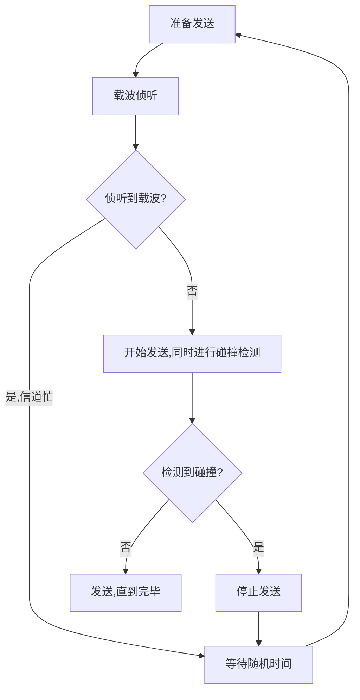

# 计算机网络概述

## 互联网定义

互联网，特指 Internet，它起源于美国，是由数量极大的各种计算机网络互连起来而形成的一个互连网络。它采用 TCP/IP 协议族作为通信规则，是一个覆盖全球、实现全球范围内连通性和资源共享的计算机网络。

## internet 和 Internet 的区别

- 以小写字母 “i” 开始的 internet（互连网）是一个通用名词，它泛指由多个计算机网络互连而成的网络。
- 以大写字母 “I” 开始的的 Internet（互联网或因特网）则是一个专用名词，它指当前全球最大的、开放的、由众多网络相互连接而成的特定计算机网络，它采用 TCP/IP 协议族作为通信的规则，且其前身是美国的 ARPANET。

## 互联网的核心部分

- 网络核心部分是互联网中最复杂的部分。
- 网络中的核心部分要向网络边缘中的大量主机提供连通性，使边缘部分中的任何一个主机都能够向其他主机通信（即传送或接收各种形式的数据）。
- 在网络核心部分起特殊作用的是路由器 (router)。
- 路由器是实现分组交换 (packet switching) 的关键构件，其任务是转发收到的分组，这是网络核心部分最重要的功能。

## 互联网中典型的交换技术

### 电路交换

电路交换分为三个阶段：

1. 建立连接：建立一条专用的物理通路，以保证双方通话时所需的通信资源在通信时不会被其他用户占用；
2. 通信：主叫和被叫双方就能互相通电话；
3. 释放连接：释放刚才使用的这条专用的物理通路（释放刚才占用的所有通信资源）。

### 分组交换

分组交换的主要特点：分组交换则采用存储转发技术。在发送端，先把较长的报文划分成较短的、固定长度的数据段。每一个数据段前面添加上首部构成分组 (packet)。分组交换网以“分组”作为数据传输单元。依次把各分组发送到接收端。接收端收到分组后剥去首部还原成报文。

1. 每一个分组的首部都含有地址（诸如目的地址和源地址）等控制信息。
2. 分组交换网中的结点交换机根据收到的分组首部中的地址信息，把分组转发到下一个结点交换机。
3. 每个分组在互联网中独立地选择传输路径。
4. 用这样的**存储转发**方式，最后分组就能到达最终目的地。

#### 存储转发

- 在路由器中的输入和输出端口之间没有直接连线。
- 路由器处理分组的过程是：
  1. 把收到的分组先放入缓存（暂时存储）；
  2. 查找转发表，找出到某个目的地址应从哪个端口转发；
  3. 把分组送到适当的端口转发出去。

#### 分组交换的优点

| 优点 | 所采用的手段                                                 |
| ---- | ------------------------------------------------------------ |
| 高效 | 在分组传输的过程中动态分配传输带宽，对通信链路是逐段占用。   |
| 灵活 | 为每一个分组独立地选择最合适的转发路由。                     |
| 迅速 | 以分组作为传送单位，可以不先建立连接就能向其他主机发送分组。 |
| 可靠 | 保证可靠性的网络协议；分布式多路由的分组交换网，使网络有很好的生存性。 |

#### 分组交换带来的问题

- 分组在各结点存储转发时需要排队，这就会造成一定的时延。
- 分组必须携带的首部（里面有必不可少的控制信息）也造成了一定的开销。

### 报文交换等

- 在20世纪40年代，电报通信也采用了基于存储转发原理的报文交换(message switching)。
- 报文交互将传送的内容当作一个整体传输，不进行分组。
- 报文交换的时延较长，从几分钟到几小时不等。现在报文交换已经很少有人使用了。

## 计算机网络类别

1. 按照网络的作用范围进行分类
   - 广域网 WAN (Wide Area Network)：作用范围通常为几十到几千公里。
   - 城域网 MAN (Metropolitan Area Network)：作用距离约为5~50公里。
   - 局域网 LAN (Local Area Network) ：局限在较小的范围（如1公里左右）。
   - 个人区域网 PAN (Personal Area Network) ：范围很小，大约在10米左右。

## 计算机网络的性能指标

### 速率

- 比特（bit）是计算机中数据量的单位，也是信息论中使用的信息量的单位。
- 比特（bit）来源于binary digit，意思是一个“二进制数字”，因此一个比特就是二进制数字中的一个1或0。
- 速率是计算机网络中最重要的一个性能指标，指的是数据的传送速率，它也称为数据率(data rate)或比特率(bit rate)。
- 速率的单位是bit/s，或kbit/s、Mbit/s、Gbit/s等。

注意：

在计算存储介质大小时，需要用2的n次方来换算（1KB = 2^10 Bytes）。

在计算传输速率时，直接用1000来换算（1Mb = 1000Kb = 1000,000bit）。

### 带宽

在计算机网络中，带宽用来表示网络中某通道传送数据的能力。表示在单位时间内网络中的某信道所能通过的“最高数据率”。单位是bit/s，即“比特每秒”。

​           在时间轴上信号的宽度随带宽的增大而变窄。

![image][1]

### 吞吐量

吞吐量(throughput)表示在单位时间内通过某个网络（或信道、接口）的数据量。比如网卡的带宽为100Mbps，那么该网卡的发送数据的带宽为100Mbps、接收数据的带宽为100Mbps，因此该网卡的吞吐量为200Mbps

### 时延

时延（delay或latency）是指数据（一个报文或分组，甚至比特）从网络（或链路）的一端传送到另一端所需的时间。网络中得时延由以下几个不同的部分组成：

#### 发送时延

发送数据时，数据帧从结点进入到传输媒体所需要的时间。也就是从发送数据帧的第一个比特算起，到该帧的最后一个比特发送完毕所需要的时间。比如网卡的带宽是100Mbps，要发送的数据帧的长度为100Mbit，那发送时延为1s。发送时延=数据帧长度(bit)/发送速率(bit/s)、发送速率也就是网卡的带宽

数据帧的第一个比特离开网卡开始计时，到最后一个比特离开网卡为止，这段时间就是发送时延。

#### 传播时延

数据帧的最后一比特离开前一个网卡，到最后一比特进入下一个路由器为止，这段时间就是传播时延。传播时延跟链路的距离和传播速率有关系，但是信号在信道上的传播速度是无法改变的（比如通过ADSL技术对数字信号调制后产生的模拟信号、通过光纤传播的光信号，它们的速度都是恒定的无法改变的），所以传播时延只跟信道长度有关，无法改变传播速率，但是能改变发送速率：即提高带宽。（运营商限速限制的就是发送速率）

- 电磁波在信道中需要传播一定的距离而花费的时间
- 发送时延于传播时延有本质上的不同
- 信号发送速率和信号在信道上的传播速率时完全不同的概念

传播时延=信道长度（米）/信号在信道上的传播速率(米/秒)

#### 处理时延

主机或路由器在收到分组时，为处理分组（例如分析首部、提取数据、差错校验或查找路由）所花费的时间。

#### 排队时延

分组在路由器输入输出队列中排队等待处理所经历的时延，排队时延的长短往往取决于网络中当时的通信量

#### 时延带宽积

链路的时延带宽积又称为以比特为单位的链路长度。

时延带宽积=传播时延X带宽

#### 往返时间

互联网的信息不仅仅单方向传播，而是双向交互的。因此，有时需要知道双向交互一次所需的时间。

往返时间RTT(round-trip time)表示从发送方发送数据开始，到发送方收到来自接收方的确认，总共经历的时间。

在互联网中，往返时间还包括各中间结点的处理时延、排队时延以及转发数据时的发送时延。

当使用卫星通信时，往返时间RTT相对较长，是很重要的一个性能指标。

#### 利用率

- 分为信道利用率和网络利用率。
- 信道利用率指出某信道有百分之几的时间是被利用的（有数据通过）。
- 完全空闲的信道的利用率是零。
- 网络利用率则是全网络的信道利用率的加权平均值。
- 信道利用率并非越高越好。当某信道的利用率曾大时，该信道引起的时延也就迅速增加。

#### 总结

容易产生的错误概念

- 对于高速网络链路，提高的仅仅是数据的发送速率而不是比特在链路上的传播速率
- 提高链路带宽减小了数据的发送时延

# 物理层

## 常用术语

- 信息（消息）
- 数据 (data) —— 运送消息的实体。
- 信号 (signal) —— 数据的电气的或电磁的表现。
- 模拟信号 (analogous signal) —— 代表消息的参数的取值是连续的。
- 数字信号 (digital signal) —— 代表消息的参数的取值是离散的。
- 码元 (code) —— 在使用时间域（或简称为时域）的波形表示数字信号时，代表不同离散数值的基本波形。

## 信道

- 信道 —— 一般用来表示向某一个方向传送信息的媒体。
- 单向通信（单工通信）——只能有一个方向的通信而没有反方向的交互。
- 双向交替通信（半双工通信）——通信的双方都可以发送信息，但不能双方同时发送(当然也就不能同时接收)。
- 双向同时通信（全双工通信）——通信的双方可以同时发送和接收信息。
- 基带信号（即基本频带信号）—— 来自信源的信号。像计算机输出的代表各种文字或图像文件的数据信号都属于基带信号。
- 基带信号往往包含有较多的低频成分，甚至有直流成分，而许多信道并不能传输这种低频分量或直流分量。因此必须对基带信号进行调制 (modulation)。
- 带通信号——把基带信号经过载波调制后，把信号的频率范围搬移到较高的频段以便在信道中传输（即仅在一段频率范围内能够通过信道）。

调制分为两大类：

1. 基带调制：仅对基带信号的波形进行变换，使它能够与信道特性相适应。变换后的信号仍然是基带信号。把这种过程称为编码(coding)。

   - 不归零制：正电平代表 1，负电平代表 0。
   - 归零制：正脉冲代表 1，负脉冲代表 0。
   - 曼彻斯特编码：位周期中心的向上跳变代表 0，位周期中心的向下跳变代表 1。但也可反过来定义。
   - 差分曼彻斯特编码：在每一位周期的中间，波形都有变化，如果在两位周期交界处电平没有变化，则表示“1”：有变化，则表示“0”（在信号位中间总是将信号反相；在信号位开始时不改变信号极性，表示逻辑“1”：在信号位开始时改变信号极性，表示逻辑“0”）。

   从信号波形中可以看出，曼彻斯特 (Manchester) 编码和差分曼彻斯 特编码产生的信号频率比不归零制高。 从自同步能力来看，不归零制不能从信号波形本身中提取信号时钟频 率（这叫做没有自同步能力），而曼彻斯特编码和差分曼彻斯特编码 具有自同步能力。

2. 带通调制：使用载波 (carrier)进行调制，把基带信号的频率范围搬移到较高的频段，并转换为模拟信号，这样就能够更好地在模拟信道中传输（即仅在一段频率范围内能够通过信道） 。

   - 调幅：载波的振幅随基带数字信号而变化。
   - 调频：载波的频率随基带数字信号而变化。
   - 调相：载波的初始相位随基带数字信号而变化。

3. 带通信号 ：经过载波调制后的信号。

## 信道复用技术

复用 (multiplexing) 是通信技术中的基本概念。它允许用户使用一个共享信道进行通信，降低成本，提高利用率。

### 频分复用

频分复用 FDM (Frequency Division Multiplexing) ==> 针对模拟信号

1. 将整个带宽分为多份，用户在分配到一定的频带后，在通信过程中自始至终都占用这个频带。
2. 频分复用的所有用户在同样的时间占用不同的带宽资源（请注意，据的发送速率）。

### 时分复用

时分复用 TDM (Time Division Multiplexing)  ==> 针对数字信号

1. 时分复用则是将时间划分为一段段等长的时分复用帧（TDM帧）。每一个时分复用的用户在每一个 TDM 帧中占用固定序号的时隙。
2. 每一个用户所占用的时隙是周期性地出现（其周期就是TDM帧的长度）的。
3. TDM 信号也称为等时 (isochronous) 信号。
4. 时分复用的所有用户在不同的时间占用同样的频带宽度。

### 波分复用

波分复用 WDM(Wavelength Division Multiplexing) ==> 光纤传输时使用

如何通过光来传播信号：

比如两个设备间约定通过光的闪烁来传播信号：闪一下代表0，闪两下代表1；

波分复用 WDM(Wavelength Division Multiplexing)波分复用就是光的频分复用。使用一根光纤来同时传输多个光载波信号。（光在光纤中得传播速度是不变的，同波长的光它们的频率是不一样的：速度=波长x频率）

### 码分复用

码分复用 CDM (Code Division Multiplexing) ==> 又称码分多址（Code Division Multiple Access，CDMA）。是扩频通信技术（数字技术的分支）上发展起来的一种崭新而成熟的无线通信技术。

1. 常用的名词是码分多址 CDMA (Code Division Multiple Access)。
2. 各用户使用经过特殊挑选的不同码型，因此彼此不会造成干扰。
3. 这种系统发送的信号有很强的抗干扰能力，其频谱类似于白噪声，不易被敌人发现。

# 数据链路层

## eNSP

https://edu.51cto.com/sd/4a3dc

常用命令：

<Huawei>system-view       --进入系统视图
[Huawei]sysname R1         -- 更改设备名称
[R1]interface GigabitEthernet 0/0/0       --进入以太网即可
[R1-GigabitEthernet0/0/0]ip address 192.168.1.1 24     --给接口配置IP地址
[R1-GigabitEthernet0/0/0]quit              --退出接口
[R1]interface Serial 2/0/0                       --进入广域网接口
[R1-Serial2/0/0]ip address 10.0.0.1 24         --给接口配置IP地址
[R2]ip route-static 192.168.2.0 24 11.0.0.2   --添加路由

## 三个基本问题

数据链路层协议有许多种，但有三个基本问题则是共同的。这三个基本问题是：

### 封装成帧

1. 封装成帧 (framing) 就是在一段数据的前后分别添加首部和尾部，然后就构成了一个帧。
2. 首部和尾部的一个重要作用就是进行帧定界。 
3. 当数据是由可打印的 ASCII 码组成的文本文件时，帧定界可以使用特殊的帧定界符。
4. 控制字符 SOH (Start Of Header) 放在一帧的最前面，表示帧的首部开始。另一个控制字符 EOT (End Of Transmission) 表示帧的结束。

### 透明传输

如果数据中的某个字节的二进制代码恰好和SOH或EOT一样，数据链路层就会错误地“找到帧的边界”。

解决方法：字节填充 (byte stuffing) 或字符填充 (character stuffing)。

1. 发送端的数据链路层在数据中出现控制字符“SOH”或“EOT”的前面插入一个转义字符“ESC”(其十六进制编码是1B)。
2. 接收端的数据链路层在将数据送往网络层之前删除插入的转义字符。
3. 如果转义字符也出现在数据当中，那么应在转义字符前面插入一个转义字符 ESC。当接收端收到连续的两个转义字符时，就删除其中前面的一个。 

### 差错控制 

在传输过程中可能会产生比特差错：1 可能会变成 0， 而 0 也可能变成 1。
在一段时间内，传输错误的比特占所传输比特总数的比率称为误码率 BER (Bit Error Rate)。
误码率与信噪比有很大的关系。
为了保证数据传输的可靠性，在计算机网络传输数据时，必须采用各种差错检测措施。 
在数据链路层传送的帧中，广泛使用了循环冗余检验 CRC 的检错技术。

冗余码的计算

1. 用二进制的模 2 运算进行 2n 乘 M 的运算，这相当于在 M 后面添加 n 个 0。
2. 得到的 (k + n) 位的数除以事先选定好的长度为 (n + 1) 位的除数 P，得出商是 Q 而余数是 R，余数 R 比除数 P 少 1 位，即 R 是 n 位。 
3. 将余数 R 作为冗余码拼接在数据 M 后面，一起发送出去。

冗余码的计算举例 

1. 现在 k = 6, M = 101001。
2. 设 n = 3, 除数 P = 1101，
3. 被除数是 2nM = 101001000。 
4. 模 2 运算的结果是：商 Q = 110101，余数 R = 001。
5. 把余数 R 作为冗余码添加在数据 M 的后面发送出去。发送的数据是：2nM + R，即：101001001，共 (k + n) 位。 

接收端对收到的每一帧进行 CRC 检验

1. 若得出的余数 R = 0，则判定这个帧没有差错，就接受 (accept)。
2. 若余数 R ≠ 0，则判定这个帧有差错，就丢弃。

但这种检测方法并不能确定究竟是哪一个或哪几个比特出现了差错。只要经过严格的挑选，并使用位数足够多的除数 P，那么出现检测不到的差错的概率就很小很小。 

注意

1. 仅用循环冗余检验 CRC 差错检测技术只能做到无差错接受 (accept)。
2. “无差错接受”是指：“凡是接受的帧（即不包括丢弃的帧），我们都能以非常接近于 1 的概率认为这些帧在传输过程中没有产生差错”。
3. 也就是说：“凡是接收端数据链路层接受的帧都没有传输差错”（有差错的帧就丢弃而不接受）。
4. 单纯使用 CRC 差错检测技术不能实现“无差错传输”或“可靠传输”。
5. 应当明确，“无比特差错”与“无传输差错”是不同的概念。
6. 在数据链路层使用 CRC 检验，能够实现无比特差错的传输，但这还不是可靠传输。
7. 要做到“无差错传输”（即发送什么就收到什么）就必须再加上确认和重传机制。 
8. 一般的数据链路层协议都不是可靠传输的协议。

## 点对点协议

点对点协议 PPP (Point-to-Point Protocol)。

### PPP 协议的帧格式

1. PPP 帧的首部和尾部分别为 4 个字段和 2 个字段。
2. 标志字段 F = 0x7E （符号“0x”表示后面的字符是用十六进制表示。十六进制的 7E 的二进制表示是 01111110）。
3. 地址字段 A 只置为 0xFF。地址字段实际上并不起作用。
4. 控制字段 C 通常置为 0x03。
   - 若为 0x0021，则信息字段就是 IP 数据报。
   - 若为 0x8021，则信息字段是网络控制数据。
   - 若为 0xC021，则信息字段是 PPP 链路控制数据。
   - 若为 0xC023，则信息字段是鉴别数据。
5. PPP 是面向字节的，所有的 PPP 帧的长度都是整数字节。

### PPP 协议的工作状态

1. 当用户拨号接入 ISP 时，路由器的调制解调器对拨号做出确认，并建立一条物理连接。
2. PC 机向路由器发送一系列的 LCP 分组（封装成多个 PPP 帧）。
3. 这些分组及其响应选择一些 PPP 参数，并进行网络层配置，NCP 给新接入的 PC 机分配一个临时的 IP 地址，使 PC 机成为因特网上的一个主机。
4. 通信完毕时，NCP 释放网络层连接，收回原来分配出去的 IP 地址。接着，LCP 释放数据链路层连接。最后释放的是物理层的连接。
5. 可见，PPP 协议已不是纯粹的数据链路层的协议，它还包含了物理层和网络层的内容。

### 配置PAP身份验证

在路由器1中配置PAP身份验证后，通过抓包可以观察到ppp完整的建立过程

[R1]aaa
[R1-aaa]local-user Auser password cipher Huawei123    --创建用户Auser，密码为Huawei123
[R1-aaa]local-user Auser service-type ppp                --指定Auser用于PPP身份验证
[R1-aaa]quit
[R1]interface Serial 2/0/0
[R1-Serial2/0/0]ppp authentication-mode ?      --查看PPP身份验证模式
  chap  Enable CHAP authentication                --密码安全传输
  pap   Enable PAP authentication                  --密码明文传输
[R1-Serial2/0/0]ppp authentication-mode pap    --需要pap身份验证

[R2]interface Serial 2/0/1
[R2-Serial2/0/1]link-protocol ppp
[R2-Serial2/0/1]ppp pap local-user Auser password cipher Huawei123
[R2-Serial2/0/1]shutdown
[R2-Serial2/0/1]undo shutdown 

<R2>display interface Serial 2/0/1

## 使用广播信道的数据链路层

### 媒体共享技术

媒体共享技术：指的是局域网中的计算机在通信时都使用同一根数据总线

静态划分信道：可以在总线上划分出很多信道，每一个信道使用某一个频率的模拟信号进行通信；但是如果未来网络中有新的计算机加入进来，还得重新配置频率，不方便扩展

1. 频分复用
2. 时分复用
3. 波分复用
4. 码分复用 

动态媒体接入控制（多点接入）：接入后无需配置便可以跟网络中的计算机进行通信，例如：集线器

1. 随机接入
2. 受控接入 ，如多点线路探询 (polling)，或轮询。  

### 广播信道的局域网

最初的局域网使用同轴电缆进行组网，总线型拓扑。使用集线器组建的局域网也是广播信道，是总线型拓扑。
广播信道使用带冲突检测的载波侦听多路访问（ CSMA/CD ）机制通信。CSMA/CD就是广播信道使用的数据链路层协议，使用CSMA/CD协议的网络就是以太网。
点到点链路就不用冲突检测，因此没必要使用CSMA/CD协议。

共享的广播信道
使用一对多的广播通信方式。
问题：若多个设备在共享的广播信道上同时发送数据，则会造成彼此干扰，导致发送失败。

### 以太网标准

1. 以太网（Ethernet）是一种计算机局域网组网技术。IEEE制定的IEEE 802.3标准给出了以太网的技术标准，即以太网的介质访问控制协议（CSMA/CD）及物理层技术规范（包括物理层的连线、电信号和介质访问层协议的内容）。

2. 在IEEE 802.3标准中，为不同的传输介质制定了不同的物理层标准，在这些标准中前面的数字表示传输速度，单位是“Mbps”，最后的一个数字表示单段网线长度（基准单位是100m），Base表示“基带”的意思。（基带信号即数字信号）

   | 名称     | 传播介质     | 网段最大长度 | 特点               |
   | -------- | ------------ | ------------ | ------------------ |
   | 10Base-5 | 粗同轴电缆   | 500米        | 早期电缆，已经废弃 |
   | 10Base-2 | 细同轴电缆   | 185米        | 不需要集线器       |
   | 10Base-T | 非屏蔽双绞线 | 100米        | 最便宜的系统       |
   | 10Base-F | 光纤         | 2000米       | 适合于楼间使用     |

   

### CSMA/CD协议

CSMA/CD 含义：载波监听多点接入 / 碰撞检测  (Carrier Sense Multiple Access with Collision Detection) 。
“多点接入”表示许多计算机以多点接入的方式连接在一根总线上。
“载波监听”是指每一个站在发送数据之前先要检测一下总线上是否有其他计算机在发送数据，如果有，则暂时不要发送数据，以免发生碰撞。 
总线上并没有什么“载波”。因此， “载波监听”就是用电子技术检测总线上有没有其他计算机发送的数据信号。

1. 总线型网络使用CSMA/CD协议进行通信，计算机在发送数据之前会先检测网络中有没有数据在传输：即带冲突检测的载波侦听多点接入技术(A跟B通信的时候，如果C跟D再通信的话，会造成彼此干扰，导致发送失败)
2. 即便检测出总线上没有信号，开始发送数据后也有可能和迎面而来的信号在链路上发生碰撞。
3. 比如，A计算机发送的信号和B计算机发送的信号在链路C处发生碰撞，碰撞后的信号相互叠加，在总线上电压变化幅度将会增加，发送方检测到电压变化超过一定的门限值时，就认为发生冲突，这就是冲突检测。
4. 使用CSMA/CD协议的以太网不可能进行全双工通信而只能进行双向交替通信（半双工通信）。

#### 碰撞检测

1. “碰撞检测”就是计算机边发送数据边检测信道上的信号电压大小。
2. 当几个站同时在总线上发送数据时，总线上的信号电压摆动值将会增大（互相叠加）。
3. 当一个站检测到的信号电压摆动值超过一定的门限值时，就认为总线上至少有两个站同时在发送数据，表明产生了碰撞。
4. 所谓“碰撞”就是发生了冲突。因此“碰撞检测”也称为“冲突检测”。

#### 以太网最短帧

为了能够检测到正在发送的帧在总线上是否产生冲突，以太网的帧不能太短，如果太短就有可能检测不到自己发送的帧产生了冲突。

以太网设计最大端到端长度为5km（实际上的以太网覆盖范围远远没有这么大），单程传播时延为大约为25.6μs,往返传播时延为51.2μs，10M标准以太网最小帧为：10Mb/s×51.2μs =107b/s×51.2×10-6s=512b

512比特也就是64字节，这就意味着以太网发送数据帧如果前64字节没有检测出冲突，后面发送的数据就一定不会发生冲突。换句话说，如果发生碰撞，就一定在发送前64字节之内。由于一旦检测出冲突就立即终止发送，这时发送的数据一定小于64字节，因此凡是长度小于64字节的帧都是由于冲突而异常终止的无效帧，只要收到了这种无效帧，就应当立即将其终止。

#### 冲突解决方法--退避算法

计算机要想知道发送的帧在链路上是否发生碰撞必须等待2τ，2τ称为争用期。
以太网使用截断二进制指数退避（truncated binary exponential backoff）算法来解决碰撞问题。

1. 确定基本退避时间，它就是争用期2τ。以太网把争用期定为51.2μs。对于10Mb/s以太网，在争用期内可发送512bit，即64字节。也可以说争用期是512比特时间。1比特时间就是发送1比特所需的时间。所以这种时间单位与数据率密切相关。
2. 从离散的整数集合［0，1，…，（2k-1）］中随机取出一个数，记为r。重传应推后的时间就是r倍的争用期。上面的参数k按下面的公式计算：
   - k=Min[重传次数，10]
   - 可见当重传次数不超过10时，参数k等于重传次数；但当重传次数超过10时，
   - k就不再增大而一直等于10。
3. 当重传达16次仍不能成功时（这表明同时打算发送数据的站太多，以致连续发生冲突），则丢弃该帧，并向高层报告。

### MAC地址

1. 在广播信道实现点到点通信，这就需要网络中的每个网卡有一个地址。这个地址称为物理地址或MAC地址（因为这种地址用在MAC帧中）。IEEE802标准为局域网规定了一种48位的全球地址。
2. 这种6字节的MAC地址已被固化在网卡的ROM中(前三个字节代表组织唯一标识码，后三个字节为扩展标识符)。因此，MAC地址也叫作硬件地址（hardware address）或物理地址。当这块网卡插入（或嵌入）到某台计算机后，网卡上的MAC地址就成为这台计算机的MAC地址了。
3. 网卡有过滤功能，适配器从网络上每收到一个MAC帧就先用硬件检查MAC帧中的目的地址。如果是发往本站的帧则收下，然后再进行其他的处理。否则就将此帧丢弃，不再进行其他的处理。这样做就不浪费主机的处理机和内存资源。这里“发往本站的帧”包括以下三种帧：
   - 单播（unicast）帧（一对一），即收到的帧的MAC地址与本站的硬件地址相同。
   - 广播（broadcast）帧（一对全体），即发送给本局域网上所有站点的帧（全1地址）。 
   - 多播（multicast）帧（一对多），即发送给本局域网上一部分站点的帧。

所有的适配器都至少能够识别前两种帧，即能够识别单播地址和广播地址。
有的适配器可用编程方法识别多播地址。
只有目的地址才能使用广播地址和多播地址。
以混杂方式 (promiscuous mode) 工作的以太网适配器只要“听到”有帧在以太网上传输就都接收下来。

### 扩展以太网

#### 集线器

传统以太网最初是使用粗同轴电缆，后来演进到使用比较便宜的细同轴电缆，最后发展为使用更便宜和更灵活的双绞线。
1990年IEEE制定出星形以太网10BASE-T的标准802.3i。“10”代表10Mb/s的数据率，BASE表示连接线上的信号是基带信号，T代表双绞线。
10BASE-T以太网的通信距离稍短，每个站到集线器的距离不超过100m。
集线器和网线一样工作在物理层。

计算机数量和距离上扩展
独立的冲突域
可以将多个集线器连接在一起形成一个更大的以太网，这不仅可以扩以太网中计算机的数量，还可以扩展以太网的覆盖范围。使用主干集线器连接教室中集线器，形成一个大的以太网，计算机之间的最大距离可以达到400米。
计算机数量和距离上扩展
要是两个集线器的距离超过100米，还可以光纤从将两个集线器连接起来，集线器之间通过光纤连接，可以将相距几千米的集线器连接起来，需要通过光电转换器，实现光信号和电信号的相互转换。

#### 网桥

使用网桥优化以太网，对于网络中的计算机是没有感觉的，也就是以太网中的计算机是不知道网络中有网桥存在，也不需要网络管理员配置网桥的MAC地址表，因此我们称网桥是透明桥接。
网桥接入以太网时，MAC地址表示空的，网桥会在计算机通信过程中自动构建MAC地址表，这称为“自学习”。

1. 自学习：网桥的接口收到一个帧，就要检查MAC地址表中与收到的帧源MAC地址有无匹配的项目，如果没有，就在MAC地表中添加该接口和该帧的源MAC地址对应关系以及进入接口的时间，如果有，则把原有的项目进行更新。
2. 转发帧：网桥接口收到一个帧，就检查MAC地址表中有没有该帧目标MAC地址对应端口，如果有，就会将该帧转发到对应的端口，如果没有，则将该帧转发到全部端口（接收端口除外）

#### 交换机

随着技术的发展，网桥接口增多，网桥的接口就直接连接计算机了，网桥就发展成现在的交换机。

使用交换机组网与集线器组网相比有以下特点：

1. 独享带宽：交换机的每个端口独享带宽，10M交换机，则每个端口带宽是10M，24口10M交换机，交换机的总体交换能力是240M，这和集线器不同。
2. 安全：使用交换机组建的网络比集线器安全，比如计算机A给计算机B发送的帧，以及计算机D给计算机C发送的帧，交换机根据MAC地址表只转发到目标端口，E计算机根本收不到其他计算机的通信的数字信号，即便安装了抓包工具也没用。
3. 全双工通信：交换机接口和计算机直接相连，计算机和交换机之间的链路可以使用全双工通信。
4. 全双工不再使用CSMA/CD协议：交换机接口和计算机直接相连接，使用全双工通信数据链路层就不需要使用CSMA/CD协议，但我们还是称交换机组建的网络是以太网，是因为帧格式和以太网一样。（按照原来的标准只有使用CSMA/CD协议(载波监听多点接入/碰撞检测)的网络才称为以太网）
5. 接口可以工作在不同的速率

集线器是冲突域
交换机是广播域 
路由器隔绝广播

交换机能够学习根据帧的源MAC地址构造MAC地址表(实验：3-2)
<Huawei>sys
[Huawei]display mac-address

##### 生成树协议

是一种工作在OSI网络模型中的第二层(数据链路层)的通信协议，基本应用是防止交换机冗余链路产生的环路.用于确保以太网中无环路的逻辑拓扑结构.从而避免了广播风暴,大量占用交换机的资源。(实验：3-3)

显示接口状态
[Huawei]display stp brief
显示生成树配置
[Huawei]display stp
指定根交换机
[Huawei]stp root primary  
指定备用的根交换机
[Huawei]stp root secondary 
关闭生成树协议
[Huawei]stp disable
启用生成树协议 
[Huawei]stp enable

### VLAN

1. VLAN（Virtual Local Area Network）的中文名为“虚拟局域网”。
2. 虚拟局域网（VLAN）是一组逻辑上的设备和用户，这些设备和用户并不受物理位置的限制，使得管理员根据实际应用需求，把同一物理局域网内的不同用户逻辑地划分成不同的广播域，每一个VLAN都包含一组有着相同需求的计算机工作站，相互之间的通信就好像它们在同一个网段中一样，由此得名虚拟局域网。
3. VLAN是一种比较新的技术，工作在OSI参考模型的第2层和第3层，一个VLAN就是一个广播域，VLAN之间的通信是通过第3层的路由器来完成的。

#### 理解VLAN

- 交换机端口默认属于VLAN1
- 交换机的所有端口默认都属于VLAN 1，VLAN 1是默认VLAN，不能删除。交换机S1的所有端口都在VLAN 1中，进入交换机端口的帧自动加上端口所属VLAN的标记，出交换机端口则会去掉VLAN标记。

#### 跨交换机VLAN

- 计算机连接交换机的链路称为接入（Access）链路
- 能够通过多个VLAN的交换机之间的链路称为干道（Trunk）链路。

#### 链路类型

- 一个VLAN帧可能带有Tag（称为Tagged VLAN帧，或简称为Tagged帧），也可能不带Tag（称为Untagged VLAN帧，或简称为Untagged帧）。
- 每一个交换机的端口（无论是Access端口还是Trunk端口）都应该配置一个PVID（Port VLAN ID)，到达这个端口的Untagged帧将一律被交换机划分到PVID所指代的VLAN。
- 在一个支持VLAN特性的交换网络中，我们把交换机与终端计算机直接相连的链路称为Access链路(Access Link)，把Access链路上交换机一侧的端口称为Access端口（Access Port）。同时，我们把交换机之间直接相连的链路称为Trunk链路(Trunk Link)，把Trunk链路上两侧的端口称为Trunk端口(Trunk Port)。

#### 端口类型

- Access端口：当Access端口从链路（线路）上收到一个Untagged帧后，交换机会在这个帧中添加上VID为PVID的Tag，然后对得到的Tagged帧进行转发操作（泛洪，点到点转发，丢弃）。
- Trunk端口：对于每一个Trunk端口，除了要配置PVID之外，还必须配置允许通过的VLAN ID列表。当Trunk端口从链路（线路）上收到一个Untagged帧后，交换机会在这个帧中添加上VID为PVID的Tag，然后查看PVID是否在允许通过的VLAN ID列表中。如果在，则对得到的Tagged帧进行转发操作（泛洪，点到点转发，丢弃）；如果不在，则直接丢弃得到的Tagged帧。

#### VLAN的类型

计算机发送的帧都是不带Tag的。对于一个支持VLAN特性的交换网络来说，当计算机发送的Untagged帧一旦进入交换机后，交换机必须通过某种划分原则把这个帧划分到某个特定的VLAN中去。根据划分原则的不同，VLAN便有了不同的类型。

1. 基于端口的VLAN（Port-based VLAN）
2. 基于MAC地址的VLAN（MAC-based  VLAN）
3. 基于协议的VLAN（Protocol-based VLAN）

#### 配置基于端口的VLAN

实验：3-4

显示创建的VLAN
[S1]display vlan    
支持的VLAN数量，最大4094；可以批量创建VLAN
[S1]vlan ?
  INTEGER<1-4094>  VLAN ID  
  batch            Batch process
创建vlan：2,3
[S1]vlan batch 2 3
创建端口组：vlan1port
[S1]port-group vlan1port
将端口0-5加入端口组：vlan1port
[S1-port-group-vlan1port]group-member Ethernet 0/0/1 to Ethernet 0/0/5
查看支持的端口类型
[S1-port-group-vlan1port]port link-type ?
  access        Access port
  dot1q-tunnel  QinQ port
  hybrid        Hybrid port
  trunk         Trunk port
将端口设置成Access
[S1-port-group-vlan1port]port link-type access
指定到VLAN 1
[S1-port-group-vlan1port]port default vlan 1
配置干道接口
[S1]interface GigabitEthernet 0/0/1
[S1-GigabitEthernet0/0/1]port link-type trunk
允许所有VLAN的帧通过
[S1-GigabitEthernet0/0/1]port trunk allow-pass vlan all
使用三层交换实现VLAN间路由
[S3]interface Vlanif 1
[S3-Vlanif1]ip address 192.168.1.1 24
[S3-Vlanif1]quit
[S3]interface Vlanif 2
[S3-Vlanif2]ip address 192.168.2.1 24
[S3-Vlanif2]quit
[S3]interface Vlanif 3
[S3-Vlanif3]ip address 192.168.3.1 24
[S3-Vlanif3]quit

#### 配置基于MAC地址的VLAN

实验：3-5

[Huawei]vlan batch 100 200
[Huawei]interface GigabitEthernet 0/0/2
[Huawei-GigabitEthernet0/0/2]port link-type access
[Huawei-GigabitEthernet0/0/2]port default vlan 200
[Huawei]interface GigabitEthernet 0/0/1
[Huawei-GigabitEthernet0/0/1]port link-type access
[Huawei-GigabitEthernet0/0/1]port default vlan 100
[Huawei]interface GigabitEthernet 0/0/4
[Huawei-GigabitEthernet0/0/4]port link-type trunk
[Huawei-GigabitEthernet0/0/4]port trunk allow-pass vlan all
[Huawei]interface GigabitEthernet 0/0/3
[Huawei-GigabitEthernet0/0/3]port link-type trunk
[Huawei-GigabitEthernet0/0/3]port trunk allow-pass vlan all

[Huawei]vlan batch 100 200
[Huawei]interface GigabitEthernet 0/0/2
[Huawei-GigabitEthernet0/0/2]port link-type trunk
[Huawei-GigabitEthernet0/0/2]port trunk allow-pass vlan all
[Huawei]vlan batch 100 200
[Huawei]interface GigabitEthernet 0/0/2
[Huawei-GigabitEthernet0/0/2]port link-type trunk
[Huawei-GigabitEthernet0/0/2]port trunk allow-pass vlan all

[Huawei]sysname SwitchA
[SwitchA]vlan 100
[SwitchA-vlan100]mac-vlan mac-address 5489-98E9-2F5D
[SwitchA-vlan100]quit
[SwitchA]vlan 200
[SwitchA-vlan200]mac-vlan mac-address 5489-98F7-37B7
[SwitchA]interface GigabitEthernet 0/0/1
基于MAC划分VLAN只能应用在类型为hybrid的接口
[SwitchA-GigabitEthernet0/0/1]port link-type hybrid 
对VLAN为100、200的报文，剥掉VLAN Tag
[SwitchA-GigabitEthernet0/0/1]port hybrid untagged vlan 100 200
[SwitchA-GigabitEthernet0/0/1]mac-vlan enable
[SwitchA]display current-configuration

[Huawei]sysname SwitchB
[SwitchB]vlan 100
[SwitchB-vlan100]mac-vlan mac-address 5489-98E9-2F5D
[SwitchB-vlan100]quit
[SwitchB]vlan 200
[SwitchB-vlan200]mac-vlan mac-address 5489-98F7-37B7
[SwitchB]interface GigabitEthernet 0/0/1
[SwitchB-GigabitEthernet0/0/1]port link-type hybrid 
[SwitchB-GigabitEthernet0/0/1]port hybrid untagged vlan 100 200
[SwitchB-GigabitEthernet0/0/1]mac-vlan enable
[SwitchB]display current-configuration

设置VLAN间的路由
[Huawei]interface Vlanif 100
[Huawei-Vlanif100]ip address 192.168.100.1 24
[Huawei-Vlanif100]quit
[Huawei]interface Vlanif 200
[Huawei-Vlanif200]ip address 192.168.200.1 24

### 高速以太网

#### 100M以太网

1. 100BASE-T是在双绞线上传送100Mb/s基带信号的星型拓扑的以太网，仍使用IEEE802.3的CSMA/CD协议，它又称为快速以太网（FastEthernet）。
2. 使用交换机组建的100BASE-T以太网，可在全双工方式下工作而无冲突发生。因此，CSMA/CD协议对全双工方式工作的快速以太网是不起作用的。因为其帧格式和以太网一样，所以依然称交换机组件的网络为以太网。
3. 以太网的最短帧和带宽和链路长度有关，100M以太网比10M以太网速率提高10倍，要想和10M以太网兼容，就要确保最短帧也是64字节，那就将电缆最大长度由1000m降到100m，缩短以太网的争用期，从而使最短帧依然是64字节。

快速以太网100M带宽，有以下标准：

| 名称       | 传播介质 | 网段最大长度 | 特点                                         |
| ---------- | -------- | ------------ | -------------------------------------------- |
| 100BASE-TX | 铜缆     | 100米        | 两对UTP5类线或屏蔽双绞线                     |
| 100BASE-T4 | 铜缆     | 100米        | 4对UTP3类线或5类线                           |
| 100BASE-FX | 光纤     | 2000米       | 两根光纤，发送和接受各用一个，全双工，长距离 |

#### 吉比特以太网

吉比特以太网的标准IEEE802.3 z有以下几个特点：

1. 允许在1Gb/s下全双工和半双工两种方式工作。
2. 使用IEEE802.3协议规定的帧格式。
3. 在半双工方式下使用CSMA/CD协议（全双工方式不需要使用CSMA/CD协议）。
4. 与10BASE-T和100BASE-T技术向后兼容。

吉比特以太网1000M带宽，有以下标准：

| 名称       | 传播介质 | 网段最大长度 | 特点                                     |
| ---------- | -------- | ------------ | ---------------------------------------- |
| 100BASE-SX | 光纤     | 550米        | 多模光纤（10和62.5μm）                   |
| 100BASE-LX | 光纤     | 5000米       | 单模光纤（10μm）多模光纤（50μm和62.5μm） |
| 100BASE-CX | 铜线     | 25米         | 使用两对屏蔽双绞线电缆STP                |
| 100BASE-T  | 铜线     | 100米        | 使用4对UTP5类线                          |

- 吉比特以太网工作在半双工时，就必须进行碰撞检测，数据速率提高了，要想和10M以太网兼容，就要确保最短帧也是64字节，这只能减少最大电缆长度，以太网最大电缆长度就要缩短到10m，短到几乎没有什么实用价值。吉比特以太网为了增加最大传输距离，将最短帧增加到4096比特。
- 当数据帧长度小于512字节（即4096比特）时，在FCS域后面添加“载波延伸” 域。主机发送完短数据帧之后，继续发送载波延伸信号，冲突信号传回来时，发送端就能感知到了。
- 如果发送的数据帧都是64字节的短报文，那么链路的利用率就很低，因为“载波延伸”域将占用大量的带宽。
- 千兆以太网标准中，引入了“分组突发”（packet bursting）机制来改善这个问题。这就是当很多短帧要发送时，第一个短帧采用上面所说的载波延伸的方法进行填充，随后的一些短帧则可以一个接一个发送，它们之间只需要留有必要的帧间最小间隔即可。
- 当吉比特以太网工作在全双工方式时（即通信双方可同时进行发送和接收数据），不使用载波延伸和分组突发。

#### 10吉比特以太网和更快的以太网

10 吉比特以太网（10GE）并非把吉比特以太网的速率简单地提高到 10 倍，其主要特点有：

1. 与 10 Mbit/s、100 Mbit/s 和 1 Gbit/s 以太网的帧格式完全相同。
2. 保留了 802.3 标准规定的以太网最小和最大帧长，便于升级。
3. 不再使用铜线而只使用光纤作为传输媒体。
4. 只工作在全双工方式，因此没有争用问题，也不使用 CSMA/CD 协议。 

10GE的物理层标准

| 名称        | 传播介质 | 网段最大长度 | 特点                        |
| ----------- | -------- | ------------ | --------------------------- |
| 10GBASE-SR  | 光缆     | 300米        | 多模光纤（0.85μm）          |
| 10GBASE-LR  | 光缆     | 10千米       | 单模光纤（1.3μm）           |
| 10GBASE-ER  | 光缆     | 40千米       | 单模光纤（1.5μm）           |
| 10GBASE-CX4 | 铜缆     | 15米         | 使用4对双芯同轴电缆(twinax) |
| 10GBASE-T   | 铜缆     | 100米        | 使用4对6A类UTP双绞线        |

40GE/10GE 的物理层标准

| 物理层                     | 40GE        | 100GE                        |
| -------------------------- | ----------- | ---------------------------- |
| 在背板上传输至少超过 1 m   | 40GBASE-KR4 |                              |
| 在铜缆上传输至少超过 7 m   | 40GBASE-CR4 | 100GBASE-CR10                |
| 在多模光纤上传输至少 100 m | 40GBASE-SR4 | 100GBASE-SR10，*100GBASE-SR4 |
| 在单模光纤上传输至少 10 km | 40GBASE-LR4 | 100GBASE-LR4                 |
| 在单模光纤上传输至少 40 km | *40GBASE-ER | 100GBASE-ER4                 |

[1]:data:image/png;base64,iVBORw0KGgoAAAANSUhEUgAAAr8AAAEYCAIAAADaiglyAAAgAElEQVR4AeydB2AURReAZ/dKeu89JCGF0AmEngDSiyCCSBGl2SgKShEVkSYICiKC/kiXJkV66BA6oYQ0WhLSe+/Xdv+5mktyubRLspe8FXO7U968+eZu5+2bskRQEh/BAQSAABAAAkAACACBWhMga50SEgIBIAAEgAAQAAJAQEwArAf4HgABIAAEgAAQAAJ1IwDWQ914QWogAASAABAAAkAArAf4DgABIAAEgAAQAAJ1IwDWQ914QWogAASAABAAAkAArAf4DgABIAAEgAAQAAJ1IwDWQ914QWogoJIAKaTjb9F3ntKlKqMhEAgAASDQsgiwW1Z1oDZAoBkIFN9Du9awzkUQyE/0+1HkATZ5MzQCFAkEgECTEgDroUlxQ2EtjEDZNfTzr+SdcKKF1QuqAwSAABBQTwCektTzgVggoI5A3l1CbDro0MiIVpcO4oAAEAACLYsAWA8tqz2hNk1LQNeN7j5btPAMNd+9oQWnHye+G0kO8yaHeZHD+pOL7oA50lCkkB8IAIHGIwAjF43HFiS3fAKmk9EqhAgRfaGmuooEaGQnEpUQ/7sqdHInop6iheNYyIEOukPhrKITaPrXBMKndkjXhChLoiPTa5II8UAACACB5iMA1kPzsYeSWxMBHp9GeD2GAZ2RQji5o5Q4JB7vSJMhCL9IIopANtSM6/REXcQqo9Ng8UZr+npAXYGA1hGAkQutazJQWGsJsLCbQkl5/OPDIZLD2FTykU7smk3suoQyOISVmXJSWTL4AAJAAAgwhABYDwxpCFCjVRPwmkMFOuKJDgS6RR6dQ04ZTuyLadVAoPJAAAgwnABYDwxvIFCvVRAQuKNvL4k2raT6tJPYEK+Ig+tROsybbBWND5UEAlpJAKwHrWw2UFp7CQiFYqOgMB8h/EmjyMcoJ4MuyqXL9Anf6fT3Z0RzO0gMiCQiSTyfEg4gAASAABMJwKxJJrYK6NRiCZSiFatYvvvoyOsSw51NLxrPmvWdyOkOuaIQ9WpH25aSJ1/j2tOoI+XFgqkPLfaLABUDAtpOAKwHbW9B0F87CIj4CAkl1kAsHRlLIjsaZSEkECvfbyidHorQNeJeiCQBh0YjqO+XEobaUTPQEggAgdZIgAhKwnc1OIAAEGhcAnGv6E+GsLHR8NEMqoMfatcFRUeipw9Qt17IzUdcdFkiiktGxQiZedBuluB1aNzmAOlAAAg0kAD4HhoIELIDgVoRiHpCIBaNdNB7s2XpPXwR/qc4dJ2Qt5P0CkwHBRU4AQJAgKEEYNYkQxsG1GphBHKyJdMkC1tYtaA6QAAItFIC4HtopQ0P1W5iAmMm06+e08PG4nUU4FpoYvZQHBAAAponAPMeNM8UJAIBIAAEgAAQaNkEYOSiZbcv1A4IAAEgAASAgOYJgPWgeaYgEQgAASAABIBAyyYA1kPLbl+oneYJ8ERl99KuX006q3nRaiUKRLx9r/6My39J07CFtVpSEAkEgEDjE4BZk43PGEpoEQSw0fAk896V1Bt3Mh4iio8MHFwN3WpRs9rOkSSIGlKWUmUHY47if0jfdrJd//42gS7GnjXmqoWGkAQIAAEgUGcCMGuyzsggQ6siUNloYFTlwYxgVHOAMkCgNREA66E1tTbUtY4EyoQlh6L3HEm+gvj4rVYMPcxMPBd6TOlu3Zeh+oFaQAAItEQCYD20xFaFOmmUAEWLonLDbqZeP5N2W9mMIEzaVlOOunkJtZi1UE12EQ8VJytKxEbDJLuA3rYBVnp2ikA4AQJAAAg0DQGwHpqGM5TSEggomxGBll2Xdvq2KWtVJiwde3kUGA1NyRzKAgJAoDoCYD1URwbCgUC1BLAZkV2W0cQP/SJKmMPLbOJCq0UAEUAACLRuAmA9tO72h9oDASAABIAAEKg7Adjvoe7MIAcQAAJAAAgAgdZNoIb9HoZ9db1182mK2gdtHNAUxUAZQAAIAAEgAAQ0RAB8DxoCCWKAABAAAkAACLQaAmA9tJqmhooCASAABIAAENAQAbAeNAQSxAABIAAEgAAQaEICRNzdh5fP3L7/Iq9SoZkxSflUpTCNX9Yw70Hj5YHAxiMQ9SD+aXAMJWz0L03Dq6Cjz+kzytfB3bLhohpPQmZS7q1TkcUFZY1XhMYkk0QHf5fOgR4aE9gIgvil/OCTEanxOY0gW/MibVzMA8e15+pxNS8aJGqCQGxkasjFl3yeUBPCGlcGSRLte7p2CnCvUzEEEuY/ufQ8W6SUiyTc+vZwN5GGEEjEP7/0x7X3hT7Lfgxa2YMlDiZFcQ+/GrPpv+jcD84e+94tbvuOu7lVewRS1OfTTwe6KEmuzylYD/WhxsA8JQWlBzZcF2mD6SCllxSdvXDrOwwkqVDpvx33osPTFJcMP4m4G+/sZWVuJ7uzMFDbkCuvLx8JZaBiKlWKuJ+gb8jtO6a9ylgIbF4CIhH1z/rrRfnaYNlLSIXfi3fytjK3Ma4Lt+IXv4xdcUM5BxstCD7ztR9HOUzpnBYJ+SJbHy8rvuAFOrhi48R13v/8ciJRKYXslIXY48B6qMqllYbkZ5dokemAGyk7tZDhTZWdxnQNKwHMSS9isvWgdTyZ/xWt9AVoPZfYj6VFpgNuF5pG4p9n3awHaXsSLDsfZ1NSmPYiMRehksc31hx9I/cmEGGJ4m3tM29cWreldGZg/rTuf7zgopW73rW5dczImE7U6/blRm6FIQxh6uFvzrzUzDeF2b4HFgs7YpBAM1VtPVI+WDaQsZUV8EWHNt1krHoqFRs9s4eZtaHKKCYE7lt3jQlq1F4H9/a2fUa3q336Jk5599zz6LDUJi4Uiqs3ASbf7nClGvzzZIvmB22bZha30GXu0QKqOPzW4b8eyq0HGbSse7d3lmWN6y+77+sHTjt0uUtCgZBOyTFr42AmSyUw9uzk7/T6NtOsB1/3K1OszGgq9nzohDt8xDZb9I33ZB2aHRc39H+paYhEk/wed2ARooK/N0Vuyydq+KLYOWyb4zzASsfJlJ118n6b40U1pGfpdX/XecDd1xsSJVDZZl8t936fSxM0/8qeJ4uja8jdwqJtXcx8e7oytlICbRinrESvnb9zvR4aKolprMu2He1ea1Vv59vLhclf0YLsErAeGuvLqmm5uvocJn+XcHWxrRwTobkBUH0f/2mzLOWTPYiX54IepYrMu3UfNaaPKcmX4SVN887vnPGrwkUhC+7w7dqzX2mwBTTkezDU7+RqbElQOiYSy4DkuLoaddVDiKcjeWQjLGyNurixCaHIvkKBBPJ3+ca2sjFBk3rtXYx8cHaEDHu7/SQsLKhSY6I4f8+V7GREIAOTqXM7/92Jyw00NP459NtYEdLR69LWqCueQiIqClGecVJFCAQAASAABIAAEGA0AZFQxBeIcGeHDwP/EdO73Ii279fblYNnTf4RcfFRKrIZMnrVsl502MlK1bALHPJuLwuCZmfeOn/4Tnal2AZfVujM6yaNbbpgsdcUSR9PGehJZoMQrsO6POxFI4LtpCMR5uL87ypbPPJgaCNZGkoafrCo52BJj06+jvXbl92uf9s1XStbDxXUsLddMsm2Qoj0Ij0+/Fp2stjXQNqYslkEgUzNly/pTKx/uryIYy4VSQuyC/GokFr5KkRDkIwAmZ35MraUdrT1tGPczHNSxMt7k5NRQuo6WTiaNeBrrNHWZjSxooLkuMIilp6lu7kZ49qz5mYgBcWpYdkZ+iYePiaSu07NWSCFFhFg8m+nWTEK0Lduo2Vv82Wj5MPrh229wet95eiFtb7VzZ6U62vdb9AXS3zxI3bYivvMsh4ItqubSXcDuaLiT8LAyri7lVKIvl5nD6VfOslxbGPiKI0vUqo5TQsEFF88/aPGg+BySY6yPVCcu2ljRJsVHT+zIghdXV9rLqLYplJRlDCrpkGPGstrnQlY/KKki0/PHImOKUTC6e9seodRvQ0tfPz0yPbw8EwRbmeKpWs0rNfsWW3smnXvEiYTI6iS5IPBh06lZEg8m0JTK+9PAj7qZcwUm6um3xheulYa9vLq7tA7sbxk725r1nVybNa2rklfiK8bASb/dupWk0ZKTZLi7ztNUfh+Z9uvf6e9Ny/fefzFiqsn1vZTX+KzVUvcV6lP0pDYBtxARKVXriVydcQdtdDSclYXfX2CzopK/jeJoki9foFWHbHs7Ox/HhfnI8K2g+M4O4Kgyh4Gpz/iizt/VlJJud407+TPwe9F6nZ9y2aQDsHOzF53v7DcZdDJ8SsnNkmV3riS9pC037uzwweSha3i7LocpItXvebO3ZPg/6llwp5n419QqK2OpfTmwhOV6XPFCaoeIhEqhFGNqlwQQRUnHLp39nJyXK6Ujyp6KvI1XZBOQuT+jaER+OtjbelpVPImpqTo3K1frEzWjTNvwLe5/voznBiBqNLTN/4+llZIsw08La2zM+OyM59vCT7mOGKSE/M7YVr48Onxwy/DY0ph8nT9v6NMzcnw3w4zsHHQmpizilmTLId+P/48MGTO1edbN6zu09FF7f3ZwMXd2w4PAxClSW+ilHtczdSsAfdbqvjcwefnpGr4d5iMrQdEpz+O+ew8D3Gtt/aRWA8ZWT/sjotGLIsv7MbZsfF97MqxF8uz5RUmWFGXwqfeIwiaSs3RQRamH77rNQ8PgUS9PPOSFyGrINmxv8dPvbksYc5PobkPS4v+3BF+CQ9X8Esf4tGK93vyh+gpnBh+c3tLnQ6yrEa227bZblMJKiaa+DZWZUwrDyRFJQl3EuNyacpUzzi/tKgC0OZnQyBB/KmIyBJUZtFm7MbAQYZF4d+f3BchLA56GTq6l18Dvs71rhvDibHKUm6eTC+iiaL+fZd96WaTHrX7y/thpZlXLqaNn2Wv+O3Uu/qNmlFs+kTFPcOmA1vXTKcsv7hRSwPhTU2A4b+dpsZRu/LKnKbN++JQyI/3C7Jik+3VPgB4fPjxyeUdSaT/ePnMsT+/rp382qfS0O02I/fwTcqIoFMlMxGQqPT27RQjLs1OLY4W+xDo7IjUvWUkSZU84SnpZmp/crHP2KrVb+cVvt1LKZ3klG2+dFPgUkWoqHjPD3c/UlzW9aQMnmRUI6NJjllXj14jXXt3Krw0/344wxw0pCArKrQUz6zJ6ebRx4SgkGGnPtaciBS9zPSIZMrPpeqXSXU1NRjKcGKcl4mRBTR2B7oFOpmRSGDTpmvbh2FhFIpKi6fsPZoBWJ3YEyxH+/bjvdsNsGf98d+BqEor1eokChIzjgDDfzuM4yVTiGXw4bbv3EudBrQz+OOEOiWfrVzsvFJdgobFNcx66N/ueqC+YhgBa+L2dqfgt5U0snYN7uSqdK23YKHFAuxIoYS3DoV+k6MUU7/TxOyLoToV60BwbUwD7NhirfIKLsfxlLs/kZHhADc9PMKCSsB6UE2cYpm2m9UPL8bnZESqTtGsoURhXmou9ocQto4mknYnuPZGuFNMp4rT00SoOawHZhOjeQm52RSi2UYOTpJfKsm1stcjwoqNMgsTRIjh1gONSP23ek4W3zGKw5r1iweFNwYBZv92GqPG9ZApQMucRyyTZpT1dSK2R4cB+LlcxBfJ126qFCwfuZBGZng4GRFIg1vgVex5VWpQbSCBrEx6+xjVZ0IdxcvA9UjM2fi/yPPycQyaNHhnsutwfYQSkxdfyJO/9oNw7O+53JvNEhYd/yfuIk+WmqCFLzJoFB01+kol/Qj0cX8BHiVBdO6DF0P2yMVIU/XokPmFHi6BV6IWeiWRcMkYAqz80mLxYAqhY6QjfWym9HV08TUtLMMuCTgqEiAQXVIgno5ME1x9QykwAi+Rx2cET1AMT/IVccEVEGA+AVKU+ObyoxQWl0ulR56PED8ec1iVhiApIxfPbv55HrMXrf/ATcm/yMq7dyQZZyAQuyFdvwySBkTgae9p4Snns2qDnTD2sB3nhLeQlBz84js3iu/gmuixxOMbpKGorX6ZPs1JzPjrfq58Tykca9KhkE2Kiv57kH4AWw8iCvGqv+0RetOcueJa0dTrRB4a6bMpOWZRqHwXDV0WNh3wUVwK1oMEhLb9ISha2nKk+BsjPrAjCdH4PwKRcjtUGgF/JQQkE7XFZ7T8JoI3zRUfBGIBMAkJ+AMEGEyAg75/dHi8SdLKrotPFIh7ProwatN7W58rVCaQZwcP3Kcq9Wk8n8++PPmZIoVe5I+fDl9dPu5HGCAPV0VsvU80Yj2gmNsvZgYr9egmNms+d+5N0mRexpJt8fdpxV2KQDMtBFIPqkJlY4cj29tNlN/axMHdbfJUvD7J5u2e7vtxbPKboYtfXaIUMhWCJCeWlhOcJVEUr7B9x0x/E0uBuduOJ+PulYqj9dmSLoYuLFYiXVEAXDGZAKXHka4ALivlU4grfoYu5ZXgR2yCa2hYzVeCyfVpfN24euLfOF70yMMzYMXrj2heiQD/VoUGOsbKP7rG1wRKAAJAoC4EDNt9fWbVTMT1dDezYOt/dnjlOB7h0pbN1vXpYseNyaZJFsk1pju+9+FXY4zUyhV49OpghqKk20VxLNDIletGWKjNUavIhlgPNErM/PduEZdFxOWRSEfp3m2o183XLBDfmzKKnHRZ98t7egIlZJ15wOYLBY9yGsfP3MtukNSzkZJ7kzDviyFwDcZ+5ndZ98ngayXIQOyzxUcRjFxIOGjdH5GFsSVegVRKZyTnixD2xdNlSQX4LTA0x8jRUebS0rpKNZ7CeN6Asa2hHpEpEBWmpYiQJV73xMtIFo/x5NqZugGwxkMPkoFAwwjQiGXYaWh3iRD8g+V6B3b3Fl/gc7cN8ac3VJYuYnccc4U/pnKw+FqkEzDpfOQQIYerb2JgblZhrqKq9LUMa4j1gNDD6KkPSfRJf+GygV+rLNDa+egu54oxdP7lR6a78MvCqhxFOTuOpj6TOCqwUaUj9hLQlJDiScwMoYH5/Im2HdQ/LemYrxhkoi/JF3s/btXpuPtf+J3rqsNh6701o+Pvbx7MNZA5awth9XgV/FoRQHGs23qzbz8VGoXEhLxv31e/IPRuJp4Bm+vm0MNSyX7Viso0iZL8dvae3DdPeCUvglMK2jtbpsQ+fo1dD6RlN8cqe8Q3iUJQCBAAAk1LgEZcPYe2DpoutGHWg2a1KS26fDXpBHZUsE2Xbeqx1hpPqCg9uOr2lBcS88GaNR5bD+pKJNCItousJCl4uXtuFiEhcfn30M+WdfvLTXj7QMTcNwgNZ4vND5oqKlFeiqFOKMQxigBN6rcf7W4b9jItI/q/RXlRusVv4oUUaeA73qs51lswio1qZUTmbQIDwp5dKjS6cmNLvLlZRhaeDlRm7TZ+sKl6U1y1OAgFAkAACEgIaM56oHiXD0SskbxtvNTYestnzj2xXzQnffmfCXckIxfZLk4Xptg41ub5sI/LPKkRUFiSbm//KTd3e5jSxpTVtZx7m2tjTPBKDmwcZNyMXZVFiOfVleXv3PyM7VW2414xIljtjaTWgzCvFvKqKwfCm5eAqFuPGTP5+/+JS0zPeo0tTENT56n9ZvjrQV+osl3wY4fDjAGTi4NP3MsrepVRhH8VLm2GLejVX/xTgQMIAAEgUE8CmrMe8JZQ8dk3oyR6WBnlSG9NgrLIiJyb0nkPhE1ZbZRs5355mo2dNLuJxZezLdDj8O3PSvAiy1uPMkrxDHs9w1mjbEtvZ97KUZqnaWmzdb57IF66h4/8zB9P5SC8E6X0yM3ecV88bQwRHF9DSSgtzCmWRcJHdQQE1r5TT/hWF9uM4TTimIwcMG9Qccab/HykY9bG3ELlZuRNriJjiQn1LNsvHtcuOzcppUxgZGzvbKh1phZezt1h3Yfrm7xNocCmIcDY307TVF9LS9Gg9aCagMDOcnY7PVqADLtZSmdAKJaQyTKU5Kz/I/y0uHcnTN7r+mq4VVu8dpWmEqKLWB7GDnIbANsEa3/NFFsBE3ry3u80YaLg0f4H3S9KfAjWNpsWd/jcWmwZ0FTZpX3Pt+UqsilpxTHoYiUJx+/eLMCjIarSKCWHUyYToHUNrHwMpC4qJuvJGN0I0sLcWQPzrBlTIVAECACBZiXQ6NYDRRi+96HXIIVbmRZFJ1ccNjAkKZrj2clmgp+Zt56kS6eprEcvel0yuLhMYj2Y6ffh0ncEks7e0nKNv6F4ZwwCZeRIfBm+bifmuo81lToVRDFnw4fdk+zuYG21oI8ht1RYUCYqEWL3Ldeli9NnJhLYfF5CfrNSh8KBABAAAkAACGiOQEjGrc4WPTgsvCatiY5Gtx7YWUUPC9AgU0l9hPyo268+uY7fdSExBRxdTizzGGnG4ip7AYS8Jxeixh/OSLFzky3qdHO/vc+9Mo+irP8iWZYTuz0aY+YiXXhGixKuhwcewttfS8SVcLqMaTtdOpZRITNdGp65HzaqrsAELoAAEAACQECLCXz3+AfE0gu08R9kF9g0ZkTDrQcaxWWeNeSwaMFTVTtos/i53/wccppNlZTwwzJKkdgvIDcWktPWv3EbYy5bdU5Tgviw5M3H3myJwX07gVLTt75u0wfvUV21QYVlt4/G/A+/qyIy5+VbZs54pwxKEHE2bMChrGyF8OKcM/H0B16K6Q9SKTQvMWnu/hQ8hbKq1OYKGRY0RANFZxt1QiOxnMSiWM0I1IBOqkQIyU5oIo4QUDxG64lQ+7KRLCTehWVy8FRkVKtJO6oq3Ohhnjn99ZA9Lmbuo69RWq32fG10nVQVYB/fyQr54JiNUVtXsWNVJWFEGDfKzQf1wKqcTTi5PWgFI3RiphKVbq5NqSSP0wmJtxQsERYPuzi0KUuua1meuQF6yBbnEv88Uxv55ykqvZFyA/9rGjNCE9ZDUOTYIDVIRSg2F09bVHHQvAenk5542unF592NzDp1P+N8mtIWkFTJsZ8fDu1v/ZY5W+GcoGm6rKg07Gn60USJ9yAyZuga/qFP7PlnwqffKSmfKYkLo3nHbyUfz+OwEC2kaD5PVFDEi4/P2fcgN1U6CKJCoWYKojWxfLRcCN63WRMCGwmGbJ9kiXQm66lcfRpvR8VgpOL9Y6Q8Ga0nIW96gXhrcebypHBzS3FihRmsp1TJ5vwr/941gw5KM+YRpdRrNIMqNRYpx4T1bDJVFWYEx+j79vN72w6sUct6JGi49aCq0Mz4kdMSxI/3+OdXvtGkqpSvXveYg5fdVXOUFF0NKrpaTaQsOD7x/WWJ4vPK3gQaXY2aUENm9aIhFggAASAABICAthEgWF2sug23C/Sz6qPPMWwk7RvHesDKUnKDq5EUb0Fizw292PDapL3J+e3fs1iOk6Hbz5oQ2HCVVEoQ8oTf7zyIozgkVyMVV1lKvQPF79uSHxuPn8gtFC/t3d9/n5m1eAiDmcfuu5ejk9Kwbpu7rffoLB7CYOZxNvHhvYiXWLcl3p/3GioewqjtIXda1DZ9w9LdF744c+cRljHS+e3RQ9Y0TFiLza38S2n6SpYW89fs/heXq882ODPkfNMrUPsSd92+HJucgdNv8Vvv1sGu9hnrmnL0pRH4GbqLdffGNhoUijWa9aAoAU5qIsAiNdAKJKmYH0JoRGBNWtcznlKsvsG7d2mi4vXUoy7ZWASbTYoX+jDzkGyLJlaNTTJaT5KQfUXxd5XJPBVfS6wwm8VlZqO3cq2EZLmV35SrDOqBHb/8V5oLv9KqUVX9ptPiRvU0VK27BvqtqkIhBAgAASAABIAAEGgyAv3tm3r2qFZbDyQyYcumOxTxld9urrrBWCzEEkkWfaiOh1AgAASAABAAAkCgNgQ0az2wkJ/dl1YsTlb2hpCimos34CJlf3AxH6nchoHNRgZk+aTIEr7MAuBa//17xxniGlD3tl/vHaxmFjcbvdP5zVhzV4L35L+wbsdVveFTnboEwjtUSVFVp6S67BAHBIAAEAACQKBFEdCc9WBjNXeK15pu+sZ4lCc0ohbWA+n5cb8X3WWvzMbLM3IuP7L4O7fcSpBxJtA73XljjeSLNqmwfbc6XcD7TdXl4Jj9NtLcVWyp6HQd5Tz3dM7vlRZtipeHVC/QwuHYpnbjdRASFvz2zf0FkhUe1aeGGCAABIAAEAACLZxA+Ry2elaUYCNf+2Xz/ON+7rK1u8R0qK8g8272H+hU6cNJw7k9FKZDPUUjYdH1OKHENUEL4/MfKJYHu1jPmOBz5Ie+uQvsqrceCDTQaZR47hQtjEjaIHmJaH31gHxAAAgAASAABFoCgQb7Hnr55s+1Ma6810Jd0NC0iEYkSRCmVpM6sfeFVByAaGs3R7zIhRaJEMmq795mdOnJDfd797bsT5QE3c2KoKXqkt7vdtzpR4ovxOuzqjm4pj/0N9LBiSj+hSupyVV8I9Vkg2AgAASAABAAAi2WQMN9D9LulKaLCh9n1G+TB9HzhBKxO4DkDOxtKd5gqvwgUV9bH6wjJUzLFylvL1aepNIZQVaYS6GI5ZU8vJ6w8VpWRF13HO7u9LH0zYQpKVtDFV4LuVxsz+iywKKQ44BPIAAEgAAQaBUEGux7EAoSYjOfPE7762pG6szA19b1oEakxReauRg4EIROR/tFxmmbFO/L0DH7yU9XrKKQl87Td1Av28flj/ec33PXNWPRxWl5p86/mnqlQJ4Dv9e76zXJOy/I6DcBh3I573W55EmYOMqNJ882wd85iBD1/Nyzz54qOT8I3bGDrG2w44EWhV5LvCySOi3wnhxs1Nt132DbIW30rPGMDIoqzCmOuvmy1785YEnImcMnEAACQAAItFgCDbYeHkS1fyClQ7rXjxJBcKIzTnSxnWeMkJ7ZhB7cTVflSy862U0Vv1Ob5kfmhjgZdq1ePredV0hvRz/ZCg7C0M58ykfduhg99j1RIOnOCW9ns0BfySAFLxmLaediHugrNwXwtbFhP1/8QeneUQrEAW6O33pKchVl7bxVKtsNm+Cgad3zhxmWj9eQpLGlUU83XTAdMDM4gAAQAAJAoHImk64AACAASURBVMUTkD98N2tFOYLs+SFl4lEBgtWjl52bbAYj27O3lS3uzSnBtTs5eersHLJbgEM3fvH1W0l/3c+NFb/GUzwO0u5trzW2yuMgknDxHzo1szAsrjC2RD5MUlwaEScJKVJOz0KDHTqJ98ejM2/HbyuUGxaOTreGSEwHWhh7N3ru1rBJf71YciHtfi5+R5FydkVxcAIEgAAQAAJAoEURUNcnN1lFCfxSu+C0qAGuHfHcSU/bj23il6QjZGK9vCN+QyZCuZn7QoUdp6lVpzBn5conK5MlnXeXdhGLHH1xTq7JOz30l5/BPoNKB5Wx534nRHovGhjlJ7EJnkd32Jha2XNgarOvh45k3KTwwNW88lhHw/ZSo0tUdPRQzLYsqVWRsAEXUt9pnZX0g0sgAASAABAAAkwmwAjfgxhQdPIfiZInd7bxuF4G4pDutm/r4g8682HyIak7QRyq8qAzg6NlpgOOD437OUFiRhBEW1ej6pdiqhSlFBjgNF6igOBZwhqpXSKNLOTLXtLONvliSefNA8w9xMngAAJAAAgAASDQWggwxnqgiv+8k1+KO32CbNvTri9LZ0Qvc/HEAlHxydt5NbUGHZsifhei7KDLrmZKV38QLAOOAVGv0QS2yeJAE32sAMU7cyU9u9zzgNDL1C2JMvm6jjYL5nR7+Xufq5Nt/XTrVZBca/gEAkAACAABIKAtBBhjPWBgd1POS6dLOlhPaG89WzxdkUZxqTvf1NwrU0LlNISholo0Xazc8de+Wbo5zbPBqWmUlPJ7WMWFmoL83zc8/fJRcQ7ep0J8EKSBwcDRHW595dpD6c1vkij4AwSAABAAAkCgBRJQdLMMqFtOxsowyY6QLIOAsXYD8cQFmnp2OyVEtrmTOg0N9ZUmcJB6A60lCyUQXZJbxz2tpYUQugMH2jhgxwMtenwt8TolndmgpEB29pZNdyyWPP3gVNr9AulUSULXx+UrXybxVNIXToEAEAACQAAIaJAAk3o7mh9xKyMVP88TZCdvU/GwBS/3yIPa7O5EtOth21kxQuHj+ImjpL+nRc9e5auBVapYImHE9VRkxxmc7Ff6Sl7AUZj1v1vVK5Cctf9wWK8fXl+S7hBBch0tmMRTTc0hCggAASAABIBAAwgwrLcLTdlb/v5Lmh+asi63ynO/itoSLG+PM196fO5vM26k96V5TrI1EQVZex/Jt45QkYuOzxfIdoZyd942zm5sH6dZHtjjQeKFmj3Fiz2otFvxf5ZUUcDf+95c9487GrsYs5AOF3kZOUuTUPz4DKWdplSUCEFAAAgAASAABFoCASWHPxOqw8/99n7J4hH64m2fKP7lO5m1U4ouLKXturv/3l0puajs2sFXfxZV6fvLk9DoSVb8IEd3nISt99bEjm8h6v5fqTvTrXb21BNzERQcuIInbFaRwNHx7e28o497uSTxGV0WFbfxhdhzUjEcroAAEAACQAAItDQCDLMe8CzF4NSQoe698aN/Tua+Z3i6Ym06YzrsRMTRrj4bfHTEr7PCsxUKCo79EzHpZlkNuUOjvc8aJowwtRN7GnA+vNsTjfo5ThSvGMWej8Qf0iThlf4U85J5tJeuYm8HGpWVhdyOXXgo6XHVGRKV8sKlnIBQIFrx/n75FRM/y0rUOK6YqPD/VlzUlRjeTFQOIa3jeff88yc3opsF5idrR9i1kb5fp1nKb1Chu1dejHuR0SARNWXWuu9STRXSyngNWg9UzK9X6zIQQr36RVX6+Jg+U2PkLOWmgyB72SeXlslDZZ/8tJnT0mYqAs9l/eZqOsqGwy4sCXpVKN66Up4b+zFebLpSrlt5v88XHnxof9E4wF3fnqTysgovxOnPXWdmiDNSvFNX0lWv13j6wmd2LHI1GGjCteLQxXml994UZotnZ5aXp1CqyU4MTHT7jm6HizO20G+yQutREItFstikSCh+5Zm23AK4kj3D6lHZpsnClXjKpGVpBVIdZvPkSF6t07w8qdq9E7BpvmB1LaWsVNBk30OG/zYxuo592ti1MccnZpaSfYzqSpPB6TVoPTR7LSkUl3M2ru5qZBfczJa/T6tLu4X4bV3YC5GQtDUcT2KoxiAQ8lE0/1rdi2q8HMbmBqNn9Ww8+ZqSTLLJ/uPa3zwRTsnWu2pKcKPIwV+FHoM9DU0ZbZD1HOYTF5VRXFiv5UWNgk2dUFsX03b+zupSNHecr7/zLReztPjyGVjNrRGUr5oAh8sKeKeD6jjGhPYc4cMYXTSsCBGUpG4fx2FfXddwgYwWR6IRvv+1Y7EQnXLrxccPmuh2HLRxAKOpNIJyAp5QJFmc2wiyNSmSxWZxmP2gLK2tSEQJyrRgnAVbYzr6OppsoUaTxSvhKZZkNVoh1Qrm6nFJ6arzapMwN4JfJmga3wmHi3+f0lFn5tJowZq1JN9Dw5uJQufDx55vuByQUAMB3CVrRa9cQzUYEy0eDzLQjl6ZMcxqUERbrJwaqtEc0Vxd2cuOm6NwKLPpCJRPBmi6MqEkIAAEgAAQAAJAQJsJgPWgza0HugMBIAAEgAAQaA4CYD00B/XGKfOrR0uGBU/PKElpHPEgFQgAASAABOpG4G7aNXxbPvh6V92yaUNqmPegDa1UOx0jSlJRcbKAUjcNtnaSIBUQAAJAAAhogEChoBAVJ2XycjQgi2EiwPfAsAYBdYAAEAACQAAIMJ4A+B4Y30SgYGslMNQB5q4zru0vJmvByljGUQOFWiIB8D20xFaFOgEBIAAEgAAQaEwCNfgeWuFGRo1JG2QDASAABIAAEGgJBMD30BJaEeoABIAAEAACQKApCYD10JS0oSwgAASAABAAAi2BAFgPLaEVoQ5AAAgAASAABJqSAFgPTUkbygICQAAIAAEg0BII1DBrsiVUEeoABFowgbx7+zedihTqOr2/7POO9XtRFj/94bUn2YShb2A/5/pJqB1fil+UV0QZmxs36K5TknwvOCwPsVx7DPIxl71gkffo8Mp/Q2k9lynffdpe1UsXefFPrkemGLr37ONlSci1TX50KSxTYNy2dx8PM3kYfAIBIFBLAg36HdeyDEjW7AQoWvQ8L7xEUNTdum+zKwMKaI5A2av1Mz5Z/6KE3ca/mJeoT6uUTLMc+3060hp3uqnpaempSdGvXr58GSIatevJ5ol4Rwkq7+rS4VOuc9Fv0cJ5Tqr63kpShdlPbzzMMHIL9PeqZGyI8lPCIl4Xcizbdfa15JZno9JCVs35+LfzoTkU7TBjZ+zOmUqR5cnEZxTvxIe+E/fHUIbor1fCWXaV9RGlnJ43/LPHLDT/csmWAXrSzKURJ9Zt+Jcw1fNb/Gl7/YoCJVeZp78dPv+Cz9fnwzYMV9zzLnwzdvbl0s7f3Xz0Y//KxaiQAUFAQD2BpKK4N4Wv/ax667EN1KdsGbGKX1LLqA7UogIBqdFwM/XG6dRbiJ/X3srP3cizQgq4YDQBB/Xa0Xd+/PCXFyXYZhC8ebD1pwfVpeb45bxrjz74cGeZUgrO7f+iRRN96tZt0knBe35Y9M2eR2lkv9mvb/zlohj6pAovr5w+56dT8XwK68O1t1uw/cZPYzzF8aK0zROGrX6pP/ePE6Nc6BSRs5oyU09+MX9/rAjnKkY/Ld815u/Z1gpfgZLytT+9v6zXqNPuv8+S56ALL29ZfzVNiBArMhb/Rek3dy5fdh7RFNtz8PIZg2X2iDx5lc+csswqYRoIaFglNaAAiGg4gZd5ET+H/4oQ0d2m5xC7gBZvRoD10PDvDOMkVDIaFPpFZD6afON9xSWcMJzA+x7B6jR8c/Dj99fd55NowPJ/vx9oWX1SmjRy9tC7O2FIamHJi7O3YwifIft3bwxs36F42zttdka/+8VHEp+FVcaNzZO2rLJa9WrrcOuq0lKCNn3x/e9nQuKkJojCbJCmjNr6/js/nisikHO3ANPkh+EpqZs+8HJ6IJjnxebf/2PL7Zzh/wtZ/Y5uiY71IINqbzpl4bsnT/xfMqLN3D2J2Fcxe+dM6+h7+ovelTwcVXWrFFL0aPt7cw+M2Xb6424WGcmJ+XxnrkJdKu/m9p/Xvyp/GUxq8P71Es66w4hFNVsPk69PqlQaXAKBigTokPR7+B8iOd2t/Mw4RhVjW85VtT/kllPFVlaTMmHJtshfzyVdQrT4CQ6OlkmAd3fN8Ck7ExFNEHopl35dfrW6apY5Ttx8cIE7C7nvuzit5OiHxth6MLHv2r2DDUntvnQzLiInh20qyZylL0y49Tg/e+nsaQNP9ajSYydc/+dYSBzSsbLWy8nIq/jdKrn/85KLRQg5vLc55OAC81c7A7zn3M2nt/114dNNoxPv3ktAps6H37aZHVmqR7/98+3Dn/epOnLBf/XftLc+vUmJSEv007lb1IIun11Muby4z2Sdu/s/7aVqOEJ1lXkvjk4euOBCoSDoLcviWyLj9DxR9NHxX4gTP/95xCDrZz+v2eqQifVnP/xj7p4IvvPoxUtGuBI0zXLu0Sr8zaqxQajmCVACsQ0hOXIFBZqX39wSwXpo7hbQdPm6bP157b+a6fXJw8zbF1NvPs18XMGM0LXQdIGtXh6terZB43LhtO3aDqEES2t2TsarkId6hvpsRFC8omKKa6QnfT0GISwtKBXQvv1LsFs868TS8RtuC/JjsFqiqEuT+/XSd3Qj7uYRxpwBvbhvxMrShgNXLB/0z9yrp7/5M+zS/I6Kx3VpTYw9+3341bvjP5waPqPtsocVrAfew1OXeELEQiOmSgYa2k6e0Gv+vXulsbePxFCjC/LySJRX4rPl6irTP6dM2Pv90FNTiyaYSKXK/uY93jNt+MfnMvmIg6Zvj57tZU3v2nfPb+T+VN7Jeb2HJxw4sHpKhSkZFDqxYNAjI1wziu0zYZtsNo8tP/r45Lc+OFsowHKGfXtllk/yhjiBcvvwUp9n+zq5is0EToyuuHQdU1tXV2w94NO0p28K/dvU8KioYy7OpfWHMhStrwxTKsDLraCJsdtsuwAhJdr9ep8Zx7hCVIu4AOuhRTRjlUrocwwD7Yfhf3impMKMGO44ZEH7r6qkhQAtJEBaDf/6f2tmsuLfm/Enq23/y5FX/ROPj+3w/jlW6VvfHN7+9RhrEu0ZaTjjfLGevrij5qdGBD+4I6toQcqjuykE+xFLROm/9dUAE2KXNII0n7Hy841Xf7zx85TzH4SPkrok5HDazdwiTibKi6hgOYijsyPDU/AHiXzaSXwKpH5bb2viXrwoITRGgNpZWVAIDZ4y0b+nbmZ/273/JCRmI1RuPQjD93419ePfw3gigo1G/fpwbfu0ixdeIUOnDZd35fb96GweP3j9VP87Z37Zvn2Sr3xxBI2Swu8liQtHHF77kj6SsxL+8hGT47AJooem7ni884Ou3JIrr17xO35z66TtWnc8a3LR1V22q31HXJeklv15vX/hyP2y894/Pbu1pLLZpJwYoaCB/1YMgCsgICMQmvVgacg3SGI09LUJtDFwxBEXE0+1VEBgPbTUlpXVS9mMyCpNa+G1bVXV6zVrWczPg4vx07NzRw8OXsI4YumP70Z8fej8rnV3po0cZ08VFYrwE6aegQl+Qrf5YFfs0IQ/xvbdFMljd5t45ciGqIX+n51O7zb0A1vimZwbpdtr4ZJ3jp91m+NYl2l8mRk5ODlNInNz2Q3F1Ez8BE8XRRaKkOOgoR3RxdM7949DFoeuJhPOvbuJ76qSgxe344O3vz4ahkc9CD303m8Pd83qfn+uz8htL0jPQcERV/4NMfl09Ad7XuSk3joyuceRZxcKVktnkuLZHnM3jHbFxdEsGz8b/u9YHM1PfpOM2NZGyw6E/TDYFftOqFKWqTPybt+Fi+0VfJC0qc/gye/ZUKprV+zVTswKDiBQLwIuhm57+++VGg31EqBlmcB60LIGq7e62Ixw5njUOztkZBaBjD/H2Xzyn1Qn3tXNNsTmcv1e3X/HofyHHbyoHbkUrXhILyvbcTKSj+0JOuvZP8cfBXR5q/uzf0aN8iZohfVAPl71/j79kd/Mmd653DdQLri6M6FQILYesAVQPtoh6YVJ7I9A7A7ztq2+NuH7j3v+TXNsdZbuPNxfMetBx8HdhoWnYXIdnb/bG7x8oEulzlvHY+SuhyF9v5z21a673IEr5vQ1QrESLQjUYezcL+UrNvP2iK0HfBi1H7Dj2NnJXrJpEqTFgL9e5+TwDUp2i2MLI/79z3/ixx91LsbOENnBjT3w+fyDL1l9Pjrx3Qw3vzpZTXIZ8AkExATMdK1aFYjym0yrqjZUFghoNwGuQ5e3+ufFP7v1Ol9k5dOvvS0biXIj74Qi776+1tJ5D4K4h/felIjs2gd62+q66eftXfpHrLiLR8L4l38tfff+zN9PvtznqkOiDBkKKn7/4h8u3SUv7B7yyYi2xpU6cjW8jI0Mxd0xjQoKRMhIvB4zL1c8SYw06SJxRrD7Lj8T/2nC65RSm7ZelhXmY3IGrzvwi+6BTot+7G9Tzc3IyG3GzjtDpx974z6uDYmqDJuU60UYos1XLk+2UVoQmv90y+JNF8IjIqOe4+okXfhzGzdXeOroq/JMsjPqzu7RI3d/FlSy7a2a1mxWyQsBQKBVEqjmB9sqWUClgYDWEDAd9f3lIRMXuXX8pVA0Ym3QnrH6z9YN9A9GwpRQj0WXfvmolyH/+RcunbaUiob8eA7H5p6e63kx3b6NW+abWMq1R1f+05DDc/fP/GhFT31k0OH9Zcu6xL8+NHtBCBKZBcxbPblN7U0HjMy+rbsOusEToVcv+chBD1Elr55nYDuF49HPW+5m4Jo7+6qcb2jQbt6GtTVyd+j3bg2bX2ARbD0Tie2CSi7P9F8uGvPuB1N8rv918KLEZsLxhm07jhgYKKLisi+Ge41621msGysv8uLF8CzSqfO7/b26VWfB1KgfJAACrY5Auaex1VUdKgwEtJsAP+Z1slA8NpB+7cKFCykdP/9qSBsyr+jerdvXgi5cuHg9ukDsEch7dflKaKKekQH2SIyb0AsHEbbdth/ZvHb38++w6YAPbD1Mah979czDF7mEDVq/fZO30tN7bRDp9R7UFxHYLXD24OE87Nt4ue/o/TKaQN2HTberTf4GpREkvYgtELtUyg8qK+lFRMjedUv+CnUd9tkHy3/df/Crftgechr707p5UzxKY3L4pdlmb205eOjQoQMrR4mHSzhdx+w5cHhGB6nbplwUnAEBIFANAfA9VANGC4PddS1jKD6bhBugFjZePVQWxr2Kw0/VQrT3k9F7lfJH7F78tmSYXxp2asnYaw/XZOwfNmJU6eyuBdux9YBKjXp/tlT25FAWumvJR3N/f1ZKEaZo2aG0WV51/gKRdhO/mLXyxs6Xcbtn+kXs14+7G4FojkvXJbM6Nd7jSW7kxc3nTh4/cTpEb3jQIkldRaXS+QyCN6/jcQAbeXp5fzJ5Dz5N2npQZmAQxtNXL/v7ytdPds/6uHffEzO8aEqaSSIB/gABDRPQZ+sjPSszLqzY1DBYEKdJAtt6/KJJcSCL4QQIwy4fr1tb6bFbrjOrLOLYhoMhZWz0zpLVvbu9xdFt9+Of3U1uz5UnwJ900q3967794e/gNzw8b9HZbc3Bu4v62OAH8bofrFG/nv4ld+K3J8JiHlzH5olph94/7T4/Sv4Wq7oLrDYHXVCAl5lgP8f+eeOkCy3ZbUtEkvcK0MVo45yFjx110oL3p+JZF+ae3X1UWEIG/osO7nj6YZDNolFtRPlxV2/FYcNCT68u00Sr1Q4igEAlAv3sBgfZDa4U2DIuwffQMtoRatH6CLBcAz9fGqhc7+fbP/pw1wsW3paZXxgbEYltAo7HsMUrlvtL+lB7e1SiSC1M3PJ2wNKgN3i9A14o0eG9Jdt+Wd0PT72s8WCZLnnEW1I1maHn/GOhM5OfP32dSlq4dfZ11W8ct0PUmdMvpaUTyMCp/aiJkye9N62n/n9+6NAjin74z68P5bEe73w3ULb2orK6Xh8f2Jc30NNGPoETD7L0HS6foVE5MVwDASCgikAtbheqskEYEAACjCPg3sk5/dGeeEQQJEvH2LRjwMD5q3dITYfKurKdhgz1Xn4xof3IaQuWrJje11XFQ3rlPDVfGzj49HXwqTldA1K0n7F41Kpx4f0mfrZg4awxPcxkNsrcQ6cFvx65l1qCX3xFcAxNPHqOmTNrrJqdp539e7qge9kmusaW1t0nLN3yiU/jWDsNqCpkBQKMJkAEJZW/L4bRmoJyQKCVERjqUOcunRIJKWw8sFiq5z1SaZFXn8ZTZm79enrrC7MSMnSc7WvYmJmBzHPSkg1sHeR+gyZW8GKyoIlLhOKAADMJgPXAzHYBrYAAqof1ANQamwBYD41NGORrCwHw1mlLS4GeQAAIAAEgAASYQgCsB6a0BOgBBIAAEAACQEBbCID1oC0tBXoCASAABIAAEGAKAbAemNISoAcQAAJAAAgAAW0hANaDtrQU6AkEgAAQAAJAgCkEYL8HprQE6AEEKhGA6f2VgMAlEAACzCEAvgfmtAVoAgSAABAAAkBAOwiA9aAd7QRaAgEgAASAABBgDgGwHpjTFqAJEAACQAAIAAHtIADWg3a0E2gJBIAAEAACQIA5BMB6YE5bgCZAAAgAASAABLSDAFgP2tFOoCUQAAJAAAgAAeYQAOuBOW0BmgABIAAEgAAQ0A4CYD1oRzuBlkAACAABIAAEmEMArAfmtAVoAgSAABAAAkBAOwiA9aAd7QRaAgEgAASAABBgDgGwHpjTFqAJEAACQAAIAAHtIADWg3a0E2gJBIAAEAACQIA5BMB6YE5bgCZAAAgAASAABLSDAFgP2tFOoCUQAAJAAAgAAeYQAOuBOW0BmgABIAAEgAAQ0A4CYD1oRzuBlkAACAABIAAEmEMArAfmtAVoAgSAABAAAkBAOwiA9aAd7QRaAgEgAASAABBgDgGwHpjTFqAJEAACQAAIAAHtIADWg3a0E2gJBIAAEAACQIA5BMB6YE5bgCZAAAgAASAABLSDAFs71AQtgYDmCPCS0OtERNnQ3m4EV63Y0jcoOhUJDGhXX8IcfitqWUEkEAACrYoA3BFbVXO39spyMtA/C8lddxCiCfw/6k5/toUeY68CS+Zx4qctRGQCToYPGtkg95WizcMIjuSam0DMDiBjaMmF9A9Bo12ioAHS9ErhcAoEgAAQaIkEYOSiJbYq1EkVAUJEn/+c3HWbQDoIdaURdjuEEH98iaKoyqlxysf7semAsNGAPBDCNnY6EbOQ/DFalpLMRenw06mMDa6BABBoRQTA99CKGruVV5V7g9z0mEAkjX4WnR9NFO8gJvxEokfkwieiIL+KPgOC0G1PjVtKT+9J6CIkukiM/JRAJUTINUroQeDfDJGPirDNYUPNPEkPZIldENiXwTWpKKSV44bqAwEg0KIJgPXQopsXKqdE4OVVAuEu35qeMYTAjgPzMajdz3SUCKF7NKpoPdAkClyNApHMGtD1R10ReoJFFeExDMmRT4vPTJCjDbJg1WA0FBfQOrqIzRUnEwpRWTFtYEwQkkzsYhT8K7H1HJGbiRC2U9rSc4/Qo9TPxZAqAH+BABAAAs1KANyvzYofCm8qAgSFYl9LCnOmu0omL1AWtLuJJEQ2uaFaVfg3abHpgPv7tkg670GYJ+n8C4nbm4j/bUEnb9OF1eS+8h8a35E9KpAljZ83jXy3E/ufP8RXWKX7eDRkJ5mbjpA70rFE6CV6Lp6QAQcQAAJAgOkEwPfA9BYC/TRCAHfVOfkSSUbIUmIz427aSB+hHIQK1HXYRChaupJEFI3c6K/fkqUsyJOISiWu/iENof8cRP20DXXG/oOKR1YGQnhoo1QW+gYXh1BmOs5FkzziSjC+otG7ouMbCAOEqHQ6h6NOGZkU+AACQAAINDcB8D00dwtA+U1FQCSUlEQgmR8AX0l76up/BFnHiPemkqG4y7dAAZupQXoyXYmO9LufUxPmUe9MpTzs8BgGga6SS/fR0hJqWyGSNsMmA857mjV+BQp6QVM2hNSyqa0ESAcEgAAQaCYC1d84m0khKBYINAYBmqANsKcBH8UoTzJ5AS+xLCyWhJjKJjNILmR/sK/ixWpi6tdEXhFCPvQHR6llHcu9AroBaNbX9MxF9JzV9I7TdH+phDtEbnkSZWGqz0U6aNIiCunQqIxAe1mbR7BGLUJRAtWJIRQIAAEgwCgCYD0wqjlAmcYiQLMIRyeJ8EQiXNJDk9nEa+lYhqeKQvP3El/8TYqnRg6jfjpGT3ZXkUYaJDKnfMU7RhBIiERVFn9Wm00SYfI+Oh9EfTGbsrCkEUWgE+TC03QdZagvAWKBABAAAo1CAKyHRsEKQhlIoGMviY8hjfjtlvgk+yR6ISKQLt0+QOwxIPn06xPo+BWEpzSwi9CurYTYdHClFyxD9nl0RrL4XyZeaiE5kh/SyTzpKRI9IU+K94GgkS9tXp3vQWKvCPk0ShDnKixEx3eJZ00W5tFkGzRsOf3vUcoV/xax+ASEV4HAAQSAABBgOAGYNcnwBgL1NEZA5216zHb6dCpC81nveKOSMCyZRmOopa7iPj9jMznvDxIR9P9+E920JIOkqyriyC0BCgVo9Ino9FKkI6LD17I2xyHUBrkRRGw4jbBxYI3emV79vtdC9O5osihcZlzcPUnePYnGT6R+6Uc+7k0HuCBWJBGHfQ7YgOgiW9ahKBVOgAAQAAIMJADWAwMbBVRqFAICE/T5Dir3C/LWG6LksWQpxBhq9Q+yiYp6FuLBB/G2kkaIKJZs51CdFgShj2c7YvPiKYqVpulKv7eG+shBhedBUIZ3m8LhtNR06DqcenKNQDzCtTfNYtO4KP5F8rJYCI1MKDSXOthfhZDqFIFwIAAEgEBzESCCkvjNVTaUCwSangAeL8h7id7kIV1X2tNOvG2U4iiMpGP0UHs38W6SNR5Fb1B8qngl8eESIwAAIABJREFUpqEL7eFQbZZVi4g7x8lJX4h8u9BdexMsDgoPQaXFtF9/giQRKaQzXhMpOUhoQDv5EFZ4C204gAAQAALaQACsB21oJdBRawkM60OiNPTpD9Tb07S2DqA4EAACQKAKAeVHryqREAAEgEADCUi2gODLp1g2UBhkBwJAAAgwhEBtfLQMURXUAALaR+DXHdT9G+jtKXg1BUxo0L7mA42BABCojgCMXFRHBsKBABAAAkAACAAB1QRg5EI1FwgFAkAACAABIAAEqiMA1kN1ZCAcCAABIAAEgAAQUE0ArAfVXCAUCAABIAAEgAAQqI4AWA/VkYFwIAAEgAAQAAJAQDUBsB5Uc4FQIAAEgAAQAAJAoDoCYD1URwbCgQAQAAJAAAgAAdUEYL8H1VwgFAhgAiEZt3gi8U5P/tb9OCx1+0iHZj0oEhTilF0te+pzDIEeEAACQKBlEwDroWW3L9SuQQS+C9+M+PiV3ejQgM5maq2HpS92oMIEnPKvPn86czwaVCpkBgJAAAgwngCMXDC+iUBBIAAEgAAQAAIMIwDWA8MaBNRpDgLReVFPM+8JKUFjFB6X//J++s3GkAwygQAQAALNRQBGLpqLPJTbIAIlgiI+pbF3T4VkPdj7+gBi6w226TPQLrCDhR+b5DRIP4Sw0XAz7cahtGBUkmZh6u1t2r6BAhXZdVi6emwDxSWcAAEgAASangBYD03PHErUAIGdL7efTwzSgCBlEcLSy8lX8D/E1h9s0xubEYjGb7eq25FUHH899arUaFDkzM57MenaRMVlA0/Gu46d7TOvgUIgOxAAAkCgIQTAemgIPcjbQgkIS2RmBFHnH8iPzzYgWvJa7hbKBqoFBIAAEMAE6nxzBGpAgAkE9Nn6iGuiMU34+cqizEw8J9kF9rUNmHL3c+maC+VY9ee/9diUXpZ6Ke1mSOYjpDyRQnPaGuC6wwEEgAAQaFYCYD00K34ovL4EZnl/jv/VN3flfBcTT/0a8ZvCaLDQs62cotbXumzdfvaD8b9SYfGjjLtSM6K7ld+qrqtrLQMSAgEgAASYTqAG62HYhUFMr4H26xc0/Kr2V0K7a9DJvNs/gf80xGioWn88sVFhRqQUibeCgAMIAAEg0GII1GA9tJh6QkWAgBoCtgaOamIbGIXNCHdTnwYKgexAAAgAAUYRgP0eGNUcoAwQAAJAAAgAAS0gAL4HLWgkULG5CPzt/wslWUBhzDVVr8OeLqsEkv0n7PSd1KeEWCAABIBACyAA1kMLaESoQmMRcDB0qaXoRh37qKUOkAwIAAEg0GQEYOSiyVBDQUAACAABIAAEWggBsB5aSENCNYAAEAACQAAINBkBho9csBEpRFST0dD6goIOPHp2M1YkrBUyIzO90TP9XX1r2Nvg5smwBxdeCAW1kqlnpDPiAz8vvxrG/h8EvQg+FSEoq9WejLr6nEGTOnfq566+eZ7dirl6OLSspFZvuuLosgPGtu8x1Fu9zOcPE4IOPC4trNULNVhcVu8RPv3eruF9FrHhKWd3hxTllqovWhrLYpNdBngMmdxVfeKk6MzTf93PyyxWn0wWSxIderqMnt1TfeKMxNz/dtzLSilQn0waSxPIs7P9u5/3JVjqHkjyMwuPb7uTFi9+6XmNB5bp6mM9cX5/jo6621RxQenx328nvc6uUaA0gaO7xfj5fQ2M9WqZHpJphMCds5F3z0QJ+KLaSKvlbURbZNamyrVPQ6DinEe3owsRy61vV5fy990QiF+QlIEcHY1qL6thKdX9LOsg2X765W49TJAgLvLHibE5iOz0/bA5o1g0kXWk+71beEdLD/9NB6xZLOrVrqtbtpcRNUg2GfJXn7E9DW2c9U0yQj/0DE2qIT1hFdjl7a6xe37Jk/RGZOcfhs8eQeI3FOReu/f90qw6v6qghuKYGp2dkn/937Daa5efU3L50JPZq0eoyYJvzRf2Paap2jLEMs/ve6TeehAJRGf+flDL+wjWLT8Hnf37YY3Ww5mdDwvzatUlS+t75u+H3Qa2ZXFYaqp/YW9IelKFbSjVJMZR5/eG+A3y0DPUVZPs0sEnyTG17eqwnKtHQrFMcxtjNTJvHHsW/zJTTYJKUbfPRnUZ4O7oYVUpXPny9pnImIg05RD154+uRnfs08armzrD8cHFVy+fpqiXoxwbdjuunZ9TlwFtlQMrnT+9ERP5ILFSoJpL/BVtcz2mRiNPjQSIqisBXqng3O6QWj7VYOG1uY1oi8y6siJFyXHBYenK2QgT8+693eV2AiFKuPfd6N/C2WhxyNn5vtIuXCfx0NaPvjwdY0MfuXfF5tqRg3dzqjzu0Ww7148+H2Stzr5XLrbGcw1ZD7rOXa07mBNCgziJZqSpp3WH7li26Io9olMQy9G0fQ8bDiESXmbhfkhhPbCQy5hlxpUrQxGuHazadxC/45A2cZu+VviiUJFDXiGi7MXa1xFiURyPGYFrtzvbcLzcTC79sCKbj7gO3W07dMdZqOhQCiOsklkupIV9FhWU1bVGRQU1PFWXFvNrbzpISy+pSQ0+T1B700EqszZVK66p3Epw+DyhgC9Ubz3UplxlsZSIxsTUWw8lNTFXFig9LynkmdtUDS4PKc6voR3Lk8rPivNr+LbU2I5ySeWfNWYpLqyh0HJZ8rMav6L14VnHr4pcF/isJwFeKb/2poO0jBq/S9ois67IOMVXD30w67ry8xq7k+2Fe3t81HXWAvuu7oY5QkEO2rDjzZfJ57dvTahiPSAsZ8ynzLAeSN/Fg+eMlbzHmNJxlnhLSGfvH++6YNexiZv0ic7i3TOjBvAQaWIquSY9Jg3cGijhwkrb7/8ofJD3vLVOaqAQyHzosp5DVTRA7oHQmPDzFIFYJl5GZhyCIAz6fDt0FRn07XciI9ljGl2Yw8MI1T1cqpCs/UHGFvrzNoxSU4+UuJzdq66oSVA1CrvQl/75btVwRQh+XPj967OKy1qeLP9b3ZsnBUJqw8fHailKkWzJX++y1frP18w8qkhcy5P5v4wxMlHnUVg7+9+6mlmzfhhi46RuIeiWhaeLaurjK+k/aWF/d7VDUTtXXkpPqNXAgULymFn+HXq5KC6rnhz+NbhOXgosYdCETj2HeVUVpQg5u+vhsztxisvanGCBWKyalNeOhd278EJNAohqAgLqf/KNcRthjsw64CUMjd2czMiSvDfx+Yj2ebpz34kE6UAvgfLeZGBJFLr9+x+mk+Z0ufnNyNVR7MEfbvzINvR4FiczymDkxG/scpXsD3bZ0yub/42pQ/G1Sqqm564pP2HS1qZLL65yMtLQpH0v5VcX6Th3tXUuT0EYt7Hp0kZ6XXa6PJymRbSwNt5xGhEkyWYrexPKHi+5tM5+9PdTDEiSa9/F1BQVGcpUoAuy6vyoU66U9p6ZWhgYWxqq0b+4dgP5yhJMLGuQiUjlVlHOWu05ntCgXk88xlFt5uojTC0MSXZlh5Zych09DnZ7KofUeG5ioW9oqu7dVKYW+rm1nHYgL6xGpDhBXa2HGpseJ6ir9YDrrr6ZjC3VkZFXt8KniWVNMi3kjtoK+dRdGNf0tTepu0x15UFc3QkYm+mp/y7V4zaiLTLrRovdw/f4+dWGF7f5vX2iiNYLO/LvgTsV71kUuvv3eV6biV2kN14iLnD1un/GJfFplMtDXr7yfpjE0yP8jY88//XfmDrfoWtQuQHWA5V6/eVJtkQAbeQ32cFJhxDlpF0+m1sqIu37ePp7Yl2Ln/6bEFeMWPaOIwcbsQgqIyT6dqRIXAkyJ6lcNTr9xPmJE9Ote3j2DmATZOGT9Qnx8lgSOQxbZKrDotMuvbwbyhl9bsriEfI4xDZAbBYSPpp251iHgB5xd78dm8JDdmayBzp+aQl+sSGtqiPBG/vw6+zsVRQLJ0AACAABIAAEmoQAwfMcPmRSW/kk86LUy8fCsknUZVyvIR2NUYhUBxFpgoI+X7k7UZ5MGiyeHnFpWqOo2QDrgX5z8MGvB6VauX33NrYeEJ0W/9f08CzEDjjg7u+JZedf/+LOyRSkGzh0OLYeEJ105fEv3xQrunOdq5HrPn2DL8sSSk2Qnu+n/gs/xM6M5F+PZuS+kdWXM8j7s/VtjFmiR6ZJYaHC51tvrTmD5zIIEs7THOT/N9/HXjJ4Ik7dacABJW8NQvrDtk0Ztk0mp+JH2u/E2aMVg+AKCAABIAAEgADTCBBRvRbs6Hj5sdOI3jYkKXp+NlJiPQz+dvnnvkaRDyuqS6I+MyZ0MiVoqvT+7rNPCyv0iRWTNvCqAdaDcslFz05FiwwJUUoeXxxMpd2KDeKSiMxLTBFPWhTeTb54lMdmUfHhArHjQXboD7s4dNEQpQBZuMOXsVO/lCeSf7L8lk28sEx+hWdEdj01a7bisq4ngqK65oD0QAAIAAEgAASagoDg2r3OuoOkJbFFnv++P+fvs+n+63868GXXGibykShg/vTPvDmIn7ry5IWnhRVdEZrUvSHWA4k8F1xr68JF5caNfceVtzsq6Wcw9bbDVKVrq88H+32Or+mc6w9Wf1eH5XVKMpRP854FJydhn4ZSGKFj5NvD2AAH0iWvb+fmKo+cU7pu/cytONgqA+tBCRmcAgEgAASAAFMJsIheQ70On02/+8PSzT2OL7RQq6cQre04aq0iSUO6eIUQ1ScNEU0go3Z97bwUAweqS1AZSqWlcGmUH7r5zsYg+TgGTbiM85vQH4vLPvf9y6gi2UpLlqvHx/Os9Qkq+mTIiVsiWWqCzgstplDkurciKxXAsQ/4N8EYT7mismN/7X+/YrTHjwUBgRxEF/NLKmWDSyAABIAAEAACjCDAGdgrRDFrEr10/HDH0jPhyy/lbp8zze/vWepUJAjnzj5WOvgZXZj87FVa47keUEOsB0UNhGkpF68UKj/kK6IqnRDmNoOHm+rKBiuE8RdexF9AJGJLLBDSXWBlXYS3l8y5tuqVYtcjlgXL26NEn6CjT76+uF9IYiZIVH1ZhP0kc8nyUFoQk5tj3nHeipz9C5LkS9Q4+hxx2VQxH0YuKjUNXAIBIAAEgAATCdCIpT9545z/uq0Pp0vikwXK3vbK+rLoqXs3yEYuOsz6X6VJlJVTN+RaI9YDFfv612mvJTMepLro99/Sf0xHgiZKgpcEn36At5yVHdgx0CfBVLfCwI3+6IvvV5z94BpAd5XnKP8MGN5m5j58mfV3/1N7bpXLLE8hPjP0G2Em8U/QGcWOK2Jc25kKuzne/Gp8XBZe54G4sqKL+cUVs8EVEAACQAAIAAGGEhCxvYduOIMov0HuyWpn/GvHyAWFch+eeZPMJci4Ui5S3oRBx6mbQ48+2GYoSHBhcx+Ur5lkZWY/uMTRFVK5j8X7VauzoOrVhiTyGNxXaqvkhj8h/fphKRy3dwb8dvHWoqHR6YgrW0ReLADroV6AIRMQAAJAAAg0NoEKsyZlhfE9Bg7A6w2FiVT1znccLx+5kOZiZ9vry2cHaFjphvgeaBT7v/GxknkGw87PVamY8YQj0yccqRAlyomcZ3EvokKY9KLs0c6nwa8k0x0Ikq1DiM0LihLwJW4GoW7XzzoHeEgtAxWZJUGczr96+eiI8wmj3xz8OuJI1ODNf9mbs1mOQ/qu+C177nwdfYkAqgh8D9UxhHAgAASAABBgGAFu0r0b4Rkkl81JPX89RqIcp1L3Teg6d/fu5pr94a6N41wUFgOBhMI7kaniHCxdlvoetG51rlR83TJrODU/9mLUiWPYUUF22jjxt0WGBKISD52dMjlDUo6J7nhsPagrko06zpljIKEjeHzgdTwSkruvfus8YtP35vnB99fMzyV8uVgoti14RfyK23apEwtxQAAIAAEgAASakAAnoNeVfxYaBO9/a/JpySQ9Vv7lYx+vjlK8vYK0Rj6Oyv03TXDMZh/eKN/GABsNWeu6TN/2snzapKlHD4cKswYaWB/l0hsmisq8en/1Bsn7CEv1BmwNGNsJd9TFV1cEn7ovcSfkWr13wa+3+rUmEg3wQtBJ0yW9PN5EKsNsyFxW2O+ptXjXn83Uux3aiX0LtDDt1b6V0j2p+BErr/xQbJW08U0iQgbuOnpii4wuzucrGqFhtYbcQAAIAAEgAAQ0REBgMOj9facGEpY2ztYmrIBxf57uLjA2d2YLWT3aW6BXBdgpz2YZOVIT1m4NkA3EqyyZRmzn7j3N0UvJ0zeBrDpbLvtmqrocKsWoC9Sc9YD4GTlPL0l7eWOvQmmhoqxnKU8uSec9sIfU4nmfQPYzbvfobSnNrt9nQb8+KO4HsfUgSLgdH4zfF0JyvOa270fHPLhdoiTPMODvAR/2lNam5MZPz/CSDYkTAsspurdRusCCMHPRkb6MoSC7DE+5kCdQxwfigAAQAAJAAAg0EQGK5eA8wEH6digKWdn1GWYnKVmAhs14yp9RRYtS3+9/Sfi+SrA4oKz/+l+CFws4elxjSxMTXQ129tLiNC6wci34pv7z7ayEIralS1cLSZctpCtOluQ9Wn1z1VGCJgnCuvvPsb4922DnCs2Pz4zVs/a2VsgrubP0yh3xCzP9d/H9107snnfn7oy+L/BKCoSMArYP++4jQ4llQKUF3d+ypVSVZcBy7mAoGQzC794sw74HTfpwFGrCCRAAAkAACACBZicg4ppbupk3nhqNbj2ISK/Jveb4K3pzmheXl6xUHwLpcAS0sbdTv7HOnd05EguAFmbGbfJ62TZiqLc1zqhv78+iH4jfrYX3p+q93cVFrDR+I1dRrngRpv2UoMAZQ/Qls0Ho0tdhK4e/kQyfGPde5uHC4hcXCMpKKQqxzDxc3pmCt9DAhyA9Ht6QJSEBf4AAEAACQAAI1INAo1sPnMKXT3nIX1eimyjnxettH7/Gvb7EmjAbf37Y7Lf0pTs4yZWnsp6Erx/2+AHPzEq2x5P1nPsfzZFHyz9L7p9KM/D1+zGoU1dHqWlCl8W/XNnrMV7NIbnmG3fv9Ok4Ff4FqiDpzl+Uigi5aPgEAkAACAABIAAE1BFouPVApWQ/uKhjxKZzIni42644KoEQW/Ds06DP/2EJivj5oYXpSIiHDKS9PUK517flfDREPo+DpooSk05vffrPxkzJrImc4H2ZU7pZ68lTK1WDSr/5eO/fwkKU8izap7MDns1A5YWF/dDp8ROk2EWKF3olhxpnpVi3IsmOXzuWfWLhg+ByHZSkwikQAAJAAAgAASBQGwINtx5EKGLdSPzAX+1RhrLCb6uOzTn37Ey41UBOduSD1PunYoNPF5SVJ6TjtgZ9kuAZEKivyxHv/SA+aFpYVpb8ODH4cK5kJmTK7gHn8/7rP6jw2dppsSnSNLK/dOYf0eeGFmHbhBKK+DxRaX5pVnz245/iXyBKhUFSIS9cAAEgAASAABD4f3vnARfF0QXw2Sscd/QmxUIVUYooYEFBlCAqGk00RuxdY4s1YkvU2I1Gk9h7Yvli1ySAGBXFCqKiojRBlN6PztVv9o6Doy2cnlGON97P251982bef4+dt1ObD4G8siw6jaHD+oADHWrBeH/voZZCyWnhnx6Hz5JNDGIRniRRn4QsLmNfl+P7ZCd1vnlJl54nXaoTXSMi98KwCxdqxFSeCFH01qE1N8mqTwzigAAQAAJAAAg0bwJP8x9tivrJ2sDxc1OvHq08/gM3gghOkdufog69AUHedeIgQtkE2MbK0cgXojzJCtx4DTJ9DpVO3H+UK2m8YdCRgazrqN4EQhHKkUjSachQs16RykiRGEm7nPDIVyMtKkk86SZL0jmFm5RaUUpiLZmFlaqMtal0KiSJc5dO/MG5y5q16leOLcJ24YAtks72rV8Ob79SjDArHDAlzIoi5JYggWSl2UYl80oRX7LWC75H+E5RhPxSxJNI6msgZtMk9ThIjfLloaAMVUgmRetyEItSkluOyiWPER02UpfseNdQUXHjYplEUpuN2JSSRRWoVDK2WUsdcdQa0kfGF1egEomkpjrSoJQs4aFiSeumBgtpSkdQUymGa0oj0PSHg+pJKg1iY4rKMuUkiP/AjQDvQQ44HAIBIAAEgAAQUB0ChIORy5KOc4012ijdJspXCqXnBgqBABAAAkAACACBD02AoLsYufqaerkZ9WIzKRuY37Uk4D28KznlpTvmeUwpylISc09uvYFVmVoYjFval0JnZgr32PqrWMDQTGfyKh8Kyfzs4gPfB2MBHUPNGT8OoJAs5pbvDvgbC2hqq8/aPJhCsqyU9+uiy1hATZ05/+ehFJICgWj73PNYgKARS3YNp5DEl7bOOivtjlj023A65WYwO+Zf4kna5OdtH6pO2X7+y5K/ynHDOEJztgzhaFG1de9ZEViEOxoQmr5uoC5lZ9DBNVfyMsiOm8nf+xqaUnXcHNt4LfMNnt6MxgV4m5rr4YOGwqltoW8TyJXT/Bd4tbU1bEgMx5/59XbSC3JF2BGze1s5mFBIXtx3N+4JORJ52LQetl2pXlz+PhL+IvwNlvSb4Grfw4JCZ8jJyCdhSVigv38XZ09rCsnrZ6IeXo/HAn2HO7l9ZkshGXbp+b3gGCzQa4h9r0EdKSTvB8XcuvwcC/Tw7eA5zJFCEi4pl0DTHw6qJ6lckhTarqWF/J5wAgu4tOr+QZ2GqjI0a++Bidiakn5rMarIR1SblkrspakjGk8yZbTK/E/iQFltSuVMJoNLDg5gl+lS6xSpsaWS6rqNSNILuVJJFluLWie7okQqqUZjU0uWicsrJflMakkhXyiVpNEJaklsNbNQRyQZo2DCaU1jUI08YBZpi8rIHn1jtpk67gJvOLCKtAWFpPdgpG6qqUE1lES9WKeMS/41GbFM9TWohmiwS3QZXHLWjxHLpJUGlU+gXoolyZ+1oZqJsYYRPmgosMv0GFxyPIEB09hYw7QhMRzPKceSpJejz8CSVD6BBk+fwSWHvOjRG5PkJzC45OIserRGJDUFyQxuLpbUJVpR564lTGVwyX5cHdSIpLYok8ElvRwdsRG1Tm1xrvTnpC1qRBJrg6BEAk1/OKiepBIxUqtyNerRRqPNh2tpqJu70r0HFmJrSBZ0ECNeARLUXv6hRgnU9BCDfIxKQsPyNDxoS122SAQW41Z6AAyP0/6rvyKrCd79W4N7xknGQ1Vqq/XFQV3Xvens2pbIjXqyyvkR+f6hSKAjljYiX2cbLqQi6kAWCAABIAAEgIASCdjqdsIfJSpsVJVyvQcC2SzL8OonmULAj7w9zDVGMrS+/lKw+nidvtGOJXMfhHkvFhjcfVJHlo66/sLrbMuslBM8uz/S6blke4s6og1G0LsecXRtSw5FN+jsOHJBVNTPwprj0gkaObm0oaA5KHDEkoEYlShuz8Ups/JkRW5IHuKBABAAAkAACKg0AaoGXoUNp3f43rlP9b5WiqWn61v4TmXUqcIJq5UWNjLXQTGN1dKi1zdzSyQ9G2JebvRdkdRqAhn0mu2y8NKQ4/n9vKuFax/Rkd3n3qSzIealXvghr/ZlOAcCQAAIAAEg0NIIKLHtgY4cZi3UoRyuVi9dsUgoRjQajWC7f9WGffA12c1cHUx8xujgyl4sFIlouPe7+oIiR+KUo8FTX1v36I1SLiU9eFa5mrVaH5c1v7ZTI3UmN6yN4bjdxpYUEudefXk1W9aD0nACuAIEgAAQAAJAQMUJKK/tQWdIoHNnnXep3svi81PJlW4IHU+rnjV5M5G1lw1Zc5dklZGbajceCGb9a/UIUkNjz62LffCManGsuuoJZPnFOE2JVQXBu1PqDq2gI2bVmIy6ySEGCAABIAAEgIAKElBS2wPRZmKv6f2ZSFScnMQ2t645qKAxbPT0vBhdg7YmiKbepv8y9esby2U+DaPLb+bGZBGFmdkCC6qh5LhJwGTEYbcRXxiZ6hDCksKowOd7v34ZK8uaYeW68agxORCfyDzZ6+ETG7eNR1vRdXQrzRe3Gn3Hb5AY8V8+/X7aWzkXgTCe3KGXAdYiLn8aezGwsssDn3OQjf/pjv28DMwM8SKAIn5x6euXcb91f/RYliN8AwEgAASAABBQWQJK8R5YqMvyHaaadFFWUMTJnN7LFPMeCBoj63ZgW5/JeBdvpsswC/2NMZVbc6O2PsPJLTbFFWnPogysnBq8CwTLZHZUr8+dKr0WhqaOy0j3nx3Vv+30mJwyjhC9nUHX3qaS4RP8IIRoNvpde5lW206wrd3ZWIyvliBzXCTJkNHgecaSro2Ku0fi8Sx56VUtc/dfnnW01qpqaKExtTTbdzMykSaC/4EAEAACQAAIqDaBmpXlu9naekpUZwcdJMx7tWNQclGjyy7UzYQhfDgvOUvSeaHuatnXnJDO89T0tOlJTnIXc2+9elhItcsAs4vtEAfB67CEy8eSniZLS0Boduw8b4tOvVNGxenF8dF5Ca950uWFEKpIf5lHxiRWyMurW3QcaE+6CMKshLM7KmSs9IadsZO4DuLSpMSDi0O/n3R7x5ro6+HSxfbrmgcxQAAIAAEgAARUi0D1+/c72qXhecRjpCNdjPIvL7gfhpDnO+ghEL8k/lq8rX9HgqCZ+HyrfW4hXk6H7T7XTJtsTSgNO55S1q3qRb/eDMrDN/4dsLIAOw4Earcw1meoLZan2w+xMP0uilxZr2bgRd2Z4YBYffr/c6OdZFudjIOdrpJrL9YInD4/WRiRgITxf8Y+IzVLg74NqRwHccL5iKPbiqRexfnVkjj4DwgAASAABICAyhOQvU+/m6GMDou9l43TpBH8l3vCfvu9Qla/voO2zOCj+ZKVAml2QyzbkVW1pU9/SdWdlRT4O9kuQRGEmfFHJK4DlhGjt6f35ElGWBJ0a30bimSUl2iow9BBZAHEvJRz88n1gmWhPL/yjOYwy3f9rg5dLCWdG7LL8A0EgAAQAAJAQMUJvIf3QBh5eK7dYKRBFxeER2yYlUdDDBaiM8gKVxJoNDUyhta0LMTJW149L8f9BgTDxtITVyQXAAAbEklEQVTHi2YwzrILObBA9ObvhGiZyoa+Rcnc5Opr4qx7xdIeCILJ0iH9iXcItI7r2nciB12IsoNiQkVVDQ9YVUbwwQKeRCmNrdtnlseO+K+Phbr1c5O0YrxDVpAECAABIAAEgEDzIlBV1ytebLrzPEvpQETdbu7Hxe61NDC7uF8gI1O3EkF/1bpW36kIJVwJ7eo0EPdV6PUe2brAihyuKEY5Iftz8XIQ9aWojhOLRDWGW6jjtSOlgVxB8p1aRCyGTdLGSnCPTNDuVDwLQ06JMGZ9cIDYfd6Stua65GgMgs6y6NP5+5tGBv2CT98XyUlWlxCOgAAQAAJAAAioDgFZLfspWFRy8+fUYtILICw9nPu741pYzHuWeOVB5eJOFEWkaahpVl8mWvfUkq5OKSouVXBN60otRiPtPMgJouLyx7GXQ+o6BCUPN1ydoHd+8TdR1yLL8WJXONDYJl9/Z/op8ay0Bb6AABAAAkAACCiZwHu0PQjjTkTsjabV6BcQE+ZDnAe5kGMdBW+Sjh3J5dGLXja5yIVX4+9ktvM1IxgOxvZkKv6Tc4lZsnmSFGroHc37dY3+85HUzzAbPEFXUouLy59nxlAk44tlLRYsXStCnFjlphgMXGzCIdsQyu8cScAb/dXrE4hRQcTeiIi9cbGhw2f1wSI0XVNyw0a55SIo8oZLQAAIAAEgAASaLYH38B7EyRefJl+sZTnDw8JJ6j2Is1PPr6baJatWSsnp26Azpf2/lVTceMRBRUrwmtJ6a+5aaQmGybTL3pxtia+yNFymOw3tIO09KL97MrmwRqdDjXTCu2V4/2M2iaDV8IOd8w4Ua+lyg/ZkI9TRrwuZrSAj4eyvvDoFsJof3q7gePzt83lvU/gcZNK+tTQ7Ud7bInAdaiCGEyAABIAAEFBJAu/hPXwIHoKo+UlvZ9m3Y2Ll4oLQBDwFtClBVMwXmFhM3m4hJyzKuhm+51eqaSAC9DYitcMQc1z308z6uv7QF/EjwkL2FPU4YSVZSUoY+78YvJd3He+Bbmhv/eVOm8k75XLDvk5Z+p8/ZeKWGKkrUeManAABIAAEgAAQUCUCdarGj2ycEMX9GyXtDCnByzw08VVe8Pzxuh/Sc6QTIbDfISqLPnt7oVc8bkagDMkHfJ8/JWt8aRDjQKD2nw8jnRdRxdvzC/CyE3VDRU6aQDrWQZaMnxH5covf9XPhdUdI1E0OMUAACAABIAAEmjkBZbc9CMImHfOc1CQoFTdDfOpxXnKPuh06KlMguy6MmHPcc44stvJbcH3k4evVcc/C1xs4jNDRopWnnM5MRLIhDRKBitAr3jJd1SkQKoh9MNckur2PYevWNH5B8auLuWYrv3CWTNTMCnx5o/6GhDc72v9xBBlaDGLrGtGFxWVpl3OS+PwqH0Re/6d+nJtemJPOpShlXjru+lEsFOaXUessL1FspzKcPd6GlVonKSNZLkShsmLzWRpUE21LCisUUoiFczOKqEuSrThSXE51ynLmvJNOaqTZaUUK255eRK0zJ03hn1OjP9HcDKofcL0mNKqz3lSfQqSeoSadSQ4r+9ChhFtWVqrw32lDpSrMK23oUkPxjT5GmotOqYFaOuosDh4Vp1JB2d7Dx4TDR7mPz+YqWgIxKo67WhxXmcx8yXQdPAtTjPL+2ZnGr997wKIiLsqKClQ0q09Pns8Tbp15Tunlai46f1nUlLnEiuE5+P0VxRI0QfrkTzebIKWYyKUDDxD+KDVc/fMJ/ihVJboXFIM/ytUZdec1/ihX53+jbd62Ia1tyOX7P3S4cjzyQYjsqfihM2tAf3N5jDSlnMNnuXfztWvA0OYarUrew/vfAybSYT57e/uFWJia8PfNqikY76/4P9FgaKY9aqEnzkpTG284RhU42iwCu0iKNJdo6TaiU53NZDDpAn6NNh+qQiCkodOIToJO42iqlRYr8A7E1mIR9Pr6m+SKgt8DKsqwa9jUwFSjs9hUTRRYEbYlP7ukqRqxW0ojOFqNvIvgcjZdoVRSs7Hb1Oh9rJujpg65gxxF0GpMoG5aTd1GdDZqSF2djeLSVJxn3Vwg5n0INPon/yEeI5+Izvfh9mmmBe9B/r7w0dMNfk/lY5rTsYY2u0sfm6aUWMdAc+AE18h/44UCyZLejaXBz3rf8S7UUmpstc+ndr8b+EJQ0SQHQl1Tzce/C7VOGo0YOqPnzfPPeE2r7NXYTK/hjgT2jCjDkKndr/7vcXnTnBIGi+ExpBOT1chfit9Et+A/Iku4TRqpg90sVx9bTV0OZTHRZ/5deBWCwtwmtfpiT6uzh6VRGz1qnX2GO3HzSvMzi6nFKq/SCDuXNuadjKmFe/p1zE7jZr9tUg8C9smtHU06uraj1unq3T41ISctMY9aTHoV6zS3NcLmUws7eVi9ik5/E5tduQ0ftfQneZWh9l90W2DTtXTZhiZaymXA0Vb3HdOVWqeij5HmopPFaeT1gxrLp3mVCE6herEbEOT9aZZblUoVPPCaKpkDtgABIAAEgIDKE6hvKKHKGw0GAgEgAASAABAAAu9BALyH94AHSYEAEAACQAAItEgC4D2o1G2vEFaUC8rwshUqZRUYAwSAABBotgT4kseyiNyyUaUCeA8qdTuH3ho37OrgvHK8NwcEIAAEgAAQ+PgEpkQsxo/l2IJnH78oSi0BeA9KxQnKgAAQAAJAAAi0AAKNzEOD6QAt4DcAJgIBIAAEgAAQUIwAtD0oxgukgQAQAAJAAAgAAfAe4DcABIAAEAACQAAIKEagkZ4LxZSBNBAAAu9EwLc1ua8rhJZA4EqqAquktwQgYGMzJQBtD830xkGxgQAQAAJAAAh8NALgPXw09JAxEAACQAAIAIFmSgC8h2Z646DYQAAIAAEgAAQ+GgHwHj4aesgYCAABIAAEgEAzJQDeQzO9cVBsIAAEgAAQAAIfjQDMufho6P+zjPG2FwkFL25m3vA06Wer2+k/yxcyUjKBgnt/bLsULVBv679sthPrnZTzMsOvP8olNO29PNq9m4Z3ylZJicS8ovxiQktf830mqAgS712PLeBzzF09OxkT0pJVvDi85vc4cYXz6C2jHOtTXpH+4MaTfM3WPXs56VSmQcK0p1efpBA65r162WsqyUJQ05wJ/JV8ViQS9jbpY8A2ac52NLXs4D00lVSzk6tyGs6m30Llubj8FUIel0ceQPjUCPi27tdYkcrjNk+euTmmlGHZvaTiLaf+jdDE9DYe3/i1unfraXpmRmZ6SkJcbGxshHDw4Uc7RuJaUVRwLWDgmBtq6JcEwdy29May/FDXBenRoU+StDv262bBqZUHN/nZ89c5TFO7Lram8tV4+vXtM2dvDozJEtLR1Msl+wfVTlilJ+vSXOdhu9IJ8cC9Sf9Mt5DV9bLrQu6pmUNWPuVZzfkz5leSCRnKY05v3HyFQP5d19brPYhyQhYNnPjAbsCdp0HdZMUqubp+4MTTzM5fPow856QAy4isMGmu8L+KEdiVcBLxuHti9mvpdhhr0kfl3QjwHlTsB0yak1gYdyH5bJXTUGXhX2/+wZ+qUzj4dAis7NKI9yC+s3bi9phS7DPwkx78uulBQ0VnuuaNMEPjJx4sl5Ng3r6YIBzZUYEarjpx1DpPt1VheIWCL34vPD9Oq/rCux1V5N08sGbxyj2RXL7HT9E3FnWq6jsVZYSvnjBu29X4UrxFLIFae4zce/zE4LbkE0oYe3SU96KY3hN2/zW+XUWi2EpWgdcpgyjj3/mT9mUgMf737+Zhfw2N/Nz4ncyWaeZFbHTzXP7ZoX1VXkj6tb2/hrwWETT+y2hceFFm/K8rAgywPMNo+PJFbg16NTKNaFXk6qpjOFBJAkUFsXvwR+ZGZIt4KmkmeA8qeFtDMkLDsh8hfpEK2tYyTUo6OcN/430eDfVdceb7foYNQxDTtNrZsO9+1T+9qDTm79uviI79/zjyk5eDY8muLy0PJoyYP0nSZmGUFbpj1M4fjX6M+3Vgq4a1IVHqxZWr7ipncSNRYeC6uWv2nYtIK6mn3USYvvMrv3W3cxDHwLWrRcqDR6m3To+bYBb+78/taejO7q13tNH+k7uHMgrVW/XTaMgfKE/eMWrc//L5hJ61Fe31q8SoaeOWWv31k4OifTTFcZu++vL557t2f9NHLTv9TTkSq1U5OSjz1u+bttyrNiHj2cHNks0TWaj9gqZ4DxS84ZKKESDdCEEZEpSqmF1Sc8B7UMHbOtN2eoCjYXT+kxvpoUEZt6vdCBrDxdBFBQ1WbZMq7q4fOObgWyQmCHZayM8rrjVkbnmbkTtOfmtNR9a/XxlXenqiNvYedMy6ujka00RHQm6+fp6Xx9CVJM7hCN6ERXJzA6aN63epW0OVq6js3JKFgUjYUH6KxQsybhw6FZ7GZxmZsHMzCkQ1Upf+u2XT7RwxHY0+HHn8a/PYbQOcF18pCNux/97GrT3K7t6OJ/R6nuhvNi2Wy7Kw3HYx+hsndo30+ISXfmSc79KbGWIaGrjhn52MVd2mncn6d9tgf42/j69xaLxJQKavIm3faN+Vwa+FIV6pJZHnjDMLEPr5q2nk5Zjg3t7zH25futs4TUzQeJGHFx4KJ9p2WxEw0QQ3TdD1ezVp+INLq+6yvOBbpQhEZsm1CWq2m2Dax8PEq42mxfj7c7PKc1TKVIkx4D2o3j0lLaLTGE4Grvgzp9P8Kjdik/MyZ0N4cjW3O85s37UTQm8MWzHysuIiwtmaHAYiRBXFJSI1Lba0DZ8QlBWW8cX2nqW4Fss5HzB8y20+9xU2VPgiZLRHT04bK+JuAaHN7NtTLYk0X6zZ74cV3ifmXLu8fN/TkHlO1W/WcnDSzi/49lSSTgd7Vnx0Rs3KXk6qyYd0DVu/r76zGzqhX8EUxxn3a6a7eykwG/9qjR3HDjPHJtiOGu22OOS2QBwW+kzUQ59bQAiz7jkcu/8j7+TEsb+sWr9r7J+La3SicON2jB205O9XAgLZjNt9cEYHU/GhfbejRx97kXxxrfeApKMnDg1sW6O/I+3C6j6PdpL9EQyN6b9NrywOL+vQmIFz/notJFAb34Vbp3d9s+0tlqluaajITshRM7e0wIWtSOZgKgyWRmsLi7akInHy4xjzHnZ1/JpK3bKv9S4bZIfwrVIEfnm+NTD/RZXToFK21WdMvY+N+gQhrnkSkLoR3zos/qffWTtdp+ZpRMsuNc1o4JID689s+UIkQnRrz6s53LzHh7zoNMQs+2z5H/H5XC63YJcP+XLN5ujg/3npz289uHMvJgM3GogK0x7evR92/vSdAhGn24K+VRMGaPqT18y2QCh065hA/HJdJwhfnZnqfzBTD61eO1KLynVwd3f39PTk8Sp7djMzM/X09FauXFlHI731tN0nNs8b2UGDqK6MpVKi8uioZHxIs+7RSVLF0wxtbehk/8SbxMcCupGBoZhuPmDMsO7uI0b1RKgwLTZXrkjFz89P6eW+UOI6tPFbeX6TT1xwUFDIA6dNgTuHWDLEKCvsj6HdrBecDC+WK1R56st7dyXh3tW3JZXqbq/ynnkuHrsgHcb8dO3iNldtFPsijuE4IjzxUG/sKNj5XT/aa+PAQZLg+8XmUKxPkHBjhp80xm/Iwk3pcgWTyw0OWwKBqR2+CfY44m8zEbc3tAR7oe2hJdxl0kbsRuBPS7FWxezsOXXZq60+JQix2jnZMBHdYlDA2hHPl5wKPLzxzji/L8xExUVCXCWzNUjvwHj84UTfN7uH9d4WXcFwGfnvn1teLOw+63Kmi+94EyJKRkak3nPh0i/P/W01vQ353lwzlCZuHPNNsFA4eHP0DKuLv9W8WPOspKTk6dOnPj4+ISEh+fn59vb2BQUFAoGgphT1mSgnOwcPlUR0HSN96fsMoaNjRKAMVMzNESHtzwZ1C1gbfPDMA6Hg9zCE2jn7tJa99kTtnzJy7rE4nhAPtLQduf7ikeXWD1dYD9qQwkCLQ8u2nrmrO2vIzMMPizLe7hjb/UbUhXsbPaRlMfSaGjC0E43MVcPdlH4bx4rR26RkgoG8lp45tXaECc5CxGfqtWrVwc1OnS71eBg6dgP8R9lIT2obJWLYemnWhVlbDM5VlQCH2aSuK5UxH6oTlbmVYIiKEsja94XxzItS4yqu7TAmdlQbGnf/y9bVf8O38BSGAPRDuHhZ+d4L0Txcx4lzok6ce9iny2duUScGD7YjxFXeAy3yR//fOX7Lp09wJhss5IKo+Ozsz9c8yLWauPfA1E7Ew8qs5STkD+/fv4/bHm7duuXs7JyamlpUVDRjxoxNmzbJyzR6zBdKR2YShMwrQNgbwIFGI1sgnOfvXR06+McxPQ4QyNRj7LFVw6s6IdpamyCeiFBD/VdcOLZqGF7AocbwdpbJ6EP37HsvnjR311MNwdzpg9lirrQ02g4+8+bLZmxyz0sjaVpo8u7I38Z2rRwKQmN+uf9Z37wSTvkFLCAuyjp3IcPvm0nuxVVjQQhR0vlZsw+8YaLlZ//ub+2CfR4IQKBlEKh+8rQMe8FKINDcCKi17vKZZ0FyVFg8V2jU0cPBhIGE+dF3niC73vatpNUo/3X4vaRSoamDl52JuhWn4FjA7kRJZ70gOXZ/wIj7U367EPu7BYuGsiqNFyX/8d3qkLu0oCP9Zw5qry1f5WWemjXpaLRQnWOvnfTzsmWirHDpEiEvz60JiDEcvDigt548QTabjV0H3OQQExOD4ydMmLB37155gSYcE9qaklEMouL8QoQ0cAoxl5tFvuDr6Lcm3Qcdh5U3Xs1KikkT6dtam6rJqdT3Xn/sl9J7jgu+9WpX7XnICeAOh86TdoT7fv1Pgsnn1hhdjWs1Tgg0cPub/WMlYxgqLwhu7VywKygqOjo6jkDC1Iidu87Eo8BLL2u4KKQsH20YOvj4zBMJe0ZXeTY1lMMJEFA1AuA9qNodBXtUjYDu4O+v9h+5yMppe5Fw0Ibgo8M4URv7db+FBGlPbBaFbJ/UU5P3cr55551lwv5r/8FX8y/Psb2SaWZplZ2UKLLo1pX3OOJ/c/6YMumHHhyk4ei/bFmX5PhT076NQEK9PnPXjbaUdx0wu5KMDHJ8QHnp5V82X5ZjGXNpW0wgMp5ay3vAErirAg93kIomJCRUVFSwWA3N45BTWH1IN7DGHszTHGHS41gewt6BKCc2Xkh2RtjYd5c9ouj6lvb61Wmqj3rM/blH9Vn9RwyznkPN6r8kH6utoyul8edkp/1C76/Gz+fcPHHmSr60p4Kmqdt3UF8vMSM582xuh2G9zNVxWjEXj7J4xKWzew8f1MXVogEPRj4TOAYCqkFA9qepGta0eCuGtOqRzStg0snHGgQVIsB7FZ8qQPivNfN6UBAdOc1e3P/1lqtJ98JuXzctYPKTEgrJ0XoFcVf/fdK1t5YGfv394quee7ckEiYue7ZOCMno9x12HXDA3sOoZ+P6bw/PrKAZo817ttmRr/Y1QqsBS47q+YsqfQpC9CZo5erTGQi5ztw7q6d+d6Mawgilp6d36tSptLQUtzq8fPnyzp073t7e165dU8yB8PTxYJy7wH9772RIptdg45cnjkfgGaosNLB/beemVvbvf1qa+iKDHDQiF0RFKS/irz949qjMPnjQ2Gkd23g6lmz3X/u0TY8fN84zPnJrRR4S5KaMvnB/iDFdELnZAXsPjLKZR86OkTCWUwSHQAAT6G/gnMDS02bW6iJs9mzAe2j2t1DegNn2C+VP4VhFCAhex73GPRECdGzmkGNyNj0/8t3QI9Xnl5YOux6+PuuPAYMGl03rWriHHDxQpuU+K6Dyjbj8yeGlk+b8FlUmInTRslMZUzvU08quae8zwb5aJy8ibbPEe2jrPnpSPWtNWltbl5WVzZw5c8+ePeXl5V5eXtiBmDhx4qlTp6qVNHpk9vXi8cv/OZzHPzS6yzNn06R7j3kEshxzYIrth3pCCfJTLv6y8tyZs0HhsbOD/ictIZ7VQgb+q4RYctinua2l29SpeI6zKPUYhikN5mPWLdh9bUPUw6kz1kde+N5EXJlIdh2+gUAtAmPbT6kVoxqnH+pvUzXogBVA4JMgQGh2mbFxQ2HNN2RZyejlz89uORlRzkBfLl3n7vIZU73T2n1uOrfnyATwtzgl7I+NK1cfupVUgZBaO6v1J+8u6iXbI0pOTvHDOXPm0Gg06TBJdXX10NDQ8ePH+/n5KahJ131HyH7uqIUXXqXfD0vHEx+c/Ncc3TlVr1a3ioJa6xEXFxRJJm6+ObFo5AnJdQbiCRl4CQ0kFl/bNmnxk/Yo4/65AgGioa5ubvX0RGjYrT69+8WYn9wXTjYW8Z5fC0vBXhpbu7FlHuopC0QBgeZMALyH5nz3oOwthADdwmt2gJe8sS/3TJp4OIaOV1DmFSU+j8Y+AdNmwHc/rOguaU0wM0PVa+MK3u4c2icgOAnvfIGnNDh+vXTX9nUeeOhl04Ka2/I48fKGZbds2SJ/ETsQp0+flo+pfUy3nHZfPK12LEKaLhPOxI5KiY5MyBUYtHe2b61dT81dN5mCMYKYy4GJlRM8aBpaPfzGfj1q1MheVgecOYFPSnIizm2LqNTItHT399auVz3D1v/MKW6P9m2XyC7ruE1zhe5CGQ34bhkEmvoMaRk0wEog0EwIWHdul/nwaDLCcxzpLG1dpz795q3bK3UdalvAaNvf127FlTcOfuO+XfrDhN4W9XRX1E7zkc5prDaO7m0+ZOaMTlMWDPlp7lPDMbOWzJ02ykGv8gn43dnL9G3HHmcUCZGYxuQYWjt+Nf1b74an79PbdndtxYkuZXC0tS1dP1u1c2NDUz4+pDWgGwh8RAJEcEqdyUcfsTiQNRBokQR8WytcpYuEAhF2HuiSNRnrQhNlRF97nCzSs/LoYccR5LzJYrUzq7G4c90kLSRGlJ+ezTY1/mhNBVdSlbPtWAu5XWDmJ0sAvIdP9tZAwVoQgXfwHloQHdUyFbwH1bqfLdeaD9G12HJpguVAAAgAASAABFoCAfAeWsJdBhuBABAAAkAACCiTAHgPyqQJuoAAEAACQAAItAQC4D20hLsMNgIBIAAEgAAQUCYB8B6USRN0AQEgAASAABBoCQRgvYeWcJfBxk+dAIzD/9TvEJQPCACBmgSg7aEmDzgDAkAACAABIAAEGiMA3kNjhOA6EAACQAAIAAEgUJMAgyCUvg9NzRzg7KMSeDf3ULrV4EctOGQOBIAAEAACny4BBt4f79MtHZTsIxGA38RHAg/ZAgEgAASaB4H/A8ym9nQa1KJHAAAAAElFTkSuQmCC